# خواننده تلگرام

<!-- TOP_NAV START -->

<a href="https://github.com/Tljn/FUD/blob/main/telegram/content/archive_1.md" style="display:inline-block; padding:6px 12px; margin:0 4px; background-color:#2ea44f; color:white; text-decoration:none; border-radius:4px; font-weight:bold;">صفحه بعد</a>

<!-- TOP_NAV END -->

<!-- MSG START -->

---
📅 بروزرسانی: 1405/03/19 16:11
---

## WithYashar — post 14118

ستون دود همین الان تهران محدوده ولنجک @withyashar

## WithYashar — post 14117

ترامپ: تنگه هرمز بلافاصله پس از امضا باز خواهد شد، که ممکن است در دو یا سه روز آینده باشد
@withyashar

## WithYashar — post 14116

  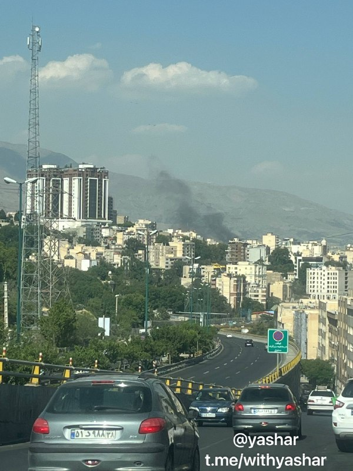

ستون دود همین الان تهران محدوده ولنجک
@withyashar

## WithYashar — post 14115

🚨شبکه 14 اسرائیل
«کابینه اسرائیل تصمیم گرفته است در پاسخ موشک‌ها یا پهپادهای حزب‌الله که شمال اسرائیل را هدف قرار دهند حمله متقابل به بیروت را در دستور کار قرار دهد.»
@withyashar

## WithYashar — post 14114

کانال ۱۲ عبری، به نقل از یک منبع امنیتی:
ما وارد مرحله «دورهای مکرر» با ایران شده‌ایم. ارزیابی‌ها حاکی از آن است که تشدید اخیر، رویارویی نهایی با ایران نیست
@withyashar

## WithYashar — post 14113

  <a href="telegram/content/WithYashar_14113_1781008914.mp4" target="_blank">🎬 Download video</a>

حمله سنگین اسرائیل به جنوب لبنان شهر صور
@withyashar

## WithYashar — post 14112

به گزارش اکونومیست، ایران و اسرائیل که برای دهه‌ها درگیر جنگی پنهان با تابوی حملات مستقیم بودند، اکنون آماده‌اند تا با شکستن این مرزها، خطر یک درگیری تمام‌عیار را به جان بخرند؛ وضعیتی که دونالد ترامپ را در برابر یک دوراهی دشوار قرار داده است.
@withyashar

## WithYashar — post 14111

ادعای ترامپ درباره ایران:

اگر برویم و بمباران کنیم، که اگر بخواهیم خیلی آسان می‌توانیم این کار را انجام دهیم.

اما تنگه برای ماه‌ها باز نخواهد بود. اگر بمباران کنیم، می‌دانید، افراد زیادی کشته خواهند شد. چه کسی می‌خواهد این کار را بکند؟ من نمی‌خواهم.
@withyashar

## WithYashar — post 14110

## WithYashar — post 14109

رسانه‌های ایران می‌گویند دو تن از اعضای «نیروی پدافند هوایی ارتش» در حمله دیروز اسرائیل کشته شدند و امروز تشییع می‌شوند.
تاکنون در حملات دوشنبه و سه‌شنبه اسرائیل کشته‌ای گزارش نشده بود و ۱۵ زخمی اعلام شده بود.
@withyashar

## mwarmonitor — post 10517

🔴 حزب‌الله اعلام کرد دولت لبنان باید «روابط خود با ایران را اصلاح کند».

🔴 حزب‌الله همچنین تأکید کرد اتهام‌زنی‌های دولت علیه ایران «برخلاف منافع لبنان» است. «العربیه»

@mwarmonitor

## mwarmonitor — post 10516

🔴نجات موفقیت‌آمیز خدمه ارتش آمریکا پس از سقوط بالگرد در دریا 🔸فرماندهی مرکزی ایالات متحده (سنتکام) 🔰تامپا، فلوریدا — در ساعت ۷:۳۳ بعد از ظهر (به وقت منطقه زمانی شرقی) در تاریخ ۸ ژوئن، دو تن از خدمه یک بالگرد آپاچی (AH-64) ارتش آمریکا، پس از سقوط بالگردشان…

## mwarmonitor — post 10515

🔴 یک منبع پاکستانی به شبکه العربیه گفته است که اسلام‌آباد در حال رایزنی با همه طرف‌ها برای دستیابی به توافقی جهت پایان دادن به جنگ ایران و آمریکا در همین هفته است.

@mwarmonitor

## mwarmonitor — post 10514

📌حمله هدفمند اسرائیل به یک خودرو در جاده المصیلح در جنوب لبنان @mwarmonitor

## mwarmonitor — post 10513

🔴به گزارش شبکه ۱۴، کابینه امنیتی اسرائیل دیشب تصمیم گرفت که هرگونه شلیک از لبنان که وارد خاک اسرائیل شود، بدون نیاز به مجوز سیاسی ویژه، با حمله به بیروت پاسخ داده خواهد شد.

@mwarmonitor

## mwarmonitor — post 10512

  <a href="telegram/content/mwarmonitor_10512_1781008916.mp4" target="_blank">🎬 Download video</a>

📝 این جماعت پوست‌کلفت که می‌بینید و هر روز هم در حال افزایش تعداد هستند، هیچ ربطی به ورزش و سلامتی ندارند و فعالیتشان صرفاً نوعی «دور دورِ مدرن» است. در روزگاری که وضعیت اقتصادی و سیاسی جامعه در حال متلاشی شدن است، ساعت این ایونت‌ها به صورت ۲۴ ساعته برقرار است و این آدم‌ها طوری رفتار می‌کنند که انگار نه انگار اتفاقی افتاده است. جالب اینجاست که برای این کار حتی نیاز به ماشین‌های آنچنانی هم ندارید؛ یک ست فیک برند Alo می‌تواند کارتان را راه بیندازد و شما را وارد جمع کند. همان‌طور که دیده می‌شود، این تجمعات شبانه چنان صفی از بی‌خیالی ساخته‌اند که در حال حاضر مجموعه ورزشی انقلاب از پیاده‌روهای چهارراه ولیعصر هم شلوغ‌تر شده است؛ یک طنز سیاه تمام‌عیار از مردمی که با شمارش معکوس مربی، از روی ویرانه‌های واقعیتِ جامعه عمیق‌تر اسکات می‌زنند.

@mwarmonitor

## mwarmonitor — post 10511

📌کرملین: میانجی‌گری آمریکا درباره اوکراین در حال حاضر متوقف شده است.

@mwarmonitor

## mwarmonitor — post 10510

  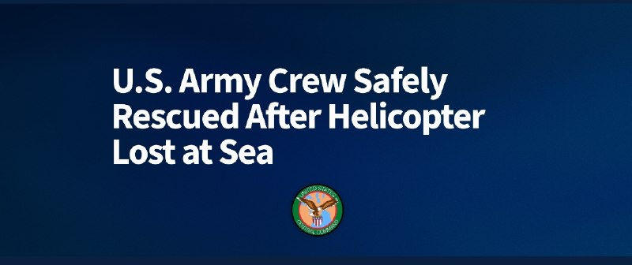

🔴نجات موفقیت‌آمیز خدمه ارتش آمریکا پس از سقوط بالگرد در دریا

🔸فرماندهی مرکزی ایالات متحده (سنتکام)

🔰تامپا، فلوریدا — در ساعت ۷:۳۳ بعد از ظهر (به وقت منطقه زمانی شرقی) در تاریخ ۸ ژوئن، دو تن از خدمه یک بالگرد آپاچی (AH-64) ارتش آمریکا، پس از سقوط بالگردشان در نزدیکی سواحل عمان در حین گشت‌زنی در آب‌های منطقه، توسط نیروهای آمریکایی نجات یافتند.

🔸این سربازان در مدت زمان تقریبی دو ساعت به سلامت نجات یافتند و وضعیت جسمانی آن‌ها پایدار گزارش شده است. علت بروز این حادثه در دست بررسی است.

🔸عملیات نجات توسط نیروهای دریایی فرماندهی مرکزی آمریکا و لشکر ۸۲ هوابرد، و با پشتیبانی واحدهای نیروی هوایی و دریایی ایالات متحده، از جمله «گروه ضربت ۵۹» ناوگان پنجم نیروی دریایی آمریکا هدایت شد.

@mwarmonitor

## mwarmonitor — post 10509

  <a href="telegram/content/mwarmonitor_10509_1781008919.mp4" target="_blank">🎬 Download video</a>

🔴رسانه‌های لبنانی از حملات اسرائیل به شهر ساحلی صور خبر می‌دهند؛ این پس از آن است که ارتش اسرائیل برای کل شهر و حومه آن هشدار تخلیه صادر کرده بود.

@mwarmonitor

## FoxNewsTwitter — post 342752

  <a href="telegram/content/FoxNewsTwitter_342752_1781008921.mp4" target="_blank">🎬 Download video</a>

Fox News (Twitter/X)

President Donald Trump reacts to the packed New York crowd's response during his appearance at the Knicks game last night, describing the atmosphere inside Madison Square Garden as highly energetic.

"I thought it was amazing, actually, even when they had the camera on me. I thought that it was very good... I think, mostly cheers. It was loud and it was enthusiastic."

## FoxNewsTwitter — post 342751

  <a href="telegram/content/FoxNewsTwitter_342751_1781008923.mp4" target="_blank">🎬 Download video</a>

Fox News (Twitter/X)

NEW: President Trump is still pushing for a deal with Iran even as Israel continues launching strikes.

Trump says he expects to know where negotiations stand “in a matter of days,” while his team works to cool tensions before the conflict escalates further.

VP Vance says the Iranians are "putting some real things on the table" and don’t want war either, calling it a “home-run win for the American people” if the U.S. can get a deal across the finish line.

@aishahhasnie has the latest. | @foxandfriends @kilmeade

Stop scrolling for updates and turn on live alerts. Get FOX One and get the facts.

https://www.fox.com/stream/fox-news?cmpid=org=fn::ag=owned_other::mc=organicsocial%5B%E2%80%A6%5DWITTER::cmp=100_o2_th4::cont=m2_tp1::add=03_17_00_05_13_00_02_A

## FoxNewsTwitter — post 342750

  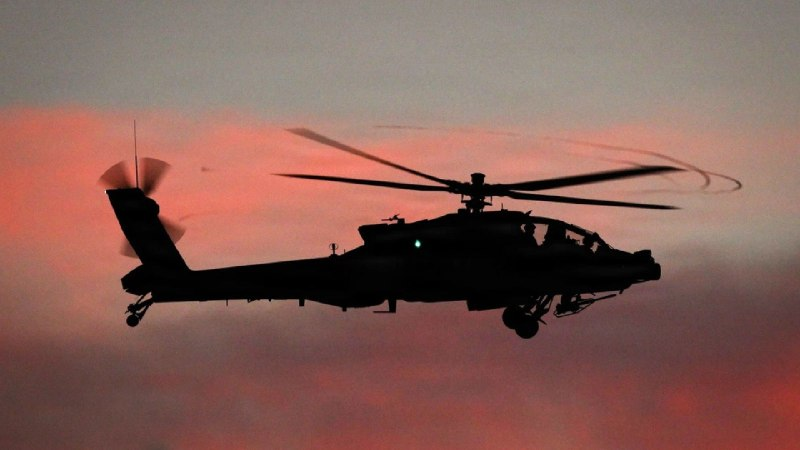

Fox News (Twitter/X)

NEW: Two U.S. soldiers are safe after a dramatic rescue operation off the coast of Oman.

CENTCOM says the crew members were recovered roughly two hours after their AH-64 Apache helicopter went down while patrolling regional waters.

American military forces, including U.S. Naval Forces Central Command, the 82nd Airborne Division, and U.S. 5th Fleet assets, helped bring both soldiers to safety.

## FoxNewsTwitter — post 342749

  

Fox News (Twitter/X)

WATCH: Despite heightened security around President Trump's appearance at Madison Square Garden, violent brawls still erupted across Manhattan following the Knicks game.

Video shows multiple fights breaking out in the streets, including near Bryant Park's watch party, as crowds spilled into the city just blocks away from MSG.

## pm_afshaa — post 92998

  <a href="telegram/content/pm_afshaa_92998_1781008927.webm" target="_blank">🎬 Download video</a>

🔴ترامپ:
اگر بریم و بمباران کنیم که اگر بخوایم خیلی آسون میتونیم این کار رو انجام بدیم.

اما تنگه برای ماه‌ها باز نخواهد بود. اگر بمباران کنیم، افراد زیادی کشته خواهند شد. چه کسی میخواد این کار رو بکنه؟ من نمیخوام.

💧 Rainbet.com the #1 Non-KYC Crypto Casino & Sportsbook @rainbetcom

😁 @Pm_Afshaa

## pm_afshaa — post 92997

  <a href="telegram/content/pm_afshaa_92997_1781008927.webm" target="_blank">🎬 Download video</a>

🔴دونالد ترامپ: تنگه هرمز بلافاصله بعد از امضای توافق باز خواهد شد، که ممکنه در دو یا سه روز آینده باشه.

💧 Rainbet.com the #1 Non-KYC Crypto Casino & Sportsbook @rainbetcom

😁 @Pm_Afshaa

## pm_afshaa — post 92996

  <a href="telegram/content/pm_afshaa_92996_1781008928.mp4" target="_blank">🎬 Download video</a>

🔴شلیک مستقیم نیروهای طالبان به مردم معترض در شهر هرات :

+ طالبان میگه که اینا مردم نیستن و نیروهای تروریستی هستن.

💧 Rainbet.com the #1 Non-KYC Crypto Casino & Sportsbook @rainbetcom

😁 @Pm_Afshaa

## pm_afshaa — post 92995

نسخه کامل سخنرانی در نشست امنیتی دریای سیاه (با زیرنویس فارسی)

اودسا - اوکراین
شنبه ۹ خرداد ۲۵۸۵/۱۴۰۵

@OfficialRezaPahlavi

## pm_afshaa — post 92994

  <a href="telegram/content/pm_afshaa_92994_1781008930.webm" target="_blank">🎬 Download video</a>

🔴خبرگزاری سی‌ان‌ان: از شروع جنگ تا الان ترامپ به طور دقیق 37 بار گفته توافق با ایران نزدیکه، ولی هنوز توافق نشده.

💧 Rainbet.com the #1 Non-KYC Crypto Casino & Sportsbook @rainbetcom

😁 @Pm_Afshaa

## pm_afshaa — post 92993

  <a href="telegram/content/pm_afshaa_92993_1781008931.webm" target="_blank">🎬 Download video</a>

🔴مهاجرانی، سخنگوی دولت:
میزان قطعی‌ برق در روزهای گرم پیش‌رو به میزان همراهی مردم عزیز بستگی داره.

💧 Rainbet.com the #1 Non-KYC Crypto Casino & Sportsbook @rainbetcom

😁 @Pm_Afshaa

## pm_afshaa — post 92992

  <a href="telegram/content/pm_afshaa_92992_1781008932.webm" target="_blank">🎬 Download video</a>

🔴اسرائیل هیوم:
حمله اسرائیل به ایران با حمایت روبیو و چراغ سبز ترامپ انجام شد.

💧 Rainbet.com the #1 Non-KYC Crypto Casino & Sportsbook @rainbetcom

😁 @Pm_Afshaa

## pm_afshaa — post 92991

  <a href="telegram/content/pm_afshaa_92991_1781008932.webm" target="_blank">🎬 Download video</a>

🔴نیویورک‌تایمز: یک بالگرد تهاجمی آپاچی ارتش آمریکا در نزدیکی تنگه هرمز سقوط کرد.

علت حادثه هنوز مشخص نیست و در حال بررسیه؛ از جمله اینکه آیا بالگرد هدف قرار گرفته، دچار نقص فنی شده یا با مشکل دیگری مواجه بوده. خدمه بالگرد نجات پیدا کردن.

💧 Rainbet.com the #1 Non-KYC Crypto Casino & Sportsbook @rainbetcom

😁 @Pm_Afshaa

## pm_afshaa — post 92990

🔴شبکه 13 اسرائیل:
شورای وزارتی کوچیک تصمیم گرفته هر موشکی از لبنان سمت اسرائیل شلیک بشه، جوابش با حمله به بیروت داده بشه

💧 Rainbet.com the #1 Non-KYC Crypto Casino & Sportsbook @rainbetcom

😁 @Pm_Afshaa

## pm_afshaa — post 92989

فرمانده ارتش جمهوری اسلامی: ما هشدار می‌دهیم که اسرائیل باید فوراً تجاوز به جنوب لبنان را متوقف کند

💧 Rainbet.com the #1 Non-KYC Crypto Casino & Sportsbook @rainbetcom

😁 @Pm_Afshaa

## pm_afshaa — post 92988

  <a href="telegram/content/pm_afshaa_92988_1781008933.webm" target="_blank">🎬 Download video</a>

🔴تسنیم: در حملات بامداد دوشنبه اسرائیل به اهدافی در ایران، بهمن حسینی و علیرضا عبیری، دو تن از پرسنل پدافند هوایی ارتش جمهوری اسلامی، کشته شدن.

💧 Rainbet.com the #1 Non-KYC Crypto Casino & Sportsbook @rainbetcom

😁 @Pm_Afshaa

## DEJradio — post 5505

⭕️ علت سقوط بالگرد آپاچی در خلیج فارس هنوز روشن نیست

سنتکام گزارش داد علت سقوط بالگرد آپاچی آمریکا که روز سه‌شنبه در نزدیکی سواحل عمان رخ داد، هنوز روشن نیست.
ستاد فرماندهی مرکزی ارتش آمریکا اعلام کرد دو سرنشین این بالگرد که هنگام گشت‌زنی سقوط کرد، نجات یافته‌اند و وضعیت جسمانی آن‌ها پایدار است.
پیش‌تر گزارش‌هایی از احتمال هدف گرفته شدن این بالگرد منتشر شده بود. سنتکام عصر سه‌شنبه گفت علت سانحه همچنان در دست بررسی است.

#خبر #دژ #سقوط
@DEJradio

## DEJradio — post 5504

⭕️ پنجمین کشتی حامل ال‌ان‌جی قطر در پی عبور از تنگۀ هرمز راهی چین شد

در پی اعلام عبور پنجمین کشتی قطری حامل ال‌ان‌جی از تنگۀ هرمز، خبرگزاری رویترز آن را نشانۀ بازگشت محتاطانۀ صادرات انرژی عنوان کرد.
از آغاز جنگ چهل روزه تاکنون ۹ فروند شناور محمولۀ گاز طبیعی مایع، از تنگۀ هرمز عبور کرده‌اند.
رویترز نوشت با این که چنین تحولی نشانۀ بازگشت تدریجی صادرات انرژی از خلیج فارس است، اما ترافیک دریایی همچنان بسیار پایین‌تر از سطح پیش از جنگ قرار دارد.

#خبر #دژ #تنگه_هرمز
@DEJradio

## DEJradio — post 5503

⭕️ حملۀ اسرائیل به جمهوری اسلامی با هماهنگی کامل واشینگتن انجام شد

گزارش روزنامه اسرائیل هیوم، خبر اختصاصی دژ در مورد پشتیبانی آمریکا از حملۀ روز دوشنبۀ اسرائیل به جمهوری اسلامی را تأیید می‌کند.
روزنامۀ اسرائیل هیوم گزارش داد حملۀ روز دوشنبۀ اسرائیل به مواضع جمهوری اسلامی، در پی گفت‌وگوی مستقیم بنیامین نتانیاهو و دونالد ترامپ و با پشتیبانی مارکو روبیو انجام شد.
یک منبع اختصاصی روز دوشنبه به دژ گفته بود که حملۀ اسرائیل به جمهوری اسلامی پیشاپیش با مقامات آمریکا در میان گذاشته شده است.
بر اساس گزارش اسرائیل هیوم نیز، آمریکا از چارچوب عملیات و اهداف تعیین‌شده آگاهی داشت و آن حمله در پی هماهنگی سیاسی و نظامی اورشلیم و واشینگتن انجام شد.

#خبر #دژ #جنگ #اسرائیل
@DEJradio

## DEJradio — post 5502

  <a href="telegram/content/DEJradio_5502_1781008934.webm" target="_blank">🎬 Download video</a>

🔺📢 "اسرائیل که حمله کرد گفتن پادگان رو تخلیه کنید، مثل بدبخت‌ها فرار کردیم تو کوه و بیابون که موشک تو سرمون نخوره، این زندگی اگر نکبت نیست چیه؟

پیام دریافتی

#نکبت #جنگ #سربازی
@DEJradio

## DEJradio — post 5501

⭕️ای‌بی‌سی: دولت ترامپ از اسرائیل خواست دامنۀ عملیات را در لبنان کاهش دهد

شبکۀ ای‌بی‌سی نیوز ادعا کرد کاخ سفید از اسرائیل خواسته برای حفظ روند مذاکره با جمهوری اسلامی، عملیات نظامی را در لبنان محدود کند.
به گفتۀ منابع آمریکایی، ترامپ در تماس با نتانیاهو خواستار جلوگیری از تشدید درگیری‌ها شده است.
به گفتۀ سفیر اسرائیل در آمریکا، لبنان به گروگان جمهوری اسلامی تبدیل شده است.
لایتر، سفیر اسرائیل در آمریکا گفت جمهوری اسلامی تلاش می‌کند پروندۀ لبنان را به مذاکرات خود با آمریکا گره بزند.
او با تأکید بر این که حملات اسرائیل علیه حزب‌الله ارتباطی به مذاکرات هسته‌ای ندارد، افزود لبنان در صورت ادامۀ وابستگی به جمهوری اسلامی آینده‌ای روشن پیش رو ندارد.

#خبر #دژ #توافق #اسرائیل
@DEJradio

## DEJradio — post 5500

⭕️ ترامپ در دو هفتۀ آینده پیروزی کامل بر جمهوری اسلامی را اعلام می‌کند

دونالد ترامپ گفت جمهوری اسلامی آمادۀ پذیرش یک توافق گسترده است و از دستیابی به سلاح هسته‌ای صرف‌نظر می‌کند.
رئیس جمهوری آمریکا افزود طی دو هفتۀ آینده پیروزی کامل ا ایالات متحده علام می‌شود و در پی آن بهای نفت به شکلی محسوس کاهش می‌یابد.
ترامپ تأکید کرد محاصرۀ دریایی جمهوری اسلامی تا دستیابی به توافق نهایی پایدار می‌ماند.

#خبر #دژ #توافق
@DEJradio

## DEJradio — post 5499

⭕️ ادعای قالیباف: آمریکا و اسرائیل نه به آتش‌بس پایبندند و نه به گفت‌وگو باور دارند

محمدباقر قالیباف مدعی شد هدف جمهوری اسلامی پایان جنگ و ایجاد امنیت پایدار است، نه عادی‌سازی روابط با آمریکا.
رئیس مجلس جمهوری اسلامی گفت سخنان دونالد ترامپ دربارۀ یادداشت تفاهم، نشان داده واشینگتن به توافق‌های انجام‌شده پایبند نیست و حرف خود را عوض می‌کند.
او ادعا کرد نقض آتش‌بس و ادامۀ محاصرۀ دریایی، علت تنش‌های اخیر بوده است.
اظهارات تازۀ قالیباف در پی تبادل دوبارۀ آتش میان جمهوری اسلامی و اسرائیل مطرح شده است.

#خبر #دژ #توافق
@DEJradio

## DEJradio — post 5498

⭕️ جی‌دی ونس، هر توافقی با تهران مورد راستی‌آزمایی قرار می‌گیرد

جی‌دی ونس، معاون رئیس جمهوری آمریکا گفت هر توافق احتمالی با تهران، در ادامه توسط سازوکارهای مرتبط مورد راستی‌آزمایی قرار می‌گیرد.
ونس گفت واشینگتن و اسرائیل منافع مشترک زیادی دارند، اما در شماری از موارد اهداف دو کشور با یکدیگر متفاوت است.
او تأکید کرد هدف اصلی آمریکا جلوگیری از دستیابی جمهوری اسلامی به سلاح هسته‌ای است.
ونس همچنین گفت جمهوری اسلامی تمایلی به ادامۀ جنگ ندارد و آمریکا نیز همۀ تعهدات احتمالی تهران را بررسی می‌کند.

#خبر #دژ #توافق
@DEJradio

## DEJradio — post 5497

⭕️ یسرائیل کاتز خواستار افزایش بودجۀ جنگی شد

یسرائیل کاتز، وزیر دفاع اسرائیل خواستار افزایش فوری بودجۀ نظامی و ذخایر مهمات شد.
کاتز در نشست کابینۀ اسرائیل گفت وزارت دارایی باید منابع بیشتری در اختیار ارتش قرار دهد تا برای ادامۀ عملیات در لبنان و مقابله با تهدیدهای جمهوری اسلامی آمادگی کامل وجود داشته باشد.

#خبر #دژ #اسرائیل
@DEJradio

## DEJradio — post 5496

  <a href="telegram/content/DEJradio_5496_1781008935.mp4" target="_blank">🎬 Download video</a>

🔺📢 خان پایانی به دست مردم رقم می‌خورد

*پژمان گلچین، پژوهشگر فلسفه

#هفت_خان #جنگ #انقلاب_ملی
@DEJradio

## DEJradio — post 5495

⭕️ ارتش اسرائیل برای شهر صور لبنان هشدار تخلیه صادر کرد

ارتش اسرائیل روز سه‌شنبه برای بخش‌هایی از شهر صور در جنوب لبنان، از جمله مناطق مسیحی‌نشین آن، هشدار تخلیه صادر کرد.
ارتش اسرائیل اعلام کرد نیروهای حزب‌الله در این مناطق فعالیت دارند و ادامۀ حضور غیرنظامیان می‌تواند آنها را در معرض خطر قرار دهد.
حزب‌الله که در سیاهۀ تروریستی آمریکا قرار دارد حاضر به خلع سلاح نیست و نیروهای خود را در مناطق مسکونی غیرشیعی نیز، پنهان می‌کند.
این نخستین بار است که بخش‌های مسیحی‌نشین صور نیز مشمول هشدارهای تخلیه می‌شود.

#خبر #دژ #اسرائیل
@DEJradio

## DEJradio — post 5494

⭕️ وزیر ارتباطات: ارتباط جزایر ایرانی خلیج فارس با کشور سه بار قطع شد

ستار هاشمی، وزیر ارتباطات دولت جمهوری اسلامی گفت در جریان جنگ چهل روزه، ارتباط با جزایر ایرانی خلیج فارس سه بار قطع شده بود.
او افزود بیش از ۵۰۰ سایت ارتباطی و بیش از ۱۰۰ مرکز مخابراتی و ارتباطی طی جنگ هدف قرار گرفت.
#خبر #دژ #جنگ
@DEJradio

## DEJradio — post 5493

⭕️ دادستان پروندۀ نتانیاهو در لاهه، خود به اتهام سوءرفتار جنسی علیه یک زن تعلیق شد

کریم خان، دادستان ارشد دیوان کیفری بین‌المللی لاهه، پس از پیشرفت تحقیقات دربارۀ اتهام سوءرفتار جنسی او علیه یک زن، از مقام خود تعلیق شد.
کمیتۀ اجرایی دیوان لاهه اعلام کرد پروندۀ این دادستان شناخته‌شدۀ بین‌المللی برای تصمیم‌گیری نهایی به کشورهای عضو، ارجاع شده و احتمال برکناری‌ دائمی او وجود دارد.
اتهام‌ سوءرفتار جنسی از سوی زنی مطرح شده که در مقر دیوان بین‌المللی در شهر لاهه برای این قاضی بریتانیایی، کار می‌کرد.
کمیتهٔ متشکل از نمایندگان کشورهای عضو دیوان لاهه، با اکثریت آرا به این نتیجه رسید که این مقام ارشد دادگاه لاهه، در موضوع سوءرفتار جنسی مرتکب تخلف جدی شده است.
کریم خان پیش‌تر در دوران کاری خود درخواست صدور حکم بازداشت بنیامین نتانیاهو و یوآو گالانت وزیر وقت دفاع اسرائیل را در دادگاه بین‌المللی لاهه ارائه کرده بود.

#خبر #دژ #دادگاه_لاهه
@DEJradio

## DEJradio — post 5492

  <a href="telegram/content/DEJradio_5492_1781008937.webm" target="_blank">🎬 Download video</a>

🔺📢 بر اساس تازه‌ترین اطلاعات، در یک عملیات پیچیده ساعاتی پیش از واکنش اسرائیل به موشک‌پرانی‌های سـ.ـپاه پاسداران، از بامداد دوشنبه ۱۸ خرداد شبکه مخابراتی و ارتباطات فرماندهی نیروهای مسلح جمهوری اسلامی هدف جنگ الکترونیک قرار گرفت و بخش زیادی از آن مختل شد.

یک منبع امنیتی به دژ می‌گوید: «قبل از آنکه حمله اسرائیل آغاز شود، شبکه مخابرات و ارتباطات سلسله مراتب فرماندهی هدف حملات سایبری و جمینگ قرار گرفت و بخشی از ارتباط فرماندهی با یگان‌ها مختل شد.»

هرچند نیروهای مسلح جمهوری اسلامی در وضعیت آماده‌باش بودند اما تا اصابت اولین موشک‌ها و حتی پس از آن شبکه ارتباطات فرماندهی مختل بود و دستورالعمل‌های عملیاتی مخابره نشد.

شدت اخلال تا حدی بود که فرماندهان نتوانستند دستورالعمل‌هایی لازم برای انتقال از نقطه‌ای به نقطه دیگر را دریافت کنند.

در «جنگ الکترونیک» (جنگال) از ترکیبی از روش‌های فنی شامل جمینگ (اخلال الکترونیکی)، قطع مسیرهای ارتباطی اعم از لینک‌های مبتنی بر فیبر نوری و شبکه‌های رادیویی، حمله سایبری و الکترونیکی به سرورهای ارتباطی و سامانه‌های اتوماسیون اداری و مراکز مخابراتی برای مختل کردن سیستم‌های تلفن داخلی و سایر بسترهای ارتباطی استفاده می‌شود. هرچند نیروهای مسلح جمهوری اسلامی نیز از همین شیوه‌ها بهره می‌برد اما کشورهای پیشرفته از تجهیزات و فناوری‌های نوین برخوردارند.

#IRGCterrorists #جنگ #اسرائیل
@DEJradio

## DEJradio — post 5491

  <a href="telegram/content/DEJradio_5491_1781008938.mp4" target="_blank">🎬 Download video</a>

🚨🎥 لحظه اصابت موشک به نفتکش هندی؛
نجات خدمه نفتکش هندی در دریای عمان

دولت هند اعلام کرد ۲۴ خدمه نفتکش «ماریوکس» که توسط آمریکا در دریای عمان هدف قرار گرفته بود با هماهنگی گارد ساحلی عمان نجات یافتند.

فرماندهی مرکزی ارتش آمریکا (سنتکام) روز دوشنبه ۱۸ خردادماه اعلام کرد یک نفتکش خالی را که به سوی آب‌های ساحلی ایران در حرکت بود، پس از چند هشدار، هدف قرار داد.
به گفته سنتکام یک جنگنده اف-۱۸ از ناو هواپیمابر آبراهام لینکلن پس از آنکه خدمه از دستورالعمل‌های نیروهای آمریکایی پیروی نکردند، یک پرتابه را با دقت به بخش ناوبری و مهندسی این نفتکش شلیک کرد.

#دریای_عمان #جنگ #محاصره_دریایی
@DEJradio

## IranIntlTV — post 341329

  <a href="telegram/content/IranIntlTV_341329_1781008940.mp4" target="_blank">🎬 Download video</a>

یک شهروند کاسب با ارسال پیامی به ایران اینترنشنال از تجمعات حکومتی و اختلال در کسب و کار خود گلایه می‌کند. پیام او با هوش مصنوعی خوانده شده است.

## IranIntlTV — post 341328

  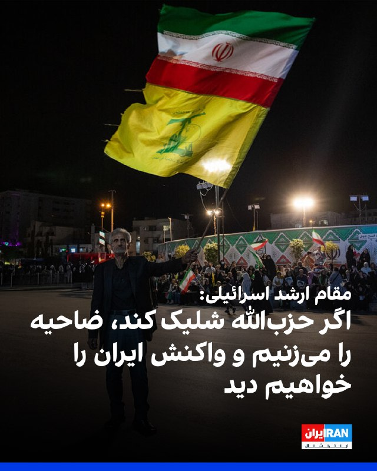

یک مقام ارشد کابینه امنیتی اسرائیل به وب‌سایت خبری وای‌نت گفت که این کشور به ارتش دستور داده «معادله‌ای را که در قبال حزب‌الله تعیین کرده حفظ کند.» او افزود: «هر زمان آتشی به سمت جوامع ما شلیک شود، ما ضاحیه را هدف قرار خواهیم داد و سپس خواهیم دید در ایران چه اتفاقی می‌افتد.»

به نوشته وای‌نت، با وجود تهدیدهای جمهوری اسلامی، مقام‌های ارشد کابینه امنیتی اسرائیل در نشست تاکید کردند سیاست پاسخ این کشور در لبنان تغییر نخواهد کرد و هرگونه شلیک حزب‌الله به سوی شهرهای شمال اسرائیل با حمله به منطقه ضاحیه در بیروت پاسخ داده می‌شود.

اعضای این کابینه گفتند هرگونه شلیک با هدف عبور از مرز به داخل اسرائیل به حمله ارتش اسرائیل به ضاحیه منجر خواهد شد، حتی اگر تهران نسبت به چنین اقدامی هشدار داده باشد.
https://iranintl.com/202606097983

## IranIntlTV — post 341327

  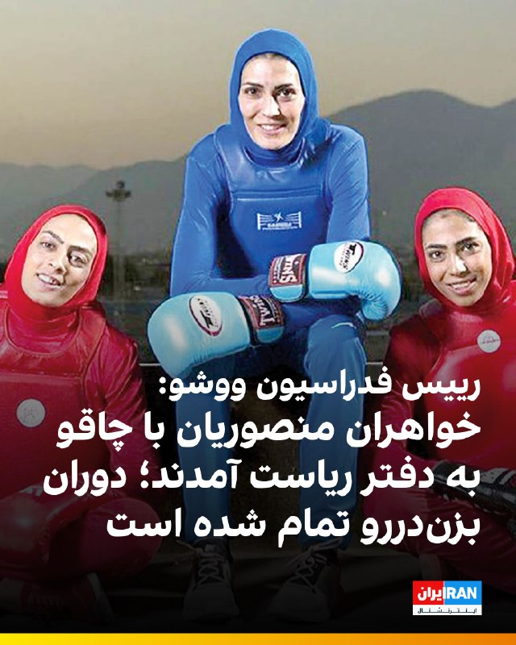

🔻امیر صدیقی، رییس فدراسیون ووشو، روایت خود را از حواشی مسابقات انتخابی تیم ملی زنان و اتفاقات رخ‌داده در دفتر کارش تشریح کرد.

🔹به گفته او، پس از شکست و حذف سهیلا منصوریان، دو خواهر دیگر او، الهه و شهربانو منصوریان، وارد دفتر ریاست فدراسیون شدند. صدیقی گفت: «الهه و شهربانو منصوریان با هتک حرمت، فریاد، استفاده از الفاظ ناشایست و پس از شکستن دوربین مداربسته و قفل در اتاق ریاست، وارد اتاق من شدند و به من حمله فیزیکی کردند. این دو خواهر با هتک حرمت به تصاویر کشته‌شدگان جنگ ایران و عراق، قاب عکس روح‌الله خمینی و قاب وان‌یکاد، پس از حمله فیزیکی، چاقویی را که به گفته من از قبل همراه خود داشتند، در دست گرفتند. آن‌ها پس از آنکه موفق نشدند سناریوی خود را عملی کنند، الهه منصوریان اقدام به خودزنی کرد و شروع به فریاد زدن کرد.»

🔹رییس فدراسیون ووشو با تاکید بر پیگیری قضایی این پرونده افزود: «توهین لفظی و تهدید کارکنان فدراسیون به هیچ وجه قابل اغماض نیست. فدراسیون ووشو موضوع را از طریق مراجع قانونی و قضایی پیگیری خواهد کرد. دیگر دوران بزن‌دررو تمام شده است.»

🔹جزییات بیشتر را در سایت بخوانید

@iranintltvsport

## IranIntlTV — post 341326

  <a href="https://t.me/IranintlTV/341326" target="_blank">📎 Download file</a>

🎧نسخه صوتی اخبار نیم‌روزی | سه‌شنبه ۱۹ خرداد
@iranintlTV

## IranIntlTV — post 341325

سناریویی که در قسمت سوم چرتکه برای تورم ۱۴۰۵ پیش‌بینی کرده بودیم، اکنون به گواه آمار رسمی اردیبهشت تحقق یافته است. تورم ماهانه به ۸.۸ درصد رسید؛ بالاترین نرخی که ایرانیان تجربه کرده‌اند. اگر این مسیر ادامه یابد، تا پایان سال قیمت کالاهای اساسی نزدیک به سه برابر و تورم سالانه سه‌رقمی خواهد شد.

نسخه کامل «چرتکه» در یوتیوب ایران‌اینترنشنال:

https://youtu.be/xrdOJfvnPuI

@iranintltv

## IranIntlTV — post 341324

  <a href="telegram/content/IranIntlTV_341324_1781008945.mp4" target="_blank">🎬 Download video</a>

فدراسیون فوتبال جمهوری اسلامی اعلام کرد سهمیه بلیت‌های اختصاص‌یافته به هواداران تیم فوتبال ایران در جام جهانی لغو شده و امکان تحویل بلیت به خریداران وجود ندارد. این فدراسیون پیش‌تر فروش بلیت دیدارهای ایران مقابل نیوزیلند، بلژیک و مصر را آغاز کرده بود.

جزییات بیشتر با رها پوربخش، عضو تحریریه ایران‌اینترنشنال
@iranintltv

## IranIntlTV — post 341323

  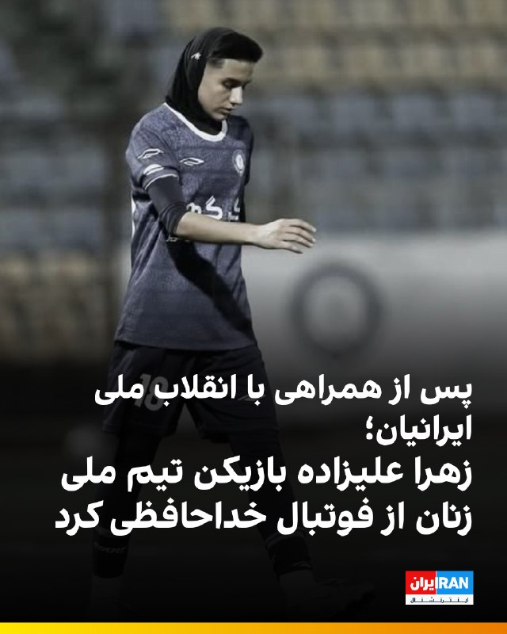

🔻زهرا علیزاده، بازیکن تیم ملی فوتبال زنان ایران و باشگاه گل‌گهر سیرجان، با انتشار پستی در اینستاگرام از دنیای فوتبال خداحافظی کرد و نوشت: «بدرود مستطیل سبز.»

🔹علیزاده پیش‌تر و در جریان انقلاب ملی ایرانیان، با انتشار پیامی در شبکه‌های اجتماعی از تیم ملی فوتبال زنان کناره‌گیری کرده بود. او در آن زمان نوشته بود: «این خداحافظی نه از عشق به تیم ملی، بلکه از سر دلی پر از درد و نگرانی برای مردمی است که شایسته بهترین‌ها هستند. امیدوارم روزی برسد که همه ما به پیروزی دست پیدا کنیم؛ نه فقط در زمین فوتبال، بلکه در زندگی روزمره. تا روزی که ایران دوباره سرزنده و شاداب باشد، من در کنار مردمم خواهم ایستاد.»

🔹پس از انتشار این موضع‌گیری، فدراسیون فوتبال کناره‌گیری او و همچنین کوثر کمالی را تکذیب و آن را شایعه توصیف کرد.

🔹همزمان، ایران‌اینترنشنال به نقل از منابع خود گزارش داده بود که فشار نهادهای امنیتی بر برخی فوتبالیست‌های زن برای خودداری از اظهارنظر درباره اعتراضات افزایش یافته است.

🔹جزییات بیشتر را در سایت بخوانید

@iranintltvsport

## IranIntlTV — post 341322

  <a href="telegram/content/IranIntlTV_341322_1781008947.mp4" target="_blank">🎬 Download video</a>

مروری بر رسانه‌ها و خبرگزاری‌ها در ایران، سه‌شنبه ۱۹ خرداد، با مجتبی هاشمی، روزنامه‌نگار
@iranintltv

## IranIntlTV — post 341321

  <a href="telegram/content/IranIntlTV_341321_1781008950.mp4" target="_blank">🎬 Download video</a>

علی‌حسین قاضی‌زاده، عضو تحریریه ایران‌اینترنشنال، با اشاره به تاکید دونالد ترامپ بر اعلام پیروزی آمریکا بر جمهوری اسلامی ظرف دو هفته آینده گفت مذاکرات تهران و واشینگتن به «پاشنه آشیل» ترامپ تبدیل شده است. به گفته او، رییس‌جمهوری آمریکا برای تقویت موقعیت سیاسی‌اش در آستانه رقابت‌های انتخاباتی آینده، نیاز دارد نتیجه مذاکرات را به‌عنوان یک موفقیت و دستاورد سیاسی برای واشینگتن معرفی کند.
@iranintltv

## IranIntlTV — post 341320

🗣روایت شما از زندگی در دوران پس از انقلاب ملی و جنگ - سه‌شنبه ۱۹ خرداد

🔹همیشه می‌خواستم وقتی ۱۸ سالم شد گواهینامه بگیرم، گواهینامه شده ۱۱ میلیون تومان. جمهوری اسلامی دونه‌دونه آرزوهامون رو به باد داد.

🔹یه جوری همه‌چیز گرونه که اکثرا مردم کمبودهایی مثل کم‌خونی، مشکلات کبد و کلسیم پایین پیدا کردن. پول ویزیت دکترها هم بسیار گرون شده و قشر متوسط رو به پایین توانایی درمان یا خرید داروها رو ندارن.

🔹از دزفول: حتی اونایی که وضع خوبی دارن هم نمی‌تونن خرید کنن. تخم‌مرغ شده ۲۵ هزار تومان. اینجا نون بربری رو قسطی میدن، مثلا ۲۰ تا دونه بربری رو باید ۲ ماه قسط بدیم. ما دیگه چه ذلیل شدیم که نون قسطی بخریم.

🔹من واقعا مرگ رو به زندگی زیر یوغ جمهوری اسلامی ترجیح می‌دم. به‌خاطر گرونی اومدم خونه پدرم نشستم و ماهی ۲۰ میلیون حقوقم رو کامل مصرف داروی خودم و پسرم می‌کنم که بیمار اعصاب و روان هست.

🔹پدربزرگم می‌گفت ۴۰ سال پیش با یک میلیون یک خونه هزار متری در بهترین منطقه اصفهان خریده بود، حالا چی؟ یک قرص خریدم ۷ میلیون تومان.

🔹آبان ۱۴۰۴ یه پژو پارس مدل ۹۶ خریدم، ۸۵۰ میلیون تومان. الان قیمت گذاشتم یک میلیارد و ۵۵۰ میلیون تومان. شدیم میلیاردر فقیر.

🔹از ایرانشهر: من یک بازنشسته هستم و خانواده پرجمعیت دارم. بچه‌هام دانشگاه و مدرسه هستن و حقوق ما کفایت نمی‌کنه.

🔹من چند وقت پیش بیرون بودم و ارزشی‌ها ریخته بودن بیرون. خودم دیدم که دست بچه‌ای که داشت پرچم تکون می‌داد، سه تا تراول ۵۰۰ هزار تومانی گذاشتن، یعنی می‌شه یک میلیون و ۵۰۰ هزار تومان.

## IranIntlTV — post 341319

  <a href="telegram/content/IranIntlTV_341319_1781008952.mp4" target="_blank">🎬 Download video</a>

انتشار گزارش آزار جسمی و روانی دو دختر هفت و ۱۵ ساله، واکنش گسترده کاربران شبکه‌های اجتماعی را در پی داشته و بار دیگر موضوع حمایت از کودکان را در کانون توجه قرار داده است. دادستان عمومی و انقلاب مرکز استان کردستان اعلام کرد راغب رسولی، کارمند دادگستری سنندج، همراه با همسرش در پرونده اتهام کودک‌آزاری بازداشت شده‌اند و صلاحیت او برای سرپرستی فرزندانش سلب شده است.

آیه دریس، عضو تحریریه ایران‌اینترنشنال، گزارش می‌دهد
@iranintltv

## IranIntlTV — post 341318

  <a href="telegram/content/IranIntlTV_341318_1781008955.mp4" target="_blank">🎬 Download video</a>

سرخط خبرهای سه‌شنبه ۱۹ خرداد
@iranintltv

## IranIntlTV — post 341317

  

🔻هفته‌نامه فرانسوی شارلی ابدو در آستانه آغاز جام جهانی ۲۰۲۶ با انتشار کارتونی به تیم ملی فوتبال پرداخت و نوشت: «چهل‌روز دیکتاتوری، آبجو، چیپس، تلویزیون.»

🔹تیم ملی فوتبال در حالی در جام جهانی حضور پیدا کرده که وزارت خارجه آمریکا به ۱۵ عضو از جمله رییس فدراسیون فوتبال، دبیرکل فدراسیون فوتبال، مدیر، مدیررسانه‌ای و آنالیزور تیم ملی ویزا نداده است.

🔹همچنین ویزای صادر شده برای بازیکنان تیم ملی برای حضور در بازی‌ها مرحله گروهی به صورت ساعتی صادر شده و بازیکنان و عوامل تیم بعد از پایان هر بازی باید خاک آمریکا را ترک کنند.

@iranintltvsport

## IranIntlTV — post 341316

  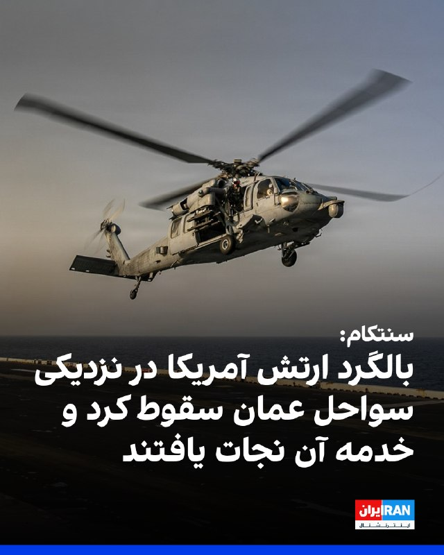

سنتکام، ستاد فرماندهی مرکزی آمریکا، در بیانیه‌ای درباره حادثه برای بالگرد آپاچی «ای‌اچ-۶۴» ارتش آمریکا اعلام کرد این حادثه ساعت ۳:۰۳ بامداد ۱۹ خرداد به وقت ایران، در نزدیکی سواحل عمان هنگام گشت‌زنی در آب‌های منطقه‌ای رخ داده و دو خدمه آن پس از سقوط، توسط نیروهای آمریکایی نجات یافتند.

بر اساس این بیانیه، این دو نظامی حدود دو ساعت بعد به طور ایمن نجات داده شدند و وضعیت آن‌ها پایدار است. سنتکام اعلام کرد علت حادثه در دست بررسی است.

عملیات نجات به رهبری فرماندهی مرکزی نیروهای دریایی آمریکا و لشکر ۸۲ هوابرد انجام شد و یگان‌هایی از نیروی هوایی و نیروی دریایی آمریکا، از جمله گروه عملیاتی ۵۹ ناوگان پنجم، از آن پشتیبانی کردند.
https://iranintl.com/202606096118

## IranIntlTV — post 341315

  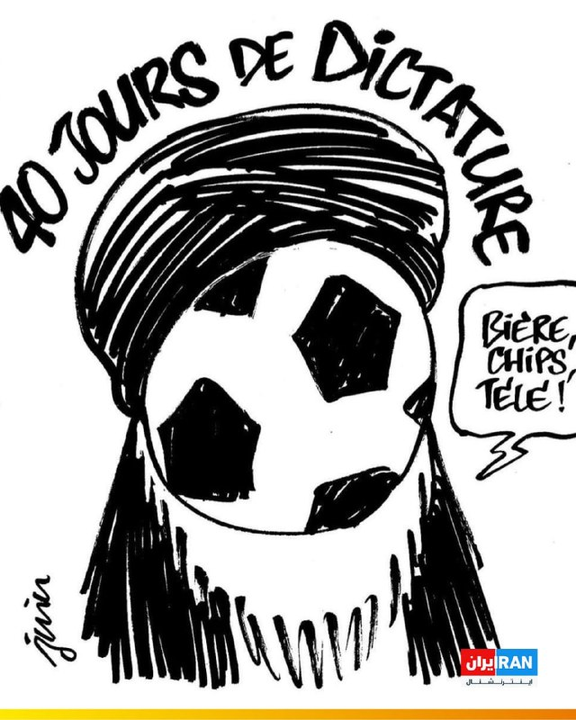

🔻هفته‌نامه فرانسوی شارلی ابدو در آستانه آغاز جام جهانی ۲۰۲۶ با انتشار کارتونی به تیم ملی فوتبال پرداخت و نوشت: «چهل‌روز دیکتاتوری، آبجو، چیپس، تلویزیون.»

🔹تیم ملی فوتبال در حالی در جام جهانی حضور پیدا کرده که وزارت خارجه آمریکا به ۱۵ عضو از جمله رییس فدراسیون فوتبال، دبیرکل فدراسیون فوتبال، مدیر، مدیررسانه‌ای و آنالیزور تیم ملی ویزا نداده است.

🔹همچنین ویزای صادر شده برای بازیکنان تیم ملی برای حضور در بازی‌ها مرحله گروهی به صورت ساعتی صادر شده و بازیکنان و عوامل تیم بعد از پایان هر بازی باید خاک آمریکا را ترک کنند.

@iranintltvsport

## IranIntlTV — post 341314

  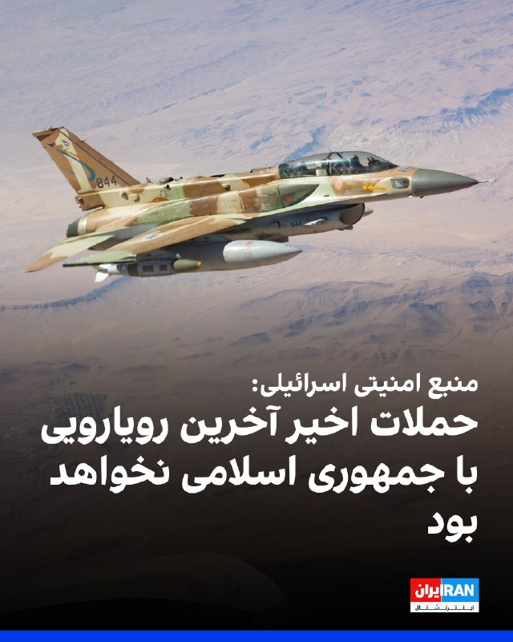

یک منبع امنیتی اسرائیلی به کانال ۱۲ این کشور گفت تبادل آتش اخیر با جمهوری اسلامی آخرین دور درگیری نبوده و احتمال تکرار آن در آینده وجود دارد. این منبع افزود: «وارد دوره‌ای از دورهای درگیری شده‌ایم و در ادامه مسیر بارها با ایران روبه‌رو خواهیم شد.»

او تاکید کرد منظورش وقوع فوری دور بعدی نیست، اما تا زمانی که جمهوری اسلامی به گفته او به دنبال نابودی اسرائیل باشد و در پی دستیابی به سلاح هسته‌ای بماند، این وضعیت ادامه خواهد داشت.

به گفته این مقام، احتمال درگیری‌های بیشتر با جمهوری اسلامی نه مسئله اگر، بلکه مسئله زمان است.
https://iranintl.com/202606091371

## IranIntlTV — post 341313

  <a href="telegram/content/IranIntlTV_341313_1781008960.mp4" target="_blank">🎬 Download video</a>

رضا حاجی‌حسینی، روزنامه‌نگار، با اشاره به ادعای یک کارشناس حکومتی در صداوسیما درباره تعداد سربازان آمریکایی کشته شده در جنگ با جمهوری اسلامی، به ایران‌اینترنشنال گفت آنچه مطرح می‌شود، بیشتر رجزخوانی و تلاش برای ساختن روایت پیروزی از دل شکست‌هاست؛ رویکردی که بارها در پروپاگاندای حکومت دیده‌ایم.
@iranintltv

## IranIntlTV — post 341312

  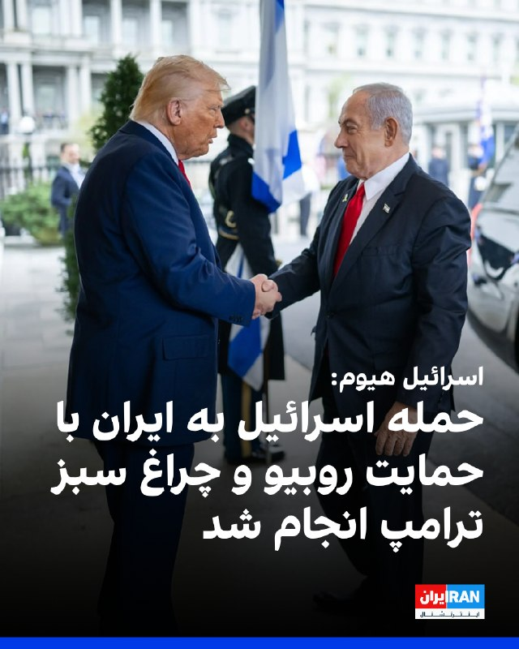

روزنامه اسرائیل هیوم گزارش داد اسرائیل و آمریکا در حملات به ضاحیه در بیروت و همچنین در پاسخ به شلیک موشک‌های جمهوری اسلامی علیه اسرائیل هماهنگ بودند، این هماهنگی دیپلماتیک باعث شد دور دو روزه درگیری پایان یابد.

بر اساس این گزارش، حمله اخیر اسرائیل به ایران پس از تماس تلفنی بنیامین نتانیاهو و دونالد ترامپ و با حمایت مارکو روبیو، وزیر خارجه آمریکا، انجام شده است.

این روزنامه نوشت پس از شلیک موشک از سوی جمهوری اسلامی و بالا گرفتن تنش‌ها، ترامپ مواضعی علنی درباره لزوم خویشتنداری مطرح کرد، اما پس از گفت‌وگوی طولانی با نتانیاهو و برگزاری رایزنی‌های امنیتی در اورشلیم و کاخ سفید، چارچوب حمله اسرائیل با آمریکا هماهنگ شد. روبیو در این گفت‌وگوها از ضرورت پاسخ حمایت کرد.

به نوشته این روزنامه، حمله اسرائیل قدرتمند اما محدود به چند ساعت بود و اهداف آن نیز با اطلاع و موافقت آمریکا تعیین شد. حملات با فرماندهی مرکزی آمریکا هماهنگ شد، اما نیروهای آمریکایی مستقیما در عملیات شرکت نکردند.

در بخش دفاعی نیز اطلاعات مربوط به شلیک‌های جمهوری اسلامی از سوی آمریکا در اختیار اسرائیل قرار گرفت، اما رهگیری‌ها توسط اسرائیل انجام شد.
h

## IranIntlTV — post 341311

  <a href="telegram/content/IranIntlTV_341311_1781008963.mp4" target="_blank">🎬 Download video</a>

🔻هت‌تریک؛ ویژه‌برنامه جام جهانی ۲۰۲۶

🔹همراه با مزدک میرزایی، محمد تقوی و رها پوربخش

🔹زمان پخش: از ۲۰ خرداد تا ۲۹ تیر | ساعت ۱۹:۰۰ به‌وقت تهران

🔹ویژه‌برنامه «هت‌تریک» در طول جام جهانی ۲۰۲۶، به‌صورت زنده از استودیوی لندن همراه شماست. این برنامه با پوشش کامل خبری رقابت‌ها، تحلیل‌های تخصصی، بررسی فنی تیم‌ها و بازیکنان و مرور مهم‌ترین لحظات مسابقات، شما را در جریان بزرگ‌ترین رویداد فوتبالی جهان قرار می‌دهد. همچنین خبرنگاران ایران اینترنشنال از سراسر جهان و کشورهای میزبان، آخرین اخبار و حواشی این تورنمنت بزرگ را گزارش خواهند کرد.⁩

@iranintltvsport

## IranIntlTV — post 341310

  <a href="telegram/content/IranIntlTV_341310_1781008965.mp4" target="_blank">🎬 Download video</a>

تحقیقات مشترک چند رسانه آلمانی نشان می‌دهد روسیه در واکنش به افزایش فشارهای غرب بر ناوگان سایه خود، راهبرد این شبکه انتقال نفت را تغییر داده است.

گفت‌وگو با علی‌ حسن‌پور، خبرنگار ایران‌اینترنشنال
@iranintltv

## Shin_Persian — post 6775

  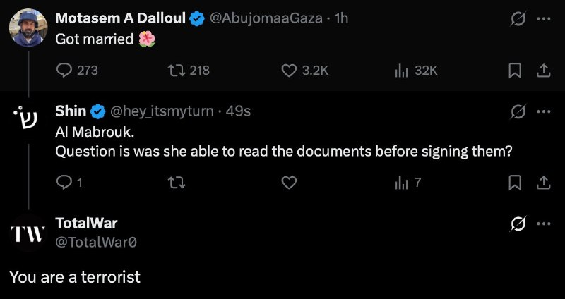

↩️ Quoted tweet: Shin ✓ @hey_itsmyturn Tue, 09 Jun 2026 12:17:55 UTC @AbujomaaGaza Al Mabrouk. Question is was she able to read the documents before signing them? ↩️ توییت نقل‌قول شده — برای پاسخ، پست زیر را ببینید. فارسی @AbujomaaGaza المبروک. سوال این…

## Shin_Persian — post 6774

↩️ Quoted tweet:
Shin ✓ @hey_itsmyturn
Tue, 09 Jun 2026 12:17:55 UTC

@AbujomaaGaza Al Mabrouk.
Question is was she able to read the documents before signing them?

↩️ توییت نقل‌قول شده — برای پاسخ، پست زیر را ببینید.

فارسی

@AbujomaaGaza المبروک.
سوال این است که آیا او توانست پیش از امضای اسناد آن‌ها را مطالعه کند؟

𝕏 · @shin_persian

## Shin_Persian — post 6773

  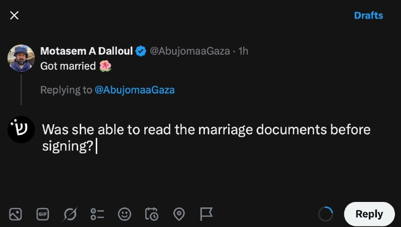

I'm this close to click on "Reply"

## Shin_Persian — post 6772

  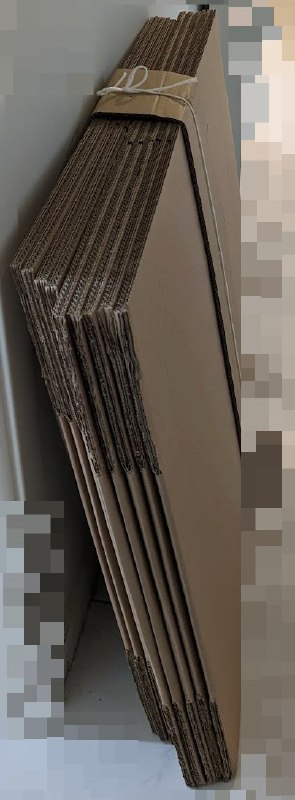

Shin ✓ @hey_itsmyturn
Tue, 09 Jun 2026 11:43:33 UTC

Just bought myself a bunch of high quality pre-supreme-leadership Mojtabas.

فارسی

همین الان برای خودم کلی مجتبی باکیفیتِ پیش-از-رهبری خریدم.

𝕏 · @shin_persian

## Shin_Persian — post 6771

The Associated Press ✓ @AP
Tue, 09 Jun 2026 10:12:35 UTC

BREAKING: Iranian state television says at least two members of an air defense unit were killed in the Israeli attacks on Monday.

The report represented the first time Iran acknowledged fatalities from the strikes. https://apnews.com/article/iran-us-ceasefire-helicopter-hezbollah-israel-9-june-2026-50d7a8ecbb2cf33836af152679adb40e?taid=6a27e712c0a91f000176583d&utm_campaign=TrueAnthem&utm_medium=AP&utm_source=Twitter

فارسی

خبر فوری: تلویزیون دولتی ایران اعلام کرد که در حملات روز دوشنبه اسرائیل، دست‌کم دو تن از اعضای یک واحد پدافند هوایی کشته شدند.

این گزارش اولین باری است که ایران تلفات ناشی از این حملات را تایید می‌کند. https://apnews.com/article/iran-us-ceasefire-helicopter-hezbollah-israel-9-june-2026-50d7a8ecbb2cf33836af152679adb40e?taid=6a27e712c0a91f000176583d&utm_campaign=TrueAnthem&utm_medium=AP&utm_source=Twitter

𝕏 · @shin_persian

## Shin_Persian — post 6770

  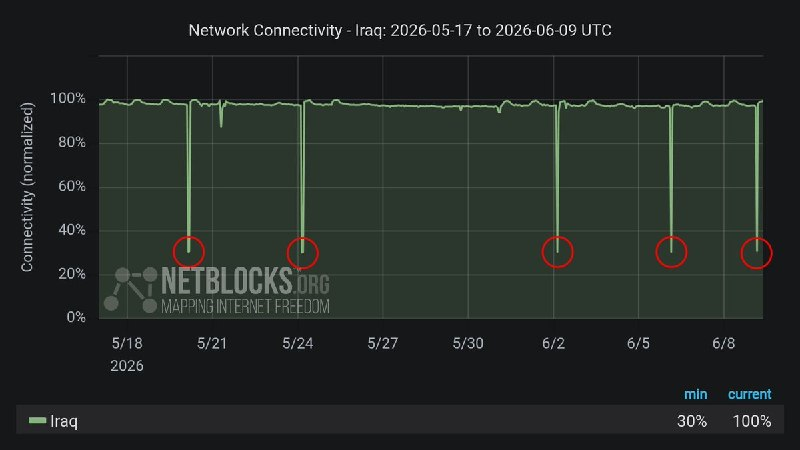

NetBlocks ✓ @netblocks Tue, 09 Jun 2026 10:03:39 UTC 📵 Network data show #Iraq has just imposed another widespread internet shutdown during school exams, leaving most of the country except the north offline for two hours as students take tests. The bizarre…

## Shin_Persian — post 6769

NetBlocks ✓ @netblocks
Tue, 09 Jun 2026 10:03:39 UTC

📵 Network data show #Iraq has just imposed another widespread internet shutdown during school exams, leaving most of the country except the north offline for two hours as students take tests. The bizarre measure is presented as a means to limit cheating and paper leaks.

فارسی

📵 داده‌های شبکه نشان می‌دهند که #عراق همزمان با امتحانات مدارس، بار دیگر قطع گسترده اینترنت را اعمال کرده است که باعث شده بیشتر مناطق کشور به جز شمال برای مدت دو ساعت، در حالی که دانش‌آموزان در حال امتحان دادن هستند، آفلاین شوند. این اقدام عجیب به عنوان راهکاری برای محدود کردن تقلب و لو رفتن سوالات ارائه شده است.

𝕏 · @shin_persian

## FarsiVOA — post 220113

  <a href="telegram/content/FarsiVOA_220113_1781008969.mp4" target="_blank">🎬 Download video</a>

اسرائیل روز سه‌شنبه، ۱۹ خرداد ۱۴۰۵، مواضع حزب‌الله را در شهر تاریخی و بندری صور در جنوب لبنان هدف حمله قرار داد. این حمله پس از آن انجام شد که ارتش اسرائیل برای نخستین‌بار دستور تخلیه تمام شهر صور، از جمله محله مسیحی‌نشین شمال‌غربی آن، را صادر کرد.

## FarsiVOA — post 220112

🔺حمله اسرائیل به مواضع حزب‌الله در شهر صور لبنان؛ منابع لبنانی می‌گویند دست‌کم هشت تن کشته شدند

◾️اسرائیل روز سه‌شنبه، ۱۹ خرداد ۱۴۰۵، مواضع حزب‌الله را در شهر تاریخی و بندری صور در جنوب لبنان هدف حمله قرار داد؛ حمله‌ای که به گفته وزارت بهداشت لبنان دست‌کم هشت کشته بر جای گذاشت.

⬇️ بیشتر بخوانید:

https://ir.voanews.com/a/israel-strikes-hesbollah-lebanon-tyre/8158905.html

## FarsiVOA — post 220111

  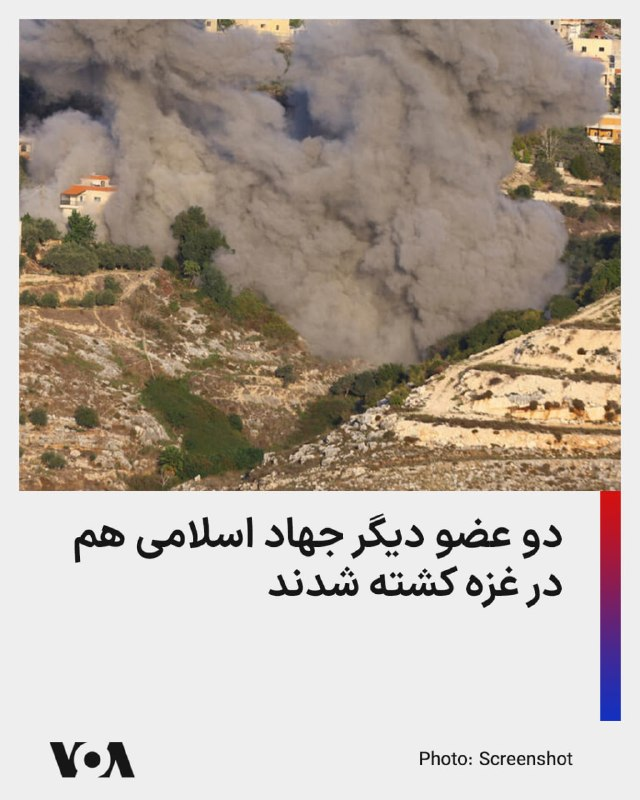

ارتش اسرائیل اعلام کرد در حمله‌ای که دوشنبه در جنوب نوار غزه انجام شد، دو عضو دیگر گروه تروریستی جهاد اسلامی کشته شده‌اند.

به گفته ارتش اسرائیل، این دو نفر «عیاد نوفل» از فرماندهان یگان‌های ویژه جهاد اسلامی و «احمد معروف» فرمانده یک هسته این گروه تروریستی بودند که در حملات راکتی علیه اسرائیل نقش داشتند.

ارتش اسرائیل در بیانیه‌ای نوشت: «این دو فرد در حال برنامه‌ریزی برای انجام حملات فوری علیه نیروهای ارتش اسرائیل بودند و برای رفع تهدید از بین برده شدند.»

ارتش اسرائیل پیشتر هم اعلام کرده بود که در جریان حمله روز شنبه گذشته در مرکز نوار غزه سه عضو ارشد از سازمان تروریستی جهاد اسلامی کشته شده‌اند.
@FarsiVOA

## FarsiVOA — post 220110

  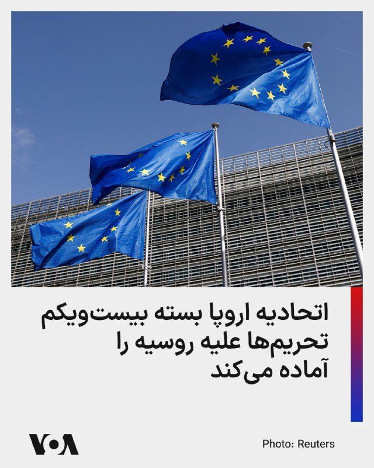

اتحادیه اروپا در حال آماده‌سازی بیست‌ویکمین بسته تحریمی علیه روسیه است که بر اساس آن شبکه بانکی و مسیرهای رمزارزی مسکو را هدف می‌گیرد.

رویترز به نقل از یک منبع دیپلماتیک اتحادیه اروپا گزارش داد این بسته قرار است روز چهارشنبه ارائه شود و هدف آن افزایش فشار مالی بر روسیه و بالا بردن احتمال بحران در نظام بانکی این کشور است. بروکسل امیدوار است این فشار مسکو را به مذاکره برای پایان جنگ اوکراین نزدیک‌تر کند.

بر اساس این گزارش، ممکن است تا ۹۰ بانک روسی در فهرست تحریم‌ها قرار گیرند که بزرگ‌ترین فهرست‌گذاری بانکی اتحادیه اروپا در یک مرحله است.

در صورت تصویب، شمار بانک‌های تحریم‌شده روسیه به بیش از ۱۰۰ بانک می‌رسد؛ بانک‌هایی که بیش از نیمی از وام‌دهندگان روسیه با ارتباطات بین‌المللی را شامل می‌شوند.

تحریم‌های تازه شامل مسدودسازی دارایی‌ها و ممنوعیت معاملات خواهد بود. کمیسیون اروپا نیز هم‌زمان پیشنهاد می‌کند تراکنش با ۳۵ بانک و حدود دوازده پلتفرم رمزارزی که به دور زدن تحریم‌های غرب کمک می‌کنند، ممنوع شود؛ از جمله شبکه‌هایی که در کشورهای ثالث فعالیت دارند.
@FarsiVOA

## FarsiVOA — post 220109

🔺پیش‌نویس مشترک آمریکا و سه کشور اروپایی در آژانس؛ حفظ مسیر فشار بر جمهوری اسلامی

◾️پیش‌نویس قطعنامه شورای حکام آژانس بین‌المللی انرژی اتمی درباره جمهوری اسلامی، پس از اصلاح، به متن مشترک آمریکا و سه کشور اروپایی تبدیل شده است.

◾️این پیش‌نویس اگرچه ارجاع فوری پرونده جمهوری اسلامی به شورای امنیت را کنار گذاشته، اما مسیر فشار سیاسی و حقوقی بر تهران را از پرونده پادمان‌ها باز نگه می‌دارد.

◾️گزارش شده فشار اولیه آمریکا برای ارجاع فوری پرونده جمهوری اسلامی به شورای امنیت سازمان ملل، به‌عنوان بخشی از مصالحه با سه کشور اروپایی، از متن حذف شده است.

◾️با این حال، متن پیش‌نویس هشدار می‌دهد شورای حکام آماده است درباره «زمان‌بندی و محتوای» گزارشی برای بررسی در شورای امنیت، تصمیم بگیرد.

⬇️ بیشتر بخوانید:
https://ir.voanews.com/a/8158904.html

## FarsiVOA — post 220108

🔺سنتکام: تیم ارتش آمریکا پس از سقوط بالگرد در دریا با موفقیت نجات یافت

◾️فرماندهی مرکزی آمریکا، سنتکام، درباره حادثه سقوط یک بالگرد خود در منطقه اعلام کرد که تیم ارتش آمریکا پس از سقوط این بالگرد در دریا با موفقیت نجات یافت.

◾️بر اساس گزارش سنتکام، این حادثه ساعت ۱۹:۳۳ روز دوشنبه ۸ ژوئن (به وقت شرق آمریکا) روی داد و در جریان آن دو خدمه یک بالگرد ای‌اچ-۶۴ آپاچی ارتش آمریکا پس از آن‌که بالگردشان در نزدیکی سواحل عمان و هنگام گشت‌زنی در آب‌های منطقه‌ای سقوط کرد، توسط نیروهای آمریکایی نجات داده شدند.

◾️وضعیت این دو نظامی پایدار گزارش شده و علت وقوع این حادثه نیز در دست بررسی است.

◾️پیشتر دونالد ترامپ اعلام کرد خلبانان بالگردی که در حوالی تنگه هرمز سقوط کرده است «حالشان خوب است.»

⬇️ بیشتر بخوانید:
https://ir.voanews.com/a/8158901.html

## FarsiVOA — post 220107

🔺کویت بار دیگر به مشتریان آسیایی نفت عرضه کرد

◾️کویت برای نخستین بار از آغاز جنگ، دست‌کم چهار میلیون بشکه از نفت خام صادراتی اصلی خود را به خریداران آسیایی پیشنهاد داده است. این اقدام نشانه‌ای تازه از تلاش تولیدکنندگان خلیج فارس برای بازگرداندن تدریجی جریان نفت از مسیر تنگه هرمز است.

◾️بلومبرگ به نقل از معامله‌گران آگاه گزارش داد این محموله‌ها که با دو نفتکش بسیار بزرگ حمل می‌شوند، به پالایشگاه‌هایی در چین و کره جنوبی پیشنهاد شده‌اند.

◾️به گفته این معامله‌گران، نفت مورد نظر مستقیماً از سوی شرکت دولتی نفت کویت عرضه شده، نه از طریق واسطه.

◾️این محموله که به گفته معامله‌گران پیشتر از تنگه هرمز خارج شده و می‌تواند فوراً به بنادر آسیایی منتقل شود.

⬇️ بیشتر بخوانید:
https://ir.voanews.com/a/8158899.html

## FarsiVOA — post 220106

  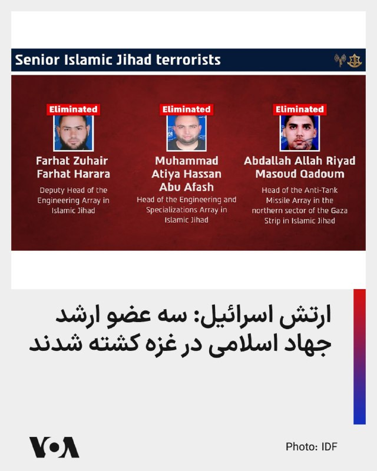

ارتش اسرائیل اعلام کرد که در جریان حمله روز شنبه گذشته در مرکز نوار غزه سه عضو ارشد از سازمان تروریستی جهاد اسلامی کشته شدند.

ارتش اسرائیل در بیانیه‌ای نام این افراد را محمد عطیه حسن ابو عفش، فرحات زهیر فرحات حراره و عبدالله ریاض مسعود قدوم اعلام کرد.

بر اساس این گزارش، محمد عطیه حسن ابو عفش، رئیس سامانه مهندسی و تخصص‌ها در سازمان تروریستی جهاد اسلامی و فرحات زهیر فرحات حراره، جانشین رئیس سامانه مهندسی در این سازمان بود.

همچنین عبدالله ریاض مسعود قدوم، مسئول سامانه ضدتانک در منطقه شمالی نوار غزه در سازمان تروریستی جهاد اسلامی بود و «طی سال‌های اخیر طرح‌های متعدد ضدتانک علیه نیروهای اسرائیل را پیش برد.»

ارتش اسرائیل تأکید کرد که به فعالیت خود علیه سازمان‌های تروریستی در نوار غزه و برای رفع هرگونه تهدید علیه نیروهای ارتش اسرائیل و شهروندان کشور اسرائیل ادامه خواهد داد.
@FarsiVOA

## FarsiVOA — post 220104

  <a href="telegram/content/FarsiVOA_220104_1781008974.mp4" target="_blank">🎬 Download video</a>

ارتش اسرائیل اعلام کرد اوایل این هفته مقر اصلی پلیس دریایی حماس در خان‌یونس را هدف قرار داده است؛ مرکزی که به گفته این ارتش، از سوی شاخه نظامی حماس برای طراحی و اجرای حملات علیه نیروهای اسرائیلی استفاده می‌شد.

در این حمله چند عضو فعال حماس، از جمله اسماعیل اللحام، فرمانده یک سلول در شاخه نظامی این گروه، کشته شدند.

ارتش اسرائیل همچنین اعلام کرد در هفته گذشته سه انبار سلاح حماس در جنوب نوار غزه را منهدم کرده است. به گفته ارتش اسرائیل، نیروهای حماس پس از هشدارهای تخلیه تلاش داشتند با استفاده از خودرو، سلاح‌های موجود در این تأسیسات را خارج کنند.

در بیانیه ارتش اسرائیل آمده است که انفجارهای ثانویه پس از حملات، وجود سلاح در این مراکز را تأیید کرده و پیش از عملیات نیز برای کاهش آسیب به غیرنظامیان، هشدار قبلی، نظارت هوایی و مهمات دقیق به‌کار گرفته شده است.
@FarsiVOA

## FarsiVOA — post 220103

🔺یک نفر دیگر در پرونده آتش‌سوزی آمبولانس‌های مرتبط با جامعه یهودی بریتانیا متهم شد

◾️دادستان‌های بریتانیا اعلام کردند یک مرد ۱۸ ساله به اتهام «کمک به مجرم» در پرونده آتش‌سوزی آمبولانس‌های سازمان خیریه یهودی در شمال لندن، تحت تعقیب قرار گرفته است.

◾️این آتش‌سوزی سه ماه پیش روی داد و پلیس روز سه‌شنبه گفت که او پنجمین فردی است که در این ارتباط متهم شده است.

◾️کی‌یر استارمر، نخست‌وزیر بریتانیا، در آن زمان این حمله را یک «حمله آتش‌سوزی یهودستیزانه عمیقاً شوک‌آور» توصیف کرده بود.

⬇️ بیشتر بخوانید:
https://ir.voanews.com/a/8158898.html

## FarsiVOA — post 220102

  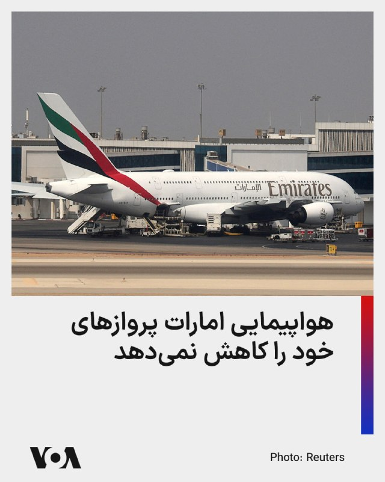

تیم کلارک، رئیس شرکت هواپیمایی امارات، می‌گوید این شرکت با وجود فشارهای مالی ناشی از جنگ در خاورمیانه، برنامه‌ای برای کاهش ظرفیت یا کم کردن پروازها ندارد.

او روز سه‌شنبه در برلین گفت امارات همچنان مسافران را از مسیر دبی به مقصدهایی از جمله هند و استرالیا منتقل می‌کند و برای کاهش ریسک‌های عملیاتی، تدابیری مانند حمل سوخت اضافه را در نظر گرفته است.

کلارک تأکید کرد: «قصد عقب‌نشینی یا کاهش فعالیت نداریم» و افزود نگران هزینه‌های اضافی نیست.

هم‌زمان، امارات بار دیگر خواستار دسترسی گسترده‌تر به بازار آلمان، از جمله اجازه پرواز به برلین، شده است. هواپیمایی امارات سال‌هاست برای دریافت حقوق پروازی بیشتر در برلین تلاش می‌کند، اما لوفت‌هانزا با گسترش فعالیت شرکت‌های هواپیمایی خلیج فارس در اروپا مخالف بوده است.
@FarsiVOA

## FarsiVOA — post 220101

🔺عبور پنجمین کشتی ال‌ان‌جی قطر از هرمز؛ بازگشت محتاطانه به صادرات گاز

◾️پنجمین کشتی حامل ال‌ان‌جی تحت کنترل قطر از تنگه هرمز عبور کرد؛ نشانه‌ای از بازگشت تدریجی صادرات گاز طبیعی مایع قطر، هرچند این مسیر حیاتی هنوز با وضعیت عادی فاصله دارد.

◾️بر اساس داده‌های رهگیری کشتی‌ها که رویترز گزارش کرده، کشتی «الضعاین» پس از بارگیری محموله خود از پایانه رأس‌لفان قطر در اول ژوئن، از تنگه هرمز خارج شده و مسیر آن به سمت چین ثبت شده است.

◾️با عبور این کشتی، شمار کشتی‌های حامل ال‌ان‌جی که از زمان آغاز جنگ از این آبراه خارج شده‌اند، به ۹ فروند رسیده است.

◾️قطر، یکی از بزرگ‌ترین صادرکنندگان ال‌ان‌جی جهان، تقریباً همه صادرات گاز طبیعی مایع خود را از مسیر هرمز انجام می‌دهد.

⬇️ بیشتر بخوانید:
https://ir.voanews.com/a/8158897.html

## DW_Farsi — post 125721

📸 از پروفسور نرتس تا ناگلزمان؛ سرمربیان تیم ملی آلمان از دریچه دوربین

🔺 گزارشی از شهرام احدی

در طی نه دهه گذشته ۱۲ سرمربی هدایت تیم ملی فوتبال آلمان را برعهده داشته‌اند. یولیان ناگلزمان از سپتامبر ۲۰۲۳ تا کنون سرمربی آلمان است. او هدایت ملی‌پوشان این کشور در مسابقات جام جهانی ۲۰۲۶ را بر عهده دارد.

@dw_farsi

## DW_Farsi — post 125720

  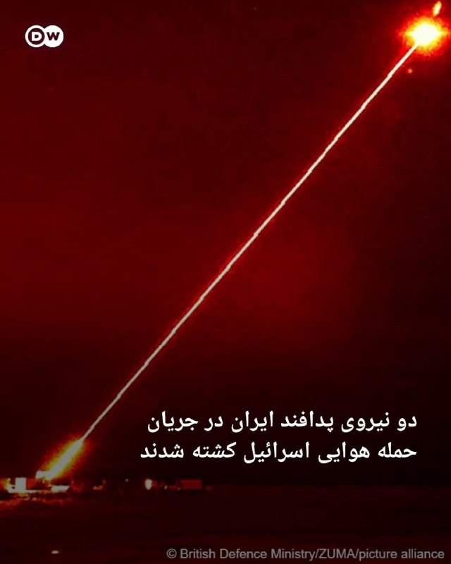

🔶 دو نیروی پدافند در جریان حمله هوایی اسرائیل کشته شدند

نیروی پدافند هوایی ارتش روز سه‌شنبه ۱۹ خرداد (۹ ژوئن) اعلام کرد بهمن حسینی و علیرضا عبیری دو نیروی پدافند هوایی ارتش در جریان حمله اسرائیل کشته شده است.

رسانه‌های وابسته به سپاه از جمله خبرگزاری تسنیم اعلام کردند مراسم تشییع پیکر کشته‌شدگان در شهرک شهید بهشتی تهران برگزار خواهد شد.

محمود نبویان، نماینده تهران با انتشار عکس افراد کشته‌شده در شبکه‌های مجازی نوشت: «افراد کشته شده از "رانندگان ترابری نیروی پدافند هوایی ارتش بودند که پس از لورفتن موقعیت مکانی اقدام به جابجایی دستگاه‌ها نموده که مورد اصابت موشک‌های ارتش اسرائیل قرار گرفتند».

این نماینده مجلس در پایان پیام خود نوشته "انتقام این دو نیرو نباید فراموش شود".

@dw_farsi

## DW_Farsi — post 125719

  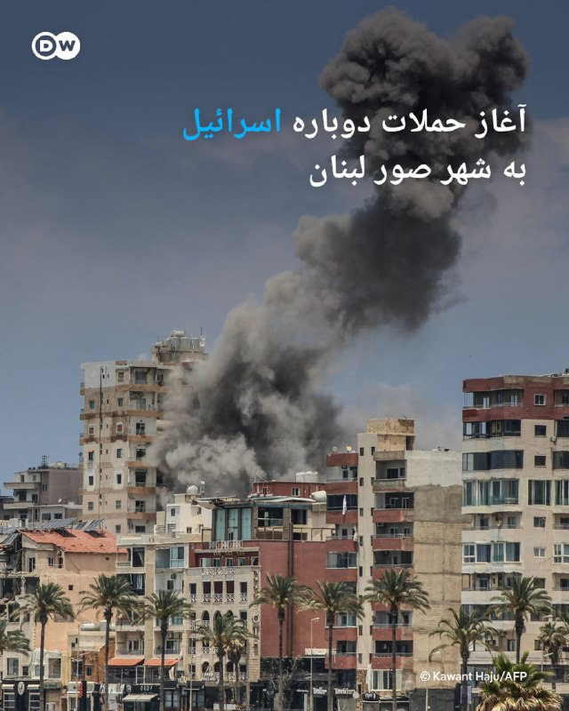

🔶 آغاز حملات دوباره اسرائیل به شهر صور لبنان

رسانه‌های لبنانی از حملات هوایی اسرائیل به شهر ساحلی صور در طول روز سه‌شنبه، ۹ ژوئن (۱۸ خرداد) خبر می‌دهند.

خبرگزاری ملی لبنان (NNA) اعلام کرد: «جنگنده‌های دشمن حمله شدیدی را علیه صور آغاز کردند.»

پیش‌تر، با وجود ازسرگیری آتش‌بس با ایران، ارتش اسرائیل هشدار تخلیه‌ای را برای این شهر صادر و نسبت به حملات احتمالی هشدار داده بود.

دور جدیدی از درگیری که میان ایران و اسرائیل روز یکشنبه شروع شد عمدتا" بر سر مدعای ایران دال بر تخطی اسرائیل از رعایت توافق آتش‌بس ۱۹ فروردین، مبنی بر "آتش‌بس در همه جبهه‌ها" از جمله لبنان، برمی‌گشت. ایران این درگیری‌ها که کمتر از ۲۴ ساعت با دخالت دونالد ترامپ، رئیس جمهور آمریکا پایان یافت را موفقیتی برای خود عنوان کرد و اسرائیل هم در برابر اعلام کرد که همچنان به عملیات نظامی خود علیه حزب‌الله در لبنان ادامه خواهد داد.

دستور تخلیه این بار از سوی ارتش اسرائیل برای نخستین بار شامل محله مسیحی‌نشین شهر صور هم شده است. اسرائیل در ماه‌های گذشته بارها شهر صور واقع در جنوب لبنان را هدف حملات خود قرار داده و علت آن را حمله به مواضع شبه‌نظامیان حزب‌الله (که از سوی ایران حمایت می‌شوند) عنوان کرده بود. با این حال، این اولین بار است که نه ساکنان چند محله خاص، بلکه اهالی کل شهر برای تخلیه فراخوانده می‌شوند.

@dw_farsi

## DW_Farsi — post 125718

  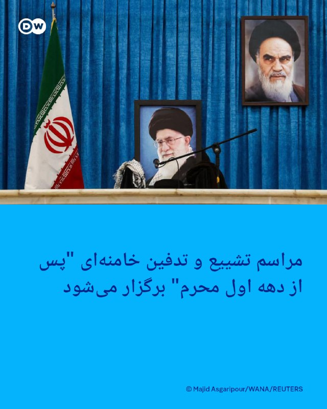

🔶 مراسم تشییع و تدفین خامنه‌ای "پس از دهه اول محرم" برگزار می‌شود

"ستاد بزرگداشت علی خامنه‌ای" در اطلاعیه شماره ۲ اعلام کرد مراسم "وداع، تشییع و تدفین" او و اعضای خانواده‌اش پس از پایان دهه اول محرم برگزار خواهد شد.

در این اطلاعیه، گمانه‌زنی‌ها و شایعات منتشرشده درباره زمان و جزئیات مراسم در رسانه‌های داخلی و خارجی "فاقد اعتبار" خوانده شده و زمان برگزاری مراسم و جزئیات آن در زمان مناسب از سوی ستاد اعلام خواهد شد.

این اطلاعیه در حالی منتشر شده که با گذشت بیش از ۱۰۰ روز از کشته‌شدن علی خامنه‌ای، همچنان اظهارات متفاوتی درباره زمان برگزاری مراسم تشییع و تدفین او مطرح می‌شود.

پیش‌تر علیرضا نادعلی، سخنگوی شورای شهر تهران از تمدید مجوز استفاده رایگان از مترو و اتوبوس‌های تندرو تا پایان دهه اول محرم خبر داده و دلیل این تصمیم را هم‌زمانی آن با برگزاری مراسم تشییع علی خامنه‌ای عنوان کرده بود.

او گفته بود این مصوبه در شورای شهر تهران به تصویب رسیده است.

@dw_farsi

## DW_Farsi — post 125717

🔶 اوج‌گیری اعدام‌ها؛ ۱۲۰ هفته اعتراض زندانیان به کشتار حکومتی

در حالی که نهادهای حقوق بشری از افزایش بی‌سابقه اعدام‌ها در ایران خبر می‌دهند، زندانیان محکوم به اعدام و زندانیان سیاسی در ده‌ها زندان کشور یکی از طولانی‌ترین حرکت‌های اعتراضی علیه مجازات مرگ را از درون زندان‌ها ادامه می‌دهند.

کارزار "سه‌شنبه‌های نه به اعدام" اکنون بیش از ۱۲۰ هفته متوالی ادامه یافته و به گفته برگزارکنندگان آن، به ۵۶ زندان در سراسر ایران گسترش پیدا کرده است.

بر اساس گزارشی که مرکز حقوق بشر در ایران (CHRI) منتشر کرده، این حرکت اعتراضی از ژانویه ۲۰۲۴ و از زندان قزلحصار کرج آغاز شد؛ جایی که گروهی از زندانیان محکوم به اعدام پس از مشاهده انتقال و اعدام پی‌درپی هم‌بندی‌های خود تصمیم گرفتند در اعتراض به مجازات مرگ دست به اعتصاب غذای هفتگی بزنند.

این زندانیان در نخستین بیانیه خود تاکید کرده بودند که میان زندانیان سیاسی، محکومان جرایم مواد مخدر، پرونده‌های قصاص یا سایر افراد محکوم به اعدام تفاوتی قائل نیستند و معتقدند تمامی این احکام در روندهایی صادر شده‌اند که از معیارهای دادرسی عادلانه فاصله دارند. آنان در نامه‌ای خطاب به افکار عمومی نوشته بودند: «ما سزاوار مرگ نیستیم و مجرم به دنیا نیامده‌ایم. صدای ما و خانواده‌هایمان باشید.»

@dw_farsi

## DW_Farsi — post 125716

🔶 آمریکا علی‌بابا، بایدو و بی‌وای‌دی را در لیست سیاه قرار داد

وزارت دفاع ایالات متحده آمریکا (پنتاگون) در به‌روزرسانی جدید فهرست شرکت‌های مشکوک به همکاری با ارتش چین، نام غول‌های اینترنتی "علی‌بابا" "بایدو" را قرار داده است.

در این میان، اضافه شدن نام شرکت "بی‌وای‌دی" به عنوان یک خودروساز بزرگ و کلیدی برای نخستین‌بار، توجه رسانه‌ها را به خود جلب کرده است. این فهرست شامل شرکت‌هایی است که طبق ارزیابی واشنگتن، به تقویت و پشتیبانی نیروهای مسلح چین کمک می‌کنند.

وزارت دفاع آمریکا اعلام کرد که این شرکت‌ها معیارهای لازم برای طبقه‌بندی به عنوان "شرکت‌های نظامی چینی" را دارا بوده و در ایالات متحده نیز فعال هستند.

غول خودروسازی بی‌وای‌دی در حال حاضر خودروهای سواری خود را به دلیل تعرفه گمرکی سنگین ۱۰۰ درصدی که بازار آمریکا را برای آن غیراقتصادی کرده است، به فروش نمی‌رساند. انتشار این فهرست جدید می‌تواند تنش‌ها میان آمریکا و چین، این دو رقیب بزرگ اقتصادی و ژئوپلیتیک را بیش از پیش تشدید کند. تا این لحظه، نه سفارت چین در واشنگتن و نه شرکت‌های نام‌برده، واکنشی به این موضوع نشان نداده‌اند.

@dw_farsi

## DW_Farsi — post 125715

  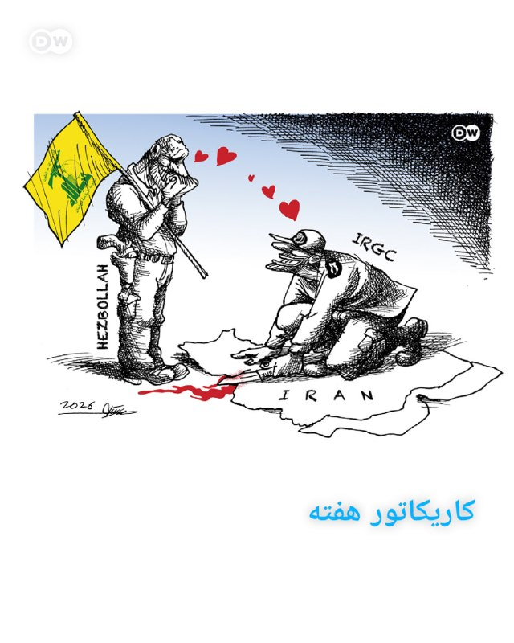

📸 کاریکاتور هفته

در حالی که آتش‌بس شکننده میان اسرائیل و ایران و نیروهای نیابتی تهران در منطقه برقرار بود، حملات هوایی اسرائیل به مواضع حزب‌الله در لبنان، از جمله در حومه بیروت و مناطق جنوبی این کشور، بار دیگر تنش‌ها را شعله‌ور کرد. پس از این حملات، جمهوری اسلامی با شلیک موشک به اسرائیل عملاً از چارچوب آتش‌بس خارج شد و اعلام کرد که ادامه حملات اسرائیل به لبنان را تحمل نخواهد کرد.

این واکنش بار دیگر این پرسش را مطرح می‌کند که آیا رهبران جمهوری اسلامی حاضرند برای دفاع از حزب‌الله لبنان، کشور و مردم ایران را دوباره در معرض جنگی پرهزینه قرار دهند؟ به نظر می‌رسد برای سپاه پاسداران، حفظ شبکه نیروهای نیابتی منطقه‌ای گاه چنان اولویتی دارد که خطر کشیده شدن ایران به یک رویارویی نظامی گسترده نیز مانع آن نمی‌شود؛ رویارویی‌ای که هزینه اصلی آن را نه فرماندهان نظامی، بلکه شهروندان عادی ایران خواهند پرداخت.

این موضوع دستمایه مانا نیستانی در طراحی کاریکاتور هفته برای دویچه وله فارسی بوده است.

@dw_farsi

## DW_Farsi — post 125714

  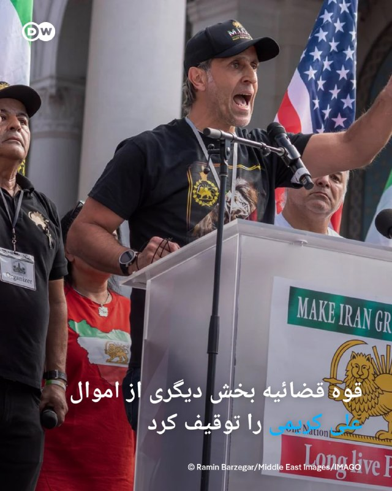

🔶 قوه قضائیه بخش دیگری از اموال علی کریمی را توقیف کرد

مرکز رسانه قوه قضائیه از توقیف بخش دیگری از اموال علی کریمی، بازیکن سابق تیم ملی فوتبال و از منتقدان جمهوری اسلامی خبر داد.

این اقدام در حالی صورت می‌گیرد که منتقدان حکومت، "توقیف اموال، تشکیل پرونده‌های قضایی و اعمال محدودیت‌های مشابه" را از ابزارهای فشار بر مخالفان و منتقدان جمهوری اسلامی می‌دانند.

بر اساس گزارش مرکز رسانه قوه قضائیه، پس از حمله ائتلاف آمریکا و اسرائیل به جمهوری اسلامی، اموال شماری از افرادی که از سوی حکومت "خائن به وطن" و "وابسته به رژیم صهیونیستی و کشورهای متخاصم" معرفی شده‌اند، با دستور قضایی شناسایی و توقیف شده است.

بر اساس این گزارش، در هفته‌های گذشته نیز بخشی از املاک این فوتبالیست مخالف حکومت جمهوری اسلامی در استان البرز شناسایی و توقیف شده است.

قوه قضائیه همچنین اعلام کرده است که تازه‌ترین ملک شناسایی و توقیف‌شده متعلق به علی کریمی، یک ویلای سه‌طبقه به مساحت ۱۱۵۰ متر مربع با ۶۰۰ متر مربع زیربنا در شهرستان لاهیجان استان گیلان است.

در هفته‌های اخیر، مقام‌های قضایی جمهوری اسلامی از توقیف اموال ده‌ها و سپس صدها نفر از ایرانیان داخل و خارج کشور خبر داده‌اند؛ اقدامی که به گفته آنها، در چارچوب مقابله با "همکاری با دشمن" و "حمایت از حملات آمریکا و اسرائیل" صورت گرفته است.

علی کریمی که از هواداران فعال رضا پهلوی، فرزند آخرین پادشاه ایران به شمار می‌آید پس از جنبش "زن زندگی آزادی" در سال ۱۴۰۱ از ایران خارج شد و از آن زمان تا کنون تخریب، توهین و تهدید او در رسانه‌های حکومت و حتی صدا و سیمای جمهوری اسلامی ادامه دارد.

این فوتبالیست مشهور با بیش از ۱۴ میلیون و ۲۰۰ هزار فالوور در اینستاگرام یکی از تاثیرگذارترین شخصیت‌های مخالف حکومت جمهوری اسلامی در فضای مجازی هم به شمار می‌رود.

@dw_farsi

## DW_Farsi — post 125713

  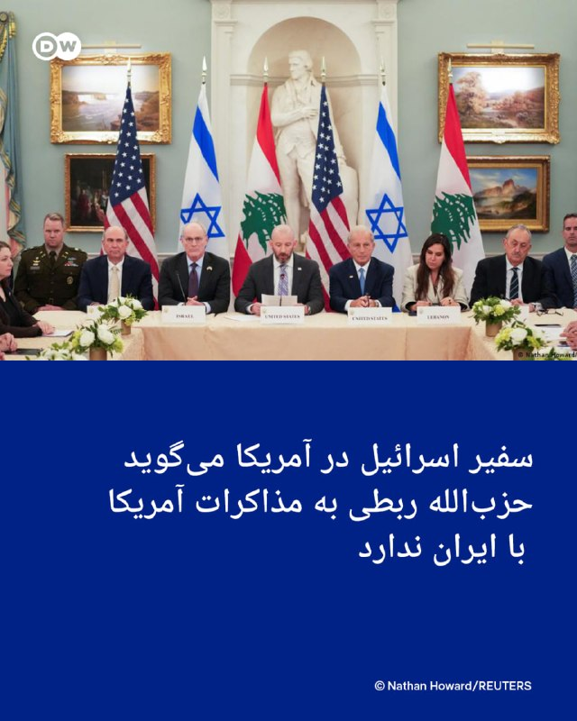

🔶 سفیر اسرائیل در آمریکا: حزب‌الله ربطی به مذاکرات آمریکا با ایران ندارد

یخیل لایتر، سفیر اسرائیل در ایالات متحده در گفتگو با شبکه "فاکس‌نیوز" گفته است که اسرائیل ناچار به پاسخ دادن به حملات موشکی ایران بوده و هیچ کشوری نمی‌تواند بپذیرد که موشک‌های بالستیک به خاکش اصابت کند و اقدام تلافی‌جویانه انجام ندهد.

لایتر همچنین افزود مذاکرات میان بنیامین نتانیاهو، نخست‌وزیر اسرائیل و دونالد ترامپ، رئیس‌جمهور آمریکا "دوستانه" بوده و نشان‌دهنده همکاری نزدیک میان دو متحد است.

او در ادامه توضیح داد که ترامپ خواستار کاهش تنش‌ها شده و نتانیاهو این نگرانی‌ها را در نظر گرفته است، اما اسرائیل باید به حملات پاسخ می‌داد.

سفیر اسرائیل در واشنگتن این ادعا را رد کرده که مذاکرات میان آمریکا و ایران با تحولاتلبنان مرتبط است و گفته است که اقدامات اسرائیل علیهحزب‌الله موضوعی جداگانه است و اسرائیل اجازه نخواهد داد این گروه موقعیت خود را در لبنان تثبیت کند.

@dw_farsi

## Persian_Trend_Official — post 16269

وضعیت فعلی صور !

## Persian_Trend_Official — post 16268

  <a href="telegram/content/Persian_Trend_Official_16268_1781008982.mp4" target="_blank">🎬 Download video</a>

🔴 اسرائیل از کشته شدن فرمانده یک سلول حماس در خان‌یونس خبر داد

ارتش اسرائیل اعلام کرد مقر پلیس دریایی حماس در منطقه خان‌یونس را هدف قرار داده است. به ادعای تل‌آویو، این مرکز توسط شاخه نظامی حماس برای برنامه‌ریزی و اجرای عملیات علیه اسرائیل مورد استفاده قرار می‌گرفت.

بر اساس بیانیه ارتش اسرائیل، در این حمله چندین عضو حماس از جمله «اسماعیل اللحام» فرمانده یک سلول در شاخه نظامی این گروه کشته شده‌اند.

اسرائیل همچنین مدعی شد طی هفته گذشته سه انبار تسلیحاتی حماس در جنوب نوار غزه را منهدم کرده است. به گفته ارتش اسرائیل، نیروهایی که قصد انتقال تسلیحات از این مراکز را داشتند نیز هدف قرار گرفته‌اند و انفجارهای ثانویه پس از حملات، وجود مهمات در این انبارها را تأیید کرده است.

تل‌آویو مدعی است این مراکز بخشی از تلاش حماس برای بازسازی توان نظامی خود پس از آتش‌بس بوده‌اند.

👺Phantom

📌 @persian_trend_official
پرشین ترند | متفاوت‌ترین کانال نظامی

## Persian_Trend_Official — post 16267

  <a href="telegram/content/Persian_Trend_Official_16267_1781008984.mp4" target="_blank">🎬 Download video</a>

دونالد ترامپ: تنگه هرمز بلافاصله پس از امضا، که می‌تواند ظرف دو یا سه روز باشد، باز خواهد شد.

من به نتانیاهو گفتم: کاری را که درست است انجام بده، اما می‌خواهم هر چه سریع‌تر متوقف شوی. زیرا آنها باید متوقف شوند. این موضوع به لبنان مربوط می‌شد و باید متوقف شود. ما می‌خواهیم این کار تمام شود.

📝 Amir

📌 @persian_trend_official
پرشین ترند | متفاوت‌ترین کانال نظامی

## Persian_Trend_Official — post 16266

دونالد ترامپ: نتانیاهو ضربه خورد و او هم متقابلاً پاسخ داد، و من نمی‌توانم او را به خاطر این موضوع سرزنش کنم، اما او ضربه خورد. او متقابلاً پاسخ داد و حالا آنها [از هم] دست کشیده‌اند.

بنابراین، آنها قرار است فقط برای یک هفته دیگر یا چیزی در همین حدود، یکدیگر را تنها بگذارند. این مدت زیادی است که ادامه دارد.

آنها مدام در حال رفت و آمد بودند. و حالا هر دو، از طریق من، توافق کردند که متوقف شوند. و ما در مراحل پایانی یک توافق بسیار بسیار خوب هستیم که به هیچ وجه اجازه شکل‌دهی یا تولید سلاح‌های هسته‌ای و غیره را نمی‌دهد.

📝 Amir

📌 @persian_trend_official
پرشین ترند | متفاوت‌ترین کانال نظامی

## Persian_Trend_Official — post 16265

  <a href="telegram/content/Persian_Trend_Official_16265_1781008986.webm" target="_blank">🎬 Download video</a>

به گزارش اسرائیل هیوم، مارکو روبیو، وزیر امور خارجه امریکا پس از حمله موشکی تهران، تلاش های برای متقاعد کردن رئیس جمهور ترامپ برای حمایت از حمله اسرائیل به ایران کرد.

📝 Amir

📌 @persian_trend_official
پرشین ترند | متفاوت‌ترین کانال نظامی

## Persian_Trend_Official — post 16264

  <a href="telegram/content/Persian_Trend_Official_16264_1781008987.mp4" target="_blank">🎬 Download video</a>

وضعیت فعلی صور !

## Persian_Trend_Official — post 16263

حمله به صور شروع شد و اگر جمهوری اسلامی پاسخ نده رسما میشه گفت تهدید معتبرش به شوخی احمقانه تبدیل شده !

## Persian_Trend_Official — post 16262

  <a href="telegram/content/Persian_Trend_Official_16262_1781008989.mp4" target="_blank">🎬 Download video</a>

💢 کپلر: تردد در تنگۀ هرمز به‌شدت کاهش یافته است

💢مؤسسۀ رهیابی دریایی کپلر اعلام کرد داده‌های ماهواره‌ای از محدود شدن قابل‌توجه تردد کشتی‌ها در تنگۀ هرمز حکایت دارد.

💢در ۳ روز جمعه، شنبه و یکشنبه تنها ۸ شناور تجاری و غیرتجاری از تنگۀ هرمز عبور کرده‌اند؛ رقمی که تقریباً نصف میزان تردد در آخرهفتۀ قبل است.

🔴 @KhabarFuri

## Persian_Trend_Official — post 16260

راهکارهای جدید صادرات نفت کشور های عربی دربرابر بستن تنگه هرمز توسط جمهوري اسلامي :

امارات صادرات روزانه ۱.۵ تا ۲ میلیون بشکه نفت خود از طریق انتقال کشتی به کشتی که نیمی از آن در لنگرگاه صحار عمان انجام می‌شود را از سر گرفته است.

در تصویر ماهواره‌ای صبح شنبه از لنگرگاه صحار عمان چهار VLCC و سه MR2 قابل مشاهده است.

👺Phantom

📌 @persian_trend_official
پرشین ترند | متفاوت‌ترین کانال نظامی

## Persian_Trend_Official — post 16259

  <a href="telegram/content/Persian_Trend_Official_16259_1781008991.mp4" target="_blank">🎬 Download video</a>

🕊 تروری دیگر در روسیه:

🪖یک مقام ارشد ارتش روسیه بر اثر انفجار خودروی بمب‌گذاری شده در مسکو ترور شد.

👺Phantom

📌 @persian_trend_official
پرشین ترند | متفاوت‌ترین کانال نظامی

## Persian_Trend_Official — post 16256

🔴 ناتو رزمایش هوایی «Ramstein Flag 2026» را آغاز کرد

ناتو یکی از بزرگ‌ترین رزمایش‌های هوایی خود در سال‌های اخیر با نام «Ramstein Flag 2026» را آغاز کرده است. در این رزمایش بیش از ۲۰۰ فروند هواپیما از ۱۸ کشور عضو ناتو شرکت دارند و عملیات‌ها از بیش از ۲۰ پایگاه هوایی در سراسر اروپا، از فنلاند در جناح شرقی ناتو تا اسپانیا در غرب، انجام می‌شود.

در جریان این رزمایش، روزانه صدها سورتی پرواز انجام خواهد شد و انواع جنگنده‌ها، هواپیماهای شناسایی، تانکرهای سوخت‌رسان هوایی، هواپیماهای ترابری، هواپیماهای آواکس ناتو (AWACS) و سامانه‌های بدون سرنشین در آن مشارکت دارند.

هدف از این تمرینات، ارزیابی و تقویت هماهنگی عملیاتی میان نیروهای عضو، توانایی استقرار سریع، اجرای عملیات هوایی پراکنده و سنجش قابلیت‌های دفاع جمعی ناتو در سناریوی یک درگیری شدید و چندبعدی عنوان شده است.

👺Phantom

📌 @persian_trend_official
پرشین ترند | متفاوت‌ترین کانال نظامی

## Persian_Trend_Official — post 16255

  <a href="telegram/content/Persian_Trend_Official_16255_1781008993.mp4" target="_blank">🎬 Download video</a>

👨‍⚖️:ویلای شخصیه علی کریمی

در لاهیجان توقیف شد. 《قوه قضاییه》

👺Phantom

📌 @persian_trend_official
پرشین ترند | متفاوت‌ترین کانال نظامی

## Persian_Trend_Official — post 16254

دلار فردایی تهران ⏳ 176,000 مـعامله شد

📌 @persian_trend_official
پرشین ترند | متفاوت‌ترین کانال نظامی

## Persian_Trend_Official — post 16253

  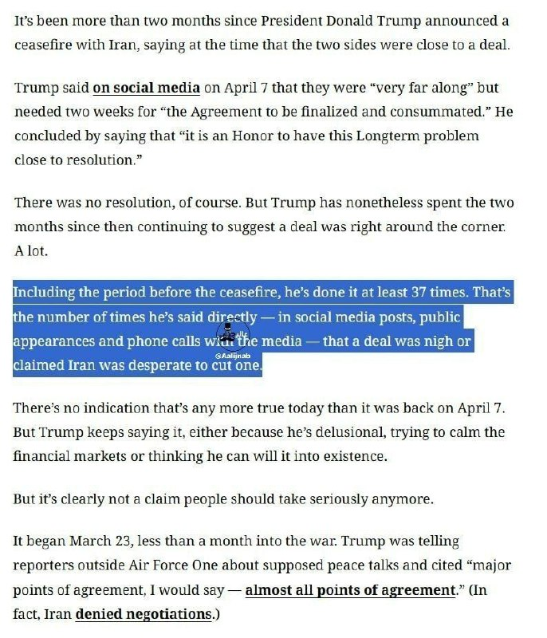

🔴 CNN: ترامپ ۳۷ بار از «نزدیک بودن توافق با ایران» صحبت کرده، اما هنوز توافقی حاصل نشده است

شبکه CNN گزارش داد که دونالد ترامپ از آغاز مذاکرات و حتی پیش از آتش‌بس، دست‌کم ۳۷ بار به‌صورت علنی مدعی شده توافق با ایران نزدیک است یا تهران برای رسیدن به توافق اشتیاق زیادی دارد.

بر اساس این گزارش، این اظهارات در قالب سخنرانی‌ها، مصاحبه‌ها، تماس‌های تلفنی با رسانه‌ها و پیام‌های منتشرشده در شبکه‌های اجتماعی مطرح شده، اما با وجود این خوش‌بینی‌های مکرر، هنوز توافق نهایی میان تهران و واشنگتن به دست نیامده است.

این آمار نشان می‌دهد فاصله میان فضای رسانه‌ای و واقعیت مذاکرات همچنان قابل توجه است. در حالی که بارها از «نزدیک بودن توافق» سخن گفته شده، اختلافات اصلی میان دو طرف هنوز پابرجاست و همین موضوع باعث شده روند مذاکرات طولانی‌تر و پیچیده‌تر از پیش‌بینی‌های اولیه شود.

👺Phantom

📌 @persian_trend_official
پرشین ترند | متفاوت‌ترین کانال نظامی

## RadioFarda — post 158093

  <a href="https://t.me/radiofarda/158093" target="_blank">📎 Download file</a>

📻بشنوید: ساعت ۱۴ با رادیوفردا، نوزدهم خرداد ۱۴۰۵‌

@RadioFarda

## RadioFarda — post 158092

🔸کیم جونگ اون، رهبر کره شمالی، و شی جین‌پینگ، رئیس‌جمهور چین، در نشستی در پیونگ‌یانگ توافق کردند همکاری‌های دوجانبه را در حوزه‌های سیاسی، اقتصادی و فرهنگی گسترش دهند.

🔸خبرگزاری رسمی کره شمالی روز سه‌شنبه ۱۹ خرداد با انتشار گزارشی از این نشست، آن را را «فصل تازه‌ای» در روابط دو کشور خواند.

🔸بر اساس این گزارش، شی جین‌پینگ که نخستین سفر خود در هفت سال گذشته را به تنها متحد رسمی چین بر اساس پیمان دوجانبه انجام داده، به کیم جونگ اون گفت که قصد دارد روابط دو کشور را گشترش دهد.

🔸دو طرف همچنین توافق کردند از طریق دیدارهای مقامات عالی‌رتبه، ارتباطات راهبردی نزدیک‌تری برقرار کنند.

🔸کیم جونگ اون نیز اعلام کرد که صرف‌نظر از تحولات بین‌المللی، به طور کامل از «اصل چین واحد» حمایت خواهد کرد؛ اصلی که پکن بر اساس آن معتقد است دو سوی تنگه تایوان متعلق به یک کشور هستند.

🔸نسخه کامل این گزارش را در وب‌سایت رادیوفردا بخوانید.

@RadioFarda

## RadioFarda — post 158091

پاراگراف اول؛ از کینگ‌رام تا قیصر، گشایش فرهنگی یا بحران قدرت؟

🔸در فاصلهٔ دو جنگ ۱۲ روزه و ۴۰ روزه خبرهایی با موضوع این‌که خوانندگان خارج از ایران قرار است به کشور برگردند، بیشتر از گذشته منتشر شد.

🔸وضعیت به‌گونه‌ای پیش رفت که برخی از این هنرمندان با تعدادی از فعالان رسانه‌ای در سکوهای رسانه‌ای غیردولتی گفت‌وگو کردند. موضوع گفت‌وگوها هم تقریباً همان چیزی بود که سال‌ها شنیده‌ایم: دلتنگی برای ایران و آرزوی بازگشت.

🔸از سوی دیگر، مقام‌های دولتی هم موضعی کم‌وبیش مشابه داشتند؛ این‌که پروندهٔ بازگشت این هنرمندان در دستور کار قرار دارد. با این حال، همیشه اما و اگری در میان بود که همه‌چیز را در هاله‌ای از ابهام نگه می‌داشت.

🔸اما پس از جنگ ۴۰ روزهٔ اسرائیل و آمریکا علیه ایران، به نظر می‌رسد چرخش تازه‌ای در حال رخ دادن است. کینگ رام، خوانندهٔ راک و پست‌پانک، به ایران بازگشت و به نخستین خواننده‌ای تبدیل شد که پس از وقایع خونبار دی‌ماه ۱۴۰۴ و جنگِ پس از آن، در تهران روی صحنه رفت.

🔸حالا قیصر، خوانندهٔ موسیقی شش‌وهشت و از چهره‌های جریان اصلی موسیقی ایرانی خارج از کشور یا همان لس‌آنجلسی، راهی تهران شده است. او در یکی از تجمع‌های خیابانی حامی حکومت هم روی صحنه رفت و ترانهٔ تازه‌اش را برای کودکان کشته‌شدهٔ میناب در جریان جنگ اجرا کرد.

آیا این اتفاق‌ها نشانهٔ آغاز یک دگردیسی در سیاست فرهنگی جمهوری اسلامی است یا با نوعی آرایش تازه روبه‌رو هستیم که می‌کوشد تصویری متفاوت از رابطهٔ حکومت و هنرمندان مهاجر ارائه دهد؟

🔸در برنامهٔ رادیویی «پاراگراف اول»، کامران ملک‌مطیعی، بازیگر سرشناس مجموعه‌های تلویزیونی سال‌های دور صداوسیمای جمهوری اسلامی ایران، گوینده و کارگردان و نویسنده از لس‌آنجلس که آخرین فعالیتش حضور با پویانمایی «زال و رودابه» به‌عنوان گوینده در چهل‌وسومین جشنوارهٔ فجر بوده است، به همراه بابک دربیکی، دانش‌آموختهٔ علوم ارتباطات اجتماعی، رئیس پیشین مرکز روابط عمومی وزارت فرهنگ و ارشاد اسلامی و مشاور علی جنتی، وزیر ارشاد در دولت اول حسن روحانی، از لندن این موضوع را به بحث گذاشته‌اند.

🔸نسخه کامل این گفت‌وگو را در وب‌سایت رادیوفردا بخوانید.

@RadioFarda

## RadioFarda — post 158090

  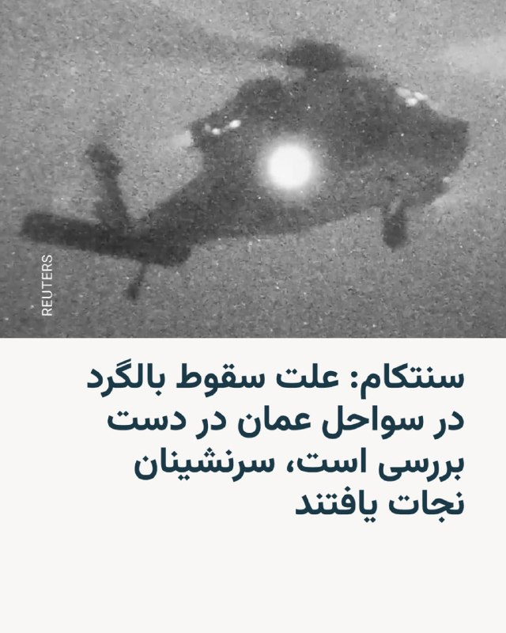

🔸فرماندهی مرکزی ارتش آمریکا، سنتکام، اعلام کرد دو سرنشین بالگرد آپاچی که در نزدیکی سواحل عمان سقوط کرده بود، نجات یافتند و علت سقوط این بالگرد هنوز در دست بررسی است.

🔸در بیانیه سنتکام آمده که این بالگرد اِ‌ی‌اچ۶۴ در ساعت ۷:۳۳ دقیقه عصر به وقت شرق آمریکا، کمی بعد از ساعت سه بامداد به وقت ایران، هنگام گشت‌زنی در نزدیکی سواحل عمان سقوط کرد.

🔸در این بیانیه آمده که نجات دو سرنشین آن، «حدود دو ساعت» پس از حادثه با موفقیت انجام شد و وضعیت جسمانی آنها «پایدار» گزارش شده است.

🔸بر اساس این گزارش، علت این حادثه همچنان در دست بررسی است.

🔸روزنامه نیویورک تایمز به نقل از دو منبع آگاه گزارش داده بود که یک بالگرد تهاجمی آپاچی ارتش آمریکا روز دوشنبه ۱۸ خرداد در نزدیکی تنگه هرمز سقوط کرد، اما دو سرنشین آن به سلامت نجات یافتند.

🔸در این گزارش نیز آمده بود که هنوز مشخص نیست این بالگرد بر اثر آتش نیروهای ایرانی سرنگون شده، دچار نقص فنی شده یا با مشکل دیگری روبه‌رو بوده است.

@RadioFarda

## RadioFarda — post 158089

  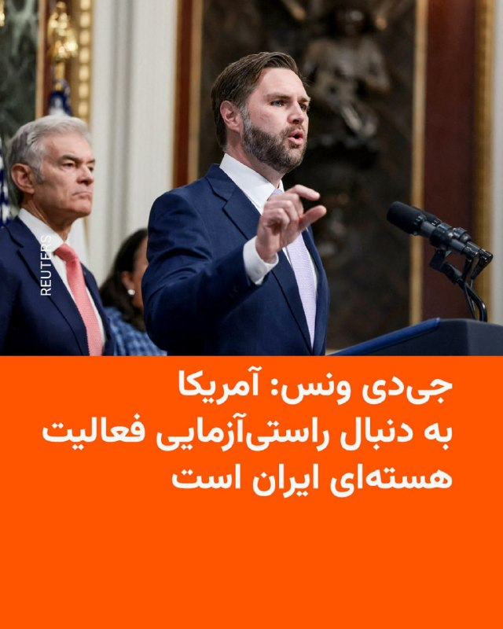

🔸جی‌دی ونس، معاون رئیس‌جمهور آمریکا در گفت‌و‌گو با فاکس‌نیوز، در پاسخ به این سؤال که آیا ایرانی‌ها در تلاش‌اند مذاکره‌کنندگان آمریکایی را فریب دهند، پاسخی غیرمستقیم داد مبنی بر این‌که «همه همیشه سعی می‌کنند طرف مقابل را بازی بدهند».

🔸او مشکل توافق هسته‌ای موسوم به برجام را که در زمان دولت باراک اوباما با ایران امضا شد نیز چنین تشریح کرد: «یک نظام بازرسی مناسب وجود نداشت که تضمین کند ایرانی‌ها هرگز نتوانند سلاح هسته‌ای بسازند.»

🔸ونس تأکید کرد که این موضوع یکی از «تفاوت‌های بزرگ» میان توافق برجام و توافقی خواهد بود که دونالد ترامپ قصد دارد به آن برسد.

🔸او درباره رویکرد دولت آمریکا در این زمینه گفت که اگرچه آنها قصد دارند «مأموریت رئیس‌جمهور را محقق» کنند، اما «در بلندمدت نیز راستی‌آزمایی کنیم که ایرانی‌ها به تعهدات خود پایبند هستند. این کار آسانی نیست، اما رئیس‌جمهور ما را در موقعیت مناسبی برای دستیابی به آن قرار داده است.»

@RadioFarda

## IranianMinds — post 21918

نسخه کامل سخنرانی در نشست امنیتی دریای سیاه (با زیرنویس فارسی)

اودسا - اوکراین
شنبه ۹ خرداد ۲۵۸۵/۱۴۰۵

@OfficialRezaPahlavi

## IranianMinds — post 21914

  <a href="telegram/content/IranianMinds_21914_1781008998.mp4" target="_blank">🎬 Download video</a>

🔴حملات هوایی ارتش اسرائیل به صیدا/ جنوب لبنان

@IranianMinds

## IranianMinds — post 21913

  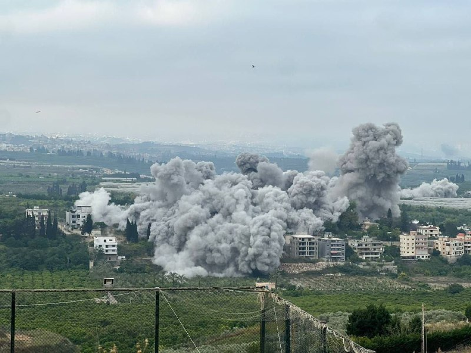

🔴حملات اسرائیل به صور.

@IranianMinds

## IranianMinds — post 21912

🔴اسرائیل هیوم:

حمله اسرائیل به ایران با حمایت روبیو و چراغ سبز ترامپ انجام شد.

@IranianMinds

## IranianMinds — post 21911

🔴 نیویورک‌تایمز: یک بالگرد تهاجمی آپاچی ارتش آمریکا در نزدیکی تنگه هرمز سقوط کرد.

علت حادثه هنوز مشخص نیست و در حال بررسیه؛ از جمله اینکه آیا بالگرد هدف قرار گرفته، دچار نقص فنی شده یا با مشکل دیگری مواجه بوده.

@IranianMinds

## IranianMinds — post 21910

🔴شبکه ۱۳ اسرائیل:

شورای وزارتی کوچک تصمیم گرفته است که هر موشکی از لبنان به سمت اسرائیل شلیک شود، جوابش با حمله به بیروت داده بشود.

@IranianMinds

## IranianMinds — post 21909

چرا این روزها همه سایت جهانی MelBet رو انتخاب میکنن 
⁉️

🎁 شارژ هدیه 130 دلاری اولین واریز

🎁 شارژ هدیه 100 دلاری در روز های یکشنبه و چهارشنبه

🎁 و ده ها بانس ارزنده دیگر...

🥇 متنوع ترین آپشن های ورزشی

🖥 پخش زنده مسابقات

🎮 بیش از 80 نوع ورزش مجازی با پخش زنده

⭐ کاملترین کازینو آنلاین

🛡 امنیت فوق العاده بالا

💵 واریز آنی جوایز با بیش از 30 روش شارژ و برداشت، از جمله کارت بکارت

🌐 اسپانسر رسمی لالیگای اسپانیا

😀 مورد تایید سازمان Gambling Judge

✅ معرفی سایت و اپلیکیشن مل‌بت

💯 ورود به سایت مل‌بت (فیلترشکن خاموش)

## IranianMinds — post 21908

🔴فرمانده عرتهش جمهوری اسلامی:

ما هشدار می‌دهیم که اسرائیل باید همین الان تجاوز به جنوب لبنان را متوقف کند.

@IranianMinds

## IranianMinds — post 21907

  <a href="telegram/content/IranianMinds_21907_1781009001.mp4" target="_blank">🎬 Download video</a>

🔴اکانت اسرائیل به فارسی:

جمهوری اسلامی به تنظیمات کارخانه‌ای بر‌می‌گردد.

@IranianMinds

## IranianMinds — post 21906

  <a href="telegram/content/IranianMinds_21906_1781009004.mp4" target="_blank">🎬 Download video</a>

🔴شلیک مستقیم نیروهای طالبان به معترضان در هرات.

@IranianMinds

## IranianMinds — post 21905

🔴کانال ۱۲ عبری:

ما وارد مرحله« دورهای مکرر» با ایران شده‌ایم.
ارزیابی‌ها نشان می‌دهد که تشدید اخیر، رویارویی نهایی با ایران نمی‌باشد.

@IranianMinds

## IranianMinds — post 21904

  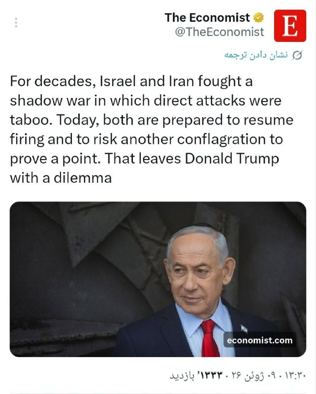

🔴اکونومیست:

ایران و اسرائیل که برای دهه‌ها درگیر جنگی پنهان با تابوی حملات مستقیم بودند، اکنون آماده هستند تا با شکستن این مرزها، خطر یک درگیری به تمام معنا را به جان بخرند، وضعیتی که ترامپ را در برابر یک دوراهی بسیار سختی قرار داده است.

@IranianMinds

## IranianMinds — post 21903

  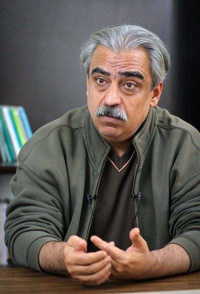

🔴خوش‌چشم:

فکر نکنم حالا حالاها جنگ بشه.

@IranianMinds

## IranianMinds — post 21901

  <a href="telegram/content/IranianMinds_21901_1781009008.mp4" target="_blank">🎬 Download video</a>

🔻🔺آویخای ادرعی، سخنگوی عربی‌زبان ارتش اسرائیل:

هشدار فوری به ساکنان شهر صور، اردوگاه‌ها و محله‌های اطراف آن، مطابق منطقه مشخص‌شده روی نقشه.

در پی نقض آتش‌بس از سوی حزب‌الله و هدف قرار دادن جبهه داخلی اسرائیل، ارتش اسرائیل ناچار است با قدرت علیه این گروه اقدام کند.

ارتش اسرائیل قصد آسیب‌رساندن به شما را ندارد. برای حفظ جانتان، از شما خواسته می‌شود فوراً خانه‌های خود را در محدوده مشخص‌شده روی نقشه تخلیه کنید و به شمال رود زهرانی بروید.

این هشدار شامل افراد حاضر در شهر صور، از جمله محله مسیحی، و همچنین ساکنان اردوگاه‌ها و مناطق اطراف آن می‌شود: شیبریا، حمادیه، جل‌البحر، زقوق‌المفدی، البص، المعشوق، برج الشمالی، نبع، الحوش، رشیدیه و عین بعال.

حضور شما در نزدیکی نیروهای حزب‌الله، تأسیسات یا تجهیزات نظامی این گروه، جانتان را به خطر می‌اندازد.

همان‌طور که پیش‌تر هشدار داده شد، در پی فعالیت نیروهای حزب‌الله در محله مسیحی شهر، ارتش اسرائیل در آینده نزدیک علیه فعالیت‌های این گروه در آن منطقه اقدام خواهد کرد. هر ساختمانی که حزب‌الله از آن برای اهداف نظامی استفاده کند، ممکن است هدف قرار گیرد.

برای حفظ جانتان، فوراً خانه‌های خود را تخلیه کنید و به شمال، آن‌سوی رود زهرانی بروید. هرگونه حرکت به جنوب رود زهرانی می‌تواند جان شما را به خطر بیندازد.

## IranianMinds — post 21900

🔴سی‌ان‌ان:

ترامپ تا به الان ۳۷ بار توافق با ایران را قریب‌الوقوع اعلام کرده است، اما هنوز هیچ توافقی حاصل نشده است!

@IranianMinds

## BBCPersian — post 283256

🔻سنتکام: بالگرد آپاچی «در حال گشت‌زنی» نزدیک سواحل عمان سقوط کرد

فرماندهی مرکزی ایالات متحده آمریکا (سنتکام) در مورد سقوط بالگرد آپاچی بیانیه‌ای صادر کرد.

در این بیانیه آمده است: «در ساعت ۷:۳۳ دیروز عصر به وقت شرق آمریکا پس از سقوط یک فروند بالگرد تهاجمی (ای‌اچ-۶۴ آپاچی) متعلق به ارتش آمریکا در نزدیکی سواحل عمان، نیروهای آمریکایی دو خلبان آن را نجات دادند.»

سنتکام در این پیام در شبکه ایکس گفت که این بالگرد در حال «گشت‌زنی در آب‌های منطقه» بود که دچار حادثه شد.

بر اساس بیانیه سنتکام، «عملیات جست‌وجو و نجات با موفقیت انجام شد و این دو نظامی پس از حدود دو ساعت از آب نجات داده شدند. همچنین وضعیت جسمانی هر دو نفر پایدار گزارش شده است.»

سنتکام گفت علت در دست بررسی بوده و تحقیقات دامه دارد.

جزئیات بیشتری منتشر نشده است.

پیش‌تر دونالد ترامپ با تایید این حادثه گفت که دو خلبان بالگرد در سلامت هستند.

@BBCPersian

## BBCPersian — post 283255

🔻در پی انتشار ویدیویی از درگیری در فدراسیون ووشو و اطلاعیه این فدراسیون در مورد شکایت از خواهران منصوریان، الهه و شهربانو منصوریان با انتشار ویدیوهایی در این مورد توضیحاتی منتشر کرده‌اند.

فدراسیون ووشو در اطلاعیه دیروزش گفته بود این دو خواهر «با داد و فریاد و شکستن در، وارد دفتر ریاست فدراسیون شدند و حاضران را تهدید به ضرب و شتم کرده‌اند.»

بر اساس این بیانیه، الهه منصوریان همچنین «با چاقوی میوه‌خوری اتاق ریاست فدراسیون خودزنی» کرده است.

شهربانو و الهه منصوریان در ویدیوهایی که منتشر کرده‌اند با رد اتهام خودزنی، امیر صدیقی، رئیس فدراسیون ووشو و دیگر افراد حاضر در دفتر ریاست فدراسیون را متهم به حمله و درگیری فیزیکی کرده‌اند.

الهه منصوریان در مصاحبه‌ای با هفت صبح ورزشی که روز دوشنبه پس از این حادثه ضبط شده، می‌گوید هنگام دفاع از خواهرش با چاقو زخمی شده است و در پایان می‌گوید «در دادگاه همه چیز مشخص خواهد شد.»
@BBCPersian

## BBCPersian — post 283254

🔻به گفته «کمپین بین‌المللی برای نابودی سلاح‌های هسته‌ای»، کشورهای دارای سلاح هسته‌ای سال گذشته هزینه‌های خود برای تسلیحات اتمی را «حدود ۲۰ درصد» افزایش دادند و به رقم بی‌سابقه نزدیک به «۱۱۹ میلیارد دلار» رساندند.

بر اساس گزارش جدید این کارزار بین‌المللی، «۹ کشور دارای سلاح هسته‌ای در مجموع حدود ۱۷ میلیارد دلار بیشتر از سال قبل برای زرادخانه‌های خود هزینه کرده‌اند.»

این گزارش هشدار می‌دهد رقابت جدیدی در حوزه تسلیحات هسته‌ای شکل گرفته که دولت‌ها قصد دارند در دهه‌های آینده ادامه دهند.

سوزی اسنایدر، مدیر برنامه‌های این کمپین بین‌المللی و یکی از نویسندگان این گزارش، گفت علاوه بر افزایش بودجه «نقش هوش مصنوعی در افزایش خطر استفاده از سلاح هسته‌ای، بسیار نگران‌کننده است. صادقانه بگویم، من وحشت‌زده‌ام.»

این مطالعه نشان می‌دهد همه کشورهای هسته‌ای شامل آمریکا، چین، روسیه، بریتانیا، فرانسه، هند، پاکستان، اسرائیل و کره شمالی در سال گذشته هزینه‌های خود را افزایش داده‌اند.

در پنج سال گذشته، این ۹ کشور در مجموع بیش از «۴۷۰ میلیارد دلار» برای تسلیحات هسته‌ای هزینه کرده‌اند و پیش‌بینی می‌شود این روند در آینده هم ادامه داشته باشد.

به گفته خانم اسنایدر، تنها هزینه یک روز از این برنامه‌های تسلیحاتی می‌توانست امنیت غذایی میلیون‌ها نفر را تأمین کند و مجموع هزینه سال ۲۰۲۵ می‌توانست «۳۲ سال» بودجه سازمان ملل را پوشش دهد.

@BBCPersian

## BBCPersian — post 283253

🔻شی جین‌پینگ، رئیس‌جمهور چین، با کیم جونگ اون، رهبر کره شمالی، در پیونگ یانگ دیدار کرد.

خبرگزاری رسمی کره شمالی این دیدار را فصل تازه‌ای در روابط دو کشور توصیف کرد و گفت دو رهبر بر گسترش همکاری‌ها در حوزه‌های سیاسی، اقتصادی و فرهنگی توافق کردند.

به گزارش این خبرگزاری آقای شی در نخستین سفر به کره شمالی در هفت سال گذشته گفت هدفش تقویت روابط دوجانبه است و دو طرف بر گسترش ارتباطات استراتژیک از طریق سفر مقام‌های عالی‌رتبه تأکید کردند.

آقای کیم هم در دیدار با رهبر چین گفت که از «اصل چین واحد» حمایت کامل می‌کند؛ اصلی که بر اساس آن پکن، تایوان را بخشی از چین می‌داند.

رهبر چین از برج دوستی چین و کره در پیونگ‌یانگ بازدید کرد که به یادبود سربازان چینی کشته‌شده در جنگ کره ساخته شده است.

تحلیل‌گران معتقدند با وجود پیام‌های رسمی دوستانه، دو طرف اولویت‌های متفاوتی دارند. چین بیشتر بر همکاری‌های اقتصادی و عملی تاکید دارد درحالی‌که کره شمالی بر برابری سیاسی و استقلال در روابط اصرار دارد.

در گزارش‌ها از این سفر اشاره‌ای به برنامه هسته‌ای کره شمالی یا روابط با آمریکا نشده است، موضوعی که به گفته تحلیل‌گران نشان می‌دهد چین ترجیح می‌دهد تمرکز این دیدار بر روابط دوجانبه باقی بماند.

@BBCPersian

## BBCPersian — post 283252

🔻وزیر ارتباطات ایران: آسیب جنگ به زیرساخت‌های ارتباطی حدود ۶۸ همت برآورد شده

ستار هاشمی، وزیر ارتباطات ایران خسارت جنگ به زیرساخت‌های ارتباطی را حدود ۶۸ هزار میلیارد تومان برآورد کرده است.

او در یک نشست خبری گفته است که در جریان جنگ آمریکا و اسرائیل با ایران، «بخش‌هایی از زیرساخت‌های وزارت ارتباطات و فناوری اطلاعات دچار آسیب شد که برآورد کلی آن در همه حوزه‌ها حدود ۶۸ همت اعلام شده است.»

او بخش قابل توجهی از این خسارت را مربوط به حوزه صنعت فضایی، از جمله پژوهشگاه فضایی ایران و برخی ایستگاه‌های زمینی اعلام کرده است.

پژوهشگاه فضایی ایران واقع در محله طرشت تهران شامگاه جمعه ۲۲ اسفند هدف حملات قرار گرفت.

این مجموعه که در سال ۱۳۹۰ راه‌اندازی شده، زیرمجموعه وزارت ارتباطات است و از سال ۱۳۹۸ هم در فهرست تحریم‌های آمریکا بوده است.

@BBCPersian

## BBCPersian — post 283251

  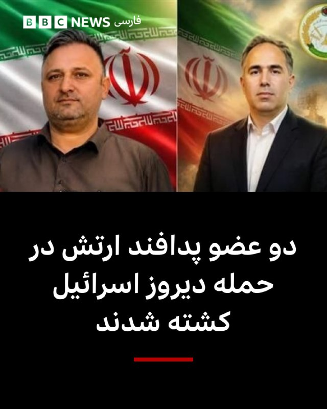

🔻دو عضو نیروی پدافند هوایی ارتش ایران در حمله دیروز اسرائیل کشته شدند

رسانه‌های ایران می‌گویند دو تن از اعضای «نیروی پدافند هوایی ارتش» در حمله دیروز اسرائیل «با شلیک دشمن» کشته شدند و امروز تشییع می‌شوند.

تاکنون در حملات دوشنبه و سه‌شنبه اسرائیل کشته‌ای گزارش نشده بود و ۱۵ زخمی اعلام شده بود.

ارتش اسرائیل دیروز گفت حمله «همه‌جانبه‌ای» به سامانه‌های پدافندی راهبردی ایران کرده است.

بنابر بیانیه‌ ارتش اسرائیل، در جنگ ۱۲ روزه پدافند ایران ضعیف شد اما بعد «سامانه‌های پدافندی در نقاط مختلف ایران» مستقر شدند تا توانشان را بازسازی کنند که در این حملات این سامانه‌ها منهدم شدند.
@BBCPersian

## Dirty_Kids — post 391456

  <a href="telegram/content/Dirty_Kids_391456_1781009011.mp4" target="_blank">🎬 Download video</a>

با اختلاف قشنگ‌ترین کلیپی که برای تیم ملی ساختن

دست به دست کنید برسه به بازیکنان تیم ملی تا روحیه بگیرن 😂

@Dirty_Kids 👻

## Dirty_Kids — post 391455

  <a href="telegram/content/Dirty_Kids_391455_1781009012.mp4" target="_blank">🎬 Download video</a>

​​پاسخ فرزاد فخری زاده به خزعبلات این بازیگر درجه چندم که جوانان ایرانی را ملامت می‌کند

@Dirty_Kids 👻

## Dirty_Kids — post 391454

  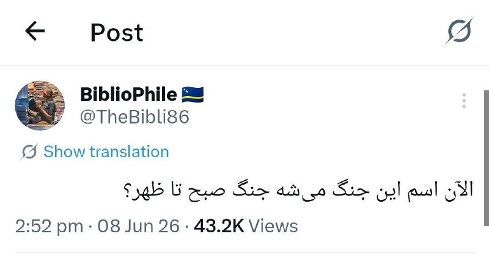

جنگ کله گنجشکی

@Dirty_Kids 👻

## Dirty_Kids — post 391453

  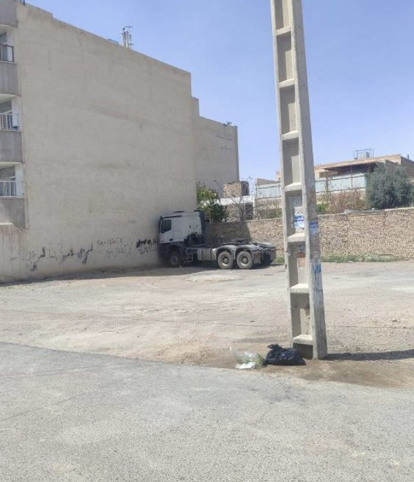

امروز یه کامیون ناراحت دیدم :(

@Dirty_Kids 👻

## Dirty_Kids — post 391452

  <a href="telegram/content/Dirty_Kids_391452_1781009016.mp4" target="_blank">🎬 Download video</a>

جاستین ترودو چقد هوله، کم مونده بود تا ارنج دستشو بکنه تو کون کیتی‌ پری

@Dirty_Kids 👻

## Dirty_Kids — post 391451

  <a href="telegram/content/Dirty_Kids_391451_1781009019.mp4" target="_blank">🎬 Download video</a>

- یکی‌شون میگه عاغا یخچال نداشته
- یکی‌شون میگه عاغا از دید تو یخچال پنیر نیست

وقتی همه‌چیشون دروغه، از این سوتی‌ها زیاد میدن :)))))
سرنوشت عاغاشون کلا به یخچال گره خورده

@Dirty_Kids 👻

## Dirty_Kids — post 391450

  <a href="telegram/content/Dirty_Kids_391450_1781009020.mp4" target="_blank">🎬 Download video</a>

فصل جدید پروژه عادی‌سازی زدبازی با وصل شدن اینترنت کلید خورد. حواسا جمع

@Dirty_Kids 👻

## Dirty_Kids — post 391449

  <a href="telegram/content/Dirty_Kids_391449_1781009022.mp4" target="_blank">🎬 Download video</a>

🔴 تحقیقات علمی شگفت انگیزی راجب خانوما!
افت هورمونی که یه زن توی ۲ روز تجربه میکنه معادلش توی بدن مردها ۱۲۵ سال طول می‌کشه!

به همین دلیل میگن بدن خانوما از مردا خیلی مقاوم تره.

@Dirty_Kids 👻

## Dirty_Kids — post 391448

  <a href="telegram/content/Dirty_Kids_391448_1781009024.mp4" target="_blank">🎬 Download video</a>

رسانه‌ی امنیتی «آن یا عن» چقدر لجنه!

البته آفت وسط‌بازی و عافیت‌طلبی هم همینه که هر دو طرف ماجرا می‌تونند میانه‌رو ها رو تخریب کنند.
ولی گفتن این حرف‌ها در دوربین هم وقاحت خاصی می‌خواد!

#فردوسی‌پور

@Dirty_Kids 👻

## Dirty_Kids — post 391446

میدونستید ساسانیان شمشیر دودستی داشتن؟

@Dirty_Kids 👻

## Dirty_Kids — post 391445

  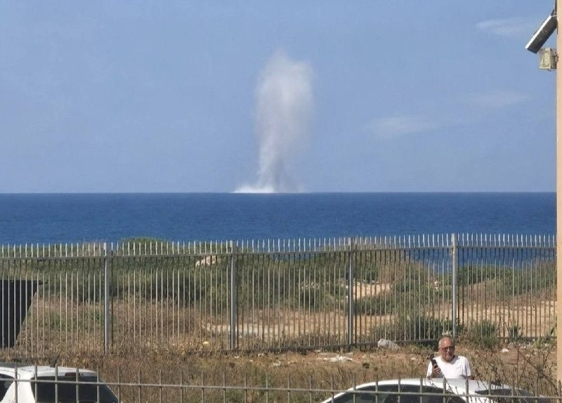

🔴 فوری کانال ۱۴ اسرائیل :

بیکینی باتم مستقیما وارد جنگ شد. تصویر منتشر شده از نقطه زنی دیروز سپاه رستوران اقای خرچنگ.
کانال ۱۴ اسرائیل رسما تایید کرد که متاسفانه aquaman شهید شد.

@Dirty_Kids 👻

## Dirty_Kids — post 391444

  <a href="https://t.me/Dirty_Kids/391444" target="_blank">📎 Download file</a>

ریتزوبت تنها سایت بین المللی میباشد ، که به صورت هفتگی پرومو کد دریافت میکنید ✅

♦️ آموزش شارژ حساب با کریپتو
♦️ آموزش شارژ حساب ریالی در ریتزوبت
#پیشبینی
🔵ریتزوبت برندی با لایسنس معتبر در صنعت شرطبندی و پیشبینی مسابقات ورزشی و کازینویی 👇

https://t.me/+LB508WZyIr8xNmY0

## Dirty_Kids — post 391443

  <a href="telegram/content/Dirty_Kids_391443_1781009028.webm" target="_blank">🎬 Download video</a>

🎁 می‌دونستین توی ریتزوبت هرکی شرط‌بندی کنه، هر هفته بین 1.000.000 تومن تا 100.000.000 تومان پروموکد می‌گیره 
‼️

💰 باحالیش اینجاست که فرقی نداره شرطت ببره یا ببازه، تو هر صورت پروموکد بهت میدن 
🔥

🚀 وقتی شرط ‌هاتون رو توی ریتزوبت ثبت کنین ، هم شانس برد دارین و هم هفتگی کسب درآمد میکنید 
🤑

🛸 لینک ورود به سایت 👉

🌐 کانال تلگرامی 
3️⃣
2️⃣
1️⃣
R19
https://t.me/+LB508WZyIr8xNmY0

## Dirty_Kids — post 391442

🔴 یوتیوب قراره رفع فیلتربشه!!

مصطفی پوردهقان، نماینده مجلس:
وزیر ارتباطات در کمیسیون قول دادند که فضا را به شرایط عادی برگردانند و بعد از رفع فیلتر واتساپ، رفع فیلتر یوتیوب هم در دستور کار بود.

@Dirty_Kids 👻

## Hranews — post 113487

پایان مرگبار یک درگیری خانوادگی؛ پدر ۷۵ ساله قربانی اسیدپاشی پسرش شد

❗️
❗️
❗️
❗️
❗️– یک مرد ۷۵ ساله که حدود ۱۲ روز پیش در پی یک درگیری با پسرش دچار سوختگی شدید با اسید دست‌ساز شده بود، در یکی از بیمارستان‌های تهران جان خود را از دست داد. متهم بازداشت شده و بررسی وضعیت سلامت روانی او در دستور کار قرار گرفته است.

ادامه مطلب

#اسیدپاشی

↘️
@hranews_bot تماس ✉️ - @Hranews کانال هرانا 🆑

## Hranews — post 113486

  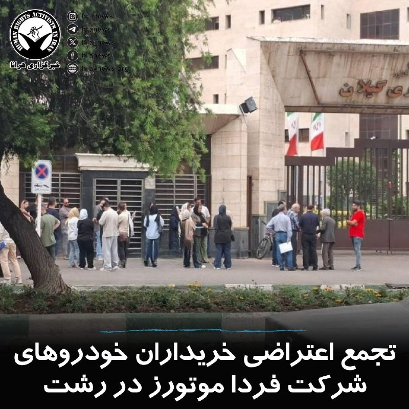

امروز سه شنبه، گروهی از خریداران خودروهای شرکت فردا موتورز، مقابل استانداری گیلان در رشت تجمع اعتراضی برگزار کردند. تجمع این شهروندان در اعتراض به تاخیر طولانی مدت در تحویل خودروهایشان، بلاتکلیفی خریداران و نبود پاسخگویی شفاف از سوی مسئولان شرکت، برگزار شده است.
#تجمع_اعتراضی

↘️
@hranews_bot تماس ✉️ - @Hranews کانال هرانا 🆑

## Hranews — post 113485

  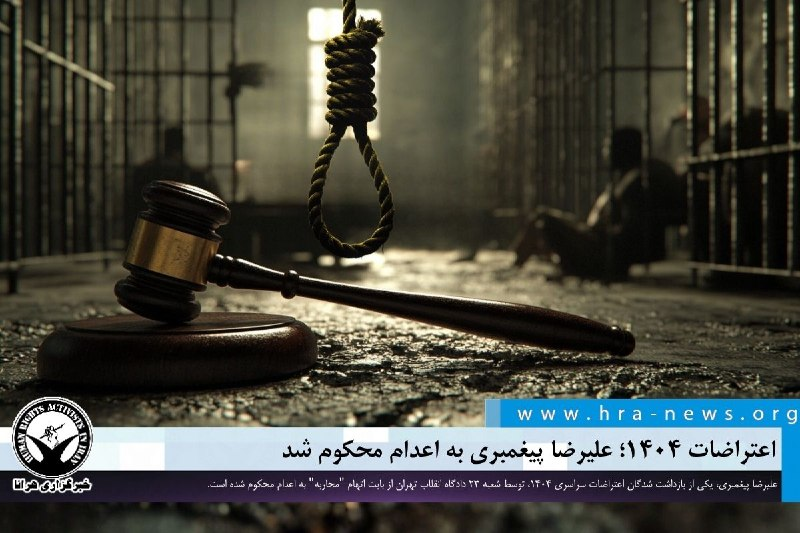

اعتراضات ۱۴۰۴؛ علیرضا پیغمبری به اعدام محکوم شد

❗️
❗️
❗️
❗️
❗️– علیرضا پیغمبری، جوان ۲۶ ساله و یکی از بازداشت شدگان اعتراضات سراسری دی‌ماه ۱۴۰۴ که در زندان تهران بزرگ محبوس است، توسط شعبه ۲۳ دادگاه انقلاب تهران از بابت اتهام “محاربه” به اعدام محکوم شد. پرونده وی هم اکنون در دیوان عالی کشور در دست بررسی است.

به گزارش خبرگزاری هرانا، ارگان خبری مجموعه فعالان حقوق بشر در ایران، علیرضا پیغمبری، یکی از بازداشت شدگان اعتراضات سراسری ۱۴۰۴ به اعدام محکوم شد.

بر اساس اطلاعات دریافتی هرانا، آقای پیغمبری، ۲۶ ساله، توسط شعبه ۲۳ دادگاه انقلاب تهران از بابت اتهام “محاربه” به اعدام محکوم شده و هم اکنون پرونده وی در شعبه ۹ دیوان عالی کشور در دست بررسی است.

ادامه مطلب

#علیرضا_پیغمبری #اعدام

↘️
@hranews_bot تماس ✉️ - @Hranews کانال هرانا 🆑

## Hranews — post 113484

بخش دیگری از اموال علی کریمی، بازیکن سابق فوتبال توقیف شد

❗️
❗️
❗️
❗️
❗️– مرکز قوه قضائیه از توقیف بخشی از اموال علی کریمی بازیکن سابق فوتبال ساکن خارج از کشور خبر داد. این اقدام به دلیل آنچه قوه قضاییه «فعالیت گسترده‌ در حمایت از دشمن در سال‌های گذشته، به‌ویژه در جنگ‌های اخیر» عنوان کرده، صورت گرفته است. پیشتر نیز بخش دیگری از اموال وی توقیف شده است.

ادامه مطلب

#توقیف_اموال #علی_کریمی

↘️
@hranews_bot تماس ✉️ - @Hranews کانال هرانا 🆑

## Hranews — post 113483

چابهار؛ یک سوختبر بر اثر تیر اندازی نیروهای نظامی مجروح شد

❗️
❗️
❗️
❗️
❗️– امروز تیراندازی نیروهای نظامی به سمت خودروی یک #سوختبر در منطقه خور کلانی از توابع شهرستان چابهار، موجب مجروح شدن وی شد.

ادامه مطلب

↘️
@hranews_bot تماس ✉️ - @Hranews کانال هرانا 🆑

## officialrezapahlavi — post 1840

نسخه کامل سخنرانی در نشست امنیتی دریای سیاه (با زیرنویس فارسی)

اودسا - اوکراین
شنبه ۹ خرداد ۲۵۸۵/۱۴۰۵

@OfficialRezaPahlavi

## alonews — post 126511

  <a href="telegram/content/alonews_126511_1781009029.webm" target="_blank">🎬 Download video</a>

👈به گفته اسرائیل ارتش، یک فرد مسلح که از لبنان به خاک اسرائیل نفوذ کرده و در منطقه رامیم ریج به سمت نیروهای اسرائیلی آتش گشوده بود، به ضرب گلوله کشته شد.

🔴ارتش اسرائیل می‌گوید در این حادثه هیچ مجروحی نداشته است و نیروها در حال بررسی منطقه برای یافتن مهاجمان احتمالی دیگر هستند. یک پهپاد نیروی هوایی اسرائیل نیز برای کمک به جستجوها به منطقه اعزام شده است.

🔴به ساکنان جوامع مرزی میسگاو آم، مارگالیوت و منارا در منطقه جلیله پنهندل دستور داده شده است که تا اطلاع ثانوی در خانه‌های خود بمانند و یک بزرگراه در نزدیکی آن به روی ترافیک بسته شده است.

✅ @AloNews خبر جنگ

## alonews — post 126509

  <a href="telegram/content/alonews_126509_1781009029.webm" target="_blank">🎬 Download video</a>

👈زبان ترکی به سوپر اپلیکیشن بله اضافه شد

✅ @AloNews خبر جنگ

## alonews — post 126508

  <a href="telegram/content/alonews_126508_1781009030.webm" target="_blank">🎬 Download video</a>

👈وزیر خارجه بریتانیا: با عراقچی صحبت کردم و به او گفتم که از سرگیری درگیری به نفع هیچ‌کس نیست

🔴 از اعلام توقف حملات متقابل ایران و اسرائیل استقبال می‌کنیم

✅ @AloNews خبر جنگ

## alonews — post 126504

  <a href="telegram/content/alonews_126504_1781009030.mp4" target="_blank">🎬 Download video</a>

👈جنگنده‌های اسرائیلی امروز چندین حمله هوایی به صیدا در جنوب لبنان انجام دادند.

✅ @AloNews خبر جنگ

## alonews — post 126503

  <a href="telegram/content/alonews_126503_1781009032.webm" target="_blank">🎬 Download video</a>

👈ترامپ: تنگه هرمز بلافاصله پس از امضا باز خواهد شد، که ممکن است در دو یا سه روز آینده باشد

✅ @AloNews خبر جنگ

## alonews — post 126502

👈سفیر اسرائیل در آمریکا: می‌خواهیم جنگ را طوری پایان دهیم که تضمین شود ایران برنامه تسلیحات هسته‌ای یا موشکی و حمایت از نیروهای نیابتی خود در منطقه، از جمله حماس و حزب‌الله را متوقف کند

✅ @AloNews خبر جنگ

## alonews — post 126501

  <a href="telegram/content/alonews_126501_1781009032.webm" target="_blank">🎬 Download video</a>

👈خبرنگار الجزیره: حمله هوایی اسرائیل به شهر نبطیه الفوقا در جنوب لبنان

✅ @AloNews خبر جنگ

## alonews — post 126500

  <a href="telegram/content/alonews_126500_1781009032.webm" target="_blank">🎬 Download video</a>

👈پاریس: ورود بتسالل اسموتریچ، وزیر دارایی اسرائیل، و ۴ نفر از رهبران سازمان‌های شهرک‌نشینان و ۲۱ شهرک‌نشین به فرانسه ممنوع اعلام شد.

✅ @AloNews خبر جنگ

## alonews — post 126499

  <a href="telegram/content/alonews_126499_1781009033.webm" target="_blank">🎬 Download video</a>

👈ارتش اسرائیل مدعی شد دو فرمانده ارشد وابسته به جنبش جهاد اسلامی فلسطین را در حمله‌ای هوایی در جنوب غزه هدف قرار داده و عملیات موفقیت آمیز بوده است.

🔴در این حمله «ایاد محمد عبدالعزیز نفل»، از فرماندهان نیروهای نخبه جهاد اسلامی، و «احمد معروف»، رئیس یک هسته عملیاتی مسئول اجرای حملات راکتی علیه اسرائیل، ترور شدند

✅ @AloNews خبر جنگ

## alonews — post 126497

  <a href="telegram/content/alonews_126497_1781009033.webm" target="_blank">🎬 Download video</a>

👈حملهِ هوایی به شهر کوثریه الرز جنوب لبنان

✅ @AloNews خبر جنگ

## alonews — post 126496

  <a href="telegram/content/alonews_126496_1781009033.webm" target="_blank">🎬 Download video</a>

👈شبکه ۱۳ اسرائیل : شورای وزارتی کوچیک تصمیم گرفته هر موشکی از لبنان سمت اسرائیل شلیک بشه، جوابش با حمله به بیروت داده بشه

✅ @AloNews خبر جنگ

## alonews — post 126495

  <a href="telegram/content/alonews_126495_1781009033.webm" target="_blank">🎬 Download video</a>

👈اسرائیل هیوم: مارکو روبیو نقش کلیدی در متقاعد کردن ترامپ برای حمایت از حمله اسرائیل به ایران پس از حمله موشکی تهران ایفا کرد.

🔴بر اساس منابع اسرائیلی و آمریکایی، روبیو از استدلال اسرائیل حمایت کرد که عدم پاسخ دادن به ایران برتری می‌دهد و تشویق به حملات بیشتر می‌کند.

✅ @AloNews خبر جنگ

## alonews — post 126494

  <a href="telegram/content/alonews_126494_1781009034.webm" target="_blank">🎬 Download video</a>

👈نماینده ایران در آژانس بین‌المللی انرژی اتمی: تجاوزات و تهدیدهای مداوم که شرایط استثنایی فعلی را ایجاد کرده‌اند، متوقف نشده‌اند

تلاش‌های آمریکا در شورای حکام آژانس بین‌المللی انرژی اتمی الگویی برای توجیه تجاوز بیشتر علیه کشورمان است

✅ @AloNews خبر جنگ

## alonews — post 126493

  <a href="telegram/content/alonews_126493_1781009034.mp4" target="_blank">🎬 Download video</a>

👈سخنگوی کمیسیون امنیت ملی مجلس : خود آمریکایی‌ها تو مذاکرات غیرمستقیم به ما گفتن حرف‌های ترامپ رو جدی نگیرید

🔴 اون چیزی که از طرف آمریکایی‌ها تو مذاکره‌ها به ما می‌رسه با حرف‌هایی که علنی می‌زنن فرق داره

✅ @AloNews خبر جنگ

## alonews — post 126492

  <a href="telegram/content/alonews_126492_1781009036.webm" target="_blank">🎬 Download video</a>

👈بر اساس گزارش بلومبرگ، سقوط قیمت بیت‌کوین به زیر $۶۰,۰۰۰$ دلار در روز جمعه گذشته، بدترین عملکرد هفتگی این رمزارز را از زمان بحران و فروپاشی صرافی FTX (متعلق به سم بنکمن-فرید) در سال ۲۰۲۲ رقم زده است

✅ @AloNews خبر جنگ

---
📅 بروزرسانی: 1405/03/19 13:22
---

## WithYashar — post 14108

  <a href="telegram/content/WithYashar_14108_1780998757.mp4" target="_blank">🎬 Download video</a>

انفجار و آتش سوزی پادگان سپاه کنار کوه صفه اصفهان
پیشتر رژیم اعلام کرده بود امروز اصفحان خنثی سازی مهمات عمل نکرده انجام میشود
@withyashar

## WithYashar — post 14107

یوتیوب رفع فیلتر می‌شود

مصطفی پوردهقان، نماینده مجلس:
وزیر ارتباطات در کمیسیون قول دادند که فضا را به شرایط عادی برگردانند و بعد از رفع فیلتر واتساپ، رفع فیلتر یوتیوب هم در دستور کار بود.
@withyashar

## WithYashar — post 14106

## WithYashar — post 14105

سهمیه بلیت تماشاگران ایران در جام جهانی حذف شد
@withyashar

## WithYashar — post 14104

  <a href="telegram/content/WithYashar_14104_1780998759.mp4" target="_blank">🎬 Download video</a>

حضور اتباع کشورهای مختلف در تجمعات شبانه حکومتی
@withyashar 🥴

## WithYashar — post 14103

شبکه cnn: ترامپ ۳۷ بار توافق با ایران را «قریب‌الوقوع» اعلام کرده، اما هنوز هیچ توافقی حاصل نشده!
@withyashar

## WithYashar — post 14102

وزیر ارتباطات: ترافیک اینترنت بین‌الملل قبل از ۴ خرداد با ترافیکی که از مسیر استارلینک از شبکه‌های مرزی خارج می‌شد، برابری می‌کرد
@withyashar

## WithYashar — post 14101

رسانه های رژیم : هلیکوپتر تهاجمی آپاچی AH-64، بعد از عدم توجه به هشدارها توسط نیروی دریایی سپاه پاسداران و بوسیله شلیک یکی از قایق های بسیج، ساقط شده است.
این در حالیست که با توجه به قریب‌الوقوع بودن اعلام متن تفاهم مشترک، اسقاط این هلیکوپتر به نقص فنی مرتبط شده است.
@withyashar

## WithYashar — post 14100

ترامپ درباره نتانیاهو:

به نتانیاهو حمله شد و او هم متقابلاً پاسخ داد و من نمی‌توانم او را به خاطر این موضوع سرزنش کنم، آنها را هدف قرار دادند. آنهاهم متقابلاً پاسخ دادن و حالا درگیری را تمام کرده‌اند.
بنابراین، آنها قرار است فقط برای یک هفته دیگر یا چیزی حدود آن، یکدیگر را به حال خود رها کنند.
این وضعیت خاورمیانه مدت زیادی است که ادامه دارد. اگر واقعاً بخواهید بگویید حدود ۳۰۰۰ سال اما مطمئناً ۴۷ سال است که اینگونه ادامه دارد.
@withyashar

## WithYashar — post 14099

ترامپ گفت خلبانان بالگرد آپاچی که در تنگه هرمز سقوط کرد، سالم هستند. او گفت آمریکا امروز گزارشی درباره این حادثه منتشر خواهد کرد.
@withyashar
این حادثه در دست بررسی است و هنوز مشخص نیست که آیا این بالگرد با شلیک نیروهای جمهوری اسلامی سرنگون شده، دچار نقص فنی شده یا با مشکل دیگری مواجه شده است.

## WithYashar — post 14098

حملات سنگین اسراییل به صور لبنان
رادیو ارتش اسرائیل: ما محدودیت‌هایی برای حمله به بیروت داریم اما برای عملیات در جنوب لبنان محدودیتی نداریم
@withyashar

## WithYashar — post 14097

فارس: تجهیزات هدایت و پشتیبانی جنگنده‌های اسرائیلی در جنگل‌های تنکابن(شهسوار) کشف شد
خبرگزاری فارس گزارش داد مجموعه‌ای از تجهیزات فنی و سامانه‌های زمین‌پایه که گفته می‌شود برای پشتیبانی و هدایت جنگنده‌های مهاجم مورد استفاده قرار می‌گرفته، در ارتفاعات جنگلی شهرستان تنکابن در استان مازندران کشف و جمع‌آوری شده است.

بر اساس این گزارش، این تجهیزات در یکی از مسیرهای اصلی ورود جنگنده‌ها به حریم هوایی تهران مستقر بوده‌اند.
فارس مدعی شده منطقه مورد نظر در جریان «جنگ رمضان» یکی از کریدورهای اصلی ورود جنگنده‌های اسرائیلی برای اجرای حملات علیه تهران و مناطق شمالی کشور محسوب می‌شده است.
@withyashar

## WithYashar — post 14096

حزب دمکرات کردستان ایران کمی پیش امروز سشنبه در شبکه ایکس خبر داد یکی از کمپ‌های این حزب بار دیگر هدف حمله پهپادی جمهوری اسلامی قرار گرفت.

بر اساس این گزارش در این حمله دو فروند پهپاد به سمت "کمپ آزادی" شلیک شده‌اند.
کمپ آزادی محل اسکان خانواده‌های اعضای حزب دمکرات است و از آغاز درگیری‌های اخیر تا کنون بارها هدف حملات جمهوری اسلامی قرار گرفت. این حزب تا کنون گزارشی درباره تلفات جانی یا زخمی‌ها ارائه نکرده است.
بر اساس این گزارش، جمهوری اسلامی ایران از زمان آغاز درگیری‌ها با آمریکا و اسرائیل تا کنون با شلیک بیش از ۱۳۴ فروند موشک و پهپاد، کمپ‌های حزب دمکرات کردستان ایران و همچنین مراکز درمانی و آموزشی این حزب را هدف قرار داده است.
@withyashar

## WithYashar — post 14095

  <a href="telegram/content/WithYashar_14095_1780998761.mp4" target="_blank">🎬 Download video</a>

اهواز همین الان
@withyashar
گویا دود فلر ‌نفتیه

## WithYashar — post 14094

  <a href="telegram/content/WithYashar_14094_1780998762.mp4" target="_blank">🎬 Download video</a>

ان‌بی‌سی نیوز : وقتی رئیس جمهور ترامپ در بازی سوم فینال NBA هنگام پخش سرود ملی روی جایگاه تماشاگران در مدیسون اسکوئر گاردن ظاهر شد، توسط جمعیت (BOOE) هو شد.
@withyashar

## mwarmonitor — post 10508

🔴بیانیه صادره از حزب‌الله درباره پاسخ موشکی ایران به اسرائیل:

🔸پاسخ موشکی ایران به رژیم صهیونیستی در حمایت از مردم لبنان، پیام پایبندی اخلاقی، سیاسی و میدانی جمهوری اسلامی ایران به لبنان است؛ پس از آن‌که این دشمن با پوشش کامل دولت آمریکا، در ارتکاب جنایات علیه کشور ما زیاده‌روی کرده و بار دیگر ضاحیه جنوبی را هدف قرار داده است، در چارچوب نقض‌های مداوم خود از توافق آتش‌بس، اقدامی که نشان‌دهنده بی‌اعتنایی کامل او به تمام توافق‌های بین‌المللی است.

از این رو، پاسخ ایران با هدف تأکید بر این موضوع صورت گرفت که منافع ثبات منطقه و کشورهای آن در این است که همه تلاش‌ها برای حفظ توافق‌ها به کار گرفته شود و دشمن صهیونیستی پیش از دیگران به آن‌ها پایبند باشد. این همان پیامی است که ایران به‌صورت روشن و قوی به همه طرف‌های ذی‌ربط در تلاش‌های ثبات منطقه ارسال کرده است. این اقدام همزمان با حمایت قابل تقدیر جنبش انصارالله یمن و در چارچوب اقدام مشترک برای بازدارندگی رژیم صهیونیستی انجام شد تا به دولت آمریکا فهمانده شود که حمایت آن از تجاوز اسرائیل علیه کشور ما، تمامی توافق‌هایی را که در پی آن است، با شکست مواجه خواهد کرد.

این موضوع به‌ویژه با توجه به اصرار جمهوری اسلامی ایران بر گنجاندن هرگونه توافق، بر آتش‌بس کامل در همه جبهه‌ها، به‌خصوص در لبنان، به‌عنوان مقدمه‌ای برای وادار کردن دشمن به عقب‌نشینی از خاک لبنان، بازگشت آوارگان، بازسازی و آزادی اسرا است.

این حمایت ایران از حقوق مشروع ما و تحمل هزینه‌های مادی و سیاسی آن بار دیگر تأیید می‌کند که ایران حامی لبنان است، نه برعکس؛ بر اساس اصول انسانی و روابط تاریخی عمیق میان دو ملت. ایران همواره به دنبال خیر برای لبنان بوده و در حمایت از مقاومت برای آزادسازی سرزمین و بازسازی آن نقش داشته است.

این موضع شرافتمندانه ایران در کنار لبنان، شایسته قدردانی دولت لبنان است، نه انکار یا توهین تحت فشارهای خارجی. همه اتهامات علیه نقش ایران، از جمله بیانیه‌های مشترک با دشمن و آمریکا، اقدامی خارج از عرف دیپلماتیک و در راستای منافع اسرائیل است.

ما از دولت لبنان می‌خواهیم از این فرصت استفاده کرده و روابط رسمی خود با جمهوری اسلامی ایران را در جهت منافع دو کشور اصلاح کند و از این حمایت برای تحقق اهداف ملی بهره گیرد.

در پایان، حزب‌الله به نمایندگی از مردم لبنان، خانواده شهدا، آوارگان و همه آزادگان کشور، از این موضع ایران قدردانی کرده و آن را ستایش می‌کند و بر ادامه مقاومت تا تحقق کامل حقوق خود تأکید دارد، هرچند بهای آن سنگین باشد.


@mwarmonitor

## mwarmonitor — post 10507

  <a href="telegram/content/mwarmonitor_10507_1780998764.mp4" target="_blank">🎬 Download video</a>

🔸تردد در تنگه هرمز همچنان محدود باقی مانده است.

🔹فعالیت عبور و مرور در تنگه هرمز طی بازه ۵ تا ۷ ژوئن همچنان محدود بوده و تنها هشت عبور ثبت‌شده از میان ترافیک تجاری و غیرتجاری مشاهده شده است. این عدد یک مورد کمتر از شمار ثبت‌شده در ۴ ژوئن و ۱۴ مورد کمتر از آخر هفته پیش از آن است که نشان‌دهنده فاصله گرفتن از الگوی عبورهای آخر هفته با شرایط بازتر است.

🔹 تمامی عبورها از مسیر ایرانی انجام شده و تنها دو کشتی دارای پرچم ایران و تحت تحریم عبور کرده‌اند که بیانگر مشارکت ضعیف‌تر بخش تجاری گسترده‌تر است.

🔸حمله اخیر به یک کشتی کانتینربر متعلق به شرکت MSC نیز تصویر شکننده وضعیت عملیاتی در این منطقه را تقویت کرده است. در سایه فضای دیپلماتیک پرتنش‌تر، به نظر می‌رسد تنگه هرمز تنها تحت شرایط محدود و با مدیریت سخت‌گیرانه باز باقی بماند و احتمال بازگشت به جریان‌های پایدار یا افزایشی کاهش یافته است.

@mwarmonitor

## mwarmonitor — post 10506

  <a href="telegram/content/mwarmonitor_10506_1780998765.mp4" target="_blank">🎬 Download video</a>

📌حمله هدفمند اسرائیل به یک خودرو در جاده المصیلح در جنوب لبنان

@mwarmonitor

## mwarmonitor — post 10505

📌ترامپ درباره ایران:

🔹اگر ما وارد عمل شویم و بمباران کنیم—که اگر بخواهیم می‌توانیم خیلی راحت انجامش دهیم—و دو یا سه هفته دیگر به بمباران ادامه بدهیم، دیگر هیچ چیزی برای آن‌ها باقی نخواهد ماند.

🔹اما تنگه برای ماه‌ها باز نخواهد ماند. اگر بمباران کنیم، افراد زیادی کشته خواهند شد. چه کسی چنین چیزی را می‌خواهد؟ من نمی‌خواهم.

🔹و ما یک سند امضا شده خواهیم داشت که در واقع از بمباران هم قوی‌تر است.

@mwarmonitor

## mwarmonitor — post 10504

📰 سی‌ان‌ان: ترامپ چند بار ادعا کرده توافق با ایران «در آستانه نهایی شدن» است؟

🔸دونالد ترامپ از ابتدای درگیری با ایران دست‌کم ۳۷ بار اعلام کرده که رسیدن به توافق «نزدیک است»، اما این اظهارات تا کنون به هیچ نتیجه ملموسی در عمل منجر نشده است.

🔸تحلیلگران معتقدند این رویکرد یک «استراتژی شکست‌خورده» است.

🔹به گفته آن‌ها، ترامپ با بزرگ‌نمایی و تکرار وعده‌های بدون پشتوانه عملی، به اعتبار دیپلماتیک خود آسیب زده است.

🔸همچنین او در تلاش برای حفظ تصویر «معامله‌گر بزرگ» گرفتار شده؛ با هدف آرام کردن بازارهای مالی و نشان دادن خود به عنوان یک رهبر قدرتمند، اما تکرار این وعده‌ها باعث شده ناظران بین‌المللی و افکار عمومی نسبت به اظهارات او بی‌تفاوت‌تر و بدبین‌تر شوند.

@mwarmonitor

## mwarmonitor — post 10503

  <a href="telegram/content/mwarmonitor_10503_1780998766.mp4" target="_blank">🎬 Download video</a>

📝 ​خویشتن‌داریِ عاجز یا غوغای سگ‌دوان؟
تف به روی لاف‌زن، آن انگلِ بی‌خان‌ومان!

منجمد شد مغز آن ابله ز فرط واهمی
لاف جنگی زد چهل روزه، شگفت و مبهمی!

گفت از آمریکا و اسرائیل در چهل روزِ تار
کشته شد صد دست و زخم آمد به میدان بی‌شمار!

مرتیکه‌ی دلقک ز وقاحت دهان بگشوده است
آن‌چه بافته از دروغ، اسهالِ مغزِ بوده است!

کس نبود آن‌جا زند با مشت بر فکّ و دهانش؟
تا بمیرد در گلو، آن قصه‌های بی‌پناهش!

در عراق و در تبارِ جنگ، طیّ آن نُه سال
کشته‌های کلّ آمریکا آن‌قدر نبود به حال!

چون که دیدند آن قیافه در درون آن مدیا
مُرد ارتش از فغان و خنده‌های باصدا!

توهم و کثافت‌کاری در این سیرکِ عیان
شغل این جیره‌خوران است و تمامِ طوطیان!

چو بر سیمای آن مرتیکه اندازی نظر،
ببین چگونه ریده این مگس به روی میز!

@mwarmonitor

## mwarmonitor — post 10502

🚨رادیو ارتش اسرائیل: ما در مورد حمله به بیروت محدودیت‌هایی داریم، اما در مورد عملیات در جنوب لبنان هیچ محدودیتی نداریم.

@mwarmonitor

## mwarmonitor — post 10501

  

🔥 انفجار یک بمب دست‌ساز در داخل یک خودرو در نزدیکی محله بالاشیخا در اطراف مسکو.

@mwarmonitor

## pm_afshaa — post 92987

یوتیوب قراره رفع فیلتر شه

💧 Rainbet.com the #1 Non-KYC Crypto Casino & Sportsbook @rainbetcom

😁 @Pm_Afshaa

## pm_afshaa — post 92986

سهمیه بلیت تماشاگران ایران در جام جهانی حذف شد

💧 Rainbet.com the #1 Non-KYC Crypto Casino & Sportsbook @rainbetcom

😁 @Pm_Afshaa

## pm_afshaa — post 92985

🔴فیفا : دیدار ایران و مصر قطعا دیدار افتخار همجنسگرایان خواهد بود و به هیچ عنوان این رویداد لغو نخواهد شد

💧 Rainbet.com the #1 Non-KYC Crypto Casino & Sportsbook @rainbetcom

😁 @Pm_Afshaa

## pm_afshaa — post 92984

⭕️هشدار فوری تخلیه ارتش اسرائیل در لبنان: ساکنان صور و اطراف آن فوراً تخلیه کنن 
💧 Rainbet.com the #1 Non-KYC Crypto Casino & Sportsbook @rainbetcom 
😁 @Pm_Afshaa

## pm_afshaa — post 92983

⭕️هشدار فوری تخلیه ارتش اسرائیل در لبنان: ساکنان صور و اطراف آن فوراً تخلیه کنن

💧 Rainbet.com the #1 Non-KYC Crypto Casino & Sportsbook @rainbetcom

😁 @Pm_Afshaa

## pm_afshaa — post 92982

🔴رادیو ارتش اسرائیل: ما محدودیت‌هایی برای حمله به بیروت داریم اما برای عملیات در جنوب لبنان محدودیتی نداریم

💧 Rainbet.com the #1 Non-KYC Crypto Casino & Sportsbook @rainbetcom

😁 @Pm_Afshaa

## pm_afshaa — post 92981

  

صور لبنان هم اکنون

💧 Rainbet.com the #1 Non-KYC Crypto Casino & Sportsbook @rainbetcom

😁 @Pm_Afshaa

## pm_afshaa — post 92980

  

حملات سنگین اسراییل به صور لبنان

💧 Rainbet.com the #1 Non-KYC Crypto Casino & Sportsbook @rainbetcom

😁 @Pm_Afshaa

## DEJradio — post 5488

  <a href="telegram/content/DEJradio_5488_1780998769.webm" target="_blank">🎬 Download video</a>

🚨
⭕️ بر اساس اطلاعات دریافتی، عوامل امنیتی حکومت از اواخر هفته اول خردادماه ۱۴۰۵ اقدام به دپوی تجهیزات سرکوب، ون، بی‌سیم و تجهیزات شنود و مهمات در داخل «مرکز مکانیزه پست اصفهان» کرده‌اند.

بخشی از این ادوات در موتورخانه و بخشی دیگر در سالن تجزیه مرسولات پستی انبار شد.

در همین دوره شماری سواری با پلاک شخصی متعلق به اطلاعات سـ.ـپاه در این مرکز رفت و آمد دارند.
پاتوق آنها زیر زمین اداره پست در خیابان نشاط اصفهان دقیقا زیر ساختمان اصلی است و کارمندان حق ورود ندارند.

#اصفهان #سرکوب #اطلاعات
@DEJradio

## DEJradio — post 5487

  <a href="telegram/content/DEJradio_5487_1780998770.webm" target="_blank">🎬 Download video</a>

🚨📢 روزنامه «نیویورک‌تایمز» به نقل از دو منبع آگاه گزارش داد یک فروند هلیکوپتر آپاچی ارتش آمریکا دوشنبه ۱۸ خرداد ۱۴۰۵ در نزدیکی تنگه هرمز سقوط کرد. دو خدمه آن به‌طور ایمن نجات یافتند.

یکی از این افراد به نیویورک‌تایمز گفت این حادثه در دست بررسی است و هنوز مشخص نیست که آیا این آپاچی با شلیک نیروهای جمهوری اسلامی سرنگون شده، دچار نقص فنی شده یا با مشکل دیگری مواجه شده است.

ترامپ تایید کرد خلبانان هلیکوپتر سالم هستند و گفت آمریکا روز سه‌شنبه گزارشی درباره این حادثه منتشر خواهد کرد.

#تنگه_هرمز #جنگ
@DEJradio

## mamlekate — post 103652

📝 محکومیت سه وکیل دادگستری ساکن شیراز به زندان، ممنوعیت خروج از کشور و ابطال گذرنامه

این پرونده در سال ۱۳۹۹ تشکیل شد. دلیل تشکیل پرونده و صدور حکم علیه این سه وکیل: شرکت در نشست‌ها و سمینارهایی درباره حقوق کودکان و زنان، پیگیری تغییر و تصویب قوانین مرتبط با خشونت خانگی از طریق گفت‌وگو با نمایندگان مجلس، شوراها و نامزدهای انتخاباتی، مشارکت در برنامه‌های مرتبط با کارزار «۱۶ روز نارنجی مبارزه با خشونت علیه زنان»، توزیع پیکسل‌های «نه به خشونت علیه زنان» و «نه به ازدواج کودکان» و همچنین مصاحبه درباره وضعیت موکلان و موارد نقض حقوق آنان.

@mamlekate

## mamlekate — post 103651

📝 ۹۰ درصد حقوق صرف غذا می‌شود

گزارش تازه اکوایران از سبد معیشتی خانوار نشان می‌دهد هزینه تأمین حداقل نیازهای غذایی در اردیبهشت ۱۴۰۵ به سطحی رسیده که تقریباً تمام درآمد کارگران حداقل‌بگیر را درگیر می‌کند؛ وضعیتی که با افزایش قیمت اقلام بهداشتی و شوینده، فشار تازه‌ای بر بودجه روزمره خانوارها وارد کرده است.

@mamlekate

## mamlekate — post 103650

📝 ترامپ از فروردین تاکنون ۳۷ بار گفته «توافق با ایران نزدیک است»

از زمانی که دونالد ترامپ، رئیس‌جمهوری آمریکا، آتش‌بس با جمهوری اسلامی ایران را اعلام کرد و گفت که دو طرف به توافق نزدیک شده‌اند، بیش از دو ماه می‌گذرد.

📝 «آمریکا در ظرف دو هفته پیروزی کامل بر ایران را اعلام می‌کند»

دونالد ترامپ، رئیس‌جمهور آمریکا پیش‌بینی کرد که ایالات متحده می‌تواند ظرف دو هفته آینده «پیروزی کامل» بر جمهوری اسلامی را اعلام کند و گفت که مذاکره‌کنندگان ایرانی «آماده‌اند همه‌چیز را به ما بدهند».

📝 فارین پالیسی: ترامپ جنگی را آغاز کرد که نمی‌تواند آن را کنترل کند

نشریه فارین پالیسی در تحلیلی با اشاره به درگیری‌های مستقیم یک‌شنبه شب جمهوری اسلامی و اسرائیل نوشت دونالد ترامپ، رییس‌جمهوری آمریکا می‌خواهد به جنگ ایران پایان دهد، اما جمهوری اسلامی، حزب‌الله و اسرائیل ایده‌های دیگری دارند.

@mamlekate

## IranIntlTV — post 341309

🗣روایت شما از بحران اقتصادی پس از جنگ و آتش‌بس - سه‌شنبه ۱۹ خرداد

🔹امروز ۳ تا بستنی خریدم شد ۲۵۰ تومان، گرانی تا کی؟

🔹یک گوشی اقتصادی سامسونگ که خریده بودم ۷ تومان، الان شده ۳۵ تومان. دقیقا ۵ برابر.

🔹قبض‌های آب و برق و گاز انقدر زیاد شدن که دیگه توانایی پرداختشون رو نداریم. بیکاری و بی‌پولی واقعا اذیت می‌کنه.

🔹ماشین ۲۰۷‌ام رو دی‌ماه فروختم یک میلیارد تومان، الان نمی‌تونم با همون پول کوییک یا تیبا بخرم.

🔹با گذشت ۳ ماه از سال ۱۴۰۵، حقوق بازنشستگان و مستمری‌بگیران سازمان تامین اجتماعی مثل پارسال هست. ۱۶ میلیون تومان، پول ۳ کیسه برنج هندی و یک روغن می‌شه. بچه‌ها و نوه‌هامون میان خونمون، شرمنده می‌شیم.

🔹من یک نوجوان تک‌فرزند ۱۶ ساله هستم که در این وضعیت مملکت و گرونی خجالت می‌کشم پدر و مادرم برای من خرج کنن، چون کم آوردن.

🔹همسرم ۴۰ میلیون حقوق می‌گیره، اما به آخر ماه نمی‌رسه. قیمت عسل شده کیلویی یک میلیون تومان. مرغ و گوشت رو هم که اصلا نمی‌شه سراغشون رفت.

🔹من یک بلاگر با پیج شناخته‌شده در اینستاگرام هستم. انقدر اوضاع درآمد خراب شده که برای شهریه دخترم مجبور شدم گوشی خودم رو بفروشم، گوشی‌ که مدت‌ها باهاش کسب درآمد می‌کردم. پیامم به بلاگرهایی که دارن عادی‌سازی می‌کنن اینه که از دی‌ماه دیگه هیچ چیز عادی نیست.

🔹من ۱۷ سالمه و از بچگی رویای مزدا ۳ داشتم. امروز قیمت صفرش به حدود ۹ میلیارد تومان رسیده؛ خودرویی که در بسیاری از کشورها اقتصادی محسوب می‌شه. یک جوان بدون پشتوانه مالی باید چند سال کار کنه تا به چنین ماشینی برسه؟

## IranIntlTV — post 341308

  

🔻تیم ملی فوتبال ایران که این روزها اردوی آماده‌سازی خود را در تیخوانای مکزیک برگزار می‌کند، بار دیگر با لغو یک دیدار تدارکاتی مواجه شد. قرار بود شاگردان امیر قلعه‌نویی در دیداری دوستانه به مصاف گرانادا بروند، اما این مسابقه به دلیل «آماده نبودن تیم حریف» برگزار نخواهد شد.

🔹این دومین دیدار تدارکاتی لغوشده تیم ملی در هفته‌های اخیر است. پیش از این نیز مسابقه برنامه‌ریزی‌شده برابر پورتوریکو پس از تغییر محل استقرار تیم ملی از آمریکا به مکزیک منتفی شده بود.

🔹در پی این اتفاق، کادر فنی تیم ملی و مسئولان فدراسیون فوتبال در تلاش هستند تا با یکی از باشگاه‌های مکزیکی دیداری تمرینی برگزار کنند. با این حال، هنوز توافقی در این زمینه حاصل نشده است.

🔹در صورتی که این تلاش‌ها نیز به نتیجه نرسد، تیم ملی ایران بدون انجام حتی یک مسابقه تدارکاتی در مکزیک، رقابت‌های جام جهانی ۲۰۲۶ را آغاز خواهد کرد.

🔹پیش از این نیز به دنبال انصراف تیم‌های ملی اسپانیا، مقدونیه و آنگولا، برنامه‌های تدارکاتی ایران دچار تغییر شد و کادر فنی ناچار شد چند دیدار درون‌تیمی را در اردوهای تهران و ترکیه برگزار کند.

@iranintltvsport

## IranIntlTV — post 341307

  

فاطمه مهاجرانی، سخنگوی دولت جمهوری اسلامی، درباره قطعی برق در کشور گفت میزان قطعی احتمالی در روزهای گرم پیش‌رو قابل پیش‌بینی دقیق نیست و «مستقیما به الگوی مصرف و همراهی مردم عزیز بستگی دارد.»

او افزود اگر ۱۰ درصد کاهش مصرف محقق شود، وضعیت انرژی و برق بهبود خواهد یافت.

مهاجرانی تاکید کرد در مدیریت مصرف با افرادی که به صورت «سودجویانه و غیرمجاز» برق مصرف می‌کنند برخورد خواهد شد.

سخنگوی دولت همچنین گفت: «برق با جانفشانی فرزندان همین مرز و بوم به دست ما می‌رسد.»
https://iranintl.com/202606099755

## IranIntlTV — post 341306

  <a href="telegram/content/IranIntlTV_341306_1780998771.mp4" target="_blank">🎬 Download video</a>

دونالد ترامپ گفت: پیروزی کامل آمریکا بر جمهوری اسلامی ظرف دو هفته آینده اعلام خواهد شد.

مرتضی کاظمیان، عضو تحریریه ایران‌اینترنشنال، با اشاره به اظهارات اخیر ترامپ گفت: «حتی در صورت دستیابی تهران و واشینگتن به توافق، موضوعاتی مانند برنامه غنی‌سازی اورانیوم، موشک‌های بالستیک و حضور نیروهای نیابتی جمهوری اسلامی در منطقه همچنان از محورهای اصلی اختلاف و نگرانی برای اسرائیل باقی خواهد ماند.»

@iranintltv

## IranIntlTV — post 341305

  

خبرگزاری تسنیم، رسانه وابسته به سپاه پاسداران، گزارش داد در حملات بامداد دوشنبه اسرائیل به اهدافی در ایران، بهمن حسینی و علیرضا عبیری، دو تن از پرسنل پدافند هوایی ارتش جمهوری اسلامی، کشته شدند.

بر اساس این گزارش، این دو نفر «در حال انجام ماموریت» جان خود را از دست دادند.

محمود نبویان، نماینده تهران در مجلس، با اشاره به کشته شدن این دو عضو ارتش نوشت: «خونخواهی این دو نفر نباید فراموش شود.»

مقام‌های جمهوری اسلامی پیش از این از کشته شدن فردی در این حملات خبر نداده بودند و این خبر همزمان با برگزاری مراسم تشییع اجساد آن‌ها منتشر شد.
https://iranintl.com/202606098564

## IranIntlTV — post 341304

  <a href="telegram/content/IranIntlTV_341304_1780998773.mp4" target="_blank">🎬 Download video</a>

شهروندان در پیام‌هایی به ایران‌اینترنشنال از کوچک‌تر شدن سفره‌های غذایی، گرانی و دشواری تامین هزینه‌های زندگی خبر می‌دهند. بسیاری از این پیام‌ها از استیصال و ناتوانی در تامین مایحتاج روزانه حکایت دارد.

جزییات بیشتر با لیلا سعادتی، عضو تحریریه ایران‌اینترنشنال
@iranintltv

## IranIntlTV — post 341303

  <a href="telegram/content/IranIntlTV_341303_1780998775.mp4" target="_blank">🎬 Download video</a>

ارتش اسرائیل با صدور دستور تخلیه از ساکنان شهر صور در جنوب لبنان و محله‌های اطراف آن خواست فورا این شهر را ترک کنند.

اشکان صفایی، خبرنگار ایران‌اینترنشنال، گزارش می‌دهد

.
@iranintltv

## IranIntlTV — post 341302

  

با گذشت بیش از ۱۰۰ روز از کشته شدن علی خامنه‌ای، همچنان تناقض‌گویی‌ها درباره زمان برگزاری تشییع و تدفین او ادامه دارد.

علیرضا نادعلی، سخنگوی شورای شهر تهران، گفت مجوز استفاده رایگان از مترو و اتوبوس‌های بی‌آر‌تی در پایتخت تا پایان دهه اول محرم تمدید شده است.

او دلیل این تصمیم را «همزمانی با برگزاری مراسم تشییع علی خامنه‌ای» عنوان کرد و افزود این مصوبه در شورای شهر تهران به تصویب رسیده است.

در همین حال، ستاد «بزرگداشت علی خامنه‌ای» در اطلاعیه شماره ۲ اعلام کرد مراسم وداع، تشییع و تدفین علی خامنه‌ای «پس از دهه اول محرم و بعد از تکمیل هماهنگی‌های نهایی دستگاه‌های مسئول و گروه‌های مردمی برای خدمت‌رسانی» برگزار خواهد شد.
https://iranintl.com/202606095002

## IranIntlTV — post 341301

  

🔻رسانه قوه قضاییه جمهوری اسلامی، میزان، از توقیف بخشی دیگر از اموال علی کریمی، بازیکن پیشین تیم ملی فوتبال و پرسپولیس و از چهره‌های شناخته‌شده مخالف حکومت خبر داد.

🔹به نوشته میزان، اموال جدیدی از علی کریمی شناسایی و دستور توقیف آن‌ها صادر شده است. بر اساس این گزارش، «ملک شناسایی‌شده از این علی کریمی یک ویلای ۳ طبقه به متراژ ۱۱۵۰ متر مربع، دارای ۶۰۰ متر مربع عیانی در شهرستان لاهیجان استان گیلان است.»

🔹خبرگزاری میزان اعلام کرد که پیش‌تر، جمهوری اسلامی ۲ واحد تجاری و ۴ واحد مسکونی علی کریمی را توقیف کرده است.

🔹قوه قضاییه جمهوری اسلامی، پیش‌‌تر از توقیف اموال چندین چهره سرشناس ورزشی دیگر از جمله علی دایی، مسعود شجاعی، زهرا قنبری و علیرضا فغانی به‌دلیل مخالفت با سیاست‌های حکومت خبر داده بود.

@iranintltvsport

## IranIntlTV — post 341300

🗣روایت شما از بحران اقتصادی پس از جنگ و آتش‌بس - سه‌شنبه ۱۹ خرداد

🔹امروز ویولن دخترم رو فروختم تا قسط عقب‌افتاده وام رو پرداخت کنم، دیگه چاره‌ای نداشتم.

🔹زنده بودن مردم با مردن چه فرقی داره؟ دیگه خسته شدم از گرونی، بلاتکلیفی و بیکاری. هر روز صبح باید نون خالی با آب بخوریم، ظهر هم اگه پول باشه نون و تخم‌مرغ. این حق ما نیست.

🔹شرایط واقعا اسفناکه: قبلا واسه خرید خونه و ماشین مجبور بودیم وام بگیریم، الان واسه خرید یخچال، اجاق‌گاز، تلویزیون و حتی گوشت و مرغ و مایحتاج روزانه. از هر ایرانی یک پیکان، رسیدیم به هر ایرانی یک تلویزیون.

🔹توافق آمریکا با ایران هیچ نفعی برای مردم ایران نداره، فقط با زندگی ما بازی می‌شه. امیدتون رو از دست ندین، ماه پشت ابر نمی‌مونه.

🔹تنها خوبی جنگ این بود که جمهوری اسلامی وقت نکرد مازوت بسوزونه؛ هوا تمیز شد، ابرها تونستن ببارن و سدها پر شد.

🔹سوپرمارکت دارم و افسردگی گرفتم از بس پیر و جوون، زن و مرد و بچه میان اما نمی‌تونن خرید کنن. مردم در تامین پیش‌پاافتاده‌ترین و ضروری‌ترین نیازهاشون موندن.

🔹من یک دانش‌آموز ۱۴ ساله هستم. آرزوم اینه که بتونم از ایران برم. واقعا خسته شدم از بس همه‌چیز گرونه، یه گوشی ساده که پارسال ۱۳ میلیون پولش بود، امسال شده ۳۱ میلیون تومان.

🔹حقوق بازنشسته‌ها رو بعد سه ماه، ۶ میلیون تومان اضافه کردن. با این همه تورم و گرونی خسته شدیم. گوشت، مرغ و میوه خوردن در ایران شده آرزو.

🔹قیمت بنزین گرون نشده، ولی روغن موتور چند برابر شده نسبت به قبل از جنگ که اگه با میانگین قیمت بنزین و روغن براساس کیلومتر کارکرد حساب کنیم، عملا قیمت بنزین سه برابر شده تا الان.

## IranIntlTV — post 341299

  <a href="telegram/content/IranIntlTV_341299_1780998777.mp4" target="_blank">🎬 Download video</a>

شهباز شریف، نخست‌وزیر پاکستان، پس از حملات متقابل اخیر جمهوری اسلامی و اسرائیل، از همه طرف‌ها خواست به صلح فرصت بیشتری بدهند و برای کاهش تنش‌ها تلاش کنند.

گفت‌وگو با جواد همدانی، خبرنگار ایران‌اینترنشنال

@iranintltv

## IranIntlTV — post 341298

  <a href="telegram/content/IranIntlTV_341298_1780998778.mp4" target="_blank">🎬 Download video</a>

در آستانه آغاز رقابت‌های جام جهانی ۲۰۲۶، تیم ملی فوتبال ایران آخرین مراحل آماده‌سازی خود را در شهر تیخوانا پشت سر می‌گذارد.

رضا محدث، خبرنگار ایران‌اینترنشنال، از محل برگزاری تمرینات تیم ملی ایران در مکزیک گزارش می‌دهد

@iranintltv

## IranIntlTV — post 341297

  

🔻در آستانه شروع جام جهانی ۲۰۲۶، ایران اینترنشنال از مخاطبان خود می‌خواهد آقای گل بزرگترین تورنمنت فوتبال جهان را پیش‌بینی کنند.

🔹این نظرسنجی در دو گروه ۴ نفره به رای مخاطبان گذاشته می‌شود.

🔹برای شرکت در این نظرسنجی، به صفحه اینستاگرام ایران اینترنشنال ورزشی مراجعه کنید؛👇
https://www.instagram.com/p/DZW5YiVAo58/

@iranintltvsport

## IranIntlTV — post 341296

  <a href="telegram/content/IranIntlTV_341296_1780998780.mp4" target="_blank">🎬 Download video</a>

فایننشال‌تایمز در گزارشی اختصاصی نوشت پس از کشته شدن علی خامنه‌ای، روسیه به‌طور موقت بخشی از سامانه‌های حفاظتی ویژه ولادیمیر پوتین را غیرفعال کرده تا از بروز رخنه‌های امنیتی احتمالی مشابه جلوگیری کند.

گزارش مریم رحمتی، خبرنگار ایران‌اینترنشنال
@iranintltv

## IranIntlTV — post 341295

  

علاءالدین بروجردی، عضو کمیسیون امنیت ملی مجلس، در مصاحبه با «خانه ملت» با اشاره به حملات اخیر اسرائیل و همزمانی آن با رایزنی‌ها برای توافق با آمریکا، دو فرضیه درباره اهداف این تحولات مطرح کرد.

او گفت: «فرضیه اول این است که تمامی اقدامات اسرائیل با هماهنگی کامل ترامپ انجام می‌شود تا از مذاکرات صرفا به عنوان ابزاری برای خرید زمان و تقویت خود استفاده کنند.»

بروجردی افزود: «فرضیه دوم بر این استوار است که ترامپ به دلیل ملاحظات داخلی از جمله انتخابات پیش رو و بازی‌های جام جهانی، به دنبال یک توافق مقطعی است.»

این عضو کمیسیون امنیت ملی مجلس تاکید کرد: «جمهوری اسلامی با صراحت اعلام کرده امنیت لبنان خط قرمز ماست و اگر اسرائیل متعرض این کشور شود، ما قطعا به آن‌ها پاسخ خواهیم داد.»

او هشدار داد: «اگر اسرائیل به این بازی ادامه دهد، پاسخ ما دیگر نقطه در برابر نقطه نخواهد بود، بلکه پاسخی چندبرابری و ویرانگر دریافت خواهند کرد که آن‌ها را پشیمان می‌کند.»
https://iranintl.com/202606090008

## IranIntlTV — post 341294

  

پس از انتشار گزارش‌هایی درباره افزایش کشت خشخاش، محمد ترحمی، مدیرکل حقوقی و امور مجلس ستاد مبارزه با مواد مخدر، اعلام کرد کشت خشخاش با هدف «حفظ بهداشت عمومی، اخلاق حسنه و حفظ حرث و نسل بشری از خطر انحطاط»، مطلقا ممنوع بوده و جرم محسوب می‌شود.

او افزود: «اظهارات برخی افراد درباره افزایش کشت گیاهان مخدر پایه، به دلیل فقدان اطلاعات لازم درباره میزان برخوردهای انتظامی و قضایی با مرتکبان، نحوه امحای کشت‌های انجام‌شده و اقدامات اجرایی برای پیشگیری از وقوع جرم، دقیق نیست و قابل اتکا محسوب نمی‌شود.»
https://iranintl.com/202606095964

## IranIntlTV — post 341293

  

🔻فدراسیون فوتبال جمهوری اسلامی با انتشار بیانیه‌ای، به لغو سهمیه بلیت‌های این فدراسیون در جام جهانی ۲۰۲۶ اعتراض کرد. بر اساس مقررات فیفا، ۸ درصد از ظرفیت بلیت هر مسابقه به کشورهای شرکت‌کننده اختصاص می‌یابد؛ اما این سهمیه صادرشده برای دیدارهای ایران مقابل نیوزیلند، بلژیک و مصر، به‌طور کامل لغو شده است.

🔹فدراسیون فوتبال این اقدام را مغایر با اصل «برابری و روح ورزش» دانست و تأکید کرد که «محروم کردن هواداران ایرانی، شائبه دخالت ملاحظات غیرورزشی و سیاسی را در بزرگ‌ترین رویداد فوتبالی جهان تقویت می‌کند.»

🔹سلب این سهمیه قانونی را باید ضمیمه بحران‌های پیاپی فوتبال ایران در فاصله ۲ روز تا آغاز جام جهانی دانست. فدراسیون فوتبال با چالش بزرگ صدور ویزا و منع ورود به خاک آمریکا مواجه است. درخواست روادید ۱۵ نفر از فهرست ارسالی فدراسیون فوتبال رد شده است؛ فهرستی که نام مدیران ارشدی چون مهدی تاج، رئیس فدراسیون، مهدی محمدنبی، مدیر تیم ملی، هدایت ممبینی، دبیرکل فدراسیون در میان آن‌ها به چشم می‌خورد.

@iranintltvsport

## IranIntlTV — post 341292

  

علی حدادی، عضو هیات رئیسه کمیسیون صنایع مجلس، گفت: «ما در نظم جدید نظامی و عملیات راهبردی کشورمان از چنان قدرتی برخوردار هستیم که اگر اسرائیل مجدد لبنان یا ایران را مورد تهاجم قرار دهد قطعا هم پایگاه های نظامی آمریکا و هم اسرائیل اهداف مشروع ما خواهند بود.»

حدادی افزود با وضعیتی که به گفته او از سوی اسرائیل ایجاد شده و همچنین اظهارنظرهای رییس‌جمهوری آمریکا، بخش مهمی از آتش‌بس نقض شده است. او تاکید کرد اگر مذاکرات ادامه یابد، تنها برای حل مسائل کنونی خواهد بود و «به هیچ وجه به استکبار جهانی اطمینان نخواهیم داشت.»

نماینده ساوجبلاغ در مجلس در پایان گفت: «معتقدیم در زیر آتش هم می‌توان امتیازهایی از دشمن گرفت.»
https://iranintl.com/202606090937

## IranIntlTV — post 341291

🗣روایت شما از بحران اقتصادی و زندگی در آتش‌بس- سه‌شنبه ۱۹ خرداد:

🔹ماه‌هاست به دلیل گرانی به‌جای مغازه‌ها، از دستفروش‌های هفتگی خرید می‌کنم اما حالا دیگه حتی توان خرید از دستفروش را هم نداریم فقط مایحتاج اولیه و خیلی ضروری مثل سیب‌زمینی، گوجه، پیاز، می‌خریم، آن‌هم از نوع درجه‌ ۳. میوه شده آرزو.

🔹چهارشنبه گذشته قرارداد بستن باهام برای کار در شرکت، شنبه اومدن گفتن به دلیل کمبود بودجه نمی‌تونیم حقوق بدیم و مجبور به تعدیل نیرو هستیم.

🔹یک گلخانه‌دار از تنکابن مازندرانم؛ درآمد الان ما با ۳ سال پیش از زمین تا آسمون فرق کرده. شغلم تبدیل به سرگرمی شده.

🔹جمهوری اسلامی کاری کرده که آرزوی داشتن خیلی چیزا به دلمون بمونه، برای خریدن یه موتور کلی باید بدوییم. اونم معلوم نیست بتونم بخرمش یا نه. این فقط راجع به یه موتور نیست و تو همینم خلاصه نمی‌شه...

🔹کمرمون زیر بار گرانی و بیکاری شکسته. هر شب توی محل ما دزدی می‌شه و فقر بیداد می‌کنه.

🔹یک ساندویچ کالباس، یک نوشابه، یک عدد سوسیس و یک خامه شد ۶۰۰ هزار تومان. یعنی کمترین هزینه برای یک شام و ناهار فردایش بیشتر از نیم میلیون تومان است.

🔹حکومت مردم عادی و زحمت‌کش رو گروگان گرفته. از طرفی دارن طرفدارای خودشون رو تقویت می‌کنن. این مملکت مگه برای همه نیست؟ مگه همه نباید از حقوق شهروندی یکسان برخوردار باشن، پس چی شد؟

🔹مایع دستشویی ۲۰ لیتری که امروز به قیمت ۲ میلیون و ۸۵۰ هزار تومان خریدم، دو هفته پیش یک میلیون و ۶۵۰ هزار تومان بود.

🔹تامین اجتماعی تقریبا همه‌ مزایای حقوق بازماندگان مستمری‌بگیر رو حذف کرده و کل افزایش حقوق با این شرایط ۲۰ درصد هم نمی‌شه.

🔹من یک دانش‌آموز رشته گرافیک پایه یازدهم هستم، قیمت رنگ و وسایل هنری به‌شدت گرون شده. رنگی که چندماه پیش می‌خریدم ۲۰۰ هزار تومان الان برند ایرانی بی کیفیتش شده حدود ۹۰۰ هزار تومان.

## IranIntlTV — post 341290

  

ابراهیم عزیزی، رییس کمیسیون امنیت ملی مجلس، در گفت‌وگو با باشگاه خبرنگاران جوان گفت: «هرگونه خطای محاسباتی علیه جمهوری اسلامی، با پاسخی به‌مراتب سخت‌تر و پشیمان‌کننده‌تر از عملیات‌های پیشین مواجه خواهد شد.»
ابراهیم عزیزی افزود جمهوری اسلامی با تمام قوا و همه ظرفیت‌های خود بر روی منافع و امنیت ملی ثابت‌قدم ایستاده است.
رییس کمیسیون امنیت ملی مجلس گفت جمهوری اسلامی پیروز میدان نبرد است و به اذعان جهانیان فاتح میدان جنگ است.
https://iranintl.com/202606098216

## Shin_Persian — post 6768

  <a href="telegram/content/Shin_Persian_6768_1780998784.mp4" target="_blank">🎬 Download video</a>

Emanuel (Mannie) Fabian ✓ @manniefabian
Tue, 09 Jun 2026 09:45:25 UTC

Lebanese media reports Israeli strikes in the coastal city of Tyre a short while ago.

Earlier, the IDF issued an evacuation warning for the entire city and its outskirts, including a Christian neighborhood that until now had not faced such orders.

فارسی

رسانه‌های لبنانی از حملات اسرائیل به شهر ساحلی صور در لحظاتی پیش خبر می‌دهند.

پیش از این، ارتش دفاعی اسرائیل هشدار تخلیه‌ای برای کل شهر و حومه آن صادر کرده بود، از جمله یک محله مسیحی‌نشین که تا کنون با چنین دستوراتی مواجه نشده بود.

𝕏 · @shin_persian

## Shin_Persian — post 6767

  

Open Source Intel ✓ @Osint613
Tue, 09 Jun 2026 06:25:12 UTC

Multiple Israeli strikes reported near Tyre in southern Lebanon.

فارسی

گزارش‌هایی از چندین حمله اسرائیل در نزدیکی صور در جنوب لبنان منتشر شده است.

𝕏 · @shin_persian

## ManotoTV — post 105977

  <a href="telegram/content/ManotoTV_105977_1780998786.mp4" target="_blank">🎬 Download video</a>

نیک وی‌آچیچ با سندرم تترا آملیا متولد شد؛ بدون دست و پا. کودکی و نوجوانی سختی را پشت سر گذاشت، اما اجازه نداد قضاوت دیگران، ترس، افسردگی یا محدودیت‌های جسمی، معنای زندگی‌اش را تعیین کند.

پیام او ساده است، اما عمیق:

همه ما در زندگی زمین می‌خوریم.

همه ما روزهای سخت داریم.

همه ما گاهی از آینده می‌ترسیم، یا نگران قضاوت دیگران می‌شویم.

## ManotoTV — post 105970

  <a href="telegram/content/ManotoTV_105970_1780998788.mp4" target="_blank">🎬 Download video</a>

بحران سیاسی ایران بیش از آنکه نیازمند مهندسی یک نظم کاملا تازه باشد، نیازمند بازسازی پیوندهای گسسته میان جامعه، قانون و دولت است. محافظه‌کاری ایرانی، در این معنا، بازگشت به گذشته نیست، بلکه تلاشی برای حفظ تداوم تاریخی و بازسازی تدریجی زمین سیاست در ایران است.

## FarsiVOA — post 220100

  

پلیس پاکدشت، در استان تهران، از بازداشت چهار نفر به اتهام «قاچاق و جابه‌جایی اتباع غیرمجاز» خبر داد و اعلام کرد این افراد «۶۶ تبعه غیرمجاز» را در یک سوله در این شهرستان نگهداری می‌کردند.

شهرام ولی‌خانی، روز سه‌شنبه ۱۹ خرداد، به صداوسیمای جمهوری اسلامی گفت بازداشت‌ها در ادامه روند تشدید کنترل و شناسایی اتباع خارجی فاقد مدرک انجام شده است.

پیشتر رئیس مرکز امور اتباع و مهاجرین خارجی وزارت کشور، ادعا کرده بود که از مجموع حدود ۶ میلیون و ۱۰۰ هزار تبعه خارجی شناسایی‌شده در کشور، بیش از ۴ میلیون نفر در «وضعیت غیرمجاز» قرار دارند. به گفته نادر یاراحمدی، پس از جنگ ۱۲ روزه دست‌کم «یک میلیون و ۲۳۵ هزار نفر از اتباع غیرمجاز» از کشور خارج شدند.

همزمان، وزارت آموزش و پرورش ایران دستورالعملی را صادر کرده که بر اساس آن، ثبت‌نام در مدارس تنها با ارائه «مدارک اقامتی معتبر، گواهی سنجش سلامت و معرفی‌نامه دفاتر خدمات اقامت و اشتغال» امکان‌پذیر خواهد بود.

سال گذشته، اخراج گروهی و گسترده اتباع افغانستان از ایران موج واکنش‌های فعالان و سازمان‌های حقوق بشری به این تصمیم مقامات جمهوری اسلامی را در پی داشت.
@FarsiVOA

## FarsiVOA — post 220099

🔺قبرس از ترکیه برای «اخلال در پرواز وزیران دفاع اروپا» شکایت می‌کند

◾️دولت قبرس اعلام کرد که پس از دریافت گزارش‌ها از ایجاد اختلال در پرواز هواپیماهای حامل وزیران دفاع کشورهای اروپایی در مسیر سفر به نیکوزیا، شکایت رسمی علیه ترکیه را به نهادهای اتحادیه اروپا ارائه خواهد کرد.

◾️این حوادث هنگام سفر وزیران دفاع یونان، فرانسه و هلند برای شرکت در نشست امنیتی غیررسمی اتحادیه اروپا رخ داد و دولت قبرس پس از دریافت توضیحات از سوی این سه وزیر، وقوع این حوادث را تأیید کرد.

◾️قبرس و یونان می‌گویند این اختلال‌ها از سوی کنترل‌کنندگان ترافیک هوایی این فرودگاه در بخش شمالی قبرس ایجاد شده است.

◾️بر این اساس، در مورد پرواز وزیر دفاع یونان، دو جنگنده اف-۱۶ ترکیه در منطقه به پرواز درآمدند.

⬇️ بیشتر بخوانید:
https://ir.voanews.com/a/8158896.html

## FarsiVOA — post 220098

🔺دیدار فرماندهان ارتش پاکستان و لبنان؛ بیروت در مرکز گفت‌وگوهای منطقه‌ای

◾️فرماندهان ارتش پاکستان و لبنان با یکدیگر دیدار کرده و درباره گسترش همکاری‌های نظامی، تحولات امنیتی منطقه و تقویت روابط دفاعی میان دو کشور گفت‌وگو کردند.

◾️این دیدار هم‌زمان با تلاش‌ها برای مهار جنگ منطقه‌ای و تعیین جایگاه لبنان در مذاکرات مرتبط با جمهوری اسلامی، آمریکا و اسرائیل انجام شد.

◾️اهمیت این سفر به خاطر این است که لبنان در هفته‌های اخیر به یکی از گره‌های اصلی بحران منطقه‌ای تبدیل شده است؛ از یک سو، اسرائیل حملات خود علیه مواضع حزب‌الله را ادامه داده و از سوی دیگر، تهران تأکید کرده هر توافق گسترده‌تر باید وضعیت لبنان و حزب‌الله را نیز در بر بگیرد.

⬇️ بیشتر بخوانید:
https://ir.voanews.com/a/8158895.html

## FarsiVOA — post 220097

  

ارتش اسرائیل روز سه‌شنبه به ساکنان شهر ساحلی صور در جنوب لبنان، از جمله محله مسیحی‌نشین این شهر، دستور تخلیه داد. با این اقدام برای نخستین بار این بخش از شهر وارد محدوده هشدارهای نظامی اسرائیل شده است.

آویخای ادرعی، سخنگوی عربی‌زبان ارتش اسرائیل، در پیامی خطاب به ساکنان صور، اردوگاه‌ها و محله‌های اطراف آن، از آنان خواست «فوراً» منطقه را ترک کرده و به شمال رودخانه زهرانی بروند. او مدعی شد که نیروهای حزب‌الله در محله مسیحی‌نشین صور فعالیت دارند و هشدار داد هر ساختمانی که برای اهداف نظامی حزب‌الله استفاده شود، ممکن است هدف حمله قرار گیرد.

رویترز گزارش داد که هشدارهای قبلی ارتش اسرائیل، محله مسیحی صور را شامل نمی‌شد، اما ارتش اسرائیل این‌بار مدعی حضور نیروهای حزب‌الله در این منطقه شده است؛ ادعایی که این رسانه نوشته اسرائیل برای آن مدرکی ارائه نکرده است.

این هشدار در حالی صادر می‌شود که صور در هفته‌های اخیر زیر فشار حملات و هشدارهای مکرر اسرائیل قرار داشته است.
@FarsiVOA

## FarsiVOA — post 220096

🔺سایه قطع دوباره اینترنت؛ وزیر ارتباطات: اولویت با امنیت کشور است

◾️در حالی که داده‌های پایش شبکه از تداوم محدودیت‌ها و ناپایداری در اینترنت ایران حکایت دارد، وزیر ارتباطات دولت پزشکیان می‌گوید یکی از «تلخ‌ترین و پرتکرارترین» پرسش‌هایی که با آن روبه‌رو می‌شود این است که «اینترنت تا کی وصل خواهد ماند؟»

◾️سخنگوی دولت، نیز وجود محدودیت‌ها را تأیید کرده و موضوع اصلی را «حکمرانی فضای مجازی» دانسته و گفته است «اینترنت در حال بازگشت است» و «مشکلات فنی وجود دارد که به‌تدریج رفع می‌شود.»

◾️گزارش تازه سیتنا از داده‌های پایش شبکه نشان می‌دهد گرچه بخشی از ظرفیت ارتباطی ایران با اینترنت جهانی در روزهای اخیر بازیابی شده، اما این بهبود هنوز به معنای بازگشت کامل به وضعیت عادی نیست.

⬇️ بیشتر بخوانید:
https://ir.voanews.com/a/8158894.html

## FarsiVOA — post 220095

  

رئیس کل سازمان امور مالیاتی، با اشاره به ناتوانی صنایع و کسب‌وکارها در پرداخت مالیات تکلیفی، نسبت به تحقق درآمدهای مالیاتی سال جاری ابراز تردید کرد.

محمدهادی سبحانیان، در گفت‌وگو با ایسنا، هدف‌گذاری مالیاتی در بودجه سال جاری را دو هزار و ۹۰۰ همت اعلام و یادآور شد که برای تحقق این هدف، باید به واقعیت‌های اقتصادی کشور توجه داشت.

وی جنگ ۱۲ روزه، جنگ ۴۰ روزه و همچنین اعتراضات دی ماه را به عنوان چالش جدی کسب‌وکارها عنوان و اعلام کرد «در دولت این بحث مطرح است که شاید لازم باشد اصلاحیه‌ای نسبت به بودجه ۱۴۰۵ اتفاق بیفتد.»

سبحانیان یادآور شد که «وقتی مودی بزرگ ما در حوزه فولاد و پتروشیمی» و سایر مودیان آسیب دیده‌اند، باید اصلاح متناسب با این شرایط اتفاق بیفتد.

مطابق لایحه بودجه ۱۴۰۵، مجموع درآمدهای مالیاتی و گمرکی حدود ۲۹۶۱ هزار میلیارد تومان برآورد شده که نسبت به سال ۱۴۰۴ رشدی در حدود ۴۲ درصد داشت.
@FarsiVOA

## FarsiVOA — post 220094

🔺۹۰ درصد حقوق صرف غذا می‌شود؛ فشار شوینده‌ها بر بودجه خانوار

◾️گزارش تازه اکوایران از سبد معیشتی خانوار نشان می‌دهد هزینه تأمین حداقل نیازهای غذایی در اردیبهشت ۱۴۰۵ به سطحی رسیده که تقریباً تمام درآمد کارگران حداقل‌بگیر را درگیر می‌کند؛ وضعیتی که با افزایش قیمت اقلام بهداشتی و شوینده، فشار تازه‌ای بر بودجه روزمره خانوارها وارد کرده است.

◾️بر اساس محاسبات اکوایران، هزینه ماهانه تأمین سبد غذایی حداقلی برای هر فرد در اردیبهشت به ۷ میلیون و ۳۸۰ هزار تومان رسیده؛ رقمی که نسبت به فروردین بیش از ۷ درصد و نسبت به اردیبهشت سال گذشته ۱۲۹ درصد افزایش نشان می‌دهد.

◾️اگر بعد خانوار را سه نفر در نظر بگیریم، هزینه همین سبد غذایی حداقلی به بیش از ۲۲ میلیون تومان در ماه می‌رسد.

⬇️ بیشتر بخوانید:
https://ir.voanews.com/a/8158893.html

## FarsiVOA — post 220093

  

ارتش اسرائیل با انتشار نقشه‌ای، از ساکنان منطقه زقوق‌المفدی در جنوب لبنان خواست خانه‌های خود را فوراً ترک کنند و به شمال رود زهرانی بروند.

در این هشدار آمده است که به‌دلیل نقض آتش‌بس از سوی حزب‌الله لبنان و ادامه فعالیت‌های نظامی این گروه، ارتش اسرائیل آماده اقدام در این منطقه است.

ارتش اسرائیل تأکید کرده حضور در نزدیکی نیروها، تأسیسات یا تجهیزات نظامی حزب‌الله می‌تواند جان غیرنظامیان را به خطر بیندازد.

پس از اعلام تخلیه سخنگوی ارتش دفاعی اسرائیل، اکنون حملاتی در صور رخ می‌دهد.
@FarsiVOA

## FarsiVOA — post 220092

🔺نفت عقب نشست؛ بازار هنوز به توقف جنگ اعتماد ندارد

◾️قیمت نفت پس از اعلام توقف حملات جمهوری اسلامی و اسرائیل کاهش یافت و بخش عمده رشد روز قبل را از دست داد.

◾️بر اساس گزارش رویترز، بهای نفت برنت با کاهش حدود یک درصدی به ۹۳ دلار و ۳۴ سنت در هر بشکه رسید و نفت خام وست‌تگزاس اینترمدیت آمریکا نیز با افت ۱.۲ درصدی به ۹۰ دلار و ۱۷ سنت در هر بشکه معامله شد.

◾️نفت در معاملات روز قبل تا پنج درصد افزایش یافته بود؛ رشدی که پس از حملات تازه اسرائیل به جمهوری اسلامی و لبنان و کاهش امیدها به پایان سریع جنگ منطقه‌ای شکل گرفت. اما اعلام توقف عملیات نظامی از سوی دو طرف و درخواست دونالد ترامپ، رئیس‌جمهوری آمریکا، برای توقف حملات، بخشی از این افزایش را معکوس کرد.

⬇️ بیشتر بخوانید:
https://ir.voanews.com/a/8158892.html

## DW_Farsi — post 125712

  

🔶 رشد فزاینده تجارت خارجی چین علیرغم جنگ ایران

تجارت خارجی چین علی‌رغم نگرانی‌های ناشی از تنش‌های ایران به‌طور قابل توجهی افزایش یافت. مقام‌های چین اعلام کردند در ماه مه با وجود بی‌ثباتی ناشی از جنگ ایران تجارت خارجی این کشور رشد کرده است.

طبق داده‌های اداره گمرک چین صادرات دومین اقتصاد بزرگ جهان در مقایسه با ماه مشابه سال قبل، بر اساس دلار آمریکا ۱۹.۴ درصد افزایش یافته و واردات نیز ۲۷.۴ درصد رشد داشته است.

مازاد تجاری چین در این دوره به ۱۰۵ میلیارد و ۴۰۰ میلیون دلار رسیده و این رشد حتی از ارقام نسبتا بالای ماه قبل نیز بیشتر بوده‌ است.

تقاضای کشورهای خارجی همچنان یکی از مهم‌ترین دلایل رشد اقتصاد چین محسوب می‌شود. جمهوری اسلامی ایران هم یکی از شرکای راهبردی چین به حساب می‌آید.

@dw_farsi

## DW_Farsi — post 125711

  

📸 عکس روز: موشک نقطه‌زن

در ادبیات تبلیغاتی جمهوری اسلامی از واژه "موشک نقطه‌زن" بسیار استفاده می‌شود. موشک‌هایی که به روایت این حکومت، دارای سیستم هدایت و ناوبری بسیار پیشرفته هستند و با کمترین میزان خطا دقیقاً به هدف از پیش تعیین‌شده برخورد می‌کند. در حملات روز ۱۸ خرداد (هشتم ژوئن) جمهوری اسلامی به اسرائیل این موشک به روستای نجها در حومه جنوبی دمشق در سوریه اصابت کرد.

@dw_farsi

## DW_Farsi — post 125710

  

🔶 ونس توافق احتمالی با ایران را موفق می‌داند، حتی اگر اسرائیل مخالف باشد

جی‌دی ونس، معاون رئیس‌جمهور آمریکا می‌گوید ایالات متحده و اسرائیل اگرچه منافع مشترک زیادی دارند، اما در برخی موارد نیز منافعشان از یکدیگر جدا می‌شود.

ونس این اظهارات را در واکنش به پرسش‌هایی درباره نگرانی از احتمال "جاسوسی اسرائیل از آمریکا و اقدامات مستقل این کشور در لبنان" مطرح کرده است.

او بدون پاسخ مستقیم به این پرسش‌ها گفته است که هدف اصلی آمریکا در قبال ایران جلوگیری از دستیابی این کشور به سلاح هسته‌ای است و تاکید کرده است که رئیس‌جمهور آمریکا نیز این موضوع را به‌روشنی بیان کرده است.

ونس همچنین افزود در یک‌ونیم سال گذشته فضایی ایجاد شده که به باور او و رئیس‌جمهور آمریکا، امکان دستیابی به یک توافق بلندمدت درباره برنامه هسته‌ای ایران وجود دارد.

او همچنین خاطرنشان کرد که ممکن است اسرائیل از چنین توافقی رضایت داشته باشد یا نداشته باشد، اما در هر صورت دولت آمریکا آن را در راستای منافع ملی خود می‌داند.

@dw_farsi

## DW_Farsi — post 125709

  

🔶 حمله پهپادی ایران به کمپ‌های حزب دمکرات کردستان ایران

حزب دمکرات کردستان ایران بامداد سه‌شنبه ۱۹ خرداد (۹ ژوئن) در شبکه ایکس خبر داد یکی از کمپ‌های این حزب بار دیگر هدف حمله پهپادی جمهوری اسلامی قرار گرفت.

بر اساس این گزارش در این حمله دو فروند پهپاد به سمت "کمپ آزادی" شلیک شده‌اند.

کمپ آزادی محل اسکان خانواده‌های اعضای حزب دمکرات است و از آغاز درگیری‌های اخیر تا کنون بارها هدف حملات جمهوری اسلامی قرار گرفت. این حزب تا کنون گزارشی درباره تلفات جانی یا زخمی‌ها ارائه نکرده است.

بر اساس این گزارش، جمهوری اسلامی ایران از زمان آغاز درگیری‌ها با آمریکا و اسرائیل تا کنون با شلیک بیش از ۱۳۴ فروند موشک و پهپاد، کمپ‌های حزب دمکرات کردستان ایران و همچنین مراکز درمانی و آموزشی این حزب را هدف قرار داده است.

تیم اقلیم کردستانِ سازمان صلح‌سازان مسیحی (CPT) در گزارشی اعلام کرده است که از ۹ اسفند ۱۴۰۴ تا ۸ خرداد ۱۴۰۵ در مجموع ۷۵۱ حمله از سوی جمهوری اسلامی به اقلیم کردستان ثبت شده است.

همچنین در بازه زمانی ۱۹ فروردین تا ۸ خرداد، ۱۰۴ حمله به اقلیم کردستان انجام شده که بنا بر این گزارش، احزاب کردستان ایران هدف اصلی این حملات بوده‌اند.

@dw_farsi

## Persian_Trend_Official — post 16252

روابط عمومی ارتش، از کشته شدن یکی از پرسنل واحد پدافندی خود به نام "سید بهمن حسینی" در حملات صبح دیروز اسرائیل خبر داد. 📌 @persian_trend_official پرشین ترند | متفاوت‌ترین کانال نظامی

## Persian_Trend_Official — post 16251

  

📹 یوتیوب رفع فیلتر می‌شود

مصطفی پوردهقان، نماینده مجلس:
وزیر ارتباطات در کمیسیون قول دادند که فضا را به شرایط عادی برگردانند و بعد از رفع فیلتر واتساپ، رفع فیلتر یوتیوب هم در دستور کار بود.

👺Phantom

📌 @persian_trend_official
پرشین ترند | متفاوت‌ترین کانال نظامی

## Persian_Trend_Official — post 16250

🔴 هشدار بی‌سابقه اسرائیل؛ تخلیه فوری جنوب لبنان

منابع خبری گزارش می‌دهند که ارتش اسرائیل دقایقی پیش هشدار تخلیه فوری برای مناطق جنوب لبنان صادر کرده است؛ اقدامی که می‌تواند نشانه ورود تنش‌ها به مرحله‌ای جدید و خطرناک باشد.

همزمان رسانه‌های لبنانی از آغاز موج جابه‌جایی غیرنظامیان از مناطق جنوبی به سمت مرکز و شمال لبنان خبر می‌دهند. تصاویر و گزارش‌های اولیه حاکی از افزایش تردد در محورهای اصلی خروج از جنوب این کشور است.

👺Phantom

📌 @persian_trend_official
پرشین ترند | متفاوت‌ترین کانال نظامی

## Persian_Trend_Official — post 16248

حمله به USS Liberty؛ ۵۹ سال پیش در چنین روزی

در ۸ ژوئن ۱۹۶۷، در جریان جنگ شش‌روزه، کشتی تحقیقاتی فنی کلاس بلمونت نیروی دریایی آمریکا، USS Liberty، که پرچم ایالات متحده را برافراشته و در آب‌های بین‌المللی مدیترانه در حرکت بود، در طول ۷۵ دقیقه توسط دو جنگنده میراژ III، دو جنگنده-بمب‌افکن سوپر میستره و دو قایق اژدرافکن اسرائیلی مورد حمله قرار گرفت. در این حمله ۳۴ نفر از خدمه کشته، ۱۷۱ نفر زخمی شدند و کشتی آسیب جدی دید؛ اما در نهایت غرق نشد. حمله تنها زمانی متوقف شد که نیروهای اسرائیلی گمان کردند کشتی دارد غرق می‌شود. قایق‌های اژدرافکن همچنین به قایق‌های نجاتی که در حال آماده‌سازی برای پرتاب بودند شلیک کردند، اقدامی که بسیاری آن را نشانه‌ای از قصد اسرائیل برای به جا نگذاشتن بازماندگان تفسیر کرده‌اند.

دولت اسرائیل این حمله را ناشی از اشتباه در شناسایی دانست. تحقیقات رسمی هر دو طرف نیز به همین نتیجه رسیدند. اما بازماندگان، افسران نظامی و پژوهشگران مستقل از همان ابتدا این روایت را رد کردند؛ استدلال آنان این است که شرایط جوی مناسب، برافراشته بودن پرچم آمریکا و الگوی عملیات، فرض «اشتباه» را باورپذیر نمی‌سازد.

ابعاد سیاسی ماجرا کمتر از خود حمله جنجالی نیست. رئیس‌جمهور جانسون و وزیر دفاع مک‌نامارا بنا بر روایت‌های موجود حقیقت ماجرا را برای حفظ روابط با اسرائیل پنهان کردند. هیچ‌یک از نیروهای اسرائیلی شرکت‌کننده در حمله مجازات نشدند. بازماندگان نیز سال‌ها در سکوت ماندند؛ نشان تقدیر واحد ریاست‌جمهوری که در ۱۹۶۸ به آن‌ها اعطا شده بود، تا سال ۱۹۹۱ به طور رسمی تسلیم نشد و رئیس‌جمهور بوش حتی در مراسم اهدا حضور نداشت.

با این حال، آنچه در میان تمام روایت‌های متضاد بی‌تردید باقی می‌ماند، مقاومت و فداکاری خدمه USS Liberty است که با تلاش خود مانع از غرق شدن کشتی شدند و جان هم‌رزمانشان را نجات دادند.

مستندات این حادثه در آرشیو ملی آمریکا (NARA) و مرکز تاریخ و میراث نیروی دریایی (NHHC) موجود است.

👺Phantom

@persian_trend_official

## Persian_Trend_Official — post 16247

مراسم وداع، تشییع و تدفین آیت الله خامنه ای بعد از دهه اول محرم برگزار خواهد شد.

اطلاعیه شماره 2 ستاد بزرگداشت خامنه ای: با توجه به برنامه‌ریزی‌های گسترده‌ی انجام شده برای برگزاری باشکوه مراسم وداع، تشییع و تدفین امام مجاهد شهید حضرت آیت‌الله‌العظمی خامنه‌ای قدس‌الله‌نفسه‌الزکیه و شهدای خانواده‌ی رهبر انقلاب اسلامی، به‌اطلاع می‌رساند گمانه‌زنی‌‌ها و شایعات منتشرشده در فضای رسانه‌ای داخل و خارج کشور درخصوص زمان و جزئیات مراسم مذکور که موجب ابهام بسیاری از علاقه‌مندانِ به حضور در این رویداد عظیم شده، فاقد اعتبار است.

🔹با عنایت به سیره‌ی رهبر شهید انقلاب اسلامی اعلی‌الله‌مقامه‌الشریف در اقامه‌ی عزای سید و سالار شهیدان حضرت اباعبدالله‌الحسین علیه‌السلام و اهمیت برپایی عزاداری‌های این ایام در اقصی‌ نقاط ایران و جهان؛ مراسم وداع، تشییع و تدفین آن یگانه‌ی دوران بعد از دهه‌ی اول محرم و هماهنگی‌های نهایی دستگاه‌های مسئول و گروه‌های مردمی برای خدمت‌رسانی شایسته به مردم عزیز عزادار برگزار خواهد شد.

🔹جزئیات این مراسم، متعاقباً در فاصله‌ی زمانی مناسب توسط این ستاد اعلام خواهد شد.

📝 Amir

📌 @persian_trend_official
پرشین ترند | متفاوت‌ترین کانال نظامی

## Persian_Trend_Official — post 16246

  

روابط عمومی ارتش، از کشته شدن یکی از پرسنل واحد پدافندی خود به نام "سید بهمن حسینی" در حملات صبح دیروز اسرائیل خبر داد.

📌 @persian_trend_official
پرشین ترند | متفاوت‌ترین کانال نظامی

## Persian_Trend_Official — post 16244

طبق گزارش نیویورک تایمز، یک بالگرد آپاچی ارتش آمریکا در نزدیکی تنگه هرمز سقوط کرد اما هر دو خدمه آن به سلامت به محل امن منتقل شدند.

اکانت های طرفدار جمهوری اسلامی ادعا کردن این هلیکوپتر توسط سپاه مورد اصابت قرار گرفته است !!!

📌 @persian_trend_official
پرشین ترند | متفاوت‌ترین کانال نظامی

## Persian_Trend_Official — post 16243

  <a href="telegram/content/Persian_Trend_Official_16243_1780998793.webm" target="_blank">🎬 Download video</a>

هشدار تخلیه کامل بندر صور و محیط اطراف از سوی ارتش اسرائیل صادر شد!

ارتش اسرائیل دقایقی پیش برای ساکنان شهر صور در جنوب لبنان هشدار تخلیه صادر کرد.

📝 Amir

📌 @persian_trend_official
پرشین ترند | متفاوت‌ترین کانال نظامی

## Persian_Trend_Official — post 16242

  <a href="telegram/content/Persian_Trend_Official_16242_1780998794.webm" target="_blank">🎬 Download video</a>

فارس: تجهیزات هدایت و پشتیبانی جنگنده‌های اسرائیلی در جنگل‌های تنکابن کشف شد

🔴خبرگزاری فارس گزارش داد مجموعه‌ای از تجهیزات فنی و سامانه‌های زمین‌پایه که گفته می‌شود برای پشتیبانی و هدایت جنگنده‌های مهاجم مورد استفاده قرار می‌گرفته، در ارتفاعات جنگلی شهرستان تنکابن در استان مازندران کشف و جمع‌آوری شده است.

🔴بر اساس این گزارش، این تجهیزات در یکی از مسیرهای اصلی ورود جنگنده‌ها به حریم هوایی تهران مستقر بوده‌اند.

🔴فارس مدعی شده منطقه مورد نظر در جریان «جنگ رمضان» یکی از کریدورهای اصلی ورود جنگنده‌های اسرائیلی برای اجرای حملات علیه تهران و مناطق شمالی کشور محسوب می‌شده است.

📌 @persian_trend_official
پرشین ترند | متفاوت‌ترین کانال نظامی

## RadioFarda — post 158088

  

🔸 خبرگزاری تسنیم، نزدیک به سپاه پاسداران، از تشییع جنازه دو نفر از نیروهای پدافند هوایی ارتش که روز دوشنبه درحملات اسرائیل به ایران کشته شدند، خبر داد.

🔸نام این دو نفر، بهمن حسینی و علیرضا عبیری اعلام شده است.

🔸تسنیم در خبر تشییع جنازه این دو نظامی تأیید کرده که هر دو از اعضای نیروی پدافند هوایی ارتش جمهوری اسلامی ایران بودند که روز دوشنبه در حین «انجام مأموریت» کشته شدند.

🔸جمهوری اسلامی به‌طور معمول اخبار مربوط به تلفات نیروهای نظامی خود را که در جریان حملات اسرائیل یا آمریکا به ایران کشته شده‌اند، اعلام نمی‌کند.

🔸روز دوشنبه، رئیس اورژانس استان تهران اعلام کرده بود که در حملات اسرائیل به این استان کسی مصدوم نشده است.

@RadioFarda

## RadioFarda — post 158087

🔸تصاویر دوربین مداربسته لحظه حمله پهپادی روسیه به زاپوریژژیا در اوکراین در روز دوشنبه ۱۸ خرداد را نشان می‌دهد.

🔸به گفته فرماندار منطقه این حمله منجر به کشته و زخمی شدن ۲۵ نفر شده است که از میان آنها دو نفر کشته شده‌اند.

🔸کی‌یف و مسکو یکدیگر را به حمله به نیروگاه هسته‌ای زاپوریژژیا، بزرگترین نیروگاه هسته‌ای اروپا که تحت اشغال روسیه در جنوب شرقی اوکراین است، متهم کرده‌اند.

🔸ولادیمیر پوتین روز جمعه ۱۵ خرداد دیدار قریب‌الوقوع با ولودیمیر زلنسکی را رد کرد و گفت تا زمانی که بر سر چارچوب یک توافق احتمالی صلح توافقی به دست نیاید، «هیچ فایده‌ای» در چنین دیداری نمی‌بیند.

🔸مسکو خواستار کنترل بر منطقهٔ دونباس در شرق اوکراین و اعمال محدودیت‌های گسترده سیاسی و نظامی بر کی‌یف است؛ شروطی که اوکراین و متحدانش آن را در عمل به‌منزلهٔ تسلیم می‌دانند.

@RadioFarda

## RadioFarda — post 158086

کریم خان، دادستان دیوان کیفری بین‌المللی، به اتهام «سوءرفتار جنسی» تعلیق شد

🔸کریم خان، دادستان ارشد دیوان کیفری بین‌المللی، در پی تحقیقات دربارهٔ اتهام «سوءرفتار جنسی» از سمت خود تعلیق شد.

🔸نهاد ناظر بر دیوان کیفری بین‌المللی شامگاه دوشنبه ۱۸ خرداد ضمن اعلام این خبر افزود تصمیم به تعلیق کریم خان پس از آن اتخاذ شد که روند رسیدگی انضباطی به اتهام «سوءرفتار جنسی» در پروندهٔ او به مرحلهٔ نتیجه‌گیری رسید.

🔸کریم خان، وکیل برجسته بریتانیایی، بارها این اتهام‌ها را که نخستین‌بار در سال ۲۰۲۴ مطرح شد، رد کرده است.

🔸نهاد ناظر بر دیوان کیفری بین‌المللی می‌گوید کمیتهٔ اجرایی این نهاد رأی داده است پرونده خان به نشست ویژه کشورهای عضو ارجاع شود تا آن‌ها دربارهٔ آینده حرفه‌ای او تصمیم‌گیری کنند.

🔸کمیتهٔ متشکل از نمایندگان ۲۱ کشور عضو دیوان با اکثریت لازم به این نتیجه رسیده که خان در ارتباط با اتهام‌های سوءرفتار جنسی مرتکب «تخلف جدی» شده است.

🔸این اتهام‌ها از سوی زنی مطرح شده که در مقر دیوان در شهر لاهه برای خان کار می‌کرد.

🔸طرح این ادعاها در سال ۲۰۲۴ باعث آشفتگی و بحران در دورهٔ مدیریت او بر بخش دادستانی دیوان شد.

🔸تصمیم ارجاع پرونده به ۱۲۵ کشور عضو دیوان اقدامی بی‌سابقه در تاریخ این نهاد قضایی بین‌المللی محسوب می‌شود و می‌تواند در نهایت به رأی‌گیری دربارهٔ برکناری دادستان از سمتش منجر شود.

🔸نهاد حاکم بر دیوان در بیانیه‌ای تأکید کرد که تعلیق کریم خان «به معنای تعیین نتیجهٔ نهایی پرونده نیست». خان پیش‌تر نیز به‌طور موقت از مدیریت بخشی از دیوان که مسئول تحقیق و پیگرد افراد متهم به جنایات بین‌المللی است، کنار رفته بود.

🔸در این بیانیه آمده است که کمیتهٔ اجرایی تصمیم خود را بر اساس گزارش یک نهاد نظارتی سازمان ملل، نظر هیئتی از کارشناسان قضایی و همچنین لوایح کتبی ارائه‌شده از سوی خان و فرد شاکی اتخاذ کرده است.

🔸این رأی تازه‌ترین تحول در روندی است که نزدیک به دو سال دیوان کیفری بین‌المللی را درگیر کرده است.

🔸نسخه کامل این گزارش را در وب‌سایت رادیوفردا بخوانید.

@RadioFarda

## RadioFarda — post 158085

  

🔸فدراسیون فوتبال ایران می‌گوید تنها چند روز مانده به آغاز جام جهانی فوتبال، سهمیه بلیت‌های اختصاص‌یافته به این فدراسیون «حذف» شده است.

🔸در بیانیه‌ای که فدراسیون فوتبال ایران سه‌شنبه ۱۹ خرداد منتشر کرد، آمده است «این در حالی است که بسیاری از هواداران فوتبال ایران، با اتکا به روند رسمی اعلام‌شده، از پیش برنامه‌ریزی‌های لازم را برای حضور در مسابقات انجام داده بودند.»

🔸به‌گفتهٔ فدراسیون فوتبال ایران، «هشت درصد از ظرفیت بلیت‌های هر مسابقه به فدراسیون‌های حاضر در جام جهانی اختصاص می‌یابد» و این فدراسیون نیز «بر همین اساس از طریق سایت رسمی خود فرآیند فروش بلیت‌های دیدارهای تیم ملی مقابل نیوزیلند، بلژیک و مصر را آغاز کرد».

🔸هنوز فدراسیون جهانی فوتبال، فیفا، و برگزارکنندگان مسابقات جام جهانی ۲۰۲۶ که در آمریکا، مکزیک و کانادا برگزار می‌شود، نسبت به این خبر واکنشی نشان نداده‌اند.

@RadioFarda

## RadioFarda — post 158084

  

🔸دبیر سندیکای صنعت برق ایران می‌گوید برق بخش کشاورزی در بیش از یک ماه گذشته روزانه پنج ساعت قطع شده و به صنایع نیز ابلاغ شده است که هفته‌ای یک روز با قطع برق مواجه خواهند شد. او همچنین هشدار داد که کمبود سوخت نیروگاه‌ها می‌تواند به خاموشی در تابستان امسال منجر شود.

🔸مهدی مسائلی روز سه‌شنبه ۱۹ خرداد گفت در حال حاضر تأمین برق بخش‌های خانگی و صنعتی در اولویت قرار گرفته و قطع برق بخش کشاورزی به حفظ پایداری شبکه کمک کرده است.

🔸به‌گفتهٔ او، اگر در حال حاضر قطع برق در بخش خانگی و تجاری اعمال نمی‌شود و محدودیت‌های اعلام‌شده برای صنایع هم هنوز به طور کامل اجرا نشده، یکی از دلایل آن قطع برق بخش کشاورزی است.

🔸بر اساس گزارش‌های رسمی، حدود ۱۳ تا ۱۴ درصد مصرف برق ایران مربوط به بخش کشاورزی، حدود ۴۰ درصد مربوط به صنعت و ۳۵ درصد مربوط به بخش خانگی است.

🔸مسائلی همچنین با تأکید بر این‌که منشأ بی‌برقی امسال به کمبود سوخت نیروگاه‌ها مربوط است، افزود اگر مشکل تأمین گاز نیروگاه‌ها تا پاییز و زمستان برطرف نشود، ناترازی برق در ماه‌های سرد سال نیز ادامه خواهد یافت.

@RadioFarda

## RadioFarda — post 158083

هزینه تسلیحات هسته‌ای جهان ۱۹ درصد افزایش یافت؛ روزانه ۳۲۵ میلیون دلار

🔸هزینهٔ کشورهای دارای سلاح هسته‌ای برای زرادخانه‌های اتمی خود در سال ۲۰۲۵ به حدود ۱۱۹ میلیارد دلار رسید. این رقمی، به‌گفتۀ «کارزار بین‌المللی برای نابودی سلاح‌های هسته‌ای» (آیکَن)، نسبت به سال قبل ۱۹ درصد افزایش یافته و معادل بیش از سه هزار و ۷۰۰ دلار در هر ثانیه است.

🔸آیکن روز سه‌شنبه ۱۹ خرداد در گزارش سالانهٔ خود اعلام کرد که ۹ کشور دارای سلاح هسته‌ای در سال گذشتهٔ میلادی در مجموع ۱۱۸ میلیارد و ۸۰۰ میلیون دلار صرف توسعه، نگهداری و نوسازی زرادخانه‌های اتمی خود کرده‌اند.

🔸این سازمان که ائتلافی از صدها گروه مدنی و غیردولتی در سراسر جهان است و در سال ۲۰۱۷ به دلیل تلاش برای پیشبرد پیمان منع سلاح‌های هسته‌ای سازمان ملل جایزهٔ نوبل صلح را دریافت کرد، هشدار داده است که جهان با روند فزایندهٔ سرمایه‌گذاری در تسلیحات هسته‌ای روبه‌رو است.

🔸بر اساس این گزارش، ایالات متحده با ۶۹ میلیارد و ۲۰۰ میلیون دلار همچنان بزرگ‌ترین هزینه‌کنندهٔ هسته‌ای جهان است. این رقم از مجموع هزینه‌های هشت کشور دیگر دارای سلاح هسته‌ای نیز بیشتر است.

🔸گزارش می‌گوید افزایش هزینه‌های هسته‌ای تنها به دولت‌ها محدود نمی‌شود و شرکت‌های خصوصی فعال در این حوزه نیز از این روند سود می‌برند.

🔸نسخه کامل این گزارش را در وب‌سایت رادیوفردا بخوانید.

@RadioFarda

## RadioFarda — post 158082

  

🔸 دبیرکل سازمان ملل متحد با ابراز نگرانی عمیق از تشدید دوباره تنش‌ها در خاورمیانه، از همه طرف‌های درگیر خواست فوراً حملات را متوقف کنند، نهایت خویشتنداری را به خرج دهند و از هر اقدامی که به بحرانی‌تر شدن اوضاع منجر شود، خودداری کنند.

🔸در بیانیه‌ای که شامگاه دوشنبه ۱۸ خرداد از سوی فرحان حق، معاون سخنگوی دبیرکل سازمان ملل، منتشر شد، آنتونیو گوترش از همه طرف‌ها خواست به آتش‌بس‌های موجود در لبنان، ایران و غزه به‌طور کامل پایبند بمانند و از اقداماتی که تلاش‌های دیپلماتیک جاری را تضعیف می‌کند، پرهیز کنند.

🔸دبیرکل سازمان ملل همچنین از تصمیم اسرائیل برای بستن گذرگاه‌های غزه ابراز نگرانی شدید کرد و خواستار بازگشایی فوری همه گذرگاه‌ها برای انتقال سریع، ایمن و بدون مانع کمک‌های بشردوستانه به سراسر غزه شد.

🔸او همچنین بر لزوم احترام به حقوق و آزادی‌های کشتیرانی مطابق حقوق بین‌الملل تأکید کرد و از همه طرف‌ها خواست تعهدات خود را در قبال حقوق بین‌الملل رعایت کرده و از غیرنظامیان حفاظت کنند.

@RadioFarda

## RadioFarda — post 158081

  

🔸یحیئل لایتر، سفیر اسرائیل در آمریکا، روز دوشنبه ۱۸ خرداد در گفت‌وگو با شبکه فاکس نیوز گفت مذاکرات میان آمریکا و ایران «هیچ ارتباطی با لبنان ندارد» و افزود که «لبنان در صورت تداوم پیوند با ایران آینده‌ای نخواهد داشت».

🔸سفیر اسرائیل در آمریکا گفت: «مسئله اصلی این است که ایران تلاش می‌کند مذاکرات با ایالات متحده را به لبنان گره بزند، در حالی که این مذاکرات هیچ ارتباطی با لبنان ندارند.»

🔸او افزود: «وقتی ما حزب‌الله را هدف قرار می‌دهیم، این موضوع هیچ ارتباطی به ایران ندارد و ایران باید از این مسئله دور بماند.»

🔸سفیر اسرائیل در آمریکا اما در همین روز در گفت‌وگویی دیگر، با شبکه سی‌ان‌ان، گفت امیدوار است جنگ با ایران ظرف دو هفته آینده پایان یابد و تأکید کرد اسرائیل نمی‌خواهد مانع تلاش‌های ترامپ برای مذاکره شود.

🔸او گفت اسرائیل و آمریکا «با هم» وارد جنگ با حکومت ایران شده‌اند و هدف این است که پایان جنگ مانع از تهدید دوباره منطقه و جهان از سوی تهران شود.

@RadioFarda

## RadioFarda — post 158080

🔸 دونالد ترامپ، رئیس‌جمهور آمریکا شامگاه دوشنبه ۱۸ خرداد در فرودگاه جان اف کندی در جمع خبرنگاران گفت که مذاکرات با ایران متوقف نشده و «خوب پیش می‌رود».

🔸ترامپ با تاکید بر اینکه مذاکرات با ایران در حال انجام است گفت: «ما می‌توانیم دست‌کم تا یک یا دو روز آینده به ایده‌ای برسیم، اما فکر می‌کنم اوضاع خوب پیش می‌رود.»

🔸او همچنین بر ادامه محاصره دریایی ایران تاکید کرد و افزود: «محاصره ۱۰۰٪ پابرجاست و هیچ چیز از محاصره ما عبور نمی‌کند.»

🔸رئیس‌جمهور آمریکا، روز دوشنبه در یک گردهمایی تلفنی انتخاباتی در حمایت از لیندزی گراهام، سناتور کارولینای جنوبی، گفت ایالات متحده طی دو هفته آینده «پیروزی کامل» بر ایران را اعلام خواهد کرد.

🔸همزمان محمدباقر قالیباف، رئیس مجلس شورای اسلامی و مشاوره کننده ارشد جمهوری اسلامی روز دوشنبه در یک پیام صوتی تازه گفت که «هدف ما پایان جنگ و ایجاد امنیت پایدار است، نه عادی‌سازی روابط با آمریکا.»

@RadioFarda

## RadioFarda — post 158079

  

🔸جی‌دی ونس، معاون رئیس‌جمهور آمریکا، می‌گوید با آن‌که ایالات متحده و اسرائیل «منافع مشترک زیادی دارند»، اما در برخی موارد نیز منافع‌شان «از هم فاصله می‌گیرد».

🔸ونس در گفت‌و‌گو با فاکس‌نیوز گفت در حالی که اسرائیل در قبال ایران، «آشکارا اهداف خاص خود را دارد، هدف اصلی ایالات متحده در قبال ایران این است که اطمینان حاصل کند ایران به سلاح هسته‌ای دست پیدا نکند.»

🔸او همچنین افزود که آمریکا طی یک سال و نیم گذشته، «فضای لازم» برای دستیابی به یک توافق بلندمدت بر سر پروندهٔ هسته‌ای ایران را ایجاد کرده است.

🔸در یک سال و نیم گذشته، چند دور مذاکرات مستقیم و غیرمستقیم بین ایران و آمریکا شکل گرفت که دو دور آن با جنگ به بن‌بست خورد. مذاکرات جاری میان ایران و آمریکا نیز پس از جنگ ۴۰ روزه آغاز شده اما هنوز به نتیجه مشخصی نرسیده است.

🔸معاون دونالد ترامپ در این باره افزود: «اسرائیل ممکن است از این موضوع خوشش بیاید یا نیاید، اما در نهایت ما معتقدیم که این به نفع ایالات متحده آمریکاست.»

@RadioFarda

## IranianMinds — post 21899

  <a href="telegram/content/IranianMinds_21899_1780998797.mp4" target="_blank">🎬 Download video</a>

🔴از مراد ویسی پرسیدن، آیا امکان داره محسن رضایی آدم اسرائیل باشه؟

@IranianMinds

## IranianMinds — post 21898

  

🔴 بیانیه رسمی فیفا :

دیدار ایران و مصر قطعا دیدار افتخار همجنسگرایان خواهد بود و به هیچ عنوان این رویداد لغو نخواهد شد.

کاپیتان های هردو تیم باید بازوبند رنگین کمونی🏳‍🌈 ببندن

@IranianMinds

## IranianMinds — post 21897

🔴مصطفی پوردهقان،نماینده مجلس:

وزیر ارتباطات در کمیسیون قول دادند که فضا را به شرایط عادی برگردانند و بعد از رفع فیلتر واتساپ، رفع فیلتر یوتیوب هم در دستور کار بود.

یجورایی داره میگه پسرای خوبی باشید تا براتون رفع فیلتر کنیم ☺️☺️☺️

@IranianMinds

## IranianMinds — post 21896

  <a href="telegram/content/IranianMinds_21896_1780998799.mp4" target="_blank">🎬 Download video</a>

🔴جی‌ دی ونس :
ایرانی ها نمی‌خوان این جنگ پیدا کنه چون به نفعشون نیست.

@IranianMinds

## IranianMinds — post 21895

تو خاورمیانه

وقتی بیدارمیشید ۲ حالت بیشتر نداره
یا جنگ شده
یا روز دختره

@IranianMinds

## IranianMinds — post 21894

🔴 ترامپ درباره نتانیاهو :

به نتانیاهو حمله شد و اونا هم متقابلاً پاسخ دادن. من نمیتونم اونو به خاطر این موضوع سرزنش کنم.

اونارو هدف قرار دادن و اونا هم متقابلاً پاسخ دادن و حالا درگیری تمام شده.
بنابراین، اونا قراره فقط برای یک هفته دیگه یا چیزی در اون حدود، فعلاً وضعیت رو متوقف کنن.

این وضعیت خاورمیانه مدت زیادی است که ادامه داره. اگه واقعاً بخوام بگم، حدود ۳۰۰۰ سال اما مطمئناً ۴۷ ساله که اینگونه بوده.

@IranianMinds

## IranianMinds — post 21893

دوستان کسی از آقای خرچنگ خبری داره؟

از روزای پیش که رستورانش خراب شده دیگه هیچ خبری ازش نیست
نکنه ایشون هم ۲ ۳ ماه خاک نشه؟

@IranianMinds

## BBCPersian — post 283250

  

🔻جی‌دی ونس، معاون رئیس جمهور آمریکا، روز دوشنبه به شبکه خبری فاکس گفت اگرچه ایالات متحده و اسرائیل منافع مشترکی دارند، رویکرد واشنگتن درباره جمهوری اسلامی از طریق آنچه دونالد ترامپ فکر می‌کند برای ایالات متحده بهتر است، هدایت خواهد شد.

او گفت: «ما، اسرائیلی‌ها و ایالات متحده، منافع مشترک زیادی داریم.»

آقای ونس افزود: «اما ما همچنین موقعیت‌هایی داریم که منافع ما از هم دور می‌شود.»

او هدف اصلی سیاست ایالات متحده درباره ایران را حصول اطمینان از عدم دستیابی ایران به سلاح هسته‌ای خواند.

معاول رئیس‌جمهور آمریکا گفت: «در طول یک سال و نیم گذشته، ما فضای لازم را ایجاد کرده‌ایم، رئیس جمهور معتقد است- و من فکر می‌کنم حق با اوست- که می‌توانیم به یک توافق بلندمدت برای موضوع هسته‌ای ایران دست یابیم.»

او گفت: «الان، اسرائیل ممکن است این را دوست داشته باشد، یا دوست نداشته باشد، اما اساسا، ما فکر می‌کنیم که این به نفع ایالات متحده آمریکا است.»

جی‌دی ونس افزود که واشنگتن دنبال کردن این هدف را ادامه خواهد داد زیرا «رئیس جمهور ایالات متحده برای انجام آن انتخاب شده است.»

@BBCPersian
📷 REUTERS

## BBCPersian — post 283249

🔻قوه قضائیه از توقیف اموال بیشتری از علی کریمی خبر داد

قوه قضائیه می‌گوید اموال جدیدی از علی کریمی، ستاره پیشین تیم ملی فوتبال، شناسایی و دستور توقیفشان صادر شده است.

به گفته قوه قضائیه این اموال شامل یک ویلای ۳ طبقه به متراژ ۱۱۵۰ متر مربع در شهرستان لاهیجان استان گیلان است.

قوه قضائیه پیشتر گفته بود که ۲ واحد تجاری و ۴ واحد مسکونی متعلق به علی کریمی را شناسایی و توقیف کرده است. ویدئویی هم از یک ساختمان منتشر کرده و گفته بود متعلق به علی کریمی است.

علی کریمی یکی از چهره‌های معترض به‌خصوص بعد از اعتراضات سراسری زن، زندگی، آزادی است و قوه قضائیه او را به ایجاد اغتشاش و آشوب متهم می‌کند.

رسانه‌های ایران از جمله فارس پیشتر نوشته بودند که علی کریمی تمام اموالش در ایران را فروخته است.

قوه قضائیه می‌گوید این ساختمان‌ها متعلق به «فرزند علی کریمی» است.

قوه قضائیه پس از شروع جنگ اخیر با استناد به قانون «تشدید مجازات جاسوسی» صدها نفر را به اتهام «همراهی یا همکاری با دشمن» بازداشت یا اموالشان را توقیف و مصادره کرده است.

در زمان اعتراضات دی‌ماه هم اموال بعضی از چهره‌های شناخته شده در داخل ایران ضبط شد.

@BBCPersian

## BBCPersian — post 283248

🔻فدراسیون فوتبال ایران: سهمیه فروش بلیت جام جهانی به هواداران تیم ملی حذف شده است

فدراسیون فوتبال ایران می گوید که سهمیه اختصاص یافته به این فدراسیون برای فروش بلیت به هواداران تیم ملی لغو شده است.

فدارسیون فوتبال با انتشار بیانیه‌ای گفته است در حالی که کمتر از سه روز به شروع بازی‌ها باقی مانده است، آمریکا اقدام به «کارشکنی برای حضور هواداران ایرانی در ورزشگاه محل برگزاری سه بازی تیم ملی در مرحله گروهی جام بیست و سوم کرده است.»

در این بیانیه گفته شده است طبق روال فیفا، حدود ۸ درصد از ظرفیت بلیت هر مسابقه در جام جهانی به فدراسیون‌های تیم‌های حاضر اختصاص داده می شود تا هواداران بتوانند از مسیر رسمی اقدام به خرید کنند وفدراسیون فوتبال ایران هم بر همین اساس فروش بلیت بازی‌های تیم ملی را آغاز کرده بود، اما حال گزارش‌ها نشان می‌دهد این سهمیه گرفته شده و در حال حاضر امکان عرضه بلیت از طریق فدراسیون وجود ندارد.

در این بیانیه همچنین گفته شده است محروم کردن هواداران ایرانی از دسترسی به سهمیه قانونی و رسمی بلیت‌های اختصاص‌یافته، اقدامی «مغایر با روح حاکم بر رقابت‌های بین‌المللی و اصل برابری میان کشورهای شرکت‌کننده است.»
@BBCPersian

## BBCPersian — post 283241

وشنوکانت تیواری و سمیر خان
شغل,بی‌بی‌سی
در یکی از عجیب‌ترین پرونده‌های کلاهبرداری ازدواج در هند، ده‌ها مرد که با امید آغاز زندگی مشترک راهی شهر دواس در ایالت مادیا پرادش شده بودند، پس از ساعت‌ها انتظار دریافتند قربانی یک شبکه سازمان‌یافته فریب و سوءاستفاده شده‌اند.

صبح روز ۲۴ مه، فضای معبد ماتا تکری در دواس حال‌وهوای یک مراسم ازدواج بزرگ را داشت. مردانی از شهرها و روستاهای مختلف، برخی همراه خانواده و بستگان خود و برخی با خودروهای کرایه‌ای، به محل تعیین‌شده آمده بودند. بسیاری از گل مخصوص مراسم ازدواج به گردن داشتند و خود را برای یکی از مهم‌ترین روزهای زندگی‌شان آماده می‌کردند.

به آن‌ها گفته شد که ظرف ۲۴ ساعت آینده ازدواج خواهند کرد. اما صبح که گذشت، شب از راه رسید و نه خبری از عروس‌ها شد و نه مراسمی برگزار شد.
متن کامل خبر در لینک زیر:

https://bbc.in/4dVMNVg
📸Getty/ SAMEER KHAN/
@BBCPersian

## BBCPersian — post 283240

  

🔻نتایج یک پژوهش منتشرشده در نروژ نشان می‌دهد که جهان در سال ۲۰۲۵ بالاترین سطح درگیری‌ها از زمان پایان جنگ جهانی دوم را تجربه کرده است.

این گزارش همچنین از افزایش قابل‌توجه حملات علیه غیرنظامیان ابراز نگرانی کرده و نسبت به تشدید این روند هشدار داده است.

گزارش سالانه «روندهای درگیری» مؤسسه پژوهش‌های صلح اسلو نشان می‌دهد که شمار درگیری‌های ثبت‌شده در جهان طی سال گذشته میلادی به «۶۵مورد» رسیده است؛ درگیری‌هایی که دست‌کم یک دولت در آن‌ها نقش داشته و تعدادشان از سال ۱۹۴۶ تاکنون بی‌سابقه بوده است.

بر اساس این گزارش درگیری‌های مستقیم میان دولت‌ها هم به بالاترین سطح خود در ۸۰ سال اخیر رسیده و تعداد آن‌ها نسبت به سال قبل دو برابر شده است و به هشت مورد افزایش یافته است.

سیری آس روستاد، پژوهشگر این مؤسسه، به خبرنگاران گفت: «متأسفانه نکات مثبت زیادی برای گفتن وجود ندارد. معمولاً می‌توانم جنبه‌ای امیدوارکننده پیدا کنم، اما امسال اعداد و ارقام واقعاً شوکه‌کننده هستند.»

سال گذشته سومین سال مرگبار از زمان پایان جنگ سرد بود.

@BBCPersian
📷 Getty Images

## BBCPersian — post 283239

🔻ترامپ در واکنش به سقوط هلی‌کوپتر آپاچی در تنگه هرمز: خلبانان سالم هستند

دونالد ترامپ، رئیس‌جمهور آمریکا، روز سه‌شنبه در واکنش به سقوط یک هلی‌کوپتر آپاچی ارتش آمریکا در نزدیکی تنگه هرمز گفت «خلبانان این هلی کوپتر سالم هستند.»

آقای ترامپ که در فرودگاه بین‌المللی «جان‌اف کندی» و پیش از بازگشت به واشنگتن صحبت می‌کرد، گفت: «هیچ‌کس زخمی نشده است.»

او افزود که دولت آمریکا بعدا در روز سه‌شنبه گزارشی درباره این حادثه منتشر خواهد کرد.

روزنامه نیویورک تایمز اواخر دیروز به نقل از دو فرد آگاه به جزئیات گزارش داد که یک هلی کوپتر آپاچی ارتش آمریکا در نزدیکی تنگه هرمز سقوط کرده و دو خدمه آن نجات یافته‌اند.

در گزارش نیویورک تایمز آمده است که هنوز مشخص نیست آیا این هلی‌کوپتر بر اثر شلیک نیروهای ایرانی سرنگون شده یا دچار نقص فنی شده و یا به دلیل مشکل دیگری سقوط کرده است.

@BBCPersian

## Dirty_Kids — post 391441

‏مامور تحویل دیجی‌کالا همیشه میگفت برو بهم ۵ستاره بده و تو حقوق تاثیر داره.

شماره‌ش تو تلگرام به چشمم خورد دیدم عکس قاسم سلیمانی پروفایلشه. با حقوقت خدافظی کن.

@Dirty_Kids 👻

## Dirty_Kids — post 391440

  

ایلان ماسک میگه تنگه هرمز از اسم اهورا مزدا گرفته شده و حسن نصرالله میگفت چیزی به نام تمدن پارسی وجود نداره،حالا شما بگید کی دوست ماست و کی دشمنمون؟

@Dirty_Kids 👻

## Dirty_Kids — post 391439

  <a href="telegram/content/Dirty_Kids_391439_1780998802.mp4" target="_blank">🎬 Download video</a>

بزن که خوب میزنی، اجرای ترکیبی چندتا داف

@Dirty_Kids 👻

## Dirty_Kids — post 391438

  <a href="telegram/content/Dirty_Kids_391438_1780998803.mp4" target="_blank">🎬 Download video</a>

دیگه کسی بتخمشم نیست تیم آخوندی مجبور شدن از پرستوها تو ژانر غیرتخصصی‌شون استفاده کنن

باور کن تو عمرش دوتا بازی ندیده این همش تو خونه عفاف صیغه میشه

@Dirty_Kids 👻

## Dirty_Kids — post 391437

‏از این «سی میلیون جانفدا»؛ سه هزار نفر نمیخوان برن لبنان؟! بکی جواب منو بده!

@Dirty_Kids 👻

## Dirty_Kids — post 391434

  <a href="telegram/content/Dirty_Kids_391434_1780998805.mp4" target="_blank">🎬 Download video</a>

🔴 کیوت‌ترین چیزی که امروز می‌تونید ببینید این ویدیوی فو بائو (Fu Bao)، پاندای چینی هست؛

پاندایی که حدود سه ماه از مراقبش (کسی که از بدو تولد کنارش بود) جدا میشه؛ بعد از این مدت، دوباره صدای مراقبش رو می‌شنوه و واکنشش به اون صدا حسابی سوژه رسانه‌ها میشه.

این تیکه از ویدیو و واکنش پاندا به یکی از پربازدیدترین ویدیوهای سال 2025 تو تیک‌تاک تبدیل میشه.

@Dirty_Kids 👻

## Dirty_Kids — post 391433

  

بابک زنجانی نمونه‌ی آدم متوهم، خود ایلان ماسک پندار. وقتی با رانت کلاشی بیای بالا، تو زندگیت فقط از راه دلالی کلاهبرداری شارلاتانیزم به الاف الوفی برسی همین میشه که بخوای اسم بچه ات بزاری XZIRAN12 .

@Dirty_Kids 👻

## Hranews — post 113482

اموال ۱۳ شهروند در زرین‌دشت توقیف شد

❗️
❗️
❗️
❗️
❗️– رئیس کل دادگستری استان فارس از تشکیل پرونده قضایی برای بیش از ۲۰ نفر در ارتباط با یک کانال تلگرامی در شهرستان زرین‌دشت خبر داد. به گفته وی، تاکنون اموال ۱۳ نفر از متهمان این پرونده توقیف شده است.

ادامه مطلب

#تشکیل_پرونده #توقیف_اموال

↘️
@hranews_bot تماس ✉️ - @Hranews کانال هرانا 🆑

## Hranews — post 113481

یک زن در تهران به تحمل ضربات شلاق محکوم شد

❗️
❗️
❗️
❗️
❗️– یک زن در تهران در پی رسیدگی قضایی به اتهامات مرتبط با رابطه خارج از چارچوب زناشویی، توسط شعبه هشت دادگاه کیفری یک این استان به ۱۰۰ ضربه #شلاق و انجام کار خدماتی محکوم شد.

ادامه مطلب

↘️
@hranews_bot تماس ✉️ - @Hranews کانال هرانا 🆑

## Hranews — post 113480

  

اعتراضات ۱۴۰۴؛ زهرا شهیدی به ۲ سال حبس محکوم شد

❗️
❗️
❗️
❗️
❗️– زهرا شهیدی، از بازداشت شدگان اعتراضات سراسری ۱۴۰۴، محبوس در زندان اوین، توسط مرجع قضایی به تحمل دو سال حبس محکوم شد.

به گزارش خبرگزاری هرانا، ارگان خبری مجموعه فعالان حقوق بشر در ایران، زهرا شهیدی به حبس محکوم شد.

مرجع قضایی صادر کننده این حکم، اخیرا خانم شهیدی را به تحمل دو سال زندان محکوم کرده است. این محکومیت همچنین به از دست دادن شغل وی منجر شده است.

ادامه مطلب

#زهرا_شهیدی

↘️
@hranews_bot تماس ✉️ - @Hranews کانال هرانا 🆑

## Hranews — post 113479

با حکم دادگاه انقلاب بوکان؛ رسول یادیار به حبس و مجازات تکمیلی محکوم شد

❗️
❗️
❗️
❗️
❗️– رسول یادیار، شهروند اهل بوکان توسط دادگاه انقلاب این شهرستان به ۹ سال حبس و دو سال منع خروج از کشور محکوم شد.

ادامه مطلب

#رسول_یادیار

↘️
@hranews_bot تماس ✉️ - @Hranews کانال هرانا 🆑

## Hranews — post 113478

وهاب حسین‌زاده از زندان مهاباد آزاد شد

❗️
❗️
❗️
❗️
❗️– روز گذشته، وهاب حسین‌زاده، شهروند بازداشتی اهل مهاباد، با تودیع وثیقه از زندان این شهرستان آزاد شد.

ادامه مطلب

#وهاب_حسین‌زاده

↘️
@hranews_bot تماس ✉️ - @Hranews کانال هرانا 🆑

## Hranews — post 113477

  

سرابله؛ یک نوجوان ۱۶ ساله توسط نیروهای امنیتی بازداشت شد

❗️
❗️
❗️
❗️
❗️– آروین حسینی، نوجوان ۱۶ ساله اهل سرابله روز گذشته، توسط نیروهای امنیتی در این شهر بازداشت و به مکان نامعلومی منتقل شد.

به گزارش خبرگزاری هرانا، ارگان خبری مجموعه فعالان حقوق بشر در ایران، یک نوجوان در سرابله #بازداشت شد.

هویت او، آروین حسینی، ۱۶ ساله و اهل شهر سرابله توسط هرانا احراز شده است.

ادامه مطلب

#آروین_حسینی

↘️
@hranews_bot تماس ✉️ - @Hranews کانال هرانا 🆑

## manototv — post 105977

  <a href="telegram/content/manototv_105977_1780998807.mp4" target="_blank">🎬 Download video</a>

نیک وی‌آچیچ با سندرم تترا آملیا متولد شد؛ بدون دست و پا. کودکی و نوجوانی سختی را پشت سر گذاشت، اما اجازه نداد قضاوت دیگران، ترس، افسردگی یا محدودیت‌های جسمی، معنای زندگی‌اش را تعیین کند.

پیام او ساده است، اما عمیق:

همه ما در زندگی زمین می‌خوریم.

همه ما روزهای سخت داریم.

همه ما گاهی از آینده می‌ترسیم، یا نگران قضاوت دیگران می‌شویم.

## manototv — post 105970

  <a href="telegram/content/manototv_105970_1780998808.mp4" target="_blank">🎬 Download video</a>

بحران سیاسی ایران بیش از آنکه نیازمند مهندسی یک نظم کاملا تازه باشد، نیازمند بازسازی پیوندهای گسسته میان جامعه، قانون و دولت است. محافظه‌کاری ایرانی، در این معنا، بازگشت به گذشته نیست، بلکه تلاشی برای حفظ تداوم تاریخی و بازسازی تدریجی زمین سیاست در ایران است.

## alonews — post 126481

  <a href="telegram/content/alonews_126481_1780998809.webm" target="_blank">🎬 Download video</a>

👈آخرین قیمت نفت ۹۲.۱۹ دلار

✅ @AloNews خبر جنگ

## alonews — post 126480

  <a href="telegram/content/alonews_126480_1780998809.webm" target="_blank">🎬 Download video</a>

👈نیروهای اسرائیلی در یک بازرسی نزدیک اورشلیم، هشت عرب از یهودیه و سامریه را که در دیوار دوجداره یک خودروی تجاری پنهان شده بودند، کشف کردند. راننده تلاش کرد فرار کند، اما پس از تعقیبی کوتاه دستگیر شد.

✅ @AloNews خبر جنگ

## alonews — post 126479

  <a href="telegram/content/alonews_126479_1780998809.webm" target="_blank">🎬 Download video</a>

👈 به گزارش تسنیم دو عضو از یگان‌های پدافند هوایی روز گذشته در حمله اسرائیل کشته شدند

✅ @AloNews خبر جنگ

## alonews — post 126478

  <a href="telegram/content/alonews_126478_1780998809.webm" target="_blank">🎬 Download video</a>

👈زلنسکی، رئیس جمهور اوکراین :
- روسیه جنگ رو نمی‌بازه، ولی هر روز داره کم‌کم ابتکار عمل رو از دست می‌ده

✅ @AloNews خبر جنگ

## alonews — post 126477

👈جهت رزرو تبلیغات فوتبالی ویژه جام جهانی و vpn در الونیوز به اینجا مراجعه کنید
⬇️

https://t.me/ads_alonews
https://t.me/ads_alonews

## alonews — post 126476

  <a href="telegram/content/alonews_126476_1780998810.webm" target="_blank">🎬 Download video</a>

👈 یک شاهد عینی اعتراضات روز سه‌شنبه در هرات به افغانستان اینترنشنال گفت که یک کشته و دست‌کم ۲۲ زخمی را از نزدیک مشاهده کرده است.

🔴منابع محلی دیگر نیز زخمی شدن شماری از شهروندان و احتمال کشته شدن یک نفر را تأیید کرده‌اند. با این حال، تاکنون آمار دقیقی از شمار قربانیان در دست نیست.

🔴اعتراضات روز سه‌شنبه در منطقه جبرئیل هرات در واکنش به موج بازداشت زنان از سوی طالبان آغاز شد. به گفته شاهدان و منابع محلی، نیروهای طا/لبان برای متفرق کردن معترضان به سوی مردم شلیک کردند و تجمعات اعتراضی را سرکوب کردند.

🔴منابع همچنین گفته‌اند که طالبان شماری از معترضان را بازداشت کرده و برای بازداشت زخمی‌ها و معترضان به شفاخانه‌ها مراجعه کرده‌اند. به گفته منابع محلی، طالبان همزمان نیروهای بیشتری را در منطقه جبرئیل مستقر کرده‌اند و فضای شهر به‌شدت امنیتی و نظامی شده است.

🔴طالبان تاکنون به‌طور رسمی درباره این رویدادها اظهار نظر نکرده است.

✅ @AloNews خبر جنگ

## alonews — post 126475

  <a href="telegram/content/alonews_126475_1780998810.webm" target="_blank">🎬 Download video</a>

👈 ترامپ به بی‌بی‌سی: اگر به نتانیاهو بگویم کاری انجام دهد، او انجام می‌دهد

✅ @AloNews خبر جنگ

## alonews — post 126474

  <a href="telegram/content/alonews_126474_1780998810.webm" target="_blank">🎬 Download video</a>

👈تنکرترکرز: نفت‌کشی که در ۱۵ مایل دریایی سواحل عمان دچار آتش‌سوزی شد، با شلیک جنگنده F-18 آمریکا از کار افتاده است؛ موضوعی که سنتکام نیز در بیانیه‌ای به آن اشاره کرده است.

✅ @AloNews خبر جنگ

## alonews — post 126473

  <a href="telegram/content/alonews_126473_1780998810.webm" target="_blank">🎬 Download video</a>

👈 سخنگوی دولت: ایران و لبنان نه نیروهای نیابتی یکدیگر هستند، نه برای هم می‌جنگند، بلکه دشمنی مشترک دارند

🔴 تیم دیپلماسی ما متشکل از افرادی است که به شدت به میدان آگاهی دارند

✅ @AloNews خبر جنگ

## alonews — post 126472

  <a href="telegram/content/alonews_126472_1780998810.webm" target="_blank">🎬 Download video</a>

👈شاخص کل بورس در پایان معاملات امروز با جهش بیش از 114 هزار واحدی به 4 میلیون و 540 هزار واحد رسید

✅ @AloNews خبر جنگ

## alonews — post 126471

  <a href="telegram/content/alonews_126471_1780998810.webm" target="_blank">🎬 Download video</a>

👈عوستاد خوش چشم: فکر نمیکنم حالا حالاها جنگ بشه

✅ @AloNews خبر جنگ

## alonews — post 126470

  <a href="telegram/content/alonews_126470_1780998810.webm" target="_blank">🎬 Download video</a>

👈وزیر ارتباطات: شبکه داخلی ما با قطعی طولانی‌مدت اینترنت، آسیب‌پذیر می‌شود

✅ @AloNews خبر جنگ

## alonews — post 126469

  <a href="telegram/content/alonews_126469_1780998811.webm" target="_blank">🎬 Download video</a>

👈یوتیوب رفع فیلتر می‌شود

🔴مصطفی پوردهقان، نماینده مجلس:
وزیر ارتباطات در کمیسیون قول دادند که فضا را به شرایط عادی برگردانند و بعد از رفع فیلتر واتساپ، رفع فیلتر یوتیوب هم در دستور کار بود.

✅ @AloNews خبر جنگ

## alonews — post 126468

  <a href="telegram/content/alonews_126468_1780998811.webm" target="_blank">🎬 Download video</a>

👈وزیر ارتباطات: خسارات وارده به وزارت ارتباطات ۶۸ همت برآورد شده است

✅ @AloNews خبر جنگ

## alonews — post 126467

  <a href="telegram/content/alonews_126467_1780998811.webm" target="_blank">🎬 Download video</a>

👈وزیر ارتباطات: دنیا دنیای هوش مصنوعی است و ما مانده‌ایم ارتباطمان برقرار باشد یا نباشد

✅ @AloNews خبر جنگ

## alonews — post 126466

  <a href="telegram/content/alonews_126466_1780998811.mp4" target="_blank">🎬 Download video</a>

👈ارسالی مخاطبان/تظاهرات در شهر هرات افغانستان ادامه دارد و طالبان در حال کشتار است

✅ @AloNews خبر جنگ

## alonews — post 126465

  <a href="telegram/content/alonews_126465_1780998815.mp4" target="_blank">🎬 Download video</a>

👈شلیک مستقیم نیروهای طالبان به معترضان در شهر هرات

🔴طالبان میگوید که اینها مردم نیستند و نیروهای تروریستی هستند

✅ @AloNews خبر جنگ

## alonews — post 126464

  <a href="telegram/content/alonews_126464_1780998819.webm" target="_blank">🎬 Download video</a>

👈 چین: مذاکرات آمریکا و ایران در مرحله‌ای مهم قرار دارد

✅ @AloNews خبر جنگ

## alonews — post 126463

  <a href="telegram/content/alonews_126463_1780998819.webm" target="_blank">🎬 Download video</a>

👈سپاه : اردن به اسرائیل تو حملات به ایران کمک کرده

✅ @AloNews خبر جنگ

## alonews — post 126462

  <a href="telegram/content/alonews_126462_1780998819.mp4" target="_blank">🎬 Download video</a>

👈حمله به یک خودرو در روستای الشارکیه در منطقه نبطیه

✅ @AloNews خبر جنگ

<!-- MSG END -->

<!-- NAV START -->

<a href="https://github.com/Tljn/FUD/blob/main/telegram/content/archive_1.md" style="display:inline-block; padding:6px 12px; margin:0 4px; background-color:#2ea44f; color:white; text-decoration:none; border-radius:4px; font-weight:bold;">صفحه بعد</a>

<!-- NAV END -->
