# خواننده تلگرام

<!-- TOP_NAV START -->

<a href="https://github.com/Tljn/FUD/blob/main/telegram/content/archive_1.md" style="display:inline-block; padding:6px 12px; margin:0 4px; background-color:#2ea44f; color:white; text-decoration:none; border-radius:4px; font-weight:bold;">صفحه بعد</a>

<!-- TOP_NAV END -->

<!-- MSG START -->

---
📅 بروزرسانی: 1405/03/15 10:38
---

## VahidOOnLine — post 243761

  <a href="telegram/content/VahidOOnLine_243761_1780643308.mp4" target="_blank">🎬 Download video</a>

یک شهروند ویدیویی به ایران اینترنشنال ارسال کرده که شعارنویسی «جاوید شاه پاینده ایران» را در نیشابور در روز ۱۴ خردادماه نشان می‌دهد.
‌🏁 🇬🇧 IranintlTV

🤖 @VahidOOnLine

## VahidOOnLine — post 243760

  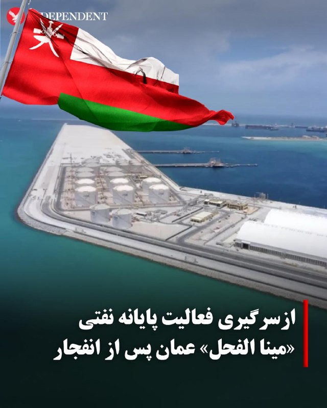

♦️فعالیت‌های پایانه نفتی «مینا الفحل» عمان پس از وقفه‌ای کوتاه ناشی از وقوع انفجار ماه در نزدیکی تأسیسات بارگیری نفت، صبح روز جمعه ۱۵ خرداد از سر گرفته شد.
این پایانه که مهم‌ترین مرکز صادرات نفت خام عمان به شمار می‌رود، پس از انجام بررسی‌های فنی و ایمنی بار دیگر به چرخه عملیاتی بازگشته است.
پیش‌تر منابع آگاه اعلام کرده بودند عملیات بارگیری نفت در پایانه مینا الفحل پس از وقوع انفجاری در نزدیکی اسکله‌های شناور بارگیری متوقف شده است. برخی گزارش‌ها حاکی از آن بود که این انفجار احتمالا در پی حمله پهپادی رخ داده، هرچند مقام‌های عمانی تاکنون علت حادثه را به طور رسمی تایید نکرده‌اند.
‌🇸🇦 Indypersian

🤖 @VahidOOnLine

## VahidOOnLine — post 243759

⭕️غریب‌آبادی: ایران خواستار آزادسازی فوری ۵۰ درصد دارایی‌های مسدودشده همزمان با امضای تفاهم است

♦️کاظم غریب‌آبادی، معاون حقوقی و بین‌الملل وزارت امور خارجه جمهوری اسلامی ایران، اعلام کرد تهران اصرار دارد ۵۰ درصد از دارایی‌های مسدودشده‌اش بلافاصله پس از امضای یادداشت تفاهم احتمالی با واشنگتن، آزاد و در اختیار جمهوری اسلامی قرار گیرد.

غریب‌آبادی روز پنجشنبه ۱۴ خرداد ماه، در گفتگو با خبرگزاری مهر با اشاره به روند مذاکرات گفت آزادسازی پول‌های مسدودشده ایران یکی از موضوعات مهم و کلیدی برای تهران است.

معاون وزیر امور خارجه درباره نحوه آزادسازی این منابع گفت میزان دارایی‌هایی که در مرحله نخست آزاد خواهد شد، می‌تواند موضوع مذاکره باشد، اما حداقل خواسته جمهوری اسلامی ایران این است که ۵۰ درصد از این وجوه بلافاصله با امضای یادداشت تفاهم در اختیار ایران قرار گیرد.

غریب‌آبادی همچنین اظهار داشت مابقی این دارایی‌ها نیز باید پس از یک دوره زمانی معقول آزاد شود؛ دوره‌ای که از نگاه ایران نباید بیش از یک تا دو ماه به طول بینجامد.

پیش از این رسانه‌ها و منابع رسمی نزدیک به مذاکرات، دارایی‌های مسدود شده جمهوری اسلامی در بانک‌های خارج از کشور را یکی از مسائل محوری مذاکرات توصیف کرده بودند.
‌🇸🇦 Indypersian

🤖 @VahidOOnLine

## VahidOOnLine — post 243758

  <a href="telegram/content/VahidOOnLine_243758_1780643311.mp4" target="_blank">🎬 Download video</a>

⭕️تصاویر جدید از حملات هوایی اسرائیل و آمریکا به مناطقی در تهران؛ ده‌ها ساختمان آسیب جدی دیدند

♦️ویدیویی که روز پنجشنبه ۱۴ خرداد و بعد از وصل شدن اینترنت ایرانیان پس از ۸۸ روز در شبکه‌های اجتماعی منتشر شده، یکی از مناطق تهران را نشان می‌دهد که در پی حملات هوایی ارتش اسرائیل و آمریکا آسیب گسترده دیده است.
تصاویر نشان می‌دهد، با وجود تخریب برخی واحدها، تعدادی از شهروندان در خانه‌های آسیب‌دیده زندگی می‌کنند.

ایندیپندنت فارسی به‌طور مستقل قادر نیست زمان و مکان دقیق این ویدیو را تایید کند.
‌🇸🇦 Indypersian

🤖 @VahidOOnLine

## VahidOOnLine — post 243757

  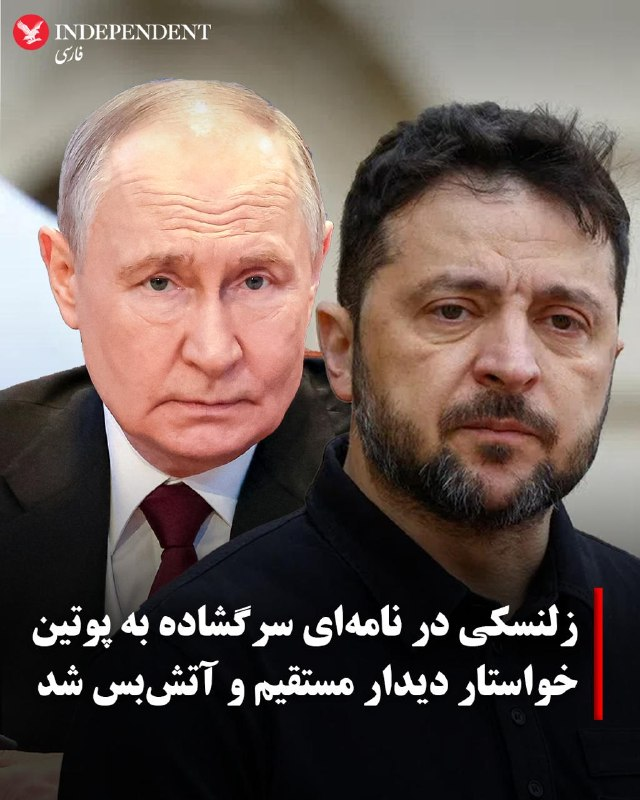

♦️ولودیمیر زلنسکی، رئیس‌جمهوری اوکراین، در نامه‌ای سرگشاده و کم‌سابقه خطاب به ولادیمیر پوتین، رئیس‌جمهوری روسیه، پیشنهاد برگزاری دیداری رو در رو و تعیین تاریخی مشخص برای مذاکرات صلح را مطرح کرد و گفت کی‌یف آماده است در طول مذاکرات، آتش‌بسی کامل برقرار کند.
زلنسکی روز پنجشنبه ۱۴ خرداد این نامه را منتشر کرد و نوشت: «اوکراین پیشنهاد می‌کند این جنگ از طریق گفتگوی مستقیم میان من و شما پایان یابد. من خواستار یک دیدار هستم.» او افزود: «پیشنهاد می‌کنم تاریخ مشخصی برای این دیدار تعیین شود. اوکراین آماده است برای مدت مذاکرات، آتش‌بسی کامل برقرار کند.»
این اقدام یک روز پس از حمله پهپادی اوکراین به سن‌پترزبورگ، زادگاه پوتین، صورت گرفت؛ حمله‌ای که همزمان با برگزاری مجمع اقتصادی بین‌المللی سن‌پترزبورگ انجام شد.
دونالد ترامپ، رئیس‌جمهوری آمریکا، نیز پنجشنبه شب از احتمال دیدار رهبران روسیه و اوکراین استقبال کرد و گفت: «فکر می‌کنم اگر با هم دیدار کنند عالی خواهد بود. باید این موضوع را تمام کنند.» ترامپ همچنین یادآور شد واشنگتن نقش مهمی در نزدیک شدن دو طرف به گفتگو داشته و هر دو کشور ناچار به مصالحه خواهند شد.
در واکنش به نامه زلنسکی، دیمیتری پسکوف، سخنگوی کرملین، اعلام کرد که پوتین هنوز این نامه را ندیده است، اما تاکید کرد رئیس‌جمهوری اوکراین «هر زمان بخواهد می‌تواند به مسکو بیاید». زلنسکی پیش‌تر در نامه خود چنین گزینه‌ای را رد کرده بود.
زلنسکی در نامه خود هشدار داد که اگر پوتین شخصا به این نتیجه نرسد که زمان پایان جنگ فرا رسیده است، اوکراین به مبارزه برای بقای خود ادامه خواهد داد.
‌🇸🇦 Indypersian

🤖 @VahidOOnLine

## VahidOOnLine — post 243756

  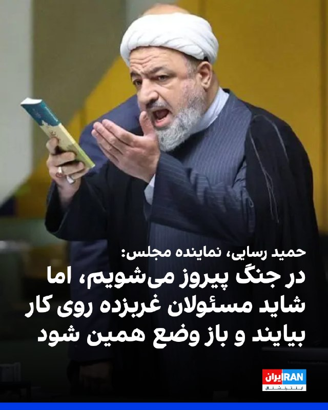

حمید رسایی، نماینده مجلس، در سخنرانی در تجمع حامیان حکومت گفت: «این جنگ حتما با پیروزی ایران تمام خواهد شد اما مشکل بعد از جنگ است. ممکن است لیبرال‌ها، غربزده‌ها، پشیمان‌ها و مسئولینی که سیستم محاسباتی آنها تغییر کرده، روی کار بیایند و وضع همین خواهد شد.»
‌🏁 🇬🇧 IranintlTV

🤖 @VahidOOnLine

## VahidOOnLine — post 243755

  <a href="telegram/content/VahidOOnLine_243755_1780643315.mp4" target="_blank">🎬 Download video</a>

♦️مقامات ایالات متحده ویدئویی را منتشر کردند که نشان می‌دهد یک قایق چوبی حامل ۲۴۰ مهاجر هائیتی در دریا رهگیری و متوقف شده است.
به گزارش رویترز و به گفته مقامات، این قایق که بیش از حد ظرفیت خود مسافر حمل می‌کرد، یکی از موتورهایش را از دست داده بود و آب به آرامی در حال نفوذ به داخل آن بود.
‌🇸🇦 Indypersian

🤖 @VahidOOnLine

## VahidOOnLine — post 243754

  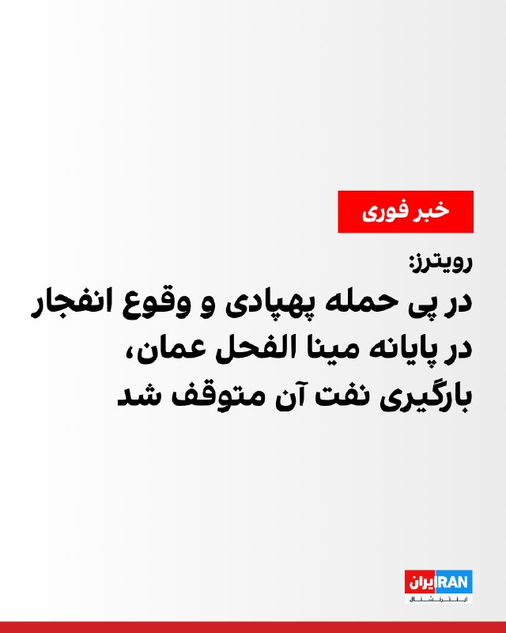

رویترز به نقل از دو منبع آگاه گزارش داد در پی یک حمله پهپادی و وقوع انفجار در نزدیکی اسکله‌های پهلوگیری پایانه مینا الفحل عمان، بارگیری نفت در این پایانه متوقف شده است. هنوز مشخص نیست این حمله دقیقا چه زمانی روی داده است.
بر اساس داده‌های کشتیرانی ال‌اس‌ای‌جی، روز جمعه چند نفتکش بسیار بزرگ در نزدیکی این بندر لنگر انداخته بودند.
رسانه‌های دولتی ایران روز چهارشنبه گزارش دادند جمهوری اسلامی یک کشتی نظامی آمریکا را که «مرکز کنترل و فرماندهی» توصیف شده بود، هنگام نزدیک شدن به آب‌های سرزمینی ایران در دریای عمان هدف قرار داده است، اما ستاد فرماندهی مرکزی آمریکا، سنتکام، این گزارش‌ها را رد کرد.

‌🏁 🇬🇧 IranintlTV

🤖 @VahidOOnLine

## VahidOOnLine — post 243753

  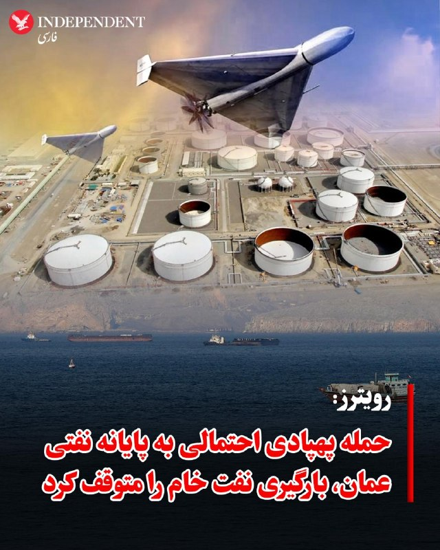

♦️به گزارش رویترز، بارگیری نفت خام در پایانه مینا الفحل عمان پس از وقوع انفجار در نزدیکی محل بارگیری نفت متوقف شد.
منابع آگاه به رویترز گفته‌اند انفجار میان دو محل پهلوگیری نفتکش‌ها رخ داده و احتمال می‌رود حمله پهپادی عامل این حادثه بوده باشد.
بر اساس این گزارش، مقام‌های عمانی هنوز به‌صورت رسمی درباره علت انفجار اظهار نظر نکرده‌اند، اما عملیات بارگیری نفت خام در این پایانه متوقف شده است.
پایانه مینا الفحل یکی از مراکز اصلی صادرات نفت عمان به شمار می‌رود و توقف فعالیت آن می‌تواند بر روند صادرات نفت این کشور تاثیر بگذارد.
‌🇸🇦 Indypersian

🤖 @VahidOOnLine

## WithYashar — post 13540

یدیعوت آحارونوت: کابینه امنیتی اسرائیل شب گذشته به قطعنامه آتش بس در لبنان رای نداد
@withyashar

## WithYashar — post 13539

طبق روال هر روز صبح حمله سنگین اسرائیل به جنوب لبنان
@withyashar

## WithYashar — post 13538

  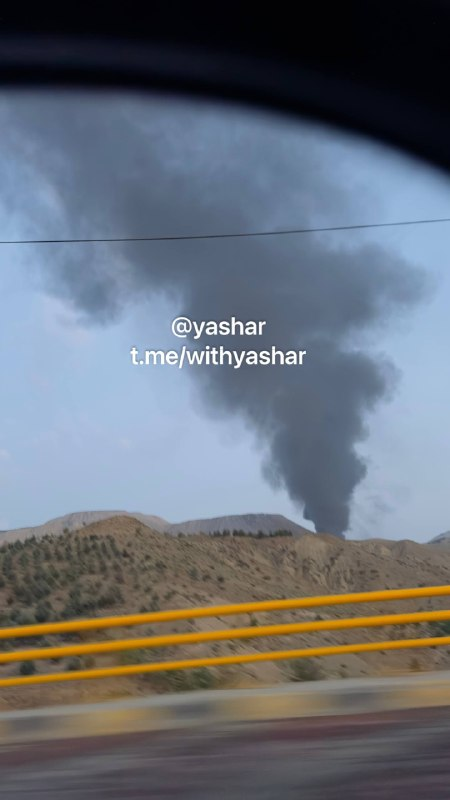

گزارشهای زیادی برایم فرستادید که از پدافند سنگین ۳-۴ صبح و چندین انفجار در تهران ولی مدرکی نیست… فقط چندین عکس از اینجا برایم آمده.
آزاد راه پردیس به تهران
@withyashar

## WithYashar — post 13537

امشب بیداریم ، ردبولم میزنیم 🤣💥

## WithYashar — post 13536

رویترز: بامداد جمعه انفجاری پهپادی در بندر الفحل عمان رخ داد.
@withyashar

## WithYashar — post 13535

نورالدین الدغیر خبرنگار الجزیره در تهران:یادداشت تفاهم در مرحله نهایی خود قرار دارد
@withyashar

## mwarmonitor — post 10164

‼️ هشدار فوری به ساکنان لبنان که در شهرها و روستاهای زیر حضور دارند:
عرنایا (عرنابه)، عنقون، کفر فیلا

🔸 در پی نقض توافق آتش‌بس از سوی حزب‌الله و هدف قرار دادن جبهه داخلی اسرائیل، ارتش دفاعی اسرائیل ناچار است با قدرت علیه آن اقدام کند، به‌ویژه در مناطق شما. ارتش قصد آسیب رساندن به شما را ندارد.

🔸 برای حفظ ایمنی خود، باید فوراً منازل‌تان را تخلیه کرده و حداقل به فاصله ۱۰۰۰ متر از روستاها و شهرک‌ها، به مناطق باز و غیرمسکونی دور شوید.

🔸 هر فردی که در نزدیکی نیروها، تأسیسات و تجهیزات رزمی حزب‌الله حضور داشته باشد، جان خود را در معرض خطر قرار می‌دهد!

@mwarmonitor

## mwarmonitor — post 10163

  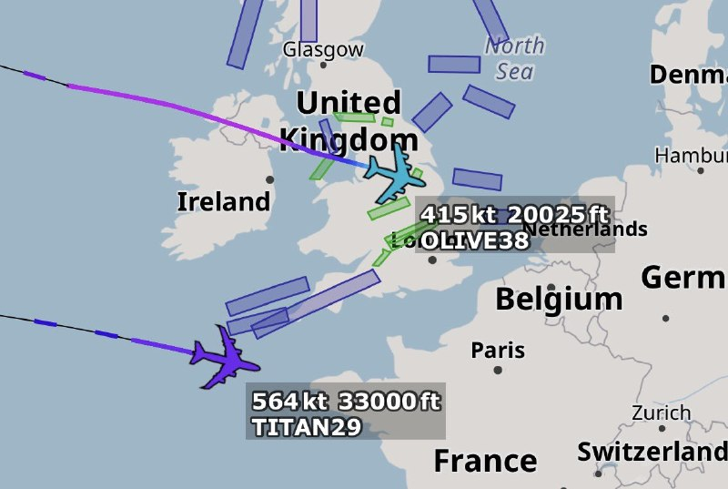

✈️نیروی هوایی ایالات متحده (USAF)

✈️بوئینگ RC-135 Rivet Joint (۱ فروند)
AE1253 — 64-4126 — OLIVE 38

✈️بوئینگ E-4B Nightwatch (۱ فروند)
ADDEB3 — 73-1676 — TITAN 29

📌یک فروند RC-135 و یک فروند E-4B صبح امروز وارد اروپا می‌شوند.

🔸عملیات OLIVE 38 به‌طور مستقیم از پایگاه نیروی هوایی آفوت به مقصد پایگاه هوایی RAF Mildenhall پرواز کرده و احتمالاً مسیر خود را به سمت خانیا یونان ادامه خواهد داد.

✈️هواپیما TITAN 29 حامل وزیر دفاع آمریکا، پیت هگست، به مقصد پاریس است.

@mwarmonitor

## mwarmonitor — post 10162

🔴عمان پس از وقوع یک انفجار، بارگیری نفت در پایانه مینا الفحل واقع در خلیج عمان را به حالت تعلیق درآورده است.

🔸به گفته دو منبع آگاه که با Reuters گفت‌وگو کرده‌اند، این انفجار که در نزدیکی اسکله‌های پهلوگیری تک‌نقطه‌ای (SBM) رخ داده، ناشی از یک حمله پهپادیِ ادعایی بوده است.

@mwarmonitor

## pm_afshaa — post 92291

🔴نورالدین الدغیر خبرنگار الجزیره در تهران:یادداشت تفاهم در مرحله نهایی خود قرار دارد

💧 Rainbet.com the #1 Non-KYC Crypto Casino & Sportsbook @rainbetcom

😁 @Pm_Afshaa

## DEJradio — post 5343

  <a href="telegram/content/DEJradio_5343_1780643321.webm" target="_blank">🎬 Download video</a>

🚨📢 سفارت آمریکا در اسرائیل پنجشنبه ۱۴ خرداد ۱۴۰۵ با صدور یک هشدار امنیتی از شهروندان آمریکایی در سراسر خاورمیانه خواست احتیاط بیشتری به خرج دهند. این هشدار تأکید می‌کند که محیط امنیتی همچنان «پیچیده است و می‌تواند به‌سرعت تغییر کند»؛ در حالی که تنش‌ها با جمهوری اسلامی ایران ادامه یافته و تردیدهایی درباره پایداری آتش‌بس وجود دارد.

بر اساس این هشدار به شهروندان آمریکایی در منطقه توصیه شده که تحولات را به‌صورت لحظه‌ای دنبال کنند و می‌گوید توصیه‌های سفر وزارت خارجه همچنان در سطح ۳، یعنی «بازنگری در سفر»، برای بحرین، اسرائیل، کرانه باختری، اردن، کویت، عمان، قطر، عربستان سعودی و امارات متحده عربی برقرار است.

در بخش دیگری از هشدار با عنوان «احتمال درگیری‌ها»، سفارت اعلام کرد که شهروندان آمریکایی باید محل نزدیک‌ترین پناهگاه را در صورت ازسرگیری درگیری‌ها بدانند.

این اطلاعیه همچنین به آمریکایی‌ها توصیه می‌کند مراقب اطراف خود باشند، از تجمعات و تظاهرات دوری کنند، از مناطق با حضور سنگین پلیس فاصله بگیرند، رسانه‌های محلی را دنبال کنند، دستورهای مقامات محلی را رعایت کنند و در مکان‌هایی که به‌طور علنی با ایالات متحده مرتبط هستند احتیاط بیشتری داشته باشند.

#سفارت_آمریکا #جنگ
@DEJradio

## VahidOnline — post 75944

  

خبرگزاری رویترز به نقل از دو منبع در روز جمعه گزارش داد که پایانه نفتی مینا الفحل در عمان پس از وقوع یک انفجار در نزدیکی اسکله‌ها، عملیات بارگیری نفت را متوقف کرده است. به گفته این منابع، انفجار ظاهراً در پی یک حمله پهپادی رخ داده است.
@VahidHeadline
AJENews
هنوز مشخص نیست این حمله دقیقا چه زمانی روی داده است.
بر اساس داده‌های کشتیرانی ال‌اس‌ای‌جی، روز جمعه چند نفتکش بسیار بزرگ در نزدیکی این بندر لنگر انداخته بودند.

رویترز در ادامه نوشته:‌ رسانه‌های دولتی ایران روز چهارشنبه گزارش دادند جمهوری اسلامی یک کشتی نظامی آمریکا را که «مرکز کنترل و فرماندهی» توصیف شده بود، هنگام نزدیک شدن به آب‌های سرزمینی ایران در دریای عمان هدف قرار داده است، اما ستاد فرماندهی مرکزی آمریکا، سنتکام، این گزارش‌ها را رد کرد.
@VahidOOnLine

📡 @VahidOnline

## IranIntlTV — post 340610

  <a href="telegram/content/IranIntlTV_340610_1780643322.mp4" target="_blank">🎬 Download video</a>

خبرگزاری رویترز از وقوع انفجار در نزدیکی یک پایانه نفتی در عمان خبر داد. بر اساس گزارش‌های اولیه، احتمال می‌رود این انفجار در پی یک حمله پهپادی رخ داده باشد.

گفت‌وگو با روح‌الله رحیم‌پور، روزنامه‌نگار و تحلیل‌گر سیاسی
@iranintltv

## IranIntlTV — post 340609

  <a href="telegram/content/IranIntlTV_340609_1780643324.mp4" target="_blank">🎬 Download video</a>

یک شهروند ویدیویی به ایران اینترنشنال ارسال کرده که شعارنویسی «جاوید شاه پاینده ایران» را در نیشابور در روز ۱۴ خردادماه نشان می‌دهد.

## IranIntlTV — post 340608

  <a href="https://t.me/IranintlTV/340608" target="_blank">📎 Download file</a>

🎧نسخه صوتی اخبار بامدادی | جمعه ۱۵ خرداد
@iranintlTV

## IranIntlTV — post 340607

  <a href="telegram/content/IranIntlTV_340607_1780643327.mp4" target="_blank">🎬 Download video</a>

کریگ فرگوسن با هدف جلب توجه به اهمیت سلامت روان مردان و حمایت از تیم ملی اسکاتلند، در حال طی کردن مسیر پنج هزار کیلومتری میان لس‌آنجلس و بوستون است.

گزارش مهسا مرتضوی، خبرنگار ایران‌اینترنشنال
@iranintltv

## IranIntlTV — post 340606

  <a href="telegram/content/IranIntlTV_340606_1780643329.mp4" target="_blank">🎬 Download video</a>

بیژن کیان، کارشناس امنیت ملی، گفت جمهوری اسلامی باید هشدارهای دونالد ترامپ، رییس‌جمهوری آمریکا، را جدی بگیرد، زیرا از نظر ترامپ هیچ دلیلی برای عقب‌نشینی وجود ندارد.
@iranintltv

## IranIntlTV — post 340605

  <a href="telegram/content/IranIntlTV_340605_1780643330.mp4" target="_blank">🎬 Download video</a>

سازمان آتش‌سوزی‌های جنگلی انتاریو در کانادا اعلام کرد آتش‌سوزی در جنوب تیمینز همچنان خارج از کنترل است و روند تخلیه بومیان ماتاگامی آغاز شده است.

گزارش مهسا مرتضوی، خبرنگار ایران‌اینترنشنال
@iranintltv

## IranIntlTV — post 340604

  <a href="telegram/content/IranIntlTV_340604_1780643332.mp4" target="_blank">🎬 Download video</a>

دونالد ترامپ، رییس‌جمهوری آمریکا، با تاکید بر دستاوردهای نظامی ایالات متحده در حملات به جمهوری اسلامی، هشدار داد که واشینگتن آمادگی دارد در صورت لزوم، بار دیگر وارد درگیری شود. او همچنین با اشاره به اورانیوم مدفون‌شده جمهوری اسلامی گفت آمریکا توان فنی لازم برای انتقال این مواد به خارج از کشور را دارد.

ارزیابی مهدی بیگی، عضو تحریریه ایران‌اینترنشنال
@iranintltv

## IranIntlTV — post 340603

  <a href="telegram/content/IranIntlTV_340603_1780643335.mp4" target="_blank">🎬 Download video</a>

یگانه تربتی و بزرگمهر شرف‌الدین، نویسندگان کتاب «انقلاب دزدیده‌شده؛ خیانت و امید در ایران مدرن»، با تکیه بر سال‌ها تحقیق و گفت‌وگو، تصویری از امیدها، سرخوردگی‌ها و تحولات جامعه ایران ارائه کردند. شماری از برجسته‌ترین نویسندگان و تحلیلگران آمریکایی، این اثر را یکی از مهم‌ترین کتاب‌های سال‌های اخیر درباره ایران دانستند.

گزارش اردوان روزبه، خبرنگار ایران‌اینترنشنال
@iranintltv

## IranIntlTV — post 340602

  <a href="telegram/content/IranIntlTV_340602_1780643337.mp4" target="_blank">🎬 Download video</a>

سرخط خبرهای جمعه ۱۵ خرداد
@iranintltv

## IranIntlTV — post 340601

  

حمید رسایی، نماینده مجلس، در سخنرانی در تجمع حامیان حکومت گفت: «این جنگ حتما با پیروزی ایران تمام خواهد شد اما مشکل بعد از جنگ است. ممکن است لیبرال‌ها، غربزده‌ها، پشیمان‌ها و مسئولینی که سیستم محاسباتی آنها تغییر کرده، روی کار بیایند و وضع همین خواهد شد.»
https://iranintl.com/202606054095

## IranIntlTV — post 340600

  

رویترز به نقل از دو منبع آگاه گزارش داد در پی یک حمله پهپادی و وقوع انفجار در نزدیکی اسکله‌های پهلوگیری پایانه مینا الفحل عمان، بارگیری نفت در این پایانه متوقف شده است. هنوز مشخص نیست این حمله دقیقا چه زمانی روی داده است.
بر اساس داده‌های کشتیرانی ال‌اس‌ای‌جی، روز جمعه چند نفتکش بسیار بزرگ در نزدیکی این بندر لنگر انداخته بودند.
رسانه‌های دولتی ایران روز چهارشنبه گزارش دادند جمهوری اسلامی یک کشتی نظامی آمریکا را که «مرکز کنترل و فرماندهی» توصیف شده بود، هنگام نزدیک شدن به آب‌های سرزمینی ایران در دریای عمان هدف قرار داده است، اما ستاد فرماندهی مرکزی آمریکا، سنتکام، این گزارش‌ها را رد کرد.

https://iranintl.com/202606059835

## FarsiVOA — post 219641

🔺زلنسکی در نامه‌ای سرگشاده به پوتین خواستار دیدار با او شد

▪️رئیس‌جمهور اوکراین، در نامه‌ای سرگشاده خطاب به ولادیمیر پوتین پیشنهاد داد دو رهبر برای توافق بر سر پایان دادن به بیش از چهار سال جنگ با یکدیگر دیدار کنند و هشدار داد که در غیر این صورت، کی‌یف آماده ادامه جنگ است.

▪️دفتر ولودیمیر زلنسکی روز پنج‌شنبه اعلام کرد این نامه برای کشورهای دیگر، از جمله ایالات متحده، نیز ارسال شده است.

▪️رئیس‌جمهور اوکراین پیشنهاد کرد که تاریخ مشخصی برای یک دیدار تعیین شود و گفت چندین کشور «به‌طور سنتی میزبان رهبران برای حل مسائل جنگ و صلح بوده‌اند»، و از سوئیس، ترکیه و کشورهای عربی نام برد.

▪️کرملین می‌گوید که نامه زلنسکی را مشاهده کرده و پوتین در جریان آن قرار خواهد گرفت.

⬇️ بیشتر بخوانید:
https://ir.voanews.com/a/8157637.html

## FarsiVOA — post 219640

🔺توقف بارگیری نفت عمان در پی انفجار در پایانه نفتی

▪️خبرگزاری رویترز از قول دو منبع آگاه گزارش داده که عمان بارگیری نفت در پایانه نفتی «مینا الفحل» را در پی انفجار در نزدیکی اسکله بارگیری آن متوقف کرده است.

▪️این منابع گفته‌اند که ظاهراً عامل انفجار در فاصله میان اسکله‌های شماره ۱ و ۲ این بندر حملات پهپادی بوده است.

▪️رویترز می‌نویسد چندین نفتکش عظیم روز جمعه برای بارگیری نفت در این پایانه لنگر انداخته بودند.

▪️عمان تنها کشور همسایه جنوبی ایران است که خارج از تنگه هرمز قرار گرفته و برخلاف دیگر کشورهای منطقه، صادرات نفتش طی چند ماه گذشته تأثیر چندانی از انسداد تنگه هرمز توسط جمهوری اسلامی قرار نگرفته است.

⬇️ بیشتر بخوانید:
https://ir.voanews.com/a/8157636.html

## FarsiVOA — post 219639

Farsi VOA pinned an audio file

## FarsiVOA — post 219638

  <a href="https://t.me/farsivoa/219638" target="_blank">📎 Download file</a>

🔴📢‌ پادکست خبری پنجشنبه ۱۴خرداد ۱۴۰۵

🛜در صورتی که با مشکل اینترنت مواجه هستید میتوانید اخبار صدای آمریکا را از نسخه‌های پادکست خبری ما روزانه دنبال کنید و یا اخبار را از نسخه سبک وب‌سایت ما پیگیر باشید:
https://ir.voanews.com/lite

📡بروزترین فرکانسهای ماهواره‌ای را نیز میتوانید از صفحه زیر پیگیری کنید:
https://ir.voanews.com/satellite

🔔دیگر شبکه‌های اجتماعی ما را هم دنبال کنید:
https://linktr.ee/voafarsi

ما را به اشتراک بگذارید
@farsivoa

## DW_Farsi — post 125515

🔶صد روز جنگ؛ گردشگری ایران زیر سایه رکود و نااطمینانی
🔻گزارشی از دانیال بابایانی

صد روز از آغاز جنگ میان ایران، اسرائیل و آمریکا گذشته است؛ جنگی که علاوه بر پیامدهای نظامی، سیاسی و اقتصادی، یکی از مهم‌ترین صنایع خدماتی ایران را نیز تحت تاثیر قرار داده است.

صنعت گردشگری که پیش از آغاز درگیری‌ها نشانه‌هایی از بهبود را تجربه می‌کرد، اکنون با کاهش ورود گردشگران خارجی، آسیب به زیرساخت‌ها و رکود در بسیاری از کسب‌وکارهای وابسته روبه‌رو شده است.

هرچند در روزهای نخست جنگ، توجه افکار عمومی بیشتر معطوف به خسارت‌های انسانی و تحولات نظامی بود، اما با گذشت بیش از سه ماه، آثار این بحران بر بخش گردشگری نیز آشکارتر شده است؛ صنعتی که به گفته فعالان آن، بیش از هر چیز به ثبات، امنیت و اعتماد وابسته است.

@dw_farsi

## DW_Farsi — post 125514

  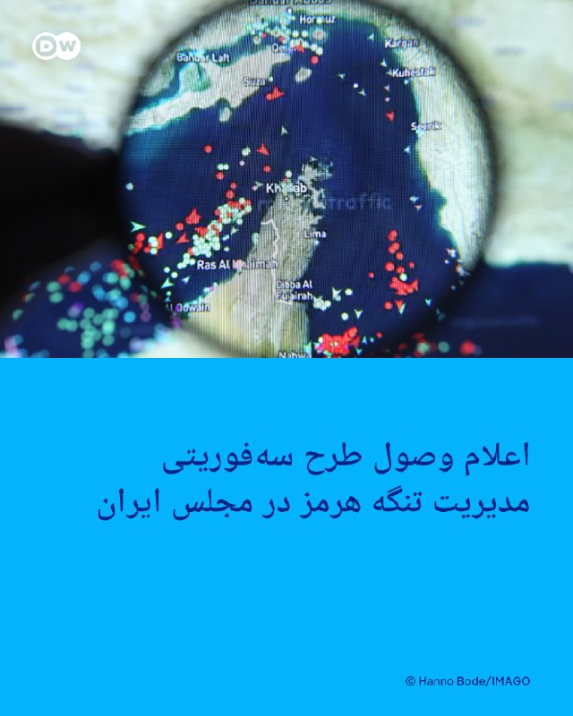

🔶اعلام وصول طرح سه‌فوریتی مدیریت تنگه هرمز در مجلس ایران

علی بایایی کارنامی، نماینده ساری و میاندورود در مجلس شامگاه پنجشنبه ۱۴ خرداد (۴ ژوئن) از اعلام وصول طرح سه‌فوریتی "مدیریت راهبردی تنگه هرمز" توسط هیئت رئیسه مجلس شورای اسلامی خبر داد.

این نماینده مجلس که این خبر را در حاشیه تجمعی در ساری اعلام می‌کرد گفت، این طرح در پاسخ به "تجاوزات بیگانگان" تدوین شده تا مدیریت این گذرگاه استراتژیک به‌طور کامل در اختیار ایران قرار گیرد.

نماینده ساری و میاندورود افزود: «در صورت تصویب، مدیریت تنگه هرمز از تمامی ابعاد اعم از اقتصادی، اجتماعی و امنیتی تحت کنترل کامل جمهوری اسلامی ایران قرار خواهد گرفت.»

به گفته بابایی کارنامی: «این اقدام راهبردی جایگاه استراتژیک ایران را در سطح جهان تثبیت می‌کند.»

دریافت عوارض از کشتی‌های عبوری از تنگه هرمز که پس از حملات اسرائيل و آمریکا به جمهوری اسلامی مطرح شد با مخالفت شدید جامعه جهانی مواجه شده است.

@dw_farsi

## DW_Farsi — post 125513

  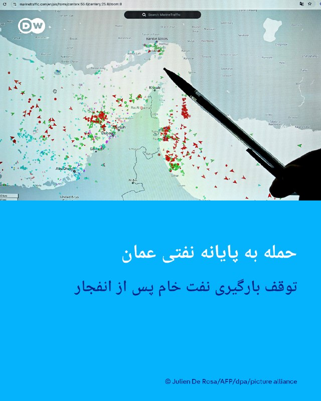

🔶حمله به پایانه نفتی عمان؛ توقف بارگیری نفت خام پس از انفجار

خبرگزاری رویترز صبح روز جمعه ۱۵ خرداد (۵ ژوئن) به نقل از دو منبع آگاه گزارش داد که پس از یک حمله احتمالی پهپادی و وقوع انفجاری در پایانه "مینا الفحل" عمان عملیات بارگیری نفت در این پایانه متوقف شده است.

رسانه‌های ایران نوشته‌اند، حادثه در فاصله میان اسکله‌های شماره ۱ و ۲ بندر الفحل رخ داده است. اطلاعات بیشتری از این رویداد ارائه نشده است.

تسنیم، خبرگزاری وابسته به سپاه پاسداران در گزارشی در این باره نوشته است که پایانه مینا الفحل یکی از نقاط راهبردی برای صادرات نفت عمان محسوب می‌شود.

وال‌استریت ژورنال چهار روز پیش از این حادثه به نقل از مقام‌های آمریکایی و عربی گزارش داده بود که دونالد ترامپ، رئيس‌جمهور آمریکا موضع بی‌طرفانه عمان در قبال ایران را رفتاری "غیرهمسو" با آمریکا تلقی می‌کند و گفته می‌شود واشنگتن در حال فشار بر مسقط است تا سیاست خود را به نفع آمریکا تغییر داده و روابط دیپلماتیک خود با ایران را محدود یا قطع کند.

@dw_farsi

## DW_Farsi — post 125512

🔶جام‌های ۲۰۰۶ تا ۲۰۲۶؛ لیونل مسی، ستاره خستگی‌ناپذیر آرژانتین
🔻گزارشی از شهرام احدی

در واپسین هفته‌ها پیش از شروع جام جهانی ۲۰۲۶ که با میزبانی مشترک آمریکا، کانادا و مکزیک برگزار می‌شود، گمانه‌زنی‌های زیادی در مورد حضور برخی ستارگان "سالخورده" جریان داشته و دارد؛ ستارگانی که به مرز ۴۰ سالگی نزدیک شده یا این مرز را پشت سرگذاشته‌اند. این ستارگان شاید از چابکی و سرعت گذشته برخوردار نباشند، اما با توجه به تجربه‌های فراوانی که در طول سال‌ها به دست آورده‌اند، مهره‌ای راهبردی و مهم در ترکیب تیم خود برای همراهی و هدایت ملی‌پوشان جوان محسوب می‌شوند.

یکی از آنها لیونل مسی، فوق‌ستاره شماره ۱۰ آرژانتین است. آنگونه که از اظهارات سرمربی کنونی تیم ملی فوتبال آراژانتین برمی‌آید، مسی ملی‌پوشان این کشور را در رقابت‌های جام ۲۰۲۶ همراهی خواهد کرد. به این حساب، او اکنون برای ششمین دوره است که در این رقابت‌ها حضور می‌یابد.

@dw_farsi

## Persian_Trend_Official — post 15720

  <a href="telegram/content/Persian_Trend_Official_15720_1780643342.mp4" target="_blank">🎬 Download video</a>

صبحتون بخیر 🌄
J-35 Blue Shark

📝 Amir

📌 @persian_trend_official
پرشین ترند | متفاوت‌ترین کانال نظامی

## RadioFarda — post 157911

  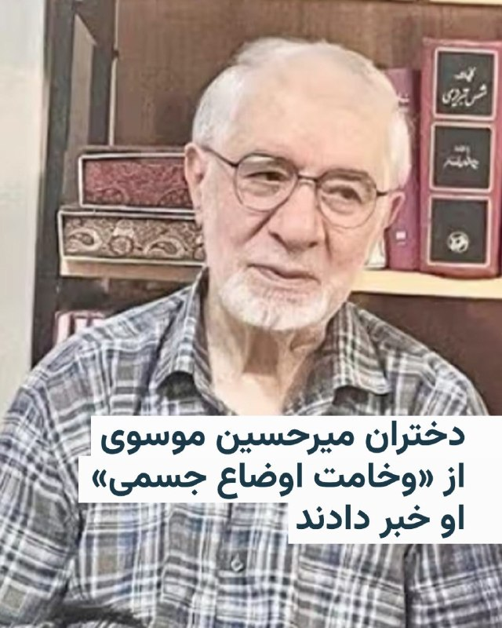

🔸در خبری تازه از وضعیت جسمی میرحسین موسوی، از رهبران محصورِ جنبش سبز، دختران او روز پنج‌شنبه، ۱۴ خردادماه، از وضعیت جسمی نامساعد پدرشان خبر داده‌ و گفتند که او «به دلیل مشکل شدید قلبی در بیمارستان قلب بستری شده و اوضاع جسمی‌اش وخیم است».

🔸اوایل هفته جاری، در پی انتشار اخباری از مریض‌احوالی میرحسین موسوی، از رهبران جنبش سبز ایران، اردشیر امیرارجمند، مشاور او، تأیید کرده بود که آقای موسوی «چند روزی است» به بیمارستان منتقل شده است.

🔸میرحسین موسوی، ۸۴ ساله، به همراه همسرش زهرا رهنورد، دیگر رهبر جنبش سبز، ۸۰ ساله، هم‌چنان در حصر به سر می‌برد.

🔸امیرارجمند که در فرانسه اقامت دارد روز دوشنبه به رادیوفردا گفت که خانه این دو فعال سیاسی دیگر «قابل سکونت نیست»، محل نگهداری آن‌ها پس از انتقال‌شان «نامعلوم» است، و شرایط حصر «دشوارتر» شده است.

🔸محل سکونت این دو در حملات بی‌امان اسرائیل به تهران به‌شدت آسیب دیده است.

🔸دختران این دو رهبر جنبش سبز در ادامه پیام خود از «بی‌توجهی و عدم پیگیری دولت» مسعود پزشکیان انتقاد کرده‌اند.

@RadioFarda

## RadioFarda — post 157910

  <a href="telegram/content/RadioFarda_157910_1780643345.mp4" target="_blank">🎬 Download video</a>

🔸مرتضی نظری، کارشناس مسائل آموزشی می‌گوید تا قبل از جنگ ۵۰ هزار طلبه بدون آموزش تخصصی وارد مدارس شدند.

🔸نظری در گفت‌وگو با خبرآنلاین با تاکید بر اینکه در کار تخصصی آموزش‌و‌پرورش اختلال ایجاد شده گفت: تا قبل از جنگ اخیر «۵۰ هزار طلبه بدون طی دوره دانشگاه فرهنگیان» وارد مدارس شدند.

🔸او این مسئله را در «افت تحصیلی» دانش‌آموزان تاثیرگذار دانست و در بخشی از این گفت‌وگو تاکید کرد که «بخش مهمی از افت کیفیت مدارس دولتی را ناشی از تمرکز امکانات و نیروهای انسانی در مدارس خاص است.»

🔸این تحلیل‌گر مسائل آموزش‌وپرورش، با اشاره به گستردگی انواع مدارس در ایران، گفت: «شبکه‌ای از مدارس وابسته به نهادها و سازمان‌های مختلف شکل گرفته که عملاً دانش‌آموزان را از یکدیگر تفکیک می‌کند.

🔸شورای عالی انقلاب فرهنگی ایران، در سال ۱۴۰۲، ورود بدون کنکور «طلاب و دانش‌آموزان نخبه و بااستعداد» به دانشگاه فرهنگیان را تصویب کرد.

🔸طی سال‌های اخیر، پاسخ‌هایی که به اعتراض نسبت به غیرکاربردی بودن دروس و محتوای کتاب‌ها داده شده، معمولاً مبهم بوده و افت درسی دانش‌آموزان ایرانی در سال‌های اخیر به روندی ادامه‌دار تبدیل شده است.

@RadioFarda

## RadioFarda — post 157909

  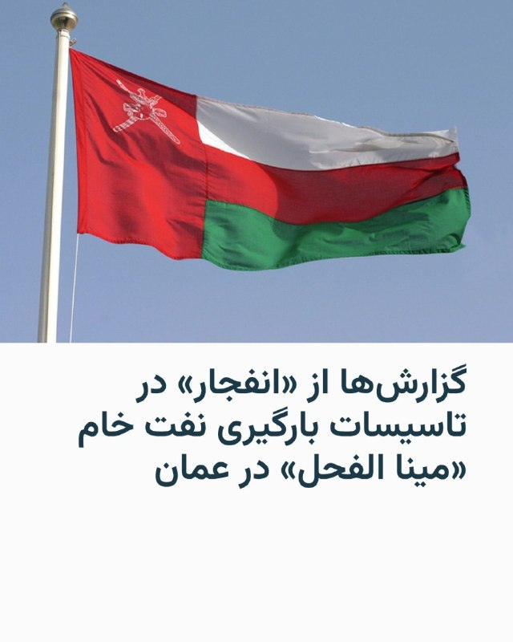

🔸خبرگزاری رویترز صبح جمعه ۱۵ خرداد به نقل از دو منبع گزارش داد که پایانه نفتی «مینا الفحل» در عمان پس از وقوع یک «انفجار» در نزدیکی اسکله‌ها، عملیات بارگیری نفت را متوقف کرده است.

🔸به گفته این منابع، انفجار میان اسکله‌های اس‌بی‌ام ۱ و اس‌بی‌ام ۲ رخ داده و ظاهراً در نتیجه یک حمله پهپادی بوده است.

🔸هنوز مشخص نیست این حمله دقیقاً چه زمانی اتفاق افتاده است. مقام‌های عمان هم فعلاً واکنشی در این زمینه نشان نداده‌اند.

🔸رویترز نوشته این انفجار در شرایطی رخ داده که روز جمعه چندین نفتکش بسیار بزرگ در نزدیکی این بندر در حال لنگر انداختن مشاهده شدند.

🔸این پایانه نفتی يکی از مهم ترين تأسیسات صادرات نفت خام عمان به شمار می‌رود و نقش مهمی در صادرات انرژی اين کشور دارد.

🔸رسانه‌های دولتی ایران روز چهارشنبه نوشته بودند که تهران یک کشتی نظامی آمریکا را که به گفته آنها «مرکز کنترل و فرماندهی» را در خود جای داده بود، هنگام نزدیک شدن به آب‌های سرزمینی ایران در دریای عمان هدف قرار داده است؛ ادعایی که فرماندهی مرکزی ایالات متحده، سنتکام، آن را رد کرده است.

@RadioFarda

## RadioFarda — post 157908

  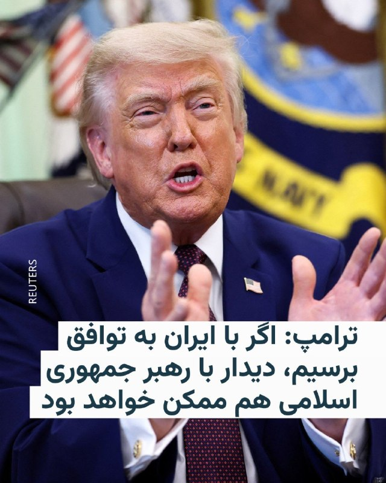

🔸رئیس‌جمهور ایالات متحده بار دیگر تأکید کرد که ایران نمی‌تواند سلاح هسته‌ای داشته باشد.

🔸دونالد ترامپ که در کاخ سفید با خبرنگاران صحبت می‌کرد، گفت برای گرفتن اورانیوم غنی‌شدۀ ایران، دستیابی به توافق الزامی نیست.
اگر بخواهیم می‌توانیم همین الان این ذخیره را از ایران خارج کنیم. ولی دلیلی برای این‌کار وجود ندارد. آنها مدفون شده‌اند.

🔸او در عین حال، در پاسخ به سوالی دربارۀ احتمال دیدار رو در رو با رهبر جمهوری اسلامی گفت: «من نمی‌خواهم ملاقات کنیم، اما اگر دو کشور به توافق برسند، امکانش خواهد بود». رئیس‌جمهور آمریکا ادامه داد «اگر این اتفاق بی‌افتد، برخورد من محترمانه خواهد بود».

🔸دونالد ترامپ با اشاره به افزایش نسبی تنش در منطقه خلیج فارس طی روزهای اخیر گفت: «اگر سربازان آمریکایی را کشته بودند، دلیل خوبی برای آغاز مجدد درگیری داشتیم».

🔸رئیس‌جمهور آمریکا تأکید کرد که چه از راه نظامی باشد و چه روی کاغذ [از راه توافق]، «ما پیروز خواهیم شد».

🔸دونالد ترامپ بازگشایی فوری تنگۀ هرمز را یکی از ارکان اصلی توافق احتمالی توصیف کرد.

@RadioFarda

## RadioFarda — post 157907

  <a href="https://t.me/radiofarda/157907" target="_blank">📎 Download file</a>

📻بشنوید: سرخط خبرها با رادیوفردا، ۱۵ خرداد ۱۴۰۵‌

@RadioFarda

## IranianMinds — post 21406

  <a href="telegram/content/IranianMinds_21406_1780643349.mp4" target="_blank">🎬 Download video</a>

این همه جو‌ بایدن بدبختو مسخره کردی آهش گرفتت

ترامپ دیشب اینطوری تو سخنرانی که داشتن خواب آلود بود و خوابش برده بود :)

@IranianMinds

## IranianMinds — post 21405

  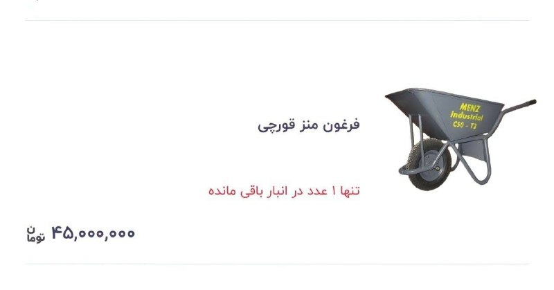

فرغونم برامون آرزو شد.

@IranianMinds

## IranianMinds — post 21404

  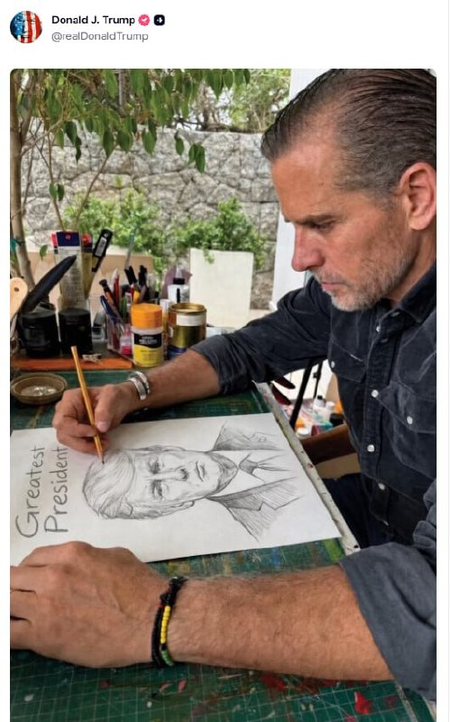

🔴 پست جدید ترامپ :

نوشته ی تو نقاشی : بزرگترین رئیس‌ جمهور.

@IranianMinds

## IranianMinds — post 21403

  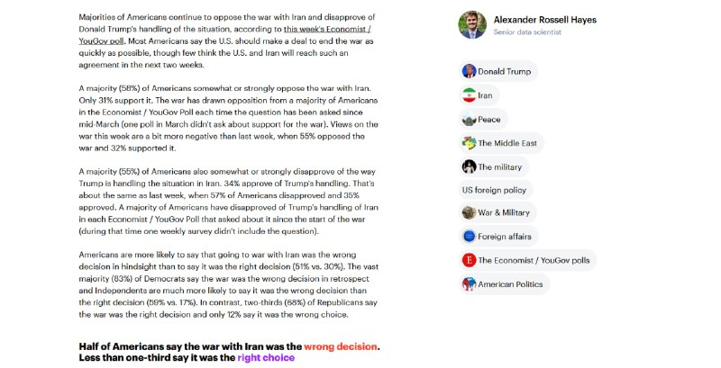

🔴 بر اساس نظرسنجی YouGov , بیش از 68 درصد آمریکایی‌ها معتقدند باید هرچه سریع‌تر توافقی برای پایان دادن به جنگ ایران حاصل شود. حتی در میان حامیان جنبش MAGA نیز ۵۲ درصد از پایان سریع جنگ از طریق توافق حمایت می‌کنند. همچنین ۷۵ درصد از نسل Z خواهان خاتمه هرچه زودتر این درگیری هستند.

در میان افرادی که از توافق فوری حمایت می‌کنند، تعداد بیشتری ترجیح می‌دهند با ایران توافق شود؛ حتی اگر این توافق به معنای صرف‌نظر کردن آمریکا از تصاحب اورانیوم غنی‌شده ایران باشد.

نتایج این پرسش:
• ۳۸٪ موافق توافق در این شرایط
• ۲۶٪ مخالف
• ۲۹٪ مردد یا نامطمئن
• ۱۱٪ این سؤال را دریافت نکرده‌اند

@IranianMinds

## IranianMinds — post 21402

  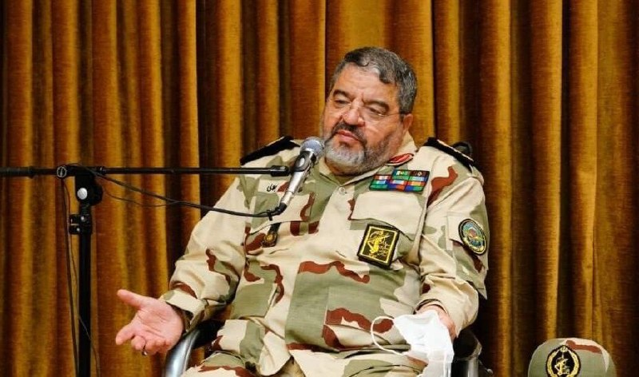

🔴 ایشون سردار غلامرضا جلالی رئیس سازمان پدافند غیرعامل جمهوری اسلامی هستن

فقط سردارو‌ با جرثقیل جا به جا میکنن؟

@IranianMinds

## BBCPersian — post 282909

  <a href="telegram/content/BBCPersian_282909_1780643353.mov" target="_blank">🎬 Download video</a>

🔻این هفته در پرگار: در تاب‌آوری مردم ایران فضیلتی هست؟

🔻صبر و تاب‌آوری مردم ایران با وجود بحران‌های پیاپی ناشی از چیست؟ صبری‌ست از سر مصلحت یا سازگاری‌یست که عامل ماندگاری حکومت می‌شود؟

میهمان‌ها:
حسین رسام، تحلیل‌گر سیاسی
وریا امیری، تحلیل‌گر سیاسی و دانش‌آموخته فلسفه

@BBCPersian

## BBCPersian — post 282908

محسن رضایی: حزب‌الله متحد ماست و از آن حمایت می‌کنیم

محسن رضایی، فرمانده پیشین سپاه پاسداران و مشاور نظامی رهبر جمهوری اسلامی ایران گفت: «حزب‌الله در جنگ اخیر جانفشانی کرد و متحد ماست بنابراین ما از حزب‌الله حمایت می‌کنیم و محکم پای تعهد خود ایستاده‌ایم.»

آقای رضایی در مصاحبه با صدا و سیما گفت:«دشمن می‌خواست با فشار بر لبنان مارا در مذاکرات تحت فشار قرار دهد» و ادامه داده که با با تهدید حمله به جنوب بیروت از سوی اسرائیل «تمام موشک‌های ما آماده به آتش کشیدن» شمال اسرائیل بود.

نخست‌وزیر اسرائیل اوایل هفته جاری دستورحمله به مواضع حزب‌الله در جنوب بیروت را داده بود اما ساعاتی بعد اعلام شد که در تماس تلفنی دونالد ترامپ با بنیامین نتانیاهو، جلوی این حمله گرفته شده است.

اظهارات آقای رضایی همزمان با گفته‌های رهبر حزب‌الله است که آتش‌بسی که در واشنگتن میان اسرائیل و دولت لبنان بر سر آن توافق شد را رد کرده و گفته تا هنگامی که روستاهای جنوب لبنان امن نشوند، شمال اسرائیل هم امن نخواهد بود.

آقای رضایی در تلویزیون ایران خطاب به اسرائیل گفته است «به این رژیم منحوس هشدار می‌دهیم که لبنان را ترک کند و بدانند که لبنان جزئی جدایی ناپذیر از هرگونه توافق و آتش‌بس خواهد بود.»

https://bbc.in/4oavX8B
@BBCPersian

## BBCPersian — post 282901

‌
پوستر فیلمی که تنها تصویری از کاغذدیواری یکدست زرد را نشان می‌دهد، معمولا ممکن است توجه کسی را جلب نکند.

اما این یکی نه. این تصویر برای میلیون‌ها نفر فورا قابل شناسایی است و حس هراس برمی‌انگیزد.

این تازه‌ترین فیلم ترسناک هالیوود است: بک‌رومز(اتاق‌‌های پشتی) و سازندگانش مخاطبان خود را به‌خوبی می‌شناسند: کسانی که بیش از ستاره‌های مشهور، هیولاها و صحنه‌های خون‌آلود، به وحشت‌های پنهان و نجواگونه گرایش دارند.

«بک‌رومز» در اصل به فضاهای رهاشده و آزاردهنده‌ای اشاره دارد که انگار پایانی برایشان قابل تصور نیست. این فضا می‌تواند یک ساختمان اداری خالی، راهرو یا دالانی طولانی باشد، فضاهایی مبهم و ناآرام.

این مفهوم در سال ۲۰۱۹ شکل گرفت. زمانی که از کاربران ناشناس در سایت ۴چن خواسته شد «تصاویر ناآرام‌کننده‌ای منتشر کنند که صرفا یک حس نامعمول و ناخوشایند را منتقل می‌کنند.»

📸GettyImages/
YouTube/@ KanePixels/ AFP via Getty Images/ A24/ 4chan

آلبوم را ورق بزنید و از لینک ⬇️ این مطلب را در سایت بی‌بی‌سی فارسی بخوانید.
https://bbc.in/3RMY7dH
@BBCPersian

## BBCPersian — post 282900

🔴بهای نفت در بازارهای جهانی افزایش یافت

قیمت نفت در بازارهای جهانی در شروع معاملات امروز بالا رفته است.

این افزایش پس از آن رخ داد که حزب‌الله پیشنهاد جدید آتش‌بس در لبنان را رد کرد و گزارش شد که یک پایانه نفتی عمان نیز در پی وقوع انفجار، بارگیری نفت را متوقف کرده است.

بهای نفت خام برنت به بیش از ۹۵ دلار در هر بشکه رسید. این در حالی است که قیمت نفت برنت پیش از این ۲٫۸۴ درصد کاهش یافته بود.

نفت خام وست تگزاس اینترمدیت آمریکا هم پس از آنکه دیروز ۳٫۱ درصد افت داشت، امروز دوباره بالا رفته است.

افزایش قیمت در هر دو شاخص نفتی در حالی رخ داده که درگیری‌ها در خاورمیانه تشدید شده، مذاکرات صلح میان آمریکا و ایران به درازا کشیده شده و تردد نفتکش‌ها در تنگه هرمز که حدود یک‌پنجم نفت جهان از آن عبور می‌کند، همچنان محدود مانده است.

https://bbc.in/4oavX8B
@BBCPersian

## BBCPersian — post 282899

  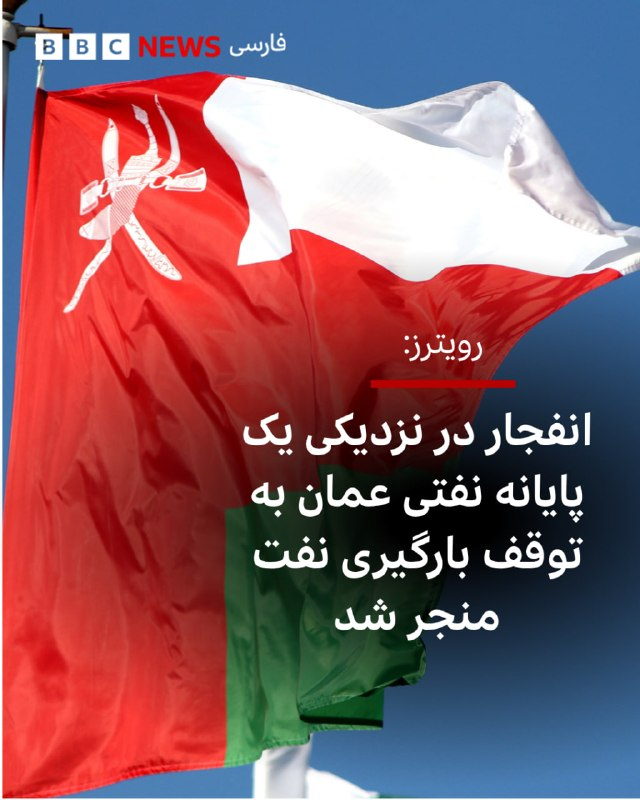

خبرگزاری رویترز از انفجاری در نزديکی اسکله‌های شناور بارگيری نفت در یک پايانه نفت خام عمان گزارش داده و می‌گوید که در پی آن عمليات بارگيری نفت در این پایانه متوقف شده است.

محل انفجار نزدیکی پایانه نفتی مينا الفحل در ساحل دريای عمان گزارش شده که خارج از محدوده خليج فارس قرار دارد.

رویترز از گزارش‌های اوليه از احتمال وقوع يک حمله پهپادی خبر داده است. مقام‌های عمان هنوز واکنشی نشان نداده‌اند.

این پایانه نفتی يکی از مهم ترين تاسیسات صادرات نفت خام عمان به شمار می‌رود و نقش مهمی در صادرات انرژی اين کشور دارد.

عمان در سال های گذشته تلاش کرده ميانجی و کانال ارتباطی ميان ايالات متحده و ايران باشد.

📷lightRocket via Getty Images
https://bbc.in/4oavX8B
@BBCPersian

## Dirty_Kids — post 391028

با اون کوله پشتیش رفته دعوا

@Dirty_Kids 👻

## Dirty_Kids — post 391027

عاشق اسم فارسیِ درختام؛ سپیدار، سَرو، بلوط، بید مجنون، چنار، صنوبر، افرا، کاج.
انگار که شعر سبزن.

@Dirty_Kids 👻

## Dirty_Kids — post 391026

  <a href="telegram/content/Dirty_Kids_391026_1780643357.mp4" target="_blank">🎬 Download video</a>

صداگذاری ۱۰/۱۰ 😂😂😂

@Dirty_Kids 👻

## alonews — post 125216

  <a href="telegram/content/alonews_125216_1780643358.webm" target="_blank">🎬 Download video</a>

👈تورم نقطه به نقطه سالانه برخی اقلام اعلامی مرکز آمار: از ۴۳٠ درصد تا ۱٠٠ درصد

✅ @AloNews خبر جنگ

## alonews — post 125215

  <a href="telegram/content/alonews_125215_1780643359.webm" target="_blank">🎬 Download video</a>

👈فرغون هم رویا شد!

✅ @AloNews خبر جنگ

## alonews — post 125214

  <a href="telegram/content/alonews_125214_1780643359.webm" target="_blank">🎬 Download video</a>

👈اسلام‌آباد درباره دیدار وزرای کشور پاکستان و ایران: دو طرف در مورد کاهش تنش‌ها و همکاری‌های امنیتی گفت‌وگو کردند

🔴 تلاش‌های دیپلماتیک برای دستیابی به صلح پایدار در منطقه ادامه خواهد یافت

✅ @AloNews خبر جنگ

## alonews — post 125213

  <a href="telegram/content/alonews_125213_1780643359.webm" target="_blank">🎬 Download video</a>

👈بیت‌کوین رسماً به زیر ۶۲٬۰۰۰ دلار سقوط کرد

✅ @AloNews خبر جنگ

## alonews — post 125212

  <a href="telegram/content/alonews_125212_1780643359.webm" target="_blank">🎬 Download video</a>

👈خیبرشکن صورتی در میدان انقلاب

✅ @AloNews خبر جنگ

## alonews — post 125211

  <a href="telegram/content/alonews_125211_1780643360.webm" target="_blank">🎬 Download video</a>

👈بلومبرگ: ازسرگیری عملیات در بندر فحل عمان برای صادرات نفت خام

✅ @AloNews خبر جنگ

## alonews — post 125210

  <a href="telegram/content/alonews_125210_1780643360.webm" target="_blank">🎬 Download video</a>

👈سخنگوی کمیسیون امنیت ملی: با دیکتاتورهای منطقه به جرم تامین مالی و نظامی آمریکا برخورد کنید

✅ @AloNews خبر جنگ

## alonews — post 125209

  <a href="telegram/content/alonews_125209_1780643360.webm" target="_blank">🎬 Download video</a>

👈آژانس اتمی: هیچ اطلاعاتی درمورد ذخایر اورانیوم نداریم

✅ @AloNews خبر جنگ

## alonews — post 125208

  <a href="telegram/content/alonews_125208_1780643360.webm" target="_blank">🎬 Download video</a>

👈خبرنگار الجزیره: دو حمله هوایی اسرائیل به حومه شهرهای نبطیه الفوقا و میفدون در جنوب لبنان

✅ @AloNews خبر جنگ

## alonews — post 125207

  <a href="telegram/content/alonews_125207_1780643361.webm" target="_blank">🎬 Download video</a>

👈رئیس‌جمهور روسیه، پوتین، درباره اینکه آیا روسیه به اروپا حمله خواهد کرد:
چرا؟ چرا روسیه باید این کار را بکند؟

🔴برای ما چه فایده‌ای دارد؟ دلیل حمله روسیه به اروپا و جنگ با ناتو چیست؟

🔴این مزخرف است. این یک تحریک عمدی است

✅ @AloNews خبر جنگ

## alonews — post 125206

  <a href="telegram/content/alonews_125206_1780643361.webm" target="_blank">🎬 Download video</a>

👈کابینه امنیتی اسرائیل به پیش‌نویس توافق و آتش‌بس در لبنان رأی نداد

🔴 روزنامه یدیعوت آحارانوت نوشت: کابینه امنیتی دیشب به پیش‌نویس توافق آتش بس در لبنان رأی نداد

✅ @AloNews خبر جنگ

## alonews — post 125205

  <a href="telegram/content/alonews_125205_1780643361.mp4" target="_blank">🎬 Download video</a>

👈ترامپ دیشب هم در کاخ سفید چرت زد!

✅ @AloNews خبر جنگ

## alonews — post 125204

  <a href="telegram/content/alonews_125204_1780643362.webm" target="_blank">🎬 Download video</a>

👈با اعلام سفیر ایران در روسیه؛ کار تملک زمین برای احداث راه‌آهن رشت – آستارا به طول ۱۶۲ کیلومتر تمام شده و به زودی برای آغاز پروژه در اختیار روسیه قرار می‌گیرد

✅ @AloNews خبر جنگ

## alonews — post 125203

  <a href="telegram/content/alonews_125203_1780643362.webm" target="_blank">🎬 Download video</a>

👈عراقچی: قطر تلاش هایی برای ایفای نقش سازنده در زمینه مسائل مالی داشته 

✅ @AloNews خبر جنگ

## alonews — post 125202

  <a href="telegram/content/alonews_125202_1780643362.webm" target="_blank">🎬 Download video</a>

👈در تهران سد ماملو کمترین و طالقان بیشترین حجم آب را دارند

🔴 موجودی مخزن سد ماملو ۴۰ میلیون متر مکعب بوده و پر شدگی آن به ۱۶ درصد رسیده

🔴 میزان پر شدگی سد طالقان ۵۰ درصد است

✅ @AloNews خبر جنگ

## alonews — post 125201

  <a href="telegram/content/alonews_125201_1780643363.webm" target="_blank">🎬 Download video</a>

👈آژانس اتمی: ایران فقط اجازه دسترسی به نیروگاه بوشهر را داده است

✅ @AloNews خبر جنگ

## alonews — post 125200

  <a href="telegram/content/alonews_125200_1780643363.webm" target="_blank">🎬 Download video</a>

👈نشریه «هیل»: بر پایه یک نظرسنجی تازه، نزدیک به هفت نفر از هر ده آمریکایی می‌خواهند جنگ با ایران «هرچه زودتر» پایان یابد.

✅ @AloNews خبر جنگ

## alonews — post 125199

  <a href="telegram/content/alonews_125199_1780643363.webm" target="_blank">🎬 Download video</a>

👈 قیمت وحشتناک و باورنکردنی ۴ قلم جهاز منزل... !

✅ @AloNews خبر جنگ

## alonews — post 125198

  <a href="telegram/content/alonews_125198_1780643364.webm" target="_blank">🎬 Download video</a>

👈رویترز: بر اساس اسناد افشا شده پنتاگون، «استارلینک» با کمک دیش‌های قاچاق شده به ایران، ستون فقرات شبکه نظامی آمریکا برای هدایت پهپادهای انتحاری مانند لوکاس در حمله به ایران بوده است.

✅ @AloNews خبر جنگ

## alonews — post 125197

  <a href="telegram/content/alonews_125197_1780643364.webm" target="_blank">🎬 Download video</a>

👈خبرگزاری دولتی چین: شی جین پینگ، رئیس جمهور چین بین 8 تا 9 ژوئن به کره شمالی سفر خواهد کرد. این اولین سفر او به این کشور در 7 سال اخیر است

✅ @AloNews خبر جنگ

---
📅 بروزرسانی: 1405/03/15 06:36
---

## VahidOOnLine — post 243752

  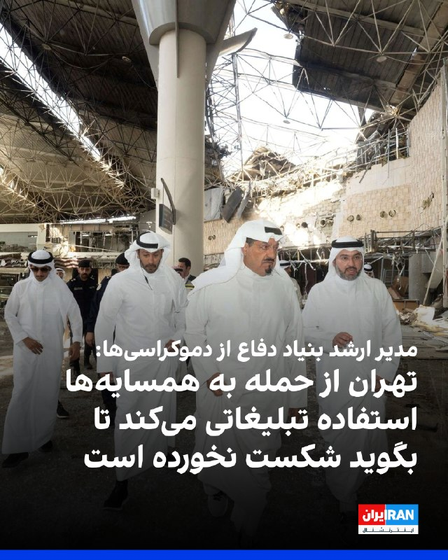

بهنام بن‌طالب‌لو، مدیر ارشد برنامه ایران در بنیاد دفاع از دموکراسی‌ها، در گفت‌وگو با ای‌بی‌سی نیوز با اشاره به حمله‌های اخیر جمهوری اسلامی به اهداف غیرنظامی در کویت گفت: «جمهوری اسلامی از حمله به همسایه‌ها استفاده تبلیغاتی می‌کند تا بگوید شکست نخورده است.»
او افزود: با وجود اصطلاح آتش‌بس، جمهوری اسلامی و حتی تا حدی آمریکا، با شلیک به یکدیگر یا به منافع یکدیگر مشکلی ندارند.
بن‌طالب‌لو گفت: «ساختار حکومت ایران تا حدی دچار شکاف و ضعف شده، اما آنچه باقی مانده نوعی ساختار عمیق حکومتی است که همچنان منسجم است و به نظر می‌رسد بیش از گفت‌وگو، به تقابل تمایل دارد یا دست‌کم به همزمانی تقابل و گفت‌وگو رضایت داده است.»

‌🏁 🇬🇧 IranintlTV

🤖 @VahidOOnLine

## VahidOOnLine — post 243751

  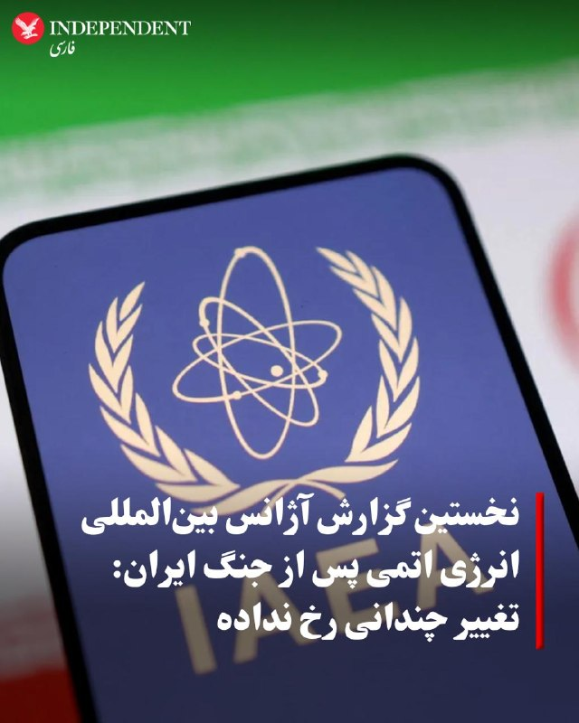

♦️آژانس بین المللی انرژی اتمی روز پنج‌شنبه گزارشی برای کشورهای عضو ارسال کرد که در آن با وجود سه ماه جنگ آمریکا و اسرائیل با هدف اعلام‌شده جلوگیری از ساخت بمب اتمی توسط ایران، هیچ تغییر عمده‌ای در ارزیابی این نهاد از برنامه هسته‌ای ایران دیده نمی‌شود.
به گزارش رویترز، آژانس بین المللی انرژی اتمی در نخستین گزارش درباره برنامه هسته‌ای ایران از روز قبل از آغاز حملات هوایی آمریکا و اسرائیل به ایران در اواخر فوریه، بار دیگر از تهران خواست توضیح دهد ذخایر اورانیوم غنی‌شده چه سرنوشتی پیدا کرده‌اند.
این گزارش محرمانه درباره ایران یکی از دو گزارشی بود که روز پنج‌شنبه منتشر شد و رویترز پیش از نشست فصلی هفته آینده شورای حکام ۳۵ عضوی آژانس بین‌المللی انرژی اتمی آن را مشاهده کرده است. این گزارش‌ها نشان می‌دهند که نسبت به گزارش‌های قبلی در اواخر فوریه، درست پیش از آغاز جنگ جدید، تغییر بسیار کمی وجود دارد.
در این گزارش آمده است: «مدیرکل آژانس تاکید کرده است که اجرای مؤثر توافق پادمان‌های معاهده منع گسترش سلاح‌های هسته‌ای (ان‌پی‌تی) برای ایران ضروری و فوری است و این اجرای تعهدات تحت هیچ شرایطی نمی‌تواند از سوی ایران تعلیق شود.»
آژانس بین‌المللی انرژی اتمی نتوانسته است به سایت‌های هسته‌ای که اسرائیل و آمریکا در ژوئن گذشته بمباران کردند بازگردد. ایران هنوز آژانس را از سرنوشت ذخایر اورانیوم کم‌غنی‌شده (LEU) و بسیار غنی‌شده (HEU) خود، از جمله اورانیوم غنی‌شده تا سطح ۶۰ درصد، که تنها یک گام تا حدود ۹۰ درصد مورد نیاز برای تسلیحات هسته‌ای فاصله دارد، مطلع نکرده است.
در گزارش آمده است: «عدم دسترسی آژانس برای راستی‌آزمایی HEU و LEU اعلام‌شده قبلی، برای نزدیک به یک سال - که بسیار فراتر از رویه‌های استاندارد پادمانی است - موضوعی نگران‌کننده از نظر اشاعه و همچنین پایبندی به توافق پادمان‌های مه اشاعه هسته‌ای است.»
‌🇸🇦 Indypersian

🤖 @VahidOOnLine

## VahidOOnLine — post 243750

  <a href="telegram/content/VahidOOnLine_243750_1780628811.mp4" target="_blank">🎬 Download video</a>

♦️مدونا، خواننده و هنرمند مشهور آمریکایی، پنجشنبه ۱۴ خرداد با برگزاری یک کنسرت غافلگیرکننده در میدان تایمز نیویورک بار دیگر توجه هواداران را جلب کرد. این اجرای حدود ۱۵ دقیقه‌ای، چند هفته پیش از انتشار آلبوم جدید این خواننده برگزار شد.
مدونا در جریان این اجرا برای نخستین بار قطعه «احساس عشق» (Love Sensation) از آلبوم جدیدش را اجرا کرد و در بخشی از برنامه خطاب به جمعیت گفت: «آماده‌اید؟ مادر اینجاست.»
این خواننده ۶۷ ساله با پوشش و حرکات نمایشی روی صحنه، بار دیگر لقب «مادر پاپ» را یادآوری کرد و اجرای او با استقبال و تشویق گسترده هواداران همراه شد.
آلبوم جدید مدونا که دنباله‌ای بر آلبوم موفق سال ۲۰۰۵ است، قرار است ۱۲ تیر منتشر شود. مدونا پیش‌تر درباره این آلبوم گفته بود: «مردم فکر می‌کنند موسیقی رقص سطحی است، اما کاملا اشتباه می‌کنند؛ پیست رقص فقط یک مکان نیست، بلکه فضایی است که در آن حرکت جایگزین زبان می‌شود.»
‌🇸🇦 Indypersian

🤖 @VahidOOnLine

## VahidOOnLine — post 243749

  <a href="telegram/content/VahidOOnLine_243749_1780628813.mp4" target="_blank">🎬 Download video</a>

♦️شانگهای دیلی، روزنامه رسمی انگلیسی‌زبان شهر شانگهای در چین، چهارشنبه ویدیویی منتشر کرد که نشان می‌دهد یک ربات انسان‌نما در جریان نمایش کونگ‌فو در باغ گیاه‌شناسی ارومچی در منطقه سین‌کیانگ، هنگام اجرای حرکت «لگد پرشی» به شکم یک پسربچه تماشاگر لگد زد و او را نقش زمین کرد. گزارش‌ها حاکی است این کودک در این حادثه آسیب جدی ندید.
‌🇸🇦 Indypersian

🤖 @VahidOOnLine

## VahidOOnLine — post 243748

♦️محسن رضایی، مشاور مجتبی خامنه‌ای، رهبر جدید جمهوری اسلامی، روز پنجشنبه ۱۴ خرداد در گفتگو با صداوسیما با انتقاد شدید از توافق و هم‌پیمانی برخی کشورهای منطقه با اسرائیل گفت: «این‌ها نمی‌فهمند اصلا زیربنای کشور خودشان را دارند متزلزل می‌کنند؛ چون رفتند با رژیمی به نام اسرائیل هم‌پیمان شدند که می‌گوید من باید نقشه خاورمیانه را عوض کنم.»
رضایی با طرح ادعاهای مرزی در منطقه و هشدار به مقامات امارات متحده عربی و کویت افزود: «اگر تفکر نتانیاهو برای تغییر نقشه‌ها را قبول دارید، فردا باید ابوظبی را به عربستان و جزیره بوبیان را به عراق بدهید؟ حرکت در مسیر نقشه‌های خارجی، کل منطقه را دچار نوساناتی می‌کند که به ضرر خود این کشورهاست.»
‌🇸🇦 Indypersian

🤖 @VahidOOnLine

## VahidOOnLine — post 243747

  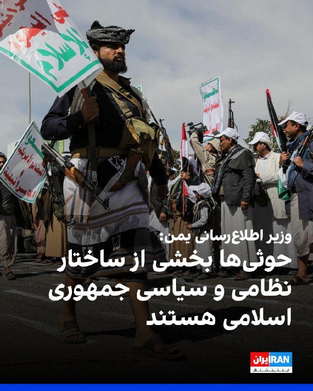

معمر الاریانی، وزیر اطلاع‌رسانی یمن، با اشاره به استقبال حوثی‌ها از حملات جمهوری اسلامی به کشورهای عربی خلیج فارس، گفت افزود حوثی‌ها صرفا متحد تهران نیستند، بلکه بخشی از ساختار نظامی، امنیتی و سیاسی فرامرزی حکومت ایران محسوب می‌شوند.
او گفت ستایش حوثی‌ها از حمله‌های جمهوری اسلامی به تاسیسات غیرنظامی منطقه، ادعاهای این گروه درباره تهدید نبودن برای همسایگان یمن و امنیت کشتیرانی منطقه‌ای را بی‌اعتبار می‌کند.
الاریانی تاکید کرد حوثی‌ها یمن را به عرصه‌ای برای خدمت به طرح جمهوری اسلامی تبدیل کرده‌اند و با طولانی کردن جنگ، این کشور را وارد درگیری‌هایی می‌کنند که با منافع مردم یمن و امنیت منطقه در تضاد است.

‌🏁 🇬🇧 IranintlTV

🤖 @VahidOOnLine

## VahidOOnLine — post 243746

  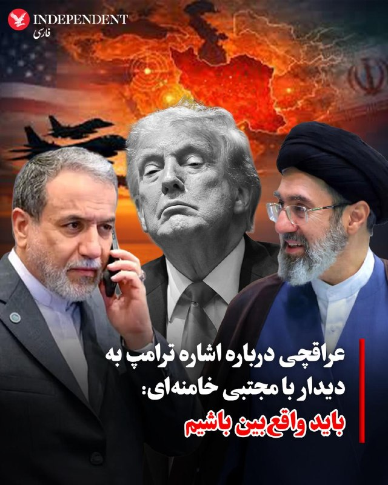

♦️عباس عراقچی، وزیر امور خارجه جمهوری اسلامی، در گفتگو با شبکه المیادین، وابسته به حزب‌الله لبنان، در واکنش به اظهارات اخیر دونالد ترامپ مبنی بر احتمال دیدار با مجتبی خامنه‌ای گفت: «فکر می‌کنم ما باید واقع‌بین باشیم و در دنیای واقعی فکر و زندگی کنیم.»
این اظهارات پس از آن مطرح شد که دونالد ترامپ پیش‌تر درباره احتمال دیدار با «آیت‌الله جدید» گفته بود اگر توافقی شکل بگیرد، احتمال چنین دیداری وجود دارد.
با این حال، ترامپ روز پنجشنبه ۱۴ خرداد در گفتگو با خبرنگاران در کاخ سفید گفت تمایلی به دیدار با مجتبی خامنه‌ای ندارد و افزود: «من شخص مورد علاقه او نیستم.»
‌🇸🇦 Indypersian

🤖 @VahidOOnLine

## VahidOOnLine — post 243745

♦️دونالد ترامپ، رئیس جمهوری آمریکا روز پنجشنبه ۱۴ خرداد در مراسم سرمایه‌گذاری در حوزه انرژی و زغال‌سنگ در کاخ سفید در پاسخ به سوالی درباره احتمال دیدار با «رهبر جدید» جمهوری اسلامی گفت: «من تمایلی به دیدار ندارم، اما اگر دیداری داشته باشم، مایه افتخار خواهد بود که با او ملاقات کنم.»

ترامپ افزود: «دوست دارم ببینم آیا می‌توانیم به یک توافق برسیم یا خیر. اگر به توافقی برسیم، این احتمال وجود دارد که با او دیدار کنم و با این موضوع مشکلی ندارم.»

او همچنین در پاسخ به سوالی درباره اینکه آیا رهبر جدید جمهوری اسلامی ممکن است به دلیل کشته شدن اعضای خانواده‌اش در عملیات «خشم حماسی» تمایلی به دیدار با او نداشته باشد، گفت: «من محبوب‌ترین فرد نزد او نیستم.»

ترامپ در ادامه افزود: «او احتمالا فردی حرفه‌ای است. من او را نمی‌شناسم، اما در برخی محافل شهرت بسیار خوبی دارد.»
‌🇸🇦 Indypersian

🤖 @VahidOOnLine

## VahidOOnLine — post 243744

  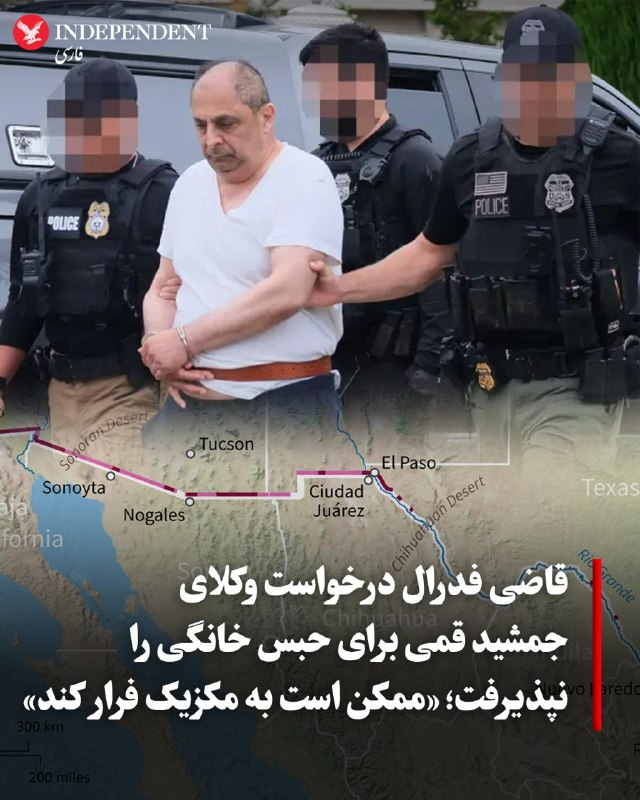

♦️جمشید قمی ۶۳ ساله که متهم است هزینه زندگی لوکس خود را از طریق انتقال داده‌ها و تجهیزات پیشرفته و حساس به برنامه هسته‌ای و نظامی ایران تامین کرده،به دستور داگلاس مک‌کورمیک، قاضی دادگاه فدرال آمریکا، بدون امکان آزادی موقت در بازداشت ماند.
به گزارش نیویورک‌پست، قمی که تابعیت دوگانه ایرانی آمریکایی دارد، روز پنجشنبه تحت اسکورت ماموران مارشال آمریکا، در حالی که دست و پایش در زنجیر بود، با لباس نارنجی زندان وارد دادگاه فدرال سانتا آنا شد.
 او بامداد چهارشنبه در جریان یورشی که پیش از طلوع آفتاب به عمارت ۳۵ میلیون دلاری‌اش در منطقه حفاظت‌شده نیوپورت کوست انجام شد، بازداشت شده بود.
دیوید لاخمن، دادستان فدرال، در دادگاه استدلال کرد که قومی هم خطر جدی فرار دارد و هم تهدیدی برای امنیت ملی محسوب می‌شود. او گفت دولت آمریکا حدود ۱۰۰ هزار سند و مدرک علیه او جمع‌آوری کرده است.
دادستان‌ها اعلام کردند که قومی تا ماه گذشته نیز با همدستان خود در ایران در ارتباط بوده و از اواخر سال ۲۰۲۳ تا زمان بازگشت به آمریکا در پنجم مه، در ایران زندگی می‌کرده است.
همچنین در دادگاه مطرح شد که همسر قومی نیز شهروند دوتابعیتی ایران و آمریکا است.
لاخمن با تاکید بر لزوم ادامه بازداشت متهم گفت: «خانواده و ثروت او در ایران است» و او «مقدار نامعلومی پول در ایران در اختیار دارد.»
او استدلال کرد که اگر قومی به حبس خانگی محکوم شود، می‌تواند پابند الکترونیکی خود را قطع کرده و «به مکزیک فرار کند.
با این حال، تیم حقوقی قومی خواستار آزادی او با قرار وثیقه و انتقال به حبس خانگی شد. گرگ برنستاین، وکیل او، گفت موکلش قصد ندارد «به منطقه جنگی (ایران) بازگردد.
دادستان‌ها می‌گویند قومی، مدیر یک شرکت فناوری مستقر در تهران، تجهیزات شبکه و رمزنگاری آمریکایی را در اختیار برنامه هسته‌ای و نهادهای نظامی ایران قرار داده و همزمان میلیون‌ها دلار پول‌شویی کرده و برای پنهان کردن این معاملات با حکومت ایران از روش‌های پیچیده استفاده کرده است.
بر اساس این ادعاها، او سپس درآمد حاصل از این معاملات غیرقانونی را صرف ساخت عمارت باشکوه خود به سبک توسکانی در منطقه‌ای ساحلی و مشرف به اقیانوس در یکی از گران‌ترین مناطق مسکونی آمریکا کرده است.
بر اساس اعلام وزارت دادگستری آمریکا، شرکت قومی با نام «فراز پرداز رایانه» بین سال‌های ۲۰۱۷ تا ۲۰۲۳ فناوری مورد نیاز سازمان انرژی اتمی ایران و بین سال‌های ۲۰۱۴ تا ۲۰۲۲ تجهیزات مورد نیاز وزارت دفاع و پشتیبانی نیروهای مسلح جمهوری اسلامی را تامین کرده است
‌🇸🇦 Indypersian

🤖 @VahidOOnLine

## VahidOOnLine — post 243743

♦️مدیرکل بهزیستی کردستان اعلام کرد دو دختر ۷ و ۱۵ ساله که در یکی از محله‌های سنندج در شرایط نامناسب نگهداری می‌شدند، پس از گزارش‌های مردمی و ورود اورژانس اجتماعی و نیروهای انتظامی نجات یافتند.

به گفته حسین رسولی، کارشناسان اورژانس اجتماعی ۱۲۳ پس از دریافت گزارش‌های مردمی و با حکم قضایی وارد یک خانه در حوالی میدان گاز سنندج شدند و دو دختر را در سرویس بهداشتی ساختمان پیدا کردند. او گفت این دو کودک پس از نجات، دارای آثار آشکار ضرب و جرح و آسیب‌های جسمی بودند و بررسی‌های اولیه از وجود شکستگی و جراحات در بخش‌هایی از بدن آنان، از جمله پا، سر و صورت حکایت داشت.

این دو کودک برای درمان به بیمارستان کوثر سنندج منتقل شدند. یکی از آنان همچنان تحت درمان است و دیگری پس از ترخیص، به یکی از مراکز نگهداری تحت پوشش بهزیستی منتقل شده است.

مدیرکل بهزیستی کردستان افزود پدر این کودکان بازداشت شده و نامادری آنان نیز به دلیل نگهداری از دو کودک خردسال دیگر، تحت نظارت قضایی قرار دارد. به گفته او، پرونده این افراد در دستگاه قضایی در دست بررسی است و گزارش‌های کارشناسی نیز به مراجع قضایی ارسال شده است.
‌🇸🇦 Indypersian

🤖 @VahidOOnLine

## VahidOOnLine — post 243742

  <a href="telegram/content/VahidOOnLine_243742_1780628817.mp4" target="_blank">🎬 Download video</a>

♦️ حمید رسایی، نماینده مجلس شورای اسلامی، در تجمع شبانه حامیان جمهوری اسلامی در کاشان اعلام کرد «انتقام خون امام شهید را رها نمی‌کنیم.»
او همچنین گفت: «آنقدر روی برد موشک‌های ایرانی کار می‌کنیم تا روزی کاخ سفید را روی سر رئیس‌جمهوری آمریکا خراب کنیم.»
‌🇸🇦 Indypersian

🤖 @VahidOOnLine

## FoxNewsTwitter — post 342639

  

Fox News (Twitter/X)

Donald Trump or Kamala Harris?

Waka Flocka Flame compared the choice to Kobe Bryant vs. LeBron James — and made it clear he'd pick Trump. But the rapper also revealed he's never actually voted.

"I never vote for nobody. Never in my life voted," Waka told Tomi Lahren, explaining that he grew up believing votes didn't matter for people from "the hood, the trenches, the ghetto."

Waka said his support for Trump isn't about agreeing with everything he says or does, adding: "The only thing I learned from Trump was how to delegate my capital and how to structure my business."

Waka also praised Nicki Minaj as "a huge influence on female rappers" and argued critics have targeted her politically, saying after she endorsed Trump, "they want her canceled."

## FoxNewsTwitter — post 342638

  <a href="telegram/content/FoxNewsTwitter_342638_1780628820.mp4" target="_blank">🎬 Download video</a>

Fox News (Twitter/X)

Rep. Alexandria Ocasio-Cortez declined to weigh in when asked about the growing controversy surrounding Democratic Senate candidate Graham Platner.

The questions came after multiple women accused Platner of abusive behavior and raised concerns about a Totenkopf tattoo — an emblem historically associated with Nazi death camp guards.

One former girlfriend alleged Platner fantasized about rape and violence, while another described what she said were troubling encounters during their relationship. Platner has denied wrongdoing and pushed back on the allegations.

As scrutiny surrounding the candidate intensifies, Ocasio-Cortez repeatedly avoided directly addressing the claims when pressed by reporters.

## FoxNewsTwitter — post 342637

  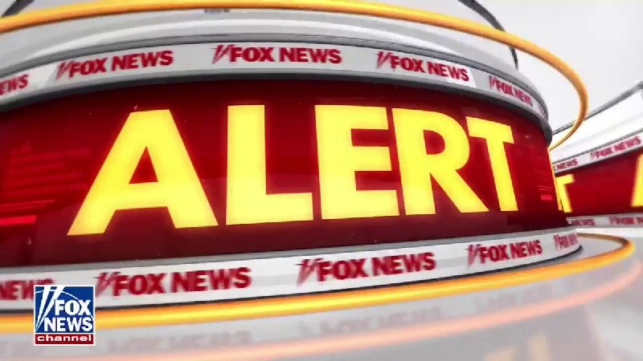

Fox News (Twitter/X)

"Three of his exes paint the same picture: volatile, reckless, demeaning to women."

Jesse Watters on the latest scandalous allegations against Maine Democratic Senate candidate Graham Platner. https://twitter.com/JesseBWatters/status/2062694583293632738#m

## FoxNewsTwitter — post 342636

‌Fox News (Twitter/X)

https://www.foxnews.com/politics/hated-women-explosive-abuse-new-nazi-tattoo-allegations-exes-rock-platners-campaign

## FoxNewsTwitter — post 342635

  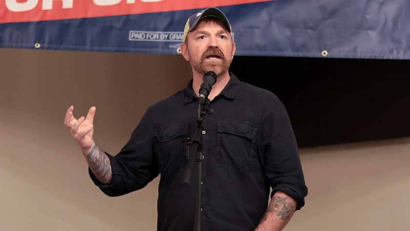

Fox News (Twitter/X)

A former girlfriend of Maine Democratic Senate candidate Graham Platner is making explosive new allegations, reportedly claiming Platner would sharpen an ax while watching television and ruminate about raping home invaders.

The ex-partner also alleged Platner once pulled her from a taxi by her wrist during an argument, pushed her into a bedroom and held the door shut, and regularly fantasized about killing people he viewed as threats.

She further claimed Platner joked about his Totenkopf tattoo — an emblem associated with Nazi death camp guards — and said members of his military unit chose the symbol because they viewed themselves as a "death unit" of "killers."

Platner has denied wrongdoing, but the allegations are now putting his campaign under intense scrutiny.

## IranIntlTV — post 340599

  

بهنام بن‌طالب‌لو، مدیر ارشد برنامه ایران در بنیاد دفاع از دموکراسی‌ها، در گفت‌وگو با ای‌بی‌سی نیوز با اشاره به حمله‌های اخیر جمهوری اسلامی به اهداف غیرنظامی در کویت گفت: «جمهوری اسلامی از حمله به همسایه‌ها استفاده تبلیغاتی می‌کند تا بگوید شکست نخورده است.»
او افزود: با وجود اصطلاح آتش‌بس، جمهوری اسلامی و حتی تا حدی آمریکا، با شلیک به یکدیگر یا به منافع یکدیگر مشکلی ندارند.
بن‌طالب‌لو گفت: «ساختار حکومت ایران تا حدی دچار شکاف و ضعف شده، اما آنچه باقی مانده نوعی ساختار عمیق حکومتی است که همچنان منسجم است و به نظر می‌رسد بیش از گفت‌وگو، به تقابل تمایل دارد یا دست‌کم به همزمانی تقابل و گفت‌وگو رضایت داده است.»

https://iranintl.com/202606059804

## IranIntlTV — post 340598

  

معمر الاریانی، وزیر اطلاع‌رسانی یمن، با اشاره به استقبال حوثی‌ها از حملات جمهوری اسلامی به کشورهای عربی خلیج فارس، گفت افزود حوثی‌ها صرفا متحد تهران نیستند، بلکه بخشی از ساختار نظامی، امنیتی و سیاسی فرامرزی حکومت ایران محسوب می‌شوند.
او گفت ستایش حوثی‌ها از حمله‌های جمهوری اسلامی به تاسیسات غیرنظامی منطقه، ادعاهای این گروه درباره تهدید نبودن برای همسایگان یمن و امنیت کشتیرانی منطقه‌ای را بی‌اعتبار می‌کند.
الاریانی تاکید کرد حوثی‌ها یمن را به عرصه‌ای برای خدمت به طرح جمهوری اسلامی تبدیل کرده‌اند و با طولانی کردن جنگ، این کشور را وارد درگیری‌هایی می‌کنند که با منافع مردم یمن و امنیت منطقه در تضاد است.

https://iranintl.com/202606043296

## FarsiVOA — post 219637

  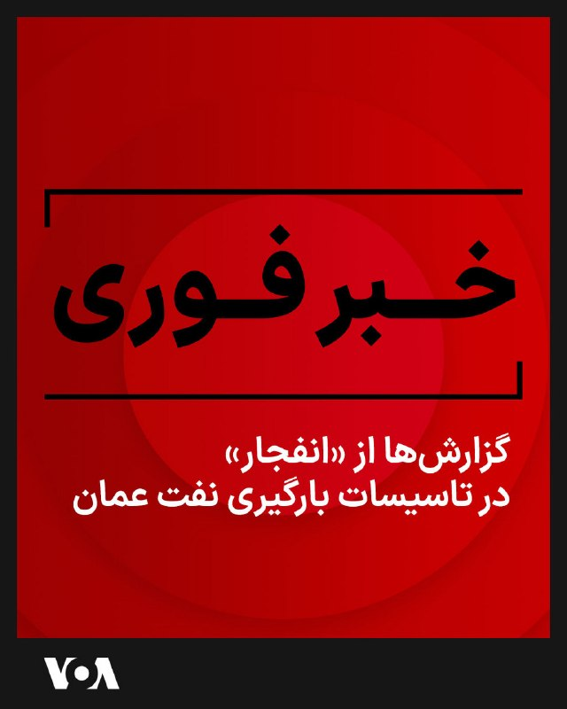

⚡️خبرگزاری رویترز به نقل از دو منبع در روز جمعه گزارش داد که پایانه نفتی مینا الفحل در عمان پس از وقوع یک انفجار در نزدیکی اسکله‌ها، عملیات بارگیری نفت را متوقف کرده است. به گفته این منابع، انفجار ظاهراً در پی یک حمله پهپادی رخ داده است.
@FarsiVOA

## FarsiVOA — post 219636

⚡️ترامپ: تولید انرژی اهمیت بسیاری دارد از جمله برای پیشرو بودن در عرصه «هوش مصنوعی»
@FarsiVOA

## FarsiVOA — post 219635

⚡️دونالد ترامپ در مراسم «زغال سنگ زیبا و تمیز»: جمهوری اسلامی بمب هسته‌ای نخواهد داشت
@FarsiVOA

## FarsiVOA — post 219634

⚡️دونالد ترامپ در مراسم «زغال سنگ زیبا و تمیز»: تولید نفت آمریکا از عربستان و روسیه بیشتر است
@FarsiVOA

## FarsiVOA — post 219633

⚡️پوشش ویژه | سخنان دونالد ترامپ در مراسم «زغال سنگ زیبا و تمیز» در کاخ سفید
@FarsiVOA

## FarsiVOA — post 219632

🔺ترامپ می‌گوید پس از گفت‌وگوی او با اسرائیل و حزب‌الله، هر دو در مسیر پایان دادن به درگیری «پیشرفت» کرده‌اند

▪️رئیس‌جمهوری آمریکا، دونالد ترامپ اعلام کرد که معتقد است اسرائیل و گروه شبه‌نظامی حزب‌الله لبنان، پس از گفت‌وگوهایی که او در روزهای اخیر با هر دو طرف داشته است، در مسیر پایان دادن به درگیری طولانی‌مدت خود «پیشرفت» کرده‌اند.

⬇️ بیشتر بخوانید:
https://ir.voanews.com/a/8157631.html
@FarsiVOA

## FarsiVOA — post 219631

⚡️دلایل و پیامدهای بازماندن کودکان ایران از تحصیل؛ گفت‌وگو با رقیه رضایی
@FarsiVOA

## FarsiVOA — post 219630

⚡️تغییرات اقلیمی و بحران جهانی محیط زیست
@FarsiVOA

## FarsiVOA — post 219629

⚡️ویژگی‌های شخصیتی مرجان ساتراپی؛ گفت‌وگو با هلن همتی از دوستان نزدیک مرجان ساتراپی
@FarsiVOA

## FarsiVOA — post 219628

⚡️توافق اسرائیل و لبنان بر سر آتش‌بس و اصرار حزب‌الله بر جنگ افروزی
@FarsiVOA

---
📅 بروزرسانی: 1405/03/15 03:39
---

## VahidOOnLine — post 243733

هر کدامشان ۲۶ سال داشتند؛ سنی برای ساختن، عاشق شدن، کار کردن، ورزش کردن و دنبال کردن رویاهایشان.
اما خیابان‌های دی‌ماه برای آن‌ها به نقطه پایان تبدیل شد؛ با گلوله سرکوب، در بی‌خبری خانواده‌ها، با پیکرهایی که در گرو ماندند و روایت‌هایی که پایانی ندارند.<
محمد جباری دیزیچه، یاشار سلطانی‌راد، امید باقری، سعید توکلیان دشمن‌زیاری، امیرعباس باغستانی، مهدی (کیارش) صفری، بهنام برآبادی و صادق علیجانی علیجانوند
نامشان را می‌نویسیم، چون این روایت‌ها بخشی از حافظه جمعی ما ایرانیان است؛ حافظه‌ای که با سکوت کنار نمی‌آید.<
#جاویدنامان_انقلاب_ملی_ایرانیان
‌🏁 🇬🇧 IranintlTV

🤖 @VahidOOnLine

## VahidOOnLine — post 243732

  

به گزارش رسانه‌های حقوق بشری، حسن و حسین امیری، برادران دوقلوی ۲۰ ساله محبوس در زندان قزلحصار کرج، به اتهام «جاسوسی برای اسرائیل» با حکم شعبه ۲۶ دادگاه انقلاب تهران به ریاست قاضی ایمان افشاری به اعدام محکوم شده‌اند.
به گزارش سازمان حقوق بشر ایران، حسن امیری روز ۲۹ اسفند ۱۴۰۴ در یک ایست بازرسی به اتهام اینکه ماموران در تلفن همراه او تصویری از یک محل بمباران‌شده پیدا کرده بودند، بازداشت شد.
این سازمان به نقل از یک منبع آگاه نوشت حسن تحت شکنجه قرار گرفت تا اعترافات دروغین انجام دهد و بگوید که برادر دوقلویش حسین، تصاویر بیشتری را در لپ‌تاپ خود نگهداری می‌کند؛ این در‌حالی‌است که هیچ‌یک از این دو برادر لپ‌تاپ ندارند.
در نهایت، حسین امیری، مکانیک خودرو در کرج، روز ۳ فروردین ۱۴۰۵ بازداشت شد و شش روز بعد، هر دو برادر برای بازجویی به زندان قزل‌حصار منتقل شدند.
هرانا به نقل از یک منبع آگاه گزارش داد در کیفرخواست صادر شده علیه این دو برادر، مشاهده تصاویری از ساختمان‌های آسیب‌دیده، مبنای طرح اتهام «جاسوسی به نفع اسرائیل» در پرونده قرار گرفته بود.
‌🏁 🇬🇧 IranintlTV

🤖 @VahidOOnLine

## VahidOOnLine — post 243731

  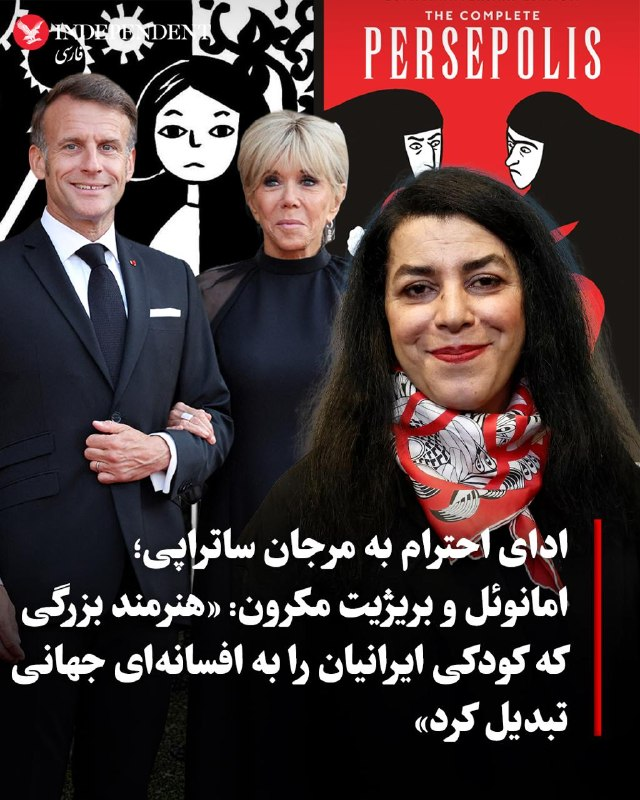

♦️مرجان ساتراپی، نویسنده، کارگردان و خالق کتاب مصور «پرسپولیس»، در ۵۶ سالگی درگذشت. نزدیکان او علت مرگ را اندوه ناشی از درگذشت همسرش، ماتیاس ریپا، توصیف کرده‌اند؛ فردی که ساتراپی بارها از او با عنوان «عشق زندگی‌ام» یاد کرده بود.
امانوئل و بریژیت مکرون با انتشار بیانیه‌ای به مرجان ساتراپی ادای احترام کردند و از او به عنوان «هنرمندی بزرگ که کودکی ایرانی را به افسانه‌ای جهانی تبدیل کرد» یاد کردند. در این بیانیه آمده است که مرگ ساتراپی، فقدان یکی از چهره‌های فرهنگی فرانسه و هنرمندی شیفته آزادی است؛ هنرمندی که آثارش پیام‌هایی جهان‌شمول داشت و برای او شهرتی بین‌المللی به همراه آورد.
مرجان ساتراپی متولد ۲ آذر ۱۳۴۸ در رشت بود و پس از مهاجرت به فرانسه، با مجموعه «پرسپولیس» به شهرت جهانی رسید؛ اثری که تجربه زندگی در تهران پس از انقلاب ۱۳۵۷، مهاجرت، تبعید و محدودیت‌های اجتماعی را روایت می‌کرد. به گزارش خبرگزاری فرانسه، اقتباس سینمایی این اثر در سال ۲۰۰۷ جایزه هیات داوران جشنواره کن را دریافت کرد و نامزد جایزه اسکار شد.
‌🇸🇦 Indypersian

🤖 @VahidOOnLine

## VahidOOnLine — post 243730

  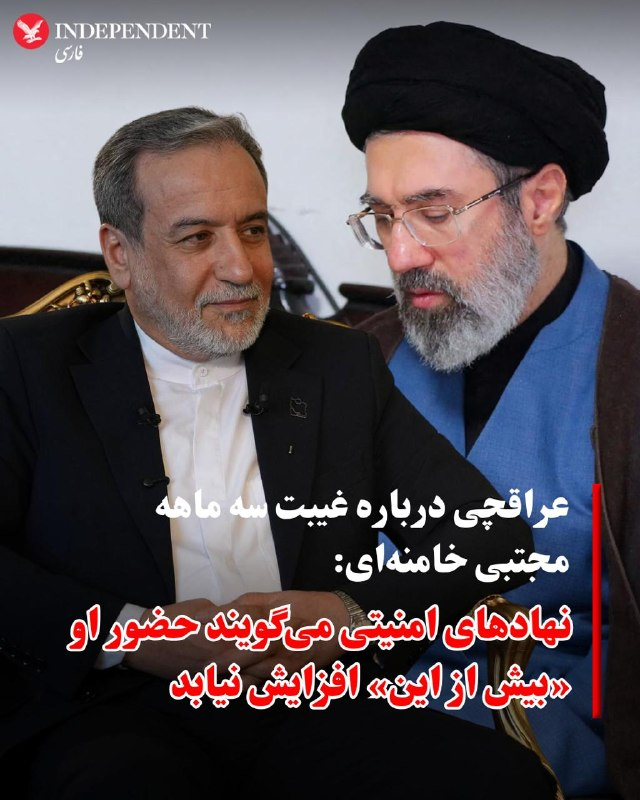

♦️عباس عراقچی، وزیر خارجه جمهوری اسلامی در پاسخ به پرسشی درباره غیبت سه ماهه مجتبی خامنه‌ای گفت: «با توجه به ملاحظات امنیتی، نهادهای امنیتی توصیه نمی‌کنند که حضور علنی او بیش از این افزایش یابد.» این اظهارات در حالی مطرح می‌شود که در سه ماه اخیر مجتبی خامنه‌ای که به عنوان سومین رهبر نظام معرفی شده، نه تنها دیده نشده، بلکه پیامی صوتی یا تصویری جدید نیز از او منتشر نشده و صدا و سیما در چند مورد بیانیه‌های کتبی منتسب به او را قرائت کرده است. با این حال عراقچی مدعی شد که مجتبی خامنه‌ای «کاملا زمان امور را در دست دارد.» وزیر خارجه جمهوری اسلامی درحالی که نرخ تورم به ۸۳ درصد رسیده، کشور در شرایط جنگی و تحت محاصره دریایی است و ده‌ها هزار خانواده داغدار جوانان کشته شده خود در سرکوب خونین خیزش ملی در دی‌ماه هستند، گفت: «خوشبختانه همه امور در مسیر بسیار خوبی پیش می‌رود.»
‌🇸🇦 Indypersian

🤖 @VahidOOnLine

## VahidOOnLine — post 243729

  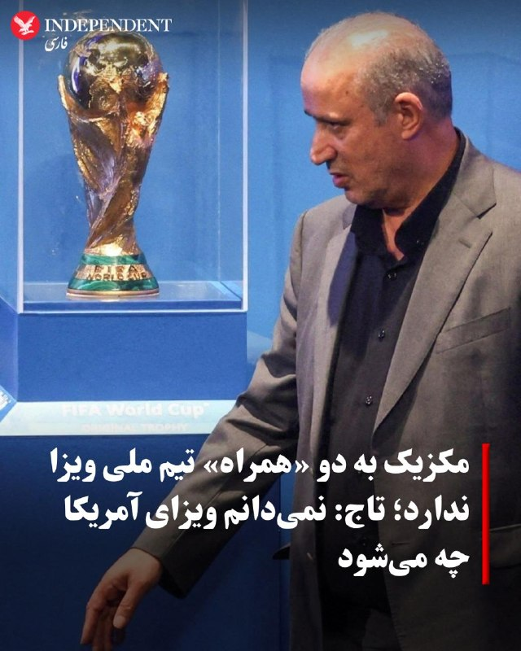

♦️مهدی تاج، رئیس فدراسیون فوتبال گفت، مکزیک برای دو «همراه» تیم فوتبال ایران ویزا صادر نکرد. او درباره ویزای آمریکا نیز گفت: «من امروز دو بار با فیفا به صحبت پرداختم و این موضوع مسیر خود را طی می‌کند. اگر از من بپرسند می‌گویم نمی‌دانم در چه مرحله‌ای است؟ به ما اعلام کردند منتظر باشید و پیگیر این موضوع هستیم.» تاج همچنین بدون رد خبر پیشین ایندیپندنت فارسی درباره صدور ویزای ۴۸ ساعته آمریکا برای بازیکنان تیم ایران در پاسخ به این پرسش که آیا درست است که آمریکا اعلام کرده کاروان فقط می‌تواند هر بار ۴۸ ساعت در خاک آمریکا بماند، گفت: «آمریکا نمی‌تواند برای ما تعیین تکلیف کند، با فیفا صحبت می‌کنیم.» به گزارش فرارو، تاج افزود: «مهم‌ترین مسئله برای ما ویزای آمریکا است. موضوع مکزیک واقعا حل شده شده و فیفا به ما امیدواری داده است.»
‌🇸🇦 Indypersian

🤖 @VahidOOnLine

## VahidOOnLine — post 243728

  <a href="telegram/content/VahidOOnLine_243728_1780618191.mp4" target="_blank">🎬 Download video</a>

♦️مدیرکل بهزیستی کردستان اعلام کرد دو دختر ۷ و ۱۵ ساله که در یکی از محله‌های سنندج در شرایط نامناسب نگهداری می‌شدند، پس از گزارش‌های مردمی و ورود اورژانس اجتماعی و نیروهای انتظامی نجات یافتند.

به گفته حسین رسولی، کارشناسان اورژانس اجتماعی ۱۲۳ پس از دریافت گزارش‌های مردمی و با حکم قضایی وارد یک خانه در حوالی میدان گاز سنندج شدند و دو دختر را در سرویس بهداشتی ساختمان پیدا کردند. او گفت این دو کودک پس از نجات، دارای آثار آشکار ضرب و جرح و آسیب‌های جسمی بودند و بررسی‌های اولیه از وجود شکستگی و جراحات در بخش‌هایی از بدن آنان، از جمله پا، سر و صورت حکایت داشت.

این دو کودک برای درمان به بیمارستان کوثر سنندج منتقل شدند. یکی از آنان همچنان تحت درمان است و دیگری پس از ترخیص، به یکی از مراکز نگهداری تحت پوشش بهزیستی منتقل شده است.

مدیرکل بهزیستی کردستان افزود پدر این کودکان بازداشت شده و نامادری آنان نیز به دلیل نگهداری از دو کودک خردسال دیگر، تحت نظارت قضایی قرار دارد. به گفته او، پرونده این افراد در دستگاه قضایی در دست بررسی است و گزارش‌های کارشناسی نیز به مراجع قضایی ارسال شده است.

غریب سجادی، فرماندار سنندج، نیز با حضور در بیمارستان از این دو کودک عیادت کرد و بر حمایت درمانی، روان‌شناختی و اجتماعی از آنان و برخورد قانونی با عاملان این پرونده تاکید کرد.
‌🇸🇦 Indypersian

🤖 @VahidOOnLine

## FoxNewsTwitter — post 342634

  

Fox News (Twitter/X)

BREAKING: Four Senate Republicans just joined Democrats to block one of President Trump’s key legislative priorities.

In a setback for the White House, GOP Sens. Susan Collins, Lisa Murkowski, Thom Tillis and Mitch McConnell broke with their party to help stop the SAVE America Act from advancing in the Senate.

The vote exposed a familiar divide inside the Republican conference, with concerns over the bill’s provisions outweighing pressure from Trump and GOP leadership.

## FoxNewsTwitter — post 342633

  <a href="telegram/content/FoxNewsTwitter_342633_1780618192.mp4" target="_blank">🎬 Download video</a>

Fox News (Twitter/X)

FOX NEWS REPORT: President Trump is reportedly seeking changes to a proposed ceasefire extension with Iran after the House moved to limit his war powers. @BillMelugin_ has the latest.

## FoxNewsTwitter — post 342632

  <a href="telegram/content/FoxNewsTwitter_342632_1780618194.mp4" target="_blank">🎬 Download video</a>

Fox News (Twitter/X)

RT @EricShawnTV: He was at John Gotti’s side through all the battles. What he learned from the Mob Boss. Lewis Kasman opens up in “ Gotti’s Guy,” our new show now streaming on Fox Nation. @foxnation @FoxNews @foxnewsradio @foxnewspolitics

## IranIntlTV — post 340589

هر کدامشان ۲۶ سال داشتند؛ سنی برای ساختن، عاشق شدن، کار کردن، ورزش کردن و دنبال کردن رویاهایشان.
اما خیابان‌های دی‌ماه برای آن‌ها به نقطه پایان تبدیل شد؛ با گلوله سرکوب، در بی‌خبری خانواده‌ها، با پیکرهایی که در گرو ماندند و روایت‌هایی که پایانی ندارند.
محمد جباری دیزیچه، یاشار سلطانی‌راد، امید باقری، سعید توکلیان دشمن‌زیاری، امیرعباس باغستانی، مهدی (کیارش) صفری، بهنام برآبادی و صادق علیجانی علیجانوند
نامشان را می‌نویسیم، چون این روایت‌ها بخشی از حافظه جمعی ما ایرانیان است؛ حافظه‌ای که با سکوت کنار نمی‌آید.
#جاویدنامان_انقلاب_ملی_ایرانیان

## IranIntlTV — post 340588

  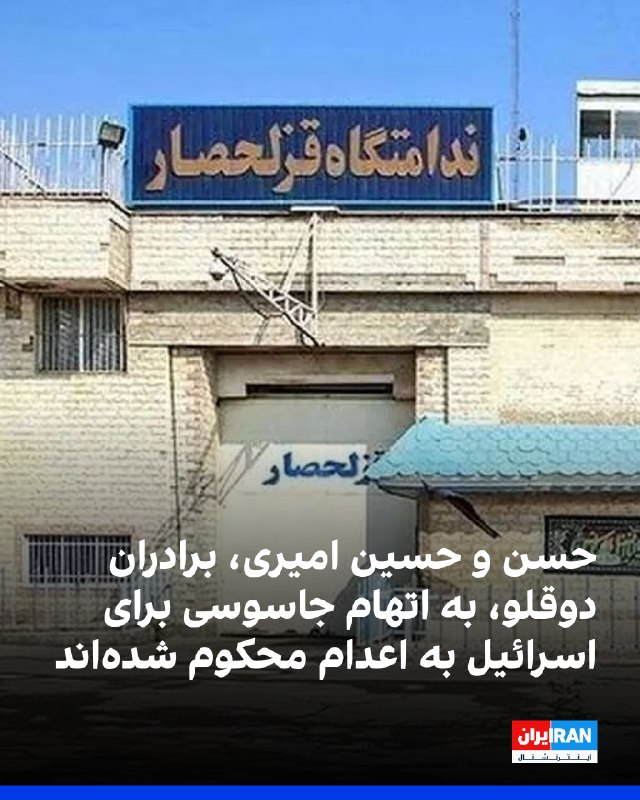

به گزارش رسانه‌های حقوق بشری، حسن و حسین امیری، برادران دوقلوی ۲۰ ساله محبوس در زندان قزلحصار کرج، به اتهام «جاسوسی برای اسرائیل» با حکم شعبه ۲۶ دادگاه انقلاب تهران به ریاست قاضی ایمان افشاری به اعدام محکوم شده‌اند.
به گزارش سازمان حقوق بشر ایران، حسن امیری روز ۲۹ اسفند ۱۴۰۴ در یک ایست بازرسی به اتهام اینکه ماموران در تلفن همراه او تصویری از یک محل بمباران‌شده پیدا کرده بودند، بازداشت شد.
این سازمان به نقل از یک منبع آگاه نوشت حسن تحت شکنجه قرار گرفت تا اعترافات دروغین انجام دهد و بگوید که برادر دوقلویش حسین، تصاویر بیشتری را در لپ‌تاپ خود نگهداری می‌کند؛ این در‌حالی‌است که هیچ‌یک از این دو برادر لپ‌تاپ ندارند.
در نهایت، حسین امیری، مکانیک خودرو در کرج، روز ۳ فروردین ۱۴۰۵ بازداشت شد و شش روز بعد، هر دو برادر برای بازجویی به زندان قزل‌حصار منتقل شدند.
هرانا به نقل از یک منبع آگاه گزارش داد در کیفرخواست صادر شده علیه این دو برادر، مشاهده تصاویری از ساختمان‌های آسیب‌دیده، مبنای طرح اتهام «جاسوسی به نفع اسرائیل» در پرونده قرار گرفته بود.
https://iranintl.com/202606047251

## IranIntlTV — post 340587

  <a href="telegram/content/IranIntlTV_340587_1780618196.mp4" target="_blank">🎬 Download video</a>

مانا نیستانی و امید کشتکار در «برنامه با کامبیز حسینی» از مرجان ساتراپی می‌گویند

«یک ایران صدای شما را می‌شنود»
دوشنبه تا پنجشنبه ۱۱ شب تهران
از تلویزیون ایران اینترنشنال

تماشای نسخه کامل این قسمت از «برنامه» در یوتیوب:
https://youtu.be/9L7sKS5oEaE
@iranintltv

## IranIntlTV — post 340586

  <a href="telegram/content/IranIntlTV_340586_1780618198.mp4" target="_blank">🎬 Download video</a>

نگین از اصفهان: شهرها پر از پرچم‌های حزب‌الله و لبنان شده‌اند؛ دست از سر کشور ما بردارید

«یک ایران صدای شما را می‌شنود»
دوشنبه تا پنجشنبه ۱۱ شب تهران
از تلویزیون ایران اینترنشنال

تماشای نسخه کامل این قسمت از «برنامه» در یوتیوب:
https://youtu.be/9L7sKS5oEaE
@iranintltv

## IranIntlTV — post 340585

  <a href="telegram/content/IranIntlTV_340585_1780618200.mp4" target="_blank">🎬 Download video</a>

سورنا از تهران: نگذاریم سیم‌کارت‌سفیدها روایت را به دست بگیرند؛ جنایت‌ها را روایت کنیم

«یک ایران صدای شما را می‌شنود»
دوشنبه تا پنجشنبه ۱۱ شب تهران
از تلویزیون ایران اینترنشنال

تماشای نسخه کامل این قسمت از «برنامه» در یوتیوب:
https://youtu.be/9L7sKS5oEaE
@iranintltv

## IranIntlTV — post 340584

  <a href="telegram/content/IranIntlTV_340584_1780618201.mp4" target="_blank">🎬 Download video</a>

مرجان ساتراپی چگونه تصویر ایران را در جهان تغییر داد؟

مرجان ساتراپی، نویسنده، تصویرگر، فیلمساز و خالق کتاب مصور «پرسپولیس»، در ۵۶ سالگی درگذشت. ساتراپی سال گذشته نشان لژیون دونور دولت فرانسه را در اعتراض به ریاکاری دولت فرانسه در قبال مردم ایران و جمهوری اسلامی رد کرد.

مرجان ساتراپی با انتشار «پرسپولیس»، کتابی مصور درباره زندگی خود در ایران و مهاجرت، به شهرت جهانی رسید

کامبیز حسینی در «برنامه» به این موضوع می پردازد.

«یک ایران صدای شما را می‌شنود»
دوشنبه تا پنجشنبه ۱۱ شب تهران
از تلویزیون ایران اینترنشنال

تماشای نسخه کامل این قسمت از «برنامه» در یوتیوب:
https://youtu.be/9L7sKS5oEaE
@iranintltv

## IranIntlTV — post 340583

  <a href="telegram/content/IranIntlTV_340583_1780618203.mp4" target="_blank">🎬 Download video</a>

مانا نیستانی: اهمیت «پرسپولیس» مرجان ساتراپی، در ثبت هنرمندانه و انسانی روایت‌های جمعی ماست

«یک ایران صدای شما را می‌شنود»
دوشنبه تا پنجشنبه ۱۱ شب تهران
از تلویزیون ایران اینترنشنال

تماشای نسخه کامل این قسمت از «برنامه» در یوتیوب:
https://youtu.be/9L7sKS5oEaE
@iranintltv

## IranIntlTV — post 340582

  <a href="telegram/content/IranIntlTV_340582_1780618205.mp4" target="_blank">🎬 Download video</a>

بیتا ملکوتی: «پرسپولیس» مرجان ساتراپی یکی از نمونه‌های شاخص ادبیات مهاجرت و تبعید است

«یک ایران صدای شما را می‌شنود»
دوشنبه تا پنجشنبه ۱۱ شب تهران
از تلویزیون ایران اینترنشنال

تماشای نسخه کامل این قسمت از «برنامه» در یوتیوب:
https://youtu.be/9L7sKS5oEaE
@iranintltv

## IranIntlTV — post 340581

  <a href="telegram/content/IranIntlTV_340581_1780618207.mp4" target="_blank">🎬 Download video</a>

امید کشتکار: تأثیر ساتراپی به ایران محدود نمی‌شود؛ او بر رمان گرافیکی در جهان تأثیر گذاشت

«یک ایران صدای شما را می‌شنود»
دوشنبه تا پنجشنبه ۱۱ شب تهران
از تلویزیون ایران اینترنشنال

تماشای نسخه کامل این قسمت از «برنامه» در یوتیوب:
https://youtu.be/9L7sKS5oEaE
@iranintltv

## FarsiVOA — post 219627

⚡️فاجعه آموزشی در ایران؛ یک‌چهارم دبستانی‌های ایران پشت درهای مدرسه
@FarsiVOA

## FarsiVOA — post 219626

⚡️حضور پررنگ سپاه در فوتبال؛ گفت‌وگو با کوروش بازیار، مربی و کارشناس فوتبال
@FarsiVOA

## FarsiVOA — post 219625

  <a href="telegram/content/FarsiVOA_219625_1780618208.mp4" target="_blank">🎬 Download video</a>

⚡️مرجان ساتراپی، خالق «پرسپولیس» و از شناخته‌شده‌ترین هنرمندان ایرانی در جهان، در ۵۶ سالگی درگذشت.
@FarsiVOA

## FarsiVOA — post 219624

⚡️روبیو: آمریکا قصد ندارد افغان‌های باقی‌مانده در قطر را به اجبار به افغانستان بازگرداند
@FarsiVOA

## FarsiVOA — post 219623

⚡️دیدار وزیران امورخارجه آمریکا و کویت پس از حملات موشکی و پهپادی جمهوری اسلامی
@FarsiVOA

## BBCPersian — post 282898

  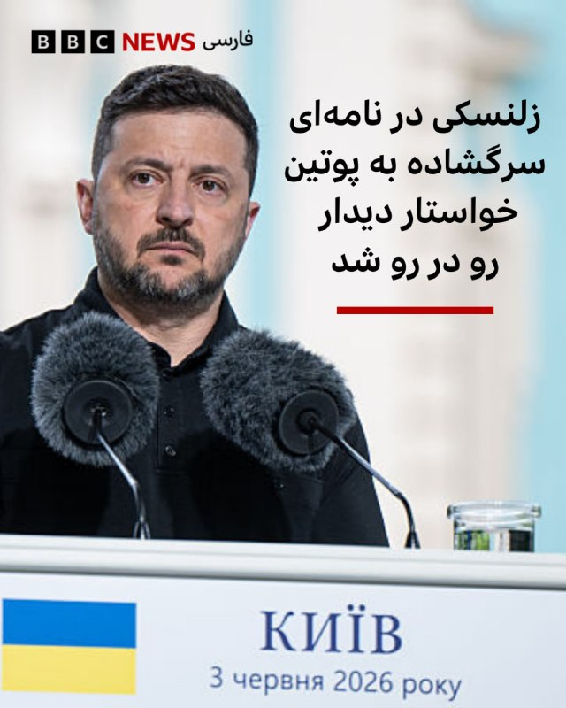

🔻ولوديمير زلنسکی، رئيس‌جمهور اوکراين، در تلاشی تازه برای پايان دادن به جنگ، خواستار برگزاری ديداری رو در رو با ولاديمير پوتين، رئيس‌جمهور روسيه، شد.

آقای زلنسکی روز پنجشنبه در نامه‌ای سرگشاده خطاب به پوتين نوشت که «صرفا منتظر ماندن» تا زمانی که جنگ در اروپا دوباره به اولويت اصلی ايالات متحده تبديل شود، اقدامی نادرست خواهد بود.

او افزود صلح تنها از طريق «گفت وگوی مستقيم ميان» اوکراين و روسيه امکان‌پذير است.

رئيس‌جمهور اوکراين همچنين خواستار برقراری آتش‌بس کامل در طول مذاکرات پيشنهادی شد؛ درخواستی که پوتين پيش‌تر در روز پنجشنبه آن را رد کرده بود.

دونالد ترامپ، رئيس‌جمهور آمريکا، هم روز پنجشنبه - چهارم ژوئن / ۱۴ خرداد گفت: «اگر اين دو رهبر با يکديگر ديدار کنند، اتفاق بسيار خوبی خواهد بود.»

بیشتر بخوانید:

https://bbc.in/4udkvKD
📸Getty Images
@BBCPersian

---
📅 بروزرسانی: 1405/03/15 02:38
---

## VahidOOnLine — post 243727

  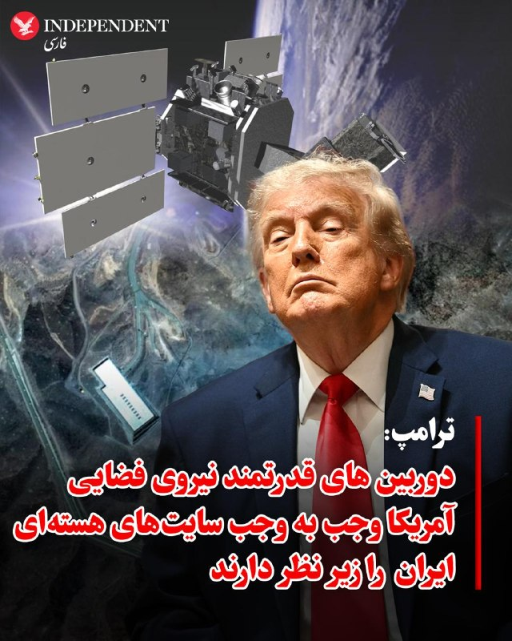

♦️دونالد ترامپ، رئیس‌جمهوری آمریکا، روز پنج‌شنبه گفت نیروی فضایی آمریکا «دوربین‌های بسیار قدرتمندی» را بر سایت‌های هسته‌ای تخریب‌شده ایران متمرکز کرده است تا هرگونه تلاشی از سوی ایران برای دسترسی به اورانیوم غنی‌شده‌ای را که همچنان در اعماق زمین مدفون است، زیر نظر داشته باشد.
او گفت: «تمام وجب‌به‌وجب آن منطقه زیر پوشش دوربین‌ها است. حدود ۹ دوربین داریم که فعال هستند و کل منطقه را پوشش می‌دهند. بنابراین اگر کسی حتی به آنجا نزدیک شود، از آن مطلع خواهیم شد و می‌دانیم چه اتفاقی در حال رخ دادن است.»

ترامپ همچنین احتمال اعزام قریب‌الوقوع نیروهای آمریکایی به این سایت‌ها برای بیرون آوردن مواد هسته‌ای مدفون‌شده را کم‌اهمیت جلوه داد و گفت اگر تصمیم به چنین اقدامی گرفته شود، آمریکا «همین حالا هم می‌تواند آن را به دست آورد.»
او گفت: «فکر نمی‌کنم [ایران] بتواند مانع ما شود اگر بخواهیم این کار را انجام دهیم، اما دلیلی برای آن وجود ندارد. ما دوربین‌های بسیار قدرتمندی داریم.»
‌🇸🇦 Indypersian

🤖 @VahidOOnLine

## VahidOOnLine — post 243726

♦️به گزارش رویترز، معترضان پنجشنبه شب ۱۴ خرداد در تیرانا، پایتخت آلبانی، در اعتراض به پروژه‌ای مرتبط با جرد کوشنر، داماد دونالد ترامپ، تجمع کردند.
بر اساس این گزارش، این پروژه ۱.۴ میلیارد یورویی که حدود ۱.۶ میلیارد دلار ارزش دارد، از طرف شرکت سرمایه‌گذاری جرد کوشنر در جزیره سزن و بخش‌هایی از سواحل نزدیک منطقه حفاظت‌شده ویوسا–نارتا در ساحل دریای آدریاتیک دنبال می‌شود؛ پروژه‌ای که رسانه‌ها از آن با عنوان «جزیره ایوانکا ترامپ» یاد می‌کنند.
ایوانکا ترامپ در گفتگو با دیوید سنرا، نویسنده و مصاحبه‌گر آمریکایی، درباره این پروژه گفت: «روی پروژه‌ای باورنکردنی همراه همسرم در مدیترانه کار می‌کنم. این پروژه از نظر مقیاس بسیار بزرگ است.» او گفت نخستین بار زمانی که با قایق یکی از دوستانشان برای شنا توقف کرده بودند، این جزیره را دیدند و پس از پیاده‌روی در آن، مجذوب منطقه شدند. ایوانکا ترامپ همچنین این مکان را «جزیره‌ای خصوصی به وسعت ۱۴۰۰ هکتار در قلب مدیترانه» توصیف کرد.
‌🇸🇦 Indypersian

🤖 @VahidOOnLine

## VahidOOnLine — post 243725

  

ستاد فرماندهی مرکزی آمریکا، سنتکام، با انتشار تصاویری از تجهیزات نیروی فضایی مرکزی ایالات متحده، بخش فضایی سنتکام، گفت هم‌زمان با عملیات جنگنده‌های آمریکا در خاورمیانه، بخش فضایی سنتکام دارای قابلیت‌های تهاجمی و دفاعی تمام‌وقت است و جایگاه برتر را در سراسر منظقه در اختیار دارد.
‌🏁 🇬🇧 IranintlTV

🤖 @VahidOOnLine

## VahidOOnLine — post 243724

♦️وزارت امور خارجه آمریکا روز پنجشنبه ۱۴ خردادماه، در پیامی مستقیم به مردم ایران، رهبری جمهوری اسلامی را عامل مشکلات کشور دانست و تاکید کرد آینده ایران باید به دست خود ایرانیان ساخته شود.
در این پیام، وزارت خارجه آمریکا با تمجید از تاریخ و فرهنگ ایران اعلام کرد: «برای هزاران سال، مردم ایران تمدن بشری را شکل داده‌اند؛ شعر، علم، پزشکی، معماری و هنر.» این نهاد همچنین تاکید کرد میلیون‌ها ایرانی خواهان فرصت، ثبات، آزادی بیان و زندگی بدون ترس هستند و ایران از ظرفیت تبدیل شدن به یکی از مرفه‌ترین کشورهای جهان برخوردار است.

وزارت خارجه آمریکا در ادامه اعلام کرد: «مشکل مردم ایران نیستند. مشکل رهبری‌ای است که از تعامل می‌ترسد و به جای فرصت، تقابل را انتخاب می‌کند.»

تامی پیگوت، سخنگوی وزارت امور خارجه آمریکا، نیز به فاکس نیوز گفت اختلاف واشنگتن هرگز با مردم ایران نبوده، بلکه با حکومتی است که تامین مالی تروریسم و دنبال کردن سلاح هسته‌ای را بر رفاه و آزادی مردم ایران ترجیح می‌دهد.
‌🇸🇦 Indypersian

🤖 @VahidOOnLine

## VahidOOnLine — post 243723

  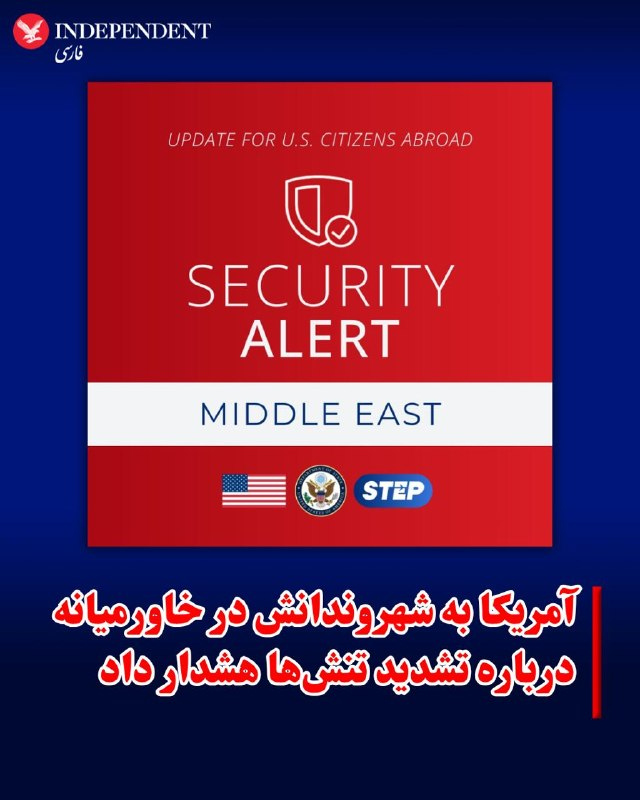

♦️ وزارت خارجه آمریکا پنجشنبه ۱۴ خرداد از شهروندان آمریکایی حاضر در خاورمیانه خواست به دلیل تنش‌های شدید منطقه‌ای احتیاط کنند و تحولات امنیتی را از نزدیک دنبال کنند. این وزارتخانه اعلام کرد وضعیت امنیتی در خاورمیانه همچنان پیچیده است و ممکن است به‌سرعت تغییر کند.

بر اساس این اطلاعیه، هشدار سفر برای بحرین، اسرائیل، کرانه باختری، اردن، کویت، عمان، قطر، عربستان سعودی و امارات متحده عربی همچنان در سطح ۳، «تجدیدنظر در سفر»، باقی مانده است.

وزارت خارجه آمریکا همچنین اعلام کرد ایران، عراق، لبنان، سوریه، غزه و یمن همچنان در سطح ۴، «از سفر خودداری کنید»، قرار دارند.
‌🇸🇦 Indypersian

🤖 @VahidOOnLine

## WithYashar — post 13534

  <a href="telegram/content/WithYashar_13534_1780614514.mp4" target="_blank">🎬 Download video</a>

تصاویر اختصاصی جدید CNN خسارت ناشی از آتش‌سوزی در ناو هواپیمابر USS Gerald R. Ford (CVN-78) را نشان می‌دهد؛ آتش‌سوزی‌ای که در بخش لباسشویی کشتی رخ داده و در زمان استقرار آن در دریای سرخ و در چارچوب عملیات آمریکا علیه ایران گزارش شده است.

این حادثه در ماه مارس حین جنگ با ایران رخ داد و نیروی دریایی آمریکا فوری اعلام کردن آتش «مهار شده»، دو ملوان با جراحات غیرمرگبار درمان شده‌اند و ناو همچنان «کاملاً عملیاتی» است.
اما ویدیوی جدید CNN نشان می‌دهد خسارت بسیار شدیدتر از گزارش اولیه بوده است و منابع به CNN گفته‌اند سامانه اطفای حریق ناو از کار افتاده بود.

یکی از ملوانان گفته است خدمه حدود ۳۰ ساعت به‌صورت دستی با آتش مقابله کرده‌اند و حتی نگرانی درباره احتمال از دست رفتن ناو وجود داشته است.
مقامات تأیید کرده‌اند این آتش‌سوزی به‌طور موقت عملیات را مختل کرده، پرواز جنگنده‌ها را دو روز به تأخیر انداخته و باعث شده ناو برای تعمیرات اضطراری در یونان پهلو بگیرد
@withyashar

## WithYashar — post 13533

ترامپ می‌گوید دولتش بررسی کرده بود که نیروهایی را برای تصرف اورانیوم ایران بفرستد، اما در نهایت این ایده را رد کرد چون خیلی پرخطر بود و می‌توانست به تلفات آمریکایی‌ها منجر شود، و این موضوع را با مأموریت ناموفق نجات گروگان‌های کارتر مقایسه کرد.
@withyashar

## mwarmonitor — post 10161

درگیری در تنگه هرمز گزارش شده

## mwarmonitor — post 10160

🔴وقتی در ماه مارس یک آتش‌سوزی روی ناو هواپیمابر USS Gerald R. Ford نیروی دریایی آمریکا رخ داد، نیروی دریایی در یک بیانیه کوتاه اعلام کرد که آتش «مهار شده است»، دو ملوان برای «جراحات غیرمرگبار» تحت درمان قرار گرفته‌اند و این ناو همچنان «کاملاً عملیاتی» است.

اما ویدیوی جدیدی که توسط منتشر شده نشان می‌دهد که این آتش‌سوزی بسیار شدیدتر و آسیب‌زننده‌تر از آن چیزی بوده که نیروی دریایی اعلام کرده بود. منابع به CNN گفته‌اند که سامانه اطفای حریق این کشتی از کار افتاده بود.

@mwarmonitor

## FoxNewsTwitter — post 342631

  

Fox News (Twitter/X)

President Trump is teasing a massive rally in Washington, D.C. — and he's setting expectations sky-high.

Calling the nation's capital "totally beautified," Trump announced plans for what he described as "the Greatest Rally EVER" in celebration of America's 250 years of history.

The event is expected to feature patriotic music, military bands, special guests, and a live appearance from the president.

"It will be special at every level."

## FoxNewsTwitter — post 342627

Fox News (Twitter/X)

"The water is ON, the Reflecting Pool is reflecting, and D.C. is looking better than ever."

President Trump is celebrating as water begins flowing back into the Lincoln Memorial Reflecting Pool following a major restoration project.

Crews completed repairs, repainted the bottom "American flag blue," and cleaned years of buildup, including bird droppings as part of ongoing efforts to beautify Washington ahead of America’s 250th birthday next month.

"We are so back," Trump added.

## FoxNewsTwitter — post 342626

  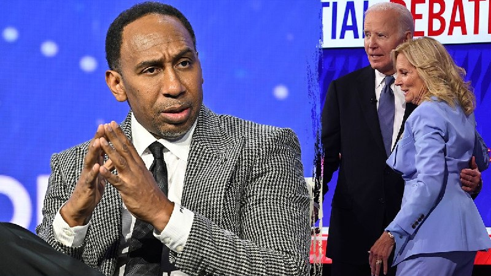

Fox News (Twitter/X)

“Lying through their teeth.”

Stephen A. Smith unloaded on former First Lady Jill Biden and top Democrats over what he says was a coordinated effort to hide President Biden’s condition from the public.

Smith argued the fallout is doing lasting damage to the Democratic Party’s credibility, saying voters were repeatedly told everything was fine despite growing concerns about Biden’s fitness.

Now, as Democrats look ahead to future elections, Smith says the trust gap created by that controversy isn’t going away anytime soon.

## FoxNewsTwitter — post 342625

  <a href="telegram/content/FoxNewsTwitter_342625_1780614519.mp4" target="_blank">🎬 Download video</a>

Fox News (Twitter/X)

RT @WillCainShow: SURVEILLANCE VIDEO FROM TRACK MEET FATAL STABBING DEBUNKS 4-ON-1 ATTACK NARRATIVE: “NOT EVEN CLOSE”

Attorney Todd Shapiro debunks a viral claim suggested that Karmelo Anthony was attacked by four men before the stabbing of Austin Metcalf.

## FoxNewsTwitter — post 342624

  

Fox News (Twitter/X)

"I pray for the NYPD."

Karl-Anthony Towns is giving credit where he says it’s due as Knicks fans flood the streets during New York’s first NBA Finals run in more than two decades.

With watch parties drawing massive crowds outside Madison Square Garden — and some celebrations turning chaotic enough to lead to arrests — Towns praised officers for helping keep fans safe while the city rallies around the team.

The Knicks are now three wins away from a title, and the energy across New York is only getting louder.

## FoxNewsTwitter — post 342623

  <a href="telegram/content/FoxNewsTwitter_342623_1780614522.mp4" target="_blank">🎬 Download video</a>

Fox News (Twitter/X)

Trump on Biden: "He was never the sharpest guy, you do know that, right?"

"It wasn't like he was sharp as a tack."

"Something happened to him during the debate. It could have been me."

## FoxNewsTwitter — post 342622

  <a href="telegram/content/FoxNewsTwitter_342622_1780614525.mp4" target="_blank">🎬 Download video</a>

Fox News (Twitter/X)

NEW: President Trump reacts to Hunter Biden teasing a potential 2028 presidential run, taking the opportunity to roast other Democrats Graham Platner and James Talarico.

"You would think that, you know, past has something to do with winning an election. And I would say his past is not the greatest."

"Hey, if the guy from Maine can do well, I guess Hunter could do well, too, because the guy from Maine is a basket case."

"And I would say worse than him is the one from Texas that looks like Alfred E. Neuman."

"I would say that if he can do well, maybe Hunter can do well."

@pdoocy

## IranIntlTV — post 340580

  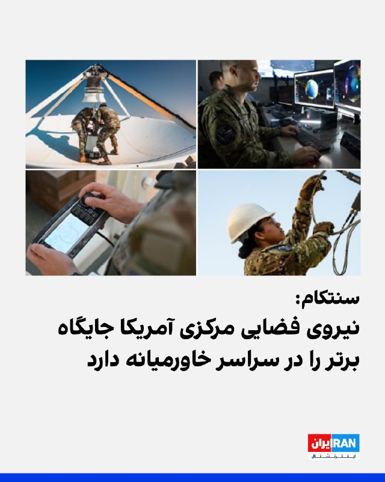

ستاد فرماندهی مرکزی آمریکا، سنتکام، با انتشار تصاویری از تجهیزات نیروی فضایی مرکزی ایالات متحده، بخش فضایی سنتکام، گفت هم‌زمان با عملیات جنگنده‌های آمریکا در خاورمیانه، بخش فضایی سنتکام دارای قابلیت‌های تهاجمی و دفاعی تمام‌وقت است و جایگاه برتر را در سراسر منظقه در اختیار دارد.
https://iranintl.com/202606041344

## IranIntlTV — post 340579

  <a href="telegram/content/IranIntlTV_340579_1780614529.mp4" target="_blank">🎬 Download video</a>

مجلس نمایندگان آمریکا چهارشنبه با ۲۱۵ رای موافق و ۲۰۸ رای مخالف قطعنامه‌ مربوط به اختیارات جنگی ترامپ را که هدف آن توقف جنگ با جمهوری اسلامی و مشروط کردن درگیری‌ها به مجوز کنگره است، تصویب کرد.

مرضیه حسینی گزارش می‌دهد.
@iranintltv

## IranIntlTV — post 340578

  <a href="telegram/content/IranIntlTV_340578_1780614531.mp4" target="_blank">🎬 Download video</a>

مهدی تاج در پاسخ به پرسش نیویورک تایمز درباره اطمینان از برگزاری نخستین بازی ایران در جام جهانی گفت: «باید از فیفا پرسیده شود.»

این در حالی است که کمتر از یک هفته تا آغاز جام جهانی، تیم ملی ایران همچنان در انتظار دریافت ویزای آمریکا است.

گزارش رضا محدث، خبرنگار ایران‌اینترنشنال
@iranintltv

## IranIntlTV — post 340577

  <a href="https://t.me/IranintlTV/340577" target="_blank">📎 Download file</a>

🎧نسخه صوتی برنامه با کامبیز حسینی؛ ویژه برنامه درگذشت مرجان ساتراپی با حضور مانا نیستانی و امید کشتکار
@iranintlTV

## IranIntlTV — post 340576

  <a href="telegram/content/IranIntlTV_340576_1780614534.mp4" target="_blank">🎬 Download video</a>

ایران‌اینترنشنال در خبری اختصاصی گزارش داد هواداران جبهه پایداری در پی درخواست مسعود پزشکیان و محمدباقر قالیباف از حضور در تجمع‌های حمایت از جمهوری اسلامی منع شده‌اند.

گفت‌وگو با کامیار بهرنگ، عضو تحریریه ایران‌اینترنشنال
@iranintltv

## IranIntlTV — post 340575

  <a href="telegram/content/IranIntlTV_340575_1780614537.mp4" target="_blank">🎬 Download video</a>

اندکی پس از تصویب قطعنامه مجلس نمایندگان آمریکا درباره محدود کردن اختیارات جنگی رییس‌جمهوری در قبال ایران، دونالد ترامپ این اقدام را بی‌معنی توصیف کرد و گفت آنها ترجیح می‌دهند کشور شکست بخورد تا شاهد یک پیروزی دیگر از او باشند.

گفت‌وگو با امیر گیتی، عضو تحریریه ایران‌اینترنشنال
@iranintltv

## IranIntlTV — post 340574

  <a href="telegram/content/IranIntlTV_340574_1780614539.mp4" target="_blank">🎬 Download video</a>

مدیرعامل ایرانی یک شرکت فناوری در کالیفرنیا به اتهام همکاری با جمهوری اسلامی بازداشت شد. او متهم است بیش از ۲۵۰ تُن تجهیزات شبکه ساخت آمریکا را با استفاده از شرکت‌های پوششی به ایران منتقل کرده که بخشی از آن به نهادهای نظامی و هسته‌ای رسیده است.

نیلوفر منصوری گزارش می‌دهد.
@iranintltv

## FarsiVOA — post 219622

⚡️پرزیدنت ترامپ می‌گوید در مورد اورانیوم غنی شده در ایران منتظر توافق نمی‌ماند
@FarsiVOA

## FarsiVOA — post 219621

  <a href="telegram/content/FarsiVOA_219621_1780614541.mp4" target="_blank">🎬 Download video</a>

⚡️از جنگ تا میز مذاکره؛ وقت خریدن به روش جمهوری اسلامی از زبان کاربران شبکه‌های اجتماعی
@FarsiVOA

## FarsiVOA — post 219620

  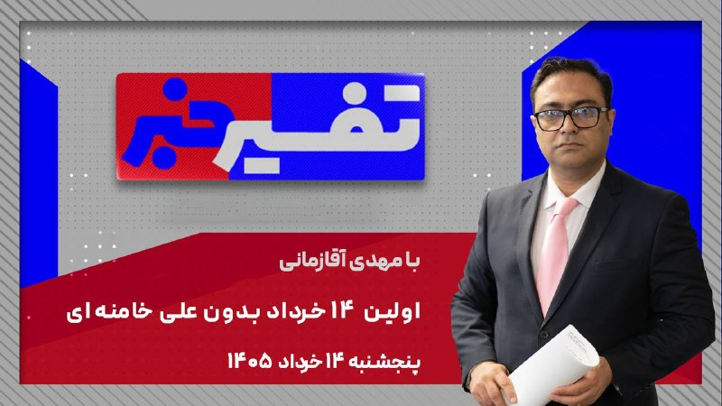

🔴برنامه امروز تفسیر خبر را با اجرای مهدی آقازمانی از طریق لینک زیر در یوتیوب مشاهده بفرمایید:
https://youtu.be/GXI9_tsXsR4

## Persian_Trend_Official — post 15719

  <a href="telegram/content/Persian_Trend_Official_15719_1780614543.mp4" target="_blank">🎬 Download video</a>

شبتون بخیر 🌃
SU-57 Felon

📌 @persian_trend_official
پرشین ترند | متفاوت‌ترین کانال نظامی

## IranianMinds — post 21401

  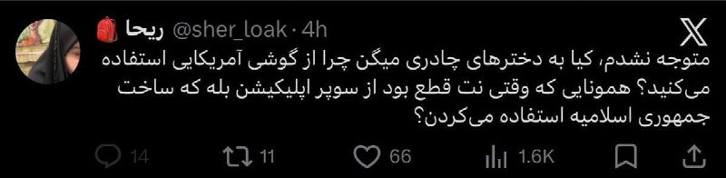

🔴 عقل خرزشی :

@IranianMinds

## IranianMinds — post 21400

  <a href="telegram/content/IranianMinds_21400_1780614546.webm" target="_blank">🎬 Download video</a>

🆗
🔡
🔡
5️⃣ تومان هدیه فقط برای ثبت‌نام! 
🆗

💥 بدون واریز

3️⃣ قدم تا دریافت هدیه:
✅ ثبت‌نام در سایت

✅ دریافت بونوس
0️⃣
0️⃣
5️⃣ هزار تومانی

✅ تبدیل بونوس به موجودی واقعی با شرط‌بندی

فقط تا 
3️⃣ روز دیگه میتونی هدیه بگیری!

پس از پایان افتتاحیه، امکان دریافت این هدیه وجود نخواهد داشت.

🚩
🚩 خرداد افتتاحیه بزرگ سایت وینرو
🟥 اگر هنوز ثبت‌نام نکردی، همین حالا اقدام کن و جزو دریافت‌کنندگان بونوس ویژه افتتاحیه باش.
aa14

🔤 Winro.io         معتبرترین سایت ایران

🔤 Winro.io

📱 کانال اخبار و هدایــا 
🌟

📱 @winro_io

## IranianMinds — post 21399

  

توییت جدید اتاق جنگ اسرائیل بازم ساعت شنی

@IranianMinds

## BBCPersian — post 282895

🔻در ادامه مسابقات تدارکاتی تیم‌های جهان برای حضور در جام جهانی، تیم ملی ایران در دیداری که بدون حضور دوربین و خبرنگاران برگزار شد، در آنتالیا ترکیه میزبان تیم ملی مالی بود و توانست این تیم را با دو گل شکست دهد.

تیم ایران به زودی از آنتالیا عازم مکزیک و شهر تیخوآنا در نزدیکی مرز آمریکا خواهد شد.

از نتایج جالب توجه دیگر در مسابقات تدارکاتی امروز تساوی یک بر یک عراق برابر اسپانیا، نایب قهرمان اروپا، آن هم در برابر چشمان هزاران هوادار اسپانیا بود.

شگفتی دیگر در دیدار فرانسه و ساحل عاج روی داد که این تیم موفق شد فرانسه، نایب قهرمان جهان، را با نتیجه دو بر یک در خانه شکست دهد.

📸Getty Images

## BBCPersian — post 282894

🔻منابع پزشکی: در پی حمله هوایی اسرائیل ۱۱ نفر در غزه کشته شدند

منابع پزشکی و شاهدان عینی می‌گویند که دست‌کم ۱۱ فلسطینی، از جمله زنان و کودکان، در پی حملات هوایی اسرائیل به مناطق مختلف شهر غزه کشته و ده‌ها نفر دیگر زخمی شدند.

به گفته منابع محلی، بامداد پنج‌شنبه دست‌کم سه بالگرد اسرائیلی به‌طور هم‌زمان چهار ساختمان مسکونی در مناطق شیخ رضوان، تل‌الهوا و اردوگاه پناهندگان الشاطی را هدف قرار دادند که در پی آن انفجارهای شدیدی رخ داد.

ارتش اسرائیل اعلام کرد که در این حملات چهار عضو ارشد «دستگاه امنیت عمومی حماس» کشته شده‌اند.

بر اساس بیانیه ارتش، حسن لبد، معاون رئیس این دستگاه، به همراه سه نفر از نیروهای زیرمجموعه‌اش به نام‌های عاصم شبیر، عبدالله ابوکلوب و محمد ابومرق در این حملات جان باخته‌اند.

منابع محلی پیش‌تر گزارش داده بودند که یکی از حملات حسن لبد را هدف قرار داده و او به همراه همسر و سه فرزندش کشته شده است.

سخنگوی سازمان دفاع مدنی تحت اداره حماس نیز اعلام کرد که در میان قربانیان، دو کودک دارای معلولیت از خانواده لبد و سه زن حضور دارند.

اسرائیل با وجود توافق آتش‌بس با میانجی‌گری آمریکا، در ماه‌های اخیر بارها حملاتی به غزه انجام داده و حماس را به تجدید تسلیح و بازسازی توان نظامی‌اش متهم کرده است.

بر اساس آمار وزارت بهداشت غزه که تحت اداره حماس فعالیت می‌کند، از زمان اجرایی شدن آتش‌بس در اکتبر سال گذشته تاکنون بیش از ۹۴۰ نفر در این منطقه کشته شده‌اند.

https://bbc.in/4dS78uI
@BBCPersian

## BBCPersian — post 282893

🔻نخست وزیر و وزیر خارجه قطر در تماسی تلفنی با هاکان فیدان تلاش‌های میانجی‌گرانه میان تهران و واشنگتن را بررسی کردند

محمد بن عبدالرحمن بن جاسم آل‌ثانی، نخست‌وزیر و وزیر امور خارجه قطر، در تماس تلفنی با هاکان فیدان، وزیر امور خارجه ترکیه، درباره روابط دوجانبه و راه‌های تقویت همکاری‌های میان دو کشور گفت‌وگو کردند.

وزارت خارجه قطر در پیامی در شبکه ایکس گفته است که دو طرف تلاش‌های میانجی‌گرانه میان ایالات متحده و جمهوری اسلامی ایران و راه‌های حمایت از این روند را مورد بررسی قرار دادند.

وزرای خارجه قطر و ترکیه همچنین بر هماهنگی برای پشتیبانی از ابتکارهای دیپلماتیک با هدف کاهش تنش‌ها و تقویت امنیت و ثبات منطقه تأکید کردند.

نخست‌وزیر و وزیر امور خارجه قطر در این گفت‌وگو بر ضرورت همراهی همه طرف‌ها با تلاش‌های جاری برای میانجی‌گری تأکید کرد و گفت این روند می‌تواند زمینه را برای رسیدگی به ریشه‌های بحران از طریق گفت‌وگو و راهکارهای مسالمت‌آمیز فراهم کرده و به دستیابی به توافقی پایدار که مانع از تشدید دوباره تنش‌ها شود، منجر شود.

https://bbc.in/4dS78uI
@BBCPersian

## BBCPersian — post 282885

🖊 نازنین کیان، روزنامه‌نگار

🔻 در آستانه بزرگ‌ترین رویداد فوتبالی جهان در قاره آمریکا، اردوی تیم ملی فوتبال ایران بیش از آنکه تحت تاثیر تاکتیک‌های ورزشی باشد، درگیر یک جنجال دیپلماتیک شده است؛ جنجالی که در مرکز آن مرد شماره یک فدراسیون فوتبال، مهدی تاج، ایستاده است.

بیشتر بخوانید:
https://bbc.in/49G2Pju
📸GettyImages/ Reuters/ AFP via Getty Images/ EPA/Shutterstock/ Social media/ tasnim
@BBCPersian

## BBCPersian — post 282884

🔻 خانواده مرجان ساتراپی، خالق رمان پرسپولیس، می‌گویند او از اندوه جان باخت؛ این غم جانکاه از کجا نشات گرفت؟

گزیده‌هایی از گفتگوی سرور کسمایی، نویسنده و از دوستان مرجان ساتراپی را با پریزاد نوبخت ببینید.

@BBCPersian

## Dirty_Kids — post 391025

بچه ها اسم این بازی عبور مرغ از خیابون  هست ویدئو نگاه کنید خیلی راحت 8 میلیون ازش سود گرفتیم😍 
😤اگ توم دوس داری خیلی راحت از بازی های انلاین پول در بیاری حتما عضو کازینو شبانه شو
✅ توی کازینو شبانه بهت اموزش میدیم از بازی های انلاین پول دربیاری👌 کانال کازینو…

## Dirty_Kids — post 391024

  <a href="telegram/content/Dirty_Kids_391024_1780614547.mp4" target="_blank">🎬 Download video</a>

بچه ها اسم این بازی عبور مرغ از خیابون  هست ویدئو نگاه کنید خیلی راحت 8 میلیون ازش سود گرفتیم😍

😤اگ توم دوس داری خیلی راحت از بازی های انلاین پول در بیاری حتما عضو کازینو شبانه شو
✅

توی کازینو شبانه بهت اموزش میدیم از بازی های انلاین پول دربیاری👌

کانال کازینو شبانه راهی برای چند برابر کردن سرمایت 🤷‍♂

کسب درامد انلاین با یه ادم حرفه ای یاد بگیر و‌ پول دربیار 
💵
A14
🎯همین حالا عضو شو و شروع کن👇N
https://t.me/+6ckCmywafrxiYzk0
https://t.me/+6ckCmywafrxiYzk0

## Dirty_Kids — post 391023

  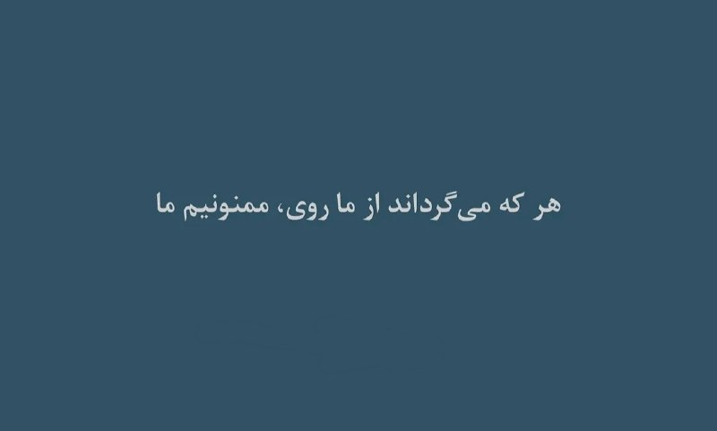

#بخوابیم

@Dirty_Kids 👻

## Dirty_Kids — post 391022

  <a href="telegram/content/Dirty_Kids_391022_1780614550.mp4" target="_blank">🎬 Download video</a>

دخترا ۱۰۰ درصد ارزش دانلود و دیدن
پسرا ۰ درصد ارزش دانلود و دیدن

حرصتون درمیاد ⚠️

@Dirty_Kids 👻

## Dirty_Kids — post 391021

  <a href="telegram/content/Dirty_Kids_391021_1780614552.mp4" target="_blank">🎬 Download video</a>

مشهدالرضا 🤣 علم‌الهدی

@Dirty_Kids 👻

## Dirty_Kids — post 391020

  <a href="telegram/content/Dirty_Kids_391020_1780614555.mp4" target="_blank">🎬 Download video</a>

🔴 موتورسواری فوق العاده این پسر و چالش موتورسواری با دوس دخترش خیلی وایرال شده:

@Dirty_Kids 👻

## Dirty_Kids — post 391018

  <a href="telegram/content/Dirty_Kids_391018_1780614555.mp4" target="_blank">🎬 Download video</a>

رقص با آهنگ تو رستم تهمتنی داره تبدیل به چاش میشه

@Dirty_Kids 👻

## Dirty_Kids — post 391016

  <a href="telegram/content/Dirty_Kids_391016_1780614557.mp4" target="_blank">🎬 Download video</a>

اونایی که نمیدونن قیصر کیه، قیصر همونه که آهنگ آقاسی رو دزدید خونده

@Dirty_Kids 👻

## Dirty_Kids — post 391015

  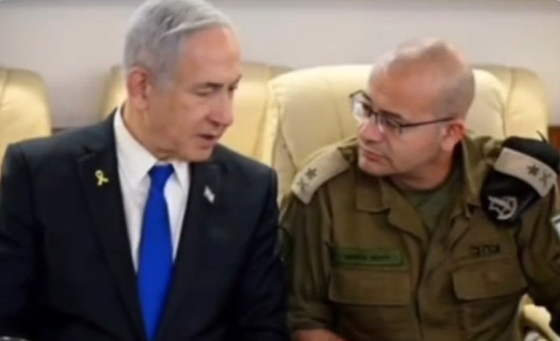

+ بنظرت به ترامپ بگیم مجتبی رو هم ترور کردیم یا هنوز زوده؟

@Dirty_Kids 👻

## Dirty_Kids — post 391014

  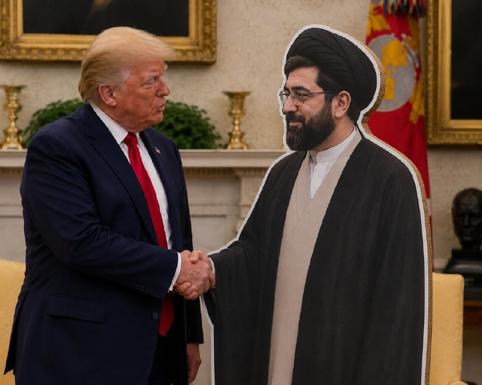

هرچه موشک زدی مرا
نقض نشد، علاقه شد!

@Dirty_Kids 👻

## Dirty_Kids — post 391013

  <a href="telegram/content/Dirty_Kids_391013_1780614560.mp4" target="_blank">🎬 Download video</a>

روایت داریم شب جمعه‌ها روز ورزش و ورزشکاران است

@Dirty_Kids 👻

## alonews — post 125191

  <a href="telegram/content/alonews_125191_1780614563.webm" target="_blank">🎬 Download video</a>

🤚 اینترنت مخصوص جنگ 
🚀
💙

🔥 نامحدود فقط 690 تومن 
🔥

⭐️ فقط گیگی 7 هزار تومان
😍

✅ بدون قطعی‌های آزاردهنده

✅ سرعت بالا حتی ساعات شلوغ

✅ مناسب تلگرام، اینستاگرام و یوتیوب

✅ همراه با ساب

✅ تعداد محدود با این قیمت

🤖 @NetAazaadBot

🤖 @NetAazaadBot

## alonews — post 125190

  <a href="telegram/content/alonews_125190_1780614563.webm" target="_blank">🎬 Download video</a>

👈محسن رضایی : یک سیلی دیگر ممکن است بیاید تا اسرائیل و آمریکا را سر جای خودشان بنشاند.

✅ @AloNews خبر جنگ

## alonews — post 125189

  <a href="telegram/content/alonews_125189_1780614564.mp4" target="_blank">🎬 Download video</a>

👈کارشناس صدا و سیما:
پولی در قطر نداریم، پول ایران در آلمان است

✅ @AloNews خبر جنگ

## alonews — post 125188

  <a href="telegram/content/alonews_125188_1780614567.webm" target="_blank">🎬 Download video</a>

👈توییت جدید اتاق جنگ اسرائیل: ⌛️

✅ @AloNews خبر جنگ

<!-- MSG END -->

<!-- NAV START -->

<a href="https://github.com/Tljn/FUD/blob/main/telegram/content/archive_1.md" style="display:inline-block; padding:6px 12px; margin:0 4px; background-color:#2ea44f; color:white; text-decoration:none; border-radius:4px; font-weight:bold;">صفحه بعد</a>

<!-- NAV END -->
