# خواننده تلگرام

<!-- TOP_NAV START -->

<a href="https://github.com/Tljn/FUD/blob/main/telegram/content/archive_1.md" style="display:inline-block; padding:6px 12px; margin:0 4px; background-color:#2ea44f; color:white; text-decoration:none; border-radius:4px; font-weight:bold;">صفحه بعد</a>

<!-- TOP_NAV END -->

<!-- MSG START -->

---
📅 بروزرسانی: 1405/03/24 21:31
---

## VahidOOnLine — post 245518

  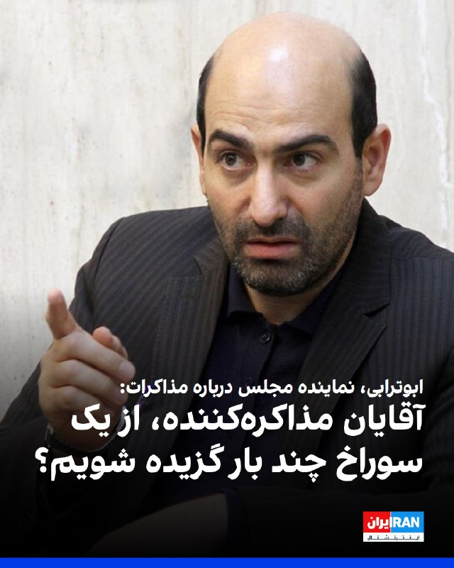

ابوالفضل ابوترابی، نماینده مجلس، از «معاهده الجزایر و نقض تعهدات پس از آزادی گروگان‌های سفارت»، «خروج یک‌جانبه از برجام» و «حملات نظامی در حین روند مذاکرات» به‌عنوان «بدعهدی‌های آمریکا» نام برد و خطاب به هیات مذاکره‌کننده جمهوری اسلامی نوشت: «آقایان مذاکره‌کننده؛ پرسش ما این است، از یک سوراخ چندبار باید گزیده شویم؟»
‌🏁 🇬🇧 IranintlTV

🤖 @VahidOOnLine

## VahidOOnLine — post 245517

  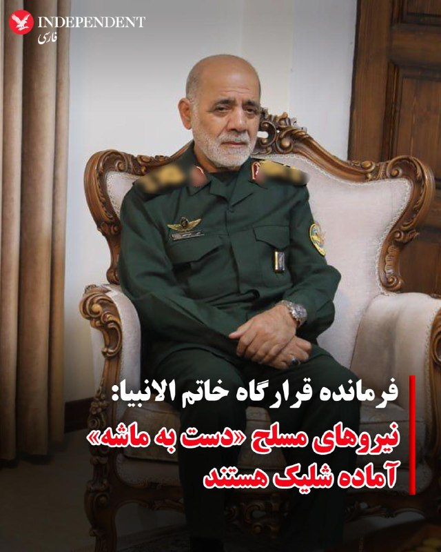

♦️علی عبداللهی، فرمانده قرارگاه مرکزی خاتم‌الانبیا، روز یکشنبه و پس از حملات اسرائیل به ضاحیه بیروت در پیامی با تاکید بر آمادگی نیروهای مسلح جمهوری اسلامی ایران گفت توان رزمی، دفاعی و قدرت موشکی، دریایی، پهپادی و پدافند هوایی کشور نسبت به گذشته ارتقا یافته و نیروهای مسلح «دست به ماشه» آماده شلیک به «قلب دشمن» هستند.
فرمانده قرارگاه مرکزی خاتم‌الانبیا همچنین هشدار داد که ایران هرگونه اقدام احتمالی طرف مقابل را زیر نظر دارد و افزود: «ما منتظر کوچک‌ترین لغزشی از سوی دشمن متجاوز هستیم تا درسی فراموش‌نشدنی و پایان‌بخش به آن‌ها بدهیم.»
این بیانیه در حالی منتشر شد که،‌ پیشتر محمدجعفر اسدی، معاون بازرسی قرارگاه مرکزی خاتم‌الانبیاء، در واکنش به حمله اسرائیل به ضایحه بیروت گفته بود: «قطعا پاسخ این جنایت‌ها داده خواهد شد.»
‌🇸🇦 Indypersian

🤖 @VahidOOnLine

## VahidOOnLine — post 245516

  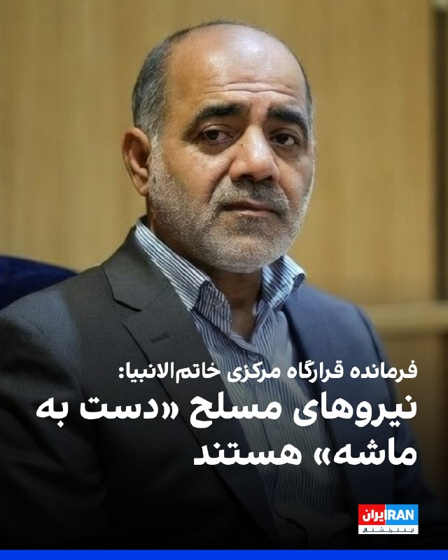

علی عبداللهی، فرمانده قرارگاه مرکزی خاتم‌الانبیا، در پیامی خطاب به حامیان جمهوری اسلامی نوشت توان رزمی، دفاعی و قدرت موشکی، دریایی، پهپادی و پدافند هوایی جمهوری اسلامی تحت فرماندهی مجتبی خامنه‌ای ارتقا یافته و نیروهای مسلح «دست به ماشه»، آماده شلیک به «قلب دشمن» هستند.

او نوشت: «آرمان مقدس فتح قدس و انتقام خون علی خامنه‌ای هرگز فراموش نخواهد شد؛ ما منتظر کوچک‌ترین لغزشی از سوی دشمن متجاوز هستیم تا درسی فراموش‌نشدنی و پایان‌بخش به آن‌ها بدهیم».
‌🏁 🇬🇧 IranintlTV

🤖 @VahidOOnLine

## VahidOOnLine — post 245515

  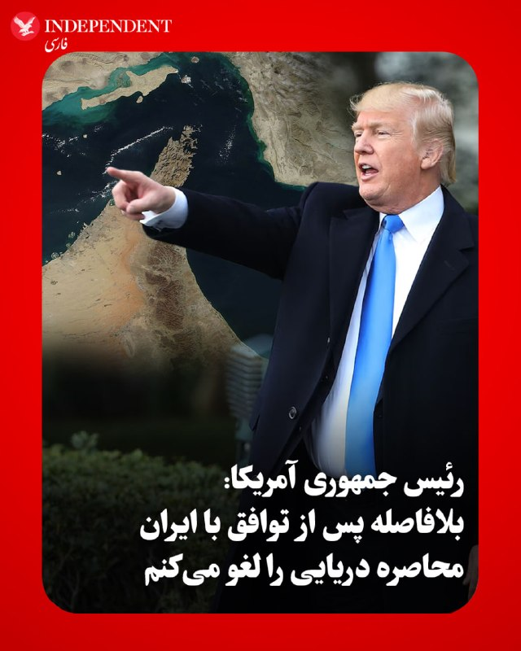

♦️دونالد ترامپ، رییس‌جمهوری آمریکا، روز یکشنبه در گفتگو با شبکه خبری فاکس اعلام کرد در صورت امضاء تفاهم‌نامه با ایران بلافاصله دستور لغو محاصره بنادر ایران را صادر خواهد کرد.
رئیس‌جمهوری آمریکا، در بخش دیگری از این گفتگو اعلام کرد امضاء توافق با ایران روز یکشنبه به‌صورت الکترونیکی انجام خواهد شد و مراسم امضاء حضوری یک هفته بعد در اروپا برگزار می‌شود.
‌🇸🇦 Indypersian

🤖 @VahidOOnLine

## VahidOOnLine — post 245514

  

یوری اوشاکوف، مشاور کرملین، گفت دونالد ترامپ در گفت‌وگوی تلفنی با ولادیمیر پوتین اعلام کرد توافق برای پایان دادن به درگیری با جمهوری اسلامی تقریبا نهایی شده است.
به گفته اوشاکوف، رییس‌جمهوری روسیه از پایان یافتن درگیری‌ها ابراز خرسندی کرده است.
مشاور کرملین همچنین گفت ترامپ در این گفت‌وگو بر ضرورت پایان جنگ اوکراین تاکید و آمادگی خود را برای کمک به این روند اعلام کرده است.
اوشاکوف افزود پوتین نیز به‌صورت «غیررسمی» هشتادمین سالروز تولد ترامپ را به او تبریک گفته است.
‌🏁 🇬🇧 IranintlTV

🤖 @VahidOOnLine

## VahidOOnLine — post 245513

  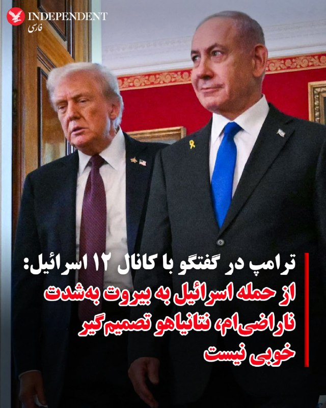

♦️دونالد ترامپ، رئیس‌جمهوری آمریکا، روز یکشنبه ۲۴ خرداد ماه با انتقاد شدید از حمله اسرائیل به ضاحیه جنوبی بیروت گفت این اقدام موجب اختلال و تاخیر در روند دستیابی به توافق با ایران شده است، اما تاکید کرد که توافق همچنان «طی چند ساعت آینده» امضا خواهد شد.
ترامپ در گفتگو با شبکه ۱۲ اسرائیل اعلام کرد نارضایتی خود را مستقیما به بنیامین نتانیاهو منتقل کرده و گفته است از حمله اخیر اسرائیل به بیروت «به هیچ وجه راضی نیست». او همچنین عملکرد نخست‌وزیر اسرائیل را در مدیریت بحران زیر سوال برد و گفت نتانیاهو در تصمیم‌گیری قضاوت درستی ندارد.
رئیس‌جمهوری آمریکا با دفاع از توافق در دست مذاکره با تهران، گفت این توافق مانع دستیابی ایران به سلاح هسته‌ای خواهد شد، بازرسی‌های سختگیرانه از تاسیسات مشکوک را امکان‌پذیر می‌کند و به برنامه اورانیوم غنی‌شده ایران پایان می‌دهد.
‌🇸🇦 Indypersian

🤖 @VahidOOnLine

## VahidOOnLine — post 245512

  

دونالد ترامپ، رییس‌جمهوری آمریکا، در گفت‌وگوی تلفنی با اکسیوس گفت حمله اسرائیل به بیروت روند امضای تفاهم‌نامه با جمهوری اسلامی را چند ساعت به تاخیر انداخته است.
به گزارش اکسیوس، ترامپ گفت زمانی که مشاورانش خبر حمله اسرائیل به بیروت را به او اطلاع دادند، شوکه شد و از بنیامین نتانیاهو، نخست‌وزیر اسرائیل، خشمگین شد.
ترامپ گفت: «این اوضاع را به‌هم ریخت. قرار بود همین الان توافق امضا شود، اما حالا برای چند ساعت دیگر برنامه‌ریزی شده است.»
او افزود حزب‌الله ابتدا به اسرائیل حمله کرده بود، اما این حمله هیچ خسارت یا تلفات جانی به همراه نداشت.
‌🏁 🇬🇧 IranintlTV

🤖 @VahidOOnLine

## VahidOOnLine — post 245511

  

دونالد ترامپ، رییس‌جمهوری آمریکا، در ادامه گفت‌وگوی خود با فاکس نیوز گفت در صورت امضای تفاهم‌نامه با جمهوری اسلامی بلافاصله دستور لغو محاصره بنادر ایران را صادر خواهد کرد.
او افزود پس از امضای این تفاهم‌نامه، مذاکرات درباره جزییات برنامه هسته‌ای جمهوری اسلامی ادامه خواهد یافت.
ترامپ همچنین گفت مراسم امضای حضوری تفاهم‌نامه میان واشینگتن و تهران ممکن است هفته آینده در اروپا برگزار شود.
‌🏁 🇬🇧 IranintlTV

🤖 @VahidOOnLine

## VahidOOnLine — post 245510

  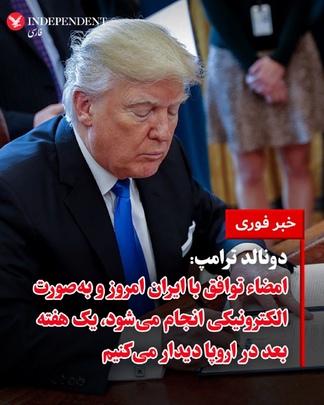

♦️دونالد ترامپ، رئیس‌جمهوری آمریکا، روز یکشنبه ۲۴ خرداد ماه در گفتگو با فاکس نیوز اعلام کرد امضاء توافق با ایران روز یکشنبه به‌صورت الکترونیکی انجام خواهد شد و مراسم امضای حضوری آن یک هفته بعد در اروپا برگزار می‌شود.
ترامپ همچنین گفت بلافاصله پس از امضای توافق با ایران، دستور رفع محاصره را صادر خواهد کرد.
رئیس‌جمهوری آمریکا در بخش دیگری از اظهاراتش فاش کرد پس از حمله اسرائیل به ضاحیه جنوبی بیروت، پیامی «خشمگینانه» برای بنیامین نتانیاهو، نخست‌وزیر اسرائیل، ارسال کرده است.
این اظهارات ساعاتی پس از آن مطرح می‌شود که ترامپ در شبکه اجتماعی تروث سوشال نیز حمله اسرائیل به بیروت را غیرضروری توصیف کرده و گفته بود این اقدام نباید روند دستیابی به توافق صلح با ایران را مختل کند.
‌🇸🇦 Indypersian

🤖 @VahidOOnLine

## VahidOOnLine — post 245509

  

دونالد ترامپ، رییس‌جمهوری آمریکا، در گفت‌وگو با فاکس نیوز گفت معتقد است تفاهم‌نامه میان واشینگتن و تهران ظرف دو تا سه ساعت آینده به‌صورت الکترونیکی امضا خواهد شد. او همچنین گفت از جمهوری اسلامی خواهد خواست به حملات اسرائیل علیه حزب‌الله واکنش نشان ندهد.
ترامپ افزود حملات آمریکا به مواضع جمهوری اسلامی در اواسط هفته گذشته، تهران را به بازگشت به میز مذاکره وادار کرده است. او همچنین گفت مقام‌های جمهوری اسلامی در جریان این حملات با او تماس گرفتتند و خواستار توقف بمباران‌ها شدند.
‌🏁 🇬🇧 IranintlTV

🤖 @VahidOOnLine

## VahidOOnLine — post 245508

  <a href="telegram/content/VahidOOnLine_245508_1781460094.mp4" target="_blank">🎬 Download video</a>

♦️جشن هواداران نیویورک نیکس، پس از قهرمانی این تیم در رقابت‌های ان‌بی‌ای (NBA) به خشونت کشیده شد و پلیس نیویورک از بازداشت ۶۳ نفر خبر داد.
به گزارش نیویورک پست، در جریان این ناآرامی‌ها در شامگاه شنبه و بامداد یکشنبه ۲۴ خرداد ماه، چهار مورد چاقوکشی و یک تیراندازی ثبت شده و ۱۰ مامور پلیس نیز زخمی شده‌اند. همچنین یک نوجوان ۱۷ ساله که از ناحیه پا هدف گلوله قرار گرفته بود، به بیمارستان منتقل شد.
پلیس اعلام کرد اتهام‌های افراد بازداشت‌شده شامل حمله به ماموران پلیس، حمل سلاح، تخریب اموال عمومی، اخلال در نظم عمومی و مقاومت در برابر بازداشت است.
تصاویر منتشرشده در شبکه‌های اجتماعی نشان می‌دهد شماری از هواداران به خودروهای پلیس و اتوبوس‌ها آسیب زده‌اند. همچنین چند اتوبوس مورد استفاده برای جابه‌جایی هواداران جام جهانی فوتبال نیز در جریان ناآرامی‌ها به آتش کشیده یا تخریب شده‌اند.
تیم نیویورکی نیکس با پیروزی مقابل سن‌آنتونیو اسپرز برای نخستین بار در ۵۳ سال گذشته عنوان قهرمانی نی‌بی‌ای را به دست آورد.
‌🇸🇦 Indypersian

🤖 @VahidOOnLine

## VahidOOnLine — post 245507

  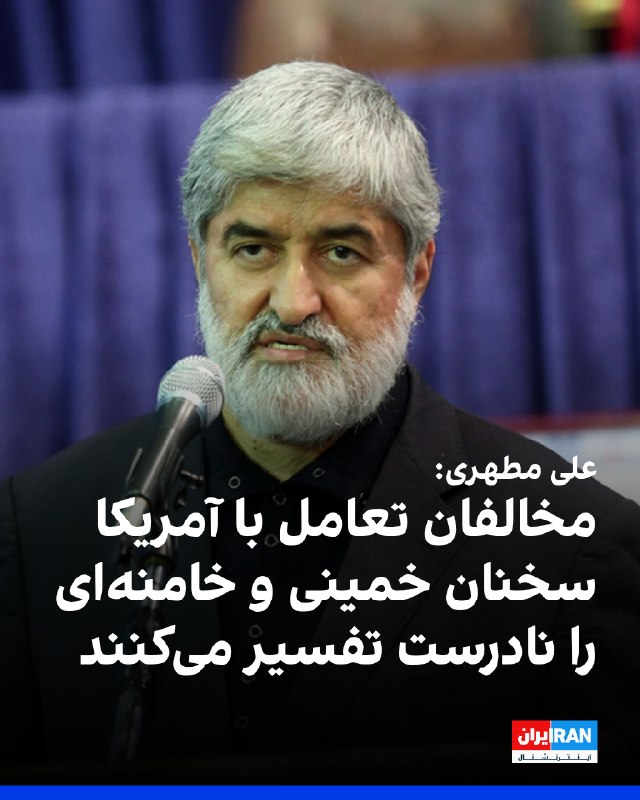

علی مطهری، نایب‌رییس مجلس دهم، گفت بخشی از تجمعات علیه مذاکرات جمهوری اسلامی و آمریکا سازماندهی‌شده است و برخی گروه‌های سیاسی تلاش دارند این اعتراض‌ها را به سراسر کشور گسترش دهند.
او مخالفت با تعامل با آمریکا را ناشی از «برداشت‌های غلط» از سخنان روح‌الله خمینی و علی خامنه‌ای دانست.
مطهری همچنین گفت باید مراقب بود این بار در برابر توافق احتمالی کارشکنی نشود و همه جناح‌های سیاسی توجه داشته باشند که هر توافقی تنها با نظر مجتبی خامنه‌ای امضا خواهد شد.
او افزود مقام‌های جمهوری اسلامی بدون موافقت مجتبی خامنه‌ای نمی‌توانند هیچ توافقی را امضا کنند.
‌🏁 🇬🇧 IranintlTV

🤖 @VahidOOnLine

## VahidOOnLine — post 245506

  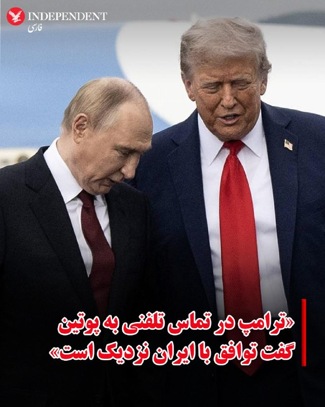

♦️کاخ کرملین اعلام کرد ولادیمیر پوتین، رئیس‌جمهوری روسیه، روز یکشنبه ۲۴ خرداد در تماس تلفنی با دونالد ترامپ درباره جنگ اوکراین، ایران و سفر قریب‌الوقوع نمایندگان ویژه آمریکا به روسیه گفتگو کرده است.
یوری اوشاکوف، دستیار پوتین، به خبرنگاران گفت بخش مهمی از این گفتگو به تفاهم‌نامه‌ای اختصاص داشت که میان آمریکا و ایران در حال تدوین است.
به گفته اوشاکوف، ترامپ در این تماس تاکید کرده که دستیابی به توافق با ایران نزدیک است.
دستیار رئیس‌جمهوری روسیه همچنین گفت توافق شده است استیو ویتکاف و جرد کوشنر، نمایندگان ویژه رئیس‌جمهوری آمریکا که در حال حاضر از نزدیک در پرونده ایران نقش دارند، به‌زودی بار دیگر به روسیه سفر کنند.
‌🇸🇦 Indypersian

🤖 @VahidOOnLine

## VahidOOnLine — post 245505

  <a href="telegram/content/VahidOOnLine_245505_1781460096.mp4" target="_blank">🎬 Download video</a>

⭕️«مرد نمیرد به مرگ»؛ روایت جاودانگی احمد ظاهر

📌در نظر بسیاری از افغان‌ها، احمد ظاهر تنها یک آوازخوان نیست، بلکه بخشی از حافظه جمعی و هویت فرهنگی افغانستان است؛ هنرمندی که آثارش در شادی‌ها، سفرها، محافل خانوادگی و حتی سال‌های مهاجرت همراه مردم بوده است

♦️احمد ظاهر آوازخوان نامدار افغانستان و ملقب به «الماس شرق»، ۲۴ خرداد ۱۳۵۸ در شاهراه سالنگ، در استان پروان افغانستان، در پی حادثه رانندگی جان باخت. بیشتر فارسی‌ زبانان جهان با نام احمد ظاهر آشنایند و پس از گذشت دهه‌ها، علاقه‌مندان به موسیقی همچنان آوازهای او را می‌شنوند.

احمد ظاهر در شاهراه سالنگ، در استان پروان، در پی حادثه رانندگی جان باخت. هرچند در تمام این سال‌ها گمانه‌زنی‌های فراوانی درباره به قتل رساندن او مطرح بوده است، اما با نبود اسناد و شواهد متقن، نمی‌توان درباره چگونگی مرگ او با قاطعیت سخن گفت.

بیشتر بخوانید...

🖌واجد روحانی
‌🇸🇦 Indypersian

🤖 @VahidOOnLine

## WithYashar — post 14855

  <a href="telegram/content/WithYashar_14855_1781460097.mp4" target="_blank">🎬 Download video</a>

ویدیو پدر و دختری، احمد ایراندوست(غول برره)، وسط این هیر و ویر‌…
@withyashar

## WithYashar — post 14854

قالیباف : بازی پلیس خوب و پلیس بد قدیمی شده است.
@withyashar

## WithYashar — post 14853

خضریان، نماینده مجلس:

ارتباط واتساپی عراقچی با ویتکاف باید کاملاً قطع شود!
@withyashar

## WithYashar — post 14852

زیرنویس شبکه خبر :
پاسخ به حمله اسرائیل قطعی است.
@withyashar

## WithYashar — post 14851

لارنس نورمن خبرنگار وال استریت ژورنال:
در عرض دو هفته، ترامپ از این موضع که «لبنان از موضوع ایران جداست» به این موضع رسیده که «لبنان مرتبط است اما اسرائیل حق پاسخگویی دارد» و بعد به این موضع که «لبنان مرتبط است ولی من فکر نمی‌کنم اسرائیل حق پاسخگویی داشته باشد چون باید توافق را منعقد کنیم»
@withyashar

## WithYashar — post 14850

ادعای ترامپ در گفتگو با اکسیوس:

این توافق به نفع اسرائیل خواهد بود، زیرا مانع از دستیابی ایران به سلاح هسته‌ای شده و این کشور را ملزم به رهاسازی مواد هسته‌ای می‌کند
@withyashar

## WithYashar — post 14849

یدیعوت آحارونوت: کابینه امنیتی اسرائیل امشب تو یه مکان مخفی تشکیل جلسه میدن
@withyashar

## WithYashar — post 14847

https://t.me/withyashar/s/5

## WithYashar — post 14846

ترامپ به پوتین اعلام کرد توافق پایان جنگ با ایران تقریبا کامل شده. پوتین هم از پیشرفت این موضوع ابراز رضایت کرد
@withyashar

## WithYashar — post 14845

فرمانده قرارگاه خاتم الانبیا: فرزندان ملت در نیروهای مسلح «دست به ماشه» آماده شلیک به قلب دشمن هستند
@withyashar 🚨

## WithYashar — post 14844

رئیس کمیسیون امنیت ملی مجلس: پاسخ به حمله امروز اسرائیل توسط جبهه مقاومت قطعی است
@withyashar

## WithYashar — post 14843

ترامپ به فاکس نیوز گفت:

توافق با ایران از راه دور امضا خواهد شد، سپس امضای حضوری آن ممکن است یک هفته بعد در اروپا انجام شود
@withyashar

## WithYashar — post 14842

بن‌گویر خطاب به نتانیاهو: قوی باش، نترس
@withyashar 🥥🥥

## WithYashar — post 14841

ترامپ به باراک راوید گفت: چرا بی‌بی (نتانیاهو) باید یک حمله‌ی لعنتی انجام می‌داد؟ من خیلی عصبانی شدم. به او گفتم.
او اصلاً هیچ قضاوت لعنتی ندارد. من این را به او گفتم.

اگر توافق امشب امضا شود، فوراً دستور لغو محاصره دریایی ایران را خواهم داد.
@withyashar

## WithYashar — post 14840

ترامپ در گفتگو با فاکس نیوز اعلام کرد که از ایران خواهد خواست که به حملات اسرائیل علیه حزب الله پاسخ ندهد. ترامپ همچنین اعلام کرد که توافق با ایران ظرف ۲-۳ ساعت آینده به صورت الکترونیکی امضا خواهد شد.
@withyashar

## WithYashar — post 14839

ترامپ به کانال ۱۲ اسرائیل: از ایران می‌خوام موشک به اسرائیل شلیک نکنه. این توافق در ساعات آینده امضا خواهد شد.
@withyashar

## WithYashar — post 14838

صابرین نیوز تایید کرد : برکناری سعید جلیلی از شعام و جایگزینی باقری کنی با وی
@withyashar
یاشار : پوست اندازی رژیم ادامه ‌داره

## WithYashar — post 14837

ترامپ به باراک راوید از اکسیوس گفت:
قرار بود امروز صبح توافق را امضا کنیم، اما حمله اسرائیل به بیروت آن را به تأخیر انداخت.
@withyashar

## WithYashar — post 14836

ترامپ به آکسیوس : به او گفتم، او هیچ قضاوت درستی ندارد

وی همچنین به ناتانیاهو گفت هیچ حمله دیگری به لبنان انجام ندهد و هشدار داد که این حملات می‌تواند توافق را به خطر بیندازد.

ترامپ می‌گوید از ایران خواهد خواست که در پی حملات اسرائیل به لبنان، با حملات موشکی پاسخ ندهد.
@withyashar

## mwarmonitor — post 10902

📌یک مقام اسرائیلی، ترامپ را به «عادی‌سازی آتش به سمت اسرائیل» متهم کرده است.

📌مقامات می‌گویند ترامپ از نتانیاهو خواسته است آتش‌بس در لبنان را متوقف کرده و عقب‌نشینی را آغاز کند، اما نتانیاهو هر دو درخواست را رد کرده است.

📌ایالات متحده در تلاش است تهران را متقاعد کند که از انجام حمله یا محدود کردن آن خودداری کند تا بحران مهار شود، در حالی که هم‌زمان بر اسرائیل فشار می‌آورد تا در صورت پاسخ ایران، دست به اقدام تلافی‌جویانه نزند - YNet

@mwarmonitor

## mwarmonitor — post 10901

🔴ارزیابی اسرائیل: ترامپ انتظار می‌رود به‌زودی یک امتیاز به ایران اعلام کند، در ازای اینکه ایران به حمله ضاحیه پاسخ ندهد. ماهیت این پیشنهاد مشخص نیست، اما گفته می‌شود این بخشی از تلاش‌های پشت‌پرده‌ای است که در حال انجام است - کانال ۱۲

@mwarmonitor

## mwarmonitor — post 10900

  <a href="telegram/content/mwarmonitor_10900_1781460099.mp4" target="_blank">🎬 Download video</a>

به نقل از FOX4:

✈️یک هواپیما که ۱۱ چترباز و یک خلبان را حمل می‌کرد، در نزدیکی فرودگاه Butler Memorial در ایالت میسوری سقوط کرده است.

در این حادثه ۱۲ نفر جان خود را از دست داده‌اند

@mwarmonitor

## mwarmonitor — post 10899

🔴به نقل از منابع کرملین و مشاور «یوری اوشاکوف»، گفته شده است که:

🔸ترامپ به پوتین تأکید کرده پایان جنگ اوکراین «ضروری» است و اعلام کرده آماده کمک در این زمینه است.

🔸همچنین او به پوتین اطلاع داده که یک توافق برای پایان درگیری مرتبط با ایران «تقریباً نهایی شده» است.

🔸این اظهارات در چارچوب گفت‌وگوهای دیپلماتیک و تحولات هم‌زمان چند پرونده بین‌المللی (اوکراین و ایران) مطرح شده‌اند.

@mwarmonitor

## mwarmonitor — post 10898

🔴 به نقل از شبکه «العربیه»، یک هیئت قطری در حال حرکت به سمت پایتخت پاکستان، اسلام‌آباد است؛ در حالی که تلاش‌ها برای دستیابی به توافق میان آمریکا و ایران ادامه دارد.

🔴این سفر در چارچوب میانجی‌گری‌های منطقه‌ای برای پیشبرد مذاکرات مرتبط با توافق احتمالی آمریکا و ایران انجام می‌شود.

@mwarmonitor

## mwarmonitor — post 10897

🔴ارتش اسرائیل می‌گوید:

🔸راکتی که از سوی حزب‌الله از لبنان شلیک شده بود، کمی پیش به نزدیکی منطقه مسکونی «نئوت مردخای» در شمال اسرائیل و در نزدیکی کریات شمونه اصابت کرده است.

🔸ارتش همچنین اعلام کرد چند راکت دیگر از این حمله گروهی، در نزدیکی نیروهای نظامی اسرائیل در جنوب لبنان فرود آمده‌اند.

🔸علاوه بر این، چند پهپاد منتسب به حزب‌الله نیز اخیراً به خاک اسرائیل و در نزدیکی مرز لبنان اصابت کرده‌اند.

@mwarmonitor

## mwarmonitor — post 10896

اگر جمهوری اسلامی و آمریکا به اسرائیل حمله کردند تعجب نکنید

## mwarmonitor — post 10895

🔴ترامپ به اکسیوس: نتانیاهو «اصلاً عقل و شعور ندارد» اما توافق با ایران هنوز پابرجا است

📝باراک راوید AXIOS

🔸رئیس‌جمهور دونالد ترامپ به اکسیوس گفت که به‌رغم حمله اسرائیل به بیروت و تهدید ایران به تلافی، توافق میان ایالات متحده و ایران برای پایان دادن به جنگ همچنان برای روز یکشنبه در مسیر اجرا قرار دارد.

🔰چرا این موضوع اهمیت دارد؟
رئیس‌جمهور آمریکا برای نجات توافقی رقابت می‌کند که درست در لحظه حمله اسرائیل به بیروت در آستانه فروپاشی قرار گرفت؛ او برای امضای این توافق به دیپلمایسی خصوصی و پیام‌رسانی‌های عمومی متوسل شده است. مقامات ایرانی هنوز تأیید نکرده‌اند که انتظار می‌رود توافق امروز امضا شود.
ترامپ در یک تماس تلفنی گفت:
«این اتفاق اوضاع را به هم ریخت. امضا را چند ساعت به تأخیر انداخت. قرار بود همین حالا انجام شود. اکنون برای چند ساعت دیگر برنامه‌ریزی شده است.»
تنش در لبنان: تشدید درگیری‌ها در لبنان تنها چند ساعت پیش از آن رخ داد که قرار بود ایالات متحده و ایران توافقی را برای پایان دادن به جنگ خود امضا کنند.
موضع ایران: ابراهیم عزیزی، رئیس کمیسیون امنیت ملی مجلس ایران، در شبکه اجتماعی X نوشت: «پاسخی سخت در راه است.»
وضعیت موجود
ترامپ گفت زمانی که مشاورانش با او تماس گرفتند تا درباره حمله اسرائیل به بیروت به او گزارش دهند، شوکه شده و از دست بنیامین نتانیاهو، نخست‌وزیر اسرائیل، به شدت خشمگین (عصبانی) شده است.
ترامپ اظهار داشت:
«خیلی بد است — نمی‌توانستم باور کنم. یک ساعت قبل از اینکه قرار باشد توافق را امضا کنیم.»
ترامپ اذعان کرد که حزب‌الله ابتدا به اسرائیل حمله کرده بود، اما تاکید کرد که این حمله هیچ خسارتی برجای نگذاشته و کسی کشته نشده است.
ترامپ گفت: «چرا بیبی مجبور بود یک حمله لعنتی انجام دهد؟ خیلی عصبانی شدم. به او فهماندم. او اصلاً عقل و شعور ندارد. این را به او فهماندم.»

📌تصویر کلی
ترامپ مدعی شد که توافق با ایران برای اسرائیل خوب خواهد بود، زیرا مانع از دستیابی ایران به سلاح هسته‌ای می‌شود، نابودی مواد هسته‌ای را الزامی می‌کند و اجازه بازرسی‌های سرزده از تاسیسات هسته‌ای ایران را می‌دهد.

@mwarmonitor

## mwarmonitor — post 10894

🔹(کوین): این خیلی شبیه به چیزیه که رئیس‌جمهور مطمئناً می‌گه، اما در عین حال «تِری»، فکر می‌کنم منصفانه باشه اشاره کنیم که اگه شما دولت اسرائیل باشید، این حق رو دارید که از شهروندانتون دفاع کنید؛ کسانی که به طور مداوم از طریق حزب‌الله تحت حمله بوده‌اند. فکر…

## mwarmonitor — post 10893

🔴تری خبرنگار فاکس نیوز «بله کوین، بعدازظهر بخیر. من همین الان با پرزیدنت ترامپ صحبت کردم. او به فاکس نیوز گفت که معتقد است توافق با ایران تا دو یا سه ساعت آینده امضا خواهد شد. من از او درباره حملات امروز اسرائیل علیه حزب‌الله در بیروت، پایتخت لبنان، پرسیدم.…

## mwarmonitor — post 10892

🔴تری خبرنگار فاکس نیوز
«بله کوین، بعدازظهر بخیر. من همین الان با پرزیدنت ترامپ صحبت کردم. او به فاکس نیوز گفت که معتقد است توافق با ایران تا دو یا سه ساعت آینده امضا خواهد شد.
من از او درباره حملات امروز اسرائیل علیه حزب‌الله در بیروت، پایتخت لبنان، پرسیدم. او به من گفت که به صورت تلفنی با بنیامین نتانیاهو، نخست‌وزیر اسرائیل صحبت کرده و از او پرسیده است: "داری چه غلتی می‌کنی؟" (What the F... are you doing?)
او به نخست‌وزیر اسرائیل گفت که حملات بیشتری علیه حزب‌الله انجام ندهد تا این موضوع بر روند پیش‌روی این توافق تأثیری نگذارد.
در حال حاضر، به گفته ارتش اسرائیل (IDF)، اسرائیلی‌ها خود را برای احتمال شلیک موشک‌های بالستیک از سوی ایران آماده می‌کنند. با این حال، پرزیدنت ترامپ به فاکس نیوز گفت که با توجه به توافقی که در شرف وقوع است و انتظار می‌رود امشب امضا شود، از ایران خواهد خواست که با شلیک موشک به سمت اسرائیل، پاسخ ندهد.
همه این‌ها در بحبوحه آخرین گفتگوها برای رساندن این توافق نهایی به خط پایان انجام می‌شود. رئیس‌جمهور درباره حملات اواسط هفته گذشته صحبت کرد؛ زمانی که او بسیاری از مواضع ایران را در هم کوبید و ایرانی‌ها را به میز مذاکره بازگرداند.
کوین، شاید به یاد داشته باشی، زمانی که رئیس‌جمهور در اتاق موقعیت (Situation Room) بود، من تلفنی با او صحبت می‌کردم؛ همان زمان ایرانی‌ها با او تماس گرفتند و خواستند که بمباران را متوقف کند. رئیس‌جمهور معتقد است که آن لحظه توانست معادله را تغییر دهد و بار دیگر ایرانی‌ها را وادار به دادن این امتیازات کند.
پرزیدنت ترامپ می‌گوید اگر آن‌ها امشب توافق را امضا کنند، او بلافاصله دستور رفع محاصره بنادر ایران را صادر خواهد کرد و سپس وارد بحث‌های دقیق‌تر در رابطه با برنامه هسته‌ای ایران خواهند شد.
اما بار دیگر، آخرین تیترهای خبری که اکنون می‌دانیم:
پرزیدنت ترامپ به فاکس نیوز گفت معتقد است توافق با ایران ظرف دو تا سه ساعت آینده امضا خواهد شد. رئیس‌جمهور می‌گوید این کار به صورت الکترونیکی انجام می‌شود و سپس یک هفته بعد، انتظار می‌رود یک امضای حضوری انجام شود که می‌تواند در جایی در اروپا صورت بگیرد.
باز هم تاکید می‌کنم، این واکنش رئیس‌جمهور پس از حملات امروز اسرائیل به بیروت، پایتخت لبنان بود. اسرائیلی‌ها در پاسخ به شلیک پهپادها در آخر هفته جاری به سمت شمال اسرائیل، به یک موضع حزب‌الله حمله کرده بودند. رئیس‌جمهور مجدداً به فاکس نیوز گفت که از نخست‌وزیر اسرائیل پرسیده است: "داری چه غلتی می‌کنی؟"»

@mwarmonitor

## mwarmonitor — post 10891

  <a href="telegram/content/mwarmonitor_10891_1781460100.mp4" target="_blank">🎬 Download video</a>

🎬 Video

## mwarmonitor — post 10890

🔴ترامپ: از ایران می‌خواهم موشک به اسرائیل شلیک نکند. این توافق در ساعات آینده امضا خواهد شد. کانال ۱۲ اسرائیل @mwarmonitor

## mwarmonitor — post 10889

🔴ترامپ 🔸«من با نتانیاهو، نخست‌وزیر اسرائیل صحبت کردم و بهش گفتم: "داری چه غلطی می‌کنی؟"» 🔴و اضافه می‌کند: «بی‌بی هیچ اختیار و آزادی تصمیم‌گیری‌ای ندارد.» @mwarmonitor

## FoxNewsTwitter — post 342961

Fox News (Twitter/X)

BREAKING: Sen. Mitch McConnell hospitalized Sunday morning, receiving 'excellent care,' his office says.

## FoxNewsTwitter — post 342960

  <a href="telegram/content/FoxNewsTwitter_342960_1781460102.mp4" target="_blank">🎬 Download video</a>

Fox News (Twitter/X)

BREAKING: President Trump tells @TreyYingst that a deal with Iran is expected in next few hours.

## pm_afshaa — post 93940

  <a href="telegram/content/pm_afshaa_93940_1781460105.webm" target="_blank">🎬 Download video</a>

🔴اوباما: بعیده توافق جدید «تفاوت قابل‌توجهی» با برجام داشته باشه یا «بهبود چشمگیری» نسبت به اون محسوب بشه.

💧 Rainbet.com the #1 Non-KYC Crypto Casino & Sportsbook @rainbetcom

😁 @Pm_Afshaa

## pm_afshaa — post 93939

  <a href="telegram/content/pm_afshaa_93939_1781460106.webm" target="_blank">🎬 Download video</a>

🔴ذوالقدر، دبیر شورای عالی امنیت ملی:

‏پاسخ رزمندگان اسلام در پیش است.
‏وحدت میدان‌ها یک زنجیره امنیتی در دفاع از منطقه ایجاد کرده است.

‏لبنان جان ماست و نقض خطوط قرمز جمهوری اسلامی تحمل نخواهد شد.

💧 Rainbet.com the #1 Non-KYC Crypto Casino & Sportsbook @rainbetcom

😁 @Pm_Afshaa

## pm_afshaa — post 93937

  <a href="telegram/content/pm_afshaa_93937_1781460106.mp4" target="_blank">🎬 Download video</a>

👌💕

## pm_afshaa — post 93935

در شهرداری گناباد چه میگذرد 2 تا حکومتی دارن تو شهرداری گناباد کون کونک بازی میکنن که توسط یهکی از شهروندان شکار میشن و فیلمشون در میاد مشاهده فیلم @Pm_Afshaa

## pm_afshaa — post 93934

  <a href="telegram/content/pm_afshaa_93934_1781460108.webm" target="_blank">🎬 Download video</a>

🔴ابراهیم عزیزی، رئیس کمیسیون امنیت ملی مجلس: پاسخ به حمله امروز اسرائیل قطعی است.

💧 Rainbet.com the #1 Non-KYC Crypto Casino & Sportsbook @rainbetcom

😁 @Pm_Afshaa

## pm_afshaa — post 93933

🔴وزیر امنیت داخلی اسرائیل، بن گویر : آقای نخست‌وزیر، قوی باش و نترس، وا نده

💧 Rainbet.com the #1 Non-KYC Crypto Casino & Sportsbook @rainbetcom

😁 @Pm_Afshaa

## pm_afshaa — post 93932

  <a href="telegram/content/pm_afshaa_93932_1781460109.webm" target="_blank">🎬 Download video</a>

🔴ترامپ به فاکس نیوز:
اگر توافق امشب امضا بشه، فوراً دستور لغو محاصره دریایی ایران رو خواهم داد.

💧 Rainbet.com the #1 Non-KYC Crypto Casino & Sportsbook @rainbetcom

😁 @Pm_Afshaa

## pm_afshaa — post 93931

  <a href="telegram/content/pm_afshaa_93931_1781460110.webm" target="_blank">🎬 Download video</a>

🔴ترامپ به اکسیوس:
چرا نتانیاهو باید چنین حمله مزخرفی رو انجام می‌داد؟ من خیلی عصبانی شدم و بهش فهموندم. او اصلاً قضاوت درستی نداره، من این رو بهش گفتم.

نتانیاهو اصلا تشخیص درستی نداره، من این پیام رو بهش رسوندم که به شدت از حمله به بیروت ناراضی هستم.

💧 Rainbet.com the #1 Non-KYC Crypto Casino & Sportsbook @rainbetcom

😁 @Pm_Afshaa

## pm_afshaa — post 93930

در شهرداری گناباد چه میگذرد 2 تا حکومتی دارن تو شهرداری گناباد کون کونک بازی میکنن که توسط یهکی از شهروندان شکار میشن و فیلمشون در میاد مشاهده فیلم @Pm_Afshaa

## pm_afshaa — post 93928

در شهرداری گناباد چه میگذرد

2 تا حکومتی دارن تو شهرداری گناباد کون کونک بازی میکنن که توسط یهکی از شهروندان شکار میشن و فیلمشون در میاد

مشاهده فیلم

@Pm_Afshaa

## pm_afshaa — post 93927

  <a href="telegram/content/pm_afshaa_93927_1781460110.webm" target="_blank">🎬 Download video</a>

🔴ترامپ: با من تماس گرفتن و گفتن اسرائیل داره به بیروت حمله میکنه، یک ساعت قبل از اینکه ما قرار بود توافق رو امضا کنیم. باور نمی‌کردم که این اتفاق دارد میفته، خیلی بده.

💧 Rainbet.com the #1 Non-KYC Crypto Casino & Sportsbook @rainbetcom

😁 @Pm_Afshaa

## pm_afshaa — post 93926

  <a href="telegram/content/pm_afshaa_93926_1781460111.webm" target="_blank">🎬 Download video</a>

🔴ترامپ: قرار بود ما توافق رو امروز صبح امضا کنیم اما حمله اسرائیل در بیروت اونو به تأخیر انداخت.

💧 Rainbet.com the #1 Non-KYC Crypto Casino & Sportsbook @rainbetcom

😁 @Pm_Afshaa

## pm_afshaa — post 93925

ترامپ: از ایران می‌خواهم که به اسرائیل موشک شلیک نکند. توافق در ساعات آینده امضا خواهد شد

💧 Rainbet.com the #1 Non-KYC Crypto Casino & Sportsbook @rainbetcom

😁 @Pm_Afshaa

## iaghapour — post 2675

  

💠 Mega Center 💠

🪩📈 ابزار مورد نیاز شما در دنیای کریپتو و تریدینگ / احراز هویت پلتفرم های خارجی

از افتتاح حساب های ارزی بین المللی
تا خدمات وریفای تضمینی صرافی ها ، سایت های فریلنسری و گیمینگ
صدور مستر کارت و ویزا کارت و خدمات
ارزی
سیم کارت های فیزیکی خارجی
اکانت های اماده دیتاسنترها
آیپی رزیدنتال اختصاصی
اشتراک ویندسکرایب و ...
👨‍💻لینک دسترسی ها و ارتباط :
www.megacenterx.com      
www.megacenterx.com
www.megacenterx.com

https://t.me/megacenter0
https://t.me/megacenter0

@Megav_admin22
@Megav_admin22

در صورت بالا نیامدن سایت ، بدون وی پی ان امتحان نمایید ✅
سایت دارای اینماد و درگاه پرداخت اختصاصی و کریپتو ✅

## iaghapour — post 2674

✍🏻 دوستان، در حال حاضر بیش از ۷ اسکریپت (شامل اسکریپت‌های تانل و روش‌های مستقیم و رایگان) رو در دست بررسی داریم. هر کدوم که بدون مشکل جواب بده رو توی یوتیوب معرفی می‌کنیم. اما مواردی رو که به هر دلیلی (مثل محدودیت‌های دیتاسنتر سرورهایی که استفاده میکنیم و...) نتونیم خودمون ازشون جواب بگیریم، داخل کانال تلگرام معرفی میکنیم تا شما بتونید تست کنید.

ممنون از حمایت همیشگی شما.💚

## iaghapour — post 2673

واقعاً باید درِ این بانک‌های مزخرف رو گل بگیرن! سالی ۳ بار یا هک می‌شید، یا اپلیکیشن بانک کار نمی‌کنه، یا اختلال دارید و هزارتا کوفت و زهر مار دیگه! آخه مگه می‌شه بانک این‌همه بی‌در و پیکر باشه؟😒

## VahidOnline — post 76341

  <a href="telegram/content/VahidOnline_76341_1781460112.mp4" target="_blank">🎬 Download video</a>

شماری از حامیان جمهوری اسلامی و مخالفان توافق با ایالات متحده، در تجمع خود با سر دادن شعار خواهان اعدام عباس عراقچی، وزیر خارجه حکومت ایران شدند.
@VahidHeadline

📡 @VahidOnline

## VahidOnline — post 76340

  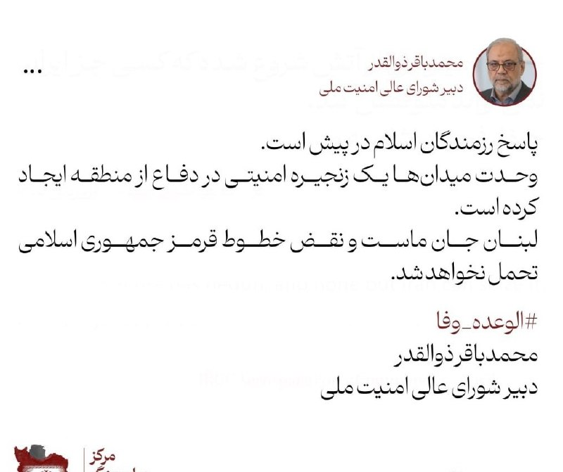

"‏پاسخ رزمندگان اسلام در پیش است."
محمدباقر ذوالقدر، دبیر شورای عالی امنیت ملی در جمهوری اسلامی

📡 @VahidOnline

## VahidOnline — post 76339

  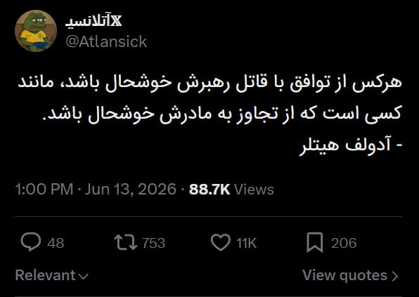

نصب تصاویر #مجتبی خامنه‌ای و آدولف #هیتلر با هم عکس جعلی چهره رهبر جدید جمهوری اسلامی (دستکاری شده با هوش مصنوعی) رو با استناد و افتخار به سخنان جعلی و چرندیات هرگز گفته نشده آن جنایتکار دیگر منتشر می‌کنند. عکس دریافتی از بابلسر، سه‌شنبه ۴ فروردین Vahid 📡…

## VahidOnline — post 76338

  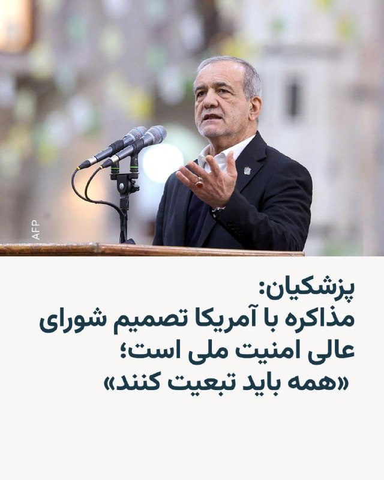

مسعود پزشکیان، رئیس‌جمهور ایران، در پی انتقادات برخی حامیان حکومت از محتوای توافق احتمالی با آمریکا، روز یکشنبه گفت که روند مذاکرات بر اساس مصوبات شورای عالی امنیت ملی و دیدگاه‌های رهبر جمهوری اسلامی پیش می‌رود.

او در دیدار با مدیران رسانه‌های داخلی افزود: «تصمیمات راهبردی کشور باید در چارچوب سازوکارهای قانونی اتخاذ شود و همه جریان‌ها و گروه‌ها نیز خود را ملزم به تبعیت از این تصمیمات بدانند.»

در آستانهٔ امضای تفاهم‌نامهٔ ایران و آمریکا برای پایان جنگ، اعتراض‌ در میان حامیان تندروی حکومت به متنی که به‌عنوان تفاهم‌نامه در برخی رسانه‌ها منتشر شد بالا گرفته و تجمعاتی نیز توسط گروهی از طرفداران جمهوری اسلامی علیه این تفاهم و مذاکره‌کنندگان برگزار شده است.

در یکی از این تجمعات در تهران، تجمع‌کنندگان علیه عباس عراقچی، وزیر خارجه، و محمدباقر قالیباف، رئیس مجلس شورای اسلامی، شعارهایی سر دادند.
@VahidHeadline

📡 @VahidOnline

## VahidOnline — post 76337

  <a href="telegram/content/VahidOnline_76337_1781460114.mp4" target="_blank">🎬 Download video</a>

ترامپ: به نتانیاهو گفتم داری چه غلطی می‌کنی؟
ظرف دو سه ساعت آینده یک توافق بزرگ امضا خواهد شد

به ویدیوی بالا با هوش مصنوعی زیرنویس فارسی اضافه شده، متن دو دقیقه اولش:
«بله کوین، عصر بخیر. همین الان با رئیس‌جمهور ترامپ صحبت کردم. او به فاکس‌نیوز گفت که معتقد است یک توافق بزرگ با ایران ظرف دو تا سه ساعت آینده امضا خواهد شد.

از او درباره حملات امروز اسرائیل علیه حزب‌الله در پایتخت لبنان، بیروت، پرسیدم. او گفت با بنیامین نتانیاهو، نخست‌وزیر اسرائیل، تلفنی صحبت کرده و از او پرسیده: “داری چه غلطی می‌کنی؟” ترامپ گفت به نخست‌وزیر گفته بود این حملات علیه حزب‌الله را انجام ندهد تا بر پیشبرد این توافق اثر نگذارد.

اکنون اسرائیلی‌ها، به گفته ارتش اسرائیل، خود را برای احتمال شلیک موشک‌های بالستیک ورودی از سوی ایران آماده می‌کنند. رئیس‌جمهور ترامپ به فاکس‌نیوز گفت از ایران خواهد خواست با شلیک موشک به سوی اسرائیل پاسخ ندهد، چون این توافق در آستانه امضا قرار دارد و انتظار می‌رود امشب امضا شود.

همه اینها در پس‌زمینه تازه‌ترین گفت‌وگوها برای رساندن این توافق نهایی به خط پایان رخ می‌دهد. رئیس‌جمهور درباره حملات میانه هفته گذشته هم صحبت کرد؛ زمانی که آمریکا بسیاری از مواضع ایران را زیر ضربه می‌برد و ایرانی‌ها را به میز مذاکره برمی‌گرداند.

شاید یادتان باشد، کوین، من با رئیس‌جمهور تلفنی صحبت می‌کردم، در حالی که او در اتاق وضعیت بود، و ایرانی‌ها با او تماس گرفتند و از او خواستند بمباران را متوقف کند. رئیس‌جمهور معتقد است همان لحظه توانست معادله را تغییر دهد و دوباره ایرانی‌ها را وادار کند این امتیازها را بدهند.

رئیس‌جمهور ترامپ گفت اگر آنها امشب توافق را امضا کنند، او فوراً دستور خواهد داد محاصره بنادر ایران برداشته شود و سپس وارد گفت‌وگوهای جزئی‌تر درباره برنامه هسته‌ای ایران خواهند شد.

اما دوباره، مهم‌ترین خبرهایی که اکنون می‌دانیم این است:
رئیس‌جمهور ترامپ به فاکس‌نیوز گفته معتقد است توافق با ایران ظرف دو تا سه ساعت آینده امضا خواهد شد. به گفته رئیس‌جمهور، این امضا به‌صورت الکترونیکی انجام می‌شود و حدود یک هفته بعد انتظار می‌رود مراسم امضای حضوری، احتمالاً در جایی در اروپا، برگزار شود.

باز هم تأکید می‌کنم: رئیس‌جمهور پس از حملات امروز اسرائیل به پایتخت لبنان، بیروت، واکنش نشان داد. اسرائیلی‌ها در پاسخ به آتش پهپادی این هفته از آن سوی مرز به سمت شمال اسرائیل، مواضع حزب‌الله را هدف قرار دادند. و رئیس‌جمهور می‌گوید از نخست‌وزیر اسرائیل پرسیده: “داری چه غلطی می‌کنی؟”»
TreyYingst

📡 @VahidOnline

## kianmeli1 — post 87993

  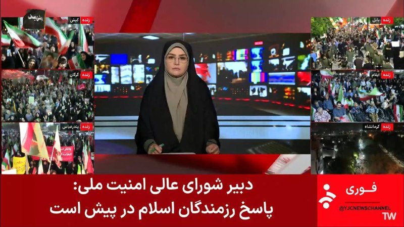

🔴 صداوسیما:
به اسراییل حمله میکنیم پاسخ در راه است
https://t.me/kianmeli1

## kianmeli1 — post 87992

  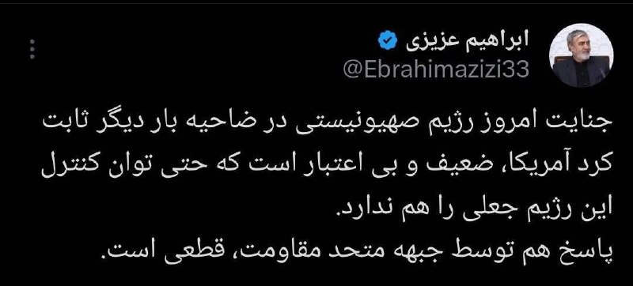

🔴رئیس کمیسیون امنیت ملی مجلس: پاسخ به حمله امروز اسرائیل توسط جبهه مقاومت قطعی است
https://t.me/kianmeli1

## kianmeli1 — post 87991

  <a href="telegram/content/kianmeli1_87991_1781460116.mp4" target="_blank">🎬 Download video</a>

🔴ترامپ به فاکس‌نیوز گفت انتظار می‌رود ظرف دو سه ساعت آینده تفاهمنامه امضا شود.
https://t.me/kianmeli1

## IranIntlTV — post 342328

  

ابوالفضل ابوترابی، نماینده مجلس، از «معاهده الجزایر و نقض تعهدات پس از آزادی گروگان‌های سفارت»، «خروج یک‌جانبه از برجام» و «حملات نظامی در حین روند مذاکرات» به‌عنوان «بدعهدی‌های آمریکا» نام برد و خطاب به هیات مذاکره‌کننده جمهوری اسلامی نوشت: «آقایان مذاکره‌کننده؛ پرسش ما این است، از یک سوراخ چندبار باید گزیده شویم؟»
https://iranintl.com/202606142600

## IranIntlTV — post 342327

  <a href="telegram/content/IranIntlTV_342327_1781460120.mp4" target="_blank">🎬 Download video</a>

تیم ملی فوتبال ایران برای نخستین دیدار خود در مرحله گروهی جام جهانی، از تیخوانای مکزیک راهی لس‌آنجلس آمریکا شد. ویزا‌ی تعدادی از اعضای هیات اعزامی تیم ملی ایران، از جمله مهدی تاج، رییس فدراسیون فوتبال، صادر نشده و آنها قادر به همراهی تیم در آمریکا نیستند.

گزارش رضا محدث، خبرنگار ایران‌اینترنشنال
@iranintltv

## IranIntlTV — post 342326

  

علی عبداللهی، فرمانده قرارگاه مرکزی خاتم‌الانبیا، در پیامی خطاب به حامیان جمهوری اسلامی نوشت توان رزمی، دفاعی و قدرت موشکی، دریایی، پهپادی و پدافند هوایی جمهوری اسلامی تحت فرماندهی مجتبی خامنه‌ای ارتقا یافته و نیروهای مسلح «دست به ماشه»، آماده شلیک به «قلب دشمن» هستند.

او نوشت: «آرمان مقدس فتح قدس و انتقام خون علی خامنه‌ای هرگز فراموش نخواهد شد؛ ما منتظر کوچک‌ترین لغزشی از سوی دشمن متجاوز هستیم تا درسی فراموش‌نشدنی و پایان‌بخش به آن‌ها بدهیم».
https://iranintl.com/202606147732

## IranIntlTV — post 342325

  <a href="telegram/content/IranIntlTV_342325_1781460122.mp4" target="_blank">🎬 Download video</a>

ارتش اسرائیل با انتشار ویدیویی از حمله‌ای دقیق همراه با نظارت هوایی در روز یک‌شنبه ۲۴ خرداد به یک مرکز فرماندهی حزب‌الله لبنان در منطقه ضاحیه در جنوب بیروت خبر داد.

در اطلاعیه ارتش اسرائیل آمده است این مرکز برای برنامه‌ریزی و هدایت حملات علیه شهروندان اسرائیلی مورد استفاده قرار می‌گرفت.

ویدیوهای منتشرشده در شبکه‌های اجتماعی، تخریب ساختمانی را در پی این حمله نشان می‌دهد.

به گزارش شبکه العربیه، علی الحاج از فرماندهان حزب‌الله در حمله به ضاحیه بیروت کشته شده است.
@iranintltv

## IranIntlTV — post 342324

  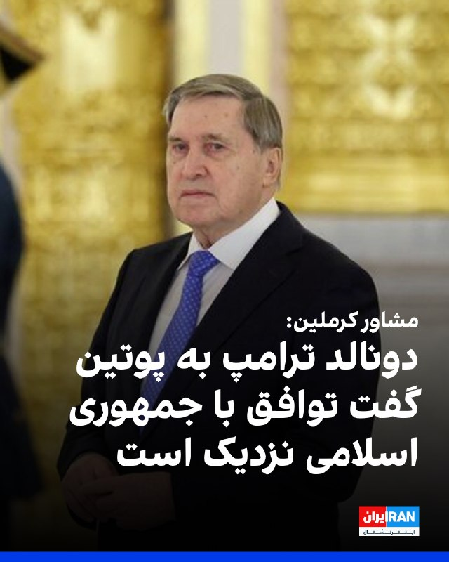

یوری اوشاکوف، مشاور کرملین، گفت دونالد ترامپ در گفت‌وگوی تلفنی با ولادیمیر پوتین اعلام کرد توافق برای پایان دادن به درگیری با جمهوری اسلامی تقریبا نهایی شده است.
به گفته اوشاکوف، رییس‌جمهوری روسیه از پایان یافتن درگیری‌ها ابراز خرسندی کرده است.
مشاور کرملین همچنین گفت ترامپ در این گفت‌وگو بر ضرورت پایان جنگ اوکراین تاکید و آمادگی خود را برای کمک به این روند اعلام کرده است.
اوشاکوف افزود پوتین نیز به‌صورت «غیررسمی» هشتادمین سالروز تولد ترامپ را به او تبریک گفته است.
https://iranintl.com/202606141853

## IranIntlTV — post 342323

  <a href="telegram/content/IranIntlTV_342323_1781460124.mp4" target="_blank">🎬 Download video</a>

نوید محبی، تحلیل‌گر سیاسی، گفت: «حملات امروز اسرائیل به ضاحیه و تاخیر در امضای تفاهم‌نامه احتمالی میان آمریکا و جمهوری اسلامی نشان می‌دهد که اسرائیل از این مساله رضایت ندارد و کنترل رفتار اسرائیل نیز برای آمریکا کار آسانی نخواهد بود.»

او افزود: «حتی در صورت امضای این تفاهم‌نامه، اسرائیل تلاش خواهد کرد روند توافق را مختل کند.»
@iranintltv

## IranIntlTV — post 342322

  <a href="telegram/content/IranIntlTV_342322_1781460126.mp4" target="_blank">🎬 Download video</a>

دونالد ترامپ، رییس‌جمهوری آمریکا، در گفت‌وگو با فاکس نیوز گفت که معتقد است تفاهم‌نامه میان واشینگتن و تهران ظرف دو تا سه ساعت آینده به‌صورت الکترونیکی امضا خواهد شد. او همچنین گفت که از جمهوری اسلامی خواهد خواست به حملات اسرائیل علیه حزب‌الله واکنش نشان ندهد.

مرضیه حسینی و اشکان صفایی، خبرنگاران ایران‌اینترنشنال، گزارش می‌دهند
@iranintltv

## IranIntlTV — post 342321

  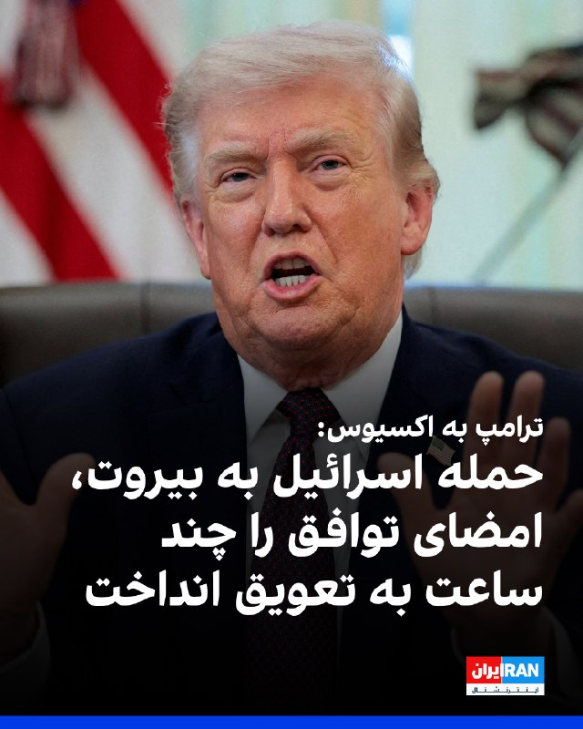

دونالد ترامپ، رییس‌جمهوری آمریکا، در گفت‌وگوی تلفنی با اکسیوس گفت حمله اسرائیل به بیروت روند امضای تفاهم‌نامه با جمهوری اسلامی را چند ساعت به تاخیر انداخته است.
به گزارش اکسیوس، ترامپ گفت زمانی که مشاورانش خبر حمله اسرائیل به بیروت را به او اطلاع دادند، شوکه شد و از بنیامین نتانیاهو، نخست‌وزیر اسرائیل، خشمگین شد.
ترامپ گفت: «این اوضاع را به‌هم ریخت. قرار بود همین الان توافق امضا شود، اما حالا برای چند ساعت دیگر برنامه‌ریزی شده است.»
او افزود حزب‌الله ابتدا به اسرائیل حمله کرده بود، اما این حمله هیچ خسارت یا تلفات جانی به همراه نداشت.
https://iranintl.com/202606147532

## IranIntlTV — post 342320

  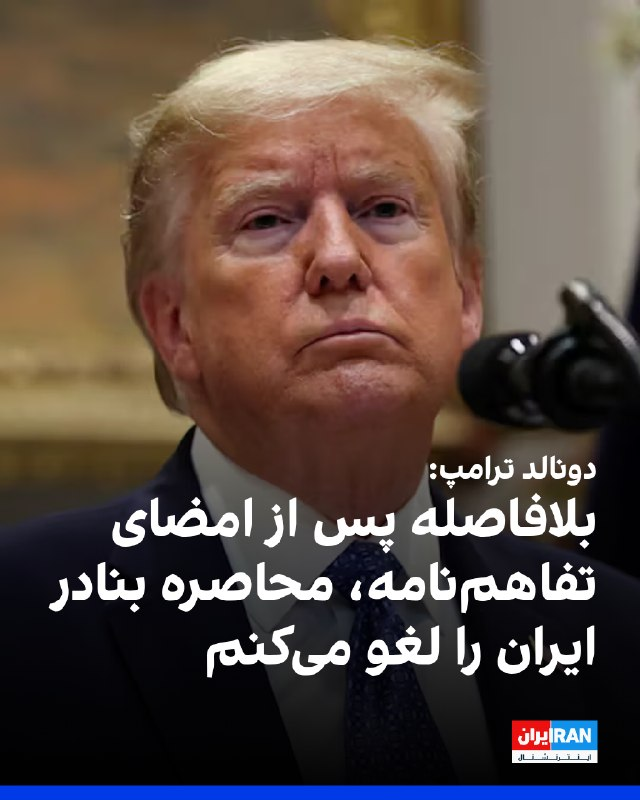

دونالد ترامپ، رییس‌جمهوری آمریکا، در ادامه گفت‌وگوی خود با فاکس نیوز گفت در صورت امضای تفاهم‌نامه با جمهوری اسلامی بلافاصله دستور لغو محاصره بنادر ایران را صادر خواهد کرد.
او افزود پس از امضای این تفاهم‌نامه، مذاکرات درباره جزییات برنامه هسته‌ای جمهوری اسلامی ادامه خواهد یافت.
ترامپ همچنین گفت مراسم امضای حضوری تفاهم‌نامه میان واشینگتن و تهران ممکن است هفته آینده در اروپا برگزار شود.
https://iranintl.com/202606143554

## IranIntlTV — post 342319

  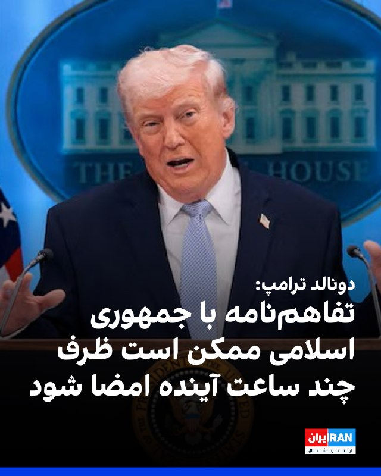

دونالد ترامپ، رییس‌جمهوری آمریکا، در گفت‌وگو با فاکس نیوز گفت معتقد است تفاهم‌نامه میان واشینگتن و تهران ظرف دو تا سه ساعت آینده به‌صورت الکترونیکی امضا خواهد شد. او همچنین گفت از جمهوری اسلامی خواهد خواست به حملات اسرائیل علیه حزب‌الله واکنش نشان ندهد.
ترامپ افزود حملات آمریکا به مواضع جمهوری اسلامی در اواسط هفته گذشته، تهران را به بازگشت به میز مذاکره وادار کرده است. او همچنین گفت مقام‌های جمهوری اسلامی در جریان این حملات با او تماس گرفتتند و خواستار توقف بمباران‌ها شدند.
https://iranintl.com/202606142178

## IranIntlTV — post 342318

  <a href="telegram/content/IranIntlTV_342318_1781460131.mp4" target="_blank">🎬 Download video</a>

🔻محمد تقوی، ایران اینترنشنال، در هت‌تریک گفت: «مردم نه‌تنها با تیم ملی احساس قرابت و نزدیکی نمی‌کنند، بلکه از آنها متنفرند. این موضوع دلایل متفاوتی دارد که یکی از آنها این است که بازیکنان بنده پول هستند؛ نه‌تنها امیر قلعه‌نویی، بلکه تمام بازیکنان گفته‌اند که باید تا پیش از شروع بازی‌ها پاداش را دریافت کنند. اگر بازیکنان و مربیان دلشان برای مردم می‌سوزد، بیایند بگویند پاداش ما به خانواده بچه‌های میناب اختصاص پیدا کند.»

@iranintltvsport

## IranIntlTV — post 342317

  <a href="telegram/content/IranIntlTV_342317_1781460133.mp4" target="_blank">🎬 Download video</a>

تیتر اول با نیوشا صارمی، یکشنبه ۲۴ خرداد
@iranintltv

## IranIntlTV — post 342316

  

علی مطهری، نایب‌رییس مجلس دهم، گفت بخشی از تجمعات علیه مذاکرات جمهوری اسلامی و آمریکا سازماندهی‌شده است و برخی گروه‌های سیاسی تلاش دارند این اعتراض‌ها را به سراسر کشور گسترش دهند.
او مخالفت با تعامل با آمریکا را ناشی از «برداشت‌های غلط» از سخنان روح‌الله خمینی و علی خامنه‌ای دانست.
مطهری همچنین گفت باید مراقب بود این بار در برابر توافق احتمالی کارشکنی نشود و همه جناح‌های سیاسی توجه داشته باشند که هر توافقی تنها با نظر مجتبی خامنه‌ای امضا خواهد شد.
او افزود مقام‌های جمهوری اسلامی بدون موافقت مجتبی خامنه‌ای نمی‌توانند هیچ توافقی را امضا کنند.
https://iranintl.com/202606148062

## IranIntlTV — post 342315

🔻تیم ملی فوتبال بامداد دوشنبه وارد لس‌آنجلس خواهند شد تا برای بازی بامداد سه‌شنبه با نیوزیلند در نخست گام در جام جهانی آماده شوند؛ نگرانی اصلی ملی‌پوشان، نحوه برخورد پلیس در فرودگاه و البته چگونگی استقبال شهروندان ایرانی در لس‌آنجلس است.

🔹توضیحات رضا محدث، خبرنگار ایران اینترنشنال

@iranintltvsport

## Shin_Persian — post 7072

سهیل مادرجنده اگه این کانالو می خونی جواب توییتمو بده ابن لواط

## Shin_Persian — post 7071

  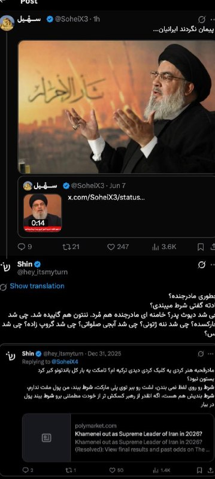

سهیل مادرجنده اگه این کانالو می خونی جواب توییتمو بده ابن لواط

## Shin_Persian — post 7070

  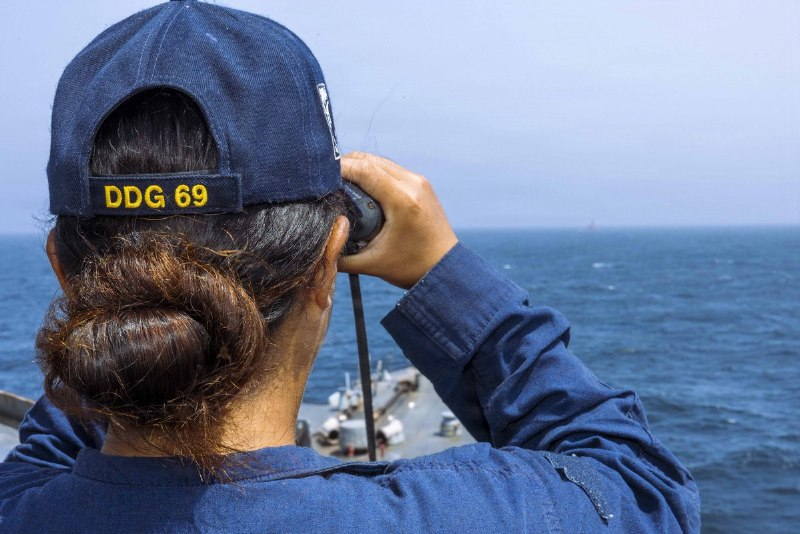

Shin ✓ @hey_itsmyturn
Sun, 14 Jun 2026 17:28:08 UTC

U.S. Central Command reports that as of June 14, forces enforcing the blockade against Iran have redirected 142 commercial ships and disabled 9 vessels that failed to comply.

Source: @CENTCOM
https://x.com/CENTCOM/status/2066211045740335312

ترجمه خودکار فارسی

فرماندهی مرکزی ایالات متحده (CENTCOM) گزارش می‌دهد که تا تاریخ ۱۴ ژوئن، نیروهای مجری محاصره علیه ایران، مسیر ۱۴۲ کشتی تجاری را تغییر داده و ۹ شناور را که از دستورات پیروی نکرده بودند، متوقف کرده‌اند.

منبع: @CENTCOM
https://x.com/CENTCOM/status/2066211045740335312

𝕏 · @shin_persian

## Shin_Persian — post 7069

Shin ✓ @hey_itsmyturn
Sun, 14 Jun 2026 17:25:42 UTC

Qatari delegation on the way to Islamabad

ترجمه خودکار فارسی

هیئت قطری در راه اسلام‌آباد

𝕏 · @shin_persian

## Shin_Persian — post 7068

↩️ Quoted tweet: ابراهیم عزیزی ✓ @Ebrahimazizi33 Sun, 14 Jun 2026 16:14:20 UTC Today’s crime by the Zionist regime in Dahieh, Beirut once again proved the U.S. is weak without credibility, as it is not even capable of controlling this illegitimate regime.…

## Shin_Persian — post 7067

↩️ Quoted tweet:
ابراهیم عزیزی ✓ @Ebrahimazizi33
Sun, 14 Jun 2026 16:14:20 UTC

Today’s crime by the Zionist regime in Dahieh, Beirut once again proved the U.S. is weak without credibility, as it is not even capable of controlling this illegitimate regime.
A strong response is coming.

↩️ توییت نقل‌قول شده — برای پاسخ، پست زیر را ببینید.

ترجمه خودکار فارسی

جنایت امروز رژیم صهیونیستی در ضاحیه بیروت بار دیگر ثابت کرد که ایالات متحده ضعیف و فاقد اعتبار است، چرا که حتی توانایی کنترل این رژیم نامشروع را ندارد.
پاسخی سخت در راه است.

𝕏 · @shin_persian

## Shin_Persian — post 7066

جلیلی درسته گویا

## Shin_Persian — post 7065

  

Shin ✓ @hey_itsmyturn
Sun, 14 Jun 2026 16:46:04 UTC

Initial:
Saeed Jalili, Iranian hardliner who has a huge anti-deal fanbase has been sacked from the Islamic Regime's Supreme National Security Council.

(Told you: https://sh1n.org/news/the-deal-the-trap-and-ghalibaf-waiting-behind-the-curtain)

ترجمه خودکار فارسی

سعید جلیلی، تندروی ایرانی که طرفداران پرشمارِ ضد-توافق دارد، از شورای عالی امنیت ملی رژیم اسلامی برکنار شده است.

(به شما گفته بودم: https://sh1n.org/news/the-deal-the-trap-and-ghalibaf-waiting-behind-the-curtain)

𝕏 · @shin_persian

## Shin_Persian — post 7064

می دونستید من موقعی که عصبی یا ناراحتم بیشتر شوخی میکنم؟ :))

## Shin_Persian — post 7063

  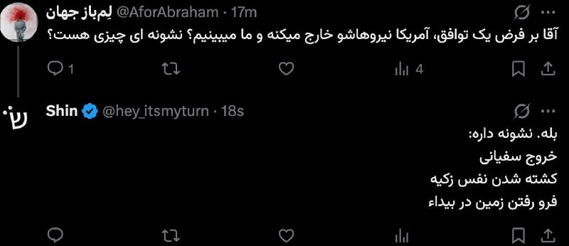

می دونستید من موقعی که عصبی یا ناراحتم بیشتر شوخی میکنم؟ :))

## ManotoTV — post 106063

  <a href="telegram/content/ManotoTV_106063_1781460138.mp4" target="_blank">🎬 Download video</a>

در حالی که ترامپ از نزدیک بودن توافق سخن می‌گوید و رویترز از پیش‌نویسی شامل آزادسازی دارایی‌های بلوکه‌شده، کاهش تحریم‌های نفتی و بازگشایی تنگه هرمز خبر داده، حمله اسرائیل به ضاحیه بیروت بار دیگر ابهام‌ها را افزایش داده است.

این مذاکرات در شرایطی جریان دارد که جمهوری اسلامی پس از ماه‌ها جنگ، فشارهای اقتصادی و بحران مشروعیت، با یکی از دشوارترین مقاطع تاریخ خود روبه‌روست.

## FarsiVOA — post 220706

  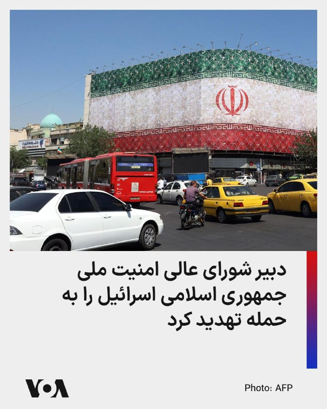

در پی پاسخ تلافی‌جویانه اسرائيل به حملات گروه تروریستی حزب‌الله، محمدباقر ذوالقدر، دبیر شورای عالی امنیت ملی جمهوری اسلامی، در بیانیه‌ای که خبرگزاری‌های حکومتی در ایران منتشر کردند، گفت «پاسخ رزمندگان اسلام در پیش است.» او گفت «لبنان جان ماست و نقض خطوط قرمز جمهوری اسلامی تحمل نخواهد شد.» این در حالی است که حکومت لبنان بارها آشکارا به جمهوری اسلامی گفته است که دست از مداخله در امور این کشور بر دارد. جوزف عون، رئیس‌ جمهوری لبنان، روز جمعه ۱۵ خرداد، در گفت‌و‌گویی ویژه با شبکه خبری سی‌ان‌ان در پیامی خطاب به سران جمهوری اسلامی گفت: «لبنان کشور شما نیست، بلکه کشور ما است.»

## FarsiVOA — post 220705

  <a href="telegram/content/FarsiVOA_220705_1781460139.mp4" target="_blank">🎬 Download video</a>

بازنشستگان تأمین اجتماعی روز یکشنبه ۲۴ خرداد ۱۴۰۵ در چند شهر از جمله تهران، اهواز، رشت، کرمانشاه و شوش تجمع اعتراضی برگزار کردند و با سر دادن شعارهایی علیه گرانی، تورم، مشکلات درمانی و عملکرد دولت و مجلس شورای اسلامی، خواستار رسیدگی به مطالبات معیشتی و صنفی خود شدند.

## FarsiVOA — post 220704

  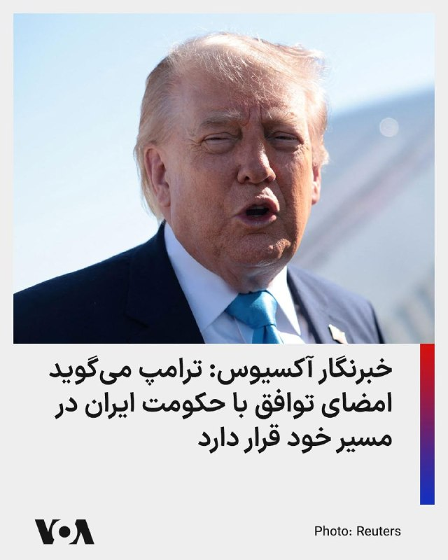

باراک راوید، خبرنگار آکسیوس گزارش داد که رئیس جمهوری آمریکا، دونالد ترامپ، در مصاحبه کوتاهی به او گفت که علیرغم حمله اسرائیل به بیروت و تهدید جمهوری اسلامی به تلافی، امضای توافق آمریکا و حکومت ایران در روز یکشنبه، هنوز در مسیر خود قرار دارد.

## FarsiVOA — post 220703

🔺 هشدار دانشجویان به مقامات جمهوری اسلامی: آماده «تحصن اعتراضی» هستیم

◾️جمعی از دانشجویان دانشگاه صنعتی خواجه نصیرالدین طوسی، با صدور بیانیه‌ای، به صدور حکم محرومیت از تحصیل چهار تن از فعالان دانشجویی این دانشگاه اعتراض کردند.

⬇️ بیشتر بخوانید:

https://ir.voanews.com/a/khajeh-nasir-university-students-protesting-iran-deprivation-of-education/8160706.html

## FarsiVOA — post 220702

🔺ارتش اسرائیل: دقدوق، از فرماندهان ارشد حزب‌الله، کشته شد

◾️ارتش اسرائیل از کشته شدن علی موسى دقدوق، یکی از فرماندهان ارشد سازمان تروریستی حزب‌الله و فرمانده پیشین «پرونده جولان» در جنوب لیتانی خبر داد.

⬇️ بیشتر بخوانید:

https://ir.voanews.com/a/ali-musa-daquq-killed-south-lebanon-senior-hezbollah-commander/8160703.html

## FarsiVOA — post 220701

در حالی که بسیاری از تیم‌های حاضر در جام جهانی مشغول آماده‌سازی فنی برای اولین مسابقه هستند، تیم ملی جمهوری اسلامی همچنان با حاشیه‌هایی از جنس پرچم شیر و خورشید، ویزا، پاداش‌ها و مسائل امنیتی در تیخوانا خبرساز است.

## DW_Farsi — post 125969

  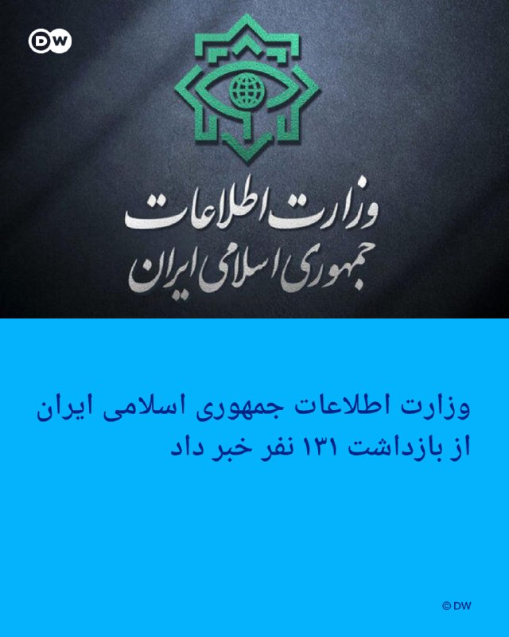

🔶وزارت اطلاعات جمهوری اسلامی ایران از بازداشت ۱۳۱ نفر خبر داد

به گزارش رسانه‌های داخل ایران وزارت اطلاعات جمهوری اسلامی با انتشار اطلاعیه‌ای از بازداشت دست‌کم ۱۳۱ نفر در استان‌های تهران، ایلام و سیستان و بلوچستان خبر داد. این وزارتخانه اعلام کرد که این افراد "به دلیل مشارکت در اعتراضات دی‌ماه ۱۴۰۴، فعالیت‌های جاسوسی و همکاری با گروه‌های مسلح مخالف نظام" بازداشت شده‌اند.

وزارت اطلاعات جمهوری اسلامی روز یکشنبه ۱۴ ژوئن (۲۴ خرداد) اعلام کرد که یک شهروند در استان ایلام بازداشت شده است. به ادعای این نهاد، فرد مزبور "به تلاش برای نفوذ به مراکز داده و انتقال اطلاعات به دشمن" متهم شده است.

این وزارتخانه مدعی است، فرد بازداشت‌شده در ایلام "با هدایت فردی مقیم بریتانیا، اقدام به جمع‌آوری اطلاعات و تلاش برای دسترسی به سامانه‌های رایانه‌ای و مراکز داده نهادهای مختلف کرده" و در این رابطه تجهیزاتی از جمله "یک دستگاه استارلینک، تجهیزات الکترونیکی و فتیله انفجاری از این فرد" کشف و ضبط شده است.

@dw_farsi

## DW_Farsi — post 125968

  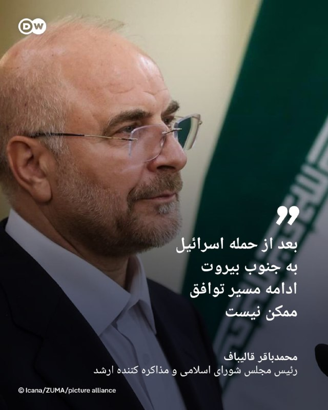

🔶 قالیباف: بعد از حمله اسرائیل به جنوب بیروت ادامه مسیر توافق ممکن نیست

در حالیکه دونالد ترامپ، رئیس جمهور آمریکا، گفته است که توافق میان تهران و واشنگتن امروز به امضا می‌رسد، محمدباقر قالیباف، مذاکره‌کننده ارشد جمهوری اسلامی در گفت‌وگوهای صلح با ایالات متحده، گفته است پس از حمله اسرائیل، به حومه جنوبی بیروت، "ادامه مسیر توافق با واشنگتن ممکن نیست".

او روز یکشنبه ۱۴ ژوئن (۲۴ خرداد) با انتشار پیامی در شبکه ایکس (توئیتر سابق) گفت که حمله تازه اسرائیل به ضاحیه "بار دیگر نشان داد که آمریکا یا اراده‌ای برای اجرای تعهدات خود ندارد یا توان آن را".

قالیباف به ایالات متحده هشدار داد که آمریکا نمی‌تواند به اسرائیل "چراغ سبز" نشان دهد و "از ایران امتیاز بگیرد".

نظام‌الدین موسوی، سخنگوی پیشین هیات رئیسه مجلس شورای اسلامی نیز پیامی مشابه در شبکه ایکس منتشر کرده بود و در مورد "تحقیر ایران" در صورت امضای توافق هشدار داده بود.

@dw_farsi

## Persian_Trend_Official — post 17087

کانال رسمی پرشین ترند pinned «تراست vpn رو چندین بار معرفی کردم قابل اعتمادن و میتونین ازشون خرید کنین ایندفعه علاوه بر کاهش قیمت مجدد قیمت روز از گیگی ۶ هزار تومن گذاشتن حتما بهشون پیام بدین و جزییاتشو بپرسین 👇👇👇 @trusstvpnn_admin @trusstvpnn_admin»

## Persian_Trend_Official — post 17086

  <a href="telegram/content/Persian_Trend_Official_17086_1781460143.mp4" target="_blank">🎬 Download video</a>

🇺🇸 یازده چترباز و یک خلبان پس از سقوط یک هواپیما در نزدیکی فرودگاه باتلر مموریال در ایالت میزوری جان خود را از دست دادند.

گفته شده هواپیما مدت کوتاهی پس از برخاستن به دلایل نامشخص تغییر مسیر داده و سپس در منطقه بزرگراه Business 49 سقوط کرده است.

👺Phantom

📌 @persian_trend_official
پرشین ترند | متفاوت‌ترین کانال نظامی

## Persian_Trend_Official — post 17085

  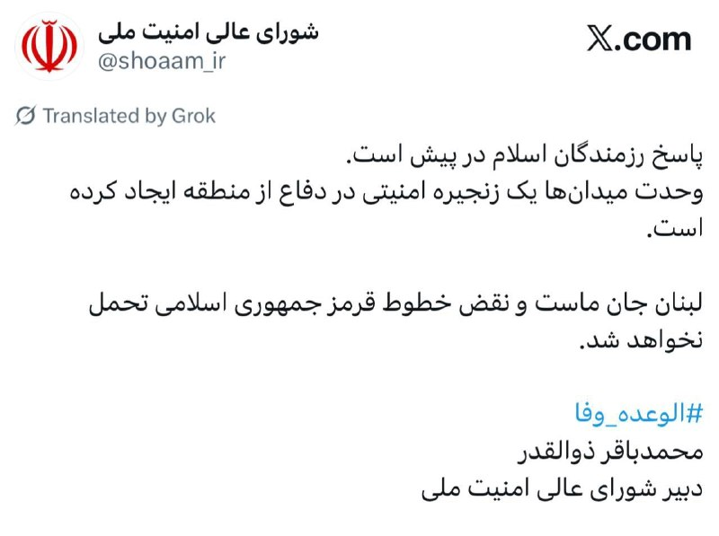

شورای عالی امنیت ملی: ‏پاسخ رزمندگان اسلام در پیش است!

محمدباقر ذوالقدر:‏ ‏پاسخ رزمندگان اسلام در پیش است. ‏وحدت میدان‌ها یک زنجیره امنیتی در دفاع از منطقه ایجاد کرده است.

لبنان جان ماست و نقض خطوط قرمز جمهوری اسلامی تحمل نخواهد شد.

📝 Amir

📌 @persian_trend_official
پرشین ترند | متفاوت‌ترین کانال نظامی

## Persian_Trend_Official — post 17084

تراست vpn رو چندین بار معرفی کردم
قابل اعتمادن و میتونین ازشون خرید کنین

ایندفعه علاوه بر کاهش قیمت مجدد قیمت روز از گیگی ۶ هزار تومن گذاشتن

حتما بهشون پیام بدین و جزییاتشو بپرسین
👇👇👇

@trusstvpnn_admin
@trusstvpnn_admin

## Persian_Trend_Official — post 17083

مقام ارشد اسرائیلی به کانال 12 اسرائیل گفت: از نظر ما، ایران مسئله ترامپ است و او حق دارد به دنبال توافق باشد، اما لبنان مسئله ماست.

ما نباید با معادله ایران موافقت کنیم، حتی اگر به قیمت رویارویی شدید با ایالات متحده تمام شود.

📝 Amir

📌 @persian_trend_official
پرشین ترند | متفاوت‌ترین کانال نظامی

## Persian_Trend_Official — post 17082

  

رئیس کمیسیون امنیت ملی مجلس: پاسخ به حمله امروز اسرائیل قطعی است.

📝 Amir

📌 @persian_trend_official
پرشین ترند | متفاوت‌ترین کانال نظامی

## Persian_Trend_Official — post 17081

سرلشکر عبداللهی: فرزندان ملت در نیروهای مسلح دست به ماشه آماده شلیک به قلب دشمن هستند، انتقام خون امام شهید هرگز فراموش نخواهد شد.

فرمانده قرارگاه مرکزی حضرت خاتم الانبیاء در پیامی تاکید کرد: توان رزمی ما تحت اوامر فرماندهی معظم کل قوا ارتقا یافته و فرزندان ملت در نیروهای مسلح دست به ماشه، آماده شلیک به قلب دشمن هستند.

متن این پیام به شرح ذیل است؛

ملت قهرمان ایران

مقاومت و بعثت دوباره شما، فصل نوینی را در تحولات بین‌الملل رقم زد و جمهوری اسلامی ایران را در قامت یک قدرت جهانی اثرگذار تثبیت کرد. فرزندان شما در نیروهای مسلح، به‌ویژه فرماندهان شهید که تربیت‌یافتگان اصیل مکتب امام خمینی و امام خامنه‌ای شهید بودند، از روز اول نهضت، بغض و عدوات با استکبار و صهیونیسم را جزئی جدانشدنی از ماهیت انقلاب اسلامی می‌دانستند و می‌دانند.

اتفاقات یک سال اخیر، از جنگ 12 روزه تا جنگ رمضان، علیرغم خسارت‌های سنگین و داغِ جانسوزِ شهادت امام شهید، فرماندهان و مردم بی‌گناه، یک فرصت بزرگ برای تسویه حساب تاريخی با جنایتکاران فراهم کرد؛ نیرو‌های مسلح به پشتوانه‌ی مردم و با عنایت الهی بر سر آن‌ها آوردند آنچه لایقشان بود.

اینک مقتدرانه اعلام می‌داریم: توان رزمی، دفاعی و قدرت موشکی، دریایی، پهپادی و پدافند هوایی ما پرقدرت‌تر از گذشته و تحت اوامر فرماندهی معظم کل قوا حضرت آیت‌الله ‌سید مجتبی حسینی خامنه‌ای مدظله‌العالی، ارتقا یافته و فرزندان ملت در نیروهای مسلح دست به ماشه، آماده شلیک به قلب دشمن هستند.

آرمان مقدس فتح قدس و انتقام خون امام شهید هرگز فراموش نخواهد شد؛ ما منتظر کوچک‌ترین لغزشی از سوی دشمن متجاوز هستیم تا درسی فراموش‌نشدنی و پایان‌بخش به آن‌ها بدهیم.

و ما النصر الا من عندالله العزیز الحکیم

📝 Amir

📌 @persian_trend_official
پرشین ترند | متفاوت‌ترین کانال نظامی

## Persian_Trend_Official — post 17080

دونالد ترامپ: مسئولیت عدم امضای توافق برعهده بی بی است!

ترامپ در مصاحبه‌ با شبکه 12 اسرائیل: من با نتانیاهو صحبت کردم و گفتم بی بی داری چیکار می‌کنی؟ خیلی از این حمله عصبانی هستم و اصلا نباید اتفاق می‌افتاد. بی بی هیچ اختیاری از خودش ندارد و من باید تصمیم بگیرم.

با ایران صحبت خواهم کرد تا حمله نکند،‌ بی بی توافقی که ما قرار است امروز امضا کنیم را به تعویق انداخت، ما باید تا چند ساعت اینده این توافق را امضا کنیم و مسئولیت عدم امضای امروز آن بر عهده خود بی بی است.

📝 Amir

📌 @persian_trend_official
پرشین ترند | متفاوت‌ترین کانال نظامی

## RadioFarda — post 158298

  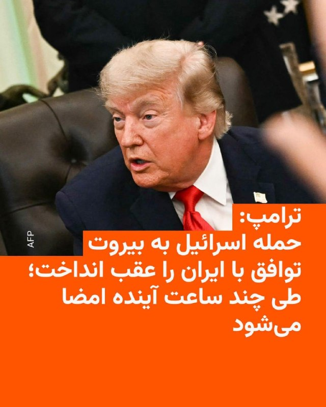

🔸دونالد ترامپ، رئیس‌جمهور آمریکا، روز یکشنبه گفت که با وجود حمله اسرائیل به بیروت، توافق صلح با ایران همچنان در مسیر امضا قرار دارد و قرار است ظرف چند ساعت آینده امضا شود؛ هرچند به گفته او، حمله اسرائیل اجرای این برنامه را به تأخیر انداخته است.

🔸او در گفت‌وگویی تلفنی با وب‌سایت اکسیوس گفت: «این اتفاق اوضاع را به هم ریخت. امضای توافق را چند ساعت به تأخیر انداخت. قرار بود همین حالا انجام شود. حالا برای چند ساعت دیگر برنامه‌ریزی شده است.»

🔸آقای ترامپ همزمان در گفت‌وگوی دیگری با شبکه فاکس‌نیوز خبر داد که توافق با ایران طی دو تا سه ساعت آینده به‌صورت الکترونیکی امضا خواهد شد.

🔸او همچنین اعلام کرد که از ایران خواهد خواست در واکنش به حملات اسرائیل که مواضع حزب‌الله را هدف قرار داد، اقدامی تلافی‌جویانه انجام ندهد.

🔸رئیس‌جمهور آمریکا ساعتی پیش در شبکه اجتماعی تروث سوشال گفت که حمله اسرائیل به حومه بیروت نباید انجام می‌شد و افزود دیگر نباید هیچ حمله‌ای از سوی اسرائیل در هیچ نقطه‌ای از لبنان صورت گیرد و حزب‌الله نیز نباید به اسرائیل حمله کند.

@RadioFarda

## IranianMinds — post 22579

🔴 ذوالقدر، دبیر شورای عالی امنیت ملی: لبنان جان ماست و پاسخ ما به حملات امروز تو راهه. @IranianMinds

## IranianMinds — post 22578

🔴 وزیر علوم :

تا ۲۰ تیر هیچ آزمونی در کشور انجام نمیشه.

@IranianMinds

## IranianMinds — post 22577

  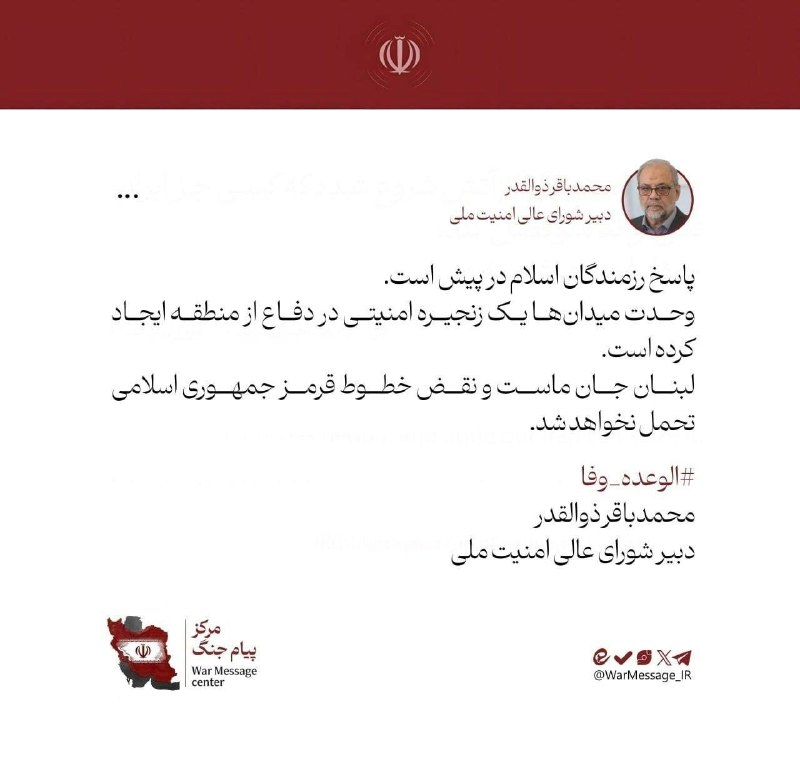

🔴 ذوالقدر، دبیر شورای عالی امنیت ملی:

لبنان جان ماست و پاسخ ما به حملات امروز تو راهه.

@IranianMinds

## IranianMinds — post 22576

  

متاسفانه در پی امضای توافق مجازی رهبر نتونستن این صفحه رو فعلا رد کنن و امضای توافق فعلا به تاخیر افتاده

@IranianMinds

## IranianMinds — post 22575

🔴 رسانه های اسرائیلی :

بر اساس ارزیابی اسرائیل، ترامپ به‌زودی امتیازی به ایران پیشنهاد خواهد کرد تا تهران در واکنش به حمله به ضاحیه بیروت دست به تلافی نزند.

جزئیات این امتیاز هنوز مشخص نیست.

@IranianMinds

## IranianMinds — post 22574

  <a href="telegram/content/IranianMinds_22574_1781460147.mp4" target="_blank">🎬 Download video</a>

🔴 فاکس نیوز :

بعد از حملات امروز اسرائیل به لبنان ترامپ با نتانیاهو تماس گرفت و گفت چه غلطی داری میکنی ؟!

@IranianMinds

## IranianMinds — post 22573

⭕️
⭕️ کانفیگای این ربات تو نت ملی وصله به محض استارت ۱ گیگابایت کانفیگ میده بدون هیچ هزینه ای و رفرالی کانفیگ رو تحویلتون میده با بهترین سرعت و بدون قطعی 
⭕️ ربات دریافت کانفیگ رایگان | @daeijoonbot 
⭕️ ربات دریافت کانفیگ رایگان | @daeijoonbot

## IranianMinds — post 22572

⭕️
⭕️ کانفیگای این ربات تو نت ملی وصله به محض استارت ۱ گیگابایت کانفیگ میده
بدون هیچ هزینه ای و رفرالی کانفیگ رو تحویلتون میده با بهترین سرعت و بدون قطعی

⭕️ ربات دریافت کانفیگ رایگان | @daeijoonbot

⭕️ ربات دریافت کانفیگ رایگان | @daeijoonbot

## IranianMinds — post 22571

  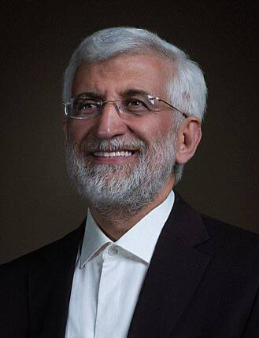

🔴 رسانه وابسته به سپاه صابرین نیوز :

سعید جلیلی از تمامی سمت های خودش برکنار شد.

@IranianMinds

## IranianMinds — post 22570

🔴 ترامپ :

چرا بی‌بی نتانیاهو باید آن حمله لعنتی رو انجام می‌داد؟ خیلی عصبانی شدم و این رو به خودش هم گفتم. اون هیچ قضاوت درستی نداره و این رو به خودش هم گفتم.

@IranianMinds

## IranianMinds — post 22569

🔴 ترامپ :

توافق با ایران رو اول از راه دور امضا میکنیم و یک هفته بعدش هم به صورت حضوری تو‌ اروپا هم امضاش میکنیم.

@IranianMinds

## IranianMinds — post 22568

  <a href="telegram/content/IranianMinds_22568_1781460150.mp4" target="_blank">🎬 Download video</a>

🔴 کارشناس شبکه افق:

این پاکستانی‌ ها اصلا برای میانجی‌گری به ایران نمیان، بلکه فقط میان و پیام های تهدید و‌ ترور آمریکاییارو میارن!

@IranianMinds

## IranianMinds — post 22567

  

🔴 ترامپ :

از ایران درخواست میکنم که به فکر توافق باشه و به حملات امروز به بیروت پاسخی نده !

@IranianMinds

## IranianMinds — post 22566

  <a href="telegram/content/IranianMinds_22566_1781460152.webm" target="_blank">🎬 Download video</a>

بازی های #جام_جهانی رو بدون استرس و کمترین ریسک ممکن پیش بینی کن.

⭕️ ⚽ آلمان 🟢 کوراسائو

⭕️ ⚽ هلند 🟢 ژاپن

💳 حسابتو برای این بازی در #رومابت با ارز دیجیتال شارژ کن 
🅰️
🅰️
🅰️ شارژ اضافی بگیر ✅

💰 10% کش بک روی تیم محبوبت

💰   100% بونوس خوشامدگویی

🎁 20% کش بک بازی های کازینویی و انفجار

🔥   همراه با درگاه‌ #ریالی
#RomaBet

📣‌ #بدون_احراز_هویت

1️⃣
2️⃣
3️⃣
4️⃣   
1️⃣
2️⃣
3️⃣
4️⃣

⛔در صورت فیلتر بودن از طریق VPN غیر از سرور انگلیس ( سرور 
🇺🇸 
🇩🇪 
🇨🇦
🇫🇮
🇹🇷
👇
👇 )

🇪🇺 https://trentivo6402.bar

✅کانال تلگرامی #رومابت 24
👇

🔵 @Romabet_official

## IranianMinds — post 22565

🔴ترامپ به فاکس‌نیوز:

در صورت امضای تفاهم‌نامه با ایران، بلافاصله دستور لغو محاصره بنادر ایران صادر خواهد شد.

@IranianMinds

## IranianMinds — post 22564

🔴ترامپ به اکسیوس:

ما قرار بود امروز صبح این توافق‌نامه را امضاء بکنیم ولی حمله اسرائیل به بیروت آن‌را به تأخیر انداخت. به نظر می‌رسد تا چند ساعت آینده این توافق‌نامه امضاء بشود.

@IranianMinds

## BBCPersian — post 283806

  <a href="https://t.me/bbcpersian/283806" target="_blank">📎 Download file</a>

پادکست جام جهان‌نما، یکشنبه ۲۴ خرداد ۱۴۰۵

این برنامه رادیویی را می‌توانید هرشب ساعت ۲۰ به وقت ایران، روی موج متوسط ۷۰۲ کیلوهرتز و موج کوتاه ۹۴۶۵ کیلوهرتز بشنوید.تکرار برنامه را هم می‌توانید ساعت ۲۱:۳۰ روی موج متوسط ۷۰۲ کیلوهرتز و موج کوتاه ۵۳۹۵ کیلوهرتز گوش کنید.

@BBCPersian

## BBCPersian — post 283805

  <a href="telegram/content/BBCPersian_283805_1781460152.mp4" target="_blank">🎬 Download video</a>

‏⚽️موضوع پرچم ایران در جریان مسابقات جام جهانی ۲۰۲۶ به مناقشه‌ای داغ میان مقامات جمهوری اسلامی، چهره‌های مخالف و فیفا تبدیل شده است.

‏مهدی تاج، رئیس فدراسیون فوتبال ایران امروز با تاکید بر مسئولیت فیفا بر رعایت پروتکل‌ها از جمله پرچم رسمی ایران، درباره کارشکنی آمریکا ابراز نگرانی کرد.

‏فیفا پیشتر ورود پرچم‌های غیررسمی به ورزشگاه‌ها را ممنوع اعلام کرده بود. با این‌حال مخالفان جمهوری اسلامی برای تجمع با پرچم شیروخورشیدنشان در مقابل هتل محل اقامت تیم ملی در لس‌‌آنجلس یا استفاده از موبایل برای نمایش دیجیتالی این پرچم در ورزشگاه برنامه‌هایی اعلام کرده‌اند.

‏شاهزاده رضا پهلوی در آستانه نخستین مسابقه تیم ملی در اظهارنظری واکنش‌برانگیز در حساب ایکس خود نوشت: «تیم واقعی ایران، مردم شجاع ایران‌اند؛ نه نمایندگان رژیم جنایتکار و اشغالگر ایران.»

‏بااینحال بیانیه‌ای صوتی از سوی گروهی از زندانیان سیاسی پادشاهی‌خواه منتشر شده است که در آن ضمن آرزوی موفقیت برای تیم ملی ایران، از آنها و تماشاگران خواسته شده است تا به جای پرچم کنونی، «پرچم شیروخورشیدنشان را به اهتزاز درآوردند.»
@bbcpersian

## Dirty_Kids — post 392030

  <a href="telegram/content/Dirty_Kids_392030_1781460155.mp4" target="_blank">🎬 Download video</a>

رکورد بیشترین کتلت در کمترین زمان 😅

@Dirty_Kids 👻

## Dirty_Kids — post 392029

  <a href="telegram/content/Dirty_Kids_392029_1781460156.mp4" target="_blank">🎬 Download video</a>

حتی توی تل‌آویو هم فهمیدن، مشتقوا قبلا چیکاره بوده 😂🔥

@Dirty_Kids 👻

## Dirty_Kids — post 392028

من که می‌گم قالیباف اصلا خورشتی خوردش کرده، برده گذاشته فریزر خونه‌ش.

@Dirty_Kids 👻

## Dirty_Kids — post 392027

  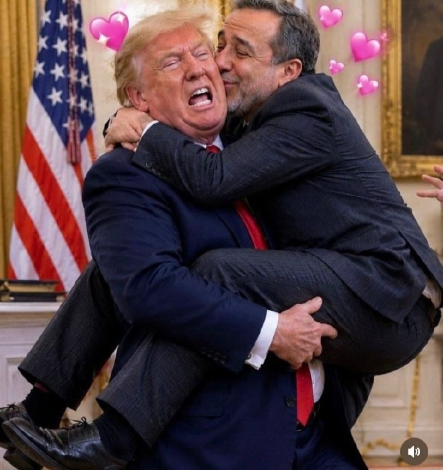

نکن عباس جاش میمونه 💕😂

@Dirty_Kids 👻

## Dirty_Kids — post 392026

🔴 فوری، دکمه سیکتیر سعید جلیلی زده شد😂 سردار عظیم ابراهیم پور، فرمانده قرارگاه پیشرفت سپاه رسما اعلام کرد که باقری کنی جایگزین سعید جلیلی توی شعام شده. @Dirty_Kids 👻

## Dirty_Kids — post 392025

  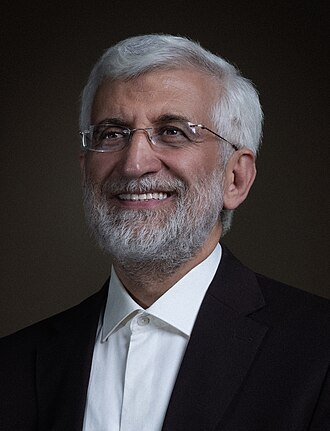

🔴 فوری، دکمه سیکتیر سعید جلیلی زده شد😂

سردار عظیم ابراهیم پور، فرمانده قرارگاه پیشرفت سپاه رسما اعلام کرد که باقری کنی جایگزین سعید جلیلی توی شعام شده.

@Dirty_Kids 👻

## Dirty_Kids — post 392024

  <a href="telegram/content/Dirty_Kids_392024_1781460157.mp4" target="_blank">🎬 Download video</a>

گراز میگه: ممد باقر زده تو گوشِ "وُتکاف"!!!
وُتکاف دیگه کیه بی‌پدر‌مادراااااا

@Dirty_Kids 👻

## Dirty_Kids — post 392023

  <a href="telegram/content/Dirty_Kids_392023_1781460159.mp4" target="_blank">🎬 Download video</a>

خار سازندشو گاییدم😂😂😂
این چه جا سیگاریه سمیههه

@Dirty_Kids 👻

## Dirty_Kids — post 392022

  <a href="telegram/content/Dirty_Kids_392022_1781460160.mp4" target="_blank">🎬 Download video</a>

خوب پس که ورود پرچم شیر و خورشید به استادیوم رو ممنوع میکنید؟

@Dirty_Kids 👻

## Dirty_Kids — post 392021

  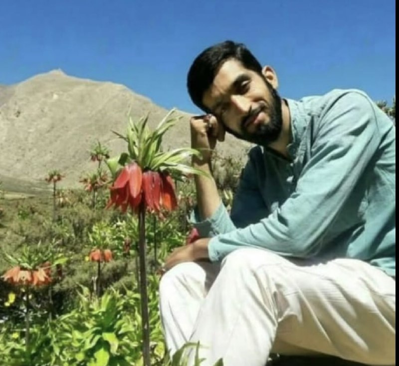

هم سرش رفت
هم زنش رفت
هم حجاب رفت
هم حرم رفت
هم بشار رفت
هم حسن نصرالاغ رفت
هم خامنه‌ای رفت
هم هسته‌ای رفت
هم شاشیدن تو ایدئولوژی مقاومت
هم تسلیم قاتل رهبرشون شدن
شیعه تا ابد لوزر

@Dirty_Kids 👻

## Dirty_Kids — post 392020

⚡️ جام جهانی شروع شده و میدون مال توئه! 
🌟 این #جام_جهانی رو فقط باید توی #بت فیدو پیش‌بینی کنی 
💰 با ۵۰ میلیون تومان شرط روزانه ← ۴ میلیون تومان اعتبار شرط‌بندی رایگان 
📊 با ۱۰۰ میلیون تومان شرط روزانه ← ۸ میلیون تومان اعتبار شرط‌بندی رایگان میدونستی با انتخاب…

## Dirty_Kids — post 392019

  <a href="telegram/content/Dirty_Kids_392019_1781460163.webm" target="_blank">🎬 Download video</a>

⚡️ جام جهانی شروع شده و میدون مال توئه!

🌟 این #جام_جهانی رو فقط باید توی #بت فیدو پیش‌بینی کنی

💰 با ۵۰ میلیون تومان شرط روزانه ← ۴ میلیون تومان اعتبار شرط‌بندی رایگان

📊 با ۱۰۰ میلیون تومان شرط روزانه ← ۸ میلیون تومان اعتبار شرط‌بندی رایگان

میدونستی با انتخاب برد هلند مقابل ژاپن با پنج میلیون به راحتی ده میلیون تومن برنده میشی؟!😮
💵
💵
🇯🇵
🇳🇱

💸 هرچی بزرگ‌تر بازی کنی، جایزت بزرگ‌تره!

🥅همین حالا پیش بینیتو ثبت کن
💖
https://fido874vt.click
https://fido874vt.click

👆
👆
👆
👆
👆
(ورود با وی-پی-ان غیر اروپایی)
❌
G24

📲کانال تلگرام 
👇
https://t.me/+dySI_QFj0T0xZGVk

## Hranews — post 113615

  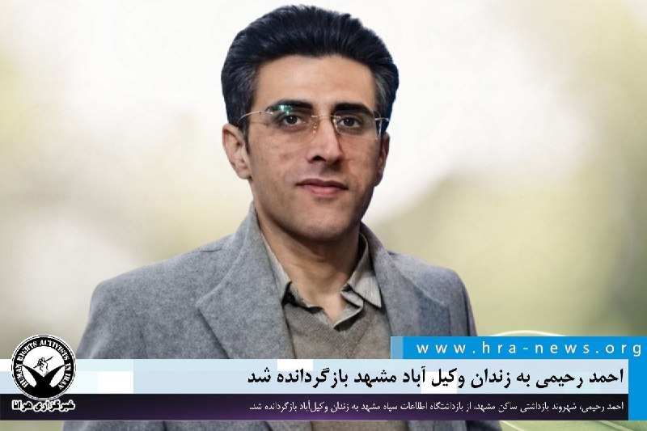

احمد رحیمی به زندان وکیل آباد مشهد بازگردانده شد

❗️
❗️
❗️
❗️
❗️– احمد رحیمی، شهروند بازداشتی ساکن مشهد، پس از ۳۰ روز از بازداشتگاه اطلاعات سپاه مشهد به زندان وکیل‌آباد بازگردانده شد.

به گزارش خبرگزاری هرانا، ارگان خبری مجموعه فعالان حقوق بشر در ایران، احمد رحیمی، به زندان وکیل آباد مشهد بازگردانده شد.

براساس اطلاعات دریافتی هرانا، آقای رحیمی امروز یکشنبه ۲۴ خرداد ۱۴۰۵، از بازداشتگاه اطلاعات سپاه مشهد به زندان وکیل آباد این شهرستان بازگردانده شد. این زندانی در تاریخ ۲۶ ادیبهشت‌ماه، جهت بازجویی به این نهاد امنیتی منتقل و در این مدت در سلول انفرادی نگهداری شده بود.

ادامه مطلب

#احمد_رحیمی

↘️
@hranews_bot تماس ✉️ - @Hranews کانال هرانا 🆑

## Hranews — post 113614

گزارشی از معوقات مزدی و مشکلات کارگران کارخانه فولاد سیادن ابهر

❗️
❗️
❗️
❗️
❗️– حدود ۲۸۰ کارگر شاغل در کارخانه فولاد سیادن ابهر، دو ماه مطالبات مزدی پرداخت‌نشده دارند. این #کارگران همچنین از نامناسب بودن شرایط ایمنی و بهداشتی محیط کار خود گلایه‌مند هستند.

ادامه مطلب

↘️
@hranews_bot تماس ✉️ - @Hranews کانال هرانا 🆑

## Hranews — post 113613

  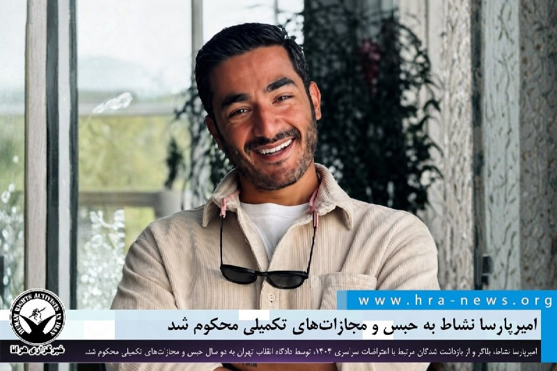

امیرپارسا نشاط به حبس و مجازات‌های تکمیلی محکوم شد

❗️
❗️
❗️
❗️
❗️– امیرپارسا نشاط، بلاگر و از بازداشت شدگان مرتبط با اعتراضات سراسری ۱۴۰۴، توسط دادگاه انقلاب تهران به دو سال حبس و سه سال محرومیت از حضور در شبکه‌های اجتماعی و استفاده از تلفن همراه هوشمند محکوم شد.

به گزارش خبرگزاری هرانا، ارگان خبری مجموعه فعالان حقوق بشر در ایران، امیرپارسا نشاط، یکی از بازداشت شدگان مرتبط با اعتراضات سراسری ۱۴۰۴، به حبس و مجازات‌های تکمیلی محکوم شد.

آقای نشاط توسط دادگاه انقلاب تهران به دو سال حبس و سه سال محرومیت از فعالیت در شبکه‌های اجتماعی و استفاده از تلفن همراه هوشمند محکوم شد. بر اساس مفاد رای صادره، یک‌بیستم از مجازات حبس قابل اجرا است و باقیمانده آن به مدت سه سال به حالت تعلیق درآمده است.

ادامه مطلب

#امیرپارسا_نشاط

↘️
@hranews_bot تماس ✉️ - @Hranews کانال هرانا 🆑

## Hranews — post 113612

  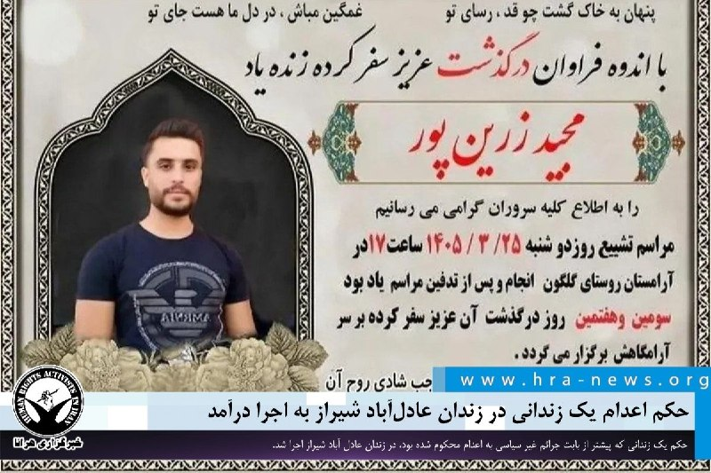

حکم اعدام یک زندانی در زندان عادل‌آباد شیراز به اجرا درآمد

❗️
❗️
❗️
❗️
❗️– سحرگاه امروز یکشنبه، حکم یک زندانی که پیشتر از بابت جرائم غیر سیاسی به #اعدام محکوم شده بود، در زندان عادل آباد شیراز اجرا شد.

به گزارش خبرگزاری هرانا، ارگان خبری مجموعه فعالان حقوق بشر در ایران، یک زندانی در زندان عادل آباد شیراز اعدام شد.

هویت این زندانی که سحرگاه امروز یکشنبه ۲۴ خرداد ۱۴۰۵ به چوبه دار آویخته شد، مجید زرین پور، توسط هرانا احراز شده است.

ادامه مطلب

#مجید_زرین_پور

↘️
@hranews_bot تماس ✉️ -  @Hranews  کانال هرانا 🆑

## manototv — post 106063

  <a href="telegram/content/manototv_106063_1781460165.mp4" target="_blank">🎬 Download video</a>

در حالی که ترامپ از نزدیک بودن توافق سخن می‌گوید و رویترز از پیش‌نویسی شامل آزادسازی دارایی‌های بلوکه‌شده، کاهش تحریم‌های نفتی و بازگشایی تنگه هرمز خبر داده، حمله اسرائیل به ضاحیه بیروت بار دیگر ابهام‌ها را افزایش داده است.

این مذاکرات در شرایطی جریان دارد که جمهوری اسلامی پس از ماه‌ها جنگ، فشارهای اقتصادی و بحران مشروعیت، با یکی از دشوارترین مقاطع تاریخ خود روبه‌روست.

## alonews — post 127969

  <a href="telegram/content/alonews_127969_1781460166.mp4" target="_blank">🎬 Download video</a>

👈درخواست اعدام عراقچی توسط تجمع کنندگان تندرو:

🔴عراقچی بی غیرت اعدام باید گردد!

✅ @AloNews خبر جنگ

## alonews — post 127968

  <a href="telegram/content/alonews_127968_1781460167.webm" target="_blank">🎬 Download video</a>

🔴فووری/ دبیر شورای‌ عالی امنیت ملی:
پاسخ ایران به اسرائیل در راه است

✅ @AloNews خبر جنگ

## alonews — post 127967

  <a href="telegram/content/alonews_127967_1781460167.webm" target="_blank">🎬 Download video</a>

👈سنتکام : مسیر ۱۴۲ تا کشتی تجاری که تغییر دادیم؛ ۹ تا کشتی که همکاری نکردن رو متوقف یا از کار انداختیم

✅ @AloNews خبر جنگ

## alonews — post 127966

  <a href="telegram/content/alonews_127966_1781460168.webm" target="_blank">🎬 Download video</a>

👈کانال ۱۲عبری: مقامات اسرائیلی ارزیابی می‌کنند که ترامپ به زودی پیشنهادی به ایران ارائه خواهد داد تا در ازای اجتناب از واکنش به حمله بیروت، امتیازی بدهد.

✅ @AloNews خبر جنگ

## alonews — post 127965

  <a href="telegram/content/alonews_127965_1781460168.webm" target="_blank">🎬 Download video</a>

👈طبق گزارشات اختلال هر ۴ بانک که مورد حمله سایبری قرار گرفته بودند، رفع شد

✅ @AloNews خبر جنگ

## alonews — post 127964

  <a href="telegram/content/alonews_127964_1781460168.webm" target="_blank">🎬 Download video</a>

👈اسرائیل سطح هشدار را افزایش داد

✅ @AloNews خبر جنگ

## alonews — post 127963

  <a href="telegram/content/alonews_127963_1781460168.webm" target="_blank">🎬 Download video</a>

👈دو سرباز ارتش اسرائیل در جنوب لبنان بر اثر آتش حزب‌الله زخمی شدند — یکی با جراحات متوسط و دیگری با جراحات خفیف — گزارش کانال ۱۴

✅ @AloNews خبر جنگ

## alonews — post 127962

  <a href="telegram/content/alonews_127962_1781460169.webm" target="_blank">🎬 Download video</a>

👈سخنگوی فدراسیون فوتبال: روادید تیم ملی ایران در آمریکا ساعتی نیست

✅ @AloNews خبر جنگ

## alonews — post 127961

  <a href="telegram/content/alonews_127961_1781460169.webm" target="_blank">🎬 Download video</a>

👈لارنس نورمن خبرنگار وال استریت ژورنال: در عرض دو هفته، ترامپ از این موضع که «لبنان از موضوع ایران جداست» به این موضع رسیده که «لبنان مرتبط است اما اسرائیل حق پاسخگویی دارد» و بعد به این موضع که «لبنان مرتبط است ولی من فکر نمی‌کنم اسرائیل حق پاسخگویی داشته باشد چون باید توافق را منعقد کنیم»

✅ @AloNews خبر جنگ

## alonews — post 127960

  <a href="telegram/content/alonews_127960_1781460169.webm" target="_blank">🎬 Download video</a>

👈خضریان، نماینده مجلس: ارتباط واتساپی عراقچی با ویتکاف باید کاملاً قطع شود!

✅ @AloNews خبر جنگ

## alonews — post 127959

  <a href="telegram/content/alonews_127959_1781460169.webm" target="_blank">🎬 Download video</a>

🔴فوری / الحدث : هئیت قطری هم اکنون به سمت اسلام آباد در حرکت است

✅ @AloNews خبر جنگ

## alonews — post 127958

  <a href="telegram/content/alonews_127958_1781460170.webm" target="_blank">🎬 Download video</a>

👈سفیر امریکا در سازمان ملل،مایک والتز: ایرانی‌ها مذاکره‌کنندگانی فوق‌العاده سرسخت هستند

✅ @AloNews خبر جنگ

## alonews — post 127957

  <a href="telegram/content/alonews_127957_1781460170.webm" target="_blank">🎬 Download video</a>

👈سرلشکر عبداللهی: فرزندان ملت در نیروهای مسلح «دست به ماشه» آماده شلیک به قلب دشمن هستند

✅ @AloNews خبر جنگ

## alonews — post 127956

  <a href="telegram/content/alonews_127956_1781460170.webm" target="_blank">🎬 Download video</a>

👈 ترامپ به اکسیوس: توافق به نفع اسرائیل خواهد بود زیرا مانع از دستیابی ایران به سلاح هسته‌ای می‌شود و این کشور را ملزم به از بین بردن مواد هسته‌ای می‌کند

✅ @AloNews خبر جنگ

## alonews — post 127955

  <a href="telegram/content/alonews_127955_1781460170.webm" target="_blank">🎬 Download video</a>

🔴فوری/رئیس کمیسیون امنیت ملی مجلس: پاسخ به حمله امروز اسرائیل توسط جبهه مقاومت قطعی است

✅ @AloNews خبر جنگ

## alonews — post 127954

  <a href="telegram/content/alonews_127954_1781460170.webm" target="_blank">🎬 Download video</a>

👈وزیر امنیت داخلی اسرائیل، بن گویر :
آقای نخست‌وزیر، قوی باش و نترس

✅ @AloNews خبر جنگ

## alonews — post 127953

  <a href="telegram/content/alonews_127953_1781460171.webm" target="_blank">🎬 Download video</a>

👈رادیو ارتش اسرائیل: طبق برآورد ارتش، ایران به حمله در ضاحیه بیروت پاسخ نخواهد داد.دو جنگنده چهار بمب دقیق را در حمله به ضاحیه رها کردند

✅ @AloNews خبر جنگ

## alonews — post 127951

  <a href="telegram/content/alonews_127951_1781460171.webm" target="_blank">🎬 Download video</a>

🔴فوری / ترامپ به فاکس نیوز: اگر توافق امشب امضا شود، فوراً دستور لغو محاصره دریایی ایران را خواهم داد. 
✅ @AloNews خبر جنگ

## alonews — post 127950

  <a href="telegram/content/alonews_127950_1781460171.webm" target="_blank">🎬 Download video</a>

🔴فوری / ترامپ به فاکس نیوز:
اگر توافق امشب امضا شود، فوراً دستور لغو محاصره دریایی ایران را خواهم داد.

✅ @AloNews خبر جنگ

## alonews — post 127949

  <a href="telegram/content/alonews_127949_1781460171.webm" target="_blank">🎬 Download video</a>

👈ترامپ درمورد حمله اسرائیل به بیروت: واقعا من را عصبانی کرد

✅ @AloNews خبر جنگ

---
📅 بروزرسانی: 1405/03/24 19:50
---

## VahidOOnLine — post 245504

  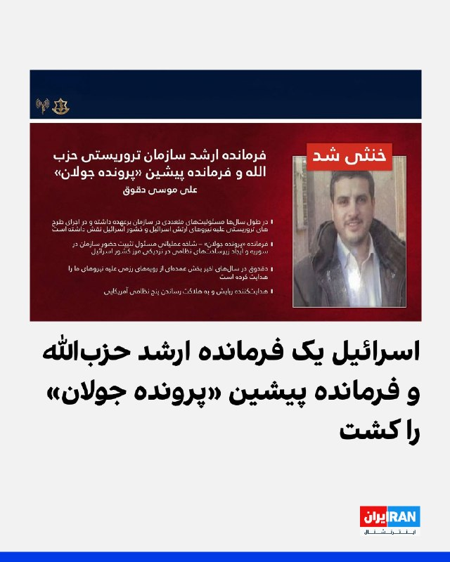

ارتش اسرائیل در بیانیه‌ای تایید کرد علی موسی دقدوق، از فرماندهان ارشد حزب‌الله، در حمله‌ای در جنوب رود لیتانی لبنان کشته شده است.
به گفته ارتش اسرائیل، دقدوق فرمانده پیشین «پرونده جولان» بود؛ شاخه‌ای که مسئول فعالیت‌های حزب‌الله در سوریه و ایجاد زیرساخت‌های نظامی در نزدیکی مرز اسرائیل بوده است.
ارتش اسرائیل همچنین اعلام کرد دقدوق در طول فعالیت خود سمت‌های مختلفی از جمله فرمانده تیم حفاظت حسن نصرالله، رهبر پیشین حزب‌الله، فرمانده یگان رضوان، فرمانده بخش عملیات یگان نصر و مسئول یگان پیاده‌نظام حزب‌الله را بر عهده داشته است.
‌🏁 🇬🇧 IranintlTV

🤖 @VahidOOnLine

## VahidOOnLine — post 245503

  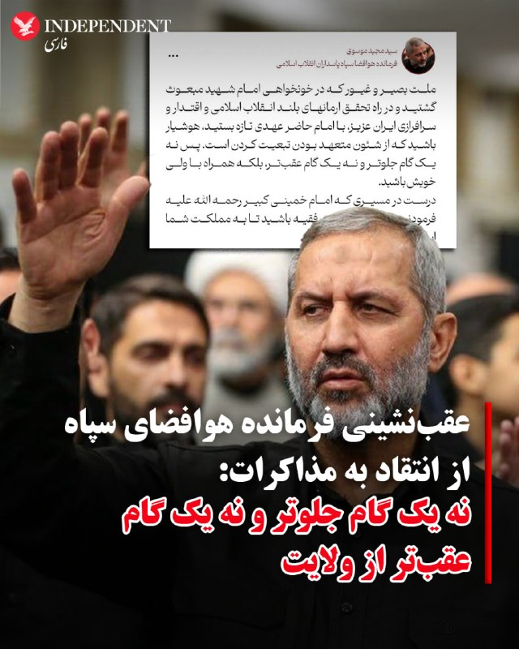

♦️مجید موسوی، فرمانده نیروی هوافضای سپاه پاسداران، روز یکشنبه ۲۴ خرداد در پیامی از حامیان حکومت خواست «گوش به فرمان ولایت» باشند و از هر سخنی که اتحاد را به خطر می‌اندازد، دوری کنند.
موسوی نوشت: «هوشیار باشید که از شئون متعهد بودن تبعیت کردن است. پس نه یک گام جلوتر و نه یک گام عقب‌تر، بلکه همراه با ولی خویش باشید.»
این اظهارات دو روز پس از آن مطرح می‌شود که موسوی با بازنشر پیام عباس عراقچی در شبکه اجتماعی ایکس، نسبت به علنی نشدن جزئیات تفاهم‌نامه احتمالی میان تهران و واشنگتن اعتراض کرده بود.
پیام جدید فرمانده هوافضای سپاه ساعاتی پس از آن منتشر شد که مسعود پزشکیان، رئیس‌جمهوری ایران، از تلاش برخی جریان‌ها برای اعمال فشار بر روند تصمیم‌گیری انتقاد کرد و گفت: «تصمیم‌گیری درباره جنگ و مذاکره بر عهده شورای عالی امنیت ملی است؛ شورایی که نمایندگان تمامی ارکان حاکمیت از جمله رهبری عالیقدر در آن حضور دارند و سیاست‌های کلان باید از آن مسیر ابلاغ شود
‌🇸🇦 Indypersian

🤖 @VahidOOnLine

## VahidOOnLine — post 245502

  <a href="telegram/content/VahidOOnLine_245502_1781454030.mp4" target="_blank">🎬 Download video</a>

ویدیوهای رسیده به ایران‌اینترنشنال نشان می‌دهند گروهی از ایرانیان مقیم آلمان یکشنبه ۲۴ خرداد با فراخوان شاهزاده رضا پهلوی و علیه جمهوری اسلامی در شهر کلن تجمع کردند.
‌🏁 🇬🇧 IranintlTV

🤖 @VahidOOnLine

## VahidOOnLine — post 245501

  

مجید موسوی، فرمانده نیروی هوافضای سپاه پاسداران، در پیامی از حامیان جمهوری اسلامی خواست در مسیر تحقق آرمان‌های نظام، از مجتبی خامنه‌ای تبعیت کنند.
او نوشت: «ملت بصیر و غیور که در خونخواهی علی خامنه‌ای مبعوث شدید و در راه تحقق آرمان‌های بلند انقلاب اسلامی با مجتبی خامنه‌ای عهدی تازه بستید، هوشیار باشید که از شئون متعهد بودن، تبعیت کردن است.»
‌🏁 🇬🇧 IranintlTV

🤖 @VahidOOnLine

## VahidOOnLine — post 245500

  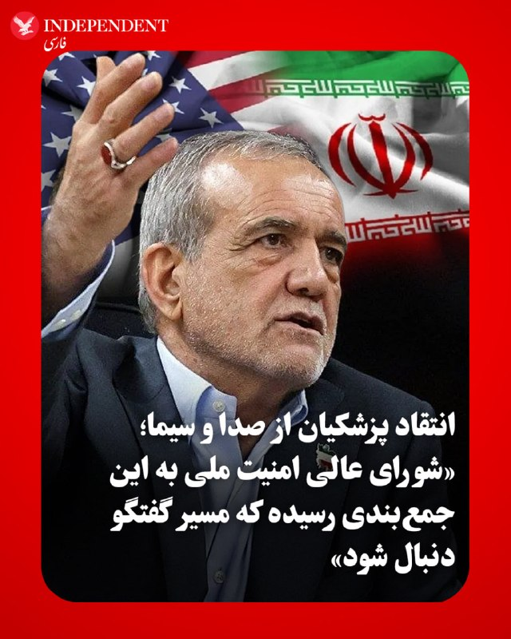

♦️مسعود پزشکیان، رئیس‌جمهوری ایران، روز یکشنبه ۲۴ خرداد گفت: «شورای عالی امنیت ملی به این جمع‌بندی رسیده است که مسیر گفتگو باید دنبال شود.»
او در ادامه با انتقاد از حملات به اعضای تیم مذاکره‌کننده گفت افرادی که در چارچوب ماموریت‌های رسمی و با هدف صیانت از منافع ملی فعالیت می‌کنند، نباید با برچسب‌هایی مانند «خیانت» یا «وطن‌فروشی» مواجه شوند و تخریب کسانی که بر اساس قانون مأموریت دارند، به دور از «انصاف و مردانگی» است.
پزشکیان در بخش دیگری از سخنانش تصریح کرد برخی اظهارات مطرح‌شده در صدا و سیما درباره جنگ و مذاکره، لزوما بازتاب‌دهنده دیدگاه شورای عالی امنیت ملی، شورای عالی دفاع یا رهنمودهای رهبر جمهوری اسلامی نیست.
رئیس‌جمهوری ایران همچنین هشدار داد که نمی‌توان خواسته‌ها و برداشت‌های شخصی را به‌عنوان مطالبه عمومی مطرح کرد و با فشار رسانه‌ای یا سیاسی درصدد تحمیل آن بر ساختار تصمیم‌گیری کشور برآمد.
انتقادهای پزشکیان در حالی مطرح می‌شود که شنبه‌شب، گروهی از حامیان جمهوری اسلامی، در آستانه امضای توافق میان تهران و واشنگتن، با متهم کردن محمدباقر قالیباف، رییس مجلس شورای اسلامی و عباس عراقچی، وزیر امور خارجه، به دادن «امتیازهای بیش از حد به آمریکا» در مذاکرات، خواستار استعفای آنها شدند. حامیان حکومت شعار «قالیباف، عراقچی، پس خون رهبرم چی؟» و «مرگ بر سازش‌گر» سر دادند.
‌🇸🇦 Indypersian

🤖 @VahidOOnLine

## VahidOOnLine — post 245499

  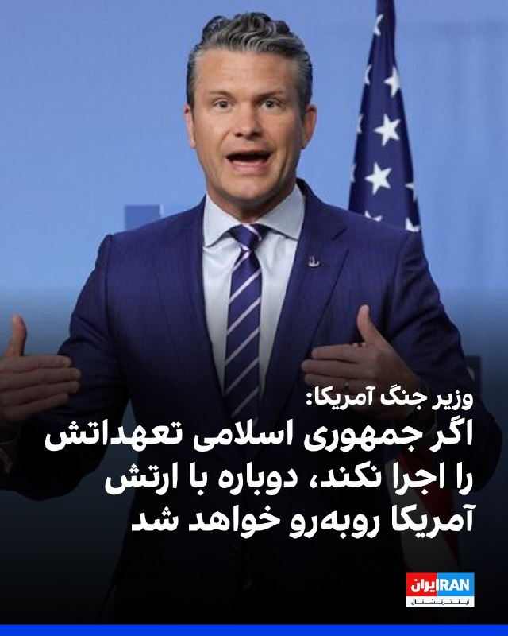

پیت هگست، وزیر جنگ آمریکا، در گفت‌وگو با شبکه سی‌بی‌اس گفت دولت دونالد ترامپ برنامه هسته‌ای جمهوری اسلامی را به‌طور جدی عقب رانده و هرگونه توافق احتمالی با تهران بر پایه نظارت، بازرسی و ارزیابی عملکرد اجرا خواهد شد.
او گفت جمهوری اسلامی باید مواد هسته‌ای مورد نظر آمریکا را از بین ببرد، از کشور خارج کند یا رقیق‌سازی کند و واشینگتن بر اجرای این روند نظارت خواهد داشت.
هگست گفت اگر جمهوری اسلامی به تعهدات خود عمل نکند، ممکن است بار دیگر با اقدام نظامی آمریکا مواجه شود.
وزیر جنگ آمریکا افزود قدرت نظامی آمریکا عامل اصلی کشاندن جمهوری اسلامی به میز مذاکره بوده و هدف نهایی این است که تهران هرگز به سلاح هسته‌ای دست پیدا نکند.
او گفت ارتش آمریکا آماده است با تمام توان از دستیابی جمهوری اسلامی به سلاح هسته‌ای جلوگیری کند.
‌🏁 🇬🇧 IranintlTV

🤖 @VahidOOnLine

## VahidOOnLine — post 245497

  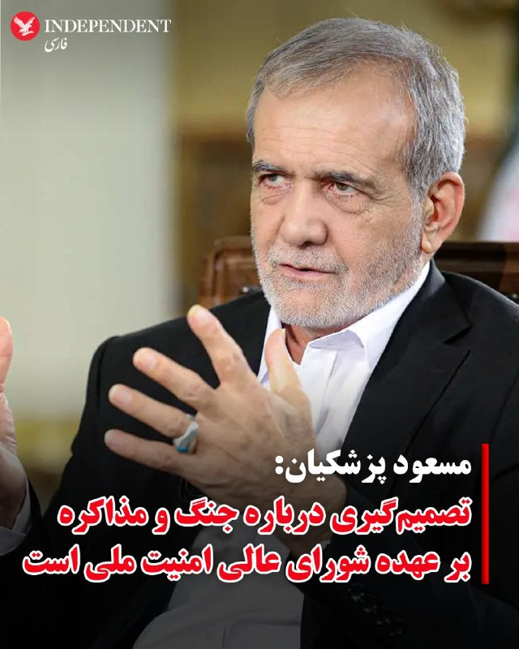

♦️مسعود پزشکیان، رئیس‌جمهوری ایران، روز یکشنبه ۲۴ خرداد در نشستی با رسانه‌ها تاکید کرد تصمیم‌گیری درباره جنگ و مذاکره بر عهده شورای عالی امنیت ملی است و سیاست‌های کلان کشور باید از مسیر این شورا ابلاغ شود.
پزشکیان گفت: «تصمیم‌گیری درباره جنگ و مذاکره بر عهده شورای عالی امنیت ملی است؛ شورایی که نمایندگان تمامی ارکان حاکمیت از جمله رهبری عالیقدر در آن حضور دارند و سیاست‌های کلان باید از آن مسیر ابلاغ شود.»
او افزود: «شورای عالی امنیت ملی به این جمع‌بندی رسیده است که مسیر گفتگو باید دنبال شود.»
رئیس‌جمهور ایران همچنین هشدار داد که نمی‌توان برداشت‌ها و خواسته‌های شخصی را به‌عنوان مطالبه عمومی مطرح کرد و با فشار رسانه‌ای یا سیاسی درصدد تحمیل آن بر ساختار تصمیم‌گیری کشور برآمد.
‌🇸🇦 Indypersian

🤖 @VahidOOnLine

## VahidOOnLine — post 245496

  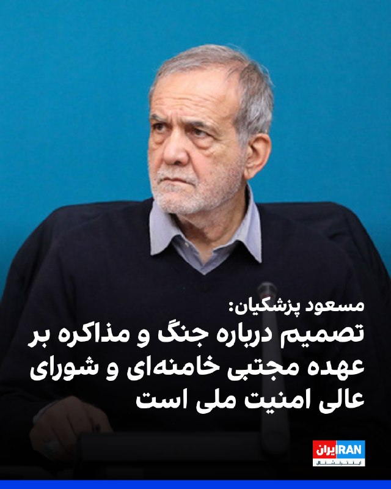

مسعود پزشکیان در نشستی با مدیران رسانه‌ها گفت تصمیم‌گیری درباره جنگ و مذاکره بر عهده مجتبی خامنه‌ای و شورای عالی امنیت ملی است و همه جریان‌ها باید خود را ملزم به تبعیت از این تصمیم‌ها بدانند.
او همچنین استفاده از برچسب‌هایی مانند «خیانت» و «وطن‌فروشی» علیه تیم مذاکره‌کننده جمهوری اسلامی را مایه تاسف خواند.
پزشکیان گفت آنچه درباره جنگ و مذاکره با آمریکا در صداوسیما مطرح می‌شود، لزوما بازتاب‌دهنده دیدگاه شورای عالی امنیت ملی، شورای عالی دفاع یا رهنمودهای مجتبی خامنه‌ای نیست.
این اظهارات در حالی مطرح می‌شود که بحث‌ها درباره تفاهم احتمالی میان تهران و واشینگتن و اختلاف‌نظرها درباره آن ادامه دارد.
‌🏁 🇬🇧 IranintlTV

🤖 @VahidOOnLine

## VahidOOnLine — post 245495

  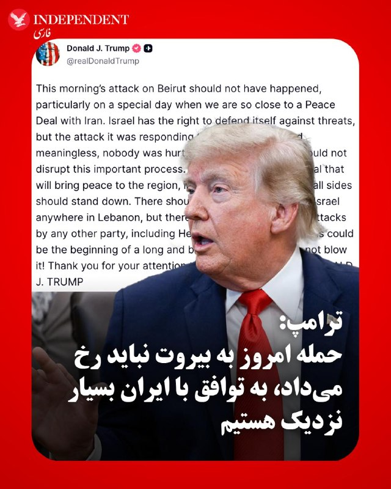

♦️دونالد ترامپ، رئیس‌جمهوری آمریکا، روز یکشنبه ۲۴ خرداد ماه در پیامی در شبکه اجتماعی تروث سوشال اعلام کرد حمله صبح یکشنبه اسرائیل به بیروت نباید انجام می‌شد، به‌ویژه در شرایطی که واشنگتن و تهران به دستیابی به یک توافق صلح نزدیک شده‌اند.

ترامپ نوشت: «اسرائیل حق دارد از خود در برابر تهدیدها دفاع کند، اما حمله‌ای که به آن پاسخ داده شد بسیار کوچک و بی‌اهمیت بود و هیچ کشته یا مجروحی بر جا نگذاشت و نباید این روند مهم را مختل کند.»

رئیس‌جمهور آمریکا تایکد کرد واشنگتن به توافقی بسیار نزدیک شده است که می‌تواند صلح را به منطقه، از جمله لبنان، بازگرداند.

او همچنین خواستار توقف حملات از سوی همه طرف‌ها شد و گفت نباید هیچ حمله دیگری از سوی اسرائیل در لبنان انجام شود و در مقابل، حزب‌الله و سایر طرف‌ها نیز نباید اسرائیل را هدف قرار دهند.

ترامپ در پایان نوشت: «این می‌تواند آغاز یک صلح طولانی و زیبا باشد؛ اجازه ندهید آن را از بین ببریم.»
‌🇸🇦 Indypersian

🤖 @VahidOOnLine

## VahidOOnLine — post 245494

  <a href="telegram/content/VahidOOnLine_245494_1781454035.mp4" target="_blank">🎬 Download video</a>

ویدیوهای رسیده به ایران‌اینترنشنال نشان می‌دهند ایرانیان مقیم استرالیا یکشنبه ۲۴ خرداد با فراخوان شاهزاده رضا پهلوی و علیه جمهوری اسلامی در سیدنی تجمع کردند.
‌🏁 🇬🇧 IranintlTV

🤖 @VahidOOnLine

## VahidOOnLine — post 245493

  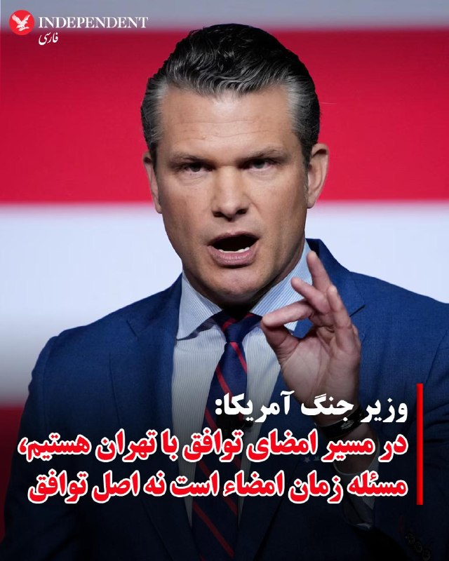

♦️پیت هگست، وزیر دفاع آمریکا، روز یکشنبه ۲۴ خرداد ماه در گفتگو با شبکه سی‌بی‌اس گفت واشنگتن در مسیر امضای توافق با ایران قرار دارد و «سوال این نیست که آیا توافق امضاء خواهد شد یا نه، بلکه این است که چه زمانی امضاء خواهد شد.»

هگست همچنین با اعلام آنکه انتظار ندارد حملات اسرائیل به حومه جنوبی بیروت مانع توافق با ایران شود،  گفت ایران باید حزب‌الله لبنان را مهار کند.

اظهارات هگست در حالی مطرح می‌شود که گمانه‌زنی‌ها درباره زمان امضای چارچوب اولیه توافق میان تهران و واشنگتن افزایش یافته و همزمان تنش‌ها در منطقه پس از حمله اسرائیل به ضاحیه جنوبی بیروت بالا گرفته است.
‌🇸🇦 Indypersian

🤖 @VahidOOnLine

## VahidOOnLine — post 245492

  

دونالد ترامپ، رییس‌جمهوری آمریکا، در تروت سوشال نوشت حمله یکشنبه اسرائیل به بیروت نباید انجام می‌شد، به‌ویژه در شرایطی که واشینگتن و تهران به گفته او «بسیار نزدیک» به دستیابی به توافق صلح هستند.
ترامپ گفت اسرائیل حق دفاع از خود را دارد، اما واکنش به حمله‌ای که «هیچ کشته یا زخمی نداشته»، نباید روند دستیابی به توافق را مختل کند.

او افزود آمریکا به توافقی نزدیک شده که می‌تواند برای منطقه، از جمله لبنان، صلح به همراه داشته باشد و از همه طرف‌ها خواست از تشدید تنش خودداری کنند.
ترامپ همچنین گفت نباید حمله دیگری از سوی اسرائیل در لبنان انجام شود و در مقابل، حزب‌الله نیز نباید حملات تازه‌ای علیه اسرائیل انجام دهد.
رییس‌جمهوری آمریکا در پایان نوشت: «این می‌تواند آغاز یک صلح طولانی و زیبا باشد؛ بیایید آن را خراب نکنیم.»
‌🏁 🇬🇧 IranintlTV

🤖 @VahidOOnLine

## VahidOOnLine — post 245491

  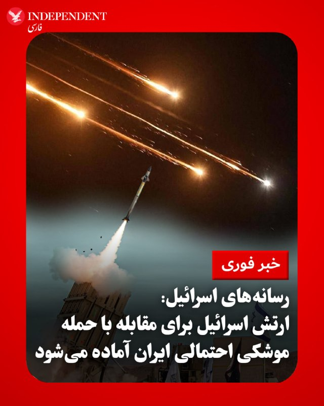

♦️همزمان با بالا گرفتن تنش‌های لفظی میان مقام‌های ایران و اسرائیل در بعد از ظهر یکشنبه، روزنامه تایمز اسرائیل به نقل از ارتش این کشور گزارش داد نیروهای اسرائیلی خود را برای شلیک احتمالی موشک از سوی در ساعت‌های آینده آماده می‌کنند.
بر اساس این گزارش، ایال زمیر، رئیس ستاد ارتش اسرائیل، پس از حمله به بیروت در حال برگزاری نشست ارزیابی با فرماندهان ارشد نظامی است و ارزیابی کنونی ارتش این کشور آن است که ایران ممکن است به این حمله پاسخ دهد.
این گزارش ساعاتی پس از آن منتشر شد که اسرائیل اهدافی را در ضاحیه جنوبی بیروت هدف قرار داد. همزمان محمدباقر قالیباف، رئیس مجلس شورای اسلامی، این حمله را نشانه ناتوانی یا بی‌میلی آمریکا در اجرای تعهدات خود دانست و هشدار داد ادامه مذاکرات در چنین شرایطی ممکن نیست.
در مقابل، حساب رسمی وزارت خارجه اسرائیل در شبکه اجتماعی ایکس با رد اظهارات قالیباف، جمهوری اسلامی را به «دروغگویی» متهم کرد و مدعی شد حمله به بیروت در پاسخ به حملات حزب‌الله به شمال اسرائیل انجام شده است.
محمدجعفر اسدی، معاون بازرسی قرارگاه مرکزی خاتم‌الانبیاء، نیز در واکنش به حمله روز یکشنبه اسرائیل به ضایحه بیروت گفت سپاه پاسداران به این حملات پاسخ خواهد داد.
تایمز اسرائیل همچنین نوشت با وجود این ارزیابی‌ها، تاکنون تغییری در دستورالعمل‌های امنیتی برای غیرنظامیان اسرائیلی اعلام نشده است.
‌🇸🇦 Indypersian

🤖 @VahidOOnLine

## WithYashar — post 14835

ترامپ: من با نتانیاهو صحبت کردم و بهش گفتم:داری چه غلطی می‌کنی؟

@withyashar 🤣

## WithYashar — post 14834

کرملین: پوتین و ترامپ درباره ایران و اوکراین گفتگو کردند
@withyashar

## WithYashar — post 14833

بنیامین نتانیاهو، نخست‌وزیر اسرائیل، در تماس اخیر با رئیس‌جمهور ترامپ گفت که اسرائیل با عقب‌نشینی کامل از جنوب لبنان، از جمله پنج نقطه‌ای که در حال حاضر توسط نیروهای دفاعی اسرائیل (IDF) در اختیار است، موافقت نخواهد کرد، طبق گزارش معاریو.

نتانیاهو همچنین عقب‌نشینی از خاک سوریه را که اسرائیل از زمان سقوط بشار اسد اشغال کرده است، رد کرد
@withyashar

## WithYashar — post 14832

شبکه ۱۴ :ایالات متحده در حال حاضر از طریق واسطه‌های مختلف تلاش می‌کند از هرگونه حمله احتمالی نیروهای نظامی ایران به اسرائیل جلوگیری کند.
@withyashar

## WithYashar — post 14831

باراک اوباما : توافق ترامپ که از ماله من زاقارت تره

باراک اوباما، رییس‌جمهوری پیشین آمریکا، در گفت‌وگو با ای‌بی‌سی نیوز گفت بعید است هر توافقی که میان آمریکا و جمهوری اسلامی حاصل شود، تفاوت چشمگیری با برجام داشته باشد یا نسبت به آن بهبود قابل توجهی محسوب شود.
اوباما با اشاره به برجام گفت این توافق بر محدود کردن برنامه هسته‌ای ایران، تعیین سقف برای غنی‌سازی اورانیوم و پذیرش بازرسی‌های آژانس بین‌المللی انرژی اتمی در ازای رفع بخشی از تحریم‌ها و آزادسازی دارایی‌های مسدودشده ایران استوار بود.
او همچنین ابراز امیدواری کرد بمباران‌ها متوقف شود و مردم عادی دیگر از پیامدهای جنگ رنج نکشند.
رییس‌جمهوری پیشین آمریکا تاکید کرد دیپلماسی را به اقدام نظامی ترجیح می‌دهد و گفت نباید تصور کرد که می‌توان با زور یا بمباران به راه‌حل دست یافت.
اوباما خواستار بررسی کامل گزینه‌های دیپلماتیک شد و گفت توافق‌هایی که همه مشکلات را حل نمی‌کنند اما ۸۰ یا ۹۰ درصد آن‌ها را برطرف می‌کنند، می‌توانند از جنگ جلوگیری کنند.
@withyashar

## WithYashar — post 14830

رسانه‌های اسرائیلی: شهرداری‌های ایلات، تل‌آویو بزرگ، نتانیا و حیفا پناهگاه‌های عمومی را باز کرده‌اند.»
@withyashar

## WithYashar — post 14829

منابع عربی : امریکا در پیامی به اسرائیل گفته امشب ایران حملات موشکی انجام خواهد داد🚨🚨
@withyashar

## WithYashar — post 14828

  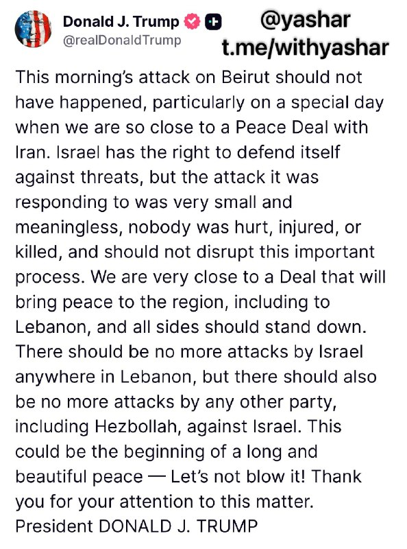

ترامپ در تروث : «حمله امروز صبح به بیروت نباید رخ می‌داد، به‌ویژه در چنین روز مهمی که ما تا این اندازه به دستیابی به یک توافق صلح با ایران نزدیک شده‌ایم. اسرائیل حق دارد از خود در برابر تهدیدها دفاع کند، اما حمله‌ای که در واکنش به آن انجام شد بسیار کوچک و بی‌اهمیت بود؛ هیچ‌کس آسیب ندید، مجروح نشد یا کشته نشد و نباید این روند مهم را مختل کند. ما بسیار به توافقی نزدیک هستیم که صلح را برای منطقه، از جمله لبنان، به ارمغان خواهد آورد و همه طرف‌ها باید از درگیری و تشدید تنش خودداری کنند. نباید هیچ حمله دیگری از سوی اسرائیل در هیچ نقطه‌ای از لبنان انجام شود، اما در عین حال نباید هیچ حمله‌ای از سوی هیچ طرف دیگری، از جمله حزب‌الله، علیه اسرائیل صورت گیرد. این می‌تواند آغاز یک صلح طولانی و زیبا باشد؛ نگذارید این فرصت از بین برود! از توجه شما به این موضوع سپاسگزارم. دونالد جی. ترامپ، رئیس‌جمهور ایالات متحده آمریکا»
@withyashar

## WithYashar — post 14827

هگست، وزیر جنگ آمریکا:
من انتظار ندارم که حملات اسرائیل به حومه جنوبی بیروت مانع توافق با ایران بشه؛ اگر ایران میخواد این موضوع ادامه پیدا کنه، باید حزب‌الله رو مهار کنه.
@withyashar

## mwarmonitor — post 10888

  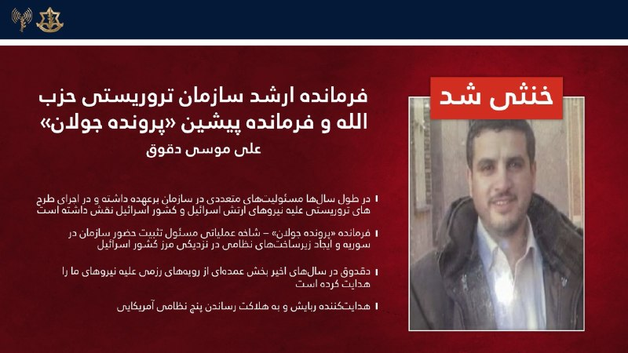

🔴سفیر اسرائیل در آمریکا 🔹«این علی موسی دقدوق است، یکی از فرماندهان ارشد حزب‌الله. 🔹او شخصاً مسئول یک حمله تروریستی در سال ۲۰۰۷ علیه نیروهای آمریکایی است. 🔹او توسط آمریکا زندانی شد و برای دستگیری‌اش ۵ میلیون دلار جایزه تعیین شده بود. 🔹او همچنین “پرونده جولان”…

## mwarmonitor — post 10887

🔴ترامپ 🔸«من با نتانیاهو، نخست‌وزیر اسرائیل صحبت کردم و بهش گفتم: "داری چه غلطی می‌کنی؟"» 🔴و اضافه می‌کند: «بی‌بی هیچ اختیار و آزادی تصمیم‌گیری‌ای ندارد.» @mwarmonitor

## mwarmonitor — post 10886

🔴ترامپ

🔸«من با نتانیاهو، نخست‌وزیر اسرائیل صحبت کردم و بهش گفتم: "داری چه غلطی می‌کنی؟"»

🔴و اضافه می‌کند: «بی‌بی هیچ اختیار و آزادی تصمیم‌گیری‌ای ندارد.»

@mwarmonitor

## mwarmonitor — post 10885

🔴روزنامه اسرائیلی معاریو به نقل از منابع آگاه گزارش داد که بنیامین نتانیاهو در تماس اخیر خود با دونالد ترامپ هرگونه عقب‌نشینی اسرائیل از سراسر جنوب لبنان ــ از جمله پنج نقطه‌ای که در اختیار ارتش اسرائیل (IDF) است ــ را رد کرده است.

🔸به گفته این منابع، نتانیاهو همچنین از عقب‌نشینی از اراضی اشغالی سوریه که پس از سقوط بشار اسد تصرف شده‌اند، خودداری کرده است.

@mwarmonitor

## mwarmonitor — post 10884

🔴«به گفته منابع آگاه که با کانال ۱۲ اسرائیل گفت‌وگو کرده‌اند، ایالات متحده آمریکا فشار سنگینی بر ایران وارد می‌کند تا در پاسخ به حملات اسرائیل به حومه جنوبی بیروت اقدام به شلیک موشک نکند.»

@mwarmonitor

## mwarmonitor — post 10883

🔴رسانه‌های اسرائیلی: شهرداری‌های ایلات، تل‌آویو بزرگ، نتانیا و حیفا پناهگاه‌های عمومی را باز کرده‌اند.»

@mwarmonitor

## mwarmonitor — post 10882

🔴ارتش اسرائیل (IDF) اعلام کرد:

🔸«چندین پهپاد مشکوک مدتی پیش در نزدیکی مرز با لبنان به خاک اسرائیل اصابت کردند.

🔸در این حادثه هیچ مجروحی گزارش نشده و موضوع در حال بررسی است.

🔸این “اهداف هوایی مشکوک” در هیچ‌یک از شهرها آژیر خطر را فعال نکردند.»

@mwarmonitor

## mwarmonitor — post 10881

🔴سخنگوی ارتش اسرائیل:

🔹«پس از ارزیابی وضعیت، تصمیم گرفته شد سیاست دفاعی فرماندهی جبهه داخلی از امروز (یکشنبه) ۱۴ ژوئن ۲۰۲۶ ساعت ۱۸:۰۰ تا روز دوشنبه ۱۵ ژوئن ۲۰۲۶ ساعت ۲۰:۰۰ تغییر کند.

🔹بر اساس این تغییرات، اجازه فعالیت کامل با سقف تجمعات تا ۵۰۰۰ نفر در تمام مناطق کشور، به‌جز مناطق خط مقدم، داده می‌شود.

🔹در مناطق خط مقدم، فعالیت‌ها به‌صورت جزئی و بدون تغییر در دستورالعمل‌ها ادامه خواهد داشت.

🔹فرماندهی جبهه داخلی به ارزیابی‌های مستمر وضعیت ادامه می‌دهد و در صورت هرگونه تغییر در سیاست‌های دفاعی، اطلاع‌رسانی‌های لازم از طریق کانال‌های رسمی فرماندهی جبهه داخلی و سخنگوی ارتش اسرائیل به اطلاع عموم خواهد رسید.»

@mwarmonitor

## mwarmonitor — post 10880

🔴ترامپ:

«نباید حمله امروز صبح به بیروت رخ می‌داد، به‌ویژه در چنین روز مهمی که ما در آستانه رسیدن به یک توافق صلح با ایران هستیم. اسرائیل حق دارد از خود در برابر تهدیدها دفاع کند، اما حمله‌ای که به آن پاسخ داده شد بسیار محدود و بی‌اهمیت بود و هیچ‌کس در آن کشته یا زخمی نشد. این موضوع نباید این روند مهم را مختل کند. ما در آستانه توافقی هستیم که می‌تواند صلح را در منطقه، از جمله لبنان، برقرار کند و همه طرف‌ها باید عقب‌نشینی کنند.

نباید هیچ حمله دیگری از سوی اسرائیل در هیچ نقطه‌ای از لبنان انجام شود، همان‌طور که نباید هیچ حمله دیگری از سوی هیچ طرفی، از جمله حزب‌الله، علیه اسرائیل صورت گیرد. این می‌تواند آغاز یک صلح طولانی و زیبا باشد—بیایید آن را حفظ کنیم! از توجه شما به این موضوع سپاسگزارم.

دونالد جی. ترامپ»

@mwarmonitor

## FoxNewsTwitter — post 342959

  <a href="telegram/content/FoxNewsTwitter_342959_1781454039.mp4" target="_blank">🎬 Download video</a>

Fox News (Twitter/X)

Rainn Wilson says "The Office" probably wouldn’t be made today, telling Fox News Digital that media trends have shifted left and that cancel culture makes it difficult for edgy comedies to thrive.

## FoxNewsTwitter — post 342958

  <a href="telegram/content/FoxNewsTwitter_342958_1781454041.mp4" target="_blank">🎬 Download video</a>

Fox News (Twitter/X)

"It is the honor of a lifetime to serve under you."

Secretary of War Pete Hegseth celebrates President Trump's birthday with a special video from our nation's military.

## FoxNewsTwitter — post 342957

  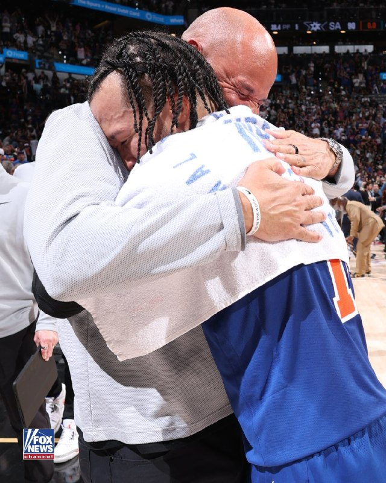

Fox News (Twitter/X)

Jalen Brunson hugs his father after leading the Knicks past the Spurs to win the NBA championship.

Knicks assistant coach Rick Brunson witnessed his son make history 27 years after reaching the NBA Finals as a player himself.

## FoxNewsTwitter — post 342956

  

Fox News (Twitter/X)

🇺🇸Happy Birthday to the United States Army!

Today we honor 251 years of courage, sacrifice, and unwavering service to our nation.

## pm_afshaa — post 93924

  <a href="telegram/content/pm_afshaa_93924_1781454044.webm" target="_blank">🎬 Download video</a>

🔴سعید جلیلی برکنار شد. سردار عظیم ابراهیم پور، فرمانده قرارگاه پیشرفت سپاه رسما اعلام کرد که باقری کنی جایگزین سعید جلیلی تو شعام شده. 
💧 Rainbet.com the #1 Non-KYC Crypto Casino & Sportsbook @rainbetcom 
😁 @Pm_Afshaa

## pm_afshaa — post 93923

  <a href="telegram/content/pm_afshaa_93923_1781454044.webm" target="_blank">🎬 Download video</a>

🔴سعید جلیلی برکنار شد.

سردار عظیم ابراهیم پور، فرمانده قرارگاه پیشرفت سپاه رسما اعلام کرد که باقری کنی جایگزین سعید جلیلی تو شعام شده.

💧 Rainbet.com the #1 Non-KYC Crypto Casino & Sportsbook @rainbetcom

😁 @Pm_Afshaa

## pm_afshaa — post 93922

  <a href="telegram/content/pm_afshaa_93922_1781454045.webm" target="_blank">🎬 Download video</a>

🔴روزنامه اسرائیلی معاریو:
نتانیاهو در تماس با ترامپ، هرگونه عقب‌نشینی اسرائیل از جنوب لبنان، از جمله 5 نقطه تحت کنترل ارتش اسرائیل رو رد کرده.

همچنین با عقب‌نشینی از مناطق اشغالی سوریه پس از سقوط بشار اسد هم مخالفت کرده.

💧 Rainbet.com the #1 Non-KYC Crypto Casino & Sportsbook @rainbetcom

😁 @Pm_Afshaa

## pm_afshaa — post 93921

  <a href="telegram/content/pm_afshaa_93921_1781454045.webm" target="_blank">🎬 Download video</a>

🔴کانال 12 اسرائیل: آمریکا به شدت به ایران فشار میاره که پاسخی نده!

یک مقام آمریکایی به کانال 12:
حمله اسرائیل به ضاحیه بیروت، تلاشی آشکار برای نابودی توافق است.

💧 Rainbet.com the #1 Non-KYC Crypto Casino & Sportsbook @rainbetcom

😁 @Pm_Afshaa

## pm_afshaa — post 93920

  <a href="telegram/content/pm_afshaa_93920_1781454046.webm" target="_blank">🎬 Download video</a>

🔴کابینه امنیتی اسراییل امشب جلسه خواهد داشت 
💧 Rainbet.com the #1 Non-KYC Crypto Casino & Sportsbook @rainbetcom 
😁 @Pm_Afshaa

## pm_afshaa — post 93919

🔴کابینه امنیتی اسراییل امشب جلسه خواهد داشت

💧 Rainbet.com the #1 Non-KYC Crypto Casino & Sportsbook @rainbetcom

😁 @Pm_Afshaa

## pm_afshaa — post 93918

  <a href="telegram/content/pm_afshaa_93918_1781454046.webm" target="_blank">🎬 Download video</a>

🔴پزشکیان: آنچه گاها در رسانه ملی درباره جنگ و مذاکره مطرح میشه، لزوماً بازتاب‌دهنده دیدگاه شورای عالی امنیت ملی، شورای عالی دفاع یا حتی رهنمودهای رهبر انقلاب نیست.

💧 Rainbet.com the #1 Non-KYC Crypto Casino & Sportsbook @rainbetcom

😁 @Pm_Afshaa

## pm_afshaa — post 93917

  <a href="telegram/content/pm_afshaa_93917_1781454047.webm" target="_blank">🎬 Download video</a>

🔴مسعود پزشکیان: تصمیم‌گیری درباره جنگ و مذاکره بر عهده مجتبی خامنه‌ای و شورای عالی امنیت ملی است و سیاست‌های کلان باید از آن مسیر ابلاغ بشه.

شورای عالی امنیت ملی به این جمع‌بندی رسیده که مسیر گفت‌وگو باید دنبال بشه..

💧 Rainbet.com the #1 Non-KYC Crypto Casino & Sportsbook @rainbetcom

😁 @Pm_Afshaa

## pm_afshaa — post 93916

  <a href="telegram/content/pm_afshaa_93916_1781454047.webm" target="_blank">🎬 Download video</a>

🔴مرندی، عضو تیم مذاکره: متجاوزان صهیونیستی و قاتلان کودکان مجازات خواهند شد. 
💧 Rainbet.com the #1 Non-KYC Crypto Casino & Sportsbook @rainbetcom 
😁 @Pm_Afshaa

## pm_afshaa — post 93914

  <a href="telegram/content/pm_afshaa_93914_1781454048.webm" target="_blank">🎬 Download video</a>

🔴مرندی، عضو تیم مذاکره:
متجاوزان صهیونیستی و قاتلان کودکان مجازات خواهند شد.

💧 Rainbet.com the #1 Non-KYC Crypto Casino & Sportsbook @rainbetcom

😁 @Pm_Afshaa

## pm_afshaa — post 93913

  <a href="telegram/content/pm_afshaa_93913_1781454048.webm" target="_blank">🎬 Download video</a>

🔴سخنگوی ارتش اسرائیل: چندین پرتابه مشکوک از طرف لبنان در خاک اسرائیل نزدیک به مرز با لبنان سرنگون شد.

💧 Rainbet.com the #1 Non-KYC Crypto Casino & Sportsbook @rainbetcom

😁 @Pm_Afshaa

## pm_afshaa — post 93912

رئیس ستاد کل ارتش اسرائیل از آغاز حمله زمینی به سمت عمق جنوب لبنان خبر داد

💧 Rainbet.com the #1 Non-KYC Crypto Casino & Sportsbook @rainbetcom

😁 @Pm_Afshaa

## pm_afshaa — post 93911

🔴بیمارستان‌های اسرائیل دستورالعملی برای آماده‌سازی در طرح اضطراری در آینده نزدیک دریافت کردن

💧 Rainbet.com the #1 Non-KYC Crypto Casino & Sportsbook @rainbetcom

😁 @Pm_Afshaa

## pm_afshaa — post 93910

  <a href="telegram/content/pm_afshaa_93910_1781454049.webm" target="_blank">🎬 Download video</a>

🔴پست جدید ترامپ:

حمله صبح امروز به بیروت نباید اتفاق میفتاد، به ویژه در روز خاصی که ما به توافق صلح با ایران بسیار نزدیک هستیم.

اسرائیل حق داره از خود دفاع کنه، اما حمله‌ای که به آن پاسخ داد بسیار کوچک و بی معنی بود، کسی آسیب ندید، مجروح یا کشته نشد و نباید این روند مهم رو مختل کنه. دیگه نباید در هیچ کجای لبنان حملاتی از سوی اسرائیل انجام بشه، اما همچنین نباید از سوی هیچ طرف دیگری از جمله حز‌ب‌الله علیه اسرائیل حمله بشه.

این میتونه آغاز یک صلح طولانی و زیبا باشه؛ بیاید آن را منفجر نکنیم!

💧 Rainbet.com the #1 Non-KYC Crypto Casino & Sportsbook @rainbetcom

😁 @Pm_Afshaa

## pm_afshaa — post 93909

پیت هگستث: به خاطر دوراندیشی رئیس‌جمهور ترامپ، ما در داخل کشور به استقلال انرژی دست یافته‌ایم

💧 Rainbet.com the #1 Non-KYC Crypto Casino & Sportsbook @rainbetcom

😁 @Pm_Afshaa

## pm_afshaa — post 93908

پیت هگستث: این قدرت رئیس‌جمهور ترامپ بود که ایران را به این توافق واداشت

💧 Rainbet.com the #1 Non-KYC Crypto Casino & Sportsbook @rainbetcom

😁 @Pm_Afshaa

## pm_afshaa — post 93907

منابع عربی :امریکا در پیامی به اسرائیل گفته امشب ایران حملات موشکی انجام خواهد داد

💧 Rainbet.com the #1 Non-KYC Crypto Casino & Sportsbook @rainbetcom

😁 @Pm_Afshaa

## pm_afshaa — post 93906

  <a href="telegram/content/pm_afshaa_93906_1781454049.mp4" target="_blank">🎬 Download video</a>

ویدیویی از شلیک و درگیری نیروهای حکومتی با طرفدارای حکومت در شب گذشته

💧 Rainbet.com the #1 Non-KYC Crypto Casino & Sportsbook @rainbetcom

😁 @Pm_Afshaa

## pm_afshaa — post 93905

  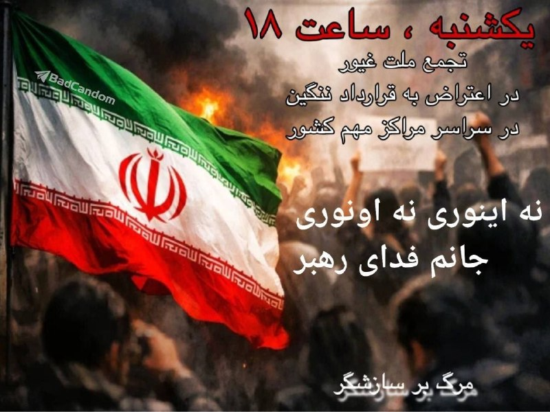

فراخوان سراسری

امروز یکشنبه ساعت 18 در اعتراض به امضای تسلیم‌نامه در برابر آمریکای مستکبر در مرکز تمام شهرهای کشور با شعار «نه اینوری نه اونوری، جانم فدای رهبری» به خیابان خواهیم آمد.
ماسک و لباس مشکی فراموشتون نشه

💧 Rainbet.com the #1 Non-KYC Crypto Casino & Sportsbook @rainbetcom

😁 @Pm_Afshaa

## pm_afshaa — post 93904

ترامپ: حمله اسرائیل به بیروت نباید اتفاق می‌افتاد

💧 Rainbet.com the #1 Non-KYC Crypto Casino & Sportsbook @rainbetcom

😁 @Pm_Afshaa

## VahidOnline — post 76336

  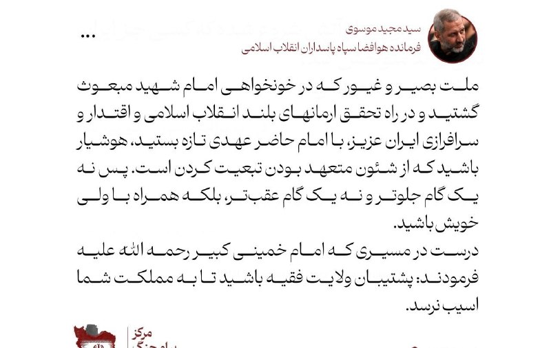

مجید موسوی، فرمانده نیروی هوافضای سپاه پاسداران، در پیامی از حامیان جمهوری اسلامی خواست در مسیر تحقق آرمان‌های نظام، از مجتبی خامنه‌ای تبعیت کنند.
او نوشت: «ملت بصیر و غیور که در خونخواهی علی خامنه‌ای مبعوث شدید و در راه تحقق آرمان‌های بلند انقلاب اسلامی با مجتبی خامنه‌ای عهدی تازه بستید، هوشیار باشید که از شئون متعهد بودن، تبعیت کردن است.»
@VahidOOnLine

📡 @VahidOnline

## VahidOnline — post 76335

  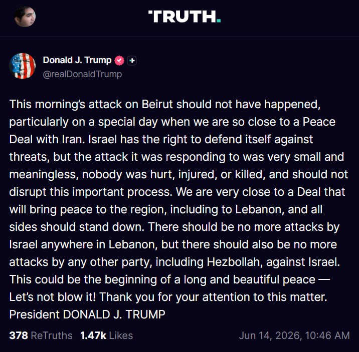

ترامپ: بیایید خرابش نکنیم!‍

پست ترامپ، ترجمه ماشین:
حمله صبح امروز به بیروت نباید اتفاق می‌افتاد؛ به‌ویژه در روزی خاص که ما تا این اندازه به توافق صلح با ایران نزدیک هستیم. اسرائیل حق دارد از خود در برابر تهدیدها دفاع کند، اما حمله‌ای که در پاسخ به آن انجام شد بسیار کوچک و بی‌اهمیت بود؛ هیچ‌کس آسیبی ندید، زخمی نشد یا کشته نشد، و نباید این روند مهم را مختل کند.

ما به توافقی بسیار نزدیک هستیم که صلح را به منطقه، از جمله لبنان، خواهد آورد و همه طرف‌ها باید عقب‌نشینی کنند. دیگر نباید هیچ حمله‌ای از سوی اسرائیل در هیچ نقطه‌ای از لبنان انجام شود، اما همچنین نباید هیچ حمله‌ای از سوی هیچ طرف دیگری، از جمله حزب‌الله، علیه اسرائیل صورت گیرد.

این می‌تواند آغاز یک صلح طولانی و زیبا باشد — بیایید خرابش نکنیم!

از توجه شما به این موضوع سپاسگزارم.

رئیس‌جمهور دونالد جی. ترامپ
realDonaldTrump

📡 @VahidOnline

## kianmeli1 — post 87990

  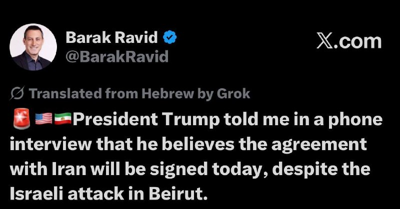

🔴باراک راوید
رئیس جمهور ترامپ در یک مصاحبه تلفنی به من گفت که معتقد است علیرغم حمله اسرائیل به بیروت، توافق با ایران امروز امضا خواهد شد.
https://t.me/kianmeli1

## kianmeli1 — post 87989

  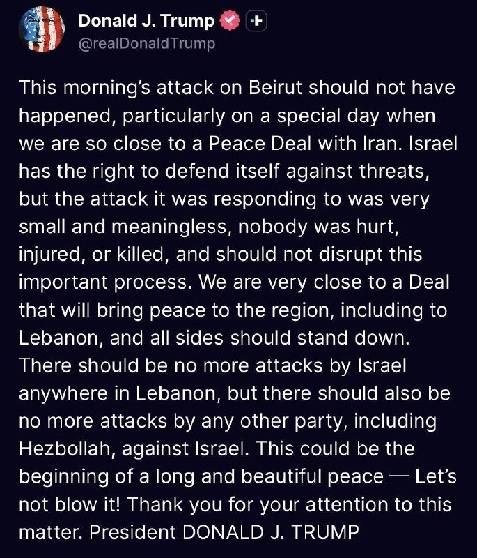

🔴ترامپ در مورد حمله به بیروت:

«این نباید اتفاق می‌افتاد، ما به توافقی که صلح را به منطقه می‌آورد بسیار نزدیک هستیم. بیایید آن را خراب نکنیم.» او از همه طرف‌ها می‌خواهد که عقب‌نشینی کنند و حملات را متوقف کنند.
https://t.me/kianmeli1

## IranIntlTV — post 342314

  

ارتش اسرائیل در بیانیه‌ای تایید کرد علی موسی دقدوق، از فرماندهان ارشد حزب‌الله، در حمله‌ای در جنوب رود لیتانی لبنان کشته شده است.
به گفته ارتش اسرائیل، دقدوق فرمانده پیشین «پرونده جولان» بود؛ شاخه‌ای که مسئول فعالیت‌های حزب‌الله در سوریه و ایجاد زیرساخت‌های نظامی در نزدیکی مرز اسرائیل بوده است.
ارتش اسرائیل همچنین اعلام کرد دقدوق در طول فعالیت خود سمت‌های مختلفی از جمله فرمانده تیم حفاظت حسن نصرالله، رهبر پیشین حزب‌الله، فرمانده یگان رضوان، فرمانده بخش عملیات یگان نصر و مسئول یگان پیاده‌نظام حزب‌الله را بر عهده داشته است.
https://iranintl.com/202606144213

## IranIntlTV — post 342312

  <a href="telegram/content/IranIntlTV_342312_1781454053.mp4" target="_blank">🎬 Download video</a>

ویدیوهای رسیده به ایران‌اینترنشنال نشان می‌دهند گروهی از ایرانیان مقیم آلمان یکشنبه ۲۴ خرداد با فراخوان شاهزاده رضا پهلوی و علیه جمهوری اسلامی در شهر کلن تجمع کردند.

## IranIntlTV — post 342311

  <a href="telegram/content/IranIntlTV_342311_1781454054.mp4" target="_blank">🎬 Download video</a>

🔻تیم ملی فوتبال بدون حضور رییس، نایب‌رییس و دبیرکل فدراسیون، برای بازی با نیوزیلند راهی لس‌آنجلس خواهند شد. امیر قلعه‌نویی و مهدی طارمی، سرمربی و کاپیتان تیم ملی نیز بامداد دوشنبه در نشست خبری پیش از بازی حاضر خواهند شد.

🔹توضیحات مزدک میرزایی، ایران اینترنشنال، در هت‌تریک

@iranintltvsport

## IranIntlTV — post 342310

  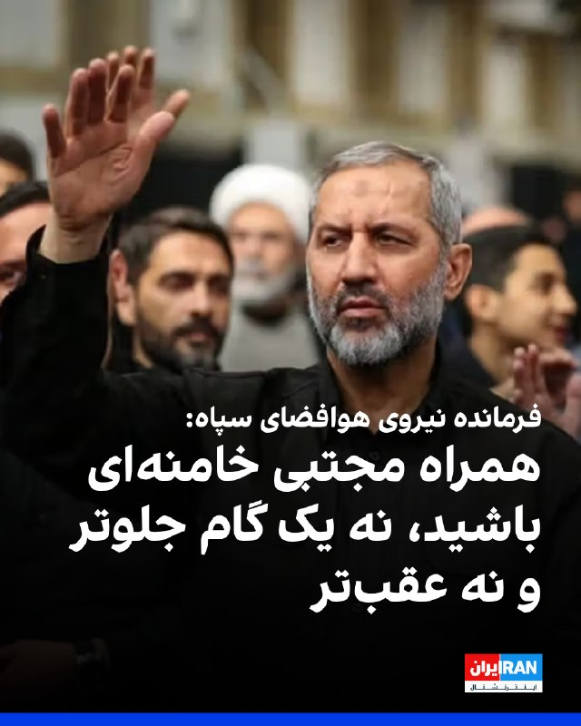

مجید موسوی، فرمانده نیروی هوافضای سپاه پاسداران، در پیامی از حامیان جمهوری اسلامی خواست در مسیر تحقق آرمان‌های نظام، از مجتبی خامنه‌ای تبعیت کنند.
او نوشت: «ملت بصیر و غیور که در خونخواهی علی خامنه‌ای مبعوث شدید و در راه تحقق آرمان‌های بلند انقلاب اسلامی با مجتبی خامنه‌ای عهدی تازه بستید، هوشیار باشید که از شئون متعهد بودن، تبعیت کردن است.»
https://iranintl.com/202606141119

## IranIntlTV — post 342309

  <a href="https://t.me/IranintlTV/342309" target="_blank">📎 Download file</a>

🎧نسخه صوتی اخبار شبانگاهی | یکشنبه ۲۴ خرداد
@iranintlTV

## IranIntlTV — post 342302

🔻دیدار تیم‌های ملی فوتبال هلند و ژاپن یکشنبه ۲۴ خرداد ۱۴۰۵، در روز چهارم جام جهانی ۲۰۲۶ یکی از مهم‌ترین مسابقات مرحله گروهی تورنمنت محسوب می‌شود.

🔹هلندی‌ها که سه بار نایب‌قهرمان جهان شده‌اند، رقابت‌های خود را برابر تیمی آغاز می‌کنند که در شگفتی‌سازی، تکراری شده‌اند.

🔹ژاپن در جام جهانی ۲۰۲۲ قطر با شکست آلمان و اسپانیا همه را شگفت‌زده کرد و حالا امیدوار است بار دیگر معادلات را بر هم بزند.

🔹هر دو تیم رویایی دست‌نیافتنی دارند؛ یکی قهرمانی و دیگری رسیدن به نیمه‌نهایی.

🔹طبق پیش‌بینی ابررایانه اوپتا، هلند با ۵۰.۲ درصد شانس پیروزی، بخت نخست این مسابقه است. احتمال برد ژاپن ۲۴.۵ درصد و شانس تساوی ۲۵.۲ درصد برآورد شده است.

🔹پیش‌بازی هلند-ژاپن را در وب‌سایت ایران اینترنشنال بخوانید.

@iranintltvsport

## IranIntlTV — post 342301

  

پیت هگست، وزیر جنگ آمریکا، در گفت‌وگو با شبکه سی‌بی‌اس گفت دولت دونالد ترامپ برنامه هسته‌ای جمهوری اسلامی را به‌طور جدی عقب رانده و هرگونه توافق احتمالی با تهران بر پایه نظارت، بازرسی و ارزیابی عملکرد اجرا خواهد شد.
او گفت جمهوری اسلامی باید مواد هسته‌ای مورد نظر آمریکا را از بین ببرد، از کشور خارج کند یا رقیق‌سازی کند و واشینگتن بر اجرای این روند نظارت خواهد داشت.
هگست گفت اگر جمهوری اسلامی به تعهدات خود عمل نکند، ممکن است بار دیگر با اقدام نظامی آمریکا مواجه شود.
وزیر جنگ آمریکا افزود قدرت نظامی آمریکا عامل اصلی کشاندن جمهوری اسلامی به میز مذاکره بوده و هدف نهایی این است که تهران هرگز به سلاح هسته‌ای دست پیدا نکند.
او گفت ارتش آمریکا آماده است با تمام توان از دستیابی جمهوری اسلامی به سلاح هسته‌ای جلوگیری کند.
https://iranintl.com/202606141348

## IranIntlTV — post 342292

  <a href="telegram/content/IranIntlTV_342292_1781454057.mp4" target="_blank">🎬 Download video</a>

همزمان با افزایش احتمال امضای توافق بین تهران و واشینگتن، شماری از هواداران جمهوری اسلامی در تهران، مشهد و شهرهای دیگر علیه معامله با دونالد ترامپ، رییس‌جمهور آمریکا به خیابان آمدند. آن‌ها این تفاهم‌نامه را خلاف نظر مجتبی خامنه‌ای می‌دانند.

گزارشی از مجتبا پورمحسن
@iranintltv

## IranIntlTV — post 342291

  

مسعود پزشکیان در نشستی با مدیران رسانه‌ها گفت تصمیم‌گیری درباره جنگ و مذاکره بر عهده مجتبی خامنه‌ای و شورای عالی امنیت ملی است و همه جریان‌ها باید خود را ملزم به تبعیت از این تصمیم‌ها بدانند.
او همچنین استفاده از برچسب‌هایی مانند «خیانت» و «وطن‌فروشی» علیه تیم مذاکره‌کننده جمهوری اسلامی را مایه تاسف خواند.
پزشکیان گفت آنچه درباره جنگ و مذاکره با آمریکا در صداوسیما مطرح می‌شود، لزوما بازتاب‌دهنده دیدگاه شورای عالی امنیت ملی، شورای عالی دفاع یا رهنمودهای مجتبی خامنه‌ای نیست.
این اظهارات در حالی مطرح می‌شود که بحث‌ها درباره تفاهم احتمالی میان تهران و واشینگتن و اختلاف‌نظرها درباره آن ادامه دارد.
https://iranintl.com/202606146236

## IranIntlTV — post 342290

🔻رویترز: تیم ملی در بازی اول جام جهانی خواهد فهمید با چه استقبالی روبه‌رو می‌شود

خبرگزاری رویترز در گزارشی درباره بازی ایران-نیوزیلند در جام جهانی ۲۰۲۶ نوشت: «فضای حاکم بر لس‌آنجلس در مراسم افتتاحیه روز جمعه در ورزشگاه سوفای لس‌آنجلس مشهود بود؛ جایی که هنگام ورود پرچم ایران به زمین، صدای هو کردن تماشاگران شنیده شد.»

تیم ملی فوتبال ایران بامداد سه‌شنبه ۲۶ خرداد ۱۴۰۵ در نخستین دیدار خود در جام جهانی ۲۰۲۶ به مصاف نیوزیلند می‌رود.

رویترز با اشاره حضور گسترده ایرانیان در لس‌آنجلس می‌نویسد: «این دیدار در منطقه‌ای برگزار خواهد شد که بزرگ‌ترین جامعه ایرانیان خارج از ایران را در خود جای داده و همین موضوع به تقابل دو تیمی که هرگز در جام جهانی برابر یکدیگر قرار نگرفته‌اند، فضایی پرتنش بخشیده است.»

رویترز با اشاره به جو افتتاحیه جام جهانی در استادیوم سوفای لس آنجلس، جایی که نخستین بازی تیم ملی برگزار می‌شود، می‌نویسد: «ایران روز بازی خواهد فهمید هنگام ورود بازیکنانش به زمین مسابقه با چه استقبالی روبه‌رو خواهد شد.»

دیدار ایران - ونزوئلا به همان اندازه که تحت تاثیر جاه‌طلبی‌های دو تیم برای دستیابی به یک موفقیت تاریخی است، از رویدادهای خارج از زمین مسابقه نیز تاثیر می‌پذیرد.

گزارش‌ها درباره پیشرفت مذاکرات با هدف پایان دادن به درگیری‌ها نیز نتوانسته از تنش‌های پیرامون تیم بکاهد. مقام‌های فوتبال ایران از فیفا انتقاد کرده‌اند؛ چرا که در اولین اقدام برای ۱۵ عضو فدراسیون فوتبال ایران ویزای سفر به جام جهانی صادر نشده است.

🔗وب‌سایت ایران‌اینترنشنال

@iranintltv

## IranIntlTV — post 342289

  <a href="telegram/content/IranIntlTV_342289_1781454059.mp4" target="_blank">🎬 Download video</a>

ویدیوهای رسیده به ایران‌اینترنشنال نشان می‌دهند ایرانیان مقیم استرالیا یکشنبه ۲۴ خرداد با فراخوان شاهزاده رضا پهلوی و علیه جمهوری اسلامی در سیدنی تجمع کردند.

## IranIntlTV — post 342288

  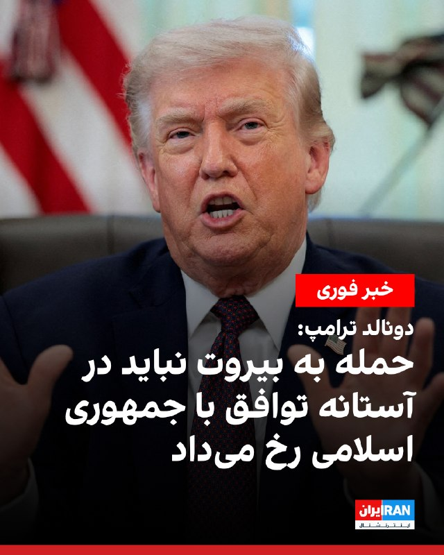

دونالد ترامپ، رییس‌جمهوری آمریکا، در تروت سوشال نوشت حمله یکشنبه اسرائیل به بیروت نباید انجام می‌شد، به‌ویژه در شرایطی که واشینگتن و تهران به گفته او «بسیار نزدیک» به دستیابی به توافق صلح هستند.
ترامپ گفت اسرائیل حق دفاع از خود را دارد، اما واکنش به حمله‌ای که «هیچ کشته یا زخمی نداشته»، نباید روند دستیابی به توافق را مختل کند.

او افزود آمریکا به توافقی نزدیک شده که می‌تواند برای منطقه، از جمله لبنان، صلح به همراه داشته باشد و از همه طرف‌ها خواست از تشدید تنش خودداری کنند.
ترامپ همچنین گفت نباید حمله دیگری از سوی اسرائیل در لبنان انجام شود و در مقابل، حزب‌الله نیز نباید حملات تازه‌ای علیه اسرائیل انجام دهد.
رییس‌جمهوری آمریکا در پایان نوشت: «این می‌تواند آغاز یک صلح طولانی و زیبا باشد؛ بیایید آن را خراب نکنیم.»
https://iranintl.com/202606142863

## Shin_Persian — post 7060

  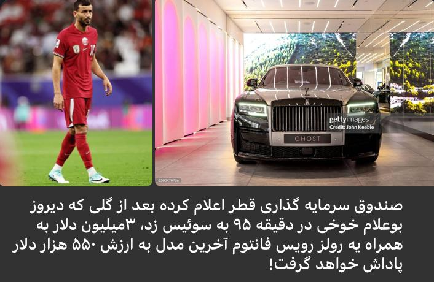

قراره یه دارکوبی هم مهمون خورشید خانم بشه

## Shin_Persian — post 7059

  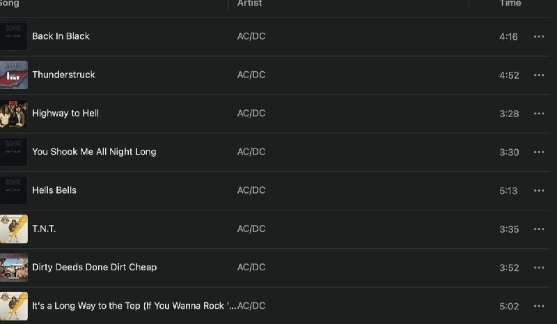

Shin ✓ @hey_itsmyturn
Sun, 14 Jun 2026 15:41:34 UTC

Upping my stamina for reporting either a deal or a missile-ful(?) night.

ترجمه خودکار فارسی

در حال افزایش استقامت خود برای گزارش دادن هستم، خواه خبر از یک توافق باشد یا شبی پر از موشک (؟).

𝕏 · @shin_persian

## Shin_Persian — post 7058

Shin ✓ @hey_itsmyturn Sun, 14 Jun 2026 15:31:24 UTC Someone in IRGC-owned Fars News' discussion group: "If they sign a deal, we, value-driven people will conduct acid attacks on women without hijabs. There must be no agreement with the killer of our leader."…

## Shin_Persian — post 7057

  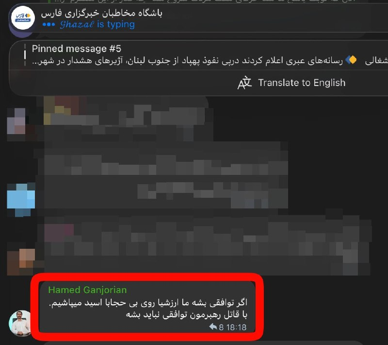

Shin ✓ @hey_itsmyturn
Sun, 14 Jun 2026 15:31:24 UTC

Someone in IRGC-owned Fars News' discussion group:

"If they sign a deal, we, value-driven people will conduct acid attacks on women without hijabs. There must be no agreement with the killer of our leader."

Here's a direct link for that very message:
https://t.me/farsna98/19202386

ترجمه خودکار فارسی

شخصی در گروه بحث خبرگزاری فارس (متعلق به سپاه پاسداران انقلاب اسلامی - IRGC):

«اگر توافقی را امضا کنند، ما ارزشی‌ها روی زنان بی‌حجاب اسیدپاشی خواهیم کرد. نباید هیچ توافقی با قاتل رهبرمان صورت بگیرد.»

این هم لینک مستقیم همان پیام:
https://t.me/farsna98/19202386

𝕏 · @shin_persian

## Shin_Persian — post 7054

  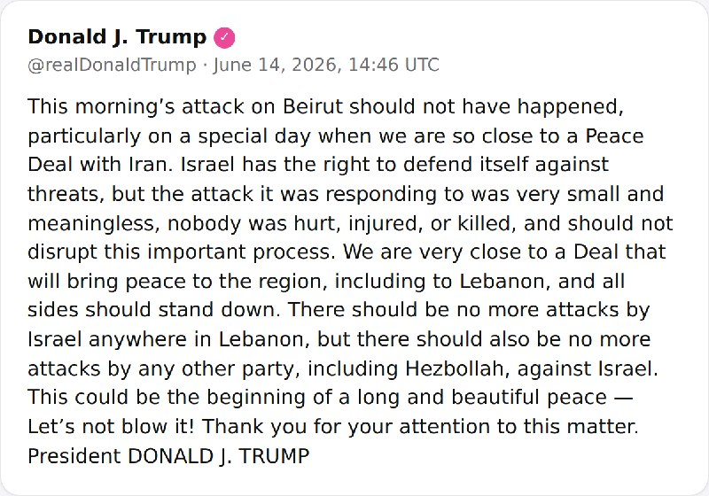

Shin ✓ @hey_itsmyturn
Sun, 14 Jun 2026 14:51:03 UTC

POTUS:
"This morning’s attack on Beirut should not have happened, particularly on a special day when we are so close to a Peace Deal with Iran. Israel has the right to defend itself against threats, but the attack it was responding to was very small and meaningless, nobody was hurt, injured, or killed, and should not disrupt this important process. We are very close to a Deal that will bring peace to the region, including to Lebanon, and all sides should stand down. There should be no more attacks by Israel anywhere in Lebanon, but there should also be no more attacks by any other party, including Hezbollah, against Israel. This could be the beginning of a long and beautiful peace — Let’s not blow it! Thank you for your attention to this matter. President DONALD J. TRUMP"

ترجمه خودکار فارسی در بخش نظرات

𝕏 · @shin_persian

## Shin_Persian — post 7053

Shin ✓ @hey_itsmyturn
Sun, 14 Jun 2026 14:49:04 UTC

. @SecWar on Face the Nation:
"As far as I know, we are on our way to signing the deal. It’s a question of when, not if. Israel is very restrained in its response to Hezbollah."

ترجمه خودکار فارسی

.@SecWar در برنامه «فیس د نیشن» (Face the Nation):
«تا آنجا که من می‌دانم، ما در مسیر امضای توافق هستیم. مسئله زمان انجام آن است، نه این‌که آیا انجام می‌شود یا خیر. اسرائیل در پاسخ خود به حزب‌الله بسیار خویشتن‌دار است.»

𝕏 · @shin_persian

## Shin_Persian — post 7052

Shin ✓ @hey_itsmyturn
Sun, 14 Jun 2026 14:48:37 UTC

. @SecWar on Face the Nation:
"The document says Iran will never have a nuclear weapon, won't seek one, won't buy one, won't have one."

ترجمه خودکار فارسی

.@SecWar در برنامه «Face the Nation»:
«این سند می‌گوید که ایران هرگز سلاح هسته‌ای نخواهد داشت، به دنبال آن نخواهد رفت، آن را نخواهد خرید و صاحب آن نخواهد شد.»

𝕏 · @shin_persian

## FarsiVOA — post 220700

آتشفشان فوئگو، یکی از فعال‌ترین آتشفشان‌های آمریکای مرکزی، در گواتمالا فوران کرد.

تصاویر منتشرشده، صحنه‌ای چشمگیر از فعالیت این آتشفشان فعال را نشان می‌دهد.

این کوه در جنوب‌مرکز گواتمالا و در نزدیکی شهر تاریخی آنتیگوا قرار دارد.

@FarsiVOA

## FarsiVOA — post 220699

🔺بی‌خبری از زرتشت احمدی راغب پس از انتشار پیام صوتی از زندان مرکزی کرج

◾️زرتشت احمدی راغب، زندانی سیاسی در زندان مرکزی کرج، در پیامی صوتی به مناسبت سالگرد انتشار «بیانیه ۱۴»، بر ضرورت آزادی زندانیان سیاسی، صلح، برگزاری انتخابات آزاد، تدوین قانون اساسی جدید، و پایان دادن به چرخه سرکوب و استبداد در ایران تأکید کرد.

⬇️ بیشتر بخوانید:

https://ir.voanews.com/a/iran-prisoner-disappears-after-message/8160696.html

## FarsiVOA — post 220698

خلع سلاح در عراق؛ نخستین گام‌های عملی بغداد و نگرانی جمهوری اسلامی

## FarsiVOA — post 220697

دونالد ترامپ پس از نشست جی۷ مهمان مکرون در ورسای می‌شود

## FarsiVOA — post 220696

انجمن مددکاران اجتماعی ایران هشدار داد با افزایش فقر، تعداد کودکان کار بیشتر شده ‌و آنها با بهره‌کشی جنسی، خشونت و سوءتغذیه مواجه‌اند

## FarsiVOA — post 220695

🔺سفیر آمریکا در سازمان ملل: ترامپ قطعا قصد دارد امروز با رژیم ایران یادداشت تفاهم امضا کند

◾️مایک والتز، سفیر آمریکا در سازمان ملل، می‌گوید دونالد ترامپ، رئیس جمهوری ایالات متحده، «قطعا قصد دارد» امروز یک یادداشت تفاهم با حکومت ایران امضا کند.

⬇️ بیشتر بخوانید:

https://ir.voanews.com/a/mike-waltz-says-president-trump-has-every-intent-to-sign-deal-with-iran-today/8160691.html

## FarsiVOA — post 220694

🔺ترامپ: به توافق صلح با حکومت ایران نزدیک شده‌ایم؛ اسرائیل و حزب‌الله به یکدیگر حمله نکنند

◾️دونالد ترامپ رئیس جمهوری آمریکا، از حمله صبح یکشنبه ۲۴ خرداد اسرائیل به بیروت انتقاد کرد و در شبکه اجتماعی تروت سوشال نوشت: «حمله صبح امروز به بیروت نباید رخ می‌داد، به‌ویژه در چنین روز مهمی که ما تا این حد به دستیابی به یک توافق صلح با [رژیم] ایران نزدیک شده‌ایم.»

⬇️ بیشتر بخوانید:

https://ir.voanews.com/a/donald-trump-iran-deal-beirut-attack-israel-agreement-with-iran/8160689.html

## FarsiVOA — post 220693

  <a href="telegram/content/FarsiVOA_220693_1781454063.mp4" target="_blank">🎬 Download video</a>

آتش شاکرمی، هنرمند و خاله نیکا شاکرمی با اشاره به سؤاستفاده جمهوری اسلامی از افشاگری‌های خود گفت: حکومت‌ها و گروه‌های سیاسی می‌آیند و می‌روند اما ایستادن پای حقیقت زمان و مکان ندارد.

## FarsiVOA — post 220692

  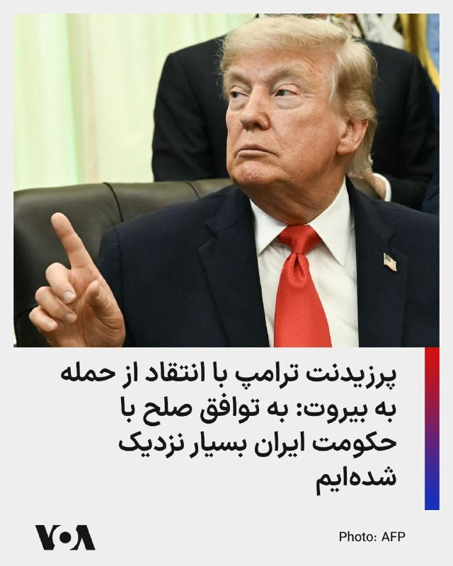

دونالد ترامپ: بسیار به توافقی نزدیک شده‌ایم که صلح را به منطقه، از جمله لبنان، خواهد آورد و همه طرف‌ها باید خویشتنداری کنند. دیگر نباید هیچ حمله‌ای از سوی اسرائیل در هیچ نقطه‌ای از لبنان صورت گیرد، اما در عین حال هیچ حمله‌ای از سوی هیچ طرف دیگری، از جمله حزب‌الله، علیه اسرائیل نیز نباید انجام شود.

## FarsiVOA — post 220691

با افزایش احتمال امضای تفاهم میان آمریکا و جمهوری اسلامی، شکاف میان حامیان و مخالفان این روند در ایران عمیق‌تر شده است. همزمان با حمله اسرائیل به ضاحیه بیروت، از تجمعات اعتراضی و درگیری‌ها در چند شهر تا حمایت محتاطانه مقام‌های حکومتی از مذاکرات گزارش شده است.

## FarsiVOA — post 220690

در گفت‌وگو با رضا علیجانی، از ابهام در روایت‌های حکومت ایران و واشینگتن و ماهیت تفاهم احتمالی گفتیم و به گفته او، بعید است جمهوری اسلامی در فرآیند امضای این تفاهم احتمالی، اختلافات خود را آمریکا کنار بگذارد.

## DW_Farsi — post 125967

  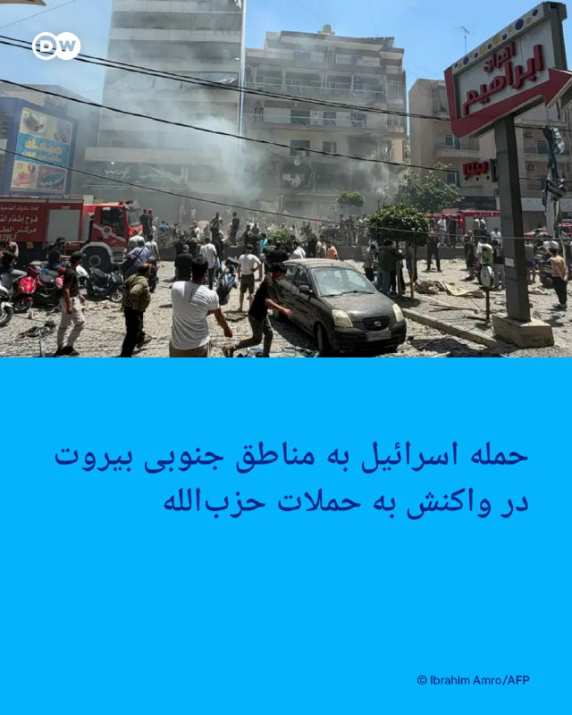

🔶 حمله اسرائیل به مناطق جنوبی بیروت در واکنش به حملات حزب‌الله

اسرائیل اعلام کرد، پس از حملات حزب‌الله که امروز یکشنبه (۱۴ ژوئن / ۲۴ خرداد) صورت گرفتند، به اهداف و مواضعی در ضاحیه واقع در حومه جنوبی بیروت، پایتخت لبنان حمله کرده است. ارتش اسرائیل شلیک سه پرتاب از سوی حزب‌الله به مناطق شمالی اسرائیل را "نقض آشکار آتش‌بس" خواند.

بنیامین نتانیاهو، نخست‌وزیر و یسرائیل کاتس، وزیر دفاع اسرائیل با انتشار بیانیه‌ای مشترک اعلام کردند که ارتش این کشور در پاسخ به حملات حزب‌الله "اهداف و مواضع متعلق به این گروه تروریستی را در محله ضاحیه در بیروت هدف قرار داده است".

حملات متقابل حزب‌الله و اسرائیل در حالی است که دونالد ترامپ، رئیس جمهور آمریکا گفته است، انتظار می‌رود توافق میان تهران و واشنگتن امروز به امضاء برسد. جمهوری اسلامی که بر توقف جنگ در لبنان به عنوان یکی از شروط توافق با آمریکا تأکید دارد، گفته است که نهایی‌شدن و امضای توافق میان طرفین در طی روزهای آتی صورت خواهد گرفت.

@dw_farsi

## DW_Farsi — post 125966

  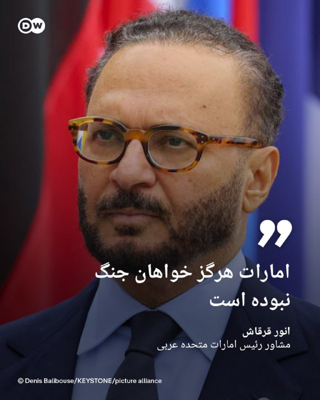

🔶انور قرقاش: امارات هرگز خواهان جنگ نبوده است

به گزارش نشریه خلیج‌تایمز أنور قرقاش، مشاور رئیس امارات متحده عربی با انتشار پستی در شبکه ایکس مدیریت بحران به رهبری این کشور در جریان تنش‌های اخیر در منطقه را ستود.

او در این رستا نوشت: «با نزدیک شدن به امضای توافق بین تهران و واشنگتن که مدت‌ها انتظار آن می‌رود و امیدواریم ورق جنگ را برگردانند و مسیر سیاسی موفقیت‌آمیزی باز کند، باید از عملکرد رهبری خردمندمان در مدیریت این بحران و پیامدهای آن تمجید کرد.»

این مقام ارشد تصریح کرد که امارات متحده همواره رویکردی مبتنی بر پرهیز از جنگ داشته و در عین حال بر حفظ امنیت و منافع ملی خود پایبند بوده است. او در این رابطه نوشت: «ما هرگز طرفدار جنگ نبوده‌ایم و همواره از صلح و ثبات حمایت کرده‌ایم، در عین حال به‌طور قاطع از حاکمیت و منافع خود دفاع می‌کنیم.»

@dw_farsi

## DW_Farsi — post 125965

  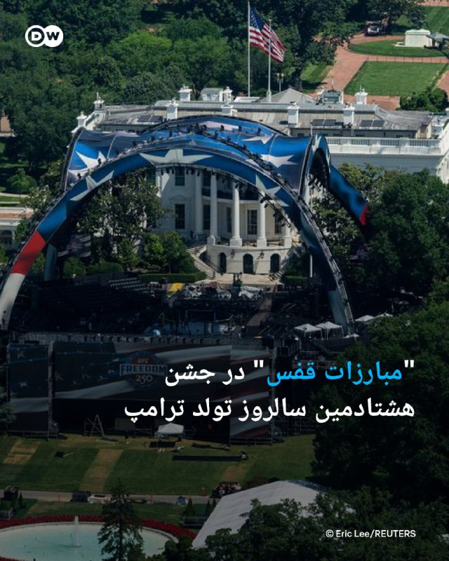

🔶 "مبارزات قفس" در جشن هشتادمین سالروز تولد ترامپ

در محوطه کاخ سفید جایگاهی برای مسابقه هنرهای رزمی برپا شده تا امروز ۱۴ ژوئن دونالد ترامپ همزمان با هشتادمین زادروز خود شاهد آن باشد. منتقدان از "نمایش خونین" سخن گفته و قصد دارند دست به اعتراض بزنند.

دونالد ترامپ، رئیس‌جمهور آمریکا، امروز ۱۴ ژوئن (۲۴ خرداد) همزمان با روز پرچم که سالروز تصویب رسمی پرچم ایالات متحده است ۸۰ ساله می‌شود و جشن بزرگی به راه می‌اندازد.

او هشتادسالگی‌اش را با تماشای مسابقه قهرمانی مبارزه نهایی (UFC) که "مبارزات قفس" نام گرفته و برای آن جایگاهی در محوطه کاخ سفید بنا شده جشن می‌گیرد.

ترامپ پیش از این با شور و اشتیاق در مورد این مسابقه گفته بود: «این بی‌نظیر است، یک رویداد یو‌اف‌سی [UFC] در چمن جنوبی!»

کاخ سفید امروز میزبان رویداد UFC در قالب برنامه "یو‌اف‌سی فریدم ۲۵۰" (UFC Freedom 250) به مناسبت ۲۵۰مین سالگرد استقلال آمریکا خواهد بود.

@dw_farsi

## DW_Farsi — post 125964

  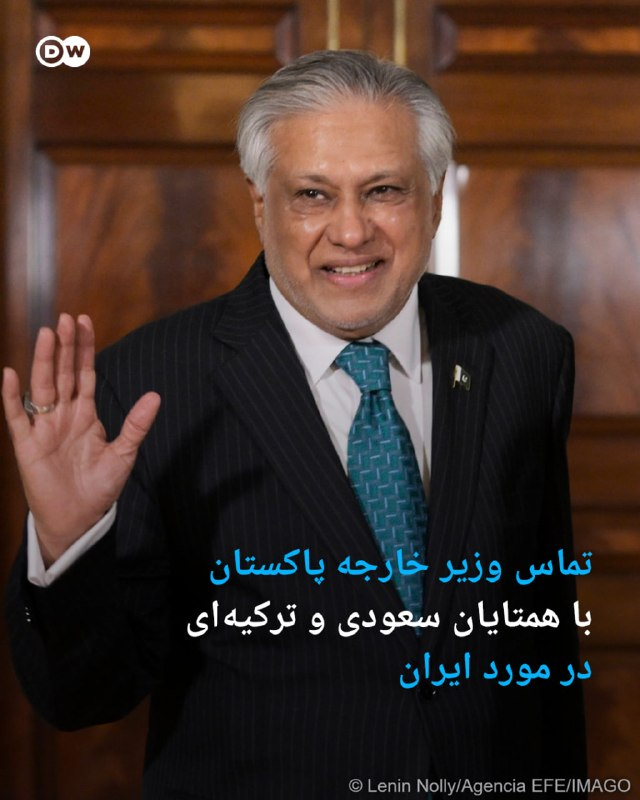

🔶 تماس وزیر خارجه پاکستان با همتایان سعودی و ترکیه‌ای در مورد ایران

به گزارش رسانه‌ای خبری محمد اسحاق دار، وزیر امور خارجه پاکستان با همتایان خود از عربستان سعودی و پاکستان تماس تلفنی داشته تا در مورد توافقی که قرار است میان تهران و واشنگتن به امضا رسد، صحبت و رایزنی کند.

اسحاق دار در تماس خود با هاکان فیدان، وزیر خارجه ترکیه از "پیشرفت‌های امیدوارکننده در راه تفاهم میان ایالات متحده و جمهوری اسلامی" استقبال و ابراز امیدواری کردن که این تحولات بتواند زمینه‌ساز صلح و ثبات پایدار در منطقه باشد.

وزارت امور خارجه پاکستان یکشنبه ۱۴ ژوئن (۲۴ خرداد) اعلام کرد که وزیر خارجه این کشور در این هفته تماس و رایزنی‌هایی با وزیران خارجه عربستان سعودی و همچنین سوئیس در ارتباط با پیشرفت‌هایی که در مذاکرات میان تهران و واشنگتن حاصل شده، داشته است.

@dw_farsi

## Persian_Trend_Official — post 17079

  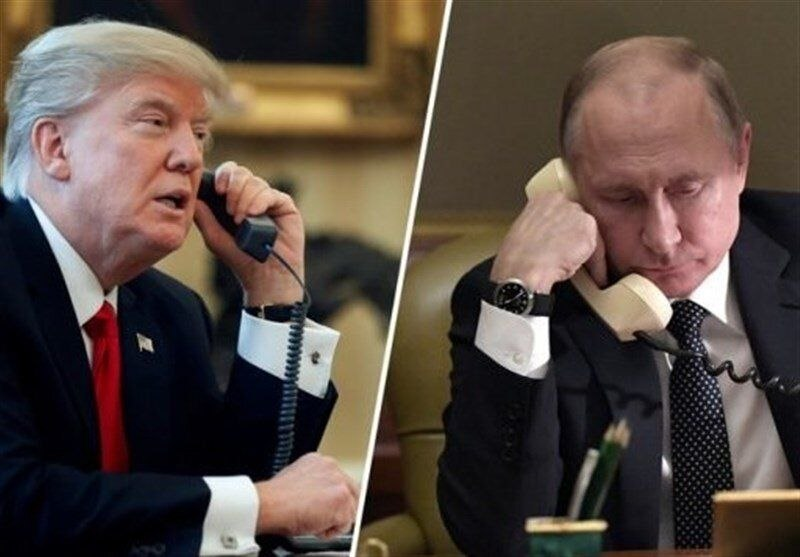

💩
🇺🇸کرملین: ولادیمیر پوتین و دونالد ترامپ توافق کردند که استیو ویتکاف و جرد کوشنر در آینده نزدیک بار دیگر به روسیه سفر کنند.

بر اساس این گزارش، ترامپ در گفت‌وگو با پوتین آمادگی خود را برای اعمال نفوذ بر کی‌یف و همچنین شرکای اروپایی واشنگتن ابراز کرده است.

👺Phantom

📌 @persian_trend_official
پرشین ترند | متفاوت‌ترین کانال نظامی

## Persian_Trend_Official — post 17078

  

سعید جلیلی برکنار شد.

سردار عظیم ابراهیم پور، فرمانده قرارگاه پیشرفت سپاه پاسداران رسماً اعلام کرد باقری کنی جایگزین سعید جلیلی در شعام شده است.

## Persian_Trend_Official — post 17077

  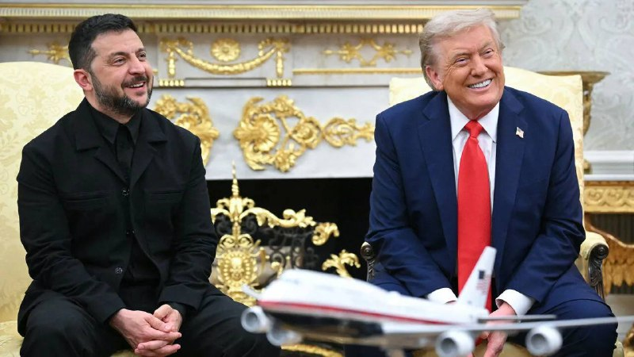

ولادیمر زلنسکی: دقایقی پیش گفت‌وگوی بسیار خوبی با دونالد ترامپ داشتم.

رئیس‌جمهور را در جریان آخرین تحولات میدان نبرد قرار دادم و توضیح دادم که مواضع ما تقویت شده است. همچنین توافق کردیم که در دیدار خود در نشست گروه هفت (G7) درباره این موضوعات بیشتر گفت‌وگو کنیم.

ایده‌های خوبی در اختیار داریم که می‌تواند به نزدیک‌تر شدن به صلح و حفظ جان انسان‌ها کمک کند.

📝 Amir

📌 @persian_trend_official
پرشین ترند | متفاوت‌ترین کانال نظامی

## Persian_Trend_Official — post 17076

  <a href="telegram/content/Persian_Trend_Official_17076_1781454068.webm" target="_blank">🎬 Download video</a>

💛گزارش الجزیره از محاصره دریایی ایران

شبکه خبری الجزیره در گزارشی به محاصره دریایی ایران توسط آمریکا پرداخته است.

👺Phantom

📌 @persian_trend_official
پرشین ترند | متفاوت‌ترین کانال نظامی

## Persian_Trend_Official — post 17075

🇮🇱 گزارش رسانه اسرائیلی از تلاش آمریکا برای جلوگیری از تشدید تنش با ایران

📰 کانال ۱۴ اسرائیل مدعی شد ایالات متحده از طریق چندین واسطه منطقه‌ای و بین‌المللی در تلاش است از هرگونه حمله احتمالی ایران به خاک اسرائیل جلوگیری کند.
🔹 بر اساس این گزارش، واشنگتن در روزهای اخیر پیام‌هایی را با هدف جلوگیری از گسترش درگیری‌ها میان تهران و تل‌آویو منتقل کرده است.
🔹 کانال ۱۴ همچنین مدعی شد اسرائیل در پاسخ به این پیام‌ها تأکید کرده است:
💬 «اگر ایران به ما حمله کند، پاسخ اسرائیل سریع و شدید خواهد بود.»
🔹 تاکنون هیچ مقام رسمی در ایران، آمریکا یا اسرائیل به این گزارش واکنش نشان نداده است.

👺Phantom

📌 @persian_trend_official
پرشین ترند | متفاوت‌ترین کانال نظامی

## Persian_Trend_Official — post 17074

  <a href="telegram/content/Persian_Trend_Official_17074_1781454069.webm" target="_blank">🎬 Download video</a>

برگزاری کابینه امنیتی اسرائیل در پناهگاه‌های زیرزمینی

🌟شبکه ۱۳ تلویزیون اسرائیل از اتخاذ تدابیر امنیتی فوق‌العاده برای برگزاری نشست امشب کابینه جنگ خبر داد.

🔹به گزارش این شبکه، به دلیل افزایش تنش‌ها و احتمال پاسخ مستقیم ایران به حملات اخیر، نشست امشب کابینه امنیتی سیاسی در یکی از سایت‌های فوق‌محرمانه و مستحکم زیرزمینی برگزار خواهد شد.

👺Phantom

📌 @persian_trend_official
پرشین ترند | متفاوت‌ترین کانال نظامی

## Persian_Trend_Official — post 17070

ارتش اسرائیل همچنین اهدافی را در شوکن، المنصوری و کفار سیر بمباران کرد.

📝 Amir

📌 @persian_trend_official
پرشین ترند | متفاوت‌ترین کانال نظامی

## Persian_Trend_Official — post 17069

به گزارش کانال 14 اسرائیل، ایالات متحده در حال حاضر تلاش می‌کند از طریق واسطه‌های مختلف از هرگونه حمله قریب‌الوقوع ایران به خاک اسرائیل جلوگیری کند.

پیامی که اسرائیل در پاسخ ارسال کرد: اگر ایرانی‌ها به ما حمله کنند، ما به شدت و به سرعت پاسخ خواهیم داد.

📝 Amir

📌 @persian_trend_official
پرشین ترند | متفاوت‌ترین کانال نظامی

## Persian_Trend_Official — post 17067

نیروی هوایی ارتش اسرائیل دقایقی پیش هدفی را در تبنین واقع در جنوب لبنان بمباران کرد.

📝 Amir

📌 @persian_trend_official
پرشین ترند | متفاوت‌ترین کانال نظامی

## Persian_Trend_Official — post 17066

  <a href="telegram/content/Persian_Trend_Official_17066_1781454069.mp4" target="_blank">🎬 Download video</a>

مجری: اما الان با آن ذخایر سلاح‌ها (که در جنگ ایران استفاده شد) مشکلی وجود دارد؟

پیت هگست: خیر، چنین چیزی نیست. این داستانی ساختگی است که رسانه‌ها می‌خواهند آن را پخش کنند. ذخایر ما عالی هستند و فقط قوی‌تر می‌شوند.

مجری: شما در مقابل کنگره در این‌باره (که بازسازی ذخایر طول خواهد کشید) شهادت داده‌اید.

هگست: لازم نیست برایم آنچه را که شهادت داده‌ام دوباره بخوانید... من حدس زدم که برخی مهمات زمان بیشتری نسبت به بقیه می‌برند.

📝 Amir

📌 @persian_trend_official
پرشین ترند | متفاوت‌ترین کانال نظامی

## Persian_Trend_Official — post 17065

  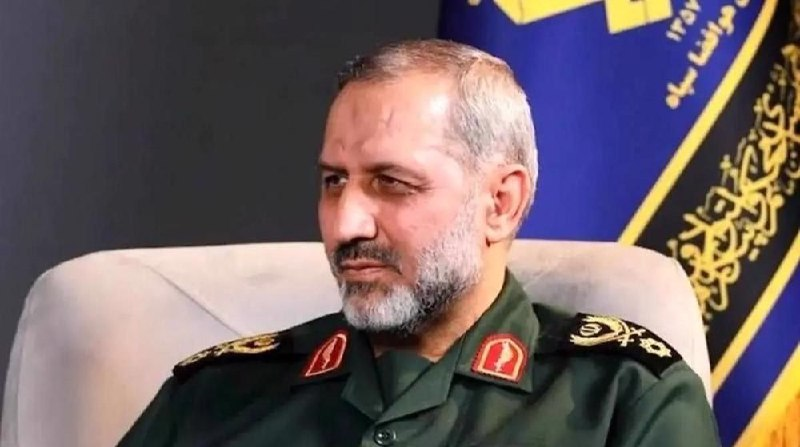

فرمانده هوافضا: گوش به فرمان ولایت باشید و از هر کلامی که اتحاد مقدس شما را به خطر می‌اندازد دوری نمایید.

سردار سید مجید موسوی: ملت بصیر و غیور که در خونخواهی امام شهید مبعوث گشتید و در راه تحقق ارمانهای بلند انقلاب اسلامی و اقتدار و سرافرازی ایران عزیز، با امام حاضر عهدی تازه بستید، هوشیار باشید که از شئون متعهد بودن تبعیت کردن است. پس نه یک گام جلوتر و نه یک گام عقب‌تر، بلکه همراه با ولی خویش باشید.

درست در مسیری که امام خمینی کبیر رحمه الله علیه فرمودند: پشتیبان ولایت فقیه باشید تا به مملکت شما اسیب نرسد.

📝 Amir

📌 @persian_trend_official
پرشین ترند | متفاوت‌ترین کانال نظامی

## Persian_Trend_Official — post 17064

  <a href="telegram/content/Persian_Trend_Official_17064_1781454071.webm" target="_blank">🎬 Download video</a>

سخنگوی ارتش اسرائیل: هشدارهایی مبنی بر ورود یک هواپیمای متخاصم به منطقه عرب الارمشه فعال شد، جزئیات در حال بررسی است.

📝 Amir

📌 @persian_trend_official
پرشین ترند | متفاوت‌ترین کانال نظامی

## Persian_Trend_Official — post 17063

ارتش اسرائیل: ارتش برای شلیک موشک از سمت ایران آماده می‌شود.

ارتش اسرائیل با انتشار اطلاعیه‌ای اعلام کرد: پس از حمله به بیروت، سرلشکر ایال زامیر رئیس ستاد کل ارتش درحال انجام ارزیابی‌های مستمر وضعیت با تمامی فرماندهان مربوطه است.

براساس ارزیابی وضعیت، ارتش اسرائیل برای احتمال شلیک به‌سمت اسرائیل در ساعات آینده آماده می‌شود. ارتش در حالت آماده‌باش کامل است و برای طیف وسیعی از سناریوهای دفاعی و تهاجمی آماده است.

از عموم مردم خواسته می‌شود هوشیار باقی بمانند، مسئولانه عمل کنند و دستورالعمل‌های به‌روزشده صادر شده توسط فرماندهی جبهه داخلی را دنبال کنند.

درحال‌حاضر هیچ تغییری در دستورالعمل‌های دفاعی فرماندهی جبهه داخلی وجود ندارد. ارتش اسرائیل هرگونه شلیک به سمت اسرائیل را تحمل نخواهد کرد.

📝 Amir

📌 @persian_trend_official
پرشین ترند | متفاوت‌ترین کانال نظامی

## Persian_Trend_Official — post 17062

  <a href="telegram/content/Persian_Trend_Official_17062_1781454071.webm" target="_blank">🎬 Download video</a>

سردار اسدی: جنایت صهیونیست‌ها بی‌پاسخ نمی‌ماند.

سردار محمدجعفر اسدی معاون بازرسی قرارگاه مرکزی خاتم الأنبیا در گفتگو با دفاع‌پرس در واکنش به حمله مجدد اسرائیل به ضاحیه بیروت اظهار داشت: بدون شک این جنایات بی‌پاسخ نخواهد ماند.

📝 Amir

📌 @persian_trend_official
پرشین ترند | متفاوت‌ترین کانال نظامی

## Persian_Trend_Official — post 17061

  <a href="telegram/content/Persian_Trend_Official_17061_1781454072.webm" target="_blank">🎬 Download video</a>

⭕️ وزیر جنگ ایالات متحده: تا آنجا که من می‌دانم، ما در مسیر امضای توافق هستیم. مسئله زمان آن است، نه اینکه آیا این اتفاق می‌افتد یا خیر. اسرائیل در واکنش به حزب‌الله بسیار میانه‌رو است. 📝 Nick 📌 @persian_trend_official پرشین ترند | متفاوت‌ترین کانال نظامی

## Persian_Trend_Official — post 17060

شبکه العربیه: یک مقام ارشد حزب‌الله، علی الحاج، در حمله ارتش اسرائیل به ضاحیه بیرت کشته شد. همچنین کانال 12 اسرائیل ادعا کرد هدف حمله امروز فرمانده واحد ارتباط حزب‌الله بوده است. 📝 Amir 📌 @persian_trend_official پرشین ترند | متفاوت‌ترین کانال نظامی

## RadioFarda — post 158297

🔸مسعود پزشکیان، رئیس‌جمهور ایران، در پی انتقادات برخی حامیان حکومت از محتوای توافق احتمالی با آمریکا، روز یکشنبه گفت که روند مذاکرات بر اساس مصوبات شورای عالی امنیت ملی و دیدگاه‌های رهبر جمهوری اسلامی پیش می‌رود. 🔸او در دیدار با مدیران رسانه‌های داخلی افزود:…

## RadioFarda — post 158296

  

🔸مسعود پزشکیان، رئیس‌جمهور ایران، در پی انتقادات برخی حامیان حکومت از محتوای توافق احتمالی با آمریکا، روز یکشنبه گفت که روند مذاکرات بر اساس مصوبات شورای عالی امنیت ملی و دیدگاه‌های رهبر جمهوری اسلامی پیش می‌رود.

🔸او در دیدار با مدیران رسانه‌های داخلی افزود: «تصمیمات راهبردی کشور باید در چارچوب سازوکارهای قانونی اتخاذ شود و همه جریان‌ها و گروه‌ها نیز خود را ملزم به تبعیت از این تصمیمات بدانند.»

🔸در آستانهٔ امضای تفاهم‌نامهٔ ایران و آمریکا برای پایان جنگ، اعتراض‌ در میان حامیان تندروی حکومت به متنی که به‌عنوان تفاهم‌نامه در برخی رسانه‌ها منتشر شد بالا گرفته و تجمعاتی نیز توسط گروهی از طرفداران جمهوری اسلامی علیه این تفاهم و مذاکره‌کنندگان برگزار شده است.

🔸در یکی از این تجمعات در تهران، تجمع‌کنندگان علیه عباس عراقچی، وزیر خارجه، و محمدباقر قالیباف، رئیس مجلس شورای اسلامی، شعارهایی سر دادند.

@RadioFarda

## RadioFarda — post 158295

🔸یک گربه در جریان اجرای باله «رومئو و ژولیت» در شهر ازمیر ترکیه، ناگهان وارد صحنه شد.

🔸این اتفاق در صحنه پایانی نمایش و هنگام اجرای «گروه باله امپراتوری روسیه» رخ داد.

🔸ویدئوهای منتشرشده نشان می‌دهد گربه به رومئو، که در بخشی از داستان روی صحنه بی‌حرکت افتاده است، نزدیک می‌شود و با موهای او بازی می‌کند.

🔸در همان حال، ژولیت در حال اجرای صحنه سوگواری برای مرگ معشوق خود است.

🔸رقصندگان بدون وقفه به اجرای خود ادامه دادند و واکنشی به حضور این مهمان غیرمنتظره نشان ندادند.

@RadioFarda

## RadioFarda — post 158294

🔸دونالد ترامپ، رئیس‌جمهور آمریکا، روز یکشنبه با انتقاد از حمله ساعاتی پبش اسرائیل به حومه جنوبی بیروت تأکید کرد برای رسیدن به توافق با ایران، اسرائیل دیگر نباید «هیچ نقطه‌ای از لبنان» را هدف قرار دهد. 🔸او با انتشار متنی در شبکه اجتماعی تروث سوشال اعلام کرد:…

## RadioFarda — post 158293

  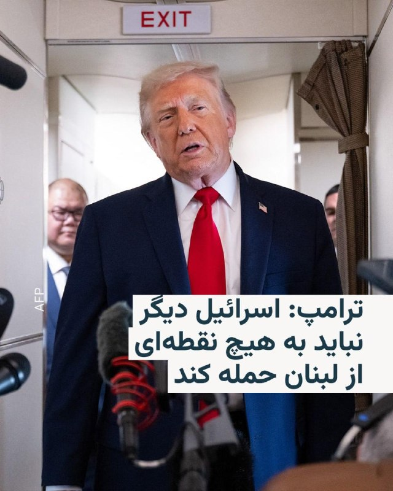

🔸دونالد ترامپ، رئیس‌جمهور آمریکا، روز یکشنبه با انتقاد از حمله ساعاتی پبش اسرائیل به حومه جنوبی بیروت تأکید کرد برای رسیدن به توافق با ایران، اسرائیل دیگر نباید «هیچ نقطه‌ای از لبنان» را هدف قرار دهد.

🔸او با انتشار متنی در شبکه اجتماعی تروث سوشال اعلام کرد: «حمله صبح امروز به بیروت نباید رخ می‌داد، به‌ویژه در چنین روز مهمی که ما تا این حد به دستیابی به یک توافق صلح با ایران نزدیک شده‌ایم.»

🔸ترامپ افزود: «اسرائیل حق دارد از خود در برابر تهدیدها دفاع کند، اما حمله‌ای که در پاسخ به آن اقدام کرد بسیار کوچک و بی‌اهمیت بود؛ هیچ‌کس در آن کشته، زخمی یا مجروح نشد و نباید این روند مهم را مختل کند.»

🔸ارتش اسرائیل گفته است در پاسخ به شلیک‌هایی از سوی حزب‌الله به خاک خود، به اهدافی از این گروه مورد حمایت جمهوری اسلامی در ضاحیه، حومه جنوبی بیروت، حمله کرد.

@RadioFarda

## IranianMinds — post 22563

  

🔴پست ترامپ، ترجمه ماشین:
حمله صبح امروز به بیروت نباید اتفاق می‌افتاد؛ به‌ویژه در روزی خاص که ما تا این اندازه به توافق صلح با ایران نزدیک هستیم. اسرائیل حق دارد از خود در برابر تهدیدها دفاع کند، اما حمله‌ای که در پاسخ به آن انجام شد بسیار کوچک و بی‌اهمیت بود؛ هیچ‌کس آسیبی ندید، زخمی نشد یا کشته نشد، و نباید این روند مهم را مختل کند.

ما به توافقی بسیار نزدیک هستیم که صلح را به منطقه، از جمله لبنان، خواهد آورد و همه طرف‌ها باید عقب‌نشینی کنند. دیگر نباید هیچ حمله‌ای از سوی اسرائیل در هیچ نقطه‌ای از لبنان انجام شود، اما همچنین نباید هیچ حمله‌ای از سوی هیچ طرف دیگری، از جمله حزب‌الله، علیه اسرائیل صورت گیرد.

این می‌تواند آغاز یک صلح طولانی و زیبا باشد — بیایید خرابش نکنیم!

از توجه شما به این موضوع سپاسگزارم.

رئیس‌جمهور دونالد جی. ترامپ

@IranianMinds

## BBCPersian — post 283804

اسرائیل اعلام کرد که پس از حملات امروز حزب‌الله، به اهدافی در ضاحیه در حومه جنوبی بیروت حمله کرده است.
ارتش اسرائیل گفت که حزب‌الله سه پرتابه به مناطق شمالی اسرائیل شلیک کرد که «نقض آشکار آتش‌بس» است.

گزارش نفیسه کوهنورد را ببینید.

@BBCPersian

## BBCPersian — post 283803

  <a href="https://t.me/bbcpersian/283803" target="_blank">📎 Download file</a>

📻این هفته در ویژه برنامه جام ۲۶ - قسمت اول

🏆چیزی به اولین بازی تیم ملی فوتبال ایران در جام جهانی نمانده و هر چه به بازی نزدیک‌تر می‌شویم حواشی هم پر رنگ‌تر می‌شود.

تیمی که بازی‌اش در آمریکا انجام می‌شود، کشوری که با آن در جنگ است. ایرانیان هم به دلایل شرایط سیاسی چند سال اخیر نگاه‌های چند گانه‌ای به این تیم دارند. آنچه فعلا به نظر قطعی می‌رسد این است که تیم ملی ایران قصد دارد روز یکشنبه، یک روز پیش از دیدار با نیوزیلند، وارد لس‌آنجلس شود تا در برنامه‌های رسمی فیفا پیش از مسابقه، از جمله نشست خبری و تمرین رسمی تیم، شرکت کند.

شنونده و بیننده پادکست جام ۲۶ با اجرای پوریا ژافره و سام فرزانه از لس آنجلس محل دیدار اول ایران با نیوزیلند باشید.

@BBCPersian

## BBCPersian — post 283802

🔻اسرائیل: ایران مثل همیشه دروغ می‌گوید

پس از پیام محمدباقر قالیباف در ایکس، وزارت خارجه اسرائیل به آن پاسخ داد و ایران را به دروغگویی متهم کرد.

در این پیام آمده است: «رژیم ایران مثل همیشه دروغ می‌گوید. نیروی نیابتی ایران یعنی حزب‌الله کاملا بی‌دلیل امروز صبح به اسرائیل حمله کرد.»

«حزب‌الله دائم به شهروندان اسرائیل شلیک می‌کند. حتی بعد از آتش‌بس حزب‌الله هدف قرار دادن شهروندان را متوقف نکرده است.»

اسرائیل و حزب در طول آتش‌بس به حمله به یکدیگر ادامه دادند.

حزب‌الله می‌گوید امروز به شمال اسرائیل حمله نکرده و فقط سربازان اسرائیلی در جنوب لبنان را هدف قرار داده است.

https://bbc.in/4fEONCy
@BBCPersian

## BBCPersian — post 283801

🔻فارس: قطعا امروز توافقی با آمریکا امضا نخواهد شد

خبرگزاری فارس به نقل از «یک منبع نزدیک به تیم مذاکره‌کننده ایران» نوشت: «قطعاً در زمان اعلامی ترامپ هیچ توافقی امضا نخواهد شد.»

دونالد ترامپ، رئیس جمهور آمریکا، گفته بود که توافق با ایران امروز امضا و بلافاصله تنگه هرمز به روی همه کشتی‌ها باز خواهد شد.

بنابر این گزارش، «ساعاتی پیش از حمله» اسرائیل به ضایحه در جنوب بیروت، این منبع به خبرگزاری فارس گفته بود که «تیم قطری هم‌اکنون در تهران حضور دارد و ایران بندهای موردنظر خود را همراه با جزئیات دقیق مدنظرش، از طریق همین تیم قطری به طرف مقابل منتقل می‌کند.»

به گزارش این خبرگزاری که به نهادهای نظامی و امنیتی نزدیک است، این منبع تاکید کرده است که هیچ چیز نهایی نشده است:

«حتی اگر در روند مذاکره پیش و پس برویم و به عقب برگردیم، شرط اساسی ایران این است که در پایان، تمام موارد مدنظرش به طور کامل لحاظ شود.»

«اما حتی در صورت اعمال همه نظرات ایران قطعاً در زمان اعلامی ترامپ هیچ توافقی امضا نخواهد شد.»

https://bbc.in/4fEONCy
@BBCPersian

## idfinfarsi — post 11847

  

❌در پایان هفته گذشته: ارتش اسرائیل علی موسى دقدوق — یکی از فرماندهان ارشد سازمان تروریستی حزب‌الله و فرمانده پیشین «پرونده جولان» — را در جنوب لیتانی به هلاکت رساند

⭕️ارتش اسرائیل در پایان هفته (جمعه) در جنوب لبنان حمله کرد و تروریست علی موسى دقدوق — فرمانده ارشد در سازمان تروریستی حزب‌الله — را به هلاکت رساند.

⭕️دقدوق در طول خدمت خود در سازمان، مسئولیت‌های متعددی بر عهده داشت و به عنوان یک منبع کلیدی دانش با تجربه عملیاتی بالا شناخته می‌شد. او در سال‌های اخیر در اجرای طرح‌های تروریستی و نبرد علیه نیروهای ارتش اسرائیل و کشور اسرائیل نقش داشته است.

⭕️از جمله مسئولیت‌های او:
- فرمانده تیم حفاظت رهبر سازمان تروریستی حزب‌الله که به هلاکت رسید، حسن نصرالله
- فرمانده در یگان «رضوان»
- فرمانده در بخش عملیات یگان «نصر»
- مسئول یگان پیاده‌نظام در حزب‌الله
- فرمانده «پرونده جولان» — شاخه عملیاتی مسئول استقرار سازمان در سوریه و ایجاد زیرساخت‌های نظامی در نزدیکی مرز کشور اسرائیل؛ این یگان توسط ارتش اسرائیل در سال ۲۰۱۹ افشا شد

⭕️دقدوق در سال‌های اخیر بخش قابل توجهی از طرح‌های عملیاتی علیه نیروهای ما را هدایت می‌کرد. در سال ۲۰۰۷ توسط نیروهای آمریکایی بازداشت شد، پس از آنکه در ربایش و اجرای قتل پنج سرباز آمریکایی نقش داشت.

⭕️این اقدام، حذف قابل توجه یک فرمانده ارشد دیگر در حزب‌الله و بستن یک حلقه مهم در برابر یکی از مجریان اصلی اقدامات تروریستی علیه شهروندان کشور اسرائیل، نیروهای ارتش اسرائیل و همچنین سربازان آمریکایی به شمار می‌رود.

⭕️ارتش اسرائیل به هدف قرار دادن فرماندهان سازمان تروریستی حزب‌الله ادامه خواهد داد.

## Dirty_Kids — post 392018

  <a href="telegram/content/Dirty_Kids_392018_1781454074.mp4" target="_blank">🎬 Download video</a>

کارشناس شبکه افق: پاکستانی‌ها برای میانجی‌گری به ایران نمی‌آیند، بلکه مرتب پیام تهدید و‌ ترور می‌آورند!

@Dirty_Kids 👻

## Dirty_Kids — post 392017

  <a href="telegram/content/Dirty_Kids_392017_1781454075.mp4" target="_blank">🎬 Download video</a>

مدارک لازم جهت اخذ انتقام رهبری ! 😂😂😂😂

@Dirty_Kids 👻

## Dirty_Kids — post 392015

  <a href="telegram/content/Dirty_Kids_392015_1781454077.mp4" target="_blank">🎬 Download video</a>

🔴 کسی که به مرد عنکبوتی یمنی معروف بود و روی صخره حرکت نمایشی اجرا میکرد، موقع اجرای نمایش افتاد ته دره و مُرد.

⚠️ حاوی صحنه دلخراش، اگه ناراحتی قلبی دارین باز نکنین.

@Dirty_Kids 👻

## Dirty_Kids — post 392014

  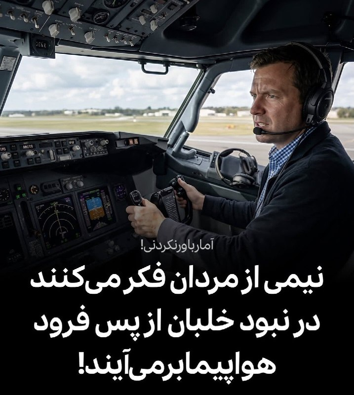

من که مطمئنم

@Dirty_Kids 👻

## Dirty_Kids — post 392013

تو توی سال ۱۳۲۲ برای جذب همکلاسیای دخترت عضو حزب توده میشی،
من بخاطرت اینجا توی سال ۱۴۰۵ هر دبه ماست رو میگیرم سیصد هزار تومن.

@Dirty_Kids 👻

## Hranews — post 113611

یک زندانی در زندان بجنورد اعدام شد

❗️
❗️
❗️
❗️
❗️– حکم یک زندانی که پیشتر از بابت اتهامات قتل و تجاوز به عنف به #اعدام محکوم شده بود، سحرگاه روز چهارشنبه ۲۰ خرداد ماه در زندان بجنورد به اجرا در آمد.

ادامه مطلب

#بهاءالدین_وحیدی

↘️
@hranews_bot تماس ✉️ -  @Hranews  کانال هرانا 🆑

## Hranews — post 113610

  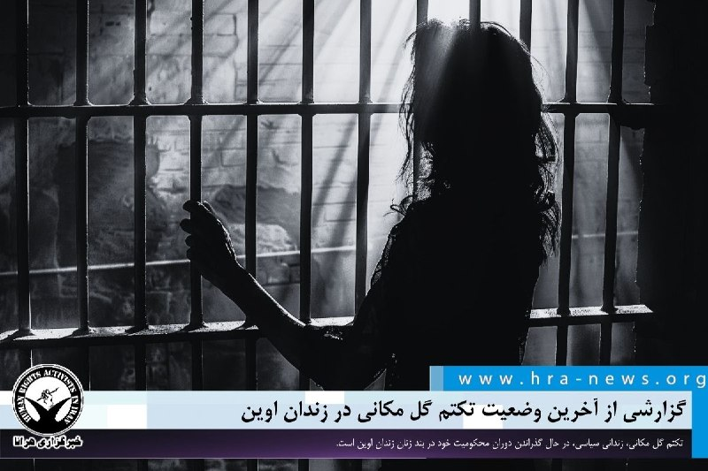

گزارشی از آخرین وضعیت تکتم گل مکانی در زندان اوین

❗️
❗️
❗️
❗️
❗️– تکتم گل مکانی، زندانی سیاسی، در حال گذراندن دوران محکومیت خود در بند زنان زندان اوین است. وی پیشتر توسط #دادگاه_انقلاب به پنج سال حبس محکوم شده بود.

به گزارش خبرگزاری هرانا، ارگان خبری مجموعه فعالان حقوق بشر در ایران، تکتم گل مکانی، دوران محکومیت حبس خود را در زندان اوین سپری می کند.

بر اساس اطلاعات دریافتی هرانا، خانم گل مکانی پس از بازداشت و تشکیل پرونده، در دادگاه انقلاب محاکمه شد. در نهایت، دادگاه مذکور او را به پنج سال حبس از بابت اتهامات سیاسی محکوم کرد.
یک منبع مطلع ضمن تایید این خبر به هرانا گفت: “بازداشت و محکومیت تکتم گل‌ مکانی در ارتباط با فعالیت‌های وی در شبکه اجتماعی ایکس (توییتر سابق) صورت گرفته است.”

ادامه مطلب

#تکتم_گل_مکانی

↘️
@hranews_bot تماس ✉️ -  @Hranews  کانال هرانا 🆑

## alonews — post 127947

  <a href="telegram/content/alonews_127947_1781454079.webm" target="_blank">🎬 Download video</a>

👈ترامپ می‌گوید از ایران خواهد خواست که در پی حملات اسرائیل به لبنان، با حملات موشکی پاسخ ندهد.

✅ @AloNews خبر جنگ

## alonews — post 127946

  <a href="telegram/content/alonews_127946_1781454079.webm" target="_blank">🎬 Download video</a>

👈ترامپ پس از حمله به لبنان با نتانیاهو تماس گرفت و به او گفت: «داری چیکار می‌کنی؟!» 
🔴ترامپ به نتانیاهو گفت که هیچ حمله دیگری به لبنان انجام ندهد و هشدار داد که این حملات می‌تواند توافق را به خطر بیندازد. 
✅ @AloNews خبر جنگ

## alonews — post 127945

  <a href="telegram/content/alonews_127945_1781454079.webm" target="_blank">🎬 Download video</a>

👈ترامپ پس از حمله به لبنان با نتانیاهو تماس گرفت و به او گفت: «داری چیکار می‌کنی؟!»

🔴ترامپ به نتانیاهو گفت که هیچ حمله دیگری به لبنان انجام ندهد و هشدار داد که این حملات می‌تواند توافق را به خطر بیندازد.

✅ @AloNews خبر جنگ

## alonews — post 127944

  <a href="telegram/content/alonews_127944_1781454079.webm" target="_blank">🎬 Download video</a>

👈ترامپ به اکسیوس : ما قرار بود امروز صبح این توافق رو امضا کنیم و حمله اسرائیل به بیروت این کار رو به تأخیر انداخت

🔴فکر می‌کنم امضا هنوز امروز کو چند ساعت آینده انجام شه

✅ @AloNews خبر جنگ

## alonews — post 127939

  <a href="telegram/content/alonews_127939_1781454079.webm" target="_blank">🎬 Download video</a>

👈کرملین: ترامپ در گفتگوی خود با پوتین، تمایل خود را برای اعمال نفوذ بر کی‌یف و شرکای اروپایی واشنگتن ابراز داشت.

🔴پوتین و ترامپ توافق کردند که استیو ویتکاف و جرد کوشنر در آینده نزدیک دوباره به روسیه سفر کنند

✅ @AloNews خبر جنگ

## alonews — post 127937

  <a href="telegram/content/alonews_127937_1781454079.webm" target="_blank">🎬 Download video</a>

👈یه اسپویل کنم؟ جبهه منحوس پایداری بزودی دیلیت میشه. خبر دارم که میگم😉 
✅ @AloNews خبر جنگ

## alonews — post 127936

  <a href="telegram/content/alonews_127936_1781454080.webm" target="_blank">🎬 Download video</a>

🔴فوری/گزارشات تایید نشده از برکناری سعید جلیلی از شعام و جایگزینی باقری کنی با وی حکایت دارد

✅ @AloNews خبر جنگ

## alonews — post 127935

  <a href="telegram/content/alonews_127935_1781454080.webm" target="_blank">🎬 Download video</a>

👈فارن افرز: داشتن سلاح هسته‌ای دیگر برای جلوگیری از حملات نظامی دردناک توسط دشمنان کافی نیست

✅ @AloNews خبر جنگ

## alonews — post 127934

  <a href="telegram/content/alonews_127934_1781454080.webm" target="_blank">🎬 Download video</a>

👈پوتین با ترامپ صحبت کرد و تولد ۸۰ سالگیش رو تبریک گفت

✅ @AloNews خبر جنگ

## alonews — post 127933

  <a href="telegram/content/alonews_127933_1781454080.webm" target="_blank">🎬 Download video</a>

👈گزارش‌هایی مبنی بر بازشدن پناهگاه‌ها در سراسر کشور اسرائیل

✅ @AloNews خبر جنگ

## alonews — post 127932

  <a href="telegram/content/alonews_127932_1781454080.webm" target="_blank">🎬 Download video</a>

👈بنیامین نتانیاهو، نخست‌وزیر اسرائیل، در تماس اخیر با رئیس‌جمهور ترامپ گفت که اسرائیل با عقب‌نشینی کامل از جنوب لبنان، از جمله پنج نقطه‌ای که در حال حاضر توسط نیروهای دفاعی اسرائیل (IDF) در اختیار است، موافقت نخواهد کرد، طبق گزارش معاریو.

🔴 نتانیاهو همچنین عقب‌نشینی از خاک سوریه را که اسرائیل از زمان سقوط بشار اسد اشغال کرده است، رد کرد

✅ @AloNews خبر جنگ

## alonews — post 127931

  <a href="telegram/content/alonews_127931_1781454080.webm" target="_blank">🎬 Download video</a>

👈کانال ۱۳ اسرائیل به نقل از منابع: جلسه امروز کابینه امنیتی به دلیل نگرانی از شلیک موشک از سوی ایران در یک پناهگاه مستحکم برگزار خواهد شد.

✅ @AloNews خبر جنگ

## alonews — post 127930

  <a href="telegram/content/alonews_127930_1781454081.webm" target="_blank">🎬 Download video</a>

👈 طبق گزارش منتشر شده کانال ۱۲ جلسه کابینه اسرائیل در امنیتی ترین مقر اسرائیل برگزار شده

✅ @AloNews خبر جنگ

## alonews — post 127929

  <a href="telegram/content/alonews_127929_1781454081.webm" target="_blank">🎬 Download video</a>

👈سید مجید موسوی: گوش به فرمان ولایت باشید و از هر کلامی که اتحاد مقدس شما را به خطر می‌اندازد دوری نمایید

✅ @AloNews خبر جنگ

## alonews — post 127928

  <a href="telegram/content/alonews_127928_1781454081.webm" target="_blank">🎬 Download video</a>

👈کانال ۱۲ اسرائیل: آمریکا به شدت به ایران فشار میاورد که پاسخی ندهد!

✅ @AloNews خبر جنگ

## alonews — post 127927

  <a href="telegram/content/alonews_127927_1781454081.webm" target="_blank">🎬 Download video</a>

👈کابینه امنیتی اسرائیل امشب در مکانی مخفی تشکیل جلسه خواهد داد به گزارش یدیعوت

✅ @AloNews خبر جنگ

## alonews — post 127923

  <a href="telegram/content/alonews_127923_1781454081.webm" target="_blank">🎬 Download video</a>

👈جنگنده‌های اسرائیلی به حملات هوایی خود در جنوب لبنان ادامه می‌دهند، از جمله در شوکین، المنصوری و کفر صیر

✅ @AloNews خبر جنگ

---
📅 بروزرسانی: 1405/03/24 18:17
---

## VahidOOnLine — post 245490

  

باراک اوباما، رییس‌جمهوری پیشین آمریکا، در گفت‌وگو با ای‌بی‌سی نیوز گفت بعید است هر توافقی که میان آمریکا و جمهوری اسلامی حاصل شود، تفاوت چشمگیری با برجام داشته باشد یا نسبت به آن بهبود قابل توجهی محسوب شود.
اوباما با اشاره به برجام گفت این توافق بر محدود کردن برنامه هسته‌ای ایران، تعیین سقف برای غنی‌سازی اورانیوم و پذیرش بازرسی‌های آژانس بین‌المللی انرژی اتمی در ازای رفع بخشی از تحریم‌ها و آزادسازی دارایی‌های مسدودشده ایران استوار بود.
او همچنین ابراز امیدواری کرد بمباران‌ها متوقف شود و مردم عادی دیگر از پیامدهای جنگ رنج نکشند.
رییس‌جمهوری پیشین آمریکا تاکید کرد دیپلماسی را به اقدام نظامی ترجیح می‌دهد و گفت نباید تصور کرد که می‌توان با زور یا بمباران به راه‌حل دست یافت.
اوباما خواستار بررسی کامل گزینه‌های دیپلماتیک شد و گفت توافق‌هایی که همه مشکلات را حل نمی‌کنند اما ۸۰ یا ۹۰ درصد آن‌ها را برطرف می‌کنند، می‌توانند از جنگ جلوگیری کنند.
‌🏁 🇬🇧 IranintlTV

🤖 @VahidOOnLine

## VahidOOnLine — post 245489

  

♦️خبرگزاری فارس، نزدیک به سپاه پاسداران، روز یکشنبه ۲۴ خرداد به نقل از یک منبع نزدیک به تیم مذاکره‌کننده ایران گزارش داد که نمایندگان قطر در تهران حضور دارند و ایران از طریق این هیئت، بندهای موردنظر و جزئیات مدنظر خود را به طرف آمریکایی منتقل می‌کند.
فارس با تاکید بر آنکه گفتگو با منبع گزارش ساعتی پیش از حمله اسرائیل به بیروت انجام شده است، در باره مذاکرات نوشت: «حتی اگر در روند مذاکره پیش و پس برویم و به عقب برگردیم، شرط اساسی ایران این است که در پایان، تمام موارد مدنظرش به طور کامل لحاظ شود.»
این خبرگزاری حکومتی در ادامه به نقل از منبع خود یادآور شد: «حتی در صورت پذیرش تمامی دیدگاه‌های ایران، هیچ توافقی در زمان اعلام‌شده از سوی دونالد ترامپ امضاء نخواهد شد.»
این گزارش در حالی منتشر شده که مایک والتز، سفیر آمریکا در سازمان ملل متحد، اعلام کرده است دونالد ترامپ همچنان مصمم است چارچوب اولیه توافق صلح با ایران را روز یکشنبه امضا کند.
‌🇸🇦 Indypersian

🤖 @VahidOOnLine

## VahidOOnLine — post 245488

  

ارتش اسرائیل اعلام کرد ایال زمیر، رییس ستاد ارتش، پس از حمله به بیروت در حال برگزاری ارزیابی‌های مستمر از وضعیت با همه فرماندهان مرتبط است.

ارتش اسرائیل افزود بر اساس این ارزیابی‌ها، خود را برای احتمال شلیک به خاک اسرائیل در ساعات آینده آماده می‌کند.

این نهاد تاکید کرد در بالاترین سطح آماده‌باش قرار دارد و برای سناریوهای مختلف دفاعی و تهاجمی آماده است.

ارتش اسرائیل از شهروندان خواست هوشیار باشند، مسئولانه عمل کنند و دستورالعمل‌های فرماندهی جبهه داخلی را دنبال کنند.

این نهاد همچنین اعلام کرد در حال حاضر تغییری در دستورالعمل‌های دفاعی جبهه داخلی ایجاد نشده و در صورت هرگونه تغییر، اطلاع‌رسانی خواهد شد.

ارتش اسرائیل تاکید کرد شلیک به خاک این کشور را تحمل نخواهد کرد.
‌🏁 🇬🇧 IranintlTV

🤖 @VahidOOnLine

## VahidOOnLine — post 245487

  

خبرگزاری فارس، وابسته به سپاه پاسداران، به نقل از یک منبع نزدیک به تیم مذاکره‌کننده جمهوری اسلامی گزارش داد هیات قطری هم‌اکنون در تهران حضور دارد و مواضع و جزییات مدنظر جمهوری اسلامی را به طرف آمریکایی منتقل می‌کند.
این منبع گفت هنوز هیچ‌یک از موضوعات مورد مذاکره نهایی نشده است و افزود حتی در صورت رفت‌وبرگشت در روند گفت‌وگوها، شرط اساسی جمهوری اسلامی لحاظ شدن کامل مطالباتش در متن نهایی است.
به گفته این منبع، حتی در صورت پذیرش همه نظرات جمهوری اسلامی نیز در زمان اعلام‌شده از سوی دونالد ترامپ، رییس‌جمهوری آمریکا، هیچ توافقی امضا نخواهد شد.
فارس نوشت این اظهارات ساعاتی پیش از حمله اسرائیل به ضاحیه بیروت مطرح شده است.
‌🏁 🇬🇧 IranintlTV

🤖 @VahidOOnLine

## VahidOOnLine — post 245486

  

♦️حساب رسمی وزارت خارجه اسرائیل، روز یکشنبه ۲۴ خرداد ماه در واکنش به اظهارات محمدباقر قالیباف، رئیس مجلس شورای اسلامی در شبکه اجتماعی ایکس نوشت: جمهوری اسلامی «مثل همیشه دروغ می‌گوید.»

وزارت خارجه اسرائیل در این پیام با بیان آنکه اسرائیل شلیک به خاک خود را تحمل نخواهد کرد یادآور شد، حزب‌الله، صبح روز یکشنبه «بدون هیچ‌گونه تحریک قبلی» بار دیگر به اسرائیل حمله کرده است.

در این پیام آمده است حزب‌الله به طور مداوم غیرنظامیان اسرائیلی را هدف قرار می‌دهد و حتی پس از برقراری آتش‌بس نیز حملات خود علیه اسرائیل را متوقف نکرده است.

قالیباف در روزی که به گفته دونالد ترامپ قرار بود توافق پایان جنگ میان ایران و آمریکا امضا شود، در ایکس نوشت حمله اسرائیل «به ضاحیه بار دیگر نشان داد آمریکا یا اراده‌ای برای اجرای تعهدات خود ندارد یا توان آن را. با چراغ سبز نشان دادن به رژیم نمی‌توانید امتیاز بگیرید. بازی پلیس بد و پلیس خوب قدیمی شده است. اگر اراده و توان اجرای تعهدات خود را ندارید، سخن گفتن از ادامه مسیر ممکن نیست.»
‌🇸🇦 Indypersian

🤖 @VahidOOnLine

## VahidOOnLine — post 245485

  

کامران پولادی، عضو کمیسیون امور داخلی مجلس جمهوری اسلامی، گفت برخی افراد با تکرار «حرف دشمن» و ایجاد اختلاف در جامعه، وحدت کشور را هدف قرار می‌دهند.
او با اشاره به تاکید مجتبی خامنه‌ای بر حفظ وحدت، خواستار ورود دستگاه قضایی شد و گفت این افراد باید احضار و تذکر بگیرند و اگر «قابل هدایت» نیستند، با آنان برخورد جدی‌تر شود.
پولادی همچنین گفت باید اجازه داد «میدان و دیپلماسی» در کنار یکدیگر مسیر خود را طی کنند. او افزود: مردان میدان و دیپلماسی در چارچوب خطوط قرمز تعیین‌شده از سوی مجتبی خامنه‌ای، منافع جمهوری اسلامی را دنبال می‌کنند.
‌🏁 🇬🇧 IranintlTV

🤖 @VahidOOnLine

## VahidOOnLine — post 245484

  

محمد مرندی، از اصحاب رسانه همراه با هیات مذاکره جمهوری اسلامی در پاکستان، درباره ادامه مذاکرات تهران و واشینگتن، در شبکه ایکس نوشت: «فعلا هیچ مذاکره دیگری در کار نخواهد بود.»
همزمان با احتمال امضای تفاهم‌نامه میان آمریکا و جمهوری اسلامی، اسرائیل روز یک‌شنبه حملاتی را به جنوب بیروت انجام داد.
در پی حملات به لبنان، قالیباف در شبکه ایکس نوشت: «این حمله نشان می‌دهد آمریکا یا اراده اجرای تعهدات خود را ندارد یا توان آن را. با چراغ سبز نشان دادن به اسرائیل نمی‌توانید امتیاز بگیرید. بازی پلیس بد و پلیس خوب قدیمی شده است.»
‌🏁 🇬🇧 IranintlTV

🤖 @VahidOOnLine

## VahidOOnLine — post 245483

  

♦️همزمان با حمله اسرائیل به ضاحیه لبنان و بالاگرفتن تنش‌های لفظی میان مقام‌های ایران و اسرائیل، مایک والتز، سفیر آمریکا در سازمان ملل متحد، اعلام کرد دونالد ترامپ همچنان مصمم است چارچوب اولیه توافق صلح با ایران را در روز یکشنبه امضا کند.
سفیر آمریکا در سازمان ملل، روز یکشنبه در گفتگو با شبکه خبری ای‌بی‌سی این اظهارات را مطرح کرد.
محمدباقر قالیباف، مذاکره کننده ارشد ایران، پس از حملات ارتش اسرائیل به جنوب بیروت، با انتشار متنی در ایکس نوشت حمله به مواضع حزب الله با «چراغ سبز» آمریکا انجام شده و نشان می‌دهد این کشور در انجام تعهدات خود جدی نیست.
وزارت خارجه اسرائیل نیز در واکنش به سخنان قالیباف با متهم کردن رهبران جمهوری اسلامی به دروغگویی، حملات ارتش این کشور به ضاحیه را پاسخی به حملات حزب‌ الله دانست.
‌🇸🇦 Indypersian

🤖 @VahidOOnLine

## VahidOOnLine — post 245482

ویدیوهای رسیده به ایران‌اینترنشنال نشان می‌دهند ایرانیان مقیم آلمان شنبه ۲۳ خرداد با فراخوان شاهزاده رضا پهلوی و علیه جمهوری اسلامی در هانوفر تجمع کرده و نام جاویدنامان انقلاب ملی را فریاد زدند.
‌🏁 🇬🇧 IranintlTV

🤖 @VahidOOnLine

## VahidOOnLine — post 245481

🗣روایت شما از احتمال توافق میان جمهوری اسلامی و آمریکا - یکشنبه ۲۴ خرداد

🔹مطمئنم با توافق و آزادی پول‌های بلوکه‌شده، دوباره این حکومت خودش را ریکاوری می‌کند و هم خودش و هم نیابتی‌هایش دوباره جان می‌گیرند. زیر توافق زدن هم برایشان کاری ندارد. آن‌وقت ببینیم باز هم ترامپ از توافق خواهد گفت؟

🔹تحقیر یک حکومت گاهی از نابودی آن مرگبارتر است. هیروهیتو مجبور شد بگوید خدا نیست و در مراسم تسلیم، پایان امپراتوری را ببیند. لویی شانزدهم با از دست دادن هیبتش سقوط کرد. تزار نیکلای دوم هم اول تحقیر شد و بعد فروپاشید. اصرار ترامپ بر امضای تسلیم‌نامه نیز از همین جنس است.

🔹یکی بود می‌گفت نه جنگ می‌شود نه مذاکره می‌کنیم. الان نیست ببیند که هم کشته شد، هم جنگ شد و هم مذاکره. تازه بیچاره نمی‌داند که جنازه‌اش هم بعد از ۱۰۷ روز هنوز خاک نشده است.

🔹جوانی ما به ‌دست جمهوری اسلامی و به‌خاطر هسته‌ای نابود شد، اما الان می‌خواهند دو دستی همه‌چیز را تقدیم آمریکا کنند.

🔹از رودهن: هیچ‌کس جز ایرانی دلش برای ایران و جاویدنام‌های دسته‌گل این کشور نسوخته، پس باید با هم باشیم و برای بیرون کردن اشغالگران فقط دست‌هایمان را به همدیگر گره بزنیم.
‌🏁 🇬🇧 IranintlTV

🤖 @VahidOOnLine

## VahidOOnLine — post 245480

  

♦️ایال زمیر، رئیس ستاد ارتش اسرائیل، روز یکشنبه ۲۴ خرداد ماه و ساعاتی پس از حمله این کشور به ضاحیه جنوبی در بیروت اعلام کرد ارتش اسرائیل برای مقابله با هرگونه تحول در تمامی جبهه‌ها آمادگی کامل دارد.

ارتش اسرائیل نیز اعلام کرد زمیر در نشستی با فرماندهان لشکرها و تیپ‌های نظامی، طرح‌های عملیاتی جدید برای لبنان را تأیید کرده است.

حمله اسرائیل به بیروت در گرماگرم گمانه‌زنی‌ها درباره امضای تفاهم‌نامه صلح میان تهران و واشنگتن در روز یکشنبه انجام شده است. جمهوری اسلامی پیش‌تر هشدار داده بود هرگونه حمله اسرائیل به بیروت می‌تواند با واکنش تهران همراه شود.

محمدجعفر اسدی، معاون بازرسی قرارگاه مرکزی خاتم‌الانبیاء، در واکنش به حمله روز یکشنبه اسرائیل به ضایحه بیروت گفت، سپاه پاسداران به این حملات پاسخ خواهد داد.
‌🇸🇦 Indypersian

🤖 @VahidOOnLine

## VahidOOnLine — post 245479

♦️هزاران هوادار فوتبال در ترکیه برای تماشای نخستین دیدار تیم ملی این کشور در جام جهانی ۲۰۲۶ در مکان‌های تاریخی آنتالیا و استانبول گرد هم آمدند.
هواداران ترکیه بازی تیم ملی کشورشان مقابل استرالیا را در آمفی‌تئاتر تابستانی تاریخی آنتیفلوس در آنتالیا و قلعه یدیکوله در استانبول تماشا کردند. یکی از هواداران حاضر در آنتالیا گفت: «فضا تاریخی است و جام جهانی هیجان فوق‌العاده‌ای ایجاد کرده است.»
تیم ملی ترکیه که پس از ۲۴ سال بار دیگر به جام جهانی راه یافته، در نخستین دیدار خود با نتیجه ۲ بر صفر مقابل استرالیا شکست خورد.
‌🇸🇦 Indypersian

🤖 @VahidOOnLine

## VahidOOnLine — post 245478

  

مارجوری تیلور گرین، نماینده پیشین کنگره آمریکا، در ایکس با بازنشر مطلبی درباره برنامه هسته‌ای جمهوری اسلامی نوشت هرگونه توافق با تهران، حتی در صورت رقیق‌سازی بخشی از ذخایر اورانیوم در اصفهان، همچنان مواد کافی برای ساخت یک بمب در اختیار جمهوری اسلامی قرار خواهد داد.
او افزود توافقی که اکنون در حال بررسی است، «غیرقابل قبول» خواهد بود.
همزمان رویترز به نقل از یک مقام ارشد جمهوری اسلامی گزارش داد در پیش‌نویس یادداشت تفاهم میان تهران و واشینگتن، آمریکا با رقیق‌سازی ذخایر اورانیوم با غنای بالا در داخل ایران موافقت کرده است.
‌🏁 🇬🇧 IranintlTV

🤖 @VahidOOnLine

## VahidOOnLine — post 245477

  

ایال زمیر، رییس ستاد ارتش اسرائیل، گفت ارتش تحولات منطقه را به‌دقت زیر نظر دارد و در همه جبهه‌ها سطح بالایی از آمادگی و هوشیاری را حفظ کرده است.

او افزود لبنان مرکز ثقل اصلی عملیات اسرائیل است، اما ارتش برای تحولات احتمالی در سایر جبهه‌ها نیز آماده می‌شود.

ارتش اسرائیل اعلام کرد ایال زمیر در نشست با فرماندهان جبهه شمالی، طرح‌های عملیاتی جدید برای لبنان را تایید کرده است.

ایال زمیر گفت حزب‌الله فاجعه‌ای بر دولت لبنان و جامعه شیعه تحمیل کرده است و مردم لبنان این موضوع را به‌خوبی درک می‌کنند. او افزود تمام روستاهای جنوب لبنان به شبکه‌ای پیچیده از زیرساخت‌های تروریستی تبدیل شده‌اند.

رییس ستاد ارتش اسرائیل تاکید کرد ارتش به عملیات ابتکاری و تهاجمی خود ادامه خواهد داد.
‌🏁 🇬🇧 IranintlTV

🤖 @VahidOOnLine

## VahidOOnLine — post 245476

  

فاطمه مهاجرانی، سخنگوی دولت جمهوری اسلامی، با انتقاد از حملات برخی جریان‌ها به تیم مذاکره‌کننده گفت تصمیم‌گیری درباره تفاهم احتمالی با آمریکا در سطح «نظام و حاکمیت» انجام می‌شود و حمله به مذاکره‌کنندگان، حمله به یک «تصمیم ملی» است.
او در گفت‌وگو با ایرنا از محمدباقر قالیباف، رییس مجلس جمهوری اسلامی، و عباس عراقچی، وزیر امور خارجه، دفاع کرد و گفت هر دو سابقه دفاع از «منافع ملی» را دارند.
مهاجرانی افزود: «دیپلماسی در برابر میدان نیست، بلکه ادامه میدان است» و افزود مذاکره از موضع اقتدار به معنای عقب‌نشینی نیست.
‌🏁 🇬🇧 IranintlTV

🤖 @VahidOOnLine

## VahidOOnLine — post 245475

  

شبکه العربیه گزارش داد علی الحاج، از فرماندهان حزب‌الله، در حمله هوایی یکشنبه ۲۴ خرداد اسرائیل به ضاحیه بیروت کشته شده است.
دفاع مدنی لبنان نیز اعلام کرد در این حمله سه نفر کشته شدند.
العربیه همچنین گزارش داد ارتش اسرائیل یکشنبه سه حمله هوایی به شهر سجد در جنوب لبنان انجام داده است.
ارتش اسرائیل پیش‌تر اعلام کرده بود در واکنش به شلیک سه پهپاد از سوی حزب‌الله به شمال اسرائیل و آنچه نقض آتش‌بس از سوی این گروه خواند، یکی از مقرهای حزب‌الله را در ضاحیه بیروت هدف قرار داده است.
‌🏁 🇬🇧 IranintlTV

🤖 @VahidOOnLine

## VahidOOnLine — post 245474

🗣روایت شما از احتمال توافق میان آمریکا و جمهوری‌اسلامی - یکشنبه ۲۵ خرداد

🔹تنها موردی که مخالفان و موافقان جمهوری اسلامی بر آن تفاهم دارند و با آن مخالفند، توافق با آمریکاست.

🔹ما باید خودمان بلند شویم و کار را تمام کنیم. در این توافق هیچ اسمی از ما مردم ایران آورده نشده، چون برای ترامپ و جمهوری اسلامی اهمیتی ندارد.

🔹ترامپ با توافق، شکافی در بدنه نظام ایجاد کرد که هیچ‌کس نمی‌تونست انجامش بده.

🔹این حق مردم ایران نیست؛ واقعا ما باید چقدر تاوان حماقت بقیه را بدیم؟ عمرمون سر مذاکره و توافق رفت. دقیقا این جنگ افتاد وسط جوونی‌مون. این همه جوون کشتن که الان توافق کنن؟

🔹ما مردم ایران خیلی گناه داریم. هیچ‌کس پشت ما نبود و نیست. فقط امیدوارم زودتر از شر این روزگار سیاه خلاص شویم.

🔹از آقای ترامپ بابت کمکی که کرد ممنونم؛ هم در جنگ و هم در مذاکره جمهوری اسلامی را شکست دادی.

🔹دردها و مشکلات همه به جای خودش عزیز و مهمه؛ از دانش‌آموزها تا افراد سالمند، از پدران و مادران تا بچه‌ها، همه به نحوی از جمهوری اسلامی آسیب دیدیم، اما تنها چیزی که می‌خوایم سرنگونی جمهوری اسلامیه.

🔹در این کانال‌های خبری، ارزشی‌ها می‌گن اگر توافق کنین روی صورت دخترهای بی‌حجاب اسید می‌پاشیم. خداروشکر شهر هرت هم شد.

🔹واقعا هیچ‌کس نمی‌خواد توافق بشه و همه دنبال جنگ هستند؛ چه طرفداران حکومت و چه مخالفان حکومت.
‌🏁 🇬🇧 IranintlTV

🤖 @VahidOOnLine

## VahidOOnLine — post 245473

  <a href="telegram/content/VahidOOnLine_245473_1781448457.mp4" target="_blank">🎬 Download video</a>

بر اساس ویدیوهای رسیده به ایران‌اینترنشنال، گروهی از ایرانیان مقیم آلمان شنبه ۲۳ خرداد به یاد مجیدرضا رهنورد، معترض اعدام‌شده، در شهر نورنبرگ پرفورمنس اجرا کردند.
‌🏁 🇬🇧 IranintlTV

🤖 @VahidOOnLine

## VahidOOnLine — post 245472

  

نظام‌الدین موسوی، سخنگوی پیشین هیات رییسه مجلس جمهوری اسلامی، در پلتفرم ایکس نوشت حمله اسرائیل به ضاحیه بیروت در روزی که قرار بود تفاهم میان جمهوری اسلامی و آمریکا امضا شود، با هدف بر هم زدن تفاهم انجام نشد، بلکه تلاشی برای «تحقیر جمهوری اسلامی» صورت گرفت.

او خطاب به تیم مذاکره‌کننده جمهوری اسلامی نوشت: «حضرات مذاکره‌کننده، به تحقیر تن ندهید و در شرایط تحقیر، هیچ چیز را امضا نکنید.»

موسوی همچنین نوشت دونالد ترامپ، رییس‌جمهوری آمریکا، با چنین اقداماتی در پی آن است که بتواند ادعای پیروزی کند.

در روزهای اخیر جزییاتی از پیش‌نویس تفاهم احتمالی میان تهران و واشینگتن منتشر شده است.

خبرگزاری تسنیم، وابسته به سپاه پاسداران، گزارش داد فشارهای نظامی و دیپلماتیک آمریکا برای تغییر متن ۱۴ ماده‌ای نتیجه‌ای نداشته و واشینگتن از طریق میانجی قطری اعلام کرده است به اصلاحیه‌های اخیر خود نیازی ندارد.

تسنیم همچنین نوشت این متن همچنان نیازمند بررسی و نهایی شدن از سوی مقام‌های جمهوری اسلامی است.
‌🏁 🇬🇧 IranintlTV

🤖 @VahidOOnLine

## VahidOOnLine — post 245471

  

♦️ساعاتی پس از حمله ارتش اسرائیل به منطقه ضاحیه در جنوب لبنان در روز یکشنبه ۲۴ خرداد ماه، باراک راوید، خبرنگار آکسیوس، به نقل از مقام‌های اسرائیلی و آمریکایی گزارش داد اسرائیل اندکی پیش از حمله، فرماندهی مرکزی ارتش آمریکا (سنتکام) را از این عملیات مطلع کرده بود.
اسرائیل روز یکشنبه اعلام کرد در واکنش به حملات حزب‌الله به شمال این کشور، مواضعی وابسته به این گروه در حومه جنوبی بیروت را هدف قرار داده است.
دفتر نخست‌وزیر اسرائیل اعلام کرد این حمله به دستور نتانیاهو و در پاسخ به شلیک‌ها به سمت خاک اسرائیل انجام شده است.

حمله اسرائیل به بیروت در گرماگرم گمانه‌زنی‌ها در مورد امضاء تفاهمنامه صلح میان تهران و واشنگتن در روز یکشنبه انجام شده است. جمهوری اسلامی پیش‌تر هشدار داده بود هرگونه حمله اسرائیل به بیروت می‌تواند با واکنش تهران همراه شود.
‌🇸🇦 Indypersian

🤖 @VahidOOnLine

## WithYashar — post 14826

## WithYashar — post 14825

تو ویس گفتی یه سری بزنیم به کانالهی رژیم اسگولا اینو منتشر کردن

## WithYashar — post 14824

  

کمی‌پیش ستون دود جنوب‌کرج
@withyashar

## WithYashar — post 14823

  <a href="telegram/content/WithYashar_14823_1781448462.mp4" target="_blank">🎬 Download video</a>

🎬 Video

## WithYashar — post 14822

  <a href="telegram/content/WithYashar_14822_1781448464.mp4" target="_blank">🎬 Download video</a>

آقای عراقچی‌ شما گوه میخورید 🤣
@withyashar

## WithYashar — post 14821

## WithYashar — post 14820

ارتش اسرائیل: آماده شلیک از ایران در ساعات آینده هستیم، در حال حاضر تغییری در دستورالعمل‌ها وجود نداره.
@withyashar

## WithYashar — post 14819

کانال 15 اسرائیل:تمام سامانه های پدافندی در اسرائیل به حالت آماده باش کامل درآمدند و در انتظار پرتاب موشک قریب‌الوقوع از سمت ایران می‌باشند
@withyashar

## WithYashar — post 14818

رئیس ستاد ارتش اسرائیل دستور تشدید عملیات‌های زمینی در جنوب لبنان رو صادر کرده و به نیروهای دفاعی اسرائیل دستور داده که عمیق‌تر به خاک لبنان پیشروی کنند.
@withyashar

## WithYashar — post 14817

سفیر آمریکا در سازمان ملل متحد:
رئیس جمهور ترامپ و معاونش جی‌دی ونس، کاملاً به امضای توافق امروز متعهد هستن.
@withyashar

## WithYashar — post 14816

مرندی عضو تیم مذاکره کننده:
فعلاً مذاکره دیگر در کار نخواهد بود
@withyashar

## WithYashar — post 14815

وزارت امور خارجه‌اسرائیل در واکنش به تهدیدهای ایران اعلام کرد: “این حکومت طبق معمول دروغ می‌گوید. نماینده ایران، حزب‌الله، همان طرفی است که به اسرائیل حمله کرده است. ما شلیک آتش به سوی خاک خود را تحمل نخواهیم کرد.🚨
@withyashar

## WithYashar — post 14814

ترامپ بیدار شد
@withyashar

## WithYashar — post 14813

الحدث: علی الحاج، از فرماندهان ارشد حزب‌الله در حمله به ضاحیه بیروت هدف قرار گرفت. تداوم ضربات سنگین به بدنه فرماندهی گروه‌های نیابتی رژیم ایران در لبنان. @withyashar

## WithYashar — post 14812

الحدث: علی الحاج، از فرماندهان ارشد حزب‌الله در حمله به ضاحیه بیروت هدف قرار گرفت.
تداوم ضربات سنگین به بدنه فرماندهی گروه‌های نیابتی رژیم ایران در لبنان.
@withyashar

## WithYashar — post 14811

وب‌سایت اکسیوس گزارش داد ارتش اسرائیل اندکی پیش از حمله به منطقه ضاحیه بیروت، فرماندهی مرکزی آمریکا (سنتکام) را از این عملیات مطلع کرده بود.
ارتش اسرائیل پیش‌تر در بیانیه‌ای اعلام کرد در واکنش به شلیک پرتابه از سوی حزب‌الله به شمال اسرائیل و نقض آتش‌بس از سوی این گروه تحت حمایت جمهوری اسلامی، یکی از مقرهای حزب‌الله را در ضاحیه بیروت به طور دقیق هدف قرار داده است.
@withyashar

## WithYashar — post 14810

الحدث به نقل از منابع:
علی الحاج، فرمانده حزب‌الله، در حمله هوایی اسرائیل به حومه بیروت ترور شد
@withyashar

## WithYashar — post 14809

خبر ترور ‌نعیم قاسم تایید نشده است منتظر تایید هستیم @withyashar

## WithYashar — post 14808

کانال های امنیتی: فرماندهی موشکی هوافضا ایران در حال آماده سازی یک حمله گسترده
@withyashar

## WithYashar — post 14807

موسوی، سخنگوی پیشین هیات رئیسه مجلس:

هدف حمله امروز اسرائیل به ضاحیه بیروت در روزی که قرار بود توافق امضا بشه، تحقیر جمهوری اسلامی بود.
@withyashar

## mwarmonitor — post 10877

🔴وزیر جنگ آمریکا: انتظار ندارم که حملات اسرائیل به ضاحیه جنوبی بیروت، توافق با ایران را مختل کند. اگر ایران می‌خواهد این موضوع پایدار بماند، باید حزب‌الله را مهار کند.

@mwarmonitor

## mwarmonitor — post 10876

  

🔴سفیر اسرائیل در آمریکا

🔹«این علی موسی دقدوق است، یکی از فرماندهان ارشد حزب‌الله.
🔹او شخصاً مسئول یک حمله تروریستی در سال ۲۰۰۷ علیه نیروهای آمریکایی است.
🔹او توسط آمریکا زندانی شد و برای دستگیری‌اش ۵ میلیون دلار جایزه تعیین شده بود.
🔹او همچنین “پرونده جولان” را مدیریت می‌کرد؛ طرح حزب‌الله برای حمله و تصرف شمال اسرائیل.

📌دقدوق در حالی که رهبری نبرد حزب‌الله در جنوب لبنان را بر عهده داشت، توسط ارتش اسرائیل از بین برده شد. او دیگر نیروهای آمریکایی، مردم اسرائیل و لبنان را تهدید نخواهد کرد.»

@mwarmonitor

## mwarmonitor — post 10875

📌«دولت کویت تابعیت ۲۱۹۳ نفر را سلب می‌کند و همچنین تابعیت همه کسانی را که از طریق این افراد به‌طور تبعی تابعیت گرفته‌اند نیز لغو می‌کند.»

@mwarmonitor

## mwarmonitor — post 10874

🔴«ارتش اسرائیل برای احتمال شلیک به سمت اسرائیل در ساعات آینده آماده می‌شود - شبکه ۱۲»

@mwarmonitor

## mwarmonitor — post 10873

🔴یک دیپلمات درگیر در مذاکرات به فاکس‌نیوز گفته است که حملات امروز در بیروت باعث ایجاد مشکل در نهایی‌سازی توافق شده است.

🔸او افزوده است:
«این یک تلاش آشکار از سوی اسرائیل برای خراب کردن توافق رئیس‌جمهور و کشاندن دوباره ایالات متحده به جنگ است.»

🔸در مقابل، یک مقام ارشد اسرائیلی این ادعا را رد کرده و گفته است که اسرائیل مسئول آغاز تبادل آتش نیست.

🔸او به فاکس‌نیوز گفته است:
«حملات حزب‌الله طی سه روز گذشته غیرنظامیان اسرائیلی را هدف قرار داده است.»

@mwarmonitor

## mwarmonitor — post 10872

🔴خبرگزاری فارس

🔸آخرین جزئیات مذاکرات غیرمستقیم قبل از حملهٔ رژیم صهیونیستی به ضاحیه/ حضور تیم قطری در تهران

🔹یک منبع نزدیک به تیم مذاکره‌کننده ایران، ساعاتی پیش از حملهٔ رژیم صهیونیستی به ضاحیه بیروت، آخرین جزئیات از روند مذاکرات غیرمستقیم با آمریکا را تشریح کرد.

🔹براساس این گزارش، تیم قطری هم‌اکنون در تهران حضور دارد و ایران بندهای موردنظر خود را همراه با جزئیات دقیق مدنظرش، از طریق همین تیم قطری به طرف مقابل منتقل می‌کند.

🔹او با تأکید بر اینکه هنوز هیچ چیزی نهایی نشده، در خصوص فراز و فرودهای مسیر مذاکره گفت: «حتی اگر در روند مذاکره پیش و پس برویم و به عقب برگردیم، شرط اساسی ایران این است که در پایان، تمام موارد مدنظرش به طور کامل لحاظ شود.»

🔹او افزود: حتی در صورت اعمال همه نظرات ایران قطعاً در زمان اعلامی ترامپ هیچ توافقی امضا نخواهد شد.

🔸 این اظهارات پیش از حملات اخیر رژیم صهیونیستی به منطقهٔ ضاحیه بیان شده است.

@mwarmonitor

## mwarmonitor — post 10871

🔴اسرائیل خود را برای احتمال حمله ایران آماده می‌کند. سطح هشدارها افزایش یافته است. i24 news

@mwarmonitor

## mwarmonitor — post 10870

🔴«ارتش اسرائیل: دقایقی پیش یک مقر متعلق به سازمان تروریستی حزب‌الله را در بیروت هدف قرار دادیم. این مقر برای پیشبرد طرح‌های تروریستی علیه شهروندان دولت اسرائیل و نیروهای ارتش اسرائیل که در جنوب لبنان فعالیت می‌کنند، مورد استفاده عناصر حزب‌الله قرار می‌گرفت.…

## mwarmonitor — post 10868

🔴وزارت امور خارجه اسرائیل: «رژیم ایران که ما را تهدید می‌کند دروغ می‌گوید. این حزب‌الله است که به اسرائیل حمله کرده است. ما شلیک به سرزمین‌های خود را تحمل نخواهیم کرد.»

@mwarmonitor

## mwarmonitor — post 10867

🔴نماینده آمریکا در سازمان ملل به شبکه ABC: رئیس‌جمهور ترامپ و معاون او کاملاً مصمم هستند که امروز این توافق را امضا کنند.

@mwarmonitor

## mwarmonitor — post 10866

  

🔸نشانه‌های بیشتری امروز از اسرائیل منتشر شده است.

🔸ارتش اسرائیل (IDF) تصاویر ویدیویی و عکس‌هایی از رئیس ستاد کل، سپهبد ایال زمیر، منتشر کرده که در آن او طرح‌های عملیاتی را تأیید می‌کند و با فرماندهان ارشد در فرماندهی شمال دیدار دارد؛ در حالی که هم‌زمان پیامی را منتقل می‌کند که به نظر می‌رسد فراتر از میدان نبرد هدف‌گذاری شده است.

او گفته است:

📌«ما به عملیات در لبنان ادامه می‌دهیم تا از دفاع از شهرک‌ها و جوامع شمالی تقویت کنیم و خسارت به حزب‌الله را با عملیات زمینی و آتش نظام‌مند افزایش دهیم. هر دستاورد عملیاتی بیشتری که به دست آوریم، باعث فرسایش و فروپاشی بیشتر جبهه جنوبی حزب‌الله خواهد شد و به بهبود ترتیبات امنیتی کمک می‌کند؛ ترتیباتی که در چارچوب مذاکرات با میانجی‌گری آمریکا میان سطوح سیاسی و دولت لبنان تعیین خواهد شد.»

@mwarmonitor

## mwarmonitor — post 10865

🔴«یک دیپلمات به فاکس نیوز گفته است که حملات اسرائیل در بیروت در حال به خطر انداختن توافق است:
“این یک تلاش آشکار از سوی اسرائیل برای خراب کردن توافق رئیس‌جمهور و کشاندن دوباره ایالات متحده به جنگ است.”

🔸اسرائیل این ادعا را رد کرده و به سه روز حملات حزب‌الله علیه غیرنظامیان اسرائیلی اشاره کرده است.»

@mwarmonitor

## FoxNewsTwitter — post 342955

  <a href="telegram/content/FoxNewsTwitter_342955_1781448469.mp4" target="_blank">🎬 Download video</a>

Fox News (Twitter/X)

New York City descends into chaos after the Knicks won the NBA championship over the San Antonio Spurs.

Footage captured firefighters desperately trying to extinguish a school bus engulfed in flames in Times Square as rowdy fans chanted, “Knicks in five!"

## FoxNewsTwitter — post 342954

‌Fox News (Twitter/X)

👉 Full story here:

## FoxNewsTwitter — post 342953

  

Fox News (Twitter/X)

NO KINGS: A coalition of 400 organizations with $3 billion in combined revenue rolls out a rival fight card to Trump's UFC Freedom 250 — staging nationwide protests, a Jane Fonda concert, and a professionally coordinated operation designed to funnel protest energy into midterm election organizing. Internal toolkits obtained by Fox News Digital's reveal watch parties are 'strategic community gatherings' built to collect contacts, recruit organizers, and schedule follow-up meetings long after June 14.

## pm_afshaa — post 93903

  <a href="telegram/content/pm_afshaa_93903_1781448472.webm" target="_blank">🎬 Download video</a>

🔴هگست، وزیر جنگ آمریکا:
من انتظار ندارم که حملات اسرائیل به حومه جنوبی بیروت مانع توافق با ایران بشه؛ اگر ایران میخواد این موضوع ادامه پیدا کنه، باید حزب‌الله رو مهار کنه.

💧 Rainbet.com the #1 Non-KYC Crypto Casino & Sportsbook @rainbetcom

😁 @Pm_Afshaa

## pm_afshaa — post 93902

کانال 15 اسرائیل:تمام سامانه های پدافندی در اسرائیل به حالت آماده باش کامل درآمدند و در انتظار پرتاب موشک قریب‌الوقوع از سمت ایران می‌باشن

💧 Rainbet.com the #1 Non-KYC Crypto Casino & Sportsbook @rainbetcom

😁 @Pm_Afshaa

## pm_afshaa — post 93901

  <a href="telegram/content/pm_afshaa_93901_1781448473.webm" target="_blank">🎬 Download video</a>

🔴یک دیپلمات درگیر در مذاکرات به فاکس‌نیوز:

حملات امروز اسرائیل به بیروت، روند نهایی‌سازی توافق رو با مشکل روبه‌رو کرده.

💧 Rainbet.com the #1 Non-KYC Crypto Casino & Sportsbook @rainbetcom

😁 @Pm_Afshaa

## pm_afshaa — post 93900

  <a href="telegram/content/pm_afshaa_93900_1781448474.webm" target="_blank">🎬 Download video</a>

🔴ارتش اسرائیل: آماده شلیک از ایران در ساعات آینده هستیم، در حال حاضر تغییری در دستورالعمل‌ها وجود نداره.

💧 Rainbet.com the #1 Non-KYC Crypto Casino & Sportsbook @rainbetcom

😁 @Pm_Afshaa

## pm_afshaa — post 93899

  <a href="telegram/content/pm_afshaa_93899_1781448475.webm" target="_blank">🎬 Download video</a>

🔴یدیعوت آحارونوت:
اسرائیل آمادسازی پناهگاه‌های موشکی برای پرتاب موشک از سمت ایران رو آغاز کرده.

💧 Rainbet.com the #1 Non-KYC Crypto Casino & Sportsbook @rainbetcom

😁 @Pm_Afshaa

## pm_afshaa — post 93898

  <a href="telegram/content/pm_afshaa_93898_1781448476.webm" target="_blank">🎬 Download video</a>

🔴رسانه i24News:
اسرائیل خودش رو برای احتمال حمله ایران آماده میکنه؛ سطح هشدارها افزایش یافته.

💧 Rainbet.com the #1 Non-KYC Crypto Casino & Sportsbook @rainbetcom

😁 @Pm_Afshaa

## pm_afshaa — post 93897

  <a href="telegram/content/pm_afshaa_93897_1781448476.webm" target="_blank">🎬 Download video</a>

🔴رئیس ستاد ارتش اسرائیل دستور تشدید عملیات‌های زمینی در جنوب لبنان رو صادر کرده و به نیروهای دفاعی اسرائیل دستور داده که عمیق‌تر به خاک لبنان پیشروی کنند.

💧 Rainbet.com the #1 Non-KYC Crypto Casino & Sportsbook @rainbetcom

😁 @Pm_Afshaa

## pm_afshaa — post 93896

  <a href="telegram/content/pm_afshaa_93896_1781448477.webm" target="_blank">🎬 Download video</a>

🔴کانال 14 اسرائیل:
اسرائیل ارزیابی میکنه که ایران در واکنش به حمله در حومه جنوبی بیروت، حمله موشکی به خاک اسرائیل انجام خواهد داد.

💧 Rainbet.com the #1 Non-KYC Crypto Casino & Sportsbook @rainbetcom

😁 @Pm_Afshaa

## pm_afshaa — post 93895

  <a href="telegram/content/pm_afshaa_93895_1781448478.webm" target="_blank">🎬 Download video</a>

🔴مرندی، عضو تیم مذاکره کننده:
فعلاً مذاکره دیگری در کار نخواهد بود.

💧 Rainbet.com the #1 Non-KYC Crypto Casino & Sportsbook @rainbetcom

😁 @Pm_Afshaa

## pm_afshaa — post 93894

  <a href="telegram/content/pm_afshaa_93894_1781448479.webm" target="_blank">🎬 Download video</a>

🔴مهاجرانی، سخنگوی دولت:
تصمیم‌گیری درباره تفاهم احتمالی با آمریکا در سطح نظام و حاکمیت انجام میشه و حمله به مذاکره‌کنندگان، حمله به یک تصمیم ملیه.

💧 Rainbet.com the #1 Non-KYC Crypto Casino & Sportsbook @rainbetcom

😁 @Pm_Afshaa

## pm_afshaa — post 93893

  <a href="telegram/content/pm_afshaa_93893_1781448480.webm" target="_blank">🎬 Download video</a>

🔴نماینده آمریکا در سازمان ملل به ای‌بی‌سی:
ترامپ و ونس کاملا مصمم هستن که امروز توافق با جمهوری اسلامی رو امضا کنن.

💧 Rainbet.com the #1 Non-KYC Crypto Casino & Sportsbook @rainbetcom

😁 @Pm_Afshaa

## pm_afshaa — post 93892

  <a href="telegram/content/pm_afshaa_93892_1781448481.webm" target="_blank">🎬 Download video</a>

🔴فاکس نیوز به نقل از دیپلمات شرکت‌کننده در مذاکرات:

حملات امروز به بیروت مانع از نهایی شدن توافق شده؛ این یک تلاش آشکار اسرائیل برای خراب کردن توافق رئیس‌جمهور ترامپ و کشاندن مجدد آمریکا به جنگ است.

💧 Rainbet.com the #1 Non-KYC Crypto Casino & Sportsbook @rainbetcom

😁 @Pm_Afshaa

## pm_afshaa — post 93891

  <a href="telegram/content/pm_afshaa_93891_1781448481.webm" target="_blank">🎬 Download video</a>

🔴موسوی، سخنگوی پیشین هیات رئیسه مجلس:

هدف حمله امروز اسرائیل به ضاحیه بیروت در روزی که قرار بود توافق امضا بشه، تحقیر جمهوری اسلامی بود.

💧 Rainbet.com the #1 Non-KYC Crypto Casino & Sportsbook @rainbetcom

😁 @Pm_Afshaa

## pm_afshaa — post 93890

  <a href="telegram/content/pm_afshaa_93890_1781448482.webm" target="_blank">🎬 Download video</a>

🔴نتانیاهو اول تصویری از حمله به بیروت رو منتشر کرد و تو پست بعدی تولد ترامپ رو تبریک گفت :

💧 Rainbet.com the #1 Non-KYC Crypto Casino & Sportsbook @rainbetcom

😁 @Pm_Afshaa

## pm_afshaa — post 93889

علی موسی دقدوق یکی از چهره‌های کلیدی و تأثیرگذار در محور مقاومت و حزب الله و مسئول پرونده جولان در حمله اسرائیل به درک واصل شد

💧 Rainbet.com the #1 Non-KYC Crypto Casino & Sportsbook @rainbetcom

😁 @Pm_Afshaa

## pm_afshaa — post 93888

آمیت سگال خبرنگار اسرائیلی: رهبر حزب الله با موفقیت حذف شد

💧 Rainbet.com the #1 Non-KYC Crypto Casino & Sportsbook @rainbetcom

😁 @Pm_Afshaa

## pm_afshaa — post 93886

  <a href="telegram/content/pm_afshaa_93886_1781448483.webm" target="_blank">🎬 Download video</a>

🔴فاکس نیوز: حملات اسرائیل به بیروت نهایی کردن مذاکرات رو پیچیده کرد!

💧 Rainbet.com the #1 Non-KYC Crypto Casino & Sportsbook @rainbetcom

😁 @Pm_Afshaa

## pm_afshaa — post 93885

🔴ستاد قرارگاه تروریستی خاتم‌الانبیا در واکنش به حمله اسرائیل به ضاحیه اعلام کرد: حمله اسرائیلی ها به ضاحیه بی‌پاسخ نخواهد ماند

💧 Rainbet.com the #1 Non-KYC Crypto Casino & Sportsbook @rainbetcom

😁 @Pm_Afshaa

## pm_afshaa — post 93884

  <a href="telegram/content/pm_afshaa_93884_1781448484.webm" target="_blank">🎬 Download video</a>

🔴قالیباف: تجاوز به بیروت نشان داد آمریکا اراده یا قدرت اجرای تعهدات خودش رو نداره. اگه همچین قدرتی ندارید، سخن گفتن از ادامه مسیر ممکن نیست.

💧 Rainbet.com the #1 Non-KYC Crypto Casino & Sportsbook @rainbetcom

😁 @Pm_Afshaa

## pm_afshaa — post 93883

  <a href="telegram/content/pm_afshaa_93883_1781448485.webm" target="_blank">🎬 Download video</a>

🔴باراک راوید، خبرنگاه آکسیوس به نقل از مقامات اسرائیلی: ما قبل از انجام حملات به حومه جنوبی بیروت آمریکا رو مطلع کردیم.

💧 Rainbet.com the #1 Non-KYC Crypto Casino & Sportsbook @rainbetcom

😁 @Pm_Afshaa

## DEJradio — post 5677

  <a href="telegram/content/DEJradio_5677_1781448485.webm" target="_blank">🎬 Download video</a>

🚨
💀 ارتش اسرائیل اعلام کرد در یک حمله دقیق، مقر سازمان تروریستی حزب‌الله در ضاحیه بیروت را هدف قرار داده است. بر اساس اعلام ارتش اسرائیل، این مقر توسط نیروهای حزب‌الله برای پیشبرد و هدایت طرح‌های تروریستی علیه شهروندان اسرائیل و همچنین نیروهای ارتش اسرائیل…

## DEJradio — post 5676

  <a href="telegram/content/DEJradio_5676_1781448486.mp4" target="_blank">🎬 Download video</a>

🛩️ 
🔥 انهدام تأسیسات نفتی روسیه با پهپادهای اوکراینی

ولودیمیر زلنسکی رئیس جمهوری اوکراین با انتشار ویدیویی از حملات پهپادی اوکراین به تأسیسات نفتی روسیه، اعلام کرد نقاطی که هدف قرار گرفت در فاصله ۷۰۰ کیلومتری از خاک اوکراین قرار داشت.
در این مخازن نفتی منطقه یاروسلاول روسیه هدف قرار گرفت.
او در ایکس نوشت: نیروهای ارتش ما همچنین به اهداف خود در منطقه تولا در روسیه دست یافتند؛ به‌طور مشخص، کارخانه «آزوت» که فعالیت آن برای توانایی تولید مواد منفجره اهمیت حیاتی دارد، مورد اصابت قرار گرفت.
زلنسکی افزود: اوکراین در حال اجرای برنامه خود برای اعمال فشار و حملات دوربرد علیه روسیه و همچنین انجام مأموریت‌های تعیین‌شده مربوط به حملات میان‌برد در پاسخ به امتناع روسیه از پایان دادن به این جنگ است.

#اوکراین #روسیه #پهپاد

@DEJradio

## DEJradio — post 5675

  <a href="telegram/content/DEJradio_5675_1781448489.mp4" target="_blank">🎬 Download video</a>

🔥
🚨 ارتش اسرائیل مواضع تروریست‌های حزب‌الله در ضاحیه بیروت را بمباران کرد. در این حملات شماری از فرماندهن و نیروهای این گروه کشته و زخمی شدند. ساعت‌ها پیش از این حمله دستور تخلیه چندین محله صادر شده بود. #اسرائیل #ضاحیه #لبنان @DEJradio

## DEJradio — post 5674

⚽️🏆 جام‌جهانی ۲۰۲۶؛
لس‌آنجلس؛ وی‌آی‌پی کم‌نظیر استادیوم گرانقیمت "سوفای"

سوفای SoFi یک شرکت فناوری مالی آمریکایی است. این شرکت که در سال ۲۰۱۱ در دانشگاه استنفورد تأسیس شد، به عنوان یک بانک مستقیم فعالیت می‌کند و پلتفرم فناوری خود را در اختیار سایر موسسات مالی قرار می‌دهد. سوفی بزرگ‌ترین وام دهنده آنلاین در ایالات متحده است.

در بخش وی‌آی‌پی این استادیوم از تماشاگران با انواع غذاها، نوشیدنی‌ها و دسرها پذیرایی می‌شوند.

#جام_جهانی #سوفای #فوتبال
@DEJradio

## DEJradio — post 5673

  <a href="telegram/content/DEJradio_5673_1781448491.mp4" target="_blank">🎬 Download video</a>

🔥
🚨 ارتش اسرائیل مواضع تروریست‌های حزب‌الله در ضاحیه بیروت را بمباران کرد. در این حملات شماری از فرماندهن و نیروهای این گروه کشته و زخمی شدند. ساعت‌ها پیش از این حمله دستور تخلیه چندین محله صادر شده بود.

#اسرائیل #ضاحیه #لبنان
@DEJradio

## VahidOnline — post 76331

محمدجعفر اسدی، معاون بازرسی قرارگاه مرکزی خاتم‌الانبیا، در واکنش به حمله اسرائیل به ضاحیه بیروت گفت: «بدون شک این جنایات بی‌پاسخ نخواهد ماند.»
او در گفت‌وگو با دفاع‌پرس، حمله ارتش اسرائیل به منطقه ضاحیه را محکوم کرد و نسبت به پیامدهای آن هشدار داد.
ارتش اسرائیل در بیانیه‌ای یکشنبه ۲۴ خرداد اعلام کرد در واکنش به شلیک پرتابه از سوی حزب‌الله به شمال اسرائیل، اهدافی از این گروه را در ضاحیه بیروت هدف قرار داده است.
@VahidOOnLine
محمد مرندی، از اصحاب رسانه همراه با هیات مذاکره جمهوری اسلامی در پاکستان، درباره ادامه مذاکرات تهران و واشینگتن، در شبکه ایکس نوشت: «فعلا هیچ مذاکره دیگری در کار نخواهد بود.»
@VahidOOnLine
نظام‌الدین موسوی، سخنگوی پیشین هیات رییسه مجلس جمهوری اسلامی، در پلتفرم ایکس نوشت حمله اسرائیل به ضاحیه بیروت در روزی که قرار بود تفاهم میان جمهوری اسلامی و آمریکا امضا شود، با هدف بر هم زدن تفاهم انجام نشد، بلکه تلاشی برای «تحقیر جمهوری اسلامی» صورت گرفت.
او خطاب به تیم مذاکره‌کننده جمهوری اسلامی نوشت: «حضرات مذاکره‌کننده، به تحقیر تن ندهید و در شرایط تحقیر، هیچ چیز را امضا نکنید.»
@VahidOOnLine
ارتش اسرائیل اعلام کرد ایال زمیر، رییس ستاد ارتش، پس از حمله به بیروت در حال برگزاری ارزیابی‌های مستمر از وضعیت با همه فرماندهان مرتبط است.
ارتش اسرائیل افزود بر اساس این ارزیابی‌ها، خود را برای احتمال شلیک به خاک اسرائیل در ساعات آینده آماده می‌کند.
این نهاد تاکید کرد در بالاترین سطح آماده‌باش قرار دارد و برای سناریوهای مختلف دفاعی و تهاجمی آماده است.
ارتش اسرائیل تاکید کرد شلیک به خاک این کشور را تحمل نخواهد کرد.
@VahidOOnLine

📡 @VahidOnline

## VahidOnline — post 76329

محمدباقر قالیباف، مذاکره‌کننده ارشد جمهوری اسلامی در گفت‌وگوهای توافق با آمریکا، اعلام کرد پس از حمله اسراییل به حومه جنوبی بیروت، ادامه مسیر توافق با آمریکا «ممکن نیست».
قالیباف روز یکشنبه در پیامی در شبکه اجتماعی ایکس نوشت حمله اخیر به حومه جنوبی بیروت بار دیگر نشان داد که آمریکا یا اراده لازم برای اجرای تعهدات خود را ندارد یا از توان انجام آن برخوردار نیست.
او افزود تلاش برای کسب امتیاز از طریق چراغ سبز نشان دادن به اسراییل نتیجه‌ای نخواهد داشت و سیاست «پلیس خوب و پلیس بد» دیگر کارایی گذشته را ندارد.
او تاکید کرد: «اگر اراده و توان اجرای تعهدات خود را ندارید، سخن گفتن از ادامه مسیر ممکن نیست.»
@VahidHeadline
حساب رسمی وزارت خارجه اسرائیل، روز یکشنبه ۲۴ خرداد ماه در واکنش به اظهارات محمدباقر قالیباف، رئیس مجلس شورای اسلامی در شبکه اجتماعی ایکس نوشت: جمهوری اسلامی «مثل همیشه دروغ می‌گوید.»
وزارت خارجه اسرائیل در این پیام با بیان آنکه اسرائیل شلیک به خاک خود را تحمل نخواهد کرد یادآور شد، حزب‌الله، صبح روز یکشنبه «بدون هیچ‌گونه تحریک قبلی» بار دیگر به اسرائیل حمله کرده است.
در این پیام آمده است حزب‌الله به طور مداوم غیرنظامیان اسرائیلی را هدف قرار می‌دهد و حتی پس از برقراری آتش‌بس نیز حملات خود علیه اسرائیل را متوقف نکرده است.
قالیباف در روزی که به گفته دونالد ترامپ قرار بود توافق پایان جنگ میان ایران و آمریکا امضا شود، در ایکس نوشت حمله اسرائیل «به ضاحیه بار دیگر نشان داد آمریکا یا اراده‌ای برای اجرای تعهدات خود ندارد یا توان آن را. با چراغ سبز نشان دادن به رژیم نمی‌توانید امتیاز بگیرید. بازی پلیس بد و پلیس خوب قدیمی شده است. اگر اراده و توان اجرای تعهدات خود را ندارید، سخن گفتن از ادامه مسیر ممکن نیست.»
@VahidOOnLine

📡 @VahidOnline

## VahidOnline — post 76323

  <a href="telegram/content/VahidOnline_76323_1781448494.mp4" target="_blank">🎬 Download video</a>

دفتر نخست‌وزیری اسرائیل روز یک‌شنبه، ۲۴ خردادماه، اعلام کرد که ارتش این کشور سایتی متعلق به گروه حزب‌الله در حومه جنوبی بیروت، محله ضاحیه، را هدف قرار داده است.
در بیانیه ارتش اسرائیل در همین باره اشاره شده است که به «اهدافی تروریستی متعلق به حزب‌الله» در ضاحیه حمله شده است.
اسرائیل دلیل این حمله را شلیک از طرف حزب‌الله به خاک اسرائیل عنوان کرد.
ساعتی پیشتر ارتش اسرائیل اعلام کرده بود که سه پهپاد روز یک‌شنبه به طور جداگانه به شمال اسرائیل پرتاب شده‌اند. اسرائیل گروه حزب‌الله را مسئول پرتاب این پهپادها اعلام کرد.
ارتش اسرائیل روز یک‌شنبه همچنین به ساکنان چندین روستای دیگر در جنوب لبنان هشدار داد که محل زندگی خود را ترک کنند.
خبرگزاری فرانسه به نقل از سخنگوی عرب‌زبان ارتش اسرائیل نوشت که ساکنان ۲۹ روستا در این منطقه باید به نقطه‌ای دیگر نقل مکان کنند. اسرائیل قصد حمله هوایی به این روستاها را دارد.
طبق این گزارش، اسرائیل صبح یک‌شنبه ابتدا به ساکنان ۱۳ روستا و سپس ساکنان ۱۶ روستای دیگر در جنوب لبنان اخطار داده است.
@VahidHeadline
شبکه العربیه گزارش داد علی الحاج، از فرماندهان حزب‌الله، در حمله هوایی یکشنبه ۲۴ خرداد اسرائیل به ضاحیه بیروت کشته شده است.
دفاع مدنی لبنان نیز اعلام کرد در این حمله سه نفر کشته شدند.
العربیه همچنین گزارش داد ارتش اسرائیل یکشنبه سه حمله هوایی به شهر سجد در جنوب لبنان انجام داده است.
ارتش اسرائیل پیش‌تر اعلام کرده بود در واکنش به شلیک سه پهپاد از سوی حزب‌الله به شمال اسرائیل و آنچه نقض آتش‌بس از سوی این گروه خواند، یکی از مقرهای حزب‌الله را در ضاحیه بیروت هدف قرار داده است.
@VahidOOnLine
خبرنگار آکسیوس، به نقل از مقام‌های اسرائیلی و آمریکایی گزارش داد اسرائیل اندکی پیش از حمله، فرماندهی مرکزی ارتش آمریکا (سنتکام) را از این عملیات مطلع کرده بود.
جمهوری اسلامی پیش‌تر هشدار داده بود هرگونه حمله اسرائیل به بیروت می‌تواند با واکنش تهران همراه شود.
@VahidOOnLine

📡 @VahidOnline

## VahidOnline — post 76322

  

یائیر لاپید، نخست‌وزیر سابق و از رهبران مخالف دولت اسرائیل، در شبکه ایکس با انتقاد شدید از بنیامین نتانیاهو امضای تفاهمنامه بین ایران و آمریکا را «تکان‌دهنده‌ترین شکست‌ سیاست خارجی و امنیتی اسرائیل» توصیف کرد و مسئولیت کامل آن را متوجه نخست‌وزیر دانست.

آقای لاپید نوشت امیدوار است که «گزارش‌ها درباره توافق با ایران درست نباشد» و به ۱۳ مورد اشاره کرد و آنها را ناکامی و کوتاهی‌های آقای نتانیاهو دانست از جمله اینکه:

«او یک روایت بیش از حد خوش‌بینانه را به آمریکایی‌ها فروخت، بدون اینکه نقشه خطرات را کاملا برایشان تشریح کند و در میانه جنگ اعتماد آنها را از دست داد.»

او همچنین نوشت که آقای نتانیاهو «نتوانست آمریکایی‌ها را متقاعد کند که تاسیسات نفتی و انرژی ایران را بمباران کنند» و «مسئله موشک‌های بالستیک را در توافق یا حتی در مذاکرات بگنجانند.»

آقای لاپید همچنین نوشت که نخست‌وزیر اسرائیل «برنامه مربوط به کردها را پیش برد بدون آنکه واکنش قابل پیش‌بینی ترکیه و نفوذ رجب طیب اردوغان در واشنگتن را در نظر بگیرد.»
@VahidHeadline

📡 @VahidOnline

## VahidOnline — post 76320

در حالی که خبرها از داخل ایران اشاره به ادامه بررسی متن تفاهم‌نامه و نامشخص بودن زمان امضای آن دارد، خبرگزاری رویترز روز یک‌شنبه نوشت که دولت دونالد ترامپ در تفاهم‌نامه با آزاد کردن ۲۵ میلیارد دلار از دارایی‌های مسدود ایران موافقت کرده است.

رویترز خبر خود را به نقل از «مقامی ارشد» در جمهوری اسلامی نوشته، اما به نام او اشاره نکرده است.

به گفته منبع رویترز، دولت آمریکا همچنین موافقت کرده است که اورانیوم بسیار غنی‌شده ایران در داخل کشور رقیق شود.

این‌ها دو مورد از بحث‌انگیزترین موضوعات در مذاکرات جاری میان ایران و آمریکا بوده است: ترامپ بارها بر لزوم گرفتن یا انتقال یا از بین بردن اورانیوم ۶۰ درصد غنی‌شده ایران تأکید کرده و همزمان بارها گفته است که پولی به ایران نخواهد داد.

مسئله دادن پول به حکومت ایران به‌ویژه برای دونالد ترامپ حساسیت‌برانگیز بوده است،‌ چرا که او خود سال‌هاست به باراک اوباما تاخته که چرا در جریان رسیدن به توافق موسوم به برجام با انتقال پول به تهران موافقت کرده است.
@VahidHeadline

📡 @VahidOnline

## VahidOnline — post 76319

  

سی‌ان‌ان به نقل از یک منبع دیپلماتیک گزارش داد مذاکره‌کنندگان قطری پس از رایزنی با آمریکا راهی تهران شده‌اند تا با مقام‌های جمهوری اسلامی درباره کاهش اختلاف‌های باقی‌مانده و نهایی کردن تفاهم احتمالی میان تهران و واشنگتن گفت‌وگو کنند.

رسانه‌های ایران نیز گزارش دادند این هیئت قطری به تهران سفر کرده است.

این سفر در ادامه رفت‌وآمدهای دیپلماتیک قطر انجام می‌شود. چهارشنبه گذشته نیز مذاکره‌کنندگان قطری پس از مشورت با طرف آمریکایی به تهران رفتند و درباره متن احتمالی تفاهم با مقام‌های جمهوری اسلامی رایزنی کردند.
@VahidHeadline

📡 @VahidOnline

## VahidOnline — post 76318

  <a href="telegram/content/VahidOnline_76318_1781448496.mp4" target="_blank">🎬 Download video</a>

عراقچی: مقاومت باعث جنگ شد
[اینطور برداشت شده که داره میگه نپذیرفتن شرایط طرف مقابل در مذاکرات منجر به جنگ شد]

عباس عراقچی، وزیر امور خارجه جمهوری اسلامی ایران شنبه ۲۳ خرداد در شبکه خبر و در پاسخ به پرسشی درباره علت دو جنگ اخیر گفت: «مذاکرات علت جنگ نبود، مقاومت تیم دیپلماسی در مذاکرات علت جنگ بود.»

این گفته‌ها که در تعارض با موضع رسمی نظام جمهوری اسلامی و شخص علی  خامنه‌ای، رهبر پیشین جمهوری اسلامی به شمار می‌رود، با واکنش تند رسانه‌ها و سیاستمداران جریان اصولگرا مواجه شد.

علی خامنه‌ای، رهبر جمهوری اسلامی ماه‌ها قبل و پس از «جنگ ۱۲ روزه» گفته بود دشمن هر جا احساس کند که ما ضعیفیم، حمله می‌کند.
@VahidOOnLine

📡 @VahidOnline

## VahidOnline — post 76317

  

وزارت اطلاعات جمهوری اسلامی در اطلاعیه‌ای مدعی شد یک فرد متهم به تلاش برای نفوذ به مراکز داده، یک هسته چهار نفره در جنوب شرق کشور و ۱۲۶ نفر از آنچه «لیدرهای میدانی شبکه خرابکاری خیابانی» خواند، بازداشت شده‌اند.
@VahidHeadline

📡 @VahidOnline

## VahidOnline — post 76316

  

محمود طراوت‌روی، نازنین سالاری و مسعود احمدیان، وکلای دادگستری، به حبس و به عنوان مجازات تکمیلی به دو سال ممنوعیت خروج از کشور همراه با ابطال گذرنامه نیز محکوم شده‌اند.
@VahidHeadline

📡 @VahidOnline

## VahidOnline — post 76315

  

ماموران اطلاعاتی و نظامی جمهوری اسلامی در استان گلستان با یورش به منزل خانواده جاویدنام ابوالفضل میرآییز، اقدام به تفتیش خانه، طرح اتهامات بی‌اساس و تهدید اعضای خانواده او کرده‌اند.

طبق این گزارش‌ها، ماموران ضمن بازرسی کامل منزل، بخشی از وسایل شخصی خانواده را نیز با خود برده‌اند و آنان را به برخوردهای امنیتی تهدید کرده‌اند.

ابوالفضل میرآییز، ورزشکار ۳۴ ساله گرگانی، در جریان اعتراضات دی‌ماه با شلیک مستقیم ماموران حکومتی در خیابان‌های گرگان جان خود را از دست داد.
@VahidOOnLine

📡 @VahidOnline

## kianmeli1 — post 87988

🔴به گزارش N12 News، اسرائیل در حال آماده شدن برای حمله موشکی ایران در ساعات آینده است
https://t.me/kianmeli1

## kianmeli1 — post 87987

  

🔴مرندی عضو تیم مذاکره کننده: فعلاً مذاکره دیگری در کار نخواهد بود
https://t.me/kianmeli1

## kianmeli1 — post 87986

  

🔴معاون قرارگاه خاتم

حمله اسرائیل به ضاحیه بیروت بی پاسخ نمی ماند
https://t.me/kianmeli1

## kianmeli1 — post 87985

  

🔴توییت قالیباف

‏تجاوز صهیونیست‌ها به ضاحیه باردیگر نشان داد آمریکا یا اراده‌ای برای اجرای تعهدات خود ندارد یا توان آن را. با چراغ سبز نشان دادن به رژیم نمی‌توانید امتیاز بگیرید. بازی پلیس بد و پلیس خوب قدیمی شده است.
‏اگر اراده و توان اجرای تعهدات خود را ندارید، سخن گفتن از ادامه مسیر ممکن نیست.
https://t.me/kianmeli1

## IranIntlTV — post 342287

  <a href="telegram/content/IranIntlTV_342287_1781448502.mp4" target="_blank">🎬 Download video</a>

سرخط خبرهای یکشنبه ۲۴ خرداد
@iranintltv

## IranIntlTV — post 342286

🔻دیپلمات آمریکایی: حملات اسرائیل به بیروت توافق را با مشکل روبه‌رو کرده است

حملات پهپادی حزب‌الله به اسرائیل در روز یکشنبه ۲۴ خرداد زنجیره‌ای از واکنش‌ها را به دنبال داشت؛ اسرائیل پس از آن بیروت را هدف قرار داد، سپس تهران تهدید کرد که پاسخ می‌دهد. یک دیپلمات آمریکایی دخیل در مذاکرات نیز گفت که این تنش‌ها نهایی کردن توافق را با مشکل روبه‌رو کرده است.
فاکس‌نیوز عصر یکشنبه ۲۴ خرداد به نقل از یک دیپلمات آمریکایی دخیل در مذاکرات اعلام کرد که حملات اسرائیل به بیروت نهایی کردن توافق میان جمهوری اسلامی و آمریکا را با مشکل روبه‌رو کرده است.
این دیپلمات حملات یکشنبه را «تلاشی آشکار از سوی اسرائیل برای خراب کردن توافق رییس‌جمهوری آمریکا» و کشاندن دوباره این کشور به جنگ با جمهوری اسلامی خواند.
ارتش اسرائیل در بیانیه‌ای که در ایکس منتشر شد، اعلام کرد که این کشور در حال آماده شدن برای مقابله با حملات موشکی احتمالی از سوی جمهوری اسلامی در ساعات آینده است.

همزمان، یک مقام ارشد اسرائیلی در گفت‌وگو با این رسانه اتهام شروع تبادل آتش از سوی اسرائیل را رد کرد و گفت این حزب‌الله بود که در سه روز گذشته غیرنظامیان اسرائیلی را هدف قرار داد.

ارتش اسرائیل صبح یکشنبه در واکنش به حمله پهپادی حزب‌الله به شمار این کشور، به منطقه ضاحیه در جنوب لبنان حمله کرد. دولت اسرائيل در بیانیه‌ای حملات این کشور به بیروت را تایید.

ارتش اسرائیل نیز عصر یکشنبه در بیانه‌ای اعلام کرد که در «یک حمله دقیق در ضاحیه بیروت» یک مقر متعلق به حزب‌الله، گروه تحت حمایت جمهوری اسلامی، را که برای «پیشبرد طرح‌های تروریستی علیه شهروندان و نیروهای ارتش اسرائيل» مورد استفاده قرار می‌گرفت، هدف قرار داده است.
در پایان این بیانیه تاکید شده است که ارتش اسرائیل به فعالیت خود برای «رفع هرگونه تهدید» ادامه خواهد داد.
شبکه خبری العربیه، وابسته به عربستان سعودی، اعلام کرد که در این حملات یکی از فرماندهان ارشد حزب‌الله به نام «علی الحجاج» کشته شد.
رسانه آمریکایی اکسیو نوشت: «مقام‌های اسرائیلی و آمریکایی می‌گویند ارتش اسرائیل اندکی پیش از این حمله به بیروت، فرماندهی مرکزی ارتش ایالات متحده، سنتکام، را در جریان گذاشته بود.»

🔗 متن کامل گزارش را اینجا بخوانید

@iranintltv

## IranIntlTV — post 342285

  

باراک اوباما، رییس‌جمهوری پیشین آمریکا، در گفت‌وگو با ای‌بی‌سی نیوز گفت بعید است هر توافقی که میان آمریکا و جمهوری اسلامی حاصل شود، تفاوت چشمگیری با برجام داشته باشد یا نسبت به آن بهبود قابل توجهی محسوب شود.
اوباما با اشاره به برجام گفت این توافق بر محدود کردن برنامه هسته‌ای ایران، تعیین سقف برای غنی‌سازی اورانیوم و پذیرش بازرسی‌های آژانس بین‌المللی انرژی اتمی در ازای رفع بخشی از تحریم‌ها و آزادسازی دارایی‌های مسدودشده ایران استوار بود.
او همچنین ابراز امیدواری کرد بمباران‌ها متوقف شود و مردم عادی دیگر از پیامدهای جنگ رنج نکشند.
رییس‌جمهوری پیشین آمریکا تاکید کرد دیپلماسی را به اقدام نظامی ترجیح می‌دهد و گفت نباید تصور کرد که می‌توان با زور یا بمباران به راه‌حل دست یافت.
اوباما خواستار بررسی کامل گزینه‌های دیپلماتیک شد و گفت توافق‌هایی که همه مشکلات را حل نمی‌کنند اما ۸۰ یا ۹۰ درصد آن‌ها را برطرف می‌کنند، می‌توانند از جنگ جلوگیری کنند.
https://iranintl.com/202606145239

## IranIntlTV — post 342284

  <a href="telegram/content/IranIntlTV_342284_1781448505.mp4" target="_blank">🎬 Download video</a>

یکی از شرکت‌کنندگان در تجمع گوتنبرگ در گفت‌وگو با مهران عباسیان، خبرنگار ایران‌اینترنشنال، از جاویدنام نعیم ارزاقی نام برد و گفت او ۱۸ دی‌ماه با شلیک گلوله به قلبش جان باخته است.

@iranintltv

## IranIntlTV — post 342282

  

ارتش اسرائیل اعلام کرد ایال زمیر، رییس ستاد ارتش، پس از حمله به بیروت در حال برگزاری ارزیابی‌های مستمر از وضعیت با همه فرماندهان مرتبط است.

ارتش اسرائیل افزود بر اساس این ارزیابی‌ها، خود را برای احتمال شلیک به خاک اسرائیل در ساعات آینده آماده می‌کند.

این نهاد تاکید کرد در بالاترین سطح آماده‌باش قرار دارد و برای سناریوهای مختلف دفاعی و تهاجمی آماده است.

ارتش اسرائیل از شهروندان خواست هوشیار باشند، مسئولانه عمل کنند و دستورالعمل‌های فرماندهی جبهه داخلی را دنبال کنند.

این نهاد همچنین اعلام کرد در حال حاضر تغییری در دستورالعمل‌های دفاعی جبهه داخلی ایجاد نشده و در صورت هرگونه تغییر، اطلاع‌رسانی خواهد شد.

ارتش اسرائیل تاکید کرد شلیک به خاک این کشور را تحمل نخواهد کرد.
https://iranintl.com/202606149488

## IranIntlTV — post 342281

  

خبرگزاری فارس، وابسته به سپاه پاسداران، به نقل از یک منبع نزدیک به تیم مذاکره‌کننده جمهوری اسلامی گزارش داد هیات قطری هم‌اکنون در تهران حضور دارد و مواضع و جزییات مدنظر جمهوری اسلامی را به طرف آمریکایی منتقل می‌کند.
این منبع گفت هنوز هیچ‌یک از موضوعات مورد مذاکره نهایی نشده است و افزود حتی در صورت رفت‌وبرگشت در روند گفت‌وگوها، شرط اساسی جمهوری اسلامی لحاظ شدن کامل مطالباتش در متن نهایی است.
به گفته این منبع، حتی در صورت پذیرش همه نظرات جمهوری اسلامی نیز در زمان اعلام‌شده از سوی دونالد ترامپ، رییس‌جمهوری آمریکا، هیچ توافقی امضا نخواهد شد.
فارس نوشت این اظهارات ساعاتی پیش از حمله اسرائیل به ضاحیه بیروت مطرح شده است.
https://iranintl.com/202606147201

## IranIntlTV — post 342280

  

کامران پولادی، عضو کمیسیون امور داخلی مجلس جمهوری اسلامی، گفت برخی افراد با تکرار «حرف دشمن» و ایجاد اختلاف در جامعه، وحدت کشور را هدف قرار می‌دهند.
او با اشاره به تاکید مجتبی خامنه‌ای بر حفظ وحدت، خواستار ورود دستگاه قضایی شد و گفت این افراد باید احضار و تذکر بگیرند و اگر «قابل هدایت» نیستند، با آنان برخورد جدی‌تر شود.
پولادی همچنین گفت باید اجازه داد «میدان و دیپلماسی» در کنار یکدیگر مسیر خود را طی کنند. او افزود: مردان میدان و دیپلماسی در چارچوب خطوط قرمز تعیین‌شده از سوی مجتبی خامنه‌ای، منافع جمهوری اسلامی را دنبال می‌کنند.
https://iranintl.com/202606144893

## IranIntlTV — post 342279

  <a href="telegram/content/IranIntlTV_342279_1781448510.mp4" target="_blank">🎬 Download video</a>

رییس اتاق اصناف کشاورزی با اشاره به پرداخت نشدن مطالبات گندم‌کاران گفت با وجود افزایش تولید گندم، کشاورزان گندم کمتری را به سیلوهای دولتی تحویل داده‌اند.

معصومه طاهرخانی، تحلیل‌گر اقتصادی، گفت: «پیامد نهایی این مشکلات متوجه مردم است، چرا که نه به نان باکیفیت دسترسی خواهند داشت و نه آن را با قیمت مناسب تهیه خواهند کرد.»
@iranintltv

## IranIntlTV — post 342278

  

محمد مرندی، از اصحاب رسانه همراه با هیات مذاکره جمهوری اسلامی در پاکستان، درباره ادامه مذاکرات تهران و واشینگتن، در شبکه ایکس نوشت: «فعلا هیچ مذاکره دیگری در کار نخواهد بود.»
همزمان با احتمال امضای تفاهم‌نامه میان آمریکا و جمهوری اسلامی، اسرائیل روز یک‌شنبه حملاتی را به جنوب بیروت انجام داد.
در پی حملات به لبنان، قالیباف در شبکه ایکس نوشت: «این حمله نشان می‌دهد آمریکا یا اراده اجرای تعهدات خود را ندارد یا توان آن را. با چراغ سبز نشان دادن به اسرائیل نمی‌توانید امتیاز بگیرید. بازی پلیس بد و پلیس خوب قدیمی شده است.»
https://iranintl.com/202606146950

## IranIntlTV — post 342277

  <a href="telegram/content/IranIntlTV_342277_1781448513.mp4" target="_blank">🎬 Download video</a>

ویدیوهای رسیده به ایران‌اینترنشنال نشان می‌دهند ایرانیان مقیم آلمان شنبه ۲۳ خرداد با فراخوان شاهزاده رضا پهلوی و علیه جمهوری اسلامی در هانوفر تجمع کرده و نام جاویدنامان انقلاب ملی را فریاد زدند.

## IranIntlTV — post 342276

🗣روایت شما از احتمال توافق میان جمهوری اسلامی و آمریکا - یکشنبه ۲۴ خرداد

🔹مطمئنم با توافق و آزادی پول‌های بلوکه‌شده، دوباره این حکومت خودش را ریکاوری می‌کند و هم خودش و هم نیابتی‌هایش دوباره جان می‌گیرند. زیر توافق زدن هم برایشان کاری ندارد. آن‌وقت ببینیم باز هم ترامپ از توافق خواهد گفت؟

🔹تحقیر یک حکومت گاهی از نابودی آن مرگبارتر است. هیروهیتو مجبور شد بگوید خدا نیست و در مراسم تسلیم، پایان امپراتوری را ببیند. لویی شانزدهم با از دست دادن هیبتش سقوط کرد. تزار نیکلای دوم هم اول تحقیر شد و بعد فروپاشید. اصرار ترامپ بر امضای تسلیم‌نامه نیز از همین جنس است.

🔹یکی بود می‌گفت نه جنگ می‌شود نه مذاکره می‌کنیم. الان نیست ببیند که هم کشته شد، هم جنگ شد و هم مذاکره. تازه بیچاره نمی‌داند که جنازه‌اش هم بعد از ۱۰۷ روز هنوز خاک نشده است.

🔹جوانی ما به ‌دست جمهوری اسلامی و به‌خاطر هسته‌ای نابود شد، اما الان می‌خواهند دو دستی همه‌چیز را تقدیم آمریکا کنند.

🔹از رودهن: هیچ‌کس جز ایرانی دلش برای ایران و جاویدنام‌های دسته‌گل این کشور نسوخته، پس باید با هم باشیم و برای بیرون کردن اشغالگران فقط دست‌هایمان را به همدیگر گره بزنیم.

## IranIntlTV — post 342275

  <a href="telegram/content/IranIntlTV_342275_1781448516.mp4" target="_blank">🎬 Download video</a>

یکی از شرکت‌کنندگان در تجمع گوتنبرگ سوئد که در جریان اعتراضات سال ۱۳۸۸ از ناحیه چشم آسیب دیده است، به مهران عباسیان، خبرنگار ایران‌اینترنشنال، گفت: «اینجا هستم تا به خانواده جاویدنامان بگویم صدای شما را به گوش جهانیان خواهم رساند.»
@iranintltv

## IranIntlTV — post 342274

  

مارجوری تیلور گرین، نماینده پیشین کنگره آمریکا، در ایکس با بازنشر مطلبی درباره برنامه هسته‌ای جمهوری اسلامی نوشت هرگونه توافق با تهران، حتی در صورت رقیق‌سازی بخشی از ذخایر اورانیوم در اصفهان، همچنان مواد کافی برای ساخت یک بمب در اختیار جمهوری اسلامی قرار خواهد داد.
او افزود توافقی که اکنون در حال بررسی است، «غیرقابل قبول» خواهد بود.
همزمان رویترز به نقل از یک مقام ارشد جمهوری اسلامی گزارش داد در پیش‌نویس یادداشت تفاهم میان تهران و واشینگتن، آمریکا با رقیق‌سازی ذخایر اورانیوم با غنای بالا در داخل ایران موافقت کرده است.
https://iranintl.com/202606141708

## IranIntlTV — post 342273

  

ایال زمیر، رییس ستاد ارتش اسرائیل، گفت ارتش تحولات منطقه را به‌دقت زیر نظر دارد و در همه جبهه‌ها سطح بالایی از آمادگی و هوشیاری را حفظ کرده است.

او افزود لبنان مرکز ثقل اصلی عملیات اسرائیل است، اما ارتش برای تحولات احتمالی در سایر جبهه‌ها نیز آماده می‌شود.

ارتش اسرائیل اعلام کرد ایال زمیر در نشست با فرماندهان جبهه شمالی، طرح‌های عملیاتی جدید برای لبنان را تایید کرده است.

ایال زمیر گفت حزب‌الله فاجعه‌ای بر دولت لبنان و جامعه شیعه تحمیل کرده است و مردم لبنان این موضوع را به‌خوبی درک می‌کنند. او افزود تمام روستاهای جنوب لبنان به شبکه‌ای پیچیده از زیرساخت‌های تروریستی تبدیل شده‌اند.

رییس ستاد ارتش اسرائیل تاکید کرد ارتش به عملیات ابتکاری و تهاجمی خود ادامه خواهد داد.
https://iranintl.com/202606140791

## IranIntlTV — post 342272

  

فاطمه مهاجرانی، سخنگوی دولت جمهوری اسلامی، با انتقاد از حملات برخی جریان‌ها به تیم مذاکره‌کننده گفت تصمیم‌گیری درباره تفاهم احتمالی با آمریکا در سطح «نظام و حاکمیت» انجام می‌شود و حمله به مذاکره‌کنندگان، حمله به یک «تصمیم ملی» است.
او در گفت‌وگو با ایرنا از محمدباقر قالیباف، رییس مجلس جمهوری اسلامی، و عباس عراقچی، وزیر امور خارجه، دفاع کرد و گفت هر دو سابقه دفاع از «منافع ملی» را دارند.
مهاجرانی افزود: «دیپلماسی در برابر میدان نیست، بلکه ادامه میدان است» و افزود مذاکره از موضع اقتدار به معنای عقب‌نشینی نیست.
https://iranintl.com/202606145685

## IranIntlTV — post 342271

  

شبکه العربیه گزارش داد علی الحاج، از فرماندهان حزب‌الله، در حمله هوایی یکشنبه ۲۴ خرداد اسرائیل به ضاحیه بیروت کشته شده است.
دفاع مدنی لبنان نیز اعلام کرد در این حمله سه نفر کشته شدند.
العربیه همچنین گزارش داد ارتش اسرائیل یکشنبه سه حمله هوایی به شهر سجد در جنوب لبنان انجام داده است.
ارتش اسرائیل پیش‌تر اعلام کرده بود در واکنش به شلیک سه پهپاد از سوی حزب‌الله به شمال اسرائیل و آنچه نقض آتش‌بس از سوی این گروه خواند، یکی از مقرهای حزب‌الله را در ضاحیه بیروت هدف قرار داده است.
https://iranintl.com/202606143920

## IranIntlTV — post 342270

  <a href="telegram/content/IranIntlTV_342270_1781448521.mp4" target="_blank">🎬 Download video</a>

ایرانیان مقیم لیورپول در زادروز مجید رضا رهنورد، در اعتراض به اجرای احکام اعدام و بازداشت‌ها در ایران گردهم آمدند. معترضان با گرامیداشت یاد جاویدنامان انقلاب ملی، خواستار پایان مماشات جهان با جمهوری اسلامی هستند.

گزارش تاج‌الدین سروش، خبرنگار ایران‌اینترنشنال
@iranintltv

## IranIntlTV — post 342269

  <a href="telegram/content/IranIntlTV_342269_1781448523.mp4" target="_blank">🎬 Download video</a>

ایرانیان مقیم لیورپول در زادروز مجید رضا رهنورد، در اعتراض به اجرای احکام اعدام و بازداشت‌ها در ایران گردهم آمدند. معترضان با گرامیداشت یاد جاویدنامان انقلاب ملی، خواستار پایان مماشات جهان با جمهوری اسلامی هستند.

گزارش تاج‌الدین سروش، خبرنگار ایران‌اینترنشنال
@iranintltv

## IranIntlTV — post 342268

  <a href="telegram/content/IranIntlTV_342268_1781448525.mp4" target="_blank">🎬 Download video</a>

هم‌زمان با زادروز مجیدرضا رهنورد، ایرانیان در شهرهای لیورپول بریتانیا و گوتنبرگ سوئد گرد هم آمدند و یاد جاویدنامان انقلاب ملی ایران را گرامی داشتند.

تاج‌الدین سروش و مهران عباسیان، خبرنگاران ایران‌اینترنشنال، گزارش می‌دهند
@iranintltv

## IranIntlTV — post 342267

🗣روایت شما از احتمال توافق میان آمریکا و جمهوری‌اسلامی - یکشنبه ۲۵ خرداد

🔹تنها موردی که مخالفان و موافقان جمهوری اسلامی بر آن تفاهم دارند و با آن مخالفند، توافق با آمریکاست.

🔹ما باید خودمان بلند شویم و کار را تمام کنیم. در این توافق هیچ اسمی از ما مردم ایران آورده نشده، چون برای ترامپ و جمهوری اسلامی اهمیتی ندارد.

🔹ترامپ با توافق، شکافی در بدنه نظام ایجاد کرد که هیچ‌کس نمی‌تونست انجامش بده.

🔹این حق مردم ایران نیست؛ واقعا ما باید چقدر تاوان حماقت بقیه را بدیم؟ عمرمون سر مذاکره و توافق رفت. دقیقا این جنگ افتاد وسط جوونی‌مون. این همه جوون کشتن که الان توافق کنن؟

🔹ما مردم ایران خیلی گناه داریم. هیچ‌کس پشت ما نبود و نیست. فقط امیدوارم زودتر از شر این روزگار سیاه خلاص شویم.

🔹از آقای ترامپ بابت کمکی که کرد ممنونم؛ هم در جنگ و هم در مذاکره جمهوری اسلامی را شکست دادی.

🔹دردها و مشکلات همه به جای خودش عزیز و مهمه؛ از دانش‌آموزها تا افراد سالمند، از پدران و مادران تا بچه‌ها، همه به نحوی از جمهوری اسلامی آسیب دیدیم، اما تنها چیزی که می‌خوایم سرنگونی جمهوری اسلامیه.

🔹در این کانال‌های خبری، ارزشی‌ها می‌گن اگر توافق کنین روی صورت دخترهای بی‌حجاب اسید می‌پاشیم. خداروشکر شهر هرت هم شد.

🔹واقعا هیچ‌کس نمی‌خواد توافق بشه و همه دنبال جنگ هستند؛ چه طرفداران حکومت و چه مخالفان حکومت.

## Shin_Persian — post 7051

Shin ✓ @hey_itsmyturn
Sun, 14 Jun 2026 14:09:34 UTC

Ok. Seems like there MIGHT be missile launch from Iran towards Israel today

ترجمه خودکار فارسی

خب، به نظر می‌رسد احتمال دارد امروز پرتاب موشک از سوی ایران به سمت اسرائیل انجام شود.

𝕏 · @shin_persian

## Shin_Persian — post 7049

Shin ✓ @hey_itsmyturn
Sun, 14 Jun 2026 13:27:21 UTC

The deputy commander of IRGC Khatam al Anbiya HQ: that Israeli attacks on Dahieh will not go unanswered.

ترجمه خودکار فارسی

جانشین فرمانده قرارگاه مرکزی خاتم‌الانبیا سپاه پاسداران انقلاب اسلامی: حملات اسرائیل به ضاحیه بی‌پاسخ نخواهد ماند.

𝕏 · @shin_persian

## Shin_Persian — post 7048

Shin ✓ @hey_itsmyturn
Sun, 14 Jun 2026 13:19:55 UTC

Authorities announced a factory's scrap yard caught fire, fire brigades at the scene.
Dolat Abad, Northeastern Isfahan, Isfahan Province, Iran

ترجمه خودکار فارسی

مقامات اعلام کردند که انبار ضایعات یک کارخانه دچار حریق شده است و واحدهای آتش‌نشانی در محل حضور دارند.
دولت‌آباد، شمال شرقی اصفهان، استان اصفهان، ایران

𝕏 · @shin_persian

## Shin_Persian — post 7047

  

Emanuel (Mannie) Fabian ✓ @manniefabian
Sun, 14 Jun 2026 13:15:36 UTC

Original text in comments
ترجمه خودکار فارسی در بخش نظرات

𝕏 · @shin_persian

## FarsiVOA — post 220689

  <a href="telegram/content/FarsiVOA_220689_1781448529.mp4" target="_blank">🎬 Download video</a>

در گفت‌وگو با حسن هاشمیان، از حمله اسرائیل به قلب پایگاه حزب‌الله در بیروت، پیام تبادل آتش و تأثیر آن بر توافق احتمالی میان حکومت ایران و آمریکا گفتیم. به گفته هاشمیان، بخشی از فرماندهان سپاه با هماهنگی حزب‌الله در پی آنند که با تشدید تنش‌ها، توافق احتمالی را تحت تأثیر قرار داده و تخریب کنند.

## FarsiVOA — post 220688

  <a href="telegram/content/FarsiVOA_220688_1781448530.mp4" target="_blank">🎬 Download video</a>

پیت هگست، وزیر جنگ آمریکا، در پیامی به مناسبت سالروز تولد دونالد ترامپ از او به‌عنوان «فرمانده کل قوایی» یاد کرد که به گفته او «هیچ فرمانده‌ای بهتر از او نمی‌توانست باشد.»

او همچنین گفت خدمت کردن تحت فرمان ترامپ «افتخار یک عمر» است و تاکید کرد نیروهای مسلح آمریکا از سیاست «صلح از طریق قدرت»، در اولویت قرار دادن آمریکا و بازسازی ارتش این کشور حمایت خواهند کرد.

@FarsiVOA

## FarsiVOA — post 220687

آتش شاکرمی، هنرمند و خاله نیکا شاکرمی، از کشته‌شدگان جنبش مهسا در گفت‌وگوی اختصاصی با عمق میدان: گزارش‌های آزار جنسی نیکا را تأیید نکردم و خواندن آنها بند بند وجودم را پاره کرد.

## FarsiVOA — post 220686

  <a href="telegram/content/FarsiVOA_220686_1781448531.mp4" target="_blank">🎬 Download video</a>

بازنشستگان در کرمانشاه روز یکشنبه، ۲۴ خرداد ۱۴۰۵، با شعار «نان گران، دارو گران، دولت شده دشمن جان» در اعتراض به شرایط دشوار معیشتی تجمع کردند.

بازنشستگان کرمانشاه همچنین با شعار «نه جنگ می‌خوایم، نه کشتار، رفاه می‌خوایم ماندگار» اعتراض خود را نسبت به اولویت‌های اقتصادی و سیاسی جمهوری اسلامی بیان کردند و خواستار تمرکز حکومت بر رفاه عمومی و تأمین هزینه‌های زندگی شدند.

## FarsiVOA — post 220685

🔺منوچهر بختیاری بار دیگر در دادگاه انقلاب محاکمه می‌شود

◾️صبا بختیاری، خواهر منوچهر بختیاری، اعلام کرد جمهوری اسلامی برادر دادخواهش را به «اغوا و تحریک مردم به جنگ و کشتار علیه مردم» متهم کرده و قرار است او را به همین «اتهام سنگین» روز دوشنبه ۲۵ خرداد، در دادگاه انقلاب بندرعباس محاکمه کنند.

⬇️ بیشتر بخوانید:

https://ir.voanews.com/a/manouchehr-bakhtiari-poya-bakhtiari-court-serious-accusation-iran/8160677.html

## FarsiVOA — post 220684

  <a href="telegram/content/FarsiVOA_220684_1781448534.mp4" target="_blank">🎬 Download video</a>

وزارت جنگ آمریکا این تصاویر را از رویداد «یو‌اف‌سی فریدم ۲۵۰» منتشر کرده است؛ رویدادی ویژه که به مناسبت دویست‌وپنجاهمین سالگرد استقلال آمریکا در محوطه کاخ سفید برگزار می‌شود.

این رویداد با همکاری سازمان یو‌اف‌سی برگزار شده و بخشی از برنامه‌های بزرگداشت ۲۵۰ سالگی استقلال ایالات متحده است.

وزارت جنگ آمریکا می‌گوید «یو‌اف‌سی فریدام ۲۵۰» ادای احترامی به روحیه رزمندگی و فداکاری نظامیان آمریکایی است که در نقاط مختلف جهان در حال انجام ماموریت هستند.

@FarsiVOA

## FarsiVOA — post 220683

  <a href="telegram/content/FarsiVOA_220683_1781448536.mp4" target="_blank">🎬 Download video</a>

گروهی از بازنشستگان در تهران، روز یکشنبه، ۲۴ خرداد ۱۴۰۵، با شعار «معیشت، منزلت، حق مسلم ماست» در اعتراض به شرایط دشوار معیشتی تجمع کردند.

این اعتراض‌ها در شرایطی ادامه دارد که گزارش‌های رسمی از تداوم تورم سنگین در ایران حکایت دارد. در ماه‌های اخیر، افزایش قیمت مواد غذایی، اجاره مسکن، دارو و خدمات درمانی فشار بیشتری بر بازنشستگان و مستمری‌بگیران وارد کرده است؛ گروهی که بخش بزرگی از درآمد آنان به هزینه‌های درمان، اجاره‌خانه و نیازهای روزمره اختصاص می‌یابد.

## FarsiVOA — post 220682

  <a href="telegram/content/FarsiVOA_220682_1781448538.mp4" target="_blank">🎬 Download video</a>

گروهی از بازنشستگان تامین اجتماعی در شوش، در ادامه اعتراضات هفتگی، روز یکشنبه، ۲۴ خرداد ۱۴۰۵، با شعار «دولت بی‌کفایت، ‌مجلس بی‌خاصیت نمی‌خوایم» در اعتراض به شرایط دشوار معیشتی تجمع کردند.

اعتراض‌های بازنشستگان تأمین اجتماعی در ایران طی سال‌های اخیر به‌طور مستمر در شهرهای مختلف برگزار شده است. محور اصلی این تجمع‌ها، پایین بودن مستمری‌ها در برابر تورم، اجرا نشدن کامل همسان‌سازی یا متناسب‌سازی حقوق، افزایش هزینه دارو و درمان، و کاهش قدرت خرید بازنشستگان بوده است.

## FarsiVOA — post 220681

آتش شاکرمی، هنرمند و خاله نیکا شاکرمی در عمق میدان: گروه‌های اپوزیسیون کوشیدند نیکا را به خود نسبت دهند اما نیکا در سنی نبود که گرایش سیاسی داشته باشد. او هنوز ۱۶ساله و در ابتدای تجربه زندگی بود.

## FarsiVOA — post 220680

🔺پرزیدنت ترامپ امروز ۸۰ ساله می‌شود؛ کاخ سفید میزبان مسابقه رزمی

◾️دونالد ترامپ، رئیس جمهوری ایالات متحده که چهل‌وپنجمین و چهل‌وهفتمین رئیس جمهوری این کشور بوده است، روز یکشنبه ۱۴ ژوئن ۲۰۲۶ هشتاد ساله شد؛ مناسبتی که با «روز پرچم» آمریکا همزمان شده است؛ ضمن آنکه آمریکا برای جشن‌های دویست‌وپنجاهمین سالگرد استقلال آماده می‌شود.

⬇️ بیشتر بخوانید:

https://ir.voanews.com/a/president-trump-turns-eighty/8160668.html

## FarsiVOA — post 220679

🔺پلمب دو واحد صنفی در آران و بیدگل به بهانه «کشف حجاب»

◾️فرمانده انتظامی آران و بیدگل، از پلمب دو محل کسب به بهانه اجرای طرح موسوم به «ارتقاء امنیت اجتماعی و برخورد با ناهنجاری‌های اخلاقی و اجتماعی» خبر داد.

⬇️ بیشتر بخوانید:

https://ir.voanews.com/a/social-security-promotion-plan-hijab-iran-seal-of-trade-unions/8160665.html

## FarsiVOA — post 220675

مارکو روبیو، وزیر خارجه آمریکا، با انتشار تصاویری از حضور خود در نخستین دیدار جام جهانی ۲۰۲۶، این شب را «تاریخی» توصیف کرد.

او گفت بیش از ۷۰ هزار هوادار در نخستین مسابقه این رقابت‌ها که به میزبانی ایالات متحده برگزار شد، حضور داشتند.

جام جهانی فوتبال ۲۰۲۶ هم‌اکنون به میزبانی مشترک آمریکا، کانادا و مکزیک برگزار می‌شود.

@FarsiVOA

## FarsiVOA — post 220674

🔺تجمع اعتراضی بازنشستگان در اعتراض به «بی‌کفایتی» دولت و «بی‌خاصیتی» مجلس

◾️بازنشستگان تأمین اجتماعی روز یکشنبه ۲۴ خرداد ۱۴۰۵ در دست‌کم دو شهر کرمانشاه و شوش تجمع اعتراضی برگزار کردند و با سر دادن شعارهایی علیه گرانی، تورم، مشکلات درمانی و عملکرد دولت و مجلس شورای اسلامی، خواستار رسیدگی به مطالبات معیشتی و صنفی خود شدند.

⬇️ بیشتر بخوانید:

https://ir.voanews.com/a/iranian-pensioners-protest-economic-hardship/8160664.html

## DW_Farsi — post 125963

  

🔶 رویترز از موافقت آمریکا با آزاد کردن ۲۵ میلیارد از دارایی‌های ایران خبر داد

خبرگزاری رویترز یکشنبه ۱۴ ژوئن (۲۴ خردادماه) به نقل از یک مقام ارشد جمهوری اسلامی گزارش داده که دولت آمریکا در تفاهم‌نامه تهران و واشنگتن که هنوز نهایی نشده و به امضاء نرسیده است، با "آزادسازی ۲۵ میلیارد دلار از دارایی‌های مسدودشده ایران موافقت کرده است".

این خبرگزاری نام این مقام را فاش نکرد، اما به نقل از او نوشت که دولت ایالات متحده، همچنین موافقت کرده که اورانیوم بسیار غنی‌شده ایران در داخل این کشور رقیق شود. به نوشته رویترز سازوکار اجرای این موضوع در ۶۰ روز آینده مورد بحث قرار خواهد گرفت.

درخور توجه آنکه این هر دو نکته از مورد بحث‌ترین موضوعات در مذاکرات تهران و واشنگتن بوده است. دونالد ترامپ، رئیس جمهور ایالات متحده بارها بر لزوم تحویل یا انتقال یا نابودی اورانیوم ۶۰درصد غنی‌شده ایران تأکید کرده و به تکرار گفته بود، پولی به ایران نخواهد داد.

@dw_farsi

## DW_Farsi — post 125962

  

🔶 ایران: حمله آمریکا به ذخایر آب جنایت جنگی است

به گزارش شبکه خبری سی‌ان‌ان، جمهوری اسلامی مدعی است که آمریکا به ذخایر آب در ایران حمله کرده؛ اقدامی که از دید تهران "نقض قوانین بین‌الملل" و به این ترتیب "جنایت جنگی" محسوب می‌شود.

بنا بر گزارش سی‌ان‌ان خبرگزاری نیمه‌دولتی مهر تصاویری منتشر کرده که نشان می‌دهند، شماری از "ذخایر آب آشامیدنی در جنوب ایران "هدف مهمات آمریکایی قرار گرفته‌اند". مهر به نقل از عبدالحمید حمزه پور، مدیرعامل شرکت آب و فاضلاب هرمزگان نوشت، "دو مخزن بتونی ذخیره آب به گنجایش ۲ هزار و پانصد مترمکعب در منطقه بامانی هدف اصاب موشک قرار گرفته و کاملا از کار افتاده‌اند".

طبق گزارش شبکه سی‌ان‌ان در یکی از تصاویر منتشرشده از سوی خبرگزاری مهر تکه‌هایی از یک موشک نقطه‌زن ساخت آمریکا دیده می‌شود. سی‌ان‌ان در عین حال نوشت، نمی‌توان تأیید کرد که تکه مهماتی که در تصویر دیده می‌شوند، واقعا هم در محل وقوع حادثه یافت شده باشند.

@dw_farsi

## DW_Farsi — post 125961

اشتباه کوچک، جریمه بزرگ؛ این‌جا قانون شوخی‌بردار نیست

در آلمان نه تنها برای جزئی‌ترین مسائل قانون و مقررات و استاندارد وجود دارد، بلکه رعایت قانون بسیار جدی گرفته می‌شود. شما با این همه مقررات چطور کنار می‌آیید؟

@dw_farsi

## DW_Farsi — post 125960

  

🔶 همه‌پرسی در سوئیس؛ مخالفت مردم با تعیین سقف جمعیت

در یک همه‌پرسی در سوئیس که به ابتکار حزب پوپولیستی اس فا پ به منظور تعیین سقف جمعیت برگزار شد، ۵۵ درصد مردم با این امر مخالفت کردند. حزب اس فا پ (SVP) بزرگ‌ترین حزب سوئیس در پارلمان این کشور است.

طبق نخستین نتایج اعلام‌شده همه‌پرسی در سوئیس که در ارتباط با تعیین و محدودکردن سقف جمعیت انجام گرفته، ۵۵ درصد از شهروندان این کشور به تعین سقف برای جمعیت رأی منفی داده‌اند و تنها ۴۵ درصد از مردم سوئیس با این مسئله موافق بوده‌اند. این نتایج را مؤسسه نظرسنجی "گ اف اس" در برن به سفارش اتحادیه رادیو و تلویزیون سوئیس تهیه و اعلام کرده است.

طبق اعلام این مؤسسه، به ویژه مخالفت مردم در مناطق فرانسوی زبان غرب سوئیس و شهرنشینان این کشور سبب شد که این رفراندم با شکست روبرو شود.

این همه‌پرسی با ابتکار عمل حزب پوپولیستی "اس فا پ" (حزب مردمی سوئیس) برگزار شد که امیدوار بود از این طریق "موج مهاجران" را مهار کند.

@dw_farsi

## DW_Farsi — post 125959

  

🔶 کمبود بیش از چهار میلیون نیروی کار در آینده نزدیک در آلمان

طبق یک گزارش رسانه‌ای و مطابق یک پژوهش، آمار کمبود نیروی کار در آلمان در ۱۰ سال آینده ۱.۳ میلیون نفر بیش از آن‌چه که قبلا پیش‌بینی می‌شد خواهد بود. چشم‌انداز جمعیتی آلمان نیز وخیم‌تر شده است.

طبق گزارش روزنامه آلمانی "راینیشه پست"، کمبود نیروی کار در ۱۰ سال آینده در این کشور بزرگ‌تر از آن چیزی خواهد بود که تاکنون تصور می‌شد.

این روزنامه با استناد به پژوهشی در مؤسسه اقتصاد آلمان (IW) می‌نویسد، آلمان تا سال ۲۰۳۶ احتمالا با ۴.۳ میلیون کمبود در نیروی کار مواجه خواهد شد که این رقم بیش از یک میلیون نفر فراتر از پیش‌بینی‌های قبلی است.

این مؤسسه تنها دو سال پیش فاصله میان خروج نیروی کار از چرخه کار، به‌ویژه به‌دلیل بازنشستگی و ورود نیروی کار جدید را حدود ۳ میلیون نفر برآورد کرده بود. بنابراین، این شکاف نسبت به پیش‌بینی سال ۲۰۲۴ حدود ۱.۳ میلیون نفر افزایش یافته است.

طبق اطلاعات ارائه شده، این بازنگری نتیجه یک پیش‌بینی جدید جمعیتی است که بر پایه داده‌های تازه اداره فدرال آمار آلمان انجام شده است.

@dw_farsi

## Persian_Trend_Official — post 17057

  

مرندی عضو تیم مذاکره کننده:
فعلاً مذاکره دیگری در کار نخواهد بود

😄

## Persian_Trend_Official — post 17056

شبکه العربیه: یک مقام ارشد حزب‌الله، علی الحاج، در حمله ارتش اسرائیل به ضاحیه بیرت کشته شد.

همچنین کانال 12 اسرائیل ادعا کرد هدف حمله امروز فرمانده واحد ارتباط حزب‌الله بوده است.

📝 Amir

📌 @persian_trend_official
پرشین ترند | متفاوت‌ترین کانال نظامی

## Persian_Trend_Official — post 17054

  <a href="telegram/content/Persian_Trend_Official_17054_1781448545.webm" target="_blank">🎬 Download video</a>

نتانیاهو ابتدا تصویر حمله به بیروت را منتشر کرد و در پست بعد تولد ترامپ را تبریک گفت 😄

## Persian_Trend_Official — post 17053

  <a href="telegram/content/Persian_Trend_Official_17053_1781448546.webm" target="_blank">🎬 Download video</a>

منتظرم خبر خاصی بشه بریم لایو فعلا با چشم باز نظاره میکنیم

## Persian_Trend_Official — post 17052

  

بسسسسسسسه حاج باقر
کشتیش 😄
انقدر قاطعیت هم دیگه خوب نیست !

## Persian_Trend_Official — post 17051

https://t.me/persian_trend_official/17044?comment=670219

نه داداش تا امضای من پای توافق نباشه نمیزارم هیچ چیزی امضا بشه ! الانم به بنیامین گفتم ضاحیه رو بزنه به سپاه هم گفتم دوباره جواب بده
دارم فکر میکنم بعدش بگم چیکار کنن 😒

## Persian_Trend_Official — post 17050

  <a href="telegram/content/Persian_Trend_Official_17050_1781448548.webm" target="_blank">🎬 Download video</a>

قالیباف: پس از چراغ سبز آمریکا به رژیم برای تجاوز به ضاحیه، سخن گفتن از ادامه مسیر ممکن نیست!

رئیس مجلس شورای اسلامی در پستی در حساب شخصی خود در شبکه X: تجاوز صهیونیست‌ ها به ضاحیه بار دیگری نشان داد آمریکا یا اراده‌ای برای اجرای تعهدات خود ندارد یا توان آن را. با چراغ سبز نشان دادن به رژیم نمی‌توانید امتیاز بگیرید. بازی پلیس بد و پلیس خوب قدیمی شده است. اگر اراده و توان اجرای تعهدات خود را ندارید، سخن گفتن از ادامه مسیر ممکن نیست.

📝 Amir

📌 @persian_trend_official
پرشین ترند | متفاوت‌ترین کانال نظامی

## Persian_Trend_Official — post 17049

  <a href="telegram/content/Persian_Trend_Official_17049_1781448548.webm" target="_blank">🎬 Download video</a>

سخنگوی ارتش اسرائیل: در یک حمله دقیق در ضاحیه، بیروت ارتش اسرائیل به مقر سازمان تروریستی حزب الله حمله کرد. ارتش اسرائیل اخیراً به مقر سازمان تروریستی حزب الله در بیروت حمله کرد. مقر مورد حمله توسط تروریست‌های سازمان تروریستی حزب الله برای پیشبرد توطئه‌های…

## Persian_Trend_Official — post 17048

ستاد قرارگاه خاتم‌الانبیا در واکنش به حمله اسرائیل به ضاحیه اعلام کرد:

جنایت‌های صهیونیست‌ها در ضاحیه بی‌پاسخ نخواهد ماند.

## Persian_Trend_Official — post 17047

  

خو اومد زد !

دکتر مسعود پزشکیان

## RadioFarda — post 158292

🔸محمدباقر قالیباف، مذاکره‌کننده ارشد جمهوری اسلامی در گفت‌وگوهای صلح با آمریکا، روز یکشنبه گفت که پس از حمله اسرائیل، به حومه جنوبی بیروت، ادامه مسیر توافق با واشینگتن «ممکن نیست». 🔸او در پیامی در شبکه ایکس نوشت حمله ساعاتی پیش اسرائیل به منطقه ضاحیه «بار…

## RadioFarda — post 158291

🔸محمدباقر قالیباف، مذاکره‌کننده ارشد جمهوری اسلامی در گفت‌وگوهای صلح با آمریکا، روز یکشنبه گفت که پس از حمله اسرائیل، به حومه جنوبی بیروت، ادامه مسیر توافق با واشینگتن «ممکن نیست».

🔸او در پیامی در شبکه ایکس نوشت حمله ساعاتی پیش اسرائیل به منطقه ضاحیه «بار دیگر نشان داد آمریکا یا اراده‌ای برای اجرای تعهدات خود ندارد یا توان آن را.»

🔸او به واشینگتن هشدار داد که «با چراغ سبز نشان دادن» به اسرائیل نمی‌تواند از ایران «امتیاز» بگیرد و افزود: «اگر اراده و توان اجرای تعهدات خود را ندارید، سخن گفتن از ادامه مسیر ممکن نیست.»

@RadioFarda

## IranianMinds — post 22562

🔴کانال ۱۴ اسرائیل:

تمام سامانه‌های پدافندی در اسرائیل به حالت آماده‌باش کامل در آمدند و در انتظار شلیک موشک قریب‌الوقوع از سمت ایران هستند.

@IranianMinds

## IranianMinds — post 22561

🔴رسانه i24News:

اسرائیل خودش را برای احتمال حمله ایران آماده می‌کند و سطح هشدارها افزایش یافته است.

@IranianMinds

## IranianMinds — post 22560

  

🔴مرندی، عضو تیم مذاکره‌کننده:

در حال حاضر، مذاکره دیگری در کار نخواهد بود.

@IranianMinds

## IranianMinds — post 22559

  

🔴نخست‌وزیر نتانیاهو، اول تصویر حمله به ضاحیه را برای ترامپ پست کرد و در پست بعدی، تولد ترامپ رو بهش تبریک گفت.

@IranianMinds

## IranianMinds — post 22558

  

🔴باراک راوید/ اکسیوس:

اسرائیل قبل از حمله کردن به بیروت، به مرکز فرماندهی آمریکا(سنتکام) خبر داده بود.

@IranianMinds

## IranianMinds — post 22557

🔴موسوی، سخنگوی پیشین هیئت رئیسه مجلس:

هدف حمله امروز اسرائیل به ضاحیه بیروت، درست در روزی که قرار است توافق امضاء بشود، تحقیر جمهوری اسلامی بود.

@IranianMinds

## IranianMinds — post 22556

🔴اسدی، معاون بازرسی قرارگاه خاتم‌الانبیاء: بدون شک این جنایات اسرائیل بدون پاسخ نمی‌ماند. @IranianMinds

## IranianMinds — post 22555

  

اینو بزار کانال، مادرجنده بودن عرزشی ها
فقط اون ننه دوگانه سوز که گفته چهل نه شصت تازه موهاشونم فروختیم.

@IranianMinds

## IranianMinds — post 22554

  

🔴قالیباف در ایکس نوشت:

تجاوز به ضاحیه نشان داد که آمریکا یا اراده‌ای برای اجرای تعهدات خود ندارد یا توان آن‌را.

@IranianMinds

## IranianMinds — post 22553

  

🔴اسدی، معاون بازرسی قرارگاه خاتم‌الانبیاء:

بدون شک این جنایات اسرائیل بدون پاسخ نمی‌ماند.

@IranianMinds

## BBCPersian — post 283800

  <a href="https://t.me/bbcpersian/283800" target="_blank">📎 Download file</a>

تازه‌ترین خبرهای جهان، یکشنبه ۲۴ خرداد ۱۴۰۵
@bbcpersian

## BBCPersian — post 283799

🔻ارتش بریتانیا یک نفتکش ناوگان سایه روسیه را در کانال مانش توقیف کرد

تکاوران نیروی دریایی سلطنتی بریتانیا در ساعات اولیه صبح یکشنبه در کانال مانش یک نفتکش «ناوگان سایه» روسیه را رهگیری کرده و وارد آن شدند. این عملیات شش ساعته با همکاری ماموران آژانس ملی جرایم و پشتیبانی نیروی هوایی انجام شد.

https://bbc.in/49YQ4AP
@BBCPersian

## BBCPersian — post 283798

  <a href="telegram/content/BBCPersian_283798_1781448555.mp4" target="_blank">🎬 Download video</a>

🔻سرخط خبرها، یکشنبه ۲۴ خرداد ۱۴۰۵

@BBCPersian

## BBCPersian — post 283796

  <a href="https://t.me/bbcpersian/283796" target="_blank">📎 Download file</a>

📻این هفته در ویژه برنامه جام ۲۶ - قسمت صفر

🏆جام جهانی ۲۰۲۶ که به میزبانی مشترک آمریکا، مکزیک و کانادا برگزار می‌شود، از بسیاری جهات بزرگ‌ترین دوره تاریخ این رقابت‌ها به شمار می‌رود. اما این دوره، نه‌ تنها بزرگ‌ترین دوره این رقابت‌ها است، بلکه از جنبه سیاسی هم ویژگی های بی‌سابقه‌ای دارد؛ برای نخستین بار یکی از کشورهای میزبان با یکی از تیم‌های حاضر در مسابقات درگیر جنگ است.

هر سه بازی تیم ملی فوتبال ایران در آمریکا برگزار میشود. این تیم بعد از فراز و نشیب بسیار سرانجام روز شنبه ۱۶خرداد به محل استقرارش در تیخوانا در مکزیک رسید. تیمی که با توجه به حوادث اخیر ایران برای برخی، نمادی از غرور و هویت ملی است. برای گروهی دیگر، این تیم نمادی از ساختار سیاسی حاکم در ایران است.

خبرنگاران ما پوریا ژافره و سام فرزانه از تحولات مرتبط با جام جهانی و حواشی حضور ایران می‌گویند. شنونده قسمت صفر پادکست جام ۲۶ باشید.

@BBCPersian

## BBCPersian — post 283795

🔻قالیباف به آمریکا: سخن گفتن از ادامه مسیر ممکن نیست

ساعتی پس از حمله اسرائیل به ضاحیه، پایگاه قدرت حزب‌الله در بیروت، محمدباقر قالیباف در شبکه ایکس نوشت:

«تجاوز صهیونیست‌ها به ضاحیه باردیگر نشان داد آمریکا یا اراده‌ای برای اجرای تعهدات خود ندارد یا توان آن را. با چراغ سبز نشان دادن به رژیم نمی‌توانید امتیاز بگیرید. بازی پلیس بد و پلیس خوب قدیمی شده است. اگر اراده و توان اجرای تعهدات خود را ندارید، سخن گفتن از ادامه مسیر ممکن نیست.»

محمدجعفر اسدی، معاون بازرسی قرارگاه مرکزی خاتم‌الانبیاء هم گفت که «بدون شک» این حمله «بی‌پاسخ نخواهد ماند.»

به گفته دفاع مدنی لبنان، در این حمله سه نفر کشته و شش نفر مجروح شده است.

اسرائیل یکشنبه قبل به ضاحیه حمله کرده بود.

پس از آن حمله آقای قالیباف که مذاکره‌کننده ارشد ایران با امریکاست در ایکس نوشته بود: «نه به آتش‌بس پایبندند نه به گفتگو باور دارند و با محاصرهٔ دریایی و نقض توافقات دربارهٔ لبنان نشان دادند که فقط زبان قدرت می‌فهمند.»

رئیس مجلس ایران نوشته بود که ادامه «محاصره دریایی و چراغ سبز آمریکا» به اسرائیل برای این حمله، «پایگاه‌ها و دارایی‌های آمریکا و رژیم در منطقه را به اهداف مشروع تبدیل می‌کند. دست نیروهای مسلح ما مثل همیشه باز است.»

https://bbc.in/4fEONCy
@BBCPersian

## BBCPersian — post 283794

  

🔻میرحسین موسوی هنوز در بیمارستان است و نیروهای امنیتی هم حضور دارند.

یک منبع نزدیک به خانواده میرحسین موسوی به بی‌بی‌سی فارسی گفت رفع حصر «هنوز در حد شایعه» است.

در هفته‌های اخیر اخبار تایید نشده‌ای از رفع حصر میرحسین موسوی و همسرش زهرا رهنورد منتشر شده است.

یک منبع نزدیک به خانواده میرحسین موسوی گفت که پس از حمله آمریکا و اسرائیل به منطقه پاستور در روز اول جنگ، میرحسین موسوی و زهرا رهنورد از خانه‌شان در خیابان پاستور به جای دیگری منتقل شدند اما جایشان معلوم نبود و فقط می‌توانستند با فرزندانشان برای تهیه لباس تماس بگیرند.

به گفته این فرد مطلع، شدت انفجار به‌حدی بود که در و پنجره‌های خانه آقای موسوی آسیب دید و آوار ساختمان بغلی روی خودرویی که در خانه آنها پارک بود ریخت.

در طول جنگ ۴۰ روزه چندین بار به منطقه پاستور حمله شد و بر اثر این حملات خانه به‌حدی آسیب دید که وقتی فرزندان آقای موسوی و خانم رهنورد با اجازه نهادهای امنیتی برای انتقال نقاشی‌ها و کتاب‌ها و اثاثیه دیگر به خانه مراجعه کردند، دیدند که گربه‌ها در خانه ساکن شد‌ه‌اند.

📸 کلمه

https://bbc.in/4fEONCy
@BBCPersian

## idfinfarsi — post 11846

⭕️در پی حمله ارتش اسرائیل در بیروت، رئیس ستاد کل ارتش اسرائیل، سپهبد ایال زامیر، در حال برگزاری ارزیابی‌های مستمر وضعیت با تمامی فرماندهان ذی‌ربط است.

🔸بر اساس این ارزیابی‌ها، ارتش اسرائیل برای احتمال شلیک به سمت خاک کشور اسرائیل در ساعات آینده آماده می‌شود.

🔸ارتش اسرائیل به حفظ آمادگی و هوشیاری بالا برای سناریوهای مختلف در حوزه دفاعی و تهاجمی ادامه می‌دهد.

🔸ارتش اسرائیل تأکید می‌کند که در این مرحله باید هوشیار بود، با مسئولیت عمل کرد و به دستورالعمل‌های پشت جبهه توجه نمود.

🔸در حال حاضر هیچ تغییری در دستورالعمل‌های پشت جبهه ایجاد نشده است و در صورت هرگونه تغییر، به‌روزرسانی لازم به اطلاع عموم خواهد رسید.

🔸ارتش اسرائیل هرگونه شلیک به سمت خاک کشور اسرائیل را تحمل نخواهد کرد.

## idfinfarsi — post 11844

⭕️رئیس ستاد کل ارتش اسرائیل، سپهبد ایال زامیر، امروز (یکشنبه) با فرماندهان لشکرها و تیپ‌ها در فرماندهی شمال گفت‌وگو کرد.

🔹از سخنان رئیس ستاد کل، سپهبد ایال زمیر:
«ما به‌طور مستمر تحولات را زیر نظر داریم و در تمامی جبهه‌ها سطح بالایی از آمادگی و هوشیاری را حفظ کرده‌ایم — وضعیت کنونی حساس و پیچیده است. ارتش اسرائیل مصمم، آماده و در حال فعالیت با شدت‌های مختلف در تمام جبهه‌ها است. لبنان مرکز ثقل اصلی ماست، اما برای تحولات در جبهه‌های دیگر نیز آماده می‌شویم.

🔹عملیات در بوفور از نظر عملیاتی حیاتی و در راستای اهداف نبرد است. این عملیات برای تعمیق دستاوردهای عملیاتی علیه حزب‌الله و سلب توانمندی‌های زیرزمینی، فرماندهی، کنترل و آتش این سازمان که طی سال‌ها ایجاد شده، انجام شده است. یافته‌ها، چه در سطح زمین و چه در زیرزمین، نشان‌دهنده اهمیت این زیرساخت‌ها و نقش محوری منطقه بوفور و رشته‌کوه علی طاهر برای این سازمان در تلاش‌هایش برای تثبیت حضور و تهدید ساکنان شمال است. حزب‌الله فاجعه‌ای بر دولت لبنان و جامعه شیعه تحمیل کرده است؛ مردم لبنان این موضوع را به‌خوبی درک می‌کنند. تمام روستاهای جنوب لبنان به شبکه‌ای پیچیده از زیرساخت‌های تروریستی تبدیل شده‌اند.

🔹نیروهای ما در میدان با برتری عملیاتی فعالیت می‌کنند و از پشتیبانی نامحدود آتش — از زمین و هوا — برخوردارند. ما به عملیات ابتکاری و تهاجمی ادامه می‌دهیم، در صورت نیاز مانور را تعمیق می‌بخشیم، دفاع را تقویت می‌کنیم و تهدید را از ساکنان شمال برطرف می‌سازیم. ما به فعالیت در لبنان ادامه می‌دهیم تا دفاع از شهرک‌های شمال را تقویت کرده و ضربه به حزب‌الله را از طریق مانور زمینی و آتش سیستماتیک تعمیق بخشیم. هر دستاورد عملیاتی بیشتر، به فرسایش و فروپاشی جبهه جنوبی حزب‌الله و بهبود ترتیبات امنیتی که در چارچوب مذاکره با میانجی‌گری آمریکا میان رده سیاسی و دولت لبنان تعیین خواهد شد، منجر می‌شود.»

## Dirty_Kids — post 392011

  <a href="telegram/content/Dirty_Kids_392011_1781448558.mp4" target="_blank">🎬 Download video</a>

🔴 کلیپی از یه حامی حکومت که سلیطه بازیش خیلی وایرال شده:

آقای عراقچی شما گوه میخوری وقتی رهبر چیزی نگفته حرف از مذاکره میزنی.
اگه می‌خواین مذاکره کنین اول باید خون منو بریزین، خون آقامون هنوز خشک نشده، بیجا میکنی مذاکره کردی.

@Dirty_Kids 👻

## Dirty_Kids — post 392010

  <a href="telegram/content/Dirty_Kids_392010_1781448559.mp4" target="_blank">🎬 Download video</a>

میزاشتید مدرستون تموم بشه بعد دست به کار میشدید😂😂😂 ازدواج دختر ۱۳ ساله با یه پسر ۱۷ ساله که خجالت میکشه جلو دوربین بیاد

@Dirty_Kids 👻

## Dirty_Kids — post 392009

🔴 سخنگوی ارتش اسرائیل:تخمین زده می‌شود موشک‌هایی از ایران در ساعات آینده به سمت اسرائیل شلیک شوند

@Dirty_Kids 👻

## Dirty_Kids — post 392008

🔴 ارتش اسرائیل: آماده شلیک از ایران در ساعات آینده هستیم، در حال حاضر تغییری در دستورالعمل‌ها وجود نداره.
اسرائیل آمادسازی پناهگاه‌های موشکی برای پرتاب موشک از سمت ایران رو آغاز کرده.

@Dirty_Kids 👻

## Dirty_Kids — post 392007

  

🔴 #تایید_نشده

🚨شبکه۱۲ اسراییل: نعیم قاسم ترور شد.

+حذب الله تکذیب کرده

@Dirty_Kids 👻

## Hranews — post 113609

به دلیل «برگزاری مراسم مختلط»؛ یک تالار پذیرایی در اردبیل پلمب و متصدی آن بازداشت شد

❗️
❗️
❗️
❗️
❗️– دادستان اردبیل از #پلمب یک واحد تالار پذیرایی در این شهرستان به دلیل «برگزاری مراسم عروسی مختلط و هنجارشکنانه» خبر داد. به گفته وی، متصدی این واحد صنفی نیز بازداشت شده است.

ادامه مطلب
↘️
@hranews_bot تماس ✉️ -  @Hranews  کانال هرانا 🆑

## Hranews — post 113608

  

اعتراضات دی‌ماه ۱۴۰۴؛ امیرحسین ثمر انصاری به حبس محکوم شد

❗️
❗️
❗️
❗️
❗️– امیرحسین ثمر انصاری، از بازداشت‌شدگان اعتراضات دی‌ماه ۱۴۰۴، توسط دادگاه انقلاب تهران به یک سال حبس و مجازات‌های تکمیلی محکوم شد.

به گزارش خبرگزاری هرانا، ارگان خبری مجموعه فعالان حقوق بشر در ایران، امیرحسین ثمر انصاری به حبس محکوم شد.

امیرحسین ثمر انصاری، توسط شعبه ۲۶ دادگاه انقلاب تهران، به ریاست قاضی ایمان افشاری از بابت اتهام «فعالیت تبلیغی علیه نظام» به یک سال حبس تعزیری و در باب مجازات‌های تکمیلی به دو سال محرومیت از عضویت در احزاب و گروه‌های سیاسی و اجتماعی محکوم شد. وی همچنین در این شعبه از اتهام «اجتماع و تبانی برای ارتکاب جرم علیه امنیت داخلی کشور» تبرئه شده است.

ادامه مطلب

#امیرحسین_ثمر_انصاری

↘️
@hranews_bot تماس ✉️ -  @Hranews  کانال هرانا 🆑

## Hranews — post 113607

در پی اقدام به خودسوزی یک زن باردار در جاسک؛ او و همسرش جان باختند

❗️
❗️
❗️
❗️
❗️– روز جمعه ۱۵ خردادماه، یک زن باردار در شهرستان جاسک اقدام به خودسوزی کرد و جان خود را از دست داد. همسر این #زن نیز که برای نجات وی تلاش کرده بود، بر اثر سوختگی، پس از یک هفته بستری در بیمارستان جان باخت.

ادامه مطلب

↘️
@hranews_bot تماس ✉️ -  @Hranews  کانال هرانا 🆑

## Hranews — post 113606

  

در ادامه تجمعات بازنشستگان تامین اجتماعی در شهرهای مختلف؛ روز جاری جمعی از این بازنشستگان در مشهد نیز دست به #تجمع_اعتراضی زدند.

#بازنشستگان مذکور، خواستار اجرای طرح همسان‌سازی، افزایش حقوق طبق تورم و رسیدگی به مشکلات درمانی و معیشتی خود هستند.

↘️
@hranews_bot تماس ✉️ - @Hranews کانال هرانا 🆑

## Hranews — post 113605

وزارت اطلاعات از بازداشت ۱۳۱ نفر در ارتباط با اعتراضات و پرونده‌های امنیتی خبر داد

❗️
❗️
❗️
❗️
❗️– وزارت اطلاعات جمهوری اسلامی ایران در اطلاعیه‌ای از #بازداشت دستکم ۱۳۱ نفر در استان‌های تهران، ایلام و سیستان و بلوچستان خبر داد. این نهاد مدعی شده است که این افراد به دلیل مشارکت در اعتراضات دی‌ماه ۱۴۰۴، فعالیت‌های جاسوسی و همکاری با گروه‌های مسلح مخالف نظام بازداشت شده‌اند.

ادامه مطلب

↘️
@hranews_bot تماس ✉️ -  @Hranews  کانال هرانا 🆑

## alonews — post 127894

  <a href="telegram/content/alonews_127894_1781448564.webm" target="_blank">🎬 Download video</a>

👈مقام ارشد اسرائیلی به کان:
حمله ایران اکنون قریب‌الوقوع به نظر می‌رسد.

✅ @AloNews خبر جنگ

## alonews — post 127893

  <a href="telegram/content/alonews_127893_1781448564.webm" target="_blank">🎬 Download video</a>

👈هگست وزیر جنگ آمریکا: من انتظار ندارم که حملات اسرائیل به حومه جنوبی بیروت مانع توافق با ایران شود. اگر ایران می‌خواهد این موضوع ادامه پیدا کند، باید حزب‌الله را مهار کند

✅ @AloNews خبر جنگ

## alonews — post 127892

  <a href="telegram/content/alonews_127892_1781448565.mp4" target="_blank">🎬 Download video</a>

👈مایک والتز، نماینده دولت آمریکا در سازمان ملل با اطمینان اعلام کرد که امروز توافق میان ایران و آمریکا امضا خواهد شد!

✅ @AloNews خبر جنگ

## alonews — post 127891

  <a href="telegram/content/alonews_127891_1781448567.webm" target="_blank">🎬 Download video</a>

👈مهاجرانی، سخنگوی دولت:تصمیم‌گیری درباره تفاهم احتمالی با آمریکا در سطح «نظام و حاکمیت» انجام می‌شه و حمله به مذاکره‌کنندگان، حمله به یک «تصمیم ملیه».

✅ @AloNews خبر جنگ

## alonews — post 127890

  <a href="telegram/content/alonews_127890_1781448567.webm" target="_blank">🎬 Download video</a>

👈دیده شده درحال اعزام به تجمع پایداری‌ها

✅ @AloNews خبر جنگ

## alonews — post 127889

  <a href="telegram/content/alonews_127889_1781448568.mp4" target="_blank">🎬 Download video</a>

👈کلیپی از یه حامی حکومت:

آقای عراقچی شما گوه میخوری وقتی رهبر چیزی نگفته حرف از مذاکره میزنی.
اگه می‌خواین مذاکره کنین اول باید خون منو بریزین، خون آقامون هنوز خشک نشده، بیجا میکنی مذاکره کردی.

✅ @AloNews خبر جنگ

## alonews — post 127888

  <a href="telegram/content/alonews_127888_1781448569.webm" target="_blank">🎬 Download video</a>

👈سخنگوی ارتش اسرائیل: ما برای احتمال شلیک به خاک اسرائیل در ساعات آینده آماده می‌شویم

✅ @AloNews خبر جنگ

## alonews — post 127887

  <a href="telegram/content/alonews_127887_1781448569.webm" target="_blank">🎬 Download video</a>

👈کانال 15 اسرائیل:
تمام سامانه های پدافندی در اسرائیل به حالت آماده باش کامل درآمدند و در انتظار پرتاب موشک قریب‌الوقوع از سمت ایران می‌باشند.

✅ @AloNews خبر جنگ

## alonews — post 127886

  <a href="telegram/content/alonews_127886_1781448569.webm" target="_blank">🎬 Download video</a>

👈کانال 14 اسرائیل:
اسرائیل ارزیابی میکنه که ایران در واکنش به حمله در حومه جنوبی بیروت، حمله موشکی به خاک اسرائیل انجام خواهد داد.

✅ @AloNews خبر جنگ

## alonews — post 127885

  <a href="telegram/content/alonews_127885_1781448569.webm" target="_blank">🎬 Download video</a>

👈مرندی عضو تیم مذاکره کننده:
فعلاً مذاکره دیگری در کار نخواهد بود

✅ @AloNews خبر جنگ

## alonews — post 127884

  <a href="telegram/content/alonews_127884_1781448570.webm" target="_blank">🎬 Download video</a>

👈خبرنگار الجزیره:
بر اساس آنچه چند روز پیش نوشتم، و با توجه به ابعاد تازه لبنان، افزایش مخالفت‌ها در داخل ایران با توافق، تردیدهای مداوم در مورد تعهد واشنگتن به تعهداتش، تغییر مواضع دونالد ترامپ هر روز و اصرار اسرائیل بر شرایط غیرممکن خود، هرگونه توافقی بین واشنگتن و تهران بیشتر شبیه یک سراب است.

🔴در دوردست‌ها به نظر می‌رسد و نشان می‌دهد که رسیدن به آن فقط مسئله زمان است. سپس محو می‌شود.

✅ @AloNews خبر جنگ

## alonews — post 127882

  <a href="telegram/content/alonews_127882_1781448570.webm" target="_blank">🎬 Download video</a>

👈تتر هم اکنون 173000تومان

✅ @AloNews خبر جنگ

## alonews — post 127881

  <a href="telegram/content/alonews_127881_1781448570.webm" target="_blank">🎬 Download video</a>

👈الحدث به نقل از منابع:
علی الحاج، فرمانده حزب‌الله، در حمله هوایی اسرائیل به حومه بیروت ترور شد

✅ @AloNews خبر جنگ

## alonews — post 127880

  <a href="telegram/content/alonews_127880_1781448571.webm" target="_blank">🎬 Download video</a>

👈اسرائیل: هدف حمله نعیم قاسم نبود

✅ @AloNews خبر جنگ

## alonews — post 127879

اخبار جنگ الونیوز AloNews pinned a photo

## alonews — post 127878

  <a href="telegram/content/alonews_127878_1781448571.webm" target="_blank">🎬 Download video</a>

🚀 Exo VPN | سریع، پایدار و بدون تبلیغات 
✅ اتصال سریع و پایدار 
✅ سرورهای متعدد جهانی 
✅ حفظ حریم خصوصی 
✅ کاملاً رایگان و بدون تبلیغات 
📌 دانلود از گوگل پلی: https://play.google.com/store/apps/details?id=exo.vpn.app 
📣 کانال رسمی: @exovpn_dl

## alonews — post 127877

  <a href="telegram/content/alonews_127877_1781448571.webm" target="_blank">🎬 Download video</a>

🚀 Exo VPN | سریع، پایدار و بدون تبلیغات

✅ اتصال سریع و پایدار

✅ سرورهای متعدد جهانی

✅ حفظ حریم خصوصی

✅ کاملاً رایگان و بدون تبلیغات

📌 دانلود از گوگل پلی:
https://play.google.com/store/apps/details?id=exo.vpn.app

📣 کانال رسمی:
@exovpn_dl

## alonews — post 127876

  <a href="telegram/content/alonews_127876_1781448572.mp4" target="_blank">🎬 Download video</a>

👈ویدیو دیده نشده از هوچی گری دیشب تندروها

✅ @AloNews خبر جنگ

## alonews — post 127875

  <a href="telegram/content/alonews_127875_1781448574.mp4" target="_blank">🎬 Download video</a>

👈تولد ترامپ/حرکات نمایشی موتوکراس در چمن جنوبی کاخ سفید

✅ @AloNews خبر جنگ

## alonews — post 127873

  <a href="telegram/content/alonews_127873_1781448576.webm" target="_blank">🎬 Download video</a>

👈نتانیاهو ابتدا تصویر حمله به بیروت را منتشر کرد و در پست بعد تولد ترامپ را تبریک گفت

✅ @AloNews خبر جنگ

<!-- MSG END -->

<!-- NAV START -->

<a href="https://github.com/Tljn/FUD/blob/main/telegram/content/archive_1.md" style="display:inline-block; padding:6px 12px; margin:0 4px; background-color:#2ea44f; color:white; text-decoration:none; border-radius:4px; font-weight:bold;">صفحه بعد</a>

<!-- NAV END -->
