# خواننده تلگرام

<!-- TOP_NAV START -->

<a href="https://github.com/Tljn/FUD/blob/main/telegram/content/archive_1.md" style="display:inline-block; padding:6px 12px; margin:0 4px; background-color:#2ea44f; color:white; text-decoration:none; border-radius:4px; font-weight:bold;">صفحه بعد</a>

<!-- TOP_NAV END -->

<!-- MSG START -->

---
📅 بروزرسانی: 1405/03/13 05:32
---

## VahidOOnLine — post 243464

  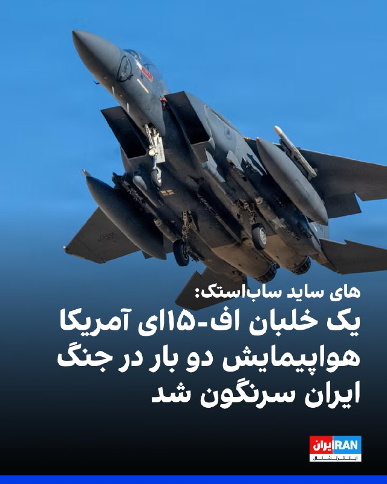

نشریه های ساید ساب‌استک به نقل از مقام‌های نظامی کنونی و پیشین آمریکا گزارش داد یکی از خلبانان اف-۱۵ای آمریکا که ۱۴ فروردین بر فراز ایران سرنگون شد، همان خلبانی بود که پنج هفته پیش از آن در یک حادثه شلیک خودی از سوی یک جنگنده اف/ای-۱۸ کویتی، با دو اف-۱۵ای دیگر سرنگون شده بود.
به گفته ساید ساب‌استک، این خلبان «تقریبا به طور قطع» نخستین خلبان هواپیمای بال‌ثابت نیروی هوایی است که از زمان جنگ ویتنام در یک جنگ واحد دو بار سرنگون شده است.
در حادثه اول در ۱۱ اسفند نیروهای دفاعی کویت به اشتباه به سه جنگنده اف-۱۵ئی استرایک ایگل شلیک کردند و هر شش خدمه این هواپیماها به بیرون پرتاب شدند و در خاک این کشور هم‌پیمان به سلامت فرود آمدند.
در ۱۴ فروردین نیز، بدشانسی دوباره به سراغ یکی از این خلبانان آمد و در یک جنگنده اف-۱۵ای بر فراز ایران هدف قرار گرفت. در این عملیات این خلبان به سرعت نجات یافت، اما افسر تسلیحات مجروح شد و روز بعد پس از آنکه نیروهای نظامی محل اختفای او را در کوه‌های زاگرس شناسایی کردند نجات یافت.

‌🏁 🇬🇧 IranintlTV

🤖 @VahidOOnLine

## VahidOOnLine — post 243463

  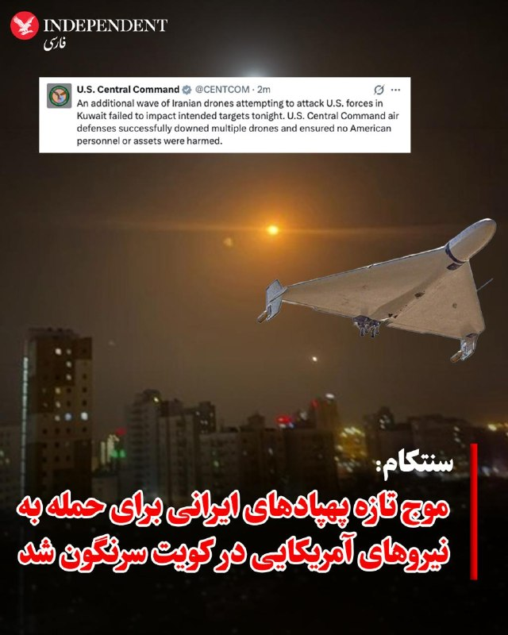

♦️فرماندهی مرکزی ایالات متحده، سنتکام، با انتشار پیامی در شبکه اجتماعی اکس اعلام کرد موج تازه‌ای از پهپادهای ایرانی که تلاش داشتند به نیروهای آمریکایی مستقر در کویت حمله کنند، در اصابت به اهداف خود ناکام ماندند. بر اساس این بیانیه، پدافند هوایی سنتکام با موفقیت چندین فروند از این پهپادها را سرنگون کرده و تضمین نموده است که هیچ‌یک از پرسنل یا تجهیزات نظامی ایالات متحده در این حملات آسیب ندیده‌اند.
‌🇸🇦 Indypersian

🤖 @VahidOOnLine

## VahidOOnLine — post 243462

  

♦️نیویورک‌پست می‌نویسد، بر اساس گزارشی جدید، یک خلبان جنگنده «اف-۱۵ئی استرایک ایگل» نیروی هوایی آمریکا در جریان جنگ ایران در کمتر از یک ماه دو بار در کویت (آتش خودی) و ایران سرنگون شد، اما هر دو بار زنده ماند.
هویت این خلبان هرگز به‌طور علنی اعلام نشده است. مقام‌های کنونی و سابق نظامی به نشریه «های ساید ساب‌استک» گفتند که او یکی از دشوارترین پنج هفته‌های دوران خدمت یک خلبان نیروی هوایی آمریکا را از زمان جنگ ویتنام پشت سر گذاشته است.
به نوشته نیویورک‌پست، بدبیاری او از دوم مارس آغاز شد؛ زمانی که در یک حادثه آتش خودی در کویت، نیروهای دفاعی این کشور به اشتباه به سوی سه فروند جنگنده اف-۱۵ئی آمریکایی شلیک کردند.
در این حادثه، هر شش خدمه این سه جنگنده مجبور شدند با استفاده از صندلی پران از هواپیما خارج شوند و با چتر در خاک کویت فرود آیند. همه آن‌ها سالم نجات پیدا کردند.
با وجود این حادثه، به گفته پیت هگست، وزیر جنگ آمریکا، خلبانان تنها چهار هفته بعد دوباره به ماموریت بازگشتند و در عملیات بمباران اهدافی در تهران شرکت کردند؛ اقدامی که او آن را نشانه شجاعت و فداکاری این نیروها دانست.
نیویورک‌پست می‌نویسد، اما چند روز پس از آن ماموریت، بدشانسی بار دیگر به سراغ یکی از این خلبانان آمد. یک جنگنده اف-۱۵ئی بر فراز ایران هدف قرار گرفت و دو سرنشین آن در خاک ایران سقوط کردند.
این خلبان در سوم آوریل به‌سرعت نجات داده شد، اما افسر سامانه‌های تسلیحاتی همراه او زخمی شده بود و پس از آنکه ایران برای دستگیری او جایزه تعیین کرد، ناچار شد مخفی شود.
این سرهنگ نیروی هوایی روز بعد در عملیاتی نجات پیدا کرد. ارتش آمریکا محل اختفای او را در کوه‌های زاگرس شناسایی کرده بود؛ جایی که برای در امان ماندن پناه گرفته بود.
مقام‌های نظامی به های ساید گفته‌اند این خلبان که ظرف پنج هفته دو بار سرنگون شده است، «تقریبا با قطعیت» نخستین خلبان هواپیمای بال‌ثابت نیروی هوایی آمریکا از زمان جنگ ویتنام به شمار می‌رود که در یک درگیری واحد دو بار سرنگون شده است.
فرماندهی مرکزی آمریکا (سنتکام) به درخواست روزنامه نیویورک پست برای اظهارنظر درباره این گزارش پاسخی نداد.
‌🇸🇦 Indypersian

🤖 @VahidOOnLine

## VahidOOnLine — post 243461

  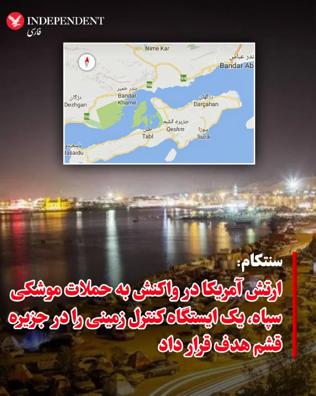

♦️فرماندهی مرکزی آمریکا (سنتکام)، بامداد چهارشنبه اعلام کرد، نیروهای این کشور در پاسخ به تلاش‌های نافرجام سپاه برای حمله در سراسر خاورمیانه، حملاتی تدافعی را علیه یک ایستگاه کنترل زمینی نظامی در جزیره قشم انجام داده و هم‌زمان چندین موشک بالستیک و پهپاد سپاه را منهدم کرده‌اند. به گفته سنتکام، سپاه چندین موشک بالستیک را به سمت کشورهای همسایه شلیک کرد که همگی ناکام ماندند؛ از جمله دو موشک شلیک‌شده به سمت کویت قبل از رسیدن به هدف سقوط کردند و سه موشک شلیک‌شده به سمت بحرین نیز بلافاصله توسط نیروهای پدافند هوایی آمریکا و بحرین رهگیری و نابود شدند. همچنین ارتش آمریکا سه پهپاد انتحاری را که به سمت کشتی‌های تجاری غیرنظامی در آب‌های منطقه هدایت می‌شدند، سرنگون کرد.
در همین حال، سنتکام با تکذیب ادعای سپاه پاسداران مبنی بر اصابت موشک و پهپاد به مقر ناوگان پنجم آمریکا در بحرین و یک پایگاه هوایی دیگر در منطقه، این ادعا را کاملا «دروغ» خواند و تاکید کرد که تمامی حملات ایران علیه نیروهای آمریکایی شکست خورده است و هیچ نیروی آمریکایی آسیب ندیده‌اند.
‌🇸🇦 Indypersian

🤖 @VahidOOnLine

## VahidOOnLine — post 243460

  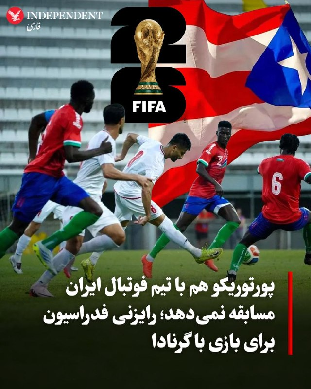

♦️به گزارش رسانه های داخلی، قرار است تیم فوتبال ایران پیش از شروع جام جهانی به جای پورتوریکو به مصاف تیم ملی گرنادا برود.
گرنادا منطقه‌ای جزیره‌ای در بخش جنوب شرقی دریای کارائیب و در بخش شمال ونزوئلا و جنوب شرقی میامی قرار دارد.
قرار بود طبق برنامه از قبل تعیین شده، تیم ایران در آخرین دیدار تدارکاتی خود پیش از شروع مسابقات جام جهانی ۲۰۲۶ در آمریکا به مصاف پورتوریکو برود. از آنجایی که کمپ تیم از آمریکا به کمپی در منطقه تیخوانا مکزیک منتقل شد، برگزاری این مسابقه در هاله‌ای از ابهام قرار گرفت.
فرارو می‌نویسد، روز سه‌شنبه رایزنی مسئولان فدراسیون فوتبال با پورتوریکو برای برگزاری بازی تدارکاتی در مکزیک به جایی نرسید تا به فکر گزینه دیگری بیفتند. بر اساس این گزارش، با توجه به زمان کم، فدراسیون فوتبال با کشور گرنادا صحبت‌هایی انجام داد تا شاگردان امیر قلعه‌نویی در مکزیک به مصاف این تیم بروند. قرار است جزئیات این موضوع مورد بررسی قرار بگیرد و در صورت نهایی شدن دو تیم به مصاف هم بروند.
‌🇸🇦 Indypersian

🤖 @VahidOOnLine

## VahidOOnLine — post 243459

  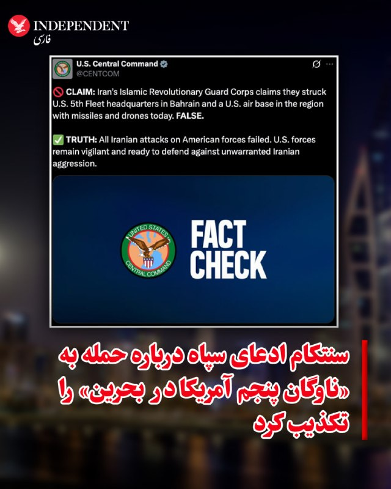

♦️فرماندهی مرکزی ایالات متحده، سنتکام، در اطلاعیه‌ای ادعای سپاه مبنی بر حمله موشکی و پهپادی به «ناوگان پنجم آمریکا در بحرین» را تکذیب کرد. در این پیام آمده است: «سپاه پاسداران انقلاب اسلامی ایران ادعا می‌کند که امروز با موشک و پهپاد به مقر ناوگان پنجم آمریکا در بحرین و یک پایگاه هوایی آمریکا در منطقه حمله کرده است. این ادعا نادرست است.» در ادامه این پیام آمده است: «حقیقت: همه حملات ایران علیه نیروهای آمریکایی شکست خورده‌اند. نیروهای آمریکا همچنان هوشیار هستند و برای دفاع در برابر اقدامات تهاجمی غیرموجه ایران آماده‌اند.»
‌🇸🇦 Indypersian

🤖 @VahidOOnLine

## VahidOOnLine — post 243458

  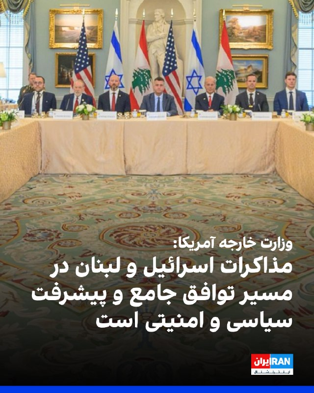

تامی پیکوت، سخنگوی وزارت خارجه آمریکا، در ایکس با اشاره به برگزاری چهارمین دور گفت‌وگوهای مستقیم هیئت‌های سیاسی و امنیتی اسرائیل و لبنان در وزارت خارجه آمریکا گفت این مذاکرات در مسیر پیشرفت و توافق جامع قرار دارد و دور دیگری از این گفت‌وگوها چهارشنبه برگزار می‌شود.
او افزود: «ما از ناکامی‌های ۲۰ سال گذشته فاصله می‌گیریم و به سوی توافقی جامع حرکت می‌کنیم که هدف آن بازگرداندن حاکمیت لبنان و تضمین امنیت اسرائیل است. ایالات متحده همچنان به طور کامل به تسهیل این مذاکرات تاریخی متعهد است.»

‌🏁 🇬🇧 IranintlTV

🤖 @VahidOOnLine

## VahidOOnLine — post 243457

  <a href="telegram/content/VahidOOnLine_243457_1780452170.mp4" target="_blank">🎬 Download video</a>

♦️به گزارش فرارو، حمام تاریخی گنجعلی‌خان کرمان، یکی از شاخص‌ترین بناهای دوره صفوی، با آسیب‌های جدی در تزئینات کاشی‌کاری خود روبه‌رو شده است. بخش‌هایی از کاشی‌ها به‌قدری فرسوده شده‌اند که با کوچک‌ترین تماس فرو می‌ریزند و در برخی نقاط دیوار گرمینه نیز تورم و جداشدگی کاشی‌ها، خطر ریزش کامل آن‌ها را افزایش داده است. این حمام که در مجموعه تاریخی گنجعلی‌خان قرار دارد، به‌دلیل معماری منحصربه‌فرد کاشی‌کاری‌های نفیس، مقرنس‌کاری‌ها، حجاری‌ها و نقاشی‌های دیواری، از ارزشمندترین گرمابه‌های تاریخی ایران به شمار می‌رود. حمام گنجعلی‌خان که تا حدود ۶۰ تا ۷۰ سال پیش فعال بود، اکنون به موزه مردم‌شناسی تبدیل شده و از پربازدیدترین جاذبه‌های گردشگری کرمان است. با این حال، روند فرسودگی و تخریب آن در سایه بی‌توجهی مسئولان ادامه دارد.
‌🇸🇦 Indypersian

🤖 @VahidOOnLine

## VahidOOnLine — post 243456

♦️تصاویر منتشر شده در شبکه‌های اجتماعی، بامداد چهارشنبه، هدف قرار گرفتن و سقوط موشک‌های سپاه را در کویت نشان می‌دهد. همزمان سنتکام در بیانیه‌ای اعلام کرد چندین موشک بالستیک با موفقیت رهگیری شدند و تاکید کرده که رژیم ایران حمله‌های موشکی متعددی علیه همسایگان منطقه‌ای خود انجام داده اما هیچ‌یک به هدف برخورد نکرده‌اند. قطعات دو موشک نیز در راه کویت از هم پاشیده است. سپاه نیز با انتشار بیانیه‌ای اعلام کرد ناوگان پنجم نیروی دریایی آمریکا که مقر آن در بحرین است را مورد تهاجم پهپادی و موشکی قرار داده است.
‌🇸🇦 Indypersian

🤖 @VahidOOnLine

## VahidOOnLine — post 243455

  

ستاد فرماندهی مرکزی آمریکا، سنتکام، با اشاره به درگیری‌های جدید نیروهای آمریکایی و سپاه اعلام کرد جمهوری اسلامی چندین موشک بالستیک به سمت کشورهای همسایه منطقه شلیک کرد، اما هیچ‌کدام به اهداف مورد نظر اصابت نکردند و هیچ‌یک از نیروهای آمریکایی نیز آسیب ندیدند.
طبق این اطلاعیه، دو موشک ایرانی که به سوی کویت شلیک شدند، در مسیر سقوط کردند یا حین حرکت متلاشی شدند و سه موشک که به سمت بحرین پرتاب شده بودند، بلافاصله از سوی سامانه‌های پدافند هوایی آمریکا و بحرین رهگیری شدند.
پیش‌تر سپاه اعلام کرد در پاسخ به حمله‌ پرتابه‌های آمریکا به یک دکل مخابراتی سپاه در جنوب جزیرۀ قشم، نیروی هوافضای سپاه پایگاه هوایی و بالگردی ایالات‌متحده در یکی از کشورهای منطقه و همچنین مرکز ناوگان پنجم دریایی آمریکا را هدف حملات موشکی و پهپادی قرار داده است.

‌🏁 🇬🇧 IranintlTV

🤖 @VahidOOnLine

## VahidOOnLine — post 243454

  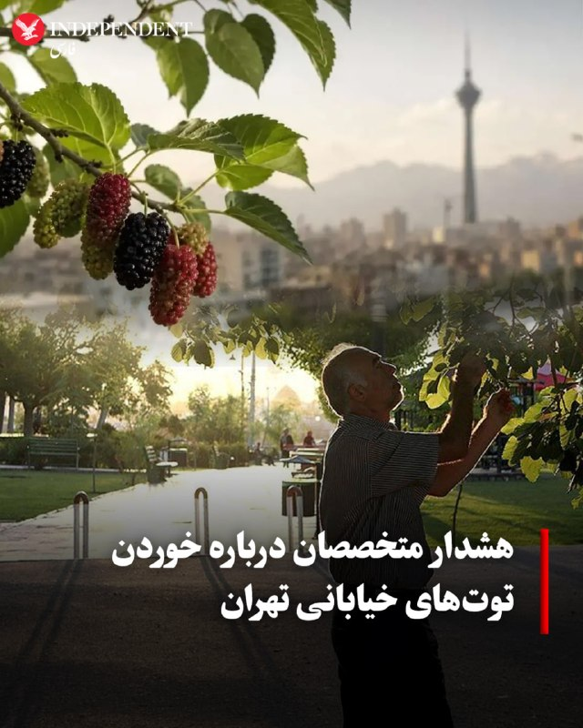

♦️پزشکان و کارشناسان سلامت نسبت به مصرف توت‌های چیده‌شده از درختان خیابان‌های تهران هشدار داده‌اند و می‌گویند آلودگی هوا، گرد و غبار و آلاینده‌های شیمیایی می‌تواند این میوه‌ها را به تهدیدی برای سلامت تبدیل کند.
ایرج خسرونیا، فوق‌تخصص بیماری‌های گوارش و کبد، رئیس جامعه متخصصان داخلی ایران و عضو هیئت علمی دانشگاه بهشتی، گفت مصرف توت در باغ‌ها و مناطق خارج از شهرهای شلوغ از نظر بهداشتی مشکلی ندارد، اما چیدن و خوردن توت از درختان واقع در معابر و خیابان‌های شهرهای بزرگ، به‌ویژه تهران، می‌تواند با خطرات جدی همراه باشد.
او در گفتگو با فرارو توضیح داد که آلاینده‌های موجود در هوای کلان‌شهرها، از جمله مواد شیمیایی، میکروب‌ها و ویروس‌ها، از طریق باران یا حتی رطوبت هوا روی سطح میوه‌ها می‌نشینند و در صورت مصرف بدون شست‌وشوی مناسب می‌توانند باعث بروز مشکلاتی مانند اسهال، استفراغ و ضعف عمومی شوند.
خسرونیا همچنین هشدار داد که آلودگی‌های سطح زمین و گرد و غبار نیز به این میوه‌ها منتقل می‌شود و از طریق دستگاه گوارش وارد بدن خواهد شد.
به گفته این متخصص، در موارد شدیدتر، مصرف مداوم مواد آلوده می‌تواند خطر ابتلا به بیماری‌های مزمن از جمله مشکلات کلیوی، قلبی و کبدی را افزایش دهد. او افزود افرادی که به بیماری‌های زمینه‌ای مبتلا هستند یا از ضعف جسمانی رنج می‌برند، در صورت ابتلا به اسهال شدید ناشی از مصرف این میوه‌ها، با عوارض خطرناک‌تری روبه‌رو خواهند شد.
رئیس جامعه متخصصان داخلی ایران با اشاره به آلودگی هوای تهران و بارش‌های حاوی ترکیبات شیمیایی و اسیدی گفت این آلاینده‌ها روی مواد غذایی و میوه‌های در معرض هوای آزاد می‌نشینند و سلامت مصرف‌کنندگان را تهدید می‌کنند.
او همچنین از شهرداری‌ها خواست از کاشت درختان میوه، به‌ویژه توت، در خیابان‌ها و معابر عمومی خودداری کنند و به جای آن از درختان زینتی استفاده شود.
تهران از گذشته به درختان توت خود شهرت داشته است، اما پزشکان می‌گویند تغییر شرایط محیطی، افزایش آلودگی هوا و تراکم ترافیک باعث شده مصرف میوه‌های چیده‌شده از درختان حاشیه خیابان‌ها دیگر مانند گذشته بی‌خطر نباشد.
‌🇸🇦 Indypersian

🤖 @VahidOOnLine

## VahidOOnLine — post 243453

  

سپاه اعلام کرد در پاسخ به حمله‌ پرتابه‌های آمریکا به یک دکل مخابراتی سپاه در جنوب جزیرۀ قشم، نیروی هوافضای سپاه پایگاه هوایی و بالگردی ایالات‌متحده در یکی از کشورهای منطقه و همچنین مرکز ناوگان پنجم دریایی آمریکا را هدف حملات موشکی و پهپادی قرار داد.
این اطلاعیه همچنین با اشاره به اینکه در اواخر شب‌گذشته ارتش آمریکا یک نفتکش ایرانی را در حوالی تنگۀ هرمز مورد اصابت پرتابه هوایی قرار داد و این نفتکش از محل موتورخانه دچار خسارت شد، گفت در پاسخ به این حمله و «نقض مقررات تنگه هرمز»، یک شناور متعلق به آمریکا و اسرائیل به نام پانایا هدف موشک‌های نیروی دریایی سپاه قرار گرفت.

‌🏁 🇬🇧 IranintlTV

🤖 @VahidOOnLine

## VahidOOnLine — post 243452

♦️مارکو روبیو، وزیر امور خارجه ایالات متحده، سه‌شنبه ۱۲ خرداد در جلسه استماع سنا، در پاسخ به سوال تد کروز، سناتور ارشد جمهوری‌خواه آمریکا، درباره برنامه واشنگتن برای تسلیح معترضان در ایران گفت: «من از هیچ برنامه‌ای برای مسلح کردن غیرنظامیان در ایران به منظور سرنگونی حکومتشان آگاهی ندارم.»
پیش از این اظهارات، تد کروز با تاکید بر اینکه منصفانه نیست از مردم و معترضان ایرانی انتظار داشت با سنگ در برابر سربازان مسلح به تیربار ایستادگی کنند، اعلام کرد که پیش از این از دولت آمریکا و اسرائیل خواسته بود تا معترضان را در ایران مسلح کنند. روبیو در پاسخ به این موضع‌گیری افزود: «منظورم این است که ممکن است کشورها یا عناصر دیگری دست به این کار بزنند، اما دولت ایالات متحده قطعا چنین برنامه‌ای ندارد.»
‌🇸🇦 Indypersian

🤖 @VahidOOnLine

## VahidOOnLine — post 243451

  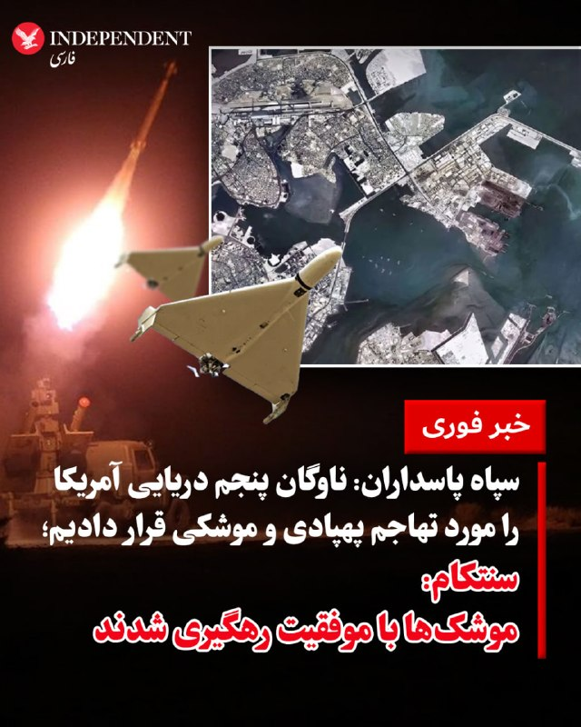

♦️در ساعات اولیه بامداد چهارشنبه، به دنبال شنیده شدن صدای آژیر خطر در بحرین، سپاه پاسداران در بیانیه‌ای اعلام کرد ناوگان پنجم نیروی دریایی آمریکا که مقر آن در بحرین است را مورد تهاجم پهپادی و موشکی قرار داده است. همزمان سنتکام نیز در بیانیه‌ای اعلام کرد چندین موشک بالستیک با موفقیت رهگیری شدند. در این بیانیه آمده که «حمله‌های دفاعی» در جزیره قشم در پاسخ به حمله‌های حکومت ایران در روز سه‌شنبه نیز به پایان رسیده است. سنتکام تاکید کرده که رژیم ایران حمله‌های موشکی متعددی علیه همسایگان منطقه‌ای خود انجام داده اما هیچ‌یک به هدف برخورد نکرده‌اند. قطعات دو موشک نیز در راه کویت از هم پاشیده است. بر اساس این گزارش، سه موشک شیلک شده به سمت بحرین نیز فورا از سوی نیروهای آمریکایی و نیروهای بحرین رهگیری شدند.سنتکام می‌گوید، دقایقی قبل از این حملات، سه پهپاد انتحاری ایران که به سمت یک شناور غیرنظامی در پرواز بودند نیز رهگیری و منهدم شدند. سنتکام می‌گوید در پاسخ به این حمله‌ها، نیرو‌های آمریکایی، به ایستگاه کنترل نظامی در جزیره قشم حمله کردند.
‌🇸🇦 Indypersian

🤖 @VahidOOnLine

## VahidOOnLine — post 243450

  

ستاد فرماندهی مرکزی آمریکا، سنتکام، اعلام کرد در پاسخ به تلاش‌های جمهوری اسلامی برای حمله در سراسر خاورمیانه، چندین موشک بالستیک و پهپاد ایرانی و یک ایستگاه کنترل زمینی نظامی در قشم را منهدم کرده است.
به گفته سنتکام، جمهوری اسلامی چندین موشک بالستیک به سمت کشورهای همسایه منطقه شلیک کرد، اما هیچ‌کدام به اهداف مورد نظر اصابت نکردند و هیچ‌یک از نیروهای آمریکایی نیز آسیب ندیدند.
طبق این اطلاعیه، دو موشک ایرانی که به سوی کویت شلیک شدند، در مسیر سقوط کردند یا حین حرکت متلاشی شدند و سه موشک که به سمت بحرین پرتاب شده بودند، بلافاصله از سوی سامانه‌های پدافند هوایی آمریکا و بحرین رهگیری شدند.
به گفته ارتش آمریکا، لحظاتی پیش از آن، نیروهای سنتکام سه پهپاد انتحاری را که ایران به سمت کشتی‌های غیرنظامی در حال عبور از آب‌های منطقه‌ای پرتاب کرده بود، سرنگون کردند. نیروهای آمریکایی همچنین یک ایستگاه کنترل زمینی نظامی جمهوری اسلامی در جزیره قشم را هدف حملات دفاعی قرار دادند.

‌🏁 🇬🇧 IranintlTV

🤖 @VahidOOnLine

## VahidOOnLine — post 243449

  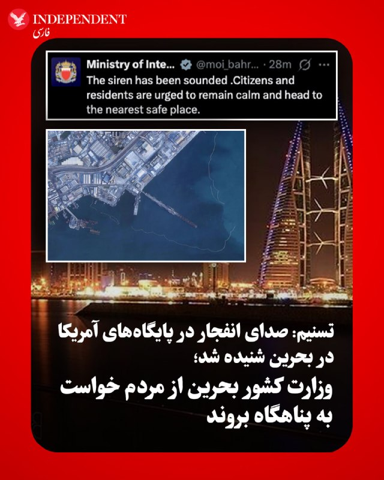

♦️وزارت کشور بحرین، بامداد چهارشنبه، ۱۳ خردادماه، با انتشار بیانیه‌ای فوری اعلام کرد که آژیرهای هشدار و خطر در این کشور به صدا درآمده‌اند. مقامات امنیتی بحرین ضمن دعوت مردم به حفظ آرامش، از آن‌ها خواسته‌اند تا سریعا به نزدیک‌ترین مکان امن و پناهگاه‌ها بروند. همزمان تسنیم، خبرگزاری وابسته به سپاه، به نقل از «منابع عربی» از هدف قرار گرفتن «پایگاه‌های آمریکا» در بحرین خبر داد.
‌🇸🇦 Indypersian

🤖 @VahidOOnLine

## VahidOOnLine — post 243448

  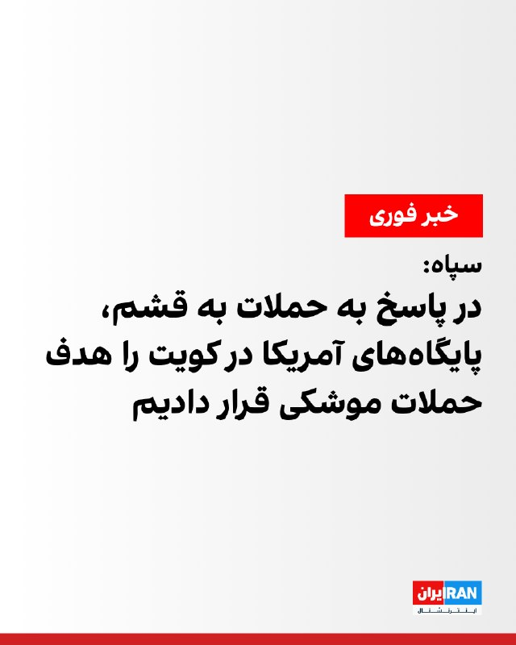

سپاه اعلام کرد در پاسخ به حمله‌های جدید به قشم، نیروی هوایی سپاه با حملات موشکی پایگاه‌های آمریکا در کویت را هدف قرار داده است.
سپاه تاکید کرد: «زمان بزن و فرار کن به پایان رسیده است و نیروهای ستمگر باید عواقب وخیم نادانی و ماجراجویی‌های بی‌محاسبه خود را بپذیرند.»

‌🏁 🇬🇧 IranintlTV

🤖 @VahidOOnLine

## WithYashar — post 13338

منبع آمریکایی: اگر پاسخ ندهیم، باید به رهبری کاخ سفید شک کرد
@withyashar

## WithYashar — post 13337

ترامپ الان میاد میگه چون موشک ها از رو آب رد شده مسافر حساب‌ میشن و رعب و وحشتشون شکسته حساب میشه پس این جنگ نیست !!! هرچی شده رفع بلا بوده فکر کنین دادین خمس و زکات ، حالا هم آشتی و من به یک جنگ دیگه پایان دادم و رژیم هم تغییر کرد ولی سلاح هسته ای نباید…

## WithYashar — post 13336

گروه کومله کردستان در بیانیه‌ای اعلام کرد که ساعت ۲۳:۰۰ به وقت محلی دیشب ، دو موشک ایرانی به مقر حزب کومله در دره آلانه، واقع در شمال شرقی اربیل، اصابت کرده است

در این خبر جزئیات دقیقی از تلفات احتمالی ارائه نشده است.
@withyashar

## WithYashar — post 13335

ترامپ الان میاد میگه چون موشک ها از رو آب رد شده مسافر حساب‌ میشن و رعب و وحشتشون شکسته حساب میشه پس این جنگ نیست !!! هرچی شده رفع بلا بوده فکر کنین دادین خمس و زکات ، حالا هم آشتی و من به یک جنگ دیگه پایان دادم و رژیم هم تغییر کرد ولی سلاح هسته ای نباید داشته باشن
@withyashar 👱🏽‍♂️📿

## WithYashar — post 13334

کانال ۱۴ اسرائیل: اگر رژیم ایران امشب حتی یک گلوله به سمت اسرائیل شلیک کند، تمام دروازه های جهنم به رویشان باز خواهد شد.
@withyashar

## WithYashar — post 13333

سنتکام : نیروهای آمریکایی با موفقیت چندین موشک بالستیک و پهپاد ایرانی را سرنگون کردند و در پاسخ به حملات احتمالی ایران در سراسر خاورمیانه، امروز ، حملات دفاعی به جزیره قشم انجام دادند.

ایران چندین موشک بالستیک به سمت همسایگان منطقه‌ای پرتاب کرد؛ اما همه آنها نتوانستند به اهداف مورد نظر خود اصابت کنند. دو موشک ایرانی که به کویت شلیک شده بودند، کوتاه آمدند یا در مسیر شکسته شدند و سه موشک پرتاب شده به بحرین بلافاصله توسط نیروهای دفاع هوایی آمریکا و بحرین رهگیری شدند.

لحظاتی پیش‌تر، نیروهای فرماندهی مرکزی آمریکا (سنتکام) سه پهپاد حمله یک‌طرفه را که ایران به سمت دریانوردان غیرنظامی که به‌حق در حال عبور از آب‌های منطقه‌ای بودند، شلیک کرده بود، سرنگون کردند. نیروهای آمریکایی همچنین حملات دفاعی به یک ایستگاه کنترل زمینی نظامی ایرانی در جزیره قشم انجام دادند.

هیچ یک از پرسنل آمریکایی آسیب ندیدند. نیروهای سنتکام هوشیار باقی مانده و آماده دفاع در برابر تجاوزات بی‌دلیل ایران در طول آتش‌بس جاری هستند.
@withyashar

## WithYashar — post 13332

اصابت در عربستان

@withyashar

## mwarmonitor — post 10063

  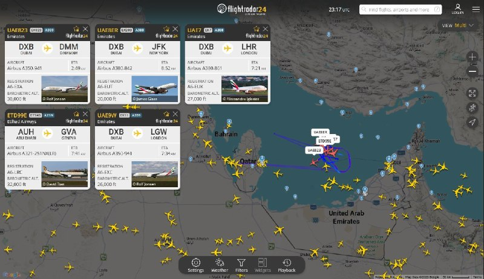

✈️چندین پرواز در حال انتظار در آسمان امارات متحده عربی هستند.

@mwarmonitor

## mwarmonitor — post 10062

🚨آژیرهای هشدار در بحرین متوقف شده‌اند و هشدار مربوط به حمله موشکی نیز لغو شده است. @mwarmonitor

## mwarmonitor — post 10061

🔴دفاع نیروهای آمریکا و شرکا در برابر رفتار تهاجمی ایران

🔹ستاد فرماندهی مرکزی ایالات متحده (CENTCOM)

🔰تامپا، فلوریدا — در پاسخ به تلاش‌های ایران برای انجام حملاتی در سراسر خاورمیانه در تاریخ ۲ ژوئن، نیروهای آمریکایی با موفقیت چندین موشک بالستیک و پهپاد ایرانی را منهدم کرده و حملات دفاع از خود را در جزیره قشم انجام دادند.
ایران چندین موشک بالستیک را به سمت همسایگان منطقه‌ای خود شلیک کرد؛ با این حال، همه آن‌ها در اصابت به اهداف مورد نظر خود ناکام ماندند. دو موشک ایرانی شلیک شده به سمت کویت در میان راه سقوط کردند یا متلاشی شدند، و سه موشک پرتاب شده به سمت بحرین نیز بلافاصله توسط نیروهای پدافند هوایی آمریکا و بحرین رهگیری و منهدم شدند.
لحظاتی پیش از آن، نیروهای ستاد فرماندهی مرکزی آمریکا (سنتکام) سه پهپاد انتحاری (یک‌طرفه) را که از سوی ایران به سمت دریانوردان غیرنظامی در حال عبور قانونی از آب‌های منطقه پرتاب شده بودند، سرنگون کردند. نیروهای آمریکایی همچنین حملاتی را در قالب دفاع از خود علیه یک ایستگاه کنترل زمینی نظامی ایران در جزیره قشم انجام دادند.
هیچ‌یک از پرسنل آمریکایی آسیب ندیده‌اند. نیروهای سنتکام همچنان هوشیار و آماده دفاع در برابر تجاوزات بی‌دلیل ایران در طول آتش‌بس جاری هستند.

@mwarmonitor

## mwarmonitor — post 10060

  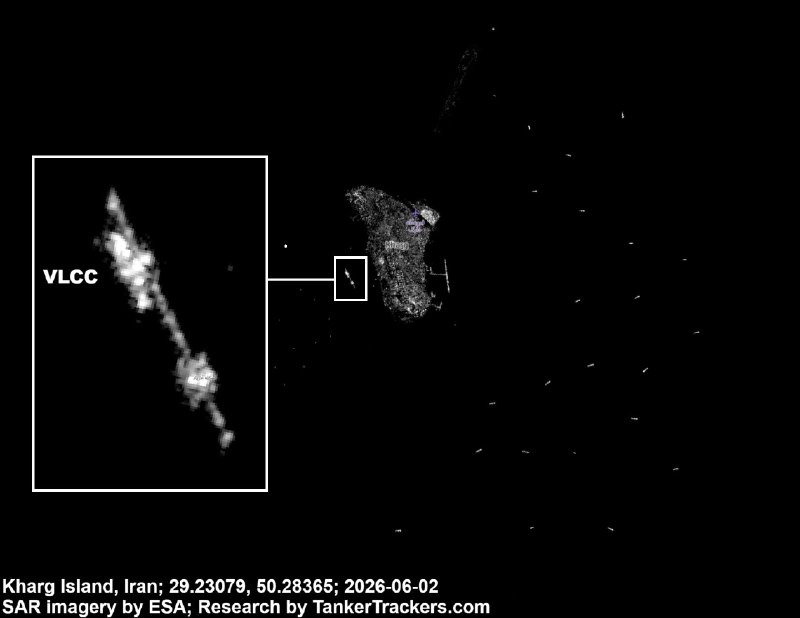

🔴یک نفتکش بسیار بزرگ (VLCC) برای نخستین بار طی چهار هفته گذشته در جزیره خارک در ایران در حال بارگیری نفت خام است.

@mwarmonitor

## FoxNewsTwitter — post 342536

Fox News (Twitter/X)

RT @ShannonBream: BREAKING: #SCOTUS grants stay of decision blocking Alabama from using its 2023 maps. More litigation to come, but it appears Alabama will be able to use the 2023 maps for this election cycle - likely giving GOP +1 advantage for House seat.

## FoxNewsTwitter — post 342535

  

Fox News (Twitter/X)

U.S. forces intercepted multiple Iranian missiles and drones and carried out self-defense strikes on Qeshm Island after Iran launched attacks across the Middle East on Tuesday, according to U.S. Central Command. https://twitter.com/JesseBWatters/status/2061975277480165832#m

## FoxNewsTwitter — post 342534

  

Fox News (Twitter/X)

Acting Deputy Attorney General Todd Blanche says President Trump would have faced prison time if he hadn't won the 2024 election.

Blanche, who represented Trump during the New York criminal trial that resulted in 34 felony convictions, called the case an "incredible travesty" during an interview on "Hang Out with @seanhannity."

Asked whether it was "the White House or the big house," Blanche's answer was simple: "Absolutely."

## FoxNewsTwitter — post 342530

Fox News (Twitter/X)

Legendary singer-songwriter Peabo Bryson has died at age 75.

Bryson died on Tuesday after suffering a stroke, according to a statement from the family.

"While our hearts are broken, we find comfort in knowing how deeply Peabo was loved and how many lives were touched by his voice and his generous spirit. His legacy and music will live on for generations to come," the family said.

Best known for performing Disney classics like Beauty and the Beast with Celine Dion and A Whole New World with Regina Belle, Bryson's soaring vocals made him one of the most recognizable voices in pop and R&B.

## FoxNewsTwitter — post 342529

  

Fox News (Twitter/X)

The progressive Democrat who campaigned alongside "Abolish ICE" activists is moving on to November.

Rep. Analilia Mejia secured victory in New Jersey's Democratic primary, keeping her on track to seek a full term in Congress just months after winning a special election.

Mejia has drawn national attention for her support of abolishing ICE and her criticism of Trump's immigration agenda.

## FoxNewsTwitter — post 342528

  

Fox News (Twitter/X)

"Karen Bass just violated election law."

LA mayoral candidate Spencer Pratt says his campaign has filed a formal complaint accusing Los Angeles Mayor Karen Bass of illegally campaigning too close to a ballot box.

Pratt says Bass filmed herself campaigning within 100 feet of a ballot box, calling it a blatant violation of election law and evidence of what he calls a "rules for thee, but not for me" culture at City Hall.

"We must protect our democracy," he wrote on X, saying the complaint is about protecting election integrity and holding public officials accountable.

The 42-year-old included a photo of the complaint in his post, saying "Enjoy your conference calls with your lawyers, Karen!"

## FoxNewsTwitter — post 342527

  <a href="telegram/content/FoxNewsTwitter_342527_1780452179.mp4" target="_blank">🎬 Download video</a>

Fox News (Twitter/X)

Caitlyn Jenner supports Spencer Pratt for Los Angeles mayor ahead of primary results: "We need people like Spencer Pratt to make the changes." https://twitter.com/TheStoryFNC/status/2061897203153588227#m

## FoxNewsTwitter — post 342526

  <a href="telegram/content/FoxNewsTwitter_342526_1780452180.mp4" target="_blank">🎬 Download video</a>

Fox News (Twitter/X)

"His whole aura seems to be contrived."

Laura Ingraham and Reince Priebus break down Democrats' "Platner problem" as Maine Senate candidate Graham Platner's controversies continue to grow. https://twitter.com/IngrahamAngle/status/2061958690559668539#m

## FoxNewsTwitter — post 342525

  <a href="telegram/content/FoxNewsTwitter_342525_1780452182.mp4" target="_blank">🎬 Download video</a>

Fox News (Twitter/X)

U.S. forces disabled an oil tanker headed for an Iranian port after the vessel allegedly ignored repeated warnings for nearly 24 hours.

Newly released CENTCOM footage shows the moment a Hellfire missile strikes the ship's engine room, stopping the tanker before it could reach Kharg Island.

Military officials say the vessel was unladen at the time and had repeatedly failed to comply with U.S. directives.

## FoxNewsTwitter — post 342524

Fox News (Twitter/X)

RT @TreyYingst: NEW: American forces conducted self-defense strikes on an Iranian military ground control station on Qeshm Island, according to CENTCOM.

## pm_afshaa — post 92198

خلاصه کل اتفاقات امشب: آمریکا یه نفتکش ایرانی که داشته به جزیره خارک میرفته رو بعد از بی توجهی به هشدارها، به موتورخونه‌ نفتکش شلیک میکنه و متوقف میشه. در جواب سپاه یه نفتکش آمریکایی رو میزنه و بعد آمریکا یه دکل مخابراتی یا ایستگاه کنترل زمینی نظامی تو قشم…

## pm_afshaa — post 92197

خلاصه کل اتفاقات امشب:

آمریکا یه نفتکش ایرانی که داشته به جزیره خارک میرفته رو بعد از بی توجهی به هشدارها، به موتورخونه‌ نفتکش شلیک میکنه و متوقف میشه. در جواب سپاه یه نفتکش آمریکایی رو میزنه و بعد آمریکا یه دکل مخابراتی یا ایستگاه کنترل زمینی نظامی تو قشم رو میزنه و بعد از اون سپاه به پایگاه و ناوگان پنجم دریایی آمریکا در کویت و بحرین حمله موشکی و پهبادی میکنه؛ که به گفته سنتکام تمام موشک‌ها رهگیری شده و آسیبی نرسیده.

💧 Rainbet.com the #1 Non-KYC Crypto Casino & Sportsbook @rainbetcom

😁 @Pm_Afshaa

## pm_afshaa — post 92196

  <a href="telegram/content/pm_afshaa_92196_1780452183.webm" target="_blank">🎬 Download video</a>

🔴سنتکام: سپاه پاسداران ادعا کرده که مقر ناوگان پنجم آمریکا تو بحرین و یه پایگاه هوایی آمریکا رو با موشک و پهپاد هدف قرار داده که همش غلطه.

در حقیقت حملات ایران به نیروهای آمریکا ناموفق بوده. آمریکا هیچ آسیبی ندیده و همچنان آماده و هوشیاره تا در برابر هر حمله‌ای واکنش نشون بده.

💧 Rainbet.com the #1 Non-KYC Crypto Casino & Sportsbook @rainbetcom

😁 @Pm_Afshaa

## pm_afshaa — post 92195

ترامپ الان میاد میگه من یه جنگ دیگه رو پایان دادم

## pm_afshaa — post 92194

  <a href="telegram/content/pm_afshaa_92194_1780452184.webm" target="_blank">🎬 Download video</a>

🔴بیانیه سپاه پاسداران: در اواخر شب گذشته ارتش متجاوز آمریکا یک نفتکش ایرانی رو در حوالی تنگه هرمز مورد اصابت پرتابه هوایی قرار داد که این نفتکش از محل موتورخانه دچار خسارت گردید. در پاسخ به این تجاوز و نقض مقررات تنگه هرمز شناور متعلق به دشمن آمریکایی صهیونی…

## pm_afshaa — post 92193

تو آتش‌بس همدیگه رو میزنن هردو طرف هم میگن اقدام دفاعی کردیم!
خاورمیانه عالیهههههه

## pm_afshaa — post 92192

  <a href="telegram/content/pm_afshaa_92192_1780452184.webm" target="_blank">🎬 Download video</a>

🔴سنتکام: نیروهای آمریکایی چندین موشک بالستیک و پهپاد ایرانی رو رهگیری کردن و پس از تلاش ایران برای حمله به نقاط مختلف خاورمیانه، یک ایستگاه کنترل زمینی نظامی در جزیره قشم رو هدف قرار دادن. دو موشک ایرانی پرتاب‌شده به سمت کویت قبل از اصابت به هدف نرسیدن، در…

## pm_afshaa — post 92191

  <a href="telegram/content/pm_afshaa_92191_1780452185.webm" target="_blank">🎬 Download video</a>

🔴کانال 14 اسرائیل: اگه ایران امشب حتی یک گلوله به سمت اسرائیل شلیک کنه، تمام دروازه‌های جهنم به روشون باز خواهد شد.

💧 Rainbet.com the #1 Non-KYC Crypto Casino & Sportsbook @rainbetcom

😁 @Pm_Afshaa

## pm_afshaa — post 92190

  <a href="telegram/content/pm_afshaa_92190_1780452185.webm" target="_blank">🎬 Download video</a>

🔴بیانیه سپاه پاسداران: در اواخر شب گذشته ارتش متجاوز آمریکا یک نفتکش ایرانی رو در حوالی تنگه هرمز مورد اصابت پرتابه هوایی قرار داد که این نفتکش از محل موتورخانه دچار خسارت گردید. در پاسخ به این تجاوز و نقض مقررات تنگه هرمز شناور متعلق به دشمن آمریکایی صهیونی…

## pm_afshaa — post 92189

  <a href="telegram/content/pm_afshaa_92189_1780452185.webm" target="_blank">🎬 Download video</a>

🔴سنتکام: نیروهای آمریکایی چندین موشک بالستیک و پهپاد ایرانی رو رهگیری کردن و پس از تلاش ایران برای حمله به نقاط مختلف خاورمیانه، یک ایستگاه کنترل زمینی نظامی در جزیره قشم رو هدف قرار دادن. دو موشک ایرانی پرتاب‌شده به سمت کویت قبل از اصابت به هدف نرسیدن، در…

## pm_afshaa — post 92188

  <a href="telegram/content/pm_afshaa_92188_1780452186.webm" target="_blank">🎬 Download video</a>

🔴سنتکام: نیروهای آمریکایی چندین موشک بالستیک و پهپاد ایرانی رو رهگیری کردن و پس از تلاش ایران برای حمله به نقاط مختلف خاورمیانه، یک ایستگاه کنترل زمینی نظامی در جزیره قشم رو هدف قرار دادن. دو موشک ایرانی پرتاب‌شده به سمت کویت قبل از اصابت به هدف نرسیدن، در…

## pm_afshaa — post 92187

  <a href="telegram/content/pm_afshaa_92187_1780452187.webm" target="_blank">🎬 Download video</a>

🔴سنتکام: نیروهای آمریکایی چندین موشک بالستیک و پهپاد ایرانی رو رهگیری کردن و پس از تلاش ایران برای حمله به نقاط مختلف خاورمیانه، یک ایستگاه کنترل زمینی نظامی در جزیره قشم رو هدف قرار دادن.

دو موشک ایرانی پرتاب‌شده به سمت کویت قبل از اصابت به هدف نرسیدن، در حالی که سه موشک پرتاب‌شده به سمت بحرین توسط دفاع هوایی آمریکا و بحرین رهگیری شدن. نیروهای آمریکایی همچنین سه پهپاد یک‌طرفه حمله‌ای پرتاب‌شده به سمت کشتی‌های تجاری رو سرنگون کردن و درکل هیچ نیروی آمریکایی مجروح نشد.

💧 Rainbet.com the #1 Non-KYC Crypto Casino & Sportsbook @rainbetcom

😁 @Pm_Afshaa

## pm_afshaa — post 92186

  <a href="telegram/content/pm_afshaa_92186_1780452187.webm" target="_blank">🎬 Download video</a>

🔴سپاه: مرکز ناوگان پنجم دریایی آمریکا مورد تهاجم موشکی و پهپادی نیروی هوافضای سپاه قرار گرفتن.

💧 Rainbet.com the #1 Non-KYC Crypto Casino & Sportsbook @rainbetcom

😁 @Pm_Afshaa

## pm_afshaa — post 92185

  <a href="telegram/content/pm_afshaa_92185_1780452187.webm" target="_blank">🎬 Download video</a>

🔴گزارش‌ها از پرواز جت‌های جنگی آمریکا بر فراز آسمان بغداد عراق.

💧 Rainbet.com the #1 Non-KYC Crypto Casino & Sportsbook @rainbetcom

😁 @Pm_Afshaa

## pm_afshaa — post 92184

  <a href="telegram/content/pm_afshaa_92184_1780452188.webm" target="_blank">🎬 Download video</a>

🔴یک نفتکش در سواحل امارات هدف قرار گرفته.

💧 Rainbet.com the #1 Non-KYC Crypto Casino & Sportsbook @rainbetcom

😁 @Pm_Afshaa

## pm_afshaa — post 92182

🔴گزارشاتی از حمله به فرودگاه دبی 
💧 Rainbet.com the #1 Non-KYC Crypto Casino & Sportsbook @rainbetcom 
😁 @Pm_Afshaa

## VahidOnline — post 75890

  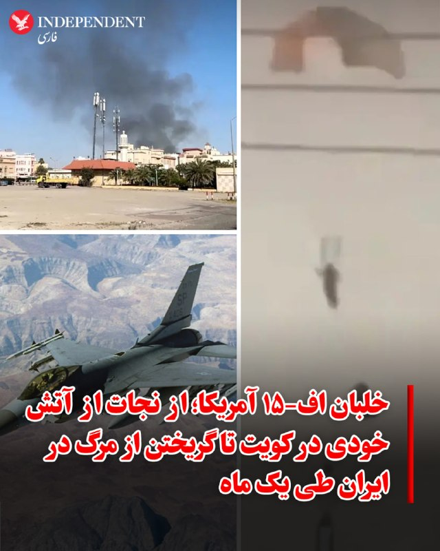

نیویورک‌پست می‌نویسد، بر اساس گزارشی جدید، یک خلبان جنگنده «اف-۱۵ئی استرایک ایگل» نیروی هوایی آمریکا در جریان جنگ ایران در کمتر از یک ماه دو بار در کویت (آتش خودی) و ایران سرنگون شد، اما هر دو بار زنده ماند.

هویت این خلبان هرگز به‌طور علنی اعلام نشده است. مقام‌های کنونی و سابق نظامی به نشریه «های ساید ساب‌استک» گفتند که او یکی از دشوارترین پنج هفته‌های دوران خدمت یک خلبان نیروی هوایی آمریکا را از زمان جنگ ویتنام پشت سر گذاشته است.

به نوشته نیویورک‌پست، بدبیاری او از دوم مارس آغاز شد؛ زمانی که در یک حادثه آتش خودی در کویت، نیروهای دفاعی این کشور به اشتباه به سوی سه فروند جنگنده اف-۱۵ئی آمریکایی شلیک کردند.
در این حادثه، هر شش خدمه این سه جنگنده مجبور شدند با استفاده از صندلی پران از هواپیما خارج شوند و با چتر در خاک کویت فرود آیند. همه آن‌ها سالم نجات پیدا کردند.

با وجود این حادثه، به گفته پیت هگست، وزیر جنگ آمریکا، خلبانان تنها چهار هفته بعد دوباره به ماموریت بازگشتند و در عملیات بمباران اهدافی در تهران شرکت کردند؛ اقدامی که او آن را نشانه شجاعت و فداکاری این نیروها دانست.
نیویورک‌پست می‌نویسد، اما چند روز پس از آن ماموریت، بدشانسی بار دیگر به سراغ یکی از این خلبانان آمد. یک جنگنده اف-۱۵ئی بر فراز ایران هدف قرار گرفت و دو سرنشین آن در خاک ایران سقوط کردند.
این خلبان در سوم آوریل به‌سرعت نجات داده شد، اما افسر سامانه‌های تسلیحاتی همراه او زخمی شده بود و پس از آنکه ایران برای دستگیری او جایزه تعیین کرد، ناچار شد مخفی شود. او روز بعد در عملیاتی نجات پیدا کرد.
@VahidOOnLine

📡 @VahidOnline

## VahidOnline — post 75889

  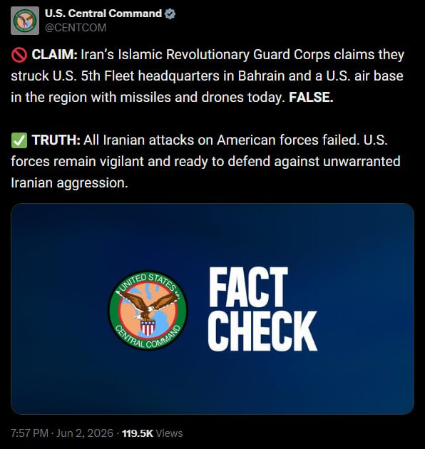

ستاد فرماندهی مرکزی آمریکا در شبکه‌های اجتماعی اعلام کرد که سپاه پاسداران مدعی شده که در حملات امروز با موشک و پهپاد به مقر ناوگان پنجم آمریکا در بحرین و یک پایگاه هوایی آمریکا در منطقه ضربه زده است.
سنتکام گفت این ادعا نادرست است و تمام حملات جمهوری اسلامی به نیروهای آمریکایی شکست خورد.
@VahidHeadline
(مثل دو روز گذشته در این ساعت، ده‌ها پیام دیگر از تهران دریافت کردم درباره صدای عجیب پرواز هواپیما که منجر به بیدار شدن خیلی‌ها شد.)
📡 @VahidOnline

## VahidOnline — post 75888

  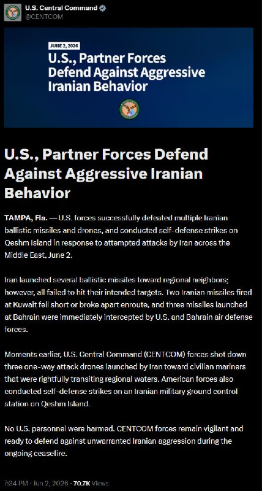

سنتکام از حمله به جزیره قشم پس از دفع حملات موشکی جمهوری اسلامی خبر داد

ترجمه ماشین:
نیروهای آمریکا و شرکایش در برابر رفتار تهاجمی ایران دفاع کردند

تامپا، فلوریدا — نیروهای آمریکا در تاریخ ۲ ژوئن با موفقیت چندین موشک بالستیک و پهپاد ایرانی را منهدم کردند و در پاسخ به تلاش‌های ایران برای حمله در سراسر خاورمیانه، حملات دفاع از خود را در جزیره قشم انجام دادند.

ایران چندین موشک بالستیک به سوی همسایگان منطقه‌ای شلیک کرد؛ با این حال، هیچ‌کدام به اهداف مورد نظر خود اصابت نکردند.
دو موشک ایرانی که به سوی کویت شلیک شده بودند، پیش از رسیدن به هدف سقوط کردند یا در مسیر متلاشی شدند و سه موشکی که به سوی بحرین شلیک شده بودند، بلافاصله توسط نیروهای پدافند هوایی آمریکا و بحرین رهگیری شدند.

لحظاتی پیش از آن، نیروهای فرماندهی مرکزی آمریکا، سنتکام، سه پهپاد تهاجمی یک‌طرفه را که ایران به سوی دریانوردان غیرنظامی در حال عبور قانونی از آب‌های منطقه‌ای شلیک کرده بود، سرنگون کردند.

نیروهای آمریکایی همچنین حملات دفاع از خود را علیه یک ایستگاه کنترل زمینی نظامی ایران در جزیره قشم انجام دادند.
هیچ‌یک از نیروهای آمریکایی آسیبی ندیدند. نیروهای سنتکام در جریان آتش‌بس جاری، همچنان هوشیار و آماده دفاع در برابر تجاوز بی‌دلیل ایران هستند.
CENTCOM

📡 @VahidOnline

## IranIntlTV — post 340307

  

نشریه های ساید ساب‌استک به نقل از مقام‌های نظامی کنونی و پیشین آمریکا گزارش داد یکی از خلبانان اف-۱۵ای آمریکا که ۱۴ فروردین بر فراز ایران سرنگون شد، همان خلبانی بود که پنج هفته پیش از آن در یک حادثه شلیک خودی از سوی یک جنگنده اف/ای-۱۸ کویتی، با دو اف-۱۵ای دیگر سرنگون شده بود.
به گفته ساید ساب‌استک، این خلبان «تقریبا به طور قطع» نخستین خلبان هواپیمای بال‌ثابت نیروی هوایی است که از زمان جنگ ویتنام در یک جنگ واحد دو بار سرنگون شده است.
در حادثه اول در ۱۱ اسفند نیروهای دفاعی کویت به اشتباه به سه جنگنده اف-۱۵ئی استرایک ایگل شلیک کردند و هر شش خدمه این هواپیماها به بیرون پرتاب شدند و در خاک این کشور هم‌پیمان به سلامت فرود آمدند.
در ۱۴ فروردین نیز، بدشانسی دوباره به سراغ یکی از این خلبانان آمد و در یک جنگنده اف-۱۵ای بر فراز ایران هدف قرار گرفت. در این عملیات این خلبان به سرعت نجات یافت، اما افسر تسلیحات مجروح شد و روز بعد پس از آنکه نیروهای نظامی محل اختفای او را در کوه‌های زاگرس شناسایی کردند نجات یافت.

https://iranintl.com/202606037743

## IranIntlTV — post 340306

  

تامی پیکوت، سخنگوی وزارت خارجه آمریکا، در ایکس با اشاره به برگزاری چهارمین دور گفت‌وگوهای مستقیم هیئت‌های سیاسی و امنیتی اسرائیل و لبنان در وزارت خارجه آمریکا گفت این مذاکرات در مسیر پیشرفت و توافق جامع قرار دارد و دور دیگری از این گفت‌وگوها چهارشنبه برگزار می‌شود.
او افزود: «ما از ناکامی‌های ۲۰ سال گذشته فاصله می‌گیریم و به سوی توافقی جامع حرکت می‌کنیم که هدف آن بازگرداندن حاکمیت لبنان و تضمین امنیت اسرائیل است. ایالات متحده همچنان به طور کامل به تسهیل این مذاکرات تاریخی متعهد است.»

https://iranintl.com/202606033066

## IranIntlTV — post 340305

  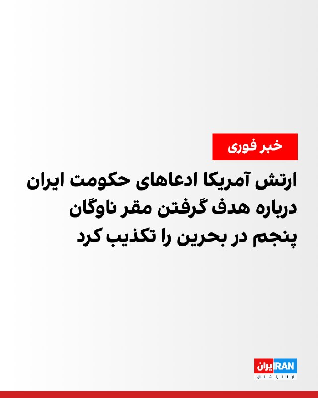

ستاد فرماندهی مرکزی آمریکا، سنتکام، با اشاره به درگیری‌های جدید نیروهای آمریکایی و سپاه اعلام کرد جمهوری اسلامی چندین موشک بالستیک به سمت کشورهای همسایه منطقه شلیک کرد، اما هیچ‌کدام به اهداف مورد نظر اصابت نکردند و هیچ‌یک از نیروهای آمریکایی نیز آسیب ندیدند.
طبق این اطلاعیه، دو موشک ایرانی که به سوی کویت شلیک شدند، در مسیر سقوط کردند یا حین حرکت متلاشی شدند و سه موشک که به سمت بحرین پرتاب شده بودند، بلافاصله از سوی سامانه‌های پدافند هوایی آمریکا و بحرین رهگیری شدند.
پیش‌تر سپاه اعلام کرد در پاسخ به حمله‌ پرتابه‌های آمریکا به یک دکل مخابراتی سپاه در جنوب جزیرۀ قشم، نیروی هوافضای سپاه پایگاه هوایی و بالگردی ایالات‌متحده در یکی از کشورهای منطقه و همچنین مرکز ناوگان پنجم دریایی آمریکا را هدف حملات موشکی و پهپادی قرار داده است.

https://iranintl.com/202606030219

## IranIntlTV — post 340304

  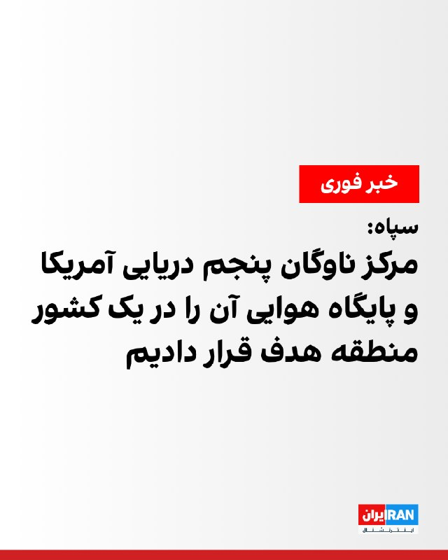

سپاه اعلام کرد در پاسخ به حمله‌ پرتابه‌های آمریکا به یک دکل مخابراتی سپاه در جنوب جزیرۀ قشم، نیروی هوافضای سپاه پایگاه هوایی و بالگردی ایالات‌متحده در یکی از کشورهای منطقه و همچنین مرکز ناوگان پنجم دریایی آمریکا را هدف حملات موشکی و پهپادی قرار داد.
این اطلاعیه همچنین با اشاره به اینکه در اواخر شب‌گذشته ارتش آمریکا یک نفتکش ایرانی را در حوالی تنگۀ هرمز مورد اصابت پرتابه هوایی قرار داد و این نفتکش از محل موتورخانه دچار خسارت شد، گفت در پاسخ به این حمله و «نقض مقررات تنگه هرمز»، یک شناور متعلق به آمریکا و اسرائیل به نام پانایا هدف موشک‌های نیروی دریایی سپاه قرار گرفت.

https://iranintl.com/202606039128

## IranIntlTV — post 340303

  <a href="telegram/content/IranIntlTV_340303_1780452192.mp4" target="_blank">🎬 Download video</a>

ستاد فرماندهی مرکزی آمریکا، سنتکام، با انتشار ویدیویی در ایکس از هدف قرار دادن یک نفتکش خالی از محموله که در حال حرکت به سوی جزیره خارک در خلیج فارس بود، خبر داد.

به گفته سنتکام، خدمه این کشتی که با پرچم بوتسوانا در حال حرکت بود، طی یک دوره ۲۴ ساعته به هشدارهای نیروهای آمریکایی توجه نکردند. در نهایت، یک هواپیمای آمریکایی با شلیک یک موشک به اتاق موتور کشتی، سامانه پیشران آن را از کار انداخت و مانع رسیدن نفتکش به ایران شد.

بر اساس بیانیه سنتکام، ارتش آمریکا تاکنون شش کشتی تجاری را از کار انداخته و ۱۲۲ کشتی دیگر را وادار به تغییر مسیر کرده است.
@iranintltv

## IranIntlTV — post 340302

  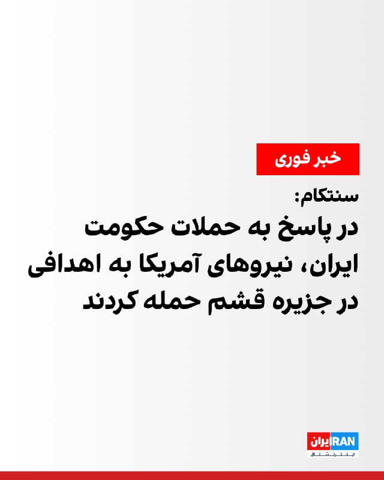

ستاد فرماندهی مرکزی آمریکا، سنتکام، اعلام کرد در پاسخ به تلاش‌های جمهوری اسلامی برای حمله در سراسر خاورمیانه، چندین موشک بالستیک و پهپاد ایرانی و یک ایستگاه کنترل زمینی نظامی در قشم را منهدم کرده است.
به گفته سنتکام، جمهوری اسلامی چندین موشک بالستیک به سمت کشورهای همسایه منطقه شلیک کرد، اما هیچ‌کدام به اهداف مورد نظر اصابت نکردند و هیچ‌یک از نیروهای آمریکایی نیز آسیب ندیدند.
طبق این اطلاعیه، دو موشک ایرانی که به سوی کویت شلیک شدند، در مسیر سقوط کردند یا حین حرکت متلاشی شدند و سه موشک که به سمت بحرین پرتاب شده بودند، بلافاصله از سوی سامانه‌های پدافند هوایی آمریکا و بحرین رهگیری شدند.
به گفته ارتش آمریکا، لحظاتی پیش از آن، نیروهای سنتکام سه پهپاد انتحاری را که ایران به سمت کشتی‌های غیرنظامی در حال عبور از آب‌های منطقه‌ای پرتاب کرده بود، سرنگون کردند. نیروهای آمریکایی همچنین یک ایستگاه کنترل زمینی نظامی جمهوری اسلامی در جزیره قشم را هدف حملات دفاعی قرار دادند.

https://iranintl.com/202606024373

## IranIntlTV — post 340301

  

سپاه اعلام کرد در پاسخ به حمله‌های جدید به قشم، نیروی هوایی سپاه با حملات موشکی پایگاه‌های آمریکا در کویت را هدف قرار داده است.
سپاه تاکید کرد: «زمان بزن و فرار کن به پایان رسیده است و نیروهای ستمگر باید عواقب وخیم نادانی و ماجراجویی‌های بی‌محاسبه خود را بپذیرند.»

https://iranintl.com/202606026647

## Shin_Persian — post 6454

🔁 Quoting above tweet:
Shin ✓ @hey_itsmyturn
Wed, 03 Jun 2026 01:26:27 UTC

U.S. Central Command says Iranian drones attempted to attack U.S. forces in Kuwait tonight. Air defenses downed multiple drones; no American personnel or assets were harmed.

Source: @CENTCOM
https://x.com/CENTCOM/status/2061982709723906359

فارسی

فرماندهی مرکزی ایالات متحده (سنتکام) اعلام کرد پهپادهای ایرانی امشب تلاش کردند به نیروهای آمریکایی در کویت حمله کنند. پدافند هوایی چندین پهپاد را سرنگون کرد؛ به هیچ‌یک از پرسنل یا دارایی‌های آمریکا آسیبی وارد نشده است.

منبع: @CENTCOM
https://x.com/CENTCOM/status/2061982709723906359

𝕏 · @shin_persian

## Shin_Persian — post 6451

## Shin_Persian — post 6448

  <a href="telegram/content/Shin_Persian_6448_1780452193.mp4" target="_blank">🎬 Download video</a>

Shin ✓ @hey_itsmyturn
Wed, 03 Jun 2026 00:37:30 UTC

𝕏 · @shin_persian

## Shin_Persian — post 6447

Shin ✓ @hey_itsmyturn
Wed, 03 Jun 2026 00:35:45 UTC

Got visuals now, not a fighter jet, but a twin engine low passing NW -&gt; SE

فارسی

تصاویر را دریافت کردم، یک جنگنده نیست، بلکه یک هواپیمای دو موتوره است که در ارتفاع پایین از سمت شمال غربی به سمت جنوب شرقی عبور می‌کند.

𝕏 · @shin_persian

## Shin_Persian — post 6445

Shin ✓ @hey_itsmyturn
Wed, 03 Jun 2026 00:32:01 UTC

Jet activity over western Tehran.

فارسی

فعالیت جنگنده‌ها برفراز غرب تهران.

𝕏 · @shin_persian

## Shin_Persian — post 6444

  

🔁 Quoting above tweet: Shin ✓ @hey_itsmyturn Tue, 02 Jun 2026 23:57:31 UTC Following IRGC claims of striking U.S. 5th Fleet headquarters and a regional air base, U.S. Central Command says the claims are false and all Iranian attacks on American forces failed.…

## Shin_Persian — post 6443

🔁 Quoting above tweet:
Shin ✓ @hey_itsmyturn
Tue, 02 Jun 2026 23:57:31 UTC

Following IRGC claims of striking U.S. 5th Fleet headquarters and a regional air base, U.S. Central Command says the claims are false and all Iranian attacks on American forces failed.

Source: @CENTCOM
https://x.com/CENTCOM/status/2061960381245891028

فارسی

در پی ادعاهای سپاه پاسداران انقلاب اسلامی (IRGC) مبنی بر هدف قرار دادن مقر ناوگان پنجم ایالات متحده و یک پایگاه هوایی منطقه‌ای، فرماندهی مرکزی ایالات متحده (سنتکام - CENTCOM) اعلام کرد که این ادعاها کذب است و تمامی حملات ایران به نیروهای آمریکایی شکست خورده است.

منبع: @CENTCOM
https://x.com/CENTCOM/status/2061960381245891028

𝕏 · @shin_persian

## Shin_Persian — post 6442

  

↩️ Quoted tweet: U.S. Central Command ✓ @CENTCOM Tue, 02 Jun 2026 23:57:18 UTC 🚫 CLAIM: Iran’s Islamic Revolutionary Guard Corps claims they struck U.S. 5th Fleet headquarters in Bahrain and a U.S. air base in the region with missiles and drones today. FALSE.…

## Shin_Persian — post 6441

↩️ Quoted tweet:
U.S. Central Command ✓ @CENTCOM
Tue, 02 Jun 2026 23:57:18 UTC

🚫 CLAIM: Iran’s Islamic Revolutionary Guard Corps claims they struck U.S. 5th Fleet headquarters in Bahrain and a U.S. air base in the region with missiles and drones today. FALSE.

✅ TRUTH: All Iranian attacks on American forces failed. U.S. forces remain vigilant and ready to

↩️ توییت نقل‌قول شده — برای پاسخ، پست زیر را ببینید.

فارسی

🚫 ادعا: سپاه پاسداران انقلاب اسلامی ایران (IRGC) ادعا می‌کند که امروز با موشک و پهپاد به مقر ناوگان پنجم ایالات متحده در بحرین و یک پایگاه هوایی آمریکا در منطقه حمله کرده است. کذب.

✅ واقعیت: تمام حملات ایران به نیروهای آمریکایی شکست خورد. نیروهای ایالات متحده هوشیار و آماده باقی می‌مانند.

𝕏 · @shin_persian

## Shin_Persian — post 6440

↩️ Quoted tweet: الجزيرة - عاجل ✓ @AJABreaking Tue, 02 Jun 2026 17:41:45 UTC عاجل | مجلس الوزراء الكويتي: نطالب #إيران بالوقف الفوري دون شرط لاعتداءاتها ونحملها المسؤولية الكاملة عنها ↩️ Quoted tweet — see the post below for the reply. English Urgent…

## Shin_Persian — post 6439

↩️ Quoted tweet:
الجزيرة - عاجل ✓ @AJABreaking
Tue, 02 Jun 2026 17:41:45 UTC

عاجل | مجلس الوزراء الكويتي: نطالب #إيران بالوقف الفوري دون شرط لاعتداءاتها ونحملها المسؤولية الكاملة عنها

↩️ Quoted tweet — see the post below for the reply.

English

Urgent | Kuwaiti Council of Ministers: We demand that Iran immediately and unconditionally cease its aggressions, and we hold it fully responsible for them.

𝕏 · @shin_persian

## Shin_Persian — post 6438

U.S. Central Command ✓ @CENTCOM
Tue, 02 Jun 2026 23:34:40 UTC
Centcom:
"U.S., Partner Forces Defend Against Aggressive Iranian Behavior
TAMPA, Fla. — U.S. forces successfully defeated multiple Iranian ballistic missiles and drones, and conducted self-defense strikes on Qeshm Island in response to attempted attacks by Iran across the Middle East, June 2.

Iran launched several ballistic missiles toward regional neighbors; however, all failed to hit their intended targets. Two Iranian missiles fired at Kuwait fell short or broke apart enroute, and three missiles launched at Bahrain were immediately intercepted by U.S. and Bahrain air defense forces.

Moments earlier, U.S. Central Command (CENTCOM) forces shot down three one-way attack drones launched by Iran toward civilian mariners that were rightfully transiting regional waters. American forces also conducted self-defense strikes on an Iranian military ground control station on Qeshm Island.

No U.S. personnel were harmed. CENTCOM forces remain vigilant and ready to defend against unwarranted Iranian aggression during the ongoing ceasefire."

𝕏 · @shin_persian

## FarsiVOA — post 219433

⚡️واکنش‌ها به گزارش تکان‌د‌هنده سازمان ملل در مورد افزایش خشونت جنسی علیه زنان افغان در حکومت طالبان
@FarsiVOA

## FarsiVOA — post 219432

⚡️آیا بیانیه ائتلاف شیعه حاکم، پایان دوران شبه‌نظامیان وابسته به جمهوری اسلامی در عراق است؟
@FarsiVOA

## FarsiVOA — post 219431

⚡️صدور حکم اعدام برای پهلوان جوان شیرازی؛ بنیامین نقدی پنجمین قهرمانی که به مرگ محکوم شد
@FarsiVOA

## FarsiVOA — post 219430

⚡️نگرانی خانواده فاطمه سپهری از وضعیت وخیم جسمانی این فعال سیاسی
@FarsiVOA

## FarsiVOA — post 219429

  <a href="telegram/content/FarsiVOA_219429_1780452195.mp4" target="_blank">🎬 Download video</a>

⚡️ابرتورم در ایران؛ مرکز آمار نرخ تورم را حدود ۸۴ درصد اعلام کرد؛ گفت‌وگو با رضا غیبی
@FarsiVOA

## FarsiVOA — post 219428

  <a href="telegram/content/FarsiVOA_219428_1780452196.mp4" target="_blank">🎬 Download video</a>

⚡️بازگشت محدود اینترنت و بلاتکلیفی خریداران «پرو»؛ واکنش کاربران شبکه‌های اجتماعی
@FarsiVOA

## FarsiVOA — post 219427

⚡️«الفبای نیاکان» دوباره در تاجیکستان مورد توجه قرار گرفته است.
@FarsiVOA

## FarsiVOA — post 219426

  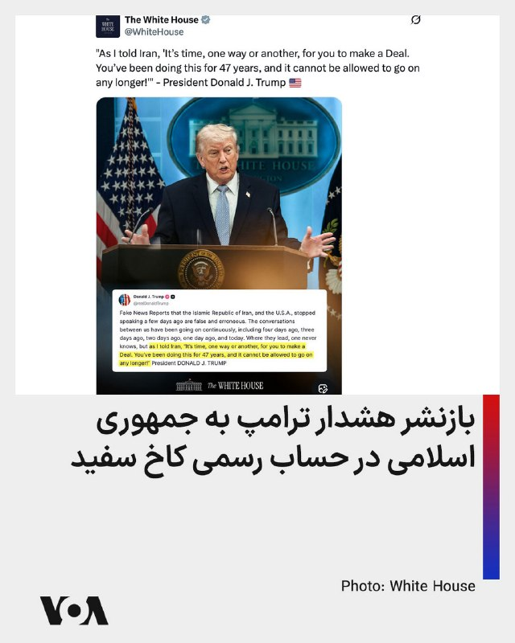

⚡️کاخ سفید، هشدار دونالد ترامپ، رئیس‌جمهوری آمریکا به جمهوری اسلامی را روز سه‌شنبه در حساب خود در شبکه اجتماعی ایکس منتشر کرد. آقای ترامپ در هشداری که در تروت‌سوشال منتشر کرده بود، گفت که «همانطور که به [جمهوری اسلامی] ایران گفتم، 'وقت آن رسیده که به هر طریقی شده، به توافق برسید. شما ۴۷ سال است که این کار را می‌کنید و دیگر نمی‌توان اجازه داد که [این وضعیت] ادامه یابد!'»
@FarsiVOA

## FarsiVOA — post 219425

⚡️رزمایش سالانه ناتو در دریای بالتیک در مقیاس کوچکتر برگزار می‌شود
@FarsiVOA

## FarsiVOA — post 219424

  <a href="telegram/content/FarsiVOA_219424_1780452197.mp4" target="_blank">🎬 Download video</a>

⚡️افزایش چشمگیر اعدام زندانیان سیاسی و بازداشت‌شدگان اعتراضات دی‌ماه ۱۴۰۴؛ گفت‌وگو با سینا یوسفی
@FarsiVOA

## FarsiVOA — post 219423

⚡️حقوق ۱۶ میلیون تومانی در برابر تورم ۷۳ درصدی؛ رونمایی از پدیده «شاغلان فقیر»
@FarsiVOA

## FarsiVOA — post 219422

  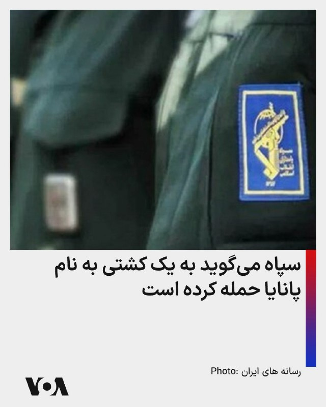

⚡️سپاه پاسداران در بیانیه‌ای که رسانه‌های حکومتی در ایران منتشر کردند، اعلام کرد به کشتی «پانایا» حمله کرده است. این نهاد که در فهرست تروریستی آمریکا و چند کشور دیگر قرار دارد، دلیل حمله به این کشتی را واکنش به اقدام نیروهای آمریکایی در جلوگیری از نقض محاصره دریایی بنادر ایران توسط یک نفتکش عنوان کرد. ستاد فرماندهی مرکزی آمریکا، سنتکام، ‌در دقایقی قبل در بیانیه‌ای با اشاره به اقدام جمهوری اسلامی در حمله به دریانوردان غیرنظامی، گفت که یک مرکز نظامی در جزیره قشم را در اقدامی دفاعی، هدف حمله نظامی قرار داد.
@FarsiVOA

## FarsiVOA — post 219421

  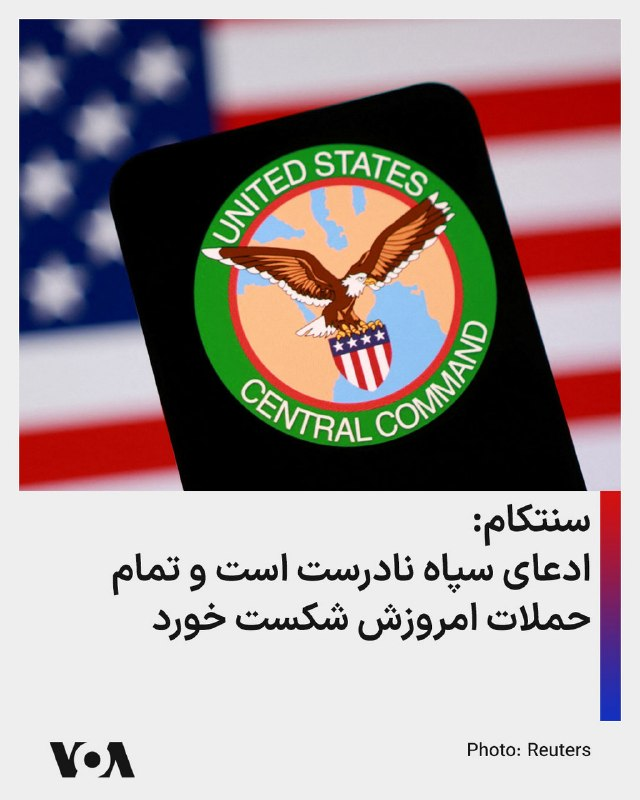

⚡️ستاد فرماندهی مرکزی آمریکا در شبکه‌های اجتماعی اعلام کرد که سپاه پاسداران مدعی شده که در حملات امروز با موشک و پهپاد به مقر ناوگان پنجم آمریکا در بحرین و یک پایگاه هوایی آمریکا در منطقه ضربه زده است. سنتکام گفت این ادعا نادرست است و تمام حملات جمهوری اسلامی به نیروهای آمریکایی شکست خورد.
@FarsiVOA

## FarsiVOA — post 219420

🔺سنتکام از حمله دفاعی نیروهای آمریکایی به جزیره قشم و دفع حملات موشکی جمهوری اسلامی در سراسر خاورمیانه خبر داد

▪️در پی گزارش‌ها در مورد حملات موشکی جمهوری اسلامی به کویت و بحرین (چهارشنبه صبح به وقت ایران)، ستاد فرماندهی مرکزی آمریکا، سنتکام در بیانیه‌ای گفت که نیروهای آمریکایی در پاسخ به حملات جمهوری اسلامی «در سراسر خاورمیانه، در ۲ ژوئن (۱۲ خرداد به وقت واشنگتن)، «با موفقیت» حملات موشک‌های بالستیک و پهپاد‌های جمهوری اسلامی را شکست دادند.

⬇️ بیشتر بخوانید:
https://ir.voanews.com/a/8156568.html
@FarsiVOA

## Persian_Trend_Official — post 15589

  <a href="telegram/content/Persian_Trend_Official_15589_1780452198.webm" target="_blank">🎬 Download video</a>

قیمت نفت صعودی شد و به حدود 97 دلار رسید!

📝 Amir

📌 @persian_trend_official
پرشین ترند | متفاوت‌ترین کانال نظامی

## Persian_Trend_Official — post 15588

  <a href="telegram/content/Persian_Trend_Official_15588_1780452199.mp4" target="_blank">🎬 Download video</a>

ویدیویی از لحظه فیل شدن موشک پدافندی کویت در منطقه ای مسکونی

📝 Amir

📌 @persian_trend_official
پرشین ترند | متفاوت‌ترین کانال نظامی

## Persian_Trend_Official — post 15587

  <a href="telegram/content/Persian_Trend_Official_15587_1780452200.webm" target="_blank">🎬 Download video</a>

گروه تروریستی و تجزیه طلب کومله در بیانیه‌ای اعلام کرد که دو موشک ایرانی روز سه‌شنبه ساعت 23:00 به وقت محلی به مقر این گروه در دره آلانا، شمال شرقی اربیل، اصابت کردند.

در این بیانیه هیچ جزئیات فوری در مورد تلفات ارائه نشده است.

📝 Amir

📌 @persian_trend_official
پرشین ترند | متفاوت‌ترین کانال نظامی

## Persian_Trend_Official — post 15586

  <a href="telegram/content/Persian_Trend_Official_15586_1780452200.webm" target="_blank">🎬 Download video</a>

خب فکر میکنم دیگه تموم شد. 🗿

مثل اینکه آتش‌بس هم پر قدرت پابرجاست.

شبتون بخیر 😑

📝 Nick

## Persian_Trend_Official — post 15585

  <a href="telegram/content/Persian_Trend_Official_15585_1780452200.mp4" target="_blank">🎬 Download video</a>

⭕️ فیلم ضبط‌شده از دوربین داشبورد یک خودرو در کویت که انفجار موشک بالستیک ایران با کلاهک خوشه‌ای را نشان می‌دهد.

📝 Nick

📌 @persian_trend_official
پرشین ترند | متفاوت‌ترین کانال نظامی

## Persian_Trend_Official — post 15584

  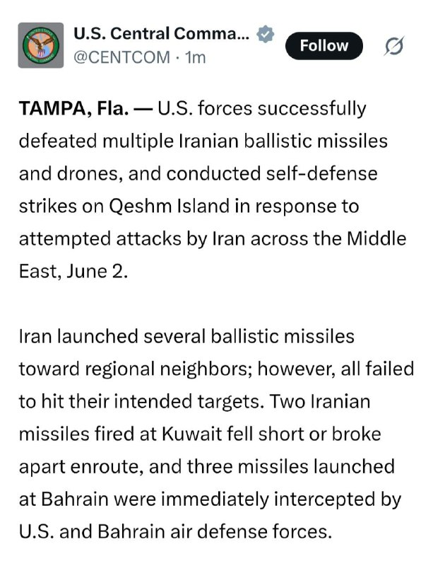

سنتکام: نیروهای آمریکایی در پاسخ به حملات ایران در سراسر خاورمیانه، در تاریخ 2 ژوئن، با موفقیت چندین موشک بالستیک و پهپاد ایرانی را شکست دادند و حملات دفاع شخصی را در جزیره قشم انجام دادند.

ایران چندین موشک بالستیک به سمت همسایگان منطقه‌ای شلیک کرد؛ با این حال، همه آنها نتوانستند به اهداف مورد نظر خود اصابت کنند. دو موشک ایرانی که به سمت کویت شلیک شدند، در مسیر خود به هدف نرسیدند یا متلاشی شدند و سه موشک شلیک شده به سمت بحرین بلافاصله توسط نیروهای دفاع هوایی ایالات متحده و بحرین رهگیری شدند.

لحظاتی پیش از آن، نیروهای فرماندهی مرکزی ایالات متحده (سنتکام) سه پهپاد تهاجمی یک طرفه را که توسط ایران به سمت دریانوردان غیرنظامی که به طور قانونی در حال عبور از آب‌های منطقه‌ای بودند، شلیک شده بود، سرنگون کردند. نیروهای آمریکایی همچنین حملات دفاع شخصی را به یک ایستگاه کنترل زمینی نظامی ایران در جزیره قشم انجام دادند.

هیچ پرسنل آمریکایی آسیبی ندیدند. نیروهای سنتکام در طول آتش‌بس جاری هوشیار و آماده دفاع در برابر تجاوز بی‌مورد ایران هستند.

📝 Amir

📌 @persian_trend_official
پرشین ترند | متفاوت‌ترین کانال نظامی

## Persian_Trend_Official — post 15583

⭕️ فارس:

مرکز ناوگان پنجم دریایی آمریکا مورد تهاجم موشکی و پهپادی نیروی هوافضای سپاه قرار گرفت

روابط عمومی سپاه پاسداران انقلاب اسلامی:

بسم الله القاصم الجبارین
فَمَنِ اعْتَدَىٰ عَلَيْكُمْ فَاعْتَدُوا عَلَيْهِ بِمِثْلِ مَا اعْتَدَىٰ عَلَيْكُمْ

🔹️در اواخر شب گذشته ارتش متجاوز آمریکا یک نفتکش ایرانی را در حوالی تنگه هرمز مورد اصابت پرتابه هوایی قرار داد که این نفتکش از محل موتورخانه دچار خسارت گردید.

🔹️در پاسخ به این تجاوز و نقض مقررات تنگه هرمز شناور متعلق به دشمن آمریکایی صهیونی به نام پانایا مورد هدف موشک های نیروی دریایی سپاه قرار گرفت.

🔹️دشمن آمریکایی در تجاوزی مجدد یک دکل مخابراتی سپاه در جنوب جزیره قشم را هدف پرتابه های هوایی خود قرار داد در پاسخ به این تجاوز پایگاه هوایی و بالگردی آنان مستقر در یکی از کشورهای منطقه و همچنین مرکز ناوگان پنجم دریایی آمریکا مورد تهاجم موشکی و پهپادی نیروی هوافضای سپاه قرار گرفتند.

🔹️پیش از این اخطار داده بودیم که در صورت تجاوز پاسخ متفاوت و سنگین تر خواهد بود و همینطور اقدام کردیم. این پاسخ ها باید عبرت شده باشد.

🔹️ تکرار می کنیم برهم زدن امنیت تنگه هرمز تاوان سختی برای ارتش متجاوز آمریکا خواهد داشت.

و ما النصر الا من عندالله العزیز الحکیم

منبع: فارس

📝 Nick

📌 @persian_trend_official
پرشین ترند | متفاوت‌ترین کانال نظامی

## Persian_Trend_Official — post 15581

  <a href="telegram/content/Persian_Trend_Official_15581_1780452202.webm" target="_blank">🎬 Download video</a>

🇸🇦🇦🇪 اصلاحیه: ادعاهای مبنی بر حمله به عربستان و امارات صحیح نبوده‌اند و تا این لحظه حمله‌ای به این دو کشور انجام نشده است. 📝 Nick 📌 @persian_trend_official پرشین ترند | متفاوت‌ترین کانال نظامی

## Persian_Trend_Official — post 15580

⭕️ هشدار حملات در عربستان نیز به صدا درآمد! 📝 Nick 📌 @persian_trend_official پرشین ترند | متفاوت‌ترین کانال نظامی

## IranianMinds — post 21285

🔴 بنده خدا اومد یه تور گذاشت برن یکم آب بازی کنن و بگردن بعد از شانسش رسانه ای شد همه جا پخشش کردن و این حکومتیام دیدن دختر پسر با همن و مختلطه توره و ریختن سرشو نذاشتن برگزار کنه چیزیو ...

@IranianMinds

## IranianMinds — post 21284

  

🔴فقط 
5️⃣ روز فرصت باقی مونده
🔴

🎉 500 هزارتومن بونوس رایگان فقط با ثبت نام بدون هیچگونه واریزی!

😮 تنها سایتی که با عضویت بدون واریز 500,000 تومان شارژ بی قیدو شرط میده #وینرو هست
💰

7️⃣
1️⃣ خرداد، افتتاحیه سایت با جوایز بزرگ
🔥

👑 #معتبرترین سایت ایرانی 
⬇️

🌐 Winro.io

🌐 Winro.io

📱کانال اخبار و هدایا Aa12 
🎁

📱 @winro_io

## IranianMinds — post 21283

  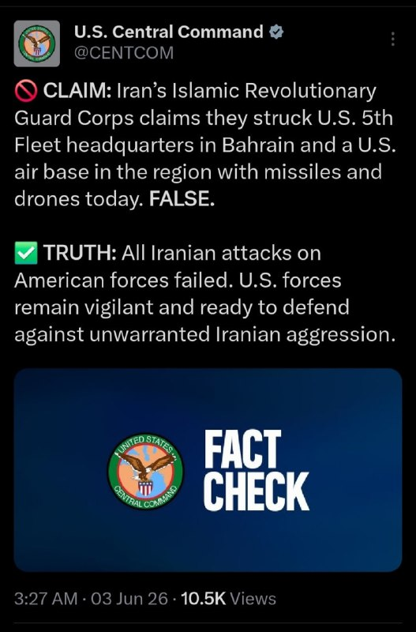

🔴سنتکام:

سپاه ادعا کرده که مقر ناوگان پنجم آمریکا در بحرین و یک پایگاه هوایی آمریکا را یا موشک و پهپاد هدف قرار داده است. همش دروغ است و در حقیقت حملات ایران به نیروهای آمریکا ناموفق بوده است. آمریکا هیچ آسیبی ندیده است و همیشه در هوشیاری کامل است که در برابر هر حمله‌ای واکنش نشان بدهد.

@IranianMinds

## IranianMinds — post 21282

🔴کانال ۱۴ اسرائیل:

اگر امشب ایران فقط یک گلوله به سمت اسرائیل شلیک کند، تمام دروازه‌های جهنم به سویشان باز خواهد شد.

@IranianMinds

## IranianMinds — post 21281

  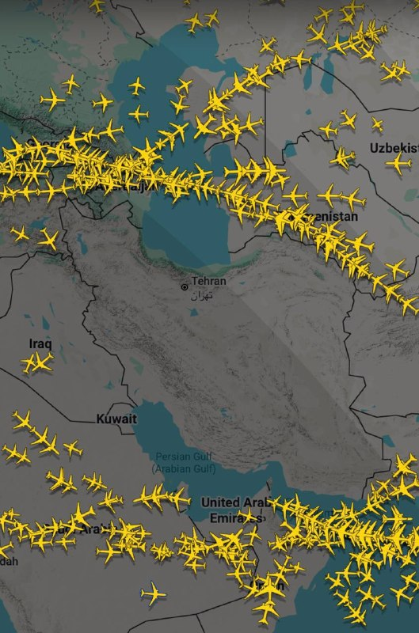

🔴آسمان ایران، کویت و بحرین کلیر شد.

@IranianMinds

## BBCPersian — post 282727

  <a href="telegram/content/BBCPersian_282727_1780452204.mp4" target="_blank">🎬 Download video</a>

🔻بامداد چهارشنبه و ساعتی پس از مخابره گزارش‌های متعدد از حملات موشکی به نقاطی در کویت و بحرین، سپاه پاسداران با انتشار اطلاعیه‌ای رسما از حمله به پایگاه ناوگان پنجم نیروی دریایی آمریکا در بحرین و پایگاه هوایی ایالات متحده در کویت خبر داد.

پیش از آن سنتکام، ستاد فرماندهی مرکزی ارتش آمریکا، اعلام کرده بود اقدامات مربوط به محاصره دريايی را عليه نفتکش «ام تی لکسی» با پرچم بوتسوانا، در حالی که در آب‌های بين‌المللی به سمت جزيره خارک در حرکت بود، اجرا کرده است.

سنتکام سپس در اطلاعیه دوم خود مدعی شد چندين موشک بالستيک و پهپاد ايرانی را رهگيری و منهدم کرده و در پاسخ به آنچه «تلاش‌های ايران برای حمله در سراسر منطقه» خوانده، حملاتی را در قالب دفاع از خود عليه اهدافی در جزيره قشم انجام داده است.

هر دو طرف تصاویر ویدیویی از انچه منتسب به اقدامات نظامی‌شان است منتشر کردند که بی‌بی‌سی هنوز به طور مستقل قادر به تایید یا تکذیب آنها نیست.

@BBCPersian

## BBCPersian — post 282726

سنتکام اعلام کرد نيروهای آمريکايی در چارچوب دفاع از خود، يک ايستگاه کنترل زمينی نظامی ايران را در جزيره قشم هدف قرار داده‌اند.

این همسو با گزارش سپاه پاسداران است که هدف قرار گرفتن یک دکل مخابراتی خود در جنوب جزیره قشم را علت حملات خود به مقر ناوگان پنجم نیروی دریایی آمریکا عنوان کرده است.

به گفته مقام‌های آمريکايی، در اين درگیری‌ها هيچ يک از نيروهای آمريکايی آسيب نديده‌اند.

فرماندهی مرکزی آمريکا افزوده نيروهای اين کشور همچنان در دوران آتش‌بس جاری در حالت آماده باش باقی خواهند ماند و برای مقابله با آنچه «تجاوزهای غيرموجه ايران» توصيف شد، آمادگی کامل دارند.

سپاه پاسداران هم در اطلاعیه خود تاکید کرده است «پیش از این اخطار داده بودیم که در صورت تجاوز پاسخ متفاوت و سنگین تر خواهد بود و همین‌طور اقدام کردیم.»

@BBCPersian

## BBCPersian — post 282725

  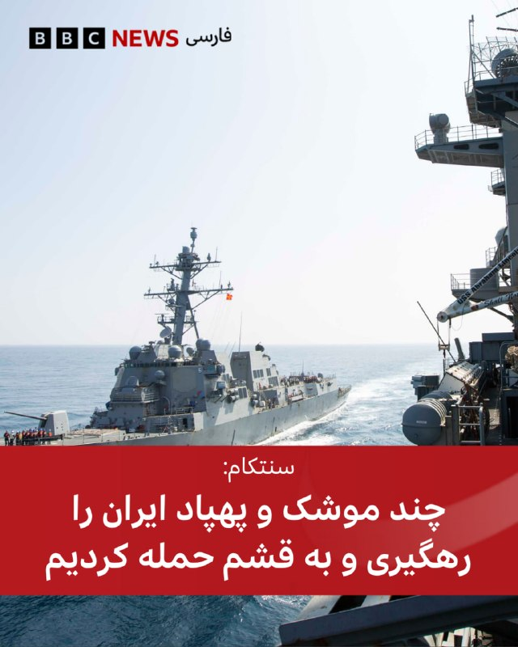

🔻ستاد فرماندهی مرکزی ارتش آمریکا - سنتکام - اعلام کرد چندين موشک بالستيک و پهپاد ايرانی را رهگيری و منهدم کرده و در پاسخ به آنچه «تلاش‌های ايران برای حمله در سراسر منطقه» خوانده، حملاتی را در قالب دفاع از خود عليه اهدافی در جزيره قشم انجام داده است.

بر اساس اين بيانيه، ايران چندين موشک بالستيک به سوی کشورهای منطقه شليک کرد، اما هيچ يک به اهداف مورد نظر اصابت نکردند.

آمريکا مدعی شد دو موشک شليک شده به سوی کويت پيش از رسيدن به هدف سقوط کردند يا در مسير متلاشی شدند و سه موشک ديگر که به سمت بحرين پرتاب شده بودند، بلافاصله توسط سامانه‌های پدافند هوايی آمريکا و بحرين رهگيری شدند.

این در حالی است که منابع ایرانی مدعی وقوع دست کم سه انفجار در کویت و همچنین از کار افتادن یک سامانه پاتریوت آمریکا شدند.

در اين بيانيه سنتکام همچنین آمده است که «دقايقی پيش از آن، نيروهای فرماندهی مرکزی ارتش آمريکا (سنتکام) سه پهپاد انتحاری را که از سوی ايران به سمت کشتی‌های غيرنظامی در حال عبور از آب‌های منطقه پرتاب شده بودند را سرنگون کردند.»

📷 Centcom / U.S. Central Command
https://bbc.in/3SfXLwa
@BBCPersian

## BBCPersian — post 282724

🔻ساعتی پس از مخابره گزارش‌های متعدد از حملات موشکی به نقاطی در کویت و بحرین، سپاه پاسداران با انتشار اطلاعیه‌ای رسما از حمله به پایگاه ناوگان پنجم نیروی دریایی آمریکا خبر داد. در بیانیه بامداد چهارشنبه سپاه پاسداران آمده است: «در اواخر شب گذشته ارتش متجاوز…

## BBCPersian — post 282723

  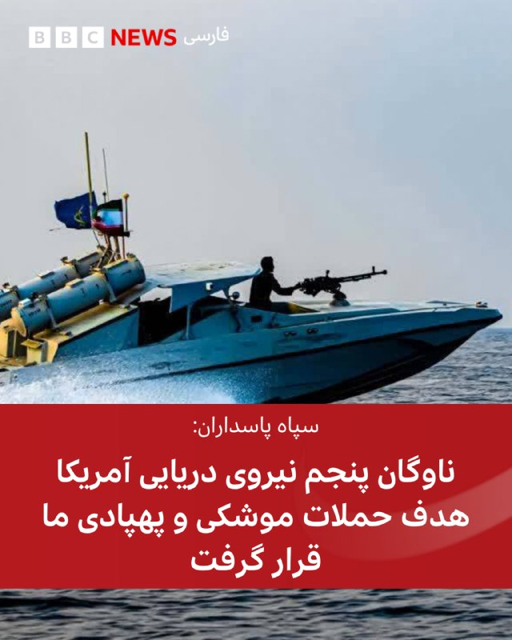

🔻ساعتی پس از مخابره گزارش‌های متعدد از حملات موشکی به نقاطی در کویت و بحرین، سپاه پاسداران با انتشار اطلاعیه‌ای رسما از حمله به پایگاه ناوگان پنجم نیروی دریایی آمریکا خبر داد.

در بیانیه بامداد چهارشنبه سپاه پاسداران آمده است: «در اواخر شب گذشته ارتش متجاوز آمریکا یک نفتکش ایرانی را در حوالی تنگه هرمز مورد اصابت پرتابه هوایی قرار داد که این نفتکش از محل موتورخانه دچار خسارت گردید. در پاسخ به این تجاوز و نقض مقررات تنگه هرمز شناور متعلق به دشمن آمریکایی صهیونی به نام پانایا مورد هدف موشک های نیروی دریایی سپاه قرار گرفت.» ️در ادامه این بیانیه آمده است که نیروهای آمریکایی همچنین یک دکل مخابراتی سپاه در جنوب جزیره قشم را هدق قرار داده‌اند و در مقابل: «در پاسخ به این تجاوز پایگاه هوایی و بالگردی آنان مستقر در یکی از کشورهای منطقه و همچنین مرکز ناوگان پنجم دریایی آمریکا مورد تهاجم موشکی و پهپادی نیروی هوافضای سپاه قرار گرفتند.»

📷 Getty Images
https://bbc.in/43Jbe25
@BBCPersian

## Dirty_Kids — post 390892

بچه ها اسم این بازی عبور مرغ از خیابون  هست ویدئو نگاه کنید خیلی راحت 8 میلیون ازش سود گرفتیم😍 
😤اگ توم دوس داری خیلی راحت از بازی های انلاین پول در بیاری حتما عضو کازینو شبانه شو
✅ توی کازینو شبانه بهت اموزش میدیم از بازی های انلاین پول دربیاری👌 کانال کازینو…

## Dirty_Kids — post 390891

  <a href="telegram/content/Dirty_Kids_390891_1780452207.mp4" target="_blank">🎬 Download video</a>

بچه ها اسم این بازی عبور مرغ از خیابون  هست ویدئو نگاه کنید خیلی راحت 8 میلیون ازش سود گرفتیم😍

😤اگ توم دوس داری خیلی راحت از بازی های انلاین پول در بیاری حتما عضو کازینو شبانه شو
✅

توی کازینو شبانه بهت اموزش میدیم از بازی های انلاین پول دربیاری👌

کانال کازینو شبانه راهی برای چند برابر کردن سرمایت 🤷‍♂

کسب درامد انلاین با یه ادم حرفه ای یاد بگیر و‌ پول دربیار 
💵
A12
🎯همین حالا عضو شو و شروع کن👇N
https://t.me/+6ckCmywafrxiYzk0
https://t.me/+6ckCmywafrxiYzk0

## Dirty_Kids — post 390890

  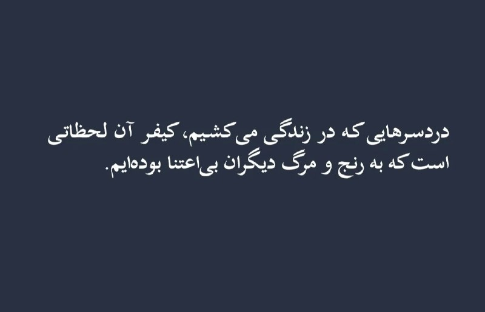

#بخوابیم

@Dirty_Kids 👻

## Dirty_Kids — post 390886

  <a href="telegram/content/Dirty_Kids_390886_1780452208.mp4" target="_blank">🎬 Download video</a>

🔴 تو این مدت که شما نت نداشتید، کلی دختر و پسر از جاهای مختلف جهان با هوش مصنوعی می‌رفتن استادیوم‌های مختلف و عشق میکردن با خودشون؛

● حالا چطور این کارو میکردن؟

وارد ChatGPT میشی ، عکست رو آپلود میکنی و زیرش اینو می‌نویسی :

Ultra-realistic TV broadcast screenshot, identity preserved exactly from reference image. Young woman sitting in the crowd at a (اسم تیمتون) home soccer match, filmed by a live broadcast camera.
She is seated in stadium chairs, leaned back, looking off to the side with a surprised caught-on-camera expression. She wears a (اسم تیمتون) home jersey with jeans, casual match-day styling, relaxed pose, one arm resting on the chair. The jersey should look like a normal full jersey, not a crop top, not rolled up, not tied. Around her are other fans in stadium seats, blurred. Keep the crowd mixed and natural. Add a scoreboard graphic in the top corner, subtle broadcast compression, digital noise, bright stadium lighting, and imperfect live-TV framing. Telephoto sports camera look, authentic televised soccer crowd shot, natural skin texture, no smoothing, 4K.

ویدئو هم میشه درست کرد ولی خب اون دیگه رایگان نیست و باید پول خرج کنید.

- 1 : وارد سایت http://openart.ai/home میشی.
- 2 : گزینه text to video رو انتخاب و عکسی که درست کردید رو آپلود میکنید.
- 3 : پرامپت زیر رو هم وارد می‌کنید و تمام.

character identity reference only (face, hairstyle, proportions).Preserve exact face, hairstyle, skin texture, and identity. Do NOT stylize or beautify.Output: single continuous live sports broadcast shot, 4-5s, 16:9, 1080p, no cuts. SUBJECT:A young woman based on @image1, sitting in a [WRITE YOUR TEAM HERE] football stadium audience.Hands resting naturally on her lap or lightly placed on the seat.Neutral, slightly distant expression.Natural breathing, minimal movement.
ENVIRONMENT: [اسم تیمتون] stadium crowd during live match.Plastic seats, fans around her wearing [اسم تیمتون] jerseys. Background slightly out of focus.Realistic stadium lighting - day or night.Slight haze from broadcast compression. MOOD:Unstaged, candid, real broadcast moment No cinematic drama. Pure live TV capture. CAMERA:Telephoto broadcast lens (120-150mm).Long-distance zoom from upper stands camera.Strong compression, shallow depth of field.Eye-level, very slight upward tilt.Subtle micro-shake from broadcast stabilization. ACTION (4-5s):[0-2s] She sits still, blinks once. Hands resting naturally.[2-4s] Subtle weight shift, naturally adjusting posture. Minimal body movement.[4-5s] Small hand reposition on lap or seat. Slight head turn toward the field._ DETAILS:No posing. No eye contact with camera. Skin texture realistic, no smoothing or beautification. Slight motion blur on background crowd.Faint broadcast scoreboard UI visible in corner.

@Dirty_Kids 👻

## Dirty_Kids — post 390885

  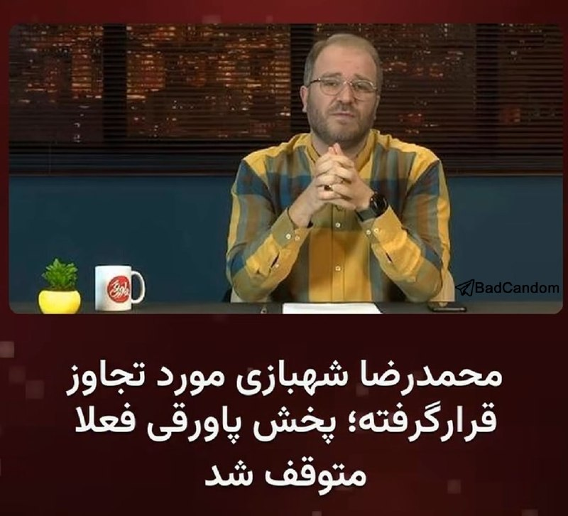

🔴 فوری: گزارش هایی منتشر شده که محمدرضا شهبازی، مجری برنامه پاورقی دیشب مورد تجاوزِ ۳ نفر قرار گرفته و برنامه پاورقی فعلا به طور موقت متوقف شده!

+ هنوز جزئیات دقیقی بیرون نیومده و پلیس در حال بررسیه!

@Dirty_Kids 👻

## Dirty_Kids — post 390884

  <a href="telegram/content/Dirty_Kids_390884_1780452210.mp4" target="_blank">🎬 Download video</a>

ترور هدفمند در خودرو در استان میسان در جنوب عراق

@Dirty_Kids 👻

## Dirty_Kids — post 390883

کانال ۱۴ اسرائیل:
اگر رژیم ایران امشب حتی یک گلوله به سمت اسرائیل شلیک کند، تمام دروازه های جهنم به رویشان باز خواهد شد.

@Dirty_Kids 👻

## Dirty_Kids — post 390882

  <a href="telegram/content/Dirty_Kids_390882_1780452211.mp4" target="_blank">🎬 Download video</a>

حمله جمهوری اسلامی به عربستان

@Dirty_Kids 👻

## Dirty_Kids — post 390881

  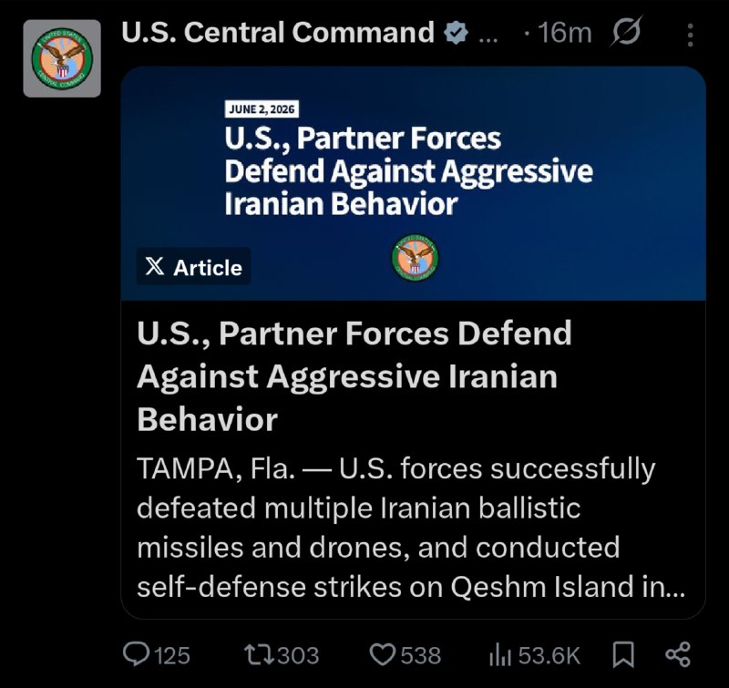

🔴 فوری، سنتکام: موشک هایی که ایران به سمت کویت و بحرین پرتاب کرد یا تو راه خراب شدن یا توسط ما منهدم شدن و هیچ اصابتی نداشتیم.

ایران به ما حمله کرد و ما هم طی اقدامی دفاعی، ایستگاه کنترل زمینی نظامی ایران رو تو جزیره قشم زدیم.

@Dirty_Kids 👻

## Dirty_Kids — post 390879

🔴 اگه امشب آتش بس نقض نشد، دیگه حتی مجتبی کون ملانیا بذاره، بازم نقض نمیشه.

@Dirty_Kids 👻

## Dirty_Kids — post 390878

معلوم نیست آمریکا در قشم چه هدفی را زده که آخوند رم کرده و از یک ساعت قبل تا الان به چهار کشور عراق، بحرین، کویت و عربستان حمله موشکی کرده!

@Dirty_Kids 👻

<!-- MSG END -->

<!-- NAV START -->

<a href="https://github.com/Tljn/FUD/blob/main/telegram/content/archive_1.md" style="display:inline-block; padding:6px 12px; margin:0 4px; background-color:#2ea44f; color:white; text-decoration:none; border-radius:4px; font-weight:bold;">صفحه بعد</a>

<!-- NAV END -->
