# خواننده تلگرام

<!-- TOP_NAV START -->

<a href="https://github.com/Tljn/FUD/blob/main/telegram/content/archive_1.md" style="display:inline-block; padding:6px 12px; margin:0 4px; background-color:#2ea44f; color:white; text-decoration:none; border-radius:4px; font-weight:bold;">صفحه بعد</a>

<!-- TOP_NAV END -->

<!-- MSG START -->

---
📅 بروزرسانی: 1405/04/04 12:44
---

## VahidOOnLine — post 247261

♦️کای ترامپ، نوه دونالد ترامپ، رئیس‌جمهوری آمریکا، در ویدیویی که در شبکه‌های اجتماعی منتشر کرده، مخاطبانش را به بخش‌هایی از کاخ سفید برد که کمتر در تصاویر رسمی دیده می‌شوند و جزئیاتی از فضای داخلی محل اقامت و کار رئیس‌جمهوری را به نمایش گذاشت.

او در این ویدیو با اشاره به خاطرات دوران کودکی خود گفت که در راهروهای تاریخی کاخ سفید فوتبال بازی می‌کرده و حتی یک‌بار هنگام دویدن روی فرش‌های طبقه بالا زمین خورده است.

کای ترامپ همچنین با اشاره به علاقه دونالد ترامپ به رنگ طلایی، با لحنی طنزآمیز گفت: «پدربزرگم از طلا متنفر است، برای همین همه‌جا را طلایی کرده است.» او افزود که ترامپ به جزئیات دکوراسیون توجه ویژه‌ای دارد و در بخش‌های مختلف دفتر بیضی از تزئینات طلایی استفاده کرده است.

یکی از بخش‌های مورد توجه این ویدیو، نمایش دکمه قرمز روی میز رئیس‌جمهوری بود؛ دکمه‌ای که سال‌ها موضوع گمانه‌زنی‌های مختلف بوده است. کای ترامپ توضیح داد که این دکمه هیچ ارتباطی با امور نظامی ندارد و تنها برای درخواست نوشابه رژیمی (دایت کولا) استفاده می‌شود.

این ویدیو همچنین تصاویری از سینی طلایی نگهداری ماژیک‌های مورد استفاده دونالد ترامپ و بخش‌هایی از راهروهای کاخ سفید را به نمایش می‌گذارد؛ تصاویری که به‌سرعت در شبکه‌های اجتماعی مورد توجه کاربران قرار گرفته است.
‌🇸🇦 Indypersian

🤖 @VahidOOnLine

## VahidOOnLine — post 247260

  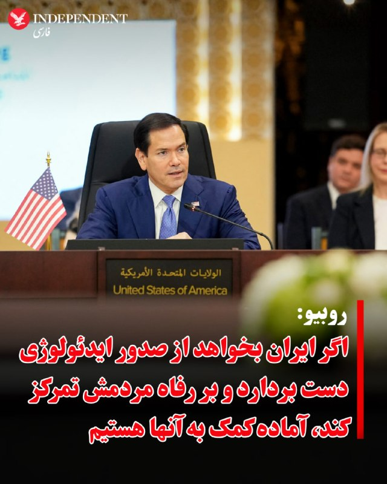

♦️مارکو روبیو، وزیر امور خارجه آمریکا روز پنجشنبه چهارم تیر و در اجلاس شورای همکاری خلیج فارس در منامه، پایتخت بحرین تاکید کرد که واشنگتن خواهان دستیابی به توافق با جمهوری اسلامی است و اگر حکومت ایران بخواهد از صدور ایدئولوژی دست بردارد و بر رفاه مردم کشورش متمرکز باشد، ایالات متحده آماده کمک به تهران است.

روبیو با این حال در سخنرانی خود تاکید کرد که آمریکا «توافق به هر قیمتی را نمی‌پذیرد.» روبیو همچنین به اعضای شورای همکاری خلیج فارس تضمین داد که واشنگتن توافقی را که با منافع این کشورها در تضاد باشد امضا نخواهد کرد.

وزیر امور خارجه دولت دونالد ترامپ همچنین تاکید کرد که تنگه هرمز باید بدون دریافت هرگونه عوارضی، یک آبراه آزاد بین‌المللی باقی بماند.
‌🇸🇦 Indypersian

🤖 @VahidOOnLine

## VahidOOnLine — post 247259

  <a href="telegram/content/VahidOOnLine_247259_1782378877.mp4" target="_blank">🎬 Download video</a>

ویدیوی ارسالی به ایران اینترنشنال نشان می‌دهد که صبح چهارم تیرماه در همایونشهر اصفهان پرچمی با نام‌ها و چهره‌های جاویدنامان انقلاب ملی ایرانیان برافراشته شد. بر اساس روایت رسیده، این اقدام «بدون ترس و با قدرت» در جریان مراسم مذهبی «عاشورا» انجام گرفت.
‌🏁 🇬🇧 IranintlTV

🤖 @VahidOOnLine

## VahidOOnLine — post 247258

  

مارکو روبیو، وزیر خارجه آمریکا در نشست وزیران خارجه کشورهای عضو شورای همکاری خلیج فارس در پایتخت بحرین گفت: «ما توافق با تهران را می‌خواهیم، اما نه به هر قیمتی؛ توافق باید خوب، واقعی، قابل راستی‌آزمایی و همراه با پایبندی کامل به تعهدات باشد.»

او افزود اگر جمهوری اسلامی به جای صدور ایدئولوژی، بر رفاه مردم خود تمرکز کند، آمریکا با همکاری شرکایش آماده همکاری با تهران است؛ اما انتخاب مسیر دیگر نتیجه مثبتی نخواهد داشت.

روبیو همچنین گفت: «هیچ توافقی با ایران نباید امنیت، ثبات یا شکوفایی شرکای آمریکا در منطقه خلیج فارس را تضعیف کند.»
‌🏁 🇬🇧 IranintlTV

🤖 @VahidOOnLine

## VahidOOnLine — post 247257

  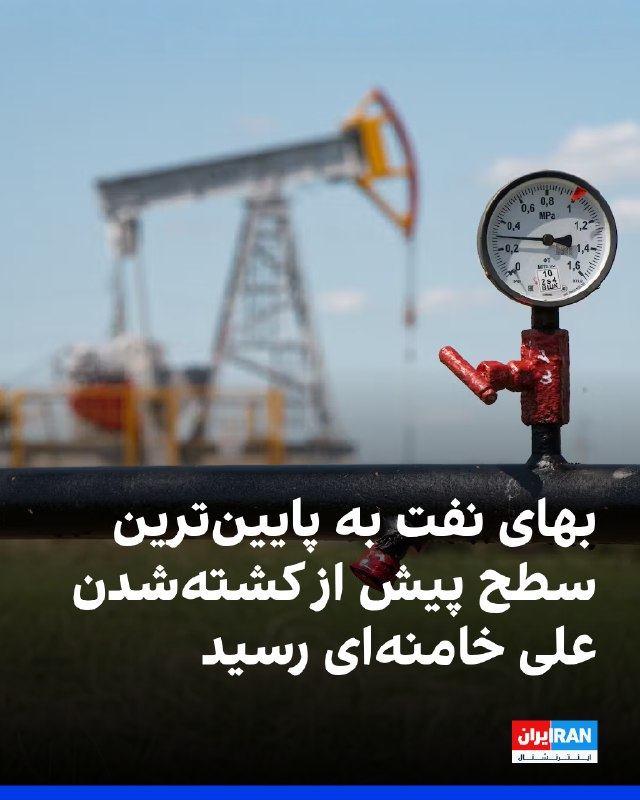

بهای نفت خام در بازارهای جهانی کاهش یافت و قیمت نفت برنت، شاخص جهانی قیمت نفت، با افت ۱.۷ درصدی به ۷۲.۵۲ دلار در هر بشکه رسید. این رقم از قیمت نفت در ۹ اسفند، یک روز پیش از کشته شدن علی خامنه‌ای در حملات مشترک آمریکا و اسرائیل، پایین‌تر است. بهای نفت خام وست تگزاس اینترمدیت آمریکا نیز بیش از ۱.۳ درصد کاهش یافت و به ۶۹.۴۱ دلار در هر بشکه رسید.

این کاهش همزمان با رشد گسترده بازارهای مالی رخ داد. بازارهای سهام آسیا پس از انتشار گزارش سود و پیش‌بینی‌های مثبت شرکت آمریکایی مایکرون، رشد قابل توجهی را تجربه کردند.

بهای نفت از اواسط ژوئن، زمانی که دونالد ترامپ، رییس‌جمهوری آمریکا، اعلام کرد توافق با جمهوری اسلامی نهایی شده و مسیر پایان جنگ هموار شده است، بیش از ۱۶ درصد کاهش یافته است.

قیمت نفت در ماه آوریل، پس از آنکه درگیری‌ها باعث بسته شدن تنگه هرمز شد، تا ۱۲۶ دلار در هر بشکه افزایش یافته بود.
‌🏁 🇬🇧 IranintlTV

🤖 @VahidOOnLine

## VahidOOnLine — post 247256

  

مارکو روبیو، وزیر خارجه آمریکا، در نشست وزیران خارجه کشورهای عضو شورای همکاری خلیج فارس در پایتخت بحرین گفت که ایالات متحده با همراهی برخی کشورهای منطقه، فرصت گفت‌وگوهای سازنده و دستیابی به توافق با جمهوری اسلامی را دنبال خواهد کرد و امیدوار است این روند به نتیجه‌ای مثبت منجر شود.
او افزود اگر جمهوری اسلامی به جای صدور ایدئولوژی، بر رفاه مردم خود تمرکز کند، آمریکا با همکاری شرکایش آماده همکاری با تهران است؛ اما انتخاب مسیر دیگر نتیجه مثبتی نخواهد داشت.
روبیو گفت: «تنگه هرمز یک آبراه بین‌المللی است و هیچ کشوری حق ندارد برای استفاده از آن عوارض یا هزینه دریافت کند؛ این موضوع هرگز بخشی از هیچ توافقی نخواهد بود.»
‌🏁 🇬🇧 IranintlTV

🤖 @VahidOOnLine

## VahidOOnLine — post 247255

  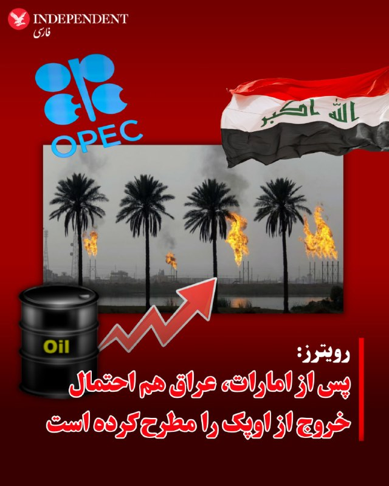

♦️یک مقام ارشد وزارت نفت عراق روز پنجشنبه چهارم تیرماه به‌خبرگزاری رویترز گفت اگر سهمیه اوپک این کشور به طور قابل توجهی افزایش نیابد، عراق مجبور خواهد شد تمام گزینه‌های موجود را بررسی کند.

به گزارش رویترز، منابع دیگری در دولت بغداد گفته‌اند که مقامات عراقی گزینه خروج از اوپک را در نظر گرفته بودند، اما برنامه فعلی این است که عضو این نهاد بین‌المللی باقی بمانند و سهمیه بالاتری را برای صادرات نفت به دست آورند.

پس از خروج امارات متحده عربی از سازمان کشورهای صادرکننده نفت، احتمال بررسی خروج عراق از اوپک ضربه دیگری به این گروه خواهد بود. عراق یکی از پنج عضو بنیانگذار است واوپک در پایتخت عراق تشکیل شده است.

منبع رسمی عراقی به رویترز گفت که عراق در پی جنگ ایران، بحران مالی شدیدی را متحمل می‌شود و افزایش قابل توجه سهمیه صادرات نفت این کشور در اوپک یک ضرورت است و باید با نهایت جدیت مورد بررسی قرار گیرد.
‌🇸🇦 Indypersian

🤖 @VahidOOnLine

## VahidOOnLine — post 247254

  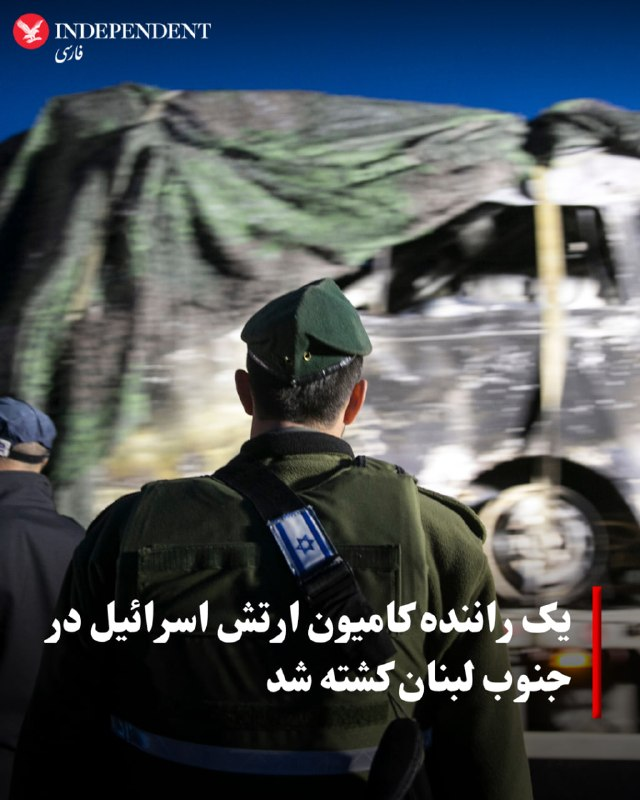

♦️ارتش اسرائیل روز پنجشنبه چهارم تیرماه اعلام کرد که یک سرباز ذخیره شامگاه سه‌شنبه در یک «حادثه عملیاتی» در جنوب لبنان جان خود را از دست داده است.
به گزارش تایمز اسرائیل، ارتش اعلام کرد نظامی کشته شده گروهبان دوم باسل سوید، ۳۲ ساله، راننده کامیون در گردان ۷۵ تیپ هفتم زرهی است.
ارتش اعلام کرد «باسل سوید دیشب حوالی ساعت ۱۱ شب در منطقه ربع الثلاثین در پی واژگونی کامیون سوخت‌گیری‌اش کشته شد.»
در نتیجه واژگونی کامیون، سوید کشته و یک سرباز زخمی و به بیمارستان منتقل شد.
‌🇸🇦 Indypersian

🤖 @VahidOOnLine

## VahidOOnLine — post 247253

⭕️قد بلندتر، سریع‌تر، مسن‌تر: بدن ستاره‌های فوتبال در نیم قرن اخیر چگونه تغییر کرد؟

📌فوتبالیست‌های دهه‌های ۷۰ و ۸۰ به ندرت به سرعت ۳۰ کیلومتر در ساعت می‌رسیدند. اما در جام جهانی ۲۰۲۲ سرعتی بیش از ۳۵ کیلومتر ثبت شد؛ در جام ۱۹۹۰ فقط ۷ فوتبالیست ۳۵ ساله بودند، در ۲۰۲۲، این تعداد به ۴۱ نفر رسید و امسال ۷۲ بازیکن بالای ۳۵ سال هستند

♦️مقایسه دو گل ماندگار در تاریخ جام جهانی فوتبال مردان را می‌توان روایتگر دگرگونی بنیادینی‌ دانست که هم در فوتبال و هم در بدن بازیکنان حرفه‌ای این ورزش رخ داده است.

بیشتر بخوانید...
‌🇸🇦 Indypersian

🤖 @VahidOOnLine

## VahidOOnLine — post 247252

  <a href="telegram/content/VahidOOnLine_247252_1782378883.mp4" target="_blank">🎬 Download video</a>

ویدیوی ارسالی به ایران اینترنشنال نشان می‌دهد که یک آگهی طنز درباره «مفقودی» مجتبی خامنه‌ای، بر دیوار خیابان چسبانده شده است.
‌🏁 🇬🇧 IranintlTV

🤖 @VahidOOnLine

## VahidOOnLine — post 247251

  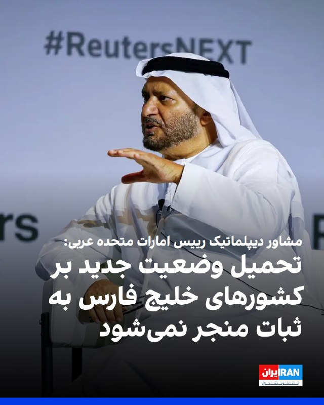

انور قرقاش، مشاور دیپلماتیک رییس امارات متحده عربی، با اشاره به مذاکرات با جمهوری اسلامی در شبکه اجتماعی ایکس نوشت: «نمی‌توان واقعیت‌های ژیوپلیتیکی جدیدی را که در نتیجه تجاوزی غافلگیرانه علیه کشورهای عربی خلیج فارس ایجاد شده، بر این کشورها تحمیل کرد.»

او افزود: «تحمیل یک وضعیت جدید که از دل تجاوز شکل گرفته باشد، نه‌تنها به ثبات منجر نمی‌شود، بلکه بذرهای تازه‌ای از اختلاف و درگیری را برای آینده می‌کارد.»

قرقاش همچنین تاکید کرد که این موضوع به‌طور مشخص درباره تنگه هرمز نیز صدق می‌کند.
‌🏁 🇬🇧 IranintlTV

🤖 @VahidOOnLine

## VahidOOnLine — post 247250

♦️دولت ونزوئلا روز پنجشنبه چهارم تیر اعلام کرد در پی وقوع دو زمین‌لرزه مهیب در این کشور، دست‌کم ۳۲ نفر کشته و بیش از ۷۰۰ نفر زخمی شده‌اند.

 زلزله اول به بزرگی ۷/۲ و دومین زلزله به بزرگی ۷/۵ بود و باعث بروز خسارات شدیدی در مناطق مختلف این کشور شد.

عملیات امداد و نجات همچنان ادامه دارد و احتمال افزایش شمار قربانیان بالاست.

دولت آمریکا و شخص دونالد ترامپ برای ارسال کمک‌های بشردوستانه به ونزوئلا اعلام آمادگی کرده‌اند.
‌🇸🇦 Indypersian

🤖 @VahidOOnLine

## VahidOOnLine — post 247249

  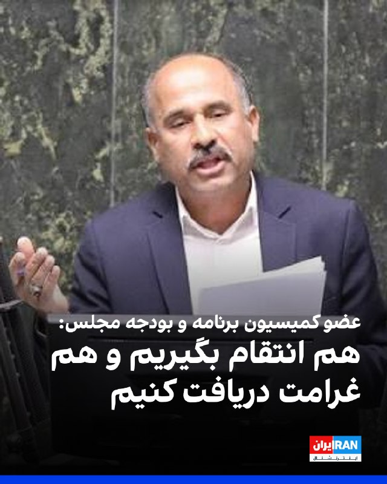

عبدالکریم هاشمی نخل‌ابراهیمی، عضو کمیسیون برنامه و بودجه مجلس، از مذاکره با آمریکا استقبال کرد اما در عین حال تاکید کرد: «خواسته‌های ما این است که هم انتقام گرفته شود، هم غرامت دریافت شود و هم مطالبات ما تامین شود.»
او افزود: «دشمن باید به نوعی بپذیرد که حق و حقوق ما را رعایت کند.»
عضو کمیسیون برنامه و بودجه مجلس گفت: «جنگ به کشور ما خسارت وارد کرد و اکنون به مرحله‌ای رسیده‌ایم که باید به سمت مذاکره حرکت کنیم.»
‌🏁 🇬🇧 IranintlTV

🤖 @VahidOOnLine

## VahidOOnLine — post 247248

  <a href="telegram/content/VahidOOnLine_247248_1782378887.mp4" target="_blank">🎬 Download video</a>

تجربه توافق برجام نشان داد رفع تحریم‌ها می‌تواند شاخص‌های کلان را برای مدتی آرام کند؛ تورم پایین بیاید، ارز ثبات نسبی پیدا کند و صادرات نفت بالا برود. اما مسئله اصلی این است که این گشایش چقدر به زندگی خانواده‌های عادی می‌رسد.

در اقتصاد رانتی جمهوری اسلامی، منافع معمولاً در بالادست جذب می‌شود؛ در شبکه‌هایی نزدیک به قدرت، نه در سفره مردم. همین شکاف میان وعده بهبود و واقعیت زندگی روزمره، پس از برجام به اعتراضات دیماه ۹۶ انجامید.

توافق شاید زمان بخرد، اما اگر قدرت خرید، امکان برنامه‌ریزی و حس ثبات در زندگی مردم تغییر نکند، بحران فقط به تعویق افتاده است.
‌🏁 🇬🇧 ManotoTV

🤖 @VahidOOnLine

## WithYashar — post 15778

ترامپ: به لطف قدرت و مهارت نیروهای مسلح ایالات متحده، امروز ایران نیروی دریایی، نیروی هوایی، پدافند ، پرتاب موشک، و تولیدی ندارد و رهبری آن نابود شده است. برای اولین بار در ۳۰۰۰ سال، ما بالاخره صلح را در خاورمیانه خواهیم داشت. @withyashar

## WithYashar — post 15777

  <a href="telegram/content/WithYashar_15777_1782378889.mp4" target="_blank">🎬 Download video</a>

ترامپ: به لطف قدرت و مهارت نیروهای مسلح ایالات متحده، امروز ایران نیروی دریایی، نیروی هوایی، پدافند ، پرتاب موشک، و تولیدی ندارد و رهبری آن نابود شده است.
برای اولین بار در ۳۰۰۰ سال، ما بالاخره صلح را در خاورمیانه خواهیم داشت.
@withyashar

## WithYashar — post 15776

حمله اسرائیل به جنوب لبنان
@withyashar 🚨

## WithYashar — post 15775

وال استریت ژورنال:
ایران ۳.۸۴ میلیارد دلار را از طریق صرافی رمزارز CoinEx منتقل کرده تا تحریم‌های آمریکا را دور بزند
@withyashar

## WithYashar — post 15774

ایلان ماسک در پی سقوط سهام تسلا و اسپیس ایکس در معاملات روز چهارشنبه که ارزش دارایی او را به ۹۷۰.۲ میلیارد دلار کاهش داد، عنوان «تریلیونر» را از دست داد.
@withyashar

## WithYashar — post 15773

  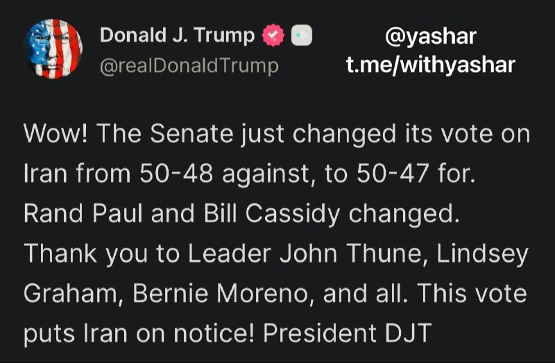

ترامپ:وای! سنا رأی خود در مورد ایران را از ۵۰ به ۴۸ مخالف به ۵۰ به ۴۷ موافق تغییر داد. رند پال و بیل کسیدی تغییر کردند. از رهبر جان تون، لیندسی گراهام، برنی مورنو و همه متشکرم.

این رأی، ایران را در معرض توجه قرار می‌دهد! رئیس جمهور دونالد جی ترامپ
@withyashar

## WithYashar — post 15772

  <a href="telegram/content/WithYashar_15772_1782378891.mp4" target="_blank">🎬 Download video</a>

ترامپ: ما در دو جنگ جهانی پیروز شدیم، فاشیسم و ​​کمونیسم را شکست دادیم.
ما باید دوباره این کار را انجام دهیم.
@withyashar

## WithYashar — post 15771

«قطعنامه اختیارات جنگی ایران» متوقف شد

‏ سنای آمریکا با ۵۰ رای مخالف، ۴۷ رای موافق و یک رای ممتنع، با آغاز بررسی «قطعنامه اختیارات جنگی ایران» مخالفت کرد.
‏ جمهوری‌خواهان و ترامپ استدلال کرده بودند، تصویب این قطعنامه می‌تواند اهرم فشار آمریکا در مذاکرات جاری با جمهوری اسلامی را تضعیف کند.
‎@withyashar

## WithYashar — post 15770

ترامپ درباره ایران: هفته گذشته، ما یک توافق تاریخی برای پایان دادن به درگیری با ایران امضا کردیم، تنگه هرمز را کاملاً باز کردیم و کاری را انجام دادیم که هیچ رئیس‌جمهوری قبلاً نتوانسته بود انجام دهد.
@withyashar

## WithYashar — post 15769

  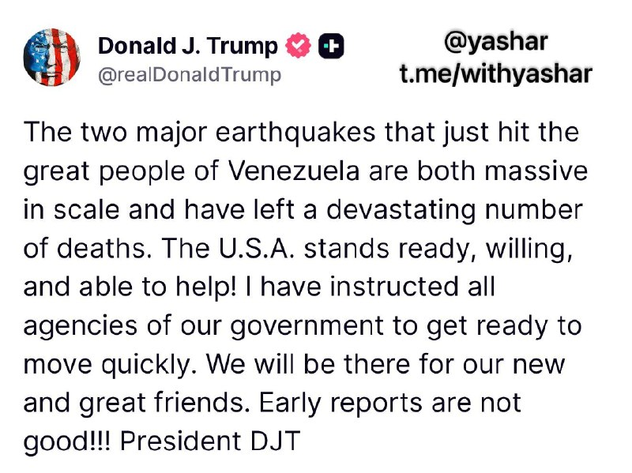

ترامپ‌ در‌ تروث : دو زلزله بزرگ که به تازگی مردم بزرگ ونزوئلا را لرزاندند، هر دو در مقیاس وسیع بوده و تعداد زیادی کشته به جا گذاشته‌اند. ایالات متحده آماده، مایل و قادر به کمک است! من به تمام نهادهای دولتی دستور داده‌ام که برای اقدام سریع آماده باشند. ما در کنار دوستان جدید و بزرگ خود خواهیم بود. گزارش‌های اولیه خوب نیستند.
@withyashar

## mwarmonitor — post 11481

📰یک نفتکش با وجود تهدیدهای سپاه پاسداران انقلاب اسلامی در حال عبور از تنگه هرمز است.

@mwarmonitor

## mwarmonitor — post 11480

📰بر اساس برآوردهای یک مؤسسه عمومی، موج گرمایی که بخش‌های وسیعی از اروپا را دربر گرفته و باعث شکسته‌شدن رکوردهای دمایی شده، با ۲۱۲ مورد مرگ در اسپانیا در اوایل این هفته مرتبط دانسته می‌شود.

@mwarmonitor

## mwarmonitor — post 11479

https://x.com/i/status/2070057848076165203

🔴وقتی پیک موتوری خودش رو جیمز باند می‌بینه؛ سناریوی ابلهانه ترور در سوئیس!

## mwarmonitor — post 11478

📰مقام‌های ارشد به رویترز گفته‌اند که عراق در پی کاهش شدید صادرات نفت به‌دلیل جنگ ایران با یک «بحران مالی» روبه‌رو شده است.

📰به گفته این مقامات، مسئولان عراقی حتی خروج از اوپک را بررسی کرده‌اند، اما برنامه فعلی این است که بغداد همچنان عضو اوپک بماند و برای دریافت سهمیه بالاتر تولید نفت فشار بیاورد. آن‌ها هشدار داده‌اند که اگر سهمیه عراق به‌طور قابل‌توجهی افزایش نیابد، دولت ناچار خواهد شد همه گزینه‌های موجود را مورد بررسی قرار دهد.

@mwarmonitor

## pm_afshaa — post 94780

ترامپ درباره رئیس‌جمهور ترکیه اردوغان: او دوست من است و از جنگ دور مانده ; ترکیه می‌توانست وارد جنگ با اسرائیل شود، من از او خواستم که از این موضوع دور بماند. او هم از آن دور ماند

💧 Rainbet.com the #1 Non-KYC Crypto Casino & Sportsbook @rainbetcom

😁 @Pm_Afshaa

## DEJradio — post 5954

  <a href="telegram/content/DEJradio_5954_1782378894.webm" target="_blank">🎬 Download video</a>

⚽️
🔺 برنامه دژ فوتبالی، اپیزود چهاردهم

*مهدی رستم‌پور، خبرنگار ورزشی

#دژفوتبالی #جام_جهانی
@DEJradio

## DEJradio — post 5953

  <a href="telegram/content/DEJradio_5953_1782378895.webm" target="_blank">🎬 Download video</a>

🔺📢 چروکس؛

زیرصدا با آرش

#زیرصدا
@DEJradio

## DEJradio — post 5952

  <a href="telegram/content/DEJradio_5952_1782378896.webm" target="_blank">🎬 Download video</a>

🔺📷 جام جهانی ۲۰۲۶؛
پرداخت ۱۰۰ تا ۳۰۰ دلار پول به مکزیکی‌ها برای حمل پرچم جمهوری اسلامی در استادیوم‌ها

جمهوری اسلامی ایران سال‌هاست آنقدر درمانده شده است که به افراد پول می‌دهد تا خود را به عنوان حامیانش به دنیای خارج معرفی کند. پس از پول‌پاشی برای راه‌اندازی تجمعات سیاسی در لندن و برلین و قشون‌کشی با کمک آفریقایی تبارها و عرب تبارها به اسم حامیان جمهوری اسلامی، از حاشیه مسابقات جام جهانی ۲۰۲۶ خبر رسیده که رژیم، به شهروندان مکزیکی بین ۱۰۰ تا ۳۰۰ دلار پول داده تا در آمریکا با پرچم جمهوری اسلامی به استادیوم‌ها بروند و از تیم فوتبال حمایت کنند.

#پرچم_جمهوری_اسلامی #جام_جهانی #مکزیک
@DEJradio

## mamlekate — post 103762

📝 نگاهی به روند تغییر لحن و موضع ترامپ درباره ایران

در آغاز جنگ ایران، دونالد ترامپ ویدیویی منتشر کرد و به‌صراحت اهداف و انتظاراتش از این عملیات نظامی را برشمرد. او معترضان ایرانی را تشویق کرد کنترل حکومت را دست بگیرند و وعده داد با نیرویی ویرانگر با «دیکتاتوری شرور و افراطی» در تهران مقابله کند.

@mamlekate

## mamlekate — post 103761

📝 دو زلزله شدید کاراکاس، پایتخت ونزوئلا، را لرزاند

در پی وقوع دو زمین‌لرزه شدید ۷.۲ و ۷.۵ ریشتری در کاراکاس، پایتخت ونزوئلا، شماری از ساختمان‌ها فرو ریختند و شماری از مردم زیر آوار گرفتار شدند. طبق برآورد سازمان زمین‌شناسی آمریکا شمار جان‌باختگان احتمالا بیش از ۱۰ هزار نفر خواهد بود. دولت ونزوئلا نیز وضعیت اضطراری اعلام کرد.

📝 ۳۶ سال پیش؛ شبی که هنگام بازی برزیل-اسکاتلند، ۳۵ هزار ایرانی جان باختند

۳۶ سال پیش، در ساعت ۳۰ دقیقه بامداد روز ۳۱ خرداد ۱۳۶۹، همزمان با بازی برزیل و اسکاتلند در جام جهانی ۱۹۹۰ ایتالیا، زلزله‌ای به قدرت ۷.۴ ریشتر شهرهای منجیل، رودبار، طارم و توابع این شهرها را لرزاند و فاجعه‌ای بزرگ رقم زد؛ مطابق آمار رسمی، در این زلزله بیش از ۳۵ هزار نفر کشته شدند.

@mamlekate

## IranIntlTV — post 344268

  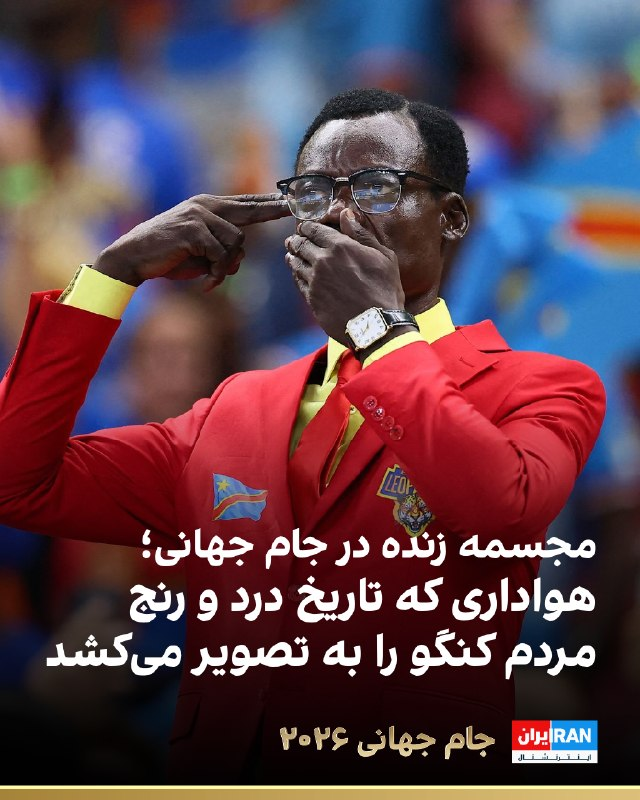

🔻بازی کنگو و کلمبیا در ورزشگاه آکرون مکزیک، میزبان یکی از منحصربه‌فردترین هواداران تاریخ فوتبال بود؛ میشل انکوکا مبولادینگا، معروف به «لومومبا ویا» (لومومبا زنده است)، که با شباهت ظاهری عجیب و ادای احترام به پاتریس لومومبا، رهبر استقلال کنگو، به شهرت جهانی رسیده است.

🔹کنگو در بازی اول برابر پرتغال، با ضربه سر یوآن ویسا، اولین گل و امتیاز تاریخ خود در جام جهانی را کسب کرد.مبولادینگا که به دلیل الزامات قرنطینه ابولا و پیش از آن، صادر نشدن به‌موقع ویزا برای بازی پلی‌آف مقابل جامائیکا، دیدارهای قبلی را از دست داده بود، سرانجام در بازی با کلمبیا به استادیوم رسید.

🔹او این کار را انجام می‌دهد تا به جهانیان یادآوری کند که استقلال کنگو با چه خون‌دل‌ها و مبارزاتی به دست آمده است. مبولادینگا با این نمایش سکوت و ایستادگی، تلاش می‌کند آرمان‌های فراموش‌شده لومومبا یعنی اتحاد، غرور ملی و ایستادگی در برابر ظلم استعمار را به نسل‌های جدید یادآوری کند.

🔹جزییات بیشتر را در سایت بخوانید.

@iranintltvsport

## IranIntlTV — post 344267

  <a href="telegram/content/IranIntlTV_344267_1782378897.mp4" target="_blank">🎬 Download video</a>

پیام‌های رسیده از ادامه قطعی‌های طولانی‌مدت آب و برق و کمبود آب شرب در شهرها و روستاهای مختلف ایران حکایت دارد. یکی از مخاطبان از ملایر گفت مردم از اول خرداد آب شرب ندارند و آبرسانی با تانکر نیز با تاخیر انجام می‌شود

لیلا سعادتی، عضو تحریریه ایران‌اینترنشنال گزارش می‌دهد
@iranintltv

## IranIntlTV — post 344266

  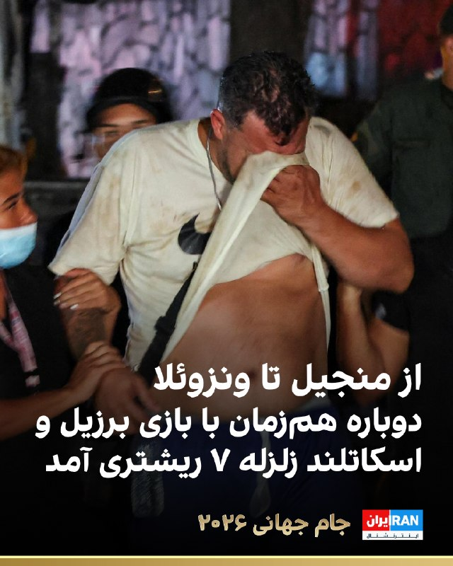

🔻تاریخ فوتبال و حوادث طبیعی بار دیگر به شکلی عجیب و هولناک با یکدیگر هم‌زمان شدند. بامداد امروز در جریان جام جهانی ۲۰۲۶، تیم‌های فوتبال برزیل و اسکاتلند در دور سوم مرحله گروهی به مصاف هم رفتند؛ دیداری که با پیروزی ۳ بر صفر برزیل و صعود این تیم همراه شد.اما این مسابقه، یادآور یکی از تلخ‌ترین خاطرات تاریخ ایران بود که این‌بار سناریوی مشابه آن در ونزوئلا تکرار شد.

🔹۳۶ سال پیش، در بامداد ۳۱ خرداد ۱۳۶۹، دقیقا هم‌زمان با پخش بازی برزیل و اسکاتلند در جام جهانی ۱۹۹۰ ایتالیا، زمین‌لرزه‌ای مهیب به بزرگی ۷.۴ ریشتر شهرهای منجیل و رودبار را تکان داد.

🔹در آن شب، بیدار ماندن بسیاری از ایرانیان برای تماشای مسابقه فوتبال جان آنها را نجات داد، اما در نهایت آن فاجعه جان بیش از ۳۵ هزار نفر را گرفت و ۶۰ هزار مجروح بر جا گذاشت؛ آن بازی با تک گل مولر به سود برزیل پایان یافت اما بسیاری از اهالی گیلان و زنجان هرگز پایان آن را ندیدند. حالا در جام جهانی ۲۰۲۶ و دوباره هم‌زمان با بازی برزیل و اسکاتلند، زمین در ونزوئلا لرزید.

🔹جزییات بیشتر را در سایت بخوانید.

@iranintltvsport

## IranIntlTV — post 344265

  <a href="telegram/content/IranIntlTV_344265_1782378900.mp4" target="_blank">🎬 Download video</a>

ویدیوی ارسالی به ایران اینترنشنال نشان می‌دهد که صبح چهارم تیرماه در همایونشهر اصفهان پرچمی با نام‌ها و چهره‌های جاویدنامان انقلاب ملی ایرانیان برافراشته شد. بر اساس روایت رسیده، این اقدام «بدون ترس و با قدرت» در جریان مراسم مذهبی «عاشورا» انجام گرفت.

## IranIntlTV — post 344264

  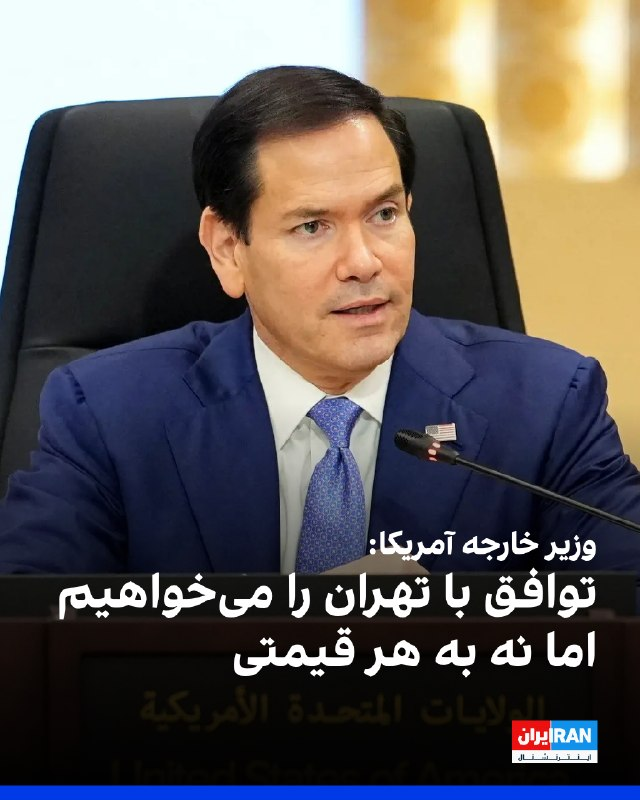

مارکو روبیو، وزیر خارجه آمریکا در نشست وزیران خارجه کشورهای عضو شورای همکاری خلیج فارس در پایتخت بحرین گفت: «ما توافق با تهران را می‌خواهیم، اما نه به هر قیمتی؛ توافق باید خوب، واقعی، قابل راستی‌آزمایی و همراه با پایبندی کامل به تعهدات باشد.»

او افزود اگر جمهوری اسلامی به جای صدور ایدئولوژی، بر رفاه مردم خود تمرکز کند، آمریکا با همکاری شرکایش آماده همکاری با تهران است؛ اما انتخاب مسیر دیگر نتیجه مثبتی نخواهد داشت.

روبیو همچنین گفت: «هیچ توافقی با ایران نباید امنیت، ثبات یا شکوفایی شرکای آمریکا در منطقه خلیج فارس را تضعیف کند.»
https://iranintl.com/202606254005

## IranIntlTV — post 344263

  

بهای نفت خام در بازارهای جهانی کاهش یافت و قیمت نفت برنت، شاخص جهانی قیمت نفت، با افت ۱.۷ درصدی به ۷۲.۵۲ دلار در هر بشکه رسید. این رقم از قیمت نفت در ۹ اسفند، یک روز پیش از کشته شدن علی خامنه‌ای در حملات مشترک آمریکا و اسرائیل، پایین‌تر است. بهای نفت خام وست تگزاس اینترمدیت آمریکا نیز بیش از ۱.۳ درصد کاهش یافت و به ۶۹.۴۱ دلار در هر بشکه رسید.

این کاهش همزمان با رشد گسترده بازارهای مالی رخ داد. بازارهای سهام آسیا پس از انتشار گزارش سود و پیش‌بینی‌های مثبت شرکت آمریکایی مایکرون، رشد قابل توجهی را تجربه کردند.

بهای نفت از اواسط ژوئن، زمانی که دونالد ترامپ، رییس‌جمهوری آمریکا، اعلام کرد توافق با جمهوری اسلامی نهایی شده و مسیر پایان جنگ هموار شده است، بیش از ۱۶ درصد کاهش یافته است.

قیمت نفت در ماه آوریل، پس از آنکه درگیری‌ها باعث بسته شدن تنگه هرمز شد، تا ۱۲۶ دلار در هر بشکه افزایش یافته بود.
https://iranintl.com/202606258706

## IranIntlTV — post 344262

  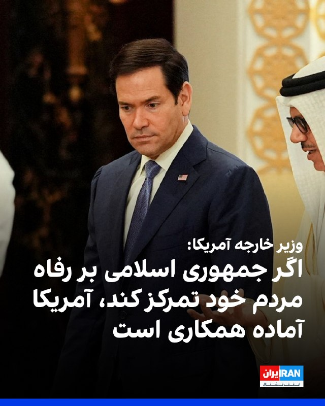

مارکو روبیو، وزیر خارجه آمریکا، در نشست وزیران خارجه کشورهای عضو شورای همکاری خلیج فارس در پایتخت بحرین گفت که ایالات متحده با همراهی برخی کشورهای منطقه، فرصت گفت‌وگوهای سازنده و دستیابی به توافق با جمهوری اسلامی را دنبال خواهد کرد و امیدوار است این روند به نتیجه‌ای مثبت منجر شود.
او افزود اگر جمهوری اسلامی به جای صدور ایدئولوژی، بر رفاه مردم خود تمرکز کند، آمریکا با همکاری شرکایش آماده همکاری با تهران است؛ اما انتخاب مسیر دیگر نتیجه مثبتی نخواهد داشت.
روبیو گفت: «تنگه هرمز یک آبراه بین‌المللی است و هیچ کشوری حق ندارد برای استفاده از آن عوارض یا هزینه دریافت کند؛ این موضوع هرگز بخشی از هیچ توافقی نخواهد بود.»
https://iranintl.com/202606254630

## IranIntlTV — post 344261

  <a href="telegram/content/IranIntlTV_344261_1782378904.mp4" target="_blank">🎬 Download video</a>

فدراسیون فوتبال اعلام کرد محدودیت‌های تازه برای ورود مهدی طارمی، کاپیتان تیم ملی، و سعید الهویی، دستیار امیر قلعه‌نویی، به آمریکا باعث تاخیر در پرواز تیم ملی از فرودگاه تیخوانا شد.

گفت‌وگو با آیدین مقیمی، خبرنگار ایران‌اینترنشنال
@iranintltv

## IranIntlTV — post 344260

  <a href="telegram/content/IranIntlTV_344260_1782378907.mp4" target="_blank">🎬 Download video</a>

سپاه پاسداران اعلام کرده «عبور امن» کشتی‌ها از تنگه هرمز تنها از مسیرهایی امکان‌پذیر است که جمهوری اسلامی تعیین کرده است.

علی شیرازی، عضو تحریریه ایران‌اینترنشنال، گفت این اقدام برای امتیازگیری جمهوری اسلامی در مذاکرات است که با کارت تنگه هرمز انجام می‌دهد
@iranintltv

## IranIntlTV — post 344259

  <a href="telegram/content/IranIntlTV_344259_1782378909.mp4" target="_blank">🎬 Download video</a>

ویدیوی ارسالی به ایران اینترنشنال نشان می‌دهد که یک آگهی طنز درباره «مفقودی» مجتبی خامنه‌ای، بر دیوار خیابان چسبانده شده است.

## IranIntlTV — post 344258

  <a href="telegram/content/IranIntlTV_344258_1782378911.mp4" target="_blank">🎬 Download video</a>

طاهیر اندرابی، سخنگوی وزارت خارجه پاکستان، گفت مذاکرات فنی جمهوری اسلامی و آمریکا که از ۲۲ ژوئن در بورگن‌اشتوک آغاز شده، ادامه دارد و توقف فعلی نباید به عنوان شکست مذاکرات تلقی شود

جواد همدانی، خبرنگار ایرا‌ن‌اینترنشنال گزارش می‌دهد
@iranintltv

## IranIntlTV — post 344257

  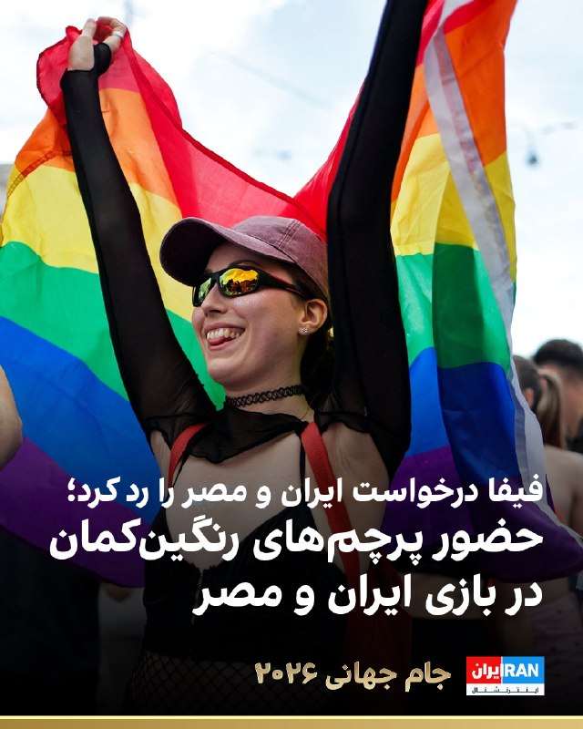

🔻به نوشته روزنامه تلگراف، فدراسیون جهانی فوتبال، فیفا، اعلام کرده است که مانع ورود هواداران با پرچم‌های رنگین‌کمان به ورزشگاه لومن فیلد سیاتل، محل بازی ایران و مصر، نخواهد شد. این مسابقه هم‌زمان با جشن‌های سالانه جامعه ال‌جی‌بی‌تی‌کیو پلاس (LGBTQ+) در این شهر است؛ مسابقه‌ای که به «مسابقه افتخار» شهرت یافته است.

🔹دو کشور ایران و مصر که مواضع سختی علیه این جامعه دارند، با ارسال درخواست‌های رسمی به فیفا خواستار آن شدند که هیچ‌گونه نشانه‌ای از حمایت از این گروه در جریان بازی وجود نداشته باشد. مهدی تاج، رییس فدراسیون فوتبال ایران، این وضعیت را محکوم کرده و فدراسیون فوتبال مصر نیز در بیانیه‌ای اعلام کرد که هرگونه فعالیت در حمایت از همجنس‌گرایی را در طول مسابقه به‌طور قاطع رد می‌کند. با این حال، فیفا این خواسته‌ها را نادیده گرفته است.

🔹سخنگوی فیفا در گفت‌وگو با تلگراف ورزشی گفت: «جام جهانی ۲۰۲۶ یک رویداد فراگیر است و از افراد با هر پیشینه، گرایش و هویتی استقبال می‌کند. طبق قوانین ورزشگاه‌ها، به همراه داشتن پرچم‌های رنگین‌کمان و دیگر نمادهای هویتی مجاز است.»

🔹جزییات بیشتر را در سایت بخوانید.

@iranintltvsport

## IranIntlTV — post 344256

  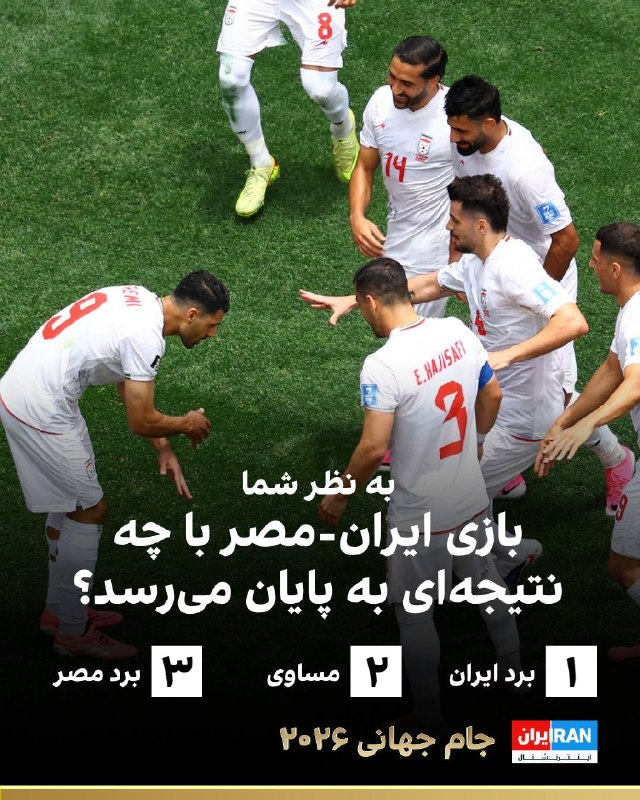

🔻تیم‌های فوتبال ایران و مصر شنبه ۶ تیرماه ۱۴۰۵، در سیاتل آمریکا، در گروه G جام جهانی ۲۰۲۶، به مصاف یکدیگر می‌روند، به نظر شما این بازی با چه نتیجه‌ای به پایان می‌رسد؟

🔹برای شرکت در این نظرسنجی به صفحه اینستاگرام ایران اینترنشنال ورزشی مراجعه کنید؛👇🏽
https://www.instagram.com/p/DZ__swTA1SF/

@iranintltvsport

## IranIntlTV — post 344254

  

انور قرقاش، مشاور دیپلماتیک رییس امارات متحده عربی، با اشاره به مذاکرات با جمهوری اسلامی در شبکه اجتماعی ایکس نوشت: «نمی‌توان واقعیت‌های ژیوپلیتیکی جدیدی را که در نتیجه تجاوزی غافلگیرانه علیه کشورهای عربی خلیج فارس ایجاد شده، بر این کشورها تحمیل کرد.»

او افزود: «تحمیل یک وضعیت جدید که از دل تجاوز شکل گرفته باشد، نه‌تنها به ثبات منجر نمی‌شود، بلکه بذرهای تازه‌ای از اختلاف و درگیری را برای آینده می‌کارد.»

قرقاش همچنین تاکید کرد که این موضوع به‌طور مشخص درباره تنگه هرمز نیز صدق می‌کند.
https://iranintl.com/202606258939

## IranIntlTV — post 344253

  

عبدالکریم هاشمی نخل‌ابراهیمی، عضو کمیسیون برنامه و بودجه مجلس، از مذاکره با آمریکا استقبال کرد اما در عین حال تاکید کرد: «خواسته‌های ما این است که هم انتقام گرفته شود، هم غرامت دریافت شود و هم مطالبات ما تامین شود.»
او افزود: «دشمن باید به نوعی بپذیرد که حق و حقوق ما را رعایت کند.»
عضو کمیسیون برنامه و بودجه مجلس گفت: «جنگ به کشور ما خسارت وارد کرد و اکنون به مرحله‌ای رسیده‌ایم که باید به سمت مذاکره حرکت کنیم.»
https://iranintl.com/202606250336

## ManotoTV — post 106233

  <a href="telegram/content/ManotoTV_106233_1782378915.mp4" target="_blank">🎬 Download video</a>

تجربه توافق برجام نشان داد رفع تحریم‌ها می‌تواند شاخص‌های کلان را برای مدتی آرام کند؛ تورم پایین بیاید، ارز ثبات نسبی پیدا کند و صادرات نفت بالا برود. اما مسئله اصلی این است که این گشایش چقدر به زندگی خانواده‌های عادی می‌رسد.

در اقتصاد رانتی جمهوری اسلامی، منافع معمولاً در بالادست جذب می‌شود؛ در شبکه‌هایی نزدیک به قدرت، نه در سفره مردم. همین شکاف میان وعده بهبود و واقعیت زندگی روزمره، پس از برجام به اعتراضات دیماه ۹۶ انجامید.

توافق شاید زمان بخرد، اما اگر قدرت خرید، امکان برنامه‌ریزی و حس ثبات در زندگی مردم تغییر نکند، بحران فقط به تعویق افتاده است.

## FarsiVOA — post 221826

نشست مارکو روبیو با وزیران خارجه کشورهای عضو شورای همکاری خلیج فارس
@FarsiVOA

## FarsiVOA — post 221825

  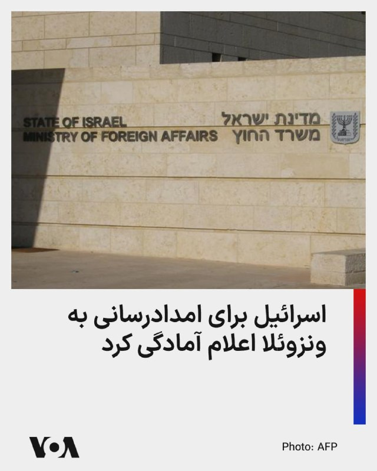

در پی وقوع دو زمین‌لرزه مرگبار در ونزوئلا، وزارت خارجه اسرائیل اعلام کرد که در حال «آمادگی فوری» برای احتمال اعزام تیم‌های امدادی به این کشور است. این وزارتخانه یادآور شد که در حال انجام ارزیابی وضعیت با مقامات در اسرائیل و بررسی راه‌های ممکن برای کمک است.

در همین ارتباط دو سازمان امدادرسانی اسرائیلی، «زاکا» و «ایسرائید»، هم آمادگی خود را برای اعزام تیم‌های امدادی به ونزوئلا اعلام کردند.

پیشتر دونالد ترامپ، رئیس‌جمهور آمریکا دستور خود برای اقدام سریع در امدادرسانی به آسیب‌دیدگان ونزوئلا خبر داده بود و مارکو روبیو، وزیر خارجه، نیز اعلام کرده بود که ایالات متحده به دستور پرزیدنت ترامپ فوراً تیم‌های جست‌وجو و نجات، منابع پزشکی و کمک‌های بشردوستانه را به ونزوئلا اعزام می‌کند.
@FarsiVOA

## FarsiVOA — post 221821

تصاویری از خسارات ناشی از زمین‌لرزه در ونزوئلا؛

دو زمین‌لرزه قدرتمند و پیاپی به بزرگی ۷.۲ و ۷.۵ ریشتر و به فاصله تنها ۳۹ ثانیه، عصر چهارشنبه شمال و مرکز ونزوئلا را لرزاندند. تاکنون کشته شدن دست‌کم ۳۲ نفر و مصدومیت بیش از ۷۰۰ نفر تأیید شده است.
@FarsiVOA

## FarsiVOA — post 221820

  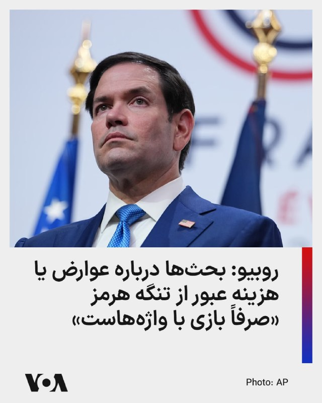

مارکو روبیو، وزیر خارجه آمریکا، در جریان سفر خود به بحرین، درباره ادعای جمهوری اسلامی درباره تنگه هرمز اعلام کرد: «می‌توانید آن را عوارض بنامید، می‌توانید آن را هزینه بنامید؛ در نهایت، همه این‌ها صرفاً بازی با واژگان است.»

روبیو گفت: «ما نمی‌پذیریم که تنگه هرمز متعلق به دولت یا کشوری باشد.»

وزیر خارجه آمریکا تاکید کرد: «ما خواهان توافق با ایران هستیم، اما چنین توافقی را به هر قیمتی نمی‌خواهیم.»

او گفت: «ما آماده صلحی هستیم که پایدار و واقعی باشد و امنیت و رفاه ایالات متحده یا متحدانش را تضعیف نکند. ایالات متحده، در حالی که به این روند متعهد است، اطمینان حاصل خواهد کرد که هیچ‌یک از تصمیم‌های اتخاذشده، منافع متحدان و شرکای ما را نقض نکند.»

روبیو گفت: «ایالات متحده می‌خواهد این روند موفق شود و هر کاری که بتواند انجام خواهد داد.»
@FarsiVOA

## FarsiVOA — post 221819

🔺جهش «۵۰ درصدی» صادرات نفت کشورهای حوزه خلیج فارس

▪️آژانس بین‌المللی انرژی می‌گوید صادرات نفت کشورهای حوزه خلیج فارس در ماه جاری نسبت به ماه گذشته جهشی ۵۰ درصدی خواهد داشت، اما کماکان بسیار پایین‌تر از سطح قبل از انسداد تنگه هرمز.

▪️صادرات روزانه نفت و محصولات نفتی کشورهای عرب حوزه خلیج فارس، و همچنین عمان که خارج از تنگه هرمز است، قبل از انسداد تنگه هرمز حدود ۲۵ میلیون بشکه بود، اما در ماه مه به زیر ۱۰ میلیون بشکه سقوط کرد و در ماه جاری نزدیک ۱۵ میلیون بشکه خواهد بود.

▪️جمهوری اسلامی از ابتدای مارس تنگه هرمز را مسدود کرد و تا پایان ماه مه، تنگه هرمز سهم بسیار اندکی در صادرات کشورهای حوزه خلیج فارس داشت و همین سهم اندک نیز عمدتاً نفت خود ایران بود.

⬇️ بیشتر بخوانید:
https://ir.voanews.com/a/8164691.html

## FarsiVOA — post 221818

  <a href="telegram/content/FarsiVOA_221818_1782378919.mp4" target="_blank">🎬 Download video</a>

رزمایش جنگنده‌های آمریکایی در آسمان واشنگتن به مناسبت ۲۵۰ سالگی استقلال آمریکا؛

در جریان آغاز رسمی جشن‌های ۲۵۰ سالگی استقلال ایالات متحده، آسمان واشنگتن دی‌سی شاهد پرواز نمایشی مدرن‌ترین هواپیماهای نظامی ارتش آمریکا بود.

این نمایش هوایی ویژه که به عنوان افتتاحیه نمایشگاه بزرگ برگزار شد، بخشی از برنامه‌های چند هفته‌ای ارتش برای گرامیداشت ربع هزاره آزادی آمریکا است.
@FarsiVOA

## FarsiVOA — post 221817

  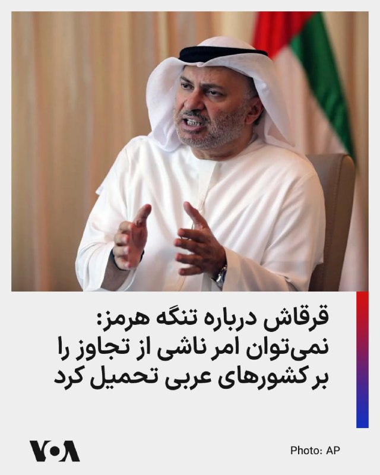

انور قرقاش، مشاور دیپلماتیک رئیس امارات متحده عربی، درباره وضعیت تنگه هرمز هشدار داد که نمی‌توان «واقعیت‌های ژئوپلیتیکی جدیدی» را بر کشورهای خلیج فارس «بر اثر یک تجاوز غافلگیرانه تثبیت کرد.»

آقای قرقاش روز پنجشنبه در پیامی در شبکه اجتماعی ایکس افزود: «تحمیل یک امر واقع که از دل تجاوز زاده شده است، به ثبات منجر نمی‌شود، بلکه بذرهای تازه‌ای از ناهماهنگی و درگیری را در آینده می‌کارد.»

او تاکید کرد: «این دقیقاً همان چیزی است که دربارهٔ تنگهٔ هرمز صدق می‌کند.»

این اظهارات در آستانه دیدار مارکو روبیو، وزیر خارجه آمریکا، با اعضای شورای همکاری خلیج فارس از جمله امارات متحده عربی مطرح شده است.

آقای روبیو روز چهارشنبه در کویت تاکید کرد که آمریکا هیچ گونه عوارض را در تنگه هرمز نمی‌پذیرید و به گونه‌ای اقدام نمی‌کند که امنیت متحدانش در منطقه تضعیف شود.
@FarsiVOA

## FarsiVOA — post 221816

  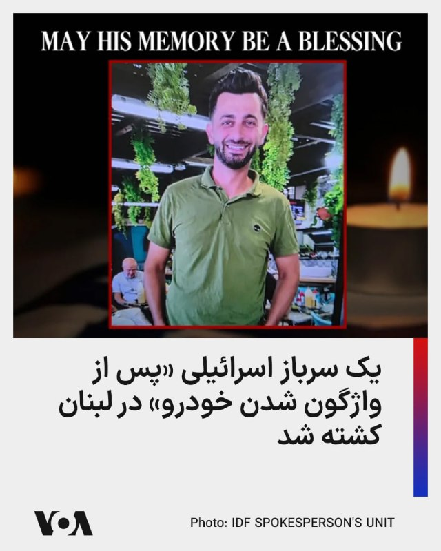

یک مقام نظامی اسرائیل روز پنجشنبه گفت که یک سرباز اسرائیلی در جنوب لبنان پس از واژگون شدن یک خودرو کشته شده است. به گزارش رویترز، این مقام که نامش فاش نشده، این حادثه را یک سانحه توصیف کرد.

پیش‌تر، ارتش اسرائیل اعلام کرده بود که یک سرباز در جریان «فعالیت عملیاتی» جان باخته است.

بر اساس گزارش ارتش اسرائیل، در این حادثه‌، گروهبان یکم (جزو نیروهای ذخیره ارتش) باسل سوید، ۳۲ ساله، که به عنوان راننده در ارتش خدمت می‌کرد، جان باخت.

همچنین در این حادثه یک سرباز دیگر ارتش اسرائیل به‌طور متوسط زخمی شد.
@FarsiVOA

## FarsiVOA — post 221815

  <a href="telegram/content/FarsiVOA_221815_1782378923.mp4" target="_blank">🎬 Download video</a>

خرابی‌های گسترده پس از زلزله در ونزوئلا؛

عصر چهارشنبه، دو زلزله بسیار قدرتمند و پیاپی به بزرگی ۷.۲ و ۷.۵ ریشتر و به فاصله تنها ۳۹ ثانیه از هم، شمال و مرکز ونزوئلا را لرزاندند.

طبق اعلام دلسي رودریگز، سرپرست ریاست‌جمهوری ونزوئلا، تاکنون کشته شدن دست‌کم ۳۲ نفر و مصدومیت بیش از ۷۰۰ نفر تایید شده است؛ اما به دلیل قطع گسترده خطوط ارتباطی و احتمال زیر آوار ماندن افراد، انتظار می‌رود آمار واقعی بسیار بالاتر باشد.

در کاراکاس، پایتخت، ده‌ها ساختمان و برج مسکونی به‌طور کامل یا ناپایدار فروریخته‌اند، از جمله فروپاشی کامل یک برج ۲۲ طبقه در منطقه آلتامیرا.
@FarsiVOA

## FarsiVOA — post 221814

  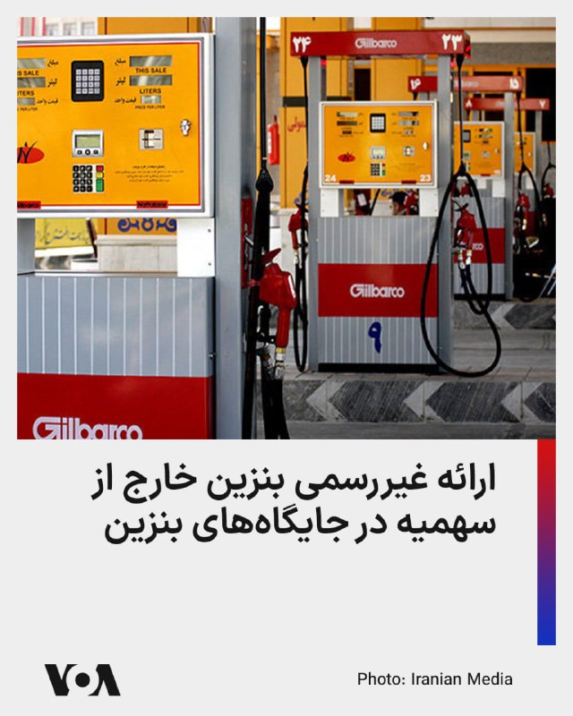

خبرگزاری تسنیم رسانه وابسته به سپاه پاسداران در گزارشی نوشته است که محدودیت در تعداد و ظرفیت کارت‌های سوخت آزاد، زمینه ارائه بنزین خارج از سهمیه و به نوشته این خبرگزاری «سوءاستفاده برخی متصدیان» را در برخی از جایگاه‌های سوخت فراهم کرده است.

براساس این گزارش، برخی رانندگان گفته‌اند پس از اتمام سهمیه کارت شخصی یا در صورت نداشتن کارت سوخت، برای استفاده از کارت آزاد جایگاه با درخواست پرداخت مبلغی تحت عنوان «شیرینی» مواجه شده‌اند. به گفته آنها، برخی متصدیان در ابتدا از ارائه کارت خودداری کرده و سپس در ازای دریافت پول اضافی، امکان سوخت‌گیری را فراهم کرده‌اند.

محدود بودن تعداد کارت‌های آزاد باعث افزایش زمان انتظار، تشکیل صف‌های طولانی و نارضایتی رانندگان شده است.

انتشار این گزارش از سوی رسانه‌ای نزدیک به حاکمیت، بار دیگر توجه‌ها را به پیامدهای محدودیت‌های اعمال‌شده در نظام توزیع سوخت و زمینه‌های بروز فسادهای خرد در ارائه خدمات عمومی جلب کرده است.
@FarsiVOA

## FarsiVOA — post 221813

  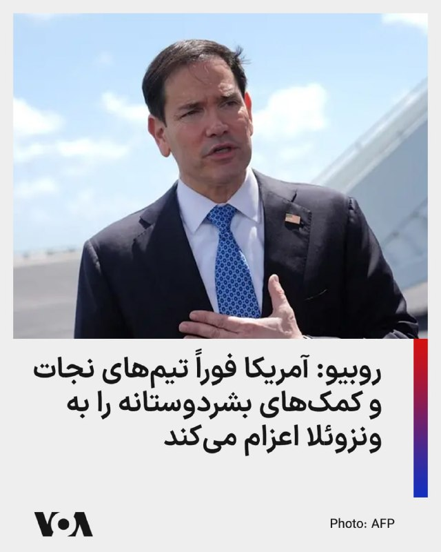

در پی وقوع دو زمین‌لرزه مرگبار در ونزوئلا، مارکو روبیو، وزیر خارجه آمریکا، اعلام کرد که این کشور به دستور پرزیدنت ترامپ فوراً تیم‌های جست‌وجو و نجات، منابع پزشکی و کمک‌های بشردوستانه را به ونزوئلا اعزام می‌کند.

آقای روبیو روز پنجشنبه در شبکه اجتماعی ایکس نوشت: «آمریکا در این زمان دشوار در کنار مردم ونزوئلا ایستاده است و به دستور رئیس‌جمهور ترامپ، وزارت امور خارجه فوراً تیم‌های جست‌وجو و نجات، منابع پزشکی و کمک‌های بشردوستانه را به ونزوئلا اعزام می‌کند.»

او افزود: «ایالات متحده عمیق‌ترین مراتب تسلیت خود را به مردم ونزوئلا در پی زمین‌لرزه‌های ویرانگر ابراز می‌کند. قلب‌های ما با همهٔ کسانی است که عزیزان خود را از دست داده‌اند، کسانی که مجروح شده‌اند، و امدادگران شجاعی که در پی این حادثه بی‌وقفه و خستگی‌ناپذیر در حال تلاش هستند.»

پیشتر دونالد ترامپ، رئیس‌جمهوری آمریکا، در تروث‌سوشال اعلام کرد دو زمین‌لرزه‌ای که روز چهارشنبه ونزوئلا را لرزاندند «تعداد ویرانگری از تلفات» بر جای گذاشته‌اند.

⬇️ بیشتر بخوانید:
https://ir.voanews.com/a/8164687.html

## FarsiVOA — post 221812

  <a href="telegram/content/FarsiVOA_221812_1782378927.mp4" target="_blank">🎬 Download video</a>

لحظه وقوع زمین‌لرزه در چند نقطه از ونزوئلا؛

عصر چهارشنبه، دو زلزله بسیار قدرتمند و پیاپی به بزرگی ۷.۲ و ۷.۵ ریشتر و به فاصله تنها ۳۹ ثانیه از هم، شمال و مرکز ونزوئلا را لرزاندند.

این زمین‌لرزه‌ها که کانون آن‌ها در ایالت «یاراکوی» گزارش شده، از قوی‌ترین زلزله‌های یک قرن اخیر این کشور به شمار می‌روند و حتی در مناطقی از برزیل نیز احساس شدند.

طبق اعلام دلسي رودریگز، سرپرست ریاست‌جمهوری ونزوئلا، تاکنون کشته شدن دست‌کم ۳۲ نفر و مصدومیت بیش از ۷۰۰ نفر تایید شده است؛ اما به دلیل قطع گسترده خطوط ارتباطی و احتمال زیر آوار ماندن افراد، انتظار می‌رود آمار واقعی بسیار بالاتر باشد.

در کاراکاس، پایتخت، ده‌ها ساختمان و برج مسکونی به‌طور کامل یا ناپایدار فروریخته‌اند، از جمله فروپاشی کامل یک برج ۲۲ طبقه در منطقه آلتامیرا.

فرودگاه بین‌المللی اصلی کشور، سیمون بولیوار، به شدت آسیب دیده و تمام پروازها لغو شده‌اند. همچنین برای جلوگیری از انفجارهای ثانویه، گاز شهری کاراکاس قطع و خدمات مترو متوقف شده است.
@FarsiVOA

## FarsiVOA — post 221811

Farsi VOA pinned a photo

## FarsiVOA — post 221810

  

📸اینستاگرام صدای آمریکا را هم اکنون فالو کنید تا از آخرین خبرها مطلع بمانید:
https://www.instagram.com/voafarsi/

📡همچنین جهت اطلاع از بروزترین فرکانسهای ماهواره‌ای صدای آمریکا به لینک زیر مراجعت فرمایید:
https://ir.voanews.com/satellite

این پست را با دوستانتان به اشتراک بگذارید
@FarsiVOA

## FarsiVOA — post 221809

Live stream finished (37 days)

## DW_Farsi — post 126435

🎥 هيجان فوتبال در سياتل پيش از ديدار ايران و مصر

تيم ملى فوتبال ايران در یک قدمی مرحله حذفی جام جهانی ۲۰۲۶ در سیاتل آمریکا به دیدار مصر می‌رود. همکارمان فرید اشرفیان از این شهر گزارش می‌دهد.

@dw_farsi

## DW_Farsi — post 126434

  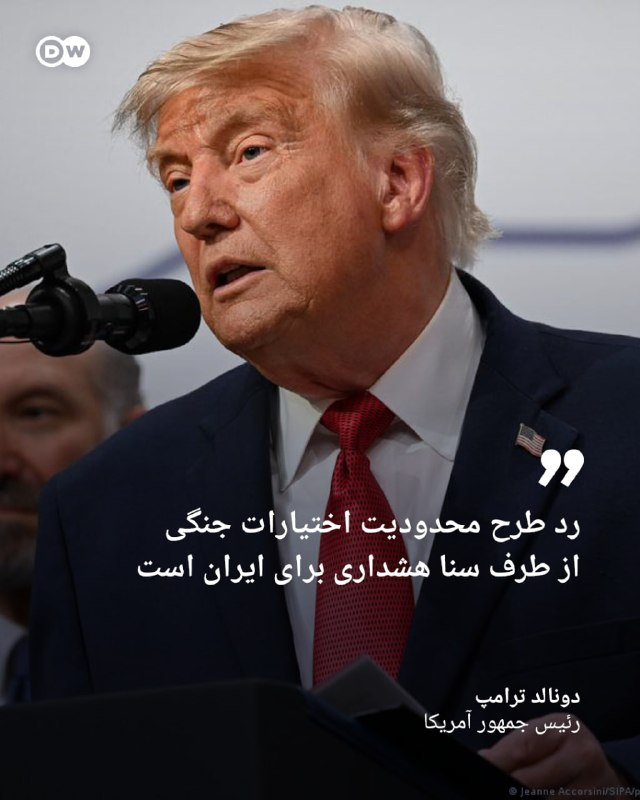

🔶 ترامپ: رد طرح محدودیت اختیارات جنگی از طرف سنا هشداری برای ایران است

سنای آمریکا شامگاه چهارشنبه ۳ تیر (۲۴ ژوئن) با رد طرحی که هدف آن محدود کردن اختیارات دونالد ترامپ، رئیس‌جمهور آمریکا برای ادامه عملیات نظامی علیه ایران بود، پیروزی مهمی برای کاخ سفید و رهبران جمهوری‌خواه رقم زد.

این طرح که از سوی تیم کِین، سناتور دموکرات ارائه شده بود، در رای‌گیری با ۵۰ رای مخالف در برابر ۴۷ رای موافق نتوانست به مرحله بررسی نهایی راه یابد.

دو سناتور جمهوری‌خواه، سوزان کالینز و لیزا مورکوفسکی همراه با اکثر دموکرات‌ها به پیشبرد این طرح رای دادند، در حالی که رند پال، سناتور جمهوری‌خواه، رای ممتنع داد و جان فترمن تنها سناتور دموکراتی بود که با آن مخالفت کرد.

@dw_farsi

## DW_Farsi — post 126433

  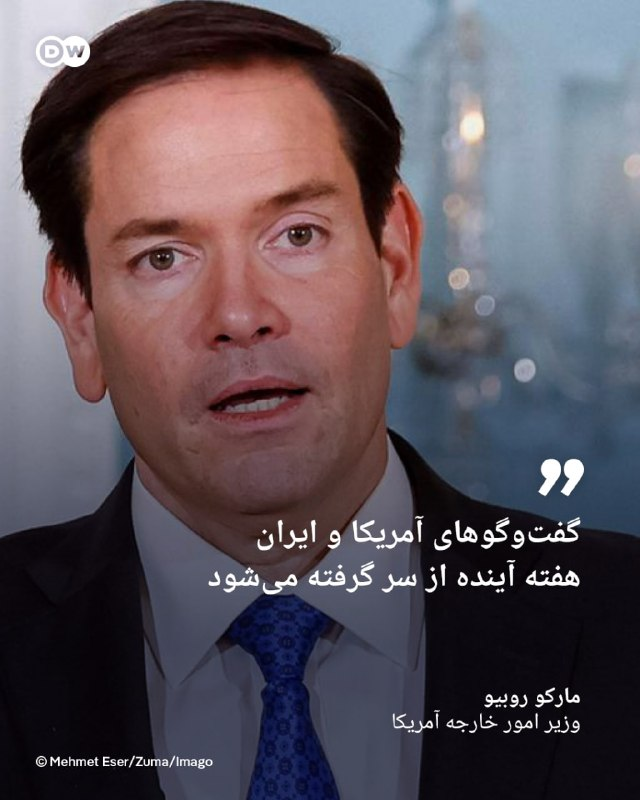

🔶 روبیو: گفت‌وگوهای آمریکا و ایران هفته آینده از سر گرفته می‌شود

مارکو روبیو، وزیر امور خارجه آمریکا در جریان سفر منطقه‌ای خود به خاورمیانه اعلام کرد که گفت‌وگوهای میان واشنگتن و تهران احتمالا هفته آینده از سر گرفته خواهد شد.

روبیو در فرودگاه شهر کویت گفت که بر اساس اطلاعاتی که در اختیار دارد، مذاکرات فنی روز دوشنبه یا سه‌شنبه آینده (۲۹ و ۳۰ ژوئن) در سوئیس برگزار خواهد شد.

به گفته وزیر امور خارجه آمریکا، مذاکرات در چند کارگروه تخصصی تقسیم شده و قرار است هر یک از این گروه‌ها به‌طور جداگانه به بررسی موضوعات مختلف بپردازند.

او همچنین افزود کارشناسان حوزه انرژی هسته‌ای، تحریم‌ها و دیگر متخصصان از چندین وزارتخانه در هیئت آمریکایی حضور خواهند داشت.

@dw_farsi

## DW_Farsi — post 126432

  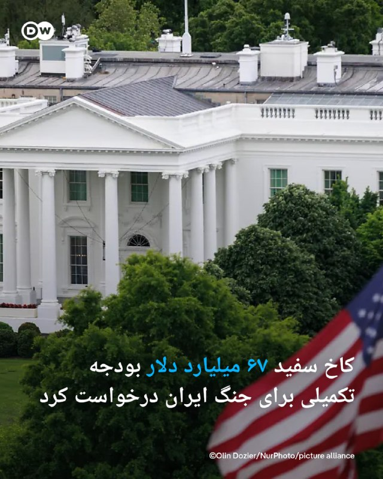

🔶 کاخ سفید ۶۷ میلیارد دلار بودجه تکمیلی برای جنگ ایران درخواست کرد

دولت دونالد ترامپ، رئیس‌جمهوری آمریکا از کنگره درخواست کرده است با اختصاص نزدیک به ۸۸ میلیارد دلار بودجه اضافی موافقت کند؛ بودجه‌ای که به گفته کاخ سفید، "عمدتا" برای تامین هزینه‌های جنگ با ایران در نظر گرفته شده است.

دفتر مدیریت و بودجه کاخ سفید در یک درخواست "فوری و ضروری" که روز چهارشنبه ۳ تیر (۲۴ ژوئن) به کنگره ارائه شد، خواستار اختصاص ۶۷ میلیارد دلار از این بسته به وزارت دفاع آمریکا (پنتاگون) شده است.

از این مبلغ ۲۱ میلیارد دلار برای خرید مهمات و سایر تجهیزات نظامی، ۱۷.۳ میلیارد دلار برای هزینه‌های عملیاتی و ۱۲.۱ میلیارد دلار برای برنامه‌های محرمانه اختصاص یافته است.

کاخ سفید همچنین درخواست اختصاص حدود ۷۶۸ میلیون دلار برای وزارت انرژی آمریکا را مطرح کرده است تا صرف برنامه‌های مرتبط با امنیت هسته‌ای و انرژی در ارتباط با جنگ ایران شود.

علاوه بر این حدود ۳۰۰ میلیون دلار نیز برای وزارت امور خارجه در نظر گرفته شده تا صرف تقویت تدابیر امنیتی سفارتخانه‌های آمریکا در کشورهای همسایه ایران شود.

@dw_farsi

## DW_Farsi — post 126431

  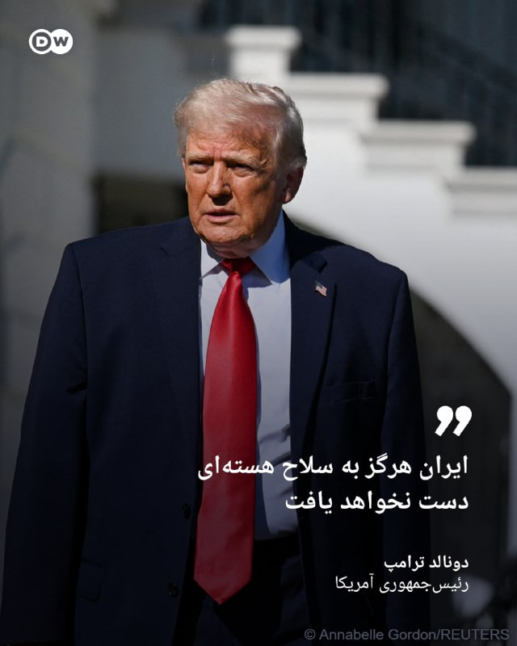

🔶 دونالد ترامپ: ایران هرگز به سلاح هسته‌ای دست نخواهد یافت

دونالد ترامپ، رئیس جمهوری آمریکا روز چهارشنبه ۳ تیر (۲۴ ژوئن)در مراسم آغاز برنامه‌های دویست‌وپنجاهمین سالگرد استقلال آمریکا در "نشنال‌مال" واشنگتن ابراز داشت جمهوری اسلامی هرگز به سلاح هسته‌ای دست نخواهد یافت.

ترامپ افزود قدرت نظامی آمریکا، حکومت ایران را بدون نیروی دریایی و نیروی هوایی گذاشته است.

دونالد ترامپ در پیامی در شبکه اجتماعی خود "تروث سوشال" نیز مدعی شد که آمریکا هفته گذشته با امضای یک "توافق تاریخی" به درگیری با ایران پایان داده، تنگه هرمز را به‌طور کامل باز نگه داشته و به دستاوردی رسیده است که به گفته او هیچ رئیس‌جمهوری پیش از این موفق به تحقق آن نشده بود.

ترامپ همچنین بار دیگر در پیام خود تاکید کرد که ایران هرگز به سلاح هسته‌ای دست نخواهد یافت.

@dw_farsi

## Persian_Trend_Official — post 17981

  <a href="telegram/content/Persian_Trend_Official_17981_1782378933.webm" target="_blank">🎬 Download video</a>

📡 حمله اسرائیل به جنوب لبنان.
حضور گسترده پهپاد های اسرائیل در جنوب لبنان

## Persian_Trend_Official — post 17979

🇬🇷
🇺🇸 تصاویر ماهواره‌ای از افزایش حضور هوایی آمریکا در جزیره کرت یونان

🔹 تصاویر ماهواره‌ای جدید با وضوح بالا از استقرار چندین هواپیمای نظامی ایالات متحده در فرودگاه بین‌المللی «چانیا یوانیس داسکالوگیانیس» در جزیره کرت یونان حکایت دارد.

🔹 بر اساس این تصاویر، چند فروند هواپیمای سوخت‌رسان KC-135 Stratotanker، هواپیمای شناسایی راهبردی RC-135 و هواپیماهای جنگ الکترونیک EA-37B در این پایگاه مشاهده شده‌اند.

✈️ ترکیب هواگردهای مستقر:

▪️ KC-135 Stratotanker؛ سوخت‌رسانی هوایی به جنگنده‌ها و بمب‌افکن‌ها
▪️ RC-135 Rivet Joint؛ جمع‌آوری اطلاعات الکترونیکی و شنود ارتباطات
▪️ EA-37B Compass Call؛ اخلال در سامانه‌های ارتباطی و راداری دشمن

🔹 جزیره کرت طی سال‌های اخیر به یکی از مهم‌ترین مراکز پشتیبانی عملیات‌های آمریکا و ناتو در مدیترانه شرقی تبدیل شده و موقعیت آن امکان پوشش هم‌زمان تحولات خاورمیانه، دریای سیاه، شمال آفریقا و شرق مدیترانه را فراهم می‌کند.

🔹 حضور هم‌زمان هواپیماهای شناسایی، جنگ الکترونیک و سوخت‌رسان معمولاً نشان‌دهنده افزایش سطح پایش اطلاعاتی و آمادگی برای پشتیبانی از عملیات‌های هوایی در مناطق پیرامونی است.

استقرار این ترکیب از هواگردها در کرت نشان می‌دهد آمریکا همچنان بر حفظ توان نظارتی و واکنش سریع در مدیترانه شرقی و خاورمیانه تمرکز دارد. چنین آرایشی می‌تواند برای پشتیبانی از مأموریت‌های اطلاعاتی، رهگیری ارتباطات، جنگ الکترونیک و عملیات‌های احتمالی هوایی در منطقه مورد استفاده قرار گیرد.

Phantom

📌 @persian_trend_official
پرشین ترند | متفاوت‌ترین کانال نظامی

## Persian_Trend_Official — post 17978

  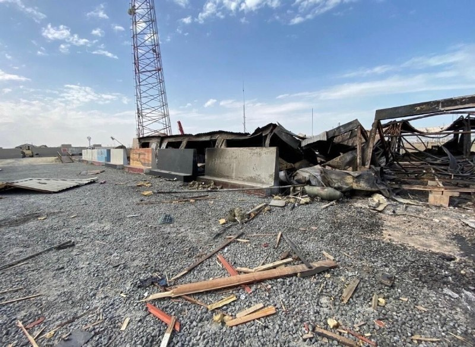

🇺🇸
🌏
🇮🇷 اختلاف بر سر آمار مجروحان آمریکایی در جنگ با ایران

🔹 شبکه CBS News گزارش داد برخی نظامیان آمریکایی، نحوه طبقه‌بندی مجروحان جنگ با ایران توسط پنتاگون را زیر سؤال برده‌اند و معتقدند شدت جراحات آن‌ها کمتر از واقعیت اعلام شده است.

🔹 «پیت هگست» وزیر دفاع آمریکا پیش‌تر اعلام کرده بود حدود ۹۰ درصد از ۴۰۰ نظامی آمریکایی مجروح‌شده در این درگیری‌ها، جراحات جزئی داشته و به خدمت بازگشته‌اند.

🔹 با این حال اسناد داخلی مورد استناد CBS نشان می‌دهد «سرگرد رودنی بیرمن» در حمله پهپادی اول مارس به بندر شعیبه کویت دچار جراحات ناشی از ترکش، ضربه مغزی، آسیب شنوایی و بینایی و صدمه به ریه شده، اما در طبقه‌بندی ارتش به عنوان «مجروح شدید» ثبت نشده است.

🔹 حمله به بندر شعیبه مرگبارترین حادثه نیروهای آمریکایی در این درگیری‌ها توصیف شده و بنا بر گزارش‌ها ۶ نظامی آمریکایی کشته و بیش از ۲۰ نفر زخمی شدند.

🔹 همچنین برخی شاهدان از کمبود امکانات درمانی، پزشک نظامی و آمبولانس در ساعات اولیه پس از حمله خبر داده‌اند؛ موضوعی که اکنون مورد بررسی برخی اعضای کنگره آمریکا قرار گرفته است.

🔹 ارتش آمریکا در پاسخ اعلام کرده تعریف رسمی «مجروح شدید» مستلزم قرار داشتن فرد در معرض خطر فوری مرگ طی ۷۲ ساعت نخست پس از حادثه است و طبقه‌بندی انجام‌شده مطابق دستورالعمل‌های موجود بوده است.

انتشار این گزارش می‌تواند بحث درباره میزان واقعی تلفات و خسارات انسانی آمریکا در جنگ اخیر را دوباره به جریان بیندازد. همچنین احتمال دارد نحوه آمادگی نیروهای آمریکایی، سامانه‌های دفاعی و خدمات درمانی در پایگاه‌های منطقه‌ای بیش از پیش زیر ذره‌بین نهادهای نظارتی و کنگره قرار گیرد.

 Phantom

📌 @persian_trend_official
پرشین ترند | متفاوت‌ترین کانال نظامی

## Persian_Trend_Official — post 17977

  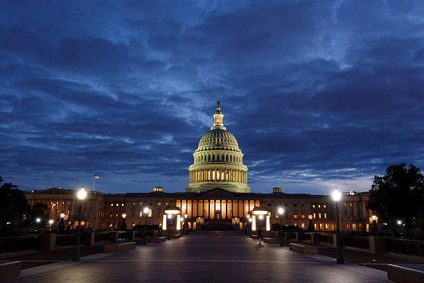

دولت ترامپ از کنگره درخواست 87,6 میلیارد دلار بودجه اضافی، از جمله برای نیازهای مربوط به عملیات علیه ایران، کرده است

این درخواست، از جمله موارد دیگر، شامل 672 میلیون دلار برای اقداماتی با هدف جلوگیری از توانایی ایران در توسعه یا دستیابی به سلاح‌های هسته‌ای، از جمله از طریق حذف مواد، فناوری، تجهیزات و زیرساخت‌های مرتبط است.

📝 Amir

📌 @persian_trend_official
پرشین ترند | متفاوت‌ترین کانال نظامی

## Persian_Trend_Official — post 17976

  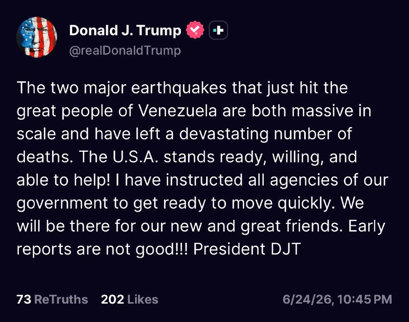

ترامپ: دو زلزله بزرگی که به تازگی مردم بزرگ ونزوئلا را لرزاند، هم از نظر مقیاس عظیم بودند و هم تعداد زیادی کشته برجای گذاشته‌اند.

ایالات متحده آماده، مایل و قادر به کمک است! من به همه آژانس‌های دولتمان دستور داده‌ام که برای اقدام سریع آماده شوند. ما برای دوستان جدید و خوب خود آنجا خواهیم بود. گزارش‌های اولیه خوب نیستند!!!

📝 Amir

📌 @persian_trend_official
پرشین ترند | متفاوت‌ترین کانال نظامی

## Persian_Trend_Official — post 17971

  <a href="telegram/content/Persian_Trend_Official_17971_1782378935.mp4" target="_blank">🎬 Download video</a>

وقوع زلزله شدید در ونزوئلا

شب گذشته دو زلزله به بزرگی 7.2 و 7.5 ریشتر به همراه چندین پس‌لرزه سرتاسر ونزوئلا را لرزاند و ده ها نفر تا این لحظه کشته شده اند.

دلسی رودریگز، رئیس جمهور موقت، اعلام کرد که دو زلزله به بزرگی 7.2 و 7.5 ریشتر و به دنبال آن تقریباً 20 پس‌لرزه رخ داده است. مناطقی که بیشترین آسیب را دیده‌اند شامل کاراکاس و همچنین ایالت‌های میراندا، لا گوایرا، آراگوآ، کارابوبو و فالکون هستند.

خساراتی به زیرساخت‌ها و اختلال در خدمات اساسی مانند گاز، برق و آب گزارش شده است. اینترنت موبایل نیز قطع شده است. فرودگاه بین‌المللی مایکتیا به دلیل خسارت به زیرساخت‌ها بسته شد.

دولت وضعیت اضطراری اعلام کرد و کلاس‌های مدرسه و فعالیت‌های غیر فوری را به حالت تعلیق درآورد. آمار اولیه تلفات 32 نفر و بیش از 700 نفر زخمی است. کشورها و سازمان‌های بین‌المللی مختلفی، از جمله سازمان ملل، ایالات متحده آمریکا، هند، مکزیک و سایر کشورهای منطقه، همبستگی خود را با ونزوئلا ابراز و از این کشور حمایت کردند.

📝 Amir

📌 @persian_trend_official
پرشین ترند | متفاوت‌ترین کانال نظامی

## Persian_Trend_Official — post 17970

  <a href="telegram/content/Persian_Trend_Official_17970_1782378938.webm" target="_blank">🎬 Download video</a>

نیرودریایی سپاه پاسداران: عبور ایمن از تنگه هرمز تنها از مسیرهای اعلامی جمهوری اسلامی ایران ممکن است

ساعاتی قبل بدون اطلاع و هماهنگی با جمهوری اسلامی ایران از طرف برخی مراجع مسیر جدیدی برای تردد کشتی‌ها در تنگه هرمز اعلام شده که این مسیر غیر قابل قبول و کاملاً خطرناک است.

به اطلاع همه می‌رساند تنها مسیر مجاز برای عبور از تنگه هرمز همان مسیرهای اعلام‌شده از طرف جمهوری اسلامی ایران می‌باشد، تردد شناورها در خارج از این مسیرها بسیار خطرناک و ممنوع بوده و اخطار می‌دهیم از هرگونه تردد در خارج از مسیرهای ابلاغی جدا خودداری کنید.

هماهنگی با نیروی دریایی سپاه پاسداران برای عبور از تنگه هرمز از طریق کانال 16 الزامی است و با شناورهای متخلف برخورد خواهد شد.

📝 Amir

📌 @persian_trend_official
پرشین ترند | متفاوت‌ترین کانال نظامی

## RadioFarda — post 158741

  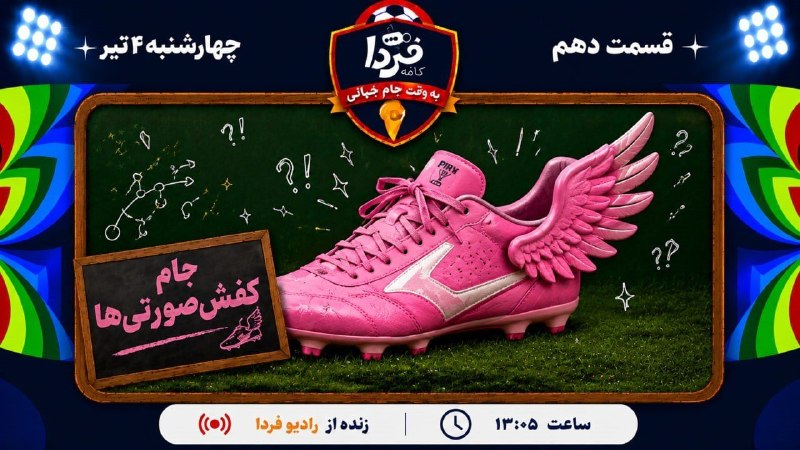

📷 Photo

## RadioFarda — post 158740

روبیو در کویت: کاری که امنیت متحدان‌مان را در منطقه تضعیف کند، انجام نمی‌دهیم

🔸وزیر خارجه آمریکا، در دیدار با متحدان واشینگتن در منطقه خلیج فارس، در کویت نیز بار دیگر بر «هماهنگی» با آن‌ها و خودداری از هرگونه اقدامی که به تضعیف این کشورها در منطقه منجر شود، تأکید کرد.

🔸مارکو روبیو، پس از ورود به ابوظبی به‌عنوان نخستین مقصد سفر منطقه‌ای خود، وارد کویت و بعد بحرین شد. او قرار است روز پنج‌شنبه چهارم تیر در نشست شورای همکاری خلیج فارس در بحرین شرکت کند.

🔸هدف او در این سفر اطمینان‌ دادن به متحدان منطقه‌ای آمریکا در مورد ادامۀ حمایت واشینگتن از منافع آن‌ها علی‌رغم تلاش برای دستیابی به یک توافق با ایران اعلام شده است.
روبیو در کویت با امیر مشعل الاحمد الصباح و صباح الخالد الصباح، ولیعهد این کشور، دیدار و تأکید کرد که واشینگتن هیچ توافقی با ایران را که بهای آن امنیت کشورهای خلیج فارس باشد، انجام نخواهد داد.

🔸او گفت: «ما هیچ اقدامی انجام نخواهیم داد که امنیت متحدان دیرینه‌مان در منطقه را تضعیف کند.»

🔸روبیو تأکید کرد که تعهدات نظامی آمریکا در خلیج فارس واقعی و عملی است: «این تضمین‌های امنیتی واقعی هستند؛ فقط وعده نیستند، بلکه عملی‌اند.»

🔸او در عین حال با دفاع از معافیت ۶۰ روزه بخشی از تحریم‌های نفتی علیه ایران، افزود این اقدام موقت و قابل بازگشت است؛ «هر زمان وارد مذاکره می‌شوید، فرآیند بده‌بستان وجود دارد.»

🔸این یکی از صریح‌ترین مواضع روبیو درباره پیشنهاد ایران برای ایجاد سازوکار جدید در خلیج فارس بود که ممکن است شامل دریافت هزینه عبور از تنگه هرمز شود.

🔸 گزارش کامل را در وب‌سایت رادیوفردا بخوانید.

@RadioFarda

## RadioFarda — post 158739

شدیدترین کمبود سراسری سوخت در روسیه در سال‌های اخیر

🔸روسیه با شدیدترین کمبود سراسری سوخت در سال‌های اخیر دست‌وپنجه نرم می‌کند. دست‌کم ۱۷ منطقهٔ این کشور محدودیت‌های اجباری برای فروش بنزین و گازوئیل اعمال کرده‌اند و ده‌ها منطقهٔ دیگر نیز از کمبود سوخت یا محدودیت‌های اعمال‌شده از سوی شرکت‌های خصوصی عرضه‌کنندهٔ سوخت خبر داده‌اند.

🔸افزایش کمبود سوخت عمدتاً ناشی از گسترش حملات پهپادی اوکراین به پایانه‌های نفتی، پالایشگاه‌ها و خطوط لولهٔ روسیه است.

🔸پالایشگاه «کاپوتنیا»، بزرگ‌ترین تأمین‌کنندهٔ سوخت منطقهٔ مسکو، در ماه جاری دو بار هدف حمله قرار گرفت و به‌گفتۀ برخی مقام‌های ناشناس در گفت‌وگو با رویترز، دست‌کم تا پایان سال ۲۰۲۶ از مدار تولید خارج خواهد بود.

🔸این کمبودها به مشکلی فزاینده برای کرملین تبدیل شده است، آن هم در شرایطی روسیه، با وجود افزایش نشانه‌های بی‌صبری در میان شهروندان این کشور، چهار سال پس از آغاز جنگ، همچنان هیچ نشانه‌ای از عقب‌نشینی یا کاهش شدت حملات همه‌جانبه به اوکراین نشان نداده است.

🔸بر اساس آمار گردآوری‌شده توسط رادیو اروپای آزاد/رادیو آزادی، تا سوم تیرماه امسال، دست‌کم ۵۵ مورد از ۸۳ ادارهٔ فدرال روسیه، شامل جمهوری‌ها، سرزمین‌ها، استان‌ها و شهرهای فدرال، یا محدودیت‌های اجباری دولتی برای فروش بنزین و گازوئیل اعمال کرده‌اند یا جایگاه‌های سوخت تحت مدیریت شرکت‌های خصوصی، فروش را محدود کرده‌اند.

🔸در بیش از ۲۰ منطقهٔ دیگر نیز رسانه‌های محلی یا کاربران شبکه‌های اجتماعی مانند تلگرام و وی‌کی از کمبود سوخت خبر داده‌اند.

🔸 گزارش کامل را در وب‌سایت رادیوفردا بخوانید.

@RadioFarda

## RadioFarda — post 158737

ورود مکزیک با امتیاز کامل به مرحلۀ دوم جام جهانی؛ کرۀ جنوبی در آستانۀ حذف ناباورانه

🔸دور سوم مرحلۀ گروهی جام جهانی فوتبال با برگزاری شش دیدار آغاز، و تکلیف گروه‌های اول تا سوم روشن شد.

🔸در گروه اول، مکزیک که از قبل صدرنشینی‌اش قطعی شده بود، به مصاف جمهوری چک رفت و کرۀ جنوبی هم مقابل آفریقای جنوبی صف‌آرایی کرد.

🔸جمهوری چک که می‌دانست مکزیکِ میزبان نیازی به پیروزی و حتی مساوی ندارد، با امید پیروزی و چهار امتیازی‌شدن پا به ورزشگاه تاریخی «آزتِک» مکزیکوسیتی گذاشت.

🔸بازیکنان چک در نیمۀ اول فشار زیادی را روی تیم میزبان آوردند، اما راه به‌جایی نبردند.

🔸نیمۀ دوم هم با فشار نسبی چک آغاز شد؛‌ اما ۱۰ دقیقۀ بعد ورق برگشت: گل ماتِئو چابِس در دقیقۀ ۵۵ برای مکزیک، آب سردی بود که بر سر چک‌ها فرو ریخت.

🔸 گزارش کامل را در وب‌سایت رادیوفردا بخوانید.

@RadioFarda

## RadioFarda — post 158736

  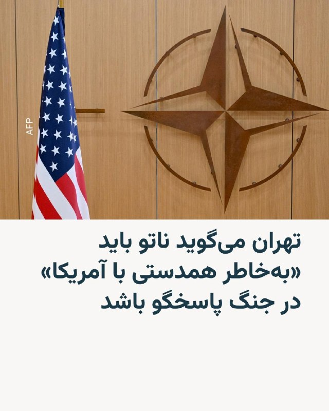

🔸وزارت خارجه جمهوری اسلامی ایران اظهارات دبیر کل ناتو دربارهٔ استفاده آمریکا از برخی پایگاه‌های این پیمان نظامی در اروپا در جنگ اخیر با ایران را «اعتراف به همدستی فعالانه این سازمان در ارتکاب تجاوز نظامی علیه یک کشور مستقل» خواند و خواستار پاسخگویی اعضای این پیمان نظامی شد.

🔸مارک روته، دبیر کل ناتو، در پاسخ به انتقادهای دونالد ترامپ به عدم همکاری پیمان نظامی با آمریکا در جریان جنگ اخیر با ایران گفته بود، در زمان این جنگ، کشورهای اروپایی عضو ناتو همکاری بسیار زیادی با آمریکا داشتند و چهار تا پنج هزار پرواز عملیاتی ارتش آمریکا از پایگاه‌های اروپایی و از جمله از ایتالیا انجام شده بود.

🔸در زمان جنگ ایران، چندین متحد اروپایی آمریکا از جمله ایتالیا و اسپانیا مشخصاً با این جنگ مخالفت کرده بودند و برخی دیگر همچون بریتانیا، آلمان و فرانسه هم، با موضعی محتاطانه‌تر، خود را از ورود به این جنگ دور نگه‌ داشتند؛ موضوعی که باعث رنجش و گلایۀ شدید دونالد ترامپ شد.

@RadioFarda

## RadioFarda — post 158735

  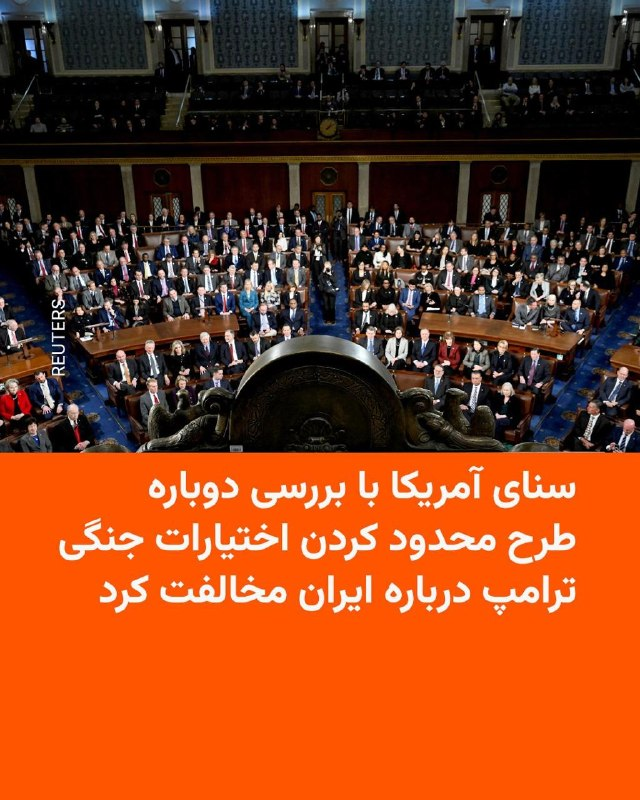

🔸سنای آمریکا در یک رأی‌گیری جدید، با ۵۰ رأی مخالف در مقابل ۴۷ رأی موافق و یک رأی ممتنع، با آغاز بررسی مجدد طرح محدود کردن اختیارات جنگی دونالد ترامپ در رابطه با ایران مخالفت کرد.

🔸دونالد ترامپ، رئیس‌جمهور آمریکا، پیشتر با ابراز مخالفت با این قطعنامه گفته بود که تصویب آن می‌تواند موضع واشینگتن را در مذاکرات با ایران تضعیف کند.

🔸او با تمجید از اقدام جمهور‌خواهان در رأی‌گیری جدید در شبکه اجتماعی تروث‌ سوشال نوشت: «این رأی‌گیری به ایران هشدار می‌دهد.»

🔸سنای آمریکا پیشتر با ۵۰ رأی موافق در برابر ۴۸ رأی مخالف، خودِ قطعنامه محدود کردن اختیارات جنگی دونالد ترامپ را تصویب کرده بود. اما در رأی‌گیری روز چهارشنبه، سناتورها با آغاز دوباره بررسی این موضوع مخالفت کردند و در نتیجه، این طرح بار دیگر در دستور کار سنا قرار نگرفت.

🔸در همین حال رسانه‌های مختلف گزارش داده‌اند که دونالد ترامپ در جریان حضور روز چهارشنبه‌اش در کنگره آمریکا با انتقادهایی از سوی برخی سناتورهای جمهوری‌خواه دربارهٔ توافق با ایران روبه‌رو شد و مشاجرهٔ تندی با برخی از آن‌ها پشت درهای بسته داشت.

@RadioFarda

## RadioFarda — post 158734

🔸دونالد ترامپ، دخالت ایالات متحده در حملۀ موشکی به مدرسه دخترانۀ میناب را زیر سوال برد. رئیس‌جمهور ایالات متحده بدون استناد به بررسی‌های فنی، تنها گفت در روز اول جنگ «از همه طرف موشک در هوا بود». 🔸دونالد ترامپ در کاخ سفید به خبرنگاران گفت: «اتفاقی که افتاد،…

## RadioFarda — post 158733

  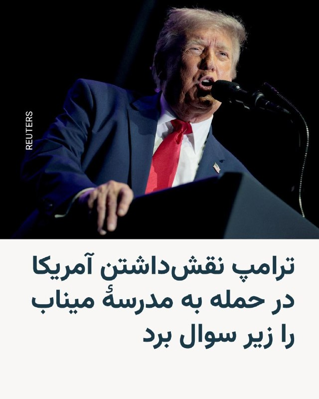

🔸دونالد ترامپ، دخالت ایالات متحده در حملۀ موشکی به مدرسه دخترانۀ میناب را زیر سوال برد. رئیس‌جمهور ایالات متحده بدون استناد به بررسی‌های فنی، تنها گفت در روز اول جنگ «از همه طرف موشک در هوا بود».

🔸دونالد ترامپ در کاخ سفید به خبرنگاران گفت: «اتفاقی که افتاد، وحشتناک بود؛ اما در آن روز از همه طرف موشک در آسمان بود و یکی گفت که این موشک ما بوده؛ خب، شاید هم نبوده باشد. هنوز مدرکی ندیده‌ام که قانعم کند موشک ما بوده».

🔸دونالد ترامپ در ادامه گفت «شاید هیچوقت معلوم نشود کار چه کسی بوده است».

🔸رئیس‌جمهور آمریکا سپس از پیت هگست وزیر دفاع خواست که نظرش را بگوید. او در پاسخ گفت: «ما این تحقیقات را بسیار جدی گرفته‌ایم و وقتی که زمان مناسب فرا برسد، همۀ یافته‌ها را اعلام خواهیم کرد».

🔸ایالات متحده تاکنون از پذیرفتن مسئولیت حمله به این مدرسه سرباز زده و در آغاز امر، دونالد ترامپ ادعا کرده بود که ممکن است که کار خود ایران بوده باشد، چرا که - به گفتۀ او- «موشک‌ها و تسلیحات آنها فاقد هرگونه دقتی است».

@RadioFarda

## RadioFarda — post 158732

  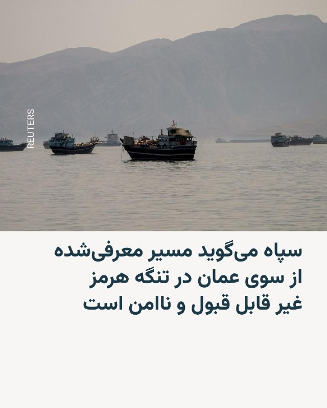

🔸سپاه پاسداران می‌گوید عبور امن کشتی‌ها از تنگۀ هرمز تنها از مسیری که از سوی ایران مشخص‌شده امکان‌پذیر است و مسیر دیگری که بدون هماهنگی با ایران اعلام شده، قابل قبول نبوده و یک ریسک امنیتی به شمار می‌آید.

🔸سپاه پاسداران تأکید کرده که با شناورهایی که بدون هماهنگی با ایران قصد عبور از این آبراه را داشته باشند، برخورد خواهد کرد.

🔸دیروز گزارش شد که عمان با معرفی یک مسیر «موقت» از کشتی‌ها خواسته که فعلاً برای تردد در تنگۀ هرمز، از این مسیر استفاده کنند.

🔸برخی گزارش‌ها از همکاری «بی‌سر و صدا»ی آمریکا در هدایت شماری از کشتی‌ها به این مسیر حکایت دارند.

🔸ایران پیشتر مسیر دیگری را مشخص و آن‌ را تنها مسیر امن عبور از تنگۀ هرمز اعلام کرده بود.

@RadioFarda

## IranianMinds — post 23251

  <a href="telegram/content/IranianMinds_23251_1782378942.mp4" target="_blank">🎬 Download video</a>

مجری صداوسیما خطاب به تیم مذاکره‌کننده:

ترامپ به مردممون گفته گرسنه بعد شما میگید اگه محصولاتشون خوب باشه میخریم؟ بابا به یه جاییتون بر بخوره دیگه.

@IranianMinds

## IranianMinds — post 23250

🔴قیمت نفت به پایین‌ترین سطح پیش از شروع جنگ رسید.

نفت برنت با افت ۱.۷٪ به ۷۲.۵۲ دلار رسید.

@IranianMinds

## IranianMinds — post 23249

  <a href="telegram/content/IranianMinds_23249_1782378944.mp4" target="_blank">🎬 Download video</a>

روز چهارشنبه دو زمین‌لرزه به بزرگی ۷.۲ و ۷.۵ ریشتر یک منطقه از ونزوئلا را لرزاند

@IranianMinds.

## BBCPersian — post 284998

تیم ملی فوتبال ایران که بامداد پنجشنبه (ساعت یک به وقت تهران) وارد خاک آمریکا شد،‌ دومین تمرین تاکتیکی خود را برای دیدار روز شنبه مقابل مصر، در ورزشگاه دانشگاه واشنگتن در شهر سیاتل انجام داد.

خبرگزاری ایرنا یک مجموعه عکس از این تمرین‌ها منتشر کرده است.

فدراسیون فوتبال ایران جزئیاتی در مورد این تمرین اعلام نکرده اما ۲۹ بازیکن و کادرفنی تیم ملی در این تمرین حضور داشتند.

خبرگزاری صدا و سیما نوشت که تیم ملی ایران فردا، جمعه یک جلسه تمرینی در محل برگزاری مسابقه روز جمعه انجام خواهد داد.

بازی روز شنبه با تیم فوتبال مصر سرنوشت صعود تیم ملی فوتبال ایران را در رقابت‌های جام جهانی روشن خواهد کرد.

دو دیدار اول ایران با نیوزیلند (۲-۲) و بلژيک (صفر-صفر) در لس‌آنجلس (جنوب کالیفرنیا) برگزار شد اما دیدار با مصر در سیاتل (ایالت واشنگتن) که مرز شمال غربی آمریکا با کانادا است، برگزار می‌شود.
📷IRNA
@BBCPersian

## BBCPersian — post 284997

هشدار امارات درباره ایجاد زمینه‌های «جدید اختلاف و درگیری» در تنگه هرمز

انور قرقاش، مشاور رئیس‌ امارات متحده عربی، می‌گوید که «واقعیت‌های ژئوپلیتیکی جدید» نمی‌تواند در نتیجه یک «تجاوز خائنانه علیه کشورهای عربی خلیج فارس» به آنها تحمیل شود.
او در پیامی در ایکس نوشت: «تحمیل یک امر واقع از دل تجاوز، منجر به ثبات نمی‌شود؛ بلکه بذرهای جدید اختلاف و درگیری برای آینده می‌کارد. و این دقیقا درباره تنگه هرمز صدق می‌کند.»
پیام مشاور دیپلماتیک رئیس امارات همزمان با تداوم اختلاف نظرها درباره وضعیت اداره تنگه هرمز است.

ایران می‌گوید که اداره این آبراه مهم به شرایط پیش از جنگ برنمی‌گردد اما کشورهای منطقه از جمله امارات و همچنین آمریکا می‌گویند که عبور و مرور کشتیرانی تجاری از تنگه هرمز نباید مختل یا با شرایط تازه‌ای انجام شود.

پیشتر گزارش دادیم پس از اعلام عمان درباره ایجاد یک مسیر تازه دریایی در تنگه هرمز، نیروی دریایی سپاه پاسداران در بیانیه‌ای اعلام کرد که «تنها مسیر مجاز برای عبور از تنگه هرمز همان مسیرهای اعلام شده از طرف جمهوری اسلامی ایران» است.
https://bbc.in/4vvg1AJ
@BBCPersian

## BBCPersian — post 284996

عمیات خشم حماسی؛ دولت ترامپ ۸۷ میلیارد دلار بودجه درخواست کرد

دولت دونالد ترامپ از قانون‌گذاران آمریکایی خواسته است با اختصاص بیش از ۸۷ میلیارد دلار بودجه موافقت کنند که بخش عمده آن برای «نیازهای فوری» مرتبط با جنگ آمریکا علیه ایران در نظر گرفته شده است.

این درخواست پس از آن مطرح شد که کنگره قطعنامه‌ای در انتقاد از اقدام نظامی آمریکا در ایران تصویب کرد.

کاخ سفید اعلام کرد بخش عمده این بودجه، یعنی ۶۷ میلیارد دلار، به وزارت دفاع اختصاص خواهد یافت. از جمله ۲۱ میلیارد دلار برای مهمات، ۱۷ میلیارد دلار برای هزینه‌های عملیاتی و ۱۲ میلیارد دلار برای برنامه‌های محرمانه.

بخش دیگر این بودجه برای اقداماتی غیرمرتبط با جنگ اختصاص پیدا می‌کند که از جمله آن ۱۱ میلیارد دلار برای کشاورزان آمریکایی و ۱/۴ میلیارد دلار برای مقابله با شیوع ابولا در آفریقای مرکزی است.

با این حال، موافقت با این درخواست با مسیر دشواری روبه‌رو است، زیرا درگیری با ایران میان رأی‌دهندگان محبوبیت ندارد و انتخابات میان‌دوره‌ای در ماه نوامبر نزدیک است.

دفتر مدیریت و بودجه کاخ سفید درخواست رسمی این بودجه را در نامه‌ای رئیس مجلس نمایندگان، ارسال کرد.

در این نامه آمده است: «بخش عمده این درخواست برای تأمین نیازهای فوری مرتبط با عملیات "خشم حماسی" خواهد بود» که اشاره به نام عملیات نظامی آمریکاست که نهم اسفند همزمان با حملات اسرائیل به ایران شروع شد.

این درخواست همچنین شامل حدود ۳۰۰ میلیون دلار برای تقویت امنیت سفارتخانه‌ها و مراکز دیپلماتیک آمریکا در خاورمیانه و جنوب آسیا است که در جریان جنگ آسیب‌پذیری نشان دادند.
https://bbc.in/4vvg1AJ
@BBCPersian

## BBCPersian — post 284995

🔻اسرائیل از کشته شدن یک سرباز خود در جنوب لبنان خبر داد

ارتش اسرائیل که یک سرباز این کشور در جریان آنچه «فعالیت عملیاتی» در جنوب لبنان توصیف شد، کشته شده است.

با وجود برقراری آتش‌بس، گزارش‌هایی از درگیری اسرائیل و نیروهای حزب‌الله در این منطقه وجود دارد.

یک سخنگوی ارتش اسرائیل به خبرگزاری فرانسه گفته است که سرباز این کشور بر اثر واژگونی خودرویش کشته شد.

ارتش اسرائیل می‌گوید از زمان آغاز درگیری‌ها با حزب‌الله در اوایل ماه مارس، ۳۷ سرباز و یک پیمانکار غیرنظامی این کشور در جنوب لبنان کشته شده‌اند.
https://bbc.in/4vvg1AJ
@BBCPersian

## BBCPersian — post 284985

🖊علی رمضانیان، روزنامه‌نگار اقتصادی

«آزادسازی پول‌های بلوکه‌شده ایران» یکی از پرتکرارترین و در عین حال پیچیده‌ترین موضوعات در روابط ایران و غرب طی چهار دهه گذشته بوده است؛ موضوعی که بارها به تیتر نخست رسانه‌ها تبدیل شده، گاه بخشی از آن به نتیجه رسیده و در بسیاری از موارد نیز در حد مذاکرات، توافق‌های اولیه یا وعده‌های سیاسی باقی مانده است.

برآورد حجم واقعی دارایی‌های مسدودی ایران کار ساده‌ای نیست. این منابع تنها شامل درآمدهای نفتی نمی‌شوند، بلکه مجموعه‌ای از مطالبات ناشی از صادرات نفت، گاز، برق، منابع ارزی نگهداری‌شده در بانک‌های خارجی و حتی برخی دارایی‌های درگیر پرونده‌های حقوقی را در بر می‌گیرند.

به همین دلیل، ارقام اعلام‌شده درباره این دارایی‌ها از حدود ۲۷ میلیارد دلار تا بیش از ۱۰۰ میلیارد دلار متغیر است.

در هفته‌های اخیر بار دیگر موضوع آزادسازی بخشی از این منابع در محافل سیاسی و رسانه‌ای مطرح شده است؛ آن هم در شرایطی که اقتصاد ایران با کمبود شدید ارز روبه‌رو است.

📷Max Zolotukhin, Getty Images / Fatemeh
Bahrami/Anadolu via Getty Image
مطلب را ⬇️ بخوانید:
https://bbc.in/4oJrbPy
@BBCPersian

## Dirty_Kids — post 393048

شما یه مدت بیوفتی توی خط پروتئین و کالری شماری میفهمی که انسان اشرف مخلوقات نیست، مرغ اشرف مخلوقاته!

@Dirty_Kids 👻

## Dirty_Kids — post 393047

  <a href="telegram/content/Dirty_Kids_393047_1782378947.mp4" target="_blank">🎬 Download video</a>

کار از شیره مالیدن گذشته، رسما دارن میچاپنمون و جالب‌تر اینه که خیلی از ما حاضریم چاپیده بشیم...
همونطوری که صب تا شب به ج اسلامی فحش میدیم و شب تا صب عزادار حسینِ جمهوری اسلامی هستیم!

@Dirty_Kids 👻

## Dirty_Kids — post 393046

  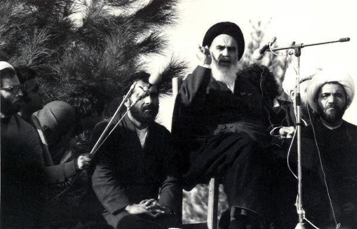

یونجه را رایگان میکنیم برای طبقه‌ی بسیجی.

@Dirty_Kids 👻

## Dirty_Kids — post 393045

  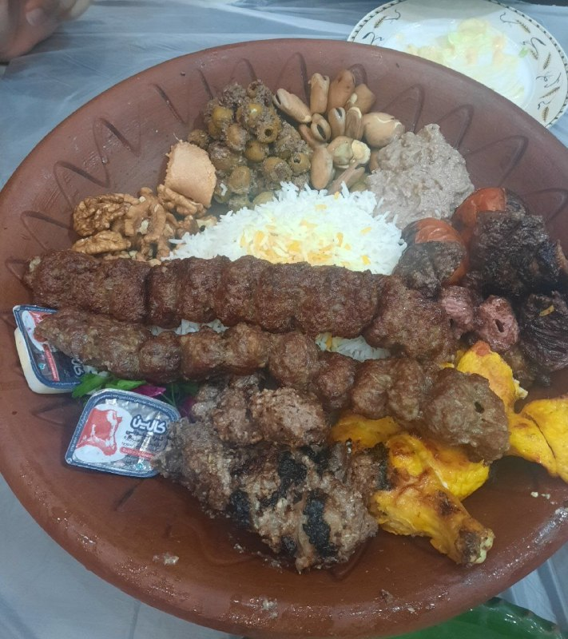

شما یکم بزرگتر بشی میفهمی نه عقل خوبه نه ثروت ،فقط کباب💅

@Dirty_Kids 👻

## Dirty_Kids — post 393044

  

از اینجا تا کلینیک‌های زیبایی تو کربلا پرانتز باز :))))))))))))))))))))))))))))))))))))))))))))))))))))))

@Dirty_Kids 👻

## Dirty_Kids — post 393043

  <a href="telegram/content/Dirty_Kids_393043_1782378950.mp4" target="_blank">🎬 Download video</a>

صداوسیما یه نماهنگِ فوق کسشر برای تیم جمهوری اسهالی پخش کرد؛

بعدش دیدم یسریا میگن چونکه خیلی کسشر و آبرو بوده پاک کردنش از آرشیو شبکه سه، نه عزیزان بعد توافق اشتباهی پخش کردن و از ترس شغال‌طرقبه حذفش کردن وگرنه میومد همین نماآهنگ‌رو لوله میکرد تو کونه مثاقی بقیه عرزشیا 😂😂😂

@Dirty_Kids 👻

## Dirty_Kids — post 393042

میخواستن کاخ سفید رو حسینیه کنن ولی بیت‌رهبری شد انبار غله.

@Dirty_Kids 👻

## Dirty_Kids — post 393041

  <a href="telegram/content/Dirty_Kids_393041_1782378952.mp4" target="_blank">🎬 Download video</a>

دشمن تیرش خورد قشنگ وسط ما تحت شهبازی و به شهنازی تبدیل شد😂😂😂
#شهبازی
#کان‌ـ‌فدا

@Dirty_Kids 👻

## Dirty_Kids — post 393040

  <a href="telegram/content/Dirty_Kids_393040_1782378954.mp4" target="_blank">🎬 Download video</a>

بعد از دیدن این ویدئو از بیان طرز مملکت داری احمدی نژاد ، خون گریه خواهید کرد

چه چیزا که ما تو این جمهوری‌اسلامی از سر نگذروندیم

@Dirty_Kids 👻

## Hranews — post 113832

اعتراضات دی‌ماه ۱۴۰۴؛ تداوم بازداشت سهیلا حجاب در زندان کچویی کرج

❗️
❗️
❗️
❗️
❗️– سهیلا حجاب بیدسرخی از بازداشت‌شدگان اعتراضات دی‌ماه ۱۴۰۴، همچنان به‌صورت بلاتکلیف در زندان کچویی کرج نگهداری می‌شود. جلسه رسیدگی به اتهامات این فعال مدنی، چندی پیش در دادگاه فردیس برگزار شده بود.

ادامه مطلب

#سهیلا_حجاب_بیدسرخی

↘️
@hranews_bot تماس ✉️ - @Hranews کانال هرانا 🆑

## Hranews — post 113831

  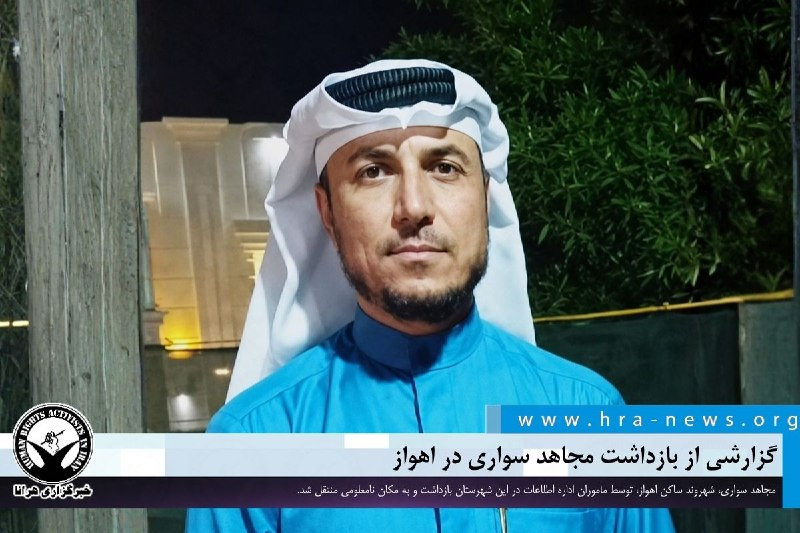

گزارشی از بازداشت مجاهد سواری در اهواز

❗️
❗️
❗️
❗️
❗️– مجاهد سواری، شهروند ساکن اهواز، روز دوشنبه یکم تیرماه، توسط ماموران اداره اطلاعات در این شهرستان بازداشت و به مکان نامعلومی منتقل شد.

به گزارش خبرگزاری هرانا، ارگان خبری مجموعه فعالان حقوق بشر در ایران، مجاهد سواری در اهواز بازداشت شد.

بازداشت آقای سواری، بامداد روز دوشنبه یکم تیر ۱۴۰۵، توسط ماموران اداره اطلاعات در منزل شخصی وی در کوی مندلی اهواز صورت گرفته است. با گذشت چهار روز از زمان دستگیری، تاکنون از محل نگهداری وی اطلاعی حاصل نشده است.

ادامه مطلب

#مجاهد_سواری

↘️
@hranews_bot تماس ✉️ - @Hranews کانال هرانا 🆑

## manototv — post 106233

  <a href="telegram/content/manototv_106233_1782378956.mp4" target="_blank">🎬 Download video</a>

تجربه توافق برجام نشان داد رفع تحریم‌ها می‌تواند شاخص‌های کلان را برای مدتی آرام کند؛ تورم پایین بیاید، ارز ثبات نسبی پیدا کند و صادرات نفت بالا برود. اما مسئله اصلی این است که این گشایش چقدر به زندگی خانواده‌های عادی می‌رسد.

در اقتصاد رانتی جمهوری اسلامی، منافع معمولاً در بالادست جذب می‌شود؛ در شبکه‌هایی نزدیک به قدرت، نه در سفره مردم. همین شکاف میان وعده بهبود و واقعیت زندگی روزمره، پس از برجام به اعتراضات دیماه ۹۶ انجامید.

توافق شاید زمان بخرد، اما اگر قدرت خرید، امکان برنامه‌ریزی و حس ثبات در زندگی مردم تغییر نکند، بحران فقط به تعویق افتاده است.

## alonews — post 130140

  <a href="telegram/content/alonews_130140_1782378959.webm" target="_blank">🎬 Download video</a>

🔴فوری/ رویترز به نقل از مقام آمریکایی: اسرائیل به نشانه حسن نیت از بخشی از منطقه امنیتی جنوب لبنان عقب‌نشینی کرد

✅ @AloNews خبر جنگ

## alonews — post 130139

  <a href="telegram/content/alonews_130139_1782378959.webm" target="_blank">🎬 Download video</a>

👈سازمان پخش اسرائیل: ایالات متحده به درخواست اسرائیل، ۲۸ هواپیمای سوخت‌رسان خود را از فرودگاه بن گوریون خارج می‌کند.

✅ @AloNews خبر جنگ

## alonews — post 130138

  <a href="telegram/content/alonews_130138_1782378960.webm" target="_blank">🎬 Download video</a>

👈وزیر خارجه بحرین: از تلاش‌هایی که به امضای یادداشت تفاهم میان ایران و آمریکا منجر شد، استقبال می‌کنیم| کشور‌های شورای همکاری خلیج فارس چشم انتظار فصل جدیدی هستند‌

✅ @AloNews خبر جنگ

## alonews — post 130137

  <a href="telegram/content/alonews_130137_1782378960.mp4" target="_blank">🎬 Download video</a>

👈مارکو روبیو در مورد ایران: می‌توانید آن را عوارض بنامید، می‌توانید آن را هزینه بنامید، هر چه می‌خواهید بنامید - این یک بازی معنایی است.

🔴واقعیت این است که هیچ کشوری در کره زمین حق ندارد برای استفاده از آبراه‌های بین‌المللی هزینه دریافت کند.

🔴و این هرگز شرط قابل قبولی برای هیچ توافقی نخواهد بود. رئیس جمهور اساساً در این مورد شفاف بوده است

✅ @AloNews خبر جنگ

## alonews — post 130136

  <a href="telegram/content/alonews_130136_1782378962.mp4" target="_blank">🎬 Download video</a>

👈مارکو روبیو درباره ایران: تنگه هرمز آب‌های بین‌المللی هستند. آبراه‌های بین‌المللی متعلق به هیچ دولت-ملی نیستند. این یک اصل اساسی در جهان امروز است که بدون آن جهان در هرج و مرج کامل فرو می‌رفت.

🔴اگر در واقع بپذیریم که می‌توانید برای استفاده از یک آبراه بین‌المللی به دلیل نزدیکی به قلمرو سرزمینی خود، هزینه دریافت کنید، خب، این مانند یک بیماری واگیردار در سراسر جهان پخش می‌شود.

🔴اگر در واقع، اکنون تنگه‌ای وجود دارد که یک کشور می‌تواند، یا دو کشور می‌توانند، یا هر کشوری که تصمیم بگیرد می‌خواهد برای استفاده از آن هزینه دریافت کند، چه چیزی مانع از آن می‌شود که هر کشور جهان در نزدیکی یک آبراه، هزینه مشابهی را اعمال کند؟

🔴و سپس ما هرج و مرج خواهیم داشت. بنابراین این غیرقابل قبول است

✅ @AloNews خبر جنگ

## alonews — post 130135

  <a href="telegram/content/alonews_130135_1782378964.webm" target="_blank">🎬 Download video</a>

👈فرودگاه امام خمینی: گروه هواپیمایی لوفت‌هانزا تمایل دارد که پرواز‌های خود به ایران را از سر بگیرد، اما هنوز زمان مشخصی برای آن مشخص نشده

🔴 ممکن است که «آسترین ایرلاین» زودتر پرواز‌های خود به کشور ما را شروع کند

✅ @AloNews خبر جنگ

## alonews — post 130134

  <a href="telegram/content/alonews_130134_1782378964.webm" target="_blank">🎬 Download video</a>

👈ایلان ماسک در پی سقوط سهام تسلا و اسپیس ایکس در معاملات روز چهارشنبه که ارزش دارایی او را به ۹۷۰.۲ میلیارد دلار کاهش داد، عنوان «تریلیونر» را از دست داد.

✅ @AloNews خبر جنگ

## alonews — post 130133

  <a href="telegram/content/alonews_130133_1782378965.webm" target="_blank">🎬 Download video</a>

👈روبیو: ایران در سوئیس تعهدات بسیار صریحی داد و اگر به آنها پایبند نباشد، گزینه‌های دیگری پیش‌روی ماست

✅ @AloNews خبر جنگ

## alonews — post 130132

  <a href="telegram/content/alonews_130132_1782378965.mp4" target="_blank">🎬 Download video</a>

👈ترامپ: همه به ما احترام می‌گذارند. دیگر کسی به ما نمی‌خندد. دو سال پیش، آنها می‌خندیدند.

🔴حالا، ما محترم‌ترین در هر کجا هستیم. به آن فکر کنید. در هر کجای دنیا

🔴دو سال پیش کجا بودیم؟ ما مورد احترام نبودیم. ما یک شوخی بودیم. ما دیگر یک شوخی نیستیم.

✅ @AloNews خبر جنگ

## alonews — post 130130

  <a href="telegram/content/alonews_130130_1782378967.webm" target="_blank">🎬 Download video</a>

👈ایران از عمان به دلیل صدور مسیرهای کشتیرانی برای تنگه هرمز بدون دخالت تهران انتقاد کرده است.

🔴نیروی دریایی سپاه پاسداران انقلاب اسلامی در بیانیه‌ای اعلام کرد که «برخی مقامات» - بدون نام بردن مستقیم از عمان - بدون هماهنگی با ایران «مسیر جدیدی برای تردد کشتی‌ها» از طریق این تنگه اعلام کرده‌اند. این بیانیه افزود که «تنها مسیرهای مجاز تردد» مسیرهایی هستند که توسط تهران تعیین شده‌اند و هشدار داد که هرگونه مسیر دیگری «بسیار خطرناک» است.

🔴این اظهارات پس از آن مطرح می‌شود که عمان با هماهنگی سازمان بین‌المللی دریانوردی، «کریدور دریایی موقت» در تنگه هرمز را اعلام کرد.

✅ @AloNews خبر جنگ

## alonews — post 130129

  <a href="telegram/content/alonews_130129_1782378968.webm" target="_blank">🎬 Download video</a>

👈ترامپ:وای! سنا رأی خود در مورد ایران را از ۵۰ به ۴۸ مخالف به ۵۰ به ۴۷ موافق تغییر داد. رند پال و بیل کسیدی تغییر کردند. از رهبر جان تون، لیندسی گراهام، برنی مورنو و همه متشکرم.

🔴این رأی، ایران را در معرض توجه قرار می‌دهد! رئیس جمهور دونالد جی ترامپ

✅ @AloNews خبر جنگ

## alonews — post 130128

  <a href="telegram/content/alonews_130128_1782378968.webm" target="_blank">🎬 Download video</a>

👈ارتش اسرائیل از کشته شدن یک سرباز و زخمی شدن سرباز دیگر در لبنان خبر داد

✅ @AloNews خبر جنگ

## alonews — post 130127

  <a href="telegram/content/alonews_130127_1782378968.mp4" target="_blank">🎬 Download video</a>

👈ترامپ: ما در دو جنگ جهانی پیروز شدیم، فاشیسم و ​​کمونیسم را شکست دادیم.

🔴ما باید دوباره این کار را انجام دهیم.

✅ @AloNews خبر جنگ

## alonews — post 130126

  <a href="telegram/content/alonews_130126_1782378971.mp4" target="_blank">🎬 Download video</a>

👈ترامپ: ما در حال ارائه بزرگترین کاهش قیمت دارو در تاریخ با اختلاف قیمت ۴۰۰، ۵۰۰ و حتی ۶۰۰ درصدی هستیم

🔴اگر نیم درصد کاهش قیمت را انجام می‌دادید، کسی می‌گفت شما نابغه هستید - ۴۰۰، ۵۰۰، ۶۰۰، ۷۰۰، ۸۰۰ درصد. هیچ‌کس چیزی شبیه به این ندیده است.

✅ @AloNews خبر جنگ

## alonews — post 130125

  <a href="telegram/content/alonews_130125_1782378973.webm" target="_blank">🎬 Download video</a>

👈کاسبی جدید با محدود شدن تعداد و ظرفیت کارت‌های سوخت آزاد: برخی متصدیان در ازای «شیرینی» کارت جایگاه را در اختیار رانندگان قرار می‌دهند!

✅ @AloNews خبر جنگ

## alonews — post 130124

  <a href="telegram/content/alonews_130124_1782378973.mp4" target="_blank">🎬 Download video</a>

👈آسیب به ساختمان رادیو تلویزیون دولتی ونزوئلا در دو زلزله ۷ ریشتری امروز

✅ @AloNews خبر جنگ

## alonews — post 130123

  <a href="telegram/content/alonews_130123_1782378975.webm" target="_blank">🎬 Download video</a>

👈اسکات بسنت وزیر خزانه‌داری آمریکا روز پنج‌شنبه مدعی شد که معافیت از تحریم‌های نفتی ارائه شده به ایران قابل بازپسگیری است‌

✅ @AloNews خبر جنگ

## alonews — post 130122

  <a href="telegram/content/alonews_130122_1782378975.webm" target="_blank">🎬 Download video</a>

👈سنای آمریکا با ۵۰ رای مخالف، ۴۷ رای موافق و یک رای ممتنع، با آغاز بررسی «قطعنامه اختیارات جنگی ایران» مخالفت کرد.

🔴جمهوری‌خواهان و ترامپ استدلال کرده بودند، تصویب این قطعنامه می‌تواند اهرم فشار آمریکا در مذاکرات جاری با جمهوری اسلامی را تضعیف کند

✅ @AloNews خبر جنگ

## alonews — post 130121

  <a href="telegram/content/alonews_130121_1782378975.webm" target="_blank">🎬 Download video</a>

👈رئیس‌جمهور موقت ونزوئلا در مورد وقوع دو زلزله پیاپی ۷.۱ و ۷.۵ ریشتری در این کشور:

🔴 کشته شدن دست‌کم ۳۲ تن و زخمی شدن ۷۰۰ نفر

🔴 طبق اعلام رئیس‌جمهور موقت ونزوئلا دلسی رودریگز، دو زلزله پیاپی ۷.۱ و ۷.۵ ریشتری در این کشور، دست‌کم ۳۲ کشته و ۷۰۰ زخمی بر جای گذاشت

✅ @AloNews خبر جنگ

---
📅 بروزرسانی: 1405/04/04 09:47
---

## VahidOOnLine — post 247247

♦️مادر جاویدنام محمد جعفرپور روز چهارشنبه سوم تیرماه، ویدیویی از حضور بر مزار فرزندش منتشر کرد و نوشت: «همان لباس‌هایی که فکر می‌کردم امسال هم می‌پوشی و همان زنجیری که قرار بود روی شانه‌هایت ببینم را برایت آوردم. هنوزم وقتی درِ خانه باز می‌شود، یک گوشه دلم منتظر است تا شاید تو آمده باشی. امسال هئیت من، عاشورا و تاسوعای من، مزار توست پسرم».

بسیاری از اعضای خانواده و هم محلی‌های جاویدنامان کشته‌شده در دی ماه ۱۴۰۴، بار دیگر داغ فرزندان خود را در مراسم‌های عزاداری محرم به خصوص در روزهای تاسوعا و عاشورا، بدل به صحنه سوگواری عمومی کردند.

محمد جعفرپور ۲۵ ساله، فارغ‌التحصیل دانشگاه اصفهان شامگاه جمعه ۱۹ دی‌ماه در خمینی‌شهر (سده) به ضرب گلوله سرکوبگران جمهوری اسلامی ایران کشته شد.
‌🇸🇦 Indypersian

🤖 @VahidOOnLine

## VahidOOnLine — post 247246

  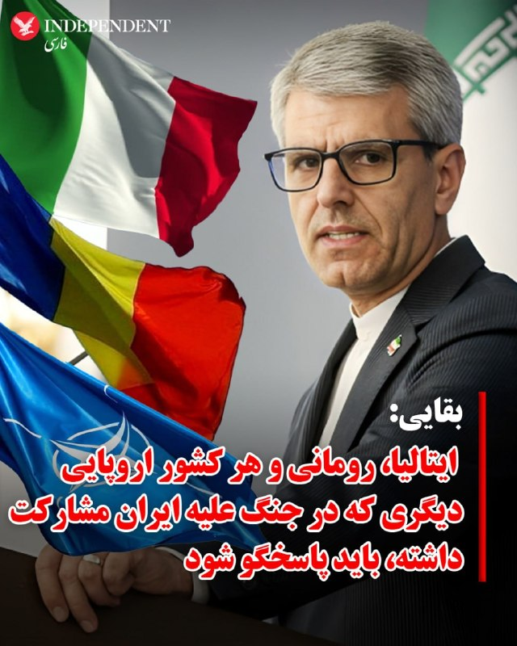

اسماعیل بقایی، سخنگوی وزارت امور خارجه جمهوری اسلامی ایران بامداد پنجشنبه چهارم تیرماه و در واکنش به گفته‌های مارک روته، دبیرکل ناتو درباره همکاری ایتالیا و رومانی با آمریکا در جریان جنگ، خواستار پاسخگویی این کشورها به‌دلیل نقض حقوق بین‌الملل و «مشارکت در اقدام متجاوزانه علیه مردم ایران» شد.

بقایی با بازنشر ویدیویی گفتگوی دبیرکل ناتو با فاکس نیوز نوشت: «این یک اعتراف آشکار و محکوم‌کننده به همدستی فعال ناتو در یک جنگ تجاوزکارانه غیرقانونی علیه یک کشور مستقل عضو سازمان ملل متحد است؛ نقض آشکار هنجارهای آمره حقوق بین‌الملل و اصول اساسی منشور سازمان ملل. این سازمان و کشورهای عضو آن که در چنین تصمیم‌گیری‌هایی شرکت داشته‌اند، باید در قبال تمام عواقب آن پاسخگو باشند.»

مارک روته گفته بود که هواپیماهای آمریکایی در جریان عملیات «خشم حماسی» از فرودگاه‌های ایتالیا و رومانی برخاسته و به سوی خاورمیانه پرواز کرده‌اند.

بقایی در همین پیام، رم و بخارست را به مشارکت در ارتکاب جنایات جنگی علیه ایران متهم کرد و خوااستار پاسخگویی آن‌ها شد.
‌🇸🇦 Indypersian

🤖 @VahidOOnLine

## VahidOOnLine — post 247245

چرا تفاهم تهران و واشینگتن پایان مبارزه مدنی مردم ایران نیست؟

نعیمه دوسندار- تفاهم جمهوری اسلامی و آمریکا حتی اگر به کاهش تنش نظامی، بازگشایی مسیرهای تجاری، فروش بیشتر نفت یا آزادسازی بخشی از دارایی‌های مسدودشده منجر شود، لزوما به معنای پایان بحران سیاسی در داخل ایران نیست.
تفاهم و مذاکره ممکن است به جمهوری اسلامی امکان تنفس اقتصادی بدهد، فشار فوری بازار را کاهش دهد و برای مدتی انتظارات عمومی را مدیریت کند، اما مساله اصلی مردم ایران فقط تحریم، قیمت دلار یا کمبود منابع ارزی نیست.
ریشه اعتراضات و مقاومت مدنی در ایران عمیق‌تر از رابطه تهران و واشینگتن است؛ در فروپاشی اعتماد عمومی، سرکوب سیاسی، تبعیض ساختاری، فساد نهادی، بحران نمایندگی و شکاف میان جامعه و حکومتی است که بخش بزرگی از شهروندان، آن را نماینده خود نمی‌دانند.
از این منظر، تفاهم خارجی بخشی از بحران دولت را تخفیف می‌دهد، اما بحران مشروعیت را حل نمی‌کند.

‌🏁 🇬🇧 IranintlTV

🤖 @VahidOOnLine

## VahidOOnLine — post 247244

  

قیمت نفت روز پنجشنبه با خروج نفتکش‌های گرفتار از تنگه هرمز و کاهش نگرانی‌ها درباره عرضه، به افت خود ادامه داد. نفت برنت با ۰.۵ درصد کاهش به ۷۳ دلار و ۳۴ سنت در هر بشکه رسید و به سطح پیش از جنگ نزدیک‌تر شد.
نفت خام وست تگزاس اینترمدیت آمریکا نیز با ۰.۳۸ درصد کاهش به ۷۰ دلار و ۷ سنت در هر بشکه رسید.

‌🏁 🇬🇧 IranintlTV

🤖 @VahidOOnLine

## VahidOOnLine — post 247243

  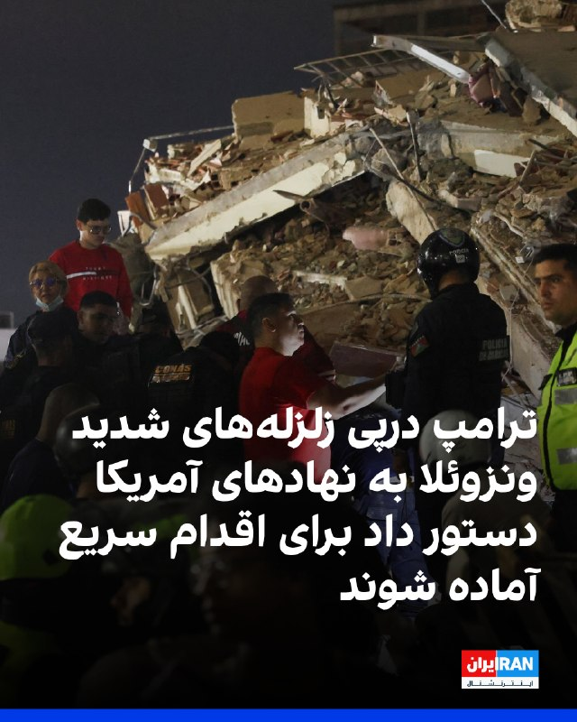

دونالد ترامپ، رییس‌جمهوری آمریکا، در تروت سوشال و در واکنش به زمین‌لرزه‌های مرگبار ونزوئلا نوشت ایالات‌متحده آماده کمک به این کشور است و به همه نهادهای دولت دستور داده برای اقدام سریع آماده شوند.
ترامپ در تروت سوشال نوشت: «دو زمین‌لرزه بزرگ تلفات و خسارت‌های ویرانگری بر جا گذاشته است. آمریکا آماده، مایل و قادر به کمک است. ما در کنار دوستان جدید و بزرگ خود خواهیم بود. گزارش‌های اولیه امیدوارکننده نیستند.»

‌🏁 🇬🇧 IranintlTV

🤖 @VahidOOnLine

## VahidOOnLine — post 247242

  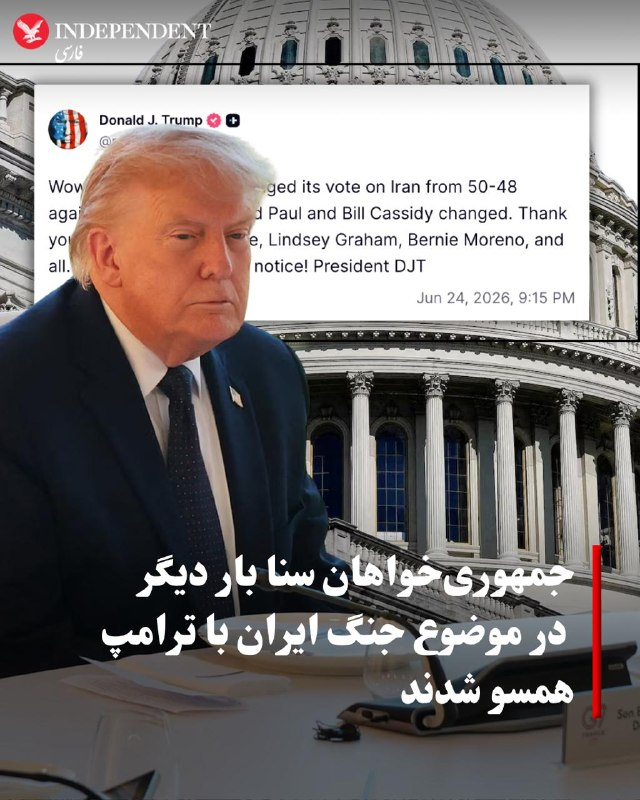

♦️سنای آمریکا اواخر چهارشنبه شب با ۴۷ رای موافق، ۵۰ رای مخالف و یک رای ممتنع تصمیم گرفت برای دومین بار دولت دونالد ترامپ را به دلیل درگیری نظامی با ایران مورد سرزنش قرار ندهد؛ اقدامی که پس از آن صورت گرفت که رهبران جمهوری‌خواه برخی از آرای مردد حزب را متقاعد کردند چنین اقدامی می‌تواند به مذاکرات برای پایان دادن به جنگ آسیب بزند.
به گزارش هیل، این قطعنامه تلاشی از سوی کنگره برای تاکید دوباره بر اختیار قانونی خود در اعلام جنگ بود و از رئیس‌جمهور می‌خواست «نیروهای مسلح ایالات متحده را از هرگونه درگیری در داخل یا علیه ایران خارج کند، مگر آنکه چنین اقدامی به‌صراحت با اعلام جنگ یا مجوز مشخص استفاده از نیروی نظامی تصویب شده باشد.»
سناتور رند پال که در گذشته در حمایت از قطعنامه‌های مشابه همراه دموکرات‌ها رای داده بود، اندکی پیش از رای‌گیری در بیانیه‌ای اعلام کرد که به جای رای مخالف، رای «ممتنع» خواهد داد تا مذاکرات جاری به خطر نیفتد.
جمهوری‌خواهان سنا پیش‌تر در روز چهارشنبه توضیحات ترامپ درباره درگیری نظامی با ایران را شنیده بودند. این موضوع باعث تنش با سناتور بیل کسیدی از لوئیزیانا شد؛ او بعدا گفت به دلیل نبود شفافیت کافی میان دولت و کنگره درباره عملیات نظامی در ایران، با ترامپ مشاجره‌ای تند و همراه با فریاد داشته است.
کاخ سفید در واکنش، به سرعت از کسیدی دعوت کرد تا در جلسه توجیهی با جی‌دی ونس، معاون رئیس‌جمهوری، و استیو ویتکاف، فرستاده ویژه ترامپ، درباره آخرین وضعیت جنگ شرکت کند.
کسیدی پس از این جلسه گفت توضیحات ارائه‌شده «جامع و کامل» بوده است و در نهایت به قطعنامه رای مخالف داد.
این قطعنامه نخستین بار در ماه مه و با حمایت کسیدی از کمیته مربوطه خارج شد؛ اقدامی که چند روز پس از شکست او در انتخابات مقدماتی حزب جمهوری‌خواه در برابر نامزد مورد حمایت ترامپ، بسیاری را غافلگیر کرد.
به نوشته هیل، اینکه این طرح تا این مرحله پیش رفت، نشان‌دهنده تغییر فضای سیاسی در کنگره آمریکا است؛ جایی که جمهوری‌خواهان با پیامدهای داخلی درگیری با ایران روبه‌رو هستند و درباره اختیارات جنگی رئیس‌جمهوری بحث‌های بیشتری شکل گرفته است.
مجلس نمایندگان آمریکا اوایل همین هفته قطعنامه مشابهی در انتقاد از جنگ با ایران تصویب کرده بود و سنا نیز پیش‌تر با اختلافی اندک آن را تایید کرده بود.
‌🇸🇦 Indypersian

🤖 @VahidOOnLine

## VahidOOnLine — post 247241

  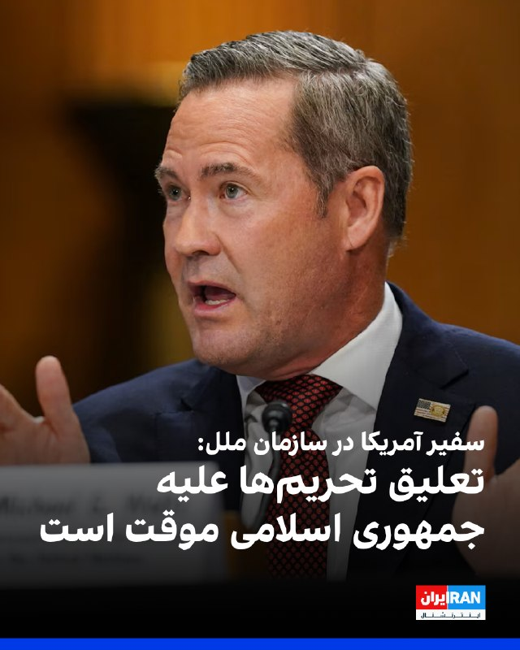

مایک والتز، سفیر آمریکا در سازمان ملل، در گفت‌وگو با شبکه فاکس‌نیوز گفت تعلیق‌های اخیر تحریمها علیه جمهوری اسلامی «موقت» است و به معنای لغو این تحریم‌ها نیست.

او گفت: «همان‌طور که اسکات بسنت، وزیر خزانه‌داری هم تاکید کرده، این فقط یک مجوز موقت در حوزه تحریم‌هاست؛ تحریم‌ها برداشته نشده‌اند. این یک مجوز موقت است تا فعلا مذاکرات پیش برود.»

والتز افزود دونالد ترامپ بارها تاکید کرده است اگر جمهوری اسلامی «با حسن نیت مذاکره نکند» و از «اصرار بر دستیابی به سلاح هسته‌ای» دست نکشد، تحریم‌ها دوباره بازخواهند گشت و «همه گزینه‌ها نیز روی میز خواهد بود».
‌🏁 🇬🇧 IranintlTV

🤖 @VahidOOnLine

## VahidOOnLine — post 247240

  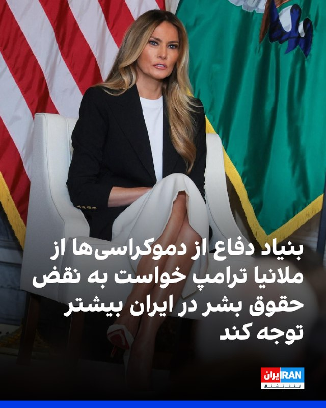

بنیاد دفاع از دموکراسی‌ها در نامه‌ای به ملانیا ترامپ، بانوی اول آمریکا، از او خواست همزمان با تمرکز دولت آمریکا بر مذاکرات هسته‌ای و سیاست انرژی، توجه بیشتری به نقض حقوق بشر در ایران، به‌ویژه علیه زنان، داشته باشد.
کلیفورد می، بنیان‌گذار بنیاد دفاع از دموکراسی‌ها، در این نامه نوشت: «انقلابیون اسلامی کنونی ایران از پیشینیان خود کمتر افراطی نیستند. آن‌ها نه به دنبال آغاز فصلی تازه هستند و نه قصد دارند به کشورشان کمک کنند.»
کلیفورد می در ادامه نوشت: «آن‌ها پیروان خمینی هستند؛ یعنی مشتاق‌اند برای برقراری دوباره برتری اسلام در گستره‌ای وسیع، هم بکشند و هم کشته شوند.» او از ملانیا ترامپ خواست نگاه واقع‌بینانه خود را با صدایی بلند به اطرافیانش منتقل کند.

‌🏁 🇬🇧 IranintlTV

🤖 @VahidOOnLine

## VahidOOnLine — post 247239

♦️زمین‌لرزه‌ای به بزرگی ۶.۹، بامداد پنجشنبه چهارم تیرماه، سواحل شمالی جزیره هونشوی ژاپن را لرزاند. کانون این زمین‌لرزه در نزدیکی سواحل استان ایواته و در عمق ۵۰ کیلومتری زمین ثبت شده است.
به گزارش رویترز، سازمان هواشناسی ژاپن اعلام کرد این زمین‌لرزه خطر وقوع سونامی به همراه ندارد و تنها احتمال تغییرات جزئی در سطح آب دریا وجود دارد. همچنین تاکنون گزارشی از تلفات یا مصدومیت ناشی از این زمین‌لرزه منتشر نشده است.
‌🇸🇦 Indypersian

🤖 @VahidOOnLine

## VahidOOnLine — post 247238

  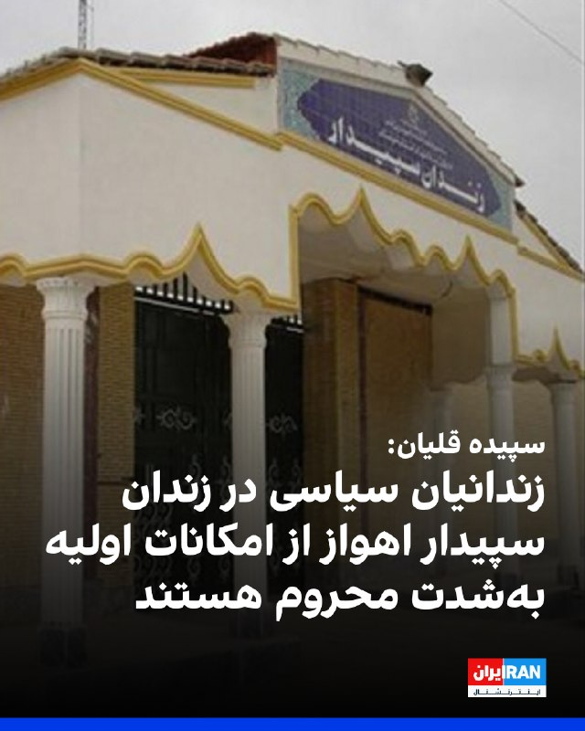

سپیده قلیان، فعال مدنی، گفت زندانیان سیاسی در زندان سپیدار اهواز در شرایطی بسیار سخت نگهداری می‌شوند و از محدودیت شدید در دسترسی به امکانات اولیه رنج می‌برند.
قلیان گفت: «زندانیان سیاسی را به بدترین شکل ممکن از سایر زندانیان جدا کرده‌اند؛ در محلی بدون نور طبیعی، بدون آب آشامیدنی کافی و بدون دسترسی شبانه‌روزی به سرویس بهداشتی و حمام نگهداری می‌شوند. حتی همین محرومیت از امکانات اولیه را به بخشی از شکنجه تبدیل کرده‌اند.»

‌🏁 🇬🇧 IranintlTV

🤖 @VahidOOnLine

## VahidOOnLine — post 247237

  

دونالد ترامپ، رییس‌جمهوری آمریکا، پس از تغییر نتیجه رای‌گیری در سنای آمریکا درباره قطعنامه اختیارات جنگی ایران، از چند سناتور جمهوری‌خواه قدردانی کرد و گفت تغییر رای رند پال و بیل کسیدی نتیجه را به سود پیشبرد این موضوع تغییر داد.
ترامپ در تروث سوشال نوشت: «شگفت‌انگیز! سنا رای خود درباره ایران را از ۵۰ در برابر ۴۸ مخالف، به ۵۰ در برابر ۴۷ موافق تغییر داد. رند پال و بیل کسیدی رای خود را تغییر دادند. از جان تون، لیندزی گراهام، برنی مورنو و همه سپاسگزارم. این رای به ایران هشدار می‌دهد.»

‌🏁 🇬🇧 IranintlTV

🤖 @VahidOOnLine

## VahidOOnLine — post 247236

  

سنای آمریکا با ۵۰ رای مخالف، ۴۷ رای موافق و یک رای ممتنع، با آغاز بررسی «قطعنامه اختیارات جنگی ایران» مخالفت کرد. این قطعنامه از سوی تیم کین، سناتور دموکرات، ارائه شده بود.
با شکست این رای‌گیری رویه‌ای، بررسی «قطعنامه اختیارات جنگی ایران» عملا متوقف شد. جمهوری‌خواهان و دونالد ترامپ استدلال کرده بودند تصویب این قطعنامه می‌تواند اهرم فشار آمریکا در مذاکرات جاری با جمهوری اسلامی را تضعیف کند.
رند پال، سناتور جمهوری‌خواه آمریکا، اعلام کرد در رای‌گیری درباره قطعنامه اختیارات جنگی مربوط به ایران، رای «ممتنع» خواهد داد. او گفت به نظر می‌رسد درگیری‌ها پایان یافته و دونالد ترامپ از او خواسته است تاثیر این رای بر روند مذاکرات را در نظر بگیرد.
رند پال افزود: «رای ممتنع من راهی است برای اینکه به رییس‌جمهوری فضای بیشتر و اهرم قوی‌تری برای مذاکره به منظور دستیابی به صلحی پایدار بدهم.»

‌🏁 🇬🇧 IranintlTV

🤖 @VahidOOnLine

## VahidOOnLine — post 247235

  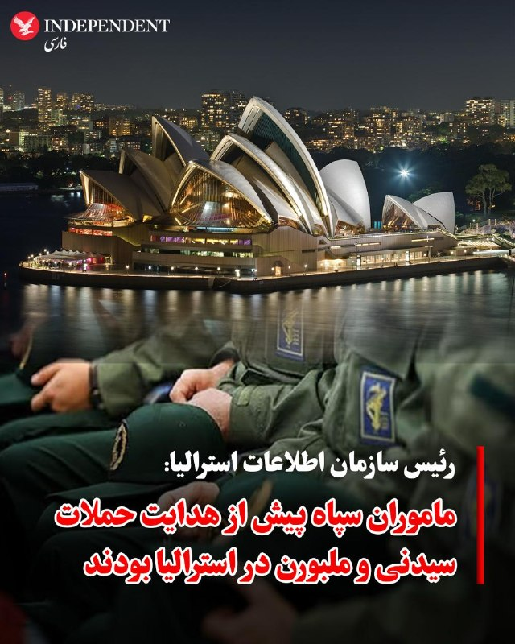

♦️رئیس سازمان اطلاعات امنیتی داخلی استرالیا روز چهارشنبه گفت سپاه پاسداران از دو مامور که زمانی در استرالیا زندگی می‌کردند برای هدایت حملات آتش‌افروزی علیه اهداف یهودی در سیدنی و ملبورن استفاده کرده است.
به گزارش اسوشیتدپرس، مایک برگس، مدیرکل سازمان اطلاعات امنیتی استرالیا (ASIO)، گفت: «ایران همچنان استرالیا را هدفی مشروع برای اقدامات خشونت‌آمیز پنهانی و هدایت‌شده می‌داند.»
استرالیا سال گذشته ایران را مسئول آتش‌سوزی‌هایی دانست که به رستوران غذای حلال یهودی در سیدنی و کنیسه «اداس اسرائیل» در ملبورن آسیب زدند؛ این دو حادثه در سال ۲۰۲۴ و با فاصله دو ماه از یکدیگر رخ دادند.
این اتهام‌ها باعث شکاف دیپلماتیک بزرگی شد و سفیر جمهوری اسلامی از استرالیا اخراج شد. تهران این اتهام‌ها را رد می‌کند.
برگس گفت این شهروند استرالیایی یک مامور ارشد سپاه پاسداران بود که شبکه‌های این نهاد را در سراسر جهان اداره می‌کرد.
‌🇸🇦 Indypersian

🤖 @VahidOOnLine

## VahidOOnLine — post 247234

  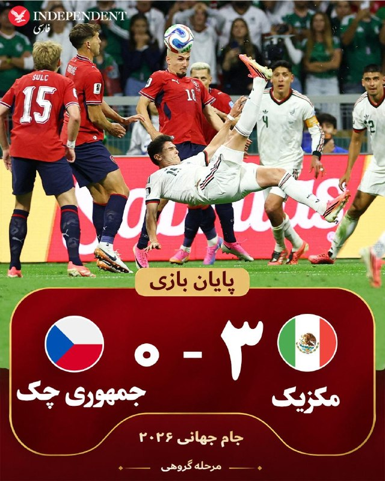

♦️تیم ملی فوتبال مکزیک، یکی از میزبانان جام جهانی ۲۰۲۶، با پیروزی مقتدرانه ۳ بر صفر مقابل جمهوری چک در ورزشگاه آستکا، صدرنشینی خود را در گروه اول (A) با کسب صددرصد امتیازات تثبیت کرد. در این مسابقه، متئو چاوز در دقیقه ۵۵ قفل دروازه حریف را شکست و تنها شش دقیقه بعد، جولیان کوئینونس از آشفتگی خط دفاعی چک استفاده کرد و گل دوم را به ثمر رساند. در نهایت، آلوارو فیدالگو در چهارمین دقیقه از وقت‌های تلف‌شده نیمه دوم با شلوغ کردن دروازه حریف، شب درخشان مکزیکی‌ها را کامل کرد تا جمهوری چک با قرار گرفتن در قعر جدول، از دور رقابت‌ها حذف شود.
یکی از نکات جذاب این دیدار، ورود گیلرمو اوچوآ به عنوان بازیکن تعویضی در نیمه دوم بود؛ این دروازه‌بان باسابقه و ۴۰ ساله با حضور در این مسابقه، تجربه بازی در ششمین دوره جام جهانی را در کارنامه خود ثبت کرد. با این نتیجه، مکزیک مقتدرانه به مرحله یک‌سی‌ودوم نهایی صعود کرد و مسابقه بعدی خود را در تاریخ نهم تیرماه در همین ورزشگاه برگزار خواهد کرد.
‌🇸🇦 Indypersian

🤖 @VahidOOnLine

## VahidOOnLine — post 247233

  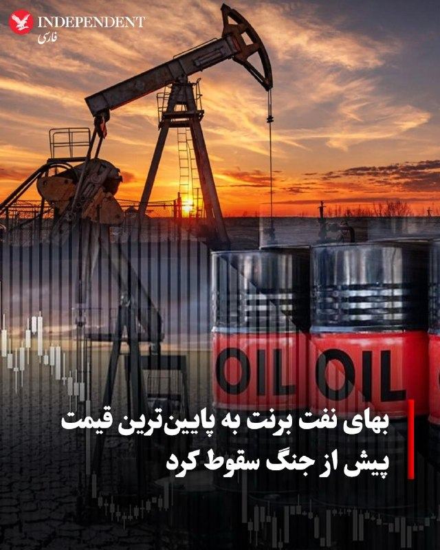

♦️نفت خام برنت روز پنج‌شنبه بیش از یک درصد کاهش یافت و به پایین‌تر از سطح پایانی خود در آستانه آغاز جنگ خاورمیانه رسید.
قرارداد نفت برنت برای تحویل ماه اوت به پایین‌ترین سطح ۷۲.۴۴ دلار در هر بشکه رسید؛ در حالی که قیمت پایانی آن در هشتم اسفندماه ۷۲.۴۸ دلار بود. پس از آغاز حملات آمریکا و اسرائیل بهانی نفت برنت در نخستین هفته‌ها تا ۱۱۹ دلار در هر بشکه افزایش یافت و بعدا در محدود نزدیک به ۱۰۰ دلار حدود ۹۰ دلار در نوسان بود. پس از اعلام یادداشت تفاهم بین تهران و آمریکا، روند کاهشی بهای نفت آغاز شد. دونالد ترامپ، رئیس‌جمهوری آمریکا پس از امضا یادداشت تفاهم در کاخ ورسای خطاب به حاضران گفت، «حالا سهام رشد می‌کند و قیمت نفت پایین می‌آید.»
‌🇸🇦 Indypersian

🤖 @VahidOOnLine

## VahidOOnLine — post 247232

  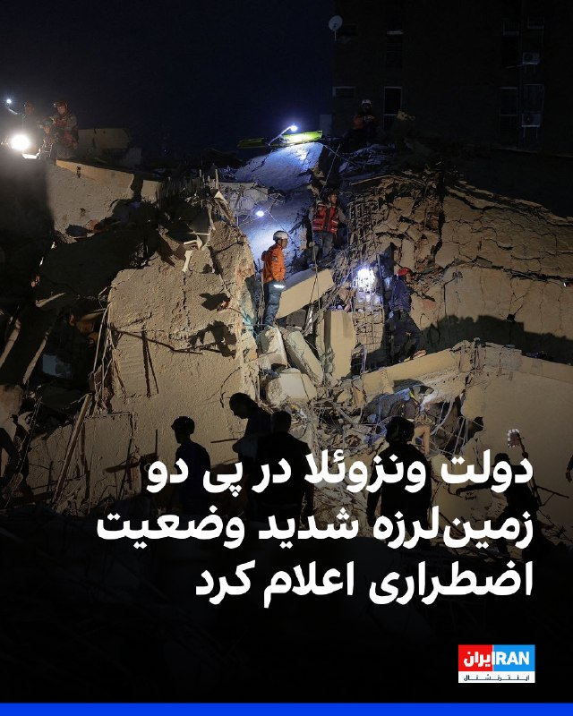

دلسی رودریگز، رییس‌جمهوری موقت ونزوئلا، روز چهارشنبه پس از وقوع دو زمین‌لرزه شدید پیاپی و نزدیک به ۲۰ پس‌لرزه که این کشور را لرزاند و باعث فروریختن ساختمان‌هایی در پایتخت، کاراکاس، و مناطق دیگر شد، وضعیت اضطراری اعلام کرد.
رودریگز که در تلویزیون دولتی در کنار برادرش، خورخه رودریگز، رییس مجلس ملی، و دیوسدادو کابیو، وزیر کشور، حضور یافته بود، مراتب همدردی خود را با خانواده‌های جان‌باختگان ابراز کرد، اما هیچ آماری از شمار کشته‌ها یا مجروحان ارائه نداد.
او همچنین گفت فرودگاه سیمون بولیوار در مایکتیا، در نزدیکی کاراکاس، به دلیل خسارت‌های واردشده تعطیل شده است.
در پی وقوع دو زمین‌لرزه شدید در کاراکاس، پایتخت ونزوئلا، شماری از ساختمان‌ها فرو ریختند و شماری از مردم زیر آوار گرفتار شدند. طبق برآورد سازمان زمین‌شناسی آمریکا شمار جان‌باختگان احتمالا بیش از ۱۰ هزار نفر خواهد بود. دولت ونزوئلا نیز وضعیت اضطراری اعلام کرد.
عصر چهارشنبه سوم تیر به وقت محلی در کاراکاس یک زمین‌لرزه به برگی ۷.۲ در حدود ۱۶۰ کیلومتری کاراکاس رخ داد و کمتر از یک دقیقه بعد، زلزله دیگری به بزرگی ۷.۵ همان منطقه را لرزاند.
‌🏁 🇬🇧 IranintlTV

🤖 @VahidOOnLine

## VahidOOnLine — post 247231

♦️خبرگزاری فرانسه بامداد پنجشنبه چهارم تیرماه گزارش داد دو زمین‌لرزه به بزرگی ۷.۲ و ۷.۵ صحنه‌های ویرانی گسترده‌ای در ونزوئلا بر جا گذاشت؛ به‌طوری که شماری از ساختمان‌ها در کاراکاس فروریخت، فرودگاه اصلی کشور تعطیل شد و دولت وضعیت اضطراری اعلام کرد.

دلسی رودریگز، رئیس‌جمهور موقت ونزوئلا، گفت پس از این دو زمین‌لرزه ۲۰ پس‌لرزه ثبت شده است. به گفته سازمان زمین‌شناسی آمریکا، زمین‌لرزه دوم تنها ۳۹ ثانیه پس از نخستین زمین‌لرزه رخ داد. مقام‌های ونزوئلا اعلام کردند هنوز آمار دقیقی از کشته‌شدگان در دست نیست، اما شماری زخمی شده‌اند و چندین ساختمان، از جمله یک برج ۲۲ طبقه در محله آلتامیرا در کاراکاس، به‌طور کامل فروریخته است.

به گزارش خبرگزاری فرانسه، مردم وحشت‌زده به خیابان‌ها گریختند و امدادگران در میان آوار به جست‌وجوی بازماندگان پرداختند. مقام‌ها همچنین برای جلوگیری از حوادث احتمالی، گاز برخی ساختمان‌های آسیب‌دیده را قطع و فرودگاه بین‌المللی مایکتیا را به دلیل خسارت شدید به زیرساخت‌های آن تعطیل کردند. ایالت‌های تروخیو، کارابوبو، میراندا و لا گوایرا بیشترین آسیب را دیده‌اند.

این زمین‌لرزه در بخش‌هایی از کلمبیا نیز احساس شد و مقام‌های این کشور اعلام کردند بیش از ۲۰۰ گزارش از احساس لرزش دریافت کرده‌اند. با این حال، سازمان مدیریت بحران کلمبیا و مرکز ملی هشدار سونامی آمریکا تاکید کردند این زمین‌لرزه‌ها خطر وقوع سونامی در پی ندارند. اندکی پس از این رویداد نیز زمین‌لرزه‌ای به بزرگی ۶.۹ شمال ژاپن را لرزاند، اما گزارشی از تلفات یا خسارت منتشر نشد.
‌🇸🇦 Indypersian

🤖 @VahidOOnLine

## VahidOOnLine — post 247230

  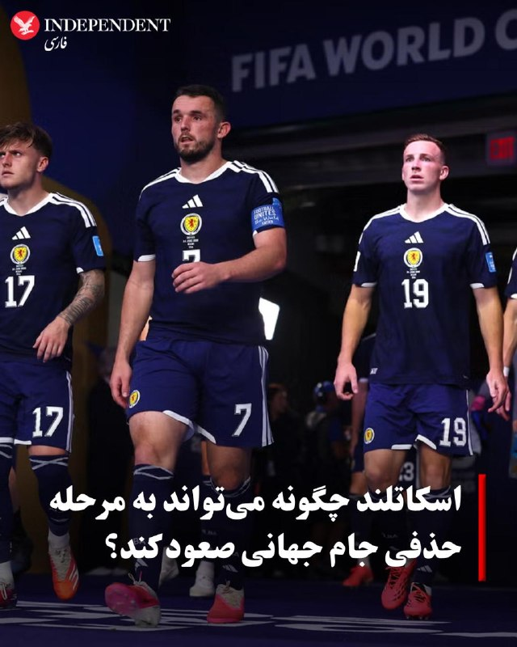

♦️
تیم ملی فوتبال اسکاتلند پس از شکست ۳ بر صفر برابر برزیل، مرحله گروهی جام جهانی ۲۰۲۶ را در جایگاه سوم گروه «سی» (C) به پایان رساند. با این حال، این تیم همچنان شانس صعود به مرحله حذفی را حفظ کرده است؛ اتفاقی که در صورت تحقق، نخستین صعود اسکاتلند به مرحله حذفی جام جهانی خواهد بود.

اسکاتلند برای صعود باید امیدوار باشد دست‌کم چهار تیم از میان تیم‌های سوم ۱۲ گروه، کمتر از سه امتیاز کسب کنند یا در صورت کسب سه امتیاز، تفاضل گلی بدتر از منفی ۳ این تیم داشته باشند. به همین دلیل، سرنوشت اسکاتلند اکنون به نتایج سایر مسابقات مرحله گروهی گره خورده و ممکن است تا پایان بازی‌های روز یکشنبه مشخص نشود.

در صورت صعود، اسکاتلند احتمالاً در مرحله یک‌شانزدهم نهایی به مصاف مکزیک خواهد رفت و در صورت پیروزی، ممکن است در مرحله یک‌هشتم نهایی با انگلیس روبه‌رو شود.
‌🇸🇦 Indypersian

🤖 @VahidOOnLine

## mwarmonitor — post 11477

  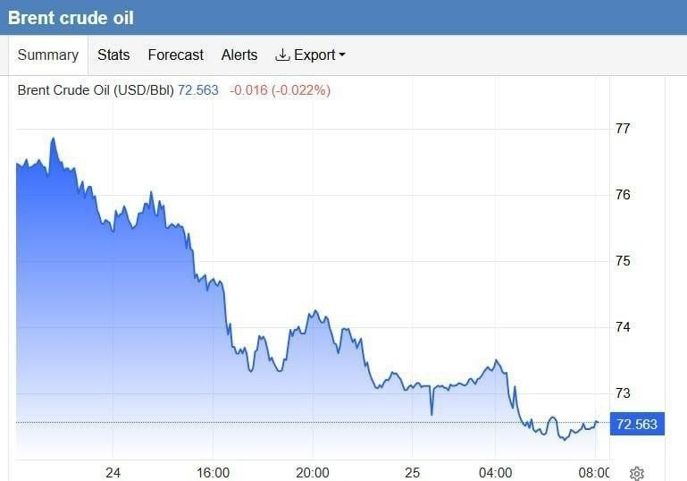

📉کاهش قیمت نفت برنت به مرز ۷۲ دلار

📊بر اساس آخرین داده‌ها قیمت نفت خام برنت با تجربه یک روند نزولی مداوم، به ۷۲.۵۶ دلار به ازای هر بشکه رسیده است. این کاهش که افت جزئی ۰.۰۲۲ درصدی را در معاملات اخیر نشان می‌دهد، حکایت از تداوم فشار فروش در بازارهای جهانی انرژی دارد.

@mwarmonitor

## mwarmonitor — post 11476

🔴 به گفته دلسی رودریگز ریس جمهور، طبق آخرین آمار زمین‌لرزه در ونزوئلا ۳۲ کشته و ۷۰۰ زخمی بر جای گذاشت؛ ده‌ها ساختمان فرو ریخت.

@mwarmonitor

## mwarmonitor — post 11475

🔴ایالات متحده عمیق‌ترین تسلیت‌های خود را به مردم ونزوئلا در پی زمین‌لرزه‌های ویرانگر ابراز می‌کند.

🔴دل‌های ما با همه کسانی است که عزیزان خود را از دست داده‌اند، با مجروحان، و با امدادگران شجاعی که پس از این فاجعه بی‌وقفه در حال تلاش هستند.

🔴آمریکا در این زمان دشوار در کنار مردم ونزوئلا ایستاده است و به دستور رئیس‌جمهور ترامپ، وزارت امور خارجه بلافاصله تیم‌های جست‌وجو و نجات، منابع پزشکی و کمک‌های بشردوستانه را به ونزوئلا اعزام می‌کند. «مارکو روبیو وزیر خارجه آمریکا»

@mwarmonitor

## mwarmonitor — post 11474

  <a href="telegram/content/mwarmonitor_11474_1782368272.mp4" target="_blank">🎬 Download video</a>

🔴 خسارات گسترده‌ای به ساختمان‌ها در سراسر پایتخت این کشور، کاراکاس، وارد شده است.

@mwarmonitor

## mwarmonitor — post 11473

  <a href="telegram/content/mwarmonitor_11473_1782368274.mp4" target="_blank">🎬 Download video</a>

🔴داخل فرودگاه بین‌المللی سیمون بولیوار در ونزوئلا در جریان یک زمین‌لرزه قدرتمند.

🟠به گفته سازمان زمین‌شناسی آمریکا (USGS)، نخستین زمین‌لرزه با بزرگی ۷٫۲ تنها ۳۹ ثانیه بعد با لرزه‌ای قوی‌تر به بزرگی ۷٫۵ دنبال شد. شاهدان همچنین از احساس لرزش‌ها در کلمبیای همسایه خبر داده‌اند.

🔴رئیس‌جمهور موقت ونزوئلا، وضعیت اضطراری اعلام کرده و یک ژنرال را برای نظارت بر پاسخ اضطراری منصوب کرده است.

@mwarmonitor

## mwarmonitor — post 11472

  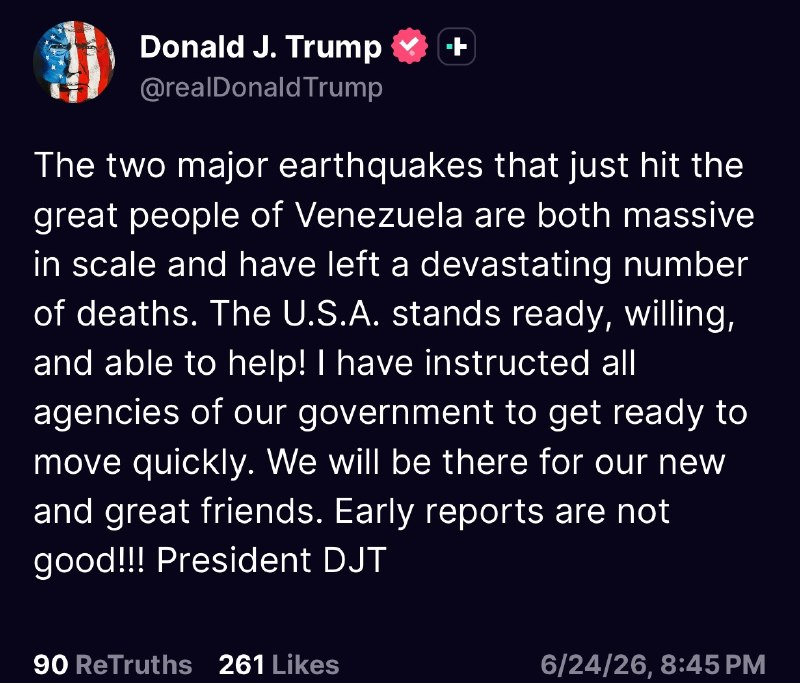

🔴دو زلزله بزرگی که همین حالا مردم بزرگ ونزوئلا را تحت تأثیر قرار داده، هر دو از نظر مقیاس عظیم هستند و شمار ویرانگری از تلفات جانی بر جای گذاشته‌اند. ایالات متحده آمریکا آماده، مایل و قادر به کمک است! من به تمام آژانس‌های دولتمان دستور داده‌ام تا برای اقدام سریع آماده شوند. ما در کنار دوستان جدید و بزرگ خود خواهیم بود. گزارش‌های اولیه خوب نیستند!!!

رئیس‌جمهور دونالد جی ترامپ

@mwarmonitor

## mwarmonitor — post 11471

  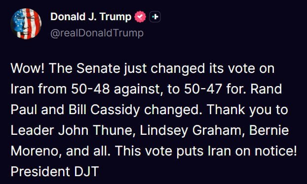

🔴واو! سنا همین الان رای خود را در قبال ایران از ۵۰-۴۸ مخالف، به ۵۰-۴۷ موافق تغییر داد. رند پال و بیل کسیدی [رای خود را] تغییر دادند. با تشکر از رهبر [اکثریت] جان ثون، لیندسی گراهام، برنی مورنو و همه. این رای به ایران هشدار می‌دهد!

رئیس‌جمهور دونالد جی ترامپ

@mwarmonitor

## FoxNewsTwitter — post 343400

  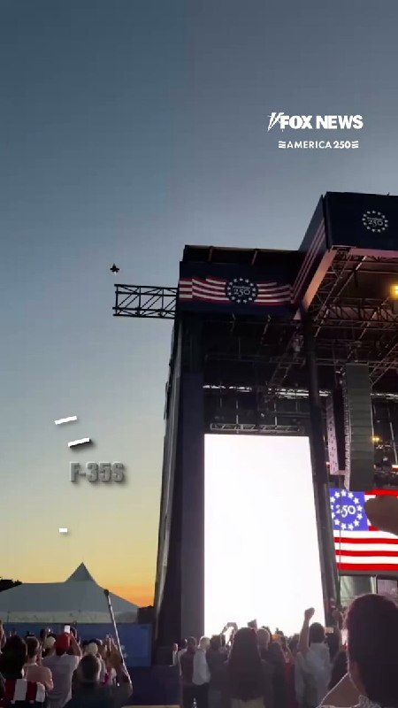

Fox News (Twitter/X)

🇺🇸 WATCH: The sound of freedom fills the skies as American airpower takes flight. The F-35s put precision, power, and patriotism on full display as Lee Greenwood introduces President Trump at the Freedom 250 kick-off event.

## FoxNewsTwitter — post 343396

Fox News (Twitter/X)

“Tonight, as we stand on the edge of our 250th year of independence, I am thrilled to declare that America is back.”

President Trump took the stage to kick off the Great American State Fair on the National Mall after a performance of “God Bless the U.S.A.” by Lee Greenwood.

In a wide-ranging speech, Trump celebrated the nation’s history, touted his administration’s accomplishments, and declared what he calls the beginning of a new “Golden Age of America” as the nation prepares to mark its 250th anniversary.

## FoxNewsTwitter — post 343395

Fox News (Twitter/X)

🇺🇸 WATCH: American airpower takes to the skies as F-35s fly over Freedom 250.

## FoxNewsTwitter — post 343394

  

Fox News (Twitter/X)

Secretary Duffy's advice to all Americans:

"Get married and have lots of kids!"

Duffy shared the wisdom, saying that this is the path to find purpose and fulfillment in life.

"The strength of our country is rooted in the strength of our families. So to celebrate America 250, we should celebrate our American family."

The father of 9 made the remarks during his speech at the Great American State Fair kickoff on the National Mall as the Freedom 250 celebration officially gets underway.

## pm_afshaa — post 94779

🔴ترامپ:ما دو جنگ جهانی را بردیم.

فاشیسم و کمونیسم را شکست دادیم — باید دوباره این کار را انجام دهیم

💧 Rainbet.com the #1 Non-KYC Crypto Casino & Sportsbook @rainbetcom

😁 @Pm_Afshaa

## VahidOnline — post 76660

  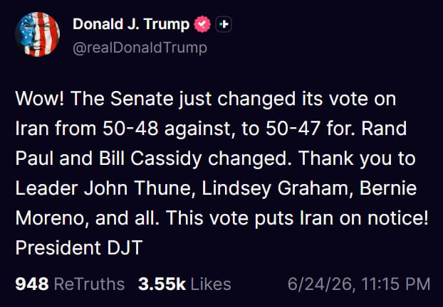

سنای آمریکا با آغاز بررسی «قطعنامه اختیارات جنگی ایران» مخالفت کرد.
ترامپ، پس از تغییر نتیجه رای‌گیری در سنای آمریکا درباره قطعنامه اختیارات جنگی ایران، از چند سناتور جمهوری‌خواه قدردانی کرد.

پست ترامپ، ترجمه ماشین:
وای! سنا همین حالا رأی خود درباره ایران را از ۵۰ به ۴۸ علیه، به ۵۰ به ۴۷ موافق تغییر داد. رند پال و بیل کسیدی تغییر موضع دادند.
از رهبر جان تون، لیندسی گراهام، برنی مورنو و همه تشکر می‌کنم.
این رأی به ایران هشدار می‌دهد!
رئیس‌جمهور DJT
realDonaldTrump

سنای آمریکا با ۵۰ رای مخالف، ۴۷ رای موافق و یک رای ممتنع، با آغاز بررسی «قطعنامه اختیارات جنگی ایران» مخالفت کرد. این قطعنامه از سوی تیم کین، سناتور دموکرات، ارائه شده بود.
با شکست این رای‌گیری رویه‌ای، بررسی «قطعنامه اختیارات جنگی ایران» عملا متوقف شد.
جمهوری‌خواهان و دونالد ترامپ استدلال کرده بودند تصویب این قطعنامه می‌تواند اهرم فشار آمریکا در مذاکرات جاری با جمهوری اسلامی را تضعیف کند.

رند پال، سناتور جمهوری‌خواه آمریکا، اعلام کرد در رای‌گیری درباره قطعنامه اختیارات جنگی مربوط به ایران، رای «ممتنع» خواهد داد.
او گفت به نظر می‌رسد درگیری‌ها پایان یافته و دونالد ترامپ از او خواسته است تاثیر این رای بر روند مذاکرات را در نظر بگیرد.
رند پال افزود: «رای ممتنع من راهی است برای اینکه به رییس‌جمهوری فضای بیشتر و اهرم قوی‌تری برای مذاکره به منظور دستیابی به صلحی پایدار بدهم.»
@VahidOOnLine

📡 @VahidOnline

## IranIntlTV — post 344252

  <a href="telegram/content/IranIntlTV_344252_1782368278.mp4" target="_blank">🎬 Download video</a>

سازمان زمین‌شناسی آمریکا اعلام کرد سوم تیر دو زمین‌لرزه پیاپی به بزرگی ۷.۲ و ۷.۵ در شمال و مرکز ونزوئلا رخ داد. این سازمان در برآورد اولیه، شمار کشته‌ها را بین ۱۰ هزار تا ۱۰۰ هزار نفر تخمین زده است

گزارش اردوان روزبه، خبرنگار ایران‌اینترنشنال
@iranintltv

## IranIntlTV — post 344251

  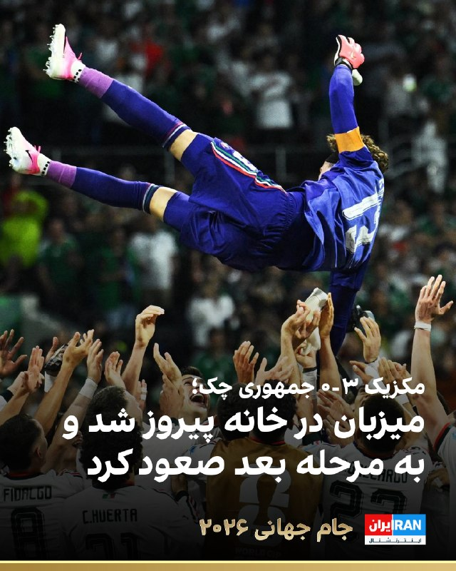

🔻تیم ملی مکزیک در آخرین بازی خود در مرحله مقدماتی جام جهانی ۲۰۲۶ تیم جمهوری چک را با سه گل شکست داد تا برای نخستین بار مرحله گروهی جام جهانی را با سه پیروزی در سه بازی به پایان برساند و به مرحله بعد صعود کند.

🔹تیم ملی جمهوری چک با این شکست، مرحله گروهی را با یک امتیاز در جایگاه چهارم گروه A به پایان رساند و از جام جهانی کنار رفت. آفریقای جنوبی، دیگر تیم گروه A، نیز با ۴ امتیاز در رتبه دوم ایستاد و همراه مکزیک راهی مرحله بعد شد. کره جنوبی هم با ۳ امتیاز در جایگاه سوم قرار گرفت و باید منتظر بماند تا مشخص شود در میان تیم‌های سوم سایر گروه‌ها، شانس صعود به مرحله بعد را خواهد داشت یا نه.

🔹هر سه گل مکزیک در نیمه دوم به ثمر رسید. جمهوری چک در نیمه نخست یک موقعیت جدی برای گلزنی داشت، اما شوت دنیس ویسینسکی با اختلافی اندک از کنار دروازه به بیرون رفت.

🔹مکزیک در آغاز نیمه دوم برای دقایقی زیر فشار جمهوری چک قرار گرفت، اما این فشار خطر جدی‌ای روی دروازه‌اش ایجاد نکرد. شاگردان خاویر آگیره سپس پیش از رسیدن بازی به دقیقه ۶۰، ظرف شش دقیقه دو بار دروازه حریف را باز کردند.

@iranintltvsport

## IranIntlTV — post 344250

  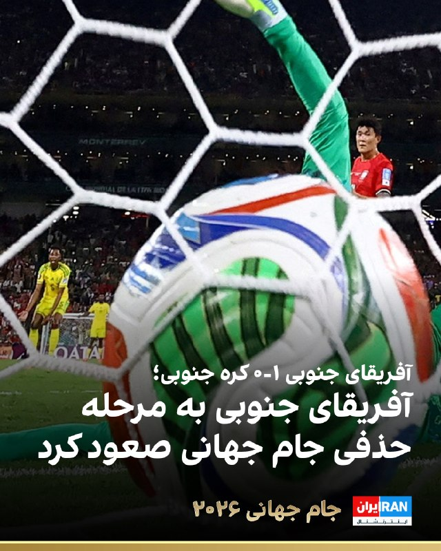

🔻تیم فوتبال آفریقای جنوبی چهارشنبه با پیروزی یک بر صفر برابر کره جنوبی، برای نخستین بار به مرحله حذفی جام جهانی صعود کرد. تاپلو ماسکو با گل خود در نیمه دوم این پیروزی را رقم زد. کره جنوبی نیز همچنان این شانس را دارد که به‌عنوان یکی از بهترین تیم‌های سوم گروه‌ها راهی مرحله بعد شود.

🔹ماسکو در دقیقه ۶۳ توپ را به گوشه پایین دروازه فرستاد تا آفریقای جنوبی با چهار امتیاز، پس از مکزیک، صدرنشین گروه A، در رده دوم قرار گیرد.

🔹آفریقای جنوبی در مرحله یک‌سی‌ودوم نهایی، ۲۸ ژوئن در لس‌آنجلس به مصاف کانادا، یکی از میزبانان مشترک جام جهانی، خواهد رفت. کره جنوبی که سون هیونگ مین، ستاره خود، را ابتدا روی نیمکت نشانده بود، با این شکست سه امتیازی باقی ماند.

🔹آفریقای جنوبی در سه حضور پیشین خود در جام جهانی در سال‌های ۱۹۹۸، ۲۰۰۲ و ۲۰۱۰ هرگز نتوانسته بود از مرحله گروهی صعود کند.

@iranintltvsport

## IranIntlTV — post 344249

  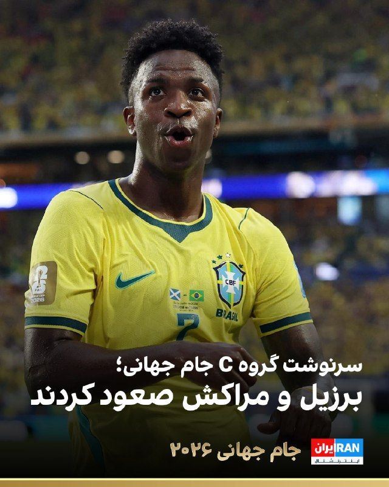

🔻تیم‌های ملی فوتبال برزیل و مراکش با پیروزی بر اسکاتلند و هائیتی در سومین دیدار خود در جام جهانی ۲۰۲۶، هر دو با ۷ امتیاز، به عنوان تیم‌های اول و دوم گروه C مسابقات، به مرحله حذفی صعود کردند. اسکاتلند هم با سه امتیاز در رده سوم و هائیتی بدون امتیاز در رده چهارم قرار گرفتند.

🔹در بازی برزیل و اسکاتلند، وینیسیوس جونیور با استفاده از یک پاس رو به عقب اشتباه از اسکات مک‌کنا، گل نخست برزیل را به ثمر رساند و سپس با یک ضربه سر، گل دوم خود را نیز وارد دروازه اسکاتلند کرد.

🔹ماتئوس کونیا نیز پس از حرکت زیبای برونو گیمارش، سومین گل برزیل را به ثمر رساند.

🔹در دیگر دیدار مراکش، قهرمان آفریقا در ابتدای مسابقه برابر هائیتی دو بار از حریف عقب افتاد، اما در پایان نیمه نخست بازی را به تساوی کشاند.

🔹در نیمه دوم نیز گل‌های بازیکنان تعویضی، سفیان رحیمی و گسیم یاسین، پیروزی را برای مراکش رقم زد.

🔹برزیل در مرحله یک‌سی‌ودوم نهایی به مصاف تیم دوم گروه F خواهد رفت که در حال حاضر ژاپن محتمل‌ترین گزینه برای این جایگاه است.

🔹مراکش نیز با صدرنشین گروه F، که فعلا هلند محتمل‌ترین گزینه آن محسوب می‌شود، روبه‌رو خواهد شد

@iranintltvsport

## IranIntlTV — post 344248

  <a href="telegram/content/IranIntlTV_344248_1782368281.mp4" target="_blank">🎬 Download video</a>

مسقط میزبان دور آینده مذاکرات درباره تنگه هرمز میان جمهوری اسلامی، عراق و کشورهای عضو شورای همکاری خلیج فارس خواهد بود. نخست‌وزیر قطر گفت دوحه با دریافت عوارض از کشتی‌های عبوری در این تنگه مخالف است

گزارش مریم رحمتی، خبرنگار ایران‌اینترنشنال
@iranintltv

## IranIntlTV — post 344247

  <a href="telegram/content/IranIntlTV_344247_1782368282.mp4" target="_blank">🎬 Download video</a>

رییس سازمان اطلاعات و امنیت استرالیا گفت دو فرد مرتبط با سپاه پاسداران، از جمله یک نیروی ارشد سپاه قدس، حملات به اماکن مرتبط با یهودیان در سیدنی و ملبورن را هدایت کرده‌اند

علیرضا محبی، خبرنگار ایران‌اینترنشنال گزارش می‌دهد
@iranintltv

## IranIntlTV — post 344246

  <a href="telegram/content/IranIntlTV_344246_1782368283.mp4" target="_blank">🎬 Download video</a>

دبیرکل ناتو از عملکرد کشورهای اروپایی در حمایت از عملیات آمریکا علیه جمهوری اسلامی دفاع کرد.

امیر حمیدی، متخصص امنیت ملی، به ایران‌اینترنشنال گفت اظهارات اخیر دبیرکل ناتو نشان می‌دهد اجماعی میان آمریکا و متحدان اروپایی‌اش درباره شیوه مواجهه با جمهوری اسلامی شکل گرفته است
@iranintltv

## IranIntlTV — post 344245

  <a href="telegram/content/IranIntlTV_344245_1782368285.mp4" target="_blank">🎬 Download video</a>

وانگ یی، وزیر خارجه چین، تفاهم‌نامه میان دولت دونالد ترامپ، رییس‌جمهوری آمریکا، و جمهوری اسلامی را در راستای منافع بلندمدت جمهوری اسلامی توصیف کرد و گفت پکن مایل است به پیشبرد مذاکرات کمک کند

گفت‌وگو با توماج طاهباز، خبرنگار ایران‌اینترنشنال
@iranintltv

## IranIntlTV — post 344244

چرا تفاهم تهران و واشینگتن پایان مبارزه مدنی مردم ایران نیست؟

نعیمه دوسندار- تفاهم جمهوری اسلامی و آمریکا حتی اگر به کاهش تنش نظامی، بازگشایی مسیرهای تجاری، فروش بیشتر نفت یا آزادسازی بخشی از دارایی‌های مسدودشده منجر شود، لزوما به معنای پایان بحران سیاسی در داخل ایران نیست.
تفاهم و مذاکره ممکن است به جمهوری اسلامی امکان تنفس اقتصادی بدهد، فشار فوری بازار را کاهش دهد و برای مدتی انتظارات عمومی را مدیریت کند، اما مساله اصلی مردم ایران فقط تحریم، قیمت دلار یا کمبود منابع ارزی نیست.
ریشه اعتراضات و مقاومت مدنی در ایران عمیق‌تر از رابطه تهران و واشینگتن است؛ در فروپاشی اعتماد عمومی، سرکوب سیاسی، تبعیض ساختاری، فساد نهادی، بحران نمایندگی و شکاف میان جامعه و حکومتی است که بخش بزرگی از شهروندان، آن را نماینده خود نمی‌دانند.
از این منظر، تفاهم خارجی بخشی از بحران دولت را تخفیف می‌دهد، اما بحران مشروعیت را حل نمی‌کند.

https://www.iranintl.com/202606246627

## IranIntlTV — post 344243

  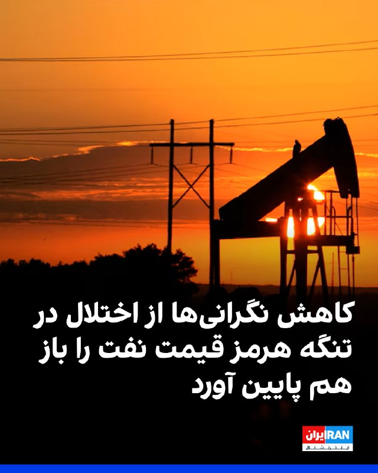

قیمت نفت روز پنجشنبه با خروج نفتکش‌های گرفتار از تنگه هرمز و کاهش نگرانی‌ها درباره عرضه، به افت خود ادامه داد. نفت برنت با ۰.۵ درصد کاهش به ۷۳ دلار و ۳۴ سنت در هر بشکه رسید و به سطح پیش از جنگ نزدیک‌تر شد.
نفت خام وست تگزاس اینترمدیت آمریکا نیز با ۰.۳۸ درصد کاهش به ۷۰ دلار و ۷ سنت در هر بشکه رسید.

https://iranintl.com/202606256353

## IranIntlTV — post 344242

  

دونالد ترامپ، رییس‌جمهوری آمریکا، در تروت سوشال و در واکنش به زمین‌لرزه‌های مرگبار ونزوئلا نوشت ایالات‌متحده آماده کمک به این کشور است و به همه نهادهای دولت دستور داده برای اقدام سریع آماده شوند.
ترامپ در تروت سوشال نوشت: «دو زمین‌لرزه بزرگ تلفات و خسارت‌های ویرانگری بر جا گذاشته است. آمریکا آماده، مایل و قادر به کمک است. ما در کنار دوستان جدید و بزرگ خود خواهیم بود. گزارش‌های اولیه امیدوارکننده نیستند.»

https://iranintl.com/202606252063

## IranIntlTV — post 344241

  <a href="telegram/content/IranIntlTV_344241_1782368287.mp4" target="_blank">🎬 Download video</a>

سرخط خبرهای پنج‌شنبه ۴ تیر
@iranintltv

## IranIntlTV — post 344240

  

مایک والتز، سفیر آمریکا در سازمان ملل، در گفت‌وگو با شبکه فاکس‌نیوز گفت تعلیق‌های اخیر تحریمها علیه جمهوری اسلامی «موقت» است و به معنای لغو این تحریم‌ها نیست.

او گفت: «همان‌طور که اسکات بسنت، وزیر خزانه‌داری هم تاکید کرده، این فقط یک مجوز موقت در حوزه تحریم‌هاست؛ تحریم‌ها برداشته نشده‌اند. این یک مجوز موقت است تا فعلا مذاکرات پیش برود.»

والتز افزود دونالد ترامپ بارها تاکید کرده است اگر جمهوری اسلامی «با حسن نیت مذاکره نکند» و از «اصرار بر دستیابی به سلاح هسته‌ای» دست نکشد، تحریم‌ها دوباره بازخواهند گشت و «همه گزینه‌ها نیز روی میز خواهد بود».
https://iranintl.com/202606243687

## IranIntlTV — post 344239

  

بنیاد دفاع از دموکراسی‌ها در نامه‌ای به ملانیا ترامپ، بانوی اول آمریکا، از او خواست همزمان با تمرکز دولت آمریکا بر مذاکرات هسته‌ای و سیاست انرژی، توجه بیشتری به نقض حقوق بشر در ایران، به‌ویژه علیه زنان، داشته باشد.
کلیفورد می، بنیان‌گذار بنیاد دفاع از دموکراسی‌ها، در این نامه نوشت: «انقلابیون اسلامی کنونی ایران از پیشینیان خود کمتر افراطی نیستند. آن‌ها نه به دنبال آغاز فصلی تازه هستند و نه قصد دارند به کشورشان کمک کنند.»
کلیفورد می در ادامه نوشت: «آن‌ها پیروان خمینی هستند؛ یعنی مشتاق‌اند برای برقراری دوباره برتری اسلام در گستره‌ای وسیع، هم بکشند و هم کشته شوند.» او از ملانیا ترامپ خواست نگاه واقع‌بینانه خود را با صدایی بلند به اطرافیانش منتقل کند.

https://iranintl.com/202606254320

## IranIntlTV — post 344238

  

سپیده قلیان، فعال مدنی، گفت زندانیان سیاسی در زندان سپیدار اهواز در شرایطی بسیار سخت نگهداری می‌شوند و از محدودیت شدید در دسترسی به امکانات اولیه رنج می‌برند.
قلیان گفت: «زندانیان سیاسی را به بدترین شکل ممکن از سایر زندانیان جدا کرده‌اند؛ در محلی بدون نور طبیعی، بدون آب آشامیدنی کافی و بدون دسترسی شبانه‌روزی به سرویس بهداشتی و حمام نگهداری می‌شوند. حتی همین محرومیت از امکانات اولیه را به بخشی از شکنجه تبدیل کرده‌اند.»

https://iranintl.com/202606257733

## IranIntlTV — post 344237

  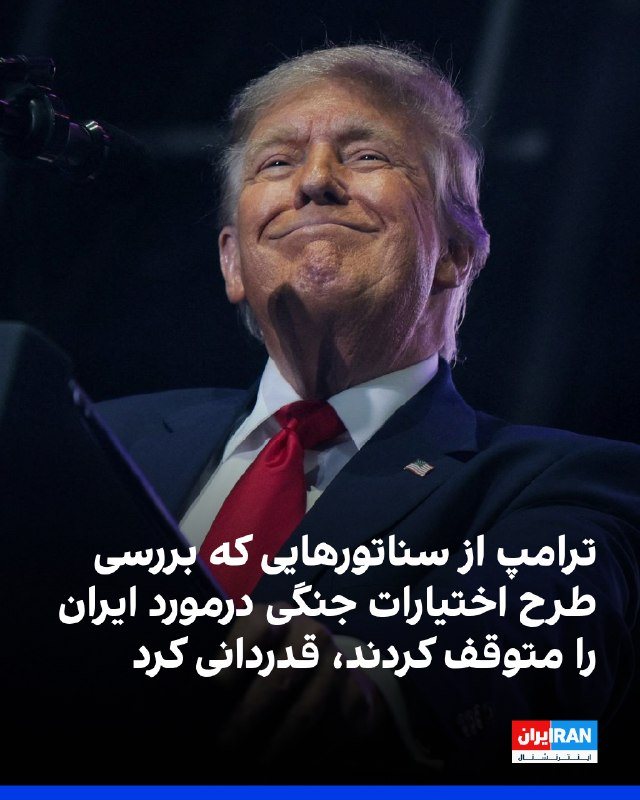

دونالد ترامپ، رییس‌جمهوری آمریکا، پس از تغییر نتیجه رای‌گیری در سنای آمریکا درباره قطعنامه اختیارات جنگی ایران، از چند سناتور جمهوری‌خواه قدردانی کرد و گفت تغییر رای رند پال و بیل کسیدی نتیجه را به سود پیشبرد این موضوع تغییر داد.
ترامپ در تروث سوشال نوشت: «شگفت‌انگیز! سنا رای خود درباره ایران را از ۵۰ در برابر ۴۸ مخالف، به ۵۰ در برابر ۴۷ موافق تغییر داد. رند پال و بیل کسیدی رای خود را تغییر دادند. از جان تون، لیندزی گراهام، برنی مورنو و همه سپاسگزارم. این رای به ایران هشدار می‌دهد.»

https://iranintl.com/202606255705

## IranIntlTV — post 344236

  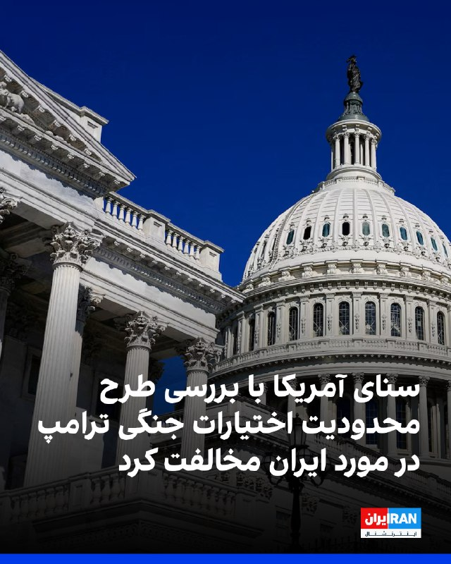

سنای آمریکا با ۵۰ رای مخالف، ۴۷ رای موافق و یک رای ممتنع، با آغاز بررسی «قطعنامه اختیارات جنگی ایران» مخالفت کرد. این قطعنامه از سوی تیم کین، سناتور دموکرات، ارائه شده بود.
با شکست این رای‌گیری رویه‌ای، بررسی «قطعنامه اختیارات جنگی ایران» عملا متوقف شد. جمهوری‌خواهان و دونالد ترامپ استدلال کرده بودند تصویب این قطعنامه می‌تواند اهرم فشار آمریکا در مذاکرات جاری با جمهوری اسلامی را تضعیف کند.
رند پال، سناتور جمهوری‌خواه آمریکا، اعلام کرد در رای‌گیری درباره قطعنامه اختیارات جنگی مربوط به ایران، رای «ممتنع» خواهد داد. او گفت به نظر می‌رسد درگیری‌ها پایان یافته و دونالد ترامپ از او خواسته است تاثیر این رای بر روند مذاکرات را در نظر بگیرد.
رند پال افزود: «رای ممتنع من راهی است برای اینکه به رییس‌جمهوری فضای بیشتر و اهرم قوی‌تری برای مذاکره به منظور دستیابی به صلحی پایدار بدهم.»

https://iranintl.com/202606250330

## IranIntlTV — post 344235

  

دلسی رودریگز، رییس‌جمهوری موقت ونزوئلا، روز چهارشنبه پس از وقوع دو زمین‌لرزه شدید پیاپی و نزدیک به ۲۰ پس‌لرزه که این کشور را لرزاند و باعث فروریختن ساختمان‌هایی در پایتخت، کاراکاس، و مناطق دیگر شد، وضعیت اضطراری اعلام کرد.
رودریگز که در تلویزیون دولتی در کنار برادرش، خورخه رودریگز، رییس مجلس ملی، و دیوسدادو کابیو، وزیر کشور، حضور یافته بود، مراتب همدردی خود را با خانواده‌های جان‌باختگان ابراز کرد، اما هیچ آماری از شمار کشته‌ها یا مجروحان ارائه نداد.
او همچنین گفت فرودگاه سیمون بولیوار در مایکتیا، در نزدیکی کاراکاس، به دلیل خسارت‌های واردشده تعطیل شده است.
در پی وقوع دو زمین‌لرزه شدید در کاراکاس، پایتخت ونزوئلا، شماری از ساختمان‌ها فرو ریختند و شماری از مردم زیر آوار گرفتار شدند. طبق برآورد سازمان زمین‌شناسی آمریکا شمار جان‌باختگان احتمالا بیش از ۱۰ هزار نفر خواهد بود. دولت ونزوئلا نیز وضعیت اضطراری اعلام کرد.
عصر چهارشنبه سوم تیر به وقت محلی در کاراکاس یک زمین‌لرزه به برگی ۷.۲ در حدود ۱۶۰ کیلومتری کاراکاس رخ داد و کمتر از یک دقیقه بعد، زلزله دیگری به بزرگی ۷.۵ همان منطقه را لرزاند.
https://iranintl.com/20260

## Shin_Persian — post 7195

  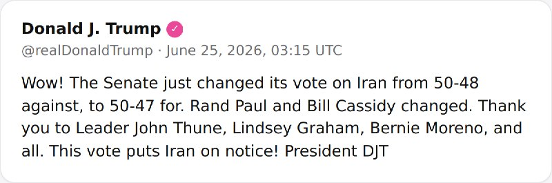

Shin ✓ @hey_itsmyturn
Thu, 25 Jun 2026 03:15:19 UTC

POTUS:
"Wow! The Senate just changed its vote on Iran from 50-48 against, to 50-47 for. Rand Paul and Bill Cassidy changed. Thank you to Leader John Thune, Lindsey Graham, Bernie Moreno, and all. This vote puts Iran on notice! President DJT"

ترجمه خودکار فارسی

رئیس‌جمهور ایالات متحده (POTUS):
«واو! سنا همین الان رای خود در مورد ایران را از ۵۰-۴۸ مخالف، به ۵۰-۴۷ موافق تغییر داد. رند پال و بیل کسیدی رای خود را تغییر دادند. با تشکر از رهبر اکثریت جان تون، لیندسی گراهام، برنی مورنو و همگی. این رای هشداری جدی به ایران است! رئیس‌جمهور دی‌جی‌تی (DJT)»

𝕏 · @shin_persian

## FarsiVOA — post 221808

  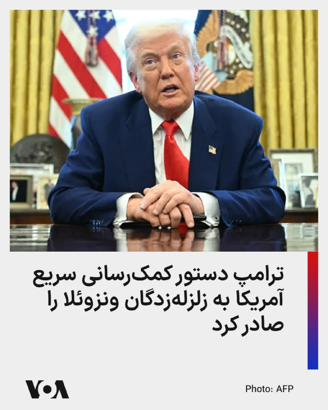

دونالد ترامپ، رئیس‌جمهوری آمریکا، در تروث‌سوشال اعلام کرد دو زمین‌لرزه‌ای که روز چهارشنبه ونزوئلا را لرزاندند «تعداد ویرانگری از تلفات» بر جای گذاشته‌اند.

پرزیدنت ترامپ نوشت: «ایالات متحده آماده است، مایل است و توانایی کمک دارد! به همهٔ نهادهای دولت خود دستور داده‌ام برای حرکت سریع آماده شوند. ما در کنار دوستان جدید و بزرگ خود خواهیم بود. گزارش‌های اولیه خوب نیست.»

دیلسی رودریگز، رئیس‌جمهوری موقت ونزوئلا، اعلام کرد دو زمین‌لرزهٔ قدرتمند روز چهارشنبه ونزوئلا را لرزاندند و دست‌کم ۳۲ نفر را کشتند و ۷۰۰ نفر دیگر را زخمی کردند و موجب شدند ساختمان‌ها در داخل و اطراف کاراکاس، پایتخت کشور، فروریختند.

به گفتهٔ سازمان زمین‌شناسی ایالات متحده، یک زمین‌لرزه با بزرگی ۷.۲ حدود ۱۶۰ کیلومتری غرب کاراکاس رخ داد و کمتر از یک دقیقه بعد، زمین‌لرزه‌ای با بزرگی ۷.۵ به وقوع پیوست.
@FarsiVOA

## FarsiVOA — post 221807

  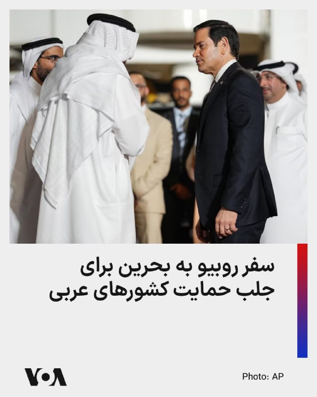

وزیر خارجه آمریکا، روز پنج‌شنبه در آخرین مرحله از سفر سه روزه خود به خاورمیانه با مقام‌های بحرین دیدار می‌کند.

او در بحرین همچنین با اعضای شورای همکاری خلیج فارس، شامل عربستان سعودی، قطر، عمان، امارات، کویت و بحرین دیدار خواهد کرد.

خبرگزاری رویترز می‌گوید هدف سفر مارکو روبیو جلب حمایت متحدان عرب خلیج فارس از توافق اولیه دولت ترامپ با جمهوری اسلامی است؛ توافقی که با تردید و نگرانی این کشورها روبه‌رو شده است.

روبیو تصریح کرده که مأموریت حساسی را بر عهده دارد، زیرا رهبران عرب خلیج فارس نگران‌اند که امتیازدهی بیش از حد به تهران موجب تقویت جمهوری اسلامی و تغییر موازنه امنیتی منطقه و جریان‌ نفت شود.

روبیو پیشتر در سفر به کویت تصریح کرده بود «ما هیچ اقدامی انجام نخواهیم داد که امنیت متحدان دیرینه‌مان در منطقه را تضعیف کند».
@FarsiVOA

## FarsiVOA — post 221806

  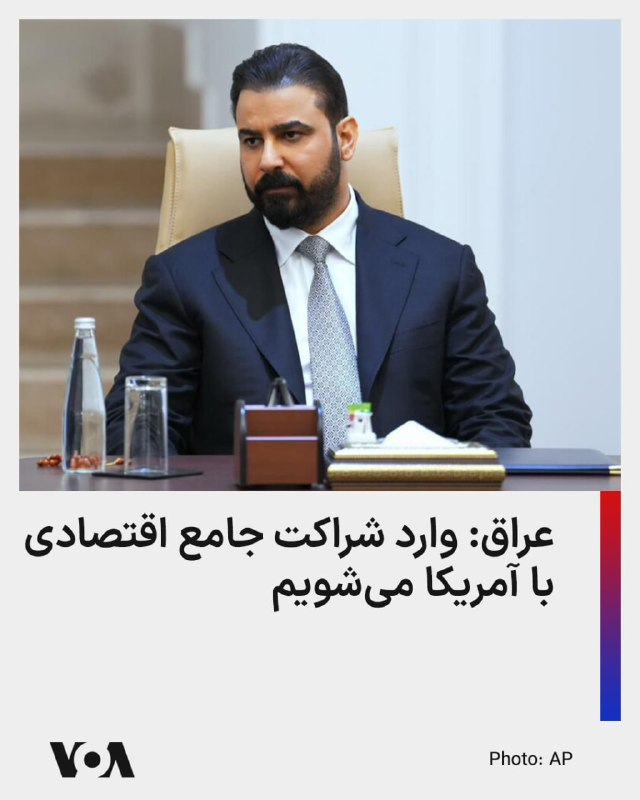

نخست‌وزیر عراق می‌گوید با نزدیک شدن به پایان مأموریت ائتلاف بین‌المللی به رهبری آمریکا علیه داعش، روابط کشورش با ایالات متحده از یک رابطه نظامی به «شراکت جامع اقتصادی» تغییر خواهد کرد.

علی الزیدی همچنین با اشاره به لزوم تحویل تسلیحات شبه‌نظامیان تا ابتدای پاییز به ارتش عراق گفت پس از خروج کامل نیروهای آمریکایی، دیگر هیچ توجیه یا نیازی برای وجود هیچ‌گونه (نیروهای) «مقاومت» در عراق نخواهد بود.

علی الزیدی همچنین با درخواست ورود سرمایه‌های آمریکایی به عراق تصریح کرد روزانه ۵۰۰ هزار بشکه نفت این کشور برای پر کردن ذخایر استراتژیک نفت آمریکا اختصاص می‌یابد.

او همچنین تهدید کرد در صورتی که اوپک کماکان مقابل برنامه‌های افزایش تولید نفت عراق مانع‌تراشی کند، این کشور عضویتش در اوپک را تعلیق خواهد کرد. اخیراً امارات نیز از اوپک خارج شد تا بدون محدودیت نفت تولید کند.
@FarsiVOA

## FarsiVOA — post 221805

🔺ترامپ با اشاره به رد شدن طرح محدودیت اختیارات جنگی در سنا: «این رأی به ایران هشدار می‌دهد»

▪️دونالد ترامپ، رئیس‌جمهوری آمریکا، پس از رد شدن طرح محدودیت اختیارات جنگی در سنا، در تروث‌سوشال تصریح کرد که «این رأی، ایران را رسماً در حالت گوش‌به‌زنگ و هشدار قرار می‌دهد!»

▪️پرزیدنت ترامپ نوشت: «سنا همین الان رأی خود درباره ایران را از ۵۰ در برابر ۴۸ مخالف، به ۵۰ در برابر ۴۷ موافق تغییر داد. رند پال و بیل کسیدی رأی خود را تغییر دادند. از رهبر جان تون، لیندسی گراهام، برنی مورنو و همه تشکر می‌کنم.»

▪️جمهوری‌خواهان سنا که پیشتر از سوی رئیس‌جمهور آمریکا به دلیل مخالفت با جنگ علیه جمهوری اسلامی مورد انتقاد قرار گرفتد، شامگاه چهارشنبه رأی‌گیری دیگری برگزار کردند و یک قطعنامه اختیارات جنگی را رد کردند.

⬇️ بیشتر بخوانید:
https://ir.voanews.com/a/trump-reaction-to-new-senate-vote-on-war/8164684.html

## FarsiVOA — post 221804

  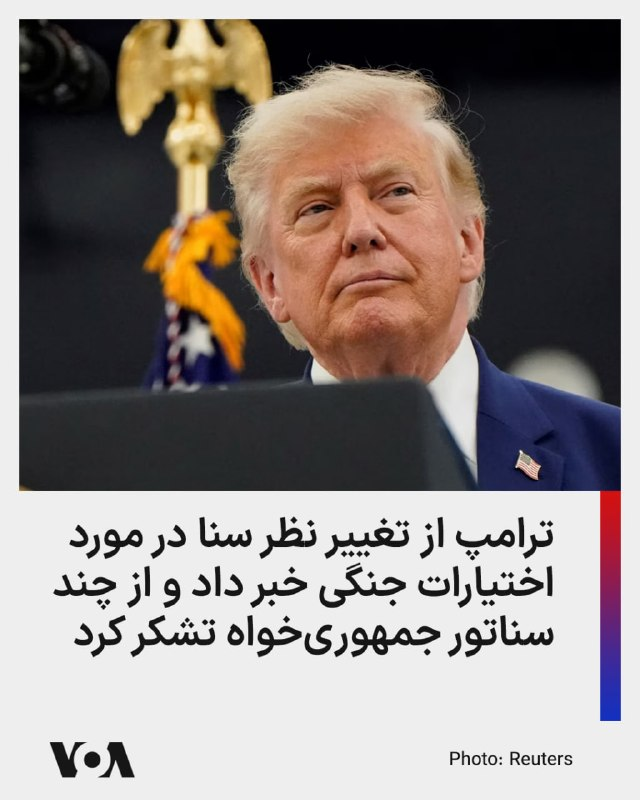

دونالد ترامپ، رئیس‌جمهور آمریکا، در پستی در شبکه اجتماعی تروت‌سوشال، از تغییر نظر سنا در مورد لایحه اختیارات جنگی رئیس‌جمهوری خبر داد و از چند سناتور جمهوری‌خواه تشکر کرد.

آقای ترامپ نوشت: «مجلس سنا همین حالا رأی خود در قبال ایران را از ۵۰ به ۴۸ "علیه من"، به ۵۰ به ۴۷ "به نفع من" تغییر داد.»

او از تغییر نظر دو سناتور جمهوری‌خواه، رند پاول و بیل کسیدی، در مورد این لایحه خبر داد و از حامیانش در سنا از جمله جان تون رهبر کنونی اکثریت سنا، لیندسی گراهام، و برنی مورنو تشکر کرد.

آقای ترامپ تصریح کرد «این رأی، ایران را رسماً در حالت گوش‌به‌زنگ و اخطار قرار می‌دهد!»
@FarsiVOA

## FarsiVOA — post 221803

  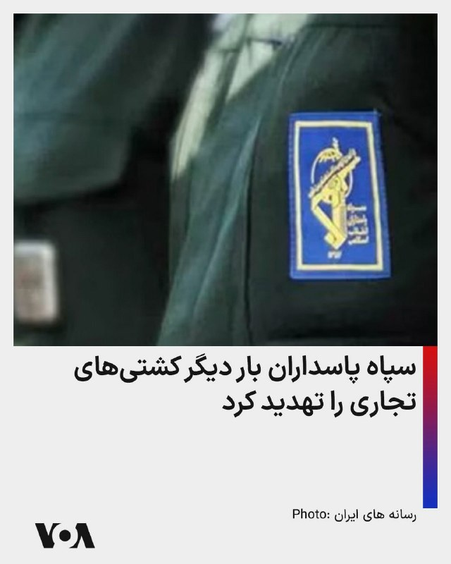

⚡️سپاه پاسداران بامداد پنج‌شنبه به وقت ایران بار دیگر کشتی‌های تجاری را تهدید کرد که « تنها مسیر مجاز» برای عبور از تنگه هرمز «همان مسیر های اعلام شده از طرف جمهوری اسلامی» است.
سپاه پاسداران در بیانیه‌ای به کشتی‌های تجاری هشدار داد که «تردد شناورها در خارج از این مسیرها بسیار خطرناک و ممنوع بوده» است.
جمهوری اسلامی در جریان عملیات نظامی آمریکا و اسرائيل علیه آن، به کشتی‌های تجاری کشورهای دیگر در تنگه هرمز حمله کرد و می‌گوید قصد گرفتن هزینه از کشتی‌‌های عبوری را دارد. دونالد ترامپ، رئیس‌جمهوری آمریکا، روز چهارشنبه بار دیگر مخالفت خود را با چنین اقدامی اعلام کرد.
@FarsiVOA

## DW_Farsi — post 126430

  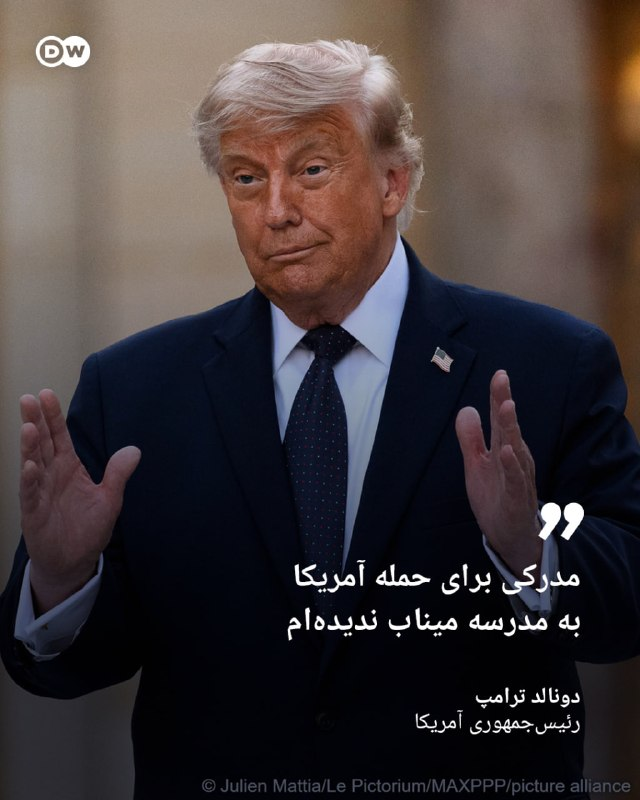

🔶 ترامپ: مدرکی برای حمله آمریکا به مدرسه میناب ندیده‌ام

دونالد ترامپ، رئیس‌جمهوری آمریکا، روز چهارشنبه ۳ تیر (۲۴ ژوئن) در کاخ سفید به خبرنگاران گفت که تاکنون هیچ مدرکی مشاهده نکرده است که نشان دهد حمله به مدرسه‌ای در میناب با موشک آمریکا انجام شده است.

ترامپ با اشاره به شرایط روز نخست جنگ اظهار داشت که در آن زمان از جهات مختلف موشک شلیک می‌شد و به همین دلیل، مشخص کردن عامل این حمله کار آسانی نیست.

رئیس جمهور آمریکا همچنین عنوان کرد که برخی مدعی شده‌اند این موشک آمریکایی بوده، اما به گفته او، تاکنون هیچ سندی که این ادعا را تائید کند، ارائه نشده است.

ترامپ در ادامه احتمال داد که با توجه به شرایط میدان نبرد، شاید هرگز به‌طور قطعی مشخص نشود این حمله توسط کدام طرف انجام شده است.

@dw_farsi

## Persian_Trend_Official — post 17969

  <a href="telegram/content/Persian_Trend_Official_17969_1782368294.mp4" target="_blank">🎬 Download video</a>

صبحتون بخیر 🌄
F-22 Raptor

📌 @persian_trend_official
پرشین ترند | متفاوت‌ترین کانال نظامی

## RadioFarda — post 158731

  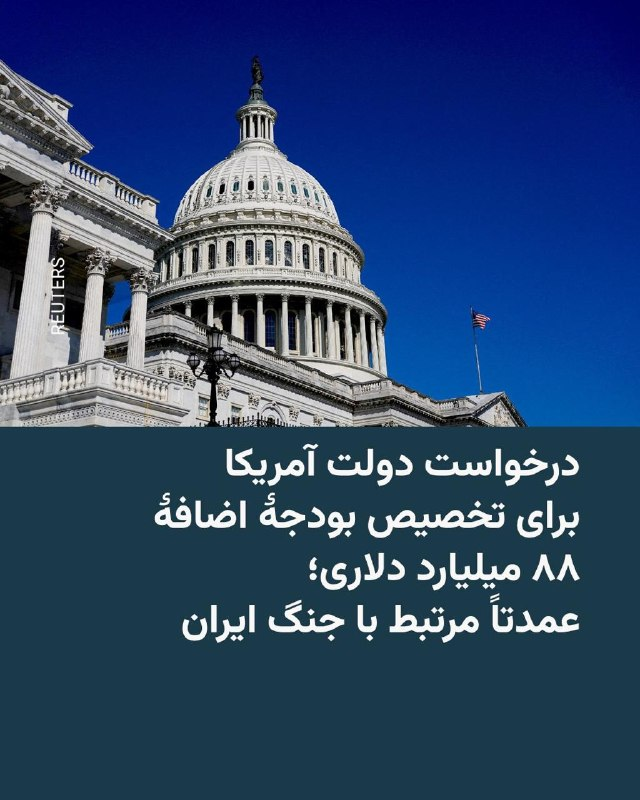

🔸دولت آمریکا از کنگره خواست نزدیک به ۸۸ میلیارد دلار دیگر بودجه در اختیارش بگذارد. بر اساس آنچه که در سایت کاخ سفید درج شده، بخش عمدۀ این مبلغ برای «نیازهای ضروری» مرتبط با جنگ ایران و همینطور مقابله با شیوع ابولا در آفریقا درخواست شده است.

🔸بیش از ۶۷ میلیارد دلار از اضافه‌بودجۀ درخواستی برای ارتش است. ۲۱ میلیارد آن برای پنتاگون درخواست شده تا وزارت دفاع ایالات متحده برای جایگزینی مهمات مصرف شده، تقویت صنایع نظامی و کمک به قابلیت‌های حساس به‌کار بگیرد.

@RadioFarda

## RadioFarda — post 158730

وقوع دو زمین‌لرزۀ قدرتمند در ونزوئلا؛ مقامات از احتمال تلفات سنگین خبر می‌دهند

🔸وقوع دو زمین‌لرزۀ قدرتمند و پیاپی در غرب کاراکاس پایتخت ونزوئلا ویرانی زیادی به‌جا گذاشت و کارشناسان و مقامات از احتمال تلفات بسیار سنگین خبر می‌دهند.

🔸عصر چهارشنبه سوم‌ تیرماه به وقت محلی، ابتدا زمین‌لرزه‌ای به بزرگی ۷.۲ در مقیاس امواج درونی زمین، منطقه‌ای در فاصلۀ ۱۶۰ کیلومتری غرب کاراکاس را لرزاند.

🔸تنها ۳۹ ثانیۀ بعد، زمین‌لرزه‌ای بزرگ‌تر رخ داد که سازمان مطالعات زمین‌شناسی ایالات متحده، بزرگی آن‌ را ۷.۵ اعلام کرد.

🔸دلسی رودریگز رهبر انتقالی ونزوئلا هم در این کشور «وضعیت اضطراری» اعلام کرد و از تعطیلی فرودگاه به‌دلیل «آسیب گسترده و زیرساختی» خبر داد. او همچنین شمار اولیه کشته‌ها را دست‌کم ۳۲ نفر و شمار مجروحان را بیش از ۷۰۰ نفر اعلام کرد.

🔸رودریگز حادثه رخ‌داده را «یک فاجعه واقعی» نامید و گفت آمار اولیه شامل تلفات ایالت لا گوایرا، در نزدیکی کاراکاس و محل فرودگاه شهر، نمی‌شود؛ منطقه‌ای که بیشترین آسیب را دیده است.

🔸سازمان مطالعات زمین‌شناسی ایالات متحده (یو‌اِس‌جی‌اِس) با اعلام محتمل‌ بودن «تلفات بالا و خرابی‌های وسیع و گسترده»، تخمین زده که آمار تلفات به احتمال زیاد بین ۱۰ هزار تا یکصد هزار تن خواهد بود.

🔸 گزارش کامل را در وب‌سایت رادیوفردا بخوانید.

@RadioFarda

## RadioFarda — post 158729

🔸رئیس‌جمهور ایالات متحده در کاخ سفید میزبان مارک روته دبیر کل پیمان آتلانتیک شمالی، ناتو است. 🔸دونالد ترامپ در این دیدار، گله و نارضایتی خود از برخی اعضای ناتو به‌دلیل همراهی نکردن با واشینگتن در جنگ ایران را تکرار و یادآوری کرد. @RadioFarda

## RadioFarda — post 158728

  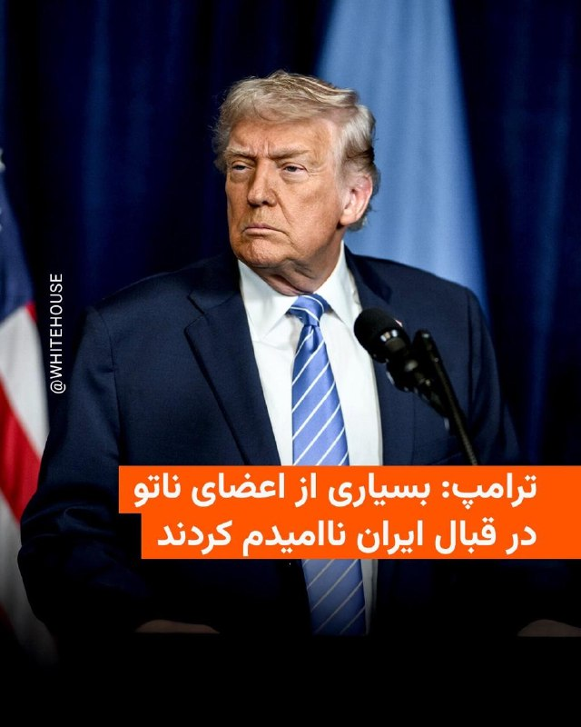

🔸رئیس‌جمهور ایالات متحده در کاخ سفید میزبان مارک روته دبیر کل پیمان آتلانتیک شمالی، ناتو است.

🔸دونالد ترامپ در این دیدار، گله و نارضایتی خود از برخی اعضای ناتو به‌دلیل همراهی نکردن با واشینگتن در جنگ ایران را تکرار و یادآوری کرد.

@RadioFarda

## RadioFarda — post 158727

  <a href="https://t.me/radiofarda/158727" target="_blank">📎 Download file</a>

📻بشنوید: سرخط خبرها با رادیوفردا، چهارم تیر‌ماه ۱۴۰۵

@RadioFarda

## BBCPersian — post 284983

⚡️اولین آمار رسمی اعلام شده از قربانیان زلزله ونزوئلا: ۳۲ کشته و حدود ۷۰۰ مجروح

در پی وقوع دو زمین لرزه قدرتمند در ونزوئلا، مقامات این کشور در آمار اولیه از ۳۲ کشته و حدود ۷۰۰ مجروح خبر دادند. زلزله اول به بزرگی ۷/۲ و دومین زلزله به بزرگی ۷/۵ بود و خسارات فراونی برجای گذاشته است.
اولین زلزله حدود ساعت ۶ عصر به وقت کاراکاس روی داد. تصاویر مخابره شده حکایت از خسارات فراوان به ساختمان‌هاست.

در همین حال، جرمی لوین، معاون وزیر خارجه آمریکا در امور کمک‌های خارجی، اعلام کرد که ایالات متحده تیم‌های جست‌وجو و نجات، تجهیزات پزشکی و کمک‌های بشردوستانه را به ونزوئلا اعزام خواهد کرد.

او گفت وزارت خارجه آمریکا یک تیم ویژه امدادرسانی در بحران را فعال کرده که در حال همکاری با شرکای خود در دولت موقت ونزوئلا است.

در همین حال، چندین کشور آمریکای لاتین نیز آمادگی خود را برای کمک به ونزوئلا اعلام کرده‌اند.

https://bbc.in/4oKUJMV
@BBCPersian

## BBCPersian — post 284973

🖊بخش عربی بی‌بی‌سی

در روز ۲۳ ماه مه، نام علی ذوادی، دیپلمات قطری، در فهرستی از رهبران و مقام‌های ارشد دیده می‌شد که دونالد ترامپ، رئیس‌جمهور آمریکا، در پیامی در شبکه تروث سوشال گفته بود با آن‌ها درباره «جمهوری اسلامی ایران و مسائل مربوط به [دستیابی به] تفاهم‌نامه صلح» گفت‌وگوی «بسیار خوبی» داشته است. آقای ترامپ نوشته بود: «تا حد زیادی توافق حاصل شده و تنها نهایی شدن متن میان ایران و دیگر کشورهای ذی‌ربط باقی مانده است.»
چند روز پس از اعلام امضای تفاهم‌نامه میان تهران و واشنگتن، رسانه‌های غربی به نقش مهم میانجی‌گری قطر در دستیابی به توافقی برای پایان دادن به جنگ اشاره کردند؛ توافقی که پس از بن‌بست در گفت‌وگوهایی که پاکستان میزبان آن بود، به دست آمد. در این میان، توجه ویژه‌ای به این دیپلمات قطری معطوف شد.

درباره علی ذوادی که از او به عنوان «میانجی مرموز قطری» یاد می‌شود و ترجیح می‌دهد دور از انظار فعالیت کند، چه می‌دانیم؟

مطلب کامل🔽
https://bbc.in/4baxqX0
📷Getty/ Reuters/ Anadolu via Getty/ The White House/ AFP via Getty
@BBCPersian

## BBCPersian — post 284972

🔻دو زمین لرزه قدرتمند که اولی به بزرگی ۷/۱ و دومی ۷/۵ بزرگی داشت ونزوئلا را لرزانده و خسارات فراونی برجای گذاشته است. زلزله اول حدود ساعت ۶ عصر به وقت کاراکاس روی داد که اوج ترافیک و شلوغی پایتخت این کشور است. تصاویر مخابره شده حکایت از خسارات فراوان به…

## BBCPersian — post 284971

  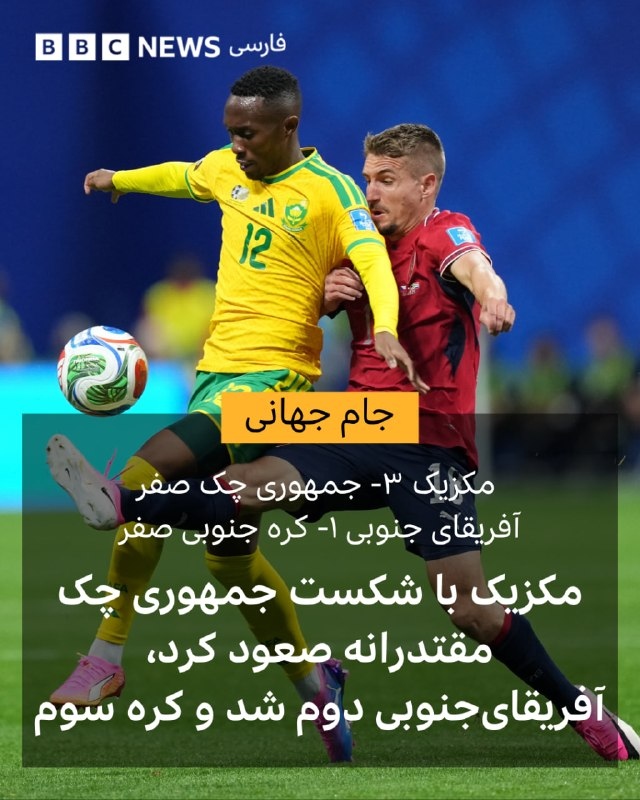

🔸مرحله آخر مسابقات گروه آ میان مکزیک و جمهوری چک به طور همزمان با بازی کره جنوبی و آفریقای جنوبی برگزار شد و طی آن مکزیک با شکست جمهوری چک ( سه بر صفر) توانست با حداکثر امتیاز - یعنی سه برد و ۹ امتیاز - از گروه خود صعود کند. آفریقای جنوبی هم با شکست یک بر صفر کره جنوبی، به عنوان تیم دوم صعود کرد.

مکزیک که یکی از سه میزبان جام جهانی است علاوه بر کسب ۹ امتیاز از سه برد در مرحله گروهی، با ۶ گل زده و بدون گل خورده راهی مرحله حذفی شد که می‌تواند نشان از آمادگی و قدرت این تیم برابر حریفان خود داشته باشد.

چک با این شکست یک امتیازی باقی ماند و قعرنشین گروه آ ماند و حذف شد.

در دیگر دیدار این گروه کره جنوبی و آفریقای جنوبی در رقابتی سخت برای صعود مقابل هم قرار گرفتند.

کره جنوبی برای صعود تنها به یک امتیاز در این بازی نیاز داشت اما آفریقای جنوبی باید هر سه امتیاز را می‌گرفت تا به عنوان تیم دوم صعود کند.

آفریقای جنوبی با گلی که در نیمه دوم زد و توانست تا پایان بازی از آن محافظت کند، با ۴ امتیاز در گروه آ دوم شد.

کره‌جنوبی هم با ۳ امتیاز همچنان به صعود به عنوان یکی تیم‌های سوم برتر امید دارد.

📷Getty
@BBCPersian

## BBCPersian — post 284970

  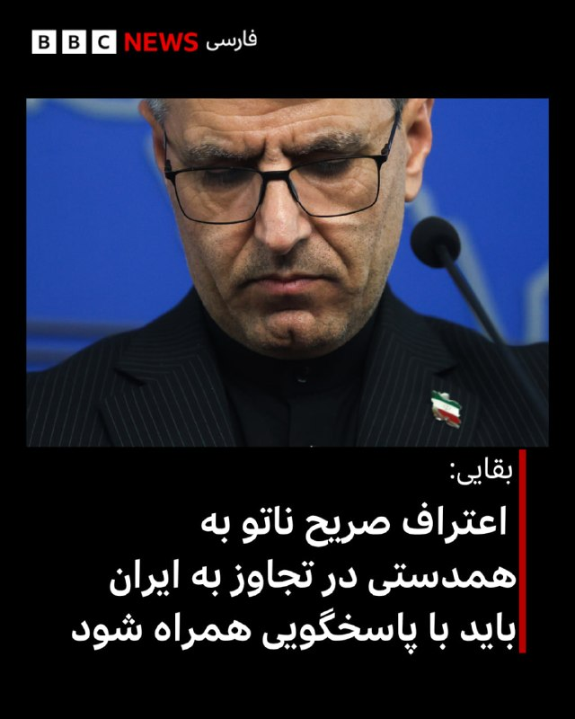

🔻اسماعیل بقایی، سخنگوی وزارت خارجه ایران در واکنش به اظهارات دبیرکل ناتو که روز چهارشنبه با شبکه خبری فاکس مصاحبه کرد گفته این پیمان نظامی باید پاسخگو باشد.

آقای بقایی چهارشنبه شب در شبکه ایکس نوشت: «این یک اعتراف صریح به همدستی فعال ناتو در یک جنگ تجاوزکارانه غیرقانونی علیه یک کشور مستقل عضو سازمان ملل است؛ نقض آشکار قواعد حقوق بین‌الملل و اصول بنیادین منشور سازمان ملل. این سازمان و دولت‌های عضو آن که در چنین تصمیم‌گیری‌هایی مشارکت داشته‌اند، باید در برابر تمام پیامدهای آن پاسخگو باشند.»

آقای بقایی با اشاره به مصاحبه مارک روته با فاکس نیوز که در آن دبیرکل ناتو در پاسخ به انتقادهای دونالد ترامپ که متحدان ناتو از آمریکا حمایت کافی نکردند، گفت که اروپا در واقع «سکوی نمایش و اعمال قدرت» آمریکا بوده، در شبکه ایکس نوشت:

«ایتالیا و رومانی به‌طور مشخص توسط دبیرکل ناتو به عنوان کشورهایی نام برده شده‌اند که در این تجاوز علیه ایران مشارکت داشته‌اند. این کشورها، همراه با هر کشور اروپایی دیگری که به این حمله آمریکا و اسرائیل علیه ایران کمک کرده است، باید در برابر مردم خود و جامعه جهانی توضیح دهند.»

📷Getty
@BBCPersian

## Dirty_Kids — post 393039

🔴 دولت پزشکیان برای تشییع جنازه علی خامنه‌ای ۷ هزار میلیارد تومان بودجه در نظر گرفته که تقریبا با این بودجه میشه ۵۰۰ مدرسه ساخت. شعار مرگ بر امریکا هم ممنوع شده کسی حق نداره علیه امریکا شعار بده

@Dirty_Kids 👻

## Dirty_Kids — post 393038

  <a href="telegram/content/Dirty_Kids_393038_1782368298.mp4" target="_blank">🎬 Download video</a>

هشدار سونامی در ونزوئلا، بعد از زمین‌لرزه۷ ریشتری، ویدیو منتشرشده از کاراکاس، برخاستن دود و گردوغبار از مناطق مختلفی را در پی این زمین‌لرزه شدید نشان می‌دهد.
ونزوئلا بگا رفتتت

@Dirty_Kids 👻

## alonews — post 130114

  <a href="telegram/content/alonews_130114_1782368299.webm" target="_blank">🎬 Download video</a>

👈رئیس‌جمهور: نه ظلم کنیم، نه ظلم بپذیریم و نه مقابلش سکوت کنیم

✅ @AloNews خبر جنگ

## alonews — post 130113

  <a href="telegram/content/alonews_130113_1782368299.webm" target="_blank">🎬 Download video</a>

👈ترامپ: دو زلزله بزرگ که به تازگی مردم بزرگ ونزوئلا را لرزاندند، هر دو در مقیاس وسیع بوده و تعداد زیادی کشته به جا گذاشته‌اند. ایالات متحده آماده، مایل و قادر به کمک است! من به تمام نهادهای دولتی دستور داده‌ام که برای اقدام سریع آماده باشند. ما در کنار دوستان جدید و بزرگ خود خواهیم بود. گزارش‌های اولیه خوب نیستند.

✅ @AloNews خبر جنگ

## alonews — post 130112

  <a href="telegram/content/alonews_130112_1782368299.webm" target="_blank">🎬 Download video</a>

👈نفت برنت تنها ۲ دلار با قیمت خود پیش از آغاز جنگ فاصله دارد

✅ @AloNews خبر جنگ

## alonews — post 130111

  <a href="telegram/content/alonews_130111_1782368299.webm" target="_blank">🎬 Download video</a>

👈دولت ترامپ از کنگره ۸۷٫۶ میلیارد دلار برای جبران فرسایش منابع ناشی از جنگ با ایران درخواست کرد

🔴شبکه آمریکایی سی‌ان‌ان به نقل از نامه‌ای که به دست آورده است گزارش داد که دولت ترامپ درخواست بودجه تکمیلی به ارزش ۸۷٫۶ میلیارد دلار از کنگره کرده است.

🔴هدف از این بودجه، جایگزینی منابعی است که در نتیجه جنگ با ایران مصرف شده‌اند و همچنین تکمیل پروژه‌های بازسازی در پایتخت آمریکا، واشنگتن، عنوان شده است.

✅ @AloNews خبر جنگ

## alonews — post 130110

  <a href="telegram/content/alonews_130110_1782368300.mp4" target="_blank">🎬 Download video</a>

👈زمین‌لرزه‌ای شدید به بزرگی ۷.۱ بعدازظهر چهارشنبه در غرب کاراکاس، پایتخت ونزوئلا، رخ داد و لرزش آن در کلمبیا نیز احساس شد. ساکنان کاراکاس به خیابان‌ها گریختند و گزارش‌ها از خسارت به ساختمان‌ها و اختلال در برق و اینترنت حکایت دارد.

✅ @AloNews خبر جنگ

## alonews — post 130109

  <a href="telegram/content/alonews_130109_1782368301.webm" target="_blank">🎬 Download video</a>

👈ترامپ: بعد از 3000سال من صلح رو به خاورمیانه آوردم

✅ @AloNews خبر جنگ

<!-- MSG END -->

<!-- NAV START -->

<a href="https://github.com/Tljn/FUD/blob/main/telegram/content/archive_1.md" style="display:inline-block; padding:6px 12px; margin:0 4px; background-color:#2ea44f; color:white; text-decoration:none; border-radius:4px; font-weight:bold;">صفحه بعد</a>

<!-- NAV END -->
