# خواننده تلگرام

<!-- TOP_NAV START -->

<a href="https://github.com/Tljn/FUD/blob/main/telegram/content/archive_1.md" style="display:inline-block; padding:6px 12px; margin:0 4px; background-color:#2ea44f; color:white; text-decoration:none; border-radius:4px; font-weight:bold;">صفحه بعد</a>

<!-- TOP_NAV END -->

<!-- MSG START -->

---
📅 بروزرسانی: 1405/03/29 11:16
---

## VahidOOnLine — post 246352

  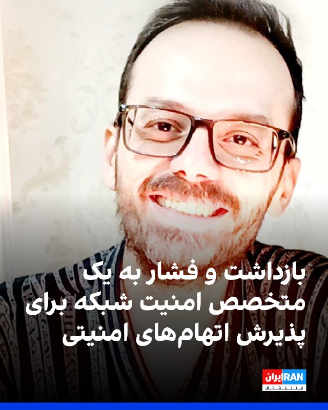

بر اساس گزارش‌های رسیده به ایران‌اینترنشنال، محمود قنبری‌راد، متخصص امنیت شبکه، از سوی دستگاه قضایی جمهوری اسلامی به «اجتماع و تبانی علیه امنیت ملی، جمع‌آوری اطلاعات طبقه‌بندی‌شده و ارائه آن به اسرائیل» متهم شده است.
بر اساس این گزارش، این «متخصص امنیت شبکه» و شاغل در یکی از شرکت‌های تهران، اردیبهشت‌ماه سال جاری در منزل خود بازداشت شده است. او در تماس تلفنی از زندان گفته این پرونده «ساختگی» است و تحت فشار برای پذیرش اتهامات قرار دارد.
همچنین بر اساس این گزارش، محمود قنبری‌راد که در زندان فشافویه نگهداری می‌شود، از زمان بازداشت تاکنون از حق دسترسی به وکیل محروم بوده است.
‌🏁 🇬🇧 IranintlTV

🤖 @VahidOOnLine

## VahidOOnLine — post 246351

🗣روایت شما درباره توافق جمهوری اسلامی و آمریکا - جمعه ۲۹ خرداد ۱۴۰۵

🔹به مردم آگاه ما، امیدمونو از دست ندادیم. ما محکوم به انقلابیم و تمام. دیر و زود داره، سوخت و سوز نه.

🔹آقای ترامپ، مگر جنگ با جمهوری اسلامی را به دلیل گرانی بنزین یا کاهش ارزش سهام در آمریکا شروع کردید که حالا از تفاهم و پایین آمدن قیمت بنزین و بالا رفتن ارزش سهام ابراز خوشحالی و پیروزی می‌کنید؟ تسلیم کامل شدید.

🔹قالیباف آخرین نفری خواهد بود که برای بقای این رژیم هر کاری می‌کند. ترامپ این‌ها را وارد بازی کرده که ۴۷ سال با دنیا کردند. صد تا تفاهم دیگه هم وضعیت این کشور را درست نمی‌کند. تا این‌ها نرن، هیچی درست نمی‌شه. امیدتون را از دست ندید، ترامپ با این‌ها خیلی کار داره.

🔹از لحاظ تاریخی بسیار شبیه اواخر قاجار و اوایل پهلوی هستیم، یه شاه شل و ول مثل احمدشاه و یه قزاق‌سپاهی مثل قالیباف. نگران نباشید.

🔹آقای ترامپ، شما اگر با مردم ایران معامله می‌کردید بهتر به نتیجه می‌رسید تا با حکومت تروریست. با باقر یا مجتبی فرقی نمی‌کند، این‌ها سر و ته یک کرباس‌اند. اشتباه اوباما را تکرار نکن.

🔹جهت یادآوری، انقلاب شیر و خورشید به رهبری شاهزاده رضا پهلوی متکی به مردم است، نه کمک خارجی. خوشحالی کسانی که در زمین رژیم بازی می‌کنند از عمق ترس آن‌هاست. نور این انقلاب با هیچ توافقی خاموش نمی‌شود.

🔹جالبه که ترامپ با شعار «کمک در راه است» شروع کرد، با ادعای «حتی اگر یک نفر اعدام شود» ادامه داد، اما بدون کوچک‌ترین توجهی به ملت ایران پایان داد؛ حتی وقتی که بند لبنان را در تفاهم‌نامه دید.

🔹مردم ایران، طرفدارهای جمهوری اسلامی هم پیام می‌فرستند برای ناامیدی. ترامپ کارشو بلده، می‌دونه چیکار کنه. و اینکه تفاهم با توافق فرق داره.

🔹مردم عزیز ایران، لطفاً این‌قدر سریع قضاوت نکنید. ما بعد از این همه فرازونشیب باید پخته‌تر فکر کنیم و سنجیده‌تر رفتار کنیم. صبور باشیم و با هر خبر مذاکره و توافق ناامید نشیم. تجربه‌های قبلی طی یک سال گذشته خیلی درس‌ها بهمون یاد داده.

🔹جاویدناما و هم‌وطن‌های عزیز و شجاعان، لطفاً این‌قدر نگران این توافق‌ها نباشید. دلتون روشن باشه. با هم به‌زودی ریشه همشونو می‌کنیم. یادتون نره اون دو شب رو، چقدر بی‌شمار بودیم.
‌🏁 🇬🇧 IranintlTV

🤖 @VahidOOnLine

## VahidOOnLine — post 246350

  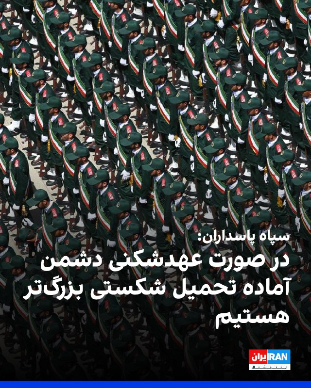

سپاه پاسداران در بیانیه‌ای خطاب به مجتبی خامنه‌ای، رهبر جمهوری اسلامی، پس از انتشار پیام او درباره یادداشت تفاهم با آمریکا اعلام کرد از دولتمردان جمهوری اسلامی حمایت خواهد کرد، اما در عین حال هشدار داد در صورت آنچه «عهدشکنی دشمن» خواند، آماده واکنش نظامی است.

در این بیانیه آمده است سپاه پاسداران «چون کوه استوار پشتوانه دولتمردان» خواهد بود و از تلاش‌های آنان برای پیگیری حقوق جمهوری اسلامی حمایت می‌کند.

سپاه پاسداران همچنین تاکید کرد: «اگر دشمن عهدشکن بخواهد چون گذشته به زیاده‌خواهی روی آورد، پاسداران انقلاب اسلامی در زمین، دریا، هوا و تمام عرصه‌های جنگ ترکیبی، قدرتمندتر از گذشته و با بهره‌گیری از تجارب چندین نبرد آماده‌اند تا با کوچک‌ترین اشاره آن فرمانده شجاع و حکیم، شکست تاریخی بسیار بزرگ‌تری را به آنان تحمیل کنند.»

در بخش دیگری از این بیانیه، سپاه پاسداران از پیام مجتبی خامنه‌ای قدردانی کرد و آن را عاملی برای تقویت وحدت داخلی و افزایش امیدواری نیروهای حامی جمهوری اسلامی توصیف کرد.
‌🏁 🇬🇧 IranintlTV

🤖 @VahidOOnLine

## VahidOOnLine — post 246349

  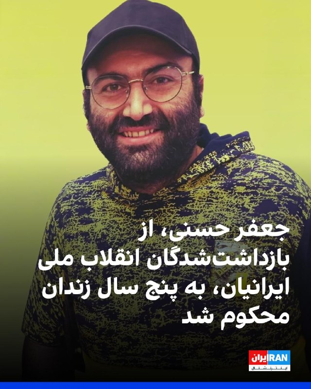

جعفر حسنی، فعال سیاسی و شاعر ساکن قزوین و از زندانیان انقلاب ملی، از سوی شعبه‌ای از دادگاه انقلاب قزوین به پنج سال حبس تعزیری محکوم شد.

بر اساس حکم صادرشده، او بابت اتهام «اغوای مردم به کشت و کشتار با یکدیگر به قصد برهم زدن امنیت کشور» به پنج سال حبس تعزیری محکوم شده است. همچنین دادگاه برای اتهام «اهانت به رهبری» دو سال حبس و برای اتهام «تبلیغ علیه نظام» یک سال حبس تعیین کرده است.

با این حال، بر اساس مقررات مربوط به تعدد جرایم، مجازات اشد، یعنی پنج سال حبس تعزیری، قابل اجرا خواهد بود.

جعفر حسنی همچنین به عنوان مجازات تکمیلی به دو سال منع خروج از کشور، شش ماه خدمات عمومی رایگان در شهرداری قزوین و ضبط تلفن همراه و سیم‌کارت به نفع دولت محکوم شده است.

جزئیات بیشتری درباره زمان صدور حکم، امکان تجدیدنظرخواهی و وضعیت کنونی این فعال سیاسی منتشر نشده است.
‌🏁 🇬🇧 IranintlTV

🤖 @VahidOOnLine

## VahidOOnLine — post 246348

  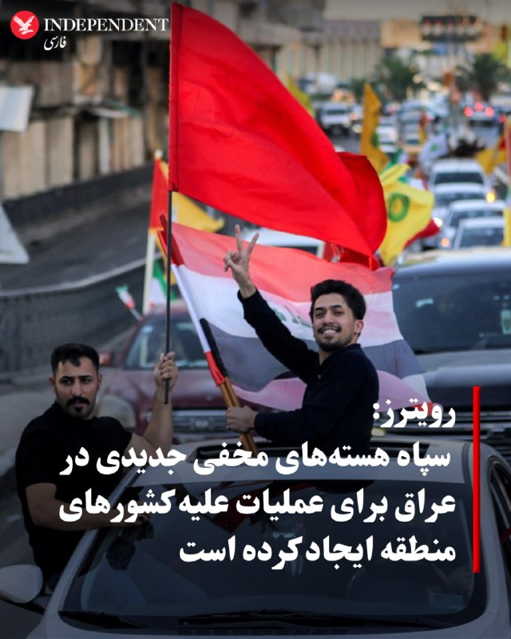

♦️خبرگزاری رویترز به نقل از هشت منبع در عراق گزارش داد که سپاه پاسداران برای «انجام حملات علیه کشورهای خلیج فارس که میزبان نیروهای آمریکایی هستند»، هسته‌های مخفی جدیدی در عراق ایجاد کرده است. به گفته این منابع، این گروه‌ها مستقیما زیر نظر سپاه فعالیت می‌کنند و خارج از ساختار شبه‌نظامیان شناخته‌شده و مورد حمایت تهران عمل می‌کنند تا شناسایی و ردیابی آن‌ها دشوارتر باشد.
بر اساس این گزارش، سه تا چهار هسته عملیاتی که هر یک حدود ۱۰ نیروی شیعه عراقی دارند، بین ۲۰ آوریل تا ۱۷ مه دست‌کم هفت حمله پهپادی از مناطق بیابانی اطراف بصره و سماوه علیه اهدافی در کویت، عربستان سعودی و امارات متحده عربی انجام داده‌اند. منابع امنیتی عراقی می‌گویند این حملات شامل سه حمله به کویت، دو حمله به عربستان و دو حمله به امارات بوده است.
‌🇸🇦 Indypersian

🤖 @VahidOOnLine

## VahidOOnLine — post 246339

  <a href="telegram/content/VahidOOnLine_246339_1781855190.mp4" target="_blank">🎬 Download video</a>

جنگ، برخلاف انتظار بسیاری، جمهوری اسلامی را در کوتاه‌مدت تضعیف نکرد؛ بلکه به حکومت فرصت داد فضای امنیتی ایجاد کند، مخالفان را سرکوب کند و جناح‌های درون قدرت را زیر شعار بقا کنار هم نگه دارد. اما صلح می‌تواند مسئله‌ای متفاوت باشد. ورق بزنید.
‌🏁 🇬🇧 ManotoTV

🤖 @VahidOOnLine

## VahidOOnLine — post 246338

  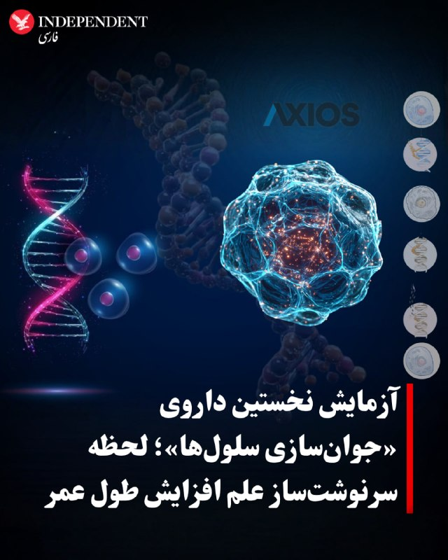

⭕️آزمایش نخستین داروی «جوان‌سازی سلول‌ها»؛ لحظه سرنوشت‌ساز علم افزایش طول عمر

♦️نخستین آزمایش بالینی جهان برای بررسی امکان «جوان‌تر کردن سلول‌های انسان» آغاز شده است؛ آزمایشی که به گزارش اکسیوس می‌تواند یکی از مهم‌ترین نظریه‌های علم افزایش طول عمر را محک بزند. هدف اصلی این مطالعه در مرحله فعلی، ارزیابی ایمنی روشی موسوم به «بازبرنامه‌ریزی سلولی» در انسان است؛ این فناوری‌ که در صورت موفقیت می‌تواند راه را برای درمان‌هایی هموار کند که روند پیری زیستی را کند یا حتی معکوس می‌کنند.

دانشمندان می‌گویند حوزه افزایش طول عمر طیف گسترده‌ای از ایده‌ها را دربر می‌گیرد؛ از توصیه‌های رژیم غذایی سالم و ورزش گرفته تا روش‌های بحث‌برانگیزی مانند تزریق پلاسمای خون افراد جوان که تاکنون فایده بالینی آن اثبات نشده است. اما «بازبرنامه‌ریزی سلولی» در میانه این طیف قرار دارد و از پشتوانه علمی قابل توجهی برخوردار است.

در این آزمایش، نخستین بیمار هفته گذشته یک ژن‌درمانی آزمایشی دریافت کرد که برای درمان بیماری‌های چشمی از جمله گلوکوم (آب‌سیاه) طراحی شده است. این درمان سه ژن را هدف قرار می‌دهد که می‌توانند سلول‌های پیر را تا حدی به وضعیت جوان‌تر بازگردانند. هدف اولیه این فناوری، احیای عملکرد سلول‌های عصبی میان چشم و مغز است.

شرکت مجری این آزمایش، «لایف بایوساینسز» (Life Biosciences)، توسط گروهی از پژوهشگران از جمله دیوید سینکلر، استاد دانشگاه هاروارد و یکی از شناخته‌شده‌ترین چهره‌های حوزه طول عمر، تأسیس شده است. این شرکت اعلام کرده هدفش توسعه درمان‌هایی برای «معکوس کردن بیماری‌های مرتبط با پیری» است.

با این حال، پژوهشگران تأکید می‌کنند که این مطالعه تنها ایمنی درمان را می‌سنجد و حتی در صورت موفقیت، هنوز سال‌ها تا اثبات اثربخشی آن فاصله وجود دارد. با وجود این، موفقیت احتمالی می‌تواند نقطه عطفی برای کل صنعت طول عمر باشد؛ صنعتی که میلیاردها دلار سرمایه از سوی شرکت‌های فناوری و سرمایه‌گذاران بزرگی مانند سم آلتمن و جف بزوس جذب کرده است.
‌🇸🇦 Indypersian

🤖 @VahidOOnLine

## VahidOOnLine — post 246337

  

اسدالله بادامچیان، رییس شورای مرکزی حزب موتلفه، در گفت‌وگو با خبرگزاری ایسنا گفت برخی به اشتباه تصور می‌کنند تفاهم و مذاکره به از دست رفتن دستاوردهای میدان منجر می‌شود، در حالی که مذاکره می‌تواند ابزاری برای تثبیت و بهره‌برداری از این دستاوردها باشد.

او با رد اظهارنظر مسئولانی که مذاکره را «عقب‌نشینی یا خیانت» می‌دانند، گفت: «خیانت نه مذاکره، بلکه سازشکاری است؛ وگرنه پایان هر جنگی به مذاکره می‌انجامد و حتی برای گرفتن غرامت هم نیاز به مذاکره است.»
‌🏁 🇬🇧 IranintlTV

🤖 @VahidOOnLine

## VahidOOnLine — post 246336

  

علی‌اکبر علیزاده، عضو فراکسیون انقلاب اسلامی مجلس، با تاکید بر ضرورت تقویت نیروهای نظامی و امنیتی گفت نباید تمام توجه جمهوری اسلامی به تفاهم‌نامه و اقدامات تیم مذاکره‌کننده معطوف شود و سایر نیازهای اساسی نادیده گرفته شود.

او گفت در کنار پیگیری روند مذاکرات، توجه به مسائل بنیادین کشور و حفظ آمادگی در حوزه‌های مختلف ضروری است و نباید از اولویت‌های دیگر غفلت شود.

علیزاده گفت نباید حتی برای لحظه‌ای از افزایش توان این نیروها و بهره‌گیری از «ظرفیت‌های مردمی» در حمایت از آن‌ها غافل شد.

این عضو مجلس جمهوری اسلامی در ادامه خواستار پرهیز از تشدید اختلافات داخلی شد و گفت باید از ایجاد شکاف در میان نیروهای همسو جلوگیری کرد.
‌🏁 🇬🇧 IranintlTV

🤖 @VahidOOnLine

## VahidOOnLine — post 246335

  

علی خضریان، عضو کمیسیون امنیت ملی مجلس جمهوری اسلامی، گفت با توجه به اینکه مجتبی خامنه‌ای، رهبر جمهوری اسلامی، برخلاف نظر خود مجوز این تفاهم‌نامه را صادر کرده است، «همه ملت در کنار رهبری منتظر تحقق شروط اعلام‌شده هستند.»

او با اشاره به مذاکرات با آمریکا برای دستیابی به توافق نهایی گفت: «وقتی با شیادی مثل ترامپ و دولت تروریست آمریکا طرف هستیم، متن باید راه هر نوع سوءاستفاده‌ای را از تفسیر عبارات و جملات ببندد.»

این عضو کمیسیون امنیت ملی مجلس جمهوری اسلامی همچنین هشدار داد اگر توافق جدید به محدودیت‌های یک‌جانبه و کاهش توان بازدارندگی جمهوری اسلامی منجر شود، می‌تواند به تهدیدی علیه امنیت ملی تبدیل شود. او تاکید کرد نباید تجربه و خسارت‌های ناشی از برجام تکرار شود.
‌🏁 🇬🇧 IranintlTV

🤖 @VahidOOnLine

## VahidOOnLine — post 246334

  <a href="telegram/content/VahidOOnLine_246334_1781855192.mp4" target="_blank">🎬 Download video</a>

رانندگان اسنپ‌باکس (اسنپ‌موتور) در قزوین روز پنج‌شنبه ۲۸ خرداد در اعتراض به پایین بودن کرایه‌ها دست به اعتصاب زدند. این معترضان با توقف فعالیت خود، خواستار رسیدگی به مطالبات و بازنگری در نرخ کرایه‌ها شدند.
‌🏁 🇬🇧 IranintlTV

🤖 @VahidOOnLine

## VahidOOnLine — post 246333

  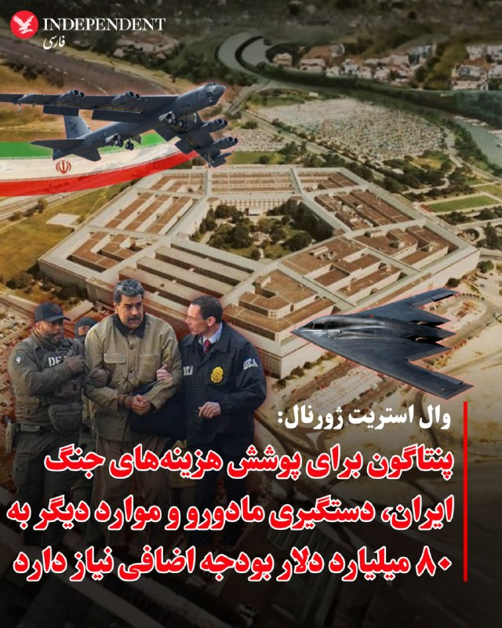

⭕️وال استریت ژورنال: پنتاگون برای پوشش هزینه‌های جنگ ایران، دستگیری مادورو و موارد دیگر به ۸۰ میلیارد دلار بودجه اضافی نیاز دارد

♦️وال استریت ژورنال گزارش داد: پنتاگون به قانون‌گذاران آمریکا اعلام کرده است که برای پوشش هزینه‌های جنگ ایران و هزینه‌های دیگر، به ۸۰ میلیارد دلار بودجه اضافی نیاز دارد.
به گفته منابع آگاه، استیون فاینبرگ، معاون وزیر جنگ آمریکا، این موضوع را طی تماس‌هایی با اعضای کنگره در میان گذاشته است.

قانون‌گذاران از دولت دونالد ترامپ خواسته‌اند برآوردی جامع از هزینه‌های جنگی که از ۲۸ فوریه آغاز شد ارائه کند.

مقام‌های پنتاگون هشدار داده‌اند که اگر کنگره بودجه جنگی جدیدی تصویب نکند، نیروهای مسلح ممکن است از تابستان امسال با کمبود منابع مالی برای عملیات‌های خود روبه‌رو شوند. در این صورت، ارتش ناچار خواهد شد برخی رزمایش‌ها را کاهش دهد.

هرگونه درخواست بودجه تکمیلی باید ابتدا به تأیید دفتر مدیریت و بودجه کاخ سفید برسد و سپس به کنگره ارسال شود. بودجه دفاعی آمریکا برای سال مالی ۲۰۲۶ حدود یک تریلیون دلار است.
به گفته منابع مطلع، بخشی از این ۸۰ میلیارد دلار صرف عملیات کشتی‌ها، حقوق نیروهای نظامی و تأمین مهمات خواهد شد. همچنین انتظار می‌رود بسته بودجه تکمیلی دولت آمریکا علاوه بر بودجه دفاعی، شامل منابعی برای کمک‌های کشاورزی و جبران خسارت‌های ناشی از بلایای طبیعی نیز باشد.

وزارت جنگ آمریکا امسال با هزینه‌های فزاینده چند عملیات مختلف روبه‌رو بوده است؛ از جمله جنگ ایران که پنتاگون در اواسط ماه مه هزینه آن را ۲۹ میلیارد دلار برآورد کرده بود، اما اکنون این رقم احتمالا افزایش یافته است. عملیات علیه ونزوئلا که به دستگیری رهبر آن کشور منجر شد و همچنین حملات مکرر به قایق‌های مظنون به قاچاق مواد مخدر در دریای کارائیب و شرق اقیانوس آرام نیز بر هزینه‌ها افزوده‌اند.

در کنگره، تصویب این بودجه می‌تواند به موضوعی بحث‌برانگیز تبدیل شود. برخی قانون‌گذاران گفته‌اند تا زمانی که کنگره مجوز رسمی عملیات نظامی را صادر نکند، از تأمین بودجه اضافی برای جنگ حمایت نخواهند کرد.
جمهوری‌خواهان در هر دو مجلس اکثریت محدودی در اختیار دارند و برای تصویب بودجه با چالش‌های سیاسی روبه‌رو هستند.
‌🇸🇦 Indypersian

🤖 @VahidOOnLine

## WithYashar — post 15299

سوئیس رسما اعلام کرد: مذاکرات ایران و آمریکا برگزار نخواهد شد
@withyashar

## WithYashar — post 15298

بن گویر وزیر امنیت اسراییل:به ازای هر اشک یک مادر اسرائیلی، هزار مادر لبنانی باید گریه کنند. کل لبنان باید بسوزد
@withyashar

## WithYashar — post 15297

  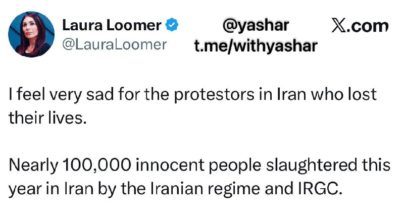

لورا لومر خبرنگار نزدیک به ترامپ جاویدنام های دی ماه رو حدود ۱۰۰ هزار نفر اعلام کرد
@withyashar

## WithYashar — post 15296

  <a href="telegram/content/WithYashar_15296_1781855195.mp4" target="_blank">🎬 Download video</a>

مجری اکسیوس: در مورد نه تنها اعمال قدرت، بلکه محدودیت‌های قدرت خود به عنوان نتیجه از درگیری ایران چه آموخته‌اید؟

ترامپ: هیچ محدودیتی وجود ندارد. من هنوز آن درس را نیاموخته‌ام. می‌دانم که وجود دارند، اما می‌دانید، هیچ محدودیتی وجود ندارد. ما آن‌ها را کاملاً از نظر نظامی شکست دادیم
@withyashar

## WithYashar — post 15294

  <a href="telegram/content/WithYashar_15294_1781855196.mp4" target="_blank">🎬 Download video</a>

مجری : در آغاز درگیری ایران، شما صحبت کردید که فقط تسلیم بی‌قید و شرط را می‌خواهید. تفاهم‌نامه شبیه تسلیم بی‌قید و شرط به نظر نمی‌رسد.

ترامپ : واقعاً احتمالاً تسلیم بی‌قید و شرط است. من اینطور فکر می‌کنم
@withyashar

## WithYashar — post 15293

وزارت خارجه آمریکا: حزب‌الله باید خلع سلاح شود
@withyashar

## mwarmonitor — post 11185

🔴ارتش اسرائیل در طول شب گذشته حملاتی را انجام داده و همچنان به حمله علیه تروریست‌ها و زیرساخت‌های تروریستی سازمان تروریستی حزب‌الله در چندین منطقه در جنوب لبنان ادامه می‌دهد.

🔸این حملات پس از نقض‌های مکرر توافق آتش‌بس از سوی سازمان تروریستی حزب‌الله انجام شده است.

## mwarmonitor — post 11184

تد کروز (Ted Cruz):
«...دادن میلیاردها دلار پول به دیوانگان تئوکراتیک (حکومت مذهبی) که می‌خواهند ما را به قتل برسانند، ایده خوبی نیست. اه، من فکر می‌کنم متأسفانه رئیس‌جمهور دارد مشاوره‌های بدی در این زمینه دریافت می‌کند.»

الیزابت وارن (Elizabeth Warren):
«اما این کل توافق هسته‌ای فعلی، هیچ تفاوتی با آنچه در سال ۲۰۱۵ داشتیم ندارد. یعنی زمانی که باراک اوباما توافق را جوش داد (امضا کرد). و اینجاست که دونالد ترامپ بعد از این همه ماجرا، ما را دوباره به همین‌جا می‌رساند. چه مایه شرمساری‌ای.»

دیک دوربین (Dick Durbin):
«ما برای چی وارد جنگ شدیم؟ ایده انجام کاری در تنگه هرمز... این تنگه قبل از تهاجم ما به صورت مسالمت‌آمیز مورد استفاده قرار می‌گرفت، و حالا باید مذاکره کنیم تا در آینده هم به صورت مسالمت‌آمیز از آن استفاده شود.»

اریک شمیت (Eric Schmitt):
«ایران قرار است به دارایی‌های مسدودشده خود دسترسی پیدا کند، و ایران در ازای این چه چیزی را واگذار می‌کند؟ هیچی. هیچی. صرفاً تأیید مجدد همان چیزی که قبلاً درباره سلاح‌های هسته‌ای گفته بودند.»

تیم کین (Tim Kaine):
«خب، تمام چیزی که من دیده‌ام گزارش‌های رسانه‌ها و اخبار عمومی در این باره است، اما این گزارش‌های عمومی به نظر من نشان می‌دهد که ما داریم امتیازات بسیار بیشتری می‌دهیم تا در مقایسه با برجام (JCPOA)، چیز بسیار کمتری به دست آوریم.»

الیزابت وارن (Elizabeth Warren):
«دونالد ترامپ نتوانست توضیح دهد که چرا وارد این جنگ شد. یادتان هست قرار بود هدفش تغییر رژیم باشد؟ اه، و حالا او نمی‌تواند توضیح دهد که چطور از آن خارج شود.»

@mwarmonitor

## mwarmonitor — post 11183

  <a href="telegram/content/mwarmonitor_11183_1781855198.mp4" target="_blank">🎬 Download video</a>

🎬 Video

## mwarmonitor — post 11182

🔴اختصاصی: ترامپ در گفتگو با «برنامه اکسیوس» اعلام کرد که پس از جنگ ایران، قدرت او «هیچ محدودیتی» ندارد

📝نویسنده: دیو لاولر

🔰دونالد ترامپ، رئیس‌جمهور آمریکا، این ادعا را که جنگ ایران نشان‌دهنده محدودیت توانایی او در اعمال قدرت بوده است، رد کرد و در گفتگو با «برنامه اکسیوس» (The Axios Show) گفت که همچنان معتقد است «هیچ محدودیتی» وجود ندارد.

📌تصویر بزرگتر: ترامپ با درخواست «تسلیم بی‌قمر و شرط» وارد این جنگ شد؛ اما در نهایت به یک یادداشت تفاهم (MOU) محدود بسنده کرد.

🔸ترامپ در گفتگو با مارک کاپوتو، خبرنگار اکسیوس، اعتراف کرد که برای جلوگیری از تبدیل شدن این جنگ به یک رکود اقتصادی جهانی، تن به مذاکره و امضای این توافق داده است.

🔸با این حال، ترامپ این موضوع را که تجربه مذکور باعث فروتنی یا عقب‌نشینی او شده باشد، رد کرد. وقتی از او پرسیده شد که از این جنگ چه درسی درباره محدودیت‌های قدرت خود گرفته است، پاسخ داد: «هیچ محدودیتی وجود ندارد.»

🔸آنچه او می‌گوید: ترامپ در ادامه گفت: «من هنوز چنین درسی نگرفته‌ام. می‌دانم که محدودیت‌هایی هست، اما [برای من] هیچ محدودیتی وجود ندارد.»

🔸ترامپ ادعا کرد: «ما آن‌ها را از نظر نظامی به طور کامل شکست دادیم» و حتی مدعی شد که این یادداشت تفاهم «احتمالاً همان تسلیم بی‌قید و شرط است.»

🔸او استدلال کرد که این جنگ در واقع قدرت نظامی آمریکا را به رخ کشیده است: «چه کس دیگری می‌توانست چنین محاصره‌ای ایجاد کند؟ من یک محاصره دریایی راه انداختم که حتی یک کشتی هم نتوانست از آن عبور کند. برخی تلاش کردند، اما عمرشان زیاد طولانی نبود.»

🔸پشت پرده: ترامپ در این مصاحبه اذعان کرد که گزینه‌های جایگزینِ توافق، می‌توانست بسیار وخیم و هولناک باشد.
ترامپ از اینکه منتقدان تندرو او می‌پرسند چرا با ایران سخت‌گیرانه‌تر برخورد نکرده، برآشفت و گفت: «تنها راهی که می‌توانستم سخت‌گیرتر شوم این بود که دو سه هفته دیگر آنجا بمانم و به بمباران شدید آن‌ها ادامه دهم. درست است؟ اما این کار چه دستاوردی برای ما داشت؟ تنگه هرمز دیگر باز نمی‌شد.»
او افزود: «تا ماه‌ها نفت نداشتیم. تا زمانی که شما بمب می‌اندازید، آن تنگه به طور خودکار بسته می‌ماند.» وی در ادامه گفت: «این همان اتفاقی است که می‌تواند باعث یک رکود اقتصادی در سراسر جهان شود.»

🔸پشت صحنه: به گفته یک منبع آگاه از تفکرات ترامپ، او در جلسات خصوصی ابراز نگرانی کرده بود که ذخایر جهانی نفت در حال کاهش است و در صورت بسته ماندن تنگه هرمز، یک شوک نفتی جهانی رخ خواهد داد.

🔸کلام آخر: همین موضوع دلیلِ این را که چرا ترامپ به جای توافق حداکثری که قبل از جنگ وعده داده بود، به توافقی که در دسترس بود تن داد، روشن می‌کند.
با این حال، او پافشاری دارد که این جنگ نشان‌دهنده گستردگی قدرت او بوده است، نه محدودیت‌های آن.

@mwarmonitor

## mwarmonitor — post 11181

  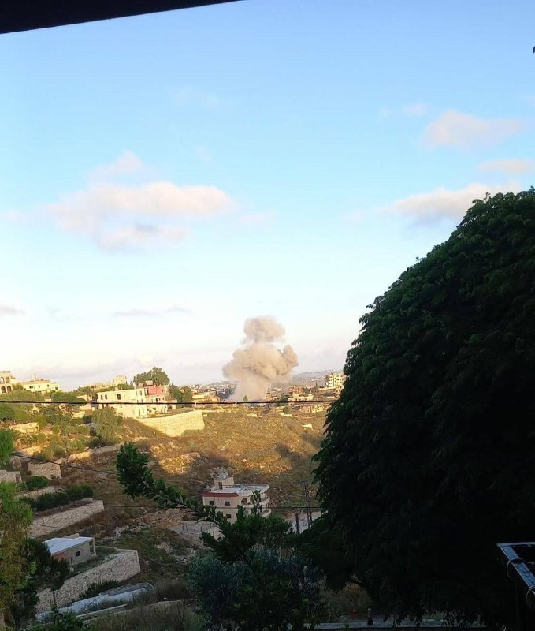

🔴 حملات هوایی جنگنده‌های اسرائیل چندین منطقه و شهرک در جنوب لبنان را هدف قرار داد.

@mwarmonitor

## pm_afshaa — post 94366

🔴العربیه: حملات اسرائیل به جنوب لبنان شب گذشته به طرز چشمگیری تشدید شده

💧 Rainbet.com the #1 Non-KYC Crypto Casino & Sportsbook @rainbetcom

😁 @Pm_Afshaa

## pm_afshaa — post 94365

🔴بن گویر وزیر امنیت اسراییل:به ازای هر اشک یک مادر اسرائیلی، هزار مادر لبنانی باید گریه کنند. کل لبنان باید بسوزد

💧 Rainbet.com the #1 Non-KYC Crypto Casino & Sportsbook @rainbetcom

😁 @Pm_Afshaa

## pm_afshaa — post 94364

ژان-نوئل بارو، وزیر امور خارجه فرانسه:اسرائیل باید اقدامات خصمانه خود در لبنان را متوقف کند. ایالات متحده باید بر آن فشار وارد کند

💧 Rainbet.com the #1 Non-KYC Crypto Casino & Sportsbook @rainbetcom

😁 @Pm_Afshaa

## pm_afshaa — post 94363

  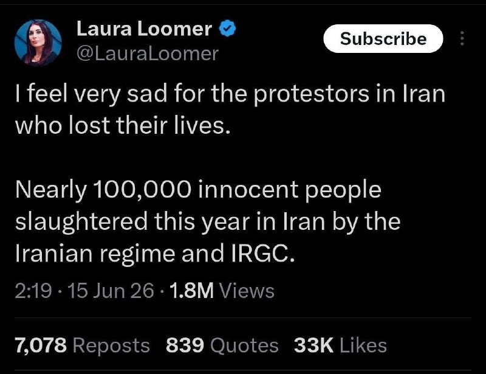

لورا لومر خبرنگار نزدیک به ترامپ آمار نهایی جاویدنام نام هارو اعلام کرد: در اعتراضات دی ماه ایران، 100 هزار نفر کشته شدن

💧 Rainbet.com the #1 Non-KYC Crypto Casino & Sportsbook @rainbetcom

😁 @Pm_Afshaa

## pm_afshaa — post 94361

  <a href="telegram/content/pm_afshaa_94361_1781855202.mp4" target="_blank">🎬 Download video</a>

لبنان زیر تلمبه های اسراییل

💧 Rainbet.com the #1 Non-KYC Crypto Casino & Sportsbook @rainbetcom

😁 @Pm_Afshaa

## DEJradio — post 5809

  <a href="telegram/content/DEJradio_5809_1781855203.webm" target="_blank">🎬 Download video</a>

🔺📢 “من سربازم، این صبحانه ما تو پادگان است؛ خوب شد تسلیم شدن وگرنه باید نان خشک می‌خوردیم. حقوق کادری‌ها رو ندادن یا ۸ تا ۱۰ میلیون کمتر واریز شده...

پیام دریافتی

#دستمزد #پادگان
@DEJradio

## DEJradio — post 5808

  <a href="telegram/content/DEJradio_5808_1781855204.mp4" target="_blank">🎬 Download video</a>

🔺🎥 طی جنگ ۴۰ روزه تعداد زیادی از فرودگاه‌ها و هواپیماهای مستقر در آن بمباران شد.

یکی از شهروندان ویدیویی را در اینستاگرام به اشتراک گذاشت مربوط به لحظه برخاستن هواپیما از باند فرودگاه شیراز که نشان می‌دهد هواپیمای ترابری سی-۱۳۰ ارتش و چندین هواپیمای دیگر به طور کامل منهدم شده‌اند.

#جنگ۴۰روزه #فرودگاه_شیراز
@DEJradio

## DEJradio — post 5807

  <a href="telegram/content/DEJradio_5807_1781855205.mp4" target="_blank">🎬 Download video</a>

⚽️
🔺 سوشا مکانی، دروازه‌بان پیشین تیم ملی فوتبال، در گفت‌وگو با مهدی رستم‌پور در برنامه دژ فوتبالی، در واکنش به اظهارات بازیکنان تیم فوتبال جمهوری اسلامی درباره مسائل سیاسی پیرامون تیم، از جمله رامین رضاییان گفت: «بازیکنانی که حامی مردم نیستند دهانشان را بسته نگه دارند.»

#دژفوتبالی #جام_جهانی
@DEJradio

## IranIntlTV — post 343170

  <a href="telegram/content/IranIntlTV_343170_1781855207.mp4" target="_blank">🎬 Download video</a>

هم‌زمان با ادامه آماده‌سازی تیم فوتبال ایران برای برگزاری دومین دیدارش در رقابت‌های جام جهانی مقابل بلژیک، نیویورک تایمز گزارش داد فدراسیون فوتبال جمهوری اسلامی از فیفا خواسته است مقررات اقامت تیم ملی ایران در آمریکا را تسهیل کند.

گزارش رضا محدث، خبرنگار ایران‌اینترنشنال
@iranintltv

## IranIntlTV — post 343169

  <a href="telegram/content/IranIntlTV_343169_1781855208.mp4" target="_blank">🎬 Download video</a>

پنج‌شنبه‌شب، همزمان با دیدار تیم‌های کانادا و قطر در جام جهانی، صدها نفر از هواداران فوتبال در ونکوور برای تماشای این مسابقه گرد هم آمدند. این دیدار با برتری قاطع ۶ بر صفر کانادا مقابل قطر به پایان رسید.

گزارش مهسا مرتضوی، خبرنگار ایران‌اینترنشنال
@iranintltv

## IranIntlTV — post 343168

  

بر اساس گزارش‌های رسیده به ایران‌اینترنشنال، محمود قنبری‌راد، متخصص امنیت شبکه، از سوی دستگاه قضایی جمهوری اسلامی به «اجتماع و تبانی علیه امنیت ملی، جمع‌آوری اطلاعات طبقه‌بندی‌شده و ارائه آن به اسرائیل» متهم شده است.
بر اساس این گزارش، این «متخصص امنیت شبکه» و شاغل در یکی از شرکت‌های تهران، اردیبهشت‌ماه سال جاری در منزل خود بازداشت شده است. او در تماس تلفنی از زندان گفته این پرونده «ساختگی» است و تحت فشار برای پذیرش اتهامات قرار دارد.
همچنین بر اساس این گزارش، محمود قنبری‌راد که در زندان فشافویه نگهداری می‌شود، از زمان بازداشت تاکنون از حق دسترسی به وکیل محروم بوده است.
https://iranintl.com/202606190604

## IranIntlTV — post 343167

  <a href="telegram/content/IranIntlTV_343167_1781855210.mp4" target="_blank">🎬 Download video</a>

علی شیرازی، عضو تحریریه ایران‌اینترنشنال، درباره «نظر متفاوت» مجتبی خامنه‌ای نسبت به یادداشت تفاهم گفت: «در حالی که مسعود پزشکیان عملا نقشی در این معادله ندارد، مجتبی خامنه‌ای نیز مانند پدرش که پس از توافق برجام، مسئولیت را متوجه محمدجواد ظریف و حسن روحانی کرد، از پذیرش مسئولیت خودداری کرده و آن را بر عهده پزشکیان و اعضای شورای عالی امنیت ملی گذاشته است.»
@iranintltv

## IranIntlTV — post 343166

🗣روایت شما درباره توافق جمهوری اسلامی و آمریکا - جمعه ۲۹ خرداد ۱۴۰۵

🔹به مردم آگاه ما، امیدمونو از دست ندادیم. ما محکوم به انقلابیم و تمام. دیر و زود داره، سوخت و سوز نه.

🔹آقای ترامپ، مگر جنگ با جمهوری اسلامی را به دلیل گرانی بنزین یا کاهش ارزش سهام در آمریکا شروع کردید که حالا از تفاهم و پایین آمدن قیمت بنزین و بالا رفتن ارزش سهام ابراز خوشحالی و پیروزی می‌کنید؟ تسلیم کامل شدید.

🔹قالیباف آخرین نفری خواهد بود که برای بقای این رژیم هر کاری می‌کند. ترامپ این‌ها را وارد بازی کرده که ۴۷ سال با دنیا کردند. صد تا تفاهم دیگه هم وضعیت این کشور را درست نمی‌کند. تا این‌ها نرن، هیچی درست نمی‌شه. امیدتون را از دست ندید، ترامپ با این‌ها خیلی کار داره.

🔹از لحاظ تاریخی بسیار شبیه اواخر قاجار و اوایل پهلوی هستیم، یه شاه شل و ول مثل احمدشاه و یه قزاق‌سپاهی مثل قالیباف. نگران نباشید.

🔹آقای ترامپ، شما اگر با مردم ایران معامله می‌کردید بهتر به نتیجه می‌رسید تا با حکومت تروریست. با باقر یا مجتبی فرقی نمی‌کند، این‌ها سر و ته یک کرباس‌اند. اشتباه اوباما را تکرار نکن.

🔹جهت یادآوری، انقلاب شیر و خورشید به رهبری شاهزاده رضا پهلوی متکی به مردم است، نه کمک خارجی. خوشحالی کسانی که در زمین رژیم بازی می‌کنند از عمق ترس آن‌هاست. نور این انقلاب با هیچ توافقی خاموش نمی‌شود.

🔹جالبه که ترامپ با شعار «کمک در راه است» شروع کرد، با ادعای «حتی اگر یک نفر اعدام شود» ادامه داد، اما بدون کوچک‌ترین توجهی به ملت ایران پایان داد؛ حتی وقتی که بند لبنان را در تفاهم‌نامه دید.

🔹مردم ایران، طرفدارهای جمهوری اسلامی هم پیام می‌فرستند برای ناامیدی. ترامپ کارشو بلده، می‌دونه چیکار کنه. و اینکه تفاهم با توافق فرق داره.

🔹مردم عزیز ایران، لطفاً این‌قدر سریع قضاوت نکنید. ما بعد از این همه فرازونشیب باید پخته‌تر فکر کنیم و سنجیده‌تر رفتار کنیم. صبور باشیم و با هر خبر مذاکره و توافق ناامید نشیم. تجربه‌های قبلی طی یک سال گذشته خیلی درس‌ها بهمون یاد داده.

🔹جاویدناما و هم‌وطن‌های عزیز و شجاعان، لطفاً این‌قدر نگران این توافق‌ها نباشید. دلتون روشن باشه. با هم به‌زودی ریشه همشونو می‌کنیم. یادتون نره اون دو شب رو، چقدر بی‌شمار بودیم.

## IranIntlTV — post 343165

  

سپاه پاسداران در بیانیه‌ای خطاب به مجتبی خامنه‌ای، رهبر جمهوری اسلامی، پس از انتشار پیام او درباره یادداشت تفاهم با آمریکا اعلام کرد از دولتمردان جمهوری اسلامی حمایت خواهد کرد، اما در عین حال هشدار داد در صورت آنچه «عهدشکنی دشمن» خواند، آماده واکنش نظامی است.

در این بیانیه آمده است سپاه پاسداران «چون کوه استوار پشتوانه دولتمردان» خواهد بود و از تلاش‌های آنان برای پیگیری حقوق جمهوری اسلامی حمایت می‌کند.

سپاه پاسداران همچنین تاکید کرد: «اگر دشمن عهدشکن بخواهد چون گذشته به زیاده‌خواهی روی آورد، پاسداران انقلاب اسلامی در زمین، دریا، هوا و تمام عرصه‌های جنگ ترکیبی، قدرتمندتر از گذشته و با بهره‌گیری از تجارب چندین نبرد آماده‌اند تا با کوچک‌ترین اشاره آن فرمانده شجاع و حکیم، شکست تاریخی بسیار بزرگ‌تری را به آنان تحمیل کنند.»

در بخش دیگری از این بیانیه، سپاه پاسداران از پیام مجتبی خامنه‌ای قدردانی کرد و آن را عاملی برای تقویت وحدت داخلی و افزایش امیدواری نیروهای حامی جمهوری اسلامی توصیف کرد.
https://iranintl.com/202606193391

## IranIntlTV — post 343164

  <a href="telegram/content/IranIntlTV_343164_1781855212.mp4" target="_blank">🎬 Download video</a>

روح‌الله رحیم‌پور، روزنامه‌نگار و تحلیل‌گر سیاسی، گفت: «برای فهم اظهارات دونالد ترامپ، به‌جای تمرکز بر هر جمله‌ای که او بیان می‌کند، باید دید در نهایت چه اقدامی انجام می‌دهد.» او افزود: «تا این لحظه، اقدامات نهایی ترامپ در قبال ایران در جهت دستیابی به توافق و توقف جنگ بوده است.»
@iranintltv

## IranIntlTV — post 343163

  

جعفر حسنی، فعال سیاسی و شاعر ساکن قزوین و از زندانیان انقلاب ملی، از سوی شعبه‌ای از دادگاه انقلاب قزوین به پنج سال حبس تعزیری محکوم شد.

بر اساس حکم صادرشده، او بابت اتهام «اغوای مردم به کشت و کشتار با یکدیگر به قصد برهم زدن امنیت کشور» به پنج سال حبس تعزیری محکوم شده است. همچنین دادگاه برای اتهام «اهانت به رهبری» دو سال حبس و برای اتهام «تبلیغ علیه نظام» یک سال حبس تعیین کرده است.

با این حال، بر اساس مقررات مربوط به تعدد جرایم، مجازات اشد، یعنی پنج سال حبس تعزیری، قابل اجرا خواهد بود.

جعفر حسنی همچنین به عنوان مجازات تکمیلی به دو سال منع خروج از کشور، شش ماه خدمات عمومی رایگان در شهرداری قزوین و ضبط تلفن همراه و سیم‌کارت به نفع دولت محکوم شده است.

جزئیات بیشتری درباره زمان صدور حکم، امکان تجدیدنظرخواهی و وضعیت کنونی این فعال سیاسی منتشر نشده است.

## IranIntlTV — post 343162

  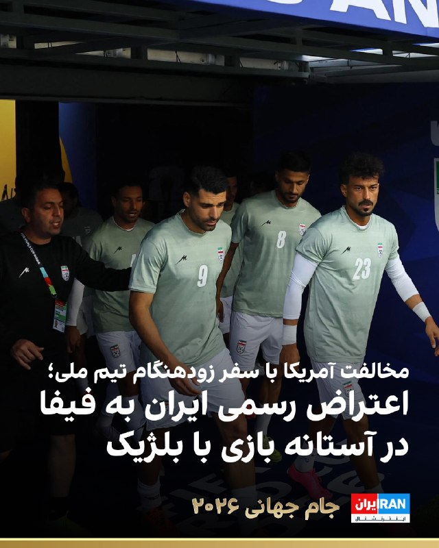

🔻فدراسیون فوتبال ایران با انتشار بیانیه‌ای رسمی، از اعمال «محدودیت‌های شدید و کارشکنی» برگزارکنندگان آمریکایی جام جهانی در برنامه آماده‌سازی تیم ملی خبر داد و اعلام کرد اعتراض خود را به فیفا ارسال می‌کند.

🔹بر اساس برنامه کادر فنی، قرار بود ملی‌پوشان دو روز پیش از هر مسابقه به شهر میزبان سفر کنند. به همین دلیل، ایران درخواست کرده بود به دلیل برگزاری مسابقه با بلژیک در ساعت ۱۲ ظهر یک‌شنبه در لس‌آنجلس، تیم دو روز زودتر راهی این شهر شود که با مخالفت آمریکا مواجه شد.

🔹بدین ترتیب، تیم ملی ناچار است تنها یک روز قبل از مسابقه به لس‌آنجلس سفر کند؛ اقدامی که فدراسیون فوتبال آن را مغایر با اصل ایجاد شرایط برابر برای تیم‌ها دانسته است.

🔹تیم ملی ایران برای بازی نخست برابر نیوزیلند هم تنها یک روز قبل از بازی مجوز حضور در آمریکا را دریافت کرد و بلافاصله بعد بازی هم خاک آمریکا را ترک کرد.

🔹وزارت امنیت داخلی آمریکا پیش‌تر اعلام کرده بود که «به لطف سخاوت رئیس‌جمهور ترامپ، تیم ایران خواهد توانست یک روز پیش از مسابقات خود وارد شود.»

@iranintltvsport

## IranIntlTV — post 343161

  <a href="telegram/content/IranIntlTV_343161_1781855214.mp4" target="_blank">🎬 Download video</a>

یک کودک بلوچ با ارسال پیامی به ایران اینترنشنال از مشکلات صادرنشدن شناسنامه برای خود می‌گوید. صدای او برای حفظ امنیتش تغییر داده شده است. تصویر این پیام برگرفته از رسانه‌های دولتی جمهوری اسلامی است و متعلق به صاحب صدا نیست.

## IranIntlTV — post 343160

  <a href="telegram/content/IranIntlTV_343160_1781855217.mp4" target="_blank">🎬 Download video</a>

دونالد ترامپ از پاسخ به سوالی درباره الگوبرداری جمهوری اسلامی از کره شمالی در تولید تسلیحات هسته‌ای سر باز زده است. اما چرا چنین مقایسه‌ای انجام می‌شود؟ پاسخ را باید در مجموعه‌ای از تناقض‌ها، وعده‌های دروغین و مذاکرات سیاسی بی‌فرجام پیونگ‌یانگ یافت.

گزارش توماج طاهباز، خبرنگار ایران‌اینترنشنال
@iranintltv

## IranIntlTV — post 343159

  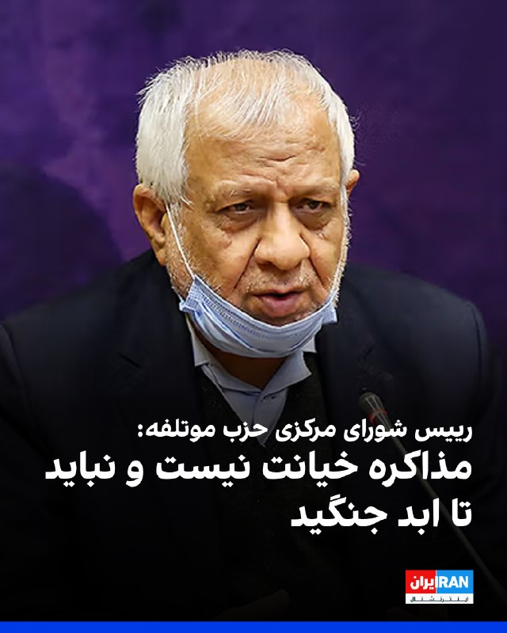

اسدالله بادامچیان، رییس شورای مرکزی حزب موتلفه، در گفت‌وگو با خبرگزاری ایسنا گفت برخی به اشتباه تصور می‌کنند تفاهم و مذاکره به از دست رفتن دستاوردهای میدان منجر می‌شود، در حالی که مذاکره می‌تواند ابزاری برای تثبیت و بهره‌برداری از این دستاوردها باشد.

او با رد اظهارنظر مسئولانی که مذاکره را «عقب‌نشینی یا خیانت» می‌دانند، گفت: «خیانت نه مذاکره، بلکه سازشکاری است؛ وگرنه پایان هر جنگی به مذاکره می‌انجامد و حتی برای گرفتن غرامت هم نیاز به مذاکره است.»
https://iranintl.com/202606192986

## IranIntlTV — post 343158

  <a href="telegram/content/IranIntlTV_343158_1781855218.mp4" target="_blank">🎬 Download video</a>

دو روز پس از امضای توافق میان روسای جمهور ایالات متحده و جمهوری اسلامی، مذاکرات برنامه‌ریزی‌شده برای روز جمعه در سوئیس لغو شد. پیش‌تر شهباز شریف، نخست‌وزیر پاکستان، نیز از لغو سفر خود به این کشور خبر داده بود.

جواد همدانی، خبرنگار ایران‌اینترنشنال، گزارش می‌دهد
@iranintltv

## IranIntlTV — post 343157

  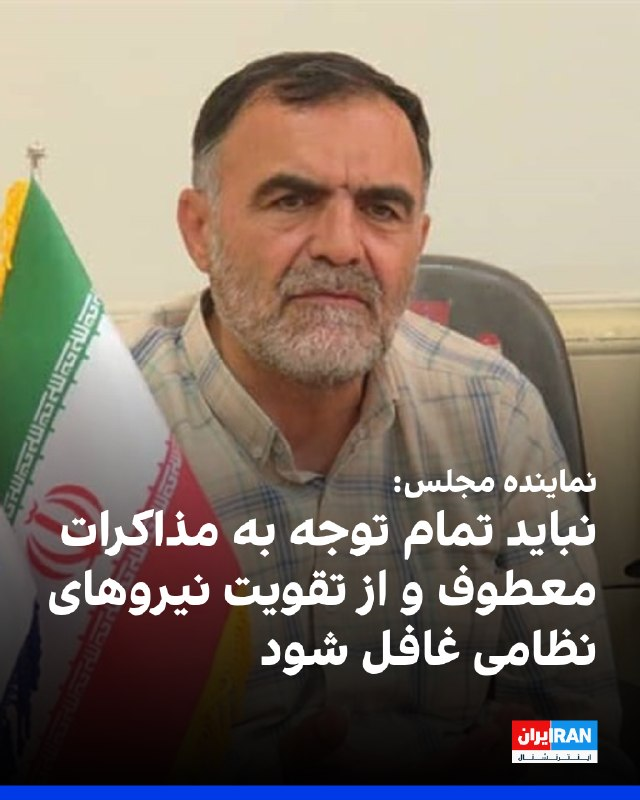

علی‌اکبر علیزاده، عضو فراکسیون انقلاب اسلامی مجلس، با تاکید بر ضرورت تقویت نیروهای نظامی و امنیتی گفت نباید تمام توجه جمهوری اسلامی به تفاهم‌نامه و اقدامات تیم مذاکره‌کننده معطوف شود و سایر نیازهای اساسی نادیده گرفته شود.

او گفت در کنار پیگیری روند مذاکرات، توجه به مسائل بنیادین کشور و حفظ آمادگی در حوزه‌های مختلف ضروری است و نباید از اولویت‌های دیگر غفلت شود.

علیزاده گفت نباید حتی برای لحظه‌ای از افزایش توان این نیروها و بهره‌گیری از «ظرفیت‌های مردمی» در حمایت از آن‌ها غافل شد.

این عضو مجلس جمهوری اسلامی در ادامه خواستار پرهیز از تشدید اختلافات داخلی شد و گفت باید از ایجاد شکاف در میان نیروهای همسو جلوگیری کرد.
https://iranintl.com/202606198597

## IranIntlTV — post 343156

  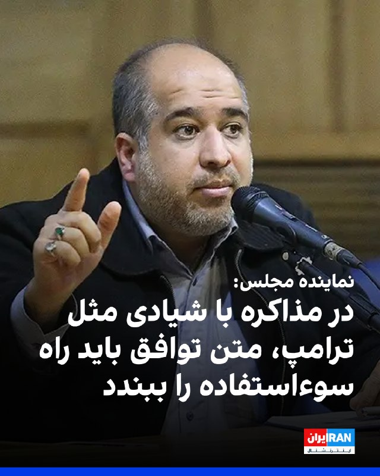

علی خضریان، عضو کمیسیون امنیت ملی مجلس جمهوری اسلامی، گفت با توجه به اینکه مجتبی خامنه‌ای، رهبر جمهوری اسلامی، برخلاف نظر خود مجوز این تفاهم‌نامه را صادر کرده است، «همه ملت در کنار رهبری منتظر تحقق شروط اعلام‌شده هستند.»

او با اشاره به مذاکرات با آمریکا برای دستیابی به توافق نهایی گفت: «وقتی با شیادی مثل ترامپ و دولت تروریست آمریکا طرف هستیم، متن باید راه هر نوع سوءاستفاده‌ای را از تفسیر عبارات و جملات ببندد.»

این عضو کمیسیون امنیت ملی مجلس جمهوری اسلامی همچنین هشدار داد اگر توافق جدید به محدودیت‌های یک‌جانبه و کاهش توان بازدارندگی جمهوری اسلامی منجر شود، می‌تواند به تهدیدی علیه امنیت ملی تبدیل شود. او تاکید کرد نباید تجربه و خسارت‌های ناشی از برجام تکرار شود.
https://iranintl.com/202606194081

## IranIntlTV — post 343155

رانندگان اسنپ‌باکس (اسنپ‌موتور) در قزوین روز پنج‌شنبه ۲۸ خرداد در اعتراض به پایین بودن کرایه‌ها دست به اعتصاب زدند. این معترضان با توقف فعالیت خود، خواستار رسیدگی به مطالبات و بازنگری در نرخ کرایه‌ها شدند.

## IranIntlTV — post 343154

  <a href="telegram/content/IranIntlTV_343154_1781855221.mp4" target="_blank">🎬 Download video</a>

در ونکوور و هم‌زمان با دیدار کانادا و قطر، گروهی از ایرانیان با در دست داشتن پرچم شیر و خورشید در فن‌فستیوال رسمی فیفا حضور یافتند. این معترضان گفتند تیمی که زیر پرچم جمهوری اسلامی به میدان می‌رود، نماینده واقعی مردم ایران نیست.

گزارش سپیدار ولیان، خبرنگار ایران‌اینترنشنال
@iranintltv

## IranIntlTV — post 343153

  <a href="telegram/content/IranIntlTV_343153_1781855222.mp4" target="_blank">🎬 Download video</a>

علی دادپی، اقتصاددان، درباره استقراض ۱۰۰ هزار میلیارد تومانی دولت از بانک مرکزی گفت این اقدام به افزایش پایه پولی منجر می‌شود و موجی از تورم فراتر از سطح قابل پیش‌بینی ایجاد خواهد کرد. او افزود این وضعیت، شرایط اقتصادی را برای مصرف‌کنندگان ایرانی به‌مراتب دشوارتر می‌کند.
@iranintltv

## IranIntlTV — post 343152

  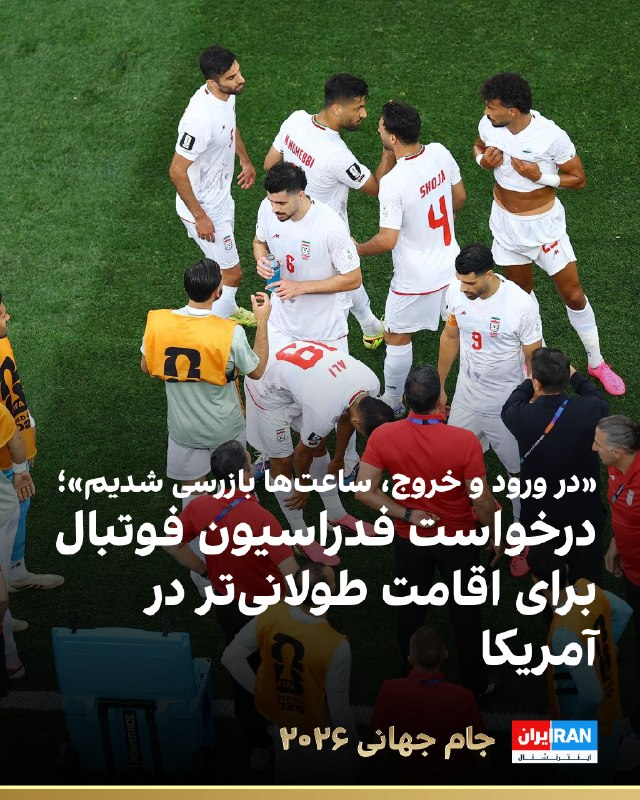

🔻پائولو الکساندر آراوخو، یکی از اعضای کادر پزشکی تیم فوتبال ایران به نیویورک تایمز گفته است که تیم ملی هنگام خروج از آمریکا بارها بازرسی شده و به همین دلیل پرواز با سه ساعت تاخیر انجام شده است.

🔹به گفته او هنگام ورود هم «ساعت‌ها با پرسش‌های مفصل ماموران مرزی آمریکا روبه‌رو شدند» و پس از آن نیز اعضای تیم برای سوارشدن به اتوبوس مجبور شدند یک بازرسی طولانی را پشت سر بگذارند.

🔹آراوخو گفت پس از بازی با نیوزیلند، مجبور شده است بانداژ و اقدامات درمانی بازیکنان را در هواپیما و در مسیر بازگشت به تیخوانا انجام دهد.

🔹سوار شدن به هواپیما نیز چالش‌های خاص خود را داشت. او گفت در فاصله چند متری هواپیما یک ایست بازرسی ایجاد شده بود و بازیکنان و اعضای کاروان ایران باید دو نفر دو نفر از آن عبور می‌کردند.

🔹نیویورک تایمز به نقل از یکی از مقام‌های تیم ایران نوشته که فدراسیون فوتبال در نامه‌ای به فیفا خواستار کاهش محدودیت‌های اقامت در آمریکا شده و خواسته است زمان بیشتری برای آماده‌سازی پیش از مسابقات در اختیار تیم قرار دهد.

🔹روایت کامل‌تری از بازرسی‌های تیم ملی در آمریکا را در سایت بخوانید.

@iranintltvsport

## IranIntlTV — post 343151

  <a href="telegram/content/IranIntlTV_343151_1781855224.mp4" target="_blank">🎬 Download video</a>

مجتبی خامنه‌ای در واکنش به تفاهم‌نامه با آمریکا گفت نظر دیگری داشته، اما به دلیل تعهدی که مسعود پزشکیان، رییس دولت و رییس شورای عالی امنیت ملی، به او داده، با امضای آن موافقت کرده است.

کامیار بهرنگ، عضو تحریریه ایران‌اینترنشنال، گفت: «مجتبی خامنه‌ای در این پیام، همانند پدرش، هیچ مسئولیتی را نپذیرفته و با سخنان دوپهلو تلاش کرده است اختلافات درون حاکمیت را حفظ کند.»
@iranintltv

## ManotoTV — post 106164

  <a href="telegram/content/ManotoTV_106164_1781855226.mp4" target="_blank">🎬 Download video</a>

جنگ، برخلاف انتظار بسیاری، جمهوری اسلامی را در کوتاه‌مدت تضعیف نکرد؛ بلکه به حکومت فرصت داد فضای امنیتی ایجاد کند، مخالفان را سرکوب کند و جناح‌های درون قدرت را زیر شعار بقا کنار هم نگه دارد. اما صلح می‌تواند مسئله‌ای متفاوت باشد. ورق بزنید.

## FarsiVOA — post 221169

  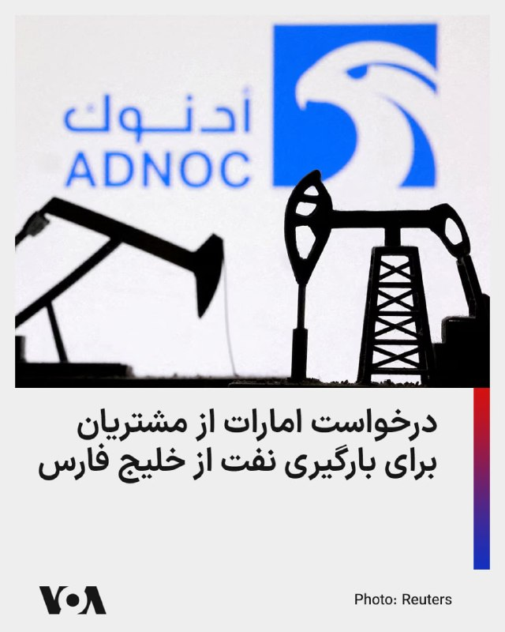

در پی رفع انسداد تنگه هرمز توسط جمهوری اسلامی در چهارچوب توافق با آمریکا، امارات از مشتریان نفتی خواست تا از پایانه‌های نفتی این کشور در خلیج فارس بارگیری نفت را از سر بگیرند.

خبرگزاری بلومبرگ گزارش داده که شرکت ملی نفت ابوظبی به مشتریان گفته است که می‌توانند بارگیری نفت از جزایر داس و زرکوه انجام دهند.

این شرکت اماراتی به مشتریان اطمینان داده اگر نتوانند نفتکشی برای اعزام به جزایر یاد شده فراهم کنند، این شرکت می‌تواند با نفتکش‌های خود برای بارگیری و انتقال نفت کمک کند.

امارت طی ماه‌های گذشته به خاطر انسداد تنگه هرمز بخش اعظم نفت خود را از بندر فجیره در دریای عمان صادر می‌کرد.
@FarsiVOA

## FarsiVOA — post 221168

  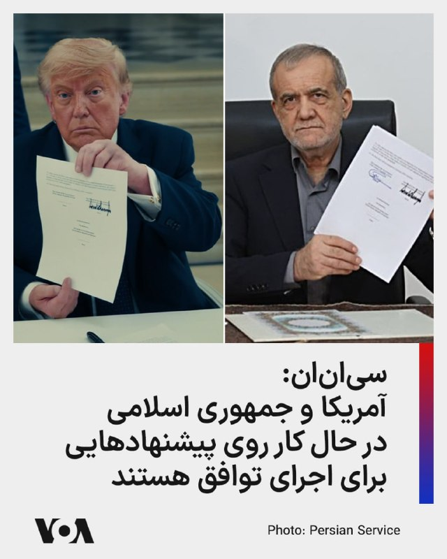

سی‌ان‌ان به نقل از سه مقام آمریکایی، یک مقام منطقه‌ای و یک مقام سابق آمریکایی، گزارش داد که ایالات متحده و حکومت ایران در حال تدوین پیشنهادهایی محرمانه برای نحوه اجرای «تفاهم‌نامه ۱۴ بندی» از جمله جزئیاتی درباره چگونگی رسیدگی به آینده برنامه هسته‌ای ایران هستند.

این منابع آگاه تأکید کردند که این موارد هنوز نهایی نشده‌اند و حکومت ایران هیچ سند دیگری به غیر از تفاهم‌نامه را امضا نکرده است.

جی. دی. ونس، معاون رئیس‌جمهوری آمریکا، روز پنج‌شنبه اشاره کرد که دست‌کم بخشی از آنچه مقام‌های دولت این کشور از آن به‌عنوان «تفاهم‌های شفاهی» با حکومت ایران یاد می‌کنند که فراتر از یادداشت تفاهم است، در واقع توافق‌های مکتوب هستند.

یکی از این منابع آگاه به سی‌ان‌ان گفت مذاکره‌کنندگان آمریکایی تصمیم گرفتند بدون انتظار برای تأیید رهبران ارشد جمهوری اسلامی درباره پیشنهادهای دقیق‌تر مربوط به نحوه اجرای ۱۴ بند، یادداشت تفاهم امضاشده را منتشر کنند.

بر اساس این گزارش، بخشی از این تصمیم به این دلیل بود که نمی‌خواستند مرحله بعدی مذاکرات به تعویق بیفتد.
@FarsiVOA

## FarsiVOA — post 221167

  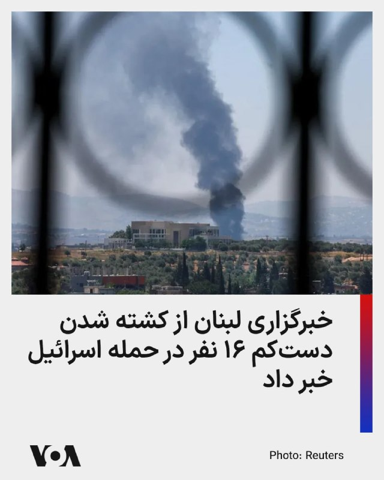

خبرگزاری ملی لبنان گزارش داد که حملات بامداد ۲۹ خرداد ارتش اسرائیل،‌ منجر به کشته شدن دست‌کم ۱۶ نفر در سراسر «منطقه نبطیه» در جنوب این کشور شد.

مقامات لبنان، عملیات فوق را یکی از شدیدترین حملات ارتش اسرائيل می‌دانند، اما اطلاعاتی درباره احتمال رابطه افراد کشته‌شده با حزب‌الله ارائه نکردند.

پیشتر ارتش اسرائیل از انجام حملاتی علیه حزب‌الله، در واکنش به «نقض‌های مکرر آتش‌بس» از سوی این سازمان خبر داده بود.

ایالات متحده، اسرائیل به همراه برخی از کشورها، حزب‌الله را یک سازمان تروریستی می‌دانند.
@FarsiVOA

## FarsiVOA — post 221166

🔺ادعای وزیر کشاورزی جمهوری اسلامی: ایران «هاب غذایی» منطقه می‌شود

▪️در بحبوحه افت چشمگیر تولید غلات و تورم سه رقمی اقلام غذایی، وزیر کشاورزی جمهوری اسلامی مدعی شده که ایران «هاب غذایی» منطقه می‌شود.

▪️محمدرضا نوری‌قزلجه در ادامه ادعا کرده موقعیت جغرافیایی کشور، دسترسی به آب‌های بین‌المللی و وجود کریدور‌های شمال ـ جنوب و شرق ـ غرب ظرفیت بزرگی را برای توسعه تجارت محصولات کشاورزی فراهم کرده است.

▪️اظهارات او در حالی است که به رغم گذشت سه دهه، هیچ کدام از این کریدورها عملیاتی نشده و اصولاً طبق ارزیابی بانک جهانی، ایران از لحاظ شاخص کارایی لجستیک، بعد از افغانستان بدترین وضعیت منطقه را دارد و از لحاظ رتبه جهانی نیز در کنار کشورهایی نظیر ونزوئلا و سوریه قرار گرفته است.

⬇️ بیشتر بخوانید:
https://ir.voanews.com/a/8162594.html

## FarsiVOA — post 221165

  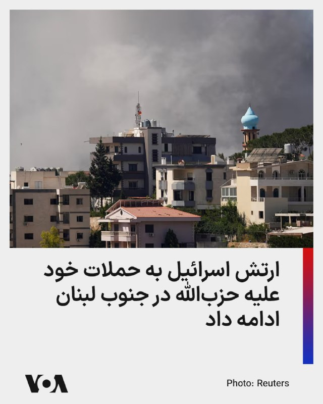

ارتش اسرائیل با صدور بیانیه‌ای اعلام کرد که در طول بامداد جمعه ۲۹ خردادماه، به حملات خود علیه زیرساخت‌های حزب‌الله در چندین منطقه جنوب لبنان ادامه داده است.

ارتش اسرائیل این حملات را واکنشی به «نقض‌های مکرر توافق آتش‌بس» از سوی حزب‌الله توصیف کرد.

پیشتر یخیل لیتر، سفیر اسرائیل در آمریکا، اعلام کرده بود که اسرائیل تا زمانی که حزب‌الله توافق آتش‌بس میان این کشور و لبنان را نقض نکند، به این توافق پایبند خواهد بود.

ایالات متحده، اسرائیل و برخی از کشورهای جهان، حزب‌الله را یک سازمان تروریستی می‌دانند. اتحادیه اروپا نیز شاخه نظامی این سازمان را در فهرست گروه‌های تروریستی قرار داده است.
@FarsiVOA

## FarsiVOA — post 221164

  

وزارت خارجه سوئیس با انتشار بیانیه‌ای اعلام کرد مذاکراتی که قرار بود روز جمعه میان ایالات متحده و ایران در اقامتگاه کوهستانی بورگن‌اشتوک در سوئیس برگزار شود، انجام نخواهد شد.

این اعلام پس از آن صورت گرفت که کاخ سفید پنج‌شنبه اعلام کرد که جی‌دی ونس، معاون رئیس‌جمهوری آمریکا، سفر خود به سوئیس را که قرار بود برای رهبری دور جدید مذاکرات با جمهوری اسلامی درباره برنامه هسته‌ای آن انجام شود، به تعویق انداخته است.

پیشتر شبکه المیادین، یک شبکه نزدیک به حزب‌الله، گزارش داد که جمهوری اسلامی اعزام هیئت مذاکره‌کننده خود به سوئیس را به دلیل ادامه عملیات نظامی اسرائیل در لبنان به تعویق انداخته است.
@FarsiVOA

## FarsiVOA — post 221162

  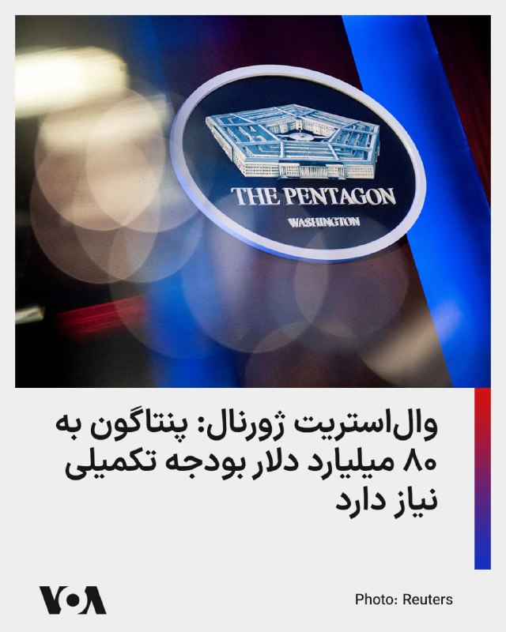

روزنامه وال‌استریت ژورنال به نقل از منابع آگاه از این موضوع گزارش داد که وزارت جنگ ایالات متحده برای پوشش هزینه‌های جنگ با جمهوری اسلامی و همچنین سایر هزینه‌های غیرمرتبط با جنگ، به ۸۰ میلیارد دلار نیاز دارد.

این روزنامه نوشت که این این موضوع را استیون فاینبرگ، معاون وزیر جنگ آمریکا، این هفته در تماس‌های تلفنی با قانون‌گذاران مطرح کرد.

بر اساس این گزارش، قانون‌گذاران از دولت ترامپ خواسته‌اند برآوردی جامع از هزینه‌های این جنگ ارائه کند.

هرگونه درخواست بودجه تکمیلی از سوی پنتاگون باید پیش از ارسال به کنگره، به تأیید دفتر مدیریت و بودجه کاخ سفید برسد. بودجه پنتاگون برای سال مالی ۲۰۲۶ جاری حدود یک تریلیون دلار است.

به گفته این منابع آگاه، درخواست کامل بودجه تکمیلی دولت آمریکا که شامل بودجه مورد نیاز پنتاگون و همچنین اولویت‌های غیرنظامی مانند کمک به بخش کشاورزی و امدادرسانی در بلایای طبیعی خواهد بود، ممکن است در روزهای آینده به قانون‌گذاران ارسال شود.
@FarsiVOA

## FarsiVOA — post 221161

  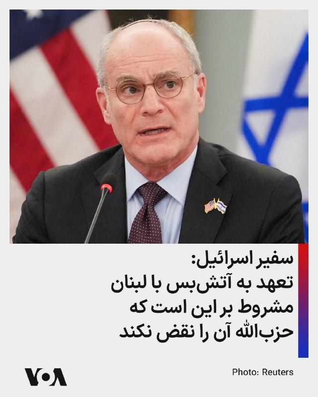

⚡️به گزارش تایمز اسرائيل یخیل لیتر، سفیر اسرائیل در آمریکا اعلام کرد که اسرائیل تا زمانی که حزب‌الله توافق آتش‌بس را نقض نکند، به توافق آتش‌بس منعقد شده بین اسرائیل و لبنان پایبند است. حساب «اسرائیل به فارسی» در شبکه اجتماعی ایکس روز پنجشنبه ۲۸ خرداد اعلام کرد گروه تروریستی حزب‌الله از زمان اعلام آتش‌بس در ۱۶ آوریل (۲۷ فروردین)، با شلیک صدها موشک، راکت و پهپاد، ضمن نقض آتش‌بس، ۱۹ اسرائیلی را کشته است.
@FarsiVOA

## DW_Farsi — post 126161

  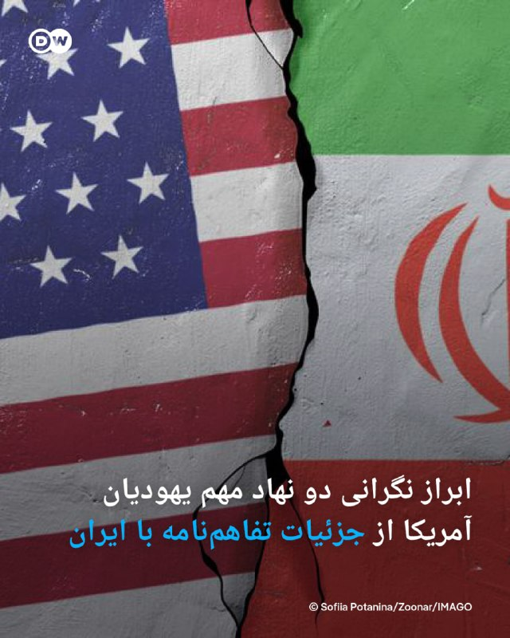

🔶 ابراز نگرانی دو نهاد مهم یهودیان آمریکا از جزئیات تفاهم‌نامه با ایران

کمیته روابط عمومی آمریکا و اسرائیل (ایپک) امضای تفاهم‌نامه میان جمهوری اسلامی و ایالات متحده آمریکا را مورد انتقاد قرار داد و اعلام کرد این تفاهم‌نامه "پرسش‌های مهمی را مطرح می‌کند".

در بیانیه ایپک آمده است: «این تفاهم‌نامه در ازای باز شدن تنگه هرمز و تعهدات مبهم ایران درباره برنامه هسته‌ای‌اش، کاهش تحریم‌ها علیه ایران را فراهم می‌کند.»

کمیته روابط عمومی آمریکا و اسرائیل در بخش دیگری از بیانیه خود با تاکید بر ضرورت راستی‌آزمایی برنامه اتمی جمهوری اسلامی نوشت: «یک توافق نهایی باید به شکلی دائمی و قابل راستی‌آزمایی به برنامه هسته‌ای این حکومت پایان دهد، از جمله با خارج کردن تمام اورانیوم غنی‌شده از ایران و برچیدن همه سایت‌های غنی‌سازی.»

در این بیانیه همچنین بر ضرورت محدودسازی برنامه موشکی جمهوری اسلامی اشاره شده و آمده است: «توافق نهایی همچنین باید برنامه غیرقانونی موشک‌های بالستیک و پهپادهای ایران را نیز در بر بگیرد و به تامین مالی گروه‌های تروریستی از سوی این حکومت که در سراسر جهان آشوب ایجاد می‌کنند، پایان دهد.»

@dw_farsi

## DW_Farsi — post 126160

  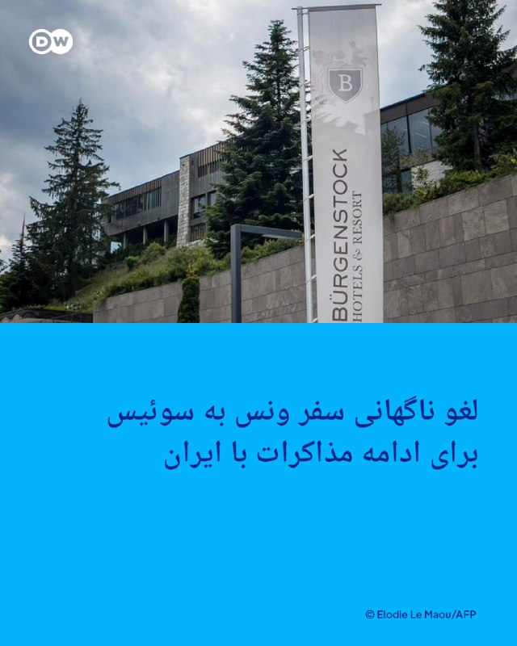

🔶 لغو ناگهانی سفر ونس به سوئیس برای ادامه مذاکرات با ایران

دفتر جی‌دی ونس، معاون رئیس‌جمهور آمریکا با صدور اطلاعیه‌ای اعلام کرد که سفر برنامه‌ریزی‌شده او به سوئیس به منظور آغاز مذاکرات اجرای تفاهم‌نامه ۱۴ ماده‌ای با ایران در روز جمعه ۱۹ ژوئن، لغو شده است.

این خبر در شرایطی مطرح می‌شود که در محافل حکومتی در تهران به ویژه پس از انتشار بیانیه مجتبی خامنه‌ای، رهبر جدید جمهوری اسلامی، تردیدهایی در خصوص ماهیت تفاهم ایجاد شده و حملات اسرائیل به لبنان نیز در این میان ادامه پیدا کرده است.

سوئیس نیز تایید کرد که گفت‌وگوهای برنامه‌ریزی‌شده میان ایالات متحده آمریکا و ایران که قرار بود امروز در اقامتگاه کوهستانی بورگن‌اشتوک در سوئیس برگزار شود، لغو شده است. بر اساس بیانیه وزارت امور خارجه سوئیس، این گفت‌وگوها امروز انجام نخواهد شد.

در همین حال وب‌سایت خبری اکسیوس به نقل از یک مقام آمریکایی گزارش داد که ادعاهای حکومت ایران در خصوص نقض آتش‌بس در لبنان توسط اسرائیل، ممکن است علت لغو مذاکرات برنامه‌ریزی‌شده میان جمهوری اسلامی و آمریکا در روز جمعه در سوئیس باشد.

@dw_farsi

## DW_Farsi — post 126158

  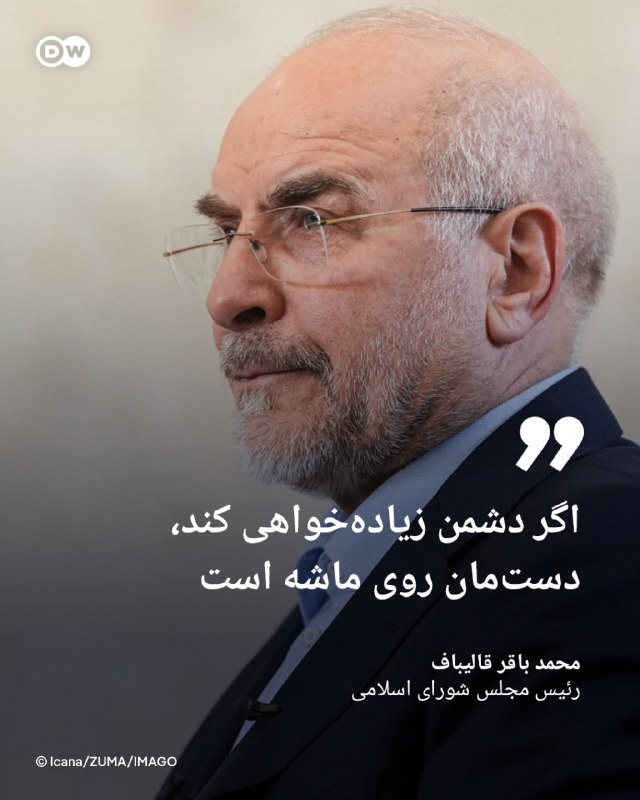

🔶 قالیباف‌: اگر دشمن زیاده‌خواهی کند، دست‌مان روی ماشه است

محمد باقر قالیباف، رئیس مجلس شورای اسلامی در واکنش به انتشار پیام منسوب به مجتبی خامنه‌ای، رهبری جمهوری اسلامی در خصوص مذاکرات و توافق اخیر پایان جنگ‌، نوشت که "اوامر" مجتبی خامنه‌ای را "نصب‌العین" خود قرار می‌دهد.

او در پیام خود، بیانیه مجتبی خامنه‌ای را "پیام راه‌گشا و حکیمانه" خواند و گفت: «این پیام، نقشه‌راهی بود که بیش از گذشته روشن کرد با نهایی شدن این یادداشت تفاهم، تازه به آغاز راه سخت و پرپیچ و خمی رسیده‌ایم که باید حقوق ملت ایران و مقاومت را از دشمن بدعهد استیفا کنیم.»

قالیباف در بیانیه خود مدعی شد که "این پیام و اعلام انتظار برای تحقق شروط تعیین شده در یادداشت تفاهم" دست او را برای پیگیری تعهدات آمریکا "پرتر کرده است".

در بخش دیگری از پیام قالیباف آمده است: «اجازه نخواهیم داد طرف مقابل با بدعهدی و زورگویی حق مردم ایران و جبهه مقاومت را مخدوش کند.»

در ادامه این بیانیه آمده است: «ما همان‌گونه که در مسیر گذشته مذاکرات نشان دادیم اهل ایستادگی برای تحقق شروط و خطوط قرمز تعیین شده و کسب منافع ملت ایران هستیم. مذاکره برای ما مسیر مبارزه برای گرفتن حقوق مردم ایران است و در این مسیر اگر دشمن به دنبال زیاده‌خواهی باشد ثابت کرده‌ایم که دست مان روی ماشه است و هیچ تردیدی در پاسخ کوبنده به دشمن که در جنگ اخیر طعم آن را چشیده، نداریم.»

اظهارات قالیباف در شرایطی مطرح می‌شود که بنا به اعلام دفتر معاون رئیس جمهور آمریکا، سفر برنامه‌ریزی شده جی‌دی ونس، معاون دونالد ترامپ، رئیس‌جمهور آمریکا به سوئیس در روز جمعه ۱۹ ژوئن برای مذاکره با ایران در خصوص جزئیات تفاهم‌نامه لغو شده است.

@dw_farsi

## Persian_Trend_Official — post 17528

یه سرقت عجیب و جسورانه توی بریتانیا اتفاق افتاده. دزدها با یه لودر تلسکوپی رفتن جلوی شعبه بانک و یه دستگاه خودپرداز رو از توی دیوار کندن و با خودشون بردن.
پلیس کمبریج‌شر گفته خودِ لودر رو هم دزدیده بودن؛ اونم فقط برای چند ده هزار پوند پول.

📌 @persian_trend_official
پرشین ترند | متفاوت‌ترین کانال نظامی

## Persian_Trend_Official — post 17527

  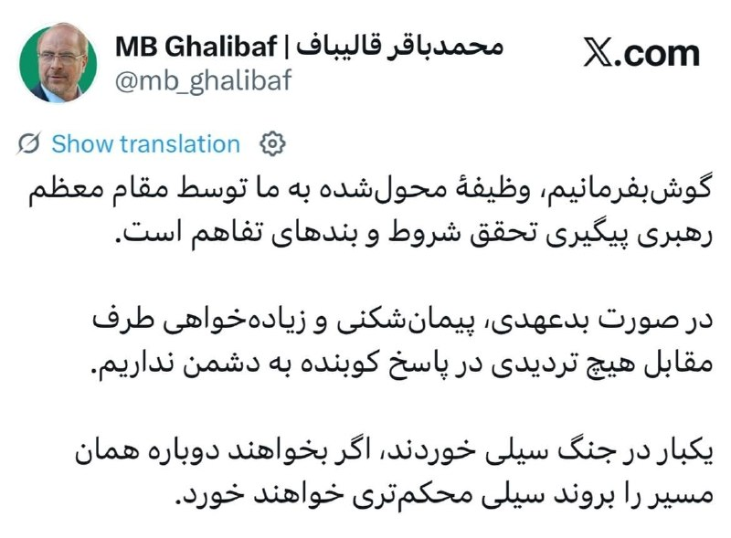

قالیباف، رئیس مجلس در پاسخ به پیام رهبر جمهوری اسلامی: گوش به‌ فرمانیم!

محمد باقر قالیباف: گوش‌بفرمانیم، وظیفهٔ محول‌شده به ما توسط مقام معظم رهبری، پیگیری تحقق شروط و بندهای تفاهم است.

در صورت بدعهدی، پیمان‌شکنی و زیاده‌خواهی طرف مقابل هیچ تردیدی در پاسخ کوبنده به دشمن نداریم.

یک‌بار در جنگ سیلی خوردند، اگر بخواهند دوباره همان مسیر را بروند سیلی محکم‌تری خواهند خورد.

📝 Amir

📌 @persian_trend_official
پرشین ترند | متفاوت‌ترین کانال نظامی

## Persian_Trend_Official — post 17526

  <a href="telegram/content/Persian_Trend_Official_17526_1781855232.webm" target="_blank">🎬 Download video</a>

وزارت امور خارجه سوئیس اعلام کرد که مذاکرات آمریکا و ایران که قرار بود روز جمعه برگزار شود، برگزار نخواهد شد.

رسانه‌های غربی این خبر را به نقل از وزارت امور خارجه سوئیس گزارش دادند. پیش از این امروز، کاخ سفید اعلام کرد که جی دی ونس، معاون رئیس جمهور آمریکا، پرواز خود به سوئیس برای امضای تفاهم‌نامه با ایران را لغو کرده است. با این حال، واشنگتن ابراز امیدواری کرد که مذاکرات فنی با تهران در اسرع وقت آغاز شود.

📝 Amir

📌 @persian_trend_official
پرشین ترند | متفاوت‌ترین کانال نظامی

## Persian_Trend_Official — post 17525

  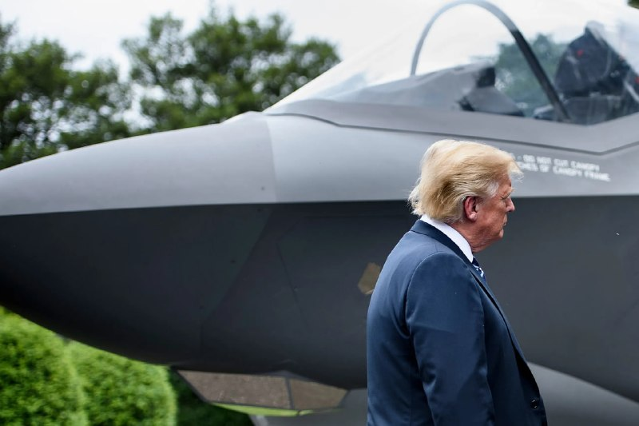

ترامپ در مورد ایران: تنها راهی که می‌توانم سخت‌تر شوم این است که دو یا سه هفته دیگر به آنجا بروم و به بمباران وحشتناک آنها ادامه دهم، درست است؟

اما این به چه چیزی منجر می‌شود؟ تنگه هرمز باز نخواهد شد. ما ماه‌ها نفت نخواهیم داشت. تا زمانی که بمب می‌اندازید، آن تنگه به طور خودکار بسته است.

این همان چیزی است که می‌تواند باعث رکود جهانی شود.

📝 Amir

📌 @persian_trend_official
پرشین ترند | متفاوت‌ترین کانال نظامی

## Persian_Trend_Official — post 17524

  <a href="telegram/content/Persian_Trend_Official_17524_1781855232.mp4" target="_blank">🎬 Download video</a>

خبرنگار: در آغاز مناقشه ایران، شما در مورد اینکه فقط تسلیم بی‌قید و شرط می‌خواهید صحبت کردید. این تفاهم‌نامه به نظر تسلیم بی‌قید و شرط نمی‌رسد.

ترامپ: احتمالاً تسلیم بی‌قید و شرط است. من هم همینطور فکر می‌کنم.

📝 Amir

📌 @persian_trend_official
پرشین ترند | متفاوت‌ترین کانال نظامی

## Persian_Trend_Official — post 17523

  <a href="telegram/content/Persian_Trend_Official_17523_1781855234.mp4" target="_blank">🎬 Download video</a>

ترامپ در مورد ایران: ما با اختلاف قدرتمندترین ارتش جهان را داریم. چه کس دیگری می‌توانست چنین محاصره‌ای انجام دهد؟

من یک محاصره دریایی انجام دادم که حتی یک کشتی هم نتوانست از آن عبور کند. برخی تلاش کردند. آنها خیلی دوام نیاوردند.

📝 Amir

📌 @persian_trend_official
پرشین ترند | متفاوت‌ترین کانال نظامی

## Persian_Trend_Official — post 17522

  <a href="telegram/content/Persian_Trend_Official_17522_1781855236.mp4" target="_blank">🎬 Download video</a>

خبرنگار اکسیوس: شما نه تنها در مورد اعمال قدرت، بلکه در مورد محدودیت‌های قدرت خود در نتیجه درگیری با ایران چه آموخته‌اید؟

ترامپ: هیچ محدودیتی وجود ندارد. من هنوز این درس را نیاموخته‌ام. می‌دانم که وجود دارد، اما می‌دانید، هیچ محدودیتی وجود ندارد. ما آنها را کاملاً از نظر نظامی شکست دادیم.

📝 Amir

📌 @persian_trend_official
پرشین ترند | متفاوت‌ترین کانال نظامی

## Persian_Trend_Official — post 17518

جنگنده‌های اسرائیلی همچنان به بمباران سراسر جنوب لبنان ادامه می‌دهند.

📝 Amir

📌 @persian_trend_official
پرشین ترند | متفاوت‌ترین کانال نظامی

## Persian_Trend_Official — post 17517

  <a href="telegram/content/Persian_Trend_Official_17517_1781855238.mp4" target="_blank">🎬 Download video</a>

صبحتون بخیر 🌄
F-18 Super Hornet

📌 @persian_trend_official
پرشین ترند | متفاوت‌ترین کانال نظامی

## RadioFarda — post 158495

خامنه‌ای مسئولیت تفاهم‌نامه را به عهده پزشکیان گذاشت؛ پزشکیان قول پیروی از دستور داد

🔸 رسانه‌ها در ایران پنج‌شنبه شب، ۲۸ خرداد، متن پیام مکتوبی منسوب به مجتبی خامنه‌ای را منتشر کردند مبنی بر این که درباره امضای تفاهم‌نامه میان ایران و آمریکا «نظر دیگری» داشته و اکنون مسئولیت آن را بر عهده مسعود پزشکیان، رئیس شورای عالی امنیت ملی، و دیگر اعضای این شورا می‌داند.

🔸 مجتبی خامنه‌ای کمتر از ۱۰ روز پس از کشته شدن پدرش در حمله هوایی اسرائیل به عنوان رهبر تازه حکومت معرفی شد، اما در بیش از سه ماه و نیم گذشته نه فایلی صوتی از او منتشر شده و نه ویدئویی که نشان دهد او از توان رهبری و تصمیم‌گیری برخوردار است.

🔸 در پیام رهبر تازه جمهوری اسلامی درباره توافق با ایالات متحده آمده است: «بنده علی‌الاصول، نظر دیگری داشتم ولی از باب تعهدی که رئیس‌جمهور محترم به‌عنوان رئیس شورای عالی امنیت ملی از طرف خود و سایر اعضا در پاسداشت حقوق ملت ایران و جبهه مقاومت به بنده دادند و تصریح به قبول مسئولیت آن نمودند، اجازه آن را صادر نمودم‌.»

🔸 در پاسخ به پیام خامنه‌ای،‌ مسعود پزشکیان، رئیس جمهور، بلافاصله شامگاه پنج‌شنبه در پیامی نوشت که «خود را متعهد به توجه حداکثری نسبت به دغدغه‌های» مجتبی خامنه‌ای در زمینه «حراست از حقوق» ایران و گروه‌های نیابتی آن می‌داند.

🔸گزارش کامل را در وب‌سایت رادیو فردا می‌توانید بخوانید.

@RadioFarda

## RadioFarda — post 158494

  <a href="telegram/content/RadioFarda_158494_1781855239.mp4" target="_blank">🎬 Download video</a>

🔸توماج صالحی، خواننده معترض، در اثر جدید خود به نام «موجی» به دوره سه ماهه جنگ پرداخته و در اینستاگرام خود از آن با عنوان «تاریک‌ترین دوران» نام برده و نوشته است که «تنهاترین بودیم.»

🔸این هنرمند در این اثر از حکومت، دولت‌های مهاجم و حامیان جنگ انتقاد و در پستی که منتشر کرده، نوشته است: «چرا باور نمی‌کنیم ناجی‌ای جز خودمون نداریم و بجای انتظار کشیدن برای یک نجات‌دهنده دست‌های همدیگه رو نمی‌گیریم؟»

🔸توماج صالحی، رپر، بارها به دلیل فعالیت‌های مدنی به‌ویژه انتشار ترانه‌های اعتراضی بازداشت شده است.

🔸او که در جریان اعتراضات سال ۱۴۰۱ بازداشت شده بود در اردیبهشت ۱۴۰۳ از سوی دادگاه انقلاب اسلامی به اعدام محکوم شد اما دیوان عالی کشور این حکم را نقض کرد و آقای صالحی در آذرماه ۱۴۰۳ پس از گذراندن یک سال حکم حبس از زندان آزاد شد.

@RadioFarda

## RadioFarda — post 158493

  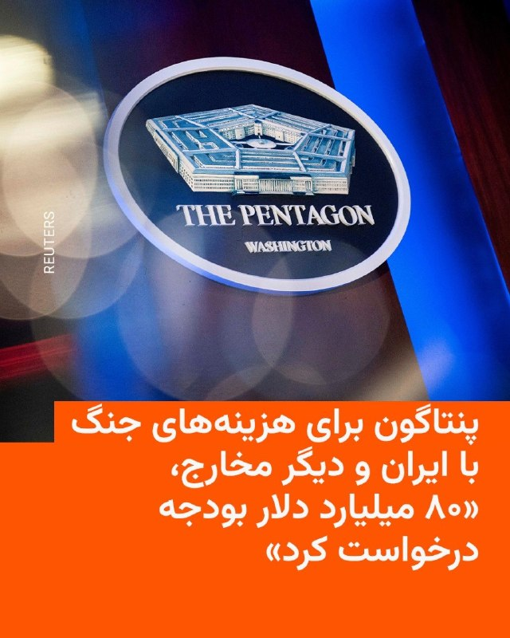

🔸 وال‌استریت جورنال می‌نویسد که به گفته منابع آگاه، استیون فاینبرگ، معاون وزیر دفاع آمریکا، این هفته در تماس‌هایی با قانونگذاران اعلام کرده است که پنتاگون برای پوشش هزینه‌های جنگ با ایران و همچنین برخی هزینه‌های دیگر که ارتباطی به جنگ ندارند، به ۸۰ میلیارد دلار بودجه نیاز دارد.

🔸 قانونگذاران آمریکایی در هفته‌های اخیر از دولت دونالد ترامپ خواسته‌اند برآوردی جامع از هزینه‌های جنگی که از ۹ اسفند آغاز شد ارائه کند.

🔸 به نوشته وال‌استریت جورنال، یکی از نگرانی‌های نمایندگان و سناتورها این است که ارتش آمریکا در جریان این جنگ بخش قابل توجهی از مهمات ارزشمند خود را مصرف کرده باشد؛ مهماتی که ممکن است برای مقابله با تهدیدهای دیگر در نقاط مختلف جهان مورد نیاز باشند.

@RadioFarda

## RadioFarda — post 158492

  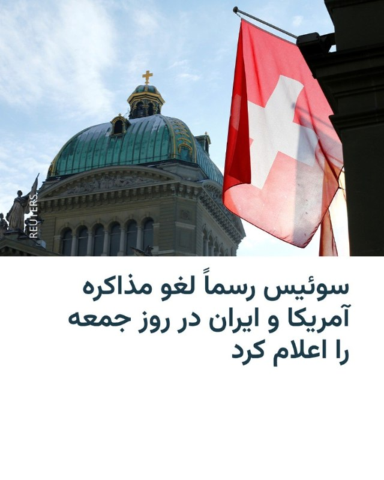

🔸در پی اعلام کاخ سفید مبنی بر لغو سفر معاون دونالد ترامپ به سوئیس، وزارت خارجه این کشور اروپایی رسما خبر لغو سفر هیئت آمریکایی و لغو مذاکرات تهران و واشینگتن در روز جمعه را تأیید کرد.

🔸لغو آغاز فوری مذاکرات بین دو کشور متخاصم تنها یک روز پس از امضا و رسمی شدن تفاهم‌نامه‌ای رخ می‌دهد که یکی از مهم‌ترین بندهای آن ۶۰ روز فرصت برای مذاکره درباره فعالیت هسته‌ای ایران است. قرار بود این ۶۰ روز بلافاصله در روز جمعه آغاز شود.

🔸اما خبرگزاری تسنیم، نزدیک به سپاه پاسداران، روز پنج‌شنبه خبر داد که مذاکره‌کنندگان ایرانی پیش از آغاز دور بعدی گفت‌وگوهای صلح نیاز دارند نشانه‌هایی از اجرای توافق موقت از سوی آمریکا مشاهده کنند و هنوز تأییدی درباره سفر هیئت ایرانی به ژنو وجود ندارد.

🔸در پی این انتشار این خبر بود که سخنگوی کاخ سفید هم در بیانیه‌ای که پنج‌شنبه شب منتشر شد، اعلام کرد ونس و هیئت آمریکایی آماده بودند به محض نهایی شدن برنامه مذاکرات، عازم شوند.

@RadioFarda

## RadioFarda — post 158491

  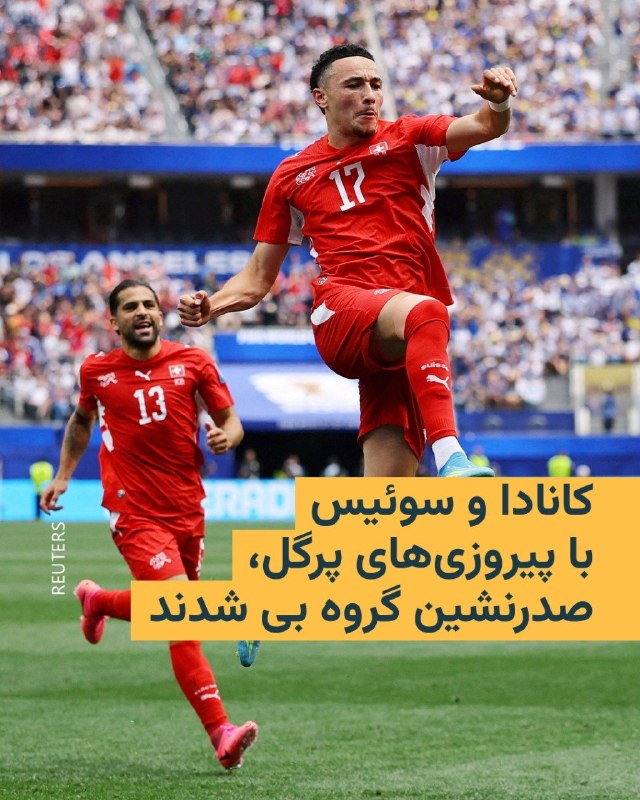

شرح عکس: شادی روبن وارگاس، بازیکن سوئیس، پس از گل دوم

🔸 تیم ملی فوتبال کانادا پنج‌شنبه شب ۲۸ خرداد در ونکوور با پیروزی قاطع ۶ بر صفر برابر قطر، نخستین برد خود در تاریخ جام جهانی را جشن گرفت و به صدر جدول گروه بی نزدیک‌تر شد.

🔸 جاناتان دیوید، مهاجم یوونتوس، با به ثمر رساندن سه گل ستاره میدان بود. کایل لارین و نیتن سالیبا نیز برای کانادا گلزنی کردند و یک گل به خودی محمد مناعی، مدافع قطر، شکست سنگین قهرمان آسیا را کامل کرد.

🔸 کانادا که در شش مسابقه قبلی خود در جام‌های جهانی ۱۹۸۶ و ۲۰۲۲ موفق به کسب پیروزی نشده بود، این بار در حضور مارک کارنی، نخست‌وزیر کانادا، نمایشی یک‌طرفه ارائه داد.

🔸 در دیگر دیدار گروه بی، سوئیس با نتیجه ۴ بر ۱ بوسنی و هرزگوین را شکست داد. یوهان مانزامبی دو بار گلزنی کرد و روبن وارگاس و گرانیت ژاکا نیز برای سوئیس گل زدند.

🔸 در گروه «آ» نیز آفریقای جنوبی با تساوی ۱-۱ برابر جمهوری چک نخستین امتیاز خود را به دست آورد.

🔸 هر دو تیم با یک امتیاز همچنان شانس صعود دارند، هرچند احتمالاً برای رسیدن به مرحله بعدی باید در آخرین مسابقه خود به پیروزی برسند.

@RadioFarda

## RadioFarda — post 158490

  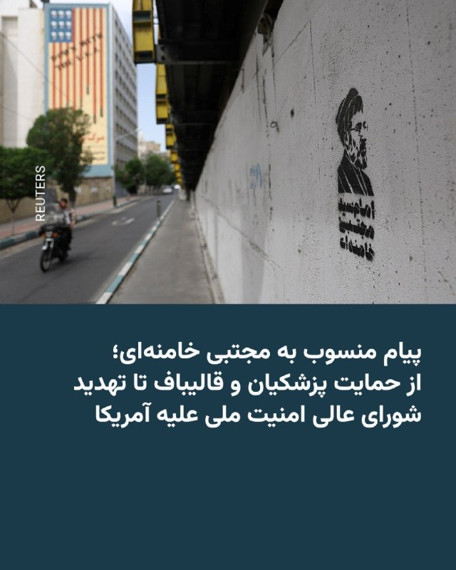

🔸رسانه‌های ایران شامگاه پنج‌شنبه ۲۸ خذداد متن پیام مکتوبی منسوب به مجتبی خامنه‌ای را منتشر کردند که در آن رهبر جمهوری اسلامی درباره امضای تفاهم‌نامه میان ایران و آمریکا گفته است که «نظر دیگری» داشته و مسئولیت آن را بر عهده مسعود پزشکیان، رئیس شورای عالی امنیت ملی، و دیگر اعضای این شورا دانسته است.

🔸در پی انتشار این پیام منتسب به رهبر جمهوری اسلامی، مسعود پزشکیان آن را «راهبردی و روشنگرانه در تبیین مذاکرات پیش رو» خواند و نقش این پیام «در ترسیم چارچوب‌های کلان مذاکرات و تبیین مسئولیت دستگاه‌های ذی‌ربط» را تعیین‌کننده دانست.

🔸محمدباقر قالیباف هم در پیام تازه خود، یادداشت تفاهم با آمریکا را «آغاز راهی سخت و پرپیچ و خم» توصیف کرد و گفت که «اوامر» رهبر جمهوری اسلامی را «نصب‌العین» خود قرار می‌دهد.

🔸دبیرخانه شورای عالی امنیت ملی هم با انتشار بیانیه‌ای نوشت: «با بی‌اعتمادی کامل به دشمن بدعهد و پیمان‌شکن و با نظارت دقیق بر فرآیند مذاکرات و اجرای برنامه‌ها، چنانچه تخطی و تخلفی از جانب طرف آمریکایی صورت گیرد، طبق برنامه از پیش تعیین شده، اقدام متقابل صورت خواهد گرفت.»

@RadioFarda

## RadioFarda — post 158489

  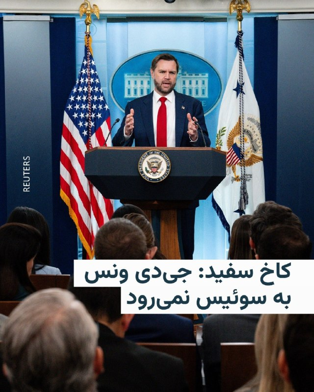

🔸کاخ سفید اعلام کرد جی‌دی ونس، معاون رئیس‌جمهور آمریکا، سفر خود به سوئیس برای گفت‌وگوهای مربوط به مراحل بعدی توافق آمریکا و ایران درباره پایان جنگ در خاورمیانه را به تعویق انداخته است.

🔸ایران اعلام کرده بود پس از آنکه دو طرف با امضای توافق، آتش‌بسی شکننده را دست‌کم برای ۶۰ روز دیگر تمدید کردند، آماده آغاز مذاکرات فنی است.

🔸اما خبرگزاری نیمه‌رسمی تسنیم پیش‌تر در روز پنج‌شنبه ۲۸ خرداد، پیش از اعلام خبر از سوی جی‌دی ونس، گزارش داد که مذاکره‌کنندگان ایرانی پیش از آغاز دور بعدی گفت‌وگوهای صلح، نیاز دارند نشانه‌هایی از اجرای توافق موقت از سوی آمریکا مشاهده کنند و هنوز تأییدی درباره سفر هیئت ایرانی به ژنو وجود ندارد.

🔸سخنگوی کاخ سفید در بیانیه‌ای که پنج‌شنبه شب منتشر شد، اعلام کرد ونس و هیئت آمریکایی آماده بودند به محض نهایی شدن برنامه مذاکرات، عازم شوند.

🔸در این بیانیه آمده است: «اما مسائل تدارکاتی این مذاکرات هرگز ساده یا قابل پیش‌بینی نبوده است. در حال حاضر معاون رئیس‌جمهور امشب عازم سفر نخواهد شد.»

@RadioFarda

## RadioFarda — post 158488

  <a href="https://t.me/radiofarda/158488" target="_blank">📎 Download file</a>

📻بشنوید: سرخط خبرها با رادیوفردا، ۲۹ خرداد ۱۴۰۵‌

@RadioFarda

## BBCPersian — post 284348

🔻یک مامور نیروی انتظامی در تیراندازی افراد مسلح در خاش کشته شد

مرکز اطلاع‌رسانی پلیس سیستان و بلوچستان اعلام کرد یک مامور فرماندهی نیروی انتظامی شهرستان خاش، در پی تیراندازی افراد مسلح ناشناس کشته شده است.

این مرکز نام این فرد را ستوان سوم عبدالسلام کُرد اعلام کرده است.

به گفته پلیس فراجا، عملیات شناسایی و دستگیری این افراد آغاز شده است.

در ماه‌های اخیر حمله افراد مسلح به نیروهای امنیتی در شهرهای مختلف استان سیستان و بلوچستان، بارها خبرساز شده است.

گروه جیش‌العدل در این منطقه فعالیت می‌کند. پاییز سال گذشته این گروه در «جبهه مبارزین بلوچ» ادغام شد.

علاوه بر جیش‌العدل نام چند گروه دیگر نیز به عنوان اعضای این ائتلاف ذکر شده است از جمله «جنبش پادا بلوچ»، «حرکت نصر بلوچ»، «گروه محمد رسول‌الله» و «جنگجویان خودجوش بلوچ».

https://bbc.in/4vgfIJP
@BBCPersian

## BBCPersian — post 284340

🔸فوتبال بلژیک در دو دهه گذشته داستانی متفاوت از بسیاری از قدرت‌های سنتی فوتبال اروپا داشته است. این کشور نه سابقه قهرمانی جهان را دارد، نه مانند آلمان، ایتالیا یا فرانسه دهه‌ها در میان قدرت‌های اصلی فوتبال جهان دیده می‌شد.

با این حال، از اواسط دهه ۲۰۱۰ تا امروز، کمتر تیمی به اندازه بلژیک «در بحث استعداد فردی» در فوتبال اروپا و حتی جهان، مورد توجه قرار گرفته است.

در این سال‌ها، نسلی کم‌نظیر از بازیکنان بلژیکی در سطح اول فوتبال اروپا ظهور کردند؛ نسلی که تیبو کورتوا، کوین د‌بروینه، روملو لوکاکو، ادن آزار، یان فرتونخن، توبی آلدرویرلد و دریس مرتنس تنها بخشی از آن بودند.

📸GettyImages
@BBCPersian

## BBCPersian — post 284339

  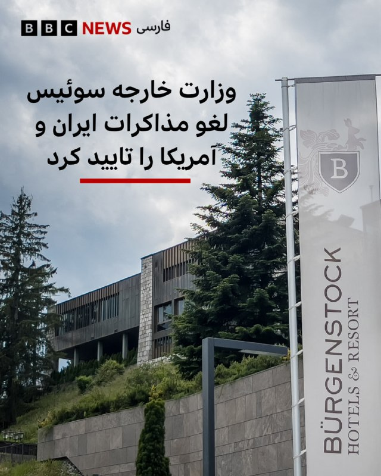

🔻وزارت خارجه سوئیس اعلام کرد که نشست برنامه‌ریزی‌شده میان ایالات متحده و جمهوری اسلامی ایران که قرار بود روز جمعه در بورگن‌اشتوک برگزار شود، لغو شده است.

این تصمیم پس از آن اتخاذ شد که کاخ سفید از لغو سفر جی‌دی ونس، معاون اول رئیس‌جمهور آمریکا، به دلیل «مسائل تدارکاتی» خبر داد.

این گفت‌وگوها قرار بود نقطه آغازین مهلتی ۶۰ روزه برای مذاکرات هسته‌ای بر اساس تفاهم‌نامه اخیر دو کشور باشد.

روز پنج‌شنبه ۲۹ خرداد، خبرگزاری تسنیم، نزدیک به سپاه پاسداران، خبر داد که مذاکره‌کنندگان ایرانی پیش از آغاز دور بعدی گفت‌وگوهای صلح نیاز دارند نشانه‌هایی از اجرای توافق موقت از سوی آمریکا مشاهده کنند و هنوز تأییدی درباره سفر هیئت ایرانی به ژنو وجود ندارد.

گزارش‌ها نشان می‌دهد لغو این نشست تنها یک روز پس از امضای تفاهم‌نامه و در پی درخواست تهران برای مشاهده نشانه‌های اجرای توافق از سوی واشنگتن صورت گرفته است.

سوئیس به عنوان حافظ منافع آمریکا در ایران، میزبان این دور از دیدارهای دیپلماتیک بود.

📷Getty Images

## BBCPersian — post 284338

  

🔻خبرگزاری ملی لبنان می‌گوید در حملات اسرائیل به شهرک‌های شرقیه، حاروف، کفررمان، کفرجوزو کفرصیر در جنوب این کشور دست‌کم ۱۶ نفر کشته شده‌اند.

به گزارش رسانه‌های محلی لبنان، از ساعات اولیه بامداد امروز، حملات توپخانه‌ای ارتش اسرائیل به شهر نبطیه و مناطق اطراف آن ادامه دارد.

این در حالی است که بند اول تفاهم‌نامه ایران و آمریکا، پایان فوری و دائمی عملیات نظامی در همه جبهه‌ها، از جمله لبنان را تضمین می‌کرد.

اختلاف نظر میان آمریکا و اسرائيل بر سر توقف حملات به مواضع حزب‌الله در جنوب لبنان بالا گرفته است.

جی‌دی ونس، معاون اول ریاست جمهوری آمریکا روز گذشته در یک نشست خبری گفت دونالد ترامپ تنها رئیس‌ دولتی در تمام جهان است که در این مقطع زمانی نسبت به کشور اسرائیل همدلی و حمایت نشان می‌دهد و اتفاقا رهبر قدرتمندترین کشور جهان هم هست: «اگر من عضو کابینه دولت اسرائیل بودم، احتمالا به تنها متحد قدرتمندی که در سراسر جهان برایم باقی مانده حمله لفظی نمی‌کردم.»

ادامه از:
https://bbc.in/4aSLYdF
📷Reuters
@BBCPersian

## BBCPersian — post 284337

  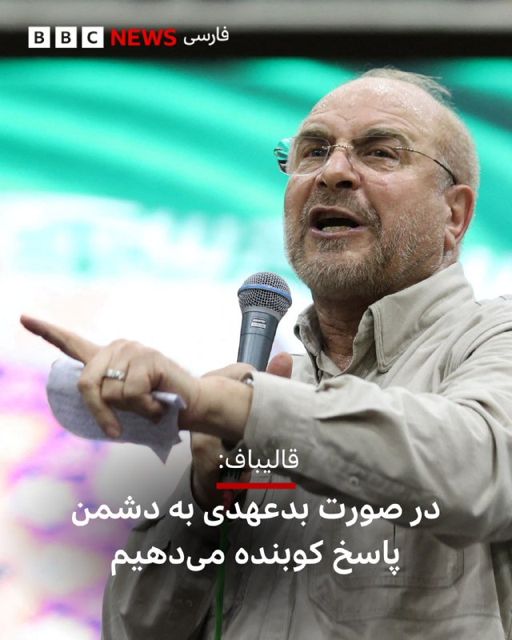

🔻محمدباقر قالیباف، رئیس مجلس و همچنین رئیس هیئت ایران در مذاکرات با آمریکا، در واکنش به پیام منسوب به مجتبی خامنه‌ای در ایکس نوشته که از سوی رهبر موظف به پیگیری تحقق شروط و بندهای تفاهم‌ شده و «گوش به فرمان» اوست.

آقای قالیباف نوشته که ایران در صورت «بدعهدی، پیمان‌شکنی و زیاده‌خواهی طرف مقابل» تردیدی در پاسخ کوبنده ندارد.

او با اشاره تلویحی به پیروزی ایران در جنگ با آمریکا نوشت: «اگر بخواهند دوباره همان مسیر را بروند سیلی محکم‌تری خواهند خورد.»

📷Reuters
@BBCPersian

## BBCPersian — post 284336

  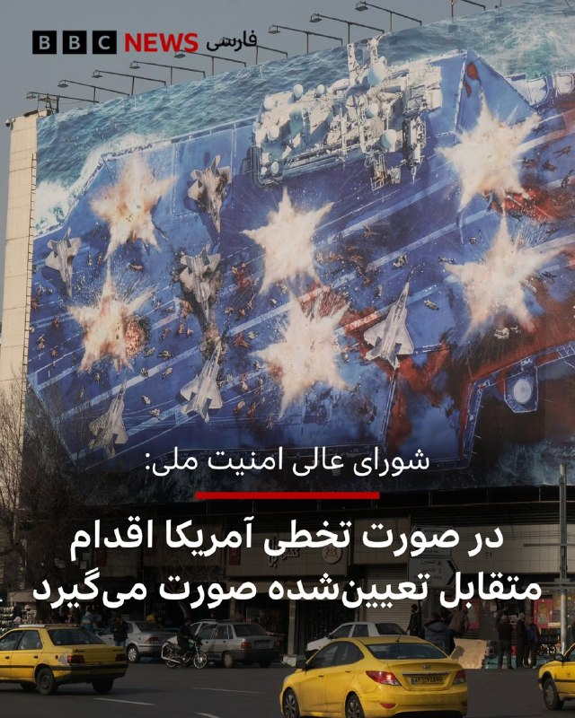

‌🔻پس از انتشار پیامی منتسب به مجتبی خامنه‌ای، رهبر جدید جمهوری اسلامی، که در آن گفته نظر او درباره توافق با آمریکا «چیز دیگری بوده»، مقام‌ها و نهادهای حکومتی در ایران با واکنش به این اظهارات تلاش کرده‌اند مواضع خود را با آقای خامنه‌ای متوازن کنند.

بامداد جمعه دبیرخانه شورایعالی امنیت ملی - شعام - با انتشار بیانیه‌ای اعلام کرد که به رهبر و مردم اطمینان می‌دهد که: «در نگهبانی از حقوق ملت ایران و جبهه مقاومت، پاسداشت خون شهیدانمان و پیشبرد مذاکرات آینده بر مبنای منافع و مصالح جمهوری اسلامی ایران به هیچ وجه مسامحه نخواهد کرد و تا استیفای کامل حقوق ملت ایران و خونخواهی خون پاک و مطهر رهبر شهیدمان، از پای نخواهد نشست.»

در این بیانیه تاکید شده است که: «با بی اعتمادی کامل به دشمن بدعهد و پیمان‌شکن و با نظارت دقیق بر فرآیند مذاکرات و اجرای برنامه‌ها، چنانچه تخطی‌ و تخلفی از جانب طرف آمریکایی صورت گیرد، طبق برنامه از پیش تعیین شده، اقدام متقابل صورت خواهد گرفت.»

📷Getty
@BBCPersian

## BBCPersian — post 284327

🖊اونور ارم
بخش ترکی بی‌بی‌سی، لندن

🔻اعلام دستیابی به تفاهم میان ایران و آمریکا، باعث کاهش قیمت نفت در سراسر جهان و افزایش بهای طلا و شاخص‌های بورس شد.

جنگی که پس از حملات آمریکا و اسرائیل در ۲۸ فوریه آغاز شد، در مدت کوتاهی به سراسر خاورمیانه گسترش یافت و از حمل‌ونقل هوایی و زنجیره‌های تأمین گرفته تا بازارهای جهانی، پیامدهای آن در سراسر اقتصاد جهان احساس شد.

در ترکیه نیز این جنگ موجب شد نرخ تورم که پیش از آن هم در سطح بالایی قرار داشت، از ماه مارس تاکنون فراتر از پیش‌بینی‌ها افزایش یابد.

در واکنش به این وضعیت، بانک مرکزی ترکیه چرخه کاهش نرخ بهره را که از ژوئیه ۲۰۲۵ آغاز کرده بود متوقف کرد و تصمیم گرفت نرخ بهره را بدون تغییر نگه دارد.

پیامدهای جنگ در بخش‌های مختلف اقتصاد ترکیه، از گردشگری تا صنعت، محسوس بوده است.

متن کامل خبر را از لینک زیر بخوانید:

https://bbc.in/4eo2dAo
📸GettyImages/ Reuters/ Bloomberg via Getty Images/ Anadolu via Getty Images/ NurPhoto via Getty Images/ AFP via Getty Images/ LightRocket via Getty Images/ Satellite image (c) 2026 Maps4media via Getty Images

@BBCPersian

## idfinfarsi — post 11857

🔴ارتش اسرائیل در طول شب گذشته حملاتی را انجام داده و همچنان به حمله علیه تروریست‌ها و زیرساخت‌های تروریستی سازمان تروریستی حزب‌الله در چندین منطقه در جنوب لبنان ادامه می‌دهد.

🔸این حملات پس از نقض‌های مکرر توافق آتش‌بس از سوی سازمان تروریستی حزب‌الله انجام شده است.

## Dirty_Kids — post 392553

  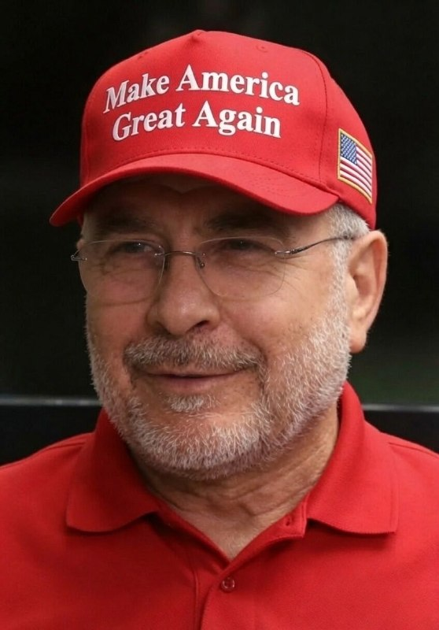

قالیباف: آدم برای خون خواهی امام حسین میزنه شمر رو میکشه؟
نه! میره باهاش تفاهم نامه امضا میکنه، پول میگیره، با پولش قیمه میخوره تا امام زمان ظهور کنه! همین میشه انتقام سخت!

عرزشیا فهمیدن یا عمو باقر بیشتر توضیح بده؟ 😂

@Dirty_Kids 👻

## Dirty_Kids — post 392552

  <a href="telegram/content/Dirty_Kids_392552_1781855246.mp4" target="_blank">🎬 Download video</a>

چه دل و جرعتی 👏

@Dirty_Kids 👻

## Dirty_Kids — post 392551

‌‎صورتش رو سه‌تیغ می‌کرد، باید محاسن داشته باشه، اول فامیلیش قاف باشه، چشاش بور باشه و از همه مهم‌تر، بِچِه‌ی طرقِبَه باشه @Dirty_Kids 👻 ‌

## Dirty_Kids — post 392550

  <a href="telegram/content/Dirty_Kids_392550_1781855246.mp4" target="_blank">🎬 Download video</a>

امشب توی یکی از شبکه های استانی صداوسیما یه مراسم روضه خوانی برگزار شده که از شدت غم این روضه خود امام حسینم خندش گرفته: 😂😂😂😂😂😂😂😂😂😂😂😂😂

@Dirty_Kids 👻

## Dirty_Kids — post 392549

  <a href="telegram/content/Dirty_Kids_392549_1781855248.mp4" target="_blank">🎬 Download video</a>

آقايه لحظه صبر كنيد ببينم چى به چيه كى به كيه؟
اينا زناشن؟….. خونه تیمیه؟….. جم تیویه؟😟

@Dirty_Kids 👻

## Hranews — post 113713

دهلران؛ یک شهروند توسط نیروهای امنیتی بازداشت شد

❗️
❗️
❗️
❗️
❗️– مجتبی کاکایی، شهروند اهل دهلران روز چهارشنبه ۲۷ خردادماه، توسط نیروهای امنیتی در این شهر بازداشت و به مکان نامعلومی منتقل شد.

ادامه مطلب

#مجتبی_کاکایی

↘️
@hranews_bot تماس ✉️ -  @Hranews  کانال هرانا 🆑

## manototv — post 106164

  <a href="telegram/content/manototv_106164_1781855249.mp4" target="_blank">🎬 Download video</a>

جنگ، برخلاف انتظار بسیاری، جمهوری اسلامی را در کوتاه‌مدت تضعیف نکرد؛ بلکه به حکومت فرصت داد فضای امنیتی ایجاد کند، مخالفان را سرکوب کند و جناح‌های درون قدرت را زیر شعار بقا کنار هم نگه دارد. اما صلح می‌تواند مسئله‌ای متفاوت باشد. ورق بزنید.

## alonews — post 129064

  <a href="telegram/content/alonews_129064_1781855249.mp4" target="_blank">🎬 Download video</a>

👈استاد دانشگاه تهران: یک لیوان آب ۱۵ هزار تومان است یک لیتر بنزین ۳ هزار تومان!

🔴 نیاز به مدیرانی داریم که جسارت تصمیم‌گیری داشته باشند

✅ @AloNews خبر جنگ

## alonews — post 129063

  <a href="telegram/content/alonews_129063_1781855251.webm" target="_blank">🎬 Download video</a>

👈العربیه: حملات اسرائیل به جنوب لبنان شب گذشته به طرز چشمگیری تشدید شد

✅ @AloNews خبر جنگ

## alonews — post 129062

  <a href="telegram/content/alonews_129062_1781855251.webm" target="_blank">🎬 Download video</a>

👈سوئیس رسما اعلام کرد: مذاکرات ایران و آمریکا برگزار نخواهد شد

✅ @AloNews خبر جنگ

## alonews — post 129061

  <a href="telegram/content/alonews_129061_1781855252.webm" target="_blank">🎬 Download video</a>

👈ونس، معاون ترامپ: ایرانی‌ها مثل یک کشور عادی مذاکره می‌کنند؛ آنها با ما به گونه‌ای صحبت می‌کنند که فکر نمی‌کنم از نظر دیپلماتیک با ایران در مدت بسیار طولانی، شاید هرگز، چنین اتفاقی افتاده باشد

🔴 احتمالا افرادی در اسرائیل هستند که دوست دارند ایران را به لیبی تبدیل کنند، یعنی اساساً یک «دولت فرومانده» با ۹۰ میلیون نفر جمعیت؛ اما تبدیل ایران به لیبی برای ایالات متحدهٔ آمریکا قطعا خوب نیست

✅ @AloNews خبر جنگ

## alonews — post 129060

  <a href="telegram/content/alonews_129060_1781855252.webm" target="_blank">🎬 Download video</a>

👈ارتش اسرائیل مواضعی را در مناطق «حبوش»، «تول» و ارتفاعات «الجبور» در جنوب لبنان بمباران کرد. آمار رسمی دولت لبنان نشان می‌دهد شمار کشته‌شدگان حملات شب گذشته اسرائیل به فرمانداری النبطیه به 16 نفر رسیده است.

✅ @AloNews خبر جنگ

## alonews — post 129052

  <a href="telegram/content/alonews_129052_1781855252.webm" target="_blank">🎬 Download video</a>

👈 حملات هوایی متعدد اسرائیل به نقاط مختلف در جنوب لبنان.

✅ @AloNews خبر جنگ

## alonews — post 129051

  <a href="telegram/content/alonews_129051_1781855252.webm" target="_blank">🎬 Download video</a>

👈یک رسانه آمریکایی: ونس سفر به سوئیس را به دلیل حوادث لبنان لغو کرد

✅ @AloNews خبر جنگ

## alonews — post 129050

  <a href="telegram/content/alonews_129050_1781855252.webm" target="_blank">🎬 Download video</a>

👈افزایش ۵ هزار تومانی تتر با خبر لغو مذاکرات

✅ @AloNews خبر جنگ

## alonews — post 129049

  <a href="telegram/content/alonews_129049_1781855253.mp4" target="_blank">🎬 Download video</a>

👈 وضعیت خوب سد کرج ۲۸ خرداد ۱۴۰۵

✅ @AloNews خبر جنگ

## alonews — post 129048

  <a href="telegram/content/alonews_129048_1781855254.mp4" target="_blank">🎬 Download video</a>

👈لغو تحریم نفت ایران به نفع آمریکاست چون چین پول بیشتری می‌پردازد / برنی مورنو، سناتور آمریکایی:"ما اکنون به آنها اجازه می‌دهیم که نفت خود را بفروشند. این چه فایده‌ای دارد؟ این به نفع آمریکایی‌ها خواهد بود. این باعث کاهش قیمت نفت می‌شود.

🔴و چین را مجبور به پرداخت هزینه بیشتر برای نفت می‌کند! و همچنین متوجه می‌شود چه کسانی نفت چین را می‌خرند. بنابراین ما را در موقعیت عالی، یک مذاکره عالی قرار می‌دهد و در نهایت، من به رئیس جمهور ترامپ اعتماد دارم که تصمیمات درست را می‌گیرد."

✅ @AloNews خبر جنگ

## alonews — post 129047

  <a href="telegram/content/alonews_129047_1781855256.webm" target="_blank">🎬 Download video</a>

👈وزیر خارجه فرانسه: آمریکا باید بر اسرائیل فشار بیاورد تا حملات خود به لبنان را متوقف کند.

✅ @AloNews خبر جنگ

## alonews — post 129046

  <a href="telegram/content/alonews_129046_1781855256.webm" target="_blank">🎬 Download video</a>

👈ارتش اسرائیل: شب گذشته شاهد درگیری‌های دشوار و پیچیده‌ای با حزب‌الله در جنوب لبنان بودیم

✅ @AloNews خبر جنگ

## alonews — post 129045

  <a href="telegram/content/alonews_129045_1781855256.webm" target="_blank">🎬 Download video</a>

👈ارتش اسرائیل تائید کرد: چهار سربازش دیشب در درگیری‌های جنوب لبنان کشته شدند

✅ @AloNews خبر جنگ

---
📅 بروزرسانی: 1405/03/29 06:03
---

## VahidOOnLine — post 246314

  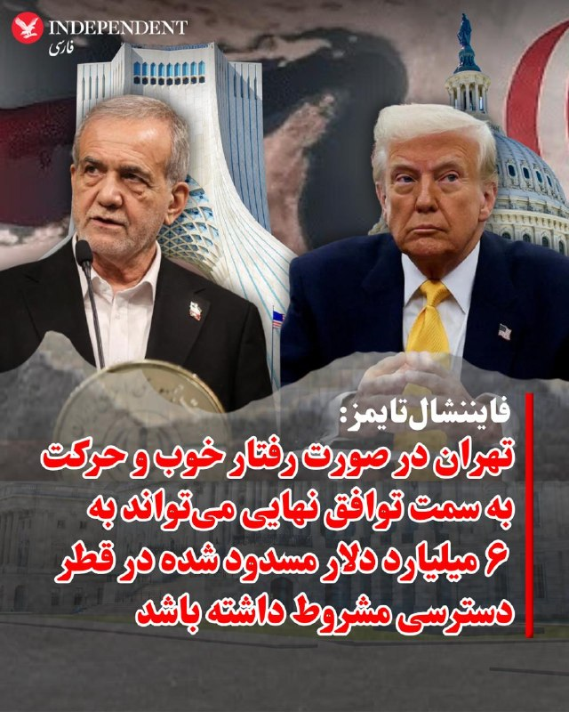

♦️فایننشال‌تایمز به نقل از منابعی که نام آنها را اعلام نکرده گزارش داد که طبق توافق مقدماتی تهران و واشنگتن، حکومت ایران به شش میلیارد دلار دارایی مسدود شده در قطر به شرط استفاده از آن برای خرید کالاهای «بشردوستانه و غیرتحریمی» دسترسی خواهد داشت. این گزارش می‌افزاید که این دسترسی مشروط به رفتار خوب تهران و پیشرفت در روند مذاکرات به سوی توافق نهایی است. یک دیپلمات هم گفته است که «ایران فقط مجاز به خرید کالاهای آمریکایی خواهد بود.» این شش میلیارد دلار در جریان مبادله زندانیان بین ایران و آمریکا در دولت بایدن از کره جنوبی به دوحه انتقال یافته بود.
‌🇸🇦 Indypersian

🤖 @VahidOOnLine

## VahidOOnLine — post 246313

  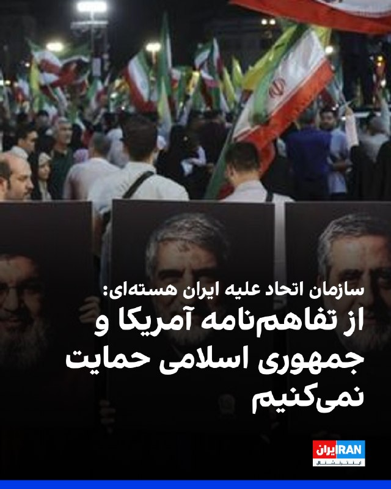

سازمان اتحاد علیه ایران هسته‌ای، یوآنی، با انتشار بیانیه‌ای اعلام کرد از اقدامات نظامی دولت ترامپ علیه جمهوری اسلامی حمایت می‌کند، اما از تفاهم‌نامه امضاشده میان تهران و واشینگتن در شکل کنونی آن پشتیبانی نمی‌کند.
یوآنی در این بیانیه نوشت تفاهم‌نامه کنونی به‌طور عمدی کلی و مبهم تنظیم شده و قضاوت درباره آن باید بر اساس اقدامات عملی جمهوری اسلامی در ماه‌های آینده انجام شود.
این سازمان در عین حال نسبت به تمایل حکومت ایران برای پذیرش محدودیت‌های پایدار هسته‌ای ابراز تردید کرد.
این نهاد همچنین هشدار داد کاهش تحریم‌ها، آزادسازی دارایی‌های مسدودشده ایران و صدور معافیت برای صادرات نفت، ممکن است بخشی از اهرم فشار اقتصادی آمریکا علیه جمهوری اسلامی را تضعیف کند.
یوآنی تاکید کرد هر توافق نهایی باید شامل توقف کامل غنی‌سازی اورانیوم، خروج تمامی ذخایر اورانیوم غنی‌شده از ایران، بازرسی‌های گسترده و محدودیت بر برنامه‌های موشکی و پهپادی جمهوری اسلامی باشد.
این سازمان همچنین از نادیده گرفتن موضوع نیروهای نیابتی، حمایت از گروه‌های مسلح منطقه‌ای و نقض حقوق بشر در متن تفاهم‌نامه انتقاد کرد.
‌🏁 🇬🇧 IranintlTV

🤖 @VahidOOnLine

## VahidOOnLine — post 246312

  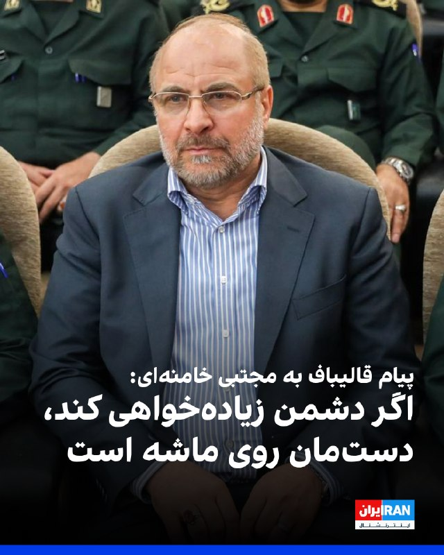

قالیباف در پیامی به مجتبی خامنه‌ای با قدردانی از پیام رهبر جمهوری اسلامی درباره یادداشت تفاهم با آمریکا، گفت: «اگر دشمن به دنبال زیاده‌خواهی باشد ثابت کرده‌ایم که دست‌مان روی ماشه است و هیچ تردیدی در پاسخ کوبنده به دشمن که در جنگ اخیر طعم آن را چشیده، نداریم.»
او تاکید کرد: « اجازه نخواهیم داد طرف مقابل با بدعهدی و زورگویی حق مردم ایران و جبهه مقاومت را مخدوش کند.»
‌🏁 🇬🇧 IranintlTV

🤖 @VahidOOnLine

## VahidOOnLine — post 246311

  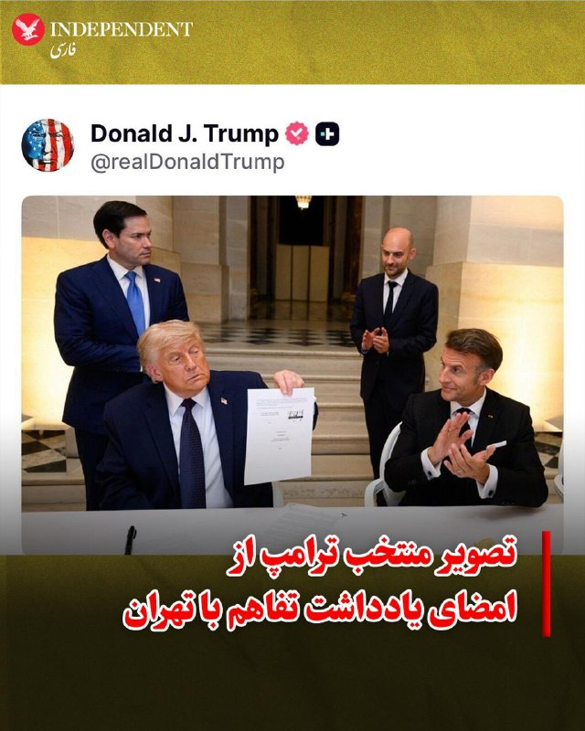

دونالد ترامپ، رئیس‌جمهوری ایالات متحده، پنج‌شنبه تصویری از امضای تفاهم‌نامه میان واشنگتن و تهران  را در حساب کاربری خود در شبکه اجتماعی تروث سوشال منتشر کرد.
این تصویر مربوط به مراسم امضای تفاهم‌نامه در کاخ تاریخی ورسای فرانسه است؛ جایی که ترامپ در حاشیه سفر خود به فرانسه و پس از پایان نشست سران گروه ۷ (G7) حضور داشت.
‌🇸🇦 Indypersian

🤖 @VahidOOnLine

## VahidOOnLine — post 246310

  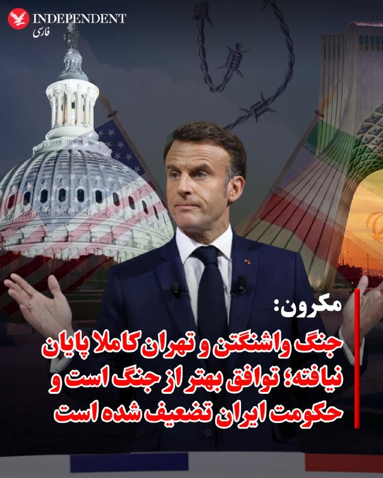

♦️امانوئل مکرون، رئیس‌جمهوری فرانسه، پنجشنبه‌شب ۲۸ خردادماه در برنامه «رویداد» شبکه فرانس۲، یک روز پس از امضای تفاهم‌نامه میان آمریکا و ایران در کاخ ورسای، گفت معتقد نیست جنگ میان واشینگتن و تهران «کاملا پایان یافته باشد». او تاکید کرد جهان وارد مرحله‌ای تازه از همکاری وگفنگوشده و اکنون باید مذاکرات درباره برنامه هسته‌ای ایران از سر گرفته شود.

مکرون درباره امضای تفاهم‌نامه در ورسای گفت این اقدام «به شکلی نسبتا خودجوش» انجام شد و تصمیم برای برگزاری مراسم در فرانسه با توافق مشترک پاریس و واشینگتن گرفته شده بود. او افزود: «این اتفاق خوبی است، اما فکر نمی‌کنم بتوان گفت جنگ کاملا پایان یافته است. اکنون وارد مرحله همکاری و گفت‌وگو شده‌ایم.»

رئیس‌جمهوری فرانسه تاکید کرد برای رسیدن به توافق نهایی، فرانسه، آلمان و بریتانیا نقش ضروری دارند، زیرا لغو تحریم‌های مصوب سازمان ملل بدون مشارکت این سه کشور امکان‌پذیر نیست.

مکرون در پاسخ به این پرسش که آیا این توافق صرفا بازگشت به شرایط پیش از جنگ نیست؛ یعنی بازگشایی تنگه هرمز بدون تضمین قطعی درباره برنامه هسته‌ای ایران و در حالی که حکومت تهران از این رویارویی تقویت شده خارج شده است، گفت: «داشتن توافق همیشه بهتر از جنگ است، به‌ویژه زمانی که خطر تشدید درگیری وجود داشته باشد.»

او همچنین گفت جنگ اخیر توانایی‌های نظامی ایران را تضعیف کرده است و افزود: «تغییر حکومت با بمباران حاصل نمی‌شود.» مکرون در ادامه گفت برخی اطرافیان دونالد ترامپ خواهان اقدامات بسیار شدیدتر و گسترده‌تر علیه ایران بودند.

رئیس‌جمهوری فرانسه درباره پیامدهای اقتصادی تفاهم‌نامه نیز گفت امضای این توافق بلافاصله باعث کاهش قیمت نفت شده و در نتیجه قیمت سوخت نیز به‌تدریج کاهش خواهد یافت. او افزود: «بسیار مهم است که تنگه هرمز به شکلی پایدار باز بماند.»

مکرون گفت فرانسه هیچ تضمینی درباره باز ماندن تنگه هرمز دریافت نکرده، زیرا طرف این توافق نیست، اما دونالد ترامپ به او اطمینان داده است که این آبراه بدون هیچ شرطی و بدون دریافت عوارض باز خواهد شد.

او بار دیگر اعلام کرد فرانسه آماده کمک به بازگشایی تنگه هرمز است، هرچند واشینگتن تاکنون از این پیشنهاد استفاده نکرده است. مکرون همچنین بر ضرورت ایجاد مسیرهای جایگزین برای انتقال نفت تاکید کرد و گفت: «نمی‌توان به این تنگه وابسته بود.» او افزود تهران از تنگه هرمز به‌عنوان «ابزار فشار» استفاده کرده است.

او همچنین گفت ایران اکنون «از نظر نظامی و هسته‌ای تضعیف شده است» و توافق کنونی در شرایطی حاصل شده که توانایی‌های جمهوری اسلامی نسبت به گذشته کاهش یافته است.
‌🇸🇦 Indypersian

🤖 @VahidOOnLine

## VahidOOnLine — post 246309

  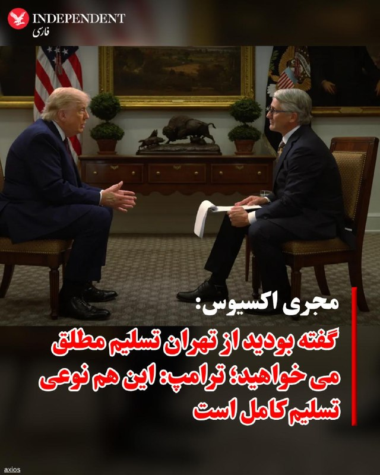

♦️دونالد ترامپ، رئیس‌جمهوری آمریکا، در«گفتگو ی تصویری با اکسیوس» گفت یادداشت تفاهم امضاشده با حکومت ایران را می‌توان «نوعی تسلیم کامل» از سوی تهران دانست. او این اظهارات را در پاسخ به پرسشی درباره تفاوت میان خواسته پیشین خود برای «تسلیم بی‌قیدوشرط» و مفاد تفاهم‌نامه مطرح کرد.

مجری آکسیوس در این مصاحبه به ترامپ یادآوری کرد که در آغاز درگیری‌ها گفته بود تنها «تسلیم بی‌قیدوشرط» را از ایران خواهد پذیرفت، اما یادداشت تفاهم امضاشده چنین تصویری را نشان نمی‌دهد. ترامپ در پاسخ گفت: «خب، احتمالا در واقع تسلیم بی‌قیدوشرط است. فکر می‌کنم همین‌طور باشد.»

رئیس‌جمهوری آمریکا همچنین با اشاره به جنگ اخیر گفت ایالات متحده ایران را «کاملا از نظر نظامی شکست داده است». او با تمجید از توان نظامی آمریکا افزود واشینگتن توانست محاصره دریایی موثری علیه ایران اعمال کند و هیچ کشتی‌ای نتوانست از آن عبور کند. ترامپ همچنین گفت پس از جنگ با ایران، محدودیتی برای قدرت خود نمی‌بیند.
‌🇸🇦 Indypersian

🤖 @VahidOOnLine

## VahidOOnLine — post 246308

  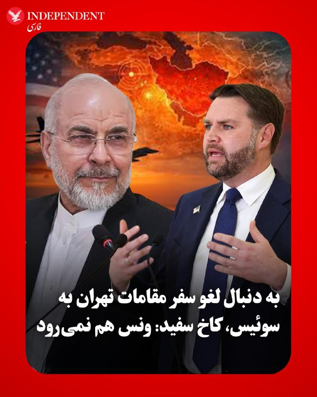

♦️درحالی که المیادین خبر داده نمایندگان حکومت ایران به دلیل «اوضاع لبنان» روز جمعه به سوئیس نمی روند، کاخ سفید نیز گفت که سفر هیات آمریکایی انجام نمی شود. اکسیوس به نقل از کاخ سفید نوشت: همان‌طور که معاون رئیس‌جمهوری در نشست خبری خود گفت، برنامه‌های مربوط به گفت‌وگوهای فنی آینده با ایران هنوز نهایی نشده است و هیات آمریکایی آماده بود در نخستین فرصت عازم شود. اما تدارکات و هماهنگی‌های این مذاکرات هرگز ساده یا قابل پیش‌بینی نبوده است.
این بیانیه می افزاید: «در حال حاضر، معاون رئیس‌جمهوری امشب سفر نمی‌کند. به محض آنکه اطلاعات قطعی درباره مراحل بعدی در اختیار داشته باشیم، شما را مطلع خواهیم کرد. انتظار داریم گفت‌وگوهای فنی را در سریع‌ترین زمان ممکن آغاز کنیم.»
‌🇸🇦 Indypersian

🤖 @VahidOOnLine

## VahidOOnLine — post 246307

  

دفتر جی‌دی ونس، معاون ترامپ، در اطلاعیه‌ای اعلام کرد که او سفر خود به سوئیس برای شرکت در مذاکرات با جمهوری اسلامی را لغو کرد، زیرا برنامه‌های مربوط به گفت‌وگوهای فنی پیش رو هنوز نهایی نشده است و تدارکات و هماهنگی‌های این مذاکرات ساده یا قابل پیش‌بینی نیست.
در این اطلاعیه آمده است: «برنامه‌های مربوط به گفت‌وگوهای فنی پیش رو هنوز نهایی نشده است و هیات آمریکایی آماده بود در نخستین فرصت ممکن عازم شود، اما تدارکات و هماهنگی‌های این مذاکرات هرگز ساده یا قابل پیش‌بینی نبوده است. در حال حاضر، معاون رییس‌جمهوری امشب عازم سفر نخواهد شد.»

‌🏁 🇬🇧 IranintlTV

🤖 @VahidOOnLine

## VahidOOnLine — post 246306

  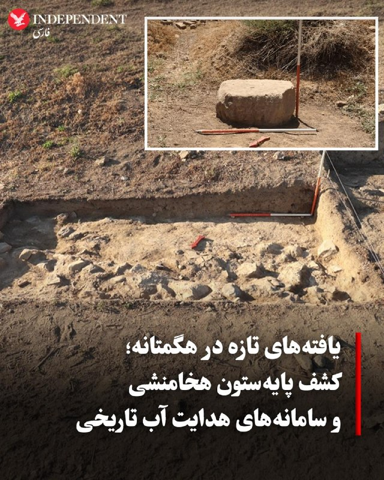

♦️سرپرست فصل بیست‌وپنجم کاوش‌های محوطه جهانی هگمتانه از کشف یک پایه‌ستون هخامنشی، شواهد معماری مدفون و بقایای سامانه‌های هدایت آب تاریخی در جریان مطالعات ژئوفیزیکی و کاوش‌های میدانی این محوطه خبر داد.
به گزارش فارس، یعقوب محمدی‌فر، سرپرست این کاوش‌ها، گفت نتایج اولیه مطالعات ژئوالکتریک و ژئورادار در بخش‌هایی از هگمتانه وجود ساختارهای مدفون، از جمله بقایای دیوارها و فضاهای معماری را نشان می‌دهد؛ یافته‌هایی که می‌تواند به شناخت بهتر سازمان فضایی شهر باستانی هگمتانه کمک کند.
به گفته محمدی‌فر، از جمله یافته‌های دو هفته نخست این فصل از کاوش‌ها می‌توان به یک پایه‌ستون هخامنشی، ساختارهای هدایت آب مربوط به قرون میانی اسلامی و بقایای معماری دوره قاجار و اوایل پهلوی اشاره کرد.
او افزود کاوش‌ها و بررسی‌های تکمیلی همچنان ادامه دارد و انتظار می‌رود داده‌های جدیدی درباره ساختار کالبدی و سیر تحول این محوطه تاریخی به دست آید.
‌🇸🇦 Indypersian

🤖 @VahidOOnLine

## VahidOOnLine — post 246305

  

فایننشال‌تایمز به نقل از یک دیپلمات آگاه گزارش داد بر اساس یادداشت تفاهم آمریکا و جمهوری اسلامی، دولت ترامپ به تهران اجازه خواهد داد به ۶ میلیارد دلار از درآمدهای نفتی مسدودشده خود در قطر برای خرید کالاهای بشردوستانه و کالاهای غیرمشمول تحریم از آمریکا دسترسی پیدا کند.
این دیپلمات گفت: «ترامپ توافق نامناسب دولت بایدن را گرفت، فروش کالاها را به اقلام بشردوستانه و غیرمشمول تحریم محدود کرد و اطمینان یافت که این پول صرف خرید محصولات آمریکایی می‌شود. این وضعیت به سود هر دو طرف است.»
او افزود: «ایرانیان کالاهای بشردوستانه مورد نیاز مردم خود را دریافت می‌کنند و پول ایران برای حمایت از کشاورزان آمریکایی به کار گرفته می‌شود.»
یک مقام آمریکایی گفت واشینگتن در جریان مذاکرات نهایی بخشی از دارایی‌های مسدودشده ایران را آزاد خواهد کرد، مشروط بر اینکه تهران «رفتار مناسبی» از خود نشان دهد؛ از جمله تحویل اورانیوم غنی‌شده خود.

‌🏁 🇬🇧 IranintlTV

🤖 @VahidOOnLine

## VahidOOnLine — post 246304

  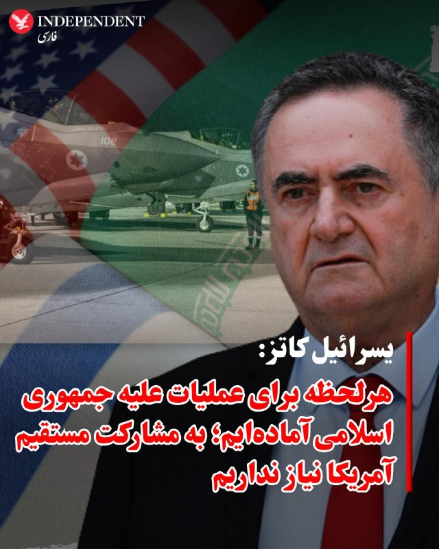

♦️یسرائیل کاتز، وزیر دفاع اسرائیل، پنجشنبه‌شب به «شبکه ۱۴» اسرائیل گفت کشورش توانایی‌های عملیاتی مستقلی در اختیار دارد و هر زمان لازم باشد می‌تواند علیه رژیم ایران اقدام کند. او افزود: «اسرائیل در هر لحظه برای اجرای یک عملیات آبی و سفید (اشاره به رنگ‌های پرچم اسرائیل) در ایران آماده است.»

کاتز در این مصاحبه تاکید کرد اسرائیل برای اقدام نظامی علیه جمهوری اسلامی به مشارکت مستقیم نیروهای آمریکایی در میدان نبرد وابسته نیست. او گفت: «ما هرگز از ایالات متحده نخواستیم در غزه، لبنان و سوریه در کنار ما بجنگد؛ تنها چیزی که می‌خواهیم یک چتر دیپلماتیک برای حمایت از ما است.»

وزیر دفاع اسرائیل با اشاره به جنگ اخیر گفت همکاری با دولت آمریکا نتایجی در میدان به همراه داشته که به گفته او توازن قدرت در منطقه را تغییر داده است. کاتز گفت: «قدرت حکومت ایران را درهم شکستیم، رهبر جمهوری اسلامی را از میان برداشتیم، به رهبری، دانشمندان هسته‌ای و زیرساخت‌ها ضربه زدیم. برنامه هسته‌ای ایران را نابود کردیم و اکنون باید اطمینان حاصل کنیم که دوباره بازنگردد.»

او همچنین با اشاره به روابط تل‌آویو و واشینگتن گفت رئیس‌جمهوری آمریکا اسرائیل را یک شریک راهبردی ممتاز می‌داند. کاتز افزود: «می‌دانید رئیس‌جمهوری آمریکا درباره ما چه گفت؟ او ما رامتحد نمونه نامید. مهم است بدانید که ما تنها کشوری در جهان هستیم که چنین عنوانی دریافت کرده‌ایم، زیرا با قدرت عمل کردیم و با یکدیگر حمله کردیم.»

وزیر دفاع اسرائیل در ادامه گفت اسرائیل در مقایسه با دیگر متحدان آمریکا، در زمان نیاز در کنار واشینگتن ایستاده است. او افزود: «هیچ‌یک از کشورهای عضو ناتو در کنار او قرار نگرفتند، با اینکه به آن‌ها رجوع کرده بود. واقعیت این است که او به ما رجوع کرد و ما آنجا بودیم و همچنان هستیم؛ هم به دلیل منافع خودمان برای رفع تهدیدهای نابودی و هم به دلیل منافع ایالات متحده.»

پیش‌تر جی‌دی ونس، معاون رئیس‌جمهوری آمریکا، روز پنجشنبه در یک نشست خبری در پاسخ به انتقاد برخی مقام‌های اسرائیلی از تفاهم‌نامه با تهران گفته بود دونالد ترامپ تنها رهبر جهان است که در این مقطع از اسرائیل حمایت می‌کند. او خطاب به منتقدان اسرائیلی افزود در سه ماه گذشته بخش عمده تجهیزات دفاعی مورد استفاده اسرائیل توسط کارگران آمریکایی ساخته و با پول مالیات‌دهندگان آمریکایی تامین شده است.
‌🇸🇦 Indypersian

🤖 @VahidOOnLine

## VahidOOnLine — post 246303

  <a href="telegram/content/VahidOOnLine_246303_1781836409.mp4" target="_blank">🎬 Download video</a>

♦️بخشی از سقف یکی از اتاق‌های بستری بیمارستان امام علی چابهار روز سه‌شنبه ۲۶ خرداد فروریخت و موجب تخریب بخشی از فضای داخلی این مرکز درمانی شد.
ویدیوهای منتشرشده در شبکه‌های اجتماعی صحنه‌های پس از ریزش سقف در این بخش را نشان می‌دهد. در زمان وقوع حادثه چند بیمار در اتاق حضور داشتند، اما گزارش‌ها حاکی از آن است که کسی در این حادثه آسیب ندیده است.
بیمارستان امام علی به عنوان تنها مرکز درمانی اصلی چابهار، به ساکنان شهرستان‌های چابهار، دشتیاری، کنارک، زرآباد و مناطق وسیعی از جنوب سیستان و بلوچستان خدمات ارائه می‌دهد.
‌🇸🇦 Indypersian

🤖 @VahidOOnLine

## VahidOOnLine — post 246302

  

ترامپ در گفت‌وگو با اکسیوس با تاکید بر اینکه آمریکا جمهوری اسلامی از نظر نظامی کاملا شکست داده است، گفت یادداشت تفاهم دو کشور «احتمالا همان تسلیم بی‌قید و شرط است.»
او در عین حال پذیرفت که برای جلوگیری از تبدیل شدن جنگ به یک رکود اقتصادی جهانی، درباره این توافق مذاکره کرده است.
ترامپ با تاکید بر اینکه جنگ در واقع قدرت نظامی آمریکا را به نمایش گذاشت، گفت: «چه کسی دیگری می‌توانست چنین محاصره‌ای ایجاد کند؟ من یک محاصره دریایی برقرار کردم که حتی یک کشتی هم نتوانست از آن عبور کند. بعضی‌ها تلاش کردند، اما خیلی دوام نیاورد.»
او با ابراز نارضایتی از انتقادها مبنی بر اینکه او در برابر ایران سختگیرانه‌تر عمل نکرده است، گفت: «تنها راهی که می‌توانم سختگیرتر باشم این است که دو یا سه هفته دیگر آنجا بمانم و به شدت آنها را بمباران کنم. درست است؟ اما این چه دستاوردی برای ما دارد؟ تنگه هرمز باز نخواهد ماند.»

‌🏁 🇬🇧 IranintlTV

🤖 @VahidOOnLine

## VahidOOnLine — post 246301

  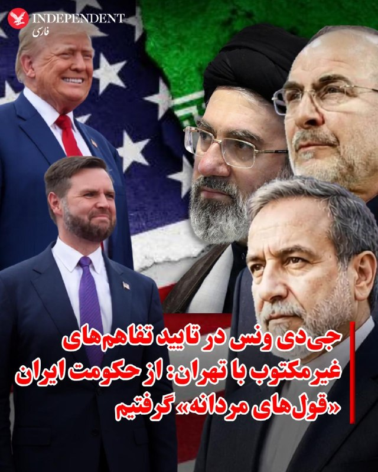

♦️جی‌دی ونس، معاون رئیس‌جمهوری آمریکا در کنفرانس خبری روز پنجشنبه در تایید پرسش خبرنگاری که از او درباره تفاهم‌های غیر مکتوب و «قول‌های مردانه» (gentlemen’s agreements) با حکومت ایران پرسید، وجود این تفاهم‌های شفاهی و «قول‌های مردانه» را تایید کرد. خبرنگار از او پرسید درباره ذخایر اورانیوم غنی‌شده با خلوص بالا «قول‌های مردانه» و تفاهم‌های شفاهی چگونه تضمین‌کننده است و آیا این «قول‌های مردانه» در جایی ثبت شده، گفت: »برخی از آنها مکتوب شده‌اند اما در اصل چه مکتوب باشند و چه شفاهی، دلیل اینکه ما توافق را به این شکل ساختاردهی کردیم همین است؛ چون ما به کلمات اعتماد نداریم. ما به عمل و رفتار اعتماد داریم. بنابراین ما قصد داریم، ...به رفتار [و عمل] پاداش بدهیم، و به هیچ کلمه‌ای پاداش نخواهیم داد، خواه روی یک تکه کاغذ نوشته شده باشد یا نه. بحث‌های زیادی در این‌باره وجود دارد؛ توافقات مردانه، توافق نهایی.» ونس در ادامه افزود: «کلمات اهمیتی ندارند و کار ما بر اساس راستی‌آزمایی است اگر آنها کاری را که قول داده‌اند انجام دهند، پاداش می‌گیرند.آن‌ها قول داده‌اند که به بازرسان اجازه ورود بدهند تا آن ذخایرِ به شدت غنی‌شده را نابود کنند و در این صورت، البته که دیگر قابل استفاده نخواهد بود. شما آن را به جای دیگری می‌برید. آن‌ها تعدادی ...کار را قول داده‌اند و به همین دلیل است که این توافق، در صورت انجام آن کارها، مزایای متعددی را برای آن‌ها پیش‌بینی کرده است.»
‌🇸🇦 Indypersian

🤖 @VahidOOnLine

## VahidOOnLine — post 246300

♦️حمزه رحیم صفوی، پسر یحیی رحیم صفوی، مشاور رهبر جمهوری اسلامی در برنامه اینترنتی «آزاد» درباره سطح حفاظت از علی خامنه‌ای که در حمله نهم اسفندماه ۱۴۰۴ آمریکا و اسرائیل کشته شده، گفت که حفاظت از او با استفاده از یکی از گران‌ترین سیستم‌های امنیتی جهان انجام می‌شد. او افزود: ما «قامت ۶۰ سانت در ۱۶۰ سانت رهبر را نتوانستیم پنهان کنیم و حفاظت کنیم.»
‌🇸🇦 Indypersian

🤖 @VahidOOnLine

## VahidOOnLine — post 246299

  

کمیته امور عمومی آمریکا و اسرائیل، آیپک، در واکنش به تفاهم‌نامه آمریکا و جمهوری اسلامی اعلام کرد این توافق اولیه پرسش‌های مهمی را درباره روند مذاکرات و امتیازهای احتمالی به تهران ایجاد کرده است.
آیپک در بیانیه‌ای نوشت جمهوری اسلامی طی ۴۷ سال گذشته علیه آمریکا و مردم ایران جنگیده و آمریکا با همکاری اسرائیل، برنامه هسته‌ای، توان نظامی و بخش مهمی از رهبری این حکومت را هدف قرار داده و زمینه را برای یک توافق دیپلماتیک فراهم کرده است.
آیپک با اشاره به اینکه تفاهم‌نامه کنونی شامل کاهش تحریم‌ها در برابر بازگشایی تنگه هرمز و تعهداتی مبهم از سوی جمهوری اسلامی درباره برنامه هسته‌ای است، تاکید کرد کنگره آمریکا باید به جزییات کامل توافق دسترسی داشته باشد و در روند بررسی توافق نهایی نقش محوری ایفا کند.
آیپک همچنین خواستار آن شد که هر توافق نهایی، به طور دائمی و قابل راستی‌آزمایی به برنامه هسته‌ای جمهوری اسلامی پایان دهد، تمامی ذخایر اورانیوم غنی‌شده از ایران خارج شود و همه تاسیسات غنی‌سازی برچیده شوند.
‌🏁 🇬🇧 IranintlTV

🤖 @VahidOOnLine

## VahidOOnLine — post 246298

  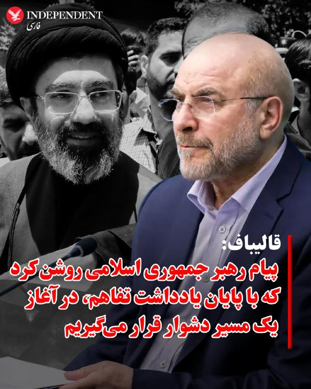

♦️محمدباقر قالیباف، رئیس مجلس شورای اسلامی، در واکنش به پیام اخیر مجتبی خامنه‌ای، رهبر جمهوری اسلامی، درباره تفاهم‌نامه میان تهران و واشینگتن گفت این پیام روشن کرد که با نهایی شدن یادداشت تفاهم، جمهوری اسلامی در آغاز «راهی سخت و پرپیچ‌وخم» قرار گرفته و باید برای تحقق شروط تعیین‌شده و پیگیری تعهدات آمریکا تلاش کند.

قالیباف در پیامی خطاب به رهبر جمهوری اسلامی نوشت پیام او درباره روند مذاکرات و تفاهم‌نامه اخیر، دست مقام‌های جمهوری اسلامی را برای پیگیری تعهدات آمریکا «پرتر» کرده است. او تاکید کرد جمهوری اسلامی اجازه نخواهد داد طرف مقابل با «بدعهدی و زورگویی» حقوق مردم ایران و جبهه مقاومت را مخدوش کند. رئیس مجلس جمهوری اسلامی همچنین مذاکره را «یکی از میدان‌های مبارزه» توصیف کرد و گفت اگر طرف مقابل به دنبال زیاده‌خواهی باشد، جمهوری اسلامی در پاسخ به آن تردیدی نخواهد داشت و «دستش روی ماشه» خواهد ماند.

مجتبی خامنه‌ای پیش‌تر در پیامی درباره تفاهم‌نامه میان تهران و واشینگتن اعلام کرده بود که شخصا با امضای این تفاهم‌نامه موافق نبوده، اما با «تعهد و قبول مسئولیت شخصی» مسعود پزشکیان اجازه امضای آن را صادر کرده است. او همچنین تاکید کرده بود از این پس منتظر تحقق شروط وعده‌داده‌شده در تفاهم‌نامه خواهد بود و مذاکرات حضوری پیش‌رو در سوئیس به معنای پذیرش دیدگاه‌های آمریکا نیست.
‌🇸🇦 Indypersian

🤖 @VahidOOnLine

## VahidOOnLine — post 246297

♦️حمزه صفوی تحلیلگر و پسر یحیی رحیم صفوی مشاور و دستیار ارشد رهبر جمهوری اسلامی در برنامه اینترنتی «آزاد» درباره اینکه چرا برنامه ساخت سلاح هسته‌ای محقق نشده، گفت: «مشکل اصلی در برتری اطلاعاتی طرف مقابل است، نه در نداشتن بمب اتم. برنامه هسته‌ای.» او افزود: ایران یکی از گران‌ترین فعالیت‌های هسته‌ای دنیا بوده که نه از آن برق تولید شده، نه سلاح و نه مشروعیت. باید به محدودیت قدرت خودمان توجه داشته باشیم و بین توافق جامع و داشتن سلاح هسته‌ای یک مسیر را انتخاب کنیم. او همچنین گفت که همه اسناد بین‌المللی به این نکته اشاره دارند که ایران در مسیر سلاح هسته‌ای حرکت کرده است. رحیم صفوی گفت: کره شمالی بدون اینکه کسی بفهمد برنامه سلاح هسته‌ای را پیش برد اما هر دو سایت هسته‌ای ما، فوردو و نطنز، لو رفت
‌🇸🇦 Indypersian

🤖 @VahidOOnLine

## FoxNewsTwitter — post 343160

  <a href="telegram/content/FoxNewsTwitter_343160_1781836412.mp4" target="_blank">🎬 Download video</a>

Fox News (Twitter/X)

U.S. Southern Command releases video of a strike targeting a vessel allegedly tied to narcotics trafficking in the Eastern Pacific.

Officials say the vessel was identified as operating along known drug-trafficking routes and was engaged by Joint Task Force Southern Spear on June 18 at the direction of SOUTHCOM Commander Gen. Francis Donovan.

According to SOUTHCOM, three suspected narco-terrorists were killed in the operation. No U.S. military personnel were harmed.

## FoxNewsTwitter — post 343159

  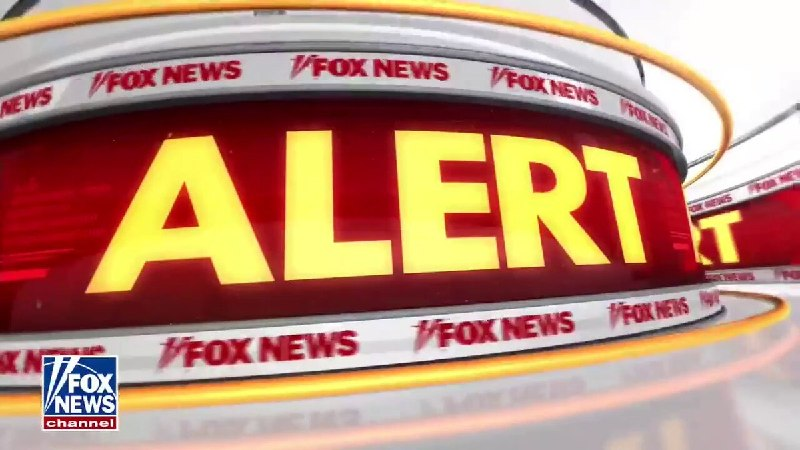

Fox News (Twitter/X)

"POTUS said: 'Told you so.'"

Jesse Watters evaluates how the Iran deal is playing out so far, noting that oil prices are dropping and Iran has stopped shooting at vessels in the Strait of Hormuz. https://twitter.com/JesseBWatters/status/2067767354046730298#m

## VahidOnline — post 76501

  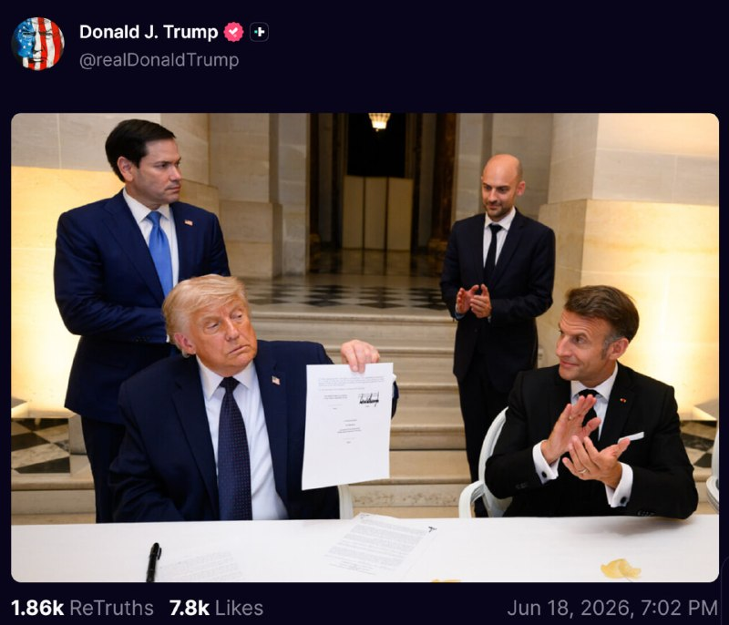

ترامپ تصویری از امضای تفاهم‌نامه میان واشنگتن و تهران  را منتشر کرد.
این تصویر مربوط به مراسم امضای تفاهم‌نامه در کاخ ورسای فرانسه است؛ جایی که ترامپ در حاشیه سفر خود به فرانسه و پس از پایان نشست سران گروه ۷ (G7) حضور داشت.
@VahidOOnLine

📡 @VahidOnline

## VahidOnline — post 76500

  

دونالد ترامپ، رئیس‌جمهوری آمریکا، در«گفتگو ی تصویری با اکسیوس» گفت یادداشت تفاهم امضاشده با حکومت ایران را می‌توان «نوعی تسلیم کامل» از سوی تهران دانست.

او این اظهارات را در پاسخ به پرسشی درباره تفاوت میان خواسته پیشین خود برای «تسلیم بی‌قیدوشرط» و مفاد تفاهم‌نامه مطرح کرد.

مجری آکسیوس در این مصاحبه به ترامپ یادآوری کرد که در آغاز درگیری‌ها گفته بود تنها «تسلیم بی‌قیدوشرط» را از ایران خواهد پذیرفت، اما یادداشت تفاهم امضاشده چنین تصویری را نشان نمی‌دهد. ترامپ در پاسخ گفت: «خب، احتمالا در واقع تسلیم بی‌قیدوشرط است. فکر می‌کنم همین‌طور باشد.»

رئیس‌جمهوری آمریکا همچنین با اشاره به جنگ اخیر گفت ایالات متحده ایران را «کاملا از نظر نظامی شکست داده است». او با تمجید از توان نظامی آمریکا افزود واشینگتن توانست محاصره دریایی موثری علیه ایران اعمال کند و هیچ کشتی‌ای نتوانست از آن عبور کند.
ترامپ همچنین گفت پس از جنگ با ایران، محدودیتی برای قدرت خود نمی‌بیند.
@VahidOOnLine

📡 @VahidOnline

## VahidOnline — post 76499

  

دفتر جی‌دی ونس، معاون ترامپ، در اطلاعیه‌ای اعلام کرد که او سفر خود به سوئیس برای شرکت در مذاکرات با جمهوری اسلامی را لغو کرد، زیرا برنامه‌های مربوط به گفت‌وگوهای فنی پیش رو هنوز نهایی نشده است و تدارکات و هماهنگی‌های این مذاکرات ساده یا قابل پیش‌بینی نیست.
در این اطلاعیه آمده است: «برنامه‌های مربوط به گفت‌وگوهای فنی پیش رو هنوز نهایی نشده است و هیات آمریکایی آماده بود در نخستین فرصت ممکن عازم شود، اما تدارکات و هماهنگی‌های این مذاکرات هرگز ساده یا قابل پیش‌بینی نبوده است. در حال حاضر، معاون رییس‌جمهوری امشب عازم سفر نخواهد شد.»

@VahidOOnLine

📡 @VahidOnline

## IranIntlTV — post 343133

  

سازمان اتحاد علیه ایران هسته‌ای، یوآنی، با انتشار بیانیه‌ای اعلام کرد از اقدامات نظامی دولت ترامپ علیه جمهوری اسلامی حمایت می‌کند، اما از تفاهم‌نامه امضاشده میان تهران و واشینگتن در شکل کنونی آن پشتیبانی نمی‌کند.
یوآنی در این بیانیه نوشت تفاهم‌نامه کنونی به‌طور عمدی کلی و مبهم تنظیم شده و قضاوت درباره آن باید بر اساس اقدامات عملی جمهوری اسلامی در ماه‌های آینده انجام شود.
این سازمان در عین حال نسبت به تمایل حکومت ایران برای پذیرش محدودیت‌های پایدار هسته‌ای ابراز تردید کرد.
این نهاد همچنین هشدار داد کاهش تحریم‌ها، آزادسازی دارایی‌های مسدودشده ایران و صدور معافیت برای صادرات نفت، ممکن است بخشی از اهرم فشار اقتصادی آمریکا علیه جمهوری اسلامی را تضعیف کند.
یوآنی تاکید کرد هر توافق نهایی باید شامل توقف کامل غنی‌سازی اورانیوم، خروج تمامی ذخایر اورانیوم غنی‌شده از ایران، بازرسی‌های گسترده و محدودیت بر برنامه‌های موشکی و پهپادی جمهوری اسلامی باشد.
این سازمان همچنین از نادیده گرفتن موضوع نیروهای نیابتی، حمایت از گروه‌های مسلح منطقه‌ای و نقض حقوق بشر در متن تفاهم‌نامه انتقاد کرد.
https://iranintl.com/202606193271

## IranIntlTV — post 343132

  

قالیباف در پیامی به مجتبی خامنه‌ای با قدردانی از پیام رهبر جمهوری اسلامی درباره یادداشت تفاهم با آمریکا، گفت: «اگر دشمن به دنبال زیاده‌خواهی باشد ثابت کرده‌ایم که دست‌مان روی ماشه است و هیچ تردیدی در پاسخ کوبنده به دشمن که در جنگ اخیر طعم آن را چشیده، نداریم.»
او تاکید کرد: « اجازه نخواهیم داد طرف مقابل با بدعهدی و زورگویی حق مردم ایران و جبهه مقاومت را مخدوش کند.»
https://iranintl.com/202606194880

## IranIntlTV — post 343131

  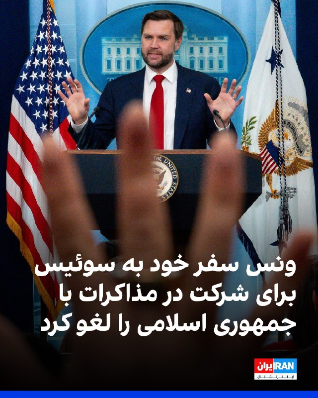

دفتر جی‌دی ونس، معاون ترامپ، در اطلاعیه‌ای اعلام کرد که او سفر خود به سوئیس برای شرکت در مذاکرات با جمهوری اسلامی را لغو کرد، زیرا برنامه‌های مربوط به گفت‌وگوهای فنی پیش رو هنوز نهایی نشده است و تدارکات و هماهنگی‌های این مذاکرات ساده یا قابل پیش‌بینی نیست.
در این اطلاعیه آمده است: «برنامه‌های مربوط به گفت‌وگوهای فنی پیش رو هنوز نهایی نشده است و هیات آمریکایی آماده بود در نخستین فرصت ممکن عازم شود، اما تدارکات و هماهنگی‌های این مذاکرات هرگز ساده یا قابل پیش‌بینی نبوده است. در حال حاضر، معاون رییس‌جمهوری امشب عازم سفر نخواهد شد.»

https://iranintl.com/202606199878

## IranIntlTV — post 343130

  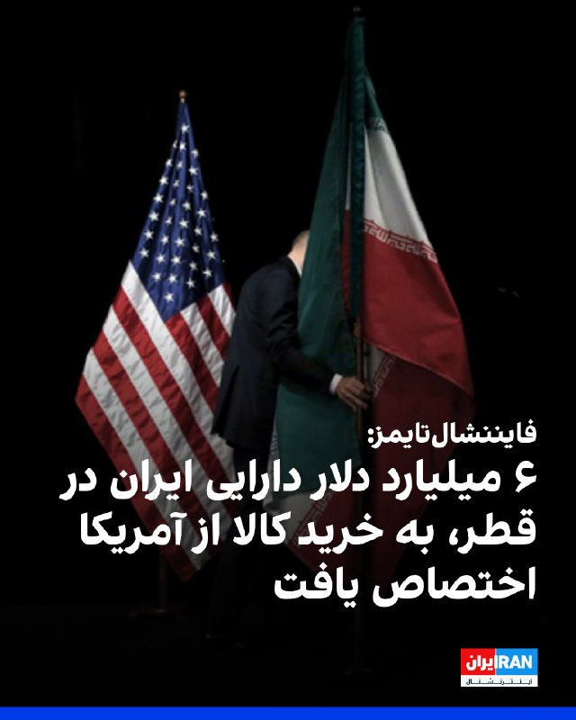

فایننشال‌تایمز به نقل از یک دیپلمات آگاه گزارش داد بر اساس یادداشت تفاهم آمریکا و جمهوری اسلامی، دولت ترامپ به تهران اجازه خواهد داد به ۶ میلیارد دلار از درآمدهای نفتی مسدودشده خود در قطر برای خرید کالاهای بشردوستانه و کالاهای غیرمشمول تحریم از آمریکا دسترسی پیدا کند.
این دیپلمات گفت: «ترامپ توافق نامناسب دولت بایدن را گرفت، فروش کالاها را به اقلام بشردوستانه و غیرمشمول تحریم محدود کرد و اطمینان یافت که این پول صرف خرید محصولات آمریکایی می‌شود. این وضعیت به سود هر دو طرف است.»
او افزود: «ایرانیان کالاهای بشردوستانه مورد نیاز مردم خود را دریافت می‌کنند و پول ایران برای حمایت از کشاورزان آمریکایی به کار گرفته می‌شود.»
یک مقام آمریکایی گفت واشینگتن در جریان مذاکرات نهایی بخشی از دارایی‌های مسدودشده ایران را آزاد خواهد کرد، مشروط بر اینکه تهران «رفتار مناسبی» از خود نشان دهد؛ از جمله تحویل اورانیوم غنی‌شده خود.

https://iranintl.com/202606194015

## IranIntlTV — post 343129

  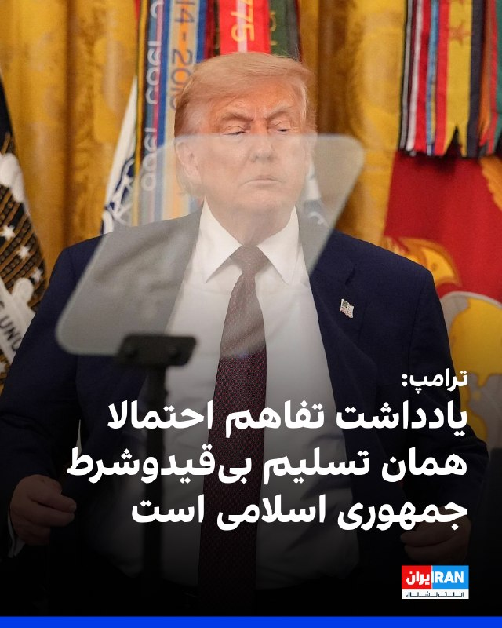

ترامپ در گفت‌وگو با اکسیوس با تاکید بر اینکه آمریکا جمهوری اسلامی از نظر نظامی کاملا شکست داده است، گفت یادداشت تفاهم دو کشور «احتمالا همان تسلیم بی‌قید و شرط است.»
او در عین حال پذیرفت که برای جلوگیری از تبدیل شدن جنگ به یک رکود اقتصادی جهانی، درباره این توافق مذاکره کرده است.
ترامپ با تاکید بر اینکه جنگ در واقع قدرت نظامی آمریکا را به نمایش گذاشت، گفت: «چه کسی دیگری می‌توانست چنین محاصره‌ای ایجاد کند؟ من یک محاصره دریایی برقرار کردم که حتی یک کشتی هم نتوانست از آن عبور کند. بعضی‌ها تلاش کردند، اما خیلی دوام نیاورد.»
او با ابراز نارضایتی از انتقادها مبنی بر اینکه او در برابر ایران سختگیرانه‌تر عمل نکرده است، گفت: «تنها راهی که می‌توانم سختگیرتر باشم این است که دو یا سه هفته دیگر آنجا بمانم و به شدت آنها را بمباران کنم. درست است؟ اما این چه دستاوردی برای ما دارد؟ تنگه هرمز باز نخواهد ماند.»

https://iranintl.com/202606190110

## IranIntlTV — post 343128

  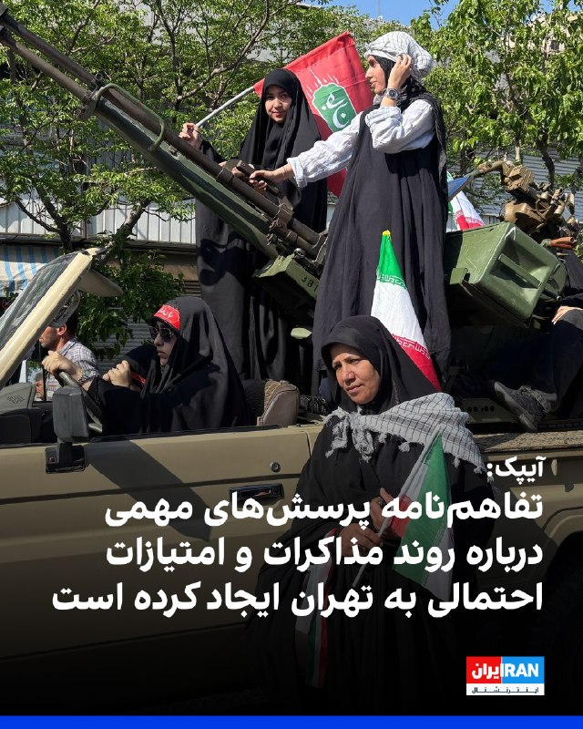

کمیته امور عمومی آمریکا و اسرائیل، آیپک، در واکنش به تفاهم‌نامه آمریکا و جمهوری اسلامی اعلام کرد این توافق اولیه پرسش‌های مهمی را درباره روند مذاکرات و امتیازهای احتمالی به تهران ایجاد کرده است.
آیپک در بیانیه‌ای نوشت جمهوری اسلامی طی ۴۷ سال گذشته علیه آمریکا و مردم ایران جنگیده و آمریکا با همکاری اسرائیل، برنامه هسته‌ای، توان نظامی و بخش مهمی از رهبری این حکومت را هدف قرار داده و زمینه را برای یک توافق دیپلماتیک فراهم کرده است.
آیپک با اشاره به اینکه تفاهم‌نامه کنونی شامل کاهش تحریم‌ها در برابر بازگشایی تنگه هرمز و تعهداتی مبهم از سوی جمهوری اسلامی درباره برنامه هسته‌ای است، تاکید کرد کنگره آمریکا باید به جزییات کامل توافق دسترسی داشته باشد و در روند بررسی توافق نهایی نقش محوری ایفا کند.
آیپک همچنین خواستار آن شد که هر توافق نهایی، به طور دائمی و قابل راستی‌آزمایی به برنامه هسته‌ای جمهوری اسلامی پایان دهد، تمامی ذخایر اورانیوم غنی‌شده از ایران خارج شود و همه تاسیسات غنی‌سازی برچیده شوند.
https://iranintl.com/202606188107

## IranIntlTV — post 343127

  <a href="telegram/content/IranIntlTV_343127_1781836425.mp4" target="_blank">🎬 Download video</a>

شهباز شریف، نخست‌وزیر پاکستان، به‌عنوان میانجی یادداشت تفاهم اسلام‌آباد میان جمهوری اسلامی و آمریکا را امضا کرد. بر اساس این تفاهم‌نامه، مذاکرات مستقیم تهران و واشینگتن ادامه خواهد یافت و این گفت‌وگوها از روز جمعه در سوئیس آغاز می‌شود.

گزارش جواد همدانی، خبرنگار ایران‌اینترنشنال
@iranintltv

## FarsiVOA — post 221160

  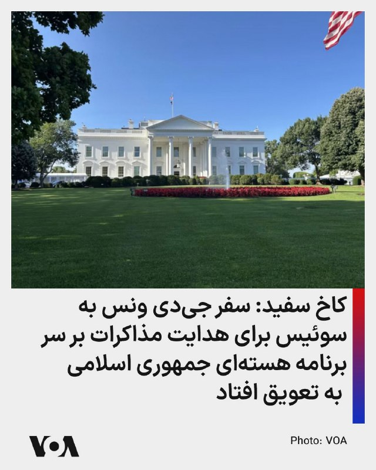

⚡️کاخ سفید پنج‌شنبه اعلام کرد که جی‌دی ونس، معاون رئیس‌جمهوری آمریکا، سفر خود به سوئیس را که قرار بود برای رهبری دور جدید مذاکرات با جمهوری اسلامی درباره برنامه هسته‌ای آن انجام شود، به تعویق انداخته است.
به گزارش آسوشیتدپرس، کاخ سفید اعلام کرد تیمی به سرپرستی ونس آماده سفر بود، اما به دلیل مشکلات و پیچیدگی‌های لجستیکی مرتبط با مذاکرات، این سفر به تعویق افتاده است.
این گزارش می‌گوید که پیشتر شبکه المیادین، یک شبکه نزدیک به حزب‌الله، گزارش داد که جمهوری اسلامی اعزام هیئت مذاکره‌کننده خود به سوئیس را به دلیل ادامه عملیات نظامی اسرائیل در لبنان به تعویق انداخته است.
@FarsiVOA

## FarsiVOA — post 221159

⚡️بریتانیا در مورد اقدام احتمالی تلافی‌جویانه روسیه در پی توقیف یک نفتکش روس هشدار داد
@FarsiVOA

## FarsiVOA — post 221158

  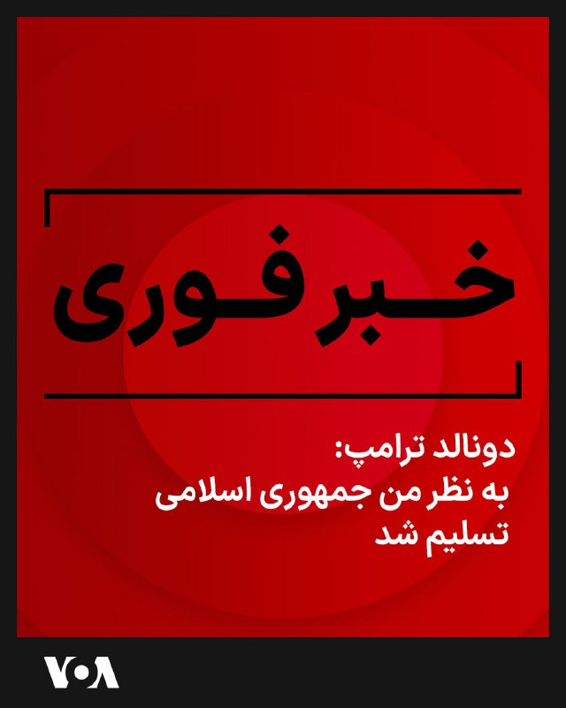

دونالد ترامپ، رئيس جمهوری آمریکا، در مصاحبه‌ای با آکسیوس گفت که به نظر او، تفاهم‌نامه امضا‌شده «تسلیم شدن بدون شرط» جمهوری اسلامی است.

آقای ترامپ در این مصاحبه ویدیویی که پنج‌شنبه ۲۸ خرداد پخش شد استدلال کرد که جنگ در واقع قدرت نظامی آمریکا را نشان داده است. او گفت: «چه فرد دیگری می‌توانست چنین محاصره‌ای انجام دهد؟ من یک محاصره دریایی انجام دادم که حتی یک کشتی هم نتوانست از آن عبور کند.»

او افزود برخی از کشتی‌ها تلاش کردند از محاصره بنادر ایران عبور کنند «اما نتوانستند» و تلاششان «زیاد دوام نداشت.»

مجری آکسیوس به آقای ترامپ گفت: «و مطمئناً این باعث شد [حکومت] ایران بیش از پیش به میز مذاکره بیاید. با این حال، با شروع یک درگیری، شما در مورد اینکه فقط تسلیم بی‌قید و شرط می‌خواهید صحبت کرده بودید. و خب، تفاهم‌نامه به نظر تسلیم بی‌قید و شرط نمی‌آید.»

آقای ترامپ پاسخ داد که به نظر او، تفاهم‌نامه امضا شده با جمهوری اسلامی به معنی تسلیم بی‌قید و شرط آن است.

⬇️ بیشتر بخوانید:
https://ir.voanews.com/a/8162590.html
@FarsiVOA

## FarsiVOA — post 221157

  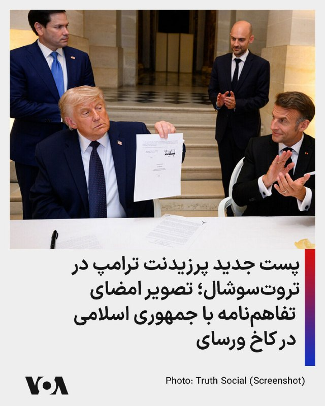

⚡️پست جدید پرزیدنت ترامپ در تروت‌سوشال؛ تصویر امضای تفاهم‌نامه با جمهوری اسلامی در کاخ ورسای
@FarsiVOA

## FarsiVOA — post 221156

  <a href="telegram/content/FarsiVOA_221156_1781836439.mp4" target="_blank">🎬 Download video</a>

⚡️جو «غیرفوتبالی» تورنتو در روزهای جام جهانی ۲۰۲۶؛ گزارش امیرعلی پیروزبخش
@FarsiVOA

## FarsiVOA — post 221155

🔺سناتور کاتن از تفاهم‌نامه با جمهوری اسلامی ابراز نگرانی کرد؛ این «رژیم انقلابی و تروریستی» پول را هزینه حماس و حزب‌الله می‌کند نه بیمارستان

▪️تام کاتن، سناتور جمهوری‌خواه، در گفت‌وگو با فاکس نیوز در مورد تفاهم‌نامه امضا شده با جمهوری اسلامی صحبت کرد و نسبت به بخش‌هایی از آن ابراز نگرانی کرد.

⬇️ بیشتر بخوانید:
https://ir.voanews.com/a/8162589.html
@FarsiVOA

## FarsiVOA — post 221154

⚡️هفت دانشجوی صنعتی شریف از دانشگاه اخراج شدند؛ افزایش فشارها بر دانشجویان معترض
@FarsiVOA

## FarsiVOA — post 221153

  <a href="telegram/content/FarsiVOA_221153_1781836440.mp4" target="_blank">🎬 Download video</a>

⚡️حال‌وهوای هواداران سوئیس و بوسنی و هرزگوین در اطراف ورزشگاه سوفای لس‌آنجلس؛ گزارش آرمیتا آزاد
@FarsiVOA

## Persian_Trend_Official — post 17516

  <a href="telegram/content/Persian_Trend_Official_17516_1781836440.mp4" target="_blank">🎬 Download video</a>

شبتون بخیر 🌌
United States Air Force

📌 @persian_trend_official
پرشین ترند | متفاوت‌ترین کانال نظامی

## IranianMinds — post 22913

  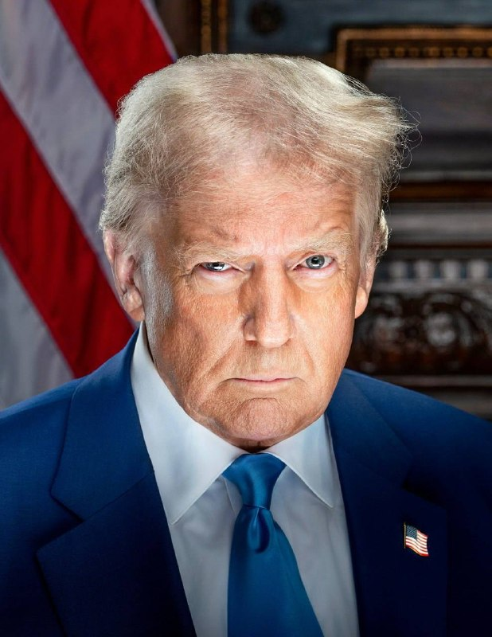

ترامپ:
حزب الله باید خلع سلاح شود

وقتی پرسیده شد که آیا حزب‌الله تحت توافق فعلی تسلیحات خود را کنار می‌گذارد، ترامپ پاسخ داد که این گروه «باید تسلیحات خود را کنار بگذارد.»

منبع: کانال ۱۴ اسرائیل

@IranianMinds

## IranianMinds — post 22912

  <a href="telegram/content/IranianMinds_22912_1781836442.webm" target="_blank">🎬 Download video</a>

📣آیسان اسلامی به تلگرام پیوست😍

⭐اگر توم از طرفدارا ایسان اسلامی هستی بیا توی کانال تلگرامش فعالیتش شرو کرده کنارش باش
🙂

ادرس عضویت کانالش
👇e28
👇
https://t.me/+QMjHLL65ocsxYzRk
https://t.me/+QMjHLL65ocsxYzRk

## BBCPersian — post 284314

  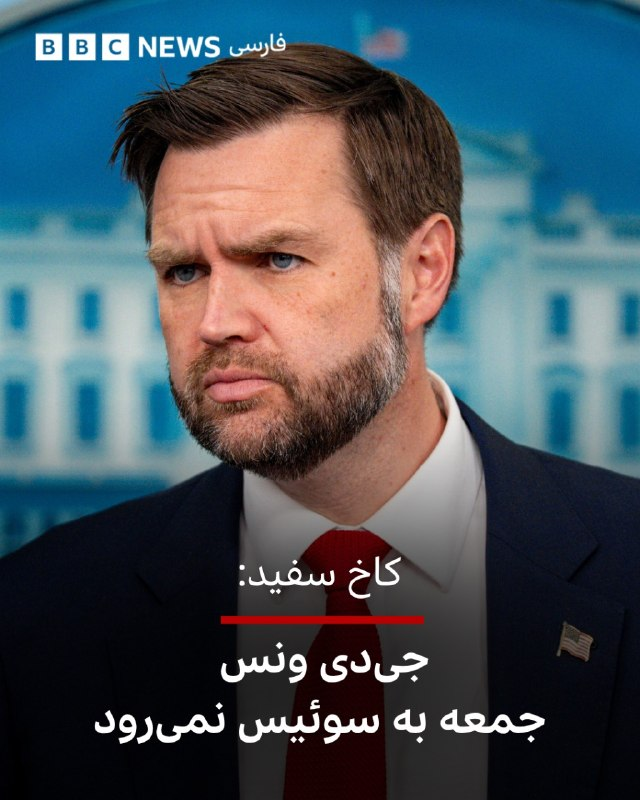

🔻یک مقام کاخ سفید درباره سفر جی‌دی ونس به سوئیس که پیش‌تر گفته شده بود روز جمعه و برای نشست با محمدباقر قالیباف روی خواهد داد، گفته است:

«همان‌طور که معاون رئیس‌جمهور در نشست خبری خود گفت، برنامه‌ریزی برای گفت‌وگوهای فنی پیش رو هنوز نهایی نشده است و هیات آمریکایی آماده بوده است که در نخستین فرصت ممکن عازم شود. اما مسائل اجرایی و تدارکاتی این مذاکرات هرگز ساده یا قابل پیش‌بینی نبوده است. در حال حاضر، معاون رئیس‌جمهور امشب عازم سفر نخواهد شد. به محض آنکه اطلاعات قطعی درباره مراحل بعدی در اختیار داشته باشیم، شما را در جریان خواهیم گذاشت.»

آقای ونس ظهر پنجشنبه در گفتگو با خبرنگاران تصریح کرده بود که آماده سفر به سوئیس است اما هنوز جزییات دقیق آن مشخص نیست و شاید روز شنبه یا یکشنبه روی دهد.

طرف ایرانی هم شب گذشته و همزمان با امضای تفاهم نامه میان مسعود پزشکیان و دونالد ترامپ، گفته بود که با توجه به این رویداد ممکن است نشست روز جمعه در سوئیس روی ندهد و یا در زمان دیگری برای آغاز مذاکرات دو طرف تنظیم شود.

📷 Getty Images
https://bbc.in/4oIff0I

@BBCPersian

## BBCPersian — post 284313

🔻جی‌دی ونس، معاون رئیس‌جمهور آمریکا، روز پنجشنبه در نشستی خبری که حدود ۴۵ دقیقه طول کشید به خبرنگاران درباره تفاهمنامه امضاء شده با ایران توضیح داد و گفت توافق با ایران بر سه محور اصلی استوار است:

▪️ایران هرگز به سلاح هسته‌ای دست پیدا نکند.
▪️تنگه هرمز برای کشتیرانی بین‌المللی باز بماند.
▪️ایران تنها در صورتی از مزایای اقتصادی برخوردار شود که به تعهدات خود عمل کند.

آقای ونس در این کنفرانس خبری بارها تاکید کرد که این یک توافق «مبتنی بر عملکرد» است؛ به این معنا که ایران تنها در ازای اجرای تعهدات خود از مزایای آن بهره‌مند خواهد شد.

معاون دونالد ترامپ اعلام کرد که مهلت ۶۰ روزه مذاکرات از روز پنجشنبه - ۲۸ خرداد - آغاز شده است.

او گفت تفاهم‌نامه فعلی توافق نهایی نیست، بلکه چارچوبی برای مذاکراتی است که قرار است طی حداکثر ۶۰ روز به یک توافق جامع منتهی شود. این مهلت با توافق دو طرف قابل تمدید خواهد بود.

متن کامل خبر را از لینک زیر بخوانید:

https://bbc.in/4vWYFfJ
@BBCPersian

## BBCPersian — post 284312

  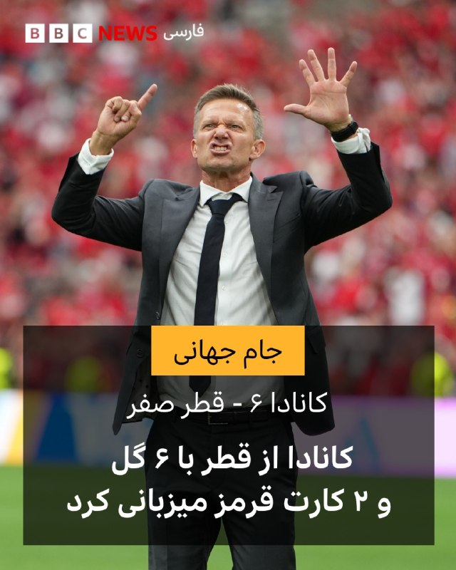

‌⚽کانادا ۶ - قطر صفر

🔸تیم فوتبال کانادا در دیداری پرهیجان که در شهر ونکوور این کشور برگزار شد موفق شد با برتری کامل قطر را شکست دهد.

قطر در این مسابقه از همان اوایل نیمه اول مبهوت و شگفت‌زده به نظر می‌رسید و با دریافت گل اول در دقیقه ۱۶ تلاش کرد به خود بازآید اما گل دوم را هم در دقیقه ۲۹ دریافت کرد و سپس اخراج همام الامین در دقیقه ۳۶ این تیم را در برابر کانادا که با تشویق هزاران هوادار قرمزپوش خود جلو کشیده بود، شانسی پیدا نکرد.

گل سوم کانادا را هم جاناتان دیوید زد تا با دبل خود، کانادا را در نیمه اول سه بر صفر به رختکن ببرد.

در اوایل نیمه دوم قطر باز هم شوکه شد چرا که خطای عاصم مادیبو روی بازیکن خطرناک کانادا - درک کورنلیوس - موجب اخراج مادیبو و ۹ نفره شدن قطر شد. درک کورنلیوس را با برانکارد زمین را ترک کرد.

چند دقیقه بعد قطر روی یک ضربه آزاد از پشت محوطه جریمه گل چهارم را دریافت کرد.

گل پنجم را در دقیقه ۷۵ محمد منایی با گل به خودی برای کانادا ثبت کرد اما این پایان کار نبود و جاناتان دیوید با زدن گل ششم برای کانادا خودش هم هت‌تریک کرد.

https://bbc.in/44ntsXa

📷Anadolu via Getty Images

@BBCPersian

## BBCPersian — post 284311

🖋️لوئیس باروچو
سرویس جهانی بی‌بی‌سی

🔻پس از هفته‌ها مذاکره، آمریکا و ایران به توافقی اولیه رسیده‌اند، اما توجه‌ها از همین الان به چالش‌های بزرگی معطوف شده که بر سر راه پایان جنگ قرار دارد.

در حالی که قرار بود این تفاهم‌نامه روز جمعه به صورت رسمی در سوئیس امضا شود، پیش از موعد مقرر و به صورت غیرحضوری، به امضای دونالد ترامپ، رئیس‌جمهور آمریکا، و مسعود پزشکیان، رئیس‌جمهور ایران، رسید. این تفاهم‌نامه راه را برای دستیابی به «توافق نهایی» ظرف «حداکثر ۶۰ روز، با امکان تمدید در صورت توافق دو طرف» هموار می‌کند.

این توافق شامل تعهد به آغاز روند رفع محاصره دریایی آمریکا، ازسرگیری کشتیرانی از مسیر تنگه هرمز و مذاکره برای لغو «همه انواع تحریم‌ها» علیه ایران است. این سند همچنین ایجاد صندوقی با حداقل ۳۰۰ میلیارد دلار برای بازسازی و توسعه اقتصادی ایران را پیش‌بینی می‌کند و در کنار آن، تهران بار دیگر متعهد شده است که به دنبال توسعه سلاح هسته‌ای نخواهد رفت.

دونالد ترامپ، رئیس‌جمهور آمریکا، هشدار داده است که این توافق اولیه «نهایی نیست» و گفته اگر شکست بخورد، آمریکا می‌تواند «دوباره بمباران را از سر بگیرد».

در ایران محمدباقر قالیباف، رئیس مجلس شورای اسلامی و از مذاکره‌کنندگان اصلی جمهوری اسلامی، به رسانه‌های دولتی گفت که بی‌اعتمادی او به آمریکا همچنان پابرجاست و افزود «دشمن فهمید وقتی ما حرف از مذاکره می‌زنیم، شمشیر ما هم آماده است».

به گفته کارشناسان، سه مورد زیر از مهم‌ترین تهدیدهایی است که می‌تواند مذاکرات را با خطر روبه‌رو کند.

https://bbc.in/4a8YA0b
@BBCPersian

## BBCPersian — post 284310

🔻جی‌دی ونس، معاون رئیس‌جمهور آمریکا، روز پنجشنبه در نشستی خبری که حدود ۴۵ دقیقه طول کشید به خبرنگاران درباره تفاهمنامه امضاء شده با ایران توضیح داد.

او در بخشی از این کنفرانس خبری در پاسخ به نارضایتی اسرائیل از تفاهم با ایران گفت «اول از همه» دونالد ترامپ تنها رئیس‌ دولتی در تمام جهان است که در این مقطع زمانی نسبت به کشور اسرائیل همدلی و حمایت نشان می‌دهد و اتفاقا رهبر قدرتمندترین کشور جهان هم هست: «اگر من عضو کابینه دولت اسرائیل بودم، احتمالا به تنها متحد قدرتمندی که در سراسر جهان برایم باقی مانده حمله لفظی نمی‌کردم.»

او خطاب به آن دسته از اعضای کابینه اسرائیل که از رئیس جمهور آمریکا انتقاد می‌کنند،‌ گفت:‌ «در سه ماه گذشته، دو سوم تجهیزات دفاعی‌ که از سرزمین شما محافظت کرده‌اند، به دست کارگران آمریکایی ساخته شده و با پول مالیات‌دهندگان آمریکایی تأمین شده‌اند.»
معاون رئیس‌جمهور آمریکا افزود که مشکل اسرائیل دونالد ترامپ نیست: «هر کسی در اسرائیل که فکر می‌کند بزرگ‌ترین مشکلش رئیس‌جمهور ایالات متحده است، باید از خواب بیدار شود و واقعیت شرایطی را که کشورش در آن قرار دارد درک کند.»

@BBCPersian

## BBCPersian — post 284303

‌🖊فاریا مسعود، ریچل کلان و جاناتان جوزفس
خبرنگاران اقتصادی

🔻ایران و آمریکا بیش از سه ماه پس از آغاز بر سر چارچوب توافقی به تفاهم رسیده‌اند که قرار است درگیری‌ها را برای دوره‌ای طولانی‌تر متوقف کند.

بحران خاورمیانه قیمت جهانی نفت را به‌شدت بالا برد، چون این درگیری عملا یکی از آبراه‌های اصلی جهان برای انتقال نفت، گاز طبیعی مایع و دیگر کالاهای ضروری را بست و عرضه جهانی را محدود کرد.

اما کارشناسان هشدار می‌دهند بازگشت تردد کشتی‌ها در تنگه هرمز به روال عادی زمان‌بر خواهد بود و پیامدهای جنگ ممکن است تا ماه‌ها بر اقتصاد جهانی اثر بگذارد.

متن کامل خبر را از لینک زیر بخوانید:

📷BBC/ GettyImages/ Reuters/ Anadolu via Getty Images/ AFP via Getty Images/ Universal Images Group via Getty Images

https://bbc.in/4oz9Rwx

@BBCPersian

---
📅 بروزرسانی: 1405/03/29 03:08
---

## VahidOOnLine — post 246296

  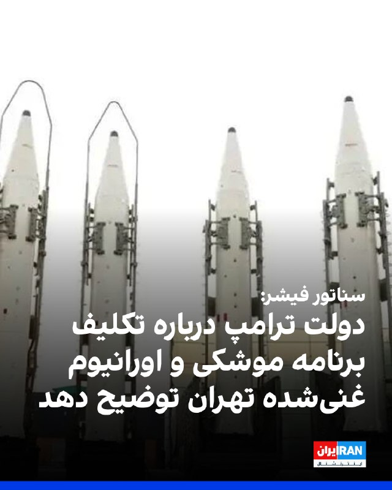

دب فیشر، سناتور جمهوری‌خواه،‌ از دولت ترامپ خواست جزئیات بیشتری درباره تفاهم با جمهوری اسلامی ارائه دهد تا مشخص شود برنامه موشک‌های بالستیک ایران چگونه محدود می‌کند و چگونه به‌صورت قابل راستی‌آزمایی تضمین می‌کند که تهران اورانیوم با غنای بالای خود را تحویل می‌دهد.
او گفت اقدام قاطعانه ترامپ برای از بین بردن توانایی جمهوری اسلامی برای دستیابی به سلاح هسته‌ای، آمریکا را در موقعیت قدرت قرار داده است و واشینگتن نباید این فرصت را هدر بدهد.

‌🏁 🇬🇧 IranintlTV

🤖 @VahidOOnLine

## VahidOOnLine — post 246295

  

بنیاد کارنگی در تحلیلی درباره تفاهم‌نامه میان آمریکا و جمهوری اسلامی هشدار داد ابهام در مفاد توافق می‌تواند آن را با سرنوشتی مشابه توافق‌های شکست‌خورده گذشته روبه‌رو کند.
این اندیشکده نوشت تجربه بیش از دو دهه مذاکرات هسته‌ای با جمهوری اسلامی نشان داده است که ابهام و کلی‌گویی زمینه‌ساز اختلاف در تفسیر تعهدات و در نهایت شکست توافق‌ها می‌شود.
کارنگی با اشاره به تفاهم‌نامه جدید میان واشینگتن و تهران تاکید کرد برخی مفاهیم کلیدی، از جمله حفظ «وضعیت موجود» در برنامه هسته‌ای ایران و آینده غنی‌سازی اورانیوم، به اندازه کافی روشن و دقیق تعریف نشده‌اند.
این بنیاد همچنین از موضع مقام‌های دولت ترامپ که اهمیت متن توافق را کم‌اهمیت جلوه داده‌اند انتقاد کرد و نوشت جمهوری اسلامی ممکن است به تعهدات نانوشته پایبند نباشد.

‌🏁 🇬🇧 IranintlTV

🤖 @VahidOOnLine

## VahidOOnLine — post 246294

♦️ولادیمیر پوتین، رئیس‌جمهوری روسیه، در جریان سفر به شهر کازان، از مجموعه تاریخی کرملین کازان، کلیسای بشارت و مسجد قل‌شریف بازدید کرد و با شماری از گردشگران نیز گفتگو کرد.
به گزارش رویترز، پوتین در این بازدید همراه با رستم مینیخانوف، رئیس جمهوری تاتارستان، از بناهای تاریخی این شهر دیدن کرد. او پیش از ورود به مسجد قل‌شریف کفش‌های خود را از پا درآورد؛ اقدامی که توجه برخی رسانه‌ها و کاربران شبکه‌های اجتماعی را جلب کرد.
پوتین برای شرکت در مجمع سه‌روزه «روسیه–آسه‌آن» به کازان سفر کرده است. این نشست از ۲۷ تا ۲۹ خرداد برگزار می‌شود.
‌🇸🇦 Indypersian

🤖 @VahidOOnLine

## VahidOOnLine — post 246293

♦️پیت هگست، وزیر جنگ آمریکا، در پاسخ به پرسشی درباره تغییر آرایش نیروهای آمریکایی در خاورمیانه گفت هرگونه تغییر در حضور نظامی آمریکا به عملکرد ایران و تحقق معیارهای تعیین‌شده بستگی دارد. او تاکید کرد که رویکرد دولت آمریکا بر پایه «راستی‌آزمایی» است و «هیچ اعتماد و هیچ امتیاز رایگانی» در کار نخواهد بود.

هگست با اشاره به توافق احتمالی با تهران گفت این توافق مانند توافق هسته‌ای دوران باراک اوباما نیست و همه مراحل آن بر اساس راستی‌آزمایی پیش خواهد رفت. او افزود ایران در نتیجه حملات اخیر آمریکا به‌شدت از نظر نظامی تضعیف شده و محاصره دریایی نیز فشار بیشتری بر تهران وارد کرده است.

وزیر جنگ آمریکا همچنین گفت واشینگتن در روزهای گذشته آماده انجام حملات مجدد بوده و در صورت لزوم این عملیات را از سر خواهد گرفت. او تاکید کرد: «موضع ما موضع قدرت است. ایران هر فرصتی را خواهد داشت تا بر سر میز مذاکره به توافقی که باید تن دهد دست پیدا کند، اما اگر این کار را نکند، وزارت جنگ آماده اقدام خواهد بود.»
‌🇸🇦 Indypersian

🤖 @VahidOOnLine

## VahidOOnLine — post 246292

  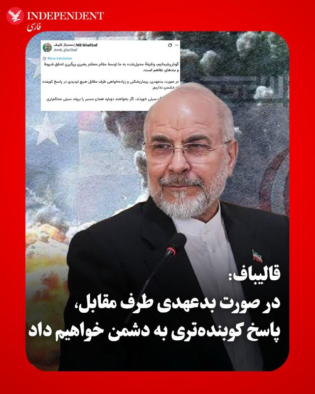

♦️محمدباقر قالیباف، رئیس مجلس شورای اسلامی و مذاکره‌کننده ارشد جمهوری اسلامی، در پیامی در شبکه اکس نوشت که وظیفه محول‌شده از سوی مجتبی خامنه‌ای، رهبر جمهوری اسلامی پیگیری تحقق شروط و بندهای تفاهم‌نامه است.
قالیباف تاکید کرد: «در صورت بدعهدی، پیمان‌شکنی و زیاده‌خواهی طرف مقابل، هیچ تردیدی در پاسخ کوبنده به دشمن نداریم.»
او همچنین هشدار داد: «یک بار در جنگ سیلی خوردند؛ اگر بخواهند دوباره همان مسیر را بروند، سیلی محکم‌تری خواهند خورد.»
‌🇸🇦 Indypersian

🤖 @VahidOOnLine

## VahidOOnLine — post 246291

  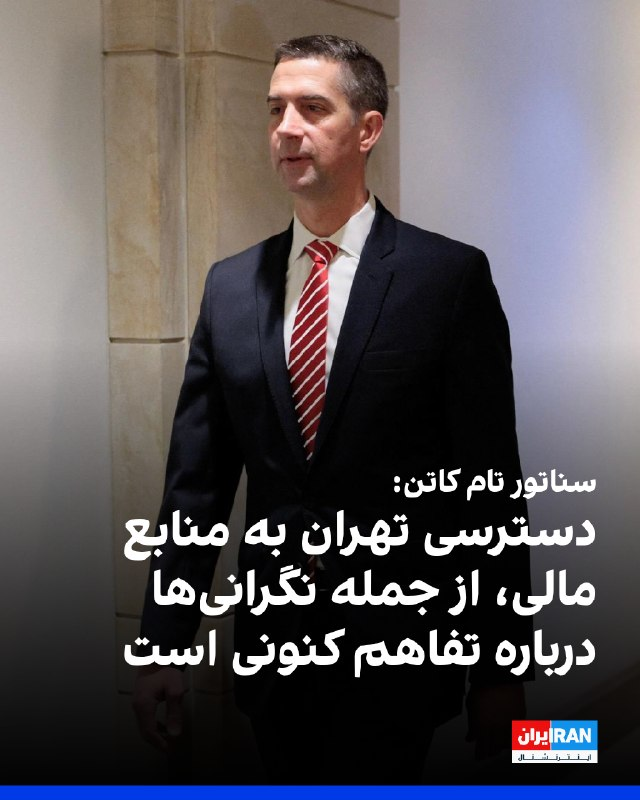

تام کاتن، سناتور جمهوری‌خواه، جمهوری اسلامی را یک «حکومت انقلابی تروریستی» خواند و با ابراز نگرانی از جنبه‌های مختلف یادداشت تفاهم آمریکا و جمهوری اسلامی، تاکید کرد که ترامپ نباید اجازه دهد جمهوری اسلامی به منابع مالی گسترده و دارایی‌های مسدودشده ایران دسترسی پیدا کند.
کاتن با اشاره به اینکه قرار است تحریم‌های صادرات نفت ایران فورا لغو شود، گفت بر اساس میزان تولید نفت ایران پیش از جنگ و قیمت‌های کنونی نفت، این موضوع می‌تواند روزانه بین ۱۵۰ تا ۲۰۰ میلیون دلار درآمد برای ایران ایجاد کند، یعنی حدود چهار و نیم تا شش میلیارد دلار در هر ماه.
او افزود: «این رقم بسیار بزرگی است و می‌دانیم این حکومت انقلابی و تروریستی این پول را صرف مهدکودک یا بیمارستان نخواهد کرد؛ بلکه از آن برای بازسازی ذخایر پهپادی، موشک‌ها و تامین مالی حماس و حزب‌الله استفاده خواهد کرد.»
کاتن با اشاره به اینکه ابهام در برخی بخش‌های این تفاهم‌نامه درباره امکان دسترسی ایران به حدود ۱۰۰ میلیارد دلار دارایی مسدودشده یا موضوع دریافت عوارض از کشتی‌ها در تنگه هرمز گفت به توضیحات بیشتری در این زمینه نیاز دارد و ترامپ نباید اجازه ندهد چنین اتفاقی رخ دهد.
‌🏁 🇬🇧 IranintlTV

🤖 @VahidOOnLine

## VahidOOnLine — post 246290

  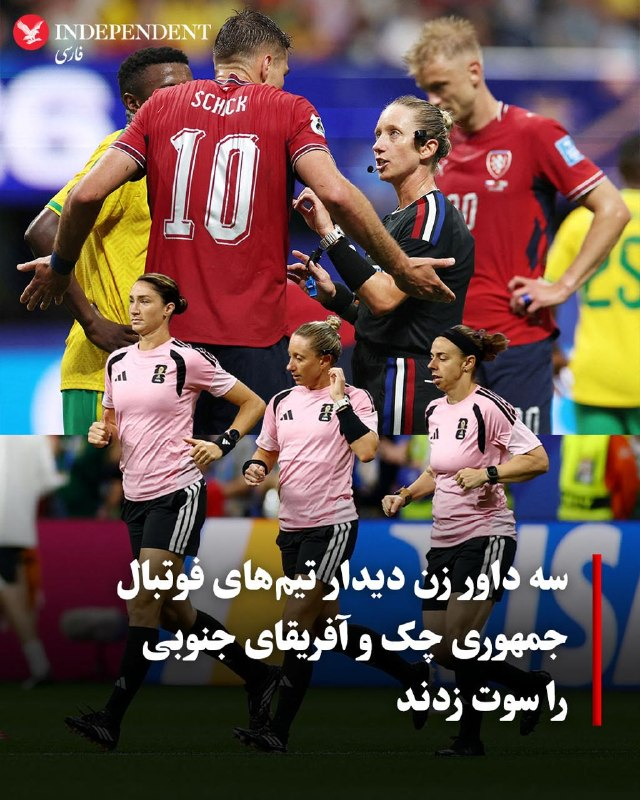

♦️توری پنسو، بروک مایو و کاترین نسبیت، سه داور زن آمریکایی، با قضاوت دیدار جمهوری چک و آفریقای جنوبی در جام جهانی ۲۰۲۶، به نخستین تیم داوری کاملا آمریکایی و زن در تاریخ جام جهانی مردان تبدیل شدند.
به گزارش واشنگتن پست، این دومین بار در تاریخ جام جهانی مردان است که یک تیم داوری کاملا متشکل از زنان قضاوت یک مسابقه را بر عهده می‌گیرد. این سه داور پیش‌تر نیز فینال جام جهانی زنان میان انگلیس و اسپانیا را قضاوت کرده بودند.
‌🇸🇦 Indypersian

🤖 @VahidOOnLine

## VahidOOnLine — post 246289

  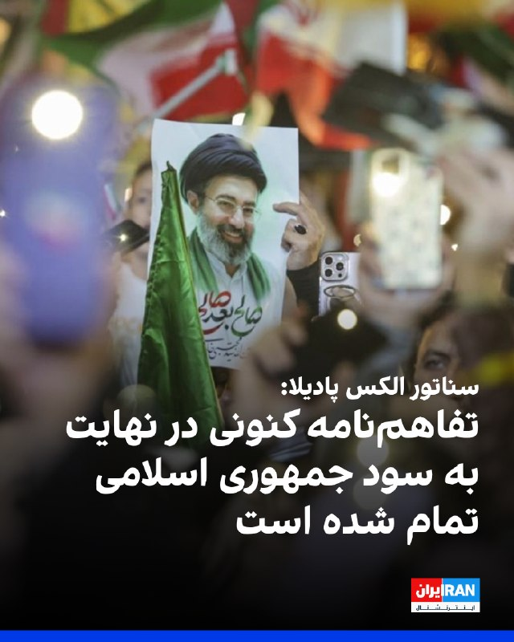

سناتور الکس پادیلا، نماینده دموکرات ایالت کالیفرنیا، تفاهم‌نامه آمریکا و جمهوری اسلامی را «تسلیم کامل آمریکا» توصیف کرد و گفت این اقدام در نهایت به سود جمهوری اسلامی تمام شده است.
پادیلا در بیانیه‌ای اعلام کرد: «این تفاهم‌نامه ایران را در موقعیت راهبردی بهتری نسبت به زمانی قرار می‌دهد که ترامپ این جنگ نسنجیده را آغاز کرد. این توافق، آن چیزی نیست که ترامپ وعده داده بود؛ در واقع حتی نمی‌توان آن را یک توافق واقعی دانست.»
او افزود: «نتیجه نهایی این است که تنگه هرمز که پیش از جنگ نیز باز بود، دوباره بازگشایی می‌شود، تحریم‌های ایران کاهش می‌یابد و ۳۰۰ میلیارد دلار در اختیار حکومت ایران قرار می‌گیرد.»
این سناتور دموکرات همچنین با انتقاد از هزینه‌های جنگ گفت: «پس از شعله‌ور کردن یک جنگ منطقه‌ای، تهدید به نابودی یک کشور، صرف ده‌ها میلیارد دلار از پول مالیات‌دهندگان آمریکایی، آسیب زدن به اقتصاد و به خطر انداختن جان شهروندان آمریکا، دستاورد بزرگ ترامپ توافقی است که حتی از توافق هسته‌ای سال ۲۰۱۵ دولت اوباما نیز ضعیف‌تر است؛ توافقی که خود ترامپ آن را پاره کرد.»

‌🏁 🇬🇧 IranintlTV

🤖 @VahidOOnLine

## VahidOOnLine — post 246288

♦️ارسلان قاسمی، نماینده اتاق تعاون در شورای گفتگو، با انتقاد از عملکرد دولت در اجرای بسته‌های حمایتی پس از جنگ گفت وعده ۷۰۰ هزار میلیارد تومانی دولت برای حمایت از واحدهای آسیب‌دیده جنگ عملا محقق نشده و فعالان اقتصادی همچنان با مشکلات بانکی، مالیاتی و تامین اجتماعی دست‌وپنجه نرم می‌کنند.

قاسمی با اشاره به مصوبات دولت برای حمایت از تولیدکنندگان افزود با وجود تصویب افزایش سرمایه بانک کشاورزی و بانک توسعه تعاون، این تصمیم‌ها هنوز اجرایی نشده‌اند. او با انتقاد از عملکرد دستگاه‌های اجرایی گفت: «فقط گفتاردرمانی کردید؛ مصوبه دادید اما هیچ اتفاقی نیفتاده است.»

نماینده اتاق تعاون همچنین از قوه قضاییه خواست بر اجرای مصوبات دولت نظارت کند و گزارشی از میزان تحقق آن‌ها ارائه دهد. او تاکید کرد فعالان اقتصادی در دوران جنگ و بحران کمبود کالا کنار کشور ایستادند و اکنون انتظار دارند دولت نیز به وعده‌های خود عمل کند.
‌🇸🇦 Indypersian

🤖 @VahidOOnLine

## VahidOOnLine — post 246287

  <a href="telegram/content/VahidOOnLine_246287_1781825901.mp4" target="_blank">🎬 Download video</a>

♦️دونالد ترامپ و مقام‌های جمهوری اسلامی تفاهم‌نامه‌ای را کردند؛ توافقی که هدف آن پایان دادن به ماه‌ها درگیری و آغاز دور تازه‌ای از مذاکرات بر سر پرونده هسته‌ای ایران عنوان شده است. مسعود پزشکیان این سند را در تهران امضا کرد و ترامپ که میهمان امانوئل مکرون بود، در کاخ ورسای در پاریس، امضای خود را پای سند تفاهم گذاشت.

اما نام ورسای برای تاریخ‌دانان یادآور رویدادی دیگر است؛ معاهده مشهور ورسای در سال ۱۹۱۹ که به جنگ جهانی اول پایان داد، اما بسیاری از پژوهشگران آن را یکی از عوامل زمینه‌ساز جنگ جهانی دوم می‌دانند.

اکنون، بیش از یک قرن بعد، همان کاخ بار دیگر میزبان توافقی سرنوشت‌ساز شده است. این‌که تفاهم‌نامه جدید به صلحی پایدار منتهی خواهد شد یا همچون همتای تاریخی خود پیامدهایی پیش‌بینی‌نشده در پی خواهد داشت، پرسشی است که تنها گذر زمان به آن پاسخ خواهد داد.
‌🇸🇦 Indypersian

🤖 @VahidOOnLine

## WithYashar — post 15292

دلار داره آرامش قبل طوفان رو تجربه میکنه و ممکنه بزودی حرکت بزرگش رو آغاز کنه رفقایی که نمیدونن دلار میریزه یا رشد میکنه عضو این کانال تحلیل بشن بهتون میگه: https://t.me/+hLt81qXCGTQzOWQ0 https://t.me/+hLt81qXCGTQzOWQ0 لامصب اطلاعات رانتی داره

## WithYashar — post 15291

دلار داره آرامش قبل طوفان رو تجربه میکنه و ممکنه بزودی حرکت بزرگش رو آغاز کنه
رفقایی که نمیدونن دلار میریزه یا رشد میکنه عضو این کانال تحلیل بشن بهتون میگه:

https://t.me/+hLt81qXCGTQzOWQ0
https://t.me/+hLt81qXCGTQzOWQ0

لامصب اطلاعات رانتی داره

## WithYashar — post 15290

گزارش های محلی در جنوب لبنان،
از حملات هوایی سنگین جنگنده های اسرائیلی خبر می‌دهند،آسمان جنوب شرقی لبنان به دلیل شلیک گسترده منور های روشنایی ارتش اسرائیل روشن شده است.🚨
@withyashar

## WithYashar — post 15289

کامنت جدیدم زیر پست ترامپ، لاتیش کردم 😂 فقط همین کامنت رو لایک کنید . ترجمه در کانال تلگرام. https://www.instagram.com/reel/DZvkK0jpILu/?comment_id=18367681780225433 ترجمه : ببین ترامپ، می‌دونم دیر یا زود این کار رو به سرانجام می‌رسونی، ولی رفیق، این…

## WithYashar — post 15288

کامنت جدیدم زیر پست ترامپ، لاتیش کردم 😂 فقط همین کامنت رو لایک کنید . ترجمه در کانال تلگرام.

https://www.instagram.com/reel/DZvkK0jpILu/?comment_id=18367681780225433

ترجمه : ببین ترامپ،

می‌دونم دیر یا زود این کار رو به سرانجام می‌رسونی، ولی رفیق، این دیگه درست نیست. مردم ایران از این همه انتظار و بلاتکلیفی به مرز دیوانگی رسیده‌اند.

این داستان را تمام کن و کار را یکسره کن.

خیلی از ما در این ماجرا کنار تو هستیم، اما باور کن این آخرین تغییر رژیمی است که حاضر به حمایت از آن هستیم. بعد از این دیگر چنین چیزی تکرار نخواهد شد.

عشقی.

## FoxNewsTwitter — post 343158

  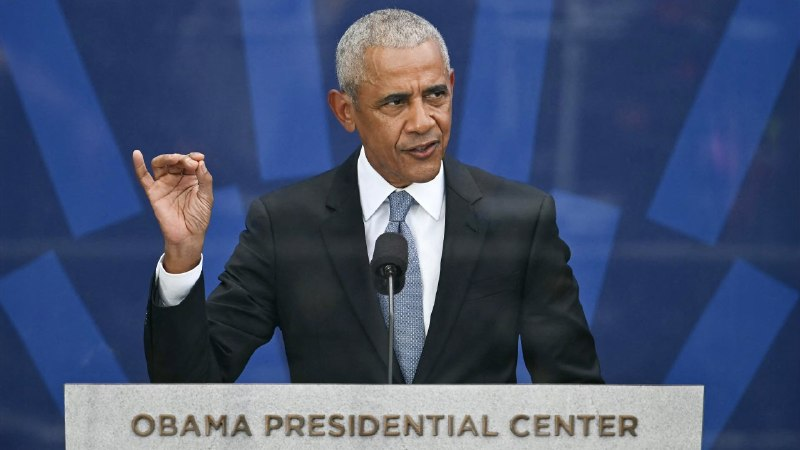

Fox News (Twitter/X)

“The founders fell terribly short of the Declaration’s promise.”

Former President Barack Obama took aim at America’s founders during the opening of his presidential center, arguing they left slavery intact and limited political rights despite laying the groundwork for the nation.

The remarks come just days before the United States marks its 250th anniversary, as Obama urged Americans to continue the work of building a “more perfect” union.

## FoxNewsTwitter — post 343157

  <a href="telegram/content/FoxNewsTwitter_343157_1781825904.mp4" target="_blank">🎬 Download video</a>

Fox News (Twitter/X)

Beach chair 🤝 motorized skateboard

This is apparently a winning combination on the roadways of Hawaii.

Incredible video out of Maui shows the laid-back rider patiently waiting at a red light before rolling off in the homemade chair.

## FoxNewsTwitter — post 343156

  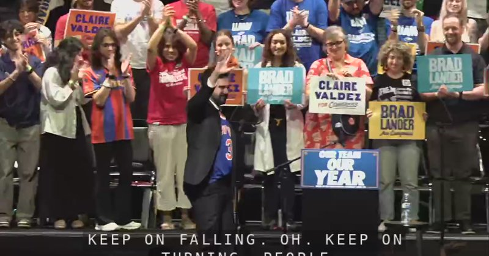

Fox News (Twitter/X)

WATCH LIVE: Senator Bernie Sanders, Mayor Zohran Mamdani host Brooklyn rally https://twitter.com/i/broadcasts/1NxarrmaXMnKj

## FoxNewsTwitter — post 343155

  <a href="telegram/content/FoxNewsTwitter_343155_1781825906.mp4" target="_blank">🎬 Download video</a>

Fox News (Twitter/X)

FOX NEWS REPORT: Americans are starting to feel relief as the average price of gas fell below $4 for the first time since March after President Trump signed the US-Iran peace deal, FOX News' @BillMelugin_ reports.

## FoxNewsTwitter — post 343151

Fox News (Twitter/X)

President Trump awards the Medal of Honor to three American heroes during a White House ceremony honoring extraordinary acts of valor in Vietnam and Afghanistan.

Retired Marine Maj. James Capers Jr. was recognized for leading his reconnaissance team through multiple enemy engagements in Vietnam in 1967, continuing to command his men despite suffering severe wounds and refusing evacuation until every member of his team was safe.

Marine Corps Col. John W. Ripley was awarded the Medal of Honor posthumously for his actions in Vietnam in 1972. Ripley's son accepted the award on his behalf as the nation recognized his role in halting a major North Vietnamese assault by destroying a key bridge under intense enemy fire.

Retired Army Maj. Nicholas Dockery received the Medal of Honor for his actions during a Taliban ambush in Afghanistan in 2012, repeatedly risking his life to rescue wounded soldiers and direct support for his platoon under heavy enemy...

Перейти на оригинальный пост

## FoxNewsTwitter — post 343150

  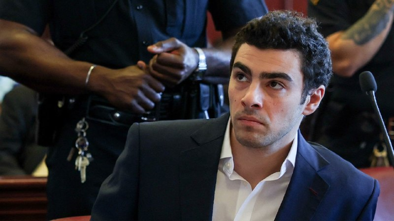

Fox News (Twitter/X)

BREAKING: Luigi Mangione is dropping plans to use a psychiatric defense in the murder of UnitedHealthcare CEO Brian Thompson, just one day after his attorneys filed paperwork signaling the move.

## FoxNewsTwitter — post 343149

  <a href="telegram/content/FoxNewsTwitter_343149_1781825909.mp4" target="_blank">🎬 Download video</a>

Fox News (Twitter/X)

President Trump awards the Medal of Honor to retired Army Maj. Nicholas Dockery during a White House ceremony.

Then-2nd Lt. Dockery earned the nation's highest military honor for his actions during a Taliban ambush in Afghanistan on October 2, 2012. Despite intense enemy fire, he repeatedly risked his life to rescue wounded soldiers and later directed helicopter support as his unit evacuated the wounded.

Dockery is one of three veterans being recognized by President Trump for extraordinary acts of valor.

## FoxNewsTwitter — post 343148

  <a href="telegram/content/FoxNewsTwitter_343148_1781825911.mp4" target="_blank">🎬 Download video</a>

Fox News (Twitter/X)

President Trump awards the Medal of Honor posthumously to Marine Corps Col. John W. Ripley during a White House ceremony, with Ripley's son accepting the award on behalf of his late father.

Then-Capt. Ripley earned the nation's highest military honor for his actions in Vietnam on April 2, 1972, when he helped stop a major North Vietnamese assault by destroying a critical bridge under intense enemy fire.

More than five decades later, his extraordinary heroism is being recognized with the Medal of Honor.

## pm_afshaa — post 94360

  <a href="telegram/content/pm_afshaa_94360_1781825912.webm" target="_blank">🎬 Download video</a>

🔴کاتز، وزیر دفاع اسرائیل:
توانایی انجام عملیات مستقل علیه جمهوری اسلامی رو داریم.

💧 Rainbet.com the #1 Non-KYC Crypto Casino & Sportsbook @rainbetcom

😁 @Pm_Afshaa

## pm_afshaa — post 94359

  <a href="telegram/content/pm_afshaa_94359_1781825913.webm" target="_blank">🎬 Download video</a>

🔴بیانیه مجتبی خامنه‌ای درباره تفاهم با آمریکا: همون‌طور که می‌دونید، رؤسای جمهور ایران و آمریکا یه تفاهمنامه امضا کردن؛ البته که این ترامپ بود که از روی بدبختی، به شدت دنبال امضای این تفاهمنامه بود. من خودم نظر دیگه‌ای داشتم! ولی بخاطر تعهّدی که پزشکیان از…

## pm_afshaa — post 94358

  <a href="telegram/content/pm_afshaa_94358_1781825913.webm" target="_blank">🎬 Download video</a>

🔴المیادین به نقل از یه منبع آگاه:
به خاطر اینکه حملات اسرائیل به جنوب لبنان هنوز ادامه داره، هیات مذاکره‌کننده ایران فعلاً قید رفتن به سوئیس برای شروع دور اول مذاکرات 60 روزه رو زده و سفرش رو متوقف کرده.

💧 Rainbet.com the #1 Non-KYC Crypto Casino & Sportsbook @rainbetcom

😁 @Pm_Afshaa

## pm_afshaa — post 94357

  <a href="telegram/content/pm_afshaa_94357_1781825914.webm" target="_blank">🎬 Download video</a>

🔴فارس: با وجود توافق، رئیس ستاد ارتش اسرائیل به ارتش اسرائیل دستور داده تا برای سناریوی حمله به ایران آماده بشن.

💧 Rainbet.com the #1 Non-KYC Crypto Casino & Sportsbook @rainbetcom

😁 @Pm_Afshaa

## IranIntlTV — post 343126

  <a href="telegram/content/IranIntlTV_343126_1781825914.mp4" target="_blank">🎬 Download video</a>

ناامیدی یک احساس است؛ تسلیم شدن یک انتخاب

پرسش به‌حق این روزهای بسیاری از ما ایرانیان این است که آیا پس از آنچه تجربه کرده‌ایم، هنوز می‌توان به آینده‌ای روشن امیدوار بود؟ آیا واقعاً امیدی هست؟

جنبش آزادی‌خواهی مردم ایران بارها سرکوب شده، اما هر بار در شکلی تازه ادامه یافته است. همان‌طور که طوفان یک‌باره آغاز و تمام نمی‌شود، مسیر تغییر نیز فراز و فرود دارد.

امروز شاید بسیاری خسته، نگران یا دلسرد باشند؛ اما ناامیدی یک احساس است و تسلیم شدن یک انتخاب.

کامبیز حسینی در «برنامه» به این موضوع می‌پردازد.

«یک ایران صدای شما را می‌شنود»
دوشنبه تا پنجشنبه ۱۱ شب تهران
از تلویزیون ایران اینترنشنال

تماشای نسخه کامل این قسمت از «برنامه» در یوتیوب:
https://youtu.be/vNAC3OxafHE
@iranintltv

## IranIntlTV — post 343125

  

دب فیشر، سناتور جمهوری‌خواه،‌ از دولت ترامپ خواست جزئیات بیشتری درباره تفاهم با جمهوری اسلامی ارائه دهد تا مشخص شود برنامه موشک‌های بالستیک ایران چگونه محدود می‌کند و چگونه به‌صورت قابل راستی‌آزمایی تضمین می‌کند که تهران اورانیوم با غنای بالای خود را تحویل می‌دهد.
او گفت اقدام قاطعانه ترامپ برای از بین بردن توانایی جمهوری اسلامی برای دستیابی به سلاح هسته‌ای، آمریکا را در موقعیت قدرت قرار داده است و واشینگتن نباید این فرصت را هدر بدهد.

https://iranintl.com/202606186229

## IranIntlTV — post 343124

  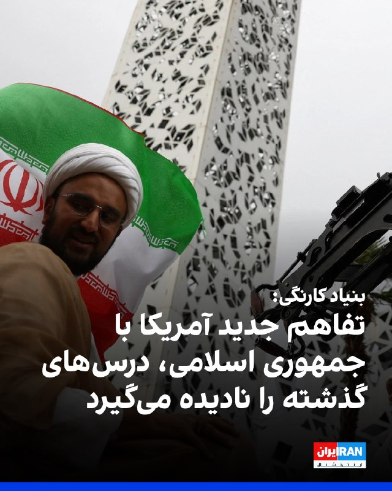

بنیاد کارنگی در تحلیلی درباره تفاهم‌نامه میان آمریکا و جمهوری اسلامی هشدار داد ابهام در مفاد توافق می‌تواند آن را با سرنوشتی مشابه توافق‌های شکست‌خورده گذشته روبه‌رو کند.
این اندیشکده نوشت تجربه بیش از دو دهه مذاکرات هسته‌ای با جمهوری اسلامی نشان داده است که ابهام و کلی‌گویی زمینه‌ساز اختلاف در تفسیر تعهدات و در نهایت شکست توافق‌ها می‌شود.
کارنگی با اشاره به تفاهم‌نامه جدید میان واشینگتن و تهران تاکید کرد برخی مفاهیم کلیدی، از جمله حفظ «وضعیت موجود» در برنامه هسته‌ای ایران و آینده غنی‌سازی اورانیوم، به اندازه کافی روشن و دقیق تعریف نشده‌اند.
این بنیاد همچنین از موضع مقام‌های دولت ترامپ که اهمیت متن توافق را کم‌اهمیت جلوه داده‌اند انتقاد کرد و نوشت جمهوری اسلامی ممکن است به تعهدات نانوشته پایبند نباشد.

https://iranintl.com/202606187551

## IranIntlTV — post 343123

  <a href="telegram/content/IranIntlTV_343123_1781825917.mp4" target="_blank">🎬 Download video</a>

کودتای خزنده مَم‌باقر؛
«باقرشاه» در بازی تاج‌وتخت!

محمدباقر قالیباف این روزها طوری حرف می‌زند که انگار نه بخشی از حاکمیت، که خود حاکمیت است. از مذاکره‌ای که تا دیروز تصمیم کل نظام بود، حالا روایتی شخصی می‌سازد: «من داوطلب مذاکره نبودم.»

کامبیز حسینی در «برنامه» به این موضوع می پردازد.

«یک ایران صدای شما را می‌شنود»
دوشنبه تا پنجشنبه ۱۱ شب تهران
از تلویزیون ایران اینترنشنال

تماشای نسخه کامل این قسمت از «برنامه» در یوتیوب:
https://youtu.be/vNAC3OxafHE
@iranintltv

## IranIntlTV — post 343122

  <a href="telegram/content/IranIntlTV_343122_1781825919.mp4" target="_blank">🎬 Download video</a>

رز از تورنتو: رضا قلی‌پور، در حالی که مشغول کمک به دوست مجروحش بود، به ضرب گلوله کشته شد

«یک ایران صدای شما را می‌شنود»
دوشنبه تا پنجشنبه ۱۱ شب تهران
از تلویزیون ایران اینترنشنال

تماشای نسخه کامل این قسمت از «برنامه» در یوتیوب:
https://youtu.be/vNAC3OxafHE
@iranintltv

## IranIntlTV — post 343121

  <a href="telegram/content/IranIntlTV_343121_1781825920.mp4" target="_blank">🎬 Download video</a>

شیون از تهران: مجتبی هم مثل پدرش مسئولیت را گردن نمی‌گیرد و می‌گوید موافق مذاکره نبوده است.

«یک ایران صدای شما را می‌شنود»
دوشنبه تا پنجشنبه ۱۱ شب تهران
از تلویزیون ایران اینترنشنال

تماشای نسخه کامل این قسمت از «برنامه» در یوتیوب:
https://youtu.be/vNAC3OxafHE
@iranintltv

## IranIntlTV — post 343120

  <a href="telegram/content/IranIntlTV_343120_1781825922.mp4" target="_blank">🎬 Download video</a>

مازیار از تهران: هر کسی در این نظام بوده، دستش به خون ملت آلوده است

«یک ایران صدای شما را می‌شنود»
دوشنبه تا پنجشنبه ۱۱ شب تهران
از تلویزیون ایران اینترنشنال

تماشای نسخه کامل این قسمت از «برنامه» در یوتیوب:
https://youtu.be/vNAC3OxafHE
@iranintltv

## IranIntlTV — post 343119

  

تام کاتن، سناتور جمهوری‌خواه، جمهوری اسلامی را یک «حکومت انقلابی تروریستی» خواند و با ابراز نگرانی از جنبه‌های مختلف یادداشت تفاهم آمریکا و جمهوری اسلامی، تاکید کرد که ترامپ نباید اجازه دهد جمهوری اسلامی به منابع مالی گسترده و دارایی‌های مسدودشده ایران دسترسی پیدا کند.
کاتن با اشاره به اینکه قرار است تحریم‌های صادرات نفت ایران فورا لغو شود، گفت بر اساس میزان تولید نفت ایران پیش از جنگ و قیمت‌های کنونی نفت، این موضوع می‌تواند روزانه بین ۱۵۰ تا ۲۰۰ میلیون دلار درآمد برای ایران ایجاد کند، یعنی حدود چهار و نیم تا شش میلیارد دلار در هر ماه.
او افزود: «این رقم بسیار بزرگی است و می‌دانیم این حکومت انقلابی و تروریستی این پول را صرف مهدکودک یا بیمارستان نخواهد کرد؛ بلکه از آن برای بازسازی ذخایر پهپادی، موشک‌ها و تامین مالی حماس و حزب‌الله استفاده خواهد کرد.»
کاتن با اشاره به اینکه ابهام در برخی بخش‌های این تفاهم‌نامه درباره امکان دسترسی ایران به حدود ۱۰۰ میلیارد دلار دارایی مسدودشده یا موضوع دریافت عوارض از کشتی‌ها در تنگه هرمز گفت به توضیحات بیشتری در این زمینه نیاز دارد و ترامپ نباید اجازه ندهد چنین اتفاقی رخ دهد.

## IranIntlTV — post 343118

  

سناتور الکس پادیلا، نماینده دموکرات ایالت کالیفرنیا، تفاهم‌نامه آمریکا و جمهوری اسلامی را «تسلیم کامل آمریکا» توصیف کرد و گفت این اقدام در نهایت به سود جمهوری اسلامی تمام شده است.
پادیلا در بیانیه‌ای اعلام کرد: «این تفاهم‌نامه ایران را در موقعیت راهبردی بهتری نسبت به زمانی قرار می‌دهد که ترامپ این جنگ نسنجیده را آغاز کرد. این توافق، آن چیزی نیست که ترامپ وعده داده بود؛ در واقع حتی نمی‌توان آن را یک توافق واقعی دانست.»
او افزود: «نتیجه نهایی این است که تنگه هرمز که پیش از جنگ نیز باز بود، دوباره بازگشایی می‌شود، تحریم‌های ایران کاهش می‌یابد و ۳۰۰ میلیارد دلار در اختیار حکومت ایران قرار می‌گیرد.»
این سناتور دموکرات همچنین با انتقاد از هزینه‌های جنگ گفت: «پس از شعله‌ور کردن یک جنگ منطقه‌ای، تهدید به نابودی یک کشور، صرف ده‌ها میلیارد دلار از پول مالیات‌دهندگان آمریکایی، آسیب زدن به اقتصاد و به خطر انداختن جان شهروندان آمریکا، دستاورد بزرگ ترامپ توافقی است که حتی از توافق هسته‌ای سال ۲۰۱۵ دولت اوباما نیز ضعیف‌تر است؛ توافقی که خود ترامپ آن را پاره کرد.»

https://iranintl.com/202606187706

## IranIntlTV — post 343117

  <a href="https://t.me/IranintlTV/343117" target="_blank">📎 Download file</a>

🎧نسخه صوتی ۲۴ با فرداد فرحزاد: مجتبی خامنه‌ای می‌گوید درباره تفاهم نظری دیگر داشت
@iranintlTV

## IranIntlTV — post 343116

  <a href="telegram/content/IranIntlTV_343116_1781825925.mp4" target="_blank">🎬 Download video</a>

محمد قائدی، مدرس روابط بین‌الملل، درباره نگرانی‌های امنیتی اسرائیل از توافق‌نامه امضاشده میان ایران و آمریکا گفت: «اگرچه تصمیم نهایی در اختیار دولت آمریکا است، اما اسرائیل در طول این ۶۰ روز ابزارهای متعددی برای اثرگذاری بر فضای سیاسی، رسانه‌ای و تصمیم‌گیری در واشینگتن در اختیار خواهد داشت و از آنها برای جهت دادن به روند مذاکرات استفاده خواهد کرد.»
@iranintltv

## IranIntlTV — post 343115

  <a href="telegram/content/IranIntlTV_343115_1781825926.mp4" target="_blank">🎬 Download video</a>

مهدی مصلحی، کارشناس بازار نفت، درباره وضعیت بازار انرژی و عبور کشتی‌ها از تنگه هرمز گفت: «معامله‌گران و شرکت‌های بزرگ انرژی معمولا بیش از آنکه به بیانیه‌های سیاسی توجه کنند، به واقعیت‌های میدانی و شرایط عملیاتی نگاه می‌کنند.»

او افزود: «به همین دلیل، صرف اعلام یک توافق یا تفاهم‌نامه لزوما به معنای بازگشت کامل اعتماد نیست.»
@iranintltv

## IranIntlTV — post 343114

  <a href="telegram/content/IranIntlTV_343114_1781825928.mp4" target="_blank">🎬 Download video</a>

با وجود انتقادها در ایالات متحده به امضای تفاهم‌نامه با جمهوری اسلامی، جی‌دی ونس، معاون رییس‌جمهوری آمریکا، گفت این توافق با برجام تفاوتی اساسی دارد و واشینگتن همچنان اهرم‌های اقتصادی، دیپلماتیک و نظامی خود را در قبال ایران حفظ کرده است.

او افزود انتظار آمریکا این است که حکومت ایران دیگر از بی‌ثباتی و تروریسم منطقه‌ای حمایت مالی نکند.

گزارش امیر گیتی، عضو تحریریه ایران‌اینترنشنال
@iranintltv

## FarsiVOA — post 221152

  <a href="telegram/content/FarsiVOA_221152_1781825929.mp4" target="_blank">🎬 Download video</a>

⚡️مجتبی خامنه‌ای توافق را تایید کرد یا از زیر بار مسئولیت آن شانه خالی کرد؟
@FarsiVOA

## FarsiVOA — post 221151

🔺آسوشیتدپرس: ویتکاف به قانون‌گذاران گفت «نامه» جدید جمهوری اسلامی به آژانس امکان اعزام بازرسان آمریکایی به تهران را فراهم می‌کند

▪️استیو ویتکاف، فرستاده دونالد ترامپ رئيس‌جمهوری آمریکا، در جلسه‌ای به قانون‌گذاران آمریکایی گفته است که جمهوری اسلامی از آژانس بین‌المللی انرژی اتمی سازمان ملل دعوت خواهد کرد تا از تأسیسات هسته‌ای آن بازرسی کند و همچنین روند شناسایی و کشف محل نگهداری مواد غنی‌شده در زیر آوار را آغاز کند.

⬇️ بیشتر بخوانید:
https://ir.voanews.com/a/8162373.html
@FarsiVOA

## FarsiVOA — post 221150

🔺سفیر اسرائيل در آمریکا: مذاکرات ۶۰ روزه به برنامه موشک‌های بالستیک جمهوری اسلامی پایان دهد؛ حزب‌الله نباید کنار مرزهای ما باشد

▪️سفیر اسرائیل در آمریکا، یخیل لایتر، می‌گوید که کشورش امیدوار است که تفاهم‌نامه امضا شده میان آمریکا و حکومت ایران به پایان دادن به برنامه موشک‌های بالستیک جمهوری اسلامی منجر شود.

⬇️ بیشتر بخوانید:
https://ir.voanews.com/a/8162371.html
@FarsiVOA

## FarsiVOA — post 221149

  <a href="telegram/content/FarsiVOA_221149_1781825930.mp4" target="_blank">🎬 Download video</a>

⚡️یکه‌تازی آمریکای جنوبی در جام جهانی ۲۰۲۶؛ گفت‌وگو با کوشا دلشاد مربی فوتبال در برزیل
@FarsiVOA

## FarsiVOA — post 221148

🔺سناتور جاش هالی: نمی‌خواهم جمهوری اسلامی پولی دریافت کند زیرا حامی اصلی تروریسم است

▪️سناتور آمریکایی جاش هالی می‌گوید نمی‌خواهد که جمهوری اسلامی هیچ پولی دریافت کند چرا که یک حکومت اصلی «حامی تروریسم» است.

⬇️ بیشتر بخوانید:
https://ir.voanews.com/a/8162368.html
@FarsiVOA

## FarsiVOA — post 221147

⚡️دونالد ترامپ: طالبان برای جلب رضایت آمریکا «چاپلوسی» می‌کند؛ تاکید بر بازپس‌گیری تجهیزات نظامی
@FarsiVOA

## Persian_Trend_Official — post 17515

  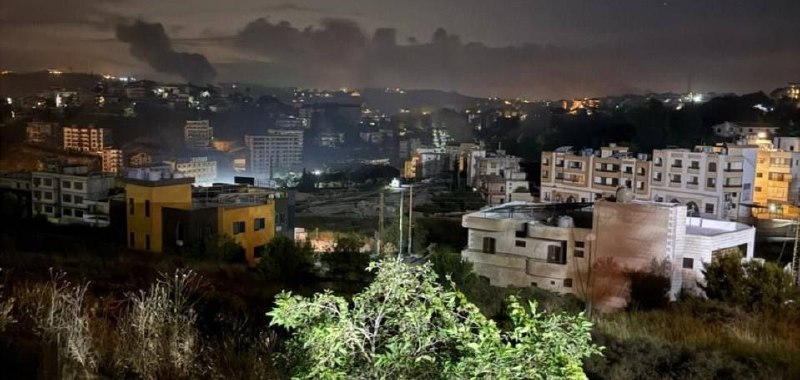

پرواز جنگنده‌های اسرائیلی در جنوب لبنان و بمباران مواضع حزب الله

## Persian_Trend_Official — post 17513

فیلم‌ها موشک هدایت‌شونده ضدتانک ۹M133-1 کورنت-ای احتمالی را نشان می‌دهند که توسط مبارزان حزب‌الله شلیک شده و خودرویی از نیروهای دفاعی اسرائیل را که به سمت علی الطاهر در جنوب لبنان پیش می‌رود، هدف قرار می‌دهد.

## Persian_Trend_Official — post 17512

  <a href="telegram/content/Persian_Trend_Official_17512_1781825931.mp4" target="_blank">🎬 Download video</a>

فیلم‌ها موشک هدایت‌شونده ضدتانک ۹M133-1 کورنت-ای احتمالی را نشان می‌دهند که توسط مبارزان حزب‌الله شلیک شده و خودرویی از نیروهای دفاعی اسرائیل را که به سمت علی الطاهر در جنوب لبنان پیش می‌رود، هدف قرار می‌دهد.

## Persian_Trend_Official — post 17511

  <a href="telegram/content/Persian_Trend_Official_17511_1781825932.mp4" target="_blank">🎬 Download video</a>

فیلم‌ها موشک هدایت‌شونده ضدتانک ۹M133-1 کورنت-ای احتمالی را نشان می‌دهند که توسط مبارزان حزب‌الله شلیک شده و خودرویی از نیروهای دفاعی اسرائیل را که به سمت علی الطاهر در جنوب لبنان پیش می‌رود، هدف قرار می‌دهد.

## Persian_Trend_Official — post 17509

  <a href="telegram/content/Persian_Trend_Official_17509_1781825933.mp4" target="_blank">🎬 Download video</a>

غیر رسمی/انفجار بزرگ در دمشق

## Persian_Trend_Official — post 17508

  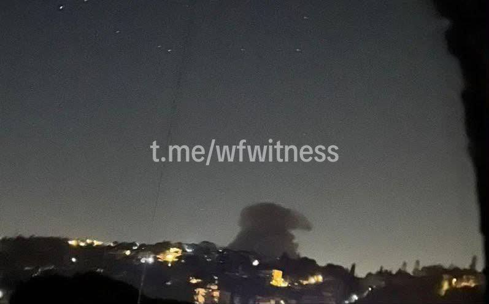

⚡️🇱🇧🇮🇱 تشدید حملات هوایی در جنوب لبنان همزمان با افزایش درگیری‌های زمینی

🎯گزارش‌های اولیه از منابع میدانی حاکی است همزمان با درگیری‌ها در منطقه «علی التحریر»، جنگنده‌های اسرائیلی بر فراز جنوب لبنان به پرواز درآمده‌اند.

بر اساس این گزارش‌ها، حملات هوایی به مناطق مختلفی از جمله شهر «زبدین» در جنوب لبنان انجام شده است.

همزمان، منابع غیررسمی از افزایش شدت درگیری‌ها میان نیروهای و نیروهای خبر می‌دهند.

تاکنون جزئیات مستقلی درباره میزان خسارات یا اهداف دقیق حملات منتشر نشده است.

افزایش همزمان فعالیت هوایی و درگیری‌های زمینی نشان‌دهنده تشدید سطح تنش در مرزهای شمالی فلسطین اشغالی و جنوب لبنان است؛ وضعیتی که می‌تواند به گسترش دامنه درگیری‌ها در منطقه منجر شود.

👺 Phantom

📌 @persian_trend_official
پرشین ترند | متفاوت‌ترین کانال نظامی

## Persian_Trend_Official — post 17503

  <a href="telegram/content/Persian_Trend_Official_17503_1781825934.mp4" target="_blank">🎬 Download video</a>

درگیری سنگینی بین نیروی‌های حزب‌الله لبنان و ارتش اسرائیل در علی التحریر برقرار است.

حزب‌الله به مواضع اسرائیل راکت شلیک کرده و ارتش اسرائیل نیز ضمن شلیک منور، منطقه را با توپخانه هدف قرار داده است.

📝 Amir

📌 @persian_trend_official
پرشین ترند | متفاوت‌ترین کانال نظامی

## Persian_Trend_Official — post 17502

  <a href="telegram/content/Persian_Trend_Official_17502_1781825935.mp4" target="_blank">🎬 Download video</a>

کانال های نزدیک به حزب‌الله لبنان ادعا میکند که این گروه با استفاده از راکت محل تجمع سربازان اسرائیلی در نزدیکی کفرتبنیت را هدف قرار داده است.

📝 Amir

📌 @persian_trend_official
پرشین ترند | متفاوت‌ترین کانال نظامی

## Persian_Trend_Official — post 17501

  <a href="telegram/content/Persian_Trend_Official_17501_1781825937.mp4" target="_blank">🎬 Download video</a>

حزب الله از آغاز سلسله عملیات های عاشورا برای عقب راندن ارتش اسرائیل از جنوب لبنان خبر دارد. 
👺Phantom 📌 @persian_trend_official پرشین ترند | متفاوت‌ترین کانال نظامی.

## IranianMinds — post 22911

🔴معاونت راهبردی پزشکیان:

تجمعات شبانه باید بعد از مراسم تشییع رهبر جمع بشوند. آنها سلامت روحی و روانی جامعه را بر هم می‌زنند.

@IranianMinds

## IranianMinds — post 22910

🔴ترامپ:

من عاشق مردمی هستم که طرفدار من هستند.

@IranianMinds

## IranianMinds — post 22909

  

تام کاتن، سناتور جمهوری‌خواه، جمهوری اسلامی را یک «حکومت انقلابی تروریستی» خواند و با ابراز نگرانی از جنبه‌های مختلف یادداشت تفاهم آمریکا و جمهوری اسلامی، تاکید کرد که ترامپ نباید اجازه دهد جمهوری اسلامی به منابع مالی گسترده و دارایی‌های مسدودشده ایران دسترسی پیدا کند.
کاتن با اشاره به اینکه قرار است تحریم‌های صادرات نفت ایران فورا لغو شود، گفت بر اساس میزان تولید نفت ایران پیش از جنگ و قیمت‌های کنونی نفت، این موضوع می‌تواند روزانه بین ۱۵۰ تا ۲۰۰ میلیون دلار درآمد برای ایران ایجاد کند، یعنی حدود چهار و نیم تا شش میلیارد دلار در هر ماه.
او افزود: «این رقم بسیار بزرگی است و می‌دانیم این حکومت انقلابی و تروریستی این پول را صرف مهدکودک یا بیمارستان نخواهد کرد؛ بلکه از آن برای بازسازی ذخایر پهپادی، موشک‌ها و تامین مالی حماس و حزب‌الله استفاده خواهد کرد.»
کاتن با اشاره به اینکه ابهام در برخی بخش‌های این تفاهم‌نامه درباره امکان دسترسی ایران به حدود ۱۰۰ میلیارد دلار دارایی مسدودشده یا موضوع دریافت عوارض از کشتی‌ها در تنگه هرمز گفت به توضیحات بیشتری در این زمینه نیاز دارد و ترامپ نباید اجازه ندهد چنین اتفاقی رخ دهد.

## BBCPersian — post 284302

  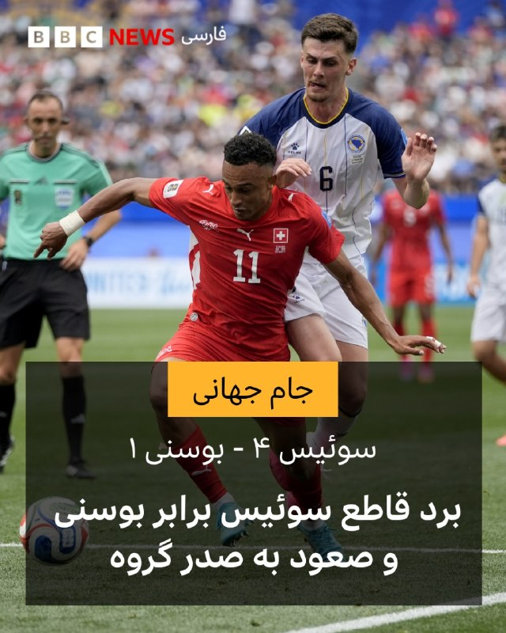

‌⚽سوئیس ۴ - بوسنی ۱

🔸در آغاز دور دوم دیدارهای گروهی جام جهانی، ساعتی پیش سوئیس توانست چهار بر یک بوسنی و هرزگوین را شکست دهد.

با این نتیجه سوئیس که در بازی نخست برابر قطر مساوی کرده بود، با چهار امتیاز صدرنشین گروه بی شد.

دیگر دیدار این گروه را کانادا و قطر برگزار خواهند کرد.

📷Anadolu via Getty Images
https://bbc.in/4eRr0OP

@BBCPersian

## Dirty_Kids — post 392548

  <a href="telegram/content/Dirty_Kids_392548_1781825939.webm" target="_blank">🎬 Download video</a>

📣آیسان اسلامی به تلگرام پیوست 
☑️ 😍 
⭐اگر توم از طرفدارا ایسان اسلامی هستی بیا توی کانال تلگرامش فعالیتش شرو کرده کنارش باش
🙂 A28 ادرس عضویت کانالش
💖
💖 https://t.me/+KZZlpcWXPSU5YjA0 https://t.me/+KZZlpcWXPSU5YjA0

## Dirty_Kids — post 392547

  <a href="telegram/content/Dirty_Kids_392547_1781825940.webm" target="_blank">🎬 Download video</a>

📣آیسان اسلامی به تلگرام پیوست 
☑️ 😍

⭐اگر توم از طرفدارا ایسان اسلامی هستی بیا توی کانال تلگرامش فعالیتش شرو کرده کنارش باش
🙂
A28
ادرس عضویت کانالش
💖
💖
https://t.me/+KZZlpcWXPSU5YjA0
https://t.me/+KZZlpcWXPSU5YjA0

## Dirty_Kids — post 392546

  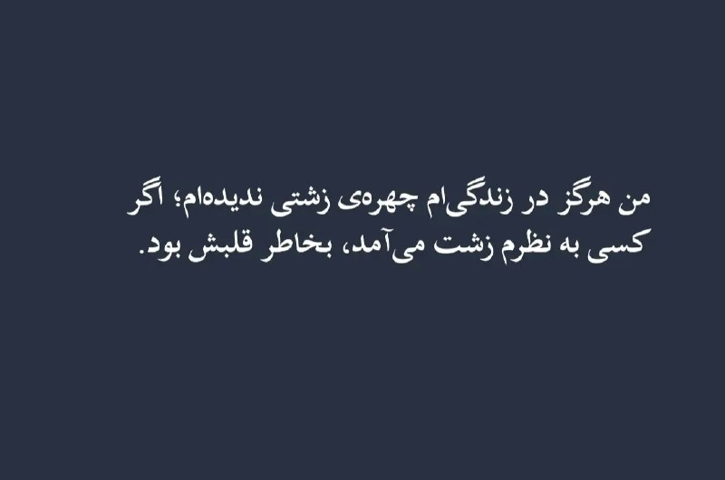

#بخوابیم

@Dirty_Kids 👻

## Dirty_Kids — post 392544

  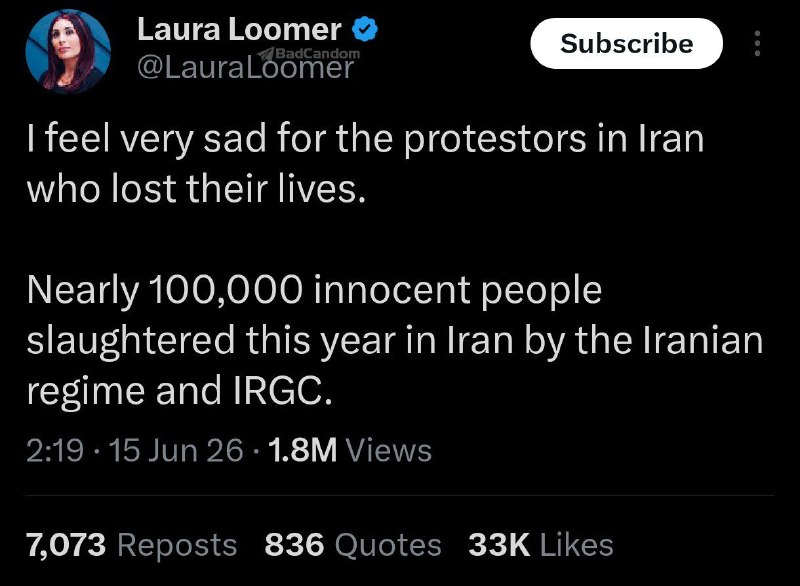

🔴 لورا لومر خبرنگار نزدیک به ترامپ آمار نهایی جاویدنام نام هارو اعلام کرد: در اعتراضات دی ماه ایران، 100 هزار نفر کشته شدن!

@Dirty_Kids 👻

## Dirty_Kids — post 392543

  <a href="telegram/content/Dirty_Kids_392543_1781825941.mp4" target="_blank">🎬 Download video</a>

لذتی که تو خوردن گوشت هست 🤌🏻🤌🏻

@Dirty_Kids 👻

## Dirty_Kids — post 392539

داور بودن یه شغل نیست یه مسئولیته

@Dirty_Kids 👻

## Dirty_Kids — post 392538

  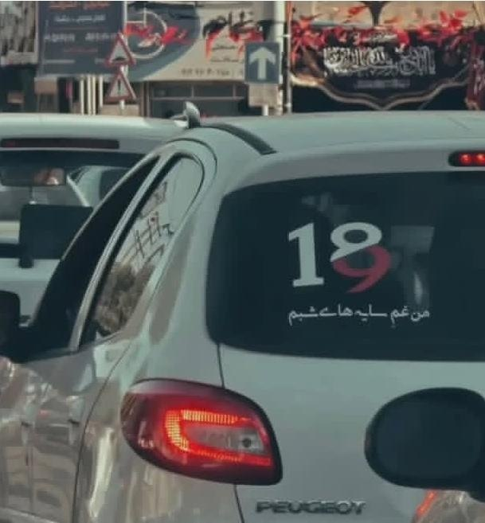

‏چقدر خوبه بجای زدن اسم تازی های عرب پشت ماشین یاد بچه های خودمون هستیم🫡

@Dirty_Kids 👻

## alonews — post 129021

  <a href="telegram/content/alonews_129021_1781825943.mp4" target="_blank">🎬 Download video</a>

👈جی‌دی وانس در مورد اسرائیل:

گاهی اوقات مردم رابطه را به اشتباه توصیف می‌کنند و می‌گویند که اسرائیل و ایالات متحده اساساً همیشه همسو هستند.

این اصلاً درست نیست. ما کشورهای متفاوتی هستیم. نیازهای متفاوتی داریم. جغرافیاهای متفاوتی داریم.

✅ @AloNews خبر جنگ

## alonews — post 129020

  <a href="telegram/content/alonews_129020_1781825944.mp4" target="_blank">🎬 Download video</a>

👈خبرنگار: آیا به اسرائیلی‌ها اعتماد دارید؟

🔴جی‌دی وانس: من به هیچ‌کس اعتماد ندارم.

✅ @AloNews خبر جنگ

## alonews — post 129019

  <a href="telegram/content/alonews_129019_1781825945.webm" target="_blank">🎬 Download video</a>

👈ارتش اسرائیل (IDF) در یک قدمی شهر مهم و استراتژیک نبطیه

طبق گزارش MTV، تو محور کفر تبنیت درگیری شدید بین ارتش اسرائیل و حزب‌الله جریان داره با سلاح سبک و سنگین و توپخانه. کفر تبنیت هم حدود ۴ کیلومتر با نبطیه فاصله داره.

✅ @AloNews خبر جنگ

---
📅 بروزرسانی: 1405/03/29 01:20
---

## VahidOOnLine — post 246286

♦️به گزارش رویترز، پلیس نیویورک اعلام کرد پنج‌شنبه ۲۸ خرداد، حدود ساعت ۱۵:۳۰ به وقت محلی، گزارش‌هایی از تیراندازی در تقاطع خیابان چهل‌وچهارم غربی و خیابان هفتم دریافت کرده است. ماموران پس از حضور در محل، فردی را که اقدام به شلیک کرده بود بازداشت و سلاح او را ضبط کردند.
پلیس اعلام کرد در این حادثه هیچ فردی زخمی نشده و تحقیقات درباره جزئیات آن همچنان ادامه دارد.
‌🇸🇦 Indypersian

🤖 @VahidOOnLine

## VahidOOnLine — post 246285

♦️علی مدنی‌زاده، وزیر اقتصاد، در گفتگو با «خانه اقتصاد» گفت حتی با توافق و رفع محاصره، اقتصاد ایران به شرایط کاملا عادی بازنمی‌گردد. او افزود دولت در سال ۱۴۰۵ حتی بدون وقوع جنگ نیز با چند صد هزار میلیارد تومان کسری بودجه مواجه بود و جنگ با کاهش درآمدهای مالیاتی و نفتی و افزایش هزینه‌های دولت، این ناترازی را تشدید کرده است.
مدنی‌زاده همچنین گفت دولت برای جبران بخشی از کسری بودجه و کاهش درآمدهای ناشی از جنگ، حدود ۱۰۰ هزار میلیارد تومان از بانک مرکزی استقراض کرده است. او هشدار داد آثار تورمی این استقراض در ماه‌های آینده نمایان خواهد شد و تاکید کرد با وجود بهبود احتمالی شرایط پس از توافق، دولت همچنان با محدودیت‌های مالی جدی روبه‌رو خواهد بود.
‌🇸🇦 Indypersian

🤖 @VahidOOnLine

## VahidOOnLine — post 246284

  

چاک شومر، رهبر اقلیت دموکرات در سنای آمریکا، از تفاهم‌نامه میان آمریکا و جمهوری اسلامی انتقاد کرد و گفت ایالات متحده به دلیل «بی‌کفایتی، خودخواهی و ناتوانی دونالد ترامپ در گوش دادن به واقعیت‌ها» در وضعیت بدتری قرار گرفته است.

شومر در پیامی اعلام کرد اگر دونالد ترامپ، رییس‌جمهوری آمریکا، قصد دارد صدها میلیارد دلار به ایران اختصاص دهد، باید این کار را با اتکا به آرای جمهوری‌خواهان انجام دهد.

رهبر اقلیت دموکرات در سنا همچنین تاکید کرد که دموکرات‌ها از هیچ طرحی برای اختصاص ۳۰۰ میلیارد دلار به ایران حمایت نخواهند کرد.

اظهارات شومر در حالی مطرح می‌شود که تفاهم‌نامه میان آمریکا و جمهوری اسلامی با واکنش‌های متفاوتی در میان جمهوری‌خواهان و دموکرات‌های آمریکا روبه‌رو شده و برخی منتقدان درباره پیامدهای اقتصادی و امنیتی آن ابراز نگرانی کرده‌اند.
‌🏁 🇬🇧 IranintlTV

🤖 @VahidOOnLine

## VahidOOnLine — post 246283

  

مسعود پزشکیان، رییس دولت، خطاب به مجتبی خامنه‌ای نوشت: «صدور اجازه شما برای آغاز مذاکره، اسباب خرسندی و رضایت همه خدمتگزاران ملت ایران است.»

او افزود: «خود را متعهد به توجه حداکثری نسبت به دغدغه‌های شما، حراست از حقوق ملت ایران و جبهه مقاومت می‌دانیم.»

پزشکیان ادامه داد: «با توجه حداکثری تیم مذاکره‌کننده نسبت به جزییات مذاکره، پیروزی بزرگ حاصل خواهد شد.»
‌🏁 🇬🇧 IranintlTV

🤖 @VahidOOnLine

## WithYashar — post 15287

وزیر دفاع اسرائیل:اسرائیل توانایی انجام عملیات مستقل علیه ایران را دارد و در هر لحظه برای اجرای یک عملیات آبی و سفید در ایران آماده است.
@withyashar

## WithYashar — post 15286

وزیر دارایی اسرائیل، بزالئل سموتریچ:

غزه در ویرانه باقی خواهد ماند. در نهایت، مهاجرت رخ خواهد داد، زیرا در دهه‌های آینده چیزی برای جستجو در آنجا وجود نخواهد داشت.
@withyashar

## WithYashar — post 15285

ترامپ: پیت هگست قراره خیلی پیروزی های دیگه بدست بیاره پسر خوبیه
من فقط مردمی رو دوس دارم که طرفدار من باشن
@withyashar

## WithYashar — post 15284

این پست جنجالی را از دست ندید، کلیک کنید و کارهای اداریش را انجام بدهید. حتماً تا انتها ببینید. https://www.instagram.com/reel/DZvdCMHxeYT/?igsh=MW50eDUzOWQ0MnFzYw== اتاق جنگ با یاشار : Bagher.exe

## WithYashar — post 15283

subseven

## WithYashar — post 15282

## WithYashar — post 15281

این پست جنجالی را از دست ندید، کلیک کنید و کارهای اداریش را انجام بدهید. حتماً تا انتها ببینید.

https://www.instagram.com/reel/DZvdCMHxeYT/?igsh=MW50eDUzOWQ0MnFzYw==

اتاق جنگ با یاشار : Bagher.exe

## mwarmonitor — post 11180

🔴رهبر معظم معلول و «احتمالاً همجنس‌گرای» ایران با مذاکرات مستقیم با آمریکا موافقت کرد؛ این مذاکرات می‌تواند همین آخر هفته آغاز شود. «نیویورک پست»

@mwarmonitor

## FoxNewsTwitter — post 343147

  <a href="telegram/content/FoxNewsTwitter_343147_1781819449.mp4" target="_blank">🎬 Download video</a>

Fox News (Twitter/X)

President Trump recounted Marine Corps Col. John W. Ripley’s prayer as he crawled beneath a bridge under heavy enemy fire during a pivotal battle in Vietnam in 1972.

Ripley posthumously received the Medal of Honor for spending hours positioning 500 pounds of explosives beneath the Dong Ha Bridge before destroying it and stopping a major North Vietnamese advance.

His actions are widely credited with helping prevent a breakthrough by enemy forces.

## FoxNewsTwitter — post 343146

  <a href="telegram/content/FoxNewsTwitter_343146_1781819451.mp4" target="_blank">🎬 Download video</a>

Fox News (Twitter/X)

President Trump awards the Medal of Honor to retired Marine Maj. James Capers Jr. for extraordinary heroism during a four-day reconnaissance mission in Vietnam.

Despite suffering multiple severe wounds and massive blood loss after his team was ambushed, Capers continued leading his men, directing fire, and guiding the patrol to an extraction site. He refused evacuation until every member of his team was safely aboard the helicopter.

## FoxNewsTwitter — post 343145

  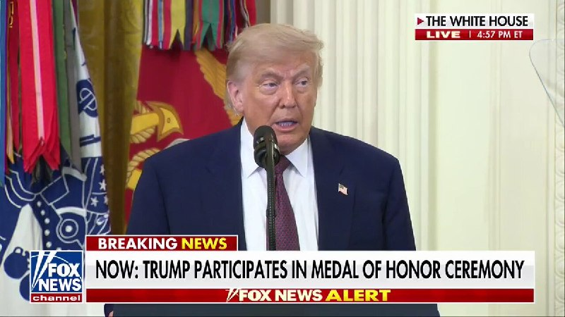

Fox News (Twitter/X)

“I wanted to give it to myself, but I was informed I couldn’t do it.”

President Trump joked about awarding himself the Medal of Honor before presenting the nation’s highest military distinction to three service members during a White House ceremony.

Trump called the recipients “the bravest and greatest heroes ever to walk the earth” as he honored Marine Corps Maj. James Capers, Marine Corps Col. John W. Ripley posthumously, and Army Maj. Nicholas Dockery.

## FoxNewsTwitter — post 343144

  <a href="telegram/content/FoxNewsTwitter_343144_1781819453.mp4" target="_blank">🎬 Download video</a>

Fox News (Twitter/X)

“The stock market just hit a new all-time high... 401(k)s just hit a new all-time high and oil is dropping like a rock.”

President Trump highlighted some economic wins during a White House Medal of Honor ceremony, where he is honoring three distinguished combat veterans for their service and sacrifice.

“Other than that, it’s another day in paradise,” Trump added.

## FoxNewsTwitter — post 343143

  

Fox News (Twitter/X)

New York City showed out as the Knicks celebrated their first NBA title in 53 years.

Fans chanted “Let’s go Knicks” from atop sanitation trucks, cruised through the city in Knicks-themed cars, and even climbed scaffolding to get a glimpse of the festivities as viewing areas filled up early.

Officials estimate more than a million fans decked in their orange and blue packed Lower Manhattan to celebrate with the team.

## FoxNewsTwitter — post 343142

  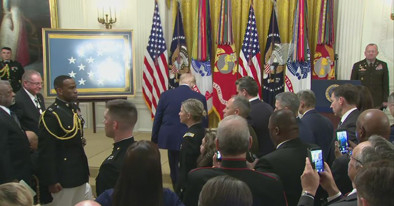

Fox News (Twitter/X)

WATCH LIVE: President Trump awards Medal of Honor to three combat veterans https://twitter.com/i/broadcasts/1RKjppWgpgNJw

## pm_afshaa — post 94356

🔴وزارت خارجه آمریکا در بیانیه ای اضطراری از شهروندان خود خواسته تا اطلاع ثانوی به هیچ وجه به روسیه سفر نکنن

💧 Rainbet.com the #1 Non-KYC Crypto Casino & Sportsbook @rainbetcom

😁 @Pm_Afshaa

## DEJradio — post 5806

  <a href="telegram/content/DEJradio_5806_1781819456.webm" target="_blank">🎬 Download video</a>

👑
🔺 شاهزاده رضا پهلوی در گفت‌وگو با اندرو مار در LBC تأکید کرد که مردم ایران مبارزه برای آزادی را رها نخواهند کرد. او با اشاره به شجاعت و فداکاری ایرانیان گفت که رژیم در نهایت قربانی ماهیت خود خواهد شد و هیچ میزان باج‌دهی، امتیازدهی یا لغو تحریم‌ها نمی‌تواند…

## DEJradio — post 5805

⭕️ نتانیاهو: تا هر زمان لازم باشد در جنوب لبنان می‌مانیم

بنیامین نتانیاهو، نخست‌وزیر اسرائیل پنج‌شنبه ۲۸ خردادماه اعلام کرد ارتش این کشور منطقهٔ امنیتی خود در جنوب لبنان را حفظ می‌کند و از آنجا بازنمی‌گردد.
نتانیاهو تأکید کرد خروج نیروها از لبنان تنها زمانی انجام می‌شود که نیازهای امنیتی اسرائیل برطرف شده باشد.
نتانیاهو در بیانیه‌ای با قدردانی از پشتیبانی آمریکا در نبرد با جمهوری اسلامی، گفت مبارزهٔ اسرائیل هنوز پایان نیافته و چالش‌هایی بیش‌ از پیش در راه است.
نخست‌وزیر اسرائیل تأکید کرد بازگرداندن امنیت به مناطق شمالی اسرائیل، مستلزم حفظ منطقهٔ امنیتی در جنوب لبنان است.
به گفتهٔ نتانیاهو، تا زمانی که امنیت اسرائیل ایجاب کند، ارتش این کشور آنجا را ترک نمی‌کند.
جمهوری اسلامی در مذاکره با آمریکا خواستار خروج نیروهای اسرائیلی از خاک لبنان شده‌ است.
در تفاهمنامهٔ اخیر تهران و واشینگتن، بر حفظ تمامیت ارضی لبنان تأکید شده بود.
شماری از وزرای کابینهٔ نتانیاهو پیش‌تر تأکید کردند که اسرائیل خود را به تفاهمنامهٔ تهران و واشینگتن متعهد نمی‌داند.

#نتانیاهو #لبنان
@DEJradio

## DEJradio — post 5804

⭕️ ترامپ خبر پرداخت ۳۰۰ میلیارد دلار به جمهوری اسلامی را جعلی خواند

دونالد ترامپ، رئیس‌ جمهوری ایالات متحده، در شامگاه پنج‌شنبه ۲۸ خردادماه بار دیگر از امضای تفاهمنامه با جمهوری اسلامی دفاع کرد و آن را یک پیروزی برای ایالات متحده خواند.
دونالد ترامپ در شبکهٔ اجتماعی تروث نوشت: هیچ پرداخت ۳۰۰ میلیارد دلاری از سوی آمریکا به جمهوری اسلامی وجود ندارد.
او‌ با جعلی خواندن این خبر افزود تنها چیزی که برای آمریکا وجود دارد، موفقیت، کاهش بهای نفت و پیروزی است.
رئیس جمهوری آمریکا پیش‌تر با حمله به منتقدان یادداشت تفاهم، نوشته بود مخالفان این تفاهم‌ یا حسودند، یا آدم‌های بدی‌اند و یا احمق‌اند.
اظهارات ترامپ در واکنش به گزارش‌هایی مطرح شده که از احتمال تشکیل صندوقی ۳۰۰ میلیارد دلاری برای بازسازی ایران و توسعهٔ اقتصادی جمهوری اسلامی، در مراحل بعدی توافق خبر داده بودند.
در همین راستا جی‌دی ونس، معاون رئیس ‌جمهوری آمریکا، نیز گفت صحبت دربارهٔ سرمایه‌گذاری احتمالی در ایران در شرایط کنونی «بسیار زودهنگام» است.

#ترامپ #تفاهمنامه
@DEJradio

## DEJradio — post 5803

⭕️ آمریکا شبکهٔ مالی حزب‌الله و متحدان سیاسی آن را تحریم کرد

وزارت خزانه‌داری آمریکا از اعمال دور تازه‌ای از تحریم‌ها علیه افراد و نهادهای مرتبط با حزب‌الله لبنان خبر داد.
بر پایهٔ بیانیهٔ وزارت خزانه‌داری آمریکا، سه فرد و پنج نهاد به اتهام همکاری مالی و پشتیبانی از حزب‌الله در فهرست تحریم‌ها قرار گرفته‌اند.
محمود قماطی، معاون رئیس شورای سیاسی حزب‌الله، از جملهٔ افرادی است که به اتهام هماهنگی انتقال منابع مالی از جمهوری اسلامی به این گروه، هدف تحریم قرار گرفته است.
نام‌ سلیمان فرنجیه، سیاستمدار لبنانی و از متحدان نزدیک حزب‌الله نیز در این سیاههٔ تحریمی قرار دارد.
آمریکا فرنجیه را به کارشکنی در تلاش‌های صلح و همکاری با شبکهٔ نفوذ حزب‌الله متهم کرده است.
وزارت خزانه‌داری آمریکا اعلام کرد خلع سلاح حزب‌الله برای ثبات و رفاه لبنان ضروری است.
واشینگتن می‌گوید به هدف‌گرفتن شبکه‌های مالی و افراد پشتیبان این گروه ادامه می‌دهد.
حزب‌الله که توسط جمهوری اسلامی پشتیبانی می‌شود، در سیاههٔ تروریستی ایالات متحده قرار دارد.
تحریم‌های تازه در حالی اعمال می‌شود که اختلاف‌ بر سر آیندهٔ حزب‌الله و نقش آن در لبنان، یکی از موضوعات چالش‌برانگیز در پی تفاهم‌ اخیر میان تهران و واشینگتن به‌شمار می‌رود.

#حزب_الله #تحریم
@DEJradio

## DEJradio — post 5802

⭕️ اتحادیهٔ اروپا: اکنون وقت صحبت دربارهٔ لغو تحریم‌های جمهوری اسلامی نیست

اتحادیهٔ اروپا اعلام کرد هنوز شرایطی که بشود در مورد لغو تحریم‌های جمهوری اسلامی سخن گفت، ایجاد ‌نشده است.
کایا کالاس، مسئول سیاست خارجی اتحادیهٔ اروپا اعلام کرد «بررسی» لغو تحریم‌های اتحادیهٔ اروپا علیه جمهوری اسلامی تنها پس از دستیابی به یک توافق جامع هسته‌ای با تهران امکان‌پذیر است.
کالاس روز پنج‌شنبه پیش از نشست سران کشورهای عضو اتحادیهٔ اروپا گفت کشورهای عضو در زمان مناسب درباره لغو احتمالی تحریم‌ها گفت‌وگو می‌کنند، اما اکنون شرایط لازم برای چنین تصمیمی فراهم نیست.
اتحادیه اروپا در حال حاضر بیش از ۷۰۰ فرد و نهاد جمهوری اسلامی را تحت تحریم قرار داده است.
این محدودیت‌ها مسدود شدن دارایی‌ و ممنوعیت سفر افراد را دربرمی‌گیرد.
مقام‌های جمهوری اسلامی امیدوارند تفاهمنامهٔ اخیر با آمریکا زمینهٔ کاهش فشارهای اقتصادی و لغو بخشی از تحریم‌های بین‌المللی را فراهم کند.
اتحادیهٔ اروپا در سال پیشین سپاه پاسداران انقلاب اسلامی را نیز در سیاههٔ سازمان‌های تروریستی قرار داد.

#اتحادیه_اروپا #تحریم
@DEJradio

## mamlekate — post 103740

📝 ونس: بخشی از تفاهم، مکتوب نیست چون معیار ما رفتار تهران است نه وعده‌های آنها

جی‌دی ونس، معاون ر‌ییس‌جمهوری آمریکا، با اذعان به وجود تعهدات نانوشته با تهران درباره برنامه هسته‌ای و ذخایر اورانیوم، از امضای یادداشت تفاهم با تهران دفاع کرد و گفت دولت ترامپ به «کلمات» اعتماد ندارد، بلکه پایبندی جمهوری اسلامی را بر اساس «عمل» و «رفتار» آن راستی‌آزمایی می‌کند.

📝 معاون رئیس جمهوری آمریکا: بهره‌مندی از مزایای تفاهم‌نامه به تغییر رفتار حکومت ایران بستگی دارد

@mamlekate

## mamlekate — post 103739

  

📞 رهبر خیالی انقلاب اسلامی (خرزو خان) سناریوی نخ نمای انداختن توافق گردن دیگران (اینبار پوزیده) رو تکرار کرد

@mamlekate

## VahidOnline — post 76498

  

خبرگزاری آسوشیتدپرس گزارش داد استیو ویتکاف، فرستاده دونالد ترامپ، پنجشنبه‌شب در نشستی غیرعلنی با قانون‌گذاران آمریکایی اعلام کرده است تهران از آژانس بین‌المللی انرژی اتمی برای بازرسی از تاسیسات هسته‌ای خود دعوت خواهد کرد و روند شناسایی محل نگهداری مواد غنی‌شده را آغاز می‌کند.

بر اساس این گزارش، ویتکاف به رهبران کنگره و اعضای کمیته‌های امنیت ملی گفته است تفاهم‌نامه میان آمریکا و ایران هیچ توافق جانبی نداشته است. با این حال، تهران و آژانس بین‌المللی انرژی اتمی نامه‌ای جداگانه تنظیم کرده‌اند که در آن دعوت از بازرسان آژانس و ادامه همکاری‌های نظارتی مطرح شده است.
@VahidOOnLine

📡 @VahidOnline

## VahidOnline — post 76497

  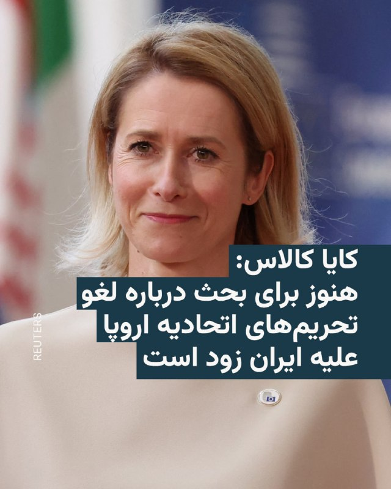

کایا کالاس، مسئول سیاست خارجه اتحادیه اروپا، گفت هنوز برای بحث درباره لغو تحریم‌های اتحادیه اروپا علیه ایران زود است و این موضوع پس از دستیابی به یک توافق هسته‌ای با ایران بررسی خواهد شد.

او پیش از نشست رهبران کشورهای عضو اتحادیه اروپا به خبرنگاران گفت: «زمانی که شرایط فراهم شود، کشورهای عضو درباره مناسب بودن لغو تحریم‌ها گفت‌وگو خواهند کرد، اما هنوز به آن مرحله نرسیده‌ایم.»

اتحادیه اروپا در حال حاضر مجموعه‌ای از تحریم‌های چندجانبه علیه بیش از ۷۰۰ فرد و نهاد در ایران اعمال کرده است که شامل ممنوعیت سفر و مسدود شدن دارایی‌ها می‌شود.
@VahidHeadline

📡 @VahidOnline

## kianmeli1 — post 88074

  <a href="telegram/content/kianmeli1_88074_1781819458.mp4" target="_blank">🎬 Download video</a>

🔴رئیس جمهور ترامپ: مدال افتخار کنگره رو میخواستم به خودم بدم، اما بهم گفتن که نمیتونم و چیزی پیدا نکردم که واقعا ارزشش رو داشته باشم
https://t.me/kianmeli1

## IranIntlTV — post 343113

  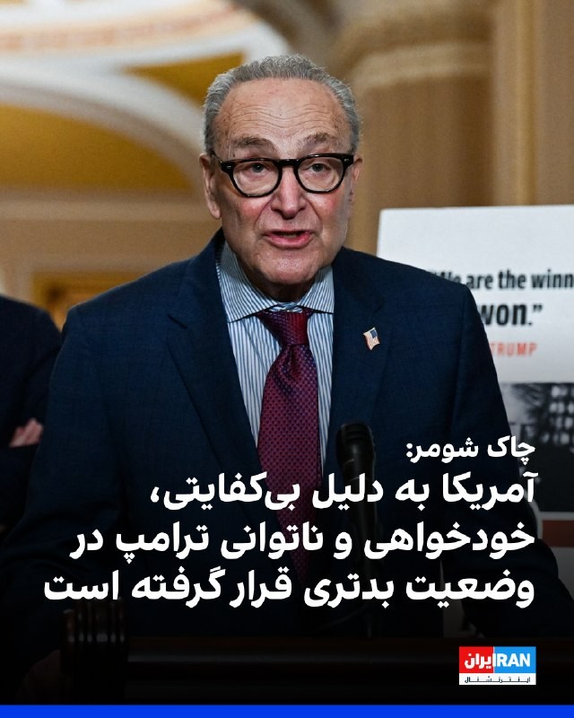

چاک شومر، رهبر اقلیت دموکرات در سنای آمریکا، از تفاهم‌نامه میان آمریکا و جمهوری اسلامی انتقاد کرد و گفت ایالات متحده به دلیل «بی‌کفایتی، خودخواهی و ناتوانی دونالد ترامپ در گوش دادن به واقعیت‌ها» در وضعیت بدتری قرار گرفته است.

شومر در پیامی اعلام کرد اگر دونالد ترامپ، رییس‌جمهوری آمریکا، قصد دارد صدها میلیارد دلار به ایران اختصاص دهد، باید این کار را با اتکا به آرای جمهوری‌خواهان انجام دهد.

رهبر اقلیت دموکرات در سنا همچنین تاکید کرد که دموکرات‌ها از هیچ طرحی برای اختصاص ۳۰۰ میلیارد دلار به ایران حمایت نخواهند کرد.

اظهارات شومر در حالی مطرح می‌شود که تفاهم‌نامه میان آمریکا و جمهوری اسلامی با واکنش‌های متفاوتی در میان جمهوری‌خواهان و دموکرات‌های آمریکا روبه‌رو شده و برخی منتقدان درباره پیامدهای اقتصادی و امنیتی آن ابراز نگرانی کرده‌اند.
https://iranintl.com/202606187290

## IranIntlTV — post 343112

  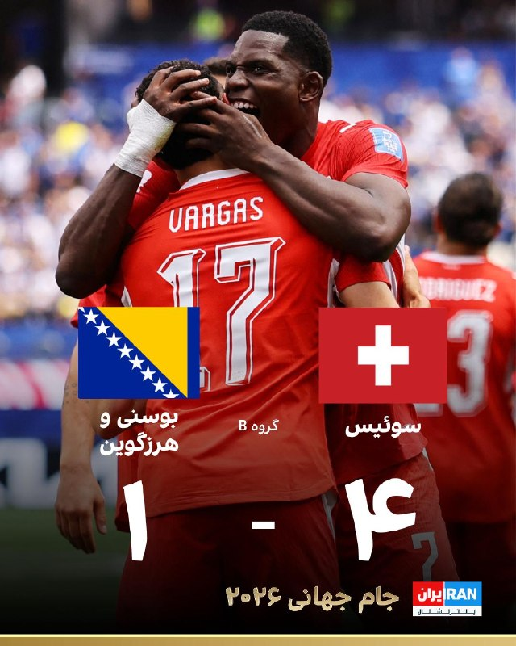

🔻تیم فوتبال سوئیس در دومین دیدار خود در جام جهانی ۲۰۲۶، در استادیوم سوفای لس آنجلس بوسنی و هرزگوین را با نتیجه ۴ بر یک شکست داشت. هر ۵ گل بازی در ۲۰ دقیقه پایانی بازی به ثمر رسیدند.

🔹جوهان مانزامبی در دقایق ۷۴ و ۹۰، روبن وارگاس در دقیقه ۸۴ و گرانیت ژاکا در دقیقه ۷+۹۰ از روی نقطه پنالتی برای سوئیس و ماهمیچ در دقیقه ۳+۹۰ برای بوسنی و هرزگوین، گل زدند.

🔹بوسنی پس از گل اول بازی، ۱۰ نفره شد. محرموویچ، بازیکن بوسنی با خطا روی امبولو، ستاره ۲۰ ساله سوئیس، اخراج شد.

🔹سوئیس با این برد ۴ امتیازی شد و به صدر گروه ‌‌B مسابقات رفت.

🔹دیگر دیدار این گروه را کانادا و قطر در بامداد جمعه برگزار می‌کنند.

@iranintltvsport

## IranIntlTV — post 343110

  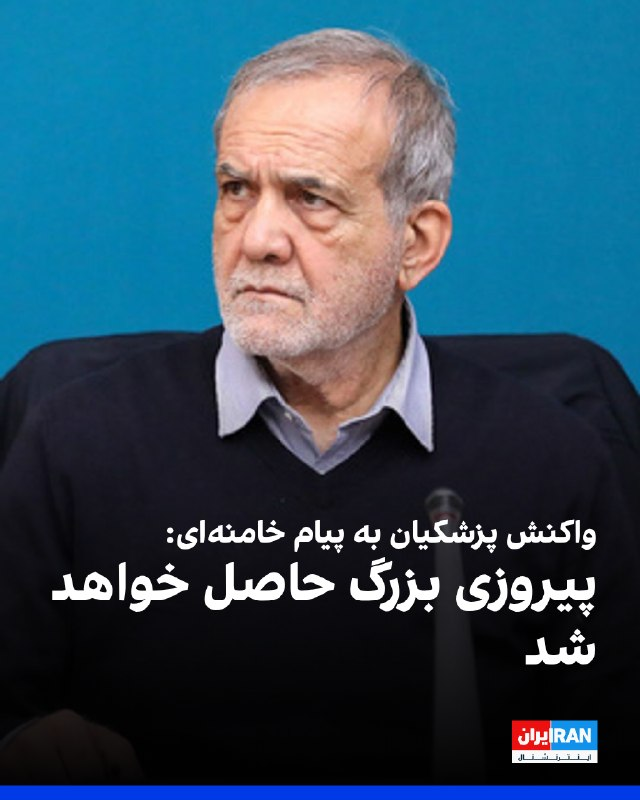

مسعود پزشکیان، رییس دولت، خطاب به مجتبی خامنه‌ای نوشت: «صدور اجازه شما برای آغاز مذاکره، اسباب خرسندی و رضایت همه خدمتگزاران ملت ایران است.»

او افزود: «خود را متعهد به توجه حداکثری نسبت به دغدغه‌های شما، حراست از حقوق ملت ایران و جبهه مقاومت می‌دانیم.»

پزشکیان ادامه داد: «با توجه حداکثری تیم مذاکره‌کننده نسبت به جزییات مذاکره، پیروزی بزرگ حاصل خواهد شد.»
https://iranintl.com/202606182076

## FarsiVOA — post 221146

🔺پیام منتسب به مجتبی خامنه‌ای؛ رهبر جدید جمهوری اسلامی از قبول مسئولیت تفاهم‌ با آمریکا شانه خالی کرد

▪️حساب کاربری منتسب به مجتبی خامنه‌ای، رهبر جدید جمهوری اسلامی، روز پنج‌شنبه در پیامی مسئولیت تفاهم اخیر جمهوری اسلامی با آمریکا برای پایان درگیری‌ها را به گردن مسعود پزشکیان، رئيس دولت حکومت ایران انداخت.

⬇️ بیشتر بخوانید:
https://ir.voanews.com/a/8162354.html
@FarsiVOA

## FarsiVOA — post 221145

  <a href="telegram/content/FarsiVOA_221145_1781819461.mp4" target="_blank">🎬 Download video</a>

⚡️کاهش ۶۸ درصدی دسترسی کاربران ایرانی به اینستاگرام؛ گفت‌وگو با علیرضا رایگانی
@FarsiVOA

## FarsiVOA — post 221144

⚡️پرزیدنت ترامپ: تحویل سیصد میلیارد دلار به جمهوری اسلامی «خبر جعلی» است
@FarsiVOA

## FarsiVOA — post 221143

🔺اسرائیل می‌گوید حزب‌الله در دو ماه گذشته با نقض آتش‌بس ۱۹ اسرائیلی را کشته است

▪️حساب «اسرائیل به فارسی» در شبکه اجتماعی ایکس روز پنجشنبه ۲۸ خرداد اعلام کرد گروه تروریستی حزب‌الله از زمان اعلام آتش‌بس در ۱۶ آوریل (۲۷ فروردین)، با شلیک صدها موشک، راکت و پهپاد، ضمن نقض آتش‌بس، ۱۹ اسرائیلی را کشته است.

⬇️ بیشتر بخوانید:
https://ir.voanews.com/a/israel-says-19-israelis-have-been-killed-by-hezbollah-in-ceasfire-violations-over-the-last-two-months/8162347.html
@FarsiVOA

## Persian_Trend_Official — post 17500

  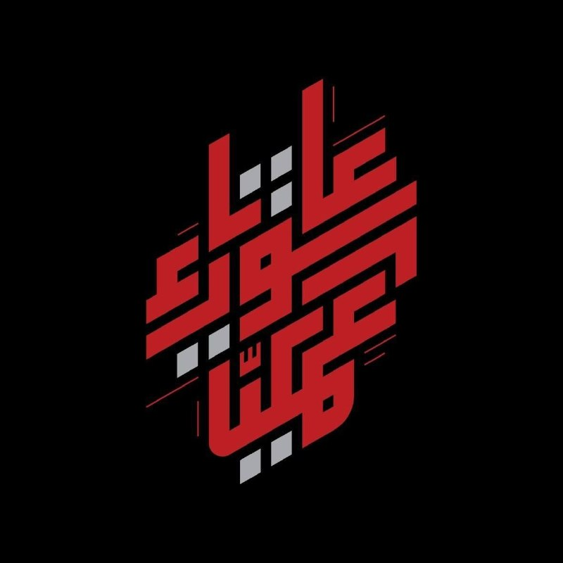

حزب الله از آغاز سلسله عملیات های عاشورا برای عقب راندن ارتش اسرائیل از جنوب لبنان خبر دارد.

👺Phantom

📌 @persian_trend_official
پرشین ترند | متفاوت‌ترین کانال نظامی.

## BBCPersian — post 284301

🔻شریعتمداری: تنگه هرمز قابل مذاکره نیست

🔻حسین شریعتمداری، مدیرمسئول روزنامه کیهان، در واکنش به امضای تفاهمنامه پایان جنگ میان ایران و آمریکا، به مسعود پزشکیان سه توصیه کرده و گفته است:

▪️تنگه هرمز قابل مذاکره نیست
▪️غرامت باید پرداخت شود
▪️آمریکا باید منطقه را ترک کند

آقای شریعتمداری که اظهارات او اغلب از زاویه اصولگرایان تندرو مورد ارزیابی قرار می‌گیرد، در این گفت‌وگوی تلویزیونی همچنین خواسته که نمایندگان ایران درباره برنامه هسته‌ای کوتاه نیایند و مواضع آنها در حمایت از «محور مقاومت» و به ویژه حزب الله لبنان باشد.

https://bbc.in/4erCt6o
@BBCPersian

## Dirty_Kids — post 392537

  <a href="telegram/content/Dirty_Kids_392537_1781819462.mp4" target="_blank">🎬 Download video</a>

هیچ کس جز مانوک خدابخشیان حقیقت رو بهتون نگفت .❤️

تمام افرادی که در مقابل ترامپ ایستادن خیانتکاران به ایران و ایرانی هستند .۴۷ سال دو آستری ها رژیم رو نگه داشتن و الان هم همینکارو دارن میکنند (با نقاب دموکراتیک ) ولی اینبار دونالد زبل در کاخ سفیده و نتایاهو نخست وزیر اسراییل .😎

@Dirty_Kids 👻

## Dirty_Kids — post 392536

  <a href="telegram/content/Dirty_Kids_392536_1781819464.mp4" target="_blank">🎬 Download video</a>

فیلم وایرال شده از یه توریست که به هندوستان رفته و یه مشت ادم هول ریختن دورش دارن دست مالیش میکنن و باهاش عکس میندازن

@Dirty_Kids 👻

## alonews — post 129018

  <a href="telegram/content/alonews_129018_1781819466.mp4" target="_blank">🎬 Download video</a>

👈در راستای اجرای بند یک توافق، حملات به لبنان ادامه دارد

✅ @AloNews خبر جنگ

## alonews — post 129017

  <a href="telegram/content/alonews_129017_1781819467.webm" target="_blank">🎬 Download video</a>

👈رئیس‌جمهور فرانسه امانوئل ماکرون درباره ایران:
شما نمی‌توانید از طریق بمباران به تغییر رژیم دست یابید. آنچه من مشاهده می‌کنم این است که افرادی در اطراف رئیس‌جمهور ترامپ، هم در حوزه سیاسی و هم در منطقه، او را به پیشروی بسیار بیشتر و قوی‌تر ترغیب می‌کردند.

🔴تغییر رژیم در درجه اول هدفی است که توسط خود مردم به دست می‌آید—حداقل این چیزی است که ما باور داریم.

🔴در غیر این صورت، نیازمند عملیات زمینی گسترده، ماه‌ها یا سال‌ها جنگ است. به آنچه در افغانستان رخ داد نگاه کنید. آیا تغییر رژیم پس از بیش از ده سال موفق شد؟ خیر.

✅ @AloNews خبر جنگ

## alonews — post 129016

  <a href="telegram/content/alonews_129016_1781819467.webm" target="_blank">🎬 Download video</a>

👈یکی رفته ویکی‌پدیا و نتیجه جنگ رو پیروزی ایران نوشته

✅ @AloNews خبر جنگ

## alonews — post 129015

  <a href="telegram/content/alonews_129015_1781819467.mp4" target="_blank">🎬 Download video</a>

👈ترامپ: من فقط از طرفدارهام خوشم میاد

✅ @AloNews خبر جنگ

## alonews — post 129014

  <a href="telegram/content/alonews_129014_1781819469.mp4" target="_blank">🎬 Download video</a>

👈رئیس جمهور ترامپ: مدال افتخار کنگره رو میخواستم به خودم بدم، اما بهم گفتن که نمیتونم و چیزی پیدا نکردم که واقعا ارزشش رو داشته باشم

✅ @AloNews خبر جنگ

## alonews — post 129013

  <a href="telegram/content/alonews_129013_1781819471.mp4" target="_blank">🎬 Download video</a>

👈رئیس جمهور ترامپ:
پيت هگست ، اون اخيرا چند تا پيروزي خوب داشته اون قراره خيلي بيشتر از اين داشته باشه‌‌

✅ @AloNews خبر جنگ

## alonews — post 129012

  <a href="telegram/content/alonews_129012_1781819473.mp4" target="_blank">🎬 Download video</a>

👈ترامپ: بازار سهام به تازگی به بالاترین حد خود در تمام دوران رسیده است. حساب‌های 401K نیز به بالاترین حد خود رسیده‌اند.

🔴و قیمت نفت مثل سنگی سقوط می‌کند. به جز این، روز دیگری در بهشت است.

✅ @AloNews خبر جنگ

## alonews — post 129011

  <a href="telegram/content/alonews_129011_1781819475.webm" target="_blank">🎬 Download video</a>

👈پس نتیجه میگیریم با جابجایی کلمات در اسم محصول میشه قیمت رو ۲ برابر کرد

✅ @AloNews خبر جنگ

---
📅 بروزرسانی: 1405/03/29 00:28
---

## VahidOOnLine — post 246282

  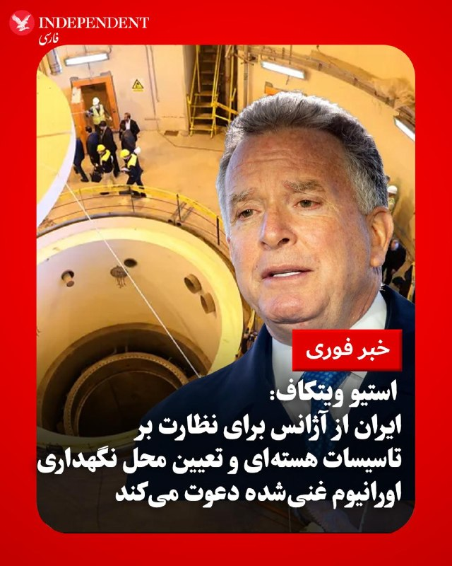

♦️خبرگزاری آسوشیتدپرس گزارش داد استیو ویتکاف، فرستاده دونالد ترامپ، پنجشنبه‌شب در نشستی غیرعلنی با قانون‌گذاران آمریکایی اعلام کرده است تهران از آژانس بین‌المللی انرژی اتمی برای بازرسی از تاسیسات هسته‌ای خود دعوت خواهد کرد و روند شناسایی محل نگهداری مواد غنی‌شده را آغاز می‌کند.

بر اساس این گزارش، ویتکاف به رهبران کنگره و اعضای کمیته‌های امنیت ملی گفته است تفاهم‌نامه میان آمریکا و ایران هیچ توافق جانبی نداشته است. با این حال، تهران و آژانس بین‌المللی انرژی اتمی نامه‌ای جداگانه تنظیم کرده‌اند که در آن دعوت از بازرسان آژانس و ادامه همکاری‌های نظارتی مطرح شده است.
‌🇸🇦 Indypersian

🤖 @VahidOOnLine

## VahidOOnLine — post 246281

  

خبرگزاری آسوشیتدپرس گزارش داد استیو ویتکاف، فرستاده دونالد ترامپ، در نشستی غیرعلنی با قانون‌گذاران آمریکایی اعلام کرده است تهران از آژانس بین‌المللی انرژی اتمی برای بازرسی از تاسیسات هسته‌ای خود دعوت خواهد کرد و روند شناسایی محل نگهداری مواد غنی‌شده را آغاز می‌کند.

بر اساس این گزارش، ویتکاف به رهبران کنگره و اعضای کمیته‌های امنیت ملی گفته است تفاهم‌نامه میان آمریکا و ایران هیچ توافق جانبی نداشته، اما تهران و آژانس بین‌المللی انرژی اتمی نامه‌ای جداگانه تنظیم کرده‌اند که در آن این دعوت مطرح شده است.
‌🏁 🇬🇧 IranintlTV

🤖 @VahidOOnLine

## VahidOOnLine — post 246280

♦️در شهر تاریخی ووجن چین، پوشیدن لباس‌های سنتی هانفو برای بسیاری از گردشگران بخشی از تجربه سفر است. جوانان و خانواده‌ها لباس‌هایی الهام‌گرفته از پوشاک سلطنتی و اشراف دوره‌های تانگ و سونگ را از فروشگاه‌های محلی اجاره می‌کنند، موهای خود را با زیورآلات سنتی می‌آرایند و در کوچه‌ها و کنار کانال‌های آب عکس می‌گیرند. این صحنه‌ها بیش از آنکه بازتاب یک رسم محلی قدیمی باشند، بخشی از موج احیای لباس‌های سنتی چین و لذت بردن از میراث فرهنگی در زندگی امروزند. ووجن، مانند شهرهایی چون شی‌آن و هانگژو، به یکی از محبوب‌ترین مکان‌ها برای این تجربه تبدیل شده است؛ جایی که تلفن‌های هوشمند و شبکه‌های اجتماعی در کنار لباس‌هایی با الهام از گذشته، پیوندی میان دنیای مدرن و سنت‌های چند صدساله ایجاد کرده‌اند. برای بسیاری از گردشگران چینی، هانفو تنها یک لباس نیست، بلکه راهی برای لمس تاریخ، ثبت خاطرات و لذت بردن از زیبایی پوشش سنتی در فضایی تاریخی است.
‌🇸🇦 Indypersian

🤖 @VahidOOnLine

## VahidOOnLine — post 246279

  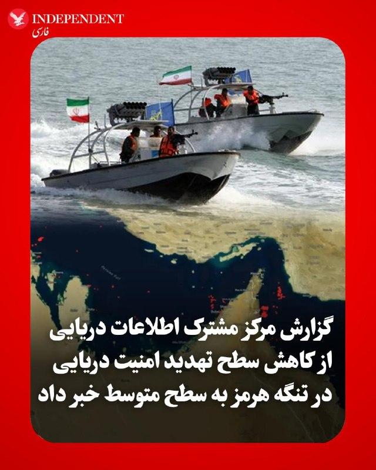

♦️«مرکز مشترک اطلاعات دریایی» (JMIC) اعلام کرد پس از اعلام توافق میان ایران و آمریکا، سطح تهدید امنیتی در تنگه هرمز از سطح «شدید» به سطح «متوسط» کاهش یافته است.
این نهاد امنیت دریایی مستقر در بحرین که میان نیروهای دریایی متحد و کشتی‌های تجاری در خاورمیانه هماهنگی ایجاد می‌کند، با این حال هشدار داد که خطر حمله به کشتی‌ها همچنان بالاست و مین‌های دریایی نیز همچنان تهدیدی جدی برای عبور و مرور در این آبراه به شمار می‌روند.
بر اساس این گزارش، رفتار نیروهای سپاه پاسداران پس از اعلام توافق ایران و آمریکا کمتر بی‌ثبات شده، اما تردد کشتی‌ها و نفتکش‌ها از تنگه هرمز همچنان به سطح پیش از جنگ بازنگشته است.
‌🇸🇦 Indypersian

🤖 @VahidOOnLine

## VahidOOnLine — post 246278

  

ایتامار بن‌گویر، وزیر امنیت ملی اسرائیل، در واکنش به انتقادهای جی‌دی ونس، معاون رئیس‌جمهوری آمریکا، گفت جمهوری اسلامی باید همان‌گونه که آمریکا در جنگ جهانی دوم با آلمان نازی برخورد کرد، هدف قرار گیرد.
بن‌گویر در پاسخ به اظهارات ونس گفت: «با نازی‌های قرن بیست‌ویکم همان‌گونه برخورد کنید که با نازی‌ها در جنگ جهانی دوم برخورد شد.»
پیش‌تر ونس درباره مخالفان یادداشت تفاهم تهران و واشینگتن در کابینه اسرائیل گفت: «دونالد ترامپ در حال حاضر تنها رهبر جهان است که همدلی عمیقی با ملت اسرائیل دارد و در عین حال رییس‌جمهوری قدرتمندترین کشور جهان است. اگر من عضو کابینه اسرائیل بودم، احتمالا به تنها متحد قدرتمندی که در جهان دارم حمله نمی‌کردم.»

‌🏁 🇬🇧 IranintlTV

🤖 @VahidOOnLine

## VahidOOnLine — post 246277

  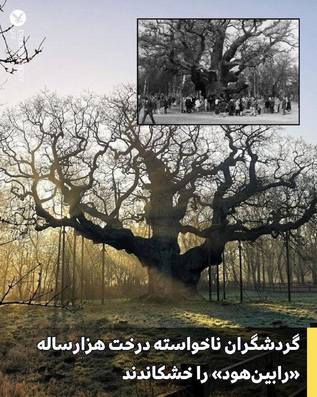

♦️احتمالا گردشگران، بی‌آنکه بدانند، پیرترین، بزرگ‌ترین و مشهورترین درخت کهن‌سال اروپا را به‌سوی مرگ بردند. «بلوط بزرگ»، درخت افسانه‌ای جنگل شروود در ناتینگهام‌ انگلستان که نامش با رابین‌هود گره‌خورده بود، پس از چند تابستان خشک و گرم، امسال دیگر برگ نداد و مرگ آن تایید شد.
این درخت ۱۲۰۰ ساله، از شناخته‌شده‌ترین نمادهای جنگل شروود بود؛ همان جنگلی که در روایت‌های عامیانه، پناهگاه رابین‌هود، یاغی افسانه‌ای قرن سیزدهم، معرفی می‌شود؛ شخصیتی که بنا بر افسانه‌ها از ثروتمندان می‌دزدید و به فقرا می‌بخشید و هنگام فرار از کلانتر ناتینگهام در این جنگل پنهان می‌شد. گفته می‌شد بلوط بزرگ نیز یکی از پناهگاه‌های او و همراهانش بوده است.
برای حدود ۲۰۰ سال، بازدیدکنندگان شیفته این افسانه به جنگل شروود رفتند تا شاخه‌های پیچ‌خورده و تاج گسترده ۲۸ متری این درخت را از نزدیک ببینند؛ اما همین رفت‌وآمد طولانی‌مدت، به‌تدریج خاک اطراف ریشه را فشرده کرد؛ فشردگی‌ای که باعث می‌شود آب باران به‌خوبی به ریشه‌ها نرسد و درخت، آرام و نامرئی، ضعیف شود.
در سال‌های گذشته چند بار شایعه مرگ این درخت مطرح شده بود، اما نادرست از آب درآمد. این بار اما انجمن سلطنتی حمایت از پرندگان (RSPB) اعلام کرد که بلوط بزرگ، با وجود برنامه‌ای که از سال ۲۰۲۳ برای حفظ آن آغاز شده بود، دیگر برگ نداده و این نشانه پایان زندگی آن است.
نام این درخت از اواخر قرن هجدهم شهرت بیشتری یافت؛ زمانی که در سال ۱۷۹۰ در کتابی درباره درختان بلوط به آن اشاره شد. پس‌ازآن، موجی از علاقه‌مندان و گردشگران راهی جنگل شدند و بلوط بزرگ به یکی از جاذبه‌های مهم منطقه تبدیل شد.
کارشناسان مجموعه‌ای از عوامل را در مرگ آن مؤثر می‌دانند: عبور میلیون‌ها بازدیدکننده در طول سال‌ها، فشرده شدن خاک، مداخله‌های انسانی برای نگه‌داشتن شاخه‌های سنگین با کابل و تیرک و تغییرات اقلیمی که تابستان‌های داغ‌تر و دوره‌های خشک‌سالی شدیدتری را به بریتانیا آورده است. متخصصان درخت گفته‌اند سیستم ریشه این بلوط در وضعیت خفگی و کم‌غذایی قرار گرفته بود.
معمولا محل بسیاری از درختان بسیار کهن‌سال جهان، به‌ویژه درختانی که چند هزار سال عمر دارند، برای محافظت از آن‌ها مخفی نگه داشته می‌شود. اگر برای دیدن درختان کهن‌سال می‌رویم، بهتر است دست‌کم به اندازه ارتفاع خود درخت و شاید بیشتر، از آن فاصله بگیریم؛ زیرا ریشه‌های یک درخت پیر، اغلب بسیار فراتر از سایه شاخه‌هایش در خاک گسترده‌اند.
‌🇸🇦 Indypersian

🤖 @VahidOOnLine

## VahidOOnLine — post 246276

♦️حسین شریعتمداری، مدیرمسئول روزنامه کیهان، پنجشنبه‌شب در گفتگوبا صداوسیما گفت اموال آمریکا و متحدانش در تنگه هرمز باید برای دریافت غرامت مصادره شود. او تاکید کرد آمریکا به هیچ‌یک از تعهدات و قوانین بین‌المللی پایبند نبوده و انتظار پرداخت غرامت از سوی واشینگتن یا نهادهای بین‌المللی واقع‌بینانه نیست.

شریعتمداری با اشاره به گزارش‌ها درباره پرداخت ۳۰۰ میلیارد دلار و همچنین آزادسازی ۱۲ میلیارد دلار، گفت این مبالغ غرامت محسوب نمی‌شوند و بخشی از آن‌ها پول‌های متعلق به ایران است که بازگردانده می‌شود. او افزود جمهوری اسلامی با حاکمیتی که بر تنگه هرمز دارد می‌تواند اموال مرتبط با آمریکا و متحدانش را مصادره کند و این اقدام را «تنها راه» دریافت غرامت برای خسارت‌های واردشده به ایران دانست.
‌🇸🇦 Indypersian

🤖 @VahidOOnLine

## VahidOOnLine — post 246275

ویدیوی رسیده به ایران اینترنشنال نشان می‌دهد مادر جاویدنام متین پرویزی،‌ از کشته‌شدگان انقلاب ملی، بر سر مزار فرزند جوانش با اشاره به فرا رسیدن ماه «محرم» می‌گوید که به فرزندش آموخت شرافت داشته باشد. او گفت که فرزندش «گرسنه و ندار» نبود و «اعتراض داشت.» متین پرویزی ۱۸ دی در زنجان با گلوله ماموران و حین کمک به یک مادر و کودک کشته شد.
‌🏁 🇬🇧 IranintlTV

🤖 @VahidOOnLine

## VahidOOnLine — post 246274

  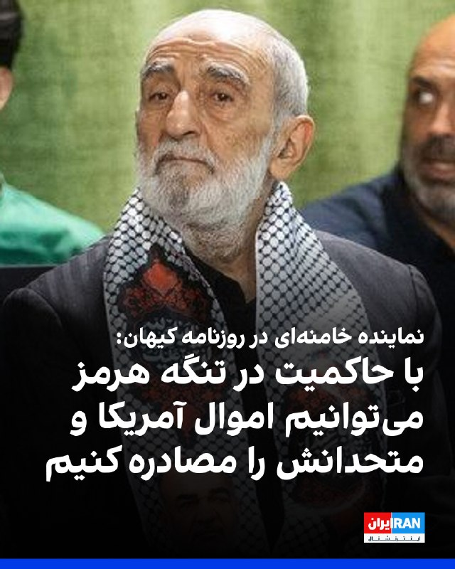

حسین شریعتمداری، نماینده رهبر جمهوری اسلامی در روزنامه کیهان، گفت: «با اعمال حاکمیت بر تنگه هرمز، امکان توقیف اموال متعلق به آمریکا و متحدانش وجود دارد.»

او افزود: «آمریکا به هیچ عهد و پیمانی پایبند نیست و به‌راحتی به جمهوری اسلامی غرامت پرداخت نخواهد کرد.»

شریعتمداری همچنین گفت: «پاسخ به محاصره دریایی آمریکا، شلیک موشک‌های ۲۵۰۰ کیلومتری با کلاهک سنگین به سمت باب‌المندب است.»
‌🏁 🇬🇧 IranintlTV

🤖 @VahidOOnLine

## VahidOOnLine — post 246273

  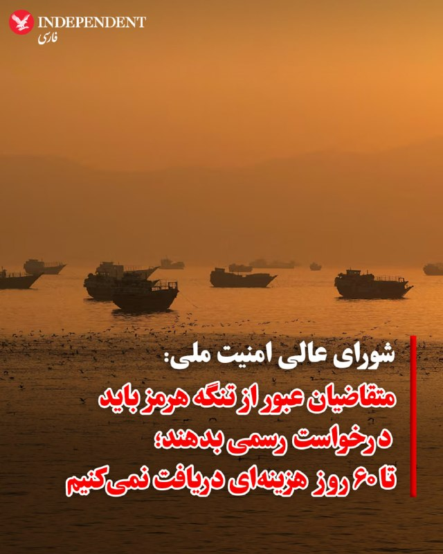

♦️ شورای عالی امنیت ملی ایران اعلام کرد کشتی‌های تجاری که خواهان عبور از تنگه هرمز هستند، از این پس باید درخواست‌های خود را به سازمان جدیدی به نام «سازمان تنگه خلیج فارس» (تاسیس‌شده در اردیبهشت‌ماه) ارسال کنند. این شورا تاکید کرد که در راستای پایبندی به توافق اولیه با آمریکا، تا ۶۰ روز هیچ‌گونه تعرفه یا حق عبوری دریافت نخواهد شد، اما مقررات نهاییِ استفاده از این آبراه حیاتی در آینده اعلام می‌شود.

هم‌زمان، ستاد فرماندهی مرکزی آمریکا (سنتکام) نیز روز پنج‌شنبه تایید کرد که نیروهای ایالات متحده محاصره دریایی خود بر تنگه هرمز را به‌طور کامل لغو کرده‌اند.
‌🇸🇦 Indypersian

🤖 @VahidOOnLine

## VahidOOnLine — post 246272

  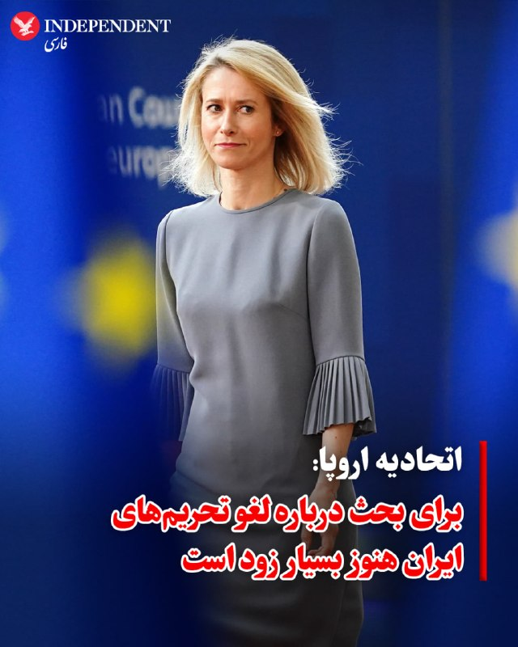

♦️ کایا کالاس، نایب‌رئیس کمیسیون اروپا، اعلام کرد که موضوع لغو تحریم‌های اتحادیه اروپا علیه جمهوری اسلامی ایران تنها پس از دستیابی به یک توافق هسته‌ای جامع با تهران بررسی خواهد شد.

کالاس روز پنجشنبه ۲۸ خرداد، در گفتگو با خبرنگاران پیش از آغاز نشست سران کشورهای عضو اتحادیه اروپا گفت: «البته زمانی که شرایط فراهم شود، کشورهای عضو درباره اینکه آیا لغو تحریم‌ها [مناسب] است یا خیر گفتگو خواهند کرد، اما ما هنوز به آن مرحله نرسیده‌ایم.»

اتحادیه اروپا در حال حاضر تحریم‌های چندجانبه‌ای را علیه بیش از ۷۰۰ فرد و نهاد در ایران اعمال کرده است که این محدودیت‌ها مواردی چون ممنوعیت سفر و مسدود شدن دارایی‌ها را شامل می‌شود.
‌🇸🇦 Indypersian

🤖 @VahidOOnLine

## VahidOOnLine — post 246271

  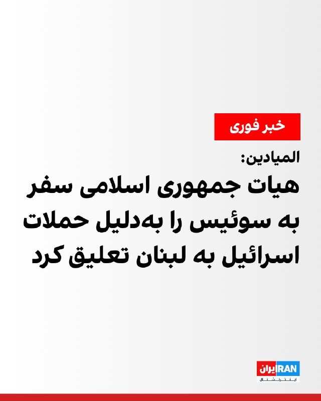

المیادین به نقل از یک منبع آگاه گزارش داد هیات مذاکره‌کننده جمهوری اسلامی به دلیل ادامه حملات اسرائیل به جنوب لبنان، سفر خود به سوئیس برای آغاز نخستین دور مذاکرات ۶۰ روزه را به حالت تعلیق درآورده است.
المیادین افزود: تهران پیش‌تر به آمریکا و میانجی‌ها اطلاع داده بود که پرونده لبنان در ادامه یا توقف مذاکرات نقشی محوری دارد و هشدار داده است حملات اسرائیل تا عمق ۱۰ کیلومتری خاک لبنان نقض یادداشت تفاهم و توافق چارچوب است.
‌🏁 🇬🇧 IranintlTV

🤖 @VahidOOnLine

## VahidOOnLine — post 246270

🗣روایت شما درباره توافق میان جمهوری اسلامی و آمریکا - پنجشنبه ۲۸ خرداد ۱۴۰۵

🔹ترامپ سپاه پاسداران را گروه تروریستی خواند، بعد با همان گروه تروریستی تفاهم کرد و منتقدان را احمق خواند. آقای ترامپ، کاشکی ۳۰ روز صبر می‌کردید تا به یک جایی می‌رسیدید.

🔹از تهران پیام می‌دهم: اینجا هر شب شعار می‌دهند که برنده شدیم، برنده شدیم. کل جمعیتشان ۲۰ نفر است. ولی شب ۱۸ و ۱۹ دی... با ترامپ شروع نشد که با ترامپ تمام بشود. جاوید شاه.

🔹ترامپ عزیز، آمدی محل‌های سرکوب را زدی، جایش پولی که پول خون مردم، پول جوانی مردم، پول تحمل فقر مردم بود و دوست داشتیم روزی برای آبادانی مملکت خرج بشود را داری می‌دهی که مراکز سرکوب جدیدتر و مجهزتر بسازند. چه کردی با مردم ایران؟

🔹از اراک: به‌نظر من این مذاکرات برجام دو به نتیجه نمی‌رسد و صرفاً وقت خریدن برای طرفین است.

🔹از تبریز. ما مردم جمهوری اسلامی را نمی‌خواهیم. ۴۷ سال بدبختی، گرانی و فلاکت برای مردم آوردند؛ دیگر بس است. یک عمر صبر کردیم، یک عمر تاوان دادیم. ما هم حق داریم یک نفس عمیق بکشیم، زندگی کنیم و آینده‌ای بهتر برای ایران داشته باشیم.

🔹جای مردم ایران، جای جاویدنام‌ها، جای زندانیان سیاسی و عزیزانی که ۱۸ و ۱۹ دی و بعد از آن دستگیر شدند و زیر شکنجه هستند و هر روز اعدام می‌شوند، در این تفاهم کجاست؟ آقای ترامپ، طلبکار نیستیم ولی خودت را با ریگان مقایسه نکن!!

🔹از کرمانشاه. ما ایرانیان مبارز هیچ کمکی از آمریکا نداشتیم اما از شاهزاده پهلوی توقع داشتیم همه ملت و اقوام با عقاید مختلف را متحد کند تا در یک شورش سراسری به آزادی برسیم، حتی اگر جانمان فدا می‌شد. حیف که فرصت‌سوزی می‌کنند.
‌🏁 🇬🇧 IranintlTV

🤖 @VahidOOnLine

## VahidOOnLine — post 246269

  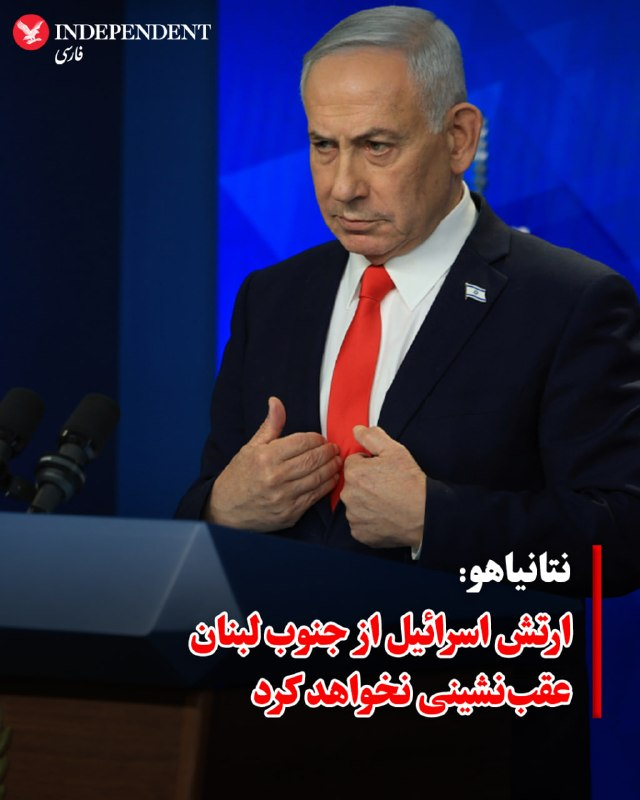

♦️ بنیامین نتانیاهو، نخست‌وزیر اسرائیل، روز پنج‌شنبه ۲۸ خرداد اعلام کرد که این کشور منطقه امنیتی خود را در جنوب لبنان تا هر زمان که نیازهای امنیتی‌اش اقتضا کند، حفظ خواهد کرد. این اظهارات در حالی مطرح می‌شود که در متن تفاهم‌نامه اخیر میان جمهوری اسلامی ایران و آمریکا بر حفظ «تمامیت ارضی لبنان» تأکید شده و تهران خواستار خروج نیروهای اسرائیلی است.

نتانیاهو با صدور بیانیه‌ای از سوی دفتر خود، ضمن قدردانی از واشنگتن برای مبارزه «شانه به شانه» با اسرائیل، بر لزوم حفظ «روابط حیاتی» با ایالات متحده پس از جنگ با ایران تاکید کرد و گفت: «این نبرد هنوز به پایان نرسیده و چالش‌های بیشتری در پیش رو داریم.»

نخست‌وزیر اسرائیل با تاکید بر بازگرداندن امنیت به مناطق شمالی تصریح کرد: «تحقق این هدف مستلزم حفظ منطقه امنیتی در جنوب لبنان است؛ ما تا زمانی که امنیت اسرائیل ایجاب کند، آنجا را ترک نخواهیم کرد.»

ساعتی پس از انتشار این بیانیه، دونالد ترامپ با انتشار پیامی در تروث سوشال، تاکید کرد که انتظار دارد صلح در تمامی جبهه‌ها، از جمله در مورد «لبنان، حزب‌الله و اسرائیل» برقرار شود.
‌🇸🇦 Indypersian

🤖 @VahidOOnLine

## VahidOOnLine — post 246268

  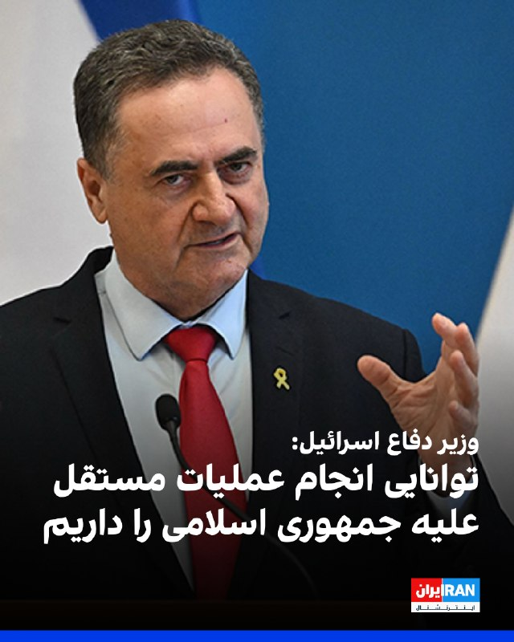

یسرائیل کاتز، وزیر دفاع اسرائیل، گفت اسرائیل توانایی انجام عملیات مستقل علیه جمهوری اسلامی را دارد و در هر لحظه برای اجرای یک «عملیات آبی و سفید» در ایران آماده است.

او افزود: «ما هرگز از آمریکا نخواستیم در غزه، لبنان یا سوریه همراه ما بجنگد. تنها چیزی که می‌خواهیم، حمایت سیاسی و دیپلماتیک است که از ما محافظت کند.»

کاتز با اشاره به نتایج حملات اخیر گفت: «قدرت ایران را درهم شکستیم، رهبران، دانشمندان هسته‌ای و زیرساخت‌ها را هدف قرار دادیم و برنامه هسته‌ای ایران را از بین بردیم. اکنون باید اطمینان حاصل کنیم که این برنامه دوباره احیا نشود.»

وزیر دفاع اسرائیل همچنین گفت دونالد ترامپ، رییس‌جمهوری آمریکا، اسرائیل را «متحد نمونه» توصیف کرده است. به گفته او، اسرائیل تنها کشوری است که چنین عنوانی دریافت کرده است.
کاتز افزود: «هیچ‌یک از کشورهای ناتو در زمان نیاز در کنار آمریکا نایستادند، اما اسرائیل در کنار آمریکا بود و همچنان هست.»
‌🏁 🇬🇧 IranintlTV

🤖 @VahidOOnLine

## VahidOOnLine — post 246267

  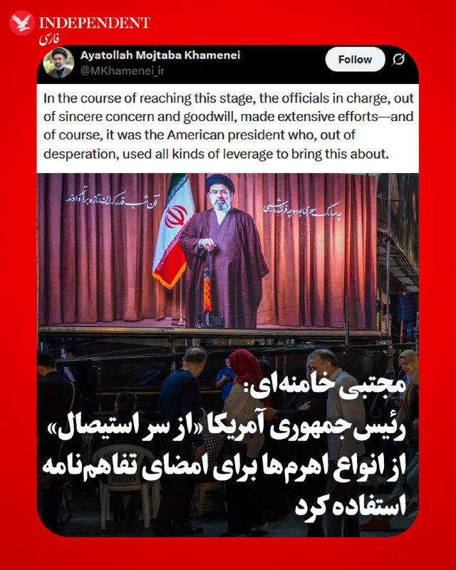

♦️ مجتبی خامنه‌ای، رهبر جدید جمهوری اسلامی که هنوز تصویر یا صدای جدیدی از او منتشر نشده است، بار دیگر با انتشار یک پیام متنی به امضای تفاهم‌نامه میان تهران و واشنگتن واکنش نشان داد.

خامنه‌ای در این پیام که به زبان انگلیسی نیز منتشر شد، مذاکره مسئولان جمهوری اسلامی را «از سر دلسوزی و حسن نظر» خواند و مدعی شد که فشارهای دونالد ترامپ، رئیس‌جمهوری آمریکا برای امضای تفاهم‌نامه از سر «استیصال» بوده است.

خامنه‌ای در این پیام تصریح کرد که شخصا با امضای تفاهم‌نامه موافق نبوده اما با «تعهد و قبول مسئولیت شخصی» مسعود پزشکیان، «اجازه» امضای آن را صادر کرده است.

رهبر جمهوری اسلامی با لحنی هشدارآمیز خطاب به دولت افزود که «ما یعنی ملت سرافراز و این خادم ناچیز» از این لحظه منتظر تحقق شروط وعده‌داده‌شده خواهند بود. او همچنین تصریح کرد که مذاکرات حضوری پیش‌رو در سوئیس به معنای پذیرش نظرات واشنگتن نخواهد بود.
‌🇸🇦 Indypersian

🤖 @VahidOOnLine

## VahidOOnLine — post 246266

  

شورای عالی امنیت ملی در بیانیه‌ای اعلام کرد: «در اجرای بند ۵ یادداشت تفاهم اسلام‌آباد، کشتی‌های تجاری متقاضی عبور از تنگه هرمز باید درخواست خود را به مدیریت آبراه خلیج فارس ارسال نمایند. به مدت شصت روز، هیچ‌گونه هزینه‌ای از متقاضیان اخذ نخواهد شد و این هزینه‌ها توسط دولت جمهوری اسلامی ایران تأمین می‌گردد.»
در این بیانیه آمده است: «بر این اساس به مدیریت آبراه خلیج فارس دستور داده شده است، در جهت تحقق اهداف تفاهم‌نامه درخواست‌ها را با سرعت و اولویت رسیدگی و پاسخ دهد. با توجه به شرایط خاص و وجود برخی مخاطرات ایمنی در مسیر عبور و به دلیل لزوم حصول اطمینان از تردد ایمن و جلوگیری از حوادث دریایی، لازم است کشتی‌ها در مسیر و زمان اعلامی به آنها عبور نمایند تا به تدریج، امکان تردد افزایش یابد.»
شورای عالی امنیت ملی افزود: «ترتیبات اجرایی و جزییات فنی عبور از تنگه هرمز از طریق مدیریت آبراه خلیج فارس اعلام می‌گردد. در خصوص سایر موضوعات، از جمله مین‌زدایی، اقدامات لازم مطابق بند ۵ یادداشت تفاهم اسلام‌آباد انجام خواهد شد.»
‌🏁 🇬🇧 IranintlTV

🤖 @VahidOOnLine

## VahidOOnLine — post 246265

  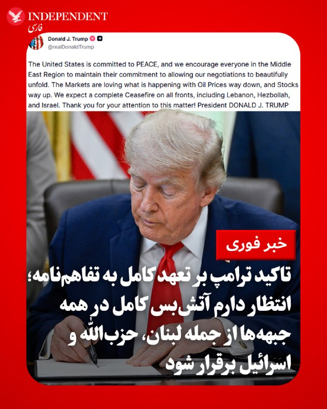

♦️ دونالد ترامپ، رئیس‌جمهوری آمریکا، روز پنج‌شنبه ۲۸ خرداد اعلام کرد که ایالات متحده انتظار یک «آتش‌بس کامل در تمامی جبهه‌ها» را دارد. او هم‌زمان از «همه طرف‌ها در خاورمیانه» خواست تا به تعهدات خود پایبند بمانند.

ترامپ در شبکه اجتماعی تروث سوشال نوشت: «ایالات متحده به صلح متعهد است و ما همه را در منطقه خاورمیانه تشویق می‌کنیم تا به تعهدات خود پایبند بمانند تا مسیر برای پیشبرد زیبای مذاکرات ما هموار شود.» او در ادامه افزود: «ما انتظار یک آتش‌بس کامل در تمامی جبهه‌ها از جمله لبنان، حزب‌الله و اسرائیل را داریم.»

تفاهم‌نامه‌ای که میان آمریکا و جمهوری اسلامی ایران امضا شد، آغازگر یک دوره مذاکراتیِ ۶۰ روزه برای دستیابی به توافق نهایی است؛ در متن این یادداشت تفاهم صراحتا بر «توقف فوری و دائمی عملیات‌های نظامی در تمامی جبهه‌ها، از جمله در لبنان» تاکید شده است. با این حال، اسرائیل بار دیگر مکررا قطعیت داده که نیروهای خود را از خاک لبنان عقب نخواهد کشید.
‌🇸🇦 Indypersian

🤖 @VahidOOnLine

## VahidOOnLine — post 246264

♦️پیت هگست، وزیر جنگ آمریکا، در میزگرد وزیران دفاع ناتو از آغاز یک طرح بازنگری شش‌ماهه در ساختار نیروها و پایگاه‌های نظامی ایالات متحده در اروپا تحت عنوان «ارزیابی نسخه سوم ناتو» خبر داد.

هگست با تاکید بر لزوم تبدیل ناتو به یک اتحاد متوازن گفت: «اروپا باید رهبری و مسئولیت اولیه دفاع از خود را بر عهده بگیرد تا نیروهای ارتش آمریکا متناسب با نیازهای جهانی واشنگتن مستقر شوند.» او هشدار داد که این یک «بازنگری واقعی» خواهد بود.

هگست در اظهارات خود درباره این طرح، به تعیین دقیق و تضمین حق دسترسی، پایگاه‌ها و مجوزهای پروازی اشاره کرد؛ موضوعی که به اعتقاد ناظران، به محدودیت‌هایی اشاره دارد که متحدان اروپایی در جریان جنگ اخیر با ایران برای عبور جنگنده‌ها و استفاده آمریکا از پایگاه‌هایشان اعمال کرده بودند. هگست خاطرنشان کرد که این ارزیابی با رایزنی کنگره و فرماندهی اروپا انجام خواهد شد تا ناتو به تعریفی جدید و متوازن دست یابد.
‌🇸🇦 Indypersian

🤖 @VahidOOnLine

## VahidOOnLine — post 246263

  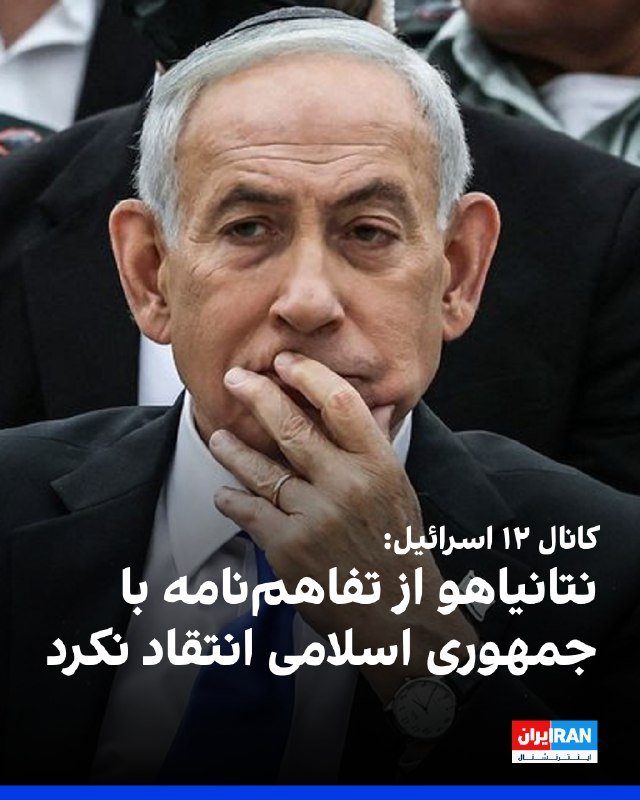

کانال ۱۲ اسرائیل گزارش داد بنیامین نتانیاهو در گفت‌وگوهای اخیر با مقام‌های آمریکایی از تفاهم‌نامه آمریکا و جمهوری اسلامی انتقاد نکرده و گفته است اگر تهران به مفاد آن پایبند بماند، یک «موفقیت بزرگ» خواهد بود.
کانال ۱۲ اسرائیل افزود مقام‌های آمریکایی معتقدند اسموتریچ و بن‌گویر، دو وزیر راست‌گرای کابینه اسرائیل، نتانیاهو را برای اتخاذ موضعی سخت‌تر علیه توافق آمریکا و جمهوری اسلامی تحت فشار قرار می‌دهند.
در این گزارش آمده است مقام‌های اسرائیلی می‌گویند مخالفت با توافق آمریکا و جمهوری اسلامی محدود به سیاستمداران نیست و شماری از مقام‌های ارشد امنیتی و نظامی، از جمله وزیر دفاع و رییس ستاد ارتش، آن را یک «فاجعه راهبردی» برای اسرائیل می‌دانند.
‌🏁 🇬🇧 IranintlTV

🤖 @VahidOOnLine

## WithYashar — post 15280

  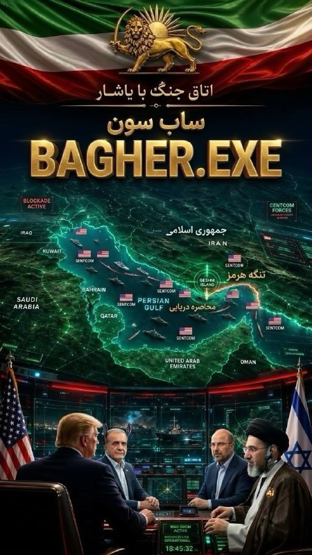

کاور
@withyashar

## WithYashar — post 15279

وزیر جنگ اسرائیل: قدرت ایران را درهم شکستیم، رهبران، دانشمندان هسته‌ای و زیرساخت‌ها را هدف قرار دادیم و برنامه هسته‌ای ایران را از بین بردیم؛ اکنون باید اطمینان حاصل کنیم که این برنامه دوباره احیا نشود

اسرائیل در هر لحظه برای عملیات مستقل در ایران آماده است
@withyashar

## WithYashar — post 15278

المیادین به نقل از منبع آگاه: هیئت مذاکره کننده ایرانی سفر خود به سوئیس را به دلیل تداوم حملات اسرائیل به جنوب لبنان متوقف می‌کند
@withyashar

## WithYashar — post 15277

  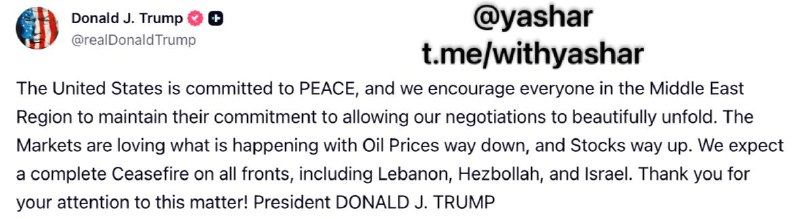

ترامپ در تروث: ایالات متحده به صلح متعهد است و ما از همه در خاورمیانه می‌خواهیم که به تعهد خود برای پیشرفت عالی مذاکرات ما پایبند بمانند.
بازارها از آنچه اتفاق می‌افتد هیجان‌زده‌اند:قیمت نفت به شدت کاهش یافته و سهام به سرعت افزایش یافته است.
ما انتظار داریم آتش‌بس کامل در تمام جبهه‌ها، از جمله لبنان، «حزب‌الله» و اسرائیل برقرار شود. از توجه شما به این موضوع سپاسگزاریم!
@withyashar

## WithYashar — post 15276

شورای عالی امنیت ملی:

بر اساس تفاهم‌نامه منعقد شده، تا ۶۰ روز هیچ‌گونه عوارضی از کشتی‌های عبوری از تنگه هرمز دریافت نخواهد شد
@withyashar

## WithYashar — post 15275

به یزدان قسم فقط کانال خودتو میبینم و طبق تحلیل هات روانمو سالم نگهداشتم وگرنه با این توافق الکی که پیش اومده خودکشی میکردم 😮‍💨
دمت گرم🤍
من به تغییر رژیم ایمان دارم و میدونم طبق گفته شما زمان بر هست پس صبر میکنم
پاینده ایران و جاویدشاه👑✌🏻❤️

## WithYashar — post 15274

آسوشیتدپرس: کاخ سفید توافق با ایران را به کنگره ارسال کرد
@withyashar

## WithYashar — post 15273

فارس: تیم مذاکره‌کننده ایران تا حصول اطمینان کامل از توقف حملات به لبنان، هرگونه گفت‌وگوی تکمیلی را به حالت تعلیق درآورد
@withyashar

## WithYashar — post 15272

کانال ۱۴ اسرائیل: رهبری سیاسی اسرائیل به نیروهای دفاعی اسرائیل اجازه داده است که در داخل «خط زرد» در جنوب لبنان تیراندازی کنند.

انتظار می‌رود مقامات ارشد نظامی در ساعات آینده قوانین درگیری و راهنمایی‌های عملیاتی به فرماندهان میدانی را به‌روزرسانی کنند.
این تصمیم همچنین شامل برنامه‌هایی برای نابودی هر «زیرساخت مرتبط با حزب‌الله» است که در داخل «خط زرد» شناسایی شود.
@withyashar

## WithYashar — post 15271

رئیس ستاد ارتش اسرائیل به ارتش اسرائیل دستور داد تا برای سناریوی حمله به ایران و حزب الله آماده شوند
@withyashar

## WithYashar — post 15270

  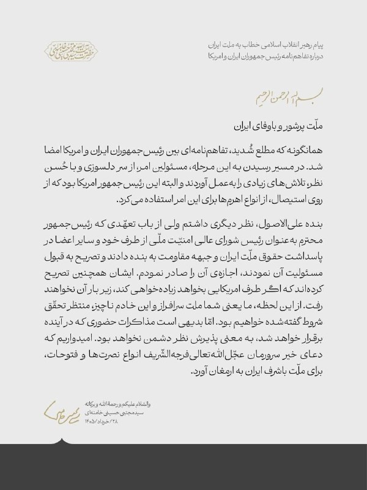

خبرگزاری فارس: پیام جدید iRahbar
@withyashar

## WithYashar — post 15269

@withyashar

## WithYashar — post 15268

  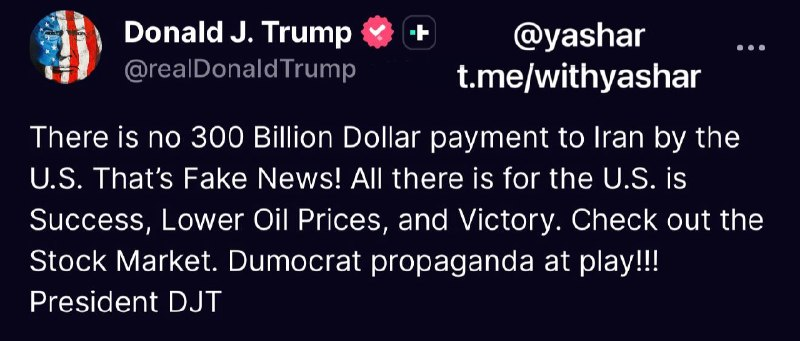

ترامپ در‌تروث : هیچ پرداخت ۳۰۰میلیارد دلاری از سوی آمریکا به ایران در کار نیست.
این خبر جعلی است!
تنها چیزی که نصیب آمریکا شده، موفقیت، کاهش قیمت نفت و پیروزی است.
بازار سهام را ببینید.
تبلیغات «دُمکرات‌ها» در جریان است!!
@withyashar

## WithYashar — post 15267

## WithYashar — post 15266

  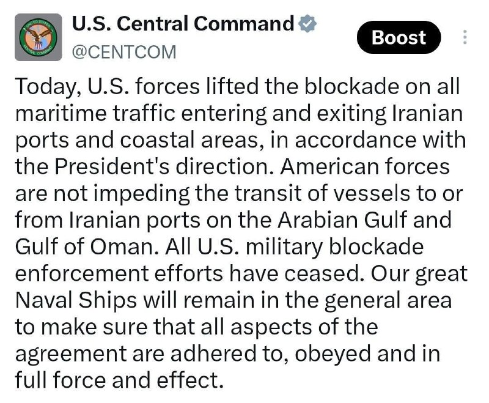

امروز نیروهای ایالات متحده، بنا بر دستور رئیس‌جمهور، محاصره تمامی رفت‌وآمدهای دریایی به بنادر و مناطق ساحلی ایران و از آن‌ها را لغو کردند.
نیروهای آمریکایی دیگر مانع تردد کشتی‌ها به مقصد بنادر ایران یا خروج از آن‌ها در خلیج فارس و دریای عمان نمی‌شوند. تمامی اقدامات نظامی آمریکا برای اجرای این محاصره متوقف شده است.
ناوهای جنگی ما همچنان در منطقه حضور خواهند داشت تا اطمینان حاصل شود که همه مفاد این توافق به‌طور کامل رعایت و اجرا می‌شود و از قدرت و اعتبار کامل برخوردار است.
@withyashar

## WithYashar — post 15265

ونس درباره نتانیاهو: من گزارش آکسیوس را دیدم که می‌گوید نتانیاهو عصبانی است.این بازتابی از گفتگوهایی که من با او داشته‌ام نیست. شاید او چیزی به شخص دیگری می‌گوید که به من نمی‌گوید.
@withyashar

## WithYashar — post 15264

  <a href="telegram/content/WithYashar_15264_1781816307.mp4" target="_blank">🎬 Download video</a>

جی.دی. ونس در مورد لغو تحریم‌ها:
«راستش را بخواهید، ما این را یک امتیاز بزرگ به ایرانی‌ها ندیدیم — ایران هم... این را به‌عنوان یک امتیاز برای خودشان تلقی نکرد، چون چیزی که مانع فروش نفت آنها می‌شد، تحریم‌ها نبود.
آنها بدون هیچ تخفیفی نفت زیادی می‌فروختند، چون تحریم‌ها اساساً ناکارآمد بودند.
در آن مرحله، کاری که تحریم‌ها کردند این بود که سیستم مالی ایران را به نوعی به سمت سیستم بانکی سایه‌ای (غیررسمی) سوق دادند.
با لغو تحریم‌ها، در واقع خواهیم توانست کمی ببینیم که سیستم مالی آنها پول را به کجا می‌فرستد و از کجا پول دریافت می‌کند. این یک مزیت واقعی است.»
@withyashar

## WithYashar — post 15263

  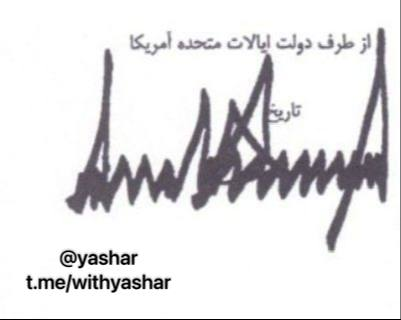

از ترامپی که امضاش اینهمه بالا پایین داره انتظار ثبات روانی دارید ، موج مکزیکی هم رد کرده نوار قلبه 😂
@withyashar

## WithYashar — post 15262

ونس: اگر ایرانی‌ها رفتار خود را تغییر ندهند، ارتش و برنامه هسته‌ای آنها همچنان نابود خواهد شد.

ما در حال حاضر یک تحریم اقتصادی فلج‌کننده علیه ایران اعمال می‌کنیم و تا زمانی که این کشور رفتار خود را به‌طور اساسی تغییر ندهد، به آن پایان نخواهیم داد.
@withyashar

## WithYashar — post 15261

آمریکا حتی یک سنت هم به ایران نمی‌دهد

جی‌دی ونس: "آنچه از همه شما می‌خواهم این است که صادقانه گزارش دهید که ایالات متحده حتی یک سنت هم به ایران نمی‌دهد...حتی مزایای اقتصادی، کاهش تحریم‌ها و غیره که با این معامله همراه است، فقط در صورتی اتفاق می‌افتد که ایرانی‌ها عمل کنند!"
@withyashar

## mwarmonitor — post 11179

🔴چاک شومر: این «هنر معامله» نیست. این «هنر تسلیم شدن» است. ترامپ صلح از طریق قدرت به دست نیاورد؛ بلکه با ضعف، امتیاز داد.

🔸آمریکایی‌ها تقریباً هیچ‌کدام از چیزهایی را که می‌خواستند و نیاز داشتند به دست نیاوردند، و ترامپ همه چیز را واگذار کرد. ایرانی‌ها او را کاملاً شکست دادند. ببینید چه چیزهایی نصیبشان شده است.

🔸آن‌ها کنترل بیشتری بر تنگه به دست آورده‌اند. همچنین یک پرداخت ۳۰۰ میلیارد دلاری دریافت می‌کنند. ما دموکرات‌ها به آن رأی نخواهیم داد. هیچ‌کس نباید به آن رأی بدهد. این پول باید در داخل کشور و برای کاهش هزینه‌های مردم استفاده شود، نه اینکه به‌عنوان پاداش به ایران داده شود.

🔸ایرانی‌ها هنوز موشک‌هایشان را دارند. قیمت نفت و گاز برای مدت طولانی بالا خواهد ماند. در واقع، ایران تقریباً هرچه می‌خواست به دست آورده و ما هیچ چیز نگرفته‌ایم.

🔸بنابراین جمع‌بندی این است که این یک شکست کامل است. یک فاجعه است. ترامپ نشان داد که مذاکره‌کننده بدی است، و دلیلش هم روشن است: او اصلاً نمی‌دانست چرا وارد این درگیری شد. به مردم آمریکا توضیح نداد. به جهان هم توضیح نداد.

🔸و احتمالاً به این دلیل بود که نگران پرونده‌های اپستین و سابقه بدش در حوزه سلامت و هزینه‌ها بود. او می‌خواست توجه‌ها را منحرف کند، اما هیچ هدف و برنامه‌ای نداشت و در نتیجه، آمریکا و جهان از یکی از بدترین توافق‌هایی که ترامپ تاکنون انجام داده و یکی از بدترین توافق‌های تاریخ سیاست خارجی آمریکا آسیب دیدند.

🔸همه چیز باید علنی شود. توافق‌های پنهانی—با توجه به سابقه ترامپ—احتمالاً حتی بدتر از چیزی است که تاکنون علنی شده است.

🔸این‌قدر بد است که حتی جمهوری‌خواهانی که معمولاً از ترس یا احتیاط از ترامپ انتقاد نمی‌کنند، چاره‌ای ندارند جز اینکه بگویند این توافق چقدر بد است.

@mwarmonitor

## mwarmonitor — post 11178

🚨 سی‌ان‌ان به نقل از سخنگوی کاخ سفید:
هیچ توافقی فراتر از «یادداشت تفاهم» وجود ندارد، اما گفت‌وگوها درباره گام‌های بعدی همچنان ادامه دارد.

@mwarmonitor

## mwarmonitor — post 11177

🚨درگیری‌های مسلحانه در منطقهٔ تایمز اسکوئر در شهر نیویورک رخ داده است و نیروهای امنیتی به‌طور گسترده در اطراف محل حادثه مستقر شده‌اند.

@mwarmonitor

## mwarmonitor — post 11176

🔴مرکز مشترک اطلاعات دریایی

🔸یادداشت مشاوره JMIC: 009-26 | ۱۸ ژوئن ۲۰۲۶

تنگه هرمز باز است

منطقه مورد نگرانی: تنگه هرمز

شماره JMIC: 009-26 | سطح تهدید منطقه‌ای: متوسط (MODERATE)

۱. عبور و مرور از تنگه هرمز
مرکز مشترک اطلاعات دریایی (JMIC) اطلاعات صفحه بعد را جهت آگاهی مالکان، اپراتورها و دریانوردان به اشتراک می‌گذارد. به‌طور مشخص، این یادداشت جزئیات خطرات به‌روزرسانی شده عبور از تنگه هرمز (SoH) از طریق «طرح تفکیک ترافیک بین‌المللی» را شرح می‌دهد.

سطح تهدید امنیت دریایی در تنگه هرمز، در پی اعلام نیت ایالات متحده و ایران برای بازگشایی این آبراه، به متوسط (MODERATE) کاهش یافته است. با این حال، باید به دریانوردان در خصوص وجود مین‌ها هشدار داده شود و با توجه به ادامه عملیات پاکسازی، انتظار حضور نیروهای نظامی دریایی را داشته باشند. دریانوردان همچنین باید منتظر تراکم در مسیرهای عبوری و تماس‌های احتمالی رادیویی (VHF) از سوی نیروهای دریایی جهت حمایت از جریان آزاد کشتیرانی باشند.

📌ناخداها باید موارد زیر را مد نظر قرار دهند:

تنگه هرمز اکنون باز است و عملیات مسدودسازی (بلاکاد) متوقف شده است.

عملیات فعال پاکسازی مین در حال انجام است. آخرین نقشه‌های مناطق احتمالی مین‌گذاری‌شده در صورت درخواست در دسترس است و به‌طور منظم به‌روزرسانی خواهد شد.

در حال حاضر به دلیل وجود مین، باید از «طرح تفکیک ترافیک بین‌المللی» اجتناب شود.

یک موقعیت تایید شده مین در عرض جغرافیایی 26^{\circ}24'34.920''N و طول جغرافیایی 056^{\circ}20'40.128''E وجود دارد.

پاکسازی مسیر عبور جنوبی، در امتداد آب‌های سرزمینی عمان (TTW) از وجود مین تایید شده است و این مسیر، مسیر پیشنهادی است.

مسیرهای جایگزین نیز در دسترس هستند.

عبور و مرور در امتداد کریدوری با نقاط مسیر (Way points) ، ایمن گزارش شده است.

@mwarmonitor

## mwarmonitor — post 11175

  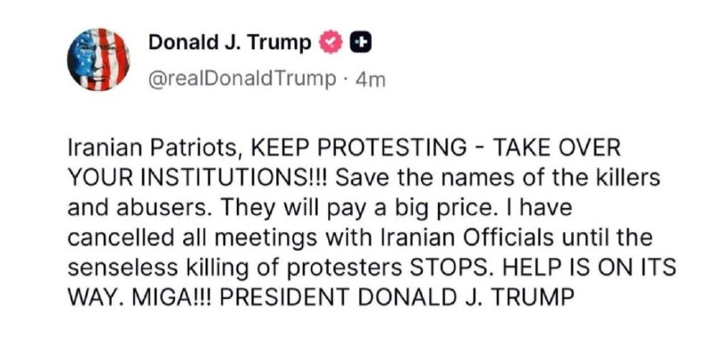

🔸برنامه طنز و شبانه «جیمی کیمل لایو!» از شبکه ABC 🔹«ما آیت‌الله را کشتیم و یک آیت‌الله جوان‌تر و تندروتر را جایگزین او کردیم. ما هیچ کاری برای معترضان در ایران انجام ندادیم. ما تحریم‌هایی را که قبل از شروع جنگ علیه ایران وضع شده بود، لغو کردیم. ما به آتش‌بسی…

## mwarmonitor — post 11174

  <a href="telegram/content/mwarmonitor_11174_1781816311.mp4" target="_blank">🎬 Download video</a>

🔸برنامه طنز و شبانه «جیمی کیمل لایو!» از شبکه ABC

🔹«ما آیت‌الله را کشتیم و یک آیت‌الله جوان‌تر و تندروتر را جایگزین او کردیم. ما هیچ کاری برای معترضان در ایران انجام ندادیم. ما تحریم‌هایی را که قبل از شروع جنگ علیه ایران وضع شده بود، لغو کردیم. ما به آتش‌بسی رسیدیم که قبل از این هم آن را داشتیم. ما تنگه را باز کردیم که قبل از این هم باز بود. ما خدا می‌داند چند میلیارد دلار صرف بمب و موشک کردیم. جان بسیاری از آمریکایی‌ها و غیرنظامیان از دست رفت. ما کنترل کامل تنگه هرمز را به ایران دادیم و حداقل ۳۰۰ میلیارد دلار هم به آن اضافه کردیم، چون، چرا که نه؟ الان ملانیا با خودش فکر می‌کنه: "چطور می‌تونم منم همچین معامله‌ای داشته باشم؟"»

@mwarmonitor

## mwarmonitor — post 11173

🔴​«امروز نیروهای ایالات متحده، در راستای دستور رئیس‌جمهور، محاصره تمامی تردد‌های دریایی ورودی و خروجی به بنادر و مناطق ساحلی ایران را لغو کردند. نیروهای آمریکایی مانع از عبور و مرور شناورها به بنادر ایران یا از مبدأ این بنادر نمی‌شوند. تمامی اقدامات نظامی ایالات متحده برای اعمال محاصره متوقف شده است. کشتی‌های جنگی بزرگ ما در منطقه عمومی باقی خواهند ماند تا اطمینان حاصل کنند که تمام جنبه‌های توافق مورد پایبندی، رعایت و در اجرا و اثرگذاری کامل قرار دارند.» فرماندهی سنت کام

@mwarmonitor

## mwarmonitor — post 11172

  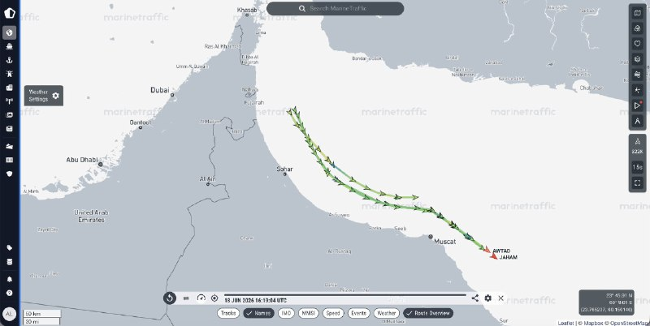

🔴نفتکش‌های حامل نفت خام عربستان پس از عبور از تنگه هرمز دوباره روی AIS ظاهر شدند

🔸سه نفتکش بسیار بزرگ (VLCC) با پرچم عربستان که همگی حامل محموله بودند، پس از بیش از دو ماه خاموش بودن، دوباره در سامانه AIS ظاهر شده‌اند؛ امری که نشان می‌دهد اپراتورهای نفتکش با احتیاط در حال بازگرداندن قابلیت ردیابی هنگام عبور از تنگه هرمز هستند.

🔸بر اساس داده‌های MarineTraffic، نفتکش‌های Jaham، Shaden و Awtad در تاریخ ۱۸ ژوئن ارسال سیگنال‌های AIS را از سر گرفتند. مقصد اعلام‌شده Shaden بندر کییره در ژاپن است، در حالی که Awtad به سمت اولسان در کره جنوبی حرکت می‌کند. مقصد Jaham همچنان نامشخص است. طبق گزارش Kpler، این سه VLCC در مجموع حدود ۶ میلیون بشکه نفت خام حمل می‌کنند.

@mwarmonitor

## mwarmonitor — post 11171

🔸«جی‌دی ونس، معاون رئیس‌جمهور آمریکا، گفت اگر ایران از نفتکش‌ها در تنگه هرمز عوارض عبور دریافت کند، هیچ توافقی با ایران در کار نخواهد بود.»

🔹«محمد مرندی ؛ ایران قطعاً هزینه عبور را دریافت خواهد کرد. حکومت ترامپ نباید عزم و اراده ایران را بیازماید. این کار به پایان خوبی ختم نخواهد شد.»

@mwarmonitor

## mwarmonitor — post 11170

🔸محمد مرندی عضو تیم مذاکره کننده:

«حکومت ترامپ نباید انتظار انعطاف‌پذیری از ایران بر سر میز مذاکره را داشته باشد. چنین چیزی در کار نخواهد بود. تنها مسیر قابل‌قبول رو به جلو، اجرای کامل، صریح و بدون ابهامِ تمام تعهدات ایالات متحده است. بدون اقدامات نصفه‌نیمه. بدون مذاکرهٔ مجدد. بدون عقب‌نشینی.»

@mwarmonitor

## mwarmonitor — post 11169

  <a href="telegram/content/mwarmonitor_11169_1781816314.mp4" target="_blank">🎬 Download video</a>

🔴«ایالات متحده به صلح متعهد است و ما همه را در منطقه خاورمیانه تشویق می‌کنیم تا به تعهد خود پایبند بمانند تا اجازه دهند مذاکرات ما به زیبایی پیش برود. بازارها عاشق اتفاقاتی هستند که دارد می‌افتد؛ قیمت نفت بسیار پایین آمده و ارزش سهام‌ها به شدت بالا رفته است.…

## mwarmonitor — post 11168

  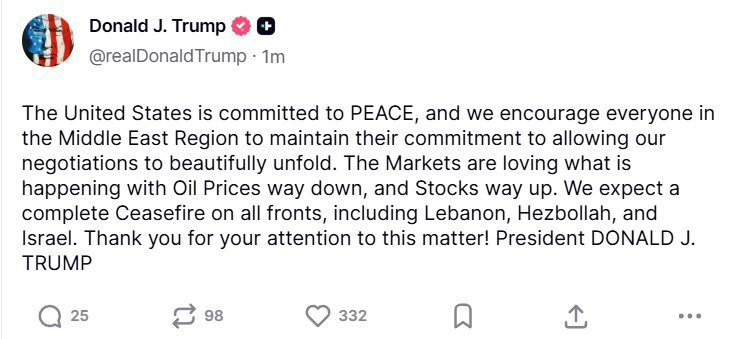

🔴«ایالات متحده به صلح متعهد است و ما همه را در منطقه خاورمیانه تشویق می‌کنیم تا به تعهد خود پایبند بمانند تا اجازه دهند مذاکرات ما به زیبایی پیش برود. بازارها عاشق اتفاقاتی هستند که دارد می‌افتد؛ قیمت نفت بسیار پایین آمده و ارزش سهام‌ها به شدت بالا رفته است. ما انتظار یک آتش‌بس کامل در تمام جبهه‌ها، از جمله لبنان، حزب‌الله و اسرائیل را داریم. از توجه شما به این موضوع سپاسگزارم!

رئیس‌جمهور دونالد جی. ترامپ

@mwarmonitor

## mwarmonitor — post 11167

  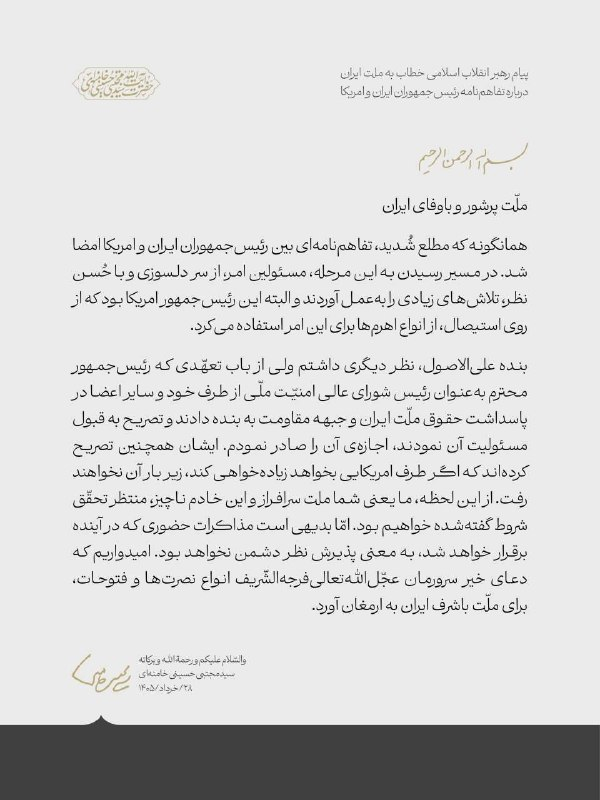

📝چقدر مضحک و «اصولی» که رهبرِ افقی‌شده، از آن دنیا سیگنال فرستاده که چون پزشکیانِ ساده‌لوح قول داده زیر بار ترامپ نرود، به او اذن دخول داده است! علم در شوک است که چطور یک میت بیانیه صادر می‌کند، اما وقتی پای بقای سفره در میان باشد، وای‌فایِ غسّالخانه هم مستقیم به کاردکس مجتبی وصل می‌شود. این‌ها اصرار دارند بگویند «تفاهم‌نامه رئیس‌جمهوران ایران و آمریکا» تا فردا که ترامپ زیر میز زد، نظامِ دامن‌کشان خود را عقب بکشد و بگوید گندکاریِ مسعود بوده و آقا مجتبی هم قلباً راضی نبوده است.

واقعیت این است که این خیمه‌شب‌بازی، دستپختِ احمد وحیدی و اتاق فکرِ هراسانِ بیت است، چون مرده که بیانیه صادر نمی‌کند. هنوز جوهر امضا خشک نشده، جنگِ گرگ‌های گرسنه بالا گرفته و بوی خونِ پاکسازی‌های داخلی می‌آید؛ در این بازارِ ترورهای خودی و حذف‌های فیزیکی، قالیبافِ بخت‌برگشته که همیشه سرِ جابجایی قدرت مثل مهره سوخته عمل کرده، شانس بسیار بالایی دارد که با یک «نقص فنی اتفاقی»، خیلی زود برای همیشه به همرزمانِ سابقش بپیوندد.

@mwarmonitor

## mwarmonitor — post 11166

تموم شد 😮‍💨

## mwarmonitor — post 11165

خبرنگار: ممنون قربان. جردن کنرادسن از رسانه «گیت‌وی پندیت». می‌خواهم دوباره درباره توافق لبنان صحبت کنم. گزارشی در «اکسیوس» منتشر شده مبنی بر اینکه نتانیاهو از این موضوع بسیار خشمگین است و اسرائیل خود را متعهد به یادداشت تفاهم (MOU) در رابطه با لبنان نمی‌داند. اگر همان‌طور که اشاره کردید، ناامیدی و ناراحتی شما از حملات اسرائیل در بیروت و هدف قرار دادن ساختمان‌های مسکونی ادامه یابد، آیا این مسئله می‌تواند توافق را به نابودی بکشاند؟ و واکنش ایالات متحده به یک جنگ گسترده‌تر در لبنان که شامل... [بقیه بخش‌ها] شود، چه خواهد بود؟
جی‌دی ونس:
سخنران: بله، خب، من نمی‌خواهم وارد فرضیاتی شوم که ممکن است توافق را نابود کند؛ چرا که فکر می‌کنم انتظار رئیس‌جمهور این است که همه دوستان ما، یعنی اسرائیلی‌ها و عرب‌های منطقه، با یکدیگر همکاری کنند تا در واقع این توافق را به سرانجام برسانند.
من گزارش اکسیوس را دیدم که می‌گفت نتانیاهو خشمگین است؛ این ادعا منعکس‌کننده گفتگوهایی که من با او داشته‌ام نیست، اما شاید او به فرد دیگری چیزی می‌گوید که به من نمی‌گوید. چیزی که خواهم گفت، و این موضوع واقعاً مرا آزار می‌دهد، این است که شما افرادی را در کابینه «بی‌بی» (نتانیاهو) دیده‌اید که علناً به این توافق حمله کرده‌اند و به نوعی، به صورت کاملاً شخصی به رئیس‌جمهور ایالات متحده تاخته‌اند. پیام من به آن‌ها دو بخش دارد:
نکته اول: دونالد جی. ترامپ تنها رئیس کشور در کل جهان است که در این برهه از زمان با کشور اسرائیل همدلی و همراهی دارد، و او از قضا رهبر ابرقدرت جهان است. اگر من در کابینه دولت اسرائیل بودم، احتمالاً به تنها متحد قدرتمندی که در کل جهان برایم باقی مانده است، حمله نمی‌کردم.
نکته دوم: پیام دیگری که به برخی از آن اعضای کابینه می‌دهم—البته بی‌بی (نتانیاهو) وجهه خود را حفظ کرده و وارد این مسیر نشده است—اما خطاب به آن دسته از اعضای کابینه در اسرائیل که به رئیس‌جمهور ایالات متحده حمله می‌کنند، باید بگویم که در طول سه ماه گذشته، دو سوم از تسلیحات دفاعی که از خاک و میهن شما محافظت کرده‌اند، توسط دستان آمریکایی ساخته شده و هزینه‌اش از جیب مالیات‌دهندگان آمریکایی پرداخت شده است.
مشکل اسرائیل دونالد جی. ترامپ نیست؛ هر کسی در اسرائیل که فکر می‌کند بزرگ‌ترین مشکل آن‌ها رئیس‌جمهور ایالات متحده است، باید بیدار شود و واقعیتِ موقعیتی را که این کشور در آن قرار دارد، لمس کند. از همه شما ممنونم.

@mwarmonitor

## mwarmonitor — post 11164

🎬 Video

## mwarmonitor — post 11161

خبرنگار: «بسیاری از همکارانی که در سنای ایالات متحده در کنفرانس جمهوری‌خواهان با آن‌ها خدمت کرده‌اید، در ۲۴ ساعت گذشته از این توافق انتقاد کرده‌اند. آقای معاون رئیس‌جمهور، پیام شما در پاسخ به این [انتقادها] چیست؟»
جی‌دی ونس: «خب، گمان می‌کنم به هرکسی، به هر یک از منتقدان، این را بگویم؛ اول از همه: کمی به رئیس‌جمهور ایالات متحده ایمان داشته باشید. این ایده که او قرار است توافقی را رقم بزند که برای مردم آمریکا بد بوده باشد، مضحک است. او کسی است که شجاعت آن را داشته تا در یک سال و نیم گذشته، رابطه ما با ایران و با بسیاری از کشورهای دیگر را به‌طور اساسی متحول کند. او به این توافق باور دارد. او قرار است آن را تا مرحله نهایی پیش ببرد. و اگر ایرانی‌ها پایبند نباشند، ما همچنان تک‌تک ابزارها و اهرم‌های فشاری را که امروز در اختیار داریم، حفظ خواهیم کرد. این پیام اول خواهد بود؛ اینکه با توجه به اینکه رئیس‌جمهور ما را تا اینجا رسانده است، به توانایی او برای برداشتن گام نهایی کمی ایمان داشته باشید.»

@mwarmonitor

## mwarmonitor — post 11160

  <a href="telegram/content/mwarmonitor_11160_1781816316.mp4" target="_blank">🎬 Download video</a>

🎬 Video

## mwarmonitor — post 11159

خبرنگار ؛
«خیلی ممنون، آقای معاون رئیس‌جمهور. فقط دو سوال از شما دارم. برای پیگیری سوال قبلی، وزیر روبیو در ماه مارس گفت که هدف این جنگ، نقل‌قول می‌کنم، "از بین بردن تهدید موشک‌های بالستیک کوتاه‌برد ایران" بود. شما همین چند لحظه پیش گفتید که برنامه نظامی [آن‌ها] نابود شده است. ارزیابی‌های اطلاعاتی ایالات متحده نشان می‌دهد که ایران هنوز تقریباً ۷۰ درصد از ذخایر موشک‌های بالستیک و کروز پیش از جنگ خود را در اختیار دارد. پس دولت چه زمانی تصمیم گرفت آن بخش از مأموریت اولیه را رها کند؟ و دوم اینکه، برای آینده، آیا شما تیم ایالات متحده را در روند مذاکرات رهبری خواهید کرد؟ میزان مشارکت شما چقدر خواهد بود؟»
جی دی ونس:
«بله، من قطعاً برنامه‌ریزی کرده‌ام که رهبری تیم مذاکره‌کننده ایالات متحده را بر عهده داشته باشم. اما در مورد سوال اول، می‌دانید، شما درباره یک گزارش اطلاعاتی صحبت کردید که به طور ناشناس به یک خبرنگار درز کرده، فاقد زمینه و سیاق لازم بوده و صراحتاً دقیق نیست. آنچه در مورد برنامه موشک‌های بالستیک ایران تغییر کرده این است که تعداد موشک‌هایی که آن‌ها دارند یا تعداد گلوله‌ها، اهمیت بسیار کمتری دارد. آنچه بسیار بیشتر اهمیت دارد، تعداد پرتابگرهایی (لانچرهایی) است که در اختیار دارند و از آن مهم‌تر، تیم‌های روی زمینی هستند که ظرفیت پرتاب آن موشک‌ها را دارند. توانایی آن‌ها برای پرتاب موشک به طور قابل‌توجهی تضعیف شده است. آیا این توانایی به صفر رسیده؟ خیر. اما به طور چشمگیری کاهش یافته است و از این نظر، ما مأموریت را رها نکرده‌ایم، بلکه آن بخش خاص از مأموریت را به سرانجام رسانده‌ایم.»
«اگر به متحدان عرب خلیج [فارس] و طبعاً اسرائیلی‌ها نگاه کنید که با چالش‌های زیادی مواجه شدند و این دو در کنار هم بار اصلی این حملات موشکی را تحمل کردند، هر یک از آن‌ها امروز در برابر تهدید موشکی ایران احساس امنیت بسیار بیشتری نسبت به گذشته دارند. بدیهی است که این چیزی است که ما مایل به ادامه آن هستیم. تمام آنچه رئیس‌جمهور دیروز گفت این بود که شما نمی‌توانید از هیچ کشوری انتظار داشته باشید که حق دفاع از خود را نادیده بگیرد. شما باید توازن و برابری داشته باشید و این همان چیزی بود که رئیس‌جمهور ایالات متحده درباره آن صحبت می‌کرد.»

@mwarmonitor

## mwarmonitor — post 11158

  <a href="telegram/content/mwarmonitor_11158_1781816318.mp4" target="_blank">🎬 Download video</a>

🎬 Video

## FoxNewsTwitter — post 343141

  <a href="telegram/content/FoxNewsTwitter_343141_1781816321.mp4" target="_blank">🎬 Download video</a>

Fox News (Twitter/X)

A Ukrainian drone strike sends the roof of a Moscow oil refinery's storage tank flying through the air — apparently still intact despite the massive explosion.

Mayor Sergei Sobyanin says Ukrainian drones reached the southeast Moscow site during what he called a "massive attack."

Zelenskyy called the refinery strike "fully justified," saying Ukraine is targeting facilities that help fuel Russia's war machine.

## FoxNewsTwitter — post 343140

  

Fox News (Twitter/X)

Happy Birthday, Sir Paul McCartney.

From The Beatles to his acclaimed solo career, his work remains among the most celebrated in popular music history.

## FoxNewsTwitter — post 343139

  <a href="telegram/content/FoxNewsTwitter_343139_1781816324.mp4" target="_blank">🎬 Download video</a>

Fox News (Twitter/X)

Tankers are moving again through the Strait of Hormuz — and drivers are already seeing the impact.

@SimonettiLauren reports multiple vessels, including Saudi tankers, have crossed after the Iran deal, helping send the national gas average below $4.

## FoxNewsTwitter — post 343138

  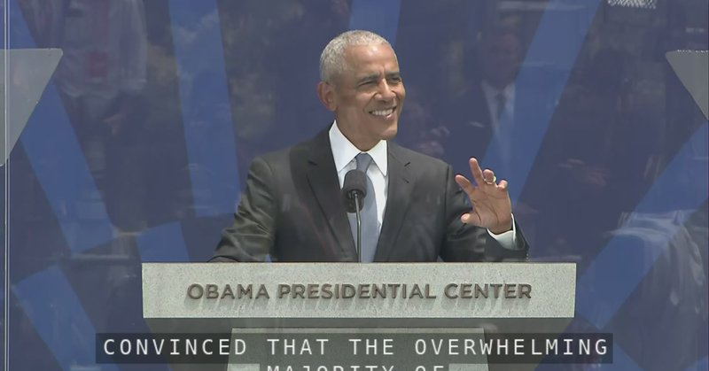

Fox News (Twitter/X)

WATCH LIVE: Former President Obama delivers remarks at presidential center opening in Chicago https://twitter.com/i/broadcasts/1nJOLLjlPMzxR

## FoxNewsTwitter — post 343137

  <a href="telegram/content/FoxNewsTwitter_343137_1781816327.mp4" target="_blank">🎬 Download video</a>

Fox News (Twitter/X)

Ukraine launched a major retaliatory drone attack on one of Russia’s largest oil refineries, increasing pressure on the country’s fuel supply.

Zelenskyy says the goal was to push Putin back to the negotiating table, arguing that if Ukraine continues to suffer attacks, Russia will feel the impact too, Jeff Paul reports.

## FoxNewsTwitter — post 343136

  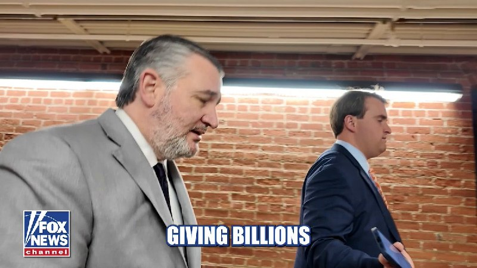

Fox News (Twitter/X)

"What an embarrassment."

GOP and Democrat senators are casting doubt on President Trump’s Iran peace deal, with lawmakers from both parties criticizing the agreement and raising concerns about its potential impact.

"Giving billions of dollars to theocratic lunatics who want to murder us is not a good idea."

"I think the president unfortunately is receiving bad advice on this deal."

@foxnewspolitics

## FoxNewsTwitter — post 343135

  <a href="telegram/content/FoxNewsTwitter_343135_1781816332.mp4" target="_blank">🎬 Download video</a>

Fox News (Twitter/X)

NEW: Vice President JD Vance pushes back against critics, including Republican lawmakers, bashing the administration's new Iran deal, telling them to "have a little bit of faith."

"The idea that [President Trump] is going to strike a deal that's been bad for the American people, it's preposterous.”

“He is the person who has had the courage to fundamentally transform our relationship with Iran... And if the Iranians don't comply, we still have every single tool and point of leverage that we have today."

## FoxNewsTwitter — post 343134

  <a href="telegram/content/FoxNewsTwitter_343134_1781816334.mp4" target="_blank">🎬 Download video</a>

Fox News (Twitter/X)

“Let people go on the record and actually answer to the American people.”

VP Vance calls on John Thune to hold a vote on the SAVE America Act after the Senate Majority Leader said that they don’t have the support to get it passed by tying it to FISA extensions.

"One of the things that sometimes frustrates me about the legislative process is that people will go into it saying, ‘This isn't possible, therefore we're not even going to try.’ Well, let's actually see. Let's try it. And if it's not possible, then let the people put their name on it."

## FoxNewsTwitter — post 343133

‌Fox News (Twitter/X)

The framework is now official.

President Trump has signed the Memorandum of Understanding outlining 14 key U.S. negotiating points both America and Iran hope to maintain over the next 60 days.

Among the stated U.S. objectives: ending the war, restoring normal operations through the Strait of Hormuz, and ensuring Iran cannot obtain a nuclear weapon. Read the full 14-point memorandum here:

https://www.foxnews.com/politics/read-it-full-text-us-iran-memorandum-understanding

## FoxNewsTwitter — post 343132

  <a href="telegram/content/FoxNewsTwitter_343132_1781816337.mp4" target="_blank">🎬 Download video</a>

Fox News (Twitter/X)

"The Obama deal gave them over $1 billion of American money. This deal gives them $0."

Vice President JD Vance lays out why the Trump administration believes its Iran agreement is fundamentally different from President Obama's 2015 nuclear deal:

"Gulf Coast Coalition loves this deal because they think that it makes Iran weaker. They hated the Obama deal because they thought that it made Iran stronger."

"In 2015, the perspective that we came at as the United States was, you already have a really nice nuclear program. We're going to bribe you with American money in order to stop it."

"Our perspective and where we're coming at, it is we already destroyed your nuclear program."

## FoxNewsTwitter — post 343131

  <a href="telegram/content/FoxNewsTwitter_343131_1781816340.mp4" target="_blank">🎬 Download video</a>

Fox News (Twitter/X)

NOW: "Joy Behar is way tougher than the Iranians, and she and I are best friends now."

VP Vance jokes about being a battle-tested negotiator after making it through his appearance on 'The View.'

Vance also says he's not worried about Trump blaming him if talks with Iran "go sideways," saying he knows the president was only making a joke.

## pm_afshaa — post 94355

وزیر خارجه پاکستان: نشست ژنو میان تهران و واشنگتن لغو شد 
💧 Rainbet.com the #1 Non-KYC Crypto Casino & Sportsbook @rainbetcom 
😁 @Pm_Afshaa

## pm_afshaa — post 94354

وزیر خارجه پاکستان: نشست ژنو میان تهران و واشنگتن لغو شد

💧 Rainbet.com the #1 Non-KYC Crypto Casino & Sportsbook @rainbetcom

😁 @Pm_Afshaa

## pm_afshaa — post 94353

شورای عالی امنیت ملی: بر اساس تفاهم‌نامه منعقد شده، تا 60 روز هیچ‌گونه عوارضی از کشتی‌های عبوری از تنگه هرمز دریافت نخواهد شد

💧 Rainbet.com the #1 Non-KYC Crypto Casino & Sportsbook @rainbetcom

😁 @Pm_Afshaa

## pm_afshaa — post 94351

vless://d32fef78-e18e-4f7a-9542-6f72456718af@2.27.22.238:110?encryption=none&security=none&type=tcp#relaxvpn-bot_2063_1781803224-1D%E2%8F%B3

سرعت بالا مخصوص دانلود

💧 Rainbet.com the #1 Non-KYC Crypto Casino & Sportsbook @rainbetcom

😁 @Pm_Afshaa

## pm_afshaa — post 94350

  <a href="telegram/content/pm_afshaa_94350_1781816342.webm" target="_blank">🎬 Download video</a>

بازم موش تباه پیام تایپی داد🤣🤣 
💧 Rainbet.com the #1 Non-KYC Crypto Casino & Sportsbook @rainbetcom 
😁 @Pm_Afshaa

## pm_afshaa — post 94349

  

بازم موش تباه پیام تایپی داد🤣🤣

💧 Rainbet.com the #1 Non-KYC Crypto Casino & Sportsbook @rainbetcom

😁 @Pm_Afshaa

## pm_afshaa — post 94346

🔴ترامپ: هیچ پرداخت 300 میلیارد دلاری از سوی آمریکا به ایران وجود ندارد. این اخبار جعلی است! همه چیزی که آمریکا دارد، موفقیت، کاهش قیمت نفت و پیروزی است. به بازار بورس نگاه کنید. تبلیغات دموکراتیک در حال اجرا است

💧 Rainbet.com the #1 Non-KYC Crypto Casino & Sportsbook @rainbetcom

😁 @Pm_Afshaa

## pm_afshaa — post 94345

🔴وزیر دفاع اسرائیل، اسرائیل کاتس:اسرائیل در هر لحظه برای عملیات در ایران آماده است - حتی بدون پشتیبانی آمریکا

💧 Rainbet.com the #1 Non-KYC Crypto Casino & Sportsbook @rainbetcom

😁 @Pm_Afshaa

## pm_afshaa — post 94343

vless://3d8b5191-7ff5-4fac-ac6e-1d6bedefff4e@sub.ashii.ir:8080?security=none&allowInsecure=0&encryption=none&type=httpupgrade#PMTV NEWS 🦁☀️

سرور سرعت بالا متصل مخصوص دانلود

💧 Rainbet.com the #1 Non-KYC Crypto Casino & Sportsbook @rainbetcom

😁 @Pm_Afshaa

## pm_afshaa — post 94341

https://t.me/proxy?server=103.161.35.23&port=443&secret=3XnnAQIAAQAH8AMDhuJMOt0

💧 Rainbet.com the #1 Non-KYC Crypto Casino & Sportsbook @rainbetcom

😁 @Pm_Afshaa

## pm_afshaa — post 94340

https://t.me/proxy?server=subobdoa.co.uk.&port=443&secret=7vDusL2a3E_UqTmU7jsqIWtjZG4ueWVrdGFuZXQuY29t

پروکسی سرعت بالا متصل

💧 Rainbet.com the #1 Non-KYC Crypto Casino & Sportsbook @rainbetcom

😁 @Pm_Afshaa

## pm_afshaa — post 94339

پروکسی سرعت بالا متصل

https://t.me/proxy?server=167.233.148.123&port=8443&secret=dd79e344818749bd7ac519130220c25d09

💧 Rainbet.com the #1 Non-KYC Crypto Casino & Sportsbook @rainbetcom

😁 @Pm_Afshaa

## pm_afshaa — post 94338

فارس: پیام بسیار مهم رهبر انقلاب دربارهٔ تفاهم پایان جنگ، خطاب به مردم ایران، تا ساعتی دیگه منتشر میشه

💧 Rainbet.com the #1 Non-KYC Crypto Casino & Sportsbook @rainbetcom

😁 @Pm_Afshaa

## pm_afshaa — post 94336

  <a href="telegram/content/pm_afshaa_94336_1781816344.webm" target="_blank">🎬 Download video</a>

🔴مدنی‌زاده، وزیر اقتصاد:
قرار نیست با توافق با آمریکا کشور به شرایط عادی برگرده، قبل جنگ هم چند صدهزار میلیاردتومن کسری بودجه داشتیم علاوه بر اون تو جنگ هم دولت از بانک مرکزی 100 هزار میلیاردتومن گرفته که آثار تورمی خودشو تو ماه‌های آینده نشون میده.
‌

💧 Rainbet.com the #1 Non-KYC Crypto Casino & Sportsbook @rainbetcom

😁 @Pm_Afshaa

## pm_afshaa — post 94335

  <a href="telegram/content/pm_afshaa_94335_1781816344.webm" target="_blank">🎬 Download video</a>

🔴وزیر خارجه پاکستان:
بعد از امضای توافق از راه دور، مراسم رسمی در سوئیس لغو شد.

💧 Rainbet.com the #1 Non-KYC Crypto Casino & Sportsbook @rainbetcom

😁 @Pm_Afshaa

## iaghapour — post 2686

  <a href="telegram/content/iaghapour_2686_1781816345.webm" target="_blank">🎬 Download video</a>

🔥 فروش ویژه سرور مجازی تک و چند کشوره 
🔥

👜 بجای 6 تا سرور مجازی، 2 تا بخر با 6 آیپی 
‼️

✅ با check-host.net سالم

## iaghapour — post 2685

  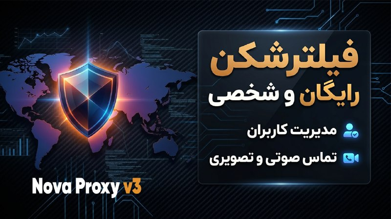

⭕️ ساخت فیلترشکن پرسرعت و رایگان با ورکر کلودفلر (NovaProxy v3)

🔹تو این ویدیو قراره یه روش فوق‌العاده برای ساخت یه فیلترشکن کاملاً رایگان و پرسرعت رو با هم یاد بگیریم. این بار رفتیم سراغ ورکر کلودفلر و قراره از اسکریپت قدرتمند NovaProxy v3 استفاده کنیم. تو این ورژن حل مشکل تماس صوتی و تصویری رو هم آموزش دادیم.

🔗 تماشا ویدیو در یوتیوب

#آموزش #فیلترشکن #ورکر #novaproxy #worker #کلودفلر #vpn
برای دور زدن فیلترینگ و آموزش تکنولوژی و هوش مصنوعی ما رو دنبال کنید 💚
🆔 @iaghapour

## DEJradio — post 5801

  <a href="telegram/content/DEJradio_5801_1781816346.webm" target="_blank">🎬 Download video</a>

👑
🔺 شاهزاده رضا پهلوی: مبارزه مردم ایران وارد مرحله‌ای تازه شده است. مرحله‌ای که نیازمند تجدید سازمان، تطبیق با شرایط جدید و تداوم تلاش برای آزادی ایران است. گفت‌وگو با اندرو مار در شبکه LBC ۲۷ خرداد ۲۵۸۵/۱۴۰۵ #شاهزاده_رضا_پهلوی #مصاحبه @DEJradio

## DEJradio — post 5800

  <a href="telegram/content/DEJradio_5800_1781816347.mp4" target="_blank">🎬 Download video</a>

👑
🔺 شاهزاده رضا پهلوی: مبارزه مردم ایران وارد مرحله‌ای تازه شده است. مرحله‌ای که نیازمند تجدید سازمان، تطبیق با شرایط جدید و تداوم تلاش برای آزادی ایران است.

گفت‌وگو با اندرو مار در شبکه LBC
۲۷ خرداد ۲۵۸۵/۱۴۰۵

#شاهزاده_رضا_پهلوی #مصاحبه
@DEJradio

## DEJradio — post 5799

⭕️ پیام منتسب به مجتبی خامنه‌ای: نظرم به نظر پزشکیان نزدیک نبود

در تازه‌ترین پیام منتسب به مجتبی خامنه‌ای عنوان شد که در مورد توافق با آمریکا نظر دیگری داشته است.
در این پیام تأکید شده که مسئولیت تفاهمنامه با پزشکیان و دیگر اعضای شورای عالی امنیت ملی نظام است.
رسانه‌های جمهوری اسلامی شامگاه پنجشنبه متن پیامی منتسب به مجتبی خامنه‌ای را منتشر کردند که در آن دربارهٔ تفاهم‌نامه میان تهران و واشینگتن موضع‌گیری شده است.
در این پیام آمده است که خامنه‌ای در اصل نسبت به این توافق نظر موافق نداشته است.
بنا بر ادعای منتسب به خامنه‌ای، او به دلیل تعهدی که مسعود پزشکیان به عنوان رئیس شورای عالی امنیت ملی و دیگر اعضای شورا دادند، با امضای یادداشت تفاهم موافقت کرده است.
در پیام منتسب به رهبر جمهوری اسلامی، تفاهم‌ با آمریکا عملا به‌عنوان «تفاهم‌نامه‌ای بین روسای دولت جمهوری اسلامی و آمریکا» به‌نظر می‌رسد.
در این پیام همچنین ادعا شده که مذاکرات حضوری آینده، به معنای پذیرش نظر آمریکا نیست.

#موشتبا #تفاهم #مذاکرات #توافق
@DEJradio

## DEJradio — post 5798

  <a href="telegram/content/DEJradio_5798_1781816349.mp4" target="_blank">🎬 Download video</a>

🚨
🔸 خبر ۲۱
پنجشنبه ۲۸ خرداد ۱۴۰۵

#خبر۲۱
@DEJradio

## DEJradio — post 5797

  <a href="telegram/content/DEJradio_5797_1781816353.mp4" target="_blank">🎬 Download video</a>

🔺🎤 ریشه‌های مشترک در نت‌ها؛ داستان پیوند موسیقی ایران و اسرائیل

گفت‌وگو با نوفر باتات، هنرمند اسرائیلی

#ایران #اسرائیل #موسیقی
@DEJradio

## VahidOnline — post 76496

  

المیادین به نقل از یک منبع آگاه گزارش داد هیات مذاکره‌کننده جمهوری اسلامی به دلیل ادامه حملات اسرائیل به جنوب لبنان، سفر خود به سوئیس برای آغاز نخستین دور مذاکرات ۶۰ روزه را به حالت تعلیق درآورده است.
المیادین افزود: تهران پیش‌تر به آمریکا و میانجی‌ها اطلاع داده بود که پرونده لبنان در ادامه یا توقف مذاکرات نقشی محوری دارد و هشدار داده است حملات اسرائیل تا عمق ۱۰ کیلومتری خاک لبنان نقض یادداشت تفاهم و توافق چارچوب است.
@VahidOOnLine

📡 @VahidOnline

## VahidOnline — post 76495

  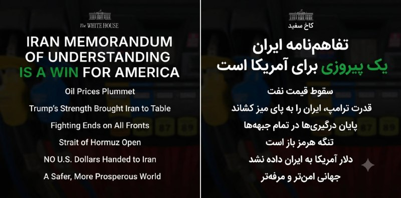

توییت کاخ سفید:
رئیس‌جمهور دونالد ج. ترامپ تهدیدی را حل کرد که واشنگتن چهل سال صرف مدیریت آن کرده بود: ایران هرگز سلاح هسته‌ای نخواهد داشت.
یک پیروزی برای آمریکا. 🇺🇸
WhiteHouse
ترجمه با هوش مصنوعی به تصویر اضافه شده.
📡 @VahidOnline

## VahidOnline — post 76494

  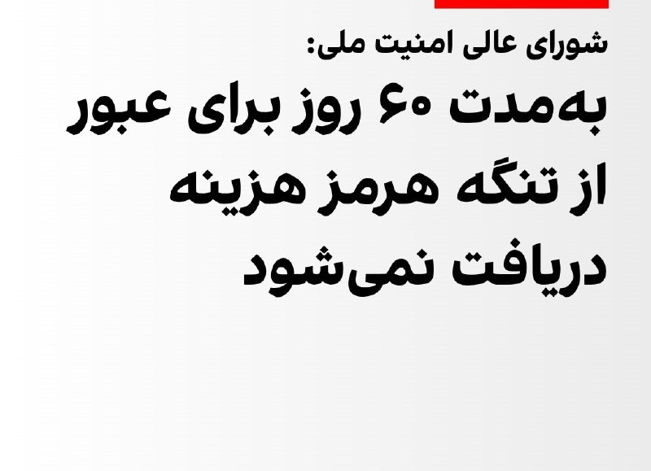

'بیانیه شورای عالی امنیت ملی'
منابع حکومتی:

🔹 در اجرای بند ۵ یادداشت تفاهم اسلام‌آباد، کشتی‌های تجاری متقاضی عبور از تنگه هرمز باید درخواست خود را به مدیریت آبراه خلیج فارس (PGSA .ir) ارسال نمایند.

🔹 به موجب یادداشت تفاهم اسلام‌آباد، به مدت شصت روز، هیچ‌گونه هزینه‌ای از متقاضیان اخذ نخواهد شد و این هزینه‌ها توسط دولت جمهوری اسلامی ایران تأمین می‌گردد.

🔹 بر این اساس به مدیریت آبراه خلیج فارس دستور داده شده است، در جهت تحقق اهداف تفاهم‌نامه درخواست‌ها را با سرعت و اولویت رسیدگی و پاسخ دهد.

🔹 با توجه به شرایط خاص و وجود برخی مخاطرات ایمنی در مسیر عبور و به دلیل لزوم حصول اطمینان از تردد ایمن و جلوگیری از حوادث دریایی، لازم است کشتی‌ها در مسیر و زمان اعلامی به آنها عبور نمایند تا به تدریج، امکان تردد افزایش یابد.

🔹 ترتیبات اجرایی و جزییات فنی عبور از تنگه هرمز از طریق مدیریت آبراه خلیج فارس اعلام می‌گردد.

🔹 در خصوص سایر موضوعات، از جمله مین‌زدایی، اقدامات لازم مطابق بند ۵ یادداشت تفاهم اسلام‌آباد انجام خواهد شد.

📡 @VahidOnline

## VahidOnline — post 76493

  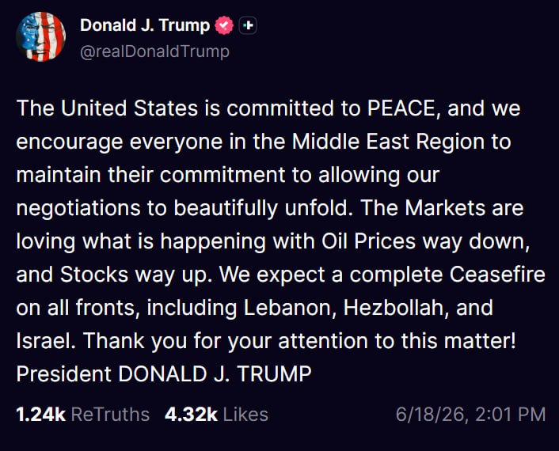

ترامپ: انتظار آتش‌بس کامل در همه جبهه‌ها از جمله لبنان را دارم

ترجمه ماشین:
ایالات متحده به صلح متعهد است و ما همه در منطقه خاورمیانه را تشویق می‌کنیم که به تعهد خود برای فراهم کردن امکان پیشرفت زیبای مذاکرات ما پایبند بمانند.
بازارها از آنچه در حال رخ دادن است استقبال می‌کنند: قیمت نفت به‌شدت پایین آمده و سهام به‌شدت بالا رفته است.
ما انتظار آتش‌بس کامل در همه جبهه‌ها، از جمله لبنان، حزب‌الله و اسرائیل را داریم.
از توجه شما به این موضوع سپاسگزارم!
رئیس‌جمهور دونالد ج. ترامپ
realDonaldTrump

📡 @VahidOnline

## VahidOnline — post 76492

« پیام منتسب به مجتبی خامنه‌ای در واقع نوعی فاصله‌گذاری حساب‌شده با تفاهم ایران و آمریکا است. مجتبی خامنه‌ای رهبر جمهوری اسلامی اجازه امضا را داده، اما مسئولیت سیاسی و اجرایی آن را بر دوش پزشکیان و شورای عالی امنیت ملی گذاشته است.

پیام همزمان رو به داخل و بیرون نوشته شده است. در داخل می‌گوید رهبر با رضایت کامل وارد این مسیر نشده و دولت باید پاسخگوی نتیجه باشد. در برابر آمریکا هم این سیگنال را می‌فرستد که تفاهم، زیر فشار ترامپ و دولت او به‌معنای عقب‌نشینی قطعی نیست؛ بلکه مشروط است و اگر شروط ایران محقق نشود، موافقت نهایی رهبر با توافق نهایی هم تضمین‌شده نخواهد بود.

در واقع متن، بیش از آن‌که اعلام رضایت از توافق باشد، تلاشی برای حفظ دست بالا در مرحله بعدی است: هم مسیر مذاکره باز می‌گذارد، هم امکان عقب‌نشینی تبلیغاتی حفظ می‌شود, هم به واشینگتن گفته می‌شود که فشار بیشتر ضرورتا به انعطاف بیشتر ایران منجر نخواهد شد»
@pourostadv

## VahidOnline — post 76491

  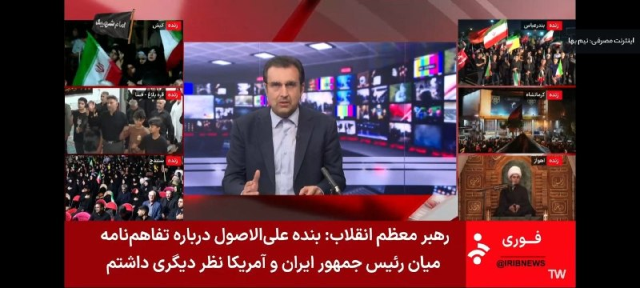

مسئول گردن‌نگیر جوان شد

📡 @VahidOnline

## VahidOnline — post 76490

  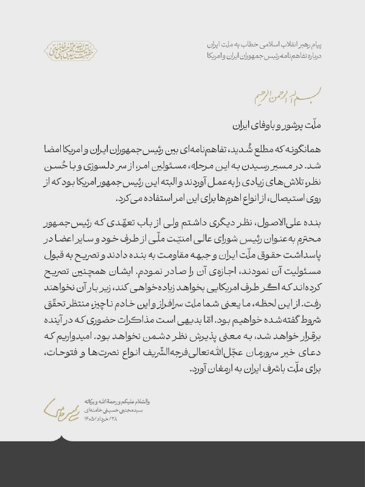

رسانه‌های ایران پنج‌شنبه شب متن پیام مکتوبی منسوب به مجتبی خامنه‌ای را منتشر کردند که در آن رهبر جمهوری اسلامی درباره امضای تفاهم‌نامه میان ایران و آمریکا گفته است که «نظر دیگری» داشته و مسئولیت آن را بر عهده مسعود پزشکیان، رئیس شورای عالی امنیت ملی، و دیگر اعضای این شورا دانسته است.

در این پیام درباره توافق با ایالات متحده آمده است:
«بنده علی‌الاصول، نظر دیگری داشتم ولی از باب تعهدی که رئیس‌جمهور محترم به‌عنوان رئیس شورای عالی امنیت ملی از طرف خود و سایر اعضا در پاسداشت حقوق ملت ایران و جبهه مقاومت به بنده دادند و تصریح به قبول مسئولیت آن نمودند، اجازه آن را صادر نمودم‌.»

در این پیام به تفاهمنامه اخیر به عنوان «تفاهم‌نامه‌ای بین رئیس‌جمهوران ایران و آمریکا» اشاره و گفته شده است که رهبر جمهوری اسلامی و مردم از این لحظه «منتظر تحقق شروط گفته ‌شده» خواهند بود.
در این پیام آمده که مذاکرات حضوری آینده «به معنی پذیرش نظر دشمن نخواهد بود.»
VahidOOnLine
در تیتر و متن نامه و خبرهایی که درباره‌اش تولید میشه بسیار تاکید دارند که این تفاهم‌نامه‌ای بین پزشکیان و ترامپه و نمی‌گن بین ایران و آمریکا

در واکنش‌ها از تقلیل نقش قالیباف یا محافظت ازش با سپر کردن پزشکیان هم میگن.
📡 @VahidOnline

## VahidOnline — post 76489

  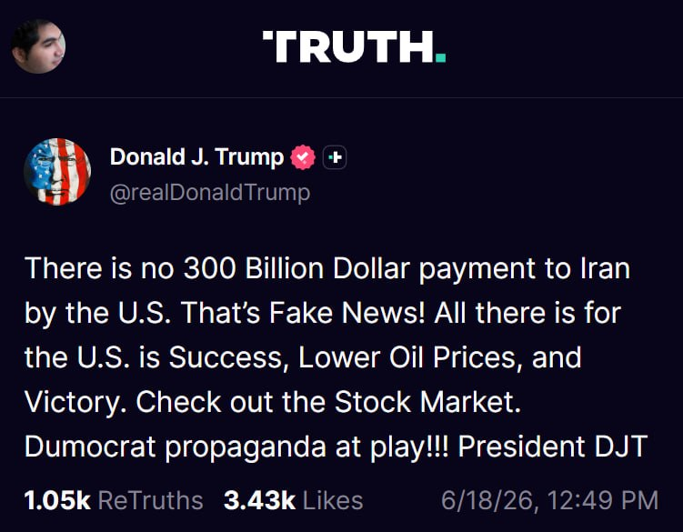

پست ترامپ، ترجمه ماشین:
هیچ پرداخت ۳۰۰ میلیارد دلاری از سوی آمریکا به ایران در کار نیست.
این خبر جعلی است!
تنها چیزی که نصیب آمریکا شده، موفقیت، کاهش قیمت نفت و پیروزی است.
بازار سهام را ببینید.
تبلیغات «دُمکرات‌ها» در جریان است!!!
رئیس‌جمهور دی‌جی‌تی

(توضیح: Dumocrat بازی زبانی تحقیرآمیز با Democrat است؛ از ترکیب ضمنیِ dumb به معنی «احمق» و Democrat. در ترجمه می‌شود چیزی مثل «دُمکرات‌ها» یا «دموکرات‌های احمق» آورد، بسته به لحن مورد نظر.)
realDonaldTrump

📡 @VahidOnline

## VahidOnline — post 76488

  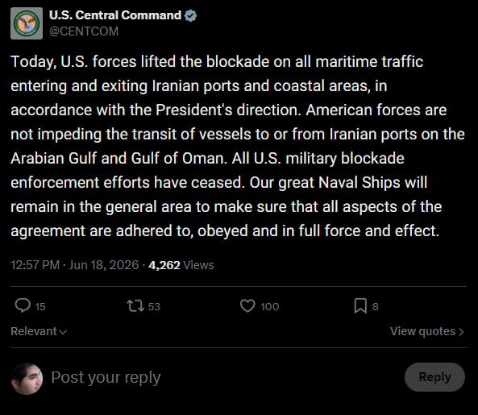

اعلام پایان محاصره دریایی

پست سنتکام، فرماندهی مرکزی ایالات متحده، ترجمه ماشین:
امروز، نیروهای آمریکا مطابق دستور رئیس‌جمهور، محاصره‌ی همه‌ی رفت‌وآمدهای دریایی به مقصد بنادر و مناطق ساحلی ایران و از مبدأ آن‌ها را رفع کردند.

نیروهای آمریکایی مانع عبور کشتی‌ها به سوی بنادر ایران در خلیج فارس و خلیج عمان، یا خروج از آن‌ها، نمی‌شوند.
همه‌ی تلاش‌های نظامی آمریکا برای اجرای محاصره متوقف شده است.

کشتی‌های بزرگ نیروی دریایی ما در منطقه‌ی کلی باقی خواهند ماند تا اطمینان حاصل شود که همه‌ی جنبه‌های توافق رعایت، اجرا و به‌طور کامل لازم‌الاجرا و مؤثر باقی می‌ماند.
CENTCOM
البته سنتکام ننوشته خلیج «فارس»

🔄 آپدیت:
توییت رو ویرایش کردند و در نسخه جدید اون جمله مربوط به خلیج فارس رو کلا حذف کردند.
CENTCOM

📡 @VahidOnline

## VahidOnline — post 76487

  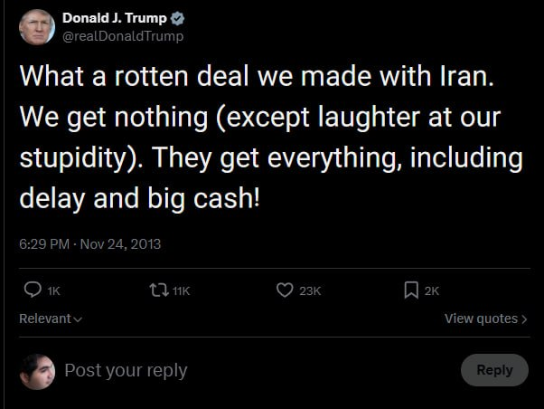

این توییت ۹ سال پیش ترامپ داره توجه می‌گیره: ایران به آخر خط رسیده بود و آماده فروپاشی بود، تا این‌که آمریکا از راه رسید و در قالب «توافق ایران» به آن یک طناب نجات داد: ۱۵۰ میلیارد دلار. realDonaldTrump 📡 @VahidOnline

## VahidOnline — post 76485

  <a href="telegram/content/VahidOnline_76485_1781816361.mp4" target="_blank">🎬 Download video</a>

محمدباقر قالیباف، رئیس مجلس شورای اسلامی در ایران که ریاست هیئت مذاکره‌کننده ایرانی با نمایندگان آمریکا را برعهده داشت، عصر چهارشنبه در مصاحبه‌ای مفصل با تلویزیون حکومتی در ایران به نهایی شدن تفاهمنامه میان تهران و واشنگتن واکنش نشان داد و آن را موفقیتی بسیار بزرگتر از مقابله نظامی با ایالات متحده دانست.

او در مورد دستاوردهای ایران گفت: «هر آنچه را که با اقدام نظامی می‌خواستیم به دست بیاوریم، چندین برابر آن را از طریق مذاکره گرفتیم؛ اصلا قابل قیاس نبود. هر جنگی ممکن است پیروزی‌هایی داشته باشد، اما اگر این پیروزی‌ها در نهایت به یک سند حقوقی و سیاسی منجر و ثبت نشود، هیچ منفعتی نخواهد داشت.»
او در بخشی از صحبت‌های خود درباره انتقام کشته شدن علی خامنه‌ای گفت: «همان‌طور که خونخواهی امام حسین، ظهور امام زمان است، خونخواهی رهبر شهید هم آزادی قدس است... صد نتانیاهو بند کفش امام شهید ما هم نمی‌شود.»
قالیباف در مورد وضعیت تنگه هرمز هم گفت: «تنگه هرمز هرگز به شرایط قبل بازنخواهد گشت. البته این به آن معنا نیست که ما در تنگه هرمز بخواهیم برخلاف قوانین بین‌المللی و مقررات دریانوردی عمل کنیم.»
@VahidHeadline
قالیباف در مصاحبه‌ای که همزمان با انتشار مفاد تفاهم‌نامه تهران و واشنگتن از صداوسیما پخش شد، گفت برای حضور در مذاکرات با دولت دونالد ترامپ تمایلی نداشت و به دلیل نقش ترامپ در کشتن قاسم سلیمانی، «کراهت شدید» برای ورود به این روند احساس می‌کرد. او افزود که با وجود این مخالفت شخصی، به درخواست مقام‌های جمهوری اسلامی مسئولیت مذاکرات را پذیرفت.
@VahidOOnLine

📡 @VahidOnline

## kianmeli1 — post 88073

‏🔴ایتامار بن‌گویر، وزیر امنیت ملی اسرائیل، در واکنش به انتقادهای جی‌دی ونس، معاون رییس‌جمهوری آمریکا، گفت جمهوری اسلامی باید همان‌گونه که آمریکا در جنگ جهانی دوم با آلمان نازی برخورد کرد، هدف قرار گیرد. بن‌گویر در پاسخ به اظهارات ونس گفت: «با نازی‌های قرن بیست‌ویکم همان‌گونه برخورد کنید که با نازی‌ها در جنگ جهانی دوم برخورد شد»

⚠️منظور بن گویر: در جنگ جهانی دوم شهرها، کارخانه‌ها، زیرساخت‌ها و تأسیسات نظامی آلمان هدف بمباران گسترده قرار گرفتند.
نیروهای متفقین از غرب و Soviet Union از شرق به آلمان حمله کردند.
تخریب توان نظامی و صنعتی
کارخانه‌های اسلحه‌سازی، پالایشگاه‌ها، شبکه حمل‌ونقل و مراکز فرماندهی هدف قرار گرفتند تا آلمان توان ادامه جنگ را از دست بدهد
https://t.me/kianmeli1

## kianmeli1 — post 88072

🔴المیادین به نقل از یک منبع آگاه گزارش داد هیات مذاکره‌کننده جمهوری اسلامی به دلیل ادامه حملات اسرائیل به جنوب لبنان، سفر خود به سوئیس برای آغاز نخستین دور مذاکرات ۶۰ روزه را به حالت تعلیق درآورده است.
المیادین افزود: تهران پیش‌تر به آمریکا و میانجی‌ها اطلاع داده بود که پرونده لبنان در ادامه یا توقف مذاکرات نقشی محوری دارد و هشدار داده است حملات اسرائیل تا عمق ۱۰ کیلومتری خاک لبنان نقض یادداشت تفاهم و توافق چارچوب است.
https://t.me/kianmeli1

## kianmeli1 — post 88071

  

🔴مجتبی خامنه‌ای در پیامی درباره تفاهم‌نامه میان آمریکا و جمهوری اسلامی گفت: «بنده علی‌الاصول، نظر دیگری داشتم اما از باب تعهدی که مسعود پزشکیان به‌عنوان رییس شورای عالی امنیت ملی از طرف خود و سایر اعضا به من داد و مسئولیت آن را قبول کرد اجازه آن را صادر کردم.»
خامنه‌ای افزود: «پزشکیان گفت اگر طرف آمریکایی بخواهد زیاده‌خواهی کند زیر بار آن نخواهند رفت.»
رهبر جمهوری اسلامی اضافه کرد: «بدیهی است مذاکرات حضوری که در آینده برقرار خواهد شد، به معنی پذیرش نظر دشمن نخواهد بود.»
https://t.me/kianmeli1

## kianmeli1 — post 88070

‏🔴سنتکام اعلام کرد، نیروهای آمریکایی محاصره اعمال‌شده بر تمامی ترددهای دریایی ورودی و خروجی به بنادر و مناطق ساحلی ایران را لغو کرده‌اند
https://t.me/kianmeli1

## kianmeli1 — post 88069

  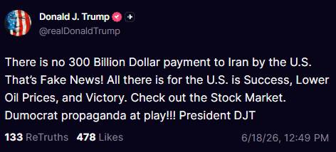

🔴رئیس جمهور ترامپ می‌گوید «هیچ پرداخت ۳۰۰ میلیارد دلاری از سوی آمریکا به ایران وجود ندارد.»

ترامپ می‌گوید: «تمام چیزی که برای آمریکا وجود دارد موفقیت، کاهش قیمت نفت و پیروزی است. به بازار سهام نگاهی بیندازید.»
https://t.me/kianmeli1

## kianmeli1 — post 88068

  <a href="telegram/content/kianmeli1_88068_1781816364.mp4" target="_blank">🎬 Download video</a>

🔴معاون ترامپ: دو سوم سلاح‌های اسرائیل ساخت آمریکاست

طی سه ماه گذشته، دو‌سوم از سلاح‌های دفاعی که از اسرائیل محافظت کرده‌اند، توسط دستان آمریکایی ساخته شده و هزینه‌ی آن از مالیات مردم آمریکا پرداخت شده است.

مشکل اسرائیل ترامپ نیست و هر کسی در اسرائیل که فکر می‌کند بزرگ‌ترین مشکلش رئیس‌جمهور ایالات متحده است، باید از خواب بیدار شود و واقعیتِ موقعیتی که کشورش در آن قرار دارد را درک کند.
https://t.me/kianmeli1

## kianmeli1 — post 88067

🔴فایننشال تایمز : گزارش شده است که ایران به ۶ میلیارد دلار از دارایی‌ های بلوکه‌ شده خود دسترسی خواهد داشت تا کالاهای آمریکایی خریداری کند.
https://t.me/kianmeli1

## IranIntlTV — post 343109

  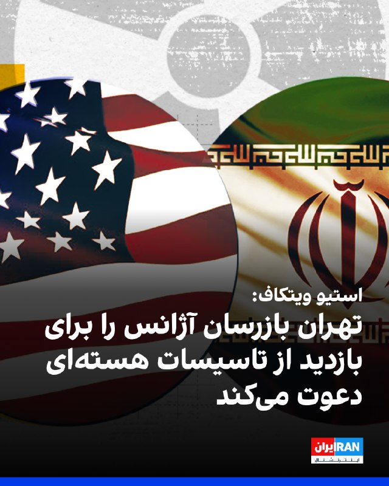

خبرگزاری آسوشیتدپرس گزارش داد استیو ویتکاف، فرستاده دونالد ترامپ، در نشستی غیرعلنی با قانون‌گذاران آمریکایی اعلام کرده است تهران از آژانس بین‌المللی انرژی اتمی برای بازرسی از تاسیسات هسته‌ای خود دعوت خواهد کرد و روند شناسایی محل نگهداری مواد غنی‌شده را آغاز می‌کند.

بر اساس این گزارش، ویتکاف به رهبران کنگره و اعضای کمیته‌های امنیت ملی گفته است تفاهم‌نامه میان آمریکا و ایران هیچ توافق جانبی نداشته، اما تهران و آژانس بین‌المللی انرژی اتمی نامه‌ای جداگانه تنظیم کرده‌اند که در آن این دعوت مطرح شده است.
https://iranintl.com/202606181849

## IranIntlTV — post 343108

  <a href="telegram/content/IranIntlTV_343108_1781816367.mp4" target="_blank">🎬 Download video</a>

سازمان اتحاد علیه ایران هسته‌ای با امضای تفاهم‌نامه میان آمریکا و جمهوری اسلامی مخالفت کرده و گفته متن آن مبهم است و باید بر اساس اقدامات واقعی ایران قضاوت شود. این سازمان هشدار داده رفع تحریم‌ها و محدودیت‌ها می‌تواند اهرم فشار آمریکا را تضعیف کند.
@iranintltv

## IranIntlTV — post 343107

  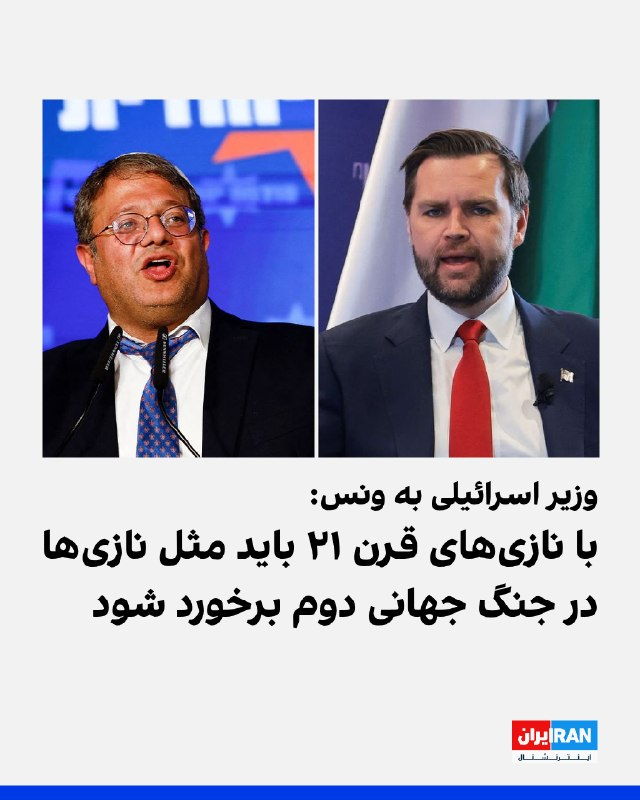

ایتامار بن‌گویر، وزیر امنیت ملی اسرائیل، در واکنش به انتقادهای جی‌دی ونس، معاون رئیس‌جمهوری آمریکا، گفت جمهوری اسلامی باید همان‌گونه که آمریکا در جنگ جهانی دوم با آلمان نازی برخورد کرد، هدف قرار گیرد.
بن‌گویر در پاسخ به اظهارات ونس گفت: «با نازی‌های قرن بیست‌ویکم همان‌گونه برخورد کنید که با نازی‌ها در جنگ جهانی دوم برخورد شد.»
پیش‌تر ونس درباره مخالفان یادداشت تفاهم تهران و واشینگتن در کابینه اسرائیل گفت: «دونالد ترامپ در حال حاضر تنها رهبر جهان است که همدلی عمیقی با ملت اسرائیل دارد و در عین حال رییس‌جمهوری قدرتمندترین کشور جهان است. اگر من عضو کابینه اسرائیل بودم، احتمالا به تنها متحد قدرتمندی که در جهان دارم حمله نمی‌کردم.»

https://iranintl.com/202606186975

## IranIntlTV — post 343106

  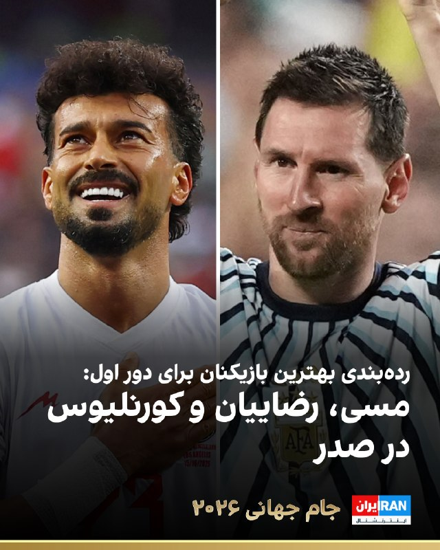

🔻فیفا در پایان دور اول جام جهانی ۲۰۲۶، رده‌بندی «قدرت» را منتشر کرد. در این ارزیابی، لیونل مسی پس از هت‌تریک مقابل الجزایر در صدر بخش حمله قرار گرفت.

🔹رامین رضاییان پس از نمایش درخشان مقابل نیوزیلند، صدرنشین بخش خلاقیت شد. درک کورنلیوس، مدافع کانادا، در رتبه نخست بخش دفاع ایستاد.

🔹مسی ۶۰ درصد شوت‌های آرژانتین، تمام ضربات در چارچوب و هر سه گل این تیم را به نام خود ثبت کرد. سه گل آرژانتین از مجموع ۱.۵۸ گل مورد انتظار (xG) به دست آمد که نشان‌دهنده دقت بالای این ستاره در گل‌زنی است.

🔹رامین رضاییان، عامل اصلی پیشروی حملات ایران مقابل نیوزیلند بود. رضاییان ۱۶ پاس پیش‌رونده ارسال کرد و ۱۳ بار خطوط میانی و دفاعی نیوزیلند را شکست.

🔹تاثیر او در یک‌سوم هجومی زمین نیز ادامه داشت؛ جایی که گل نخست تساوی ایران را به ثمر رساند و در گل دوم نیز نقش مستقیم ایفا کرد.

🔹در رتبه دوم این بخش، مایکل اولیسه، وینگر فرانسه، قرار گرفت.

🔹جزییات بیشتر این رده‌بندی را در وب‌سایت بخوانید.

@iranintltvsport

## IranIntlTV — post 343105

  <a href="telegram/content/IranIntlTV_343105_1781816370.mp4" target="_blank">🎬 Download video</a>

یک شهروند با ارسال پیامی صوتی به ایران اینترنشنال گفت: «قرار نبود ترامپ دست حکومت را بگیرد. همین حالا هم اگر او کنار برود، مردم حکومت را به سقوط خواهند کشاند.»

## IranIntlTV — post 343104

ویدیوی رسیده به ایران اینترنشنال نشان می‌دهد مادر جاویدنام متین پرویزی،‌ از کشته‌شدگان انقلاب ملی، بر سر مزار فرزند جوانش با اشاره به فرا رسیدن ماه «محرم» می‌گوید که به فرزندش آموخت شرافت داشته باشد. او گفت که فرزندش «گرسنه و ندار» نبود و «اعتراض داشت.» متین پرویزی ۱۸ دی در زنجان با گلوله ماموران و حین کمک به یک مادر و کودک کشته شد.

## IranIntlTV — post 343103

  

حسین شریعتمداری، نماینده رهبر جمهوری اسلامی در روزنامه کیهان، گفت: «با اعمال حاکمیت بر تنگه هرمز، امکان توقیف اموال متعلق به آمریکا و متحدانش وجود دارد.»

او افزود: «آمریکا به هیچ عهد و پیمانی پایبند نیست و به‌راحتی به جمهوری اسلامی غرامت پرداخت نخواهد کرد.»

شریعتمداری همچنین گفت: «پاسخ به محاصره دریایی آمریکا، شلیک موشک‌های ۲۵۰۰ کیلومتری با کلاهک سنگین به سمت باب‌المندب است.»
https://iranintl.com/202606188788

## IranIntlTV — post 343102

  <a href="telegram/content/IranIntlTV_343102_1781816374.mp4" target="_blank">🎬 Download video</a>

جیسون برادسکی، مدیر سیاست‌گذاری سازمان اتحاد علیه ایران هسته‌ای، گفت: «نمی‌توانیم از متن فعلی این تفاهم‌نامه حمایت کنیم، زیرا با سیاست "فشار حداکثری" ایالات متحده سازگار نیست و پیش از دریافت تعهدات روشن و قابل راستی‌آزمایی، امتیازهای زیادی به جمهوری اسلامی داده است.»
@iranintltv

## IranIntlTV — post 343101

  <a href="telegram/content/IranIntlTV_343101_1781816376.mp4" target="_blank">🎬 Download video</a>

در پیامی منتسب به مجتبی خامنه‌ای درباره تفاهم با آمریکا آمده است که او نظر دیگری داشته، اما در نهایت اجازه امضای توافق داده شده است.
هم‌زمان با ادامه هشدارهای کاخ سفید به جمهوری اسلامی، پیت هگست، وزیر جنگ آمریکا، گفته امضای یادداشت تفاهم به معنای کنار گذاشته شدن گزینه نظامی نیست.
@iranintltv

## IranIntlTV — post 343100

  

المیادین به نقل از یک منبع آگاه گزارش داد هیات مذاکره‌کننده جمهوری اسلامی به دلیل ادامه حملات اسرائیل به جنوب لبنان، سفر خود به سوئیس برای آغاز نخستین دور مذاکرات ۶۰ روزه را به حالت تعلیق درآورده است.
المیادین افزود: تهران پیش‌تر به آمریکا و میانجی‌ها اطلاع داده بود که پرونده لبنان در ادامه یا توقف مذاکرات نقشی محوری دارد و هشدار داده است حملات اسرائیل تا عمق ۱۰ کیلومتری خاک لبنان نقض یادداشت تفاهم و توافق چارچوب است.
https://iranintl.com/202606181484

## IranIntlTV — post 343099

  <a href="telegram/content/IranIntlTV_343099_1781816379.mp4" target="_blank">🎬 Download video</a>

جمشید برزگر، روزنامه‌نگار و تحلیل‌گر سیاسی، درباره پیام منتسب به مجتبی خامنه‌ای در رابطه با تفاهم‌نامه جمهوری اسلامی و آمریکا گفت: «یکی از مهم‌ترین میراث‌های سیاسی که از علی خامنه‌ای در ساختار جمهوری اسلامی باقی مانده، شیوه مدیریت مسئولیت است؛ یعنی همزمان نقش تعیین‌کننده داشتن، اما مسئولیت نپذیرفتن.»

او افزود: «در کنار مسئولیت‌گریزی، حفظ توازن میان جناح‌ها و مراکز قدرت نیز اهمیت دارد. در این پیام نه‌تنها مسئولیت به گردن پزشکیان انداخته شده، بلکه به نوعی از قالیباف نیز حمایت و حفاظت می‌شود.»
@iranintltv

## IranIntlTV — post 343098

🗣روایت شما درباره توافق میان جمهوری اسلامی و آمریکا - پنجشنبه ۲۸ خرداد ۱۴۰۵

🔹ترامپ سپاه پاسداران را گروه تروریستی خواند، بعد با همان گروه تروریستی تفاهم کرد و منتقدان را احمق خواند. آقای ترامپ، کاشکی ۳۰ روز صبر می‌کردید تا به یک جایی می‌رسیدید.

🔹از تهران پیام می‌دهم: اینجا هر شب شعار می‌دهند که برنده شدیم، برنده شدیم. کل جمعیتشان ۲۰ نفر است. ولی شب ۱۸ و ۱۹ دی... با ترامپ شروع نشد که با ترامپ تمام بشود. جاوید شاه.

🔹ترامپ عزیز، آمدی محل‌های سرکوب را زدی، جایش پولی که پول خون مردم، پول جوانی مردم، پول تحمل فقر مردم بود و دوست داشتیم روزی برای آبادانی مملکت خرج بشود را داری می‌دهی که مراکز سرکوب جدیدتر و مجهزتر بسازند. چه کردی با مردم ایران؟

🔹از اراک: به‌نظر من این مذاکرات برجام دو به نتیجه نمی‌رسد و صرفاً وقت خریدن برای طرفین است.

🔹از تبریز. ما مردم جمهوری اسلامی را نمی‌خواهیم. ۴۷ سال بدبختی، گرانی و فلاکت برای مردم آوردند؛ دیگر بس است. یک عمر صبر کردیم، یک عمر تاوان دادیم. ما هم حق داریم یک نفس عمیق بکشیم، زندگی کنیم و آینده‌ای بهتر برای ایران داشته باشیم.

🔹جای مردم ایران، جای جاویدنام‌ها، جای زندانیان سیاسی و عزیزانی که ۱۸ و ۱۹ دی و بعد از آن دستگیر شدند و زیر شکنجه هستند و هر روز اعدام می‌شوند، در این تفاهم کجاست؟ آقای ترامپ، طلبکار نیستیم ولی خودت را با ریگان مقایسه نکن!!

🔹از کرمانشاه. ما ایرانیان مبارز هیچ کمکی از آمریکا نداشتیم اما از شاهزاده پهلوی توقع داشتیم همه ملت و اقوام با عقاید مختلف را متحد کند تا در یک شورش سراسری به آزادی برسیم، حتی اگر جانمان فدا می‌شد. حیف که فرصت‌سوزی می‌کنند.

## IranIntlTV — post 343097

  <a href="telegram/content/IranIntlTV_343097_1781816382.mp4" target="_blank">🎬 Download video</a>

جی‌دی ونس، معاون رییس‌جمهوری آمریکا، گفت: «آمریکا همچنان از حق اسرائیل برای دفاع از خود حمایت می‌کند، اما اسرائیل نیز مانند سایر طرف‌ها باید به روند صلحی که در حال شکل‌گیری است و به حاکمیت لبنان احترام بگذارد.»

او تاکید کرد: «برای دستیابی به ثبات پایدار، باید سازوکاری منطقه‌ای ایجاد شود که منابع مالی حزب‌الله را محدود کند، حمایت ایران از این گروه را متوقف سازد و در عین حال حاکمیت و تمامیت ارضی لبنان حفظ شود.»
@iranintltv

## IranIntlTV — post 343096

  

یسرائیل کاتز، وزیر دفاع اسرائیل، گفت اسرائیل توانایی انجام عملیات مستقل علیه جمهوری اسلامی را دارد و در هر لحظه برای اجرای یک «عملیات آبی و سفید» در ایران آماده است.

او افزود: «ما هرگز از آمریکا نخواستیم در غزه، لبنان یا سوریه همراه ما بجنگد. تنها چیزی که می‌خواهیم، حمایت سیاسی و دیپلماتیک است که از ما محافظت کند.»

کاتز با اشاره به نتایج حملات اخیر گفت: «قدرت ایران را درهم شکستیم، رهبران، دانشمندان هسته‌ای و زیرساخت‌ها را هدف قرار دادیم و برنامه هسته‌ای ایران را از بین بردیم. اکنون باید اطمینان حاصل کنیم که این برنامه دوباره احیا نشود.»

وزیر دفاع اسرائیل همچنین گفت دونالد ترامپ، رییس‌جمهوری آمریکا، اسرائیل را «متحد نمونه» توصیف کرده است. به گفته او، اسرائیل تنها کشوری است که چنین عنوانی دریافت کرده است.
کاتز افزود: «هیچ‌یک از کشورهای ناتو در زمان نیاز در کنار آمریکا نایستادند، اما اسرائیل در کنار آمریکا بود و همچنان هست.»
https://iranintl.com/202606184073

## IranIntlTV — post 343095

  <a href="telegram/content/IranIntlTV_343095_1781816385.mp4" target="_blank">🎬 Download video</a>

جی‌دی ونس، معاون رییس‌جمهوری آمریکا، گفت: «این توافق با برجام تفاوت‌های اساسی دارد. کشورهای عربی خلیج فارس که با برجام مخالف بودند، از توافق جدید استقبال کرده‌اند زیرا معتقدند ایران را در موقعیت ضعیف‌تری قرار می‌دهد.»

او افزود: «برخلاف برجام، این توافق حق غنی‌سازی در خاک ایران را به رسمیت نمی‌شناسد و قرار است ذخایر مواد غنی‌شده نیز از بین بروند یا از دسترس خارج شوند.»

ونس تاکید کرد: «حامیان این توافق معتقدند آمریکا این بار از موضع قدرت و با تکیه بر فشار نظامی، اقتصادی و دیپلماتیک وارد مذاکره شده و به همین دلیل نتیجه آن را متفاوت از برجام می‌دانند.»
@iranintltv

## IranIntlTV — post 343094

  <a href="telegram/content/IranIntlTV_343094_1781816387.mp4" target="_blank">🎬 Download video</a>

جی‌دی ونس، معاون رییس‌جمهوری آمریکا، گفت: «رویکرد ما جامع خواهد بود و رفتار جمهوری اسلامی را در مجموع ارزیابی خواهیم کرد؛ از جمله اینکه آیا همچنان از گروه‌های تروریستی حمایت مالی می‌کند، به دیگران حمله می‌کند یا به سمت احیای برنامه هسته‌ای خود بازمی‌گردد.»

او تاکید کرد: «اگر رفتار آنها تغییر کند، ما آماده کمک خواهیم بود، اما اگر تغییر نکند، همه اهرم‌های فشار اقتصادی، دیپلماتیک و نظامی همچنان در اختیار ما باقی خواهد ماند.»
@iranintltv

## IranIntlTV — post 343093

  <a href="telegram/content/IranIntlTV_343093_1781816389.mp4" target="_blank">🎬 Download video</a>

یک شهروند از استان گلستان با ارسال ویدیویی به ایران اینترنشنال به قطع برق منزل خود اشاره کرده و به طعنه درباره دفن نشدن جنازه علی خامنه‌ای می‌گوید: «ما نگران خودمان نیستیم نگرانیم جنازه حضرت آقا بو نگیرد.»

## IranIntlTV — post 343092

  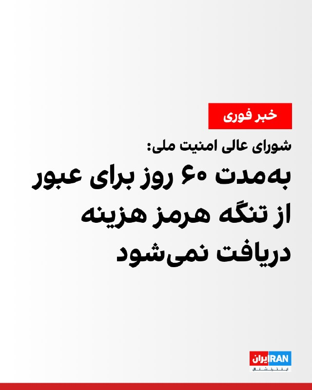

شورای عالی امنیت ملی در بیانیه‌ای اعلام کرد: «در اجرای بند ۵ یادداشت تفاهم اسلام‌آباد، کشتی‌های تجاری متقاضی عبور از تنگه هرمز باید درخواست خود را به مدیریت آبراه خلیج فارس ارسال نمایند. به مدت شصت روز، هیچ‌گونه هزینه‌ای از متقاضیان اخذ نخواهد شد و این هزینه‌ها توسط دولت جمهوری اسلامی ایران تأمین می‌گردد.»
در این بیانیه آمده است: «بر این اساس به مدیریت آبراه خلیج فارس دستور داده شده است، در جهت تحقق اهداف تفاهم‌نامه درخواست‌ها را با سرعت و اولویت رسیدگی و پاسخ دهد. با توجه به شرایط خاص و وجود برخی مخاطرات ایمنی در مسیر عبور و به دلیل لزوم حصول اطمینان از تردد ایمن و جلوگیری از حوادث دریایی، لازم است کشتی‌ها در مسیر و زمان اعلامی به آنها عبور نمایند تا به تدریج، امکان تردد افزایش یابد.»
شورای عالی امنیت ملی افزود: «ترتیبات اجرایی و جزییات فنی عبور از تنگه هرمز از طریق مدیریت آبراه خلیج فارس اعلام می‌گردد. در خصوص سایر موضوعات، از جمله مین‌زدایی، اقدامات لازم مطابق بند ۵ یادداشت تفاهم اسلام‌آباد انجام خواهد شد.»
https://iranintl.com/202606188126

## IranIntlTV — post 343091

  <a href="https://t.me/IranintlTV/343091" target="_blank">📎 Download file</a>

🎧نسخه صوتی دومینو: گفتگو برای عبور از عصر خامنه‌ای
@iranintlTV

## IranIntlTV — post 343090

  <a href="telegram/content/IranIntlTV_343090_1781816393.mp4" target="_blank">🎬 Download video</a>

۲۴ با فرداد فرحزاد
@iranintltv

## Iliaen — post 4495

  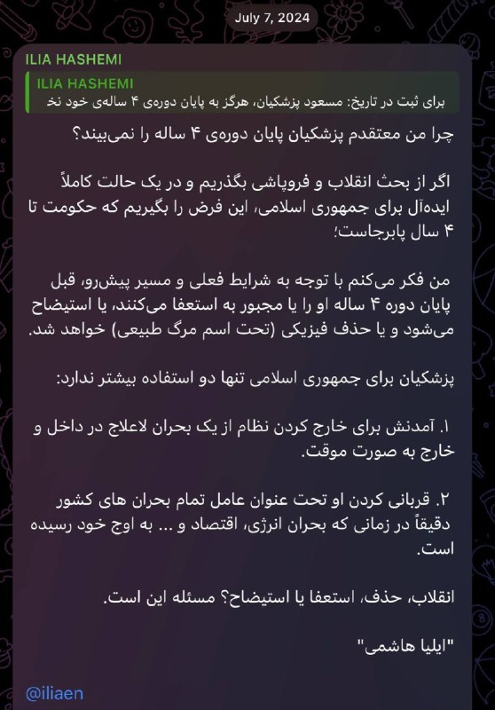

چرا من معتقدم پزشکیان پایان دوره‌ی ۴ ساله را نمی‌بیند؟ اگر از بحث انقلاب و فروپاشی بگذريم و در یک حالت کاملاً ایده‌آل برای جمهوری اسلامی، این فرض را بگیریم که حکومت تا ۴ سال پابرجاست؛ من فکر می‌کنم با توجه به شرایط فعلی و مسیر پیش‌رو، قبل پایان دوره‌ ۴ ساله‌…

## ManotoTV — post 106163

  <a href="telegram/content/ManotoTV_106163_1781816395.mp4" target="_blank">🎬 Download video</a>

‌
ترامپ در پاسخ به پرسشی درباره حمله به مدرسه میناب در روز نخست جنگ که به کشته شدن بیش از ۱۰۰ کودک منجر شد، گفت این موضوع در دست بررسی است و «هیچ‌کس عمداً چنین کاری نکرده است.»

او با تأکید بر این‌که «در جنگ اشتباه رخ می‌دهد» و «جنگ کثیف است»، در ادامه به کشته‌شدگان حملات ایران اشاره کرد و گفت گزارش این پرونده می‌تواند به‌زودی منتشر شود. ترامپ همچنین خبرنگاران را برای جزئیات بیشتر به پیت هگست، وزیر جنگ آمریکا، ارجاع داد.

## ManotoTV — post 106162

  <a href="telegram/content/ManotoTV_106162_1781816397.mp4" target="_blank">🎬 Download video</a>

ترامپ در پاسخ به پرسشی درباره باقی ماندن بخشی از توان موشکی جمهوری اسلامی گفت آمریکا «۸۴ تا ۸۵ درصد» موشک‌های ایران را منهدم کرده و آنچه باقی مانده، عمدتاً زیر زمین است و بیرون آوردنش برای ایران آسان نخواهد بود.

او همچنین گفت بازسازی توان موشکی ایران زمان‌بر خواهد بود و تأکید کرد هدفش کشاندن جنگ به مرحله‌ای نبود که مردم ایران با بحران انسانی روبه‌رو شوند یا حمله به زیرساخت‌های نفتی و آب‌شیرین‌کن‌ها بازار جهانی را دچار بحران کند.

ترامپ در بخش دیگری از سخنانش، درباره برنامه هسته‌ای غیرنظامی جمهوری اسلامی گفت ایران از بزرگ‌ترین ذخایر نفت جهان برخوردار است و پرسید: «اصلاً برای چه به انرژی هسته‌ای نیاز دارد؟»

## FarsiVOA — post 221142

  <a href="telegram/content/FarsiVOA_221142_1781816400.mp4" target="_blank">🎬 Download video</a>

⚡️بازتاب تفاهم‌نامه جمهوری اسلامی و آمریکا در میان کاربران شبکه‌های اجتماعی
@FarsiVOA

## FarsiVOA — post 221141

🔺شرکت‌های ردیابی کشتی‌ها: عبور شناورها از تنگه هرمز پس از توافق آمریکا و جمهوری اسلامی آغاز شده است

◾️پس از امضای یادداشت تفاهم میان ایالات متحده و حکومت ایران برای پایان دادن به جنگ، شرکت‌های بزرگ کشتیرانی جهان عبور کشتی‌های خود از تنگه هرمز را از سر گرفته‌اند.

⬇️ بیشتر بخوانید:
https://ir.voanews.com/a/stranded-ships-began-transiting-strait-of-hormuz/8162333.html
@FarsiVOA

## FarsiVOA — post 221140

⚡️علی جوانمردی: منتقدین تفاهم آمریکا و جمهوری اسلامی!
@FarsiVOA

## FarsiVOA — post 221139

⚡️حال و هوای تورنتو در روزی که مسی تاریخ‌ساز شد
@FarsiVOA

## FarsiVOA — post 221138

🔺کاهش شدید قیمت نفت پس از امضای یادداشت تفاهم؛ بنزین در آمریکا ارزان شد

◾️قیمت نفت، پس از امضای توافق دونالد ترامپ، رئیس‌ جمهوری آمریکا، با مسعود پزشکیان، رئیس‌ دولت جمهوری اسلامی در ایران، برای پایان دادن به جنگ در خاورمیانه در روز پنج‌شنبه ۲۸ خرداد رو به کاهش است.

⬇️ بیشتر بخوانید:

https://ir.voanews.com/a/iran-us-oil-gas-price-mou/8162302.html

## FarsiVOA — post 221137

🔺جمهوری اسلامی ۷ دانشجوی معترض شریف را از ادامه تحصیل محروم کرد

◾️جمهوری اسلامی در ادامه سرکوب مخالفان و معترضان و فعالان، هفت تن از دانشجویان معترض دانشگاه صنعتی شریف تهران را به اتهام «انتشار مطلب در فضای مجازی» و «پرونده‌های مرتبط با اعتراضات دی‌ ۱۴۰۴» از حق ادامه تحصیل محروم کرد.

⬇️ بیشتر بخوانید:

https://ir.voanews.com/a/iran-student-university-protesters-prison-sharif/8162264.html

## FarsiVOA — post 221136

🔺پرزیدنت ترامپ: همه را در خاورمیانه تشویق می‌کنیم به «پیشبرد مذاکرات» متعهد بمانند

◾️پرزیدنت ترامپ، اعلام کرد که آمریکا انتظار دارد آتش‌بس کامل در همه جبهه‌ها، از جمله لبنان، حزب‌الله، و اسرائیل، برقرار باشد.

⬇️ بیشتر بخوانید:

https://ir.voanews.com/a/ceasefire-israel-donald-trump-hezbollah-lebanon/8162308.html

## FarsiVOA — post 221135

🔺آمریکا چند مقام لبنانی همسو با حزب‌الله و اعضای یک شبکه تجاری مرتبط با حزب‌الله را تحریم کرد

◾️دفتر کنترل دارایی‌های خارجی وزارت خزانه‌داری آمریکا «اوفک» مقامات لبنانی همسو با حزب‌الله و همچنین اعضا و طرف‌های یک شبکه تجاری مرتبط با حزب‌الله را تحریم کرد.

⬇️ بیشتر بخوانید:

https://ir.voanews.com/a/ofac-sanctaion-hizballah-aligned-lebanese-officials/8162304.html

## FarsiVOA — post 221134

🔺سنتکام: محاصره دریایی پایان یافت؛ ناوهای آمریکایی برای نظارت بر اجرای توافق در منطقه باقی می‌مانند

◾️فرماندهی مرکزی ایالات متحده «سنتکام» روز پنجشنبه ۲۸ خرداد اعلام کرد نیروهای آمریکایی به دستور رئیس جمهوری ایالات متحده محاصره دریایی جمهوری اسلامی را پایان داده‌اند.

⬇️ بیشتر بخوانید:

https://ir.voanews.com/a/centcom-lifts-naval-blockade-of-iran/8162297.html

## FarsiVOA — post 221133

در پی حمله نیروهای نظامی به تجمع ساکنان روستای پشموکی کرمان، دست‌کم هفت زن بلوچ زخمی و سه زن بازداشت شدند. این تجمع در اعتراض به نحوه واگذاری و بهره‌برداری از معدن کرومیت برگزار شد.

## FarsiVOA — post 221132

🔺معاون رئیس جمهوری آمریکا: بهره‌مندی از مزایای تفاهم‌نامه به تغییر رفتار حکومت ایران بستگی دارد

◾️معاون رئیس جمهوری آمریکا روز پنجشنبه ۲۸ خرداد در یک کنفرانس خبری در کاخ سفید با اشاره به امضای تفاهم‌نامه میان مقامات ارشد آمریکا و رژیم ایران گفت که مهلت ۶۰ روزه تبدیل تفاهم به توافق، از امروز آغاز می‌شود و تنها راه برخورداری ایران از مزایای این تفاهم، تغییر رفتار رژیم است.

⬇️ بیشتر بخوانید:

https://ir.voanews.com/a/jd-vance-iranian-behavior-change-memorandum/8162293.html

## FarsiVOA — post 221131

🔺دونالد ترامپ: خبر پرداخت ۳۰۰ میلیارد دلار توسط آمریکا به حکومت ایران «جعلی» است

◾️پرزیدنت ترامپ گزارش‌ها درباره پرداخت صدها میلیارد دلار پول توسط آمریکا به حکومت ایران را «جعلی» خواند.

⬇️ بیشتر بخوانید:

https://ir.voanews.com/a/president-trump-memorandum-payment-of-300-billion-iran-united-states/8162296.html

## FarsiVOA — post 221130

آغاز مذاکرات اجرایی جمهوری اسلامی و آمریکا از فردا در سوئیس؛ تمرکز بر جزئیات تفاهم‌نامه و کاهش تنش

## FarsiVOA — post 221129

کامبک با اجرای آرش آرا و ونوس مرادی تا پایان جام جهانی هر شب ساعت ۲۳ به وقت ایران

## FarsiVOA — post 221128

جی‌دی ونس، معاون رئیس‌ جمهوری آمریکا در یک کنفرانس خبری گفت که دوره ۶۰ روزه درنظر گرفته شده در تفاهم‌نامه با ایران از امروز آغاز می‌شود. او افزود تا زمانی که رفتار حکومت ایران عوض نشود، پولی به دستشان نمی‌رسد. برشی از پوشش ویژه با ترجمه همزمان پژواک کیومرثی

## FarsiVOA — post 221127

انتقاد تند وزیر جنگ آمریکا از ناتو بە دلیل مواضعش در قبال عملیات نظامی خشم حماسی

## FarsiVOA — post 221123

پیت هگست، وزیر جنگ آمریکا، تصاویری از حضور خود در نشست ناتو را منتشر کرد.

وزیر جنگ آمریکا اعلام کرد که اگر جمهوری اسلامی به تعهداتش در توافق صورت گرفته با واشنگتن پایبند نباشد، آمریکا آماده است دوباره اقدام نظامی را آغاز کند و محاصره دریایی را نیز دوباره اعمال کند.

پیشتر دونالد ترامپ، رئیس جمهوری آمریکا در یک کنفرانس خبری پس از نشست گروه هفت با تاکید بر این که جمهوری اسلامی هرگز به سلاح هسته‌ای دست پیدا نخواهد کرد افزود که این فقط یک تفاهم‌نامه است و اگر به نتیجه نرسید برخلاف میلمان مجبور به بمباران مجدد حکومت ایران خواهیم شد.

@FarsiVOA

## DW_Farsi — post 126157

  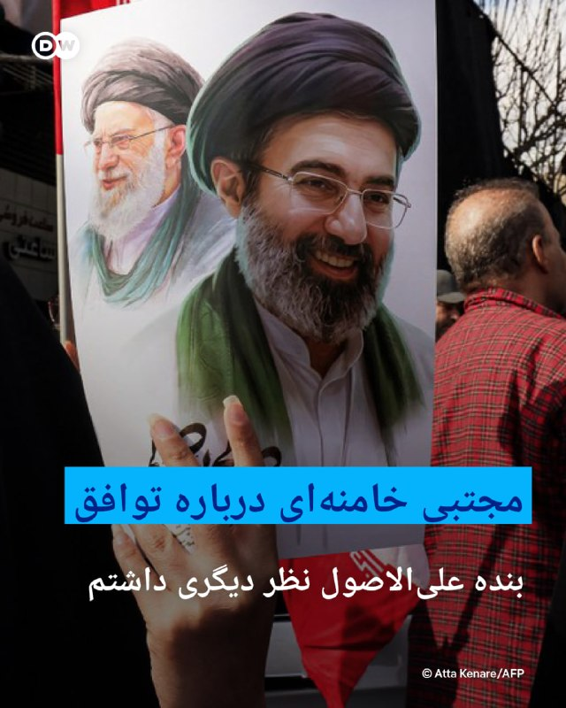

🔶 پیام مجتبی خامنه‌ای درباره توافق: بنده علی‌الاصول نظر دیگری داشتم

با گذشت چهار روز از امضای تفاهم‌نامه میان ایران و آمریکا، روز پنج‌شنبه ۲۸ خرداد پیامی منسوب به مجتبی خامنه‌ای درباره این تفاهم‌نامه منتشر شد.

در متن این پیام آمده است: «بنده علی‌الاصول، نظر دیگری داشتم ولی از باب تعهّدی که رئیس‌جمهور محترم به‌عنوان رئیس شورای عالی امنیّت ملّی از طرف خود و سایر اعضا در پاسداشت حقوق ملّت ایران و جبهه مقاومت به بنده دادند و تصریح به قبول مسئولیت آن نمودند، اجازه آن را صادر نمودم.»

او البته تاکید کرده که اگر طرف آمریکایی بخواهد "زیاده‌خواهی" کند زیر بار نخواهد رفت.

مجتبی خامنه‌ای پذیرش توافق را به معنای "پذیرش نظر دشمن" ندانسته و نوشته است: «از این لحظه، ما یعنی شما ملت سرافراز و این خادم ناچیز، منتظر تحقّق شروط گفته‌شده خواهیم بود.»
@dw_farsi

## DW_Farsi — post 126156

  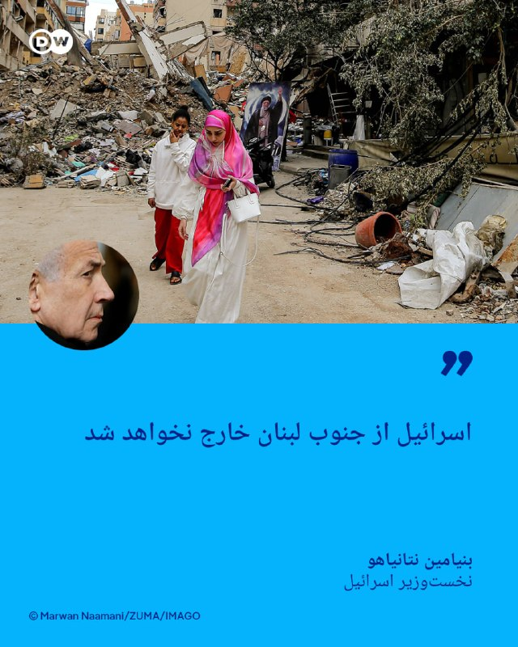

🔶 نتانیاهو: اسرائيل از جنوب لبنان خارج نخواهد شد

بنیامین نتانیاهو، نخست‌وزیر اسرائیل در یک سخنرانی تاکید کرد که نیروهای ارتش این کشور از جنوب لبنان خارج نخواهند شد و تا هر زمانی که لازم باشد منطقه امنیتی خود را در آنجا حفظ خواهند کرد.

نتانیاهو این سخنان را در مراسم افتتاح بزرگراهی که از ناصره تا بئرشِبع امتداد دارد و از کرانهٔ باختری عبور می‌کند ایراد کرد، بعد از آنکه دونالد ترامپ، رئیس جمهور امریکا این هفته حملات اسرائیل به لبنان را محکوم کرد و هم‌زمان توافقی را با ایران امضا کرد که پایان جنگ در لبنان یک بند مهم آن است.

نخست‌وزیر اسرائیل گفت: «ما امنیت و رفاه‌مان را در شهرهای شمالی بازسازی می‌کنیم و این نیازمند حفظ منطقه امنیتی در جنوب لبنان است و نیازمند آن است که ما آنجا را ترک نکنیم، تا زمانی که امنیت اسرائیل به آن نیاز دارد.»
@dw_farsi

## DW_Farsi — post 126155

  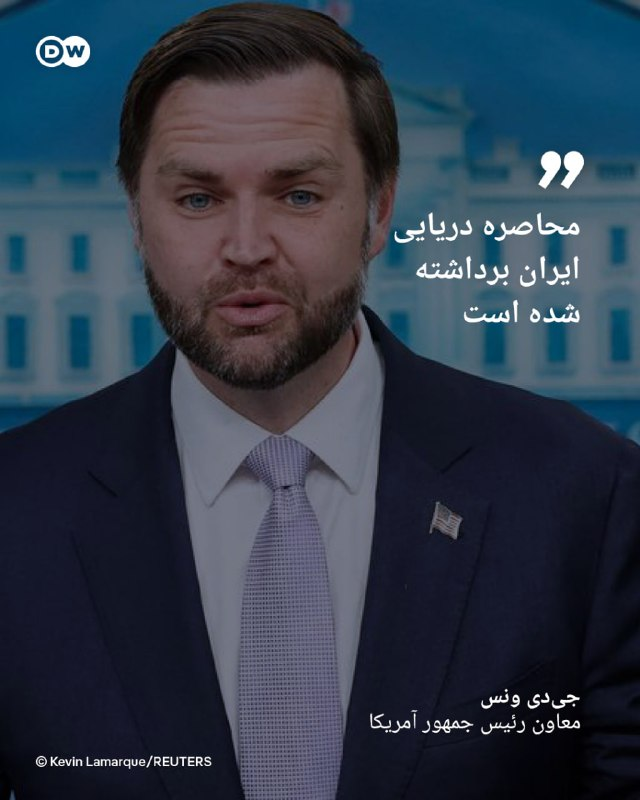

🔶 ونس: محاصره دریایی ایران برداشته شده است

جی‌دی ونس، معاون رئیس جمهور امریکا می‌گوید نیروی دریایی این کشور بیش از ۱۲ کشتی را برای رسیدن به بنادر ایران از تنگه هرمز عبور داده و به‌عنوان بخشی از توافق برای پایان جنگ، محاصره را برداشته است.

ونس این موضوع را روز پنجشنبه ۱۸ ژوئن در یک نشست خبری در کاخ سفید اعلام کرد و گفت اکنون نفت بیشتری از تنگه هرمز عبور می‌کند.

معاون ترامپ همچنین گفت بیش از ۱۲٫۵ میلیون بشکه نفت چهارشنبه‌شب از این گذرگاه دریایی عبور کرده است و ادامه داد: «بنابراین ما در حال عمل به بخش اولیه توافق از نظر نظامی هستیم.»

او این موضوع را یکی از مزایای فوری توافق دانست و انتقادهایی را که می‌گویند توافق به نفع ایران است، کم‌اهمیت دانست.

روز سه‌شنبه، دو نفتکش ایران را ترک کردند و بدون توقف از محاصرهٔ نظامی آمریکا عبور کردند.

یک وب‌سایت ردیابی کشتی‌های تجاری گزارش داد که این دو کشتی در مجموع ۳٫۸ میلیون بشکه نفت خام ایران را حمل می‌کردند.
@dw_farsi

## DW_Farsi — post 126154

  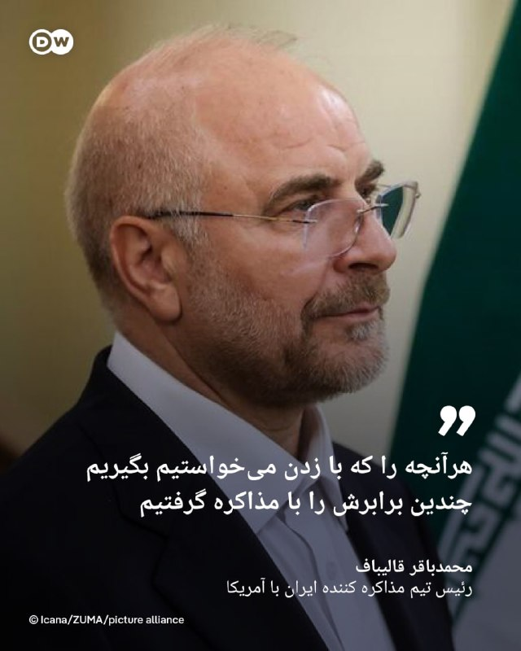

🔶 قالیباف: هرآنچه را که با زدن می‌خواستیم بگیریم چندین برابرش را با مذاکره گرفتیم

محمدباقر قالیباف، رئیس تیم مذاکره کننده ایران با امریکا در یک گفت‌وگو به پرسش‌هایی درباره تفاهم انجام شده میان ایران و آمریکا پاسخ داد.

او ابتدا درباره انتقاداتی که به شخص او مطرح شده گفت: «برای من اصلا راحت نبود که با قاتل قاسم سلیمانی بخواهم وارد مذاکره شوم اما وقتی تمام سران نظام یکصدا گفتند فقط تو، حتی من گفتم کس دیگری هم باشد اما گفتند فقط تو من فکر کردم ما باید آنچه را که وظیفه‌مان هست انجام دهیم نه آنچه را که دوست داریم.»

قالیباف پیش‌شرط‌هایی را که پیش از مذاکرات از سوی برخی جریان‌های داخل ایران مطرح شده و حتی در خیابان‌ها به عنوان پیش‌شرط مذاکرات به صورت بنر نصب شده بودند بی‌اساس دانسته و گفت: «دو موضوع اصلی ما که از ابتدابر آن اصرار داشتیم بحث لبنان و بحث پول‌های بلوکه‌شده بود.»

او مدعی شد در پاکستان جی‌دی ونس‌، معاون ترامپ مستقیم درباره لبنان از او پرسیده و او هم با پافشاری و بحث بالاخره این موضوع را در مذاکرات وارد کرده است.
@dw_farsi

## DW_Farsi — post 126153

  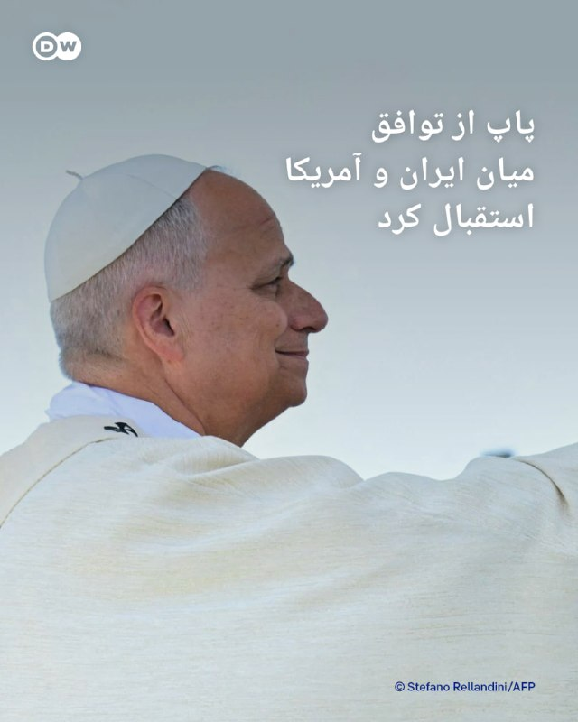

🔶 پاپ از توافق میان ایران و آمریکا استقبال کرد

پاپ لئو چهاردهم، رهبر کاتولیک‌های جهان در پستی در شبکه اجتماعی ایکس از توافق امضاشده میان ایران و آمریکا استقبال کرد.

او این توافق را "نتیجه دلگرم‌کننده تلاش‌های صبورانه در مسیر گفت‌وگو و مذاکره" دانست و از کشورهایی که این کار را ممکن کردند، قدردانی کرد.

پاپ در پایان نوشت: «امیدوارم این توافق بتواند به تقویت اعتماد متقابل، امنیت و ثبات در خاورمیانه کمک کند و مسیرهای گفت‌وگو و همکاری میان ملت‌ها را گسترش دهد.

پاپ لئو چهاردهم که زاده امریکاست پس از آنکه ترامپ تهدید کرد "تمدن ایران را نابود خواهد کرد" این سخنان را محکوم کرد. پاپ این تهدید را "کاملا غیرقابل قبول" خواند و از کاتولیک‌ها خواست تا رهبران سیاسی را به "تلاش برای صلح" ترغیب کنند.

پس از این سخنان پاپ، ترامپ در پستی طولانی در شبکه اجتماعی خود، تروث سوشال، به پاپ حمله کرد و او را "در برابر جرم ضعیف و در سیاست خارجی بسیار بد" توصیف کرد.

ترامپ نوشت: «من پاپی نمی‌خواهم که فکر می‌کند اشکالی ندارد اگر ایران سلاح هسته‌ای داشته باشد.»
@dw_farsi

## DW_Farsi — post 126152

  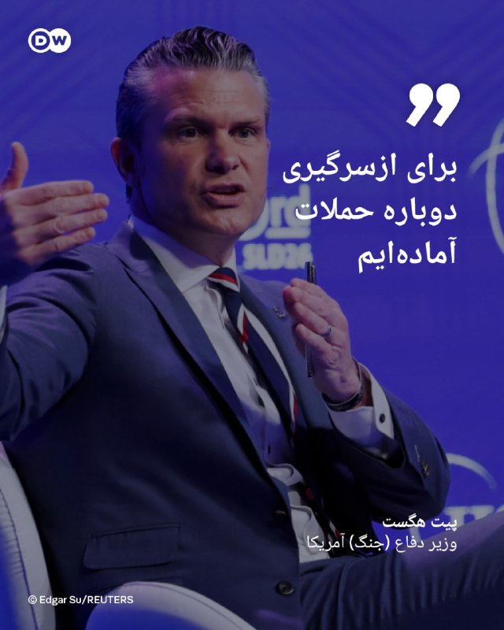

🔶 هگست: برای ازسرگیری دوباره حملات آماده‌ایم

کوتاه زمانی پس از آنکه دونالد ترامپ رییس جمهور آمریکا سند تفاهم میان ایران و ایالات متحده را در کاخ ورسای در فرانسه امضا کرد، پیت هگست وزیر دفاع (جنگ) امریکا گفت ارتش این کشور آماده از سرگیری حملات علیه ایران "در صورت نیاز" است.
هگست که پیش از ترک بروکسل بر روی باند فرودگاه این شهر مقابل خبرنگاران حاضر شده بود، گفت: «هرچند یادداشت تفاهم با هدف پایان دادن به جنگ با ایران تنظیم شده، اما ایالات متحده همچنان آماده است در صورتی که تهران به‌گونه‌ای عمل نکند که پایبندی به تعهداتش در چارچوب توافق را نشان دهد، حملات تازه‌ای را آغاز کند.» 

وزیر جنگ ایالات متحده ادامه داد: «اگر در چارچوب جدول زمانی این مذاکرات ایران به آنچه که گفته عمل نکند، سلاح اتمی را کنار نگذارد، بلندپروازی هسته‌ای را متوقف نکند، مواد هسته‌ای‌اش را خارج نسازد و به توانایی اتمی نزدیک شود، ما برای ازسرگیری حملات آماده خواهیم بود. در این صورت وزارت جنگ اینجاست و آماده است تا اگر لازم باشد همه چیز را دوباره آغاز کند. ما ترجیح می‌دهیم اینطور نشود اما ما آماده‌ایم.»
@dw_farsi

## DW_Farsi — post 126151

🔶 توافق ۶۰روزه؛ آیا اسرائیل در محاسبات آمریکا به حاشیه رفته؟

🔻 گزارشی از الینا فرهادی

یادداشت توافق ۱۴ بندی میان ایالات متحده و جمهوری اسلامی ایران که پس از هفته‌ها مذاکره غیرمستقیم با میانجیگری چند کشور منطقه‌ای تدوین شد، اکنون وارد مرحله‌ای شده که می‌تواند مسیر یکی از پیچیده‌ترین بحران‌های خاورمیانه را تغییر دهد.

این توافق که به گفته مقام‌های دو طرف ابتدا به‌صورت دیجیتالی در روز یکشنبه ۱۴ ژوئن نهایی و امضا شد و قرار است روز جمعه در نشستی رسمی در سوئیس نیز تثبیت شود، چارچوبی ۶۰ روزه برای مذاکره بر سر پرونده هسته‌ای، رفع تدریجی تحریم‌ها، بازگشایی تنگه هرمز و پایان عملیات نظامی میان دو طرف فراهم می‌کند.

دونالد ترامپ، رئیس‌جمهور آمریکا شامگاه سه‌شنبه ۱۷ ژوئن در حاشیه نشست گروه هفت، در حضور امانوئل مکرون، همتای فرانسوی‌اش امضای خود را پای این توافق ثبت کرد؛ اقدامی که هم‌زمان با امضای مسعود پزشکیان در ایران همراه بود.

با این حال، مخالفت آشکار دولت اسرائیل با این تفاهم از همان ابتدا این پرسش را مطرح کرد که آیا توافقی که یکی از مهم‌ترین بازیگران منطقه خود را ملزم به آن نمی‌داند، اساسا شانس پایداری خواهد داشت؟

منشه امیر، کارشناس خاورمیانه ساکن اسرائیل، دامون گلریز، تحلیلگر سیاسی و مدرس روابط بین‌الملل در مدرسه عالی لاهه و کامران متین، دانشیار روابط بین الملل در دانشکده مطالعات جهانی دانشگاه ساسکس در گفت‌وگو با بخش فارسی دویچه وله ابعاد مختلف این توافق، چشم‌انداز پایداری آن، محاسبات راهبردی اسرائیل، آینده رقابت‌های سیاسی در این کشور و همچنین تأثیر این تفاهم بر مناسبات واشنگتن و تل‌آویو را بررسی کرده‌اند.

📌 برای دسترسی کامل به گزارش به وبسایت دویچه‌وله فارسی مراجعه کنید.
@dw_farsi

## Persian_Trend_Official — post 17499

کانال رسمی پرشین ترند pinned «https://youtube.com/live/FWPJB2_Gwwc?feature=share»

## Persian_Trend_Official — post 17498

https://youtube.com/live/FWPJB2_Gwwc?feature=share

## Persian_Trend_Official — post 17497

نکات لایو جمع بندی شد و تا دقایقی دیگه حدودا 15 دقیقه دیکه لایو شروع میشه ...

## Persian_Trend_Official — post 17496

المیادین: هئیت مذاکره‌کننده ایرانی سفر برنامه ریزی شده خود به سوئیس را لغو کرد.

به ادعای المیادین و به نقل از منابع، ایران سفر برنامه‌ریزی‌شده هیئت خود به سوئیس برای دور اول مذاکرات آمریکا و ایران را به دلیل عملیات نظامی مداوم اسرائیل در جنوب لبنان به حالت تعلیق درآورد.

منابع گفتند هیئت ایرانی در حال آماده‌سازی برای آغاز مذاکرات بود اما تصمیم به تعویق انداختن سفر گرفت. تهران به آمریکا و میانجی‌ها اطلاع داد که تحولات لبنان مسئله‌ای مرکزی در مذاکرات است و می‌تواند بر ادامه مذاکرات تأثیر بگذارد.

ایران همچنین هشدار داد که عملیات اسرائیل که تا 10 کیلومتر در داخل خاک لبنان گسترش یافته است، نقض ماده اول یادداشت تفاهم آمریکا و ایران و چارچوب توافق گسترده‌تر است که شامل مفادی درباره پایان خصومت‌ها در تمام جبهه‌ها از جمله لبنان می‌شود.

📝 Amir

📌 @persian_trend_official
پرشین ترند | متفاوت‌ترین کانال نظامی

## Persian_Trend_Official — post 17495

  <a href="telegram/content/Persian_Trend_Official_17495_1781816461.webm" target="_blank">🎬 Download video</a>

سازمان کشتیرانی و حمل و نقل دریایی بریتانیا (UKMTO) با صدور اطلاعیه جدیدی اعلام کرد که تنگه هرمز اکنون به روی ترافیک دریایی باز است و عملیات مسدود کردن آن متوقف شده است.

در این اطلاعیه گفته شده که عملیات مین‌روبی در حال انجام است.

📝 Amir

📌 @persian_trend_official
پرشین ترند | متفاوت‌ترین کانال نظامی

## Persian_Trend_Official — post 17494

  <a href="telegram/content/Persian_Trend_Official_17494_1781816462.webm" target="_blank">🎬 Download video</a>

معاون رئیس جمهور امریکا، جی دی ونس: شما افرادی را در سیستم اسرائیل دیده‌اید، بن گویر و اسموتریچ، که به این توافق حمله کرده‌اند.

فکر می‌کنم پاسخ من به آنها این باشد: پیشنهاد دقیق شما چیست؟

شما کشوری با 9 میلیون نفر جمعیت هستید. نمی‌توانید با کشتن، از حل تک تک مشکلات امنیت ملی خود فرار کنید.

📝 Amir

📌 @persian_trend_official
پرشین ترند | متفاوت‌ترین کانال نظامی

## Persian_Trend_Official — post 17493

  

⭕️ یسرائیل کاتز، وزیر دفاع اسرائیل، گفت اسرائیل توانایی انجام عملیات مستقل علیه جمهوری اسلامی را دارد و در هر لحظه برای اجرای یک «عملیات آبی و سفید» در ایران آماده است.

او افزود: «ما هرگز از آمریکا نخواستیم در غزه، لبنان یا سوریه همراه ما بجنگد. تنها چیزی که می‌خواهیم، حمایت سیاسی و دیپلماتیک است که از ما محافظت کند.»

کاتز با اشاره به نتایج حملات اخیر گفت: «قدرت ایران را درهم شکستیم، رهبران، دانشمندان هسته‌ای و زیرساخت‌ها را هدف قرار دادیم و برنامه هسته‌ای ایران را از بین بردیم. اکنون باید اطمینان حاصل کنیم که این برنامه دوباره احیا نشود.»

وزیر دفاع اسرائیل همچنین گفت دونالد ترامپ، رییس‌جمهوری آمریکا، اسرائیل را «متحد نمونه» توصیف کرده است. به گفته او، اسرائیل تنها کشوری است که چنین عنوانی دریافت کرده است.
کاتز افزود: «هیچ‌یک از کشورهای ناتو در زمان نیاز در کنار آمریکا نایستادند، اما اسرائیل در کنار آمریکا بود و همچنان هست.»

📝 Nick

📌 @persian_trend_official
پرشین ترند | متفاوت‌ترین کانال نظامی

## Persian_Trend_Official — post 17492

  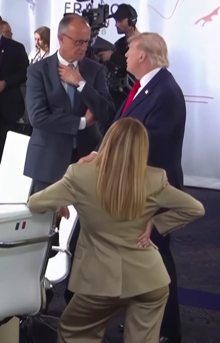

کپشن با شما 😄

## Persian_Trend_Official — post 17491

  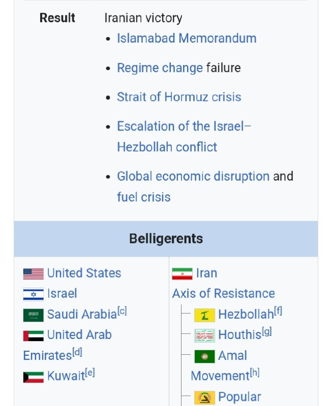

ویکی پدیا پیروز جنگ اخیر ایران با امریکا و اسرائیل را ایران ذکر کرده است!

📝 Amir

📌 @persian_trend_official
پرشین ترند | متفاوت‌ترین کانال نظامی

## Persian_Trend_Official — post 17490

  

حساب رسمی کاخ سفید در X: ما آمریکا را قبل از GTA 6 نجات دادیم.

📝 Amir

📌 @persian_trend_official
پرشین ترند | متفاوت‌ترین کانال نظامی

## Persian_Trend_Official — post 17489

  <a href="telegram/content/Persian_Trend_Official_17489_1781816465.webm" target="_blank">🎬 Download video</a>

رئیس جمهور ترامپ در تروث سوشال: ایالات متحده به صلح متعهد است و ما همه را در منطقه خاورمیانه تشویق می‌کنیم که به تعهد خود برای پیشبرد مذاکرات ما به بهترین شکل ممکن پایبند باشند.

بازارها از آنچه که با کاهش قیمت نفت و افزایش سهام در حال رخ دادن است، لذت می‌برند. ما انتظار آتش‌بس کامل در همه جبهه‌ها، از جمله لبنان، حزب‌الله و اسرائیل را داریم.

📝 Amir

📌 @persian_trend_official
پرشین ترند | متفاوت‌ترین کانال نظامی

## Persian_Trend_Official — post 17488

به گزارش کانال 14 اسرائیل، رهبری سیاسی اسرائیل به ارتش این کشور اجازه داده است تا در محدوده خط زرد ر جنوب لبنان آتش بگشاید.

انتظار می‌رود مقامات ارشد نظامی در ساعات آینده، قوانین به‌روز شده درگیری و دستورالعمل‌های عملیاتی را برای فرماندهان میدانی صادر کنند.

این تصمیم همچنین شامل برنامه‌هایی برای نابودی هرگونه زیرساخت مرتبط با حزب‌الله است که در محدوده خط زرد شناسایی می‌شوند.

📝 Amir

📌 @persian_trend_official
پرشین ترند | متفاوت‌ترین کانال نظامی

## Persian_Trend_Official — post 17487

  <a href="telegram/content/Persian_Trend_Official_17487_1781816466.webm" target="_blank">🎬 Download video</a>

آیت الله مجتبی خامنه‌ای، رهبر جمهوری اسلامی: بنده علی‌الاصول، نظر دیگری داشتم ولی از باب تعهّدی که رئیس‌جمهور محترم به‌عنوان رئیس شورای عالی امنیّت ملّی از طرف خود و سایر اعضا در پاسداشت حقوق ملّت ایران و جبهه مقاومت به بنده دادند و تصریح به قبول مسئولیت آن…

## Persian_Trend_Official — post 17486

آیت الله مجتبی خامنه‌ای، رهبر جمهوری اسلامی: بنده علی‌الاصول، نظر دیگری داشتم ولی از باب تعهّدی که رئیس‌جمهور محترم به‌عنوان رئیس شورای عالی امنیّت ملّی از طرف خود و سایر اعضا در پاسداشت حقوق ملّت ایران و جبهه مقاومت به بنده دادند و تصریح به قبول مسئولیت آن نمودند، اجازه‌ی آن را صادر نمودم‌.

متن کامل پیام رهبر جمهوری اسلامی ایران در مورد امضای تفاهم نامه بین ایران و آمریکا:

بسم‌ الله‌ الرّحمن ‌الرّحیم

ملّت پرشور و باوفای ایران

همانگونه که مطلع شُدید، تفاهم‌نامه‌ای بین رئیس‌جمهوران ایران و امریکا امضا شد. در مسیر رسیدن به این مرحله، مسئولین امر، از سر دلسوزی و با حُسن نظر، تلاش‌های زیادی را به‌عمل آوردند و البته این رئیس‌جمهور آمریکا بود که از روی استیصال، از انواع اهرم‌ها برای این امر استفاده می‌کرد.

بنده علی‌الاصول، نظر دیگری داشتم ولی از باب تعهّدی که رئیس‌جمهور محترم به‌عنوان رئیس شورای عالی امنیّت ملّی از طرف خود و سایر اعضا در پاسداشت حقوق ملّت ایران و جبهه مقاومت به بنده دادند و تصریح به قبول مسئولیت آن نمودند، اجازه‌ی آن را صادر نمودم‌. ایشان همچنین تصریح کرده‌اند که اگر طرف آمریکایی بخواهد زیاده‌خواهی کند زیر بار آن نخواهند رفت. از این لحظه، ما یعنی شما ملت سرافراز و این خادم ناچیز، منتظر تحقّق شروط گفته‌شده خواهیم بود.

امّا بدیهی است مذاکرات حضوری که در آینده برقرار خواهد شد، به معنی پذیرش نظر دشمن نخواهد بود. امیدواریم که دعای خیر سرورمان عجّل‌الله‌تعالی‌فرجه‌الشّریف انواع نصرت‌ها و فتوحات، برای ملّت باشرف ایران به ارمغان آورد.

📝 Amir

📌 @persian_trend_official
پرشین ترند | متفاوت‌ترین کانال نظامی

## Persian_Trend_Official — post 17485

  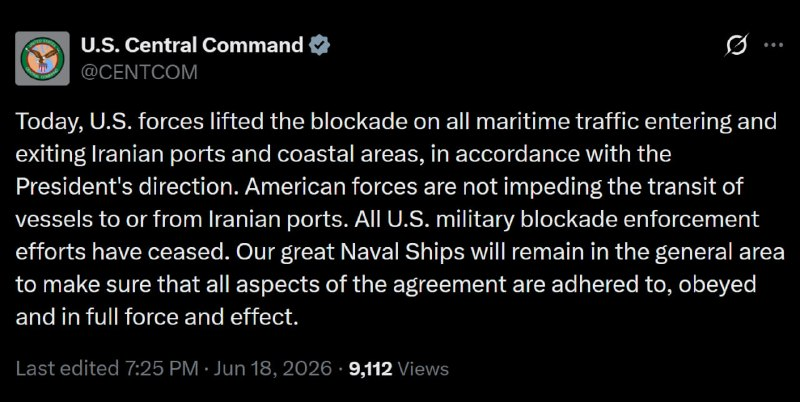

محاصره دریایی ایران به طور رسمی لغو شد.

فرماندهی مرکزی ایالات متحده: امروز، نیروهای آمریکایی محاصره تمام ترافیک دریایی ورودی و خروجی از بنادر و مناطق ساحلی ایران را مطابق با دستور رئیس جمهور لغو کردند.

نیروهای آمریکایی مانع عبور کشتی‌ها به بنادر ایران یا از بنادر ایران نمی‌شوند. تمام تلاش‌های نظامی ایالات متحده برای اجرای محاصره متوقف شده است.

کشتی‌های نیروی دریایی بزرگ ما در منطقه عمومی باقی خواهند ماند تا اطمینان حاصل شود که تمام جنبه‌های توافق رعایت، اجرا و با قدرت و قوت کامل اجرا می‌شوند.

📝 Amir

📌 @persian_trend_official
پرشین ترند | متفاوت‌ترین کانال نظامی

## Persian_Trend_Official — post 17484

  <a href="telegram/content/Persian_Trend_Official_17484_1781816467.webm" target="_blank">🎬 Download video</a>

ترامپ در تروث سوشال: هیچ پرداخت 300 میلیارد دلاری از سوی ایالات متحده به ایران وجود ندارد. این خبر جعلی است! تنها چیزی که برای ایالات متحده وجود دارد موفقیت، کاهش قیمت نفت و پیروزی است. به بازار سهام نگاهی بیندازید.

تبلیغات دموکرات‌ها در حال اجرا است!!!

📝 Amir

📌 @persian_trend_official
پرشین ترند | متفاوت‌ترین کانال نظامی

## Persian_Trend_Official — post 17483

  <a href="telegram/content/Persian_Trend_Official_17483_1781816468.mp4" target="_blank">🎬 Download video</a>

خبرنگار: چه کسی آن صندوق 300 میلیارد دلاری برای ایران را تأمین مالی می‌کند؟

جی دی ونس: تمایل زیادی از سوی جهان عرب و خارج از جهان عرب وجود دارد که در صورت رفتار مناسب ایران، واقعاً در این کشور دخالت کنند.

📝 Amir

📌 @persian_trend_official
پرشین ترند | متفاوت‌ترین کانال نظامی

## Persian_Trend_Official — post 17482

  <a href="telegram/content/Persian_Trend_Official_17482_1781816470.mp4" target="_blank">🎬 Download video</a>

جی دی ونس در مورد موشک‌های ایران: توانایی آنها برای پرتاب موشک به طور قابل توجهی کاهش یافته است.

آیا صفر است؟ خیر. اما به طور قابل توجهی کاهش یافته است. ما آن ماموریت را رها نکرده‌ایم. ما آن را انجام داده‌ایم.

📝 Amir

📌 @persian_trend_official
پرشین ترند | متفاوت‌ترین کانال نظامی

## Persian_Trend_Official — post 17481

  <a href="telegram/content/Persian_Trend_Official_17481_1781816473.mp4" target="_blank">🎬 Download video</a>

جی دی ونس: در مورد دارایی‌های بلوکه شده، میزان پول راستش را بخواهید، نمی‌دانم.

من اعدادی بالای 100 میلیارد دلار شنیده‌ام. در واقع اعدادی بالای 200 میلیارد دلار هم شنیده‌ام. بیشتر آن در حساب‌های ایالات متحده نیست؛ بیشتر آن یا در خلیج فارس، یا در اروپا یا جای دیگری است.

اما من مقدار دقیق پول را نمی‌دانم، خیلی زیاد است.

📝 Amir

📌 @persian_trend_official
پرشین ترند | متفاوت‌ترین کانال نظامی

## Persian_Trend_Official — post 17480

  <a href="telegram/content/Persian_Trend_Official_17480_1781816476.mp4" target="_blank">🎬 Download video</a>

جی دی ونس: آنچه واقعاً اتفاق افتاد این بود که ما روز یکشنبه تفاهم‌نامه را امضا کردیم.

آنچه ایرانی‌ها پیش ما آمدند و گفتند این بود: ما دوست داریم متن را تا جمعه منتشر نکنیم. من واقعاً متوجه این موضوع نشدم می‌خواستم متن را فوراً منتشر کنیم. اما برای اینکه با آنها کنار بیاییم، گفتیم: مطمئناً، باشه، تا جمعه صبر می‌کنیم.

و سپس آنچه در روزهای دوشنبه و سه‌شنبه، در حالی که رئیس جمهور در اجلاس گروه هفت بود، اتفاق افتاد این بود که شاید رهبران خارجی با ایرانی‌ها صحبت می‌کردند و آنها را به انجام این کار تشویق می‌کردند.

ما قطعاً به آنها می‌گفتیم: ما تمایل شما را برای منتشر نشدن متن تا جمعه درک می‌کنیم، اما می‌دانید، ما در یک سیستم دموکراتیک زندگی می‌کنیم. مردم آمریکا می‌خواهند متن این توافق‌نامه را ببینند. ما مطمئناً دوست داریم هر چه زودتر آن را منتشر کنیم.

📝 Amir

📌 @persian_trend_official
پرشین ترند | متفاوت‌ترین کانال نظامی

## RadioFarda — post 158487

  

🔸کایا کالاس، مسئول سیاست خارجه اتحادیه اروپا، گفت هنوز برای بحث درباره لغو تحریم‌های اتحادیه اروپا علیه ایران زود است و این موضوع پس از دستیابی به یک توافق هسته‌ای با ایران بررسی خواهد شد.

🔸او پیش از نشست رهبران کشورهای عضو اتحادیه اروپا به خبرنگاران گفت: «زمانی که شرایط فراهم شود، کشورهای عضو درباره مناسب بودن لغو تحریم‌ها گفت‌وگو خواهند کرد، اما هنوز به آن مرحله نرسیده‌ایم.»

🔸اتحادیه اروپا در حال حاضر مجموعه‌ای از تحریم‌های چندجانبه علیه بیش از ۷۰۰ فرد و نهاد در ایران اعمال کرده است که شامل ممنوعیت سفر و مسدود شدن دارایی‌ها می‌شود.

@RadioFarda

## RadioFarda — post 158486

  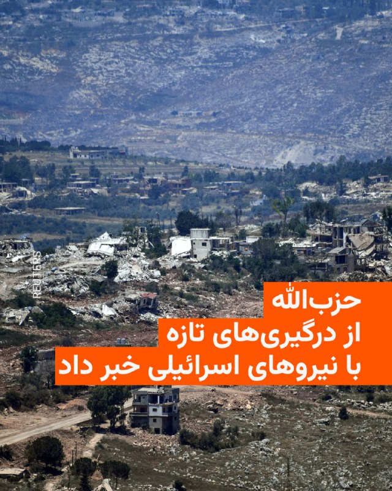

🔸حزب‌الله لبنان روز پنج‌شنبه اعلام کرد نیروهایش در جنوب این کشور با ارتش اسرائیل درگیر شده‌اند، ساعاتی پس از آنکه رسانه‌های رسمی لبنان از کشته شدن سه نفر در حملات پهپادی اسرائیل خبر دادند.

🔸خبرگزاری دولتی لبنان گزارش داد که یک پهپاد اسرائیلی خودرویی را در منطقهٔ کفرتبنیت هدف قرار داد که در پی آن دو نفر کشته شدند. در حمله‌ای دیگر نیز یک نفر در روستای زبدین جان باخت.

🔸حزب‌الله اعلام کرد نیروهایش با یگان‌های اسرائیلی که از شهرک ارنون به سمت حومهٔ کفرتبنیت، در نزدیکی شهر نبطیه، پیشروی کرده بودند درگیر شده‌اند و این درگیری‌ها همچنان ادامه دارد.

🔸این تحولات یک روز پس از امضای توافق میان ایران و آمریکا برای پایان دادن به جنگ در همهٔ جبهه‌های منطقه، از جمله لبنان، رخ می‌دهد. با این حال، درگیری‌ها میان اسرائیل و حزب‌الله ادامه یافته است.

🔸ارتش اسرائیل نیز از کشته شدن یک نظامی خود و زخمی شدن هفت نفر دیگر در جنوب لبنان خبر داد.

@RadioFarda

## RadioFarda — post 158485

🔸معاون رئیس‌جمهور آمریکا روز پنج‌شنبه با انتقاد شدید از مخالفان اسرائیلی توافق با ایران، به آن‌ها هشدار داد که تنها «متحد قدرتمند» باقی‌ماندهٔ خود در جهان را از خود نرانند. 🔸به گزارش خبرگزاری فرانسه، جی‌دی ونس در نشستی خبری در کاخ سفید، در حالی که تنش‌ها…

## RadioFarda — post 158484

  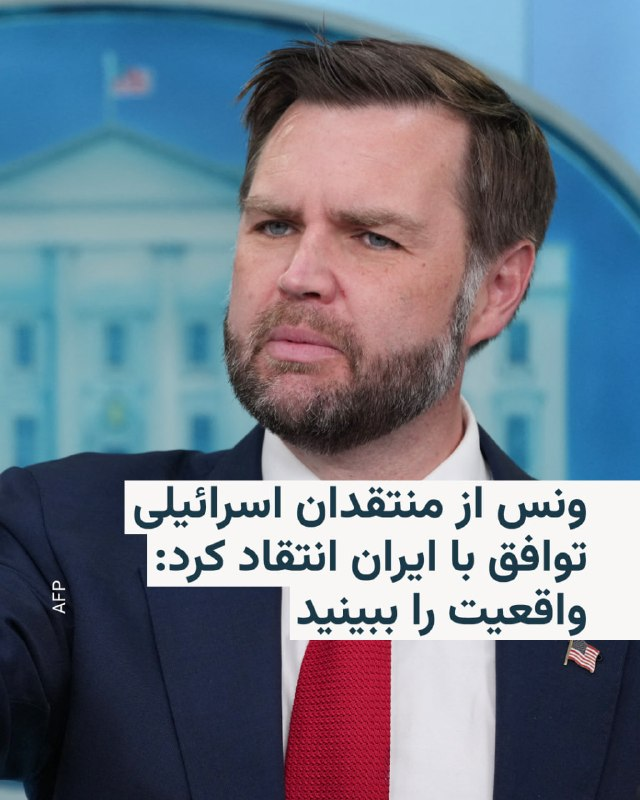

🔸معاون رئیس‌جمهور آمریکا روز پنج‌شنبه با انتقاد شدید از مخالفان اسرائیلی توافق با ایران، به آن‌ها هشدار داد که تنها «متحد قدرتمند» باقی‌ماندهٔ خود در جهان را از خود نرانند.

🔸به گزارش خبرگزاری فرانسه، جی‌دی ونس در نشستی خبری در کاخ سفید، در حالی که تنش‌ها میان دونالد ترامپ، رئیس‌جمهور آمریکا، و بنیامین نتانیاهو، نخست‌وزیر اسرائیل، افزایش یافته است، از اعضای کابینهٔ اسرائیل خواست «واقعیت را ببینند».

🔸او گفت: «دونالد ترامپ تنها رئیس کشوری در سراسر جهان است که در این مقطع زمانی نسبت به ملت اسرائیل همدلی دارد و در عین حال رهبر ابرقدرت جهان است.»

🔸ونس افزود: «اگر من عضو کابینهٔ دولت اسرائیل بودم، شاید به تنها متحد قدرتمندی که در سراسر جهان برایم باقی مانده حمله نمی‌کردم.»

🔸او در عین حال از نتانیاهو به دلیل خودداری از انتقاد مستقیم از توافق با ایران تمجید کرد، اما به‌صراحت به حجم گستردهٔ کمک‌های نظامی آمریکا به اسرائیل اشاره کرد.

@RadioFarda

## RadioFarda — post 158483

🔸شورای عالی امنیت ملی جمهوری اسلامی شامگاه پنجشنبه به شکل رسمی اعلام کرد که تا شصت روز از کشتی‌های در حال عبور از تنگه هرمز هزینه‌ای دریافت نخواهد شد. 🔸در بیانیه این شورا آمده است: «به موجب یادداشت تفاهم اسلام‌آباد، به مدت شصت روز، هیچ‌گونه هزینه‌ای از متقاضیان…

## RadioFarda — post 158482

  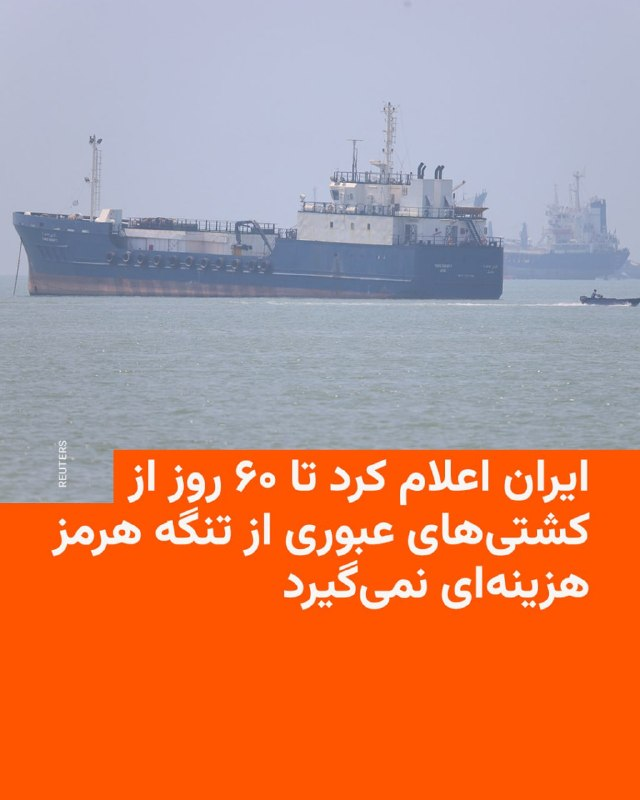

🔸شورای عالی امنیت ملی جمهوری اسلامی شامگاه پنجشنبه به شکل رسمی اعلام کرد که تا شصت روز از کشتی‌های در حال عبور از تنگه هرمز هزینه‌ای دریافت نخواهد شد.

🔸در بیانیه این شورا آمده است: «به موجب یادداشت تفاهم اسلام‌آباد، به مدت شصت روز، هیچ‌گونه هزینه‌ای از متقاضیان اخذ نخواهد شد و این هزینه‌ها توسط دولت جمهوری اسلامی ایران تأمین می‌گردد.»

🔸مقام‌های ارشد ایالات متحده بارها اعلام کرده‌اند که طبق قوانین بین‌المللی ایران نمی‌تواند از کشتی‌ها «عوارض» دریافت کند. در مقابل ایران می‌گوید که امکان دریافت هزینه «خدمات» از شناورها را دارد.

🔸این آبراه استراتژیک مدت کوتاهی بعد از آغاز جنگ آمریکا و اسرائیل علیه ایران، توسط نیروهای نظامی ایران مسدود شد و آمریکا نیز بعد از آتش‌بس محاصره دریایی بنادر ایران را اعمال کرد. ساعتی پیش ارتش آمریکا گفت که به این محاصره پایان داده است.

@RadioFarda

## RadioFarda — post 158481

  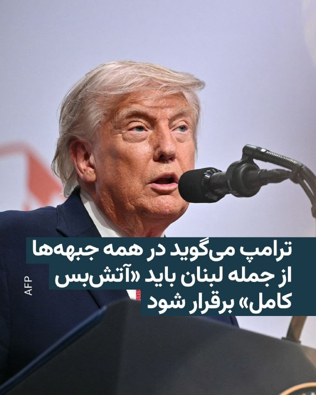

🔸دونالد ترامپ، پنج‌شنبه شب با انتشار پیام تازه‌ای در شبکه اجتماعی تروث‌سوشال نوشت که آمریکا «انتظار آتش‌بس کامل در همه جبهه‌ها، از جمله لبنان، حزب‌الله و اسرائیل» دارد.

🔸رئیس جمهور آمریکا در این پیام نوشت: «ایالات متحده به صلح متعهد است و ما همه را در منطقه خاورمیانه تشویق می‌کنیم که به تعهد خود برای پیشبرد مذاکرات ما به بهترین شکل ممکن پایبند باشند.»

🔸اشاره دونالد ترامپ به مذاکراتی است که آمریکا و ایران قرار است مطابق تفاه‌منامه‌ای که به تازگی امضا کرده‌اند، در ۶۰ روز آینده انجام دهند.

🔸رئیس جمهور آمریکا در این پیام بار دیگر به کاهش قیمت نفت و افزایش ارزش بازارهای سهام نیز اشاره کرده است.

🔸پیام تازه دونالد ترامپ ساعاتی پس از بیان اظهارات بنیامین نتانیاهو، نخست‌وزیر اسرائیل، در رد عقب‌نشینی ارتش این کشور از جنوب لبنان منتشر شده است.

@RadioFarda

## RadioFarda — post 158480

  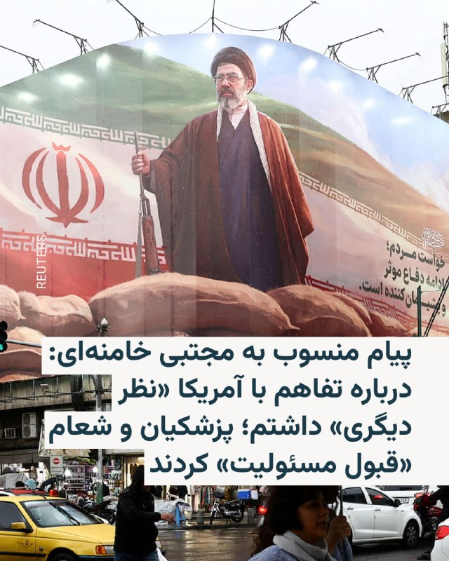

🔸رسانه‌های ایران پنج‌شنبه شب متن پیام مکتوبی منسوب به مجتبی خامنه‌ای را منتشر کردند که در آن رهبر جمهوری اسلامی درباره امضای تفاهم‌نامه میان ایران و آمریکا گفته است که «نظر دیگری» داشته و مسئولیت آن را بر عهده مسعود پزشکیان، رئیس شورای عالی امنیت ملی، و دیگر اعضای این شورا دانسته است.

🔸در این پیام درباره توافق با ایالات متحده آمده است: «بنده علی‌الاصول، نظر دیگری داشتم ولی از باب تعهدی که رئیس‌جمهور محترم به‌عنوان رئیس شورای عالی امنیت ملی از طرف خود و سایر اعضا در پاسداشت حقوق ملت ایران و جبهه مقاومت به بنده دادند و تصریح به قبول مسئولیت آن نمودند، اجازه آن را صادر نمودم‌.»

🔸در این پیام به تفاهمنامه اخیر به عنوان «تفاهم‌نامه‌ای بین رئیس‌جمهوران ایران و آمریکا» اشاره و گفته شده است که رهبر جمهوری اسلامی و مردم از این لحظه «منتظر تحقق شروط گفته ‌شده» خواهند بود.

🔸در این پیام آمده که مذاکرات حضوری آینده «به معنی پذیرش نظر دشمن نخواهد بود.»

@RadioFarda

## RadioFarda — post 158479

  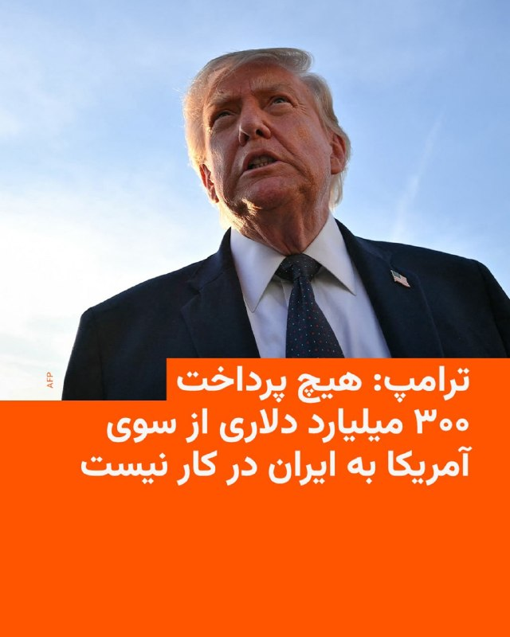

🔸دونالد ترامپ، رئیس‌جمهور آمریکا، روز پنجشنبه توافق با ایران برای پایان دادن به جنگ را یک «پیروزی» برای ایالات متحده توصیف کرد و انتقادهای فزاینده از این تفاهم‌نامه را رد کرد.

🔸ترامپ در پیامی در شبکه اجتماعی خود، ‌تروث سوشال، نوشت: «هیچ پرداخت ۳۰۰ میلیارد دلاری از سوی آمریکا به ایران وجود ندارد. این خبر جعلی است! تنها چیزی که برای آمریکا وجود دارد، موفقیت، کاهش قیمت نفت و پیروزی است. به بازار سهام نگاه کنید.»

🔸او ساعتی پیش نیز با حمله به منتقدان این توافق، نوشت آنها «حسودند، یا آدم‌های بدی هستند یا احمق.»

🔸اشاره رئیس‌جمهور آمریکا به صندوق سرمایه‌گذاری ۳۰۰ میلیارد دلاری برای ایران که در متن تفاهم‌نامه به آن اشاره شده در حالی است که جی‌دی‌ ونس، معاون او، نیز به خبرنگاران گفت صحبت درباره سرمایه‌گذاران احتمالی در ایران «خیلی زود» است.

@RadioFarda

## RadioFarda — post 158478

  <a href="https://t.me/radiofarda/158478" target="_blank">📎 Download file</a>

ابعاد حقوقی تفاهم‌نامه ایران و آمریکا در گفت‌وگو با سعید محمودی

🔸تفاهم‌نامه ۱۴ بندی میان جمهوری اسلامی ایران و ایالات متحده، علاوه بر توقف جنگ و بازگشایی تنگه هرمز، مجموعه‌ای از تعهدات سیاسی، امنیتی، اقتصادی و هسته‌ای را در بر می‌گیرد که قرار است ظرف ۶۰ روز به یک توافق نهایی تبدیل شود. در این سند، از لغو تحریم‌ها و آزادسازی دارایی‌های ایران گرفته تا نظارت آژانس بر اورانیوم غنی‌شده و حتی تصویب توافق نهایی در شورای امنیت سازمان ملل مطرح شده است. اما این پرسش وجود دارد که از منظر حقوق بین‌الملل، این تفاهم‌نامه تا چه اندازه الزام‌آور است و آیا سازوکارهای پیش‌بینی‌شده در آن قابلیت اجرا و تضمین حقوقی دارند یا نه؟ در گفت‌وگو با سعید محمودی، استاد حقوق بین‌الملل، این ابعاد حقوقی را بررسی می‌کنیم.

@RadioFarda

## RadioFarda — post 158477

هشدار عفو بین‌الملل دربارۀ تبدیل توافق ایران‌ و آمریکا به پوشش سرکوب و مصونیت از مجازات

🔸رئیس سازمان عفو بین‌الملل می‌گوید توافق ایران و آمریکا، موسوم به «تفاهم‌نامهٔ اسلام‌آباد»، تنها در صورتی می‌تواند به صلحی پایدار منجر شود که حفاظت از حقوق بشر، پاسخگویی عاملان نقض حقوق بین‌الملل، جبران خسارت قربانیان و تضمین عدم تکرار این نقض‌ها نیز در کانون توجه قرار گیرد.

🔸انیس کالامار در اظهاراتی که روز پنج‌شنبه ۲۸ خرداد منتشر شد، همچنین نسبت به تداوم سرکوب داخلی در ایران ابراز نگرانی کرد و هشدار داد توافقی که صرفاً به‌طور موقت جنگ را متوقف کند اما حقوق بشر را نادیده بگیرد، خطر آن را دارد که به پوششی برای تداوم مصونیت از مجازات، اشغالگری و سرکوب تبدیل شود.

🔸دبیرکل عفو بین‌الملل حملات آمریکا و اسرائیل به ایران را «غیرقانونی و نقض منشور سازمان ملل» خواند و افزود این حملات به «اقدامات غیرقانونی» مقام‌های جمهوری اسلامی ایران انجامید.

🔸به‌گفتۀ عفو بین‌الملل، این روند ماه‌ها رنج و ویرانی گسترده برای غیرنظامیان و نقض حقوق بشر، از جمله جنایات جنگی، را به دنبال داشت.

🔸کالامار همچنین با اشاره به این‌که جنگ ایران به دیگر کشورهای منطقه نیز کشیده شد و بیش از شش هزار نفر در سراسر خاورمیانه بر اثر این جنگ کشته شدند، گفت توافق ایران و آمریکا می‌تواند برای میلیون‌ها نفر در منطقه که طی چهار ماه گذشته در شرایط ناامنی و بلاتکلیفی زندگی کرده‌اند، روزنه‌ای از امید ایجاد کند.

🔸او در عین حال هشدار داد هر توافقی که صرفاً بر منافع راهبردی و نظامی آمریکا و ایران متمرکز باشد و حقوق بشر را نادیده بگیرد، ممکن است به پوششی برای تداوم مصونیت از مجازات، اشغالگری و سرکوب تبدیل شود.

🔸رئیس سازمان عفو بین‌الملل همچنین تأکید کرد که هرگونه پایان پایدار درگیری‌ها باید با اجرای عدالت، پاسخگو شدن عاملان نقض‌های حقوق بین‌الملل، جبران خسارت قربانیان و ارائهٔ تضمین‌های مشخص برای جلوگیری از تکرار چنین نقض‌هایی همراه باشد.

🔸دبیرکل عفو بین‌الملل در بخش دیگری از اظهارات خود هشدار داد که پایان حملات نظامی علیه ایران به معنای پایان خطر برای شهروندان ایرانی نیست.

🔸او گفت مقام‌های جمهوری اسلامی در طول جنگ سرکوب داخلی را هم تشدید کرده‌اند، که شامل بازداشت‌های گسترده و غیرقانونی، ناپدیدسازی قهری، شکنجه و بدرفتاری، محاکمه‌های به‌شدت ناعادلانه و اعدام‌های با انگیزهٔ سیاسی بوده است.

🔸گزارش کامل را در وب‌سایت رادیوفردا بخوانید.

@RadioFarda

## RadioFarda — post 158476

  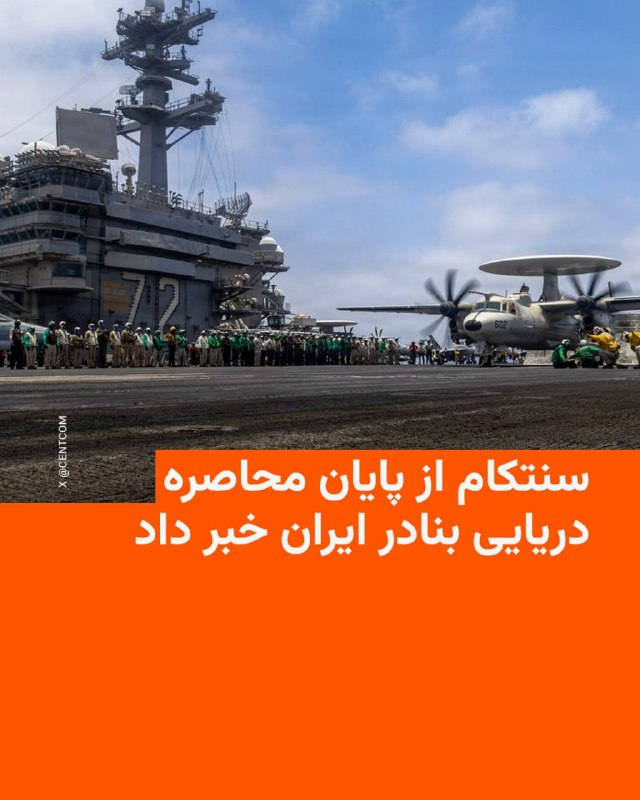

🔸ستاد فرماندهی مرکزی ارتش آمریکا، سنتکام، اعلام کرد نیروهای آمریکایی به دستور رئیس‌جمهور ایالات متحده به محاصره دریایی بنادر و مناطق ساحلی ایران پایان داده‌اند.

🔸سنتکام روز پنج‌شنبه ۲۸ خرداد در شبکه ایکس نوشت که از این پس هیچ مانعی بر سر تردد کشتی‌ها به مقصد یا از مبدأ بنادر ایران در خلیج فارس و دریای عمان ایجاد نخواهد شد و تمامی اقدامات مربوط به اجرای محاصره دریایی متوقف شده است.

🔸با این حال، سنتکام افزود ناوهای آمریکایی همچنان در منطقه باقی خواهند ماند تا بر اجرای مفاد توافق میان طرف‌ها نظارت کنند و از پایبندی به آن اطمینان حاصل شود.

🔸بر مبنای تفاهنامه ایران و آمریکا، که شامگاه چهارشنبه امضا شد، ایالات متحده آمریکا روند رفع محاصره دریایی خود را پس از امضا آغاز خواهد کرد و ظرف ۳۰ روز به‌طور کامل به محاصره دریایی پایان خواهد داد. جمهوری اسلامی نیز باید عبور کشتی‌ها از تنگه هرمز را ظرف مدت ۳۰ روز به میزان پیش از بسته شدن این آبراه برساند.

@RadioFarda

## RadioFarda — post 158475

🔸کارگروه بازداشت‌های خودسرانه سازمان ملل متحد، بازداشت رضا خندان را ناقض حقوق بین‌الملل دانست و خواستار آزادی فوری او شد. 🔸این کارگروه اعلام کرد آقای خندان، طراح گرافیک و فعال حقوق بشر ۶۰ ساله، از آذر ۱۴۰۳ به دلیل اتهاماتی مرتبط با فعالیت‌های مسالمت‌آمیز…

## RadioFarda — post 158474

  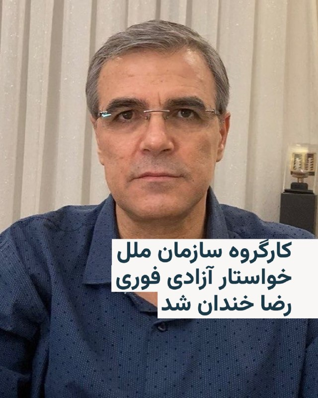

🔸کارگروه بازداشت‌های خودسرانه سازمان ملل متحد، بازداشت رضا خندان را ناقض حقوق بین‌الملل دانست و خواستار آزادی فوری او شد.

🔸این کارگروه اعلام کرد آقای خندان، طراح گرافیک و فعال حقوق بشر ۶۰ ساله، از آذر ۱۴۰۳ به دلیل اتهاماتی مرتبط با فعالیت‌های مسالمت‌آمیز خود در حمایت از حقوق زنان به‌طور خودسرانه بازداشت شده است.

🔸در این بیانیه آمده است که بازداشت رضا خندان فاقد مبنای قانونی بوده و مستقیماً به فعالیت‌های حقوق بشری او ارتباط دارد. کارگروه سازمان ملل همچنین اعلام کرد که او پس از بازداشت از دسترسی به وکیل محروم بوده است.

🔸کارگروه بازداشت‌های خودسرانه سازمان ملل در عین حال ابراز نگرانی کرد که پرونده رضا خندان نشان‌دهنده رویه‌ای گسترده از بازداشت‌های خودسرانه در ایران است.

@RadioFarda

## RadioFarda — post 158473

  <a href="https://t.me/radiofarda/158473" target="_blank">📎 Download file</a>

📻بشنوید: ایستگاه ۱۹ با رادیوفردا، ۲۸ خرداد ۱۴۰۵

@RadioFarda

## RadioFarda — post 158472

🔸جی‌دی ونس، معاون رئیس‌جمهور آمریکا، روز پنجشنبه در نشست با خبرنگاران در کاخ سفید در پاسخ به سوالی درباره صندوق سرمایه‌گذاری ۳۰۰ میلیارد دلاری در ایران که در تفاهم‌نامه با ایالات متحده به آن اشاره شده است، گفت که صحبت درباره سرمایه‌گذاران احتمالی «خیلی زود»…

## RadioFarda — post 158471

  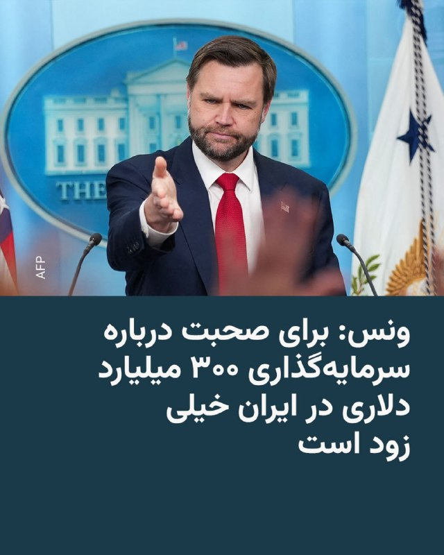

🔸جی‌دی ونس، معاون رئیس‌جمهور آمریکا، روز پنجشنبه در نشست با خبرنگاران در کاخ سفید در پاسخ به سوالی درباره صندوق سرمایه‌گذاری ۳۰۰ میلیارد دلاری در ایران که در تفاهم‌نامه با ایالات متحده به آن اشاره شده است، گفت که صحبت درباره سرمایه‌گذاران احتمالی «خیلی زود» است.

🔸او گفت: «در جهان عرب و حتی خارج از جهان عرب تمایل زیادی وجود دارد که در صورت رفتار مناسب ایران، در این کشور مشارکت و سرمایه‌گذاری کنند. اما باز هم می‌گویم، صحبت درباره این موضوع بسیار زود است، زیرا چنین چیزی مستلزم یک تحول اساسی در رفتار ایران است.»

🔸دولت ترامپ به دلیل احتمال ایجاد این صندوق با انتقادهایی حتی از سوی برخی جمهوری‌خواهان،روبه‌رو شده است. با این حال، ونس و دونالد ترامپ بارها تأکید کرده‌اند که ایالات متحده هیچ پولی به این صندوق پرداخت نخواهد کرد.

🔸ونس روز پنجشنبه گمانه‌زنی کرد که در صورت دستیابی آمریکا به توافقی با ایران و لغو تحریم‌های این کشور، هم سرمایه‌گذاران دولتی و هم سرمایه‌گذاران خصوصی در کشورهایی مانند ‌امارات متحده عربی ممکن است مشتاق همکاری اقتصادی با ایران باشند.

@RadioFarda

## RadioFarda — post 158470

  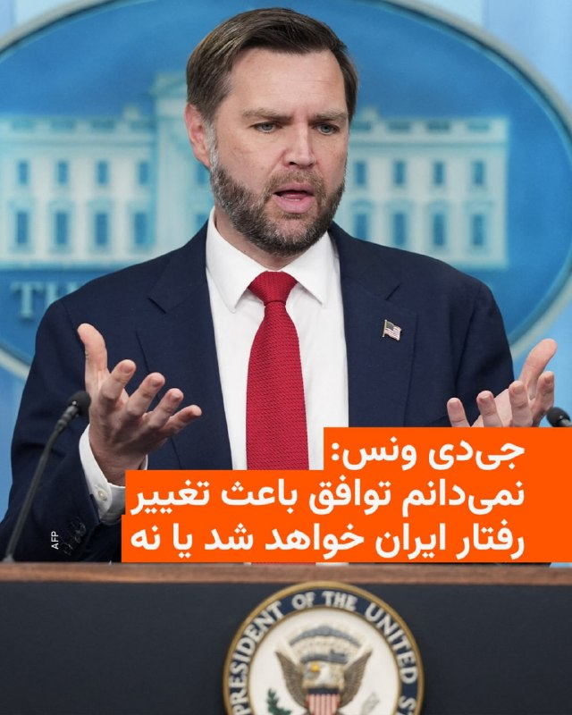

🔸جی‌دی ونس، معاون رئیس‌جمهور آمریکا، روز پنجشنبه ۲۸ خرداد در یک نشست خبری در کاخ سفید تأکید کرد که ایالات متحده در مذاکرات برای دستیابی به یک آتش‌بس دائمی، اهرم‌های فشار قابل توجهی بر ایران در اختیار دارد، هرچند اذعان کرد که مشخص نیست این اهرم‌ها برای وادار کردن حکومت ایران به دادن امتیازهای بزرگ کافی باشد یا نه.

🔸او در گفت‌وگوی خود با خبرنگاران گفت: «آن‌ها قطعاً درک می‌کنند که ایالات متحده اهرم‌های بسیار قدرتمندی در اختیار دارد. آیا این در نهایت به تغییر رفتار منجر خواهد شد؟ نمی‌دانم.»

🔸ونس استدلال کرد که دولت آمریکا صرف‌نظر از این تردیدها باید برای دستیابی به توافق تلاش کند، به این امید که بتواند به یک گشایش واقعی دست یابد؛ گشایشی که روابط ایران با آمریکا و همچنین وضعیت کلی خاورمیانه را به شکل چشمگیری بهبود بخشد.

🔸او گفت: «بعضی‌ها می‌گویند ایرانی‌ها هرگز رفتار خود را تغییر نخواهند داد. خب، شاید این درست باشد، و اگر چنین باشد، آن‌ها از هیچ‌یک از مزایای این توافق بهره‌مند نخواهند شد. اما آیا ارزش امتحان کردن را ندارد؟»

@RadioFarda

## IranianMinds — post 22908

  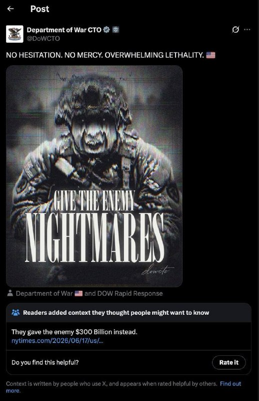

🔴 اکانت وزارت جنگ آمریکا اومد این پستو گذاشته و نوشته : هیچ تردیدی نیست. هیچ رحمی نیست. قدرت کشنده غالب.

مردم هم اومدن بهش کامیونیتی نوت زدن که به جای این به دشمن ۳۰۰ میلیارد دلار دادن.

@IranianMinds

## IranianMinds — post 22907

  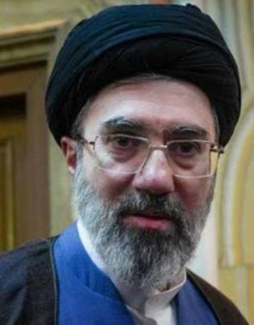

🔴 مجتبی جی پی تی :

مسئولیت مذاکرات با آمریکا کاملا بر عهده ی پزشکیان است و اون پذیرفته.

@IranianMinds

## IranianMinds — post 22906

🔴 شریعتمداری:

شهید لاریجانی به دنبال این بود که به حساب گروسی برسد، اما جنگ شد و کشته شد.

@IranianMinds

## IranianMinds — post 22905

🔴المیادین به نقل از یک منبع آگاه:

هیئت جمهوری اسلامی، سفر به سوئیس را به دلیل حملات اسرائیل به لبنان تعلیق کرد.

@IranianMinds

## IranianMinds — post 22904

🔴 کاتز، وزیر دفاع اسرائیل:

توانایی انجام عملیات مستقل علیه جمهوری اسلامی رو داریم.

@IranianMinds

## IranianMinds — post 22903

🔴 شورای عالی امنیت ملی: بر اساس تفاهم‌نامه منعقد شده، تا ۶۰ روز هیچ‌گونه عوارضی از کشتی‌های عبوری از تنگه هرمز دریافت نخواهد شد

@IranianMinds

## IranianMinds — post 22902

  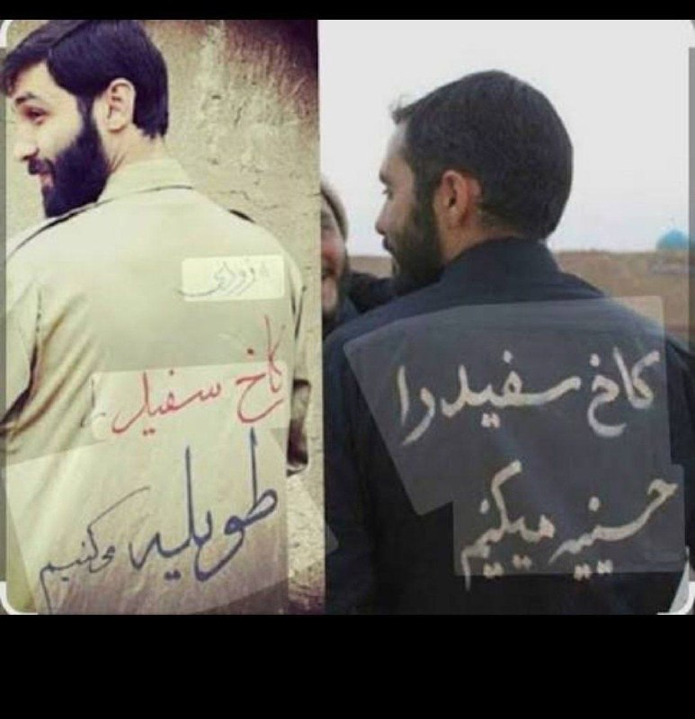

😂😂😂

@IranianMinds

## IranianMinds — post 22901

  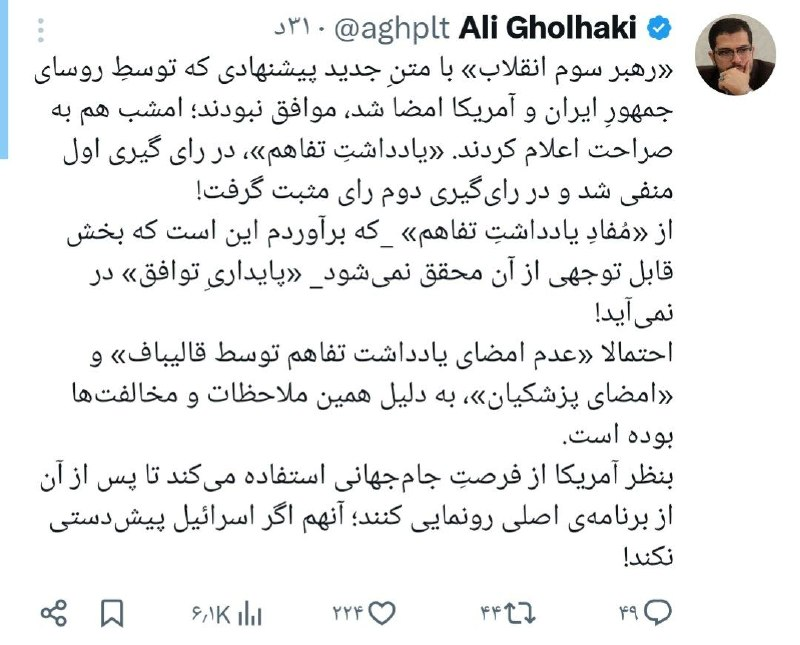

🔴 علی قلهکی؛ خبرنگار حکومتی :

این توافقی که من دیدم قابل اجرا نیست. به نظرم آمریکا داره از جام جهانی استفاده میکنه تا بعد از اون برنامه اصلی رو پیاده کنه. تازه اگه اسرائیل تا اون موقع پیش دستی نکنه.

@IranianMinds

## IranianMinds — post 22900

  

🔴 حمید رسایی :

باید پزشکیان رو اعدام کنیم.

@IranianMinds

## IranianMinds — post 22899

  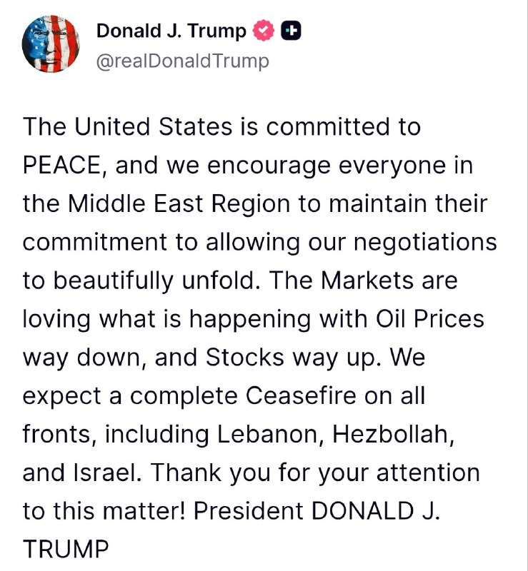

🔴 ترامپ:

ایالات متحده متعهد به صلح است و از همه کشورهای منطقه خاورمیانه می‌خواهیم که به تعهد خود برای پیشبرد زیبا و موفق مذاکرات پایبند بمانند.

بازارها عاشق اتفاقاتی هستند که در حال رخ دادن است: قیمت نفت به شدت پایین آمده و سهام‌ها به شدت بالا رفته‌اند.

ما انتظار آتش‌بس کامل در همه جبهه‌ها، از جمله لبنان، حزب‌الله و اسرائیل را داریم.

@IranianMinds

## IranianMinds — post 22898

⭕️
⭕️ کانفیگای این ربات تو نت ملی وصله به محض استارت ۱ گیگابایت کانفیگ میده بدون هیچ هزینه ای و رفرالی کانفیگ رو تحویلتون میده با بهترین سرعت و بدون قطعی 
⭕️ ربات دریافت کانفیگ رایگان | @daeijoonbot 
⭕️ ربات دریافت کانفیگ رایگان | @daeijoonbot

## IranianMinds — post 22897

⭕️
⭕️ کانفیگای این ربات تو نت ملی وصله به محض استارت ۱ گیگابایت کانفیگ میده
بدون هیچ هزینه ای و رفرالی کانفیگ رو تحویلتون میده با بهترین سرعت و بدون قطعی

⭕️ ربات دریافت کانفیگ رایگان | @daeijoonbot

⭕️ ربات دریافت کانفیگ رایگان | @daeijoonbot

## IranianMinds — post 22896

  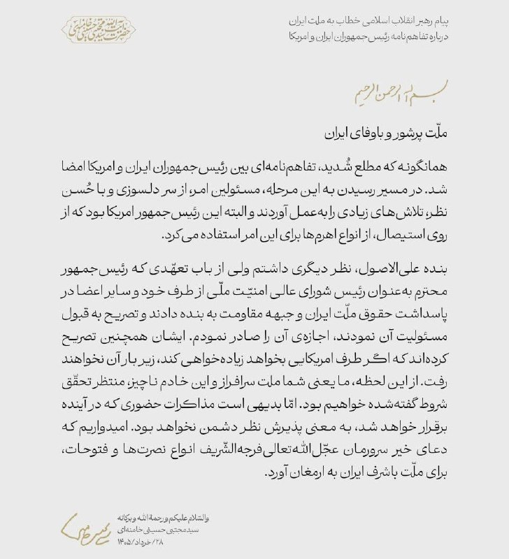

🔴 مجتبی خامنه ای:

من برای توافق با آمریکا نظر دیگه ای داشتم ولی چون پزشکیان به همراه سایر اعضای شورای عالی امنیت ملی مسئولیتش رو قبول کردن؛ منم دستورشو صادر کردم. از این لحظه ما مردم منتظر تحقق شروط تفاهم هستیم.

@IranianMinds

## IranianMinds — post 22895

  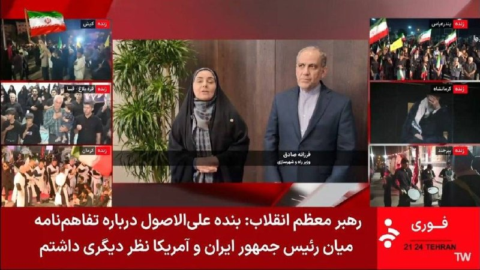

🔴زیرنویس صدا‌و‌سیما:

مجتبی در مورد تفاهم‌نامه نظر دیگه‌ای داشت😂

@IranianMinds

## IranianMinds — post 22894

🔴مجتبی بیانیه داد😂 @IranianMinds

## IranianMinds — post 22893

  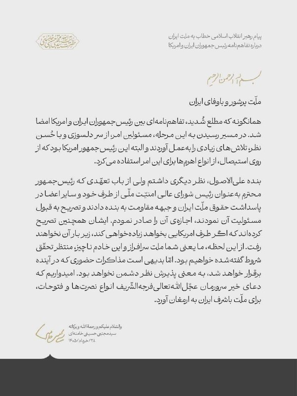

🔴مجتبی بیانیه داد😂

@IranianMinds

## IranianMinds — post 22892

  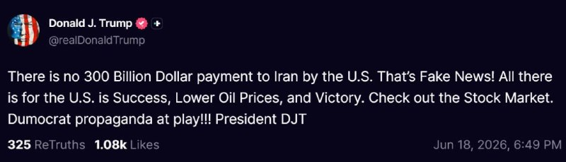

🔴پست ترامپ:

هیچ پرداخت ۳۰۰ میلیارد دلاری از سوی آمریکا به ایران وجود ندارد.
این اخبار جعلی است!
همه چیز برای آمریکا موفقیت، کاهش قیمت نفت و پیروزی است.
بازار سهام را بررسی کنید.
تبلیغات دموکرات‌های احمق در جریان است!!!

@IranianMinds

## IranianMinds — post 22891

  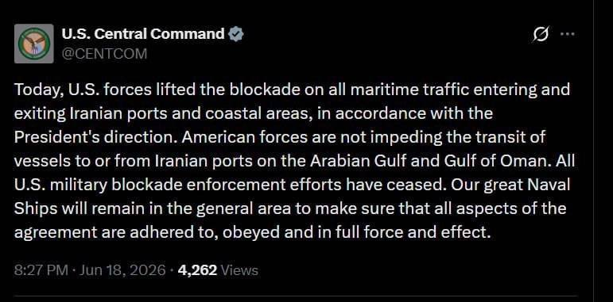

🔴سنتکام رسمأ رفع محاصره دریایی را اعلام کرد.

@IranianMinds

## IranianMinds — post 22889

تجمع اعتراضی دانش آموزان دوازدهمی و یازدهمی نسبت به فرجه امتحانات نهایی، شنبه 30 خرداد در تمامی استان ها مقابل درب آموزش و پرورش.

@IranianMinds

## BBCPersian — post 284300

  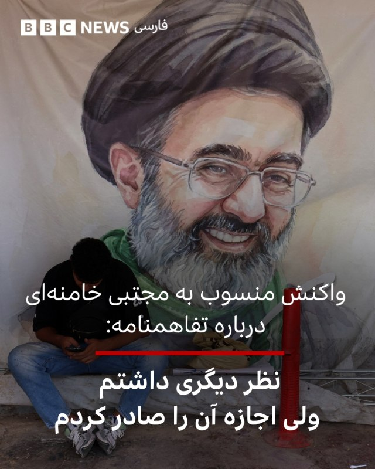

‌🔻رسانه‌های ایران گزارش داده‌اند مجتبی خامنه‌ای، رهبر جدید جمهوری اسلامی، گفته است که در مورد تفاهمنامه‌ آمریکا و ایران نظر دیگری داشته است ولی پس از آن‌که مسعود پزشکیان مسئولیت آن را پذیرفت، اجازه امضای آن را داده است.

رسانه‌های ایران،‌ شامگاه پنجشنبه متنی را به عنوان نظر مجتبی خامنه‌ای،‌ رهبر جمهوری اسلامی به امضای تفاهمنامه ایران و آمریکا منتشر کردند.

در این پیام آمده : «بنده علی‌الاصول، نظر دیگری داشتم ولی از باب تعهّدی که رئیس‌جمهور محترم به‌عنوان رئیس شورای عالی امنیّت ملّی از طرف خود و سایر اعضا در پاسداشت حقوق ملّت ایران و جبهه مقاومت به بنده دادند و تصریح به قبول مسئولیت آن نمودند، اجازه‌ی آن را صادر نمودم‌.»

آقای خامنه‌ای نوشت که آقای پزشکیان به او گفته که اگر طرف آمریکایی بخواهد زیاده‌خواهی کند، زیر بار آن نخواهند رفت.

«از این لحظه،‌ ما یعنی ملت سرافراز و این خادم ناچیز منتظر تحقق شروط گفته شده خواهیم بود.»

📷AFP via Getty Images
https://bbc.in/4vjH8OP

@BBCPersian

## BBCPersian — post 284299

  <a href="telegram/content/BBCPersian_284299_1781816498.mp4" target="_blank">🎬 Download video</a>

🔻آخرین خبرهای مهم روز پنجشنبه ۲۸ خرداد ۱۴۰۵
@BBCPersian

## BBCPersian — post 284298

  <a href="telegram/content/BBCPersian_284298_1781816501.mp4" target="_blank">🎬 Download video</a>

با وجود‌ آنکه برنامه‌ها در ارتباط با تفاهم‌نامه ایران و آمریکا دائما در حال تغییر است، هنوز انتظار می‌رود جی‌دی ونس، معاون رئیس‌جمهور آمریکا و محمد باقر قالیباف، رئیس مجلس ایران، فردا در یک هتل مجلل در سوئیس با هم ملاقات کنند و در مورد ترتیبات شروع مذاکرات دو ماهه بین دو کشور برای پایان دادن به جنگ گفتگو داشته باشند. کسری ناجی از محل این هتل در بورگنشتاک گزارش می‌دهد.

@BBCPersian

## BBCPersian — post 284297

  <a href="telegram/content/BBCPersian_284297_1781816503.mp4" target="_blank">🎬 Download video</a>

⁨ ⁨ ⁨ ⁨ ⁨ تصاویری از درگیری ماموران با زنان معترض به «نحوه فعالیت معدن کرومیت» در جنوب استان کرمان در شبکه‌های اجتماعی منتشر شده که نشان می‌دهد پلیس در حال ضرب و شتم چند زن است. منابع خبری که اخبار منطقه جنوب شرق ایران را پوشش می‌دهد، از «بازداشت شش شهروند، از جمله سه زن» و «مجروح شدن دست‌کم هفت زن بلوچ» در روستای پشموکی فاریاب خبر داده‌اند.

حال‌وش روز ۲۷ خرداد گزارش داد: «این برخوردها پس از آن صورت گرفت که زنان و ساکنان بلوچ منطقه برای دومین روز متوالی نسبت به آنچه مصادره حق مردم منطقه در بهره‌برداری از معدن کرومیت عنوان می‌کنند، اعتراض خود را ادامه دادند.»

به نوشته این وب‌سایت، معترضان معتقدند امتیاز بهره‌برداری از این معدن که از منابع مهم اقتصادی منطقه محسوب می‌شود، «در اختیار افراد دارای نفوذ قرار گرفته و مردم بومی از منافع آن محروم مانده‌اند».

## BBCPersian — post 284296

🔻ترامپ می‌گوید آمریکا انتظار دارد آتش‌بس در همه جبهه‌ها، از جمله لبنان، برقرار شود

🔻دونالد ترامپ می‌گوید که انتظار دارد آتش‌بس «در همه جبهه‌ها» از جمله در لبنان و میان اسرائیل و حزب‌الله هم برقرار شود.

رئیس‌جمهور آمریکا در پیام جدیدی در شبکه اجتماعی خودش تروث سوشیال نوشت که انتظار دارد کشورهای خاورمیانه «به تعهد خود برای فراهم کردن امکان برگزاری مذاکرات ما پایبند بمانند.»

او افزود: «ما انتظار داریم یک آتش‌بس کامل در همه جبهه‌ها برقرار شود؛ از جمله در لبنان، میان حزب‌الله و اسرائیل.»

در اولین بند تفاهمنامه امضا شده میان ایران و آمریکا بر «توقف فوری و دائمی عملیات نظامی در تمامی جبهه‌ها» از جمله لبنان تاکید دارد

با این حال اسرائیل اعلام کرده که برنامه‌ای برای خارج کردن نیروهای خود از لبنان ندارد. همچنین بر اساس گزارش رسانه‌های دولتی لبنان،‌ اسرائیل امروز به مناطقی در جنوب این کشور حمله کرده است.

https://bbc.in/4aaeDed
@BBCPersian

## BBCPersian — post 284295

🔻واکنش منسوب به مجتبی خامنه‌ای درباره تفاهمنامه: نظر دیگری داشتم ولی اجازه آن را صادر کردم

رسانه‌های ایران گزارش داده‌اند مجتبی خامنه‌ای، رهبر جدید جمهوری اسلامی، گفته است که در مورد تفاهمنامه‌ آمریکا و ایران نظر دیگری داشته است ولی پس از آن‌که مسعود پزشکیان مسئولیت آن را پذیرفت، اجازه امضای آن را داده است.

رسانه‌های ایران،‌ شامگاه پنجشنبه متنی را به عنوان نظر مجتبی خامنه‌ای،‌ رهبر جمهوری اسلامی به امضای تفاهمنامه ایران و آمریکا منتشر کردند.

در این پیام آمده : «بنده علی‌الاصول، نظر دیگری داشتم ولی از باب تعهّدی که رئیس‌جمهور محترم به‌عنوان رئیس شورای عالی امنیّت ملّی از طرف خود و سایر اعضا در پاسداشت حقوق ملّت ایران و جبهه مقاومت به بنده دادند و تصریح به قبول مسئولیت آن نمودند، اجازه‌ی آن را صادر نمودم‌.»

آقای خامنه‌ای نوشت که آقای پزشکیان به او گفته که اگر طرف آمریکایی بخواهد زیاده‌خواهی کند، زیر بار آن نخواهند رفت.

«از این لحظه،‌ ما یعنی ملت سرافراز و این خادم ناچیز منتظر تحقق شروط گفته شده خواهیم بود.»

در این پیام آقای خامنه‌ای در عمل مجوز گفت‌وگوهای مستقیم مقامات ایران و آمریکا را هم داده است:‌ «مذاکرات حضوری که در آینده برقرار خواهد شد،‌ به معنی پذیرش نظر دشمن نخواهد بود.»
https://bbc.in/4v3LF7r
@BBCPersian

## BBCPersian — post 284294

🔻وزارت خارجه سوئیس: جلسه روز جمعه با حضور نمایندگان آمریکا،‌ ایران،‌ پاکستان و قطر برقرار است

وزارت خارجه سوئیس امضای تفاهمنامه میان ایران و آمریکا را یک گام مهم برای کاهش تنش‌ها در منطقه برشمرد و از آن استقبال کرد.

در پیام وزارت خارجه سوئیس که در شبکه ایکس منتشر شده است آمده که جلسه دیدار فردا،‌ جمعه میان نمایندگان آمریکا و ایران و همچنین نمایندگانی از پاکستان و قطر به عنوان کشورهای میانجی همچنان برقرار است تا مذاکرات اولیه درباره نحوه اجرای این توافق را آغاز کنند.

پیشتر مقامات پاکستان از لغو یا به تعویق افتادن این جلسه خبر دادند. معاون رئیس‌جمهور آمریکا هم به خبرنگاران گفته بود که هنوز این دیدار در دستور کار است اما زمان آن مشخص نیست.
https://bbc.in/4v3LF7r
@BBCPersian

## BBCPersian — post 284293

  <a href="https://t.me/bbcpersian/284293" target="_blank">📎 Download file</a>

📻این هفته در پرگار: تیم ملی ایران یا «تیم جمهوری اسلامی»؟

🔻تیم ایران در جام جهانی فوتبال، تیم ملی ایران است یا تیم جمهوری اسلامی؟ این تیم آمال مردم در رقابت‌های جهانی را نمایندگی می‌کند یا جمهوری اسلامی را؟

میهمان‌ها:
مهرزاد بروجردی، استاد دانشگاه
امید شمس، حقوقدان

@BBCPersian

## BBCPersian — post 284292

  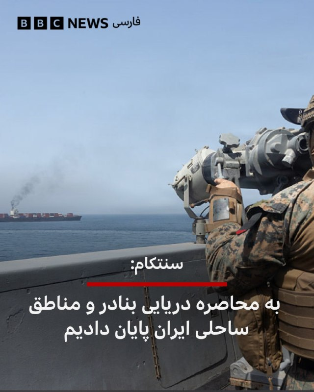

🔻فرماندهی مرکزی ایالات متحده آمریکا، سنتکام در پیامی در شبکه ایکس از پایان دادن به محاصره دریایی بنادر و مناطق ساحلی ایران خبر داد و اعلام کرد که «تمامی اقدامات نظامی آمریکا برای اجرای محاصره دریایی در خلیج فارس متوقف شده است.»

سنتکام شامگاه روز پنجشنبه به وقت ایران در شبکه ایکس نوشت:‌ «امروز، نیروهای ایالات متحده مطابق با دستور رئیس‌جمهور، محاصره دریایی تمامی ترددهای دریایی ورودی و خروجی از بنادر و مناطق ساحلی ایران را لغو کردند.»

آمریکا میگوید که «نیروهای آمریکایی دیگر مانع عبور کشتی‌ها به مقصد یا از مبدأ بنادر ایران در خلیج‌فارس و دریای عمان نمی‌شوند.»

فرماندهی مرکزی ارتش آمریکا می‌گوید: «ناوهای نیروی دریایی ما همچنان در منطقه حضور خواهند داشت تا اطمینان حاصل شود که تمامی مفاد این تفاهمنامه رعایت می‌شوند، به آن‌ها عمل می‌شود و توافق به‌طور کامل و مؤثر در حال اجرا است.»

📷U.S. Navy via Getty Images
https://bbc.in/4v3LF7r
@BBCPersian

## BBCPersian — post 284291

  <a href="telegram/content/BBCPersian_284291_1781816507.mp4" target="_blank">🎬 Download video</a>

🔻جرمی کلارکسون، مجری سرشناس تلویزیونی، که در ایران بیشتر با برنامه «تخت گاز» شناخته می‌شود، اعلام کرده که به سرطان پروستات مبتلا شده است.
او این خبر را در برنامه خود، «مزرعه کلارکسون» که روز چهارشنبه ۲۷ خرداد (۱۷ ژوئن) پخش شد، اعلام کرد.
کلارکسون ۶۶ ساله در این برنامه خبر ابتلای خود را به همکارانش، کالب کوپر و چارلی ایرلند، اطلاع می‌دهد. او جزئیاتی درباره مرحله بیماری خود ارائه نکرد، اما آن را «تهاجمی» توصیف کرد و گفت ۱۰ درصد از موضع بیماری در جریان درمان برداشته شده است.
جرمی کلارکسون توضیح داد: «چند هفته پیش برای نمونه‌برداری رفتم و مشخص شد که تهاجمی ولی در مراحل اولیه است.»
کلارکسون به همکارانش گفته که خودش کمتر از دو ماه است که از موضوع باخبر شده و به آنها اطمینان داده که حالش «خوب خواهد شد»، هرچند اشاره کرد که «برای مدتی» قادر به فعالیت نخواهد بود.

🎥Clarkson’s Farm
@BBCPersian

## BBCPersian — post 284290

  <a href="https://t.me/bbcpersian/284290" target="_blank">📎 Download file</a>

پادکست برنامه جام جهان‌نما پنجشنبه ۲۸ خرداد ۱۴۰۵
این برنامه رادیویی را می‌توانید هرشب ساعت ۲۰ به وقت ایران، روی موج متوسط ۷۰۲ کیلوهرتز و موج کوتاه ۹۴۶۵ کیلوهرتز بشنوید.تکرار برنامه را هم می‌توانید ساعت ۲۱:۳۰ روی موج متوسط ۷۰۲ کیلوهرتز و موج کوتاه ۵۳۹۵ کیلوهرتز گوش کنید.

@BBCPersian

## BBCPersian — post 284288

  <a href="https://t.me/bbcpersian/284288" target="_blank">📎 Download file</a>

📻 تازه‌ترین خبرهای جهان، پنج‌شنبه ۲۸ خرداد ۱۴۰۵

@BBCPersian

## BBCPersian — post 284287

🔻جام جهانی ۲۰۲۶ نه فقط بزرگ‌ترین جام جهانی تاریخ با حضور تیم ملی ایران و برجسته‌ترین ستاره‌ها و تیم‌های فوتبال دنیا که تورنمنتی همراه با حاشیه‌های سیاسی، اتفاقات خبرساز و بحث‌های خارج از زمین است. از ستاره‌های نام‌دار جهان فوتبال و غول‌های سنتی این رشته تا کشورها و بازیکنانی که حتی نامشان را هم نشنیده‌اید؛ جذاب‌ترین ماجراهای جام جهانی، تحلیل کارشناسان، برنامه مسابقات، آخرین نتایج وضعیت تیم‌ها در جدول را لحظه‌به‌لحظه با بی‌بی‌سی فارسی و صفحه ویژه جام جهانی ما دنبال کنید.

https://bbc.in/4gtG9Hi
@BBCPersian

## BBCPersian — post 284286

🔻محمدباقر قالیباف، رئیس مجلس ایران که ریاست هیئت مذاکره‌کننده ایرانی با نمایندگان آمریکا را برعهده داشت، عصر چهارشنبه در مصاحبه‌ای مفصل با تلویزیون دولتی ایران به نهایی شدن تفاهمنامه میان تهران و واشنگتن واکنش نشان داد و آن را موفقیتی بسیار بزرگتر از مقابله نظامی با ایالات متحده دانست.

او در مورد دستاوردهای ایران گفت: «هر آنچه را که با اقدام نظامی می‌خواستیم به دست بیاوریم، چندین برابر آن را از طریق مذاکره گرفتیم؛ اصلا قابل قیاس نبود. هر جنگی ممکن است پیروزی‌هایی داشته باشد، اما اگر این پیروزی‌ها در نهایت به یک سند حقوقی و سیاسی منجر و ثبت نشود، هیچ منفعتی نخواهد داشت.»

او در بخشی از صحبت‌های خود درباره انتقام کشته شدن علی خامنه‌ای گفت: «همان‌طور که خونخواهی امام حسین، ظهور امام زمان است، خونخواهی رهبر شهید هم آزادی قدس است... صد نتانیاهو بند کفش امام شهید ما هم نمی‌شود.»

آقای قالیباف در مورد وضعیت تنگه هرمز هم گفت: «تنگه هرمز هرگز به شرایط قبل بازنخواهد گشت. البته این به آن معنا نیست که ما در تنگه هرمز بخواهیم برخلاف قوانین بین‌المللی و مقررات دریانوردی عمل کنیم.»

https://bbc.in/4a9MGmN
@BBCPersian

## BBCPersian — post 284285

  <a href="telegram/content/BBCPersian_284285_1781816511.mp4" target="_blank">🎬 Download video</a>

🔻از شما خواسته‌ بودیم نظرتان درباره حضور تیم ملی فوتبال ایران در جام‌جهانی ۲۰۲۶ را با ما درمیان بگذارید.
تیم ملی فوتبال ایران در شرایط جنگی و بحران روابط ایران و آمریکا، برای تمرین و اردو و بازی تدارکاتی و ویزا با مشکلاتی مواجه بود، فقط یک روز قبل از مسابقه به لس‌آنجلس رسید و مجبور شد در مدت کوتاهی بعد از بازی، خاک آمریکا را ترک کند. از سوی دیگر، پست‌هایی در شبکه‌های اجتماعی منتشر شده که حاکی از تقابل میان ایرانیانی است که برای تماشای بازی ایران و نیوزیلند به ورزشگاه «سوفا» در لس‌آنجلس رفته بودند.
نظرات تعدادی از مخاطبان درباره حضور ایران در جام جهانی ۲۰۲۶، حواشی آن و اینکه چه تعبیر سیاسی می‌تواند داشته باشد را بشنوید.

📸 Getty Images
@BBCPersian

## Dirty_Kids — post 392535

  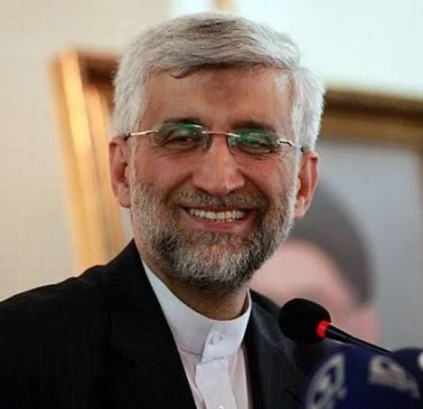

مجتبی خامنه‌ای : در مورد توافق نظر دیگه‌ای داشتم

@Dirty_Kids 👻

## Dirty_Kids — post 392534

  <a href="telegram/content/Dirty_Kids_392534_1781816514.mp4" target="_blank">🎬 Download video</a>

مین‌وایل زندگی الان بعضیا تو ایران.
١٩ ساعت پیش تو اینستاگرام آپلود شده.

@Dirty_Kids 👻

## Dirty_Kids — post 392533

  <a href="telegram/content/Dirty_Kids_392533_1781816516.mp4" target="_blank">🎬 Download video</a>

بازی خیره‌کننده ال پاچینو در فیلم «...و عدالت برای همه»

@Dirty_Kids 👻

## Dirty_Kids — post 392532

  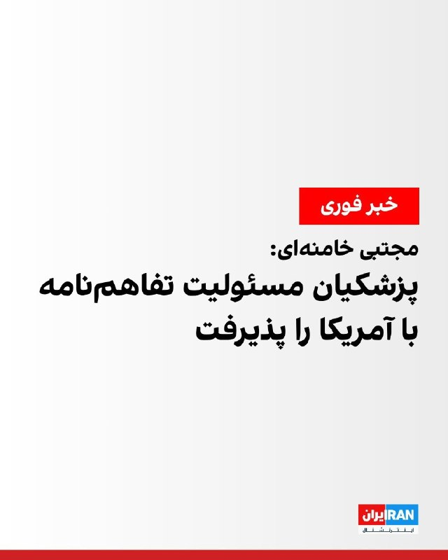

ای شغال طرقبه=)))))

@Dirty_Kids 👻

## Dirty_Kids — post 392531

  <a href="telegram/content/Dirty_Kids_392531_1781816519.mp4" target="_blank">🎬 Download video</a>

آقا ماهان ما که بخیل نیستیم ولی کیرم دهنت.

@Dirty_Kids 👻

## Dirty_Kids — post 392530

  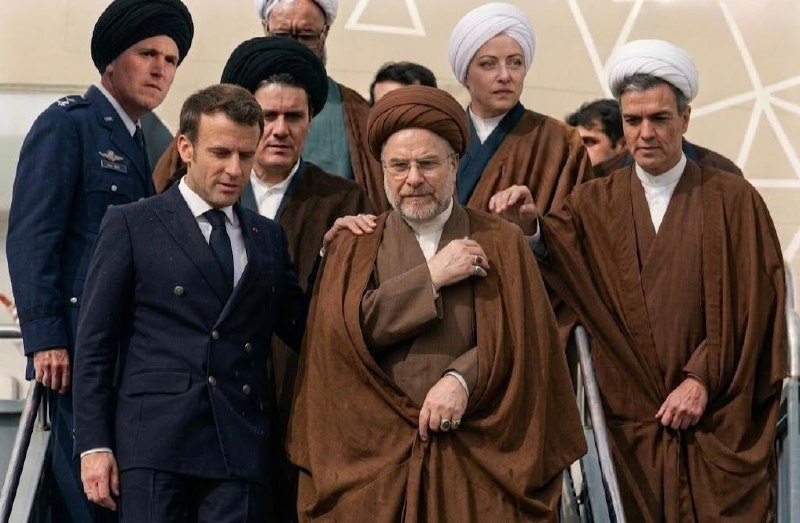

دیو چو بیرون رود
خارکصده درآید...!

@Dirty_Kids 👻

## Dirty_Kids — post 392529

  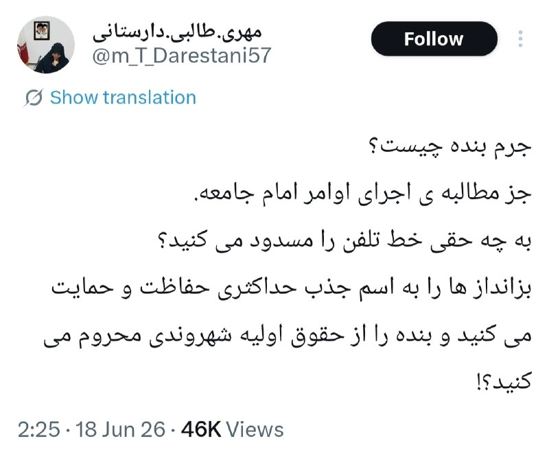

چرا چیزی شده😂😂😂😂

@Dirty_Kids 👻

## Dirty_Kids — post 392525

همین الان این پستو بفرست پیوی رفیقت و باهم بشاشین به این زندگی.

@Dirty_Kids 👻

## Dirty_Kids — post 392524

اوه اوه جنگ داخلی شروع شد🤣🤣
حاح خانم از کار پزشکیان بدجور عصبانی شده

@Dirty_Kids 👻

## Dirty_Kids — post 392523

  <a href="telegram/content/Dirty_Kids_392523_1781816537.mp4" target="_blank">🎬 Download video</a>

حواستون باشه اسید معدتون بالا نزنه
پدر و دخترن ازدواج کردن

@Dirty_Kids 👻

## Dirty_Kids — post 392522

  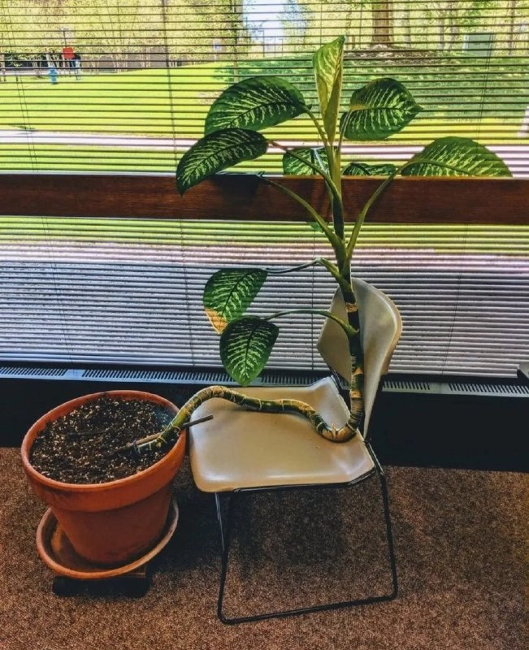

براش صندلی گذاشتن بشینه خسته نشه🥹🌱

@Dirty_Kids 👻

## Dirty_Kids — post 392521

  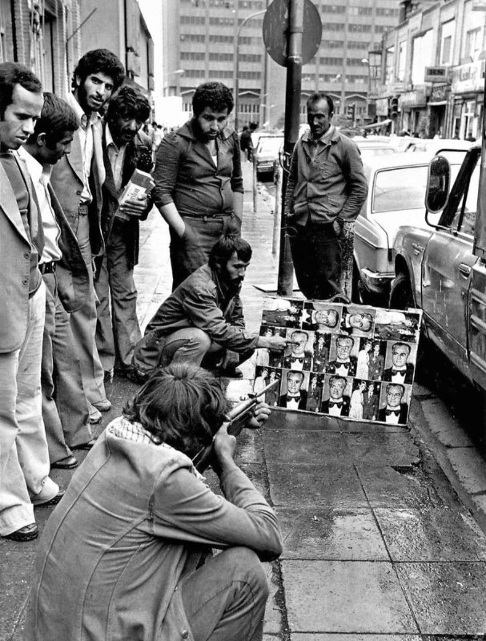

‏از پیرمردی پرسیدم "وفا" یعنی چی؟
گفت: ما نسل پنجاه و هفتیم، از سگ بپرس...

@Dirty_Kids 👻

## Dirty_Kids — post 392520

  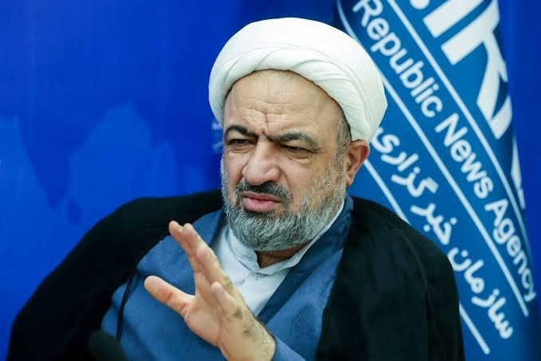

🔴 رسایی: پزشکیان به دلیل مخالفت با رهبری و در خطر انداختن نظام، باید اعدام بشه. خودم حاضرم طناب دار بندازم دور گردنش.

@Dirty_Kids 👻

## Dirty_Kids — post 392519

  <a href="telegram/content/Dirty_Kids_392519_1781816541.mp4" target="_blank">🎬 Download video</a>

از دوست دختر این مدارک بخوان دست دوست پسرشو نشون میده
اون وقت هر کی به پست ما میخوره میگه همو فالو نکنیم کسی نفهمه 😂

@Dirty_Kids 👻

## Dirty_Kids — post 392518

فوری
معاونت راهبردی پزشکیان پایان دادن به تجمعات است. تجمع کنندگان مخالف مصلحت اندیشی ها هستند و بهداشت روانی جامعه رو برهم زدند. تجمعات باید بعد از تشییع جنازه رهبر برچیده بشه.

@Dirty_Kids 👻

## Dirty_Kids — post 392517

  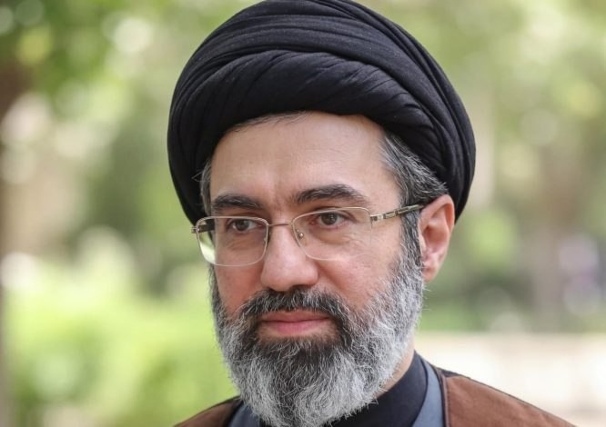

🔴 فوری، اولین پیام مجتبی به مناسبت توافق ایران و آمریکا:

ملت پرشور ایران، همون‌طور که مطلع شدین، تفاهم نامه‌ای بین رئیس جمهوران ایران و آمریکا امضا شد.
مسئولین از سر دلسوزی تلاش‌های زیادی انجام دادن و ترامپ رو مجبور کردن از سر درماندگی با ایران توافق کنه.
نظر من چیز دیگه بود ولی پزشکیان قبول کرد مسئولیت و عواقب توافق با اون باشه!!!
از این لحظه ما منتظر عملی شدن شروط گفته شده توسط آمریکا هستیم.

@Dirty_Kids 👻

## Dirty_Kids — post 392516

  

دوالیپا و شوهرش قشنگ معلومه بعد ازدواج توی ماه عسل روزی ۳۰ ۴۰ بار سکس کردن

@Dirty_Kids 👻

## Hranews — post 113712

گزارشی از آخرین وضعیت خلیل رسولی در زندان وکیل آباد مشهد`

❗️
❗️
❗️
❗️
❗️– خلیل رسولی، از بازداشت شدگان اعتراضات سراسری ۱۴۰۴، در حال تحمل دوران محکومیت خود در زندان وکیل آباد مشهد است. او اردیبهشت‌ماه سال جاری به هشت سال حبس، ۸۰ ضربه شلاق و ۲ سال تبعید محکوم شده است.

ادامه مطلب

#خلیل_رسولی

↘️
@hranews_bot تماس ✉️ -  @Hranews  کانال هرانا 🆑

## Hranews — post 113711

  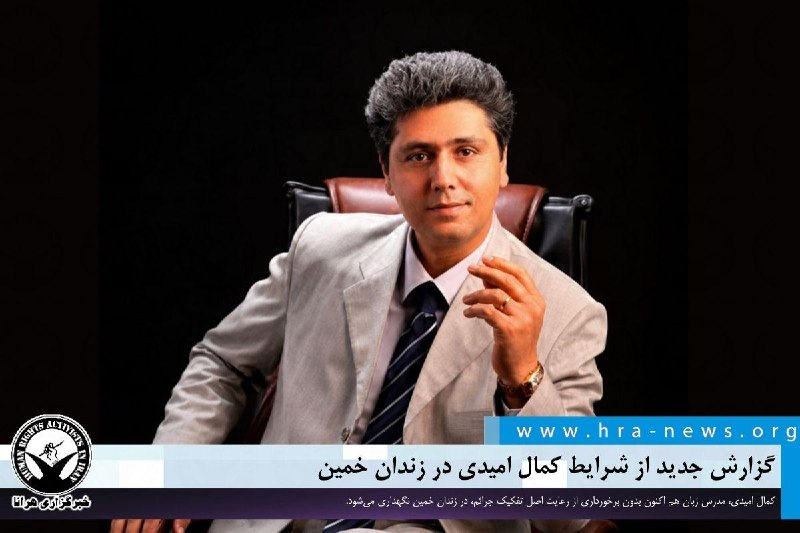

گزارش جدید از شرایط کمال امیدی در زندان خمین

❗️
❗️
❗️
❗️
❗️– کمال امیدی، مدرس زبان و مدیر یک آموزشگاه زبان در خمین بیش از ۴۰ روز است که بازداشت شده و هم اکنون بدون برخورداری از رعایت اصل تفکیک جرائم، در زندان خمین نگهداری می‌شود.

به گزارش خبرگزاری هرانا، ارگان خبری مجموعه فعالان حقوق بشر در ایران، کمال امیدی، کماکان در بازداشت به‌سر می‌برد.

بر اساس اطلاعات دریافتی هرانا، آقای امیدی هم اکنون بدون برخورداری از رعایت اصل تفکیک جرائم در کنار زندانیان جرائم خشن در زندان خمین نگهداری می‌شود. وی از زمان بازداشت تاکنون از دسترسی به وکیل و ملاقات با خانواده محروم مانده است.
یک منبع مطلع نزدیک به خانواده این شهروند ضمن تایید این خبر به هرانا گفت: “از دلایل بازداشت آقای امیدی اطلاعی در دست نیست. او در این مدت چند تماس تلفنی تحت نظارت بدون اشاره به وضعیت پرونده اش، با خانواده خود داشته است. “

ادامه مطلب

#کمال_امیدی

↘️
@hranews_bot تماس ✉️ -  @Hranews  کانال هرانا 🆑

## Hranews — post 113710

گزارشی از اعدام یک زندانی در زندان قروه

❗️
❗️
❗️
❗️
❗️– حکم یک زندانی که پیشتر از بابت اتهام قتل به #اعدام محکوم شده بود، در تاریخ ۲۴ دی‌ ۱۴۰۴ در زندان قروه به اجرا در آمد.

ادامه مطلب

#افشین_داودی

↘️
@hranews_bot تماس ✉️ -  @Hranews  کانال هرانا 🆑

## Hranews — post 113709

  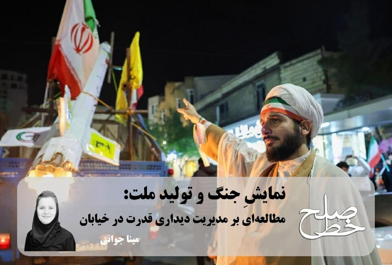

نمایشِ جنگ و تولید ملت: مطالعه‌ای بر مدیریت دیداری قدرت در خیابان/ #مینا_جوانی

📡
📡
📡
📡
📡– از نخستین شب‌های جنگ تا کنون، خیابان‌های شهرهای ایران به صحنه‌ی اجرای نوعی سیاست نمایشی بدل شدند؛ تجمعاتی، با حمایت حکومت، مملو از نور، پرچم، سرود، موکب که بیش از آن‌که بازتابی طبیعی از وضعیت اجتماعی باشند، تلاشی برای تولیدِ چهره‌ای یکدست و منسجم از «ملتِ حامی جنگ» به نظر می‌رسیدند. در این تجمعات، حکومت تنها در پی سازمان‌دهی حضور سیاسی نیست، فراتر از آن می‌کوشد از خلال مدیریت فضا، تصویر و عاطفه، روایت مطلوب خود از جامعه را مرئی کند. خیابان در شب، به بستری برای بازسازی نمادین مشروعیت تبدیل شد؛ جایی که قدرت تلاش می‌کند نه فقط افکار عمومی، بلکه «فرمِ رویت‌پذیرِ جامعه» را نیز کنترل کند.

اما هم‌زمان، در فاصله‌ای نه‌چندان دور از این صحنه‌های نورانی، جنگ واقعیتی دیگر را نیز در شهر گسترش می‌داد؛ واقعیتی متشکل از تخریب، ترس، اضطراب، سوگواری، فقر و مرگ. در حالی که دوربین‌ها بر پرچم‌ها و شعارها متمرکز بودند، بسیاری از قربانیان جنگ در سکوت و بی‌تصویری رها می‌شدند؛ کسانی که نه بخشی از قاب‌های تلویزیونی و رسانه‌ای بودند و نه در روایت رسمی جایی داشتند. شکاف میان این دو تصویر، جنگ به‌مثابه تجربه‌ای ویرانگر و جنگ به‌مثابه نمایشِ همبستگی، نشان می‌دهد که چگونه سیاست در وضعیت بحران، بیش از پیش به مدیریتِ تصویر و حذفِ واقعیت‌های مزاحم وابسته می‌شود.

ادامه مطلب
لینک به مطلب در وبسایت خط صلح

↘️
@hranews_bot تماس ✉️ - @Hranews کانال هرانا 🆑

## Hranews — post 113708

گزارشی از معوقات مزدی و بیمه‌ای کارگران کارخانه کیش‌چوب و شهرداری سنندج

❗️
❗️
❗️
❗️
❗️– شماری از #کارگران شاغل در کارخانه کیش‌چوب در استان هرمزگان و شهرداری سنندج از معوقات مزدی، پرداخت نشدن حق بیمه و عیدی خود ابراز نارضایتی کرده و خواستار رسیدگی به وضعیتشان شدند.

ادامه مطلب

↘️
@hranews_bot تماس ✉️ -  @Hranews  کانال هرانا 🆑

## Hranews — post 113707

گزارش تکمیلی؛ شمار اعدام شدگان در زندان زاهدان به ۳ تن افزایش یافت

❗️
❗️
❗️
❗️
❗️– با احتساب دو زندانی دیگر که سحرگاه دیروز چهارشنبه ۲۷ خردادماه، در زندان زاهدان #اعدام شدند، تعداد اعدام شدگان این روز در زندان مذکور به سه تن افزایش یافت.

ادامه مطلب

#ظاهر_گرگیج #ظاهر_شاهوزهی

↘️
@hranews_bot تماس ✉️ -  @Hranews  کانال هرانا 🆑

## Hranews — post 113706

گزارشی از اجرای حکم اعدام ۵ زندانی در زندان همدان

❗️
❗️
❗️
❗️
❗️– حکم پنج زندانی که پیشتر در پرونده‎‌های جداگانه از بابت اتهامات مرتبط با جرائم مواد مخدر و قتل به اعدام محکوم شده بودند، در زندان‌ همدان اجرا شد.

#رامین_باقری #علیرضا_ملکی #فرزاد_بهرامی
#صمد_نادرپور #حسین_شهامت

ادامه مطلب

↘️
@hranews_bot تماس ✉️ - @Hranews کانال هرانا 🆑

## Hranews — post 113705

  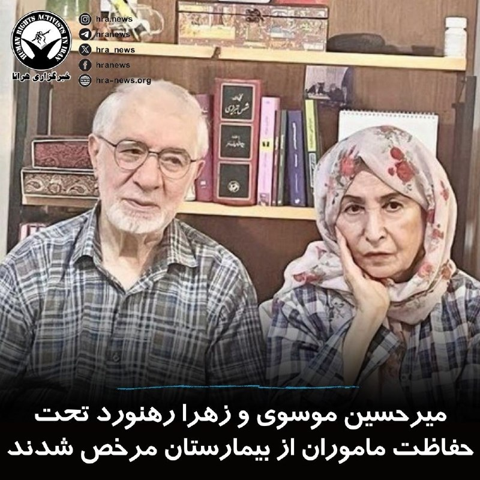

میرحسین موسوی و زهرا رهنورد از بیمارستان مرخص و به منزلی که توسط مأموران امنیتی تعیین شده است، منتقل شده‌اند. امتداد ضمن اعلام این خبر گزارش داد که روند درمان میرحسین موسوی همچنان ادامه دارد.

میرحسین موسوی و همسرش، زهرا رهنورد، از سال ۱۳۸۹ در حصر خانگی به سر می‌برند. پیشتر نیز گزارش‌هایی مبنی بر انتقال این دو به مکانی خارج از محل حصر خانگی‌شان، پس از آغاز حملات اسرائیل و آمریکا، منتشر شده بود.

#میرحسین_موسوی #زهرا_رهنورد

↘️
@hranews_bot تماس ✉️ - @Hranews کانال هرانا 🆑

## manototv — post 106163

  <a href="telegram/content/manototv_106163_1781816547.mp4" target="_blank">🎬 Download video</a>

‌
ترامپ در پاسخ به پرسشی درباره حمله به مدرسه میناب در روز نخست جنگ که به کشته شدن بیش از ۱۰۰ کودک منجر شد، گفت این موضوع در دست بررسی است و «هیچ‌کس عمداً چنین کاری نکرده است.»

او با تأکید بر این‌که «در جنگ اشتباه رخ می‌دهد» و «جنگ کثیف است»، در ادامه به کشته‌شدگان حملات ایران اشاره کرد و گفت گزارش این پرونده می‌تواند به‌زودی منتشر شود. ترامپ همچنین خبرنگاران را برای جزئیات بیشتر به پیت هگست، وزیر جنگ آمریکا، ارجاع داد.

## manototv — post 106162

  <a href="telegram/content/manototv_106162_1781816549.mp4" target="_blank">🎬 Download video</a>

ترامپ در پاسخ به پرسشی درباره باقی ماندن بخشی از توان موشکی جمهوری اسلامی گفت آمریکا «۸۴ تا ۸۵ درصد» موشک‌های ایران را منهدم کرده و آنچه باقی مانده، عمدتاً زیر زمین است و بیرون آوردنش برای ایران آسان نخواهد بود.

او همچنین گفت بازسازی توان موشکی ایران زمان‌بر خواهد بود و تأکید کرد هدفش کشاندن جنگ به مرحله‌ای نبود که مردم ایران با بحران انسانی روبه‌رو شوند یا حمله به زیرساخت‌های نفتی و آب‌شیرین‌کن‌ها بازار جهانی را دچار بحران کند.

ترامپ در بخش دیگری از سخنانش، درباره برنامه هسته‌ای غیرنظامی جمهوری اسلامی گفت ایران از بزرگ‌ترین ذخایر نفت جهان برخوردار است و پرسید: «اصلاً برای چه به انرژی هسته‌ای نیاز دارد؟»

## alonews — post 129010

  <a href="telegram/content/alonews_129010_1781816552.webm" target="_blank">🎬 Download video</a>

👈حمله عظیم پهپادی اوکراین برای دومین بار طی ۲۴ساعت گذشته

🔴 تا کنون در این موج بیش از ۳۰۰ پهپاد شلیک شده است

✅ @AloNews خبر جنگ

## alonews — post 129009

  <a href="telegram/content/alonews_129009_1781816552.webm" target="_blank">🎬 Download video</a>

👈نورالدین الدغیر خبرنگار الجزیره مستقر در تهران: «اطلاعاتی حاکی از آن است که دیدار ایران و آمریکا در سوئیس برای فردا جمعه دیگر برگزار نمی‌شود، اما مذاکرات طبق تفاهمنامه ادامه خواهد یافت، هرچند ممکن است به سطح کارشناسی محدود شود و احتمال دارد بازگشت به پلتفرم قدیمی در مذاکرات صورت گیرد.»

✅ @AloNews خبر جنگ

## alonews — post 129008

  <a href="telegram/content/alonews_129008_1781816553.webm" target="_blank">🎬 Download video</a>

👈معاریو : مقامات اسرائیلی از شکاف عمومی بین ترامپ و نتانیاهو که ممکن است فراتر از کلمات به اقدامات عینی از جمله تأخیر در ارسال سلاح‌ها، محدودیت‌های کمک‌های نظامی و حتی اقداماتی شبیه به محاصره تسلیحاتی تبدیل شود، می‌ترسند.
اسرائیل معتقد است فشار آمریکا برای عقب‌نشینی از جنوب لبنان و حریم سوریه تشدید خواهد شد.

✅ @AloNews خبر جنگ

## alonews — post 129007

  <a href="telegram/content/alonews_129007_1781816554.webm" target="_blank">🎬 Download video</a>

👈وزیر جنگ اسرائیل: اسرائیل در هر لحظه برای عملیات مستقل در ایران آماده است

✅ @AloNews خبر جنگ

## alonews — post 129006

  <a href="telegram/content/alonews_129006_1781816554.mp4" target="_blank">🎬 Download video</a>

👈اوباما:

همان‌طور که بی‌قراریم، مردم به دنبال خشم و تفرقه همیشگی نیستند. آن‌ها به دنبال انصاف و عقل سلیم و احترام متقابل هستند. در اعماق وجودمان، می‌خواهیم راهی برای بازگشت به سوی یکدیگر پیدا کنیم، نه دور شدن بیشتر.

✅ @AloNews خبر جنگ

## alonews — post 129005

🔴فوری / ویتکاف: بازرسان آژانس راهی ایران می‌شوند

✅ @AloNews خبر جنگ

## alonews — post 129004

  <a href="telegram/content/alonews_129004_1781816557.webm" target="_blank">🎬 Download video</a>

👈اداره دریانوردی بریتانیا: تنگه هرمز اکنون باز است

✅ @AloNews خبر جنگ

## alonews — post 129003

مردی در یک شرکت بود که همیشه پشت صحنه همه تصمیم‌ها را می‌گرفت، اما هیچ‌وقت نامش در میان نبود.
هر پروژه‌ای که شروع می‌شد، یکی از کارمندان را جلو می‌انداخت و می‌گفت: «این ایده خودش بود.»
وقتی کار خوب پیش می‌رفت، آرام‌آرام خودش را صاحب اصلی فکر معرفی می‌کرد.
اما اگر مشکلی پیش می‌آمد، همان فرد را مقصر نشان می‌داد.
همه تصور می‌کردند او فقط یک ناظر بی‌طرف است.
درحالی‌که نخ تمام ماجراها در دست خودش بود.
سال‌ها این بازی را ادامه داد و همیشه چهره‌ای پاک و منطقی از خود ساخت.
تا اینکه یک روز چند نفر از همان قربانی‌ها کنار هم نشستند.
رد همه تصمیم‌ها را دنبال کردند و فهمیدند فرمان از کجا صادر می‌شده است.
حقیقت که آشکار شد، دیگر کسی حاضر نشد سپر بلای او باشد.
آن روز برای اولین بار مجبور شد خودش جلو بایستد.
و تازه فهمید روسفیدیِ واقعی با پنهان شدن پشت دیگران به دست نمی‌آید.

[@AloTweet]

## alonews — post 129002

  <a href="telegram/content/alonews_129002_1781816558.webm" target="_blank">🎬 Download video</a>

👈 دبیر کمیته ملی کنترل و پیشگیری سرطان وزارت بهداشت درمان و آموزش پزشکی: ابتلا به سرطان در ایران تا سال ۱۴۴۰، دو برابر میانگین جهانی است.

✅ @AloNews خبر جنگ

## alonews — post 129001

  <a href="telegram/content/alonews_129001_1781816558.webm" target="_blank">🎬 Download video</a>

👈 سفیر پیشین روسیه در ایران: یادداشت تفاهم ایران و آمریکا یک پیروزی تاکتیکی برای تهران بود

✅ @AloNews خبر جنگ

## alonews — post 129000

  <a href="telegram/content/alonews_129000_1781816559.webm" target="_blank">🎬 Download video</a>

👈شریعتمداری: شهید لاریجانی دنبال این بود که حساب گروسی را برسد؛ اما جنگ شد و کشته شد

✅ @AloNews خبر جنگ

## alonews — post 128999

  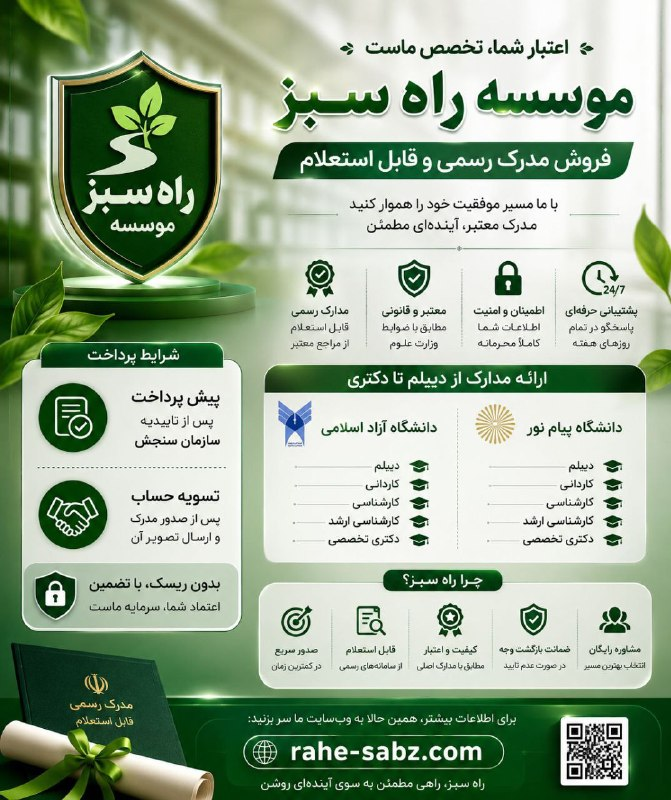

ارائه مدارک تحصیلی معتبر از «دیپلم تا دکتری» 🎓

مدارک رسمی و معتبر  هستند و قابلیت استعلام  بصورت نامه نگاری و آنلاین از سامانه های مربوطه را دارد
قبل از پیش پرداخت ثبت نام شما انجام میشه و تاییدیه سنجش دریافت میکنید سپس پیش پرداخت واریز میکنید ✅
مؤسسه راه سبز تنها مؤسسه صدور مدرکی هست که رضایت ویدیؤیی متقاضی هارو داره

صفحه تلگرام :
t.me/+2yeLgZeivDkzNDYx

وب سایت :
Rahe-sabz.com
➖➖➖➖➖➖➖➖➖➖➖➖

## alonews — post 128998

  <a href="telegram/content/alonews_128998_1781816559.webm" target="_blank">🎬 Download video</a>

👈مسئول سیاست خارجی اتحادیه اروپا: ما تحریم‌های مختلفی علیه ایران داریم. اگر توافق هسته‌ای وجود داشته باشد، فکر می‌کنم کشورهای عضو اتحادیه اروپا در مورد این لغو تحریم‌ها بحث خواهند کرد

✅ @AloNews خبر جنگ

## alonews — post 128997

  <a href="telegram/content/alonews_128997_1781816560.mp4" target="_blank">🎬 Download video</a>

👈در جریان حمله امروز صبح پهپادهای اوکراینی به پالایشگاه مسکو، یکی از موشک های پدافند هوایی عاجز از رهگیری پهپادها دچار سردرگمی می شود و بسیار دقیق یکی از از مخازن سوخت را منهدم می کند !

✅ @AloNews خبر جنگ

## alonews — post 128996

  <a href="telegram/content/alonews_128996_1781816561.webm" target="_blank">🎬 Download video</a>

👈شریعتمداری، مدیر مسئول کیهان: با مصادره اموال آمریکایی‌ها و متحدانش از طریق تنگه هرمز باید غرامت بگیریم از آمریکا 
✅ @AloNews خبر جنگ

## alonews — post 128995

  <a href="telegram/content/alonews_128995_1781816562.webm" target="_blank">🎬 Download video</a>

👈المیادین به نقل از منبع آگاه: هیئت مذاکره کننده ایرانی سفر خود به سوئیس را به دلیل تداوم حملات اسرائیل به جنوب لبنان متوقف می‌کند

✅ @AloNews خبر جنگ

## alonews — post 128994

  <a href="telegram/content/alonews_128994_1781816562.mp4" target="_blank">🎬 Download video</a>

اولین پاسخ پزشکیان به بیانیه مجتبی:

[@AloTweet]

## alonews — post 128993

  <a href="telegram/content/alonews_128993_1781816564.webm" target="_blank">🎬 Download video</a>

👈ثابتی: شرافتمندانه نیست

✅ @AloNews خبر جنگ

## alonews — post 128992

  <a href="telegram/content/alonews_128992_1781816564.webm" target="_blank">🎬 Download video</a>

👈رسایی : باید پزشکیان رو اعدام کنیم. 
✅ @AloNews خبر جنگ

## alonews — post 128991

  <a href="telegram/content/alonews_128991_1781816565.webm" target="_blank">🎬 Download video</a>

👈شریعتمداری، مدیر مسئول کیهان: با مصادره اموال آمریکایی‌ها و متحدانش از طریق تنگه هرمز باید غرامت بگیریم از آمریکا

✅ @AloNews خبر جنگ

<!-- MSG END -->

<!-- NAV START -->

<a href="https://github.com/Tljn/FUD/blob/main/telegram/content/archive_1.md" style="display:inline-block; padding:6px 12px; margin:0 4px; background-color:#2ea44f; color:white; text-decoration:none; border-radius:4px; font-weight:bold;">صفحه بعد</a>

<!-- NAV END -->
