# خواننده تلگرام

<!-- TOP_NAV START -->

<a href="https://github.com/Tljn/FUD/blob/main/telegram/content/archive_1.md" style="display:inline-block; padding:6px 12px; margin:0 4px; background-color:#2ea44f; color:white; text-decoration:none; border-radius:4px; font-weight:bold;">صفحه بعد</a>

<!-- TOP_NAV END -->

<!-- MSG START -->

---
📅 بروزرسانی: 1405/04/02 16:19
---

## VahidOOnLine — post 246980

  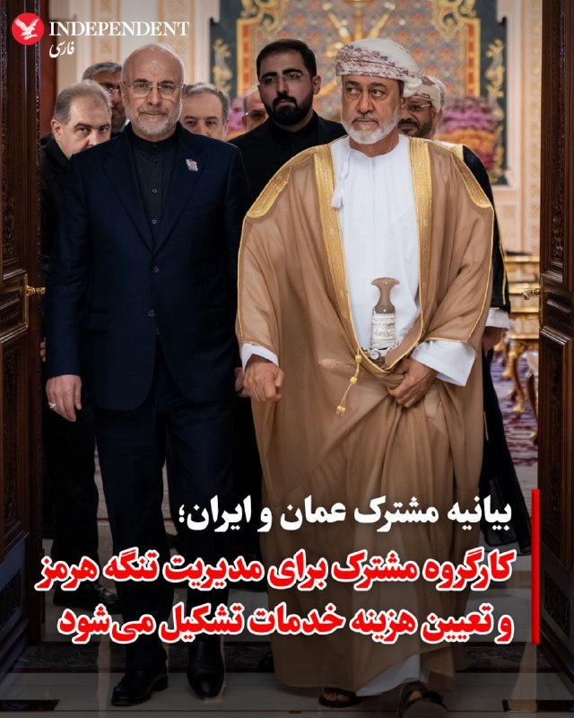

♦️ سلطنت عمان و جمهوری اسلامی ایران پس از رایزنی‌های دیپلماتیک هیئت بلندپایه ایرانی با سلطان هیثم بن طارق و وزیر خارجه عمان در مسقط، بیانیه‌ای مشترک صادر کردند. در این بیانیه، که روز سه‌شنبه دوم تیرماه منتشر شد، مسقط پشتیبانی خود را از یادداشت تفاهم «اسلام‌آباد» میان ایران و آمریکا اعلام کرد.

ایران و عمان به عنوان دو کشور ساحلی مشرف بر تنگه هرمز، ضمن تاکید بر التزام خود به تضمین عبور امن شناورها طبق قوانین بین‌المللی، بر حاکمیت و حقوق حاکمیتی خود بر آب‌های منطقه‌ای این آبراه پافشاری کردند.

دو کشور توافق کردند تا از طریق یک کارگروه مشترک، گفتگوها را برای دستیابی به توافقی پیرامون «مدیریت آینده ناوبری در تنگه هرمز، خدمات ارائه‌شده و هزینه‌های مرتبط با آن بر اساس معیارهای بین‌المللی» ادامه دهند. این تفاهم شامل برگزاری گفتگو با سایر کشورهای ساحلی منطقه و طرف‌های ذی‌ربط نیز خواهد بود. در پایان، هر دو کشور بر تعهد خود جهت باز و امن نگه داشتن این آبراه حیاتی برای ناوبری بین‌المللی و تقویت ثبات منطقه‌ای تاکید کردند.
‌🇸🇦 Indypersian

🤖 @VahidOOnLine

## VahidOOnLine — post 246979

  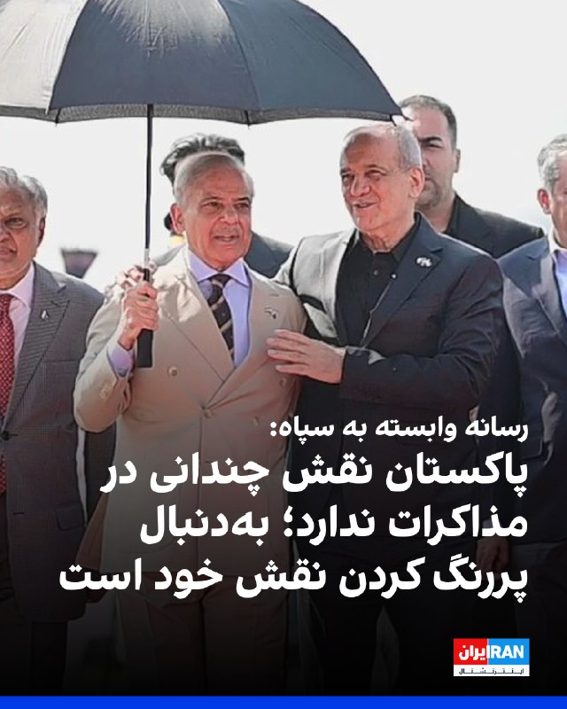

خبرگزاری فارس، وابسته به سپاه پاسداران، در واکنش به اظهارات شهباز شریف، نخست‌وزیر پاکستان، درباره مطرح شدن برنامه موشک‌های بالستیک جمهوری اسلامی در مذاکرات، نوشت این سخنان «کاملا اشتباه و احتمالا ناشی از بی‌اطلاعی است.»

فارس همچنین نوشت پاکستان در حال حاضر «نقش چندانی در میانجی‌گری مذاکرات ندارد» و اظهارات شهباز شریف بیشتر با هدف «پررنگ‌نمایی نقش واسطه‌گری» این کشور مطرح شده است.

این خبرگزاری افزود که در شرایط کنونی، قطر موثرترین نقش را در روند میانجی‌گری میان جمهوری اسلامی و آمریکا ایفا می‌کند.

شهباز شریف، نخست‌وزیر پاکستان، سه‌شنبه دوم تیر در مجلس ملی این کشور گفته بود موضوعاتی از جمله برنامه هسته‌ای جمهوری اسلامی، موشک‌های بالستیک، کاهش تحریم‌ها و دارایی‌های مسدودشده ایران در مذاکرات سوئیس مورد بحث قرار خواهد گرفت.
‌🏁 🇬🇧 IranintlTV

🤖 @VahidOOnLine

## VahidOOnLine — post 246978

  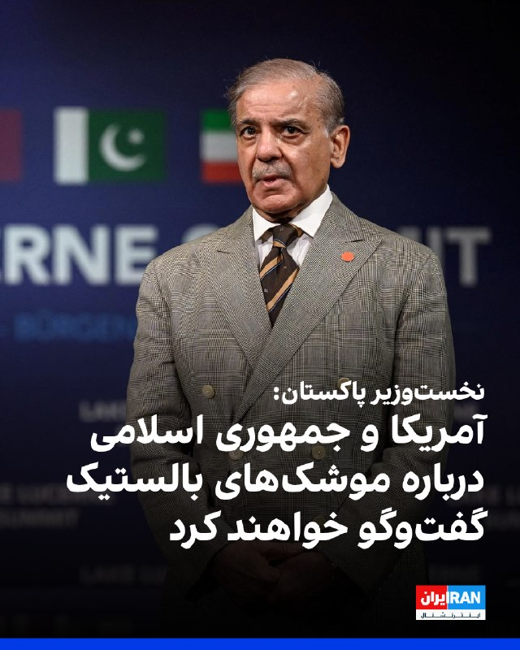

شهباز شریف، نخست‌وزیر پاکستان، سه‌شنبه دوم تیر در مجلس ملی این کشور گفت گفت: «آمریکا و جمهوری اسلامی در ۶۰ روز آینده در سطح فنی درباره پرونده هسته‌ای، موشک‌های بالستیک و دارایی‌های مسدودشده جمهوری اسلامی گفت‌وگو خواهند کرد.»

او افزود آمریکا و جمهوری اسلامی پس از مذاکرات سوئیس بر سر یک نقشه راه برای ادامه گفت‌وگوها توافق کرده‌اند و مذاکرات فنی برای دستیابی به توافق نهایی ادامه خواهد یافت.

نخست‌وزیر پاکستان ابراز امیدواری کرد تفاهم‌نامه اسلام‌آباد به یک توافق پایدار تبدیل شود.
‌🏁 🇬🇧 IranintlTV

🤖 @VahidOOnLine

## VahidOOnLine — post 246977

  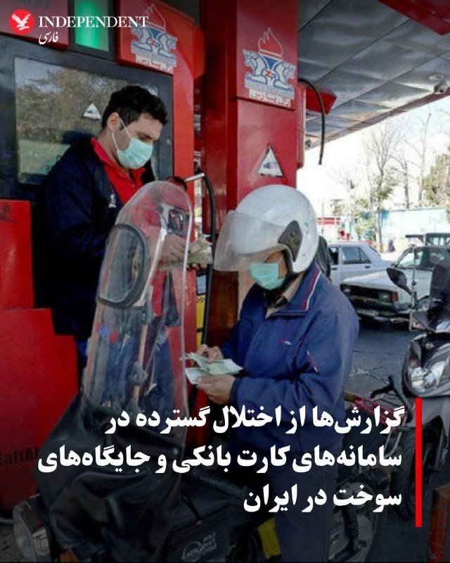

♦️در ادامه اختلال در شبکه بانکی ایران، سخنگوی صنف جایگاه‌های سوخت اعلام کرد احتمال موفقیت پرداخت الکترونیکی بهای سوخت در جایگاه‌ها پایین است و از شهروندان خواست تا اطلاع ثانوی برای سوخت‌گیری پول نقد همراه داشته باشند.

رضا نواز در گفتگو با ایرنا گفت مشکلات ایجادشده در سامانه‌های بانکی طی روزهای اخیر بر فعالیت جایگاه‌های سوخت نیز تاثیر گذاشته است. او افزود بخشی از این مشکلات با همکاری شرکت ملی پخش فرآورده‌های نفتی و همراهی مالکان و کارکنان جایگاه‌ها مدیریت شده، اما وضعیت از روز سه‌شنبه دوم تیرماه دشوارتر شده و نیاز به همکاری بیشتر مردم وجود دارد.

نواز با اشاره به کاهش احتمال موفقیت تراکنش‌های الکترونیکی در برخی جایگاه‌ها گفت همراه داشتن پول نقد می‌تواند از ایجاد صف‌های طولانی و اختلال بیشتر در روند سوخت‌گیری جلوگیری کند. او از مردم خواست در این شرایط با کارکنان جایگاه‌های سوخت همکاری کنند.

این اظهارات در حالی مطرح می‌شود که گزارش‌ها از اختلال در سامانه‌های بانکی و مشکلات در استفاده از کارت‌های بانکی و خدمات پرداخت الکترونیکی در نقاط مختلف ایران حکایت دارد.
‌🇸🇦 Indypersian

🤖 @VahidOOnLine

## VahidOOnLine — post 246976

  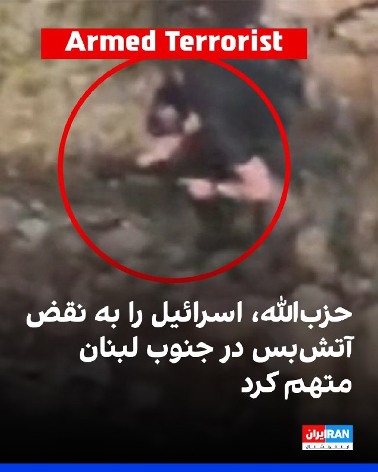

حزب‌الله لبنان سه‌شنبه دوم تیر در بیانیه‌ای اعلام کرد اسرائیل با حمله به سوی «گروهی از غیرنظامیان» در نزدیکی نبطیه در جنوب لبنان، آتش‌بس را نقض کرده است.

در مقابل، ارتش اسرائیل اعلام کرد نیروهایش گروهی از نیروهای حزب‌الله را که در منطقه تپه علی طاهر تهدیدی برای نیروهای اسرائیلی محسوب می‌شدند، هدف قرار داده‌اند. ارتش اسرائیل همچنین تصویری را منتشر کرد که به گفته این نهاد، یکی از افراد هدف قرارگرفته را نشان می‌دهد.

حزب‌الله گفت ارتش اسرائیل به سوی «گروهی از غیرنظامیان که در حال بازگشایی جاده‌ها و بیرون آوردن پیکر کشته‌شدگان از زیر آوار بودند» آتش گشوده است.

رسانه‌های لبنانی گزارش دادند در این حادثه دو نفر بر اثر تیراندازی اسرائیل کشته و چند نفر دیگر زخمی شده‌اند.

حزب‌الله در بیانیه‌ای اعلام کرد: «آنچه دشمن انجام داده، نقض آشکار آتش‌بس است؛ آتش‌بسی که حزب‌الله تا این لحظه به آن پایبند بوده است.»
‌🏁 🇬🇧 IranintlTV

🤖 @VahidOOnLine

## VahidOOnLine — post 246975

  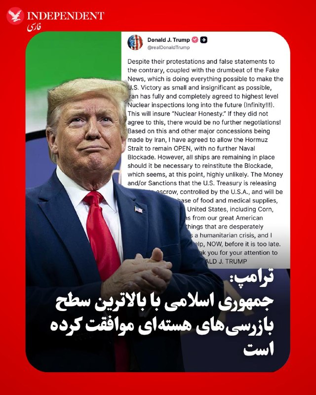

♦️دونالد ترامپ، رئیس‌جمهوری آمریکا، سه‌شنبه دوم تیرماه، در پیامی در شبکه اجتماعی تروث سوشال اعلام کرد جمهوری اسلامی با بالاترین سطح بازرسی‌های هسته‌ای برای آینده‌ای طولانی موافقت کرده است و این موضوع «صداقت هسته‌ای» را تضمین می‌کند.

ترامپ نوشت برخلاف «اعتراض‌ها و اظهارات نادرست» جمهوری اسلامی و آنچه «رسانه‌های جعلی» بازتاب می‌دهند، تهران به‌طور کامل این بازرسی‌ها را پذیرفته است. او افزود اگر جمهوری اسلامی با این شرط موافقت نمی‌کرد، مذاکرات بیشتری انجام نمی‌شد.

رئیس‌جمهوری آمریکا همچنین گفت بر اساس این توافق و «امتیازهای بزرگ دیگر» از سوی جمهوری اسلامی، اجازه داده است تنگه هرمز باز بماند و محاصره دریایی بیشتری اعمال نشود. او در عین حال تاکید کرد همه کشتی‌های آمریکا در موقعیت خود باقی می‌مانند تا در صورت ضرورت، محاصره دوباره برقرار شود، هرچند این احتمال را در شرایط فعلی بسیار بعید دانست.

ترامپ در ادامه اعلام کرد پول‌ها یا معافیت‌های تحریمی که از سوی وزارت خزانه‌داری آمریکا آزاد می‌شود، در حساب امانی تحت کنترل آمریکا نگهداری خواهد شد و فقط برای خرید مواد غذایی و تجهیزات پزشکی از آمریکا، از جمله ذرت، گندم و سویا، استفاده می‌شود.

او با اشاره به وضعیت ایران، آن را یک «بحران انسانی» توصیف کرد و گفت کمک‌رسانی باید پیش از آنکه دیر شود انجام شود. ترامپ در پایان نوشت: «مذاکرات به خوبی پیش می‌رود.»
‌🇸🇦 Indypersian

🤖 @VahidOOnLine

## VahidOOnLine — post 246974

♦️جام جهانی در یک روز پرهیجان، دو دلیل برای شادی خاندان سلطنتی هلند ساخت؛ پیروزی پرگل تیم ملی هلند و نخستین امتیاز تاریخی کوراسائو در این رقابت‌ها.
هرچند میان هلند و کوراسائو، مستعمره پیشین این کشور در کارائیب، حدود ۸ هزار کیلومتر فاصله است، اما جام جهانی باعث شد ویلم الکساندر، پادشاه هلند، ملکه ماکسیما و شاهدخت آریان در یک روز هر دو تیم را از نزدیک تشویق کنند.
در روز ۳۱ خرداد آن‌ها ابتدا در هیوستون روی سکوها نشستند و پیروزی ۵ بر ۱ هلند مقابل سوئد را دیدند؛ بردی پرگل که ورزشگاه را به صحنه شادی هواداران نارنجی‌پوش تبدیل کرد. چند ساعت بعد، خانواده سلطنتی مسیری حدود هزار و ۳۰۰ کیلومتر به سمت شمال تا کانزاس‌، طی کردند تا بازی کوراسائو مقابل اکوادور را هم ببینند؛ دیداری که با نخستین امتیاز تاریخ کوراسائو در جام جهانی همراه شد.
پس از بازی، اعضای خاندان سلطنتی هلند به رختکن کوراسائو رفتند و کنار بازیکنان، در شادی و رقص آن‌ها شریک شدند.
کوراسائو با جمعیتی حدود ۱۵۸ هزار نفر، همچنان بخشی از پادشاهی هلند به شمار می‌رود.
پادشاه ویلم الکساندر در گفت‌وگو با آر‌تی‌ال گفت: «این جام جهانی برای ما بسیار ویژه است، چون هم هلند را داریم و هم کوراسائو را؛ بنابراین دو برابر تیم برای تشویق کردن داریم. فرصت خوبی است که هم آبی‌ها را تشویق کنیم و هم نارنجی‌ها را.»
‌🇸🇦 Indypersian

🤖 @VahidOOnLine

## VahidOOnLine — post 246973

  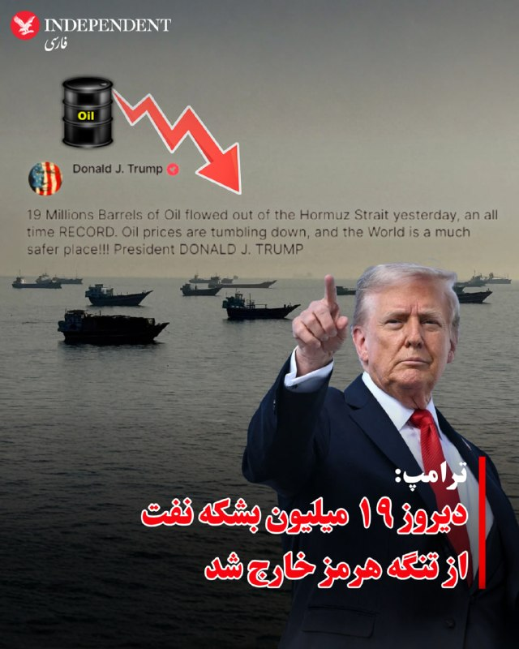

⭕️ترامپ: دیروز ۱۹ میلیون بشکه نفت از تنگه هرمز خارج شد

♦️دونالد ترامپ، رئیس جمهوری آمریکا روز سه‌شنبه دوم تیرماه با انتشار پیامی در تروث سوشال نوشت که روز گذشته ۱۹ میلیون بشکه نفت از تنگه هرمز خارج شده است.

ترامپ در همین پیام نوشت: «قیمت نفت در حال سقوط است و جهان جای امن‌تری شده است.»
‌🇸🇦 Indypersian

🤖 @VahidOOnLine

## VahidOOnLine — post 246972

  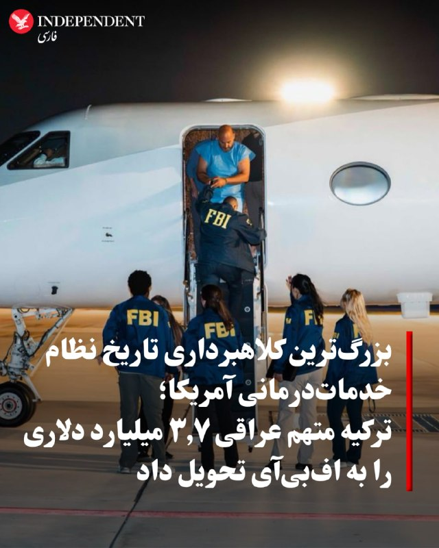

♦️اف‌بی‌آی روز دوشنبه اول تیرماه اعلام کرد، ابراهیم خلدون حلمی، متهم درجه اول سازماندهی یکی از بزرگترین طرح‌های کلاهبرداری بیمه خدمات درمانی آمریکا (مدیکر) در تاریخ ایالات متحده را از ترکیه تحویل گرفته است.

به گزارش رسانه‌های ترکیه، اف‌بی‌آی از همکاری نزدیک با مقام‌های آنکارا و همچنین توماس باراک، سفیر ایالات متحده در ترکیه قدردانی کرد.

ابراهیم خلدون حلمی، که در ارتباط با یک طرح ادعایی ۳.۷ میلیارد دلاری برای کلاهبرداری از مدیکر متهم شده بود، در ماه مه ۲۰۲۵ قبل از بازداشت در ترکیه، از ایالات متحده فرار کرده بود.

به گزارش ایندیپندنت ترکیه، گروه واکنش به حوادث بحرانی اف‌بی‌آی به ترکیه رفت و روز جمعه هفته گذشته، در یک عملیات استرداد مجرمان خارجی، حلمی را به ایالات متحده منتقل کرد.
‌🇸🇦 Indypersian

🤖 @VahidOOnLine

## VahidOOnLine — post 246971

  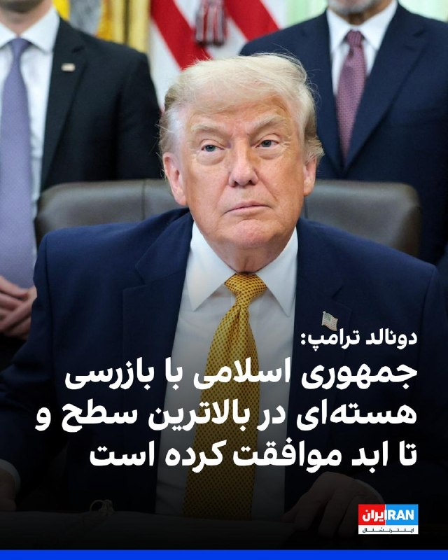

دونالد ترامپ، رییس‌جمهوری آمریکا، سه‌شنبه دوم تیر در پیامی در تروث سوشال نوشت که جمهوری اسلامی «به‌طور کامل و تمام‌عیار» با انجام بازرسی‌های هسته‌ای در بالاترین سطح برای آینده‌ای طولانی‌مدت موافقت کرده است.

ترامپ در پیامی نوشت: «با وجود همه انکارها و اظهارات نادرستی که در خلاف این موضوع مطرح می‌شود... ایران به‌طور کامل و تمام‌عیار با انجام بازرسی‌های هسته‌ای در بالاترین سطح برای آینده‌ای طولانی‌مدت (تا ابد!!!) موافقت کرده است.»

رییس‌جمهوری آمریکا همچنین گفت که جمهوری اسلامی در جریان مذاکرات امتیازهای مهم دیگری نیز ارائه کرده است.

او افزود: «بر اساس این موضوع و دیگر امتیازهای مهمی که ایران در حال ارائه آن‌هاست، من موافقت کرده‌ام که تنگه هرمز باز بماند و دیگر هیچ محاصره دریایی اعمال نشود.»

ترامپ در عین حال گفت همه کشتی‌ها در موقعیت خود باقی خواهند ماند تا در صورت لزوم محاصره دوباره برقرار شود، هرچند به گفته او در حال حاضر چنین احتمالی «بسیار بعید» به نظر می‌رسد.
‌🏁 🇬🇧 IranintlTV

🤖 @VahidOOnLine

## VahidOOnLine — post 246970

  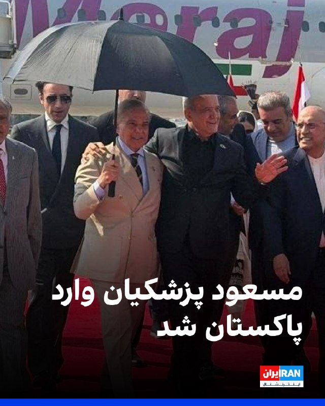

مسعود پزشکیان، رییس دولت جمهوری اسلامی، سه‌شنبه دوم تیر وارد اسلام‌آباد شد.
پزشکیان در فرودگاه بین‌المللی اسلام‌آباد مورد استقبال شهباز شریف، نخست وزیر پاکستان، قرار گرفت.
عباس عراقچی، وزیر خارجه جمهوری اسلامی نیز در پروازی جداگانه از مسقط به پاکستان سفر کرد و پیش از ورود پزشکیان، در پایگاه هوایی نور خان مورد استقبال محمد اسحاق دار، وزیر خارجه پاکستان قرار گرفت.
‌🏁 🇬🇧 IranintlTV

🤖 @VahidOOnLine

## VahidOOnLine — post 246969

  <a href="telegram/content/VahidOOnLine_246969_1782218966.mp4" target="_blank">🎬 Download video</a>

♦️مسعود پزشکیان، رئیس جمهوری اسلامی ایران روز سه‌شنبه دوم تیرماه و با استقبال شهباز شریف، نخست وزیر پاکستان وارد فرودگاه بین‌المللی اسلام‌آباد شد.

عباس عراقچی، وزیر امور خارجه جمهوری اسلامی پیش از پزشکیان و از مسقط به اسلام‌آباد رسیده بود.

خبرگزاری ایرنا پیش از این گزارش کرده بود که پزشکیان برای شرکت در بزرگداشت قربانیان ایرانی جنگ آمریکا و اسرائیل به پاکستان سفر می‌کند.

شهباز شریف و عاصم منیر، فرمانده ستاد کل نیروهای مسلح پاکستان، از هفته‌های میانی جنگ در اسفندماه گذشته تلاش‌های برای آتش‌بس، از سرگیری مذاکرات و در نهایت امضای تفاهم‌نامه پایان جنگ را برعهده گرفتند.
‌🇸🇦 Indypersian

🤖 @VahidOOnLine

## VahidOOnLine — post 246968

  

بر اساس تصاویر و اطلاعات رسیده به ایران‌اینترنشنال، مردی که شامگاه ۱۸ دی در تهران هدف تیراندازی قرار گرفت، به دلیل نگرانی از بازداشت، مجبور به جراحی در خانه برای خارج کردن گلوله از محل زخم شد. این مداوای خانگی منجر به آسیب‌های جدی به پای این معترض شده است.

یک زن و همسرش که اطلاعاتشان نزد ایران‌اینترنشنال محفوظ است، ساعت ۷ شب ۱۸ دی در محدوده اشرفی اصفهانی تهران، در حالی که در میان شلوغی‌های خیابانی حضور داشتند، هدف حمله نیروهای حکومتی قرار گرفتند.

ماموران موتورسوار از دو طرف به سمت مردم گاز اشک‌آور شلیک کردند و این زوج هنگام فرار به سمت خانه، از فاصله نزدیک هدف شلیک قرار گرفتند.

همسر این زن از ناحیه پا با تیر جنگی مجروح شد.

خانواده او به دلیل نگرانی از بازداشت یا برخورد امنیتی، نتوانستند او را به بیمارستان منتقل کنند و پس از دو روز، با کمک یک مسئول اتاق عمل از یکی از بیمارستان‌های تهران، گلوله را از پای او خارج کردند.
‌🏁 🇬🇧 IranintlTV

🤖 @VahidOOnLine

## VahidOOnLine — post 246967

  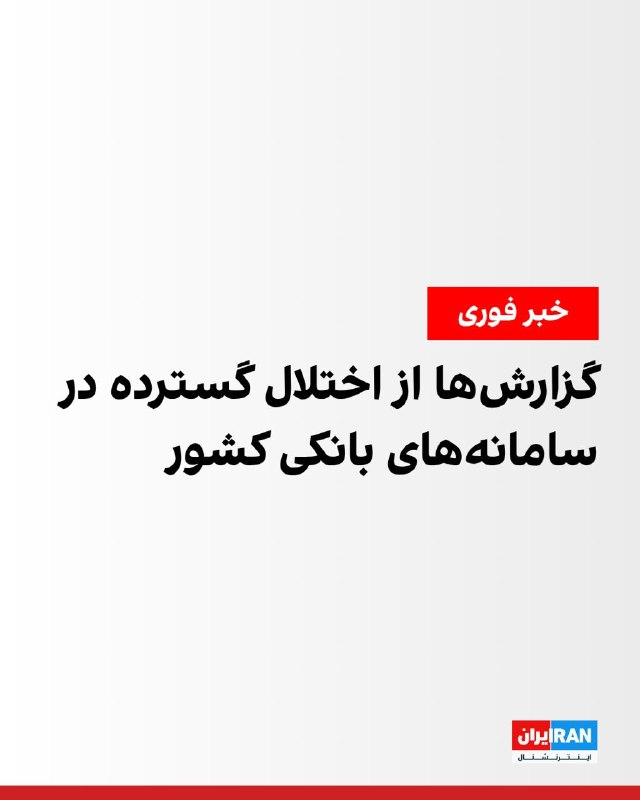

رسانه‌های ایران و پیام‌های ارسالی مخاطبان به ایران‌اینترنشنال از بروز اختلال گسترده در سامانه‌های بانکی کشور خبر دادند.

بر اساس این گزارش‌ها، برخی پایانه‌های فروشگاهی، درگاه‌های بانکی و اپلیکیشن‌های بانک‌ها از صبح سه‌شنبه دوم تیر با اختلال یا کندی در ارائه خدمات مواجه شده‌اند.

وب‌سایت دیده‌بان ایران نوشت: «بر اساس گزارش‌های کاربران، از صبح سه‌شنبه دوم تیر مجددا برخی سامانه‌ها و خدمات بانکی کشور با اختلال گسترده و کندی مواجه شده‌اند.»

این رسانه افزود بروز مشکل در انجام تراکنش‌ها، عدم دسترسی به خدمات آنلاین و اختلال در برخی درگاه‌های بانکی از جمله مشکلات گزارش‌شده از سوی کاربران است. همچنین گزارش‌هایی از اختلال در خدمات بانک ملت در استان البرز منتشر شده است.

پیام‌های ارسالی مخاطبان به ایران‌اینترنشنال نیز از بروز مشکلات مشابه در بانک‌های مختلف حکایت دارد. برخی کاربران اعلام کرده‌اند که امکان انجام نقل و انتقال بانکی را نداشته‌اند و خدمات بانک‌هایی از جمله صادرات، سپه، تجارت، رسالت، ملت، توسعه تعاون و ملی با اختلال مواجه شده است. یکی از مخاطبان گفت که «هیچ نقل و انتقالی در این بانک‌ها انجام نمی‌شود.»
‌🏁 🇬🇧 IranintlTV

🤖 @VahidOOnLine

## VahidOOnLine — post 246966

  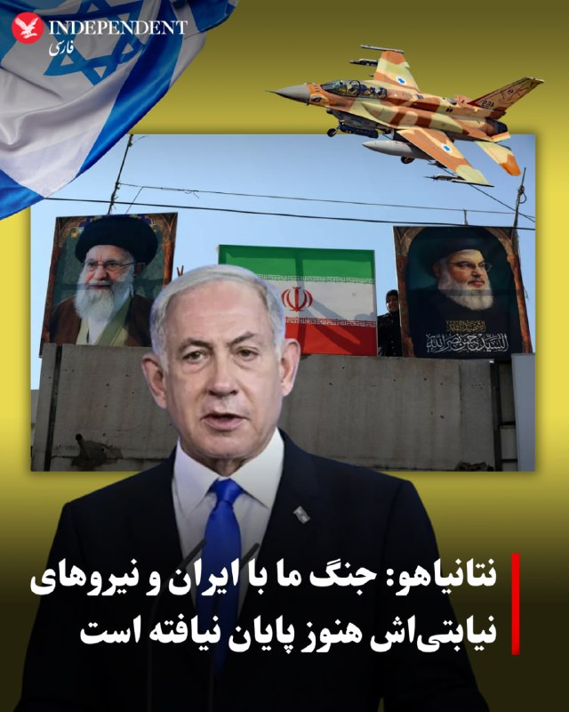

⭕️نتانیاهو: جنگ ما با ایران و نیروهای نیابتی‌اش هنوز پایان نیافته است

♦️بنیامین نتانیاهو، نخست‌وزیر اسرائیل، در حالی که تنش‌ها میان تل‌آویو و واشنگتن بر سر تفاهم‌نامه اخیر آمریکا و ایران و همچنین وضعیت لبنان ادامه دارد، اعلام کرد که اسرائیل ضربات سنگینی به جمهوری اسلامی ایران و نیروهای همسو با آن در منطقه وارد کرده است، اما جنگ هنوز به پایان نرسیده است.

نتانیاهو روز سه‌شنبه در دیدار با دانشجویان دوره افسران رزمی ذخیره گفت اسرائیل در نبرد با ایران و متحدانش به دستاوردهای مهمی رسیده، اما این رویارویی همچنان ادامه دارد و نباید آن را پایان‌یافته تلقی کرد.

او همچنین ضمن قدردانی از حمایت‌های آمریکا، بر ضرورت کاهش وابستگی نظامی اسرائیل به واشنگتن تاکید کرد و گفت: «از کمک‌هایی که از دوستان آمریکایی خود دریافت کرده‌ایم بسیار سپاسگزارم، اما باید نیازهای نظامی خود را به‌طور مستقل تولید کنیم و سامانه تسلیحاتی مستقلی داشته باشیم.»
‌🇸🇦 Indypersian

🤖 @VahidOOnLine

## VahidOOnLine — post 246965

  <a href="telegram/content/VahidOOnLine_246965_1782218970.mp4" target="_blank">🎬 Download video</a>

ویدیوی ارسال‌شده به ایران‌اینترنشنال نشان می‌دهد دختر جاویدنام کریم حیدری، شمع تولد پدر جان باخته‌اش را بر سر مزار او فوت می‌کند.
کریم حیدری، ۱۸ دی ۱۴۰۴ در بندر گناوه هدف شلیک مستقیم قرار گرفت و جان باخت.
‌🏁 🇬🇧 IranintlTV

🤖 @VahidOOnLine

## VahidOOnLine — post 246964

♦️هیثم بن طارق، سلطان عمان روز سه‌شنبه دوم تیر ماه در مسقط با محمدباقر قالیباف و عباس عراقچی، رئیس مجلس و وزیر امور خارجه جمهوری اسلامی ایران دیدار کرد.
عراقچی و قالیباف پس از دور نخست مذاکرات اجرای تفاهم‌نامه پایان جنگ از سوییس به عمان رفتند.
عمان که یکی از میانجیگران تاریخی میان تهران و واشنگتن در ۴۷ سال گذشته بوده است پس از جنگ اخیر و بسته شدن تنگه هرمز، بار دیگر به یکی از کلیدی‌ترین بازیکنان منطقه خاورمیانه بدل شده است.

مقام‌های جمهوری اسلامی می‌گویند تنها ایران و عمان می‌توانند بر این آبراه راهبردی بین‌المللی اعمال حاکمیت کنند.
‌🇸🇦 Indypersian

🤖 @VahidOOnLine

## VahidOOnLine — post 246963

  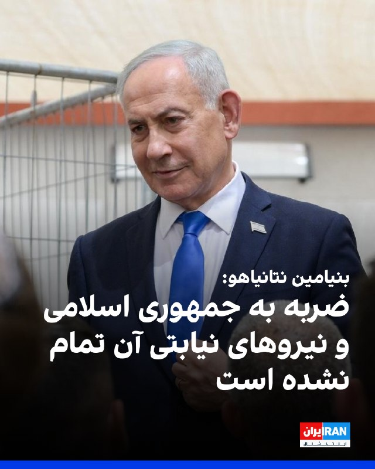

بنیامین نتانیاهو، نخست‌وزیر اسرائیل، در دیدار با شرکت‌کنندگان دوره افسران رزمی ذخیره در منطقه گوش عتصیون گفت رویارویی با جمهوری اسلامی و نیروهای وابسته به آن همچنان ادامه دارد و آینده اسرائیل به میزان قدرت این کشور بستگی خواهد داشت.

نتانیاهو گفت: «اکنون در برابر جمهوری اسلامی و نیروهای وابسته به آن ایستاده‌ایم. ما به آن‌ها ضربه زدیم. این موضوع هنوز پایان نیافته است، اما به قدرت ما بستگی دارد.»

او افزود جایگاه اسرائیل در دهه‌های آینده به توانمندی و قدرت این کشور وابسته است و به همین دلیل دولت اسرائیل در حال تقویت ظرفیت‌های خود است.

نخست‌وزیر اسرائیل گفت: «اینکه ۳۰ سال دیگر در چه جایگاهی باشیم، به قدرت ما وابسته است. به همین دلیل، آنچه اکنون انجام می‌دهیم، ساختن قدرتی بیشتر است.»

نخست‌وزیر اسرائیل همچنین بر ضرورت دستیابی به استقلال تسلیحاتی تاکید کرد و گفت: «من برای حمایتی که از سوی دوستان آمریکایی‌مان دریافت کرده‌ایم ارزش بسیاری قائلم، اما باید خود را از این وابستگی رها کنیم و یک ساختار تسلیحاتی مستقل برای خودمان ایجاد کنیم.»
‌🏁 🇬🇧 IranintlTV

🤖 @VahidOOnLine

## VahidOOnLine — post 246961

## WithYashar — post 15666

  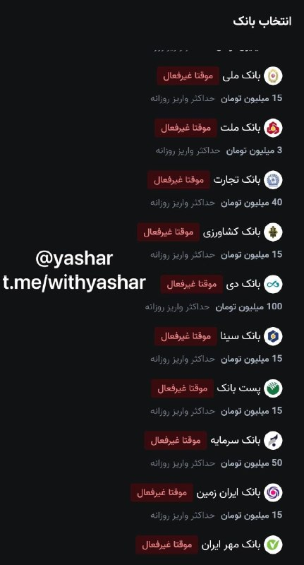

امروز دایرکتی از طرف یکی از شما دریافت کردم که گفت از‌ کارمندان رتبه دار بانک است و این قطعی نه هک است نه چیز دیگری و به طور عمد از طرف خود رژیم انجام شده وی افزورد تقریبا با یقین میگم پایین اوردن دستوری قیمت ارز و طلا،حاکمیت و دولت با سرکردگی همتی و سیف میخواهند در قیمت های پایین فقط خودشون خریدار مطلق باشن و یک نوسان جانانه از بازار بگیرن با اختلال عمدی در سیستم(چون میدونن سرمایه دارها میدونن قیمت برگشت میکنه به بالا و پولشون رو میکشن بیرون که طلا بخرن،اما با قطع عمدی و به گردن هک شدن)
در نتیجه از دوستان هکر قدیمی دوران جوانی جوییا شدم که در امنیت سایبری بانکها کار میکنند. آنها به من گفتند که بعد از عملیات اکونومیک فیوری که آمریکا انجام داد که شامل محاصره دریایی هم میشود و تمام زیرساختهای اقتصادی رژیم را هدف‌ گرفت رژیم ضربه های مهلکی در رابطه با ارز خورده و این ادعا درسته و میخوان پول رو از جیب مردم جبران کنند دوستم گفت شعبه ها هم دسترسی به هر انتقالی را دارند ولی دستور این است که بگویند قطع هست
@withyashar 🚨🚨🚨🚨🚨🚨

## WithYashar — post 15664

  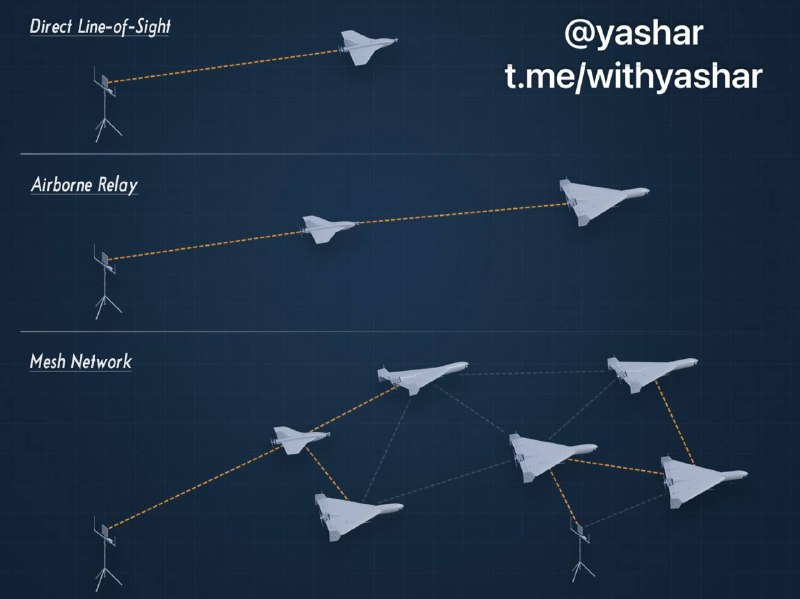

خلبان آمریکایی جنگنده F-15 که در ماه آوریل بر فراز ایران سرنگون شد، به مقام‌های اطلاعاتی گفته است که پیش از اجکت کردن، چندین پهپاد ایرانی را دیده که به‌صورت هم‌زمان و هماهنگ در آرایشی شبیه «عروس دریایی» در حال حرکت بوده‌اند؛ به گزارش سی‌ان‌ان و به نقل از چهار منبع.

این روایت باعث بحث در جامعه اطلاعاتی آمریکا شده درباره این‌که آیا ایران توانسته قابلیت پیشرفته‌ای در زمینه پهپادها یعنی «شبکه‌سازی مش‌مانند یک‌به‌چند» (one-to-many meshed networking) را به نمایش بگذارد یا نه.
@withyashar

## WithYashar — post 15663

  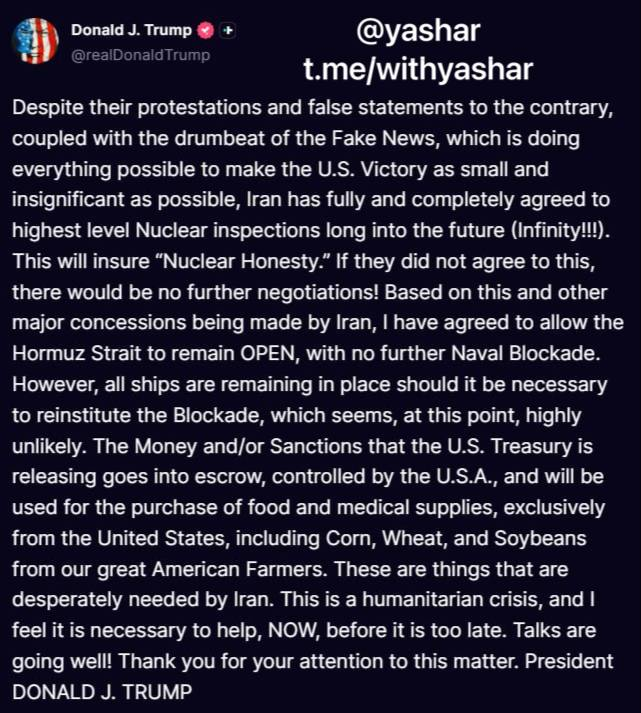

ترامپ در تروث : با وجود اعتراضات و اظهارات نادرست آنها، همراه با تبلیغات مکرر اخبار جعلی که همه تلاش خود را می‌کند تا پیروزی آمریکا را کوچک و بی‌اهمیت جلوه دهد، ایران به طور کامل و جامع با بازرسی‌های هسته‌ای در بالاترین سطح برای آینده‌ای نامحدود (بی‌نهایت!!!) موافقت کرده است. این امر «صداقت هسته‌ای» را تضمین خواهد کرد.

اگر آنها با این موضوع موافقت نمی‌کردند، مذاکرات بیشتری صورت نمی‌گرفت! بر اساس این و دیگر امتیازات عمده‌ای که ایران داده است، من موافقت کرده‌ام که تنگه هرمز باز بماند و هیچ محاصره دریایی بیشتری اعمال نشود. با این حال، همه کشتی‌ها در محل باقی می‌مانند تا در صورت لزوم محاصره دوباره برقرار شود، که در این مرحله بسیار بعید به نظر می‌رسد.
پول و یا تحریم‌هایی که خزانه‌داری آمریکا آزاد می‌کند، در حساب امانی تحت کنترل آمریکا قرار می‌گیرد و صرف خرید غذا و تجهیزات پزشکی، به طور انحصاری از ایالات متحده، از جمله ذرت، گندم و سویا از کشاورزان بزرگ آمریکایی ما خواهد شد.
این‌ها چیزهایی هستند که ایران به شدت به آنها نیاز دارد. این یک بحران انسانی است و من احساس می‌کنم لازم است که اکنون کمک کنیم، قبل از اینکه خیلی دیر شود. مذاکرات به خوبی پیش می‌رود!
@withyashar

## WithYashar — post 15662

  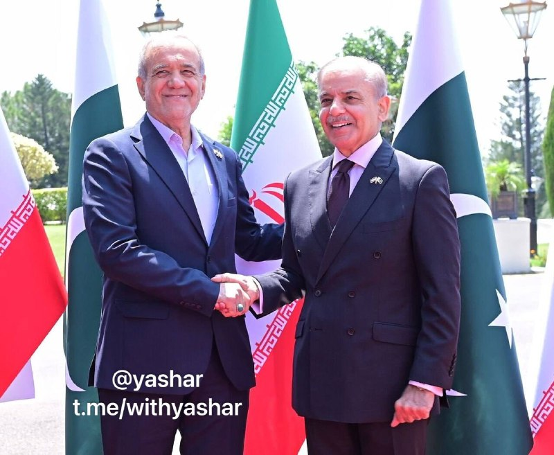

پزشکیان وارد اسلام‌آباد شد
وی در بدو ورود با نخست‌وزیر پاکستان دیدار کرد.
@withyashar

## WithYashar — post 15661

  <a href="telegram/content/WithYashar_15661_1782218975.mp4" target="_blank">🎬 Download video</a>

رژیم : هک شدیم ، داریم روش کار میکنیم و مشخص نیست کی‌ درست بشه ! شرکت خدمات انفورماتیک: تیم‌های فنی و متخصصان امنیت سایبری در حال رفع اختلالات ایجادشده هستند تا امکان بهره‌برداری دوباره از خدمات فراهم شود. ضمن عرض پوزش بابت وقفه پیش‌آمده در انجام امور بانکی،…

## WithYashar — post 15660

رژیم : هک شدیم ، داریم روش کار میکنیم و مشخص نیست کی‌ درست بشه !
شرکت خدمات انفورماتیک:
تیم‌های فنی و متخصصان امنیت سایبری در حال رفع اختلالات ایجادشده هستند تا امکان بهره‌برداری دوباره از خدمات فراهم شود.
ضمن عرض پوزش بابت وقفه پیش‌آمده در انجام امور بانکی، از تمام کاربران و مشتریان محترم تقاضا می‌شود ضمن حفظ صبوری و شکیبایی، اخبار و اطلاعات تکمیلی در خصوص زمان بازگشت به وضعیت عادی را صرفاً از طریق درگاه‌های اطلاع‌ رسانی رسمی و مراجع ذی‌صلاح پیگیری کنند.
@withyashar

## WithYashar — post 15659

روزهای شنبه و یکشنبه ۱۳ و ۱۴ تیر، تهران و دوشنبه ۱۵ تیر، کل کشور تعطیل است معاون اول رئیس جمهور اعلام کرد در روز سه شنبه ۱۵ تیرماه استان قم و پنجشنبه ۱۸تیرماه استان خراسان رضوی تعطیل است. @withyashar

## WithYashar — post 15658

روزهای شنبه و یکشنبه ۱۳ و ۱۴ تیر، تهران و دوشنبه ۱۵ تیر، کل کشور تعطیل است
معاون اول رئیس جمهور اعلام کرد در روز سه شنبه ۱۵ تیرماه استان قم و پنجشنبه ۱۸تیرماه استان خراسان رضوی تعطیل است.
@withyashar

## WithYashar — post 15657

سفیر ایران در لبنان در واکنش به حمله به جنوب لبنان: هرگونه نقض تفاهم‌نامه در لبنان، چالش‌هایی را برای روند مذاکرات صلح ایجاد خواهد کرد.
@withyashar

## WithYashar — post 15656

اختلال دوباره در بانک‌ها
@withyashar 🚨

## WithYashar — post 15655

  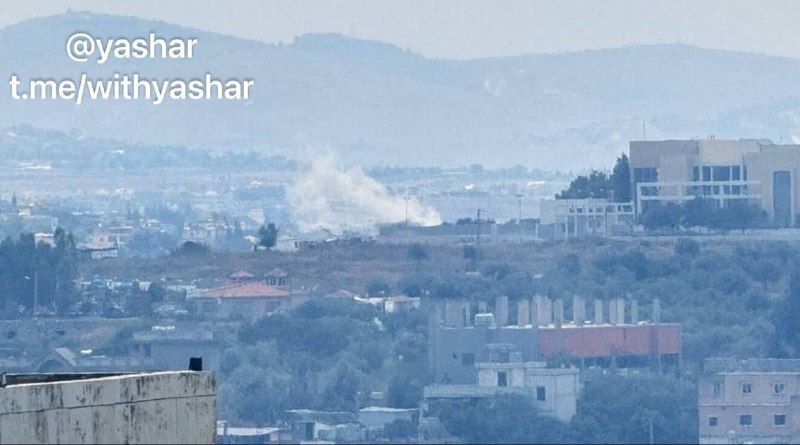

نقض دوباره آتش‌بس ،حمله اسرائیل به جنوب لبنان
@withyashar 🚨

## WithYashar — post 15654

نتانیاهو: حمایت دوستان آمریکایی‌مان را بسیار ارج می‌نهم، اما نیازمند رهایی از وابستگی و ساخت یک نظام تسلیحاتی مستقل هستیم @withyashar

## WithYashar — post 15653

رادیو ارتش اسرائیل: تا زمانی که حزب‌الله کاملاً منحل نشود، از منطقه الشقیف در لبنان عقب‌نشینی نمی‌کنیم
@withyashar

## WithYashar — post 15652

نتانیاهو: حمایت دوستان آمریکایی‌مان را بسیار ارج می‌نهم، اما نیازمند رهایی از وابستگی و ساخت یک نظام تسلیحاتی مستقل هستیم
@withyashar

## WithYashar — post 15651

  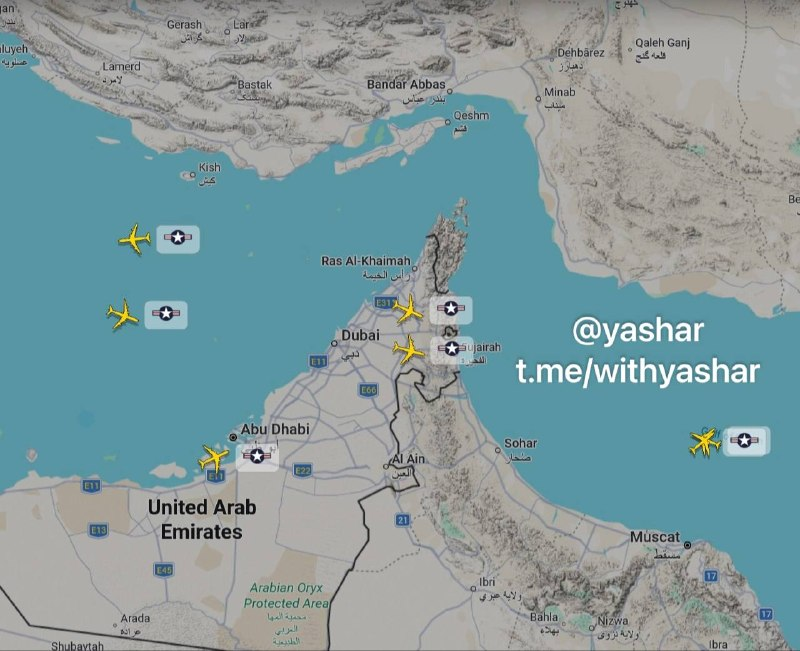

همکنون ۷ سوخت رسان شامل، ۵ فروند سوخت رسان KC-135R و ۲ فروند سوخت رسان KC-46A پگاسوس نیروی هوایی آمریکا در منطقه خلیج فارس فعال هستند.
همزمان، دو فروند KC-46A با نام عملیاتی BOBBY 81/82 از پایگاه RAF Mildenhall انگلستان به پرواز درآمده و برای الحاق به یک یگان جنگنده در حال عملیات‌اند.

همچنین بر‌اساس گزارشها پرواز CUBE 31 شامل چهار فروند جنگنده F-35 تفنگداران دریایی آمریکا در حال انجام مأموریت بوده و هماهنگی‌های عملیاتی و ارتباطی لازم را در جریان پرواز برقرار کرده است.
@withyashar

## WithYashar — post 15650

پلتفرم دریانوردی کپلر: ۳۶ کشتی دیروز از تنگه هرمز عبور کردند که این بالاترین میزان تردد در این تنگه از نخست مارس تاکنون است.
@withyashar

## WithYashar — post 15649

وزیر امنیت ملی اسرائیل بن گویر:
اگر آمریکایی‌ها فکر می‌کنند ایرانی‌ها برنامه هسته‌ای خود را رها خواهند کرد، آن را لغو می‌کنند و از تمام رویاهایشان برای نابودی دولت اسرائیل دست می‌کشند، بسیار ساده‌لوح هستند.
@withyashar

## WithYashar — post 15648

ترامپ: خودروسازان آمریکایی تولید سلاح را آغاز خواهند کرد
رئیس جمهور آمریکا در کاخ سفید به خبرنگاران گفت: «آنها برنامه‌هایی برای تغییر کاربری کارخانه‌ها دارند. ما قصد داریم سلاح‌هایی از جمله موشک‌های پاتریوت، موشک‌های تاماهاک و موارد دیگر تولید کنیم.»
@withyashar

## WithYashar — post 15647

هواپیماهای سوخت‌رسان نیروی هوایی ایالات متحده پس از تخلیه از پایگاه هوایی العدید در قطر به دلیل جنگ ایران(یک روز قبل از جنگ)، به این پایگاه بازگشته‌اند. حداقل ۱۲ فروند در حال حاضر حضور دارند.
@withyashar

## WithYashar — post 15646

بقایی: توانمندی دفاعی و موشکی ایران هیچگاه موضوع مذاکره با هیچ طرفی نخواهد بود
@withyashar

## mwarmonitor — post 11420

https://x.com/i/status/2069394095831753119

## mwarmonitor — post 11419

🔴خلبان آمریکایی جنگنده F-15 که در ماه آوریل بر فراز ایران سرنگون شد، به مقام‌های اطلاعاتی گفته است که پیش از اجکت کردن، چندین پهپاد ایرانی را دیده که به‌صورت هم‌زمان و هماهنگ در آرایشی شبیه «عروس دریایی» در حال حرکت بوده‌اند؛ به گزارش سی‌ان‌ان و به نقل از چهار منبع.

این روایت باعث بحث در جامعه اطلاعاتی آمریکا شده درباره این‌که آیا ایران توانسته قابلیت پیشرفته‌ای در زمینه پهپادها یعنی «شبکه‌سازی مش‌مانند یک‌به‌چند» (one-to-many meshed networking) را به نمایش بگذارد یا نه.

@mwarmonitor

## mwarmonitor — post 11418

  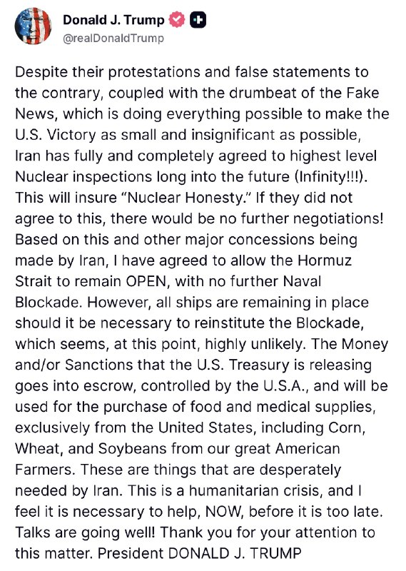

علیرغم اعتراضات و اظهارات کذب آن‌ها بر خلاف واقع، همراه با هیاهوی رسانه‌های جعلی (فیک نیوز) که تمام تلاش خود را می‌کنند تا پیروزی ایالات متحده را تا حد ممکن کوچک و ناچیز جلوه دهند، ایران کاملاً و به‌طور تمام و کمال با بالاترین سطح بازرسی‌های هسته‌ای برای آینده‌ای طولانی (تا ابد!!!) موافقت کرده است. این امر «صداقت هسته‌ای» را تضمین خواهد کرد. اگر آن‌ها با این موضوع موافقت نمی‌کردند، هیچ مذاکره دیگری در کار نبود!
بر اساس این توافق و سایر امتیازات بزرگی که از سوی ایران داده شده است، من موافقت کرده‌ام که تنگه هرمز باز بماند و محاصره دریایی دیگری در کار نباشد. با این حال، همه کشتی‌ها در موقعیت خود باقی می‌مانند تا در صورت لزوم، محاصره مجدداً برقرار شود؛ هرچند در حال حاضر این امر بسیار بعید به نظر می‌رسد.
پول و/یا تحریم‌هایی که وزارت خزانه‌داری ایالات متحده در حال آزادسازی آن‌هاست، به یک حساب امانی (تضمینی) تحت کنترل ایالات متحده واریز می‌شود و منحصراً برای خرید مواد غذایی و تجهیزات پزشکی از ایالات متحده استفاده خواهد شد؛ از جمله ذرت، گندم و دانه سویا از کشاورزان بزرگ آمریکایی ما. این‌ها اقلامی هستند که ایران شدیداً به آن‌ها نیاز دارد. این یک بحران انسانی است و من احساس می‌کنم لازم است همین حالا، پیش از آنکه خیلی دیر شود، کمک کنیم.
مذاکرات به خوبی پیش می‌رود! از توجه شما به این موضوع سپاسگزارم.

رئیس‌جمهور دونالد جی. ترامپ

@mwarmonitor

## mwarmonitor — post 11417

  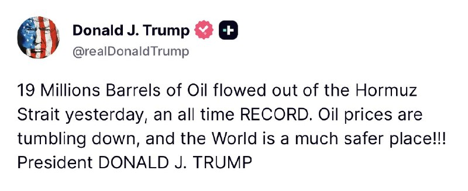

🔹«دیروز ۱۹ میلیون بشکه نفت از تنگه هرمز خارج شد که یک رکورد بی‌سابقه در تمام دوران‌هاست. قیمت نفت در حال سقوط است و جهان جای بسیار امن‌تری است!!!

رئیس‌جمهور دونالد جی. ترامپ

@mwarmonitor

## mwarmonitor — post 11416

⚠️اطلاعیه رسمی کانال ⚠️ 🔸بدین‌وسیله به اطلاع همراهان گرامی می‌رسد که کانال خبری ما در پلتفرم X (توییتر سابق) راه‌اندازی شد. 🔸از این پس نیز ، آخرین اخبار و تحلیل‌های نظامی، سیاسی و همچنین مسائل اجتماعی ایران و جهان به‌صورت منظم در آن منتشر خواهد شد. 🔸از…

## mwarmonitor — post 11414

🔴نخست‌وزیر بنیامین نتانیاهو اعلام کرد که اسرائیل باید وابستگی خود به حمایت تسلیحاتی آمریکا را کاهش دهد و به سمت توسعه تولید مستقل سلاح حرکت کند.
او گفت: «من قدردان دوستان آمریکایی‌مان هستم، اما به یک سامانه مهماتِ بومیِ خودمان نیاز داریم.»

@mwarmonitor

## mwarmonitor — post 11413

  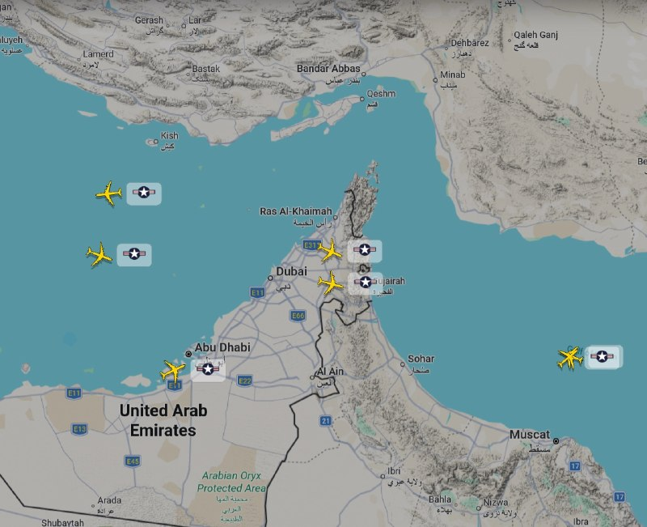

✈️🚨 بر اساس گزارش‌ها، ۵ فروند سوخت رسان KC-135R و ۲ فروند سوخت رسان KC-46A پگاسوس نیروی هوایی آمریکا در منطقه خلیج فارس فعال هستند.

✈️همزمان، دو فروند KC-46A با نام عملیاتی BOBBY 81/82 از پایگاه RAF Mildenhall انگلستان به پرواز درآمده و برای الحاق به یک یگان جنگنده در حال عملیات‌اند.

✈️همچنین پرواز CUBE 31 شامل چهار فروند جنگنده F-35 تفنگداران دریایی آمریکا در حال انجام مأموریت بوده و هماهنگی‌های عملیاتی و ارتباطی لازم را در جریان پرواز برقرار کرده است.

@mwarmonitor

## mwarmonitor — post 11412

🎁تخفیف‌های اپل در «پرایم دی» آمازون از همیشه جذاب‌تر شده‌اند: ایرپاد، آیپد و موارد بیشتر را با قیمت‌های ویژه بخرید. «نیویورک پست»

@mwarmonitor

## mwarmonitor — post 11411

🔹ابی فیلیپ (مجری CNN):
«...یک توافق خوب واقعاً از نظر او چگونه است. گوش کنید.»

📌دونالد ترامپ:

🔸«ما آن‌ها را از یک کشور واقعاً بسیار ضعیف، به یک کشور قوی تبدیل کردیم.»

🔸«ما تحریم‌ها را برداشتیم و در قبال آن هیچ چیزی به دست نیاوردیم.»

🔸«ما به بزرگ‌ترین دولتِ حامی تروریسم در جهان، ۱۵۰ میلیارد دلار پاداش دادیم و در مقابل مطلقاً هیچ چیز دریافت نکردیم.»

🔸«این یک معامله یک‌جانبه است که در آن داریم ۱۵۰ میلیارد دلار را به یک دولت تروریستی پس می‌دهیم؛ واقعاً دولت تروریستی شماره یک.»

🔸«من از روی استیصال توافق نمی‌کردم. من تحریم‌ها را دو و سه برابر می‌کردم و توافق بسیار بهتری می‌ساختم.»

🔹ابی فیلیپ (مجری CNN):

🔰«خیلی خب، پس فقط برای روشن شدن موضوع؛ موشک‌ها از بین نرفته‌اند. در واقع ترامپ گفت که آن‌ها برای دفاع از خود حق داشتن موشک را دارند. او به دنبال توافقی است که در نظر دارد—اول از همه، بیان او از حقایق در اینجا دقیق نیست، اما حتی اگر دقیق هم بود، توافق او دو برابر بیشتر پول ناشی از رفع تحریم‌ها را برای فرستادن به ایران در نظر می‌گرفت. رفع تحریم‌ها همین الان در حال انجام است. ایران هیچ کاری انجام نداده، جز آنچه که طبق قوانین بین‌المللی فعلی لازم است، یعنی باز نگه داشتن تنگه هرمز. بنابراین، حتی با استانداردهای خود ترامپ، من نمی‌بینم که این توافق چطور با معیارهای او جور در می‌آید.»

@mwarmonitor

## mwarmonitor — post 11410

  <a href="telegram/content/mwarmonitor_11410_1782218979.mp4" target="_blank">🎬 Download video</a>

🎬 Video

## mwarmonitor — post 11409

🔴به گزارش Reuters:

🛢قراردادهای آتی نفت خام برنت با کاهش بیش از ۱٪، به ۷۷٫۰۴ دلار برای هر بشکه رسید؛ این افت همزمان با بهبود جریان‌های عبوری از تنگه هرمز رخ داده است.

@mwarmonitor

## mwarmonitor — post 11408

بازارهای بورس در حال اوج گرفتن هستند

## mwarmonitor — post 11407

  <a href="telegram/content/mwarmonitor_11407_1782218981.mp4" target="_blank">🎬 Download video</a>

🔴صحبت‌های جی‌دی ونس (JD Vance)
«این احتمالاً همان چیزی است که ما به عنوان آمریکایی بیش از هر چیز دیگری از آن هیجان‌زده هستیم؛ ایرانی‌ها موافقت کرده‌اند که بازرسان آژانس بین‌المللی انرژی اتمی (IAEA) را مجدداً به کشور خود دعوت کنند. این یک نقطه عطف بزرگ برای مردم آمریکا و اولین قدم برای غیراتمی کردن دائمی یا... یا پایان دادن دائمی به برنامه سلاح‌های هسته‌ای در ایران است.»

🔴صحبت‌های باراک اوباما (آرشیو - اوت ۲۰۱۵)
«برای دهه‌ها، بازرسان به کل زنجیره تامین هسته‌ای ایران دسترسی خواهند داشت؛ از معادن و کارخانه‌های اورانیوم، جایی که مواد اولیه را تهیه می‌کنند، تا تاسیسات تولید سانتریفیوژ، جایی که ماشین‌های غنی‌سازی را می‌سازند. و بر اساس مفاد این توافق، بازرسان توانایی دائمی برای بازرسی از هرگونه سایت مشکوک در ایران را خواهند داشت.»

@mwarmonitor

## FoxNewsTwitter — post 343282

  <a href="telegram/content/FoxNewsTwitter_343282_1782218983.mp4" target="_blank">🎬 Download video</a>

Fox News (Twitter/X)

BREAKING: Iranian leaders pushing back on the demand for International Atomic Energy Agency inspections after VP Vance said the country agreed to allowing those inspectors into their country.

President Trump warning there would be no negotiations without international oversight, saying Iran must continue honoring the agreement and vowed to "do what needs to be done" if Tehran backs away from its commitments.

At the same time, the Strait of Hormuz is fully open again, oil shipments are increasing, and Trump is reiterating a message he's delivered for years: Iran will never be allowed to obtain a nuclear weapon.

@TreyYingst reports the latest.

## FoxNewsTwitter — post 343281

  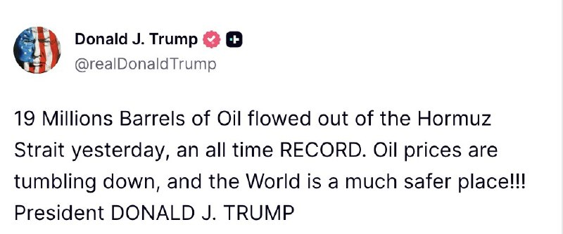

Fox News (Twitter/X)

NEW: President Trump is celebrating what he says was a record day for oil shipments through the Strait of Hormuz.

"19 Million Barrels of Oil flowed out of the Hormuz Strait yesterday, an all time RECORD. Oil prices are tumbling down, and the World is a much safer place!!!"

## FoxNewsTwitter — post 343280

  <a href="telegram/content/FoxNewsTwitter_343280_1782218986.mp4" target="_blank">🎬 Download video</a>

Fox News (Twitter/X)

NEW: Two more men have been arrested by the FBI in connection to the alleged plot to turn the White House UFC event into a mass-casualty attack.

The two new suspects were arrested in Missouri and Washington state, with prosecutors saying they played a supporting role in the planning of the plot, @LucasFoxNews reports.

## FoxNewsTwitter — post 343279

  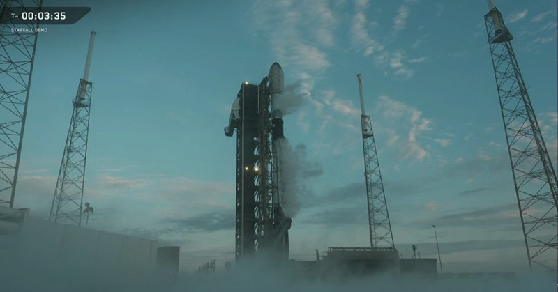

Fox News (Twitter/X)

WATCH LIVE: SpaceX launches Starfall Demo mission from Florida https://twitter.com/i/broadcasts/1jxXggdqQOLJZ

## pm_afshaa — post 94687

  <a href="telegram/content/pm_afshaa_94687_1782218989.webm" target="_blank">🎬 Download video</a>

🔴کمیسیون اقتصادی مجلس، در جلسه‌ای با ستار هاشمی وزیر ارتباطات، از عملکرد وزارت ارتباطات تو دوران جنگ اخیر تقدیر کرد.

💧 Rainbet.com the #1 Non-KYC Crypto Casino & Sportsbook @rainbetcom

😁 @Pm_Afshaa

## pm_afshaa — post 94686

  <a href="telegram/content/pm_afshaa_94686_1782218989.webm" target="_blank">🎬 Download video</a>

🔴ترامپ: دیروز 19 میلیون بشکه نفت از تنگه هرمز خارج شد که یک رکورد بی‌سابقه در تمام دوران‌هاست. قیمت‌های نفت در حال سقوط است و جهان مکان بسیار امن‌تری است!

💧 Rainbet.com the #1 Non-KYC Crypto Casino & Sportsbook @rainbetcom

😁 @Pm_Afshaa

## pm_afshaa — post 94685

  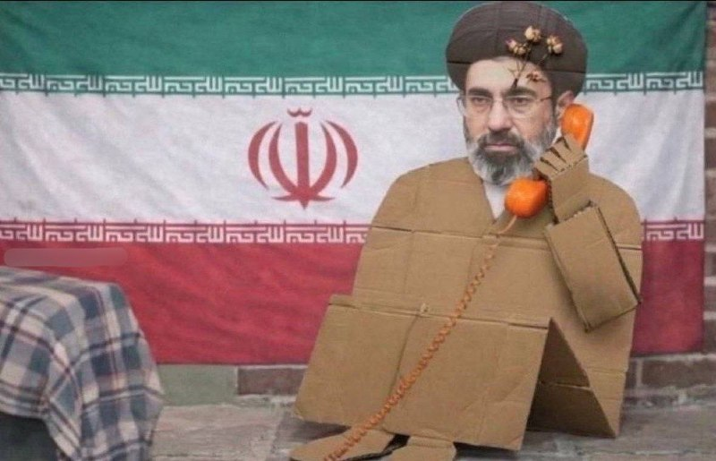

هیچی سلامتی، خون بابامو با ذرت و سویا مبادله کردیم.

💧 Rainbet.com the #1 Non-KYC Crypto Casino & Sportsbook @rainbetcom

😁 @Pm_Afshaa

## pm_afshaa — post 94684

  <a href="telegram/content/pm_afshaa_94684_1782218990.webm" target="_blank">🎬 Download video</a>

🔴سفیر آمریکا در سازمان ملل:

جمهوری اسلامی با بازگشت بازرسان هسته‌ای به ایران موافقت کرده و این اولین گام برای توافقی گسترده‌تره.

برخلاف برجام، این بار بازرسی‌ها باید در هر زمان و هر مکان ممکن باشه.

💧 Rainbet.com the #1 Non-KYC Crypto Casino & Sportsbook @rainbetcom

😁 @Pm_Afshaa

## pm_afshaa — post 94683

  <a href="telegram/content/pm_afshaa_94683_1782218991.webm" target="_blank">🎬 Download video</a>

⚡️ تخفیف ویژه و بی‌سابقه در کانال GLITCH CONFIG 
⚡️

😉 از این به بعد دیگه نگران تموم شدن حجم و سرعت پایین نباشید 
😉

💵 بهترین و پایدارترین کانفیگ‌ها رو فقط و فقط با قیمت گیگی 
🔢 هزار تومان تهیه کنید 
💵

💸 نامحدود هم 400 هزار تومان 
💸

برای خرید همین حالا به آیدی پشتیبانی ما پیام بدید: 
👇

🔤 @Gliitch_Admin

🔤 @Gliitch_Admin

🔤 @Gliitch_Admin

## pm_afshaa — post 94682

  <a href="telegram/content/pm_afshaa_94682_1782218991.webm" target="_blank">🎬 Download video</a>

🔴ترامپ: ایران به طور کامل موافقت کرده که بازرسی‌های هسته‌ای رو برای مدت طولانی (به طور نامحدود!) در بالاترین سطح انجام بده. 
💧 Rainbet.com the #1 Non-KYC Crypto Casino & Sportsbook @rainbetcom 
😁 @Pm_Afshaa

## pm_afshaa — post 94681

  <a href="telegram/content/pm_afshaa_94681_1782218992.webm" target="_blank">🎬 Download video</a>

🔴ترامپ: ایران به طور کامل موافقت کرده که بازرسی‌های هسته‌ای رو برای مدت طولانی (به طور نامحدود!) در بالاترین سطح انجام بده. 
💧 Rainbet.com the #1 Non-KYC Crypto Casino & Sportsbook @rainbetcom 
😁 @Pm_Afshaa

## pm_afshaa — post 94680

  <a href="telegram/content/pm_afshaa_94680_1782218992.webm" target="_blank">🎬 Download video</a>

🔴ترامپ: ایران به طور کامل موافقت کرده که بازرسی‌های هسته‌ای رو برای مدت طولانی (به طور نامحدود!) در بالاترین سطح انجام بده.

💧 Rainbet.com the #1 Non-KYC Crypto Casino & Sportsbook @rainbetcom

😁 @Pm_Afshaa

## pm_afshaa — post 94679

  <a href="telegram/content/pm_afshaa_94679_1782218993.webm" target="_blank">🎬 Download video</a>

🔴معاون اول رئیس جمهور: روزهای شنبه و یکشنبه 13 و 14 تیر استان تهران و دوشنبه 15 تیر کل کشور تعطیله. در روز سه‌شنبه 16 تیر استان قم و پنجشنبه 18 تیر استان خراسان رضوی تعطیله. 
💧 Rainbet.com the #1 Non-KYC Crypto Casino & Sportsbook @rainbetcom 
😁 @Pm_Afshaa

## pm_afshaa — post 94678

  <a href="telegram/content/pm_afshaa_94678_1782218993.webm" target="_blank">🎬 Download video</a>

🔴معاون اول رئیس جمهور:
روزهای شنبه و یکشنبه 13 و 14 تیر استان تهران و دوشنبه 15 تیر کل کشور تعطیله.

در روز سه‌شنبه 16 تیر استان قم و پنجشنبه 18 تیر استان خراسان رضوی تعطیله.

💧 Rainbet.com the #1 Non-KYC Crypto Casino & Sportsbook @rainbetcom

😁 @Pm_Afshaa

## pm_afshaa — post 94677

  <a href="telegram/content/pm_afshaa_94677_1782218994.webm" target="_blank">🎬 Download video</a>

🔴شرکت خدمات انفورماتیک اعلام کرد اختلال بانک‌های ملی، صادرات و تجارت ناشی از حملات سایبری بوده.

💧 Rainbet.com the #1 Non-KYC Crypto Casino & Sportsbook @rainbetcom

😁 @Pm_Afshaa

## pm_afshaa — post 94676

  <a href="telegram/content/pm_afshaa_94676_1782218994.webm" target="_blank">🎬 Download video</a>

گزارش ها از اختلال شدید در سیستم بانک های کشور 
💧 Rainbet.com the #1 Non-KYC Crypto Casino & Sportsbook @rainbetcom 
😁 @Pm_Afshaa

## pm_afshaa — post 94675

  <a href="telegram/content/pm_afshaa_94675_1782218995.webm" target="_blank">🎬 Download video</a>

🔴بقائی، سخنگوی وزارت خارجه:
ما برنامه‌ای برای بازرسی آژانس بین‌المللی انرژی اتمی از تاسیسات هسته‌ای ایران که در نتیجه تجاوز دشمن آمریکایی آسیب دیدن، نداریم.
ما هیچ دیداری با مدیرکل آژانس بین‌المللی انرژی اتمی نداشتیم.

در خصوص دارایی‌های آزاد شده ایران، ما تصمیم‌گیری خواهیم کرد، به هر نحوی که بهترین خدمت رو به منافع کشور ارائه بده، در این زمینه هیچ محدودیتی وجود نداره.

💧 Rainbet.com the #1 Non-KYC Crypto Casino & Sportsbook @rainbetcom

😁 @Pm_Afshaa

## pm_afshaa — post 94674

  <a href="telegram/content/pm_afshaa_94674_1782218995.webm" target="_blank">🎬 Download video</a>

🔴نتانیاهو:
رویارویی با جمهوری اسلامی و نیروهای وابسته‌اش هنوز تموم نشده و آینده اسرائیل مستقیما به میزان قدرتش بستگی داره.

اسرائیل باید قدرت نظامی خودش رو بیشتر کنه و در نهایت به استقلال تسلیحاتی برسه.

💧 Rainbet.com the #1 Non-KYC Crypto Casino & Sportsbook @rainbetcom

😁 @Pm_Afshaa

## pm_afshaa — post 94673

  <a href="telegram/content/pm_afshaa_94673_1782218996.webm" target="_blank">🎬 Download video</a>

🔴غضنفری، نماینده مجلس:
قالیباف و پزشکیان علیه مجتبی خامنه‌ای کودتا کردن. ما نماینده‌های انقلابی کمر کودتاگران رو میشکنیم.

💧 Rainbet.com the #1 Non-KYC Crypto Casino & Sportsbook @rainbetcom

😁 @Pm_Afshaa

## pm_afshaa — post 94672

گزارش ها از اختلال شدید در سیستم بانک های کشور

💧 Rainbet.com the #1 Non-KYC Crypto Casino & Sportsbook @rainbetcom

😁 @Pm_Afshaa

## pm_afshaa — post 94671

🔴رادیو ارتش اسرائیل: تا زمانی که حزب‌الله کاملاً منحل نشود، از منطقه الشقیف در لبنان عقب‌نشینی نمی‌کنیم

💧 Rainbet.com the #1 Non-KYC Crypto Casino & Sportsbook @rainbetcom

😁 @Pm_Afshaa

## pm_afshaa — post 94669

سفیر جمهوری اسلامی به سازمان ملل گفت: تنگه هرمز بدون کارمزد باز است، اما آنچه پس از 60 روز اتفاق می‌افتد به مذاکرات بستگی دارد

💧 Rainbet.com the #1 Non-KYC Crypto Casino & Sportsbook @rainbetcom

😁 @Pm_Afshaa

## pm_afshaa — post 94668

نون گرون شد نون لواش دونه ای 2700

💧 Rainbet.com the #1 Non-KYC Crypto Casino & Sportsbook @rainbetcom

😁 @Pm_Afshaa

## pm_afshaa — post 94667

وزیر دفاع پاکستان: توافق ایران و آمریکا، به معنای پایان سیاسی نتانیاهو است

💧 Rainbet.com the #1 Non-KYC Crypto Casino & Sportsbook @rainbetcom

😁 @Pm_Afshaa

## DEJradio — post 5915

  <a href="telegram/content/DEJradio_5915_1782218996.webm" target="_blank">🎬 Download video</a>

⭕️
🚨 از سرنوشت ۷۰۰ میلیون دلار بودجۀ ویژۀ واردات دارو خبری دردست نیست

یک عضو کمیسیون بهداشت مجلس شورای اسلامی اعلام کرد نمایندگان مجلس از سرنوشت ۷۰۰ میلیون دلار بودجۀ تخصیص‌یافته برای واردات دارو آگاهی ندارند.
روح‌الله لک علی‌آبادی گفت پیش‌تر یک میلیارد دلار از صندوق توسعۀ ملی برای تأمین دارو اختصاص یافته بود.
به گفته او، حدود ۳۰۰ میلیون دلار از این مبلغ هزینه شده اما مشخص نیست ۷۰۰ میلیون دلار باقی‌مانده در چه مسیری مصرف شده است.
این نمایندۀ مجلس گفت قرار است مسئولان سازمان غذا و دارو در آینده توضیحات رسمی دربارۀ سرنوشت این منابع ارائه کنند.
اظهارات این مقام رسمی رژیم در حالی مطرح شده که مقام‌های جمهوری اسلامی در ماه‌های پیشین کمبود برخی داروها را به تحریم‌ها و اختلال در واردات مرتبط کرده بودند.

#اختلاس #دزدی #دارو
@DEJradio

## DEJradio — post 5914

  <a href="telegram/content/DEJradio_5914_1782218997.webm" target="_blank">🎬 Download video</a>

🔺📷 اعتراض مردم به وطن‌فروشی سپاه؛

پاسداران، حزب‌الله را به مردم ایران ترجیح می‌دهد

#حزب_الله_لبنان #IRGCterrorists
@DEJradio

## DEJradio — post 5913

⭕️ بهای نان در تهران و ورامین تا ۱۰۰ درصد افزایش یافت

با اعمال نرخ‌های تازه بر انواع نان در تهران و ورامین از عصر دوشنبه، برخی از آنها تا حدودا دو برابر گران شده است.
محمدجواد کرمی، رئیس کارگروه آرد و نان اتاق اصناف ایران، خبر افزایش شدید قیمت نان را تأیید کرد.
بر اساس نرخ‌های تازه، بهای نان لواش به ۲۷۰۰ تومان، بربری به ۱۰ هزار تومان و سنگک به ۱۵ هزار و ۵۰۰ تومان رسید.
پیش از این، نان لواش ۱۴۰۰ تومان، بربری ۵۳۰۰ تومان و سنگک ۷۴۰۰ تومان فروخته می‌شد.
افزایش رسمی بهای نان در حالی انجام می‌شود که غلامرضا نوری قزلجه، وزیر جهاد کشاورزی، دو روز پیش گفته بود افزایش قیمت نان در دستور کار دولت نیست.
این مقام کابینۀ پزشکیان ادعا کرده بود دولت به دنبال اصلاح شیوۀ پرداخت یارانۀ نان و تقویت کالابرگ است.

#نان #کالا_برگ #فقر
@DEJradio

## DEJradio — post 5912

  <a href="telegram/content/DEJradio_5912_1782218997.webm" target="_blank">🎬 Download video</a>

‌
🚨📢 بنیامین نتانیاهو: رویارویی با رژیم ایران و بازوهایش هنوز تمام نشده است بنیامین نتانیاهو نخست‌وزیر اسرائیل، در دیدار با شرکت‌کنندگان دوره افسران رزمی ذخیره در منطقه «گوش عتصیون» تأکید کرد رویارویی با جمهوری اسلامی و بازوهایش به آن همچنان ادامه دارد و…

## DEJradio — post 5911

⭕️ ارتش اسرائیل: برای رفع تهدید به نیروهای حزب‌الله حمله کردیم

ارتش اسرائیل، روز سه‌شنبه اعلام کرد نیروهای این کشور به افراد مسلح حزب‌الله در جنوب لبنان حمله کرده‌اند.
به گفتۀ ارتش اسرائیل، این افراد در نزدیکی مواضع نظامیان اسرائیلی در منطقۀ علی طاهر، در شمال «منطقۀ امنیتی» تحت کنترل اسرائیل شناسایی شده بودند.
اسرائیل تأکید کرد که حمله به این نیروها برای رفع تهدید انجام شده است.
به گزارش رسانه‌های محلی، در پی این حمله دو نفر کشته و دو نفر نیز زخمی شدند.
با وجود توافق اخیر تهران و واشینگتن و تأکید آنها بر کاهش تنش در لبنان، درگیری‌های پراکنده میان اسرائیل و حزب‌الله همچنان ادامه دارد.
اسرائیل پیش‌تر حزب‌الله را به شلیک پرتابه به شمال این کشور متهم کرده بود.
به گفتۀ مقامات اسرائیل، عملیات دفاعی این کشور برای محافظت از امنیت و جان شهروندان و نیروهای نظامی این کشور، متوقف نمی‌شود.

#اسرائیل #لبنان
@DEJradio

## DEJradio — post 5910

⭕️ اختلال گسترده در خدمات چند بانک بزرگ ایران در پی حملۀ سایبری

خدمات بانکی چند بانک بزرگ در ایران روز سه‌شنبه بار دیگر دچار اختلال گسترده شد.
بر پایۀ گواهی شماری از کاربران و گزارش رسانه‌های داخلی، خدمات پرداخت الکترونیک، انتقال وجه و برخی سرویس‌های بانکی در بانک‌های ملی، تجارت، صادرات و ملت دچار اختلال است.
خبرگزاری‌ حکومتی فارس به نقل از منابع خود از احتمال حملۀ سایبری به زیرساخت‌های پشتیبان شبکۀ بانکی گزارش داد.
شرکت خدمات انفورماتیک نیز با انتشار بیانیه‌ای اعلام کرد حملات سایبری علیه سامانه‌های این شرکت شناسایی شده است.
این نهاد مدعی شد برای «جلوگیری از دسترسی غیرمجاز و حفاظت از اطلاعات و دارایی‌های مشتریان» بخشی از خدمات مبتنی بر کارت، فعلا از دسترس خارج شده است.
این دومین اختلال گسترده در شبکۀ بانکی ایران طی درحدود دو هفتۀ اخیر به‌شمار می‌رود.
در اواسط خرداد نیز چند بانک ایرانی با اختلالات مشابه مواجه شده بودند.
تاکنون هیچ گروه یا کشوری مسئولیت این حملات را برعهده نگرفته است.

#اختلال_بانکی #حمله_سایبری
@DEJradio

## DEJradio — post 5909

⭕️ ترامپ گفت جمهوری اسلامی با بازرسی‌های هسته‌ای در بالاترین سطح موافقت کرد

دونالد ترامپ روز سه‌شنبه اعلام کرد جمهوری اسلامی با انجام بازرسی‌های هسته‌ای در «بالاترین سطح» و برای یک دورۀ طولانی‌مدت موافقت کرده است.
رئیس جمهوری آمریکا در شبکۀ تروث سوشال نوشت برخلاف اظهارات دروغین برخی مقام‌های جمهوری اسلامی و گزارش‌ رسانه‌ها، تهران با سازوکار گستردۀ بازرسی هسته‌ای موافقت کرد.
ترامپ تأکید کرد که این موضوع، یکی از پایه‌های اصلی تفاهم اخیر میان دو کشور است.
ترامپ افزود این توافق «صداقت هسته‌ای» جمهوری اسلامی را تضمین می‌کند.
به گفتۀ او اگر تهران چنین تعهدی را نمی‌پذیرفت، مذاکرات ادامه پیدا نمی‌کرد.
رئیس دولت ایالات متحده همچنین اعلام کرد در مقابل این توافق و برخی امتیازهای دیگر از سوی جمهوری اسلامی، آمریکا از اعمال محاصرۀ دریایی بیشتر خودداری کرد و اجازه داد تنگۀ هرمز باز بماند.
ترامپ تأکید کرد ناوها و نیروهای آمریکایی همچنان در منطقه حضور دارند و در صورت لزوم امکان بازگرداندن محاصرۀ دریایی نیز وجود دارد.
رئیس جمهوری آمریکا همچنین گفت دارایی‌ها یا معافیت‌های تحریمی آزادشده در حساب‌های امانی تحت نظارت آمریکا نگهداری می‌شود.
به گفتۀ دونالد ترامپ، دارایی‌هایی که برای رژیم آزاد می‌شود، تنها برای خرید مواد غذایی و دارویی از آمریکا از جمله گندم، ذرت و سویا قابل استفاده است.

#ترامپ #مذاکرات
@DEJradio

## DEJradio — post 5908

  <a href="telegram/content/DEJradio_5908_1782218998.webm" target="_blank">🎬 Download video</a>

‌
🚨📢 بنیامین نتانیاهو:
رویارویی با رژیم ایران و بازوهایش هنوز تمام نشده است

بنیامین نتانیاهو نخست‌وزیر اسرائیل، در دیدار با شرکت‌کنندگان دوره افسران رزمی ذخیره در منطقه «گوش عتصیون» تأکید کرد رویارویی با جمهوری اسلامی و بازوهایش به آن همچنان ادامه دارد و آینده اسرائیل به میزان قدرت این کشور بستگی خواهد داشت.

نتانیاهو توضیح داد: «اکنون در برابر جمهوری اسلامی و نیروهای وابسته به آن ایستاده‌ایم. ما به آن‌ها ضربه زدیم. این موضوع هنوز پایان نیافته است، اما به قدرت ما بستگی دارد.»

او افزود جایگاه اسرائیل در دهه‌های آینده به توانمندی و قدرت این کشور وابسته است و به همین دلیل دولت اسرائیل در حال تقویت ظرفیت‌های خود است.
نخست‌وزیر اسرائیل گفت: «اینکه ۳۰ سال دیگر در چه جایگاهی باشیم، به قدرت ما وابسته است. به همین دلیل، آنچه اکنون انجام می‌دهیم، ساختن قدرتی بیشتر است.»

نخست‌وزیر اسرائیل همچنین بر ضرورت دستیابی به استقلال تسلیحاتی تاکید کرد و گفت: «من برای حمایتی که از سوی دوستان آمریکایی‌مان دریافت کرده‌ایم ارزش بسیاری قائلم، اما باید خود را از این وابستگی رها کنیم و یک ساختار تسلیحاتی مستقل برای خودمان ایجاد کنیم.»

#نتانیاهو #جنگ
@DEJradio

## DEJradio — post 5906

  <a href="telegram/content/DEJradio_5906_1782218998.webm" target="_blank">🎬 Download video</a>

🔺🎥 ‌شکایت کسبه و بازارایان از اختلال در شبکه بانکی.

#بانک #بانکداری
@DEJradio

## DEJradio — post 5905

  <a href="telegram/content/DEJradio_5905_1782218999.webm" target="_blank">🎬 Download video</a>

⚽️
🔺 برنامه دژ فوتبالی

*مهدی رستم‌پور، خبرنگار ورزشی

#دژفوتبالی #جام_جهانی
@DEJradio

## DEJradio — post 5904

  <a href="telegram/content/DEJradio_5904_1782218999.mp4" target="_blank">🎬 Download video</a>

👑
🔺 ‌دانشجویان انجمن‌های شیروخورشید ایران: "ما ادامه داریم."

#شیروخورشید #انجمن_شیروخورشید
@DEJradio

## DEJradio — post 5903

  <a href="telegram/content/DEJradio_5903_1782219001.webm" target="_blank">🎬 Download video</a>

‌
🔺📢 یک منبع امنیتی به دژ می‌گوید پس از اعلام «آتش‌بس موقت»، با آغاز مذاکرات اسلام‌آباد میان جمهوری اسلامی و آمریکا با میانجیگری پاکستان، تهدیدات داخلی و خارجی علیه محمدباقر قالیباف به عنوان عضو ارشد تیم مذاکرات آغاز شد، اما همزمان با حضور او در زوریخ برای مذاکره با جی‌دی‌ ونس او و خانواده‌اش از سوی حامیان متعصب نظام و مخالفان داخلی توافق با آمریکا به مرگ تهدید شده‌اند. برهمین اساس تیم‌های محافظتی او و خانواده‌اش تقویت شده‌اند.

از نگاه بخش بزرگی از طرفداران جمهوری اسلامی، قالیباف «خائن» است زیرا بعد از قتل علی خامنه‌ای و جمعی از فرماندهان ارشد سـ.ـپاه و نیروهای میدانی، به جای انتقام پای میز مذاکره نشسته است و به دنبال تسلیم نظام در برابر آمریکاست.

#آتشبس #محمدباقر_قالیباف
@DEJradio

## DEJradio — post 5901

  <a href="telegram/content/DEJradio_5901_1782219001.webm" target="_blank">🎬 Download video</a>

‌
🔺📷 ستوان یکم عمار شریفی اهل چهارمحال و بختیاری، شهرستان لردگان که تقریبا دو سال است به نیرو زمینی سـ.ـپاه پاسداران مامور شده، این دو سال فرمانده یگان ضد شورش بوده است.

شریفی قبل از خیزش دی‌ماه ۱۴۰۴، در جریان مراسم تدفین خسرو علیکردی وکیل دادگستری که آذرماه ۱۴۰۴ برگزار شد در جریان سرکوب مردم مشهد حضور داشت.
منبع دژ می‌گوید: «او یک دیوانه است که برای پول هرکاری می‌کند.»

او در خیزش دی‌ماه از فرماندهان میدانی یگان‌های ضدشورش بود که مسلح بود و بارها به سمت مردم تیراندازی کرد. در حال حاضر به اهواز منتقل شده است و گاهی در شهر لردگان فعالیت‌های حفاظتی دارد.

#شناسایی #عمار_شریفی
@DEJradio

## mamlekate — post 103756

📝 اختلال مجدد در شبکه بانکی کشور؛ خدمات ۸ بانک مختل شد

شهروندان در ایران از بروز اختلال در خدمات‌دهی دست‌کم هشت بانک کشور خبر دادند. هفته گذشته نیز خدمات چهار بانک بزرگ کشور مختل شده بود.

📞 الو بانکا قطعه هیچ تراکنشی انجام نمیشه

📞 الو بیشتر بانکها کارت به کارت قطع شده

❗️ الو دو سری قطعی بانک، اونم در عرض یه هفته، وچنین بانک‌های بزرگ و مهمی، اصلاً نمیتونه یه مشکل فنی ساده و عادی باشه! احتمالا یه گروه هکری قدرتمند‌ پشت ماجرا باشه.

@mamlekate

## mamlekate — post 103755

📝 نان در تهران تا ۱۰۰ درصد گران شد
.
محمدجواد کرمی، رئیس کارگروه آرد و نان اتاق اصناف ایران، اعلام کرد قیمت نان لواش در تهران به دو هزار و ۷۰۰ تومان، بربری به ۱۰ هزار تومان و سنگک به ۱۵ هزار و ۵۰۰ تومان رسیده است.

📞 الو نمیدونم چرا این قیمت‌ها رو میگن. بربری هفته پیش ۱۷ هزار تومن بود الان شده ۲۰ هزار تومن و سنگگ از سی ۴۰ هزار تومن به بالا

📞 درباره این خبر گرانی نان، این قیمتایی که گفتن تخیلیه و معلوم نیست کدوم شهر باشه. توی تهران سنگک کم کنجد ماه هاست ۲۵ تومنه و کنجدی ویژه پنجاه و جاهایی هشتاد تومن هم میرسه. بربری ساده ۱۲ تومن و کنجدی تا ۲۵ تومن. تافتون هم پنج تومنه. تازه اینا فیمت نانوایی های دولتیه، آزادپزا گرونتره.

📝 اقدام عجیب دولت برای آزادسازی قیمت نان؛ افزایش ناگهانی و دو برابری قیمت نان در چند شهر

@mamlekate

## kianmeli1 — post 88132

‏🔴محمدرضا عارف، معاون اول پزشکیان، گفت که به‌دلیل تشییع جنازه خامنه‌ای و با تصویب دولت، ۱۳ و ۱۴ تیر استان تهران و ۱۵ تیر کل کشور تعطیل خواهد بود

‏معاون اول پزشکیان: استان قم در ۱۶ تیر و استان خراسان رضوی در ۱۸ تیر تعطیل خواهند بود
https://t.me/kianmeli1

## kianmeli1 — post 88131

  <a href="telegram/content/kianmeli1_88131_1782219002.mp4" target="_blank">🎬 Download video</a>

🔴دیدار عراقچی با رئیس جمهور و نخست وزیر پاکستان ساعاتی قبل از ورود پزشکیان
https://t.me/kianmeli1

## kianmeli1 — post 88130

  <a href="telegram/content/kianmeli1_88130_1782219003.mp4" target="_blank">🎬 Download video</a>

🔴بقایی: تا ۳۰ روز پس از توافق نهایی، نیروهای نظامی آمریکا باید از منطقه پیرامونی ایران خارج شوند
https://t.me/kianmeli1

## IranIntlTV — post 343915

  <a href="telegram/content/IranIntlTV_343915_1782219006.mp4" target="_blank">🎬 Download video</a>

آجیت دووال، مشاور امنیت ملی هند، روز سه‌شنبه در نشست مشاوران امنیت ملی بریکس در دهلی نو اظهار داشت که هند از تفاهم‌نامه به‌دست‌آمده میان ایالات متحده و جمهوری اسلامی استقبال می‌کند. وی بازگشایی تنگه هرمز را تحولی دانست که امنیت انرژی را تقویت، تنگناهای زنجیره تأمین را برطرف و شکوفایی اقتصادی منطقه را بهبود می‌بخشد.
@iranintltv

## IranIntlTV — post 343914

  

خبرگزاری فارس، وابسته به سپاه پاسداران، در واکنش به اظهارات شهباز شریف، نخست‌وزیر پاکستان، درباره مطرح شدن برنامه موشک‌های بالستیک جمهوری اسلامی در مذاکرات، نوشت این سخنان «کاملا اشتباه و احتمالا ناشی از بی‌اطلاعی است.»

فارس همچنین نوشت پاکستان در حال حاضر «نقش چندانی در میانجی‌گری مذاکرات ندارد» و اظهارات شهباز شریف بیشتر با هدف «پررنگ‌نمایی نقش واسطه‌گری» این کشور مطرح شده است.

این خبرگزاری افزود که در شرایط کنونی، قطر موثرترین نقش را در روند میانجی‌گری میان جمهوری اسلامی و آمریکا ایفا می‌کند.

شهباز شریف، نخست‌وزیر پاکستان، سه‌شنبه دوم تیر در مجلس ملی این کشور گفته بود موضوعاتی از جمله برنامه هسته‌ای جمهوری اسلامی، موشک‌های بالستیک، کاهش تحریم‌ها و دارایی‌های مسدودشده ایران در مذاکرات سوئیس مورد بحث قرار خواهد گرفت.
https://iranintl.com/202606232275

## IranIntlTV — post 343913

  

شهباز شریف، نخست‌وزیر پاکستان، سه‌شنبه دوم تیر در مجلس ملی این کشور گفت گفت: «آمریکا و جمهوری اسلامی در ۶۰ روز آینده در سطح فنی درباره پرونده هسته‌ای، موشک‌های بالستیک و دارایی‌های مسدودشده جمهوری اسلامی گفت‌وگو خواهند کرد.»

او افزود آمریکا و جمهوری اسلامی پس از مذاکرات سوئیس بر سر یک نقشه راه برای ادامه گفت‌وگوها توافق کرده‌اند و مذاکرات فنی برای دستیابی به توافق نهایی ادامه خواهد یافت.

نخست‌وزیر پاکستان ابراز امیدواری کرد تفاهم‌نامه اسلام‌آباد به یک توافق پایدار تبدیل شود.
https://iranintl.com/202606233021

## IranIntlTV — post 343912

  <a href="telegram/content/IranIntlTV_343912_1782219008.mp4" target="_blank">🎬 Download video</a>

بنیامین نتانیاهو، نخست‌وزیر اسرائیل، با تاکید بر ضرورت کاهش وابستگی نظامی به آمریکا، خواستار تقویت صنعت تسلیحاتی مستقل در این کشور شد.
جزییات بیشتر در گفت‌وگو با بابک اسحاقی، خبرنگار ایران‌اینترنشنال
@iranintltv

## IranIntlTV — post 343911

حزب‌الله لبنان سه‌شنبه دوم تیر در بیانیه‌ای اعلام کرد اسرائیل با حمله به سوی «گروهی از غیرنظامیان» در نزدیکی نبطیه در جنوب لبنان، آتش‌بس را نقض کرده است.

در مقابل، ارتش اسرائیل اعلام کرد نیروهایش گروهی از نیروهای حزب‌الله را که در منطقه تپه علی طاهر تهدیدی برای نیروهای اسرائیلی محسوب می‌شدند، هدف قرار داده‌اند. ارتش اسرائیل همچنین تصویری را منتشر کرد که به گفته این نهاد، یکی از افراد هدف قرارگرفته را نشان می‌دهد.

حزب‌الله گفت ارتش اسرائیل به سوی «گروهی از غیرنظامیان که در حال بازگشایی جاده‌ها و بیرون آوردن پیکر کشته‌شدگان از زیر آوار بودند» آتش گشوده است.

رسانه‌های لبنانی گزارش دادند در این حادثه دو نفر بر اثر تیراندازی اسرائیل کشته و چند نفر دیگر زخمی شده‌اند.

حزب‌الله در بیانیه‌ای اعلام کرد: «آنچه دشمن انجام داده، نقض آشکار آتش‌بس است؛ آتش‌بسی که حزب‌الله تا این لحظه به آن پایبند بوده است.»
https://iranintl.com/202606237699

## IranIntlTV — post 343910

  <a href="https://t.me/IranintlTV/343910" target="_blank">📎 Download file</a>

🎧نسخه صوتی برنامه با کامبیز حسینی؛ حرف‌های جنجالی «جی‌دی ونس» درباره مردم ایران
@iranintlTV

## IranIntlTV — post 343909

  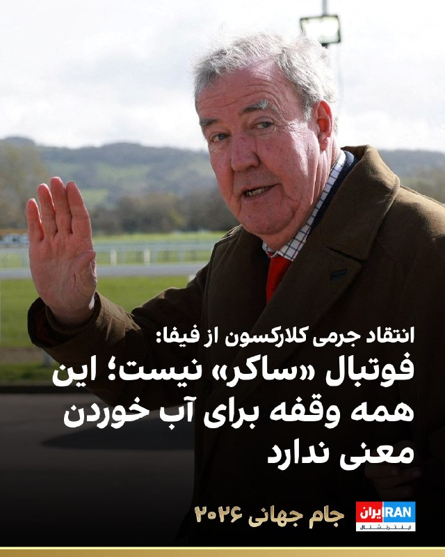

🔻جرمی کلارکسون، مجری مشهور برنامه «تخت گاز» و تلویزیون بریتانیا، که برای تماشای دیدار انگلیس و غنا در جام جهانی ۲۰۲۶ به آمریکا سفر کرده، با انتقاد از برخی قوانین و شرایط این تورنمنت، بار دیگر جنجال‌آفرین شد.

🔹کلارکسون در گفت‌وگو با برنامه «Proper Football Daily» ضمن حمایت از تیم ملی انگلیس و توماس توخل، به نام‌گذاری فوتبال در آمریکا، وقفه‌های نوشیدن آب در جریان مسابقات و حتی نوشیدنی‌های آمریکایی طعنه زد.

🔹او درباره وقفه‌های آب‌خوری در مسابقات گفت: «اینکه بازی را برای نوشیدن آب متوقف می‌کنند، اصلاً قابل درک نیست. درباره این موضوع اصلاً حرفی نزنید!»

🔹این چهره مشهور تلویزیونی همچنین از استفاده آمریکایی‌ها از واژه «ساکر» برای فوتبال انتقاد کرد و گفت این ورزش همان فوتبال است، نه ساکر.

🔹کلارکسون که از هواداران قدیمی چلسی محسوب می‌شود، در ادامه از عملکرد توماس توخل تمجید کرد و سرمربی آلمانی انگلیس را بهترین گزینه برای رساندن سه‌شیرها به قهرمانی دانست.

🔹جزییات بیشتر را در سایت بخوانید

@iranintltvsport

## IranIntlTV — post 343908

  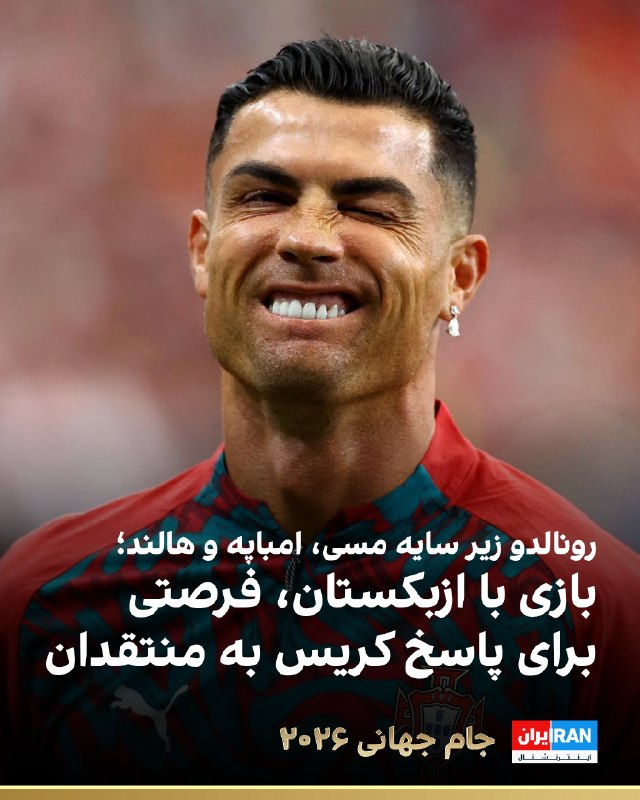

🔻در حالی که لیونل مسی با پنج گل در دو بازی برای آرژانتین می‌درخشد و کیلیان ام‌باپه و ارلینگ هالند نیز در کورس آقای گلی قرار دارند، کریستیانو رونالدو هنوز در جام جهانی ۲۰۲۶ موفق به گلزنی نشده است. حالا همه نگاه‌ها به دیدار پرتغال و ازبکستان دوخته شده؛ مسابقه‌ای که شاید سرنوشت آخرین جام جهانی فوق‌ستاره پرتغالی را تغییر دهد.

🔹مسی در دو مسابقه نخست آرژانتین پنج گل به ثمر رسانده و با عبور از رکورد میروسلاو کلوزه، به تنهایی عنوان بهترین گلزن تاریخ جام‌های جهانی را در اختیار گرفته است. ام‌باپه و هالند نیز هر کدام چهار گل به ثمر رسانده‌اند و هری کین با دو گل، خود را به جمع مدعیان آقای گلی رسانده است.

🔹در مقابل، رونالدو هنوز موفق به باز کردن دروازه حریفان نشده و همین موضوع باعث افزایش انتقادها از کاپیتان پرتغال شده است. برخی کارشناسان معتقدند او دیگر مهاجم مرگبار سال‌های اوج خود نیست و نمی‌تواند به تنهایی بار هجومی تیمش را به دوش بکشد. حتی برخی از روبرتو مارتینس خواسته‌اند وابستگی کمتری به ستاره ۴۱ ساله تیمش داشته باشد.

🔹جزییات بیشتر را در سایت بخوانید

@iranintltvsport

## IranIntlTV — post 343907

  

دونالد ترامپ، رییس‌جمهوری آمریکا، سه‌شنبه دوم تیر در پیامی در تروث سوشال نوشت که جمهوری اسلامی «به‌طور کامل و تمام‌عیار» با انجام بازرسی‌های هسته‌ای در بالاترین سطح برای آینده‌ای طولانی‌مدت موافقت کرده است.

ترامپ در پیامی نوشت: «با وجود همه انکارها و اظهارات نادرستی که در خلاف این موضوع مطرح می‌شود... ایران به‌طور کامل و تمام‌عیار با انجام بازرسی‌های هسته‌ای در بالاترین سطح برای آینده‌ای طولانی‌مدت (تا ابد!!!) موافقت کرده است.»

رییس‌جمهوری آمریکا همچنین گفت که جمهوری اسلامی در جریان مذاکرات امتیازهای مهم دیگری نیز ارائه کرده است.

او افزود: «بر اساس این موضوع و دیگر امتیازهای مهمی که ایران در حال ارائه آن‌هاست، من موافقت کرده‌ام که تنگه هرمز باز بماند و دیگر هیچ محاصره دریایی اعمال نشود.»

ترامپ در عین حال گفت همه کشتی‌ها در موقعیت خود باقی خواهند ماند تا در صورت لزوم محاصره دوباره برقرار شود، هرچند به گفته او در حال حاضر چنین احتمالی «بسیار بعید» به نظر می‌رسد.

## IranIntlTV — post 343906

  <a href="telegram/content/IranIntlTV_343906_1782219012.mp4" target="_blank">🎬 Download video</a>

مروری بر رسانه‌ها و خبرگزاری‌ها در ایران، سه‌شنبه ۲ تیر، با مجتبی هاشمی، روزنامه‌نگار
@iranintltv

## IranIntlTV — post 343905

  <a href="https://t.me/IranintlTV/343905" target="_blank">📎 Download file</a>

🎧نسخه صوتی اخبار نیم‌روزی | سه‌شنبه ۲ تیر
@iranintlTV

## IranIntlTV — post 343904

  <a href="telegram/content/IranIntlTV_343904_1782219014.mp4" target="_blank">🎬 Download video</a>

دونالد ترامپ اعلام کرد بخشی از اموال مسدودشده ایران آزاد شده و قرار است برای خرید مواد غذایی از جمله سویا و ذرت از کشاورزان آمریکایی هزینه شود.

به گفته آرش آزرمی، دبیر بخش اقتصادی ایران‌اینترنشنال، یکی از محورهای اصلی اختلاف میان طرف‌ها، نحوه مصرف این دارایی‌هاست؛ موضوعی که با توجه به اولویت‌های اعلامی جمهوری اسلامی، از جمله حوزه‌های نظامی، به یکی از چالش‌های اصلی در این پرونده تبدیل شده است.
@iranintltv

## IranIntlTV — post 343903

  

مسعود پزشکیان، رییس دولت جمهوری اسلامی، سه‌شنبه دوم تیر وارد اسلام‌آباد شد.
پزشکیان در فرودگاه بین‌المللی اسلام‌آباد مورد استقبال شهباز شریف، نخست وزیر پاکستان، قرار گرفت.
عباس عراقچی، وزیر خارجه جمهوری اسلامی نیز در پروازی جداگانه از مسقط به پاکستان سفر کرد و پیش از ورود پزشکیان، در پایگاه هوایی نور خان مورد استقبال محمد اسحاق دار، وزیر خارجه پاکستان قرار گرفت.
https://iranintl.com/202606239017

## IranIntlTV — post 343902

  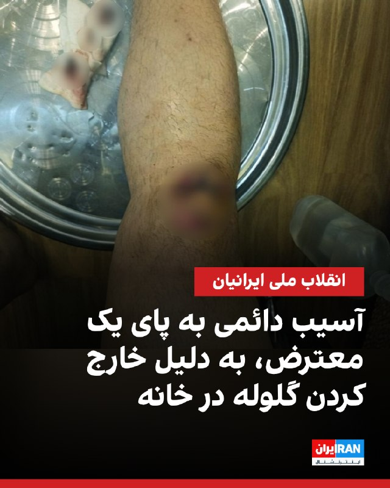

بر اساس تصاویر و اطلاعات رسیده به ایران‌اینترنشنال، مردی که شامگاه ۱۸ دی در تهران هدف تیراندازی قرار گرفت، به دلیل نگرانی از بازداشت، مجبور به جراحی در خانه برای خارج کردن گلوله از محل زخم شد. این مداوای خانگی منجر به آسیب‌های جدی به پای این معترض شده است.

یک زن و همسرش که اطلاعاتشان نزد ایران‌اینترنشنال محفوظ است، ساعت ۷ شب ۱۸ دی در محدوده اشرفی اصفهانی تهران، در حالی که در میان شلوغی‌های خیابانی حضور داشتند، هدف حمله نیروهای حکومتی قرار گرفتند.

ماموران موتورسوار از دو طرف به سمت مردم گاز اشک‌آور شلیک کردند و این زوج هنگام فرار به سمت خانه، از فاصله نزدیک هدف شلیک قرار گرفتند.

همسر این زن از ناحیه پا با تیر جنگی مجروح شد.

خانواده او به دلیل نگرانی از بازداشت یا برخورد امنیتی، نتوانستند او را به بیمارستان منتقل کنند و پس از دو روز، با کمک یک مسئول اتاق عمل از یکی از بیمارستان‌های تهران، گلوله را از پای او خارج کردند.
https://iranintl.com/202606230402

## IranIntlTV — post 343901

  <a href="telegram/content/IranIntlTV_343901_1782219018.mp4" target="_blank">🎬 Download video</a>

واکنش‌ها به استعفای کی‌یر استارمر، نخست‌وزیر بریتانیا، همچنان ادامه دارد. اورسلا فون درلاین، رییس کمیسیون اروپا، از استارمر به‌دلیل تلاش برای تقویت امنیت اروپا و اوکراین تمجید کرد.

گفت‌وگو با لی‌لی نیکفر، خبرنگار ایران‌اینترنشنال

@iranintltv

## IranIntlTV — post 343900

  <a href="telegram/content/IranIntlTV_343900_1782219019.mp4" target="_blank">🎬 Download video</a>

اسماعیل بقایی، سخنگوی وزارت خارجه جمهوری اسلامی، اعلام کرد تهران نه دیداری با رافائل گروسی در سوئیس داشته و نه برنامه‌ای برای بازدید آژانس بین‌المللی انرژی اتمی از تاسیسات هسته‌ای آسیب‌دیده در جنگ دارد.

علی شیرازی، عضو تحریریه ایران‌اینترنشنال، با ارزیابی این مواضع گفت دو احتمال مطرح است؛ یا این اظهارات برای مصرف داخلی و آرام کردن مخالفان تفاهم بیان شده است، یا جمهوری اسلامی از همان گام‌های نخست در حال فاصله گرفتن از تعهدات پیش‌بینی‌شده در تفاهم‌نامه است.
@iranintltv

## IranIntlTV — post 343899

  <a href="telegram/content/IranIntlTV_343899_1782219021.mp4" target="_blank">🎬 Download video</a>

استعفای کی‌یر استارمر از سمت نخست‌وزیری و رهبری حزب کارگر بریتانیا، واکنش‌های گسترده‌ای به‌همراه داشت.

گفت‌وگو با تاج‌الدین سروش، عضو تحریریه ایران‌اینترنشنال
@iranintltv

## IranIntlTV — post 343898

  <a href="telegram/content/IranIntlTV_343898_1782219023.mp4" target="_blank">🎬 Download video</a>

بنیامین نتانیاهو، نخست‌وزیر اسرائیل، گفت اقدامات این کشور در برابر جمهوری اسلامی و نیروهای نیابتی آن هنوز به پایان نرسیده است.

گفت‌وگو با اشکان صفایی، خبرنگار ایران‌اینترنشنال

@iranintltv

## IranIntlTV — post 343897

  

رسانه‌های ایران و پیام‌های ارسالی مخاطبان به ایران‌اینترنشنال از بروز اختلال گسترده در سامانه‌های بانکی کشور خبر دادند.

بر اساس این گزارش‌ها، برخی پایانه‌های فروشگاهی، درگاه‌های بانکی و اپلیکیشن‌های بانک‌ها از صبح سه‌شنبه دوم تیر با اختلال یا کندی در ارائه خدمات مواجه شده‌اند.

وب‌سایت دیده‌بان ایران نوشت: «بر اساس گزارش‌های کاربران، از صبح سه‌شنبه دوم تیر مجددا برخی سامانه‌ها و خدمات بانکی کشور با اختلال گسترده و کندی مواجه شده‌اند.»

این رسانه افزود بروز مشکل در انجام تراکنش‌ها، عدم دسترسی به خدمات آنلاین و اختلال در برخی درگاه‌های بانکی از جمله مشکلات گزارش‌شده از سوی کاربران است. همچنین گزارش‌هایی از اختلال در خدمات بانک ملت در استان البرز منتشر شده است.

پیام‌های ارسالی مخاطبان به ایران‌اینترنشنال نیز از بروز مشکلات مشابه در بانک‌های مختلف حکایت دارد. برخی کاربران اعلام کرده‌اند که امکان انجام نقل و انتقال بانکی را نداشته‌اند و خدمات بانک‌هایی از جمله صادرات، سپه، تجارت، رسالت، ملت، توسعه تعاون و ملی با اختلال مواجه شده است. یکی از مخاطبان گفت که «هیچ نقل و انتقالی در این بانک‌ها انجام نمی‌شود.»

## IranIntlTV — post 343896

  <a href="telegram/content/IranIntlTV_343896_1782219026.mp4" target="_blank">🎬 Download video</a>

ویدیوی ارسال‌شده به ایران‌اینترنشنال نشان می‌دهد دختر جاویدنام کریم حیدری، شمع تولد پدر جان باخته‌اش را بر سر مزار او فوت می‌کند.
کریم حیدری، ۱۸ دی ۱۴۰۴ در بندر گناوه هدف شلیک مستقیم قرار گرفت و جان باخت.

## Shin_Persian — post 7188

  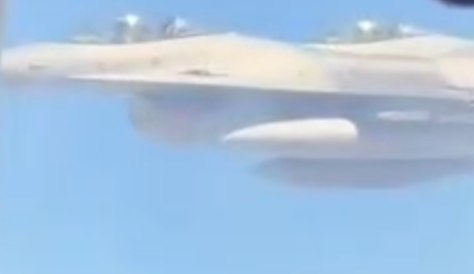

↩️ Quoted tweet: Armed Forces Update ✓ @ArmedUpdat1947 Tue, 23 Jun 2026 12:17:04 UTC #Exclusive 🇮🇷🦅🇵🇰 PAF F-16 Escorting the Iranian Plane Inside Pakistani Territory... ↩️ توییت نقل‌قول شده — برای پاسخ، پست زیر را ببینید. ترجمه خودکار فارسی #Exclusive…

## Shin_Persian — post 7187

  <a href="telegram/content/Shin_Persian_7187_1782219028.mp4" target="_blank">🎬 Download video</a>

↩️ Quoted tweet:
Armed Forces Update ✓ @ArmedUpdat1947
Tue, 23 Jun 2026 12:17:04 UTC

#Exclusive 🇮🇷🦅🇵🇰

PAF F-16 Escorting the Iranian Plane Inside Pakistani Territory...

↩️ توییت نقل‌قول شده — برای پاسخ، پست زیر را ببینید.

ترجمه خودکار فارسی

#Exclusive 🇮🇷🦅🇵🇰

اسکورت هواپیمای ایرانی توسط جنگنده‌های اف-۱۶ نیروی هوایی پاکستان (PAF) در حریم هوایی پاکستان...

𝕏 · @shin_persian

## Shin_Persian — post 7186

Shin ✓ @hey_itsmyturn
Tue, 23 Jun 2026 12:27:39 UTC

"Fuel Station Association" spokesperson urges people to use cash for payments until further notice.
POS devices, ATM machines, Internet Banking services are widely out of service in Iran.

ترجمه خودکار فارسی

سخنگوی «صنف جایگاه‌داران سوخت» از مردم درخواست کرد تا اطلاع ثانوی برای پرداخت‌ها از پول نقد استفاده کنند.
دستگاه‌های کارت‌خوان (POS)، دستگاه‌های خودپرداز (ATM) و خدمات بانکداری اینترنتی در سراسر ایران به طور گسترده از دسترس خارج شده‌اند.

𝕏 · @shin_persian

## Shin_Persian — post 7185

Shin ✓ @hey_itsmyturn
Tue, 23 Jun 2026 12:20:38 UTC

Iranian banks are under severe cyberattacks. And it's not just 3 banks!

ترجمه خودکار فارسی

بانک‌های ایران تحت حملات سایبری شدیدی قرار دارند. و این فقط ۳ بانک نیست!

𝕏 · @shin_persian

## Shin_Persian — post 7184

  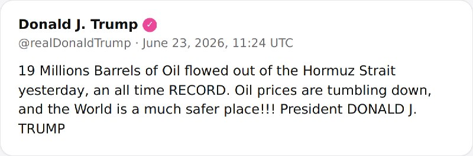

Shin ✓ @hey_itsmyturn
Tue, 23 Jun 2026 11:25:45 UTC

POTUS:
"19 Millions Barrels of Oil flowed out of the Hormuz Strait yesterday, an all time RECORD. Oil prices are tumbling down, and the World is a much safer place!!! President DONALD J. TRUMP"

ترجمه خودکار فارسی

رئیس‌جمهور ایالات متحده (POTUS):
«دیروز ۱۹ میلیون بشکه نفت از تنگه هرمز خارج شد که یک رکورد بی‌سابقه در تمام دوران‌ها است. قیمت‌های نفت در حال سقوط است و جهان مکان بسیار امن‌تری است!!! رئیس‌جمهور دونالد جی. ترامپ»

𝕏 · @shin_persian

## Shin_Persian — post 7183

  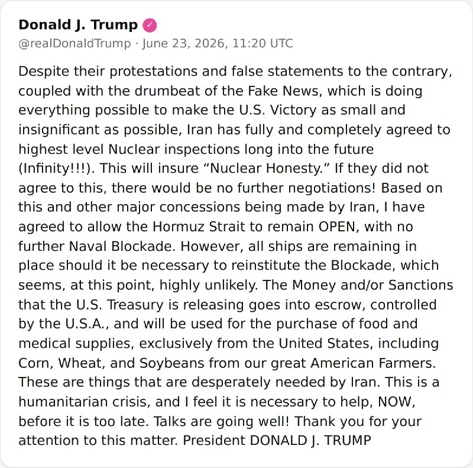

Shin ✓ @hey_itsmyturn
Tue, 23 Jun 2026 11:25:39 UTC

Original text in comments
ترجمه خودکار فارسی در بخش نظرات

𝕏 · @shin_persian

## Shin_Persian — post 7182

Shin ✓ @hey_itsmyturn
Tue, 23 Jun 2026 11:04:27 UTC

e.g:
Ghalibaf's channel post:
https://t.me/ghalibaf/24044
Khamenei's channel post:
https://t.me/rahbar_enghelab_ir/94

Same Tool Signature
Same Version
Same OS

ترجمه خودکار فارسی

پست کانال قالیباف:
https://t.me/ghalibaf/24044
پست کانال خامنه‌ای:
https://t.me/rahbar_enghelab_ir/94

امضای ابزار مشابه
نسخه مشابه
سیستم‌عامل مشابه

𝕏 · @shin_persian

## Shin_Persian — post 7180

Shin ✓ @hey_itsmyturn
Tue, 23 Jun 2026 11:04:26 UTC

So, the admins / designers of Mojtaba Khamenei's publication office have changed their computer from a Mac to a Windows computer in early June.

And more interestingly, Adobe InDesign version id was EXACTLY same as Ghalibaf's publication office.

Tool Signature for both Ghalibaf and Khamenei's pdf files:

Adobe InDesign 21.0 (Macintosh) | Adobe PDF Library 18.0 | Adobe InDesign 21.0 (Macintosh) | Adobe PDF Library 18.0 | Adobe XMP Core 10.0-c000 25.G.ef72e4e, 2025/06/27-18:54:05 | 1.4 | ar-SA | Adobe InDesign 21.0 (Macintosh)

ترجمه خودکار فارسی در بخش نظرات

𝕏 · @shin_persian

## Shin_Persian — post 7179

Shin ✓ @hey_itsmyturn
Tue, 23 Jun 2026 10:25:22 UTC

Islamic Regime's FM, Abbas Araghchi has just arrived in Islamabad, Pakistan

ترجمه خودکار فارسی

عباس عراقچی، وزیر امور خارجه رژیم اسلامی، دقایقی پیش وارد اسلام‌آباد، پاکستان شد.

𝕏 · @shin_persian

## Shin_Persian — post 7178

🔁 Quoting above tweet:
Shin ✓ @hey_itsmyturn
Tue, 23 Jun 2026 10:24:15 UTC

Confirmed: Service disruption in Iranian Melli, Saderat and Tejarat banks due to cyberattacks.

ترجمه خودکار فارسی

تأیید شد: اختلال در خدمات بانک‌های ملی، صادرات و تجارت ایران به دلیل حملات سایبری.

𝕏 · @shin_persian

## Shin_Persian — post 7176

Shin ✓ @hey_itsmyturn
Tue, 23 Jun 2026 09:46:09 UTC

Widespread banking service disruption across Iran, ongoing for ~2 hours

ترجمه خودکار فارسی

اختلال گسترده در خدمات بانکی در سراسر ایران، که از حدود ۲ ساعت پیش تاکنون ادامه دارد.

𝕏 · @shin_persian

## Shin_Persian — post 7175

  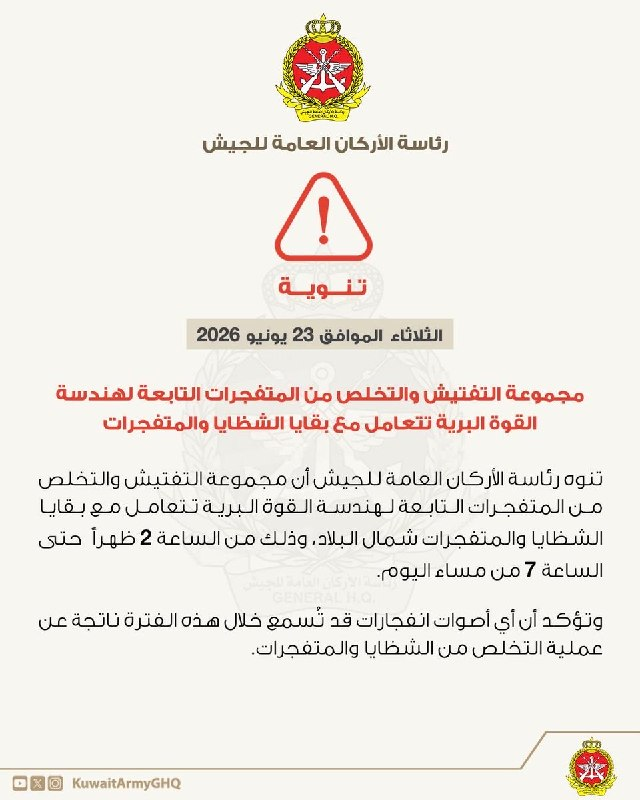

Shin ✓ @hey_itsmyturn
Tue, 23 Jun 2026 09:41:51 UTC

Kuwait Army General Staff announces EOD teams are disposing of shrapnel and explosives in the north of the country today until 7:00 PM.

Explosion sounds may be heard during this period.

#Kuwait 🇰🇼

ترجمه خودکار فارسی

ستاد کل ارتش کویت اعلام کرد که تیم‌های خنثی‌سازی مهمات (EOD) امروز تا ساعت ۱۹:۰۰ (۲۲:۳۰ به وقت تهران) در حال پاک‌سازی ترکش‌ها و مواد منفجره در شمال این کشور هستند.

ممکن است در این بازه زمانی صدای انفجار شنیده شود.

#Kuwait 🇰🇼

𝕏 · @shin_persian

## ManotoTV — post 106207

## ManotoTV — post 106206

  <a href="telegram/content/ManotoTV_106206_1782219031.mp4" target="_blank">🎬 Download video</a>

طرح تازه آمریکا برای دارایی‌های ایران، بحثی فراتر از غلات به راه انداخته است. مسئله مردم ایران فقط گندم و سویا نیست، بلکه بحران ساختاری اقتصادی، سرکوب و حکومتی غیرپاسخگو است.

## FarsiVOA — post 221632

  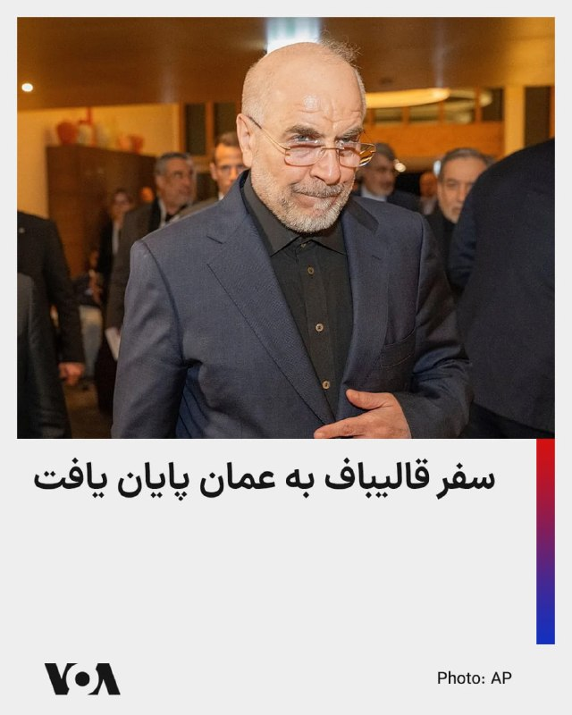

محمدباقر قالیباف، رئیس‌ مجلس شورای اسلامی به سفر خود به مسقط پایان داد و جمهوری اسلامی و عمان در بیانیه مشترکی اعلام کردند که برای دستیابی به توافق درباره «مدیریت آینده کشتیرانی» از طریق تنگه هرمز، یک کمیته مشترک تشکیل خواهند داد.

رسانه‌های ایران گزارش دادند رئیس مجلس شورای اسلامی روز سه‌شنبه پس از دیدار با سلطان عمان، مسقط را به مقصد تهران ترک کرد.

همزمان خبرگزاری رویترز نوشت که عمان و جمهوری اسلامی بر تعهد خود به «حفظ تنگه هرمز به‌عنوان یک آبراه امن و باز برای ناوبری و کشتیرانی بین‌المللی» و همچنین بر «حقوق حاکمیتی‌شان در آب‌های سرزمینی» واقع در این تنگه تأکید کردند.

همچنین این دو کشور افزودند «تمام ترتیبات مربوط به تنگه هرمز باید به‌طور کامل به حاکمیت و حقوق حاکمیتی آن‌ها احترام بگذارد.»

این در حالی است که سلطان عمان در دیدار با رئیس مجلس شورای اسلامی، ضمن تأکید بر عبور امن و بدون مانع از تنگه هرمز، بر حمایت مسقط از روند گفت‌وگوها و امید به دستیابی به توافقی جامع و صلح‌آمیز تأکید کرد.
@FarsiVOA

## FarsiVOA — post 221631

🔺اعتراف وزیر صمت به انتقال هزینه محاصره دریایی به قیمت کالاها

▪️وزیر صنعت، معدن و تجارت گفته است که افزایش استفاده از کریدورهای زمینی در دوره اختلال مسیرهای دریایی، هزینه حمل‌ونقل را بالا برده و بر قیمت برخی کالاها اثر گذاشته است؛ اظهاراتی که نشان می‌دهد فشار ناشی از تغییر مسیر تجارت، به بازار و معیشت مردم منتقل شده است.

▪️اخلال جمهوری اسلامی در تنگه هرمز و محدود کردن مسیر اصلی تجارت دریایی، تنش در گذرگاه‌های انرژی و کالا را افزایش داد و آمریکا در پاسخ، از ۱۳ آوریل محاصره دریایی بنادر جمهوری اسلامی را آغاز کرد.

▪️نتیجه این تقابل، انتقال بخشی از بار تجارت به کریدورهای زمینی، افزایش هزینه حمل‌ونقل و فشار مستقیم بر قیمت کالاها و زندگی روزمره مردم بود.

⬇️ بیشتر بخوانید:
https://ir.voanews.com/a/8163891.html

## FarsiVOA — post 221630

  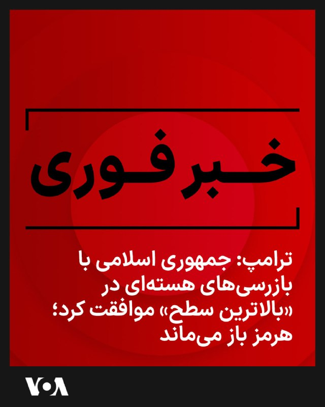

پرزیدنت دونالد ترامپ در پیامی در شبکه اجتماعی «تروث سوشال» اعلام کرد برخلاف «اعتراض‌ها و اظهارات نادرست» جمهوری اسلامی، که رسانه‌های جعلی آن را بازتاب می‌دهد، به‌طور کامل با بازرسی‌های هسته‌ای در بالاترین سطح و برای آینده‌ای طولانی موافقت کرده است.

آقای ترامپ نوشت این توافق، به گفته او، «صداقت هسته‌ای» را تضمین می‌کند و اگر جمهوری اسلامی با آن موافقت نکرده بود، مذاکرات بیشتری انجام نمی‌شد.

رئیس جمهوری آمریکا گفت بر اساس این توافق و «امتیازهای بزرگ دیگر» از سوی جمهوری اسلامی، اجازه داده است تنگه هرمز باز بماند و محاصره دریایی بیشتری اعمال نشود؛ هرچند همه کشتی‌های آمریکا در جای خود باقی می‌مانند تا در صورت ضرورت، محاصره دوباره برقرار شود.

آقای ترامپ همچنین اعلام کرد پول یا معافیت‌های تحریمی آزادشده از سوی خزانه‌داری آمریکا در حساب امانی تحت کنترل آمریکا قرار می‌گیرد و فقط برای خرید مواد غذایی و دارویی از آمریکا، از جمله ذرت، گندم و سویا، استفاده خواهد شد.

به نوشته آقای ترامپ «مذاکرات به خوبی پیش می‌رود»

https://ir.voanews.com/a/iran-donald-trump-nuclear-energy-inspectors-strait-of-hormuz/8163893.html

## FarsiVOA — post 221629

  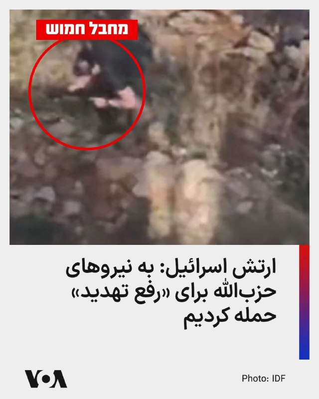

ارتش اسرائیل اعلام کرد نیروهایش به افراد مسلح حزب‌الله در جنوب لبنان حمله کرده‌اند؛ رخدادی تازه که شکنندگی آتش‌بس در مرز لبنان و اسرائیل را بار دیگر نشان می‌دهد.

تایمز اسرائیل روز سه‌شنبه گزارش داد ارتش اسرائیل گفته این افراد در نزدیکی نیروهای اسرائیلی در منطقه خط‌الرأس علی طاهر، در شمال منطقه امنیتی تحت کنترل اسرائیل در جنوب لبنان، شناسایی شدند و سپس برای «رفع تهدید» هدف قرار گرفتند.

رسانه‌های لبنان گزارش دادند در این حمله دو نفر کشته و دو نفر دیگر زخمی شده‌اند.

این رخداد در حالی روی می‌دهد که پس از آتش‌بس اخیر، گزارش‌های متعددی از ادامه تنش در جنوب لبنان منتشر شده است. اسرائیل پیشتر حزب‌الله را به شلیک پرتابه به شمال اسرائیل و نقض آتش‌بس متهم کرده بود.

رویترز نیز گزارش داده بود هرچند درگیری‌ها پس از توافق کاهش یافته، اما کاملاً متوقف نشده و وضعیت مرزی همچنان شکننده است.
@FarsiVOA

## FarsiVOA — post 221628

  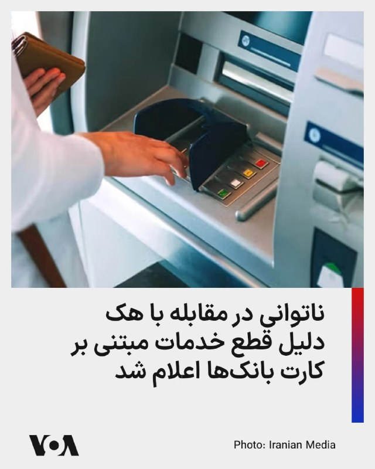

شرکت خدمات انفورماتیک اعلام کرد خدمات مبتنی بر کارت در بانک‌های ملی، صادرات و تجارت به‌صورت موقت از دسترس خارج شده است؛ تصمیمی که به گفته این شرکت، پس از بروز اختلال در سامانه‌های کارت‌محور و برای جلوگیری از دسترسی غیرمجاز و حفاظت از داده‌ها و دارایی‌های مشتریان گرفته شده است.

این اطلاعیه در عمل نشان می‌دهد اختلالات ناشی از حملات سایبری هنوز به‌طور کامل مهار نشده و بخشی از خدمات حساس بانکی، با تصمیم فنی، از دسترس کاربران خارج شده است.

ساعاتی پیشتر نیز گزارش کاربران نشان می‌داد خدمات کارت‌های بانک ملی در همراه‌بانک این بانک بار دیگر با اختلال روبه‌رو شده است؛ موضوعی که باشگاه خبرنگاران جوان نیز آن را گزارش کرده بود.

این اختلال در حالی خبرساز شده که هفته گذشته، پس از حمله سایبری به بانک‌های ملی، تجارت، صادرات و توسعه صادرات، مقام‌های بانکی از بازگشت تدریجی و سپس فعال شدن بخش‌هایی از خدمات بانک ملی خبر داده بودند.
@FarsiVOA

## FarsiVOA — post 221627

  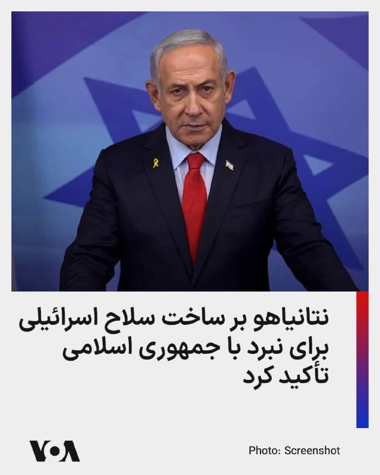

نخست‌وزیر اسرائیل اعلام کرد که توسعه تسلیحات از سوی این کشور برای پشتیبانی از نبرد جاری با جمهوری اسلامی و نیروهای نیابتی آن ضروری است.

بنیامین نتانیاهو سه‌شنبه دوم تیرماه در جریان دیدار با نیروهای اسرائیلی در کرانه باختری گفت: «من عمیقاً از حمایتی که دریافت کرده‌ایم ــ و حمایتی که طی سال‌ها از دوستان آمریکایی‌مان برای آن تلاش کرده‌ام ــ قدردانی می‌کنم.»

او افزود: «اما امروز می‌گویم: ما به یک سامانه مستقل تولید تسلیحات نیاز داریم. ما باید سلاح‌های خودمان را تولید کنیم.»

نتانیاهو ادامه داد: «اکنون ما با ایران و نیروهای نیابتی آن روبه‌رو هستیم. ما ضربات سختی به آن‌ها وارد کرده‌ایم. این ماجرا هنوز تمام نشده است، اما به قدرت ما بستگی دارد. اینکه ۳۰ سال دیگر در چه جایگاهی خواهیم بود، به قدرت ما بستگی دارد. به همین دلیل است که آنچه اکنون انجام می‌دهیم، ساختن قدرتی حتی بیشتر است.»

نخست‌وزیر اسرائیل تأکید کرد که کشورش می‌خواهد «از توانایی مستقل تولید تسلیحات» برخوردار باشد.

⬇️ بیشتر بخوانید:
https://ir.voanews.com/a/netanyahu-israel-must-free-itself-of-dependence-on-us-arms/8163885.html

## FarsiVOA — post 221626

  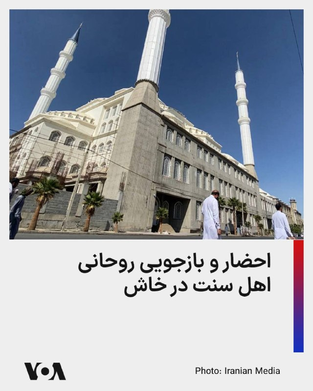

علی‌محمد سالارزهی، روحانی اهل سنت، از سوی اداره اطلاعات شهرستان خاش احضار و مورد بازجویی قرار گرفت.

براساس گزارش خبرگزاری هرانا، احضار آقای سالارزهی، روز گذشته پس از آن صورت گرفت که یکی از نزدیکان وی در رابطه با ضرب‌وجرح شماری از زنان معترض به استخراج معادن و تخریب محیط‌ زیست در منطقه تیلویی تفتان واکنش نشان داده بود.

این احضار در حالی صورت گرفته است که ۲۶ خردادماه شماری از زنان منطقه تیلویی تفتان در اعتراض به فعالیت‌های معدن طلای تفتان تجمع کردند. به گزارش منابع محلی، نیروهای نظامی جمهوری اسلامی با معترضان برخورد کرده و دست‌کم یک زن در جریان این رویداد زخمی شد.
@FarsiVOA

## FarsiVOA — post 221625

  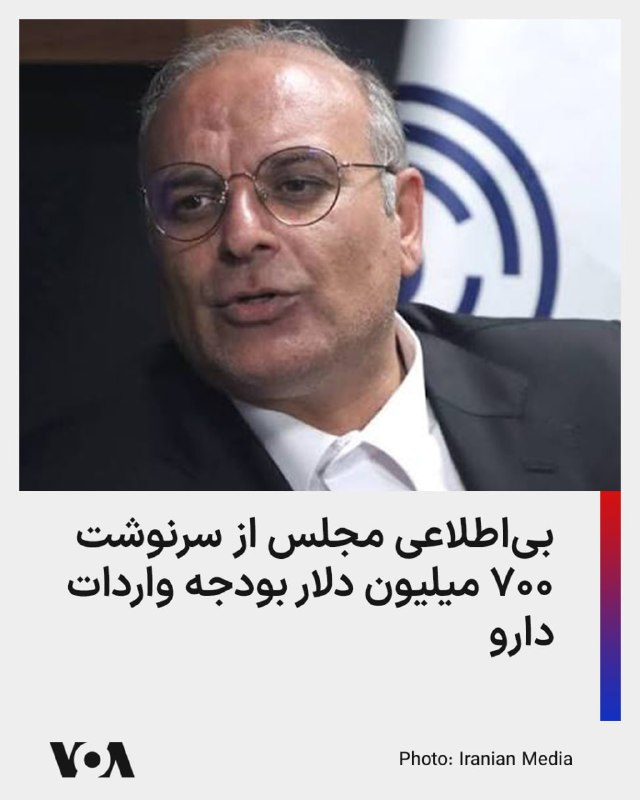

عضو کمیسیون بهداشت مجلس شورای اسلامی اعلام کرد که این کمیسیون نمی‌داند ۷۰۰ میلیون دلار بودجه واردات دارو چه سرنوشتی پیدا کرده است.

روح‌الله لک علی‌آبادی در سخنانی که سایت دیده‌بان ایران منتشر کرده، مدعی است که به دستور علی خامنه‌ای، رهبر پیشین جمهوری اسلامی، یک میلیارد دلار از صندوق توسعه برای دارو برداشت شد که از این میزان ۳۰۰ میلیون دلار هزینه شده است.

او افزود: معلوم نیست «۷۰۰ میلیون دلار» دیگر کجا رفته و چه سرنوشتی پیدا کرده است.

این نماینده مجلس یادآور شد که این موضوع در «یک جلسه پرتنش» با مسئولان سازمان غذا و دارو مطرح و مقرر شده در جلسه بعدی مسئولان این سازمان توضیحاتی درباره سرنوشت ۷۰۰ میلیون دلار ارائه دهند.

این اظهارات در حالی است که پیشتر مسئولان جمهوری اسلامی مدعی بودند که به دلیل اعمال تحریم‌های و محاصره دریایی آمریکا، در روند واردات دارو اخلال ایجاد شده است.
@FarsiVOA

## FarsiVOA — post 221624

  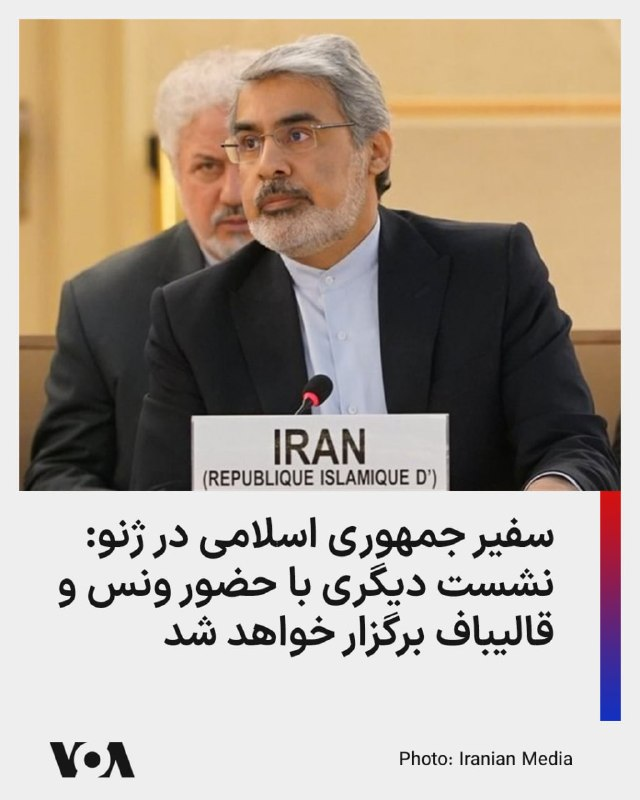

سفیر جمهوری اسلامی در مقر سازمان ملل متحد در ژنو اعلام کرد که جمهوری اسلامی هنوز تصمیمی درباره زمان برگزاری نشست بعدی بلندپایه با حضور معاون رئیس‌جمهوری آمریکا و محمدباقر قالیباف اتخاذ نکرده، اما این نشست برگزار خواهد شد.

او روز سه‌شنبه دوم تیرماه در جمع خبرنگاران گفت: مذاکرات تیم‌های فنی حکومت ایران و آمریکا و کشورهای میانجی در سوئیس «خوب بود و دو کارگروه درباره تحریم‌ها و فعالیت‌های هسته‌ای تشکیل خواهد شد.»

سفیر و نماینده دائمی جمهوری اسلامی در ژنو افزود که «تنگه هرمز به روی کشتی‌های تجاری باز است و طی روزهای اخیر مقادیر زیادی نفت از طریق این آب‌راه منتقل شده است.»

بحرینی همچنین گفت که جمهوری اسلامی انتظار دارد شش میلیارد دلار از منابع مسدودشده‌اش به زودی آزادسازی شود.
@FarsiVOA

## FarsiVOA — post 221623

  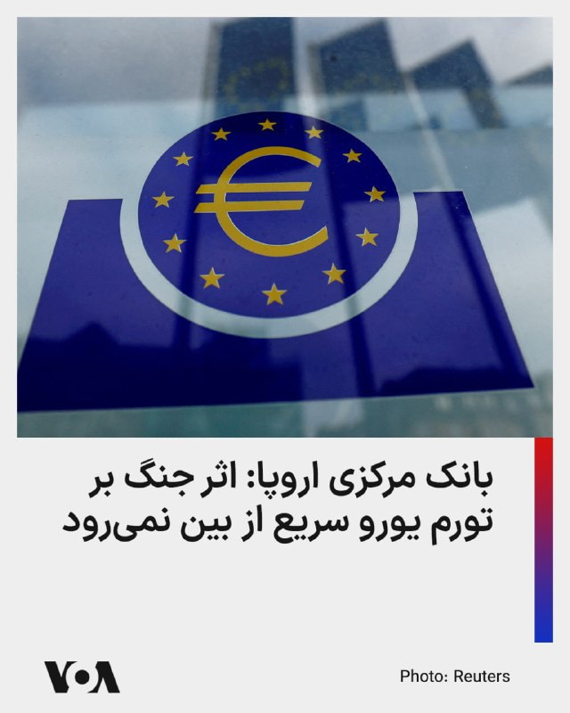

اقتصاددان ارشد و عضو هیئت اجرایی بانک مرکزی اروپا هشدار داد حتی اگر در خاورمیانه صلح برقرار شود، تورم در منطقه یورو ممکن است برای مدتی بالاتر از هدف دو درصدی این بانک باقی بماند.

فیلیپ لین روز سه‌شنبه در فرانکفورت گفت جنگ در خاورمیانه با بالا بردن هزینه انرژی، فشار تازه‌ای بر قیمت‌ها وارد کرده و اثر آن می‌تواند بعد از کاهش تنش‌ها هم ادامه پیدا کند.

بانک مرکزی اروپا این ماه نرخ بهره را افزایش داد تا مانع تبدیل شدن شوک انرژی به موج پایدار تورم شود. بازارهای مالی نیز احتمال می‌دهند این بانک تا پایان سال یک بار دیگر نرخ بهره را بالا ببرد.

اگرچه قیمت انرژی از اوج‌های اخیر پایین‌تر آمده، مقام‌های پولی اروپا نگرانند که اثر جنگ از بازار انرژی به قیمت کالاها، دستمزدها و انتظارات تورمی سرایت کند و مهار تورم را دشوارتر کند.
@FarsiVOA

## FarsiVOA — post 221622

  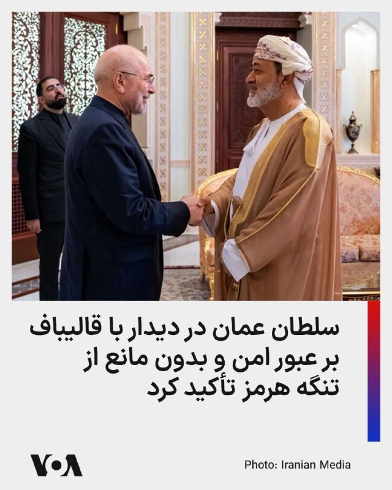

سلطان عمان در دیدار با رئیس مجلس شورای اسلامی، ضمن تأکید بر عبور امن و بدون مانع از تنگه هرمز، بر حمایت مسقط از روند گفت‌وگوها و امید به دستیابی به توافقی جامع و صلح‌آمیز تأکید کرد.

این دیدار روز سه‌شنبه دوم تیر در مسقط و با حضور عباس عراقچی وزیر خارجه جمهوری اسلامی برگزار شد.

به گزارش خبرگزاری دولتی عمان، در این دیدار، دو طرف آخرین تحولات مربوط به مذاکرات میان جمهوری اسلامی ایران و ایالات متحده آمریکا را مورد بررسی قرار دادند و هیئت ایرانی توضیحات خود را درباره محورهای مختلف این گفت‌وگوها ارائه کرد.

بر اساس این گزارش، سلطان عمان با ابراز حمایت از روند مذاکرات، امیدواری خود را نسبت به موفقیت این گفت‌وگوها و دستیابی به یک راه‌حل صلح‌آمیز و نهایی برای تمامی مسائل حل‌نشده اعلام کرد.

او همچنین بر اهمیت رسیدن به توافقی پایدار در خصوص موضوعات کلیدی از جمله بازگشت کشتیرانی امن و بدون مانع در تنگه هرمز، پرونده هسته‌ای ایران و سایر چالش‌های مرتبط تأکید کرد.
@FarsiVOA

## FarsiVOA — post 221621

  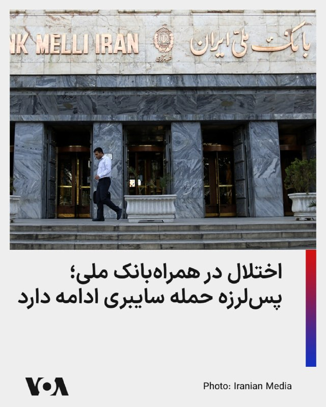

گزارش کاربران نشان می‌دهد خدمات کارت‌های بانک ملی در همراه‌بانک این بانک بار دیگر با اختلال روبه‌رو شده است؛ موضوعی که باشگاه خبرنگاران جوان نیز آن را گزارش کرده است.

این اختلال در حالی خبرساز شده که هفته گذشته، پس از حمله سایبری به چهار بانک ملی، تجارت، صادرات و توسعه صادرات، مقام‌های بانکی از بازگشت تدریجی و سپس فعال شدن بخش‌هایی از خدمات بانک ملی خبر داده بودند.

شورای هماهنگی بانک‌ها آن حمله را «محدود» توصیف کرده و مدعی شده بود اطلاعات مشتریان افشا نشده است. با این حال، گزارش‌های تازه کاربران نشان می‌دهد مشکلات بانکی، دست‌کم در بخش خدمات کارت و همراه‌بانک ملی، ظاهراً هنوز به طور کامل رفع نشده است.

بانک ملی ایران در آخرین روز خرداد اعلام کرده بود بخش قابل توجهی از خدمات کلیدی این بانک پس از رفع مشکلات فنی و زیرساختی، مجدداً در دسترس مشتریان قرار گرفته است.

اختلال در خدمات کارتی برای کاربران فقط یک مشکل فنی نیست؛ کارت‌به‌کارت، پرداخت‌های روزمره، خرید اینترنتی و دسترسی فوری به حساب را مختل می‌کند.
@FarsiVOA

## FarsiVOA — post 221620

  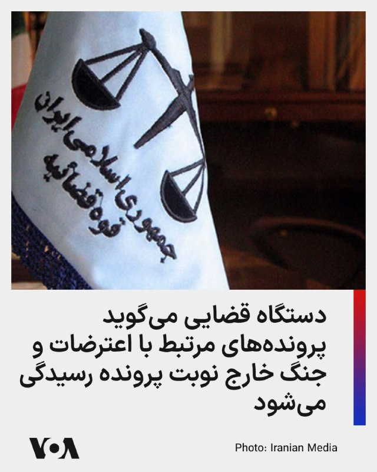

رئیس دیوان عالی جمهوری اسلامی اعلام کرد که پرونده‌های مربوط به اعتراضات دی ماه و جنگ، خارج از نوبت و به صورت فوق‌العاده رسیدگی می‌شود.

محمدجعغر منتظری تعداد این پرونده‌ها را که مدعی شده «حساس و امنیتی» هستند، ۵۱ مورد اعلام و یادآور شد که از این تعداد به ۴۵ پرونده رسیدگی شده، در ۳۱ مورد حکم دادگاه تأیید، و مابقی جهت رفع نقص و رسیدگی مجدد به شعبه هم‌عرض ارسال شده است.

پیشتر غلامحسین محسنی اژه‌ای، رئیس دستگاه قضایی گفته بود که احکام مربوط به «مصادره اموال و اعدام» باید با سرعت صادر و رسانه‌ای شود.

پیشتر سخنگوی قوه قضائیه تعداد شهروندان بازداشت‌شده در چارچوب قانون موسوم به «تشدید مجازات همکاری با دولت‌های متخاصم»، را سه هزار و ۲۹۲ نفر اعلام کرده بود. این قانون مبنای بسیاری از برخوردهای قضایی از زمان اعتراض‌های دی‌ماه ۱۴۰۴ بود.
@FarsiVOA

## FarsiVOA — post 221619

🔺جمهوری اسلامی مدعی است بعد از سخنان ترامپ، به مذاکرات چهارجانبه برنگشته است

▪️سخنگوی وزارت خارجه جمهوری اسلامی ادعا کرد که هیئت جمهوری اسلامی بعد از توقف مذاکرات چهارجانبه در سوئیس، به دلیل آن چه او «اظهارات تهدیدآمیز مقامات آمریکایی» خواند، این هیئت تماس مستقیمی با طرف آمریکایی نداشته است.

▪️این اظهارات در حالی است که معاون رئیس‌جمهوری آمریکا، در پاسخ به ادعای جمهوری اسلامی درباره «اظهارات تهدیدآمیز» ترامپ، گفته بود: «وقتی شما حرف‌های مفت و توخالی می‌زنید، نباید انتظار داشته باشید که رئیس‌جمهور ایالات متحده به شما پاسخ ندهد و فکت‌ها و سوابق را اصلاح نکند.»

▪️ونس همچنین گفت رفتار مقام‌های جمهوری اسلامی در جریان مذاکرات گاه برای مذاکره‌کنندگان آمریکایی «گیج‌کننده» بوده است.

⬇️ بیشتر بخوانید:
https://ir.voanews.com/a/8163884.html

## FarsiVOA — post 221618

🔺رویترز: رفع تحریم‌های چنددهه‌ای جمهوری اسلامی سریع و آسان نخواهد بود

▪️مجوز موقت آمریکا برای فروش نفت و محصولات نفتی با منشأ ایران، در کوتاه‌مدت می‌تواند میلیاردها دلار درآمد در اختیار جمهوری اسلامی بگذارد، اما رویترز گزارش داد که باز کردن گره تحریم‌های چند دهه‌ای علیه حکومت ایران، نه آسان خواهد بود و نه سریع.

▪️بر اساس گزارش رویترز، وزارت خزانه‌داری آمریکا روز دوشنبه مجوزی عمومی و موقت صادر کرد که تولید، تحویل و فروش نفت خام، محصولات نفتی و پتروشیمی با منشأ ایران را تا ۲۱ اوت مجاز می‌کند.

▪️این مجوز پس از توافق موقت میان واشنگتن و جمهوری اسلامی صادر شده و بخشی از مسیر مذاکرات برای رسیدن به یک توافق نهایی توصیف شده است.

⬇️ بیشتر بخوانید:
https://ir.voanews.com/a/undoing-iran-sanctions-wont-be-easy-or-quick-reuters/8163882.html

## FarsiVOA — post 221617

🔺واشنگتن میزبان دور جدید مذاکرات لبنان و اسرائیل پس از تفاهم با جمهوری اسلامی است

▪️بلومبرگ گزارش داد صبح سه‌شنبه هفت نفتکش اعلام کردند که در تنگه هرمز هستند و کشتدور جدید مذاکرات میان لبنان و اسرائیل در واشنگتن در روز سه‌شنبه دوم تیر در حالی آغاز می‌شود که این مذاکرات تحت‌تاثیر تفاهم‌نامه میان آمریکا و جمهوری اسلامی قرار گرفته است.

▪️مقامات لبنانی تأکید کرده‌اند که مذاکرات رودررو با اسرائیل تنها راه برای پایان دادن به جنگی است که از دوم مارس آغاز شده و همچنان ادامه دارد.

▪️این جنگ از سوی گروه مسلح حزب‌الله علیه اسرائیل و در حمایت از جمهوری اسلامی آغاز شد و حملات هوایی و زمینی اسرائیل را برانگیخت که تاکنون بیش از ۴ هزار کشته برجای گذاشته است.

⬇️ بیشتر بخوانید:
https://ir.voanews.com/a/washington-to-host-new-round-of-lebanon-israel-talks-after-mou-with-iran/8163881.html

## FarsiVOA — post 221616

🔺بلومبرگ: هفت نفتکش در تنگه هرمز اعلام موقعیت کردند

▪️بلومبرگ گزارش داد صبح سه‌شنبه هفت نفتکش اعلام کردند که در تنگه هرمز هستند و کشتی‌های بیشتری آشکارا قصد خود را برای عبور از تنگه هرمز اعلام می‌کنند.

▪️این روند نشانه‌ای مهم از افزایش تدریجی رفت‌وآمد کشتی‌ها در یکی از حساس‌ترین مسیرهای انتقال انرژی، پس از هفته‌ها اختلال توسط جمهوری اسلامی است.

▪️در میان این کشتی‌ها، دو ابرنفتکش غیرایرانی با بار کامل در حال ترک خلیج فارس بودند. سه کشتی حامل فرآورده‌های نفتی نیز به سمت خارج حرکت کردند، در حالی که دو نفتکش سوئزمکس با پرچم ایران از سمت دیگر به تنگه نزدیک شدند.

▪️روند تردد نشان می‌دهد که هرمز در حال باز شدن است، اما هنوز عبور ایمن و عادی تضمین نشده است.

⬇️ بیشتر بخوانید:
https://ir.voanews.com/a/hormuz-traffic-picks-up-as-more-tankers-cross-with-open-signals/8163883.html

## FarsiVOA — post 221615

  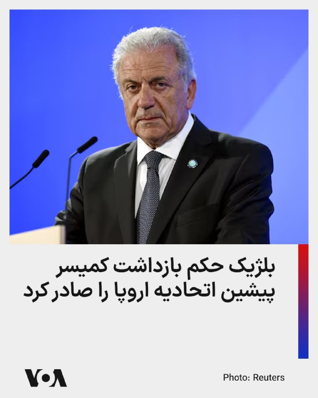

یک قاضی در بلژیک حکم بازداشت اروپایی برای دیمیتریس آوراموپولوس، کمیسر پیشین اتحادیه اروپا و سیاستمدار یونانی، صادر کرده است.

رویترز روز سه‌شنبه به نقل از یک مقام دولت یونان گزارش داد این حکم به پرونده فساد موسوم به «قطرگیت» مربوط است؛ پرونده‌ای که از سال ۲۰۲۲ اتحادیه اروپا را با یکی از بزرگترین رسوایی‌های سیاسی خود روبه‌رو کرد.

در این پرونده، چند مقام اروپایی متهم شده‌اند که در ازای دریافت رشوه از قطر، بر سیاست‌گذاری اتحادیه اروپا اثر گذاشته‌اند.

بازرسان بلژیکی در جریان تحقیقات، یک میلیون و ۵۰۰ هزار یورو پول نقد کشف کردند که بخشی از آن در یک چمدان بزرگ در هتلی در بروکسل بود.

آوراموپولوس هرگونه تخلف را رد کرده و گفته است هیچ دخالت مستقیم یا غیرمستقیمی در اقدام نادرست نداشته است. قطر نیز همواره هرگونه تخلف را رد کرده است.
@FarsiVOA

## FarsiVOA — post 221614

  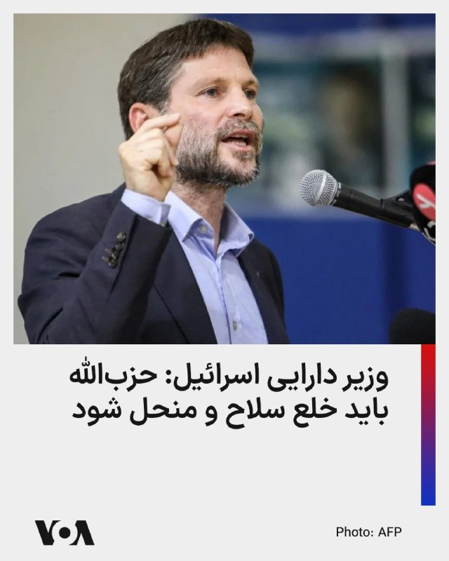

وزیر دارایی اسرائیل، روز سه‌شنبه گفت ارتش این کشور تا زمانی که حزب‌الله در لبنان وجود دارد، از جنوب لبنان عقب‌نشینی نخواهد کرد.

بتسالل اسموتریچ، در گفت‌وگو با رادیو ارتش اسرائیل گفت خروج از منطقه امنیتی، از جمله ارتفاعات بوفور، «به‌سادگی رخ نخواهد داد» و افزود حزب‌الله باید نه فقط خلع سلاح، بلکه «منحل» شود.

به گفته او، این گروه نباید توان نظامی یا سیاسی برای تهدید شهروندان شمال اسرائیل داشته باشد.

اسموتریچ در مورد فشار احتمالی آمریکا برای خروج نیروها مطابق با خواسته‌های جمهوری اسلامی در بحبوحه مذاکرات صلح بین واشنگتن و تهران، گفت اسرائیل این موضع را برای دولت آمریکا روشن کرده است.

پیشتر، بنیامین نتانیاهو، یسرائیل کاتز و رئیس ستاد ارتش اسرائیل نیز بر ادامه حضور و آزادی عمل ارتش در جنوب لبنان تأکید کرده بودند.

دونالد ترامپ نیز در روزهای اخیر گفته بود حکومت ایران باید فوراً نیروهای نیابتی خود در لبنان را مهار کند و در غیر این صورت آمریکا حملات علیه جمهوری اسلامی را از سر خواهد گرفت.
@FarsiVOA

## FarsiVOA — post 221613

  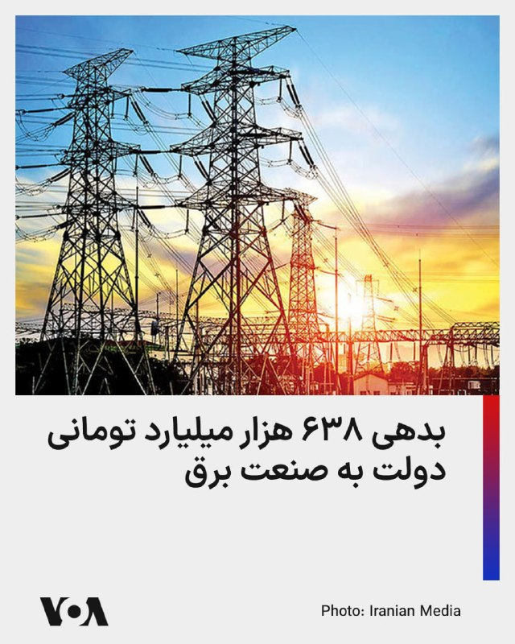

دبیر سندیکای صنعت برق ایران بدهی ۶۳۸ همتی دولت به وزارت نیرو را عامل اصلی ناترازی اقتصادی صنعت برق دانست و تأکید کرد که تداوم این وضعیت، توسعه و پایداری شبکه برق را با چالش مواجه کرده است.

مهدی مسائلی با اشاره به پرداخت نشدن کامل یارانه برق از سال ۱۳۹۴ تاکنون، این موضوع را یکی از عوامل اصلی کمبود منابع مالی در صنعت برق برشمرد و یادآور شد که تداوم این روند، توسعه زیرساخت‌ها و جذب سرمایه‌گذاری را با مشکل مواجه کرده است.

علیرغم بدهی هنگفت دولت به صنعت برق، این فعال صنفی یادآور شد که یک‌سوم برق تحویلی به مشترکان عمومی، از جمله روشنایی شهری، روشنایی بین‌راهی، اماکن فرهنگی و مذهبی، مدارس دولتی، کمیته امداد و بهزیستی، توسط دولت رایگان عرضه می شود.

به گفته مسائلی، صنعت برق اکنون با حدود ۱۳۰ همت بدهی انباشته روبه‌روست؛ موضوعی که تمایل بانک‌ها و سرمایه‌گذاران برای تأمین مالی پروژه‌های این بخش را کاهش داده است.

مسائلی اعلام کرد که از اردیبهشت‌ماه تاکنون برق چاه‌های کشاورزی روزانه حدود پنج ساعت قطع می‌شود.
@FarsiVOA

## DW_Farsi — post 126370

  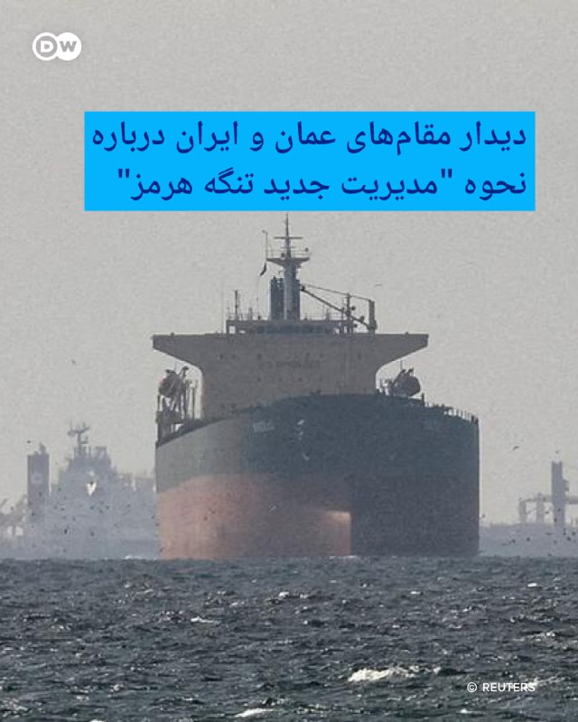

🔶 دیدار مقام‌های عمان و ایران درباره نحوه "مدیریت جدید تنگه هرمز"
 
هیئت مذاکره‌کننده ایران که پس از پایان مذاکرات سوئیس، راهی عمان شده بود، درباره نحوه جدید مدیریت تنگه هرمز با مقام‌های عمانی دیدار و گفت‌وگو کردند و بیانیه مشترکی نیز در این راستا صادر شد.
 
در جریان این سفر، محمدباقر قالیباف، رئیس مجلس و عباس عراقچی وزیر امور خارجه ایران با سلطان هیثم بن طارق و بدر البوسعیدی، وزیر امور خارجه عمان در مسقط دیدار و گفت‌وگو کردند.
 
رسانه‌های داخل ایران با انتشار متن بیانیه مشترک دو کشور اعلام کردند: «سلطنت عمان بار دیگر حمایت خود از "یادداشت تفاهم اسلام‌آباد" را که میان ایالات متحده آمریکا و جمهوری اسلامی ایران به امضا رسیده است، اعلام کرد.»
 
همچنین گفته شده است، هر دو کشور مجددا بر تعهد خود نسبت به تضمین عبور ایمن از این آبراه، مطابق با مقررات مرتبط حقوق بین‌الملل تاکید کردند.
 
@dw_farsi

## DW_Farsi — post 126369

  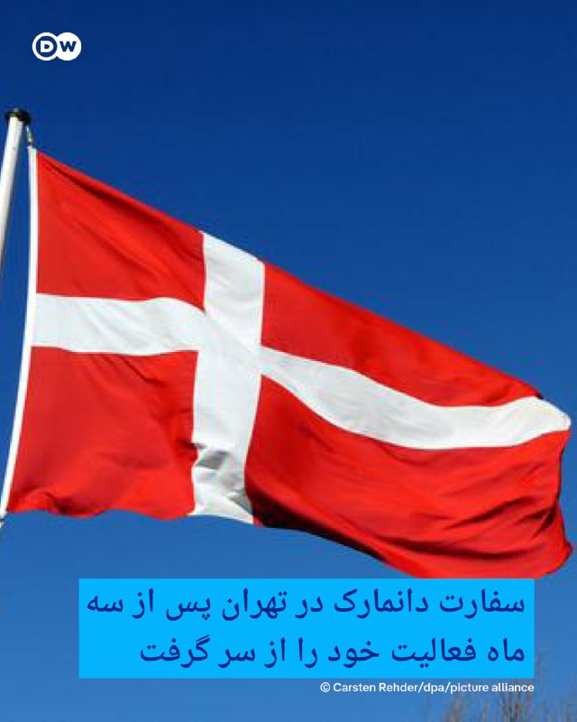

🔶 سفارت دانمارک در تهران پس از سه ماه فعالیت خود را از سر گرفت
 
سفارت دانمارک در تهران پس از سه ماه تعطیلی به‌دلیل تنش‌ها در خاورمیانه، دوباره بازگشایی شد. وزارت امور خارجه دانمارک اعلام کرده است: «با توجه به بهبود وضعیت امنیتی در ایران، سفارت این کشور در تهران فعالیت خود را از سر می‌گیرد.»
 
سفارت دانمارک در تهران با انتشار بیانیه‌ای گفت: «سفیر دانمارک در ایران از ۱۹ ژوئن (۲۹ خرداد) در محل سفارت مستقر شده و کار خود را آغاز کرده است.»
 
این در حالی است که سفارت ایتالیا در تهران نیز که بیش از سه ماه تعطیل بود، چند روزی است که بازگشایی شده است.
 
دانمارک ماه‌ها پیش به دنبال جنگ آمریکا و اسرائیل علیه جمهوری اسلامی ایران و شرایط امنیتی ویژه در خاورمیانه، دستور تعطیلی موقت سفارت خود در این کشور را صادر کرده بود.
 
@dw_farsi

## DW_Farsi — post 126368

  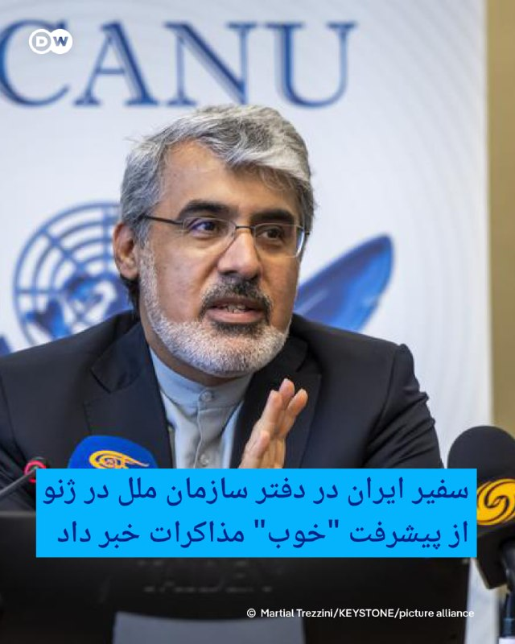

🔶 سفیر ایران در دفتر سازمان ملل در ژنو از پیشرفت "خوب" مذاکرات خبر داد
 
سفیر ایران در دفتر سازمان ملل متحد در ژنو از پیشرفت "خوب" مذاکرات میان ایران و آمریکا در جریان گفت‌و‌گوهای صلح در سوئیس خبر داد.
 
علی بحرینی روز سه‌شنبه ۲۳ ژوئن (۲ تیرماه) گفت: «همکاران ما دیروز در سطح فنی، مذاکرات بسیار خوبی داشتند. در روزهای آینده نیز قرار است، دو گروه کاری برای بررسی رفع تحریم‌ها علیه ایران و مسائل مرتبط با فعالیت‌های هسته‌ای تشکیل شود.»
 
اسماعیل بقائی، سخنگوی وزارت امور خارجه ایران نیز در نشست خبری روز سه‌شنبه گفت: «موضوع هسته‌ای در کنار موضوع رفع تحریم‌ها، دو موضوعی است که بر اساس یادداشت تفاهم قرار است در بازه زمانی ۶۰ روزه درباره آن‌ها صحبت شود اما متن یادداشت تفاهم صراحت دارد که آغاز مذاکره درباره این دو موضوع منوط به اجرای بندهای مشخصی از یادداشت تفاهم است.»
 
گفتی است، روز گذشته دونالد ترامپ، رئیس جمهور آمریکا و جی دی ونس، معاون او از آغاز بازرسی‌های آژانس از تاسیسات هسته‌ای ایران پس از مذاکرات اخیر در سوئیس خبر داده بودند.
 
@dw_farsi

## DW_Farsi — post 126367

  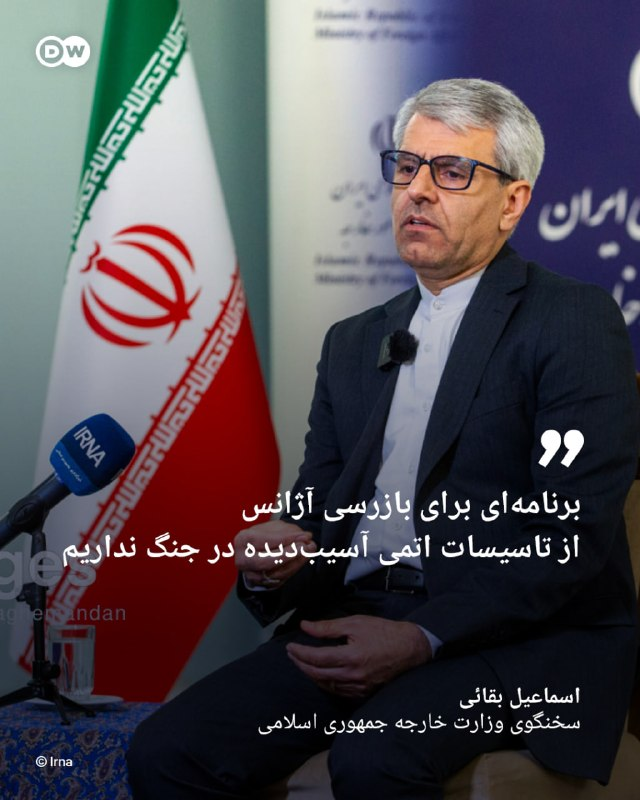

🔶 بقائی: برنامه‌ای برای بازرسی آژانس از تاسیسات اتمی آسیب‌دیده در جنگ نداریم

به گفته اسماعیل بقائی، سخنگوی وزارت خارجه جمهوری اسلامی، ایران "نه دیداری با رافائل گروسی (مدیرکل آژانس بین‌المللی انرژی اتمی) در سوئیس داشته و نه برنامه‌ای برای بازدید آژانس از سایت‌های آسیب‌دیده در جنگ دارد."

او روز سه‌شنبه ۲۳ ژوئن (۲ تیرماه) در نشستی خبری تصریح کرد: «در این خصوص هیچ شیوه‌نامه‌ای وجود ندارد. ما روال جاری را بر اساس ان‌پی‌تی ادامه خواهیم داد.»

پیشتر اخباری در رسانه‌های غربی به نقل از بقائی منتشر شده بود که ایران اجازه بازرسی از تاسیسات هسته‌ای که آسیب دیده‌اند را نمی‌دهد.

سخنگوی وزارت خارجه ایران در بخشی از اظهارات خود در این نشست خبری بر استقلال ایران در تصمیم‌گیری در مورد اموال آزادشده تأکید کرد و گفت: «ما هر طور صلاح بدانیم، برای اموال آزادشده خود تصمیم می‌گیریم و هیچ محدودیتی در این رابطه وجود ندارد. من هم ادعای رسانه‌ای درباره نحوه خرج کردن دارایی‌های مسدود شده ایران را دیدم و برای ما جالب است که فلسفه آن‌ها برای فروپاشی ایران به ثروتمند کردن کشاورزان آمریکایی تقلیل پیدا کرده است.»

@dw_farsi

## DW_Farsi — post 126366

  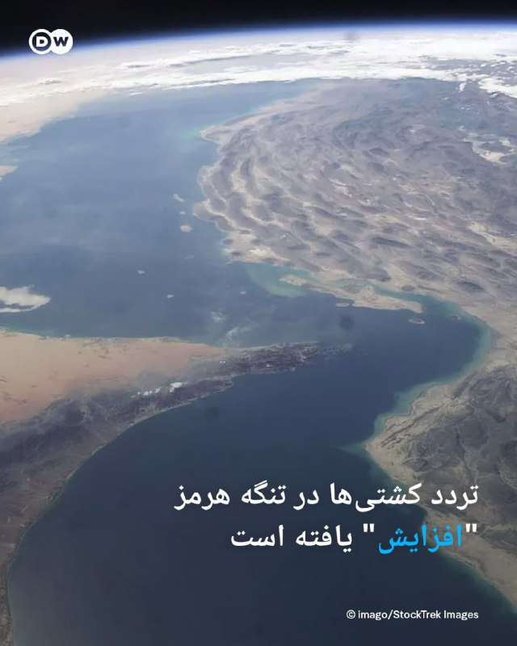

🔶 تردد کشتی‌ها در تنگه هرمز "افزایش" یافته است

شبکه خبری سی‌ان‌ان بر اساس داده‌های پایگاه اطلاعاتی "مارین‌ترافیک" که به روز دوشنبه ۲۲ ژوئن (اول تیرماه) برمی‌گردد، گزارش داد که دست‌کم ۲۴ کشتی تجاری در ۲۴ ساعت گذشته از تنگه هرمز عبور کرده‌اند. "مارین‌ترافیک" تردد کشتی و ناوگان های تجاری را در سراسر جهان رهیابی می‌کند.

به این ترتیب تردد دریایی در این آبراه حیاتی در مقایسه با هفته‌های گذشته افزایش یافته است.

به گزارش سی‌ان‌ان، ۲۴ کشتی مزبور از جمله شامل هشت نفتکش و دو کشتی باری بودند که از خلیج فارس خارج شدند. همچنین هشت نفتکش و شش کشتی باری نیز در همین بازه زمانی وارد خلیج فارس شدند.

این آمار در مقایسه با سطح پایین تردد دریایی در بخش عمده دوره جنگ آمریکا و اسرائیل علیه جمهوری اسلامی که از اسفندماه آغاز شد، نمایانگر افزایشی درخور توجه است، اگر چه حجم تردد هنوز هم فاصله زیادی با شرایط پیش از جنگ دارد.

به نوشته سی‌ان‌ان، پیش از آغاز درگیری‌ها، به‌طور متوسط روزانه حدود ۱۱۰ کشتی از تنگه هرمز عبور می‌کردند؛ رقمی که با وضعیت فعلی قابل قیاس نیست و نشان می‌دهد که حجم کنونی تردد هنوز به شرایط عادی بازنگشته است.

@dw_farsi

## DW_Farsi — post 126365

🔶 جدال حقوقی بر سر هزینه حق اشتراک رسانه‌های عمومی در آلمان

دادگاه قانون اساسی فدرال آلمان مستقر در کارلسروهه قرار است روز سه‌شنبه ۲۳ ژوئن (دوم تیر) به موضوع "حق اشتراک رسانه‌های عمومی" (Rundfunkbeitrag) رسیدگی کند.

این هزینه در آلمان یک هزینه قانونی ثابت و اجباری برای تأمین مالی رسانه‌های عمومی نظیر شبکه‌های ARD و ZDF به شمار می‌رود که هر خانوار صرف‌نظر از اینکه از برنامه‌ها و تولیدات رسانه‌های عمومی استفاده کند یا خیر، موظف به پرداخت آن است. مبلغ این حق اشتراک اکنون ماهیانه ۱۸.۳۶ یورو است.

دو شبکه یاد‌شده با طرح شکایتی به عدم افزایش هزینه حق اشتراک معترض شده‌اند و استدلال کرده‌اند این مبلغ در سال ۲۰۲۵ به رغم توصیه "کمیسیون تعیین نیازهای مالی رسانه‌های عمومی" افزایش نیافت. ARD و ZDF گفته‌اند این اقدام موجب نقض آزادی رسانه‌ و زیر پا گذاشتن قانون اساسی شده است.

@dw_farsi

## DW_Farsi — post 126364

🔶 سه کشته‌ در تیراندازی در مونترال کانادا

در حمله‌ای با سلاح گرم در یک محله یهودی‌نشین شهر مونترال سه نفر کشته شدند. به گفته پلیس کشته‌شدگان این حمله که روز دوشنبه ۲۲ ژوئن (اول تیر) در این کلان‌شهر کانادایی رخ داد، یک افسر پلیس، یکی از ساکنان محل و فردی بوده‌اند که مظنون به انجام این حمله بوده است. یک مأمور پلیس زن نیز در این حادثه زخمی شده است که به گفته پلیس، جان او در خطر نیست.

در تصاویری که از این حمله در شبکه‌های اجتماعی منتشر شده، دیده می‌شود که فرد مظنون در لباسی نظامی در حالی‌که یک اسلحه در اختیار داشت، روی زمین افتاده است.

فادی داگر، رئیس پلیس مونترال، با اعلام خبر کشته شدن مظنون گفت که دیگر هیچ تهدیدی متوجه امنیت شهروندان نیست. به گفته پلیس، مأموران از طریق تماس تلفنی یک شاهد از این حادثه مطلع شدند. این شاهد گزارش داده بود که فردی با سلاح در خیابان است. با اعزام مأموران پلیس به این محله، از ساکنان خواسته شد تا در خانه‌هایشان بمانند و همچنین بزرگراهی در نزدیکی محل وقوع حادثه نیز مسدود شد.

@dw_farsi

## DW_Farsi — post 126363

  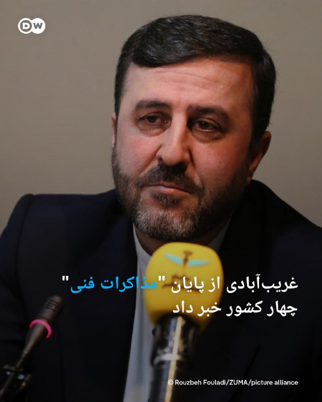

🔶 غریب‌آبادی از پایان "مذاکرات فنی" چهار کشور خبر داد

کاظم غریب‌آبادی، معاون وزیر خارجه جمهوری اسلامی و رئیس هیأت مذاکرات فنی ایران اعلام کرد گفت‌وگوهای فنی چهار کشور به پایان رسیده و طرف‌ها بر سر ترتیبات و سازوکار مذاکرات آتی به توافق رسیده‌اند.

او پس از نشست کمیته عالی‌رتبه پیگیری اجرای یادداشت تفاهم که روزهای یکشنبه که تا دوشنبه ادامه داشت، خبر داد که "مذاکرات فنی برای تعیین سازوکارهای اجرایی این تفاهم‌نامه و بیانیه پایانی نشست نیز برگزار و تفاهمات لازم میان طرف‌ها حاصل شد".

او با اشاره به توافق‌های به‌دست‌آمده افزود که مذاکرات آتی تحت نظر کمیته عالی‌رتبه و با حضور محمدباقر قالیباف (رئیس مجلس شورای اسلامی)، عباس عراقچی (وزیر خارجه ایران)، جی‌دی‌ ونس (معاون ریاست جمهوری آمریکا) و نخست‌وزیران پاکستان و قطر برگزار خواهد شد.

@dw_farsi

## DW_Farsi — post 126362

  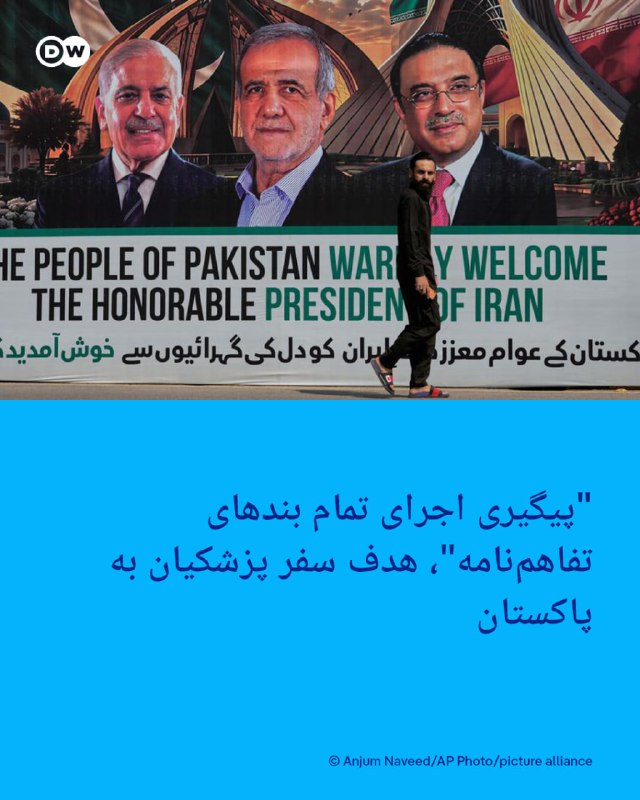

🔶 "پیگیری اجرای تمام بندهای تفاهم‌نامه"، هدف سفر پزشکیان به پاکستان

مسعود پزشکیان، رئیس جمهور ایران برای دیدار با مقامات پاکستانی راهی اسلام‌آباد شده است. او روز سه‌شنبه ۲۳ ژوئن (۲ تیرماه) با انتشار پستی در شبکه ایکس (توئیتر سابق) نوشت: «پیشرفت در این مسیر با پایبندی عملی به مسئولیت‌های پذیرفته‌شده سنجیده خواهد شد. اظهارات خارج از متن توافق شده کمکی به پیشرفت مذاکرات نمی‌کند.»

به گفته پزشکیان "اثربخشی مذاکرات به پایبندی کامل به تعهدات توافق شده و اجرای دقیق آنها بستگی دارد".

رسانه‌های داخل ایران در آستانه سفر پزشکیان به پاکستان به نقل از او نوشتند، "سفری که امروز آغاز می‌شود، علاوه بر قدردانی از همراهی‌های دولت پاکستان، با هدف پیگیری ادامه مسیری انجام می‌شود که باید تمام بندهای تفاهم‌نامه در چارچوب قوانین بین‌المللی و حق و حقوق ملت ایران به مرحله اجرا برسد و آنچه به امضا رسیده است به صورت کامل عملیاتی شود".

به نوشته خبرگزاری ایسنا، پزشکیان پیش از سفر به پاکستان تصریح کرد، "در این سفر، تبادلاتی که در حوزه‌های تجاری، اقتصادی، فرهنگی، امنیتی، نظامی و همچنین صلح و امنیت دنبال می‌شود، محور گفت‌وگوها و رایزنی‌های مشترک خواهد بود".

پاکستان در کنار قطر نقش میانجی را در مذاکرات ایران و آمریکا بر عهده دارد.

@dw_farsi

## DW_Farsi — post 126361

  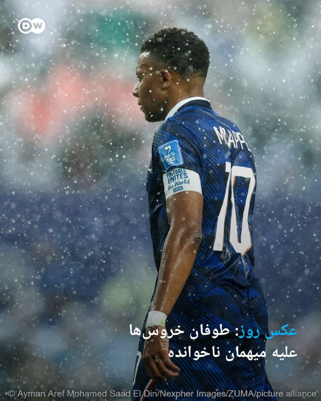

📸 عکس روز: طوفان خروس‌ها علیه میهمان ناخوانده

دیدار فرانسه و عراق در جام جهانی فوتبال یک میهمان ناخوانده داشت. طوفان و رگبار شدید باعث شد تا این دیدار در شرایطی غیرعادی برگزار شود و در پی هشدارهای جوی در فیلادلفیا، نیمه دوم پس از ۱۳۰ وقفه آغاز شد. جمع‌شدن آب در بخش‌های از زمین نیز به نگرانی‌هایی درباره احتمال مصدومیت بازیکنان و ستاره‌هایی همچون کیلیان امباپه منجر شد. فرانسه در نهایت با نتیجه سه بر صفر بر عراق و البته بر طوفان غلبه کرد.

@dw_farsi

## DW_Farsi — post 126360

  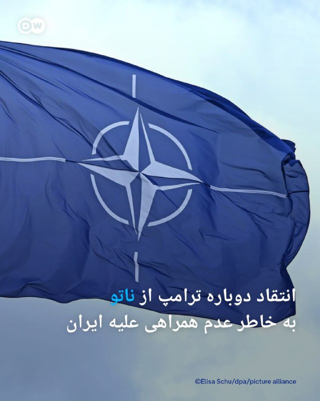

🔶 انتقاد دوباره ترامپ از ناتو به خاطر عدم همراهی علیه ایران

سرخوردگی دونالد ترامپ، رئیس جمهور آمریکا از عدم همراهی کشورهای عضو ناتو در جنگ ایالات متحده علیه جمهوری اسلامی رفع نشده و او بار دیگر در آستانه سفر دبیرکل پیمان آتلانتیک شمالی به واشنگتن، انتقادات خود از ناتو رو تکرار کرده است.

ترامپ روز دوشنبه ۲۲ ژوئن (اول تیرماه) در کاخ سفید در جمع خبرنگاران مدعی شد، آمریکا صدها میلیون دلار خرج کرد تا از کشورهای اروپایی مقابل روسیه حفاظت کند، اما هنگامی که واشنگتن خود برای جنگ علیه جمهوری اسلامی درخواست کمک کرد، مورد پشتیبانی لازم قرار نگرفت.

رئیس جمهور آمریکا در این رابطه به طور مشخص از بریتانیا، آلمان و ایتالیا نام برد و افزود: «ما این همه پول خرج کردیم و وقتی که شاید به خاطر چیزهایی کوچک تقاضای کمک می‌کنیم، می‌گویند: نه، ترجیحا کمک نمی‌کنیم.»

@dw_farsi

## DW_Farsi — post 126359

🎥 پیام تشکر تیم ملی فوتبال ایران از لس‌آنجلس و هواداران ایرانی

بازیکنان تیم ملی فوتبال ایران پس از دیدار دوم خود در جام جهانی ۲۰۲۶ پیامی برای تشکر از شهر لس‌آنجلس و همچنین قدردانی از هواداران ایرانی در رختکن استادیوم به جا گذاشتند. ملی‌پوشان ایران دو دیدار خود در لس‌آنجلس را بدون شکست به پایان رساندند.

@dw_farsi

## DW_Farsi — post 126358

  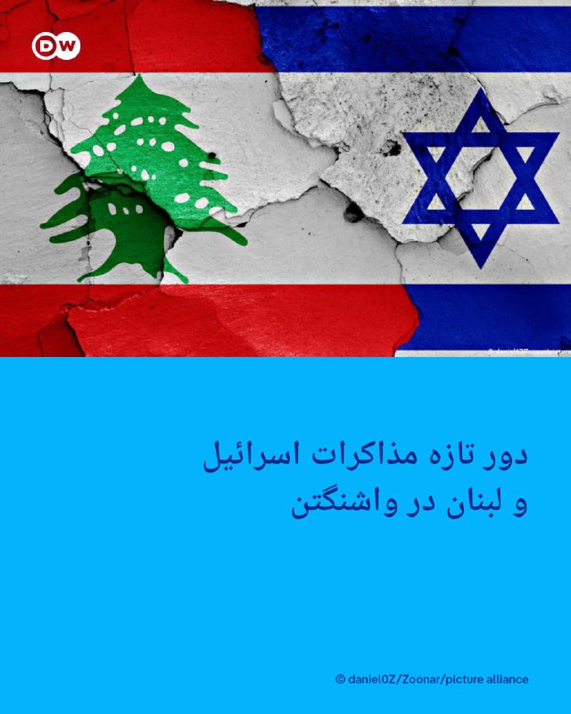

🔶 دور تازه مذاکرات اسرائیل و لبنان در واشنگتن

نمایندگان بلندپایه اسرائیل و لبنان قصد دارند روز سه‌شنبه ۲۳ ژوئن (۲ تیرماه) دور تازه‌ای از مذاکرات میان دو کشور را آغاز کنند. یک مقام وزارت خارجه آمریکا در این رابطه به خبرگزاری فرانسه گفت: «هدف از ادامه مذاکرات میان طرفین این است که در کسب توافق صلح و امنیت میان لبنان و اسرائیل پیشرفت حاصل شود.»

این مقام آمریکایی افزود: «ما برای لبنان و اسرائیل این شرایط را فراهم می‌کنیم که به عنوان دو کشور مستقل با یکدیگر مذاکره کنند.» لبنان و اسرائیل در اصل با یکدیگر مناسبات دیپلماتیک ندارند و رسما در حالت جنگ به سر می‌برند.

این پنجمین دور مذاکرات لبنان و اسرائیل از آغاز جنگ اسرائیل علیه حزب‌الله محسوب می‌شود؛ سازمانی که این گفت‌وگوها را رد کرده و در آن حضور ندارد.

@dw_farsi

## DW_Farsi — post 126357

  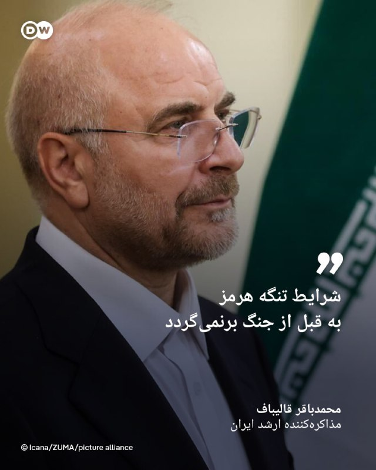

🔶 قالیباف: شرایط تنگه هرمز به قبل از جنگ برنمی‌گردد

محمدباقر قالیباف، مذاکره‌کننده ارشد ایران و رئیس مجلس شورای اسلامی ایران تصریح کرد که تنگه هرمز تحت مدیریت جمهوری اسلامی اداره خواهد شد. خبرگزاری دولتی ایرنا روز سه‌شنبه ۲۳ ژوئن (۲ تیرماه) به نقل از او نوشت: ««تنگه هرمز هرگز به شرایط پیش از جنگ بازنخواهد گشت و مطابق حقوق بین‌الملل، تحت اداره جمهوری اسلامی ایران خواهد بود.»

قالیباف با انتشار پیامی در شبکه تلگرامی خود همچنین از "دستاورهای خوب" مذاکرات انجام‌گرفته در سوئیس سخن گفت و افزود: «به نظر من، این سفر دستاوردهای خوبی داشت، به‌ویژه در موضوع تنگه هرمز، مذاکرات مربوط به لبنان، مسئله معافیت‌های نفتی و همچنین آزادسازی دارایی‌های مسدودشده.»

اظهارات مذاکره‌کننده ارشد ایران یک روز پس از پایان مذاکرات با آمریکا در سوئیس در مورد توافق نهایی برای پایان جنگ مطرح می‌شود.

تأکید قالیباف بر مدیریت تنگه هرمز توسط ایران در حالی است که بدر بوسعیدی، وزیر خارجه عمان با انتشار پیامی در شبکه ایکس در رابطه با سفر مقامات جمهوری اسلامی به کشورش از "گفت‌وگوهای سازنده‌ای درباره تفاهم‌نامه اخیر ایران و آمریکا، به‌ویژه بند مربوط به تنگه هرمز" سخن گفت و نوشت: «ما [در این گفت‌وگوها] بر پایبندی به حقوق بین‌الملل و تضمین عبور ایمن و بدون عوارض کشتی‌ها از این آبراه تاکید کردیم.»

@dw_farsi

## Persian_Trend_Official — post 17870

ولادیمیر پوتین، رئیس جمهور روسیه: کودتایی در اوکراین انجام شد. رژیمی دیوانه و ضد روسی به قدرت رسید.

آنها کسانی بودند که خصومت‌ها را در دونباس آغاز کردند. آنها از نیروی هوایی، تانک، توپخانه و غیره، عملاً علیه مردم غیرنظامی استفاده کردند.

به مدت هشت سال، ما تحمل کردیم؛ ما سعی کردیم از هر طریقی با آنها به توافق برسیم. سپس آنها اعلام کردند که از طریق مسالمت‌آمیز به توافق نخواهند رسید.

خب، ما مجبور شدیم برای حفاظت از مردمی که آنجا زندگی می‌کنند، بایستیم.

📝 Amir

📌 @persian_trend_official
پرشین ترند | متفاوت‌ترین کانال نظامی

## Persian_Trend_Official — post 17869

شهباز شریف، نخست‌وزیر پاکستان در جلسه امروز مجلس ملی کشورش گفت که مذاکرات سوییس شامل موشک های بالستیک نیز میشود. 📝 Amir 📌 @persian_trend_official پرشین ترند | متفاوت‌ترین کانال نظامی

## Persian_Trend_Official — post 17868

  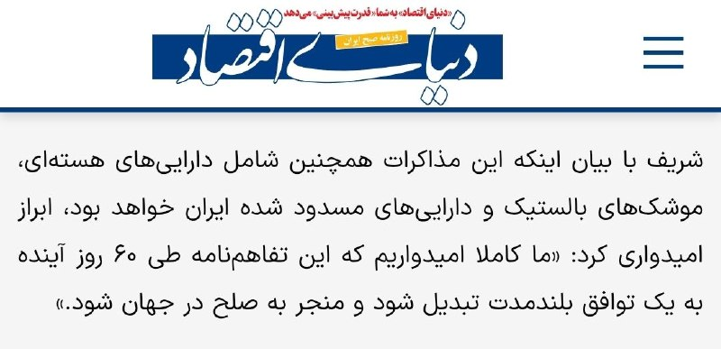

شهباز شریف، نخست‌وزیر پاکستان در جلسه امروز مجلس ملی کشورش گفت که مذاکرات سوییس شامل موشک های بالستیک نیز میشود.

📝 Amir

📌 @persian_trend_official
پرشین ترند | متفاوت‌ترین کانال نظامی

## Persian_Trend_Official — post 17867

  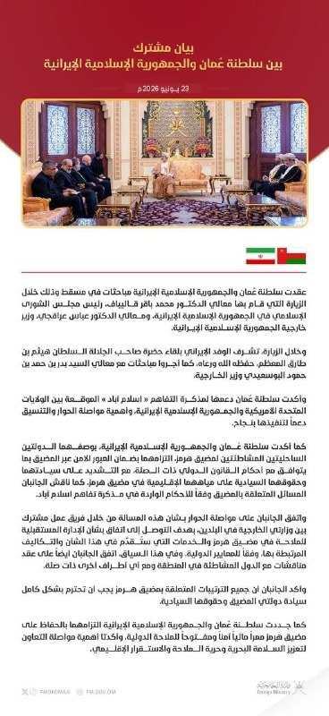

بیانیه مشترک ایران و عمان درباره مدیریت ناوبری در تنگه هرمز

در بخشی از متن این بیانیه آمده: سلطنت عمان و جمهوری اسلامی ایران به‌عنوان دو کشور ساحلی مشرف بر تنگه هرمز، بر پایبندی خود به تضمین عبور ایمن از این تنگه مطابق با احکام مرتبط حقوق بین‌الملل تأکید و همزمان بر حاکمیت و حقوق حاکمیتی خود بر آب‌های سرزمینی‌شان در تنگه هرمز تأکید داشتند.

طرفین همچنین توافق کردند، رایزنی‌هایی با کشورهای ساحلی منطقه و دیگر طرف‌های ذی‌ربط انجام دهند. دو کشور تأکید کردند، تمامی ترتیبات مرتبط با تنگه هرمز باید با احترام کامل به حاکمیت و حقوق حاکمیتی دو کشور مشرف بر این تنگه انجام شود.

📝 Amir

📌 @persian_trend_official
پرشین ترند | متفاوت‌ترین کانال نظامی

## Persian_Trend_Official — post 17866

  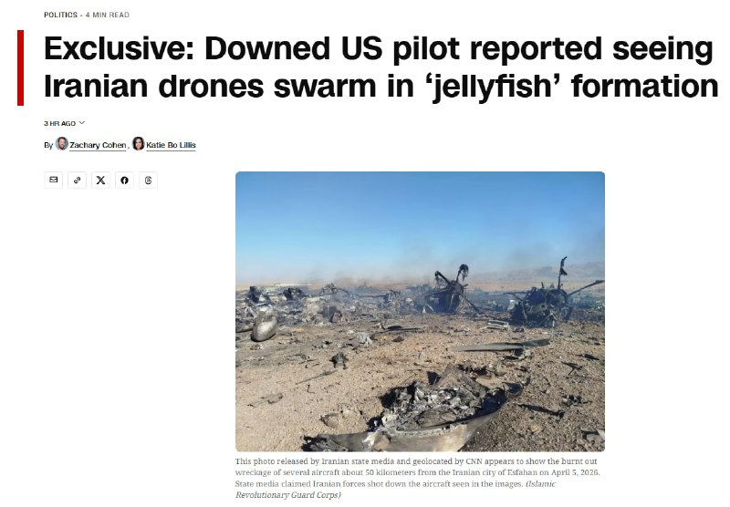

یک خلبان جنگنده F-15 آمریکایی که از انهدام بر فراز ایران در ماه آوریل نجات یافته بود، به مقامات اطلاعاتی گفت است که لحظاتی قبل از اجکت، مشاهده کرده است که دسته‌ای از پهپادهای ایرانی به شکلی شبیه به عروس دریایی یا میدان مین پهپادها با هم حرکت می‌کنند.

خلبان چندین پهپاد را که به هم متصل شده و به صورت یک واحد حرکت می‌کنند، توصیف کرد، پهپادهای کوچکتر مانند پاها در زیر پهپادهای بزرگتر قرار گرفته بودند. این روایت بحث‌های مهمی را در جامعه اطلاعاتی ایالات متحده برانگیخت و مقامات این سوال را مطرح کردند که آیا خلبان آنچه را که دیده است به طور دقیق تفسیر کرده است یا خیر.

در صورت تأیید، این مشاهده می‌تواند نشان‌دهنده پیشرفت بزرگی در فناوری پهپادهای ایرانی شامل شبکه‌سازی مشبک یک به چند باشد، قابلیتی که به چندین پهپاد اجازه می‌دهد در یک شبکه هماهنگ تحت کنترل یکپارچه فعالیت کنند.

برخی ارزیابی‌های اولیه بررسی کردند که آیا دسته پهپادها ممکن است در سقوط F-15 نقشی داشته باشد، اگرچه علت آن همچنان در دست بررسی است.

📝 Amir

📌 @persian_trend_official
پرشین ترند | متفاوت‌ترین کانال نظامی

## Persian_Trend_Official — post 17865

  <a href="telegram/content/Persian_Trend_Official_17865_1782219048.webm" target="_blank">🎬 Download video</a>

ترامپ در تروث سوشال: دیروز 19 میلیون بشکه نفت از تنگه هرمز خارج شد، یک رکورد در تمام دوران.

قیمت نفت در حال کاهش است و جهان مکانی بسیار امن‌تر شده است!!!

📝 Amir

📌 @persian_trend_official
پرشین ترند | متفاوت‌ترین کانال نظامی

## Persian_Trend_Official — post 17864

  <a href="telegram/content/Persian_Trend_Official_17864_1782219048.webm" target="_blank">🎬 Download video</a>

ترامپ در تروث سوشال: علیرغم اعتراضات و اظهارات دروغین آنها، همراه با طبل اخبار جعلی که تمام تلاش خود را می‌کنند تا پیروزی ایالات متحده را تا حد امکان کوچک و بی‌اهمیت جلوه دهند، ایران به طور کامل و تمام با بازرسی‌های هسته‌ای در بالاترین سطح تا آینده‌ای طولانی (بی‌نهایت!!!) موافقت کرده است. این امر "صداقت هسته‌ای" را تضمین می‌کند.

اگر آنها با این امر موافقت نمی‌کردند، مذاکرات بیشتری وجود نداشت! بر اساس این و سایر امتیازات عمده‌ای که ایران داده است، من موافقت کرده‌ام که تنگه هرمز بدون محاصره دریایی بیشتر باز بماند. با این حال، در صورت لزوم، همه کشتی‌ها در جای خود باقی می‌مانند تا محاصره را دوباره برقرار کنند، که در حال حاضر بسیار بعید به نظر می‌رسد.

پول و یا تحریم‌هایی که وزارت خزانه‌داری ایالات متحده آزاد می‌کند، به حساب امانی تحت کنترل ایالات متحده واریز می‌شود و برای خرید مواد غذایی و لوازم پزشکی، منحصراً از ایالات متحده، از جمله ذرت، گندم و سویا از کشاورزان بزرگ آمریکایی ما، استفاده خواهد شد.

اینها چیزهایی هستند که ایران به شدت به آنها نیاز دارد. این یک بحران انسانی است و من احساس می‌کنم که کمک به آنها، همین حالا، قبل از اینکه خیلی دیر شود، ضروری است. مذاکرات به خوبی پیش می‌رود!

📝 Amir

📌 @persian_trend_official
پرشین ترند | متفاوت‌ترین کانال نظامی

## Persian_Trend_Official — post 17863

  <a href="telegram/content/Persian_Trend_Official_17863_1782219049.mp4" target="_blank">🎬 Download video</a>

ویدئویی از تماشای بازی ایران و بلژیک در محل مذاکرات با آمریکا با حضور عراقچی و همتی

📝 Amir

📌 @persian_trend_official
پرشین ترند | متفاوت‌ترین کانال نظامی

## Persian_Trend_Official — post 17862

تعطیلی استان تهران و کل کشور در اواسط تیرماه

استان تهران در روزهای 13 و 14 تیرماه و سراسر کشور در روز دوشنبه 15 تیرماه تعطیل خواهد بود.

📝 Amir

📌 @persian_trend_official
پرشین ترند | متفاوت‌ترین کانال نظامی
‎

## Persian_Trend_Official — post 17861

  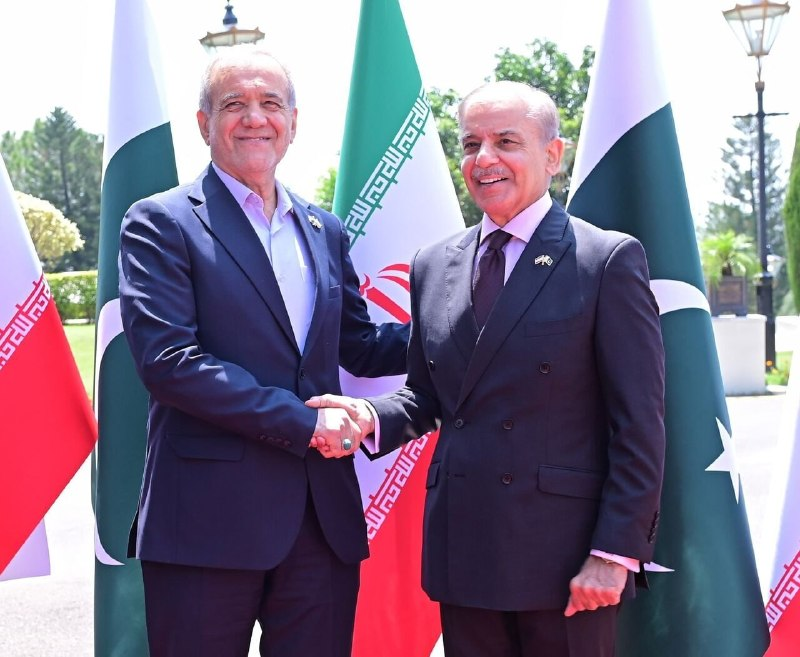

پزشکیان وارد اسلام‌آباد شد

مسعود پزشکیان رئیس جمهوری اسلامی ایران دقایقی قبل با استقبال آصف علی زرداری رئیس جمهور و شهباز شریف نخست وزیر پاکستان وارد اسلام‌آباد پایتخت این کشور شد.

هیات عالی رتبه به ریاست پزشکیان در بدو ورود به فرودگاه نورخان از سوی رئیس جمهور و نخست‌وزیر پاکستان مورد استقبال قرار گرفتند.

📝 Amir

📌 @persian_trend_official
پرشین ترند | متفاوت‌ترین کانال نظامی

## Persian_Trend_Official — post 17860

اختلال گسترده در شبکه بانکی کشور بر اساس بررسی‌ها و گزارش‌های کاربران، تعدادی از بانک‌های کشور از جمله برخی از پایانه‌های فروشگاهی و اپلیکیشن‌های برخی از بانک‌ها با اختلال مواجه شده‌اند. 📝 Amir 📌 @persian_trend_official پرشین ترند | متفاوت‌ترین کانال نظامی

## Persian_Trend_Official — post 17859

اختلال گسترده در شبکه بانکی کشور

بر اساس بررسی‌ها و گزارش‌های کاربران، تعدادی از بانک‌های کشور از جمله برخی از پایانه‌های فروشگاهی و اپلیکیشن‌های برخی از بانک‌ها با اختلال مواجه شده‌اند.

📝 Amir

📌 @persian_trend_official
پرشین ترند | متفاوت‌ترین کانال نظامی

## Persian_Trend_Official — post 17858

  <a href="telegram/content/Persian_Trend_Official_17858_1782219051.mp4" target="_blank">🎬 Download video</a>

سخنگوی کاخ سفید: ترامپ هرگز توافقی را که به نفع این کشور و منافع امنیت ملی ما نباشد، امضا نخواهد کرد.

او همیشه اولویت را به آمریکا می‌دهد. این فرض که ترامپ هرگز توافقی را امضا کند که از هر نظر، شکل یا قالب، با برجام فاجعه‌باری که باراک حسین اوباما امضا کرد، قابل مقایسه باشد، مضحک است.

آنها به رژیم ایران پول نقد دادند. این توافق تضمین می‌کند که نه تنها به نفع منافع امنیت ملی آمریکا، بلکه به نفع مردم آمریکا نیز خواهد بود. ترامپ این را تضمین خواهد کرد.

📝 Amir

📌 @persian_trend_official
پرشین ترند | متفاوت‌ترین کانال نظامی

## Persian_Trend_Official — post 17857

  <a href="telegram/content/Persian_Trend_Official_17857_1782219053.mp4" target="_blank">🎬 Download video</a>

نتانیاهو: من خواهان خودکفایی دفاعی هستم.

از حمایتی که دریافت کرده‌ایم و همچنین حمایتی که در طول سال‌ها از دوستان آمریکایی‌مان دریافت کرده‌ام، بسیار سپاسگزارم. با این حال، امروز می‌گویم که ما به توانایی تسلیحاتی مستقل خود نیاز داریم.

ما برای رهایی از وابستگی، سلاح‌های خود را تولید می‌کنیم.

📝 Amir

📌 @persian_trend_official
پرشین ترند | متفاوت‌ترین کانال نظامی

## Persian_Trend_Official — post 17856

  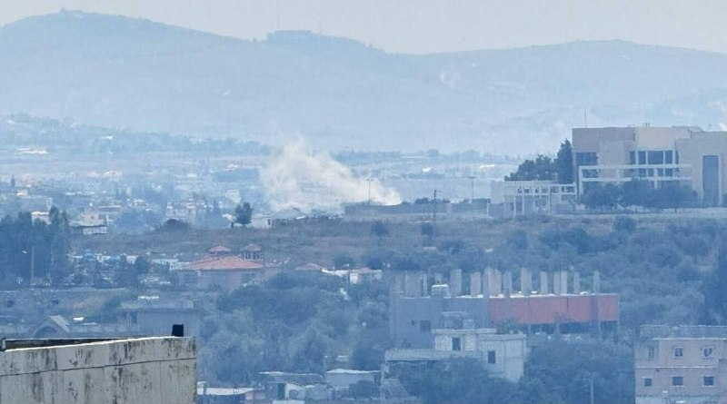

🇮🇱 حمله تازه اسرائیل به جنوب لبنان

دقایقی پیش جنگنده‌های اسرائیلی چند نقطه در جنوب لبنان را هدف قرار دادند. منابع محلی از شنیده‌شدن دست‌کم دو انفجار در اطراف نبطیه و مناطق نزدیک مرز خبر می‌دهند. هنوز جزئیات دقیقی از نوع اهداف یا تلفات احتمالی منتشر نشده است.

این حملات در حالی انجام می‌شود که طی روزهای اخیر تنش در مرز شمالی فلسطین اشغالی دوباره بالا رفته و ارتش اسرائیل هشدار داده بود عملیات‌های «پیش‌دستانه» را ادامه خواهد داد.

Phantom

📌 @persiantrendofficial
پرشین ترند | متفاوت‌ترین کانال نظامی

## Persian_Trend_Official — post 17855

  <a href="telegram/content/Persian_Trend_Official_17855_1782219055.mp4" target="_blank">🎬 Download video</a>

🎥 سخنگوی وزارت خارجه: قالیباف قرار است به چین سفر کند؛
زمان سفر از طریق روابط عمومی مجلس اطلاع رسانی میشود.

Phantom

📌 @persian_trend_official
پرشین ترند | متفاوت‌ترین کانال نظامی

## Persian_Trend_Official — post 17854

  

پزشکیان راهی پاکستان شد! پزشکیان قبل از سفر خود گفت: سفر به دعوت نخست وزیر پس از تلاش‌های گسترده‌ای است که‌ مجموعه دولت پاکستان برای هماهنگی و نهایی شدن تفاهم‌نامه میان ایران و آمریکا انجام دادند. شاید دغدغه مسئولان پاکستان برای به سرانجام رسیدن توافق و…

## Persian_Trend_Official — post 17853

  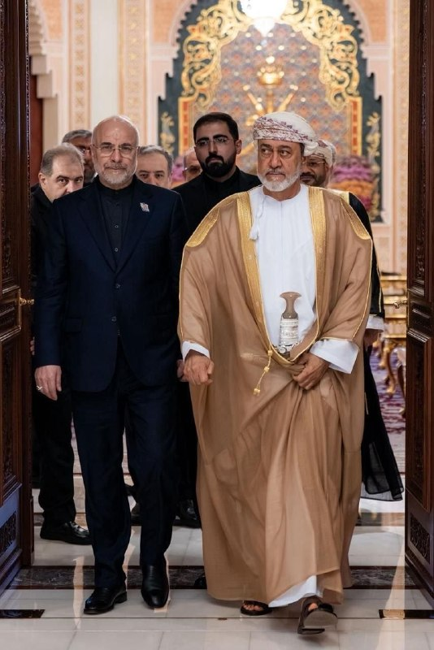

دیدار قالیباف با سلطان عمان درباره مدیریت تنگه هرمز

محمدباقر قالیباف در سفر به مسقط با سلطان عمان دیدار کرده و محور اصلی گفت‌وگوها، موضوع حساس مدیریت تنگه هرمز بوده است؛ مسیری که شاهرگ انرژی منطقه و یکی از مهم‌ترین نقاط تنش‌خیز جهان به شمار می‌رود.

این دیدار در حالی انجام شده که تحولات امنیتی خلیج فارس و رفت‌وآمدهای دیپلماتیک کشورهای منطقه بار دیگر اهمیت کنترل و ثبات در این گذرگاه راهبردی را برجسته کرده است. گفت‌وگو با عمان—کشوری که معمولاً نقش میانجی و متعادل‌کننده را ایفا می‌کند—می‌تواند نشانه‌ای از تلاش تهران برای هماهنگی بیشتر در مدیریت شرایط دریایی باشد.

Phantom

📌 @persiantrendofficial
پرشین ترند | متفاوت‌ترین کانال نظامی

## Persian_Trend_Official — post 17852

## Persian_Trend_Official — post 17851

وزیر امنیت ملی اسرائیل بن گویر:

اگر آمریکایی‌ها فکر می‌کنند ایرانی‌ها برنامه هسته‌ای خود را رها خواهند کرد، آن را لغو می‌کنند و از تمام رویاهایشان برای نابودی دولت اسرائیل دست می‌کشند، بسیار ساده‌لوح هستند.

فکر می‌کنم لحظه‌ای نزدیک است که دولت اسرائیل باید بفهمد این مسئولیت بر عهده ماست. این مسئولیت متعلق به ماست.

لحظه‌ای نزدیک است که اسرائیل باید بفهمد ممکن است نیاز باشد به تنهایی علیه این تهدید هسته‌ای اقدام کند.

Phantom

📌 @persian_trend_official
پرشین ترند | متفاوت‌ترین کانال نظامی

## RadioFarda — post 158659

یک مقام دریانوردی ایران: در جریان جنگ ۴۰ روزه، ۵۴ دریانورد و کارگر بندری کشته شدند

🔸دبیرکل سندیکای دریانوردان تجاری ایران می‌گوید از آغاز جنگ تا کنون، ۵۴ نفر از دریانوردان و کارگران بندری جان خود را از دست داده‌اند.

🔸سامان رضایی روز سه‌شنبه دوم تیرماه در گفت‌وگو با «اعتماد آنلاین» افزود این آمار نشان می‌دهد که جنگ اخیر یکی از سنگین‌ترین خسارت‌ها را بر جامعه دریایی کشور تحمیل کرده است.

🔸آمریکا و اسرائیل ۹ اسفند پارسال حملات همه‌جانبهٔ هوایی به ایران را آغاز کردند که ۴۰ روز طول کشید و در جریان آن رهبر جمهوری اسلامی و شماری از فرماندهان بلندپایه آن کشته شدند.

🔸بر اساس آخرین آماری که اصغر جهانگیر، سخنگوی قوه قضائیه جمهوری اسلامی، روز اول تیرماه اعلام کرد، تعداد کشته‌های این جنگ به سه هزار و ۵۱۹ نفر رسیده است، هرچند او آمار تفکیکی از نظامیان و غیرنظامیان کشته‌شده ارائه نکرد.

🔸دبیرکل سندیکای دریانوردان تجاری ایران در بخش دیگری از گفت‌وگوی خود با اعتماد‌آنلاین، گفت که در جنگ اخیر، «۶۶ نفر» از فعالان دریایی زخمی شده‌اند؛ «هفت نفر» مفقود هستند؛ «۳۶۰ کشتی تجاری» آسیب دیده‌اند؛ «۲۵۳ کشتی» غرق یا کاملاً نابود شده‌اند و حدود ۵۰ دریانورد ایرانی در کشتی‌های مجستیک و توسکا گروگان گرفته شده بودند که با تلاش‌های انجام‌شده آزاد شده‌اند.

@RadioFarda

## RadioFarda — post 158658

  <a href="https://t.me/radiofarda/158658" target="_blank">📎 Download file</a>

🔸پادکست #شوخی_با_تاریخ ۸۱

🔸در اپیزود هشتاد و یکم به سراغ داستان پر پیچ و خم شروع احداث راه‌آهن در ایران می‌رویم و مسیر آن را تا دوران تاسیس راه‌آهن سراسری در دوران رضاشاه پهلوی پی می‌گیریم.

🔸#پادکست شوخی با تاریخ را می‌توانید در همه پادگیرها هم گوش کنید و اگر از شنیدنش لذت می‌برید آن را با دوستانتان هم به اشتراک بگذارید.

🔸شما می‌توانید نظرات و پیشنهادهای خود درباره این پادکست را برای ما به آدرس: fardapodcasts@rferl.org بفرستید یا از طریق @contactfardapodcast به ما پیام دهید.

فردا پادکست 🎧

## RadioFarda — post 158657

  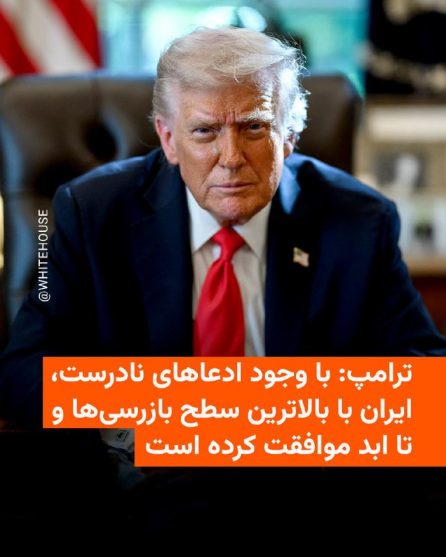

🔸رئیس‌جمهور ایالات متحده روز سه‌شنبه دوم تیرماه بار دیگر تکرار کرد که ایران با بالاترین سطح بازرسی‌های هسته‌ای از تأسیسات خود موافقت کرده و این بازرسی‌ها «تا ابد» است.

🔸دونالد ترامپ در پستی در شبکهٔ اجتماعی خود، تروث سوشال، نوشت که با وجود اعتراض‌ها و «ادعاهای نادرست» ایران، و «هم‌زمان با جار و جنجال رسانه‌های جعلی که هر کاری می‌کنند تا پیروزی آمریکا را تا حد ممکن کوچک و بی‌اهمیت جلوه دهند»، ایران «به‌طور کامل و تمام‌عیار با بالاترین سطح بازرسی‌های هسته‌ای برای مدت طولانی در آینده (تا ابد!!!) موافقت کرده است».

🔸به گفتهٔ او، این امر «صداقت هسته‌ای» را تضمین خواهد کرد. «اگر با این موضوع موافقت نمی‌کردند، دیگر هیچ مذاکره‌ای ادامه پیدا نمی‌کرد!»

🔸نخستین بار، جی‌دی ونس معاون رئیس‌جمهور آمریکا بود که روز اول تیرماه خبر داد ایران با بازرسی از تأسیسات هسته‌ایش موافقت کرده و این امر ممکن است در هفته جاری رخ دهد.

🔸با این حال، مقام‌های جمهوری اسلامی بویژه سخنگوی وزارت خارجه ایران هرگونه بازرسی آژانس از تأسیسات هسته‌ای را رد کرده‌اند.

@RadioFarda

## RadioFarda — post 158656

🔸مسعود پزشکیان، رئیس‌جمهور ایران، روز سه‌شنبه دوم تیرماه برای دیدار با رئیس‌جمهور و نخست‌وزیر پاکستان به اسلام‌آباد سفر کرد.

🔸گزارش تصویری خبرگزاری دولت نشان می‌دهد پزشکیان را در این سفر عباس عراقچی، وزیر خارجه، نیز همراهی می‌کند.

🔸آصف علی زرداری رئیس جمهور و شهباز شریف نخست وزیر پاکستان در فرودگاه اسلام‌آباد از پزشکیان و هیئت همراه، استقبال کردند.

🔸این سفر در پی مذاکرات میان ایران و ایالات متحده در سوئیس انجام می‌شود؛ مذاکراتی که اسلام‌آباد همراه با قطر در میانجی‌گری آن نقش داشته است.

🔸حبیب‌الله عباسی، مدیرکل روابط عمومی دفتر ریاست‌جمهوری، اعلام کرد که یکی از اهداف این سفر، «ابراز قدردانی از نخست‌وزیر پاکستان، شهباز شریف، به خاطر میانجی‌گری او میان ایران و ایالات متحده» است.

🔸آمریکا و چندین رهبر جهانی دیگر از اسلام‌آباد به خاطر کمک به کاهش تنش در درگیری‌ای که می‌توانست اقتصاد جهان را دچار بحران کند، قدردانی کرده‌اند.

@RadioFarda

## RadioFarda — post 158655

  <a href="https://t.me/radiofarda/158655" target="_blank">📎 Download file</a>

📻بشنوید: ساعت ۱۴ با رادیوفردا، دوم تیر‌ماه ۱۴۰۵

@RadioFarda

## RadioFarda — post 158654

  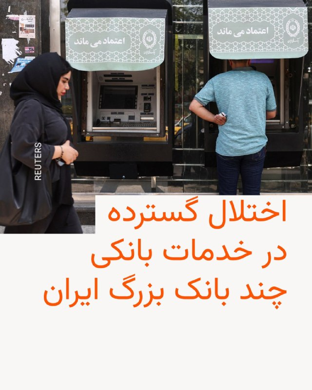

🔸گزارش‌های مختلف کاربران در شبکه‌های اجتماعی حاکی از اختلال گسترده در خدمات بانکی چند بانک بزرگ ایران در روز سه‌شنبه، دوم تیر است.

🔸بر اساس این گزارش‌ها، پرداخت الکترونیک و انتقال وجوه در چند بانک بزرگ مانند ملی، تجارت، صادرات و ملت با اختلال همراه است.

🔸خبرگزاری‌های فارس و تسنیم، نزدیک به سپاه پاسداران با تأیید این اختلال‌ها از احتمال حمله سایبری به مرکز خدمات پشتیبان خبر داده‌اند.

🔸در همین رابطه شرکت خدمات انفورماتیک با انتشار بیانیه‌ای، با تأیید انجام حملات سایبری، گفته است که «شرکت خدمات انفورماتیک به‌منظور پیشگیری از هرگونه دسترسی غیرمجاز و صیانت از امنیت داده‌ها و دارایی‌های مشتریان، در حال حاضر ارائه خدمات مبتنی بر کارت را به صورت موقت از دسترس خارج کرده است.»

🔸این برای دومین بار طی دو هفته گذشته است که خدمات بانکی در ایران دچار احتلال می‌شود.

🔸چندین بانک ایران اواسط خردادماه هم با قطع ارتباط و خدمات روبرو شدند که به گفته مسئولان دولتی به دلیل حملات سایبری به زیر ساخت‌های خدماتی بانک‌ها بود.

🔸تاکنون گزارشی از عامل این حملات سایبری منتشر نشده است.

@RadioFarda

## RadioFarda — post 158653

  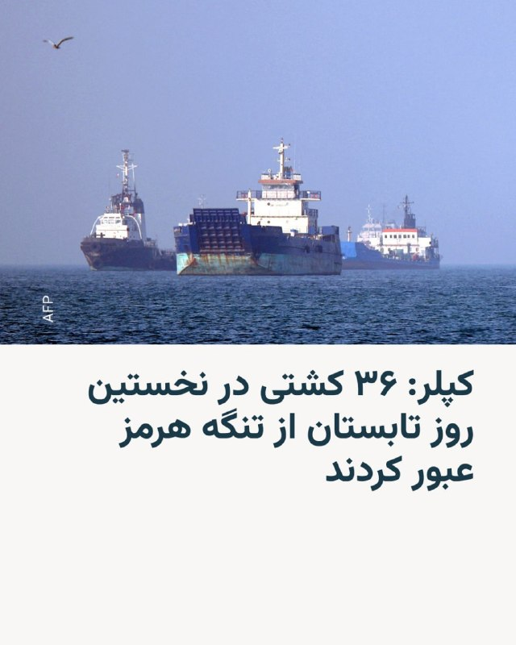

🔸شرکت تحلیلی کپلر می‌گوید روز دوشنبه، اول تیر دست‌کم ۳۶ کشتی حامل کالا از تنگه هرمز عبور کردند. این تعداد، بالاترین میزان عبور کشتی‌ها از زمان آغاز جنگ آمریکا و اسرائیل با ایران محسوب می‌‌شود.

🔸کپلر بر مبنای داده‌های نظارت بر کشتیرانی گفته است که انتظار می‌رود رقم کل کشتی‌های عبور کرده از تنگه هرمز در روز دوشنبه با شناسایی چند مورد دیگر بیشتر شود.

🔸به گفته این شرکت ناظر بر کشتیرانی جهانی، عبور ۳۶ کشتی از تنگه هرمز به معنی بازگشت حدود یک سوم ترافیک دریایی معمول در این آبراه حیاتی است. تا پیش از جنگ حدود ۱۲۰ کشتی در روز از تنگه هرمز عبور می‌کردند.

🔸مقام‌های آمریکا از زمان امضای تفاهمنامه اخیر با ایران، بر بازگشایی تنگه هرمز و عبور بدون عوارض کشتی‌ها از آن تأکید کرده‌اند، با این همه مقام‌های جمهوری اسلامی گفته‌اند شرایط در این تنگه به پیش از جنگ اخیر باز نخواهد گشت.

🔸در همین حال وب‌سایت بلومبرگ گزارش داده که میزان صادرات نفت ایران از طریق تنگه هرمز در روزهای اخیر به بالاترین میزان از زمان شروع جنگ رسیده است.

@RadioFarda

## RadioFarda — post 158652

آیا پاکستان می‌تواند از میانجیگری میان ایران و آمریکا بهره‌برداری اقتصادی کند؟

🔸رسانه‌های دولتی در ایران از سفر مسعود پزشکیان، رئیس‌جمهور ایران به پاکستان در روز سه‌شنبه دوم تیر خبر می‌دهند.

🔸این سفر در پی مذاکرات میان ایران و ایالات متحده در سوئیس انجام می‌شود؛ مذاکراتی که اسلام‌آباد همراه با قطر در میانجی‌گری آن نقش داشته است.

🔸بر اساس گزارش خبرگزاری دولتی ایران، ایرنا، حبیب‌الله عباسی، مدیرکل روابط عمومی دفتر ریاست‌جمهوری، اعلام کرد که یکی از اهداف این سفر، «ابراز قدردانی از نخست‌وزیر پاکستان، شهباز شریف، به خاطر میانجی‌گری او میان ایران و ایالات متحده» است.

🔸نقش پاکستان در میانجی‌گری برای دستیابی به توافق صلح در جنگ ایران، تحسین گسترده دیپلماتیک را برای این کشور به همراه داشته است؛ تحسینی که به باور برخی کارشناسان می‌تواند برخی منافع اقتصادی برای اسلام‌آباد ایجاد کند. با این حال، تحلیلگران تردید دارند که چنین دستاوردهایی بتواند مشکلات ریشه‌ای اقتصاد پاکستان را حل کند.

🔸شهباز شریف، نخست‌وزیر پاکستان، و فیلد مارشال عاصم منیر، فرمانده ارتش این کشور، آخر هفته گذشته در مذاکرات میان ایران و آمریکا در شهر بورگن‌اشتوک سوئیس شرکت کردند؛ مذاکراتی که نتیجه چندین ماه نقش‌آفرینی پاکستان در یکی از مهم‌ترین مذاکرات دیپلماتیک جهان بود.

🔸آمریکا و چندین رهبر جهانی دیگر از اسلام‌آباد به خاطر کمک به کاهش تنش در درگیری‌ای که می‌توانست برای مدت طولانی تنگه هرمز را مختل کند، عرضه جهانی نفت را به خطر بیندازد و اقتصاد جهان را دچار بحران کند، قدردانی کرده‌اند.

🔸این موفقیت، جایگاه بین‌المللی پاکستان را ارتقا داده است و تحلیلگران می‌گویند کشور ۲۵۰ میلیونی پاکستان اکنون فرصت دارد این حسن نیت را به دستاوردهایی برای اقتصادی تبدیل کند که دهه‌ها با دوره‌های رونق و رکود دست‌وپنجه نرم کرده است.

🔸با این حال، آنها معتقدند که این مزایا به‌تنهایی قادر به حل مشکلات ساختاری عمیق‌تر، از جمله نابرابری‌های اجتماعی و اقتصادی، پایه محدود مالیاتی و وابستگی مکرر به بسته‌های نجات مالی صندوق بین‌المللی پول نخواهند بود.

🔸نسخه کامل این گزارش را در وب‌سایت رادیوفردا بخوانید.

@RadioFarda

## RadioFarda — post 158651

  

🔸کانون فیلمسازان مستقل ایران، ایفما، در بیانیه‌ای نسبت به احتمال اعدام علی صفری، بازیگر تئاتر و دانشجوی دانشگاه فرهنگ و هنر هشدار داد.

🔸این کانون با ابراز نگرانی از طرح اتهام «محاربه» علیه او، از مراکز سینمایی و نهادهای بین‌المللی خواست تا برای نجات این هنرمند و سایر هنرمندان در بند، «فشارها بر رژیم ایران و قوه قضائیه آن را بیشتر کنند».

🔸به نوشته این نهاد، علی صفری، بازیگر جوان و ۲۳ ساله تئاتر و دانشجوی دانشگاه فرهنگ و هنر در جریان اعتراضات سراسری ایران در تاریخ ۱۸ دی ماه ۱۴۰۴در شهر کرج بازداشت شد و «تاکنون اطلاعات روشنی درباره‌ی روند پرونده‌ و وضعیت این بازیگر منتشر نشده است، اما اتهام «محاربه» در تاریخ ۹ بهمن ۱۴۰۴ به طور رسمی به او تفهیم شد.»

🔸کانون فیلمسازان مستقل ایران، نهادی غیردولتی متشکل از سینماگران منتقد و مخالف حکومت ایران است که پس از اعتراض‌های موسوم به «زن، زندگی، آزادی» با هدف بازتاب مطالبات و شرایط هنرمندان تحت فشار و مخالفت با سانسور و محدودیت حکومتی شکل گرفت.

@RadioFarda

## RadioFarda — post 158650

🔸اسماعیل بقائی، سخنگوی وزارت خارجه جمهوری اسلامی، می‌گوید ایران برنامه‌ای برای بازرسی آژانس بین‌المللی انرژی اتمی از تأسیسات بمباران‌شده هسته‌ای ندارد.

🔸او در نشست هفتگی با خبرنگاران در پاسخ به سئوالی درباره اظهارات اخیر مقام‌های آمریکا مبنی بر آغاز بازرسی آژانس از تأسیسات ایران، با ادعای اینکه «در این خصوص هیچ شیوه‌نامه‌ای وجود ندارد»، گفت: ما روال جاری را بر اساس معاهده منع اشاعه تسلیحات هسته‌ای، موسوم به ان‌پی‌تی ادامه خواهیم داد.

🔸اسماعیل بقائی همچنین گفت در نشست سوئیس، هیئت مذاکره‌کننده ایران دیداری با رافائل گروسی، مدیر کل آژانس بین‌المللی انرژی اتمی نداشت.

🔸دونالد ترامپ، رئیس جمهور آمریکا و جی دی ونس، معاون او روز دوشنبه از آغاز بازرسی‌های آژانس از تاسیسات هسته‌ای ایران پس از مذاکرات اخیر در سوئیس خبر داده بودند.

🔸ایران از زمان حملات تابستان گذشته آمریکا و اسرائیل به تأسیسات هسته‌ای فردو، نطنز و اصفهان، همکاری‌هایش با آژانس بین‌المللی انرژی اتمی را کاهش داده و مانع از دسترسی بازرسان این نهاد به این تأسیسات شده است.

@RadioFarda

## RadioFarda — post 158649

سفر روبیو به خلیج فارس؛ تلاش آمریکا برای تثبیت توافق با ایران و کاهش نگرانی‌ها

🔸مارکو روبیو، وزیر خارجه آمریکا، این هفته در نخستین سفر رسمی خود به کشورهای حاشیه خلیج فارس از زمان آغاز جنگ ایران، به امارات متحده عربی، کویت و بحرین سفر می‌کند؛ سفری که تنها چند روز پس از امضای توافق چارچوبی میان واشینگتن و تهران با هدف برقراری صلح در منطقه انجام می‌شود.

🔸این مأموریت دیپلماتیک با هدف اطمینان‌بخشی به متحدان منطقه‌ای درباره مسیر راهبردی دولت ترامپ در قبال تهران و همچنین تقویت سازوکارهای امنیتی پیرامون تنگه پرتنش هرمز انجام خواهد شد.

🔸این سفر که از دوم تا چهارم تیر برگزار می‌شود، در مقطعی حساس برای سیاست خارجی آمریکا صورت می‌گیرد و در پی مذاکرات فشرده آخر هفته در سوئیس انجام می‌شود؛ مذاکراتی که جی‌دی ونس، معاون رئیس‌جمهور آمریکا، روز اول تیر آن را ایجاد «بنیانی مناسب برای دستیابی به یک توافق نهایی موفق» جهت پایان دادن به بحران خاورمیانه توصیف کرد.

🔸تامی پیگوت، سخنگوی وزارت امور خارجه آمریکا، تأیید کرده که روبیو درباره «اولویت‌های منطقه‌ای از جمله یادداشت تفاهم با ایران، تلاش‌ها برای تضمین عبور کامل، آزاد و ایمن از تنگه هرمز و اهمیت صلح و ثبات در منطقه» گفت‌وگو خواهد کرد.

🔸این سفرِ مهم نشان‌دهنده تلاش گسترده‌تر دولت ترامپ برای تبدیل دستاوردهای اولیه دیپلماتیک به تضمین‌های امنیتی پایدار برای شرکای خلیج فارس است؛ شرکایی که بسیاری از آنها با وجود کاهش اخیر تنش‌ها، همچنان نسبت به پایبندی بلندمدت تهران به تعهداتش تردید دارند.

🔸برنامه سفر روبیو به گونه‌ای طراحی شده که دو هدف موازی را دنبال کند: تثبیت روند دیپلماتیکِ شکل‌گرفته در مذاکرات سوئیس و در عین حال حفظ ساختار امنیتی منطقه.

🔸در جریان مذاکرات آخر هفته، معاون رئیس‌جمهور آمریکا اعلام کرد واشینگتن در حال بررسی اقداماتی برای اعتمادسازی و حفظ روند مذاکرات است.

🔸نسخه کامل این گزارش را در وب‌سایت رادیوفردا بخوانید.

@RadioFarda

## RadioFarda — post 158648

  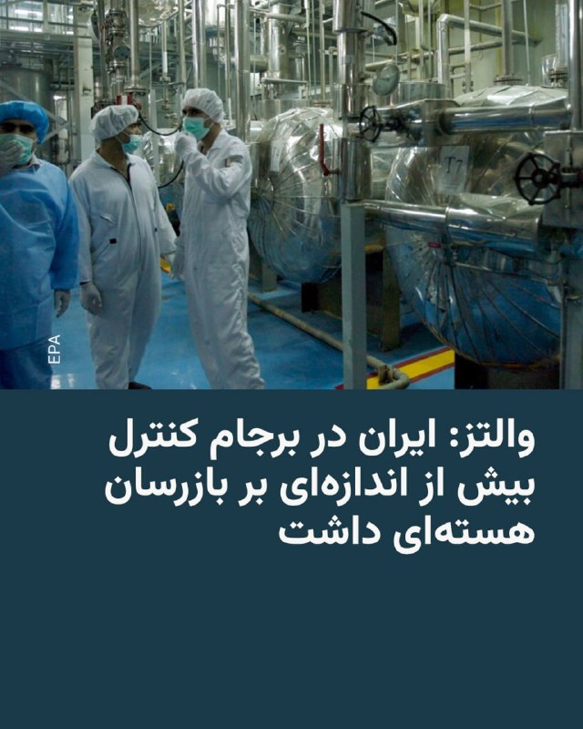

🔸مایک والتز، سفیر ایالات متحده در سازمان ملل متحد، روز دوشنبه اول تیرماه به فاکس‌نیوز گفت که جمهوری اسلامی در توافق برجام، کنترل بیش از اندازه‌ای بر موضوع بازرسان هسته‌ای داشت.

🔸او در این گفت‌و‌گو، با مقایسه توافق برجام و یادداشت تفاهم دونالد ترامپ با ایران، افزود: «یکی دیگر از ایرادهای توافق هسته‌ای اوباما با ایران این بود که ایران تعیین می‌کرد بازرسان به چه مکان‌هایی دسترسی داشته باشند و از چه مراکزی بازدید کنند.»

🔸سفیر ایالات متحده موافقت جمهوری اسلامی با ورود دوباره بازرسان هسته‌ای به ایران را نخستین گام یک «فرایند گسترده‌تر» دانست.

🔸والتز بدون اشاره به جزئیات این فرایند، گفت: «این آغاز یک روند است و حتی پس از دور اول [مذاکرات] اکنون ایران اجازه بازگشت بازرسان را داده است.»

🔸ایران از زمان حملهٔ آمریکا به تأسیسات هسته‌ای فردو، نطنز و اصفهان در اول تیرماه ۱۴۰۴ در زمان جنگ ۱۲ روزه، مانع از دسترسی بازرسان آژانس بین‌المللی انرژی اتمی به این تاسیسات شده است و همکاری‌اش را با این نهاد زیر نظر سازمان ملل کاهش داده است.

@RadioFarda

## RadioFarda — post 158647

  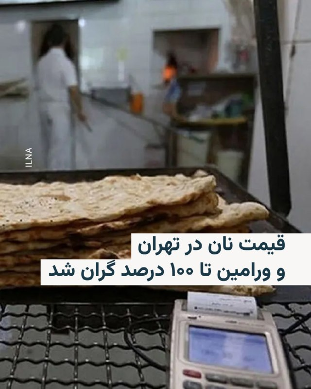

🔸خبرگزاری‌های ایلنا و مهر از دوبرابر شدن قیمت نان در تهران و ورامین خبر می‌دهند.

🔸محمدجواد کرمی، رئیس کارگروه آرد و نان اتاق اصناف ایران نیز این افزایش قیمت را تأیید کرده است.

🔸بر اساس بررسی‌های خبرگزاری کار ایران، قیمت نان لواش دو هزار و ۷۰۰ تومان، بربری ۱۰ هزار تومان و سنگک ۱۵ هزار و ۵۰۰ تومان قیمت‌گذاری شده و از عصر دوشنبه اول تیرماه روی دستگاه‌های نانو در نانوایی‌ها قیمت‌های جدید اعمال شده است.

🔸قیمت نان لواش پیش از این افزایش رسمی قیمت، ۱۴۰۰ تومان، نان تافتون ۲۳۰۰ تومان، نان بربری ۵۳۰۰ تومان و نان سنگک ۷۴۰۰ تومان بود.

🔸خبرگزاری مهر نوشته این افزایش قیمت‌ها نشان‌دهنده رشد ۱۰۰ درصدی قیمت نان در تهران و ورامین است.

🔸موضوع افزایش قیمت نان در ایران مدت‌هاست که مطرح است و رسانه‌ها از افزایش غیررسمی این ماده خوراکی مهم در ایران در برخی استان‌ها خبر داده بودند.

🔸این در حالی است که غلامرضا نوری قزلجه، وزیر جهاد کشاورزی دو روز پیش از این اعلام کرده بود که افزایش قیمت نان در دستور کار نیست و انتقال یارانه نان از نانوا به خانوار و افزایش کالابرگ در دستور کار است.

@RadioFarda

## RadioFarda — post 158646

ادامۀ مسابقات جام جهانی فوتبال؛ شب درخشش مسی، امباپه و هالند

🔸مسابقات جام جهانی فوتبال دوشنبه شب و بامداد سه‌شنبه با انجام چهار رقابت دیگر ادامه یافت و تیم‌های آرژانتین، فرانسه و نروژ با درخشش ستاره‌هایشان و کسب پیروزی‌های پر گل مقابل رقبا صعودشان به مرحله بعدی این مسابقات را قطعی کردند.

🔸آرژانتین با درخشش دوباره لیونل مسی، با دو گل اتریش را شکست داد. هر دو گل آرژانتین را مسی به ثمر رساند تا این فوق ستاره ۳۸ ساله‌ در صدر فهرست گلزن‌های مسابقات قرار بگیرد. او همه پنج گل فعلی آرژانتین در این مسابقات را به ثمر رسانده است.

🔸در دیگر دیدار گروه جی، الجزایر با نتیجه ۲ بر یک اردن را شکست داد تا امیدهایش را برای صعود زنده نگه دارد. در این گروه دو تیم اتریش و الجزایر پس از آرژانتین با سه امتیاز در رده‌های دوم و سوم هستند و شانس بالایی برای صعود به مرحله بعدی مسابقات دارند.

🔸در گروه آی، فرانسه، به عنوان یکی از مدعیان فتح جام با نتیجه ۳ بر صفر از سد عراق گذشت. کیلیان امباپه، ستاره فرانسه در این مسابقه دو گل زد تا آمادگی‌اش را به رخ رقیبان بکشد. این مسابقه زیر بارش شدید باران در فیلادلفیا انجام شد و نیمه دوم آن به همین دلیل، با تأخیر بیش از یک ساعته همراه بود.

🔸نروژ دیگر تیم مدعی این گروه در یک مسابقه تماشایی و پر گل، با نتیجه سه بر دو سنگال را از پیش رو برداشت و با شش امتیاز صعودش را با فرانسه از این گروه قطعی کرد. این مسابقه هم با درخشش ارلینگ هالند، ستاره آماده نروژ همراه بود که دو گل تیمش را به ثمر رساند و مجموع گل‌هایش را به چهار رساند.

🔸او حالا همراه با کیلیان امباپه با چهار گل به صورت مشترک با قرار گرفتن در رده دوم در تعقیب لیونل مسی در جدول بهترین گلزنان جام هستند.

🔸نسخه کامل این گزارش را در وب‌سایت رادیوفردا بخوانید.

@RadioFarda

## RadioFarda — post 158645

  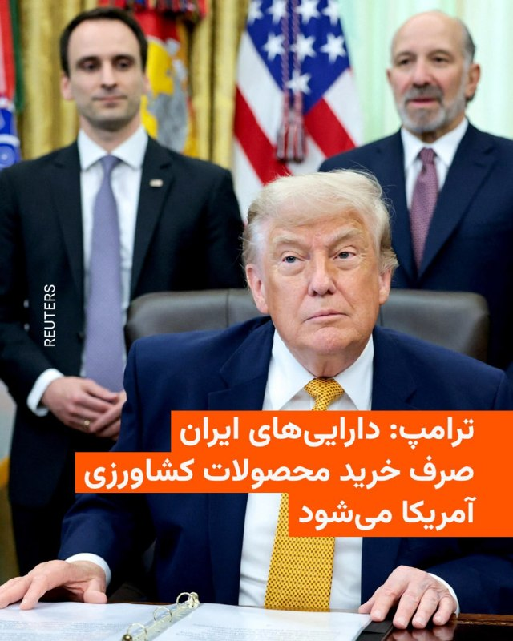

🔸رئیس‌جمهور آمریکا روز دوشنبه اول تیرماه در گفت‌وگو با خبرنگاران در کاخ سفید در مورد آزادسازی دارایی‌های ایران که در تفاهمنامه جدید به آن اشاره شده، گفت: «پولی که آزاد می‌شود قرار است برای خرید مواد غذایی استفاده شود... آن هم صرفاً از طریق ایالات متحده و از کشاورزان ما.»

🔸دونالد ترامپ افزود: «ذرت، سویا و دیگر محصولات کشاورزی در چارچوب تازه‌ترین پیشرفت‌های دولت با ایران از کشاورزان آمریکایی خریداری خواهد شد.»

🔸رسانه‌ها و مقام‌های ایران اما این اظهارات را رد کرده‌اند. از جمله عبدالناصر همتی رئیس کل بانک مرکزی ایران، در واکنش گفته است که «براساس یادداشت‌های امضا شده هیچ الزامی برای خرید نهاده‌های کشاورزی از آمریکا نداریم».

🔸او افزود: «البته اگر نرخ و کیفیت نهاده‌های آمریکایی در مقایسه با سایر کشورها مناسب‌تر باشد، مانعی برای خرید از آن کشور نداریم و اصولاً طی سال‌های اخیر خریدهای جهاد کشاورزی از طریق شرکت‌های بزرگ امریکایی و اروپایی بوده است.»

@RadioFarda

## RadioFarda — post 158644

  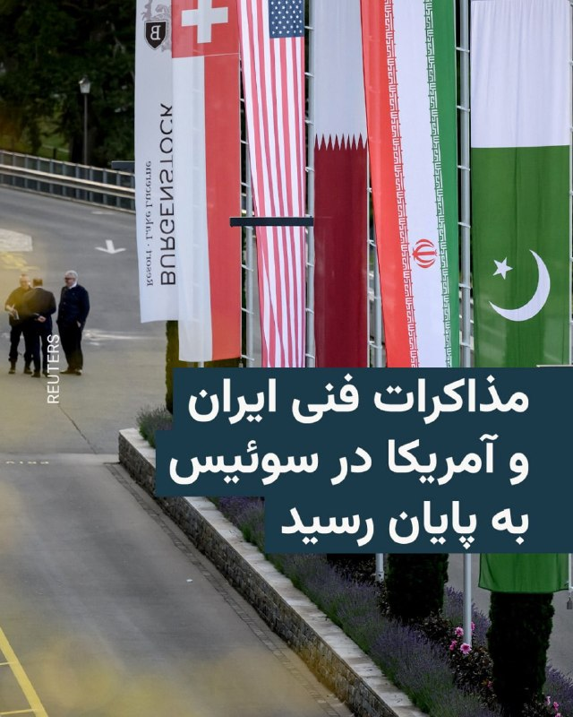

🔸رسانه‌های دولتی در ایران گزارش می‌دهند که گفت‌وگوهای فنی ایران و آمریکا در سوئیس به پایان رسید.

🔸بر اساس این گزارش‌ها، دو طرف توافق کرده‌اند کارگروه‌هایی برای رسیدگی به موضوعات هسته‌ای و تحریم‌ها تشکیل دهند.

🔸کاظم غریب‌آبادی، معاون وزیر خارجه ایران در توضیح گفت‌وگوهای فنی نمایندگان تهران و واشینگتن در روز دوشنبه گفت مذاکره‌کنندگان تصمیم گرفته‌اند چهار کارگروه تشکیل شود: «لغو تحریم‌ها»، «امور هسته‌ای»، «بازسازی و توسعه اقتصادی» و «نظارت و اجرا».

🔸به گفته غریب‌آبادی، این کارگروه‌ها مسئول پیگیری جزئیات فنی توافق‌ها و ادامه مذاکرات در حوزه‌های مختلف خواهند بود.

@RadioFarda

## RadioFarda — post 158643

🔸محمدباقر قالیباف، مذاکره‌کننده ارشد حکومت ایران در مذاکرات با آمریکا، به تلویزیون جمهوری اسلامی گفت که تهران موافقت کرده برای عبور کشتی‌ها در تنگه هرمز یک خط ارتباطی وجود داشته باشد تا از درگیری و حوادث در این آبراه جلوگیری شود.

🔸قالیباف گفته: «ممکن است مشکلاتی در تنگه هرمز پیش بیاید؛ بنابراین توافق کردیم مرکزی ایجاد و یک خط تلفنی برقرار شود تا در دوره ۳۰ روزه، اگر اشکالاتی پیش آمد، بتوانیم با سرعت بیشتری مشکلات را حل کنیم. اقتصاد منطقه رونق بگیرد.»

🔸او افزود: «این خط تماس برای مجوز نیست؛ مجوز مسیر خود را دارد. این خط صرفاً برای حل مشکلات کشتی‌ها یا حوادث احتمالی است تا روشنگری صورت بگیرد.»

🔸قالیباف در اظهارات خود اضافه کرده که راه‌اندازی این خط از آن رو است که «مدیریت تنگه با ایران است و اشکالات را ما رفع می‌کنیم».

🔸پیش از این قطر و پاکستان، میانجی‌های مذاکرات ایران و آمریکا، در بیانیه‌ای اعلام کرده بودند که تهران و واشینگتن توافق کرده‌اند که خطوط ارتباطی مستقیمی برای باز نگه‌داشتن تنگه راهبردی هرمز ایجاد کنند.

@RadioFarda

## IranianMinds — post 23178

کارزار درخواست تعویق امتحانات نهایی به بعد از اربعین و اصلاح فرجه‌ امتحانات

https://www.karzar.net/327179

@IranianMinds

## IranianMinds — post 23177

  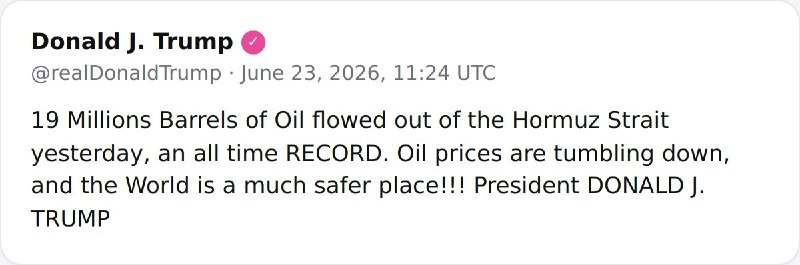

🔴 ترامپ:

دیروز ۱۹ میلیون بشکه نفت از تنگه هرمز خارج شد که یک رکورد بی‌سابقه در تمام دوران‌ها است. قیمت‌های نفت در حال سقوط است و جهان مکان بسیار امن‌تری است!!!

@IranianMinds

## IranianMinds — post 23176

  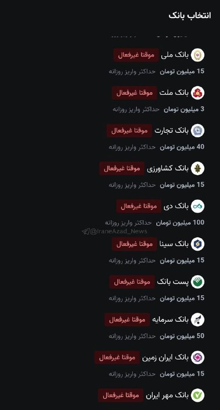

تقریبا تمام بانک های ایران دچار اختلال شده @IranianMinds

## IranianMinds — post 23175

🔴مسعود پزشکیان به اسلام‌آباد رسید.

@IranianMinds

## IranianMinds — post 23174

🔴توجه توجه:

مراسم تشییع موش‌علی در خارج زودتر از ایران انجام شد.

@IranianMinds

## IranianMinds — post 23173

  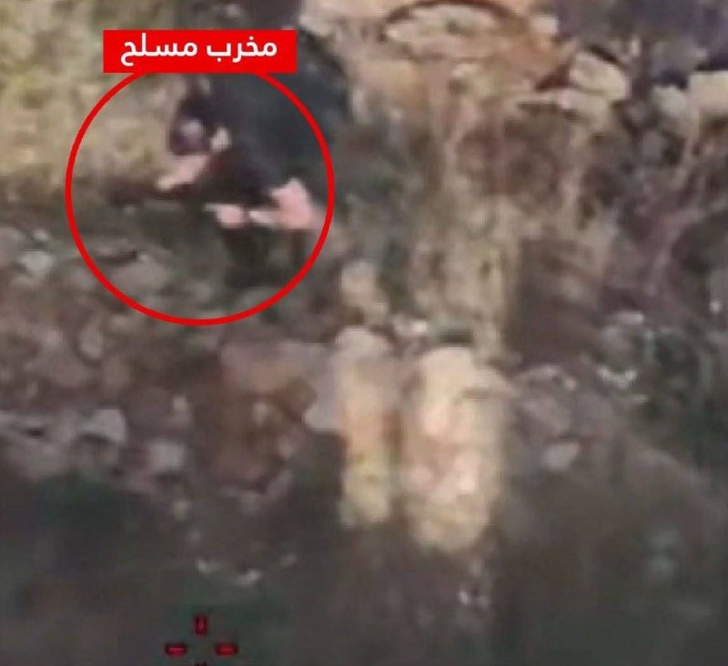

🔴ارتش اسرائیل از حمله به نیروهای تروریستی مسلحی که در نزدیکی نیروهای ارتش اسرائیل در منطقه امنیتی جنوب لبنان بودند خبر داد.

@IranianMinds

## IranianMinds — post 23172

  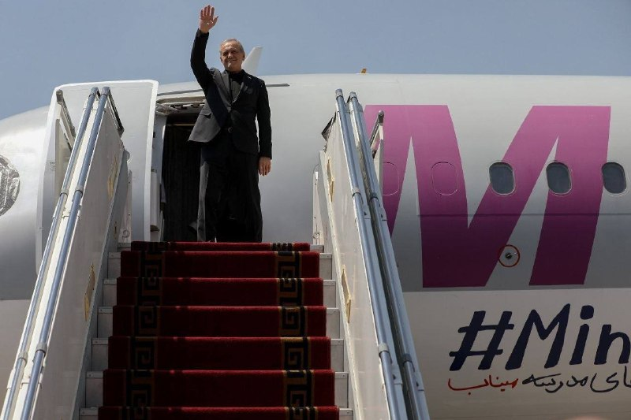

🔴مسعود پزشکیان راهی اسلام‌آباد شد.

@IranianMinds

## IranianMinds — post 23171

  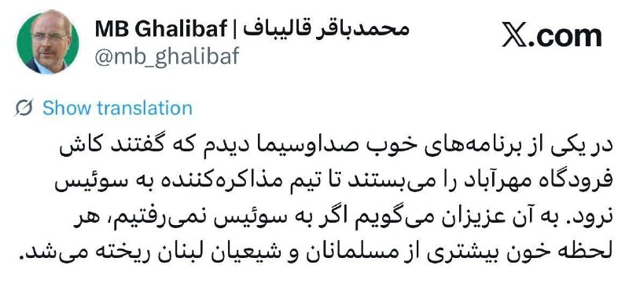

🔴قالیباف:

اگر به سوئیس نمی‌رفتیم، خون بیشتری از شیعیان لبنان ریخته می‌شد.

@IranianMinds

## IranianMinds — post 23170

  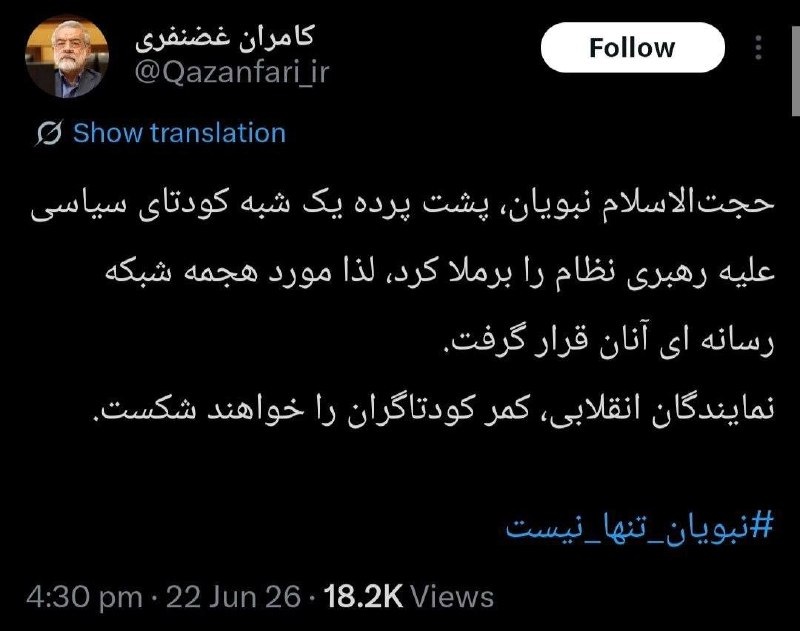

🔴تهدید کامران غضنفری به کودتا‌چیان علیه رهبری.

@IranianMinds

## IranianMinds — post 23169

🔴نتانیاهو:

رویارویی با جمهوری اسلامی و نیروهای وابسته‌اش هنوز تمام نشده است.

@IranianMinds

## IranianMinds — post 23168

  

🔴حملات ارتش اسرائیل به کفر تبنیت، جنوب لبنان.

@IranianMinds

## IranianMinds — post 23167

تقریبا تمام بانک های ایران دچار اختلال شده

@IranianMinds

## IranianMinds — post 23166

  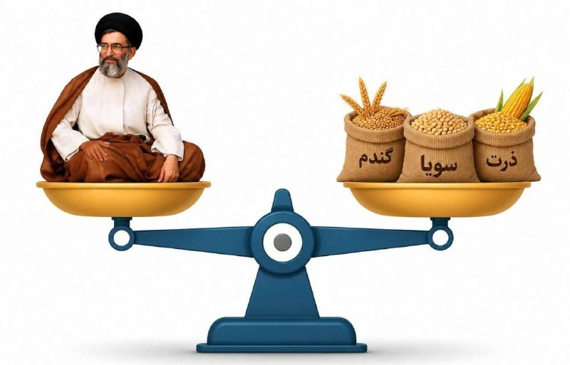

🔴باب توجه عرزشی‌ها که همیشه میگفتین، عمر ابن‌سعد خون حسین را با گندم ری معامله کرد😂😂😂

@IranianMinds

## IranianMinds — post 23165

  <a href="telegram/content/IranianMinds_23165_1782219067.mp4" target="_blank">🎬 Download video</a>

🔴 شهبازی مجریه بیناموسه صداوسیما :

طبق تفاهم ایران و آمریکا،از این به بعد شعار مرگ بر آمریکا و سوزوندن پرچم آمریکا ممنوعه و اگه کسی اینکارو کنه دستگیر میشه ولی آمریکا هرکاری دلش بخواد میکنه،چقدر بدبختیم ما.

@IranianMinds

## IranianMinds — post 23164

  <a href="telegram/content/IranianMinds_23164_1782219069.mp4" target="_blank">🎬 Download video</a>

بقایی:
توانمندی دفاعی و موشکی ایران هیچگاه موضوع مذاکره با هیچ طرفی نخواهد بود

@IranianMinds

## IranianMinds — post 23163

  <a href="telegram/content/IranianMinds_23163_1782219070.mp4" target="_blank">🎬 Download video</a>

بقایی :
نه دیداری با گروسی داشتیم و نه برنامه‌ای برای بازرسی آژانس از تاسیسات هسته‌ای آسیب‌دیده ایران

@IranianMinds

## IranianMinds — post 23162

ویدیوی وایرال شده از پرواز فرش‌های حرم امام رضا:

@IranianMinds

## IranianMinds — post 23161

  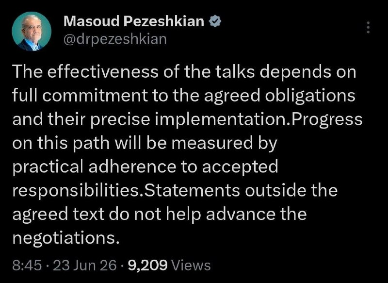

🔴 پزشکیان:
اثربخشی مذاکرات به تعهد کامل به تعهدات توافق شده و اجرای دقیق آنها بستگی دارد

پیشرفت در این مسیر با پایبندی عملی به مسئولیت‌های پذیرفته شده سنجیده خواهد شد.

اظهارات خارج از متن توافق شده کمکی به پیشرفت مذاکرات نمی‌کند.

@IranianMinds

## BBCPersian — post 284845

🔻ترامپ: ایران با بازرسی‌های هسته‌ای «تا ابد» موافقت کرده، اگر نمی‌کرد مذاکره‌ای در کار نبود

دونالد ترامپ گفته است که «ایران به طور کامل و بدون قید و شرط با انجام بازرسی‌های هسته‌ای در بالاترین سطح و برای مدت بسیار طولانی در آینده (تا ابد!!!) موافقت کرده است. این امر 'صداقت هسته‌ای' را تضمین خواهد کرد.»

رئیس‌جمهور آمریکا گفته است «اگر ایران با این موضوع موافقت نمی‌کرد، هیچ مذاکره دیگری در کار نبود.»

ساعاتی پیش از این، اسماعیل بقایی، سخنگوی وزارت خارجه ایران گفته بود که ایران برنامه‌ای برای دسترسی دادن به آژانس برای بازدید از تاسیسات هسته‌ای آسیب‌دیده در جنگ ندارد. اظهاراتی که به نظر می‌رسد واکنشی به گفته‌های دیروز جی دی ونس، معاون رئیس‌جمهور آمریکا باشد که گفته بود ایران با بازگشت بازرسان آژانس بین‌المللی انرژی اتمی موافقت کرده است.

در تازه‌ترین اظهار نظر درباره بازرسی از برنامه اتمی ایران، رئیس جمهور آمریکا در پستی در تروث سوشال ضمن تکرار گفته‌های دیروز معاون خود نوشت «بر اساس این موضوع و دیگر امتیازات مهمی که ایران در حال ارائه آنهاست، من موافقت کرده‌ام که تنگه هرمز باز بماند و هیچ محاصره دریایی دیگری اعمال نشود. با این حال، همه کشتی‌ها در موقعیت خود باقی خواهند ماند تا در صورت لزوم، محاصره دوباره برقرار شود، هرچند در این مقطع چنین احتمالی بسیار بعید به نظر می‌رسد.»

آقای ترامپ گفت «پول‌ها و یا منابع ناشی از کاهش تحریم‌ها که وزارت دارایی آمریکا آزاد می‌کند، در یک حساب امانی زیرنظر ایالات متحده نگهداری خواهد شد و صرفاً برای خرید مواد غذایی و تجهیزات پزشکی، آن هم منحصرا از آمریکا مورد استفاده قرار خواهد گرفت از جمله ذرت، گندم و سویا از کشاورزان بزرگ آمریکایی ما.»

«اینها اقلامی هستند که ایران به شدت به آنها نیاز دارد. این یک بحران انسانی است و من احساس می‌کنم لازم است همین حالا، پیش از آنکه خیلی دیر شود، کمک کنیم.»

رئیس‌جمهور آمریکا گفته است که «مذاکرات به خوبی پیش می‌رود.»

@BBCPersian

## BBCPersian — post 284844

🔻نفتالی بنت: اسرائیل گیرنده‌های استارلینک را به ایران قاچاق کرد

نفتالی بنت، نخست‌وزیر پیشین اسرائیل، گفته است که در دوران نخست‌وزیری خود طرحی برای انتقال مخفیانه ده‌ها هزار گیرنده اینترنت ماهواره‌ای استارلینک به ایران آغاز کرده بود تا معترضان ایرانی بتوانند در زمان قطع اینترنت به ارتباطات خود ادامه دهند.

آقای بنت سه‌شنبه در نشستی در بیت‌المقدس گفت هدف از این طرح، فراهم کردن امکان هماهنگی معترضان و در نهایت کمک به سرنگونی حکومت ایران بوده است.

او گفت «متاسفانه دولت ناکارآمد کنونی اسرائیل این برنامه را متوقف کرد و وقتی اعتراض‌ها رخ داد، آن زیرساخت وجود نداشت.»

دفتر بنیامین نتانیاهو، نخست‌وزیر اسرائیل، تاکنون به اظهارات آقای بنت واکنشی نشان نداده است.

شرکت اسپیس‌ایکس هم در این باره اظهار نظری نکرده است.

نفتالی بنت که از چهره‌های اصلی اپوزیسیون اسرائیل و از نامزدهای احتمالی انتخابات پیش رو به شمار می‌رود، همچنین گفت در صورت بازگشت به قدرت، برای تضعیف حکومت ایران تلاش خواهد کرد

او گفت این اقدامات می‌تواند شامل ابزارهایی غیر از حمله نظامی مستقیم، از جمله «خرابکاری اقتصادی و صنعتی» باشد.

آقای بنت از ژوئن ۲۰۲۱ تا ژوئن ۲۰۲۲ در ائتلافی از احزاب راست‌گرا، چپ‌گرا و میانه‌رو که بنیامین نتانیاهو را از مقام خود کنار زد، نخست‌وزیر اسرائیل بود.

او پیش از آن، مشاور بنیامین نتانیاهو بود.

@BBCPersian

## BBCPersian — post 284843

🔻علی بحرینی، سفیر و نماینده دائم ایران در دفتر سازمان ملل در ژنو، از پیشرفت «بسیار خوب» در مذاکرات ایران و آمریکا خبر داد و اضافه کرد که گفت‌وگوهای فنی میان دو طرف ادامه دارد.

آقای بحرینی سه‌شنبه به خبرنگاران گفت که در روزهای آینده دو کارگروه برای بررسی موضوع رفع تحریم‌های ایران و مسائل مرتبط با فعالیت‌های هسته‌ای این کشور تشکیل خواهد شد.

ایران و آمریکا که در تلاش‌ هستند توافق موقت هفته گذشته را به یک توافق دائمی تبدیل کنند، در مذاکرات بورگن‌اشتوک سوئیس بر سر نقشه راهی برای دستیابی به توافق نهایی ظرف ۶۰ روز به تفاهم رسیده‌اند. پاکستان و قطر، دو کشور میانجی، این موضوع را اعلام کرده‌اند.

علی بحرینی همچنین اظهارات جی‌دی ونس، معاون رئیس‌جمهور آمریکا، درباره نحوه استفاده از دارایی‌های بلوکه‌شده ایران را رد کرد. آقای ونس گفته بود که پس از آزادسازی این دارایی‌ها، آمریکا و قطر بر نحوه مصرف آنها نظارت خواهند داشت و این منابع می‌تواند برای خرید کالاهایی مانند ذرت، سویا و گندم آمریکایی استفاده شود.

آقای بحرینی در پاسخ گفت: «تنها ایران درباره نحوه استفاده از دارایی‌های آزادشده خود تصمیم می‌گیرد.»

او افزود هرچند به دلیل مسدود شدن این دارایی‌ها از سوی آمریکا و نگهداری بخشی از آنها در قطر، ترتیبات فنی میان تهران، واشنگتن و دوحه ضروری است، اما ایران اجازه نخواهد داد هیچ کشور دیگری درباره نحوه هزینه‌کرد این منابع تصمیم‌گیری کند.

به گفته او، دارایی‌های مسدودشده ایران عمدتا شامل درآمدهای نفتی و ذخایر بانک مرکزی است که در سال‌های تحریم در خارج از کشور انباشته شده‌اند. بر اساس توافق اولیه، انتظار می‌رود حدود ۱۲ میلیارد دلار از این منابع آزاد شود.

@BBCPersian

## BBCPersian — post 284842

🔻مسعود پزشکیان وارد پاکستان شد

مسعود پزشکیان، رئیس جمهور ایران، در سفری یک روزه وارد پاکستان شد.

او به محض ورود با شهباز شریف، نخست‌وزیر پاکستان، دیدار کرد.

ساعتی قبل، در ادامه سفرهای دیپلماتیک، عباس عراقچی، وزیر خارجه ایران، از عمان به پاکستان رفت تا در این سفر به مسعود پزشکیان، رئیس جمهور ایران بپیوندد.

آقای عراقچی هم پیش از ورود مسعود پزشکیان با رئیس جمهور و نخست‌وزیر پاکستان دیدار کرد.

وزیر خارجه ایران پیش از این برای «رایزنی درباره مدیریت تنگه هرمز» همراه با هیئت ایرانی از جمله محمدباقر قالیباف از سوئیس به عمان رفته بود.

به گفته منابع ایرانی «قدردانی» از پیگیری‌های پاکستان به‌عنوان میانجی ایران و آمریکا از جمله دلایل سفر به پاکستان عنوان شده است.

@BBCPersian

## BBCPersian — post 284841

🔻دو کشته در تیراندازی اسرائیل در جنوب لبنان

سازمان دفاع مدنی لبنان و یک منبع امنیتی اعلام کرده‌اند که تیراندازی نیروهای اسرائیلی در روز سه‌شنبه در جنوب لبنان دو نفر بر جا گذاشت.

این تازه‌ترین حادثه مرگبار پس از آتش‌بسی است که هفته گذشته با میانجی‌گری آمریکا میان اسرائیل و حزب‌الله برقرار شد.

خبرگزاری دولتی لبنان گزارش داده است که سربازان اسرائیلی به سوی گروهی از افراد در نزدیکی یک بولدوزر که مشغول بازگشایی جاده‌ای در منطقه الدیر در نبطیه بودند، آتش گشودند.

@BBCPersian

## BBCPersian — post 284840

  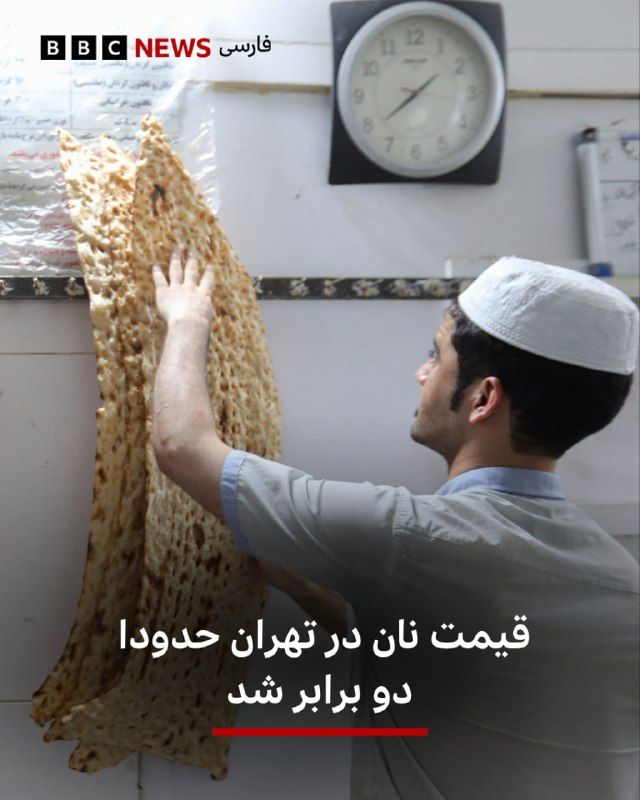

🔻بر اساس گزارش‌ها، قیمت رسمی نان مشمول یارانه در تهران از دیروز دوشنبه( اول تیر ماه) حدودا دو برابر شده است.

کارگروه آرد و نان هم این افزایش قیمت را تائید کرده است.

محمدجواد کرمی، یکی از اعضای این کارگروه جزئیات این افزایش قیمت را ارائه کرده است که بر اساس آن نرخ نان لواش از ۱۴۰۰ به ۲۷۰۰ تومان، بربری از ۵۳۰۰ به ۱۰۰۰۰ تومان، تافتون از ۲۳۰۰ به ۴۵۰۰ تومان و نان سنگک از ۷۴۰۰ به ۱۵۵۰۰ تومان رسیده است.

طی ماه‌های گذشته قیمت نان در بعضی از استان‌ها از جمله خراسان رضوی افزایش یافته بود.

تورم مواد اولیه از جمله بالا رفتن قیمت گندم، آرد یارانه‌ای، دستمزد، حامل‌های انرژی و اجاره‌بها از جمله عوامل موثر در افزایش قیمت نان بوده‌اند.

براساس داده‌های مرکز آمار ایران تورم مواد غذایی دراین کشور در اردیبهشت به ۱۳۰ درصد رسید.

@BBCPersian
📷 REUTERS

## BBCPersian — post 284839

🔻ادامه کاهش قیمت نفت در بازارهای جهانی

کاهش قیمت نفت در بازارهای جهانی ادامه دارد و در معاملات ابتدایی روز سه‌شنبه بیش از یک درصد دیگر هم کاهش یافت.

هر بشکه نفت برنت در معاملات ابتدایی امروز با بیش از یک دلار کاهش به ۷۶/۸۱ دلار در هر بشکه رسید و قیمت نفت خام غرب تگزاس هم با ۸۷ سنت کاهش به ۷۲/۹۹ دلار در هر بشکه رسید.

قیمت‌ها روز دوشنبه پس از آنکه ایالات متحده معافیت ۶۰ روزه تحریمی ایران را صادر کرد، بیش از ۳ درصد کاهش یافت.

@BBCPersian

## BBCPersian — post 284838

  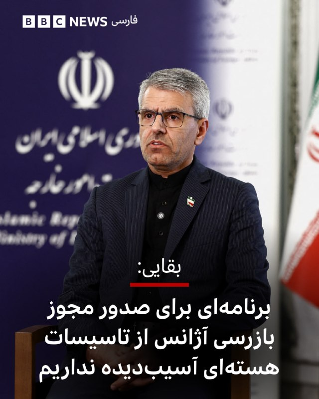

🔻
ایران می‌گوید که برنامه‌ای برای دسترسی دادن به آژانس برای بازدید از تاسیسات هسته‌ای آسیب‌دیده در جنگ ندارد.

اسماعیل بقایی، سخنگوی وزارت خارجه ایران، در نشستی خبری گفت: «اساسا در این زمینه هیچ شیوه نامه‌ای وجود ندارد، ما به‌عنوان عضو معاهده منع اشاعه، به عنوان کشوری که متعهد به موافقت‌نامه‌های پادمان هست روال جاری را ادامه خواهیم داد و فکر می‌کنم روال جاری هم خیلی روشن هست.»

او همچنین هر گونه دیدار با رافائل گروسی، مدیرکل آژانس بین‌المللی انرژی اتمی در سوئیس را هم رد کرد.

دیروز جی‌دی‌ ونس، معاون اول رئیس‌جمهور آمریکا گفته بود که ایران با بازگشت بازرسان آژانس بین‌المللی انرژی اتمی موافقت کرده است.

موضوع بازدید از تاسیسات هسته‌ای آسیب دیده ایران از زمان پایان جنگ دوازده روزه اسرائیل با ایران و حمله آمریکا به تاسیسات هسته‌ای ایران، مطرح بوده است.

@BBCPersian
📷 REUTERS

## BBCPersian — post 284837

🔻مسعود پزشکیان راهی پاکستان شد

مسعود پزشکیان، رئیس‌جمهور ایران برای سفری یک روزه عازم پاکستان شد.

قدردانی آقای پزشکیان از پیگیری‌های پاکستان به‌عنوان میانجی ایران و آمریکا از جمله دلایل این سفر عنوان شده است.

گسترش روابط اقتصادی از دیگر دستور کارهای این سفر است.

پاکستان میانجی اصلی مذاکرات ایران و آمریکا است و یادداشت تفاهم دو کشور هم به نام تفاهم‌نامه اسلام‌آباد شناخته می‌شود.

شهباز شریف، نخست‌وزیر و فیلد مارشال عاصم منیر، فرمانده کل قوای پاکستان در گفت‌وگوی ایران و آمریکا در سوئیس حضور داشتند.

شهباز شریف امروز گفته است که دور اول مذاکره ایران و آمریکا در سوئیس در چارچوب «یادداشت تفاهم اسلام‌آباد» در «فضایی مثبت و سازنده» به پایان رسید.

@BBCPersian

## BBCPersian — post 284836

🔻هیئت ایرانی بلافاصله پس از ترک سوئیس به عمان سفر کرد

محمدباقر قالیباف، رئيس مجلس ایران به همراه هیئت مذاکره‌کننده ایرانی بلافاصله پس از ترک سوئیس به عمان سفر کرده است. هدف از این سفر ایجاد «ترتیبات مدیریت تنگه هرمز» اعلام شده است.

عباس عراقچی، وزیر خارجه ایران هم در این سفر هیئت ایرانی را همراهی می‌کند.

صداوسیما گزارش داد بلافاصله پس از ورود هیئت ایرانی، مذاکره با هیئت عمانی بر سر «تثبیت مدیریت جدید تنگه هرمز» آغاز شد.

هیئت‌ ایرانی ابتدا با بدر بوسعیدی وزیر خارجه عمان دیدار کرد که برای استقبال از آنها به فرودگاه مسقط رفته بود.

محمدباقر قالیباف و عباس عراقچی پس از دیدار با هیئت دیپلماتیک عمان، با هیثم بن طارق، سلطان عمان دیدار کردند و در این جلسه هم درباره مدیریت تنگه هرمز گفت‌وگو شد.

در بخشی از یادداشت تفاهم ایران و آمریکا آمده است که ایران پس از امضای ‌آن، «با به کارگیری همه تلاش‌های ممکن» زمینه عبور ایمن کشتی‌های تجاری از تنگه هرمز را بدون دریافت هیچ گونه عوارض یا هزینه فراهم خواهد کرد.

بازگشایی تنگه هرمز یکی از اهداف اصلی آمریکا از زمان آغاز جنگ بوده است. بسته شدن این گذرگاه راهبردی موجب افزایش شدید قیمت جهانی نفت شد.

@BBCPersian

## BBCPersian — post 284835

  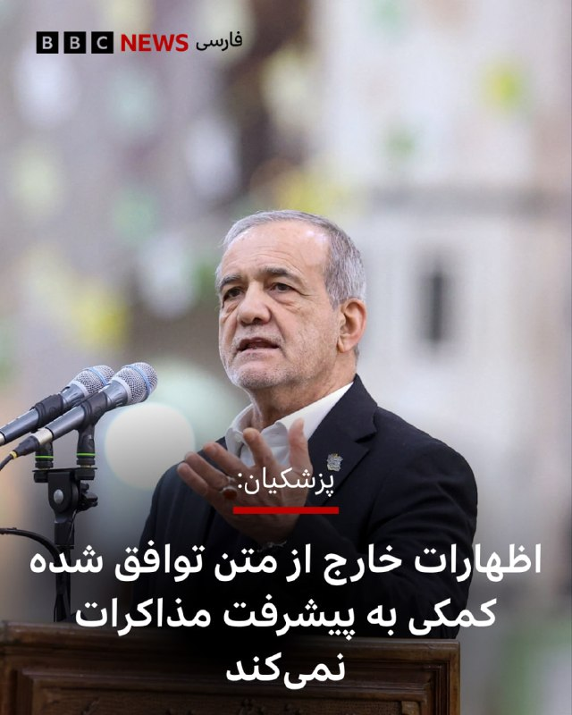

🔻پزشکیان: اظهارات خارج از متن توافق شده کمکی به پیشرفت مذاکرات نمی‌کند

مسعود پزشکیان، رئیس‌جمهور ایران در شبکه ایکس نوشت: «پیشرفت در این مسیر با پایبندی عملی به مسئولیت‌های پذیرفته شده سنجیده خواهد شد. اظهارات خارج از متن توافق شده کمکی به پیشرفت مذاکرات نمی‌کند.»

آقای پزشکیان مشخص نکرد که منظور او اظهارنظر کدام مقام‌های آمریکا است.

مسعود پزشکیان در ادامه نوشته است «اثربخشی مذاکرات به پایبندی کامل به تعهدات توافق شده و اجرای دقیق آنها بستگی دارد.»

اظهارات جی‌دی ونس، معاون رئیس جمهور آمریکا، که ریاست هیئت مذاکره کننده آمریکا با ایران را بر عهده دارد، در رسانه‌های آمریکا مورد توجه قرار گرفته است. از جمله اظهارات او درباره ازسرگیری بازرسی‌های بین‌المللی از برنامه هسته‌ای ایران.

همزمان خبر آزادشدن ۶ میلیارد دلار از دارایی‌های مسدود شده ایران در قطر که دونالد ترامپ گفته تهران آن را صرف خرید موادغذایی از کشاورزان آمریکایی خواهد کرد، هم خبرساز شده است.

@BBCPersian
📷REUTERS

## Dirty_Kids — post 392910

‏از یک خانمی تویِ یکی از کافه های مهرشهر
خِیییلی خوشم اومد، بسیار خوش‌پوش، زیبا،
شَکیل و ناز بودن ایشون.
دوستم رفت ازشون شُمارشونو برای من گرفت
وقتی تماس گرفتم، صداشون انقدر ناز و خانمانه بود که چشام قلبی شده بود که یهو فرمودن
برای پسر خجالتیم(منو گفت)
شبی ۱۰ میلیون تومن...🚶🏻‍♂️🚬🚬

@Dirty_Kids 👻

## Dirty_Kids — post 392908

  <a href="telegram/content/Dirty_Kids_392908_1782219073.mp4" target="_blank">🎬 Download video</a>

کلیپ این عروسک سخنگو خیلی وایرال شده و با کامنتای شاهکارش میشه تا قیامت خندید🤣

@Dirty_Kids 👻

## Dirty_Kids — post 392907

  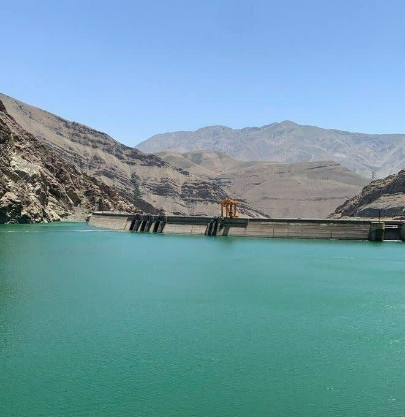

سد کرج سه ماه بعد از مرگ علی خامنه‌ای در آستانه سر ریز شدن

@Dirty_Kids 👻

## Dirty_Kids — post 392906

  <a href="telegram/content/Dirty_Kids_392906_1782219074.mp4" target="_blank">🎬 Download video</a>

این نروژیای بامزه دارن تبدیل به تیم مورد علاقم میشن، آخه ببین😭❤️

@Dirty_Kids 👻

## Dirty_Kids — post 392905

  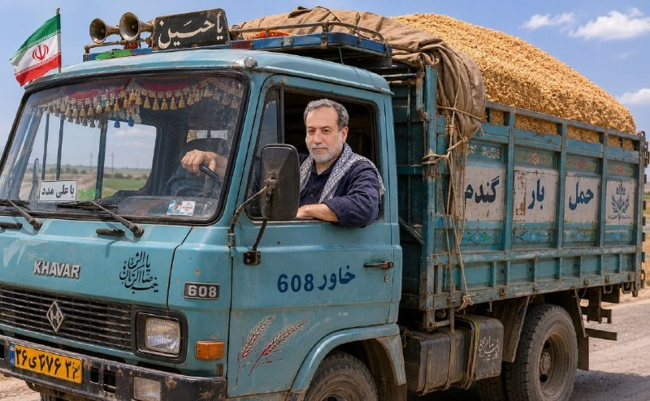

تصوری که از برگشت عراقچی از مذاکرات دارم

@Dirty_Kids 👻

## Dirty_Kids — post 392903

  <a href="telegram/content/Dirty_Kids_392903_1782219076.mp4" target="_blank">🎬 Download video</a>

ترافیک سنگین تعطیلات تاسوعا عاشورا در جاده چالوس

@Dirty_Kids 👻

## Dirty_Kids — post 392902

  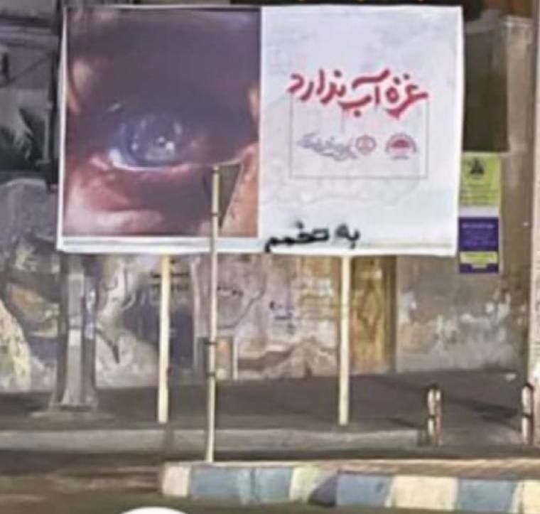

جایزه بهترین کامنت سال میرسه یه این دوست عزیزمون!

@Dirty_Kids 👻

## Dirty_Kids — post 392901

  <a href="telegram/content/Dirty_Kids_392901_1782219078.mp4" target="_blank">🎬 Download video</a>

فقط بگين چطور اينو قانعش كردين چادر سرش کنه 😂

@Dirty_Kids 👻

## Dirty_Kids — post 392900

  <a href="telegram/content/Dirty_Kids_392900_1782219080.mp4" target="_blank">🎬 Download video</a>

بهترین چیزی که میتونین به اکس‌تون تقدیم کنین:

@Dirty_Kids 👻

## Dirty_Kids — post 392899

  <a href="telegram/content/Dirty_Kids_392899_1782219081.mp4" target="_blank">🎬 Download video</a>

شما یادتون نمیاد
ولی یه زمان تتلو با پویا خواننده دعواش شده بود
بعد میگفت این خواننده نیست من ازش بهتر میخونم
بعد هر روز یه آهنگش رو میخوند میذاشت

@Dirty_Kids 👻

## Dirty_Kids — post 392898

  

سلامتی، بابامو با ذرت و سویا مبادله کردیم.

@Dirty_Kids 👻

## Dirty_Kids — post 392897

  <a href="telegram/content/Dirty_Kids_392897_1782219082.mp4" target="_blank">🎬 Download video</a>

آخرین لحظات پخش تلویزیون سوریه اسد
در حالیکه درب استودیو باز میشود و مهمان تلویحا اعلام میکند که استودیو سقوط کرده
نکته جالب آنکه‌ همچنان زیرنویس تلویزیون از قول وزیر کشور میگوید که دژ امنیتی غیر قابل نفوذی حول دمشق ایجاد کرده ایم!

@Dirty_Kids 👻

## Dirty_Kids — post 392896

⚡️ جام جهانی شروع شده و میدون مال توئه! 
🌟 این #جام_جهانی رو فقط باید توی #بت فیدو پیش‌بینی کنی 
💰 با ۵۰ میلیون تومان شرط روزانه ← ۴ میلیون تومان اعتبار شرط‌بندی رایگان 
📊 با ۱۰۰ میلیون تومان شرط روزانه ← ۸ میلیون تومان اعتبار شرط‌بندی رایگان میدونستی با انتخاب…

## Dirty_Kids — post 392895

  <a href="telegram/content/Dirty_Kids_392895_1782219083.webm" target="_blank">🎬 Download video</a>

⚡️ جام جهانی شروع شده و میدون مال توئه!

🌟 این #جام_جهانی رو فقط باید توی #بت فیدو پیش‌بینی کنی

💰 با ۵۰ میلیون تومان شرط روزانه ← ۴ میلیون تومان اعتبار شرط‌بندی رایگان

📊 با ۱۰۰ میلیون تومان شرط روزانه ← ۸ میلیون تومان اعتبار شرط‌بندی رایگان

میدونستی با انتخاب گل زدن کریسیانو رونالدو مقابل ازبکستان با ده میلیون بیست میلیون تومن برنده میشی؟!

💸 هرچی بزرگ‌تر بازی کنی، جایزت بزرگ‌تره!

🥅همین حالا پیش بینیتو ثبت کن
💖
https://fido874vt.click
https://fido874vt.click

👆
👆
👆
👆
👆
(ورود با وی-پی-ان غیر اروپایی)
❌
R2

📲کانال تلگرام 
👇
https://t.me/+dySI_QFj0T0xZGVk

## Dirty_Kids — post 392894

  <a href="telegram/content/Dirty_Kids_392894_1782219084.mp4" target="_blank">🎬 Download video</a>

این روزها رسانه ها و صداوسیما تا تونستن در مورد تیم ملی ایران و بیرانوند شایعه ساختند.

نه بوفون؛ نه مورینیو؛ نه دیبروینه و نه هیچ شخص معروف دیگه ای در مورد بیرانوند مصاحبه نکرده. حتی کامنت امباپه برای بیرانوند هم دروغ بود و اون پیج فیک بوده.

@Dirty_Kids 👻

## Dirty_Kids — post 392893

  <a href="telegram/content/Dirty_Kids_392893_1782219086.mp4" target="_blank">🎬 Download video</a>

شما هم بغض دختررو دیدید یا نه؟

@Dirty_Kids 👻

## Dirty_Kids — post 392892

  <a href="telegram/content/Dirty_Kids_392892_1782219088.mp4" target="_blank">🎬 Download video</a>

توی مشهد بخاطر باد شدید، فرش های حرم به پرواز دراومدن😐😂😂

@Dirty_Kids 👻

## Dirty_Kids — post 392891

  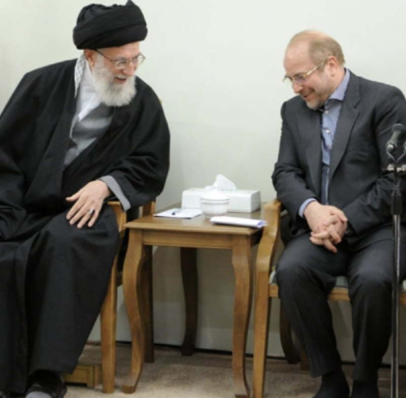

‏جاکش قرار بود انتقام بگیری رفتی سویا و ذرت گرفتی؟

@Dirty_Kids 👻

## Hranews — post 113807

چهارمحال و بختیاری؛ ۲ محیط‌بان بر اثر تیراندازی شکارچیان غیرمجاز زخمی شدند

❗️
❗️
❗️
❗️
❗️– دو #محیط‌بان در جریان درگیری با شکارچیان غیرمجاز در منطقه حفاظت‌شده سبزکوه در استان چهارمحال و بختیاری زخمی شدند. در این رابطه سه متخلف محیط زیستی بازداشت شدند.

ادامه مطلب

↘️
@hranews_bot تماس ✉️ - @Hranews کانال هرانا 🆑

## Hranews — post 113806

  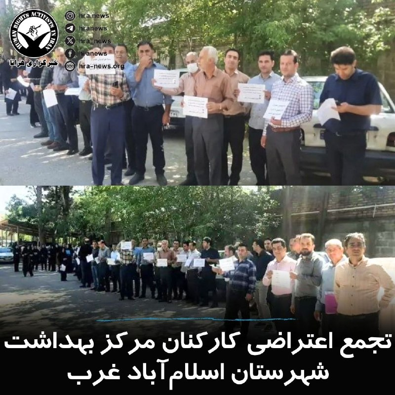

روز گذشته، جمعی از کارکنان مرکز بهداشت اسلام‌آباد غرب در این شهرستان تجمع اعتراضی برگزار کردند. آنان نسبت به وضعیت پرداخت‌ها در نظام بهداشت و درمان کشور انتقاد دارند و خواستار رسیدگی به مشکلات معیشتی، وضعیت حقوق دریافتی و مزایای شغلی خود هستند.
#تجمع_اعتراضی

↘️
@hranews_bot تماس ✉️ - @Hranews کانال هرانا 🆑

## Hranews — post 113805

  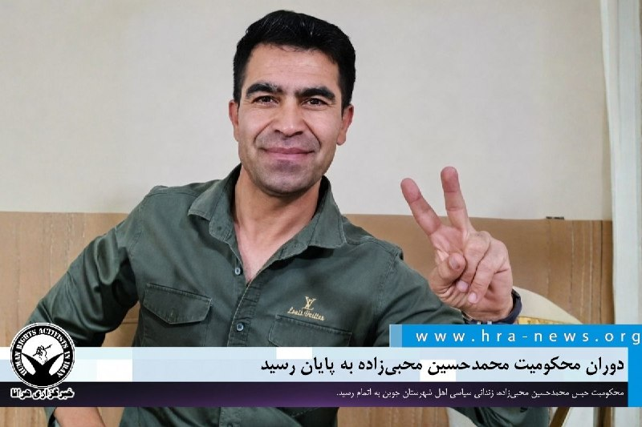

دوران محکومیت محمدحسین محبی‌زاده به پایان رسید

❗️
❗️
❗️
❗️
❗️– امروز محکومیت حبس محمدحسین محبی‌زاده، زندانی سیاسی اهل شهرستان جوین به اتمام رسید. این زندانی سیاسی پیشتر به مرخصی متصل به آزادی از زندان جوین اعزام شده بود.

به گزارش خبرگزاری هرانا، ارگان خبری مجموعه فعالان حقوق بشر در ایران، دوران محکومیت محمدحسین محبی‌زاده به پایان رسید.

بر اساس اطلاعات دریافتی هرانا، امروز سه شنبه ۲ تیرماه، محکومیت آقای محبی زاده که در تاریخ ۲۱ خردادماه سال جاری به مرخصی متصل به آزادی اعزام شده بود، به پایان رسید.

ادامه مطلب

#محمدحسین_محبی‌زاده

↘️
@hranews_bot تماس ✉️ - @Hranews کانال هرانا 🆑

## Hranews — post 113804

احضار و بازجویی علی‌محمد سالارزهی، روحانی اهل سنت در خاش

❗️
❗️
❗️
❗️
❗️– علی‌محمد سالارزهی، روحانی اهل سنت، روز گذشته به اداره اطلاعات شهرستان خاش احضار شد و مورد بازجویی قرار گرفت.

ادامه مطلب

#علی‌محمد_سالارزهی

↘️
@hranews_bot تماس ✉️ - @Hranews کانال هرانا 🆑

## Hranews — post 113803

  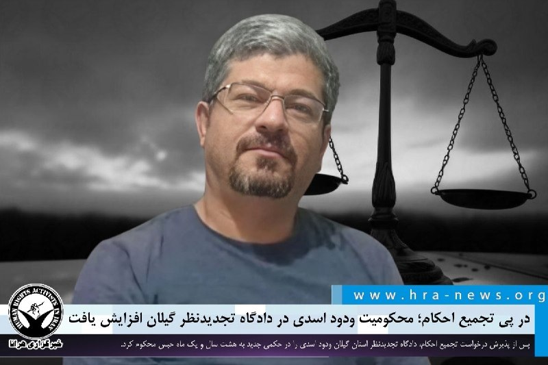

در پی تجمیع احکام؛ محکومیت ودود اسدی در دادگاه تجدیدنظر گیلان افزایش یافت

❗️
❗️
❗️
❗️
❗️– پس از پذیرش درخواست تجمیع احکام، دادگاه تجدیدنظر استان گیلان با لغو محکومیت‌های پیشین ودود اسدی، فعال ترک (آذربایجانی) محبوس در زندان اوین، او را در حکمی جدید به هشت سال و یک ماه حبس محکوم کرد. وی پیش‌تر در دو پرونده جداگانه، مجموعاً به شش سال و سه ماه حبس محکوم شده بود.

به گزارش خبرگزاری هرانا، ارگان خبری مجموعه فعالان حقوق بشر در ایران، پس از پذیرش درخواست تجمیع احکام، شعبه یازدهم دادگاه تجدیدنظر استان گیلان به ریاست محمدصادق ایران‌عقیده و اسماعیل رستمی طارمسری، محکومیت‌های پیشین آقای اسدی را لغو و رأی جدیدی برای او صادر کرد.

براساس رای این شعبه، آقای اسدی بابت اتهام «اجتماع و تبانی علیه امنیت کشور» به شش سال و یک ماه حبس، بابت «فعالیت تبلیغی علیه نظام به نفع گروه‌های معاند و مخالف نظام» به هشت ماه حبس و بابت «توهین به مقام رهبری» به ۱۶ ماه حبس محکوم شده است.

ادامه مطلب

#ودود_اسدی

↘️
@hranews_bot تماس ✉️ - @Hranews کانال هرانا 🆑

## Hranews — post 113802

  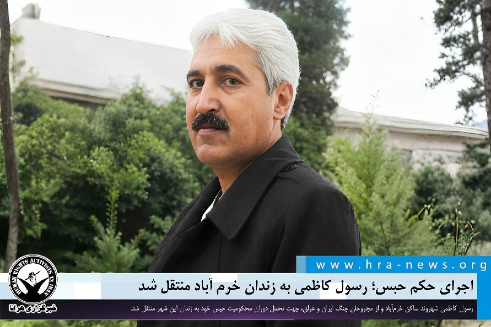

اجرای حکم حبس؛ رسول کاظمی به زندان خرم آباد منتقل شد

❗️
❗️
❗️
❗️
❗️– رسول کاظمی، شهروند ساکن خرم‌‌آباد و از مجروحان جنگ ایران و عراق، در تاریخ ۲۸ خردادماه جهت تحمل دوران محکومیت حبس خود بازداشت و به زندان منتقل شد. وی پیشتر توسط مراجع قضایی به تحمل ۲۶ ماه حبس محکوم شده بود.

به گزارش خبرگزاری هرانا، ارگان خبری مجموعه فعالان حقوق بشر در ایران، محکومیت حبس رسول کاظمی اجرا شد.

بر اساس اطلاعات دریافتی هرانا، آقای کاظمی در تاریخ ۲۸ خردادماه، پس از مراجعه به شعبه پنجم اجرای احکام کیفری خرم‌آباد بازداشت و جهت تحمل دوران محکومیت حبس خود به زندان این شهرستان منتقل شده است.

ادامه مطلب

#رسول_کاظمی

↘️
@hranews_bot تماس ✉️ - @Hranews کانال هرانا 🆑

## Hranews — post 113801

  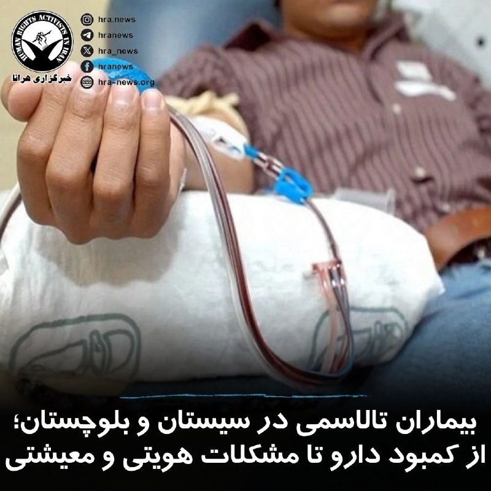

بیماران تالاسمی در سیستان و بلوچستان با کمبود داروهای حیاتی، دشواری دسترسی به پزشک متخصص و کمبود امکانات درمانی روبه‌رو هستند. یاسمن باشنده، فعال اجتماعی و بیمار تالاسمی، می‌گوید بحران امروز تنها به کمبود خون محدود نیست و کمبود داروهای آهن‌زدا، داروهای تزریقی و تجهیزات درمانی زندگی بیماران را تهدید می‌کند. به گفته او، بسیاری از بیماران برای تهیه دارو با مشکل مواجه‌اند، برخی داروهای مورد نیاز در شهرستان‌ها یافت نمی‌شود و هزینه بالای داروهای خارجی نیز فشار مضاعفی بر خانواده‌ها وارد کرده است.

زهرا قلجاعی، مدیر انجمن تالاسمی سیستان و بلوچستان، نیز با اشاره به کمبود برخی داروهای آهن‌زدا از جمله «دفرازیروکس» و «دسفرال ۵۰۰» هشدار داد که اختلال در تأمین این داروها می‌تواند به آسیب اندام‌های حیاتی بیماران منجر شود. او از تمرکز بخش عمده داروها در زاهدان و دشواری دسترسی بیماران شهرستان‌ها به دارو خبر داد. به گفته وی، شماری از بیماران تالاسمی فاقد مدارک هویتی هستند و در دسترسی به خدمات درمانی، حمایتی و بیمه‌ای با مشکل مواجه‌اند. قلجاعی همچنین با اشاره به وضعیت معیشتی خانواده‌های کم‌برخوردار دارای بیمار تالاسمی، تأکید کرد هزینه‌های رفت‌وآمد و درمان فشار اقتصادی سنگینی بر آنان وارد کرده است.
#بیماران_تالاسمی #تالاسمی

↘️
@hranews_bot تماس ✉️ - @Hranews کانال هرانا 🆑

## Hranews — post 113800

تحت نظارت پابند الکترونیکی؛ سهیلا مطاعی از کانون اصلاح و تربیت سنندج آزاد شد

❗️
❗️
❗️
❗️
❗️– سهیلا مطاعی، شهروند ساکن دهگلان که دوران محکومیت حبس خود را در کانون اصلاح و تربیت سنندج سپری می‌کرد، روز یکشنبه تحت نظارت پابند الکترونیکی آزاد شد.

ادامه مطلب

#سهیلا_مطاعی

↘️
@hranews_bot تماس ✉️ - @Hranews کانال هرانا 🆑

## Hranews — post 113799

  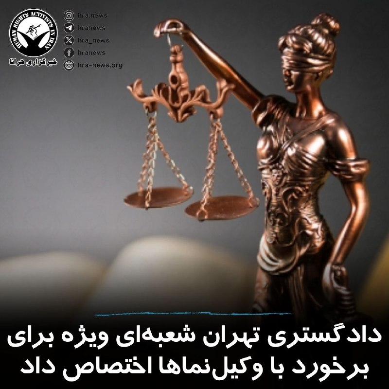

دادگستری استان تهران شعبه ۱۳۲ دادگاه صلح مستقر در مجتمع قضایی شهید کاظمی را به رسیدگی به پرونده‌های «تظاهر به امر وکالت» اختصاص داد. این اقدام با پیگیری کانون وکلای دادگستری مرکز و با هدف برخورد با افراد فاقد پروانه وکالت، از جمله اشخاصی که تحت عناوینی مانند مشاور حقوقی یا بلاگر حقوقی خدمات حقوقی غیرمجاز ارائه می‌کنند، صورت گرفته است. پیش‌تر نیز شعبه ۱۰۲۷ دادگاه کیفری دو تهران به عنوان شعبه تخصصی رسیدگی به اتهامات مرتبط با این جرم تعیین شده بود.
#وکالت #وکلا

↘️
@hranews_bot تماس ✉️ - @Hranews کانال هرانا 🆑

## manototv — post 106207

## manototv — post 106206

  <a href="telegram/content/manototv_106206_1782219091.mp4" target="_blank">🎬 Download video</a>

طرح تازه آمریکا برای دارایی‌های ایران، بحثی فراتر از غلات به راه انداخته است. مسئله مردم ایران فقط گندم و سویا نیست، بلکه بحران ساختاری اقتصادی، سرکوب و حکومتی غیرپاسخگو است.

## alonews — post 129873

  <a href="telegram/content/alonews_129873_1782219092.webm" target="_blank">🎬 Download video</a>

👈العربیه:
"سعید ایروانی، نماینده ایران در سازمان ملل‌ میگوید انتقال اورانیوم غنی‌شده ایران به خاک روسیه، یکی از گزینه‌های روی میز در مذاکرات است."

✅ @AloNews خبر جنگ

## alonews — post 129872

  <a href="telegram/content/alonews_129872_1782219092.webm" target="_blank">🎬 Download video</a>

👈مجلس از عملکرد عالی وزیر ارتباطات در ایام جنگ تقدیر کرد

✅ @AloNews خبر جنگ

## alonews — post 129871

  <a href="telegram/content/alonews_129871_1782219093.mp4" target="_blank">🎬 Download video</a>

وقتی دوتا دسته میرسن به هم

مداحاشون:

[@AloTweet]

## alonews — post 129870

  <a href="telegram/content/alonews_129870_1782219094.webm" target="_blank">🎬 Download video</a>

👈وزیر قطع ارتباطات:
تا زمان عادی‌شدن کامل شرایط بانک‌ها، خدمات مشترکان تلفن همراه و ثابت به‌دلیل پرداخت‌نشدن قبوض، قطع نخواهد شد

✅ @AloNews خبر جنگ

## alonews — post 129869

  <a href="telegram/content/alonews_129869_1782219094.webm" target="_blank">🎬 Download video</a>

👈لیست بانک‌هایی که همچنان با اختلال مواجه هستند:

ملت
تجارت
کشاورزی
ملی
صادرات
دی
بلو
کارآفرین

اختلال
❌ نفروختن دلار و طلا
✔️

✅ @AloNews خبر جنگ

## alonews — post 129868

  <a href="telegram/content/alonews_129868_1782219094.webm" target="_blank">🎬 Download video</a>

👈شهباز شریف: توافق ایران و آمریکا یک تحول خوشایند است 
🔴نخست‌وزیر پاکستان: پیشرفت مثبت بین دو طرف، نه تنها برای خاورمیانه، بلکه در سطح بین‌المللی نیز یک تحول خوشایند است. 
🔴توافق ایران و آمریکا گامی مهم در جهت تقویت امنیت و ثبات در منطقه است. 
🔴مذاکرات همچنین…

## alonews — post 129867

  <a href="telegram/content/alonews_129867_1782219095.webm" target="_blank">🎬 Download video</a>

👈زنده از ادمین ارسالی به کربلا/آزار و اذیت شش امامی‌ها توسط دوازده امامی‌ها در حرم

✅ @AloNews خبر جنگ

## alonews — post 129866

  <a href="telegram/content/alonews_129866_1782219095.webm" target="_blank">🎬 Download video</a>

👈لحظه ورود عاشقانه پزشکیان به پاکستان

✅ @AloNews خبر جنگ

## alonews — post 129865

  <a href="telegram/content/alonews_129865_1782219095.mp4" target="_blank">🎬 Download video</a>

👈ویدیوی منتشر شده از عباس عراقچی و همتی که وسط مذاکرات با آمریکا پا شدن رفتن بازی ایران و بلژیکو تماشا کردن

🔴اینجا گفته بودن مذاکرات ترک میکنیم اما رفتن فوتبال ببینن

🔴فقط اونجاش که گفت الکی الکی رفتیم سمت دروازه

✅ @AloNews خبر جنگ

## alonews — post 129864

  <a href="telegram/content/alonews_129864_1782219096.webm" target="_blank">🎬 Download video</a>

👈ترامپ: دیروز 19 میلیون بشکه نفت از تنگه هرمز عبور کرد

دونالد ترامپ در تروث سوشیال:

🔴«دیروز ۱۹ میلیون بشکه نفت از تنگه هرمز خارج شد که یک رکورد تاریخی است.

🔴قیمت نفت در حال کاهش است و جهان مکانی بسیار امن‌تر شده است!!!»

✅ @AloNews خبر جنگ

## alonews — post 129863

  <a href="telegram/content/alonews_129863_1782219097.webm" target="_blank">🎬 Download video</a>

👈زنده از کربلا/بیرون کردن شش امامی‌ها توسط دوازده امامی‌ها(اکثرا عرزشیا) 
✅ @AloNews خبر جنگ

## alonews — post 129862

  <a href="telegram/content/alonews_129862_1782219097.mp4" target="_blank">🎬 Download video</a>

👈زنده از کربلا/بیرون کردن شش امامی‌ها توسط دوازده امامی‌ها(اکثرا عرزشیا)

✅ @AloNews خبر جنگ

## alonews — post 129861

  <a href="telegram/content/alonews_129861_1782219098.webm" target="_blank">🎬 Download video</a>

👈ترامپ: با وجود اعتراضات آنها و اظهارات نادرست درباره‌ی خلاف آن، همراه با تبلیغات گسترده اخبار جعلی که تمام تلاش خود را می‌کنند تا پیروزی آمریکا را هرچه کوچک‌تر و بی‌اهمیت‌تر نشان دهند، ایران کاملاً و به طور کامل با بالاترین سطح بازرسی‌های هسته‌ای برای سال‌های طولانی آینده (بی‌نهایت!!!) موافقت کرده است. این امر «صداقت هسته‌ای» را تضمین خواهد کرد.

🔴اگر آنها با این موضوع موافقت نمی‌کردند، هیچ مذاکره‌ی بیشتری صورت نمی‌گرفت! بر اساس این و دیگر امتیازات بزرگ که ایران داده است، من موافقت کردم که تنگه هرمز باز بماند، بدون هیچ محاصره دریایی بیشتر.

🔴با این حال، همه کشتی‌ها در محل باقی می‌مانند در صورت نیاز به بازگرداندن محاصره، که در حال حاضر بسیار بعید به نظر می‌رسد. پول و/یا تحریم‌هایی که خزانه‌داری آمریکا آزاد می‌کند، به صورت سپرده مشروط تحت کنترل آمریکا قرار می‌گیرد و برای خرید مواد غذایی و کالاهای پزشکی، منحصراً از ایالات متحده، از جمله ذرت، گندم و سویا از کشاورزان بزرگ آمریکایی ما استفاده خواهد شد.

🔴این‌ها چیزهایی هستند که ایران به شدت به آنها نیاز دارد. این یک بحران انسانی است و من ضروری می‌دانم که اکنون کمک کنیم، قبل از اینکه خیلی دیر شود. مذاکرات خوب پیش می‌رود!



✅ @AloNews خبر جنگ

## alonews — post 129860

  <a href="telegram/content/alonews_129860_1782219099.webm" target="_blank">🎬 Download video</a>

👈ناآرامی در حرم امام حسین

🔴بیرون کردن شش امامی‌ها از حرم توسط دوازده امامی‌های ایرانی

✅ @AloNews خبر جنگ

## alonews — post 129859

  <a href="telegram/content/alonews_129859_1782219099.webm" target="_blank">🎬 Download video</a>

👈شهباز شریف: توافق ایران و آمریکا یک تحول خوشایند است

🔴نخست‌وزیر پاکستان: پیشرفت مثبت بین دو طرف، نه تنها برای خاورمیانه، بلکه در سطح بین‌المللی نیز یک تحول خوشایند است.

🔴توافق ایران و آمریکا گامی مهم در جهت تقویت امنیت و ثبات در منطقه است.

🔴مذاکرات همچنین شامل دارایی‌های هسته‌ای، موشک‌های بالستیک و دارایی‌های مسدود شده ایران خواهد بود.

🔴ما کاملا امیدواریم که این تفاهم‌نامه طی ۶۰ روز آینده به یک توافق بلندمدت تبدیل شود و منجر به صلح در جهان شود.

✅ @AloNews خبر جنگ

## alonews — post 129858

  <a href="telegram/content/alonews_129858_1782219099.mp4" target="_blank">🎬 Download video</a>

👈سیل هجوم ملت به شمال

✅ @AloNews خبر جنگ

## alonews — post 129857

  <a href="telegram/content/alonews_129857_1782219101.webm" target="_blank">🎬 Download video</a>

👈کل کل شش امامی‌ها و دوازده امامی‌ها به صحن حرم امام حسین کشیده شد 
✅ @AloNews خبر جنگ

## alonews — post 129856

  <a href="telegram/content/alonews_129856_1782219101.mp4" target="_blank">🎬 Download video</a>

👈کل کل شش امامی‌ها و دوازده امامی‌ها به صحن حرم امام حسین کشیده شد

✅ @AloNews خبر جنگ

## alonews — post 129855

  <a href="telegram/content/alonews_129855_1782219103.mp4" target="_blank">🎬 Download video</a>

👈دعوای 6امامی‌ها و 12امامی‌ها در کربلا

✅ @AloNews خبر جنگ

## alonews — post 129854

👈تعطیلی استان تهران در۱۳ و ۱۴ تیر؛ دوشنبه ۱۵ تیر کل کشور تعطیل شد

🔴بر اساس تصویب دولت روز‌های شنبه و یکشنبه ۱۳ و ۱۴ تیر استان تهران و دوشنبه ۱۵ تیر کل کشور تعطیل است.

✅ @AloNews خبر جنگ

<!-- MSG END -->

<!-- NAV START -->

<a href="https://github.com/Tljn/FUD/blob/main/telegram/content/archive_1.md" style="display:inline-block; padding:6px 12px; margin:0 4px; background-color:#2ea44f; color:white; text-decoration:none; border-radius:4px; font-weight:bold;">صفحه بعد</a>

<!-- NAV END -->
