# خواننده تلگرام

<!-- TOP_NAV START -->

<!-- TOP_NAV END -->

<!-- MSG START -->

---
📅 بروزرسانی: 1405/02/23 11:42
---

## VahidOOnLine — post 239863

⭕️اجرای هنری «سوگ سیاوش» در اعتراض به اعدام جوانان ایران‌زمین در شهر کلن

♦️تصاویری که روز سه‌شنبه ۲۲ اردیبهشت برای ایندیپندنت فارسی ارسال شده نشان می‌دهد، جانان الماسی، شاعر حماسی و رقصنده، در گردهمایی سراسری ایرانیان در شهر کلن، غم‌نامه «سوگ سیاوش» فردوسی را همراه با رقصی در اعتراض به اعدام معترضان در ایران اجرا کرد.

این برنامه روز یکشنبه ۲۰ اردیبهشت‌ماه در شهر کلن آلمان برگزار شد.
‌🇸🇦 Indypersian

🤖 @VahidOOnLine

## VahidOOnLine — post 239862

  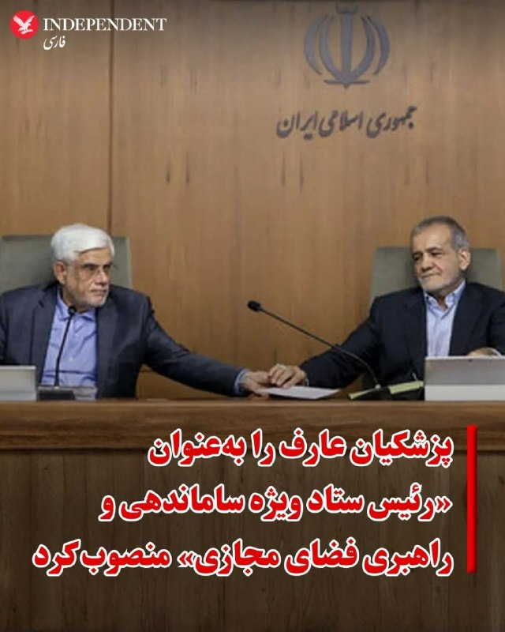

♦️پس از ۷۵ روز قطعی اینترنت در ایران و در حالیکه اعتراض‌ها به این رکوردشکنی جمهوری اسلامی بالا گرفته است، مسعود پزشکیان روز چهارشنبه ۲۳ اردیبهشت، محمدرضا عارف را به‌عنوان «رئیس ستاد ویژه ساماندهی و راهبری فضای مجازی» منصوب کرد.

پزشکیان ساعاتی پیش از این با انتشار پیامی در اکس نوشته بود «با در نظر گرفتن «حساسیت‌های حکمرانی و نظر رهبری»، در قالب «ساختاری چابک»، موجبات خدمت‌رسانی بهتر دولت و تحقق انتظارات عمومی را فراهم کند.»

پزشکیان توضیح نداد که ساختار چابک مورد نظر او، شامل وصل کامل اینترنت و ارتباطات می‌شود یا قصد دارد خدمات الکترونیکی دولت را روی شبکه ملی اینترنت (نسخه محدود داخلی) گسترده‌تر کند.
‌🇸🇦 Indypersian

🤖 @VahidOOnLine

## VahidOOnLine — post 239861

  

هم‌زمان با سفر دونالد ترامپ به چین و آغاز گفت‌وگوها درباره جنگ جمهوری اسلامی و اسرائیل، مقام‌های آمریکایی پکن را متهم کردند که با خرید گسترده نفت ایران، به «بزرگ‌ترین حامی دولتی تروریسم» کمک مالی می‌کند.

دونالد ترامپ امروز برای دیدار با شی جین‌پینگ، رئیس‌جمهوری چین، راهی پکن شد؛ دیداری که جنگ جمهوری اسلامی و اسرائیل و بحران تنگه هرمز از محورهای اصلی آن عنوان شده است.

در آستانه این سفر، اسکات بسنت، وزیر خزانه‌داری آمریکا، از چین خواست جمهوری اسلامی را برای بازگشایی تنگه هرمز تحت فشار قرار دهد و گفت پکن با خرید نفت ایران، «بزرگ‌ترین حامی دولتی تروریسم» را تأمین مالی می‌کند.

وزیر خزانه‌داری آمریکا در گفت‌وگو با فاکس‌نیوز گفت: «ببینیم آیا چین حاضر است از دیپلماسی استفاده کند و جمهوری اسلامی را وادار به باز کردن تنگه کند یا نه.»

چین تاکنون در قبال جنگ موضعی محتاطانه اتخاذ کرده و فراتر از انتقاد از آمریکا و اسرائیل، نقش مستقیمی در حل بحران ایفا نکرده است.
این دیدار در شرایطی برگزار می‌شود که تنش‌ها در منطقه، امنیت انرژی چین و تجارت جهانی از مسیر تنگه هرمز را تحت تأثیر قرار داده است.
‌🏁 🇬🇧 ManotoTV

🤖 @VahidOOnLine

## VahidOOnLine — post 239860

  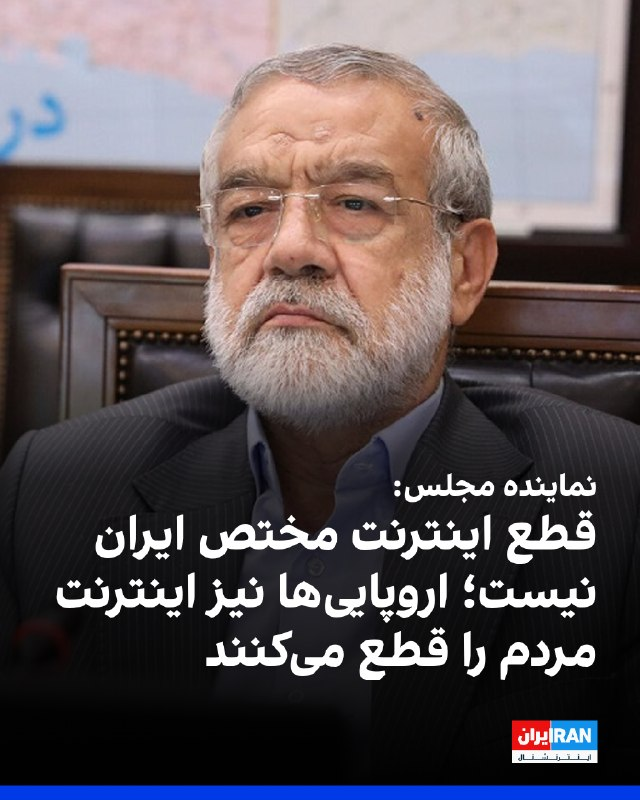

کامران غضنفری، نماینده مجلس، آمارهای مربوط به خسارت‌های قطع اینترنت در ایران را «جوسازی» خواند و گفت: «۵۰ میلیون نفر در پلتفرم‌های ایرانی هستند و هیچ مشکلی ندارند.»

او گفت: «قطع اینترنت اصلا مختص ایران نیست. ترکیه و کشورهای اروپایی که مانند ما درگیر جنگ نشده‌اند، به محض کوچک‌ترین مشکل امنیتی اینترنت بین‌الملل مردم خود را قطع می‌کنند.»
‌🏁 🇬🇧 IranintlTV

🤖 @VahidOOnLine

## VahidOOnLine — post 239859

  

رویترز به نقل از مقام‌های غربی و جمهوری اسلامی گزارش داد عربستان سعودی در جریان گسترش جنگ منطقه‌ای، در واکنش به حملاتی در خاک این کشور، چندین حمله اعلام‌نشده علیه جمهوری اسلامی انجام داده است.

رویترز در گزارشی اختصاصی نوشت عربستان سعودی، در اقدامی بی‌سابقه، حملات محرمانه‌ای را علیه جمهوری اسلامی انجام داده است.

به گفته دو مقام غربی مطلع و دو مقام جمهوری اسلامی، این حملات در واکنش به حملاتی صورت گرفته که در جریان جنگ در خاک عربستان انجام شده بود.

این حملات که پیش‌تر رسانه‌ای نشده بود، نخستین مورد شناخته‌شده از اقدام مستقیم نظامی عربستان در خاک ایران به شمار می‌رود؛ اقدامی که به نوشته رویترز نشان می‌دهد ریاض در دفاع از خود در برابر جمهوری اسلامی، رویکردی تهاجمی‌تر در پیش گرفته است.
‌🏁 🇬🇧 ManotoTV

🤖 @VahidOOnLine

## VahidOOnLine — post 239858

  <a href="telegram/content/VahidOOnLine_239858_1778659962.mp4" target="_blank">🎬 Download video</a>

ویدیوهای ارسال‌شده به ایران‌اینترنشنال نشان می‌دهند گروهی از ایرانیان مقیم آلمان سه‌شنبه ۲۲ اردیبهشت‌ماه در اعتراض به اعدام‌های جمهوری اسلامی، در شهر هانوفر پرفورمنس اعتراضی برگزار کردند.
‌🏁 🇬🇧 IranintlTV

🤖 @VahidOOnLine

## VahidOOnLine — post 239857

  

♦️روزنامه کیهان تهران روز چهارشنبه ۲۳ اردیبهشت در یادداشتی نوشت پذیرش دوباره مذاکره با آمریکا، «پالس ضعف به دشمن» می‌فرستد و باعث از سرگیری جنگ می‌شود.
کیهان در این یادداشت ادعا کرد که با وجود ضربات سنگین آمریکا و اسرائیل و کشته شدن بخش بزرگی از رهبران سیاسی و نظامی جمهوری اسلامی، «ایران برخلاف پیش‌بینی‌ها، تسلیم نشد.»
این روزنامه تحت نظر حسین شریعتمداری نوشت: «ایران نه‌تنها تسلیم نشد بلکه گلوی ترامپ را در تنگه هرمز بیشتر فشرد و فشار اقتصادی علیه محاسبات او را شدت بخشید.
تنها چیزی که آمریکا را عقب می‌راند، ماندگاری عبرت‌های دردناک جنگ اخیر و احتمال تکرار شدیدتر آن در آینده است
آنها می‌دانند زدن زیرساخت‌های ایران یعنی انهدام آرامکوی عربستان، فجیره امارات و دیگر تاسیسات منطقه.»
‌🇸🇦 Indypersian

🤖 @VahidOOnLine

## VahidOOnLine — post 239856

♦️گفتگوی جنجالی سه تن از ملی‌پوشان فوتبال ایران درباره میزان تحصیلات دانشگاهی که روز دوشنبه ۲۱ اردیبهشت از صداوسیما پخش شد، دست‌مایه طنز کاربران شبکه‌های اجتماعی قرار گرفت.

در این گفتگو، یکی از ملی‌پوشان در پاسخ به سوال مجری که پرسیده بود «در کدام دانشگاه درس می‌خوانی؟» گفت: «نمی‌دانم، الان حضور ذهن ندارم».

در دوره قبلی جام جهانی نیز انتشار ویدیویی از دروازه‌بان تیم ملی فوتبال ایران که گفته بود «من دکترا دارم»، بحث‌برانگیز شده بود؛ دکترایی که بعدها مشخص شد به‌صورت غیرحضوری در رشته تربیت بدنی دانشگاه پیام نور اخذ شده است.
‌🇸🇦 Indypersian

🤖 @VahidOOnLine

## VahidOOnLine — post 239855

  

♦️کیم یونگ هیون، مشاور امنیت ملی ریاست جمهوری کره جنوبی، روز چهارشنبه ۲۳ اردیبهشت ماه اعلام کرد این کشور در حال بررسی شرکت در عملیات بازگشایی تنگه هرمز و آزادی کشتیرانی در این آبراهه راهبردی به رهبری ایالات متحده آمریکا است.

این موضع در حالی اظهار می‌شود که هفته گذشته و پس از برخورد دو پهپاد به یک کشتی باری کره جنوبی در زمان عبور از تنگه هرمز، دونالد ترامپ به سئول پیشنهاد کرد تا به «پروژه آزادی» تنگه هرمز بپیوندد.

وزارت امور خارجه کره جنوبی دو روز پیش با انتشار گزارشی اعلام کرد هنوز نمی‌تواند با اطمینان بگوید که این پهپادها از سوی ایران شلیک شده بودند یا نه.
‌🇸🇦 Indypersian

🤖 @VahidOOnLine

## VahidOOnLine — post 239854

  

رسانه‌های حکومتی بامداد امروز از اعدام احسان افراشته خبر دادند.

قوه قضاییه جمهوری اسلامی اعلام کرده احسان افراشته، فرزند مصطفی، با اتهام‌هایی از جمله «جاسوسی» و «همکاری اطلاعاتی به نفع اسرائیل» بازداشت، محاکمه و پس از تایید حکم در دیوان عالی کشور اعدام شده است.

با این حال، نهادهای حقوق بشری و منابع مستقل پیش‌تر گزارش داده بودند که احسان افراشته ماه‌ها در سلول انفرادی نگهداری شده و اعترافات او تحت فشار و در شرایطی غیرشفاف اخذ شده است. همچنین گزارش‌هایی درباره محرومیت او از دسترسی مؤثر به وکیل مستقل و وجود فشارهای امنیتی در روند پرونده منتشر شده بود.

بر اساس اصول دادرسی عادلانه، هر اعترافی که تحت فشار، تهدید یا شکنجه گرفته شود فاقد اعتبار حقوقی است و متهم، به‌ویژه در پرونده‌های منتهی به مجازات اعدام، باید از حق دسترسی کامل به وکیل مستقل و دادگاه بی‌طرف برخوردار باشد.

پرونده احسان افراشته از سوی نهادهای حقوق بشری نمونه‌ای از استفاده از اتهام‌های امنیتی و مجازات اعدام در فضایی غیرشفاف توصیف شده؛ روندی که سال‌هاست درباره عملکرد دادگاه‌های انقلاب جمهوری اسلامی مورد انتقاد قرار دارد.
‌🏁 🇬🇧 ManotoTV

🤖 @VahidOOnLine

## VahidOOnLine — post 239853

  <a href="telegram/content/VahidOOnLine_239853_1778659967.mp4" target="_blank">🎬 Download video</a>

یک مقام ارشد نیروی دریایی سپاه پاسداران اعلام کرد جمهوری اسلامی تعریف خود از تنگه هرمز را گسترش داده و این منطقه اکنون به یک «محدوده عملیاتی وسیع» تبدیل شده است.

به گفته این مقام نظامی، محدوده عملیاتی تنگه هرمز دیگر تنها به آبراه باریک میان ایران و عمان محدود نیست و اکنون بخش گسترده‌ای از آب‌های اطراف، از جاسک تا جزایر تنب را شامل می‌شود.

رسانه‌های حکومتی گزارش داده‌اند محدوده‌ای که جمهوری اسلامی آن را منطقه عملیاتی تنگه هرمز می‌داند، از حدود ۲۰ تا ۳۰ مایل دریایی در گذشته، به ۲۰۰ تا ۳۰۰ مایل افزایش یافته است.

این اظهارات در حالی مطرح می‌شود که تنش‌ها در خلیج فارس ادامه دارد و نگرانی‌ها درباره امنیت عبور نفتکش‌ها و کشتی‌های تجاری از تنگه هرمز افزایش یافته است.
‌🏁 🇬🇧 ManotoTV

🤖 @VahidOOnLine

## VahidOOnLine — post 239852

  <a href="telegram/content/VahidOOnLine_239852_1778659968.mp4" target="_blank">🎬 Download video</a>

هم‌زمان با سفر رسمی دونالد ترامپ به چین، گروهی از مدیران ارشد بزرگ‌ترین شرکت‌های فناوری، مالی و صنعتی آمریکا نیز او را در این سفر همراهی می‌کنند. کاخ سفید اعلام کرده ایلان ماسک نیز در هواپیمای ریاست‌جمهوری آمریکا حضور دارد و همراه هیئت آمریکایی راهی پکن شده است.
در میان چهره‌های حاضر در این سفر، نام تیم کوک مدیرعامل اپل، جنسن هوانگ مدیرعامل انویدیا، لری فینک مدیرعامل بلک‌راک، دیوید سولومون مدیرعامل گلدمن ساکس و مدیران شرکت‌هایی چون بوئینگ، کوالکام، ویزا، مسترکارت، متا، مایکرون و سیتی‌گروپ دیده می‌شود.
رسانه‌های آمریکایی گزارش داده‌اند که محور اصلی این سفر، گفت‌وگو درباره روابط تجاری، فناوری، هوش مصنوعی، زنجیره تأمین جهانی و همکاری‌های اقتصادی میان آمریکا و چین است.
این سفر در حالی انجام می‌شود که روابط واشینگتن و پکن در ماه‌های اخیر بر سر مسائل تجاری، رقابت فناوری و تنش‌های ژئوپولیتیکی با چالش‌های گسترده‌ای روبه‌رو بوده است.
‌🏁 🇬🇧 ManotoTV

🤖 @VahidOOnLine

## VahidOOnLine — post 239851

  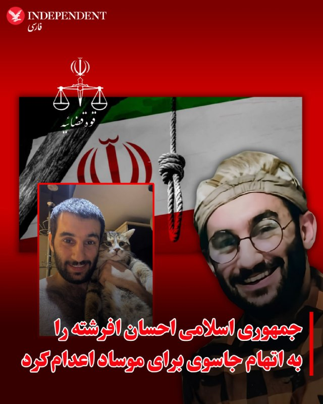

♦️قوه قضائیه جمهوری اسلامی روز چهارشنبه ۲۳ اردیبهشت ماه اعلام کرد احسان افرشته را «به‌جرم» جاسوسی برای موساد، سازمان اطلاعات خارجی اسرائیل اعدام کرده است.

برخی نهادهای حقوق بشری گزارش کرده‌اند که احسان افرشته ۳۱ ساله، فارغ‌التحصیل مهندسی عمران و کارشناس فناوری اطلاعات و ساکن ترکیه بوده است.

قوه قضائیه ادعا کرده است  که احسان افرشته پس از تماس با ماموران موساد ابتدا در یک تاکسی اینترنتی و پس از آن با شروع به‌کار در یک شرکت وابسته به صنایع دفاع برای اسرائیل جاسوسی می‌کرده است.

از زمان آغاز جنگ اخیر آمریکا و اسرائیل با جمهوری اسلامی، بیش از ۲۰ نفر به اتهام‌های همکاری با سرویس‌های امنیتی بیگانه، شرکت در انقلاب ملی ایرانیان و عضویت در گروه‌های «تروریستی» اعدام شده‌اند.
‌🇸🇦 Indypersian

🤖 @VahidOOnLine

## VahidOOnLine — post 239850

  

خبرگزاری میزان، رسانه قوه قضاییه جمهوری اسلامی، اعلام کرد حکم اعدام احسان افرشته، زندانی سیاسی، به اتهام «جاسوسی و همکاری اطلاعاتی به نفع اسرائیل» صادر شده است.

احسان افرشته، متولد ۱۳۷۲ و اهل اصفهان، دانش‌آموخته کارشناسی ارشد مهندسی عمران و متخصص شبکه و فناوری اطلاعات بود. او اوایل سال ۱۴۰۳، پس از بازگشت از ترکیه به ایران، از سوی نیروهای امنیتی بازداشت شد.

او چندین ماه در سلول انفرادی بازداشتگاه‌های امنیتی تحت بازجویی و فشار روانی قرار داشت و در مهر همان سال به بند عمومی زندان اوین منتقل شد.

کانون حقوق بشر ایران پیشتر اعلام کرده بود که اتهام «جاسوسی برای اسرائیل» علیه احسان افرشته بر پایه اعترافات اجباری تحت شکنجه طرح شده و هیچ مدرک معتبری در پرونده وجود ندارد.
‌🏁 🇬🇧 IranintlTV

🤖 @VahidOOnLine

## VahidOOnLine — post 239849

♦️در حالیکه اعتراض‌های گسترده به بیش از ۷۰ روز قطعی اینترنت در ایران ادامه دارد، علی کیافی‌فر، متخصص امنیت اطلاعات در نشستی درباره تاثیرات خاموشی دیجیتال بر کسب و کارها، رابطه میان این روند با امنیت را به‌شدت رد کرد.

کیایی فر که در میزگرد رسانه‌ آنلاین روزنامه دنیای اقتصاد صحبت می‌کرد با تاکید بر اینکه «قطع اینترنت امنیت را کمتر می‌کند و نه بیشتر»، گفت: «در جنگ ۱۲ روزه، نوبیتکس، بانک پاسارگاد، بانک سپه و بانک مرکزی از داخل خود ایران هک شدند. مثلا نوبیتکس توسط یک سرور زامبی تو یک مدرسه‌ی علمیه خواهران در قم هک شد.»

جمهوری اسلامی همزمان با حمله آمریکا و اسرائیل به ایران و آغاز جنگ، دسترسی کاربران به اینترنت بین‌المللی را قطع کرد.
همزمان با هفتادوسومین روز قطع اینترنت جهانی در ایران، حسین افشین، معاون علمی و فناوری مسعود پزشکیان، در مصاحبه‌ با خبرگزاری جوان با اشاره به اینکه «در شرایط جنگی هم بستن اینترنت نمی‌تواند راهکار باشد» گفت: «دیدیم وقتی اینترنت کاملا بسته بود، ترورها همچنان وجود داشت.»
‌🇸🇦 Indypersian

🤖 @VahidOOnLine

## VahidOOnLine — post 239848

  

دادستانی آمریکا اعلام کرد شارون گوهری، شهروند ایرانی-آمریکایی، در دادگاه بروکلین به اتهام قاچاق غیرقانونی افراد به آمریکا و دریافت محتوای حاوی سوءاستفاده جنسی از کودکان اعتراف کرده است.

بر اساس این پرونده، او با دریافت پول از اتباع ایرانی، قاچاق غیرقانونی به آمریکا را از مسیرهایی از جمله مکزیک سازماندهی کرده و ورود دست‌کم یک فرد مرتبط با سپاه پاسداران را نیز تسهیل کرده است.

مقام‌های فدرال آمریکا می‌گویند در تحقیقات، ویدیوهای حاوی آزار کودکان خردسال و تصاویر تعقیب پنهانی زنان در شهر نیویورک نیز در دستگاه‌های متهم کشف شده است.

گوهری در صورت محکومیت با حداقل پنج سال و حداکثر ۲۰ سال زندان برای اتهام محتوای سوءاستفاده جنسی از کودک و همچنین تا ۱۰ سال زندان برای قاچاق انسان روبه‌رو است.
‌🏁 🇬🇧 IranintlTV

🤖 @VahidOOnLine

## VahidOOnLine — post 239847

  <a href="telegram/content/VahidOOnLine_239847_1778659972.mp4" target="_blank">🎬 Download video</a>

⭕️هواپیمای غول‌پیکر نظامی سی-۱۷ آمریکا در آستانه سفر ترامپ در پکن فرود آمد

♦️یک فروند هواپیمای ترابری نظامی سی-۱۷ متعلق به نیروی هوایی ارتش ایالات متحده در آستانه سفر دونالد ترامپ در پکن فرود آمد. احتمال این هواپیما حامل تجهیزات امنیتی، تیم‌های حفاظتی و دیگر دستگاه‌ها و موارد پشتیبانی برای  آماده‌سازی‌های ویژه برای این سفر دیپلماتیک ایجاد کرده است.

هواپیمای سی-۱۷ یکی از بزرگ‌ترین هواپیماهای ترابری راهبردی ارتش آمریکا به‌شمار می‌رود و توانایی حمل تجهیزات سنگین نظامی، نیرو و سامانه‌های پشتیبانی ویژه را دارد.
‌🇸🇦 Indypersian

🤖 @VahidOOnLine

## WithYashar — post 11121

گزارش مرکز ژئوفیزیک از شدت ۹ زمین‌لرزه بالای ۲.۵ ریشتر در پردیس از روز گذشته تاکنون

ساعت ۲۰:۴۱ — بزرگی ۳.۴ ریشتر
ساعت ۲۳:۴۶ — بزرگی ۴.۶ ریشتر
ساعت ۲۳:۵۰ — بزرگی ۲.۶ ریشتر
ساعت ۰۰:۲۰ — بزرگی ۲.۶ ریشتر
ساعت ۰۰:۲۶ — بزرگی ۴ ریشتر
ساعت ۰۰:۳۲ — بزرگی ۳.۴ ریشتر
ساعت ۰۰:۵۴ — بزرگی ۲.۶ ریشتر
ساعت ۰۳:۲۹ — بزرگی ۳.۱ ریشتر
ساعت ۰۵:۵۷ — بزرگی ۳.۳ ریشتر

@withyashar

## WithYashar — post 11120

غضنفری:شواهد و قرائن نشان می‌دهد که آمریکا و اسرائیل قصد انجام یک عملیات گسترده برای تصرف برخی از جزایر جنوب را دارند
@withyashar

## WithYashar — post 11119

  <a href="telegram/content/WithYashar_11119_1778659974.mp4" target="_blank">🎬 Download video</a>

حضور 53 جنگنده F-16 آمریکایی در پایگاه شاهزاده سلطان عربستان هواپیما جاسوسی آواکس هم که دیشب نشون دادم از این پایگاه نظامی بلند شده بود
@withyashar

## WithYashar — post 11118

احسان افرشته، به اتهام جاسوسی و همکاری اطلاعاتی با موساد اعدام شد به گفته رژیم وی چند مرحله تماس از طریق پیام‌رسان‌ها داشته و در ادامه از طریق پست الکترونیک باهم در ارتباط بوده‌اند بیش از ۳۰۰ پیام بین آنها رد و بدل شده است. افرشته در ابتدا در پوشش راننده تاکسی…

## WithYashar — post 11116

  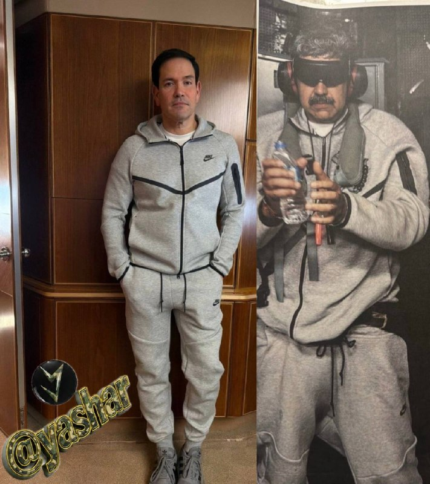

عکس وایرال شده مارک روبیو در هواپیمای ایرفورس وان که همون ست گرمکن مادارو را پوشیده. نکته ای که کسی به آن توجه نکرده کفشهایش است که مارک آدیداس هست.
@withyashar

## WithYashar — post 11114

  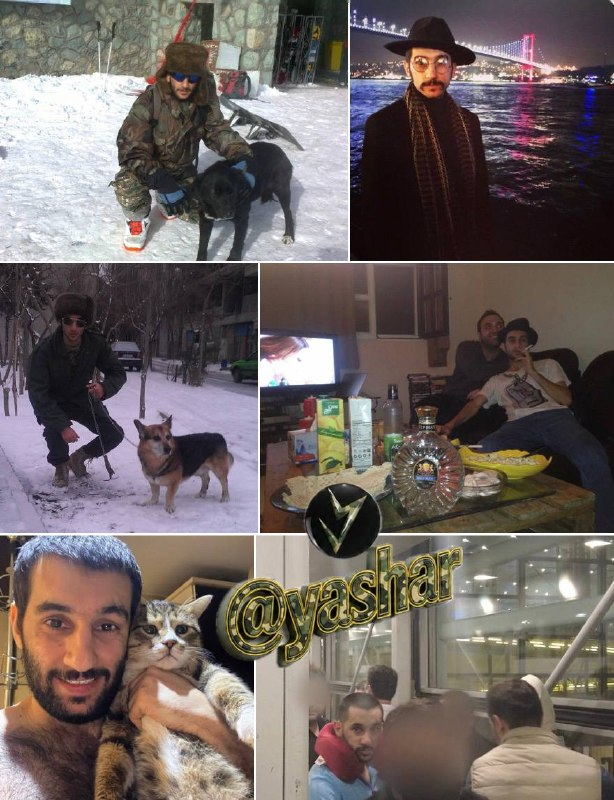

احسان افرشته، به اتهام جاسوسی و همکاری اطلاعاتی با موساد اعدام شد به گفته رژیم وی چند مرحله تماس از طریق پیام‌رسان‌ها داشته و در ادامه از طریق پست الکترونیک باهم در ارتباط بوده‌اند بیش از ۳۰۰ پیام بین آنها رد و بدل شده است. افرشته در ابتدا در پوشش راننده تاکسی اینترنتی دستورات افسران موساد را اجرا می‌کرد.
@withyashar

## WithYashar — post 11112

  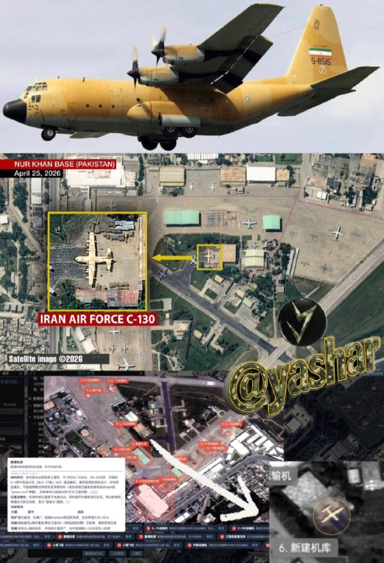

تصاویر ماهواره‌ای نشان می‌دهد که یک هواپیمای باری جمهوری اسلامی مدل C-130 در پایگاه‌ هوایی نور خان پاکستان پناه گرفته است
@withyashar

## WithYashar — post 11111

الجزیره: منابع دیپلماتیک می‌گویند که ۱۱۲ کشور هم‌اکنون از پیش‌نویس قطعنامه پیشنهادی آمریکا به شورای امنیت سازمان ملل درباره تنگه هرمز حمایت می‌کنند.
@withyashar

## WithYashar — post 11110

کیهان: اگر مذاکره کنیم جنگ می‌شود؛ مذاکره نکنیم جنگ نمی‌شود
@withyashar

## WithYashar — post 11109

ویزای ۵ ستاره عراق برای جام جهانی رد شد!
آمریکا در تازه‌ترین اقدام خود در آستانه جام‌جهانی ۲۰۲۶ ویزای ۵ بازیکن کلیدی تیم ملی عراق از جمله علی الحمادی (ستاره لوتون تاون)، مهند علی و حیدر عبدالکریم را رد کرد.
@withyashar

## mwarmonitor — post 9016

✈️ساعت ۰۹:۰۷ به وقت گرینویچ — TULLY 34 یک فروند بمب‌افکن B-52H به‌صورت تکی از RAF Fairford به پرواز درآمد.
در حال کار روی فرکانس Brize با 231.950 (ارتباط با RAF Brize Norton).

@mwarmonitor

## mwarmonitor — post 9015

  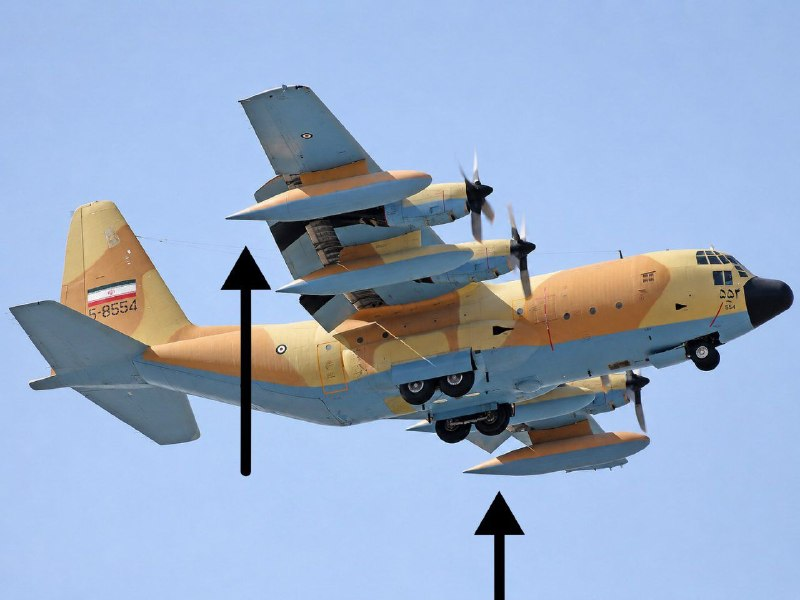

🔴شبکه NDTV تصاویر ماهواره‌ای با وضوح بالا (تهیه‌شده از شرکت Vantor) منتشر کرده است که به‌نظر می‌رسد گزارش‌ها مبنی بر پناه دادن پاکستان به دست‌کم یک فروند هواپیمای ترابری نظامی C-130H نیروی هوایی ایران در پایگاه هوایی نورخانِ نیروی هوایی پاکستان (PAF) را تأیید…

## mwarmonitor — post 9014

  

✈️🇬🇧نیروی هوایی سلطنتی بریتانیا (RAF)

ایرباس KC.2 Voyager ×۳
43C6FB ZZ338 – ASCOT 9900
43C700 ZZ343 – ASCOT 9901
43C6F7 ZZ334 – ASCOT 9902

✈️صبح امروز یک عملیات سوخت‌رسانی غیرمعمول از سوی نیروی هوایی سلطنتی بریتانیا در جریان است. سه فروند هواپیمای «ویجر» RAF با علائم پروازی متوالی در حال فعالیت بر فراز دریای سرخ هستند.

✈️پرواز ASCOT 9900 حدود ۸ ساعت پیش انجام شده و به نقطه‌ای نزدیک جده بر فراز دریای سرخ رسیده و برای مدت کوتاهی سیگنال خود را ارسال کرده است؛ هرچند ممکن است مسیر خود را فراتر از این نقطه ادامه داده باشد.

✈️به نظر می‌رسد ASCOT 9901 که حدود ۵ ساعت پیش به پرواز درآمده، جای آن را گرفته و پس از آن ASCOT 9902 که یک ساعت پیش برخاسته، به سمت محدوده‌ای حرکت می‌کند که 9901 در آن در حال ارسال سیگنال است.

📌هر آنچه در جریان است، طی ۸ ساعت گذشته به حضور مداوم هواپیماهای سوخت‌رسان بر فراز دریای سرخ نیاز داشته است.

@mwarmonitor

## mwarmonitor — post 9013

  <a href="telegram/content/mwarmonitor_9013_1778659979.mp4" target="_blank">🎬 Download video</a>

🐒 میمون سخنگو

📝 این دلقکِ رانتی که تخصصش «واپاشی عصبی» مخاطب است، پیشنهاد هجرت به افغانستان و سوریه را می‌دهد؛ انگار که ارث پدرش را از ما طلبکار است! اما زهی خیال باطل. ما جایی نمی‌رویم، اما برای تو برنامه‌ی ویژه‌ای داریم: در فردای آزادی، قفسی در باغ‌وحش ارم رزرو شده تا به عنوان تنها «میمون سخنگوی دست‌آموز»، به جای آنتن صداوسیما، در زادگاه اصلی‌ات به اجرای برنامه بپردازی.
🔹آنجا می‌توانی با همان لبخند کذایی، برای بازدیدکنندگانی که برایت موز پرت می‌کنند، از مزایای اینترنتِ نداشته‌ات بگویی و موجبات شادی ملت را در محلی که واقعاً به آن تعلق داری فراهم کنی. شک نکن که تماشای لرزشِ غبغب و واق‌واق کردن‌های نمایشی‌ات برای یک تکه نانِ رانتی، بهترین سوژه‌ی کمدی سیاه برای نسل‌های آینده خواهد بود. تو نه یک مجری، که یک زایده‌ی بدخیم در گلوی این سرزمینی که باید در همان قفسِ حقارت، درس عبرتی شوی برای هر که خیال می‌کند می‌تواند با وقاحت، نمک بر زخم ملت بپاشد. آن روز، مستر کارت و ویزا کارتی که به رُخ می‌کشی، تنها برای خریدن بلیت تماشای سقوطِ ذلت‌بار خودت در قعر زباله‌دان تاریخ به کارت خواهد آمد.

@mwarmonitor

## mwarmonitor — post 9012

🔴گزارش‌های اطلاعاتی ایالات متحده نشان می‌دهد که ایران، برخلاف ادعاهای رئیس‌جمهور ترامپ، همچنان از ظرفیت قابل‌توجهی در حوزه موشکی برخوردار است. نیویورک تایمز

@mwarmonitor

## pm_afshaa — post 90670

غضنفری:شواهد و قرائن نشان می‌دهد که آمریکا و اسرائیل قصد انجام یک عملیات گسترده برای تصرف برخی از جزایر جنوب را دارند

💧 Rainbet.com the #1 Non-KYC Crypto Casino & Sportsbook @rainbetcom

😁 @Pm_Afshaa

## pm_afshaa — post 90668

احسان افرشته امروز صبح توسط جمهوری تروریستی اسلامی اعدام شد

💧 Rainbet.com the #1 Non-KYC Crypto Casino & Sportsbook @rainbetcom

😁 @Pm_Afshaa

## pm_afshaa — post 90667

🔴ترامپ دوباره تأکید کرد که آمریکا برای پایان دادن به جنگ ایران نیازی به کمک ندارد و تأکید کرد که آمریکا یا به‌صورت مسالمت‌آمیز یا به روش‌های دیگر پیروز خواهد شد

💧 Rainbet.com the #1 Non-KYC Crypto Casino & Sportsbook @rainbetcom

😁 @Pm_Afshaa

## DEJradio — post 4602

  <a href="telegram/content/DEJradio_4602_1778659981.webm" target="_blank">🎬 Download video</a>

🚨📢 شبکه «فاکس‌نیوز» سه‌شنبه ۲۲ اردیبهشت ۱۴۰۵ در گزارشی با اشاره به بن‌بست مذاکرات تهران و واشنگتن، پیش‌بینی کرد اگر ترامپ تصمیم بگیرد حملات به ایران از سر گرفته شود یا خیزش در داخل ایران بار دیگر شروع شود، بعضی از مقام‌های ارشد حکومت ایران به روسیه فرار کنند؛ مشابه کاری که برخی اطرافیان بشار اسد در سوریه انجام دادند.

فاکس‌نیوز در بخشی از این گزارش به وضعیت تقسیم قدرت در داخل ایران و موضوع جانشینی علی خامنه‌ای اشاره و این ایده را مطرح می‌کند که ساختار سیاسی جمهوری اسلامی طوری طراحی شده است که حتی در بحران‌های شدید هم بتواند ادامه پیدا کند، هرچند اختلاف و ابهام درباره آینده رهبری ممکن است بعضی جریان‌ها را به فکر خروج از کشور بیندازد.

بر اساس این تحلیل، مقام‌های رده‌بالای جمهوری اسلامی ممکن است به روسیه بروند، اما افراد رده‌پایین‌تر به کشورهایی مثل عراق یا افغانستان فرار کنند. در صورت فروپاشی احتمالی جمهوری اسلامی، شبکه‌های منطقه‌ای این رژیم از جمله گروه‌های نیابتی هم تضعیف خواهند شد.

#مذاکرات #جمهوری_اسلامی
@DEJradio

## kianmeli1 — post 87375

‏🔴قوه قضاییه جمهوری اسلامی اعلام کرد که احسان افرشته به اتهام «همکاری با اسرائیل»، بامداد چهارشنبه اعدام شد
https://t.me/kianmeli1

## IranIntlTV — post 336943

  <a href="telegram/content/IranIntlTV_336943_1778659982.mp4" target="_blank">🎬 Download video</a>

همزمان با رد پیشنهاد ۱۴ ماده‌ای جمهوری اسلامی از سوی دونالد ترامپ، رییس‌جمهوری آمریکا و ادامه بسته ماندن تنگه هرمز، رسانه‌ها از افزایش احتمال درگیری نظامی دوباره میان تهران و واشینگتن خبر می‌دهند.
گفت‌وگو با روح‌الله رحیم‌پور، روزنامه‌نگار و تحلیل‌گر سیاسی
@iranintltv

## IranIntlTV — post 336942

  <a href="telegram/content/IranIntlTV_336942_1778659984.mp4" target="_blank">🎬 Download video</a>

میزان، خبرگزاری قوه قضاییه جمهوری اسلامی، از اجرای حکم اعدام احسان افرشته خبر داد.
کانون حقوق بشر ایران پیش‌تر اعلام کرده بود اتهام «همکاری با اسرائیل» علیه احسان افرشته بر پایه اعترافات اجباری تحت شکنجه مطرح شده و هیچ مدرک معتبری در پرونده او وجود ندارد.

گفت‌وگو با مجتبی هاشمی، روزنامه‌نگار و تحلیل‌گر سیاسی
@iranintltv

## IranIntlTV — post 336941

  <a href="telegram/content/IranIntlTV_336941_1778659986.mp4" target="_blank">🎬 Download video</a>

دولت پاکستان با صدور بیانیه‌ای گزارش‌ها درباره حضور هواپیماهای جمهوری اسلامی در پایگاه نورخان را تایید کرد، اما گفت: «ماموریت این هواپیماها نظامی نیست.»

جواد همدانی، خبرنگار ایران‌اینترنشنال، گزارش می‌دهد
@iranintltv

## IranIntlTV — post 336940

  

کامران غضنفری، نماینده مجلس، آمارهای مربوط به خسارت‌های قطع اینترنت در ایران را «جوسازی» خواند و گفت: «۵۰ میلیون نفر در پلتفرم‌های ایرانی هستند و هیچ مشکلی ندارند.»

او گفت: «قطع اینترنت اصلا مختص ایران نیست. ترکیه و کشورهای اروپایی که مانند ما درگیر جنگ نشده‌اند، به محض کوچک‌ترین مشکل امنیتی اینترنت بین‌الملل مردم خود را قطع می‌کنند.»
https://iranintl.com/202605131903

## IranIntlTV — post 336939

  <a href="telegram/content/IranIntlTV_336939_1778659989.mp4" target="_blank">🎬 Download video</a>

رهبران آمریکا و چین در حالی در پکن دیدار می‌کنند که پیامدهای جنگ ایران و حمایت‌های پکن از جمهوری اسلامی بر این نشست سایه انداخته است. آیا دو طرف در مورد ایران تعاملاتی خواهند کرد؟

گزارش توماج طاهباز، خبرنگار ایران‌اینترنشنال
@iranintltv

## IranIntlTV — post 336937

  <a href="https://t.me/IranintlTV/336937" target="_blank">📎 Download file</a>

🎧نسخه صوتی اخبار بامدادی | چهارشنبه ۲۳ اردیبهشت
@iranintlTV

## IranIntlTV — post 336936

  <a href="telegram/content/IranIntlTV_336936_1778659992.mp4" target="_blank">🎬 Download video</a>

جاویدنامان انقلاب ملی ایرانیان
«محمد نوری» نوجوان ۱۷ ساله اهل قم، ۱۲ دی‌ماه در جریان یورش نیروهای سرکوبگر خامنه‌ای به معترضان در میدان توحید این شهر، هدف شلیک مستقیم قرار گرفت و جان باخت. نامش در حافظه‌ این سرزمین می‌ماند و یادش چراغ راه آزادی‌خواهان است.
@iranintltv

## IranIntlTV — post 336935

  <a href="telegram/content/IranIntlTV_336935_1778659994.mp4" target="_blank">🎬 Download video</a>

ویدیوهای ارسال‌شده به ایران‌اینترنشنال نشان می‌دهند گروهی از ایرانیان مقیم آلمان سه‌شنبه ۲۲ اردیبهشت‌ماه در اعتراض به اعدام‌های جمهوری اسلامی، در شهر هانوفر پرفورمنس اعتراضی برگزار کردند.

## IranIntlTV — post 336934

  <a href="telegram/content/IranIntlTV_336934_1778659997.mp4" target="_blank">🎬 Download video</a>

محمدرضا شهبازی، مجری صداوسیمای جمهوری اسلامی، در واکنش به مقایسه‌ای که برخی شهروندان میان وضعیت اینترنت در ایران با اینترنت پرسرعت در افغانستان و آغاز استفاده از کارت‌های اعتباری بین‌المللی در سوریه انجام دادند، گفت: «اگر این چیزها برایتان مهم است، بروید در افغانستان و سوریه زندگی کنید.»

گفت‌وگو با رضا حاجی‌حسینی، روزنامه‌نگار
@iranintltv

## IranIntlTV — post 336933

  <a href="telegram/content/IranIntlTV_336933_1778659999.mp4" target="_blank">🎬 Download video</a>

نمایندگان کنگره آمریکا در نامه‌ای دوحزبی از دولت بریتانیا خواستند روند به‌رسمیت شناختن سپاه پاسداران به‌عنوان یک سازمان تروریستی را تسریع کند.

گفت‌وگو با امیر گیتی، عضو تحریریه ایران‌اینترنشنال
@iranintltv

## IranIntlTV — post 336932

  <a href="telegram/content/IranIntlTV_336932_1778660002.mp4" target="_blank">🎬 Download video</a>

امیر حمیدی، متخصص امنیت ملی، گفت تهران برای پکن یک متحد ایدئولوژیک نیست و چین از جمهوری اسلامی در روابط خود با ایالات متحده به‌عنوان یک کارت راهبردی استفاده می‌کند. او تاکید کرد چین حاضر نخواهد شد به‌خاطر جمهوری اسلامی وارد رویارویی خصمانه با آمریکا شود.
@iranintltv

## IranIntlTV — post 336931

  <a href="telegram/content/IranIntlTV_336931_1778660004.mp4" target="_blank">🎬 Download video</a>

وزارت کشور کویت اعلام کرد ۴ عضو سپاه پاسداران را هنگام تلاش برای ورود دریایی به این کشور بازداشت کرده است. وزارت خارجه کویت نیز اعلام کرد در همین رابطه، سفیر جمهوری اسلامی را احضار کرده است.

تروسکه صادقی، خبرنگار ایران‌اینترنشنال، گزارش می‌دهد
@iranintltv

## IranIntlTV — post 336929

  <a href="telegram/content/IranIntlTV_336929_1778660005.mp4" target="_blank">🎬 Download video</a>

استرالیا هم‌زمان با افزایش تنش‌ها در خاورمیانه، از آغاز یک مشارکت نظامی تازه برای حفاظت از حریم هوایی و امنیت کشتیرانی در منطقه خبر داد. وزیر دفاع استرالیا گفت اعزام هواپیمای پیشرفته «آواکس» می‌تواند به تضمین آزادی کشتیرانی در تنگه هرمز و امنیت تجارت بین‌المللی کمک کند.

علیرضا محبی، خبرنگار ایران‌اینترنشنال، گزارش می‌دهد
@iranintltv

## IranIntlTV — post 336928

  <a href="telegram/content/IranIntlTV_336928_1778660008.mp4" target="_blank">🎬 Download video</a>

سرخط خبرهای چهارشنبه ۲۳ اردیبهشت
@iranintltv

## IranIntlTV — post 336927

  

خبرگزاری میزان، رسانه قوه قضاییه جمهوری اسلامی، اعلام کرد حکم اعدام احسان افرشته، زندانی سیاسی، به اتهام «جاسوسی و همکاری اطلاعاتی به نفع اسرائیل» اجرا شده است.

احسان افرشته، متولد ۱۳۷۲ و اهل اصفهان، دانش‌آموخته کارشناسی ارشد مهندسی عمران و متخصص شبکه و فناوری اطلاعات بود. او اوایل سال ۱۴۰۳، پس از بازگشت از ترکیه به ایران، از سوی نیروهای امنیتی بازداشت شد.

او چندین ماه در سلول انفرادی بازداشتگاه‌های امنیتی تحت بازجویی و فشار روانی قرار داشت و در مهر همان سال به بند عمومی زندان اوین منتقل شد.

کانون حقوق بشر ایران پیشتر اعلام کرده بود که اتهام «جاسوسی برای اسرائیل» علیه احسان افرشته بر پایه اعترافات اجباری تحت شکنجه طرح شده و هیچ مدرک معتبری در پرونده وجود ندارد.
https://iranintl.com/202605131420

## IranIntlTV — post 336926

  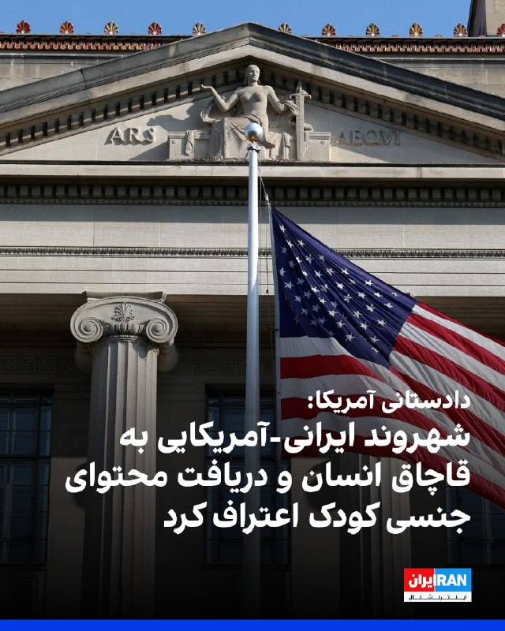

دادستانی آمریکا اعلام کرد شارون گوهری، شهروند ایرانی-آمریکایی، در دادگاه بروکلین به اتهام قاچاق غیرقانونی افراد به آمریکا و دریافت محتوای حاوی سوءاستفاده جنسی از کودکان اعتراف کرده است.

بر اساس این پرونده، او با دریافت پول از اتباع ایرانی، قاچاق غیرقانونی به آمریکا را از مسیرهایی از جمله مکزیک سازماندهی کرده و ورود دست‌کم یک فرد مرتبط با سپاه پاسداران را نیز تسهیل کرده است.

مقام‌های فدرال آمریکا می‌گویند در تحقیقات، ویدیوهای حاوی آزار کودکان خردسال و تصاویر تعقیب پنهانی زنان در شهر نیویورک نیز در دستگاه‌های متهم کشف شده است.

گوهری در صورت محکومیت با حداقل پنج سال و حداکثر ۲۰ سال زندان برای اتهام محتوای سوءاستفاده جنسی از کودک و همچنین تا ۱۰ سال زندان برای قاچاق انسان روبه‌رو است.
https://iranintl.com/202605134047

## ManotoTV — post 105387

  

هم‌زمان با سفر دونالد ترامپ به چین و آغاز گفت‌وگوها درباره جنگ جمهوری اسلامی و اسرائیل، مقام‌های آمریکایی پکن را متهم کردند که با خرید گسترده نفت ایران، به «بزرگ‌ترین حامی دولتی تروریسم» کمک مالی می‌کند.

دونالد ترامپ امروز برای دیدار با شی جین‌پینگ، رئیس‌جمهوری چین، راهی پکن شد؛ دیداری که جنگ جمهوری اسلامی و اسرائیل و بحران تنگه هرمز از محورهای اصلی آن عنوان شده است.

در آستانه این سفر، اسکات بسنت، وزیر خزانه‌داری آمریکا، از چین خواست جمهوری اسلامی را برای بازگشایی تنگه هرمز تحت فشار قرار دهد و گفت پکن با خرید نفت ایران، «بزرگ‌ترین حامی دولتی تروریسم» را تأمین مالی می‌کند.

وزیر خزانه‌داری آمریکا در گفت‌وگو با فاکس‌نیوز گفت: «ببینیم آیا چین حاضر است از دیپلماسی استفاده کند و جمهوری اسلامی را وادار به باز کردن تنگه کند یا نه.»

چین تاکنون در قبال جنگ موضعی محتاطانه اتخاذ کرده و فراتر از انتقاد از آمریکا و اسرائیل، نقش مستقیمی در حل بحران ایفا نکرده است.
این دیدار در شرایطی برگزار می‌شود که تنش‌ها در منطقه، امنیت انرژی چین و تجارت جهانی از مسیر تنگه هرمز را تحت تأثیر قرار داده است.

## ManotoTV — post 105386

  

رویترز به نقل از مقام‌های غربی و جمهوری اسلامی گزارش داد عربستان سعودی در جریان گسترش جنگ منطقه‌ای، در واکنش به حملاتی در خاک این کشور، چندین حمله اعلام‌نشده علیه جمهوری اسلامی انجام داده است.

رویترز در گزارشی اختصاصی نوشت عربستان سعودی، در اقدامی بی‌سابقه، حملات محرمانه‌ای را علیه جمهوری اسلامی انجام داده است.

به گفته دو مقام غربی مطلع و دو مقام جمهوری اسلامی، این حملات در واکنش به حملاتی صورت گرفته که در جریان جنگ در خاک عربستان انجام شده بود.

این حملات که پیش‌تر رسانه‌ای نشده بود، نخستین مورد شناخته‌شده از اقدام مستقیم نظامی عربستان در خاک ایران به شمار می‌رود؛ اقدامی که به نوشته رویترز نشان می‌دهد ریاض در دفاع از خود در برابر جمهوری اسلامی، رویکردی تهاجمی‌تر در پیش گرفته است.

## ManotoTV — post 105385

  

رسانه‌های حکومتی بامداد امروز از اعدام احسان افراشته خبر دادند.

قوه قضاییه جمهوری اسلامی اعلام کرده احسان افراشته، فرزند مصطفی، با اتهام‌هایی از جمله «جاسوسی» و «همکاری اطلاعاتی به نفع اسرائیل» بازداشت، محاکمه و پس از تایید حکم در دیوان عالی کشور اعدام شده است.

با این حال، نهادهای حقوق بشری و منابع مستقل پیش‌تر گزارش داده بودند که احسان افراشته ماه‌ها در سلول انفرادی نگهداری شده و اعترافات او تحت فشار و در شرایطی غیرشفاف اخذ شده است. همچنین گزارش‌هایی درباره محرومیت او از دسترسی مؤثر به وکیل مستقل و وجود فشارهای امنیتی در روند پرونده منتشر شده بود.

بر اساس اصول دادرسی عادلانه، هر اعترافی که تحت فشار، تهدید یا شکنجه گرفته شود فاقد اعتبار حقوقی است و متهم، به‌ویژه در پرونده‌های منتهی به مجازات اعدام، باید از حق دسترسی کامل به وکیل مستقل و دادگاه بی‌طرف برخوردار باشد.

پرونده احسان افراشته از سوی نهادهای حقوق بشری نمونه‌ای از استفاده از اتهام‌های امنیتی و مجازات اعدام در فضایی غیرشفاف توصیف شده؛ روندی که سال‌هاست درباره عملکرد دادگاه‌های انقلاب جمهوری اسلامی مورد انتقاد قرار دارد.

## ManotoTV — post 105384

  <a href="telegram/content/ManotoTV_105384_1778660013.mp4" target="_blank">🎬 Download video</a>

یک مقام ارشد نیروی دریایی سپاه پاسداران اعلام کرد جمهوری اسلامی تعریف خود از تنگه هرمز را گسترش داده و این منطقه اکنون به یک «محدوده عملیاتی وسیع» تبدیل شده است.

به گفته این مقام نظامی، محدوده عملیاتی تنگه هرمز دیگر تنها به آبراه باریک میان ایران و عمان محدود نیست و اکنون بخش گسترده‌ای از آب‌های اطراف، از جاسک تا جزایر تنب را شامل می‌شود.

رسانه‌های حکومتی گزارش داده‌اند محدوده‌ای که جمهوری اسلامی آن را منطقه عملیاتی تنگه هرمز می‌داند، از حدود ۲۰ تا ۳۰ مایل دریایی در گذشته، به ۲۰۰ تا ۳۰۰ مایل افزایش یافته است.

این اظهارات در حالی مطرح می‌شود که تنش‌ها در خلیج فارس ادامه دارد و نگرانی‌ها درباره امنیت عبور نفتکش‌ها و کشتی‌های تجاری از تنگه هرمز افزایش یافته است.

## ManotoTV — post 105383

  <a href="telegram/content/ManotoTV_105383_1778660014.mp4" target="_blank">🎬 Download video</a>

هم‌زمان با سفر رسمی دونالد ترامپ به چین، گروهی از مدیران ارشد بزرگ‌ترین شرکت‌های فناوری، مالی و صنعتی آمریکا نیز او را در این سفر همراهی می‌کنند. کاخ سفید اعلام کرده ایلان ماسک نیز در هواپیمای ریاست‌جمهوری آمریکا حضور دارد و همراه هیئت آمریکایی راهی پکن شده است.
در میان چهره‌های حاضر در این سفر، نام تیم کوک مدیرعامل اپل، جنسن هوانگ مدیرعامل انویدیا، لری فینک مدیرعامل بلک‌راک، دیوید سولومون مدیرعامل گلدمن ساکس و مدیران شرکت‌هایی چون بوئینگ، کوالکام، ویزا، مسترکارت، متا، مایکرون و سیتی‌گروپ دیده می‌شود.
رسانه‌های آمریکایی گزارش داده‌اند که محور اصلی این سفر، گفت‌وگو درباره روابط تجاری، فناوری، هوش مصنوعی، زنجیره تأمین جهانی و همکاری‌های اقتصادی میان آمریکا و چین است.
این سفر در حالی انجام می‌شود که روابط واشینگتن و پکن در ماه‌های اخیر بر سر مسائل تجاری، رقابت فناوری و تنش‌های ژئوپولیتیکی با چالش‌های گسترده‌ای روبه‌رو بوده است.

## FarsiVOA — post 217596

  

خبرگزاری ایسنا از آزادی دبیر انجمن اسلامی دانشجویان دانشگاه تهران، پس از چند ساعت بازداشت خبر داد.

یاسین حسن‌زاده، دانشجوی ورودی ۱۴۰۰ مهندسی صنایع دانشگاه تهران و دبیر انجمن اسلامی دانشجویان دانشگاه تهران، ظهر روز سه‌شنبه ۲۲ اردیبهشت و با مراجعه‌ مأموران امنیتی به منزل خود بازداشت شده بود.

منابع حقوق بشری اعلام کردند که این بازداشت پس از انتشار بیانیه انتقادی انجمن اسلامی دانشجویان دانشگاه تهران نسبت به روند اعدام‌ها در ایران صورت گرفت.

در بخشی از این بیانیه، با انتقاد از «نبود شفافیت در روند قضایی» و «اجرای بی‌سر‌وصدای احکام اعدام»، از دستگاه قضایی خواسته شده بود تا اجرای احکام اعدام مرتبط با اعتراضات سیاسی متوقف شود.

خبرگزاری ایسنا، بدون ارائه توضیحاتی از زمان دقیق دستگیری و اتهامات این دانشجو، صبح چهارشنبه ۲۳ اردیبهشت اعلام کرد که خبرهای دریافتی از آزادی یاسین حسن‌زاده، دبیر انجمن اسلامی دانشجویان دانشگاه تهران و علوم پزشکی تهران حکایت می‌کند.
@FarsiVOA

## FarsiVOA — post 217595

🔺جمهوری اسلامی بازداشت چهار مأمور خود در کویت را تأیید کرد

▪️وزارت امور خارجه جمهوری اسلامی بازداشت چهار مأمور ایرانی در کویت را تأیید کرد، اما اتهام‌های مطرح‌شده از سوی دولت کویت درباره «تلاش برای انجام اقدامات خصمانه» را «مطلقاً بی‌اساس» خواند.

▪️ادعا شده این چهار نفر «در چارچوب مأموریت مرسوم گشت‌زنی دریایی» فعالیت می‌کردند و به دلیل «اختلال در سامانه ناوبری» وارد آب‌های سرزمینی کویت شده‌اند.

▪️کویت اعلام کرده این گروه قصد نفوذ به جزیره بوبیان را داشته و مأموریت آنها انجام اقدامات «خصمانه» علیه این کشور بوده است.

▪️مقام‌های کویتی گفته‌اند این افراد قصد داشتند از طریق دریا وارد کویت شوند و در بازجویی‌ها ارتباط خود با سپاه پاسداران را پذیرفته‌اند.

⬇️ بیشتر بخوانید:
https://ir.voanews.com/a/8149520.html

## FarsiVOA — post 217594

  

سازمان گزارشگران بدون مرز اعلام کرد «الناز محمدی»، روزنامه‌نگار ایرانی و دبیر گروه اجتماعی روزنامه «هم‌میهن»، در فهرست نامزدهای جایزه شجاعت این نهاد برای سال ۲۰۲۶ قرار گرفته است.

الناز محمدی به عنوان دبیر گروه اجتماعی روزنامه هم‌میهن، نقش مهمی در پوشش پیامدهای اجتماعی جنبش «زن، زندگی، آزادی» پس از جان باختن «مهسا امینی» در سال ۱۴۰۱ داشت، و گزارشگران بدون مرز او را نماد شجاعت در برابر سرکوب سیستماتیک آزادی مطبوعات در ایران توصیف کرده است.

خانم محمدی در بهمن ماه ۱۴۰۱ به اتهام «توطئه» و «تبانی» بازداشت و به سه سال زندان محکوم شد. گزارشگران بدون مرز همچنین اشاره کرده که او، همانند خواهر دوقلویش الهه محمدی، به دلیل فعالیت حرفه‌ای و بازتاب صدای مردم هدف فشارهای قضایی قرار گرفته است. الهه محمدی پس از انتشار گزارشی از کشته شدن مهسا امینی در بازداشت گشت ارشاد، بازداشت شده بود.

به گفته این سازمان، الناز محمدی با وجود زندان، فشارهای حقوقی و مجبور شدن به ترک شغل خود، همچنان به فعالیت حرفه‌ ای و دفاع از حق دسترسی آزاد به اطلاعات ادامه داده است.
@FarsiVOA

## FarsiVOA — post 217593

  

پاکستان می‌گوید ترکیه و قطر ممکن است به پیمان همکاری دفاعی متقابل میان اسلام‌آباد و ریاض بپیوندند؛ پیمانی که با توجه به جنگ ایران و آمریکا، می‌تواند آرایش امنیتی خاورمیانه و جنوب آسیا را تغییر دهد.

به گزارش بلومبرگ، خواجه آصف وزیر دفاع پاکستان، دوشنبه‌شب در یک برنامه تلویزیونی گفت این سازوکار دفاعی در حال نهایی شدن است و افزود اگر قطر و ترکیه نیز به توافق موجود بپیوندند، «تحولی خوشایند» خواهد بود.

پاکستان و عربستان سعودی پیش‌تر توافقی دفاعی امضا کرده بودند که بر اساس آن، هرگونه حمله به یکی از دو کشور، حمله به هر دو تلقی می‌شود. این توافق از زمان تشدید جنگ آمریکا با جمهوری اسلامی اهمیت بیشتری یافته و نگرانی‌ها درباره گسترش دامنه درگیری در خلیج فارس را افزایش داده است.

در چارچوب همین توافق، در شرایطی که پاکستان نقش میانجی را برای گفت‌وگوهای تهران و واشنگتن به دوش گرفته است، همزمان با مذاکرات اسلام‌آباد در ۲۲ فروردین یک نیروی نظامی پاکستانی، شامل جنگنده‌ها، در پایگاه هوایی ملک عبدالعزیز مستقر شد.
@FarsiVOA

## FarsiVOA — post 217592

  

داده‌های شرکت دریانوردی «مرین ترفیک» حاکی از سرگردانی یک کشتی حامل گاز مایع (ال‌ان‌جی) روسیه در آب‌های آسیایی سرگردان شده است.

بر اساس این گزارش، حدود یک ماه پیش کشتی «کونپنگ» روسیه که تحت تحریم بریتانیا و اوکراین قرار دارد، مسیر خود را از هنگ‌کنگ به هند تغییر داد، اما با امتناع هند از دریافت این محموله به خاطر تحریم‌ها، دوباره از آب‌های سنگاپور به مقاصد نامعلوم حرکت کرده است.

این گزارش نشان می‌دهد چگونه ریسک‌های مرتبط با رعایت تحریم‌ها حتی در شرایط کسری گسترده عرضه، بر جریان تجارت انرژی اثر می‌گذارد.
@FarsiVOA

## FarsiVOA — post 217591

  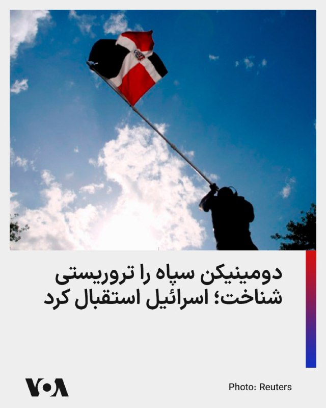

جمهوری دومینیکن روز سه‌شنبه اعلام کرد که در چارچوب «تعهد به مبارزه با تروریسم»، سپاه پاسداران انقلاب اسلامی و گروه حزب‌الله لبنان را به‌عنوان سازمان‌های تروریستی طبقه‌بندی کرده است.

دومینیکن همچنین بر تعهد خود مبنی بر اجرای قطعنامه‌های شورای امنیت سازمان ملل متحد و همچنین گسترش همکاری‌ها با ایالات متحده آمریکا با هدف برقراری امنیت و ثبات تأکید کرده است.

ساعاتی پس از این اعلام گیدئون سعار، وزیر خارجه اسرائیل، با استقبال از این اقدام، آن را «پیامی روشن علیه سیاست‌های تروریستی جمهوری اسلامی و نیروهای نیابتی رژیم» توصیف کرد. دنی دانون، نماینده اسرائیل در سازمان ملل نیز با از جمهوری دومینیکن، در شبکه اجتماعی ایکس نوشت: «جهان به طور فزاینده‌ای درک می‌کند که تروریسم به رهبری جمهوری اسلامی، تهدیدی برای تمام جهان است.»

در هفته‌های گذشته، چند کشور دیگر از جمله آرژانتین، ترینیداد و توباگو و کاستاریکا، به جمع کشورهایی که سپاه پاسداران را یک سازمان تروریستی می‌دانند، اضافه شدند. ایالات متحده پیشتر در دور نخست ریاست‌جمهوری ترامپ در فروردین ۱۳۹۸، سپاه پاسداران را در فهرست گروه‌های تروریستی قرار داده بود.
@FarsiVOA

## FarsiVOA — post 217590

  

🔺قوه قضائیه از اعدام احسان افرشته به اتهام جاسوسی برای موساد خبر داد

▪️قوه قضائیه جمهوری اسلامی اعلام کرد بامداد چهارشنبه حکم اعدام احسان افرشته به اتهام «جاسوسی و همکاری اطلاعاتی» با موساد اجرا شده است.

▪️ادعا شده او پس از ارتباط اولیه در ترکیه، از سوی افسران موساد آموزش دیده و در سفر به نپال نیز آموزش حضوری دریافت کرده بود.

▪️همچنین ادعا شده افرشته پس از بازگشت به ایران به عنوان کارشناس سایبری در شرکتی وابسته به یک نهاد نظامی مشغول شده و اطلاعات مربوط به کارکنان، ساختار سازمانی و مأموریت‌های آن مجموعه را در اختیار عوامل اسرائیلی قرار داده بود.

▪️هرانا پیش‌تر نوشته بود که احسان افرشته، متخصص شبکه و فناوری اطلاعات بود که اوایل سال ۱۴۰۳ پس از بازگشت از ترکیه بازداشت شد.

⬇️ بیشتر بخوانید:
https://ir.voanews.com/a/8149519.html

## DW_Farsi — post 124637

🔶 زلزله ۴.۶ ریشتری، پس‌لرزه‌ها و طوفان در تهران
 
به گزارش خبرگزاری‌های داخلی ایران، یک زمین‌لرزه نسبتا شدید و پس‌لرز‌هایی آن تهران و مناطق پیرامونی را لرزاند. 
 
بنا بر گزارش‌های رسمی، این زلزله ساعت ۲۳ و ۴۶ دقیقه شامگاه سه‌شنبه ۲۲ اردیبهشت (۱۲ مه) به شدت ۴.۶ ریشتر در عمق ده کیلومتری زمین در حوالی بومهن روی داد. شهرستان‌های شمیرانات، پردیس و دماوند نیز تحت تأثیر این زمین‌لرزه قرار داشتند.
 
مرتضی رضایی، معاون امداد و نجات جمعیت هلال‌احمر استان تهران، به خبرگزاری ایسنا گفت، بامداد امروز چهارشنبه نیز دو پس‌لرزه به ثبت رسید که یکی از آنها به بزرگی ۴ ریشتر و دیگری ۲ ریشتر بود.
 
به گفته این مقام، بخش لواسانات بیشترین تأثیر را از این زمین‌لرزه داشته و بلافاصله پس از وقوع زلزله، تیم‌های عملیاتی و ارزیاب هلال‌احمر به مناطق اعزام شدند. به گفته او، تیم‌های عملیاتی همچنان در حال ارزیابی و پایش مناطق هستند.
 
رضایی اضافه کرد که "تاکنون هیچ‌گونه گزارشی مبنی بر تخریب، خسارت یا آسیب جانی دریافت نشده و مسیرهای ارتباطی در مناطق بومهن و لواسانات نیز بررسی شده که هیچ محدودیت یا مشکلی در تردد وجود ندارد".
 
بنا بر گزارش رسانه‌ها، رئیس اورژانس تهران و همچنین رئیس جمعیت هلال احمر پایتخت نیز بعد از وقوع حادثه به خبرگزاری‌ها گفتند که زلزله تاکنون مصدومی در پی نداشته است.
 
@dw_farsi

## DW_Farsi — post 124636

🔶 جام ۱۹۵۰؛ خوآن شیافینو، جادوگری که کابوس برزیل شد
 
خوآن آلبرتو شیافینو در جام جهانى ۱۹۵۰ در برزیل کارگردان و گلزن تیم ملی فوتبال اورگوئه بود و همچنین یکى از ستارگان درخشان آن دوره.

این مهاجم اورگوئه‌اى اگر چه در دیدار تیم ملى کشورش در مقابل بولیوى در دور اول ۴ گل از هشت گل اروگوئه را وارد دروازه حریف کرد، اما گل سرنوشت‌سازش را در  روز ۱۶ ژوئیه سال ۱۹۵۰ به ثمر رساند.

در این روز ۲۰۰ هزار نفر در استادیوم عظیم "ماراکانا" جمع شده بودند تا شاهد پیروزى تیم ملى برزیل بر اروگوئه در دیدار نهایی جام جهانى باشند.

تا دقیقه ۶۶ هم همه چیز بر وقف مراد پیش مى‌رفت، چون تا آن لحظه برزیل با تک‌گل فریاسا از اروگوئه جلو بود. در دقیقه ۶۶ شیافینو گل تساوى را به ثمر رساند و استادیوم را با این گل غرق در سکوت کرد.

۵ دقیقه بعد گیگیا، یکى از دیگر ستارگان اروگوئه گل دوم این تیم را به ثمر رساند و شکست برزیل را قطعى کرد. میزبان این بازی‌ها در غم و ماتم فرو رفت و اروگوئه با درخشش شیافینو عنوان قهرمانى جهان را جشن گرفت.
 
@dw_farsi

## DW_Farsi — post 124635

  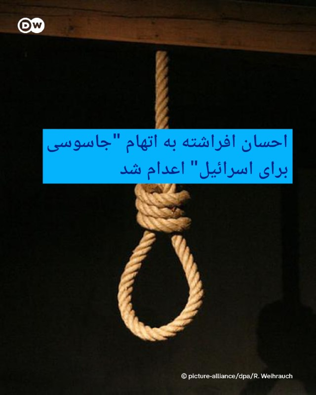

🔶 احسان افراشته به اتهام "جاسوسی برای اسرائیل" اعدام شد
 
به گزارش خبرگزاری "میزان"، وابسته به قوه قضائیه جمهوری اسلامی، حکم اعدام حسان افراشته، زندانی متهم به "جاسوسی برای اسرائیل" صبح روز چهارشنبه ۲۳ اردیبهشت به اجرا درآمد.
 
دستگاه قضایی ایران او را متهم کرده که "در نپال از سوی سازمان اطلاعات خارجی اسرائیل (موساد) مورد آموزش قرار گرفته و اطلاعاتی حساس در باره جمهوری اسلامی را در اختیار این کشور قرار می‌داده است."
 
حکم اعدام در مورد این زندانی در حالی به اجرا گذاشته شده که به گفته نهادهای حقوق بشری، پرونده او با ابهامات و گزارش‌هایی متعدد در مورد فشارهای امنیتی، اعترافات اجباری و نقض روند رسیدگی به اتهامات همراه بوده است.
 
احسان افراشته که متولد ۱۳۷۲ و دانش‌آموخته کارشناسی ارشد مهندسی عمران و متخصص فناوری اطلاعات بود، در اوایل سال ۱۴۰۳ پس از بازگشت از ترکیه بازداشت شد و مدت‌ها در حبس انفرادی به سر برد.
 
او در خرداد همان سال از سوی شعبه ۱۵ دادگاه انقلاب تهران به ریاست قاضی ابوالقاسم صلواتی به اتهام "جاسوسی" به اعدام محکوم شد.
 
افراشته اتهام‌های مطرح‌شده و اعترافات منتسب به خود را رد کرده بود.
@dw_farsi

## DW_Farsi — post 124634

  

🔶 وزیر دفاع آمریکا: به اندازه کافی موشک و مهمات داریم
 
پیت هگست، وزیر دفاع آمریکا گمانه‌زنی‌ها در مورد "کاهش شدید" ذخایر موشکی و مهمات ایالات متحده را کم‌اهمیت جلوه داد.
 
او روز سه‌شنبه ۱۲ مه (۲۲ اردیبهشت) در جلسه استماع بودجه در کنگره این کشور تصریح کرد: «ما دقیقا می‌دانیم که از چه [تسلیحاتی] برخوردار هستیم. ما به اندازه کافی آنچه را که به آن نیازمندیم در دست داریم.»
 
رئیس پنتاگون بحث و گمانه‌زنی‌ها در مورد میزان ذخایر تسلیحاتی آمریکا را "ناسودمند و مبالغه‌آمیز" دانست.
 
ژنرال دن کین، رئیس ستاد مشترک نیروهای مسلح آمریکا که در جلسه استماع حضور داشت نیز تأکید کرد که مراکز فرماندهی‌ منطقه‌ای ارتش ایالات متحده میزان ذخایر جنگی و مهمات برای انجام مأموریت کنونی را "کافی" اعلام کرد‌ه‌اند.
 
مارک کلی، سناتور دموکرات آمریکایی، به تازگی تصریح کرده بود که جنگ ایران باعث تضعیف ایالات متحده شده و ذخایر مهمات و موشک‌های ارتش این کشور به‌شدت کاهش یافته است.
 
این فضانورد پیشین و کهنه‌سرباز جنگ عراق افزود که دونالد ترامپ ایالات متحده را وارد جنگی "بدون هدف راهبردی، بی‌‌برنامه و بدون جدول زمانی" کرده است.
@dw_farsi

## DW_Farsi — post 124633

  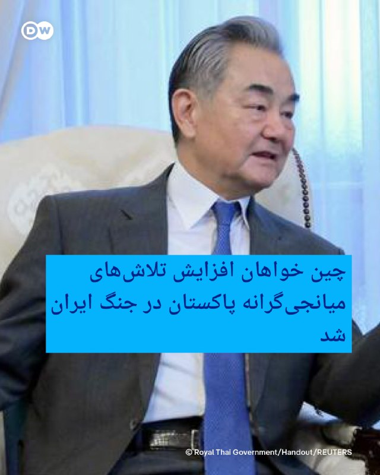

🔶 چین خواهان افزایش تلاش‌های میانجی‌گرانه پاکستان در جنگ ایران شد
 
به گزارش شین‌هوا، خبرگزاری دولتی چین، وانگ یی، وزیر امور خارجه این کشور در گفت‌وگو با اسحاق دار، همتای پاکستانی خود از اسلام‌آباد خواست تا تلاش‌های میانجی‌گرانه خود میان تهران و واشنگتن برای فیصله دادن به جنگ ایران را افزایش دهد.
 
وزیر خارجه چین این خواست را سه‌شنبه ۱۲ مه (۲۲ اردیبهشت) پیش از سفر دونالد ترامپ، رئیس جمهور آمریکا به پکن مطرح کرد.
 
بنا بر این گزارش، وانگ یی در دیدار با وزیر خارجه پاکستان همچنین تصریح کرد، اسلام‌آباد باید به طور شایسته و مناسب به مسائل مربوط به بازگشایی تنگه هرمز بپردازد.
 
شین‌هوا همچنین گزارش داد که وزیر خارجه چین در تماس تلفنی خود با اسحاق دار تصریح کرد که پکن از اسلام‌آباد در راستای تلاش‌های میانجی‌گرانه پاکستان پشتیبانی خواهد کرد.
 
چین که از خریداران مهم نفت جمهوری اسلامی است، خواهان یافتن راه‌حلی دائمی برای پایان جنگ ایران است.
 
@dw_farsi

## DW_Farsi — post 124632

  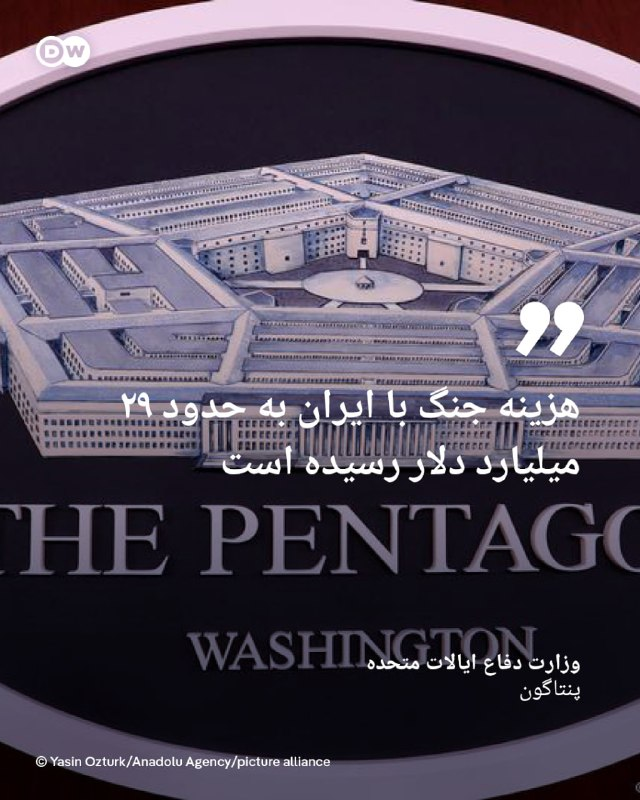

🔶 وزارت دفاع آمریکا: هزینه جنگ با ایران به حدود ۲۹ میلیارد دلار رسیده است
 
وزارت دفاع ایالات متحده، پنتاگون، در تازه‌ترین ارزیابی خود هزینه‌ آمریکا در جنگ با ایران را ۲۹ میلیارد دلار اعلام کرد.
 
مقامات این وزارتخانه این آمار جدید را سه‌شنبه ۱۲ مه (۲۲ اردیبهشت) در جلسه استماع بودجه در کنگره ارائه کردند. این رقم اعلام شد، حدود ۴ میلیارد دلار بیشتر از مبلغی است که پیت هگست، وزیر دفاع آمریکا پیشتر در اواخر ماه آوریل اعلام کرده بود.
 
جولز هرست، رئیس امور مالی وزارت دفاع آمریکا که در این جلسه حضور داشت ضمن اشاره به ارزیابی اولیه هگست در کنگره گفت، تخمین نخستین که در ۲۹ آوریل اعلام شد، بر ۲۵ میلیارد دلار بالغ می‌شده، اما این رقم با توجه به به‌روزرسانی‌ "هزینه‌های تعمیرات و جایگزینی تجهیزات" اکنون ۲۹ میلیارد دلار برآورد می‌شود.
 
پنتاگون در حال حاضر تلاش می‌کند افزایش قابل‌توجهی را برای بودجه دفاعی به تصویب برساند. لایحه بودجه دولت ترامپ برای سال مالی ۲۰۲۷ حدود یک و نیم تریلیون دلار هزینه دفاعی پیش‌بینی کرده است.
@dw_farsi

## DW_Farsi — post 124631

  

🔶 ترامپ: عواقب اقتصادی در تصمیمات مربوط به ایران نقشی ندارد
 
دونالد ترامپ در حاشیه سفرش به چین در پاسخ به پرسش یکی از خبرنگاران در این مورد که آیا وضعیت اقتصادی و مالی شهروندان آمریکایی انگیزه‌ای برای او به منظور رسیدن توافق با ایران است گفت، نگرانی‌های اقتصادی آمریکایی‌ها تصمیم‌گیری‌های او درباره جنگ ایران را تغییر نمی‌دهد.

رئيس‌ جمهور آمریکا تأکید کرد، جلوگیری از دستیابی جمهوری اسلامی به سلاح هسته‌ای از "اولویت مطلق" برخوردار است و مسئله عواقب اقتصادی "حتی ذره‌ای" نقش بازی نمی‌کند.

ترامپ تصریح کرد: «من فقط به یک مسئله فکر می‌کنم و آن اینکه نمی‌توانیم به ایران اجازه دسترسی به سلاح هسته‌ای را بدهیم.»

آمریکا در ماه آوریل شاهد بیشترین افزایش قیمت‌ها در طی سه سال گذشته بوده است. 

بنا بر داده‌های سازمان‌های اطلاعاتی آمریکا، مدت زمانی که جمهوری اسلامی برای ساخت سلاح هسته‌ای به آن نیاز دارد، کماکان بر ۹ ماه تا یک سال بالغ می‌شود.

ترامپ پیش از آن آغاز سفرش به چین تصریح کرده بود، فکر نمی‌کند که آمریکا "در خصوص ایران به کمکی نیاز داشته باشد.»
@dw_farsi

## DW_Farsi — post 124630

🔶 ترامپ میان فشار و جنگ؛ گزینه‌های بعدی آمریکا علیه ایران چیست
 
🔻 گزارشی از دانیال بابایانی

"کاملا غیرقابل قبول است". دونالد ترامپ، رئیس جمهور آمریکا با همین چند کلمه، آخرین پاسخ جمهوری اسلامی به طرح آمریکا برای پایان جنگ و کاهش تنش را رد کرد؛ واکنشی که فضای خوش‌بینی روزهای گذشته را فرو ریخت و بار دیگر احتمال بازگشت درگیری‌های گسترده‌تر را مطرح کرد.
 
رئیس‌جمهور آمریکا روز دوشنبه ۱۱ مه در گفت‌وگو با شبکه فاکس‌نیوز و همچنین در دفتر بیضی کاخ سفید، لحنی تندتر از هفته‌های گذشته اتخاذ کرد.
 
او گفت آتش‌بس میان واشنگتن و تهران اکنون "در وضعیت احتضار" قرار دارد و شرایط را به بیماری تشبیه کرد که پزشکان تنها "یک درصد شانس زنده ماندن" برای او قائل هستند.
 
ترامپ همچنین اعلام کرد در حال بررسی ازسرگیری پروژه "آزادی" است؛ عملیاتی که ابتدا برای اسکورت کشتی‌ها در تنگه هرمز طراحی شده بود، اما به گفته او در صورت اجرا این بار "فراتر از همراهی کشتی‌ها" خواهد رفت.
 
او هنوز تصمیم نهایی خود را اعلام نکرده، اما همین ابهام، گمانه‌زنی‌ها درباره گزینه‌های بعدی آمریکا را افزایش داده است.
 
اظهارات تازه ترامپ نشان می‌دهد واشنگتن فعلا میان دو مسیر حرکت می‌کند؛ فشار برای توافق یا آماده‌سازی برای تشدید تنش.
 
 گفت‌وگو با مهدی نخل احمدی و رضا طالبی.
@dw_farsi

## Persian_Trend_Official — post 14036

  

🚀 اینترنت پرسرعت و پایدار،
💰 قیمت هر گیگ ۲۵۰ تومن!
🎁 تخفیف ویژه: ۱۰٪ تخفیف اختصاصی برای اعضای پرشین ترند
⚡ پایداری بالا: کمترین قطعی ممکن در بدترین شرایط
🛡️ تضمین کیفیت: پشتیبانی ۲۴ ساعته + گارانتی بازگشت وجه

🛒 جهت خرید و مشاوره پیام دهید:

🆔 @shayan1057

🆔 @shayan1057

🆔 @shayan1057

## Persian_Trend_Official — post 14035

  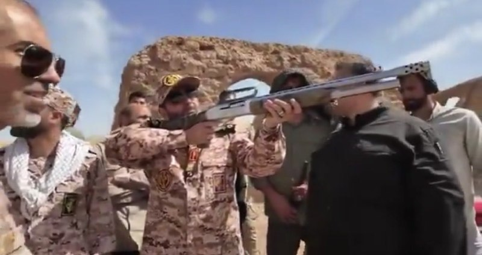

شات گان اون هم با لوله کروم که زیر نور آفتاب طوری برق میزنه که از یک کیلومتری دیده میشه. تو آمریکا حتی غیر نظامی هایی که عشق اسلحه هستن و سرشون در میاد هم اگر اسلحه با لوله کروم بخری مسخرت میکنن میگن باربی جواهرآلات جدید خریده!

سپاه روز به روز از یک نیروی نظامی داره به یک باند گانگستری شبیه تر میشه. امروز فردا فرماندهانش هم کلت با بدنه آب طلا خواهند بست.

📌 @persian_trend_official
پرشین ترند | متفاوت‌ترین کانال نظامی

## Persian_Trend_Official — post 14034

  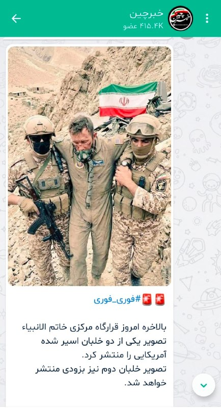

فیک نیوز در یک کانال مثلا خبری با بیش از چهارصد هزار دنبال کننده در پیام‌رسان بله!
اگر اینترنت در ایران مثل کره شمالی بود و شبکه های ماهواه ای فارسی زبان وجود نداشتن، آخوندها به مراتب از کره شمالی میتونستن دروغگوتر باشن به شکلی که تا الان نتانیاهو و ترامپ هم اسیر شده بودند !
خاطرتون هست میگفتن نتانیاهو کشته شده و اسرائیل تصاویرش رو با هوش مصنوعی میسازه !

پ.ن : خدایا ما رو با طرفدارات تنها نزار ...

📌 @persian_trend_official
پرشین ترند | متفاوت‌ترین کانال نظامی

## Persian_Trend_Official — post 14033

  

🔴 سفارت چین در آمریکا چهار خط قرمز پکن را اعلام کرد
این اعلام در آستانه سفر ترامپ به پکن و دیدار با شی جین‌پینگ مطرح شد:
▪️ مسئله تایوان
▪️ دموکراسی و حقوق بشر
▪️ مسیرها و نظام‌های سیاسی
▪️ حق توسعه چین
💢 پیام پکن به واشنگتن روشن است: روی این چهار خط حساب باز نکنید.
📌 @persian_trend_official
پرشین ترند | متفاوت‌ترین کانال نظامی

## Persian_Trend_Official — post 14026

احسان افرشته اعدام شد؛

بامداد امروز چهارشنبه خبرگزاری میزان وابسته به قوه قضائیه در خبری مدعی شد که احسان افرشته به اتهام جاسوسی برای موساد اعدام شد. جمهوری اسلامی او را جاسوسی توصیف می‌کند که اطلاعات حساس کشور را می‌فروخت.

اما سوالاتی که بی‌پاسخ مانده‌اند:

محاکمه به صورت کامل علنی برگزار نشد
هیچ وکیل مستقلی امکان دسترسی کامل به پرونده را نداشت

اتهامات صرفاً بر اساس روایت یک‌طرفه دستگاه قضایی مطرح شده

جمهوری اسلامی مدعی است افرشته در نپال توسط موساد آموزش دیده، به سه زبان مسلط شده و با نام سازمانی «جیمز» بیش از ۳۰۰ پیام با افسران اسرائیلی رد و بدل کرده است.

در کشوری که شفافیت قضایی وجود ندارد، مرز میان جاسوس واقعی و قربانی یک پرونده‌سازی را چه کسی می‌تواند تشخیص دهد؟

☆Phantom☆

📌 @persian_trend_official
پرشین ترند | متفاوت‌ترین کانال نظامی

## RadioFarda — post 157117

🔸قوه قضائیه ایران یک زندانی دیگر به نام احسان افرشته را به اتهام «جاسوسی» برای اسرائیل اعدام کرد. 🔸میزان‌نیوز نوشته که افراشته که «در نپال توسط موساد آموزش دیده بود و اطلاعات حساس کشور را به اسرائیل می‌فروخت»، بامداد چهارشنبه ۲۳ اردیبهشت اعدام شد. 🔸در بخشی…

## RadioFarda — post 157116

  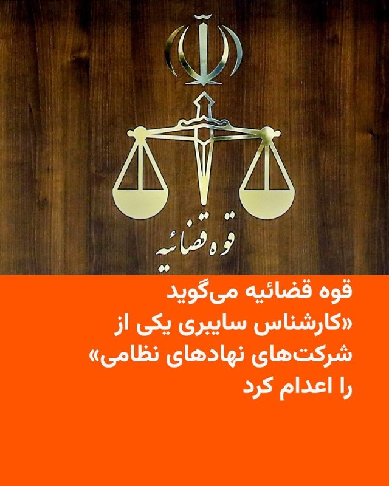

🔸قوه قضائیه ایران یک زندانی دیگر به نام احسان افرشته را به اتهام «جاسوسی» برای اسرائیل اعدام کرد.

🔸میزان‌نیوز نوشته که افراشته که «در نپال توسط موساد آموزش دیده بود و اطلاعات حساس کشور را به اسرائیل می‌فروخت»، بامداد چهارشنبه ۲۳ اردیبهشت اعدام شد.

🔸در بخشی از گزارش بدون اشاره به جزئیات آمده که او «به عنوان کارشناس سایبری در یک شرکت وابسته نهاد نظامی مشغول به فعالیت» بود.

🔸میزان ادعا کرده که «با دستور افسر موساد، افراشته تلاش می‌کند اطلاعات مختلفی را درباره شرکت و افراد شاغل در آن منتقل کند. هویت و مشخصات کارکنان، سلسله مراتب و چارت دقیق سازمانی و ماموریت‌های شرکت از جمله اطلاعاتی بوده که افرشته تلاش داشته به سرویس موساد منتقل کند.»

@RadioFarda

## RadioFarda — post 157115

  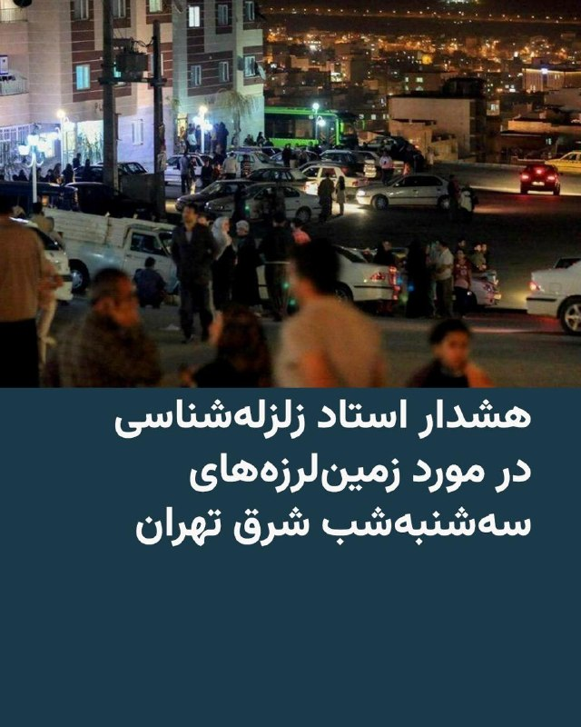

🔸در پی زمین‌لرزه‌ها و پس‌لرزه‌هایی که شامگاه سه‌شنبه ۲۲ اردیبهشت در شرق تهران رخ داد، یک استاد پژوهشکدهٔ زلزله‌شناسی در مورد فعال بودن گسل‌های نزدیک پردیس و بومهن هشدار داد.

🔸مهدی زارع به خبرگزاری خبرآنلاین گفت: «وقوع دومین زمین‌لرزه با بزرگای بیش از ۴ از ابتدای سال ۱۴۰۵، نشان‌دهندهٔ تداوم آزادسازی انرژی در محل تلاقی ساختارهای مهم زمین‌ساختی است.»

🔸این زلزله‌شناس همچنین تأکید کرد که منطقهٔ پردیس و بومهن در پهنهٔ برخورد البرز مرکزی قرار دارد و «تحت تأثیر مستقیم فعالیت گسل بسیار مهم و خطرناک شمال تهران و گسل مُشا است».

🔸مهدی زارع همچنین گفت «با توجه به بارگذاری جمعیتی بالا در مسکن مهر پردیس و ساخت‌وسازهای گسترده در ارتفاعات، تاب‌آوری لرزه‌ای سازه‌ها در برابر شتاب‌های افقی و قائم ناشی از فعالیت گسل مشا بسیار حائز اهمیت است».

🔸براساس سرشماری سال ۱۳۹۵ و تخمین‌های پس از آن، جمعیت دو شهر پردیس و بوهمن نزدیک به ۲۰۰ هزار نفر اعلام شده است.

@RadioFarda

## IranianMinds — post 20056

شما فک کنید یه جوون بی گناه که نه پستی داشته و نه مقامی تو کشور رو دی ماه دستگیر کردن بعدشم اعدامش کردن گفتن جاسوس موساد بوده رفته نپال آموزش دیده ! @IranianMinds

## IranianMinds — post 20055

  

🔴 ارتش اسرائیل دستور تخلیه 6 روستای دیگه در جنوب لبنان رو داد

ارتش اسرائیل از ساکنان این روستاها خواست که حدود 1 کیلومتر از این مناطق فاصله بگیرند

ارتش اسرائیل در حال پیشروی زمینی سریع در جنوب لبنان هست

@IranianMinds

## IranianMinds — post 20054

  

😤دنبال یه سایت شرط بندی بین المللی بودی که به ایرانیا خدمات بده؟!
⛔

👍دربی بت همون انتخاب  100%

💎ویژگی های سایت جهانی Derby Bet:

⬅️امکان شارژ امن با کارت بانکی

⬅️واریز اول دوبل شارژ می شوید(بونوس۱۰۰٪)

⬅️پر اپشن ترین سایت فعال در ایران

⬅️تسویه حساب کمتر از 5 دقیقه

⬅️برگشت بخشی از باخت به صورت هفتگی

🚨کد هدیه ثبت نام:GG007

⚠️برای دانلود اپلکیشن کلیک کنید
👉
re23

🔔کانال دربی بت :

🪙https://t.me/+aCbq7yy8QY80NzQ0

## IranianMinds — post 20053

  <a href="telegram/content/IranianMinds_20053_1778660029.mp4" target="_blank">🎬 Download video</a>

🔴 پست جدید اکانت کاخ سفید :

@IranianMinds

## BBCPersian — post 280898

🔻نماینده مجلس ایران: آمریکا و اسرائیل بنای یک عملیات گسترده علیه ایران را دارند

کامران غضنفری، نماینده مجلس ایران با اشاره به ادامه انتقال تجهیزات و نیرو از سوی آمریکا به خاورمیانه، می‌گوید «آمریکا و اسرائیل بنای یک عملیات گسترده» علیه ایران را دارند.

آقای غضنفری به خبرآنلاین گفته آمریکا و اسرائیل «احتمالاً قصد تصرف برخی از جزایر ما در جنوب را دارند.»

او با اشاره به خواسته‌های آمریکا از ایران در مورد تعطیلی غنی‌سازی، خروج اورانیوم غنی‌شده و توقف حمایت از گروه‌های موسوم به «محور مقاومت» گفته «جمهوری اسلامی قاعدتاً زیر بار این خواسته‌ها نمی‌رود.»

به گفته این نماینده مجلس، «ما وسط جنگ هستیم و اکنون در حال جنگ با دشمن هستیم. در همین یک هفته اخیر، دو عملیات علیه ما انجام دادند و با ناوهایشان به برخی مراکز ما حمله کردند.»~

https://bbc.in/4tAXKjn
@BBCPersian

## BBCPersian — post 280897

🔻سامانه دفاع موشکی «گنبد طلایی» ترامپ هزار و دویست میلیارد دلار خرج دارد

بر اساس برآورد دفتر بودجه کنگره امريکا، سامانه دفاع موشکی آينده‌نگر «گنبد طلایی» دونالد ترامپ حدود ۱/۲ تريليون دلار (۱۲۰۰ میلیارد دلار) هزينه خواهد داشت تا طی دو دهه تولید، استقرار و بهره‌برداری شود.

اين رقم به‌مراتب بيشتر از بودجه اوليه ۱۷۵ ميليارد دلاری است که پيش‌تر برای اين پروژه در نظر گرفته شده بود.

با اين حال، سامانه‌ای که برای محافظت از ايالات متحده امريکا در برابر موشک‌های بالستيک و کروز طراحی شده، ممکن است حتی کارايی کامل نداشته باشد.

گزارش جديد دفتر بودجه کنگره هشدار می‌دهد «گلدن دوم - گنبد طلایی» می‌تواند در برابر حمله گسترده از سوی روسيه يا چين آسيب‌پذير باشد.

اين نهاد غيرحزبی اعلام کرده تنها هزينه‌های تامين تجهيزات از ۱ تريليون دلار فراتر خواهد رفت؛ از جمله برای لايه‌های رهگير موشکی و سامانه هشدار و رهگيری موشک مبتنی بر فضا.

عبور برخی از پهپادها و موشک‌های ایرانی از گنبد آهنین اسرائیل و همچنین پوشش پدافندی آمریکا در کشورهای حوزه خلیج فارس، ارزیابی‌ها درباره کارآمدی کامل این طرح را هم تحت تاثیر قرار داده است.

https://bbc.in/4tAXKjn
@BBCPersian

## BBCPersian — post 280896

🔻ترامپ نقشه ونزوئلا را با عنوان «ایالت ۵۱» منتشر کرد

دونالد ترامپ که در حال عزیمت به چین برای دیدار با شی جین پینگ است، سه شنبه شب در شبکه اجتماعی خود - تروث سوشال - نقشه ونزوئلا در حالی که روی آن با پرچم آمریکا پوشانده شده بود را منتشر کرد و بالای آن نوشت:‌ «ایالت ۵۱».

روز دوشنبه -۲۱ اردیبهشت - هم یک خبرنگار فاکس نیوز گفت که آقای ترامپ در تماس تلفنی با او گفته به انضمام ونزوئلا تحت عنوان ایالت پنجاه و یکم آمریکا «فکر می‌کند».

کانادا و گرینلند هم پیش از این القاب مشابهی از سوی رئیس جمهور آمریکا دریافت کرده بودند که با اعتراض جدی دولت و شهروندان این کشورها روبرو شده بود.

https://bbc.in/4tAXKjn
@BBCPersian

## BBCPersian — post 280895

🔻اکبر عبدی به علت عارضه قلبی در بیمارستان بستری شد

بنابر گزارش رسانه‌های ایران، اکبر عبدی، بازیگر و کمدین سرشناس ایرانی، به علت عارضه قلبی در بخش مراقبت‌های ویژه بستری شده است.

مهران غفوریان، بازیگر و کمدین با انتشار ویدیویی در مقابل بیمارستان محل بستری آقای عبدی این خبر را تایید کرده است.

آقای عبدی در دهها فیلم سینمایی و مجموعه‌های تلویزیونی ایران ایفای نقش کرده و یکی از کمدین‌های سرشناس نیم قرن گذشته در این کشور است.
https://bbc.in/4tAXKjn
@BBCPersian

## BBCPersian — post 280887

🖋 الکسی کالمیکوف، بی‌بی‌سی روسی

🔻جنگ آمریکا و اسرائیل با ایران منجر به بحران انرژی شده است؛ بحرانی که از آسیا آغاز شد و به تدریج به اروپا نزدیک می‌شود. نخستین ضربه را کشورهای فقیر متحمل شدند، اما در میان کشورهای ثروتمند نیز قربانیانی وجود دارد. بریتانیا نخستین کشوری خواهد بود که بیش از دیگران آسیب می‌بیند. دلیل این امر چیست؟

نخست به این دلیل که بریتانیا بیش از دیگر کشورهای گروه هفت به واردات منابع انرژی وابسته است و به همین دلیل، هرگونه کمبود انرژی بلافاصله بر قیمت‌ها در داخل این کشور تاثیر می‌گذارد.

آلمان، ژاپن و فرانسه نیز واردکننده انرژی هستند، اما برخلاف بریتانیا ذخایر گاز دارند و می‌توانند موقتا بخشی از نیاز خود را با زغال‌سنگ تامین کنند. آمریکا و کانادا هم نه‌تنها در زمینه انرژی خودکفا هستند، بلکه مازاد تولید خود را صادر می‌کنند.

بیشتر بخوانید:
https://bbc.in/4d8oV0h
📸GettyImages/ EPA/Shutterstock/ In Pictures via Getty Images/ AFP via Getty Images/ Bloomberg via Getty Images/ NurPhoto via Getty Images
@BBCPersian

## BBCPersian — post 280886

  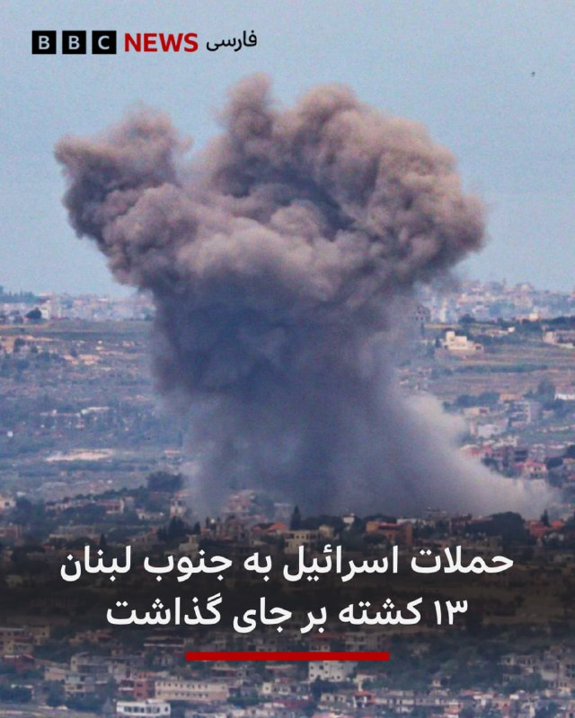

🔻رسانه‌های دولتی لبنان می‌گویند حملات هوایی اسرائیل حداقل ۱۳ نفر را در جنوب لبنان کشته است که دو نفرشان از کارکنان اورژانس بوده‌اند.

به گزارش خبرگزاری ملی لبنان، طی ۲۴ ساعت گذشته، شش نفر در اثر اصابت گلوله به خانه‌ای در کفر دونین کشته و هفت نفر دیگر زخمی شدند.

بعد از ظهر سه‌شنبه، وزارت بهداشت لبنان اعلام کرد که دو امدادگر از سرویس اورژانس دفاع مدنی لبنان که توسط دولت اداره می‌شود، در حمله اسرائیل به نبطیه کشته و یک نفر دیگر زخمی شده است. بر اساس این گزارش، آنها در حال انجام ماموریتی در پاسخ به حمله قبلی بودند که منجر به کشته شدن یک نفر شد.

ارتش اسرائیل اعلام کرد که در حال بررسی گزارش‌ها است.

جوزف عون، رئیس جمهور لبنان، «غم و اندوه و تأسف خود را از کشته شدن دو عضو دفاع مدنی» در نبطیه به نام‌های حسین جابر و احمد نوره ابراز کرد و تأکید کرد که «تجاوز مداوم اسرائیل مانع تلاش‌ها برای برقراری آرامش می‌شود».

وزارت بهداشت لبنان نیروهای اسرائیلی را به هدف قرار دادن عمدی امدادگران متهم کرد.

📷EPA
@BBCPersian

## BBCPersian — post 280885

  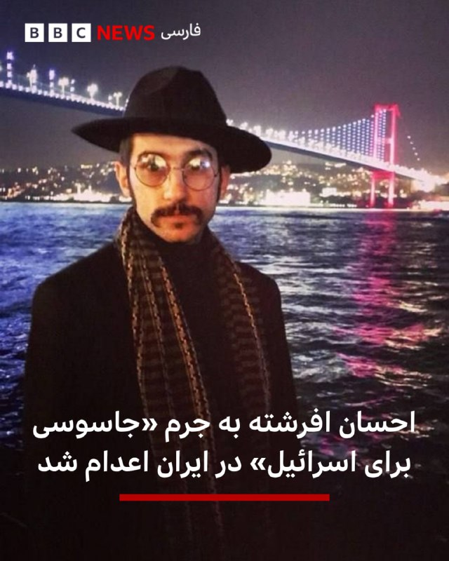

🔻مرکز رسانه‌ای قوه قضائیه ایران اعلام کرده است که احسان افرشته به جرم «جاسوسی برای اسرائیل» بامداد امروز (چهارشنبه) اعدام شده است.

آقای افرشته متهم شده بود که ابتدا «در پوشش راننده تاکسی اینترنتی» دستورات ماموران موساد را اجرا می‌کرده و سپس با استخدام در یک شرکت وابسته به یک نهاد نظامی اطلاعات حساسی را به اسرائیل منتقل کرده است.

به گزارش شبکه حقوق بشر هرانا، احسان افرشته متولد ۱۳۷۲ بوده و در سال ۱۴۰۳ پس از بازگشت به ایران از ترکیه بازداشت شده است.

با پایان جنگ ایران با آمریکا و اسرائیل، قوه قضائیه اجرای احکام اعدام تسریع و تشدید کرده است.

به گفته گزارشگر ویژه شورای حقوق بشر سازمان ملل متحد در یک سال اخیر تعداد اعدام‌ها در ایران به شکل کم‌سابقه‌ای افزایش یافته، این روند پس از جنگ اخیر که نهم اسفند (۲۸ فوریه) با حملات اسرائیل و آمریکا آغاز شد، شتاب بیشتری گرفته است.

نهادهای حقوق بشر از دادرسی‌های ناعادلانه، نقض حقوق متهم و موج اعدام‌ها بر اساس «اعترافات» زیر شکنجه و فشار ابراز نگرانی کرده‌اند.

📷MIZAN
@BBCPersian

## idfinfarsi — post 11571

  <a href="telegram/content/idfinfarsi_11571_1778660032.mp4" target="_blank">🎬 Download video</a>

در طول شبانه‌روز گذشته: ارتش اسرائیل بیش از ۴۰ زیرساخت سازمان تروریستی حزب‌الله را در جنوب لبنان مورد حمله قرار داد

در طول شبانه‌روز گذشته، ارتش اسرائیل بیش از ۴۰ زیرساخت سازمان تروریستی حزب‌الله را در چندین منطقه در جنوب لبنان هدف قرار داد.

از جمله زیرساخت‌های هدف قرار گرفته: انبارهای تسلیحاتی و ساختمان‌های مورد استفاده نظامی که تروریست‌های حزب‌الله از آن‌ها برای پیشبرد طرح‌های تروریستی علیه نیروهای ارتش اسرائیل و شهروندان این کشور استفاده می‌کردند.

همچنین، تروریست‌هایی که تهدیدی برای نیروهای ما بودند به هلاکت رسیدند و پرتابگرهای آماده شلیک که به سمت خاک اسرائیل هدف‌گیری شده بودند، مورد حمله قرار گرفتند.

## idfinfarsi — post 11565

  <a href="telegram/content/idfinfarsi_11565_1778660035.mp4" target="_blank">🎬 Download video</a>

سخنگوی ارتش اسرائیل:

⭕️مستندی از داخل تانک تیپ ۴۰۱: به هلاکت رساندن یک تروریست که تجهیزات دیده‌بانی علیه نیروهای ما را به‌کار گرفته بود

⭕️نیروهای تیم رزمی تیپ ۴۰۱ تحت فرماندهی لشکر ۱۴۶، به عملیات خود در جنوب خط دفاعی مقدم ادامه می‌دهند تا زیرساخت‌های تروریستی سازمان تروریستی حزب‌الله را نابود کنند، با هدف رفع تهدیدها علیه شهروندان کشور اسرائیل.

⭕️در جریان این فعالیت، نیروها یک تروریست را شناسایی کردند که در حال به‌کارگیری تجهیزات دیده‌بانی علیه نیروهای ما بود. در یک واکنش سریع، تروریست با شلیک تانک به هلاکت رسید.

## Dirty_Kids — post 389360

  <a href="telegram/content/Dirty_Kids_389360_1778660037.mp4" target="_blank">🎬 Download video</a>

قشنگ زنده یاد ۱۰۰ سال از زمان خودش جلوتر بود پپ

زنده‌یاد فریدون فرخزاد در سال ۱۹۹۰ میلادی، در گفت‌وگو با «رادیو سیدنی» در استرالیا

@Dirty_Kids 👻

## Dirty_Kids — post 389358

  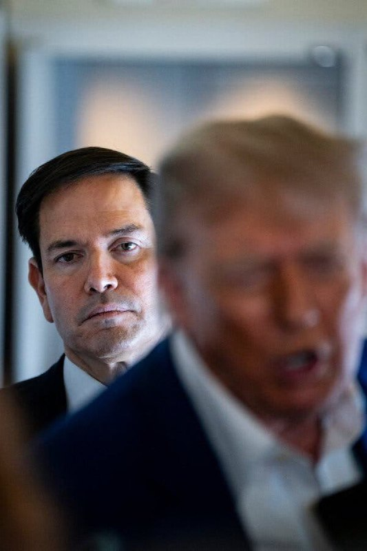

می‌بینی مارکو؟ کاراشو می‌بینی؟
به ابالفضل ما هم همینیم.

@Dirty_Kids 👻

## Dirty_Kids — post 389357

هنوز چین نرسیده سر شوخیو باز کردن. :)))))))

روبیوی دل‌ها همون ست نایکی که مادورو موقع هشتک‌پشتک شدن پوشیده بودو پوشیدو آتش به همه عالم زد! :)))

@Dirty_Kids 👻

## Hranews — post 112918

بازداشت یک فرد در تهران؛ پلیس مدعی استفاده از استارلینک برای «انتقال اطلاعات» شد

❗️
❗️
❗️
❗️
❗️– فرماندهی انتظامی تهران بزرگ از #بازداشت یک نفر در محدوده چیتگر تهران خبر داد. پلیس مدعی شده است که این فرد از طریق تجهیزات اینترنت ماهواره‌ای استارلینک، اطلاعات مربوط به محل‌های اصابت در جریان درگیری ‌های نظامی اخیر را به شبکه‌های مخالف حکومت منتقل می‌کرده است.

ادامه مطلب

↘️
@hranews_bot تماس ✉️ - @Hranews کانال هرانا 🆑

## Hranews — post 112917

  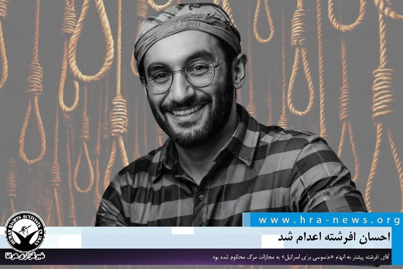

احسان افرشته به اتهام «جاسوسی» اعدام شد

❗️
❗️
❗️
❗️
❗️– مرکز رسانه قوه قضاییه از اجرای حکم اعدام احسان افرشته، دانش‌آموخته مهندسی عمران در مقطع کارشناسی ارشد و متخصص شبکه و فناوری اطلاعات، خبر داد. آقای افرشته پیشتر به اتهام «جاسوسی برای اسرائیل» به مجازات مرگ محکوم شده بود و این حکم سحرگاه امروز به مرحله اجرا درآمد. بر اساس داده‌های گردآوری‌شده توسط هرانا، همزمان با آغاز درگیری‌های نظامی، روند صدور و اجرای احکام اعدام در پرونده‌های سیاسی و امنیتی افزایش یافته و تاکنون ۳۱ زندانی با این اتهامات در این بازه زمانی اعدام شده‌اند.

ادامه مطلب

#احسان_افرشته #اعدام

↘️
@hranews_bot تماس ✉️ - @Hranews کانال هرانا 🆑

## manototv — post 105387

  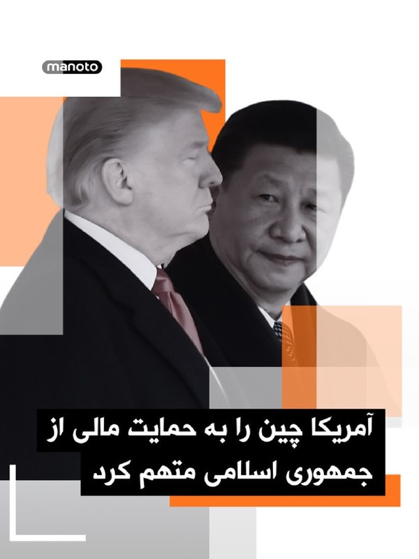

هم‌زمان با سفر دونالد ترامپ به چین و آغاز گفت‌وگوها درباره جنگ جمهوری اسلامی و اسرائیل، مقام‌های آمریکایی پکن را متهم کردند که با خرید گسترده نفت ایران، به «بزرگ‌ترین حامی دولتی تروریسم» کمک مالی می‌کند.

دونالد ترامپ امروز برای دیدار با شی جین‌پینگ، رئیس‌جمهوری چین، راهی پکن شد؛ دیداری که جنگ جمهوری اسلامی و اسرائیل و بحران تنگه هرمز از محورهای اصلی آن عنوان شده است.

در آستانه این سفر، اسکات بسنت، وزیر خزانه‌داری آمریکا، از چین خواست جمهوری اسلامی را برای بازگشایی تنگه هرمز تحت فشار قرار دهد و گفت پکن با خرید نفت ایران، «بزرگ‌ترین حامی دولتی تروریسم» را تأمین مالی می‌کند.

وزیر خزانه‌داری آمریکا در گفت‌وگو با فاکس‌نیوز گفت: «ببینیم آیا چین حاضر است از دیپلماسی استفاده کند و جمهوری اسلامی را وادار به باز کردن تنگه کند یا نه.»

چین تاکنون در قبال جنگ موضعی محتاطانه اتخاذ کرده و فراتر از انتقاد از آمریکا و اسرائیل، نقش مستقیمی در حل بحران ایفا نکرده است.
این دیدار در شرایطی برگزار می‌شود که تنش‌ها در منطقه، امنیت انرژی چین و تجارت جهانی از مسیر تنگه هرمز را تحت تأثیر قرار داده است.

## manototv — post 105386

  

رویترز به نقل از مقام‌های غربی و جمهوری اسلامی گزارش داد عربستان سعودی در جریان گسترش جنگ منطقه‌ای، در واکنش به حملاتی در خاک این کشور، چندین حمله اعلام‌نشده علیه جمهوری اسلامی انجام داده است.

رویترز در گزارشی اختصاصی نوشت عربستان سعودی، در اقدامی بی‌سابقه، حملات محرمانه‌ای را علیه جمهوری اسلامی انجام داده است.

به گفته دو مقام غربی مطلع و دو مقام جمهوری اسلامی، این حملات در واکنش به حملاتی صورت گرفته که در جریان جنگ در خاک عربستان انجام شده بود.

این حملات که پیش‌تر رسانه‌ای نشده بود، نخستین مورد شناخته‌شده از اقدام مستقیم نظامی عربستان در خاک ایران به شمار می‌رود؛ اقدامی که به نوشته رویترز نشان می‌دهد ریاض در دفاع از خود در برابر جمهوری اسلامی، رویکردی تهاجمی‌تر در پیش گرفته است.

## manototv — post 105385

  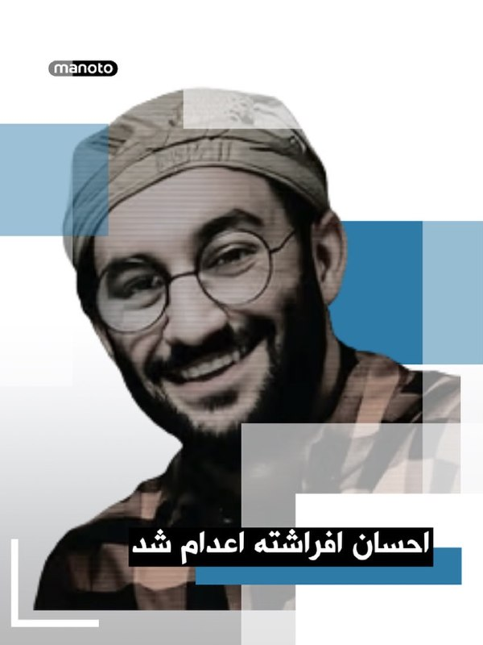

رسانه‌های حکومتی بامداد امروز از اعدام احسان افراشته خبر دادند.

قوه قضاییه جمهوری اسلامی اعلام کرده احسان افراشته، فرزند مصطفی، با اتهام‌هایی از جمله «جاسوسی» و «همکاری اطلاعاتی به نفع اسرائیل» بازداشت، محاکمه و پس از تایید حکم در دیوان عالی کشور اعدام شده است.

با این حال، نهادهای حقوق بشری و منابع مستقل پیش‌تر گزارش داده بودند که احسان افراشته ماه‌ها در سلول انفرادی نگهداری شده و اعترافات او تحت فشار و در شرایطی غیرشفاف اخذ شده است. همچنین گزارش‌هایی درباره محرومیت او از دسترسی مؤثر به وکیل مستقل و وجود فشارهای امنیتی در روند پرونده منتشر شده بود.

بر اساس اصول دادرسی عادلانه، هر اعترافی که تحت فشار، تهدید یا شکنجه گرفته شود فاقد اعتبار حقوقی است و متهم، به‌ویژه در پرونده‌های منتهی به مجازات اعدام، باید از حق دسترسی کامل به وکیل مستقل و دادگاه بی‌طرف برخوردار باشد.

پرونده احسان افراشته از سوی نهادهای حقوق بشری نمونه‌ای از استفاده از اتهام‌های امنیتی و مجازات اعدام در فضایی غیرشفاف توصیف شده؛ روندی که سال‌هاست درباره عملکرد دادگاه‌های انقلاب جمهوری اسلامی مورد انتقاد قرار دارد.

## manototv — post 105384

  <a href="telegram/content/manototv_105384_1778660043.mp4" target="_blank">🎬 Download video</a>

یک مقام ارشد نیروی دریایی سپاه پاسداران اعلام کرد جمهوری اسلامی تعریف خود از تنگه هرمز را گسترش داده و این منطقه اکنون به یک «محدوده عملیاتی وسیع» تبدیل شده است.

به گفته این مقام نظامی، محدوده عملیاتی تنگه هرمز دیگر تنها به آبراه باریک میان ایران و عمان محدود نیست و اکنون بخش گسترده‌ای از آب‌های اطراف، از جاسک تا جزایر تنب را شامل می‌شود.

رسانه‌های حکومتی گزارش داده‌اند محدوده‌ای که جمهوری اسلامی آن را منطقه عملیاتی تنگه هرمز می‌داند، از حدود ۲۰ تا ۳۰ مایل دریایی در گذشته، به ۲۰۰ تا ۳۰۰ مایل افزایش یافته است.

این اظهارات در حالی مطرح می‌شود که تنش‌ها در خلیج فارس ادامه دارد و نگرانی‌ها درباره امنیت عبور نفتکش‌ها و کشتی‌های تجاری از تنگه هرمز افزایش یافته است.

## manototv — post 105383

  <a href="telegram/content/manototv_105383_1778660044.mp4" target="_blank">🎬 Download video</a>

هم‌زمان با سفر رسمی دونالد ترامپ به چین، گروهی از مدیران ارشد بزرگ‌ترین شرکت‌های فناوری، مالی و صنعتی آمریکا نیز او را در این سفر همراهی می‌کنند. کاخ سفید اعلام کرده ایلان ماسک نیز در هواپیمای ریاست‌جمهوری آمریکا حضور دارد و همراه هیئت آمریکایی راهی پکن شده است.
در میان چهره‌های حاضر در این سفر، نام تیم کوک مدیرعامل اپل، جنسن هوانگ مدیرعامل انویدیا، لری فینک مدیرعامل بلک‌راک، دیوید سولومون مدیرعامل گلدمن ساکس و مدیران شرکت‌هایی چون بوئینگ، کوالکام، ویزا، مسترکارت، متا، مایکرون و سیتی‌گروپ دیده می‌شود.
رسانه‌های آمریکایی گزارش داده‌اند که محور اصلی این سفر، گفت‌وگو درباره روابط تجاری، فناوری، هوش مصنوعی، زنجیره تأمین جهانی و همکاری‌های اقتصادی میان آمریکا و چین است.
این سفر در حالی انجام می‌شود که روابط واشینگتن و پکن در ماه‌های اخیر بر سر مسائل تجاری، رقابت فناوری و تنش‌های ژئوپولیتیکی با چالش‌های گسترده‌ای روبه‌رو بوده است.

## alonews — post 119664

  <a href="telegram/content/alonews_119664_1778660045.webm" target="_blank">🎬 Download video</a>

👈رویترز: قیمت نفت روز چهارشنبه پس از سه روز افزایش شدید، کاهش یافت، در حالی که قیمت طلا ثابت ماند، زیرا سرمایه‌گذاران در انتظار نشست مورد انتظار ترامپ و شی جین پینگ، همتای چینی او در پکن، در بحبوحه تنش‌های مداوم مربوط به جنگ در ایران و بسته شدن تنگه هرمز هستند

✅ @AloNews خبر جنگ

## alonews — post 119663

  <a href="telegram/content/alonews_119663_1778660045.mp4" target="_blank">🎬 Download video</a>

👈فرودِ هواپیمای ترامپ تو الاسکا برای استراحت و پرواز مجدد

✅ @AloNews خبر جنگ

## alonews — post 119662

  <a href="telegram/content/alonews_119662_1778660046.webm" target="_blank">🎬 Download video</a>

👈با اعلام قوه قضاییه جمهوری اسلامی، احسان افرشته به اتهام «همکاری با اسرائیل»، بامداد چهارشنبه اعدام شد.

✅ @AloNews خبر جنگ

## alonews — post 119661

  <a href="telegram/content/alonews_119661_1778660046.webm" target="_blank">🎬 Download video</a>

👈بلومبرگ: نرخ بیکاری در فرانسه برای اولین بار در 5 سال گذشته از 8 درصد گذشت.

✅ @AloMews خبر جنگ

## alonews — post 119660

  <a href="telegram/content/alonews_119660_1778660047.webm" target="_blank">🎬 Download video</a>

👈بلومبرگ: یک نفتکش بزرگ چینی در حال عبور از تنگه هرمز شناسایی شده است

✅ @AloNews خبر جنگ

## alonews — post 119659

  <a href="telegram/content/alonews_119659_1778660047.webm" target="_blank">🎬 Download video</a>

👈تشکر اصناف و اتحادیه‌ها از پزشکیان برای جلوگیری از توقف کسب‌وکارها با اینترنت پرو

✅ @AloNews خبر جنگ

## alonews — post 119658

  <a href="telegram/content/alonews_119658_1778660047.webm" target="_blank">🎬 Download video</a>

👈وزیر اقتصاد: انتقال کریدورها به بنادر شمالی و مرزهای زمینی در دستور کار است

✅ @AloNews خبر جنگ

## alonews — post 119657

  <a href="telegram/content/alonews_119657_1778660047.webm" target="_blank">🎬 Download video</a>

👈المیادین به نقل از لاوروف: روسیه پیشنهاد تهیه پیش نویس بیانیه ای از سوی گروه بریکس در مورد وضعیت تنگه هرمز را ارائه کرد، اما اختلافات ایران و امارات مانع از آن شد.

✅ @AloNews خبر جنگ

## alonews — post 119656

  <a href="telegram/content/alonews_119656_1778660048.webm" target="_blank">🎬 Download video</a>

👈شبکه NDTV تصاویر ماهواره‌ای با وضوح بالا (تهیه‌شده از شرکت Vantor) منتشر کرده است که به‌نظر می‌رسد گزارش‌ها مبنی بر پناه دادن پاکستان به دست‌کم یک فروند هواپیمای ترابری نظامی C-130H نیروی هوایی ایران در پایگاه هوایی نورخانِ نیروی هوایی پاکستان (PAF) را تأیید می‌کند.

✅ @AloNews خبر جنگ

## alonews — post 119655

  <a href="telegram/content/alonews_119655_1778660048.webm" target="_blank">🎬 Download video</a>

👈روزنامه نیویورک تایمز با استناد به ارزیابی‌های اطلاعاتی طبقه‌بندی‌شده آمریکا: ایران به بیشتر سایت‌های موشکی و سکوهای پرتاب خود دسترسی مجدد پیدا کرده است

✅ @AloNews خبر جنگ

## alonews — post 119653

  <a href="telegram/content/alonews_119653_1778660048.webm" target="_blank">🎬 Download video</a>

👈مارکو روبیو توی هواپیما برای سفر به چین مشابه ست نایکی رو پوشیده که که مادورو هنگام دستگیری پوشیده بود !

✅ @AloNews خبر جنگ

## alonews — post 119652

  <a href="telegram/content/alonews_119652_1778660048.webm" target="_blank">🎬 Download video</a>

👈حمله پهپادی اسرائیل به یک خودرو در جاده ساحلی جنوب بیروت

✅ @AloNews خبر جنگ

## alonews — post 119651

  <a href="telegram/content/alonews_119651_1778660049.webm" target="_blank">🎬 Download video</a>

👈 سی‌ان‌ان گزارش داده، یک کشتی باری روسی که دو رآکتور هسته‌ای حمل می‌کرد و احتمال داده می‌شود مقصد آن کره شمالی بوده باشد، در شرایطی نامشخص در سواحل اسپانیا غرق شده است

✅ @AloNews خبر جنگ

## alonews — post 119650

  <a href="telegram/content/alonews_119650_1778660049.webm" target="_blank">🎬 Download video</a>

👈دلار هم اکنون 182,000 تومان

✅ @AloNews خبر جنگ

## alonews — post 119649

  <a href="telegram/content/alonews_119649_1778660049.webm" target="_blank">🎬 Download video</a>

👈لاوروف: اگر درگیری در تنگه باب المندب رخ دهد، بخش انرژی جهان آسیب زیادی خواهد دید

✅ @AloNews خبر جنگ

## alonews — post 119648

  <a href="telegram/content/alonews_119648_1778660049.webm" target="_blank">🎬 Download video</a>

👈احتمال شنیده شدن صدای انفجار در محدوده بهارستان اصفهان

✅ @AloNews خبر جنگ

## alonews — post 119647

  <a href="telegram/content/alonews_119647_1778660049.webm" target="_blank">🎬 Download video</a>

👈ژانگ هان‌هویی، سفیر چین در روسیه، اعلام کرد که در 7 آوریل، شورای امنیت سازمان ملل قطعنامه‌ای درباره تأمین امنیت کشتیرانی در تنگه هرمز را به رأی گذاشت.

🔴 چین و روسیه به دلیل نامتعادل بودن سند، به آن رأی منفی (وتو) دادند که از تشدید تنش در منطقه جلوگیری کرد و شرایط مساعدی برای دستیابی به آتش‌بس موقت و آغاز روند مذاکرات فراهم نمود.

✅ @AloNews خبر جنگ

## alonews — post 119646

  <a href="telegram/content/alonews_119646_1778660050.webm" target="_blank">🎬 Download video</a>

👈ترامپ نسخه‌ای از پوستر نمادین جنگ جهانی اول «من تو را برای ارتش ایالات متحده می‌خواهم» اثر جیمز مونتگومری فلاگ را منتشر کرده است که خودش جایگزین او شده است: «من تو را می‌خواهم!»

✅ @AloNews خبر جنگ

## alonews — post 119645

  <a href="telegram/content/alonews_119645_1778660050.mp4" target="_blank">🎬 Download video</a>

👈 براثر بارش شدید باران و وقوع سیل در استان سامسون ترکیه حداقل ۱۲ نفر زخمی شدند.

✅ @AloNews خبر جنگ

---
📅 بروزرسانی: 1405/02/23 08:37
---

## VahidOOnLine — post 239846

  <a href="telegram/content/VahidOOnLine_239846_1778648842.mp4" target="_blank">🎬 Download video</a>

مریخ‌نورد «پِرسیویرَنس» ناسا، پرسی، چهارشنبه ۲۰ اسفند ۱۴۰۴، هم‌زمان با ۱۷۹۷مین روز مریخی، ششمین سلفی خود را در غرب مریخ ثبت کرده است که از ترکیب ۶۱ تصویر جداگانه ساخته شده است.
ناسا می‌گوید این ناحیه از کهن‌ترین و علمی‌ترین مناطق این سیاره است و سنگ‌های آن می‌توانند سرنخ‌هایی از پوسته اولیه و تاریخ زمین‌شناسی مریخ به دست دهند.
‌🏁 🇬🇧 IranintlTV

🤖 @VahidOOnLine

## VahidOOnLine — post 239845

  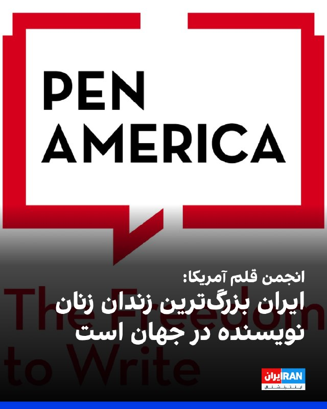

انجمن قلم آمریکا، پن، در گزارش «شاخص آزادی نوشتن» خود نوشت ایران دومین زندان بزرگ نویسندگان است و بالاترین شمار نویسندگان زن زندانی در جهان را دارد. به گفته این انجمن، بازداشت نویسندگان در ایران طی یک سال گذشته ۲۳ درصد افزایش یافته است.
طبق این گزارش، اگرچه ایران امسال در شاخص بازداشت نویسندگان همچنان در رتبه دوم باقی ماند، اما افزایش نگران‌کننده شمار نویسندگان زندانی از ۴۳ نفر به ۵۳ نفر، افزایشی ۲۳ درصدی را نشان می‌دهد.
به گفته انجمن قلم آمریکا، در حالی که میانگین جهانی نویسندگان زن زندانی ۱۶ درصد است، ۳۲ درصد نویسندگان زندانی در ایران را زنان تشکیل می‌دهند و اقلیت‌های قومی نیز در معرض خطر بیشتری قرار دارند.
بر اساس گزارش این انجمن، جنگ و بحرانهای داخلی، هم وضعیت نویسندگان در ایران را وخیم‌تر کرده و هم سرکوب بی‌وقفه صداهای منتقد از سوی حکومت ایران را تشدید کرده است.
این گزارش هشدار داد برای نخستین بار از زمان راه‌اندازی «شاخص آزادی نوشتن» در سال ۲۰۱۹، بیش از ۴۰۰ نویسنده زندانی هستند. طبق این گزارش، چین با ۱۱۹ مورد بزرگ‌ترین زندان نویسندگان در جهان است و عربستان سعودی نیز با ۲۷ مورد در رتبه سوم قرار دارد.
h
‌🏁 🇬🇧 IranintlTV

🤖 @VahidOOnLine

## VahidOOnLine — post 239844

  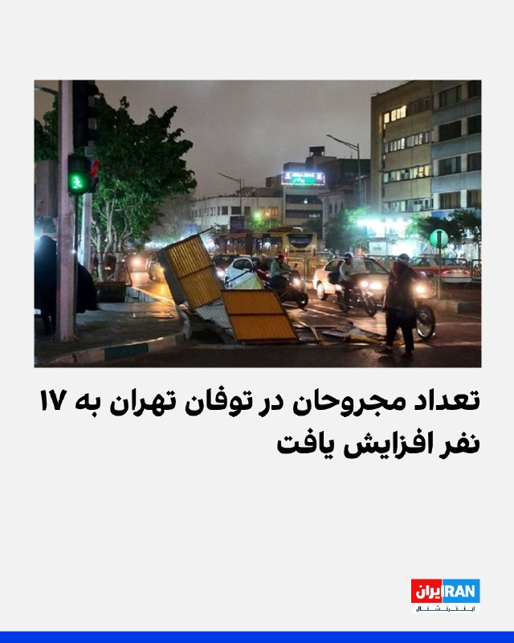

طبق اعلام اورژانس تهران، شمار مجروحان درپی توفان در پایتخت، به ۱۷ نفر افزایش یافت که شش نفر در محل حادثه درمان شدند و ۱۱ نفر دیگر به مراکز درمانی انتقال یافتند.
به گفته سازمان هواشناسی از غروب سه‌شنبه، وزش باد با سرعت ۵۵ کیلومتر بر ساعت همراه با گردوخاک در تهران آغاز شد و این توفان تا نیمه شب ادامه یافت.

‌🏁 🇬🇧 IranintlTV

🤖 @VahidOOnLine

## VahidOOnLine — post 239843

  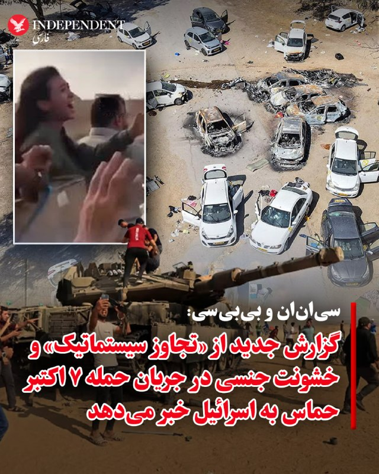

♦️توجه: این متن حاوی جزئیاتی است که می‌تواند آزاردهنده باشد

به گزارش سی‌ان‌ان، گزارش جدیدی نتیجه‌گیری کرده است که شبه‌نظامیان حماس و متحدانشان در جریان و پس از حمله تروریستی ۷ اکتبر ۲۰۲۳ به جنوب اسرائیل، برای «حداکثر کردن رنج و درد» قربانیان، آن‌ها را مورد تجاوز، تعرض و شکنجه جنسی قرار داده‌اند. سرویس جهانی بی‌بی‌سی نیز گزارش مشابهی را با عنوان «تحقیقات اسرائیلی می‌گوید حماس در حملات ۷ اکتبر از خشونت جنسی به‌عنوان سلاح استفاده کرده» منتشر کرده است.
در بخش‌های متعددی از این گزارش ۳۰۰ صفحه‌ای، جزئیاتی حاوی خشونت زیاد مطرح شده که به شدت آزاردهنده‌اند.
در حالی که سازمان ملل و دیگر نهادها گزارش‌هایی درباره خشونت جنسی در جریان این حملات منتشر کرده‌اند ــ حملاتی که در آن حدود ۱۲۰۰ نفر کشته و ۲۵۱ نفر گروگان گرفته شدند ــ این گزارش جامع‌ترین مورد در این زمینه محسوب می‌شود.
این تحقیق بر پایه ۴۳۰ مصاحبه تصویری با بازماندگان و شاهدان، بیش از ۱۰ هزار عکس و ویدئوی ضبط‌شده توسط مهاجمان، و همچنین اسناد رسمی و مواد جمع‌آوری‌شده از محل‌های حمله تهیه شده است.
سی‌ان‌ان می‌نویسد، این گزارش، جامع‌ترین مجموعه شواهد تا به امروز درباره خشونت جنسی و مبتنی بر جنسیت علیه زنان، مردان و کودکان را ارائه می‌دهد و آن را «سیستماتیک، گسترده و بخشی جدایی‌ناپذیر از» این حمله توصیف می‌کند.
کواخاو الکایام-لیوی، نویسنده اصلی و کارشناس حقوق بشر، به سی‌ان‌ان گفت: «مهم‌ترین یافته این است که خشونت جنسی در ۷ اکتبر و علیه گروگان‌ها در اسارت، یک راهبرد حساب‌شده توسط حماس بوده است.»
این گزارش شامل شهادت‌های مستقیم بیش از ۱۰ بازمانده است که در جریان حمله، در زمان ربوده شدن یا هنگام اسارت در غزه، خشونت جنسی شدید و آزار جنسی را تجربه کرده‌اند.
سی‌ان‌ان می‌نویسد، برخی از این جزئیات پس از انتشار گزارش‌های قبلی و همچنین پس از آزادی برخی گروگان‌ها از غزه آشکار شده‌اند. بخشی از آن‌ها از شهادت‌های ارائه‌شده مستقیم به پژوهشگران به دست آمده و بخش دیگر از نشست‌های متعدد با متخصصان پزشکی، وکلای نماینده برخی قربانیان و افراد دیگر جمع‌آوری شده است.
‌🇸🇦 Indypersian

🤖 @VahidOOnLine

## VahidOOnLine — post 239842

  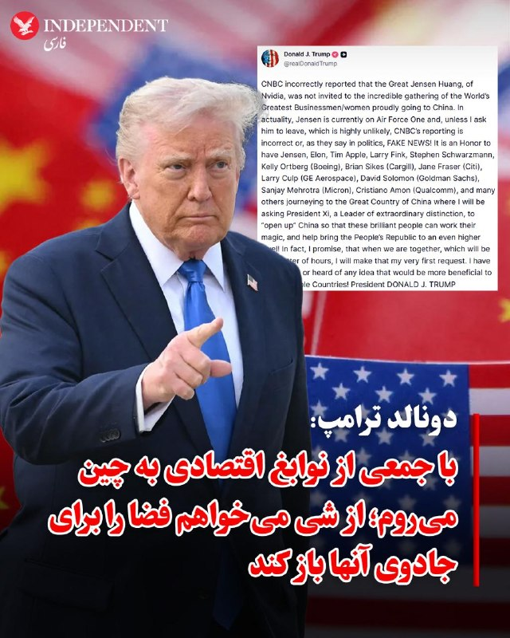

♦️دونالد ترامپ، رئیس‌جمهوری ایالات متحده، با انتشار پیامی در شبکه اجتماعی «تروث سوشال» با تکذیب گزارش «سی‌ان‌بی‌سی» درباره همراهان خود در سفر به چین، اعلام کرد که مجموعه‌ای از بزرگ‌ترین مدیران اقتصادی آمریکا از جمله جن‌سن هوانگ، ایلان ماسک و تیم کوک او را در این سفر همراهی می‌کنند. ترامپ با «جعلی» خواندن گزارش‌های شبکه «سی‌ان‌بی‌سی» مبنی بر دعوت نشدن مدیرعامل انویدیا، گفت: «مایه افتخار است که جن‌سن، ایلان، تیم اپل، لری فینک و بسیاری دیگر در حال سفر به کشور بزرگ چین هستند؛ جایی که من از رئیس‌جمهور شی خواهم خواست تا فضا را برای این افراد باذکاوت باز کند تا آن‌ها جادوی خود را به کار بگیرند.» او همچنین تاکید کرد که همراهی این نوابغ اقتصادی و همکاری آن‌ها با چین، سطوح جدیدی از پیشرفت را به همراه خواهد داشت و این «اولین درخواست» او از رهبر چین در ساعات آینده خواهد بود.
‌🇸🇦 Indypersian

🤖 @VahidOOnLine

## VahidOOnLine — post 239841

  <a href="telegram/content/VahidOOnLine_239841_1778648845.mp4" target="_blank">🎬 Download video</a>

♦️ویدیوهای منتشرشده در شبکه‌های اجتماعی، درگیری میان تماشاگران پس از پایان دیدار دو تیم  النصر و الهلال در دربی ریاض را نشان می‌دهد.
این مسابقه با تساوی به پایان رسید و تعیین قهرمان لیگ عربستان سعودی به هفته پایانی کشیده شد.
‌🇸🇦 Indypersian

🤖 @VahidOOnLine

## VahidOOnLine — post 239840

  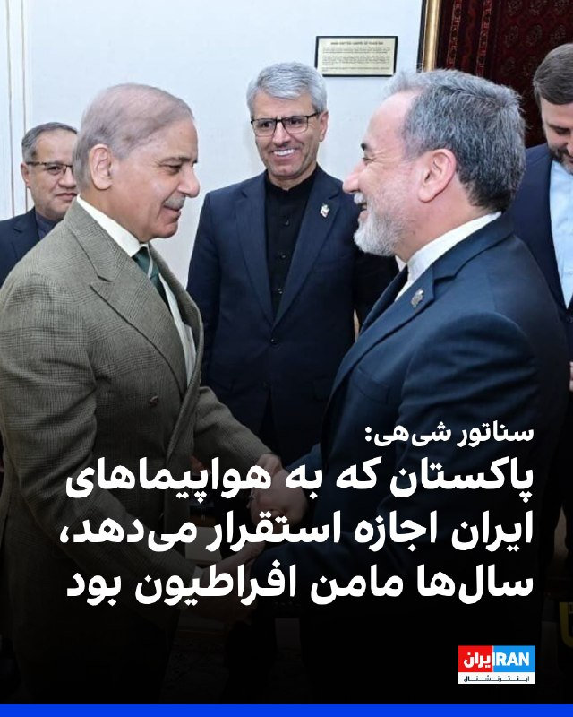

تیم شی‌هی، سناتور جمهوری‌خواه، در مصاحبه با فاکس‌نیوز در واکنش به گزارشی درباره اجازه پاکستان برای استقرار هواپیماهای نظامی ایران در این کشور، به شدت از اسلام‌آباد انتقاد کرد و گفت: «فراموش نکنیم اسامه بن‌لادن یک دهه در پاکستان پنهان بود و این کشور سال‌ها پناهگاه گروه‌های افراطی بوده است.»
او افزود: پاکستان معمولا در برابر آمریکا موضعی محتاطانه و دوپهلو اتخاذ می‌کند.
سناتور با هشدار درباره اینکه جمهوری اسلامی هر توافقی را که صورت گیرد نقض خواهد کرد تاکید کرد که باید برنامه هسته‌ای حکومت ایران را «از نظر فیزیکی ناتوان» از تولید سلاح کرد و توانایی تهران را برای تامین مالی نیروهای نیابتی و تهدید تنگه هرمز از بین برد.

‌🏁 🇬🇧 IranintlTV

🤖 @VahidOOnLine

## VahidOOnLine — post 239839

  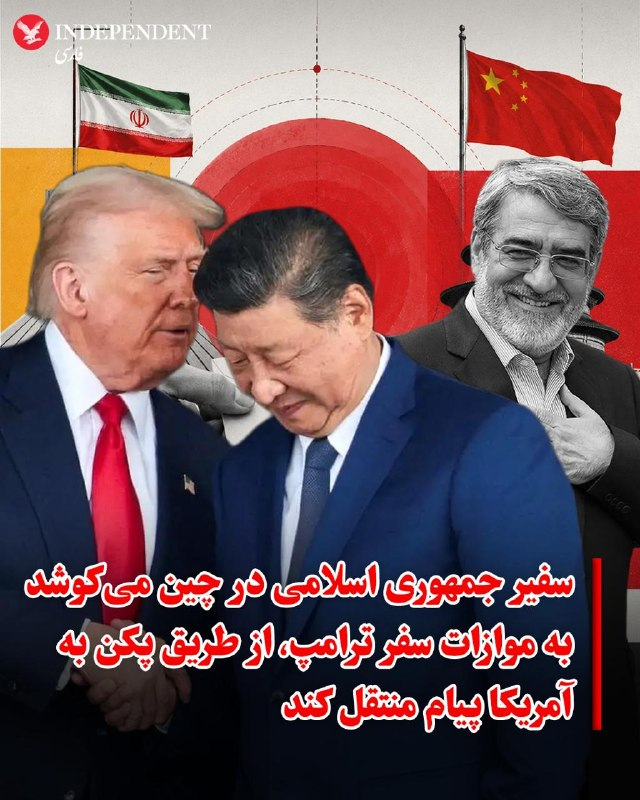

♦️وال استریت ژورنال با اشاره به سفر دونالد ترامپ به چین نوشت، در آستانه ورود رئیس‌جمهوری آمریکا به پکن برای گفت‌وگو با شی جین‌پینگ، رهبر چین، رژیم ایران در حال استفاده از «کارت چین» خود است. براساس این گزارش، سفیر جمهوری اسلامی در چین، در حالی که تلاش می‌کرد از طریق چین پیامی به آمریکا منتقل کند، گفت پکن برای ایران «عمق دیپلماتیک» فراهم می‌کند.
رضا رحمانی فضلی گفت: «پیام ایران روشن است: آتش‌بس دائمی، برقراری یک آتش‌بس پایدار، رفع محاصره و احترام به حقوق مشروع ایران.» او افزود: «چین می‌تواند این پیام را در سطح قدرت‌های بزرگ منعکس کند.»
ایران که بخش عمده نفت خود را به چین صادر می‌کند، این هفته به‌طور علنی از طرح چهار ماده‌ای پکن برای پایان دادن به درگیری حمایت کرد؛ طرحی که هفته گذشته در دیدار وزیران خارجه دو کشور در پایتخت چین مورد بحث قرار گرفت.
‌🇸🇦 Indypersian

🤖 @VahidOOnLine

## VahidOOnLine — post 239838

  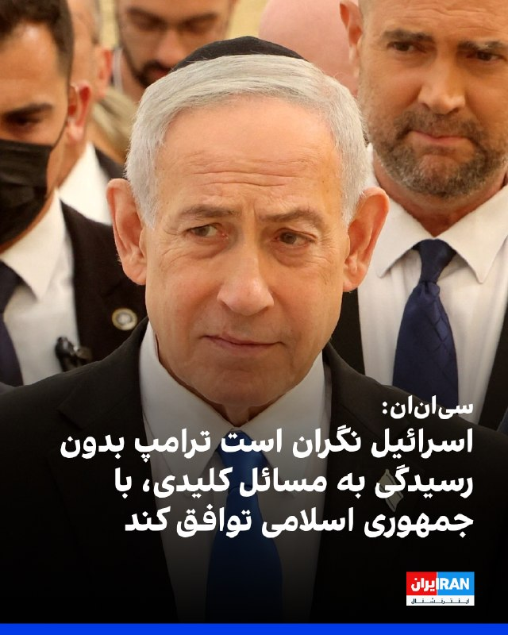

سی‌ان‌ان به نقل از چند منبع اسرائیلی آگاه گزارش داد اسرائیل نگران است که ترامپ پیش از رسیدگی به برخی از مسائل کلیدی با جمهوری اسلامی، از جمله برنامه‌های هسته‌ای و موشکی بالستیک تهران و حمایت آن از گروه‌های نیابتی، با حکومت ایران به توافق برسد.
به گفته این منابع، چنین توافق ناقصی باعث خواهد شد اسرائیل جنگ را ناتمام تلقی کند.
به گفته یکی از منابع آگاه از گفت‌وگوها، تلقی اسرائیل این است که موضوع موشک‌ها و نیروهای نیابتی «احتمالا از دستور کار خارج شده‌اند»، زیرا به نظر نمی‌رسد در پیش‌نویس‌های اولیه دیپلماتیک گنجانده شده باشند و به همین دلیل نتانیاهو اورانیوم را به عنوان فوری‌ترین تهدید در اولویت قرار داده است.

‌🏁 🇬🇧 IranintlTV

🤖 @VahidOOnLine

## VahidOOnLine — post 239837

  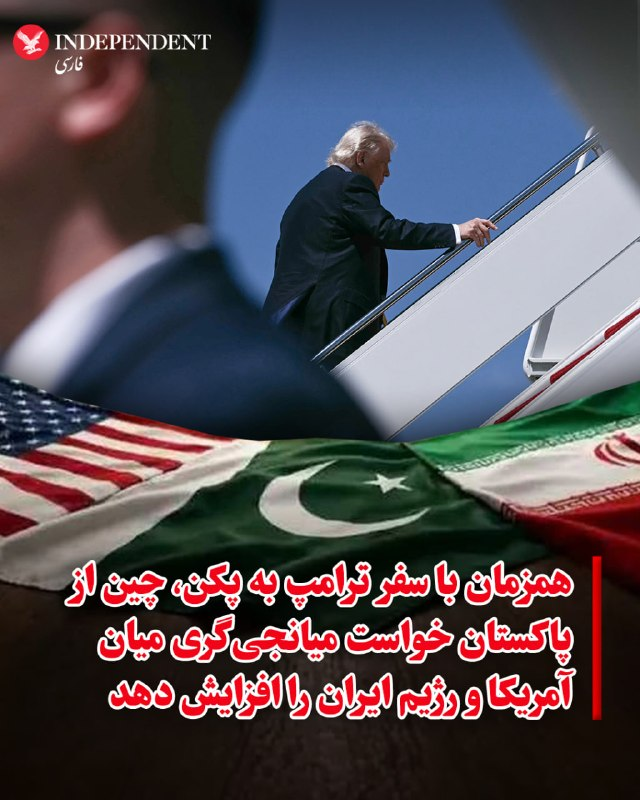

♦️به گزارش رسانه‌های دولتی چین، وزیر خارجه این کشور از پاکستان خواسته است تلاش‌های میانجیگرانه خود میان رژیم ایران و ایالات متحده را افزایش دهد و به حل «مناسب» موضوع بازگشایی تنگه هرمز کمک کن.
خبرگزاری دولتی شینهوا گزارش داد وانگ یی، وزیر خارجه چین، در تماس تلفنی با اسحاق دار، وزیر خارجه پاکستان، این موضوع را مطرح کرده است؛ تماسی که همزمان با سفر دونالد ترامپ، رئیس‌جمهوری آمریکا، به پکن انجام شد. ترامپ پیش‌تر گفته بود که آتش‌بس بسیار شکننده و مانند بیماری در اتاق مراقبت‌های ویژه به اکسیژن متصل است.
‌🇸🇦 Indypersian

🤖 @VahidOOnLine

## VahidOOnLine — post 239836

♦️هفتادونهمین دوره جشنواره بین‌المللی فیلم کن روز سه‌شنبه، ۲۲ اردیبهشت‌ماه، در حالی آغاز به کار کرد که فرش قرمز آن تحت تاثیر درخشش جواهرات رنگارنگ و حضور چهره‌های ماندگار سینما بود. در مراسم افتتاحیه، الیجا وود جایزه نخل طلای افتخاری یک عمر دستاورد هنری را به پیتر جکسون، کارگردان نامدار سه‌گانه «ارباب حلقه‌ها» اهدا کرد؛ جکسون در سخنرانی خود به خاطره ۲۵ سال پیش و اولین نمایش این سه‌گانه در کن اشاره کرد.
این جشنواره که با حضور ستارگانی چون دمی مور، جین فوندا و هیئت داورانی به ریاست پارک چان-ووک آغاز شده، تا دوم خردادماه ادامه خواهد داشت. برخلاف سال‌های گذشته، مراسم افتتاحیه لحنی آرام‌تر داشت و سیاست در سخنرانی‌ها نقش کم‌رنگی ایفا کرد؛ تنها جین فوندا، بازیگر و فعال سرشناس، در سخنانی کوتاه بر قدرت سینما به عنوان «عمل مقاومت» تاکید کرد و از آزادی و جسارت در خلق اثر هنری سخن گفت. در روزهای آینده، آثار فیلم‌سازان بزرگی چون پدرو آلمودوار و پاوِو پاولیکوفسکی برای کسب نخل طلای امسال به رقابت خواهند پرداخت.
بنیاد فیلم دریای سرخ عربستان سعودی نیز در جشنواره کن با پنج فیلم تحت حمایت‌ «صندوق دریای سرخ» و «بازار دریای سرخ» حضور خواهد داشت. این آثار عبارت‌اند از «داستان‌های موازی» ساخته اصغر فرهادی، «توت‌فرنگی» ساخته لیلا مراکشی، «دیروز چشم نخوابید» ساخته راکان میاسی، «بنیمانا» ساخته ماری کلمنتین دوسابجامبو و «دختر ناشناس» ساخته زو جینگ.
‌🇸🇦 Indypersian

🤖 @VahidOOnLine

## VahidOOnLine — post 239835

  <a href="telegram/content/VahidOOnLine_239835_1778648850.mp4" target="_blank">🎬 Download video</a>

♦️به گزارش رویترز، دولت عراق عملیات بازسازی و مرمت «زیگورات اور» (The Ziggurat of Ur) در استان «ذی‌قار» را برای مقابله با فرسایش ناشی از تغییرات اقلیمی آغاز کرد. این بنای ۴۰۰۰ ساله که در فهرست میراث جهانی یونسکو به ثبت رسیده، به دلیل وزش بادهای شدید، رطوبت حاصل از بارندگی و نبود موانع طبیعی و کشاورزی در معرض تخریب و فروپاشی قرار گرفته است. کارشناسان باستان‌شناسی با هشدار نسبت به وضعیت اضطراری این سازه، اعلام کردند که در مرحله نخست این پروژه، از روش‌های سنتی و مصالح بومی برای بازسازی بخش‌های آسیب‌دیده استفاده می‌شود تا هویت تاریخی یکی از قدیمی‌ترین تمدن‌های بشری حفظ شود.
عراق که در دهه‌های گذشته آسیب‌های فراوانی را از جنگ‌های پیاپی، از جمله جنگ با ایران متحمل شده است، اکنون با چالش نوین تغییرات اقلیمی دست‌وپنجه نرم می‌کند. زیگورات اور که معبدی هرمی‌شکل برای ستایش خدای ماه (نانا) در دوران سومریان بوده و از آن به عنوان زادگاه «حضرت ابراهیم» یاد می‌شود، یکی از سالم‌ترین نمونه‌های معماری بین‌النهرین باستان است. مقامات عراقی با تخصیص بودجه‌ای اولیه برای این کارزار، امیدوارند تا پایان ماه ژوئیه سال جاری میلادی، روند تخریب این گنجینه تاریخی را متوقف کرده و مسیر را برای نگهداری دوره‌ای آن هموار کنند.
‌🇸🇦 Indypersian

🤖 @VahidOOnLine

## VahidOOnLine — post 239834

  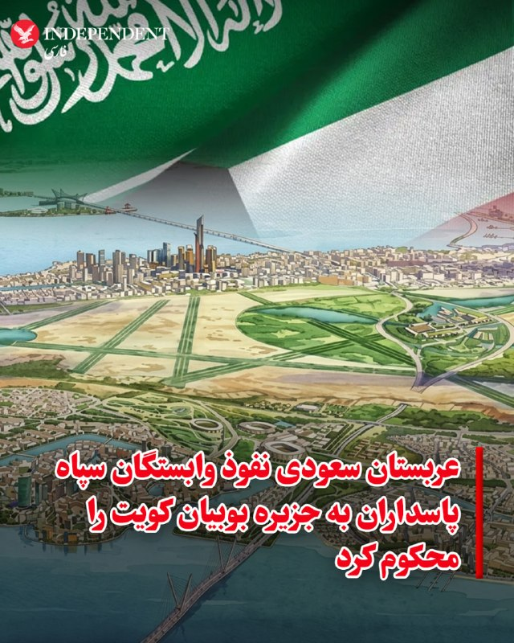

♦️عربستان سعودی تلاش چهار عامل سپاه پاسداران جمهوری اسلامی برای نفوذ دریایی به کویت را محکوم کرد.
وزارت خارجه عربستان در بیانیه‌ای اعلام کرد: «[پادشاهی عربستان] نفوذ یک گروه مسلح وابسته به سپاه پاسداران به جزیره بوبیان کویت با هدف انجام اقدامات خصمانه علیه کشور برادر، کویت، را محکوم می‌کند.»
ریاض همچنین بار دیگر مخالفت خود را با «این حملات که به حاکمیت کویت آسیب می‌زند» اعلام کرد و افزود چنین «نقض‌هایی تلاش‌های بین‌المللی برای بازگرداندن صلح و ثبات به منطقه را تضعیف می‌کند.»
عربستان سعودی همچنین همبستگی خود را با کویت اعلام و تاکید کرد از هر اقدامی که این کشور برای حفظ حاکمیت، امنیت و ثبات خود انجام دهد، حمایت می‌کند.
‌🇸🇦 Indypersian

🤖 @VahidOOnLine

## VahidOOnLine — post 239833

  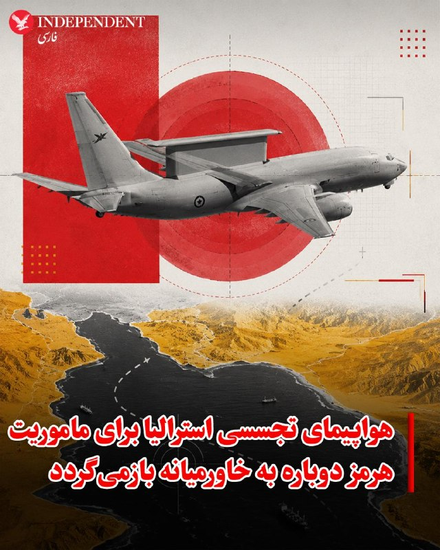

♦️استرالیا قصد دارد یک هواپیمای پیشرفته تجسسی را برای تقویت تلاش‌های چندجانبه در حمایت از عبور کشتی‌ها از تنگه هرمز به خاورمیانه اعزام کند.
ریچارد مارلز، وزیر دفاع استرالیا، پس از نشست مجازی وزیران دفاع کشورهای مختلف در روز سه‌شنبه، برنامه اعزام هواپیمای ای-۷‌ای «وج‌تیل» را اعلام کرد.
این هواپیما که یکی از پیشرفته‌ترین هواپیماهای هشدار زودهنگام و کنترل هوایی جهان محسوب می‌شود، نخستین بار در ماه مارس برای کمک به دفاع از امارات متحده عربی در برابر حملات رژیم ایران به منطقه اعزام شد.
در این نشست، مارلز و همتایانش از بیش از ۴۰ کشور، بار دیگر بر تلاش‌ها برای حمایت از ناوبری در این آبراه در قالب ماموریتی مشترک به رهبری بریتانیا و فرانسه تاکید کردند.
مارلز تاکید کرد ماموریت چندملیتی برای حمایت از عبور و مرور در تنگه هرمز «کاملا دفاعی» خواهد بود.
او گفت: «استرالیا آماده است از یک ماموریت نظامی چندملیتی مستقل و کاملا دفاعی، به رهبری بریتانیا و فرانسه، پس از شکل‌گیری آن حمایت کند.»
‌🇸🇦 Indypersian

🤖 @VahidOOnLine

## WithYashar — post 11108

ترامپ در تروث : شبکه سی‌ان‌بی‌سی به‌اشتباه گزارش داد که جنسن هوانگِ بزرگ از شرکت انویدیا به گردهمایی شگفت‌انگیز بزرگ‌ترین زنان و مردان دنیای تجارت که با افتخار راهی چین هستند دعوت نشده است. در حقیقت، جنسن همین حالا در هواپیمای ریاست‌جمهوری آمریکا حضور دارد و مگر اینکه من از او بخواهم آنجا را ترک کند که بسیار بعید است گزارش سی‌ان‌بی‌سی اشتباه است یا همان‌طور که در سیاست می‌گویند: اخبار جعلی!

مایه افتخار است که جنسن، ایلان ماسک ، تیم کوک، لری فینک، استیون شوارتزمن، کلی اورتبرگ از بوئینگ، برایان سایکس از کارگیل، جین فریزر از سیتی، لری کالپ از جی‌ای ایرواسپیس، دیوید سولومون از گلدمن ساکس، سانجای مهروترا از مایکرون، کریستیانو آمون از کوالکام و بسیاری دیگر، در این سفر به کشور بزرگ چین همراه هستند؛ جایی که من از رئیس‌جمهور شی، رهبری با جایگاهی برجسته و استثنایی، خواهم خواست که چین را «بازتر» کند تا این افراد درخشان بتوانند توانایی‌های خارق‌العاده خود را به کار بگیرند و به جمهوری خلق چین کمک کنند به سطحی حتی بالاتر برسد!

در واقع، قول می‌دهم وقتی تا چند ساعت دیگر کنار هم باشیم، این نخستین درخواست من خواهد بود. هرگز ایده‌ای ندیده یا نشنیده‌ام که برای کشورهای فوق‌العاده ما از این سودمندتر باشد!
@withyashar

## WithYashar — post 11107

  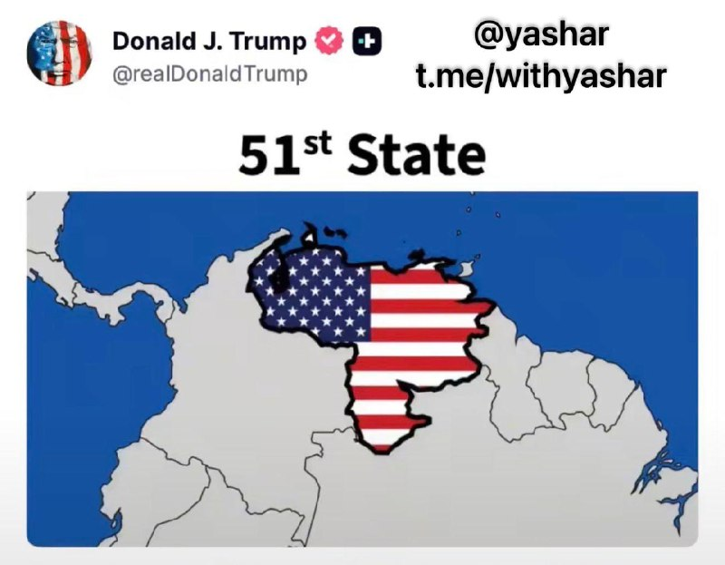

ترامپ در تروث پستی گزاشته که ونزوئلا رو به عنوان ایالت ۵١ ام آمریکا نشون میده
@withyashar

## VahidOnline — post 75439

یک اعدام دیگر
میزان خبرگزاری قوه قضاییه جمهوری اسلامی با انتشار تصاویر بالا نوشت: احسان افرشته اعدام شد
قوه قضاییه مدعی شده که: افرشته در نپال از سوی موساد آموزش جاسوسی دیده و اطلاعات حساس کشور را به اسرائیل می‌فروخت.

📡 @VahidOnline

## IranIntlTV — post 336925

  <a href="telegram/content/IranIntlTV_336925_1778648853.mp4" target="_blank">🎬 Download video</a>

مریخ‌نورد «پِرسیویرَنس» ناسا، پرسی، چهارشنبه ۲۰ اسفند ۱۴۰۴، هم‌زمان با ۱۷۹۷مین روز مریخی، ششمین سلفی خود را در غرب مریخ ثبت کرده است که از ترکیب ۶۱ تصویر جداگانه ساخته شده است.
ناسا می‌گوید این ناحیه از کهن‌ترین و علمی‌ترین مناطق این سیاره است و سنگ‌های آن می‌توانند سرنخ‌هایی از پوسته اولیه و تاریخ زمین‌شناسی مریخ به دست دهند.

## IranIntlTV — post 336924

  

انجمن قلم آمریکا، پن، در گزارش «شاخص آزادی نوشتن» خود نوشت ایران دومین زندان بزرگ نویسندگان است و بالاترین شمار نویسندگان زن زندانی در جهان را دارد. به گفته این انجمن، بازداشت نویسندگان در ایران طی یک سال گذشته ۲۳ درصد افزایش یافته است.
طبق این گزارش، اگرچه ایران امسال در شاخص بازداشت نویسندگان همچنان در رتبه دوم باقی ماند، اما افزایش نگران‌کننده شمار نویسندگان زندانی از ۴۳ نفر به ۵۳ نفر، افزایشی ۲۳ درصدی را نشان می‌دهد.
به گفته انجمن قلم آمریکا، در حالی که میانگین جهانی نویسندگان زن زندانی ۱۶ درصد است، ۳۲ درصد نویسندگان زندانی در ایران را زنان تشکیل می‌دهند و اقلیت‌های قومی نیز در معرض خطر بیشتری قرار دارند.
بر اساس گزارش این انجمن، جنگ و بحرانهای داخلی، هم وضعیت نویسندگان در ایران را وخیم‌تر کرده و هم سرکوب بی‌وقفه صداهای منتقد از سوی حکومت ایران را تشدید کرده است.
این گزارش هشدار داد برای نخستین بار از زمان راه‌اندازی «شاخص آزادی نوشتن» در سال ۲۰۱۹، بیش از ۴۰۰ نویسنده زندانی هستند. طبق این گزارش، چین با ۱۱۹ مورد بزرگ‌ترین زندان نویسندگان در جهان است و عربستان سعودی نیز با ۲۷ مورد در رتبه سوم قرار دارد.
h

## IranIntlTV — post 336923

  

طبق اعلام اورژانس تهران، شمار مجروحان درپی توفان در پایتخت، به ۱۷ نفر افزایش یافت که شش نفر در محل حادثه درمان شدند و ۱۱ نفر دیگر به مراکز درمانی انتقال یافتند.
به گفته سازمان هواشناسی از غروب سه‌شنبه، وزش باد با سرعت ۵۵ کیلومتر بر ساعت همراه با گردوخاک در تهران آغاز شد و این توفان تا نیمه شب ادامه یافت.

https://iranintl.com/202605135684

## IranIntlTV — post 336922

  

تیم شی‌هی، سناتور جمهوری‌خواه، در مصاحبه با فاکس‌نیوز در واکنش به گزارشی درباره اجازه پاکستان برای استقرار هواپیماهای نظامی ایران در این کشور، به شدت از اسلام‌آباد انتقاد کرد و گفت: «فراموش نکنیم اسامه بن‌لادن یک دهه در پاکستان پنهان بود و این کشور سال‌ها پناهگاه گروه‌های افراطی بوده است.»
او افزود: پاکستان معمولا در برابر آمریکا موضعی محتاطانه و دوپهلو اتخاذ می‌کند.
سناتور با هشدار درباره اینکه جمهوری اسلامی هر توافقی را که صورت گیرد نقض خواهد کرد تاکید کرد که باید برنامه هسته‌ای حکومت ایران را «از نظر فیزیکی ناتوان» از تولید سلاح کرد و توانایی تهران را برای تامین مالی نیروهای نیابتی و تهدید تنگه هرمز از بین برد.

https://iranintl.com/202605132603

## IranIntlTV — post 336921

  <a href="telegram/content/IranIntlTV_336921_1778648855.mp4" target="_blank">🎬 Download video</a>

بارش شدید باران روز سه‌شنبه ۲۲ اردیبهشت در استان سامسون ترکیه باعث وقوع سیلاب شد و خانه‌ها و واحدهای تجاری را زیر آب برد. جریان شدید آب خودروها را جابه‌جا کرد و شماری از ساکنان گرفتار شدند.

نیروهای امدادی با کاهش بارش عملیات پاکسازی را آغاز کردند و تاکنون هیچ موردی از تلفات جانی گزارش نشده است.
@iranintltv

## IranIntlTV — post 336920

  

سی‌ان‌ان به نقل از چند منبع اسرائیلی آگاه گزارش داد اسرائیل نگران است که ترامپ پیش از رسیدگی به برخی از مسائل کلیدی با جمهوری اسلامی، از جمله برنامه‌های هسته‌ای و موشکی بالستیک تهران و حمایت آن از گروه‌های نیابتی، با حکومت ایران به توافق برسد.
به گفته این منابع، چنین توافق ناقصی باعث خواهد شد اسرائیل جنگ را ناتمام تلقی کند.
به گفته یکی از منابع آگاه از گفت‌وگوها، تلقی اسرائیل این است که موضوع موشک‌ها و نیروهای نیابتی «احتمالا از دستور کار خارج شده‌اند»، زیرا به نظر نمی‌رسد در پیش‌نویس‌های اولیه دیپلماتیک گنجانده شده باشند و به همین دلیل نتانیاهو اورانیوم را به عنوان فوری‌ترین تهدید در اولویت قرار داده است.

https://iranintl.com/202605131499

## IranIntlTV — post 336919

  <a href="telegram/content/IranIntlTV_336919_1778648857.mp4" target="_blank">🎬 Download video</a>

حسینعلی حاجی‌دلیگانی و مصطفی طاهری، نمایندگان مجلس، در مصاحبه‌هایی جداگانه درباره افزایش قیمت کالاهای مورد نیاز مردم گفتند ۸۰ درصد گرانی‌ها ارتباطی به جنگ ندارد.

حاجی‌دلیگانی گفت ارز ۲۸ هزار و ۵۰۰ تومانیِ تخصیص‌یافته برای کالاهای اساسی حذف شده و جنگ بهانه است و دولت این کار را عامدانه انجام می‌دهد.

طاهری نیز گفت برخی می‌خواهند القا کنند که افزایش قیمت‌ها به‌خاطر جنگ بوده است.
@iranintltv

## Shin_Persian — post 5984

Shin ✓ @hey_itsmyturn
Wed, 13 May 2026 04:53:24 UTC

Ehsan Afreshte has been executed by Islamic Regime today. Regime claims he was trained by Mossad in Nepal and sold intelligence to Israel.
#Iran

فارسی

احسان افراشته امروز توسط رژیم اسلامی اعدام شد. رژیم مدعی است که او توسط موساد در نپال آموزش دیده و اطلاعات را به اسرائیل فروخته است.
#Iran

𝕏 · @shin_persian

## FarsiVOA — post 217589

🔺کاهش قیمت نفت در جهان همزمان با سفر پرزیدنت ترامپ به چین

▪️در حالی که سرمایه‌گذاران در انتظار تحولات مربوط به آتش‌بس شکننده میان ایالات متحده و جمهوری اسلامی و سفر دونالد ترامپ، رئیس جمهوری آمریکا، به پکن برای دیدار با شی جین‌پینگ، رئیس‌جمهوری چین، هستند، قیمت آتی نفت روز چهارشنبه ۲۳ اردیبهشت با کاهش رو‌به‌رو شده است.

⬇️ بیشتر بخوانید:
https://ir.voanews.com/a/oil-prices-slip-teetering-iran-ceasefire-trump-heads-china/8149515.html
@FarsiVOA

## Persian_Trend_Official — post 14025

#صبحانه_خبری

📍بولتن صبحگاهی پرشین ترند
🗓 ۲۳ اردیبهشت ۱۴۰۵

━━━━━━━━━━━━━━

◾️ پیت هگست: آتش‌بس با ایران در حال اجراست و وضعیت «بسیار پویا» دارد

◾️ ترامپ: آتش‌بس با دستگاه تنفس نفس می‌کشد؛ در حال بررسی احیای «پروژه آزادی» هستم

◾️ سی ان ان : ترامپ از مذاکرات ناامید شده و به طور جدی احیای عملیات نظامی را بررسی می‌کند

◾️ کاخ سفید: مذاکرات با ایران باید «بدون عجله» پیش برود

◾️ سرلشگر جعفری: تا تحقق پیش‌شرط‌ها، هیچ مذاکره‌ای انجام نخواهد شد

◾️ عراقچی: عامل اصلی وضعیت تنگه هرمز، تجاوز نظامی آمریکا و اسرائیل است

◾️ پنتاگون در کنگره: آمریکا تاکنون نزدیک به ۲۹ میلیارد دلار در جنگ ایران هزینه کرده

◾️ گوترش: کاهش تنش در هرمز فوری و ضروری است؛ هرگونه ازسرگیری درگیری پیامدهای وحشتناکی دارد

◾️ مقام ارشد نیروی دریایی سپاه: ایران تعریف تنگه هرمز را به «منطقه عملیاتی گسترده» تغییر داده

◾️ عبور نفتکش‌های قطری از تنگه هرمز تأیید شد؛ بلومبرگ عبور دومین نفتکش را تأیید کرد.

◾️«ترامپ در حالی راهی پکن شد که جنگ و تورم بر ریاست‌جمهوری‌اش سنگینی می‌کنند»

◾️ ترامپ از ۲۳ تا ۲۵ اردیبهشت به چین سفر رسمی می‌کند؛ ایران محور اصلی مذاکرات با شی

◾️ ترامپ ، بدنبال «پنجاه‌و‌یکمین ایالت» !

◾️ سناتور گراهام: به پاکستان اعتماد ندارم؛ احتمال پارک هواپیماهای نظامی ایران در پایگاه‌های پاکستانی

◾️ سی‌بی‌اس: پاکستان در حین میانجیگری، پناهگاه امن برای هواپیماهای نظامی ایران فراهم کرده

◾️ وزیر جنگ آمریکا در کنگره درباره جنگ با ایران و بودجه ۱.۵ تریلیون دلاری دفاعی بازخواست می‌شود

◾️ کویت مدعی بازداشت ۴ افسر نیروی دریایی سپاه در جزیره بوبیان شد

◾️ احضار سفیر ایران به وزارت خارجه کویت و تحویل یادداشت اعتراضی

◾️ تهران ادعاهای کویت علیه ۴ شهروند ایرانی را «کاملاً بی‌اساس» خواند

◾️ رویترز: عربستان سعودی در اواخر مارس حملات هوایی محرمانه تلافی‌جویانه علیه ایران انجام داده

◾️ ارتش اسرائیل: بیش از ۳۵۰ نیروی حزب‌الله در جنوب لبنان کشته و ۱۱۰۰ هدف مورد حمله قرار گرفت

◾️ پهپاد شلیک‌شده از یمن به سمت ایلات توسط اسرائیل منهدم شد

◾️ نتانیاهو رئیس جدید موساد را منصوب کرد

◾️ کره جنوبی مشارکت مرحله‌ای در تأمین امنیت تنگه هرمز را بررسی می‌کند

◾️ فعالیت سنگین نیروی دریایی آمریکا در اطراف باب‌المندب برای پوشش خروج ناو شارل دوگل

◾️ هواپیمای شناسایی U-2S «دراگون‌لیدی» به سمت پایگاه فیرفورد بریتانیا حرکت کرد

◾️بی وان لانسر《B1.B》آمریکا در مأموریت آموزشی بر فراز خاورمیانه پرواز کرد

◾️ رزمایش ضدهلی‌برن سپاه؛ تحلیلگران: فاقد سامانه‌های دوش‌پرتاب برای مقابله با بالگرد

◾️ احتمال شنیده شدن صدای انفجار در جنوب تهران از ساعت ۸ صبح چهارشنبه اعلام شد

◾️ تورم آمریکا در آوریل به ۳.۸ درصد رسید؛ بالاتر از پیش‌بینی بازار

◾️ تولید نفت اوپک در آوریل به پایین‌ترین سطح از سال ۲۰۰۰ رسید

◾️ کشتی روسی حامل احتمالی راکتورهای هسته‌ای با مقصد کره شمالی در مدیترانه غرق شد

◾️ روسیه تصاویر آزمایش موشک قاره‌پیمای «سارمات» با برد ۱۸ هزار کیلومتر را منتشر کرد

◾️ دو وزیر دولت بریتانیا در اعتراض به استارمر استعفا دادند

◾️ سخنگوی دولت ایران: اینترنت حق شهروندی است؛ پس از رفع تهدیدات شرایط عادی می‌شود

◾️ سخنگوی کمیسیون امنیت ملی مجلس: غنی‌سازی ۹۰ درصدی یکی از گزینه‌های ایران است

◾️ زلزله ۴.۵ ریشتری تهران را لرزاند

◾️ طوفان و وزش باد ۵۵ کیلومتر بر ساعت در تهران

#تحریریه_پرشین_ترند
━━━━━━━━━━━━━━
📌 @persian_trend_official
پرشین ترند | متفاوت‌ترین کانال نظامی

## Persian_Trend_Official — post 14024

  <a href="telegram/content/Persian_Trend_Official_14024_1778648858.mp4" target="_blank">🎬 Download video</a>

صبحتون بخیر ☕️

📝 Nick
📌 @persian_trend_official
پرشین ترند | متفاوت‌ترین کانال نظامی

## RadioFarda — post 157114

  <a href="https://t.me/radiofarda/157114" target="_blank">📎 Download file</a>

📻بشنوید: سرخط خبرها با رادیوفردا، ۲۳ اردیبهشت ۱۴۰۵‌

@RadioFarda

## RadioFarda — post 157113

🔸دونالد ترامپ، رئیس‌جمهور آمریکا، گزارش شماری از رسانه‌های غربی درباره عملکرد نظامی «خوب» ایران مقابل آمریکا را «خیانت» عنوان کرد. 🔸او از این رسانه‌ها با عنوان «فیک‌نیوز» نام برد و در شبکه اجتماعی خود، تروث‌سوشال نوشت: «وقتی رسانه‌های جعلی می‌گویند که دشمن…

## RadioFarda — post 157112

  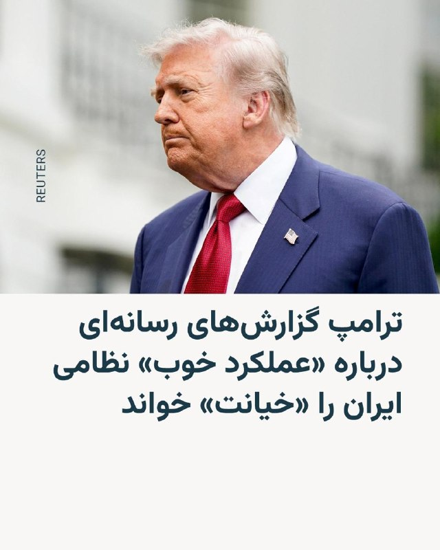

🔸دونالد ترامپ، رئیس‌جمهور آمریکا، گزارش شماری از رسانه‌های غربی درباره عملکرد نظامی «خوب» ایران مقابل آمریکا را «خیانت» عنوان کرد.

🔸او از این رسانه‌ها با عنوان «فیک‌نیوز» نام برد و در شبکه اجتماعی خود، تروث‌سوشال نوشت: «وقتی رسانه‌های جعلی می‌گویند که دشمن ایرانی از نظر نظامی در برابر ما عملکرد خوبی دارد، این عملاً خیانت محسوب می‌شود، چون چنین ادعایی کاملاً دروغ و حتی مضحک است.»

🔸ترامپ اضافه کرد که این رسانه‌ها با این نوع اخبار «دارند به دشمن کمک و از او حمایت می‌کنند!»

@RadioFarda

## IranianMinds — post 20052

🔴 صداوسیما :

اگه اینترنت میخواید میتونید از کشور برید یه جای دیگه زندگی کنید

@IranianMinds

## IranianMinds — post 20051

  

شما فک کنید یه جوون بی گناه که نه پستی داشته و نه مقامی تو کشور رو دی ماه دستگیر کردن بعدشم اعدامش کردن گفتن جاسوس موساد بوده رفته نپال آموزش دیده !

@IranianMinds

## IranianMinds — post 20050

  

🔴 ترامپ :

افتخار بزرگی است که ایلان ماسک، تیم کوک، لری فینک، و دیگران به چین میروند. من از رئیس‌جمهور شی می‌خواهم چین را باز کند تا این افراد نابغه بتوانند کارهای شگفت‌انگیز انجام دهند و کشورشان را به سطح بالاتری برسانند. این اولین چیزی است که هنگام دیدار از ایشان درخواست خواهم کرد.

@IranianMinds

## IranianMinds — post 20049

  

🔴 پست‌ جدید ترامپ:

من تورو‌ میخوام !

@IranianMinds

## BBCPersian — post 280884

🔻ان‌بی‌سی؛ ترامپ به دنبال تغییر نام عملیات نظامی علیه ایران است تا از محدودیت ۶۰ روزه کنگره پرهیز کند

رسانه‌های آمریکا می‌گویند به گفته دو مقام امريکايی، پنتاگون در حال بررسی اين موضوع است که اگر آتش‌بس کنونی با ايران فروبپاشد و دونالد ترامپ تصميم به ازسرگيری عمليات گسترده نظامی بگيرد، نام جنگ رسما به «عمليات پتک‌ سنگین» تغيير يابد.

بحث‌ها درباره احتمال جايگزينی نام «عمليات خشم حماسی» با «عمليات پتک سنگین» نشان می‌دهد دولت امريکا تا چه اندازه احتمال ازسرگيری جنگی را که در ۲۸ فوريه آغاز شد، جدی می‌گيرد.

اين تغيير نام همچنين می‌تواند به آقای ترامپ امکان دهد استدلال کند که با آغاز عمليات جديد، مهلت ۶۰ روزه مورد نياز برای دريافت مجوز جنگ از کنگره دوباره از نو آغاز می‌شود.

در چند هفته گذشته و در خلال حضور مقام‌های دولت آمریکا در کنگره، نمایندگان به مفاد قانونی اشاره کردند که به موجب آن دولت آمریکا حتی در پی عملیات نظامی به بهانه «تهدید فوری» باید پس از ۶۰ روز از آغاز این حملات، برای ادامه جنگ از کنگره که قانونا حق تصمیم‌گیری درباره اعلان و آغاز جنگ را دارد، مجوز بگیرد.

https://bbc.in/4tAXKjn
@BBCPersian

## BBCPersian — post 280883

🔻 نیویورک تایمز: ایران هنوز به ۳۰ سکوی موشکی از مجموع ۳۳ سکوی خود در حاشیه خلیج فارس دسترسی دارد

روزنامه نیویورک تایمز در گزارش که روز سه‌شنبه - ۱۲ مه / ۲۲ اردیبهشت - منتشر کرده نوشته ایران همچنان به ۳۰ سکو از ۳۳ سکوی موشکی خود در حاشیه خلیج فارس دسترسی دارد.

این روزنامه آمریکایی نوشته این موضوع از توان بیشتر نظامی ایران نسبت به آنچه ارتش آمریکا و کاخ‌سفید در جریان جنگ مشترک با اسرائیل مدعی نابودی آنها شده بودند، حکایت دارد.

در همین حال، دونالد ترامپ که روز سه‌شنبه برای دیدار با همتای خود - شی جین پینگ - راهی چین شد، در پستی که می‌تواند واکنش به این گزارش نیویورک تایمز تلقی شود گزارش‌هايی را که حاکی از وضعیت نظامی ايران هستند، «اخبار جعلی» توصيف کرده و گفته اين گزارش‌ها به تهران «اميد واهی» می‌دهند.

او چنين پوشش رسانه‌ای را «خيانت» خواند و مدعی شد نيروهای ايرانی متحمل شکست‌های سنگينی شده‌اند.

آقای ترامپ همچنين ادعا کرد ايران پيش‌تر ۱۵۹ شناور نظامی در اختيار داشته، اما «اکنون همه آنها در کف دريا قرار دارند».

او در ادامه مدعی شد ايران ديگر نيروی دريايی موثری ندارد و نيروی هوايی و فناوری‌های نظامی اين کشور نيز «کاملا نابود شده‌اند».

با این حال، پیش‌تر گزارش دیگری که بازتاب گسترده‌ای در رسانه‌های آمریکا داشت مدعی شده بود ایران همچنان تا حدود زیادی توان نظامی خود از جمله موشکی و پهپادی، را حفظ کرده است.

@BBCPersian

## BBCPersian — post 280882

  <a href="telegram/content/BBCPersian_280882_1778648862.mp4" target="_blank">🎬 Download video</a>

یک معترض به جنگ آمریکا با ایران در جریان نشستی که روز سه‌شنبه از سوی نشریه پولتیکو و کارخانه تسلیحات‌سازی لاکهید در واشنگتن برگزار شده بود، در میان سخنرانی شاهزاده رضا پهلوی به روبروی صحنه رفت و در حالی که فریاد می‌زد خطاب به او گفت:

«شما کجا بودید وقتی مردم ما داشتند فرزندانشان را از زیر آوار بمب‌هایی که شما به کشورمان دعوت کرده‌اید بیرون می‌کشیدند؟ چطور می‌توانید بگویید «مردم من! ایران من!» و بعد‌ آنها را دعوت به بمباران مردم کنید؟ شرم بر شما!»

ماموران امنیتی خیلی زود این زن معترض را از محل سخنرانی بیرون بردند. با این حال، ویدیو مربوط به این رویداد سه‌شنبه عصر در شبکه‌های اجتماعی بازخورد فراوانی پیدا کرد.

آقای پهلوی در این نشست که چند نفر از وزرا و مقام‌های ارشد فعلی و سابق آمریکا هم در آن شرکت داشتند، در بخشی از سخنان خود از مذاکره با حکومت در ایران پس از آتش‌بس با آمریکا انتقاد کرد و ان را با آنچه تلاش برای نجات مردم ایران از «رژیم» جمهوری اسلامی خواند، در تناقض ارزیابی کرد.

🎥 Bita_4liberation / Instgram
@BBCPersian

---
📅 بروزرسانی: 1405/02/23 04:58
---

## VahidOOnLine — post 239832

  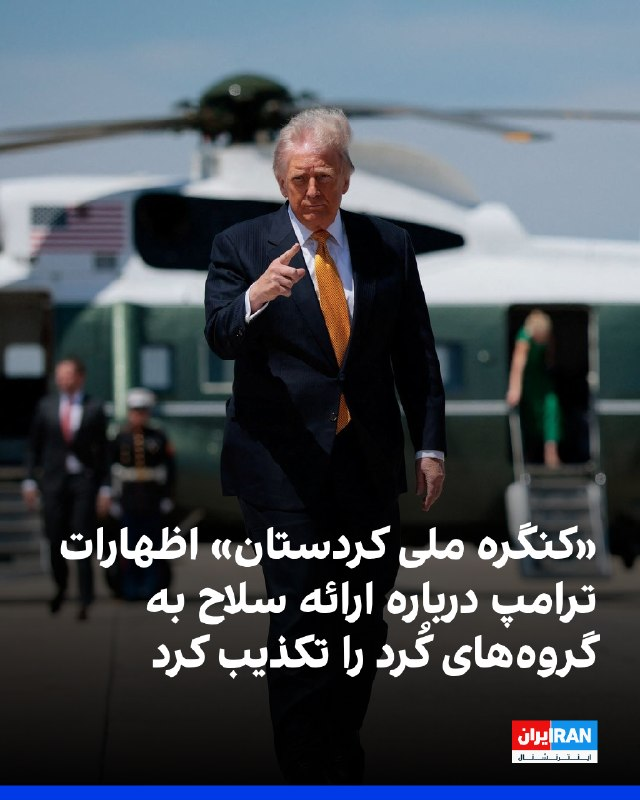

«کنگره ملی کردستان»، نهاد فراگیر تشکل‌های کُرد، با رد اظهارات ترامپ مبنی بر ارائه سلاح به گروه‌های کُرد برای مقابله با جمهوری اسلامی، هشدار داد چنین اظهاراتی خطر ایجاد یک کارزار خصمانه هماهنگ علیه مردم کُرد را به همراه دارد.
این بیانیه افزود: «طرح چنین اتهام‌های گسترده و کلی، همه کردها را در معرض سوءظن قرار می‌دهد و خطر تضعیف روابط کردها و آمریکا را در پی دارد. ما به عنوان کنگره ملی کردستان این اتهام‌ها را رد می‌کنیم و آن‌ها را جدی و بالقوه زیان‌بار می‌دانیم.»

‌🏁 🇬🇧 IranintlTV

🤖 @VahidOOnLine

## VahidOOnLine — post 239831

  

۲۰ عضو دموکرات و جمهوری‌خواه مجلس نمایندگان آمریکا در نامه‌ای به دولت بریتانیا، از این کشور خواستند روند تصویب قانونی قرار دادن سپاه به عنوان یک سازمان «تروریستی» را تسریع کند.
برد شرمن، عضو دموکرات مجلس نمایندگان آمریکا و از مبتکران تهیه این نامه، گفت: «هر روزی که پارلمان بریتانیا تاخیر می‌کند، سپاه پاسداران یک روز دیگر از تاثیر کامل تحریم‌های مشترک ما می‌گریزد. بریتانیا باید در سمت درست تاریخ بایستد و سپاه پاسداران را در ارتباط با اقداماتش در سراسر جهان پاسخگو کند.»
کلودیا تنی، عضو جمهوری‌خواه مجلس نمایندگان و از مبتکران تهیه این نامه، گفت: «سپاه پاسداران یکی از خطرناک‌ترین سازمان‌های تروریستی جهان است و دستانش به خون غیرنظامیان بی‌گناه، آمریکایی‌ها و مخالفان آلوده است.»
او افزود: «حکومت ایران همچنان از طریق سپاه پاسداران و شبکه‌های نیابتی آن، ترور را صادر می‌کند، متحدان ما را تهدید می‌کند و مردم خود را به‌طور بی‌رحمانه سرکوب می‌کند. بریتانیا باید فورا به آمریکا و متحدانش بپیوندد و پیام روشنی بفرستد که جهان غرب ترور، خشونت سیاسی یا یهودستیزی را تحمل نخواهد کرد.»
‌🏁 🇬🇧 IranintlTV

🤖 @VahidOOnLine

## VahidOOnLine — post 239830

  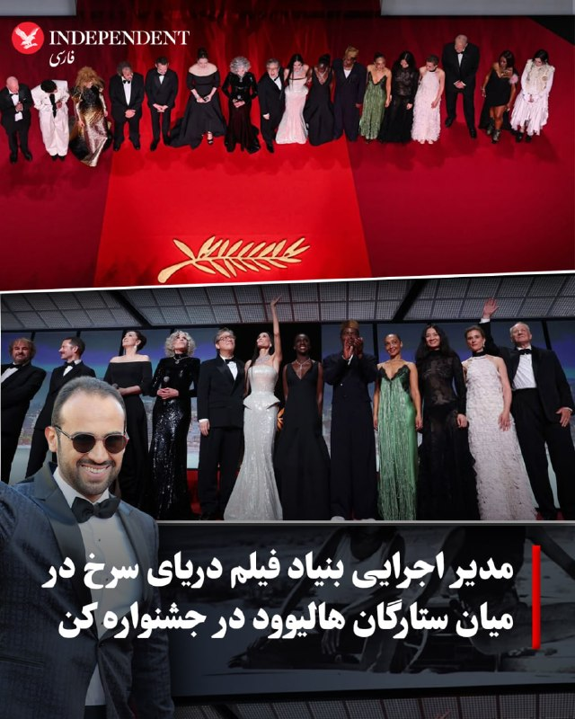

♦️مراسم افتتاحیه هفتادونهمین دوره جشنواره فیلم کن با حضور چهره‌های برجسته سینمای جهان، روز سه‌شنبه، ۲۲ اردیبهشت‌ماه، آغاز شد. در این مراسم که با استقبال گسترده رسانه‌ها همراه بود، فیصل بالطیور، مدیر اجرایی بنیاد فیلم دریای سرخ، به همراه پیتر جکسون، برنده نخل طلای افتخاری، الایجا وود و اعضای هیئت داوران از جمله پارک چان-ووک، دمی مور و کلوئی ژائو بر روی فرش قرمز حضور یافتند. جشنواره کن به مدت ۱۲ روز ادامه خواهد داشت و دوم خردادماه با معرفی برندگان نخل طلا به کار خود پایان می‌دهد.
بنیاد فیلم دریای سرخ عربستان سعودی در جشنواره کن با پنج فیلم تحت حمایت‌ «صندوق دریای سرخ» و «بازار دریای سرخ» حضور خواهد داشت. این آثار عبارت‌اند از «داستان‌های موازی» ساخته اصغر فرهادی، «توت‌فرنگی» ساخته لیلا مراکشی، «دیروز چشم نخوابید» ساخته راکان میاسی، «بنیمانا» ساخته ماری کلمنتین دوسابجامبو و «دختر ناشناس» ساخته زو جینگ.
‌🇸🇦 Indypersian

🤖 @VahidOOnLine

## VahidOOnLine — post 239829

  <a href="telegram/content/VahidOOnLine_239829_1778635705.mp4" target="_blank">🎬 Download video</a>

فاطمه مهاجرانی، سخنگوی دولت پزشکیان، درباره قطعی طولانی‌مدت اینترنت در ایران گفت اینترنت حق مردم است و عصبانیت آن‌ها کاملا بجاست، اما در ادامه افزود: «عامل این خشم دشمنانی هستند که باعث می‌شوند فضای امنیتی ما مخدوش شود.»
او همچنین گفت: «رسانه‌ها کمک کنند این ادبیات را جا بیندازیم، دولت طرفدار دسترسی آزاد است؛ همه ما در یک کشتی نشسته‌ایم.»
‌🏁 🇬🇧 IranintlTV

🤖 @VahidOOnLine

## VahidOOnLine — post 239828

  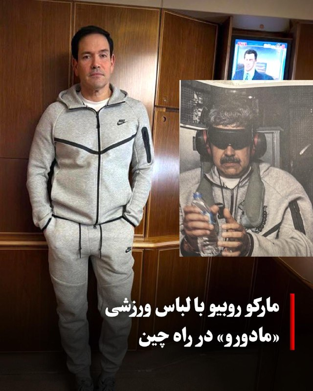

♦️استیون چونگ، مدیر ارتباطات کاخ سفید، تصویری از مارکو روبیو، وزیر امور خارجه آمریکا، در هواپیمای «ایر فورس وان» منتشر کرد. روبیو که همراه با دونالد ترامپ در مسیر سفر به پکن است، در این تصویر همان مدل لباس ورزشی «نایکی» را به تن دارد که پیش‌تر نیکلاس مادورو، رئیس‌جمهوری ونزوئلا، هنگام بازداشت پوشیده بود.
‌🇸🇦 Indypersian

🤖 @VahidOOnLine

## VahidOOnLine — post 239819

۱۸ و ۱۹ دی، فقط یک تاریخ در تقویم نیست؛
روزی‌ست که برای بعضی خانواده‌ها، همه‌چیز به قبل و بعد از آن تقسیم شد.
از قزوین تا رشت،
از اصفهان تا اراک،
جوان‌هایی با زندگی‌های معمولی، درس، کار، ورزش و رویا،
در چند ساعت از خیابان‌ها حذف شدند.
ریحانه قدسی، سید علیرضا طاهری باجگیرانی، حمزه زینلی، پرنیا شاد بجارکناری، پویا خیرخواه، روبینا امینیان، سید محمدحسین موسوی و پرستو جراحیان
جاویدنامان انقلاب ملی ایرانیان؛
زندگی‌هایی که هر کدام مسیر خودشان را داشتند، اما همگی در خیابان‌های این سرزمین ناتمام ماندند.
#جاویدنامان_انقلاب_ملی_ایرانیان
‌🏁 🇬🇧 IranintlTV

🤖 @VahidOOnLine

## VahidOOnLine — post 239818

  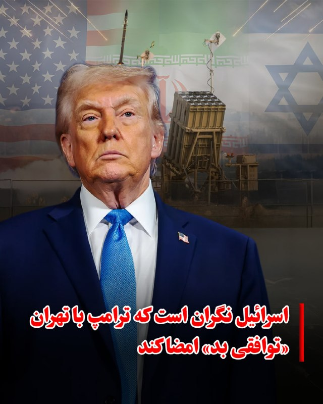

♦️به گزارش سی‌ان‌ان به نقل از منابع اسرائیلی، این کشور نگران است که دونالد ترامپ، رئیس‌جمهوری آمریکا، پیش از رسیدگی به برخی از مسائل کلیدی که در وهله نخست باعث آغاز جنگ شد، با رژیم ایران به توافق برسد.
این منابع گفتند توافقی که برنامه هسته‌ای تهران را تا حدی دست‌نخورده باقی بگذارد و در عین حال موضوعاتی مانند موشک‌های بالستیک و حمایت  از نیروهای نیابتی منطقه‌ای را نادیده بگیرد، از نگاه اسرائیل به معنای ناتمام ماندن جنگ خواهد بود.
ترامپ در آغاز جنگ گفته بود که آمریکا می‌خواهد برنامه موشک‌های بالستیک ایران را نابود کند، به حمایت تهران از نیروهای نیابتی منطقه پایان دهد و تاسیسات هسته‌ای ایران را به‌گونه‌ای تعطیل کند که هرگز نتواند به سلاح هسته‌ای دست پیدا کند. اما اکنون، ۱۰ هفته پس از آغاز جنگ، مذاکرات عمدتا بر مسئله اورانیوم ــ به‌ویژه غنی‌سازی آن تا سطح مناسب برای تولید سلاح ــ و بازگشایی تنگه هرمز متمرکز شده است.
یکی از منابع آگاه از مذاکرات گفت اسرائیل می‌داند که موضوع موشک‌ها و نیروهای نیابتی «احتمالا از دستور کار خارج شده‌اند»، زیرا به نظر نمی‌رسد در پیش‌نویس‌های اولیه دیپلماتیک گنجانده شده باشند، و به همین دلیل بنیامین نتانیاهو، نخست‌وزیر اسرائیل، اکنون اورانیوم را فوری‌ترین تهدید می‌داند.
یکی دیگر از مقام‌های اسرائیلی به سی‌ان‌ان گفت: «نگرانی واقعی وجود دارد که ترامپ به یک توافق بد برسد.»
یک مقام ارشد اسرائیلی گفت اسرائیل همچنان برای احتمال شکست مذاکرات در بالاترین سطح آماده‌باش قرار دارد.
او همچنین گفت تشدید درگیری «سناریویی واقع‌بینانه» است «اگر ایرانی‌ها همچنان وقت‌کشی کنند و مذاکرات را طول بدهند.»
‌🇸🇦 Indypersian

🤖 @VahidOOnLine

## VahidOOnLine — post 239817

♦️محمدرضا شهبازی، مجری حکومتی، در واکنش به راه‌اندازی سرویس‌های «مسترکارت» و «ویزا کارت» در سوریه و اینترنت پرسرعت در افغانستان، همزمان با ادامه محدودیت‌های اینترنتی در ایران، گفت: «اگر این‌ها برایتان مهم است، به افغانستان و سوریه بروید.»
این اظهارات در حالی مطرح شد که کشورهای همسایه پس از سال‌ها جنگ و بحران، در حال اتصال دوباره به زیرساخت‌های جهانی و خدمات بانکی بین‌المللی هستند. همزمان، ایران همچنان با فیلترینگ گسترده، محدودیت‌های اینترنتی و انزوای بانکی روبه‌رو است.
‌🇸🇦 Indypersian

🤖 @VahidOOnLine

## VahidOOnLine — post 239816

♦️وقوع هم‌زمان زمین‌لرزه‌ای به بزرگی ۴.۶ در حوالی پردیس و طوفانی شدید در پایتخت، تهران را در وضعیت اضطراری قرار داده است؛ این در حالی است که به گزارش «نت‌بلاک»، قطع اینترنت جهانی در ایران وارد هفتادوچهارمین روز خود شده و نبود دسترسی به شبکه‌های ارتباطی، اطلاع‌رسانی در این شرایط بحرانی را با اختلال جدی مواجه کرده است. به گفته سخنگوی اورژانس تهران، طوفان دست‌کم ۱۷ مصدوم بر جای گذاشته و لرزش شدید زمین که در بخش‌های وسیعی از شمال و جنوب شرق پایتخت از جمله ورامین و پاکدشت نیز احساس شده، و براساس تصاویر منتشر شده، شهروندان را به خیابان‌ها کشانده است.
‌🇸🇦 Indypersian

🤖 @VahidOOnLine

## FoxNewsTwitter — post 341625

  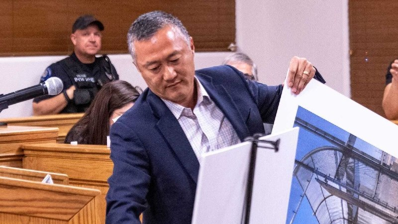

Fox News (Twitter/X)

NEW: Dave Venturella is expected to be named the next Acting Director of ICE, replacing Todd Lyons, multiple sources say.

Venturella has been working in the Trump administration as an ICE senior advisor. He was recruited with help from Tom Homan after President Trump was elected.

## FoxNewsTwitter — post 341624

  

Fox News (Twitter/X)

A mural honoring slain Ukrainian refugee Iryna Zarutska was taken down in Providence, Rhode Island, following intense local backlash.

Some residents and elected officials reportedly complained about the artwork, with the mayor claiming it was "divisive and does not represent" the city.

Eoghan McCabe, the CEO of the AI customer service company Intercom, previously pledged $500k to paint murals honoring her. Elon Musk pledged $1M to the effort.

## FoxNewsTwitter — post 341623

  <a href="telegram/content/FoxNewsTwitter_341623_1778635709.mp4" target="_blank">🎬 Download video</a>

Fox News (Twitter/X)

SPEAKER JOHNSON: “To the families of fallen heroes and those who continue to stand guard in our communities, we have your back.”

House Speaker Mike Johnson lead a ceremony on the Capitol steps to honor law enforcement as part of National Police Week.

Johnson says thanks to the Trump administration, law enforcement deaths reached an 80-year low in 2025, marking a 25% drop from the year before.

## FoxNewsTwitter — post 341622

  

Fox News (Twitter/X)

The Justice Department reached a $30M settlement with PayPal over its 2020 $530 million "Economic Opportunity Fund" that allegedly pushed discriminatory investments favoring Black and minority-owned businesses.

As part of the settlement, PayPal will launch a new Small Business Initiative and waive processing fees for $1 billion of transactions, or approximately $30 million, for American businesses that are veteran-owned or engaged in farming, manufacturing, or technology.

Acting Attorney General Todd Blanche touted the ruling stating, "American corporations are on notice: you will face our aggressive enforcement if you use race or national origin to discriminate against qualified Americans."

## FoxNewsTwitter — post 341621

‌Fox News (Twitter/X)

WATCH LIVE: Speaker Johnson honors fallen heroes at National Police Week vigilhttps://x.com/i/broadcasts/1NGaraBYYnlJj

## pm_afshaa — post 90666

  <a href="telegram/content/pm_afshaa_90666_1778635711.webm" target="_blank">🎬 Download video</a>

🔴ترامپ نقشه کشور ونزوئلا رو با طرح پرچم آمریکا و تیتر «پنجاه‌و‌یکمین ایالت» پست کرد :

💧 Rainbet.com the #1 Non-KYC Crypto Casino & Sportsbook @rainbetcom

😁 @Pm_Afshaa

## IranIntlTV — post 336918

  

«کنگره ملی کردستان»، نهاد فراگیر تشکل‌های کُرد، با رد اظهارات ترامپ مبنی بر ارائه سلاح به گروه‌های کُرد برای مقابله با جمهوری اسلامی، هشدار داد چنین اظهاراتی خطر ایجاد یک کارزار خصمانه هماهنگ علیه مردم کُرد را به همراه دارد.
این بیانیه افزود: «طرح چنین اتهام‌های گسترده و کلی، همه کردها را در معرض سوءظن قرار می‌دهد و خطر تضعیف روابط کردها و آمریکا را در پی دارد. ما به عنوان کنگره ملی کردستان این اتهام‌ها را رد می‌کنیم و آن‌ها را جدی و بالقوه زیان‌بار می‌دانیم.»

https://iranintl.com/202605133079

## IranIntlTV — post 336917

  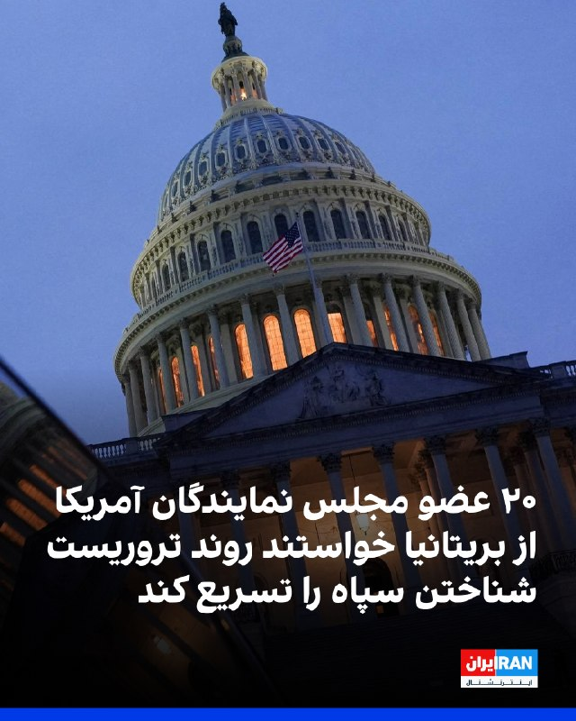

۲۰ عضو دموکرات و جمهوری‌خواه مجلس نمایندگان آمریکا در نامه‌ای به دولت بریتانیا، از این کشور خواستند روند تصویب قانونی قرار دادن سپاه به عنوان یک سازمان «تروریستی» را تسریع کند.
برد شرمن، عضو دموکرات مجلس نمایندگان آمریکا و از مبتکران تهیه این نامه، گفت: «هر روزی که پارلمان بریتانیا تاخیر می‌کند، سپاه پاسداران یک روز دیگر از تاثیر کامل تحریم‌های مشترک ما می‌گریزد. بریتانیا باید در سمت درست تاریخ بایستد و سپاه پاسداران را در ارتباط با اقداماتش در سراسر جهان پاسخگو کند.»
کلودیا تنی، عضو جمهوری‌خواه مجلس نمایندگان و از مبتکران تهیه این نامه، گفت: «سپاه پاسداران یکی از خطرناک‌ترین سازمان‌های تروریستی جهان است و دستانش به خون غیرنظامیان بی‌گناه، آمریکایی‌ها و مخالفان آلوده است.»
او افزود: «حکومت ایران همچنان از طریق سپاه پاسداران و شبکه‌های نیابتی آن، ترور را صادر می‌کند، متحدان ما را تهدید می‌کند و مردم خود را به‌طور بی‌رحمانه سرکوب می‌کند. بریتانیا باید فورا به آمریکا و متحدانش بپیوندد و پیام روشنی بفرستد که جهان غرب ترور، خشونت سیاسی یا یهودستیزی را تحمل نخواهد کرد.»
https://iranintl.com/202605139281

## IranIntlTV — post 336916

  <a href="telegram/content/IranIntlTV_336916_1778635713.mp4" target="_blank">🎬 Download video</a>

فاطمه مهاجرانی، سخنگوی دولت پزشکیان، درباره قطعی طولانی‌مدت اینترنت در ایران گفت اینترنت حق مردم است و عصبانیت آن‌ها کاملا بجاست، اما در ادامه افزود: «عامل این خشم دشمنانی هستند که باعث می‌شوند فضای امنیتی ما مخدوش شود.»
او همچنین گفت: «رسانه‌ها کمک کنند این ادبیات را جا بیندازیم، دولت طرفدار دسترسی آزاد است؛ همه ما در یک کشتی نشسته‌ایم.»

## IranIntlTV — post 336907

۱۸ و ۱۹ دی، فقط یک تاریخ در تقویم نیست؛
روزی‌ست که برای بعضی خانواده‌ها، همه‌چیز به قبل و بعد از آن تقسیم شد.
از قزوین تا رشت،
از اصفهان تا اراک،
جوان‌هایی با زندگی‌های معمولی، درس، کار، ورزش و رویا،
در چند ساعت از خیابان‌ها حذف شدند.
ریحانه قدسی، سید علیرضا طاهری باجگیرانی، حمزه زینلی، پرنیا شاد بجارکناری، پویا خیرخواه، روبینا امینیان، سید محمدحسین موسوی و پرستو جراحیان
جاویدنامان انقلاب ملی ایرانیان؛
زندگی‌هایی که هر کدام مسیر خودشان را داشتند، اما همگی در خیابان‌های این سرزمین ناتمام ماندند.
#جاویدنامان_انقلاب_ملی_ایرانیان

## FarsiVOA — post 217588

⚡️شیوع سویه خطرناک آندِس ویروس هانتا در یک کشتی تفریحی بین‌المللی بار دیگر نگرانی‌ها درباره بیماری‌های نوظهور را افزایش داده است. اکنون چندین کشور در حال انتقال و قرنطینه شهروندان خود هستند. ویروسی نادر که در مواردی حتی می‌تواند از انسان به انسان منتقل شود.
@FarsiVOA

## FarsiVOA — post 217587

⚡️تحقیقات تازه نشان می‌دهد جمهوری اسلامی و نیروهای وابسته به آن با استفاده از شبکه‌های اجتماعی، گروه‌های تبهکار، و نیروهای مزدور، دامنه عملیات جاسوسی و خرابکاری خود را در اروپا گسترش داده‌اند. شبکه‌ای پنهان که از تلگرام آغاز می‌شود و به خیابان‌های لندن و بروکسل می‌رسد.
@FarsiVOA

## FarsiVOA — post 217586

⚡️جمهوری اسلامی از چه طریقی توانسته است به جذب نیرو و تشکیل هسته‌هایی در کشورهای حوزه خلیج فارس اقدام کند؟ گفت‌وگو با حسن هاشمیان
@FarsiVOA

## FarsiVOA — post 217585

⚡️قانون‌گذاران کنگره آمریکا در آستانه دیدار پرزیدنت ترامپ و شی جین‌پینگ،‌ رهبران ایالات متحده و چین، دیدگاه‌های‌شان را درباره مهم‌ترین مسائل ژئوپلتیک - از جمله تنش‌های مرتبط با رژیم ایران، جنگ میان اوکراین و روسیه، و موضوع تایوان - بیان کردند.
@FarsiVOA

## FarsiVOA — post 217584

⚡️هشدار درباره بحران‌های فراروی ایران در آستانه تابستان؛ کم‌آبی، خاموشی، و پیامدهای منطقه‌ای
@FarsiVOA

## FarsiVOA — post 217583

⚡️پس‌لرزه‌های انتخابات محلی بریتانیا؛ بحران سیاسی برای استارمر
@FarsiVOA

---
📅 بروزرسانی: 1405/02/23 03:05
---

## VahidOOnLine — post 239815

  <a href="telegram/content/VahidOOnLine_239815_1778628907.mp4" target="_blank">🎬 Download video</a>

محمدرضا شهبازی، مجری صداوسیما، در واکنش به انتقادها از وضعیت اینترنت در ایران و مقایسه آن با راه‌اندازی اینترنت ۵جی در افغانستان و آغاز استفاده از کارت‌های بین‌المللی در سوریه، با لحنی تمسخرآمیز گفت: «اگر این چیزها این‌قدر مهم است، بروید همان‌جا (سوریه و افغانستان) زندگی کنید.»
‌🏁 🇬🇧 IranintlTV

🤖 @VahidOOnLine

## VahidOOnLine — post 239814

  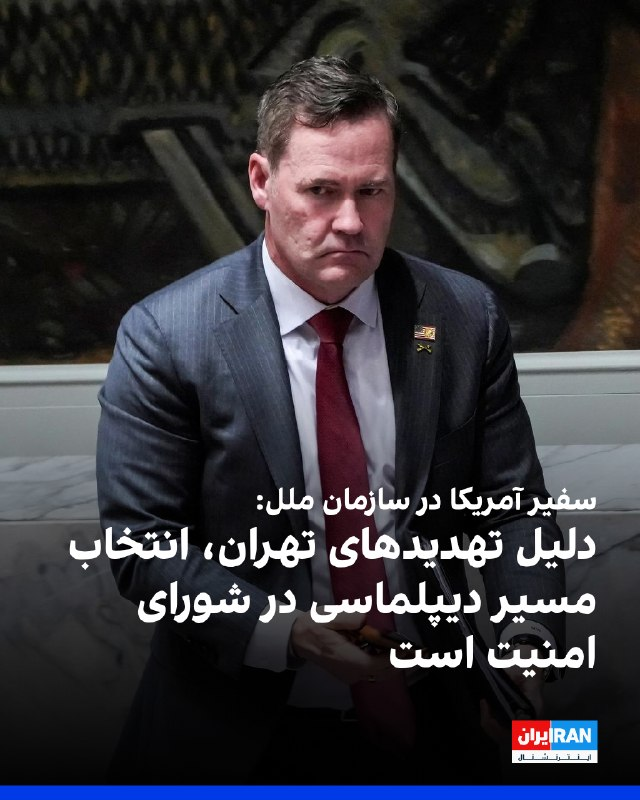

مایک والتز، سفیر آمریکا در سازمان ملل، با بازنشر تهدیدهای اخیر ابراهیم عزیزی، نماینده مجلس، علیه کشورهای منطقه درباره بستن دائمی تنگه هرمز، در ایکس نوشت جمهوری اسلامی به این دلیل کشورهای منطقه و اقتصاد جهانی را تهدید می‌کند که شورای امنیت مسیر دیپلماسی را انتخاب کرده است.
او نوشت: «جای تعجب ندارد که جمهوری اسلامی آشکارا همسایگان خود را تهدید می‌کند و اذعان می‌کند که به مین‌گذاری در آب‌های بین‌المللی و حمله به کشتی‌های تجاری از سراسر جهان ادامه خواهد داد، با این امید که ویرانی اقتصادی ایجاد کند.»
والتز افزود: «همه این‌ها به این دلیل است که ما در شورای امنیت سازمان ملل مسیر دیپلماسی را انتخاب کرده‌ایم. این اظهارات یک مقام حکومت ایران نشان می‌دهد چرا قطعنامه شورای امنیت علیه تهران لازم است و چرا هرگز به جمهوری اسلامی اجازه داده نخواهد شد به سلاح هسته‌ای دست یابد.»

‌🏁 🇬🇧 IranintlTV

🤖 @VahidOOnLine

## VahidOOnLine — post 239813

  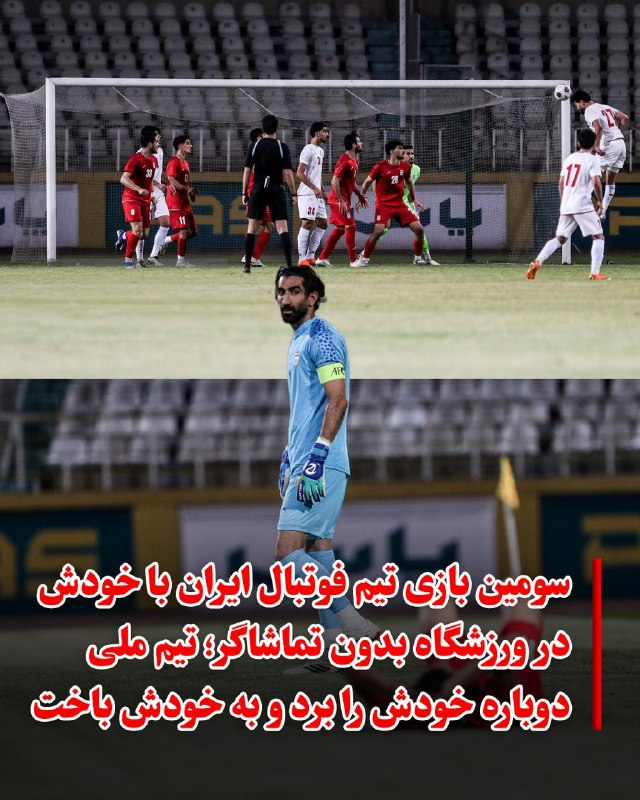

♦️تیم ملی فوتبال ایران در پی انزوای بین‌المللی و انصراف تمامی حریفان تدارکاتی از جمله پرتغال، اسپانیا، مقدونیه و آنگولا، برای سومین بار به مصاف خود رفت. این دیدار درون‌تیمی که عصر سه‌شنبه ۲۲ اردیبهشت در ورزشگاه پاس قوامین (متعلق به نیروی انتظامی) برگزار شد، در غیاب تماشاگران عادی و با پخش مستقیم از صداوسیما همراه بود.
در این مسابقه که در قالب دو تیم سفید و قرمز انجام شد، تیم سفید با نتیجه ۴ بر ۱ به پیروزی رسید. علی علیپور، دانیال ایری (دو بار) و آریا یوسفی برای سفیدپوشان و امیرحسین حسین‌زاده برای تیم قرمز گلزنی کردند. این سومین بار است که بازیکنان تیم ملی به دلیل پیدا نکردن حریف خارجی، در قالب مسابقات درون‌تیمی مقابل هم صف‌آرایی می‌کنند.
فدراسیون فوتبال در حالی از برگزاری بازی با «گامبیا» در اردوی آینده ترکیه خبر داده که پیش از این تمامی قرارهای ملاقات با تیم‌های صاحب‌نام فوتبال جهان لغو شده است.
‌🇸🇦 Indypersian

🤖 @VahidOOnLine

## VahidOOnLine — post 239812

  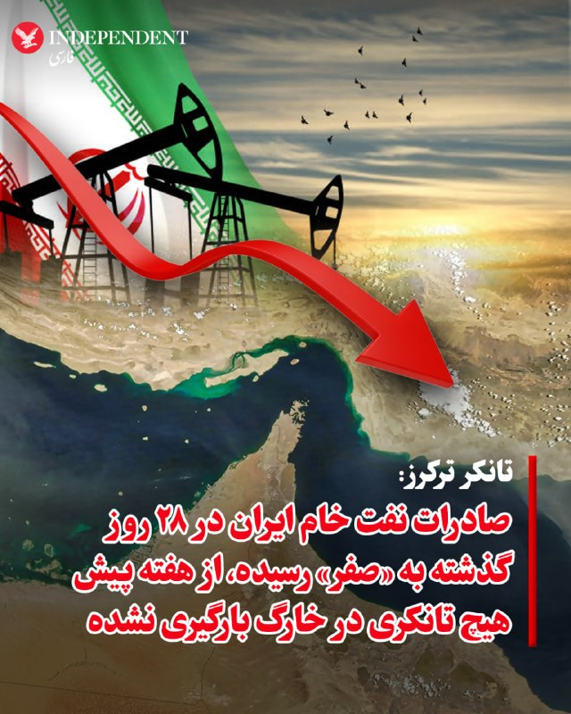

♦️«تانکر ترکرز»، سامانه رصد موقعیت نفتکش‌ها، روز سه‌شنبه در گزارشی اعلام کرد که بر اساس داده‌های موجود، تهران در ۲۸ روز گذشته موفق به صادرات دریایی نفت خام نشده است و تنها برخی فرآورده‌های نفتی به‌دلیل اعمال نشدن تحریم‌های دفتر کنترل دارایی‌های خارجی آمریکا (اوفاک) بر تانکرهای حامل آن‌ها، از منطقه خارج شده‌اند. این گزارش همچنین با اشاره به تداوم توقف بارگیری در جزیره خارگ از ۱۶ اردیبهشت‌ماه به دلیل نشت نفت، که پیش‌تر توسط مقامات تهران تکذیب شده بود، تاکید کرد که در حال حاضر تعداد زیادی نفتکش خالی و پر در هر دو سوی خط محاصره دریایی ایالات متحده حضور دارند. تانکر ترکرز تصریح کرد که خروج موفقیت‌آمیز و صادرات تنها زمانی محقق می‌شود که «یک نفتکش از خط محاصره نیروی دریایی آمریکا عبور کرده و بدون محموله به منطقه بازگردد».
‌🇸🇦 Indypersian

🤖 @VahidOOnLine

## VahidOOnLine — post 239811

  

صفحه جمهوری‌خواهان سنا در ایکس نوشت: «تا زمانی که جمهوری اسلامی از جاه‌طلبی‌های هسته‌ای خود دست نکشد، ترامپ از قدرت آمریکا برای قطع منابع مالی ماشین ترور استفاده می‌کند.»
این پست با اشاره به پیامدهای برجام نوشت: «در حالی که جمهوری اسلامی در حال ساخت موشک‌ برای تهدید متحدان آمریکا بود، دموکرات‌ها پالت‌های پول نقد به ایران فرستادند.»

‌🏁 🇬🇧 IranintlTV

🤖 @VahidOOnLine

## VahidOOnLine — post 239810

  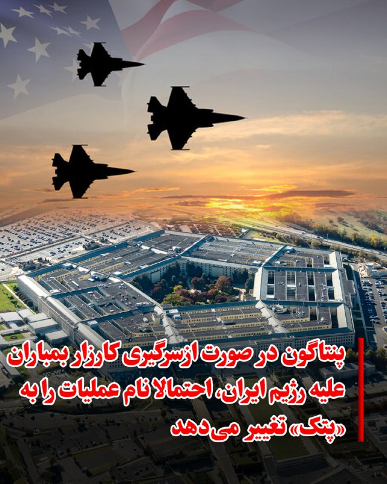

♦️شبکه ان‌بی‌سی نیوز روز سه‌شنبه گزارش داد که پنتاگون در حال بررسی تغییر نام جنگ علیه رژیم ایران از «عملیات خشم حماسی» به «عملیات پتک» است؛ اقدامی که در صورت تصمیم دونالد ترامپ برای ازسرگیری کارزار گسترده بمباران انجام خواهد شد.
منابع آگاه همچنین به ان‌بی‌سی گفتند که ایالات متحده اکنون نسبت به پیش از آغاز جنگ، قدرت آتش بیشتری در منطقه دارد. یکی از مقام‌های آمریکایی گفت: «ما اکنون نسبت به ۲۷ فوریه در موقعیت بهتری هستیم. قدرت آتش و توانایی بیشتری داریم.»
این تغییر نام احتمالی بخشی از تلاش دولت ترامپ برای دور زدن «قانون اختیارات جنگی» مصوب ۱۹۷۳ است.
این قانون جایگزین قانون اساسی نیست و مهلتی ۶۰ روزه تعیین کرده است که بر اساس آن رئیس‌جمهور باید هرگونه اقدام نظامی بدون مجوز را متوقف کند یا از کنگره مجوز بگیرد.
مهلت ۶۰ روزه مربوط به جنگ ایران در اول مه به پایان رسید و دولت ترامپ  می‌گوید که آتش‌بس، این شمارش زمانی را متوقف کرده است. با این حال، آمریکا همچنان محاصره را اجرا می‌کند
مارکو روبیو، وزیر خارجه آمریکا،اقدامات نظامی جاری آمریکا در منطقه را «عملیات دفاعی» توصیف می‌کند.
یکی از مقام‌های کاخ سفید به ان‌بی‌سی گفت دولت معتقد است دادن نام جدید به عملیات نظامی، عملا شمارش زمانی قانون اختیارات جنگی را از نو آغاز می‌کند و «عملیات پتک» تنها نامی نیست که در دست بررسی قرار دارد.
گزارش ان‌بی‌سی در حالی منتشر می‌شود که به عقیده برخی تحلیلگران ازسرگیری کارزار گسترده بمباران علیه رژیم ایران محتمل به نظر می‌رسد؛ چرا که دونالد ترامپ پاسخ اخیر مقامات حاکم بر ایران در مذاکرات غیرمستقیم با میانجیگری پاکستان را «کاملا غیرقابل قبول» خوانده و تهران نیز اعلام کرده است که از خواسته‌های اصلی خود عقب‌نشینی نخواهد کرد.
‌🇸🇦 Indypersian

🤖 @VahidOOnLine

## VahidOOnLine — post 239809

  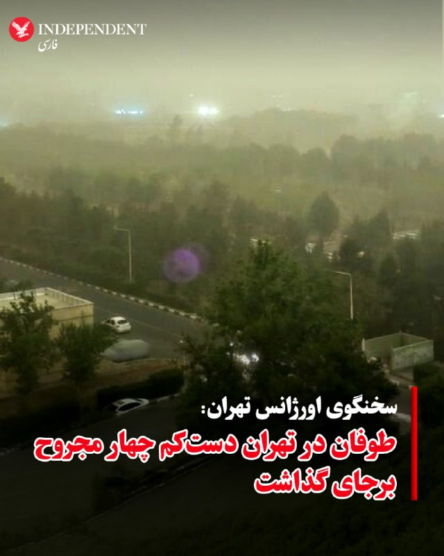

♦️شروین تبریزی، سخنگوی اورژانس تهران سه‌شنبه‌شب، ۲۲ اردیبهشت گفت: «طوفان در تهران تاکنون چهار مجروح داشته که البته همه این افراد در محل درمان شدند.» او گفت: «با توجه به اینکه وزش باد دقایقی قبل متوقف شد احتمال افزایش مجروحان وجود دارد».
‌🇸🇦 Indypersian

🤖 @VahidOOnLine

## VahidOOnLine — post 239808

  <a href="telegram/content/VahidOOnLine_239808_1778628914.mp4" target="_blank">🎬 Download video</a>

ویدیوهای منتشرشده در رسانه‌های ایران، وضعیت شهروندان را پس از زلزله شامگاه سه‌شنبه ۲۲ اردیبهشت‌ماه در بومهن و پردیس استان تهران نشان می‌دهد؛ شهروندانی که پس از زلزله به خیابان آمده‌اند و شب را کنار خیابان یا در خودروهای خود، در فضای باز پارک‌ها، سپری می‌کنند.
بر اساس گزارش‌های منتشرشده، زمین‌لرزه‌ای به بزرگی ۴.۶ مرز استان‌های تهران و مازندران را لرزاند که تاکنون با چندین پس‌لرزه همراه بوده است.
به گزارش سازمان مدیریت بحران، این زلزله خسارتی نداشته است.
‌🏁 🇬🇧 IranintlTV

🤖 @VahidOOnLine

## FoxNewsTwitter — post 341620

  <a href="telegram/content/FoxNewsTwitter_341620_1778628916.mp4" target="_blank">🎬 Download video</a>

Fox News (Twitter/X)

FOX NEWS REPORT: There are now 11 suspected cases of Hantavirus worldwide — all among passengers from the MV Hondius cruise ship, reports @BillMelugin_ .

## FoxNewsTwitter — post 341619

  <a href="telegram/content/FoxNewsTwitter_341619_1778628919.mp4" target="_blank">🎬 Download video</a>

Fox News (Twitter/X)

A dog named Bhalu hits the whitewater rapids of northern Iceland, and heeds orders to go forward after the raft makes a big splash.

“Bhalu is more than just our rafting dog, he’s a true whitewater veteran and beloved member of the Viking Rafting crew," the rafting company says.

## IranIntlTV — post 336906

  <a href="telegram/content/IranIntlTV_336906_1778628921.mp4" target="_blank">🎬 Download video</a>

محمدرضا شهبازی، مجری صداوسیما، در واکنش به انتقادها از وضعیت اینترنت در ایران و مقایسه آن با راه‌اندازی اینترنت ۵جی در افغانستان و آغاز استفاده از کارت‌های بین‌المللی در سوریه، با لحنی تمسخرآمیز گفت: «اگر این چیزها این‌قدر مهم است، بروید همان‌جا (سوریه و افغانستان) زندگی کنید.»

## IranIntlTV — post 336905

  <a href="telegram/content/IranIntlTV_336905_1778628922.mp4" target="_blank">🎬 Download video</a>

هزینه‌ای که جمهوری اسلامی به مردم ایران تحمیل کرده، فقط در اقتصاد خلاصه نمی‌شود؛ از سفره‌های کوچک‌تر تا اینترنت طبقاتی، از اعدام و زندان تا ترس، ناامیدی و خشم فروخورده‌ای که هر روز بزرگ‌تر می‌شود. مردم تا کی تاب می‌آورند؟ آیا ایران به نقطهٔ انفجار رسیده است؟ خشم انباشتهٔ مردم چه زمانی فوران خواهد کرد؟

کامبیز حسینی در «برنامه» به این موضوع می‌پردازد.

«یک ایران صدای شما را می‌شنود»

دوشنبه تا پنجشنبه ۱۱ شب تهران

از تلویزیون ایران اینترنشنال

تماشای نسخه کامل این قسمت از «برنامه» در یوتیوب:

https://youtu.be/964Hz45DLwM

@iranintltv

## IranIntlTV — post 336904

  <a href="telegram/content/IranIntlTV_336904_1778628924.mp4" target="_blank">🎬 Download video</a>

عرفان شکورزاده، دانش‌آموختهٔ ۲۹ سالهٔ مهندسی هوافضا از دانشگاه علم‌وصنعت، با اتهام «جاسوسی» اعدام شد؛ اتهامی که جمهوری اسلامی دربارهٔ جزئیات و مدارک آن، توضیح شفافی ارائه نکرده است.

رسانه‌های حکومتی مدعی همکاری او با موساد و آمریکا شدند، اما فعالان حقوق بشر می‌گویند او ماه‌ها در انفرادی بوده و تحت فشار، مجبور به اعتراف اجباری شده است.

کامبیز حسینی در «برنامه» به این موضوع می‌پردازد.

«یک ایران صدای شما را می‌شنود»

دوشنبه تا پنجشنبه ۱۱ شب تهران

از تلویزیون ایران اینترنشنال

تماشای نسخه کامل این قسمت از «برنامه» در یوتیوب:

https://youtu.be/964Hz45DLwM

@iranintltv

## IranIntlTV — post 336903

  <a href="telegram/content/IranIntlTV_336903_1778628926.mp4" target="_blank">🎬 Download video</a>

سحر از تهران: ۱۸ دی به همسرم چاقو زدند؛ نتوانستیم از عهدهٔ درمانش بربیاییم.از کجا بیاوریم؟

«یک ایران صدای شما را می‌شنود»

دوشنبه تا پنجشنبه ۱۱ شب تهران

از تلویزیون ایران اینترنشنال

تماشای نسخه کامل این قسمت از «برنامه» در یوتیوب:

https://youtu.be/964Hz45DLwM
@iranintltv

## IranIntlTV — post 336902

  

مایک والتز، سفیر آمریکا در سازمان ملل، با بازنشر تهدیدهای اخیر ابراهیم عزیزی، نماینده مجلس، علیه کشورهای منطقه درباره بستن دائمی تنگه هرمز، در ایکس نوشت جمهوری اسلامی به این دلیل کشورهای منطقه و اقتصاد جهانی را تهدید می‌کند که شورای امنیت مسیر دیپلماسی را انتخاب کرده است.
او نوشت: «جای تعجب ندارد که جمهوری اسلامی آشکارا همسایگان خود را تهدید می‌کند و اذعان می‌کند که به مین‌گذاری در آب‌های بین‌المللی و حمله به کشتی‌های تجاری از سراسر جهان ادامه خواهد داد، با این امید که ویرانی اقتصادی ایجاد کند.»
والتز افزود: «همه این‌ها به این دلیل است که ما در شورای امنیت سازمان ملل مسیر دیپلماسی را انتخاب کرده‌ایم. این اظهارات یک مقام حکومت ایران نشان می‌دهد چرا قطعنامه شورای امنیت علیه تهران لازم است و چرا هرگز به جمهوری اسلامی اجازه داده نخواهد شد به سلاح هسته‌ای دست یابد.»

https://iranintl.com/202605120656

## IranIntlTV — post 336901

  <a href="telegram/content/IranIntlTV_336901_1778628929.mp4" target="_blank">🎬 Download video</a>

آیدا از تهران: من ترجیح می‌دهم در راه آزادی کشورم بمیرم تا از گرسنگی

«یک ایران صدای شما را می‌شنود»

دوشنبه تا پنجشنبه ۱۱ شب تهران

از تلویزیون ایران اینترنشنال

تماشای نسخه کامل این قسمت از «برنامه» در یوتیوب:

https://youtu.be/964Hz45DLwM
@iranintltv

## IranIntlTV — post 336900

  <a href="telegram/content/IranIntlTV_336900_1778628931.mp4" target="_blank">🎬 Download video</a>

محمد از مشهد: در مشهد، سر صف بنزین مردم با هم درگیر می‌شوند که معلوم است از انباشت خشم است

«یک ایران صدای شما را می‌شنود»

دوشنبه تا پنجشنبه ۱۱ شب تهران

از تلویزیون ایران اینترنشنال

تماشای نسخه کامل این قسمت از «برنامه» در یوتیوب:

https://youtu.be/964Hz45DLwM

@iranintltv

## IranIntlTV — post 336899

  <a href="telegram/content/IranIntlTV_336899_1778628933.mp4" target="_blank">🎬 Download video</a>

امیر از خمین: رفتم مخابرات و گفتم توانایی مالی اینترنت را ندارم و خواهش کردم قطع کنند

«یک ایران صدای شما را می‌شنود»

دوشنبه تا پنجشنبه ۱۱ شب تهران

از تلویزیون ایران اینترنشنال

تماشای نسخه کامل این قسمت از «برنامه» در یوتیوب:

https://youtu.be/964Hz45DLwM
@iranintltv

## IranIntlTV — post 336898

  <a href="telegram/content/IranIntlTV_336898_1778628935.mp4" target="_blank">🎬 Download video</a>

شاهزاده رضا پهلوی در نشست امنیتی پولیتیکو گفت حملات اخیر به ایران، نه علیه مردم، بلکه علیه جمهوری اسلامی بوده و آن را عملیاتی آزادی‌بخش توصیف کرد.

گفت‌وگو با نجات بهرامی، تحلیل‌گر سیاسی

@iranintltv

## IranIntlTV — post 336897

  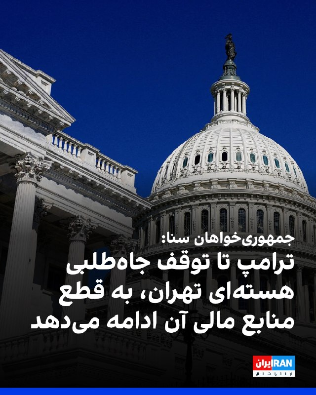

صفحه جمهوری‌خواهان سنا در ایکس نوشت: «تا زمانی که جمهوری اسلامی از جاه‌طلبی‌های هسته‌ای خود دست نکشد، ترامپ از قدرت آمریکا برای قطع منابع مالی ماشین ترور استفاده می‌کند.»
این پست با اشاره به پیامدهای برجام نوشت: «در حالی که جمهوری اسلامی در حال ساخت موشک‌ برای تهدید متحدان آمریکا بود، دموکرات‌ها پالت‌های پول نقد به ایران فرستادند.»

https://iranintl.com/202605122338

## IranIntlTV — post 336896

  <a href="telegram/content/IranIntlTV_336896_1778628938.mp4" target="_blank">🎬 Download video</a>

دونالد ترامپ گفت حملات آمریکا توانایی‌ و رهبری نظامی جمهوری اسلامی را به شدت تضعیف کرده و آمریکا انتظار دارد فشار بر جمهوری اسلامی با محاصره بنادر ایران، منجر به فروپاشی اقتصادی حکومت شود.

گفت‌وگو با محمد قائدی، مدرس روابط بین‌الملل در دانشگاه جورج واشینگتن

@iranintltv

## IranIntlTV — post 336895

  <a href="https://t.me/IranintlTV/336895" target="_blank">📎 Download file</a>

🎧نسخه صوتی سیاست با مراد ویسی: چرا به خواندن اسامی جاویدنام‌ها ادامه خواهم داد؟
@iranintlTV

## IranIntlTV — post 336894

  <a href="telegram/content/IranIntlTV_336894_1778628941.mp4" target="_blank">🎬 Download video</a>

ویدیوهای منتشرشده در رسانه‌های ایران، وضعیت شهروندان را پس از زلزله شامگاه سه‌شنبه ۲۲ اردیبهشت‌ماه در بومهن و پردیس استان تهران نشان می‌دهد؛ شهروندانی که پس از زلزله به خیابان آمده‌اند و شب را کنار خیابان یا در خودروهای خود، در فضای باز پارک‌ها، سپری می‌کنند.
بر اساس گزارش‌های منتشرشده، زمین‌لرزه‌ای به بزرگی ۴.۶ مرز استان‌های تهران و مازندران را لرزاند که تاکنون با چندین پس‌لرزه همراه بوده است.
به گزارش سازمان مدیریت بحران، این زلزله خسارتی نداشته است.

## FarsiVOA — post 217582

⚡️گشت‌وگذار خبرنگار اسرائیلی در بغداد و اعتراف ارتش عراق به ایجاد پایگاه در صحرای نجف توسط اسرائیل
@FarsiVOA

## FarsiVOA — post 217581

⚡️پرزیدنت ترامپ: در چین گفتگوهای مفصلی در مورد اقدام نظامی علیه جمهوری اسلامی خواهیم داشت
@FarsiVOA

## Persian_Trend_Official — post 14023

  <a href="telegram/content/Persian_Trend_Official_14023_1778628943.mp4" target="_blank">🎬 Download video</a>

شبتون بخیر ❤️🔥

📝 Nick
📌 @persian_trend_official
پرشین ترند | متفاوت‌ترین کانال نظامی

## Persian_Trend_Official — post 14022

🇰🇷 یو نی‌هاپ: وزیر دفاع کره جنوبی، آن گیوبک، می‌گوید سئول پس از گفتگو با مقامات آمریکایی در واشنگتن، مشارکت مرحله‌ای در تأمین امنیت ترافیک دریایی در تنگه هرمز را مد نظر قرار خواهد داد، از جمله احتمال به اشتراک‌گذاری اطلاعات و حمایت نظامی محدود.

📝 Nick

📌 @persian_trend_official
پرشین ترند | متفاوت‌ترین کانال نظامی

## Persian_Trend_Official — post 14021

  <a href="telegram/content/Persian_Trend_Official_14021_1778628944.mp4" target="_blank">🎬 Download video</a>

مجری:
اگر رژیم سقوط کند شما خود را در موقعیت رهبری دوران گذار میبینید و شما حدود 50 سال در ایران نبودید و رییس جمهور ترامپ گفت که مطمئن نیست شما به اندازه کافی در ایران حامی داشته باشید. به ایرانیان داخل و خارج از کشور که خواهان سقوط رژیم فعلی هستند اما شما را به عنوان رهبر بعدی نمیبینند، چه میگویید؟

شاهزاده رضا پهلوی:
من فکر می‌کنم میلیون‌ها نفری که به فراخوان من پاسخ دادند، گواه زنده‌ای بر این واقعیت هستند که من از حمایت گسترده‌ای در داخل ایران برخوردارم. و باز هم می‌گویم، به محض اینکه این قطع اینترنت برطرف شود، شما خواهید توانست دقیقاً بشنوید که مردم ایران چه می‌گویند.
پیام آخر من قبل از قطعی اینترنت نود میلیون بازدید داشت که پس از قطعی اینترنت به نزدیک شش میلیون رسید. این یعنی تمام پایگاه مخاطبان من در ایران هستند، همان افرادی که به فراخوان من پاسخ دادند.
ما گروگان این رژیم هستیم و گاهی اوقات گروگان‌ها نمی‌توانند بدون کمک خارجی خود را آزاد کنند. به همین دلیل است که ما به کمک خارجی نیاز داریم. باقی کارها را خودمان انجام خواهیم داد و دخالت خارجی را در این موارد نمی‌پذیریم.

📌 @persian_trend_official

## IranianMinds — post 20048

@IranianMindsGroup

ایدی گروه کامنتا ( تو کامنتا خیلی درخواست داده بودید )

## Dirty_Kids — post 389356

  <a href="telegram/content/Dirty_Kids_389356_1778628947.webm" target="_blank">🎬 Download video</a>

☢️خفن ترین و‌ قدیمی ترین  انالیزور  ایران ینی دکتر بت 
👍 
🔴هیچ سایت بتی دوست نداره شما کانال دکتر بت رو پیدا کنین چون خیلی سود میکنید🤷‍♂ رایگان بهترین شرط هارو براتون میذاره حتی هزار تومن هم دریافت نمیکنه روزانه میتونی از پیش بینی فوتبال باهاش پول در بیاری…

## Dirty_Kids — post 389355

  <a href="telegram/content/Dirty_Kids_389355_1778628948.webm" target="_blank">🎬 Download video</a>

☢️خفن ترین و‌ قدیمی ترین  انالیزور  ایران ینی دکتر بت 
👍

🔴هیچ سایت بتی دوست نداره شما کانال دکتر بت رو پیدا کنین چون خیلی سود میکنید🤷‍♂

رایگان بهترین شرط هارو براتون میذاره
حتی هزار تومن هم دریافت نمیکنه
روزانه میتونی از پیش بینی فوتبال باهاش پول در بیاری 👌
A22
اگ اهل پیش بینی فوتبالی این کانال اصلا از دست ندین👇

✅https://t.me/+4_ADqwB9e-QwYjlk

✅https://t.me/+4_ADqwB9e-QwYjlk

## Dirty_Kids — post 389354

  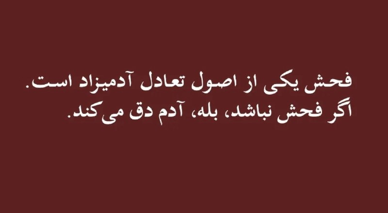

#بخوابیم

@Dirty_Kids 👻

## Dirty_Kids — post 389353

‌‏جمله‌ی
مخرج مشترک تمام مادرجنده‌های دنیا فلسطینه

یکی از حق ترین جملات تاریخه

@Dirty_Kids 👻

## Dirty_Kids — post 389352

  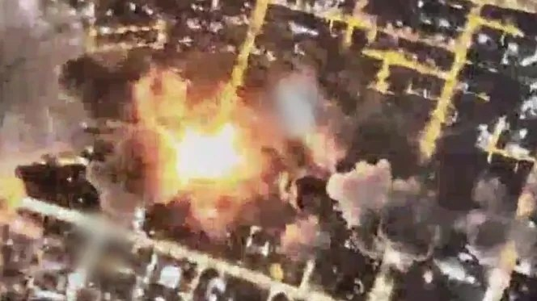

یادآوری آن روز باشکوه.

*تصویر حمله هوایی به بیت رهبری

@Dirty_Kids 👻

## Dirty_Kids — post 389350

  <a href="telegram/content/Dirty_Kids_389350_1778628949.mp4" target="_blank">🎬 Download video</a>

وسط این بگاییا یه پسره به اسم امیر قاسم ملقب به بتمن :))))))) با این ویس هاپ هاپ مخ ۶۰ نفر زده، الان لو رفته دخترا به جون هم افتادن چت و اسکرین شات و نود همدیگه‌رو دارن پخش میکنن

با نود و چتاشون کاری ندارم ولی این ویس خیلی خنده بود

@Dirty_Kids 👻

## Dirty_Kids — post 389349

  <a href="telegram/content/Dirty_Kids_389349_1778628949.mp4" target="_blank">🎬 Download video</a>

کارمندان آینده #ساواک پخشش کنید

@Dirty_Kids 👻

---
📅 بروزرسانی: 1405/02/23 01:53
---

## VahidOOnLine — post 239807

  <a href="telegram/content/VahidOOnLine_239807_1778624614.mp4" target="_blank">🎬 Download video</a>

♦️دونالد ترامپ، رئیس‌جمهوری ایالات متحده، بعدازظهر سه‌شنبه، ۲۲ اردیبهشت‌‌ماه، سفر چندروزه خود را برای دیدار با شی جین‌پینگ، رئیس جمهوری چین آغاز کرد. انتظار می‌رود خاورمیانه و پیامدهای اقتصادی مربوط به جنگ، از محورهای اصلی گفتگوها میان دو رهبر باشد.
‌🇸🇦 Indypersian

🤖 @VahidOOnLine

## VahidOOnLine — post 239806

  <a href="telegram/content/VahidOOnLine_239806_1778624616.mp4" target="_blank">🎬 Download video</a>

‌
الجزیره به نقل از منابع دیپلماتیک گزارش داد ۱۱۲ کشور به پیش‌نویس قطعنامه‌ای در شورای امنیت سازمان ملل پیوسته‌اند که از سوی آمریکا و کشورهای خلیج فارس درباره آزادی کشتیرانی در تنگه هرمز ارائه شده است.

به گفته این منابع، هند، ژاپن و بیشتر کشورهای اروپایی در میان حامیان این پیش‌نویس قرار دارند.

منابع الجزیره همچنین گفتند حمایت ۱۱۲ کشور از این قطعنامه، نشان‌دهنده پشتیبانی گسترده بین‌المللی از ابتکار آمریکا و کشورهای خلیج فارس درباره تنگه هرمز است.
‌🏁 🇬🇧 ManotoTV

🤖 @VahidOOnLine

## VahidOOnLine — post 239804

  

شروین تبریزی، سخنگوی اورژانس تهران اعلام کرد طوفان در تهران تاکنون چهار مصدوم داشته است که البته همه این مصدومان در محل درمان شدند.
او خاطرنشان کرد با توجه به اینکه وزش باد دقایقی پیش متوقف شد، احتمال افزایش مصدومان وجود دارد.

‌🏁 🇬🇧 IranintlTV

🤖 @VahidOOnLine

## VahidOOnLine — post 239803

  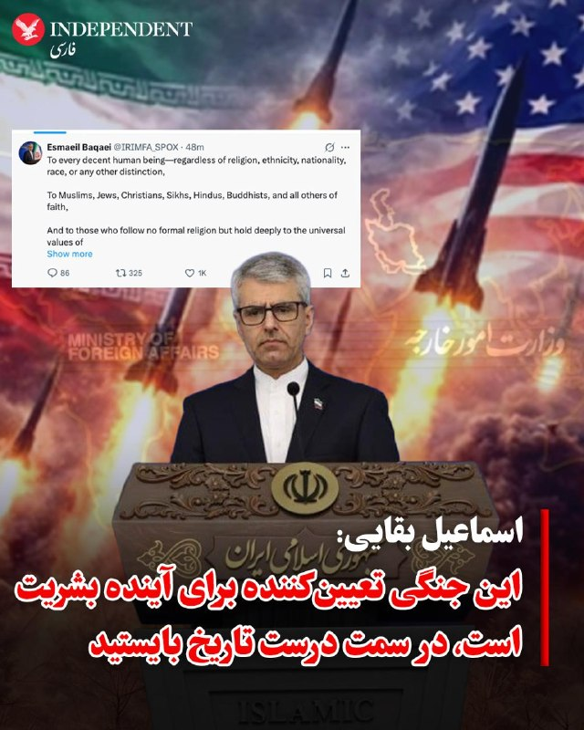

♦️اسماعیل بقایی، سخنگوی وزارت امور خارجه جمهوری اسلامی، با انتشار پیامی در اکس، درگیری‌های جاری را «نبردی سرنوشت‌ساز برای آینده بشریت» توصیف کرد و گفت: «ایالات متحده و اسرائیل این جنگ تجاوزکارانه را در ۲۸ فوریه ۲۰۲۶، برای دومین بار در کمتر از یک سال و در حالی که ایران و آمریکا در حال مذاکرات دیپلماتیک بودند، آغاز کردند.» بقایی با تاکید بر اینکه این تنها جنگی بر سر زمین یا ژئوپلیتیک نیست، گفت: «این نبردی است میان دروغگویان حرفه‌ای که برای جنایات خود توجیه می‌تراشند و ملتی سربلند که با تکیه بر قدرت و اراده خود از میهن و کرامت انسانی دفاع می‌کنند.» او سکوت در برابر این وضعیت را همدستی با شر دانست و گفت: «شجاعت اخلاقی برای سخن گفتن، عمل کردن و ایستادن در سمت درست تاریخ را پیدا کنید، پیش از آنکه جهان به ورطه بی‌قانونی و انقیاد سقوط کند. انتخاب با شماست و تاریخ آن را به یاد خواهد داشت».
‌🇸🇦 Indypersian

🤖 @VahidOOnLine

## VahidOOnLine — post 239802

  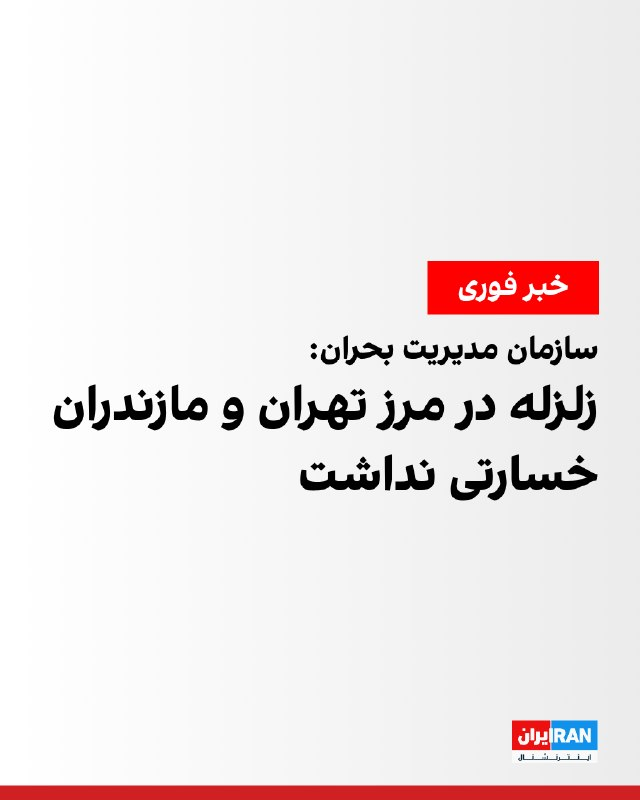

سازمان مدیریت بحران اعلام کرد باتوجه به بررسی‌های اولیه و ارزیابی تیم‌های کارشناسی، زمین‌لرزه‌ها در مرز استان‌های تهران و مازندران خساراتی درپی نداشته است.
مرکز لرزه‌نگاری در اطلاعیه‌ای اعلام کرد ساعت ۲۳:۴۶ سه‌شنبه شب زمین‌لرزه‌ای به بزرگی ۴.۶ مرز تهران و مازندران را لرزاند. زمین‌لرزه در تهران حدود ۱۰ ثانیه طول کشید.
این لرزش در شرق تهران، ورامین، پاکدشت، پردیس و بخش‌هایی از شمیرانات بیشتر احساس شد.
همچنین چهار پس‌لرزه‌ در استان تهران رخ داد که آخرین پس‌لرزه‌ها به بزرگی ۴ و ۳.۴ بودند.

‌🏁 🇬🇧 IranintlTV

🤖 @VahidOOnLine

## VahidOOnLine — post 239801

  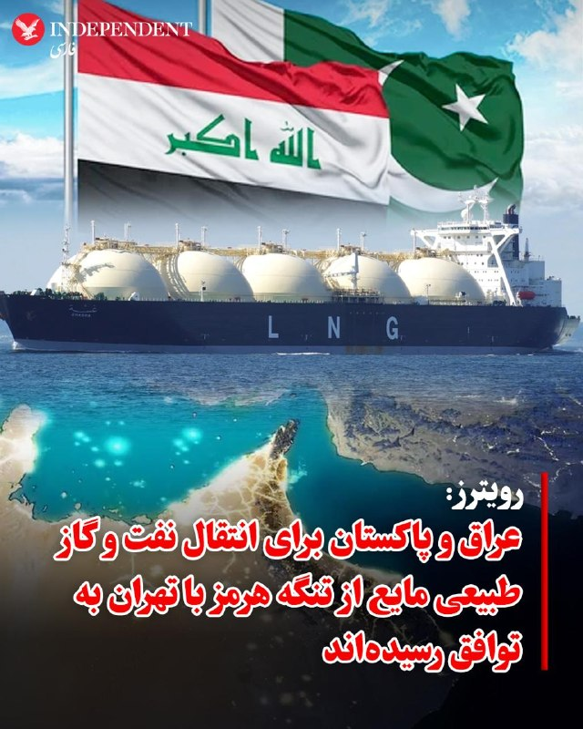

♦️به گزارش رویترز، عراق و پاکستان برای انتقال نفت و گاز طبیعی مایع (LNG) از خلیج فارس با تهران به توافق رسیده‌اند؛ اقدامی که به گفته «پنج منبع آگاه»، نشان‌دهنده توانایی رژیم ایران در هدایت جریان انرژی از طریق تنگه هرمز است. این توافق‌های جدید در حالی صورت می‌گیرد که اشراف تهران بر این آبراه حیاتی، قدرت چانه‌زنی این کشور در معادلات انرژی منطقه را افزایش داده و مسیرهای تازه‌ای را برای صادرات سوخت در بازارهای منطقه‌ای ایجاد کرده است.
‌🇸🇦 Indypersian

🤖 @VahidOOnLine

## VahidOOnLine — post 239800

  <a href="telegram/content/VahidOOnLine_239800_1778624619.mp4" target="_blank">🎬 Download video</a>

رئیس سازمان هلال احمر اعلام کرد زلزله در تهران و کرج «هیچ» خسارت مالی و جانی در پی نداشته است.
پیش‌تر زلزله‌ای به بزرگی ۴.۶ در مقیاس ریشتر، مرز استان‌های تهران و مازندران را لرزاند.
‌🏁 🇬🇧 ManotoTV

🤖 @VahidOOnLine

## VahidOOnLine — post 239799

  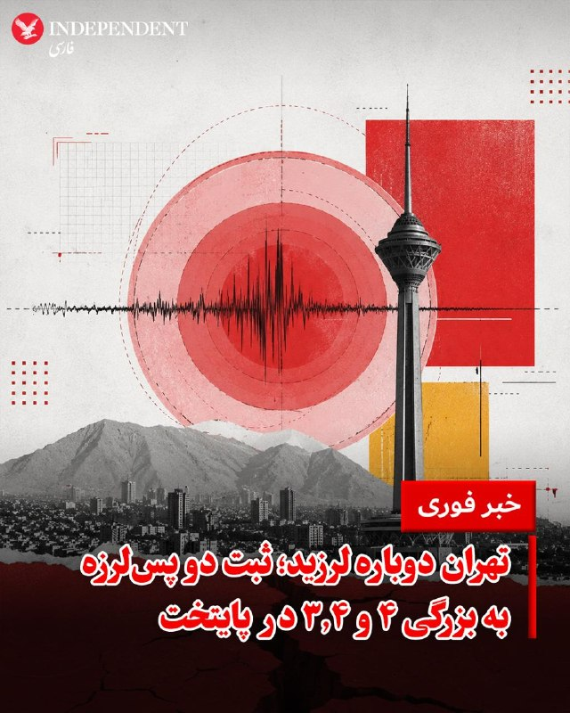

♦️به گزارش مرکز لرزه‌نگاری ایران، در نخستین ساعت بامداد چهارشنبه، ۲۳ اردیبهشت‌ماه، وقوع دو پس‌لرزه به‌ترتیب به بزرگی ۴ و ۳.۴ در پردیس، تهران را لرزاند. براساس گزارش فارس، این پس‌لرزه‌ها در ورامین، پاکدشت، پردیس و بخش‌هایی از شمیرانات حس شده است. پیش از این، زلزله به بزرگی ۴.۶ در مرز تهران و مازندران رخ داد که پردیس مرکز آن اعلام شد.
‌🇸🇦 Indypersian

🤖 @VahidOOnLine

## WithYashar — post 11106

نمیتونن از قصد ی جوری پس لرزه اینجاد کنن که نفهمن تست اتمه؟

## WithYashar — post 11105

نمیتونن از قصد ی جوری پس لرزه اینجاد کنن که نفهمن تست اتمه؟

## WithYashar — post 11104

گزارش مقدماتی زمین‌لرزه بزرگی: ۴.۶ ریشتر محل وقوع: مرز استانهای تهران و مازندران - حوالی پرديس تاریخ و زمان وقوع به وقت محلی: 1405/02/22 23:46:07 عمق زمین‌لرزه: 10 کیلومتر @withyashar همچنین اورژانس تهران اعلام کرده در پی طوفان و باد شدید با سرعت ۵۵…

## WithYashar — post 11103

  <a href="telegram/content/WithYashar_11103_1778624620.mp4" target="_blank">🎬 Download video</a>

اتاق جنگ با یاشار : بلرزونش ، هواپیمای جاسوسی آواکس و زلزله… حجم کم
@withyashar

## mwarmonitor — post 9010

  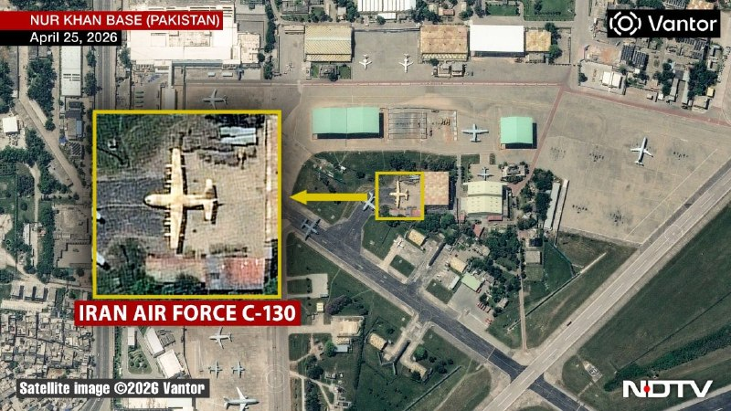

🔴بر اساس گزارش CBS درباره ادعای نگهداری هواپیماهای ایرانی توسط پاکستان در پایگاه هوایی نورخان، تصاویر منتشرشده توسط شرکت چینی تحت تحریم «Mizarvision» در آوریل ۲۰۲۶ نشان می‌دهد یک هواپیمای C-130 با استتار شنی در این محل حضور دارد. اگر پاکستان از این نوع رنگ‌آمیزی…

## mwarmonitor — post 9009

  

📰(رویترز) - کلودیا شینباوم، رئیس‌جمهور مکزیک، روز دوشنبه اعلام کرد که از همکاری مقامات سفارت آمریکا با ایالت شمالی «چی‌واوا» برای مبارزه با کارتل‌های مواد مخدر اطلاعی نداشته است. وی در پی کشته شدن این مقامات در یک تصادف رانندگی، گفت که دولتش بررسی خواهد کرد…

## mwarmonitor — post 9008

  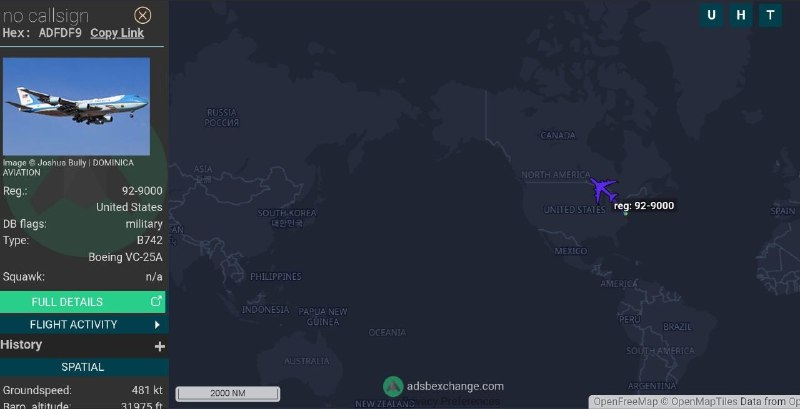

🇺🇸✈️🇨🇳 ترامپ واشنگتن را به مقصد پکن، چین ترک کرد.

هواپیمای ریاست‌جمهوری آمریکا (Air Force One) بوئینگ VC-25A با شماره ثبت 92-9000

@mwarmonitor

## FoxNewsTwitter — post 341618

  <a href="telegram/content/FoxNewsTwitter_341618_1778624625.mp4" target="_blank">🎬 Download video</a>

Fox News (Twitter/X)

A trapped dog was rescued after falling more than 21 feet "deep underground" in England's North York Moors.

A brave cave diver managed to squeeze through the tight gaps to reach the trapped pup and lift her to safety.

## pm_afshaa — post 90665

  <a href="telegram/content/pm_afshaa_90665_1778624626.webm" target="_blank">🎬 Download video</a>

🔴سی‌ان‌ان: اسرائیل نگرانه ترامپ ممکنه قبل از حل کامل مسائل اصلی جنگ، با ایران به یه توافق سریع برسه. ترس اصلی اینه که ترامپ از روند مذاکرات خسته بشه و هر توافقی حتی با امتیازهای لحظه آخری رو قبول کنه.

اسرائیل میگه آمریکا درباره اورانیوم غنی‌شده اطمینان داده، ولی نگرانی اصلیشون اینه که موضوع موشک‌های بالستیک و شبکه نیروهای نیابتی ایران اصلاً تو توافق نیاد.
همچنین می‌ترسن یه توافق نصفه‌نیمه باعث بشه تحریم‌ها سبک بشه و ایران دوباره از نظر اقتصادی و سیاسی قوی‌تر بشه.

💧Rainbet.com the #1 Non-KYC Crypto Casino & Sportsbook @rainbetcom

😁 @Pm_Afshaa

## pm_afshaa — post 90664

  <a href="telegram/content/pm_afshaa_90664_1778624627.webm" target="_blank">🎬 Download video</a>

🔴دو زمین لرزه 4 و 3.4 ریشتری در فاصله 6 دقیقه در پردیس تهران

💧 Rainbet.com the #1 Non-KYC Crypto Casino & Sportsbook @rainbetcom

😁 @Pm_Afshaa

## DEJradio — post 4601

  <a href="telegram/content/DEJradio_4601_1778624628.webm" target="_blank">🎬 Download video</a>

🚨
🔸 خبر ۲۱
سه‌شنبه ۲۲ اردیبهشت ۱۴۰۵

#خبر۲۱
@DEJradio

## DEJradio — post 4600

  <a href="telegram/content/DEJradio_4600_1778624628.webm" target="_blank">🎬 Download video</a>

🚨
🔸 حامد فرد هنرمند ملی‌گرا موزیک ویدیو «موشتباه» را منتشر کرد. او در صفحه اینستاگرام خود نوشته دو و ماه و نیم از کشته شدن علی خامنه‌ای گذشته اما جسدش را دفن نکرده‌اند و مضحک ماجرا اینجاست که مراسم چهلمش را در یک کلیسا در تهران برگزار کردند؛ آن هم چهلم کسی را که در تمام دوران حکومت ظالمانه‌اش نه‌تنها آزادی مذهب وجود نداشت، بلکه پیروان آیین مسیح و نوکیشان مسیحی تحت آزار و سـ.ـرکوب قرار داد.

او تأکید کرد کشته شدن خامنه‌ای هرچند برای بسیاری از مردم ایران مرهمی بر دل‌های خونین و زخمی بود، اما چیزی جز یک مُسکن کوتاه‌مدت و موقتی نبود و نیست. عطش انتـ.ـقام ما ملت ایران با حذف یک نفر پایان پیدا نمی‌کند.»

حامد فرد تأکید کرد «تا زمانی که حقیقت تمام جـ.ـنایت‌ها ا آشکار نشود، تا زمانی که خانواده‌های قربانیان دادخواهی نکنند، و تا زمانی که جمهوری اسلامی و تمام نمادها، ساختارها و نشانه‌های آن به‌طور کامل از ایران برچیده نشوند، آرام نخواهیم گرفت. ما تا اانـ.ـقام تمام قربانیان این رژیم اهریمنی، از بهمن شوم ۵۷ تا امروز را نگیریم، از پا نخواهیم نشست.»

#موشتبا #جمهوری_اسلامی
@DEJradio

## DEJradio — post 4599

  <a href="telegram/content/DEJradio_4599_1778624629.mp4" target="_blank">🎬 Download video</a>

🔺📢 پیام شهروندان در #تهران در واکنش به تهدید جنسی دانش‌آموزان مدرسه دخترانه شرافت در منطقه ۱۳ تهران: سکوت نکنیم، امروز مدرسه شرافت بود فردا مدرسه‌ای دیگر.

#مدرسه_شرافت #جمهوری_اسلامی
@DEJradio

## mamlekate — post 103518

📝 رویترز از حملات اعلام‌نشده عربستان سعودی به ایران در جریان جنگ خبر داد

پس از افشای حملات تلافی‌جویانه امارات متحده عربی به اهدافی در لاوان و عسلویه، خبرگزاری رویترز گزارش داد که عربستان سعودی نیز در واکنش به حملات جمهوری اسلامی به خاک این کشور در جریان جنگ اخیر، چندین حمله اعلام‌نشده علیه ایران انجام داده است.

@mamlekate

## kianmeli1 — post 87374

  <a href="telegram/content/kianmeli1_87374_1778624630.mp4" target="_blank">🎬 Download video</a>

🔴وضعیت خیابان‌ها و پارک‌های پردیس پس از زلزله امشب
https://t.me/kianmeli1

## kianmeli1 — post 87373

  <a href="telegram/content/kianmeli1_87373_1778624632.mp4" target="_blank">🎬 Download video</a>

🔴حضور مردم در حاشیه شهر بومهن پس از وقوع زلزله امشب

برخی مردم در خیابان خوابیده اند
https://t.me/kianmeli1

## IranIntlTV — post 336893

  <a href="https://t.me/IranintlTV/336893" target="_blank">📎 Download file</a>

🎧نسخه صوتی برنامه با کامبیز حسینی؛ خشم انباشتهٔ مردم کی فوران خواهد کرد؟

## IranIntlTV — post 336892

  <a href="telegram/content/IranIntlTV_336892_1778624634.mp4" target="_blank">🎬 Download video</a>

چرا به خواندن اسامی جاویدنام‌ها ادامه خواهم داد؟ چرا تکرار نام جاویدنام‌ها اهمیت ملی دارد؟ و چرا جمهوری اسلامی از تکرار نام جاویدنام خشمگین و عصبانی است؟

@iranintltv

## IranIntlTV — post 336891

  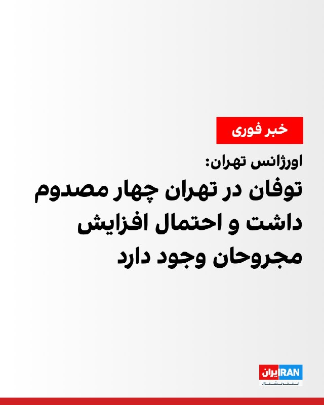

شروین تبریزی، سخنگوی اورژانس تهران اعلام کرد طوفان در تهران تاکنون چهار مصدوم داشته است که البته همه این مصدومان در محل درمان شدند.
او خاطرنشان کرد با توجه به اینکه وزش باد دقایقی پیش متوقف شد، احتمال افزایش مصدومان وجود دارد.

https://iranintl.com/202605126188

## IranIntlTV — post 336890

  <a href="telegram/content/IranIntlTV_336890_1778624636.mp4" target="_blank">🎬 Download video</a>

مراد ویسی، تحلیل‌گر ارشد ایران‌اینترنشنال، در واکنش به صحبت‌های محسنی اژه‌ای، رییس قوه قضاییه که گفت مردم نباید بدبین شوند، گفت:‌ «حکومتی که با کشتار، سرکوب، قطع اینترنت، نابودی کسب‌وکارها و تحمیل بحران‌های اقتصادی و امنیتی زندگی مردم را مختل کرده، خود عامل این بی‌اعتمادی و بدبینی است. جامعه ایران فراتر از بدبینی، خواهان پایان این وضعیت و سرنگونی جمهوری اسلامی است.»

@iranintltv

## IranIntlTV — post 336889

  <a href="telegram/content/IranIntlTV_336889_1778624638.mp4" target="_blank">🎬 Download video</a>

مراد ویسی، تحلیل‌گر ارشد ایران‌اینترنشنال، گفت:‌ «ترامپ زمان زیادی ندارد؛ چون با نزدیک شدن به انتخابات کنگره، اگر نتواند جمهوری اسلامی را به‌روشنی شکست دهد یا به اهدافش برسد، ممکن است اکثریت کنگره را به دموکرات‌ها واگذار کند.»

@iranintltv

## IranIntlTV — post 336888

  

سازمان مدیریت بحران اعلام کرد باتوجه به بررسی‌های اولیه و ارزیابی تیم‌های کارشناسی، زمین‌لرزه‌ها در مرز استان‌های تهران و مازندران خساراتی درپی نداشته است.
مرکز لرزه‌نگاری در اطلاعیه‌ای اعلام کرد ساعت ۲۳:۴۶ سه‌شنبه شب زمین‌لرزه‌ای به بزرگی ۴.۶ مرز تهران و مازندران را لرزاند. زمین‌لرزه در تهران حدود ۱۰ ثانیه طول کشید.
این لرزش در شرق تهران، ورامین، پاکدشت، پردیس و بخش‌هایی از شمیرانات بیشتر احساس شد.
همچنین چهار پس‌لرزه‌ در استان تهران رخ داد که آخرین پس‌لرزه‌ها به بزرگی ۴ و ۳.۴ بودند.

https://iranintl.com/202605124199

## IranIntlTV — post 336887

  <a href="telegram/content/IranIntlTV_336887_1778624639.mp4" target="_blank">🎬 Download video</a>

🔻علیرضا دبیر، رییس فدراسیون کشتی در گفتگویی با خبرنگاران مدعی شد فدراسیون و خانه کشتی در غرب تهران در تمام روزهای جنگ ۴۰ روزه، مورد هدف قرار گرفته است.

🔹او گفت بیش از ۱۵۰تا ۱۶۰ موشک به این محل اصابت کرده است.

🔹در هفته اول جنگ، ایران‌اینترنشنال گزارش داد که پس از آغاز حملات اسرائیل و آمریکا در نهم اسفندماه، به کارکنان و پرسنل فدراسیون‌ها و مراکز مستقر در مجموعه ورزشی آزادی در تهران دستور داده شد ساختمان‌ها و سالن‌های ورزشی این مجموعه را تخلیه کنند.

🔹طبق این اطلاعات، پس از تخلیه کارکنان، نیروهای حکومتی از جمله یگان ویژه و بسیج در بخش‌های مختلف این مجموعه مستقر شدند.

🔹پس از این ماموران در سالن‌های مختلف از جمله ورزشگاه ۱۲ هزار نفری آزادی و همچنین سالن‌ها و ساختمان‌های متعلق به فدراسیون‌های ورزشی از جمله کشتی، والیبال، بسکتبال و وزنه‌برداری مستقر شدند.

🔹در پی این اقدامات، سالن ۱۲ هزار نفری ورزشگاه آزادی در حملات هوایی روز پنجشنبه ۱۴ اسفند ۱۴۰۴، تخریب شد.

🔹به گفته علیرضا دبیر، برای بازسازی خانه کشتی، تاکنون بیش از ۴۰۰ میلیارد تومان هزینه شده است.

@iranintltvsport

## Shin_Persian — post 5983

Shin ✓ @hey_itsmyturn
Tue, 12 May 2026 21:17:38 UTC

Someone wrote “Tehran is having a wild orgasm” in Telegram 😭😭😭

فارسی

یک نفر در تلگرام نوشته «تهران دارد به ارگاسم وحشیانه می‌رسد» 😭😭😭

𝕏 · @shin_persian

## Shin_Persian — post 5982

Shin ✓ @hey_itsmyturn
Tue, 12 May 2026 21:16:15 UTC

And another aftershock rn

فارسی

و یک پس‌لرزه دیگر همین الان

𝕏 · @shin_persian

## ManotoTV — post 105382

  <a href="telegram/content/ManotoTV_105382_1778624641.mp4" target="_blank">🎬 Download video</a>

‌
الجزیره به نقل از منابع دیپلماتیک گزارش داد ۱۱۲ کشور به پیش‌نویس قطعنامه‌ای در شورای امنیت سازمان ملل پیوسته‌اند که از سوی آمریکا و کشورهای خلیج فارس درباره آزادی کشتیرانی در تنگه هرمز ارائه شده است.

به گفته این منابع، هند، ژاپن و بیشتر کشورهای اروپایی در میان حامیان این پیش‌نویس قرار دارند.

منابع الجزیره همچنین گفتند حمایت ۱۱۲ کشور از این قطعنامه، نشان‌دهنده پشتیبانی گسترده بین‌المللی از ابتکار آمریکا و کشورهای خلیج فارس درباره تنگه هرمز است.

## ManotoTV — post 105380

  <a href="telegram/content/ManotoTV_105380_1778624641.mp4" target="_blank">🎬 Download video</a>

تماسی از تهران:
«می‌گفت جنگ شد و بعد رها شد… همه‌چیز روی هوا موند و شرایط افتضاح‌تر شد.
می‌گفت قبلش حداقل یه جور داشتیم زندگی می‌کردیم

## ManotoTV — post 105379

  <a href="telegram/content/ManotoTV_105379_1778624644.mp4" target="_blank">🎬 Download video</a>

رئیس سازمان هلال احمر اعلام کرد زلزله در تهران و کرج «هیچ» خسارت مالی و جانی در پی نداشته است.
پیش‌تر زلزله‌ای به بزرگی ۴.۶ در مقیاس ریشتر، مرز استان‌های تهران و مازندران را لرزاند.

## FarsiVOA — post 217580

🔺انجمن قلم آمریکا: جمهوری اسلامی بزرگترین دشمن زنان اهل قلم و ایران دومین زندان نویسندگان جهان است

▪️انجمن قلم آمریکا، روز سه‌شنبه ۲۲ اردیبهشت در تازه‌ترین گزارش خود از «شاخص آزادی نوشتن» اعلام کرد جمهوری اسلامی ایران پس از چین، دومین زندان نویسندگان در جهان است و دو برابر میانگین جهانی، زنان اهل قلم را زندانی کرده است.

⬇️ بیشتر بخوانید:
https://ir.voanews.com/a/iran-pen-american-center-writers-prison/8149274.html
@FarsiVOA

## FarsiVOA — post 217579

🔺جروزالم پست: عربستان سعودی در جریان عملیات «خشم حماسی» به مواضع رژیم ایران حمله‌ کرد

▪️روزنامه اسرائیلی جروزالم پست به نقل از مقام‌های غربی و ایرانی گزارش داده است که عربستان سعودی در جریان عملیات «خشم حماسی» حملات هوایی مخفیانه‌ای را علیه برخی مواضع رژیم جمهوری اسلامی در ایران انجام داده است. اقدامی که در صورت تأیید، نخستین عملیات مستقیم نظامی شناخته‌شده عربستان سعودی در خاک ایران محسوب می‌شود.

⬇️ بیشتر بخوانید:
https://ir.voanews.com/a/jpost-saudi-arabia-attacked-iran-epic-fury/8149291.html
@FarsiVOA

## FarsiVOA — post 217578

🔺پرزیدنت ترامپ: بیان ادعاهای دروغین درباره مناسب بودن شرایط نظامی رژیم ایران «خیانت» است

▪️رئیس جمهوری ایالات متحده با انتقاد شدید از انتشار اخبار دروغین در برخی از رسانه‌ها و مطرح کردن ادعاهای «وضعیت خوب» رژیم ایران از لحاظ نظامی در مقابل ارتش آمریکا، آن‌ را «عملا خیانت» به کشور دانست.

⬇️ بیشتر بخوانید:
https://ir.voanews.com/a/trump-iran-nuclear-inflation-travel-china/8149296.html
@FarsiVOA

## Persian_Trend_Official — post 14020

  <a href="telegram/content/Persian_Trend_Official_14020_1778624644.mp4" target="_blank">🎬 Download video</a>

⭕️ بنیامین نتانیاهو:

تنها کسی که رئیس موساد را منصوب می‌کند، نخست وزیر است. رومن توسط من به عنوان رئیس بعدی موساد کشور اسرائیل انتخاب شد - و او موساد را از قدرتی به قدرت دیگر رهبری خواهد کرد.

📝 Nick

📌 @persian_trend_official
پرشین ترند | متفاوت‌ترین کانال نظامی

## Persian_Trend_Official — post 14019

  <a href="telegram/content/Persian_Trend_Official_14019_1778624647.mp4" target="_blank">🎬 Download video</a>

⭕️ ویدئو منتشر شده در اینستاگرام بنیامین نتانیاهو:

📝 Nick

📌 @persian_trend_official
پرشین ترند | متفاوت‌ترین کانال نظامی

## Persian_Trend_Official — post 14018

  <a href="telegram/content/Persian_Trend_Official_14018_1778624649.webm" target="_blank">🎬 Download video</a>

#طنز_تلخ

⭕️ بیانیه عرش الهی:

مجدد زلزله ای زیبا نازل کردیم.
خواهیم دید چه خواهد شد.
از توجه شما به این موضوع سپاس گذاریم.

📝 Nick

📌 @persian_trend_official
پرشین ترند | متفاوت‌ترین کانال نظامی

## Persian_Trend_Official — post 14017

  <a href="telegram/content/Persian_Trend_Official_14017_1778624649.mp4" target="_blank">🎬 Download video</a>

💢این ویدئو بهت نشون میده که پناه‌گیری درست چطور جانت رو حفظ می‌کنه در زمان زلزله

🫆:Tony

📌 @persian_trend_official
پرشین ترند | متفاوت‌ترین کانال نظامی

## Persian_Trend_Official — post 14016

🔴کولیوند: زلزله پردیس تهران، خسارت مالی و جانی نداشت

💢 رئیس جمعیت هلال احمر: مردم نگران نباشند؛ زلزله پردیس تهران، خسارت مالی و جانی در پی نداشته است.

💢 ۲ پس لرزه ۴ و ۳.۴ ریشتری دیگر تهران را لرزاند.

🫆:Tony

📌 @persian_trend_official
پرشین ترند | متفاوت‌ترین کانال نظامی

## Persian_Trend_Official — post 14015

🔴آماده باش مدیریت بحران پردیس؛ در پی زلزله مردم پردیس از خانه‌ها خارج شدند

💢در حالی که فرماندار شهرستان پردیس گفت: در پی وقوع زمین لرزه استان ستاد مدیریت بحران شهرستان در آماده باش کامل است، خبرنگار ایرنا از پردیس گزارش می‌دهد شهروندان پردیسی از خانه‌ها خارج شده و در پارک‌ها و خودروها مستقر شده‌اند.

🫆:Tony

📌 @persian_trend_official
پرشین ترند | متفاوت‌ترین کانال نظامی

## Persian_Trend_Official — post 14014

🔴گزارش جدیدترین پس‌لرزه در استان تهران

بزرگی: 3.4
محل وقوع: حوالی پرديس
تاریخ و زمان وقوع به وقت محلی: 1405/02/23 00:32:44
طول جغرافیایی: 51.83
عرض جغرافیایی: 35.83
عمق زمین‌لرزه: 10 کیلومتر

نزدیک‌ترین شهرها:
10 کیلومتری پرديس (تهران)
11 کیلومتری بومهن (تهران)
12 کیلومتری رودهن (تهران)

نزدیکترین مراکز استان:
41 کیلومتری تهران
76 کیلومتری كرج

🫆:Tony

📌 @persian_trend_official
پرشین ترند | متفاوت‌ترین کانال نظامی

## manototv — post 105382

  <a href="telegram/content/manototv_105382_1778624651.mp4" target="_blank">🎬 Download video</a>

‌
الجزیره به نقل از منابع دیپلماتیک گزارش داد ۱۱۲ کشور به پیش‌نویس قطعنامه‌ای در شورای امنیت سازمان ملل پیوسته‌اند که از سوی آمریکا و کشورهای خلیج فارس درباره آزادی کشتیرانی در تنگه هرمز ارائه شده است.

به گفته این منابع، هند، ژاپن و بیشتر کشورهای اروپایی در میان حامیان این پیش‌نویس قرار دارند.

منابع الجزیره همچنین گفتند حمایت ۱۱۲ کشور از این قطعنامه، نشان‌دهنده پشتیبانی گسترده بین‌المللی از ابتکار آمریکا و کشورهای خلیج فارس درباره تنگه هرمز است.

## manototv — post 105380

  <a href="telegram/content/manototv_105380_1778624652.mp4" target="_blank">🎬 Download video</a>

تماسی از تهران:
«می‌گفت جنگ شد و بعد رها شد… همه‌چیز روی هوا موند و شرایط افتضاح‌تر شد.
می‌گفت قبلش حداقل یه جور داشتیم زندگی می‌کردیم

## manototv — post 105379

  <a href="telegram/content/manototv_105379_1778624654.mp4" target="_blank">🎬 Download video</a>

رئیس سازمان هلال احمر اعلام کرد زلزله در تهران و کرج «هیچ» خسارت مالی و جانی در پی نداشته است.
پیش‌تر زلزله‌ای به بزرگی ۴.۶ در مقیاس ریشتر، مرز استان‌های تهران و مازندران را لرزاند.

## alonews — post 119631

  <a href="telegram/content/alonews_119631_1778624654.webm" target="_blank">🎬 Download video</a>

👈تهران امشب رو ویبره بود

✅ @AloNews خبر جنگ

## alonews — post 119630

  <a href="telegram/content/alonews_119630_1778624654.mp4" target="_blank">🎬 Download video</a>

👈حضور مردم در حاشیه شهر بومهن پس از وقوع زلزله امشب

🔴برخی مردم در خیابان خوابیده اند

✅ @AloNews خبر جنگ

## alonews — post 119629

  <a href="telegram/content/alonews_119629_1778624656.webm" target="_blank">🎬 Download video</a>

👈رویترز: منابع میگن عربستان مخفیانه حملاتی علیه ایران شروع کرده و تنش‌های منطقه‌ای هم شدیدتر شده

✅ @AloNews خبر جنگ

## alonews — post 119628

  <a href="telegram/content/alonews_119628_1778624656.webm" target="_blank">🎬 Download video</a>

👈یک مقام ارشد اسرائیلی به سی‌ان‌ان گفت: اگر توافقی حاصل نشود خوشحال خواهیم شد اگر محاصره ادامه یابد خوشحال خواهیم شد و اگر چند حمله دیگر هم به ایران شود، خوشحال خواهیم شد

✅ @AloNews خبر جنگ

## alonews — post 119627

  <a href="telegram/content/alonews_119627_1778624656.webm" target="_blank">🎬 Download video</a>

👈طبق معمول پمپ بنزینای تهران شلوغ شد

✅ @AloNews خبر جنگ

## alonews — post 119626

  <a href="telegram/content/alonews_119626_1778624657.webm" target="_blank">🎬 Download video</a>

👈گزارش مقدماتی زمین‌لرزه مجدد در تهران

🔴 بزرگی: ۴ ریشتر
محل وقوع: حوالی پرديس
زمان: ۲۶ دقیقه بامداد
عمق زمین‌لرزه: ۸ کیلومتر

🔴نزدیک‌ترین شهرها:
۹ کیلومتری پرديس (تهران)
۱۱ کیلومتری بومهن (تهران)
۱۲ کیلومتری رودهن (تهران)

🔴نزدیکترین مراکز استان:
۴۰ کیلومتری تهران
۷۶ کیلومتری كرج

✅ @AloNews خبر جنگ

## alonews — post 119625

  <a href="telegram/content/alonews_119625_1778624657.webm" target="_blank">🎬 Download video</a>

👈چندین پس لرزه خفیف در تهران ثبت شد

✅ @AloNews خبر جنگ

---
📅 بروزرسانی: 1405/02/23 00:38
---

## VahidOOnLine — post 239798

  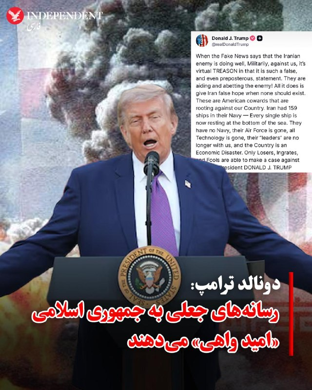

♦️دونالد ترامپ، رئیس‌جمهوری ایالات متحده، با انتشار پیامی در شبکه اجتماعی «تروث سوشال»، گزارش‌های رسانه‌ها درباره موفقیت‌های نظامی جمهوری اسلامی در برابر آمریکا را «دروغین» و مصداق عینی «خیانت» خواند و گفت: «این اظهارات مضحک تنها به ایران امیدی واهی می‌دهد؛ این‌ها ترسوهای آمریکایی هستند که علیه کشور خودشان ریشه می‌دوانند و با حمایت از دشمن، به آن‌‌ها کمک می‌کنند.» ترامپ با اشاره به نابودی توان نظامی جمهوری اسلامی گفت: «ایران درگیر یک فاجعه اقتصادی است.» او در پایان تاکید کرد که تنها «بازندگان، افراد ناسپاس و احمق‌ها» می‌توانند علیه آمریکا استدلال کنند.
‌🇸🇦 Indypersian

🤖 @VahidOOnLine

## VahidOOnLine — post 239797

  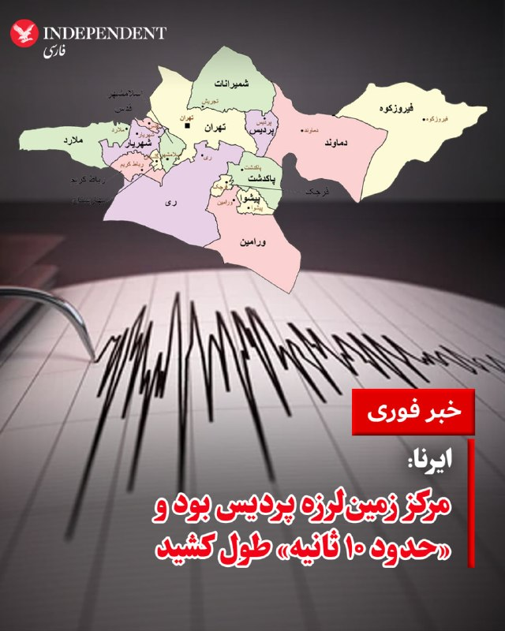

♦️به گزارش ایرنا، مرکز زمین‌لرزه سه‌شنبه‌شب تهران، در مرز این استان با مازندران در حوالی پردیس بوده است. براساس این گزارش، این زلزله به بزرگی ۴.۶، ساعت ۲۳:۴۶:۰۷ سه‌شنبه‌شب، ۲۲ اردیبهشت‌ماه، در عمق ۱۰ کیلومتر رخداد و حدود ۱۰ ثانیه به طول انجامید. همزمان، سخنگوی اورژانس تهران اعلام کرد در پی زمین لرزه در تهران تا این لحظه مصدومی گزارش نشده است
‌🇸🇦 Indypersian

🤖 @VahidOOnLine

## VahidOOnLine — post 239796

  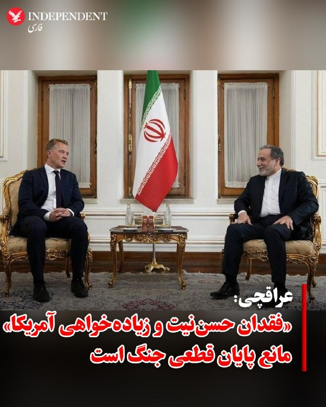

♦️خبرگزاری تسنیم، وابسته به سپاه پاسداران، گزارش داد عباس عراقچی، وزیر خارجه جمهوری اسلامی، در دیدار با معاون وزیر خارجه نروژ، مدعی شد «فقدان حسن‌نیت، زیاده‌خواهی و عدم صداقت آمریکا» مهم‌ترین مانع پایان قطعی جنگ و دستیابی به توافق احتمالی است. او همچنین آمریکا و اسرائیل را عامل وضعیت جاری در تنگه هرمز معرفی کرد و گفت جمهوری اسلامی در حال بررسی تدوین مقررات مرتبط با این آبراه بر اساس حقوق بین‌الملل است.
‌🇸🇦 Indypersian

🤖 @VahidOOnLine

## VahidOOnLine — post 239795

  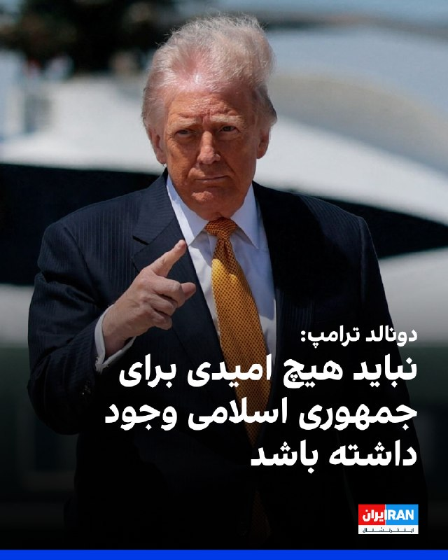

دونالد ترامپ در شبکه تروث سوشال نوشت وقتی رسانه‌های «جعلی» می‌گویند دشمن ایرانی از نظر نظامی در برابر آمریکا عملکرد خوبی دارد، این نوعی خیانت است، زیرا چنین ادعایی کاملا نادرست و حتی مضحک است.
او افزود: آن‌ها در حال کمک به دشمن هستند و به جمهوری اسلامی امید می‌دهند در حالی که نباید هیچ امیدی برای او وجود داشته باشد.
‌🏁 🇬🇧 IranintlTV

🤖 @VahidOOnLine

## VahidOOnLine — post 239794

  

علی احتشام، امام جمعه کاشان گفت: «جمهوری اسلامی نه یکی از چهار قدرت، بلکه تنها ابرقدرت جهان است و ملت ایران هشت کشور منطقه و آمریکا را از کمال ارتفاع ساقط کرد و امروز با حضور در خیابان‌ها اجازه نداد جام زهر دیگری نوشیده شود.»

او افزود: «اگر مردم کف خیابان نبودند، چه بسا جام زهر دیگری نوشیده می‌شد.»
‌🏁 🇬🇧 IranintlTV

🤖 @VahidOOnLine

## VahidOOnLine — post 239793

  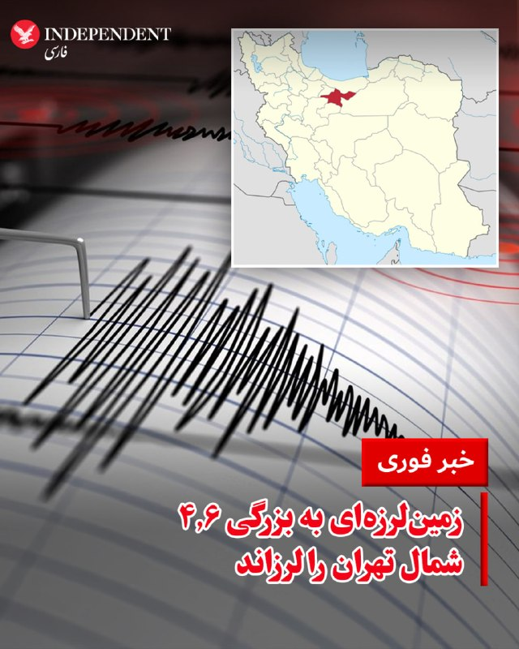

♦️به گزارش فارس، زلزله‌ای به بزرگی ۴.۶، سه‌شنبه‌شب، ۲۲ اردیبهشت‌ماه، مرز تهران و مازندران را لرزاند.
‌🇸🇦 Indypersian

🤖 @VahidOOnLine

## VahidOOnLine — post 239792

  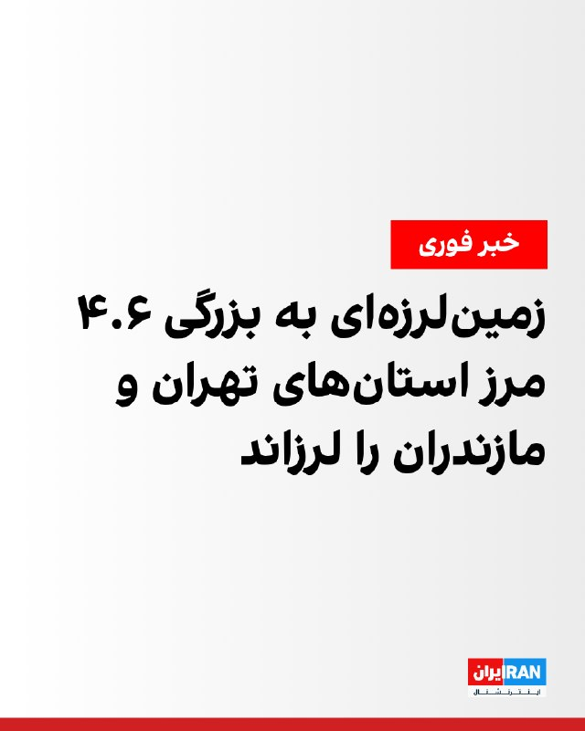

رسانه‌های ایران از وقوع زمین‌لرزه به بزرگی ۴.۶ در مرز استان‌های تهران و مازندران خبر دادند.

خبرگزاری فارس همچنین از زمین‌لرزه در کرج خبر داد.

همزمان خبرگزاری دولتی ایرنا گزارش داد زمین‌لرزه در تهران حدود ۱۰ ثانیه طول کشیده است.
‌🏁 🇬🇧 IranintlTV

🤖 @VahidOOnLine

## VahidOOnLine — post 239790

  <a href="telegram/content/VahidOOnLine_239790_1778620144.mp4" target="_blank">🎬 Download video</a>

‌
خبرگزاری‌های داخل ایران گزارش دادند دقایقی پیش زلزله تهران و کرج را لرزاند. به گزارش این خبرگزاری‌ها سمت شرق تهران زمین‌لرزه بسیار شدیدتر بوده است.
‌🏁 🇬🇧 ManotoTV

🤖 @VahidOOnLine

## VahidOOnLine — post 239789

  

سعید سیاه‌سرانی، دبیر ستاد راهیان نور دریایی، گفت: «بدون اراده جمهوری اسلامی اجازه عبور حتی یک لیتر نفت از تنگه هرمز داده نمی‌شود.»

او افزود: «تنگه هرمز جزو خاک ما است، شناورهایی که رد می‌شوند باید اجازه بگیرند و به زبان فارسی صحبت کنند و از نقاطی که ما تعیین می‌کنیم عبور کنند.»
‌🏁 🇬🇧 IranintlTV

🤖 @VahidOOnLine

## VahidOOnLine — post 239788

  

♦️وزارت امور خارجه جمهوری اسلامی روز سه‌شنبه ۲۲ اردیبهشت، بازداشت چهار نفر توسط کویت را که گفته می‌شود با سپاه پاسداران در ارتباط هستند، محکوم کرد. این وزارتخانه اعلام کرد که این افراد در حال گشت‌زنی دریایی بوده‌اند و تنها به دلیل «اختلال در سیستم ناوبری» وارد آب‌های سرزمینی این کشور حوزه خلیج فارس شده‌اند.

همچنین وزارت خارجه جمهوری اسلامی اظهارات مقامات کویتی مبنی بر برنامه‌ریزی ایران برای انجام «اقدامات خصمانه» علیه این کشور را به شدت رد کرد. این تنش دیپلماتیک در حالی رخ می‌دهد که امنیت دریانوردی در منطقه به موضوعی حساس تبدیل شده است.
‌🇸🇦 Indypersian

🤖 @VahidOOnLine

## VahidOOnLine — post 239787

  

امارات متحده عربی اعلام کرد ۱۶ شهروند لبنانی و پنج نهاد مستقر در لبنان را به دلیل ارتباط با حزب‌الله در فهرست تروریستی این کشور قرار داده است.

در همین چارچوب، «موسسه قرض‌الحسن» و چهار نهاد دیگر نیز به دلیل ارتباط با حزب‌الله در این فهرست قرار گرفته‌اند.

امارات متحده عربی تاکید کرد این اقدامات در راستای مهار آفات تروریسم، محدود کردن گسترش آن و قطع تامین مالی فرامرزی انجام شده است.
‌🏁 🇬🇧 IranintlTV

🤖 @VahidOOnLine

## VahidOOnLine — post 239786

  

♦️ وزارت دفاع بریتانیا روز سه‌شنبه، ۲۲ اردیبهشت، اعلام کرد که این کشور تجهیزات خودکار مین‌یاب و سیستم‌های ضدپهپادی با فناوری بسیار نوین را به تنگه هرمز ارسال می‌کند. طبق بیانیه صادر شده، جان هیلی، وزیر دفاع بریتانیا، تاکید کرد که بریتانیا نقشی کلیدی در تامین امنیت تنگه هرمز ایفا می‌کند و امروز با ارسال تجهیزات پیشرفته، تعهد خود را برای حفاظت از منافع کشور و امنیت این آبراه نشان می‌دهد.

بریتانیا همچنین در پایان هفته گذشته اعلام کرده بود که ناو «اچ‌ام‌اس دراگون» نیروی دریایی سلطنتی را برای پشتیبانی از عملیات مین‌روبی در این مسیر آبی پرتردد به خاورمیانه اعزام می‌کند. علاوه بر این، بریتانیا و فرانسه به طور مشترک تلاش‌هایی را برای تشکیل یک ماموریت بین‌المللی با هدف بهبود امنیت خطوط کشتیرانی در این تنگه هدایت کرده‌اند.
‌🇸🇦 Indypersian

🤖 @VahidOOnLine

## VahidOOnLine — post 239785

  <a href="telegram/content/VahidOOnLine_239785_1778620148.mp4" target="_blank">🎬 Download video</a>

♦️دونالد ترامپ، رئیس‌جمهوری آمریکا، روز سه‌شنبه ۲۲ اردیبهشت‌ماه پیش از سفر رسمی به چین و دیدار با شی جین‌پینگ، در پاسخ به سوالی درباره خط قرمز پایان آتش‌بس با ایران گفت: «در طول پرواز به آن فکر خواهیم کرد و در روزهای آینده هم درباره آن فکر می‌کنیم.»

ترامپ همچنین گفت آمریکا ارتش جمهوری اسلامی را «به‌طور کامل شکست داده» و افزود: «کار آن تمام شده است.»
‌🇸🇦 Indypersian

🤖 @VahidOOnLine

## VahidOOnLine — post 239784

  

در پی بازداشت چهار فرد «وابسته به سپاه پاسداران» در کویت، وزارت خارجه جمهوری اسلامی برنامه‌ریزی برای انجام اقدامات خصمانه علیه کویت را بی‌اساس و مردود دانست.

وزارت خارجه جمهوری اسلامی در بیانیه‌ای اعلام کرد این چهار مامور در چارچوب ماموریت مرسوم گشت‌زنی دریایی مشغول انجام وظیفه بوده‌اند و به دلیل «اختلال در سامانه ناوبری» وارد آب‌های سرزمینی کویت شده‌اند.

این وزارتخانه از مراجع کویت خواست از اظهارنظرهای شتاب‌زده و طرح ادعاهای بی‌اساس خودداری کرده و موضوع را از طریق مجاری رسمی پیگیری کنند. وزارت خارجه جمهوری اسلامی همچنین خواهان آزادی این چهار مامور بازداشت‌شده شد.
‌🏁 🇬🇧 IranintlTV

🤖 @VahidOOnLine

## WithYashar — post 11102

رویترز: دو تانکر حامل ال‌ان‌جی قطر، به دنبال توافق دوجانبه جداگانه بین اسلام‌آباد و تهران، به سمت پاکستان در حرکت هستند
@withyashar

## WithYashar — post 11101

گزارش مقدماتی زمین‌لرزه

بزرگی: ۴.۶ ریشتر
محل وقوع: مرز استانهای تهران و مازندران - حوالی پرديس
تاریخ و زمان وقوع به وقت محلی: 1405/02/22 23:46:07

عمق زمین‌لرزه: 10 کیلومتر
@withyashar
همچنین اورژانس تهران اعلام کرده در پی طوفان و باد شدید با سرعت ۵۵ کیلومتر در تهران تاکنون ۱۱ حادثه به این سازمان امدادی گزارش شده است.

سخنگوی اورژانس تهران نوشته تاکنون ۷ مصدوم که ۵ نفر آنها سرپایی درمان شده‌اند، در ماموریت‌های امدادگران ثبت شده‌اند اما ممکن است آمار مصدومان بیشتر شود.
@withyashar

## WithYashar — post 11100

کاور @withyashar

## WithYashar — post 11099

  

ترامپ در تروث :
وقتی رسانه‌های دروغ‌پراکن می‌گویند دشمن ایرانی از نظر نظامی در برابر ما عملکرد خوبی دارد، این عملاً نوعی خیانت است؛ چون چنین ادعایی کاملاً دروغ و حتی مضحک است. آنها دارند به دشمن کمک و همراهی می‌کنند!

تنها کاری که این حرف‌ها می‌کند این است که به ایران امید واهی می‌دهد، در حالی که هیچ امیدی نباید وجود داشته باشد. اینها ترسوهای آمریکایی هستند که علیه کشور خودشان طرفداری می‌کنند.

ایران ۱۵۹ کشتی در نیروی دریایی خود داشت — اکنون تک‌تک آن‌ها در کف دریا قرار دارند. آنها دیگر نیروی دریایی ندارند، نیروی هوایی‌شان نابود شده، تمام فناوری‌شان از بین رفته، «رهبرانشان» دیگر در میان ما نیستند، و کشورشان یک فاجعه اقتصادی است.

فقط بازنده‌ها، ناسپاس‌ها و احمق‌ها می‌توانند علیه آمریکا استدلال کنند!
@withyashar

## WithYashar — post 11098

وزارت خارجه آمریکا: با چین توافق کرده‌ایم اجازه اعمال عوارض بر عبور کشتی‌ها از تنگه هرمز داده نشود.
@withyashar

## WithYashar — post 11097

اتاق جنگ با یاشار : جابجای‌های غول آسا دو شماره یک «AirForce1» هواپیمای ویژه ریاست جمهوری و «B1 »بمب افکن اسطورهی آمریکا و خبر ویژه از داخل ایران

https://www.instagram.com/reel/DYQCr39RJ4i/?igsh=MThycjJiYWZmbnJ3dA==

کارای اداریش رو انجام بدید تا بعدش بریم برای سوال جوای

## WithYashar — post 11096

  

کاور
@withyashar

## WithYashar — post 11095

## mwarmonitor — post 9007

📝 به نظر می‌رسد سیستمِ مدیریتِ بلایایِ الهی هم به این نتیجه رسیده که در ایران، مرگِ تدریجی دیگر از مد افتاده و باید کمی هیجان و سرعت به فرآیندِ انقراضِ ما تزریق کند. انگار فرشته‌ی عذاب نشسته بالای سرِ تقویمِ تهران و با خودش می‌گوید: «خب، این‌ها که تحریم هستند،…

## mwarmonitor — post 9005

✈️پرواز بمب‌افکن‌های راهبردی از نوع B-1B Lancer از پایگاه RAF Fairford ✈️به‌طور جالب توجهی، بمب‌افکن تک‌فروندی B-1B با نام “Lancer” که از RAF Fairford (کد EGVA) پرواز می‌کند (و چهلمین مأموریت آموزشی از این پایگاه از زمان آغاز آتش‌بس را انجام می‌دهد)، موقعیت…

## mwarmonitor — post 9004

🇮🇱اسرائیل نگران است که ترامپ با ایران یک «توافق بد» امضا کند؛ توافقی که برنامه هسته‌ای ایران را تا حدی دست‌نخورده باقی بگذارد و برنامه موشکی بالستیک ایران و همچنین حمایت این کشور از نیروهای نیابتی منطقه‌ای را نادیده بگیرد - CNN

🇮🇱یک مقام اسرائیلی به CNN گفته است: «اگر هیچ توافقی حاصل نشود خوشحال خواهیم شد» و «اگر محاصره/بسته بودن تنگه هرمز ادامه پیدا کند هم خوشحال خواهیم شد».

@mwarmonitor

## mwarmonitor — post 9003

🔸خبرنگار: آقای رئیس‌جمهور، پیامتان به مردم چین در آستانه این نشست (اجلاس سران) چیست؟ 🔹ترامپ: این است که ما برای دهه‌های متمادی، رابطه‌ی فوق‌العاده‌ای خواهیم داشت. رابطه‌ی من با رئیس‌جمهور «شی»، رابطه‌ای بی‌نظیر است؛ ما همیشه با هم کنار آمده‌ایم. ما با چین…

## mwarmonitor — post 9002

  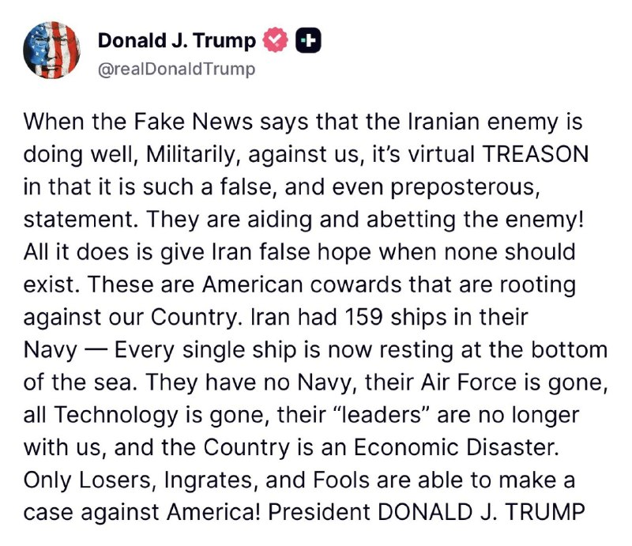

«وقتی «اخبار جعلی» (Fake News) می‌گویند که دشمن ایرانی از نظر نظامی در برابر ما خوب عمل می‌کند، این عملاً به مثابه خیانت است، زیرا چنین اظهارنظری کذب و حتی مضحک است. آن‌ها در حال کمک و یاری رساندن به دشمن هستند!
تمام کاری که این کار انجام می‌دهد، دادن امید واهی به ایران است، در حالی که هیچ امیدی نباید وجود داشته باشد. این‌ها ترسوهای آمریکایی هستند که علیه کشورمان فعالیت می‌کنند. ایران ۱۵۹ کشتی در نیروی دریایی خود داشت — اکنون تک‌تک آن کشتی‌ها در کف دریا آرام گرفته‌اند. آن‌ها دیگر نیروی دریایی ندارند، نیروی هوایی‌شان از بین رفته، تمام تکنولوژی‌شان نابود شده، «رهبرانشان» دیگر در میان ما نیستند و این کشور یک فاجعه اقتصادی است.
فقط بازنده‌ها، ناسپاس‌ها و احمق‌ها می‌توانند علیه آمریکا استدلال کنند!

رئیس‌جمهور دونالد جی. ترامپ»

@mwarmonitor

## mwarmonitor — post 9001

تهران یه بچه زلزله امده

## mwarmonitor — post 9000

🔸خبرنگار: تالار پذیرایی شما چه تفاوتی با بقیه دارد؟ 🔹دونالد ترامپ: اتفاقی که افتاده این است که ما یک تالار پذیرایی داریم که هزینه‌اش کمتر از بودجه پیش‌بینی شده بوده، دقیقاً همین‌جا در حال ساخت است. من اندازه‌اش را دو برابر کردم چون مسلماً به آن نیاز داریم.…

## mwarmonitor — post 8999

🔸خبرنگار: آقای رئیس‌جمهور، شما قول داده بودید که تورم را پایین بیاورید. اما الان در بالاترین سطح خود در سه سال اخیر است. آیا سیاست‌های شما کار نمی‌کنند؟ چه اتفاقی دارد می‌افتد؟ 🔹ترامپ: سیاست‌های من فوق‌العاده خوب کار می‌کنند. اگر به زمان دقیقاً قبل از شروع…

## mwarmonitor — post 8998

🔸خبرنگار: آقای رئیس‌جمهور، تا چه زمانی به مذاکره با ایران ادامه می‌دهید؟ (چه زمانی مذاکره با ایران تمام می‌شود؟) 🔹ترامپ: خب، خواهیم دید چه پیش می‌آید. ما فقط یک توافق خوب خواهیم کرد. ارتش آن‌ها از بین رفته، نابود شده است. ما فقط یک توافق خوب خواهیم کرد و خواهیم…

## mwarmonitor — post 8997

🔸خبرنگار: آقای رئیس‌جمهور، تا چه زمانی به مذاکره با ایران ادامه می‌دهید؟ (چه زمانی مذاکره با ایران تمام می‌شود؟)
🔹ترامپ: خب، خواهیم دید چه پیش می‌آید. ما فقط یک توافق خوب خواهیم کرد. ارتش آن‌ها از بین رفته، نابود شده است. ما فقط یک توافق خوب خواهیم کرد و خواهیم دید چه می‌شود. اما من معتقدم که به هر شکلی، این [توافق] برای مردم آمریکا و در واقع برای مردم ایران بسیار خوب خواهد بود.
🔸خبرنگار: آیا شما پاکستانی‌ها را به عنوان میانجی در نظر می‌گیرید؟
🔹ترامپ: نه، آن‌ها عالی هستند. من فکر می‌کنم پاکستانی‌ها عالی بوده‌اند. فیلد مارشال و نخست‌وزیر پاکستان مطلقاً عالی بوده‌اند.
🔸خبرنگار: آقای رئیس‌جمهور، پیام شما به رئیس‌جمهور "شی" [رئیس‌جمهور چین] در رابطه با جنگ ایران چیست؟
🔹ترامپ: خب، فکر می‌کنم اولاً ما در مورد آن صحبت مفصلی خواهیم داشت. فکر می‌کنم او نسبتاً خوب بوده است، اگر صادقانه بگویم. به محاصره نگاه کنید، مشکلی نیست. آن‌ها مقدار زیادی از نفت خود را از آن منطقه می‌گیرند. ما مشکلی نداشتیم و او دوست من بوده است، کسی است که با هم کنار می‌آییم. و فکر می‌کنم خواهید دید که اتفاقات خوبی رخ خواهد داد. این سفر بسیار هیجان‌انگیزی خواهد بود و اتفاقات خوب زیادی خواهد افتاد.
🔸خبرنگار: آقای رئیس‌جمهور، آیا فکر می‌کنید او (رئیس‌جمهور چین) اصلاً نیاز دارد در مورد ایرانی‌ها مداخله کند؟ فکر می‌کنید او می‌تواند به هر شکلی کمک کند؟
🔹ترامپ: نه، فکر نمی‌کنم در مورد ایران به کمکی نیاز داشته باشیم. ما به هر شکلی پیروز می‌شویم. ما به صورت مسالمت‌آمیز یا غیر از آن پیروز می‌شویم. نیروی دریایی آن‌ها رفته، نیروی هوایی‌شان رفته، تک‌تک عناصر ماشین جنگی آن‌ها از بین رفته است. آن‌ها افراد زیادی را کشته‌اند، حداقل ۴۲ هزار نفر را در یک ماه و نیم گذشته کشته‌اند. ما پیروز می‌شویم، مهم نیست چطور حساب کنید.
🔸خبرنگار: آقای رئیس‌جمهور، آیا معتقدید سفر شما به چین بر اقتصاد بین‌الملل و قیمت نفت تأثیر خواهد گذاشت؟
🔹ترامپ: تأثیر مثبتی خواهد داشت. ما دیدار بسیار خوبی خواهیم داشت. من با رئیس‌جمهور شی صحبت کردم. هر دوی ما مشتاقانه منتظر این دیدار هستیم. عالی خواهد بود.
🔸خبرنگار: آقای رئیس‌جمهور، خط قرمز شما برای پایان دادن به این آتش‌بس چه خواهد بود؟ چه چیزی باعث می‌شود که شما همکاری را قطع کنید؟
🔹ترامپ: خب، خواهیم دید. در طول پرواز به آن فکر خواهیم کرد و برای مدتی در موردش تأمل می‌کنیم. اما ما ارتش آن‌ها را به سختی شکست داده‌ایم، آن تمام شده است. محاصره بسیار مؤثر است، ۱۰۰ درصد مؤثر بوده است. و به هر شکلی، همه چیز خیلی خوب پیش خواهد رفت. فکر می‌کنم آن‌قدر نفت خواهید داشت که مثل گذشته فوران نفت (فراوانی نفت) داشته باشید. بنابراین وقتی قیمت نفت کمی بالا می‌رود... من فکر می‌کردم اگر به سه چهار ماه پیش، زمانی که در حال برنامه‌ریزی بودیم برگردید، قیمت خیلی بیشتر بالا برود. دیروز قیمت ۹۹ دلار بود. و اگر به آن فکر کنید، من کل روز آن [قیمت] را می‌پذیرفتم (با آن قیمت مشکلی نداشتم).

@mwarmonitor

## mwarmonitor — post 8996

## mwarmonitor — post 8995

🔴تا جایی که اطلاع داریم، ایران در ۲۸ روز گذشته هیچ نفت خامی را از طریق دریا به‌طور موفقیت‌آمیز صادر نکرده است. بخشی از فرآورده‌های پالایش‌شده توانسته‌اند خارج شوند، زیرا دفتر کنترل دارایی‌های خارجی آمریکا (OFAC) روی آن نفتکش‌ها تحریم اعمال نکرده است.

🔴علاوه بر این، جزیره خارگ از تاریخ 2026-05-06 تاکنون هیچ نفتکشی را بارگیری نکرده است؛ این موضوع در نتیجه نشت نفتی است که تهران وقوع آن را انکار کرده است.

🔴با این حال، هنوز تعداد زیادی نفتکشِ خالی در داخل و خارج از محدوده محاصره وجود دارد؛ همچنین تعداد زیادی نفتکشِ پر از محموله که در نزدیکی پاکستان به‌صورت گروهی تجمع کرده‌اند.

🔸(تعریف به‌روزشده ما از «صادرات» از ایران این است که یک نفتکش از خط محاصره نیروی دریایی آمریکا عبور کند و بدون نفت به ایران بازنگردد.)
TANKER TRACKER

@mwarmonitor

## mwarmonitor — post 8994

  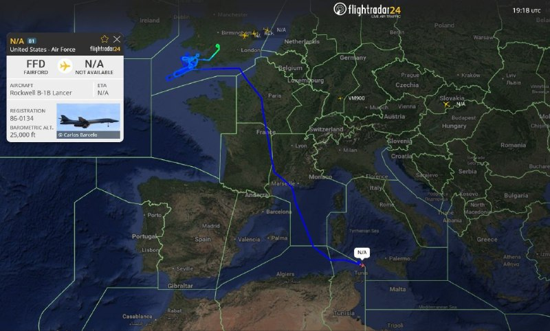

🚨 تغییر معنادار در ماموریت بمب‌افکن‌های استراتژیک آمریکا 📌 رصد تحرکات هوایی نشان‌دهنده تغییر الگو و خروج بمب‌افکن‌های USAF از روال عادی پروازهای تمرینی است. 📍 جزئیات کلیدی: بمب‌افکن: یک فروند B-1B Lancer (شناسه ZENER 01) از پایگاه فایرفورد به پرواز درآمد.…

## FoxNewsTwitter — post 341617

  <a href="telegram/content/FoxNewsTwitter_341617_1778620154.mp4" target="_blank">🎬 Download video</a>

Fox News (Twitter/X)

RT @TheStoryFNC: EXCLUSIVE: @SecMullinDHS says China can’t ’outmaneuver’ President Trump like it did President Biden ahead of high-stakes summit

## FoxNewsTwitter — post 341616

  

Fox News (Twitter/X)

100 Days Missing.

Nancy Guthrie, 84, has now been missing for 100 days after investigators say she was abducted from her Tucson-area home. Authorities say the investigation remains active, though no major new leads have been announced.

Pima County Sheriff Chris Nanos has faced sharp criticism over his handling of the case — including from FBI Director Kash Patel, who alleged the sheriff’s office delayed the FBI's involvement in the investigation. Nanos is facing calls from local officials to vacate his office amid unrelated misconduct allegations.

A combined reward of more than $1.2M remains unclaimed. The family is urging anyone with information to call 1-800-CALL-FBI.

## FoxNewsTwitter — post 341615

  <a href="telegram/content/FoxNewsTwitter_341615_1778620159.mp4" target="_blank">🎬 Download video</a>

Fox News (Twitter/X)

NEW: A heated exchange erupts in the Senate as FBI Director Kash Patel and Dem Sen. Chris Van Hollen trade barbs over accusations of "excessive drinking" against Patel—while the director blasts Van Hollen, claiming he was "slinging margaritas" during a controversial trip to El Salvador.

“The only person that was slinging margaritas in El Salvador on the taxpayer dollar with a convicted, gang-banging rapist was you.”

“The only individual in this room that has been drinking on the taxpayer dime during the day is you.”

"This is the ultimate example of hypocrisy. I will not be tarnished by baseless allegations."

## pm_afshaa — post 90663

این یکی کمتر بود پس لرزه بود

## pm_afshaa — post 90662

  <a href="telegram/content/pm_afshaa_90662_1778620162.webm" target="_blank">🎬 Download video</a>

🔴زلزله مجدد در تهران

💧 Rainbet.com the #1 Non-KYC Crypto Casino & Sportsbook @rainbetcom

😁 @Pm_Afshaa

## pm_afshaa — post 90661

  <a href="telegram/content/pm_afshaa_90661_1778620163.webm" target="_blank">🎬 Download video</a>

ساعت ۸ یه زلزله پردیس تهران اومد الانم یه زلزله مرز تهران و مازندران امشب رو مراقب و هوشیار باشید

## pm_afshaa — post 90660

  <a href="telegram/content/pm_afshaa_90660_1778620163.webm" target="_blank">🎬 Download video</a>

🔴پست جدید ترامپ:

وقتی رسانه‌های فیک‌نیوز می‌گویند دشمن ایرانی از نظر نظامی مقابل ما عملکرد خوبی دارد، این عملاً نوعی خیانت است، چون چنین ادعایی کاملاً دروغ و حتی مضحک است. آن‌ها دارند به دشمن کمک می‌کنند و به او امید واهی می‌دهند، در حالی که هیچ امیدی نباید وجود داشته باشد. این‌ها آمریکایی‌های ترسویی هستند که علیه کشور ما موضع گرفته‌اند. ایران ۱۵۹ کشتی در نیروی دریایی خود داشت — حالا تک‌تک آن‌ها در کف دریا قرار دارند. آن‌ها دیگر نیروی دریایی ندارند، نیروی هوایی‌شان از بین رفته، تمام فناوری‌شان نابود شده، «رهبرانشان» دیگر در میان ما نیستند و کشورشان به یک فاجعه اقتصادی تبدیل شده است. فقط بازنده‌ها، ناسپاس‌ها و احمق‌ها می‌توانند علیه آمریکا استدلال کنند!

💧 Rainbet.com the #1 Non-KYC Crypto Casino & Sportsbook @rainbetcom

😁 @Pm_Afshaa

## pm_afshaa — post 90659

  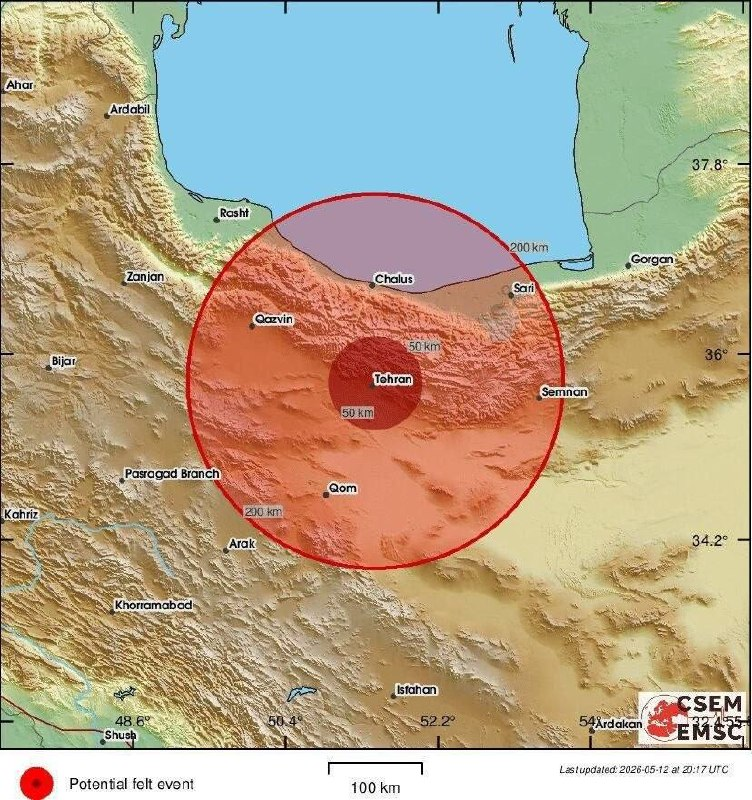

کانون زلزله لحظات قبل تهران

💧 Rainbet.com the #1 Non-KYC Crypto Casino & Sportsbook @rainbetcom

😁 @Pm_Afshaa

## pm_afshaa — post 90658

ساعت ۸ یه زلزله پردیس تهران اومد
الانم یه زلزله مرز تهران و مازندران
امشب رو مراقب و هوشیار باشید

## pm_afshaa — post 90657

فک کنم خدا گفته ترامپ خایه نداره بزار خودم بزنم

## pm_afshaa — post 90656

امشب هم طوفان داشتیم هم زلزله

## pm_afshaa — post 90655

  <a href="telegram/content/pm_afshaa_90655_1778620165.webm" target="_blank">🎬 Download video</a>

🔴مرکز لرزه‌نگاری: لحظاتی پیش زلزلهٔ 4.6 ریشتری مرز استان‌های تهران و مازندران رو لرزوند. 
💧 Rainbet.com the #1 Non-KYC Crypto Casino & Sportsbook @rainbetcom 
😁 @Pm_Afshaa

## pm_afshaa — post 90654

  <a href="telegram/content/pm_afshaa_90654_1778620166.webm" target="_blank">🎬 Download video</a>

🔴مرکز لرزه‌نگاری:
لحظاتی پیش زلزلهٔ 4.6 ریشتری مرز استان‌های تهران و مازندران رو لرزوند.

💧 Rainbet.com the #1 Non-KYC Crypto Casino & Sportsbook @rainbetcom

😁 @Pm_Afshaa

## pm_afshaa — post 90653

میگید زلزله کجا بود یا تست اتم رو دوباره بیاریم وسط

## pm_afshaa — post 90651

زلزله ۳.۴ ریشتر پردیس که چنلا دارن میزنن واسه ساعت ۸/۹ شب بود واسه الان نیست

## pm_afshaa — post 90650

  <a href="telegram/content/pm_afshaa_90650_1778620167.webm" target="_blank">🎬 Download video</a>

🔴زلزله نسبتا شدید در تهران

💧 Rainbet.com the #1 Non-KYC Crypto Casino & Sportsbook @rainbetcom

😁 @Pm_Afshaa

## pm_afshaa — post 90649

  <a href="telegram/content/pm_afshaa_90649_1778620168.webm" target="_blank">🎬 Download video</a>

🔴ان‌بی‌سی نیوز: ارتش ایالات متحده در نظر داره در صورت فروپاشی آتش‌بس و تصمیم ترامپ برای از سرگیری عملیات‌های عمده رزمی، نام درگیری خود با ایران رو به عملیات «چکش سنگین» تغییر بده و این جایگزین نام قبلی عملیات خشم حماسی خواهد شد.

این تغییر نام میتونه به دولت آمریکا اجازه بده درگیری‌های جدید رو یک عملیات نظامی تازه معرفی کنه؛ اقدامی که عملاً مهلت 60 روزه اختیارات جنگی رئیس‌جمهور آمریکا تحت قانون «اختیارات جنگی ۱۹۷۳» رو از نو آغاز میکنه.

💧 Rainbet.com the #1 Non-KYC Crypto Casino & Sportsbook @rainbetcom

😁 @Pm_Afshaa

## DEJradio — post 4598

  <a href="telegram/content/DEJradio_4598_1778620168.mp4" target="_blank">🎬 Download video</a>

🚨
🔸 شهرام سبزواری کارشناس نظامی با اشاره به استقرار تکاوران تیپ ۴۵ شوشتر در اطراف تاسیسات اتمی اصفهان بیان می‌کند احتمال عملیات زمینی برای خارج کردن اورانیوم‌ها از ایران زیاد است و همزمان ممکن است پشت صحنه بین دولت‌ها و برخی فرماندهان داخلی توافق‌هایی صورت گرفته باشد و پیامد آن قربانی شدن نیروهای تامینی باشد.

#تاسیسات_اتمی #جمهوری_اسلامی
@DEJradio

## DEJradio — post 4597

  <a href="telegram/content/DEJradio_4597_1778620172.mp4" target="_blank">🎬 Download video</a>

🔺📢 یک شهروند از تهران با ارسال ویدیویی به دژ نوشت، عامل تعرض به دانش‌آموزان مدرسه شرافت مزدور بودند.
براساس آخرین خبرها پیگیری خانواده این دختران و شکایت آنها از نیروهای امنیتی که دختران را تهدید به تجاوز کرده‌اند بی‌نتیجه مانده است.

#مدرسه_شرافت #جمهوری_اسلامی
@DEJradio

## DEJradio — post 4596

  <a href="telegram/content/DEJradio_4596_1778620174.webm" target="_blank">🎬 Download video</a>

🚨
⭕️ دقایقی پیش زلزله، تهران وکرج را لرزاند.
بر اساس گزارش‌های منتشر شده زلزله‌ای باقدرت ۳/۴ دهم ریشتر دقایقی پیش شهر پردیس را لرزاند و منجر به قطعی برق در برخی مناطق شد.

#فوری #زلزله
@DEJradio

## mamlekate — post 103517

📝 سلام ساعت ۲۳:۴۵ چیتگر لرزید

📝 ۲۲ اردیبهشت - ۲۳:۴۸ - غرب تهران یه چیزی مثل زلزله حس کردیم.

📝 سلام لرزش عجیب و بی صدای تهران شرق و جنوب شرق ساعت ۱۱:۴۶

📝 ستارخان تهران رو تخت خوابیده بودم قشنگ زیرم تکون خورد و لرزید بعد هم سبد وسیله ها تکون خورد و لوسترها ،کامل لرزیدم فکر کردم سرگیجه گرفتم ولی زلزله بود طول کشید چند ثانیه

📝 منم توی رودهن هستم و لرزش اولش ضعیف و بعد خیلی شدید شد. صدا نداشت اما خیلی لرزش کوتاه اما ترسناکی بود

@mamlekate

## VahidOnline — post 75438

پیام‌هایی هم داشتم درباره لرزش چهارم:

دوباره لرزید شرق همین الان 12:33

بازم اومد ولی ریزتر از قبلی

همین الان دوباره لرزید (نارمک ) ۰۰:۳۳

من الان دوباره لرزیدم

وحید جان مرکز این زلزله ها دقیقا وسط پارچینه. دقیقا وسط تاسیسات پارچین مرکز زلزله ست. واقعا زلزله است؟؟؟؟

وحیددد نزدیک چهاربار تو پردیس زلزله اومد نمیدونی تختم چجوری میلرزید

📡 @VahidOnline

## VahidOnline — post 75437

زمین‌لرزه خفیف‌تر
آپدیت: گویا بزرگی‌شا ۲٫۶ بوده.
این میشه سومین بار ظرف چند ساعت گذشته! اولین بار در شرق استان احساس شد و پیام‌ها فقط از پردیس و بومهن بود نه تهران]
پیام‌های دریافتی الان:

تهران مجددا لرزید

دوباره لرزید کمی خفیف‌تر

وحید جان دوباره لرزیدیم شرق تهران .. ۲۷

دوباره! پس لرزه بود.

دوباره هم اومد ولی ضعیف بود خوشبختانه

وحید جان شاید باورت نشه اما سومیش هم همین الان اومد، منتها خیلی کوتاه و کم بود...

📡 @VahidOnline

## VahidOnline — post 75436

  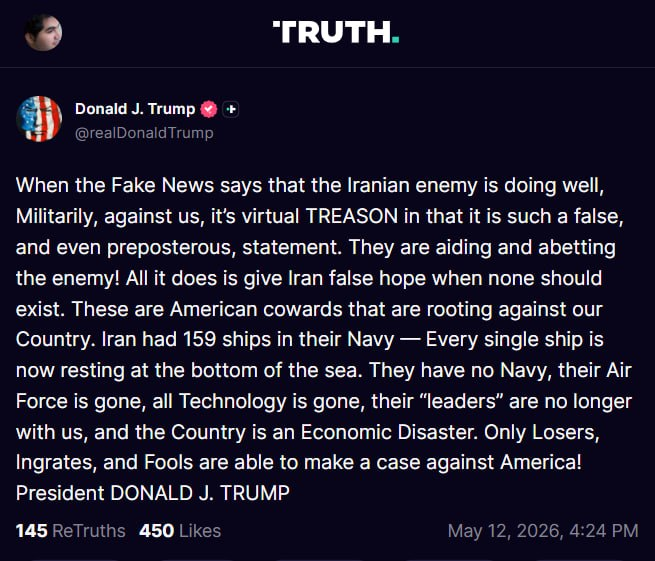

پست ترامپ، ترجمه ماشین:
وقتی «رسانه‌های جعلی» می‌گویند دشمن ایرانی از نظر نظامی در برابر ما عملکرد خوبی دارد، این عملاً خیانت است؛ چون چنین ادعایی کاملاً دروغ و حتی مضحک است. آن‌ها به دشمن کمک و از او حمایت می‌کنند! تنها نتیجه‌اش این است که به ایران امیدی واهی می‌دهد؛ در حالی که اصلاً نباید چنین امیدی وجود داشته باشد. این‌ها بزدل‌های آمریکایی هستند که علیه کشور خودمان طرف می‌گیرند.

ایران ۱۵۹ کشتی در نیروی دریایی خود داشت؛ تک‌تک آن کشتی‌ها اکنون در کف دریا آرمیده‌اند. آن‌ها دیگر نیروی دریایی ندارند، نیروی هوایی‌شان از بین رفته، تمام فناوری‌شان نابود شده، «رهبران»شان دیگر در میان ما نیستند، و کشورشان یک فاجعه اقتصادی است.

فقط بازنده‌ها، ناسپاس‌ها و احمق‌ها می‌توانند علیه آمریکا استدلالی مطرح کنند!

رئیس‌جمهور دونالد جی. ترامپ
realDonaldTrump

📡 @VahidOnline

## VahidOnline — post 75435

"وحید تهران لرزید"

+ ده‌ها پیام دریافتی مشابه درباره احساس لرزش زمین در مناطق مختلف تهران

حدود سه ساعت پیش هم حوالی پردیس و بومهن در شرق استان تهران زمین‌‌لرزه خفیف‌تری حس شده بود.

🔄 رسانه‌های داخلی:
زمین‌لرزه‌ای به بزرگی ۴.۶ ساعت ۲۳:۴۶ امشب مرز استان‌های تهران و مازندران را لرزاند.
این زلزله در حوالی شهر پردیس و در عمق ۱۰ کیلومتری زمین به وقوع پیوسته و در بخش‌هایی از پایتخت نیز احساس شده است.
بزرگی: 4.6
محل وقوع: مرز استانهای تهران و مازندران - حوالی پرديس
تاریخ و زمان وقوع به وقت محلی: 1405/02/22 23:46:07
طول جغرافیایی: 51.83
عرض جغرافیایی: 35.82
عمق زمین‌لرزه: 10 کیلومتر

نزدیک‌ترین شهرها:
8 کیلومتری پرديس (تهران)
10 کیلومتری بومهن (تهران)
11 کیلومتری رودهن (تهران)

نزدیکترین مراکز استان:
41 کیلومتری تهران
77 کیلومتری كرج

📡 @VahidOnline

## kianmeli1 — post 87372

  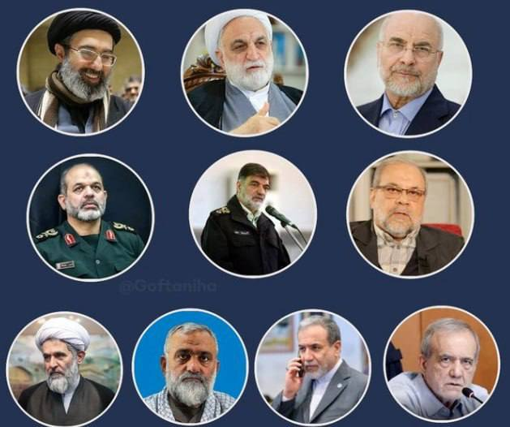

🔴رؤیافروشی تلویزیون ها پایانی ندارد

قبل از علی خامنه ای میگفتند با کشته شدن خامنه ای کار تمام است
امروز میگویند با پایان لایه بعدی کار تمام است

هموطن٫ کار تمام است اما وقتی که «سازماندهی هوشمندانه و شبکه سازی شهری» دیده شود

از ۱۸ دی تا امروز کدام شبکه سازی در کشور توانسته یک قاضی قاتل را از بین ببرد که احساس کنیم نیروهای سازماندهی در حال تلاش است!

با رویافروشی شبکه ها که مدام تحلیل غلط به خوردتان میدهند ٫ براندازی محقق نمی شود

«براندازی بدون سازماندهی ٫ شکست سنگین ادامه دارد»

این صحبت تلخ است اما حقیقت است
https://t.me/kianmeli1

## IranIntlTV — post 336885

  

دونالد ترامپ در شبکه تروث سوشال نوشت وقتی رسانه‌های «جعلی» می‌گویند دشمن ایرانی از نظر نظامی در برابر آمریکا عملکرد خوبی دارد، این نوعی خیانت است، زیرا چنین ادعایی کاملا نادرست و حتی مضحک است.
او افزود: آن‌ها در حال کمک به دشمن هستند و به جمهوری اسلامی امید می‌دهند در حالی که نباید هیچ امیدی برای او وجود داشته باشد.
https://iranintl.com/202605125060

## IranIntlTV — post 336884

  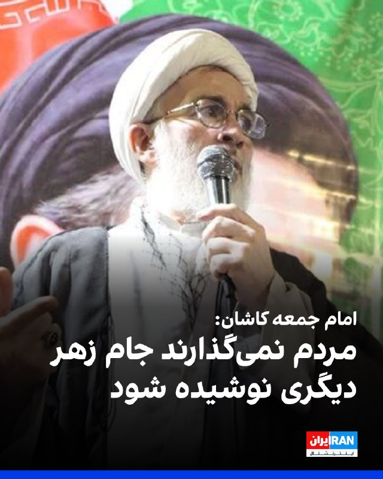

علی احتشام، امام جمعه کاشان گفت: «جمهوری اسلامی نه یکی از چهار قدرت، بلکه تنها ابرقدرت جهان است و ملت ایران هشت کشور منطقه و آمریکا را از کمال ارتفاع ساقط کرد و امروز با حضور در خیابان‌ها اجازه نداد جام زهر دیگری نوشیده شود.»

او افزود: «اگر مردم کف خیابان نبودند، چه بسا جام زهر دیگری نوشیده می‌شد.»
https://iranintl.com/202605128116

## IranIntlTV — post 336883

  

رسانه‌های ایران از وقوع زمین‌لرزه به بزرگی ۴.۶ در مرز استان‌های تهران و مازندران خبر دادند.

خبرگزاری فارس همچنین از زمین‌لرزه در کرج خبر داد.

همزمان خبرگزاری دولتی ایرنا گزارش داد زمین‌لرزه در تهران حدود ۱۰ ثانیه طول کشیده است.
https://iranintl.com/202605123583

## IranIntlTV — post 336882

  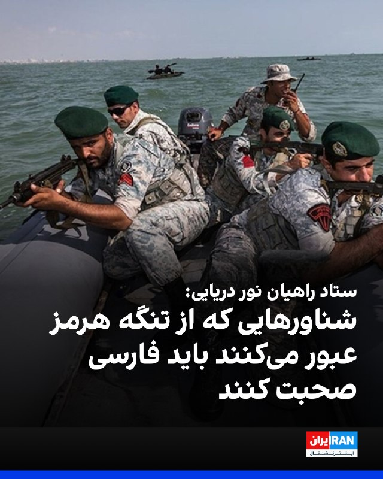

سعید سیاه‌سرانی، دبیر ستاد راهیان نور دریایی، گفت: «بدون اراده جمهوری اسلامی اجازه عبور حتی یک لیتر نفت از تنگه هرمز داده نمی‌شود.»

او افزود: «تنگه هرمز جزو خاک ما است، شناورهایی که رد می‌شوند باید اجازه بگیرند و به زبان فارسی صحبت کنند و از نقاطی که ما تعیین می‌کنیم عبور کنند.»
https://iranintl.com/202605123958

## IranIntlTV — post 336881

  <a href="telegram/content/IranIntlTV_336881_1778620179.mp4" target="_blank">🎬 Download video</a>

خبرگزاری رویترز به نقل از دو مقام غربی گزارش داد که عربستان سعودی در جریان جنگ اخیر در خاورمیانه، در واکنش به حملاتی که در خاک این کشور انجام شده بود، چند حمله هوایی اعلام‌نشده علیه مواضعی در ایران انجام داده است.

گفت‌وگو با شهرام خلدی، پژوهشگر تاریخ خاورمیانه و روابط بین‌الملل

@iranintltv

## IranIntlTV — post 336880

  <a href="telegram/content/IranIntlTV_336880_1778620182.mp4" target="_blank">🎬 Download video</a>

هم‌زمان با سفر ترامپ به چین، گزارش‌ها حاکی است جمهوری اسلامی از پکن خواسته پیام‌های خود را به واشینگتن منتقل کند و چین را به‌عنوان ضامن احتمالی هر توافق آینده مطرح کرده است. سفیر ایران در چین نیز گفته پکن با ارائه طرح‌های صلح و رایزنی‌های منطقه‌ای تلاش دارد مسیر گفت‌وگوها را باز نگه دارد.

گفت‌وگو با آرام حسامی، استاد علوم سیاسی کالج مونتگومری

@iranintltv

## IranIntlTV — post 336879

  <a href="telegram/content/IranIntlTV_336879_1778620184.mp4" target="_blank">🎬 Download video</a>

انجمن قلم آمریکا در گزارش سالانه خود اعلام کرد؛ شمار نویسندگان زندانی در جهان برای نخستین‌بار از ۴۰۰ نفر عبور کرده است. این نهاد گفت؛ چین با ۱۱۹ مورد در صدر قرار دارد و ایران با زندانی‌کردن ۵۳ نویسنده در رتبه دوم ایستاده است.

در این گزارش آمده است؛ عربستان سعودی با ۲۷ نویسنده زندانی در رتبۀ سوم قرار دارد. پن آمریکا تاکید کرد؛ سرکوب نویسندگان و اهل قلم در ایران، به‌ویژه پس از «جنگ ۱۲روزه»، شدت گرفته است.
گفت‌وگو با اردوان روزبه، خبرنگار ایران‌اینترنشنال
@iranintltv

## IranIntlTV — post 336878

  <a href="https://t.me/IranintlTV/336878" target="_blank">📎 Download file</a>

🎧نسخه صوتی ‌‌‏۲۴ با فرداد فرحزاد: ترامپ: برای توافق با جمهوری اسلامی عجله ندارم
@iranintlTV

## IranIntlTV — post 336877

  

امارات متحده عربی اعلام کرد ۱۶ شهروند لبنانی و پنج نهاد مستقر در لبنان را به دلیل ارتباط با حزب‌الله در فهرست تروریستی این کشور قرار داده است.

در همین چارچوب، «موسسه قرض‌الحسن» و چهار نهاد دیگر نیز به دلیل ارتباط با حزب‌الله در این فهرست قرار گرفته‌اند.

امارات متحده عربی تاکید کرد این اقدامات در راستای مهار آفات تروریسم، محدود کردن گسترش آن و قطع تامین مالی فرامرزی انجام شده است.
https://iranintl.com/202605127283

## IranIntlTV — post 336876

  <a href="https://t.me/IranintlTV/336876" target="_blank">📎 Download file</a>

🎧نسخه صوتی چشم‌انداز: جهنم قطع اینترنت چگونه به پایان می‌رسد؟
@iranintlTV

## IranIntlTV — post 336875

  <a href="telegram/content/IranIntlTV_336875_1778620188.mp4" target="_blank">🎬 Download video</a>

بنا بر گزارش‌ها هم‌زمان با سفر دونالد ترامپ به چین، جمهوری اسلامی تلاش کرده است از پکن برای رساندن پیامش به واشینگتن استفاده کند و گفته است چین می‌تواند نقش ضامن هر توافق احتمالی را داشته باشد.

گفت‌وگو با جمشید برزگر، روزنامه‌نگار و تحلیل‌گر سیاسی
@iranintltv

## IranIntlTV — post 336874

  <a href="telegram/content/IranIntlTV_336874_1778620191.mp4" target="_blank">🎬 Download video</a>

جهنم قطع اینترنت چگونه به پایان می‌رسد؟

«چشم‌انداز با مهدی مهدوی‌آزاد»

تماشای نسخه کامل این برنامه در یوتیوب:

https://youtu.be/92BJ6BfAYHQ

@iranintltv

## IranIntlTV — post 336873

  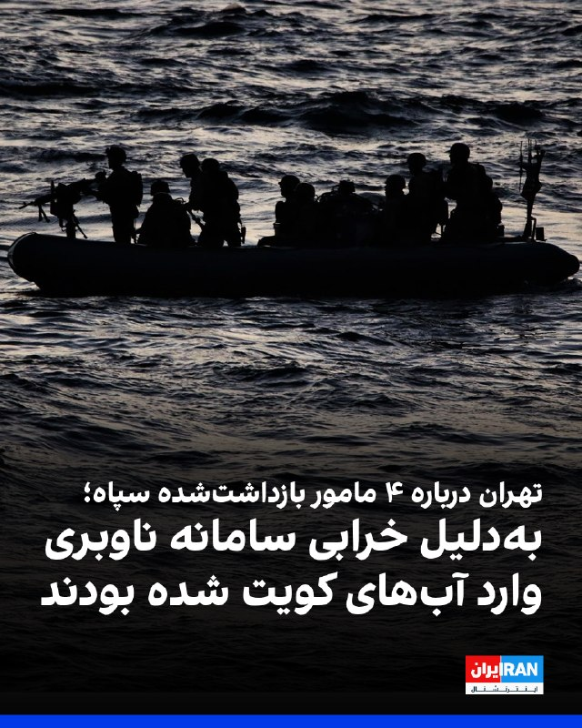

در پی بازداشت چهار فرد «وابسته به سپاه پاسداران» در کویت، وزارت خارجه جمهوری اسلامی برنامه‌ریزی برای انجام اقدامات خصمانه علیه کویت را بی‌اساس و مردود دانست.

وزارت خارجه جمهوری اسلامی در بیانیه‌ای اعلام کرد این چهار مامور در چارچوب ماموریت مرسوم گشت‌زنی دریایی مشغول انجام وظیفه بوده‌اند و به دلیل «اختلال در سامانه ناوبری» وارد آب‌های سرزمینی کویت شده‌اند.

این وزارتخانه از مراجع کویت خواست از اظهارنظرهای شتاب‌زده و طرح ادعاهای بی‌اساس خودداری کرده و موضوع را از طریق مجاری رسمی پیگیری کنند. وزارت خارجه جمهوری اسلامی همچنین خواهان آزادی این چهار مامور بازداشت‌شده شد.
https://iranintl.com/202605121807

## Shin_Persian — post 5981

Shin ✓ @hey_itsmyturn
Tue, 12 May 2026 21:06:37 UTC

And we are back at “It’s HAARP” dumbfucks.

فارسی

و دوباره برگشتیم سر احمق‌هایی که می‌گویند «کار هارپ (HAARP) است».

𝕏 · @shin_persian

## Shin_Persian — post 5980

Shin ✓ @hey_itsmyturn
Tue, 12 May 2026 21:00:34 UTC

Another earthquake shook Tehran just now

فارسی

همین الان زلزله دیگری تهران را لرزاند

𝕏 · @shin_persian

## Shin_Persian — post 5979

  

Shin ✓ @hey_itsmyturn Tue, 12 May 2026 20:25:23 UTC President Trump @POTUS: "When the Fake News says that the Iranian enemy is doing well, Militarily, against us, it’s virtual TREASON in that it is such a false, and even preposterous, statement. They are…

## Shin_Persian — post 5978

Shin ✓ @hey_itsmyturn
Tue, 12 May 2026 20:25:23 UTC

President Trump @POTUS:
"When the Fake News says that the Iranian enemy is doing well, Militarily, against us, it’s virtual TREASON in that it is such a false, and even preposterous, statement. They are aiding and abetting the enemy! All it does is give Iran false hope when none should exist. These are American cowards that are rooting against our Country. Iran had 159 ships in their Navy — Every single ship is now resting at the bottom of the sea. They have no Navy, their Air Force is gone, all Technology is gone, their “leaders” are no longer with us, and the Country is an Economic Disaster. Only Losers, Ingrates, and Fools are able to make a case against America! President DONALD J. TRUMP"

فارسی

رئیس‌جمهور ترامپ @POTUS:
«وقتی اخبار جعلی می‌گویند که دشمن ایرانی از نظر نظامی در برابر ما خوب عمل می‌کند، این در واقع خیانتی مجازی است، چرا که چنین ادعایی کذب و حتی مضحک است. آن‌ها در حال کمک و یاری رساندن به دشمن هستند! تمام کاری که این حرف‌ها انجام می‌دهد، دادن امید واهی به ایران است، در حالی که هیچ امیدی نباید وجود داشته باشد. این‌ها بزدلانی آمریکایی هستند که علیه کشورمان ریشه دوانده‌اند. ایران ۱۵۹ کشتی در نیروی دریایی خود داشت — اکنون تک‌تک آن کشتی‌ها در کف دریا آرام گرفته‌اند. آن‌ها دیگر نیروی دریایی ندارند، نیروی هوایی‌شان از بین رفته، تمام تکنولوژی‌شان نابود شده، "رهبرانشان" دیگر در میان ما نیستند و آن کشور یک فاجعه اقتصادی است. فقط بازنده‌ها، ناسپاس‌ها و احمق‌ها می‌توانند علیه آمریکا استدلال کنند! رئیس‌جمهور دونالد جی. ترامپ»

𝕏 · @shin_persian

## Shin_Persian — post 5977

Shin ✓ @hey_itsmyturn
Tue, 12 May 2026 20:17:27 UTC

Quake in Tehran right now.

فارسی

هم‌اکنون زلزله در تهران.

𝕏 · @shin_persian

## Shin_Persian — post 5976

  

DefenceGeek 🇬🇧 ✓ @DefenceGeek Tue, 12 May 2026 19:21:43 UTC 40th Bomber Training Flight from Fairford #FreeIran‌ --- Operation EPIC FURY / Project FREEDOM --- Rather helpfully, the solo B-1B "Lancer" bomber from RAF Fairford (EGVA) (which is flying the…

## Shin_Persian — post 5975

DefenceGeek 🇬🇧 ✓ @DefenceGeek
Tue, 12 May 2026 19:21:43 UTC

40th Bomber Training Flight from Fairford #FreeIran‌
--- Operation EPIC FURY / Project FREEDOM ---

Rather helpfully, the solo B-1B "Lancer" bomber from RAF Fairford (EGVA) (which is flying the 40th training mission from the base since the ceasefire began), has been broadcasting it's location for all to see!

This route has been a fairly routine pattern for the training flights, and for many of the 62 bomber missions flown by B-1B and B-52H types during the war in Iran.

B-1B "ZENER01" 86-0134 #AE6C05 "Thunderbird"

@MATA_osint @ArmchairAdml @Andyyyyrrrr @jamjake01 @LHA2709 @vcdgf555

فارسی

چهلمین پرواز آموزشی بمب‌افکن از فیرفورد #FreeIran
--- عملیات خشم حماسی (EPIC FURY) / پروژه آزادی ---

بمب‌افکن تک‌فروندی B-1B "لنسر" از پایگاه نیروی هوایی سلطنتی فیرفورد (EGVA) (که در حال انجام چهلمین ماموریت آموزشی از این پایگاه پس از آغاز آتش‌بس است)، به شکلی کاملاً مفید در حال مخابره موقعیت مکانی خود برای مشاهده همگان بوده است!

این مسیر یک الگوی نسبتاً معمول برای پروازهای آموزشی و همچنین برای بسیاری از ۶۲ ماموریت بمب‌افکنی انجام شده توسط انواع B-1B و B-52H در طول جنگ در ایران بوده است.

B-1B "ZENER01" 86-0134 #AE6C05 "Thunderbird"

@MATA_osint @ArmchairAdml @Andyyyyrrrr @jamjake01 @LHA2709 @vcdgf555

𝕏 · @shin_persian

## ManotoTV — post 105378

  <a href="telegram/content/ManotoTV_105378_1778620196.mp4" target="_blank">🎬 Download video</a>

شاهزاده رضا پهلوی در نشست امنیتی سالانه پولیتیکو گفت مردم ایران، نه نیروهای خارجی، باید نقش اصلی را در تغییر حکومت جمهوری اسلامی ایفا کنند؛ اما برای این کار به «حمایت و پوشش» نیاز دارند.

او گفت: «نیروهای روی زمین در ایران، خود مردم ایران هستند. ما نیازی نداریم نیروهای خارجی این کار را برای ما انجام دهند.»

شاهزاده رضا پهلوی با اشاره به سرکوب اعتراضات دی‌ماه گفت در کمتر از ۴۸ ساعت بیش از ۴۰ هزار نفر کشته شدند و افزود بدون حمایت، نمی‌توان از مردم انتظار داشت دوباره به خیابان‌ها بیایند.

او گفت: «به همین دلیل بود که به کارزار هوایی و پوشش هوایی نیاز داشتیم.»

شاهزاده رضا پهلوی همچنین تأکید کرد باید یک استراتژی روشن برای پایان دادن به جمهوری اسلامی وجود داشته باشد؛ استراتژی‌ای که هم مردم را برای قیام تشویق کند و هم زمینه پیوستن نیروهایی از ارتش و دستگاه امنیتی به مردم را فراهم سازد.

او افزود: «نمی‌شود از یک طرف گفت مردم قیام کنند و همزمان گفت در حال مذاکره هستیم؛ این همه را گیج می‌کند.»

شاهزاده رضا پهلوی همچنین گفت حملات انجام‌شده علیه جمهوری اسلامی، ملت ایران را هدف نگرفته بود، بلکه زیرساخت‌های سرکوب حکومت، از جمله دستگاه اطلاعاتی و سپاه پاسداران، را هدف قرار داده بود.

او افزود: «مردم آن‌قدر باهوش هستند که تفاوت میان حمله به ملت ایران و حمله به حکومت را تشخیص دهند.»

## ManotoTV — post 105377

  <a href="telegram/content/ManotoTV_105377_1778620199.mp4" target="_blank">🎬 Download video</a>

‌
خبرگزاری‌های داخل ایران گزارش دادند دقایقی پیش زلزله تهران و کرج را لرزاند. به گزارش این خبرگزاری‌ها سمت شرق تهران زمین‌لرزه بسیار شدیدتر بوده است.

## ManotoTV — post 105376

  <a href="telegram/content/ManotoTV_105376_1778620200.mp4" target="_blank">🎬 Download video</a>

تماسی از ایران؛
«می‌گفت تغییر از بیرون نیست…
کار خود مردمه، حتی با این وضعیت سخت.»

## FarsiVOA — post 217577

⚡️توافق امنیتی یا نقض حاکمیت؟ پشت‌ پرده فشار جمهوری اسلامی برای پاکسازی کامل مرزی با عراق
@FarsiVOA

## FarsiVOA — post 217576

  

⚡️رسانه‌های داخلی و منابع مردمی شامگاه سه‌شنبه ۲۲ اردیبهشت از وقوع زمین‌لرزه در تهران و کرج خبر دادند.

رسانه‌های داخلی دقایقی پیش از نیمه‌شب سه‌شنبه از وقوع یک زمین‌لرزه نسبتا شدید در شهر تهران و بخش‌هایی از استان البرز خبر دادند.

وحیدآنلاین براساس گزارش‌های مردمی اعلام کرد این زلزله در شرق و شمال شرق تهران بیشتر حس شده است اما اهالی غرب پایتخت نیز وقوع آنرا گزارش کرده‌اند.

مرکز لرزه‌نگاری دانشگاه تهران بزرگای این زلزله را ۴.۶ ریشتر و محل وقوع آن را در عمق ۱۰ کیلومتری زمین در حوالی پردیس، در مرز استان‌های تهران و مازندارن، اعلام کرده است.

شامگاه سه‌شنبه نیز لرزه خفیفی حدودا ۳.۵ ریشتری حوالی پردیس و بومهن در شرق استان تهران گزارش شده بود.
@FarsiVOA

## FarsiVOA — post 217575

⚡️دونالد ترامپ، رئیس جمهوری آمریکا، روز سه‌شنبه ۲۲ اردیبهشت پیش از ترک آمریکا به مقصد چین، به پرسش‌های خبرنگاران پاسخ داد.
@FarsiVOA

## FarsiVOA — post 217574

🔺بیش از ۱۱۰ برنده جایزه نوبل خواستار آزادی فوری نرگس محمدی شدند

▪️بیش از ۱۱۰ برنده جایزه نوبل در بیانیه‌ای مشترک خواستار آزادی فوری و بدون قید و شرط نرگس محمدی، فعال حقوق بشر و برنده ایرانی جایزه صلح نوبل، شدند، و نسبت به وضعیت جسمانی او در زندان ابراز نگرانی شدید کردند.

⬇️ بیشتر بخوانید:
https://ir.voanews.com/a/nobel-laureates-narges-mohammadi-release/8149256.html
@FarsiVOA

## FarsiVOA — post 217573

⚡️دونالد ترامپ، رئیس جمهوری آمریکا، روز سه‌شنبه ۲۲ اردیبهشت پیش از ترک آمریکا به مقصد چین، به پرسش‌های خبرنگاران پاسخ داد. بخش‌هایی از این پرسش و پاسخ با ترجمه همزمان پژواک کیومرثی از صدای آمریکا پخش شد.
@FarsiVOA

## FarsiVOA — post 217572

⚡️دونالد ترامپ، رئیس جمهوری آمریکا، روز سه‌شنبه ۲۲ اردیبهشت پیش از ترک آمریکا به مقصد چین، به پرسش‌های خبرنگاران پاسخ داد.
@FarsiVOA

## FarsiVOA — post 217571

  <a href="telegram/content/FarsiVOA_217571_1778620203.mp4" target="_blank">🎬 Download video</a>

⚡️کامبیز غفوری در برنامه تفسیر خبر: بزرگترین امتیاز جمهوری اسلامی در توافق ادامه حیات است
@FarsiVOA

## FarsiVOA — post 217570

🔺بازداشت «ژنرال بمب‌های بشکه‌ای»؛ فرمانده نیروی هوایی رژیم اسد محاکمه می‌شود

▪️وزارت کشور سوریه روز سه‌شنبه ۲۲ اردبیهشت اعلام کرد، جایز حمود موسی، فرمانده سابق نیروی هوایی سوریه، را بازداشت کرده است. او طراح ریختن بمب‌های بشکه‌ای بر مناطق تحت سلطه مخالفان است؛ اقدامی که به قربانی شدن هزاران تن از مردم سوریه، از جمله تعداد زیادی از زنان و کودکان، منجر شد.

⬇️ بیشتر بخوانید:
https://ir.voanews.com/a/syria-bashar-alassad-crime-revolution-irgc/8149228.html
@FarsiVOA

## FarsiVOA — post 217569

⚡️برگزاری دو نشست دفاعی در اروپا؛ حمایت از اوکراین تا امنیت تنگه هرمز و پیامدهای جنگ خاورمیانه
@FarsiVOA

## FarsiVOA — post 217568

  <a href="telegram/content/FarsiVOA_217568_1778620204.mp4" target="_blank">🎬 Download video</a>

⚡️هیمن سیدی در برنامه تفسیر خبر: جمهوری اسلامی استاد محاسبات غلط از سر ناچاری است
@FarsiVOA

## FarsiVOA — post 217567

⚡️ادامه بحران دارو و کمبود موادغذایی زیر سایه خاموشی دیجیتال؛ واکنش کاربران شبکه‌های اجتماعی

@FarsiVOA

## FarsiVOA — post 217566

⚡️در گفت‌وگو با موسی برزین، حقوقدان، از اعدام عبدالجلیل شه‌بخش، شهروند بلوچ، و سرکوب ساختاری اقلیت‌ها گفتیم و پرسیدیم چرا حکومت با استفاده از الگوی تکراری دادرسی ناعادلانه و اخذ اعترافات اجباری در زیرشکنجه، به اجرای احکام اعدام زندانیان سیاسی از جمله اقلیت‌های قومی کرد و بلوچ سرعت داده است.
@FarsiVOA

## FarsiVOA — post 217565

  <a href="telegram/content/FarsiVOA_217565_1778620206.mp4" target="_blank">🎬 Download video</a>

⚡️علی جوانمردی: روابط آمریکا و کردها و سلاح‌هایی کە پرزیدنت ترامپ گفتە بە کردها دادە
@FarsiVOA

## DW_Farsi — post 124629

  

🔶 ترامپ: یا ایران کار درست را انجام می‌دهد یا ما کار را تمام می‌کنیم

دونالد ترامپ، رئیس ‌جمهور ایالات متحده آمریکا، روز سه‌شنبه ۱۲ مه (۲۲ اردیبهشت) در آغاز سفر خود به چین برای ملاقات با شی جین‌پینگ، رئیس ‌جمهور چین، اختلافات خود با شی بر سر جنگ آمریکا با ایران را کم‌اهمیت جلوه داد.

ترامپ پیش از این تلاش کرده بود شی را تحت فشار قرار دهد تا از نفوذ قابل‌توجه چین استفاده کرده و ایران را به پذیرش شروط آمریکا برای پایان دادن به جنگ یا باز کردن تنگه هرمز ترغیب کند.

ترامپ درباره برنامه خود برای گفت‌وگو با شی درباره جنگ با ایران گفت: «فکر می‌کنم او نسبتا خوب عمل کرده است.»

ترامپ افزود: «ما موضوعات زیادی برای گفت‌وگو داریم. راستش را بخواهید، نمی‌گویم ایران یکی از آن‌هاست، چون ما ایران را تا حد زیادی تحت کنترل داریم.»

رئیس جمهور آمریکا در عین حال اذعان کرد که دولت شی، ماه گذشته، زمانی که گفت‌وگوها دچار تزلزل شده بود، با ترغیب تهران به بازگشت به مذاکرات آتش‌بس به کاهش تنش‌ها کمک کرد.

@dw_farsi

## Persian_Trend_Official — post 14013

🔴 سخنگوی اورژانس تهران:

در پی زمین لرزه در تهران تا این لحظه مصدومی گزارش نشده است

🫆:Tony

📌 @persian_trend_official
پرشین ترند | متفاوت‌ترین کانال نظامی

## Persian_Trend_Official — post 14012

  <a href="telegram/content/Persian_Trend_Official_14012_1778620208.webm" target="_blank">🎬 Download video</a>

🔴حین و بعد از زلزله چه باید کرد؟

🫆:Tony

📌 @persian_trend_official
پرشین ترند | متفاوت‌ترین کانال نظامی

## Persian_Trend_Official — post 14010

  <a href="telegram/content/Persian_Trend_Official_14010_1778620209.webm" target="_blank">🎬 Download video</a>

🔴زلزله در تهران احساس شد 🫆:Tony 📌 @persian_trend_official پرشین ترند | متفاوت‌ترین کانال نظامی

## Persian_Trend_Official — post 14009

خب دیگه بلا های آسمانی هم سر شوخی رو با مردم ایران باز کردن 🤦🏻‍♂️

📝 Nick

## Persian_Trend_Official — post 14008

🔴زلزله در تهران احساس شد 🫆:Tony 📌 @persian_trend_official پرشین ترند | متفاوت‌ترین کانال نظامی

## Persian_Trend_Official — post 14007

🔴زلزله در تهران احساس شد

🫆:Tony

📌 @persian_trend_official
پرشین ترند | متفاوت‌ترین کانال نظامی

## Persian_Trend_Official — post 14006

https://youtube.com/live/rrGzLhyQoaY?feature=share

## Persian_Trend_Official — post 14005

  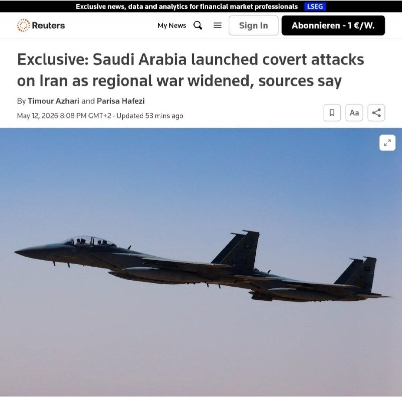

🇸🇦🇮🇷 — خبرگزاری رویترز درگزارشی مدعیست که عربستان سعودی در اواخر ماه مارس، حملات هوایی محرمانه‌ تلافی جویانه ای را در پاسخ به ایران انجام داده است.

☆Phantom☆

📌 @persian_trend_official
پرشین ترند | متفاوت‌ترین کانال نظامی

## Persian_Trend_Official — post 14004

  <a href="telegram/content/Persian_Trend_Official_14004_1778620210.mp4" target="_blank">🎬 Download video</a>

🔴ویدیو منتشر شده از کشتی کره ای آسیب دیده در حملات جمهوری اسلامی در روز های گذشته

🫆:Tony

📌 @persian_trend_official
پرشین ترند | متفاوت‌ترین کانال نظامی

## Persian_Trend_Official — post 14003

  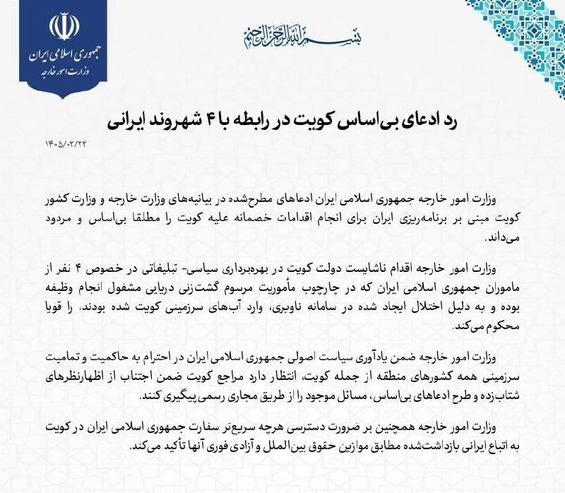

🔴 تهران ادعاهای کویت علیه ۴ شهروند ایرانی را رد کرد

جمهوری اسلامی ادعاهای مطرح‌شده از سوی وزارت خارجه و وزارت کشور کویت درباره برنامه‌ریزی ایران برای انجام اقدامات خصمانه علیه این کشور را «کاملاً بی‌اساس» و مردود دانست.

بر اساس موضع تهران:

▪️ اتهامات مطرح‌شده علیه ۴ شهروند ایرانی رد شده است
▪️ ایران تأکید کرده هیچ برنامه‌ای برای اقدام علیه کویت نداشته است
▪️ جمهوری اسلامی این ادعاها را فاقد اعتبار توصیف کرده است

▪️این واکنش پس از آن مطرح می‌شود که کویت از شناسایی و برخورد با آنچه «تهدیدات امنیتی» خوانده بود خبر داده بود.

🫆:Tony

📌 @persian_trend_official
پرشین ترند | متفاوت‌ترین کانال نظامی

## RadioFarda — post 157111

🔸خبرگزاری رویترز روز سه‌شنبه در گزارشی اختصاصی به نقل از دو مقام غربی و دو مقام ایرانی اعلام کرد که در جریان جنگ اخیر، عربستان سعودی در واکنش به حملات تهران به این کشور، چندین حمله به اهدافی در ایران انجام داده بود. 🔸این حملات عربستان سعودی که پیش‌تر گزارش…

## RadioFarda — post 157110

  

🔸خبرگزاری رویترز روز سه‌شنبه در گزارشی اختصاصی به نقل از دو مقام غربی و دو مقام ایرانی اعلام کرد که در جریان جنگ اخیر، عربستان سعودی در واکنش به حملات تهران به این کشور، چندین حمله به اهدافی در ایران انجام داده بود.

🔸این حملات عربستان سعودی که پیش‌تر گزارش نشده بودند، نخستین مورد شناخته‌شده از اقدام مستقیم نظامی این کشور در خاک ایران به شمار می‌روند.

🔸به گفته دو مقام غربی، این حملات که توسط نیروی هوایی عربستان انجام شده‌اند، در اواخر ماه مارس صورت گرفته‌اند. یکی از آن‌ها گفت این حملات «اقدامات تلافی‌جویانه متقابل در پاسخ به حمله به عربستان» بوده است.

🔸رویترز می‌گوید نتوانسته است اهداف دقیق این حملات را تأیید کند.

🔸در پاسخ به درخواست اظهار نظر، یک مقام ارشد وزارت خارجه عربستان به‌طور مستقیم به این سوال که آیا چنین حملاتی انجام شده یا نه پاسخ نداد. وزارت خارجه ایران نیز به درخواست اظهار نظر پاسخ نداد.

@RadioFarda

## RadioFarda — post 157109

  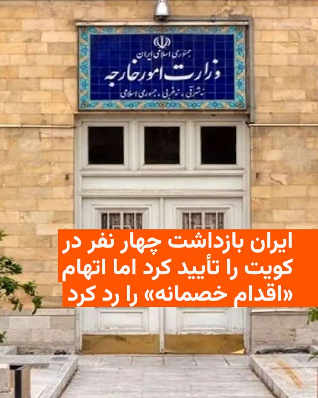

🔸وزارت خارجه جمهوری اسلامی بازداشت چهار نفر در کویت را که مقام‌های کویتی آن‌ها را وابسته به سپاه پاسداران معرفی کرده‌اند، تأیید کرد اما اتهام برنامه‌ریزی برای «اقدامات خصمانه» علیه کویت را رد کرد.

🔸وزارت خارجه ایران روز سه‌شنبه اعلام کرد این افراد در حال گشت دریایی بوده‌اند و به دلیل «اختلال در سیستم ناوبری» وارد آب‌های سرزمینی کویت شده‌اند.

🔸این وزارتخانه همچنین اظهارات مقام‌های کویتی درباره قصد ایران برای انجام عملیات خصمانه را رد و آن را بی‌اساس توصیف کرد.

🔸پیشتر وزارت کشور کویت اعلام کرده بود چهار «نفوذی» وابسته به سپاه پاسداران انقلاب اسلامی را پس از تلاش برای ورود دریایی به این کشور بازداشت کرده است.

🔸رسانه‌های دولتی کویت همچنین گزارش داده بودند که بازداشت‌شدگان در بازجویی‌ها گفته‌اند مأموریت داشته‌اند با یک قایق ماهیگیری به جزیره بوبیان نفوذ کنند.

@RadioFarda

## RadioFarda — post 157108

🔸وزارت خارجه ایالات متحده روز سه‌شنبه در بیانیه‌ای که در اختیار خبرگزاری رویترز قرار داد، اعلام کرد که مقام‌های ارشد آمریکا و چین توافق دارند که هیچ کشوری نباید اجازه داشته باشد برای عبور از تنگه هرمز عوارض کشتیرانی دریافت کند. 🔸این بیانیه وزارت خارجه آمریکا…

## RadioFarda — post 157107

  

🔸وزارت خارجه ایالات متحده روز سه‌شنبه در بیانیه‌ای که در اختیار خبرگزاری رویترز قرار داد، اعلام کرد که مقام‌های ارشد آمریکا و چین توافق دارند که هیچ کشوری نباید اجازه داشته باشد برای عبور از تنگه هرمز عوارض کشتیرانی دریافت کند.

🔸این بیانیه وزارت خارجه آمریکا پیش از نشست پیش‌روی دونالد ترامپ و شی جین‌پینگ، همتای چینی او، منتشر شده است؛ نشستی که در آن کنترل ایران بر تنگه هرمز در دستور کار خواهد بود.

🔸وزارت خارجه آمریکا گفت وانگ یی، وزیر خارجه چین، و مارکو روبیو، وزیر خارجه آمریکا، در یک تماس تلفنی در ماه گذشته میلادی دربارهٔ این موضوع گفت‌وگو کرده‌اند.

🔸تامِی پیگوت، سخنگوی وزارت خارجه، در پاسخ به پرسش‌های رویترز دربارهٔ این تماس گفت: «آن‌ها توافق کردند که هیچ کشور یا سازمانی نباید اجازه داشته باشد برای عبور از آبراه‌های بین‌المللی مانند تنگه هرمز عوارض دریافت کند.»

🔸رویترز می‌گوید وزارت خارجه آمریکا برخلاف رویه معمول خود، پیش‌تر گزارشی از این تماس منتشر نکرده بود.

@RadioFarda

## IranianMinds — post 20047

  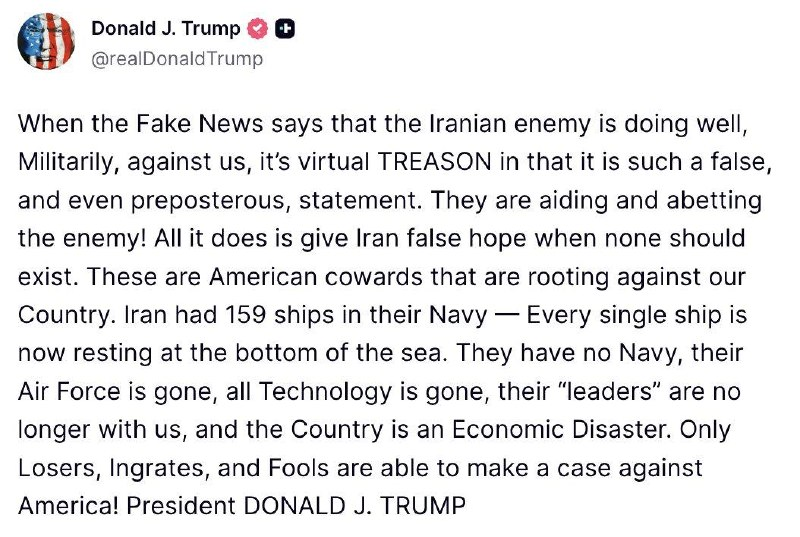

🔴 ترامپ:

وقتی اخبار جعلی می‌گویند دشمن ایرانی در مقابله با ما از نظر نظامی خوب عمل کرده است، این عملاً خیانت است، چون خبری کاملاً دروغین و حتی مضحک است. آن‌ها به دشمن کمک می‌کنند! این کار تنها به ایران امید دروغین می‌دهد، در حالی که نباید هیچ امیدی وجود داشته باشد.

این‌ها آمریکایی‌های بزدل هستند که علیه کشور ما ریشه دوانده‌اند. ایران ۱۵۹ کشتی در نیروی دریایی داشت حالا هر کشتی‌ای در کف دریا است. نیروی دریایی ندارند، نیروی هوایی‌شان از بین رفته، تمام فناوری‌هایشان از بین رفته، «رهبران»شان دیگر با ما نیستند و کشور در بحران اقتصادی است!

@IranianMinds

## IranianMinds — post 20046

  <a href="telegram/content/IranianMinds_20046_1778620217.mp4" target="_blank">🎬 Download video</a>

بچه ها اسم این بازی عبور مرغ از خیابون  هست ویدئو نگاه کنید خیلی راحت 8 میلیون ازش سود گرفتیم😍

😤اگ توم دوس داری خیلی راحت از بازی های انلاین پول در بیاری حتما عضو کازینو شبانه شو
✅

توی کازینو شبانه بهت اموزش میدیم از بازی های انلاین پول دربیاری👌

کازینو شبانه راهی برای چند برابر کردن سرمایت 🤷‍♂

کسب درامد انلاین با یه ادم حرفه ای یاد بگیر و‌ پول دربیار 
💵
ae22
🎯همین حالا عضو شو و شروع کن👇
https://t.me/+OS-QBvyDO4M2ZGY0
https://t.me/+OS-QBvyDO4M2ZGY0

## IranianMinds — post 20045

  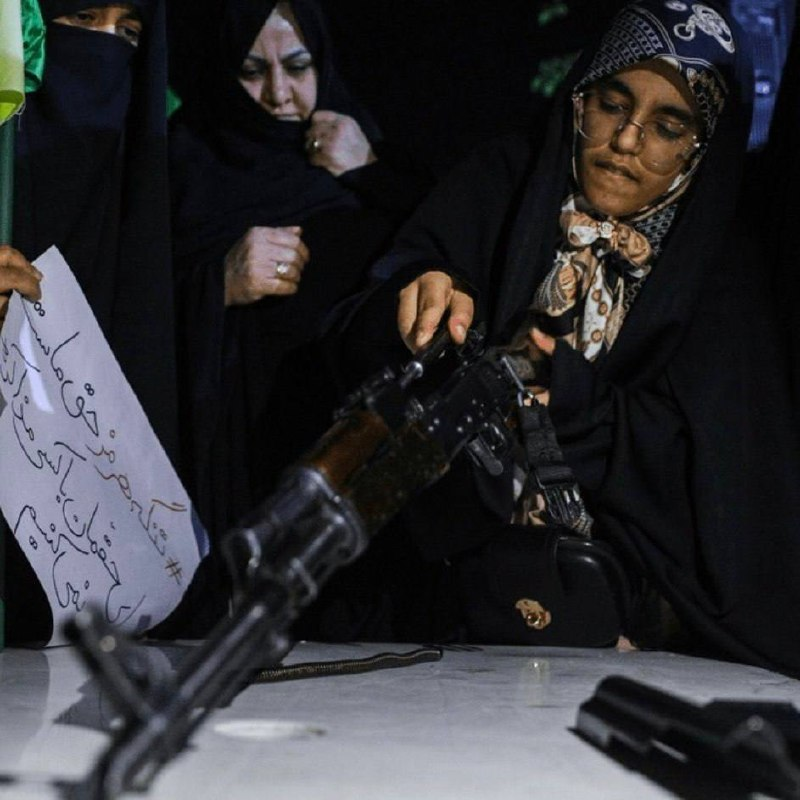

جمهوری اسلامی از اورک ها هم‌ داره استفاده میکنه

@IranianMinds

## IranianMinds — post 20044

🔴 امام جمعه کاشان پا منقل :

جمهوری اسلامی تنها ابرقدرت جهان است هیچ کشوری توان مقابله با ما رو‌ نداره !

@IranianMinds

## IranianMinds — post 20043

ترامپ هم‌ تو‌ راه چین نشسته یه متن بالا بلند نوشته و دوباره گفته فیک‌ نیوزا شعر میگن ما ارتش ایران و رهبریشو‌ از بین بردیم

@IranianMinds

## IranianMinds — post 20042

🔴 مرکز لرزه نگاری :

زلزله ۴.۶ ریشتری مرز استان های تهران و مازندران را لرزاند.

@IranianMinds

## IranianMinds — post 20041

یادش بخیر جنگ ۱۲ روزه هر زلزله ای میومد میگفتن تموم شد تست بمب اتم‌ بود

## IranianMinds — post 20040

🔴 زلزله نسبتا شدیدی در تهران رخ داد @IranianMinds

## IranianMinds — post 20039

  <a href="telegram/content/IranianMinds_20039_1778620220.mp4" target="_blank">🎬 Download video</a>

🔴 شاهزاده رضا پهلوی از استراتژی ترامپ درباره ایران انتقاد کرد:

از یک سو می‌گوید مردم باید قیام کنند و از سوی دیگر می‌گوید صبر کنید، ما در حال مذاکره هستیم. این موضوع همه را کاملاً گیج کرده است.

نمی‌توان پیام‌های متناقض فرستاد.

@IranianMinds

## IranianMinds — post 20038

🔴 زلزله نسبتا شدیدی در تهران رخ داد

@IranianMinds

## IranianMinds — post 20037

  

🔴 ۷۴ روزه که اینترنت توسط جمهوری اسلامی قطع شده

میلیون ها کسب و کار نابود شدن و میلیون ها نفر از نون خوردن افتادن ، در‌ حالی که جمهوری اسلامی با فروش اینترنت پرو داره درآمد برا خودش قطع میکنه و از این سود میبره …

@IranianMinds

## IranianMinds — post 20036

  

🔴 شاهزاده رضا پهلوی تو نشست امنیتی سالانه پولیتیکو:

الان ما با یه جونورِ زخمی طرفیم و نباید بذاریم فرصت از دست بره، کار رو باید یه بار واسه همیشه تموم کنیم.

سیاست مماشات با جمهوری اسلامی که راهبرد خیلی از دولت‌ها بود، شکست خورده.
مردم به‌اندازه کافی هوشمند هستنن که تفاوت بین حمله به یه ملت و حمله به یه رژیم رو تشخیص بدن.
ما فقط زمانی می‌تونیم مردم رو به بازگشت به خیابون‌ها فرا بخوانیم که اونا هم سطحی از توان مقابله رو داشته باشن.

@IranianMinds

## BBCPersian — post 280881

🔻اورژانس تهران اعلام کرده در پی طوفان و باد شدید در تهران تاکنون ۱۱ حادثه به این سازمان امدادی گزارش شده است.

خبرگزاری مهر به نقل از شروین تبریزی، سخنگوی اورژانس تهران نوشته تاکنون ۷ مصدوم که ۵ نفر آنها سرپایی درمان شده‌اند، در ماموریت‌های امدادگران ثبت شده اند اما ممکن است آمار تعداد مصدومان بیشتر شود.

در همین حال، خبرگزاری‌های ایران از وقوع زمین لرزه در حوالی تهران خبر داده‌اند.
زلزله در حوالی شهر پردیس - شرق تهران - و به بزرگی ۴/۶ گزارش شده است و به گزارش ایرنا درشهرهای بومهن و رودهن احساس شده و در شهر دماوند موجب قطعی برق شده است.

قطعی برق در برخی از مناطق تهران هم گزارش شده اما علت آن وزش تندباد با سرعتی بالای ۵۵ کیلومتر در ساعت گزارش شده است که موجب شکستن درختان در نقاطی هم شده است.

@BBCPersian

## BBCPersian — post 280880

🔻کایا کالاس، مسئول سیاست خارجی اتحادیه اروپا، گفت این اتحادیه ممکن است مأموریت دریایی خود در دریای سرخ را پس از پایان جنگ ایران، به تنگه هرمز نیز گسترش دهد.

مأموریت اتحادیه اروپا در سال ۲۰۲۴ برای حفاظت از کشتیرانی در دریای سرخ، یکی دیگر از آبراه‌های مهم خاورمیانه، در برابر حملات حوثی‌های یمن آغاز شد.

خانم کالاس پس از نشست وزیران دفاع اتحادیه اروپا گفت عملیات اتحادیه اروپا هم‌اکنون نقش مهمی در حفاظت از کشتیرانی در دریای سرخ دارد و فعالیت‌های آن می‌تواند به تنگه هرمز هم گسترش یابد.

او افزود که برخی کشورها از هم‌اکنون وعده داده‌اند کشتی‌های بیشتری در اختیار این مأموریت قرار دهند و این موضوع می‌تواند در صورت تصمیم برای گسترش دامنه عملیات، کمک‌کننده باشد.

وزیران دفاع اتحادیه اروپا در ماه گذشته میلادی در ابتدا پیشنهاد گسترش مأموریت دریای سرخ را رد کرده بودند.

به نظر می‌رسد مذاکرات میان آمریکا و ایران برای پایان دادن به جنگ خاورمیانه و بازگشایی این آبراه حیاتی، متوقف شده است.

انسداد تنگه هرمز از سوی ایران باعث افزایش قیمت جهانی انرژی شده است.
@BBCPersian

## BBCPersian — post 280879

🔻دونالد ترامپ، رئیس‌جمهوری آمریکا پیش از عزیمت به چین گفت که برای پایان دادن به جنگ با ایران به کمک این کشور نیازی ندارد.

آقای ترامپ در عین حال اعلام کرد که در جریان نشست این هفته خود با شی جین‌پینگ، رئیس‌جمهور چین گفت‌وگویی مفصل خواهد داشت.

چین یکی از مهم‌ترین شرکای اقتصادی ایران است و بخش بزرگی از صادرات نفت این کشور را خریداری می‌کند. پکن همچنین از حامیان مهم ایران است.

آقای ترامپ تأکید کرد که برای یافتن راه خروج از درگیری‌ای که دو ماه و نیم پیش با حمله گسترده آمریکا و اسرائیل آغاز شد و سپس بر سر کنترل مسیر کشتیرانی تنگه هرمز به بن‌بست رسید، به شی جین‌پینگ نیازی ندارد.

آقای ترامپ گفت: «موضوعات زیادی برای گفت‌وگو داریم. راستش را بخواهید، نمی‌گویم ایران یکی از آنهاست، چون ما ایران را کاملا تحت کنترل داریم.»

او افزود: «یا به توافق می‌رسیم یا آنها نابود خواهند شد.»

در حالی که گزارش‌هایی منتشر شده مبنی بر این‌که چین همچنان به تسلیح ایران کمک می‌کند و نفت تحریم‌شده ایران را می‌خرد، آقای ترامپ گفت شی جین‌پینگ «نسبتا خوب» عمل کرده است.
@BBCPersian

## BBCPersian — post 280878

  <a href="https://t.me/bbcpersian/280878" target="_blank">📎 Download file</a>

این نسخه رادیویی برنامه شصت دقیقه تلویزیون فارسی بی‌بی‌سی است که هرشب بعد از پخش، با حجم کم از اپلیکیشن‌های پادگیر و صفحه تلگرام بی‌بی‌سی فارسی در دسترس است. 
با هشتگ BBCPersianRadio با ما در ارتباط باشید.

## Dirty_Kids — post 389346

تهران مجددا بصورت خفیف لرزید

@Dirty_Kids 👻

## Dirty_Kids — post 389345

قدیم اگه همچین زلزله‌ای میومد ملت تا صبح تو ماشینا و پارکا می‌خوابیدن، ببین چقدر پوستمون کلفت شده که کیرمونم نیست.

@Dirty_Kids 👻

## Dirty_Kids — post 389343

امشب هم طوفان اومد، هم زلزله شد، بعدی حمله‌ی زامبیاس.

@Dirty_Kids 👻

## Dirty_Kids — post 389342

الان باید تن‌ماهی بخریم یا بنزین بزنیم؟

@Dirty_Kids 👻

## Dirty_Kids — post 389341

  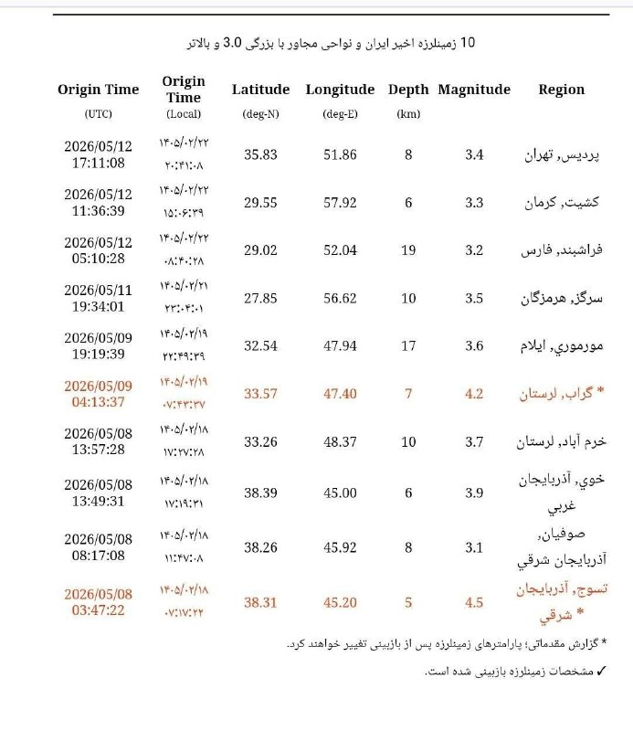

🔴 زلزله تهران به مرکز پردیس، 3.4 ریشتر بود.

@Dirty_Kids 👻

## Dirty_Kids — post 389340

🔴 فوری: وسط این همه بگایی تهران زلزله اومد!

@Dirty_Kids 👻

## Dirty_Kids — post 389339

  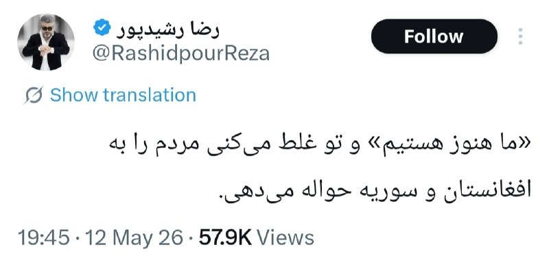

واکنش شهبازی (اسکل نظام) به وضعیت اینترنت مردم ایران و کشورهای منطقه: اگه خیلی این چیزها مهمه، برید همون افغانستان و سوریه زندگی کنید! هاهاهاها + هاهاها و ک...خر @Dirty_Kids 👻

## Dirty_Kids — post 389338

  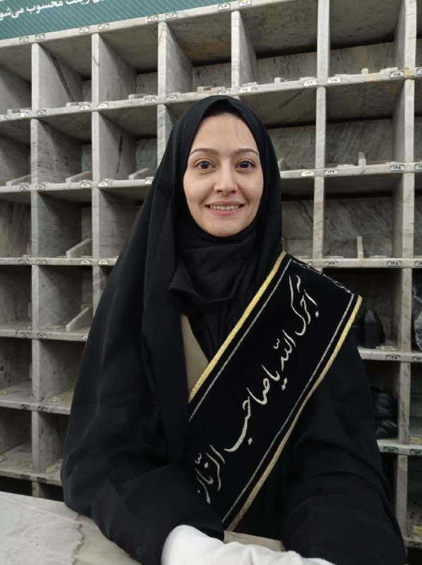

این پردیس احمدیه افغانی رفته خادم رضا شده

رقابت سنگینی هست بین این بی‌هنرا تو مالیدن تا بارشونو ببندن

@Dirty_Kids 👻

## Dirty_Kids — post 389337

  <a href="telegram/content/Dirty_Kids_389337_1778620228.mp4" target="_blank">🎬 Download video</a>

عشق این شکلیه 👆

@Dirty_Kids 👻

## Hranews — post 112916

گزارشی از تجمع اعتراضی اساتید اخراجی دانشگاه فرهنگیان در تهران

❗️
❗️
❗️
❗️
❗️ – روز یکشنبه ۲۰ اردیبهشت‌ماه، شماری از اساتید اخراجی دانشگاه فرهنگیان در مقابل ساختمان‌های سازمان بازرسی کل کشور و وزارت آموزش و پرورش در اعتراض به عدم رسیدگی به مطالباتشان دست به #تجمع زدند.

ادامه مطلب

↘️
@hranews_bot تماس ✉️ -  @Hranews  کانال هرانا 🆑

## manototv — post 105378

  <a href="telegram/content/manototv_105378_1778620230.mp4" target="_blank">🎬 Download video</a>

شاهزاده رضا پهلوی در نشست امنیتی سالانه پولیتیکو گفت مردم ایران، نه نیروهای خارجی، باید نقش اصلی را در تغییر حکومت جمهوری اسلامی ایفا کنند؛ اما برای این کار به «حمایت و پوشش» نیاز دارند.

او گفت: «نیروهای روی زمین در ایران، خود مردم ایران هستند. ما نیازی نداریم نیروهای خارجی این کار را برای ما انجام دهند.»

شاهزاده رضا پهلوی با اشاره به سرکوب اعتراضات دی‌ماه گفت در کمتر از ۴۸ ساعت بیش از ۴۰ هزار نفر کشته شدند و افزود بدون حمایت، نمی‌توان از مردم انتظار داشت دوباره به خیابان‌ها بیایند.

او گفت: «به همین دلیل بود که به کارزار هوایی و پوشش هوایی نیاز داشتیم.»

شاهزاده رضا پهلوی همچنین تأکید کرد باید یک استراتژی روشن برای پایان دادن به جمهوری اسلامی وجود داشته باشد؛ استراتژی‌ای که هم مردم را برای قیام تشویق کند و هم زمینه پیوستن نیروهایی از ارتش و دستگاه امنیتی به مردم را فراهم سازد.

او افزود: «نمی‌شود از یک طرف گفت مردم قیام کنند و همزمان گفت در حال مذاکره هستیم؛ این همه را گیج می‌کند.»

شاهزاده رضا پهلوی همچنین گفت حملات انجام‌شده علیه جمهوری اسلامی، ملت ایران را هدف نگرفته بود، بلکه زیرساخت‌های سرکوب حکومت، از جمله دستگاه اطلاعاتی و سپاه پاسداران، را هدف قرار داده بود.

او افزود: «مردم آن‌قدر باهوش هستند که تفاوت میان حمله به ملت ایران و حمله به حکومت را تشخیص دهند.»

## manototv — post 105377

  <a href="telegram/content/manototv_105377_1778620234.mp4" target="_blank">🎬 Download video</a>

‌
خبرگزاری‌های داخل ایران گزارش دادند دقایقی پیش زلزله تهران و کرج را لرزاند. به گزارش این خبرگزاری‌ها سمت شرق تهران زمین‌لرزه بسیار شدیدتر بوده است.

## manototv — post 105376

  <a href="telegram/content/manototv_105376_1778620234.mp4" target="_blank">🎬 Download video</a>

تماسی از ایران؛
«می‌گفت تغییر از بیرون نیست…
کار خود مردمه، حتی با این وضعیت سخت.»

## alonews — post 119624

  <a href="telegram/content/alonews_119624_1778620237.webm" target="_blank">🎬 Download video</a>

👈عوضش اورانیوم ۶۰درصد داریم میتونیم بزاریم تو شیشه نگاش کنیم و روز به روز بدبختر بشیم

✅ @AloNews خبر جنگ

## alonews — post 119623

  <a href="telegram/content/alonews_119623_1778620237.webm" target="_blank">🎬 Download video</a>

🔴فوری/زلزله مجدد در پردیس تهران

✅ @AloNews خبر جنگ

## alonews — post 119622

  <a href="telegram/content/alonews_119622_1778620237.webm" target="_blank">🎬 Download video</a>

👈مردم تهران باید امشب رو هوشیار باشن و زیر وسایل خطرساز مثل لوسترها و پنجره‌ها نخوابن، احتمال لرزش‌های شدیدتر است

✅ @AloNews خبر جنگ

## alonews — post 119621

  <a href="telegram/content/alonews_119621_1778620238.webm" target="_blank">🎬 Download video</a>

👈پس لرزه‌ها تو تهران شروع شده

✅ @AloNews خبر جنگ

## alonews — post 119620

  <a href="telegram/content/alonews_119620_1778620238.webm" target="_blank">🎬 Download video</a>

🔴فوری/زلزله مجدد در تهران

✅ @AloNews خبر جنگ

## alonews — post 119619

  <a href="telegram/content/alonews_119619_1778620238.webm" target="_blank">🎬 Download video</a>

👈رسایی: مردم بعدا میفهمن با قطع اینترنت چه خدمتی به ایران کردیم

🔴دشمن برنامه‌ها داشت

✅ @AloNews خبر جنگ

## alonews — post 119618

اخبار جنگ الونیوز AloNews pinned «
⭕️
⭕️ حجم 1 تا 100 گیگ بدون ضریب با لینک ساب بدون قطعی سرعت بالا و ضمانت بازگشت وجه قیمت هر گیگ 235 
💸 برای خرید به ادمین چنل پیام بدید خرید آسان و راحت با کارت ب کارت ثبت سفارش از طریق ربات: و اگر تمایل به همکاری دارید کافیه به ساپورت چنل مراجعه کنید…»

## alonews — post 119617

  <a href="telegram/content/alonews_119617_1778620239.webm" target="_blank">🎬 Download video</a>

👈سخنگوی اورژانس تهران: در پی زمین لرزه در تهران تا این لحظه مصدومی گزارش نشده است

✅ @AloNews خبر جنگ

## alonews — post 119616

  <a href="telegram/content/alonews_119616_1778620239.webm" target="_blank">🎬 Download video</a>

👈در زمان زلزله چه باید کرد؟

✅ @AloNews خبر جنگ

## alonews — post 119614

  <a href="telegram/content/alonews_119614_1778620239.webm" target="_blank">🎬 Download video</a>

👈کانون زلزله لحظات قبل تهران

✅ @AloNews خبر جنگ

## alonews — post 119613

  <a href="telegram/content/alonews_119613_1778620239.webm" target="_blank">🎬 Download video</a>

👈مردم تهران امشب هوشیار بخوابن

✅ @AloNews خبر جنگ

## alonews — post 119612

  <a href="telegram/content/alonews_119612_1778620240.webm" target="_blank">🎬 Download video</a>

👈ترامپ از طریق Truth Social: وقتی اخبار جعلی می‌گویند که دشمن ایرانی در مقابل ما از نظر نظامی خوب عمل می‌کند، این عملاً خیانت است چون چنین بیانی کاملاً نادرست و حتی مضحک است. آنها به دشمن کمک و یاری می‌رسانند! این فقط به ایران امید کاذب می‌دهد در حالی که نباید هیچ امیدی وجود داشته باشد.

🔴این‌ها ترسوهای آمریکایی هستند که علیه کشور ما ریشه دوانده‌اند. ایران ۱۵۹ کشتی در نیروی دریایی خود داشت — هر کشتی اکنون در کف دریا استراحت می‌کند. آنها نیروی دریایی ندارند، نیروی هوایی‌شان از بین رفته، تمام فناوری‌ها از دست رفته، «رهبران» آنها دیگر با ما نیستند و کشور یک فاجعه اقتصادی است.

🔴فقط بازندگان، ناسپاسان و احمق‌ها قادر به ارائه استدلال علیه آمریکا هستند!

✅ @AloNews خبر جنگ

## alonews — post 119611

  <a href="telegram/content/alonews_119611_1778620240.webm" target="_blank">🎬 Download video</a>

👈گزارش مقدماتی زمین‌لرزه

🔴بزرگی: ۴.۶ ریشتر

🔴محل وقوع: مرز استانهای تهران و مازندران  - حوالی پرديس

🔴تاریخ و زمان وقوع به وقت محلی: 1405/02/22 23:46:07

🔴عمق زمین‌لرزه: 10 کیلومتر

🔴نزدیک‌ترین شهرها:

🔴8 کیلومتری پرديس (تهران)

🔴10 کیلومتری بومهن (تهران)

🔴11 کیلومتری رودهن (تهران)
    

🔴نزدیکترین مراکز استان:

🔴41 کیلومتری تهران

🔴77 کیلومتری كرج

✅ @AloNews خبر جنگ

## alonews — post 119610

  <a href="telegram/content/alonews_119610_1778620240.webm" target="_blank">🎬 Download video</a>

👈تمام پایگاه ها و هلال اهمر در تهران به حالت آماده باش در اومدن، تهرانیا امشب حتما مراقب باشین و از زیر لوستر و دم پنجره فاصله بگیرین.

✅ @AloNews خبر جنگ

## alonews — post 119609

  <a href="telegram/content/alonews_119609_1778620241.webm" target="_blank">🎬 Download video</a>

👈شرق تهران باز لرزید

🔴اهالی مناطقی در شمال و جنوب شرق تهران از لرزش مجدد این منطقه خبر داده اند.

✅ @AloNews خبر جنگ

## alonews — post 119608

  <a href="telegram/content/alonews_119608_1778620241.webm" target="_blank">🎬 Download video</a>

🔴فوری/مرکز لرزه‌نگاری:
لحظاتی پیش زلزلهٔ ۴.۶ ریشتری مرز استان‌های تهران و مازندران را لرزاند

✅ @AloNews خبر جنگ

## alonews — post 119607

  <a href="telegram/content/alonews_119607_1778620241.webm" target="_blank">🎬 Download video</a>

👈بعضیا میگن تو شرق تهران تست بمب اتم در زیر زمین بوده

✅ @AloNews خبر جنگ

## alonews — post 119606

  <a href="telegram/content/alonews_119606_1778620242.webm" target="_blank">🎬 Download video</a>

👈ایرنا:
در تهران هم نزدیک به ۱۰ ثانیه لرزش زمین به طول انجامید.

✅ @AloNews خبر جنگ

## alonews — post 119605

  <a href="telegram/content/alonews_119605_1778620242.webm" target="_blank">🎬 Download video</a>

👈امروز پردیس چندبار لرزیده و نکته ترسناک اینه روی گسل بزرگ تهرانه

✅ @AloNews خبر جنگ

## alonews — post 119604

  <a href="telegram/content/alonews_119604_1778620242.webm" target="_blank">🎬 Download video</a>

👈این وسط فقط زلزله کم بود

✅ @AloNews خبر جنگ

<!-- MSG END -->

<!-- NAV START -->

<!-- NAV END -->
