# خواننده تلگرام

<!-- TOP_NAV START -->

<a href="https://github.com/Tljn/FUD/blob/main/telegram/content/archive_1.md" style="display:inline-block; padding:6px 12px; margin:0 4px; background-color:#2ea44f; color:white; text-decoration:none; border-radius:4px; font-weight:bold;">صفحه بعد</a>

<!-- TOP_NAV END -->

<!-- MSG START -->

---
📅 بروزرسانی: 1405/03/18 02:44
---

## VahidOOnLine — post 244203

  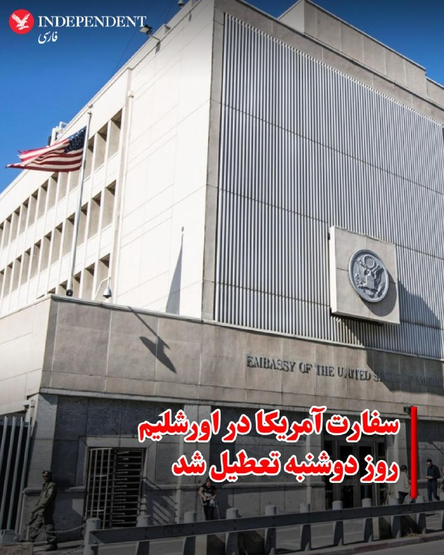

♦️سفارت ایالات متحده در اورشلیم اعلام کرد که به دلیل «وضعیت امنیتی کنونی در اسرائیل» روز دوشنبه تعطیل خواهد بود.
این سفارتخانه در بیانیه‌ای اعلام کرد که به تمامی کارکنان دولت آمریکا دستور داده شده است «در محل خود پناه بگیرند و برای انتقال به پناهگاه‌های امن در صورت لزوم آماده باشند.»
‌🇸🇦 Indypersian

🤖 @VahidOOnLine

## VahidOOnLine — post 244202

  

پس ازاینکه عباس عراقچی، عکس پرچم‌های جمهوری اسلامی و لبنان را کنار هم در شبکه اجتماعی ایکس منتشر کرد، گیدون سعار، وزیر خارجه اسرائیل، پرچم حزب‌الله لبنان را کنار پرچم جمهوری اسلامی گذاشت و عراقچی را «کلاهبردار» خطاب کرد.
‌🏁 🇬🇧 IranintlTV

🤖 @VahidOOnLine

## VahidOOnLine — post 244201

  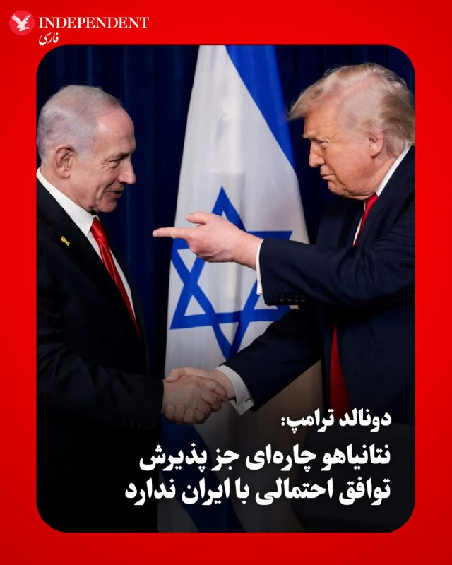

♦️دونالد ترامپ، رئیس‌جمهوری آمریکا، در گفتگوی تلفنی با روزنامه «فایننشال تایمز» اعلام کرد که بنیامین نتانیاهو، نخست‌وزیر اسرائیل، چاره‌ای جز پذیرش توافق احتمالی واشنگتن با تهران ندارد، چرا که در این معادله «او تصمیم‌گیرنده نهایی و همه‌کاره است». ترامپ که پس از حملات موشکی گسترده ایران به اسرائیل، در پاسخ به بمباران حومه بیروت توسط ارتش اسرائیل، سخن می‌گفت، تأکید کرد که این پرتابه‌ها هیچ آسیبی وارد نکرده‌اند و تفاوتی در اراده او برای دستیابی به توافق ایجاد نمی‌کنند؛ هرچند برخلاف گذشته، لحن او نشان می‌داد که حصول این توافق چندان هم قریب‌الوقوع نیست. رئیس‌جمهوری آمریکا همچنین هشدار داد که اگر روند دیپلماسی شکست بخورد، گزینه‌هایی چون حمله تفنگداران دریایی یا تشدید محاصره همه‌جانبه نظامی علیه ایران را مدنظر قرار خواهد داد.
‌🇸🇦 Indypersian

🤖 @VahidOOnLine

## VahidOOnLine — post 244200

  

دونالد ترامپ، رییس‌جمهوری آمریکا، در مصاحبه‌ای که یکشنبه منتشر شد، به فایننشال تایمز گفت بنیامین نتانیاهو، نخست‌وزیر اسرائیل، «چاره‌ای جز پذیرش» هر توافقی که ایالات متحده با ایران کند، نخواهد داشت، زیرا ترامپ «حرف آخر را می‌زند.»

به گزارش خبرگزاری رویترز، او گفت: «او [نتانیاهو] هیچ چاره‌ای نخواهد داشت.»
‌🏁 🇬🇧 IranintlTV

🤖 @VahidOOnLine

## VahidOOnLine — post 244199

  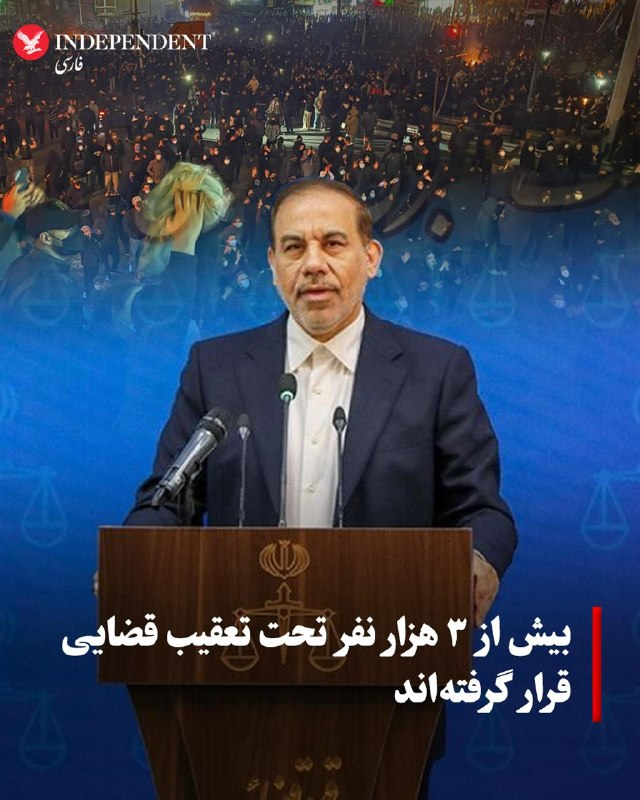

♦️اصغر جهانگیر، سخنگوی قوه قضاییه جمهوری اسلامی، در جمع طرفداران حکومت در میدان تجریش اعلام کرد که دستگاه قضایی بیش از ۳ هزار نفر را تحت عنوان «خائنین به وطن» تحت تعقیب قرار داده و ادعا کرد که از این تعداد، ۲ هزار و ۴۰۶ نفر بازداشت شده‌اند و در حال حاضر در زندان به سر می‌برند. این ادعا درحالی مطرح می‌شود که براساس گزارش‌ها، تعداد افراد بازداشت شده بیشتر است. او این افراد را به اقداماتی نظیر «همکاری عملیاتی، امنیتی، رسانه‌ای و مالی به نفع اسرائیل» و همچنین «نگهداری و خرید و فروش ابزارهای الکترونیکی مانند استارلینک برای کمک به دشمن» متهم کرد. او همچنین گفت: «اموال صدها نفر شناسایی و توقیف شده که پس از بررسی و حکم دادگاه مصادره خواهد شد».
‌🇸🇦 Indypersian

🤖 @VahidOOnLine

## WithYashar — post 13860

  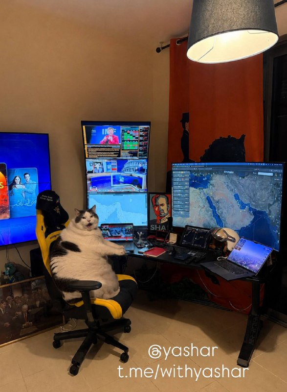

وضعیت من هم اکنون 😹
@withyashar

## WithYashar — post 13859

ایران به سمت گروه های کرد مخالف ایرانی در سلیمانیه عراق پهپاد شلیک کرده است @withyashar

## WithYashar — post 13858

بیانیه رسمی فیفا:
دیدار ایران و مصر قطعا دیدار افتخار همجنسگرایان خواهد بود و به هیچ عنوان این رویداد لغو نخواهد شد
@withyashar

## WithYashar — post 13857

  <a href="telegram/content/WithYashar_13857_1780874078.mp4" target="_blank">🎬 Download video</a>

@withyashar Israeli Medley (Hebrew) by Leila Forouhar

## WithYashar — post 13856

یک مقام آمریکایی به کانال ۱۲ تلویزیون اسرائیل گفت: نتانیاهو به نوعی موافقت کرده است که پاسخ اسرائیل به ایران را به تعویق بیندازد.
@withyashar
یاشار: اسرائیل همانطور که گفتم فقط کارش قافلگیری ‌است و هیچی نشون نمیده ! هر لحظه ممکنه برنه !

## WithYashar — post 13855

تسنیم: ایران از یک‌ پهپاد ناشناخته جدید در حملات اخیر علیه اسرائیل استفاده کرد
@withyashar

## WithYashar — post 13854

رسانه وابسته به سپاه گزارش داده که در تهران، هواپیماهای مسافربری غیرنظامی به‌دلیل انتظار حملات اسرائیل در حال جابه‌جایی هستند.
@withyashar

## WithYashar — post 13853

## WithYashar — post 13852

دادگاه فردا نتانیاهو لغو شد!

جلسه‌ای که قرار بود فردا در چارچوب بررسی پرونده‌های قضایی بنیامین نتانیاهو برگزار شود، به دلیل وضعیت امنیتی و شرایط جاری در منطقه لغو شد.
@withyashar

## WithYashar — post 13851

من یه بیت رهبری برم بیام 😹

## WithYashar — post 13850

ترامپ: محاصره ممکن است قوی تر از هر حمله ای باشد که به ایران آغاز شده است‌‌
@withyashar

## WithYashar — post 13849

همه رسانه های عبری دسته جمعی از تصمیم نتانیاهو مبنی بر حمله گسترده به ایران ، خبر میدهند
@withyashar

## WithYashar — post 13848

  <a href="telegram/content/WithYashar_13848_1780874080.mp4" target="_blank">🎬 Download video</a>

@withyashar

## WithYashar — post 13846

ترامپ: اگر توافق به دلیل بندهاش فرو بپاشه، ما گزینه انجام یک حمله کماندویی به ایران رو بررسی خواهیم کرد.
@withyashar

## WithYashar — post 13845

هشدار آمریکا برای شهروندان خارج از کشور: احتیاط کنید , از جا به جایی بپرهیزید
@withyashar

## WithYashar — post 13844

ترامپ: نتانیاهو «چاره‌ای نخواهد داشت» جز اینکه توافق با ایران را بپذیرد.

من فرمان‌ها را صادر می‌کنم. من همه فرمان‌ها را صادر می‌کنم. نتانیاهو فرمان‌ها را صادر نمی‌کند.
@withyashar

## WithYashar — post 13843

رسانه‌های اسرائیلی : ایستگاه‌های مترو در خط قرمز تمام شب باز خواهند بود و طبق دستور فرماندهی جبهه داخلی اسرائیل، به‌عنوان پناهگاه برای ساکنان مورد استفاده قرار می‌گیرن.
@withyashar

## WithYashar — post 13842

نتانیاهو وارد یه جلسه امنیتی گسترده با وزیر جنگ، فرماندهان ارتش و موساد شده
@withyashar

## mwarmonitor — post 10356

🔴فوری | شبکه ۱۲ اسرائیل به نقل از یک مقام ارشد آمریکایی: رئیس‌جمهور ترامپ انتظار ندارد که در آینده نزدیک حمله‌ای از سوی اسرائیل انجام شود.

🔴 شبکه ۱۲ اسرائیل به نقل از یک مقام آمریکایی و یک منبع اسرائیلی: ترامپ از نتانیاهو خواسته است به حمله ایران پاسخ ندهد و چند روز دیگر فرصت بدهد تا مذاکرات تکمیل شود.

🔴 شبکه ۱۲ اسرائیل به نقل از یک مقام آمریکایی: ترامپ زمان بیشتری به دست آورده است، زیرا او معتقد است که ما به رسیدن به یک توافق نزدیک هستیم.

@mwarmonitor

## mwarmonitor — post 10355

💥«انفجارهای جدیدی در منطقه طاسلوجه در استان سلیمانیه در شمال عراق رخ داده است.» @mwarmonitor

## mwarmonitor — post 10354

📌اکسیوس: مقامات آمریکایی اعطای «چراغ سبز» به اسرائیل برای انجام حمله به بیروت را تکذیب می‌کنند. یکی از مقامات گفت: «ما هیچ نقشی در این موضوع نداشتیم.»

@mwarmonitor

## mwarmonitor — post 10353

🔴 وزارت بهداشت اسرائیل: فراخوان نیروی انسانی به بیمارستان‌ها برای انتقال سریع به وضعیت اضطراری.

@mwarmonitor

## mwarmonitor — post 10352

🛢 رویترز: قراردادهای آتی نفت خام آمریکا (WTI) با ۲.۵۷ دلار افزایش به ۹۳.۱۱ دلار در هر بشکه رسید.

@mwarmonitor

## mwarmonitor — post 10351

🛢رویترز: قراردادهای آتی نفت خام برنت ۲.۶۷ دلار افزایش یافت و به ۹۵.۷۶ دلار در هر بشکه رسید.

@mwarmonitor

## mwarmonitor — post 10350

  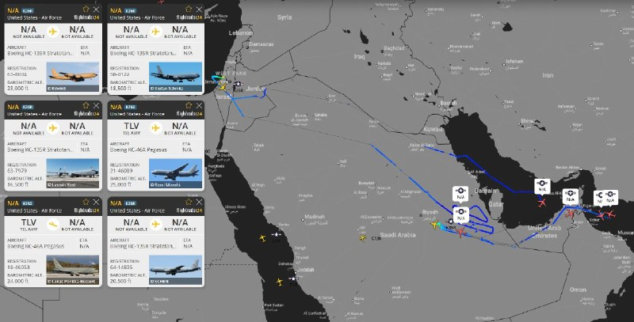

✈️«۳ فروند تانکر سوخت‌رسان نیروی هوایی آمریکا اکنون بر فراز شرق عربستان سعودی فعال هستند و دو فروند دیگر نیز در مسیر از تل‌آویو در حال حرکت‌اند. ✈️همچنین به نظر می‌رسد هواپیماهای نیروی هوایی آمریکا از انجام عملیات بر فراز خلیج فارس و دریای عمان خودداری می‌کنند.»…

## mwarmonitor — post 10349

🔸ترامپ: حملات ایران هدف او را برای به‌سرانجام رساندن مذاکرات آمریکا و ایران تغییر نداده است. @mwarmonitor

## mwarmonitor — post 10348

📌اسرائیل به گزارش شبکه «کان» در حال بررسی این است که امشب به ایران حمله نکند، پس از مخالفت دونالد ترامپ.

در عوض، یک حمله ممکن است «چند روز دیگر» انجام شود.

@mwarmonitor

## mwarmonitor — post 10347

🔴ترامپ: «نتانیاهو چاره‌ای جز پذیرش توافق با ایران نخواهد داشت.» @mwarmonitor

## mwarmonitor — post 10346

🔴ترامپ: «نتانیاهو چاره‌ای جز پذیرش توافق با ایران نخواهد داشت.»

@mwarmonitor

## pm_afshaa — post 92741

  <a href="telegram/content/pm_afshaa_92741_1780874082.webm" target="_blank">🎬 Download video</a>

🔴کانال 12 اسرائیل:
ترامپ از نتانیاهو خواسته تا در پاسخ به حمله ایران بلافاصله واکنش نشون نده و فعلا چند روز صبر کنه تا مذاکرات دیپلماتیک ادامه پیدا کنه و در روند مذاکرات هم مداخله نکنه.

نتانیاهو اولش مخالفت کرد، اما در نهایت به نوعی موافقت کرد تا زمانی که گفتگوها ادامه داره دست نگه داره و از پاسخگویی خودداری کنه و حمله رو به تعویق بندازه.

💧 Rainbet.com the #1 Non-KYC Crypto Casino & Sportsbook @rainbetcom

😁 @Pm_Afshaa

## pm_afshaa — post 92740

  <a href="telegram/content/pm_afshaa_92740_1780874082.webm" target="_blank">🎬 Download video</a>

🔴جلسه دادگاه نتانیاهو فردا به دلیل وضعیت امنیتی و شرایط جاری در منطقه لغو شد.

💧 Rainbet.com the #1 Non-KYC Crypto Casino & Sportsbook @rainbetcom

😁 @Pm_Afshaa

## pm_afshaa — post 92739

ادامه اخبار رو بیاید اینجا :

https://t.me/BeladNews
https://t.me/BeladNews

## pm_afshaa — post 92738

  <a href="telegram/content/pm_afshaa_92738_1780874083.webm" target="_blank">🎬 Download video</a>

🔴ترامپ: اگر توافق به دلیل بندهاش فرو بپاشه، ما گزینه انجام یک حمله کماندویی به ایران رو بررسی خواهیم کرد. 
💧 Rainbet.com the #1 Non-KYC Crypto Casino & Sportsbook @rainbetcom 
😁 @Pm_Afshaa

## pm_afshaa — post 92737

ترامپ بد منفور شد امشب
نکنه زنشو گروگان گرفتن؟

## pm_afshaa — post 92736

  <a href="telegram/content/pm_afshaa_92736_1780874083.webm" target="_blank">🎬 Download video</a>

🔴ترامپ: اگر توافق به دلیل بندهاش فرو بپاشه، ما گزینه انجام یک حمله کماندویی به ایران رو بررسی خواهیم کرد.

💧 Rainbet.com the #1 Non-KYC Crypto Casino & Sportsbook @rainbetcom

😁 @Pm_Afshaa

## pm_afshaa — post 92735

  <a href="telegram/content/pm_afshaa_92735_1780874084.webm" target="_blank">🎬 Download video</a>

🔴ترامپ: حملات ایران هیچ تأثیری بر توافق نخواهد داشت. فکر میکنم توافق در حال پیش رفتن است و خواهیم دید چه اتفاقی میفته.

💧 Rainbet.com the #1 Non-KYC Crypto Casino & Sportsbook @rainbetcom

😁 @Pm_Afshaa

## pm_afshaa — post 92734

  <a href="telegram/content/pm_afshaa_92734_1780874084.webm" target="_blank">🎬 Download video</a>

🔴ترامپ: نتانیاهو هیچ گزینه‌ای جز پذیرفتن توافق با ایران نخواهد داشت. 
💧 Rainbet.com the #1 Non-KYC Crypto Casino & Sportsbook @rainbetcom 
😁 @Pm_Afshaa

## pm_afshaa — post 92733

  <a href="telegram/content/pm_afshaa_92733_1780874085.webm" target="_blank">🎬 Download video</a>

🔴کان نیوز اسرائیل: اسرائیل در حال بررسی لغو حمله امشب به ایران به دلیل مخالفت ترامپ است و در ازای این انتظار میره حملات در روز های آینده انجام بشه. البته هنوز هیچ تصمیم نهایی گرفته نشده و بحث‌ها و رایزنی‌ها همچنان ادامه داره. 
💧 Rainbet.com the #1 Non-KYC…

## pm_afshaa — post 92732

  <a href="telegram/content/pm_afshaa_92732_1780874085.webm" target="_blank">🎬 Download video</a>

🔴کان نیوز اسرائیل: اسرائیل در حال بررسی لغو حمله امشب به ایران به دلیل مخالفت ترامپ است و در ازای این انتظار میره حملات در روز های آینده انجام بشه.

البته هنوز هیچ تصمیم نهایی گرفته نشده و بحث‌ها و رایزنی‌ها همچنان ادامه داره.

💧 Rainbet.com the #1 Non-KYC Crypto Casino & Sportsbook @rainbetcom

😁 @Pm_Afshaa

## pm_afshaa — post 92731

  <a href="telegram/content/pm_afshaa_92731_1780874086.webm" target="_blank">🎬 Download video</a>

🔴ترامپ: نتانیاهو هیچ گزینه‌ای جز پذیرفتن توافق با ایران نخواهد داشت.

💧 Rainbet.com the #1 Non-KYC Crypto Casino & Sportsbook @rainbetcom

😁 @Pm_Afshaa

## pm_afshaa — post 92730

  <a href="telegram/content/pm_afshaa_92730_1780874086.webm" target="_blank">🎬 Download video</a>

🔴هم‌اکنون جلسه امنیتی نتانیاهو با ژنرال‌های نظامی ارتش اسرائیل

💧 Rainbet.com the #1 Non-KYC Crypto Casino & Sportsbook @rainbetcom

😁 @Pm_Afshaa

## mamlekate — post 103631

  <a href="telegram/content/mamlekate_103631_1780874087.mp4" target="_blank">🎬 Download video</a>

📞 سلام ساعت ۱۲:۱۴ دقیقه هر ۳ دقیقه یه هواپیما مسافری از مهرآباد بلند میشه

📞 الو به‌صورت مداوم صدای هواپیما از غرب تهران میاد (و به‌نظر می‌رسه همینطوری مدام دارم هواپیماها رو از فرودگاه‌ها به‌سمت احتمالا شرق کشور تخلیه میکنن). الانم صدای یه هواپیمای (به‌نظر مسافربری) داره میاد

📞 سلام، امشب از ساعت ۱۲ تا الان دوبار صدای هواپیما تو بجنورد اومده، اینجا اصلا شب پرواز نداره فرودگاه

📞 ساعت۰۱:۴۰ ۱۸ خرداد اسلامشهر مدام داره صدای هواپیما میاد،مگه پرواز ها نمیگن بسته شد؟ شب های قبل اصلا اینجوری نبود

📞 سلام از ساعت ۱۲ شب تهرانسر هر ده دقیقه یه ربع همینجوری صدای هواپیما میاد

📞 هواپیما ها به سمت شرق میرن

@mamlekate

## VahidOnline — post 76012

  

سایت خبری اسرائیل‌هیوم می‌گوید دونالد ترامپ در تماس تلفنی با بنیامین نتانیاهو به او قول داد که متعهد است هرگونه امکان دستیابی جمهوری اسلامی به سلاح هسته‌ای را از بین ببرد و همچنین مانع از آن شود که این رژیم تهدیدی دائمی برای اسرائیل باشد.
@VahidHeadline
بخش دیجیتال روزنامه اسرائیلی یدیعوت اخرونوت، وای‌نت، در گزارشی نوشت که آمریکا از اسرائیل خواست پاسخ تلافی‌جویانه خود به حملات تازه موشکی جمهوری اسلامی به اسرائیل را به تعویق بیندازد. طبق این گزارش، واشنگتن از اسرائیل می‌خواهد که «چند روز» صبر کند تا ببیند آیا مذاکرات با جمهوری اسلامی به توافقی منجر می‌شود یا خیر.
اسرائیل در حال بررسی واکنش به شلیک موشکی جمهوری اسلامی است.
@VahidHeadline
ادعای یک مقام آمریکایی به کانال ۱۲ اسرائیل: نتانیاهو «به نحوی» با به تأخیر انداختن پاسخ به حمله ایران موافقت کرده است./انتخاب

📡 @VahidOnline

## VahidOnline — post 76011

  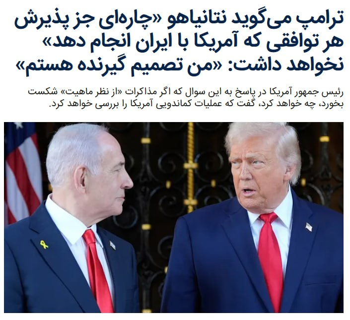

ترامپ می‌گوید هر توافقی که او با حکومت ایران کند نخست وزیر اسرائيل خواهد پذیرفت

رئیس‌جمهوری آمریکا در گفت‌وگویی تلفنی با فایننشال تایمز گفت که بنیامین نتانیاهو، نخست‌وزیر اسرائیل، چاره‌ای جز پذیرش هر توافقی که آمریکا در مورد آن با رژیم ایران مذاکره و نهایی کند نخواهد داشت.
دونالد ترامپ گفت زیرا «تصمیم‌گیرنده اصلی رئیس‌جمهوری ایالات متحده» است.

دونالد ترامپ به فایننشال تایمز گفت: «او (بنیامین نتانیاهو) هیچ انتخابی نخواهد داشت. این من هستم که تصمیم می‌گیرم. همه تصمیم‌ها را من می‌گیرم. او (نتانیاهو) تصمیم‌گیرنده نیست.»

به گزارش فایننشال تایمز، آقای ترامپ این اظهارات را اندکی پس از آن مطرح کرد که جمهوری اسلامی در جدی‌ترین نقض آتش‌بس از زمان توافق آتش‌بس در اوایل آوریل، چندین موشک بالستیک به سوی اسرائیل شلیک کرد.

آقای ترامپ تأکید کرد که حملات موشکی جمهوری اسلامی تغییری در تمایل او برای به نتیجه رساندن مذاکرات میان آمریکا و حکومت ایارن ایجاد نکرده است.
او به فایننشال تایمز گفت: «این موضوع هیچ تأثیری بر توافق نخواهد داشت.»

ارتش اسرائيل به صدای آمریکا گفت که جمهوری اسلامی یازده موشک به اسرائيل شلیک کرد. ارتش اسرائيل پیشتر گفت که حملات موشکی جمهوری اسلامی را دفع کرده است.

در همین حال در واکنش به حملات موشکی جمهوری اسلامی، ارتش اسرائیل در بیانیه‌ای به صدای آمریکا گفت که رئیس ستاد کل ارتش اسرائیل، ایال زمیر، در حال ارزیابی وضعیت در مجمع ستاد کل است. ارتش اسرائيل به صدای آمریکا گفت: «نیروی دفاعی اسرائیل به محض صدور دستور، با قاطعیت به دشمن حمله خواهد کرد.»
@VahidHeadline

📡 @VahidOnline

## IranIntlTV — post 341076

  <a href="https://t.me/IranintlTV/341076" target="_blank">📎 Download file</a>

🎧نسخه صوتی سیاست با مراد ویسی: حمله موشکی سپاه به اسرائیل
@iranintlTV

## IranIntlTV — post 341075

  <a href="telegram/content/IranIntlTV_341075_1780874088.mp4" target="_blank">🎬 Download video</a>

ارتش اسرائیل اعلام کرد شبکه‌ای از تونل‌های زیرزمینی حزب‌الله را در ارتفاعات بوفور جنوب لبنان کشف کرده است؛ شبکه‌ای که به گفته این ارتش با برنامه‌ریزی و تأمین مالی جمهوری اسلامی ساخته شده بود و پهپادها، موشک‌های دوش‌پرتاب و موشک‌های ضدزره از این محل به سوی خاک اسرائیل شلیک شده بود. این شبکه تونلی در یک منطقه غیرنظامی بنا شده بود و به‌عنوان یکی از مراکز اصلی حزب‌الله در این منطقه عمل می‌کرد.
@iranintltv

## IranIntlTV — post 341074

  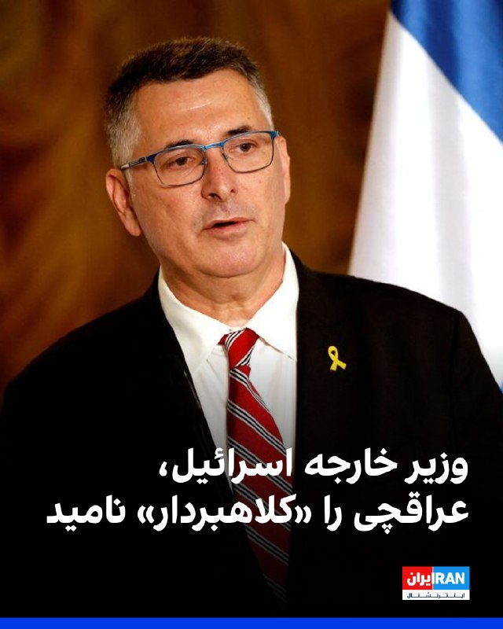

پس از اینکه عباس عراقچی، عکس پرچم‌های جمهوری اسلامی و لبنان را کنار هم در شبکه اجتماعی ایکس منتشر کرد، گیدون سعار، وزیر خارجه اسرائیل، پرچم حزب‌الله لبنان را کنار پرچم جمهوری اسلامی گذاشت و عراقچی را «کلاهبردار» خطاب کرد.
https://iranintl.com/202606072824

## IranIntlTV — post 341073

  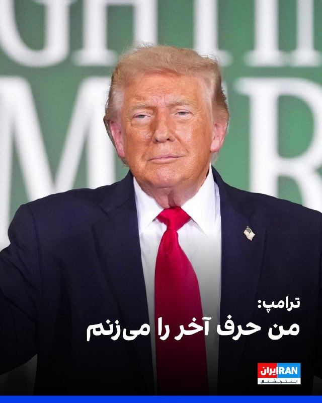

دونالد ترامپ، رییس‌جمهوری آمریکا، در مصاحبه‌ای که یکشنبه منتشر شد، به فایننشال تایمز گفت بنیامین نتانیاهو، نخست‌وزیر اسرائیل، «چاره‌ای جز پذیرش» هر توافقی که ایالات متحده با ایران کند، نخواهد داشت، زیرا ترامپ «حرف آخر را می‌زند.»

به گزارش خبرگزاری رویترز، او گفت: «او [نتانیاهو] هیچ چاره‌ای نخواهد داشت.»
https://iranintl.com/202606078152

## IranIntlTV — post 341072

  <a href="telegram/content/IranIntlTV_341072_1780874090.mp4" target="_blank">🎬 Download video</a>

کاروان تیم ملی فوتبال ایران وارد مکزیک شد. همزمان، شماری از ایرانیان مقیم لس‌آنجلس در اعتراض به ممنوعیت ورود پرچم شیر و خورشید به ورزشگاه‌های جام جهانی تجمعی اعتراضی برگزار کردند.

گزارش نیلوفر منصوری و رضا محدث، خبرنگاران ایران‌اینترنشنال و گفت‌وگو با دو نفر از تجمع‌کنندگان
@iranintltv

## IranIntlTV — post 341071

  <a href="telegram/content/IranIntlTV_341071_1780874092.mp4" target="_blank">🎬 Download video</a>

شهرام خلدی، پژوهش‌گر تاریخ خاورمیانه، گفت: «درگیری میان اسرائیل و جمهوری اسلامی تشدید خواهد شد.» او افزود: «با توجه به حضور گسترده نیروهای آمریکایی در منطقه و نگرانی متحدان عرب واشینگتن در خلیج فارس، دونالد ترامپ نمی‌تواند در برابر بازیگری غیرعقلانی مانند جمهوری اسلامی، متحدانش را تنها بگذارد.»
@iranintltv

## IranIntlTV — post 341070

  <a href="telegram/content/IranIntlTV_341070_1780874093.mp4" target="_blank">🎬 Download video</a>

مراد ویسی، تحلیل‌گر ارشد ایران‌اینترنشنال، گفت: «یکی از روش‌هایی که جمهوری اسلامی برای حفظ بقای خود در پیش گرفته، استفاده از سرکوب و خشونت در داخل کشور است. منطق این رویکرد این است که هر زمان مردم دست به اعتراض یا قیام بزنند، با شدیدترین برخوردها و کشتار مواجه شوند تا هزینه اعتراض آن‌قدر بالا برود که جامعه از تکرار آن هراس داشته باشد. این روش در نهایت به جای خاموش کردن اعتراضات باعث گسترش کمی و کیفی اعتراضات شده است.»
@iranintltv

## FarsiVOA — post 219951

⚡️جمهوری اسلامی همچنان در کانون بحث‌های کنگره آمریکا؛ اشاره قانون‌گذارن به وضعیت اینترنت در ایران
@FarsiVOA

## FarsiVOA — post 219950

⚡️از هرات تا تهران؛ روایت مشترک زنان در برابر حجاب اجباری زنان و بازداشت‌ها
@FarsiVOA

## FarsiVOA — post 219949

  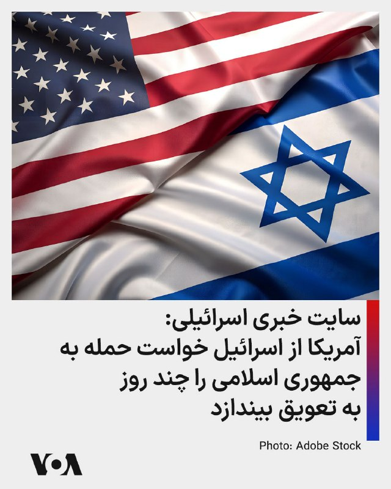

⚡️بخش دیجیتال روزنامه اسرائيلی یدیعوت اخرونوت، وای‌نت، در گزارشی نوشت که آمریکا از اسرائیل خواست پاسخ تلافی‌جویانه خود به حملات تازه موشکی جمهوری اسلامی به اسرائيل را به تعویق بیندازد. طبق این گزارش، واشنگتن از اسرائیل می‌خواهد که «چند روز» صبر کند تا ببیند آیا مذاکرات با جمهوری اسلامی به توافقی منجر می‌شود یا خیر.
اسرائیل در حال بررسی واکنش به شلیک موشکی جمهوری اسلامی است.
@FarsiVOA

## FarsiVOA — post 219948

🔺دونالد ترامپ به فایننشال تایمز می‌گوید هر توافقی که او با حکومت ایران کند نخست وزیر اسرائيل خواهد پذیرفت

▪️دونالد ترامپ، رئیس‌جمهوری آمریکا در گفت‌وگویی تلفنی با فایننشال تایمز گفت که بنیامین نتانیاهو، نخست‌وزیر اسرائیل، چاره‌ای جز پذیرش هر توافقی که آمریکا در مورد آن با رژیم ایران مذاکره و نهایی کند نخواهد داشت.

⬇️ بیشتر بخوانید:
https://ir.voanews.com/a/8158273.html
@FarsiVOA

## FarsiVOA — post 219947

  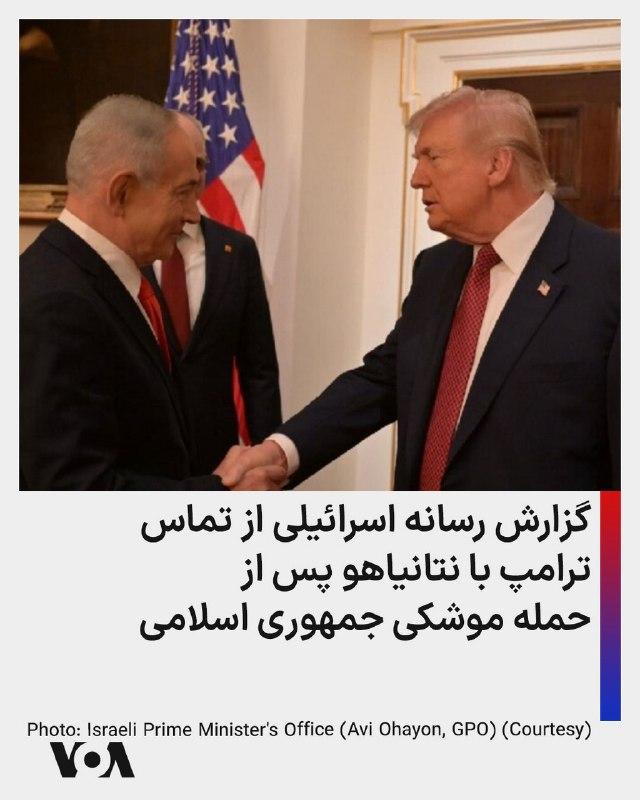

⚡️سایت خبری اسرائيل‌هیوم می‌گوید دونالد ترامپ در تماس تلفنی با بنیامین نتانیاهو به او قول داد که متعهد است هرگونه امکان دستیابی جمهوری اسلامی به سلاح هسته‌ای را از بین ببرد و همچنین مانع از آن شود که این رژیم تهدیدی دائمی برای اسرائیل باشد.
@FarsiVOA

## Persian_Trend_Official — post 16020

  <a href="telegram/content/Persian_Trend_Official_16020_1780874095.mp4" target="_blank">🎬 Download video</a>

سقوط پهپاد امریکایی در عراق!

امشب در حین حملات موشکی سپاه پاسداران به اسرائیل، یک پهپاد از نوع MQ-1 و یا MQ-9 امریکا برفراز عراق منهدم شد.

📝 Amir

📌 @persian_trend_official
پرشین ترند | متفاوت‌ترین کانال نظامی

## Persian_Trend_Official — post 16019

  <a href="telegram/content/Persian_Trend_Official_16019_1780874097.mp4" target="_blank">🎬 Download video</a>

سردار سید مجید موسوی، فرمانده نیروی هوافضا سپاه پاسداران برای اولین بار پس از آغاز جنگ پیام ویدیویی از خود منتشر کرد.

📝 Amir

📌 @persian_trend_official
پرشین ترند | متفاوت‌ترین کانال نظامی

## Persian_Trend_Official — post 16018

  <a href="telegram/content/Persian_Trend_Official_16018_1780874099.webm" target="_blank">🎬 Download video</a>

ترامپ به فایننشال تایمز: من تصمیم میگیرم. من همه تصمیمات را میگیرم. نتانیاهو تصمیم گیرنده نیست!

حمله ایران به اسرائیل هیچ تأثیری بر مذاکرات نخواهد داشت. این حملات یکی از آن چیزهایی است که 3000 سال یا 47 سال، بسته به اینکه چگونه حساب کنید، ادامه داشته است.

نتانیاهو چاره‌ای جز پذیرش توافق ایران نخواهد داشت.

📝 Amir

📌 @persian_trend_official
پرشین ترند | متفاوت‌ترین کانال نظامی

## IranianMinds — post 21713

  

🔴 طبق گزارش کانال ۱۲ اسرائیل، رئیس‌جمهور ترامپ از بنیامین نتانیاهو خواسته است که به حمله موشکی بلافاصله پاسخ ندهد و چند روز صبر کند تا مذاکرات دیپلماتیک ادامه پیدا کند و در روند آن اختلال ایجاد نشود.

یک مقام ارشد آمریکایی گفته است نتانیاهو در ابتدا با این درخواست مخالفت کرده، اما در نهایت «تا حدی پذیرفته» که فعلاً پاسخ را به تعویق بیندازد تا مذاکرات ادامه پیدا کند.

@IranianMinds

## IranianMinds — post 21712

  <a href="telegram/content/IranianMinds_21712_1780874099.webm" target="_blank">🎬 Download video</a>

🕔 انتظارها به پایان رسید

📃 از سایت وینرو رونمایی شد.
معتبرترین سایت ایرانی

🤩
🤩
🤩
🤩 بونوس اضافه به ازای هر واریز 
💰

🔴فرصت تکرارنشدنی به مناسبت افتتاحیه
🔴

⚡️هر چقدر شارژ کنی، بیشتر هدیه می‌گیری
⚡️

🔴تا سقف ۳ میلیون تومان
🔴

⌛ فقط برای مدت محدود

💣بالاترین بونوس‌ها فقط در سایت وینرو

پیش بینی کن و برنده شو
🎯

📺 تلویزیون لایو برای پوشش بازی ها

🛍بالاترین ضرایب ممکن
و هزاران امکانات خاص دیگه
💰
a17

🎰 همین الان وارد شو و با هر شارژ تا ۲۰۰ درصد شارژ اضافه از ما هدیه بگیر

🔤 Winro.io         معتبرترین سایت ایران

🔤 Winro.io

📱 کانال اخبار و هدایــا 
🌟

📱 @winro_io

## IranianMinds — post 21711

  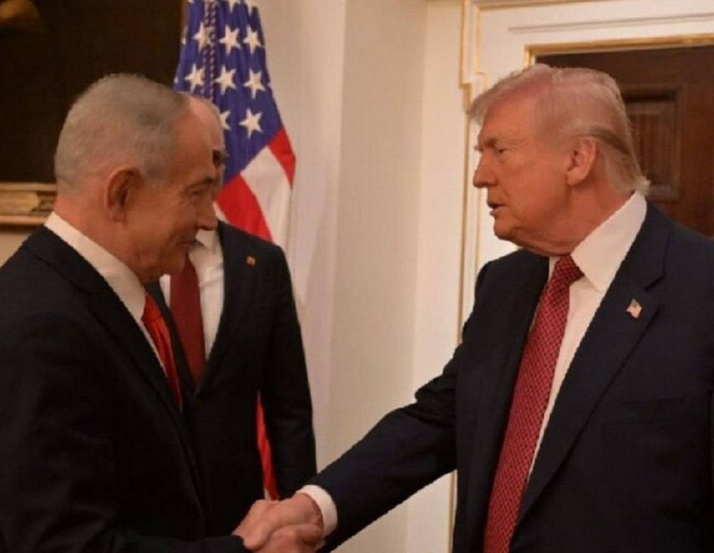

🔴 اسرائیل ‌هیوم :

ترامپ تو تماس تلفنی امشبش به نتانیاهو قول داده که کاری میکنه که ایران هیچ راهی برای ساخت سلاح هسته ای نداشته باشه و با توافق میتونه به جایی برسه که دیگه هرگز تهدیدی برای اسرائیل‌ نباشه.

@IranianMinds

## IranianMinds — post 21710

  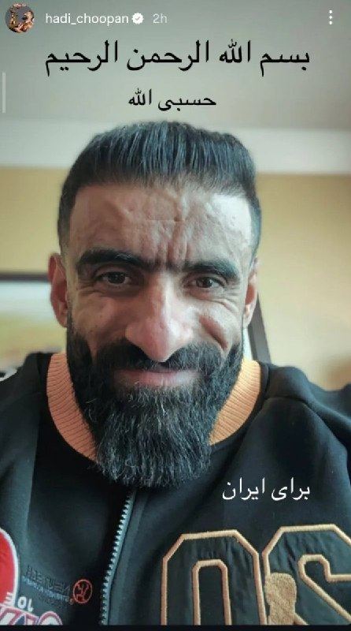

این خایمالو

@IranianMinds

## IranianMinds — post 21709

@IranianMindsGroup

ایدی گروه کامنتا ( تو کامنتا خیلی درخواست داده بودید )

## IranianMinds — post 21708

🔴 کان نیوز :

اسرائیل ممکن است به‌جای اقدام امشب، در پی مخالفت ترامپ، حمله را برای چند روز به تعویق بیندازد.

@IranianMinds

## IranianMinds — post 21706

🔴 ترامپ :

محاصره بنادر ایران احتمالا قوی تر از هر حمله ای است که تا به حال به آن کشور انجام شده است.

@IranianMinds

## IranianMinds — post 21705

البته همه میدونیم که اینا همش عادت های ترامپ مودی روانیه
که با روح و روان ادم بازی میکنه
و این حرفارو قبل جنگ ۱۲ روزه و همبن جنگ اخیر زده بود

## IranianMinds — post 21704

حالا یکی باید بره بین ترامپ و نتانیاهو میانجیگری کنه

## IranianMinds — post 21703

🔴 فایننشنال تایمز :

ترامپ گفته که اگر توافق با ایران شکست بخورد، آمریکا دو گزینه خواهد داشت:

یا اقدام نظامی علیه زیرساخت‌های باقی‌مانده هسته‌ای ایران، یا ادامه فشار اقتصادی.

@IranianMinds

## IranianMinds — post 21702

  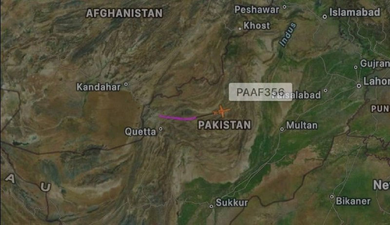

🔴وزیر کشور پاکستان از تهران رفت.

@IranianMinds

## IranianMinds — post 21701

🔴 ترامپ به فایننشال تایمز : من تصمیم‌ها رو می‌گیرم. من همه تصمیم‌ها رو می‌گیرم. نتانیاهو تصمیم‌ها رو نمی‌گیره. @IranianMinds

## IranianMinds — post 21700

🔴 ترامپ به فایننشال تایمز :

من تصمیم‌ها رو می‌گیرم. من همه تصمیم‌ها رو می‌گیرم. نتانیاهو تصمیم‌ها رو نمی‌گیره.

@IranianMinds

## IranianMinds — post 21699

🔴 ترامپ: نتانیاهو چاره‌ای جز پذیرش توافق با ایران نخواهد داشت.

@IranianMinds

## IranianMinds — post 21698

🔴 منابع عبری:

تماس تلفنی ایال زمیر  و برد کوپر فرمانده سنتکام، دقایقی پیش.

@IranianMinds

## BBCPersian — post 283106

  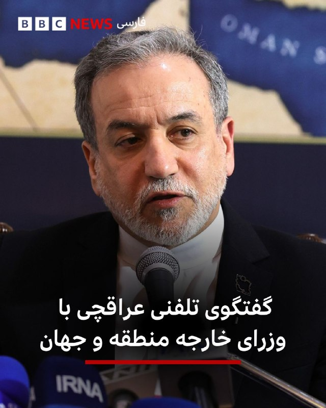

🔻عباس عراقچی، وزیر خارجه ایران، همزمان با حمله موشکی سپاه پاسداران به شمال اسرائیل، در تماس‌های تلفنی جداگانه با همتایان خود در منطقه و جهان درباره تحولات روز یکشنبه به ویژه حمله اسرائیل به ضاحبه در جنوب بیروت و حمله موشکی ایران به اسرائیل گفتگو کرده است.

منابع عربی از گفتگوی تلفنی آقای عراقچی با فواد حسین وزیر امور خارجه عراق، خبر دادند.

همچنین خبرگزاری‌های رسمی ایران از گفتگوهای تلفنی جداگانه وزیر خارجه ایران با ایوت کوپر، وزیرخارجه بریتانیا؛ بدر عبدالعاطی وزیر امور خارجه مصر؛ ژان نوئل بارو، وزیرخارجه فرانسه؛ شیخ محمد بن عبدالرحمن آل ثانی؛ وزیرخارجه قطر؛ هاکان فیدان، وزیر خارجه ترکیه و فیلد مارشال عاصم منیر، فرمانده ارتش پاکستان خبر داده‌اند.

📸 EPA/Shutterstock

https://bbc.in/4eafvAI
@BBCPersian

## BBCPersian — post 283105

  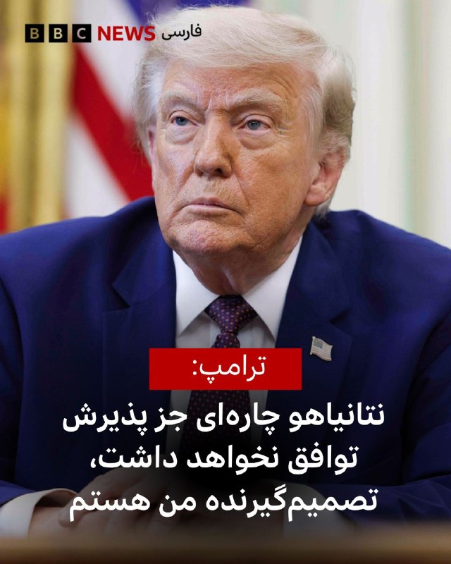

دونالد ترامپ در گفت وگو با روزنامه فايننشال تايمز اعلام کرد بنيامين نتانياهو، نخست وزير اسرائيل، ناگزير خواهد بود هر توافقی را که ايالات متحده با ايران به دست آورد، بپذيرد.

ترامپ در اين گفت وگوی تلفنی که عصر یکشنبه به وقت شرق آمریکا روی داد گفت: «او هيچ انتخابی نخواهد داشت. تصميم‌گيرنده من هستم. همه تصميم‌ها را من می گيرم. او [نتانياهو] تصميم‌گير نيست.»

رئيس‌جمهور آمريکا پيش‌تر نيز به نشریه اکسيوس گفته بود که قصد دارد از نتانياهو بخواهد در واکنش به حملات اخير ايران دست به اقدام تلافی‌جويانه نزند تا امکان نجات توافق احتمالی ميان تهران و واشنگتن حفظ شود.

آقای ترامپ همچنين به فايننشال تايمز گفت حملات اخير «هيچ تأثيری بر روند توافق نداشته است.»

او افزود: «خواهيم ديد در نهايت چه اتفاقی می‌افتد. اين يکی از آن مسائلی است که بسته به اينکه چگونه حساب کنيد، سه هزار سال يا ۴۷ سال است ادامه دارد.»

اين اظهارات نشان‌دهنده اطمينان آقای ترامپ به پيشرفت مذاکرات با ايران و در عين حال تلاش او برای مهار واکنش احتمالی اسرائيل به تنش‌های اخير در منطقه است.

📸 Getty

https://bbc.in/4eafvAI
@BBCPersian

## BBCPersian — post 283104

  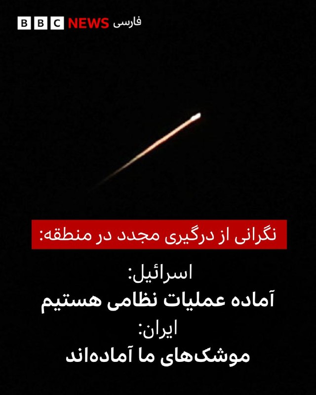

🔻خبرگزاری تسنیم، نزدیک به سپاه پاسداران به نقل از یک منبع نظامی و در واکنش به گزارش‌ها از احتمال واکنش نظامی اسرائیل به حمله موشکی یکشنبه شب این کشور، نوشته است: «حجم مناسبی از موشک‌های ایران هم‌اکنون آماده‌اند تا در صورتی که رژیم صهیونیستی به ایران پاسخ دهد، بلافاصله به سمت فهرست‌ اهداف گستر‌ده‌تر در سرزمین‌های اشغالی شلیک شوند.»

تسنیم به نقل از این منبع نظامی نوشته است: اگر اسراییل پاسخ دهد، نوبت بعدی شلیک‌های ایران، پرحجم‌تر خواهد بود.»

در همین حال، ارتش اسرائیل اعلام کرده آماده اقدام نظامی قدرتمند در پاسخ به حملات ایران است و تنها منتظر تصمیم‌گیری مقام‌های سیاسی این کشور است.

این در حالی است که دونالد ترامپ از تلاش برای جلوگیری از تشدید درگیری خبر داده و خواستار آن شده که اسرائیل به حمله موشکی ایران - که گزارش شده تلفاتی در پی نداشته - پاسخ نظامی ندهد.

📸 Reuters

https://bbc.in/4eafvAI
@BBCPersian

## BBCPersian — post 283103

🔻بریتانیا از ایران و اسرائیل خواست با خویشتن‌داری از تشدید درگیری پرهیز کنند

ایوت کوپر، وزیر امور خارجه بریتانیا، ساعتی بعد از حمله موشکی ایران به شمال اسرائیل گفت که «ازسرگیری درگیری به نفع هیچ‌کس نیست.»

خانم کوپر یکشنبه شب در پیامی در شبکه اجتماعی ایکس افزود: «هر دو طرف باید خویشتن‌داری نشان دهند و فورا تنش‌زدایی کنند.»

وزیر خارجه بریتانیا همچنین گفت: «مذاکرات باید برای دستیابی به یک راه‌حل پایدار که همه ما به آن نیاز داریم ادامه یابد؛ برای صلح و ثبات در منطقه و برای احیای کامل تجارت جهانی.»

ساعتی پیش خبرگزاری‌های رسمی ایران از گفتگوی تلفنی میان عباس عراقچی، وزیرخارجه ایران با همتای بریتانیایی خود، خبر داده بودند.

https://bbc.in/4eafvAI
@BBCPersian

## BBCPersian — post 283102

🔻گزارش‌ها از حمله پهپادی به مواضع گروه‌های کرد مخالف ایران در سلیمانیه عراق

شبکه العربیه از حملات پهپادی به مواضع گروه‌های کرد مخالف ایران در سلیمانیه عراق خبر داده است.

ایران در سه ماه گذشته بارها حملات موشکی و پهپادی به مواضع گروه‌های مسلح کرد ایرانی مستقر در عراق انجام داده است.

هنوز گزارشی از سوی منابع نزدیک به این گروه‌ها درباره این حملات مخابره نشده است.

https://bbc.in/4eafvAI
@BBCPersian

## BBCPersian — post 283101

🔻تنش ميان ايران، اسرائيل و آمريکا بر سر لبنان وارد مرحله تازه‌ای شد

🖌سباستین آشر - گزارشگر دیپلماتیک بی‌بی‌سی

تنش ميان ايران، اسرائيل و آمریکا بر سر عمليات نظامی اسرائيل عليه حزب‌الله در لبنان، در روزهای اخير به طور فزاينده ای تشديد شده بود.

زمانی که بنيامين نتانياهو، نخست وزير اسرائيل، هفته گذشته به ارتش اين کشور مجوز داد بار ديگر حومه جنوبی بيروت را هدف قرار دهد، تهران هشدار داد در صورت اجرای اين حملات، دست به حملات جديدی عليه شمال اسرائيل خواهد زد.

احتمال وقوع يک تشديد تنش گسترده در لبنان باعث شد دونالد ترامپ، رئيس جمهور آمريکا، با شديدترين لحن از نتانياهو بخواهد از انجام اين حملات خودداری کند؛ زيرا نگران بود چنين اقدامی آتش‌بس شکننده ميان آمريکا و ايران را که از پيش نيز در وضعيت متزلزلی قرار داشت، از هم بپاشد.

آقای نتانياهو با اين درخواست موافقت کرد، اما شرط گذاشت که حزب‌الله ديگر هيچ راکتی به سوی شمال اسرائيل شليک نکند.

پس از آن، در مذاکراتی با ميانجي‌گری آمريکا، توافقی برای آتش‌بس ميان دولت‌های اسرائيل و لبنان حاصل شد. با اين حال، اين آتش‌بس نيز مانند توافق‌های پيشين تأثير چندانی بر واقعيت های ميدانی نداشت.

اکنون به نظر می‌رسد اين توافق عملا فروپاشيده است؛ زيرا اسرائيل در واکنش به ادامه حملات راکتی حزب‌الله به خاک خود، حملاتی را عليه حومه جنوبی بيروت انجام داد.

تنها چند ساعت بعد، ايران به تهديد خود عمل کرد و موجی از موشک‌ها و پهپادها را به سوی اسرائيل شليک کرد.

سپاه پاسداران انقلاب اسلامی اعلام کرده است اين حملات به مدت هفت روز ادامه خواهد داشت، هرچند برخی نشانه ها حاکی از آن است که اين حمله جديد ممکن است بيشتر جنبه هشداردهنده داشته باشد.

اکنون بخش مهمی از تحولات به واکنش اسرائيل بستگی دارد.

اين احتمال وجود دارد که دو طرف وارد دور جديدی از حملات تلافی‌جويانه شوند؛ رخدادی که می تواند جنگ در ايران را بار ديگر شعله‌ور کند.

واکنش دونالد ترامپ نيز نقشی کليدی خواهد داشت. در حال حاضر، او همچنان به دنبال مهار تنش‌ها و جلوگيری از گسترش درگيری‌ها به نظر می‌رسد.

تحولات اخير بيش از هر زمان ديگری نشان داده است که درگيری‌های لبنان اکنون به يکی از عوامل اصلی تعيين کننده سرنوشت بحران گسترده تر منطقه تبديل شده است.

https://bbc.in/4eafvAI
@BBCPersian

## BBCPersian — post 283100

🔻گزارش‌ها از تماس تلفنی ترامپ با نتانیاهو برای جلوگیری از درگیری بیشتر با ایران خبرنگاران و رسانه‌های آمریکایی می‌گویند دونالد ترامپ در پی جلوگیری از پاسخ اسرائیل به حمله موشکی ایران است. باراک راوید، خبرنگار اکسیوس می‌گوید در تماس تلفنی با آقای ترامپ از…

## BBCPersian — post 283099

🔻گزارش‌ها از تماس تلفنی ترامپ با نتانیاهو برای جلوگیری از درگیری بیشتر با ایران

خبرنگاران و رسانه‌های آمریکایی می‌گویند دونالد ترامپ در پی جلوگیری از پاسخ اسرائیل به حمله موشکی ایران است.

باراک راوید، خبرنگار اکسیوس می‌گوید در تماس تلفنی با آقای ترامپ از رئیس جمهور آمریکا شنیده که بنا دارد به بنیامین نتانیاهو زنگ بزند و از او بخواهد واکنش نظامی به حمله ایران ندهد.

گزارشگر اکسیوس محتوای گفتگو تلفنی عصر یکشنبه خود با آقای ترامپ را چنین روایت کرده که رئیس جمهور آمریکا به او گفته است: «ما به يک توافق نهايی با ايران بسيار نزديک هستيم. اين توافق، توافق خوبی خواهد بود. نمی خواهم به خاطر اتفاقاتی که اکنون در حال رخ دادن است، اين فرصت از بين برود.»

باراک رواید گفته دونالد ترامپ خبر داده که: «همين حالا با بی‌بی (نتانیاهو) تماس می‌گيرم و به او می‌گويم تلافی نکند. هر دو طرف کار خودشان را انجام داده‌اند؛ اسرائيل حمله خود را انجام داد و ايران هم حمله خود را انجام داد. ديگر نيازی به حمله ديگری نيست.»

در همین حال، آقای ترامپ عصر یکشنبه به کانال ۱۳ هم در اظهاراتی مشابه گفت: فکر می‌کنم اسرائيل به اندازه کافی پاسخ داده است؛ نيازی به اقدام بيشتر نيست.»

رئیس‌جمهور آمریکا همچنين ابراز اميدواری کرده که تنش‌های کنونی کاهش يابد: «ما می توانيم پس از سه هزار سال به صلح دست پيدا کنيم.»

اين اظهارات در حالی مطرح می شود که تلاش‌های ديپلماتيک برای حفظ آتش‌بس و جلوگيری از گسترش درگيری‌ها در منطقه ادامه دارد و ساعتی پیش عباس عراقچی، وزیر خارجه ایران با هاکان فیدان، همتای ترکیه‌ای خود تلفنی گفتگو کرد.

وزیر کشور پاکستان هم برای ادامه میانجی‌گیری به تهران سفر کرده است.

https://bbc.in/4eafvAI
@BBCPersian

## Dirty_Kids — post 391303

⚽️ جام جهانی داره شروع میشه و بازار شرطبندی و پیشبینی از همیشه داغ تر هستش 
🔥 https://t.me/+lCR7HeYTU15iNjM0 https://t.me/+lCR7HeYTU15iNjM0 A17 
⚡️ اگر میخوای با آنالیز های رضا کینگ کونگ پول دربیاری توی این جام حتما عضو کانال شو ✅

## Dirty_Kids — post 391302

  

⚽️ جام جهانی داره شروع میشه و بازار شرطبندی و پیشبینی از همیشه داغ تر هستش 
🔥

https://t.me/+lCR7HeYTU15iNjM0
https://t.me/+lCR7HeYTU15iNjM0
A17

⚡️ اگر میخوای با آنالیز های رضا کینگ کونگ پول دربیاری توی این جام حتما عضو کانال شو ✅

## Dirty_Kids — post 391301

  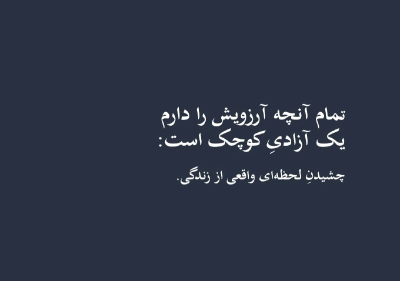

#بخوابیم

@Dirty_Kids 👻

## Dirty_Kids — post 391300

  

‏اگر ترامپ دخالت نمیکرد امشب میتونست یه شب مهم باشه ؛ یه شب شااااد.

@Dirty_Kids 👻

## Dirty_Kids — post 391299

شما «نه به جنگ» نیستید، شما «نه به سقوط جمهوری اسلامی» هستید؛ وگرنه برای این موشک‌پرانی‌های رژیم هم صدایتان درمی‌آمد.

@Dirty_Kids 👻

## Dirty_Kids — post 391298

  <a href="telegram/content/Dirty_Kids_391298_1780874103.mp4" target="_blank">🎬 Download video</a>

یکم آیسان اسلامی برای تراپی

@Dirty_Kids 👻

## Dirty_Kids — post 391297

  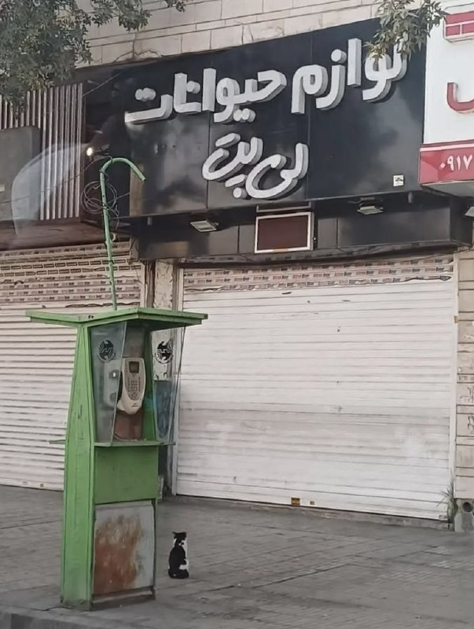

بگردم برات بچه
غصه اینم باید بخورم

@Dirty_Kids 👻

## Dirty_Kids — post 391296

  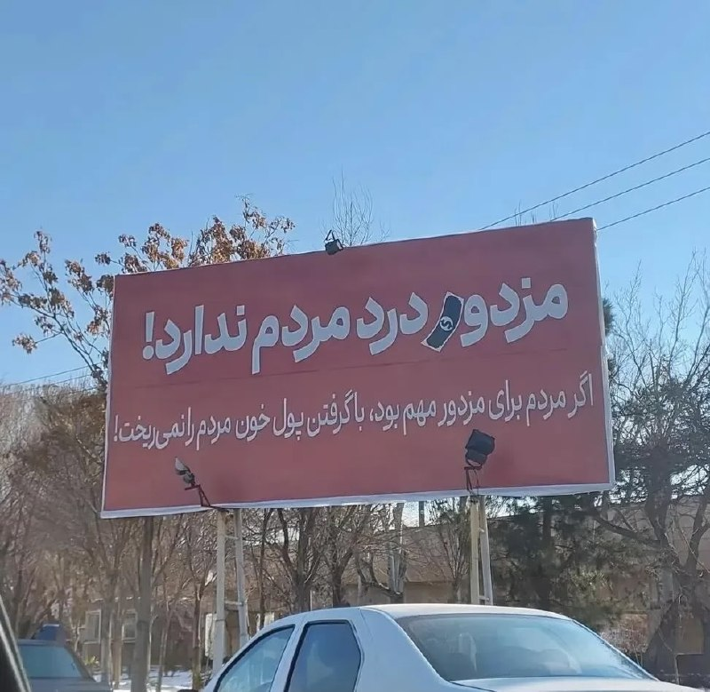

میدونم یه خودی اینو طراحی کرده ولی نمیتونم ثابت کنم:)

@Dirty_Kids 👻

## Dirty_Kids — post 391295

  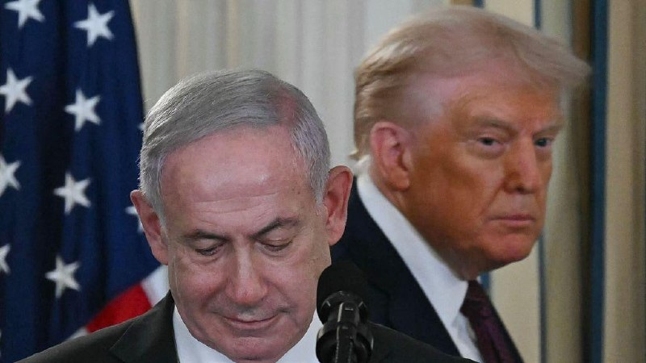

🔴 ترامپ :
تصمیم‌گیرنده اصلی منم، همه تصمیم‌ها رو من می‌گیرم، نتانیاهو کسی نیست که تعیین تکلیف کنه؛

نتانیاهو چاره‌ای جز قبول کردن توافق با ایران رو نداره و در نهایت باید قبولش کنه.

خبرنگار: اگه مذاکرات با ایران به نتیجه نرسه میخوای چیکار کنی؟

ترامپ: در اون صورت حتی گزینه انجام یه عملیات کماندویی داخل ایران رو هم بررسی می‌کنم.


@Dirty_Kids 👻

## Dirty_Kids — post 391294

  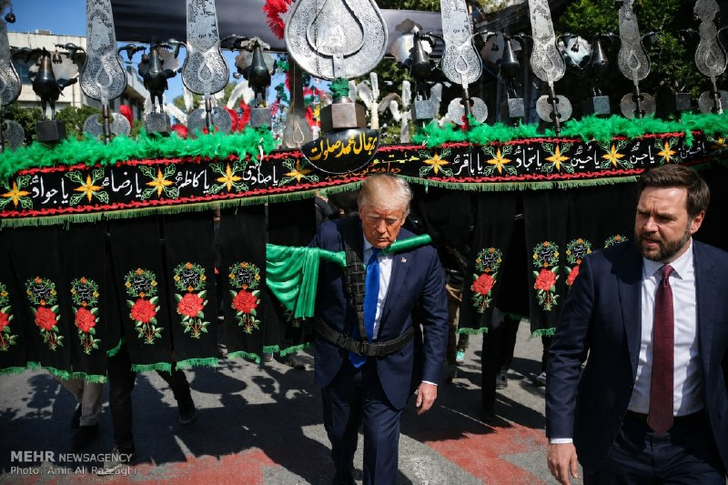

- بر آتش‌بس نقض کن لعنت
بشمرررررر
- بر اسرائیل و امارات لعنت
بشمرررررر

- بر قوت زانوش صلوت
[الله مع صل الا....]
برای سلامتی آ سید مجتبی خامنه‌ای صلوات بعدی جوری بگو تلاویو بلرزه

@Dirty_Kids 👻

## Dirty_Kids — post 391293

  <a href="telegram/content/Dirty_Kids_391293_1780874106.mp4" target="_blank">🎬 Download video</a>

ترامپ پای تلفن به دستیار نتانیاهو:

@Dirty_Kids 👻

## Dirty_Kids — post 391292

جنوب ایران براش مهم نبود ، ولی جنوب لبنان سوراخ ننش بود.

@Dirty_Kids 👻

## Dirty_Kids — post 391291

‏الان اژه ای و رادان ، روپوش سفید پوشیدند و با ذکر کیرم تو این زندگی دارند می رند زیر زمین بیمارستان

@Dirty_Kids 👻

## Dirty_Kids — post 391290

اینترنتا رو قطع کنید خشخاش هارو کاشتیم

@Dirty_Kids 👻

## Dirty_Kids — post 391289

‏به همدیگه موشک نزنید؛
من به آتش‌بس اعتماد کردم و ذخایر استراتژیکم رو خوردم.
نه کنسرو دارم، نه تن ماهی، نه بیسکویت.
الان اصلا آمادگی نقض آتش‌بس رو ندارم.

@Dirty_Kids 👻

## alonews — post 126087

  

✅با سابقه ۵ سال فعالیت مداوم

🛡حتی بدون قطعی تو دوران جنگ

🌐 با ما همراه شو و در زمان قطعی
وصل بمون 
🐸

بقیه هنوز VPN حجمی میفروشن
اونم با قیمتای نجومی 
🚀

از ما با کمترین قیمت ، بهترین سرویس رو بگیر 
👀

💥بدون محدودیت حجم
⬇️
⬇️
⬇️
@NetAazaadBot
@NetAazaadBot

## alonews — post 126086

  <a href="telegram/content/alonews_126086_1780874108.webm" target="_blank">🎬 Download video</a>

👈ادعای یک مقام آمریکایی به کانال ۱۲:
نتانیاهو «به نحوی» با به تأخیر انداختن پاسخ به حمله ایران موافقت کرده است

✅ @AloNews خبر جنگ

## alonews — post 126085

  <a href="telegram/content/alonews_126085_1780874108.webm" target="_blank">🎬 Download video</a>

👈خبرگزاری تسنیم :
ایران امشب تو حملهِ به اسرائیل از موشک‌های "خیبرشکن" استفاده کرد

✅ @AloNews خبر جنگ

## alonews — post 126083

  <a href="telegram/content/alonews_126083_1780874108.mp4" target="_blank">🎬 Download video</a>

👈هم اکنون حملات اسرائیل به لبنان

✅ @AloNews خبر جنگ

## alonews — post 126080

  <a href="telegram/content/alonews_126080_1780874109.webm" target="_blank">🎬 Download video</a>

👈حمید رسایی: هر چه زودتر اینترنت رو قطع کنین تا دشمن نتونه به ما ضربه بزنه!

✅ @AloNews خبر جنگ

## alonews — post 126079

  <a href="telegram/content/alonews_126079_1780874109.webm" target="_blank">🎬 Download video</a>

👈ترامپ: محاصره ممکن است قوی تر از هر حمله ای باشد که به ایران آغاز شده است‌‌

✅ @AloNews خبر جنگ

## alonews — post 126078

  <a href="telegram/content/alonews_126078_1780874109.webm" target="_blank">🎬 Download video</a>

👈کانال کان اسرائیل: در اسرائیل در حال بررسی تصمیم به عدم پاسخ‌دهی امشب، بلکه پس از چند روز هستیم، و این قطعاً به دلیل مخالفت ترامپ با حمله است. در حال حاضر تصمیم نهایی گرفته نشده و بحث‌ها ادامه دارد

✅ @AloNews خبر جنگ

## alonews — post 126077

  <a href="telegram/content/alonews_126077_1780874110.webm" target="_blank">🎬 Download video</a>

👈فایننشال تایمز به نقل از ترامپ: فکر می کنم توافق با ایران در حال انجام است و خواهیم دید چه اتفاقی می افتد‌‌

✅ @AloNews خبر جنگ

## alonews — post 126076

  <a href="telegram/content/alonews_126076_1780874110.webm" target="_blank">🎬 Download video</a>

👈ترامپ: ایران اگر بازهم اسرائیل را بزند ما اقدامی نخواهیم کرد زیرا دنبال توافقیم

✅ @AloNews خبر جنگ

## alonews — post 126075

  <a href="telegram/content/alonews_126075_1780874110.webm" target="_blank">🎬 Download video</a>

👈ترامپ: اگه توافق از نظرم خودش شکست بخوره احتمالاً گزینه انجام یک حمله کماندویی به ایران رو هم در نظر می‌گیرم

✅ @AloNews خبر جنگ

## alonews — post 126074

  <a href="telegram/content/alonews_126074_1780874110.webm" target="_blank">🎬 Download video</a>

👈ترامپ: من تصمیم‌گیرنده هستم. من همه تصمیم‌ها را می‌گیرم. نتانیاهو تصمیم‌گیرنده نیست.

✅ @AloNews خبر جنگ

## alonews — post 126073

  <a href="telegram/content/alonews_126073_1780874110.webm" target="_blank">🎬 Download video</a>

👈ترامپ : نتانیاهو هیچ انتخابی نداره بجز قبول توافق با ایران

✅ @AloNews خبر جنگ

## alonews — post 126072

  <a href="telegram/content/alonews_126072_1780874110.webm" target="_blank">🎬 Download video</a>

👈دقایقی پیش؛ آمریکا هشدار داد به اسرائیل نرید

✅ @AloNews خبر جنگ

---
📅 بروزرسانی: 1405/03/18 01:41
---

## VahidOOnLine — post 244198

  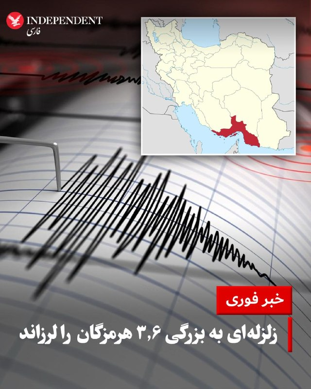

♦️به گزارش فارس، خبرگزاری وابسته به سپاه، زمین‌لرزه‌ای به بزرگی ۳.۶، بامداد دوشنبه، ۱۸ خردادماه، حوالی بندر چارک در هرمزگان را لرزاند.
‌🇸🇦 Indypersian

🤖 @VahidOOnLine

## VahidOOnLine — post 244197

  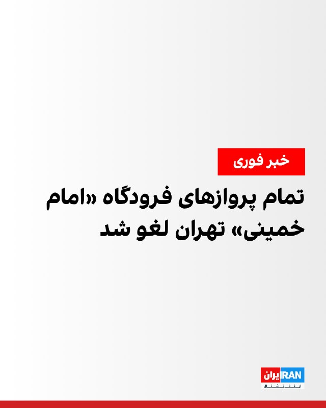

دفتر ارتباطات شرکت شهر فرودگاهی «امام خمینی» اعلام کرد که طبق اطلاعیه صادره از سوی سازمان هواپیمایی کشوری، از بامداد ۱۸ خرداد ماه ۱۴۰۵ و تا اطلاع ثانوی، کلیه پروازهای این فرودگاه متوقف شده است.

سازمان هواپیمایی نیز اعلام کرده بود بخش غربی فضای پروازی کشور تا اطلاع بعدی بسته است.
‌🏁 🇬🇧 IranintlTV

🤖 @VahidOOnLine

## VahidOOnLine — post 244196

♦️براساس تصاویر منتشر شده در شبکه‌های اجتماعی، یکشنبه‌شب، طرفداران حزب‌الله در لبنان از حملات موشکی سپاه به اسرائیل ابراز خوشحالی کردند.
‌🇸🇦 Indypersian

🤖 @VahidOOnLine

## VahidOOnLine — post 244195

  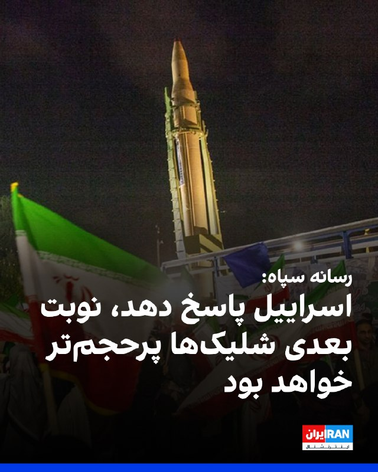

تسنیم، خبرگزاری وابسته به سپاه، به نقل از یک منبع نظامی نوشت که حجم مناسبی از موشک‌های جمهوری اسلامی هم‌اکنون آماده‌اند تا در صورتی که اسرائیل به حملات پاسخ دهد، بلافاصله به سمت فهرست‌ اهداف گستر‌ده‌تر در اسرائیل شلیک شوند: «نوبت بعدی شلیک‌های جمهوری اسلامی، پرحجم‌تر خواهد بود.»

رسانه سپاه به نقل از این منبع نظامی نوشت که جمهوری اسلامی برای آغاز نبرد گسترده در صورت پاسخ اسرائیل آماده است و این کشور باید این هشدار را به گوش بسپارد.
‌🏁 🇬🇧 IranintlTV

🤖 @VahidOOnLine

## VahidOOnLine — post 244194

  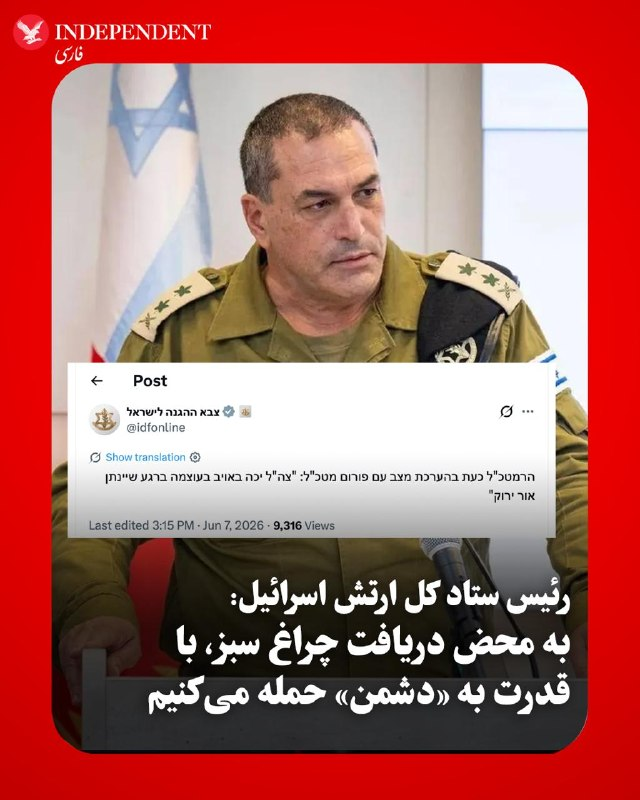

♦️حساب عبری‌زبان ارتش دفاعی اسرائیل، بامداد دوشنبه، با انتشار پیامی در اکس نوشت که رئیس ستاد کل ارتش در حال حاضر در جلسه ارزیابی وضعیت با مجمع ستاد مشترک است. در ادامه این پیام به نقل از رئیس ستاد کل ارتش اسرائیل آمده است: «ارتش به محض دریافت چراغ سبز، با قدرت به دشمن ضربه خواهد زد».
‌🇸🇦 Indypersian

🤖 @VahidOOnLine

## VahidOOnLine — post 244193

  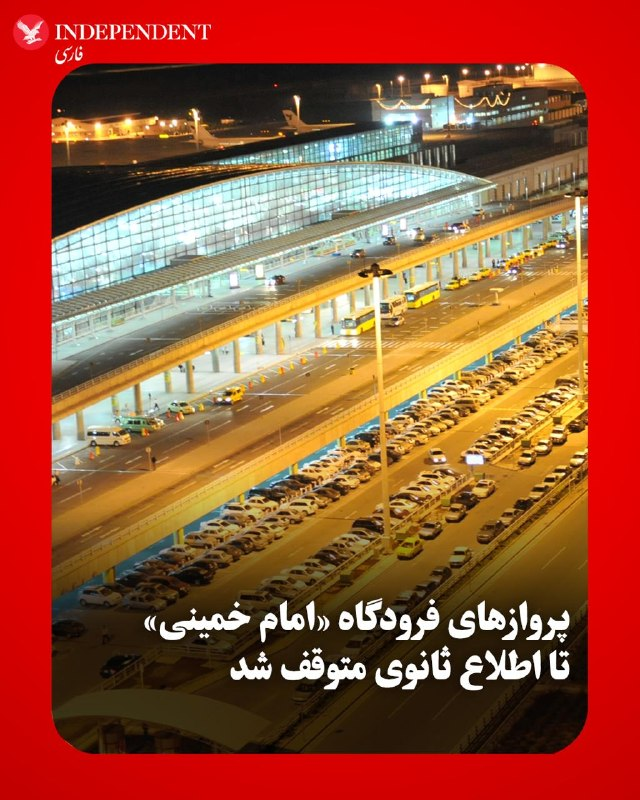

♦️به گزارش تسنیم، خبرگزاری وابسته به سپاه، دفتر ارتباطات و امور بین‌الملل شرکت شهر فرودگاهی «امام خمینی» با انتشار اطلاعیه‌ای اعلام کرد که طبق ابلاغیه سازمان هواپیمایی کشوری، تمامی پروازهای این فرودگاه از بامداد دوشنبه، ۱۸ خردادماه، تا اطلاع ثانوی به طور کامل متوقف شده است. پیش از این، مجید اخوان، سخنگوی سازمان هواپیمایی کشوری، گفت: «با توجه به ارزیابی‌های ایمنی و امنیتی صورت گرفته و با صدور اطلاعیه هوانوردی (نوتام) بخش غربی فضای پروازی کشور تا اطلاع ثانوی بسته اعلام شد.
همزمان، سازمان‌های هوانوردی عراق و سوریه نیز از بسته‌شدن فوری و موقت حریم هوایی خود به دلایل امنیتی خبر دادند. مقامات هوانوردی غیرنظامی عراق در گفتگو با رویترز تایید کردند که آسمان این کشور با هدف حفظ سلامت و امنیت پروازها، به مدت ۷۲ ساعت به طور کامل بسته شده و تمامی ناوبری‌های هوایی به حالت تعلیق درآمده است. هم‌زمان، دولت سوریه نیز اعلام کرد که حریم هوایی بخش‌های جنوبی خود را به مدت ۱۲ ساعت مسدود کرده و تمامی فعالیت‌ها و عملیات‌های پروازی در فرودگاه بین‌المللی دمشق تا اطلاع ثانوی متوقف شده است.
‌🇸🇦 Indypersian

🤖 @VahidOOnLine

## VahidOOnLine — post 244192

  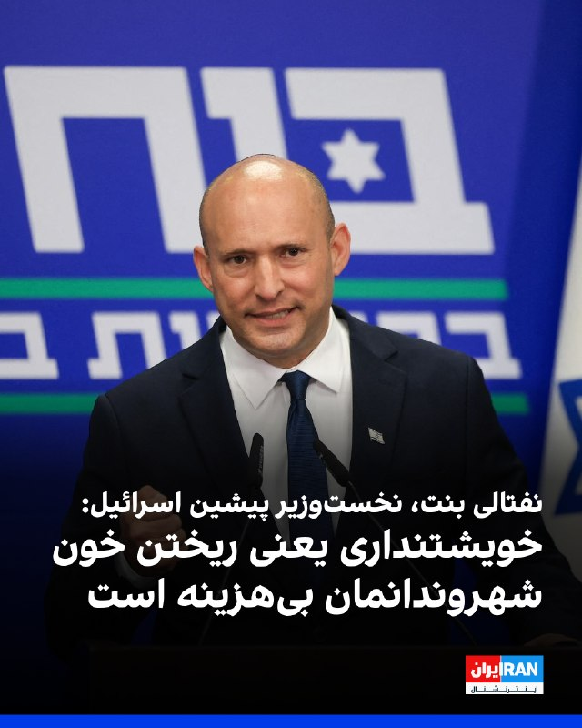

نفتالی بنت، نخست‌وزیر پیشین اسرائیل، در واکنش به حملات موشکی جمهوری اسلامی به اسرائیل، در شبکه ایکس نوشت: «خویشتنداری یا واکنشی نمادین، این پیام را به دشمنان ما منتقل خواهد کرد که ریختن خون شهروندانمان بی‌هزینه است؛ از این‌رو اسرائیل باید با قدرت و به‌طور موثر عمل کند.»

بنت نوشت: «این یک لحظه آزمون است: «آیا اسرائیل کشوری دارای حاکمیت است که توانایی دفاع از خود را دارد؟»

نخست‌وزیر پیشین اسرائیل نوشت: «در این موضوع، همه ما، تمامی شهروندان اسرائیل، در کنار یکدیگر ایستاده‌ایم.»
‌🏁 🇬🇧 IranintlTV

🤖 @VahidOOnLine

## VahidOOnLine — post 244191

  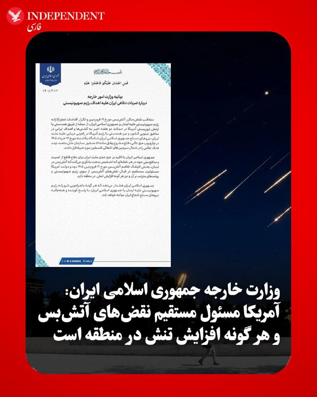

♦️وزارت امور خارجه جمهوری اسلامی ایران، بامداد دوشنبه، ۱۸ خردادماه، با انتشار بیانیه‌ای رسمی پیرامون «ضربات تلافی‌جویانه موشکی» علیه اسرائیل، اعلام کرد که نیروهای مسلح ایران یکشنبه‌شب، چند هدف نظامی را در شمال اسرائیل مورد هدف قرار داده‌اند. این دستگاه دیپلماسی با تاکید بر اینکه این عملیات در چارچوب حق ذاتی دفاع مشروع وفق ماده ۵۱ منشور سازمان ملل متحد صورت گرفته، تصریح کرد که این اقدام متعاقب نقض مکرر آتش‌بس مورخ ۱۹ فروردین در لبنان و همچنین حملات اخیر به کشتی‌ها و اهداف ایرانی با همدستی ارتش آمریکا انجام شده است. وزارت امور خارجه جمهوری اسلامی با یادآوری اینکه تفاهم آتش‌بس لبنان بخش لاینفک توافق‌ها بوده و دولت آمریکا و اسرائیل مسئول مستقیم پیامدهای افزایش تنش در منطقه هستند، صراحتا هشدار داد: «هرگونه ماجراجویی شرورانه رژیم صهیونیستی علیه لبنان یا جمهوری اسلامی ایران، با پاسخ کوبنده و همه‌جانبه نیروهای مسلح شجاع ایران مواجه خواهد شد و دولت آمریکا مسئولیت مستقیم در قبال نقض‌های آتش‌بس از سوی اسرائیل و پیامدهای مرتبط بر آن و نیز هر گونه افزایش تنش در منطقه دارد».
‌🇸🇦 Indypersian

🤖 @VahidOOnLine

## VahidOOnLine — post 244190

  <a href="telegram/content/VahidOOnLine_244190_1780870268.mp4" target="_blank">🎬 Download video</a>

♦️به گزارش رویترز، در پی حمله موشکی ایران، یکشنبه‌شب، ۱۷ خردادماه، پرتابه‌های متعددی در آسمان مناطق مرکزی اسرائیل رویت شدند. مقامات نظامی اسرائیل در اواخر وقت روز یکشنبه تایید کردند که موشک‌های شلیک‌شده از سوی ایران را شناسایی و توسط سیستم‌های پدافندی خود رهگیری کرده‌اند، هرچند هنوز جزئیاتی از خسارات احتمالی در دست نیست. هم‌زمان با این تشدید تنش، دونالد ترامپ، رئیس‌جمهوری آمریکا، در گفتگو با آکسیوس اظهار داشت که توافق با ایران نزدیک است و او تمایلی به به خطر انداختن آن ندارد. در جبهه مقابل، محمدباقر قالیباف، رئیس مجلس و مذاکره‌کننده ارشد صلح ایران، با متهم کردن طرف مقابل به اقداماتی خصمانه از جمله «نقض توافقات پیرامون لبنان»، تاکید کرد که پایگاه‌های ایالات متحده و منافع اسرائیل اهدافی مشروع برای جمهوری اسلامی به شمار می‌روند.
‌🇸🇦 Indypersian

🤖 @VahidOOnLine

## WithYashar — post 13841

وزیر کشور پاکستان از تهران در رفت
@withyashar

## WithYashar — post 13840

سخنگوی کمیسیون امنیت ملی مجلس: شلیک‌ها از آن جایی انجام شد که ترامپ می‌گفت نابودشان کرده است
@withyashar

## WithYashar — post 13839

اسرائیل هیوم به نقل از یک مقام امنیتی: اسرائیل احتمالا حمله ایران را فوری پاسخ نمی‌دهد
@withyashar

## WithYashar — post 13838

امشب ایران پس از ۶۱ روز اولین حمله موشکی خود به اسرائیل را انجام داد
@withyashar

## WithYashar — post 13837

شبکه کان اسرائیل:
نتانیاهو هم‌اکنون پس از تماس تلفنی با ترامپ در حال برگزاری مشورت‌های امنیتیه.
@withyashar

## WithYashar — post 13836

اتاق جنگ با شما: سمت تهرانپارس صدای خیلی خیلی وحشتناک
از تمام صداهای تو این مدت بدتر
@withyashar

## WithYashar — post 13835

منابع العربیه: عراقچی به پاکستان اطلاع داد که لبنان بخش جدایی‌ناپذیری از پرونده مذاکره است
@withyashar

## WithYashar — post 13834

@withyashar

## WithYashar — post 13833

جمهوری اسلامی شدیداً در حال جابهجایی های استراتژیک هست تا در برابر حمله احتمالی اسرائیل کمترین آسیب را ببیند.
@withyashar

## WithYashar — post 13832

## WithYashar — post 13831

منابع عبری : نیروی هوایی اسرائیل آماده پرواز میشود @withyashar

## WithYashar — post 13830

  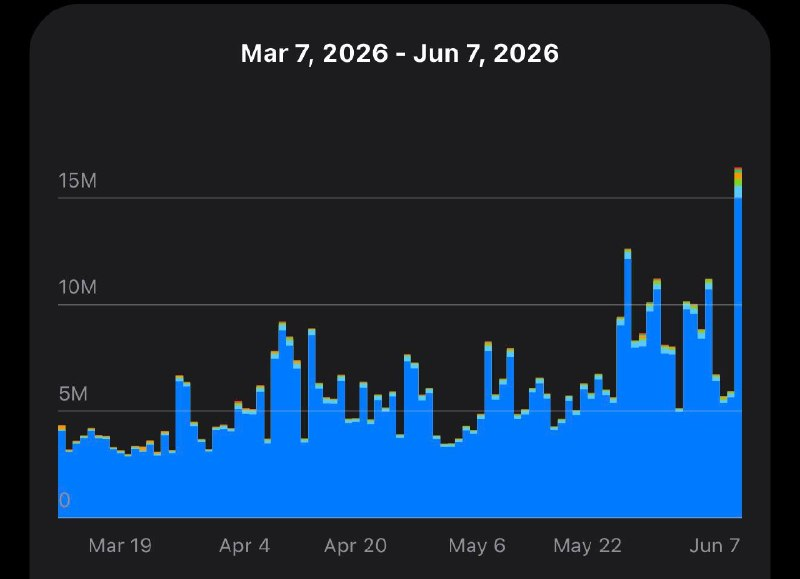

۱۷ میلیون ویو چنل تازه تا این لحظه … و زدن رکورد بازدید… مرسی از شما 🙌🏾

## WithYashar — post 13829

ایران به سمت گروه های کرد مخالف ایرانی در سلیمانیه عراق پهپاد شلیک کرده است
@withyashar

## WithYashar — post 13828

## WithYashar — post 13827

## WithYashar — post 13826

## WithYashar — post 13825

## WithYashar — post 13824

یدیعوت آحارونوت: بر اساس گزارش‌های دریافتی، در گفتگویی که کمی پیش به پایان رسید، نتانیاهو به ترامپ اطلاع داد که قصد حمله‌ای قدرتمند به ایران را دارد. رئیس‌جمهور آمریکا روشن کرد که اگر چنین حمله‌ای انجام شود، آمریکایی‌ها در آن شرکت نخواهند کرد.
@withyashar

## WithYashar — post 13823

اتاق جنگ با شما : همین جوری هواپیما داره میاد بجنورد میشینه
@withyashar

## WithYashar — post 13822

کانال ۱۲ اسرائیل: تاکنون آمریکا برای اجرای حمله علیه ایران موافقت نکرده است
@withyashar

## mwarmonitor — post 10345

🔸رسانه‌های اسرائیلی: ایستگاه‌های مترو در خط قرمز تمام شب باز خواهند ماند و طبق دستورهای فرماندهی جبهه داخلی اسرائیل به‌عنوان پناهگاه برای شهرک‌نشینان استفاده خواهند شد، به‌جز ایستگاه «کارلِبَخ»، که بر اساس همین دستورالعمل‌ها از این قاعده مستثنی است.

@mwarmonitor

## mwarmonitor — post 10344

🚨 روزنامه یسرائیل هیوم به نقل از یک مقام اسرائیلی:
به حمله ایران پاسخ خواهیم داد، حتی اگر این پاسخ به‌زودی انجام نشود.

@mwarmonitor

## mwarmonitor — post 10343

🔴«ترامپ به نیویورک پست: اوضاع به‌خوبی پیش می‌رود و هرگونه تشدید تنش بیشتر فقط باعث اختلال در مذاکرات خواهد شد.» @mwarmonitor

## mwarmonitor — post 10342

🔴«ترامپ به نیویورک پست: اوضاع به‌خوبی پیش می‌رود و هرگونه تشدید تنش بیشتر فقط باعث اختلال در مذاکرات خواهد شد.»

@mwarmonitor

## mwarmonitor — post 10341

🚨«یدیعوت آحارونوت: ایالات متحده پیامی به اسرائیل منتقل کرده مبنی بر اینکه بهتر است چند روز صبر شود تا مشخص شود آیا امکان دستیابی به توافق وجود دارد یا نه.»

🚨«واشنگتن به اسرائیل اطلاع داده است که نباید فرصت موجود را با کشیده شدن به یک تبادل محدود حملات از دست داد.»

@mwarmonitor

## mwarmonitor — post 10338

  <a href="telegram/content/mwarmonitor_10338_1780870269.mp4" target="_blank">🎬 Download video</a>

🔴به نقل از یک رسانه عراقی وابسته به عربستان: سقوط یک هواپیمای مسافربری در صحرای کربلا. @mwarmonitor

## mwarmonitor — post 10337

  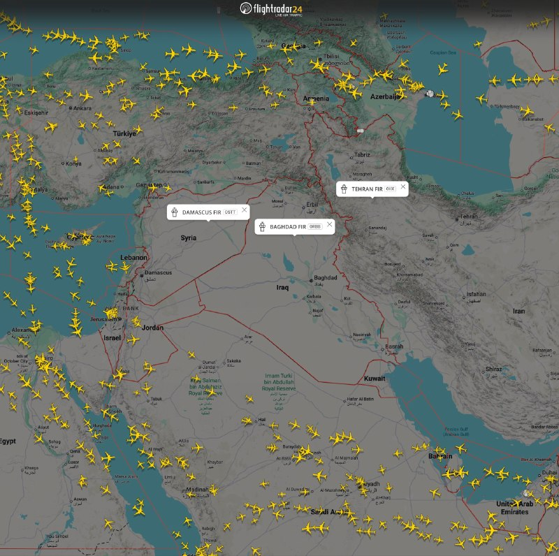

❌«پس از شلیک موشک‌ها از ایران به سمت اسرائیل، حریم هوایی در غرب ایران، عراق و سوریه (با برخی استثناهای محدود) بسته شده است.»

@mwarmonitor

## mwarmonitor — post 10336

🔴خبر فوری 📌«نخست‌وزیر نتانیاهو در تماس تلفنی به رئیس‌جمهور ترامپ گفت: اسرائیل به ایران حمله خواهد کرد.» @mwarmonitor

## mwarmonitor — post 10335

📌«هیچ ضرورت فوری برای پاسخ نظامی به شلیک موشک‌های ایران به شمال اسرائیل وجود ندارد و هرگونه پاسخ می‌تواند از نظر دامنه محدود باشد — یدیعوت آحارونوت (Ynet)»

@mwarmonitor

## mwarmonitor — post 10334

🚨« زمین‌لرزه‌ای به بزرگی ۳٫۶ ریشتر در استان هرمزگان در ساحل خلیج فارس رخ داده است.»

@mwarmonitor

## mwarmonitor — post 10333

🔴خبر فوری

📌«نخست‌وزیر نتانیاهو در تماس تلفنی به رئیس‌جمهور ترامپ گفت: اسرائیل به ایران حمله خواهد کرد.»

@mwarmonitor

## mwarmonitor — post 10332

🔴«ایران به اسرائیل پیام داده است که حملات خود را به پایان رسانده و اگر اسرائیل واکنش نشان ندهد، دیگر حمله‌ای انجام نخواهد داد — کان نیوز»

@mwarmonitor

## mwarmonitor — post 10331

🚨« شبکه کان اسرائیل: رئیس ستاد کل طی ۲۴ ساعت گذشته دو تماس تلفنی با فرمانده ستاد فرماندهی مرکزی آمریکا (سنتکام) داشته است.»

@mwarmonitor

## mwarmonitor — post 10330

🔴«فوری | Walla به نقل از یک مقام ارشد اسرائیلی: پاسخ مورد انتظار به ایران سخت و گسترده خواهد بود.»

@mwarmonitor

## mwarmonitor — post 10329

💥«صدای دو انفجار در سلیمانیه شنیده شد.»

## mwarmonitor — post 10328

  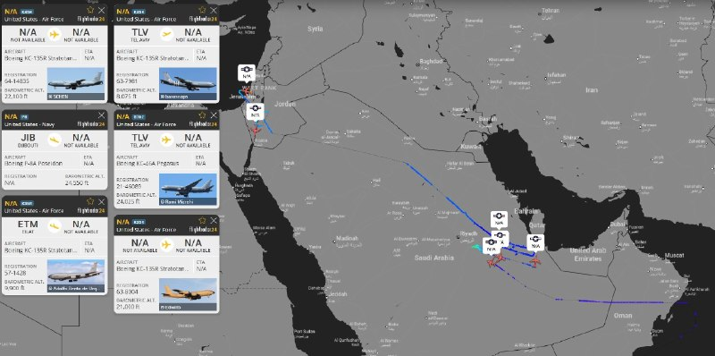

✈️«۳ فروند تانکر سوخت‌رسان نیروی هوایی آمریکا اکنون بر فراز شرق عربستان سعودی فعال هستند و دو فروند دیگر نیز در مسیر از تل‌آویو در حال حرکت‌اند.

✈️همچنین به نظر می‌رسد هواپیماهای نیروی هوایی آمریکا از انجام عملیات بر فراز خلیج فارس و دریای عمان خودداری می‌کنند.»

@mwarmonitor

## mwarmonitor — post 10327

💥«صدای دو انفجار در سلیمانیه شنیده شد.»

## mwarmonitor — post 10326

✈️«پروازها در فرودگاه بین‌المللی امام خمینی تهران تا اطلاع ثانوی به حالت تعلیق درآمده است.»

@mwarmonitor

## FoxNewsTwitter — post 342702

  

Fox News (Twitter/X)

"They've had 16 years to show us that their ideas can work, and they've had nothing stopping them."

As votes are still being counted in California’s gubernatorial primary, @SteveHiltonx is blasting Democrats over what he calls 16 years of failed one-party rule.

"They've had all the statewide offices. They have had both chambers of the state legislature with a two-thirds majority. They can literally pass anything they want. They run all the big cities, all the big counties. They had the state Supreme Court, 6-1 Democrat majority, and yet still they can't do it," Hilton said.

The Republican candidate argues California’s affordability crisis is the result of years of unchecked Democratic control, pointing to housing costs, taxes and rising energy prices.

Votes are still being counted in the governor's race, with early indicators suggesting Hilton could secure the second spot on November's ballot and face Democrat Xavier Becerra.

## pm_afshaa — post 92729

  <a href="telegram/content/pm_afshaa_92729_1780870272.webm" target="_blank">🎬 Download video</a>

🔴رسانه‌های اسرائیلی:
ایستگاه‌های مترو در خط قرمز تمام شب باز خواهند بود و طبق دستور فرماندهی جبهه داخلی اسرائیل، به‌عنوان پناهگاه برای ساکنان مورد استفاده قرار می‌گیرن.

💧 Rainbet.com the #1 Non-KYC Crypto Casino & Sportsbook @rainbetcom

😁 @Pm_Afshaa

## pm_afshaa — post 92728

  <a href="telegram/content/pm_afshaa_92728_1780870272.webm" target="_blank">🎬 Download video</a>

🔴منبع پاکستانی به العربیه: ما به یک توافق مرحله‌ای سریع با ایران نزدیک میشیم.

💧 Rainbet.com the #1 Non-KYC Crypto Casino & Sportsbook @rainbetcom

😁 @Pm_Afshaa

## pm_afshaa — post 92727

  <a href="telegram/content/pm_afshaa_92727_1780870273.webm" target="_blank">🎬 Download video</a>

🔴رویترز به نقل از یک مقام اسرائیلی:
ترامپ و نتانیاهو کمتر از نیم ساعت با هم صحبت کردن.

💧 Rainbet.com the #1 Non-KYC Crypto Casino & Sportsbook @rainbetcom

😁 @Pm_Afshaa

## pm_afshaa — post 92726

احتمالا ترامپ چراغ سبز زورکی رو به نتانیاهو داده ولی گفته فعلا ما دخالت نمی‌کنیم خودتیو خودت.

بازم وایسیم ببینیم این کله زرد الان میاد توییت بزنه یا نه.

💧 Rainbet.com the #1 Non-KYC Crypto Casino & Sportsbook @rainbetcom

😁 @Pm_Afshaa

## pm_afshaa — post 92725

  <a href="telegram/content/pm_afshaa_92725_1780870273.webm" target="_blank">🎬 Download video</a>

🔴وزیر کشور پاکستان هم از ایران رفت.

💧 Rainbet.com the #1 Non-KYC Crypto Casino & Sportsbook @rainbetcom

😁 @Pm_Afshaa

## pm_afshaa — post 92724

  <a href="telegram/content/pm_afshaa_92724_1780870274.webm" target="_blank">🎬 Download video</a>

🔴مراد ویسی:
اینکه سپاه میگه 3 موج حمله انجام داده ولی فقط 11 تا موشک شلیک شده نشون میده که سپاه دیگه توانایی پارسال رو نداره و تعداد موشک‌هاش در اثر دو جنگ ۱۲ و ۴۰ روزه کم شده و فقط تعداد موج‌های حمله رو بالا میبره.

💧 Rainbet.com the #1 Non-KYC Crypto Casino & Sportsbook @rainbetcom

😁 @Pm_Afshaa

## pm_afshaa — post 92723

  <a href="telegram/content/pm_afshaa_92723_1780870274.webm" target="_blank">🎬 Download video</a>

🔴شبکه کان اسرائیل:
نتانیاهو هم‌اکنون پس از تماس تلفنی با ترامپ در حال برگزاری مشورت‌های امنیتیه.

💧 Rainbet.com the #1 Non-KYC Crypto Casino & Sportsbook @rainbetcom

😁 @Pm_Afshaa

## pm_afshaa — post 92722

  <a href="telegram/content/pm_afshaa_92722_1780870275.webm" target="_blank">🎬 Download video</a>

🔴کان نیوز: جمهوری اسلامی به اسرائیل پیام داده که حملاتش رو به پایان رسونده و اگر اسرائیل واکنش نشان نده، دیگه حمله‌ای انجام نخواهد داد.

💧 Rainbet.com the #1 Non-KYC Crypto Casino & Sportsbook @rainbetcom

😁 @Pm_Afshaa

## pm_afshaa — post 92720

ادامه اخبار امشب بیاید اینجا :

https://t.me/BeladNews
https://t.me/BeladNews

## pm_afshaa — post 92718

رعده و برقه دوستان

## pm_afshaa — post 92717

  <a href="telegram/content/pm_afshaa_92717_1780870275.webm" target="_blank">🎬 Download video</a>

🔴نتانیاهو در تماس تلفنی به رئیس‌جمهور ترامپ گفت: اسرائیل به جمهوری اسلامی حمله خواهد کرد.

💧 Rainbet.com the #1 Non-KYC Crypto Casino & Sportsbook @rainbetcom

😁 @Pm_Afshaa

## pm_afshaa — post 92716

  <a href="telegram/content/pm_afshaa_92716_1780870276.webm" target="_blank">🎬 Download video</a>

🔴یدیعوت آحارونوت:
نتانیاهو تو تماسش با ترامپ گفته اسرائیل قصد داره یه حمله سنگین به ایران انجام بده. ترامپ هم بهش گفته اگه چنین حمله‌ای انجام بشه، آمریکا توش شرکت نمیکنه و نتانیاهو هم گفته حله.

💧 Rainbet.com the #1 Non-KYC Crypto Casino & Sportsbook @rainbetcom

😁 @Pm_Afshaa

## pm_afshaa — post 92715

🔴یدیعوت آحارانوت: طبق گزارش‌های دریافتی، نتانیاهو در مکالمه‌ای که اندکی پیش پایان یافت، ترامپ رو مطلع کرد قطعا به ایران پاسخ قدرتمند خواهد داد. 
🎲@BeladNews

## pm_afshaa — post 92712

🔴منابع عبری: گفت‌و‌گوی تلفنی ترامپ و نتانیاهو آغاز شد. 
💧 Rainbet.com the #1 Non-KYC Crypto Casino & Sportsbook @rainbetcom 
😁 @Pm_Afshaa

## pm_afshaa — post 92711

  <a href="telegram/content/pm_afshaa_92711_1780870276.webm" target="_blank">🎬 Download video</a>

🔴سفارت آمریکا در اورشلیم دستورالعمل‌هایی صادر کرده و از تمام کارکنان دولت آمریکا و اعضای خانواده‌هاشون در اسرائیل خواسته تا اطلاع ثانوی در خانه‌های خود بمانند.

💧 Rainbet.com the #1 Non-KYC Crypto Casino & Sportsbook @rainbetcom

😁 @Pm_Afshaa

## pm_afshaa — post 92710

🔴سخنگوی ارتش اسرائیل: رئیس ستاد کل ارتش اسرائیل هم‌اکنون در حال برگزاری ارزیابی وضعیت با اعضای ستاد کل است.

ارتش اسرائیل در زمان صدور دستور، دشمن رو با قدرت مورد حمله قرار خواهد داد.

💧 Rainbet.com the #1 Non-KYC Crypto Casino & Sportsbook @rainbetcom

😁 @Pm_Afshaa

## pm_afshaa — post 92709

  <a href="telegram/content/pm_afshaa_92709_1780870277.webm" target="_blank">🎬 Download video</a>

🔴کانال 15 اسرائیل: پس از پایان گفتگوی نتانیاهو و ترامپ، نخست‌وزیر جلسه گسترده‌ای درباره موضوع ایران برگزار خواهد کرد.

💧 Rainbet.com the #1 Non-KYC Crypto Casino & Sportsbook @rainbetcom

😁 @Pm_Afshaa

## pm_afshaa — post 92708

  <a href="telegram/content/pm_afshaa_92708_1780870277.webm" target="_blank">🎬 Download video</a>

🔴کانال 14 اسرائیل:
نتانیاهو باید حتی به قیمت رویارویی با ترامپ به بمباران ایران پاسخ بده.

💧 Rainbet.com the #1 Non-KYC Crypto Casino & Sportsbook @rainbetcom

😁 @Pm_Afshaa

## pm_afshaa — post 92707

  <a href="telegram/content/pm_afshaa_92707_1780870278.webm" target="_blank">🎬 Download video</a>

🔴پروازهای فرودگاه امام خمینی تا اطلاع ثانوی لغو شد.

💧 Rainbet.com the #1 Non-KYC Crypto Casino & Sportsbook @rainbetcom

😁 @Pm_Afshaa

## pm_afshaa — post 92706

  <a href="telegram/content/pm_afshaa_92706_1780870278.webm" target="_blank">🎬 Download video</a>

🔴خبرگزاری وای نت: آمریکا پیامی به اسرائیل فرستاده و گفته چند روز صبر کنه تا ببینه آیا میشه به توافقی دست یافت یا نه.

اگر نه، ما طبق برنامه به اقدام مشترک ادامه خواهیم داد و ارزش نداره که این فرصت رو با درگیر شدن در تبادل ضربات محدود هدر بدیم.

💧 Rainbet.com the #1 Non-KYC Crypto Casino & Sportsbook @rainbetcom

😁 @Pm_Afshaa

## mamlekate — post 103630

📝 تلاش ترامپ برای جلوگیری از ادامه تقابل نظامی اسرائیل و جمهوری اسلامی

در پی حمله موشکی جمهوری اسلامی به اسرائيل،‌ باراک راوید، خبرنگار آکسیوس اعلام کرد ترامپ به او گفته است «همین الان» با نخست وزیر اسرائیل تماس می‌گیرد و به او می‌گوید که به حملات رژیم ایران پاسخ ندهد و «حمله متقابل نکند.»

@mamlekate

## VahidOnline — post 76010

خبرگزاری تسنیم: "صدایی که دقایقی پیش در تهران شنیده شد مربوط به رعد و برق است و این صدا ارتباطی با پدافند یا موضوع نظامی نداشته است."

من هم پیام‌هایی گرفته بودم که بعدش با «ببخشید انگار رعد و برق بود» آپدیت شدند. زیاد پیش میاد.

📡 @VahidOnline

## VahidOnline — post 76009

  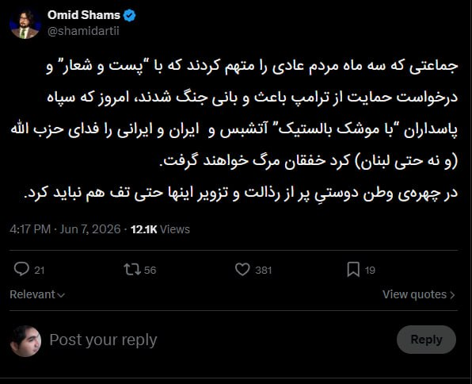

shamidartii

📡 @VahidOnline

## VahidOnline — post 76008

  

با به اوج رسیدن نگرانی از آغاز درگیری مجدد نظامی میان ایران و اسرائیل، سازمان هواپیمایی ایران اعلام کرد تمامی پروازهای شهر فرودگاهی امام خمینی از بامداد دوشنبه ۱۸ خرداد تا اطلاع ثانوی متوقف خواهد شد.

در اطلاعیه این سازمان آمده است: «مسافران از مراجعه به فرودگاه خودداری کرده و اخبار بعدی را از مراجع رسمی پیگیری کنند.»
@VahidHeadline

📡 @VahidOnline

## VahidOnline — post 76007

  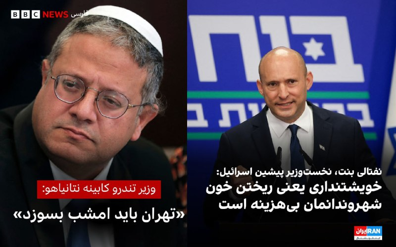

ایتامار بن گویر، وزیر امنیت ملی راست‌گرای تندرو اسرائیل، پس از حملات جدید موشکی ایران به شمال اسرائیل، خواستار واکنشی شدید شده است.

او عصر یکشنبه در پیامی کوتاه به زبان عبری در شبکه اجتماعی ایکس نوشت: «امشب تهران باید بسوزد!»

اظهارات ایتامار بن گویر در حالی مطرح شده که ایران ساعاتی پس از حمله اسرائیل به حومه جنوبی بیروت، موجی از موشک‌ها را به سوی اسرائیل شلیک کرد. ارتش اسرائیل اعلام کرده است که این موشک‌ها رهگیری شده‌اند و گزارشی از تلفات فوری منتشر نشده است.

ایتامار بن گویر از چهره‌های تندرو کابینه بنیامین نتانیاهو به شمار می‌رود و در روزهای اخیر نیز از توافق آتش‌بس میان اسرائیل و لبنان انتقاد کرده بود.
@VahidHeadline
نفتالی بنت، نخست‌وزیر پیشین اسرائیل، در واکنش به حملات موشکی جمهوری اسلامی به اسرائیل، در شبکه ایکس نوشت: «خویشتنداری یا واکنشی نمادین، این پیام را به دشمنان ما منتقل خواهد کرد که ریختن خون شهروندانمان بی‌هزینه است؛ از این‌رو اسرائیل باید با قدرت و به‌طور موثر عمل کند.»

بنت نوشت: «این یک لحظه آزمون است: «آیا اسرائیل کشوری دارای حاکمیت است که توانایی دفاع از خود را دارد؟»

نخست‌وزیر پیشین اسرائیل نوشت: «در این موضوع، همه ما، تمامی شهروندان اسرائیل، در کنار یکدیگر ایستاده‌ایم.»
@VahidOOnLine

📡 @VahidOnline

## kianmeli1 — post 87761

🔴حرکت سوخت رسان ها در آسمان اسرائیل رصد شد.
https://t.me/kianmeli1

## kianmeli1 — post 87760

  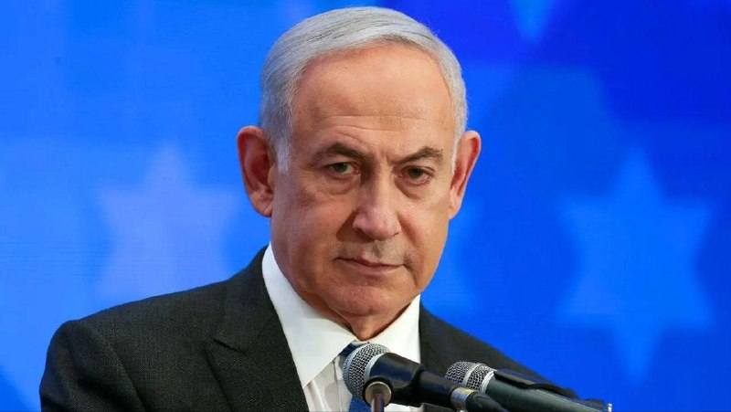

🔴فوری-کانال ۱۲ عبری و دیگر رسانه های عبری نیز از تصمیم نتانیاهو برای یک پاسخ گسترده خبر می‌دهند
https://t.me/+_a5ind9hr7sxOTE0

## kianmeli1 — post 87759

‏🔴سازمان هواپیمایی کشوری در ایران اعلام کرد، تمامی پروازهای شهر فرودگاهی خمینی از بامداد ۱۸ خرداد ۱۴۰۵ تا اطلاع ثانوی متوقف است
https://t.me/kianmeli1

## kianmeli1 — post 87758

🔴فوری

جلسه نتانیاهو با سران دفاعی-امنیتی شروع شد.
https://t.me/+_a5ind9hr7sxOTE0

## kianmeli1 — post 87757

🔴فوری-منابع عبری:

ترامپ به اسرائیل گفت اگر توافق حاصل نشه طی یک عملیات مشترک به ایران حمله خواهیم کرد!
https://t.me/+_a5ind9hr7sxOTE0

## kianmeli1 — post 87756

🔴فوری-تهران ٫هدف است

رئیس ستاد کل ارتش اسرائیل می‌گوید ارتش به محض صدور دستور، با قاطعیت به «دشمن» حمله خواهد کرد.
https://t.me/+_a5ind9hr7sxOTE0

## kianmeli1 — post 87755

  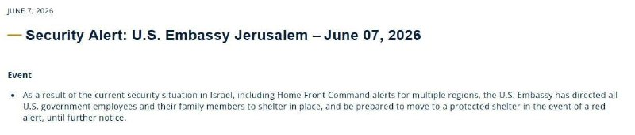

🔴فوری-سفارت ایالات متحده در اورشلیم به همه کارمندان دولت ایالات متحده و خانواده‌هایشان دستور داده است که در محل خود پناه بگیرند و آماده باشند تا در صورت اعلام وضعیت قرمز، تا اطلاع ثانوی، به پناهگاه‌های محافظت‌شده منتقل شوند.
https://t.me/kianmeli1

## kianmeli1 — post 87754

🔴فوری - پروازهای فرودگاه خمینی تا اطلاع ثانوی متوقف شد
https://t.me/+_a5ind9hr7sxOTE0

## kianmeli1 — post 87753

  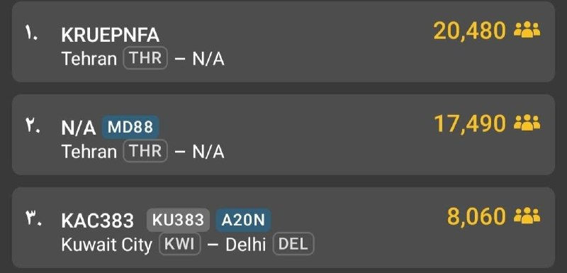

🔴فوری-تمام هواپیماهای غیرنظامی تو تهران برای پیش‌بینی حملات اسرائیل جابه‌جا شدن
https://t.me/kianmeli1

## IranIntlTV — post 341069

  <a href="telegram/content/IranIntlTV_341069_1780870281.mp4" target="_blank">🎬 Download video</a>

مراد ویسی، تحلیل‌گر ارشد ایران‌اینترنشنال، گفت: «احتمال پاسخ اسرائیل بالاست، هرچند در حال حاضر حداکثر تلاش‌ها در جریان است که این پاسخ، پاسخی محدود و کنترل‌شده باشد. مشابه اتفاقی که در دوره بایدن رخ داد؛ زمانی که پس از کشته شدن محمدرضا زاهدی در دمشق و حمله موشکی جمهوری اسلامی، فشار زیادی وجود داشت که اسرائیل واکنش نشان دهد، اما دولت بایدن تلاش می‌کرد دامنه این پاسخ محدود بماند.»
@iranintltv

## IranIntlTV — post 341068

  <a href="telegram/content/IranIntlTV_341068_1780870283.mp4" target="_blank">🎬 Download video</a>

فرزین ندیمی، پژوهش‌گر ارشد امور دفاعی و امنیتی در موسسه واشینگتن، گفت اگر تنش‌ها پس از حمله موشکی جمهوری اسلامی افزایش یابد، «اسرائیل در مراحل اولیه ممکن است پایگاه‌های موشکی در غرب ایران، صنایع موشکی و برخی پایگاه‌های فرماندهی سپاه پاسداران در تهران را هدف قرار دهد.»
@iranintltv

## IranIntlTV — post 341067

  

دفتر ارتباطات شرکت شهر فرودگاهی «امام خمینی» اعلام کرد که طبق اطلاعیه صادره از سوی سازمان هواپیمایی کشوری، از بامداد ۱۸ خرداد ماه ۱۴۰۵ و تا اطلاع ثانوی، کلیه پروازهای این فرودگاه متوقف شده است.

سازمان هواپیمایی نیز اعلام کرده بود بخش غربی فضای پروازی کشور تا اطلاع بعدی بسته است.
https://iranintl.com/202606075158

## IranIntlTV — post 341066

  <a href="telegram/content/IranIntlTV_341066_1780870285.mp4" target="_blank">🎬 Download video</a>

سخنگوی ارتش اسرائیل گفت: «رژیم تروریستی ایران موشک‌هایی به سمت اسرائیل شلیک کرد. فرماندهی ارتش آماده دفاع و آماده حمله است. رژیم تروریستی ایران مرتکب اشتباهی بزرگ شد که بهای آن را خواهد پرداخت.»

او افزود: «رژیم سعی دارد معادله جدیدی بسازد» و تاکید کرد ارتش اسرائیل به عملیات در سراسر لبنان ادامه خواهد داد و ضربه به سازمان تروریستی حزب‌الله را تشدید خواهد کرد.
@iranintltv

## IranIntlTV — post 341065

  

تسنیم، خبرگزاری وابسته به سپاه، به نقل از یک منبع نظامی نوشت که حجم مناسبی از موشک‌های جمهوری اسلامی هم‌اکنون آماده‌اند تا در صورتی که اسرائیل به حملات پاسخ دهد، بلافاصله به سمت فهرست‌ اهداف گستر‌ده‌تر در اسرائیل شلیک شوند: «نوبت بعدی شلیک‌های جمهوری اسلامی، پرحجم‌تر خواهد بود.»

رسانه سپاه به نقل از این منبع نظامی نوشت که جمهوری اسلامی برای آغاز نبرد گسترده در صورت پاسخ اسرائیل آماده است و این کشور باید این هشدار را به گوش بسپارد.
https://iranintl.com/202606079840

## IranIntlTV — post 341064

  

نفتالی بنت، نخست‌وزیر پیشین اسرائیل، در واکنش به حملات موشکی جمهوری اسلامی به اسرائیل، در شبکه ایکس نوشت: «خویشتنداری یا واکنشی نمادین، این پیام را به دشمنان ما منتقل خواهد کرد که ریختن خون شهروندانمان بی‌هزینه است؛ از این‌رو اسرائیل باید با قدرت و به‌طور موثر عمل کند.»

بنت نوشت: «این یک لحظه آزمون است: «آیا اسرائیل کشوری دارای حاکمیت است که توانایی دفاع از خود را دارد؟»

نخست‌وزیر پیشین اسرائیل نوشت: «در این موضوع، همه ما، تمامی شهروندان اسرائیل، در کنار یکدیگر ایستاده‌ایم.»
https://iranintl.com/202606070288

## Shin_Persian — post 6675

Shin ✓ @hey_itsmyturn
Sun, 07 Jun 2026 22:06:16 UTC

Let me rephrase: I BELIEVE*

فارسی

اجازه دهید دوباره بیان کنم: من باور دارم*

𝕏 · @shin_persian

## Shin_Persian — post 6674

Shin ✓ @hey_itsmyturn
Sun, 07 Jun 2026 22:05:42 UTC

I think there will be A response from 🇮🇱

فارسی

فکر می‌کنم پاسخی از سوی 🇮🇱 در کار باشد.

𝕏 · @shin_persian

## Shin_Persian — post 6673

  <a href="telegram/content/Shin_Persian_6673_1780870287.mp4" target="_blank">🎬 Download video</a>

Shin ✓ @hey_itsmyturn
Sun, 07 Jun 2026 21:44:01 UTC

2040Z
“Civilian bird leaving Mehrabad airport”, presumably for relocation
Tehran, #Tehran Province, #Iran

فارسی

۲۰۴۰ زولو (۰۰:۱۰ به وقت تهران)
«پرنده غیرنظامی در حال ترک فرودگاه مهرآباد»، احتمالاً جهت جابه‌جایی
تهران، استان #Tehran، #Iran

𝕏 · @shin_persian

## Shin_Persian — post 6672

Shin ✓ @hey_itsmyturn
Sun, 07 Jun 2026 21:30:57 UTC

Islamic Regime-affiliated channels claim there were strikes on Kurdish positions in Sulaymaniyah.
KRI, #Iraq 🇮🇶

فارسی

کانال‌های وابسته به رژیم اسلامی مدعی حملاتی به مواضع کردها در سلیمانیه شدند.
اقلیم کردستان عراق، #Iraq 🇮🇶

𝕏 · @shin_persian

## Shin_Persian — post 6671

Shin ✓ @hey_itsmyturn
Sun, 07 Jun 2026 21:24:25 UTC

Initial: Explosions in Sulaymaniyah, #KRI, #Iraq 🇮🇶

فارسی

انفجارها در سلیمانیه، اقلیم کردستان عراق (#KRI)، عراق 🇮🇶

𝕏 · @shin_persian

## Shin_Persian — post 6670

↩️ Quoted tweet: Lior.Finkelshtein.13/07/2024🔺🇮🇱✡︎📟 @Liorfink Sun, 07 Jun 2026 21:12:39 UTC @hey_itsmyturn Either bibi will loose elections immediately or Trump will cry hard a lot ↩️ توییت نقل‌قول شده — برای پاسخ، پست زیر را ببینید. فارسی @hey_itsmyturn…

## Shin_Persian — post 6669

↩️ Quoted tweet:
Lior.Finkelshtein.13/07/2024🔺🇮🇱✡︎📟 @Liorfink
Sun, 07 Jun 2026 21:12:39 UTC

@hey_itsmyturn Either bibi will loose elections immediately or Trump will cry hard a lot

↩️ توییت نقل‌قول شده — برای پاسخ، پست زیر را ببینید.

فارسی

@hey_itsmyturn یا بیبی (بنیامین نتانیاهو) بلافاصله در انتخابات شکست خواهد خورد یا ترامپ به شدت گریه و زاری راه خواهد انداخت.

𝕏 · @shin_persian

## Shin_Persian — post 6668

Shin ✓ @hey_itsmyturn
Sun, 07 Jun 2026 21:14:14 UTC

Iranian Civil Aviation Authority: IKA flights are canceled until further notice.

فارسی

سازمان هواپیمایی کشوری ایران: پروازهای فرودگاه بین‌المللی امام خمینی (IKA) تا اطلاع ثانوی لغو شد.

𝕏 · @shin_persian

## FarsiVOA — post 219946

  

📸اینستاگرام صدای آمریکا را هم اکنون فالو کنید تا از آخرین خبرها مطلع بمانید:
https://www.instagram.com/voafarsi/

📡همچنین جهت اطلاع از بروزترین فرکانسهای ماهواره‌ای صدای آمریکا به لینک زیر مراجعت فرمایید:
https://ir.voanews.com/satellite

این پست را با دوستانتان به اشتراک بگذارید
@FarsiVOA

## FarsiVOA — post 219945

  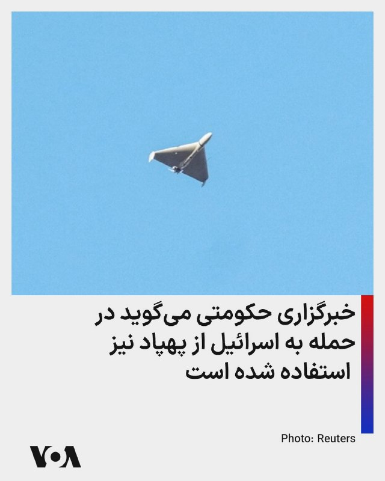

⚡️سایت تسنیم، وابسته به سپاه پاسداران می‌گوید که این نهاد علاوه بر موشک، از پهپادهای موسوم به شاهد-۱۳۶ نیز در حمله به اسرائيل استفاده کرده است. سرعت حرکت این پهپادها بسیار کندتر از موشک‌ها است. تاکنون گزارشی از مقابله با پهپادها در اسرائيل منتشر نشده است.
@FarsiVOA

## FarsiVOA — post 219944

  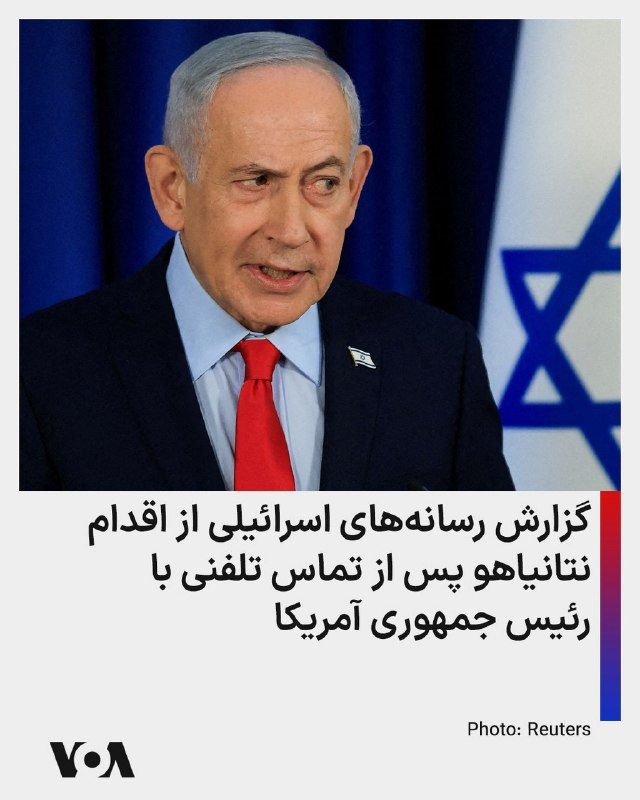

⚡️گزارش‌های رسانه‌های اسرائیلی حاکی از آن است که پس از تماس تلفنی دونالد ترامپ رئیس‌جمهوری آمریکا، بنیامین نتانیاهو نخست وزیر اسرائيل با سران نهادهای نظامی از جمله یسرائیل کاتز، وزیر دفاع، شرایط را ارزیابی کرده است.
@FarsiVOA

## FarsiVOA — post 219943

  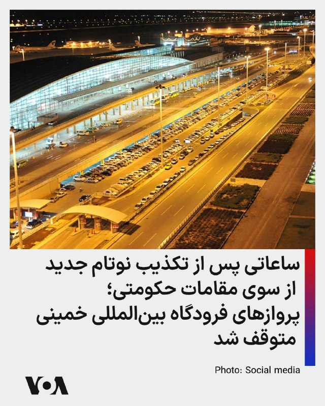

⚡️رسانه‌های داخلی در ایران گزارش داده‌‌اند که «تمامی پروازهای» فرودگاه بین المللی خمینی تا اطلاع ثانوی متوقف شد. جمهوری اسلامی ساعاتی پیش دست به حمله موشکی به اسرائيل زد. سازمان هواپیمایی کشوری همچنین گفت منطقه پروازی غربی ایران به روی پروازها بسته است. این در حالی است مجید اخوان، سخنگوی سازمان هواپیمایی کشوری یکشنبه شب ۱۷ خرداد «در واکنش به انتشار اخباری در فضای مجازی مبنی بر متوقف شدن پروازها و بستن آسمان کشور» به خبرگزاری‌ ایلنا گفته بود: «تا این ساعت هیچ نوتام جدیدی صادر نشده است.»
@FarsiVOA

## FarsiVOA — post 219942

  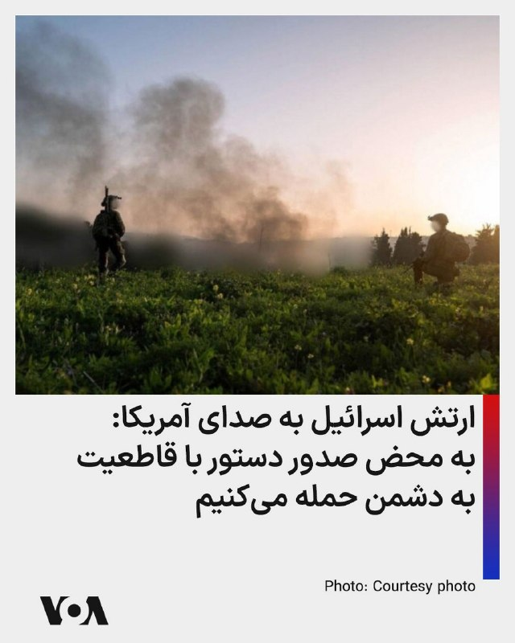

⚡️در واکنش به حملات موشکی جمهوری اسلامی، ارتش اسرائیل در بیانیه‌ای به صدای آمریکا گفت که رئیس ستاد کل ارتش اسرائیل، ایال زمیر، در حال ارزیابی وضعیت در مجمع ستاد کل است. ارتش اسرائيل به صدای آمریکا گفت: «نیروی دفاعی اسرائیل به محض صدور دستور، با قاطعیت به دشمن حمله خواهد کرد.»
@FarsiVOA

## FarsiVOA — post 219941

  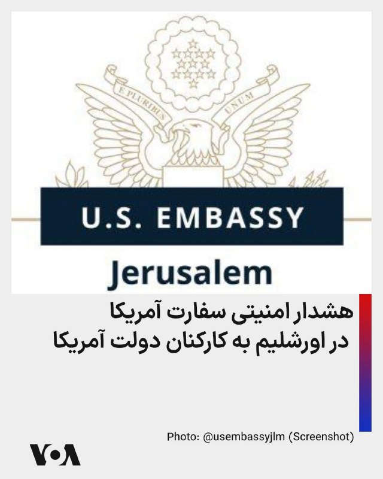

⚡️سفارت آمریکا در اورشلیم در هشداری امنیتی اعلام کرد که «در نتیجه وضعیت امنیتی فعلی در اسرائیل، از جمله هشدارهای فرماندهی جبهه داخلی برای چندین منطقه، سفارت ایالات متحده به همه کارمندان دولت ایالات متحده و اعضای خانواده آنها دستور داده است که در محل خود پناه بگیرند و تا اطلاع ثانوی آماده باشند تا در صورت اعلام وضعیت قرمز، به یک پناهگاه محافظت‌شده منتقل شوند.»
@FarsiVOA

## FarsiVOA — post 219940

⚡️پیام سرهنگ دوم کمال پنحاسی، سخنگوی بخش فارسی ارتش اسرائيل در پی حمله موشکی جمهوری اسلامی: آماده بودیم
@FarsiVOA

## FarsiVOA — post 219939

  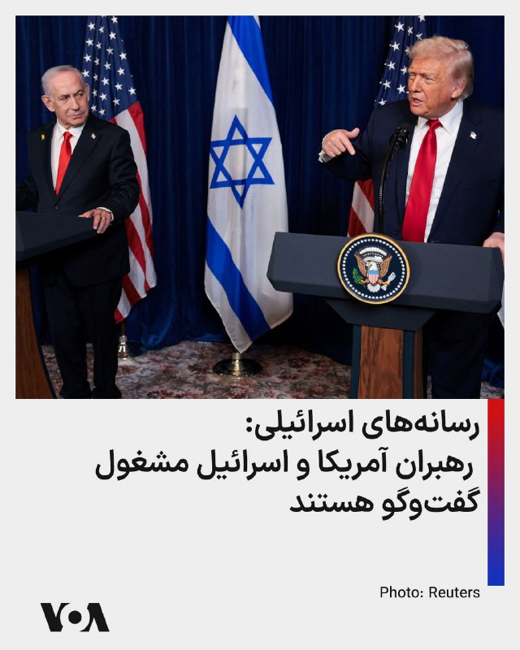

⚡️رسانه‌های اسرائیلی می‌گویند که دونالد ترامپ و بنیامین نتانیاهو هم‌اکنون مشغول صحبت هستند. این گزارش‌ها در پی حمله موشکی جمهوری اسلامی به اسرائيل منتشر می‌شود.
@FarsiVOA

## DW_Farsi — post 125668

  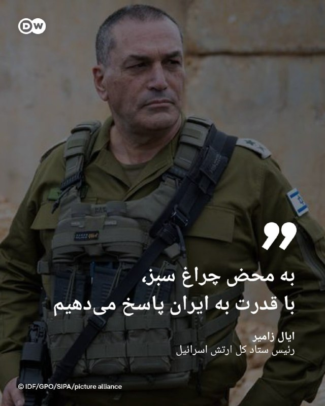

🔶 رئیس ستاد کل ارتش اسرائیل: به محض چراغ سبز، با قدرت به ایران پاسخ می‌دهیم

ایال زامیر، رئیس ستاد کل ارتش اسرائيل، در جریان یک جلسه ارزیابی با مقامات ارشد نظامی، ضمن اذعان به اینکه کشورش در حال حاضر از پاسخ دادن به حملات موشکی امشب ایران بازداشته شده است، گفت: «ارتش اسرائیل به محض دریافت چراغ سبز، با قدرت به دشمن ضربه خواهد زد.»

ارتش اسرائیل در حال آماده‌سازی برای پاسخ به حمله موشکی ایران در شامگاه امروز است اما برای اجرای این اقدام همچنان در انتظار تایید مقامات سیاسی قرار دارد.

پیش از این، دونالد ترامپ، رئیس‌جمهور آمریکا گفته بود، "از بنیامین نتانیاهو، نخست‌وزیر اسرائیل خواسته است، دست به پاسخ‌دهی نزند".
@dw_farsi

## DW_Farsi — post 125667

  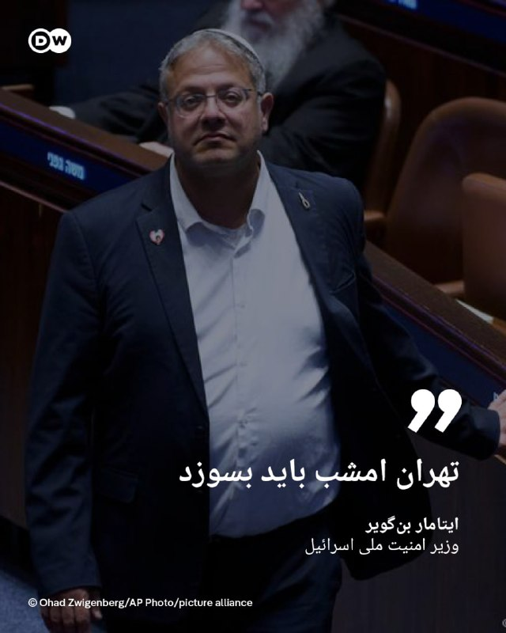

🔶 وزیر امنیت ملی اسرائيل: تهران امشب باید بسوزد

ایتامار بن‌گویر، وزیر امنیت ملی اسرائیل با انتشار پستی در شبکه ایکس به حملات موشکی ایران به خاک اسرائيل واکنش نشان داد و نوشت: «تهران امشب باید بسوزد.»

نفتالی بنت، نخست‌وزیر پیشین اسرائیل نیز تاکید کرد، "اسرائیل باید پاسخی قدرتمند و موثر به حمله موشکی بالستیک ایران بدهد".

این تبادل آتش چند ساعت پس از آن رخ داد که ارتش اسرائیل منطقه ضاحیه در جنوب بیروت را هدف قرار داد اقدامی که پیش‌تر با هشدار و تهدید به پاسخ متقابل از سوی جمهوری اسلامی روبه‌رو شده بود.

دونالد ترامپ، رئيس‌جمهور آمریکا بالافاصله پس از این حملات اعلام کرد، "هیچ‌کس در حمله موشکی آسیب ندیده و اگر نتانیاهو به آن پاسخ دهد، این وضعیت ادامه پیدا خواهد کرد. ما بسیار به توافقی برای پایان دادن به جنگ نزدیک هستیم و توافق خوبی خواهد بود".
@dw_farsi

## DW_Farsi — post 125666

  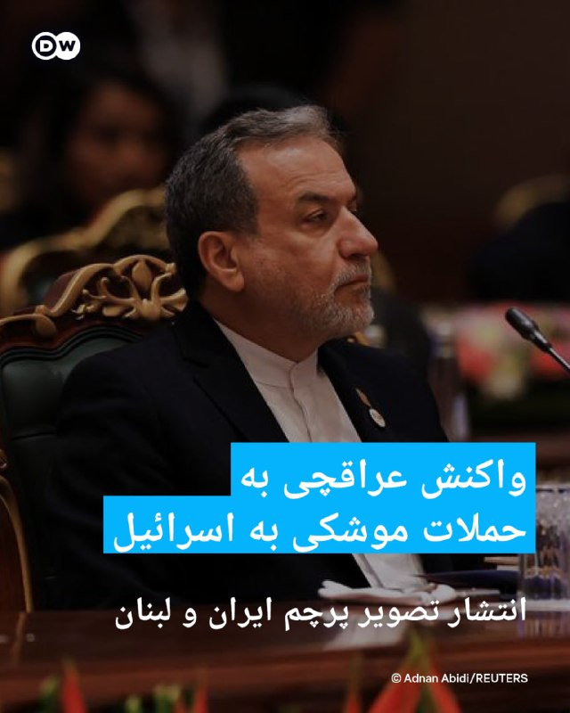

🔶 واکنش عراقچی به حملات موشکی به اسرائیل؛ انتشار تصویر پرچم ایران و لبنان

عباس عراقچی، وزیر امور خارجه ایران در صفحه شخصی خود در شبکه ایکس به حملات ایران به اسرائیل واکنش نشان داد و تصویری از پرچم‌های ایران و لبنان را در این پیام منتشر کرد.

مقامات تهران این حملات موشکی را اقدامی تلافی‌جویانه در پاسخ به عملیات نظامی اسرائیل در لبنان و هدف قرار دادن فرماندهان حزب‌الله عنوان کرده‌اند.

وزیر امور خارجه ایران همچنین در گفت‌و‌گوهایی جداگانه با همتایان خود در بریتانیا و ترکیه و همچنین با میانجی‌های پاکستانی، درباره آخرین تحولات منطقه به بحث و تبادل نظر پرداخت.

وزارت امور خارجه ایران با انتشار بیانیه‌ای، بدون ارائه جزئیات بیشتر اعلام کرد، محور این گفت‌وگوهای تلفنی، پاسخ ایران به نقض‌ مکرر آتش‌بس در لبنان توسط اسرائیل است.

ایران شامگاه یکشنبه ۷ ژوئن (۱۷ خرداد) در پاسخ به حملات هوایی اسرائیل به مراکز فرماندهی حزب‌الله در بیروت، ده‌ها فروند موشک بالستیک را به سمت شمال اسرائیل شلیک کرد. این اقدام تنش‌ها در منطقه را به شکل بی‌سابقه‌ای افزایش داده است.
@dw_farsi

## DW_Farsi — post 125665

  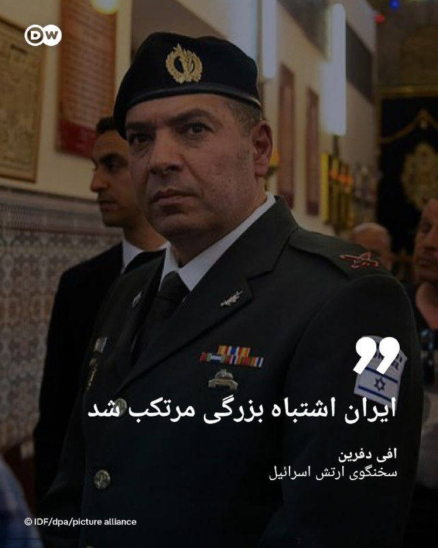

🔶 سخنگوی ارتش اسرائیل: ایران اشتباه بزرگی مرتکب شد

سخنگوی ارتش اسرائیل در پی حمله موشکی بالستیک ایران به این کشور، در یک کنفرانس مطبوعاتی اعلام کرد، ایال زامیر، رئیس ستاد کل ارتش، در حال ارزیابی وضعیت و تصویب طرح‌هایی برای آینده است.

افی دفرین گفت: «رژیم تروریستی ایران اشتباه بزرگی مرتکب شد.»

او در ادامه افزود، "ارتش اسرائیل برای حملات موشکی احتمالی و بیشتر از سوی ایران آمادگی کامل دارد".
@dw_farsi

## Persian_Trend_Official — post 16016

  <a href="telegram/content/Persian_Trend_Official_16016_1780870291.mp4" target="_blank">🎬 Download video</a>

تصاویری از تخلیه فرودگاه مهراباد تهران

## Persian_Trend_Official — post 16015

  <a href="telegram/content/Persian_Trend_Official_16015_1780870292.webm" target="_blank">🎬 Download video</a>

🚨یدیعوت آحارونوت: بر اساس گزارش‌های دریافتی، در گفتگویی که کمی پیش به پایان رسید، نتانیاهو به ترامپ اطلاع داد که قصد حمله‌ای قدرتمند به ایران را دارد. رئیس‌جمهور آمریکا روشن کرد که اگر چنین حمله‌ای انجام شود، آمریکایی‌ها در آن شرکت نخواهند کرد. 📝 Nick 📌…

## Persian_Trend_Official — post 16014

  <a href="telegram/content/Persian_Trend_Official_16014_1780870292.webm" target="_blank">🎬 Download video</a>

⭕️ پروازهای فرودگاه امام تا اطلاع ثانوی لغو شد. 📝 Nick 📌 @persian_trend_official پرشین ترند | متفاوت‌ترین کانال نظامی

## Persian_Trend_Official — post 16013

⭕️ سپاه پاسداران انقلاب اسلامی در حال پرتاب پهپاد به سمت گروه‌های مخالف کرد ایرانی در منطقه سلیمانیه، کردستان عراق است.

📝 Nick

📌 @persian_trend_official
پرشین ترند | متفاوت‌ترین کانال نظامی

## Persian_Trend_Official — post 16012

  <a href="telegram/content/Persian_Trend_Official_16012_1780870293.mp4" target="_blank">🎬 Download video</a>

زیرا این یک توافق خوب است.

## Persian_Trend_Official — post 16011

🚨یدیعوت آحارونوت: بر اساس گزارش‌های دریافتی، در گفتگویی که کمی پیش به پایان رسید، نتانیاهو به ترامپ اطلاع داد که قصد حمله‌ای قدرتمند به ایران را دارد. رئیس‌جمهور آمریکا روشن کرد که اگر چنین حمله‌ای انجام شود، آمریکایی‌ها در آن شرکت نخواهند کرد. 📝 Nick 📌…

## Persian_Trend_Official — post 16010

🚨یدیعوت آحارونوت:
بر اساس گزارش‌های دریافتی، در گفتگویی که کمی پیش به پایان رسید، نتانیاهو به ترامپ اطلاع داد که قصد حمله‌ای قدرتمند به ایران را دارد. رئیس‌جمهور آمریکا روشن کرد که اگر چنین حمله‌ای انجام شود، آمریکایی‌ها در آن شرکت نخواهند کرد.

📝 Nick

📌 @persian_trend_official
پرشین ترند | متفاوت‌ترین کانال نظامی

## Persian_Trend_Official — post 16009

  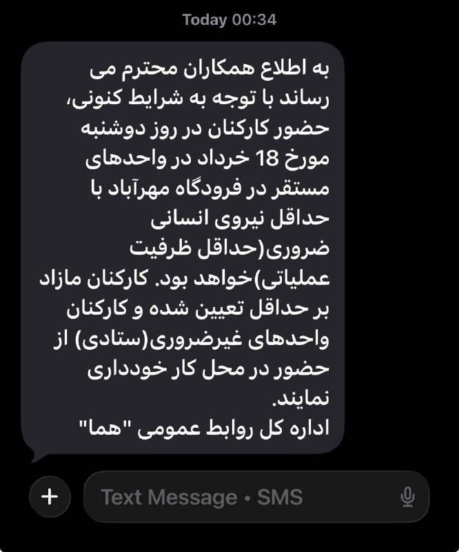

⭕️ پیام ارسال شده برای خلبانان هما

📝 Nick

📌 @persian_trend_official
پرشین ترند | متفاوت‌ترین کانال نظامی

## Persian_Trend_Official — post 16008

  <a href="telegram/content/Persian_Trend_Official_16008_1780870294.webm" target="_blank">🎬 Download video</a>

⭕️ پروازهای فرودگاه امام تا اطلاع ثانوی لغو شد.

📝 Nick

📌 @persian_trend_official
پرشین ترند | متفاوت‌ترین کانال نظامی

## Persian_Trend_Official — post 16007

🚨 وای‌نت:

آمریکا به اسرائیل گفت بهتر است چند روز صبر کند تا ببیند آیا امکان توافق وجود دارد یا خیر و اگر نه ما طبق برنامه اقدام مشترک پیش خواهیم رفت.

📝 Nick

📌 @persian_trend_official
پرشین ترند | متفاوت‌ترین کانال نظامی

## Persian_Trend_Official — post 16006

  <a href="telegram/content/Persian_Trend_Official_16006_1780870294.mp4" target="_blank">🎬 Download video</a>

⭕️ بوستر موشک "خیبرشکن" در نزدیکی شهر "درعا" جنوب سوریه.

📝 Nick

📌 @persian_trend_official
پرشین ترند | متفاوت‌ترین کانال نظامی

## Persian_Trend_Official — post 16005

  <a href="telegram/content/Persian_Trend_Official_16005_1780870295.webm" target="_blank">🎬 Download video</a>

⏳کانال ۱۴ اسرائیل در بیانیه ای تند گفته که:

امشب فقط موشک‌ها و جت‌ها نیستن که بین آسمان و زمین در نوسان هستن، بلکه سرنوشت سیاسی نتانیاهو هم همین گونه‌ هستش.

انتظار میره که اگه نتانیاهو فرمان حمله به ایران‌رو نده ، عملا دوران سیاسی و نخست وزیریش تموم میشه

## Persian_Trend_Official — post 16004

  <a href="telegram/content/Persian_Trend_Official_16004_1780870295.webm" target="_blank">🎬 Download video</a>

طبق گزارش i24 نیوز، نخست‌وزیر اسرائیل نتانیاهو، وزیر دفاع کاتز و رهبری امنیتی اسرائیل قرار است در ساعت آینده جلسه اضطراری درباره ایران برگزار کنند

## Persian_Trend_Official — post 16003

  <a href="telegram/content/Persian_Trend_Official_16003_1780870296.mp4" target="_blank">🎬 Download video</a>

🎬 Video

## IranianMinds — post 21697

🔴 تمام پرواز های داخلی و خارجی کشور تا اطلاع ثانوی کنسل شدن.

@IranianMinds

## IranianMinds — post 21696

  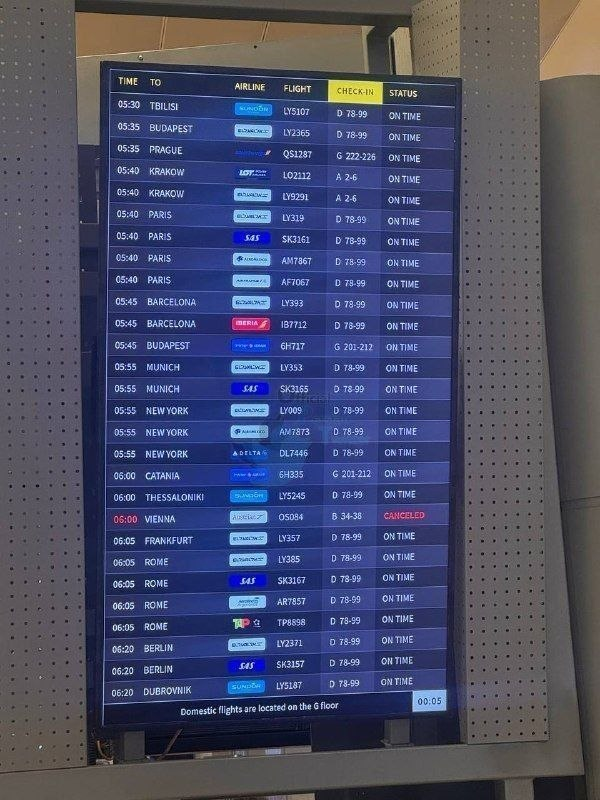

🔴 پرواز های فرودگاه تل آویو از سر گرفته شدن , انگاری امشب دیگه خبری نیست.

@IranianMinds

## IranianMinds — post 21695

🔴 ترامپ :

آتش‌بسی که داریم چیز بسیار خوبی است!

@IranianMinds

## IranianMinds — post 21694

🔴 یک مقام اسرائیلی به اسرائیل هیوم گفت :

ما به این حمله پاسخ خواهیم داد، حتی اگر این پاسخ در کوتاه‌مدت و بلافاصله انجام نشود.

@IranianMinds

## IranianMinds — post 21693

🔴 یدیعوت آحارونوت:

بنیامین نتانیاهو به دونالد ترامپ گفته اسرائیل قصد دارد یک حمله بزرگ علیه ایران انجام دهد، و ترامپ به او درباره این اقدام هشدار داده و گفته آمریکا در آن مشارکت نخواهد کرد.

@IranianMinds

## IranianMinds — post 21692

🔴 حوثی ‌های یمن:

دوران تاخت‌وتاز رژیم صهیونیستی به پایان رسیده است.

این رژیم جنایتکار هیچ زبانی جز زبان زور را نمی‌فهمد.

@IranianMinds

## IranianMinds — post 21691

🔴 ترامپ داره تلفنی با نتانیاهو صحبت میکنه الان @IranianMinds

## IranianMinds — post 21690

🔴 سخنگوی ارتش اسرائیل:

«رئیس ستاد هم‌اکنون در حال برگزاری نشست ارزیابی وضعیت با اعضای ستاد کل است.

ارتش اسرائیل به محض صدور مجوز، با قدرت به دشمن ( جمهوری اسلامی ) حمله خواهد کرد.»

@IranianMinds

## IranianMinds — post 21689

🔴 وای نت :

آمریکا به اسرائیل گفته است بهتر است چند روز صبر کند تا مشخص شود آیا امکان رسیدن به یک توافق وجود دارد یا نه؛ و اگر نه، بر اساس طرح اقدام مشترک پیش خواهیم رفت.

@IranianMinds

## IranianMinds — post 21687

  <a href="telegram/content/IranianMinds_21687_1780870297.mp4" target="_blank">🎬 Download video</a>

🔴 بیانیه سخنگوی ارتش اسرائیل

@IranianMinds

## BBCPersian — post 283098

  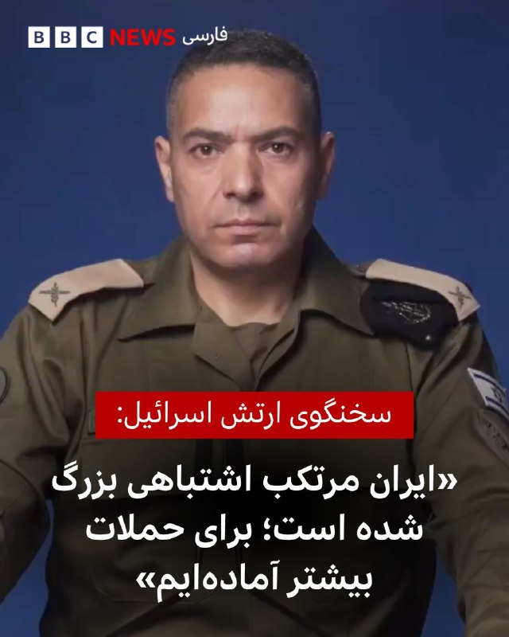

افی دفرين، سخنگوی ارتش اسرائيل، عصر یکشنبه گفت از نظر او ايران با حملات موشکی امروز خود «اشتباهی بزرگ» مرتکب شده است.

او در يک نشست خبری به زبان عبری گفت ارتش اسرائيل «اجازه نخواهد داد شليک موشک‌ها از سوی ايران به سمت شهروندان اسرائيل ادامه پيدا کند.»

«ما برای احتمال حملات بيشتر آماده هستيم.»

به گفته او، سامانه‌های پدافند هوايی در سراسر اسرائیل مستقر شده‌اند و رئيس ستاد کل ارتش این کشور پس از حملات اخير در حال برگزاری نشست ارزيابی وضعيت است.

سخنگوی ارتش اسرائيل همچنين تأکيد کرد:

«ارتش اسرائيل به عمليات خود در سراسر لبنان ادامه خواهد داد و ضربات خود به سازمان تروريستی حزب‌الله را تشديد خواهد کرد.»

اين اظهارات در حالی مطرح می‌شود که تنش‌ها پس از حملات موشکی و پهپادی ايران به شمال اسرائيل و حملات اسرائيل به لبنان و حومه جنوبی بيروت - ضاحیه - به شدت افزايش يافته و نگرانی‌ها درباره گسترش بیشتر درگيری‌ها در منطقه را بسیار بالا برده است.

📸 IDF

https://bbc.in/4eafvAI
@BBCPersian

## BBCPersian — post 283097

  <a href="telegram/content/BBCPersian_283097_1780870299.mp4" target="_blank">🎬 Download video</a>

قرارگاه خاتم‌الانبیا عصر یکشنبه در اطلاعیه‌ای اعلام کرد که در پاسخ به حمله اسرائیل به جنوب بیروت، حمله موشکی به سمت مناطق شمالی اسرائیل انجام داده است.

در اطلاعیه این قرارگاه آمده است: قبلا اخطار داده بودیم در صورت گسترش حملات در ضاحیه بیروت، اهدافی را در اسرائیل مورد هجوم قرار می‌دهیم.

اسرائیل می‌گوید توانسته موشک های ایران را رهگیری کند و آماده اقدام نظامی متقابل است.

در تصاویری که از ایران مخابره شده، شلیک موشک‌های سپاه پاسداران با استقبال گروهی از حامیان حکومت که همچون سه ماه گذشته در تجمع‌های شبانه حضور داشتند «روبرو شده است».

🎥 میزان

@BBCPersian

## BBCPersian — post 283095

  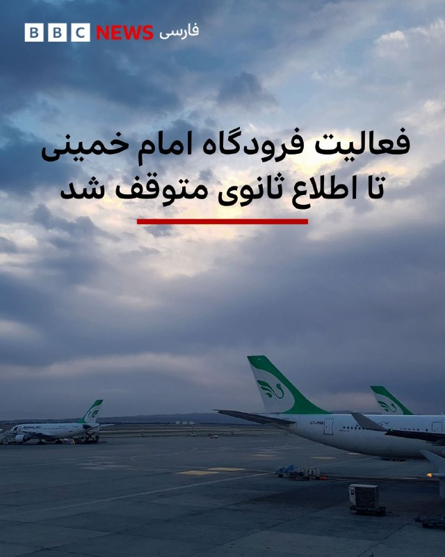

🔻با به اوج رسیدن نگرانی از آغاز درگیری مجدد نظامی میان ایران و اسرائیل، سازمان هواپیمایی ایران اعلام کرد تمامی پروازهای شهر فرودگاهی امام خمینی از بامداد دوشنبه ۱۸ خرداد تا اطلاع ثانوی متوقف خواهد شد.

در اطلاعیه این سازمان آمده است: «مسافران از مراجعه به فرودگاه خودداری کرده و اخبار بعدی را از مراجع رسمی پیگیری کنند.»

دقایقی پیش هم برایتان اینجا گزارش کردیم که عراق برای ۷۲ ساعت آسمان مناطق مرزی خود را از بیم تشدید درگیری میان ایران و اسرائیل بسته است.

📸 Getty

https://bbc.in/4eafvAI
@BBCPersian

## BBCPersian — post 283094

  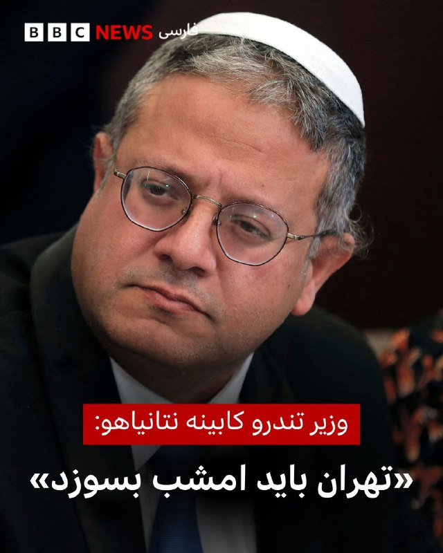

ايتامار بن گوير، وزير امنيت ملی راست‌گرای تندرو اسرائيل، پس از حملات جديد موشکی ايران به شمال اسرائيل، خواستار واکنشی شديد شده است.

او عصر یکشنبه در پيامی کوتاه به زبان عبری در شبکه اجتماعی ايکس نوشت: «امشب تهران بايد بسوزد!»

اظهارات ایتامار بن گوير در حالی مطرح شده که ايران ساعاتی پس از حمله اسرائيل به حومه جنوبی بيروت، موجی از موشک‌ها را به سوی اسرائيل شليک کرد. ارتش اسرائيل اعلام کرده است که اين موشک‌ها رهگيری شده‌اند و گزارشی از تلفات فوری منتشر نشده است.

اين موضع‌گيری با تلاش‌های دونالد ترامپ برای جلوگيری از تشديد درگيری‌ها در تضاد است. رئيس جمهور آمريکا پيش‌تر از اسرائيل خواسته بود از حملات تلافی جويانه بيشتر خودداری کند و تأکيد کرده بود که خواهان حفظ روند مذاکرات و آتش‌بس با ايران است.

ایتامار بن گوير از چهره‌های تندرو کابينه بنيامين نتانياهو به شمار می‌رود و در روزهای اخير نيز از توافق آتش‌بس ميان اسرائيل و لبنان انتقاد کرده بود.

📸 Getty

https://bbc.in/4eafvAI
@BBCPersian

## idfinfarsi — post 11811

سخنگوی ارتش اسرائیل:

رئیس ستاد کل ارتش اسرائیل هم‌اکنون در حال برگزاری ارزیابی وضعیت با اعضای ستاد کل است: «ارتش اسرائیل در زمان صدور دستور، دشمن را با قدرت مورد حمله قرار خواهد داد»

## Dirty_Kids — post 391288

  <a href="telegram/content/Dirty_Kids_391288_1780870301.mp4" target="_blank">🎬 Download video</a>

🔴 عمو مراد ویسی تحلیلگر اینترنشنال، درباره حملات امشب:

اینکه سپاه میگه 3 تا موج حمله کردیم ولی کلا 11 تا موشک میزنن نشون میده که سپاه دیگه توانایی پارسال رو نداره و تعداد موشکاش در اثر دوتا جنگ 12 و 40 روزه کم شده و فقط تعداد موج‌های حمله رو بالا میبرن.


@Dirty_Kids 👻

## Dirty_Kids — post 391287

  <a href="telegram/content/Dirty_Kids_391287_1780870302.mp4" target="_blank">🎬 Download video</a>

عرزشیا دارن عشق میکنن با ۴ تا آبگرمکن
بعد که میزنن میگانشون گریه میکنن میگن نامردا جنگ که اینجوری نمیشه چرا ترور میکنید

@Dirty_Kids 👻

## Dirty_Kids — post 391286

🔴آمریکا به اسرائیل گفته بهتره چند روز صبر کنید تا مشخص بشه امکان رسیدن به توافق با ایران وجود داره یا نه؛

اگه توافقی به دست نیومد، طبق برنامه و هماهنگ، باهم به ایران حمله می‌کنیم.

@Dirty_Kids 👻

## Dirty_Kids — post 391285

جمهوری اسلامی علنا نشان می‌دهد که ‎#لبنان برایش از جان مردم ‎#ایران و کشور ایران مهم‌تر است.

@Dirty_Kids 👻

## Dirty_Kids — post 391284

  <a href="telegram/content/Dirty_Kids_391284_1780870303.mp4" target="_blank">🎬 Download video</a>

🔴 شبکه خبر امشب اولین تلفات جنگ رو داد:

@Dirty_Kids 👻

## Dirty_Kids — post 391283

یکی یه خواب آور قوی بریزه امشب تو چایی ترامپ بیدار نشه یه ٢ روز دوستان کارشونو بکنن

نتانیاهو جان
موبایلت را خاموش کن!

@Dirty_Kids 👻

## Dirty_Kids — post 391282

  <a href="telegram/content/Dirty_Kids_391282_1780870303.mp4" target="_blank">🎬 Download video</a>

🔴 بیانیه سخنگوی فارسی زبان ارتش اسرائیل، سرهنگ دوم کمال پنحاسی

@Dirty_Kids 👻

## alonews — post 126071

  <a href="telegram/content/alonews_126071_1780870304.webm" target="_blank">🎬 Download video</a>

👈قیمت نفت برنت پس از باز شدن بازار های جهانی با صعود سه دلاری به 96دلار رسید

✅ @AloNews خبر جنگ

## alonews — post 126070

  <a href="telegram/content/alonews_126070_1780870304.webm" target="_blank">🎬 Download video</a>

👈وزیر کشور پاکستان از تهران رفت

✅ @AloNews خبر جنگ

## alonews — post 126069

  <a href="telegram/content/alonews_126069_1780870305.webm" target="_blank">🎬 Download video</a>

👈جروزالم پست، به نقل از منابع: اسرائیل به ایران پاسخ خواهد داد و هنوز در حال بررسی زمان و مقیاس این پاسخ است.

✅ @AloNews خبر جنگ

## alonews — post 126068

  <a href="telegram/content/alonews_126068_1780870305.webm" target="_blank">🎬 Download video</a>

👈مراد ویسی: احتمال پاسخ اسرائیل بالاست

✅ @AloNews خبر جنگ

## alonews — post 126067

  <a href="telegram/content/alonews_126067_1780870305.webm" target="_blank">🎬 Download video</a>

👈منبع پاکستانی به العربیه: پاکستان برای حفظ آتش‌بس و جلوگیری از تشدید تنش، تماس‌های خود را شدت بخشیده

✅ @AloNews خبر جنگ

## alonews — post 126066

  <a href="telegram/content/alonews_126066_1780870305.webm" target="_blank">🎬 Download video</a>

👈منابع العربیه: عراقچی به پاکستان اطلاع داد که لبنان بخش جدایی‌ناپذیری از پرونده مذاکره است

✅ @AloNews خبر جنگ

## alonews — post 126065

  <a href="telegram/content/alonews_126065_1780870305.webm" target="_blank">🎬 Download video</a>

👈سخنگوی کمیسیون امنیت ملی مجلس: شلیک‌ها از آن جایی انجام شد که ترامپ می‌گفت نابودشان کرده است.

✅ @AloNews خبر جنگ

## alonews — post 126064

  <a href="telegram/content/alonews_126064_1780870306.mp4" target="_blank">🎬 Download video</a>

👈جابجایی هواپیماها از فرودگاه مهرآباد ادامه دارد

✅ @AloNews خبر جنگ

## alonews — post 126063

  <a href="telegram/content/alonews_126063_1780870306.mp4" target="_blank">🎬 Download video</a>

👈لحظه شلیک موشک‌های ایرانی

✅ @AloNews خبر جنگ

## alonews — post 126062

  <a href="telegram/content/alonews_126062_1780870308.webm" target="_blank">🎬 Download video</a>

👈مقام اسرائیلی به اسرائیل هیوم:
ما به این حمله پاسخ خواهیم داد، حتی اگر در بازه زمانی فوری رخ ندهد.

✅ @AloNews خبر جنگ

## alonews — post 126061

  <a href="telegram/content/alonews_126061_1780870308.webm" target="_blank">🎬 Download video</a>

👈اسرائیل کمک‌های بشردوستانه به غزه را تا اطلاع ثانوی متوقف کرد.

✅ @AloNews خبر جنگ

## alonews — post 126060

  <a href="telegram/content/alonews_126060_1780870308.webm" target="_blank">🎬 Download video</a>

👈نتانیاهو وارد یه جلسه امنیتی گسترده با وزیر جنگ، فرماندهان ارتش و موساد شده

✅ @AloNews خبر جنگ

## alonews — post 126059

📱لطفا توییتر الونیوز رو دنبال کنین 
🔴پست های انگلیسی در رابطه با جنایت های حکومت به انگلیسی نوشته شده و افراد مهم منشن و هشتگ های مهم قرار داده شده. 
🔴ریپست کنین. مهمترین کمک این روزها جلوگیری از پروپاگاندا حکومت علیه این قتل عام مردم هستش. خونشون نباید پایمال…

## alonews — post 126057

  <a href="telegram/content/alonews_126057_1780870308.webm" target="_blank">🎬 Download video</a>

💢فووووووووری/جنگنده‌های اسرائیلی پرواز کردن و فعلا معلوم نیست به مقصد کجا 
🚨 @AkhbareFouri

## alonews — post 126056

  <a href="telegram/content/alonews_126056_1780870308.webm" target="_blank">🎬 Download video</a>

👈کانال 11 عبری: ایران از طریق واسطه‌ها پیامی به اسرائیل فرستاده است که تهران حملات خود به اسرائیل را به پایان رسانده و حملات بیشتری انجام نخواهد داد مگر اینکه اسرائیل حمله کند

✅ @AloNews خبر جنگ

## alonews — post 126055

  <a href="telegram/content/alonews_126055_1780870309.webm" target="_blank">🎬 Download video</a>

👈مهدی مطهرنیا: درگیری ایران و اسرائیل بخشی از بازآرایی نظم جهانی است. ایران برای حفظ بازدارندگی اقدام کرده و اسرائیل نیز احتمالاً پاسخی کنترل‌شده خواهد داد تا هم اعتبار بازدارندگی خود را حفظ کند و هم از گسترش بحران جلوگیری شود. آمریکا نیز به‌دنبال مدیریت تنش و جلوگیری از جنگی فراگیر است.

✅ @AloNews خبر جنگ

## alonews — post 126054

  <a href="telegram/content/alonews_126054_1780870309.webm" target="_blank">🎬 Download video</a>

👈ایران به سمت گروه های کرد مخالف ایرانی در سلیمانیه عراق پهپاد شلیک کرده است

✅ @AloNews خبر جنگ

## alonews — post 126053

  <a href="telegram/content/alonews_126053_1780870309.mp4" target="_blank">🎬 Download video</a>

👈سوتی عجیب در شبکه خبر

✅ @AloNews خبر جنگ

## alonews — post 126052

  <a href="telegram/content/alonews_126052_1780870310.webm" target="_blank">🎬 Download video</a>

👈خبرنگار شبکه ۱۴ اسرائیل:‌ احتمال پاسخ قدرتمند آمریکا و اسرائیل ضعیف است

✅ @AloNews خبر جنگ

## alonews — post 126051

  <a href="telegram/content/alonews_126051_1780870310.webm" target="_blank">🎬 Download video</a>

👈کانال ۱۲ اسرائیل: آمریکا تا الان برای اجرای حمله علیه ایران موافقت نکرده

✅ @AloNews خبر جنگ

---
📅 بروزرسانی: 1405/03/18 00:39
---

## VahidOOnLine — post 244189

  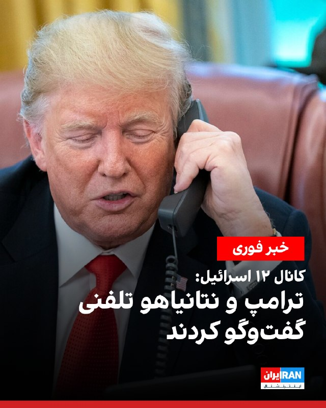

کانال ۱۲ اسرائیل گزارش داد بنیامین نتانیاهو و دونالد ترامپ در حال حاضر در حال گفت‌وگو هستند.

همزمان نماینده اسرائیل در سازمان ملل در شبکه ایکس خطاب به ترامپ نوشت: آقای رییس‌جمهور، جمهوری اسلامی شما را فریب می‌دهد، اسرائیل به شما احترام می‌گذارد. اسرائیل باید با قدرت پاسخ دهد.
‌🏁 🇬🇧 IranintlTV

🤖 @VahidOOnLine

## VahidOOnLine — post 244188

  

♦️ همزمان با حملات موشکی ایران به اسرائیل، تسنیم، خبرگزاری وابسته به سپاه، یکشنبه‌شب، در پی شنیده شدن صدای انفجار در تبریز، گزارش داد: «براساس پیگیری‌ها، صدای شنیده شده در‌ فرودگاه تبریز تست پدافند بوده و هیچ‌گونه حمله‌ای به این فرودگاه اتفاق نیفتاده است».
‌🇸🇦 Indypersian

🤖 @VahidOOnLine

## VahidOOnLine — post 244187

  

دونالد ترامپ به اکسیوس گفت: حملات جمهوری اسلامی به کسی آسیبی نزده است. امیدوارم اسرائیل تلافی نکند. اگر نتانیاهو پاسخ دهد، این درگیری مثل ۴۷ سال گذشته یا حتی ۳۰۰۰ سال گذشته ادامه پیدا می‌کند.
او افزود: ما خیلی به یک توافق نهایی با تهران نزدیک هستیم و نمی‌خواهم به‌خاطر اتفاقاتی که الان در حال رخ دادن است، همه چیز از بین برود.
‌🏁 🇬🇧 IranintlTV

🤖 @VahidOOnLine

## VahidOOnLine — post 244186

  <a href="telegram/content/VahidOOnLine_244186_1780866575.mp4" target="_blank">🎬 Download video</a>

♦️ افی دفرین، سخنگوی ارتش اسرائیل، یکشنبه‌شب، پس از حملات ایران به این کشور، در یک بیانیه رسمی و زنده تلویزیونی با تایید شلیک موشک‌های بالستیک از سوی ایران اعلام کرد: «حکومت ایران لحظاتی پیش موشک‌هایی را به سمت خاک اسرائیل شلیک کرد؛ ما برای این موضوع کاملا آماده بوده‌ایم و ارتش اسرائیل هم در فاز دفاعی و هم در فاز آفندی بسیار قدرتمند عمل خواهد کرد.» او با متهم کردن تهران به تلاش برای تغییر معادلات نظامی در منطقه افزود: «حکومت ایران با شلیک مستقیم به خاک ما مرتکب اشتباه بسیار بزرگی شده است. سیستم‌های پدافند هوایی ما در سراسر کشور مستقر هستند».
‌🇸🇦 Indypersian

🤖 @VahidOOnLine

## VahidOOnLine — post 244185

  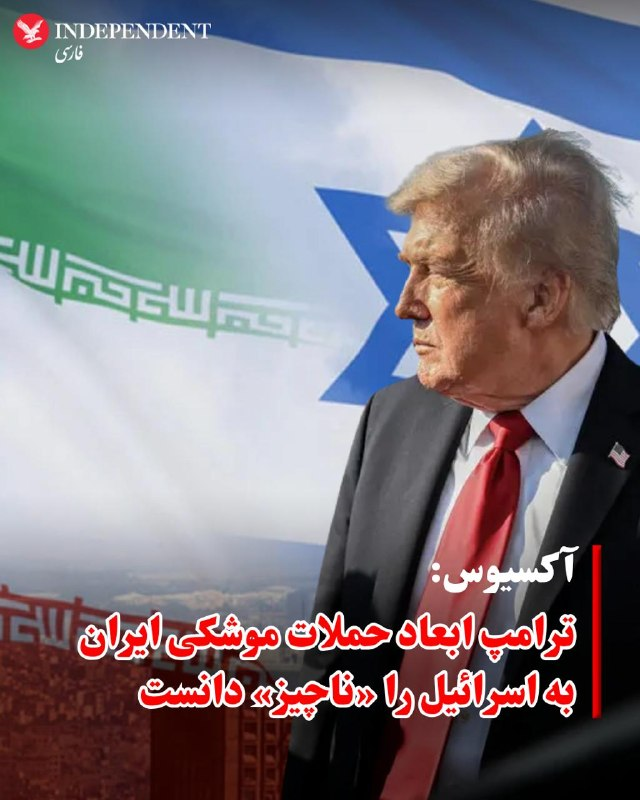

♦️ دونالد ترامپ در گفتگوی اختصاصی با «آکسیوس» اعلام کرد که به زودی با بنیامین نتانیاهو، نخست‌وزیر اسرائیل، تماس خواهد گرفت تا او را برای عدم پاسخ نظامی به حملات موشکی ایران تحت فشار بگذارد. رئیس جمهوری آمریکا، با ناچیز شمردن ابعاد حملات موشکی تهران صراحتا گفت: «من همین الان با بی‌بی تماس می‌گیرم و به او می‌گویم که تلافی نکند. هر کدام از آن‌ها بازی خودشان را کردند؛ اسرائیل حمله خودش را داشت و ایران هم حمله خودش را انجام داد، ما دیگر نیازی به یک حمله دیگر نداریم. حملات موشکی ایران به کسی آسیبی نرسانده است و امیدوارم اسرائیل دست به اقدام متقابل نزند.» این موضع‌گیری تند در شرایطی اتخاذ می‌شود که در پی حمله اسرائیل به حومه جنوبی بیروت و پاسخ موشکی و چندمرحله‌ای ایران پس از هفته‌ها پایبندی به آتش‌بس، ثبات خاورمیانه به شدت متزلزل شده است.
به گزارش آکسیوس، دونالد ترامپ اکنون تلاش می‌کند تا مانع از آن شود که تشدید تنش‌ها، امیدهای او را برای دستیابی به یک توافق پایدار و نهایی با ایران نابود کند. ترامپ با هشدار نسبت به عواقب تداوم این چرخه نظامی تأکید کرد: «ما به یک توافق نهایی با ایران بسیار نزدیک هستیم؛ این یک توافق خوب خواهد بود و من نمی‌خواهم به خاطر اتفاقاتی که اکنون در حال رخ دادن است، این فرصت از بین برود. اگر بی‌بی دوباره به آن‌ها حمله کند، این روند دقیقا مانند ۴۷ سال گذشته، یا ۳ هزار سال گذشته، همین‌طور ادامه خواهد یافت.»
‌🇸🇦 Indypersian

🤖 @VahidOOnLine

## VahidOOnLine — post 244184

  

سخنگوی ارتش اسرائیل گفت حکومت ایران اشتباه بزرگی مرتکب شد. اسرائیل موازنه‌ای را که تهران در پی ایجاد آن است نخواهد پذیرفت.

او افزود ارتش در حالت آماده‌باش قرار دارد و برای حملات دیگر جمهوری اسلامی آماده‌ است.
‌🏁 🇬🇧 IranintlTV

🤖 @VahidOOnLine

## VahidOOnLine — post 244183

  <a href="telegram/content/VahidOOnLine_244183_1780866577.mp4" target="_blank">🎬 Download video</a>

♦️ابراهیم ذوالفقاری، سخنگوی قرارگاه خاتم الانبیا، یکشنبه‌شب، اعلام کرد:‌ «ارتش اسرائیل باید حملات خود به جنوب لبنان و ضاحیه را متوقف نماید و در صورت گسترش حملات خود به آن منطقه و یا پاسخ به اقدام ایران با ضربات کوبنده‌تر و پشیمان‌کننده روبه‌رو و حملات ویرانگری علیه اسرائیل و حامیان آن آغاز خواهد شد».
‌🇸🇦 Indypersian

🤖 @VahidOOnLine

## VahidOOnLine — post 244182

  

سخنگوی قرارگاه مرکزی خاتم‌الانبیا گفت: «قبلا اخطار داده بودیم در صورت گسترش حملات در ضاحیه بیروت، اهدافی را در اسرائیل مورد هجوم قرار می دهیم.»

او افزود: «ارتش اسرائیل باید حملات خود به جنوب لبنان و ضاحیه را متوقف نماید و در صورت گسترش حملات خود به آن منطقه و یا پاسخ به اقدام جمهوری اسلامی با ضربات کوبنده‌تر و پشیمان‌کننده روبرو و حملات ویرانگری علیه اسرائیل و حامیان آن آغاز خواهد شد.»
‌🏁 🇬🇧 IranintlTV

🤖 @VahidOOnLine

## VahidOOnLine — post 244181

  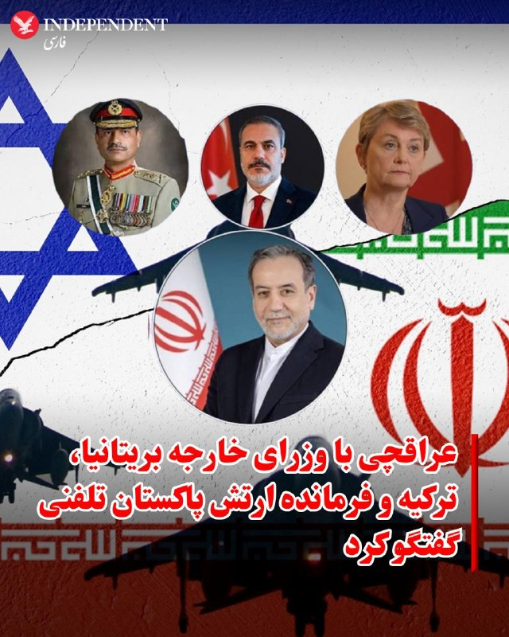

♦️به گزارش تسنیم، خبرگزاری وابسته به سپاه، عباس عراقچی، وزیر امور خارجه جمهوری اسلامی، یکشنبه‌شب همزمان با حملات ایران به اسرائیل، در تماس‌های تلفنی جداگانه با ایوت کوپر و هاکان فیدان، وزرای امور خارجه بریتانیا و ترکیه، و نیز عاصم منیر، فرمانده ارتش پاکستان گفتگو کرد. براساس این گزارش، در این تماس‌ها طرفین درباره آخرین تحولات منطقه‌ای در پی پاسخ ایران به «نقض مکرر آتش‌بس در لبنان توسط اسرائیل» گفتگو کردند.
‌🇸🇦 Indypersian

🤖 @VahidOOnLine

## VahidOOnLine — post 244180

  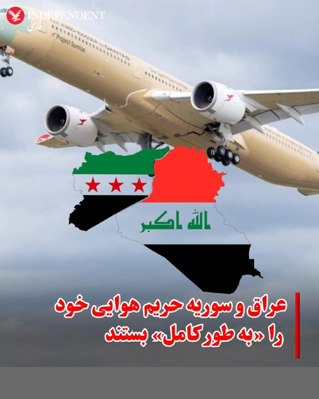

♦️در پی آغاز حملات موشکی ایران به اسرائیل، سازمان‌های هوانوردی عراق و سوریه از بسته‌شدن فوری و موقت حریم هوایی خود به دلایل امنیتی خبر دادند. مقامات هوانوردی غیرنظامی عراق در گفتگو با رویترز تایید کردند که آسمان این کشور با هدف حفظ سلامت و امنیت پروازها، به مدت ۷۲ ساعت به طور کامل بسته شده و تمامی ناوبری‌های هوایی به حالت تعلیق درآمده است. هم‌زمان، دولت سوریه نیز اعلام کرد که حریم هوایی بخش‌های جنوبی خود را به مدت ۱۲ ساعت مسدود کرده و تمامی فعالیت‌ها و عملیات‌های پروازی در فرودگاه بین‌المللی دمشق تا اطلاع ثانوی متوقف شده است.
‌🇸🇦 Indypersian

🤖 @VahidOOnLine

## VahidOOnLine — post 244179

  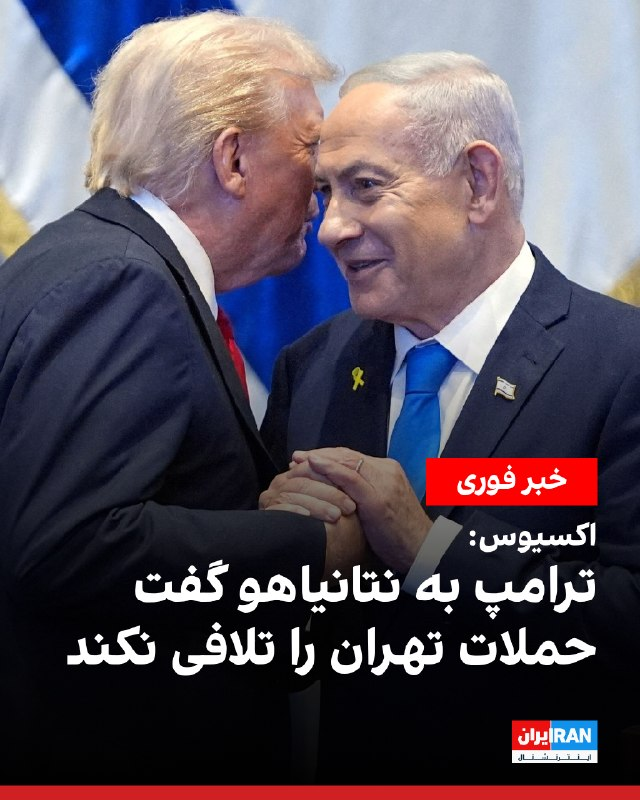

اکسیوس گزارش داد دونالد ترامپ، رییس‌جمهوری آمریکا، گفته است همین حالا با بنیامین نتانیاهو تماس می‌گیرد و به او می‌گوید که حمله تلافی‌جویانه انجام ندهد.
‌
دونالد ترامپ به شبکه فاکس نیوز گفت: «پیشنهادی که به ایران دارم این است: موشک‌های خود را شلیک کرده‌اید، همین کافی است.»
او افزود: «به میز مذاکره بازگردید و توافق کنید.»
‌🏁 🇬🇧 IranintlTV

🤖 @VahidOOnLine

## VahidOOnLine — post 244178

  <a href="telegram/content/VahidOOnLine_244178_1780866580.mp4" target="_blank">🎬 Download video</a>

ویدیوی رسیده به ایران‌اینترنشنال از جوانرود در شامگاه یکشنبه ۱۷ خرداد، نور موشک شلیک‌شده از سوی جمهوری اسلامی را به سمت اسرائیل در آسمان این شهر نشان می‌دهد.
‌🏁 🇬🇧 IranintlTV

🤖 @VahidOOnLine

## VahidOOnLine — post 244177

  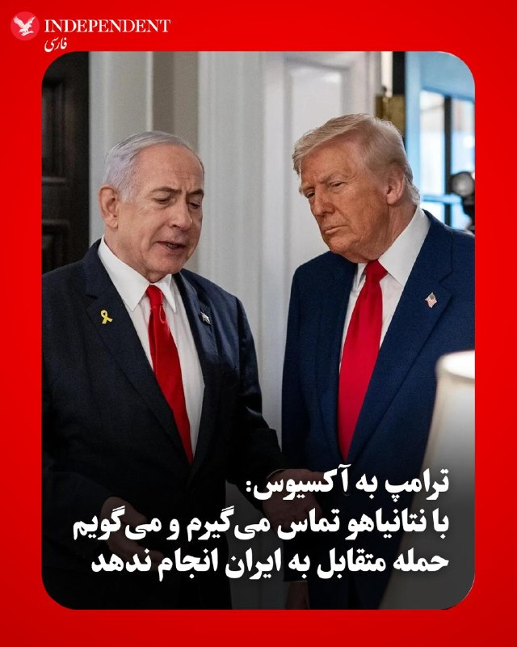

♦️خبرنگار «آکسیوس» یکشنبه‌شب، به نقل از رئیس جمهوری آمریکا اعلام کرد که ترامپ از نتانیاهو خواهد خواست تا به ایران حمله متقابل نکند. خبرنگار آکسیوس نوشت:‌ «دونالد ترامپ به من می‌گوید همین الان با نتانیاهو تماس خواهم گرفت و به او خواهم گفت که حمله متقابل انجام ندهد».
‌🇸🇦 Indypersian

🤖 @VahidOOnLine

## VahidOOnLine — post 244176

  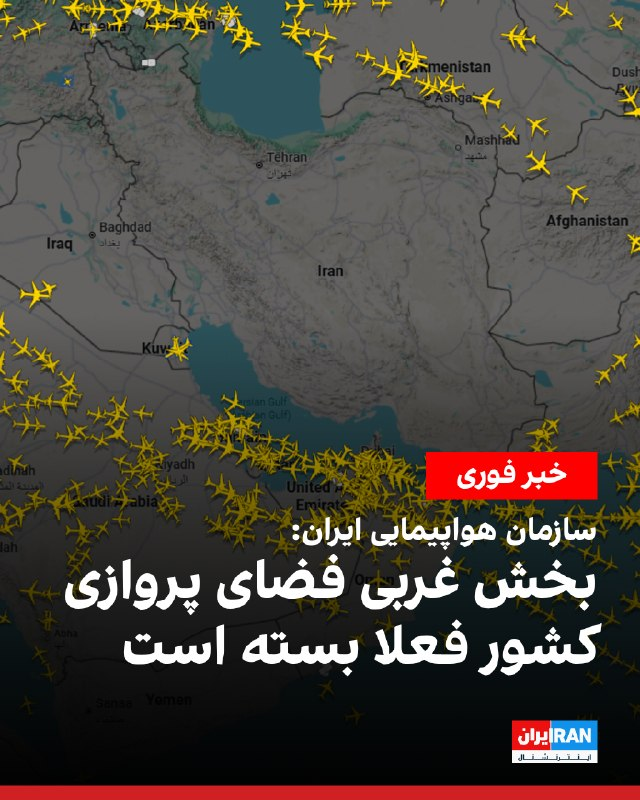

مجید اخوان، سخنگوی سازمان هواپیمایی کشوری، گفت: با توجه به ارزیابی‌های ایمنی و امنیتی صورت گرفته و با صدور اطلاعیه هوانوردی (نوتام) بخش غربی فضای پروازی کشور تا اطلاع ثانوی بسته اعلام شد.
او افزود: «هموطنان از مراجعه به فرودگاه‌ها خودداری نموده و آخرین وضعیت پروازی را از طریق رسانه‌ها دنبال کنند.»
‌🏁 🇬🇧 IranintlTV

🤖 @VahidOOnLine

## VahidOOnLine — post 244175

  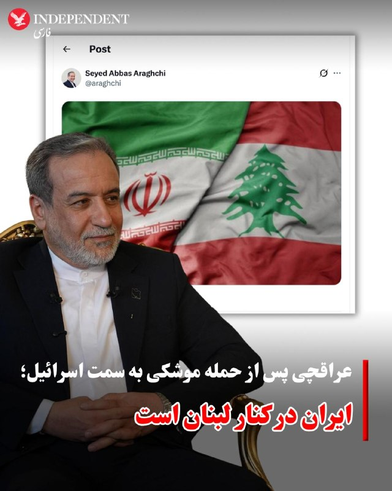

♦️عباس عراقچی یکشنبه‌شب، همزمان با آغاز حملات موشکی ایران به اسرائیل تصویری از پرچم جمهوری اسلامی در کنار لبنان منتشر کرد. ایران در پاسخ به حملات اسرائیل به ضاحیه بیروت، به سمت این کشور موشک شلیک کرد.
‌🇸🇦 Indypersian

🤖 @VahidOOnLine

## VahidOOnLine — post 244174

  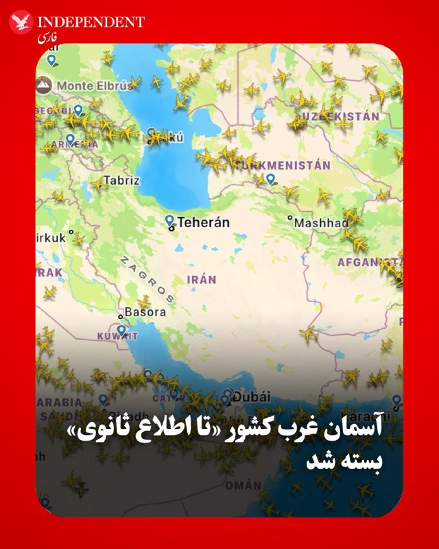

♦️روابط عمومی سازمان هواپیمایی کشوری، یکشنبه‌شب، همزمان با آغاز حملات جمهوری اسلامی ایران به اسرائیل، از بسته شدن آسمان غرب ایران خبر داد. مجید اخوان، سخنگوی سازمان هواپیمایی کشوری، گفت: «با توجه به ارزیابی‌های ایمنی و امنیتی صورت گرفته و با صدور اطلاعیه هوانوردی (نوتام) بخش غربی فضای پروازی کشور تا اطلاع ثانوی بسته اعلام شد.
‌🇸🇦 Indypersian

🤖 @VahidOOnLine

## VahidOOnLine — post 244173

  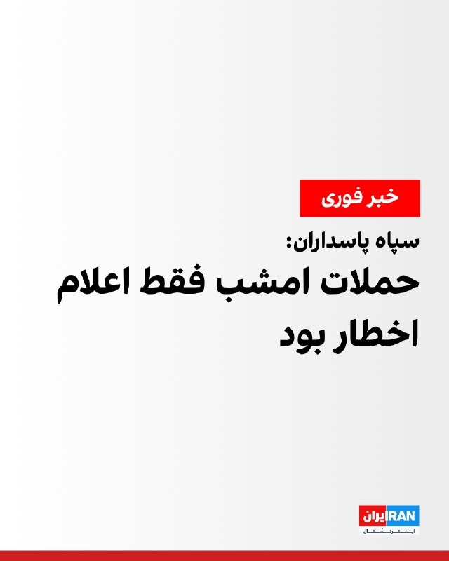

سپاه پاسداران پس از حملات موشکی به اسرائیل در بیانیه‌ای اعلام کرد عملیات شامگاه یک‌شنبه صرفا یک اعلام اخطار بود و در صورت تکرار حملات، پاسخ‌ها گسترده‌تر خواهد بود و تمام اهداف آمریکایی-اسرائیلی را در منطقه در بر خواهد گرفت.

در این بیانیه آمده است: پذیرش آتش‌بس از سوی ما در ۱۹ فروردین ماه مشروط به توقف آتش در تمام جبهه‌ها بود اما مثل همیشه آمریکا و اسرائیل به تعهد خود پایبند نبودند، هم حملات را در لبنان ادامه دادند و هم با تعرض مکرر به سواحل و شناورهای ایرانی در تنگه هرمز، دریای عمان و اقیانوس هند آتش‌بس را نقض کردند.
‌🏁 🇬🇧 IranintlTV

🤖 @VahidOOnLine

## WithYashar — post 13807

فاکس نیوز: با اینکه ترامپ به اسرائیل گفته پاسخ نده اما اسرائیل همین الان جلسه اضطراری تشکیل داده تا تصمیم بگیره آیا به حملات اخیر پاسخ می‌ده یا نه؛ و اگه پاسخ بده، چطور این کار رو انجام خواهد داد.
@withyashar

## WithYashar — post 13806

فاکس نیوز: با اینکه ترامپ به اسرائیل گفته پاسخ نده اما اسرائیل همین الان جلسه اضطراری تشکیل داده تا تصمیم بگیره آیا به حملات اخیر پاسخ می‌ده یا نه؛ و اگه پاسخ بده، چطور این کار رو انجام خواهد داد.
@withyashar

## WithYashar — post 13805

  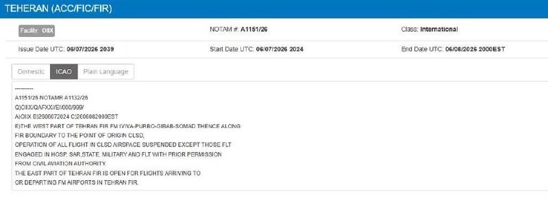

رژیم اطلاعیه NOTAM صادر کرده است که بخش غربی فضای هوایی تهران را تا ۸ ژوئن به روی تمام ترافیک هوایی غیرنظامی می‌بندد.
تنها هواپیماهای نظامی، دولتی، تخلیه پزشکی و جست‌وجو و نجات مجاز به فعالیت در این منطقه محدود شده هستند.
@withyashar

## WithYashar — post 13804

طبق گزارش ها،هم مقامات نظامی و هم مقامات غیرنظامی ایران هم من از اتاق جنگ کاملاً بر این فرض عمل می‌کنند که حمله‌ای به ایران در راه است و بر اساس آن اقدامات لازم را انجام می‌دهند.
@withyashar

## WithYashar — post 13803

  <a href="telegram/content/WithYashar_13803_1780866585.mp4" target="_blank">🎬 Download video</a>

خبر تایید نشده: یک هواپیمای مسافربری در صحرای کربلا سقوط کرد @withyashar

## WithYashar — post 13802

از‌ مهرآباد جنگنده بلند شد @withyashar

## WithYashar — post 13801

  <a href="telegram/content/WithYashar_13801_1780866587.mp4" target="_blank">🎬 Download video</a>

اتاق جنگ با یاشار : ردبول 🪽😈
@withyashar

## WithYashar — post 13800

منابع عبری:ترامپ و نتانیاهو در حال حاضر در حال گفتگو هستن
@withyashar

## WithYashar — post 13799

بریم اتاق جنگ

## WithYashar — post 13798

کانال 12 اسرائیل:با وجود مخالفت ترامپ، فشارهای داخلی بر نتانیاهو برای واکنش افزایش یافته و شماری از سیاستمداران اسرائیلی خواستار پاسخ شدید به حملات جمهوری اسلامی شدند.
@withyashar

## WithYashar — post 13797

ترامپ به نیویورک پست: «اوضاع بسیار خوب پیش می‌رود.»
@withyashar

## WithYashar — post 13796

کانال 12 اسرائیل:
با وجود مخالفت ترامپ، فشارهای داخلی بر نتانیاهو برای واکنش افزایش یافته و شماری از سیاستمداران اسرائیلی خواستار پاسخ شدید به حملات جمهوری اسلامی شدن.
@withyashar

## WithYashar — post 13795

سخنگوی ارتش اسرائیل در یک کنفرانس مطبوعاتی ادعا کرد که رئیس ستاد ارتش، ایال زامیر، در حال ارزیابی وضعیت است و «طرح‌هایی را برای آینده تصویب می‌کند»
@withyashar

## WithYashar — post 13794

سخنگوی ارتش اسرائیل: ایران اشتباه بزرگی مرتکب شد
@withyashar

## WithYashar — post 13793

از‌ مهرآباد جنگنده بلند شد
@withyashar

## WithYashar — post 13792

رسانه های داخلی: تو تبریز پهپاد زدیم
@withyashar

## WithYashar — post 13791

## WithYashar — post 13790

گزارش انفجار در تبریز
@withyashar

## WithYashar — post 13789

ارتش اسرائیل تا دقایقی دیگر بیانیه ای صادر خواهد کرد
@withyashar

## WithYashar — post 13788

ترامپ به خبرگزاری کان:

فکر می‌کنم اسرائیل به اندازه کافی واکنش نشان داده است. دیگر نیازی به واکنش بیشتر نیست.

ما می‌توانیم پس از ۳۰۰۰ سال به صلح دست یابیم.
@withyashar

## mwarmonitor — post 10320

  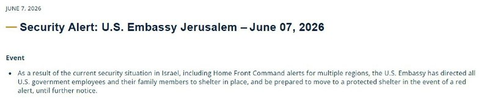

🔴 «سفارت آمریکا در قدس دستورالعمل‌هایی صادر کرده و از تمام کارکنان دولت آمریکا و اعضای خانواده‌هایشان در اسرائیل خواسته است تا اطلاع ثانوی در خانه‌های خود بمانند.»

@mwarmonitor

## mwarmonitor — post 10319

🚨 «ترامپ و نتانیاهو در حال حاضر در تماس تلفنی هستند - به گزارش رویترز.» @mwarmonitor

## mwarmonitor — post 10318

🚨 «ترامپ و نتانیاهو در حال حاضر در تماس تلفنی هستند - به گزارش رویترز.»

@mwarmonitor

## mwarmonitor — post 10317

  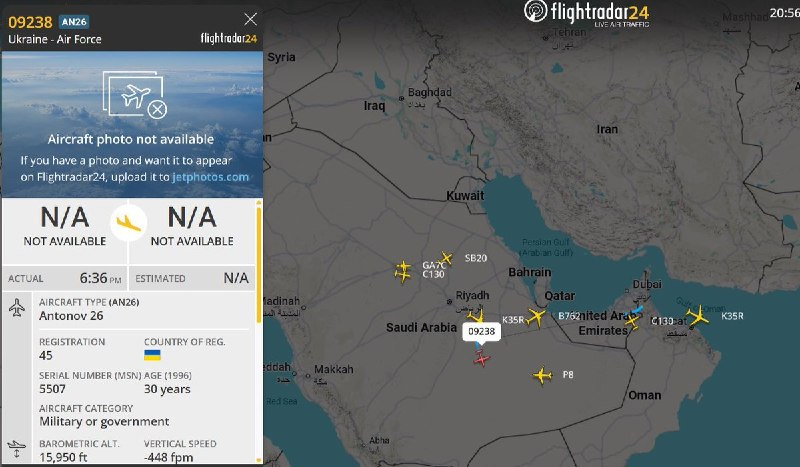

✈️«یک فروند هواپیمای نظامی آنتونوف AN-26 نیروی هوایی اوکراین در حال پرواز بر فراز عربستان سعودی.»

@mwarmonitor

## mwarmonitor — post 10316

  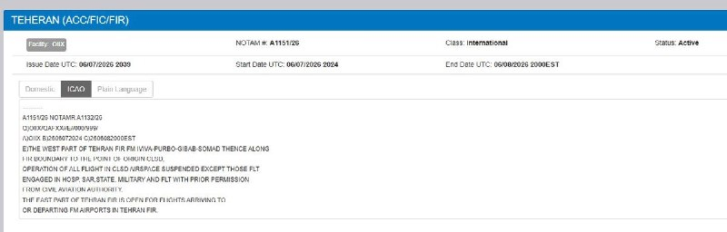

🔴 «نوتام: ایران بخش غربی حریم هوایی را برای تمام پروازهای غیرنظامی بسته است. تنها هواپیماهای نظامی، دولتی، پزشکی و جست‌وجو و نجات اجازه پرواز دارند. بخش شرقی منطقه پروازی ایران همچنان باز است.»

@mwarmonitor

## mwarmonitor — post 10315

🔴 یک منبع پاکستانی به العربیه می‌گوید: «آنچه در حال رخ دادن است مانعی برای تلاش‌هایی است که برای رسیدن به توافق در حال انجام است. برخی طرف‌های سرسخت، منطقه را به سمت تنش و فروپاشی مذاکرات سوق می‌دهند.»

@mwarmonitor

## mwarmonitor — post 10314

🔸نتانیاهو، وزیر دفاع کاتس و مقامات ارشد امنیتی اسرائیل قرار است طی یک ساعت آینده یک نشست اضطراری درباره ایران برگزار کنند - به نقل از i24News

@mwarmonitor

## mwarmonitor — post 10313

انفجار در تبریز

## mwarmonitor — post 10312

🔴 سخنگوی ارتش اسرائیل، سرتیپ «دفرین» می‌گوید اسرائیل به حملات خود علیه حزب‌الله در لبنان ادامه خواهد داد و این را دلیل شلیک موشک‌های ایران می‌داند.

📌او می‌گوید ایران تلاش داشت با حمله به اسرائیل در واکنش به اقدامات این کشور در لبنان، «معادله جدیدی را تحمیل کند»؛ و افزود: «ما اجازه چنین چیزی را نخواهیم داد.»

@mwarmonitor

## mwarmonitor — post 10311

🔴ترامپ به شبکه ۱۲ گفت: «ما خیلی به امضای یک توافق نهایی با ایران نزدیک بودیم.»

@mwarmonitor

## mwarmonitor — post 10310

🔴ترامپ می‌گوید: «امیدوارم اسرائیل در پاسخ حمله نکند. اگر نتانیاهو دستور حمله بدهد، این موضوع با یک ضدحمله ادامه خواهد یافت. ما با ایران به توافقی نزدیک هستیم که به جنگ پایان دهد و نمی‌خواهیم این توافق خراب شود. هر طرف امشب کار خودش را انجام داد. من همین حالا…

## mwarmonitor — post 10309

🔴 سخنگوی ارتش اسرائیل: رئیس ستاد کل در حال انجام ارزیابی وضعیت است و سامانه‌های پدافند هوایی ما در حالت آماده‌باش قرار دارند. او افزود: «رژیم تروریستی ایران مرتکب یک اشتباه جدی شد.» @mwarmonitor

## mwarmonitor — post 10308

🔴 سخنگوی ارتش اسرائیل: رئیس ستاد کل در حال انجام ارزیابی وضعیت است و سامانه‌های پدافند هوایی ما در حالت آماده‌باش قرار دارند.

او افزود: «رژیم تروریستی ایران مرتکب یک اشتباه جدی شد.»

@mwarmonitor

## mwarmonitor — post 10307

انفجار در تبریز

## mwarmonitor — post 10306

🔴وزیر امور خارجه ایران، عراقچی، به‌صورت تلفنی با یِوِت کوپر، وزیر خارجه بریتانیا، هاکان فیدان، وزیر خارجه ترکیه، و فیلد مارشال عاصم منیر، فرمانده ارتش پاکستان گفت‌وگو کرده و درباره تحولات منطقه‌ای بحث کرده است - به نقل از خبرگزاری مهر.

@mwarmonitor

## mwarmonitor — post 10305

📌ترامپ به شبکه کان نیوز: «فکر می‌کنم اسرائیل به اندازه کافی پاسخ داده است. دیگر نیازی به ادامه آن نیست. ما می‌توانیم پس از ۳۰۰۰ سال به صلح برسیم.»

@mwarmonitor

## mwarmonitor — post 10304

🔴 «یک منبع ارشد ایرانی به رویترز می‌گوید در صورت حمله اسرائیل به ایران، تمام پایگاه‌های آمریکا در منطقه اهداف مشروع تلقی خواهند شد.»

@mwarmonitor

## mwarmonitor — post 10303

🔴 سوریه به‌طور موقت حریم هوایی جنوبی خود را به مدت ۱۲ ساعت بسته و فعالیت‌های فرودگاه دمشق را متوقف کرده است.

@mwarmonitor

## mwarmonitor — post 10302

🔴ترامپ می‌گوید: «امیدوارم اسرائیل در پاسخ حمله نکند. اگر نتانیاهو دستور حمله بدهد، این موضوع با یک ضدحمله ادامه خواهد یافت. ما با ایران به توافقی نزدیک هستیم که به جنگ پایان دهد و نمی‌خواهیم این توافق خراب شود. هر طرف امشب کار خودش را انجام داد. من همین حالا با نتانیاهو تماس می‌گیرم و می‌گویم: نه، حمله نکن.»

@mwarmonitor

## mwarmonitor — post 10301

🔴 «وزارت بهداشت اسرائیل در حال آماده‌سازی برای انتقال همه بیمارستان‌ها به مناطق محافظت‌شده و مجتمع‌های زیرزمینی است» - کانال ۱۲ اسرائیل

@mwarmonitor

## FoxNewsTwitter — post 342701

  <a href="telegram/content/FoxNewsTwitter_342701_1780866591.mp4" target="_blank">🎬 Download video</a>

Fox News (Twitter/X)

BREAKING: FOX News' @TreyYingst spoke with President Trump after Iran's latest strikes against Israel.

Iran launched multiple missile barrages toward Israel on Sunday, prompting air raid sirens across regions and sending civilians into shelters, according to the Israel Defense Forces.

## pm_afshaa — post 92705

تلمبه های سنگین اسراییل به لبنان

💧 Rainbet.com the #1 Non-KYC Crypto Casino & Sportsbook @rainbetcom

😁 @Pm_Afshaa

## pm_afshaa — post 92704

  <a href="telegram/content/pm_afshaa_92704_1780866594.webm" target="_blank">🎬 Download video</a>

🔴ایران اطلاعیه نوتام صادر کرده که بخش غربی فضای هوایی تهران رو تا 8 ژوئن به روی تمام ترافیک هوایی غیرنظامی می‌بنده.

💧 Rainbet.com the #1 Non-KYC Crypto Casino & Sportsbook @rainbetcom

😁 @Pm_Afshaa

## pm_afshaa — post 92703

🔴سفارت آمریکا در اسرائیل: کارکنان باید در خانه‌های خود بمانند و برای ورود به پناهگاه‌های محافظت‌شده آماده شوند

💧 Rainbet.com the #1 Non-KYC Crypto Casino & Sportsbook @rainbetcom

😁 @Pm_Afshaa

## pm_afshaa — post 92702

  <a href="telegram/content/pm_afshaa_92702_1780866594.webm" target="_blank">🎬 Download video</a>

🔴تسنیم: براساس پیگیری‌ها، صدای شنیده شده در‌ فرودگاه تبریز تست پدافند بوده و هیچ‌گونه حمله‌ای به این فرودگاه اتفاق نیفتاده.

💧 Rainbet.com the #1 Non-KYC Crypto Casino & Sportsbook @rainbetcom

😁 @Pm_Afshaa

## pm_afshaa — post 92701

  <a href="telegram/content/pm_afshaa_92701_1780866595.webm" target="_blank">🎬 Download video</a>

🔴یک منبع نظامی به تسنیم:
موشک‌ها آماده‌ان در صورت پاسخ اسرائیل فورا شلیک بشن.

💧 Rainbet.com the #1 Non-KYC Crypto Casino & Sportsbook @rainbetcom

😁 @Pm_Afshaa

## pm_afshaa — post 92700

🔴منابع عبری: گفت‌و‌گوی تلفنی ترامپ و نتانیاهو آغاز شد. 
💧 Rainbet.com the #1 Non-KYC Crypto Casino & Sportsbook @rainbetcom 
😁 @Pm_Afshaa

## pm_afshaa — post 92699

کنست چند جلسه‌ای که قرار بود فردا برگزار کنه را لغو کرد

💧 Rainbet.com the #1 Non-KYC Crypto Casino & Sportsbook @rainbetcom

😁 @Pm_Afshaa

## pm_afshaa — post 92698

  <a href="telegram/content/pm_afshaa_92698_1780866596.webm" target="_blank">🎬 Download video</a>

🔴مقام اسرائیلی: ما به تنهایی به ایران حمله خواهیم کرد فقط منتظر تایید نتانیاهو هستیم.

💧 Rainbet.com the #1 Non-KYC Crypto Casino & Sportsbook @rainbetcom

😁 @Pm_Afshaa

## pm_afshaa — post 92697

تو کانال زاپاسمون حتما جوین شین همین الان

👇
👇

https://t.me/pmtvzapas
https://t.me/pmtvzapas

## pm_afshaa — post 92695

🔴منابع عبری: گفت‌و‌گوی تلفنی ترامپ و نتانیاهو آغاز شد.

💧 Rainbet.com the #1 Non-KYC Crypto Casino & Sportsbook @rainbetcom

😁 @Pm_Afshaa

## pm_afshaa — post 92693

انفجار در تبریز

💧 Rainbet.com the #1 Non-KYC Crypto Casino & Sportsbook @rainbetcom

😁 @Pm_Afshaa

## pm_afshaa — post 92692

قطعا اسراییل میزنه که اینا دارن تخلیه میکنن

## pm_afshaa — post 92690

  <a href="telegram/content/pm_afshaa_92690_1780866596.mp4" target="_blank">🎬 Download video</a>

همینجوری از مهر اباد داره هواپیما بلند میشه

💧 Rainbet.com the #1 Non-KYC Crypto Casino & Sportsbook @rainbetcom

😁 @Pm_Afshaa

## pm_afshaa — post 92689

  <a href="telegram/content/pm_afshaa_92689_1780866598.webm" target="_blank">🎬 Download video</a>

🔴کانال 14 اسرائیل:
امشب فقط موشک‌ها و جت‌ها نیستن که بین آسمان و زمین در نوسان هستن، بلکه سرنوشت سیاسی نتانیاهو هم همین گونه است.

💧 Rainbet.com the #1 Non-KYC Crypto Casino & Sportsbook @rainbetcom

😁 @Pm_Afshaa

## pm_afshaa — post 92688

فرودگاه مهر آباد در حال تخلیه شدنه

💧 Rainbet.com the #1 Non-KYC Crypto Casino & Sportsbook @rainbetcom

😁 @Pm_Afshaa

## pm_afshaa — post 92687

🔴سخنگوی ارتش اسرائیل :هم اکنون رئیس ستاد ارتش در حال تصویب طرح‌هایی برای اقدامات بیشتر در پاسخ به ایران است

💧 Rainbet.com the #1 Non-KYC Crypto Casino & Sportsbook @rainbetcom

😁 @Pm_Afshaa

## pm_afshaa — post 92686

ترامپ به نیویورک پست:
نتانیاهو جواب تلفن نمیده

💧 Rainbet.com the #1 Non-KYC Crypto Casino & Sportsbook @rainbetcom

😁 @Pm_Afshaa

## pm_afshaa — post 92685

🔴سخنگوی ارتش اسرائیل : ما به حملات خودمون به سراسر خاک لبنان ادامه خواهیم داد و اجازه نخواهیم داد ایران معادله ای جدید علیه لبنان ایجاد کند

💧 Rainbet.com the #1 Non-KYC Crypto Casino & Sportsbook @rainbetcom

😁 @Pm_Afshaa

## pm_afshaa — post 92684

  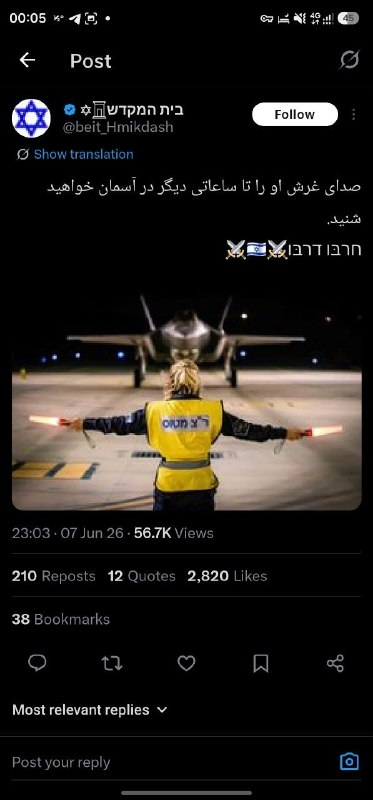

اکانت معروف اسراییلی:

💧 Rainbet.com the #1 Non-KYC Crypto Casino & Sportsbook @rainbetcom

😁 @Pm_Afshaa

## DEJradio — post 5443

  <a href="telegram/content/DEJradio_5443_1780866600.mp4" target="_blank">🎬 Download video</a>

⭕️
🚨 سرتیپ افی دفرین، سخنگوی ارتش اسرائیل، ساعتی پس از حملات موشکی سپاه پاسداران به این کشور در بیانیه‌ای اعلام کرد: "رژیم تروریستی ایران با انتخاب دوباره تروریسم، مرتکب اشتباهی بزرگ شد."

#حملات_موشکی #اسرائیل #زیرنویس
@DEJradio

## DEJradio — post 5442

  <a href="telegram/content/DEJradio_5442_1780866602.webm" target="_blank">🎬 Download video</a>

🚨
⭕️ هموطنان عزیز
با توجه به احتمال اقدام متقابل اسرائیل علیه جمهوری اسلامی، از مراکز نظامی و اماکن حکومتی فاصله بگیرید و از ترددهای غیرضروری در خیابان خودداری کنید.

#هشدار
@DEJradio

## mamlekate — post 103629

📞 جی‌پی‌اس و اینترنت هم باز مختل شده

@mamlekate

## mamlekate — post 103628

📝 ارتش اسرائيل از حمله موشکی جمهوری اسلامی خبر داد

سخنگوی ارتش اسرائیل اواخر روز یکشنبه به وقت محلی گفت که این نیرو اندکی پیش، شلیک موشک‌هایی از ایران به سمت خاک اسرائیل را شناسایی کرد و سیستم‌های دفاعی برای رهگیری این تهدید در حال فعالیت هستند.

@mamlekate

## VahidOnline — post 76006

  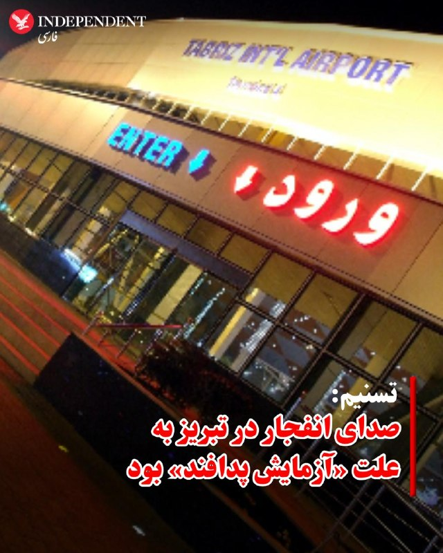

همزمان با حملات موشکی ایران به اسرائیل، تسنیم، خبرگزاری وابسته به سپاه، یکشنبه‌شب، در پی شنیده شدن صدای انفجار در تبریز، گزارش داد: «براساس پیگیری‌ها، صدای شنیده شده در‌ فرودگاه تبریز تست پدافند بوده و هیچ‌گونه حمله‌ای به این فرودگاه اتفاق نیفتاده است».
@VahidOOnLine
پیام‌هایی که من دریافت کرده بودم:

سلام وحید جان
الان ۲۳:۵۵ سه صدای انفجار بزرگ آمد تو تبریز
پیام بعدی در ۱۹ دقیقه بامداد: همین الان باز زدن تبریز رو

سلام وحید جان
تبریز ساعت ۱۲:۱۵ نزدیک لشکر عاشورا صدای انفحار اومد.
البته شدتش مثل انفجار های جنگ ۴۰ روزه نبود.

تبریز نیم ساعته صداهای عجیبی میاد
مطمعنا صدای پدافند نیست انفجاره

هم اکنون صدای چند انفجار شدید در تبریز

📡 @VahidOnline

## VahidOnline — post 76005

  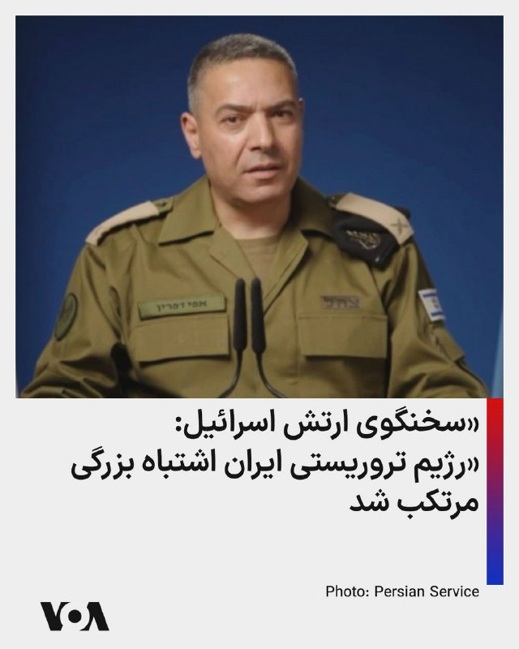

⚡️سخنگوی ارتش اسرائیل، افی دفرین، می‌گوید پس از حمله موشکی بالستیک جمهوری اسلامی ایران به اسرائیل، ایال زمیر، رئیس ستاد ارتش اسرائیل، در حال انجام ارزیابی و تصویب برنامه‌های آینده است. سخنگوی ارتش اسرائیل گفت: «رژیم تروریستی ایران اشتباه بزرگی مرتکب شد.»
@VahidHeadline

📡 @VahidOnline

## VahidOnline — post 76003

پیام‌های دریافتی:

ما تهرانسریم
تو این 1ساعت اخیر که اینا اسرائیل رو زدن
نزدیک به 8تا هواپیما مسافربری از مهرآباد بلند شد
نهمی هم الان رفت
انگار دارن فرودگاه رو خالی میکنن

سلام از تهران داره همینجور هواپیما بلند میشه همشونم تو ارتفاع کم پرواز میکنن

همین الان از بالا سر مهرآباد یه هواپیما با چراغ روشن از غرب به شرق رفت
مسیر خیلی غیرعادی با ارتفاع خیلی کم ۰۰:۰۸

آپدیت:
بعدش کلی پیام مشابه دیگر دریافت کردم.
📡 @VahidOnline

## VahidOnline — post 76002

  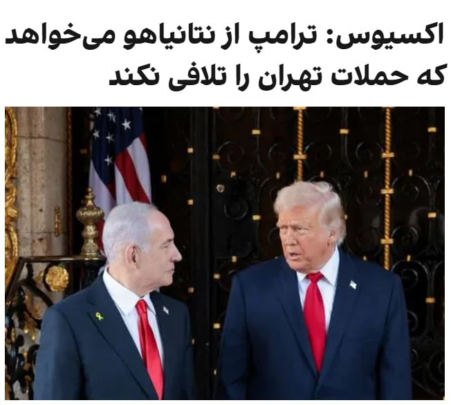

ترامپ: حملات ایران به کسی آسیبی نرساند، امیدوارم اسرائیل تلافی نکند

درپی اعلام خبر حمله موشکی ایران به اسرائیل در شامگاه یک‌شنبه، دونالد ترامپ، رئیس‌جمهور آمریکا، در گفت‌وگویی تلفنی با خبرنگار اکسیوس گفت: «همین حالا با بی‌بی (بنیامین نتانیاهو) تماس می‌گیرم و به او می‌گویم تلافی نکند. هر دو طرف کار خودشان را کرده‌اند. اسرائیل حمله خود را انجام داد و ایران هم حمله خود را انجام داد. دیگر نیازی به حمله دیگری نیست.»

دونالد ترامپ در این گفت‌وگو افزود: «حملات ایران به کسی آسیبی نرساند. امیدوارم اسرائیل تلافی نکند. اگر بی‌بی (بنیامین نتانیاهو) پاسخ بدهد، این ماجرا همان‌طور که در ۴۷ سال گذشته، یا حتی در ۳۰۰۰ سال گذشته، ادامه داشته، باز هم ادامه پیدا خواهد کرد.»

ترامپ افزود: «ما به یک توافق نهایی با ایران بسیار نزدیک هستیم. این توافق، توافق خوبی خواهد بود. نمی‌خواهم به خاطر اتفاقاتی که اکنون در حال رخ دادن است، این روند از بین برود.»

این اتفاق چند ساعت بعد از آن رخ داد که ارتش اسرائیل منطقه ضاحیه در جنوب بیروت را هدف قرار داد و ایران تهدید کرد به این حمله پاسخ خواهد داد.

یک منبع ارشد ایرانی هم به خبرگزاری رویترز گفته است که «ایران به هر حمله اسرائیل با نیرویی شدیدتر پاسخ خواهد داد.»
ارتش اسرائیل اعلام کرده است همه موشک‌هایی را که تاکنون از سوی ایران شلیک شده‌اند رهگیری کرده است.
@VahidHeadline

📡 @VahidOnline

## VahidOnline — post 76001

  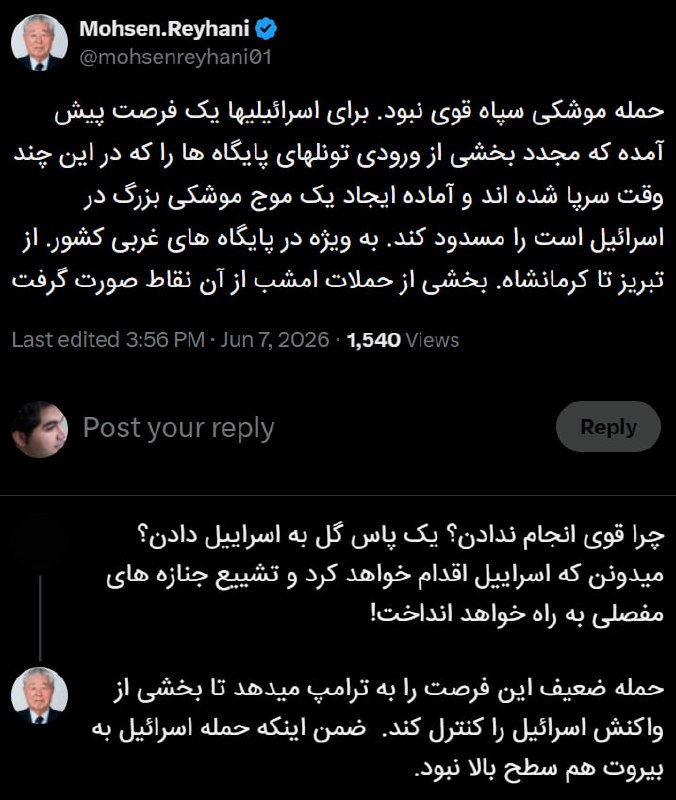

mohsenreyhani01
سپاه پاسداران پس از حملات موشکی به اسرائیل در بیانیه‌ای اعلام کرد عملیات شامگاه یک‌شنبه صرفا یک اعلام اخطار بود و در صورت تکرار حملات، پاسخ‌ها گسترده‌تر خواهد بود و تمام اهداف آمریکایی-اسرائیلی را در منطقه در بر خواهد گرفت.

در این بیانیه آمده است: پذیرش آتش‌بس از سوی ما در ۱۹ فروردین ماه مشروط به توقف آتش در تمام جبهه‌ها بود اما مثل همیشه آمریکا و اسرائیل به تعهد خود پایبند نبودند، هم حملات را در لبنان ادامه دادند و هم با تعرض مکرر به سواحل و شناورهای ایرانی در تنگه هرمز، دریای عمان و اقیانوس هند آتش‌بس را نقض کردند.
@VahidOOnLine

📡 @VahidOnline

## kianmeli1 — post 87752

🔴فوری -صدای فعالیت جنگنده ها در جنوب تهران
https://t.me/+_a5ind9hr7sxOTE0

## kianmeli1 — post 87751

🔴فوری-نزدیک سپاه عاشورا تبریز صدای انفجار اومد
https://t.me/+_a5ind9hr7sxOTE0

## kianmeli1 — post 87750

  <a href="telegram/content/kianmeli1_87750_1780866603.mp4" target="_blank">🎬 Download video</a>

🔴فوری-فاکس نیوز :

با اینکه ترامپ به اسرائیل گفته پاسخ نده اما اسرائیل همین الان جلسه اضطراری تشکیل داده تا تصمیم بگیره آیا به حملات اخیر پاسخ می‌ده یا نه؛ و اگه پاسخ بده، چطور این کار رو انجام خواهد داد.
https://t.me/+_a5ind9hr7sxOTE0

## kianmeli1 — post 87748

  <a href="telegram/content/kianmeli1_87748_1780866606.mp4" target="_blank">🎬 Download video</a>

🔴الان فرودگاه مهراباد رو دارن خالی میکنن
https://t.me/+_a5ind9hr7sxOTE0

## kianmeli1 — post 87747

🔴فوری
فرودگاه تهران رو دارن خالی میکنن
پشت سر هم هواپیما بلند میشه
https://t.me/+_a5ind9hr7sxOTE0

## kianmeli1 — post 87745

🔥خبرهای فوری را از پیج زیر نیز دنبال کنید

https://t.me/+_a5ind9hr7sxOTE0
https://t.me/+_a5ind9hr7sxOTE0

## kianmeli1 — post 87744

🔴فوری

اسراییل: تهران آخرین شب آرام‌را سپری میکند
https://t.me/kianmeli1

## kianmeli1 — post 87743

🔴فوری-کارشناس صدا و سیما: خونه نتانیاهو رو زدیم
https://t.me/kianmeli1

## kianmeli1 — post 87742

  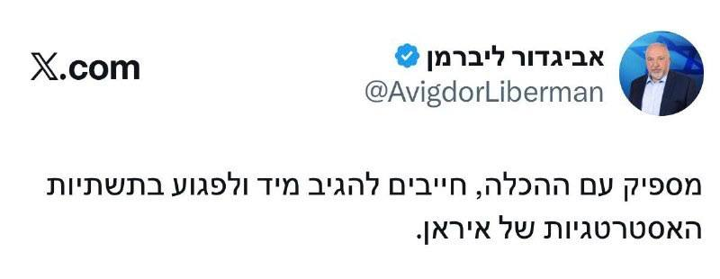

🔴فوری-رئیس حزب اسرائیل بیتنو، نماینده کنست آویگدور لیبرمن: «تحمل کافیست، باید فوراً واکنش نشان داد و به زیرساخت‌های استراتژیک ایران ضربه زد»
https://t.me/kianmeli1

## kianmeli1 — post 87741

🔴فعالیت جنگنده‌های ارتش بر فراز آسمان تهران
https://t.me/kianmeli1

## kianmeli1 — post 87740

🔴فوری -ترامپ:

به نتانیاهو خواهم گفت به ایران حمله نکند
https://t.me/kianmeli1

## kianmeli1 — post 87739

🔴فوری

حساب منتسب به مجتبی خامنه‌ای : نفس رژیم لرزان صهیونیستی به شماره افتاده است.
https://t.me/kianmeli1

## kianmeli1 — post 87738

🔴فوری

هلال احمر ایران به حالت آماده باش در آمد
https://t.me/kianmeli1

## kianmeli1 — post 87737

🔴فوری

سی‌ان‌ان به نقل از دو منبع اسرائیلی: ما به پرتاب موشک‌های بالستیک ایران با قدرت پاسخ خواهیم داد.
https://t.me/kianmeli1

## IranIntlTV — post 341063

  

کانال ۱۲ اسرائیل گزارش داد بنیامین نتانیاهو و دونالد ترامپ در حال حاضر در حال گفت‌وگو هستند.

همزمان نماینده اسرائیل در سازمان ملل در شبکه ایکس خطاب به ترامپ نوشت: آقای رییس‌جمهور، جمهوری اسلامی شما را فریب می‌دهد، اسرائیل به شما احترام می‌گذارد. اسرائیل باید با قدرت پاسخ دهد.
https://iranintl.com/202606073571

## IranIntlTV — post 341062

  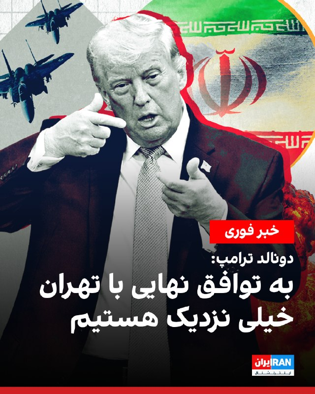

دونالد ترامپ به اکسیوس گفت: حملات جمهوری اسلامی به کسی آسیبی نزده است. امیدوارم اسرائیل تلافی نکند. اگر نتانیاهو پاسخ دهد، این درگیری مثل ۴۷ سال گذشته یا حتی ۳۰۰۰ سال گذشته ادامه پیدا می‌کند.
او افزود: ما خیلی به یک توافق نهایی با تهران نزدیک هستیم و نمی‌خواهم به‌خاطر اتفاقاتی که الان در حال رخ دادن است، همه چیز از بین برود.
https://iranintl.com/202606071626

## IranIntlTV — post 341061

  

سخنگوی ارتش اسرائیل گفت حکومت ایران اشتباه بزرگی مرتکب شد. اسرائیل موازنه‌ای را که تهران در پی ایجاد آن است نخواهد پذیرفت.

او افزود ارتش در حالت آماده‌باش قرار دارد و برای حملات دیگر جمهوری اسلامی آماده‌ است.
https://iranintl.com/202606070458

## IranIntlTV — post 341060

  <a href="https://t.me/IranintlTV/341060" target="_blank">📎 Download file</a>

🎧نسخه صوتی چشم‌انداز: هزینه‌های ترسناک اقدامات جنون‌آمیز سپاه برای آینده ایران
@iranintlTV

## IranIntlTV — post 341059

  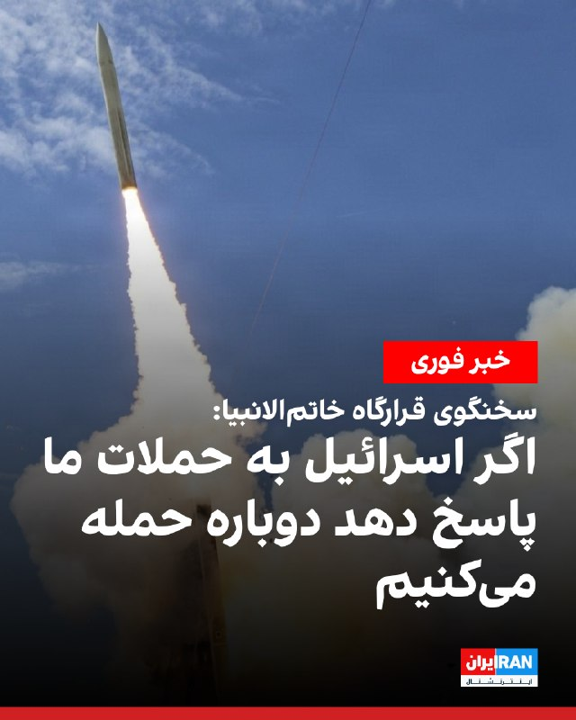

سخنگوی قرارگاه مرکزی خاتم‌الانبیا گفت: «قبلا اخطار داده بودیم در صورت گسترش حملات در ضاحیه بیروت، اهدافی را در اسرائیل مورد هجوم قرار می دهیم.»

او افزود: «ارتش اسرائیل باید حملات خود به جنوب لبنان و ضاحیه را متوقف نماید و در صورت گسترش حملات خود به آن منطقه و یا پاسخ به اقدام جمهوری اسلامی با ضربات کوبنده‌تر و پشیمان‌کننده روبرو و حملات ویرانگری علیه اسرائیل و حامیان آن آغاز خواهد شد.»
https://iranintl.com/202606076398

## IranIntlTV — post 341058

  <a href="telegram/content/IranIntlTV_341058_1780866610.mp4" target="_blank">🎬 Download video</a>

هزینه‌های ترسناک اقدامات جنون‌آمیز سپاه برای آینده ایران

چشم‌انداز با مهدی مهدوی‌آزاد

نسخه کامل این برنامه در یوتیوب:
https://youtu.be/YNH6vxX94sk
@iranintltv

## IranIntlTV — post 341057

  <a href="telegram/content/IranIntlTV_341057_1780866614.mp4" target="_blank">🎬 Download video</a>

کانال ۱۲ اسرائیل گزارش داد ترامپ به نتانیاهو توصیه کرده به حمله موشکی جمهوری اسلامی پاسخ ندهد. با این حال، فشارهای داخلی بر نتانیاهو برای واکنش افزایش یافته و شماری از سیاستمداران اسرائیلی خواستار پاسخ شدید به این حملات شده‌اند.

گزارش اشکان صفایی، خبرنگار ایران‌اینترنشنال
@iranintltv

## IranIntlTV — post 341056

  

اکسیوس گزارش داد دونالد ترامپ، رییس‌جمهوری آمریکا، گفته است همین حالا با بنیامین نتانیاهو تماس می‌گیرد و به او می‌گوید که حمله تلافی‌جویانه انجام ندهد.
‌
دونالد ترامپ به شبکه فاکس نیوز گفت: «پیشنهادی که به ایران دارم این است: موشک‌های خود را شلیک کرده‌اید، همین کافی است.»
او افزود: «به میز مذاکره بازگردید و توافق کنید.»
https://iranintl.com/202606078031

## IranIntlTV — post 341055

  <a href="telegram/content/IranIntlTV_341055_1780866616.mp4" target="_blank">🎬 Download video</a>

دونالد ترامپ در واکنش به حمله موشکی جمهوری اسلامی به اسرائیل گفت: «پیشنهادی که به ایران دارم این است: موشک‌های خود را شلیک کرده‌اید، همین کافی است.»
هم‌زمان مطبوعات آمریکایی از افزایش احتمال وقوع جنگ سوم در پی حمله جمهوری اسلامی خبر دادند.

مرضیه حسینی، خبرنگار ایران‌اینترنشنال، گزارش می‌دهد
@iranintltv

## IranIntlTV — post 341054

  <a href="telegram/content/IranIntlTV_341054_1780866619.mp4" target="_blank">🎬 Download video</a>

ویدیوی رسیده به ایران‌اینترنشنال از جوانرود در شامگاه یکشنبه ۱۷ خرداد، نور موشک شلیک‌شده از سوی جمهوری اسلامی را به سمت اسرائیل در آسمان این شهر نشان می‌دهد.

## IranIntlTV — post 341053

  

مجید اخوان، سخنگوی سازمان هواپیمایی كشوری، گفت: با توجه به ارزیابی‌های ایمنی و امنیتی صورت گرفته و با صدور اطلاعیه هوانوردی (نوتام) بخش غربی فضای پروازی کشور تا اطلاع ثانوی بسته اعلام شد.
او افزود: «هموطنان از مراجعه به فرودگاه‌ها خودداری نموده و آخرین وضعیت پروازی را از طریق رسانه‌ها دنبال کنند.»
https://iranintl.com/202606079134

## IranIntlTV — post 341052

  <a href="telegram/content/IranIntlTV_341052_1780866621.mp4" target="_blank">🎬 Download video</a>

پس از حملات موشکی جمهوری اسلامی به اسرائیل، کابینه امنیتی این کشور به ریاست بنیامین نتانیاهو تشکیل جلسه داده است.

انتظار می‌رود این کابینه در ساعات آینده درباره نحوه پاسخ به این حملات تصمیم‌گیری کند.

گزارش بابک اسحاقی، خبرنگار ایران‌اینترنشنال
@iranintltv

## IranIntlTV — post 341051

  

سپاه پاسداران پس از حملات موشکی به اسرائیل در بیانیه‌ای اعلام کرد عملیات شامگاه یک‌شنبه صرفا یک اعلام اخطار بود و در صورت تکرار حملات، پاسخ‌ها گسترده‌تر خواهد بود و تمام اهداف آمریکایی-اسرائیلی را در منطقه در بر خواهد گرفت.

در این بیانیه آمده است: پذیرش آتش‌بس از سوی ما در ۱۹ فروردین ماه مشروط به توقف آتش در تمام جبهه‌ها بود اما مثل همیشه آمریکا و اسرائیل به تعهد خود پایبند نبودند، هم حملات را در لبنان ادامه دادند و هم با تعرض مکرر به سواحل و شناورهای ایرانی در تنگه هرمز، دریای عمان و اقیانوس هند آتش‌بس را نقض کردند.
https://iranintl.com/202606072673

## Shin_Persian — post 6666

Shin ✓ @hey_itsmyturn
Sun, 07 Jun 2026 21:07:59 UTC

2 airstrikes on southern Lebanon (not the Kansas one)

فارسی

۲ حمله هوایی به جنوب لبنان (نه آن ایالت کانزاس)

𝕏 · @shin_persian

## Shin_Persian — post 6665

Shin ✓ @hey_itsmyturn
Sun, 07 Jun 2026 21:05:48 UTC

Trump on a call with @netanyahu

فارسی

ترامپ در تماس با نتانیاهو (@netanyahu)

𝕏 · @shin_persian

## Shin_Persian — post 6664

  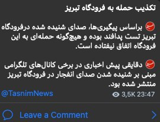

↩️ Quoted tweet: Shin ✓ @hey_itsmyturn Sun, 07 Jun 2026 19:43:42 UTC Explosions north of Tabriz airport, East Azerbaijan Province, #Iran ↩️ توییت نقل‌قول شده — برای پاسخ، پست زیر را ببینید. فارسی انفجارهایی در شمال فرودگاه تبریز، استان آذربایجان شرقی،…

## Shin_Persian — post 6663

↩️ Quoted tweet:
Shin ✓ @hey_itsmyturn
Sun, 07 Jun 2026 19:43:42 UTC

Explosions north of Tabriz airport,
East Azerbaijan Province, #Iran

↩️ توییت نقل‌قول شده — برای پاسخ، پست زیر را ببینید.

فارسی

انفجارهایی در شمال فرودگاه تبریز،
استان آذربایجان شرقی، #Iran

𝕏 · @shin_persian

## Shin_Persian — post 6662

  <a href="telegram/content/Shin_Persian_6662_1780866624.mp4" target="_blank">🎬 Download video</a>

Shin ✓ @hey_itsmyturn
Sun, 07 Jun 2026 20:50:21 UTC

𝕏 · @shin_persian

## Shin_Persian — post 6661

Shin ✓ @hey_itsmyturn
Sun, 07 Jun 2026 20:47:34 UTC

Too many birds taking off from Mehrabad airport, a bunch of them are civilians, and a number are IRIAF jets.

فارسی

تعداد زیادی پرنده در حال برخاستن از فرودگاه مهرآباد هستند، تعدادی از آن‌ها غیرنظامی و تعدادی دیگر جت‌های نیروی هوایی ارتش جمهوری اسلامی ایران (نهاجا) هستند.

𝕏 · @shin_persian

## Shin_Persian — post 6660

Shin ✓ @hey_itsmyturn
Sun, 07 Jun 2026 20:40:41 UTC

Found the OP
https://t.me/aqvalanam/31796

فارسی

پست اصلی (OP) را پیدا کردم
https://t.me/aqvalanam/31796

𝕏 · @shin_persian

## Shin_Persian — post 6659

↩️ Quoted tweet:  𝓂𝒶𝓇𝒾𝑜🇱🇧🇬🇧🇦🇪 ✓ @MarioLeb79 Sun, 07 Jun 2026 20:08:18 UTC 🚨Trump to Barak Ravid: I will call Netanyahu now - and tell him not to attack Iran ↩️ توییت نقل‌قول شده — برای پاسخ، پست زیر را ببینید. فارسی 🚨 ترامپ به باراک راوید: اکنون با نتانیاهو…

## Shin_Persian — post 6658

↩️ Quoted tweet:
 𝓂𝒶𝓇𝒾𝑜🇱🇧🇬🇧🇦🇪 ✓ @MarioLeb79
Sun, 07 Jun 2026 20:08:18 UTC

🚨Trump to Barak Ravid: I will call Netanyahu now - and tell him not to attack Iran

↩️ توییت نقل‌قول شده — برای پاسخ، پست زیر را ببینید.

فارسی

🚨 ترامپ به باراک راوید: اکنون با نتانیاهو تماس خواهم گرفت و به او خواهم گفت که به ایران حمله نکند.

𝕏 · @shin_persian

## Shin_Persian — post 6657

Emanuel (Mannie) Fabian ✓ @manniefabian
Sun, 07 Jun 2026 20:28:16 UTC

Following Iran's ballistic missile attack on Israel, IDF Spokesman Brig. Gen. Effie Defrin in a press conference says that Chief of Staff Lt. Gen. Eyal Zamir is conducting an assessment and is "approving plans for the future."

"The Iranian terror regime made a grave mistake," he says.

فارسی

در پی حمله موشک‌های بالستیک ایران به اسرائیل، سرتیپ افی دفرین، سخنگوی ارتش دفاعی اسرائیل (IDF) در یک کنفرانس خبری اعلام کرد که سپهبد ایال زمیر، رئیس ستاد کل ارتش، در حال انجام یک ارزیابی است و «طرح‌هایی را برای آینده تصویب می‌کند.»

او می‌گوید: «رژیم تروریستی ایران مرتکب اشتباه بزرگی شد.»

𝕏 · @shin_persian

## Shin_Persian — post 6656

  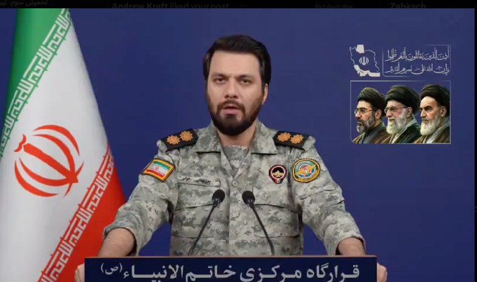

Shin ✓ @hey_itsmyturn
Sun, 07 Jun 2026 20:17:41 UTC

This dingus (IRGC Khatam Spox) is back on air again, warns IDF for further and stronger strikes against Israel and "its supporters" if IDF strikes back or targets Beirut again.

فارسی

این احمق (سخنگوی قرارگاه خاتم‌الانبیا سپاه پاسداران) دوباره روی آنتن آمده و به ارتش دفاعی اسرائیل (IDF) هشدار می‌دهد که در صورت پاسخ اسرائیل یا هدف قرار دادن دوباره بیروت، حملات بیشتر و قوی‌تری علیه اسرائیل و «حامیانش» انجام خواهد شد.

𝕏 · @shin_persian

## Shin_Persian — post 6655

  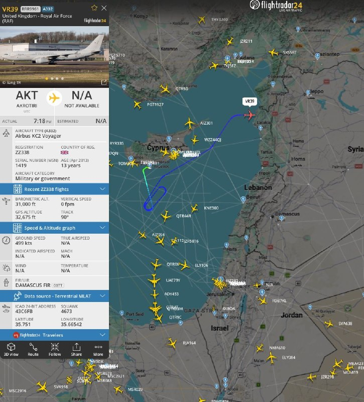

Shin ✓ @hey_itsmyturn
Sun, 07 Jun 2026 20:13:34 UTC

Scramble from RAF akrotiri 🇬🇧

فارسی

اسکرامبل (پرواز اضطراری) از پایگاه هوایی اکروتیری نیروی هوایی سلطنتی بریتانیا (RAF) 🇬🇧

𝕏 · @shin_persian

## Shin_Persian — post 6654

  <a href="telegram/content/Shin_Persian_6654_1780866627.mp4" target="_blank">🎬 Download video</a>

OSINTtechnical ✓ @Osinttechnical
Sun, 07 Jun 2026 19:47:03 UTC

Israeli interceptors seen engaging Iranian ballistic missiles over northern Israel a few moments ago.

فارسی

رهگیرهای اسرائیلی چند لحظه پیش در حال درگیری با موشک‌های بالستیک ایرانی برفراز شمال اسرائیل دیده شدند.

𝕏 · @shin_persian

## Shin_Persian — post 6653

  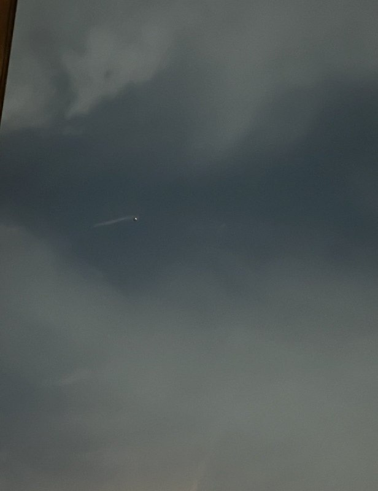

Shin ✓ @hey_itsmyturn
Sun, 07 Jun 2026 20:10:34 UTC

Earlier @ 1926Z
Southwestern Tehran, #Tehran Province, #Iran

فارسی

پیش‌تر در ۱۹۲۶ زولو (۲۲:۵۶ به وقت تهران)
جنوب غربی تهران، استان #تهران، #ایران

𝕏 · @shin_persian

## Shin_Persian — post 6652

Shin ✓ @hey_itsmyturn
Sun, 07 Jun 2026 20:08:27 UTC

GPS jamming in Iran.

فارسی

اختلال در جی‌پی‌اس (GPS) در ایران.

𝕏 · @shin_persian

## Shin_Persian — post 6651

Shin ✓ @hey_itsmyturn
Sun, 07 Jun 2026 20:06:55 UTC

Iraqi FIR will REMAIN closed for 72 hours.
#Iraq 🇮🇶

فارسی

منطقه اطلاعات پروازی (FIR) عراق به مدت ۷۲ ساعت بسته باقی خواهد ماند.
#Iraq 🇮🇶

𝕏 · @shin_persian

## Shin_Persian — post 6650

  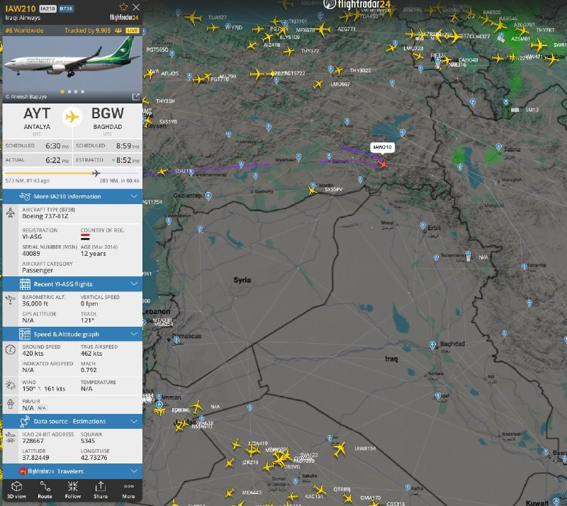

Shin ✓ @hey_itsmyturn
Sun, 07 Jun 2026 20:05:39 UTC

Iraqi FIR is closed at the moment.

فارسی

حریم هوایی عراق (FIR) در حال حاضر بسته است.

𝕏 · @shin_persian

## Shin_Persian — post 6649

Shin ✓ @hey_itsmyturn
Sun, 07 Jun 2026 20:04:29 UTC

IRIB: Airspace over Western Iran has been closed.

فارسی

صدا و سیما (IRIB): حریم هوایی بر فراز غرب ایران بسته شده است.

𝕏 · @shin_persian

## FarsiVOA — post 219938

🔺تلاش پرزیدنت ترامپ برای جلوگیری از ادامه تقابل نظامی اسرائیل و جمهوری اسلامی

▪️در پی حمله موشکی جمهوری اسلامی به اسرائيل،‌ باراک راوید، خبرنگار آکسیوس اعلام کرد پرزیدنت ترامپ به او گفته است «همین الان» با نخست وزیر اسرائیل تماس می‌گیرد و به او می‌گوید که به حملات رژیم ایران پاسخ ندهد و «حمله متقابل نکند.»

⬇️ بیشتر بخوانید:
https://ir.voanews.com/a/8158262.html
@FarsiVOA

## FarsiVOA — post 219937

  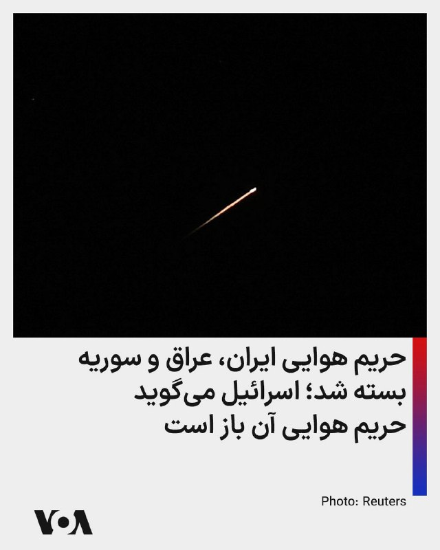

⚡️در پی حملات موشکی جمهوری اسلامی به اسرائيل، بخش‌هایی از آسمان ایران به روی پروازها بسته شد. همچنین عراق و سوریه نیز به‌طور موقت آسمان خود را بستند. اما به گزارش تایمز اسرائيل، وزیر حمل و نقل اسرائيل گفت حریم هوایی این کشور همچنان باز است و پروازها طبق برنامه ادامه دارد.
@FarsiVOA

## FarsiVOA — post 219936

  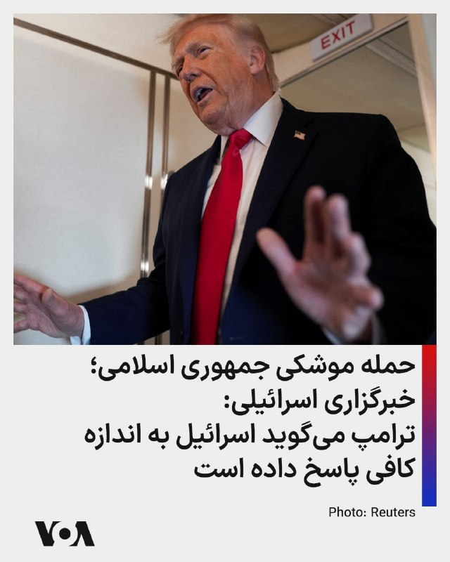

⚡️خبرگزاری کان اسرائيل گزارش داد که دونالد ترامپ، رئیس جمهوری آمریکا، عصریکشنبه به وقت واشنگتن، با این خبرگزاری مصاحبه کرد و درباره حمله جمهوری اسلامی به خاک اسرائیل گفت: «به نظر من اسرائیل به اندازه کافی پاسخ داده است، دیگر نیازی به پاسخ ندارند. ما می‌توانیم پس از ۳۰۰۰ سال به صلح دست یابیم.»
@FarsiVOA

## FarsiVOA — post 219935

  

⚡️سخنگوی ارتش اسرائیل، افی دفرین، می‌گوید پس از حمله موشکی بالستیک جمهوری اسلامی ایران به اسرائیل، ایال زمیر، رئیس ستاد ارتش اسرائيل، در حال انجام ارزیابی و تصویب برنامه‌های آینده است. سخنگوی ارتش اسرائيل گفت: «رژیم تروریستی ایران اشتباه بزرگی مرتکب شد.»
@FarsiVOA

## FarsiVOA — post 219934

  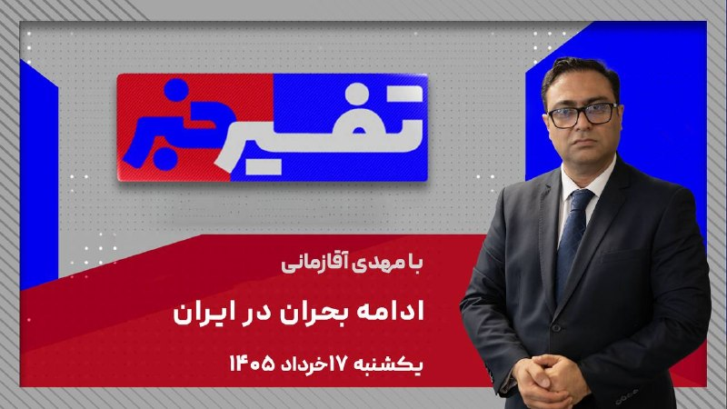

🎯این برنامه از تفسیر خبر را با اجرای مهدی آقازمانی هم اکنون در یوتیوب صدای آمریکا مشاهده بفرمایید:
👇👇👇👇👇
https://www.youtube.com/live/kVVTjngrjWc
🔴سابسکرایب یوتیوب صدای آمریکا را فراموش نکنید:
https://youtube.com/@voafarsi

این پست را با دوستانتان به اشتراک بگذارید
@FarsiVOA

## FarsiVOA — post 219933

  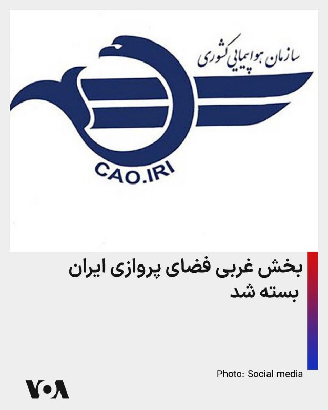

⚡️در ایران، سخنگوی «سازمان هواپیمایی كشوری» گفت بخش غربی فضای پروازی ایران تا اطلاع ثانوی بسته است.
@FarsiVOA

## FarsiVOA — post 219932

  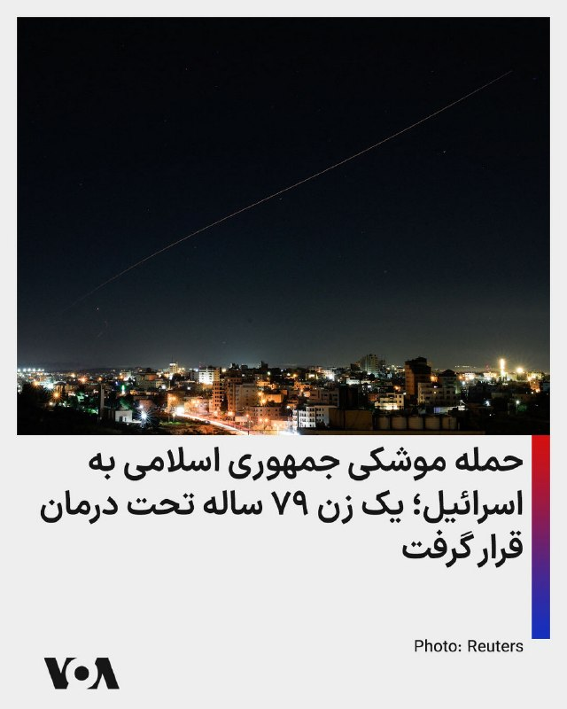

⚡️به گزارش تایمز اسرائيل، یک زن ۷۹ ساله در اسرائيل که در جریان حمله موشکی شبانه جمهوری اسلامی به شمال اسرائیل، در مسیر رفتن به پناهگاه به سرش ضربه خورده، تحت درمان قرار گرفته است.

@FarsiVOA

## FarsiVOA — post 219931

  <a href="telegram/content/FarsiVOA_219931_1780866632.mp4" target="_blank">🎬 Download video</a>

⚡️حمله اسرائیل به ضاحیه در جنوب بیروت با پاسخ موشکی جمهوری اسلامی همراه شد. ارتش اسرائیل می‌گوید همه موشک‌های شلیک‌شده تاکنون رهگیری شده‌اند.
@FarsiVOA

## FarsiVOA — post 219930

  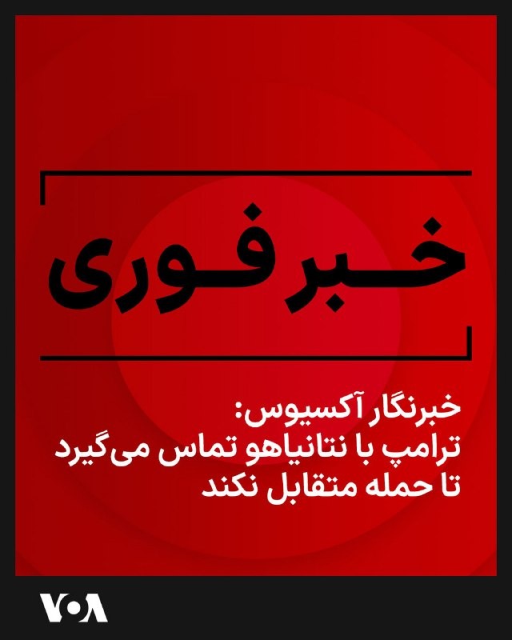

⚡️در پی حمله موشکی جمهوری اسلامی به اسرائيل،‌ باراک راوید، خبرنگار آکسیوس می‌گوید پرزیدنت ترامپ به او گفت: »همین الان با نتانیاهو تماس می‌گیرم و به او می‌گویم که حمله متقابل نکند.»
@FardiVOA

## FarsiVOA — post 219929

🔺گزارش‌ها از شلیک موشک‌ها از چند استان در ایران

◾️رسانه‌های وابسته به جمهوری اسلامی شامگاه یکشنبه ۱۷ خرداد از چند موج حمله موشکی به شهرهای اسرائیل خبر دادند.

⬇️ بیشتر بخوانید:
https://ir.voanews.com/a/8158257.html
@FarsiVOA

## FarsiVOA — post 219928

  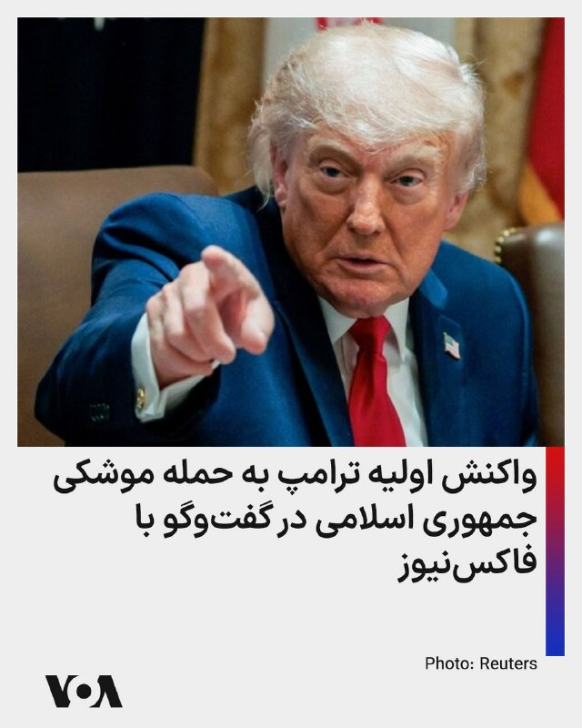

⚡️خبرنگار فاکس‌نیوز، تری یینگست، می‌گوید با رئیس جمهوری آمریکا، دونالد ترامپ صحبت کرده است و آقای ترامپ به فاکس نیوز گفت: «آنچه به [جمهوری اسلامی] ایران پیشنهاد می‌کنم این است که شما موشک‌هایتان را شلیک کرده‌اید، دیگر کافی است. به میز مذاکره برگردید و توافق کنید.»
@FarsiVOA

## DW_Farsi — post 125664

  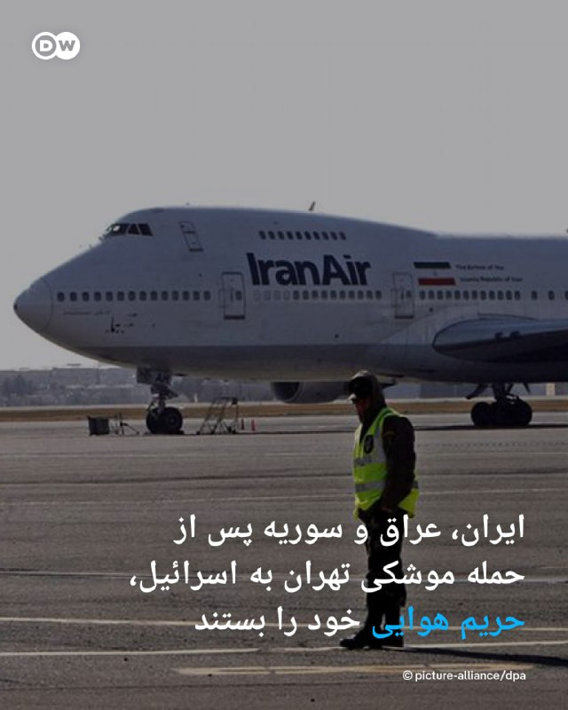

🔶 ایران، عراق و سوریه پس از حمله موشکی تهران به اسرائیل، حریم هوایی خود را بستند

ایران پس از شلیک موشک‌ها به سمت اسرائیل، در پاسخ به آخرین حمله این کشور به لبنان، حریم هوایی بخش‌های غربی خود را بست.

مجید اخوان، سخنگوی سازمان هواپیمایی کشوری در بیانیه‌ای که توسط خبرگزاری ایرنا منتشر شد، اعلام کرد: «به دلیل ارزیابی‌های ایمنی و امنیتی، حریم هوایی بخش غربی کشور تا اطلاع ثانوی بسته اعلام شد.»

مقامات هوانوردی غیرنظامی به خبرگزاری رویترز گفتند، عراق نیز پس از این حملات، حریم هوایی خود را به طور موقت بسته و ناوبری هوایی را به دلایل مربوط به ایمنی ترافیک هوایی به حالت تعلیق درآورده است.

سازمان هواپیمایی کشوری عراق اعلام کرد، "حریم هوایی این کشور به مدت ۷۲ ساعت بسته خواهد ماند".

سوریه نیز حریم هوایی مناطق جنوبی خود را به طور موقت برای ۱۲ ساعت بست و فعالیت‌های فرودگاه دمشق را به حالت تعلیق درآورد.
@dw_farsi

## DW_Farsi — post 125663

  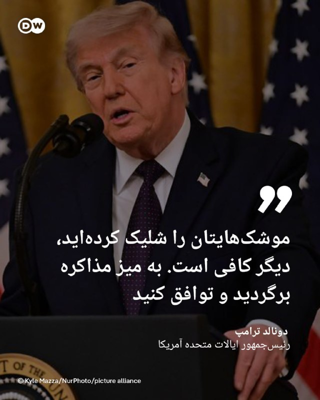

🔶 ترامپ پس از حملات موشکی ایران به اسرائيل: کافی است، به میز مذاکره برگردید و توافق کنید

در پی حملات موشکی ایران به شمال اسرائیل که در پاسخ به حملات ارتش اسرائیل علیه حزب‌الله در بیروت انجام شد، دونالد ترامپ، رئیس‌جمهور ایالات متحده، از تهران خواست، به میز مذاکره بازگردد و با واشنگتن به توافق برسد.

ترامپ در مصاحبه تلفنی با فاکس نیوز گفت: «پیشنهاد من به ایران این است: شما موشک‌هایتان را شلیک کرده‌اید، دیگر کافی است. به میز مذاکره برگردید و توافق کنید.»

ترامپ همچنین تاکید کرد، حملات موشکی ایران به شمال اسرائیل به مذاکرات با تهران، که به گفته او چند روز تا رسیدن به توافق فاصله داشت، کمکی نخواهد کرد.

او از حملات قبلی اسرائیل علیه اهداف حزب‌الله در بیروت که باعث حملات ایران شد، ابراز ناامیدی کرد و گفت: «ما خیلی به توافق نزدیک هستیم. به نظرم توافق دوشنبه، سه‌شنبه یا چهارشنبه هفته آینده امضا خواهد شد و حالا این اتفاق دارد می‌افتد.»

رئیس‌جمهور آمریکا همچنین اعلام کرد، به زودی با بنیامین نتانیاهو، نخست‌وزیر اسرائیل، تماس خواهد گرفت تا از او بخواهد، به حملات موشکی ایران به شمال اسرائیل پاسخ ندهد.
@dw_farsi

## DW_Farsi — post 125662

  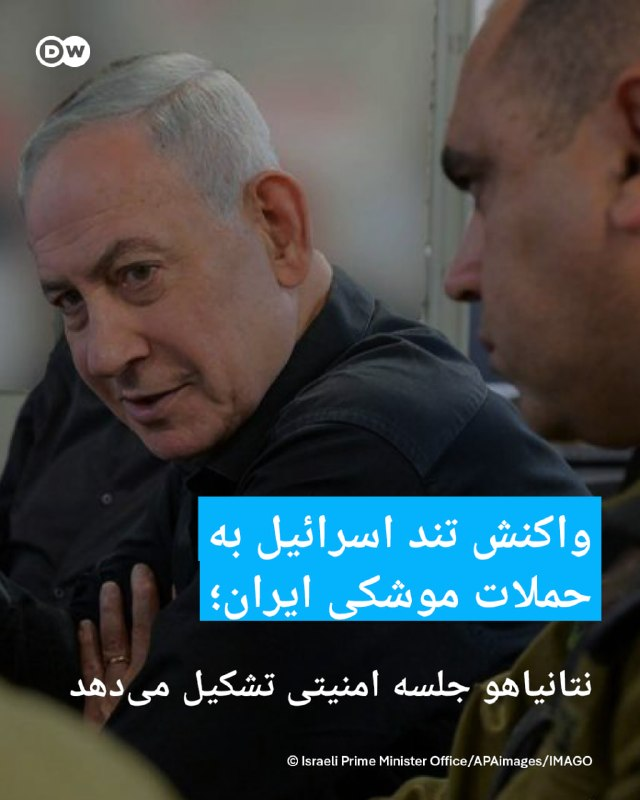

🔶 واکنش تند اسرائیل به حملات موشکی ایران؛ نتانیاهو جلسه امنیتی تشکیل می‌دهد

به گزارش رسانه‌های اسرائیلی، مقامات ارشد این کشور اعلام کرده‌اند، اسرائیل به حملات موشکی ایران "پاسخی کوبنده" خواهد داد.

شبکه ۱۲ تلویزیون اسرائیل در این رابطه گزارش داد، مقامات این کشور تاکید کرده‌اند، "نمی‌توانند اجازه دهند" معادله جدیدی شکل بگیرد که در آن، ایران در پاسخ به حملات اسرائیل علیه مواضع حزب‌الله در بیروت، خاک این کشور را هدف قرار دهد.

هنوز هیچ موضع‌گیری رسمی و علنی از سوی دولت اسرائیل درباره این حملات موشکی مداوم منتشر نشده است اما گزارش‌ها حاکی از آن است، بنیامین نتانیاهو، نخست‌وزیر اسرائیل، همراه مقامات ارشد نظامی و امنیتی، به زودی یک جلسه اضطراری برای ارزیابی وضعیت امنیتی برگزار خواهند کرد.

در همین حال، شبکه ۱۳ تلویزیون اسرائیل گزارش داد، در جریان گفت‌و‌گوهای اولیه با نتانیاهو، ارزیابی مقامات امنیتی این است که تهران به دنبال یک جنگ فراگیر و همه‌جانبه نیست، بلکه تلاش می‌کند با این اقدام، یک پاسخ محدود برای نشان دادن حمایت خود از حزب‌الله لبنان ارسال کند.
@dw_farsi

## DW_Farsi — post 125660

  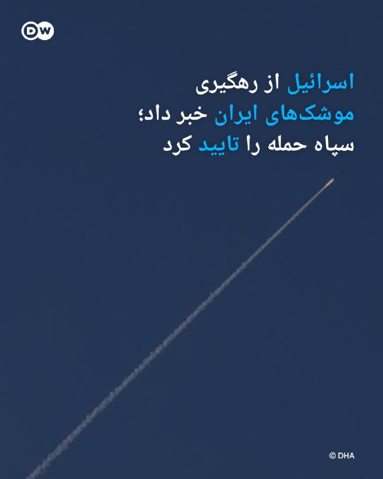

🔶 اسرائیل از رهگیری موشک‌های ایران خبر داد؛ سپاه حمله را تایید کرد

به دنبال تشدید بی‌سابقه تنش‌ها در منطقه، ارتش اسرائیل شامگاه یکشنبه اعلام کرد، موشک‌هایی را که از ایران به سمت خاک اسرائیل شلیک شده بودند، شناسایی و رهگیری کرده است.

بر اساس بیانیه رسمی ارتش اسرائیل، در پی شناسایی این پرتابه‌ها، آژیرهای هشدار در چندین منطقه در سراسر این کشور به صدا درآمدند و سامانه‌های پدافند هوایی بلافاصله برای مقابله با این تهدید فعال شدند.

مقامات نظامی اسرائیل اندکی بعد ضمن اعلام رهگیری تمامی موشک‌های شلیک‌شده، هشدار دادند، نشانه‌هایی از احتمال آغاز موج بعدی حملات موشکی به چشم می‌خورد. بر اساس گزارش‌ها، ایران طی یک ساعت گذشته حدود ۱۰ موشک بالستیک را در چندین حمله به شمال اسرائیل شلیک کرده است.

این تبادل آتش سنگین چند ساعت پس از آن رخ داد که ارتش اسرائیل منطقه ضاحیه در جنوب بیروت را هدف قرار داد؛ اقدامی که پیش‌تر با هشدار و تهدید به پاسخ متقابل از سوی جمهوری اسلامی روبرو شده بود.
@dw_farsi

## Persian_Trend_Official — post 16002

  <a href="telegram/content/Persian_Trend_Official_16002_1780866635.mp4" target="_blank">🎬 Download video</a>

The IDF is launching strikes against southern Lebanon. حملات مجدد ارتش اسرائیل به جنوب لبنان

## Persian_Trend_Official — post 16001

  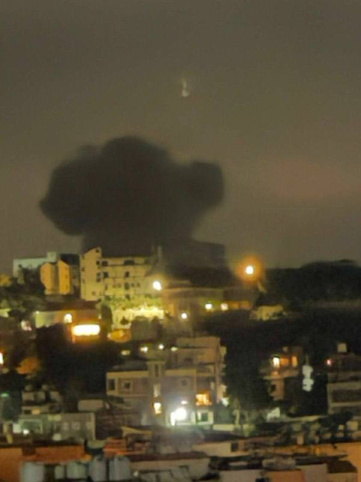

The IDF is launching strikes against southern Lebanon.

حملات مجدد ارتش اسرائیل به جنوب لبنان

## Persian_Trend_Official — post 16000

نفتالی بنت:

«این لحظه‌ آشکار شدن حقیقت است: اینکه آیا اسرائیل یک کشور مستقل است که قادر به دفاع از خود است یا خیر.

خویشتنداری یا واکنش نمادین به دشمنان ما نشان می‌دهد که خون شهروندان ما پایمال شده است؛ بنابراین، اسرائیل باید با قدرت و اثربخشی عمل کند.

در این مورد، همه ما - همه شهروندان اسرائیل - در کنار هم ایستاده‌ایم.»

## Persian_Trend_Official — post 15999

⭕️ دوستان عزیز در ایران، ممکن است شرایطی پیش بیاید که دیگر نتوانید آنلاین شوید. کسانی که این پیام را می‌بینید، مراحل زیر را روی اکانت تلگرام خود انجام دهید:

🚨 زبان فارسی:
تنظیمات > حریم خصوصی و امنیت > حذف اکانت در صورت عدم فعالیت > ۲۴ ماه

🚨 زبان انگلیسی:
Settings > Privacy and Security > Delete My Account If Away For > 24 months

📝 Nick

📌 @persian_trend_official
پرشین ترند | متفاوت‌ترین کانال نظامی

## Persian_Trend_Official — post 15998

📢 دوستان عزیز، الان که وضعیت اینترنت تا حدی بهتر شده، حتماً زمانی را برای به‌روزرسانی دستگاه‌ها و اپلیکیشن‌هایتان اختصاص دهید. 🔒 ✅ قدم اول: سیستم‌عامل گوشی هوشمندتان را از بخش تنظیمات به آخرین نسخه موجود آپدیت کنید. ✅ قدم دوم: تلگرام را از منبع رسمی دانلود…

## Persian_Trend_Official — post 15997

⭕️ نفتالی بنت:

«این لحظه آشکار شدن حقیقت است: اینکه آیا اسرائیل کشوری مستقل است که قادر به دفاع از خود است یا خیر.

خویشتنداری یا واکنش نمادین به دشمنان ما نشان می‌دهد که خون شهروندان ما پایمال شده است؛ بنابراین، اسرائیل باید با قدرت و اثربخشی عمل کند.

در این مورد، همه ما، تمام شهروندان اسرائیل، در کنار هم ایستاده‌ایم.»

📝 Nick

📌 @persian_trend_official
پرشین ترند | متفاوت‌ترین کانال نظامی

## Persian_Trend_Official — post 15996

⭕️ سخنگوی ارتش اسرائیل: ما حملات خود به سراسر خاک لبنان را ادامه خواهیم داد و اجازه نخواهیم داد ایران معادله‌ای جدید علیه لبنان ایجاد کند.

📝 Nick

📌 @persian_trend_official
پرشین ترند | متفاوت‌ترین کانال نظامی

## Persian_Trend_Official — post 15995

  <a href="telegram/content/Persian_Trend_Official_15995_1780866637.webm" target="_blank">🎬 Download video</a>

⭕️ هم اکنون تماس تلفنی نخست وزیر بنیامین نتانیاهو و رئیس جمهور دونالد ترامپ آغاز شده است‌.

📝 Nick

📌 @persian_trend_official
پرشین ترند | متفاوت‌ترین کانال نظامی

## Persian_Trend_Official — post 15994

  <a href="telegram/content/Persian_Trend_Official_15994_1780866637.webm" target="_blank">🎬 Download video</a>

⭕️ با وجود تشدید تنش‌ها: کمیته قانون اساسی اعلام کرد که فردا طبق معمول در مورد قانون تشکیل کمیته تحقیقات سیاسی در مورد قتل عام ۷ اکتبر رأی‌گیری خواهد کرد - در حالی که بقیه بحث‌ها لغو خواهد شد.

📝 Nick

📌 @persian_trend_official
پرشین ترند | متفاوت‌ترین کانال نظامی

## Persian_Trend_Official — post 15993

  <a href="telegram/content/Persian_Trend_Official_15993_1780866638.webm" target="_blank">🎬 Download video</a>

یکی تو یه گروه تلگرامی: "اسرائیل گنبد آهنین داره، ملاها گنبد دونالد"

📝 Nick

📌 @persian_trend_official
پرشین ترند | متفاوت‌ترین کانال نظامی

## Persian_Trend_Official — post 15992

  <a href="telegram/content/Persian_Trend_Official_15992_1780866638.webm" target="_blank">🎬 Download video</a>

⭕️ پس از تیراندازی ایران، جلسات محاکمه بنیامین نتانیاهو، نخست وزیر، لغو شد.

اداره دادگاه از وزیر دادگستری خواسته است تا اطلاعیه ویژه وضعیت اضطراری را امضا کند.

دادگاه‌ها مطابق با مقررات ویژه اضطراری، فقط برای جلسات فوری آماده خواهند بود.

📝 Nick

📌 @persian_trend_official
پرشین ترند | متفاوت‌ترین کانال نظامی

## Persian_Trend_Official — post 15991

  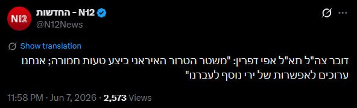

سخنگوی ارتش اسرائیل، سرتیپ افی دافرین، گفت: «رژیم تروریستی ایران اشتباه بزرگی مرتکب شد؛ ما برای احتمال آتش‌افروزی بیشتر به سمت خود آماده‌ایم.»

📝 Nick

📌 @persian_trend_official
پرشین ترند | متفاوت‌ترین کانال نظامی

## Persian_Trend_Official — post 15990

  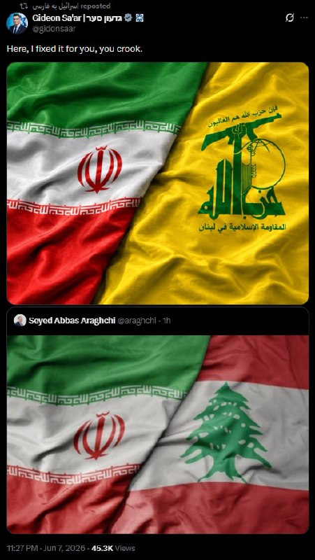

⭕️ عراقچی: 📝 Nick 📌 @persian_trend_official پرشین ترند | متفاوت‌ترین کانال نظامی

## Persian_Trend_Official — post 15989

  <a href="telegram/content/Persian_Trend_Official_15989_1780866639.mp4" target="_blank">🎬 Download video</a>

⭕️ تامیر موراگ در مورد واکنش ضعیف ترامپ به شلیک ایران به سمت اسرائیل: «این مرحله‌ای است که باید به او بگوییم که به منافع اسرائیل متعهد هستیم.»

📝 Nick

📌 @persian_trend_official
پرشین ترند | متفاوت‌ترین کانال نظامی

## Persian_Trend_Official — post 15987

  <a href="telegram/content/Persian_Trend_Official_15987_1780866642.webm" target="_blank">🎬 Download video</a>

⭕️ کانال 14 اسرائیل:
ترامپ در مصاحبه با شبکه خبری ۱۴: «همه چیز خوب خواهد شد - پس از ۳۰۰۰ سال صلح در خاورمیانه برقرار خواهد شد»

📝 Nick

📌 @persian_trend_official
پرشین ترند | متفاوت‌ترین کانال نظامی

## Persian_Trend_Official — post 15986

  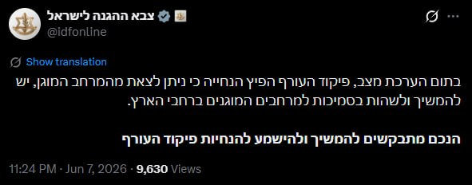

پس از ارزیابی وضعیت، فرماندهی جبهه داخلی دستورالعمل‌هایی صادر کرد مبنی بر اینکه می‌توان منطقه حفاظت‌شده را ترک کرد، اما باید همچنان در نزدیکی مناطق حفاظت‌شده در سراسر کشور بمانید.

از شما درخواست می‌شود که همچنان از دستورالعمل‌های فرماندهی جبهه داخلی پیروی کنید.

📝 Nick

📌 @persian_trend_official
پرشین ترند | متفاوت‌ترین کانال نظامی

## Persian_Trend_Official — post 15985

کانال رسمی پرشین ترند pinned «🚨 با توجه به شرایط فعلی تیم تراست vpn قیمتاشون رو کاهش دادن تا از سروری که برای نت ملی(شرایط جنگی) هم مناسبه هم استفاده کنین ⭕️ اگر برای نت ملی vpn می‌خواهین حتما یه پیام بدین بهشون 👇👇 @trusstvpnn_admin @trusstvpnn_admin»

## Persian_Trend_Official — post 15984

🚨 با توجه به شرایط فعلی تیم تراست vpn
قیمتاشون رو کاهش دادن تا از سروری که برای نت ملی(شرایط جنگی) هم مناسبه هم استفاده کنین

⭕️ اگر برای نت ملی vpn می‌خواهین حتما یه پیام بدین بهشون
👇👇

@trusstvpnn_admin
@trusstvpnn_admin

## Persian_Trend_Official — post 15983

⭕️ خبرگزاری CNN:

اسرائیل برای حملات بسیار سنگین به ایران آماده می‌شود.

📝 Nick

📌 @persian_trend_official
پرشین ترند | متفاوت‌ترین کانال نظامی

## RadioFarda — post 158019

ارتش اسرائیل: ایران با شلیک موشک‌ها «اشتباهی بزرگ» مرتکب شد

🔸ارتش اسرائیل روز یک‌شنبه ۱۸ خرداد اعلام کرد ایران با شلیک موجی از موشک‌ها به سوی اسرائیل «اشتباهی بزرگ» مرتکب شده است.

🔸افی دفرین، سخنگوی ارتش اسرائیل، گفت: «رژیم تروریستی ایران بار دیگر با انتخاب مسیر ترور، اشتباهی بزرگ مرتکب شده است.»

🔸آژیرهای خطر روز یک‌شنبه در اسرائیل به صدا درآمد و ارتش این کشور اعلام کرد سامانه‌های پدافندی آن در حال رهگیری چند موج موشک شلیک‌شده از ایران هستند. این نخستین حمله موشکی ایران به اسرائیل از زمان برقراری آتش‌بس هشتم آوریل در جنگ خاورمیانه است.

🔸سپاه پاسداران این حمله را «هشدار» خواند و گفت این اقدام در واکنش به حمله اسرائیل به ضاحیه جنوبی بیروت انجام شده است. دفتر بنیامین نتانیاهو، نخست‌وزیر اسرائیل، پیشتر اعلام کرده بود ارتش این کشور یک «مرکز فرماندهی شبه‌نظامیان» را در ضاحیه هدف قرار داده است.

🔸وزارت بهداشت لبنان اعلام کرد حمله اسرائیل به ضاحیه دو کشته و ۲۰ زخمی بر جای گذاشت. حزب‌الله نیز تأیید کرد که صبح یک‌شنبه به دو پایگاه ارتش اسرائیل موشک و پهپاد شلیک کرده بود.

🔸در تهران، محمدباقر قالیباف، رئیس مجلس و مذاکره‌کننده ارشد ایران در گفت‌وگوها با واشینگتن، آمریکا را متهم کرد که برای حمله به بیروت «چراغ سبز» داده و گفت دارایی‌ها و منافع آمریکا و اسرائیل اکنون «اهداف مشروع» هستند.

🔸قرارگاه خاتم‌الانبیا نیز اعلام کرد اسرائیل با حمله به بیروت «از همه خطوط قرمز عبور کرده» و خواستار توقف عملیات اسرائیل در لبنان شد.

@RadioFarda

## RadioFarda — post 158018

وزیر خارجه ایران با مقام‌های بریتانیا، ترکیه و پاکستان گفت‌وگو کرد

🔸وزیر خارجه ایران می‌گوید پس از «پاسخ ایران به نقض مکرر آتش‌بس در لبنان» از سوی اسرائیل، با مقام‌هایی از بریتانیا، ترکیه و پاکستان گفت‌وگو کرده است.

🔸عباس عراقچی در تلگرام نوشت که با ایوت کوپر، وزیر خارجه بریتانیا، و هاکان فیدان، وزیر خارجه ترکیه، گفت‌وگو کرده است.

🔸او همچنین گفت با عاصم منیر، فرمانده ارتش پاکستان، گفت‌وگو کرده است؛ فردی که در تلاش‌های میانجی‌گرانه میان آمریکا و ایران نقشی کلیدی داشته است.

@RadioFarda

## RadioFarda — post 158017

  <a href="https://t.me/radiofarda/158017" target="_blank">📎 Download file</a>

📻بشنوید: سرخط خبرهای نیمه‌شب با رادیوفردا، ۱۸ خرداد ۱۴۰۵‌

@RadioFarda

## RadioFarda — post 158016

ترامپ: حملات ایران به کسی آسیبی نرساند، امیدوارم اسرائیل تلافی نکند

🔸درپی اعلام خبر حمله موشکی ایران به اسرائیل در شامگاه یک‌شنبه، دونالد ترامپ، رئیس‌جمهور آمریکا، در گفت‌وگویی تلفنی با خبرنگار اکسیوس گفت: «همین حالا با بی‌بی (بنیامین نتانیاهو) تماس می‌گیرم و به او می‌گویم تلافی نکند. هر دو طرف کار خودشان را کرده‌اند. اسرائیل حمله خود را انجام داد و ایران هم حمله خود را انجام داد. دیگر نیازی به حمله دیگری نیست.»

🔸دونالد ترامپ در این گفت‌وگو افزود: «حملات ایران به کسی آسیبی نرساند. امیدوارم اسرائیل تلافی نکند. اگر بی‌بی (بنیامین نتانیاهو) پاسخ بدهد، این ماجرا همان‌طور که در ۴۷ سال گذشته، یا حتی در ۳۰۰۰ سال گذشته، ادامه داشته، باز هم ادامه پیدا خواهد کرد.»

🔸ترامپ افزود: «ما به یک توافق نهایی با ایران بسیار نزدیک هستیم. این توافق، توافق خوبی خواهد بود. نمی‌خواهم به خاطر اتفاقاتی که اکنون در حال رخ دادن است، این روند از بین برود.»

🔸این اتفاق چند ساعت بعد از آن رخ داد که ارتش اسرائیل منطقه ضاحیه در جنوب بیروت را هدف قرار داد و ایران تهدید کرد به این حمله پاسخ خواهد داد.

🔸یک منبع ارشد ایرانی هم به خبرگزاری رویترز گفته است که «ایران به هر حمله اسرائیل با نیرویی شدیدتر پاسخ خواهد داد.«

🔸ارتش اسرائیل اعلام کرده است همه موشک‌هایی را که تاکنون از سوی ایران شلیک شده‌اند رهگیری کرده است.

@RadioFarda

## RadioFarda — post 158015

🔸ارتش اسرائیل شامگاه یکشنبه اعلام کرد که موشک‌هایی را که از ایران به سمت خاک اسرائیل شلیک شده بودند رهگیری کرده است.

🔸این اتفاق چند ساعت بعد از آن رخ داد که ارتش اسرائیل منطقه ضاحیه در جنوب بیروت را هدف قرار داد و ایران تهدید کرد به این حمله پاسخ خواهد داد.

🔸دونالد ترامپ، رئیس‌جمهور آمریکا، دقایقی بعد از حملات موشکی ایران به اسرائیل خواستار توقف این حملات و بازگشت تهران به میز مذاکره شد.

@RadioFarda

## RadioFarda — post 158014

  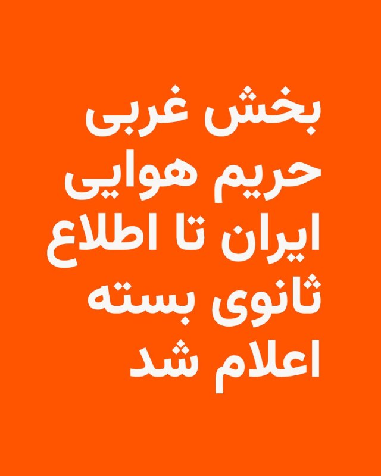

🔸سخنگوی سازمان هواپیمایی ایران از بسته شدن بخش غربی فضای پروازی این کشور تا اطلاع ثانوی خبر داد.

🔸همچنین بر اساس گزارش‌ها در پی حملات ایران به اسرائیل، آسمان عراق نیز بسته شده است.

@RadioFarda

## IranianMinds — post 21686

@IranianMinds

## IranianMinds — post 21685

🔴 فرودگاه مهرآباد داره تخلیه میشه.

@IranianMinds

## IranianMinds — post 21684

🔴 نفتالی بنت، نخست‌وزیر پیشین اسرائیل:

این یک آزمون است: آیا اسرائیل یک کشور مستقل است که توانایی دفاع از خود را دارد؟

سیاست خویشتنداری یا یک پاسخ صرفا نمادین به دشمنان ما این پیام را می‌دهد که ریختن خون شهروندان ما مجاز است.

@IranianMinds

## IranianMinds — post 21683

🔴 حملات هوایی شدید اسرائیل به جنوب لبنان @IranianMinds

## IranianMinds — post 21682

🔴 حملات هوایی شدید اسرائیل به جنوب لبنان

@IranianMinds

## IranianMinds — post 21681

🔴 لیبرمن، وزیر دفاع پیشین اسرائیل:

دیگر زمان سیاست مهار و خویشتنداری گذشته است. باید فوراً پاسخ بدهیم و زیرساخت‌های راهبردی ایران را هدف قرار دهیم !

@IranianMinds

## IranianMinds — post 21680

پاکستان بیناموس خبری ازت نیست

نمیخوای بیای ۲ تا گوهم تو بخوری؟

@IranianMinds

## IranianMinds — post 21679

  <a href="telegram/content/IranianMinds_21679_1780866644.mp4" target="_blank">🎬 Download video</a>

🔴 ترامپ:

و من نصر إِلاَّ مِنْ عندالله الْعَزِيزِ الْحَكِيمِ.

@IranianMinds

## IranianMinds — post 21678

🔴 ترامپ داره تلفنی با نتانیاهو صحبت میکنه الان @IranianMinds

## IranianMinds — post 21677

🔴 ترامپ داره تلفنی با نتانیاهو صحبت میکنه الان

@IranianMinds

## IranianMinds — post 21676

  <a href="telegram/content/IranianMinds_21676_1780866644.mp4" target="_blank">🎬 Download video</a>

🔴 بقایای موشک ایرانی در دشت‌های شمالی شهر تفس در جنوب سوریه سقوط کرد.

@IranianMinds

## IranianMinds — post 21675

  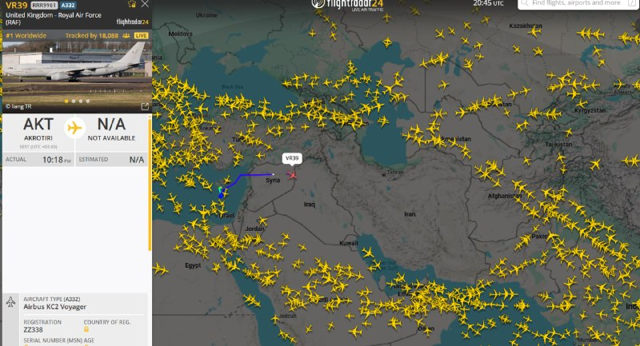

🔴 آسمان ایران , عراق , سوریه , کویت , اردن , اسرائیل کاملا کلیره و فقط یه هوایپیمای نیرو هوایی انگلیس داره میاد سمت خاورمیانه.

@IranianMinds

## IranianMinds — post 21674

🔴 ترامپ به نیویورک پست :

اوضاع عالی داره پیش میره همه چی عالیه اصلا به به دارم لذت میبرم.

@IranianMinds

## IranianMinds — post 21673

🔴 سخنگوی ارتش اسرائیل :

ما به حملات خودمون به سراسر خاک لبنان ادامه خواهیم داد و اجازه نخواهیم داد ایران معادله ای جدید علیه لبنان ایجاد کند !

@IranianMinds

## IranianMinds — post 21672

🔴 سخنگوی ارتش اسرائیل :

هم اکنون رئیس ستاد ارتش در حال تصویب طرح‌هایی برای اقدامات بیشتر در پاسخ به ایران است.

@IranianMinds

## IranianMinds — post 21671

🔴 سخنگوی ارتش اسرائیل :

رژِیم ایران امشب مرتکب خطایی بزرگ و جدی شده است !

@IranianMinds

## IranianMinds — post 21670

🔴 ترامپ :

ما خیلی به توافق با ایران نزدیکیم و نمیخوایم خرابش کنیم.

@IranianMinds

## IranianMinds — post 21669

🔴 مقامات آمریکایی به فاکس نیوز : اگه اسرائیل امشب بخواد به ایران حمله کنه از سمت ایالات متحده هیچ حمایتی نخواهد داشت و به تنهایی باید کارشو انجام بده. @IranianMinds

## IranianMinds — post 21668

🔴 مقامات آمریکایی به فاکس نیوز :

اگه اسرائیل امشب بخواد به ایران حمله کنه از سمت ایالات متحده هیچ حمایتی نخواهد داشت و به تنهایی باید کارشو انجام بده.

@IranianMinds

## IranianMinds — post 21667

  <a href="telegram/content/IranianMinds_21667_1780866647.mp4" target="_blank">🎬 Download video</a>

🔴 ویدیویی که سپاه از حملات امشبش منتشر کرده.

@IranianMinds

## BBCPersian — post 283093

  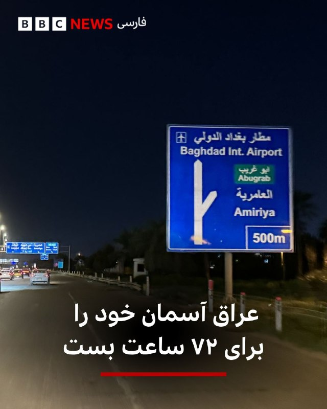

🔻همزمان با حمله موشکی ایران به شمال اسرائیل و اوج گرفتن نگرانی از آغاز درگیری نظامی گسترده میان اسرائیل و ایران، عراق از بستن مرزهای هوایی خود برای ۷۲ ساعت (سه روز آینده) خبر داد.

آسمان این کشور در طول جنگ ۴۰ روزه میان آمریکا و اسرائیل با ایران، بارها محل عبور موشک های ایران یا جنگنده های اسرائیلی بود.

پس از جاری شدن آتش‌بس هم گزارش شد اسرائیل برای هدایت و تقویت حملات خود به ایران در طول جنگ ۴۰ روزه، پایگاه‌های موقت صحرایی در عراق برپا کرده بوده است.

📸 Getty

https://bbc.in/4eafvAI
@BBCPersian

## BBCPersian — post 283092

🔻ترامپ خطاب به ایران: موشک‌هایتان را شلیک کرده‌اید. دیگر بس است. به میز مذاکره برگردید

دونالد ترامپ، رئیس جمهور آمریکا، پس از شلیک موشک‌های ایران به شمال اسرائیل، از ایران خواست تا به میز مذاکره بازگردد.

دونالد ترامپ در گفتگو با شبکه تلویزیونی آمریکایی فاکس نیوز، پیامی را برای ایران به اشتراک گذاشت: «شما موشک‌هایتان را شلیک کرده‌اید. دیگر بس است. به میز مذاکره برگردید و توافق کنید.»

https://bbc.in/4eafvAI
@BBCPersian

## BBCPersian — post 283091

🔻ارتش اسرائیل می‌گوید تمام موشک‌های شلیک شده از ایران را رهگیری کرده است

نیروی هوایی اسرائیل می‌گوید «تاکنون تمام موشک‌های شلیک شده از ایران» را رهگیری کرده است.

نیروی هوایی اسرائیل همچنین گفته است که «به طور مداوم در حال شناسایی و رهگیری تهدیدها» است.

https://bbc.in/4eafvAI
@BBCPersian

## idfinfarsi — post 11810

‼️ رژیم تروریستی ایران در تلاش است معادله‌ای جدید ایجاد کرده و با انجام شلیک مستقیم به خاک ما، در واکنش به حملات ارتش اسرائیل به ضاحیه ، قواعد جدیدی را تحمیل کند - ما اجازه چنین کاری را نخواهیم داد!

⭕️ ما در واکنش به شلیک‌های بی‌وقفه حزب‌الله به سوی شهرک‌ها و مناطق مسکونی شمال اسرائیل دست به حمله زدیم. اجازه نخواهیم داد حملات علیه شهروندان کشور اسرائیل ادامه پیدا کند.

⭕️ ارتش اسرائیل در دفاع و هم در حمله قدرتمند عمل می‌کند. سامانه‌های پدافند هوایی در سراسر کشور مستقر می باشند.

## Dirty_Kids — post 391281

اگر آمریکا واکنش نشان نده یعنی سپاه برای شلیک موشک ها با آمریکا هماهنگ کرده آمریکا هم به اسراییل اطلاع داده و حمله نمادین هست
خواهیم دید چه خواهد شد.

@Dirty_Kids 👻

## Dirty_Kids — post 391280

  

خو اومد زد

@Dirty_Kids 👻

## Dirty_Kids — post 391279

الان پیت هگست در واکنش به حمله ایران به اسرائیل بلند میشه ۲۰ تا دراز نشست میره

## Dirty_Kids — post 391278

امشب نتانیاهو میره مجتبی رو بکشه پتو رو می‌زنه کنار می‌بینه ترامپ جاش خوابیده

## Dirty_Kids — post 391277

🔴ارتش اسرائیل :

عملیات ما تو لبنان ادامه خواهد داشت.

@Dirty_Kids 👻

## Dirty_Kids — post 391276

  <a href="telegram/content/Dirty_Kids_391276_1780866649.mp4" target="_blank">🎬 Download video</a>

آقای عمو ترامپ تا الان به احترام کتلت کردن موشعلی بهت چیزی نمیگفتم، ولی دیگه مماشات نمیکنم :)))

@Dirty_Kids 👻

## Dirty_Kids — post 391275

  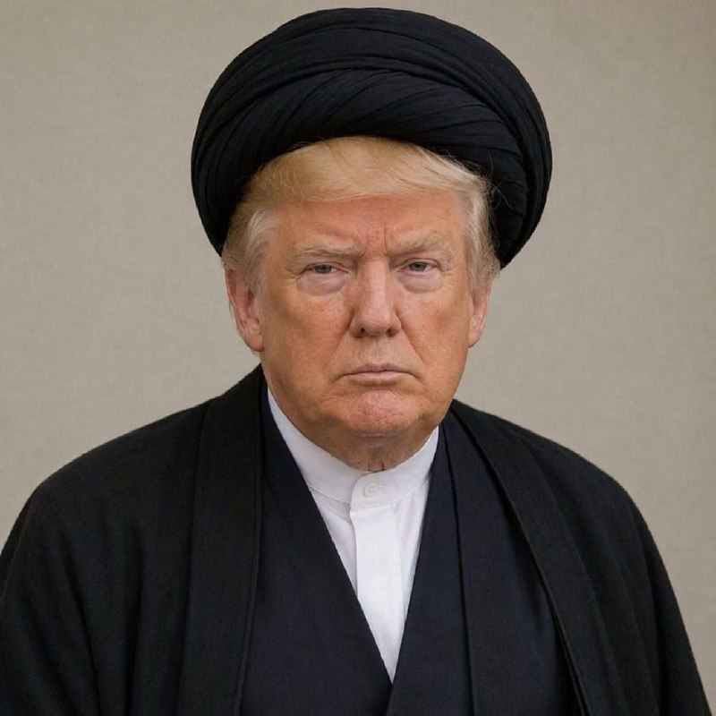

حجت الاسلام الدونالد ترامب :

بسم الله قاصم الجبارین
رژیم غاصب صهیونیستی 8 سال آینده را نخواهد دید!
و من نصر الی من عندالله عزیز الحکیم.

@Dirty_Kids 👻

## Dirty_Kids — post 391274

  <a href="telegram/content/Dirty_Kids_391274_1780866651.mp4" target="_blank">🎬 Download video</a>

🔴 ترامپ: ارتش آمریکا بزودی برای فتح اسرائیل به این کشور حمله می‌کنه.
و من نصر الی من عندالله عزیز الحکیم.

@Dirty_Kids 👻

## Dirty_Kids — post 391273

  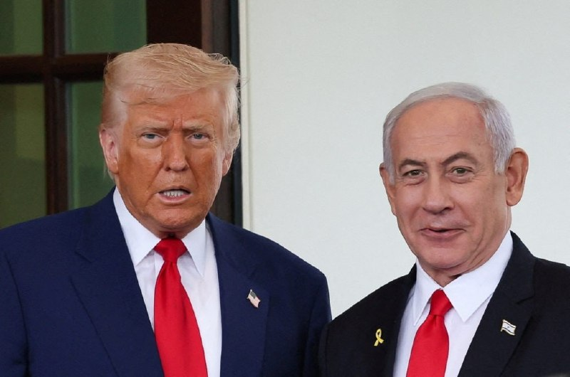

🔴 ترامپ:
فکر می‌کنم اسرائیل به اندازه کافی پاسخ داده و دیگه نیازی به ادامه دادن نیست، درست زمانی که بعد از 3 هزار سال می‌تونیم به صلح برسیم.

@Dirty_Kids 👻

## Dirty_Kids — post 391272

ترامپ :

به زودی با همکاری سپاه به اسرائیل حمله می‌کنیم.

## Dirty_Kids — post 391271

  <a href="telegram/content/Dirty_Kids_391271_1780866652.mp4" target="_blank">🎬 Download video</a>

وضعیت تجمعات تهران حین حملات موشکی به اسراییل

@Dirty_Kids 👻

## Dirty_Kids — post 391270

  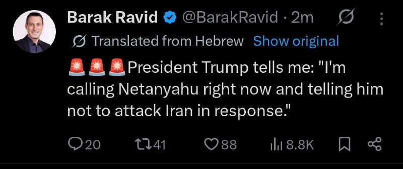

🔴 باراک راوید خبرنگار آکسیوس هم تایید کرد، ترامپ زنگ زده به نتانیاهو که به حملات ایران پاسخ نده!!

@Dirty_Kids 👻

## Dirty_Kids — post 391269

  <a href="telegram/content/Dirty_Kids_391269_1780866653.mp4" target="_blank">🎬 Download video</a>

نقض نخواهد شد
اتفاقی نخواهد افتاد

@Dirty_Kids 👻

## alonews — post 126035

  <a href="telegram/content/alonews_126035_1780866654.webm" target="_blank">🎬 Download video</a>

👈تمام هواپیماهای غیرنظامی تو تهران برای پیش‌بینی حملات اسرائیل جابه‌جا شدن

✅ @AloNews خبر جنگ

## alonews — post 126034

  <a href="telegram/content/alonews_126034_1780866654.webm" target="_blank">🎬 Download video</a>

👈آمیکای اشتاین خبرنگار آی ۲۴:
«در طول یک ساعت آینده، یک بحث گسترده با حضور بنیامین نتانیاهو، وزیر جنگ، و فرماندهی عالی امنیتی درباره ایران آغاز خواهد شد.»

✅ @AloNews خبر جنگ

## alonews — post 126033

  <a href="telegram/content/alonews_126033_1780866654.webm" target="_blank">🎬 Download video</a>

💢فوووووووووری/پرواز شدید جنگنده‌های آمریکایی در مرز ایران 
🚨 @AkhbareFouri

## alonews — post 126032

  <a href="telegram/content/alonews_126032_1780866655.mp4" target="_blank">🎬 Download video</a>

👈فاکس نیوز: با اینکه ترامپ به اسرائیل گفته پاسخ نده اما اسرائیل همین الان جلسه اضطراری تشکیل داده تا تصمیم بگیره آیا به حملات اخیر پاسخ می‌ده یا نه؛ و اگه پاسخ بده، چطور این کار رو انجام خواهد داد.

✅ @AloNews خبر جنگ

## alonews — post 126031

  <a href="telegram/content/alonews_126031_1780866657.webm" target="_blank">🎬 Download video</a>

👈اسرائیل بازم به لبنان حمله کرد

✅ @AloNews خبر جنگ

## alonews — post 126030

  <a href="telegram/content/alonews_126030_1780866657.webm" target="_blank">🎬 Download video</a>

👈ایران اطلاعیه NOTAM صادر کرده است که بخش غربی فضای هوایی تهران را تا ۸ ژوئن به روی تمام ترافیک هوایی غیرنظامی می‌بندد.

🔴 تنها هواپیماهای نظامی، دولتی، تخلیه پزشکی و جست‌وجو و نجات مجاز به فعالیت در این منطقه محدود شده هستند.

✅ @AloNews خبر جنگ

## alonews — post 126029

  <a href="telegram/content/alonews_126029_1780866658.webm" target="_blank">🎬 Download video</a>

👈چپ و راست داره از فرودگاه مهرآباد تهران هواپیما بلند میشه

✅ @AloNews خبر جنگ

## alonews — post 126028

  <a href="telegram/content/alonews_126028_1780866658.webm" target="_blank">🎬 Download video</a>

👈هم اکنون قیصر در میدان انقلاب: پیک‌ها همه بالا

✅ @AloNews خبر جنگ

## alonews — post 126027

  <a href="telegram/content/alonews_126027_1780866658.webm" target="_blank">🎬 Download video</a>

👈وزارت خارجه پاکستان: ایران نشانه‌هایی از پیشرفت را در راستای تصویب یادداشت تفاهم نشان داده است

✅ @AloNews خبر جنگ

## alonews — post 126026

  <a href="telegram/content/alonews_126026_1780866658.webm" target="_blank">🎬 Download video</a>

👈وزیر خارجه عربستان سعودی به صورت تلفنی با همتای قطری خود تحولات اوضاع و پیامدهای آن بر منطقه را بررسی کرد

✅ @AloNews خبر جنگ

## alonews — post 126025

  <a href="telegram/content/alonews_126025_1780866658.webm" target="_blank">🎬 Download video</a>

👈طبق گزارش i24 نیوز، نخست‌وزیر اسرائیل نتانیاهو، وزیر دفاع کاتز و رهبری امنیتی اسرائیل قرار است در ساعت آینده جلسه اضطراری درباره ایران برگزار کنند

✅ @AloNews خبر جنگ

## alonews — post 126024

  <a href="telegram/content/alonews_126024_1780866658.mp4" target="_blank">🎬 Download video</a>

👈 یک پهپاد ناشناس، احتمالاً یک پهپاد نظارتی آمریکایی یا اسرائیلی، در استان کربلا در مرکز عراق سرنگون شد.

🔴 این اتفاق تقریباً همزمان با حمله موشکی بالستیک ایران رخ داد

✅ @AloNews خبر جنگ

## alonews — post 126023

  <a href="telegram/content/alonews_126023_1780866660.webm" target="_blank">🎬 Download video</a>

👈تسنیم: منبع نظامی به ما گفت موشک ها آماده اند که در صورت جواب اسرائیل فورا شلیک شوند

✅ @AloNews خبر جنگ

## alonews — post 126022

  <a href="telegram/content/alonews_126022_1780866661.webm" target="_blank">🎬 Download video</a>

👈صدای شنیده شده در‌فرودگاه تبریز تست پدافند بوده و هیچ‌گونه حمله‌ای به این فرودگاه اتفاق نیفتاده است

✅ @AloNews خبر جنگ

## alonews — post 126021

  <a href="telegram/content/alonews_126021_1780866661.webm" target="_blank">🎬 Download video</a>

👈خبرگزاری MSN به نقل از یک منبع در وزارت خارجه پاکستان مدعی شد: سفر وزیر کشور به تهران مثبت بود

✅ @AloNews خبر جنگ

## alonews — post 126020

  <a href="telegram/content/alonews_126020_1780866661.webm" target="_blank">🎬 Download video</a>

👈پروازها به عراق به دلیل بسته شدن حریم هوایی لغو شد

✅ @AloNews خبر جنگ

## alonews — post 126019

  <a href="telegram/content/alonews_126019_1780866661.webm" target="_blank">🎬 Download video</a>

👈نیویورک تایمز، به نقل از وزارت امور خارجه ایالات متحده: ۲۲ ژوئن به عنوان تاریخ دور جدید مذاکرات بین اسرائیل و لبنان تعیین شده است

✅ @AloNews خبر جنگ

## alonews — post 126018

  <a href="telegram/content/alonews_126018_1780866661.webm" target="_blank">🎬 Download video</a>

👈منابع عبری:ترامپ و نتانیاهو در حال حاضر در حال گفتگو هستن

✅ @AloNews خبر جنگ

## alonews — post 126017

  <a href="telegram/content/alonews_126017_1780866662.webm" target="_blank">🎬 Download video</a>

👈کانال 12 اسرائیل:
مخالفان نتانیاهو در عرصه سیاسی اسرائیل از این وضعیت سوءاستفاده خواهند کرد و از سوی دیگر، نخست وزیر نمی‌تواند تنها چند ماه پیش از انتخابات به چنین وضعیتی(ترامپ مانع حمله شود) تن دهد، زیرا این امر می‌تواند برای او یک فاجعه سیاسی تلقی شود.

✅ @AloNews خبر جنگ

## alonews — post 126016

  <a href="telegram/content/alonews_126016_1780866662.webm" target="_blank">🎬 Download video</a>

👈هم‌اکنون ، وضعیت آسمان منطقه

✅ @AloNews خبر جنگ

---
📅 بروزرسانی: 1405/03/17 23:34
---

## VahidOOnLine — post 244172

  <a href="telegram/content/VahidOOnLine_244172_1780862650.mp4" target="_blank">🎬 Download video</a>

ویدیویی که شامگاه یکشنبه ۱۷ خرداد به دست ایران‌اینترنشنال رسیده پرواز موشک‌های جمهوری اسلامی را از کرمانشاه به سمت اسرائیل نشان می‌دهد.
‌🏁 🇬🇧 IranintlTV

🤖 @VahidOOnLine

## VahidOOnLine — post 244171

  

♦️دونالد ترامپ، رئیس جمهوری ایالات متحده، یکشنبه‌شب، در واکنش به حملات موشکی جمهوری اسلامی ایران به اسرائیل، در مصاحبه با «فاکس نیوز» گفت:‌ «پیشنهاد من به ایران این است؛ شما موشک‌هایتان را شلیک کردید، دیگر کافی است. به میز مذاکره برگردید و توافق کنید».
‌🇸🇦 Indypersian

🤖 @VahidOOnLine

## VahidOOnLine — post 244170

  

دونالد ترامپ به شبکه فاکس نیوز گفت: «پیشنهادی که به ایران دارم این است: موشک‌های خود را شلیک کرده‌اید، همین کافی است.»

او افزود: «به میز مذاکره بازگردید و توافق کنید.»
‌🏁 🇬🇧 IranintlTV

🤖 @VahidOOnLine

## VahidOOnLine — post 244169

  

♦️ارتش اسرائیل، یکشنبه‌شب، اعلام کرد که نیروی هوایی این کشور تاکنون موفق شده است تمامی موشک‌های شلیک‌شده از سوی ایران را به طور کامل رهگیری و منهدم کند. با این حال، نیروهای دفاعی اسرائیل تاکید کردند که رادارهای پدافندی به تازگی موج جدیدی از شلیک‌ها و پرتابه‌های موشکی را شناسایی کرده‌اند که از خاک ایران به سمت اسرائیل هدف‌گیری شده‌اند.
‌🇸🇦 Indypersian

🤖 @VahidOOnLine

## VahidOOnLine — post 244168

  <a href="telegram/content/VahidOOnLine_244168_1780862654.mp4" target="_blank">🎬 Download video</a>

♦️خبرگزاری مهر، یکشنبه‌شب، ۱۷ خردادماه، تصاویری از موشک‌های شلیک شده به سمت اسرائیل را در آسمان کرمانشاه منتشر کرد. همزمان، قرارگاه خاتم‌الانبیا، با انتشار بیانیه‌ای، شلیک موشک‌های ایران به سمت مواضع اسرائیل را تحقق هشدارهای قبلی تهران خواند و اعلام کرد: «در صورت گسترش حملات اسرائیل به بیروت و یا پاسخ به اقدام ایران با ضربات کوبنده تر و پشیمان کننده روبرو و حملات ویرانگری علیه اسرائیل و حامیان آن آغاز خواهد شد».
‌🇸🇦 Indypersian

🤖 @VahidOOnLine

## VahidOOnLine — post 244167

  <a href="telegram/content/VahidOOnLine_244167_1780862655.mp4" target="_blank">🎬 Download video</a>

ویدیوی رسیده به ایران‌اینترنشنال از خرم‌‌آباد در شامگاه یکشنبه ۱۷ خرداد، نور موشک شلیک‌شده از سوی جمهوری اسلامی را به سمت اسرائیل در آسمان این شهر نشان می‌دهد.
‌🏁 🇬🇧 IranintlTV

🤖 @VahidOOnLine

## VahidOOnLine — post 244166

  

محسن رضایی، مشاور نظامی خامنه‌ای، در شبکه ایکس نوشت جمهوری اسلامی بارها اعلام کرده بود که نقض آتش‌بس و حمله به لبنان را برنمی‌تابد.
او افزود: «امشب متجاوزان پاسخ خود را دریافت کردند. این پاسخ هشداری است تا دست از شرارت بردارند؛ هر اقدام جدید با پاسخی کوبنده‌تر و هزینه‌هایی سنگین‌تر مواجه خواهد شد.»
‌🏁 🇬🇧 IranintlTV

🤖 @VahidOOnLine

## VahidOOnLine — post 244165

  <a href="telegram/content/VahidOOnLine_244165_1780862657.mp4" target="_blank">🎬 Download video</a>

ویدیوی رسیده به ایران‌اینترنشنال از تبریز در شامگاه یکشنبه ۱۷ خرداد، نور موشک شلیک‌شده از سوی جمهوری اسلامی را به سمت اسرائیل در آسمان تبریز نشان می‌دهد.
‌🏁 🇬🇧 IranintlTV

🤖 @VahidOOnLine

## VahidOOnLine — post 244164

  

♦️محسن رضایی، فرمانده سابق سپاه و مشاور نظامی مجتبی خامنه‌ای، یکشنبه‌شب، همزمان با حملاتی موشکی ایران به اسرائیل در واکنش به حملات به ضاحیه بیروت، با انتشار پیامی در اکس نوشت: «جمهوری اسلامی بارها اعلام کرده بود که نقض آتش‌بس و تجاوز به لبنان را برنمی‌تابد. امشب متجاوزان پاسخ خود را دریافت کردند». رضایی نوشت: «این پاسخ هشداری است تا دست از شرارت بردارند. هر اقدام جدید با پاسخی کوبنده‌تر و هزینه‌هایی سنگین‌تر مواجه خواهد شد».
‌🇸🇦 Indypersian

🤖 @VahidOOnLine

## VahidOOnLine — post 244163

  <a href="telegram/content/VahidOOnLine_244163_1780862659.mp4" target="_blank">🎬 Download video</a>

ویدیوی رسیده به ایران‌اینترنشنال پرتاب موشک از سوی جمهوری اسلامی را از کرمانشاه به سمت اسرائیل در شامگاه یکشنبه ۱۷ خرداد نشان می‌دهد.
‌🏁 🇬🇧 IranintlTV

🤖 @VahidOOnLine

## VahidOOnLine — post 244162

  

♦️به گزارش فارس، خبرگزاری وابسته به سپاه، فرمانده قرارگاه خاتم‌الانبیا، یکشنبه‌شب، ۱۷ خردادماه، با انتشار بیانیه‌ای، شلیک موشک‌های ایران به سمت مواضع اسرائیل را تحقق هشدارهای قبلی تهران خواند و اعلام کرد: «پیش از این صراحتا اخطار داده بودیم که در صورت گسترش جنایات اسرائیل در ضاحیه بیروت، اهدافی را در سرزمین‌های اشغالی مورد هجوم قرار می‌دهیم.» او با متهم کردن ارتش اسرائیل به نقض مکرر آتش‌بس و عبور از تمامی خطوط قرمز تحت حمایت‌های آمریکا، تاکید کرد که تل‌آویو باید فورا حملات خود به لبنان را متوقف کند اعلام کرد:‌ «در صورت گسترش حملات اسرائیل به بیروت و یا پاسخ به اقدام ایران با ضربات کوبنده تر و پشیمان کننده روبرو و حملات ویرانگری علیه رژیم و حامیان آن آغاز خواهد شد».
‌🇸🇦 Indypersian

🤖 @VahidOOnLine

## VahidOOnLine — post 244161

  

علی عبداللهی، فرمانده قرارگاه خاتم‌الانبیا همزمان با آغاز حملات موشکی جمهوری اسلامی به اسرائیل در پیامی گفت: ارتش اسرائیل باید حملات خود به جنوب لبنان و ضاحیه را متوقف نماید و در صورت گسترش حملات خود به آن منطقه و یا پاسخ به اقدام جمهوری اسلامی با ضربات کوبنده‌تر و پشیمان‌کننده روبرو و حملات ویرانگری علیه رژیم و حامیان آن آغاز خواهد شد.
‌🏁 🇬🇧 IranintlTV

🤖 @VahidOOnLine

## VahidOOnLine — post 244160

  

رسانه‌های ایران شامگاه یک‌شنبه از آغاز حملات موشکی به سوی اسرائیل خبر دادند.

خبرگزاری مهر نوشت دو موج حمله به سوی اسرائیل انجام شده است.

همزمان با آغاز حملات موشکی جمهوری اسلامی به لبنان، عباس عراقچی در ایکس طرحی گرافیکی از پرچم جمهوری اسلامی و لبنان در کنار هم منتشر کرد.
به گزارش اسرائیل هیوم، چهار موشک از سوی ایران به شمال اسرائیل شلیک شده است.

‌🏁 🇬🇧 IranintlTV

🤖 @VahidOOnLine

## VahidOOnLine — post 244159

  

♦️ارتش اسرائیل، یکشنبه‌شب، ۱۷ خردادماه، با انتشار بیانیه‌ای در اکس اعلام کرد که در پی شناسایی موشک‌های شلیک‌شده از سوی ایران به سمت خاک اسرائیل، آژیرهای خطر در چندین منطقه در سراسر این کشور به صدا درآمده‌اند. بر اساس اعلام رسمی نیروهای دفاعی اسرائیل، سیستم‌های پدافند هوایی این کشور بلافاصله پس از ردیابی این پرتابه‌ها فعال شده و در حال مقابله برای رهگیری و انهدام تهدیدهای موشکی بر فراز آسمان منطقه هستند.
‌🇸🇦 Indypersian

🤖 @VahidOOnLine

## VahidOOnLine — post 244158

  

♦️ارتش اسرائیل، یکشنبه‌شب، ۱۷ خردادماه، با انتشار بیانیه‌ای اعلام کرد که رادارهای این کشور شلیک چندین موشک از سوی ایران به سمت خاک اسرائیل را شناسایی کرده‌اند. بر اساس این گزارش رسمی، در حال حاضر تمامی سیستم‌های پدافند هوایی ارتش برای رهگیری و انهدام این تهدیدها فعال شده‌اند و فرماندهی جبهه داخلی در دقیقه‌های گذشته، دستورالعمل‌های اضطراری پیش‌گیرانه‌ای را به طور مستقیم به تلفن‌های همراه ساکنان مناطق تحت خطر ارسال کرده است. مقامات نظامی اسرائیل با تاکید بر اینکه این دستورات نجات‌دهنده جان انسان‌هاست، از عموم مردم خواسته‌اند با مسئولیت‌پذیری کامل، به محض شنیدن صدای آژیر خطر فورا وارد پناهگاه‌ها و مناطق امنِ حفاظت‌شده شوند و تا زمان صدور ابلاغیه صریح و رسمی بعدی، به هیچ عنوان از پناهگاه‌های خود خارج نشوند.
‌🇸🇦 Indypersian

🤖 @VahidOOnLine

## VahidOOnLine — post 244157

  

خبرگزاری رویترز گزارش داد که نیروهای نظامی اسرائیل می‌گویند سامانه‌های دفاعی در حال عملیات برای رهگیری تهدید هستند.

بر اساس این گزارش، ارتش اسرائیل اعلام کرده است که شلیک موشک‌هایی از ایران به سمت خاک کشور اسرائیل شناسایی شده است.
‌🏁 🇬🇧 IranintlTV

🤖 @VahidOOnLine

## VahidOOnLine — post 244156

  

دو منبع نزدیک به نیروهای نظامی جمهوری اسلامی به ایران‌اینترنشنال گفتند در پی حملات یکشنبه اسرائیل به مقر فرماندهی و برنامه‌ریزی حزب‌الله در حومه جنوبی بیروت، یگان‌های موشکی سپاه پاسداران در آستانه یک رویارویی نظامی جدید، به حالت آماده‌باش کامل درآمده‌اند.

به گفته این منابع، در ساعات گذشته، فرماندهان ارشد سپاه درخواست رسمی خود برای صدور مجوز آغاز حملات موشکی به اسرائیل را به دفتر مجتبی خامنه‌ای، رهبر جدید جمهوری اسلامی، ارسال کرده‌اند.

هر دو منبع تایید کردند که با وجود این درخواست، هنوز مجتبی خامنه‌ای یا دفتر او پاسخی به این درخواست نداده‌اند و مشخص نیست که آیا با این حمله موافقت خواهد شد یا خیر.

این دو منبع به ایران‌اینترنشنال گفتند سپاه پاسداران نگران است که سکوت در برابر حملات اسرائیل به ضاحیه، این کشور را به تشدید حملات علیه حزب‌الله ترغیب کند.

ادامه این گزارش را در وبسایت ایران‌اینترنشنال بخوانید
‌🏁 🇬🇧 IranintlTV

🤖 @VahidOOnLine

## VahidOOnLine — post 244155

  

♦️در رسانه ها به نقل از منابع نزدیک به وزیر خزانه‌داری آمریکا آمده است که این کشور از تمامی ابزارها استفاده خواهد کرد تا دارایی‌های ایران جهت بازسازی خسارات ادعایی وارده به برخی متحدان منطقه‌ای آن،  در دسترس قرار گیرد.

اولا، این یک وقاحت تازه از سوی آمریکاست. اگر واشنگتن، به‌عنوان متجاوز اصلی در تجاوز نظامی علیه جمهوری اسلامی ایران، واقعاً به دنبال جبران خسارت است، آدرس را اشتباه نرود: از خود آمریکا و از رژیمی آغاز کند که عامل اصلی آتش‌افروزی، تجاوز و بی‌ثباتی در منطقه هستند. ایران متجاوزان را رها نخواهد کرد و خسارات جنگ را مطالبه و دریافت خواهد کرد.

دوما، برخی دولت‌های منطقه که قلمرو و امکانات خود را در خدمت تجاوز علیه ایران قرار داده‌اند، در جایگاه مطالبه‌گر خسارت نیستند؛ رفتار آنان مشمول مسئولیت بین‌المللی و قواعد مربوط به مشارکت در عمل متخلفانه و تجاوز قرار می گیرد و باید خسارات وارده به ایران را بطور کامل جبران کنند.

سوما، دارایی‌های ایران غنیمت جنگی واشنگتن یا صندوق پرداخت به هم‌پیمانان آن نیست.
‌🇸🇦 Indypersian

🤖 @VahidOOnLine

## VahidOOnLine — post 244154

  

اکسیوس به نقل از دو مقام آمریکایی گزارش داد اسرائیل پیش از حمله به ضاحیه در جنوب بیروت، دولت ترامپ را در جریان قرار داده بود.
یک مقام آمریکایی نیز گفت نیروهای این کشور در خاورمیانه در صورت عملی شدن تهدیدهای تهران و آغاز حملات جدید، برای دفاع آماده هستند.

اکسیوس همچنین به نقل از یک مقام آمریکایی نوشت واشینگتن از حق اسرائیل برای دفاع از خود حمایت می‌کند و حزب‌الله باید فورا حملات خود را متوقف کند تا توافق‌های موجود اجرا شوند.

این رسانه به نقل از منابع خود گزارش داد اسرائیل به دولت ترامپ اعلام کرده است حملات مداوم حزب‌الله به شمال اسرائیل نقض آتش‌بس محسوب می‌شود و تل‌آویو خود را محق به هدف قرار دادن بیروت می‌داند. منابع افزودند اسرائیل تاکید کرده در صورت تکرار حملات حزب‌الله، حملات خود علیه بیروت را ادامه خواهد داد.
‌🏁 🇬🇧 IranintlTV

🤖 @VahidOOnLine

## VahidOOnLine — post 244153

  

♦️در رسانه ها به نقل از منابع نزدیک به وزیر خزانه‌داری آمریکا آمده است که این کشور از تمامی ابزارها استفاده خواهد کرد تا دارایی‌های ایران جهت بازسازی خسارات ادعایی وارده به برخی متحدان منطقه‌ای آن،  در دسترس قرار گیرد.

اولا، این یک وقاحت تازه از سوی آمریکاست. اگر واشنگتن، به‌عنوان متجاوز اصلی در تجاوز نظامی علیه جمهوری اسلامی ایران، واقعاً به دنبال جبران خسارت است، آدرس را اشتباه نرود: از خود آمریکا و از رژیمی آغاز کند که عامل اصلی آتش‌افروزی، تجاوز و بی‌ثباتی در منطقه هستند. ایران متجاوزان را رها نخواهد کرد و خسارات جنگ را مطالبه و دریافت خواهد کرد.

دوما، برخی دولت‌های منطقه که قلمرو و امکانات خود را در خدمت تجاوز علیه ایران قرار داده‌اند، در جایگاه مطالبه‌گر خسارت نیستند؛
‌🇸🇦 Indypersian

🤖 @VahidOOnLine

## WithYashar — post 13774

ترامپ: قرار بود دوشنبه یا سه‌شنبه توافق صلح را امضا کنیم.
@withyashar

## WithYashar — post 13773

ارتش اسرائیل : در مجموع 12 موشک بالستیک شلیک شد که تمام آن رهگیری یا به منطقه‌ای باز اصابت کرد
@withyashar

## WithYashar — post 13772

ترامپ: توافق با ایران در دسترسه و بهش نزدیکیم.
@withyashar

## WithYashar — post 13771

حوثی ها منتظر دستور بستن تنگه باب المندب هستیم
@withyashar

## WithYashar — post 13770

ترامپ به فاکس نیوز: آنچه به ایران توصیه می‌کنم: موشک‌هایتان را پرتاب کرده‌اید، همین کافی است

@withyashar

## WithYashar — post 13769

سپاه: پایگاه هوایی رامات دیوید، هدف موشک‌های بالستیک قرار گرفت
@withyashar

## WithYashar — post 13768

فعالیت پدافند هوایی در کرماشاه و تبریز
@withyashar

## WithYashar — post 13767

صدا و سیما : سد مجید موسوی، فرمانده نیروی هوایی سپاه: الوعده وفا
@withyashar

## WithYashar — post 13766

صدای سیما شیپور جنگ را زد. آهنگ بزن که خوب میزنی در حال پخش است.
@withyashar

## WithYashar — post 13765

آژیر در شمال اسرائیل و اردن به صدا درآمد.
@withyashar

## WithYashar — post 13764

موج پنجم حملات شروع شد
@withyashar

## WithYashar — post 13763

## WithYashar — post 13762

اگه امکاناتشو دارید بهتره تهران رو ترک کنید

## WithYashar — post 13761

منابع اسراییل: حملات سنگین به ایران نزدیک است
@withyashar

## WithYashar — post 13760

سوخترسان های آمریکایی از تلآویو بلند شدند
@withyashar

## WithYashar — post 13758

قرارگاه مرکزی خاتم الانبیا : قبلا اخطار داده بودیم در صورت گسترش جنایت در ضاحیه بیروت، اهدافی را در سرزمین های اشغالی مورد هجوم قرار می دهیم!
@withyashar

## WithYashar — post 13757

رسانه عبری از منابع گزارش می‌دهد: ما به حمله ایرانی پاسخ خواهیم داد
@withyashar

## WithYashar — post 13756

از ارومیه و اصفهان هم موشک شلیک شد
@withyashar

## WithYashar — post 13755

چند موشک از تبریز و کرمانشاه شلیک شد
@withyashar

## WithYashar — post 13754

موج دوم حملات ۳پا آغاز شد
@withyashar
🚨🚨🚨🚨🚨🚨

## mwarmonitor — post 10294

📌ترامپ می‌گوید حملات اسرائیل در لبنان با ایالات متحده هماهنگ نشده بود و او از این موضوع راضی نیست.

@mwarmonitor

## mwarmonitor — post 10293

🔴 «عراق به دلایل عملیاتی یک NOTAM صادر کرده و حریم هوایی خود را بسته است.» @mwarmonitor

## mwarmonitor — post 10292

🔴 فوری | سی‌ان‌ان به نقل از دو منبع اسرائیلی: ما به شلیک موشک‌های بالستیک ایران با قدرت پاسخ خواهیم داد.

@mwarmonitor

## mwarmonitor — post 10291

🔴به نقل از یک رسانه عراقی وابسته به عربستان: سقوط یک هواپیمای مسافربری در صحرای کربلا.

@mwarmonitor

## mwarmonitor — post 10290

  

🔴 «عراق به دلایل عملیاتی یک NOTAM صادر کرده و حریم هوایی خود را بسته است.»

@mwarmonitor

## mwarmonitor — post 10289

🔴با ترامپ صحبت کردم. در چند دقیقه آینده در فاکس نیوز جزئیات بیشتری خواهیم داشت.

🔴«نصیحتی که به ایران دارم این است: شما موشک‌هایتان را شلیک کردید، این کافی است. به میز مذاکره برگردید و یک توافق انجام دهید»، رئیس‌جمهور ترامپ به فاکس نیوز گفت.

@mwarmonitor

## mwarmonitor — post 10287

🔴 «پایگاه هوایی رامات دیوید با موشک‌های بالستیک هدف قرار گرفت»

اداره روابط عمومی سپاه پاسداران اعلام کرد:

به نام خداوند درهم‌شکننده ستمگران
﴿با آنان بجنگید تا خداوند به دست شما آنان را عذاب دهد، خوارشان سازد و شما را بر آنان پیروز گرداند و سینه‌های مؤمنان را شفا بخشد﴾

در پاسخ به جنایات گسترده‌ای که رژیم صهیونیستی اشغالگر در جنوب لبنان مرتکب شد، و همچنین همراه با کشتار و آوارگی گسترده ساکنان صور، نبطیه و مناطق دیگر، از جمله ضاحیه جنوبی بیروت، موشک‌های نیروی هوافضای سپاه پاسداران، پایگاه هوایی رامات دیوید را که این حملات از آن انجام شده بود هدف قرار دادند.

پذیرش آتش‌بس در ۱۹ فروردین، مشروط به توقف درگیری‌ها در تمامی جبهه‌ها بود، اما آمریکا و رژیم صهیونیستی طبق روال معمول به تعهدات خود پایبند نماندند و حملات و جنایات در لبنان را ادامه دادند. همچنین حملات به سواحل و کشتی‌های ایرانی در تنگه هرمز، دریای عمان و اقیانوس هند را در نقض آشکار آتش‌بس تکرار کردند.

عملیات امشب یک هشدار بود و در صورت تکرار حملات، پاسخ‌ها گسترده‌تر خواهد بود و همه اهداف آمریکایی و صهیونیستی در منطقه را در بر خواهد گرفت.

﴿و پیروزی جز از سوی خداوند عزیز و حکیم نیست﴾

@mwarmonitor

## mwarmonitor — post 10286

  

🔴 «هشدار پایان وضعیت اضطراری در شمال اسرائیل صادر شده است و ساکنان اکنون می‌توانند پناهگاه‌های خود را ترک کنند.»

@mwarmonitor

## mwarmonitor — post 10285

پدافند تهران فعال شد

## mwarmonitor — post 10284

🔴«کتائب حزب‌الله: اگر آمریکا در این درگیری دخالت کند، ما پایگاه‌ها و منافع آن را در عراق و منطقه هدف قرار خواهیم داد.»

@mwarmonitor

## mwarmonitor — post 10283

🔴«بیانیه سخنگوی ارتش اسرائیل حدود ۳۰ دقیقه دیگر منتشر خواهد شد.» شبکه کان اسرائیل

@mwarmonitor

## mwarmonitor — post 10282

🔴سخنگوی ارتش اسرائیل می‌گوید نیروی هوایی تاکنون تمام موشک‌های شلیک‌شده از سوی ایران را رهگیری کرده است. همچنین پرتاب‌های بیشتری به سمت اسرائیل شناسایی شده است. سامانه پدافند هوایی همچنان در حال شناسایی و رهگیری تهدیدها است. از اسرائیلی‌ها خواسته شده است دستورالعمل‌های فرماندهی جبهه داخلی را دنبال کنند.

@mwarmonitor

## mwarmonitor — post 10281

  

🔴تمام یگان‌های اعزامی نیروی هوایی آمریکا (USAF Air Expeditionary Wings) در سراسر اردن، امارات، قطر و کویت به وضعیت بالاتر حفاظت نیروها منتقل شده‌اند.

🔴هشدارهایی برای اسکادران ۳۷۹ در پایگاه العُدید حوالی ساعت ۱۶:۰۰ به وقت محلی ارسال شده و نیروهای هوایی را برای احتمال ازسرگیری شلیک موشک‌ها آماده می‌کند.

@mwarmonitor

## mwarmonitor — post 10280

🔴 وزارت حمل‌ونقل اسرائیل اعلام کرد که حریم هوایی اسرائیل در حال حاضر همچنان باز است.

@mwarmonitor

## mwarmonitor — post 10279

  

✈️نیروی هوایی آمریکا (USAF) / نیروی هوایی سلطنتی بریتانیا (RAF) - عملیات ایران هواپیمای سوخت‌رسان Boeing KC-135 Stratotanker: 1 فروند AE0369 63-8024 - شناسه تماس نامشخص هواپیمای Boeing KC-46 Pegasus: 1 فروند AE5F9B 18-46048 - شناسه تماس نامشخص هواپیمای…

## mwarmonitor — post 10278

🔴 اسرائیل به دنبال دریافت چراغ سبز از آمریکا برای حمله به تأسیسات انرژی در ایران است، به گفته یک منبع اسرائیلی، خبرگزاری Walla گزارش می‌دهد.

@mwarmonitor

## mwarmonitor — post 10277

  

🔴 « فوری: ایران موشک‌های بیشتری به سمت اسرائیل شلیک کرده است، هشدار اولیه صادر شد.»

@mwarmonitor

## mwarmonitor — post 10276

🔴 شبکه ۱۳، آکسیوس، واللا و دیگر رسانه‌ها گزارش می‌دهند که پاسخ اسرائیل به حمله ایران در راه است.

@mwarmonitor

## mwarmonitor — post 10275

🔴رئیس‌جمهور ترامپ درباره تشدید تنش میان اسرائیل و ایران گزارش دریافت کرده است، یک مقام آمریکایی می‌گوید. باراک راوید

@mwarmonitor

## mwarmonitor — post 10274

🔴 شبکه ۱۲ اسرائیل به نقل از یک مقام اسرائیلی: ایران می‌خواست یک معادله جدید را تحمیل کند، اما ما نمی‌توانیم اجازه وقوع چنین چیزی را بدهیم.

@mwarmonitor

## pm_afshaa — post 92653

  <a href="telegram/content/pm_afshaa_92653_1780862667.webm" target="_blank">🎬 Download video</a>

🔴ترامپ: قرار بود دوشنبه یا سه‌شنبه توافق صلح رو امضا کنیم.

💧 Rainbet.com the #1 Non-KYC Crypto Casino & Sportsbook @rainbetcom

😁 @Pm_Afshaa

## pm_afshaa — post 92652

از مکان های نظامی فاصله بگیرین

💧 Rainbet.com the #1 Non-KYC Crypto Casino & Sportsbook @rainbetcom

😁 @Pm_Afshaa

## pm_afshaa — post 92651

⭕️
⭕️
⭕️
⭕️
⭕️

## pm_afshaa — post 92650

♨️
♨️
♨️
♨️
♨️
♨️

## pm_afshaa — post 92649

رعد و برقه؟

## pm_afshaa — post 92648

سی‌ان‌ان به نقل از دو منبع اسرائیلی: ما به پرتاب موشک‌های بالستیک ایران با قدرت پاسخ خواهیم داد

💧 Rainbet.com the #1 Non-KYC Crypto Casino & Sportsbook @rainbetcom

😁 @Pm_Afshaa

## pm_afshaa — post 92647

تهرانو زدن!؟

## pm_afshaa — post 92646

ورود پهپادهای به غرب کشور

💧 Rainbet.com the #1 Non-KYC Crypto Casino & Sportsbook @rainbetcom

😁 @Pm_Afshaa

## pm_afshaa — post 92645

  <a href="telegram/content/pm_afshaa_92645_1780862667.webm" target="_blank">🎬 Download video</a>

🔴رویترز به نقل از یک منبع ایرانی:
اگر اسرائیل به حملات موشکی ایران پاسخ بده، ما هم قطعاً پاسخ خواهیم داد.

💧 Rainbet.com the #1 Non-KYC Crypto Casino & Sportsbook @rainbetcom

😁 @Pm_Afshaa

## pm_afshaa — post 92644

عراق هم نوتام اعلام کرد

💧 Rainbet.com the #1 Non-KYC Crypto Casino & Sportsbook @rainbetcom

😁 @Pm_Afshaa

## pm_afshaa — post 92643

  <a href="telegram/content/pm_afshaa_92643_1780862668.webm" target="_blank">🎬 Download video</a>

🔴ارتش اسرائیل: در مجموع 12 موشک بالستیک شلیک شد که تمام آن رهگیری یا به منطقه‌ای باز اصابت کرد.

💧 Rainbet.com the #1 Non-KYC Crypto Casino & Sportsbook @rainbetcom

😁 @Pm_Afshaa

## pm_afshaa — post 92642

ترافیک سنگین در پمپ بنزین های تهران

💧 Rainbet.com the #1 Non-KYC Crypto Casino & Sportsbook @rainbetcom

😁 @Pm_Afshaa

## pm_afshaa — post 92640

پرواز جنگنده‌ها در آسمان عراق

💧 Rainbet.com the #1 Non-KYC Crypto Casino & Sportsbook @rainbetcom

😁 @Pm_Afshaa

## pm_afshaa — post 92639

♨️
♨️
♨️
♨️

## pm_afshaa — post 92638

  <a href="telegram/content/pm_afshaa_92638_1780862668.webm" target="_blank">🎬 Download video</a>

🔴ترامپ به فاکس نیوز: توصیه من به ایران اینه که شما موشک هایتان رو شلیک کردید و کافی است و به میز مذاکره برگردید و توافق کنید. 
💧 Rainbet.com the #1 Non-KYC Crypto Casino & Sportsbook @rainbetcom 
😁 @Pm_Afshaa

## pm_afshaa — post 92637

  <a href="telegram/content/pm_afshaa_92637_1780862669.webm" target="_blank">🎬 Download video</a>

🔴مقام ارشد اسرائیلی: ارتش اسرائیل در حال آماده سازی برای حمله به ایرانه.

💧 Rainbet.com the #1 Non-KYC Crypto Casino & Sportsbook @rainbetcom

😁 @Pm_Afshaa

## pm_afshaa — post 92636

🔴صداهایی که در تبریز به گوش می‌رسد مربوط به درگیری پدافند با ریز پرنده و پهپاد های احتمالی است

💧 Rainbet.com the #1 Non-KYC Crypto Casino & Sportsbook @rainbetcom

😁 @Pm_Afshaa

## pm_afshaa — post 92635

  <a href="telegram/content/pm_afshaa_92635_1780862670.webm" target="_blank">🎬 Download video</a>

🔴ترامپ به فاکس نیوز:
توصیه من به ایران اینه که شما موشک هایتان رو شلیک کردید و کافی است و به میز مذاکره برگردید و توافق کنید.

💧 Rainbet.com the #1 Non-KYC Crypto Casino & Sportsbook @rainbetcom

😁 @Pm_Afshaa

## pm_afshaa — post 92633

  

اهواز

💧 Rainbet.com the #1 Non-KYC Crypto Casino & Sportsbook @rainbetcom

😁 @Pm_Afshaa

## pm_afshaa — post 92632

  <a href="telegram/content/pm_afshaa_92632_1780862671.webm" target="_blank">🎬 Download video</a>

🔴گزارش‌ها از ورود جنگنده‌های خارجی به حریم هوایی غرب کشور

💧 Rainbet.com the #1 Non-KYC Crypto Casino & Sportsbook @rainbetcom

😁 @Pm_Afshaa

## DEJradio — post 5441

  <a href="telegram/content/DEJradio_5441_1780862671.mp4" target="_blank">🎬 Download video</a>

🚀 
⭕️ براساس گزارش منابع میدانی، یکشنبه شب ۱۷ خرداد ۱۴۰۵ دستکم هشت فروند موشک بالستیک از اصفهان به سمت اسرائیل پرتاب شد.

#حملات_موشکی #اسرائیل
@DEJradio

## DEJradio — post 5440

  <a href="telegram/content/DEJradio_5440_1780862672.webm" target="_blank">🎬 Download video</a>

🚨
⭕️ حملات موشکی جمهوری اسلامی به اسرائیل در سه موج‌ پیاپی

ارتش اسرائیل شامگاه یکشنبه اعلام کرد موشک‌هایی را که از خاک ایران به سمت اسرائیل شلیک شده بود، شناسایی کرده است.
بر اساس بیانیهٔ ارتش اسرائیل پس از شناسایی این موشک‌ها، آژیرهای هشدار در چندین منطقه به صدا درآمد و سامانه‌های پدافندی برای رهگیری فعال شد.
شلیک موشک توسط جمهوری اسلامی، ساعاتی پس از حملهٔ اسرائیل به ضاحیهٔ بیروت آغاز شد.
اسرائیل گفته بود هدف حمله به لبنان، مراکز فرماندهی حزب‌الله بوده است.
ارتش اسرائیل حمله به ضاحیه را واکنشی به شلیک‌های اخیر حزب‌الله از خاک لبنان عنوان کرده بود.
موشک‌پرانی جمهوری اسلامی به اسرائیل در حالی رخ داد که تهران و واشینگتن بر سر پایان جنگ و پرونده هسته‌ای در حال مذاکره بودند.
شلیک مستقیم از خاک جمهوری اسلامی به سمت اسرائیل، ممکن است به آتش‌بس‌ شکننده و مذاکرات آمریکا و جمهوری اسلامی پایان بدهد.

#حمله_موشکی #فوری
@DEJradio

## DEJradio — post 5439

  <a href="telegram/content/DEJradio_5439_1780862673.webm" target="_blank">🎬 Download video</a>

🚀
🚨 یکشنبه شب ۱۷ خرداد، دو موج حمله موشکی از سمت ایران به اسراییل انجام گرفت.
منابع میدانی گزارش دادند تعدادی از موشک‌ها از پایگاه سپاه در کرمانشاه پرتاب شد.

#حملات_موشکی #اسرائیل
@DEJradio

## DEJradio — post 5438

  <a href="telegram/content/DEJradio_5438_1780862673.webm" target="_blank">🎬 Download video</a>

🚨
⭕️ دولت اسرائیل برای شهروندان چند منطقه از این کشور هشدار حمله صادر کرد.

#حملات_موشکی #اسرائیل
@DEJradio

## DEJradio — post 5437

  <a href="telegram/content/DEJradio_5437_1780862673.webm" target="_blank">🎬 Download video</a>

🚨
⭕️ حملات موشکی جمهوری اسلامی به سمت اسرائیل

#حملات_موشکی #اسرائیل
@DEJradio

## DEJradio — post 5436

  <a href="telegram/content/DEJradio_5436_1780862674.mp4" target="_blank">🎬 Download video</a>

🔺🏆 
👑 آیا فیفا می‌خواهد صدای مردم ایران را سرکوب کند؟

مهدی رستم‌پور خبرنگار ورزشی می‌گوید بعد از حمله روسیه به اوکراین تیم فوتبال روسیه از حضور در مسابقات بین‌اامللی محروم شد، اما فیفا همچنان پشتیبان جمهوری اسلامی است آنهم در شرایطی که حکومت به کشورهای منطقه وشک‌پرانی کرده و مردم را سرکوب می‌کند.

#فیفا #جام_جهانی
@DEJradio

## DEJradio — post 5435

  <a href="telegram/content/DEJradio_5435_1780862676.webm" target="_blank">🎬 Download video</a>

⭕️ 
🛩️
🚨 شهروندان از چند شهر از جمله تهران، کرج، ساوه و در غرب همدان و کرمانشاه گزارش دادند که صدای پرواز هواپیمای جنگنده‌ در ارتفاع پایین را شنیده‌اند. در بعضی نقاط از جمله بیدگنه و ملارد صدای انفجار به گوش رسید. #فوری @DEJradio

## DEJradio — post 5434

  <a href="telegram/content/DEJradio_5434_1780862676.webm" target="_blank">🎬 Download video</a>

⭕️ 
🛩️
🚨 شهروندان از چند شهر از جمله تهران، کرج، ساوه و در غرب همدان و کرمانشاه گزارش دادند که صدای پرواز هواپیمای جنگنده‌ در ارتفاع پایین را شنیده‌اند. در بعضی نقاط از جمله بیدگنه و ملارد صدای انفجار به گوش رسید.

#فوری
@DEJradio

## VahidOnline — post 76000

  

دونالد ترامپ به شبکه فاکس نیوز گفت: پیشنهادی که به ایران دارم این است: موشک‌های خود را شلیک کرده‌اید، همین کافی است.
او افزود: به میز مذاکره بازگردید و توافق کنید.
@VahidOOnLine

📡 @VahidOnline

## VahidOnline — post 75999

  

نیروی هوایی اسرائیل در بیانیه‌ای دقایقی قبل اعلام کرد که این نیرو تاکنون تمامی موشک‌های شلیک‌شده از سوی جمهوری اسلامی ایران را رهگیری و منهدم کرده است. این نیرو گفت ارتش اسرائیل اکنون پرتاب‌های بیشتری را که به سمت اسرائیل شلیک شده‌اند شناسایی کرده است.
@VahidHeadline

📡 @VahidOnline

## VahidOnline — post 75998

توییت باراک راوید، خبرنگار آکسیوس:
یک مقام اسرائیلی به من گفت که اسرائیل قصد دارد به حمله ایران تلافی کند.

📡 @VahidOnline

## VahidOnline — post 75997

  

سپاه: در صورت گسترش حملات پاسخ ما کوبنده‌تر خواهد بود

به نقل از تسنیم، خبرگزاری وابسته به سپاه:

"فرمانده قرارگاه حضرت خاتم‌الانبیا(ص):
رژیم متجاوز صهیونیستی با نقض مکرر آتش‌بس شرارت های خود علیه مردم مظلوم لبنان با چراغ سبز و حمایت آمریکای جنایتکار و سکوت مجامع بین المللی را روز به روز افزایش داده و با استفاده از سلاح های ممنوعه از جمله بمب های فسفری مرتکب جنایات جنگی می گردد.

با وجود هشدارهای قبلی جمهوری اسلامی ایران، رژیم کودک کش صهیونیستی با عبور از همه خطوط قرمز و افزایش حملات در جنوب لبنان، ضاحیه بیروت را هدف قرار داده است.

قبلا اخطار داده بودیم در صورت گسترش جنایت در ضاحیه بیروت، اهدافی را در سرزمین های اشغالی مورد هجوم قرار می دهیم.

ارتش صهیونیستی باید حملات خود به جنوب لبنان و ضاحیه را متوقف نماید و در صورت گسترش حملات خود به آن منطقه و یا پاسخ به اقدام ایران با ضربات کوبنده تر و پشیمان کننده روبرو و حملات ویرانگری علیه رژیم و حامیان آن آغاز خواهد شد."

📡 @VahidOnline

## VahidOnline — post 75996

☄️ موج بعدی شلیک موشک به سمت اسرائیل
پیام‌های دریافتی:

دوباره شلیک از کرمانشاه

دوباره یکی دیگه زدن الان
یکی بود

10:44 دوباره صدای انفجار اومد کرمانشاه

صدای انفجار مجدد

بازم زدن
همین الان صدا اومد از روانسر کرمانشاه

22:47 شلیک موشک از تبریز

آذرشهر [نزدیک تبریز] صدای موشک ۳ تا

سلام وحید
ساعت ۲۲:۴۰ ۴ تا شلیک از تبریز به فاصله هر یک دقیقه
نور خیلییی زیادی داره و صدای زیاد

🔄 آپدیت:
منابع حکومتی نوشتند از اصفهان و ارومیه هم موشک شلیک شد.
📡 @VahidOnline

## VahidOnline — post 75995

☄️ 'شلیک موشک از کرمانشاه'
‌
بعضی از پیام‌های دریافتی:

سلام همین الان صدای موشک از کرمانشاه اومد

سلام صدای جنگنده در کرمانشاه

سلام وحید جان.
همین الان ساعت ده و نیم دو تا موشک از کرمانشاه شلیک شد

صدای غرش شدید ترسناک ساعت 10.31 شب کرمانشاه میاد

وحید همین الان از کرمانشاه موشک پرتاب شد

از کرمامشاه الان دوتا موشک شلیک کردن

صدای پرتاب موشک از کرمانشاه الان

سلام وحید جان
من کرمانشاهم
الان ۱۰:۳۰ یه صدایی شبیه شلیک موشک اومد
مطمئن نیستم، ولی دقیقا شبیه صدایی بود که زمان جنگ میومد.

🔄 توییت ارتش اسرائیل:
ارتش اسرائیل موشک‌هایی را که از ایران به سمت اسرائیل شلیک شده بود، شناسایی کرد. سیستم‌های دفاعی برای رهگیری این تهدید در حال فعالیت هستند.

📡 @VahidOnline

## kianmeli1 — post 87736

  

🔴فوری

عراق حریم هوایی خود را بست
https://t.me/kianmeli1

## kianmeli1 — post 87735

🔴فوری / ترامپ: نیروهای نظامی آمریکا در حالت آماده‌باش هستند
https://t.me/kianmeli1

## kianmeli1 — post 87734

🔴فوری

حوثی ها منتظر دستور بستن تنگه باب المندب هستیم
https://t.me/kianmeli1

## kianmeli1 — post 87733

  <a href="telegram/content/kianmeli1_87733_1780862678.mp4" target="_blank">🎬 Download video</a>

🛑فوری-وضعیت تجمعات تهران حین حملات موشکی به اسراییل
https://t.me/kianmeli1

## kianmeli1 — post 87732

🔴فوری-موج حملات موشکی از کرج
https://t.me/kianmeli1

## kianmeli1 — post 87731

  

#فوری

تمام بال‌های اکتشافی نیروی هوایی ایالات متحده در اردن، امارات متحده عربی، قطر و کویت در وضعیت افزایش حفاظت نیرو قرار گرفته‌اند. اطلاعیه‌هایی به بال اکتشافی 379ام در پایگاه هوایی العدید حوالی ساعت 4:00 بعدازظهر به وقت محلی صادر شده است که پرسنل را از احتمال حملات موشکی مجدد آگاه می‌کند.
https://t.me/kianmeli1

## kianmeli1 — post 87730

  

🔴روشن شدن آژیرها در ۲۴۲ نقطه از شمال اسرائیل

طبق برآوردهای جمعیتی، به دنبال سومین موج موشکی ایران، ۱ میلیون و ۵۲۶ هزار اسرائیلی باید به پناهگاه بروند.
https://t.me/kianmeli1

## kianmeli1 — post 87729

🔴فوری

فعالیت پدافندی در آسمان غرب ایران
https://t.me/kianmeli1

## kianmeli1 — post 87728

🔴فوری-به گزارش والانیوز، اسرائیل به دنبال دریافت مجوز از آمریکا برای حمله به زیرساخت‌های انرژی ایران است
https://t.me/kianmeli1

## kianmeli1 — post 87727

  <a href="telegram/content/kianmeli1_87727_1780862680.mp4" target="_blank">🎬 Download video</a>

🔴فوری-مشاهده موشک در آسمان تبریز، دست‌کم ۶ موشک از تبریز و ۳ موشک از ارومیه شلیک شد.
https://t.me/kianmeli1

## kianmeli1 — post 87726

🔴فوری

حملات جدید به ایران بزرگتر از قبل است
https://t.me/kianmeli1

## kianmeli1 — post 87725

🔴رسانه های عبری

ممکن است جام جهانی لغو شود
https://t.me/kianmeli1

## kianmeli1 — post 87724

  

🔴فوری

سوخت رسانها به پرواز درآمدند
https://t.me/kianmeli1

## kianmeli1 — post 87723

🔴فوری

منابع اسراییل: حملات سنگین به ایران نزدیک است
https://t.me/kianmeli1

## kianmeli1 — post 87722

🔴فوری

پمپ‌بنزین های تهران مملو از خودرو شد برای خروج از شهر !!
https://t.me/kianmeli1

## kianmeli1 — post 87721

  

🔴بن گویر وزیر امنیت ملی اسرائیل:

امشب تهران باید بسوزد!
https://t.me/kianmeli1

## kianmeli1 — post 87720

  

🔴فوری-موشکها در راه اسراییل
https://t.me/kianmeli1

## kianmeli1 — post 87719

🔴فوری

حمله موشکی از تبریز به اسراییل
https://t.me/kianmeli1

## kianmeli1 — post 87718

🔴فوری-ارتش اسرائیل:

آتش بس میان ایران و اسرائیل پایان یافت.
https://t.me/kianmeli1

## kianmeli1 — post 87717

  <a href="telegram/content/kianmeli1_87717_1780862683.mp4" target="_blank">🎬 Download video</a>

🔴فوری

حمله موشکی از اصفهان به اسراییل
https://t.me/kianmeli1

## IranIntlTV — post 341050

  <a href="telegram/content/IranIntlTV_341050_1780862684.mp4" target="_blank">🎬 Download video</a>

محمد قائدی، مدرس روابط بین‌الملل در دانشگاه جورج واشینگتن، گفت: «احتمالا اسرائیل در واکنش به حمله موشکی جمهوری اسلامی، حملات محدودی انجام دهد.» او افزود: «اسرائیل ممکن است همان مناطقی را در ایران هدف قرار دهد که این حملات از آنجا صورت گرفته است.»
@iranintltv

## IranIntlTV — post 341049

  <a href="telegram/content/IranIntlTV_341049_1780862686.mp4" target="_blank">🎬 Download video</a>

ویدیویی که شامگاه یکشنبه ۱۷ خرداد به دست ایران‌اینترنشنال رسیده پرواز موشک‌های جمهوری اسلامی را از کرمانشاه به سمت اسرائیل نشان می‌دهد.

## IranIntlTV — post 341048

  

دونالد ترامپ به شبکه فاکس نیوز گفت: «پیشنهادی که به ایران دارم این است: موشک‌های خود را شلیک کرده‌اید، همین کافی است.»

او افزود: «به میز مذاکره بازگردید و توافق کنید.»
https://iranintl.com/202606075645

## IranIntlTV — post 341047

  <a href="telegram/content/IranIntlTV_341047_1780862688.mp4" target="_blank">🎬 Download video</a>

ویدیوی رسیده به ایران‌اینترنشنال از خرم‌‌آباد در شامگاه یکشنبه ۱۷ خرداد، نور موشک شلیک‌شده از سوی جمهوری اسلامی را به سمت اسرائیل در آسمان این شهر نشان می‌دهد.

## IranIntlTV — post 341046

  

محسن رضایی، مشاور نظامی خامنه‌ای، در شبکه ایکس نوشت جمهوری اسلامی بارها اعلام کرده بود که نقض آتش‌بس و حمله به لبنان را برنمی‌تابد.
او افزود: «امشب متجاوزان پاسخ خود را دریافت کردند. این پاسخ هشداری است تا دست از شرارت بردارند؛ هر اقدام جدید با پاسخی کوبنده‌تر و هزینه‌هایی سنگین‌تر مواجه خواهد شد.»
https://iranintl.com/202606070417

## IranIntlTV — post 341045

  <a href="telegram/content/IranIntlTV_341045_1780862690.mp4" target="_blank">🎬 Download video</a>

ویدیوی رسیده به ایران‌اینترنشنال از تبریز در شامگاه یکشنبه ۱۷ خرداد، نور موشک شلیک‌شده از سوی جمهوری اسلامی را به سمت اسرائیل در آسمان تبریز نشان می‌دهد.

## IranIntlTV — post 341044

  <a href="telegram/content/IranIntlTV_341044_1780862692.mp4" target="_blank">🎬 Download video</a>

ویدیوی رسیده به ایران‌اینترنشنال پرتاب موشک از سوی جمهوری اسلامی را از کرمانشاه به سمت اسرائیل در شامگاه یکشنبه ۱۷ خرداد نشان می‌دهد.

## IranIntlTV — post 341043

  

علی عبداللهی، فرمانده قرارگاه خاتم‌الانبیا همزمان با آغاز حملات موشکی جمهوری اسلامی به اسرائیل در پیامی گفت: ارتش اسرائیل باید حملات خود به جنوب لبنان و ضاحیه را متوقف نماید و در صورت گسترش حملات خود به آن منطقه و یا پاسخ به اقدام جمهوری اسلامی با ضربات کوبنده‌تر و پشیمان‌کننده روبرو و حملات ویرانگری علیه رژیم و حامیان آن آغاز خواهد شد.
https://iranintl.com/202606076050

## IranIntlTV — post 341042

  

رسانه‌های ایران شامگاه یک‌شنبه از آغاز حملات موشکی به سوی اسرائیل خبر دادند.

خبرگزاری مهر نوشت دو موج حمله به سوی اسرائیل انجام شده است.

همزمان با آغاز حملات موشکی جمهوری اسلامی به لبنان، عباس عراقچی در ایکس طرحی گرافیکی از پرچم جمهوری اسلامی و لبنان در کنار هم منتشر کرد.
به گزارش اسرائیل هیوم، چهار موشک از سوی ایران به شمال اسرائیل شلیک شده است.

https://iranintl.com/202606079687

## IranIntlTV — post 341041

  <a href="telegram/content/IranIntlTV_341041_1780862695.mp4" target="_blank">🎬 Download video</a>

ارتش اسرائیل اعلام کرد موشک‌هایی از ایران به سمت خاک این کشور شلیک شده‌اند. آژیرهای خطر در حیفا، جلیل و بلندی‌های جولان به صدا درآمده و سامانه‌های دفاعی در حال رهگیری اهداف هستند.

فرماندهی جبهه داخلی نیز از ساکنان مناطق در معرض خطر خواسته دستورالعمل‌های امنیتی را رعایت کنند.
@iranintltv

## IranIntlTV — post 341040

  <a href="telegram/content/IranIntlTV_341040_1780862696.mp4" target="_blank">🎬 Download video</a>

رویترز گزارش داد آمریکا پیش‌نویس قطعنامه‌ای را برای نشست شورای حکام آژانس توزیع کرده و خواستار ارائه فوری اطلاعات درباره مواد و تاسیسات هسته‌ای جمهوری اسلامی شده است.

گفت‌وگو با علیرضا نامور حقیقی، تحلیل‌گر سیاسی
@iranintltv

## IranIntlTV — post 341039

  

خبرگزاری رویترز گزارش داد که نیروهای نظامی اسرائیل می‌گویند سامانه‌های دفاعی در حال عملیات برای رهگیری تهدید هستند.

بر اساس این گزارش، ارتش اسرائیل اعلام کرده است که شلیک موشک‌هایی از ایران به سمت خاک کشور اسرائیل شناسایی شده است.
https://iranintl.com/202606078136

## IranIntlTV — post 341038

  

دو منبع نزدیک به نیروهای نظامی جمهوری اسلامی به ایران‌اینترنشنال گفتند در پی حملات یکشنبه اسرائیل به مقر فرماندهی و برنامه‌ریزی حزب‌الله در حومه جنوبی بیروت، یگان‌های موشکی سپاه پاسداران در آستانه یک رویارویی نظامی جدید، به حالت آماده‌باش کامل درآمده‌اند.

به گفته این منابع، در ساعات گذشته، فرماندهان ارشد سپاه درخواست رسمی خود برای صدور مجوز آغاز حملات موشکی به اسرائیل را به دفتر مجتبی خامنه‌ای، رهبر جدید جمهوری اسلامی، ارسال کرده‌اند.

هر دو منبع تایید کردند که با وجود این درخواست، هنوز مجتبی خامنه‌ای یا دفتر او پاسخی به این درخواست نداده‌اند و مشخص نیست که آیا با این حمله موافقت خواهد شد یا خیر.

این دو منبع به ایران‌اینترنشنال گفتند سپاه پاسداران نگران است که سکوت در برابر حملات اسرائیل به ضاحیه، این کشور را به تشدید حملات علیه حزب‌الله ترغیب کند.

ادامه این گزارش را در وبسایت ایران‌اینترنشنال بخوانید
https://iranintl.com/202606077819

## IranIntlTV — post 341037

  <a href="telegram/content/IranIntlTV_341037_1780862699.mp4" target="_blank">🎬 Download video</a>

مئیر جاودانفر، تحلیل‌گر مسائل اسرائیل، گفت به نظر می‌رسد جمهوری اسلامی و حزب‌الله لبنان پس از انتشار خبر گفت‌وگوی پرتنش هفته گذشته دونالد ترامپ و بنیامین نتانیاهو تصور می‌کنند می‌توانند با افزایش فشار، زمینه خروج نیروهای اسرائیلی از لبنان را فراهم کنند.
@iranintltv

## IranIntlTV — post 341036

  

اکسیوس به نقل از دو مقام آمریکایی گزارش داد اسرائیل پیش از حمله به ضاحیه در جنوب بیروت، دولت ترامپ را در جریان قرار داده بود.
یک مقام آمریکایی نیز گفت نیروهای این کشور در خاورمیانه در صورت عملی شدن تهدیدهای تهران و آغاز حملات جدید، برای دفاع آماده هستند.

اکسیوس همچنین به نقل از یک مقام آمریکایی نوشت واشینگتن از حق اسرائیل برای دفاع از خود حمایت می‌کند و حزب‌الله باید فورا حملات خود را متوقف کند تا توافق‌های موجود اجرا شوند.

این رسانه به نقل از منابع خود گزارش داد اسرائیل به دولت ترامپ اعلام کرده است حملات مداوم حزب‌الله به شمال اسرائیل نقض آتش‌بس محسوب می‌شود و تل‌آویو خود را محق به هدف قرار دادن بیروت می‌داند. منابع افزودند اسرائیل تاکید کرده در صورت تکرار حملات حزب‌الله، حملات خود علیه بیروت را ادامه خواهد داد.
https://iranintl.com/202606071984

## IranIntlTV — post 341035

  

🔻کریستین اریکسن، بازیکن تیم ملی دانمارک هافبک باتجربه تیم ملی دانمارک، در میانه نیمه دوم این مسابقه روی زمین افتاد و برای لحظاتی هوشیاری خود را از دست داد. اریکسن پیشتر در یورو ۲۰۲۰ مقابل فنلاند رخ داده بود.

🔹داور مسابقه بلافاصله بازی را متوقف کرد و کادر پزشکی برای رسیدگی به وضعیت اریکسن وارد زمین شد. گزارش‌ها حاکی از آن است که این بازیکن پس از دقایقی به هوش آمد و تحت مراقبت‌های پزشکی قرار گرفت.

🔹اریکسن در نهایت با پای خود زمین مسابقه را ترک کرد و هواداران حاضر در ورزشگاه نیز او را با تشویق ایستاده بدرقه کردند و این دیدار نیمه تمام ماند.

🔹این اتفاق یادآور حادثه تلخ یورو ۲۰۲۰ است؛ جایی که اریکسن در جریان دیدار دانمارک و فنلاند دچار ایست قلبی شد و پس از احیا، به فوتبال بازگشت. او از آن زمان با دستگاه دفیبریلاتور قلبی (ICD) به فعالیت حرفه‌ای خود ادامه می‌دهد.

🔹هنوز جزئیات بیشتری درباره علت این حادثه و وضعیت جسمانی اریکسن منتشر نشده است.

🔹فدراسیون فوتبال دانمارک با انتشار بیانیه‌ای در شبکه اجتماعی ایکس اعلام کرد: «کریستین اریکسن هوشیار است و با توجه به شرایط پیش‌آمده، وضعیت خوبی دارد.»

@iranintltvsport

## IranIntlTV — post 341034

  <a href="https://t.me/IranintlTV/341034" target="_blank">📎 Download file</a>

🎧نسخه صوتی تیتراول با نیوشا صارمی: حمله اسرائیل به بیروت با دستور نتانیاهو و چراغ سبز ترامپ؛ سپاه: پاسخ می‌دهیم
@iranintlTV

## Shin_Persian — post 6648

  

Shin ✓ @hey_itsmyturn
Sun, 07 Jun 2026 20:00:41 UTC

AA activity, Khorzuq, #Isfahan Province, #Iran

فارسی

فعالیت پدافند هوایی، خورزوق، استان #اصفهان، #ایران

𝕏 · @shin_persian

## Shin_Persian — post 6647

Shin ✓ @hey_itsmyturn
Sun, 07 Jun 2026 19:54:03 UTC

IRIAF CAP over Tehran

فارسی

گشت هوایی رزمی (CAP) نیروی هوایی ارتش جمهوری اسلامی ایران (IRIAF) بر فراز تهران

𝕏 · @shin_persian

## Shin_Persian — post 6646

Shin ✓ @hey_itsmyturn
Sun, 07 Jun 2026 19:45:34 UTC

AA activity Tehran
#Tehran Province, #Iran

فارسی

فعالیت پدافند هوایی تهران
#Tehran Province, #Iran

𝕏 · @shin_persian

## Shin_Persian — post 6645

Shin ✓ @hey_itsmyturn
Sun, 07 Jun 2026 19:43:42 UTC

Explosions north of Tabriz airport,
East Azerbaijan Province, #Iran

فارسی

انفجارها در شمال فرودگاه تبریز،
استان آذربایجان شرقی، #Iran

𝕏 · @shin_persian

## Shin_Persian — post 6644

Shin ✓ @hey_itsmyturn
Sun, 07 Jun 2026 19:38:35 UTC

AA activity
Kermanshah, Kermanshah Province, #Iran

فارسی

فعالیت پدافند هوایی
کرمانشاه، استان کرمانشاه، #Iran_

𝕏 · @shin_persian

## Shin_Persian — post 6643

Shin ✓ @hey_itsmyturn
Sun, 07 Jun 2026 19:38:21 UTC

AA activity
Tabriz, East Azerbaijan Province, #Iran

فارسی

فعالیت پدافند هوایی
تبریز، استان آذربایجان شرقی، #Iran

𝕏 · @shin_persian

## Shin_Persian — post 6642

Shin ✓ @hey_itsmyturn
Sun, 07 Jun 2026 19:35:08 UTC

#IDF 🇮🇱:
"The Air Force has intercepted all missiles fired from Iran so far.

The IDF has now identified additional launches fired toward the State of Israel.

The air defense system is identifying and intercepting threats at all times.

You are requested to continue following Home Front Command instructions and the guidelines distributed to you."
#Iran

فارسی

#IDF 🇮🇱:
«نیروی هوایی تمامی موشک‌های شلیک شده از ایران تا این لحظه را رهگیری کرده است.

ارتش دفاعی اسرائیل اکنون پرتاب‌های بیشتری را که به سمت دولت اسرائیل شلیک شده، شناسایی کرده است.

سامانه پدافند هوایی در تمام لحظات در حال شناسایی و رهگیری تهدیدات است.

از شما درخواست می‌شود به پیروی از دستورالعمل‌های فرماندهی جبهه داخلی و راهنماهای توزیع شده ادامه دهید.»
#Iran_

𝕏 · @shin_persian

## Shin_Persian — post 6641

  

Shin ✓ @hey_itsmyturn
Sun, 07 Jun 2026 19:34:27 UTC

NOW -
3 BMs launched from Qal'e Qassem, Andimeshk, Khuzestan Province, #Iran

فارسی

هم‌اکنون - ۳ فروند موشک بالستیک (BMs) از قلعه‌قاسم، اندیمشک، استان خوزستان، #ایران شلیک شد.

𝕏 · @shin_persian

## Shin_Persian — post 6640

  

Shin ✓ @hey_itsmyturn
Sun, 07 Jun 2026 19:33:00 UTC

Ajab Shir, Eastern Azerbaijan Province, #Iran
BM launch @ 1929Z
3 missiles

فارسی

عجب‌شیر، استان آذربایجان شرقی، #Iran
شلیک موشک بالستیک در ۱۹۲۹ زولو (۲۲:۵۹ به وقت تهران)
۳ موشک

𝕏 · @shin_persian

## Shin_Persian — post 6639

  <a href="telegram/content/Shin_Persian_6639_1780862703.mp4" target="_blank">🎬 Download video</a>

Shin ✓ @hey_itsmyturn
Sun, 07 Jun 2026 19:32:32 UTC

BM visible from Karaj
#Alborz Province, #Iran

فارسی

موشک بالستیک از کرج قابل مشاهده است
#Alborz Province, #Iran

𝕏 · @shin_persian

## Shin_Persian — post 6638

Shin ✓ @hey_itsmyturn
Sun, 07 Jun 2026 19:29:26 UTC

JUST NOW
BM launch from Kashan
#Isfahan Province, #Iran

فارسی

همین حالا
شلیک موشک بالستیک از کاشان
#Isfahan Province, #Iran

𝕏 · @shin_persian

## Shin_Persian — post 6637

  <a href="telegram/content/Shin_Persian_6637_1780862705.mp4" target="_blank">🎬 Download video</a>

Shin ✓ @hey_itsmyturn
Sun, 07 Jun 2026 19:27:59 UTC

Tabriz, East Azerbaijan Province, #Iran

فارسی

تبریز، استان آذربایجان شرقی، #Iran

𝕏 · @shin_persian

## Shin_Persian — post 6636

  

↩️ Quoted tweet: Shin ✓ @hey_itsmyturn Sun, 07 Jun 2026 19:19:22 UTC NOW BM Launch from Urmia ↩️ توییت نقل‌قول شده — برای پاسخ، پست زیر را ببینید. فارسی هم‌اکنون پرتاب موشک بالستیک (BM) از ارومیه 𝕏 · @shin_persian

## Shin_Persian — post 6635

↩️ Quoted tweet:
Shin ✓ @hey_itsmyturn
Sun, 07 Jun 2026 19:19:22 UTC

NOW
BM Launch from Urmia

↩️ توییت نقل‌قول شده — برای پاسخ، پست زیر را ببینید.

فارسی

هم‌اکنون
پرتاب موشک بالستیک (BM) از ارومیه

𝕏 · @shin_persian

## Shin_Persian — post 6634

Shin ✓ @hey_itsmyturn
Sun, 07 Jun 2026 19:19:22 UTC

NOW
BM Launch from Urmia

فارسی

هم‌اکنون
پرتاب موشک بالستیک (BM) از ارومیه

𝕏 · @shin_persian

## Shin_Persian — post 6633

  

Shin ✓ @hey_itsmyturn
Sun, 07 Jun 2026 19:18:46 UTC

Jet scramble,
Mehrabad airport / Airbase
Tehran, #Tehran Province, #Iran

فارسی

تکاپوی جت‌ها (اِسکرامبل)،
فرودگاه مهرآباد / پایگاه هوایی
تهران، #Tehran Province، #Iran

𝕏 · @shin_persian

## Shin_Persian — post 6632

  

Shin ✓ @hey_itsmyturn
Sun, 07 Jun 2026 19:17:19 UTC

Again:
Tzeva Adom
Northern #Israel 🇮🇱

فارسی

وضعیت قرمز
شمال #Israel 🇮🇱

𝕏 · @shin_persian

## Shin_Persian — post 6631

  

Shin ✓ @hey_itsmyturn
Sun, 07 Jun 2026 19:15:09 UTC

Another Blast in Kermanshah, Western Iran
Eyewitness believes it failed upon launch.

فارسی

انفجاری دیگر در کرمانشاه، غرب ایران
شاهد عینی معتقد است که [پرتابه] در هنگام پرتاب با شکست مواجه شده است.

𝕏 · @shin_persian

## Shin_Persian — post 6630

Shin ✓ @hey_itsmyturn
Sun, 07 Jun 2026 19:13:44 UTC

Another BM has been detected by from Iran towards #Israel 🇮🇱

فارسی

موشک بالستیک (BM) دیگری از ایران به سمت #Israel 🇮🇱 شناسایی شده است.

𝕏 · @shin_persian

## Shin_Persian — post 6629

  

Shin ✓ @hey_itsmyturn
Sun, 07 Jun 2026 19:06:15 UTC

Tzeva Adom
Northern #Israel 🇮🇱

فارسی

تِزِوا آدوم (وضعیت قرمز)
شمال #Israel 🇮🇱

𝕏 · @shin_persian

## Iliaen — post 4450

تمنا می‌شود از اماکن نظامی فاصله بگیرید.

از آنجا که تا این لحظه، موشک‌ها از سایت‌های موشکی اشتهارد، قم، اصفهان، کرمانشاه، تبریز و ارومیه شلیک شدند، احتمال حمله به سایت‌ها و مناطق نظامی در این محدوده‌ها محتمل‌تر است و باید دقت بیشتری کرد.

@iliaen

## Iliaen — post 4449

ساعت ۲۳:۱۲ یکشنبه؛ گزارش‌ها از مشاهده پهپاد در آسمان شمال غرب کرمانشاه حکایت دارد.

@iliaen

## Iliaen — post 4448

  <a href="telegram/content/Iliaen_4448_1780862708.mp4" target="_blank">🎬 Download video</a>

مشاهده موشک در آسمان تبریز، دست‌کم ۶ موشک از تبریز و ۳ موشک از ارومیه شلیک شد.

@iliaen

## Iliaen — post 4447

  <a href="telegram/content/Iliaen_4447_1780862709.mp4" target="_blank">🎬 Download video</a>

ساعت ۲۲:۵۰ یکشنبه؛ مشاهده‌ی نور چشمک‌زن یک هواپیمای مسافربری در آسمان کرج، همزمان با شلیک موشک توسط سپاه و احتمال شروع حملات اسرائیل.

@iliaen

## Iliaen — post 4446

ساعت ۲۲:۴۴ یکشنبه؛ چند موشک دیگر از کرمانشاه به سمت اسرائیل شلیک شد. اسرائیل نیز پیش‌تر اعلام کرده بود در صورت چنین اقدامی، آماده پاسخ سریع است.

@iliaen

## Iliaen — post 4445

  

جمهوری اسلامی تعداد ۴ موشک را از کرمانشاه به سمت اسرائیل پرتاب کرد.

@iliaen

## Iliaen — post 4444

رسانه‌های نزدیک به سپاه پاسداران از احتمال حمله جمهوری اسلامی به اسرائیل در ساعات پیش‌رو خبر می‌دهند؛

همچنین ساعاتی پیش، قالیباف تهدید کرد پایگاه‌های آمریکا در منطقه، به علت نقض آتش‌بس (حمله‌ی اسرائیل به بیروت) هدف قرار خواهند گرفت.

فکر می‌کنم بهتر است اگر خارج از ایران هستید یا کسی را خارج از ایران دارید، با او تماس بگیرید؛ زیرا تجربه نشان می‌دهد ترکش اولین انفجارها با سرورهای اینترنت برخورد می‌کند و همه چیز قطع می‌شود، ممکن است چندین روز دلتنگ عزیزی بمانید…

@iliaen

## Iliaen — post 4443

  

یک پرواز دیگر، اینبار از مبدا استابول به مقصد تهران، با تغییر مسیر پرواز، درحال دور زدن آسمان غرب ایران جهت ادامه‌ی مسیر (یا فرود در نخستین فرودگاه) است.

@iliaen

## FarsiVOA — post 219927

  

⚡️ارتش اسرائيل به صدای آمریکا گفت که جمهوری اسلامی تاکنون یازده موشک به سمت اسرائيل شلیک کرده است. پیشتر نیروی هوایی اسرائيل گفته است همه موشک‌ها منهدم شده‌اند.
@FarsiVOA

## FarsiVOA — post 219926

  

⚡️در حالی که ارتش اسرائيل اعلام کرده تاکنون همه موشک‌های شلیک‌شده از سوی جمهوری اسلامی را منهدم کرده‌است، سپاه پاسداران مدعی شد در پاسخ به حملات اسرائيل در جنوب لبنان، مناطق صور و نبطیه، و سایر نقاط از جمله ضاحیه بیروت، «پایگاه هوایی رامات دیوید» را هدف حملات موشکی بالیستیک قرار داده است.
@FarsiVOA

## FarsiVOA — post 219925

Farsi VOA pinned a photo

## FarsiVOA — post 219924

  

📸اینستاگرام صدای آمریکا را هم اکنون فالو کنید تا از آخرین خبرها مطلع بمانید:
https://www.instagram.com/voafarsi/

📡همچنین جهت اطلاع از بروزترین فرکانسهای ماهواره‌ای صدای آمریکا به لینک زیر مراجعت فرمایید:
https://ir.voanews.com/satellite

این پست را با دوستانتان به اشتراک بگذارید
@FarsiVOA

## FarsiVOA — post 219923

  

⚡️نیروی هوایی اسرائيل در بیانیه‌ای دقایقی قبل اعلام کرد که این نیرو تاکنون تمامی موشک‌های شلیک‌شده از سوی جمهوری اسلامی ایران را رهگیری و منهدم کرده است. این نیرو گفت ارتش اسرائیل اکنون پرتاب‌های بیشتری را که به سمت اسرائیل شلیک شده‌اند شناسایی کرده است.
@FarsiVOA

## FarsiVOA — post 219922

  

⚡️به گزارش سایت اسرائيلی وای‌نت، یک مقام اسرائیلی در واکنش به شلیک موشک از سوی جمهوری اسلامی گفت که حکومت ایران نباید تصور کند اسرائیل از این موضوع چشم‌پوشی خواهد کرد. این مقام که نامش منتشر نشده است، تأکید کرد که پاسخ اسرائیل سخت و قاطع خواهد بود و افزود که اسرائیل اجازه نخواهد داد جمهوری اسلامی «معادلات جدیدی» ایجاد کند یا حاکمیت این کشور را نقض کند.
@FarsiVOA

## FarsiVOA — post 219921

🔺ارتش اسرائيل از حمله موشکی جمهوری اسلامی خبر داد

◾️سخنگوی ارتش اسرائیل اواخر روز یکشنبه به وقت محلی گفت که این نیرو اندکی پیش، شلیک موشک‌هایی از ایران به سمت خاک اسرائیل را شناسایی کرد و سیستم‌های دفاعی برای رهگیری این تهدید در حال فعالیت هستند.

⬇️ بیشتر بخوانید:
https://ir.voanews.com/a/us-ready-to-defend-israel-against-irans-threats/8158252.html
@FarsiVOA

## FarsiVOA — post 219920

  

⚡️سخنگوی ارتش اسرائیل گفته است که ارتش اسرائیل شناسایی کرده است که اندکی پیش، موشک‌هایی از ایران به سمت خاک اسرائیل شلیک شده است و سیستم‌های دفاعی برای رهگیری این تهدید در حال فعالیت هستند. کانال تلگرامی وحیدآنلاین نیز گزارش‌هایی مردمی از شلیک موشک از کرمانشاه منتشر کرده است.
@FarsiVOA

## FarsiVOA — post 219919

🔺یونان یک مرد فلسطینی را به ظن ارتباط با حماس و برنامه‌ریزی برای حمله تروریستی بازداشت کرد

◾️پلیس یونان اعلام کرد یک مرد ۳۷ ساله فلسطینی را در جزیره کرت به ظن ارتباط با گروه تروریستی حماس و برنامه‌ریزی برای انجام حملات تروریستی بازداشت کرده است.

⬇️ بیشتر بخوانید:

https://ir.voanews.com/a/greece-arrests-suspected-hamas-operative/8158251.html

## FarsiVOA — post 219918

روایت تازه از بحران معیشت در ایران؛ آیا حقوق کارگران فقط برای زنده ماندن کافی است؟

## FarsiVOA — post 219914

فرماندهی مرکزی ایالات متحده، سنتکام، تصاویری از عملیات پرواز شبانه روی ناو هواپیمابر «یو‌اس‌اس جورج اچ. دبلیو. بوش» منتشر کرد.

سنتکام اعلام کرد این عملیات در حالی انجام شده که ناو هواپیمابر جورج اچ. دبلیو. بوش در حال عبور از دریای عرب است.

به گفته سنتکام، این ناو یکی از دو ناو هواپیمابری است که هم‌اکنون در خاورمیانه فعالیت می‌کنند.

@FarsiVOA

## FarsiVOA — post 219913

  <a href="telegram/content/FarsiVOA_219913_1780862713.mp4" target="_blank">🎬 Download video</a>

ویدیویی از کیان، فرزند کمیل جمشیدی، کشته‌شده در دی ماه ۱۴۰۴، واکنش کاربران اجتماعی را برانگیخته است. کیان ۱۳ ساله دل‌تنگ پدرش، لباس او را در آغوش گرفته و اشک می‌ریزد.

کمیل جمشیدی، ۳۶ ساله، ۱۸ دی با گلوله ماموران حکومتی در فردیس کرج کشته شد.

## FarsiVOA — post 219912

ایمان آقایاری در برنامه تفسیر خبر: جمهوری اسلامی از پاسخ به نیاز نسل امروز ناتوان است

## FarsiVOA — post 219911

Farsi VOA pinned a photo

## FarsiVOA — post 219910

  <a href="telegram/content/FarsiVOA_219910_1780862715.mp4" target="_blank">🎬 Download video</a>

دامون محمدی در برنامه تفسیر خبر: به محض پایان تب جنگی، اعتراضات مردمی تشدید می شود

## FarsiVOA — post 219909

  

🎯این برنامخ جذاب فهیمه خضر حیدری در رابطه با میر حسین موسوی را از لینک زیر مشاهده کنید:
https://www.youtube.com/live/pEj88TjMsVs

🔴یوتیوب صدای آمریکا را هم سابسکرایب کنید
👇👇👇👇
https://youtube.com/@voafarsi

## FarsiVOA — post 219908

🔺ارتش اسرائیل از کشف شبکه تونلی حزب‌الله که با «تامین مالی» جمهوری اسلامی در ارتفاعات بوفور ساخته شده است خبر داد

◾️ارتش اسرائیل می‌گوید نیروهایش یک شبکه گسترده تونل‌های زیرزمینی متعلق به حزب‌الله لبنان را در منطقه ارتفاعات بوفور در جنوب لبنان شناسایی کرده‌اند؛ شبکه‌ای که به گفته ارتش اسرائيل، با طراحی و تأمین مالی جمهوری اسلامی ایران ساخته شده است.

⬇️ بیشتر بخوانید:

https://ir.voanews.com/a/israel-exposes-hezbollah-tunnel-network/8158237.html

## DW_Farsi — post 125659

  

🔶صدور کیفرخواست برای عباس عبدی، اعلام جرم علیه صادق زیباکلام

خبرگزاری میزان، ارگان قوه قضاییه جمهوری اسلامی ایران اعلام کرد که علیه عباس عبدی، فعال سیاسی و روزنامه اعتماد کیفرخواستی از سوی دادستانی تهران صادر شده است.

بر اساس این خبر، در جریان تحقیقات مقدماتی در شعبه بازپرسی، علاوه بر اعلام جرم دادستانی، "حدود ۸۰۰ نفر از شهروندان و اقشار مختلف مردم، شکایتی را علیه عباس عبدی (نویسنده) و مدیران روزنامه اعتماد تقدیم دادستانی کردند".

پس از احضار عبدی اتهام "ایجاد اختلاف بین اقشار جامعه و نشر اکاذیب و مطالب خلاف واقع" به او تفهیم شد.

پیش از تشکیل دادگاه نیز "قرار نظارت قضایی" برای او صادر شده که به موجب آن عباس عبدی "به مدت سه ماه از مصاحبه‌های زنده یا ضبط‌شده با رسانه‌های داخلی و خارجی، چاپ، انتشار و بارگذاری هرگونه یادداشت، مقاله یا محتوا در روزنامه‌ها، فعالیت در شبکه‌های اجتماعی و صفحات شخصی در فضای مجازی" منع شده است.

@dw_farsi

## DW_Farsi — post 125658

  

🔶حکم حبس و ممنوع‌الخروجی جعفر پناهی تایید شد

مصطفی نیلی، وکیل جعفر پناهی، فیلمساز سرشناس ایرانی به خبرگزاری دانشجویان ایران، ایسنا گفته که حکم یک سال حبس تعزیری، دو سال ممنوعیت خروج از کشور و ممنوعیت عضویت در گروه‌های سیاسی موکلش در شعبه ۲۶ دادگاه انقلاب تایید شده است.

به گفته نیلی، این شعبه دادگاه انقلاب تقاضای واخواهی را رد و حکم اولیه را عینا تایید کرده است. این حکم به صورت غیابی و بدون حضور جعفر پناهی صادر شده اما ظرف ۲۰ روز قابل تجدیدنظرخواهی است.

به نوشته کانال تلگرامی تحکیم ملت در کیفرخواست جعفر پناهی این اتهامات آمده است: «ساخت فیلم زیرزمینی و مسئله‌دار علیه حاکمیت، حمایت از برخی محکومان امنیتی، از جمله فاطمه سپهری، راحله راحمی‌پور، حسین رونقی، محمد نوری‌زاد، مهدی محمودیان، ابوالفضل قدیانی و …، حمایت از اعتراضات، حمایت از شعار زن، زندگی، آزادی، امضا و انتشار بیانیه‌ای درباره اعتصاب کامیون‌داران، سیاه‌نمایی وضعیت کشور و بازنشر کلیپی با مضمون هم‌خوانی سرود "ای ایران" در اعتراض به صدور و اجرای احکام اعدام.»

@dw_farsi

## DW_Farsi — post 125657

  

🔶نشست نتانیاهو با مقام‌های دفاعی اسرائيل پس از تهدید سپاه

به گزارش رسانه‌های اسرائيل، پس از تهدید سپاه پاسداران به پاسخ‌گویی به حملات اسرائيل به ضاحیه بیروت، بنیامین نتانیاهو، نخست‌وزیر این کشور جلسه‌ای امنیتی با یسرائیل کاتس، وزیر دفاع و شماری از روسای نهادهای دفاعی اسرائيل به منظور بررسی درگیری‌ها لبنان تشکیل داده است.

یک مقام اسرائیلی در گفت‌وگو با تایمز اسرائیل این خبر را تایید کرده است.

پس از حمله روز یک‌شنبه اسرائیل به ضاحیه بیروت، پایگاه اصلی گروه حزب‌الله لبنان قرارگاه خاتم‌الانبیای سپاه پاسداران اطلاعیه‌ای صادر کرد و گفت: «این حمله بی پاسخ نمی‌ماند.»

محمدباقر قالیباف، رئيس مجلس ایران نیز در شبکه ایکس از "نقض توافقات با لبنان" نوشت و نتیجه گرفت که این موضوع نشان داده که آن‌ها "فقط زبان قدرت را می‌فهمند."
@dw_farsi

## Persian_Trend_Official — post 15982

  <a href="telegram/content/Persian_Trend_Official_15982_1780862718.webm" target="_blank">🎬 Download video</a>

⭕️ کاهش چشم‌گیر سرعت اینترنت در ایران!

📝 Nick

📌 @persian_trend_official
پرشین ترند | متفاوت‌ترین کانال نظامی

## Persian_Trend_Official — post 15981

  <a href="telegram/content/Persian_Trend_Official_15981_1780862718.mp4" target="_blank">🎬 Download video</a>

🎬 Video

## Persian_Trend_Official — post 15980

⭕️ ترامپ: پیشنهاد من به ایران این است: موشک‌هایتان را شلیک کرده‌اید، کافی است. به میز مذاکره بازگردید و معامله‌ای انجام دهید. 📝 Nick 📌 @persian_trend_official پرشین ترند | متفاوت‌ترین کانال نظامی

## Persian_Trend_Official — post 15979

⭕️ ترامپ: پیشنهاد من به ایران این است: موشک‌هایتان را شلیک کرده‌اید، کافی است. به میز مذاکره بازگردید و معامله‌ای انجام دهید.

📝 Nick

📌 @persian_trend_official
پرشین ترند | متفاوت‌ترین کانال نظامی

## Persian_Trend_Official — post 15978

⭕️ اسرائیل به فارسی:

نیروی هوایی اسرائیل همه موشک‌های شلیک شده تا این لحظه را رهگیری کرد.

📝 Nick

📌 @persian_trend_official
پرشین ترند | متفاوت‌ترین کانال نظامی

## Persian_Trend_Official — post 15977

  <a href="telegram/content/Persian_Trend_Official_15977_1780862721.webm" target="_blank">🎬 Download video</a>

تاکنون تصویری از برخورد منتشر نشده است.

📝 Nick

📌 @persian_trend_official
پرشین ترند | متفاوت‌ترین کانال نظامی

## Persian_Trend_Official — post 15975

⭕️ جبهه داخلی اسرائیل اعلام کرد که درگیری‌ها در شمال کشور به پایان رسیده است. می‌توانید از پناهگاه‌ها خارج شوید.

📝 Nick

📌 @persian_trend_official
پرشین ترند | متفاوت‌ترین کانال نظامی

## Persian_Trend_Official — post 15974

  <a href="telegram/content/Persian_Trend_Official_15974_1780862721.mp4" target="_blank">🎬 Download video</a>

فیلمی که موشک‌های بالستیک بالای کرج، ایران را نشان می‌دهد.

## Persian_Trend_Official — post 15973

  <a href="telegram/content/Persian_Trend_Official_15973_1780862722.mp4" target="_blank">🎬 Download video</a>

شلیک موشک سپاه

## Persian_Trend_Official — post 15972

  <a href="telegram/content/Persian_Trend_Official_15972_1780862724.webm" target="_blank">🎬 Download video</a>

⭕️ شبکه خبر:

📝 Nick

📌 @persian_trend_official
پرشین ترند | متفاوت‌ترین کانال نظامی

## Persian_Trend_Official — post 15971

⭕️ کان نیوز: بیانیه ارتش اسرائیل تا نیم ساعت دیگه منتشر می‌شه.

📝 Nick

📌 @persian_trend_official
پرشین ترند | متفاوت‌ترین کانال نظامی

## Persian_Trend_Official — post 15970

  

⭕️ محسن‌ رضایی: امشب متجاوزان پاسخ خود را دریافت کردند.

هر اقدام جدید پاسخ کوبنده تر و هزینه هایی سنگین تر دارد.

📝 Nick

📌 @persian_trend_official
پرشین ترند | متفاوت‌ترین کانال نظامی

## Persian_Trend_Official — post 15969

  

عزیزی: دشمن فقط زبان زور میفهمد

رییس کمیسیون امنیت ملی در فضای مجازی:
🔺‏نقض آتش بس از سوی آمریکا در خلیج فارس و جنایت‌های رژیم صهیونسیتی علیه فلسطین و لبنان عزیز یعنی فقط زبان قدرت و زور می‌فهمید.

🔺‏پس جبهه مقاومت هم به همین زبان با شما سخن خواهد گفت. / مهر

📝 Nick

📌 @persian_trend_official
پرشین ترند | متفاوت‌ترین کانال نظامی

## Persian_Trend_Official — post 15968

  <a href="telegram/content/Persian_Trend_Official_15968_1780862726.webm" target="_blank">🎬 Download video</a>

♨️ فعالیت پدافند هوایی در تبریز و کرمانشاه.

📝 Nick

📌 @persian_trend_official
پرشین ترند | متفاوت‌ترین کانال نظامی

## Persian_Trend_Official — post 15967

  <a href="telegram/content/Persian_Trend_Official_15967_1780862726.mp4" target="_blank">🎬 Download video</a>

اردن

## Persian_Trend_Official — post 15966

پرتاب موشک از قم و اندیمشک

## Persian_Trend_Official — post 15965

  <a href="telegram/content/Persian_Trend_Official_15965_1780862727.mp4" target="_blank">🎬 Download video</a>

استفاده مجدد ایران از موشک‌های بارشی

## Persian_Trend_Official — post 15964

  <a href="telegram/content/Persian_Trend_Official_15964_1780862728.webm" target="_blank">🎬 Download video</a>

⭕️ ارتش اسرائیل می‌گوید تاکنون تمام موشک‌های بالستیک ایرانی که امشب به سمت اسرائیل شلیک شده‌اند را رهگیری کرده است.

ارتش اسرائیل می‌گوید پدافند هوایی اکنون در تلاش است تا آخرین موشک شلیک شده از ایران را سرنگون کند.

📝 Nick

📌 @persian_trend_official
پرشین ترند | متفاوت‌ترین کانال نظامی

## Persian_Trend_Official — post 15963

پرتاب موشک از قم و اندیمشک

📝 Nick

📌 @persian_trend_official
پرشین ترند | متفاوت‌ترین کانال نظامی

## Persian_Trend_Official — post 15962

  <a href="telegram/content/Persian_Trend_Official_15962_1780862729.mp4" target="_blank">🎬 Download video</a>

اسمان اسراییل

حرکت موشک های ایرانی

## RadioFarda — post 158013

  

🔸دونالد ترامپ، رئیس‌جمهور آمریکا، دقایقی بعد از حملات موشکی ایران به اسرائیل خواستار توقف این حملات و بازگشت تهران به میز مذاکره شد.

🔸او شامگاه یکشنبه به شبکه خبری فاکس نیوز گفت: «پیشنهادی که به ایران دارم این است: موشک‌های خود را شلیک کرده‌اید؛ همین کافی است. به میز مذاکره بازگردید و توافقی حاصل کنید.»

@RadioFarda

## RadioFarda — post 158012

⚡️فوری- ارتش اسرائیل شامگاه یکشنبه اعلام کرد که موشک‌هایی را که از ایران به سمت خاک اسرائیل شلیک شده بودند شناسایی کرده است. ⚡️در بیانیه‌ ارتش اسرائیل آمده است: «دقایقی پیش و در پی شناسایی موشک‌هایی که از ایران به سوی اسرائیل شلیک شده بودند، آژیرهای هشدار…

## RadioFarda — post 158011

  <a href="telegram/content/RadioFarda_158011_1780862731.mp4" target="_blank">🎬 Download video</a>

⚡️فوری- ارتش اسرائیل شامگاه یکشنبه اعلام کرد که موشک‌هایی را که از ایران به سمت خاک اسرائیل شلیک شده بودند شناسایی کرده است.

⚡️در بیانیه‌ ارتش اسرائیل آمده است: «دقایقی پیش و در پی شناسایی موشک‌هایی که از ایران به سوی اسرائیل شلیک شده بودند، آژیرهای هشدار در چندین منطقه در سراسر کشور به صدا درآمد.»

⚡️این نهاد نظامی افزود که سامانه‌های پدافندی در حال فعالیت برای رهگیری و مقابله با این تهدید هستند.

⚡️این اتفاق چند ساعت بعد از آن رخ داد که ارتش اسرائیل منطقه ضاحیه در جنوب بیروت را هدف قرار داد و ایران تهدید کرد به این حمله پاسخ خواهد داد.
@RadioFarda

## IranianMinds — post 21654

طبق گفته ممبرا تهران صدای انفجار اومده @IranianMinds

## IranianMinds — post 21653

طبق گفته ممبرا
تهران صدای انفجار اومده

@IranianMinds

## IranianMinds — post 21652

🔴 فوری ترامپ به فاکس نیوز: «پیشنهادی که به ایران دارم این است: موشک‌هایتان را شلیک کرده‌اید، کافی است. به میز مذاکره برگردید و یک توافق انجام دهید.» @IranianMinds

## IranianMinds — post 21651

🔴 فوری ترامپ به فاکس نیوز:

«پیشنهادی که به ایران دارم این است: موشک‌هایتان را شلیک کرده‌اید، کافی است. به میز مذاکره برگردید و یک توافق انجام دهید.»

@IranianMinds

## IranianMinds — post 21650

🔴 حزب الله عراق :

آمریکا جرعت نداره بخواد دوباره به ایران حمله کنه بخواد کاری کنه خیلی بد پاسخشو میدیم.

@IranianMinds

## IranianMinds — post 21649

🔴 ارتش اسرائیل :

تمامی موشک های شلیک شده از سمت ایران رو منهدم کردیم و هیچ برخوردی نداشتیم.

@IranianMinds

## IranianMinds — post 21648

🔴 جبهه داخلی اسرائیل اعلام کرد که رویداد در شمال کشور به پایان رسیده است. مردم میتونن از پناهگاه خارج بشن.

@IranianMinds

## IranianMinds — post 21647

تبریز صدای انفجار اومد؟

## IranianMinds — post 21646

تبریز صدای انفجار اومد؟

## IranianMinds — post 21645

🔴روزنامه معاریو:

اسرائیل با دولت ترامپ در تماس است و منتظر چراغ سبز از وی می‌باشد تا حمله به تأسیسات انرژی ایران را دریافت کند.

@IranianMinds

## IranianMinds — post 21644

🔴 کان نیوز :

ارتش اسرائیل تا دقایقی دیگر یک بیانیه منتشر میکنه.

@IranianMinds

## IranianMinds — post 21643

  

🔴 مجید موسوی فرمانده هوا فضای سپاه :

الوعده وفا

@IranianMinds

## IranianMinds — post 21642

🔴 شبکه خبری والا نیوز (Walla News) گزارش می‌دهد که اسرائیل در پی دریافت مجوز از ایالات متحده برای حمله به زیرساخت‌های انرژی ایران است. @IranianMinds

## IranianMinds — post 21641

🔴 کانال ۱۲ اسرائیل: تا کنون هیچ برخوردی گزارش نشده و موشک های شلیک شده رهگیری شدن @IranianMinds

## IranianMinds — post 21640

🔴 کانال ۱۲ اسرائیل:

تا کنون هیچ برخوردی گزارش نشده و موشک های شلیک شده رهگیری شدن

@IranianMinds

## IranianMinds — post 21639

🔴 کانال ۱۲ اسرائیل:

چهار موشک شلیک شده از سوی ایران، رهگیری و منهدم شدند.

@IranianMinds

## IranianMinds — post 21638

  <a href="telegram/content/IranianMinds_21638_1780862733.mp4" target="_blank">🎬 Download video</a>

🔴 تصویری از شمال اسرائیل

@IranianMinds

## IranianMinds — post 21637

🔴 شلیک مجدد موشک به سمت اسرائیل

@IranianMinds

## IranianMinds — post 21636

🔴 وزیر آموزش و پرورش :

تمامی مدارس و کلاس درس ها فردا تعطیل هستند.

@IranianMinds

## IranianMinds — post 21635

🔴 موشک های شلیک شده در آسمان اردن در حال رهگیری هستن

@IranianMinds

## BBCPersian — post 283090

🔻اطلاعیه قرارگاه خاتم‌الانبیا: اسرائیل در صورت گسترش حملات به بیروت، یا پاسخ به اقدام ایران با ضربات کوبنده‌تری روبرو خواهد شد

در پی اعلام اسرائیل مبنی بر حمله موشکی ایران به شمال این کشور ، قرارگاه خاتم‌الانبیا در اطلاعیه‌ای گفته است که اسرائیل در صورت گسترش حملات به بیروت، یا پاسخ به اقدام ایران با ضربات کوبنده‌تری روبرو خواهد شد.

در این اطلاعیه آمده است: قبلا اخطار داده بودیم در صورت گسترش حملات در ضاحیه بیروت، اهدافی را در اسرائیل مورد هجوم قرار می‌دهیم.

بر اساس گزارش خبرگزاری های ایران فرمانده قرارگاه خاتم‌الانبیا در این اطلاعیه گفته است که اسرائیل با نقض مکرر آتش‌بس با چراغ سبز و حمایت آمریکا و سکوت مجامع بین المللی حملات خود به لبنان را افزایش داده و با استفاده از «سلاح‌های ممنوعه از جمله بمب های فسفری مرتکب جنایات جنگی شده است.»

https://bbc.in/4eafvAI
@BBCPersian

## BBCPersian — post 283089

  

🔻ارتش اسرائیل می‌گوید ایران حمله موشکی بالستیک به سمت شمال اسرائیل انجام داده و سیستم‌های دفاعی آن در حال مقابله با این تهدید هستند.

این حملات پس از آن صورت می‌گیرد که اسرائیل حملات مرگباری را به مناطق جنوبی بیروت، پایتخت لبنان، انجام داد.

اندکی پس از انتشار خبر حمله اسرائیل به ضاحیه در جنوب بیروت، سخنگوی کمیسیون امنیت ملی مجلس ایران گفت که این حمله بی‌پاسخ نمی‌ماند.

ابراهیم رضایی در ایکس نوشت برای «پاسخ قاطع و دردآور» ما «امشب آسمان سرزمین‌های اشغالی را ببینید.»

محمد باقر قالیباف، مذاکره‌کننده ارشد ایران، هم گفته بود که محاصره دریایی آمریکا علیه کشورش و چراغ سبز آن به اسرائیل برای افزایش حملات در لبنان به این معنی است که پایگاه‌های آمریکایی در خاورمیانه اهداف مشروعی برای تهران هستند.

https://bbc.in/4eafvAI
@BBCPersian

## BBCPersian — post 283088

  <a href="https://t.me/bbcpersian/283088" target="_blank">📎 Download file</a>

پادکست برنامه شصت دقیقه شنبه ۱۷ اردیبهشت ۱۴۰۵
این نسخه رادیویی برنامه شصت دقیقه تلویزیون فارسی بی‌بی‌سی است که هرشب بعد از پخش، با حجم کم از اپلیکیشن‌های پادگیر و صفحه تلگرام بی‌بی‌سی فارسی در دسترس است.
با هشتگ BBCPersianRadio با ما در ارتباط باشید.

## BBCPersian — post 283087

🔻یک فرهنگ با فاصله دو قاره؛ معدنچی‌های بریتانیایی چگونه فوتبال را به مکزیک بردند؟

🖌هنری کولینگ, بی‌بی‌سی

هواداران در ورزشگاه ۲۵ هزار نفری ایدالگو در شرق مکزیک طرح موزاییکی بزرگی را از یک معدنچی به نمایش می‌گذارند.

https://bbc.in/4vzdR2C
@BBCPersian

## BBCPersian — post 283086

  <a href="telegram/content/BBCPersian_283086_1780862735.mp4" target="_blank">🎬 Download video</a>

آخرین خبرهای مهم روز یکشنبه ۱۷ خرداد ۱۴۰۵

@BBCPersian

## Dirty_Kids — post 391268

  <a href="https://t.me/Dirty_Kids/391268" target="_blank">📎 Download file</a>

🚨 برای اینکه درک کنید الان چقدر شرایط جنگیه :

@Dirty_Kids 👻

## Dirty_Kids — post 391267

🔴 فوریییی، ترامپ: من به ایران میگم موشک هاتون رو شلیک کردین بسه، برگردین سر میز مذاکره و معامله کنین😐😂

@Dirty_Kids 👻

## Dirty_Kids — post 391266

حمله‌ی ایران بیشتر به نت من آسیب زد تا اسرائیل.

@Dirty_Kids 👻

## Dirty_Kids — post 391265

  <a href="telegram/content/Dirty_Kids_391265_1780862737.mp4" target="_blank">🎬 Download video</a>

بزودی...

@Dirty_Kids 👻

## Dirty_Kids — post 391264

  <a href="telegram/content/Dirty_Kids_391264_1780862738.mp4" target="_blank">🎬 Download video</a>

گزارش‌ها از شلیک موشک بالستیک از منطقه کرج به سمت اسرائیل خبر می‌دهند/منابع خبری اعلام کرده‌اند یک موشک بالستیک از منطقه کرج در ایران به سمت اسرائیل شلیک شده است.
این پرتاب در ادامه موج‌های حملات موشکی رژیم تروریستی جمهوری اسلامی به اسرائیل انجام شده است.
همزمان سامانه‌های پدافندی اسرائیل در حال رهگیری اهداف ورودی هستند.

@Dirty_Kids 👻

## Dirty_Kids — post 391263

‏سریالو بذارید واسه دانلود و برید دوش بگیرید به‌نظرم!

@Dirty_Kids 👻

## Dirty_Kids — post 391262

  

🔴 هم‌اکنون ملت درحال دلجویی از کانفیگ فروش‌‌ها :

@Dirty_Kids 👻

## Dirty_Kids — post 391261

کانفیگ فروشمو چیکار کنم اخر کاری بهش گفتم کص ننت؟

@Dirty_Kids 👻

## Dirty_Kids — post 391260

امشب ترور هدفمند داریم؟ کتلت جدید؟ مهره‌هایی که مزاحم توافق هستن حذف میشن؟

@Dirty_Kids 👻

## Dirty_Kids — post 391259

  <a href="telegram/content/Dirty_Kids_391259_1780862740.mp4" target="_blank">🎬 Download video</a>

ساعت ۲۲:۵۰ یکشنبه؛ مشاهده‌ی نور چشمک‌زن یک هواپیمای مسافربری در آسمان کرج، همزمان با شلیک موشک توسط سپاه و احتمال شروع حملات اسرائیل.

@Dirty_Kids 👻

## Dirty_Kids — post 391258

ساعت ۲۲:۴۴ یکشنبه؛ چند موشک دیگر از کرمانشاه به سمت اسرائیل شلیک شد. اسرائیل نیز پیش‌تر اعلام کرده بود در صورت چنین اقدامی، آماده پاسخ سریع است.

@Dirty_Kids 👻

## Dirty_Kids — post 391257

🔴 فوری
وزیر امنیت ملی اسرائیل:
امشب تهران باید بسوزد!!

@Dirty_Kids 👻

## Dirty_Kids — post 391256

🔴 فوری
۵ موشک دیگه به سمت اسرائیل شلیک شد

@Dirty_Kids 👻

## Dirty_Kids — post 391255

سپاه به اسراییل موشک زد نه برای ایران به خاطر حزب‌الله

مادرجنده‌هایی که ادعا میکنن طرفدار نظام نیستن اما تو جنگ پشت ملی‌گرایی جمهوری‌اسلامی در میان حرفی حدیثی؟

@Dirty_Kids 👻

## Dirty_Kids — post 391254

  

کارمندان ابرآوران هم‌اکنون:

@Dirty_Kids 👻

## Dirty_Kids — post 391253

خبری نیست دوستان
۴ تا موشک فرستادن که ابروشون نره و بگن ما پای حرفمون موندیم.

@Dirty_Kids 👻

## Dirty_Kids — post 391252

‏یه حسی بهم میگه هوا هوای برگشت به روبیکا و بله اس..

@Dirty_Kids 👻

## Dirty_Kids — post 391251

🔴 فوری

کانفیگ های v2rayng وارد کانال ۵۰۰ هزار تومان شد.

@Dirty_Kids 👻

## Dirty_Kids — post 391250

هرکی اینترنت رو قطع کنه مادر عمومیه.

@Dirty_Kids 👻

## Dirty_Kids — post 391249

  

جمهوری اسلامی تعداد ۴ موشک را از کرمانشاه به سمت اسرائیل پرتاب کرد.

@Dirty_Kids 👻

## Hranews — post 113461

  

روایت زندانیان سابق از ضرب‌وشتم و محرومیت درمانی در سوئیت ۳۵ زندان قزلحصار

❗️
❗️
❗️
❗️
❗️– شماری از زندانیان سابق سوئیت ۳۵ زندان قزلحصار کرج در گفت‌وگو با هرانا از ضرب‌وشتم زندانیان، استفاده از لوله برای تنبیه بدنی، محرومیت برخی زندانیان از رسیدگی درمانی و انتقال شماری از بازداشت‌شدگان مجروح به این زندان خبر دادند. در روایت‌های مستقل این افراد، نام یکی از افسران نگهبان زندان به‌طور مکرر مطرح شده و منابع از آنچه «رفتارهای خشونت‌آمیز و تحقیرآمیز علیه زندانیان» توصیف می‌کنند، سخن گفته‌اند.

به گزارش خبرگزاری هرانا، ارگان خبری مجموعه فعالان حقوق بشر در ایران، چند زندانی سابق که طی ماه‌های اخیر در سوئیت ۳۵ زندان قزلحصار نگهداری شده و اکنون آزاد شده‌اند، جزئیاتی تازه از وضعیت این بخش و نحوه برخورد با برخی زندانیان را تشریح کرده‌اند.

به گفته این افراد، در ماه‌های اخیر شماری از بازداشت‌شدگان با جراحات جسمی، از جمله آسیب‌دیدگی از ناحیه پا، به #زندان_قزلحصار منتقل شده‌اند. پرشام پرواس، حجت نعیمی و ساسان جلیلیان از جمله افرادی هستند که منابع مطلع از انتقال آنان به این زندان در وضعیت جسمی نامناسب خبر داده‌اند.

منابع هرانا درباره منشأ دقیق این جراحات روایت‌هایی مطرح کرده‌اند، اما هرانا در حال حاضر قادر به تأیید مستقل همه جزئیات مربوط به زمان، محل و نحوه ایجاد این آسیب‌ها نیست. با این حال، چند منبع مطلع به‌طور جداگانه تأیید کرده‌اند که این افراد پس از انتقال به زندان برای مدتی با موانعی در دسترسی به رسیدگی درمانی مناسب مواجه بوده‌اند.

یکی از منابع مطلع در این خصوص گفت: «وضعیت ساسان جلیلیان از بقیه نگران‌کننده‌تر بود. او از ناحیه پا آسیب جدی ناشی از اصابت گلوله داشت و با وجود شدت جراحت، روند درمانش کامل و مناسب نبود.»

ادامه مطلب

#پرشام_پرواس #حجت_نعیمی #ساسان_جلیلیان

↘️
@hranews_bot تماس ✉️ - @Hranews کانال هرانا 🆑

## Hranews — post 113460

  

قوچان؛ رضا ببرنژاد به ۶ سال حبس محکوم شد

❗️
❗️
❗️
❗️
❗️– رضا ببرنژاد، برادر مهدی ببرنژاد، از جان‌باختگان اعتراضات سراسری ۱۴۰۱، توسط شعبه‌ی ۱۰۱ دادگاه کیفری شهرستان قوچان مجموعا به شش سال حبس محکوم شد. چهار سال و شش ماه از این میزان به حالت تعلیق در آمده است.

به گزارش خبرگزاری هرانا، ارگان خبری مجموعه فعالان حقوق بشر در ایران، رضا ببرنژاد به حبس محکوم شد.

اخیرا حکمی توسط شعبه‌ی ۱۰۱ دادگاه کیفری شهرستان قوچان به ریاست قاضی پور آریا صادر و به آقای ببرنژاد ابلاغ شده است. براساس این حکم وی از بابت اتهام عضویت در گروه‌های مخالف نظام به پنج سال و بابت اتهام تبلیغ علیه نظام به یک سال حبس محکوم شده است. با اعمال ماده ۱۳۴ قانون مجازات اسلامی، مجازات اشد یعنی پنج سال حبس در خصوص وی قابل اجرا خواهد بود. چهار سال و شش ماه از میزان حکم پنج سال حبس صادره علیه وی به حالت تعلیق درآمده است.

ادامه مطلب

#رضا_ببرنژاد

↘️
@hranews_bot تماس ✉️ - @Hranews کانال هرانا 🆑

## Hranews — post 113459

رضایت اولیای دم؛ ۲ زندانی از اعدام رهایی یافتند

❗️
❗️
❗️
❗️
❗️– دو زندانی در سنندج و استان خوزستان که پیشتر از بابت اتهام قتل به #اعدام محکوم شده بودند، با گذشت اولیای دم از مجازات مرگ رهایی یافتند.

ادامه مطلب

↘️
@hranews_bot تماس ✉️ - @Hranews کانال هرانا 🆑

## Hranews — post 113458

دستکم ۴ تجمع اعتراضی برگزار شد

❗️
❗️
❗️
❗️
❗️– امروز یکشنبه ۱۷ خردادماه، شماری از #بازنشستگان تامین اجتماعی در شهرهای شوش، رشت و تهران و جمعی از متقاضیان مسکن مهر پردیس در تهران با برگزاری تجمعات اعتراضی خواستار رسیدگی به مطالبات خود شدند.

ادامه مطلب

↘️
@hranews_bot تماس ✉️ - @Hranews کانال هرانا 🆑

## Hranews — post 113457

دادستانی تهران علیه زیباکلام اعلام جرم کرد

❗️
❗️
❗️
❗️
❗️– دادستانی تهران علیه صادق زیباکلام، تحلیل‌گر سیاسی، به دلیل انجام یک مصاحبه جدید اعلام جرم کرد و هم‌زمان قرار نظارت قضایی پیشین او مبنی بر ممنوعیت هرگونه فعالیت رسانه‌ای و تولید محتوا در شبکه‌های اجتماعی را تشدید کرد.

ادامه مطلب

#صادق_زیباکلام

↘️
@hranews_bot تماس ✉️ - @Hranews کانال هرانا 🆑

## Hranews — post 113456

  

اعتراضات دی‌ماه ۱۴۰۴؛ آرمان سلیمانی توسط دادگاه تجدیدنظر به حبس محکوم شد

❗️
❗️
❗️
❗️
❗️– محکومیت آرمان سلیمانی، از بازداشت‌شدگان اعتراضات سراسری دی‌ماه ۱۴۰۴ که در زندان شیبان اهواز محبوس است، توسط دادگاه تجدیدنظر استان خوزستان عینا تایید شد. وی پیشتر توسط دادگاه انقلاب ایذه به دو سال و یک روز حبس محکوم شده بود.

به گزارش خبرگزاری هرانا، ارگان خبری مجموعه فعالان حقوق بشر در ایران، آرمان سلیمانی به حبس محکوم شد.

بر اساس رای صادره توسط دادگاه تجدیدنظر استان خوزستان، آقای سلیمانی از بابت اتهام “اخلال در نظم عمومی” با استناد به تبصره ماده ۲۶۸ قانون مجازات اسلامی به دو سال و یک روز حبس محکوم شده است.

ادامه مطلب

#آرمان_سلیمانی

↘️
@hranews_bot تماس ✉️ - @Hranews کانال هرانا 🆑

## alonews — post 125971

  <a href="telegram/content/alonews_125971_1780862743.webm" target="_blank">🎬 Download video</a>

👈ترامپ ادعا کرد که از حملات امروز اسرائیل راضی نیست

✅ @AloNews خبر جنگ

## alonews — post 125970

  <a href="telegram/content/alonews_125970_1780862743.webm" target="_blank">🎬 Download video</a>

👈پروازها در غرب کشور متوقف شد

✅ @AloNews خبر جنگ

## alonews — post 125969

  <a href="telegram/content/alonews_125969_1780862743.webm" target="_blank">🎬 Download video</a>

🔴فوری / عراق نوتام اعلام کرد و حریم هواییش رو بست

✅ @AloNews خبر جنگ

## alonews — post 125968

  <a href="telegram/content/alonews_125968_1780862744.webm" target="_blank">🎬 Download video</a>

🔴فوری / سی‌ان‌ان به نقل از دو منبع اسرائیلی: ما به پرتاب موشک‌های بالستیک ایران با قدرت پاسخ خواهیم داد.

✅ @AloNews خبر جنگ

## alonews — post 125967

  

✅با سابقه ۵ سال فعالیت مداوم

🛡حتی بدون قطعی تو دوران جنگ

🌐 با ما همراه شو و در زمان قطعی
وصل بمون 
😎

بقیه هنوز VPN حجمی میفروشن
اونم با قیمتای نجومی 
🚀

✅ از ما با کمترین قیمت ، بهترین سرویس رو بگیر 
👀
😍

💥بدون محدودیت حجم
⬇️
⬇️
⬇️
@NetAazaadBot
@NetAazaadBot

## alonews — post 125966

  <a href="telegram/content/alonews_125966_1780862744.webm" target="_blank">🎬 Download video</a>

👈یک منبع ایرانی به رویترز: اگر اسرائیل به حملات موشکی ایران پاسخ دهد، ما نیز قطعاً پاسخ خواهیم داد

✅ @AloNews خبر جنگ

## alonews — post 125965

  <a href="telegram/content/alonews_125965_1780862744.webm" target="_blank">🎬 Download video</a>

🔴فوری / ترامپ به فاکس نیوز: قرار بود بگویم که این توافق دوشنبه، سه‌شنبه یا چهارشنبه امضا می‌شود و حالا این اتفاق دارد می‌افتد

✅ @AloNews خبر جنگ

## alonews — post 125964

  

کانفیگ فروشا در راه تلگرام

[@AloTweet]

## alonews — post 125963

  <a href="telegram/content/alonews_125963_1780862745.webm" target="_blank">🎬 Download video</a>

🔴فوری / ترامپ: نیروهای نظامی آمریکا در حالت آماده‌باش هستند

✅ @AloNews خبر جنگ

## alonews — post 125962

  <a href="telegram/content/alonews_125962_1780862745.webm" target="_blank">🎬 Download video</a>

👈ارتش اسرائیل : در مجموع 12 موشک بالستیک شلیک شد که تمام آن رهگیری یا به منطقه‌ای باز اصابت کرد

✅ @AloNews خبر جنگ

## alonews — post 125961

  <a href="telegram/content/alonews_125961_1780862745.webm" target="_blank">🎬 Download video</a>

👈اسرائیل هیوم: تمام موشک‌ها رهگیری شد و یک موشک به جنگل اصابت کرد

✅ @AloNews خبر جنگ

## alonews — post 125960

  <a href="telegram/content/alonews_125960_1780862746.webm" target="_blank">🎬 Download video</a>

👈ترامپ به فاکس نیوز: به توافق نزدیک شده‌ایم

✅ @AloNews خبر جنگ

## alonews — post 125959

  <a href="telegram/content/alonews_125959_1780862746.webm" target="_blank">🎬 Download video</a>

🔴فوری / ترامپ به فاکس نیوز: به میز مذاکره برگردید و توافق کنید

✅ @AloNews خبر جنگ

## alonews — post 125958

  <a href="telegram/content/alonews_125958_1780862746.webm" target="_blank">🎬 Download video</a>

👈اصابت موشک و در پی آن آتش سوزی شدید در نزدیکی یک زمین فوتبال در کفار ساجور اسرائیل 
✅ @AloNews خبر جنگ

## alonews — post 125957

  <a href="telegram/content/alonews_125957_1780862746.mp4" target="_blank">🎬 Download video</a>

👈اصابت موشک و در پی آن آتش سوزی شدید در نزدیکی یک زمین فوتبال در کفار ساجور اسرائیل

✅ @AloNews خبر جنگ

## alonews — post 125956

  <a href="telegram/content/alonews_125956_1780862748.webm" target="_blank">🎬 Download video</a>

🔴فوری/ترامپ به فاکس نیوز: آنچه به ایران توصیه می‌کنم: موشک‌هایتان را پرتاب کرده‌اید، همین کافی است

✅ @AloNews خبر جنگ

## alonews — post 125955

  <a href="telegram/content/alonews_125955_1780862748.webm" target="_blank">🎬 Download video</a>

👈حزب‌الله: آمریکا وارد ماجرا شه پایگاه‌هاش تو عراق و سایر کشورای منطقه رو می‌زنیم

✅ @AloNews خبر جنگ

## alonews — post 125953

  <a href="telegram/content/alonews_125953_1780862748.webm" target="_blank">🎬 Download video</a>

👈سپاه : این فقط یک اخطار بود

✅ @AloNews خبر جنگ

## alonews — post 125952

  <a href="telegram/content/alonews_125952_1780862748.webm" target="_blank">🎬 Download video</a>

👈جبهه داخلی اسرائیل اعلام کرد که رویداد در شمال کشور به پایان رسیده است. می‌توانید از پناهگاه‌ها خارج شوید

✅ @AloNews خبر جنگ

## alonews — post 125951

  <a href="telegram/content/alonews_125951_1780862748.mp4" target="_blank">🎬 Download video</a>

👈 لحظه اصابت سهمگین موشک به شمال اسرائیل

✅ @AloNews خبر جنگ

<!-- MSG END -->

<!-- NAV START -->

<a href="https://github.com/Tljn/FUD/blob/main/telegram/content/archive_1.md" style="display:inline-block; padding:6px 12px; margin:0 4px; background-color:#2ea44f; color:white; text-decoration:none; border-radius:4px; font-weight:bold;">صفحه بعد</a>

<!-- NAV END -->
