# خواننده تلگرام

<!-- TOP_NAV START -->

<a href="https://github.com/Tljn/FUD/blob/main/telegram/content/archive_1.md" style="display:inline-block; padding:6px 12px; margin:0 4px; background-color:#2ea44f; color:white; text-decoration:none; border-radius:4px; font-weight:bold;">صفحه بعد</a>

<!-- TOP_NAV END -->

<!-- MSG START -->

---
📅 بروزرسانی: 1405/03/21 03:43
---

## VahidOOnLine — post 244835

  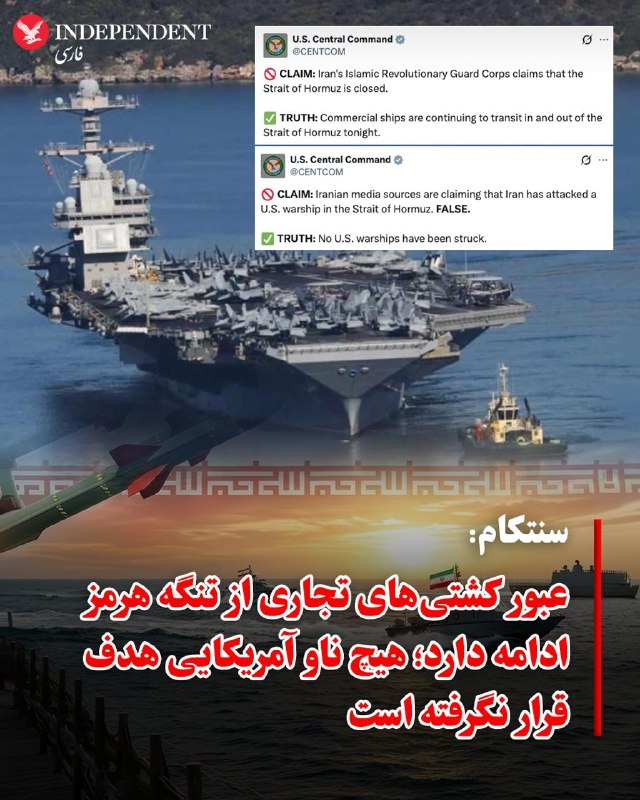

♦️ستاد فرماندهی مرکزی آمریکا (سنتکام) بامداد پنج‌شنبه ۲۱ خردادماه با انتشار بیانیه‌ای ادعای سپاه پاسداران درباره بسته شدن تنگه هرمز را تکذیب کرد.
سنتکام اعلام کرد کشتی‌های تجاری همچنان در حال عبور و مرور از تنگه هرمز هستند. این نهاد همچنین گزارش‌های رسانه‌های ایرانی درباره هدف قرار گرفتن یک ناو جنگی آمریکا در تنگه هرمز را رد کرد و گفت هیچ‌یک از ناوهای جنگی ایالات متحده مورد اصابت قرار نگرفته‌اند.
پیش از این قرارگاه خاتم الانبیاء در بیانیه‌ای تنگه هرمز را کاملا بسته اعلام کرد و تهدید کرد که هرگونه تردد مورد اصابت قرار خواهد گرفت.
‌🇸🇦 Indypersian

🤖 @VahidOOnLine

## VahidOOnLine — post 244834

♦️یسرائیل کاتز، وزیر دفاع اسرائیل، چهارشنبه ۲۰ خردادماه گفت نباید تصور کرد جنگ به پایان رسیده است و «کارزار علیه حکومت ایران هنوز تا پایان فاصله زیادی دارد.» او افزود ارتش اسرائیل برای حمله به حکومت ایران با «قدرت بسیار زیاد» آماده است و در صورت حمله حکومت ایران به اسرائیل، حکومت ایران «ضربه سنگینی» دریافت خواهد کرد.

کاتز این اظهارات را در مراسم اهدای جوایز وزارت دفاع اسرائیل بیان کرد. او همچنین گفت خاورمیانه در حال تغییر است و ارتش اسرائیل توانایی اجرای عملیات گسترده را حفظ کرده است.

وزیر دفاع اسرائیل در بخش دیگری از سخنانش از عملیات ارتش این کشور علیه حزب‌الله در لبنان سخن گفت و اظهار داشت نیروهای اسرائیلی یک محله مسیحی‌نشین در شهر صور را تخلیه کرده و اعضای حزب‌الله را در آن منطقه هدف قرار داده‌اند. به گفته او، ساکنان این محله اکنون در حال بازگشت به خانه‌های خود هستند.
‌🇸🇦 Indypersian

🤖 @VahidOOnLine

## VahidOOnLine — post 244833

  

فرماندهی مرکزی ارتش آمریکا، سنتکام، در واکنش به ادعای سپاه پاسداران درباره بستن تنگه هرمز اعلام کرد گزارش‌ها مبنی بر مسدود شدن این گذرگاه راهبردی صحت ندارند.

به گفته سنتکام، کشتی‌های تجاری هم‌اکنون هم از تنگه هرمز وارد و خارج می‌شوند و عبور دریایی ادامه دارد.

همزمان تنش‌ها میان نیروهای آمریکایی و حکومت ایران در آب‌های منطقه همچنان ادامه دارد.
‌🏁 🇬🇧 IranintlTV

🤖 @VahidOOnLine

## VahidOOnLine — post 244832

  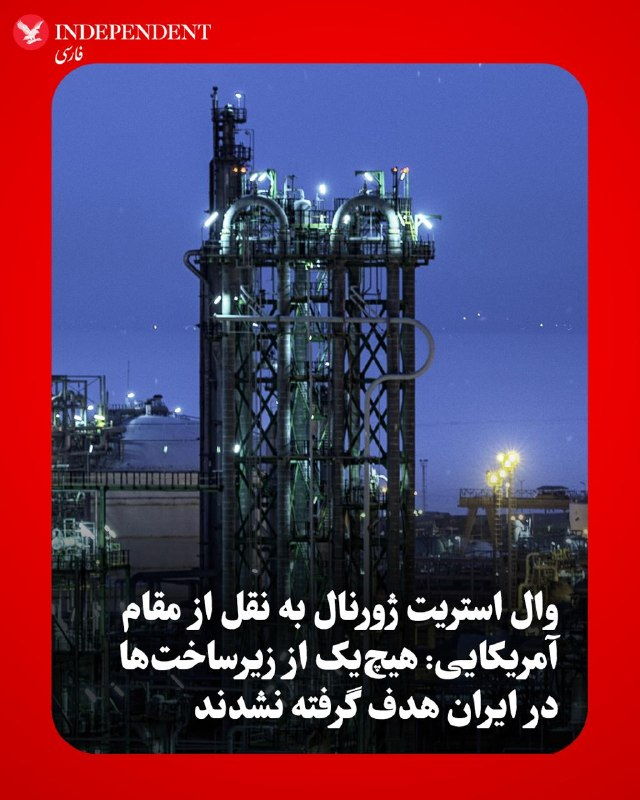

♦️یک مقام ارشد آمریکایی به وال استریت ژورنال گفت نیروهای نظامی ایالات متحده در حال هدف قرار دادن سامانه‌های پدافند هوایی و سایت‌های راداری در نزدیکی تنگه هرمز هستند.
این مقام افزود هیچ‌یک از زیرساخت‌ها در این حملات هدف قرار نگرفته‌اند.
رسانه‌های داخل ایران نیز گزارش دادند که در مناطق مختلف حاشیه تنگه هرمز، از جمله بندرعباس، جزیره قشم و سیریک، انفجارهایی رخ داده است.
‌🇸🇦 Indypersian

🤖 @VahidOOnLine

## VahidOOnLine — post 244831

  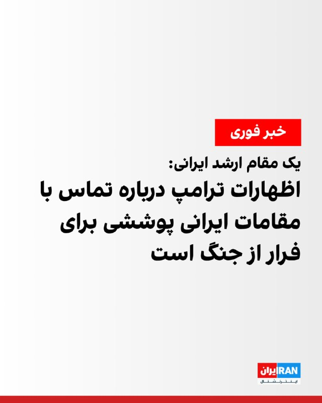

صدا و سیما به نقل از یک مقام ارشد جمهوری اسلامی اعلام کرد اظهارات ترامپ درباره تماس او با مقامات ایرانی دروغ است.
این مقام افزود: این اظهارات پوششی برای فرار از جنگ علیه جمهوری اسلامی است.
‌🏁 🇬🇧 IranintlTV

🤖 @VahidOOnLine

## VahidOOnLine — post 244830

  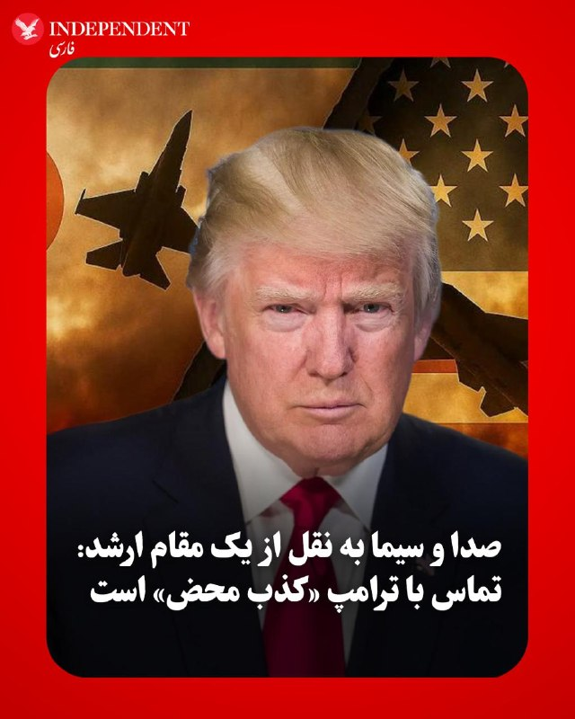

♦️ صداوسیما بامداد پنجشنبه ۲۱ خردادماه به نقل از یک مقام ارشد گزارش فاکس‌نیوز مبنی بر اینکه مقامات تهران با دونالد ترامپ تماس گرفته و از او خواسته‌اند حمله‌ها متوقف شود را تکذیب کرد و آن را «کذب محض» خواند.
این واکنش پس از آن مطرح شد که فاکس‌نیوز به نقل از دونالد ترامپ، رئیس‌جمهوری آمریکا، گزارش داد او به‌طور مستقیم با مقام‌های جمهوری اسلامی گفت‌وگو کرده و آنها از ترامپ خواسته‌اند حملات آمریکا متوقف شود.
‌🇸🇦 Indypersian

🤖 @VahidOOnLine

## VahidOOnLine — post 244829

  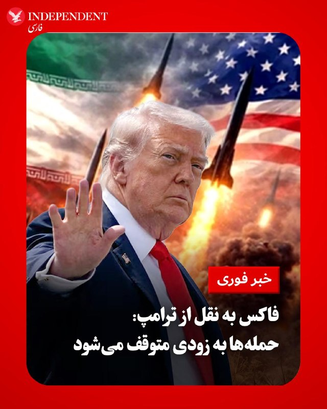

♦️فاکس‌نیوز به نقل از ترامپ گزارش داد که از ایران با او تماس گرفته‌اند و خواستار توقف حمله‌ها شده‌اند. خبرنگار فاکس گفت که رئیس‌جموری آمریکا به او گفته است که حمله‌ها به زودی متوقف خواهد شد. پیش‌تر اکسیوس گزارش داده بود که احتمالا حمله‌ها شدید اما کوتاه‌مدت خواهد بود.
‌🇸🇦 Indypersian

🤖 @VahidOOnLine

## VahidOOnLine — post 244828

  

دونالد ترامپ، رییس‌جمهوری آمریکا، در گفت‌وگو با شبکه فاکس‌نیوز اعلام کرد جنگنده‌های آمریکایی هم اکنون در آسمان ایران در حال عملیات هستند.

او افزود مقام‌های جمهوری اسلامی از او خواسته‌اند بمباران‌ها متوقف شود و گفت به طور مستقیم با مقام‌های ایرانی گفت‌وگو کرده است.

ترامپ تاکید کرد حملات هوایی به زودی متوقف خواهد شد، اما احتمال انجام حملات بیشتر علیه ایران را رد نکرد. او همچنین گفت اسرائیل در حملات جاری آمریکا علیه اهدافی در ایران نقشی نداشته است.
‌🏁 🇬🇧 IranintlTV

🤖 @VahidOOnLine

## VahidOOnLine — post 244827

  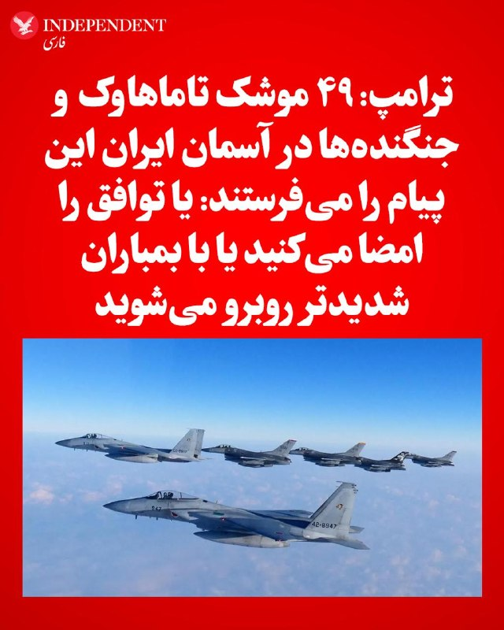

♦️فاکس‌نیوز به نقل از دونال ترامپ گزارش داد که اگر تهران توافق را امضا نکند، کارزار عملیات نظامی ادامه پیدا می‌کند و فرداشب با بمباران شدیدتری روبرو خواهد شد. ترامپ گفته است که ۴۹ موشک تاماهاوک و جنگنده‌ها در آسمان ایران این پیام را به مقامات تهران ارسال می‌کند که یا جنگ از سرگرفته می‌شود و در میدان نبرد ضربه‌های سنگین‌تری را متحمل می‌شوند یا اینکه توافقی را که مذاکره‌کنندگان آمریکایی ارایه کرده‌اند،‌امضا می‌کنند.
‌🇸🇦 Indypersian

🤖 @VahidOOnLine

## VahidOOnLine — post 244826

  

♦️ترامپ مستقیما با مقامات ارشد حکومت ایران گفتگو کرده است؛ مقامات تهران از ترامپ خواستند حملات را متوقف کند
فاکس‌نیوز به نقل از دونالد ترامپ، رئیس‌جمهوری آمریکا گزارش داد که او به‌طور مستقیم با مقامات جمهوری اسلامی گفتگو کرده است و آنها از ترامپ خواسته‌اند که حمله‌ها را متوقف کند
‌🇸🇦 Indypersian

🤖 @VahidOOnLine

## VahidOOnLine — post 244825

  

روزنامه وال‌استریت ژورنال چهارشنبه شنبه شب به وقت واشینگتن به نقل از یک مقام ارشد آمریکایی گزارش داد هیچ سایت زیرساختی در ایران مورد اصابت قرار نگرفته است.

براساس این گزارش، نیروهای نظامی ایالات متحده به سامانه‌های پدافند هوایی و سایت‌های راداری در نزدیکی تنگه هرمز حمله کرده‌اند.

بر اساس این گزارش، انفجارهای متعددی در امتداد تنگه هرمز از جمله در بندرعباس، جزیره قشم و سیریک و چندین نقطه جنوبی ایران شنیده شده است.
‌🏁 🇬🇧 IranintlTV

🤖 @VahidOOnLine

## VahidOOnLine — post 244824

  

رسانه‌های داخلی گزارش دادند دو کشتی که قصد «عبور غیرقانونی» از تنگه هرمز را داشتند، هدف قرار گرفته‌اند.
این رسانه‌ها جزئیاتی درباره هویت کشتی‌ها یا میزان خسارات احتمالی منتشر نکرده‌اند و تاکنون مقام‌های رسمی دیگر نیز توضیحی در این‌باره ارائه نداده‌اند.
‌🏁 🇬🇧 IranintlTV

🤖 @VahidOOnLine

## VahidOOnLine — post 244823

  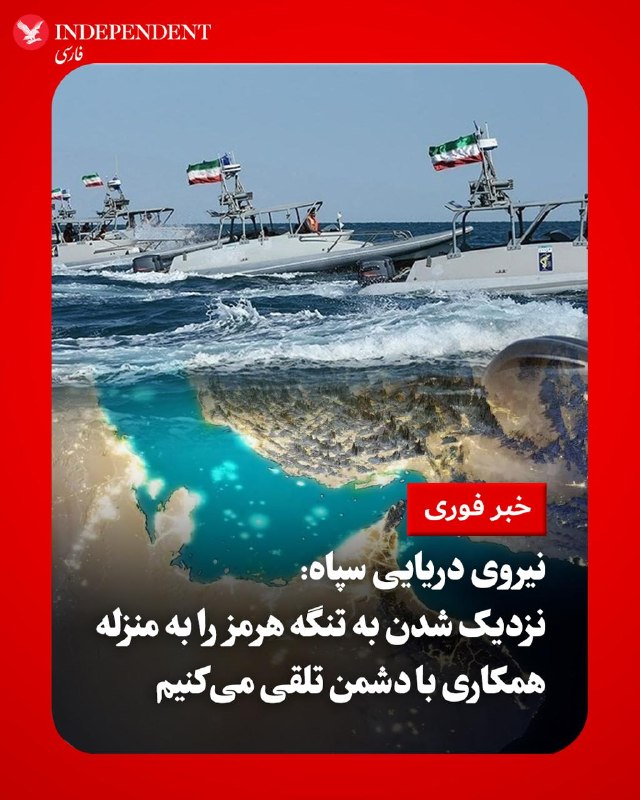

♦️نیروی دریایی سپاه در بیانیه‌ای اعلام کرد که تنگه هرمز تا اطلاع ثانوی بسته خواهد بود. در این بیانیه آمده است: «هشدار می‌دهیم هیچ شناوری از لنگرگاه خود در خلیج فارس و دریای عمان حرکت نداشته باشد. نزدیک شدن به تنگه هرمز به‌منزله همکاری با دشمن تلقی می شود.» پیش‌تر قرارگاه خاتم نیز هشدار داده بود که به سمت هر کشتی که از تنگه هرمز عبور کند، شلیک خواهد شد. همزمان تسنیم از مورد اصابت قرار گرفتن دو کشتی در تنگه هرمز خبر داده است.
‌🇸🇦 Indypersian

🤖 @VahidOOnLine

## VahidOOnLine — post 244822

  

♦️دقایقی پس از بیانیه قرارگاه خاتم که در آن تنگه هرمز کاملا بسته اعلام شده و هشدار داده شده بود که به هر شناوری که قصد عبور داشته باشد شلیک می‌شود، تسنیم از مورد اصابت قرار گرفتن دو کشتی در تنگه هرمز خبر داد. در گزارش این رسانه وابسته به سپاه آمده است که کشتی‌های «متخلف» قصد داشتند «به‌طور غیرقانونی» از تنگه هرمز عبور کنند. هنوز مقامات رسمی و سنتکام در این زمینه اظهارنظر نکرده‌اند.
‌🇸🇦 Indypersian

🤖 @VahidOOnLine

## VahidOOnLine — post 244821

  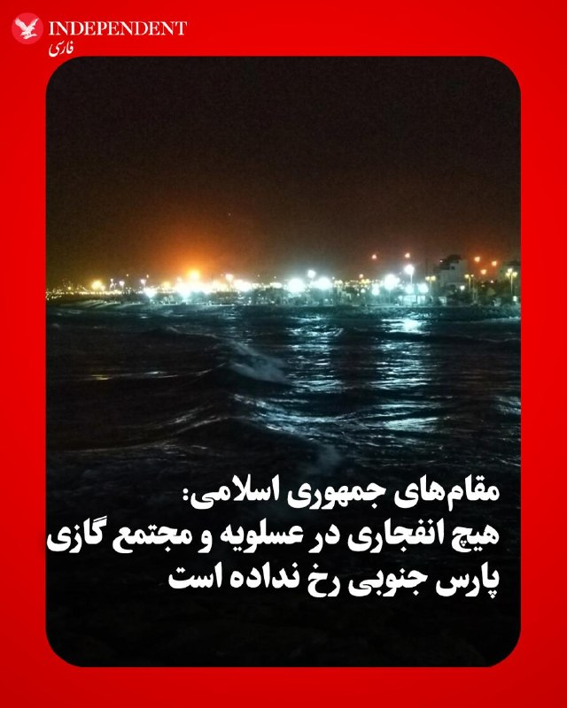

♦️خبرگزاری تسنیم وابسته به سپاه پاسداران بامداد پنجشنبه ۲۱ خرداد به نقل از مقام‌های محلی و استانی گزارش داد که هیچ انفجاری در عسلویه یا مجتمع گازی پارس جنوبی رخ نداده است.

اسکندر پاسالار، فرماندار عسلویه، با رد گزارش‌های منتشرشده در برخی شبکه‌های اجتماعی گفت: «در عسلویه هیچ انفجاری نداشتیم و شهر و منطقه اقتصادی عسلویه در آرامش کامل است.»

تسنیم نیز اعلام کرد خبرهایی که از ساعاتی پیش درباره بمباران یک کارخانه پتروشیمی در عسلویه به نقل از این خبرگزاری منتشر شده، در هیچ‌یک از خروجی‌های رسمی این رسانه منتشر نشده و صحت ندارد.

معاون سیاسی، امنیتی و اجتماعی استاندار بوشهر نیز با رد این گزارش‌ها گفت تاکنون هیچ انفجاری در مجتمع گازی عسلویه رخ نداده است.
‌🇸🇦 Indypersian

🤖 @VahidOOnLine

## VahidOOnLine — post 244820

  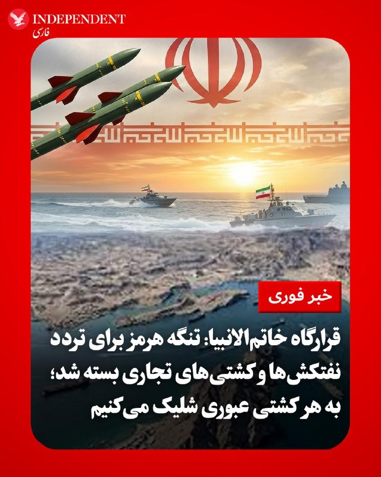

♦️قرارگاه خاتم در بیانیه‌ای که تسنیم منتشر کرده تنگه هرمز را کاملا بسته اعلام کرد و تهدید کرد که هرگونه تردد مورد اصابت قرار خواهد گرفت. در این بیانیه آمده است که این ممنوعیت شامل کشتی‌های تجاری و نتفکش‌ها است.
‌🇸🇦 Indypersian

🤖 @VahidOOnLine

## VahidOOnLine — post 244819

  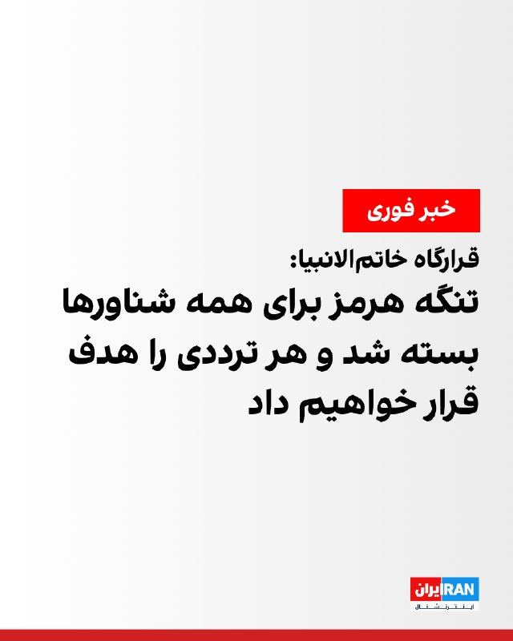

قرارگاه مرکزی خاتم‌الانبیا اعلام کرد در پی آنچه «ادامه شرارت‌های آمریکا» و آغاز حملات ارتش این کشور به برخی مناطق جنوبی استان هرمزگان خوانده، تنگه هرمز از این لحظه به دلیل «ناامنی در منطقه» برای تردد هر نوع شناور، اعم از نفتکش و تجاری، بسته است و هرگونه عبور هدف قرار خواهد گرفت.

قرارگاه خاتم‌الانبیا اظهارات مقام‌های آمریکا درباره عبور کشتی از تنگه هرمز را تکذیب کرد.
‌🏁 🇬🇧 IranintlTV

🤖 @VahidOOnLine

## VahidOOnLine — post 244818

  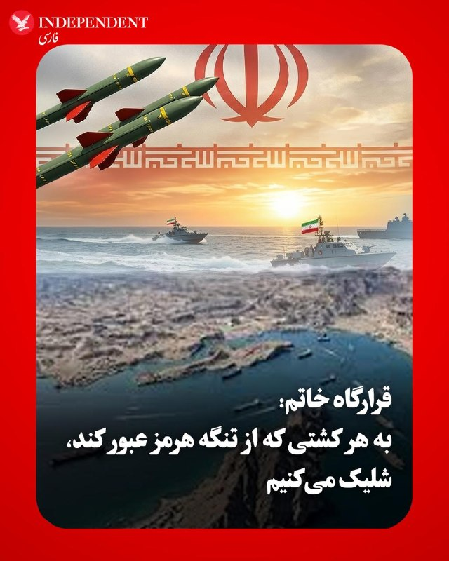

♦️قرارگاه خاتم در بیانیه‌ای که تسنیم منتشر کرده تنگه هرمز را کاملا بسته اعلام کرد و تهدید کرد که هرگونه تردد مورد اصابت قرار خواهد گرفت. در این بیانیه آمده است که این ممنوعیت شامل کشتی‌های تجاری و نتفکش‌ها است.
‌🇸🇦 Indypersian

🤖 @VahidOOnLine

## VahidOOnLine — post 244817

♦️ پیت هگست، وزیر جنگ آمریکا، چهارشنبه عصر به وقت واشینگتن در گفت‌وگو با خبرنگاران در مقر فرماندهی مرکزی ایالات متحده (سنتکام) در شهر تمپا ایالت فلوریدا، در پاسخ به سوالی درباره توانایی آمریکا برای شناسایی و هدف قرار دادن رهبران ارشد جمهوری اسلامی و سپاه پاسداران در صورت شکست مذاکرات، گفت سنتکام از فرصت آتش‌بس برای تکمیل اطلاعات و به‌روزرسانی فهرست اهداف استفاده کرده است.

هگست افزود توانایی آمریکا در هدف‌گیری، شناسایی اهداف، رصد تحرکات و نفوذ به شبکه‌ها نسبت به زمان آغاز عملیات «خشم حماسی» به شکل قابل توجهی افزایش یافته است.

وزیر جنگ آمریکا همچنین گفت جمهوری اسلامی در حال حاضر از توانایی محدودی برای تولید موشک و پهپاد برخوردار است و هرگونه تجهیزات و تسلیحاتی که در اختیار داشته باشد، در صورت لزوم دوباره هدف حملات آمریکا قرار خواهد گرفت.
‌🇸🇦 Indypersian

🤖 @VahidOOnLine

## VahidOOnLine — post 244816

  

احسان جهانیان، معاون سیاسی امنیتی و اجتماعی استاندار بوشهر، به صداوسیما گفت: تاکنون هیچ انفجاری در مجتمع گازی عسلویه رخ نداده است. پیش‌تر گزارش‌هایی از هدف قرار گرفتن یک کارخانه پتروشیمی متعلق به مجتمع گاز پارس جنوبی در عسلویه منتشر شده بود.
‌🏁 🇬🇧 IranintlTV

🤖 @VahidOOnLine

## WithYashar — post 14464

ترامپ : این آتش بس، بیشترین آتش‌بسِ نقض‌شده تو تاریخ جهان بود. @withyashar

## WithYashar — post 14463

ترامپ :
این آتش بس، بیشترین آتش‌بسِ نقض‌شده تو تاریخ جهان بود.
@withyashar

## WithYashar — post 14462

سنتکام : رسانه ی جمهوری اسلامی درباره هدف قرار دادن کشی آمریکایی هم کذبه و هیچ کشتی هدف قرار نگرفته.

@withyashar

## WithYashar — post 14461

سنتکام: ادعای سپاه پاسداران مبنی بر بستن تنگه هرمز کذب است!

حقیقت: کشتی‌های تجاری امشب به عبور و مرور در تنگه هرمز ادامه می‌دهند.
@withyashar

## WithYashar — post 14460

ترامپ: حملات امشب به پایان رسیده.
@withyashar

## WithYashar — post 14459

ترامپ: نیروهای آمریکایی ۴۹ موشک تاماهاوک به سمت ایران شلیک کردند
@withyashar

## WithYashar — post 14458

ترامپ: اگر ایران توافقنامه رو امضا نکنه، فرداشب به بمباران آنها برمیگردیم.
@withyashar

## WithYashar — post 14457

  <a href="telegram/content/WithYashar_14457_1781136807.mp4" target="_blank">🎬 Download video</a>

🎬 Video

## WithYashar — post 14456

ترامپ به فاکس : ایرانی‌ها ازم خواستن بمباران رو متوقف کنم

مستقیم با مقام‌های ایرانی صحبت کردم
جنگنده‌های آمریکا در حال پرواز روی آسمون ایران هستن
@withyashar

## WithYashar — post 14455

ترامپ: بمباران به زودی تموم میشه!
@withyashar

## WithYashar — post 14454

پاکستان: به آمریکا اعلام کردیم که دیگر دست از تلاش برای میانجیگری برمی‌داریم
@withyashar

## WithYashar — post 14453

## WithYashar — post 14452

هوافضای ۳پا: پاسداران برای یک عملیات تاریخی آماده شده اند!
@withyashar

## WithYashar — post 14451

## WithYashar — post 14450

## WithYashar — post 14449

گزارشات اولیه از حملات هواپیمای جنگی A-10 آمریکا به قایق های تندرو سپاه در جزیره لارک
@withyashar

## WithYashar — post 14448

  <a href="https://t.me/withyashar/14448" target="_blank">📎 Download file</a>

📱 @withyashar

📱 https://instagram.com/yashar

## WithYashar — post 14447

مقامات آمریکایی به وال استریت ژورنال گفتند که ترامپ دیپلماسی با ایران را رها نکرده است، اگرچه صبر او به طور فزاینده‌ای کاهش یافته است.

حتی پس از تأیید حملات جدید در اوایل این هفته، ترامپ به دستیارانش دستور داد پیامی را از طریق واسطه‌های قطری به تهران منتقل کنند که این حملات پاسخی به حادثه پهپاد است که تقریباً خدمه آپاچی را کشت، نه آغاز جنگ تمام‌عیار.
@withyashar

## WithYashar — post 14446

قرارگاه خاتم الانبیا: تنگه هرمز از این لحظه برای تمام شناور ها بسته اعلام میشه و هیچ شناوری حق عبور نداره
@withyashar

## WithYashar — post 14445

وزیر خارجه یمن: نسبت به ادامه تجاوز آمریکا به ایران هشدار می‌دهیم
@withyashar

## FoxNewsTwitter — post 342831

  <a href="telegram/content/FoxNewsTwitter_342831_1781136809.mp4" target="_blank">🎬 Download video</a>

Fox News (Twitter/X)

Democrats' defensive disaster leads to two runs for Republicans after a hit by Rep. Bill Huizenga that didn't leave the infield in the annual Congressional Baseball Game for Charity.

Republican and Democratic lawmakers took the field in one of Washington's longest-running traditions, with the GOP looking to extend a multi-year winning streak.

The matchup has raised millions for charity over the years and offers a rare moment where political rivals compete side-by-side outside the halls of Congress.

## FoxNewsTwitter — post 342830

  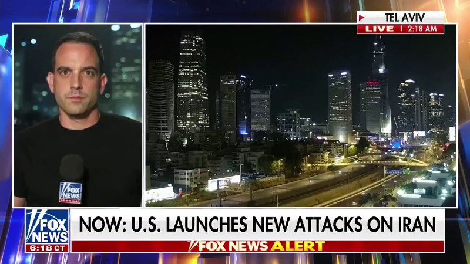

Fox News (Twitter/X)

RT @TreyYingst: Spoke with President Trump tonight as he oversaw the U.S. military strikes against Iran from the Situation Room.

The President told me he spoke directly with Iranian officials tonight who asked him to stop bombing.

49 Tomahawk missiles had been fired by the United States at the time we spoke, along with bombing from fighter jets. Closest target to Tehran was approximately 40 miles outside of the city.

Trump added that the bombing will stop shortly, but that if they don't sign the agreement, "we'll bomb the shit out of them."

President Trump called this "the most violated ceasefire in the history of the world."

Vice President JD Vance told me the United States is dealing with both moderate and more extreme voices in Iran as part of the negotiation process.

More updates to follow on @FoxNews.

## FoxNewsTwitter — post 342829

  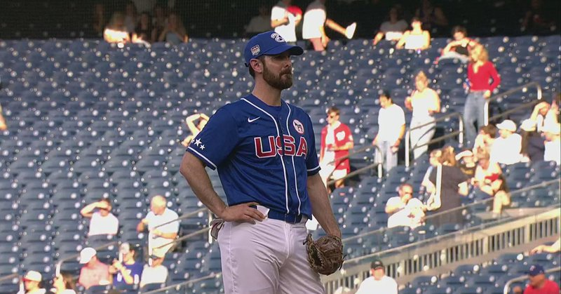

Fox News (Twitter/X)

WATCH LIVE: Annual Congressional Baseball Game for Charity at Nationals Park https://twitter.com/i/broadcasts/1oKMvvrRMznGQ

## pm_afshaa — post 93528

  <a href="telegram/content/pm_afshaa_93528_1781136811.webm" target="_blank">🎬 Download video</a>

🔴تسنیم: حمله ایران به برخی پایگاه‌های آمریکایی در منطقه.

💧 Rainbet.com the #1 Non-KYC Crypto Casino & Sportsbook @rainbetcom

😁 @Pm_Afshaa

## pm_afshaa — post 93527

  <a href="telegram/content/pm_afshaa_93527_1781136812.webm" target="_blank">🎬 Download video</a>

🔴گزارش‌ها از چند انفجار سنگین دیگر همراه با لرزش زمین در آبیک قزوین حکایت داره. محدوده انفجارها در کوه است.

💧 Rainbet.com the #1 Non-KYC Crypto Casino & Sportsbook @rainbetcom

😁 @Pm_Afshaa

## pm_afshaa — post 93526

چند انفجار در کرج

💧 Rainbet.com the #1 Non-KYC Crypto Casino & Sportsbook @rainbetcom

😁 @Pm_Afshaa

## pm_afshaa — post 93525

  <a href="telegram/content/pm_afshaa_93525_1781136812.webm" target="_blank">🎬 Download video</a>

🔴سنتکام: 🚫 ادعا: سپاه پاسداران مدعی شده که تنگه هرمز بسته است. ✅ واقعیت: کشتی های تجاری امشب به تردد و خروج از تنگه هرمز ادامه خواهند داد. 
💧 Rainbet.com the #1 Non-KYC Crypto Casino & Sportsbook @rainbetcom 
😁 @Pm_Afshaa

## pm_afshaa — post 93524

پرواز گسترده ریز پرنده ها در اسمون خرم اباد

💧 Rainbet.com the #1 Non-KYC Crypto Casino & Sportsbook @rainbetcom

😁 @Pm_Afshaa

## pm_afshaa — post 93523

جالبه سپاه موشکاش تو کونش رفته صداش در نیومده

## pm_afshaa — post 93522

  <a href="telegram/content/pm_afshaa_93522_1781136813.webm" target="_blank">🎬 Download video</a>

🔴ترامپ به فاکس نیوز: ایرانی‌ها ازم خواستن بمباران رو متوقف کنم. مستقیم با مقام‌های ایرانی صحبت کردم. 
💧 Rainbet.com the #1 Non-KYC Crypto Casino & Sportsbook @rainbetcom 
😁 @Pm_Afshaa

## pm_afshaa — post 93521

  <a href="telegram/content/pm_afshaa_93521_1781136813.webm" target="_blank">🎬 Download video</a>

🔴سنتکام:

🚫 ادعا: سپاه پاسداران مدعی شده که تنگه هرمز بسته است.

✅ واقعیت: کشتی های تجاری امشب به تردد و خروج از تنگه هرمز ادامه خواهند داد.

💧 Rainbet.com the #1 Non-KYC Crypto Casino & Sportsbook @rainbetcom

😁 @Pm_Afshaa

## pm_afshaa — post 93520

  <a href="telegram/content/pm_afshaa_93520_1781136814.webm" target="_blank">🎬 Download video</a>

🔴ترامپ: این آتش بس نقض شده ترین آتش بس در تاریخ جهان بود😂

💧 Rainbet.com the #1 Non-KYC Crypto Casino & Sportsbook @rainbetcom

😁 @Pm_Afshaa

## pm_afshaa — post 93519

  <a href="telegram/content/pm_afshaa_93519_1781136814.webm" target="_blank">🎬 Download video</a>

ترامپ گفته توافق امضا نکنید فرداشبم دوباره حمله می‌کنیم.

## pm_afshaa — post 93518

  <a href="telegram/content/pm_afshaa_93518_1781136815.webm" target="_blank">🎬 Download video</a>

🔴ترامپ: حملات امشب به پایان رسیده. 
💧 Rainbet.com the #1 Non-KYC Crypto Casino & Sportsbook @rainbetcom 
😁 @Pm_Afshaa

## pm_afshaa — post 93517

  <a href="telegram/content/pm_afshaa_93517_1781136815.webm" target="_blank">🎬 Download video</a>

🔴ترامپ: حملات امشب به پایان رسیده.

💧 Rainbet.com the #1 Non-KYC Crypto Casino & Sportsbook @rainbetcom

😁 @Pm_Afshaa

## pm_afshaa — post 93516

  <a href="telegram/content/pm_afshaa_93516_1781136816.webm" target="_blank">🎬 Download video</a>

🔴ترامپ به فاکس نیوز:
49 موشک تاماهاوک برای هدف قرار دادن اهداف داخل ایران استفاده شد.

💧 Rainbet.com the #1 Non-KYC Crypto Casino & Sportsbook @rainbetcom

😁 @Pm_Afshaa

## pm_afshaa — post 93515

  <a href="telegram/content/pm_afshaa_93515_1781136816.webm" target="_blank">🎬 Download video</a>

🔴وال‌استریت ژورنال به نقل از یک مقام ارشد آمریکایی:

نیروهای آمریکا سامانه‌های پدافند هوایی و سایت‌های راداری در نزدیکی تنگه هرمز رو هدف قرار دادن و در حمله‌ها هیچ زیرساختی مورد اصابت قرار نگرفت.

💧 Rainbet.com the #1 Non-KYC Crypto Casino & Sportsbook @rainbetcom

😁 @Pm_Afshaa

## pm_afshaa — post 93514

  <a href="telegram/content/pm_afshaa_93514_1781136817.webm" target="_blank">🎬 Download video</a>

🔴ترامپ: حملات به‌زودی پایان خواهد یافت. 
💧 Rainbet.com the #1 Non-KYC Crypto Casino & Sportsbook @rainbetcom 
😁 @Pm_Afshaa

## pm_afshaa — post 93513

  <a href="telegram/content/pm_afshaa_93513_1781136817.webm" target="_blank">🎬 Download video</a>

🔴ترامپ به فاکس نیوز: ایرانی‌ها ازم خواستن بمباران رو متوقف کنم. مستقیم با مقام‌های ایرانی صحبت کردم. 
💧 Rainbet.com the #1 Non-KYC Crypto Casino & Sportsbook @rainbetcom 
😁 @Pm_Afshaa

## pm_afshaa — post 93512

  <a href="telegram/content/pm_afshaa_93512_1781136818.webm" target="_blank">🎬 Download video</a>

🔴ترامپ به فاکس نیوز:
ایرانی‌ها ازم خواستن بمباران رو متوقف کنم. مستقیم با مقام‌های ایرانی صحبت کردم.

💧 Rainbet.com the #1 Non-KYC Crypto Casino & Sportsbook @rainbetcom

😁 @Pm_Afshaa

## pm_afshaa — post 93511

  <a href="telegram/content/pm_afshaa_93511_1781136818.webm" target="_blank">🎬 Download video</a>

🔴ترامپ: جنگنده‌های آمریکا در ایران پرواز میکنن.

💧 Rainbet.com the #1 Non-KYC Crypto Casino & Sportsbook @rainbetcom

😁 @Pm_Afshaa

## pm_afshaa — post 93510

  <a href="telegram/content/pm_afshaa_93510_1781136819.webm" target="_blank">🎬 Download video</a>

🔴والا نیوز عبری:
اسرائیل خودش رو برای احتمال شلیک موشک از سوی ایران، آماده میکنه.

💧 Rainbet.com the #1 Non-KYC Crypto Casino & Sportsbook @rainbetcom

😁 @Pm_Afshaa

## pm_afshaa — post 93509

  <a href="telegram/content/pm_afshaa_93509_1781136819.mp4" target="_blank">🎬 Download video</a>

صدای جنگنده‌های آمریکایی برفراز قشم

💧 Rainbet.com the #1 Non-KYC Crypto Casino & Sportsbook @rainbetcom

😁 @Pm_Afshaa

## mamlekate — post 103670

  <a href="telegram/content/mamlekate_103670_1781136820.mp4" target="_blank">🎬 Download video</a>

به گزارش فاکس نیوز، ‎ترامپ گفته است که به درخواست سران جمهوری اسلامی، بمباران‌ها متوقف خواهد شد؛ اما اگر توافقی امضا نشود، حملات از سر گرفته خواهند شد

@mamlekate

## mamlekate — post 103669

📝 اندیمشک شدیدا صدای جنگنده میاد . ساعت دو بامداد پنجشنبه ۲۱ خرداد

📝 ساعت ۰۲:۱۵ دقیقه صدای ممتد عبور جنگنده. ما از شهر بافت، استان کرمان شنیدیم صدا رو، لشکرکشی بود

📝 کرمانشاه ساعت۲:۳۰ دوتا صدای انفجار مهیب از دور آمد
پنجشنبه۲۱ خرداد

📝 ۲:۳۶ بندرعباس مجدد صدای انفجار اومد

@mamlekate_pm

## VahidOnline — post 76179

پیام‌های دریافتی از حوالی شرق استان البرز و غرب استان قزوین

من سمت ساوجبلاغ کرجم
ده دقیقه صدای موشک اومد
الان صدای پنج انفجار اومد ۳:۳۲

سلام همین الان ساعت ۳:۳۳صبح اطراف هشتگرد صدای اتفجار و موج میاد

سلام ۶ بار سمت نظرآباد البرز رو زدن
ساعت ۳.۳۴
۲۱ خرداد

ساعت۳:۳۰
شهر جدید هشتگرد
۶/۷ تا انفجار پشت هم
اما خیلی دوره
نمیدونم کرجه یا تهران

ابیک قزوین ساعت ۳:۳۴
بامداد ۲۱ خرداد
صدای و موج انفجار اومد، به نظر میاد از سمت کرج یا هشتگرد باشه
۵-۶ تا بود حداقل

۳:۳۰ صدای ۵ تا انفجاد اومد از اطراف هشتگرد بود فکر کنم قشنگ شنیدم

سلام وحید نظراباد از دور صدا ۷.۸ تا موشک پشت هم اومد در های خونه لرزید

هشتگرد ۵ صدای انفجار از طرف اشتهارد

سلام وحید جان ساعت ۳.۳۳ صدای ۱۰ تا انفجار شدید اومد من نظرآبادم ولی صدا از دور بود

پشت هم موشک داره میاد با نور انفجار و صدای مهیب
محدوده نظر اباد هشتگرد
از پشت بوم کاملا مشخصه

سلاممم کرج هشتگرد 4تا صدای انفجار شدید اومد
دوتاش خیلی بزرگ بود بطوری ک کل خانواده از خواب پریدن
قشنگ کل خونه لرزید

۵ ۶ تا صدای انفجار هشتگرد جدید ساعت ۳:۲۰

سلام وحید جان
۶ بار صدای انفجار مهیب اطراف اشتهارد شنیدیم‌ از حدود ساعت ۳:۲۰ تا ۳:۳۵

📡 @VahidOnline

## VahidOnline — post 76178

  

صدا و سیما به نقل از یک مقام ارشد جمهوری اسلامی اعلام کرد اظهارات ترامپ درباره تماس او با مقامات ایرانی دروغ است.
این مقام افزود: این اظهارات پوششی برای فرار از جنگ علیه جمهوری اسلامی است.
@VahidOOnLine

📡 @VahidOnline

## VahidOnline — post 76177

  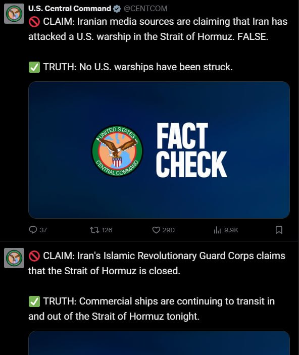

پست‌‌‌های اکانت فرماندهی مرکزی ایالات متحده، سنتکام
ترجمه ماشین:

🚫 ادعا: سپاه پاسداران انقلاب اسلامی ایران مدعی شده است که تنگه هرمز بسته شده است.
✅ واقعیت: کشتی‌های تجاری امشب همچنان در حال عبور و مرور به داخل و خارج از تنگه هرمز هستند.
CENTCOM
🚫 ادعا: منابع رسانه‌ای ایران مدعی‌اند که ایران به یک ناو جنگی آمریکا در تنگه هرمز حمله کرده است. نادرست است.
✅ واقعیت: هیچ ناو جنگی آمریکایی هدف قرار نگرفته است.
CENTCOM

📡 @VahidOnline

## VahidOnline — post 76176

  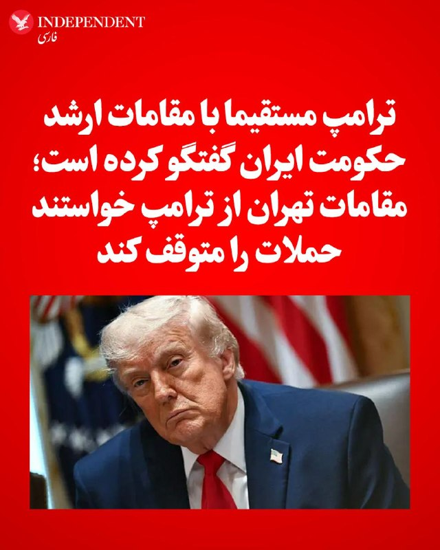

☄️ ترامپ: مقامات ایرانی در تماس مستقیم خواستند بمباران متوقف شود

پست خبرنگار فاکس‌نیوز، ترجمه ماشین:
امشب با پرزیدنت ترامپ صحبت کردم؛ در حالی که او از اتاق وضعیت، حملات نظامی آمریکا علیه ایران را زیر نظر داشت.

رئیس‌جمهور به من گفت که امشب مستقیماً با مقام‌های ایرانی صحبت کرده است؛ مقام‌هایی که از او خواسته‌اند بمباران را متوقف کند.

در زمان گفت‌وگوی ما، ایالات متحده ۴۹ موشک تاماهاوک شلیک کرده بود و جنگنده‌ها نیز در حال بمباران بودند.
نزدیک‌ترین هدف به تهران حدود ۴۰ مایل [۶۴ کیلومتر] بیرون از شهر بود.

ترامپ افزود که بمباران به‌زودی متوقف خواهد شد، اما اگر آن‌ها توافق را امضا نکنند، «تا سر حد نابودی بمبارانشان می‌کنیم.»

پرزیدنت ترامپ این را «نقض‌شده‌ترین آتش‌بس در تاریخ جهان» خواند.

جی‌دی ونس، معاون رئیس‌جمهور، به من گفت که ایالات متحده در روند مذاکرات، هم با صداهای میانه‌رو و هم با صداهای تندروتر در ایران سروکار دارد.

به‌روزرسانی‌های بیشتر در فاکس‌نیوز منتشر خواهد شد.
TreyYingst

📡 @VahidOnline

## VahidOnline — post 76174

  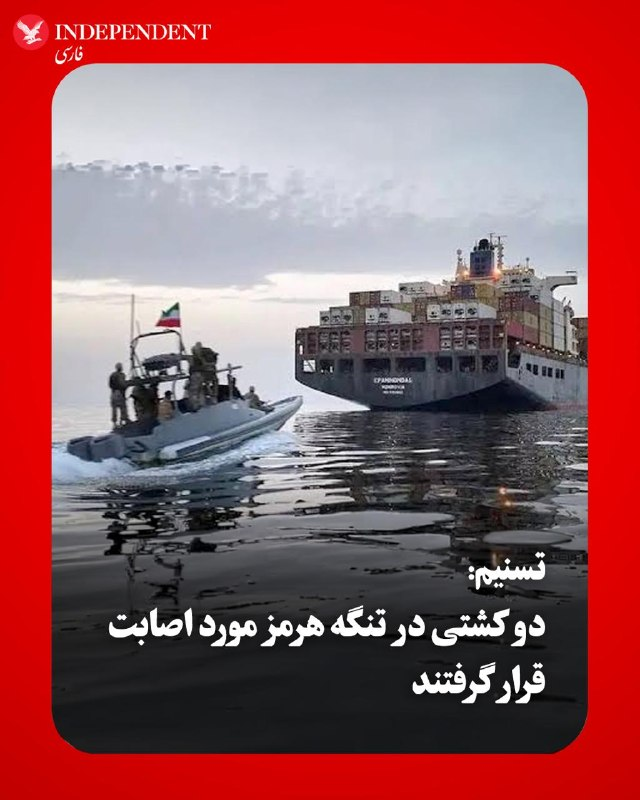

♦️دقایقی پس از بیانیه قرارگاه خاتم که در آن تنگه هرمز کاملا بسته اعلام شده و هشدار داده شده بود که به هر شناوری که قصد عبور داشته باشد شلیک می‌شود، تسنیم از مورد اصابت قرار گرفتن دو کشتی در تنگه هرمز خبر داد. در گزارش این رسانه وابسته به سپاه آمده است که کشتی‌های «متخلف» قصد داشتند «به‌طور غیرقانونی» از تنگه هرمز عبور کنند. هنوز مقامات رسمی و سنتکام در این زمینه اظهارنظر نکرده‌اند.
@VahidOOnLine

📡 @VahidOnline

## VahidOnline — post 76173

  

⚡️روزنامه وال‌استریت ژورنال پنج‌شنبه شب به وقت واشنگتن به نقل از یک مقام ارشد آمریکایی گزارش داد که هیچ سایت زیرساختی در ایران مورد اصابت قرار نگرفته است و نیروهای نظامی ایالات متحده در حال حمله به پدافند هوایی و سایت‌های راداری در نزدیکی تنگه هرمز بودند. انفجارهایی در امتداد تنگه هرمز، از جمله بندرعباس، جزیره قشم و سیریک گزارش شده است.
@VahidHeadline

📡 @VahidOnline

## VahidOnline — post 76172

پیام‌های دریافتی:
قشم ۲:۳۵ صدا و لرزشش حس شد

۲:۳۵ دقیقه بندرعباس دوباره صدای انفجار اومد

سلام بندرعباس دوباره زدن ۲:۳۷
[احتمالا منظورشون اینه که صدا شنیدند!]

📡 @VahidOnline

## VahidOnline — post 76171

  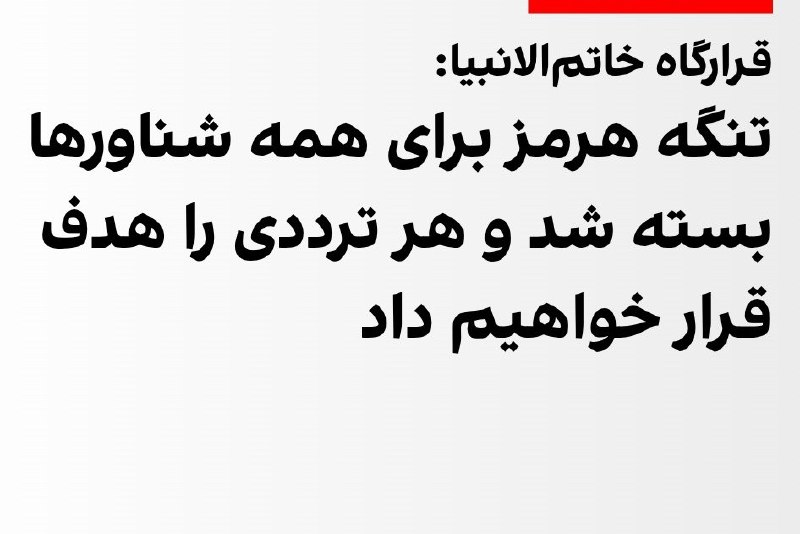

سپاه: هرگونه تردد شناورها از تنگه هرمز مورد اصابت قرار خواهد گرفت

منابع حکومتی:
قرارگاه مرکزی حضرت خاتم‌الانبیا(ص): از این لحظه به دلیل ناامنی در منطقه، تنگه هرمز برای تردد هر نوع شناور اعم از نفتکش و تجاری بسته اعلام می گردد و هرگونه تردد مورد اصابت قرار خواهد گرفت

در ادامه شرارت های آمریکای جنایتکار و با توجه به آغاز حملات ارتش متجاوز آن کشور به برخی از مناطق جنوب در استان هرمزگان، از این لحظه به دلیل ناامنی در منطقه، تنگه هرمز برای تردد هر نوع شناور اعم از نفتکش و تجاری بسته اعلام می گردد و هرگونه تردد مورد اصابت قرار خواهد گرفت.

ادعای آمریکا مبنی بر عبور کشتی از تنگه یاد شده تکذیب می شود.

📡 @VahidOnline

## kianmeli1 — post 87910

🔴ساعت ۰۳:۳۲ چند انفجار در محدوده «آبیک قزوین» شنیده شد.
https://t.me/kianmeli1

## kianmeli1 — post 87909

  

🔴فاکس نیوز-ترامپ می‌گوید اگر ایران با توافق موافقت نکند، فردا مجدد «ایران را بمباران خواهیم کرد».
https://t.me/kianmeli1

## kianmeli1 — post 87908

🔴فوری
۲:۳۵ دقیقه بندرعباس و قشم صدای انفجار اومد
https://t.me/kianmeli1

## kianmeli1 — post 87907

‏🔴نیروی دریایی سپاه: دو کشتی که قصد عبور از تنگه هرمز را داشتند، مورد اصابت قرار گرفتند
https://t.me/kianmeli1

## kianmeli1 — post 87906

🔴فوری-پدافند کرمانشاه در تنگ کنشت فعال شد
https://t.me/kianmeli1

## kianmeli1 — post 87905

🔴فوری-پدافند هوایی در رباط کریم تهران فعال شد
https://t.me/kianmeli1

## kianmeli1 — post 87904

  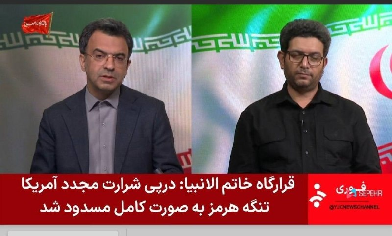

🔴زیرنویس شبکه خبر

تنگه هرمز به صورت کامل مسدود شد

[باید ببینیم ترامپ چه میکند]
https://t.me/kianmeli1

## kianmeli1 — post 87903

🔴فوری-قرارگاه خاتم

تنگه هرمز برای تمام کشتی ها بسته شد
https://t.me/kianmeli1

## IranIntlTV — post 341604

  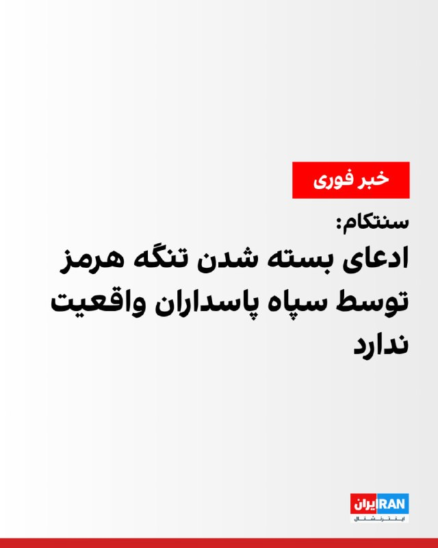

فرماندهی مرکزی ارتش آمریکا، سنتکام، در واکنش به ادعای سپاه پاسداران درباره بستن تنگه هرمز اعلام کرد گزارش‌ها مبنی بر مسدود شدن این گذرگاه راهبردی صحت ندارند.

به گفته سنتکام، کشتی‌های تجاری هم‌اکنون هم از تنگه هرمز وارد و خارج می‌شوند و عبور دریایی ادامه دارد.

همزمان تنش‌ها میان نیروهای آمریکایی و حکومت ایران در آب‌های منطقه همچنان ادامه دارد.

## IranIntlTV — post 341603

  

صدا و سیما به نقل از یک مقام ارشد جمهوری اسلامی اعلام کرد اظهارات ترامپ درباره تماس او با مقامات ایرانی دروغ است.
این مقام افزود: این اظهارات پوششی برای فرار از جنگ علیه جمهوری اسلامی است.

## IranIntlTV — post 341602

  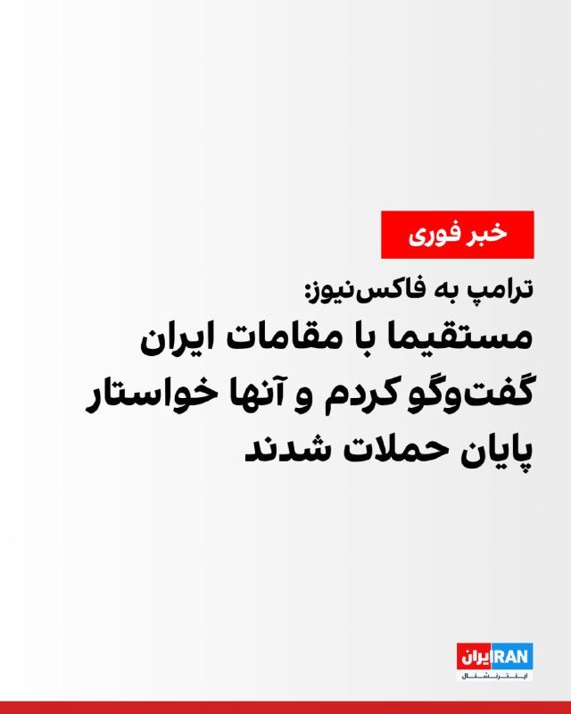

دونالد ترامپ، رییس‌جمهوری آمریکا، در گفت‌وگو با شبکه فاکس‌نیوز اعلام کرد جنگنده‌های آمریکایی هم اکنون در آسمان ایران در حال عملیات هستند.

او افزود مقام‌های جمهوری اسلامی از او خواسته‌اند بمباران‌ها متوقف شود و گفت به طور مستقیم با مقام‌های ایرانی گفت‌وگو کرده است.

ترامپ تاکید کرد حملات هوایی به زودی متوقف خواهد شد، اما احتمال انجام حملات بیشتر علیه ایران را رد نکرد. او همچنین گفت اسرائیل در حملات جاری آمریکا علیه اهدافی در ایران نقشی نداشته است.

## IranIntlTV — post 341601

  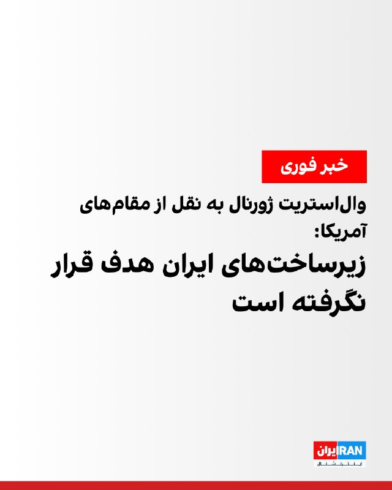

روزنامه وال‌استریت ژورنال چهارشنبه شنبه شب به وقت واشینگتن به نقل از یک مقام ارشد آمریکایی گزارش داد هیچ سایت زیرساختی در ایران مورد اصابت قرار نگرفته است.

براساس این گزارش، نیروهای نظامی ایالات متحده به سامانه‌های پدافند هوایی و سایت‌های راداری در نزدیکی تنگه هرمز حمله کرده‌اند.

بر اساس این گزارش، انفجارهای متعددی در امتداد تنگه هرمز از جمله در بندرعباس، جزیره قشم و سیریک و چندین نقطه جنوبی ایران شنیده شده است.
https://iranintl.com/202606108966

## IranIntlTV — post 341600

  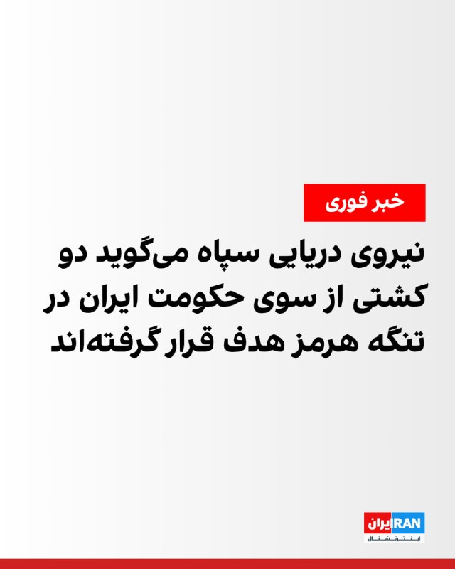

رسانه‌های داخلی گزارش دادند دو کشتی که قصد «عبور غیرقانونی» از تنگه هرمز را داشتند، هدف قرار گرفته‌اند.
این رسانه‌ها جزئیاتی درباره هویت کشتی‌ها یا میزان خسارات احتمالی منتشر نکرده‌اند و تاکنون مقام‌های رسمی دیگر نیز توضیحی در این‌باره ارائه نداده‌اند.

## IranIntlTV — post 341599

  

قرارگاه مرکزی خاتم‌الانبیا اعلام کرد در پی آنچه «ادامه شرارت‌های آمریکا» و آغاز حملات ارتش این کشور به برخی مناطق جنوبی استان هرمزگان خوانده، تنگه هرمز از این لحظه به دلیل «ناامنی در منطقه» برای تردد هر نوع شناور، اعم از نفتکش و تجاری، بسته است و هرگونه عبور هدف قرار خواهد گرفت.

قرارگاه خاتم‌الانبیا اظهارات مقام‌های آمریکا درباره عبور کشتی از تنگه هرمز را تکذیب کرد.
https://iranintl.com/202606105271

## IranIntlTV — post 341598

  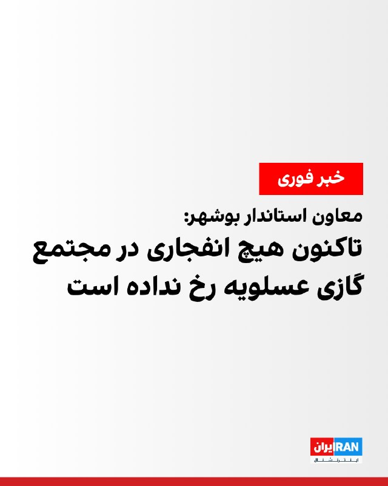

احسان جهانیان، معاون سیاسی امنیتی و اجتماعی استاندار بوشهر، به صداوسیما گفت: تاکنون هیچ انفجاری در مجتمع گازی عسلویه رخ نداده است. پیش‌تر گزارش‌هایی از هدف قرار گرفتن یک کارخانه پتروشیمی متعلق به مجتمع گاز پارس جنوبی در عسلویه منتشر شده بود.
https://iranintl.com/202606103101

## Shin_Persian — post 6916

Shin ✓ @hey_itsmyturn
Thu, 11 Jun 2026 00:12:10 UTC

Islamic Regime's army claim they've targeted the U.S. 5th Fleet in Bahrain by drones.

ترجمه خودکار فارسی

ارتش رژیم اسلامی ادعا می‌کند که ناوگان پنجم ایالات متحده در بحرین را توسط پهپادها هدف قرار داده است.

𝕏 · @shin_persian

## Shin_Persian — post 6915

Shin ✓ @hey_itsmyturn
Thu, 11 Jun 2026 00:04:16 UTC

.@IliaHashemicom Reports 3 explosions near Abyek, Qazvin Province, #Iran

ترجمه خودکار فارسی

.@IliaHashemicom گزارش داد ۳ انفجار در نزدیکی آبیک، استان قزوین، #Iran رخ داده است.

𝕏 · @shin_persian

## Shin_Persian — post 6914

Trey Yingst ✓ @TreyYingst
Wed, 10 Jun 2026 23:35:33 UTC

Spoke with President Trump tonight as he oversaw the U.S. military strikes against Iran from the Situation Room.

The President told me he spoke directly with Iranian officials tonight who asked him to stop bombing.

49 Tomahawk missiles had been fired by the United States at the time we spoke, along with bombing from fighter jets. Closest target to Tehran was approximately 40 miles outside of the city.

Trump added that the bombing will stop shortly, but that if they don't sign the agreement, "we'll bomb the shit out of them."

President Trump called this "the most violated ceasefire in the history of the world."

Vice President JD Vance told me the United States is dealing with both moderate and more extreme voices in Iran as part of the negotiation process.

More updates to follow on @FoxNews.

ترجمه خودکار فارسی

امشب با پررئیس‌جمهور ترامپ در حالی که از اتاق وضعیت (Situation Room) بر حملات نظامی ایالات متحده علیه ایران نظارت می‌کرد، صحبت کردم.

رئیس‌جمهور به من گفت که امشب مستقیماً با مقامات ایرانی صحبت کرده و آن‌ها از او خواسته‌اند که بمباران را متوقف کند.

تا زمان گفتگوی ما، ۴۹ موشک تاماهاوک توسط ایالات متحده شلیک شده بود و هواپیماهای جنگنده نیز مشغول بمباران بودند. نزدیک‌ترین هدف به تهران در فاصله تقریبی ۴۰ مایلی خارج از شهر بود.

ترامپ افزود که بمباران به زودی متوقف خواهد شد، اما اگر آن‌ها توافق‌نامه را امضا نکنند، «دهن‌شان را با بمب صاف خواهیم کرد.»

رئیس‌جمهور ترامپ این وضعیت را «نقض‌شده‌ترین آتش‌بس در تاریخ جهان» نامید.

معاون رئیس‌جمهور، جی‌دی ونس، به من گفت که ایالات متحده در فرآیند مذاکره با هر دو طیف صداهای میانه‎رو و تندرو در ایران سر و کار دارد.

به‌روزرسانی‌های بیشتر در @FoxNews منتشر خواهد شد.

𝕏 · @shin_persian

## Shin_Persian — post 6913

  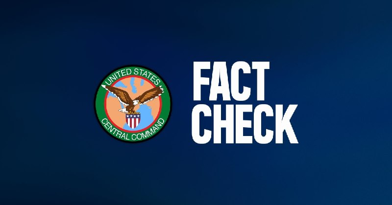

Shin ✓ @hey_itsmyturn
Wed, 10 Jun 2026 23:42:25 UTC

Following Iranian media reports that Iran attacked a U.S. warship in the Strait of Hormuz, U.S. Central Command says the claims are false and no U.S. warships have been struck.

Source: @CENTCOM
https://x.com/CENTCOM/status/2064855691173490777

ترجمه خودکار فارسی

در پی گزارش‌های رسانه‌های ایرانی مبنی بر حمله ایران به یک کشتی جنگی ایالات متحده در تنگه هرمز، ستاد فرماندهی مرکزی ایالات متحده (سنتکام/CENTCOM) اعلام کرد که این ادعاها کذب است و هیچ کشتی جنگی آمریکایی مورد اصابت قرار نگرفته است.

منبع: @CENTCOM
https://x.com/CENTCOM/status/2064855691173490777

𝕏 · @shin_persian

## Shin_Persian — post 6912

Shin ✓ @hey_itsmyturn
Wed, 10 Jun 2026 23:40:38 UTC

Jet activity over Fardis, Alborz Province, #Iran

ترجمه خودکار فارسی

فعالیت جت‌ها بر فراز فردیس، استان البرز، #Iran

𝕏 · @shin_persian

## Shin_Persian — post 6911

↩️ Quoted tweet: Aaron Rupar ✓ @atrupar Wed, 10 Jun 2026 23:25:23 UTC Fox correspondent: "I asked the president what will happen if the Iranians don't sign an agreement that was put forward by American negotiators. President Trump said, 'We'll bomb the s**t…

## Shin_Persian — post 6910

  <a href="telegram/content/Shin_Persian_6910_1781136826.mp4" target="_blank">🎬 Download video</a>

↩️ Quoted tweet:
Aaron Rupar ✓ @atrupar
Wed, 10 Jun 2026 23:25:23 UTC

Fox correspondent: "I asked the president what will happen if the Iranians don't sign an agreement that was put forward by American negotiators. President Trump said, 'We'll bomb the s**t out of them tomorrow night.'"

↩️ توییت نقل‌قول شده — برای پاسخ، پست زیر را ببینید.

ترجمه خودکار فارسی

خبرنگار فاکس: «من از رئیس‌جمهور پرسیدم که اگر ایرانی‌ها توافقی را که توسط مذاکره‌کنندگان آمریکایی ارائه شده است امضا نکنند، چه خواهد شد. پرزیدنت ترامپ گفت، "فردا شب دهنشون رو با بمب صاف می‌کنیم."»

𝕏 · @shin_persian

## Shin_Persian — post 6909

  

Shin ✓ @hey_itsmyturn
Wed, 10 Jun 2026 23:36:05 UTC

Following IRGC claims that the Strait of Hormuz is closed, U.S. Central Command says commercial ships are continuing to transit the waterway tonight.

Source: @CENTCOM
https://x.com/CENTCOM/status/2064854099418390919

ترجمه خودکار فارسی

در پی ادعاهای سپاه پاسداران (IRGC) مبنی بر بسته بودن تنگه هرمز، فرماندهی مرکزی ایالات متحده (سنتکام/CENTCOM) اعلام کرد که کشتی‌های تجاری امشب همچنان در حال عبور از این آبراه هستند.

منبع: @CENTCOM
https://x.com/CENTCOM/status/2064854099418390919

𝕏 · @shin_persian

## Shin_Persian — post 6908

  <a href="telegram/content/Shin_Persian_6908_1781136828.mp4" target="_blank">🎬 Download video</a>

Aaron Rupar ✓ @atrupar
Wed, 10 Jun 2026 23:25:23 UTC

Fox correspondent: "I asked the president what will happen if the Iranians don't sign an agreement that was put forward by American negotiators. President Trump said, 'We'll bomb the s**t out of them tomorrow night.'"

ترجمه خودکار فارسی

خبرنگار فاکس: «از رئیس‌جمهور پرسیدم اگر ایرانی‌ها توافقی را که توسط مذاکره‌کنندگان آمریکایی ارائه شده امضا نکنند، چه خواهد شد. پرزیدنت ترامپ گفت: "فردا شب حسابی بمبارانشان می‌کنیم."»

𝕏 · @shin_persian

## Shin_Persian — post 6907

Shin ✓ @hey_itsmyturn
Wed, 10 Jun 2026 23:27:55 UTC

State-owned Mehr News reports that a position in Dashtestan County highlands was targeted says the origin of strike is unclear

ترجمه خودکار فارسی

خبرگزاری دولتی مهر گزارش می‌دهد که موضعی در ارتفاعات شهرستان دشتستان مورد هدف قرار گرفته است و می‌گوید منشأ این حمله نامشخص است.

𝕏 · @shin_persian

## Shin_Persian — post 6906

  

Shin ✓ @hey_itsmyturn
Wed, 10 Jun 2026 23:26:11 UTC

Scam messages are evolving greatly. This is way cooler than the Nigerian prince emails.

ترجمه خودکار فارسی

پیام‌های کلاهبرداری به شدت در حال تکامل هستند. این بسیار جذاب‌تر از ایمیل‌های شاهزاده نیجریه‌ای است.

𝕏 · @shin_persian

## Shin_Persian — post 6905

Shin ✓ @hey_itsmyturn
Wed, 10 Jun 2026 23:18:04 UTC

Blasts in Bandar Abbas, Hormozgan Province, #Iran

ترجمه خودکار فارسی

انفجارها در بندرعباس، استان هرمزگان، #Iran

𝕏 · @shin_persian

## Shin_Persian — post 6904

Shin ✓ @hey_itsmyturn
Wed, 10 Jun 2026 22:59:35 UTC

Regime's IRIB: AA activity in Robat Karim, Tehran Province, #Iran

ترجمه خودکار فارسی

صدا و سیمای رژیم: فعالیت پدافند هوایی (AA) در رباط‌کریم، استان تهران، #Iran

𝕏 · @shin_persian

## Shin_Persian — post 6903

Shin ✓ @hey_itsmyturn
Wed, 10 Jun 2026 22:47:59 UTC

Intense jet activity over western Tehran
#Tehran Province, #Iran

ترجمه خودکار فارسی

فعالیت شدید جنگنده‌ها بر فراز غرب تهران
#Tehran Province, #Iran

𝕏 · @shin_persian

## Shin_Persian — post 6902

Shin ✓ @hey_itsmyturn
Wed, 10 Jun 2026 22:46:19 UTC

State-owned Mehr News:
"The Americans have so far conducted attacks on seven coastal points."

ترجمه خودکار فارسی

خبرگزاری دولتی مهر:
«آمریکایی‌ها تاکنون به هفت نقطه ساحلی حمله کرده‌اند.»

𝕏 · @shin_persian

## Shin_Persian — post 6901

Shin ✓ @hey_itsmyturn
Wed, 10 Jun 2026 22:44:31 UTC

IRGC Khatam Al Anbya terror HQ:

"Effective immediately, due to insecurity in the region, the Strait of Hormuz is declared closed for the passage of all types of vessels, including oil tankers and commercial ships. Any transit will be targeted.

Following the malicious actions of America and in light of the commencement of attacks by its aggressor military on some southern areas in Hormozgan province, effective immediately, due to insecurity in the region, the Strait of Hormuz is declared closed for the passage of all types of vessels, including oil tankers and commercial ships. Any transit will be targeted.

The American claim regarding the passage of ships through the aforementioned strait is denied."

ترجمه خودکار فارسی

قرارگاه تروریستی خاتم‌الانبیاء سپاه پاسداران انقلاب اسلامی (IRGC):

«با اثرگذاری فوری، به دلیل ناامنی در منطقه، تنگه هرمز برای تردد تمامی انواع شناورها، از جمله نفتکش‌ها و کشتی‌های تجاری، بسته اعلام می‌شود. هرگونه عبوری مورد هدف قرار خواهد گرفت.

در پی اقدامات شرورانه آمریکا و با توجه به آغاز حملات ارتش متجاوز آن به برخی مناطق جنوبی در استان هرمزگان، با اثرگذاری فوری، به دلیل ناامنی در منطقه، تنگه هرمز برای تردد تمامی انواع شناورها، از جمله نفتکش‌ها و کشتی‌های تجاری، بسته اعلام می‌شود. هرگونه عبوری مورد هدف قرار خواهد گرفت.

ادعای آمریکا در خصوص عبور کشتی‌ها از تنگه مذکور تکذیب می‌شود.»

𝕏 · @shin_persian

## Iliaen — post 4473

ساعت ۰۳:۳۲ صبح پنجشنبه؛ تعداد ۳ انفجار در محدوده آبیک قزوین شنیده شد. @iliaen

## Iliaen — post 4472

ساعت ۰۳:۳۲ صبح پنجشنبه؛ تعداد ۳ انفجار در محدوده آبیک قزوین شنیده شد.

@iliaen

## Iliaen — post 4471

ساعت حدود ۰۲:۱۵ صبح پنجشنبه؛ چند قایق تندرو در نزدیکی جزیره لارَک هدف قرار گرفته شدند.

براساس توصیف شاهدان، شلیک به صورت رگبار از آسمان به سطح دریا بود (احتمالاً توسط هواپیمای A-10)

@iliaen

## FarsiVOA — post 220323

  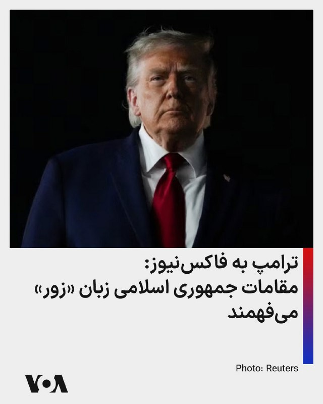

⚡️دونالد ترامپ، رئیس‌جمهوری آمریکا به فاکس‌نیوز گفت که آتش‌بس با جمهوری اسلامی بیش از هر آتش‌بس دیگری در جهان نقض شده است. او افزود که مقامات جمهوری اسلامی زبان «زور» می‌فهمند.
@FarsiVOA

## FarsiVOA — post 220322

⚡️طالبان و پاکستان؛ دو روایت از حملات مرزی اخیر پاکستان به بخش‌هایی از افغانستان
@FarsiVOA

## FarsiVOA — post 220321

  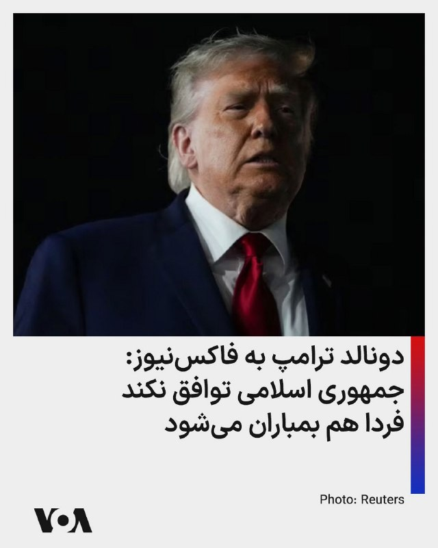

⚡️خبرنگار فاکس‌نیوز می‌گوید که دونالد ترامپ، رئیس‌جمهوری آمریکا به این سوال که اگر جمهوری اسلامی با شما توافق نکند چه اتفاقی می‌افتد؟ پاسخ داد که فردا شب هم شدید بمباران خواهند شد.
@FarsiVOA

## FarsiVOA — post 220320

  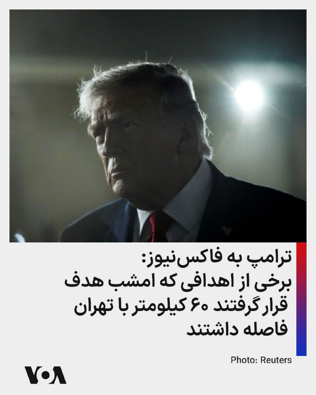

⚡️خبرنگار فاکس‌نیوز دقایقی قبل گزارش داد که رئيس جمهوری آمریکا، دونالد ترامپ، همراه با جی‌دی ونس، دامادش جرد کوشنر، و استیو ویتکاف، در «اتاق وضعیت» کاخ سفید حضور داشت. آقای ترامپ به فاکس‌نیوز گفت ۴۹ موشک تاماهاک برای زدن اهدافی در ایران استفاده شد. آقای ترامپ گفت برخی از این اهداف فقط حدود ۶۰ کیلومتر با پایتخت، تهران، فاصله داشتند.
@FarsiVOA

## FarsiVOA — post 220319

  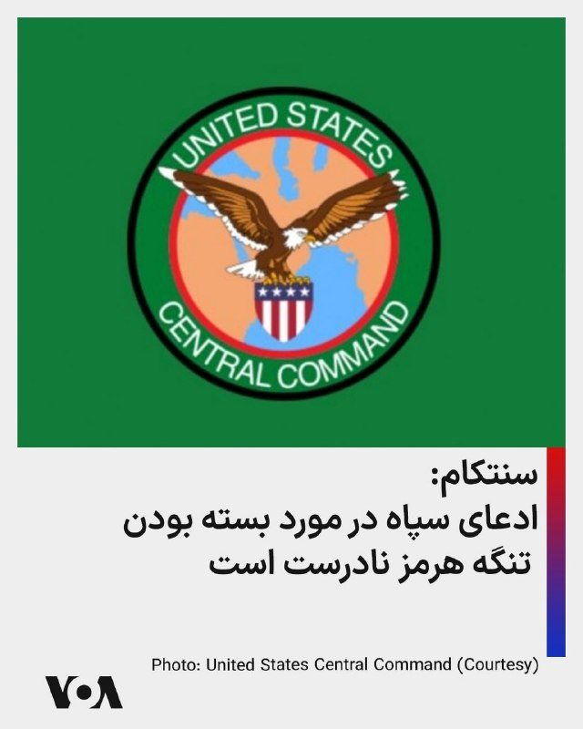

⚡️ستاد فرماندهی مرکزی آمریکا، سنتکام، ادعای تازه سپاه پاسداران را که «تنگه هرمز بسته است» رد کرد و گفت «حقیقت» این است که «کشتی‌های تجاری امشب همچنان به ورود و خروج از تنگه هرمز ادامه می‌دهند.»
@FarsiVOA

## FarsiVOA — post 220318

  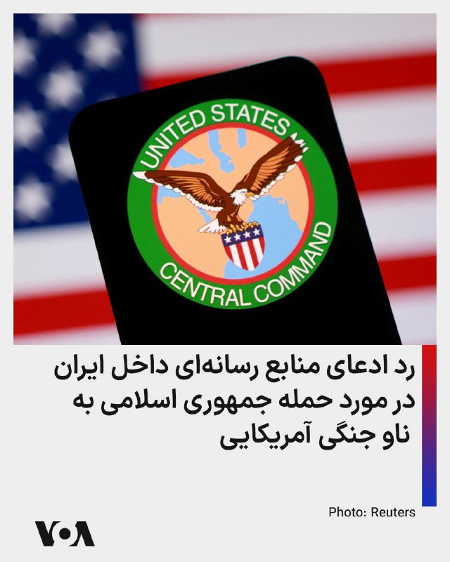

⚡️سنتکام ادعای منابع رسانه‌ای در ایران را که می‌گویند جمهوری اسلامی به یک «ناو جنگی آمریکایی در تنگه هرمز» حمله کرده است نادرست خواند و گفت هیچ ناو جنگی آمریکایی مورد حمله قرار نگرفته است.
@FarsiVOA

## FarsiVOA — post 220317

⚡️پاسخ سخنگوی دولت اقلیم کردستان به صدای آمریکا در مورد حملات جمهوری اسلامی به احزاب کرد ایرانی
@FarsiVOA

## FarsiVOA — post 220316

  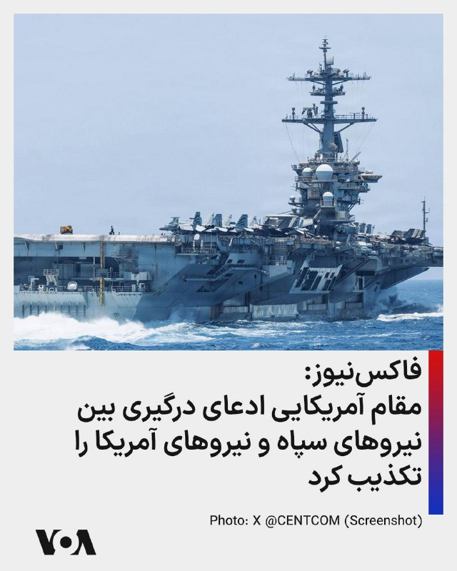

⚡️به گزارش جنیفر گریفین، خبرنگار حوزه دفاعی فاکس‌نیوز، یک مقام آمریکایی با وجود ادعاهای جمهوری اسلامی، هرگونه درگیری دریایی بین نیروی دریایی آمریکا و سپاه پاسداران را تکذیب کرد.
@FarsiVOA

## FarsiVOA — post 220315

  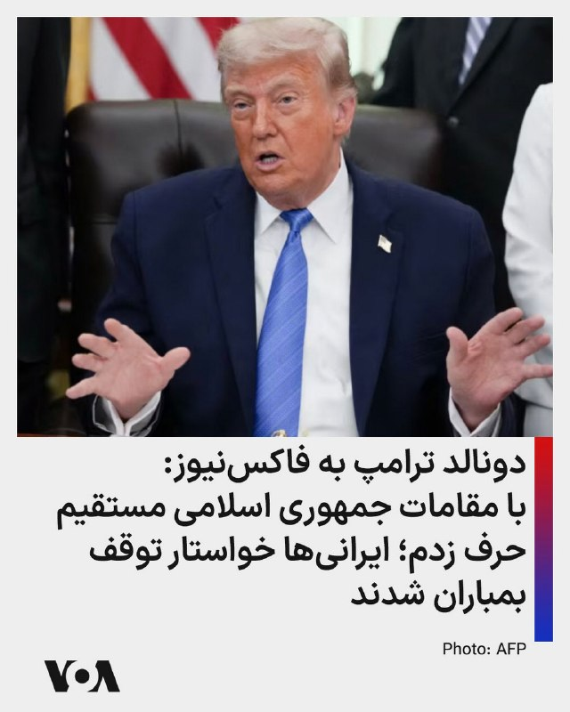

⚡️به گزارش رویترز آقای ترامپ به فاکس نیوز گفته است که «به‌طور مستقیم» با مقامات جمهوری اسلامی صحبت کرد و افزود ایرانی‌ها از من خواستند بمباران را متوقف کنم. آقای ترامپ گفت جت‌های جنگنده آمریکایی بر فراز آسمان ایران در حال پرواز هستند.
@FarsiVOA

## FarsiVOA — post 220314

  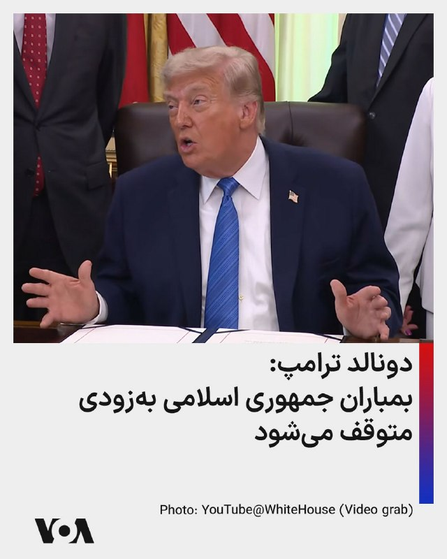

⚡️رویترز به نقل از فاکس‌نیوز گزارش داد که دونالد ترامپ، رئیس جمهوری آمریکا گزینه حملات بیشتر به جمهوری اسلامی را محفوظ نگه داشته است. این خبرگزاری می‌گوید آقای ترامپ به فاکس نیوز گفت بمباران به زودی متوقف خواهد شد. سنتکام روز چهارشنبه از آغاز دور دیگری از حملات دفاعی به جمهروی اسلامی خبر داد.
@FarsiVOA

## FarsiVOA — post 220313

⚡️طرح قانون جدید بریتانیا برای مقابله با عوامل نیابتی دولت‌های متخاصم از جمله جمهوری اسلامی
@FarsiVOA

## FarsiVOA — post 220312

  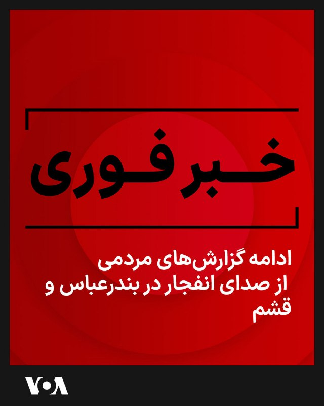

⚡️کانال تلگرامی وحید‌آنلاین از شنیده شدن صدای انفجار در بندر عباس در حوالی ساعات ۲:۳۰ بامداد خبر داده است. همچنین این کانال گزارش‌هایی مردمی از «صدا و لرزش» در جزیره قشم را منتشر کرد.
@FarsiVOA

## FarsiVOA — post 220311

  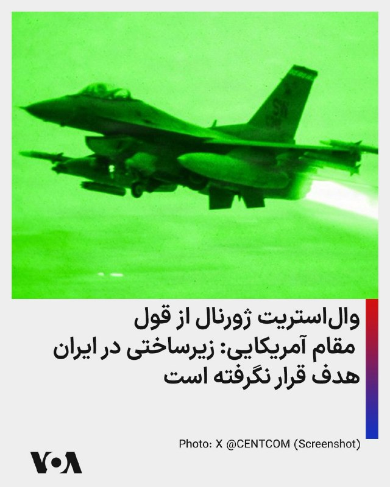

⚡️روزنامه وال‌استریت ژورنال پنج‌شنبه شب به وقت واشنگتن به نقل از یک مقام ارشد آمریکایی گزارش داد که هیچ سایت زیرساختی در ایران مورد اصابت قرار نگرفته است و نیروهای نظامی ایالات متحده در حال حمله به پدافند هوایی و سایت‌های راداری در نزدیکی تنگه هرمز بودند. انفجارهایی در امتداد تنگه هرمز، از جمله بندرعباس، جزیره قشم و سیریک گزارش شده است.
@FarsiVOA

## FarsiVOA — post 220310

  <a href="telegram/content/FarsiVOA_220310_1781136832.mp4" target="_blank">🎬 Download video</a>

⚡️گزارش نرگس صبا در برنامه تفسیر خبر از منافع جمهوری اسلامی از دامن زدن به تنش در منطقه
@FarsiVOA

## FarsiVOA — post 220309

  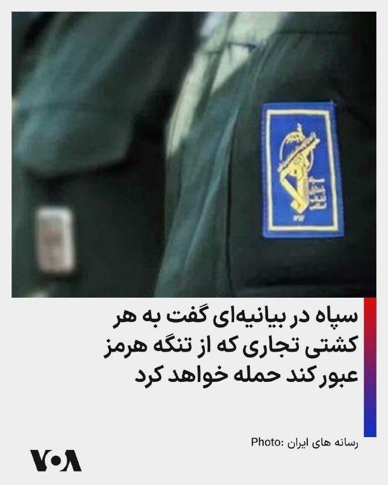

⚡️سپاه پاسداران، در بیانیه‌ای که اوایل پنج‌شنبه ۲۱ خرداد صادر کرد گفت «از این لحظه» به هر نوع شناوری اعم از نفتکش و کشتی تجاری که از تنگه هرمز عبور کند، حمله خواهد کرد. سپاه در فهرست سازمان‌های تروریستی چندین کشور قرار دارد.
نیروی دریایی همچنین مدعی حمله به دو کشتی که قصد عبور از تنگه هرمز را داشتند، شد.
@FarsiVOA

## FarsiVOA — post 220308

  <a href="telegram/content/FarsiVOA_220308_1781136833.mp4" target="_blank">🎬 Download video</a>

⚡️اتحاد بی سابقه کشورهای غربی در مقابل رفتارهای جمهوری اسلامی؛ گفت‌وگو با درویش رنجبر
@FarsiVOA

## FarsiVOA — post 220307

  <a href="telegram/content/FarsiVOA_220307_1781136834.mp4" target="_blank">🎬 Download video</a>

⚡️حامد آیینه وند در برنامه تفسیر خبر: تشدید تنش می‌تواند به قحطی در ایران منجر شود
@FarsiVOA

## DW_Farsi — post 125798

  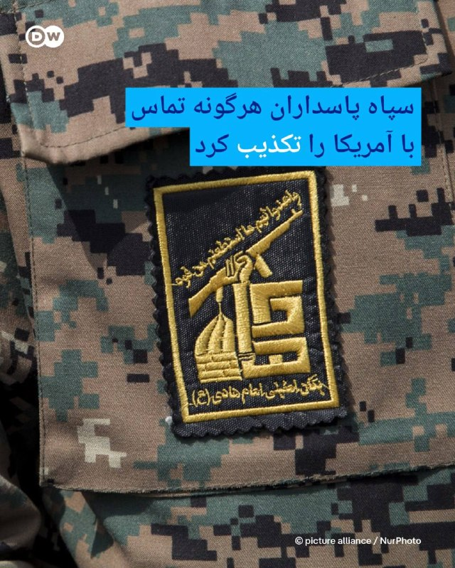

🔶 سپاه پاسداران هرگونه تماس با آمریکا را تکذیب کرد

بلافاصله پس از مصاحبه ترامپ با شبکه فاکس نیوز که در آن گفت در "تماس مستقیم" با مقامات ایران است و آنها از او خواسته‌اند تا بمباران را متوقف کند، کانال تلگرامی اخبار سپاه پاسداران این خبر را تکذیب کرد.

روابط عمومی سپاه پاسداراندر بیانیه‌ای نوشت: «ادعای ترامپ در مورد تماس مقامات ایرانی با وی قویا تکذیب می‌شود و پوششی برای فرار از جنگ است.»

کانال صابرین نیوز نیز از قول یک منبع آگاه خبر داد: «ما به حملات امشب آمریکا پاسخ نظامی خواهیم داد.»

@dw_farsi

## DW_Farsi — post 125797

  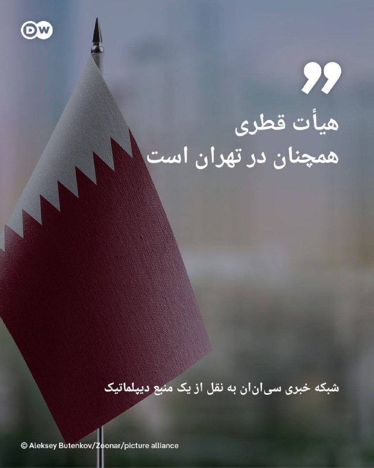

🔶 سی‌ان‌ان: هیأت قطری همچنان در تهران است

شبکه خبری سی‌ان‌ان به نقل از یک منبع دیپلماتیک مطلع نوشت هیأت قطری که صبح چهارشنبه ۱۰ ژوئن (۲۰ خرداد) برای دیدار با مذاکره‌کنندگان ایرانی به تهران سفر کرده بود، هم‌زمان با آغاز دور تازه‌ای از حملات آمریکا علیه ایران، همچنان در این کشور حضور دارد.

این منبع پیش‌تر به این شبکه گفته بود که مذاکره‌کنندگان "پس از مشورت با آمریکا" به ایران رفته‌اند تا با طرف ایرانی دیدار کرده و "برای پر کردن شکاف‌های باقی‌مانده" تلاش کنند.

رسانهٔ دولتی صداوسیمای جمهوری اسلامی (IRIB) گزارش داد که این سفر شامل گفت‌وگو دربارهٔ روابط دو کشور و همچنین تبادل نظر دربارهٔ آخرین تحولات در روندی دیپلماتیک خواهد بود که آن را تلاشی برای پایان دادن به "جنگ تحمیلی آمریکا" علیه ایران توصیف کرده است.

@dw_farsi

## DW_Farsi — post 125796

  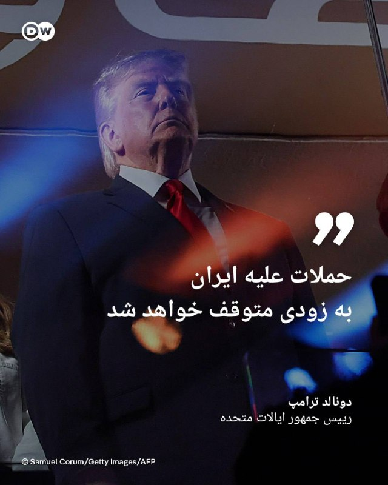

🔶 ترامپ: حملات علیه ایران به زودی متوقف خواهد شد

ساعتی پس از آغاز حملات امریکا به ایران، دونالد ترامپ، رییس جمهور ایالات متحده، در مصاحبه با شبکه فاکس نیوز گفت این حملات به زودی متوقف خواهند شد اما احتمال انجام حملات بیشتر علیه ایران را باز گذاشت.

او همچنین گفت در حال "گفت‌و‌گوی مستقیم" با مقامات جمهوری اسلامی ایران است و گفت ایرانی‌ها از او خواسته‌اند حملات را متوقف کند.

ترامپ تاکید کرد که اسرائیل در حملات علیه ایران دخالت نداشته است.

@dw_farsi

## DW_Farsi — post 125795

  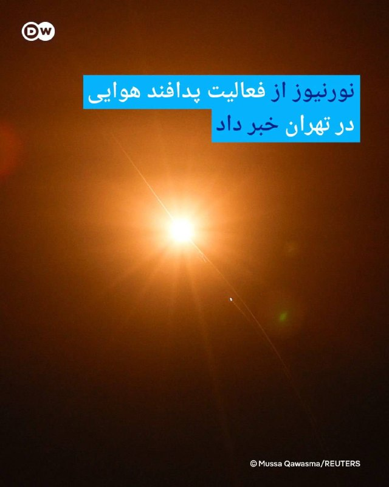

🔶 نورنیوز از فعالیت پدافند هوایی در تهران خبر داد

کانال تلگرامی نور نیوز وابسته به شورای عالی امنیت ملی ایران، خبر داد که "آتشبارهای پدافند هوایی" در رباط کریم تهران برای مقابله با "اهداف متخاصم" فعال شده‌اند.

سایت تابناک نیز این خبر را منتشر کرده است.

تا کنون خبر تاییدشده‌ای از حمله به تهران منتشر نشده است.

@dw_farsi

## DW_Farsi — post 125794

  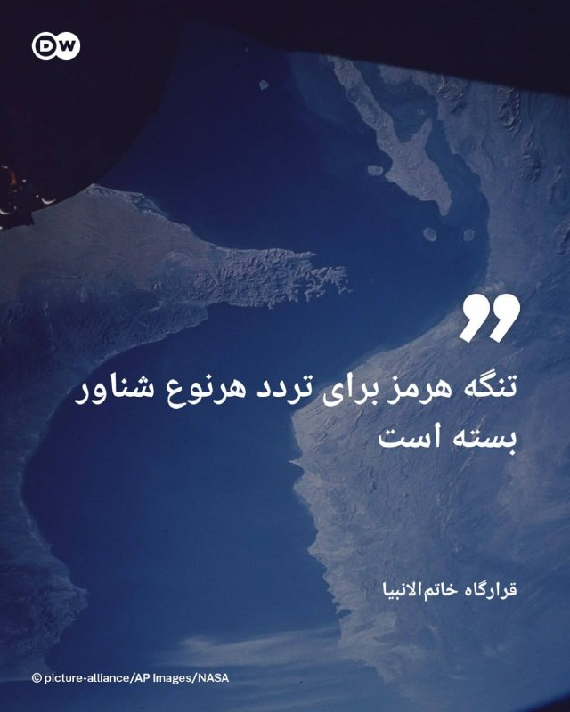

🔶 قرارگاه خاتم‌الانبیا: تنگه هرمز برای تردد هرنوع شناور بسته است

ساعتی پس از آغاز حملات امریکا به اهدافی در داخل ایران، قرارگاه مرکزی خاتم‌الانبیای سپاه پاسداران در بیانیه‌ای اعلام کرد تنگه هرمز به روی هر نوع شناور اعم از نفتکش و تجاری بسته است.

در این بیانیه با تایید حملات آمریکا به "برخی از مناطق جنوب در استان هرمزگان" آمده است: «از این لحظه به دلیل ناامنی در منطقه، تنگه هرمز برای تردد هر نوع شناور اعم از نفتکش و تجاری بسته اعلام می‌گردد و هرگونه تردد مورد اصابت قرار خواهد گرفت.»

این قرارگاه سپاه ادعای امریکا درباره عبور کشتی از تنگه هرمز را نیز تکذیب کرد.

@dw_farsi

## DW_Farsi — post 125793

  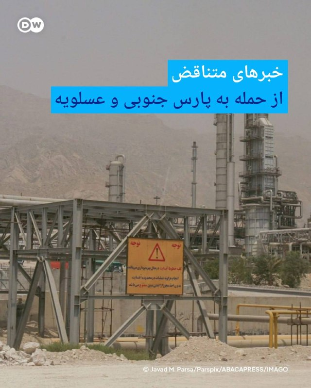

🔶 خبرهای متناقض از حمله به پارس جنوبی و عسلویه

در حالی که خبرگزاری دانشجو وابسته به بسیج دانشجویی از بمباران یک کارخانه پتروشیمی متعلق به مجتمع گاز پارس جنوبی در عسلویه خبر می‌دهد، خبرگزاری تسنیم وابسته به سپاه پاسداران این خبر را تکذیب کرده است.

معاون استاندار بوشهر نیز هرگونه انفجار در مجتمع گازی عسلویه را تکذیب کرد.

تسنیم همچنین فعالیت هرگونه پدافند در شیراز را نیز تکذیب کرد.

در عین حال خبرگزاری اکسیوس به نقل از یک مقام آمریکایی گزارش داد تمامی اهدافی که در حملات اخیر مورد هدف قرار گرفته‌اند، در جنوب ایران واقع شده‌اند. این مقام آمریکایی گفت سامانه‌های پدافند هوایی، رادارها و واحدهای فرماندهی و کنترل پهپادها از جمله اهداف این حملات بوده‌اند.

@dw_farsi

## DW_Farsi — post 125792

🔶 سنتکام: حملات دفاعی علیه چندین هدف در داخل ایران را آغاز کردیم

فرماندهی مرکزی ایالات متحده آمریکا (سنتکام) در شبکه ایکس اعلام کرد از ساعت ۵:۱۵ عصر به وقت شرق آمریکا (بعد از نیمه شب ایران)، به دستور فرمانده کل نیروهای مسلح [دونالد ترامپ]، "حملات دفاعی" بیشتری را علیه چندین هدف در داخل ایران آغاز کرده است.

به نوشته سنتکام، این حملات در پاسخ به آنچه "تجاوز بی‌دلیل و ادامه‌دار ایران" توصیف شده، انجام می‌شود.

آخرین گزارش‌ها در رسانه‌های دولتی ایران حاکی از وقوع موج جدیدی از انفجارها در جنوب ایران، نزدیک تنگه هرمز است.

بر اساس گزارش صداوسیمای جمهوری اسلامی (IRIB)، یک انفجار در بندرعباس ثبت شده است.

همچنین در شهرهای میناب و سیریک و نیز در جزیره قشم نیز وقوع انفجار گزارش شده است.

ساعاتی پیش از شروع این حملات وزیر دفاع آمریکا، پیت هگست، گفته بود که فرماندهی مرکزی ارتش آمریکا امشب حملاتی را علیه ایران آغاز خواهد کرد.

او در جمع خبرنگاران گفت: «فرماندهی مرکزی امشب شب شلوغی خواهد داشت، چون رئیس‌ جمهور ترامپ گفته که ما ایران را به‌شدت هدف قرار خواهیم داد و همین کار را هم خواهیم کرد.»

هگست گفت نیروهای آمریکایی به "تأسیسات کلیدی" در ایران حمله خواهند کرد، زیرا ایران برای پایان دادن به جنگ به توافقی با آمریکا نرسیده است.

پیش‌تر، رئیس‌جمهور آمریکا نیز گفته بود که حملات علیه ایران ادامه خواهد داشت.

@dw_farsi

## Persian_Trend_Official — post 16651

  <a href="telegram/content/Persian_Trend_Official_16651_1781136837.webm" target="_blank">🎬 Download video</a>

برزیل یک - ج.ا صفر 📝 Nick 📌 @persian_trend_official پرشین ترند | متفاوت‌ترین کانال نظامی

## Persian_Trend_Official — post 16650

  

📝 Nick

📌 @persian_trend_official
پرشین ترند | متفاوت‌ترین کانال نظامی

## Persian_Trend_Official — post 16649

  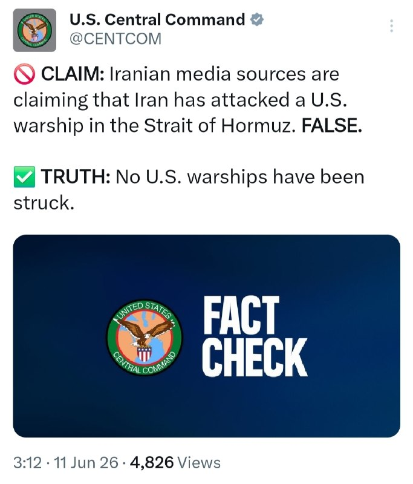

سنتکام همچنین خبر هدف قرار گرفتن ناوشکن های خود در تنگه هرمز توسط ایران را تکذیب کرد.

📝 Amir

📌 @persian_trend_official
پرشین ترند | متفاوت‌ترین کانال نظامی

## Persian_Trend_Official — post 16648

سنتکام: کشتی‌های تجاری امشب همچنان به تردد خود در تنگه هرمز ادامه می‌دهند. 📝 Amir 📌 @persian_trend_official پرشین ترند | متفاوت‌ترین کانال نظامی

## Persian_Trend_Official — post 16647

  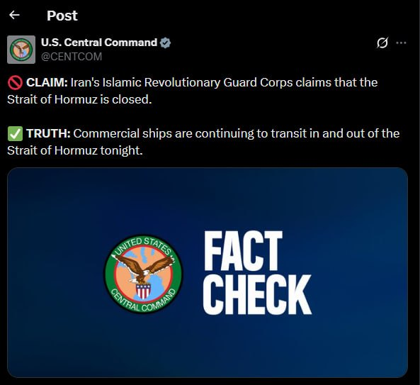

سنتکام: کشتی‌های تجاری امشب همچنان به تردد خود در تنگه هرمز ادامه می‌دهند.

📝 Amir

📌 @persian_trend_official
پرشین ترند | متفاوت‌ترین کانال نظامی

## Persian_Trend_Official — post 16646

⭕️ یادتون باشه، هروقت اسرائیل و نتانیاهو وارد صحنه بشن اون موقع داستان تازه شروع خواهد شد. 🙌🏻

📝 Nick

📌 @persian_trend_official
پرشین ترند | متفاوت‌ترین کانال نظامی

## Persian_Trend_Official — post 16645

هم اکنون بازی والیبال تیم حکومتی جمهوری اسلامی با برزیل 📝 Nick 📌 @persian_trend_official پرشین ترند | متفاوت‌ترین کانال نظامی

## Persian_Trend_Official — post 16644

⭕️ مقام آمریکایی به وال استریت ژورنال:
هیچ تاسیسات حیاتی ایرانی ای در حملات جاری آسیب ندیده است.

📝 Nick

📌 @persian_trend_official
پرشین ترند | متفاوت‌ترین کانال نظامی

## Persian_Trend_Official — post 16643

⭕️ مهر: ♦️شنیده شدن صدای فعالیت پدافند در محدوده شرق بندرعباس 🔹دقایقی پیش، صدای فعالیت پدافند در شرق بندرعباس از سوی ساکنان محلی گزارش شده است. 🔹برخی منابع، خبر از انفجار مجدد در این محدوده داده بودند اما بررسی‌های خبرنگار مهر نشان می‌دهد انفجار جدیدی در…

## Persian_Trend_Official — post 16642

♨️ ترامپ:
آتش‌بس با ایران، نقض‌شده‌ترین و ناقض‌ترین آتش‌بس در تاریخ جهان بود.

📝 Nick

📌 @persian_trend_official
پرشین ترند | متفاوت‌ترین کانال نظامی

## Persian_Trend_Official — post 16641

⭕️ مهر:

♦️شنیده شدن صدای فعالیت پدافند در محدوده شرق بندرعباس

🔹دقایقی پیش، صدای فعالیت پدافند در شرق بندرعباس از سوی ساکنان محلی گزارش شده است.

🔹برخی منابع، خبر از انفجار مجدد در این محدوده داده بودند اما بررسی‌های خبرنگار مهر نشان می‌دهد انفجار جدیدی در بندرعباس رخ نداده است اما پدافند شرق بندرعباس برای رهگیری اهداف متخاصم فعال شده است‌.

🔹از اولین ساعات بامداد پنجشنبه استان هرمزگان، خط ساحلی خلیج‌فارس و تنگه هرمز صحنه درگیری‌هایی میان نیروهای مسلح کشورمان و تروریست‌های آمریکایی بوده است.

📝 Nick

📌 @persian_trend_official
پرشین ترند | متفاوت‌ترین کانال نظامی

## Persian_Trend_Official — post 16640

⭕️ خبرگزاری صدا و سیما به نقل از یک مقام ارشد:

ادعای ترامپ در باره تماس مقامات ایرانی با وی کذب محض است.

📝 Nick

📌 @persian_trend_official
پرشین ترند | متفاوت‌ترین کانال نظامی

## Persian_Trend_Official — post 16639

  <a href="telegram/content/Persian_Trend_Official_16639_1781136839.webm" target="_blank">🎬 Download video</a>

♨️ ترامپ:
به ایرانی‌ها اطلاع دادم که بمباران‌های فعلی به زودی پایان خواهد یافت.

📝 Nick

📌 @persian_trend_official
پرشین ترند | متفاوت‌ترین کانال نظامی

## Persian_Trend_Official — post 16638

♨️ ترامپ: اگر آنها توافق نکنند، دوباره فردا آنها را به شدت بمباران خواهیم کرد. 📝 Nick 📌 @persian_trend_official پرشین ترند | متفاوت‌ترین کانال نظامی

## Persian_Trend_Official — post 16637

  <a href="telegram/content/Persian_Trend_Official_16637_1781136840.webm" target="_blank">🎬 Download video</a>

♨️ ترامپ:
اگر آنها توافق نکنند، دوباره فردا آنها را به شدت بمباران خواهیم کرد.

📝 Nick

📌 @persian_trend_official
پرشین ترند | متفاوت‌ترین کانال نظامی

## Persian_Trend_Official — post 16636

  <a href="telegram/content/Persian_Trend_Official_16636_1781136840.webm" target="_blank">🎬 Download video</a>

💢 دونالد ترامپ، رئیس جمهور آمریکا اعلام کرد که بمباران ایران به زودی متوقف خواهد شد و گفت که مقامات ایرانی از او خواسته‌اند حملات را متوقف کند و ادعا می‌کند که مستقیماً با مقامات ایرانی صحبت کرده است. 📝 Nick 📌 @persian_trend_official پرشین ترند | متفاوت‌ترین…

## Persian_Trend_Official — post 16635

⭕️ مهر:

♦️یک منطقه در ارتفاعات دشتی مورد هدف قرار گرفت

معاون سیاسی و امنیتی استاندار بوشهر:
🔹یک منطقه در ارتفاعات در شهرستان دشتی مورد هدف قرار گرفته است.

🔹به دلیل سخت گذر بودن منطقه هنوز منشا آن مشخص نیست.

📝 Nick

📌 @persian_trend_official
پرشین ترند | متفاوت‌ترین کانال نظامی

## Persian_Trend_Official — post 16634

♨️ ترامپ:
جنگنده‌های ما بر فراز ایران در حال پرواز هستند و در حال حاضر در حال نابودی سیستم‌های راداری و پدافند هوایی در جنوب غربی کشور هستند.

📝 Nick

📌 @persian_trend_official
پرشین ترند | متفاوت‌ترین کانال نظامی

## Persian_Trend_Official — post 16633

⭕️ ترامپ:
نیروهای آمریکایی ۴۹ موشک تاماهاوک شلیک کردند که به اهدافی در عمق خاک ایران اصابت کردند.

📝 Nick

📌 @persian_trend_official
پرشین ترند | متفاوت‌ترین کانال نظامی

## Persian_Trend_Official — post 16632

  <a href="telegram/content/Persian_Trend_Official_16632_1781136840.webm" target="_blank">🎬 Download video</a>

یک مقام ارشد دفاعی آمریکا به فاکس نیوز گفت که میدان گازی پارس جنوبی در عسلویه، جنوب ایران، هدف قرار نگرفته است.

📝 Nick

📌 @persian_trend_official
پرشین ترند | متفاوت‌ترین کانال نظامی

## IranianMinds — post 22245

  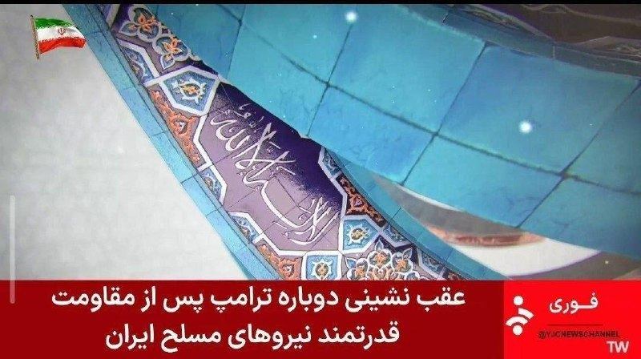

🔴 صداوسیما :

ترامپ دوباره عقب نشینی کرد.

@IranianMinds

## IranianMinds — post 22244

  <a href="telegram/content/IranianMinds_22244_1781136841.webm" target="_blank">🎬 Download video</a>

📢توم میخوای از مسابقات جام جهانی فوتبال پول دربیاری؟
🥇

✅کانال ورسوس بت کارش تحلیل و پیش بینی مسابقات جام جهانی به صورت حرفه ای
🍑

⚠️توم میتونی از پیش بینی جام جهانی خیلی راحت پول دربیاری فقط کافیه با کانال ورسوس بت همراه شی
📣

🌐ادرس عضویت کانالشون:e20
👇

🔪https://t.me/+vEPd1hF2Y38yMWI0

🔪https://t.me/+vEPd1hF2Y38yMWI0

## IranianMinds — post 22243

  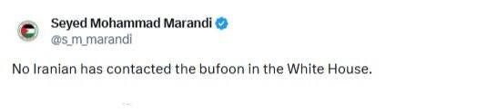

🔴 پست محمد مرندی:

هیچ مقامی با دلقک در کاخ سفید تماس نگرفته است.

@IranianMinds

## IranianMinds — post 22242

🔴 سنتکام :

اخبار رسانه ی جمهوری اسلامی درباره هدف قرار دادن کشی آمریکایی هم کذبه و هیچ کشتی هدف قرار نگرفته.

@IranianMinds

## IranianMinds — post 22241

🔴 یک مقام آمریکایی به فاکس‌ نیوز : حملات نظامی آمریکا علیه اهدافی در ایران همچنان ادامه دارد. @IranianMinds

## IranianMinds — post 22240

  

سنتکام:

کشتی‌های تجاری امشب همچنان در حال تردد و عبور از تنگه هرمز هستند و ادعای سپاه برای هدف قرار دادن اونا کذبه

@IranianMinds

## IranianMinds — post 22239

🔴 ترامپ به فاکس نیوز:

امشب ضربات سنگینی به تهران وارد کردیم و مقام‌های ارشد ایرانی شخصاً از من خواستند که بمباران‌ها را متوقف کنم.

@IranianMinds

## IranianMinds — post 22238

🔴 وال استریت ژورنال:

یک مقام آمریکایی گفت در حملات آمریکا به ایران به هیچ تاسیسات زیرساختی آسیبی وارد نشد.

@IranianMinds

## IranianMinds — post 22237

🔴 ترامپ :

آتش بس با ایران نقض شده ترین آتش بس در تاریخ جهان بود.

@IranianMinds

## IranianMinds — post 22236

🔴 ترامپ : مقامات ایرانی باهام تماس گرفتن و ازم‌ خواستن حملات رو متوقف کنم و امشب همینکارو‌ خواهیم کرد ، ولی توافق نکنن فردا شب دوباره برمیگردیم! @IranianMinds

## IranianMinds — post 22235

🔴 ترامپ :

مقامات ایرانی باهام تماس گرفتن و ازم‌ خواستن حملات رو متوقف کنم و امشب همینکارو‌ خواهیم کرد ، ولی توافق نکنن فردا شب دوباره برمیگردیم!

@IranianMinds

## IranianMinds — post 22234

🔴 خبرنگار فاکس نیوز:

از رئیس‌جمهور پرسیدم اگر ایرانی‌ها توافق پیشنهادی مذاکره‌کنندگان آمریکایی را امضا نکنند، چه اتفاقی خواهد افتاد؟

ترامپ پاسخ داد:

فردا شب دوباره اونارو بمباران خواهیم کرد.

@IranianMinds

## IranianMinds — post 22233

🔴 ترامپ به فاکس نیوز:

جنگنده‌های ما در آسمان ایران در حال پرواز هستند و هم‌اکنون سامانه‌های راداری و پدافند هوایی در جنوب غربی کشور را منهدم می‌کنند.

@IranianMinds

## IranianMinds — post 22232

🔴 ترامپ به فاکس نیوز:

نیروهای آمریکایی ۴۹ موشک تاماهاوک شلیک کردند که اهدافی را در عمق ایران مورد اصابت قرار داد.

@IranianMinds

## IranianMinds — post 22231

🔴 ترامپ :

اسرائیلی‌ها در این حملات ایران دخالتی ندارند.

@IranianMinds

## IranianMinds — post 22230

🔴 ترامپ :

توقف حملات می‌تواند در چارچوب پیشرفت مذاکرات و تحولات دیپلماتیک صورت بگیرد.

@IranianMinds

## IranianMinds — post 22229

🔴 ترامپ :

همین الان جنگنده های ما دارن تو اسمون ایران پرواز میکنن ، و مقام های ایرانی با من تماس گرفتن و ازم خواستن حملات رو متوقف کنم.

@IranianMinds

## IranianMinds — post 22227

🔴 ترامپ:

من مستقیماً با مقام‌های ایرانی حرف زدم.

@IranianMinds

## IranianMinds — post 22226

🔴 ترامپ :

بمباران ها بزودی متوقف میشن.

@IranianMinds

## IranianMinds — post 22225

🔴 یک مقام آمریکایی به فاکس‌ نیوز :

حملات نظامی آمریکا علیه اهدافی در ایران همچنان ادامه دارد.

@IranianMinds

## BBCPersian — post 283372

🔻نیروی دریایی سپاه: هیچ شناوری از لنگرگاه‌ها حرکت نکند

همزمان با انتشار اطلاعیه «بسته شدن کامل تنگه هرمز» از سوی قرارگاه خاتم الانبیاء در ایران، نیروی دریایی سپاه پاسداران هم هشدار داده است که «هیچ شناوری» نباید در خلیج فارس و دریای عمان از لنگرگاه‌ها جدا شود.

در اطلاعیه بامداد پنجشنبه نیروی دریایی سپاه پاسداران آمده: «در پی نقض مکرر شرایط آتش‌بس توسط دشمن آمریکایی، تنگه هرمز تا اطلاع‌ثانوی مسدود می‌شود. هشدار می‌دهیم هیچ شناوری از لنگرگاه خود در خلیج‌فارس و دریای عمان حرکت نداشته باشد. نزدیک شدن به تنگه هرمز به‌منزله همکاری با دشمن تلقی می‌شود.»

به گزارش خبرگزاری فارس، نیروی دریایی سپاه مدعی هدف قرار دادن دو کشتی در تنگه هرمز شده که «قصد عبور غیرقانونی» از این تنگه را داشته‌اند.

https://bbc.in/4fIJPot
@BBCPersian

## BBCPersian — post 283371

🔻سی‌ان‌ان: حملات جدید آمریکا در حالیست که هیئت مذاکره کننده قطری هنوز در تهران است

شبکه تلویزیونی سی‌ان‌ان به نقل از یک منبع آگاه گزارش کرده است که موج جدید حملات آمریکا علیه اهدافی در ایران در حالیست که هنوز یک هئیت قطری در تهران است.

پیش‌تر به گزارش رسانه‌های ایران یک هیئت بلندپایه از قطر ظهر روز چهارشنبه برای گفتگو با مقامات ایران وارد تهران شد.

به گزارش روزنامه دولتی ایران، این هیئت برای گفتگو و تبادل نظر درباره روابط دوجانبه و تحولات منطقه‌ای، به تهران سفر کرده است.

بر اساس این گزارش «در جریان این سفر، این هیئت علاوه بر بحث در مورد روابط دوجانبه و تحولات منطقه، در باره آخرین تحولات مرتبط با روند دیپلماتیک برای خاتمه جنگ بین آمریکا و ایران هم بحث و رایزنی می‌کند.»
https://bbc.in/4fIJPot
@BBCPersian

## BBCPersian — post 283370

  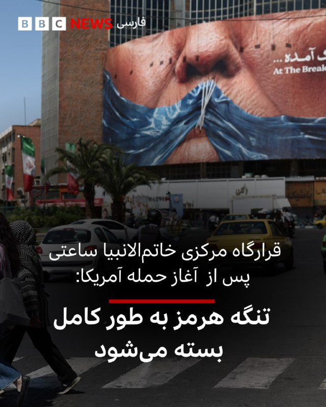

‌
قرارگاه خاتم الانبیاء که مدیریت جنگ در ایران را بر عهده دارد ساعتی بعد از دور جدید حملات آمریکا با صدور اطلاعیه‌ای اعلام کرد: «از این لحظه به دلیل ناامنی در منطقه، تنگه هرمز برای تردد هر نوع شناور اعم از نفتکش و تجاری بسته اعلام می‌گردد.»

این قرارگاه تهدید کرده است که هرگونه ترددی «مورد اصابت» قرار خواهد گرفت.

همچنین در این اطلاعیه آمده که «ادعای آمریکا مبنی بر عبور کشتی از تنگه یاد شده تکذیب می‌شود».

به نظر می‌رسد این واکنشی به ادعای عصر چهارشنبه دونالد ترامپ است که گفته بود آمریکا طی یک عملیات توانسته ده‌ها میلیون بشکه نفت را از تنگه هرمز عبور دهد.

📷Reuters
https://bbc.in/4fIJPot
@BBCPersian

## BBCPersian — post 283369

🔻هگست پیش از آغاز دومین شب حملات آمریکا: تأسیسات کلیدی ایران هدف قرار می‌گیرد

پیت هگست، وزیر دفاع آمریکا، ساعتی پیش از آغاز عملیات آمریکا علیه اهدافی در ایران در اظهاراتی گفته بود که نیروهای این کشور در منطقۀ امشب «ضربات سختی به ایران وارد خواهند کرد و تأسیسات کلیدی این کشور را هدف قرار خواهند داد.»

آقای هگست در مقر فرماندهی سنتکام در تامپا در فلوریدا سخن می‌گفت.

پیش از او نیز دونالد ترامپ، رئیس جمهور آمریکا، در سخنانی تند و در جمع خبرنگاران در کاخ سفید با اشاره به حمله دیشب (سه‌شنبه) این کشور به اهدافی در ایران گفت: «ما دیروز ضربت سختی به آن‌ها وارد کردیم و امروز هم دوباره ضربت سختی خواهیم زد. اگر متوجه نشده‌اید یا تلویزیون را روشن نکرده‌اید، این را بدانید. خواهیم دید که در مورد توافق چه اتفاقی می‌افتد. ما واقعا بسیار به دستیابی به یک توافق نزدیک بودیم.»

اظهارات رئیس جمهور آمریکا که تلویحا حملات دیشب و امشب را مرتبط با «تعلل» در مذاکرات با ایران دانسته در تناقض با اظهارات قبلی اوست که ساقط شدن یک بالگرد آپاچی در دریای عمان را علت حملات جدید عنوان کرده بود.

آمریکا ایران را مسئول هدف قرار گرفتن این بالگرد آپاچی معرفی کرده اما تهران هنوز رسما هدف قرار دادن آن را بر عهده نگرفته است.
https://bbc.in/4fIJPot
@BBCPersian

## Dirty_Kids — post 391660

گزارش چند انفجار شدید در غرب البرز

حداقل ۵ انفجار در مجموع در نزدیکی آبیک گزارش شده است. آبیک در غرب تهران قرار دارد.

@Dirty_Kids 👻

## Dirty_Kids — post 391659

انفجار کرج ساعت ۳:۳۰ منم شنیدم

## Dirty_Kids — post 391658

ساعت ۰۳:۳۲ صبح پنجشنبه؛ تعداد ۳ انفجار در محدوده آبیک قزوین شنیده شد. @Dirty_Kids 👻

## Dirty_Kids — post 391657

ساعت ۰۳:۳۲ صبح پنجشنبه؛ تعداد ۳ انفجار در محدوده آبیک قزوین شنیده شد.

@Dirty_Kids 👻

## Dirty_Kids — post 391655

تری یینگست خبرنگار فاکس‌نیوز با ترامپ مصاحبه کرده: «ترامپ در حال حاضر به‌همراه معاونش جی‌دی ونس و فرستاده‌های ویژه کوشنر و ویتکاف، توی اتاق وضعیت حضور داره. ترامپ اطلاعات جدیدی درباره اتفاقاتی که همین الان داره می‌افته به ما داد. یک کمپین بمباران علیه رژیم…

## Dirty_Kids — post 391654

  <a href="telegram/content/Dirty_Kids_391654_1781136843.mp4" target="_blank">🎬 Download video</a>

تری یینگست خبرنگار فاکس‌نیوز با ترامپ مصاحبه کرده:

«ترامپ در حال حاضر به‌همراه معاونش جی‌دی ونس و فرستاده‌های ویژه کوشنر و ویتکاف، توی اتاق وضعیت حضور داره.
ترامپ اطلاعات جدیدی درباره اتفاقاتی که همین الان داره می‌افته به ما داد.
یک کمپین بمباران علیه رژیم روافض در حال انجامه.

ترامپ به فاکس نیوز گفت که از ۴۹ موشک تاماهاک برای زدن اهدافی در داخل ایران استفاده شده که فاصله بعضی از این اهداف تا تهران پایتخت ایران حتی به ۴۰ مایلی [حدود ۶۴ کیلومتری] هم می‌رسه.

ترامپ گفت که جنگنده‌های آمریکایی هم بر فراز آسمان ایران در حال عملیات هستن و سیستم‌های راداری و پدافند هوایی رو در بخش جنوب غربی کشور، یعنی نزدیک خلیج فارس، نابود کردن.

همه این اتفاقات در حالی داره می‌افته که شیعه‌سانان دارن تلاش می‌کنن ایالات متحده رو مجبور کنن تا این حملات و بمباران‌ها رو متوقف کنه.

ترامپ به من گفت که شیعه‌های رافضی‌ امشب باهاش تماس گرفته. به گفته فرمانده کل قوا، امشب در حالی که ترامپ در اتاق وضعیت نشسته بود، مقامات ارشد روافض و ترامپ مستقیم با هم صحبت کردن.

ترامپ به من گفت که روافض قحبه‌ ازشون خواستن بمباران رو متوقف کنن. رئیس‌جمهور هم به من گفت:‌بمباران به‌زودی متوقف می‌شه.

ازش پرسیدم اگه روافض‌ توافقی رو که توسط مذاکره‌کننده‌های آمریکایی ارائه شده امشب امضا نکنن چی می‌شه؟
ترامپ گفت، نقل‌قول می‌کنم: فردا شب دهنشون رو می‌گاییم ‌و تا جا دارن بمبارانشون می‌کنیم.

بنابراین رئیس‌جمهور گزینه نظامی رو روی میز نگه داشته، اونم برای زمانی که روافض‌ حاضر نشن این توافق از روی حسن نیت رو امضا کنن. توافقی که در نهایت تنگه گ‌ی هرمز رو باز نگه می‌داره و تضمین می‌کنه که اون‌ها نمی‌تونن برنامه هسته‌ای خودشون رو به سمت ساخت بمب اتمی پیش ببرن. این حرف آخر و اصلیه که ترامپ که بارها و بارها روش تأکید کرده. »

@Dirty_Kids 👻

## Dirty_Kids — post 391653

الان سردار رادان میره یه بیمارستان، شناسنامه‌شو می‌ذاره روی میز ایستگاه پرستاری میگه: یه اتاق رو به زایشگاه لطفا.

@Dirty_Kids 👻

## Dirty_Kids — post 391651

خبرنگار: آیا به حمله به نیروگاه‌ها و پل‌های ایران فکر می‌کنید؟ ترامپ: به تو نمیگم اما می‌تونم این کارو انجام بدم. @Dirty_Kids 👻

## Dirty_Kids — post 391650

ساعت حدود ۰۲:۱۵ صبح پنجشنبه؛ چند قایق تندرو در نزدیکی جزیره لارَک هدف قرار گرفته شدند.

براساس توصیف شاهدان، شلیک به صورت رگبار از آسمان به سطح دریا بود (احتمالاً توسط هواپیمای A-10)

@Dirty_Kids 👻

## Dirty_Kids — post 391649

به هر کشتی که از تنگه عبور کند شلیک می‌کنیم

قرارگاه مرکزی خاتم‌الانبیای سپاه در بیانیه‌ای اعلام کرد: «در ادامه شرارت‌های آمریکای جنایتکار و با توجه به آغاز حملات ارتش متجاوز آن کشور به برخی از مناطق جنوب در استان هرمزگان، از این لحظه به دلیل ناامنی در منطقه، تنگه هرمز برای تردد هر نوع شناور، اعم از نفتکش و تجاری، بسته اعلام می‌گردد و هرگونه تردد مورد اصابت قرار خواهد گرفت. ادعای آمریکا مبنی بر عبور کشتی از تنگه هرمز نیز تکذیب می‌شود.»

@Dirty_Kids 👻

## Dirty_Kids — post 391648

بین دو تا موج حمله چقدر فاصله‌ست؟
می‌شه رفت مسواک زد و برگشت یا نه؟

## Dirty_Kids — post 391647

  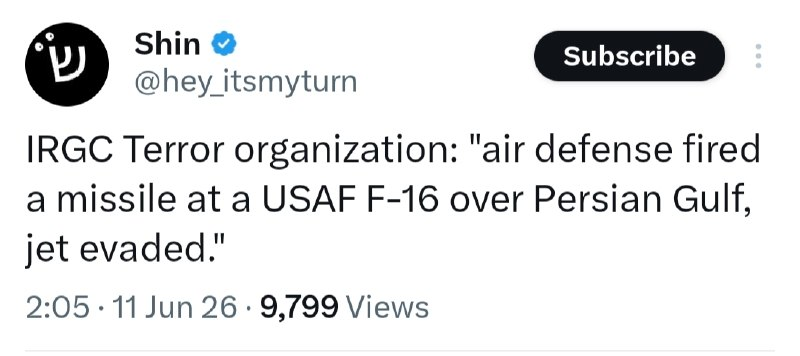

سپاه گفته که داشتن یک فروند F-16 آمریکا رو‌ می‌زدن که کیر شدن و نتوستن.

@Dirty_Kids 👻

## Dirty_Kids — post 391646

دونالد ترامپ:‌ «ما به توافق نزدیک بودیم، اما ناگهان همه‌چیز کاملا تغییر کرد. اکنون ایران باید انتظار حملات سنگین‌تر و شدیدتری را نسبت به ۳ ماه گذشته داشته باشد.»

@Dirty_Kids 👻

## Dirty_Kids — post 391645

  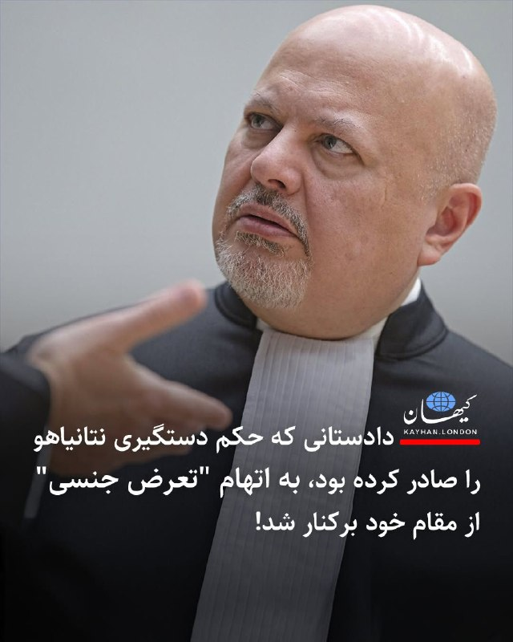

خدایا شکرت؛ دادستانی که گفته بود نتانیاهو ظالمه و فورا باید دستگیر بشه، خودش به جرم تجاوز برکنار و بازداشت شد.

@Dirty_Kids 👻

## Dirty_Kids — post 391644

فاکس نیوز اهداف بعدی نیروگاه ها و پل ها هستن

## alonews — post 127031

  <a href="telegram/content/alonews_127031_1781136845.webm" target="_blank">🎬 Download video</a>

👈فرماندهی مرکزی ایالات متحده(سنتکام) : ادعا: سپاه پاسداران انقلاب اسلامی ایران مدعی شده است که تنگه هرمز بسته شده است. 
🔴حقیقت: کشتی‌های تجاری امشب همچنان در حال تردد به داخل و خارج از تنگه هرمز هستند. 
✅ @AloNews خبر جنگ

## alonews — post 127030

  <a href="telegram/content/alonews_127030_1781136845.webm" target="_blank">🎬 Download video</a>

👈فرماندهی مرکزی ایالات متحده(سنتکام) :
ادعا: سپاه پاسداران انقلاب اسلامی ایران مدعی شده است که تنگه هرمز بسته شده است.

🔴حقیقت: کشتی‌های تجاری امشب همچنان در حال تردد به داخل و خارج از تنگه هرمز هستند.

✅ @AloNews خبر جنگ

## alonews — post 127029

  <a href="telegram/content/alonews_127029_1781136845.webm" target="_blank">🎬 Download video</a>

👈صداوسیما: ترامپ بازم دروغ گفت و عقب نشینی کرد و ما پیروز شدیم، الله اکبر

✅ @AloNews خبر جنگ

## alonews — post 127028

  <a href="telegram/content/alonews_127028_1781136845.webm" target="_blank">🎬 Download video</a>

👈ترامپ در گفتگو با فاکس نیوز:
آتش‌بس با ایران، نقض‌شده‌ترین و ناقض‌ترین آتش‌بس در تاریخ جهان بود

✅ @AloNews خبر جنگ

## alonews — post 127027

  <a href="telegram/content/alonews_127027_1781136846.webm" target="_blank">🎬 Download video</a>

👈ترامپ به فاکس نیوز:
نیروهای آمریکایی ۴۹ موشک تاماهاوک شلیک کردند که به اهدافی در عمق خاک ایران اصابت کردند.

✅ @AloNews خبر جنگ

## alonews — post 127026

  <a href="telegram/content/alonews_127026_1781136846.webm" target="_blank">🎬 Download video</a>

👈ترامپ: اگر ایران توافقنامه رو امضا نکنه، فرداشب به بمباران آنها برمیگردیم.

✅ @AloNews خبر جنگ

## alonews — post 127025

  <a href="telegram/content/alonews_127025_1781136846.webm" target="_blank">🎬 Download video</a>

👈ترامپ به فاکس : ایرانی‌ها ازم خواستن بمباران رو متوقف کنم

🔴مستقیم با مقام‌های ایرانی صحبت کردم

🔴جنگنده‌های آمریکا در حال پرواز روی آسمون ایران هستن

🔴حملات هوایی به زودی تموم میشه

✅ @AloNews خبر جنگ

## alonews — post 127024

  <a href="telegram/content/alonews_127024_1781136846.webm" target="_blank">🎬 Download video</a>

👈هنوز هیچ حمله ای به‌ مواضع آمریکا صورت نگرفته است.

✅ @AloNews خبر جنگ

## alonews — post 127023

  <a href="telegram/content/alonews_127023_1781136846.mp4" target="_blank">🎬 Download video</a>

👈صدای جنگنده های آمریکایی برفراز قشم

✅ @AloNews خبر جنگ

## alonews — post 127022

  <a href="telegram/content/alonews_127022_1781136847.webm" target="_blank">🎬 Download video</a>

👈انفجار مجدد در بندرعباس

✅ @AloNews خبر جنگ

## alonews — post 127021

  <a href="telegram/content/alonews_127021_1781136847.webm" target="_blank">🎬 Download video</a>

🔴فوری/پاکستان: به آمریکا اعلام کردیم که دیگر دست از تلاش برای میانجیگری برمی‌داریم!

✅ @AloNews خبر جنگ

## alonews — post 127020

  <a href="telegram/content/alonews_127020_1781136847.webm" target="_blank">🎬 Download video</a>

👈گزارشات اولیه از حملات هواپیمای جنگی A-10(گراز وحشی) آمریکا به قایق های تندرو سپاه در جزیره لارک

✅ @AloNews خبر جنگ

## alonews — post 127019

  <a href="telegram/content/alonews_127019_1781136847.webm" target="_blank">🎬 Download video</a>

👈حمید رسایی:
اینترنت رو قطع کنید تا دیر نشده

✅ @AloNews خبر جنگ

## alonews — post 127018

  <a href="telegram/content/alonews_127018_1781136847.webm" target="_blank">🎬 Download video</a>

👈زیرنویس شبکه خبر

🔴تنگه هرمز به صورت کامل مسدود شد

✅ @AloNews خبر جنگ

## alonews — post 127017

  <a href="telegram/content/alonews_127017_1781136848.webm" target="_blank">🎬 Download video</a>

👈مقامات آمریکایی به وال استریت ژورنال گفتند که ترامپ دیپلماسی با ایران را رها نکرده است، اگرچه صبر او به طور فزاینده‌ای کاهش یافته است.

🔴حتی پس از تأیید حملات جدید در اوایل این هفته، ترامپ به دستیارانش دستور داد پیامی را از طریق واسطه‌های قطری به تهران منتقل کنند که این حملات پاسخی به حادثه پهپاد است که تقریباً خدمه آپاچی را کشت، نه آغاز جنگ تمام‌عیار.

✅ @AloNews خبر جنگ

## alonews — post 127016

  <a href="telegram/content/alonews_127016_1781136848.webm" target="_blank">🎬 Download video</a>

👈قیمت نفت آمریکا پس از حملات جدید نظامی آمریکا به جنوب ایران، به بالای ۹۲ دلار در هر بشکه رسید.

✅ @AloNews خبر جنگ

## alonews — post 127015

  <a href="telegram/content/alonews_127015_1781136848.webm" target="_blank">🎬 Download video</a>

👈علی قلهکی خبرنگار :
اگه آمریکا بخواد زیرساخت های مارو بزنه و بندازتمون توی بحران برق و بنزین ما هم کاری میکنیم که اسرائیل هم دچار این بحران بشه.

✅ @AloNews خبر جنگ

## alonews — post 127014

  <a href="telegram/content/alonews_127014_1781136848.webm" target="_blank">🎬 Download video</a>

🔴فوری/ قرارگاه خاتم الانبیا: تنگه هرمز از این لحظه برای تمام شناور ها بسته اعلام میشه و هیچ شناوری حق عبور نداره

✅ @AloNews خبر جنگ

## alonews — post 127013

📱لطفا توییتر الونیوز رو دنبال کنین 
🔴پست های انگلیسی در رابطه با جنایت های حکومت به انگلیسی نوشته شده و افراد مهم منشن و هشتگ های مهم قرار داده شده. 
🔴ریپست کنین. مهمترین کمک این روزها جلوگیری از پروپاگاندا حکومت علیه این قتل عام مردم هستش. خونشون نباید پایمال…

---
📅 بروزرسانی: 1405/03/21 02:11
---

## VahidOOnLine — post 244813

  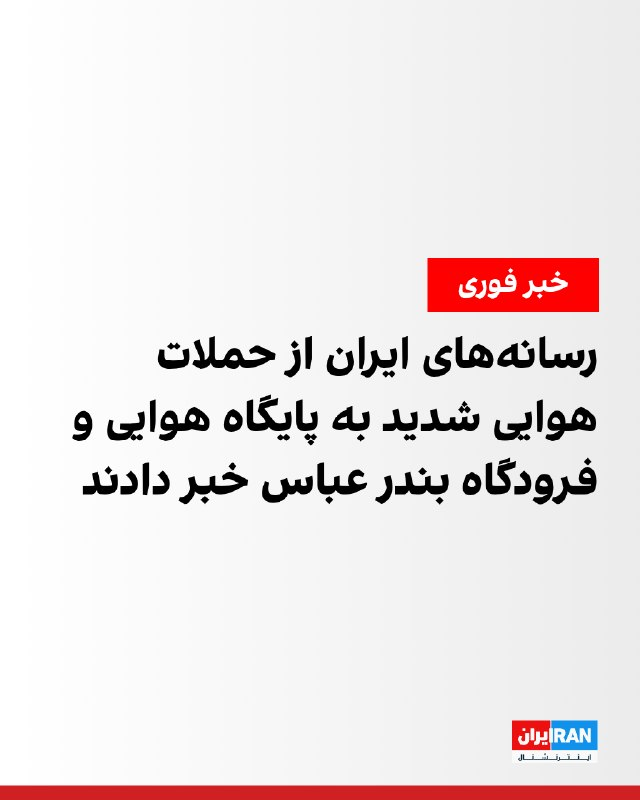

رسانه‌های داخلی از حملات هوایی شدید به پایگاه هوایی و فرودگاه بین‌المللی بندرعباس خبر دادند. همزمان صدای چند انفجار در قشم و بندر کنگان شنیده شده است. صداوسیما نیز اعلام کرد انفجارها در قشم ادامه دارد و مقام‌های محلی گفته‌اند منشأ برخی صداها هنوز مشخص نیست.
‌🏁 🇬🇧 IranintlTV

🤖 @VahidOOnLine

## VahidOOnLine — post 244807

  <a href="telegram/content/VahidOOnLine_244807_1781131269.mp4" target="_blank">🎬 Download video</a>

فشار بر صادرات نفت، شکاف‌های درونی جمهوری اسلامی را آشکارتر کرده است. رژیمی که برای حفظ نیروهای سرکوب، شبکه‌های نیابتی و نظام وفاداری به درآمد نفتی نیاز دارد، اکنون میان مذاکره برای تنفس اقتصادی و تسلیم گرفتار شده است.
‌🏁 🇬🇧 ManotoTV

🤖 @VahidOOnLine

## VahidOOnLine — post 244800

  <a href="telegram/content/VahidOOnLine_244800_1781131270.mp4" target="_blank">🎬 Download video</a>

دونالد ترامپ می‌گوید در «مراحل پایانی» دستیابی به توافقی با جمهوری اسلامی قرار دارد و آمریکا به‌زودی «پیروزی کامل» را اعلام خواهد کرد.

اما این نخستین بار نیست که رئیس‌جمهور آمریکا از نزدیک بودن پایان این مناقشه سخن می‌گوید؛ ورق بزنید.
‌🏁 🇬🇧 ManotoTV

🤖 @VahidOOnLine

## VahidOOnLine — post 244799

  <a href="telegram/content/VahidOOnLine_244799_1781131270.mp4" target="_blank">🎬 Download video</a>

‌
بازدید محمدرضا شاه پهلوی از دانشکده فرماندهی و ستاد ارتش شاهنشاهی در دهه ۵۰ خورشیدی.
‌🏁 🇬🇧 ManotoTV

🤖 @VahidOOnLine

## VahidOOnLine — post 244798

  

♦️آکسیوس بامداد پنجشنبه ۲۱ خردادماه به نقل از یک مقام آمریکایی گزارش داد تمامی اهدافی که در حملات اخیر مورد هدف قرار گرفته‌اند، در جنوب ایران واقع شده‌اند.
این مقام آمریکایی گفت سامانه‌های پدافند هوایی، رادارها و واحدهای فرماندهی و کنترل پهپادها از جمله اهداف این حملات بوده‌اند.
‌🇸🇦 Indypersian

🤖 @VahidOOnLine

## VahidOOnLine — post 244797

  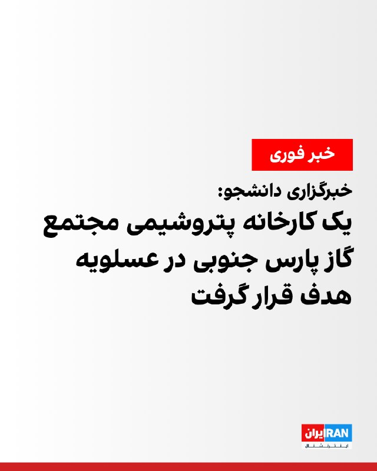

خبرگزاری دانشجو اعلام کرد منابع خبری از هدف قرار گرفتن یک کارخانه پتروشیمی متعلق به مجتمع گاز پارس جنوبی در عسلویه خبر دادند.
‌🏁 🇬🇧 IranintlTV

🤖 @VahidOOnLine

## VahidOOnLine — post 244796

  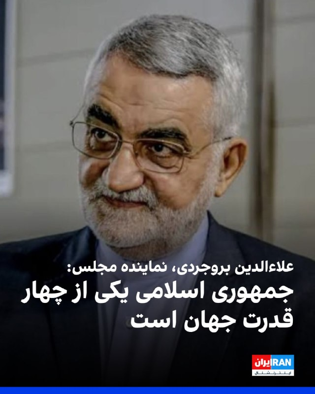

‌علاء‌الدین بروجردی، عضو کمسیون امنیت ملی مجلس در مصاحبه با شبکه سه تلویزیون جمهوری اسلامی گفت: برای آمریکا قبول این حقیقت سخت است که امروز در دنیا ۴ قدرت دیگر، از جمله جمهوری اسلامی، روسیه و چین، وجود دارد.
‌🏁 🇬🇧 IranintlTV

🤖 @VahidOOnLine

## VahidOOnLine — post 244795

  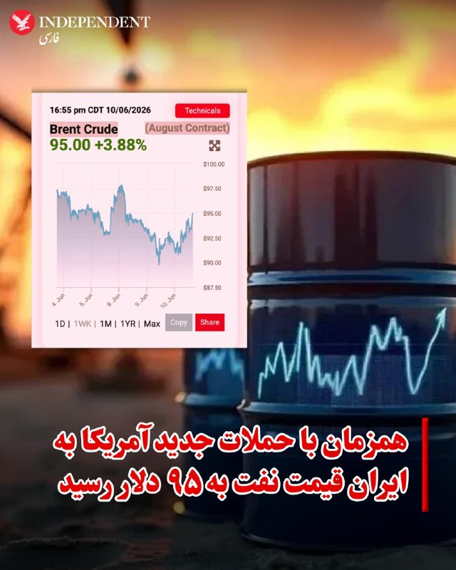

♦️بامداد پنجشنبه ۲۱ خردادماه و در پی اعلام فرماندهی مرکزی ایالات متحده (سنتکام) مبنی بر آغاز دور جدیدی از حملات علیه چندین هدف در ایران، قیمت نفت در بازارهای جهانی افزایش یافت.

بهای نفت خام برنت با رشد ۳.۸۸ درصدی به ۹۵ دلار در هر بشکه رسید. افزایش قیمت نفت در حالی رخ داده است که تشدید تنش‌های نظامی میان آمریکا و جمهوری اسلامی نگرانی‌ها درباره امنیت عرضه انرژی در منطقه را افزایش داده است.
‌🇸🇦 Indypersian

🤖 @VahidOOnLine

## VahidOOnLine — post 244794

  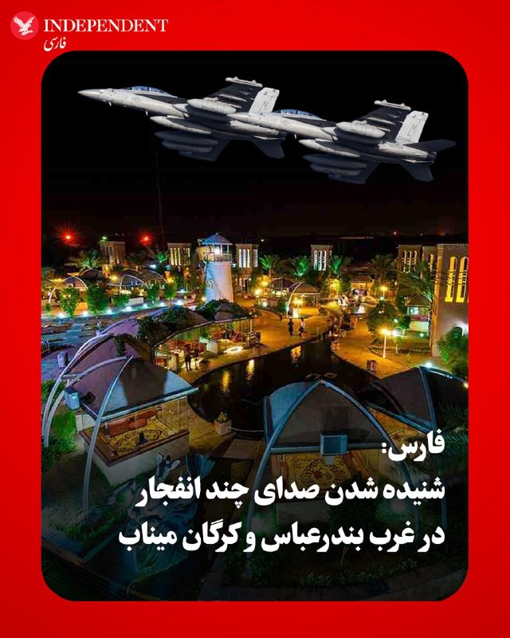

♦️خبرگزاری فارس گزارش داد دقایقی پیش صدای چند انفجار از سمت غرب بندرعباس شنیده شده است. همچنین ساکنان منطقه کرگان میناب نیز از شنیده شدن چند صدای انفجار خبر داده‌اند.
پیش از این، فرماندهی مرکزی ایالات متحده (سنتکام) اعلام کرده بود نیروهای آمریکایی از ساعت ۱۷:۱۵ به وقت شرق آمریکا حملات جدیدی را علیه چندین هدف در ایران آغاز کرده‌اند. سنتکام گفت این عملیات در پاسخ به آنچه «اقدامات تهاجمی و ادامه‌دار ایران» خوانده، انجام شده است.
‌🇸🇦 Indypersian

🤖 @VahidOOnLine

## WithYashar — post 14443

شبکه ۱۵ اسرائیل : موج اول حملات به ایران؛ به پایان رسیده
@withyashar
یاشار : درگیری همچنان در تنگه هرمز ادامه دارد.

## WithYashar — post 14442

روابط عمومی ۳پا: درپی تجاوز جنگنده f16 به حریم هوایی خلیج فارس و شلیک موشک سامانه پدافند هوایی سپاه به سمت آن، جنگنده متجاوز متواری گشت
@withyashar

## WithYashar — post 14441

هاآرتص: اسرائیل در انتظار حمله موشکی ایران پس از حملات جدید آمریکا به اهدافی در ایران
@withyashar

## WithYashar — post 14440

ترامپ : به توافق نزدیک بودیم اما ورق کاملا برگشت و ایران منتظر حملات سنگین و شدیدتر از دو سه ماه اخیر باشد
@withyashar

## WithYashar — post 14439

فاکس نیوز : اهداف بعدی ترامپ پل‌ها و نیروگاه‌ها هستن!
@withyashar

## WithYashar — post 14438

رسانه عراقی «صابرین‌نیوز» گزارش داد که کشتی‌های آمریکایی در نزدیکی تنگه هرمز هدف حملات موشکی و پهپادی نیروهای مسلح ایران قرار گرفته‌اند. @withyashar

## WithYashar — post 14437

رسانه عراقی «صابرین‌نیوز» گزارش داد که کشتی‌های آمریکایی در نزدیکی تنگه هرمز هدف حملات موشکی و پهپادی نیروهای مسلح ایران قرار گرفته‌اند.
@withyashar

## WithYashar — post 14436

خبرنگار I24News  : عوامل آمریکایی: مراکز فرماندهی و کنترل، انبارهای مهمات، رادارها و واحدهای پهپادی مورد حمله قرار گرفتند
@withyashar

## WithYashar — post 14435

المیادین: منطقه تنگه هرمز شاهد درگیری شدیده.
@withyashar

## WithYashar — post 14434

کان عبری: اسرائیل نقشی در حملات امشب نداشته است
@withyashar

## WithYashar — post 14433

پیشروی ناو های آمریکایی اکنون در فاصله 150 تا 250 کیلومتری از ساحل چابهار هستند.🚨🚨
@withyashar

## WithYashar — post 14432

پرواز سوخت رسان های بیشتر از بن گوریون رصد شد. سوخت رسان اسرائیل به پرواز در آمد.
@withyashar

## WithYashar — post 14431

آکسیوس:مذاکرات ایران و آمریکا فروپاشید
@withyashar

## WithYashar — post 14430

انفجار ‌جدید قشم
@withyashar

## WithYashar — post 14429

فاکس نیوز به‌نقل از یک مقام: امشب چند مرحله حمله انجام میدیم.
@withyashar

## WithYashar — post 14428

گزارش از برخورد موشک به فرودگاه بندرعباس
@withyashar

## WithYashar — post 14427

مهر: یه موشک کروز در عسلویه رهگیری کردیم.
@withyashar

## WithYashar — post 14426

اتاق جنگ با یاشار : مشخصه که هدف امریکا متمرکز در‌ باز کردن تنگه هرمز است در مرحله اول !
@withyashar

## WithYashar — post 14425

منابع عراقی: پایگاه آمریکایی الحریر در اربیل (شمال عراق) هدف موشکی از ایران قرار گرفت.

وبگاه المعلومه عراق نیز خبر داد، ایران یک رادار آمریکایی در اربیل (مرکز کردستان عراق) را منهدم کرد
@withyashar

## WithYashar — post 14424

مهر : همین الان سپاه با نیرودریایی امریکا درگیر شده تو تنگه
@withyashar

## mwarmonitor — post 10677

🔸«آمریکا در حال انجام حملات به ایران در چندین موج است — کان نیوز»

@mwarmonitor

## mwarmonitor — post 10676

🔸مسئول امنیتی اسرائیلی: اسرائیل تاکنون در حملات علیه ایران مشارکت نداشته است. شبکه کان اسرائیل

@mwarmonitor

## mwarmonitor — post 10675

🔴چشم‌انداز دستیابی به یک پیشرفت دیپلماتیک میان ایران و آمریکا پس از آن‌که یک هیئت میانجی قطری بدون هیچ پیشرفتی تهران را ترک کرد، کمرنگ شده است — نیویورک تایمز

@mwarmonitor

## mwarmonitor — post 10674

انفجار شدید در قشم

## mwarmonitor — post 10673

انفجار در جزیره هنگام

## mwarmonitor — post 10672

🔴یک مقام آمریکایی گفت: تمام اهدافی که مورد حمله قرار گرفته‌اند در جنوب ایران قرار دارند و شامل سامانه‌های پدافند هوایی، رادارها و واحدهای فرماندهی و کنترل پهپادها هستند - اکسیوس.

@mwarmonitor

## mwarmonitor — post 10671

  

🔴شهرهای که تا کنون مورد هدف قرار گرفته‌اند‌.

@mwarmonitor

## mwarmonitor — post 10670

حمله مجدد به بندرعباس

## mwarmonitor — post 10669

🔴 وال‌استریت ژورنال به نقل از پنتاگون: این حملات نوعی اقدام از جنس «دیپلماسی اجباری» است که هدف آن وادار کردن ایران به ارائه امتیازاتی در میز مذاکره است.

@mwarmonitor

## mwarmonitor — post 10668

🔴 اکسیوس به نقل از مقام‌های آمریکایی: هدف از این حملات فشار بر تهران برای امضای توافق است، اما ممکن است به تشدید نظامی منجر شود.

@mwarmonitor

## mwarmonitor — post 10667

🔸به گفته دو منبع آگاه از برنامه‌ها که برای بحث درباره این موضوع خواستار ناشناس ماندن شده‌اند، دونالد ترامپ، رئیس‌جمهور آمریکا، در نخستین مسابقه جام جهانی که در خاک ایالات متحده میان آمریکا و پاراگوئه روز جمعه در لس‌آنجلس برگزار می‌شود، حضور نخواهد داشت. — پولیتیکو

@mwarmonitor

## mwarmonitor — post 10666

🔴نیروهای فرماندهی مرکزی ایالات متحده (سنتکام) امروز ساعت ۵:۱۵ بعدازظهر به وقت شرق آمریکا، به دستور فرمانده کل قوا، اجرای حملات دفاعی اضافی علیه چندین هدف در ایران را آغاز کردند. این حملات در پاسخ به تجاوزات بی‌دلیل و مستمر ایران انجام شده است.

@mwarmonitor

## mwarmonitor — post 10665

🔴یک مقام ارشد آمریکایی تأیید می‌کند: حملات به ایران آغاز شده است.

@mwarmonitor

## mwarmonitor — post 10664

شنیده شدن دو انفجار در بندرعباس.

## mwarmonitor — post 10663

🔴فعال شدن سامانه‌های پدافند هوایی در شهر عسلویه .

@mwarmonitor

## mwarmonitor — post 10662

انفجار در میناب

## mwarmonitor — post 10661

انفجار در سیریک

## mwarmonitor — post 10660

🔴شبکه ۱۲ اسرائیل: ارتش اسرائیل سطح آماده‌باش خود را افزایش داده است تا برای احتمال ازسرگیری درگیری با ایران آماده باشد.

@mwarmonitor

## mwarmonitor — post 10659

پدافند هوایی تهران فعال شد

## mwarmonitor — post 10658

🔴آمریکا برای دومین شب متوالی ایران را بمباران می‌کند؛ هگستِث

📝نوشته: باراک راوید

🔰پیت هگستث، وزیر دفاع آمریکا، به خبرنگاران گفت که ارتش ایالات متحده برای دومین شب پیاپی حملاتی را علیه ایران انجام خواهد داد. مقامات آمریکایی هدف از این اقدام را اعمال فشار بر تهران برای امضای یک توافق اعلام کرده‌اند.

تصویر کلی
مقامات آمریکایی انتظار دارند که ایران دست به اقدام تلافی‌جویانه بزند و احتمالاً مانند سه‌شنبه شب، پایگاه‌های آمریکا را هدف قرار دهد. با این حال، دونالد ترامپ، رئیس‌جمهور آمریکا، تهران را متهم کرده که در مذاکرات «ما را ساده‌لوح فرض کرده است» و به همین دلیل تصمیم گرفت که این وضعیت باید تغییر کند.
محور اخبار
هگستث در جریان بازدید از مقر فرماندهی مرکزی آمریکا (سنتکام) در فلوریدا به خبرنگاران گفت:
«سنتکام امشب سرش شلوغ خواهد بود، چرا که ما ضربه سختی به ایران وارد خواهیم کرد.»
او در ادامه افزود:
«ایران این شانس را دارد که به یک توافق بزرگ دست یابد، اما تا کنون تمایلی به آن نشان نداده است. آن‌ها شاهد فرود پی‌درپی بمب‌های ایالات متحده بر روی تاسیسات کلیدی خود در ایران خواهند بود. هدف از این کار شروع مجدد جنگ نیست، بلکه تعیین شروط برای یک توافق است.»
هگستث همچنین اظهار داشت:
«اگر مجبور باشیم با بمب مذاکره کنیم، با بمب مذاکره خواهیم کرد. ما امشب ضربه سختی به آن‌ها می‌زنیم و امیدواریم ایران تصمیم درستی بگیرد.»
به گفته دو منبع آگاه آمریکایی، ترامپ بعدازظهر چهارشنبه، چند ساعت پس از آنکه به خبرنگاران گفت ایالات متحده «امروز دوباره ضربه سختی به آن‌ها خواهد زد»، با تیم امنیت ملی خود دیدار کرد تا گزینه‌های نظامی را بررسی کند.
موضع طرف مقابل
خبرگزاری تسنیم ایران به نقل از یک منبع نظامی، وعده «پاسخ‌های سنگین» داد.
پیش از آن در روز چهارشنبه، رئیس‌جمهور ایران مدعی شد که تهدیدهای ترامپ نشان‌دهنده قدرت نیست، بلکه نشانه «استیصال» است.
ایالات متحده سه شنبه شب در پاسخ به سرنگونی یک هلیکوپتر آمریکایی، به سایت‌های راداری و پدافند هوایی ایران حمله کرد؛ اما آن حملات به گونه‌ای تنظیم شده بود که از تلفات جانی جلوگیری شود و راه برای دستیابی به یک توافق باز بماند. ایران نیز در پاسخ، تعداد نسبتاً کمی موشک و پهپاد به سمت پایگاه‌های آمریکا شلیک کرد.
پشت صحنه
دو منبع آمریکایی اعلام کردند که ترامپ روز چهارشنبه با مقاماتی از جمله جی.دی. ونس (معاون رئیس‌جمهور)، مارکو روبیو (وزیر امور خارجه)، جان راتکلیف (رئیس سی‌آی‌ای)، ژنرال دن کین (رئیس ستاد مشترک ارتش) و استیو ویتکاف (فرستاده کاخ سفید) دیدار کرد. پیت هگستث نیز از مقر سنتکام به این جلسه پیوست.
به گفته این منابع، یکی از گزینه‌هایی که ترامپ در حال بررسی آن بود، عملیاتی با ابعاد گسترده اما مدت زمان کوتاه بود؛ با این هدف که ایران را تحت فشار بگذارد تا موضع خود را در مذاکرات تغییر دهد. این منابع به جزئیات بیشتری اشاره نکردند.
علاوه بر این، منابع آگاه فاش کردند که ترامپ به دلیل نزدیک به دو هفته انتظار برای دریافت پاسخ ایران به آخرین پیشنهادش، به شدت کلافه و ناامید شده بود

@mwarmonitor

## FoxNewsTwitter — post 342828

  <a href="telegram/content/FoxNewsTwitter_342828_1781131277.mp4" target="_blank">🎬 Download video</a>

Fox News (Twitter/X)

A House hearing went off the rails when Rep. Jasmine Crockett launched into a blistering attack on Republicans and Martin Luther King Jr.’s niece.

The Texas Democrat took aim at the GOP as a “majority... White” party while criticizing lawmakers for spotlighting civil rights activist Alveda King during a hearing examining the Southern Poverty Law Center.

At one point, Crockett suggested Republicans were trying to make the public think a “Doctor King” was condemning the SPLC, prompting a fiery response from King.

King responded saying Crockett's comments made her "emotional" and later questioned whether Crockett was calling her a "bastard" of the King name — but by by the time she responded, Crockett had already stormed away from the room.

## FoxNewsTwitter — post 342827

  <a href="telegram/content/FoxNewsTwitter_342827_1781131280.mp4" target="_blank">🎬 Download video</a>

Fox News (Twitter/X)

Ilhan Omar shuts down questions about a possible Ethics Committee probe into her finances.

The Minnesota Democrat brushed off a FOX News Digital reporter asking about scrutiny surrounding her reported decline in net worth, insisting there is no investigation underway.

The exchange comes as questions continue to circulate over her financial disclosures and whether congressional ethics officials are reviewing the matter.

## FoxNewsTwitter — post 342826

  <a href="telegram/content/FoxNewsTwitter_342826_1781131283.mp4" target="_blank">🎬 Download video</a>

Fox News (Twitter/X)

BREAKING: The U.S. has begun launching another round of airstrikes against Iran.

## FoxNewsTwitter — post 342825

  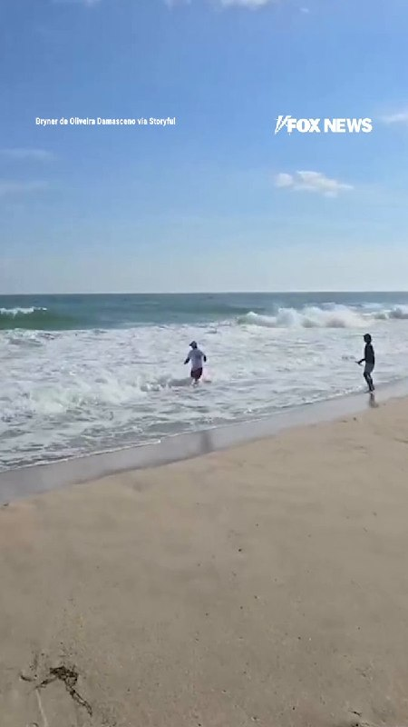

Fox News (Twitter/X)

WATCH: A fisherman reels in a great white shark off the shore of Nantucket, giving stunned beachgoers a rare front-row view of one of the ocean's most feared predators.

This footage captures just a glimpse of the roughly 40-minute battle as crowds gathered along the shoreline to see what was on the line.

Witnesses said people were amazed by the shark's size, which the fisherman later measured to be more than 8.5 feet long and around 300 pounds before he released it back into the Atlantic.

## pm_afshaa — post 93489

الان تو آتش‌بس هستیم هنوز یا نه؟
عادت کردیم دیگه حرفی ازش زده نمیشه

## pm_afshaa — post 93488

صف طولانی در پمپ بنزین های کشور

💧 Rainbet.com the #1 Non-KYC Crypto Casino & Sportsbook @rainbetcom

😁 @Pm_Afshaa

## pm_afshaa — post 93487

  <a href="telegram/content/pm_afshaa_93487_1781131286.webm" target="_blank">🎬 Download video</a>

🔴سپاه: درپی تجاوز جنگنده F-16 به حریم هوایی خلیج فارس و شلیک پدافند هوایی سپاه به سمتش، جنگنده متجاوز فرار کرد.

💧 Rainbet.com the #1 Non-KYC Crypto Casino & Sportsbook @rainbetcom

😁 @Pm_Afshaa

## pm_afshaa — post 93486

تهدید حمله موشکی سپاه به اسراییل

💧 Rainbet.com the #1 Non-KYC Crypto Casino & Sportsbook @rainbetcom

😁 @Pm_Afshaa

## pm_afshaa — post 93485

موج اول حملات آمریکا به پایان رسید

💧 Rainbet.com the #1 Non-KYC Crypto Casino & Sportsbook @rainbetcom

😁 @Pm_Afshaa

## pm_afshaa — post 93483

  <a href="telegram/content/pm_afshaa_93483_1781131287.webm" target="_blank">🎬 Download video</a>

🤔 بعضی قیمت‌ها ارزونن...

💸بعضی قیمت‌ها مشکوکن...

😅 ولی این یکی فقط غیرقابل باوره

💎 هر گیگ فقط ۳ هزار تومن 
💎

👎نه کیفیت کم شده

👎نه سرعت قربانی شده

👎نه قراره چیزی از دست بدی

👍فقط قراره کمتر پول بدی.

🚀 @LexVipBot 
⚡️ @Lex_Server

## pm_afshaa — post 93482

  <a href="telegram/content/pm_afshaa_93482_1781131287.webm" target="_blank">🎬 Download video</a>

🔴رسانه‌های داخلی از حملات هوایی به پایگاه هوایی و فرودگاه بین‌المللی بندرعباس خبر میدن.

💧 Rainbet.com the #1 Non-KYC Crypto Casino & Sportsbook @rainbetcom

😁 @Pm_Afshaa

## pm_afshaa — post 93481

  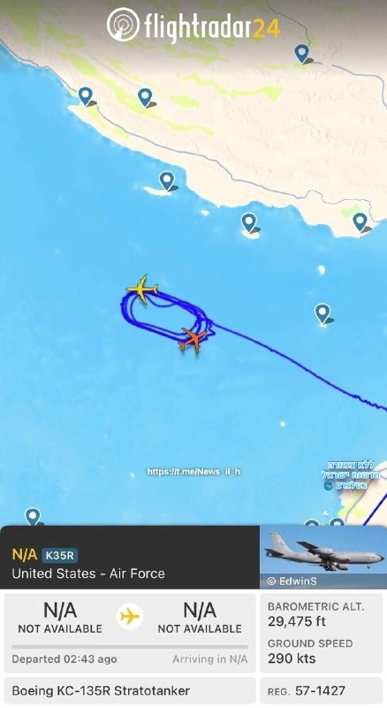

دو هواپیمای سوخت‌رسان هوایی آمریکایی از پایگاه عربستان سعودی برخاستند و اکنون در حال سوخت‌رسانی هوایی در غرب تنگه هرمز هستن

💧 Rainbet.com the #1 Non-KYC Crypto Casino & Sportsbook @rainbetcom

😁 @Pm_Afshaa

## pm_afshaa — post 93480

🔴فاکس نیوز: اهداف بعدی ترامپ ، نیروگاه ها و پل ها هستن

💧 Rainbet.com the #1 Non-KYC Crypto Casino & Sportsbook @rainbetcom

😁 @Pm_Afshaa

## pm_afshaa — post 93479

  <a href="telegram/content/pm_afshaa_93479_1781131289.webm" target="_blank">🎬 Download video</a>

🔴علی قلهکی، خبرنگار: اگه آمریکا بخواد زیرساخت‌های مارو بزنه و بندازتمون تو بحران برق و بنزین، ما کاری میکنیم که اسرائیل هم دچار این بحران بشه. 
💧 Rainbet.com the #1 Non-KYC Crypto Casino & Sportsbook @rainbetcom 
😁 @Pm_Afshaa

## pm_afshaa — post 93478

  <a href="telegram/content/pm_afshaa_93478_1781131290.webm" target="_blank">🎬 Download video</a>

🔴علی قلهکی، خبرنگار:
اگه آمریکا بخواد زیرساخت‌های مارو بزنه و بندازتمون تو بحران برق و بنزین، ما کاری میکنیم که اسرائیل هم دچار این بحران بشه.

💧 Rainbet.com the #1 Non-KYC Crypto Casino & Sportsbook @rainbetcom

😁 @Pm_Afshaa

## pm_afshaa — post 93477

گزارش تایید نشده از ترور فرمانده پایگاه هوایی سپاه پاسداران در کرمان

💧 Rainbet.com the #1 Non-KYC Crypto Casino & Sportsbook @rainbetcom

😁 @Pm_Afshaa

## pm_afshaa — post 93476

  <a href="telegram/content/pm_afshaa_93476_1781131290.webm" target="_blank">🎬 Download video</a>

🔴خبرنگار I24News: مراکز فرماندهی و کنترل، انبارهای مهمات، رادارها و واحدهای پهپادی مورد حمله قرار گرفتن.

💧 Rainbet.com the #1 Non-KYC Crypto Casino & Sportsbook @rainbetcom

😁 @Pm_Afshaa

## pm_afshaa — post 93475

🔴گزارش‌های بیشتری از حذف قابل توجه در ایران حکایت دارد

דרמטי: דיווחים נוספים מצביעים על חיסול משמעותי באיראן

💧 Rainbet.com the #1 Non-KYC Crypto Casino & Sportsbook @rainbetcom

😁 @Pm_Afshaa

## pm_afshaa — post 93474

🔴پولیتیکو:رئیس‌جمهور آمریکا دونالد ترامپ در بازی اول جام جهانی که در آمریکا بین تیم‌های ایالات متحده و پاراگوئه در لس آنجلس روز جمعه برگزار می‌شود، شرکت نخواهد کرد

💧 Rainbet.com the #1 Non-KYC Crypto Casino & Sportsbook @rainbetcom

😁 @Pm_Afshaa

## pm_afshaa — post 93473

  <a href="telegram/content/pm_afshaa_93473_1781131291.webm" target="_blank">🎬 Download video</a>

🔴کان نیوز: آمریکا در حال انجام حملات به ایران در چندین موجه.

💧 Rainbet.com the #1 Non-KYC Crypto Casino & Sportsbook @rainbetcom

😁 @Pm_Afshaa

## pm_afshaa — post 93472

گزارش ها از ترور یک مقام ارشد جمهوری اسلامی

💧 Rainbet.com the #1 Non-KYC Crypto Casino & Sportsbook @rainbetcom

😁 @Pm_Afshaa

## pm_afshaa — post 93471

  <a href="telegram/content/pm_afshaa_93471_1781131292.webm" target="_blank">🎬 Download video</a>

🔴المیادین: منطقه تنگه هرمز شاهد درگیری شدیده.

💧 Rainbet.com the #1 Non-KYC Crypto Casino & Sportsbook @rainbetcom

😁 @Pm_Afshaa

## pm_afshaa — post 93470

  <a href="telegram/content/pm_afshaa_93470_1781131293.webm" target="_blank">🎬 Download video</a>

🔴کان نیوز عبری: اسرائیل نقشی در حملات امشب نداشته. 
💧 Rainbet.com the #1 Non-KYC Crypto Casino & Sportsbook @rainbetcom 
😁 @Pm_Afshaa

## pm_afshaa — post 93469

  <a href="telegram/content/pm_afshaa_93469_1781131293.webm" target="_blank">🎬 Download video</a>

🔴کان نیوز عبری: اسرائیل نقشی در حملات امشب نداشته.

💧 Rainbet.com the #1 Non-KYC Crypto Casino & Sportsbook @rainbetcom

😁 @Pm_Afshaa

## DEJradio — post 5566

⭕️
⭕️ سنتکام در بامداد پنج‌شنبه اعلام کرد موج تازهٔ حملات علیه جمهوری اسلامی را به فرمان ریاست جمهوری آمریکا آغاز کرده است.

#خبر #دژ #سنتکام
@DEJradio

## DEJradio — post 5565

⭕️ ترامپ: هر شب میلیون‌ها بشکه نفت را از ایران خارج کردیم و نفهمیدند

دونالد ترامپ شامگاه چهارشنبه اعلام‌ کرد آمریکا در ماه‌های اخیر هر شب میلیون‌ها بشکه نفت را از ایران خارج کرده است.
رئیس جمهوری آمریکا بدون ارائه جزئیات گفت این اقدام به کاهش فشار بر بازار جهانی نفت کمک کردو مانع افزایش شدید قیمت‌ها شد.
او افزود جمهوری اسلامی تازه از این موضوع آگاه شده است.

#خبر #دژ #نفت #ترامپ #تنگه_هرمز
@DEJradio

## DEJradio — post 5564

⭕️ واشینگتن شبکهٔ چینی تأمین سلاح برای سپاه را هدف گرفت

وزارت خزانه‌داری آمریکا ۱۱ فرد و شرکت در چین و هنگ‌کنگ را به اتهام همکاری در تأمین سلاح و تجهیزات برای سپاه پاسداران و وزارت دفاع جمهوری اسلامی تحریم کرد.
واشینگتن اعلام‌‌ کرد این شبکه در انتقال پول و خرید تجهیزات نظامی برای جمهوری اسلامی نقش داشت.
به گفتهٔ وزارت خزانه‌داری آمریکا، این تحریم‌ها بخشی از کارزار فشار اقتصادی علیه حکومت جمهوری اسلامی است.

#خبر #دژ #تحریم #چین #سپاه_تروریستی_پاسداران
@DEJradio

## DEJradio — post 5563

⭕️ ترامپ گفت آمریکا با کنترل هرمز عبور بیش از ۱۰۰ میلیون بشکه نفت را تضمین کرد

دونالد ترامپ اعلام کرد نیروهای آمریکایی از ماه پیشین امنیت عبور بیش از ۱۰۰ میلیون بشکه نفت و ۲۰۰ کشتی تجاری را از تنگهٔ هرمز تأمین کردند.
رئیس جمهوری آمریکا گفت این عملیات عبور دادن کشتی‌ها بر اساس یک مأموریت محرمانه انجام شد.
او تأکید کرد به‌خلاف ادعای رژیم حاکم بر ایران، کنترل تنگهٔ هرمز در اختیار آمریکا قرار دارد و در کنترل جمهوری اسلامی نیست.

#خبر #دژ #تنگه_هرمز
@DEJradio

## DEJradio — post 5562

  <a href="telegram/content/DEJradio_5562_1781131294.webm" target="_blank">🎬 Download video</a>

🚨
⭕️ رسانه‌های وابسته به حکومت بامداد پنج‌شنبه از شنیده شدن صدای انفجار در غرب تهران و سیریک در استان هرمزگان خبر دادند.

#خبر #دژ #حمله
@DEJradio

## mamlekate — post 103668

📝 اندیمشک شدیدا صدای جنگنده میاد . ساعت دو بامداد پنجشنبه ۲۱ خرداد

@mamlekate_pm

## mamlekate — post 103667

📝 صدای پرواز هواپیما در جزیره کیش

📝 الو هنگام زدن ۱۲:۵۰ دقیقه ساختمان مخابرات شهر

📝 قشم سوزا جنگنده بالای سرمون اومد و همین نزدیکیا رو زد پشت سرهم داره صدا میاد ساعت ۱:۰۰

📝 ساعت ۱:۰۴ دقیقه صدای انفجار اومد بندرعباس. این از دیشب صدای بیشتری داشت.

📝 ۳تا پشت سرهم زد بندرعباس
۱:۲۱دقیقه پنجشنبه۲۱خرداد

@mamlekate

## mamlekate — post 103666

  <a href="telegram/content/mamlekate_103666_1781131295.mp4" target="_blank">🎬 Download video</a>

📝 هشدار وزیر جنگ آمریکا به جمهوری اسلامی: «امشب ضربه محکمی به آنها خواهیم زد»

پس از آنکه پرزیدنت ترامپ گفت ایالات متحده به حمله به جمهوری اسلامی ادامه خواهد داد، پیت هگست، وزیر جنگ آمریکا چهارشنبه عصر به وقت واشنگتن اعلام کرد سنتکام امشب مشغول خواهد بود.

▶️ «بعد از ظهر همگی بخیر. خوشحالم که اینجا در فرماندهی مرکزی ایالات متحده (سنتکام) هستم. دریادار کوپر، فرمانده سنتکام، قرار بود همراه من اینجا حضور داشته باشد؛ ما همین الان جلسات توجیهی مفصل خود را به پایان رساندیم. اما خب، طبیعتاً او سرش شلوغ است.

زیرا سنتکام (فرماندهی مرکزی) امشب سرش شلوغ خواهد بود؛ چرا که رئیس‌جمهور ترامپ گفتند ما ضربه سختی به ایران خواهیم زد، و این کار را خواهیم کرد. ایران این شانس را داشته است که به یک توافق خوب، یک توافق عالی برسد تا آنچه را که می‌گفتند حاضر به انجامش هستند، رسمی و قانونی کند، اما مایل به انجام آن نبوده‌اند.

بنابراین، همان‌طور که رئیس‌جمهور ترامپ گفتند، آن‌ها داشتند "تپ تپ تپ" (امروز و فردا) می‌کردند. شما می‌توانید ببینید وقتی کسی سعی دارد برای یک توافق وقت‌کشی کند و بازی درآورد (تپ تپ تپ کند)، در عوض، آن‌ها قرار است شاهد "تپ تپ تپ" بمب‌هایی باشند که از سوی ایالات متحده آمریکا بر روی تاسیسات کلیدی در ایران فرود می‌آیند.

و این به آن دلیل نیست که ما می‌خواهیم چیزی را که مجبور به شروع مجددش نیستیم، دوباره آغاز کنیم. بلکه به این دلیل است که وزارت جنگ (دفاع) آماده است تا شرایط را تعیین کند تا اطمینان حاصل شود که ما به همان نوع توافقی که رئیس‌جمهور ترامپ انتظار دارد، دست پیدا می‌کنیم.

دریادار کوپر و تیم اینجا در سنتکام، کار فوق‌العاده‌ای را از همان ابتدا در عملیات "اپیک فیوری" (Epic Fury) و از طریق این محاصره انجام داده‌اند تا اطمینان حاصل شود که ما شانس رسیدن به آن هدف نهایی را داریم؛ هدفی که بر اساس آن، ایران هرگز سلاح هسته‌ای نخواهد داشت. چیزی که خودشان هم می‌گویند آن را نمی‌خواهند. بنابراین، از آنجایی که ما تا این حد به آن توافق مذاکره‌شده نزدیک هستیم، اگر واقعاً این‌طور است، آن‌ها باید قدم جلو بگذارند و آن را انجام دهند.»

@mamlekate

## VahidOnline — post 76170

  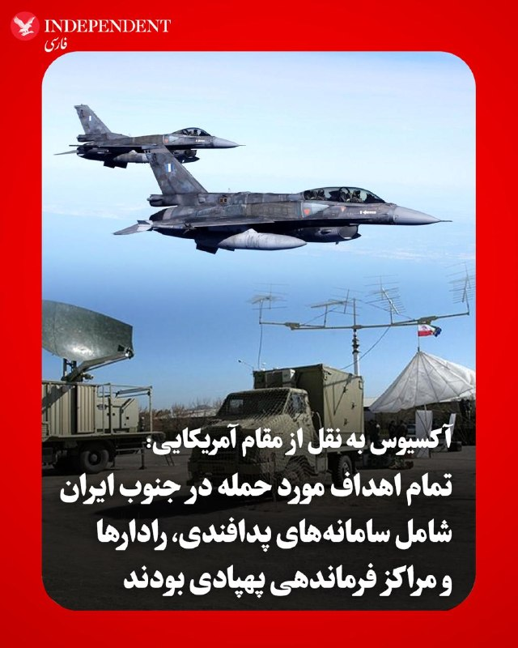

♦️آکسیوس بامداد پنجشنبه ۲۱ خردادماه به نقل از یک مقام آمریکایی گزارش داد تمامی اهدافی که در حملات اخیر مورد هدف قرار گرفته‌اند، در جنوب ایران واقع شده‌اند.
این مقام آمریکایی گفت سامانه‌های پدافند هوایی، رادارها و واحدهای فرماندهی و کنترل پهپادها از جمله اهداف این حملات بوده‌اند.
@VahidOOnLine

📡 @VahidOnline

## VahidOnline — post 76169

بعضی کانال‌های خبری به نقل از تسنیم نوشته بودند:
منابع خبری از هدف قرار گرفتن یک کارخانه پتروشیمی متعلق به مجتمع گاز پارس جنوبی در عسلویه خبر دادند

خبرگزاری تسنیم وابسته به سپاه در پستی نوشت:
انتشار خبر جعلی در کانالهای فیک‌نیوز به نقل از تسنیم

برخی فیک‌نیوزها از دقایقی پیش به صورت هماهنگ خبری با عنوان "هم اکنون یک کارخانه پتروشیمی متعلق به مجتمع گاز پارس جنوبی در عسلویه بمباران شد" به نقل از تسنیم نقل می‌کنند.

این در حالی است که امشب چنین خبری تا این لحظه بر روی هیچکدام از خروجی‌های تسنیم قرار نگرفته است و چنین خبری تاکنون صحت ندارد.

به هرحال اون خبر رو خبرگزاری دانشجو وابسته به بسیج هم منتشر کرده و الان به نقل از اون داره پخش میشه:
هم اکنون یک کارخانه پتروشیمی متعلق به مجتمع گاز پارس جنوبی در عسلویه بمباران شد

🔄 آپدیت:
ایرنا، خبرگزاری رسمی دولت جمهوری اسلامی:
فرمانداران عسلویه و کنگان که هر دو شهرستان میزبان تاسیسات پارس جنوبی هستند هرگونه حمله و انفجاری را تکذیب کردند.

📡 @VahidOnline

## VahidOnline — post 76168

پیام‌های دریافتی:

صدای سه انفجار در بندرعباس

بندر عباس سه صدای پشت سر هم ساعت 1:20

وااااایییی تو دو ثانیه سه تا انفجار شنیدم بندرعباس خیلی نزدیک بود

بندر عباس همین الان چند تا صداااا

بندرعباس سمت زندان شهرک صدای جنگنده یا انفجار طولانی اومد
همین الان یک انفجار خیلی خیلیییی سنگین بندرعباس

دوباره انفجار بندرعباس ۱:۲۲

وحید بندرعباس الان یجوری زد شهر لرزید

وحید ساعت ۱:۲۰ بندرعباس سه تا انفجار خیلی سنگین شد

دوبارهههه صدا اومد ولی خیلی دوررر بود فکر کنم سه/چهار تا بود

📡 @VahidOnline

## VahidOnline — post 76167

  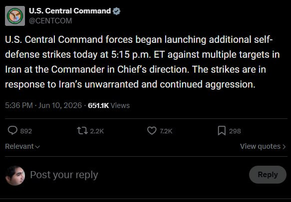

توییت سنتکام، ترجمه ماشین:
نیروهای فرماندهی مرکزی آمریکا امروز، به دستور فرمانده کل قوا، از ساعت ۵:۱۵ عصر به وقت شرق آمریکا، حملات دفاعیِ بیشتری را علیه چندین هدف در ایران آغاز کردند.

این حملات در پاسخ به تجاوزهای بی‌دلیل و ادامه‌دار ایران انجام می‌شود.
CENTCOM

📡 @VahidOnline

## VahidOnline — post 76166

پیام‌های دریافتی:
ساعت ۱:۰۳ بندرعباس صدای انفجار شدید اومد

بندرکرگان شهرستان میناب، رو با موشک زد
همین الان
پاسگاه دریابانی رو زد

صدای دو انفجار در بندرعباس همین الان

سلام ساعت همین الان انفجار شدید در بندرعباس ساعت ۱:۴ دقیقه

وحید از ساعت ۱:۰۳ دقیقه بامداد
چهار تا انفجار بندرعباس

سلام وحید،صدای چند انفجار همین الان بندرعباس

سلام. همین الان صدای انفجار شدید، بندرعباس، ساعت یک و سه دقیقه شب
صدای انفجارهای ممتد میاد

صدای انفجار بندرعباس

بندر عباس فکر کنم سه تا انفجار با فاصله چند ثانیه

صدای انفجار بازم میاد میناب نوار ساحلی

انفجار دوباره

سلام،وحید جان بندرو زدننن من لرزیدمم

همین الان صدای انفجار بندرعباس دو الی سه تا صدا اومد

انفجارها داره زیاد و قوی‌تر میشه، بندرعباس ساعت یک و شش دقیقه شب

سلام‌وحید جان بندرعباس همین الان ۱:۰۵ دقیقه صدای انفجار اومد

سلام وحید جان
همین الان ۱:۰۶صدای انفجار داره میاد بندرعباس
پنجره خونمون لرزید

درود درگهان همی پنچره ها لرزید

سلام اقا وحید ۰۱:۰۶ دقیقه بندرعباس الان یه صدای بزرگ انفجار که مرکز شهر شنیده شد

📡 @VahidOnline

## VahidOnline — post 76165

🔻خبرگزاری مهر، وابسته به سازمان تبلیغات اسلامی، بدون هیچ توضیح بیشتری نوشته:
شنیده شدن صدای انفجار در سیریک

🔻خبرگزاری تسنیم، وابسته به سپاه، نوشته:
بررسی‌ها نشان می‌دهد که تا این لحظه اخبار مربوط به صدای انفجار در جزایر کیش و قشم صحت نداشته و صداهای شنیده شده مرتبط با درگیری در خلیج‌فارس است.

براساس گزارش منابع محلی، دقایقی پیش صدای انفجار در اطراف میناب و سیریک شنیده شد.

🔻پیام‌هایی در ابراز تعجب از پرواز هواپیمای مسافربری در تهران دریافت کردم.

🔻تسنیم در پست دیگری نوشت:
تاکنون صدای ۴ انفجار در سیریک شنیده شده است

🔻عکس‌هایی از فرود هواپیماهای مسافربری در تهران دریافت کردم.
📡 @VahidOnline

## VahidOnline — post 76164

  <a href="telegram/content/VahidOnline_76164_1781131298.mp4" target="_blank">🎬 Download video</a>

پیت هگست، وزیر جنگ آمریکا، در جمع خبرنگاران گفت حملاتی که امشب به ایران انجام خواهد شد، «قوی و روشن» خواهد بود و فرماندهی مرکزی آمریکا امشب درگیر عملیات خواهد بود.

او افزود آمریکا تاسیسات کلیدی در جمهوری اسلامی را بمباران می‌کند و امشب «ضربه سختی» وارد خواهد کرد.
@VahidOOnLine

📡 @VahidOnline

## kianmeli1 — post 87902

🔴فوری/فاکس نیوز

اهداف بعدی ترامپ ، نیروگاه ها و پل ها هستند
https://t.me/kianmeli1

## kianmeli1 — post 87901

  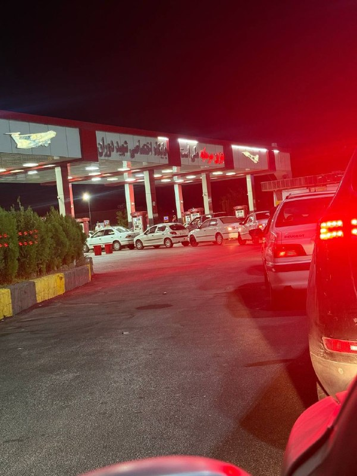

🔴شیراز پمپ بنزین بعد از خبر اینکه به عسلویه رو زدن شلوغ شده
https://t.me/kianmeli1

## kianmeli1 — post 87900

🔴فوری

فاکس نیوز به نقل از یک مقام ارشد آمریکایی

امشب چند موج حمله دیگر به ایران وجود دارد.
https://t.me/kianmeli1

## kianmeli1 — post 87899

🔴فوری-صداهای انفجار در بندرعباس، قشم، میناب، سیریک و جزیره هنگام
https://t.me/kianmeli1

## kianmeli1 — post 87898

🔴صدای چند انفجار در بندر کرگان نیز شنیده شده است
https://t.me/kianmeli1

## kianmeli1 — post 87897

🔴خبرهایی از حمله به پتروشیمی عسلویه و بندر کنگان
https://t.me/kianmeli1

## kianmeli1 — post 87896

🔴فوری-بندرعباس زیر آتش
https://t.me/kianmeli1

## kianmeli1 — post 87895

  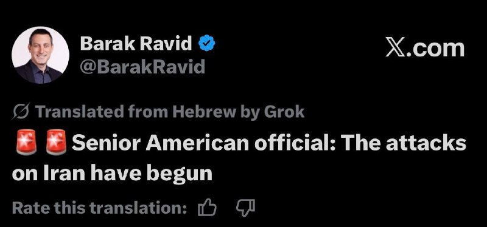

🔴فوری

شروع حمله نظامی ایالات متحده علیه اهداف درون ایران
https://t.me/kianmeli1

## kianmeli1 — post 87894

🔴فوری-انفجارهای پیاپی در جنوب کشور
https://t.me/kianmeli1

## kianmeli1 — post 87893

🔴فوری-انفجار در میناب
https://t.me/kianmeli1

## kianmeli1 — post 87892

🔴فوری

انفجار در قشم و سیریک
https://t.me/kianmeli1

## kianmeli1 — post 87891

🔴فوری-یگان های موشکی سپاه به حالت آماده باش در آمده اند
https://t.me/kianmeli1

## kianmeli1 — post 87890

🔴فوری-صدای فعالیت پدافند هوایی در غرب تهران شنیده شده است.
https://t.me/kianmeli1

## kianmeli1 — post 87889

🔴فوری-پرواز جنگنده های امریکا در آسمان عراق سنگین و پرتعداد گزارش میشود.
https://t.me/kianmeli1

## kianmeli1 — post 87888

🔴فوری-دوازده سوخت رسان برخاسته اند از اسراییل و عربستان
https://t.me/kianmeli1

## kianmeli1 — post 87887

🔴فوری

رویترز: سامانه‌های دفاع هوایی در جنوب ایران فعال شدند
https://t.me/kianmeli1

## kianmeli1 — post 87886

🔴فوری-حریم هوایی اقلیم کردستان عراق بسته شد. پروازها یکی یکی در حال لغو شدن هستند
https://t.me/kianmeli1

## kianmeli1 — post 87885

🔴فوری-خبرهایی از صدای پدافند در کیش
https://t.me/kianmeli1

## kianmeli1 — post 87884

🔴فوری-فعالیت پدافند در شهر مُهر در استان فارس
https://t.me/kianmeli1

## kianmeli1 — post 87883

🔴فوری

هگست: تاسیسات کلیدی ایران بمباران میشوند
https://t.me/kianmeli1

## IranIntlTV — post 341597

  <a href="https://t.me/IranintlTV/341597" target="_blank">📎 Download file</a>

🎧نسخه صوتی برنامه با کامبیز حسینی؛ آیا این «تیم ملی» را نمایندهٔ خودتان می‌دانید؟
@iranintlTV

## IranIntlTV — post 341596

  <a href="https://t.me/IranintlTV/341596" target="_blank">📎 Download file</a>

🎧نسخه صوتی سیاست با مراد ویسی: تهدید ترامپ به حمله سنگین
@iranintlTV

## IranIntlTV — post 341595

  

رسانه‌های داخلی از حملات هوایی شدید به پایگاه هوایی و فرودگاه بین‌المللی بندرعباس خبر دادند. همزمان صدای چند انفجار در قشم و بندر کنگان شنیده شده است. صداوسیما نیز اعلام کرد انفجارها در قشم ادامه دارد و مقام‌های محلی گفته‌اند منشأ برخی صداها هنوز مشخص نیست.
https://iranintl.com/202606108560

## IranIntlTV — post 341594

  <a href="telegram/content/IranIntlTV_341594_1781131302.mp4" target="_blank">🎬 Download video</a>

جمشید برزگر، روزنامه‌نگار و تحلیل‌گر سیاسی، گفت: «جمهوری اسلامی در عمل تلاش کرده سرنوشت درگیری‌های منطقه، به‌ویژه جنگ میان حزب‌الله و اسرائیل، را به روند مذاکرات خود با آمریکا گره بزند.»

او افزود: «حملات به اسرائیل و همچنین حملات علیه نیروها و پایگاه‌های آمریکا در منطقه، دونالد ترامپ را در موقعیت دشوارتری قرار داده است.»
@iranintltv

## IranIntlTV — post 341593

  <a href="telegram/content/IranIntlTV_341593_1781131305.mp4" target="_blank">🎬 Download video</a>

فرشته پزشک، کارشناس روابط بین‌الملل، گفت: «تا زمانی که ابعاد و اهداف واقعی این حملات روشن‌تر نشود، قضاوت درباره نتیجه آن دشوار است؛ مگر اینکه نوع عملیات به گونه‌ای باشد که ساختار تصمیم‌گیری سیاسی و نظامی جمهوری اسلامی را به طور اساسی تحت تاثیر قرار دهد و تغییراتی در سطوح عالی قدرت ایجاد کند.»

او افزود: «مساله اصلی میان آمریکا و جمهوری اسلامی بیش از آنکه یک مساله صرفاً نظامی یا تاکتیکی باشد، یک مساله سیاسی است.»
@iranintltv

## IranIntlTV — post 341592

  

خبرگزاری دانشجو اعلام کرد منابع خبری از هدف قرار گرفتن یک کارخانه پتروشیمی متعلق به مجتمع گاز پارس جنوبی در عسلویه خبر دادند.
https://iranintl.com/202606106347

## IranIntlTV — post 341591

  

‌علاء‌الدین بروجردی، عضو کمسیون امنیت ملی مجلس در مصاحبه با شبکه سه تلویزیون جمهوری اسلامی گفت: برای آمریکا قبول این حقیقت سخت است که امروز در دنیا ۴ قدرت دیگر، از جمله جمهوری اسلامی، روسیه و چین، وجود دارد.

## IranIntlTV — post 341590

  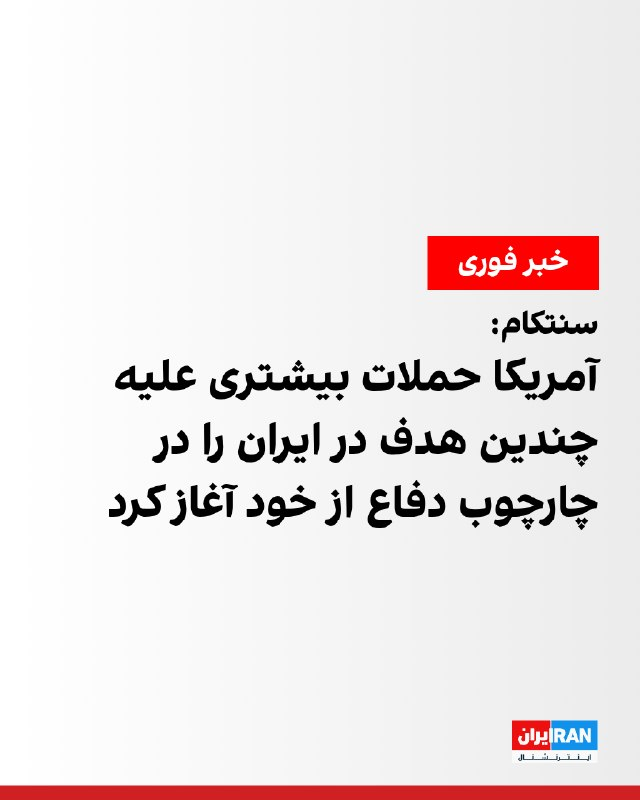

ستاد فرماندهی مرکزی آمریکا، سنتکام، اعلام کرد از ساعت ۰۰:۴۵ به وقت تهران، نیروهای آمریکا در واکنش به «تجاوز بی‌دلیل و ادامه‌دار» جمهوری اسلامی حملات بیشتری را در چارچوب دفاع از خود علیه چندین هدف در ایران آغاز کردند.
https://iranintl.com/202606103787

## IranIntlTV — post 341589

  <a href="telegram/content/IranIntlTV_341589_1781131309.mp4" target="_blank">🎬 Download video</a>

مراد ویسی، تحلیل‌گر ارشد ایران‌اینترنشنال، گفت: «همان‌طور که شاهزاده رضا پهلوی تاکید کرده، مهم‌ترین وظیفه امروز حفظ اتحاد نیروهای ملی و ایران‌دوست و پاسداری از دستاوردهای انقلاب ملی است. دو دستاورد بزرگ این انقلاب، غلبه مردم بر ترس از تغییر و باور به قدرت خیزش میلیونی خود، و همچنین تثبیت رهبری شاهزاده برای عبور از جمهوری اسلامی است.»
@iranintltv

## IranIntlTV — post 341588

  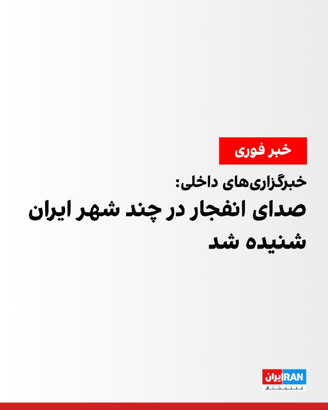

خبرگزاری‌های داخلی گزارش دادند که صدای انفجار در شهرهای مختلف شنیده شد. در غرب تهران و عسلویه پدافند هوایی فعال شد و در سیریک و میناب صدای انفجارهایی شنیده شده است.
https://iranintl.com/202606109695

## IranIntlTV — post 341587

  <a href="telegram/content/IranIntlTV_341587_1781131312.mp4" target="_blank">🎬 Download video</a>

مراد ویسی، تحلیل‌گر ارشد ایران‌اینترنشنال، گفت: «جمهوری اسلامی منصب حکومت را بدون رضایت اکثریت مردم اشغال کرده است. پرسشی که هیچ‌یک از مقام‌های جمهوری اسلامی پاسخی برای آن ندارند این است که اگر مردم آنها را نخواهند، که نمی‌خواهند، چگونه باید این را به حکومت بگویند و حق خود را به‌عنوان صاحبان اصلی حکومت اعمال کنند.»
@iranintltv

## IranIntlTV — post 341586

  <a href="telegram/content/IranIntlTV_341586_1781131314.mp4" target="_blank">🎬 Download video</a>

مراد ویسی، تحلیل‌گر ارشد ایران‌اینترنشنال، گفت: «از حرف ترامپ درباره حمله دوباره می‌توان این برداشت را داشت که یا از طولانی شدن مذاکرات با جمهوری اسلامی خسته شده و به دنبال بازگشت به زبان زور است، یا می‌خواهد با تهدید نظامی آخرین فشارها را برای وادار کردن جمهوری اسلامی به امضای توافق نهایی وارد کند.»
@iranintltv

## IranIntlTV — post 341585

  <a href="telegram/content/IranIntlTV_341585_1781131316.mp4" target="_blank">🎬 Download video</a>

ستاد فرماندهی مرکزی آمریکا، سنتکام، با انتشار ویدیویی در شبکه ایکس از هدف قرار دادن یک نفتکش با پرچم پالائو به نام M/T Settebello در تاریخ سه‌شنبه ۱۹ خرداد در خلیج عمان خبر داد.

سنتکام گفت این کشتی با نقض محاصره دریایی در حال انتقال نفت از ایران بود. پس از بی‌توجهی مکرر خدمه به هشدارها، یک هواپیمای آمریکایی با شلیک دقیق، موتورخانه کشتی را هدف قرار داد.

به گفته سنتکام، از زمان آغاز محاصره در ۱۳ آوریل (۲۴ فروردین)، هشت کشتی از کار افتاده، ۱۳۴ کشتی تغییر مسیر داده‌اند و به ۴۲ کشتی حامل کمک‌های بشردوستانه اجازه عبور داده شده است.
@iranintltv

## IranIntlTV — post 341584

  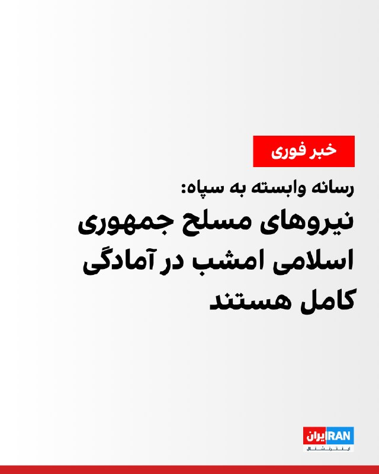

خبرگزاری تسنیم، وابسته به سپاه پاسداران، به نقل از یک منبع نظامی نوشت نیروهای مسلح جمهوری اسلامی امشب نیز در آمادگی کامل هستند و اگر آمریکایی‌ها اقدام «تجاوزگرانه‌ای» انجام دهند، بار دیگر با «پاسخ‌های سنگین» مواجه خواهند شد.

این منبع نظامی گفت جمهوری اسلامی شب گذشته به آمریکایی‌ها اثبات کرده که هرگونه «ماجراجویی و حماقت جدید» با پاسخ بدون درنگ مواجه خواهد شد و هیچ‌گونه تجاوزی را بی‌پاسخ نمی‌گذارد.

او افزود در صورت اقدام آمریکایی‌ها، نیروهای مسلح جمهوری اسلامی اهداف جدیدی از منافع آمریکا را هدف قرار خواهند داد.

این منبع نظامی همچنین گفت تصور آمریکایی‌ها درباره «تشدید کنترل‌شده» و به دست گرفتن ابتکار عمل، «احمقانه» است و جمهوری اسلامی برای «دیکته کردن محاسبات جدید» به آمریکایی‌ها تعلل نخواهد کرد.
https://iranintl.com/202606106681

## IranIntlTV — post 341583

  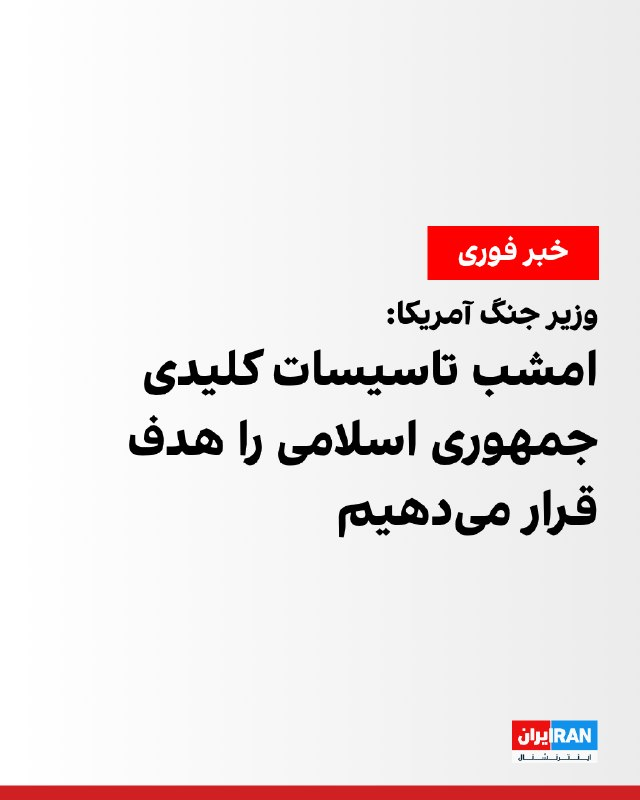

پیت هگست، وزیر جنگ آمریکا، در جمع خبرنگاران گفت حملاتی که امشب به ایران انجام خواهد شد، «قوی و روشن» خواهد بود و فرماندهی مرکزی آمریکا امشب درگیر عملیات خواهد بود.

او افزود آمریکا تاسیسات کلیدی در جمهوری اسلامی را بمباران می‌کند و امشب «ضربه سختی» وارد خواهد کرد.
https://iranintl.com/202606106813

## Shin_Persian — post 6900

Shin ✓ @hey_itsmyturn Wed, 10 Jun 2026 22:35:34 UTC IRGC Terror organization: "air defense fired a missile at a USAF F-16 over Persian Gulf, jet evaded." ترجمه خودکار فارسی سازمان تروریستی سپاه پاسداران انقلاب اسلامی (IRGC): «پدافند هوایی موشکی را به…

## Shin_Persian — post 6899

Shin ✓ @hey_itsmyturn
Wed, 10 Jun 2026 22:35:34 UTC

IRGC Terror organization: "air defense fired a missile at a USAF F-16 over Persian Gulf, jet evaded."

ترجمه خودکار فارسی

سازمان تروریستی سپاه پاسداران انقلاب اسلامی (IRGC): «پدافند هوایی موشکی را به سمت یک فروند F-16 نیروی هوایی ایالات متحده (USAF) بر فراز خلیج فارس شلیک کرد، جنگنده از برخورد گریخت.»

𝕏 · @shin_persian

## Shin_Persian — post 6897

Shin ✓ @hey_itsmyturn
Wed, 10 Jun 2026 22:19:53 UTC

Wrong, this image is not from Sirik, Iran. It's from Aden, Yemen.

ترجمه خودکار فارسی

اشتباه است، این تصویر مربوط به سیریک ایران نیست. این تصویر متعلق به عدن، یمن است.

𝕏 · @shin_persian

## Shin_Persian — post 6896

U.S. Central Command-Farsi ✓ @CENTCOMFarsi
Wed, 10 Jun 2026 22:10:56 UTC

نیروهای فرماندهی مرکزی ایالات متحده امروز ساعت ۵:۱۵ بعد از ظهر به وقت شرق آمریکا، به دستور فرمانده کل قوا، حملات دفاع از خود بیشتری را علیه چندین هدف در ایران آغاز کردند. این حملات در پاسخ به تجاوز بی‌اساس و مداوم ایران انجام می‌شود.

English

U.S. Central Command (CENTCOM) forces, at the direction of the Commander-in-Chief, launched additional self-defense strikes against several targets in Iran today at 5:15 p.m. Eastern Time. These strikes are in response to Iran's unprovoked and ongoing aggression.

𝕏 · @shin_persian

## Shin_Persian — post 6895

  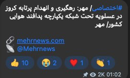

Shin ✓ @hey_itsmyturn
Wed, 10 Jun 2026 22:07:58 UTC

State-owned Mehr News claims that a CM was downed over Asaluyeh, Bushehr Province, #Iran

ترجمه خودکار فارسی

خبرگزاری دولتی مهر ادعا می‌کند که یک موشک کروز (CM) برفراز عسلویه در استان بوشهر، #Iran سرنگون شده است.

𝕏 · @shin_persian

## Shin_Persian — post 6894

  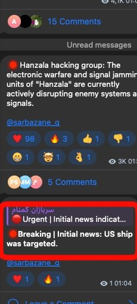

Shin ✓ @hey_itsmyturn
Wed, 10 Jun 2026 22:06:26 UTC

Just remembered when the Islamic Regime's TV said they hit the CVN-72 😂

ترجمه خودکار فارسی

همین الان یادم آمد زمانی را که تلویزیون رژیم اسلامی گفت آن‌ها به CVN-72 (ناو هواپیمابر یواس‌اس آبراهام لینکلن) حمله کرده‌اند 😂

𝕏 · @shin_persian

## Shin_Persian — post 6893

Shin ✓ @hey_itsmyturn
Wed, 10 Jun 2026 22:01:37 UTC

2 stories from 2 regime news agencies:

Daneshju Agency:
A Petrochemical company in Asaluyeh was targeted.

IRIB:
A CM was downed over Asaluyeh.

ترجمه خودکار فارسی

۲ خبر از ۲ خبرگزاری رژیم:

خبرگزاری دانشجو:
یک شرکت پتروشیمی در عسلویه مورد هدف قرار گرفت.

خبرگزاری صدا و سیما (IRIB):
یک موشک کروز (CM) بر فراز عسلویه سرنگون شد.

𝕏 · @shin_persian

## Shin_Persian — post 6892

Shin ✓ @hey_itsmyturn
Wed, 10 Jun 2026 21:57:55 UTC

Initial:
Airstrike on a petrochemical site in Asaluyeh, Bushehr Province, #Iran

ترجمه خودکار فارسی

حمله هوایی به یک سایت پتروشیمی در عسلویه، استان بوشهر، #Iran

𝕏 · @shin_persian

## Shin_Persian — post 6891

Shin ✓ @hey_itsmyturn
Wed, 10 Jun 2026 21:57:11 UTC

As per regime news channels: IRGC Khatam HQ's Spox to address a statement shortly

ترجمه خودکار فارسی

بر اساس کانال‌های خبری رژیم: سخنگوی قرارگاه خاتم‌الانبیاء سپاه پاسداران (IRGC) به‌زودی بیانیه‌ای را ارائه خواهد کرد.

𝕏 · @shin_persian

## Shin_Persian — post 6890

↩️ Quoted tweet: Shin ✓ @hey_itsmyturn Wed, 10 Jun 2026 21:42:28 UTC Kangan Naval Base was the target as per a local source. Was hit 3 times. ↩️ توییت نقل‌قول شده — برای پاسخ، پست زیر را ببینید. ترجمه خودکار فارسی به گفته یک منبع محلی، پایگاه دریایی کنگان…

## Shin_Persian — post 6889

↩️ Quoted tweet:
Shin ✓ @hey_itsmyturn
Wed, 10 Jun 2026 21:42:28 UTC

Kangan Naval Base was the target as per a local source. Was hit 3 times.

↩️ توییت نقل‌قول شده — برای پاسخ، پست زیر را ببینید.

ترجمه خودکار فارسی

به گفته یک منبع محلی، پایگاه دریایی کنگان هدف قرار گرفت. این مکان ۳ بار مورد اصابت قرار گرفت.

𝕏 · @shin_persian

## Shin_Persian — post 6888

  

Shin ✓ @hey_itsmyturn
Wed, 10 Jun 2026 21:52:18 UTC

NOW -
Huge blast in Bandar Abbas, Hormozgan Province, #Iran

ترجمه خودکار فارسی

فوری -
انفجار مهیب در بندرعباس، استان هرمزگان، #Iran

𝕏 · @shin_persian

## Shin_Persian — post 6887

  <a href="telegram/content/Shin_Persian_6887_1781131320.mp4" target="_blank">🎬 Download video</a>

Shin ✓ @hey_itsmyturn
Wed, 10 Jun 2026 21:47:49 UTC

IRIAF jets over western Tehran
#Tehran Province, #Iran

ترجمه خودکار فارسی

جنگنده‌های نیروی هوایی ارتش جمهوری اسلامی ایران (نهاجا) بر فراز غرب تهران
#Tehran Province, #Iran

𝕏 · @shin_persian

## Shin_Persian — post 6886

Shin ✓ @hey_itsmyturn
Wed, 10 Jun 2026 21:44:18 UTC

Correction: Kargan* (Not Kangan)

ترجمه خودکار فارسی

تصحیح: کارگان* (نه کنگان)

𝕏 · @shin_persian

## Shin_Persian — post 6885

↩️ Quoted tweet: Shin ✓ @hey_itsmyturn Wed, 10 Jun 2026 21:27:59 UTC 2 blasts in Sirik, Hormozgan Province, #Iran ↩️ توییت نقل‌قول شده — برای پاسخ، پست زیر را ببینید. ترجمه خودکار فارسی ۲ انفجار در سیریک، استان هرمزگان، #Iran_ 𝕏 · @shin_persian

## Shin_Persian — post 6884

↩️ Quoted tweet:
Shin ✓ @hey_itsmyturn
Wed, 10 Jun 2026 21:27:59 UTC

2 blasts in Sirik, Hormozgan Province, #Iran

↩️ توییت نقل‌قول شده — برای پاسخ، پست زیر را ببینید.

ترجمه خودکار فارسی

۲ انفجار در سیریک، استان هرمزگان، #Iran_

𝕏 · @shin_persian

## Shin_Persian — post 6883

Shin ✓ @hey_itsmyturn
Wed, 10 Jun 2026 21:41:18 UTC

AA activity in Asaluyeh, Bushehr Province, #Iran

ترجمه خودکار فارسی

فعالیت پدافند هوایی در عسلویه، استان بوشهر، #Iran

𝕏 · @shin_persian

## Shin_Persian — post 6882

Shin ✓ @hey_itsmyturn
Wed, 10 Jun 2026 21:38:07 UTC

Several blasts was heard in Bandar Abbas (presumably same blasts that were heard in Qeshm)
Hormozgan Province, #Iran

ترجمه خودکار فارسی

چندین انفجار در بندرعباس شنیده شد (احتمالاً همان انفجارهایی است که در قشم شنیده شده بود)
استان هرمزگان، #Iran_

𝕏 · @shin_persian

## Shin_Persian — post 6881

Shin ✓ @hey_itsmyturn
Wed, 10 Jun 2026 21:37:33 UTC

U.S. Central Command says it began self-defense strikes against multiple targets in Iran at 5:15 p.m. ET today, at the Commander in Chief’s direction, in response to Iran’s what it calls unwarranted and continued aggression.

ترجمه خودکار فارسی

فرماندهی مرکزی ایالات متحده (سنتکام/CENTCOM) اعلام کرد که به دستور فرمانده کل قوا و در پاسخ به آنچه تجاوزات بی‌دلیل و مداوم ایران می‌نامد، حملات دفاع از خود علیه اهداف متعددی در ایران را از ساعت ۲۲۱۵ زولو (۰۱:۴۵ بامداد به وقت تهران) امروز آغاز کرده است.

𝕏 · @shin_persian

## Iliaen — post 4470

  <a href="telegram/content/Iliaen_4470_1781131322.mp4" target="_blank">🎬 Download video</a>

ساعت حدود ۰۰:۴۰ بامداد پنجشنبه؛ مشاهده یک نقطه‌ی نورانی متحرک که درحال چرخش مداوم در آسمان قزوین است.

@iliaen

## Iliaen — post 4469

ساعت ۰۰:۳۴ بامداد پنجشنبه؛ یک پهپاد در آسمان عسلویه مشاهده شد، پدافند مناطق شمال عسلویه نیز فعال شدند.

@iliaen

## ManotoTV — post 106003

  <a href="telegram/content/ManotoTV_106003_1781131323.mp4" target="_blank">🎬 Download video</a>

فشار بر صادرات نفت، شکاف‌های درونی جمهوری اسلامی را آشکارتر کرده است. رژیمی که برای حفظ نیروهای سرکوب، شبکه‌های نیابتی و نظام وفاداری به درآمد نفتی نیاز دارد، اکنون میان مذاکره برای تنفس اقتصادی و تسلیم گرفتار شده است.

## ManotoTV — post 105996

  <a href="telegram/content/ManotoTV_105996_1781131324.mp4" target="_blank">🎬 Download video</a>

دونالد ترامپ می‌گوید در «مراحل پایانی» دستیابی به توافقی با جمهوری اسلامی قرار دارد و آمریکا به‌زودی «پیروزی کامل» را اعلام خواهد کرد.

اما این نخستین بار نیست که رئیس‌جمهور آمریکا از نزدیک بودن پایان این مناقشه سخن می‌گوید؛ ورق بزنید.

## ManotoTV — post 105995

  <a href="telegram/content/ManotoTV_105995_1781131324.mp4" target="_blank">🎬 Download video</a>

‌
بازدید محمدرضا شاه پهلوی از دانشکده فرماندهی و ستاد ارتش شاهنشاهی در دهه ۵۰ خورشیدی.

## FarsiVOA — post 220306

Farsi VOA pinned a photo

## FarsiVOA — post 220305

  

📸اینستاگرام صدای آمریکا را هم اکنون فالو کنید تا از آخرین خبرها مطلع بمانید:
https://www.instagram.com/voafarsi/

📡همچنین جهت اطلاع از بروزترین فرکانسهای ماهواره‌ای صدای آمریکا به لینک زیر مراجعت فرمایید:
https://ir.voanews.com/satellite

این پست را با دوستانتان به اشتراک بگذارید
@FarsiVOA

## FarsiVOA — post 220304

  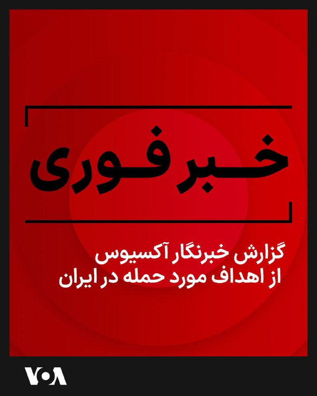

⚡️باراک راوید، خبرنگار آکسیوس از قول «یک مقام آمریکایی» می‌گوید تمام اهدافی که مورد حمله قرار گرفته‌اند در جنوب ایران هستند و شامل سامانه‌های پدافند هوایی، رادارها و واحدهای فرماندهی و کنترل پهپادها می‌شوند.
@FarsiVOA

## FarsiVOA — post 220303

  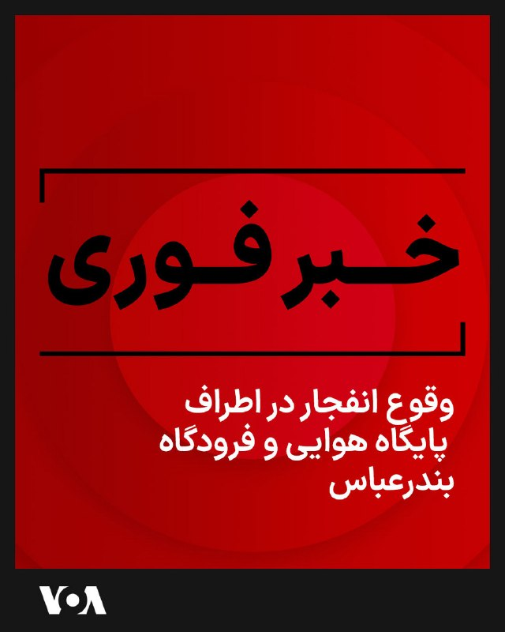

⚡️خبرگزاری جمهوری اسلامی می گوید صدای چند انفجار در حوالی فرودگاه و پایگاه هوایی بندرعباس شنیده شد. سنتکام ساعتی پیش از آغاز دور دیگری از حملات به مواضع جمهوری اسلامی خبر داد.
@FarsiVOA

## FarsiVOA — post 220302

  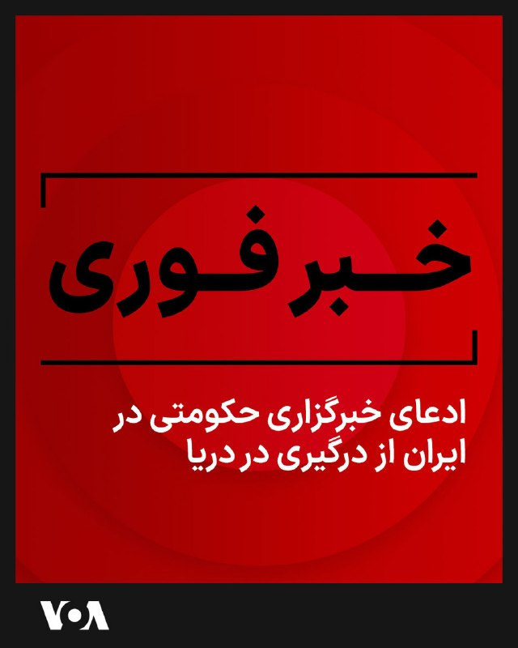

⚡️سایت حکومتی مهر مدعی شد که بین نیروهای جمهوری اسلامی نیروهای آمریکایی در دریا «درگیری‌هایی» رخ داده است. تاکنون هیچ مقام رسمی از دو طرف این موضوع را تائید نکرده‌است.
@FarsiVOA

## FarsiVOA — post 220301

⚡️پیت هگست، وزیر جنگ آمریکا: حملات اخیر ما به جمهوری اسلامی بی‌نظیر بود؛ از آپاچی‌ها استفاده کردیم
@FarsiVOA

## FarsiVOA — post 220300

  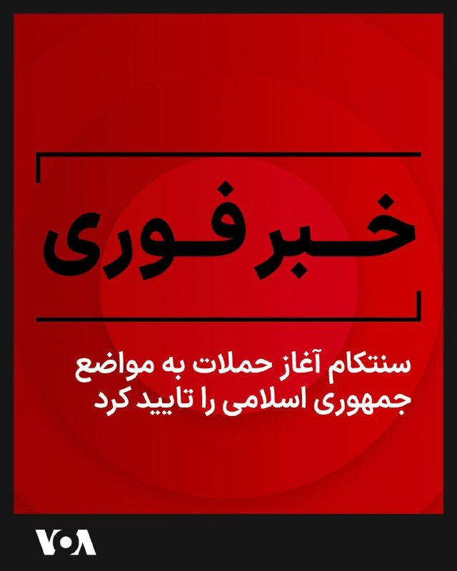

⚡️ستاد فرماندهی مرکزی آمریکا تائید کرد که نیروهای آن ساعت ۵:۱۵ بعد از ظهر چهارشنبه به وقت شرق آمریکا، به دستور فرمانده کل قوا، «حملات دفاعی» بیشتری را علیه چندین هدف در ایران آغاز کردند. سنتکام گفت این حملات در پاسخ به تجاوز بی‌اساس و مداوم رژیم ایران انجام می‌شود.
@FarsiVOA

## FarsiVOA — post 220299

  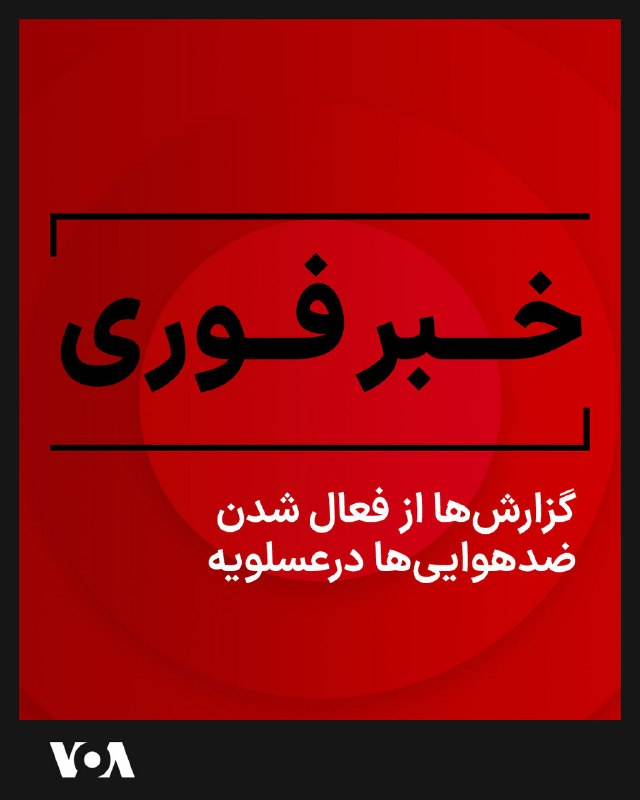

⚡️خبرگزاری حکومتی مهر می‌گوید پدافند عسلویه فعال شده است. این خبرگزاری توضیح بیشتری نداد. تاسیسات مهم انرژی در عسلویه قرار دارد.
@FarsiVOA

## FarsiVOA — post 220298

🔺گزارش‌های مردمی از صدای انفجار در چندین شهر جنوبی ایران

▪️بر اساس گزارش‌های مردمی منتشر شده در کانال وحید‌آنلاین، از ساعت ۱:۰۳ بامداد روز پنج‌شنبه ۲۱ خرداد چندین صدای انفجار شدید در بندرعباس و مناطق اطراف شنیده شده است.

⬇️ بیشتر بخوانید:
https://ir.voanews.com/a/8159454.html
@FarsiVOA

## FarsiVOA — post 220297

  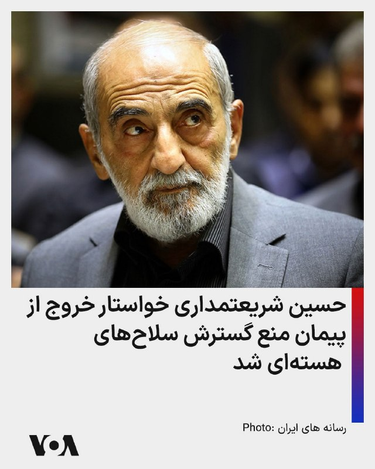

⚡️حسین شریعتمداری، نماینده رهبر جمهوری اسلامی در روزنامه کیهان در مقاله‌ای خواستار خروج حکومت ایران از «پیمان منع گسترش سلاح‌های هسته‌ای» شد. خبرگزاری فارس، وابسته به سپاه، مقاله تازه شریعتمداری را منتشر کرد. دونالد ترامپ، رئیس جمهوری آمریکا گفته است هرگز به جمهوری اسلامی اجازه دستیابی به سلاح هسته‌ای را نمی‌دهد.
@FarsiVOA

## FarsiVOA — post 220296

  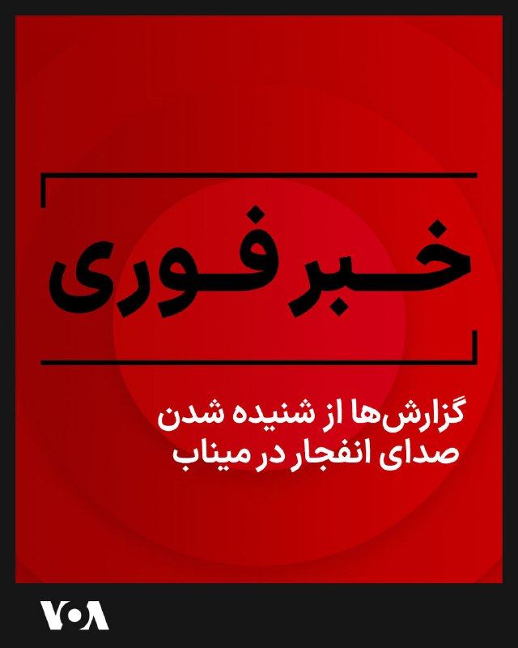

⚡️خبرگزاری مهر از شنیده شدن صدای انفجار در شهر میناب خبر داد. این خبرگزاری حکومتی توضیح بیشتری در این باره منتشر نکرد.
@FarsiVOA

## FarsiVOA — post 220295

  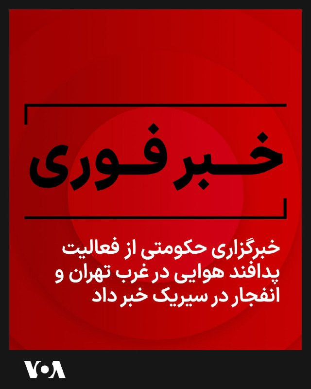

⚡️خبرگزاری حکومتی مهر از شنیده شدن صدای پدافند هوایی در غرب تهران و همچنین انفجار سیریک واقع استان هرمزگان خبر داد.
@FarsiVOA

## FarsiVOA — post 220294

  <a href="telegram/content/FarsiVOA_220294_1781131329.mp4" target="_blank">🎬 Download video</a>

⚡️منشه امیر در برنامه تفسیر خبر: روح الله خمینی با شعار مرگ بر اسرائیل آغاز گر این جنگ بود
@FarsiVOA

## FarsiVOA — post 220293

  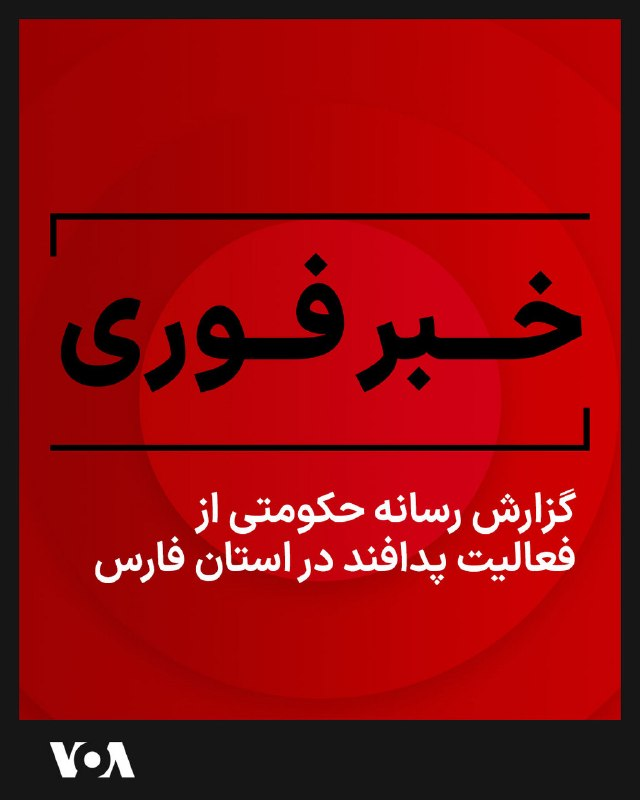

⚡️خبرگزاری مهر دقایقی قبل گزارش داد که پدافند هوایی در شهر مُهر استان فارس فعال شد.
@FarsiVOA

## FarsiVOA — post 220292

  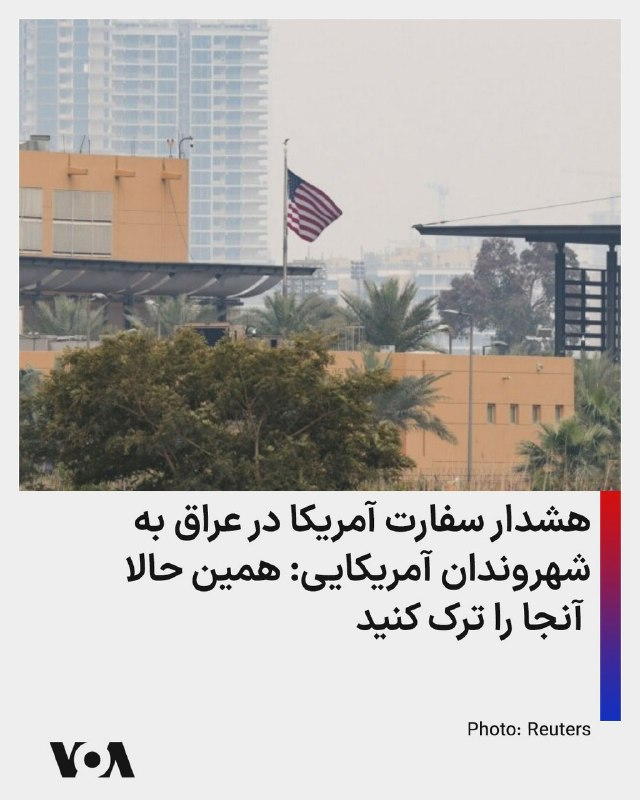

⚡️سفارت آمریکا در بغداد در هشداری به آمریکایی‌ها در عراق توصیه کرد «اختلالات سفر و بسته شدن حریم هوایی ممکن است در کوتاه‌ترین زمان ممکن رخ دهد.» سفارت آمریکا در این هشدار به شهروندان آمریکایی توصیه کرد: «به هیچ دلیلی به عراق سفر نکنید. اگر آنجا هستید، همین حالا آنجا را ترک کنید.»
@FarsiVOA

## FarsiVOA — post 220291

⚡️بررسی دلایل افزایش تعداد کودکان کار در ایران؛ گفت‌وگو با آمنه عسگری
@FarsiVOA

## FarsiVOA — post 220290

🔺هشدار وزیر جنگ آمریکا به جمهوری اسلامی: «امشب ضربه محکمی به آنها خواهیم زد»

▪️پس از آنکه پرزیدنت ترامپ گفت ایالات متحده به حمله به جمهوری اسلامی ادامه خواهد داد، پیت هگست، وزیر جنگ آمریکا چهارشنبه عصر به وقت واشنگتن اعلام کرد سنتکام امشب مشغول خواهد بود.

⬇️ بیشتر بخوانید:
https://ir.voanews.com/a/8159442.html
@FarsiVOA

## FarsiVOA — post 220289

  <a href="telegram/content/FarsiVOA_220289_1781131331.mp4" target="_blank">🎬 Download video</a>

⚡️نادر در بیکی در برنامه تفسیر خبر: جمهوری اسلامی به دنبال تضمین بقا است
@FarsiVOA

## FarsiVOA — post 220288

  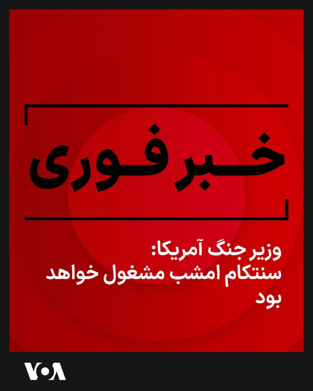

⚡️کلی میر،‌خبرنگار نیوزنیشن گزارش داد پس از آنکه پرزیدنت ترامپ گفت ایالات متحده به حمله به جمهوری اسلامی ادامه خواهد داد، پیت هگست، وزیر جنگ آمریکا اعلام کرد سنتکام امشب مشغول خواهد بود.
آقای هگست افزود «اگر لازم باشد با استفاده از بمب مذاکره کنیم، با استفاده از بمب مذاکره خواهیم کرد.»
@FarsiVOA

## FarsiVOA — post 220287

⚡️ترامپ: اگر توافق صلح با جمهوری اسلامی نهایی نشود، ما به شدت به آن حمله می‌کنیم
@FarsiVOA

## Persian_Trend_Official — post 16606

  <a href="telegram/content/Persian_Trend_Official_16606_1781131332.webm" target="_blank">🎬 Download video</a>

🎬 Video

## Persian_Trend_Official — post 16605

  <a href="telegram/content/Persian_Trend_Official_16605_1781131333.mp4" target="_blank">🎬 Download video</a>

⭕️ مهر:

📹 قادری، کارشناس مسائل بین الملل: تبعات شرارت‌های رژیم صهیونیستی و آمریکا به نسبت گذشته بسیار سنگین خواهد بود.

📝 Nick

📌 @persian_trend_official
پرشین ترند | متفاوت‌ترین کانال نظامی

## Persian_Trend_Official — post 16604

  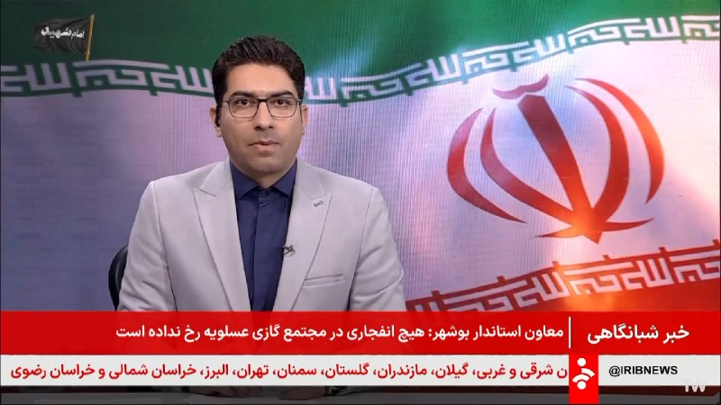

📝 Nick

📌 @persian_trend_official
پرشین ترند | متفاوت‌ترین کانال نظامی

## Persian_Trend_Official — post 16603

گزارش شده است که موج دیگری از حملات هوایی آمریکا به شهر بندرعباس و فرودگاه بندرعباس

## Persian_Trend_Official — post 16602

  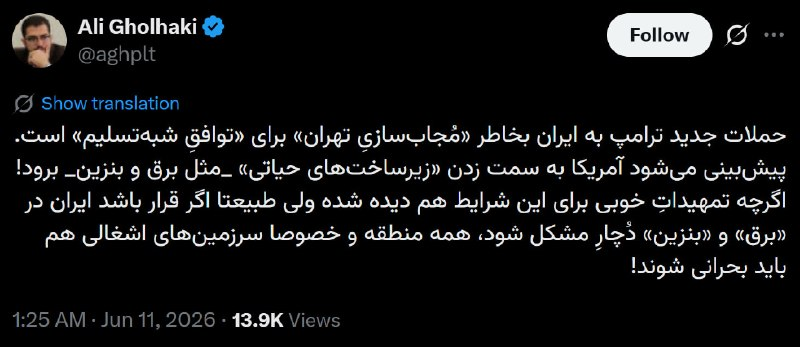

⭕️ علی قلهکی:

حملات جدید ترامپ به ایران بخاطر «مُجاب‌سازیِ تهران» برای «توافقِ شبه‌تسلیم» است.
پیش‌بینی می‌شود آمریکا به سمت زدن «زیرساخت‌های حیاتی» _مثل برق و بنزین_ برود!
اگرچه تمهیداتِ خوبی برای این شرایط هم دیده شده ولی طبیعتا اگر قرار باشد ایران در «برق» و «بنزین» دُچارِ مشکل شود، همه منطقه و خصوصا سرزمین‌های اشغالی هم باید بحرانی شوند!

📝 Nick

📌 @persian_trend_official
پرشین ترند | متفاوت‌ترین کانال نظامی

## Persian_Trend_Official — post 16601

سیریک

## Persian_Trend_Official — post 16600

  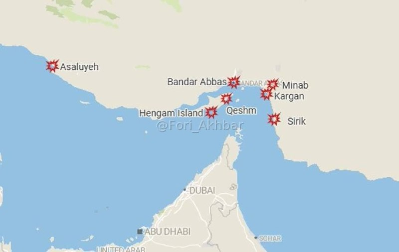

نقاط مورد هدف توسط آمریکا در عملیات امشب

## Persian_Trend_Official — post 16599

  

گزارش نیویورک تایمز: «هیئت قطری بدون پیشرفت ایران را ترک کرد، شانس موفقیت در مذاکرات رو به کاهش است»

📝 Nick

📌 @persian_trend_official
پرشین ترند | متفاوت‌ترین کانال نظامی

## Persian_Trend_Official — post 16598

  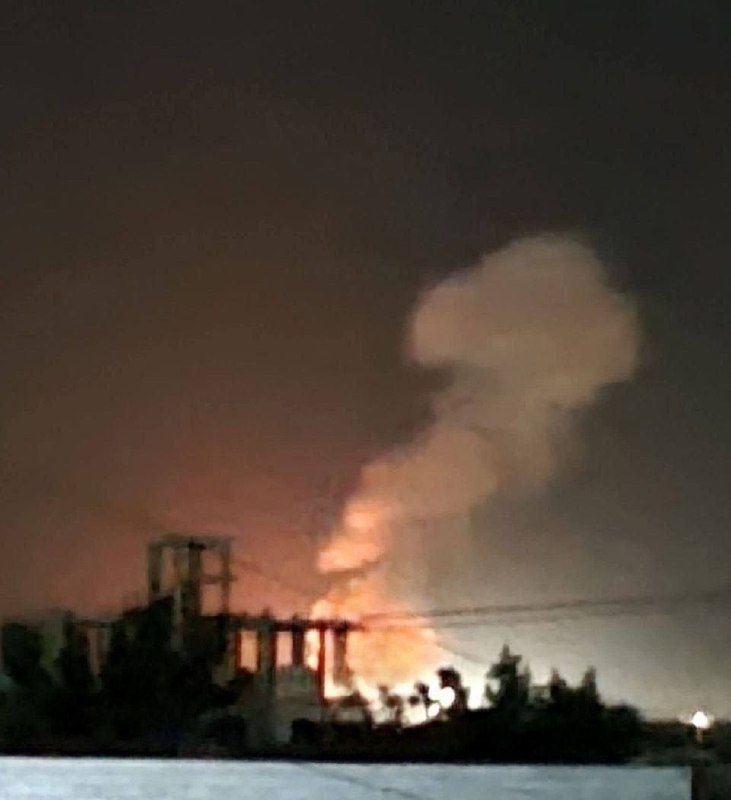

سیریک

## Persian_Trend_Official — post 16597

گزارش‌هایی از پرتاب موشک‌های کروز ضد کشتی از ایران، هدف قرار دادن ناوهای نیروی دریایی آمریکا در خلیج عمان.

## Persian_Trend_Official — post 16596

—❗️🇺🇸/🇮🇷 فوری: احتمالاً یک کارخانه پتروشیمی متعلق به مجتمع گاز پارس جنوبی در عسلویه هدف قرار گرفته است

## Persian_Trend_Official — post 16594

  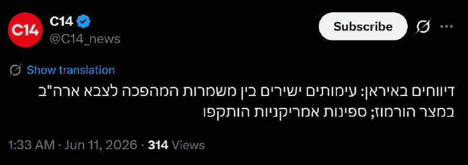

گزارش‌ها در ایران: درگیری مستقیم بین سپاه پاسداران و ارتش آمریکا در تنگه هرمز؛ کشتی‌های آمریکایی مورد حمله قرار گرفتند.

📝 Nick

📌 @persian_trend_official
پرشین ترند | متفاوت‌ترین کانال نظامی

## Persian_Trend_Official — post 16593

  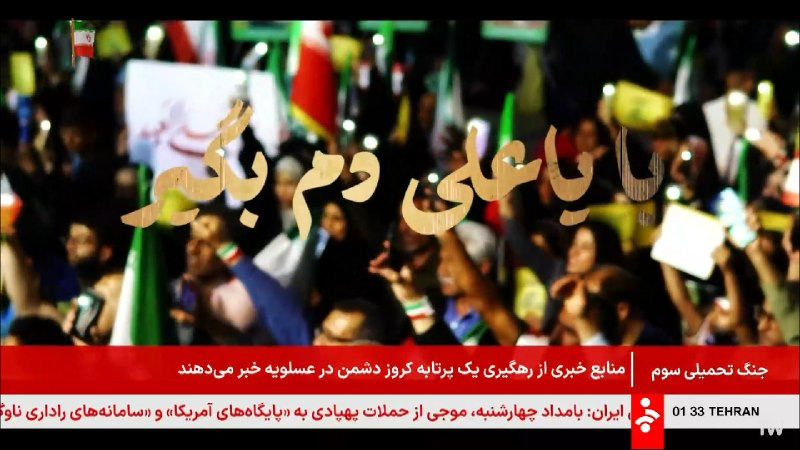

📝 Nick

📌 @persian_trend_official
پرشین ترند | متفاوت‌ترین کانال نظامی

## Persian_Trend_Official — post 16592

  <a href="telegram/content/Persian_Trend_Official_16592_1781131338.webm" target="_blank">🎬 Download video</a>

الجزیره:
اسرائیل هم امشب به ایران حمله کرده و
تو عملیات حضور داره!

## Persian_Trend_Official — post 16591

⭕️ مهر:

اسپوتنیک: هدف قرار گرفتن رادار آمریکا در اربیل توسط سپاه پاسداران

🔺خبرنگار اسپوتنیک گزارش داد: سپاه پاسداران ایران یک رادار امریکایی را در اربیل هدف حملات توپخانه‌ای یا موشکی قرار داد.

📝 Nick

📌 @persian_trend_official
پرشین ترند | متفاوت‌ترین کانال نظامی

## Persian_Trend_Official — post 16589

🇺🇸 💥🇮🇷 چندین انفجار در بندر کنگان استان بوشهر شنیده شده است.

چندین انفجار نیز در کوهستک استان هرمزگان شنیده شده است.

## Persian_Trend_Official — post 16586

⭕️ مهر:

♦️تجاوز دشمن به نقاطی در استان بوشهر

🔹 دقایقی پیش نقاطی در عسلویه هدف حمله دشمن قرار گرفت.

🔹 هم‌زمان با این حادثه، ساکنان بندر کنگان نیز از شنیده شدن انفجار خبر می‌دهند.

📝 Nick

📌 @persian_trend_official
پرشین ترند | متفاوت‌ترین کانال نظامی

## Persian_Trend_Official — post 16585

  <a href="telegram/content/Persian_Trend_Official_16585_1781131339.mp4" target="_blank">🎬 Download video</a>

⭕️ جت‌های نیروی هوایی ارتش جمهوری اسلامی بر فراز غرب تهران

📝 Nick

📌 @persian_trend_official
پرشین ترند | متفاوت‌ترین کانال نظامی

## Persian_Trend_Official — post 16584

انفجار شدید در کنگان

## RadioFarda — post 158160

  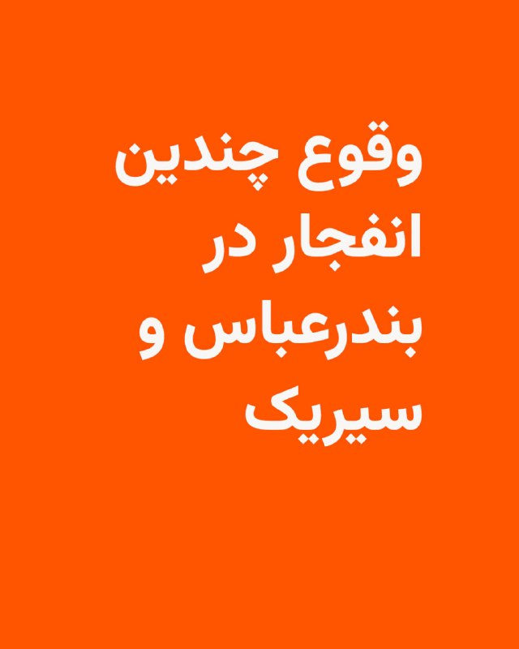

🔸خبرگزاری جمهوری اسلامی، ایرنا از وقوع چندین انفجار در اطراف فرودگاه و پایگاه هوایی بندرعباس خبر می‌دهد.

🔸این خبرگزاری اصابت «پرتابه‌های دشمن به نقطه‌ای در سیریک» را هم تأیید کرده است. برخی منابع محلی می‌گویند پایگاه نیروی دریایی جمهوری اسلامی در این شهر بندری هدف قرار گرفته است.

🔸از سوی دیگر برخی خبرگزاری‌ها هم از وقوع درگیری‌هایی «در دریا» بین نیروهای ایران و آمریکا خبر می‌دهند.

@RadioFarda

## RadioFarda — post 158159

  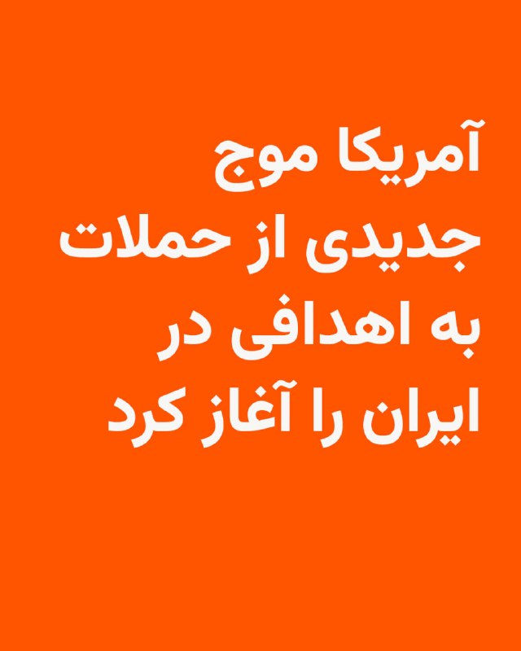

.
🔸فرماندهی مرکزی نیروهای مسلح ایالات متحده، سنتکام با انتشار مطلبی در شبکۀ ایکس، از آغاز دور جدیدی از حملات خود به ایران خبر داد.

🔸در این پیام آمده که این نیروها از ساعت ۱۷:۱۵ به وقت شرق آمریکا ( ۴۵ دقیقه بامداد پنجشنبه به وقت ایران) «به دستور فرمانده کل نیروهای مسلح [دونالد ترامپ]، حملات «تدافعی» خود را علیه چندین هدف در ایران آغاز کرده اند».

🔸خبرگزاری مهر می‌گوید پدافند هوایی در غرب تهران و بخش‌هایی از استان فارس از جمله در شهر مُهر فعال شده است.

🔸در همین حال برخی رسانه‌های داخلی هم از شنیده‌شدن صداهایی بلند از سمت جزیره کیش خبر داده‌اند.

🔸خبرگزاری مهر همچنین از شنیده‌شدن صدای انفجار در بندر سیریک واقع در جنوب میناب و در کرانۀ تنگۀ هرمز خبر می‌دهد. این خبرگزای می‌گوید در میناب هم صدای انفجار شنیده شده است.

@RadioFarda

## IranianMinds — post 22215

فقط خواسم یادآوری کنم :

حملات دفاعیه و آتش بس هنوز برقراره 😔

## IranianMinds — post 22214

🔴 سپاه :

یه جنگنده F-16 آمریکایی رو‌ زدیمش‌ که سریع فرار کرد

@IranianMinds

## IranianMinds — post 22213

موج‌ اول‌‌ حملات تموم شد
چن دقیقه دیگه برا تقه دوم میان

@IranianMinds

## IranianMinds — post 22211

🔴 یک مقام آمریکایی به فاکس نیوز :

این یک هشدار بود ، اهداف بعدی پل ها و‌ نیروگاه های برق خواهند بود !

@IranianMinds

## IranianMinds — post 22210

  

وضعیت پمپ بنزین های شیراز :

@IranianMinds

## IranianMinds — post 22209

🔴 گزارش انفجار مجدد در بندرعباس

@IranianMinds

## IranianMinds — post 22208

  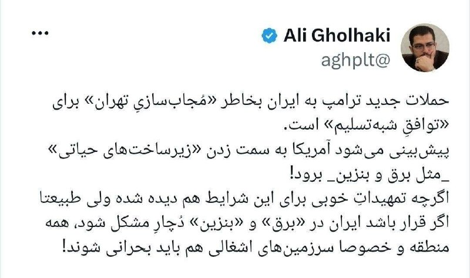

🔴 علی قلهکی خبرنگار حکومتی :

اگه آمریکا بخواد زیرساخت های مارو بزنه و بندازتمون توی بحران برق و بنزین ما هم کاری میکنیم که اسرائیل هم دچار این بحران بشه.

@IranianMinds

## IranianMinds — post 22207

🔴 صداوسیما : پدافند عسلویه فعال شد. @IranianMinds

## IranianMinds — post 22206

🔴 صداوسیما :

پدافند عسلویه فعال شد.

@IranianMinds

## IranianMinds — post 22205

🔴 مقامات امنیتی اسرائیل می گویند اسرائیل در این مرحله در حملات آمریکا به ایران دخالتی ندارد.

منبع:کان نیوز

@IranianMinds

## IranianMinds — post 22204

🔴 نیویورک‌ تایمز :

راه دیپلماسی میان ایران‌ و آمریکا تیره و تار شده ، امروز هم یک‌ هیئت قطری بدون هیچ‌ پیشرفتی برای میانجیگری برگشتن خونشون

@IranianMinds

## IranianMinds — post 22203

🔴 خبرگزاری فارس :

بمولا یه کشتی آمریکایی زدیم

@IranianMinds

## IranianMinds — post 22202

🔴 فوری

روزنامه یدیعوت آحرونوت :

یک ناو جنگی آمریکایی احتمالاً در تنگه هرمز مورد اصابت قرار گرفته است.

این اطلاعات بسیار تأییدنشده است.

@IranianMinds

## IranianMinds — post 22201

دو تانکر سوخت رسان آمریکایی با فرستنده روشن حدود یک ساعته اینطوری دارن تو خلیج فارس دور خودشون میچرخن و سوخت جنگنده هارو‌ راحت تامین میکنن برای حمله :)) @IranianMinds

## IranianMinds — post 22200

🔴 سیتنا :

خیالتون راحت اتصال اینترنت پایداره و سرعتش خوبه نتتون قطع نمیشه.

@IranianMinds

## IranianMinds — post 22199

  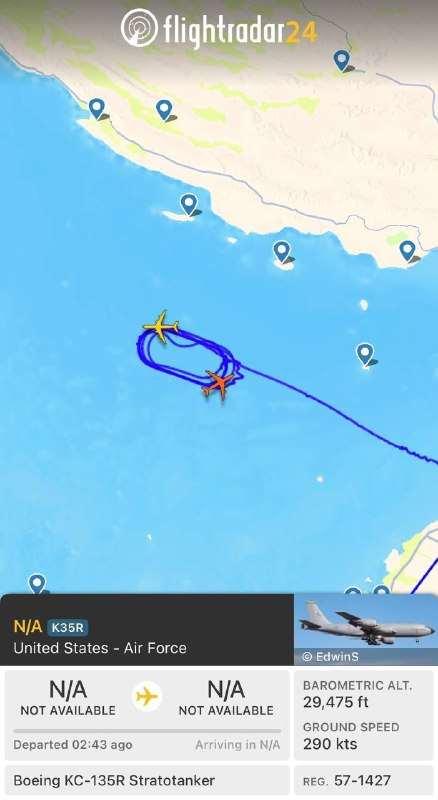

دو تانکر سوخت رسان آمریکایی با فرستنده روشن حدود یک ساعته اینطوری دارن تو خلیج فارس دور خودشون میچرخن و سوخت جنگنده هارو‌ راحت تامین میکنن برای حمله :))

@IranianMinds

## IranianMinds — post 22198

🔴 انفجار های شدید در قشم

@IranianMinds

## IranianMinds — post 22197

🔴 یک‌ مقام آمریکایی به فاکس نیوز :

امشب حملاتمون به صورت چند مرحله ای هستش و ضربه ی شدیدی بهشون میزنیم

@IranianMinds

## IranianMinds — post 22196

🔴 حملات آمریکا به کنگان @IranianMinds

## IranianMinds — post 22195

🔴 خبرگزاری مهر : آمریکا به عسلویه حمله کرد. @IranianMinds

## BBCPersian — post 283368

⚡️گزارش های ضد و نقیض از «هدف قرار گرفتن» یک مجتمع پتروشیمی در عسلویه

برخی منابع خبری از جمله خبرگزاری دانشجو وابسته به بسیج از «هدف قرار گرفتن یک کارخانه پتروشیمی متعلق به مجتمع گاز پارس جنوبی در عسلویه» گزارش داده است اما خبرگزاری تسنیم - نزدیک به سپاه پاسداران - آن را تکذیب کرده و انتساب چنین گزارشی به این خبرگزاری را رد کرده است.

ساعتی پیش هم خبرگزاری‌های رسمی ایران از شنیدن صدای انفجار در مناطقی چون میناب، غرب بندرعباس، سیریک، جزیره قشم و حاشیه خلیج فارس خبر دادند.

تحولات را در سایت بی‌بی‌سی فارسی دنبال کنید.⬇️

https://bbc.in/4fIJPot
@BBCPersian

## BBCPersian — post 283367

  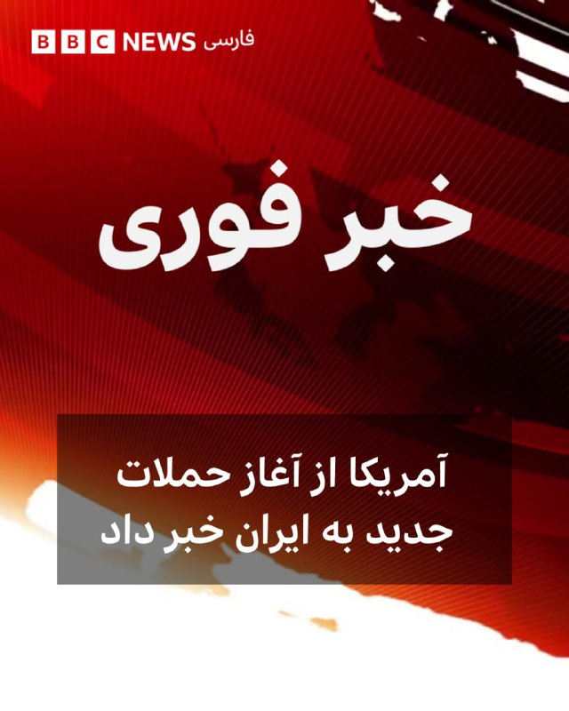

⚡️فرماندهی مرکزی ایالات متحده (سنتکام) دقایقی پیش اعلام کرد نیروهای این فرماندهی به دستور دونالد ترامپ از ساعت ۵:۱۵ بعدازظهر به وقت شرق آمریکا، دور جدیدی از حملات علیه اهدافی در ایران را آغاز کرده است. آمریکا این حملات را «اقدامی دفاعی» خوانده است.

در بیانیه سنتکام آمده است که این حملات در واکنش به آنچه که «تجاوزات بی دلیل و مستمر ایران» خوانده، انجام می‌شود.

همزمان از ایران گزارش شده که چند انفجار در نزدیکی میناب و منطقه سیریک شنیده شده است و حاشیه خلیج فارس شنیده شده است.

پیشتر دونالد ترامپ و وزیر دفاع آمریکا در اظهارات جداگانه‌ای گفته بودند که بار دیگر به ایران حمله می‌کنند.

تحولات را در سایت بی‌بی‌سی فارسی دنبال کنید.⬇️

https://bbc.in/4fIJPot
@BBCPersian

## BBCPersian — post 283366

با افزایش دوباره تنش میان آمریکا و اسرائیل با ایران و در ابهام فرو رفتن سرنوشت آتش‌بس میان آنها، نگرانی‌ها در لبنان هم از شعله‌ورتر شدن آتش جنگ بیشتر شده است. از طرفی حملات اسرائیل بر جنوب لبنان هم شدت پیدا کرده است.

این درحالی است که قرارگاه خاتم الانبیا در بیانیه اخیرش گفته بود که ادامه حملات بر جنوب لبنان می‌تواند با پاسخ سخت ایران مواجه شود.

با همه اینها سفیر ایران در لبنان که هنوز اعتبارنامه نگرفته، در جمع خبرنگاران به بی‌بی‌سی فارسی گفت که «اوضاع را مثبت ارزیابی می‌کند».

نفیسه کوهنورد خبرنگار ارشد خاورمیانه بی‌بی‌سی فارسی از بیروت از آخرین‌ها می‌گوید:

@BBCPersian

## Dirty_Kids — post 391643

یکبار دیگه اینترنتا قطع بشه منو برخط نمی‌بینید، آخرخط می‌بینید. خدانگهدار.

@Dirty_Kids 👻

## Dirty_Kids — post 391642

  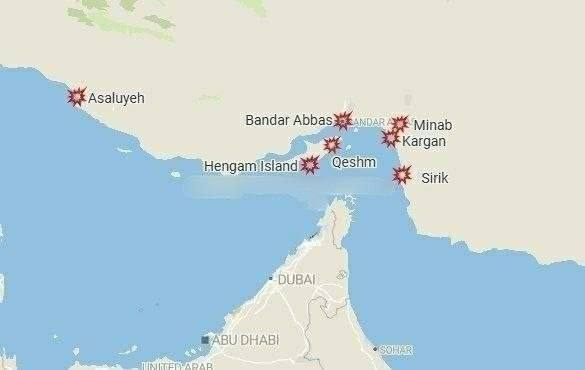

‏الجزیره نوشت اسرائیل هم در حملات امشب به جمهوری اسلامی مشارکت دارد.

صداوسیما اعلام کرد به جزیره قشم هم حمله شده است.

برخی رسانه‌های آمریکایی نوشته‌اند که عملیات آمریکا «چند ساعت» طول می‌کشد و شامل «بیش از ۱۰۰ هدف» خواهد بود.

@Dirty_Kids 👻

## Dirty_Kids — post 391641

🔴 آکسیوس:

مذاکرات ایران و آمریکا فروپاشید و تمام شد.

@Dirty_Kids 👻

## Dirty_Kids — post 391640

سه ماه تحلیل گرای نظامی میگفتن باید تا جام جهانی تکلیف روشن شه. یارو حمله رو گذاشت برا شب افتتاحیه=))))

## Dirty_Kids — post 391639

گزارش‌های اولیه از شلیک موشک به سمت ناوهای جنگی آمریکا در دریای عمان حکایت دارند.

بر اساس اطلاعات منتشرشده، حمله موشکی احتمالی علیه شناورهای نظامی ایالات متحده در دریای عمان گزارش شده است. تاکنون هیچ مقام رسمی آمریکایی یا منبع مستقل این گزارش را تأیید نکرده و جزئیاتی درباره تعداد موشک‌ها، میزان خسارات یا نتیجه این حمله منتشر نشده است.

## Dirty_Kids — post 391638

  <a href="telegram/content/Dirty_Kids_391638_1781131346.webm" target="_blank">🎬 Download video</a>

🔴پایگاه شکاری بندرعباس مورد حمله قرار گرفت

🔴پدافند سیرجان/کرمان فعال

## Dirty_Kids — post 391637

  <a href="telegram/content/Dirty_Kids_391637_1781131346.webm" target="_blank">🎬 Download video</a>

🔴سنتکام: عسلویه و بندرعباس رو هم زدیم و اینا به خاطر حمله ای بود که جمهوری‌اسلامی به هلیکوپتر ما کرد.

🔴قشم همچنان زیر انفجارهای مهیب
💥

🔴وزیر جنگ آمریکا : حملات امشب مقدمه حملاتی بزرگتر است
💥

🔴کانال ۱۲ اسرائیل: آماده پیوستن به حملات علیه ایران هستیم.🔥

🔴یک کارخانه پتروشیمی متعلق به مجتمع گاز پارس جنوبی در عسلویه بمباران شد.

## Dirty_Kids — post 391636

اکسیوس به نقل از مقام‌های آمریکایی: هدف از حملات اخیر، افزایش فشار بر رژیم تروریستی جمهوری اسلامی برای پذیرش توافق است.

مقام‌های آمریکایی به اکسیوس گفته‌اند واشینگتن امیدوار است این حملات تهران را به امضای توافق وادار کند، اما در عین حال هشدار داده‌اند که این روند می‌تواند به تشدید درگیری‌های نظامی و گسترش تنش‌ها در منطقه منجر شود.

## Dirty_Kids — post 391635

  <a href="telegram/content/Dirty_Kids_391635_1781131347.mp4" target="_blank">🎬 Download video</a>

رسانه‌های جمهوری اسلامی این ویدئو رو از پرواز قارقارک‌های خودشون بر فراز تهران منتشر کردن:

@Dirty_Kids 👻

## Dirty_Kids — post 391634

دیگه حتی پمپ‌ بنزینا هم با حرفای ترامپ شلوغ نمیشن.

@Dirty_Kids 👻

## Dirty_Kids — post 391633

  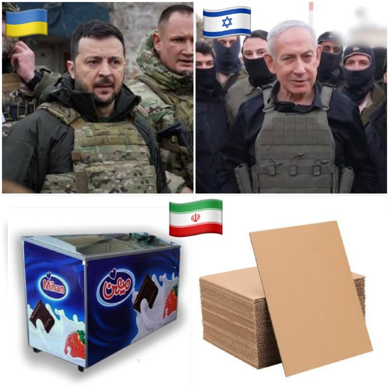

رهبران کشورهای مختلف در زمان جنگ:

@Dirty_Kids 👻

## Dirty_Kids — post 391632

  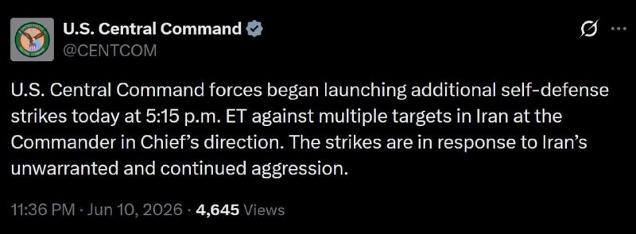

سنتکام نوشت: «نیروهای فرماندهی مرکزی ایالات متحده، امروز ساعت ۵:۱۵ بعدازظهر به وقت شرق آمریکا، به دستور فرمانده کل قوا، حملات دفاعی بیشتری را علیه چندین هدف در ایران آغاز کردند. این حملات در پاسخ به اقدامات تهاجمی بی‌دلیل و ادامه‌دار حکومت ایران انجام می‌شود.»

@Dirty_Kids 👻

## Dirty_Kids — post 391631

هم‌اکنون؛

گزارش شهروندان از وقوع انفجارهای متعدد در بندرعباس حکایت دارد.

## Dirty_Kids — post 391630

روافض از آذربایجان شرقی آبگرمکن ول دادن.

## Dirty_Kids — post 391629

🚨 وزیرجنگ آمریکا از آغاز حمله به ایران خبر داد.

@Dirty_Kids 👻

## Dirty_Kids — post 391628

  <a href="telegram/content/Dirty_Kids_391628_1781131349.webm" target="_blank">🎬 Download video</a>

🔴هم اکنون صدای انفجار در قشم و سیریک

🔴کانال ۲۴ اسرائیل: شروع شد💥

🔴فعالیت پدافند شیراز

## Dirty_Kids — post 391627

خبرگزاری مهر از شنیده شدن صدای انفجار در سیریک هرمزگان و فعالیت پدافند در غرب تهران خبر داد.

@Dirty_Kids 👻

## Dirty_Kids — post 391626

  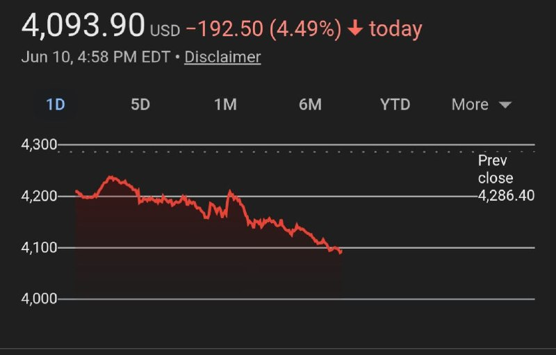

🔴 قیمت جهانی طلا به شکل پشم‌ریزونی داره سقوط میکنه.

هر اونس = 4,093 دلار

@Dirty_Kids 👻

## Dirty_Kids — post 391625

این شبا وضعیت جوریه که اگه شب رو تو تلگرام بخوابی، صبح ممکنه تو روبیکا از خواب بیدار شی :)))))

## Dirty_Kids — post 391624

ساعت ۰۰:۳۴ بامداد پنجشنبه؛ یک پهپاد در آسمان عسلویه مشاهده شد، پدافند مناطق شمال عسلویه نیز فعال شدند.

@Dirty_Kids 👻

## manototv — post 106003

  <a href="telegram/content/manototv_106003_1781131351.mp4" target="_blank">🎬 Download video</a>

فشار بر صادرات نفت، شکاف‌های درونی جمهوری اسلامی را آشکارتر کرده است. رژیمی که برای حفظ نیروهای سرکوب، شبکه‌های نیابتی و نظام وفاداری به درآمد نفتی نیاز دارد، اکنون میان مذاکره برای تنفس اقتصادی و تسلیم گرفتار شده است.

## manototv — post 105996

  <a href="telegram/content/manototv_105996_1781131351.mp4" target="_blank">🎬 Download video</a>

دونالد ترامپ می‌گوید در «مراحل پایانی» دستیابی به توافقی با جمهوری اسلامی قرار دارد و آمریکا به‌زودی «پیروزی کامل» را اعلام خواهد کرد.

اما این نخستین بار نیست که رئیس‌جمهور آمریکا از نزدیک بودن پایان این مناقشه سخن می‌گوید؛ ورق بزنید.

## manototv — post 105995

  <a href="telegram/content/manototv_105995_1781131352.mp4" target="_blank">🎬 Download video</a>

‌
بازدید محمدرضا شاه پهلوی از دانشکده فرماندهی و ستاد ارتش شاهنشاهی در دهه ۵۰ خورشیدی.

## alonews — post 127012

  <a href="telegram/content/alonews_127012_1781131354.webm" target="_blank">🎬 Download video</a>

👈شبکه ۱۵ اسرائیل : موج اول حملات به ایران؛ به پایان رسیده

✅ @AloNews خبر جنگ

## alonews — post 127011

  <a href="telegram/content/alonews_127011_1781131354.webm" target="_blank">🎬 Download video</a>

🔴فوری/فاکس نیوز: اهداف بعدی ترامپ ، نیروگاه ها و پل ها هستند!

✅ @AloNews خبر جنگ

## alonews — post 127010

  <a href="telegram/content/alonews_127010_1781131355.webm" target="_blank">🎬 Download video</a>

👈انفجار مجدد در بندرعباس

✅ @AloNews خبر جنگ

## alonews — post 127009

  <a href="telegram/content/alonews_127009_1781131355.webm" target="_blank">🎬 Download video</a>

👈به گزارش آکسیوس، مذاکرات ایران و آمریکا به طور کامل فرو پاشید

✅ @AloNews خبر جنگ

## alonews — post 127008

  <a href="telegram/content/alonews_127008_1781131355.webm" target="_blank">🎬 Download video</a>

👈نیویورک تایمز:
چشم‌انداز پیشرفت دیپلماتیک در مذاکرات آمریکا و ایران زمانی تیره‌تر شد که یک هیئت میانجی‌گر قطری عصر چهارشنبه بدون هیچ پیشرفتی در مذاکرات، تهران را ترک کرد.

✅ @AloNews خبر جنگ

## alonews — post 127007

  <a href="telegram/content/alonews_127007_1781131355.webm" target="_blank">🎬 Download video</a>

👈گزارشات از تحرکات شدید در اسرائیل

✅ @AloNews خبر جنگ

## alonews — post 127006

🔴فوووووووری/زود بیایید اینجا
⬇️

https://t.me/+4Sqp5RRoEUE5ZGM0
https://t.me/+4Sqp5RRoEUE5ZGM0

## alonews — post 127005

  <a href="telegram/content/alonews_127005_1781131356.webm" target="_blank">🎬 Download video</a>

🔴فوری/فاکس نیوز به نقل از یک مقام ارشد آمریکایی: امشب چندین موج حمله دیگر نیز وجود دارد. 
✅ @AloNews خبر جنگ

## alonews — post 127004

  <a href="telegram/content/alonews_127004_1781131356.webm" target="_blank">🎬 Download video</a>

🔴فوری/فاکس نیوز به نقل از یک مقام ارشد آمریکایی:
امشب چندین موج حمله دیگر نیز وجود دارد.

✅ @AloNews خبر جنگ

## alonews — post 127003

  <a href="telegram/content/alonews_127003_1781131356.webm" target="_blank">🎬 Download video</a>

👈یه موشک خورده تو فرودگاه بندرعباس

✅ @AloNews خبر جنگ

## alonews — post 127002

  <a href="telegram/content/alonews_127002_1781131356.webm" target="_blank">🎬 Download video</a>

👈صداوسیما:برخی منابع از رهگیری یک پرتابه کروز دشمن در عسلویه خبر می دهند

✅ @AloNews خبر جنگ

## alonews — post 127001

  <a href="telegram/content/alonews_127001_1781131357.webm" target="_blank">🎬 Download video</a>

👈یک مقام آمریکایی به Axios گفت: تمام اهدافی که مورد حمله قرار گرفتند در جنوب ایران هستند و شامل سامانه‌های پدافند هوایی، رادارها و واحدهای فرماندهی و کنترل پهپادها می‌شوند.

✅ @AloNews خبر جنگ

## alonews — post 127000

  <a href="telegram/content/alonews_127000_1781131357.webm" target="_blank">🎬 Download video</a>

👈اکسیوس به نقل از مقام‌های آمریکایی:
هدف از این حملات فشار بر تهران برای امضای توافقه، اما ممکنه به تشدید نظامی منجر بشه.

✅ @AloNews خبر جنگ

## alonews — post 126999

  <a href="telegram/content/alonews_126999_1781131357.mp4" target="_blank">🎬 Download video</a>

👈قدرتنمایی جنگنده‌های ارتش جمهوری اسلامی بر فراز تهران

✅ @AloNews خبر جنگ

## alonews — post 126998

  <a href="telegram/content/alonews_126998_1781131359.webm" target="_blank">🎬 Download video</a>

👈طبق گزارش‌ها، پایگاه نیروی دریایی کنگان برای چندمین بار هدف قرار گرفت.

✅ @AloNews خبر جنگ

## alonews — post 126997

  <a href="telegram/content/alonews_126997_1781131359.webm" target="_blank">🎬 Download video</a>

👈چندین انفجار در بندرعباس

✅ @AloNews خبر جنگ

## alonews — post 126996

  <a href="telegram/content/alonews_126996_1781131359.webm" target="_blank">🎬 Download video</a>

👈سنتکام:
نیروهای فرماندهی مرکزی ایالات متحده امروز ساعت ۵:۱۵ بعد از ظهر به وقت شرق آمریکا، به دستور فرمانده کل قوا، حملات دفاع شخصی بیشتری را علیه چندین هدف در ایران آغاز کردند. این حملات در پاسخ به تجاوز بی‌دلیل و مداوم ایران انجام می‌شود.

✅ @AloNews خبر جنگ

## alonews — post 126995

  <a href="telegram/content/alonews_126995_1781131359.webm" target="_blank">🎬 Download video</a>

👈کانال ۱۲ اسرائیل: ارتش آماده پیوستن به ایالات متحده در کارزار جدید علیه ایران است

✅ @AloNews خبر جنگ

## alonews — post 126994

  <a href="telegram/content/alonews_126994_1781131360.webm" target="_blank">🎬 Download video</a>

🔴فووووری و رسمی/حملات آمریکا شروع شد

✅ @AloNews خبر جنگ

## alonews — post 126993

  <a href="telegram/content/alonews_126993_1781131360.webm" target="_blank">🎬 Download video</a>

👈پدافند عسلویه فعال شد

✅ @AloNews خبر جنگ

---
📅 بروزرسانی: 1405/03/21 00:11
---

## VahidOOnLine — post 244780

  <a href="telegram/content/VahidOOnLine_244780_1781124109.mp4" target="_blank">🎬 Download video</a>

♦️رسانه‌های ایران چهارشنبه‌شب ۲۰ خرداد از وقوع آتش‌سوزی و برخاستن ستون‌های غلیظ دود در محدوده میدان قیام تهران خبر دادند. سخنگوی سازمان آتش‌نشانی تهران اعلام کرد یک انبار کالا در منطقه ۱۲ تهران دچار حریق شده است.

به گفته سازمان آتش‌نشانی تهران، این مجموعه شامل چند انبار و غرفه به مساحت حدود دو هزار متر مربع است و عملیات اطفای حریق با حضور نیروهای آتش‌نشانی در محل انجام شد.

معاون سازمان آتش‌نشانی تهران به خبرگزاری فارس گفت به انبار فرش محدوده میدان قیام که دچار حریق شد.

سازمان آتش‌نشانی تهران اعلام کرد که تا این لحظه گزارشی از تلفات یا مصدومیت جانی دریافت نشده است.
‌🇸🇦 Indypersian

🤖 @VahidOOnLine

## VahidOOnLine — post 244779

  

پیت هگست، وزیر دفاع آمریکا، گفت اگر جمهوری اسلامی برای پایان دادن به درگیری با آمریکا به توافق نرسد، ارتش ایالات متحده آن را «به‌شدت» هدف قرار خواهد داد.

او در سخنرانی برای کارکنان فرماندهی مرکزی آمریکا، سنتکام، در تامپای فلوریدا گفت: «همان‌طور که رییس‌جمهوری چهارشنبه گفت، اگر آن‌ها توافق نکنند، ما به‌شدت به آن‌ها حمله خواهیم کرد.»

هگست افزود دولت آمریکا بر دستیابی به نتیجه‌ای که دونالد ترامپ به نمایندگی از مردم آمریکا خواهان آن است متمرکز شده و در این مسیر «پیشرفت زیادی» داشته است.

او همچنین به اظهارات ترامپ اشاره کرد که گفته بود آمریکا حملات بیشتری علیه جمهوری اسلامی انجام خواهد داد و تهران برای مذاکره درباره توافق «بیش از حد وقت تلف کرده» و اکنون «باید بهای آن را بپردازد».
‌🏁 🇬🇧 IranintlTV

🤖 @VahidOOnLine

## VahidOOnLine — post 244778

  

اکسیوس گزارش داد که دونالد ترامپ، رییس جمهوری ایالات متحده در کاخ سفید درباره حمله بیشتر به ایران جلسه برگزار کرده است.

بنا بر این گزارش، ترامپ عملیات گسترده و کوتاه علیه ایران را بررسی می‌کند.

پیش‌تر دونالد ترامپ گفته بود جمهوری اسلامی باید توافقی «معنادار و کارآمد» را امضا کند و افزود ما آن‌ها را بسیار سخت هدف قرار خواهیم داد و امروز دوباره ضربه محکمی به آن‌ها خواهیم زد.
‌🏁 🇬🇧 IranintlTV

🤖 @VahidOOnLine

## VahidOOnLine — post 244777

  

علیرضا پناهیان، سخنران دفتر خامنه‌ای، در تجمع حامیان حکومت در شاهرود گفت: «اکنون نبرد آخرالزمانی میان ما و تمام کفر جهانی در جریان است.»

او ادامه داد: «امروز نیز شاهد هستیم که راس کفر، یا همان استکبار جهانی، در برابر تمام اسلام ناب محمدی ایستاده است.»
‌🏁 🇬🇧 IranintlTV

🤖 @VahidOOnLine

## VahidOOnLine — post 244776

  

♦️ابراهیم عزیزی، رئیس کمیسیون امنیت ملی و سیاست خارجی مجلس شورای اسلامی، با انتشار پیامی در شبکه اجتماعی ایکس به تهدیدات اخیر دونالد ترامپ واکنش نشان داد و نسبت به فرامنطقه‌ای شدن هرگونه درگیری نظامی هشدار داد.

عزیزی در این پیام نوشت: «ما از جنگیدن با بازنده‌ها نمی‌ترسیم. همین الان هم تابوت‌های آمریکایی بسیار بیشتر از آن چیزی است که ترامپ می‌گوید و بیشتر هم خواهد شد؛ چرا که جنگ این‌بار حتی به منطقه هم محدود نخواهد شد... خواهیم دید چه می‌شود!»

این اظهارات پس از آن مطرح می‌شود که آمریکا در روزهای گذشته، ضمن مقصر دانستن تهران در سقوط بالگرد آپاچی در تنگه هرمز، حملات گسترده‌ای علیه مواضعی در ایران انجام داد و ترامپ نیز با اشاره به همین حادثه و تعلل تهران در مذاکرات، درباره از سرگیری حملات سنگین به زیرساخت‌های ایران هشدار داد.
‌🇸🇦 Indypersian

🤖 @VahidOOnLine

## VahidOOnLine — post 244775

  

کمال شحاده، وزیر امور مهاجرت لبنان به العربیه گفت که چهار هزار کشته در لبنان نتیجه شرط‌بندی بر سیاست‌های اشتباه بود و حزب‌الله به دستور جمهوری اسلامی امتیاز می‌دهد نه به سود لبنان.
او افزود: «سلاح نعیم قاسم هیچ سودی برای ما ندارد.»

وزیر امور مهاجرت لبنان ادامه داد: «زیر بمباران مذاکره می‌کنیم همان‌گونه که ایران زیر بمباران مذاکره می‌کند.»
‌🏁 🇬🇧 IranintlTV

🤖 @VahidOOnLine

## VahidOOnLine — post 244774

  

♦️به گزارش خبرگزاری صدا و سیما (IRIB)، چهارشنبه‌شب ۲۰ خرداد، یک هیئت دیپلماتیک از قطر به منظور گفتگو و رایزنی درباره روابط دوجانبه، تحولات منطقه‌ای و تلاش‌های دیپلماتیک مربوط به منازعه با ایالات متحده، وارد تهران شده است.

بر اساس این گزارش، محور گفتگوهای این سفر شامل بررسی مناسبات میان دو کشور و همچنین تبادل نظر درباره آخرین تحولات در فرآیند دیپلماتیک برای پایان دادن به جنگ است.

در این گزارش هنوز جزئیات بیشتری درباره اعضای این هیئت، مقام سرپرست آن و همچنین مدت زمان این سفر ارائه نشده است.
‌🇸🇦 Indypersian

🤖 @VahidOOnLine

## VahidOOnLine — post 244773

  

♦️آکسیوس به نقل از یک منبع منطقه‌ای، گزارش داد که مقامات جمهوری اسلامی ایران و آمریکا طی دو روز گذشته گفتگوهای موازی و غیرمستقیمی را با میانجی‌گران قطری در دوحه انجام داده‌اند. واسطه‌های قطری تلاش کردند تا برای حل اختلافات باقی‌مانده یک نشست سه‌جانبه و مذاکره مستقیم میان طرفین ترتیب دهند، اما ایران این پیشنهاد را رد کرد. در همین راستا، میانجی‌گران قطری روز چهارشنبه برای از سرگیری و به حرکت درآوردن چرخ مذاکرات، راهی تهران شدند تا با عباس عراقچی و دیگر مقامات جمهوری اسلامی گفتگو کنند.

از سوی دیگر، دو مقام آمریکایی ابراز امیدواری کردند که حملات روز سه‌شنبه و تهدیدات دونالد ترامپ، تهران را وادار به پذیرش توافق پیشنهادی کند. یک مقام دیگر نیز تاکید کرد توافق همچنان روی میز است، اما در صورت تداوم وقت‌کشی تهران، رئیس‌جمهوری آماده است تا آن‌ها را وادار به پرداخت بها کند.
‌🇸🇦 Indypersian

🤖 @VahidOOnLine

## VahidOOnLine — post 244772

  

♦️اسماعیل بقایی، سخنگوی وزارت امور خارجه جمهوری اسلامی با انتشار ویدیویی در شبکه اجتماعی اکس، آمریکا را به هدف قرار دادن عمدی زیرساخت‌های آب شرب در شهرستان سیریک استان هرمزگان متهم کرد.
بقایی در این پیام نوشت: «آب، نبض زندگی است و آمریکا عامدانه شریان حیاتی مردم ایران را هدف قرار داده است.» او مدعی شد ارتش آمریکا در ادامه حملات خود علیه ایران، دو مخزن آب با ظرفیت مجموع دو هزار و ۵۰۰ متر مکعب را در سیریک هدف قرار داده و تخریب کرده است.
به گفته سخنگوی وزارت امور خارجه، این تاسیسات آب آشامیدنی بیش از ۲۰ هزار نفر از ساکنان ۱۰ روستا را تامین می‌کرده و تخریب آن‌ها موجب آسیب به زیرساخت‌های حیاتی غیرنظامی شده است.
بقایی همچنین این اقدام را «خسارت جانبی» ندانست و آن را «جنایت جنگی حساب‌شده» و «نقض آشکار حقوق بشر و حقوق بین‌الملل بشردوستانه» توصیف کرد. او در پایان خواستار پاسخگو شدن ایالات متحده در قبال آنچه «حملات نظام‌مند به زیرساخت‌های حیاتی غیرنظامیان» خواند، شد.
‌🇸🇦 Indypersian

🤖 @VahidOOnLine

## VahidOOnLine — post 244771

  

♦️وزارت امور خارجه آمریکا اعلام کرد که مارکو روبیو، وزیر امور خارجه این کشور برای شرکت در مراسم افتتاحیه بازی‌های جام جهانی ۲۰۲۶ در بخش ایالات متحده و همچنین تماشای نخستین مسابقه تیم ملی آمریکا در برابر پاراگوئه، روز جمعه به لس‌آنجلس سفر خواهد کرد.

بر اساس این بیانیه، روبیو سرپرستی هیئت آمریکایی را در این مراسم افتتاحیه بر عهده خواهد داشت و شان دافی و مارک‌وین مولین، وزرای حمل‌ونقل و امنیت میهن، او را در این سفر همراهی خواهند کرد.

روبیو علاوه بر حضور در رویدادهای جام جهانی، در لس‌آنجلس با سانتیاگو پنیا، رئیس‌جمهوری پاراگوئه نیز دیدار و گفتگو خواهد کرد.
‌🇸🇦 Indypersian

🤖 @VahidOOnLine

## VahidOOnLine — post 244770

  

مایک هاکبی، سفیر آمریکا در اسرائیل، با بازنشر گزارش فاکس‌نیوز درباره اظهارات دونالد ترامپ، رییس‌جمهوری آمریکا، مبنی بر اینکه ایالات متحده امروز دوباره «ضربه سختی» به جمهوری اسلامی خواهد زد، در شبکه ایکس نوشت: «ممکن است اوضاع در منطقه به‌زودی کمی داغ شود.»
‌🏁 🇬🇧 IranintlTV

🤖 @VahidOOnLine

## VahidOOnLine — post 244769

  

♦️خبرگزاری رویترز گزارش داد تولید نفت اعضای اوپک در ماه مه، تحت تاثیر تحولات منطقه‌ای، محاصره دریایی آمریکا علیه جمهوری اسلامی و کاهش صادرات تولیدکنندگان حوزه خلیج فارس در پی بسته شدن عملی تنگه هرمز، به پایین‌ترین سطح خود در بیش از دو دهه گذشته رسیده است.
بر اساس این گزارش، تولید ۱۱ عضو اوپک در ماه مه با کاهش روزانه یک میلیون و ۶۰ هزار بشکه نسبت به ماه قبل، به ۱۶ میلیون و ۱۳۰ هزار بشکه در روز رسید، رقمی که پایین‌ترین سطح تولید ماهانه این سازمان از دست‌کم سال ۲۰۰۰ تاکنون به شمار می‌رود.
رویترز همچنین نوشت جمهوری اسلامی بیشترین کاهش تولید را در میان اعضای اوپک تجربه کرده و صادرات نفت خام و میعانات گازی ایران به پایین‌ترین سطح خود در دست‌کم شش سال گذشته سقوط کرده است.
این گزارش اشاره می‌کند که آمار ارائه‌شده شامل امارات متحده عربی نیست؛ کشوری که از ابتدای ماه مه از اوپک خارج شده است. همچنین، اگرچه تولید عربستان سعودی کاهش یافته، عراق، ونزوئلا و نیجریه بخشی از افت تولید را با افزایش تولید خود جبران کرده‌اند.
‌🇸🇦 Indypersian

🤖 @VahidOOnLine

## VahidOOnLine — post 244768

  

ابراهیم رضایی، سخنگوی کمیسیون امنیت ملی مجلس، در شبکه ایکس نوشت: «در جنگ ۴۰ روزه وسعت آب‌های سرزمینی ایران افزایش یافت، در جنگ بعدی شاید وسعت خاک ایران افزایش یابد.»

او در مطلبی دیگر تاکید کرد جمهوری اسلامی آماده‌تر از قبل است.

او همچنین در یک برنامه تلویزیونی گفت: «دست از لبنان برنمی‌داریم و دشمن یا باید به خواسته‌های ما در میز مذاکره تن بدهد یا در میدان نبرد.»
‌🏁 🇬🇧 IranintlTV

🤖 @VahidOOnLine

## VahidOOnLine — post 244766

♦️تب بسکتبال نیویورک در آستانه بازی چهارم فینال «ان‌بی‌ای» به اوج رسیده است. از ساعات اولیه روز، فروش کلاه، تی‌شرت و محصولات هواداری نیکس در اطراف «مدیسن اسکوئر گاردن» رونق گرفته و خیابان‌های منتهی به ورزشگاه مملو از هوادارانی است که امیدوارند تیم محبوبشان یک گام دیگر به قهرمانی نزدیک شود.

نیویورک نیکس امشب در بازی چهارم فینال «ان‌بی‌ای» به مصاف سن‌آنتونیو اسپرز می‌رود؛ دیداری حساس که پس از شکست ۱۱۵ بر ۱۱۱ نیکس در بازی سوم برگزار می‌شود. با این حال، نیکس همچنان با برتری ۲ بر ۱ در مجموع سری، شرایط بهتری نسبت به حریف دارد.

در صورت پیروزی امشب، نیکس با نتیجه ۳ بر ۱ پیش خواهد افتاد و تنها یک برد تا نخستین قهرمانی خود از سال ۱۹۷۳ فاصله خواهد داشت؛ قهرمانی‌ای که می‌تواند به انتظار ۵۳ ساله هواداران این تیم پایان دهد.

همزمان، پلیس نیویورک با استقرار گسترده نیروها و اعمال محدودیت‌های ترافیکی در اطراف «مدیسن اسکوئر گاردن»، خود را برای حضور ده‌ها هزار هوادار و برگزاری یکی از مهم‌ترین شب‌های ورزشی سال در این شهر آماده کرده است.
‌🇸🇦 Indypersian

🤖 @VahidOOnLine

## VahidOOnLine — post 244765

  

اکسیوس گزارش داد که قطر تلاش کرده نشستی سه‌جانبه برگزار کند، اما جمهوری اسلامی این پیشنهاد را نپذیرفته است.

بنا بر این گزارش با وجود تبادل آتش، مقام‌های ایرانی و آمریکایی طی دو روز گذشته، به‌طور جداگانه با میانجیگران قطری در دوحه دیدار کردند.

پیش‌تر گزارش‌هایی مبنی بر تلاش‌های قطر برای حصول توافق میان تهران و واشینگتن منتشر شده بود.
‌🏁 🇬🇧 IranintlTV

🤖 @VahidOOnLine

## VahidOOnLine — post 244764

  

تایمز اسرائیل به نقل از یک منبع در دفتر نخست‌وزیری اسرائیل گزارش داد بنیامین نتانیاهو و دونالد ترامپ، رییس‌جمهوری آمریکا، هم‌زمان با تشدید تنش‌ها با جمهوری اسلامی و وعده ترامپ برای حملات بیشتر، «هماهنگی کامل» دارند.

این منبع گفت نخست‌وزیر اسرائیل و رییس‌جمهوری آمریکا یک روز در میان و گاهی هر روز با یکدیگر گفت‌وگو می‌کنند و «کاملا هماهنگ» هستند.

تایمز اسرائیل نوشت دو رهبر اوایل این هفته ظاهرا دچار اختلاف شده بودند؛ زمانی که ترامپ پس از حملات موشکی بالستیک جمهوری اسلامی از نتانیاهو خواست تنش را تشدید نکند، اما اسرائیل با وجود این، حملاتی انجام داد.

بر اساس این گزارش، ترامپ پس از سرنگونی یک بالگرد آمریکایی از سوی جمهوری اسلامی بر فراز تنگه هرمز، موضع سخت‌تری در برابر تهران گرفته است، هرچند تلاش برای دستیابی به توافق دیپلماتیک را کنار نگذاشته؛ توافقی که او امروز آن را «کاملا مذاکره‌شده» توصیف کرد.
‌🏁 🇬🇧 IranintlTV

🤖 @VahidOOnLine

## VahidOOnLine — post 244763

  

♦️امانوئل مکرون، رئیس‌جمهوری فرانسه، اعلام کرد که رهبران کشورهای مصر، عربستان سعودی، قطر و امارات متحده عربی برای شرکت در نشست هفته آینده گروه ۷ (G7) در فرانسه دعوت خواهند شد. این نشست به‌طور ویژه بر مذاکرات مربوط به پایان دادن به تنش‌ها با جمهوری اسلامی ایران و بررسی وضعیت امنیت در تنگه هرمز متمرکز خواهد بود.

به گزارش خبرگزاری فرانسه، مکرون تاکید کرد که اختلال در تردد کشتی‌ها در تنگه هرمز و به ویژه افزایش شدید قیمت سوخت ناشی از آن، «تاثیری واقعی و ملموس بر اقتصادهای ما» گذاشته است.
‌🇸🇦 Indypersian

🤖 @VahidOOnLine

## VahidOOnLine — post 244762

  

♦️پلیس لانگ‌آیلند زنی ۵۴ ساله به نام «آلینا هورباتکو» را پس از کشف نزدیک به ۱۰۰ گربه در وضعیت بسیار اسفبار در خانه‌اش بازداشت کرد. این زن که با دو دختر ۱۸ و ۱۱ ساله خود زندگی می‌کرد، روز سه‌شنبه در دادگاه حاضر شد و اتهامات خود از جمله ۶۷ مورد حیوان‌آزاری، دو مورد به خطر انداختن جان ماموران و یک مورد به خطر انداختن سلامت کودک را رد کرد.

ماموران پلیس شهر «گلن کوو» دوشنبه شب و پس از تماس دختر ۱۸ ساله خانواده که از بوی شدید و وضعیت غیرقابل تحمل خانه شکایت داشت، به محل اعزام شدند. به گفته پلیس، این دختر به دلیل بوی شدید ادرار و آمونیاک دچار مشکلات تنفسی شده بود. نیروهای امدادی و داوطلبان ناچار شدند با لباس‌های ویژه ضد مواد شیمیایی و ماسک اکسیژن وارد خانه شوند. به گزارش انجمن حمایت از حیوانات (SPCA)، تمام طبقات خانه از فضولات حیوانی پوشیده شده بود.
‌🇸🇦 Indypersian

🤖 @VahidOOnLine

## VahidOOnLine — post 244761

  

ابراهیم عزیزی، رییس کمیسیون امنیت ملی مجلس، در شبکه ایکس نوشت: «ما از جنگیدن با بازنده‌ها نمی‌ترسیم.»

او افزود: «همین الان هم تابوت‌های آمریکایی بسیار بیشتر از آن چیزی است که ترامپ می‌گوید و بیشتر هم خواهد شد چرا که جنگ این‌بار حتی به منطقه هم محدود نخواهد شد.»

رییس کمیسیون امنیت ملی مجلس، در پایان نوشت: «خواهیم دید چه می‌شود.»
‌🏁 🇬🇧 IranintlTV

🤖 @VahidOOnLine

## VahidOOnLine — post 244760

  

اسرائیل هیوم گزارش داد ارتش آمریکا ساخت پایگاه بزرگی در نزدیکی مرز غزه را آغاز کرده که قرار است مقر نیروهای پیشبرد طرح ترامپ باشد و جایگزین مقر چندملیتی کریات گت شود.

بر اساس این گزارش، با وجود تعلیق مشارکت اکثر کشورها به دلیل جنگ با جمهوری اسلامی، پنج کشور با اعزام نیرو موافقت کرده‌اند و ارزیابی امنیتی حاکی است احتمال ازسرگیری درگیری در غزه بیش از دستیابی به توافق سیاسی است.
‌🏁 🇬🇧 IranintlTV

🤖 @VahidOOnLine

## WithYashar — post 14382

منابع ایرانی (برای بار چهارصدم از صبح )به الجزیره گفتند: هرگونه حمله منجر به پایان مذاکرات خواهد شد
@withyashar

## WithYashar — post 14381

آکسیوس: یکی از گزینه‌های روی میز، یه عملیات نظامی گسترده اما کوتاه‌مدته هدفش هم اینه که ایران رو تحت فشار بذارن تا توی مذاکرات موضعش رو تغییر بده.
@withyashar

## WithYashar — post 14380

شبکه CNN: فرماندهان جدید ایران ریسک‌هایی رامی‌پذیرند که قبلی‌ها آنها از آن اجتناب می‌کردند
@withyashar

## WithYashar — post 14379

آکسیوس:هم اکنون ترامپ و تیم ارشد امنیت ملی خود در اتاق وضعیت کاخ سفید در حال برگزاری جلسه در مورد ایران می‌باشند.
@withyashar

## WithYashar — post 14378

ترامپ :به همه پیشنهاد میکنم امشب تلویزیون رو روشن کنن ( یک ساعت و نیم دیگه )
@withyashar

## WithYashar — post 14377

استرالیا و کانادا از همه شهروندان خود در ایران خواسته‌اند فوراً کشور را ترک کنند.
@withyashar

## WithYashar — post 14376

رسانه های اسراییل : ترامپ خبر از حمله بزرگ طی ساعات آینده به ایران داده است ٫ ارتش اسراییل اماده شده
@withyashar

## WithYashar — post 14375

گزارش صدای انفجار از نجف‌آباد اصفهان 🚨
@withyashar

## WithYashar — post 14374

24 ساعت دیگه بازی افتتاحیه جام جهانی شروع میشه
@withyashar

## WithYashar — post 14373

جواد خیابانی پس از ۳۵ سال فعالیت مستمر در سازمان صداوسیما بازنشسته شد
@withyashar

## WithYashar — post 14372

میانجیگر قطری هم تهران رو ترک کرد.
@withyashar

## WithYashar — post 14371

کانال ۱۲ اسرائیل:
طی ساعات آتی احتمال شعله‌ور شون جنگ بزرگ وجود دارد
@withyashar

## WithYashar — post 14370

باراک راوید: ممکنه مذاکرات ظرف ۲ تا ۳ ساعت آینده به فروپاشی کامل برسه!
@withyashar

## WithYashar — post 14369

امروز دو فروند هواپیمای گشت دریایی P-8A Poseidon متعلق به نیروی دریایی آمریکا از پایگاه هوایی سیگونلا (NAS Sigonella) به سمت شرق پرواز کردند؛ مسیری که احتمالاً به خاورمیانه یا شاخ آفریقا منتهی می‌شود. اگرچه این جابه‌جایی به‌خودی‌خود قابل توجه بود، اما آنچه توجه علاقه‌مندان به ردیابی پرواز را جلب کرد این بود که یکی از این هواپیماها به نظر می‌رسید کد هگز ICAO متعلق به یک بمب‌افکن B-52 نیروی هوایی آمریکا را ارسال می‌کند.
این ناهنجاری به‌سرعت باعث گمانه‌زنی‌هایی در فضای آنلاین شد مبنی بر اینکه یک B-52 استراتوفورترس از سیسیل به پرواز درآمده است. با این حال، شواهد موجود نشان می‌دهد که هیچ B-52 از سیگونلا عملیات نداشته و هواپیمای مورد نظر در واقع یک P-8A بوده است.

هواپیماهای نظامی گاهی به دلایل فنی، عملیاتی یا اداری داده‌های شناسایی غیرمعمولی ارسال می‌کنند. در برخی موارد، تنظیمات ترانسپوندر ممکن است اشتباه باشد؛ در موارد دیگر، آزمایش‌ها یا فعالیت‌های تعمیر و نگهداری می‌تواند منجر به ارسال داده‌های غیرمنتظره شود.
اما برای تحلیل‌گران متن‌باز (OSINT)، چنین ناهنجاری‌هایی می‌تواند پیامدهای قابل توجهی داشته باشد.
نمایش یک B-52 بر فراز مدیترانه مرکزی فوراً توجه‌ها را جلب می‌کند، زیرا این بمب‌افکن یکی از اصلی‌ترین پلتفرم‌های حمله دوربرد ایالات متحده است. گزارش حضور B-52 در سیسیل به‌طور طبیعی باعث گمانه‌زنی درباره عملیات احتمالی نظامی، تغییر آرایش نیروها یا آمادگی برای سناریوهای منطقه‌ای می‌شود.
@withyashar

## WithYashar — post 14368

🚨🚨🚨🚨🚨🚨🚨🚨 بمب افکن مخوف بی-۵۲ آمریکایی همکنون وارد حوزه خلیج فارس شد. قبل از رسیدن به تنگه هرمز یک هواپیمای سوخت‌رسان انتظارش را می‌کشد. خواهیم دید چه خواهد شد. @withyashar

## WithYashar — post 14367

  

🚨🚨🚨🚨🚨🚨🚨🚨
بمب افکن مخوف بی-۵۲ آمریکایی همکنون وارد حوزه خلیج فارس شد. قبل از رسیدن به تنگه هرمز یک هواپیمای سوخت‌رسان انتظارش را می‌کشد. خواهیم دید چه خواهد شد.
@withyashar

## WithYashar — post 14366

پدافندهای کل کشور به حالت آماده باش 100 درصدی درآمد
@withyashar

## WithYashar — post 14365

منابع عبری: اسرائیل درحال آماده سازی جهت حمله به ایران است
@withyashar

## WithYashar — post 14364

آکسیوس: قطری‌ها امروز سعی کردن یک دیدار سه‌جانبه ترتیب بدن تا مستقیماً درباره شکاف‌های باقی‌مانده مذاکره کنن، اما ایرانی‌ها نپذیرفتن.
@withyashar

## mwarmonitor — post 10650

  

✈️گروهی از تانکرهای سوخت‌رسان نیروی هوایی آمریکا (USAF) از تل‌آویو و ریاض در حال فعالیت در اطراف تنگه هرمز و خلیج فارس هستند؛ همه آن‌ها قابل مشاهده نیستند و هواپیماهای جنگنده نیز آن‌ها را همراهی می‌کنند.

@mwarmonitor

## mwarmonitor — post 10649

⏳

## mwarmonitor — post 10648

خب تصمیم گرفته شد

## mwarmonitor — post 10647

🔴ترامپ برای بررسی گزینه‌های حمله به ایران، در «اتاق وضعیت» تشکیل جلسه داد

📝نویسنده: باراک راوید

🔰به گفته دو منبع آمریکایی، پرزیدنت ترامپ عصر روز چهارشنبه جلسه‌ای را در «اتاق وضعیت» (Situation Room) کاخ سفید برگزار کرد تا گزینه‌های حملات جدید علیه ایران را بررسی کند؛ این جلسه تنها چند ساعت پس از آن تشکیل شد که وی به خبرنگاران گفت ایالات متحده «امروز دوباره ضربه سختی به آن‌ها خواهد زد».

📌جزئیات بیشتر
منابع آگاه اعلام کردند یکی از گزینه‌هایی که ترامپ در حال بررسی آن است، راه‌اندازی عملیاتی با مقیاس بزرگ اما مدت زمان کوتاه است؛ هدفی که پشت این اقدام وجود دارد، تحت فشار قرار دادن ایران برای تغییر موضع خود در مذاکرات است. این منابع به جزئیات بیشتری اشاره نکردند.

📌آخرین وضعیت
میانجی‌های قطری روز چهارشنبه در تهران با مقامات ایرانی گفتگو کردند تا تلاش کنند جانی دوباره به توافقی ببخشند که ایالات متحده و ایران هفته‌هاست در حال مذاکره روی آن هستند.
در صورت عدم دستیابی به یک پیشرفت ملموس، حملات ایالات متحده ممکن است به‌زودی آغاز شود.
ایالات متحده شامگاه سه‌شنبه در پاسخ به سرنگونی یک هلیکوپتر آمریکایی، به سایت‌های راداری و پدافند هوایی ایران حمله کرد، اما این حملات به‌گونه‌ای تنظیم شده بودند که از تلفات جانی جلوگیری کنند تا مسیر برای دستیابی به یک توافق احتمالی باز بماند.

🔸به گفته این منابع، در جلسه اتاق وضعیت، مقامات ارشد از جمله معاون رئیس‌جمهور ونس، وزیر امور خارجه مارکو روبیو، رئیس سی‌آی‌ای (CIA) جان راتکلیف، رئیس ستاد مشترک ارتش ژنرال دن کین و فرستاده کاخ سفید استیو ویتکوف حضور داشتند.

🔸پیت هگست، وزیر دفاع، نیز از مقر فرماندهی مرکزی ایالات متحده (سنتکام) در تامپا به این جلسه پیوست. هگست در فلوریدا و در جمع سربازان، همسو با اظهارات قبلی ترامپ در روز چهارشنبه، گفت: «اگر آن‌ها حاضر به توافق نشوند، ما ضربه سختی به آن‌ها خواهیم زد.»
کاخ سفید هنوز به درخواست‌ها برای اظهار نظر در این باره پاسخی نداده است.

📌پشت صحنه
ترامپ به دلیل نزدیک به دو هفته انتظار برای دریافت پاسخ ایران به آخرین پیشنهادش، به‌شدت و به طور فزاینده‌ای کلافه و ناامید شده بود.

@mwarmonitor

## mwarmonitor — post 10646

🔸هلیکوپتر آپاچی که روز سه‌شنبه سقوط کرد، طبق گفته یک مقام ارشد آمریکایی در حال دفاع از کشتی‌ها در آن آبراه در برابر پهپادها و موشک‌های ایرانی بوده است.

🔸خلبانان توانستند پس از برخورد هواگرد با آب و آتش‌گرفتن آن، با جدا کردن باقی‌مانده شیشه/سقف کابین (کاناپی) و بیرون آمدن از آن، چند ثانیه پیش از غرق شدن، از هواگرد در حال سوختن خارج شوند. وال‌استریت ژورنال

@mwarmonitor

## mwarmonitor — post 10645

🔴وزارت خارجه آمریکا: ما از طریق «عملیات خشم اقتصادی» به مختل‌کردن شبکه‌های تأمین و تدارکاتی که از برنامه‌های نظامی ایران حمایت می‌کنند ادامه می‌دهیم.

🔴وزارت خارجه آمریکا: تحریم‌هایی علیه ۱۳ فرد و نهاد در ایران، بلاروس و چین اعمال شده است که برای خرید سلاح به نفع سپاه پاسداران انقلاب اسلامی تلاش کرده‌اند.

@mwarmonitor

## mwarmonitor — post 10644

  

📝 ترامپ ؛ «اول از همه اینکه "خواهیم دید چه می‌شود" حق انحصاری و تکیه‌کلام شخصی منه، پس لطفاً اسکی نرو و برای خودت دکان باز نکن! دوم اینکه با این دست‌فرمان توهمی که پیش می‌روی، قول شرف می‌دهم نفر بعدی که افقی می‌شود و سینه قبرستان در آغوش خاک می‌خوابد، دقیقاً خود شخص شخیص و متوهمت باشد؛ آن‌قدرها هم از عمرت باقی نمانده و آن‌قدر جان نداری که بخواهی فانتزی‌های جنگ جهانی‌ات را حتی از تشک و تخت‌خوابت فراتر ببری، چه برسد به میدان واقعی!

@mwarmonitor

## mwarmonitor — post 10643

🔴رسانه‌های اسرائیلی: دوباره یک رویداد غیرعادی در خط مقدم رخ داده است. از ساکنان زرعیت در شمال اسرائیل خواسته شده است به پناهگاه‌ها بروند و تا اطلاع ثانوی در نزدیکی آن‌ها بمانند: «باید از تجمع‌ها و رفت‌وآمد در منطقه خودداری شود و دستورالعمل‌های نیروهای امنیتی رعایت گردد.»

@mwarmonitor

## mwarmonitor — post 10642

🔸ظاهراً این جواب به قطری ها دادن امروز ، ترامپ واکنش نشون داده @mwarmonitor

## FoxNewsTwitter — post 342824

Fox News (Twitter/X)

RT @TheStoryFNC: BREAKING NOW: Karmelo Anthony set to appeal conviction in track meet murder of Austin Metcalf

@Brooketaylortv reports

## FoxNewsTwitter — post 342823

  

Fox News (Twitter/X)

.@ChadPergram and @kevincorke report live from Nationals Park with the latest. https://twitter.com/i/broadcasts/1AJEmmbgPNvJL

## FoxNewsTwitter — post 342822

  

Fox News (Twitter/X)

WATCH LIVE: California AG Rob Bonta, Santa Clara officials announce legal action against Trump administration (Courtesy: CA Dept of Justice) https://twitter.com/i/broadcasts/1jGXggXXkVeKZ

## FoxNewsTwitter — post 342821

  <a href="telegram/content/FoxNewsTwitter_342821_1781124130.mp4" target="_blank">🎬 Download video</a>

Fox News (Twitter/X)

RT @AmericaRpts: 🚨🚨@SecMullinDHS has a message for sanctuary cities that REFUSE to cooperate with federal enforcement👇👇👇

“We are going to keep our men and women that are enforcing the law safe and if we have to pull them from the airport we will”

“We’re not pulling them out just because they’re sanctuary cities, we are going to pull them out because the state and the local government is refusing to do their jobs”

## FoxNewsTwitter — post 342820

  <a href="telegram/content/FoxNewsTwitter_342820_1781124132.mp4" target="_blank">🎬 Download video</a>

Fox News (Twitter/X)

Newly released dashcam video shows a homicide suspect opening fire on Missouri state troopers during a high-speed chase.

After troopers used a PIT maneuver to spin out the suspect's vehicle, investigators say Steven Swanson fired shots at a pursuing trooper, striking the patrol car.

Authorities say the chase began after Swanson allegedly killed one person and injured another in Boone County, Missouri.

After leading law enforcement on a pursuit, he stopped in the median of U.S. Highway 63, where officers later found him dead from an apparent self-inflicted gunshot wound.

## pm_afshaa — post 93379

  <a href="telegram/content/pm_afshaa_93379_1781124134.webm" target="_blank">🎬 Download video</a>

🔴منابع ایرانی به الجزیره:
حواستون باشه که هرگونه حمله منجر به پایان مذاکرات خواهد شد.

💧 Rainbet.com the #1 Non-KYC Crypto Casino & Sportsbook @rainbetcom

😁 @Pm_Afshaa

## pm_afshaa — post 93378

  <a href="telegram/content/pm_afshaa_93378_1781124135.webm" target="_blank">🎬 Download video</a>

🔴فارس به نقل از منبع اطلاعاتی: ایران کلیه تحرکات ارتش آمریکا در منطقه رو چه در زمین و چه در آسمان، با دقت کامل رصد میکنه. 
💧 Rainbet.com the #1 Non-KYC Crypto Casino & Sportsbook @rainbetcom 
😁 @Pm_Afshaa

## pm_afshaa — post 93377

  <a href="telegram/content/pm_afshaa_93377_1781124136.webm" target="_blank">🎬 Download video</a>

🔴فارس به نقل از منبع اطلاعاتی:
ایران کلیه تحرکات ارتش آمریکا در منطقه رو چه در زمین و چه در آسمان، با دقت کامل رصد میکنه.

💧 Rainbet.com the #1 Non-KYC Crypto Casino & Sportsbook @rainbetcom

😁 @Pm_Afshaa

## pm_afshaa — post 93376

  <a href="telegram/content/pm_afshaa_93376_1781124136.webm" target="_blank">🎬 Download video</a>

🔴شبکه سی‌ان‌ان:
فرماندهان جدید ایران ریسک‌هایی رو می‌پذیرن که قبلی‌ها از آن اجتناب میکردن.

💧 Rainbet.com the #1 Non-KYC Crypto Casino & Sportsbook @rainbetcom

😁 @Pm_Afshaa

## pm_afshaa — post 93375

  <a href="telegram/content/pm_afshaa_93375_1781124137.webm" target="_blank">🎬 Download video</a>

🔴وال‌استریت ژورنال:
هلیکوپتر آپاچی سقوط‌‌کرده در حال محافظت از کشتی‌ها در برابر پهپادها و موشک‌های جمهوری اسلامی بوده.

خلبانان لحظاتی قبل از غرق شدن بالگردِ در حال آتش‌سوزی، موفق شدن از کابین خارج شده و جون خودشون رو نجات بدن.

💧 Rainbet.com the #1 Non-KYC Crypto Casino & Sportsbook @rainbetcom

😁 @Pm_Afshaa

## pm_afshaa — post 93374

  <a href="telegram/content/pm_afshaa_93374_1781124138.webm" target="_blank">🎬 Download video</a>

🔴منبع پاکستانی به الحدث: ما امروز از امضای توافقنامه صلح، خیلی دور شدیم.

💧 Rainbet.com the #1 Non-KYC Crypto Casino & Sportsbook @rainbetcom

😁 @Pm_Afshaa

## pm_afshaa — post 93373

  <a href="telegram/content/pm_afshaa_93373_1781124139.webm" target="_blank">🎬 Download video</a>

🔴باراک راوید، خبرنگار اکسیوس: ترامپ امشب جلسه‌ای در اتاق وضعیت در مورد گزینه‌های حمله به ایران برگزار کرد. + هنوزم در جلسه هستن و ادامه داره. 
💧 Rainbet.com the #1 Non-KYC Crypto Casino & Sportsbook @rainbetcom 
😁 @Pm_Afshaa

## pm_afshaa — post 93372

  

🔴باراک راوید، خبرنگار اکسیوس:
ترامپ امشب جلسه‌ای در اتاق وضعیت در مورد گزینه‌های حمله به ایران برگزار کرد.

+ هنوزم در جلسه هستن و ادامه داره.

💧 Rainbet.com the #1 Non-KYC Crypto Casino & Sportsbook @rainbetcom

😁 @Pm_Afshaa

## pm_afshaa — post 93371

  <a href="telegram/content/pm_afshaa_93371_1781124141.webm" target="_blank">🎬 Download video</a>

🔴وزارت خارجه آمریکا:
ما از طریق «عملیات خشم اقتصادی» به مختل‌کردن شبکه‌های تأمین و تدارکاتی که از برنامه‌های نظامی جمهوری اسلامی حمایت میکنن ادامه میدیم.

تحریم‌هایی علیه 13 فرد و نهاد در ایران، بلاروس و چین اعمال شده که برای خرید سلاح به نفع سپاه پاسداران تلاش کردن.

💧 Rainbet.com the #1 Non-KYC Crypto Casino & Sportsbook @rainbetcom

😁 @Pm_Afshaa

## pm_afshaa — post 93370

  <a href="telegram/content/pm_afshaa_93370_1781124141.webm" target="_blank">🎬 Download video</a>

🔴پیت هگست، وزیر دفاع آمریکا:
همانطور که ترامپ امروز گفت ایرانی‌ها معامله نخواهند کرد، پس ما به شدت به آنها ضربه خواهیم زد. سنتکام این کار رو بسیار خوب انجام میده، بهتر از هر کس دیگری در جهان.

💧 Rainbet.com the #1 Non-KYC Crypto Casino & Sportsbook @rainbetcom

😁 @Pm_Afshaa

## pm_afshaa — post 93369

  <a href="telegram/content/pm_afshaa_93369_1781124142.webm" target="_blank">🎬 Download video</a>

🔴دو ساعت تا سخنرانی ترامپ؛
ترامپ: به همه پیشنهاد میکنم امشب تلویزیون رو روشن کنن.

💧 Rainbet.com the #1 Non-KYC Crypto Casino & Sportsbook @rainbetcom

😁 @Pm_Afshaa

## pm_afshaa — post 93368

  <a href="telegram/content/pm_afshaa_93368_1781124143.webm" target="_blank">🎬 Download video</a>

🔴استرالیا و کانادا از همه شهروندان خود در ایران خواستن فوراً کشور رو ترک کنند.

💧 Rainbet.com the #1 Non-KYC Crypto Casino & Sportsbook @rainbetcom

😁 @Pm_Afshaa

## pm_afshaa — post 93367

  <a href="telegram/content/pm_afshaa_93367_1781124144.webm" target="_blank">🎬 Download video</a>

🔴الدغیر، خبرنگار الجزیره در تهران:
میانجی‌گران قطری تهران رو ترک کرد.

💧 Rainbet.com the #1 Non-KYC Crypto Casino & Sportsbook @rainbetcom

😁 @Pm_Afshaa

## pm_afshaa — post 93366

  <a href="telegram/content/pm_afshaa_93366_1781124145.webm" target="_blank">🎬 Download video</a>

🔴رضایی، سخنگوی کمیسیون امنیت ملی:
تو جنگ چهل‌روزه وسعت آب‌های سرزمینی ایران افزایش پیدا کرد، تو جنگ بعدی شاید وسعت خاک ایران افزایش پیدا کنه.

💧 Rainbet.com the #1 Non-KYC Crypto Casino & Sportsbook @rainbetcom

😁 @Pm_Afshaa

## pm_afshaa — post 93365

  <a href="telegram/content/pm_afshaa_93365_1781124145.webm" target="_blank">🎬 Download video</a>

🔴کانال 12 اسرائیل: طی ساعات آتی احتمال شعله‌ور شون جنگ بزرگ وجود داره.

💧 Rainbet.com the #1 Non-KYC Crypto Casino & Sportsbook @rainbetcom

😁 @Pm_Afshaa

## pm_afshaa — post 93364

  <a href="telegram/content/pm_afshaa_93364_1781124146.webm" target="_blank">🎬 Download video</a>

🔴باراک راوید خبرنگار آکسیوس: مذاکرات ممکنه ظرف دو سه ساعت آینده فر بریزه.

💧 Rainbet.com the #1 Non-KYC Crypto Casino & Sportsbook @rainbetcom

😁 @Pm_Afshaa

## pm_afshaa — post 93363

  <a href="telegram/content/pm_afshaa_93363_1781124147.webm" target="_blank">🎬 Download video</a>

🔴تایمز اسرائیل: نتانیاهو و ترامپ درباره جمهوری اسلامی هماهنگی کامل دارن.

💧 Rainbet.com the #1 Non-KYC Crypto Casino & Sportsbook @rainbetcom

😁 @Pm_Afshaa

## pm_afshaa — post 93361

  <a href="telegram/content/pm_afshaa_93361_1781124148.mp4" target="_blank">🎬 Download video</a>

آتش‌سوزی حوالی میدان قیام تهران :

صداوسیما: بیشترش انبار فرش هستن.

💧 Rainbet.com the #1 Non-KYC Crypto Casino & Sportsbook @rainbetcom

😁 @Pm_Afshaa

## pm_afshaa — post 93360

  <a href="telegram/content/pm_afshaa_93360_1781124148.webm" target="_blank">🎬 Download video</a>

🔴فاکس نیوز به نقل از یک دیپلمات آگاه: پس از رایزنی با ایالات متحده، مذاکره‌کنندگان قطری امروز صبح برای دیدار با ایرانی‌ها به تهران سفر کردن تا در تلاشی برای رفع اختلافات باقی‌مانده در فرآیند مذاکره باشن. 
💧 Rainbet.com the #1 Non-KYC Crypto Casino & Sportsbook…

## DEJradio — post 5561

  <a href="telegram/content/DEJradio_5561_1781124149.mp4" target="_blank">🎬 Download video</a>

🚨
🔸 خبر ۲۱
چهارشنبه ۲۰ خرداد ۱۴۰۵

#خبر۲۱
@DEJradio

## DEJradio — post 5560

  <a href="telegram/content/DEJradio_5560_1781124152.webm" target="_blank">🎬 Download video</a>

⭕️
🚨 ترامپ: حملات آمریکا به مواضع جمهوری اسلامی ادامه می‌یابد دونالد ترامپ، رئیس جمهوری آمریکا، شامگاه چهارشنبه اعلام کرد ایالات متحده بار دیگر مواضع جمهوری اسلامی را هدف می‌گیرد. او با اشاره به سرنگونی یک بالگرد آمریکایی گفت جمهوری اسلامی باید بهای این اقدام…

## mamlekate — post 103665

📝 اصرار دولت بر «مدیریت» تقاضای بنزین؛ آمارها چه می‌گویند؟

مقامات جمهوری اسلامی بارها نسبت به کسری فزاینده بنزین در کشور و «بار سنگین واردات» سوخت هشدار داده‌اند، اما آمارهای بانک مرکزی نشان می‌دهد آمار و ارقامی که دولت درباره واردات بنزین ارائه می‌کند بسیار غلوآمیز است.

@mamlekate

## mamlekate — post 103664

📝 قطعنامه پیشنهادی آمریکا علیه برنامه هسته‌ای جمهوری اسلامی در شورای حکام تصویب شد

شورای حکام آژانس بین‌المللی انرژی اتمی چهارشنبه ۲۰ خرداد قطعنامه‌ای را علیه برنامه هسته‌ای جمهوری اسلامی تصویب کرد و از تهران خواست هرچه زودتر ذخایر باقی‌مانده اورانیوم غنی‌شده خود را اعلام کند و به بازرسان اجازه دهد این مواد را راستی‌آزمایی کنند.

@mamlekate

## mamlekate — post 103663

  <a href="telegram/content/mamlekate_103663_1781124153.mp4" target="_blank">🎬 Download video</a>

دونالد ترامپ رئیس‌جمهور ایالات متحده درباره ایران: «دیروز ضربات سنگینی به آن‌ها وارد کردیم و امروز هم دوباره ضربات سنگینی وارد می‌کنیم... و خواهیم دید که در مورد توافق چه اتفاقی می‌افتد. ما به یک توافق بسیار نزدیک شده بودیم، اما آن‌ها مدام ما را معطل می‌کنند. آن‌ها همچنان ما را ساده‌لوح فرض می‌کنند، چون می‌دانید چیست؟ آن‌ها در گذشته با رؤسای‌جمهور بسیار احمقی طرف بوده‌اند.»
USABehFarsi

@mamlekate

## mamlekate — post 103658

  <a href="telegram/content/mamlekate_103658_1781124155.mp4" target="_blank">🎬 Download video</a>

📞 من الان از آتش‌سوزی میدون قیام تهران میام. هنوزم درحال سوختنه. حجم آتیش اینقدر زیاده که تا دو ساعت دیگه هم خاموش نمیشه. چندتا ساختمون و انبار هست. انبار فرش هم هست اونجا. به نظر میاد بخاطر حجم آتیش، فرش‌ها باشن.

35.67060° N, 51.43727° E

@mamlekate

## VahidOnline — post 76163

  

آکسیوس: ترامپ درباره گزینه‌های حمله به ایران در اتاق وضعیت جلسه برگزار کرد

ترجمه ماشین:
پرزیدنت ترامپ بعدازظهر چهارشنبه جلسه‌ای در اتاق وضعیت کاخ سفید برگزار کرد تا درباره حملات احتمالی تازه علیه ایران گفت‌وگو کند؛ این جلسه چند ساعت پس از آن برگزار شد که او به خبرنگاران گفته بود آمریکا «امروز دوباره ضربه سختی به آن‌ها خواهد زد». این را دو منبع آمریکایی اعلام کردند.

این منابع گفتند یکی از گزینه‌هایی که ترامپ در حال بررسی آن است، انجام عملیاتی است که از نظر مقیاس بزرگ اما از نظر مدت‌زمان کوتاه باشد؛ با هدف فشار آوردن به ایران برای تغییر موضعش در مذاکرات.
این منابع جزئیات بیشتری ارائه نکردند.
axios

📡 @VahidOnline

## VahidOnline — post 76162

  

پایگاه خبری اکسیوس، روز ۲۰ خرداد ۱۴۰۵، گزارش داد جمهوری اسلامی با پیشنهاد میانجی‌های قطری برای برگزاری یک نشست سه‌جانبه با حضور نمایندگان ایران، آمریکا و قطر به منظور حل اختلافات باقی‌مانده در مذاکرات موافقت نکرده است.

بر اساس این گزارش، مقام‌های ایرانی و آمریکایی طی دو روز گذشته به صورت جداگانه با میانجی‌های قطری در دوحه در تماس بوده‌اند. با این حال، تلاش قطر برای برگزاری یک نشست مستقیم میان طرف‌ها با مخالفت تهران روبه‌رو شده است.

اکسیوس به نقل از منابع آمریکایی و منطقه‌ای نوشت که همزمان با ادامه تلاش‌های دیپلماتیک، هیئت قطری روز چهارشنبه برای گفت‌وگو با عباس عراقچی و دیگر مقام‌های جمهوری اسلامی به تهران سفر کرده تا روند مذاکرات را از بن‌بست خارج کند.

این گزارش می‌افزاید که دستور دونالد ترامپ برای حمله به اهداف نظامی ایران تنها به دلیل سرنگونی یک بالگرد آمریکایی صادر نشد، بلکه نتیجه افزایش نارضایتی او از تاخیر جمهوری اسلامی در پاسخ به آخرین پیشنهاد واشنگتن بود.

به گفته یک مقام ارشد آمریکایی، هدف از حملات محدود آمریکا در شامگاه سه‌شنبه «بازگرداندن اهرم فشار» در مذاکرات بود، بدون آنکه تلفات انسانی بر جای بگذارد یا مسیر دستیابی به توافق را مسدود کند.

دو مقام ارشد کاخ سفید نیز به اکسیوس گفته‌اند که حتی اگر سرنگونی بالگرد آمریکایی عمدی نبوده، واشنگتن برای جلوگیری از تضعیف موقعیت خود در مذاکرات ناچار به واکنش بود.
به گفته این منابع، حملات آمریکا به گونه‌ای طراحی شد که تنها سامانه‌های راداری و مراکز کنترل پهپاد ایران را هدف قرار دهد.

اکسیوس همچنین گزارش داد که کاخ سفید ساعاتی پیش از آغاز حملات، بار دیگر از تهران خواسته بود پاسخ نهایی خود را درباره پیشنهاد اخیر ترامپ ارائه کند، اما مقام‌های جمهوری اسلامی اعلام کردند هنوز تصمیم نهایی اتخاذ نشده است.

بر اساس این گزارش، ترامپ پس از نشست ۸ خرداد در اتاق وضعیت کاخ سفید، دو شرط جدید را به پیش‌نویس تفاهم میان دو کشور اضافه کرده بود.
نخست اینکه ایران ظرف ۶۰ روز ذخایر اورانیوم غنی‌شده خود را رقیق‌سازی کند و دوم اینکه از دریافت هرگونه عوارض یا هزینه از کشتی‌های عبوری در تنگه هرمز خودداری کند.
در مقابل، واشینگتن آمادگی خود را برای پذیرش انجام فرآیند رقیق‌سازی در داخل ایران و تحت نظارت آژانس بین‌المللی انرژی اتمی اعلام کرده بود.

اکسیوس به نقل از منابع آگاه نوشت عباس عراقچی به میانجی‌ها گفته بود برای ارائه پاسخ تهران به چند روز زمان نیاز دارد، اما این روند به نزدیک دو هفته انتظار تبدیل شد و موجب افزایش نارضایتی ترامپ شد.
این گزارش همچنین می‌گوید پیش از تشدید درگیری‌های اخیر میان ایران و اسراییل، دو طرف به دستیابی به توافق نزدیک شده بودند، اما تحولات نظامی روزهای گذشته روند مذاکرات را پیچیده‌تر کرده است.
با وجود حملات متقابل و افزایش تنش‌ها، مقام‌های آمریکایی به اکسیوس گفته‌اند که مذاکرات همچنان متوقف نشده و واشینگتن امیدوار است فشارهای اخیر، جمهوری اسلامی را به ارائه پاسخ نهایی درباره پیشنهاد آمریکا وادار کند.
@VahidHeadline

📡 @VahidOnline

## VahidOnline — post 76161

  

ابراهیم رضایی، سخنگوی کمیسیون امنیت ملی مجلس، در شبکه ایکس نوشت: «در جنگ ۴۰ روزه وسعت آب‌های سرزمینی ایران افزایش یافت، در جنگ بعدی شاید وسعت خاک ایران افزایش یابد.»

او در مطلبی دیگر تاکید کرد جمهوری اسلامی آماده‌تر از قبل است.

او همچنین در یک برنامه تلویزیونی گفت: «دست از لبنان برنمی‌داریم و دشمن یا باید به خواسته‌های ما در میز مذاکره تن بدهد یا در میدان نبرد.»
@VahidOOnLine

📡 @VahidOnline

## kianmeli1 — post 87880

  

🔴فوری

ترامپ جلسه‌ای در اتاق وضعیت در مورد گزینه‌های حمله به ایران برگزار کرد.
https://t.me/kianmeli1

## kianmeli1 — post 87879

🔴رسانه های اسراییل

ترامپ خبر از حمله بزرگ طی ساعات آینده به ایران داده است ٫ ارتش اسراییل اماده شده
https://t.me/kianmeli1

## kianmeli1 — post 87878

🔴آکسیوس به نقل از یک مقام آمریکایی:

کاخ سفید به ایرانی‌ها روشن کرده است که زمان رو به اتمام است
https://t.me/kianmeli1

## kianmeli1 — post 87877

  

🔴رییس کمیته ملی

در جنگ بعد ممکنه کشورگشایی کنیم
https://t.me/kianmeli1

## kianmeli1 — post 87876

🔴بمب افکن های امریکا در بحرین آماده عملیات شده اند
https://t.me/kianmeli1

## kianmeli1 — post 87875

  

🔴پرواز شش فروند هواپیمای سوخت‌ رسان ارتش آمریکا بر فراز منطقه
https://t.me/kianmeli1

## IranIntlTV — post 341582

  

پیت هگست، وزیر دفاع آمریکا، گفت اگر جمهوری اسلامی برای پایان دادن به درگیری با آمریکا به توافق نرسد، ارتش ایالات متحده آن را «به‌شدت» هدف قرار خواهد داد.

او در سخنرانی برای کارکنان فرماندهی مرکزی آمریکا، سنتکام، در تامپای فلوریدا گفت: «همان‌طور که رییس‌جمهوری چهارشنبه گفت، اگر آن‌ها توافق نکنند، ما به‌شدت به آن‌ها حمله خواهیم کرد.»

هگست افزود دولت آمریکا بر دستیابی به نتیجه‌ای که دونالد ترامپ به نمایندگی از مردم آمریکا خواهان آن است متمرکز شده و در این مسیر «پیشرفت زیادی» داشته است.

او همچنین به اظهارات ترامپ اشاره کرد که گفته بود آمریکا حملات بیشتری علیه جمهوری اسلامی انجام خواهد داد و تهران برای مذاکره درباره توافق «بیش از حد وقت تلف کرده» و اکنون «باید بهای آن را بپردازد».
https://iranintl.com/202606104380

## IranIntlTV — post 341581

  

اکسیوس گزارش داد که دونالد ترامپ، رییس جمهوری ایالات متحده در کاخ سفید درباره حمله بیشتر به ایران جلسه برگزار کرده است.

بنا بر این گزارش، ترامپ عملیات گسترده و کوتاه علیه ایران را بررسی می‌کند.

پیش‌تر دونالد ترامپ گفته بود جمهوری اسلامی باید توافقی «معنادار و کارآمد» را امضا کند و افزود ما آن‌ها را بسیار سخت هدف قرار خواهیم داد و امروز دوباره ضربه محکمی به آن‌ها خواهیم زد.
https://iranintl.com/202606107504

## IranIntlTV — post 341580

  

علیرضا پناهیان، سخنران دفتر خامنه‌ای، در تجمع حامیان حکومت در شاهرود گفت: «اکنون نبرد آخرالزمانی میان ما و تمام کفر جهانی در جریان است.»

او ادامه داد: «امروز نیز شاهد هستیم که راس کفر، یا همان استکبار جهانی، در برابر تمام اسلام ناب محمدی ایستاده است.»
https://iranintl.com/202606102666

## IranIntlTV — post 341579

  

کمال شحاده، وزیر امور مهاجرت لبنان به العربیه گفت که چهار هزار کشته در لبنان نتیجه شرط‌بندی بر سیاست‌های اشتباه بود و حزب‌الله به دستور جمهوری اسلامی امتیاز می‌دهد نه به سود لبنان.
او افزود: «سلاح نعیم قاسم هیچ سودی برای ما ندارد.»

وزیر امور مهاجرت لبنان ادامه داد: «زیر بمباران مذاکره می‌کنیم همان‌گونه که ایران زیر بمباران مذاکره می‌کند.»
https://iranintl.com/202606102985

## IranIntlTV — post 341578

  <a href="telegram/content/IranIntlTV_341578_1781124164.mp4" target="_blank">🎬 Download video</a>

مارک وارنر، سناتور دموکرات، به مرضیه حسینی، خبرنگار ایران‌اینترنشنال، گفت: «به نظر نمی‌رسد این آتش‌بس چندان دوام داشته باشد. ترامپ در چند هفته گذشته دست‌کم ۳۰ بار اعلام کرده جنگ تمام شده، اما شواهد نشان می‌دهد که واقعیت با این ادعا فاصله دارد. این دقیقا نتیجه ورود به یک جنگ انتخابی بدون داشتن یک برنامه جامع برای پایان آن است.»

او افزود: «هنوز نشانه‌ای از پیشرفت جدی دیده نمی‌شود. چهار هدف اصلی مطرح شده بود: تغییر رفتار یا ساختار حکومت، خارج کردن اورانیوم غنی‌شده، از بین بردن توان موشکی ایران و بازگشایی تنگه هرمز. اما در حال حاضر به نظر می‌رسد حکومت ایران نه‌تنها عقب‌نشینی نکرده، بلکه مواضع تندتری اتخاذ کرده است.»
@iranintltv

## IranIntlTV — post 341577

  <a href="https://t.me/IranintlTV/341577" target="_blank">📎 Download file</a>

🎧نسخه صوتی ‌‌‏۲۴ با فرداد فرحزاد: ترامپ: ضربه سختی به جمهوری‌اسلامی می‌زنیم
@iranintlTV

## IranIntlTV — post 341576

  <a href="telegram/content/IranIntlTV_341576_1781124167.mp4" target="_blank">🎬 Download video</a>

در بحبوحه تنش میان تهران و واشینگتن، سناتور دموکرات کریس مورفی از نبود راهبرد روشن دولت دونالد ترامپ برای مدیریت بحران و پیامدهای اقتصادی آن انتقاد کرد. در مقابل، سناتور جمهوری‌خواه دیو مک‌کورمیک گفت اگر تهران اورانیوم غنی‌شده را واگذار و تنگه هرمز را بازگشایی کند، توافق می‌تواند دستاوردی مهم باشد.

ارزیابی شایان سمیعی، کارشناس امنیت ملی
@iranintltv

## IranIntlTV — post 341575

  <a href="telegram/content/IranIntlTV_341575_1781124169.mp4" target="_blank">🎬 Download video</a>

شاهزاده رضا پهلوی در یک پیام ویدیویی گفت مردم ایران بهای سیاست‌های جمهوری اسلامی را می‌پردازند و این حکومت کشور را به سمت جنگ، فساد، فقر و ویرانی برده است. او تاکید کرد مسیر آزادی سخت اما ممکن است و آینده ایران را مردم آن خواهند ساخت، چه با حمایت خارجی و چه بدون آن.

گفت‌وگو با نجات بهرامی، تحلیل‌گر سیاسی
@iranintltv

## IranIntlTV — post 341574

  <a href="https://t.me/IranintlTV/341574" target="_blank">📎 Download file</a>

🎧نسخه صوتی چشم‌انداز: گزینه‌های جدید حمله به ایران روی میز ترامپ
@iranintlTV

## IranIntlTV — post 341573

  <a href="telegram/content/IranIntlTV_341573_1781124172.mp4" target="_blank">🎬 Download video</a>

گزینه‌های جدید حمله به ایران روی میز ترامپ

«چشم‌انداز با مهدی مهدوی‌آزاد»

تماشای نسخه کامل برنامه در یوتیوب:

https://youtu.be/GzU-k-Yl6X8
@iranintltv

## IranIntlTV — post 341572

  <a href="telegram/content/IranIntlTV_341572_1781124175.mp4" target="_blank">🎬 Download video</a>

لرد موریس گلاسمن، عضو مجلس اعیان بریتانیا، درباره ارائه لایحه جدید «امنیت ملی» در پارلمان بریتانیا گفت: «دولت باید به ما پاسخ دهد چرا سپاه پاسداران را در فهرست گروه‌های تروریستی قرار نمی‌دهد و چرا فعالانه از مردم ایران در مبارزه آن‌ها علیه جمهوری اسلامی حمایت نمی‌کند.»
@iranintltv

## IranIntlTV — post 341571

  <a href="telegram/content/IranIntlTV_341571_1781124177.mp4" target="_blank">🎬 Download video</a>

نجات بهرامی، تحلیل‌گر سیاسی، گفت: «پیام اخیر شاهزاده بیش از هر چیز برای جلوگیری از ناامیدی جامعه بوده است. بسیاری از مردم خود را در آستانه پیروزی می‌دیدند، اما با محقق نشدن آن انتظار، خطر سرخوردگی به وجود آمد.»

او افزود: «حتی اگر تحولات اخیر یا درگیری‌های نظامی به سقوط فوری جمهوری اسلامی منجر نشود، نباید امید را از دست داد و مسیر مبارزه ممکن است طولانی و فرسایشی باشد.»
@iranintltv

## IranIntlTV — post 341570

  <a href="telegram/content/IranIntlTV_341570_1781124180.mp4" target="_blank">🎬 Download video</a>

شایان سمیعی، کارشناس امنیت ملی، گفت: «شرایط به گونه‌ای پیش رفته که ممکن است حتی اگر دونالد ترامپ تمایلی به تشدید درگیری نداشته باشد، گزینه‌های محدودی پیش روی خود ببیند و مجبور به این کار شود.»

او افزود: «از نگاه ترامپ، دیپلماسی ابزاری برای افزایش فشار اقتصادی و رسیدن به توافق است؛ اما جمهوری اسلامی از دیپلماسی بیشتر به‌عنوان ابزاری برای خرید زمان استفاده می‌کند.»
@iranintltv

## IranIntlTV — post 341569

  

مایک هاکبی، سفیر آمریکا در اسرائیل، با بازنشر گزارش فاکس‌نیوز درباره اظهارات دونالد ترامپ، رییس‌جمهوری آمریکا، مبنی بر اینکه ایالات متحده امروز دوباره «ضربه سختی» به جمهوری اسلامی خواهد زد، در شبکه ایکس نوشت: «ممکن است اوضاع در منطقه به‌زودی کمی داغ شود.»
https://iranintl.com/202606102532

## IranIntlTV — post 341567

  

ابراهیم رضایی، سخنگوی کمیسیون امنیت ملی مجلس، در شبکه ایکس نوشت: «در جنگ ۴۰ روزه وسعت آب‌های سرزمینی ایران افزایش یافت، در جنگ بعدی شاید وسعت خاک ایران افزایش یابد.»

او در مطلبی دیگر تاکید کرد جمهوری اسلامی آماده‌تر از قبل است.

او همچنین در یک برنامه تلویزیونی گفت: «دست از لبنان برنمی‌داریم و دشمن یا باید به خواسته‌های ما در میز مذاکره تن بدهد یا در میدان نبرد.»
https://iranintl.com/202606107186

## IranIntlTV — post 341566

  <a href="telegram/content/IranIntlTV_341566_1781124184.mp4" target="_blank">🎬 Download video</a>

شاهزاده رضا پهلوی: «مردم ایران بهای سیاست‌های جمهوری اسلامی را می‌پردازند؛ حکومتی که به‌جای ساختن ایران، کشور را به جنگ، فساد، فقر و ویرانی کشانده است.»

او افزود چه با حمایت خارجی و چه بدون آن، سرنوشت ایران در دست مردم ایران است و پیروزی از آن ملت ایران خواهد بود.
@iranintltv

## IranIntlTV — post 341565

  

اکسیوس گزارش داد که قطر تلاش کرده نشستی سه‌جانبه برگزار کند، اما جمهوری اسلامی این پیشنهاد را نپذیرفته است.

بنا بر این گزارش با وجود تبادل آتش، مقام‌های ایرانی و آمریکایی طی دو روز گذشته، به‌طور جداگانه با میانجیگران قطری در دوحه دیدار کردند.

پیش‌تر گزارش‌هایی مبنی بر تلاش‌های قطر برای حصول توافق میان تهران و واشینگتن منتشر شده بود.
https://iranintl.com/202606104535

## IranIntlTV — post 341564

  <a href="telegram/content/IranIntlTV_341564_1781124187.mp4" target="_blank">🎬 Download video</a>

⁨ دونالد ترامپ، رییس‌جمهوری آمریکا، بار دیگر جمهوری اسلامی را به اقدام نظامی تهدید کرد و گفت: « تهران باید توافق را امضا کند.»⁩

@iranintltv

## IranIntlTV — post 341563

  

تایمز اسرائیل به نقل از یک منبع در دفتر نخست‌وزیری اسرائیل گزارش داد بنیامین نتانیاهو و دونالد ترامپ، رییس‌جمهوری آمریکا، هم‌زمان با تشدید تنش‌ها با جمهوری اسلامی و وعده ترامپ برای حملات بیشتر، «هماهنگی کامل» دارند.

این منبع گفت نخست‌وزیر اسرائیل و رییس‌جمهوری آمریکا یک روز در میان و گاهی هر روز با یکدیگر گفت‌وگو می‌کنند و «کاملا هماهنگ» هستند.

تایمز اسرائیل نوشت دو رهبر اوایل این هفته ظاهرا دچار اختلاف شده بودند؛ زمانی که ترامپ پس از حملات موشکی بالستیک جمهوری اسلامی از نتانیاهو خواست تنش را تشدید نکند، اما اسرائیل با وجود این، حملاتی انجام داد.

بر اساس این گزارش، ترامپ پس از سرنگونی یک بالگرد آمریکایی از سوی جمهوری اسلامی بر فراز تنگه هرمز، موضع سخت‌تری در برابر تهران گرفته است، هرچند تلاش برای دستیابی به توافق دیپلماتیک را کنار نگذاشته؛ توافقی که او امروز آن را «کاملا مذاکره‌شده» توصیف کرد.
https://iranintl.com/202606100955

## IranIntlTV — post 341562

  

ابراهیم عزیزی، رییس کمیسیون امنیت ملی مجلس، در شبکه ایکس نوشت: «ما از جنگیدن با بازنده‌ها نمی‌ترسیم.»

او افزود: «همین الان هم تابوت‌های آمریکایی بسیار بیشتر از آن چیزی است که ترامپ می‌گوید و بیشتر هم خواهد شد چرا که جنگ این‌بار حتی به منطقه هم محدود نخواهد شد.»

رییس کمیسیون امنیت ملی مجلس، در پایان نوشت: «خواهیم دید چه می‌شود.»
https://iranintl.com/202606105997

## Shin_Persian — post 6868

Shin ✓ @hey_itsmyturn
Wed, 10 Jun 2026 18:17:21 UTC

NOW @ 1817Z -
Jet activity over eastern Iraq, #Iraq 🇮🇶

ترجمه خودکار فارسی

هم‌اکنون در ۱۸۱۷ زولو (۲۱:۴۷ به وقت تهران) -
فعالیت جنگنده‌ها بر فراز شرق عراق، #Iraq 🇮🇶

𝕏 · @shin_persian

## FarsiVOA — post 220286

⚡️در حالی که مقام‌های جمهوری اسلامی از مذاکره، پاسخ نظامی و تشدید تنش‌ها سخن می‌گویند، فشارهای امنیتی در داخل ایران نیز ادامه دارد؛ از بازداشت‌ها و احکام دانشجویی تا پرونده‌ای که با هشتگ «موشعلی» همچنان خبرساز است
@FarsiVOA

## FarsiVOA — post 220285

  <a href="telegram/content/FarsiVOA_220285_1781124190.mp4" target="_blank">🎬 Download video</a>

⚡️هشدار پرزیدنت ترامپ به جمهوری اسلامی به چه معناست؛ ادامه دیپلماسی یا حملات نظامی؟ گفت‌وگو با مهدی نوربخش
@FarsiVOA

## FarsiVOA — post 220284

  <a href="telegram/content/FarsiVOA_220284_1781124192.mp4" target="_blank">🎬 Download video</a>

⚡️بررسی رویکرد چین و روسیه، دو متحد اصلی جدر قبال تنش‌ها در خاورمیانه؛ گفت‌وگو با کامران متین
@FarsiVOA

## FarsiVOA — post 220283

⚡️جمهوری اسلامی پس از بیش از صد شب تجمع حکومتی در تهران، ادامه این برنامه‌ها را به دستور مجتبی خامنه‌ای گره زده است. منتقدان می‌گویند حکومت با تکیه بر نام رهبر غایب، هم به تصمیمات خود مشروعیت می‌بخشد و هم تلاش می‌کند تصویر حمایت مردمی و انسجام درونی نظام را حفظ کند.
@FarsiVOA

## FarsiVOA — post 220282

🔺آمریکا: چین و روسیه به جمهوری اسلامی امکان داده‌‌اند قطعنامه‌های شورای امنیت را نقض کند

◾️تمی بروس، معاون نماینده آمریکا در سازمان ملل متحد، در سخنانی در شورای امنیت گفت در حالی که جمهوری اسلامی «آشکارا توافقات هسته‌ای خود را نقض می‌کند و موشک‌های بالستیک به سمت متحدان ما شلیک می‌کند» روسیه و چین در سازمان ملل از آن محافظت می‌کنند.

⬇️ بیشتر بخوانید:
https://ir.voanews.com/a/8159435.html
@FarsiVOA

## FarsiVOA — post 220281

🔺خفقان در دانشگاه‌های ایران؛‌ از اخراج پس از «آویختن عروسک موش» تا محرومیت به دلیل آتش زدن پرچم رژیم

◾️وزیر علوم جمهوری اسلامی با تایید جو خفقان در دانشگاه‌های ایران گفت دانشجویانی که در اعتراضات دانشجویی بهمن ۱۴۰۴ «پرچم متفاوت» را به دانشگاه آوردند یا اقدام به آتش زدن پرچم جمهوری اسلامی کردند، هم در دادسراها تحت تعقیب قضایی قرار دارند و هم برای آنها در دانشگاه پرونده انضباطی تشکیل شده است.

⬇️ بیشتر بخوانید:
https://ir.voanews.com/a/iran-us-university-student-repression/8159432.html
@FarsiVOA

## FarsiVOA — post 220280

🔺مارکو روبیو برای اولین بازی تیم ملی فوتبال آمریکا در جام جهانی ۲۰۲۶ به لس‌آنجلس می‌رود

◾️تامی پیگت، سخنگوی وزارت امور خارجه آمریکا، روز چهارشنبه ۲۰ خرداد اعلام کرد مارکو روبیو، وزیر امور خارجه ایالات متحده، روزهای ۲۲ و ۲۳ خرداد به لس‌آنجلس سفر خواهد کرد تا ریاست هیأت آمریکایی در نخستین دیدار تیم ملی فوتبال مردان آمریکا در جام جهانی ۲۰۲۶ برابر پاراگوئه را بر عهده بگیرد.

⬇️ بیشتر بخوانید:
https://ir.voanews.com/a/marco-rubio-traveling-for-us-first-word-cup-match/8159430.html
@FarsiVOA

## FarsiVOA — post 220279

🔺آمریکا شبکه‌های خارجی پشتیبان برنامه‌های نظامی و تسلیحاتی جمهوری اسلامی را تحریم کرد

◾️وزارت خزانه‌داری ایالات متحده روز چهارشنبه ۲۰ خرداد اعلام کرد در چارچوب کارزار «خشم اقتصادی»، شبکه‌ای از افراد و شرکت‌های مستقر در چین و هنگ‌کنگ را که در تأمین تجهیزات و تسهیل معاملات مرتبط با برنامه‌های نظامی و تسلیحاتی جمهوری اسلامی نقش داشته‌اند تحریم کرده است.

⬇️ بیشتر بخوانید:
https://ir.voanews.com/a/economic-fury-disrupts-foreign-networks-supporting-iran-military-weapons-programs/8159406.html
@FarsiVOA

## FarsiVOA — post 220278

⚡️پوشش ویژه | مراسم امضای قانون آمریکای امن توسط پرزیدنت ترامپ با ترجمه همزمان پژواک کیومرثی
@FarsiVOA

## FarsiVOA — post 220277

  

⚡️در آستانه آغاز مسابقات جام جهانی ۲۰۲۶، و تداوم حاشیه‌های مربوط به تیم ملی فوتبال ایران، روز چهارشنبه جمعی از مخالفان جمهوری اسلامی در مراسمی در لس آنجلس به همراه شماری از ورزشکاران و فعالان ایرانی ساکن آمریکا، نسبت به حضور این تیم در جام‌جهانی اعتراض کرده و از فیفا خواستار تعلیق آن شدند.
اردوی تیم ملی فوتبال ایران، که به دلیل محدودیت‌های مربوط به ویزا و ورود به ایالات متحده از آریزونا به تیخوانا در مکزیک منتقل شده است، در گروه هفتم رقابت‌ها با نیوزیلند، بلژیک، و مصر روبه‌رو خواهد شد.
در پی اعتراضات سراسری مردم ایران در سال ۱۴۰۱، موضوع تیم ملی فوتبال و رویکرد اعضای آن در قبال مردم و حاکمیت، بسیار پرحاشیه شد و برخی آن را تیم حکومت به جای تیم ملی فوتبال ایران می‌دانند. این معترضان نیز تیم ملی فعلی را تیم تحت کنترل سپاه پاسداران نامیده‌اند.
@FarsiVOA

## FarsiVOA — post 220276

محکومیت گسترده تروریسم‌ برون مرزی جمهوری اسلامی از سوی آمریکا و ۲۲ کشور غربی

## FarsiVOA — post 220275

واکنش اروپا و روسیه به دور جدید تنش‌های جمهوری اسلامی و آمریکا؛ از دیپلماسی تا اختلافات

## FarsiVOA — post 220274

حملات دوباره جمهوری اسلامی به اقلیم کردستان؛ بغداد گروه‌های مسلح را به «تروریستی» اعلام کردن تهدید کرد

## FarsiVOA — post 220273

🔺سنتکام: برای دومین روز متوالی یک نفتکش را در دریای عمان از کار انداختیم

◾️فرماندهی مرکزی ایالات متحده آمریکا، سنتکام، از شلیک به موتورخانه یک نفتکش دیگر در دریای عمان و از کار انداختن آن خبر داد.

⬇️ بیشتر بخوانید:

https://ir.voanews.com/a/naval-blockade-centcom-oil-tanker-sea-of-oman/8159371.html

## FarsiVOA — post 220272

  

📷ستاد فرماندهی مرکزی آمریکا،‌ سنتکام، تصویری از سربازان چترباز ارتش ایالات متحده را در حال انجام تمرین تیراندازی با سلاح‌های سبک در خاورمیانه منتشر کرده است.

## FarsiVOA — post 220271

دونالد ترامپ، رئیس جمهوری آمریکا گفت که آمریکا پس از حمله به بالگرد آپاچی ضربه سختی به جمهوری اسلامی زده و امروز هم خواهد زد. پرزیدنت ترامپ تاکید کرد که توافق نهایی شده اما حکومت ایران وقت تلف می‌کند. ترجمه همزمان پژواک کیومرثی

## FarsiVOA — post 220270

🔺پرزیدنت ترامپ: در ماموریتی محرمانه بیش از ۲۰۰ نفتکش را از تنگه هرمز عبور دادیم

◾️دونالد ترامپ، رئیس جمهوری آمریکا، از اجرای موفقیت‌آمیز یک ماموریت محرمانه توسط نیروهای نظامی آمریکا برای عبور دادن بیش از ۲۰۰ نفتکش و ۱۰۰ میلیون بشکه نفت خام از تنگه هرمز خبر داد.

⬇️ بیشتر بخوانید:

https://ir.voanews.com/a/us-army-secret-mission-100-million-barrels-of-oil-iran-trump/8159401.html

## FarsiVOA — post 220269

  <a href="telegram/content/FarsiVOA_220269_1781124196.mp4" target="_blank">🎬 Download video</a>

عطا هودشتیان در میدان می‌گوید اپوزیسیونی که با مردم در داخل کشور در ارتباط نباشد از درون پوسیده می‌شود، اما آریا کنگرلو در پاسخ اپوزیسیون ایران را پرقدرت‌ترین در جهان می‌داند

## FarsiVOA — post 220268

ترامپ: ایران برای مذاکره در مورد توافقی که برایشان عالی بود، خیلی وقت تلف کرد، حالا باید هزینه بپردازد

## FarsiVOA — post 220267

  <a href="telegram/content/FarsiVOA_220267_1781124197.mp4" target="_blank">🎬 Download video</a>

چهارشنبه ۲۰ خرداد، یک انبار دو هزار متری کالا، واقع در خیابان ری، بالاتر از میدان قیام در تهران دچار آتش‌سوزی شده است. بیشترین کالایی که در این انبار دچار حریق شده فرش است. عملیات مهار آتش همچنان ادامه دارد.

## DW_Farsi — post 125791

  

🔶 آمریکا نهادهایی در چین و هنگ‌کنگ را در رابطه با تسلیحات ایران تحریم کرد

وزارت خزانه‌داری آمریکا می‌گوید که دولت دونالد ترامپ تحریم‌های جدیدی در رابطه با ایران اعمال کرده است.

به گزارش خبرگزاری رویترز، دولت ایالات متحده روز چهارشنبه ۲۰ خرداد اعلام کرد که علیه ۱۱ فرد و نهاد، از جمله چند مورد مستقر در چین و هنگ‌کنگ، به دلیل حمایت از تأمین تسلیحات برای سپاه پاسداران انقلاب اسلامی و ارتش ایران، تحریم‌هایی اعمال کرده است.

بر اساس بیانیه دفتر کنترل دارایی‌های خارجی وزارت خزانه‌داری آمریکا (اوفک)، ۹ مورد از افراد و شرکت‌های تحریم‌شده، اشخاص و شرکت‌هایی مستقر در چین و هنگ‌کنگ هستند که در تسهیل خرید تسلیحات برای ارتش ایران نقش داشته‌اند.

همچنین یک شرکت مستقر در هنگ‌کنگ که در شبکه بانکی پنهانی ایران فعالیت می‌کرد نیز در این فهرست قرار دارد.

وزارت خزانه‌داری آمریکا همچنین اعلام کرده که وزارت خارجه این کشور، دو شرکت و چند فرد مستقر در ایران و بلاروس را هم به دلیل ارتباط با فعالیت‌های مرتبط با تسلیحات متعارف ایران، در لیست تحریم‌ها قرار داده است.
@dw_farsi

## DW_Farsi — post 125790

  

🔶 سنتکام: به یک نفتکش در دریای عمان حمله کردیم؛ هند دیپلمات آمریکا را احضار کرد

ارتش آمریکا اعلام کرد که به یک نفتکش که ظاهرا تلاش داشته نفت ایران را منتقل کند در دریای عمان حمله کرده است.

فرماندهی مرکزی ایالات متحده آمریکا (سنتکام) در پیامی در شبکه ایکس اعلام کرد که موتورخانه کشتی "سته‌بلو" (Settebello) که با پرچم کشور پالائو حرکت می‌کرد، پس از آن که خدمه آن از دستورات نیروهای نظامی سرپیچی کردند، هدف قرار گرفت.

پیش‌تر سازمان عملیات تجارت دریایی بریتانیا (UKMTO) از این سانحه و آتش‌‌سوزی در موتورخانه این کشتی و تخلیه خدمه خبر داده بود.

طبق گزارش این سازمان، دو نفر مفقود شده‌اند و یک نفر نیز "قربانی" شده اما مشخص نیست که منظور از واژه قربانی یک کشته بوده یا یک زخمی.

هند که پیش‌تر از مفقود شدن سه تبعه خود در حمله به نفتکش نامبرده در سواحل نزدیک به عمان خبر داده بود در همین رابطه یک دیپلمات ارشد سفارت آمریکا را به وزارت خارجه در دهلی نو احضار کرده است.

به گزارش خبرگزاری رویترز، وزارت خارجه هند با اعلام خبر احضار جیسون میکس افزود که "اعتراض شدید" هند به او منتقل شده است.
@dw_farsi

## DW_Farsi — post 125789

  

🔶 ترامپ: امروز بار دیگر حملات سنگینی علیه ایران انجام می‌دهیم

دونالد ترامپ، رئیس‌ جمهور ایالات متحده در سخنانی تازه با اشاره به حملات شب گذشته این کشور به مواضعی در ایران باز هم جمهوری اسلامی را به حملاتی تازه تهدید کرد.

به گزارش خبرگزاری آلمان، او چهارشنبه ۲۰ خرداد در کاخ سفید به خبرنگاران گفت: «ما دیروز ضربه سختی به آن‌ها زدیم و امروز هم دوباره ضربه سختی خواهیم زد.»

ترامپ شب گذشته ایران را مسئول سرنگونی یک بالگرد آمریکا در سواحل عمان دانست و گفت که کشورش پاسخ این حمله را خواهد داد. در پی این تهدید، آمریکا سامانه‌های پدافند هوایی، ایستگاه‌های کنترل زمینی و تأسیسات راداری ایران در منطقه تنگه هرمز را بمباران کرد.

به گزارش رسانه‌های داخلی ایران، تهران نیز در پی این حملات به پایگاه‌های نظامی آمریکا در کویت، اردن و بحرین حمله کرد.

ترامپ در سخنان تازه خود در کاخ سفید در مورد تلاش‌ها برای حل دیپلماتیک جنگ ایران گفت که باید دید سرنوشت "این توافق" به کجا خواهد کشید: «ما خیلی به یک توافق نزدیک شده بودیم، اما آن‌ها مدام ما را معطل می‌کنند.»
@dw_farsi

## DW_Farsi — post 125788

🔶 پشت صحنه قدرت در تهران؛ ژنرال‌ها جای ولایت فقیه را می‌گیرند؟

🔺گزارشی از الینا فرهادی

موضوع دگرگونی احتمالی در موازنه قدرت درون ساختار سیاسی جمهوری اسلامی ایران و نقش روزافزون نهادهای نظامی و امنیتی، به یکی از محورهای اصلی در تحلیل‌های کارشناسان مسائل ایران، بعد از کشته شدن علی خامنه‌ای رهبر پیشین جمهوری اسلامی در جنگ آمریکا و اسرائيل علیه ایران تبدیل شده است.

ساختار حکمرانی در ایران که پس از سال ۱۳۵۷ بر پایه نظریه ولایت فقیه بنا شد، اکنون در مواجهه با چالش‌های داخلی و تنش‌های منطقه‌ای، با پرسش‌هایی از سوی ناظران درباره احتمال جابجایی کارکردهای سنتی ارکان خود روبروست.

در سال‌های اخیر، نقش فزاینده سپاه پاسداران انقلاب اسلامی در عرصه‌های سیاسی، اقتصادی و امنیتی، توجه بسیاری از ناظران را به خود جلب کرده است. نهادی که زمانی ماموریت اصلی آن حفاظت از نظام نوپا عنوان می‌شد، اکنون در بسیاری از مهم‌ترین تصمیم‌گیری‌های کشور حضوری تعیین‌کننده دارد. هم‌زمان، شکاف میان دین و جامعه نیز عمیق‌تر از گذشته به نظر می‌رسد.

در گفت‌و‌گو با دویچه وله فارسی، فرج سرکوهی، نویسنده و روزنامه‌نگار، و شاهین مدرس، تحلیل‌گر امنیت بین‌الملل نشانه‌ها و پیامدهای احتمالی افزایش نقش نهادهای نظامی بر آینده سیاسی و اجتماعی ایران را کالبدشکافی کرده‌اند.

📌 برای دسترسی کامل به گزارش به وبسایت دویچه‌وله فارسی مراجعه کنید.
@dw_farsi

## Persian_Trend_Official — post 16534

منابع ایرانی به الجزیره گفتند: هرگونه حمله منجر به پایان مذاکرات خواهد شد. 📝 Amir 📌 @persian_trend_official پرشین ترند | متفاوت‌ترین کانال نظامی

## Persian_Trend_Official — post 16533

📰 آکسیوس: ترامپ گزینه حمله محدود به ایران را بررسی می‌کند
پایگاه خبری آکسیوس به نقل از منابع آگاه گزارش داد که یکی از گزینه‌های مورد بررسی در دولت دونالد ترامپ، اجرای یک عملیات نظامی کوتاه‌مدت اما گسترده علیه ایران است.
بر اساس این گزارش، هدف از چنین عملیاتی افزایش فشار بر تهران و وادار کردن ایران به تغییر مواضع خود در مذاکرات عنوان شده است.

👺Phantom

📌 @persian_trend_official
پرشین ترند | متفاوت‌ترین کانال نظامی

## Persian_Trend_Official — post 16532

منابع ایرانی به الجزیره گفتند: هرگونه حمله منجر به پایان مذاکرات خواهد شد.

📝 Amir

📌 @persian_trend_official
پرشین ترند | متفاوت‌ترین کانال نظامی

## Persian_Trend_Official — post 16531

  

وال استریت ژورنال: هلیکوپتر آپاچی آمریکایی که روز سه‌شنبه پس از اصابت یک پهپاد ایرانی سقوط کرد، در حال دفاع از کشتی‌ها در تنگه هرمز در برابر پهپادها و موشک‌های ایرانی بود.

خلبانان با بیرون انداختن خود لحظاتی قبل از غرق شدن هلیکوپتر، از هواپیمای در حال سوختن فرار کردند.

📝 Amir

📌 @persian_trend_official
پرشین ترند | متفاوت‌ترین کانال نظامی

## Persian_Trend_Official — post 16530

باراک راوید طی توییتی اعلام کرد مذاکرات طی 2 تا 3 ساعت آینده ممکن است با فروپاشی مواجه بشود. 📝 Amir 📌 @persian_trend_official پرشین ترند | متفاوت‌ترین کانال نظامی

## Persian_Trend_Official — post 16529

  <a href="telegram/content/Persian_Trend_Official_16529_1781124203.webm" target="_blank">🎬 Download video</a>

باراک راوید طی توییتی اعلام کرد مذاکرات طی 2 تا 3 ساعت آینده ممکن است با فروپاشی مواجه بشود.

📝 Amir

📌 @persian_trend_official
پرشین ترند | متفاوت‌ترین کانال نظامی

## Persian_Trend_Official — post 16528

  

📰الجزیره: آینده مذاکرات لبنان و اسرائیل در هاله‌ای از ابهام

یک منبع دیپلماتیک لبنانی به الجزیره گفته است که اسرائیل تمایل چندانی به پیشبرد مذاکرات نشان نمی‌دهد و روند سیاسی فعلی را بیشتر یک مسیر تحمیلی می‌داند.

بر اساس این گزارش، سرنوشت دور بعدی مذاکرات که قرار است ۲۲ ژوئن برگزار شود، همچنان نامشخص است. این منبع همچنین مدعی شده بنیامین نتانیاهو تمایل دارد درگیری‌ها در جبهه لبنان تا زمان انتخابات اسرائیل ادامه پیدا کند.

🔹 به گفته این منبع، ایالات متحده ابزارهای لازم برای اعمال فشار بر اسرائیل را در اختیار دارد، اما محدودیت‌های ناشی از ساختار ائتلاف حاکم در تل‌آویو، دامنه مانور واشنگتن را کاهش داده است.

👺Phantom

📌 @persian_trend_official پرشین ترند | متفاوت‌ترین کانال نظامی :::

## Persian_Trend_Official — post 16527

  

اکسیوس: ترامپ، رئیس جمهور آمریکا، روز چهارشنبه جلسه‌ای در اتاق وضعیت برگزار کرد تا در مورد حملات احتمالی جدید علیه ایران بحث کند، ساعاتی پس از آنکه به خبرنگاران گفت ایالات متحده امروز دوباره به آنها ضربه سختی خواهد زد.

گزینه‌های مورد بررسی شامل یک عملیات گسترده اما کوتاه مدت برای تحت فشار قرار دادن ایران برای تغییر موضعش در مذاکرات است.

در این جلسه ونس، معاون رئیس جمهور ایالات متحده، مارکو روبیو، وزیر امور خارجه، جان راتکلیف، مدیر سیا، ژنرال دن کین، رئیس ستاد مشترک ارتش و استیو ویتکاف، فرستاده کاخ سفید، حضور داشتند.

میانجیگران قطری روز چهارشنبه در تهران با مقامات ایرانی در تلاش برای بازگرداندن شتاب به توافق گفتگو کردند. در صورت عدم دستیابی به موفقیت، حملات ایالات متحده ممکن است در پی آن انجام شود.

📝 Amir

📌 @persian_trend_official
پرشین ترند | متفاوت‌ترین کانال نظامی

## Persian_Trend_Official — post 16526

  <a href="telegram/content/Persian_Trend_Official_16526_1781124205.mp4" target="_blank">🎬 Download video</a>

پیت هگست، وزیر جنگ خطاب به نیروهای مستقر در سنتکام: همانطور که رئیس جمهور ترامپ امروز گفت، آنها حاضر به توافق نیستند، آنگاه ما به شدت به آنها ضربه خواهیم زد. سنتکام این کار را به خوبی انجام می‌دهد، بهتر از هر کس دیگری در جهان.

📝 Amir

📌 @persian_trend_official
پرشین ترند | متفاوت‌ترین کانال نظامی

## Persian_Trend_Official — post 16525

  <a href="telegram/content/Persian_Trend_Official_16525_1781124208.mp4" target="_blank">🎬 Download video</a>

پیت هگست، وزیر جنگ امریکا خطاب به نیروهای سنتکام: من فقط می‌خواهم از طرف رئیس‌جمهور ترامپ و از طرف مردم آمریکا بگویم که چقدر به کاری که سنتکام انجام داده افتخار می‌کنیم.

بیش از 100 روز است که از عملیات‌های رزمی بزرگ گرفته تا آتش‌بس و محاصره، این کار را انجام داده‌ایم. در هر مرحله، از دریاسالار گرفته تا تک تک نیروهای سنتکام، شما رهبری مسیر را بر عهده داشته‌اید و مسیر قدرت آمریکا را ترسیم کرده‌اید.

شما باید به آنچه انجام داده‌اید، نحوه انجام آن، دشمنی که به آن خیره شده‌اید و مأموریت مهمی که انجام داده‌اید و هنوز هم انجام می‌دهید تا اطمینان حاصل کنید که ایران هرگز به سلاح هسته‌ای دست پیدا نمی‌کند، افتخار کنید، که همه اینجا می‌دانند که چرا این موضوع بسیار مهم است.

📝 Amir

📌 @persian_trend_official
پرشین ترند | متفاوت‌ترین کانال نظامی

## Persian_Trend_Official — post 16524

  <a href="telegram/content/Persian_Trend_Official_16524_1781124211.mp4" target="_blank">🎬 Download video</a>

🚨وزیر جنگ، پیت هگستث، به ستاد فرماندهی مرکزی (CENTCOM) در پایگاه نیروی هوایی مک‌دیل در تمپا، فلوریدا، رسید

🔸 او پس از فرود توسط کوپر فرمانده سنتکام استقبال شد.

## Persian_Trend_Official — post 16523

  

رضایی، سخنگوی کمیسیون امنیت ملی: در جنگ چهل‌ روزه وسعت آب‌های سرزمینی ایران افزایش پیدا کرد، در جنگ بعدی شاید وسعت خاک ایران افزایش پیدا کند.

📝 Amir

📌 @persian_trend_official
پرشین ترند | متفاوت‌ترین کانال نظامی

## Persian_Trend_Official — post 16522

  <a href="telegram/content/Persian_Trend_Official_16522_1781124214.webm" target="_blank">🎬 Download video</a>

طبق تصاویر ماهواره ای یک ناوشکن ارلی برک نیروی دریایی ایالات متحده در فاصله 140 کیلومتری سواحل چابهار مستقر شده است.

📝 Amir

📌 @persian_trend_official
پرشین ترند | متفاوت‌ترین کانال نظامی

## Persian_Trend_Official — post 16521

https://youtube.com/live/sMPl0e57PQY?feature=share

## Persian_Trend_Official — post 16520

تا نیم ساعت دیگه لایو رو شروع میکنیم

## Persian_Trend_Official — post 16519

  <a href="telegram/content/Persian_Trend_Official_16519_1781124214.mp4" target="_blank">🎬 Download video</a>

ایران ما، امروز بیش از هر زمان دیگری به اتحاد نیروهای ملی نیاز دارد. چه با حمایت خارجی و چه بدون آن، سرنوشت ایران در دستان خود ماست. ما از این رژیم فرسوده و درمانده نیرومندتریم. ما از مزدورانی که برای نمایش‌های تبلیغاتی به خیابان فرستاده می‌شوند، مصمم‌تر و استوارتریم.

@OfficialRezaPahlavi

## Persian_Trend_Official — post 16518

حزب‌الله لبنان ویدیویی از هدف قرار دادن تانک مرکاوا توسط پرتابه FPV خود در تاریخ 6 ژوئن منتشر کرد.

📝 Amir

📌 @persian_trend_official
پرشین ترند | متفاوت‌ترین کانال نظامی

## Persian_Trend_Official — post 16517

  <a href="telegram/content/Persian_Trend_Official_16517_1781124216.mp4" target="_blank">🎬 Download video</a>

وزیر دفاع اسرائیل، کاتز: خاورمیانه در مقابل چشمان ما در حال تغییر است.

همین حالا، ما با افتخار شاهدیم که جنگجویان قهرمان ما در عمق لبنان علیه سازمان تروریستی حزب‌الله که به نمایندگی از رژیم ایران عمل می‌کند، عملیات انجام می‌دهند و ضربات سنگینی به آن وارد می‌کنند.

ما به حمله به شبه‌نظامیان حزب‌الله در همه جا برای امنیت جوامع شمالی و کشور اسرائیل ادامه می‌دهیم و قاطعانه تهدیدات ایران و تلاش‌های آن برای پیوند دادن عرصه‌ها را رد می‌کنیم.

اگر ایران به اسرائیل حمله کند، مانند چند روز پیش، ضربه سختی متحمل خواهد شد. ارتش اسرائیل آماده است تا با قدرت زیاد به ایران حمله کند.

📝 Amir

📌 @persian_trend_official
پرشین ترند | متفاوت‌ترین کانال نظامی

## Persian_Trend_Official — post 16516

  

بمب افکن B-52 نیروی هوایی ایالات متحده وارد حریم هوایی عربستان شد. 📝 Amir 📌 @persian_trend_official پرشین ترند | متفاوت‌ترین کانال نظامی

## Persian_Trend_Official — post 16515

  

ابراهیم عزیزی رئیس کمیسیون امنیت ملی مجلس: ما از جنگیدن با بازندگان نمی‌ترسیم.

تعداد تلفات آمریکایی‌ها بسیار بیشتر از آن چیزی است که ترامپ ادعا می‌کند و افزایش خواهد یافت.

این بار، جنگ به منطقه محدود نخواهد شد. خواهیم دید چه اتفاقی می‌افتد!

📝 Amir

📌 @persian_trend_official
پرشین ترند | متفاوت‌ترین کانال نظامی

## RadioFarda — post 158158

آمریکا افراد و شرکت‌هایی در چین و هنگ‌کنگ را به اتهام تأمین سلاح برای ایران تحریم کرد

🔸دولت آمریکا روز چهارشنبه ۲۰ خرداد در ادامه کارزار فشار بر حکومت ایران، علیه ۱۱ فرد و نهاد مختلف به اتهام تهیه و تدارک سلاح برای تهران تحریم‌هایی اعمال کرد.

🔸وزارت خزانه‌داری آمریکا اعلام کرد در ادامه کارزار «خشم اقتصادی» ۹ فرد و نهاد مختلف را که در تهیه سلاح و فن‌آوری‌های مرتبط با سپاه پاسداران انقلاب اسلامی و وزارت دفاع و پشتیبانی نیروهای مسلح ایران همکاری می‌کردند، تحریم کرده است.

🔸دفتر کنترل دارایی‌های خارجی این وزارتخانه، اوفک، گفت افراد و شرکت‌های تحریم‌شده، مستقر در چین و هنگ‌کنگ هستند و در تهیه سلاح برای نیروهای مسلح ایران مشارکت داشتند.

🔸یک شرکت مستقر در هنگ‌کنگ هم که به گفته وزارت خزانه‌داری آمریکا در شبکه بانکی مخفی ایران فعالیت می‌کرد، در فهرست تحریم‌ها قرار گرفته است.

🔸چهار شهروند چینی و شرکت‌هایشان در چین و هنگ‌کنگ همراه یک تبعه ایران مقیم چین به نام منوچهر گلچین افرادی هستند که مشمول تحریم‌های جدید آمریکا شده‌اند.

🔸وزارت خزانه‌داری آمریکا گفته که آنها شبکه‌ای برای تسهیل معاملات مالی مرتبط با تهیه سلاح برای نیروهای مسلح ایران تشکیل داده بودند. یکی از شرکت‌های ثبت شده در هنگ‌کنگ به نام دوماس تریدینگ برای تسهیل پرداخت‌ها از طرف افراد تحریم‌شده ایرانی فعالیت می‌کرد و تلاش کرده است تا پرداخت‌ها برای تلاش‌های ایران در زمینه تهیه سلاح را تسهیل کند.

🔸در بیانیه وزارت خزانه‌داری آمریکا گفته شده است که این وزراتخانه به شدت در حال پیشبرد کارزار «خشم اقتصادی» است و ده‌ها میلیارد دلار درآمد را از دسترس رژیم ایران و نیروهای نیابتی‌اش به روش‌های مختلف مختل کرده است.

🔸بر اساس این اطلاعیه، وزارت خزانه‌داری همچنین با «شبکه‌های بانکداری سایه، شبکه‌های تأمین تسلیحات، مقام‌های فاسد مرتبط با فروش نفت، گروه‌های نیابتی و ناوگان‌های پنهان حمل نفت» مقابله کرده است.

🔸گزارش کامل را در وب‌سایت رادیوفردا بخوانید.

@RadioFarda

## RadioFarda — post 158157

  

🔸دونالد ترامپ،‌ رئیس‌جمهور آمریکا، شامگاه چهارشنبه خبر داد بر اساس دستور او، بیش از ۱۰۰ میلیون بشکه نفت و ۲۰۰ کشتی تجاری از ماه گذشته از تنگه هرمز عبور کرده‌اند.

🔸این در حالی است که با آغاز جنگ آمریکا و اسرائیل علیه ایران، نیروهای نظامی جمهوری اسلامی تنگه هرمز را مسدود کردند و بعد از برقراری آتش‌بس نیز ارتش آمریکا محاصره دریایی بنادر ایران را اجرا کرد.

🔸دونالد ترامپ در شبکه اجتماعی تروث سوشال نوشت که در ماه مه به نیروهای آمریکایی یک «مأموریت محرمانه» برای حمایت از نفتکش‌ها و سایر کشتی‌های تجاری در تنگه هرمز داده است.

🔸او افزود: «امروز با خرسندی اعلام می‌کنم که نتیجه این اقدام، عبور بیش از ۱۰۰ میلیون بشکه نفت از تنگه هرمز و ورود آن به بازار جهانی بوده است. بیش از ۲۰۰ کشتی تجاری نیز با امنیت کامل از این تنگه عبور کرده‌اند.»

🔸رئیس‌جمهور آمریکا در ادامه نوشت: «این عملیات فوق‌العاده موفقیت‌آمیز به این دلیل ممکن شد که ایالات متحده آمریکا کنترل تنگه هرمز را در اختیار دارد، نه ایران.»

🔸او با اشاره به «شکست» نیروهای نظامی ایران و نابودی اقتصاد این کشور تأکید کرد: «کار ایران تمام شده است!»

@RadioFarda

## IranianMinds — post 22140

🔴 استرالیا و کانادا از شهروندان خود می‌خواهند فوراً ایران را ترک کنند.

@IranianMinds

## IranianMinds — post 22139

🔴 فوری i24news :

انتظار می‌رود ایالات متحده در ساعات آینده حملاتی علیه دامنه وسیع‌تری از اهداف ایرانی انجام دهد که فراتر از حملات شب گذشته است. این حملات به عنوان پیامی به تهران برای ارائه پاسخ فوری درباره توافق فعلی در دست بررسی است، نه به عنوان بازگشتی به جنگ تمام‌عیار.

@IranianMinds

## IranianMinds — post 22138

🔴 اکسیوس گفت مذاکرات رژیم جمهوری اسلامی و آمریکا ممکن است ظرف ۲-۳ ساعت آینده به شکست بینجامد.

@IranianMinds

## IranianMinds — post 22137

اومده سمت تنگه هرمز ببینیم کاری میکنه یا نه @IranianMinds

## IranianMinds — post 22136

🔴 بمب‌افکن هسته‌ای B-52H نیروی هوایی ایالات متحده که از ایتالیا حرکت کرده بود، در حال حاضر بر فراز عربستان سعودی می‌باشد و دقیقأ تا یک ساعت دیگر به منطقه عملیات ایران خواهد رسید. @IranianMinds

## IranianMinds — post 22135

🔴 آکسیوس:

ایرانی‌ها جلسه سه جانبه با آمریکا و قطر را رد کردند.

@IranianMinds

## IranianMinds — post 22134

  

🔴 جواد خیابانی بعد از ۳۶ سال از صدا و سیما خداحافظی کرد.

@IranianMinds

## IranianMinds — post 22133

  

🔴 ابراهیم عزیزی رئیس کمیسیون امنیت ملی مجلس :

این بار جنگ فقط محدود به منطقه نیست !

+ مثلا چیکار میکنید خاک آمریکارو هدف قرار میدید ؟

@IranianMinds

## IranianMinds — post 22132

  

🔴 بمب‌افکن هسته‌ای B-52H نیروی هوایی ایالات متحده که از ایتالیا حرکت کرده بود، در حال حاضر بر فراز عربستان سعودی می‌باشد و دقیقأ تا یک ساعت دیگر به منطقه عملیات ایران خواهد رسید.

@IranianMinds

## IranianMinds — post 22131

🔴 فعالیت جنگنده های ارتش آمریکا در‌ جنوب عراق

@IranianMinds

## IranianMinds — post 22130

  

🔴 وضعیت آسمون ایران و منطقه کم کم انگار راند امشبم داره شروع میشه

@IranianMinds

## IranianMinds — post 22129

😳 هنوزم واسه کانفیگ هزینه میکنی؟ 
🍸 با داییجون رایگان وصل شو 
🎁 کاملا رایگان بدون نیاز به رفرال یا هزینه ای 
🌟 به محض استارت کردن ربات کانفیگت واست ارسال میشه 
🎁 @Daeijoonbot | استارت کن و کانفیگ رایگان بگیر 
🌟

## IranianMinds — post 22128

  

😳 هنوزم واسه کانفیگ هزینه میکنی؟

🍸 با داییجون رایگان وصل شو

🎁 کاملا رایگان بدون نیاز به رفرال یا هزینه ای

🌟 به محض استارت کردن ربات کانفیگت واست ارسال میشه

🎁 @Daeijoonbot | استارت کن و کانفیگ رایگان بگیر 
🌟

## BBCPersian — post 283365

  

‌‌
دونالد ترامپ، رئیس جمهوری ایالات متحده، در شبکه اجتماعی‌اش، تروث سوشال، نوشت که طی ماه گذشته و به دستور او، ارتش آمریکا در یک «مأموریت مخفی برای پشتیبانی از نفتکش‌ها و سایر کشتی‌های تجاری در تنگه هرمز» موفق به عبور بیش از ۱۰۰ میلیون بشکه نفت از تنگه و ورود آن به بازار آزاد شده است.

آقای ترامپ نوشت که بیش از ۲۰۰ کشتی تجاری با آرامش از این تنگه عبور کرده‌اند اما جزییاتی از این عملیات یا کشتی‌هایی که به گفته او موفق به عبور از تنگه هرمز شده‌اند، نداد.

او همچنین بار دیگر مدعی شد که کنترل تنگه هرمز در «اختیار آمریکاست، نه ایران.»

آقای ترامپ در انتها با ادعای مجدد درباره «شکست و نابودی» ارتش ایران نوشت: «کار برای ایران تمام شده است».

این در حالی است که ارزیابی نهادهای اطلاعاتی و نظامی آمریکا در سه ماه گذشته بارها در تناقض با اظهارات کاخ سفید و آقای ترامپ بوده است.

ستاد مرکزی فرماندهی ارتش آمریکا (سنتکام) پیشتر گفته بود که یک نفتکش مرتبط با نفت ایران را در دریای عمان از کار انداخته است.
📷EPA/Shutterstock

تازه‌ترین تحولات را از صفحه زنده در سایت بی‌بی‌سی فارسی دنبال کنید.
https://bbc.in/4eeOfke
@BBCPersian

## BBCPersian — post 283364

  <a href="https://t.me/bbcpersian/283364" target="_blank">📎 Download file</a>

📻پادکست برنامه ۶۰ دقیقه چهارشنبه ۲۰ خرداد ۱۴۰۵

این نسخه رادیویی برنامه شصت دقیقه تلویزیون فارسی بی‌بی‌سی است که هرشب بعد از پخش، با حجم کم از اپلیکیشن‌های پادگیر و صفحه تلگرام بی‌بی‌سی فارسی در دسترس است.

@BBCPersian

## BBCPersian — post 283363

  <a href="telegram/content/BBCPersian_283363_1781124227.mp4" target="_blank">🎬 Download video</a>

🔻آخرین خبرهای مهم روز چهارشنبه ۲۰ خرداد ماه ۱۴۰۵ از تلویزیون بی‌بی‌سی فارسی

https://bbc.in/42XnQmy
https://bbc.in/3WtLd3k
@BBCPersian

## BBCPersian — post 283362

  <a href="telegram/content/BBCPersian_283362_1781124229.mp4" target="_blank">🎬 Download video</a>

🔻رسانه‌های ایران از آتش‌سوزی گسترده در یک انبار فرش در حوالی میدان قیام واقع در منطقه ۱۲ تهران گزارش داده‌اند.

به گزارش خبرگزاری قوه قضائيه این ساختمان یک انبار فرش بوده که در مجاورت پمپ بنزین پل ری واقع شده است.

سازمان آتش‌نشانی تهران می‌گوید این مجموعه که شامل چند انبار و غرفه است و تقریبا ۲ هزار متر مربع وسعت دارد در ساعت ۱۹:۴۴ به وقت محلی دچار حریق شد و عملیات خاموش کردن آتش با حضور هشت ایستگاه آتش‌نشانی و تانکرهای آب شهرداری تهران انجام شده است.

به گفته سازمان آتش‌نشانی تا این لحظه گزارشی از آسیب جانی گزارش نشده است.

پیشتر گزارش‌هایی از مشاهده دود غلیظ در حوالی میدان قیام تهران منتشر شده بود.
@BBCPersian

## BBCPersian — post 283361

  

‌🔻مسعود پزشکیان می‌گوید که تهدید کردن زیرساخت‌های حیاتی یک کشور به حمله، نشانه استیصال است و نه قدرت.

رئیس‌جمهور ایران این اظهارات را کمی پس از تهدیدهای جدید دونالد ترامپ علیه ایران مطرح کرد.

آقای پزشکیان در شبکه ایکس نوشت: «زیرساخت‌های حیاتی، شریان‌های زندگی مردم‌اند. تهدید به هدف قرار دادن آنها از شبکه‌های حمل و نقل تا صنعت برق و آب نه نمایش قدرت بلکه نشانه استیصال در برابر اراده یک ملت است.»

آقای پزشکیان در ادامه تاکید کرد که «ایران با تکیه بر دانش و توان متخصصان، وحدت ملی و همبستگی، در برابر هر فشار و تهدیدی استوار خواهد ماند.»

دونالد ترامپ، رئیس‌جمهور آمریکا، پیشتر در شبکه اجتماعی خود تهدید کرد که ایران در مذاکرات بیش از حد تعلل کرده است و حالا باید بهایش را بپردازد.

او کمی پس از این اظهارات به خبرنگاران گفت: «ما دیروز ضربت سختی به آن‌ها وارد کردیم و امروز هم دوباره ضربت سختی خواهیم زد.»
📷Anadolu via Getty
@BBCPersian

## BBCPersian — post 283360

🔻ارتش آمریکا اعلام کرد که یک نفتکش را در دریای عمان از کار انداخته است

ارتش ایالات متحده می‌گوید که که یک نفتکش را در دریای عمان از کار انداخته است.

ارتش آمریکا روز چهارشنبه در پستی درشبکه اجتماعی ایکس اعلام کرد که این اقدام پس از آن صورت گرفت که خدمه این نفتکش به دستورالعمل‌های نیروهای آمریکایی عمل نکردند.

بر اساس گزارش رویترز، نیروهای آمریکایی با شلیک به سوی موتورخانه این نفتکش در دریای عمان آن را از کار انداختند.

هنوز جزییات بیشتری در مورد این نفتکش ارائه نشده است. اما آمریکا با محاصره بنادر ایران اجازه عبور نفتکش‌ها به مقصد ایران یا از مبدا ایران را نمی‌دهد.
@BBCPersian

## Dirty_Kids — post 391622

  <a href="telegram/content/Dirty_Kids_391622_1781124233.mp4" target="_blank">🎬 Download video</a>

ویدیویی از گوریل Kiyomasa در باغ‌وحش ژاپن که بعد از دعوا با همسرش در فکر فرورفته است.

بعداز استرس‌ها، زن‌ها غمگین می‌شوند ولی مردها می‌میرند. 💔

@Dirty_Kids 👻

## Dirty_Kids — post 391621

🔴 آکسیوس:

هم اکنون ترامپ و تیم ارشد امنیت ملی خود در اتاق وضعیت کاخ سفید در حال برگزاری جلسه در مورد ایران می‌باشند.

@Dirty_Kids 👻

## Dirty_Kids — post 391617

  <a href="telegram/content/Dirty_Kids_391617_1781124235.mp4" target="_blank">🎬 Download video</a>

🔴 طبق گزارش‌ها؛ چندین فروند بمب‌افکن راهبردی B-52 ایالات متحده
🇺🇸برای تقویت روند توافقات وارد منطقه خاورمیانه شدن.

@Dirty_Kids 👻

## Dirty_Kids — post 391616

🔴 فوری/ترامپ :

به همه پیشنهاد میکنم امشب تلویزیون رو روشن کنن ( یک ساعت و نیم دیگه )

@Dirty_Kids 👻

## Dirty_Kids — post 391615

  

دیشب تو بازی دوستانه آرژانتین مقابل ایسلند، دنیل گودیانسن، مهاجم ایسلند، جلوی مسی رو گرفت و گفت منو یادت میاد؟ مسی هم تعجب کرد و نشناختش، تا اینکه خودشو معرفی کرد.

مسی بعد از بازی گفت:«اول ازم پرسید منو یادت میاد؟ بعد گفت پسر گودیانسنه. واقعاً غافلگیر شدم. اون موقع فقط یه بچه کوچیک بود. یادمه بعضی وقتا با پدرش میومد تمرین، ولی چون خیلی کوچیک بود، راستش یادم نمیومد.»

ایدور گودیانسن قبلا تو بارسا هم‌تیمی مسی بود.

@Dirty_Kids 👻

## Dirty_Kids — post 391614

  <a href="telegram/content/Dirty_Kids_391614_1781124238.mp4" target="_blank">🎬 Download video</a>

هرکی هرچی جنده‌تر باشه، احتمال حکومتی بودنش بیشتره.

@Dirty_Kids 👻

## Dirty_Kids — post 391611

  <a href="telegram/content/Dirty_Kids_391611_1781124240.mp4" target="_blank">🎬 Download video</a>

نگین فضلی، جنده صادراتی هم برگشت ایران.

+ جمهوری‌اسهالی به اینا میگه نخبه😂😂

@Dirty_Kids 👻

## Dirty_Kids — post 391610

  <a href="telegram/content/Dirty_Kids_391610_1781124242.mp4" target="_blank">🎬 Download video</a>

یک اینفوئنسر کارآفرین لبنانی که این روزها کشورش #حملات_موشکی اسرائیل را تجربه می‌کند، در سواحل بیروت تاکید کرد که باکی از حملات ندارد.

@Dirty_Kids 👻

## Dirty_Kids — post 391609

  <a href="telegram/content/Dirty_Kids_391609_1781124244.mp4" target="_blank">🎬 Download video</a>

پسر پششششششششمام!
قبلاً یذره مخفی‌کاری می‌کردن! مگه داریم؟!😂 :)

@Dirty_Kids 👻

## Dirty_Kids — post 391608

  

اگه خمینی الان بیاد ایران: 😊

@Dirty_Kids 👻

## Dirty_Kids — post 391606

  <a href="telegram/content/Dirty_Kids_391606_1781124246.mp4" target="_blank">🎬 Download video</a>

شما که پول سربازا و نظامیاتونو نمیتونید بدید براچی جنگ میکنید

انقد بالایی میدزدن پولی نمیمونه، وضعیت مملکت که دیگه‌ نگم تمام مشاغل خوابیده، تورم سر به فلک کشیده...

@Dirty_Kids 👻

## Dirty_Kids — post 391603

  <a href="telegram/content/Dirty_Kids_391603_1781124249.mp4" target="_blank">🎬 Download video</a>

رسوایی عجیب تیم آخوند تو اردوی ترکیه؛ دست درازی یه بازیکن به دختر 14 ساله! دیلی میل| یک فوتبالیست بین‌المللی متهم شده که در یک هتل پنج‌ستاره در ترکیه تلاش کرده یک دختر ۱۴ ساله بریتانیایی را برای «بغل کردن» به پشت یک پرچین ببرد. پدر این دختر در گفت‌وگو با…

## Dirty_Kids — post 391602

  <a href="telegram/content/Dirty_Kids_391602_1781124250.mp4" target="_blank">🎬 Download video</a>

چون شاهزاده سخنان زیبایی گفت، این ویدیو زیبا رو هم ببینید تا زیبایی‌تون تکمیل بشه

@Dirty_Kids 👻

## Dirty_Kids — post 391601

👑 پیام شاهزاده رضا پهلوی منتشر شد. ایران ما، امروز بیش از هر زمان دیگری به اتحاد نیروهای ملی نیاز دارد. چه با حمایت خارجی و چه بدون آن، سرنوشت ایران در دستان خود ماست. ما از این رژیم فرسوده و درمانده نیرومندتریم. ما از مزدورانی که برای نمایش‌های تبلیغاتی…

## Hranews — post 113530

آوات صادق‌نیا با تودیع وثیقه آزاد شد

❗️
❗️
❗️
❗️
❗️– آوات صادق‌نیا (سرگلی)، شهروند اهل شهرستان مهاباد، پس از ۸۳ روز بازداشت، با تودیع وثیقه از زندان مهاباد آزاد شد.

ادامه مطلب

#آوات_صادق‌نیا

↘️
@hranews_bot تماس ✉️ -  @Hranews  کانال هرانا 🆑

## Hranews — post 113529

قتل یک دانشجو زن توسط همسرش در دانشگاه قزوین؛ دو مامور حراست بازداشت شدند

❗️
❗️
❗️
❗️
❗️– در پی کشته شدن یک دانشجوی دختر رشته دندانپزشکی توسط همسرش در دانشگاه علوم پزشکی قزوین، دو تن از ماموران حراست این دانشگاه بازداشت شدند. ضارب با یک سلاح جنگی وارد محیط دانشگاه شده و پس از شلیک به همسر خود، اقدام به خودکشی کرده است. موضوع چگونگی ورود یک قبضه سلاح جنگی به محیط دانشگاه و احتمال قصور یا سهل‌انگاری در فرایندهای حفاظتی از محورهای مورد بررسی مراجع قضایی است.

ادامه مطلب

↘️
@hranews_bot تماس ✉️ -  @Hranews  کانال هرانا 🆑

## Hranews — post 113528

گزارشی از بازداشت و بی‌خبری از وضعیت ابوالفضل چمنی، دانشجوی دانشگاه تهران

❗️
❗️
❗️
❗️
❗️– ابوالفضل چمنی، دانشجوی دانشگاه تهران مورخ ۱۱ خردادماه، توسط نیروهای امنیتی #بازداشت شده و تاکنون از محل نگهداری وی اطلاعی حاصل نشده است.

ادامه مطلب

#ابوالفضل_چمنی

↘️
@hranews_bot تماس ✉️ -  @Hranews  کانال هرانا 🆑

## alonews — post 126970

  <a href="telegram/content/alonews_126970_1781124251.webm" target="_blank">🎬 Download video</a>

👈ادعای منبع پاکستانی به الحدث: ما امروز از امضای توافقنامه صلح، دور شده‌ایم

✅ @AloNews خبر جنگ

## alonews — post 126969

  <a href="telegram/content/alonews_126969_1781124251.mp4" target="_blank">🎬 Download video</a>

👈وزیر جنگ؛ هگِستِ : اونا قرار نیست به توافق برسن و ما هم با قدرت روشون فشار میاریم

🔴سنتکام این کار رو خیلی خوب انجام می‌ده، بهتر از هر کسی تو دنیا، و ما هم همون نتیجه‌ای رو که می‌خوایم

✅ @AloNews خبر جنگ

## alonews — post 126968

  <a href="telegram/content/alonews_126968_1781124254.mp4" target="_blank">🎬 Download video</a>

👈هگِستِ خطاب به سرباز‌های سنتکام : این به مأموریت مهمی که شروع کردین و هنوز دارین ادامه‌اش می‌دین؛

🔴 تا مطمئن شین ایران هیچ‌وقت به سلاح هسته‌ای نرسه، باید خیلی افتخار کنید به خودتون

✅ @AloNews خبر جنگ

## alonews — post 126967

  <a href="telegram/content/alonews_126967_1781124256.webm" target="_blank">🎬 Download video</a>

👈منابع ایرانی به الجزیره گفتند:
«هرگونه حمله منجر به پایان مذاکرات خواهد شد».

✅ @AloNews خبر جنگ

## alonews — post 126966

  <a href="telegram/content/alonews_126966_1781124256.webm" target="_blank">🎬 Download video</a>

👈اکسیوس: دو منبع آمریکایی گفتند: ترامپ بعدازظهر چهارشنبه جلسه‌ای در اتاق وضعیت (Situation Room) برگزار کرد تا درباره حملات احتمالی جدید علیه ایران بحث کند، این جلسه ساعاتی پس از آن برگزار شد که ترامپ به خبرنگاران گفته بود آمریکا «امروز دوباره به سختی به آنها حمله خواهد کرد».

🔴منابع گفتند یکی از گزینه‌هایی که ترامپ در نظر دارد، انجام عملیاتی با مقیاس بزرگ ولی کوتاه‌مدت است

✅ @AloNews خبر جنگ

## alonews — post 126965

  <a href="telegram/content/alonews_126965_1781124256.webm" target="_blank">🎬 Download video</a>

👈جی‌دی‌ونس در پاسخ به این سوال که آیا نتانیاهو در نحوه مدیریت رابطه خود با ایالات متحده درباره ایران اشتباهاتی داشته است یا نه گفت: «او قطعاً در برخی موارد اشتباه کرده است.»

🔴ونس از ارائه نمونه خودداری کرد و گفت این گفت‌وگوها «بهتر است در محافل خصوصی باقی بمانند.»

✅ @AloNews خبر جنگ

## alonews — post 126964

  <a href="telegram/content/alonews_126964_1781124256.webm" target="_blank">🎬 Download video</a>

👈جی‌دی ونس: منافع ایالات متحده و اسرائیل همیشه با یکدیگر همسو نیستند؛ رابطه ترامپ با نتانیاهو بر سر جنگ ایران تحت فشار قرار گرفته است.

🔴گاهی ما [و اسرائیل] در یک مسیر و هم‌نظر هستیم و گاهی نیستیم. و هر جا که این دو از هم جدا شوند، ما، باید جانب مردم آمریکا را بگیریم، و همیشه همین کار را می‌کنیم

✅ @AloNews خبر جنگ

## alonews — post 126963

  <a href="telegram/content/alonews_126963_1781124257.webm" target="_blank">🎬 Download video</a>

👈آکسیوس: ترامپ در حال بررسی انجام عملیات نظامی جامع و سریع علیه ایران است.‌

✅ @AloNews خبر جنگ

## alonews — post 126962

  <a href="telegram/content/alonews_126962_1781124257.mp4" target="_blank">🎬 Download video</a>

🔴فوری/ پیت هگست:
همانطور که رئیس‌جمهور ترامپ امروز گفت، آنها معامله نخواهند کرد، پس ما به شدت به آنها ضربه خواهیم زد. سنتکام این کار را بسیار خوب انجام می‌دهد، بهتر از هر کس دیگری در جهان.

✅ @AloNews خبر جنگ

## alonews — post 126961

  <a href="telegram/content/alonews_126961_1781124259.webm" target="_blank">🎬 Download video</a>

🔴فوری/ترامپ : به همه پیشنهاد میکنم امشب تلویزیون رو روشن کنن ( یک ساعت و نیم دیگه )

✅ @AloNews خبر جنگ

## alonews — post 126960

  <a href="telegram/content/alonews_126960_1781124260.webm" target="_blank">🎬 Download video</a>

👈رئیس جمهور صربستان: من رئیس‌جمهور کشوری هستم که یکی از معدود کشورهای اروپا است که در همکاری و همکاری با اسرائیل تردید ندارد و به طور علنی و آشکار به این موضوع افتخار می‌کند و آن را پنهان نمی‌کند.

✅ @AloNews خبر جنگ

## alonews — post 126959

  <a href="telegram/content/alonews_126959_1781124260.webm" target="_blank">🎬 Download video</a>

👈گوترش: وضعیت کنونی در خاورمیانه می‌تواند به از سرگیری کامل درگیری‌ها منجر شود

✅ @AloNews خبر جنگ

## alonews — post 126958

  <a href="telegram/content/alonews_126958_1781124260.webm" target="_blank">🎬 Download video</a>

🔴فوری / استرالیا و کانادا از همه شهروندان خود در ایران خواسته‌اند فوراً کشور را ترک کنند.

✅ @AloNews خبر جنگ

## alonews — post 126957

  <a href="telegram/content/alonews_126957_1781124261.webm" target="_blank">🎬 Download video</a>

👈وزیر ارتباطات از پیامرسان سروش پلاس تمجید و تقدیر کرد

✅ @AloNews خبر جنگ

## alonews — post 126955

  <a href="telegram/content/alonews_126955_1781124261.webm" target="_blank">🎬 Download video</a>

👈نورالدین الدغیر خبرنگار الجزیره در تهران: واسطه قطری تهران را ترک کرد

🔴به گفته ایران، سند توافق برای حل برخی اختلافات که هنوز به دلیل تغییرات آمریکا پابرجا هستند، نیاز به کار دارد.

🔴منابعی در تهران می‌گویند هرگونه حمله به ایران به معنای پایان اجرای آتش‌بس است.

🔴واسطه‌ها در حال حرکت برای جلوگیری از هر درگیری جدیدی هستند.

✅ @AloNews خبر جنگ

## alonews — post 126954

  <a href="telegram/content/alonews_126954_1781124261.mp4" target="_blank">🎬 Download video</a>

👈همسر یکی از شهدای ناو دنا: ما منتظر انتقام از آمریکاهستیم/پزشکیان: انتقام که‌فقط جنگیدن نیست انتقام ساختن ایرانه

✅ @AloNews خبر جنگ

## alonews — post 126953

  

😳هنوز داری گیگی 10...15 تومن میخری ، وقتی اینترنت کامل درست شده
😱چون داری از واسطه تهیه میکنی

😍تخفیف ویژه فقط گیگی 2t
با لینک ساب

🌟با ضمانت و بهترین سرعت و کیفیت

☑️نامحدود واقعی فقط 290t

⌛️برای 200 نفر اول این تخفیف اعمال میشه ، سریع اقدام کنید که دیگه قرار نیست هزینه زیاد بابت وی پی ان بدید
👇
👇
@tvpnshop_bot
@tvpnshop_bot

## alonews — post 126952

  <a href="telegram/content/alonews_126952_1781124265.mp4" target="_blank">🎬 Download video</a>

گدایی کنید تا فروشنده خوبی بشید :||||

دارن آموزش گدایی کردن میدن
[@AloTweet]

## alonews — post 126950

  <a href="telegram/content/alonews_126950_1781124267.webm" target="_blank">🎬 Download video</a>

🔴فوووووووووووووووووووووووووووووری

## alonews — post 126949

🔴فوووووووووووووووووووووووووووووری

<!-- MSG END -->

<!-- NAV START -->

<a href="https://github.com/Tljn/FUD/blob/main/telegram/content/archive_1.md" style="display:inline-block; padding:6px 12px; margin:0 4px; background-color:#2ea44f; color:white; text-decoration:none; border-radius:4px; font-weight:bold;">صفحه بعد</a>

<!-- NAV END -->
