# خواننده تلگرام

<!-- TOP_NAV START -->

<a href="https://github.com/Tljn/FUD/blob/main/telegram/content/archive_1.md" style="display:inline-block; padding:6px 12px; margin:0 4px; background-color:#2ea44f; color:white; text-decoration:none; border-radius:4px; font-weight:bold;">صفحه بعد</a>

<!-- TOP_NAV END -->

<!-- MSG START -->

---
📅 بروزرسانی: 1405/03/06 20:35
---

## VahidOOnLine — post 242458

  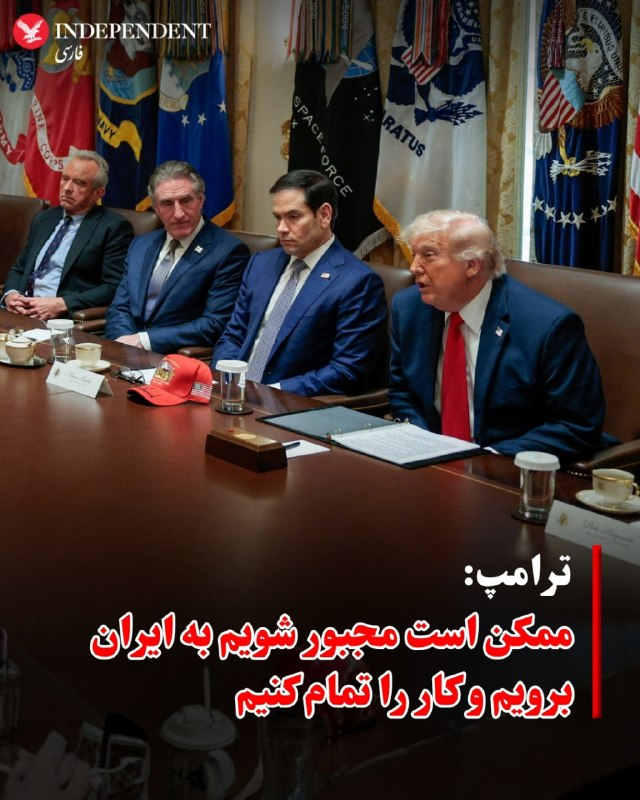

♦️دونالد ترامپ در نشست کابینه در کاخ سفید بار دیگر بر موضع سخت‌گیرانه واشنگتن نسبت به برنامه هسته‌ای ایران تاکید کرد و گفت: «ایران نمی‌تواند بمب هسته‌ای داشته باشد.» او در عین حال هشدار داد که در صورت دست نیافتن به توافق، «ممکن است مجبور شویم به آنجا برویم و کار را تمام کنیم.»
ترامپ در ادامه با اشاره به روند مذاکرات گفت که ایران «بسیار مشتاق» رسیدن به توافق است، اما تاکنون نتیجه نهایی حاصل نشده است. او افزود: «ما از وضعیت فعلی راضی نیستیم، ولی خواهیم شد.»
رئیس‌جمهوری آمریکا با توصیف شرایط ایران، مدعی شد که این کشور تحت فشار شدید قرار دارد و گفت «نیروی دریایی و هوایی آن از بین رفته و همه‌چیزشان از دست رفته است.» او همچنین ادعا کرد ایران در شرایطی وارد مذاکره شده که «چیزی برایش باقی نمانده است.»
ترامپ همچنین وضعیت اقتصادی ایران را بحرانی توصیف کرد و گفت اقتصاد این کشور «در حال سقوط آزاد» است و به دلیل فشارهای موجود، تهران «گزینه دیگری جز حرکت به سمت توافق ندارد.»
او در بخش دیگری از سخنانش به وضعیت اینترنت در ایران اشاره کرد و گفت که این کشور پس از فشارهای اخیر دوباره به اینترنت متصل شده است.
‌🇸🇦 Indypersian

🤖 @VahidOOnLine

## VahidOOnLine — post 242457

  <a href="telegram/content/VahidOOnLine_242457_1779901532.mp4" target="_blank">🎬 Download video</a>

♦️دونالد‌ ترامپ، رئیس‌جمهوری آمریکا، چهارشنبه ششم خرداد، در نشست کابینه در کاخ سفید، از مارکو روبیو، وزیر خارجه آمریکا، و پیت هگست، وزیر دفاع، تمجید کرد و گفت دولتش «افراد فوق‌العاده‌ای» دارد.

ترامپ درباره پیت هگست گفت: «او عاشق جنگ است. من این را دوست ندارم، ولی او آدم خوبی است.»
‌🇸🇦 Indypersian

🤖 @VahidOOnLine

## VahidOOnLine — post 242456

  

مارکو روبیو، وزیر خارجه آمریکا، در جلسه کابینه در کاخ سفید گفت نتیجه نهایی این است که ایران هرگز نباید سلاح هسته‌ای داشته باشد. او افزود وقایع اخیر بار دیگر یادآوری کرده که ایران بزرگ‌ترین حامی تروریسم در جهان است و نمی‌تواند به چنین سلاحی دست یابد.

روبیو تاکید کرد ترجیح رییس‌جمهور همواره مذاکره و تلاش برای دستیابی به توافق از مسیر دیپلماسی بوده است و این روند از طریق استیو ویتکاف، جرد کوشنر و معاون رییس‌جمهور ادامه دارد.

او گفت اگر توافقی قابل دستیابی باشد، آمریکا خواهان انجام آن است و نشانه‌هایی از پیشرفت دیده می‌شود. با این حال، اگر دیپلماسی نتیجه ندهد، گزینه‌های دیگری نیز در اختیار رییس‌جمهور است. روبیو تصریح کرد تا زمانی که ترامپ رییس‌جمهور باشد، ایران هرگز به سلاح هسته‌ای دست نخواهد یافت.
‌🏁 🇬🇧 IranintlTV

🤖 @VahidOOnLine

## VahidOOnLine — post 242455

  <a href="telegram/content/VahidOOnLine_242455_1779901534.mp4" target="_blank">🎬 Download video</a>

♦️دونالد‌ ترامپ، رئیس‌جمهوری آمریکا، چهارشنبه ششم خرداد، در نشست کابینه در کاخ سفید گفت جمهوری اسلامی پس از فشارهای شدید دوباره اینترنت را وصل کرده است.

ترامپ گفت: «آنها تازه دوباره به اینترنت برگشته‌اند، چون به‌شدت تحت فشار قرار گرفته‌اند.»

رئیس‌جمهوری آمریکا همچنین وضعیت اقتصادی جمهوری اسلامی را بحرانی توصیف کرد و گفت اقتصاد ایران «در حال سقوط آزاد» است، تورم به ۲۵۰ درصد رسیده و «کل نظام اقتصادی» جمهوری اسلامی از هم فروپاشیده است.

ترامپ در ادامه افزود جمهوری اسلامی به‌دلیل این فشارها «انتخاب دیگری» جز حرکت به‌سوی توافق ندارد.
‌🇸🇦 Indypersian

🤖 @VahidOOnLine

## VahidOOnLine — post 242454

  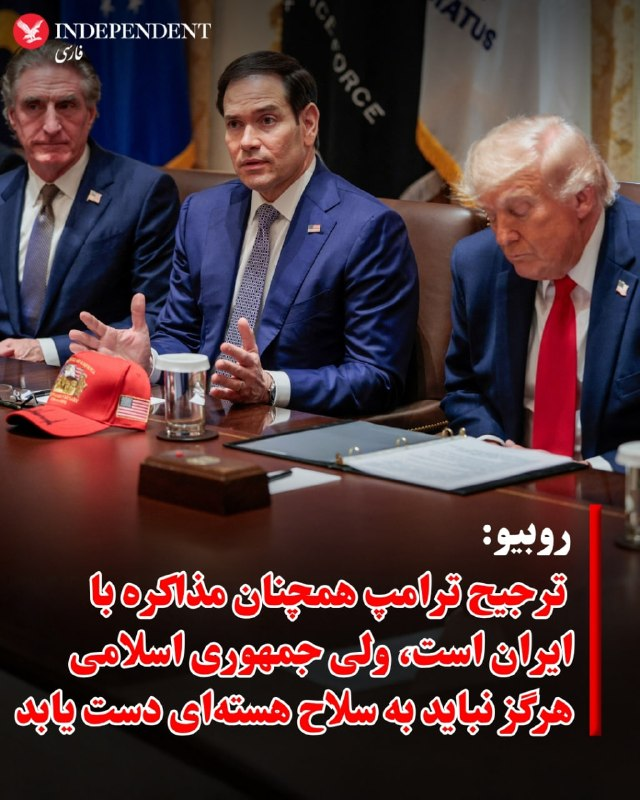

♦️مارکو روبیو، وزیر خارجه آمریکا، در نشست کابینه در کاخ سفید اعلام کرد که ایالات متحده «هرگز اجازه نخواهد داد ایران به سلاح هسته‌ای دست یابد» و تاکید کرد که جمهوری اسلامی همچنان «بزرگ‌ترین حامی تروریسم در جهان» است.
در بخش دیگری از اظهاراتش، وزیر خارجه آمریکا به روند گفتگوهای دیپلماتیک نیز اشاره کرد و گفت نشانه‌هایی از «پیشرفت در مسیر رسیدن به توافق» وجود دارد. او همچنین تاکید کرد که ترجیح دونالد ترامپ، رئیس‌جمهور آمریکا، همچنان مذاکره با ایران است.
روبیو در کنار موضوع ایران، درباره تهدیدهای بهداشتی نیز هشدار داد و اعلام کرد که ایالات متحده نباید اجازه ورود موارد بیماری ابولا به خاک خود را بدهد.
‌🇸🇦 Indypersian

🤖 @VahidOOnLine

## VahidOOnLine — post 242453

  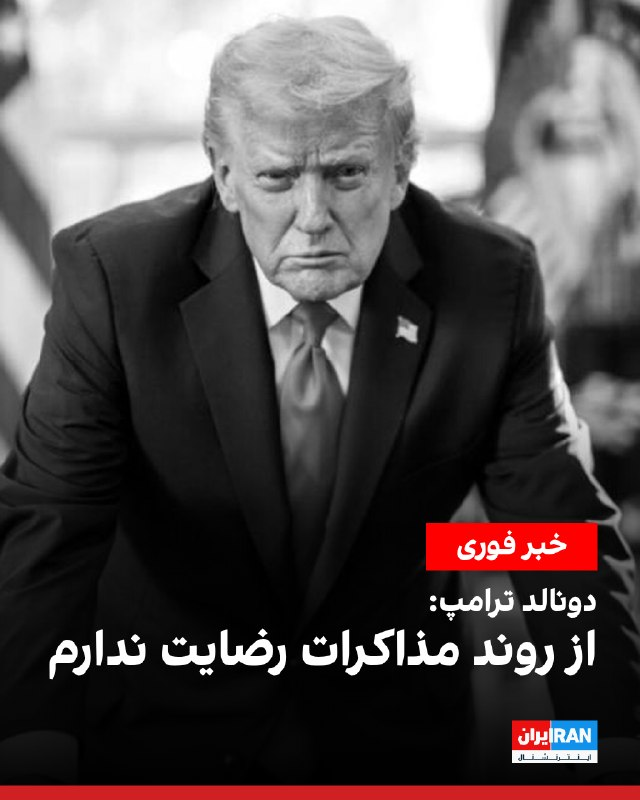

دونالد ترامپ، رییس‌جمهوری آمریکا، چهارشنبه در نشست کابینه گفت جمهوری اسلامی به‌شدت خواهان دستیابی به توافق است، اما آمریکا هنوز از آن راضی نیست.

ترامپ پیش‌تر گفت تهران در ازای واگذاری و تحویل اورانیوم با غنای بالا، هیچ امتیاز یا کاهش تحریمی دریافت نخواهد کرد.
‌🏁 🇬🇧 IranintlTV

🤖 @VahidOOnLine

## VahidOOnLine — post 242452

♦️دونالد‌ ترامپ، رئیس‌جمهوری آمریکا، چهارشنبه ششم خرداد، در نشست کابینه در کاخ سفید درباره مذاکرات با جمهوری اسلامی گفت تهران «بسیار مشتاق» توافق است، اما مذاکرات هنوز به نتیجه نهایی نرسیده است.

ترامپ گفت: «آنها واقعا می‌خواهند توافق کنند. تا الان به نتیجه نرسیده‌اند. ما از وضعیت فعلی راضی نیستیم، ولی خواهیم شد.»

رئیس‌جمهوری آمریکا همچنین جمهوری اسلامی را تحت فشار شدید توصیف کرد و گفت: «نیروی دریایی‌شان نابود شده، نیروی هوایی از بین رفته و همه‌چیزشان از دست رفته است.»

ترامپ افزود جمهوری اسلامی «در حالی مذاکره می‌کند که چیزی برایش باقی نمانده» و هشدار داد اگر توافق حاصل نشود، آمریکا ممکن است «برگردد و کار را تمام کند.»

او همچنین گفت اقتصاد ایران «در حال سقوط آزاد» است و تهران به‌دلیل فشارهای سنگین، گزینه دیگری جز حرکت به‌سوی توافق ندارد.
‌🇸🇦 Indypersian

🤖 @VahidOOnLine

## VahidOOnLine — post 242451

  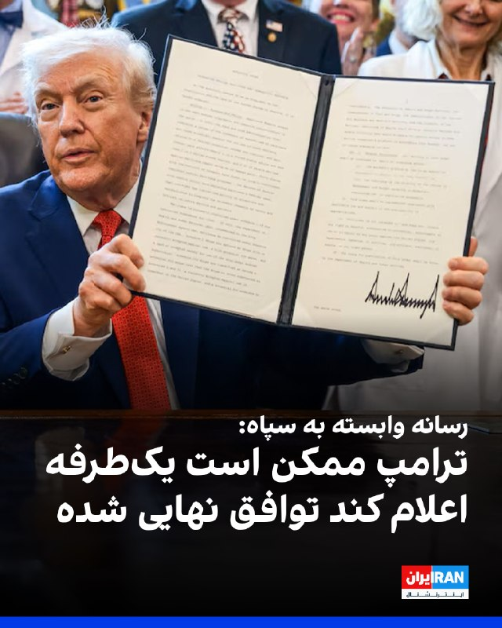

خبرگزاری فارس، وابسته به سپاه پاسداران، به نقل از منابع آگاه نوشت دونالد ترامپ، رییس‌جمهوری آمریکا، ممکن است در ساعات آینده به‌صورت یک‌طرفه اعلام کند که توافق جمهوری اسلامی و آمریکا نهایی شده است.

فارس نوشت این اقدام احتمالی از سوی ترامپ با هدف اعمال فشار و القای توافق به افکار عمومی، پیش از رفع کامل اختلافات، ارزیابی می‌شود.

با این حال، یک عضو تیم مذاکره‌کننده جمهوری اسلامی در گفت‌وگو با فارس تاکید کرد هنوز برخی موارد حل‌نشده باقی مانده و تا زمانی که همه موضوعات مدنظر جمهوری اسلامی حل نشود، «هیچ توافقی در کار نخواهد بود».

به گفته این منبع، جمهوری اسلامی در صورت رفع کامل این موارد، رسما نتیجه را اعلام خواهد کرد.
‌🏁 🇬🇧 IranintlTV

🤖 @VahidOOnLine

## VahidOOnLine — post 242450

  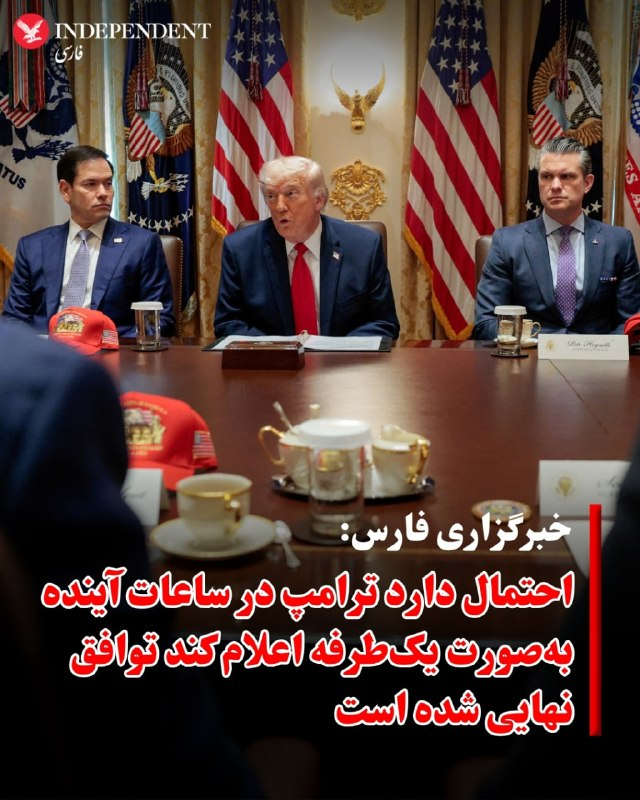

♦️خبرگزاری فارس به نقل از «منابع آگاه» گزارش داد که دونالد ترامپ، رئیس‌جمهوری آمریکا، ممکن است در ساعات آینده به‌صورت یک‌طرفه اعلام کند که توافق میان ایران و آمریکا نهایی شده است؛ اقدامی که به گفته این منابع می‌تواند با هدف اعمال فشار سیاسی و اثرگذاری بر افکار عمومی انجام شود، پیش از آنکه اختلافات باقی‌مانده به‌طور کامل برطرف شود.
بر اساس این گزارش، این سناریو در حالی مطرح شده که هنوز برخی موضوعات میان دو طرف حل‌نشده باقی مانده و روند مذاکرات به مرحله نهایی نرسیده است.
در همین زمینه، یک عضو تیم مذاکره‌کننده ایرانی در گفتگو با فارس تاکید کرده است که تا زمانی که همه موارد مورد نظر ایران حل و فصل نشود، هیچ توافقی قابل اعلام نخواهد بود.
به گفته این منبع، جمهوری اسلامی ایران تنها در صورتی که اختلافات به‌طور کامل برطرف شود، نتیجه مذاکرات را به‌صورت رسمی اعلام خواهد کرد و هیچ توافقی پیش از رسیدن به جمع‌بندی نهایی، مورد تایید تهران نخواهد بود.
‌🇸🇦 Indypersian

🤖 @VahidOOnLine

## VahidOOnLine — post 242449

  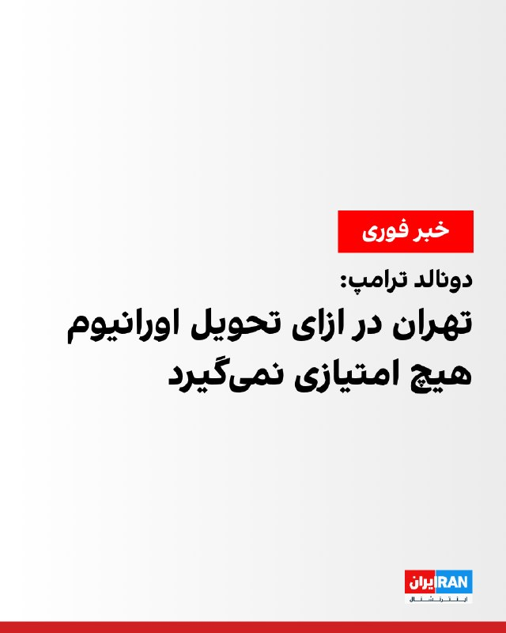

دونالد ترامپ در گفت‌وگو با پی‌بی‌اس‌نیوز اعلام کرد که تهران در ازای واگذاری و تحویل اورانیوم با غنای بالا، هیچ امتیاز یا کاهش تحریمی دریافت نخواهد کرد و چنین توافقی شامل لغو تحریم‌ها نمی‌شود.
‌🏁 🇬🇧 IranintlTV

🤖 @VahidOOnLine

## VahidOOnLine — post 242448

  

خبرگزاری رویترز گزارش داد یک نفتکش حامل فرآورده‌های نفتی متعلق به گروه کشتیرانی چینی کاسکو، چهارشنبه در حال عبور از تنگه هرمز بود؛ با این حال داده‌های کشتیرانی نشان می‌دهد تردد نفتکش‌ها در این مسیر همچنان محدود است.

بر اساس این گزارش، پیش از آغاز جنگ علیه ایران در اسفند ۱۴۰۴، میانگین تردد روزانه کشتی‌ها از تنگه هرمز بین ۱۲۵ تا ۱۴۰ عبور بود، اما از آن زمان میانگین کلی عبور روزانه حدود ۱۱ کشتی بوده است.

داده‌های رهگیری نشان می‌دهد در یک روز گذشته دو نفتکش حامل نفت خام نیز از تنگه هرمز عبور کرده‌اند و ۹ کشتی دیگر وارد خلیج فارس شده یا از آن خارج شده‌اند.

شرکت کارگزاری نفتکش گیبسون اعلام کرد با وجود نشانه‌هایی از افزایش عبور نفتکش‌ها، جریان انتقال نفت و فرآورده‌های نفتی در مقایسه با دوران پیش از جنگ همچنان بسیار محدود است و بازگشت تردد به سطح پیشین به تضمین‌های امنیتی، پاکسازی مین‌ها و چارچوب تازه بیمه‌ای نیاز دارد.
‌🏁 🇬🇧 IranintlTV

🤖 @VahidOOnLine

## VahidOOnLine — post 242447

♦️در گزارش تصویری خبرگزاری رویترز از ایران، شهروندان و صاحبان کسب‌وکار از پیامدهای قطعی و محدودیت اینترنت در ۸۸ روز گذشته بر زندگی روزمره و فعالیت‌های اقتصادی خود سخن گفته‌اند؛ وضعیتی که به گفته آن‌ها باعث عقب‌افتادگی، اختلال در کار و از دست رفتن مشتریان شده است.
یکی از کاربران در این گزارش می‌گوید: «داخل ایران، کارم با بچه‌هاست و باید دائم در ارتباط باشم و ببینم در جهان هنر چه می‌گذرد، اما کاملا از جریان جهانی دور بودم و نمی‌دانستم چه اتفاقی در حال رخ دادن است. اگر قبلا یک طرح را در یک ساعت انجام می‌دادم، حالا به‌دلیل قفل شدن ذهن و نبود دسترسی، بسیار بیشتر زمان می‌برد.»
در بخش دیگری از این گزارش تصویری، یک شهروند می‌گوید که در چند ماه گذشته، انگار ده سال به عقب برگشته باشیم.
همچنین برخی کاربران از دشواری استفاده از اپلیکیشن‌های داخلی و کمبود دسترسی به اطلاعات گلایه کرده‌اند و تاکید کرده‌اند که این شرایط عملا روند کار دیجیتال را مختل کرده است.
‌🇸🇦 Indypersian

🤖 @VahidOOnLine

## VahidOOnLine — post 242446

  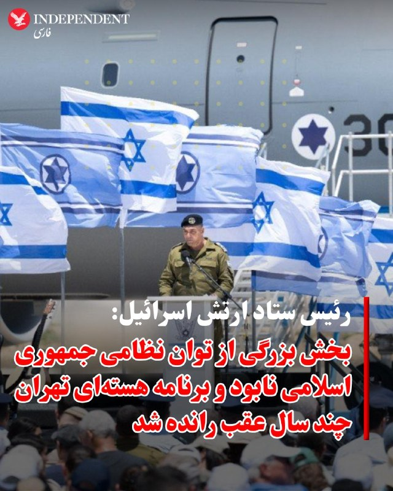

♦️ایال زامیر، رئیس ستاد ارتش اسرائیل، چهارشنبه ششم خرداد اعلام کرد بخش بزرگی از توان نظامی جمهوری اسلامی در حملات اخیر از بین رفته و برنامه هسته‌ای ایران چندین سال به عقب رانده شده است.

زامیر گفت رهبران جمهوری اسلامی اکنون «تحت تعقیب» هستند و بخش عمده‌ای از ظرفیت‌های نظامی ایران در عملیات‌های اخیر نابود شده است. او همچنین با اشاره به وضعیت اقتصادی ایران گفت شهروندان ایرانی هنوز «ابعاد بحرانی» تصمیم‌های رهبران جمهوری اسلامی را درک نکرده‌اند.

رئیس ستاد ارتش اسرائیل تاکید کرد تل‌آویو عقب‌افتادن برنامه هسته‌ای ایران را یکی از مهم‌ترین نتایج عملیات نظامی اخیر می‌داند.

این اظهارات همزمان با ابراز خوش‌بینی مقام‌های آمریکایی درباره احتمال دستیابی به توافقی تازه با تهران مطرح شده است.

جی‌دی‌ ونس، معاون رئیس‌جمهوری آمریکا، در گفتگو با شبکه ان‌بی‌سی گفت نسبت به این‌که ایران در چارچوب هر توافق احتمالی از توسعه سلاح هسته‌ای صرف‌نظر کند «بسیار خوش‌بین» است.

ونس در عین حال تاکید کرد چالش اصلی مذاکرات، سازوکار نظارت و راستی‌آزمایی توافق است و باید اطمینان حاصل شود که جمهوری اسلامی در آینده آن را نقض نخواهد کرد.

این اظهارات همزمان با نشست دونالد‌ ترامپ با اعضای کابینه آمریکا برای بررسی راه‌های پایان جنگ با ایران مطرح شده است.
‌🇸🇦 Indypersian

🤖 @VahidOOnLine

## VahidOOnLine — post 242445

  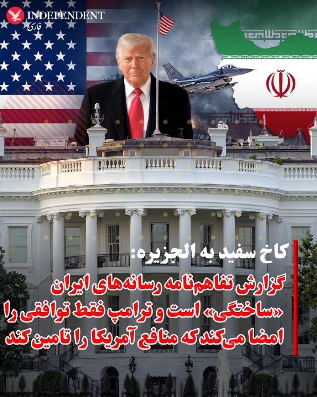

♦️یک مقام کاخ سفید، چهارشنبه ششم خرداد، به شبکه الجزیره گفت دونالد‌ ترامپ، رئیس‌جمهوری آمریکا، تنها توافقی را امضا خواهد کرد که در راستای منافع مردم آمریکا باشد و مانع دستیابی ایران به سلاح هسته‌ای شود.

این مقام در کاخ سفید همچنین اعلام کرد گزارش منتشرشده دررسانه‌های ایران درباره تفاهم‌نامه احتمالی میان تهران و واشنگتن «کاملا ساختگی» است.

در همین حال، کاخ سفید به نقل از ترامپ اعلام کرد مذاکرات با جمهوری اسلامی «به‌خوبی پیش می‌رود» و رئیس‌جمهوری آمریکا خطوط قرمز خود را به‌روشنی مشخص کرده است.
‌🇸🇦 Indypersian

🤖 @VahidOOnLine

## VahidOOnLine — post 242444

  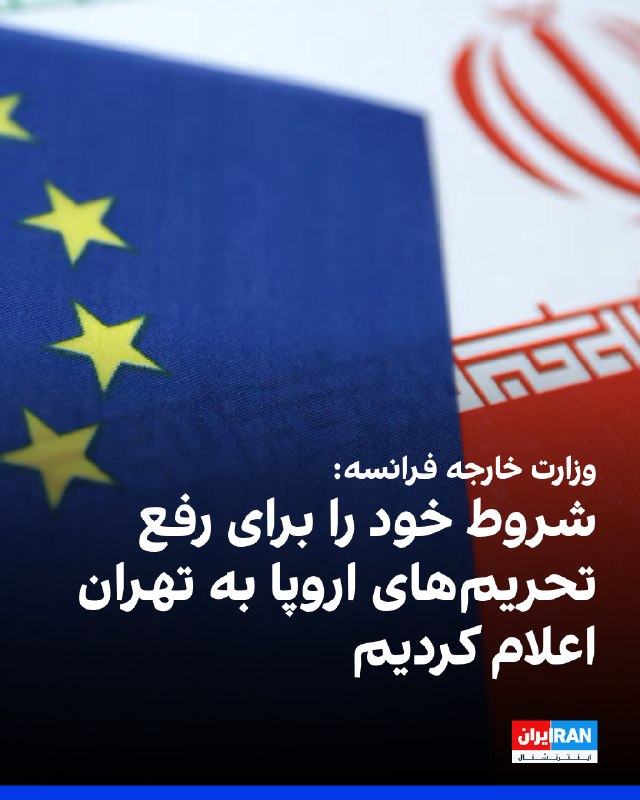

وزارت خارجه فرانسه به العربیه اعلام کرد پاریس بخشی از جنگ در منطقه نیست و ماموریت بین‌المللی در تنگه هرمز صرفا ماهیتی دفاعی دارد و برای همراهی کشتی‌ها انجام می‌شود.

این وزارتخانه تاکید کرد هرگونه باج‌خواهی تهران در تنگه هرمز باید متوقف شود و فرانسه برای بازگرداندن آزادی کشتیرانی در سریع‌ترین زمان ممکن تلاش می‌کند.

وزارت خارجه فرانسه افزود با مقام‌های جمهوری اسلامی در تماس است و امانوئل مکرون و دونالد ترامپ نیز به‌طور مستمر درباره ایران گفت‌وگو می‌کنند. همچنین شروط پاریس برای رفع تحریم‌های اروپایی به تهران اعلام شده است.
‌🏁 🇬🇧 IranintlTV

🤖 @VahidOOnLine

## VahidOOnLine — post 242443

  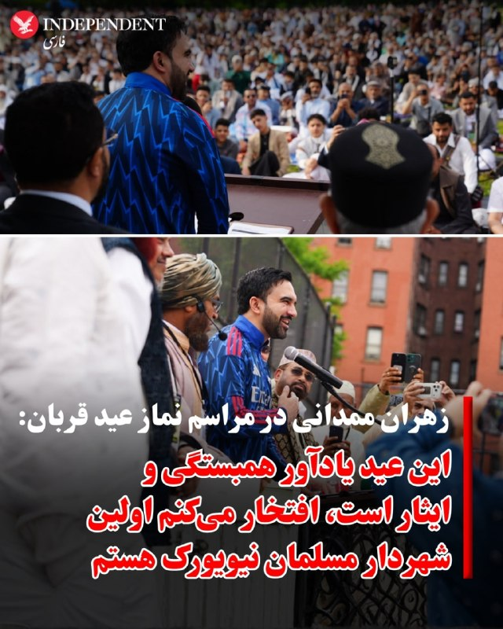

⭕️ زهران ممدانی در مراسم نماز عید قربان:
این عید یادآور همبستگی و ایثار است،
افتخار می‌کنم اولین شهردار مسلمان نیویورک هستم

♦️زهران ممدانی، شهردار نیویورک، با انتشار تصاویری از حضور خود در مراسم نماز عید قربان در این شهر، پیام تبریکی به مناسبت این عید منتشر کرد و بر مفاهیم همبستگی، ایثار و حمایت اجتماعی تاکید کرد.
او در پیام خود نوشت: «عید مبارک! امروز در حالی که یاد پیامبر ابراهیم را گرامی می‌داریم، عید قربان به ما یادآوری می‌کند که ایثار یک بار سنگین نیست، بلکه فرصتی است برای دیدن خود به عنوان بخشی از یک کل بزرگ‌تر و برای دستگیری از کسانی که بیش از همه به کمک نیاز دارند.»
ممدانی همچنین اعلام کرد که افتخار دارد نخستین شهردار مسلمان نیویورک است و تاکید کرد مدیریت شهری خود را بر پایه همبستگی اجتماعی پیش خواهد برد. او افزود هدفش این است که هر شهروند نیویورک بتواند از پس هزینه‌های اساسی زندگی مانند خوراک، مسکن و خدمات مراقبتی برآید.
‌🇸🇦 Indypersian

🤖 @VahidOOnLine

## VahidOOnLine — post 242442

  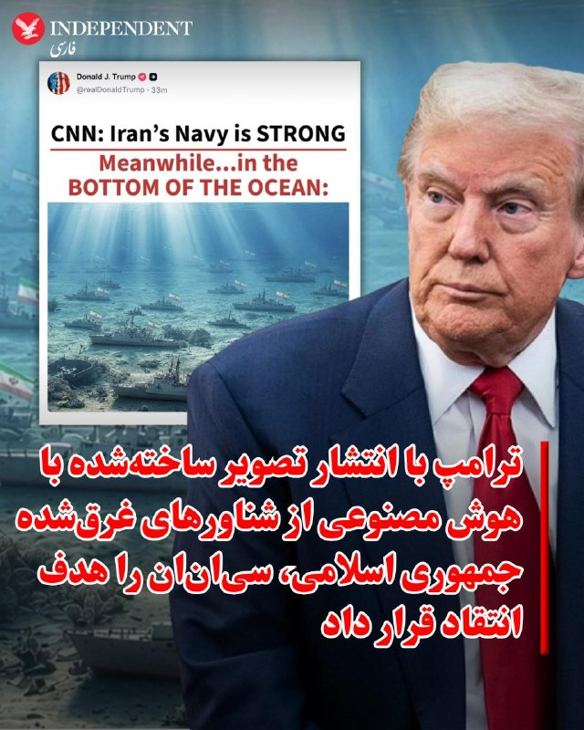

♦️دونالد‌ ترامپ، رئیس‌جمهوری آمریکا، چهارشنبه ششم خرداد در شبکه اجتماعی تروث سوشال با انتشار تصویری ساخته‌شده با هوش مصنوعی، از شبکه سی‌ان‌ان انتقاد کرد و نوشت این رسانه نیروی دریایی جمهوری اسلامی را قدرتمند نشان می‌دهد، در حالی که شناورهای ایران در اقیانوس غرق شده‌اند.

در این تصویر، جمله «سی‌ان‌ان: نیروی دریایی ایران قدرتمند است» در کنار تصویری از شناورهای غرق‌شده جمهوری اسلامی در کف اقیانوس دیده می‌شود.
‌🇸🇦 Indypersian

🤖 @VahidOOnLine

## VahidOOnLine — post 242441

  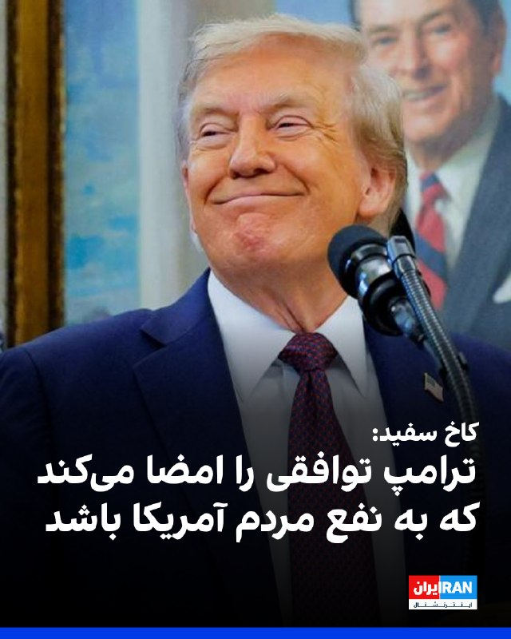

کاخ سفید به الجزیره گفت دونالد ترامپ تنها توافقی را امضا می‌کند که در جهت منافع مردم آمریکا باشد.

کاخ سفید افزود ترامپ فقط توافقی را خواهد پذیرفت که به‌طور قطعی تضمین کند جمهوری اسلامی هیچ سلاح هسته‌ای در اختیار نداشته باشد.

به گفته کاخ سفید، ترامپ گفته است مذاکرات به‌خوبی پیش می‌رود و او خطوط قرمز خود را به‌روشنی مشخص کرده است.
‌🏁 🇬🇧 IranintlTV

🤖 @VahidOOnLine

## VahidOOnLine — post 242440

  <a href="telegram/content/VahidOOnLine_242440_1779901539.mp4" target="_blank">🎬 Download video</a>

یک دانش‌آموز در پیامی به ایران‌اینترنشنال درباره وضعیت معیشتی می‌گوید که نمی‌تواند از پدرش بخواهد چیزی برایش بخرد. پیام او با هوش مصنوعی خوانده شده است.
‌🏁 🇬🇧 IranintlTV

🤖 @VahidOOnLine

## VahidOOnLine — post 242439

  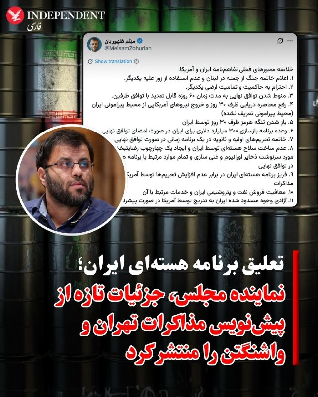

♦️میثم ظهوریان، نماینده مجلس شورای اسلامی از مشهد، با انتشار متنی در شبکه اجتماعی اکس از جزئیات یک پیش‌نویس ۱۱ بندی مرتبط با مذاکرات ایران و آمریکا خبر داده است؛ محوری که به گفته او چارچوب اولیه یک تفاهم در حال بررسی را ترسیم می‌کند.

بر اساس بندهای منتشرشده، ایران متعهد می‌شود به سمت ساخت سلاح هسته‌ای نرود و درباره سرنوشت ذخایر اورانیوم، سطح غنی‌سازی و سایر موضوعات مرتبط با برنامه هسته‌ای، یک چارچوب مورد توافق دو طرف شکل بگیرد. همچنین در این پیش‌نویس آمده است که برنامه هسته‌ای ایران در طول مذاکرات «تعلیق» خواهد شد و در مقابل، آمریکا نیز از افزایش تحریم‌ها خودداری می‌کند.

در بخش دیگری از این متن، اعلام خاتمه جنگ از جمله در لبنان و عدم استفاده از زور علیه یکدیگر، احترام به حاکمیت و تمامیت ارضی طرفین و تعیین یک بازه ۶۰ روزه قابل تمدید برای نهایی‌سازی توافق مطرح شده است.

این پیش‌نویس همچنین شامل رفع محاصره دریایی ظرف ۳۰ روز، خروج نیروهای آمریکایی از «محیط پیرامونی ایران» و باز شدن تنگه هرمز توسط ایران در همین بازه زمانی است؛ هرچند تعریف دقیقی از محدوده «محیط پیرامونی ایران» ارائه نشده است.

در بندهای اقتصادی نیز به وعده یک برنامه بازسازی ۳۰۰ میلیارد دلاری برای ایران، خاتمه تدریجی تحریم‌های اولیه و ثانویه، معافیت فروش نفت و پتروشیمی ایران و آزادسازی تدریجی وجوه مسدود شده ایران در صورت پیشرفت مذاکرات اشاره شده است.

این در حالی است که ظهر روز چهارشنبه صداوسیما نیز اعلام کرد به یک سند غیررسمی اولیه از چارچوب ۱۴ بندی تفاهم احتمالی میان ایران و آمریکا دسترسی پیدا کرده است؛ سندی که هنوز نهایی نشده اما در آن به موضوعاتی از جمله وضعیت تنگه هرمز و حضور نظامی آمریکا در منطقه اشاره شده است.

طبق گزارش صداوسیما، آمریکا در این پیش‌نویس متعهد به خروج نیروهای نظامی از اطراف ایران و توقف محاصره دریایی شده و در مقابل، ایران نیز بازگشت عبور کشتی‌های تجاری از تنگه هرمز به سطح پیش از جنگ را ظرف یک ماه پذیرفته است. همچنین مدیریت تردد کشتی‌های تجاری در تنگه هرمز با همکاری ایران و عمان پیش‌بینی شده و تأکید شده بدون سازوکار راستی‌آزمایی، هیچ اقدام عملی از سوی تهران انجام نخواهد شد.

در این گزارش آمده است که در صورت دستیابی به توافق نهایی ظرف ۶۰ روز، امکان تبدیل آن به قطعنامه الزام‌آور در شورای امنیت سازمان ملل نیز مطرح شده است.
‌🇸🇦 Indypersian

🤖 @VahidOOnLine

## WithYashar — post 12707

پیت هگست درباره ایران:

آنها ممکن است موشک داشته باشند، اما در حال حاضر نمی‌توانند موشک‌های بیشتری بسازند. نمی‌توانند پهپادهای بیشتری بسازند. نمی‌توانند کشتی‌های بیشتری بسازند.
آنها آمدند و التماس کردند تا صحبت کنند.
@withyashar

## WithYashar — post 12706

  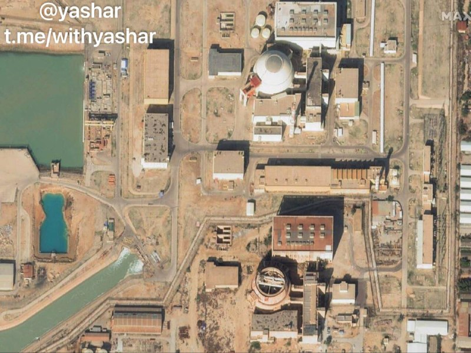

️رئیس روس اتم می‌گوید روسیه تصمیم گرفته است بازگشت کارکنان خود به نیروگاه هسته‌ای بوشهر در ایران را به تعویق بیندازد!
@withyashar

## WithYashar — post 12705

مارکو روبیو :اگر ایران توافق قابل قبولی مارو امضا نکند جنگ را شروع خواهیم کرد این‌خواسته ترامپ است
@withyashar

## WithYashar — post 12704

ترامپ: ایران نمی‌تواند سلاح هسته‌ای داشته باشد و من به خاطر جهان جلوی آن را می‌گیرم.
@withyashar

## WithYashar — post 12703

مارکو روبیو، وزیر امور خارجه، درباره مذاکرات ایران:
آقای رئیس‌جمهور، اگر این کار جواب نداد، گزینه‌های دیگری در اختیار دارید.
@withyashar

## WithYashar — post 12702

روبیو : ما با جمهوری اسلامی پیشرفت‌هایی داشتیم اما در روزهای آینده میزان اون رو خواهیم دید.
@withyashar

## WithYashar — post 12701

پست جدید یه یا موسی کامنت کنین بی بی و پسرش و زنش رو تگ کنین امشب بزنه 🤣💥💥🌶️🌶️ https://www.instagram.com/reel/DY2Hk4hoW2r/?igsh=MXYyMDlxdjY5b3QwZg==

## WithYashar — post 12700

  <a href="telegram/content/WithYashar_12700_1779901542.mp4" target="_blank">🎬 Download video</a>

ترامپ درباره ایران :
ایران خیلی دنبال توافقه. هنوز به نتیجه نرسیدیم و راضی نیستیم، ولی یا توافق میشه یا مجبور میشیم کار رو تموم کنیم.
اونا دارن از روی استیصال مذاکره می‌کنن.
اونا دیگه نیروی دریایی و هوایی ندارن و رهبرانشونم هم رفتن.
ایران فکر می‌کرد میتونه صبر کنه تا منو خسته کنه
به انتخابات میان دوره اهمیتی نمیدهم اونا گزینه دیگه ایی جز توافق ندارن
@withyashar

## WithYashar — post 12699

اینترنشنال باز خل شده ؟ چرا ترامپ رو انقدر میکوبه ؟!

## WithYashar — post 12698

ترامپ: ایرانی‌ها فکر می‌کنند من به‌خاطر انتخابات میان‌دوره‌ای جنگ را تمام می‌کنم اما من اهمیتی نمی‌دهم @withyashar

## WithYashar — post 12697

  

ترامپ: ایرانی‌ها فکر می‌کنند من به‌خاطر انتخابات میان‌دوره‌ای جنگ را تمام می‌کنم اما من اهمیتی نمی‌دهم
@withyashar

## WithYashar — post 12696

  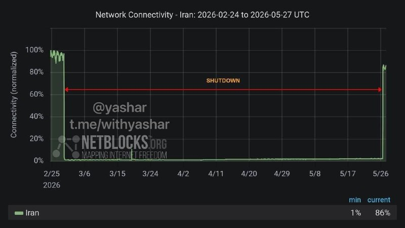

نت بلاکس: به نظر روند بازگشایی اینترنت ایران متوقف شده و در حال اعمال محدودیت‌های بیشتر برای جلوگیری از دانلود و استفاده از VPNها هستند!

کماکان هیچ اخباری مبنی بر اتصال کامل اینترنت دیتاسنترها وجود ندارد که مشخصاً برای جلوگیری از گسترش تانل‌ها و VPNها می‌باشد.
میزان اختلالات در شبکه از دیروز بسیار بیشتر شده است، بسیاری از سرویس‌های گوگل و کلودفلر بسته شده اند و حتی قابلیت استفاده از گوگل پلی و اپ استور نیز وجود ندارد.
@withyashar

## WithYashar — post 12695

یاشار جان من دندونپزشکم، دو سال سرباز بودم، صبح‌ها تو کلینیک ارتش یه شهرستان دورافتاده کار می‌کردم، بعدظهر هم تا شب تو کلینیک خیریه کار می‌کردم، از نظر مالی هیچ سودی برام نداشت فقط دلم می‌خواست دوران سربازی یه کار مفیدی هم برا اقشار ضعیف انجام بدم واقعاً از دلو جون مایه میذاشتم
اما اون دو سال، از آدمای قدرنشناس و پر توقع رفتارای زیادی دیدم که باعث شد بفهمم خیلی از هم‌وطنا وقتی برا خدمتت هزینه‌ای پرداخت نمی‌کنن قدر خودت و کارتو نمی‌دونن انگار وظیفت بوده بشون خدمت کنی
همین تجربه‌ باعث شد دیگه سمت خیریه نرم
خیلی از مردم ما واقعا قدرنشناسن
وقت و انرژیتو بدون سود و فقط از روی عشق به کشورت صرف کاری می‌کنی بعد یه عده‌ پیدا میشن که برن رو مخت و پشیمونت کنن

## WithYashar — post 12694

  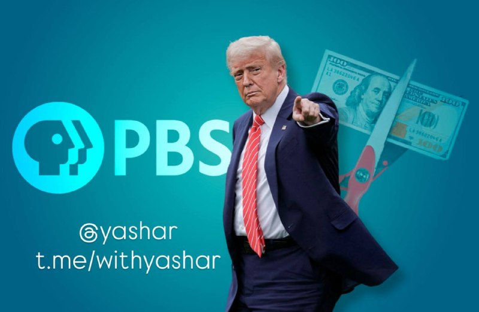

ترامپ به PBS گفت که ایران در ازای کنار گذاشتن اورانیوم بسیار غنی‌ شده خود، از تحریم‌ها معاف نخواهد شد.
@withyashar

## WithYashar — post 12693

  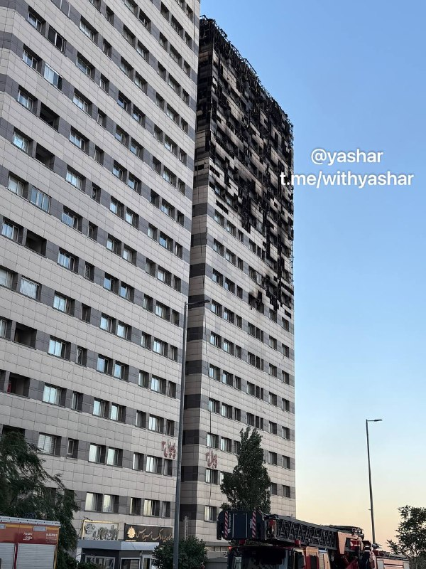

یاشار برج چیتگر پامچال چهار از طبقه ۸ به بالا آتیش گرفته
این دقیقاً روبروی همون برجیه که تو جنگ دوازده روزه طبقه ۱۵ رو زدن بعد گفتن نشت گاز
@withyashar

## WithYashar — post 12692

خبرگزاری فارس: به عقیده ما احتمال دارد ترامپ در ساعات آینده به صورت یک‌طرفه اعلام کند که توافق ایران و آمریکا نهایی شده است
@withyashar
یاشار : عقایدتون رو … 🤣

## WithYashar — post 12691

  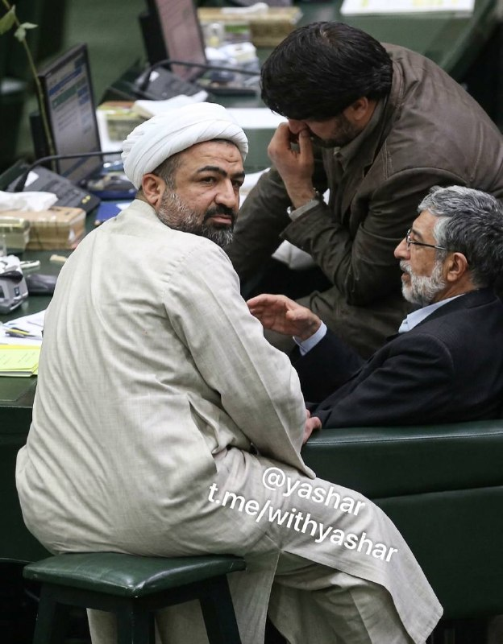

حمید رسایی: از وقتی اینترنت وصل شده قلبم درد گرفته، یه لحظه‌ام نتونستم بخوابم.
عوامل موساد باعث بازگشایی اینترنت شدن.
@withyashar
یاشار : شاید باورتون نشه ولی درست میگه اینبار 🤣

## WithYashar — post 12690

  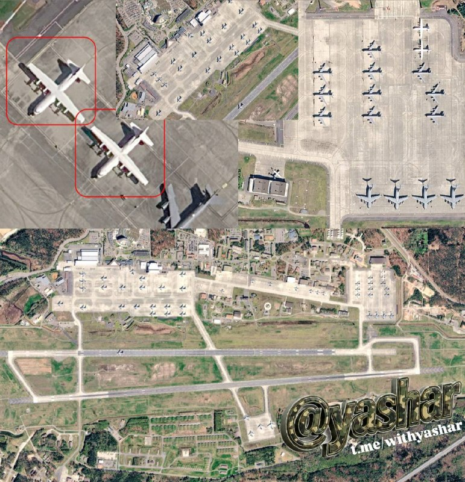

تصاویر ماهواره‌ای از پایگاه هوایی رامشتاین در آلمان، ده‌ها فروند هواپیمای ترابری C-17A و C-5M نیروی هوایی ایالات متحده، چندین فروند هواپیمای ترابری C-130 و حداقل 10 فروند تانکر KC-135R را نشان می‌دهد که در آنجا مستقر شده‌اند.

در اتاق جنگ گفتم که رامشتاین مهم‌ترین پایگاه ایالات متحده در اروپا برای جنگ ایران است و به عنوان یک قطب لجستیکی کلیدی عمل می‌کند.
@withyashar

## WithYashar — post 12689

پست جدید یه یا موسی کامنت کنین بی بی و پسرش و زنش رو تگ کنین امشب بزنه 🤣💥💥🌶️🌶️ https://www.instagram.com/reel/DY2Hk4hoW2r/?igsh=MXYyMDlxdjY5b3QwZg==

## WithYashar — post 12688

کاخ سفید گزارش‌های مربوط به تفاهم‌نامه ایران را کاملاً ساختگی خواند.
@withyashar

## mwarmonitor — post 9830

🔸هشدار درباره اینکه روسیه در حال آماده‌سازی یک کارزار گسترده‌تر از حملات موشک‌های بالستیک علیه شهرهای اوکراین است، ولودیمیر زلنسکی در نامه‌ای به ترامپ و کنگره آمریکا خواستار گسترش ارسال سامانه‌های موشکی پاتریوت شد. CBS

@mwarmonitor

## mwarmonitor — post 9829

🔸تردد کشتی‌های تجاری از تنگه هرمز روز چهارشنبه به چند کشتی محدود شد که عمدتاً به ایران مرتبط بودند؛ موضوعی که نشان‌دهنده ماهیت ناپیوسته و نوسانی عبور و مرور در مهم‌ترین گلوگاه انرژی جهان است. بلومبرگ

@mwarmonitor

## mwarmonitor — post 9828

🔴وزیر امور خارجه آمریکا، مارکو روبیو: «ما در مورد ایران مقداری پیشرفت داشته‌ایم و طی چند ساعت یا چند روز آینده خواهیم دید که آیا پیشرفت بیشتری حاصل خواهد شد یا نه.»

@mwarmonitor

## mwarmonitor — post 9827

🔴ترامپ: «ایران بسیار جدی است و خیلی می‌خواهد به یک توافق برسد. تا این لحظه هنوز به آن نرسیده‌اند... ما از این وضعیت راضی نیستیم، اما خواهیم دید. یا به توافق می‌رسیم، یا مجبور خواهیم شد کار را تمام کنیم.»

@mwarmonitor

## mwarmonitor — post 9826

🔴ترامپ: ایرانی‌ها فکر می‌کنند من به خاطر انتخابات میان‌دوره‌ای جنگ را پایان می‌دهم، اما من به این موضوع اهمیتی نمی‌دهم.

@mwarmonitor

## mwarmonitor — post 9825

🔴ترامپ به PBS گفت: وقتی از او پرسیده شد آیا ایران در ازای کنار گذاشتن اورانیوم بسیار غنی‌شده، کاهش تحریم‌ها دریافت خواهد کرد یا نه، پاسخ صریح داد: «نه، نه اصلاً. کاهش تحریم‌ها؟ نه.»

@mwarmonitor

## mwarmonitor — post 9824

🔴امروز، شهرهای مهم جنوب لبنان یعنی صور و النبطیه با خطر اشغال مستقیم روبه‌رو هستند. نیروهای اسرائیلی به منطقه زوطر شرقی رسیده‌اند؛ تنها حدود پنج کیلومتر فاصله تا نبطیه وجود دارد، و هم‌زمان دستور تخلیه برای شهر صور صادر شده است. 🔸دولت لبنان قصدی برای دفاع…

## mwarmonitor — post 9823

  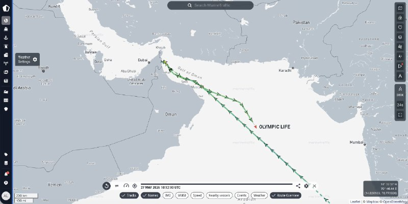

🔴سازمان UKMTO (مرکز عملیات تجارت دریایی بریتانیا) گزارشی درباره وقوع یک حادثه در ۶۰ مایل دریایی (NM) در شرق مسقط، عمان دریافت کرده است. 🔸ناخدای یک کشتی نفت‌کش، گزارشی از وقوع یک انفجار بیرونی در سمت چپ بخش عقب کشتی (Port side aft) و نزدیک به خط آب (waterline)…

## mwarmonitor — post 9822

🔰ایران ۲۴ میلیارد دلار از دارایی‌های بلوکه‌شده خود را پیش‌شرط امضای یک توافق صلح با آمریکا قرار داده است؛ از این مبلغ، گفته می‌شود ۱۲ میلیارد دلار باید هم‌زمان با اعلام توافق آزاد شود. تلگراف

@mwarmonitor

## mwarmonitor — post 9821

🔴امروز، شهرهای مهم جنوب لبنان یعنی صور و النبطیه با خطر اشغال مستقیم روبه‌رو هستند. نیروهای اسرائیلی به منطقه زوطر شرقی رسیده‌اند؛ تنها حدود پنج کیلومتر فاصله تا نبطیه وجود دارد، و هم‌زمان دستور تخلیه برای شهر صور صادر شده است.

🔸دولت لبنان قصدی برای دفاع از شهرهای خود ندارد و تنها گزینه پیشِ رو را مذاکره می‌بیند؛ موضعی که از نظر نویسنده بزدلانه و بدون هیچ شرمی توصیف شده است. پهپادهای FPV حزب‌الله می‌توانند به نیروهای پیش‌روی اسرائیل خسارت وارد کنند، اما در همین سطح نیز قادر به متوقف کردن حمله نیستند. در همین حال، شرط ایران مبنی بر عدم هدف قرار دادن بیروت و ضاحیه در این لحظه عملاً به نمادی بدون اثر عملی تبدیل شده، آن هم در شرایطی که نتانیاهو به‌دنبال ایجاد واقعیت‌های جدید در زمین است.

🔹بدون تردید، شمار بیشتری از سربازان اسرائیلی در خاک لبنان کشته خواهند شد و لبنان به باتلاقی خطرناک تبدیل می‌شود. اما در مقابل، بخش‌های بیشتری از خاک لبنان تحت اشغال قرار خواهد گرفت. روستاها طی ماه‌های گذشته به‌طور سیستماتیک ویران شده‌اند و اکنون نوبت شهرهاست.

🔸کسانی که انتظار راه‌حلی سریع در میز مذاکرات دارند، باید از این توهم دست بردارند. و کسانی که منتظر حل بحران لبنان از طریق توافقات منطقه‌ای هستند نیز چیزی به دست نخواهند آورد. آنچه من می‌بینم فراتر از یک بحران است؛ یک تحول بنیادین و فراگیر است که ممکن است سال‌ها ادامه یابد—سال‌هایی نه معمولی، بلکه طولانی، فرسایشی و ویرانگر، بدون هیچ افق روشنی. الجزیره

@mwarmonitor

## mwarmonitor — post 9820

  

🔴حساب رسمی تلگرام در پلتفرم X (توییتر سابق) به نظر می‌رسد هک شده باشد.

@mwarmonitor

## mwarmonitor — post 9819

📌 تندروهای افراطی در ایران به مذاکره‌کنندگان به‌دلیل مذاکرات با آمریکا حمله کرده‌اند. فیننشال تایمز

@mwarmonitor

## mwarmonitor — post 9818

🔴سخنگوی کاخ سفید: گزارش رسانه‌های ایرانی درباره «یادداشت تفاهم» نادرست بوده و به‌طور کامل ساختگی است.

@mwarmonitor

## mwarmonitor — post 9817

🔸رئیس‌جمهور ترکیه، رجب طیب اردوغان، در حال تلاش است تا هم‌زمان با برگزاری مسابقه فوتبال جام جهانی میان تیم‌های ترکیه و آمریکا در لس‌آنجلس ماه آینده، دیداری با دونالد ترامپ ترتیب دهد. بلومبرگ

@mwarmonitor

## mwarmonitor — post 9816

  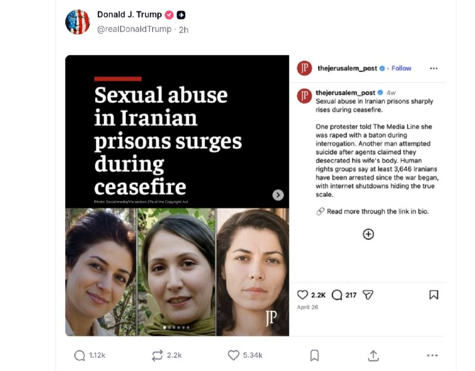

📝 دنیا چقدر مضحک و لجن‌زار شده که این دلقک کله‌زرد، گزارش جروزالم‌پست و افشاگری‌های «مدیا لاین» از شکنجه و تعرض به زنان بی‌گناهی مثل کاملیا را استوری می‌کند تا با خون و رنج آن‌ها برای هیکل بی‌ارزش خودش مشروعیت سیاسی بخرد؛ اما همین ملعبه‌ی منفعت‌طلب، مثل یک اسکولِ بی‌وجود پشت پرده دستش در دست همین تروریست‌هاست و با آن‌ها لاسِ مذاکره می‌زند. تماشای این خوکِ کراواتی که پاره شدن لباس زنان ایرانی در اتاق بازجویی را صرفاً ابزار چانه‌زنی و دکوری برای توییترش کرده، اوج سقوط شرافت در سیاستِ کثیفِ اوست.

@mwarmonitor

## mwarmonitor — post 9815

  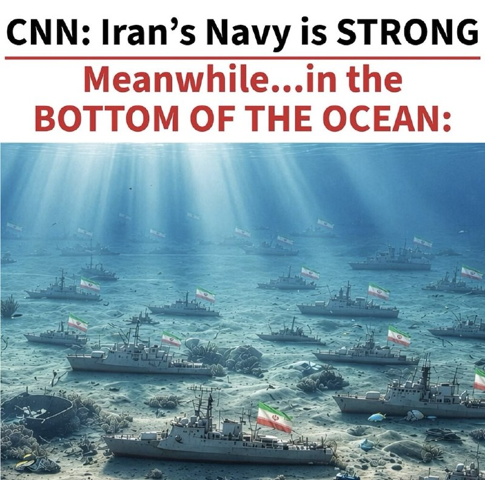

🔸ترامپ در سوشال تروث

سی‌ان‌ان: نیروی دریایی ایران قوی است
در همین حال... در کف اقیانوس:

@mwarmonitor

## mwarmonitor — post 9814

📌«کاخ سفید به الجزیره: رئیس‌جمهور ترامپ تنها توافقی را امضا خواهد کرد که به‌طور قطعی تضمین کند ایران هیچ‌گونه سلاح هسته‌ای در اختیار نداشته باشد.»

@mwarmonitor

## mwarmonitor — post 9813

🔴«هلند این هفته یک کشتی مین‌روب به مدیترانه اعزام می‌کند، با احتمال استقرار سریع در تنگه هرمز در صورت توافق بر سر یک مأموریت پس از جنگ. این کشتی ممکن است از اواسط ژوئن به گروه مقابله با مین ناتو بپیوندد.»

@mwarmonitor

## FoxNewsTwitter — post 342316

  <a href="telegram/content/FoxNewsTwitter_342316_1779901549.mp4" target="_blank">🎬 Download video</a>

Fox News (Twitter/X)

BREAKING: Secretary of War Hegseth reveals President Trump ordered the Pentagon to prioritize protecting Nigerian Christians targeted by ISIS — and says the mission quietly led to the killing of ISIS’ second-in-command in Nigeria.

Hegseth says U.S. intelligence gathered during the operation helped lead to the deaths of “hundreds” of ISIS fighters tied to attacks on Christians and threats against the U.S. homeland.

"There's a lot of things we do that the media pays attention to, and a lot of things that the president empowers the Department to do on behalf of the American people, that he deserves great credit for."

## FoxNewsTwitter — post 342315

  <a href="telegram/content/FoxNewsTwitter_342315_1779901550.mp4" target="_blank">🎬 Download video</a>

Fox News (Twitter/X)

NEW: Sec. Rubio gives an update on the "three phase" process playing out in Venezuela:

"Over 10 million barrels of Venezuelan oil have been delivered to the United States since the 3rd of January. That industry is being professionalized for the first time ever. It's going to the benefit of the Venezuelan people."

"They are selling oil in the market at market rates. The money is going to an account in the United States, controlled and monitored by Treasury, audited by KPMG. And it's, for the first time ever, the money is not being stolen. It's going to the benefit of the Venezuelan people."

## FoxNewsTwitter — post 342314

  <a href="telegram/content/FoxNewsTwitter_342314_1779901552.mp4" target="_blank">🎬 Download video</a>

Fox News (Twitter/X)

NEW: VP Vance details healthcare fraud findings to President Trump, sharing tragic stories of fraudsters taking advantage of elderly Americans and the Medicaid system:

VP VANCE: "Not only do you have an American taxpayer who's paying into these programs, you have an elderly citizen deprived of his dignity because we're not going out for the fraudsters. Well, now we are."

PRESIDENT TRUMP: "How much money did he get?"

VP VANCE: "Sir, hundreds of thousands of dollars, maybe more than that, but we think that that exact type of fraud has been replayed all over our country."

## FoxNewsTwitter — post 342313

  <a href="telegram/content/FoxNewsTwitter_342313_1779901553.mp4" target="_blank">🎬 Download video</a>

Fox News (Twitter/X)

NOW: President Trumps taps in Secretary Rubio, who's "doing a fantastic job," for an update on negotiations with Iran:

"If recent events have done anything, it's just reminded us once again that they are the world's leading sponsor of terrorism, and they can never have a nuclear weapon."

"Mr. President, your preference you've told us repeatedly, as always, to negotiate these things and to figure out if you can have agreements. Diplomacy is always the first option, and we continue to work on that through your envoys..." - Secretary Rubio

## FoxNewsTwitter — post 342312

  <a href="telegram/content/FoxNewsTwitter_342312_1779901555.mp4" target="_blank">🎬 Download video</a>

Fox News (Twitter/X)

NOW: VP Vance praises President Trump’s leadership for helping the fraud task force break down barriers, go after fraudsters, and save Americans money.

"I'll come to the president and say, Mr. President, I need your permission to do..."

"He'll say, for what? For the fraud task force. And he'll cut me off and say, yes, go do it."

## FoxNewsTwitter — post 342311

  <a href="telegram/content/FoxNewsTwitter_342311_1779901556.mp4" target="_blank">🎬 Download video</a>

Fox News (Twitter/X)

BREAKING: President Trump gives a massive shoutout to Tulsi Gabbard, commending her tireless work as Director of National Intelligence following the announcement of her resignation due to her husband’s health:

"Tulsi has worked tirelessly to restore trust and focus with the intelligence community, they all respected her. They listened to her. She gave us leads that were pretty much, people thought they were dead and they weren't dead."

"Tulsi, we're praying for you and for your husband. Her husband's not feeling great, but he's going to feel great soon. You're going to make him- you're going to get them better. And he's a wonderful guy. So just say hello and thank you for the great work you've done."

## FoxNewsTwitter — post 342310

  <a href="telegram/content/FoxNewsTwitter_342310_1779901558.mp4" target="_blank">🎬 Download video</a>

Fox News (Twitter/X)

BREAKING: President Trump blasts fraudsters, "Somalians," and Rep. Ilhan Omar for "what they've done to Minnesota."

"They're all crooks, the Somalians, and what they've done to Minnesota... They're crooked as hell."

"Ilhan Omar crooked is hell. They're all crooks."

"We got them. Now we're putting the clamps on."

## FoxNewsTwitter — post 342309

  

Fox News (Twitter/X)

NOW: President Trump comments on the sweeping success of Republican candidates with his endorsement in elections yesterday:

"Last night was incredible. Not only Texas, but so many other places, and the numbers were fantastic." https://twitter.com/FoxNews/status/2059604700979228857#m

## FoxNewsTwitter — post 342308

  <a href="telegram/content/FoxNewsTwitter_342308_1779901560.mp4" target="_blank">🎬 Download video</a>

Fox News (Twitter/X)

JUST NOW: President Trump touts his administration's economic success during today's Cabinet meeting:

"This year, the typical family got tax refunds of nearly, almost close to $5,000."

"The stock market has set 68 all-time record highs since the election. So 68 days we hit all-time highs."

"The average 401K is up almost $30,000 since I took office."

"The Americans are benefiting."

## FoxNewsTwitter — post 342307

  <a href="telegram/content/FoxNewsTwitter_342307_1779901562.mp4" target="_blank">🎬 Download video</a>

Fox News (Twitter/X)

NOW: President Trump welcomes the press to the 12th Cabinet meeting of his second term, highlighting the administration's transparency:

"We're always letting the press join us because we're very open and transparent. You like the word transparent, but we're more transparent than any any administration in history. To the best of my knowledge, press has never been invited ever to a cabinet meeting for any reason at all... It's an honor to have you."

## FoxNewsTwitter — post 342306

  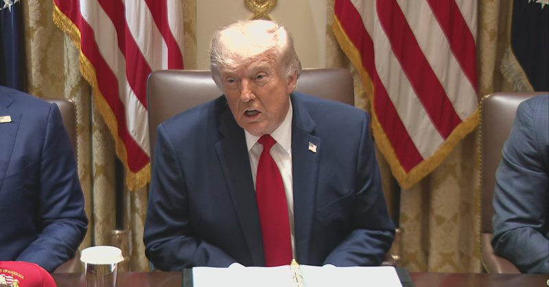

Fox News (Twitter/X)

WATCH LIVE: President Trump holds Cabinet meeting amid Iran negotiations https://twitter.com/i/broadcasts/1yxBeePLPmnJN

## FoxNewsTwitter — post 342305

  <a href="telegram/content/FoxNewsTwitter_342305_1779901564.mp4" target="_blank">🎬 Download video</a>

Fox News (Twitter/X)

The search is on for the next James Bond, and there’s reportedly a new favorite to take over the role of Agent 007, so that begs the question – who will play the next Bond girl?

Our sponsor Kalshi’s prediction market shows:
— Zendaya: 94%
— Margaret Qualley: 20%
— Sydney Sweeney: 17%
— Anya Taylor-Joy: 14%

@foxandfriends

## FoxNewsTwitter — post 342303

Fox News (Twitter/X)

NEW: President Trump jokingly congratulates the Democrats for longtime Texas congressman and Trump critic Al Green losing his house seat in last night's Texas primary.

"I will miss that lunatic not screaming and violently waving his cane at me during my next State of the Union Speech."

## FoxNewsTwitter — post 342302

  <a href="telegram/content/FoxNewsTwitter_342302_1779901565.mp4" target="_blank">🎬 Download video</a>

Fox News (Twitter/X)

RT @FoxNewsEnt: Russell Crowe confronts swarming autograph seekers outside his Paris hotel, laying down ground rules before signing a single item. 'As soon as somebody's a d---, I'm going. You got me? Clear?' The moment split the internet — some called him 'very disrespectful,' others praised him for setting boundaries while still signing for every fan in the crowd.

🎥: Best Image / BACKGRID

## FoxNewsTwitter — post 342301

Fox News (Twitter/X)

RT @AmericaNewsroom: 🚨HIGH-STAKES MEETING: President Trump now set to gather his cabinet at the White House amid tense negotiations with Iran. The President says the U.S. will either agree to a good deal, or no deal at all.

@TreyYingst reports.

## pm_afshaa — post 91666

🔴پیت هگست:آنها ممکن است موشک داشته باشند، اما در حال حاضر نمی‌توانند موشک‌های بیشتری بسازند. نمی‌توانند پهپادهای بیشتری بسازند. نمی‌توانند کشتی‌های بیشتری بسازند. آمدند و تسلیم شدند تا صحبت کنند

💧 Rainbet.com the #1 Non-KYC Crypto Casino & Sportsbook @rainbetcom

😁 @Pm_Afshaa

## pm_afshaa — post 91665

vless://76bc8e3d-0e6b-4a35-b1a7-7f5158042666@45.76.83.35:54985?encryption=none&security=none&type=tcp&headerType=none#PMTV%20NEWS%20%F0%9F%A6%81%E2%98%80%EF%B8%8F

نپسترنت نا محدود سرعت بالا

💧 Rainbet.com the #1 Non-KYC Crypto Casino & Sportsbook @rainbetcom

😁 @Pm_Afshaa

## pm_afshaa — post 91664

🔴ترامپ :قرار نیست تحریم های ایران برداشته بشه. حتی اگه اورانیوم غنی شدش رو هم تحویل بده هیچ تحریمی کاهش پیدا نمیکنه

💧 Rainbet.com the #1 Non-KYC Crypto Casino & Sportsbook @rainbetcom

😁 @Pm_Afshaa

## pm_afshaa — post 91663

🔴ترامپ: ایرانی‌ها فکر می‌کنند من به‌خاطر انتخابات میان‌دوره‌ای جنگ را تمام می‌کنم اما من اهمیتی نمی‌دهم

💧 Rainbet.com the #1 Non-KYC Crypto Casino & Sportsbook @rainbetcom

😁 @Pm_Afshaa

## pm_afshaa — post 91662

#مهم
عزیزای دلم همگی الان چنل زاپاس‌مون رو جوین بشید کانال تحت ریپورت شدیده اگه چیزی شد زاپاس رو داشته باشید فعالیت میاد اونور
👇

https://t.me/Pm_Zapas
https://t.me/Pm_Zapas

## pm_afshaa — post 91661

  <a href="telegram/content/pm_afshaa_91661_1779901566.mp4" target="_blank">🎬 Download video</a>

پشماتون بریزه، اینجا کردستان نیست، اینجا آلمانه که ایرانیا و کُردا فتحش کردن! تهشم دارن کردی میرقصن

💧 Rainbet.com the #1 Non-KYC Crypto Casino & Sportsbook @rainbetcom

😁 @Pm_Afshaa

## pm_afshaa — post 91660

🔴کاخ سفید :هیچ‌کس نباید به آنچه رسانه‌های دولتی ایران منتشر می‌کنند اعتماد کند

💧 Rainbet.com the #1 Non-KYC Crypto Casino & Sportsbook @rainbetcom

😁 @Pm_Afshaa

## pm_afshaa — post 91659

vless://406d8436-0eb9-4eb2-84fb-960e076ffba6@162.159.38.183:2083?encryption=none&security=tls&sni=de.lezzatzone.ir&alpn=h2%2Chttp%2F1.1&fp=chrome&type=tcp&headerType=none#%40Glitch_Config

نامحدود سرعت موشکی
🚀

💧 Rainbet.com the #1 Non-KYC Crypto Casino & Sportsbook @rainbetcom

😁 @Pm_Afshaa

## pm_afshaa — post 91658

🟠کاخ سفید در توییتر به طور غیرمستقیم گزارش رسانه‌های دولتی جمهوری اسلامی تروریست درباره پیش‌نویس تفاهم‌نامه بین آمریکا و ج.ا را رد کرد

💧 Rainbet.com the #1 Non-KYC Crypto Casino & Sportsbook @rainbetcom

😁 @Pm_Afshaa

## pm_afshaa — post 91657

🔴مهر: یک ساختمان اداری در فرودگاه امام خمینی آتش گرفت

💧 Rainbet.com the #1 Non-KYC Crypto Casino & Sportsbook @rainbetcom

😁 @Pm_Afshaa

## pm_afshaa — post 91656

ترولیتر 
😈
🔥

میم 
✔ توییت 
✔ خبر 
✔ پروکسی رایگان
✔

همین الان جوین شو و آنلاین بمون 
👇
👇

https://t.me/trolliter
https://t.me/trolliter

## pm_afshaa — post 91655

🔴ارتش اسرائیل در اقدامی فوری دستور تخلیه کامل شهر بندری صور، بزرگ ترین شهر جنوب لبنان به همراه تمام روستاهای اطراففش رو صادر کرد

💧 Rainbet.com the #1 Non-KYC Crypto Casino & Sportsbook @rainbetcom

😁 @Pm_Afshaa

## DEJradio — post 5039

  <a href="telegram/content/DEJradio_5039_1779901566.mp4" target="_blank">🎬 Download video</a>

🔺🎥 رسانه‌های داخلی از وقوع آتش‌سوزی در یکی از برج‌های شهرک چیتگر تهران خبر دادند علت حادثه، میزان تلفات و خسارت مشخص نیست.

#آتشسوزی #چیتگر
@DEJradio

## DEJradio — post 5038

  <a href="telegram/content/DEJradio_5038_1779901568.webm" target="_blank">🎬 Download video</a>

🔺📢 رئیس ستاد کل ارتش اسرائیل:
پایه‌های حکومت آیت‌الله‌ها ترک برداشته است

ایال زمیر، رئیس ستاد کل ارتش اسرائیل گفت پایه‌های حکومت آیت‌الله‌ها به‌طرز قابل توجهی ترک برداشته است. به گفته این مقام ارشد نظامی اسرائیل، آینده و ثبات نظام جمهوری اسلامی در هاله‌ای از ابهام فرو رفته است.

ایال زمیر یادآوری کرد سران جمهوری اسلامی تحت تعقیب قرار دارند و اصلی‌ترین توانایی‌های نظامی حکومت نابود شده است. زمیر همچنین گفت برنامه هسته‌ای جمهوری اسلامی سال‌ها به عقب رانده شده و اقتصاد کشور در حال فروپاشی است.

#رژیم_آخوندی #اسرائیل
@DEJradio

## VahidOnline — post 75757

  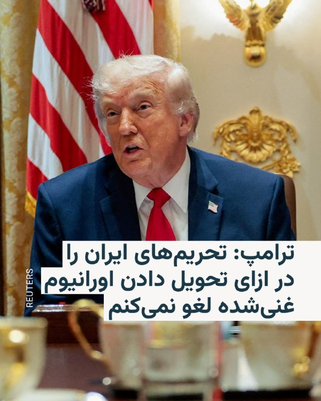

دونالد ترامپ، رئیس‌جمهور آمریکا، روز چهارشنبه گفت که ایران در ازای کنار گذاشتن اورانیوم با غنای بالای خود، از لغو تحریم‌ها توسط واشینگتن برخوردار نخواهد شد و از پیشنهادات ایران برای توافق پایان جنگ ابراز نارضایتی کرد.

ترامپ پیش از برگزاری جلسه کابینه خود در یک تماس تلفنی کوتاه با شبکه پی‌بی‌اس نیوز، در پاسخ به این سوال که آیا توافق فعلی به این معناست که ایران در ازای لغو تحریم‌ها، اورانیوم با غنای بالای خود را واگذار خواهد کرد، گفت: «نه، نه، اصلاً. خبری از لغو تحریم‌ها نیست، نه.»
او اضافه کرد: «آن‌ها قرار است اورانیوم با غنای بالای خود را کنار بگذارند، نه در ازای لغو تحریم‌ها. نه، نه، اصلاً.»

ایران بیش از ۴۰۰ کیلو اورانیوم غنی شده تا حد ۶۰ درصد دارد که در تأسیسات زیرزمینی هدف قرار گرفته در جنگ ۱۲ روزه سال گذشته مدفون است.
رئیس‌جمهور ایالات متحده ساعتی بعد در ابتدای نشست کابینه خود در کاخ سفید گفت که ایران بسیار مایل است به توافق برسد، اما آمریکا هنوز از توافق پیشنهادی رضایت ندارد.

ترامپ در این نشست در حضور خبرنگاران گفت: «ایران خیلی مصمم است، آن‌ها خیلی می‌خواهند که به توافق برسند. تا اینجا هنوز موفق نشده‌اند... ما از آن راضی نیستیم، اما خواهیم شد.»
او سپس بار دیگر ایران را به ازسرگیری حملات نظامی تهدید کرد: «یا به آن نقطه می‌رسیم، یا اینکه مجبور می‌شویم کار را یکسره کنیم.»
@VahidHeadline

📡 @VahidOnline

## VahidOnline — post 75756

  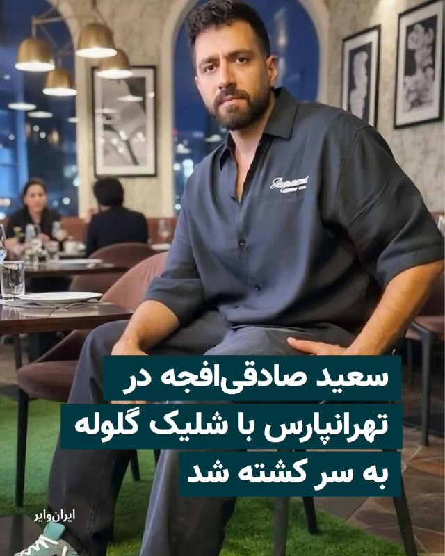

⚠️تصاویر دلخراش از اجساد مردم کشته‌شده در بیمارستان تهرانپارس تهران 
⚠️ دو روز پیش ویدیوی دوم رو با تردید منتشر کرده بودم و نوشته بودم نمی‌دونم درسته یا نه. حالا عکس‌هایی از بیمارستان تهرانپارس با شرح جان‌باختگان ۱۸ و ۱۹ دی دریافت کردم که نشون میدن اون ویدیو…

## VahidOnline — post 75755

  <a href="telegram/content/VahidOnline_75755_1779901569.mp4" target="_blank">🎬 Download video</a>

دونالد‌ ترامپ، رئیس‌جمهوری آمریکا، چهارشنبه ششم خرداد، در نشست کابینه در کاخ سفید درباره مذاکرات با جمهوری اسلامی گفت تهران «بسیار مشتاق» توافق است، اما مذاکرات هنوز به نتیجه نهایی نرسیده است.

ترامپ گفت: ما از وضعیت فعلی راضی نیستیم ولی خواهیم شد.

رئیس‌جمهوری آمریکا همچنین جمهوری اسلامی را تحت فشار شدید توصیف کرد و گفت: «نیروی دریایی‌شان نابود شده، نیروی هوایی از بین رفته و همه‌چیزشان از دست رفته است.»

ترامپ افزود جمهوری اسلامی «در حالی مذاکره می‌کند که چیزی برایش باقی نمانده» و هشدار داد اگر توافق حاصل نشود، آمریکا ممکن است «برگردد و کار را تمام کند.»

ترامپ گفت: «آنها تازه دوباره به اینترنت برگشته‌اند، چون به‌شدت تحت فشار قرار گرفته‌اند.»

او همچنین گفت اقتصاد ایران «در حال سقوط آزاد» است و تهران به‌دلیل فشارهای سنگین، گزینه دیگری جز حرکت به‌سوی توافق ندارد.
@VahidOOnLine

📡 @VahidOnline

## VahidOnline — post 75753

خبرگزاری فارس به نقل از «منابع آگاه» گزارش داد که دونالد ترامپ، رئیس‌جمهوری آمریکا، ممکن است در ساعات آینده به‌صورت یک‌طرفه اعلام کند که توافق میان ایران و آمریکا نهایی شده است؛ اقدامی که به گفته این منابع می‌تواند با هدف اعمال فشار سیاسی و اثرگذاری بر افکار عمومی انجام شود، پیش از آنکه اختلافات باقی‌مانده به‌طور کامل برطرف شود.

بر اساس این گزارش، این سناریو در حالی مطرح شده که هنوز برخی موضوعات میان دو طرف حل‌نشده باقی مانده و روند مذاکرات به مرحله نهایی نرسیده است.
در همین زمینه، یک عضو تیم مذاکره‌کننده ایرانی در گفتگو با فارس تاکید کرده است که تا زمانی که همه موارد مورد نظر ایران حل و فصل نشود، هیچ توافقی قابل اعلام نخواهد بود.
به گفته این منبع، جمهوری اسلامی ایران تنها در صورتی که اختلافات به‌طور کامل برطرف شود، نتیجه مذاکرات را به‌صورت رسمی اعلام خواهد کرد و هیچ توافقی پیش از رسیدن به جمع‌بندی نهایی، مورد تایید تهران نخواهد بود.
@VahidOOnLine

📡 @VahidOnline

## VahidOnline — post 75749

  <a href="telegram/content/VahidOnline_75749_1779901569.mp4" target="_blank">🎬 Download video</a>

#آتش‌سوزی در یکی از برج‌های مجتمع مسکونی پامچال در چیتگر #تهران
تصاویر دریافتی + منتشرشده، چهارشنبه ۶ خرداد
Vahid

📡 @VahidOnline

## VahidOnline — post 75748

  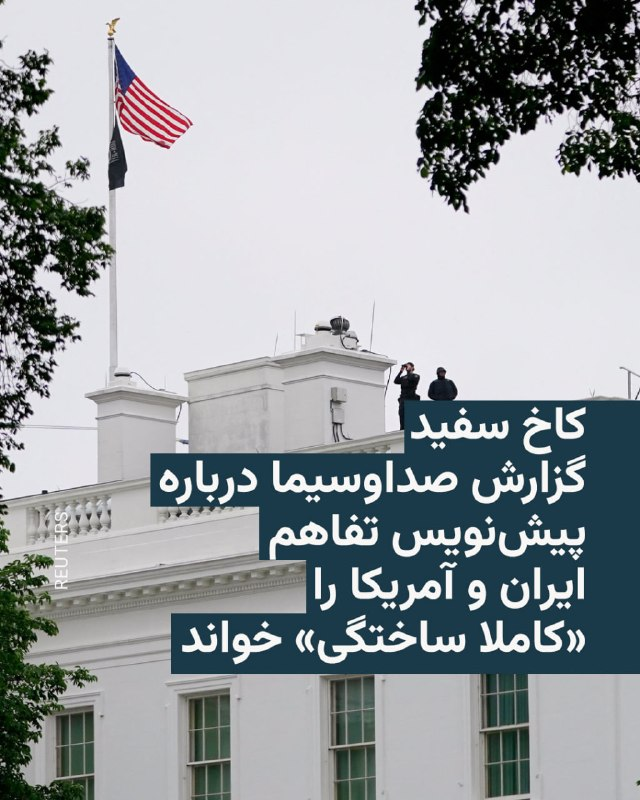

کاخ سفید روز چهارشنبه اعلام کرد گزارشی که از سوی صداوسیمای جمهوری اسلامی منتشر شده و به پیش‌نویس یک چارچوب اولیه و غیررسمی برای تفاهم‌نامه میان ایران و ایالات متحده اشاره داشت، «صحیح نیست» و تفاهم‌نامه مورد اشاره «کاملاً ساختگی» است.

تلویزیون حکومتی ایران ساعتی قبل گزارش داده بود که پیش‌نویس یک توافق چارچوبی با ایالات متحده شامل تعهد به لغو محاصره دریایی ایران، بازگرداندن رفت‌وآمد در تنگه هرمز و خروج نیروهای آمریکایی از منطقه خلیج فارس است.

کاخ سفید در بیانیه‌ای اعلام کرد: «این گزارش رسانه‌های تحت کنترل ایران حقیقت ندارد و تفاهم‌نامه‌ای که آنها منتشر کرده‌اند کاملاً ساختگی است. هیچ‌کس نباید آنچه رسانه‌های دولتی ایران منتشر می‌کنند را باور کند. واقعیت‌ها اهمیت دارند.»

گزارش صداوسیما مدعی شده بود که آمریکا متعهد به رفع محاصره دریایی ایران شده و در مقابل، ایران تعهد داده تعداد کشتی‌های عبوری تجاری را طی یک ماه به سطح پیش از تنش‌ها بازگرداند.

تلویزیون جمهوری اسلامی همچنین گفته بود بر اساس این پیش‌نویس، «مدیریت و مسیر عبور و مرور» کشتی‌ها با ایران و همکاری عمان انجام خواهد شد و آمریکا تعهد داده نیروهای نظامی این کشور از «محیط پیرامونی ایران خارج شوند».
@VahidHeadline

📡 @VahidOnline

## VahidOnline — post 75747

  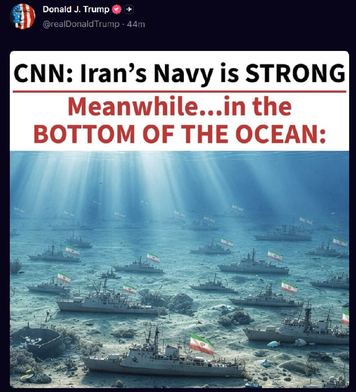

دونالد‌ ترامپ، رئیس‌جمهوری آمریکا، چهارشنبه ششم خرداد در شبکه اجتماعی تروث سوشال با انتشار تصویری ساخته‌شده با هوش مصنوعی، از شبکه سی‌ان‌ان انتقاد کرد و نوشت این رسانه نیروی دریایی جمهوری اسلامی را قدرتمند نشان می‌دهد، در حالی که شناورهای ایران در اقیانوس غرق شده‌اند.

در این تصویر، جمله «سی‌ان‌ان: نیروی دریایی ایران قدرتمند است» در کنار تصویری از شناورهای غرق‌شده جمهوری اسلامی در کف اقیانوس دیده می‌شود.
@VahidOOnLine

📡 @VahidOnline

## VahidOnline — post 75746

  

‏گروهی از کاربران در شبکه اجتماعی ایکس (توییتر سابق) پست‌های انتقادی گزارش‌گونه از تحولات و رویدادهای سیاسی خارج از ایران منتشر می‌کنند، خطاب به شهروندانی که پس از حدود سه ماه به‌طور تدریجی با فیلترشکن موفق می‌‌شوند به اینترنت وصل شوند.

‏این پست‌ها که با عبارت‌هایی مانند «وقتی شما نبودید» یا «بچه‌های ایران که تازه وصل شده‌اید» آغاز می‌شود، همزمان با کاهش تدریجی اختلال در دسترسی به اینترنت، به محلی برای مستندسازی و بازاندیشی انتقادی نسبت به تحولات سیاسی‌ ۸۸ روز گذشته تبدیل شده است.
@VahidHeadline
دوستانی که تازه وصل شدن یدونه «سلام وحید جان» سرچ کنید آرشیو کامل از اندر احوالات ایرانی جماعت در زمان قطعی نت رو براتون میاره
iamroyaz

📡 @VahidOnline

## VahidOnline — post 75745

  <a href="telegram/content/VahidOnline_75745_1779901571.mp4" target="_blank">🎬 Download video</a>

خبرگزاری صداوسیما اعلام کرد به یک سند غیررسمی اولیه از چارچوب ۱۴ بندی تفاهم احتمالی میان ایران و آمریکا دسترسی پیدا کرده، سندی که به گفته رسانه‌های ایرانی، هنوز نهایی نشده اما حاوی جزئیاتی درباره وضعیت تنگه هرمز و حضور نظامی آمریکا در منطقه است.

بر اساس این گزارش، در پیش‌نویس منتشرشده آمده است که آمریکا متعهد می‌شود نیروهای نظامی خود را از اطراف ایران خارج کرده و محاصره دریایی را متوقف کند. در مقابل، تهران نیز تعهد می‌دهد ظرف مدت یک ماه، عبور کشتی‌های تجاری از تنگه هرمز را به سطح پیش از جنگ بازگرداند.

طبق مفاد این سند، کشتی‌های نظامی مشمول توافق نخواهند بود و مدیریت مسیر حرکت کشتی‌های تجاری در تنگه هرمز با همکاری ایران و سلطنت عمان انجام می‌شود.

صداوسیما همچنین گزارش داد که هنوز چارچوب نهایی تفاهم تدوین نشده و ایران تاکید کرده بدون وجود «سازوکار راستی‌آزمایی» یا همان مکانیزم اطمینان، هیچ اقدام عملی انجام نخواهد داد.
در بخش دیگری از این گزارش آمده است که اگر دو طرف طی ۶۰ روز آینده به توافق نهایی برسند، این تفاهم می‌تواند در قالب یک قطعنامه الزام‌آور در شورای امنیت سازمان ملل تصویب شود.
@VahidOOnLine

🔄 آپدیت:
کاخ سفید: گزارش رسانه‌های جمهوری اسلامی درباره تفاهم‌نامه تهران و واشینگتن کاملا ساختگی است

کاخ سفید گزارش رسانه‌های جمهوری اسلامی درباره بندهای تفاهم‌نامه احتمالی را «کاملا ساختگی» خواند و گفت نباید به روایت رسانه‌های جمهوری اسلامی اعتماد کرد
@VahidOOnLine

📡 @VahidOnline

## VahidOnline — post 75744

  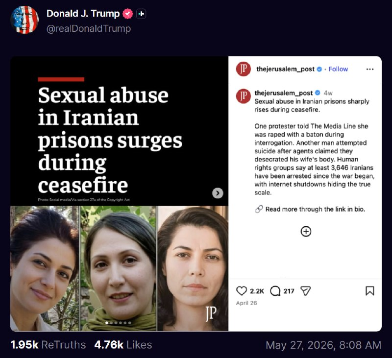

دونالد ترامپ در تروث‌سوشال گزارشی از جروزالم‌پست را بازنشر کرد که بر اساس اطلاعات اختصاصی «مدیا لاین» نوشته است موارد آزار و تعرض جنسی به زنان بازداشت‌شده، به‌ویژه زنان جوان، در زندان‌ها و بازداشتگاه‌های جمهوری اسلامی در دوران آتش‌بس افزایش یافته است.

در این گزارش، زنی جوان به نام کاملیا گفته پس از بازداشت خشونت‌آمیز در خانه‌اش، دو هفته همراه هشت زن دیگر، از جمله دختری ۱۶ ساله که با ساچمه از ناحیه صورت زخمی شده بود، در اتاقی ۲۰ متری نگهداری شد.

به گفته کاملیا، او پس از انتقال به سلول انفرادی و خودداری از اعتراف اجباری، در اتاق بازجویی هدف خشونت قرار گرفت، لباس‌هایش پاره شد، با باتوم مورد تجاوز قرار گرفت، به‌شدت کتک خورد و به تجاوز گروهی تهدید شد.

جروزالم‌پست همچنین با اشاره به قطع گسترده اینترنت، بازداشت‌ها، ناپدیدسازی قهری، آدم‌ربایی، تهدید روزنامه‌نگاران و مخالفان در خارج از کشور و افزایش ناگهانی اعدام مخالفان نوشت سرکوب در ایران تشدید شده است.

دونالد ترامپ پیش‌تر نیز با انتشار پستی در تروث سوشال خواستار آزادی هشت زندانی سیاسی زن در ایران شده بود.
@VahidOOnLine

📡 @VahidOnline

## VahidOnline — post 75742

وزارت اطلاعات جمهوری اسلامی روز چهارشنبه ششم خرداد هشدار داد که بعد از جنگ اخیر، «برخی کمبودها و گرانی‌ها» در پی فشارهای اقتصادی آمریکا می‌تواند باعث بروز ناآرامی‌های تازه در ایران شود.

این وزارتخانه در بیانیه‌ای مدعی شد که «تشدید فشارهای اقتصادی و متعاقب آن، انجام تحریکات گوناگون اجتماعی توسط عوامل دشمن و رسانه‌های مزدور فارسی‌زبان بیگانه، با سوء استفاده از برخی کمبودها و گرانی‌ها» یکی از محورهای مورد توجه آمریکا و اسرائیل است.

هشدار درباره احتمال ناآرامی همزمان با افزایش شدید نرخ تورم و و گرانی کالاها و همچنین انتشار گزارش‌هایی درباره کاهش شدید درآمدهای دولت جمهوری اسلامی در پی هفته‌ها محاصره دریایی آمریکا و سقوط شدید صادرات نفت ایران مطرح شده است.

این در حالی است که اعتراضات دی‌ماه سال گذشته نیز بعد از افزایش مداوم نرخ ارز در بازار و مناطق تجاری ایران آغاز و بعد از چند روز با افزایش تعداد معترضان، با خشونت شدید نیروهای امنیتی و کشتار هزاران نفر مواجه شد.

وزارت اطلاعات همچنین درباره «عملیات تروریستی و تجاوزات مرزی بویژه در شمال غرب و جنوب شرق ایران» و انواع عملیات «ترور و خرابکاری» هشدار داده و مدعی شده که آمریکا و اسرائیل به دنبال وارد کردن «انواع سلاح، مهمات و ابزار ارتباطی غیرقانونی، بویژه استارلینک» به ایران هستند.
ابراز نگرانی از رواج اینترنت ماهواره‌ای استارلینک در حالی است که بعد از ۸۸ روز قطع سراسری اینترنت در ایران، از روز سه‌شنبه شهروندان توانسته‌اند به شکل تدریجی و محدود به برخی سرویس‌های اینترنت جهانی دسترسی پیدا کنند.
@VahidHeadline
این بیانیه که با عنوان «سخنی با ولی‌نعمتان و هشداری به دشمنان» در رسانه‌های داخلی ایران منتشر شده، ادعا می‌کند که «دشمن شکست خورده در جنگ نظامی، بدنبال تولید دستآورد برای خویش، گرچه از طریق جنگ نرم، می‌باشد.»
این بیانیه در حالی صادر می‌شود که اسماعیل خطیب، وزیر اطلاعات جمهوری اسلامی در سومین هفته جنگ در حمله اسرائیل کشته شد و دولت هنوز جانشینی برای او معرفی نکرده است.

وزارت اطلاعات در این بیانیه علاوه بر اسرائیل و آمریکا، بریتانیا و اروپا را به همراهی با این دو قدرت متهم و کشورهای عرب حاشیه خلیج فارس را به‌عنوان «غلامان متمول» مسئول تامین مالی «جنگ ترکیبی تمام عیار» علیه «مردم قهرمان ایران» معرفی کرده است.
وزارت اطلاعات در این بیانیه معترضان و مخالفان جمهوری اسلامی در خارج از ایران را تهدید کرد و نوشت: «مزدوران ضد انقلاب و تروریست‌های مقیم خارج کشور و حامیان آن‌ها نیز از آتشی که می‌افروزند در امان نخواهند بود.»
@VahidOOnLine

📡 @VahidOnline

## IranIntlTV — post 339274

  <a href="telegram/content/IranIntlTV_339274_1779901572.mp4" target="_blank">🎬 Download video</a>

یک شهروند با ارسال پیامی به ایران‌اینترنشنال می‌گوید به دلیل شرایط موجود از جمله اعدام‌ها و مشکل معیشتی از وصل شدن اینترنت در ایران خوشحال نیست. پیام او با هوش مصنوعی خوانده شده است.

## IranIntlTV — post 339273

  <a href="telegram/content/IranIntlTV_339273_1779901573.mp4" target="_blank">🎬 Download video</a>

تیتراول با نیوشا صارمی، چهارشنبه ۶ خرداد

@iranintltv

## IranIntlTV — post 339272

  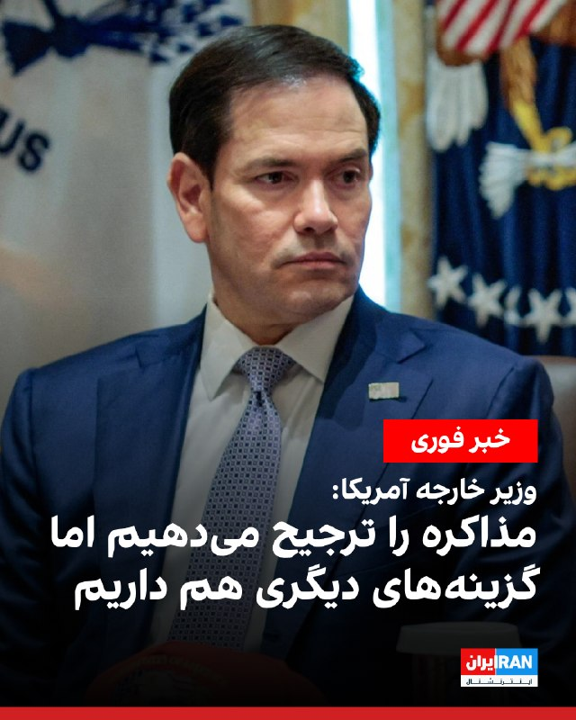

مارکو روبیو، وزیر خارجه آمریکا، در جلسه کابینه در کاخ سفید گفت نتیجه نهایی این است که ایران هرگز نباید سلاح هسته‌ای داشته باشد. او افزود وقایع اخیر بار دیگر یادآوری کرده که ایران بزرگ‌ترین حامی تروریسم در جهان است و نمی‌تواند به چنین سلاحی دست یابد.

روبیو تاکید کرد ترجیح رییس‌جمهور همواره مذاکره و تلاش برای دستیابی به توافق از مسیر دیپلماسی بوده است و این روند از طریق استیو ویتکاف، جرد کوشنر و معاون رییس‌جمهور ادامه دارد.

او گفت اگر توافقی قابل دستیابی باشد، آمریکا خواهان انجام آن است و نشانه‌هایی از پیشرفت دیده می‌شود. با این حال، اگر دیپلماسی نتیجه ندهد، گزینه‌های دیگری نیز در اختیار رییس‌جمهور است. روبیو تصریح کرد تا زمانی که ترامپ رییس‌جمهور باشد، ایران هرگز به سلاح هسته‌ای دست نخواهد یافت.
https://iranintl.com/202605278237

## IranIntlTV — post 339270

  <a href="telegram/content/IranIntlTV_339270_1779901575.mp4" target="_blank">🎬 Download video</a>

دونالد ترامپ در نشست کابینه در کاخ سفید درباره مذاکرات با جمهوری اسلامی گفت: «ایران نمی‌تواند بمب هسته‌ای داشته باشد. ممکن است مجبور شویم به آنجا برویم و کار را تمام کنیم.»
@iranintltv

## IranIntlTV — post 339269

  

دونالد ترامپ، رییس‌جمهوری آمریکا، چهارشنبه در نشست کابینه گفت جمهوری اسلامی به‌شدت خواهان دستیابی به توافق است، اما آمریکا هنوز از آن راضی نیست.

ترامپ پیش‌تر گفت تهران در ازای واگذاری و تحویل اورانیوم با غنای بالا، هیچ امتیاز یا کاهش تحریمی دریافت نخواهد کرد.
https://iranintl.com/202605273857

## IranIntlTV — post 339268

  <a href="https://t.me/IranintlTV/339268" target="_blank">📎 Download file</a>

🎧نسخه صوتی اخبار شبانگاهی | چهارشنبه ۶ خرداد
@iranintlTV

## IranIntlTV — post 339267

  

خبرگزاری فارس، وابسته به سپاه پاسداران، به نقل از منابع آگاه نوشت دونالد ترامپ، رییس‌جمهوری آمریکا، ممکن است در ساعات آینده به‌صورت یک‌طرفه اعلام کند که توافق جمهوری اسلامی و آمریکا نهایی شده است.

فارس نوشت این اقدام احتمالی از سوی ترامپ با هدف اعمال فشار و القای توافق به افکار عمومی، پیش از رفع کامل اختلافات، ارزیابی می‌شود.

با این حال، یک عضو تیم مذاکره‌کننده جمهوری اسلامی در گفت‌وگو با فارس تاکید کرد هنوز برخی موارد حل‌نشده باقی مانده و تا زمانی که همه موضوعات مدنظر جمهوری اسلامی حل نشود، «هیچ توافقی در کار نخواهد بود».

به گفته این منبع، جمهوری اسلامی در صورت رفع کامل این موارد، رسما نتیجه را اعلام خواهد کرد.
https://iranintl.com/202605279960

## IranIntlTV — post 339266

  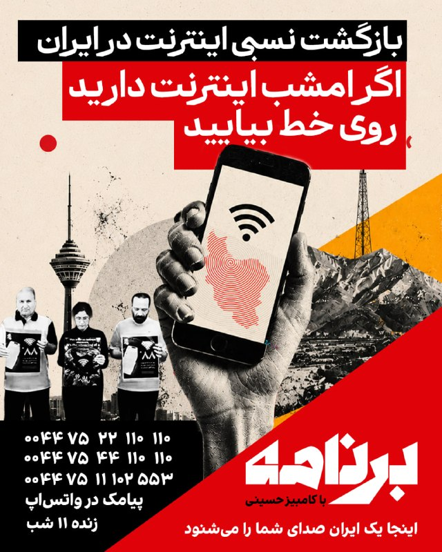

اینترنت ایران به‌طور نسبی برگشته و مردم ایران دیشب در «برنامه» توانستند صدای خود را به ایران برسانند. امشب هم، بدون این‌که موضوع مشخصی داشته باشیم، «برنامه» را در اختیار شما می‌گذاریم تا بیایید و هر حرفی را که دارید، با ایران در میان بگذارید؛ پس اگر امشب اینترنت دارید، روی خط بیایید.

«برنامه» صدای شماست.
ما شما را، بدون نوبت، مستقیم از ایران روی خط می‌آوریم.
بیایید و روایت خود را برای همیشه ثبت کنید.
تاریخ با صدای شما نوشته می‌شود.

برای شرکت در برنامه، همین حالا در واتس‌اپ پیام بدهید:
۰۰۴۴۷۵۲۲۱۱۰۱۱۰
۰۰۴۴۷۵۴۴۱۱۰۱۱۰
۰۰۴۴۷۵۱۱۱۰۲۵۵۳
«برنامه با کامبیز حسینی»
«یک ایران صدای شما را می‌شنود»
@iranintltv

## IranIntlTV — post 339265

  

دونالد ترامپ در گفت‌وگو با پی‌بی‌اس‌نیوز اعلام کرد که تهران در ازای واگذاری و تحویل اورانیوم با غنای بالا، هیچ امتیاز یا کاهش تحریمی دریافت نخواهد کرد و چنین توافقی شامل لغو تحریم‌ها نمی‌شود.
https://iranintl.com/202605272170

## IranIntlTV — post 339264

  <a href="telegram/content/IranIntlTV_339264_1779901578.mp4" target="_blank">🎬 Download video</a>

پس از ۸۸ روز قطعی، اینترنت به‌صورت محدود و فیلترشده دوباره در ایران در دسترس قرار گرفته، اتفاقی که بار دیگر ارتباط ایرانیان داخل و خارج کشور را برقرار کرده و شبکه‌های اجتماعی را پر از واکنش‌های تازه کرده است.

عادله بورنگ، عضو تحریریه ایران‌اینترنشنال، به واکنش کاربران می‌پردازد
@iranintltv

## IranIntlTV — post 339263

  <a href="telegram/content/IranIntlTV_339263_1779901579.mp4" target="_blank">🎬 Download video</a>

مجتبی خامنه‌ای برای اولین بار اسرائیل را تهدید کرد که تا ۱۵ سال آینده نابود می‌شود. وزیر خارجه اسرائیل هم او را به سرنوشت علی خامنه‌ای ارجاع داد. او در حالی این تهدید را مطرح کرده که از بیم نفوذ موساد، از سه ماه پیش مخفی شده و جسد پدرش هنوز در یخچال است.

گزارشی از مجتبا پورمحسن
@iranintltv

## IranIntlTV — post 339262

  <a href="telegram/content/IranIntlTV_339262_1779901581.mp4" target="_blank">🎬 Download video</a>

یک شهروند با ارسال پیامی به ایران‌اینترنشنال می‌گوید به دلیل شرایط موجود از جمله اعدام‌ها و مشکل معیشتی از وصل شدن اینترنت در ایران خوشحال نیست. پیام او با هوش مصنوعی خوانده شده است.

## IranIntlTV — post 339261

  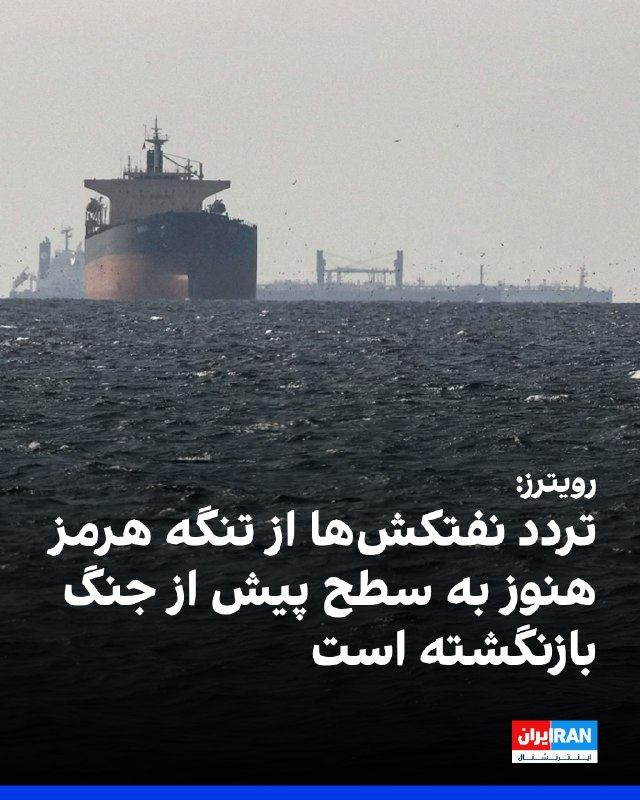

خبرگزاری رویترز گزارش داد یک نفتکش حامل فرآورده‌های نفتی متعلق به گروه کشتیرانی چینی کاسکو، چهارشنبه در حال عبور از تنگه هرمز بود؛ با این حال داده‌های کشتیرانی نشان می‌دهد تردد نفتکش‌ها در این مسیر همچنان محدود است.

بر اساس این گزارش، پیش از آغاز جنگ علیه ایران در اسفند ۱۴۰۴، میانگین تردد روزانه کشتی‌ها از تنگه هرمز بین ۱۲۵ تا ۱۴۰ عبور بود، اما از آن زمان میانگین کلی عبور روزانه حدود ۱۱ کشتی بوده است.

داده‌های رهگیری نشان می‌دهد در یک روز گذشته دو نفتکش حامل نفت خام نیز از تنگه هرمز عبور کرده‌اند و ۹ کشتی دیگر وارد خلیج فارس شده یا از آن خارج شده‌اند.

شرکت کارگزاری نفتکش گیبسون اعلام کرد با وجود نشانه‌هایی از افزایش عبور نفتکش‌ها، جریان انتقال نفت و فرآورده‌های نفتی در مقایسه با دوران پیش از جنگ همچنان بسیار محدود است و بازگشت تردد به سطح پیشین به تضمین‌های امنیتی، پاکسازی مین‌ها و چارچوب تازه بیمه‌ای نیاز دارد.
https://iranintl.com/202605278755

## IranIntlTV — post 339260

  

🔻نیمار، ستاره تیم ملی برزیل، نگرانی‌ها درباره آخرین مصدومیتش را رد کرد و گفت مشکلی برای حضور در جام جهانی ۲۰۲۶ ندارد. او در گفت‌وگو با خبرنگاران درباره شرایط خود گفت: «مشکل چیه؟ کاملا سالم هستم.»

🔹ستاره ۳۴ ساله برزیلی که برای سانتوس بازی می‌کند، سه‌شنبه شب از روی سکوهای ورزشگاه ویلا بلمیرو پیروزی ۳ بر صفر تیمش مقابل دپورتیوو کوئنکا در کوپا سودامریکانا را تماشا کرد؛ دیداری که توجه خبرنگاران را به وضعیت جسمانی او جلب کرد.

🔹نیمار اخیرا در مسابقه مقابل کوریتیبا دچار التهاب در ناحیه ساق پا شد و همین مسئله نگرانی‌‌هایی درباره آمادگی او برای جام جهانی ایجاد کرد. با این حال، او در پاسخ به سوال خبرنگاران درباره وضعیت پایش گفت: «اینجاست، کاملا سالم!»

🔹وقتی خبرنگاران از او پرسیدند آیا این مشکل می‌تواند برای حضورش در جام جهانی دردسرساز شود، نیمار با لحنی تند پاسخ داد: «مشکل چیه؟» او با این پاسخ کوتاه تلاش کرد به شایعات درباره احتمال غیبتش در جام جهانی پایان دهد.

@iranintltvsport

## IranIntlTV — post 339259

  <a href="telegram/content/IranIntlTV_339259_1779901584.mp4" target="_blank">🎬 Download video</a>

افزایش قیمت محصولات بهداشتی در ایران پس از جنگ، بسیاری از زنان و دختران را ناچار به استفاده از گزینه‌های غیربهداشتی کرده است.

آیه دریس، عضو تحریریه ایران‌اینترنشنال، به مناسبت روز جهانی بهداشت قاعدگی، در «پیوست» درباره بهداشت زنان در ایران و چالش‌های پیش‌ روی آنان می‌گوید
@iranintltv

## IranIntlTV — post 339258

  

وزارت خارجه فرانسه به العربیه اعلام کرد پاریس بخشی از جنگ در منطقه نیست و ماموریت بین‌المللی در تنگه هرمز صرفا ماهیتی دفاعی دارد و برای همراهی کشتی‌ها انجام می‌شود.

این وزارتخانه تاکید کرد هرگونه باج‌خواهی تهران در تنگه هرمز باید متوقف شود و فرانسه برای بازگرداندن آزادی کشتیرانی در سریع‌ترین زمان ممکن تلاش می‌کند.

وزارت خارجه فرانسه افزود با مقام‌های جمهوری اسلامی در تماس است و امانوئل مکرون و دونالد ترامپ نیز به‌طور مستمر درباره ایران گفت‌وگو می‌کنند. همچنین شروط پاریس برای رفع تحریم‌های اروپایی به تهران اعلام شده است.
https://iranintl.com/202605270066

## IranIntlTV — post 339257

  <a href="telegram/content/IranIntlTV_339257_1779901586.mp4" target="_blank">🎬 Download video</a>

ایران‌اینترنشنال همچنان پیگیر دریافت گزارش‌ها و ثبت رویدادها در جریان کشتار مردم ایران در اعتراضات دی‌ماه است. اطلاعات رسیده، جزییات جدیدی از کشته شدن جاویدنامان حمیدرضا حدادی و سپهر موسوی‌فر را روایت می‌کند.

فرنوش فرجی، عضو تحریریه ایران‌اینترنشنال، گزارش می‌دهد
@iranintltv

## IranIntlTV — post 339256

  

کاخ سفید به الجزیره گفت دونالد ترامپ تنها توافقی را امضا می‌کند که در جهت منافع مردم آمریکا باشد.

کاخ سفید افزود ترامپ فقط توافقی را خواهد پذیرفت که به‌طور قطعی تضمین کند جمهوری اسلامی هیچ سلاح هسته‌ای در اختیار نداشته باشد.

به گفته کاخ سفید، ترامپ گفته است مذاکرات به‌خوبی پیش می‌رود و او خطوط قرمز خود را به‌روشنی مشخص کرده است.
https://iranintl.com/202605278178

## IranIntlTV — post 339255

  <a href="telegram/content/IranIntlTV_339255_1779901588.mp4" target="_blank">🎬 Download video</a>

یک دانش‌آموز در پیامی به ایران‌اینترنشنال درباره وضعیت معیشتی می‌گوید که نمی‌تواند از پدرش بخواهد چیزی برایش بخرد. پیام او با هوش مصنوعی خوانده شده است.

## IranIntlTV — post 339254

  <a href="telegram/content/IranIntlTV_339254_1779901589.mp4" target="_blank">🎬 Download video</a>

دونالد ترامپ در تروث‌سوشال پستی را بازنشر کرد که با استناد به گزارشی از اورشلیم‌پست، از افزایش موارد آزار و خشونت جنسی در زندان‌های ایران پس از موج بازداشت‌های گسترده با شروع جنگ خبر می‌دهد.
جزییات بیشتر با سمیرا قرایی، خبرنگار ایران‌اینترنشنال
@iranintltv

## Shin_Persian — post 6262

laurence norman @laurnorman
Wed, 27 May 2026 16:04:12 UTC

Saudis, Egypt, Jordan and Morocco have written to @iaeaorg seeking an urgent board meeting before June 5 over the attack on the UAE’s Barakah nuclear power plant. -1-

فارسی

عربستان، مصر، اردن و مراکش در نامه‌ای به آژانس بین‌المللی انرژی اتمی (@iaeaorg)، خواستار تشکیل جلسه فوری شورای حکام پیش از ۵ ژوئن در خصوص حمله به نیروگاه هسته‌ای براکه امارات شده‌اند. -۱-

𝕏 · @shin_persian

## Shin_Persian — post 6261

Open Source Intel ✓ @Osint613
Wed, 27 May 2026 15:54:57 UTC

Trump: No sanctions relief for Iran in exchange for giving up its highly enriched uranium stockpile. - PBS News

فارسی

ترامپ: هیچ لغو تحریمی برای ایران در ازای دست کشیدن از ذخایر اورانیوم با غنای بالای آن وجود نخواهند داشت. - PBS News

𝕏 · @shin_persian

## Shin_Persian — post 6260

Faytuks Network ✓ @FaytuksNetwork
Wed, 27 May 2026 16:20:06 UTC

Trump: "Iran is very much intent, they want very much to make a deal. So far they haven't gotten there ... we're not satisfied with it, but we will be. We will be either that or we'll have to just finish the job"

فارسی

ترامپ: «ایران بسیار مصمم است، آن‌ها خیلی می‌خواهند به توافق برسند. تا اینجا به آن نرسیده‌اند... ما از آن راضی نیستیم، اما خواهیم بود. یا آن‌گونه خواهد شد یا اینکه مجبور می‌شویم کار را تمام کنیم»

𝕏 · @shin_persian

## Shin_Persian — post 6259

سكاي نيوز عربية-عاجل ✓ @SkyNewsArabia_B
Wed, 27 May 2026 15:33:33 UTC

رئيس شركة "روساتوم" الروسية: قررنا تأجيل عودة موظفينا إلى محطة بوشهر للطاقة النووية في إيران

English

Head of the Russian company Rosatom: We have decided to postpone the return of our employees to the Bushehr Nuclear Power Plant in Iran.

𝕏 · @shin_persian

## FarsiVOA — post 218818

  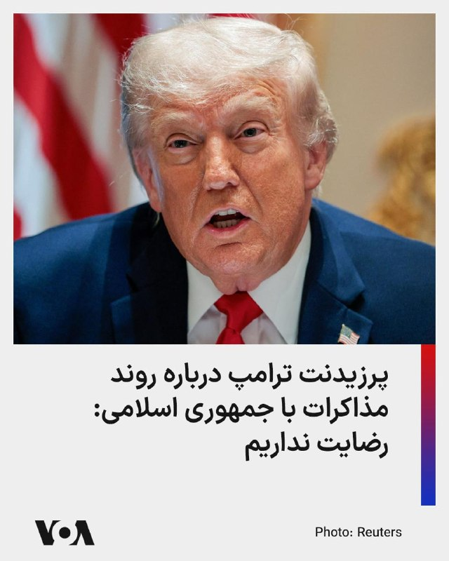

دونالد ترامپ، رئیس جمهوری آمریکا در جلسه کابینه با اشاره به این که مقامات حکومت ایران مشتاق رسیدن به توافق هستند از وضعیت فعلی مذاکرات ابراز نارضایتی کرد.
پرزیدنت ترامپ با بیان اینکه شاید مجبور شویم دوباره به جنگ با رژيم ایران برگردیم گفت: «آنها جز توافق با ما گزینه دیگری ندارند. آنها نمی‌توانند و نخواهند توانست به سلاح هسته‌ای دست پیدا کنند.»

## FarsiVOA — post 218817

  <a href="telegram/content/FarsiVOA_218817_1779901591.mp4" target="_blank">🎬 Download video</a>

حدود ساعت ۱۷ چهارشنبه، ششم خرداد، یکی از برج‌های ۱۶ طبقه‌ای، ۶۴ واحدی، مجتمع مسکونی پامچال در بزرگراه خرازی، شهرک چیتگر دچار آتش‌سوزی شد.

به گفته سخنگوی آتش‌نشانی، آتش که از یکی از واحدهای طبقه هشتم آغاز شده و به سرعت به همه بخش‌ها سرایت کرده بود اکنون خاموش شده و «آتش‌نشانان موفق شدند چند خانواده را از محل حادثه خارج کنند. عملیات جستجو ادامه دارد اما این حادثه تا این لحظه تلفات جانی نداشت.»

## FarsiVOA — post 218816

🔺کاخ سفید: تفاهم‌نامه‌ای که رسانه‌های جمهوری اسلامی منتشر کرده‌اند ساختگی است؛ باور نکنید

▪️کاخ سفید می‌گوید که آن چه تحت عنوان پیش‌نویس تفاهم‌نامه میان آمریکا و جمهوری اسلامی منتشر شده کاملا ساختگی است و کسی نباید آن را باور کند.

⬇️ بیشتر بخوانید:

https://ir.voanews.com/a/fox-news-jacqui-heinrich-iran-proposal-inconsistent-with-washington/8154522.html/?nocach=1

## FarsiVOA — post 218815

  <a href="telegram/content/FarsiVOA_218815_1779901593.mp4" target="_blank">🎬 Download video</a>

یک شهروند با گلایه از بحران اقتصادی که درپی جنگ اخیر و تعطیلی کارخانه‌ها، موجب بیکار شدن او شده است می‌گوید: «حکومت دنبال جنگ و مذاکرات است و مردم معمولی دنبال پول و نان.»

اقتصاددانان ایرانی تصویری نگران‌کننده از اقتصاد ایران پس از جنگ ترسیم می‌کنند و هشدار داده‌اند در صورت ادامه آثار جنگ، بین ۳.۵ تا ۴.۵ میلیون نفر دیگر به جمعیت فقیر ایران افزوده می‌شوند و شمار افراد زیر خط فقر به بیش از ۴۰ میلیون نفر خواهد رسید.

جنگ، تحریم، تورم کالایی، توقف سرمایه‌گذاری، ضعف بازار کار و کاهش درآمد خانوارها در حال تبدیل شدن به یک بحران معیشتی گسترده‌اند؛ بحرانی که می‌تواند طبقه متوسط را کوچک‌تر، فقر را عمیق‌تر و بازار کار را ناپایدارتر کند.

## FarsiVOA — post 218814

  <a href="telegram/content/FarsiVOA_218814_1779901595.mp4" target="_blank">🎬 Download video</a>

معصومه طاهرخانی، اقتصاددان، پیش‌بینی نمی‌کند که قیمت‌‌های افزایش‌یافته در آینده به سود خانواده‌های ایرانی کاهش پیدا کنند. از حسین قاضیان، جامعه‌شناس درباره راه‌های تاب‌آوری پرسیده‌ایم.

## FarsiVOA — post 218813

نبرد بر سر سلاح گروەهای مسلح وابستە بە جمهوری اسلامی؛ آیا بغداد موفق به مهار گروه‌های مسلح می‌شود؟

## FarsiVOA — post 218812

چهار‌شنبه ۶ خرداد، مراسم رونمایی از نخستین هواپیمای سوخت‌رسان «گیدئون» کی‌سی-۴۶ اسرائیل، ساخت شرکت بوئینگ، در پایگاه هوایی نواتیم برگزار شد. این هواپیما را اسرائیل از آمریکا خریداری کرده و قرار است نقش مهمی در عملیات‌های دوربرد نیروی هوایی اسرائیل ایفا کند. (این ویدیو بی‌صدا است.)

مراسم رونمایی از هواپیمای جدید با حضور مقام‌های ارشد نظامی اسرائیل، از جمله تومر بار، فرمانده نیروی هوایی، برگزار شد. ارتش اسرائیل اعلام کرد این نخستین فروند از شش هواپیمای کی‌سی-۴۶ است که وزارت دفاع اسرائیل خریداری کرده است.

ارتش اسرائیل در بیانیه‌ای گفت ورود این هواپیما «برتری نیروی هوایی اسرائیل را در جنگ چندجبهه‌ای جاری و عملیات‌های دوربرد به‌طور چشمگیری تقویت می‌کند.»

تومر بار، فرمانده نیروی هوایی اسرائیل، نیز در این مراسم به نقش هواپیماهای سوخت‌رسان در عملیات علیه رژیم ایران اشاره کرد و گفت: «از همین باندهای پایگاه نواتیم، هواپیماهای سوخت‌رسان حدود دو ماه پیش به پرواز درآمدند و تمام نیروی هوایی را سوار بر بال‌های خودشان به ایران رساندند.»

## FarsiVOA — post 218811

🔺حکم حبس یک وکیل به دلیل انتقاد از رهبران رژیم؛ فشار جمهوری اسلامی بر وکلا ادامه دارد

◾️جمهوری اسلامی در ادامه روند فشار و ارعاب وکلای مستقل، یک عضو کانون وکلای استان آذربایجان شرقی را به ۳ سال حبس و یک وکیل ساکن قم را در دادگاه محاکمه کرد.

⬇️ بیشتر بخوانید:

https://ir.voanews.com/a/islamic-republic-s-pressure-on-independent-lawyers-convicted-prison-criticizing-regime-leaders/8154497.html

## FarsiVOA — post 218810

یکی از مخاطبان صدای آمریکا با ارسال این ویدیو از تصمیم برای سقط جنین در سایه مشکلات معیشتی و اقتصادی گفته است.

این شهروند اهل خوزستان می‌گوید بعد از جنگ اخیر، همسرش درپی تعدیل نیرو اخراج شده است و هیچ منبع درآمدی ندارند. در نتیجه آرزوی مادر و پدر شدن برای آنها ناتمام می‌ماند.

این روایت دردناک نشان می‌دهد در سایه بی‌ثباتی اقتصادی و فشارهای مداوم، زندگی روزمره بسیاری از مردم به میدان مبارزه‌ای خاموش برای تأمین حداقل‌ها تبدیل شده است. روندی که روایتی از فشار اقتصادی، ناامیدی اجتماعی و تغییر عمیق سبک زندگی در ایران امروز است.

## FarsiVOA — post 218809

دونالد ترامپ نقض حقوق زندانیان سیاسی زن در جمهوری اسلامی را برجسته کرد

## FarsiVOA — post 218808

  <a href="telegram/content/FarsiVOA_218808_1779901595.mp4" target="_blank">🎬 Download video</a>

در میدان پرسیدیم: آیا زیستن در سایه جنگ و در برابرِ حکومتی که دشمن زندگی است به معنای زندگی نکردن است؟ چرا هر نشانه‌ای از زندگی به عادی‌سازی تعبیر می‌شود؟ سمانه سوادی، حقوق‌دان پاسخ می‌دهد

## FarsiVOA — post 218807

  <a href="telegram/content/FarsiVOA_218807_1779901596.mp4" target="_blank">🎬 Download video</a>

ارتش اسرائیل اعلام کرد نیروهای تیپ ۴۰۱، تروریستی را که یک نیروی ارتش اسرائیل را کشته بود، از بین بردند.

هفته گذشته در جریان درگیری در منطقه قاوزه در جنوب لبنان، یک تروریست از محدوده یک کلیسا به‌سوی نیروهای تیپ ۴۰۱ تیراندازی کرد که در نتیجه آن سرگرد (ذخیره) ایتمار ساپیر کشته شد.

پس از شناسایی این تروریست او با شلیک تانک و حمله دقیق نیروی هوایی، کشته شد.

## FarsiVOA — post 218806

  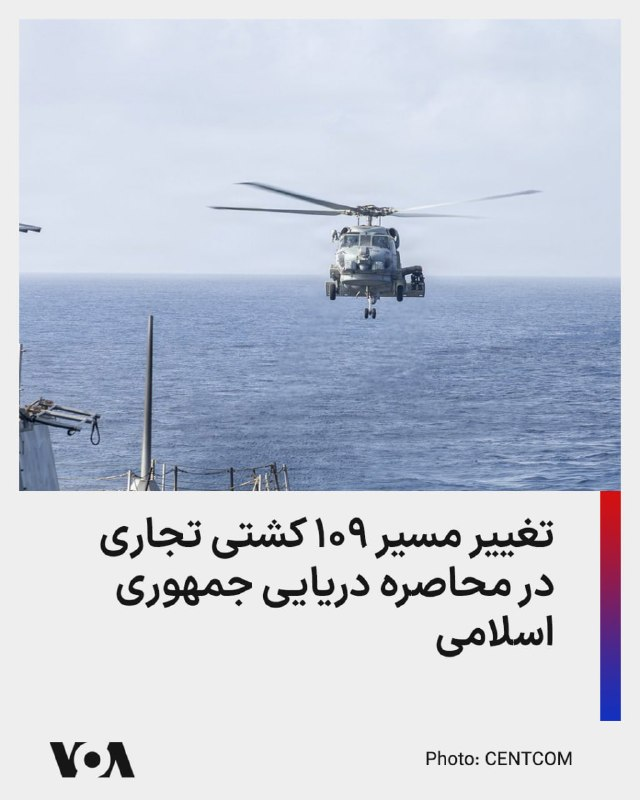

ستاد فرماندهی مرکزی ایالات متحده آمریکا، سنتکام، اعلام کرد در جریان اجرای محاصره دریایی آمریکا علیه جمهوری اسلامی، مسیر ۱۰۹ کشتی تجاری را تغییر داده است.

سنتکام این به‌روزرسانی را در شبکه اجتماعی ایکس همراه با تصویری از یک هلیکوپتر «ام اچ-۶۰ آر سی‌هاک» در حال برگشت از گشت‌زنی در دریای عرب منتشر کرده است.

ایالات متحده از اواخر فروردین ۱۴۰۵، محاصره دریایی علیه جمهوری اسلامی ایران را در واکنش به اقدام رژیم ایران در بستن تنگه هرمز آغاز کرده است.

## FarsiVOA — post 218805

  <a href="telegram/content/FarsiVOA_218805_1779901598.mp4" target="_blank">🎬 Download video</a>

ظهر روز چهارشنبه مجتمع تجاری میدان شوش دچار آتش‌سوزی شد. به گزارش سازمان آتش‌نشانی یکی از چیلرهای روی سطح پشت بام این مجتمع تجاری شعله‌ور شده و دود و آتش در حال سرایت به نقاط دیگر مجتمع بود.

به گفته سخنگوی سازمان آتش‌نشانی شهرداری تهران این حادثه مصدومیت و تلفات جانی در پی نداشت و در حال حاضر آتش به طور کامل مهار شده است.

## DW_Farsi — post 125208

  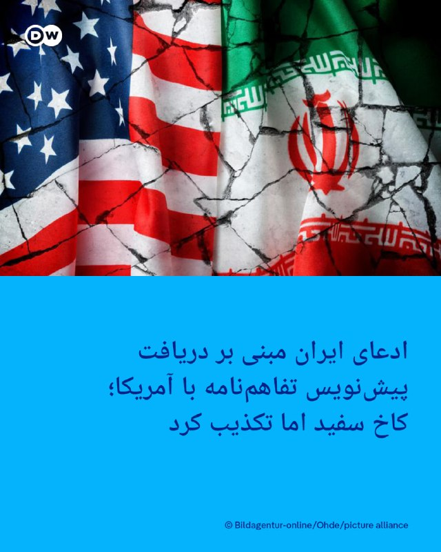

🔶 ایران: پیش‌نویس تفاهم‌نامه با آمریکا را دریافت کردیم؛ کاخ سفید تکذیب کرد

صداوسیمای جمهوری اسلامی ایران گزارش داد که تهران پیش‌نویس چارچوب اولیه و غیررسمی یک یادداشت تفاهم با آمریکا را جهت پایان دادن به میان درگیری دو کشور دریافت کرده است.

طی این گزارش، بر اساس این چارچوب، جمهوری اسلامی "ظرف یک ماه تردد کشتی‌های تجاری از تنگه هرمز را به سطح پیش از جنگ بازمی‌گرداند و ایالات متحده نیز نیروهای نظامی خود را از اطراف ایران خارج و محاصره دریایی را لغو  می‌کند."

صداوسیما افزود، این چارچوب، که کشتی‌های نظامی را در بر نمی‌گیرد و بر اساس آن، جمهوری اسلامی با همکاری عمان عبور و مرور کشتی‌ها در تنگه را مدیریت خواهد کرد، هنوز نهایی نشده است و تهران بدون "راستی‌آزمایی ملموس" هیچ اقدامی انجام نخواهد داد.

در پی انتشار این خبر کاخ سفید طی بیانیه‌ای در شبکه ایکس اعلام کرد که این گزارش که رسانه‌های ایران آن را منتشر کرده‌اند "درست نیست و یادداشت تفاهمی که آن‌ها منتشر کرده‌اند کاملا ساختگی است."

کاخ سفید افزود: «هیچ کس نباید مطالبی که رسانه‌های دولتی ایران منتشر می‌کنند را باور کند. واقعیت‌ها اهمیت دارند.»
@dw_farsi

## DW_Farsi — post 125207

  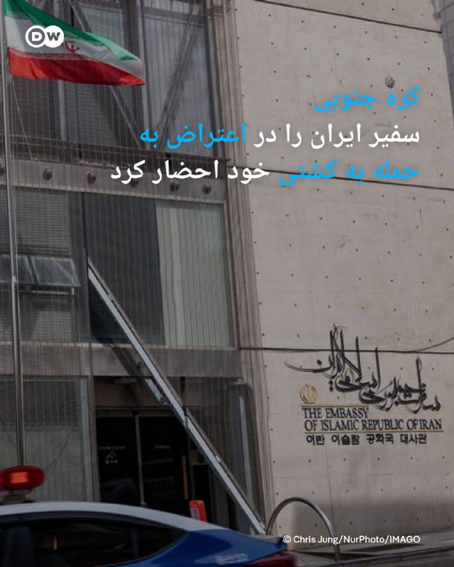

🔶 کره جنوبی سفیر ایران را در اعتراض به حمله به کشتی خود احضار کرد

کره جنوبی روز چهارشنبه ۲۷ مه (ششم خرداد) اعلام کرد که سفیر ایران را احضار خواهد کرد تا در پی پایان تحقیقات درباره حمله به کشتی خود در تنگه هرمز مراتب اعتراضش را اعلام کند.

این کشور می‌گوید، بر اساس نتایج این تحقیقات، "به احتمال بسیار زیاد" این حمله با یک موشک ساخت ایران انجام شده است.

این کشتی باری کره جنوبی روز ۴ مه در تنگه هرمز ، آبراهی راهبردی که از زمان آغاز جنگ آمریکا و اسرائیل علیه جمهوری اسلامی در ۲۸ فوریه عملا بسته شده، هدف حمله قرار گرفت.

دونالد ترامپ، رئیس جمهور آمریکا، مدعی شده که جمهوری اسلامی به این کشتی با پرچم پاناما "شلیک‌هایی" کرده، اما تهران مسئولیت این حمله را رد کرده است.

پس از تحقیقاتی که چند هفته به طول انجامید، دولت کره جنوبی اعلام کرد، بررسی‌های فنی نشان می‌دهد که پرتابه ناشناسی که به این کشتی اصابت کرده، "به احتمال بسیار زیاد" گونه‌ای دیگر از "سری نور، ساخته‌شده در ایران" بوده است.
@dw_farsi

## DW_Farsi — post 125206

🔶 بازداشت ۳۹ تن در یونان به اتهام "فساد در یارانه‌های کشاورزی"

در جریان تحقیقات درباره یک پرونده گسترده فساد مربوط به یارانه‌های کشاورزی اتحادیه اروپا در یونان، مقام‌ها ۳۹ مظنون را بازداشت کردند.

پلیس یونان اعلام کرد که روز سه‌شنبه ۲۶ مه (۵ خرداد) ۱۷ نفر در شمال کشور، عمدتا در شهر تسالونیکی، دومین شهر بزرگ یونان، بازداشت شدند.

بنا بر این گزارش، روز پیش از آن نیز ۲۲ نفر بازداشت شده بودند که بیشتر آنها در جزیره کرت انجام شده است.
@dw_farsi

## DW_Farsi — post 125205

🔶 پیروزی نامزد مورد حمایت ترامپ در تگزاس به‌ رغم رسوایی‌ها

کن پاکستون، دادستان کل تگزاس با حمایت قاطع دونالد ترامپ، رئیس‌جمهور آمریکا توانست در انتخابات درون‌حزبی جمهوری‌خواهان در تگزاس که یکی از پایگاه‌های اصلی و سنتی حزب جمهوری‌خواه است جیمز کورنین، سناتور باسابقه را شکست دهد.

پاکستون به دلیل گرایش‌های راست‌گرایانه و وفاداری شدید به ترامپ پیروز شد و اکنون در انتخابات مهم نوامبر ۲۰۲۶ نامزد جمهوری‌خواهان خواهد بود.
@dw_farsi

## DW_Farsi — post 125204

🎥 نقش یک شرکت در امارات در خرید تجهیزات ماهواره‌ای چینی برای ایران

بنا به گزارش‌ها، سپاه پاسداران از یک شرکت مستقر در امارات متحده عربی برای خرید تجهیزات ماهواره‌ای پیشرفته چینی استفاده کرده است و بعدا در جنگ، حملاتی را علیه اهداف اماراتی انجام داده است.
@dw_farsi

## DW_Farsi — post 125203

🔶 تشدید تهدید‌های پوتین علیه اوکراین و پاسخ آلمان

بر اساس گزارش‌ها، سرگئی لاوروف، وزیر امور خارجه روسیه، دربارiه حملات سیستماتیک بیشتر به کی‌یف، پایتخت اوکراین هشدار داده است.

به گفته او، نه فقط تاسیساتی که برای نیروهای مسلح اوکراین اهمیت دارند، بلکه "مراکز تصمیم‌گیری" نیز هدف قرار خواهند گرفت. از خارجی‌ها و دیپلمات‌ها بار دیگر خواسته شده است تا شهر را ترک کنند.
@dw_farsi

## Persian_Trend_Official — post 15140

  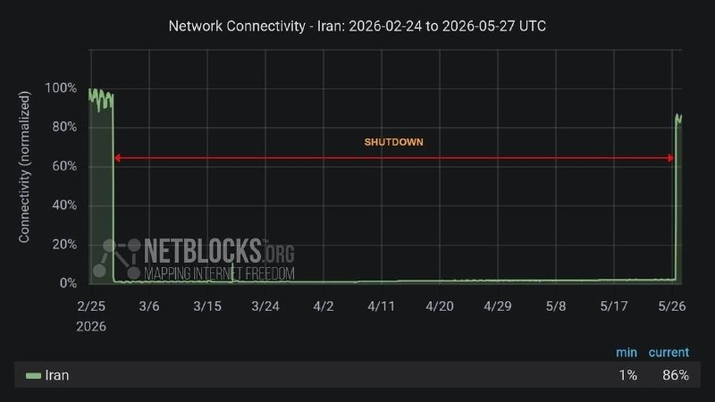

💢نت بلاکس

💢 اتصال اینترنت ایران اکنون برای ۲۴ ساعت در حالت بازیابی قرار داشته است. خدمات همچنان به شدت فیلتر شده باقی مانده و محدودیت‌های جدیدی روی پیام‌رسان‌ها و فروشگاه‌های اپلیکیشن در مقایسه با سطح پیش از ژانویه اعمال شده است.

درخواست‌ها برای یک اینترنت آزاد و باز، فراتر از خطوط سیاسی قرار دارند و باید شنیده شوند.

💢میزان اختلالات در شبکه از دیروز بسیار بیشتر شده است، بسیاری از سرویس‌های گوگل و کلودفلر بسته شده اند و حتی قابلیت استفاده از گوگل پلی و اپ استور نیز وجود ندارد.

🫆:Tony

📌 @persian_trend_official
پرشین ترند | متفاوت‌ترین کانال نظامی

## Persian_Trend_Official — post 15139

  <a href="telegram/content/Persian_Trend_Official_15139_1779901601.webm" target="_blank">🎬 Download video</a>

🇷🇺رئیس روس اتم: روسیه تصمیم گرفته است که بازگشت کارکنان خود به نیروگاه هسته‌ای بوشهر در ایران را به تعویق بیندازد.

👩‍💻@PhantomDirective

🆔@persian_trend_official
پرشین ترند | متفاوت‌ترین کانال نظامی

## Persian_Trend_Official — post 15138

  <a href="telegram/content/Persian_Trend_Official_15138_1779901602.webm" target="_blank">🎬 Download video</a>

تکذیب شکایت اعضای شورای عالی فضای مجازی برای جلوگیری از وصل‌شدن اینترنت

«رضا تقی‌پور» عضو شورای عالی فضای مجازی: شکایت بابت تاسیس نهاد موازی فراقانونی انجام شد. هرگز موافق قطع اینترنت نبوده و نیستم.

👩‍💻@PhantomDirective

🆔@persian_trend_official
پرشین ترند | متفاوت‌ترین کانال نظامی

## Persian_Trend_Official — post 15137

  <a href="telegram/content/Persian_Trend_Official_15137_1779901602.mp4" target="_blank">🎬 Download video</a>

🔴 ترامپ

«الان دارم به بعضی از این دموکرات‌ها انتقاد می‌کنم. واقعاً آدم‌های خنگی هستند.

گفتم فکرش را بکنید. E را بردارید، U بگذارید. می‌شوند دوموکرات (احمق‌کرات)!»

🫆:Tony

📌 @persian_trend_official
پرشین ترند | متفاوت‌ترین کانال نظامی

## Persian_Trend_Official — post 15136

  <a href="telegram/content/Persian_Trend_Official_15136_1779901603.webm" target="_blank">🎬 Download video</a>

💢حتی با تحویل اورانیوم‌ها هم خبری از لغو تحریم‌ها نیست!

♦️ترامپ در گفتگو با شبکه پی‌بی‌اس اعلام کرد که ایران حتی در ازای دست کشیدن از اورانیوم‌های با غنای بالای خود، از کاهش تحریم‌ها بهره‌مند نخواهد شد!

🫆:Tony

📌 @persian_trend_official
پرشین ترند | متفاوت‌ترین کانال نظامی

## Persian_Trend_Official — post 15135

  <a href="telegram/content/Persian_Trend_Official_15135_1779901603.webm" target="_blank">🎬 Download video</a>

🔴 کاخ سفید گزارش‌های تلویزیون دولتی ایران درباره پیش‌نویس جدید توافق را رد کرد

▪️ کاخ سفید به‌طور قاطع گزارش‌های منتشرشده در رسانه‌های دولتی ایران درباره ارائه پیش‌نویس جدید یادداشت تفاهم (MOU) برای توافق صلح با آمریکا را تکذیب کرد
▪️ واشینگتن می‌گوید هنوز هیچ متن نهایی یا پیش‌نویس جدیدی تأیید نشده است
▪️ این تکذیب در حالی مطرح می‌شود که طی ساعات اخیر روایت‌های متناقضی درباره وضعیت مذاکرات منتشر شده است

🫆:Tony

📌 @persian_trend_official
پرشین ترند | متفاوت‌ترین کانال نظامی

## Persian_Trend_Official — post 15134

  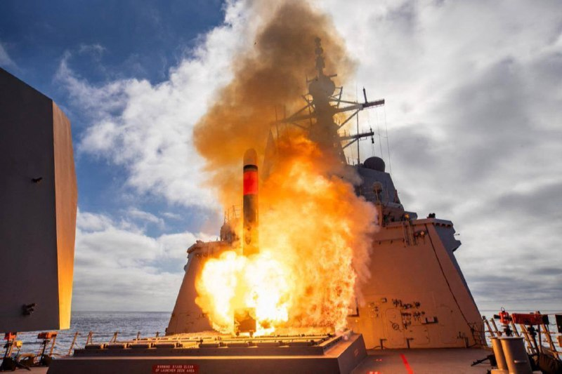

🔴 گزارش CSIS: آمریکا ممکن است تا ۳ سال برای بازسازی ذخایر موشکی خود زمان نیاز داشته باشد

▪️ یک گزارش جدید از Center for Strategic and International Studies هشدار داده ذخایر موشک‌های کلیدی آمریکا پس از جنگ با ایران به‌شدت کاهش یافته است.
▪️ موجودی موشک‌های Tomahawk، Patriot و THAAD به‌طور قابل‌توجهی افت کرده و بازسازی آن‌ها ممکن است چند سال طول بکشد
▪️ این گزارش از ایجاد یک «پنجره آسیب‌پذیری» برای آمریکا در غرب اقیانوس آرام و همزمان با افزایش تنش با China خبر می‌دهد
▪️ با وجود افزایش بودجه دفاعی و تلاش برای بالا بردن تولید، کارشناسان می‌گویند ظرفیت فعلی صنایع نظامی آمریکا برای جبران سریع این کمبود کافی نیست

🫆:Tony

📌 @persian_trend_official
پرشین ترند | متفاوت‌ترین کانال نظامی

## Persian_Trend_Official — post 15133

  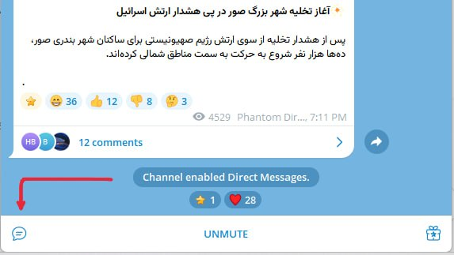

برای پوشش سریع‌تر و دقیق‌تر اخبار، دایرکت پرشین ترند از این به بعد برای دریافت خبرها و اطلاعات مخاطبان فعاله 📩

اگر خبر، تصویر، ویدیو یا اطلاعات مهم و دست‌اولی دارید که فکر می‌کنید ارزش بررسی و انتشار داره، می‌تونید ارسال کنید.

فقط لطفاً:

* پیام‌ها کوتاه و مستقیم باشن
* اصل خبر یا موضوع در همان پیام اول نوشته بشه
* از سلام و احوالپرسی جداگانه خودداری کنید
* اگر منبع، عکس یا ویدیو دارید همراهش بفرستید

به دلیل حجم بالای پیام‌ها ممکنه امکان پاسخ به همه دایرکت‌ها وجود نداشته باشه، اما همه موارد مهم بررسی میشن 🙏

📌 @persian_trend_official
پرشین ترند | متفاوت‌ترین کانال نظامی

## Persian_Trend_Official — post 15132

## Persian_Trend_Official — post 15131

  <a href="telegram/content/Persian_Trend_Official_15131_1779901605.mp4" target="_blank">🎬 Download video</a>

🔹آغاز تخلیه شهر بزرگ صور در پی هشدار ارتش اسرائیل

پس از هشدار تخلیه از سوی ارتش رژیم صهیونیستی برای ساکنان شهر بندری صور، ده‌ها هزار نفر شروع به حرکت به سمت مناطق شمالی کرده‌اند.

👩‍💻@PhantomDirective

📣@persian_trend_official
پرشین ترند | متفاوت‌ترین کانال نظامی

## Persian_Trend_Official — post 15130

  <a href="telegram/content/Persian_Trend_Official_15130_1779901606.mp4" target="_blank">🎬 Download video</a>

🇺🇸
🇮🇱
🆔 اسرائیل اولین هواپیمای سوخت‌رسان هوایی بوئینگ KC-46 پگاسوس را امروز از ایالات متحده دریافت کرده است.

👩‍💻@PhantomDirective

🆔@persian_trend_official
پرشین ترند | متفاوت‌ترین کانال نظامی

## Persian_Trend_Official — post 15129

  <a href="telegram/content/Persian_Trend_Official_15129_1779901608.webm" target="_blank">🎬 Download video</a>

حادثه در بزرگترین مجتمع پتروشیمی ایران در عسلویه

📢۱ نفر جان باخت و ۲ تن مصدوم شدند.

‌روابط عمومی شرکت دماوند انرژی عسلویه:

‌ ظهر امروز چهارشنبه ششم  خرداد ماه ۱۴۰۵ در ساعت ۱۱:۳۵ ، حادثه‌ای در واحد هوای این شرکت رخ داد که متأسفانه منجر به جان‌باختن یکی از کارکنان و مصدومیت دو نفر دیگر شد.

💣پتروشیمی دماوند در تاریخ ۶ آپریل هم توسط نیروی هوایی اسرائیل و آمریکا مورد هدف قرار گرفته بود.

## Persian_Trend_Official — post 15128

  <a href="telegram/content/Persian_Trend_Official_15128_1779901608.webm" target="_blank">🎬 Download video</a>

🇺🇸
🇺🇸 پست جدید ترامپ در تروث سوشال:

## Persian_Trend_Official — post 15127

  <a href="telegram/content/Persian_Trend_Official_15127_1779901608.mp4" target="_blank">🎬 Download video</a>

🎥 هدف قرار گرفتن یکی از سامانه های گنبد آهنین اسرائیلی توسط پهپاد حزب‌الله

## Persian_Trend_Official — post 15126

  <a href="telegram/content/Persian_Trend_Official_15126_1779901610.mp4" target="_blank">🎬 Download video</a>

🇱🇧
🇮🇱
🇱🇧 حمله هوایی به شهر زفتا.

## Persian_Trend_Official — post 15125

  <a href="telegram/content/Persian_Trend_Official_15125_1779901611.webm" target="_blank">🎬 Download video</a>

⭕️ همراه اول امروز در پیامی به کاربران اینترنت پرو اعلام کرد در صورت تمایل می‌توانند اینترنت خود را به حالت قبل برگردانند.

📝 Nick

📌 @persian_trend_official
پرشین ترند | متفاوت‌ترین کانال نظامی

## Persian_Trend_Official — post 15124

  <a href="telegram/content/Persian_Trend_Official_15124_1779901611.webm" target="_blank">🎬 Download video</a>

اتصال به اینترنت سخت‌تر از روزهای قبل شده. 🗿

📝 Nick

📌 @persian_trend_official
پرشین ترند | متفاوت‌ترین کانال نظامی

## RadioFarda — post 157620

  <a href="https://t.me/radiofarda/157620" target="_blank">📎 Download file</a>

📻بشنوید: ایستگاه ۱۹ با رادیوفردا، ششم خرداد ۱۴۰۵

@RadioFarda

## RadioFarda — post 157619

🔸دونالد ترامپ، رئیس‌جمهور آمریکا، روز چهارشنبه گفت که ایران در ازای کنار گذاشتن اورانیوم با غنای بالای خود، از لغو تحریم‌ها توسط واشینگتن برخوردار نخواهد شد و از پیشنهادات ایران برای توافق پایان جنگ ابراز نارضایتی کرد. 🔸ترامپ پیش از برگزاری جلسه کابینه خود…

## RadioFarda — post 157618

  

🔸دونالد ترامپ، رئیس‌جمهور آمریکا، روز چهارشنبه گفت که ایران در ازای کنار گذاشتن اورانیوم با غنای بالای خود، از لغو تحریم‌ها توسط واشینگتن برخوردار نخواهد شد و از پیشنهادات ایران برای توافق پایان جنگ ابراز نارضایتی کرد.

🔸ترامپ پیش از برگزاری جلسه کابینه خود در یک تماس تلفنی کوتاه با شبکه پی‌بی‌اس نیوز، در پاسخ به این سوال که آیا توافق فعلی به این معناست که ایران در ازای لغو تحریم‌ها، اورانیوم با غنای بالای خود را واگذار خواهد کرد، گفت: «نه، نه، اصلاً. خبری از لغو تحریم‌ها نیست، نه.»

🔸او اضافه کرد: «آن‌ها قرار است اورانیوم با غنای بالای خود را کنار بگذارند، نه در ازای لغو تحریم‌ها. نه، نه، اصلاً.»

🔸ایران بیش از ۴۰۰ کیلو اورانیوم غنی شده تا حد ۶۰ درصد دارد که در تأسیسات زیرزمینی هدف قرار گرفته در جنگ ۱۲ روزه سال گذشته مدفون است.

🔸رئیس‌جمهور ایالات متحده ساعتی بعد در ابتدای نشست کابینه خود در کاخ سفید گفت که ایران بسیار مایل است به توافق برسد، اما آمریکا هنوز از توافق پیشنهادی رضایت ندارد.

@RadioFarda

## RadioFarda — post 157617

  <a href="https://t.me/radiofarda/157617" target="_blank">📎 Download file</a>

🔸 در این کافه فردا به حواشی اتصال نصفه و نیمه و تدریجی اینترنت جهانی در ایران، حرف‌های پزشکیان در مورد وفاق، سریال تنگه وحشت، زندگی و آثار باب مارلی، پیام جدید منسوب به مجتبی‌ خامنه‌ای و رابطه حسام نواب صفوی و آیزنهاور می‌پردازیم.

🔸 برای تماس با ما می‌توانید به شناسه کافه فردا در تلگرام صوت و متن بفرستید.

📻 کافه فردا

## RadioFarda — post 157616

  <a href="https://t.me/radiofarda/157616" target="_blank">📎 Download file</a>

تیم ملی فوتبال، جام جهانی و حاشیه‌های بی‌پایان در گفت‌وگو با کوروش بازیار

🔸با نزدیک شدن به زمان برگزاری جام جهانی ۲۰۲۶ در آمریکا، مکزیک و کانادا، روزی نیست که خبری در مورد حاشیه‌های حضور تیم ملی ایران در این رقابت‌ها منتشر نشود. وزیر ورزش جمهوری اسلامی می‌گوید با هماهنگی فیفا با مقام‌های آمریکا همه بازیکنان ویزا دریافت می‌کنند. با این وجود در یکی از تازه ترین تحولات محل استقرار این بازیکنان از داخل خاک آمریکا به آن سوی مرز، شهر مرزی تیخوانا، در مکزیک منتقل شده است. اینگونه تحولاتی است که ناظرات را بر آن داشته که اماواگرهای بسیاری درباره نحوه حضور تیم ملی ایران در جام جهانی و چشم‌انداز پیش‌روی این تیم ترسیم می‌کنند. ارزیابی کوروش بازیار، مربی و کارشناس فوتبال در آلمان، را در این زمینه بشنوید.

@RadioFarda

## RadioFarda — post 157615

  <a href="https://t.me/radiofarda/157615" target="_blank">📎 Download file</a>

بیم و امید درباره «پایان» خاموشی اینترنت در ایران؛ گفت‌وگو با امیر رشیدی

🔸پس از ۸۸ روز قطع سراسری اینترنت در ایران، شهروندان کشور توانستند به‌طور نسبی به اینترنت جهانی دست پیدا کنند و البته هنوز اتصال بسیاری با محدودیت روبروست. این انزوای اینترنتی که طولانی‌ترین در تاریخ معاصر در سطح یک کشور پهناور چون ایران بود، هزینه‌های مالی، اجتماعی و روانی بسیار بر جا گذاشته است. آیا می‌توان گفت خاموشی اینترنت به طور کامل به پایان رسیده است؟ چشم‌انداز پیش رو چیست؟ ارزیابی امیر رشیدی، فعال حوزه حقوق دیجیتال و سیاست‌گذاری اینترنت در ایتالیا، را در این‌باره بشنوید.

@RadioFarda

## RadioFarda — post 157614

🔸کاخ سفید روز چهارشنبه اعلام کرد گزارشی که از سوی صداوسیمای جمهوری اسلامی منتشر شده و به پیش‌نویس یک چارچوب اولیه و غیررسمی برای تفاهم‌نامه میان ایران و ایالات متحده اشاره داشت، «صحیح نیست» و تفاهم‌نامه مورد اشاره «کاملاً ساختگی» است. 🔸تلویزیون حکومتی ایران…

## RadioFarda — post 157613

  

🔸کاخ سفید روز چهارشنبه اعلام کرد گزارشی که از سوی صداوسیمای جمهوری اسلامی منتشر شده و به پیش‌نویس یک چارچوب اولیه و غیررسمی برای تفاهم‌نامه میان ایران و ایالات متحده اشاره داشت، «صحیح نیست» و تفاهم‌نامه مورد اشاره «کاملاً ساختگی» است.

🔸تلویزیون حکومتی ایران ساعتی قبل گزارش داده بود که پیش‌نویس یک توافق چارچوبی با ایالات متحده شامل تعهد به لغو محاصره دریایی ایران، بازگرداندن رفت‌وآمد در تنگه هرمز و خروج نیروهای آمریکایی از منطقه خلیج فارس است.

🔸کاخ سفید در بیانیه‌ای اعلام کرد: «این گزارش رسانه‌های تحت کنترل ایران حقیقت ندارد و تفاهم‌نامه‌ای که آنها منتشر کرده‌اند کاملاً ساختگی است. هیچ‌کس نباید آنچه رسانه‌های دولتی ایران منتشر می‌کنند را باور کند. واقعیت‌ها اهمیت دارند.»

🔸گزارش صداوسیما مدعی شده بود که آمریکا متعهد به رفع محاصره دریایی ایران شده و در مقابل، ایران تعهد داده تعداد کشتی‌های عبوری تجاری را طی یک ماه به سطح پیش از تنش‌ها بازگرداند.

@RadioFarda

## RadioFarda — post 157612

  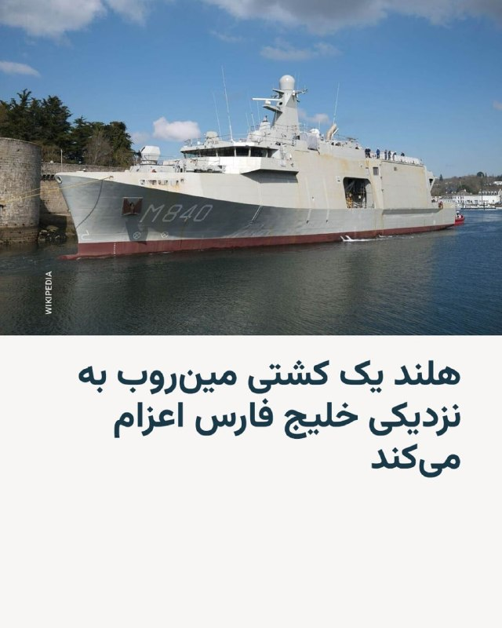

🔸هلند یک کشتی مین‌روب را به دریای مدیترانه اعزام می‌کند. بر اساس نامۀ دو عضو ارشد دولت هلند که روز چهارشنبه به پارلمان این کشور ارسال شد، این اقدام برای مشارکت در عملیات احتمالی پیمان ناتو در تنگۀ هرمز پس از پایان جنگ ایران در نظر گرفته شده است.

🔸بر اساس نامۀ وزرای دفاع و خارجۀ هلند، کشتی مین‌روب همین هفته راهی مدیترانه شده و از حدود دو هفتۀ دیگر برای مشارکت در عملیات ناتو آماده خوهد بود. در این نامه آمده که هلند برای بر عهده‌گرفتن نقشی با هدف تضمین ایمنی تردد کشتی‌ها در خلیج فارس آماده می‌شود.

🔸در نامۀ وزیران هلندی به پارلمان تأکید شده که یکی از گزینه‌های در نظر گرفته‌شده برای مشارکت هلند، استقرار یک تیم ترکیبی، برای جست‌وجو، غواصی، شناسایی و از بین‌بردن ایمن تجهیزات انفجاری خواهد بود.

🔸در این نامه آمده که هلند همزمان در حال بررسی امکان اعزام نیرو برای مشارکت در عملیات احتمالی یک ائتلاف بین‌المللی در منطقه است.

@RadioFarda

## RadioFarda — post 157611

مقتدی صدر اعلام کرد گردان‌های مسلح تحت امرش در دولت عراق ادغام می‌شوند

🔸مقتدی صدر، رهبر جریان صدر عراق، روز چهارشنبه ششم خرداد جدایی «سرایا السلام»، گردان‌های تحت امر خود را از «جنبش ملی شیعه» و ادغام آن‌ها در دولت عراق را اعلام کرد.

🔸آقای صدر در بیانیه‌ای که در حساب رسمی خود در شبکه ایکس منتشر کرد، گفت که این تصمیم «به سود ملت و برای جلوگیری از خطراتی که مردم را تهدید می‌کند» گرفته شده است.

🔸رهبر جریان صدر افزود که تشکیلات غیرنظامی مرتبط با «سرایا السلام»، به تشکیلاتی غیر نظامی با عنوان «البیان المرصوص» تبدیل خواهد شد که مقر، سلاح یا صفت نظامی ندارد.

🔸مقتدی صدر در بخشی از بیانیه خود از نیروهای «حشد الشعبی» خواست تا از «دستورات حزبی و فرقه‌ای» فاصله بگیرند و تأکید کرد که امیدوار است این گروه‌ها سلاح خود را به دولت تحویل دهند، همانطور که به گفته او، «سرایا السلام» این کار را انجام دادند.

🔸«حشد الشعبی» به ائتلاف گروه‌های شبه‌نظامی عمدتا شیعه گفته می‌شود که تحت حمایت جمهوری اسلامی ایران هستند.

🔸علی الزیدی، نخست وزیر و فرمانده کل نیروهای مسلح عراق، از بیانیه مقتدی صدر استقبال کرد و اقدام او را یک «موضع ملی مسئولانه» دانست که از نهادهای دولتی حمایت می‌کند و اعتبار آن‌ها و «حاکمیت قانون» را تقویت می‌کند.

🔸این در حالی است که دولت دونالد ترامپ خواستار «اقدامات ملموس» از سوی نخست‌وزیر جدید عراق برای دور کردن نهادهای دولتی این کشور از گروه‌های مسلح نزدیک به جمهوری اسلامی شده است. واشینگتن تهدید کرده در غیر این صورت کمک‌های مالی و امنیتی از سر گرفته نخواهد شد.

🔸گزارش کامل را در وب‌سایت رادیوفردا بخوانید.

@RadioFarda

## RadioFarda — post 157610

  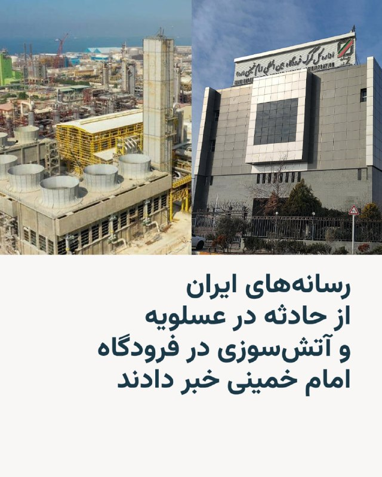

🔸رسانه‌های ایران روز چهارشنبه ششم خرداد از وقوع دو حادثه جداگانه در عسلویه و فرودگاه امام خمینی تهران خبر دادند.

🔸به گزارش رسانه‌های داخلی، در حادثه‌ای در واحد هوای شرکت «دماوند انرژی» عسلویه، یک نفر جان باخت و دو نفر دیگر مصدوم شدند.

🔸بر اساس اطلاعیه شرکت دماوند انرژی، تیم‌های امدادی و ایمنی پس از وقوع حادثه در محل حاضر شدند و مصدومان پس از دریافت خدمات اولیه، به مراکز درمانی منتقل شدند. علت حادثه هنوز اعلام نشده است.

🔸هم‌زمان خبرگزاری مهر گزارش داد یک ساختمان اداری گمرک در شهر فرودگاهی امام خمینی دچار آتش‌سوزی شده است.

🔸بر اساس این گزارش، نیروهای آتش‌نشانی و امدادی در محل حضور دارند و هنوز جزئیاتی درباره علت حریق یا میزان خسارت و تلفات احتمالی منتشر نشده است.

@RadioFarda

## IranianMinds — post 20882

🔴ترامپ به PBS :

اگه ایران اورانیوم خیلی غنی‌شده رو تحویل بده، در مقابلش هیچ تخفیف یا کاهش تحریم‌ها بهش داده نمیشه.

@IranianMinds

## IranianMinds — post 20881

🔴پیت هگست: آنها ممکن است موشک داشته باشند، اما در حال حاضر نمی‌توانند موشک‌های بیشتری بسازند. نمی‌توانند پهپادهای بیشتری بسازند. نمی‌توانند کشتی‌های بیشتری بسازند. آمدند و تسلیم شدند تا صحبت کنند

@IranianMinds

## IranianMinds — post 20880

ثبت نام کن ۵۰۰ هزارتومان جایزه بگیر
نیازی هم به واریز نیست
تنها سایت مورد #تایید ما با بونوس های واقعی:

🌐 Winro.io

## IranianMinds — post 20879

  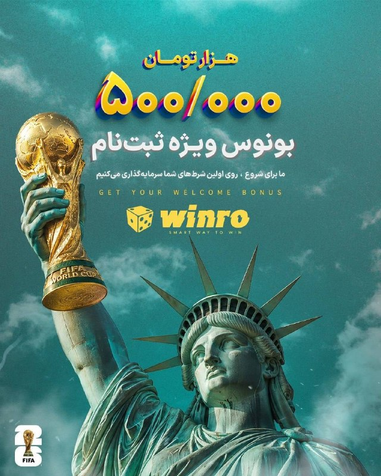

⭕️ تا حالا بدون واریزی روی فوتبال ها شرط بستی؟!

🎉 500 هزارتومن بونوس رایگان فقط با ثبت نام بدون هیچگونه واریزی!

💳 شارژ سریع و امن با درگاه ریالی ، تتر یا ترون فقط با یک کلیک!

⌛ پشتیبانی 24 ساعته

💖تنها سایت مورد اعتماد ما با بونوس های کاملا واقعی و رویایی:

🌐 Winro.io

🌐 Winro.io
کانال بونوس های رایگان g6

📱 @winro_io

## IranianMinds — post 20878

  <a href="telegram/content/IranianMinds_20878_1779901616.mp4" target="_blank">🎬 Download video</a>

🔴ارتش اسرائیل پس از دادن هشدارهای تخلیه، آغاز حملات به مواضع حزب‌الله در شهر صور در جنوب لبنان را آغاز کرد.

@IranianMinds

## IranianMinds — post 20877

  <a href="telegram/content/IranianMinds_20877_1779901617.mp4" target="_blank">🎬 Download video</a>

🔴آتش‌سوزی در یکی از برج‌های مجتمع مسکونی پامچال در چیتگر تهران.
چهارشنبه ۶ خرداد.

@IranianMinds

## IranianMinds — post 20876

  <a href="telegram/content/IranianMinds_20876_1779901618.mp4" target="_blank">🎬 Download video</a>

ترامپ : الان داریم با رویکرد «اول آمریکا» جلو می‌ریم درباره ایران. یا باید با شرایط من کنار بیان، یا کار رو تموم می‌کنیم.

می‌گن «صبر می‌کنیم تا انتخابات میان‌دوره‌ای». دیشب دیدید چی شد؟ اون فقط شروع ماجرا بود برای انتخابات!

هر کسی گفته من دارم کوتاه میام، اشتباه کرده

الان به نظر میاد خودشون دنبال توافقن. فکر نمی‌کنم حق انتخاب زیادی داشته باشن

اینترنتشون تازه دوباره وصل شده، اقتصادشون هم داغونه، تورم هم خیلی بالاست!
شاید مجبور بشیم برگردیم و کار رو یک‌سره کنیم!

@IranianMinds

## IranianMinds — post 20875

  <a href="telegram/content/IranianMinds_20875_1779901620.mp4" target="_blank">🎬 Download video</a>

آتش زدن ماکت جواد ظریف در میدان اتحاد گرگان.

@IranianMinds

## IranianMinds — post 20874

🔴کاخ سفید:

گزارش‌های تلویزیون ایران درباره یادداشت تفاهم، کاملا نادرست و جعلی است.

@IranianMinds

## IranianMinds — post 20873

  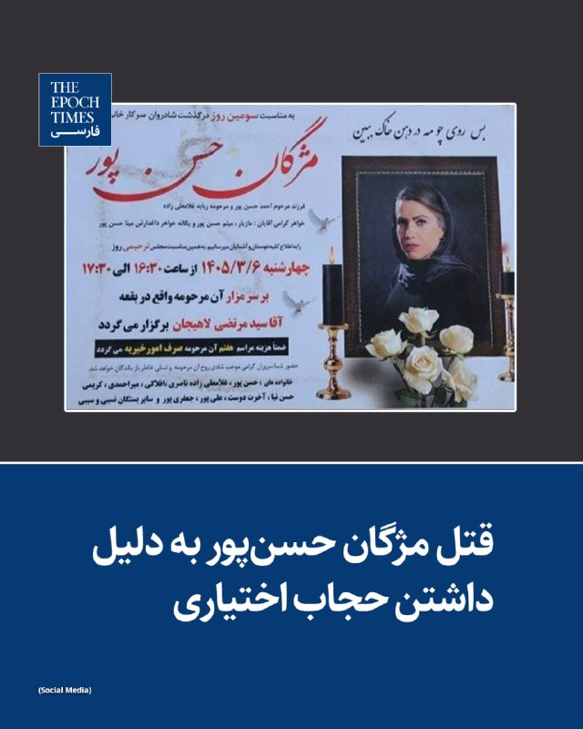

🔴قتل مژگان حسن‌پور به دلیل داشتن حجاب اختیاری

کانون حقوق بشر ایران گزارش داد مژگان حسن‌پور مادر یک پسر هفت ساله بعد از مشاجره با یک نیروی لباس شخصی بر سر حجاب اجباری با شلیک گلوله در لاهیجان کشته شد.

براساس این گزارش،‌ این زن ۴۶ ساله عصر پنج‌شنبه گذشته، زمانی که بر سر مزار پدر و مادرش به آرامستان آقا سیدمرتضی رفته بود، به قتل رسید. حادثه زمانی آغاز شد که یک نیروی لباس شخصی بر سر پوشیدن حجاب اجباری وارد بحث و مشاجره با این خانم شد.

@IranianMinds

## BBCPersian — post 282202

  <a href="telegram/content/BBCPersian_282202_1779901622.mp4" target="_blank">🎬 Download video</a>

🔻پلیس اعلام کرد آتش‌سوزی به‌نسبت بزرگ در سوپرمارکتی در شمال غربی لندن که با اعزام ۱۰۰ آتش‌نشان دارد مهار می‌‌شود، به دلیل اتصال برق بوده است.

آتش‌نشانی لندن اولین تماس را حدود ساعت یک ربع به هفت صبح به وقت گرینویچ دریافت کرد که خبر از آتش‌سوزی در ساختمانی سه طبقه در گولدرز گرین می‌داد.

ویدیوهایی در شبکه‌های اجتماعی منتشر شده که نشان می‌دهد دود از پشت سوپرمارکت یهودی «کوشر کینگدام»، جایی که ساکنان محلی گفته‌اند آتش‌سوزی از آنجا آغاز شده، به هوا بلند می‌شود.

کسی در این آتش‌سوزی مجروح نشده است.

کریگ کارتر، معاون آتش‌نشانی لندن گفت: «تصور نمی‌شود علت آتش‌سوزی مشکوک باشد» و به مردم منطقه توصیه کرد که پنجره‌ها و درها را بسته نگه دارند.

سخنگوی پلیس متروپولیتن هم گفت: «ما نگرانی و اختلالی را که این حادثه برای جامعه محلی و ساکنان و شاغلان در منطقه ایجاد کرده است، درک می‌کنیم. ما می‌خواهیم به ساکنان اطمینان دهیم که هیچ نشانه‌ای از اقدامی هدفمند یا عمدی وجود ندارد.»

گلدرز گرین از جمله محلات یهودی‌نشین لندن است که طی ماه‌های اخیر چند بار هدف حملات ضدیهودی قرار گرفته است.

@BBCPersian

## BBCPersian — post 282201

  <a href="https://t.me/bbcpersian/282201" target="_blank">📎 Download file</a>

تازه‌ترین خبرهای جهان چهارشنبه ۶ خرداد ۱۴۰۵ از رادیو بی‌بی‌سی در لندن

@BBCPersian

## BBCPersian — post 282200

  <a href="https://t.me/bbcpersian/282200" target="_blank">📎 Download file</a>

🔻دنیس راس، مدیر پیشین اداره سیاست‌گذاری وزارت خارجه آمریکا، در گفت‌وگو با برنامه ۶۰ دقیقه بی‌بی‌سی درباره چالش‌های به نتیجه رسیدن مذاکرات ایران و آمریکا گفت.

او تاکید کرد که هیچ راهبردی در قبال ایران تاکنون جواب نداده است؛ چه راهبرد آنها که به ایران امتیاز دادند و چه آنها که سیاست فشار حداکثری را پی گرفتند.

این مصاحبه را که در برنامه شصت دقیقه پنجم خرداد پخش شده، گوش دهید.

@BBCPersian

## BBCPersian — post 282199

🔻نیروی دریایی سپاه: در شبانه روز گذشته ۲۳ شناور از تنگه هرمز عبور کردند

🔻سپاه پاسداران انقلاب اسلامی اعلام کرد که در شبانه روز گذشته ۲۳ شناور با اجازه این نیرو از تنگه هرمز عبور کرده‌اند.

نیروی دریایی سپاه یک روز پیش هم گفته بود که ۲۵ کشتی در هماهنگی با این نیرو از این تنگه گذشتند.

پیشتر گزارش دادیم که رسانه‌های حکومتی ایران اعلام کردند که تهران «پیش‌نویس اولیه و غیررسمی چارچوب یک یادداشت تفاهم با آمریکا را دریافت کرده» است.

بر اساس این پیش‌نویس، ایران ظرف یک ماه عبور و مرور تجاری از تنگه هرمز را به سطح پیش از جنگ بازمی‌گرداند و در مقابل، آمریکا نیروهای نظامی خود را از اطراف ایران خارج و محاصره دریایی را لغو خواهد کرد.

https://bbc.in/3S51FI9
@BBCPersian

## BBCPersian — post 282198

🔻شرکت اماراتی مجوز آمریکا برای اسقاط چهار کشتی تحریم‌شده مرتبط با ایران را دریافت کرد

🔻شرکت جی‌ام‌اس (GMS) مستقر در دبی، اعلام کرد که مجوز دولت آمریکا را برای اسقاط چهار کشتی کانتینربر دریافت کرده است که به‌دلیل ارتباط با ایران تحریم شده بودند.

مدیرعامل این شرکت گفت که این اقدام می‌تواند راه را برای کاهش ناوگان موسوم به «سایه» هموار کند، ناوگانی از کشتی‌هایی که برای دور زدن تحریم‌ها استفاده می‌شوند.

به گزارش رویترز، صدها کشتی فاقد بیمه مشخص یا استانداردهای زیست‌محیطی و ایمنی، نه‌تنها به ایران و روسیه برای دور زدن تحریم‌ها کمک کرده‌اند، بلکه خطر نشت نفت و سوخت را در مسیرهای پرتردد دریایی افزایش داده‌اند.

ایجاد سازوکاری رسمی برای اسقاط این کشتی‌ها می‌تواند انگیزه‌ای برای خارج کردن آن‌ها از چرخه فعالیت باشد، اقدامی که به کاهش خطرات زیست‌محیطی و مهار تجارت نفت و کالاهای تحریم‌شده کمک می‌کند.

انیل شارما، بنیان‌گذار و مدیرعامل جی‌ام‌اس، به رویترز گفت که این شرکت ماه‌ها با مقام‌های آمریکایی درباره تحویل گرفتن کشتی‌های تحریم‌شده و اسقاط آن‌ها در حال مذاکره بوده است.

https://bbc.in/4dzGnuJ
@BBCPersian

## BBCPersian — post 282197

  <a href="telegram/content/BBCPersian_282197_1779901624.mp4" target="_blank">🎬 Download video</a>

🔻حدود ۹۰ پهپاد در طول یک نمایش نور زمستانی محبوب از آسمان بندر دارلینگ سیدنی سقوط کردند و برخی‌شان در نزدیکی جمعیت به داخل آب افتادند.

برگزارکنندگان جشنواره سه هفته‌ای سالانه «ویوید سیدنی» که شامل چیدمان‌های نوری بزرگ است، گفتند که نقص فنی در عصر دوشنبه به وقت محلی به دلیل «مشکلات فنی پیش‌بینی نشده» بوده و چندین نمایش آینده را لغو کرده‌اند.

فیلم نمایش دوشنبه، ده‌ها پهپاد را در حالی که از آسمان شب سقوط می‌کردند نشان می‌داد.

شرکت اسکای‌مجیک، شرکت بریتانیایی برگزارکننده این نمایش، تغییر در فرکانس رادیویی را دلیل این نقص دانست و گفت که هیچ یک از پهپادها خارج از مرزهای ایمنی سقوط نکرده‌اند.

https://bbc.in/4tZCSCO
@BBCPersian

## BBCPersian — post 282196

  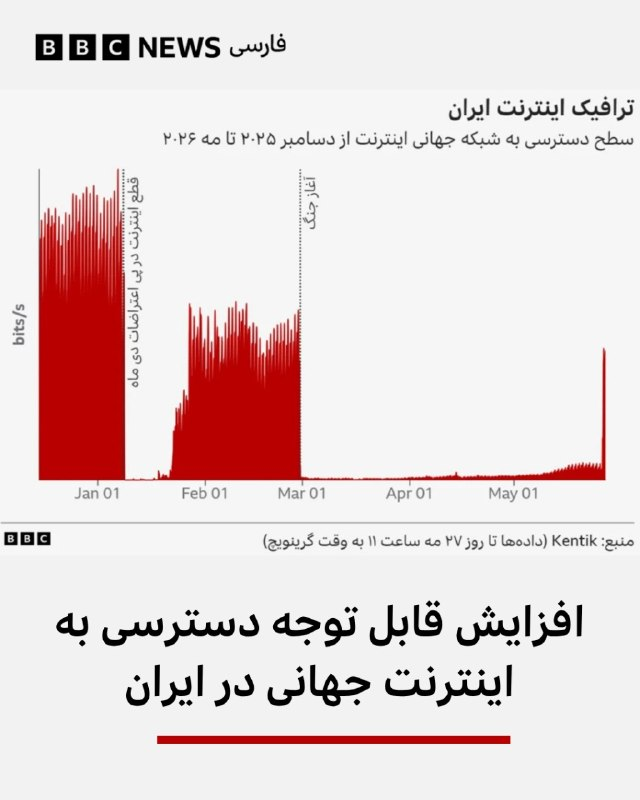

🔻در پی بازگشت تدریجی دسترسی به اینترنت جهانی در ایران از روز سه‌شنبه ۵ خرداد ۱۴۰۵، داده‌های شرکت کنتیک (Kentik) نشان می‌دهد که حجم ترافیک اینترنت بین‌الملل پس از هفته‌ها محدودیت شدید، تا حد قابل توجهی افزایش یافته است، هرچند همچنان فاصله زیادی با سطح عادی پیش از آغاز قطع اینترنت در دی‌ماه دارد.

داگ مادوری، مدیر تحلیل اینترنت در شرکت کنتیک، می‌گوید: «سطح ترافیک در بالاترین حالت به حدود ۳۹ درصد حجم پیش از اعتراضات رسیده است؛ رقمی که به سطح دسترسی در دوره بازگشایی نسبی میان ۷ بهمن تا ۹ اسفند نزدیک است. در آن دوره، خدمات اینترنت ناپایدار و بی‌ثبات بود و محدودیت‌ها روزانه تغییر می‌کردند.»

او اضافه می‌کند: «ما هنوز فاصله زیادی با سطح خدمات پیش از ۱۸ دی داریم. این فقط یک تصویر کلی از وضعیت ترافیک است و ممکن است برخی خدماتی که آن زمان در دسترس بودند، همچنان مسدود باشند.»

گزارش‌های رسیده و تجربیات کاربران حاکی است که دسترسی به برخی خدمات امکان‌پذیر شده است هرچند ارتباط با ثبات نیست و از جمله، تماس‌های صوتی- تصویری، کیفیت بالایی ندارند.

https://bbc.in/4uvLBh7
@BBCPersian

## BBCPersian — post 282195

  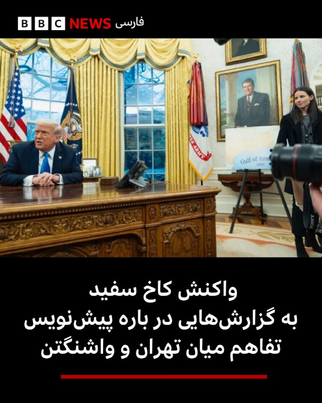

‌🔻اولیویا ویلز، سخنگوی کاخ سفید، در واکنش به انتشار گزارش‌ رسانه‌های ایران درباره پیش‌نویس یادداشت تفاهم میان ایران و آمریکا، گفت: «همان‌طور که رئیس‌جمهور ترامپ گفته است، مذاکرات به‌خوبی در حال پیشرفت است و او خطوط قرمز خود را به‌روشنی مشخص کرده است.»

پیشتر رسانه‌های حکومتی ایران اعلام کردند که تهران «پیش‌نویس اولیه و غیررسمی چارچوب یک یادداشت تفاهم با آمریکا را دریافت کرده است.»

بر اساس این گزارش‌ها، ایران ظرف یک ماه عبور و مرور تجاری از تنگه هرمز را به سطح پیش از جنگ بازمی‌گرداند و در مقابل، آمریکا نیروهای نظامی خود را از اطراف ایران خارج و محاصره دریایی را لغو خواهد کرد.

خانم ویلز بدون تایید یا رد این گزارش‌ها گفت که «رئیس‌جمهور ترامپ تنها توافقی را خواهد پذیرفت که برای مردم آمریکا توافقی خوب باشد و تضمین کند ایران هرگز به سلاح هسته‌ای دست پیدا نکند.»

📷Courtesy: TCU News
https://bbc.in/4tYo1Z8

@BBCPersian

## BBCPersian — post 282194

🔻رسانه‌های ایران: تهران پیش‌نویس اولیه و غیررسمی تفاهم با آمریکا را دریافت کرده است

🔻رسانه‌های حکومتی ایران اعلام کردند که تهران «پیش‌نویس اولیه و غیررسمی چارچوب یک یادداشت تفاهم با آمریکا را دریافت کرده است.»

بر اساس این گزارش‌ها، ایران ظرف یک ماه عبور و مرور تجاری از تنگه هرمز را به سطح پیش از جنگ بازمی‌گرداند و در مقابل، آمریکا نیروهای نظامی خود را از اطراف ایران خارج و محاصره دریایی را لغو خواهد کرد.

این گزارش همچنین حاکیست که هماهنگی در مورد مدیریت مسیر کشتی‌ها با ایران و عمان انجام خواهد شد.

علی باقری کنی، معاون سیاست خارجی و امنیت بین‌الملل دبیرخانه شورای عالی امنیت ملی ایران، هم تایید کرده است که ایران و عمان به‌طور مشترک در حال مذاکره در مورد رویه جدیدی برای عبور کشتی‌ها از تنگه هرمز هستند.

به گفته او «شرایط و رویه‌های عبور از تنگه هرمز کاملا متفاوت از شرایط قبل از شروع درگیری بر سر ایران خواهد بود.»آقای باقری کنی همچنین گفت: «تا زمانی که در مورد همه مسائل به توافق نرسیم، فکر می‌کنیم که در مورد هیچ چیز به توافق نرسیده‌ایم.»

https://bbc.in/3PLvJI4
@BBCPersian

## BBCPersian — post 282193

  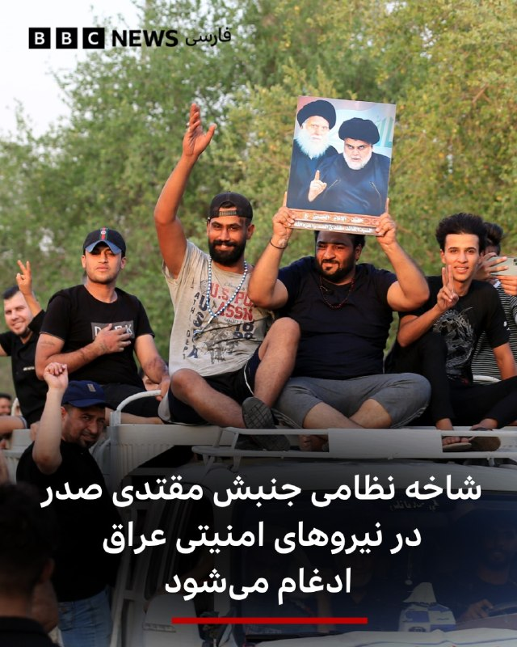

🔻مقتدی صدر، رهبر مذهبی قدرتمند عراق، اعلام کرده است که شاخه نظامی جنبش سیاسی شیعه او در نیروهای امنیتی دولت عراق ادغام خواهد شد.

آقای صدر از سایر جناح‌های مسلح در عراق نیز خواست که همین کار را انجام دهند و سلاح‌های خود را به دولت تحویل دهند.

این اقدام در بحبوحه فشارهای فزاینده آمریکا بر عراق برای مهار نفوذ گروه‌های مسلح تحت حمایت ایران در عراق صورت می‌گیرد.

شبه‌نظامیان همسو با جنبش صدر نقش مهمی در مبارزه با نیروهای آمریکایی پس از حمله به عراق در سال ۲۰۰۳ و همچنین در نبرد علیه داعش پس از تصرف بخش بزرگی از خاک عراق در سال ۲۰۱۴، ایفا کردند.

📷EPA
https://bbc.in/4fbhBT0

@BBCPersian

## idfinfarsi — post 11657

  <a href="telegram/content/idfinfarsi_11657_1779901628.mp4" target="_blank">🎬 Download video</a>

ارتش اسرائیل ساختمان‌های نظامی، مقرهای فرماندهی و سایت‌های پرتاب در منطقه البقاع را هدف قرار داد: از ابتدای هفته حدود ۵۵۰ هدف از سازمان تروریستی حزب‌الله در لبنان مورد حمله قرار گرفته است

در طول امروز (چهارشنبه)، ارتش اسرائیل در منطقه البقاع و چندین منطقه در جنوب لبنان، ساختمان‌های نظامی، مقرهای فرماندهی و سایت‌های پرتاب مورد استفاده سازمان تروریستی حزب‌الله را هدف قرار داد.

حملات به مقرهای فرماندهی در منطقه صور همچنان در حال انجام است.

## Dirty_Kids — post 390341

سلام عزیزانی که تازه آنلاین شدین باید بگم که
«اَیَتولا هَمه‌نه‌ای… ایز دد»

@Dirty_Kids 👻

## Dirty_Kids — post 390337

  <a href="telegram/content/Dirty_Kids_390337_1779901629.mp4" target="_blank">🎬 Download video</a>

آتش‌سوزی در یکی از برج‌های مجتمع مسکونی پامچال در چیتگر #تهران

تصاویر دریافتی + منتشرشده، چهارشنبه ۶ خرداد

@Dirty_Kids 👻

## Dirty_Kids — post 390336

  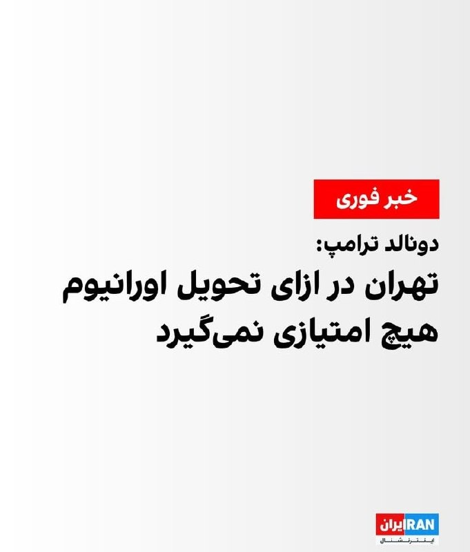

‏ما که گفتیم ریدن براتون

@Dirty_Kids 👻

## Dirty_Kids — post 390335

دیشب بله برون بود؛
همه از بله زدن بیرون:)))))))))))

@Dirty_Kids 👻

## Dirty_Kids — post 390334

  <a href="telegram/content/Dirty_Kids_390334_1779901630.mp4" target="_blank">🎬 Download video</a>

خبر بسیار خوب اینکه کسمغزان شیعه‌سان رافضی در یک اقدام تحسین برانگیز ماکت جواد ظریف که سالها از کون ارباب‌های رافضیش و نئاندرتال‌های اطرافش می‌خورد رو آتیش زدن.

@Dirty_Kids 👻

## Dirty_Kids — post 390333

  <a href="https://t.me/Dirty_Kids/390333" target="_blank">📎 Download file</a>

✅ اپلیکیشن اندروید سایت جهانی دربی بت

💰اولین سایت جهانی با امکان شارژ و برداشت ریالی(کارت به کارت)

🔗 برای ورود فیلترشکن روی کشور مناسب قرار دهید مانند فنلاند و المان و....

😀Telegram Channel
👇
https://t.me/+bcynkEgSW2dlYTc0

## Dirty_Kids — post 390332

  

😤دنبال یه سایت شرط بندی بین المللی بودی که به ایرانیا خدمات بده؟!
⛔

👍دربی بت همون انتخاب  100%

💎ویژگی های سایت جهانی Derby Bet:

⬅️امکان شارژ امن با کارت بانکی

⬅️واریز اول دوبل شارژ می شوید(بونوس۱۰۰٪)

⬅️پر اپشن ترین سایت فعال در ایران

⬅️تسویه حساب کمتر از 5 دقیقه

⬅️برگشت بخشی از باخت به صورت هفتگی

🚨کد هدیه ثبت نام:GG007

⚠️برای دانلود اپلکیشن کلیک کنید
👉

🔔کانال دربی بت :

🪙https://t.me/+bcynkEgSW2dlYTc0

## Dirty_Kids — post 390331

  <a href="telegram/content/Dirty_Kids_390331_1779901632.mp4" target="_blank">🎬 Download video</a>

برا بار صدهزارم: ایران همه چیش نابود شده و دارن له له میزنن توافق کنن.

@Dirty_Kids 👻

## Dirty_Kids — post 390329

🔴 اوایل جنگ با اسرائیل یه عرزشی توییت زد: آخ آخ چه سگ کشی ای راه بندازیم

و اما در جریان جنگ خودش توسط اسرائیل ترور شد.

@Dirty_Kids 👻

## Dirty_Kids — post 390328

  <a href="telegram/content/Dirty_Kids_390328_1779901633.mp4" target="_blank">🎬 Download video</a>

🔴 علیرضا جی‌جی، رپری که به تازگی اومده ایران :

واقعا برام عجیبه که جوون‌ها چطور ابی، داریوش، گوگوش و... رو گوش میکنن!

من اصلا نمی‌فهمم چی‌میگن، مثلا پوستِ شیر ابی؛ چی میگه اصلا؟
پاپ‌خون‌های ایرانی چون خیلی وقته ایران نیومدن، هنوز تو ادبیات 50 سال پیش گیر کردن.
من نمیذارم بچم اینارو گوش بده چون مخش رو شست و شو میدن.

آهنگ‌هاشون خیلی سبک و چرت پرته..

@Dirty_Kids 👻

## Dirty_Kids — post 390327

  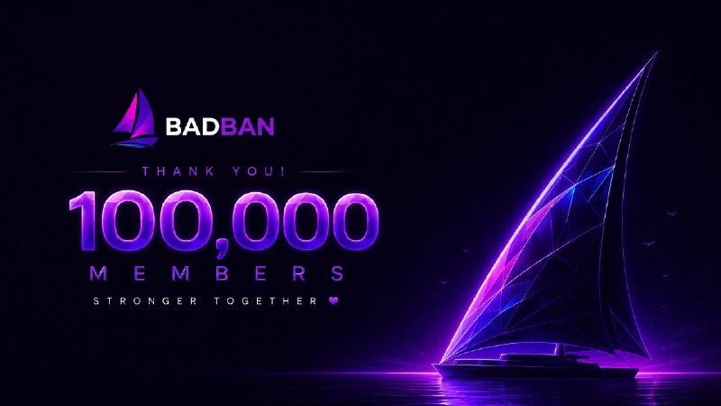

بادبان از 100,000 عضو گذشت!
🎉

با بازگشت اینترنت درحال آماده سازی زیرساخت بادبان برای سرویس دهی برای شرایط نرمال و خروج از سرویس دهی اضطراری هستیم با نرمال شدن شرایط قیمت های کاهشی خواهد بود تا اتمام این فرایند کاربران عزیز میتونن از سرویس های اضطراری استفاده کنن
🚀

🛒به زودی در ربات سرویس های نرمال با قیمت هر گیگ 10 هزار تومان برای فروش فعال خواهند شد
🏷️

🎁 کد تخفیف خرید اول دوباره ریست شد و همه میتونن ازش استفاده کنن:
BadBanOFF

💸 با این کد، 50 هزار تومان تخفیف روی اولین خریدت بگیر!

🔥و مهم‌تر از همه...
سیستم معرفی بادبان فعال‌تر از همیشه‌ست!
از تمام خریدهای کاربرانی که معرفی میکنی، 10% خریدشون رو پورسانت دائمی دریافت کن و موجودی کیف پولت رو افزایش بده 
💼

وقتی بادبان داری،
هیچ بادی مانع نیست… حتی وقتی اینترنت ملیه
⛵️

🛡@BadBan_VPN | کانال 

🤖@BadBan_VPNBot | ربات 

📞@BadBan_VPNSupport | پشتیبانی

## Dirty_Kids — post 390326

  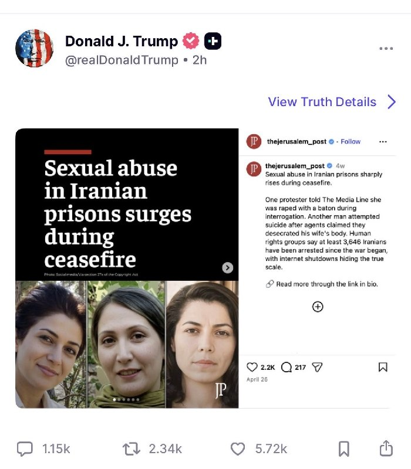

عزیزان،

شیر معلوم‌الحال خدا در تروث‌سوشال پستی منتشر کرده که گزارشیه از روزنامه‌ی جروزالم‌پست اسرائیل در خصوص آزار و تعرض جنسی به زنان بازداشت‌شده‌ی جوان ایرانی در زندان‌های رژیم پدرقحبه‌ی روافض حرومزاده‌ست که در دوران آتش‌بس افزایش پیدا کرده.

@Dirty_Kids 👻

## Dirty_Kids — post 390325

  

به مناسبت عید قربان، یادی کنیم از این دو گوسفند که سر ندارن.

@Dirty_Kids 👻

## Dirty_Kids — post 390324

  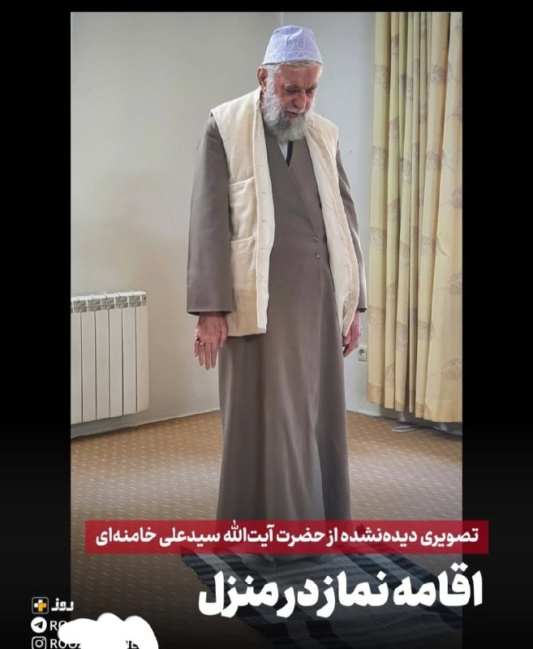

خیلی دوست داشتن عاغاشون رو حالت عرفانی روحانی نشون بدن ولی هرکاری میکنن مثه عقب افتاده‌ها میشه، خارشو گاییدم چقد کیری بود این بشر

ساده زیست بود ولی عکاس شخصی داشت برای ریا

@Dirty_Kids 👻

## Dirty_Kids — post 390323

  

کدوم یکی از حالت‌های خوابیدن مورد علاقه‌تونه؟

@Dirty_Kids 👻

## Dirty_Kids — post 390322

  <a href="telegram/content/Dirty_Kids_390322_1779901636.mp4" target="_blank">🎬 Download video</a>

پاره کردن افسار توسط حامی آخوند

@Dirty_Kids 👻

## Hranews — post 113199

  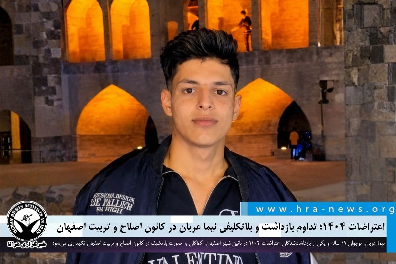

اعتراضات ۱۴۰۴؛ بلاتکلیفی نیما عربان، نوجوان بازداشتی در کانون اصلاح و تربیت اصفهان ادامه دارد

❗️
❗️
❗️
❗️
❗️– نیما عربان، نوجوان ۱۷ ساله و یکی از بازداشت‌شدگان اعتراضات ۱۴۰۴ در نائین شهر، کماکان به صورت بلاتکلیف در کانون اصلاح و تربیت اصفهان نگهداری می‌شود. وی در پرونده‌ای مشترک با عباس اکبری فیض‌آبادی، از معترضان اعدام‌شده، مورد رسیدگی قضایی قرار گرفته است.

به گزارش خبرگزاری هرانا، ارگان خبری مجموعه فعالان حقوق بشر در ایران، نیما عربان از بازداشت‌شدگان اعتراضات ۱۴۰۴ در بازداشت بسر می‌برد.

بر اساس اطلاعات دریافتی هرانا، نیما عربان به همراه عباس اکبری فیض‌آبادی، از معترضان اعدام شده، در جریان اعتراضات دی‌ماه ۱۴۰۴در نائین شهر اصفهان، بازداشت شده است. وی هم اکنون بیش از چهار ماه است که در کانون اصلاح و تربیت اصفهان نگهداری می‌شود.

#نیما_عربان

ادامه مطلب

↘️
@hranews_bot تماس ✉️ - @Hranews کانال هرانا 🆑

## Hranews — post 113198

اشنویه؛ دو شهروند با تودیع وثیقه آزاد شدند

❗️
❗️
❗️
❗️
❗️– روز سه‌شنبه ۵ خردادماه، آرمان درویشی و میلاد شادیخواه، شهروندان اهل اشنویه، با تودیع وثیقه، آزاد شدند.

#آرمان_درویشی #میلاد_شادیخواه

ادامه مطلب

↘️
@hranews_bot تماس ✉️ - @Hranews کانال هرانا 🆑

## Hranews — post 113197

  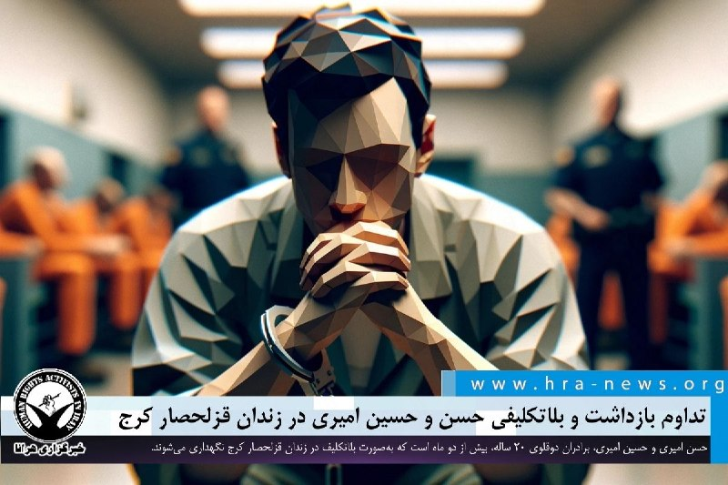

تداوم بازداشت و بلاتکلیفی حسن و حسین امیری در زندان قزلحصار کرج

❗️
❗️
❗️
❗️
❗️– حسن امیری و حسین امیری، برادران دوقلوی ۲۰ ساله، بیش از دو ماه است که بازداشت شده‌اند و کماکان به‌صورت بلاتکلیف در زندان قزلحصار کرج نگهداری می‌شوند.

به گزارش خبرگزاری هرانا، ارگان خبری مجموعه فعالان حقوق بشر در ایران، حسن امیری و حسین امیری در بازداشت بسر میبرند.

بر اساس اطلاعات دریافتی هرانا، این دو برادر دوقلو همزمان با تحولات نظامی در یکی از ایست‌های بازرسی نگه داشته شدند. ماموران حاضر در این ایست بازرسی، تلفن همراه هر دوی آن‌ها را بررسی کردند و پس از مشاهده تصاویری از ساختمان‌های آسیب‌دیده بر اثر حملات موشکی، آن‌ها را بازداشت کردند. اکنون این دو برادر با اتهام جاسوسی مواجه هستند.
این دو برادر ۲۰ ساله که از دو سالگی در بهزیستی بزرگ شده‌اند، هم‌اکنون در واحد سه، اندرزگاه ۳۵ (بند تربیت) زندان قزلحصار کرج نگهداری می‌شوند و با گذشت بیش از دو ماه از زمان بازداشت، تاکنون دادگاهی برای آن‌ها تشکیل نشده است.

#حسن_امیری #حسین_امیری

ادامه مطلب

↘️
@hranews_bot تماس ✉️ - @Hranews کانال هرانا 🆑

## alonews — post 123112

  <a href="telegram/content/alonews_123112_1779901639.webm" target="_blank">🎬 Download video</a>

👈ترامپ درباره منفجر کردن عمان صحبت می‌کند : تنگه‌ها برای همه باز خواهند بود و تحت کنترل هیچ‌کس نخواهند بود. ما مراقب آن‌ها خواهیم بود.

🔴عمان مثل همه رفتار خواهد کرد، وگرنه مجبوریم آن‌ها را منفجر کنیم!

✅ @AloNews خبر جنگ

## alonews — post 123111

  <a href="telegram/content/alonews_123111_1779901639.mp4" target="_blank">🎬 Download video</a>

👈ترامپ : تنگه هرمز برای همه باز خواهد بود. این آبراه بین‌المللیه و هیچ‌کس نباید کنترلش کنه

🔴ما نظارت می‌کنیم، اما هیچ کشوری حق کنترل کاملش رو نداره، این هم بخشی از مذاکرات ماست

✅ @AloNews خبر جنگ

## alonews — post 123110

  <a href="telegram/content/alonews_123110_1779901640.webm" target="_blank">🎬 Download video</a>

👈پیت هگست، وزیر جنگ آمریکا:
ما توانایی موشکی، دریایی و نظامی ایران را نابود کردیم.

🔴ایران ۴۷ سال علیه ما جنگ به راه انداخت.

🔴یکی از افتخارات ترامپ ترور قاسم سلیمانی است.

🔴اگر در میز مذاکره به نتیجه نرسیم بر می‌گردیم و کار را تمام خواهیم کرد.
هم اکنون

✅ @AloNews خبر جنگ

## alonews — post 123109

🔥 حجم‌های بالا با قیمت‌های باورنکردنی 🔥 ⚡ سرعت بالا 🌐 پایداری عالی 🚀 کیفیتی که حسش میکنی همین الان جوین شو که جا نمونی 😍 @NetAazaadVPN @NetAazaadVPN

## alonews — post 123108

  

🔥 حجم‌های بالا با قیمت‌های باورنکردنی 🔥

⚡ سرعت بالا
🌐 پایداری عالی
🚀 کیفیتی که حسش میکنی

همین الان جوین شو که جا نمونی 😍

@NetAazaadVPN
@NetAazaadVPN

## alonews — post 123107

  <a href="telegram/content/alonews_123107_1779901641.webm" target="_blank">🎬 Download video</a>

👈ارتش اسرائیل (IDF) کل منطقه جنوب رودخانه زهرانی در لبنان را به عنوان «منطقه جنگی» اعلام کرده است

✅ @AloNews خبر جنگ

## alonews — post 123106

  <a href="telegram/content/alonews_123106_1779901641.webm" target="_blank">🎬 Download video</a>

👈 وزیر جنگ ایالات متحده: ترامپ شرایطی را ایجاد کرد که مردم آمریکا و جهان را از تهدید دستیابی ایران به سلاح هسته‌ای محافظت کند.

✅ @AloNews خبر جنگ

## alonews — post 123105

  <a href="telegram/content/alonews_123105_1779901641.mp4" target="_blank">🎬 Download video</a>

👈ترامپ : الان داریم به فواره مربوط به جنگ جهانی دوم نگاه می‌کنیم، چون اون هم واقعاً تو وضعیت خوبی نیست

✅ @AloNews خبر جنگ

## alonews — post 123104

  <a href="telegram/content/alonews_123104_1779901642.webm" target="_blank">🎬 Download video</a>

👈 سی‌ان‌ان ایالات متحده و ایران در حال نزدیک شدن به یک توافق آتش‌بس هستند.

🔴هر دو طرف در حال کار بر روی یک «حفظه تفاهم» هستند که نقشه راهی برای حل تمام مسائل باقی‌مانده تعیین می‌کند — روبیو آن را یک «کار در حال پیشرفت» نامید.

🔴نقاط کلیدی اختلاف: بازگشایی تنگه هرمز، برنامه هسته‌ای ایران و ۲۴ میلیارد دلار دارایی‌های منجمد شده ایران — با اختلافات عمده بر سر زمان‌بندی تسکین تحریم‌ها.

🔴ایالات متحده یک توقف ۲۰ ساله هسته‌ای را پیشنهاد داد؛ ایران با ۵ سال پاسخ داد — که واشنگتن آن را رد کرد. ایران همچنین در برابر درخواست‌های ایالات متحده برای ارسال اورانیوم غنی‌سازی شده خود به خارج مقاومت می‌کند.

🔴پاکستان و قطر به عنوان میانجی‌گران کلیدی ظاهر شده‌اند و پیشنهادات و پیشنهادات متقابل را بین دو طرف منتقل می‌کنند.

✅ @AloNews خبر جنگ

## alonews — post 123103

  <a href="telegram/content/alonews_123103_1779901642.webm" target="_blank">🎬 Download video</a>

👈دولت پاکستان: شهباز شریف در گفتگو با پزشکیان تأکید کرد که امیدوار است به‌زودی به یک توافق صلح دست یابد.

🔴شهباز شریف به پزشکیان تأکید کرد که عاصم منیر تلاش‌های جدی و مستمری برای برقراری صلح انجام می‌دهد.

✅ @AloNews خبر جنگ

## alonews — post 123102

  <a href="telegram/content/alonews_123102_1779901643.mp4" target="_blank">🎬 Download video</a>

👈روبیو : کوبا وضعیت خیلی بدی داره چون توسط یه عده کمونیست ناتوان اداره می‌شه،

🔴و کمونیسم کلاً بده، کمونیسم ناتوان دیگه بدترین حالتشه.

✅ @AloNews خبر جنگ

## alonews — post 123101

  <a href="telegram/content/alonews_123101_1779901644.mp4" target="_blank">🎬 Download video</a>

👈 ترامپ : ما به نفت احتیاج نداریم، به تنگه هم احتیاجی نداریم، به هیچ‌چیزشون احتیاج نداریم.

✅ @AloNews خبر جنگ

## alonews — post 123100

  <a href="telegram/content/alonews_123100_1779901645.webm" target="_blank">🎬 Download video</a>

👈 روبیو: دیپلماسی اولین گزینه ماست، اما گزینه‌های دیگری هم در مورد ایران وجود دارد

🔴من معتقدم پیشرفت‌هایی در جهت دستیابی به توافق با ایران حاصل شده است

✅ @AloNews خبر جنگ

## alonews — post 123099

  <a href="telegram/content/alonews_123099_1779901645.webm" target="_blank">🎬 Download video</a>

👈ترامپ: ایران نمی‌تواند سلاح هسته‌ای داشته باشد و من به خاطر جهان جلوی آن را می‌گیرم.

✅ @AloNews خبر جنگ

## alonews — post 123098

  <a href="telegram/content/alonews_123098_1779901645.mp4" target="_blank">🎬 Download video</a>

👈ترامپ : وزیر جنگ، پیت هگست، انگار از دل فیلم‌ها دراومده! عاشق جنگه! ولی آدم خوبیه

✅ @AloNews خبر جنگ

## alonews — post 123097

  <a href="telegram/content/alonews_123097_1779901646.webm" target="_blank">🎬 Download video</a>

👈ترامپ : با وجود درگیری با ونزوئلا، کشوری که دیگه نیروی دریایی نداره 
🔴 نیروی هوایی نداره، و خیلی از آدم‌هایی که کشور رو به جاهای بد کشونده بودن کنار رفتن و دیگه خبری از رهبری قبلی نیست... 
✅ @AloNews خبر جنگ

## alonews — post 123096

  <a href="telegram/content/alonews_123096_1779901646.mp4" target="_blank">🎬 Download video</a>

👈ترامپ : سومالیایی‌ها، همه‌شون کلاهبردارن، خیلی هم خرابن، ماگرفتیمشون و داریم روشون فشار می‌ذاریم

✅ @AloNews خبر جنگ

## alonews — post 123095

  <a href="telegram/content/alonews_123095_1779901647.webm" target="_blank">🎬 Download video</a>

👈 ترامپ: ما هنوز در مورد ایران به توافق نرسیده‌ایم و از این موضوع راضی نیستیم.

🔴ایران فکر می‌کرد می‌تواند صبر کند تا من را خسته کند

🔴 به انتخابات میان دوره اهمیتی نمیدهم

✅ @AloNews خبر جنگ

## alonews — post 123094

  <a href="telegram/content/alonews_123094_1779901648.mp4" target="_blank">🎬 Download video</a>

👈ترامپ : الان داریم با رویکرد «اول آمریکا» جلو می‌ریم درباره ایران. یا باید با شرایط من کنار بیان، یا کار رو تموم می‌کنیم.

🔴 می‌گن «صبر می‌کنیم تا انتخابات میان‌دوره‌ای». دیشب دیدید چی شد؟ اون فقط شروع ماجرا بود برای انتخابات!

🔴هر کسی گفته من دارم کوتاه میام، اشتباه کرده

🔴 الان به نظر میاد خودشون دنبال توافقن. فکر نمی‌کنم حق انتخاب زیادی داشته باشن

🔴 اینترنتشون تازه دوباره وصل شده، اقتصادشون هم داغونه، تورم هم خیلی بالاست!

🔴 شاید مجبور بشیم برگردیم و کار رو یک‌سره کنیم!

✅ @AloNews خبر جنگ

## alonews — post 123093

  <a href="telegram/content/alonews_123093_1779901649.webm" target="_blank">🎬 Download video</a>

👈ترامپ: ایران می‌خواهد توافقی منعقد کند و ما با آن توافق می‌کنیم یا به ماموریت پایان می‌دهیم

✅ @AloNews خبر جنگ

---
📅 بروزرسانی: 1405/03/06 17:34
---

## VahidOOnLine — post 242432

  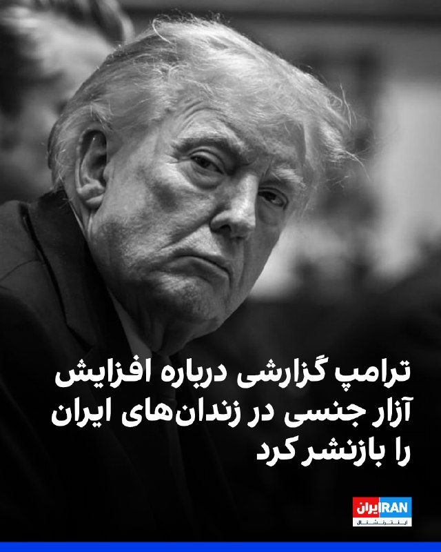

دونالد ترامپ در تروث‌سوشال گزارشی از جروزالم‌پست را بازنشر کرد که بر اساس اطلاعات اختصاصی «مدیا لاین» نوشته است موارد آزار و تعرض جنسی به زنان بازداشت‌شده، به‌ویژه زنان جوان، در زندان‌ها و بازداشتگاه‌های جمهوری اسلامی در دوران آتش‌بس افزایش یافته است.

در این گزارش، زنی جوان به نام کاملیا گفته پس از بازداشت خشونت‌آمیز در خانه‌اش، دو هفته همراه هشت زن دیگر، از جمله دختری ۱۶ ساله که با ساچمه از ناحیه صورت زخمی شده بود، در اتاقی ۲۰ متری نگهداری شد.

به گفته کاملیا، او پس از انتقال به سلول انفرادی و خودداری از اعتراف اجباری، در اتاق بازجویی هدف خشونت قرار گرفت، لباس‌هایش پاره شد، با باتوم مورد تجاوز قرار گرفت، به‌شدت کتک خورد و به تجاوز گروهی تهدید شد.

جروزالم‌پست همچنین با اشاره به قطع گسترده اینترنت، بازداشت‌ها، ناپدیدسازی قهری، آدم‌ربایی، تهدید روزنامه‌نگاران و مخالفان در خارج از کشور و افزایش ناگهانی اعدام مخالفان نوشت سرکوب در ایران تشدید شده است.

دونالد ترامپ پیش‌تر نیز با انتشار پستی در تروث سوشال خواستار آزادی هشت زندانی سیاسی زن در ایران شده بود.
‌🏁 🇬🇧 IranintlTV

🤖 @VahidOOnLine

## VahidOOnLine — post 242431

♦️خبرگزاری صداوسیما اعلام کرد به یک سند غیررسمی اولیه از چارچوب ۱۴ بندی تفاهم احتمالی میان ایران و آمریکا دسترسی پیدا کرده، سندی که به گفته رسانه‌های ایرانی، هنوز نهایی نشده اما حاوی جزئیاتی درباره وضعیت تنگه هرمز و حضور نظامی آمریکا در منطقه است.
بر اساس این گزارش، در پیش‌نویس منتشرشده آمده است که آمریکا متعهد می‌شود نیروهای نظامی خود را از اطراف ایران خارج کرده و محاصره دریایی را متوقف کند. در مقابل، تهران نیز تعهد می‌دهد ظرف مدت یک ماه، عبور کشتی‌های تجاری از تنگه هرمز را به سطح پیش از جنگ بازگرداند.
طبق مفاد این سند، کشتی‌های نظامی مشمول توافق نخواهند بود و مدیریت مسیر حرکت کشتی‌های تجاری در تنگه هرمز با همکاری ایران و سلطنت عمان انجام می‌شود.
صداوسیما همچنین گزارش داد که هنوز چارچوب نهایی تفاهم تدوین نشده و ایران تاکید کرده بدون وجود «سازوکار راستی‌آزمایی» یا همان مکانیزم اطمینان، هیچ اقدام عملی انجام نخواهد داد.
در بخش دیگری از این گزارش آمده است که اگر دو طرف طی ۶۰ روز آینده به توافق نهایی برسند، این تفاهم می‌تواند در قالب یک قطعنامه الزام‌آور در شورای امنیت سازمان ملل تصویب شود.
‌🇸🇦 Indypersian

🤖 @VahidOOnLine

## VahidOOnLine — post 242430

  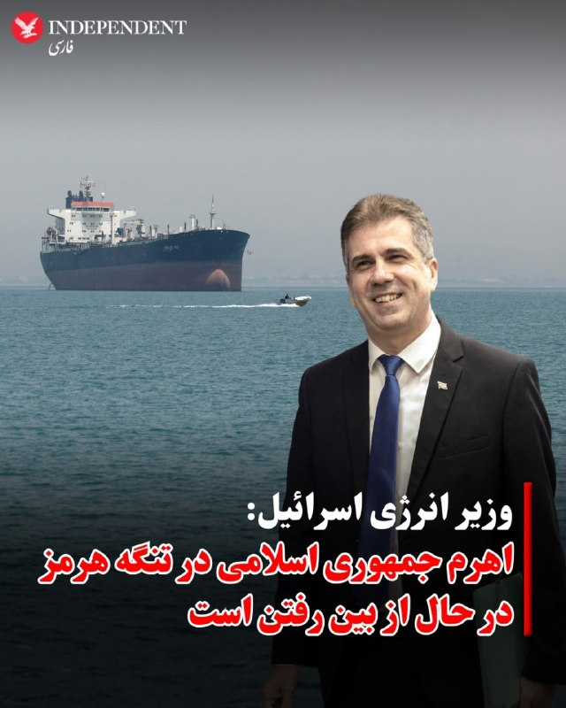

♦️الی کوهن، وزیر انرژی اسرائیل و عضو کابینه سیاسی-امنیتی این کشور، اعلام کرد تل‌آویو در حال پیشبرد طرح‌های راهبردی برای ایجاد مسیرهای جدید انتقال انرژی است؛ طرح‌هایی که به گفته او می‌توانند وابستگی به تنگه هرمز و تهدیدهای جمهوری اسلامی علیه مسیرهای تجاری منطقه را کاهش دهند.
به گفته وزیر انرژی اسرائیل، در روزهای اخیر گفتگوهایی درباره احداث زیرساخت‌های جدید انرژی برای انتقال نفت و گاز به اروپا از طریق اسرائیل انجام شده است. او افزود این طرح‌ها بخشی از پروژه‌های بزرگ اقتصادی و ژئوپلیتیکی در منطقه محسوب می‌شوند.
کوهن همچنین از مذاکرات درباره ایجاد خطوط انتقال انرژی از مسیر کشورهای خلیج فارس خبر داد و گفت عربستان سعودی و امارات متحده عربی، به‌عنوان بازیگران مهم بازار انرژی، علاقه‌مند به مشارکت در این پروژه‌ها هستند.
او در ادامه به طرح ایجاد یک کریدور زیرساختی میان هند و اروپا اشاره کرد؛ مسیری که قرار است از کشورهای خلیج فارس و اسرائیل عبور کند و به اروپا متصل شود. به گفته او، استفاده از ظرفیت مصر نیز می‌تواند سرعت اجرای این پروژه‌ها را افزایش دهد.
‌🇸🇦 Indypersian

🤖 @VahidOOnLine

## VahidOOnLine — post 242429

  

سنتکام، فرماندهی مرکزی آمریکا، در شبکه اجتماعی ایکس اعلام کرد تا شش خرداد، ۱۰۹ کشتی تجاری برای اطمینان از رعایت محاصره دریایی جنوب ایران تغییر مسیر داده شده‌اند.

سنتکام همچنین تصویری منتشر کرد که در آن یک بالگرد «ام‌اچ-۶۰آر سی‌هاوک» پس از گشت‌زنی در دریای عرب در حمایت از این محاصره، به ناوشکن «یو‌اس‌اس دلبرت دی. بلک» نزدیک می‌شود.

این ناوشکن در عملیات مرتبط با اجرای محاصره دریایی علیه ایران مشارکت دارد.
‌🏁 🇬🇧 IranintlTV

🤖 @VahidOOnLine

## VahidOOnLine — post 242428

  

محمود نبویان، عضو کمیسیون امنیت ملی مجلس جمهوری اسلامی، در شبکه ایکس نوشت که جمهوری اسلامی عضو پیمان منع گسترش سلاح‌های هسته‌ای (ان‌پی‌تی) است و پرسید چرا باید به آمریکا بعد از حمله و کشته شدن خامنه‌ای درباره موضوعات هسته‌ای تعهد بدهد.

او افزود: «اساسا به آمریکا چه ربطی دارد که نوع استفاده ایران از انرژی هسته‌ای باید چگونه باشد.»
‌🏁 🇬🇧 IranintlTV

🤖 @VahidOOnLine

## VahidOOnLine — post 242427

  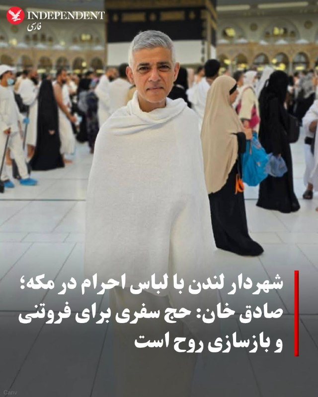

♦️صادق خان، شهردار مسلمان لندن، تصاویری از حضور خود در شهر مکه و مراسم حج را در صفحه فیسبوکش منتشر کرد؛ تصاویری که او را با لباس احرام در میان میلیون‌ها زائر از کشورهای مختلف نشان می‌دهد.
خان در توضیح این تصاویر نوشت که حضور در حج برای او «افتخار و نعمتی بزرگ» بوده و این سفر را تجربه‌ای عمیقا دگرگون‌کننده توصیف کرد. او نوشت: «حج نماد برابری، وحدت و انسانیت مشترک ماست.»
شهردار لندن با اشاره به پوشیدن لباس ساده احرام تاکید کرد که ایستادن در کنار میلیون‌ها مسلمان از سراسر جهان، یادآور این حقیقت است که همه انسان‌ها در برابر خدا برابر هستند. او همچنین حج را سفری برای فروتنی، بخشش و تولدی دوباره از مسیر خودسازی دانست.
صادق خان در بخش دیگری از پیامش نوشت که حج تنها مجموعه‌ای از مناسک فیزیکی در گرمای شدید صحرای عربستان نیست، بلکه فرصتی معنوی و کم‌نظیر برای تامل عمیق‌تر در ایمان و ارتباط با خداوند به شمار می‌رود.
او همچنین اعلام کرد مردم لندن و تمام کسانی را که در سراسر جهان با مشکلات و سختی روبه‌رو هستند، در دعاهای خود فراموش نخواهد کرد.
‌🇸🇦 Indypersian

🤖 @VahidOOnLine

## VahidOOnLine — post 242426

  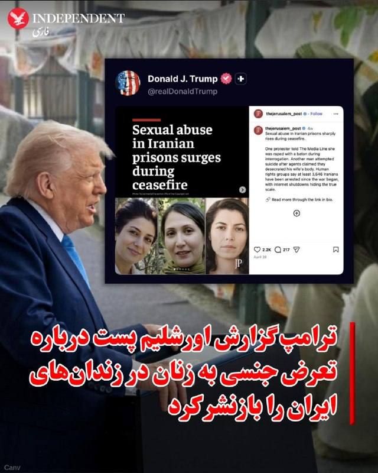

♦️دونالد ترامپ، رئیس‌جمهوری آمریکا در شبکه اجتماعی «تروث سوشال» گزارشی از روزنامه اورشلیم پست را بازنشر کرد، گزارشی که حدود یک ماه پیش منتشر شده و به افزایش شدید آزار و تعرض جنسی علیه زنان بازداشت‌شده در زندان‌ها و بازداشتگاه‌های جمهوری اسلامی می‌پردازد.
در این مقاله که به نقل از «مدیا لاین» منتشر شده، آمده است همزمان با تشدید فضای امنیتی و سرکوب داخلی در دوره آتش‌بس، موارد نقض حقوق بشر در ایران به شکل قابل‌توجهی افزایش یافته است؛ از جمله قطع گسترده اینترنت، بازداشت فعالان، ناپدیدسازی اجباری، تهدید روزنامه‌نگاران، افزایش اعدام‌ها و گزارش‌های متعدد از شکنجه و تعرض جنسی در بازداشتگاه‌ها.
در بخشی از این گزارش، زنی جوان روایت می‌کند که در جریان بازجویی مورد تعرض جنسی قرار گرفته و ماموران درشت‌اندام با باتوم او را شکنجه کرده‌اند. او گفته رفتار ماموران به‌قدری خشونت‌آمیز بوده که آثار جسمی و روانی آن همچنان با او مانده است.
همچنین زنی معترض به نام «کاملیا» که اخیرا از بازداشت آزاد شده، به «مدیا لاین» گفته نیمه‌شب گروهی از نیروهای مسلح و نقاب‌دار به خانه‌اش یورش بردند و او را مقابل شریک زندگی‌اش بازداشت کردند. به گفته او، شریکش پس از اعتراض به رفتار ماموران به‌شدت کتک خورده و خودش نیز در زمان انتقال و بازداشت تحت آزار جنسی قرار گرفته است.
کاملیا همچنین گفته دو هفته را در اتاقی ۲۰ متری همراه با ۸ زن دیگر سپری کرده؛ از جمله دختری ۱۶ ساله که با اصابت ساچمه به صورتش زخمی شده بود اما بدون درمان مناسب در بازداشت نگهداری می‌شد و تنها زخم‌هایش را پانسمان کرده بودند.
در بخش دیگری از این گزارش به وضعیت سه زندانی سیاسی زن، شریفه محمدی، پخشان عزیزی و وریشه مرادی اشاره شده که پس از تایید حکم اعدامشان، در خطر اجرای حکم قرار دارند.
‌🇸🇦 Indypersian

🤖 @VahidOOnLine

## VahidOOnLine — post 242425

  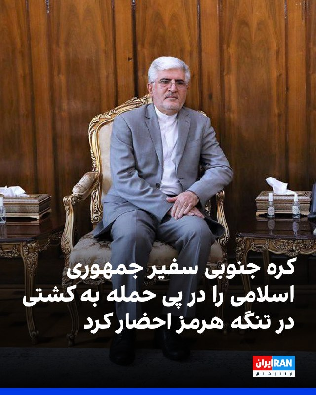

خبرگزاری یونهاپ گزارش داد وزارت خارجه کره جنوبی چهارشنبه سعید کوزه‌چی، سفیر جمهوری اسلامی در سئول، را احضار کرد و نسبت به حمله به کشتی «اچ‌ام‌ام نامو» در تنگه هرمز اعتراض رسمی ارائه داد.

پارک یون‌جو، معاون اول وزیر خارجه کره جنوبی، گفت بررسی‌های فنی نشان می‌دهد دو شیء پرنده‌ای که ۱۴ اردیبهشت به این کشتی برخورد کردند، احتمالا موشک‌های ضدکشتی «نور» ساخت ایران بوده‌اند.

به گفته او، یکی از کلاهک‌ها منفجر نشد اما دیگری هنگام برخورد انفجار و آتش‌سوزی در کشتی ایجاد کرد. در این حادثه یکی از ۲۴ خدمه کشتی زخمی شد.
‌🏁 🇬🇧 IranintlTV

🤖 @VahidOOnLine

## VahidOOnLine — post 242417

  <a href="telegram/content/VahidOOnLine_242417_1779890665.mp4" target="_blank">🎬 Download video</a>

از «کمک در راه است» تا مذاکره، معامله و بازگشت به همان سیاست همیشگی؟ ورق بزنید.
‌🏁 🇬🇧 ManotoTV

🤖 @VahidOOnLine

## VahidOOnLine — post 242416

  <a href="telegram/content/VahidOOnLine_242416_1779890666.mp4" target="_blank">🎬 Download video</a>

⭕️ دیدار مخالفان جنگ در واتیکان؛
پدرو سانچز به ملاقات پاپ لئو چهاردهم رفت

♦️پدرو سانچز، نخست وزیر اسپانیا روز چهارشنبه ششم خردادماه در واتیکان با پاپ لئو چهاردهم، پیشوای کلیسای کاتولیک جهان دیدار کرد.

نخست وزیر اسپانیا و پاپ، در ماه‌های گذشته و از زمان آغاز حمله آمریکا و اسرائیل با جمهوری اسلامی ایران، از مخالفان جدی جنگ بودند.

واتیکان اعلام کرد در جریان ملاقات سانچز با پاپ لئو چهاردهم، دو طرف بر «تحکیم روابط دوجانبه، لزوم گفتگو میان کلیسا و دولت و همچنین دغدغه‌های مشترک در مواجهه با مخاصمات جهانی، مهاجران و فوریت ترویج صلح از راه چندجانبه‌گرایی و احترام به حقوق بین‌الملل» تاکید کردند.

اسپانیا یکی از بزرگ‌ترین و پرجمعیت‌ترین کشورهای کاتولیک اروپا به شمار می‌رود و از قرن ۱۶ میلادی به بعد در جریان جنگ‌های استعماری، سرزمین‌های بسیاری را به تبعیت از کلیسای کاتولیک واداشت.
‌🇸🇦 Indypersian

🤖 @VahidOOnLine

## VahidOOnLine — post 242415

  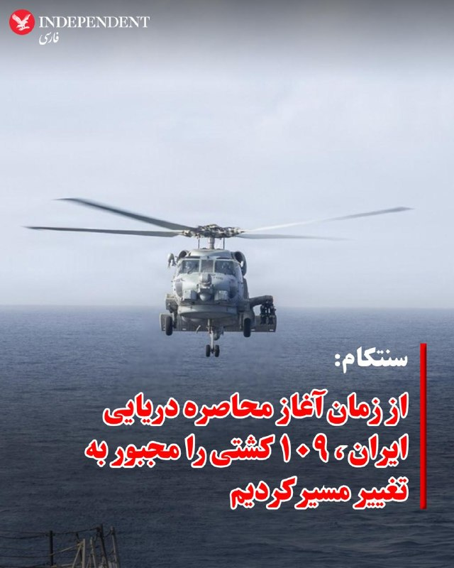

♦️فرماندهی مرکزی ایالات متحده (سنتکام) که هدایت عملیات نظامی آمریکا در خاورمیانه را بر عهده دارد، چهارشنبه ششم خرداد اعلام کرد که از زمان آغاز محاصره دریایی ایران، مسیر ۱۰۹ کشتی تجاری را تغییر داده است.

سنتکام با انتشار عکسی از یک بالگرد سی‌هاوک در شبکه اجتماعی اکس نوشت این بالگرد پس از گشت‌زنی در دریای عرب، در حمایت از عملیات محاصره دریایی ایران، به ناوشکن «دلبرت دی. بلک» نزدیک شد. به گفته سنتکام، این اقدام با هدف اجرای محدودیت‌های دریایی و جلوگیری از عبور کشتی‌ها در منطقه انجام شده است.
‌🇸🇦 Indypersian

🤖 @VahidOOnLine

## VahidOOnLine — post 242414

  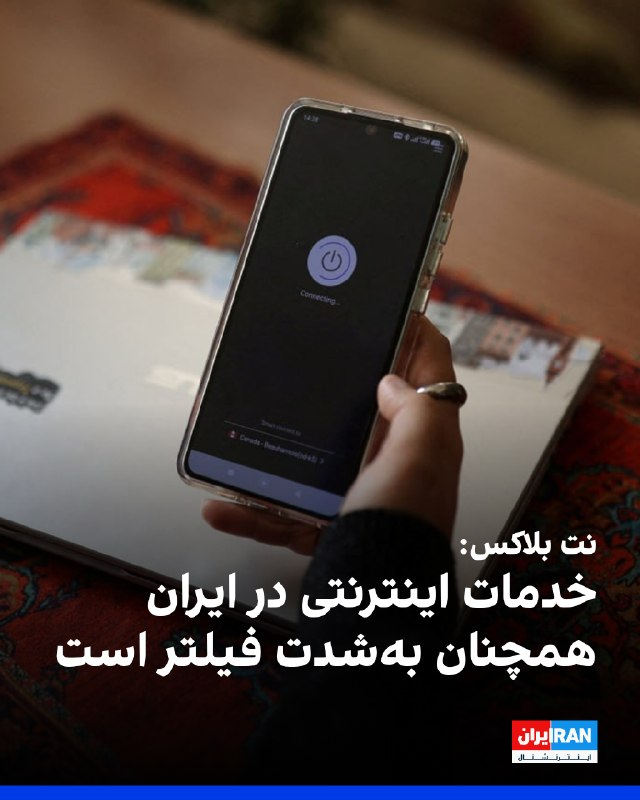

نت‌بلاکس، نهاد ناظر بر اختلال‌های اینترنتی در جهان، چهارشنبه شش خرداد اعلام کرد که اتصال اینترنت ایران در ۲۴ ساعت گذشته در حالت بازگشت به وضعیت سابق قرار دارد، اما خدمات همچنان به‌شدت فیلتر است و محدودیت‌های جدیدی بر پیام‌رسان‌ها و فروشگاه‌های اپلیکیشن اعمال می‌شود.
‌🏁 🇬🇧 IranintlTV

🤖 @VahidOOnLine

## VahidOOnLine — post 242413

  

عمر تیشلر، فرمانده نیروی هوایی اسرائیل، چهارشنبه در مراسم رونمایی از هواپیمای سوخت‌رسان «گیدئون» مدل کی‌سی-۴۶، با اشاره به جنگ اخیر آمریکا و اسرائیل علیه جمهوری اسلامی گفت: «حکومت ایران که هدف خود را نابودی اسرائیل قرار داده بود، با قدرت آتشی روبه‌رو شد که نه می‌شناخت و نه پیش‌بینی می‌کرد و نتوانست آن را متوقف کند.»

او افزود: «حدود دو ماه پیش از باندهای پایگاه نواتیم، هواپیماهای سوخت‌رسان برخاستند و تمام نیروی هوایی را به ایران رساندند.»

تیشلر همچنین گفت نیروی هوایی اسرائیل همچنان در حال عملیات است، به حزب‌الله حمله می‌کند، از ساکنان شمال اسرائیل دفاع می‌کند و در غزه علیه حماس عملیات انجام می‌دهد.

او تاکید کرد: «برای هر تحول، در هر جبهه‌ای آماده‌ایم.»
‌🏁 🇬🇧 IranintlTV

🤖 @VahidOOnLine

## WithYashar — post 12682

مهر: یک ساختمان اداری در فرودگاه امام خمینی آتش گرفت
دقایقی قبل یک ساختمان اداری در شهر فرودگاهی دچار حریق شده است.

این حریق در یک ساختمان اداری گمرک شهر فرودگاهی به وقوع پیوسته است.
تاکنون از علت دقیق حادثه و میزان خسارت و تلفات احتمالی اطلاعاتی در دست نیست.
@withyashar

## WithYashar — post 12681

ترامپ امروز ساعت ۱۱ به وقت محلی (حوالی ساعت ۱۹ به وقت تهران) برای بررسی مذاکرات با ایران، جلسه‌ای با اعضای کابینه و دستیاران ارشد خود خواهد داشت
@withyashar

## WithYashar — post 12680

واقعا این ملت باید به دیکتاتور وطن پرست بالا سرشون باشه . ملتی که جمهوری اسلامی پرورش داده جز دزدی بی فکری پاچه خوار تو اوج بیسوادی ولی ادعای دانشمند بودن میکنن آدم فروشی ...... اینا با دموکراسی درست نمیشن فقط باید یه دیکتاتور بالا سرشون باشه مثل رضا خان بزرگ . این جماعت تو هر لحظه رنگ عوض میکنن در این حد احمق حالا یه عده میگن توهین میکنی با کلمه احمق ولی توهین نیس واقعیته یه واقعیت تلخ . حکومت هر کشوری طبق لیاقت مردمش اداره و اجرا میشه واقعا متاسفم پاسوز یه عده جوگیر احمق شدیم

## WithYashar — post 12679

درووود بهت یاشار عزیز،همین که توی حاشیه اصلا حرکت نمیکنی یعنی کارت درسته.فقط(( هدف ))مهمه تمام.

## WithYashar — post 12678

درووود بهت یاشار عزیز،همین که توی حاشیه اصلا حرکت نمیکنی یعنی کارت درسته.فقط(( هدف ))مهمه تمام.

## WithYashar — post 12677

لیندسی گراهام:«مدت‌هاست برایم روشن شده که پاکستان به‌عنوان یک میانجی، فراتر از حدِ مشکل‌ساز است. دشمنی آن‌ها با اسرائیل، ریشه‌دار و دیرینه است.

این حقیقت را نمی‌توان انکار کرد که هواپیماهای نظامی ایران در پایگاه‌های هوایی پاکستان نگهداری می‌شوند؛ و همچنین مواضع و سخنان گذشتهٔ بلندپایه‌ترین مقام‌های پاکستانی علیه اسرائیل نیز نگران‌کننده است.»
@withyashar

## WithYashar — post 12676

## WithYashar — post 12675

  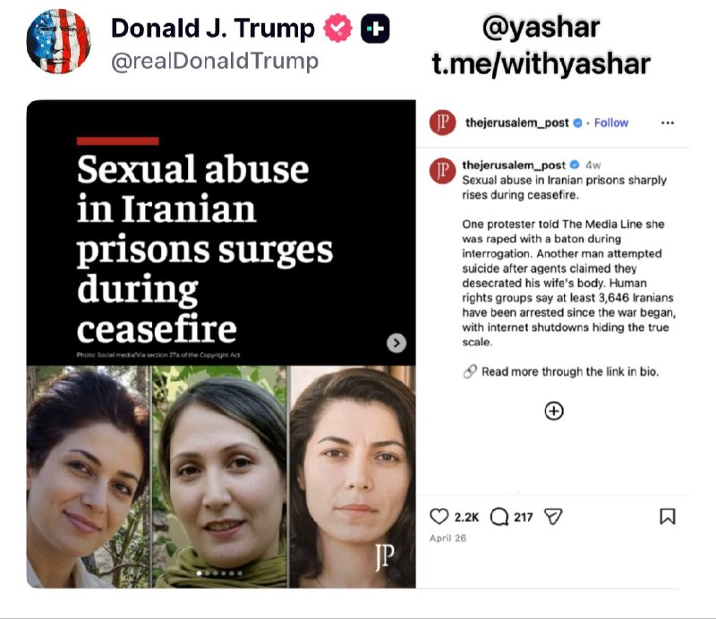

پست جدید ترامپ در تروث از جروزالم پست :
آزار و اذیت جنسی در زندان‌های ایران در دوران آتش‌بس به‌شدت افزایش یافته است
جروزالم پست
آزار و اذیت جنسی در زندان‌های ایران در دوره آتش‌بس به‌طور چشمگیری افزایش پیدا کرده است.
یکی از معترضان به مدیا لاین گفته که هنگام بازجویی با باتوم به او تجاوز شده است.
مرد دیگری پس از آن‌که مأموران ادعا کردند به پیکر همسرش بی‌حرمتی کرده‌اند، اقدام به خودکشی کرده است.
گروه‌های حقوق بشری می‌گویند از زمان شروع جنگ، دست‌کم ۳۶۴۶ ایرانی بازداشت شده‌اند و قطع اینترنت باعث شده ابعاد واقعی ماجرا پنهان بماند.
@withyashar

## WithYashar — post 12674

  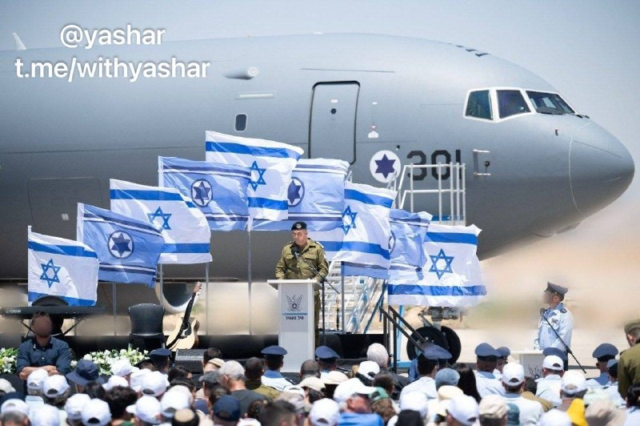

هواپیمای سوخت‌رسانی جدید نیروی هوایی اسرائیل، KC-46A Pegasus "Gideon" (301)، اندکی پیش در اسرائیل فرود آمد و ایال زمیر، رئیس ستاد کل ارتش اسرائیل، در مراسم استقبال حضور داشت. این هواپیما اولین فروند از شش فروند سفارش داده شده است و امکان سفارش دو فروند دیگر نیز وجود دارد.
@withyashar

## WithYashar — post 12673

  <a href="telegram/content/WithYashar_12673_1779890672.mp4" target="_blank">🎬 Download video</a>

پیمان بستم و شب و روز بیدارم 
👑
@withyashar

## WithYashar — post 12672

## WithYashar — post 12669

  <a href="telegram/content/WithYashar_12669_1779890674.mp4" target="_blank">🎬 Download video</a>

وزیر امنیت داخلی اسرائیل: توافق ترامپ و ایران یک توافق بد است که می‌تواند به اسرائیل آسیب برساند. ما اجازه نخواهیم داد این اتفاق بیفتد!
@withyashar

## WithYashar — post 12668

شبکه 12 اسرائیل:ناوگان هوایی آمریکا ظرف 72 ساعت به پایگاه‌های خود در اروپا منتقل خواهد شد و در صورت از سرگیری درگیری با ایران، هواپیماها در حالت آماده‌باش برای بازگشت به فرودگاه بن گوریون قرار خواهند گرفت
@withyashar

## WithYashar — post 12667

جلسه کمپ دیوید که قرار بود امروز برگزار شود ترامپ اعلام کرد: جلسه کابینه به دلیل شرایط آب و هوایی در کاخ سفید برگزار خواهد شد، نه در کمپ دیوید! حالا صحبت‌هایی هست که کمپ دیوید یک تله برای شناسایی فردی بود که اطلاعات را نشت می‌داد ! فرد مورد نظر گیر افتاد !…

## WithYashar — post 12666

بگو یادتون رفته پزشکیان همونی بود که ۳ ماه پیش جز شورایی بود که دستور کشتن ۵۰ هزار تا از بچه هامون رو داد واسه یه اینترنت شد ادم خوبه کاش وصل نمیشد همون 😡😡😔😔

## WithYashar — post 12665

بگو یادتون رفته پزشکیان همونی بود که ۳ ماه پیش جز شورایی بود که دستور کشتن ۵۰ هزار تا از بچه هامون رو داد واسه یه اینترنت شد ادم خوبه کاش وصل نمیشد همون 😡😡😔😔

## WithYashar — post 12664

حالا بدیش اینه که این کند ذهن این مدت نت هم داشته و پیگیر کانال هم بوده و همش پیغام میداده زر زر 😡 اخطار هم داده بودم و گفته بودم دیگه دایرکت نده کلا ، دیشب گفتم بعضی ها میخوان مغذشوت پلمپ باشه ! مگه یه معجزه اتفاق بیوفته 
🪄

## WithYashar — post 12663

واقعا فک نمیکنی تو شرایط فعلی درست نیست فعلا پزشکتان خراب کنی ؟ این همه ادم دیوث هست تو اینا یکی ک داره جلو سپاه وایمیسه رو چت نزن روش

## WithYashar — post 12662

واقعا فک نمیکنی تو شرایط فعلی درست نیست فعلا پزشکتان خراب کنی ؟ این همه ادم دیوث هست تو اینا یکی ک داره جلو سپاه وایمیسه رو چت نزن روش

## WithYashar — post 12661

  <a href="telegram/content/WithYashar_12661_1779890676.mp4" target="_blank">🎬 Download video</a>

عضو شورای اطلاع رسانی دولت : چرا رسانه‌های ضدحکومت دچار سردرگمی و بی‌برنامگی شدند؟
@withyashar
یاشار: چرتو پرتاشو کات کردم ولی اگه ویس های دیشبم رو گوش‌کرده باشید این قسمت حرفش درسته ! ما باید تغییر‌تاکتیکی‌بدیم یا منتظر همون معجزه باشیم که منم گفتم !!! ادب ازکه آموختی از بی ادبان !

## mwarmonitor — post 9812

🔸مارک لوین:

اسرائیل با حزب‌الله در لبنان می‌جنگد، زیرا:

1. حزب‌الله هر روز و به‌طور مداوم هزاران موشک و پهپاد به سوی اسرائیل شلیک می‌کند و به این کشور حمله می‌کند.
2. حزب‌الله در تلاش است شمال اسرائیل و در نهایت بخش‌هایی از مرکز این کشور را خالی از سکنه کند، زیرا اسرائیلی‌ها مجبور می‌شوند جوامع محل زندگی خود را ترک کنند.
3. دولت و ارتش لبنان ناتوان از—و یا مایل به—جلوگیری از فعالیت حزب‌الله در خاک خود هستند (گروه تروریستی اسلام‌گرای مرتبط با ایران جنگ داخلی را علیه کشوری با اکثریت مسیحی آغاز کرد و حزب‌الله کنترل نهایی، به‌ویژه بر جنوب لبنان، را در دست دارد).
4. هیچ کشور دیگری در جهان چنین تروریسمی علیه مردم خود را بدون پاسخ نظامی قاطع تحمل نمی‌کند.
5. نه، اسرائیل مسیحیان را نمی‌کشد و به‌طور تصادفی و کورکورانه جوامع را بمباران نمی‌کند؛ برخلاف ادعاهایی که اکنون برخی افراد غیرمسئول مطرح می‌کنند (بار دیگر، این‌گونه اتهامات علیه اسرائیل مطرح می‌شود، در حالی که کشورها و جنبش‌های تروریستی دیگر در واقع مسیحیان را هدف قرار می‌دهند و با انتقاد بسیار کمتری مواجه می‌شوند).
6. همه اسرائیلی‌ها و همه احزاب سیاسی این کشور در ضرورت درهم‌کوبیدن حزب‌الله متحد هستند.
7. اگر تروریست‌های اسلام‌گرا که توسط رژیم ایران پشتیبانی می‌شوند چنین اقداماتی را علیه کشور ما انجام می‌دادند، حتی برای یک لحظه هم آن را تحمل نمی‌کردیم.

@mwarmonitor

## mwarmonitor — post 9811

  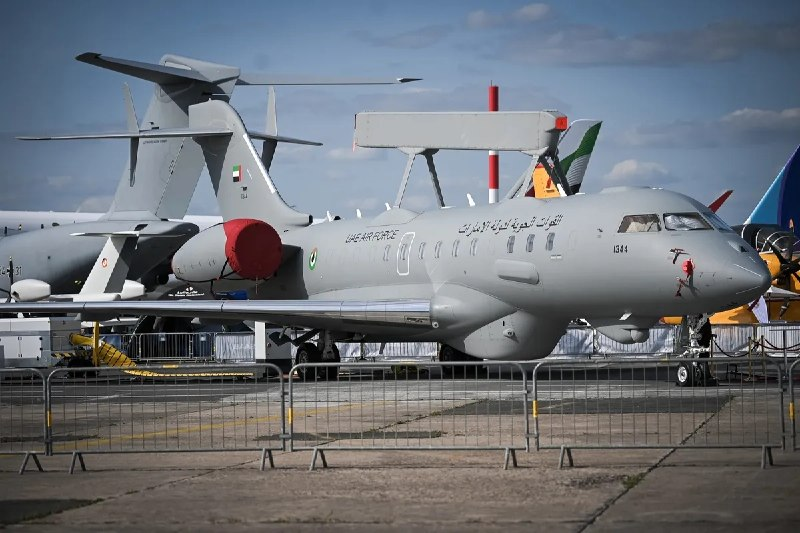

✈️کانادا وارد مذاکراتی برای خرید هواپیمای هشدار زودهنگام و کنترل هوابرد GlobalEye ساخت شرکت ساب شده است؛ این خبر را مارک کارنی، نخست‌وزیر کانادا، اعلام کرد.

@mwarmonitor

## mwarmonitor — post 9810

🔴شبکه N12 اسرائیل گزارش داد که در صورت امضای توافق با ایران، هواپیماهای نظامی آمریکا ـ از جمله تانکرهای سوخت‌رسان نیروی هوایی آمریکا (USAF) که در اسرائیل مستقر هستند ـ انتظار می‌رود ظرف ۷۲ ساعت به پایگاه‌هایی در اروپا منتقل شوند.

🔸بر اساس این گزارش، در صورتی که درگیری با ایران از سر گرفته شود، تانکرهای نیروی هوایی آمریکا دوباره به فرودگاه بن‌گوریون بازخواهند گشت.

@mwarmonitor

## mwarmonitor — post 9809

  <a href="telegram/content/mwarmonitor_9809_1779890679.mp4" target="_blank">🎬 Download video</a>

🔸ناتو امروز در حال انجام عملیات گسترده‌ای بر فراز دریای شمال برای شناسایی و شکار زیردریایی‌های روسیه است؛ هم‌زمان، یک فروند هواپیمای شناسایی Rivet Joint بریتانیا در حال انجام مأموریت‌های اطلاعاتی برای رصد تجمع نیروهای روسیه در نزدیکی دریای بالتیک است.

@mwarmonitor

## mwarmonitor — post 9808

  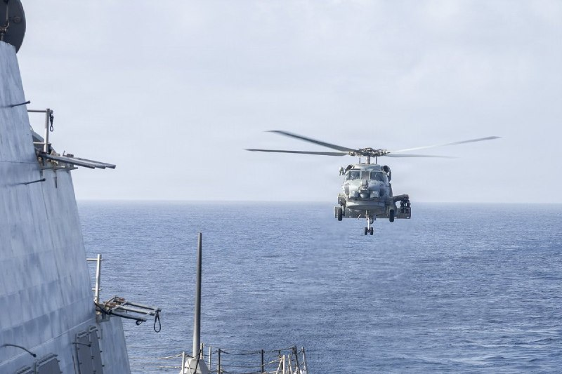

🔴یک فروند بالگرد MH-60R سی‌هاوک پس از گشت‌زنی در دریای عرب در حمایت از محاصره دریایی آمریکا علیه ایران، به ناوشکن USS Delbert D. Black (DDG-119) نزدیک می‌شود.
تا تاریخ ۲۷ مه، ۱۰۹ کشتی تجاری برای اطمینان از رعایت این محاصره تغییر مسیر داده‌اند.

@mwarmonitor

## mwarmonitor — post 9807

🔸رئیس ستاد کل ارتش اسرائیل، ایال زامیر، گفت برنامه هسته‌ای ایران “سال‌ها” به عقب رانده شده است، در حالی که گزارش‌ها از احتمال دستیابی به یک توافق در کوتاه‌مدت با تهران خبر می‌دهند.

🔹زامیر گفت “محور شرارت” به رهبری رژیم آیت‌الله‌های ایران به‌طور قابل توجهی تضعیف شده است؛ به‌طوری‌که رهبران آن تحت تعقیب هستند، بخش زیادی از توان نظامی‌اش نابود شده، اقتصادش در حال فروپاشی است و آینده ثبات آن نامطمئن است.

@mwarmonitor

## mwarmonitor — post 9806

🔸العربیه: به گفته منابع، احتمال دارد طی چند هفته یک توافق میان آمریکا و ایران حاصل شود.

@mwarmonitor

## mwarmonitor — post 9805

🔴جان بولتن ؛ هر روزی که مذاکرات میان آمریکا و ایران ادامه پیدا می‌کند، هدیه‌ای برای این رژیم است. این گفت‌وگوها روزِ حساب‌رسیِ رژیم را به تعویق انداخته‌اند. آتش‌بس و مذاکرات پس از آن یک اشتباه کامل است.

@mwarmonitor

## mwarmonitor — post 9803

📌لکه‌های نفتی مرموز همچنان در نزدیکی جزیره خارک در حال حرکت هستند. تا دیروز هیچ کشتی در حال بارگیری نبود و با این حال هنوز تعداد زیادی کشتی در لنگرگاه حضور دارند.

🔸مخازن ذخیره‌سازی در خشکیِ خارک تغییری نکرده و در سطح پر (حداکثر ظرفیت) قرار دارند. اخیراً افزایش ذخایر عمدتاً در جاسک و بندرعباس مشاهده شده است.

@mwarmonitor

## mwarmonitor — post 9802

  <a href="telegram/content/mwarmonitor_9802_1779890682.mp4" target="_blank">🎬 Download video</a>

🔴به‌روزرسانی تنگه هرمز | عبور کشتی‌ها

🚢تعداد عبورهای تأییدشده از تنگه هرمز در منطقه تحت نظارت در تاریخ ۲۵ مه به تنها دو مورد کاهش یافت و این روند الگوی معمول آخر هفته‌ها (افزایش تردد) و سپس کاهش فعالیت در روزهای کاری را ادامه می‌دهد.

🚢هر دو کشتی از مسیر ایرانی استفاده کردند، در حالی که از ۱۰ مه تاکنون هیچ حمله فیزیکی جدیدی ثبت نشده و همچنان اختلال در سیگنال‌ها ادامه دارد.

🔸این تعداد پایین نشان می‌دهد که ترافیک همچنان محدود، وابسته به مسیر و تحت تأثیر مجوزهای عبور ایران است. مذاکرات میان آمریکا و ایران همچنان عامل کلیدی محسوب می‌شود و انتظار می‌رود دسترسی تا زمان رسیدن به چارچوب روشن‌تری برای ناوبری، به‌صورت گزینشی ادامه داشته باشد.

@mwarmonitor

## mwarmonitor — post 9801

  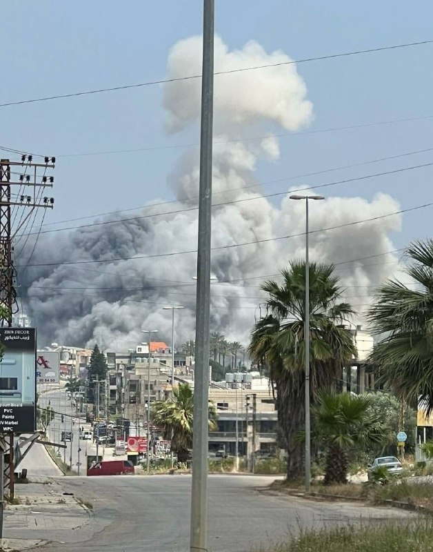

🔴ارتش اسرائیل (IDF) در حال حاضر در حال هدف قرار دادن عمق لبنان، از جمله دره بقاع است.

@mwarmonitor

## mwarmonitor — post 9800

🔴کره جنوبی چشم به ساخت زیردریایی هسته‌ای دوخته است

🔰کره جنوبی در نظر دارد اولین زیردریایی با سوخت هسته‌ای خود را تا اواسط دهه ۲۰۳۰ ساخته و به آب بیندازد؛ اقدامی که بخشی از هدف آن، مقابله با زرادخانه رو به رشد همسایه شمالی‌اش، کره شمالی است.

🔸چرا این موضوع اهمیت دارد؟ این پروژه عظیم، بخش کشتی‌سازی این کشور را (که اغلب در ایالات متحده مورد تمجید قرار می‌گیرد) و همچنین تعهدات بین‌المللی آن در زمینه عدم اشاعه تسلیحات هسته‌ای را محک خواهد زد. اگر این طرح با موفقیت همراه شود، می‌تواند وضعیت امنیتی موجود در آسیا را بازتعریف کند. در حال حاضر تنها انگشت‌شماری از کشورهای جهان زیردریایی‌های هسته‌ای در اختیار دارند.

رویداد جاری: وزارت دفاع کره جنوبی روز سه‌شنبه از «طرح اساسی توسعه زیردریایی‌های با سوخت هسته‌ای» رونمایی کرد. این برنامه، تعهدی چند دهه‌ای را ترسیم می‌کند و به ایجاد بیش از ۴۰ هزار موقعیت شغلی منجر خواهد شد.
جزئیات بیشتر: انتظار می‌رود سئول از سوخت اورانیوم با غنای پایین استفاده کند.
پیشینه (فلش‌بک): ایالات متحده در ماه نوامبر اعلام کرد که «مجوز ساخت زیردریایی‌های تهاجمی با سوخت هسته‌ای را به جمهوری کره (ROK) اعطا کرده است.» این تصمیم در پی دیدار رؤسای جمهور آمریکا و کره جنوبی اتخاذ شد.

@mwarmonitor

## mwarmonitor — post 9799

📌نشریه تلگراف ؛ از نظر سیاسی و تصویری، وضعیت برای یک رئیس‌جمهور نمی‌تواند بدتر از این باشد: واگذاری میلیاردها دلار به همان رژیمی که آمریکا با آن در حال جنگ بوده است.

🔸پول نقد در ازای یک تفاهم‌نامه (Memorandum of Understanding) آسیب‌پذیری رئیس‌جمهور را در برابر خشم رأی‌دهندگان آشکار می‌کند

@mwarmonitor

## mwarmonitor — post 9798

🔴اختصاصی آکسیوس : آزمایش «کامپیوتر صورت مبتنی بر هوش مصنوعیِ» شرکت ریوت توسط لشکر ۴ پیاده‌نظام ارتش آمریکا

📝نویسنده: کالین دمارست AXIOS

🔰شرکت ریوت اینداستریز (Rivet Industries) تعداد ۷۰ فروند از «سیستم‌های فرماندهی مأموریت سربازپایه» (SBMC) خود را به ارتش ایالات متحده تحویل داده و انتظار دارد ظرف کمتر از یک سال آینده، صدها فروند دیگر از این سیستم را نیز تحویل دهد.

🔸این شرکت نوپا (استارتاپ) همچنین ژنرال بازنشسته، جیمز مینگاس (James Mingus)، جانشین سابق رئیس ستاد مشترک ارتش آمریکا را به عنوان مشاور به خدمت گرفته است.

چرا این موضوع اهمیت دارد؟
رقابت بر سر پروژه SBMC که شرکت اندوریل اینداستریز (Anduril Industries) نیز در آن حضور دارد، به‌دقت زیر ذره‌بین کارشناسان قرار دارد. پروژه قبلی ارتش در این زمینه، یعنی سیستم واقعیت افزوده بصری یکپارچه (IVAS)، به یک کیسه بوکس میلیارد دلاری برای انتقادها تبدیل شده بود (شکست بزرگی خورده بود).
آخرین وضعیت
به گفته دیوید مارا (David Marra)، مدیرعامل شرکت ریوت، سربازان لشکر ۴ پیاده‌نظام ارتش آمریکا، محصول پیشنهادی این شرکت را به‌طور گسترده مورد آزمایش قرار داده‌اند.
بازخوردهای دریافتی در مجموع مثبت بوده است. برخی از سربازان خواستار عملکرد بهتر حسگر نور ضعیف (دید در شب) دستگاه شدند؛ برخی دیگر نیز خواهان مدیریت تمیزتر کابل‌ها و اصلاحاتی در رابط کاربری (UI) سیستم بودند.
دیوید مارا در گفتگو با اکسیوس گفت: «آن‌ها تا جایی که می‌توانستند، به‌طور مداوم و تا مرز نابودی از این دستگاه کار کشیدند.»
«طراحی این سیستم از یک صفحه سفید و از صفر مطلق شروع شد؛ با این پرسش‌ها که: سرباز چگونه می‌خواهد سیستم را روی سرش بگذارد؟ چگونه می‌خواهد آن را بردارد؟ چگونه آن را حمل خواهد کرد؟ تجهیزاتش را کجا می‌خواهد قرار دهد؟ و سوالاتی از این دست.»
وضعیت مالی پروژه
ارتش آمریکا سال گذشته یک قرارداد ۱۹۵ میلیون دلاری برای پروژه SBMC به شرکت ریوت واگذار کرد. این استارتاپ به‌طور جداگانه نیز موفق به جذب میلیون‌ها دلار سرمایه شده است.
نمای کلی از وضعیت شرکت
شرکت ریوت حدود ۶۰ کارمند دارد که در سواحل شرقی و غربی آمریکا مستقر هستند. این استارتاپ همکاری نزدیکی با شرکت پالانتیر تکنولوژیز (Palantir Technologies) دارد (دفاتر هر دو شرکت در محله جورج‌تاون واقع شده است).
کلام آخر
مارا در پایان اشاره کرد: «ما هیچ چیز دیگری به جز این نوع "کامپیوتر صورت مبتنی بر هوش مصنوعی" نمی‌سازیم.»
«من در ۱۸ سال گذشته هیچ کار دیگری جز فعالیت تخصصی در این دسته از فناوری انجام نداده‌ام؛ هیچ چیز دیگر.»

@mwarmonitor

## FoxNewsTwitter — post 342300

  

Fox News (Twitter/X)

Anti-ICE protests turn violent outside Delaney Hall in Newark as federal agents clash with demonstrators overnight.

The standoff is now stretching into its sixth day as protests continue outside the immigration detention center.

## FoxNewsTwitter — post 342299

Fox News (Twitter/X)

JUST IN: Iranian state TV has published what it claims is a new draft proposal for peace with the U.S. — and it reportedly still clashes with several major American red lines.

The proposal allegedly includes demands tied to Iran’s nuclear program and future enforcement measures, while also calling for $20 billion in frozen funds to be released as part of the deal.

VP Vance says he’s hopeful an agreement can still be reached, but warned the administration is focused on securing a deal that Iran won’t violate in the future.

@JacquiHeinrich breaks down the latest developments and what could still blow up the negotiations.

## FoxNewsTwitter — post 342298

  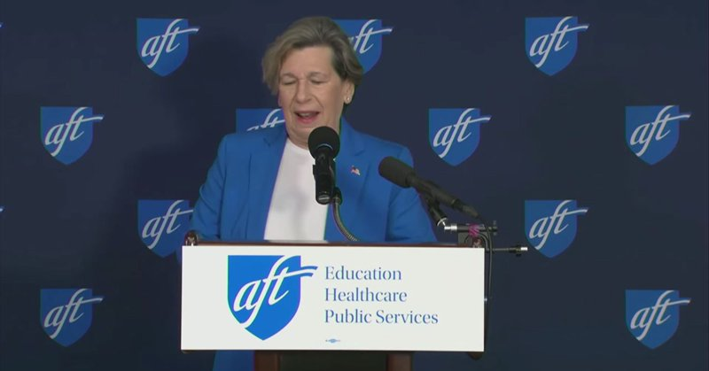

Fox News (Twitter/X)

WATCH LIVE: Teachers union boss Randi Weingarten unveils national framework on screens and AI https://twitter.com/i/broadcasts/1AxRnnZVPAjxl

## FoxNewsTwitter — post 342297

  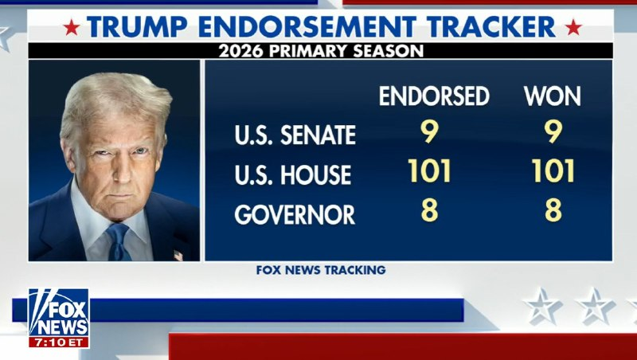

Fox News (Twitter/X)

Trump-backed candidates just keep winning.

After big wins in Texas last night, every single Senate, House, and gubernatorial candidate endorsed by President Trump this year has advanced to the general election so far, giving him a perfect record heading into November.

## FoxNewsTwitter — post 342296

  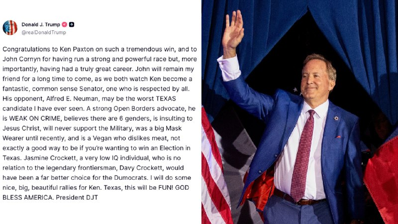

Fox News (Twitter/X)

NEW: President Trump taking a victory lap after Ken Paxton’s GOP Senate primary win in Texas after his endorsement and taking aim at Democrats in the Lone Star State.

“Congratulations to Ken Paxton on such a tremendous win."

“His opponent, Alfred E. Neuman, may be the worst TEXAS candidate I have ever seen. A strong Open Borders advocate, he is WEAK ON CRIME, believes there are 6 genders, is insulting to Jesus Christ, will never support the Military, was a big Mask Wearer until recently, and is a Vegan who dislikes meat."

## pm_afshaa — post 91653

vless://406d8436-0eb9-4eb2-84fb-960e076ffba6@162.159.38.183:2083?mode=stream-one&path=%2Fde&security=tls&alpn=h2%2Chttp%2F1.1&encryption=none&insecure=0&host=de.lezzatzone.ir&fp=chrome&type=xhttp&allowInsecure=0&sni=de.lezzatzone.ir#PMTV%20NEWS%F0%9F%A6%81%E2%98%80%EF%B8%8F

سرور ناپسترنت نا محدود خوراک دانلود

💧 Rainbet.com the #1 Non-KYC Crypto Casino & Sportsbook @rainbetcom

😁 @Pm_Afshaa

## pm_afshaa — post 91652

https://t.me/proxy?server=31.220.73.93&port=443&secret=eefd4d1b6a40aef75802cb6569f0615e11636c6f7564666c6172652e636f6d

پروکسی متصل مخصوص دانلود

💧 Rainbet.com the #1 Non-KYC Crypto Casino & Sportsbook @rainbetcom

😁 @Pm_Afshaa

## pm_afshaa — post 91651

🔴حملات سنگین اسراییل به جنوب لبنان

💧 Rainbet.com the #1 Non-KYC Crypto Casino & Sportsbook @rainbetcom

😁 @Pm_Afshaa

## pm_afshaa — post 91650

از چنل مردمی و آزادی‌خواه «خبرگزاری مملکت» حمایت کنید
👑
👑
👑اخبار مهم رو لحظه‌ای پوشش میدن، جوین داشته باشیدش
❤️‍🔥

https://t.me/mameleekat

## pm_afshaa — post 91649

vless://406d8436-0eb9-4eb2-84fb-960e076ffba6@162.159.38.183:2083?encryption=none&security=tls&sni=de.lezzatzone.ir&alpn=h2%2Chttp%2F1.1&fp=chrome&type=tcp&headerType=none#PMTV%20NEWS%20%F0%9F%A6%81%E2%98%80%EF%B8%8F

v2ray سرعت بالا نامحدود مخصوص دانلود

💧 Rainbet.com the #1 Non-KYC Crypto Casino & Sportsbook @rainbetcom

😁 @Pm_Afshaa

## pm_afshaa — post 91648

🔴رئیس ستاد ارتش اسرائیل : ساختار رژیم آیت‌الله‌ها شدیداً ترک برداشته و آینده و ثباتش تو هاله‌ای از ابهامه

💧 Rainbet.com the #1 Non-KYC Crypto Casino & Sportsbook @rainbetcom

😁 @Pm_Afshaa

## pm_afshaa — post 91647

https://t.me/proxy?server=fn.b2-ray.ru&port=2233&secret=1a78cb0260dffe00aa646e398185a157

پروکسی متصل

💧 Rainbet.com the #1 Non-KYC Crypto Casino & Sportsbook @rainbetcom

😁 @Pm_Afshaa

## pm_afshaa — post 91646

vless://47030ea3-4e8c-4dd6-b440-418a7a54c1a0@47.82.87.196:50724?encryption=none&security=none&type=tcp&headerType=none#PMTV%20NEWS%20%F0%9F%A6%81%E2%98%80%EF%B8%8F

نامحدود سرعت بالا مخصوص اینستا و دانلود

💧 Rainbet.com the #1 Non-KYC Crypto Casino & Sportsbook @rainbetcom

😁 @Pm_Afshaa

## pm_afshaa — post 91645

🔴شبکه 12 اسرائیل:ناوگان هوایی آمریکا ظرف 72 ساعت به پایگاه‌های خود در اروپا منتقل خواهد شد و در صورت از سرگیری درگیری با ایران، هواپیماها در حالت آماده‌باش برای بازگشت به فرودگاه بن گوریون قرار خواهند گرفت

💧 Rainbet.com the #1 Non-KYC Crypto Casino & Sportsbook @rainbetcom

😁 @Pm_Afshaa

## pm_afshaa — post 91644

https://t.me/proxy?server=tg.capycore.ru&port=443&secret=27ebe852539fb8ec5f327c73262bb721

پروکسی مناسب دانلود فیلم و سریال

💧 Rainbet.com the #1 Non-KYC Crypto Casino & Sportsbook @rainbetcom

😁 @Pm_Afshaa

## pm_afshaa — post 91643

🔴آمریکا اجازه اقامت به تیم ملی فوتبال جمهوری اسلامی در بازی های جام جهانی ر‌و نداده و برای هر بازی که تو آمریکا داره؛ فقط همون 2 ساعت اجازه اقامت داره و بعد از بازی سریع باید برگرده مکزیک

💧 Rainbet.com the #1 Non-KYC Crypto Casino & Sportsbook @rainbetcom

😁 @Pm_Afshaa

## pm_afshaa — post 91642

https://t.me/proxy?server=tg.capycore.ru&port=443&secret=27ebe852539fb8ec5f327c73262bb721

پروکسی سرعت بالا متصل

💧 Rainbet.com the #1 Non-KYC Crypto Casino & Sportsbook @rainbetcom

😁 @Pm_Afshaa

## pm_afshaa — post 91641

اگه میخوای از اخبار جا نمونی ٬ تو کانال مردمی Fighter Radar جوین باش

https://t.me/+9C1ENi5qn6hhZjk0
https://t.me/+9C1ENi5qn6hhZjk0

حتما جوین باشید ثانیه‌ای پوشش میدن

## pm_afshaa — post 91640

https://t.me/proxy?server=tg.capycore.ru&port=443&secret=27ebe852539fb8ec5f327c73262bb721 پروکسی متصل سرعت بالا 
💧 Rainbet.com the #1 Non-KYC Crypto Casino & Sportsbook @rainbetcom 
😁 @Pm_Afshaa

## pm_afshaa — post 91639

https://t.me/proxy?server=tg.capycore.ru&port=443&secret=27ebe852539fb8ec5f327c73262bb721

پروکسی متصل سرعت بالا

💧 Rainbet.com the #1 Non-KYC Crypto Casino & Sportsbook @rainbetcom

😁 @Pm_Afshaa

## pm_afshaa — post 91638

  <a href="https://t.me/pm_afshaa/91638" target="_blank">📎 Download file</a>

نپسترنت سرعت بالا برا تمامی اوپراتورها

بفرستین برا بقیه هم وصل شن

💧 Rainbet.com the #1 Non-KYC Crypto Casino & Sportsbook @rainbetcom

😁 @Pm_Afshaa

## pm_afshaa — post 91637

همراه اول امروز در پیامی به کاربران اینترنت پرو اعلام کرد در صورت تمایل می‌توانید اینترنت خود را به حالت قبل برگردانید

💧 Rainbet.com the #1 Non-KYC Crypto Casino & Sportsbook @rainbetcom

😁 @Pm_Afshaa

## pm_afshaa — post 91636

vless://406d8436-0eb9-4eb2-84fb-960e076ffba6@162.159.38.183:2083?encryption=none&security=tls&sni=de.lezzatzone.ir&fp=chrome&alpn=h2%2Chttp%2F1.1&insecure=0&allowInsecure=0&type=xhttp&host=de.lezzatzone.ir&path=%2Fde&mode=stream-one#PMTV%20NEWS%20%F0%9F%A6%81%E2%98%80%EF%B8%8F

نامحدود پر سرعت

💧 Rainbet.com the #1 Non-KYC Crypto Casino & Sportsbook @rainbetcom

😁 @Pm_Afshaa

## pm_afshaa — post 91635

vless://76bc8e3d-0e6b-4a35-b1a7-7f5158042666@45.76.83.35:54985?encryption=none&security=none&type=tcp&headerType=none#PMTV%20NEWS%20%F0%9F%A6%81%E2%98%80%EF%B8%8F

نپسترنت نا محدود سرعت بالا

💧 Rainbet.com the #1 Non-KYC Crypto Casino & Sportsbook @rainbetcom

😁 @Pm_Afshaa

## DEJradio — post 5036

  <a href="telegram/content/DEJradio_5036_1779890689.webm" target="_blank">🎬 Download video</a>

🚨
🔸 ایران فراموش‌شده در سایه بحران هرمز

گزارش: ایمان صفتی

#شاهزاده_رضا_پهلوی #تنگه_هرمز #ایران
@DEJradio

## DEJradio — post 5035

  <a href="telegram/content/DEJradio_5035_1779890690.mp4" target="_blank">🎬 Download video</a>

👑🎥 سه‌شنبه‌های نه به اعدام؛ تجمع ایرانیان ملی‌گرا مقیم هامبورگ

#همبستگی #هامبورگ
@DEJradio

## DEJradio — post 5034

  <a href="telegram/content/DEJradio_5034_1779890692.mp4" target="_blank">🎬 Download video</a>

👑🎥 پرفورمنس «نه به اعدام» در هانوفر؛ روایت جنایات جمهوری اسلامی برای افکار عمومی

#همبستگی #هانوفر
@DEJradio

## DEJradio — post 5033

⭕️ وزیر اسرائیلی گفت اهرم راهبردی جمهوری اسلامی در تنگۀ هرمز در حال نابودی است

الی کوهن، وزیر انرژی دولت اسرائیل، گفت همۀ ظرفیت جمهوری اسلامی در تنگۀ هرمز و اهرم راهبردی آن، در حال نابودی است.
او خبر داد که گفت‌وگوها برای ایجاد زیرساخت‌های انتقال انرژی از شرق به غرب در حال پیشرفت است.
به گفتۀ الی کوهن، هدف از گفت‌وگوهای تازه، انتقال انرژی به اروپا از مسیر اسرائیل است.
الی کوهن افزود کشورهای حاشیۀ خلیج فارس از جمله عربستان سعودی و امارات متحدۀ عربی علاقه‌مند به مشارکت در این پروژه‌ها شده‌اند.
به گفتۀ وزیر انرژی و زیرساخت اسرائیل، کریدور انرژی میان هند و اروپا از طریق کشورهای خلیج فارس و اسرائیل در دست بررسی است. همچنین مسیر مصر می‌تواند اجرای این پروژه را تسریع کند.

#دژ #خبر #اسرائیل
@DEJradio

## DEJradio — post 5032

⭕️ مقام ارشد اسرائیل گفت پایه‌های حکومت آیت‌الله‌ها ترک برداشته است

ایال زمیر، رئیس ستاد کل ارتش اسرائیل گفت پایه‌های حکومت آیت‌الله‌ها به‌طرز قابل توجهی ترک برداشته است.
به گفتۀ این مقام ارشد نظامی اسرائیل، آینده و ثبات نظام جمهوری اسلامی در هاله‌ای از ابهام فرو رفته است.
ایال زمیر یادآوری کرد سران جمهوری اسلامی تحت تعقیب قرار دارند و اصلی‌ترین توانایی‌های نظامی حکومت نابود شده است.
زمیر همچنین گفت برنامۀ هسته‌ای جمهوری اسلامی سال‌ها به عقب رانده شده و اقتصاد کشور در حال فروپاشی است.

#خبر #دژ #اسرائیل
@DEJradio

## DEJradio — post 5031

⭕️ ادعای باقری‌کنی: موضوع ذخایر اورانیوم در دستور کار مذاکرات نیست

علی باقری‌کنی، معاون دبیر شورای عالی امنیت ملی نظام ادعا کرد موضوع ذخایر اورانیوم غنی‌شده در دستور کار مذاکرۀ کنونی با آمریکا قرار ندارد.
او در حاشیۀ نشست امنیتی روسیه مدعی شد تهران و واشینگتن هنوز دربارۀ رفع انسداد تنگۀ هرمز به توافق نرسیده‌اند.
باقری‌کنی گفت جمهوری اسلامی و عمان درمورد سازوکار تازۀ مدیریت تردد کشتی‌ها در تنگۀ هرمز در حال مذاکره‌اند.
دونالد ترامپ تأکید کرده اورانیوم غنی‌شده باید یا به آمریکا تحویل داده شود یا زیر نظارت بین‌المللی رقیق و نابود شود.

#خبر #دژ #اورانیوم #مذاکرات
@DEJradio

## DEJradio — post 5030

⭕️ وزارت اطلاعات جمهوری اسلامی از استارلینک و «شکستن انسجام ملی» می‌ترسد

وزارت اطلاعات جمهوری اسلامی روز چهارشنبه در بیانیه‌ای مدعی شد پس از توقف جنگ سخت، «دشمن» بر جنگ ترکیبی متمرکز شده است.
این وزارتخانه از تشدید فشار اقتصادی، حملات سایبری، جنگ رسانه‌ای، قاچاق سلاح و «ابزارهای ارتباطی همچون استارلینک» به‌عنوان محورهای جنگ ترکیبی نام برد.
در این بیانیه درباره هرگونه اقدام برای شکستن «انسجام ملی و ایجاد گسست اجتماعی» هشدار داده شد. وزارت اطلاعات دولت پزشکیان تهدید کرد با این موارد «با دقت و قاطعیت» برخورد می‌شود.
مشخص نیست منظور وزارت اطلاعات از «انسجام ملی» مورد ادعا چه بوده است.
این تهدیدها تنها یک روز پس از بازگشت اینترنت جهانی در ایران پس از ۸۸ روز قطعی سراسری منتشر شده است.
اسماعیل خطیب، وزیر پیشین اطلاعات در جریان حملات اسرائیل و آمریکا در جنگ چهل روزه کشته شد.
این وزارتخانه اکنون توسط یک سرپرست اداره می‌شود و هنوز فردی به عنوان وزیر اطلاعات، معرفی نشده است.

#خبر #دژ #استارلینک #وزارت_اطلاعات
@DEJradio

## DEJradio — post 5029

  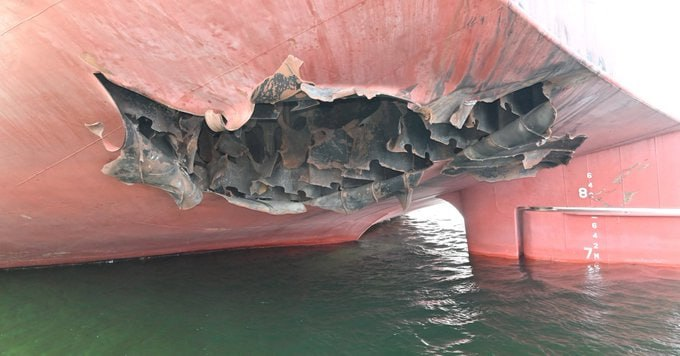

🔺احضار سفیر تهران در سئول؛ جمهوری اسلامی مسئول حمله به کشتی کره‌ای شناخته شد

کره جنوبی اعلام کرد سفیر جمهوری اسلامی را در اعتراض به حمله به یک کشتی کره‌ای در تنگۀ هرمز احضار می‌کند.
سئول پس از چند هفته بررسی اعلام کرد به احتمال بسیار قوی، یک موشک ساخت جمهوری اسلامی عامل حمله به کشتی اچ‌ام‌ام نامو، بود.
پارک یون‌جو، معاون وزیر امور خارجۀ کرۀ جنوبی، گفت تحلیل‌های فنی نشان می‌دهد پرتابۀ استفاده‌شده نسخه‌ای از موشک «نور» بود.
بنا بر داده‌ها روی برخی از قطعات موشک نیز نشانه‌هایی از یک تولیدکنندۀ ایرانی دیده شد.
این کشتی باری کره‌ای در ۱۴ اردیبهشت امسال هدف حمله قرار گرفت.
به گفته مقام‌های کره‌ای، یکی از موشک‌ها درحدود هفت متر در بدنۀ کشتی نفوذ کرده بود.

#خبر #دژ #کره_جنوبی #تنگه_هرمز
@DEJradio

## DEJradio — post 5028

⭕️ پاکستان باید به درخواست ترامپ برای پیوستن به پیمان ابراهیم پاسخ بدهد

لیندزی گراهام، سناتور جمهوری‌خواه آمریکایی گفت با توجه به درخواست دونالد ترامپ برای پیوستن کشورهای اسلامی به پیمان ابراهیم، پاکستان باید موضع خود را روشن کند.
گراهام بار دیگر از نقش پاکستان در میانجی‌گری میان جمهوری اسلامی و آمریکا انتقاد کرد.
این سناتور برجستۀ آمریکایی افزود دشمنی پاکستان با اسرائیل، پیشینه‌ای طولانی دارد.
گراهام تأکید کرد استقرار هواپیماهای نظامی جمهوری اسلامی در پایگاه‌های پاکستان غیرقابل انکار است.
این سیاستمدار نزدیک به ترامپ پیش‌تر نیز گفته بود اگر گزارش‌ مربوط به پناه گرفتن هواپیماهای جمهوری اسلامی در پاکستان درست باشد، نقش اسلام‌آباد به‌عنوان میانجی باید بازنگری شود.

#خبر #دژ #توافق_ابراهیم #پاکستان
@DEJradio

## DEJradio — post 5027

⭕️ ترامپ پس از معاینۀ سه‌ساعتۀ پزشکی از وضعیت سلامتی‌ عالی خود خبر داد

دونالد ترامپ، رئیس‌ جمهوری آمریکا شامگاه سه‌شنبه پس از انجام یک معاینۀ سه‌ساعته در مرکز پزشکی نظامی والتر رید، اعلام کرد همه چیز کاملا عالی بود.
به گزارش کاخ سفید این مراجعه بخشی از معاینات پیشگیرانۀ پزشکی و دندانپزشکی بوده است.
ترامپ در خرداد ماه ماه آینده ۸۰ ساله می‌شود. این چهارمین معاینۀ پزشکی علنی ترامپ از آغاز دور دوم ریاست‌جمهوری او به شمار می‌رود.

#خبر #دژ #ترامپ
@DEJradio

## DEJradio — post 5026

  <a href="telegram/content/DEJradio_5026_1779890695.mp4" target="_blank">🎬 Download video</a>

⭕️ اسرائیل از حذف فرماندۀ تازۀ شاخۀ نظامی حماس در غزه خبر داد

ارتش اسرائیل و شاباک اعلام کردند محمد عوده، فرماندۀ تازۀ شاخۀ نظامی حماس در غزه، در حملۀ هوایی شامگاه سه‌شنبه در شمال غزه کشته شد.
به گفتۀ مقام‌های اسرائیلی، عوده پس از کشته شدن عزالدین حداد در هفتۀ پیشین، فرماندهی شاخۀ نظامی حماس را برعهده گرفته بود.
ارتش اسرائیل اعلام کرد عوده از طراحان حملۀ تروریستی هفتم اکتبر بود.
بنا بر گزارش ارتش اسرائیل، محمد عوده در جریان جنگ نیز عملیات اطلاعاتی و حملات علیه نیروهای اسرائیلی را هدایت می‌کرد.
حماس که سال‌ها از پشتیبانی مالی و فکری جمهوری اسلامی برخوردار بود، در سیاهۀ تروریستی آمریکا و اروپا قرار دارد.
رسانه‌های نزدیک به حماس مدعی شدند محمد عوده همراه با همسر و پسرانش کشته شده است.
یسرائیل کاتز، وزیر دفاع اسرائیل نوشت: ما خود را متعهد کرده‌ایم همۀ کسانی را که کشتار هفتم اکتبر را رهبری کردند از میان برداریم.
به گفتۀ کاتز، همه این افراد، در هر جا که باشند، نشان شده‌اند.

#خبر #دژ #اسرائیل #حماس
@DEJradio

## DEJradio — post 5025

  <a href="telegram/content/DEJradio_5025_1779890697.webm" target="_blank">🎬 Download video</a>

🔺📢 پاشنه آشیل جمهوری اسلامی؛ بحران مشروعیت برای هواداران

*پژمان گلچین، پژوهشگر فلسفه

#پاشنه_آشیل #جنگ
@DEJradio

## DEJradio — post 5024

⭕️ اروپا از گسترش تهدیدهای روسیه به حوزۀ بالتیک و حملات سایبری نگران است

گزارش‌ها نشان می‌دهد نگرانی اروپا در مورد روسیه از جنگ اوکراین فراتر رفته و اکنون احتمال تهدید کشورهای بالتیک و تشدید حملات سایبری نیز مطرح است.
کایا کالاس، مسئول سیاست خارجی اتحادیۀ اروپا هشدار داد اگر کرملین برای ادامۀ جنگ به بسیج تازه نیاز پیدا کند، ممکن است به سمت تشدید تنش در منطقه حرکت کند.
همچنین رئیس سازمان اطلاعات ارتباطات در دولت بریتانیا گفت روسیه به‌طور مداوم زیرساخت‌های حیاتی، روندهای دموکراتیک و زنجیره‌های تأمین در اروپا را هدف قرار می‌دهد.

#خبر #دژ #سایبری #اروپا
@DEJradio

## DEJradio — post 5023

⭕️ از آغاز عملیات «غرش شیران» درحدود ۲۵۰۰ عضو حزب‌الله کشته شدند؛ مخالفت ترامپ با حملۀ دوبارۀ اسرائیل به بیروت

بنیامین نتانیاهو، نخست‌وزیر اسرائیل گفت از آغاز عملیات «غرش شیران» درحدود ۲۵۰۰ عضو حزب‌الله کشته شدند.
شبه‌نظامیان حزب‌الله لبنان که توسط جمهوری اسلامی هدایت می‌شوند، در سیاهۀ تروریستی اتحادیۀ اروپا و آیالات متحده قرار دارند.
نخست‌وزیر اسرائیل افزود تنها در دورۀ آتش‌بس جنگ چهل روزه ۷۰۰ عضو حزب‌الله کشته شدند.
به گفتۀ نتانیاهو، این رقم از کل تلفات حزب‌الله در جنگ دوم لبنان بیشتر بود.
رسانۀ اسرائیلی وای‌نت گزارش داد نتانیاهو و یسرائیل کاتز، وزیر دفاع در نشست کابینۀ امنیتی، دلیل خودداری از حملۀ دوباره به بیروت را مخالفت آمریکا عنوان کرده‌اند.
از سویی شرکت تسلیحاتی اسرائیلی البیت سیستمز، از امضای قرارداد ۱.۴ میلیارد دلاری فروش تسلیحات به یک کشور اروپایی خبر داد. نام این کشور اعلام نشده است.

#خبر #دژ #اسرائیل #غرش_شیران
@DEJradio

## DEJradio — post 5022

⭕️ واردات نفت به چین به پایین‌ترین سطح از سال ۲۰۱۶ سقوط کرد

شرکت اطلاع‌رسانی کالا «کپلر» اعلام کرد واردات روزانۀ نفت به چین در ماه جاری میلادی به ۶.۶ میلیون بشکه کاهش یافته است. این رقم پایین‌ترین سطح از سال ۲۰۱۶ به شمار می‌رود.
به گزارش کپلر، انسداد تنگۀ هرمز از سوی جمهوری اسلامی عامل اصلی این افت شدید بود.
چین سال گذشته روزانه درحدود ۱۱ میلیون و ۵۵۰ هزار بشکه نفت وارد می‌کرد که حدودا ۴۵ درصد آن از کشورهای حوزۀ خلیج فارس تأمین می‌شد.
به گزارش کپلر، کاهش خرید نفت توسط چین سبب شده نفت بیشتری در اختیار پالایشگاه‌های دیگر کشورهای آسیایی قرار گیرد.

#خبر #دژ #چین #نفت
@DEJradio

## DEJradio — post 5021

⭕️ جمهوری اسلامی نیروهای بسیج را برای استفاده از موشک‌های دوش‌پرتاب تحت آموزش قرار داد

شبکۀ فرانس۲۴ گزارش داد به ویدئوها و اسنادی دست یافته که نشان می‌دهد نیروهای نظامی جمهوری اسلامی آموزش گستردۀ استفاده از موشک‌های دوش‌پرتاب «منپدز» به اعضای بسیج‌ را ازسر گرفته‌اند.
سامانۀ دوش‌پرتاب مپندز، شامل موشک‌هایی سبک و هدایت‌شونده است که به‌صورت تک‌نفره قابل استفاده است.
این سامانه بدون نیاز به رادار، هواپیما را با حسگر ردیابی می‌کند و موشک‌های آن بردی بین پنج تا ده کیلومتر دارند.
بر اساس این گزارش، رژیم در جریان جنگ چهل روزه با استفاده از این سامانه‌ها سعی کرد ده‌ها هواپیمای آمریکایی را هدف بگیرد.
فرانس۲۴ همچنین گزارش داده ویدئوها و فایل‌های آموزشی در مورد موشک‌های «میثاق-۱» و «سهند-۳» نیز چند روز پس از آغاز آتش‌بس، در میان هزاران نیروی بسیج توزیع شد.
به گفتۀ کارشناسان، کار با این سامانه‌ها ساده است و حتا آموزش کوتاه‌مدت نیز می‌تواند برای یادگیری استفاده از آن و هدف قرار دادن هواپیماهایی که در ارتفاع پایین پرواز می‌کنند، کافی باشد.
فرانس۲۴ همچنین خبر داد جمهوری اسلامی علاوه بر تولید داخلی، احتمالا شماری از سامانه‌های روسی وربا و نمونه‌هایی از سامانه‌های دوش‌پرتاب چینی را نیز در اختیار دارد.

#خبر #دژ #مزدوران_بسیج
@DEJradio

## DEJradio — post 5020

⭕️ با وجود بازگشایی اینترنت، برخی کاربران هنوز امکان به‌روزرسانی ندارند

پس از بازگشایی اینترنت در ایران، شماری از کاربران همچنان از اختلال در دسترسی به گوگل‌پلی و دریافت آپدیت برنامه‌ها خبر می‌دهند.
ورود به فروشگاه گوگل‌پلی و دانلود یا نصب به‌روزرسانی اپلیکیشن‌ها برای برخی از کاربران ممکن نیست.
واتس‌اپ نیز با وجود بازگشت اینترنت همچنان در دسترس بسیاری از کاربران قرار ندارد.
پیش از قطعی سراسری اینترنت، واتس‌اپ تنها پیام‌رسان بین‌المللی پرکاربر بود که توسط رژیم فیلتر نشده بود.

#خبر #دژ #اینترنت
@DEJradio

## DEJradio — post 5019

⭕️ تهران در جست‌وجوی گشایش مالی بدون «اعلام پیروزی» ترامپ است

بنا بر گزارش‌ها، رژیم حاکم بر ایران به دلیل فشار شدید اقتصادی در پی گشایش مالی در مذاکرات و از سوی دیگر به دنبال جلوگیری از اعلام پیروزی توسط ترامپ‌ است.
وال‌استریت ژورنال به نقل از مقام‌های ایرانی و میانجی‌های عرب گزارش داد جمهوری اسلامی نمی‌خواهد شرایطی در تفاهم‌نامه ایجاد بشود که دونالد ترامپ بتواند اعلام پیروزی بکند.
بر اساس این گزارش، تهران همچنین به دنبال دسترسی به بخشی از حدود ۱۰۰ میلیارد دلار دارایی بلوکه‌شده و بازگشت به بازار جهانی نفت است.
این روزنامه نوشت با وجود حملۀ اخیر آمریکا در جنوب ایران، جمهوری اسلامی از مذاکرات دست نکشید.
وال‌استریت ژورنال، تأیید کرد محور اصلی سفر محمدباقر قالیباف به قطر، مذاکره دربارۀ آزادسازی ۲۴ میلیارد دلار از دارایی‌های بلوکه‌شدۀ جمهوری اسلامی بود.

#خبر #دژ #ترامپ #جمهوری_اسلامی
@DEJradio

## DEJradio — post 5018

⭕️ نیویورک‌تایمز: حملۀ آمریکا پس از شناسایی تهدیدهای جمهوری اسلامی انجام شد

نیویورک‌تایمز به نقل از دو مقام آمریکایی گزارش داد حملۀ شامگاه دوشنبۀ آمریکا به اهدافی در جنوب ایران، پس از شناسایی مجموعه‌ای از تهدیدها از سوی جمهوری اسلامی انجام شد.
بنا بر گزارش‌ها نیروهای آمریکایی متوجه فعالیت سامانه‌های پرتاب موشک، پرواز پهپادها و استقرار قایق‌های مین‌گذار در تنگۀ هرمز شده بودند.
سنتکام پیش‌تر اعلام کرده بود آمریکا قایق‌هایی را که در حال مین‌گذاری بودند و همچنین سامانه‌های پرتاب موشک را هدف قرار داده است.
با این که جمهوری اسلامی این حملات را «نقض آتش‌بس» خوانده، اما وال‌استریت ژورنال گزارش داد تهران خبر کشته شدن نیروهای سپاه را برای آسیب ندیدن روند مذاکرات با آمریکا، دیر منتشر کرد.

#خبر #دژ #سنتکام #تنگه_هرمز
@DEJradio

## mamlekate — post 103590

📝 ترامپ به ایران فرصت صلح داد اما نمی‌تواند به حاکمان مذهبی‌اش اعتماد کند

انتشار این خبر که دونالد ترامپ، رئيس‌جمهوری ایالات متحده، در اقدامی غیرمعمول، قرار است چهارشنبه با تمام اعضای کابینه خود جلسه داشته باشد، نشان می‌دهد او در حال بررسی راه‌هایی برای سرعت بخشیدن به مذاکرات به‌شدت کند و فرسایشی با جمهوری اسلامی ایران است.

@mamlekate

## mamlekate — post 103589

الو چهارشنبه ساعت ۱۳:۰۰ واحد هوا پتروشیمی دماوند که توی جنگ روز ۱۷ فروردین نیروگاهشون مورد اصابت قرار گرفته بود دچار انفجار شد. حداقل ۱ نفر کشته و ۴ نفر مجروح شدن. دلیل انفجار هنوز معلوم نیست.

@mamlekate

## IranIntlTV — post 339243

  

دونالد ترامپ در تروث‌سوشال گزارشی از جروزالم‌پست را بازنشر کرد که بر اساس اطلاعات اختصاصی «مدیا لاین» نوشته است موارد آزار و تعرض جنسی به زنان بازداشت‌شده، به‌ویژه زنان جوان، در زندان‌ها و بازداشتگاه‌های جمهوری اسلامی در دوران آتش‌بس افزایش یافته است.

در این گزارش، زنی جوان به نام کاملیا گفته پس از بازداشت خشونت‌آمیز در خانه‌اش، دو هفته همراه هشت زن دیگر، از جمله دختری ۱۶ ساله که با ساچمه از ناحیه صورت زخمی شده بود، در اتاقی ۲۰ متری نگهداری شد.

به گفته کاملیا، او پس از انتقال به سلول انفرادی و خودداری از اعتراف اجباری، در اتاق بازجویی هدف خشونت قرار گرفت، لباس‌هایش پاره شد، با باتوم مورد تجاوز قرار گرفت، به‌شدت کتک خورد و به تجاوز گروهی تهدید شد.

جروزالم‌پست همچنین با اشاره به قطع گسترده اینترنت، بازداشت‌ها، ناپدیدسازی قهری، آدم‌ربایی، تهدید روزنامه‌نگاران و مخالفان در خارج از کشور و افزایش ناگهانی اعدام مخالفان نوشت سرکوب در ایران تشدید شده است.

دونالد ترامپ پیش‌تر نیز با انتشار پستی در تروث سوشال خواستار آزادی هشت زندانی سیاسی زن در ایران شده بود.
https://iranintl.com/202605276729

## IranIntlTV — post 339242

  <a href="telegram/content/IranIntlTV_339242_1779890699.mp4" target="_blank">🎬 Download video</a>

یک شهروند با ارسال ویدیویی به ایران‌اینترنشنال در چهارشنبه ششم خرداد یخچال خانه خود را نشان می‌دهد که به دلیل گرانی و تورم خالی است.

## IranIntlTV — post 339241

  <a href="telegram/content/IranIntlTV_339241_1779890701.mp4" target="_blank">🎬 Download video</a>

میزان دارایی‌های مسدودشده ایران در کشورهای مختلف بیش از ۱۰۰ میلیارد دلار برآورد شده است. بر اساس گزارش‌ها، بین ۲۰ تا ۳۰ میلیارد دلار از این منابع در چین مسدود شده که حاصل صادرات نفت ایران به این کشور است.
گفت‌وگو با آرش آزرمی، دبیر بخش اقتصادی ایران‌اینترنشنال
@iranintltv

## IranIntlTV — post 339240

  <a href="https://t.me/IranintlTV/339240" target="_blank">📎 Download file</a>

🎧نسخه صوتی اخبار نیم‌روزی | چهارشنبه ۶ خرداد
@iranintlTV

## IranIntlTV — post 339239

  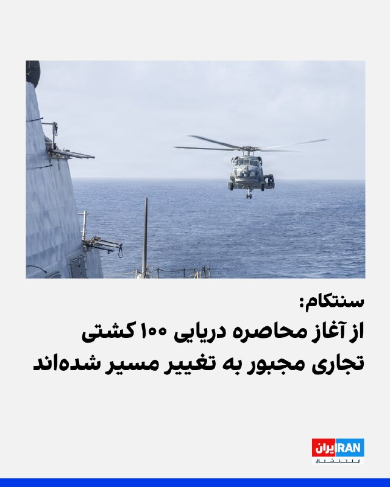

سنتکام، فرماندهی مرکزی آمریکا، در شبکه اجتماعی ایکس اعلام کرد تا شش خرداد، ۱۰۹ کشتی تجاری برای اطمینان از رعایت محاصره دریایی جنوب ایران تغییر مسیر داده شده‌اند.

سنتکام همچنین تصویری منتشر کرد که در آن یک بالگرد «ام‌اچ-۶۰آر سی‌هاوک» پس از گشت‌زنی در دریای عرب در حمایت از این محاصره، به ناوشکن «یو‌اس‌اس دلبرت دی. بلک» نزدیک می‌شود.

این ناوشکن در عملیات مرتبط با اجرای محاصره دریایی علیه ایران مشارکت دارد.
https://iranintl.com/202605278078

## IranIntlTV — post 339238

اپلیکیشن مشترک طالبان و جمهوری اسلامی و نگرانی از صادرات الگوی سرکوب تهران

پلتفرم تحقیقات و دفاع سایبری «رازنت» پس از بررسی گزارش اخیر افغانستان‌اینترنشنال درباره همکاری فنی طالبان و جمهوری اسلامی برای توسعه یک اپلیکیشن، هشدار داد این برنامه می‌تواند به «مساله‌ای جدی» در حوزه امنیت کاربران، حریم خصوصی و رصد دیجیتال تبدیل شود.

رازنت چهارشنبه ششم خرداد با اشاره به گزارش افغانستان‌اینترنشنال نوشت «همکاری احتمالی میان دو ساختار اقتدارگرا که هر دو سابقه یا انگیزه روشن برای کنترل اطلاعات، محدود کردن جامعه مدنی و زیر نظر گرفتن مخالفان دارند»، موضوعی حساسیت‌برانگیز است.

رازنت افزود در پی انتشار این گزارش، اپلیکیشن صفحه‌کلید وابسته به رادیو و تلویزیون افغانستان، موسوم به «کیبورد ملی»، را مورد بررسی قرار داد.
این ارزیابی با استفاده از روش «تحلیل ایستا» انجام گرفت که «کد، مجوزها، نقاط ارتباطی، داده‌های سخت‌کدشده، لاگ‌ها و ساختار امنیتی اپلیکیشن» را شامل می‌شد.

این پلتفرم امنیت سایبری خبر داد بر اساس ارزیابی‌های صورت‌گرفته، این اپلیکیشن «به‌دلیل ماهیتش به‌عنوان کیبورد و به‌دلیل ضعف‌های امنیتی شناسایی‌شده، برای کاربران بسیار نگران‌کننده است».

افغانستان‌اینترنشنال ۱۷ اردیبهشت به نقل از منابع آگاه گزارش داد طالبان و جمهوری اسلامی در توسعه یک اپلیکیشن تلفن همراه همکاری کرده‌اند که طبق اطلاعات رسیده، از توانایی رصد کاربران داخل افغانستان برخوردار است.

منابع آگاه هشدار دادند این اپلیکیشن دارای قابلیت‌های نظارتی و امنیتی است و احتمالا امکان دسترسی به تلفن‌های همراه و دستگاه‌های متصل به اینترنت کاربران را فراهم می‌کند.

خطر افشای گذرواژه‌ها و پیام‌های خصوصی
به گزارش رازنت، بررسی فنی «کیبورد ملی» طالبان نشان داد کلید دسترسی سامانه هوش مصنوعی به‌صورت ثابت در کد آن قرار داده شده است. این بدان معناست که این برنامه، متن کاربران را برای پردازش به یک «زیرساخت بیرونی» ارسال می‌کند.

رازنت نوشت چنین رفتاری در برنامه‌های صفحه‌کلید حساسیت بالایی دارد، زیرا داده‌های تایپ‌شده ممکن است شامل پیام خصوصی، گذرواژه، اطلاعات مالی یا محتوای محرمانه سیاسی باشد و نیاز به اطلاع‌رسانی شفاف دارد.

همچنین بر اساس ارزیابی این پلتفرم تحقیقاتی، «کیبورد ملی» برخی داده‌های حساس، از جمله متن ترجمه‌شده کاربر، پاسخ‌های سامانه و جزییات خطا را در لاگ‌های اندروید ذخیره می‌کند و این مساله، خطر افشای اطلاعات را، به‌ویژه در دستگاه‌های ناامن یا تحت بررسی فنی، افزایش می‌دهد.

رازنت در ادامه نوشت: «اهمیت این گزارش فقط به افغانستان محدود نمی‌شود. این پرونده در امتداد پرسش بزرگ‌تری قرار می‌گیرد: آیا جمهوری اسلامی در حال تبدیل تجربه داخلی خود در سرکوب دیجیتال، نظارت، کنترل ارتباطات و ابزارهای مبتنی بر داده، به یک ظرفیت صادراتی است؟»

تیرماه ۱۴۰۴، وب‌سایت هکرنیوز خبر داد پژوهشگران نمونه‌های جدیدی از ابزارهای جاسوسی اندرویدی را کشف کرده‌اند که به احتمال زیاد با وزارت اطلاعات جمهوری اسلامی مرتبط هستند.

هکرنیوز افزود این برنامه‌ها با جعل اپلیکیشن‌های وی‌پی‌ان و سرویس اینترنت ماهواره‌ای استارلینک، در اختیار کاربران قرار گرفته‌اند.

امنیت کاربران آسیب‌پذیر در خطر است
رازنت در انتهای گزارش خود درباره «کیبورد ملی» طالبان نوشت: «این تحلیل جاسوس‌افزار بودن عمدی اپلیکیشن را به‌طور قطعی ثابت نمی‌کند، اما مجموعه رفتارها و تصمیم‌های فنی شناسایی‌شده، محیطی پرخطر برای سوءاستفاده، نظارت یا افشای ناخواسته داده‌های حساس کاربران ایجاد می‌کند.»

این پلتفرم هشدار داد استفاده از این اپلیکیشن برای «کاربران آسیب‌پذیر» از جمله روزنامه‌نگاران، فعالان مدنی، زنان و مخالفان طالبان، تا پیش از انجام اصلاحات، شفاف‌سازی فرایند پردازش داده‌ها و اعتبارسنجی امنیتی از سوی نهادهای مستقل، توصیه نمی‌شود.

رازنت افزود «کیبورد ملی» می‌تواند یکی از نمونه‌های اولیه از الگویی باشد که در آن، «فناوری‌های ظاهرا خدماتی در محیط‌های اقتدارگرا به بخشی از زیرساخت بالقوه کنترل اجتماعی تبدیل می‌شوند».

پیش‌تر در اردیبهشت ۱۴۰۲، شرکت امنیت سایبری «لوک‌اوت» گزارش داد فرماندهی انتظامی جمهوری اسلامی با نصب جاسوس‌افزار روی تلفن همراه برخی افراد بازداشت‎‌شده، از جمله اقلیت‌های قومی و مذهبی، تلاش کرده است تا پس از آزادی از آن‌ها جاسوسی کند.
 
🔗وب‌سایت ایران‌اینترنشنال
@iranintltv

## IranIntlTV — post 339237

ارم‌نیوز: آمریکا سپر دفاع موشکی خود را در خاورمیانه گسترش می‌دهد

رسانه ارم‌نیوز به نقل از منابع نظامی آگاه گزارش داد ایالات متحده در حال حرکت به ‌سوی گسترش استقرار موشک‌های رهگیر در خاورمیانه است تا مانع از تهدیدات جمهوری اسلامی علیه کشورهای منطقه شود و توانایی‌های تهران را برای انجام حملات تضعیف کند.

این منابع که به محافل تصمیم‌گیری در کاخ سفید نزدیک هستند، چهارشنبه ششم خرداد در مصاحبه با ارم‌نیوز گفتند نگرانی متحدان واشینگتن در خاورمیانه نسبت به نتایج هرگونه توافق احتمالی با حکومت ایران، فشار مضاعفی بر دولت آمریکا وارد کرده است.

بر اساس این گزارش، ایالات متحده در تلاش است با اتخاذ تدابیری جدید، به شرکای خود اطمینان داده و سطح اعتماد در ائتلاف‌های منطقه‌ای را تقویت کند.
ارم‌نیوز افزود رویکرد جامع آمریکا در قبال پرونده تهران بر مهار «برنامه‌های تسلیحاتی، هسته‌ای و توسعه‌طلبانه» جمهوری اسلامی از طریق «توافق‌های الزام‌آور» استوار است.

هم‌زمان توانمندی‌های متحدان منطقه‌ای با سامانه‌های دفاعی پیشرفته تقویت خواهد شد تا بتوانند در برابر هرگونه «تهدید یا ماجراجویی نظامی»، از توان بازدارندگی برخوردار باشند.

جمهوری اسلامی از زمان آغاز جنگ اخیر در ۹ اسفند ۱۴۰۴، شماری از کشورهای منطقه از جمله امارات متحده عربی، عربستان سعودی، بحرین، اردن، قطر و کویت را هدف قرار داده است.

در روزهای اخیر، گمانه‌زنی‌ها درباره سرنوشت مذاکرات تهران و واشینگتن و مفاد توافق احتمالی دو طرف بالا گرفته است.

در این میان، مساله چگونگی تضمین امنیت کشورهای حوزه خلیج‌ فارس در این توافق احتمالی، به یکی از پرسش‌های کلیدی تبدیل شده است.

این در حالی است که شماری از مقام‌های جمهوری اسلامی یکی از شروط تهران برای توافق با واشینگتن را خروج ارتش آمریکا از منطقه عنوان کرده‌اند.

تغییر معادلات بازدارندگی با افزایش تولید موشک‌های رهگیر
ارم‌نیوز در ادامه نوشت موضع قاطع کشورهای خاورمیانه در خصوص ضرورت مقابله با هرگونه تهدید جمهوری اسلامی در منطقه دریای عرب و تنگه هرمز، نقشی کلیدی در شکل‌گیری رویکرد تسلیحاتی آمریکا ایفا کرده است.

بر اساس این گزارش، رویکرد آمریکا بر تامین امنیت میدان‌های گاز و نفت و حفاظت از خطوط کشتیرانی بین‌المللی در دریای سرخ و باب‌المندب در برابر تهدیدات بالستیک تمرکز دارد.

تحلیلگران نظامی معتقدند افزایش کمی و کیفی تولید موشک‌های رهگیر می‌تواند معادلات بازدارندگی را تغییر دهد و راهبردهای مبتنی بر «اشباع موشکی و پهپادی» را با چالش جدی مواجه کند.

به باور ناظران، جمهوری اسلامی که پیش‌تر از کاهش سرعت تولید مهمات رهگیر و همچنین استفاده گسترده و غیرهدفمند از سامانه‌های دفاعی در برخی درگیری‌ها سود برده بود، اکنون با شرایط دفاعی تازه‌ای روبه‌رو خواهد شد.

طبق ارزیابی‌های نظامی، واشینگتن با توسعه و استقرار نسل دوم موشک‌های رهگیر (NGI) در پی تقویت توان دفاعی خود در برابر پیشرفت‌های موشکی چین و روسیه، به‌ویژه در حوزه موشک‌های هایپرسونیک و بالستیک قاره‌پیماست.

۳۱ اردیبهشت، روزنامه واشینگتن‌پست گزارش داد ایالات متحده در جریان دفاع از اسرائیل در برابر حملات جمهوری اسلامی در جنگ اخیر، بیش از نیمی از ذخایر موشک‌های رهگیر «تاد» خود را مصرف کرده است.

نقش «لاکهید مارتین» در تقویت بازدارندگی آمریکا و متحدانش
ارم‌نیوز در ادامه گزارش داد شرکت آمریکایی «لاکهید مارتین» عملیات احداث یک مرکز جدید تولید مهمات را در شهر تروی واقع در ایالت آلاباما آغاز کرده است. این مرکز «ساختمان ۴۷» نام‌گذاری شده است.

بر اساس این گزارش، این مجموعه در مرحله نخست برای پشتیبانی از تولید موشک‌های رهگیر سامانه دفاعی تاد طراحی شده و بخش‌هایی از آن نیز به توسعه نسل جدید موشک‌های رهگیر اختصاص خواهد یافت.

جیم تایکلت، رییس هیات‌مدیره و مدیرعامل لاکهید مارتین، از آمادگی این شرکت برای پاسخ به افزایش تقاضا در حوزه توسعه ظرفیت تولید تسلیحات خبر داد و اعلام کرد یک میلیارد دلار در پروژه جدید این شرکت سرمایه‌گذاری شده است.

به گفته او، هدف از این سرمایه‌گذاری تقویت توان بازدارندگی و تسریع در تحویل سامانه‌های دفاعی پیشرفته به نیروهای عملیاتی و متحدان آمریکا است.

لاکهید مارتین همچنین برنامه‌هایی برای احداث تاسیسات جدید و گسترش پروژه‌های پشتیبانی در دست اجرا دارد. برنامه‌هایی که شامل توسعه موشک‌های نسل دوم، موشک «ای‌جی‌ام-۱۵۸» و سامانه «سلاح واکنش سریع هوایی» می‌شود.

در همین راستا، این شرکت برای افزایش سرعت تولید مهمات، توافق‌نامه‌ای با وزارت جنگ آمریکا امضا کرده که به‌دنبال آن، تولید سامانه «پاتریوت پک-۳ ام‌اس‌ای» سه برابر و تولید سامانه دفاع موشکی تاد، چهار برابر شده است.

تولید موشک‌های حملات هدفمند نیز افزایش یافته است.

🔗وب‌سایت ایران‌اینترنشنال
@iranintltv

## IranIntlTV — post 339236

  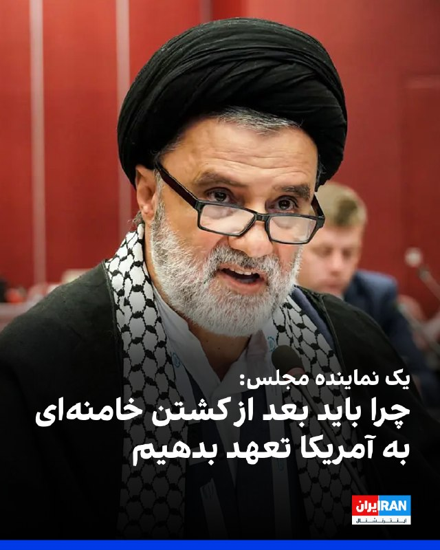

محمود نبویان، عضو کمیسیون امنیت ملی مجلس جمهوری اسلامی، در شبکه ایکس نوشت که جمهوری اسلامی عضو پیمان منع گسترش سلاح‌های هسته‌ای (ان‌پی‌تی) است و پرسید چرا باید به آمریکا بعد از حمله و کشته شدن خامنه‌ای درباره موضوعات هسته‌ای تعهد بدهد.

او افزود: «اساسا به آمریکا چه ربطی دارد که نوع استفاده ایران از انرژی هسته‌ای باید چگونه باشد.»
https://iranintl.com/202605274579

## IranIntlTV — post 339235

  

خبرگزاری یونهاپ گزارش داد وزارت خارجه کره جنوبی چهارشنبه سعید کوزه‌چی، سفیر جمهوری اسلامی در سئول، را احضار کرد و نسبت به حمله به کشتی «اچ‌ام‌ام نامو» در تنگه هرمز اعتراض رسمی ارائه داد.

پارک یون‌جو، معاون اول وزیر خارجه کره جنوبی، گفت بررسی‌های فنی نشان می‌دهد دو شیء پرنده‌ای که ۱۴ اردیبهشت به این کشتی برخورد کردند، احتمالا موشک‌های ضدکشتی «نور» ساخت ایران بوده‌اند.

به گفته او، یکی از کلاهک‌ها منفجر نشد اما دیگری هنگام برخورد انفجار و آتش‌سوزی در کشتی ایجاد کرد. در این حادثه یکی از ۲۴ خدمه کشتی زخمی شد.
https://iranintl.com/202605272150

## IranIntlTV — post 339234

  <a href="telegram/content/IranIntlTV_339234_1779890706.mp4" target="_blank">🎬 Download video</a>

هفته دوم دادگاه رسیدگی به پرونده حمله به پوریا زراعتی، مجری ایران‌اینترنشنال، در دادگاه وولیچ لندن آغاز شده است. دادستان گفت این حمله از سوی نیروهای نیابتی جمهوری اسلامی انجام شده و مهاجمان برای حمله به زراعتی پول دریافت کردند.
یکی از متهمان در دادگاه گفت نمی‌دانسته به چه کسی حمله می‌کند و بعدتر از طریق رسانه‌ها متوجه شده قربانی، روزنامه‌نگار ایرانی بوده است.

تاج‌الدین سروش، خبرنگار ایران‌اینترنشنال، گزارش می‌دهد
@iranintltv

## IranIntlTV — post 339233

  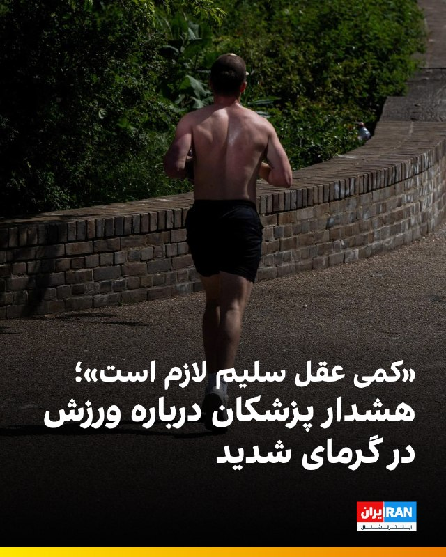

🔻همزمان با موج گرمای کم‌سابقه در جهان، نگرانی‌ها درباره خطرات ورزش کردن در دمای بالا افزایش یافته است؛ نگرانی‌ای که پس از چند حادثه تلخ در مسابقات دو به اوج رسید.

🔹در روزهای اخیر یک دونده ۵۳ ساله در جریان مسابقه ۱۰ کیلومتری «لا پیرنه‌ین» در پاریس جان خود را از دست داد و چندین مورد وخیم نیز در مسابقات مزون-آلفور و منتون گزارش شد؛ اتفاقاتی که بار دیگر توجه‌ها را به خطر گرمازدگی در فعالیت‌های ورزشی جلب کرده است.

🔹مارتن دوکره، پزشک ورزشی و پزشک تیم‌های ملی بوکس فرانسه، در گفت‌وگو با روزنامه فرانسوی «اکیپ» تأکید کرده که ورزش کردن در گرمای شدید می‌تواند حتی برای افراد سالم نیز خطرناک باشد. او توضیح می‌دهد که بدن انسان به‌طور طبیعی دمایی حدود ۳۷ درجه دارد و هنگام ورزش گرمای بیشتری تولید می‌کند. در هوای بسیار گرم، بدن دیگر توانایی کافی برای تنظیم دما را ندارد و همین مسئله می‌تواند به افزایش ضربان قلب، افت فشار، سردرد، حالت تهوع و حتی بیهوشی منجر شود.

🔹جزییات بیشتر را در سایت بخوانید

@iranintltvsport

## IranIntlTV — post 339232

  

نت‌بلاکس، نهاد ناظر بر اختلال‌های اینترنتی در جهان، چهارشنبه شش خرداد اعلام کرد که اتصال اینترنت ایران در ۲۴ ساعت گذشته در حالت بازگشت به وضعیت سابق قرار دارد، اما خدمات همچنان به‌شدت فیلتر است و محدودیت‌های جدیدی بر پیام‌رسان‌ها و فروشگاه‌های اپلیکیشن اعمال می‌شود.
https://iranintl.com/202605270154

## IranIntlTV — post 339231

  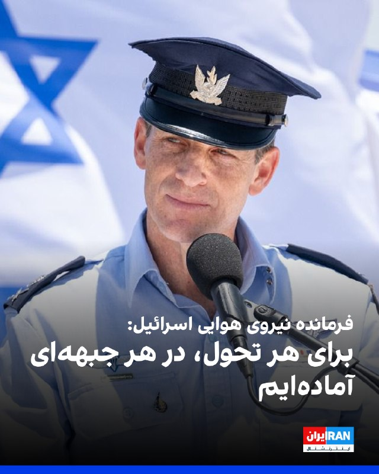

عمر تیشلر، فرمانده نیروی هوایی اسرائیل، چهارشنبه در مراسم رونمایی از هواپیمای سوخت‌رسان «گیدئون» مدل کی‌سی-۴۶، با اشاره به جنگ اخیر آمریکا و اسرائیل علیه جمهوری اسلامی گفت: «حکومت ایران که هدف خود را نابودی اسرائیل قرار داده بود، با قدرت آتشی روبه‌رو شد که نه می‌شناخت و نه پیش‌بینی می‌کرد و نتوانست آن را متوقف کند.»

او افزود: «حدود دو ماه پیش از باندهای پایگاه نواتیم، هواپیماهای سوخت‌رسان برخاستند و تمام نیروی هوایی را به ایران رساندند.»

تیشلر همچنین گفت نیروی هوایی اسرائیل همچنان در حال عملیات است، به حزب‌الله حمله می‌کند، از ساکنان شمال اسرائیل دفاع می‌کند و در غزه علیه حماس عملیات انجام می‌دهد.

او تاکید کرد: «برای هر تحول، در هر جبهه‌ای آماده‌ایم.»
https://iranintl.com/202605272454

## IranIntlTV — post 339230

  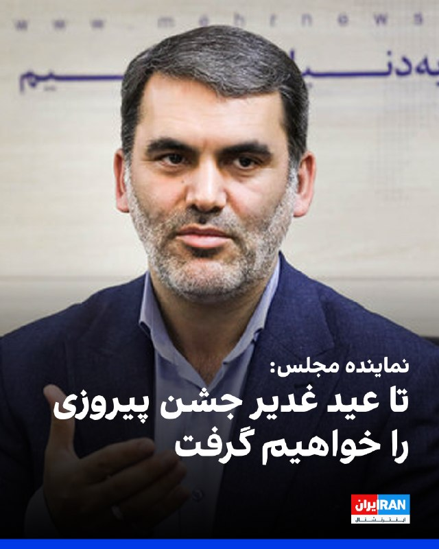

محسن زنگنه، عضو کمیسیون برنامه و بودجه مجلس، گفت جمهوری اسلامی درباره «اصل غنی‌سازی» مذاکره نمی‌کند اما درباره محدودیت درصد غنی‌سازی با آمریکا گفت‌وگو می‌کند.

زنگنه همچنین گفت روند مذاکرات با «هماهنگی کامل رهبری» پیش می‌رود و ابراز امیدواری کرد جمهوری اسلامی در عید غدیر «جشن پیروزی» بگیرد.
https://iranintl.com/202605273362

## IranIntlTV — post 339229

  <a href="telegram/content/IranIntlTV_339229_1779890710.mp4" target="_blank">🎬 Download video</a>

هم‌زمان با اعتراضات دانش‌آموزان در روزهای اخیر، صدها دانش‌آموز با ارسال پیام‌هایی به ایران‌اینترنشنال نسبت به برگزاری حضوری امتحانات پایان سال و بلاتکلیفی درباره وضعیت کنکور سراسری انتقاد کردند.

سبا حیدرخانی، عضو تحریریه ایران‌اینترنشنال، گزارش می‌دهد
@iranintltv

## IranIntlTV — post 339228

  <a href="telegram/content/IranIntlTV_339228_1779890712.mp4" target="_blank">🎬 Download video</a>

نت‌بلاکس اعلام کرد با اتصال دوباره شبکه‌های موبایل و بخشی از شبکه‌ها به اینترنت جهانی، سطح دسترسی به اینترنت در ایران به ۸۶ درصد رسیده است. با این حال کاربران همچنان از محدودیت در اینترنت خبر می‌دهند.
گفت‌وگو با نیما اکبرپور، کارشناش فناوری
@iranintltv

## IranIntlTV — post 339227

  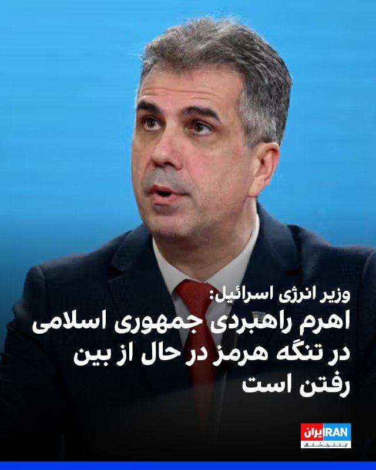

الی کوهن، وزیر انرژی اسرائیل و عضو کابینه سیاسی-امنیتی این کشور، با اشاره به آنچه «برنامه‌های راهبردی» برای دور زدن تهدیدهای جمهوری اسلامی علیه مسیرهای تجاری خواند، گفت: «تمام نبرد ایران در تنگه هرمز و آن اهرم راهبردی که به کار می‌گیرد، در حال از بین رفتن است.»

او افزود در روزهای اخیر گفت‌وگوهایی درباره ایجاد زیرساخت‌های انرژی از شرق به غرب در جریان است و هدف از این طرح‌ها، انتقال انرژی به اروپا از طریق اسرائیل عنوان شده است.

کوهن همچنین از مذاکرات برای ایجاد خطوط انتقال انرژی از مسیر کشورهای خلیج فارس خبر داد و گفت کشورهایی مانند عربستان سعودی و امارات متحده عربی، به عنوان تولیدکنندگان مهم انرژی، تمایل دارند در این طرح‌های اقتصادی مشارکت کنند.

به گفته وزیر انرژی اسرائیل، کریدور زیرساختی میان هند و اروپا از طریق کشورهای خلیج فارس و اسرائیل در دست بررسی است و استفاده از مسیر مصر نیز می‌تواند روند پیشبرد این طرح‌ها را تسریع کند. او تاکید کرد گفت‌وگوهای مشخصی در این زمینه در حال انجام است.
https://iranintl.com/202605274358

## IranIntlTV — post 339226

  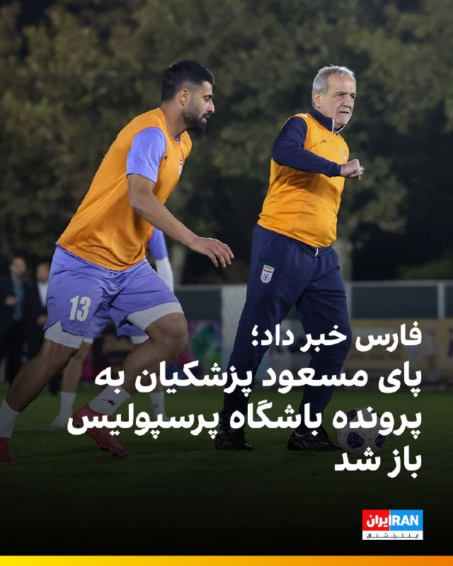

🔻خبرگزاری فارس، رسانه وابسته به سپاه پاسداران، گزارش داد نامه باشگاه پرسپولیس به مسعود پزشکیان، رییس‌جمهور دولت جمهوری اسلامی، وارد مرحله بررسی در نهاد ریاست‌جمهوری شده و در روزهای اخیر نشست‌هایی در این خصوص برگزار شده است.

🔹باشگاه پرسپولیس در نامه‌ای خطاب به پزشکیان، به شرایط فوتبال و سهمیه آسیایی اعلام شده اعتراض کرده بود.

🔹بر اساس این گزارش، دو نفر از نمایندگان نهاد ریاست‌جمهوری در روزهای اخیر با حدادی، مدیرعامل پرسپولیس، جلسه‌ای برگزار کرده و در جریان جزئیات درخواست‌ها و دغدغه‌های مطرح‌شده از سوی این باشگاه قرار گرفته‌اند.

🔹فارس نوشت این افراد همچنین جلساتی جداگانه با مهدی تاج، رییس فدراسیون فوتبال، و کشوری‌فرد، از مدیران ارشد سازمان لیگ، برگزار کرده‌اند تا ابعاد مختلف موضوع را بررسی کنند.

🔹به گزارش فارس، نمایندگان نهاد ریاست‌جمهوری پس از جمع‌بندی مباحث مطرح‌شده، قرار است به‌زودی گزارش نهایی خود را به مسعود پزشکیان ارائه دهند تا درباره درخواست‌های مطرح‌شده تصمیم‌گیری شود.

🔹جزییات بیشتر را در سایت بخوانید

@iranintltvsport

## IranIntlTV — post 339225

  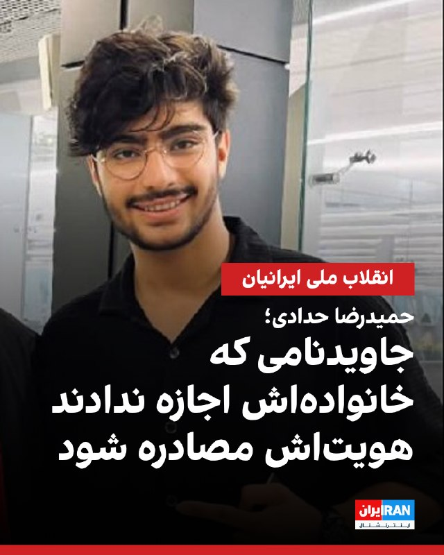

بر اساس اطلاعات رسیده به ایران‌اینترنشنال، حمیدرضا حدادی، جوان ۱۹ ساله اهل شاندیز، شامگاه ۱۸ دی‌ماه پس از اصابت گلوله به درمانگاه شاندیز منتقل شد اما از آنجا که دستور تخلیه درمانگاه صادر شده بود او بدون رسیدگی پزشکی جان باخت.

حمیدرضا تنها حدود نیم ساعت در میان جمعیت معترضان حضور داشت که از پشت هدف شلیک قرار گرفت. گلوله به ریه او اصابت کرد و او بر اثر شدت جراحات جان باخت.

حمیدرضا حدادی فوتبالیست بود و به گفته نزدیکانش آرزو داشت مسیر حرفه‌ای خود را در فوتبال دنبال کند. او همچنین قصد داشت یک مغازه فروش تلفن همراه برای خود راه‌اندازی کند.

پس از کشته شدن حمیدرضا، نیروهای حکومتی تلاش کردند او را به عنوان شهید معرفی کنند، اما خانواده با این موضوع مخالفت کردند. به گفته این منبع، نیروهای حکومتی بدون رضایت خانواده برای او مراسمی در مسجد برگزار کردند، اما اعضای خانواده در آن مراسم حضور نیافتند.

این منبع افزود خانواده حمیدرضا با وجود فشارهای شدید امنیتی، بر این روایت تاکید کرده‌اند که او در جریان اعتراضات و با شلیک نیروهای حکومتی کشته شده است.

https://iranintl.com/202605270118

## IranIntlTV — post 339224

سفیر اسرائیل در استرالیا: در صورت بی‌نتیجه ماندن مذاکرات، گزینه نظامی دوباره روی میز است

هیلل نیومن، سفیر اسرائیل در استرالیا، در گفت‌وگو با علیرضا محبی، خبرنگار ایران‌اینترنشنال، هشدار داد در صورتی که مذاکرات جاری با تهران به نتایج مورد نظر نرسد، احتمال ازسرگیری عملیات نظامی علیه جمهوری اسلامی وجود خواهد داشت.

نیومن چهارشنبه ششم خرداد اعلام کرد هدف این مذاکرات، «برچیدن توان هسته‌ای جمهوری اسلامی، توقف کامل غنی‌سازی و نبود هرگونه ذخیره اورانیوم غنی‌شده در ایران» است.

به گفته او، موضوع برنامه موشک‌های بالستیک جمهوری اسلامی و حمایت تهران از گروه‌های نیابتی که موجب بی‌ثباتی در سراسر خاورمیانه می‌شوند، از دیگر محورهای اصلی مذاکرات به شمار می‌رود.

نیومن ادامه داد: «اگر بتوانیم از طریق مذاکرات و گفت‌وگوهای دیپلماتیک به این اهداف برسیم، بسیار خوب است. در غیر این صورت ممکن است مجبور شویم دوباره به کارزار نظامی بازگردیم تا این اهداف را محقق کنیم. اما این اهداف حتما باید محقق شوند. ما نمی‌توانیم بر سر اهداف خود مصالحه کنیم.»

در روزهای گذشته، گمانه‌زنی‌ها درباره سرنوشت مذاکرات تهران و واشینگتن و مفاد توافق احتمالی دو طرف بالا گرفته است.

روزنامه وال‌استریت‌ ژورنال پنجم خرداد به نقل از مقام‌های حکومت ایران و میانجی‌های عرب گزارش داد تهران در مذاکرات با واشینگتن دو هدف اصلی را دنبال می‌کند: کاهش فشار اقتصادی و دسترسی دوباره به منابع مالی و بازار نفت.

بر اساس این گزارش، جمهوری اسلامی در عین حال تلاش دارد از ارائه امتیازهایی که بتواند از سوی دونالد ترامپ، رییس‌جمهوری آمریکا، به‌عنوان «پیروزی سیاسی» معرفی شود، خودداری کند.

تفاهم اسرائیل و آمریکا درباره مذاکرات
سفیر اسرائیل در استرالیا در ادامه مصاحبه با ایران‌اینترنشنال اعلام کرد آمریکا و اسرائیل در مورد اهداف مذاکرات با جمهوری اسلامی با یکدیگر «تفاهم» دارند و «درک مشترک» دو طرف این است که گفت‌وگوهای جاری باید به تحقق این اهداف بینجامد.

نیومن ادامه داد: «رییس‌جمهور ترامپ گفته است که درباره موضوع غنی‌سازی اورانیوم و توانایی هسته‌ای ایران مصالحه نخواهد کرد.»

او اضافه کرد: «ما مخالف راه‌حل دیپلماتیک نیستیم. ما می‌خواهیم جان انسان‌ها حفظ شود. اگر بتوانیم از طریق یک راه‌حل دیپلماتیک جان انسان‌ها را نجات دهیم، بسیار خوب است. بنابراین اکنون نیز از گفت‌وگوها حمایت می‌کنیم، به شرط آنکه مذاکرات به اهداف مورد نظر برسد.»

سفیر اسرائیل در استرالیا همچنین برجام را «توافقی بد» خواند و افزود اسرائیل در دوران ریاست‌جمهوری باراک اوباما، «تقریبا تنها کشوری» بود که به‌صراحت از این توافق انتقاد کرد.

در روزهای گذشته، ترامپ بارها رویکرد اوباما در قبال برنامه هسته‌ای جمهوری اسلامی را مورد انتقاد قرار داده و برجام را «فاجعه» خوانده است.

او پیش‌تر در واکنش به انتقادها از توافق احتمالی میان تهران و واشینگتن تاکید کرد حاضر به پذیرش «توافق بد» با جمهوری اسلامی نیست و توافق مدنظر او کاملا متفاوت از برجام خواهد بود.

ترامپ در نخستین دوره حضور خود در کاخ سفید، سیاست فشار حداکثری را در برابر حکومت ایران در پیش گرفت و سرانجام سال ۱۳۹۷ از برجام خارج شد.

نیومن: در حال ایجاد فرصت برای مردم ایران هستیم
سفیر اسرائیل در استرالیا در ادامه، از دستاوردهای کارزار نظامی اخیر علیه جمهوری اسلامی تمجید کرد و گفت تضعیف سپاه پاسداران و بسیج «موفقیت‌های عظیمی» هستند که نباید آن‌ها را نادیده گرفت.

نیومن تاکید کرد: «ما در حال ایجاد فرصت برای مردم ایران هستیم تا سرنوشت خود را به دست بگیرند و درباره رهبری آینده کشورشان تصمیم‌گیری کنند.»

او افزود اسرائیل آتش‌بس را پذیرفته، زیرا در پی آن است که «با حسن نیت، فرصت مناسبی برای گفت‌وگوها و حل‌وفصل دیپلماتیک مساله فراهم شود».

نیومن بار دیگر خاطرنشان کرد در صورت ناکامی مسیر دیپلماتیک، اسرائیل ممکن است بار دیگر گزینه نظامی را «با هماهنگی ایالات متحده» در دستور کار قرار دهد.
 
🔗وب‌سایت ایران‌اینترنشنال
@iranintltv

## Shin_Persian — post 6258

  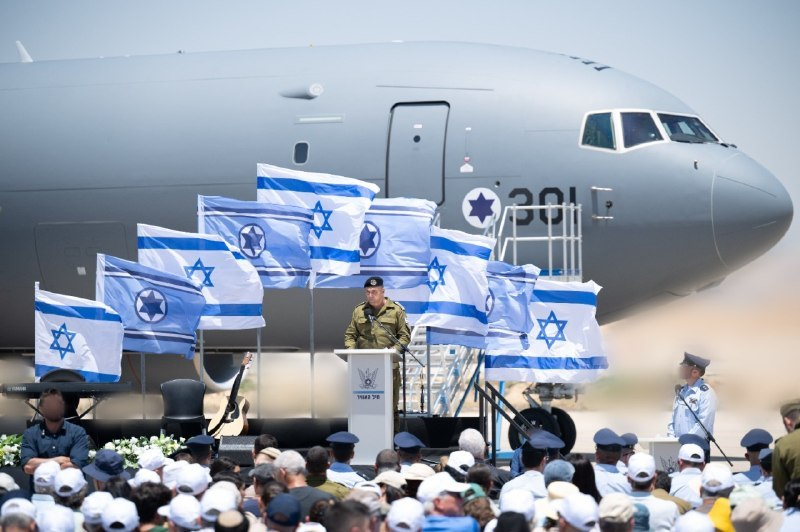

Shin ✓ @hey_itsmyturn Wed, 27 May 2026 11:34:53 UTC #IDF 🇮🇱: "The first aircraft of its kind in the Air Force was inducted into the new refueling squadron - 'Gideon' The Chief of Staff at the induction ceremony: "The edifice of evil of the Ayatollah regime…

## Shin_Persian — post 6257

Shin ✓ @hey_itsmyturn
Wed, 27 May 2026 11:34:53 UTC

#IDF 🇮🇱:
"The first aircraft of its kind in the Air Force was inducted into the new refueling squadron - 'Gideon'

The Chief of Staff at the induction ceremony: "The edifice of evil of the Ayatollah regime has cracked significantly and its future and stability are shrouded in fog. Its leaders are pursued, most of its military capabilities have been destroyed, the nuclear program has been set back years; its economy is collapsing and its citizens have not yet understood the magnitude of the disaster to which their extremist leaders have led them""
#Iran

فارسی

#IDF 🇮🇱:
"نخستین هواپیما از این نوع در نیروی هوایی به اسکادران جدید سوخت‌رسان - 'گیدئون' ملحق شد.

رئیس ستاد کل نیروهای مسلح در مراسم الحاق: «بنای شرارت رژیم آیت‌الله‌ها به شدت ترک خورده و آینده و ثبات آن در هاله‌ای از ابهام است. رهبران آن تحت تعقیب هستند، اکثر توانمندی‌های نظامی‌اش نابود شده، برنامه هسته‌ای سال‌ها به عقب رانده شده؛ اقتصاد آن در حال فروپاشی است و شهروندانش هنوز ابعاد فاجعه‌ای را که رهبران افراطی‌شان آن‌ها را به سوی آن سوق داده‌اند، درک نکرده‌اند»"
#Iran

𝕏 · @shin_persian

## ManotoTV — post 105837

  <a href="telegram/content/ManotoTV_105837_1779890717.mp4" target="_blank">🎬 Download video</a>

از «کمک در راه است» تا مذاکره، معامله و بازگشت به همان سیاست همیشگی؟ ورق بزنید.

## FarsiVOA — post 218804

  <a href="telegram/content/FarsiVOA_218804_1779890719.mp4" target="_blank">🎬 Download video</a>

در میدان پرسیدیم: آثار جنگ و درگیری نظامی بر جامعه چه بوده؟ آیا جامعه توان اعتراض در برابر حکومت را از دست داده است؟ حسین قاضیان، جامعه‌شناس می‌گوید امکان بسیج سیاسی و اجتماعی کوچک‌تر شده است

## FarsiVOA — post 218803

🔺ایال زامیر: بیشتر توانایی‌های نظامی جمهوری اسلامی نابود شده است

◾️ایال زامیر، رئیس ستاد کل ارتش اسرائیل، می‌گوید بخش عمده توانایی‌های نظامی جمهوری اسلامی در جریان اقدامات نظامی اخیر نابود شده، برنامه هسته‌ای رژیم «برای سال‌ها» به عقب بازگردانده شده، ساختار قدرت آن «عمیقا ترک برداشته»، و آینده آن با ابهام روبه‌رو است.

⬇️ بیشتر بخوانید:

https://ir.voanews.com/a/eyal-zamir-says-irans-military-capabilities-largely-destroyed/8154452.html

## FarsiVOA — post 218802

  <a href="telegram/content/FarsiVOA_218802_1779890720.mp4" target="_blank">🎬 Download video</a>

کانال تلگرام ارتش دفاعی اسرائیل به زبان فارسی، ویدیویی در روز عید قربان با پیام «اتحاد میان ادیان» منتشر و اعلام کرد: «اتحاد و همبستگی میان اقوام و ادیان، از هر تلاشی برای تفرقه‌افکنی‌ و تحریک‌ها نیرومندتر است.»

## FarsiVOA — post 218801

  <a href="telegram/content/FarsiVOA_218801_1779890722.mp4" target="_blank">🎬 Download video</a>

پیشتر ارتش اسرائیل و سازمان امنیت داخلی این کشور، شاباک، اعلام کردند محمد عوده، فرمانده تازه شاخه نظامی حماس در نوار غزه، در حمله هوایی سه‌شنبه شب در شمال غزه کشته شده است.

به گزارش ارتش اسرائیل چند ساختمان در غزه که به‌عنوان محل اختفای او استفاده می‌شد هدف قرار گرفت. این حملات پس از ماه‌ها رصد اطلاعاتی برای شناسایی الگوهای رفت‌وآمد او و همکارانش انجام شد.

به گفته مقام‌های اسرائیلی، محمد عوده هفته گذشته و پس از کشته شدن عزالدین حداد، به‌عنوان رئیس شاخه نظامی سازمان تروریستی حماس منصوب شده بود.

## FarsiVOA — post 218800

چشم‌انداز تورمی که با وقوع جنگ و درگیری نظامی در ایران می‌بینیم چیست؟ معصومه طاهرخانی، اقتصاددان در میدان می‌گوید شرایط خیلی سخت‌تری در پیش است

## FarsiVOA — post 218799

🔺با دستور مقتدی صدر گروه «سرایا السلام» به دولت عراق می‌پیوندد؛ ضربه‌ای دیگر به ساختار نیابتی‌های رژیم ایران

▪️مقتدی الصدر، یکی از رهبران مذهبی برجسته شیعیان عراق، جدایی «سرایا السلام» از جریان شیعی و الحاق آن به دولت عراق را اعلام کرد.

⬇️ بیشتر بخوانید:

https://ir.voanews.com/a/orders-saraya-al-salam-s-integration-into-iraqi-state/8154441.html/?nocach=1

## FarsiVOA — post 218798

🔺پرزیدنت ترامپ مقاله‌ای درباره سرکوب معترضان و افزایش نقض حقوق بشر در ایران را بازنشر کرد

▪️دونالد ترامپ، رئیس جمهوری ایالات متحده، روز چهار‌شنبه ۶ خرداد مقاله‌ای از روزنامه «جروزالم پست» درباره سرکوب معترضان و افزایش شدید سوءاستفاده جنسی در زندان‌های ایران همزمان با آتش‌بس را در حساب کاربری خود در شبکه اجتماعی تروت سوشال بازنشر کرد.

⬇️ بیشتر بخوانید:

https://ir.voanews.com/a/president-trump-posts-jpost-article-on-iran-human-rights-abuses/8154440.html/?nocach=1

## FarsiVOA — post 218797

  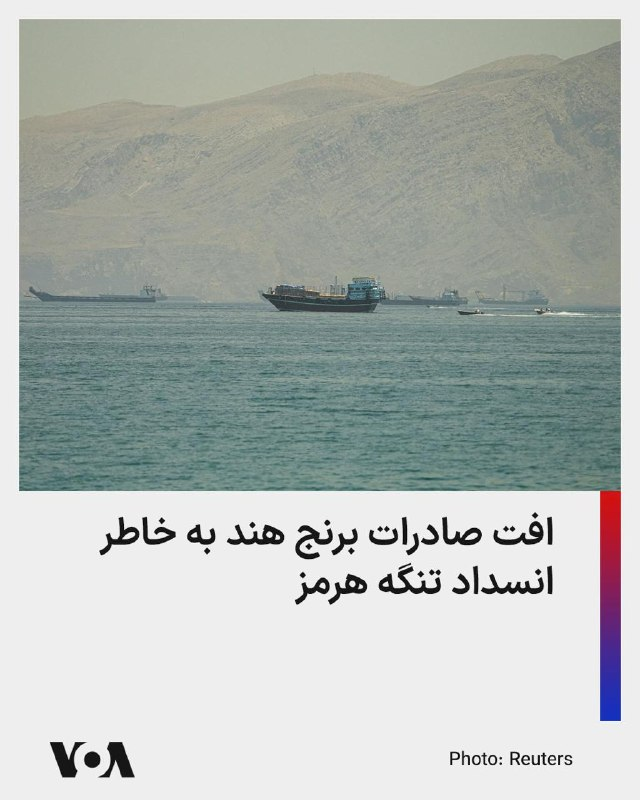

خبرگزاری رویترز از افت صادرات برنج هند به خاطر انسداد تنگه هرمز توسط جمهوری اسلامی خبر داد.

چند منبع بازرگانی که نخواستند نامی از آنها برده شود به رویترز گفتند که صادرات برنج مرغوب هند، باسماتی، که مشتریان عمده آن ایران، عربستان، امارات و عراق هستند، در چهار ماه ابتدایی سال با افت ۷ درصدی مواجه شده است.

هند ۴۰ درصد صادرات برنج جهان را در اختیار دارد و در چهار ماه ابتدایی امسال هند حدود ۸.۴ میلیون تن صادرات برنج داشته که ۲.۳ میلیون تن آن برنج باسماتی بوده است.

رویترز به جزئیات افت صادرات برنج باسماتی هند اشاره نکرده، اما بررسی جزئیات آمارهای وزارت بازرگانی هند توسط صدای آمریکا نشان می‌دهد این کشور در ماه‌های مارس و آوریل (بعد از انسداد تنگه هرمز) مجموعاً ۸۳۸ هزار تن برنج باسماتی صادر کرده که ۲۵ درصد کمتر از دور مشابه ۲۰۲۵ است.

طبق آمارهای فائو، تولید برنج ایران در سال گذشته با افتی ۷ درصدی به ۳.۹ میلیون تن رسید، اما وارداتش در سطح ۱.۲ میلیون تن ثابت ماند.

## FarsiVOA — post 218796

🔺انتقال انرژی از خلیج فارس به اروپا؛ طرح اسرائیل برای کم‌رنگ کردن اهرم هرمز

▪️الی کوهن، وزیر انرژی اسرائیل، می‌گوید تل‌آویو در حال بررسی طرح‌هایی برای ایجاد مسیرهای تازه انتقال انرژی از شرق به غرب است؛ طرح‌هایی که هدف آنها کاهش اثر تهدیدهای جمهوری اسلامی علیه مسیرهای تجاری، به‌ویژه تنگه هرمز، عنوان شده است.

⬇️ بیشتر بخوانید:

https://ir.voanews.com/a/8154436.html/?nocach=1

## FarsiVOA — post 218795

  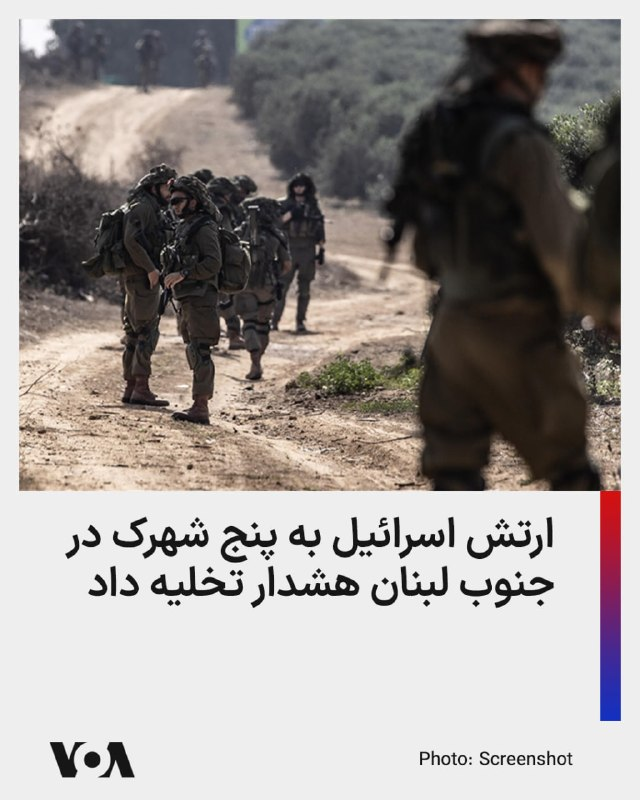

ارتش اسرائیل پیش از دور تازه حملات علیه مواضع حزب‌الله، به ساکنان پنج شهرک و روستا در جنوب لبنان هشدار تخلیه داد.

بر اساس اعلام ارتش اسرائیل، ساکنان کفار حونه، عرمتی، ملیخ، جرجوع و حومین الفوقا باید دست‌کم یک کیلومتر از محل زندگی خود دور شوند.

سخنگوی عربی ارتش اسرائیل مدعی شد این اقدام در واکنش به «نقض توافق آتش‌بس از سوی حزب‌الله» انجام می‌شود و ارتش قصد آسیب زدن به غیرنظامیان را ندارد.

این هشدار در ادامه موج تازه حملات اسرائیل در جنوب لبنان صادر شد. تایمز اسرائیل گزارش داد ارتش اسرائیل امروز بار دیگر زیرساخت‌های حزب‌الله را هدف قرار داده و دلیل آن را افزایش حملات پهپادی حزب‌الله به نیروهای اسرائیلی و مناطق شمالی اسرائیل اعلام کرده است.

آتش‌بس ۱۶ آوریل در روزهای اخیر به‌شدت شکننده شده است. رویترز گزارش داد اسرائیل روز سه‌شنبه بیش از ۱۲۰ حمله در جنوب و شرق لبنان انجام داد که دست‌کم ۳۱ کشته و ۴۰ زخمی برجا گذاشت.
@FarsiVOA

## FarsiVOA — post 218794

  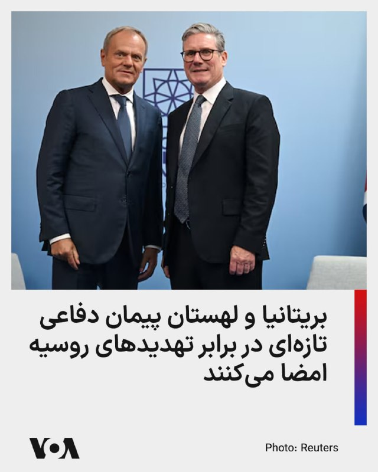

بریتانیا و لهستان قرار است پیمان دفاعی و امنیتی تازه‌ای امضا کنند؛ توافقی که هدف آن تقویت دفاع جمعی، حفاظت از مرزهای بریتانیا، مقابله با جرایم سازمان‌یافته و تعمیق همکاری لندن با اروپا اعلام شده است.

کی‌یر استارمر، نخست‌وزیر بریتانیا، در لندن میزبان دونالد توسک، نخست‌وزیر لهستان، خواهد بود. دولت بریتانیا می‌گوید این پیمان «بزرگ‌ترین گام رو به جلو» در روابط دفاعی و امنیتی دو کشور در یک نسل است.

دو طرف قرار است درباره افزایش حملات ترکیبی منتسب به روسیه، از جمله آتش‌سوزی‌های عمدی در شرق لندن، آتش‌سوزی محموله‌ها در بیرمنگام و اروپا، حملات سایبری، جاسوسی و عملیات اطلاعاتی مخرب گفت‌وگو کنند.

بر اساس این توافق، دو کشور در توسعه نسل جدید سامانه‌های پدافند هوایی، موشک‌های میان‌برد، جنگ پهپادی، جنگ الکترونیک و رزمایش‌های مشترک نیروهای زمینی همکاری گسترده‌تری خواهند داشت.

این پیمان هم‌زمان با نگرانی فزاینده اروپا از احتمال گسترش جنگ روسیه فراتر از اوکراین و تهدید کشورهای بالتیک امضا می‌شود.
@FarsiVOA

## FarsiVOA — post 218793

🔺افزایش بازداشت‌ها و اعدام ۳۷ تن در بحبوحه درگیری‌های نظامی در ایران

▪️ارگان خبری مجموعه فعالان حقوق بشر در ایران اعلام کرد همزمان با آغاز درگیری‌های نظامی میان ایران، آمریکا و اسرائیل، روند صدور و اجرای احکام اعدام در پرونده‌های سیاسی و امنیتی افزایش یافته و تاکنون ۳۷ شهروند اعدام شده‌اند.

▪️در این گزارش آمده است افزایش بازداشت‌ها و طرح اتهاماتی نظیر «جاسوسی» و «اقدام علیه امنیت ملی» علیه شهروندان، از جمله اقداماتی بوده که نهادهای امنیتی و اطلاعاتی جمهوری اسلامی در این دوره در پیش گرفته‌اند.

▪️بر اساس این گزارش، تنها در فاصله ۹ اسفند ۱۴۰۴ تا ۱۹ فروردین ۱۴۰۵ دست‌کم چهار هزار و ۲۳ شهروند توسط نیروهای اطلاعاتی و امنیتی جمهوری اسلامی بازداشت شده‌اند.

⬇️ بیشتر بخوانید:
https://ir.voanews.com/a/8154433.html

## FarsiVOA — post 218792

  <a href="telegram/content/FarsiVOA_218792_1779890726.mp4" target="_blank">🎬 Download video</a>

شناسایی و هدف قرار گرفتن اپراتور پهپادی حزب‌الله در جنوب لبنان؛

بر اساس گزارش ارتش اسرائیل، یک فروند هواپیمای نیروی هوایی این کشور در جریان عملیات خود در جنوب لبنان، یک پهپاد را که تهدیدی برای نیروهای اسرائیلی در منطقه محسوب می‌شد، در آسمان شناسایی کرد.

پس از فرود آمدن این پهپاد، یکی از نیروهای حزب‌الله برای جمع‌آوری آن به محل اعزام شد. هواپیمای نیروی هوایی اسرائیل با رهگیری موقعیت، در یک حمله دقیق این فرد را هدف قرار داد و از پا درآورد.

نیروی هوایی اسرائیل بر ادامه عملیات خود جهت پشتیبانی از نیروهایش در برابر تهدیدهای سازمان تروریستی حزب الله در جنوب لبنان تأکید کرده است.
@FarsiVOA

## FarsiVOA — post 218791

  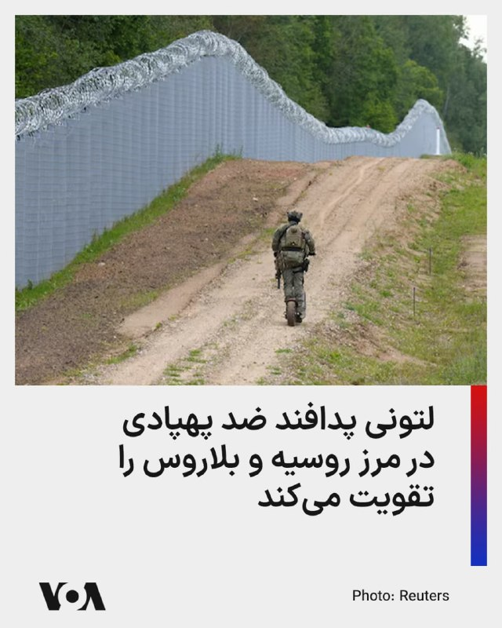

لتونی اعلام کرد برای مقابله با ورود پهپادها به حریم هوایی این کشور عضو ناتو، سامانه‌های دفاع ضدپهپادی خود را در امتداد مرزهای روسیه و بلاروس تقویت می‌کند.

یک مقام ارتش لتونی به رویترز گفت تیم‌های رهگیر پهپاد طی دو هفته آینده مستقر می‌شوند؛ تیم‌هایی متشکل از چند سرباز با خودروهای زمینی و پهپادهای تهاجمی که می‌توانند پهپادهای نظامی ورودی را در شعاع حدود ۱۰ کیلومتر منهدم کنند.

این تصمیم پس از چند حادثه تازه گرفته شده است. در هفته‌های اخیر، چند پهپاد اوکراینی از مسیر خود منحرف و وارد حریم هوایی کشورهای بالتیک شده‌اند.

کی‌یف می‌گوید اختلال روسیه در سیگنال آنها باعث انحراف مسیر شده است.

در هفته‌های اخیر دو پهپاد در یک تأسیسات خالی ذخیره نفت در لتونی منفجر شدند، یک پهپاد دیگر شنبه وارد دریاچه‌ای در لتونی شد، یک پهپاد در لیتوانی نمایندگان پارلمان را به پناهگاه فرستاد و جنگنده ناتو نیز پهپادی را بر فراز استونی سرنگون کرد.
@FarsiVOA

## FarsiVOA — post 218790

🔺ونس: امیدوارم جمهوری اسلامی تعهد دهد سراغ سلاح هسته‌ای نمی‌رود

▪️جی‌دی ونس، معاون رئیس‌جمهوری آمریکا، در مصاحبه‌ای با ان‌بی‌سی نیوز گفت «بسیار امیدوار» است جمهوری اسلامی با توافقی موافقت کند که شامل تعهد به عدم توسعه سلاح هسته‌ای باشد.

▪️او گفت مسئله دشوارتر این است که آیا تهران حاضر می‌شود با «نوعی سازوکار اجرایی» و «سازوکار نظارتی» موافقت کند؛ سازوکاری که به گفته او، به واشنگتن اطمینان دهد جمهوری اسلامی در آینده توافق را نقض نخواهد کرد.

▪️این اظهارات در حالی مطرح می‌شود که پرونده اورانیوم غنی‌شده به گره اصلی مذاکرات ایران و آمریکا تبدیل شده است.

▪️دولت ترامپ تأکید می‌کند هر توافقی باید فراتر از یک تعهد لفظی باشد و تهران نمی‌تواند سلاح هسته‌ای داشته باشد.

⬇️ بیشتر بخوانید:
https://ir.voanews.com/a/8154431.html

## FarsiVOA — post 218789

  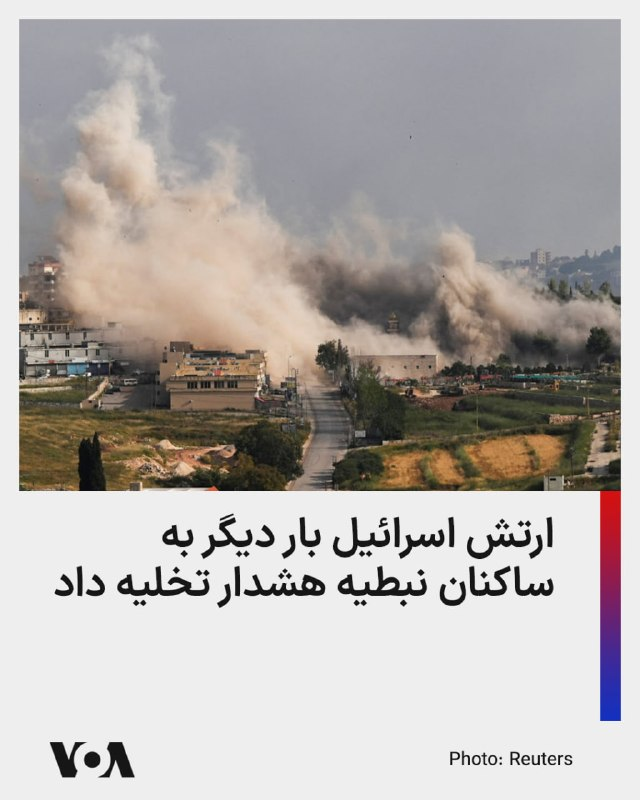

ارتش اسرائیل بار دیگر برای شهر نبطیه در جنوب لبنان هشدار تخلیه صادر کرد و اعلام کرد این هشدار پیش از حملات هوایی علیه زیرساخت‌های حزب‌الله داده شده است.

به گزارش تایمز اسرائیل، ساکنان نبطیه دستور گرفته‌اند به سمت شمال رودخانه زهرانی تخلیه شوند. سخنگوی عربی‌زبان ارتش اسرائیل اعلام کرد به‌دلیل نقض توافق آتش‌بس از سوی حزب‌الله، ارتش اسرائیل ناچار است با قدرت علیه این گروه اقدام کند و قصد آسیب رساندن به غیرنظامیان را ندارد.

بر اساس این گزارش، هشدار مشابهی نیز روز گذشته برای نبطیه صادر شده بود.
@FarsiVOA

## DW_Farsi — post 125202

🔶 طالبان به دنبال اعزام دیپلمات‌های بیش‌تری به اروپاست

طالبان که بر افغانستان حکومت می‌کند در حال حاضر دیپلمات‌های خود را به آلمان اعزام کرده است. این گروه خواستار آن است که در آینده دیپلمات‌های خود را به کشورهای بیش‌تری در اتحادیه اروپا اعزام کند و به همین خاطر این پیشنهاد را مطرح کرده که در عوض، در بازگرداندن پناهجویان افغان از اروپا به افغانستان همکاری خواهد کرد.

طبق تحقیقات شبکه تلویزیونی و رادیویی "ان‌ار‌د" (NDR) آلمان، این خواست یکی از مطالبات اصلی هیئت طالبان در سفر برنامه‌ریزی‌شده به بروکسل است.
@dw_farsi

## DW_Farsi — post 125201

  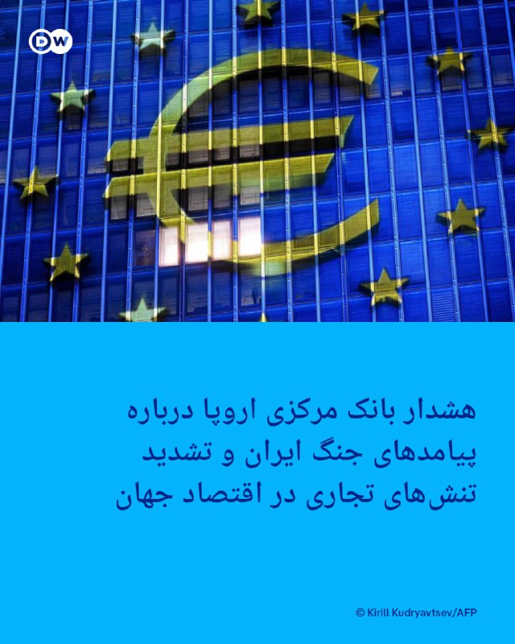

🔶 هشدار بانک مرکزی اروپا درباره پیامدهای جنگ ایران و تشدید تنش‌های تجاری در اقتصاد جهان

بانک مرکزی اروپا هشدار داده است که جنگ ایران و ادامه تنش‌های تجاری در جهان می‌تواند رشد اقتصادی منطقه یورو را کاهش دهد، هزینه استقراض را افزایش دهد و فشار بیشتری بر بودجه دولت‌های اروپایی وارد کند.

این هشدار در جدیدترین گزارش ثبات مالی بانک مرکزی اروپا منتشر شده؛ گزارشی که می‌گوید بازارهای مالی تاکنون واکنش شدیدی به جنگ ایران نشان نداده‌اند و همین موضوع نگرانی‌هایی درباره "کم‌اهمیت جلوه دادن خطرها" از سوی سرمایه‌گذاران ایجاد کرده است.

بانک مرکزی اروپا هشدار داده که "سناریویی از رشد که به طور قابل توجهی ضعیف‌تر باشد و در همراهی با یک شوک انرژی پایدارتر باشد، می‌تواند باعث ارزیابی مجدد پایداری مالی و تغییر ناگهانی قیمت‌ها در بازارهای اوراق قرضه دولتی شود".

طبق این برآورد، اینگونه قیمت‌گذاری مجدد می‌تواند "هزینه‌های استقراض شرکت‌ها را افزایش دهد و یک حلقه بازخورد ایجاد کند که می‌تواند ثبات مالی را با خطر مواجه سازد و به اقتصاد واقعی ضربه بزند".
@dw_farsi

## DW_Farsi — post 125200

🔶 عربستان سعودی؛ ۱.۵ میلیون نفر با وجود جنگ به حج می‌روند

🔻 گزارشی از Cathrin Schaer

سال ۲۰۲۶ نخستین سالی است که دولت آمریکا از شهروندان خود خواسته در سفر برای مراسم حج تجدیدنظر کنند و اعلام کرده که کارکنان غیرضروری دولت آمریکا در مارس امسال از عربستان خارج شده‌اند.

کارشناسان احتمال هدف قرار دادن مستقیم حج توسط ایران را بسیار پایین می‌دانند زیرا این اماکن برای همه مسلمانان مقدس است. علاوه بر این، حدود ۳۰ هزار زائر ایرانی نیز امسال در مراسم حج حضور دارند.

اما این نگرانی وجود دارد که این مراسم به اشتباه یا تصادفی هدف قرار گیرد.
@dw_farsi

## DW_Farsi — post 125199

🎥 مبارزه با راست افراطی در قفس ورزش‌های رزمی (رینگ)

راست افراطی در آلمان بیش از پیش از ورزش‌های رزمی ترکیبی برای جذب نیرو استفاده می‌کند. حالا یک باشگاه در شهر کمنیتس در شرق آلمان با ایجاد فضایی فراگیر و بدون تبعیض، تلاش می‌کند در برابر این روند بایستد.
@dw_farsi

## DW_Farsi — post 125198

  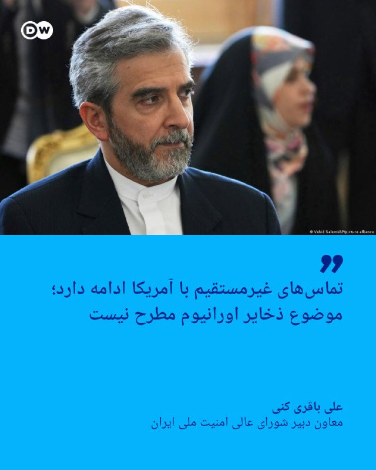

🔶 باقری: تماس‌های غیرمستقیم با آمریکا ادامه دارد؛ موضوع ذخایر اورانیوم مطرح نیست

علی باقری کنی، معاون دبیر شورای عالی امنیت ملی ایران گفته است، "تماس‌های غیرمستقیم" میان تهران و واشنگتن ادامه دارد، اما "موضوع ذخایر اورانیوم غنی‌شده ایران در مذاکرات جاری مطرح نیست".

باقری که برای شرکت در کنفرانس امنیتی مسکو به روسیه سفر کرده، اعلام کرد که ایران و عمان در حال مذاکره برای تعیین "سازوکاری جدید" برای عبور کشتی‌ها از تنگه هرمز هستند.

او با بیان اینکه شرایط عبور و مرور در تنگه هرمز پس از جنگ اخیر "با گذشته متفاوت خواهد بود"، به خبرنگاران گفت: «تا زمانی که در همه مسائل به توافق نرسیم، معتقدیم که در هیچ‌چیز به توافق نرسیده‌ایم.»

اظهارات باقری در حالی مطرح می‌شود که تهران و واشنگتن در هفته‌های اخیر، با میانجیگری پاکستان، مذاکراتی را برای دستیابی به تفاهم‌نامه پایان جنگ دنبال کرده‌اند.

بر اساس گزارش‌ها، موضوعاتی مانند بازگشایی تنگه هرمز، آزادسازی دارایی‌های بلوکه‌شده ایران و توقف درگیری‌های نظامی، از محورهای اصلی این گفت‌وگوها بوده است.

@dw_farsi

## DW_Farsi — post 125188

📸 آلمان چقدر ثروتمند دارد؟

در سال گذشته، دارایی مالی خصوصی در سراسر جهان ۷٫۴ درصد رشد کرده است. این رشد ثروت در سال ۲۰۲۵ به‌مراتب بیشتر از نرخ تورم بوده است. در مجموع، ثروت خالص جهانی شامل دارایی‌های فیزیکی به ۵۵۰ تریلیون دلار آمریکا رسیده است.

این موضوع در گزارش ثروت جهانی ۲۰۲۶ (Global Wealth Report 2026) گروه مشاوره بوستون منتشرشده است.

در آلمان نیز ثروت به‌طور چشمگیری افزایش یافته است: تا تاریخ ۳۱ دسامبر سال ۲۰۲۵، مجموع ثروت در این کشور به ۲۳٫۳ تریلیون دلار رسیده است. بیش از نیمی از این ثروت در دارایی‌های فیزیکی، به‌ویژه املاک، سرمایه‌گذاری شده است.

طبق تعریف این گزارش، هر فردی که بیش از ۱۰۰ میلیون دلار "دارایی مالی" داشته باشد، فوق‌ثروتمند محسوب می‌شود.

دارایی‌های مالی به مجموعه‌ای از منابع و سرمایه‌های پولی گفته می‌شود که ارزش آن‌ها بر اساس پول نقد، اسناد مالی و مطالبات سنجیده می‌شود.

در آلمان ۵۰۰۰ نفر در گروه فوق‌ثروتمند قرار دارند. در سراسر جهان نیز نزدیک به ۹۷ هزار فوق‌ثروتمند وجود دارد که بیش از یک‌سوم آن‌ها در آمریکا (۳۷ هزار نفر) و ۱۱ هزار نفر در چین زندگی می‌کنند.
@dw_farsi

## DW_Farsi — post 125187

  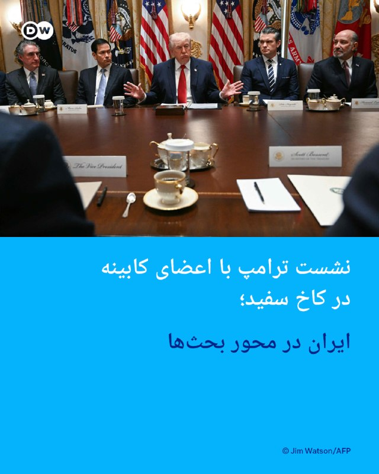

🔶 نشست ترامپ با اعضای کابینه در کاخ سفید؛ ایران در محور بحث‌ها

واشنگتن تایید کرده که قرار است دونالد ترامپ، رئیس‌جمهور آمریکا روز چهارشنبه ۲۷ مه در کاخ سفید با اعضای کابینه خود دیدار کند؛ نشستی که یک روز پس از اظهارات مارکو روبیو، وزیر خارجه آمریکا، درباره نزدیک بودن توافق برگزار می‌شود.

با این حال، هنوز مشخص نیست که توافق احتمالی چه دستاورد سیاسی مشخصی برای دولت ترامپ خواهد داشت. پیشتر گزارش شده بود که این نشست قرار است در کمپ دیوید برگزار شود اما به دلیل شرایط آب‌وهوایی، مکان برگزاری این نشست به کاخ سفید تغییر یافت.

یکی از محورهای اصلی این توافق، بازگشایی تنگه هرمز عنوان شده است؛ مسیری راهبردی برای انتقال نفت و گاز که در جریان جنگ اخیر با محدودیت‌هایی روبه‌رو شده بود.

دونالد ترامپ، رئیس‌جمهور آمریکا، گفته است توافق آتش‌بس میان ایران و آمریکا "تا حد زیادی" نهایی شده، هرچند به گفته او، جزئیات پایانی همچنان در حال بررسی است.

@dw_farsi

## Persian_Trend_Official — post 15123

  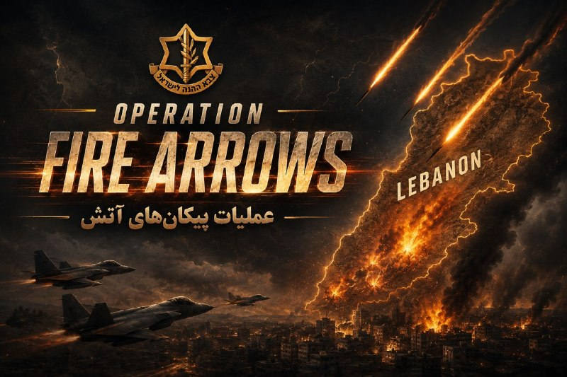

🚨🔥 آسمان جنوب لبنان در آتش!

جنگنده‌های اسرائیلی طی دقایق اخیر موجی از حملات هوایی سنگین را علیه مناطق مختلف لبنان آغاز کردند؛ از حبوش و نبطیه الفوقا گرفته تا قصیبه، زبیدن و زفتا. گزارش‌ها از چندین انفجار پیاپی در نبطیه و حملات گسترده به السلسله الغربیة در جرد الهرمل حکایت دارد.

✈️ همزمان، جنگنده‌های اسرائیلی با پرواز در ارتفاع بسیار پایین بر فراز بیروت، حومه پایتخت و همچنین بعلبک، فضای لبنان را به شدت متشنج کرده‌اند.

⚠️ منابع محلی از شنیده شدن صدای انفجارها در چندین منطقه خبر می‌دهند. منطقه در وضعیت فوق‌العاده ملتهب قرار گرفته و احتمال تشدید تنش‌ها بین حزب‌الله و اسرائیل در ساعات آینده بالاست.

## Persian_Trend_Official — post 15122

https://youtube.com/live/IsX9PiIhoW4?feature=share

## Persian_Trend_Official — post 15121

🌲 — 🇮🇱 رئیس ستاد کل ارتش اسرائیل، ایال زامیر: برنامه هسته‌ای ایران سال‌ها به عقب افتاده است.

🌲 — 🇮🇱 رئیس ستاد کل ارتش اسرائیل: رهبری ایران مردم خود را به فاجعه‌ای کشانده است که هنوز به طور کامل آن را درک نکرده‌اند، و در حالی که بیشتر توانایی‌های نظامی‌شان نابود شده، در حال تعقیب هستند.

## Persian_Trend_Official — post 15120

  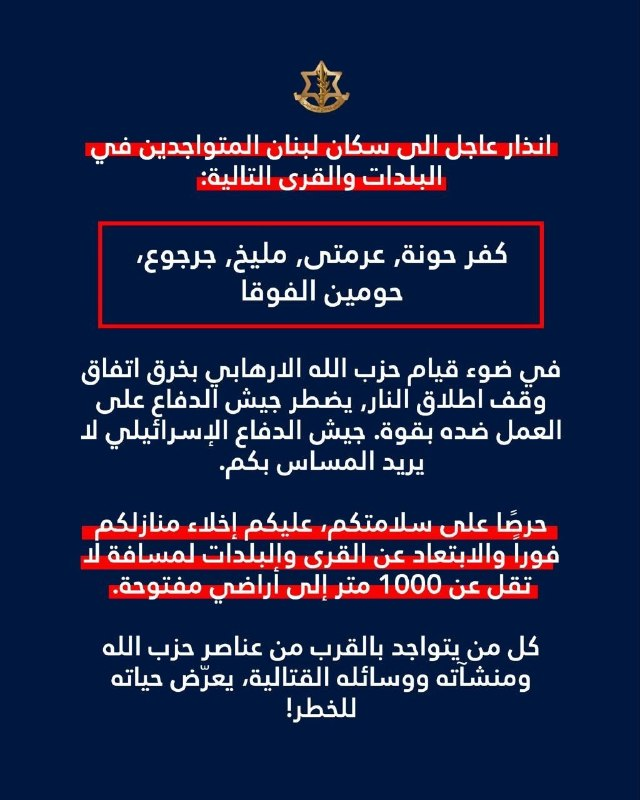

🇮🇱
🇱🇧
🇱🇧
🔹 هشدار فوری به ساکنان شهرها و روستاهای زیر در لبنان صادر شد: کفر حونا، آرامتا، ملیخ، جرجوع و حومین الفوقا، با دستور تخلیه فوری و حرکت حداقل ۱۰۰۰ متر به سمت مناطق باز.

## Persian_Trend_Official — post 15119

  <a href="telegram/content/Persian_Trend_Official_15119_1779890733.mp4" target="_blank">🎬 Download video</a>

سالروز اعدام «صدام حسین عبدالمجید التکریتی»

صدام حسین تکریتی، سحرگاه عید قربان سال ۱۳۸۵ به دار مجازات آویخته شد.

👩‍💻@PhantomDirective

🆔@persian_trend_official
پرشین ترند | متفاوت‌ترین کانال نظامی

## Persian_Trend_Official — post 15118

  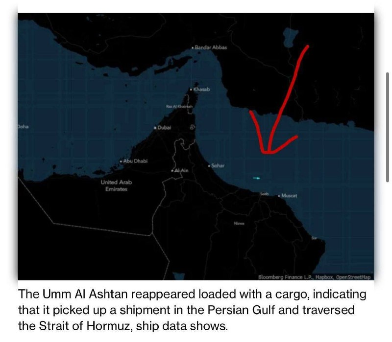

عبور چهارمین کشتی LNG از تنگه هرمز در کمتر از یک هفته :

🚢 نفتکش LNG «ام‌الاشتان» متعلق به امارات، با محموله گاز طبیعی مایع از ابوظبی، در حالی که سیستم شناسایی خودکار (AIS) خود را خاموش کرده بود، از تنگه هرمز عبور کرد و به سمت هند در حال حرکت است. این کشتی چهارمین مورد از عبور نفتکش‌های LNG در یک هفته گذشته به شمار می‌رود.

👩‍💻@PhantomDirective

🆔@persian_trend_official
پرشین ترند | متفاوت‌ترین کانال نظامی

## RadioFarda — post 157609

🔸وزارت اطلاعات جمهوری اسلامی روز چهارشنبه ششم خرداد هشدار داد که بعد از جنگ اخیر، «برخی کمبودها و گرانی‌ها» در پی فشارهای اقتصادی آمریکا می‌تواند باعث بروز ناآرامی‌های تازه در ایران شود. 🔸این وزارتخانه در بیانیه‌ای مدعی شد که «تشدید فشارهای اقتصادی و متعاقب…

## RadioFarda — post 157608

  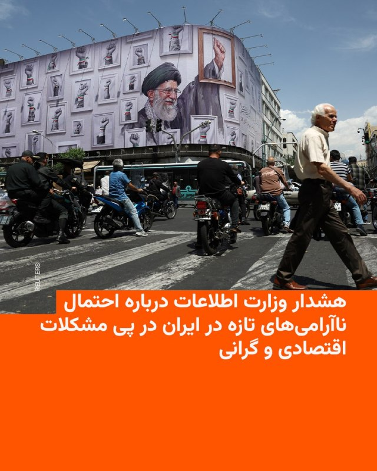

🔸وزارت اطلاعات جمهوری اسلامی روز چهارشنبه ششم خرداد هشدار داد که بعد از جنگ اخیر، «برخی کمبودها و گرانی‌ها» در پی فشارهای اقتصادی آمریکا می‌تواند باعث بروز ناآرامی‌های تازه در ایران شود.

🔸این وزارتخانه در بیانیه‌ای مدعی شد که «تشدید فشارهای اقتصادی و متعاقب آن، انجام تحریکات گوناگون اجتماعی توسط عوامل دشمن و رسانه‌های مزدور فارسی‌زبان بیگانه، با سوء استفاده از برخی کمبودها و گرانی‌ها» یکی از محورهای مورد توجه آمریکا و اسرائیل است.

🔸هشدار درباره احتمال ناآرامی همزمان با افزایش شدید نرخ تورم و و گرانی کالاها و همچنین انتشار گزارش‌هایی درباره کاهش شدید درآمدهای دولت جمهوری اسلامی در پی هفته‌ها محاصره دریایی آمریکا و سقوط شدید صادرات نفت ایران مطرح شده است.

🔸این در حالی است که اعتراضات دی‌ماه سال گذشته نیز بعد از افزایش مداوم نرخ ارز در بازار و مناطق تجاری ایران آغاز و بعد از چند روز با افزایش تعداد معترضان، با خشونت شدید نیروهای امنیتی و کشتار هزاران نفر مواجه شد.

@RadioFarda

## RadioFarda — post 157607

🔸ویدئویی که روز چهارشنبه ۶ خرداد در شبکه‌های اجتماعی منتشر شده لحظه شادی نیروهای امدادی پس از پیدا شدن پنج نفر زنده در یک غار در لائوس را نشان می‌دهد؛ افرادی که حدود یک هفته در غار گرفتار بودند.

🔸به گزارش رویترز، عملیات جست‌وجو برای یافتن دو نفر دیگر همچنان ادامه دارد و ده‌ها امدادگر لائوسی و تایلندی در این عملیات مشارکت دارند.

🔸بر اساس گزارش رسانه‌های دولتی لائوس، هفت نفر هفته گذشته برای جست‌وجوی طلا وارد غاری در استان «زایسامبون» شده بودند، اما بارندگی شدید و رانش زمین راه خروج آن‌ها را مسدود کرد.

🔸یک گروه داوطلب تایلندی نیز از روز یکشنبه به عملیات نجات پیوسته است. در میان اعضای این گروه، غواصی حضور دارد که در عملیات مشهور نجات تیم فوتبال نوجوانان تایلندی از غاری سیل‌زده در سال ۲۰۱۸ مشارکت داشت.

@RadioFarda

## RadioFarda — post 157606

  <a href="https://t.me/radiofarda/157606" target="_blank">📎 Download file</a>

📻بشنوید: ساعت ۱۴ با رادیوفردا، ششم خرداد ۱۴۰۵‌

@Radiofarda

## RadioFarda — post 157605

🔸کره جنوبی اعلام کرد سفیر ایران را در اعتراض به حمله به یک کشتی این کشور در تنگه هرمز احضار خواهد کرد. 🔸این احضار پس از آن صورت می‌گیرد که دولت سئول اعلام کرد در تحقیقات خود به این نتیجه رسیده که «به احتمال بسیار زیاد» موشکی ساخت ایران عامل حمله به این کشتی…

## RadioFarda — post 157604

  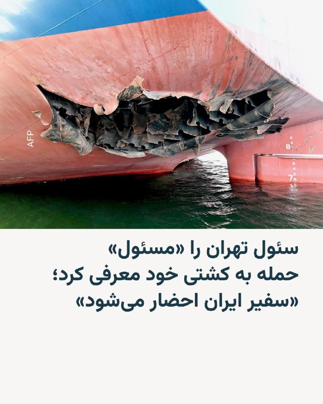

🔸کره جنوبی اعلام کرد سفیر ایران را در اعتراض به حمله به یک کشتی این کشور در تنگه هرمز احضار خواهد کرد.

🔸این احضار پس از آن صورت می‌گیرد که دولت سئول اعلام کرد در تحقیقات خود به این نتیجه رسیده که «به احتمال بسیار زیاد» موشکی ساخت ایران عامل حمله به این کشتی بوده است.

🔸این کشتی باری کره‌جنوبی ۱۴ اردیبهشت توسط یک هواگرد ناشناس در تنگه هرمز هدف قرار گرفت.

🔸دونالد ترامپ بعد از این حمله گفته بود که ایران «چند شلیک» به سوی این کشتی با پرچم پاناما انجام داده اما تهران مسئولیت این حمله را رد کرده بود.

🔸پس از چند هفته تحقیق، دولت کره‌ جنوبی اعلام کرد که تحلیل‌های فنی نشان داده‌اند پرتابه ناشناسی که به کشتی اصابت کرده «به احتمال بسیار زیاد» نسخه‌ای دیگر از موشک توسعه‌یافتهٔ «نور» بوده است.

🔸پارک یون‌جو، معاون اول وزیر خارجه کره‌ جنوبی، در یک نشست خبری گفت: «دولت ما قصد دارد سفیر ایران را احضار کند تا نتایج تحقیقات را توضیح دهد، اعتراض شدید خود را نسبت به حمله به کشتی‌مان اعلام کند و خواستار اقدامات مسئولانه، از جمله تدابیری برای جلوگیری از تکرار چنین حادثه‌ای شود.»

@RadioFarda

## IranianMinds — post 20872

  <a href="telegram/content/IranianMinds_20872_1779890738.mp4" target="_blank">🎬 Download video</a>

طرفداران حکومت😂😂😂

@IranianMinds

## IranianMinds — post 20871

  

اکانت اسرائیل به فارسی:

از لاریجانی یک دست باقی ماند.
صرفأ جهت آگاهی دوستان داخل ایران.

@IranianMinds

## IranianMinds — post 20870

  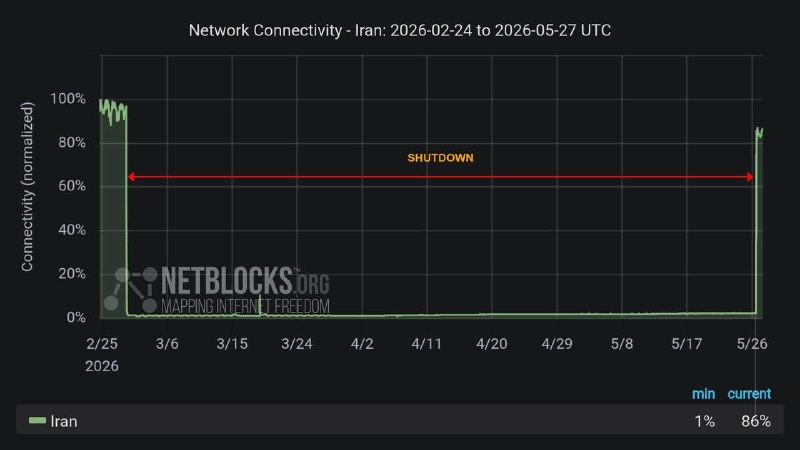

وضعیت امروز اینترنت بین الملل ایران از نگاه نت بلاکس

اینترنت هنوز به وضعیت ۱۰۰ درصدی بازنگشته

با اینکه نشون دهنده ی بازگشت نزدیک به ۷۰ الی ۸۰ درصد رو نشون میده
ولی تو زمان قطعی راحت تر کانکت میشد اینترنت

@IranianMinds

## IranianMinds — post 20869

وضعیت اینترنت اینجوریه که وصله
اما وصل نیست

@IranianMinds

## IranianMinds — post 20868

  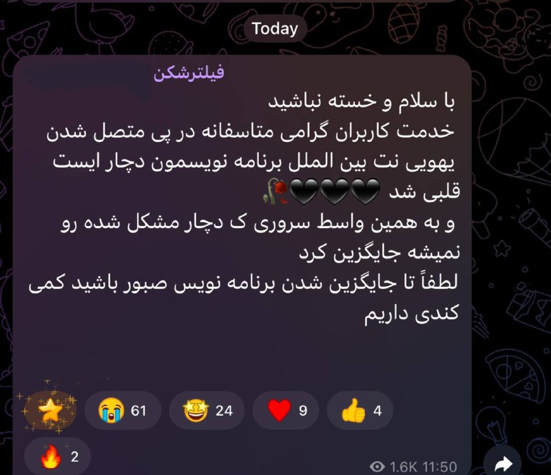

🔴وضعیت فیلترشکن فروش‌ها بعد از وصل شدن نت بین‌الملل.

@IranianMinds

## IranianMinds — post 20867

آخوند حمید رسایی :

قلبم به درد آمد وقتی دیدم پزشکیان اینترنت بین الملل را غیرقانونی وصل کرده است.

@IranianMinds

## IranianMinds — post 20866

  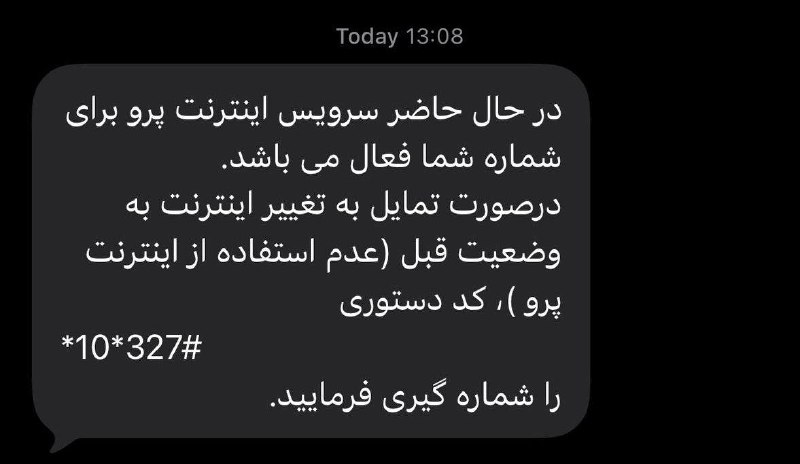

کیر خوردن اگه قیافه داشت :

همراه اول امروز در پیامی به کاربران اینترنت پرو اعلام کرد در صورت تمایل می‌توانید اینترنت خود را به حالت قبل برگردانید

@IranianMinds

## BBCPersian — post 282192

  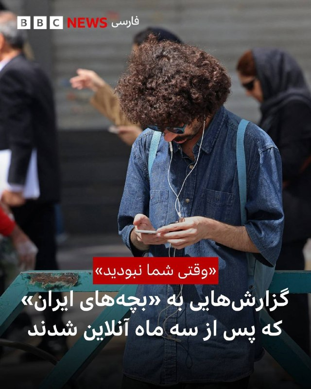

‏گروهی از کاربران در شبکه اجتماعی ایکس (توییتر سابق) پست‌های انتقادی گزارش‌گونه از تحولات و رویدادهای سیاسی خارج از ایران منتشر می‌کنند، خطاب به شهروندانی که پس از حدود سه ماه به‌طور تدریجی با فیلترشکن موفق می‌‌شوند به اینترنت وصل شوند.

‏این پست‌ها که با عبارت‌هایی مانند «وقتی شما نبودید» یا «بچه‌های ایران که تازه وصل شده‌اید» آغاز می‌شود، همزمان با کاهش تدریجی اختلال در دسترسی به اینترنت، به محلی برای مستندسازی و بازاندیشی انتقادی نسبت به تحولات سیاسی‌ ۸۸ روز گذشته تبدیل شده است.

‏بسیاری از این پست‌ها لحنی آشکارا ضدجنگ دارند و در برابر عملکرد بعضی رسانه‌ها، طرفداران شاهزاده رضا پهلوی و کسانی موضع گرفته‌اند که از حملات نظامی به ایران حمایت یا از آن استقبال می‌کردند.

‏بعضی دیگر از مخالفان جمهوری اسلامی خارج از ایران هم برای مخاطبانی که به‌تازگی دوباره آنلاین شده‌اند، جمع‌بندی‌های کوتاهی از فعالیت و تجمعات به‌عنوان گزارش‌کار تهیه کردند و در پست‌هایی به اظهارنظرها و مواضع چهره‌هایی پرداختند که از نظر آن‌ها در تضاد با «مسیر انقلاب» عمل کرده بودند.
@bbcpersian

## BBCPersian — post 282191

🔻عضو شورای شهر تهران درباره جنگ اخیر: به۶۵۰ نقطه حمله شد و ۱۲۶۰ نفر کشته شدند

🔻یک عضو شورای شهر تهران گفته است که در جریان جنگ اخیر، ۶۵۰ نقطه پایتخت هدف قرار گرفته و ۱۲۶۰ نفر کشته شده‌اند.

مهدی بابایی، رئیس کمیته ایمنی شورای شهر تهران، به خبرگزاری ایرنا گفته است که خانواده‌های جنگ‌زده، شامل ۱۷۱۸ خانوار با ۵۷۵۹ نفر، به‌صورت موقت در ۴۶ هتل اسکان داده شدند.

آقای بابایی گفته است بیشترین حملات در تهران به مناطق ۱، ۳ و ۲۱ بوده است.

جنگ روز در نهم اسفند (۲۸ فوریه) با حملات اسرائیل و آمریکا به ایران آغاز شد و در ۱۸ فروردین (هفتم آوریل) با میانجیگری پاکستان وارد آتش‌بس موقت شد.

https://bbc.in/4uyTIt7
@BBCPersian

## BBCPersian — post 282190

  <a href="https://t.me/bbcpersian/282190" target="_blank">📎 Download file</a>

🔻دنیس راس، مدیر پیشین اداره سیاست‌گذاری وزارت خارجه آمریکا، در گفت‌وگو با برنامه ۶۰ دقیقه بی‌بی‌سی درباره چالش‌های به نتیجه رسیدن مذاکرات ایران و آمریکا گفت.

او تاکید کرد که هیچ راهبردی در قبال ایران تاکنون جواب نداده است؛ چه راهبرد آنها که به ایران امتیاز دادند و چه آنها که سیاست فشار حداکثری را پی گرفتند.

این مصاحبه را که در برنامه شصت دقیقه پنجم خرداد پخش شده، گوش دهید.

@BBCPersian

## BBCPersian — post 282189

🔻مراسم ختم اعضای خانواده خامنه‌ای این هفته برگزار می‌شود

🔻نزدیک به سه ماه پس از حمله نهم اسفند آمریکا و اسرائیل به دفتر رهبر و محل اقامت علی خامنه‌ای، که از جمله به کشته شدن او و شماری از اعضای خانواده‌اش انجامید، رسانه‌های دولتی در ایران می‌گویند که قرار است برای اعضای خانواده رهبر پیشین مجلس ختمی از سوی بازماندگان برگزار شود.

این مراسم قرار است برای یادبود زهرا حدادعادل (همسر مجتبی خامنه‌ای)، بشری خامنه‌ای (دختر بزرگ رهبر پیشین)، مصباح‌الهدی باقری (همسر دختر کوچک آقای خامنه‌ای) و نوه او، زهرا محمدی گلپایگانی، در روزهای هفتم و هشتم خرداد در شهرری در جنوب تهران برگزار شود.

در این اطلاعیه ذکر شده است که مراسم برای اعضای خانواده رهبر کشته‌شده برگزار می‌شود.

در پی حمله به دفتر و محل سکونت آقای خامنه‌ای، خبر کشته‌شدن همسر او، منصوره خجسته‌ باقرزاده هم منتشر شد اما کمتر از دو هفته بعد خبرگزاری فارس اعلام کرد که اخبار اولیه اشتباه بوده و همسر آقای خامنه‌ای «در قید حیات است.»

https://bbc.in/4u0XzOH
@BBCPersian

## BBCPersian — post 282188

  <a href="telegram/content/BBCPersian_282188_1779890744.mp4" target="_blank">🎬 Download video</a>

🔻سرخط خبرهای روز چهارشنبه ۶ خرداد ۱۴۰۵
@BBCPersian

## BBCPersian — post 282187

🔻ریور احمد اولین زن افغان است که به قله اورست صعود کرده است.

او طی فصل کوهنوردی بهار امسال، صبح روز ۲۱ مه (۲ خرداد) به فراز بلندترین قله جهان رسید.

اما ریور، وضعیت اسفناک زنان و دختران در افغانستان را فراموش نکرده است. «حتی امروز میلیون‌ها دختر افغان از حق اولیه تحصیل محروم هستند و ما باید این قله را هم فتح کنیم. با کمک کوهنوردی، می‌خواهم این پیام را تقویت کنم. من آموخته‌ام که سخت‌ترین کوه‌ها از سنگ و یخ ساخته نشده‌اند، بلکه کوه‌هایی هستند که ما در درون خود حمل می‌کنیم.»

@BBCPersian

## BBCPersian — post 282186

  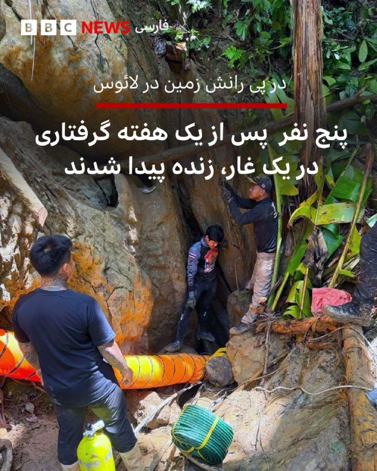

🔻 گروه‌های امداد و نجات در لائوس اعلام کردند که پنج روستایی بعد از یک هفته ماندن در غاری پرآب، زنده پیدا شده‌اند. بارندگی شدید و رانش زمین موجب شد که آنها در این غار گرفتار شوند.

به گفته تیم‌های امدادی لائوسی و تایلندی، دو نفر دیگر از اعضای این گروه همچنان مفقود هستند.

این هفت نفر از ساکنان استان «زایسومبون» در مرکز لائوس بودند که چهارشنبه هفته گذشته برای جست‌وجوی طلا و شکار حیوانات وارد غار شده بودند، اما به‌دلیل مسدود شدن دهانه غار بر اثر رانش زمین، نتوانستند خارج شوند.

ویدئوهای منتشرشده از عملیات نجات نشان می‌دهد که غواصان امدادگر از مسیرهای بسیار باریک و گل‌آلود عبور می‌کنند که تقریبا به‌طور کامل زیر آب رفته است.

عملیات جست‌وجو برای یافتن دو فرد مفقودشده ادامه دارد.

به گفته امدادگران، این مجموعه غار که در عمق زمین امتداد دارد، بسیار تنگ است و عرض برخی از بخش‌های آن تنها حدود ۵۰ سانتی‌متر است.

📸EPA/Shutterstock
@BBCPersian

## BBCPersian — post 282185

🔻رویترز: جنگ ایران برندگان و بازندگان تازه‌ای را در بازارهای جهانی ایجاد کرده است

🔻سه ماه پس از آغاز جنگ ایران، تداوم قیمت بالای نفت سیاست‌گذاران را با نگرانی‌های تازه درباره تورم روبه‌رو کرده و کاهش ارزش ارزها نیز برای برخی کشورهای آسیایی دردسرساز شده است.

به‌گزارش رویترز اما این درگیری در عین حال به رشد برخی دارایی‌ها، به‌ویژه نفت، و تقویت جایگاه دلار به‌عنوان یک دارایی امن کمک کرده است.

رویترز در گزارش خود آورده است: افزایش حدود ۴۰ درصدی قیمت نفت، چشم‌انداز تورم و نرخ بهره را دگرگون کرده است. در بازار واقعی، قیمت نفت خام به‌مراتب بالاتر از ۱۰۰ دلار در هر بشکه قرار دارد و در مقطعی در اوایل آوریل تقریبا دو برابر سطح پیش از جنگ بود.

این گزارش حاکیست که آزادسازی بی‌سابقه ۴۰۰ میلیون بشکه نفت از ذخایر راهبردی اقتصادهای بزرگ، همراه با تلاش معامله‌گران برای یافتن منابع جایگزین، تا حدی به جبران کمبود عرضه کمک کرده است. با این حال، فشار بر نظام جهانی انرژی رو به افزایش است.

https://bbc.in/4dLHuWT
@BBCPersian

## BBCPersian — post 282184

  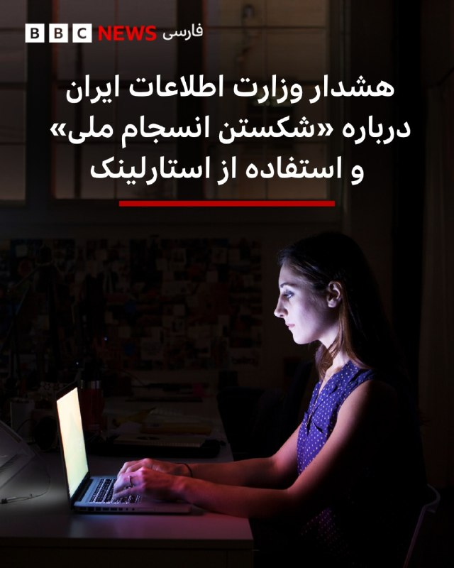

🔻وزارت اطلاعات ایران در بیانیه‌ای گفته است که «دشمن اکنون با توقف جنگ سخت، بر هفت محور اصلی جنگ ترکیبی» متمرکز شده و هشدارهایی به شهروندان داده است.

در این اطلاعیه آمده است: «جنگ ترکیبی شامل تشدید فشارهای اقتصادی، انجام تحریکات قومی و مذهبی، اعزام مزدوران گروهکی، ترور و خرابکاری، قاچاق انواع سلاح و ابزار ارتباطی غیرقانونی، جنگ رسانه‌ای و حملات سایبری متمرکز شده است.»

این هشدار یک روز پس از اتصال اینترنت در پی ۸۸ روز قطعی سراسری در ایران صادر شده است.

وزارت اطلاعات درباره «هرگونه اقدام برای شکستن انسجام ملی و ایجاد گسست اجتماعی، قاچاق سلاح و ابزارهای ارتباطی غیرقانونی همچون استارلینک» هشدار داده و گفته است که در ارتباط با این موضوعات «با دقت و قاطعیت هرچه بیشتر» عمل خواهد کرد.

وزارت اطلاعات ایران اکنون از سوی سرپرست اداره می‌شود. اسماعیل خطیب، وزیر اطلاعات، در جریان حملات اسرائیل و آمریکا در تهران کشته شد.

📷Getty Images
https://bbc.in/4vinAKx

@BBCPersian

## BBCPersian — post 282183

🔻پیام‌های مخاطبان بی‌بی‌سی بعد از اتصال اینترنت؛ «این مدت هیچکس غم مردم را نخورد»

🔻تعدادی از مخاطبان بی‌بی‌سی پس از اتصال نسبی به اینترنت، از کیفیت و سرعت اتصال و نظراتشان درباره کمک جامعه جهانی به مردم ایران در ۸۸ روزی که اینترنت قطع بود، نوشتند.

مخاطبی از اراک نوشت: «فیبر نوری دارم و الان وصل شدیم البته باز هم بدون فیلترشکن تلگرام وصل نمی‌شود. این مدت هیچکس غم مردم را نخورد. حیف این مردمی که این هزینه‌های سنگین برای آزادی پرداخت می‌کنند...افسوس.»یکی دیگر از مخاطبان نوشته است: «خیلی حرف‌ها دارم اما الان زمانش نیست چون خسته‌ام. حتی از اقوام درجه یک خودم که خارج کشور در رفاه بودند و من و زن و بچه‌ام زیر موشک.... دلم گرفته... بزودی خواهم گفت از تک تک روزهای لعنتی جنگ .»

مخاطب دیگری که ۱۷ ساله است و در تهران زندگی می‌کند، نوشته است: «می‌خواستم یه چیزی بگم. واقعا خسته شدیم. از گرانی، از تحریم، از نت ضیف. کارها هم خوابیده. دیگه نمی‌توانم زندگی کنم.»

تعدادی از مخاطبان گفته‌اند که اینترنت‌های خانگی وصل شده ولی هنوز اینترنت سیمکارت آنها کار نمی‌کند. چند مخاطب هم گفته‌اند که هنوز اینترنت ندارد و با همان روش‌های قبلی وصل‌ هستند.

https://bbc.in/3PM26X5
@BBCPersian

## BBCPersian — post 282182

  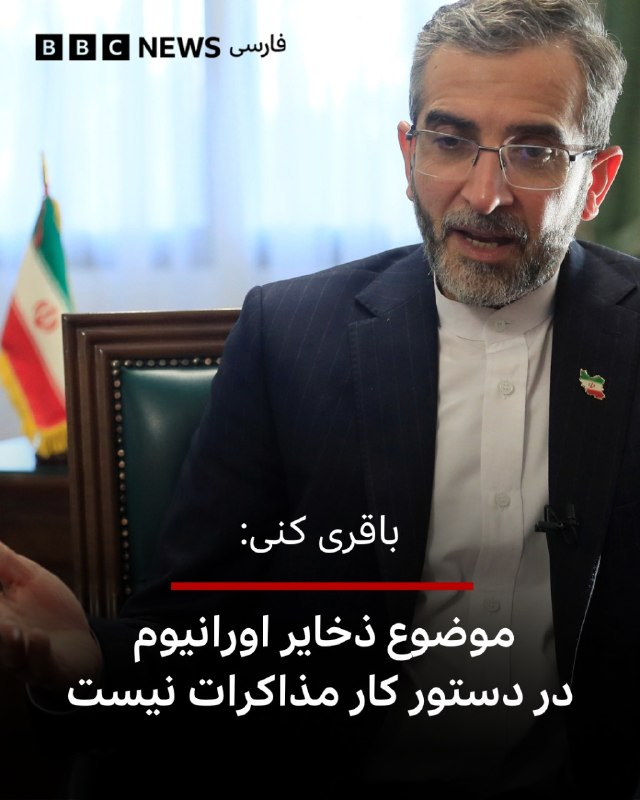

‌🔻علی باقری کنی، معاون سیاست خارجی و امنیت بین‌الملل دبیرخانه شورای عالی امنیت ملی ایران می‌گوید که «موضوع ذخایر اورانیوم در دستور کار مذاکرات نیست.»

او این موضوع را در پاسخ به پرسشی در حاشیه چهاردهمین نشست بین‌المللی مقامات بلندپایه امنیتی در مسکو مطرح کرد.

پیشتر دونالد ترامپ، رئیس جمهور آمریکا، گفت که اورانيوم غنی‌شده ایران یا به تعبیر او «غبار هسته‌ای به ايالات متحده تحويل داده خواهد شد تا به آمريکا منتقل و نابود شود، يا ترجيحا با همکاری و هماهنگی ايران، در همان محل يا در مکان مورد توافق ديگری، نابود خواهد شد.»

📷EPA
https://bbc.in/3PuodBw

@BBCPersian

## idfinfarsi — post 11656

  <a href="telegram/content/idfinfarsi_11656_1779890749.mp4" target="_blank">🎬 Download video</a>

تکمیل چرخه هدف‌گیری: نیروهای تیپ ۴۰۱ تروریستی را که زنده یاد سرگرد (ذخیره) ایتمار ساپیر را به قتل رساند، به هلاکت رساندند

هفته گذشته (سه‌شنبه)، در جریان درگیری نیروهای ارتش اسرائیل در منطقه قاوزه در جنوب لبنان، یک تروریست از محدوده یک کلیسا به‌سوی نیروهای تیپ ۴۰۱ تیراندازی کرد که در نتیجه آن سرگرد (ذخیره) ایتمار ساپیر جان باخت.

بلافاصله پس از این رویداد، نیروهای تیپ تحت فرماندهی لشکر ۱۴۶ با آتش پاسخ دادند و برای به هلاکت رساندن تروریست اقدام کردند.

اکنون می‌توان تأیید کرد که تروریستی که سرگرد (ذخیره) ایتمار ساپیر را به قتل رساند، پس از شناسایی در حالی که وارد ساختمانی در محدوده کلیسا شده بود، با شلیک تانک و حمله دقیق نیروی هوایی به هلاکت رسید.

در چارچوب پشتیبانی آتش در این رویداد، ارتش اسرائیل از هوا و زمین مواضع دیده‌بانی، انبار تسلیحات و ساختمان‌هایی را که توسط سازمان تروریستی حزب‌الله برای پیشبرد طرح‌های تروریستی مورد استفاده قرار می‌گرفت، هدف قرار داد.

## idfinfarsi — post 11655

  <a href="telegram/content/idfinfarsi_11655_1779890750.mp4" target="_blank">🎬 Download video</a>

در این روزهای مقدس مسلمانان، پیام ما بیش از هر زمان دیگری نمایان است: اتحاد و همبستگی میان اقوام و ادیان، از هر تلاشی برای تفرقه‌ و تحریکها نیرومندتر است.

## Dirty_Kids — post 390320

  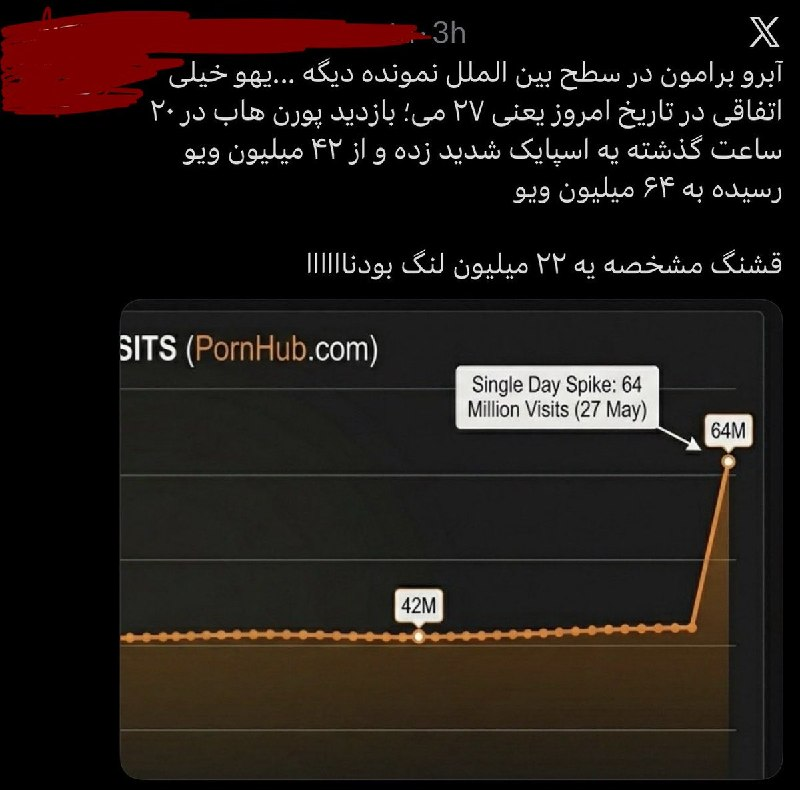

به مردمی که ۳ ماه اینترنت نداشتن برای پورن دیدن هم سرکوفت میزنین :)))
کدوم آبرو؟ دنیا ۳ ماه اینترنت نداشتین به تخمش هم نبود، دهن این مردم سرویس شد کل دنیا سوت زد حالا بیاد بگه واااای نگاه کن ایرانیا پورن نگاه کردن؟
قتل نکرده که، رفته پورن دیده. گیری کردیم با شما کسخلا.

@Dirty_Kids 👻

## Dirty_Kids — post 390319

‏الان دارن روی سرور‌های سوپراپلیکیشن بله رو پلاستیک و کاور میکشن که گرد و خاک نره توش تا اینترنت ملی بعدی.

@Dirty_Kids 👻

## Dirty_Kids — post 390318

  <a href="telegram/content/Dirty_Kids_390318_1779890753.mp4" target="_blank">🎬 Download video</a>

🔴 شلواری که به تازگی مد شده و رکورد خرید توسط پسرا برای دوس دخترشون رو داشته!

@Dirty_Kids 👻

## Dirty_Kids — post 390317

  

دوستم اینو‌ گذاشته بود پروفایل «بله‌»ش. مناسبت‌ترین عکس پروفایل برای کارمندی که مجبورش کرده‌ن عضو بله بشه.

@Dirty_Kids 👻

## Dirty_Kids — post 390316

  <a href="telegram/content/Dirty_Kids_390316_1779890755.mp4" target="_blank">🎬 Download video</a>

🔴 یه پسره هر چقدر گیتار می‌زده دیده نمیشده و فقط کلیپ دخترا بازدید می‌خورده.

اونم اومده این شاهکارو درست کرده و ۱۰ میلیون بازدید گرفته :))

@Dirty_Kids 👻

## Dirty_Kids — post 390315

  <a href="telegram/content/Dirty_Kids_390315_1779890756.mp4" target="_blank">🎬 Download video</a>

سالنای آرایشگری زنونه این روزا این شکلی دارن تبلیغ میکنن:

@Dirty_Kids 👻

## Dirty_Kids — post 390311

🔴 امسال انگار سال سالِ کونه 🍑، چالش عجیب و کثافتی که این روزها تو اینستاگرام به شدت وایرال شده؛

داستان ازاین قراره که؛ ملت کونشونو به شکل قلب درمیارن، ازش عکس میگیرن و تو اینستاگرام پست میکنن.

این چالش درحال حاضر پر بازدید‌ترین چالش حالِ حاضر اینستاگرامه.

@Dirty_Kids 👻

## Dirty_Kids — post 390310

  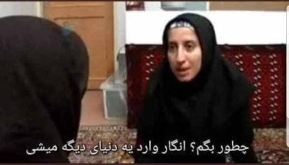

وقتی از روبیکا میای تلگرام:

@Dirty_Kids 👻

## Dirty_Kids — post 390309

  

بچه‌هایی که نبودید
یه ژانر تو توییتر درست کردن به اسم «شیکم تخت» این بانو خیلی وایرال شد

@Dirty_Kids 👻

## Dirty_Kids — post 390308

حالا فهمیدید چرا اینترنت رو قطع کردن؟
چون نمی‌خواستن این تصاویر حماسی و پرشور مردم پادشاهی خواه داخل ایران به بیرون درز کنه.

@Dirty_Kids 👻

## Dirty_Kids — post 390307

  

🔴 آخوند حمید رسایی: از وقتی اینترنت وصل شده قلبم درد گرفته، یه لحظه‌ام نتونستم بخوابم.

وصل شدن اینترنت پایمال کردن خون رهبر شهیدمونه، با اینکار تن رهبری تو گور لرزید.
عوامل موساد باعث بازگشایی اینترنت شدن.

@Dirty_Kids 👻

## Dirty_Kids — post 390306

  <a href="https://t.me/Dirty_Kids/390306" target="_blank">📎 Download file</a>

📱 اپلیکیشن اندروید بدون فیلتر ریتزوبت

➖➖➖➖➖

🔹 ثبت نام آسان 
✅
🔹 رابط کاربری بسیار راحت و سریع 
✅
🔹 درگاه پرداخت کارت به کارت 
✅
🔹 درگاه پرداخت دلاری سریع 
✅
🔹 بونوس ۱۰۰ درصدی اولین واریز 
✅
🔹 بونوس ۱۰۰ درصدی واریز یکشنبه ها 
✅

➖➖➖➖➖
🌐 https://RitzoBet.com

⚡️ @RitzoBet_ir

## Dirty_Kids — post 390305

  

⚠️ برای #شرطبندی های فوتبال از سایت معتبر و بین المللی استفاده کنید ✅

سایت #ریتزوبت ، چهار سال هستش داخل ایران فعالیت میکنه 
✅

لایسنس بین المللی داره ، روش های شارژ و برداشت متنوع داره و بونوس 100% ورزشی و کش بک های جذاب
💎

⏪ اپلیکیشن بدون فیلتر ریتزوبت 
📱
⏩
R6

✅ لینک بدون‌ فیلتر ریتزوبت
🤣

🆔 @RitzoBet_ir 
🇮🇷

## Dirty_Kids — post 390302

‏ترامپ مادر×نده امتحانا داره حضوری میشه، خیالت راحت شد؟

@Dirty_Kids 👻

## Hranews — post 113196

  

مجتبی بهزادیان، مدیرکل دفتر نظارت بر عرضه و نمایش فیلم، اعلام کرد که موضوعات مطرح‌شده درباره فیلم «تهران کنارت» به انتشار یک ویدیوی تبلیغاتی «خارج از رویه‌های سازمان سینمایی» بازمی‌گردد. به گفته وی، آنچه موجب واکنش نهادهای مسئول شده، استفاده از صدای یک خواننده زن در این ویدیو عنوان شده است.

لازم به ذکر است؛ مرکز رسانه قوه قضاییه چند روز پیش از تشکیل پرونده قضایی علیه دست‌اندرکاران این فیلم به دلیل آنچه «محتوای غیراخلاقی و مغایر با عفت عمومی» خبر داده بود. همچنین رئیس سازمان سینمایی کشور نیز در ارتباط با صدور پروانه نمایش این فیلم به مرجع قضایی احضار شده بود.

↘️
@hranews_bot تماس ✉️ - @Hranews کانال هرانا 🆑

## Hranews — post 113195

  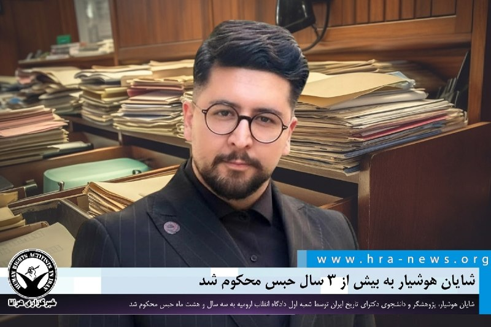

شایان هوشیار به بیش از ۳ سال حبس محکوم شد

❗️
❗️
❗️
❗️
❗️– شایان هوشیار، پژوهشگر و دانشجوی دکترای تاریخ ایران توسط شعبه اول دادگاه انقلاب ارومیه به سه سال و هشت ماه حبس محکوم شد.

به گزارش خبرگزاری هرانا، ارگان خبری مجموعه فعالان حقوق بشر در ایران، شایان هوشیار، پژوهشگر و دانشجوی دکترای تاریخ ایران به حبس محکوم شد.

این حکم اخیرا توسط شعبه اول دادگاه انقلاب ارومیه صادر و به مسعود شمس نژاد، وکیل مدافع شایان هوشیار ابلاغ شده است. بر اساس رای صادره آقای هوشیار به سه سال و هشت ماه حبس محکوم شده است.

#شایان_هوشیار

ادامه مطلب

↘️
@hranews_bot تماس ✉️ - @Hranews کانال هرانا 🆑

## Hranews — post 113194

  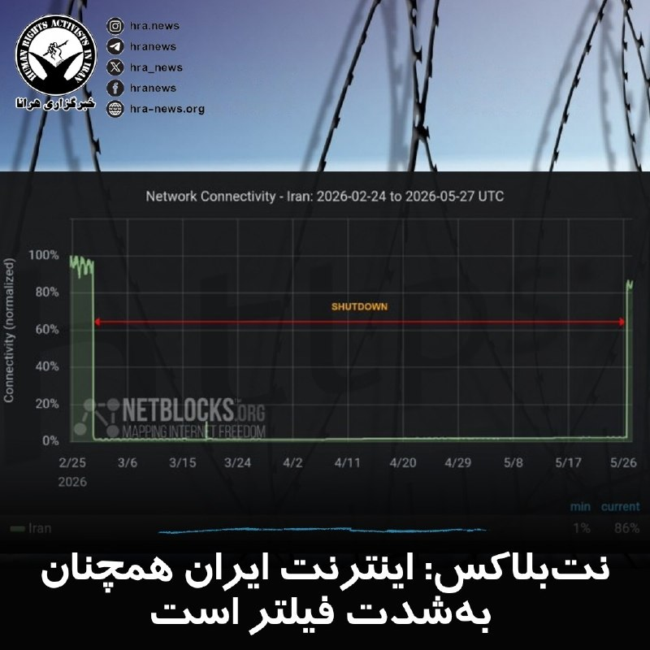

نت‌بلاکس در آخرین به‌روزرسانی خود از وضعیت #اینترنت در ایران نوشت اتصال اینترنت اکنون به مدت ۲۴ ساعت در حالت ترمیم و بازیابی قرار دارد. این نهاد ناظر بر وضعیت اینترنت در جهان تاکید کرد که اینترنت در ایران همچنان به‌شدت فیلتر است و محدودیت‌های جدیدی در پیام‌رسان‌ها و اپلیکیشن‌ها در مقایسه با قبل از قطع اینترنت اعمال شده است.

↘️
@hranews_bot تماس ✉️ - @Hranews کانال هرانا 🆑

## Hranews — post 113193

گزارشی از بازداشت و بلاتکلیفی پژمان حاجی‌زاده

❗️
❗️
❗️
❗️
❗️– پژمان حاجی‌زاده، شهروند ساکن بوکان، مورخ ۲۲ اردیبهشت‌ماه، توسط نیروهای امنیتی در این شهرستان بازداشت و کماکان بصورت بلاتکلیف در یکی از بازداشتگاه‌های امنیتی ارومیه به‌سر می‌برد.

#پژمان_حاجی‌زاده

ادامه مطلب

↘️
@hranews_bot تماس ✉️ - @Hranews کانال هرانا 🆑

## manototv — post 105837

  <a href="telegram/content/manototv_105837_1779890762.mp4" target="_blank">🎬 Download video</a>

از «کمک در راه است» تا مذاکره، معامله و بازگشت به همان سیاست همیشگی؟ ورق بزنید.

## alonews — post 123069

  <a href="telegram/content/alonews_123069_1779890763.mp4" target="_blank">🎬 Download video</a>

👈آغاز تخلیه شهر صور پس از هشدار ارتش اسرائیل

✅ @AloNews خبر جنگ

## alonews — post 123068

  <a href="telegram/content/alonews_123068_1779890765.webm" target="_blank">🎬 Download video</a>

👈یک ایرانی رفته جلوی کلیسای پروتستان که اصلا پاپ کاتولیک رو قبول ندارند که به اون ها بگه پاپ طرف جمهوری اسلامی رو گرفته

✅ @AloNews خبر جنگ

## alonews — post 123067

  <a href="telegram/content/alonews_123067_1779890765.webm" target="_blank">🎬 Download video</a>

👈ترامپ امروز ساعت ۱۱ به وقت محلی (حوالی ساعت ۱۹ به وقت تهران) برای بررسی مذاکرات با ایران، جلسه‌ای با اعضای کابینه و دستیاران ارشد خود خواهد داشت

✅ @AloNews خبر جنگ

## alonews — post 123066

  <a href="telegram/content/alonews_123066_1779890765.webm" target="_blank">🎬 Download video</a>

👈ارتش اسرائیل در اقدامی بسیار غیر عادی و عجیب دستور تخلیه کامل شهر بندری صور، بزرگ ترین شهر جنوب لبنان به همراه تمام روستاهای اطراف آن را صادر کرد.

✅ @AloNews خبر جنگ

## alonews — post 123063

  <a href="telegram/content/alonews_123063_1779890766.webm" target="_blank">🎬 Download video</a>

👈جنگنده‌های اسرائیلی حملات هوایی به بریتال، کفر حونه و ملیخ در لبنان انجام داده‌اند

✅ @AloNews خبر جنگ

## alonews — post 123062

  <a href="telegram/content/alonews_123062_1779890766.webm" target="_blank">🎬 Download video</a>

👈اسرائیل شدید داره به حزب الله حمله میکنه از وزارت خارجه گفتن امکان توقف مذاکره اولیه و انسداد کامل هرمز هست

🔴یعنی نتم ممکنه دوباره قطع کنن

✅ @AloNews خبر جنگ

## alonews — post 123061

  <a href="telegram/content/alonews_123061_1779890766.webm" target="_blank">🎬 Download video</a>

👈آخرین قیمت نفت ۹۵.۱۰ دلار

✅ @AloNews خبر جنگ

## alonews — post 123060

  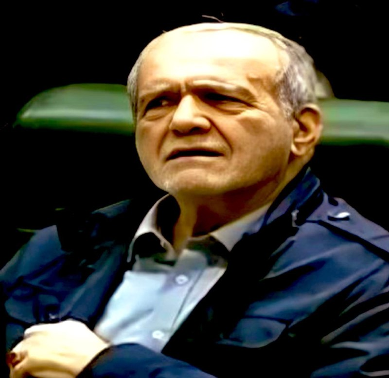

پزشکیان وقتی میبینه همه جا نوشتن با دستور رییس‌جمهور اینترنت بین الملل متصل شد:

[@AloTweet]

## alonews — post 123059

  <a href="telegram/content/alonews_123059_1779890767.webm" target="_blank">🎬 Download video</a>

👈یسرائیل کاتس، وزیر جنگ اسرائیل در جلسه کابینه امنیتی: ما در حال حاضر با ایالات متحده در مورد حملات به منطقه الضاحیه در بیروت وضعیت پیچیده‌ای داریم. در عین حال، ما متعهد به دفاع از خود با تمام وسایل لازم هستیم. هیچ‌کس ما را متوقف نمی‌کند

✅ @AloNews خبر جنگ

## alonews — post 123058

🔥 حجم‌های بالا با قیمت‌های باورنکردنی 🔥 ⚡ سرعت بالا 🌐 پایداری عالی 🚀 کیفیتی که حسش میکنی همین الان جوین شو که جا نمونی 😍 @NetAazaadVPN @NetAazaadVPN

## alonews — post 123057

  

🔥 حجم‌های بالا با قیمت‌های باورنکردنی 🔥

⚡ سرعت بالا
🌐 پایداری عالی
🚀 کیفیتی که حسش میکنی

همین الان جوین شو که جا نمونی 😍

@NetAazaadVPN
@NetAazaadVPN

## alonews — post 123056

  <a href="telegram/content/alonews_123056_1779890767.webm" target="_blank">🎬 Download video</a>

👈جو بایدن، رئیس‌جمهور سابق [آمریکا]، با ثبت شکایتی علیه وزارت دادگستری، تلاش دارد مانع از آن شود که دولت ترامپ فایل‌های صوتی و متن مکتوب مصاحبه‌های خصوصی او را منتشر کند؛ مصاحبه‌هایی که با یک نویسنده در سایه (نویسنده همکار) انجام شده بود که در نگارش کتاب خاطراتش به او کمک می‌کرد

✅ @AloNews خبر جنگ

## alonews — post 123055

  <a href="telegram/content/alonews_123055_1779890768.webm" target="_blank">🎬 Download video</a>

👈سی‌ان‌ان: هزینه‌های جنگ ایران، بودجه نظامی آمریکا را به شدت کاهش داده است

🔴پنتاگون فشار مالی را احساس می‌کند و در برخی موارد برای انجام آموزش‌های روتین و تعمیر و نگهداری در بحبوحه عملیات‌های جاری خود علیه ایران با مشکل مواجه است و رهبران نظامی یونیفرم‌پوش کنگره را برای حمایت از بودجه اضافی تحت فشار قرار می‌دهند.

🔴بر اساس یک سند داخلی، سپاه سوم زرهی ارتش، ستادی مستقر در تگزاس که بر تقریباً ۷۰ هزار سرباز و صدها تانک نظارت دارد، در اواخر آوریل شاهد کاهش تقریباً ۲۹۲ میلیون دلاری بودجه آموزشی خود بود.

🔴سرپرست حسابرسی پنتاگون، در ۱۲ مه به زیرگروه دفاعی کمیته تخصیص بودجه مجلس نمایندگان گفت که آخرین برآورد پنتاگون از هزینه این درگیری تقریباً ۲۹ میلیارد دلار بوده است.

🔴هرست اذعان کرد که این تخمین بر اساس هزینه مهمات و هواپیماهای منهدم شده بوده و هزینه‌های ساخت و ساز برای بازسازی پایگاه‌ها را شامل نمی‌شود.

✅ @AloNews خبر جنگ

## alonews — post 123054

  <a href="telegram/content/alonews_123054_1779890768.webm" target="_blank">🎬 Download video</a>

👈لیندسی گراهام، سناتور جمهوری‌خواه کارولینای جنوبی : مدتی است که برای من آشکار شده پاکستان به عنوان یک میانجی، بیش از حد مشکل‌ساز است. دشمنی آنها با اسرائیل دیرینه است.

🔴غیرقابل انکار است که هواپیماهای نظامی ایران در پایگاه‌های هوایی پاکستان مستقر هستند و لفاظی‌های گذشته مقامات ارشد پاکستان علیه اسرائیل نگران‌کننده است.

🔴وزیر دفاع پاکستان گفته بود این کشور هرگز به توافق‌نامه‌های ابراهیم ملحق نخواهد شد زیرا به اسرائیل اعتماد ندارد. این کلیپ ممکن است یک سال قدمت داشته باشد، اما من می‌ترسم این احساسات تازه باشد.

🔴در این راستا، ضروری است پاکستان اکنون به درخواست رئیس‌جمهور ترامپ برای پیوستن به توافق‌نامه‌های ابراهیم پاسخ دهد

✅ @AloNews خبر جنگ

## alonews — post 123053

  <a href="telegram/content/alonews_123053_1779890768.webm" target="_blank">🎬 Download video</a>

👈حملات هوایی اسرائیل به شهر کفر حونه در بقیعه غربی لبنان هدف قرار گرفت.

✅ @AloNews خبر جنگ

## alonews — post 123052

  <a href="telegram/content/alonews_123052_1779890768.webm" target="_blank">🎬 Download video</a>

👈نورالدین الدغیر خبرنگار الجزیره در تهران: برخی از بندهای یادداشت تفاهم بین تهران و واشنگتن

🔴 واشنگتن محاصره دریایی ایران را لغو کرده و نیروهای خود را از پیرامون ایران خارج می‌کند.

🔴ایران متعهد می‌شود ظرف مدت یک ماه، تعداد کشتی‌های تجاری عبوری را (به استثنای کشتی‌های نظامی) به سطح پیش از تنش‌ها بازگرداند.

🔴 هماهنگی در خصوص مدیریت مسیر کشتی‌ها با ایران و عمان انجام خواهد شد.

✅ @AloNews خبر جنگ

## alonews — post 123051

  <a href="telegram/content/alonews_123051_1779890769.webm" target="_blank">🎬 Download video</a>

👈زنگنه، نماینده مجلس: احتمالا عید غدیر جشن پیروزی ایران بر آمریکارو میگیریم

✅ @AloNews خبر جنگ

## alonews — post 123050

  <a href="telegram/content/alonews_123050_1779890769.webm" target="_blank">🎬 Download video</a>

👈تصاویر نشان می‌دهد که هواپیمای سوخت‌رسانی جدید نیروی هوایی اسرائیل، KC-46A Pegasus "Gideon" (301)، اندکی پیش در اسرائیل فرود آمد و ایال زمیر، رئیس ستاد کل ارتش اسرائیل، در مراسم استقبال حضور داشت. این هواپیما اولین فروند از شش فروند سفارش داده شده است و امکان سفارش دو فروند دیگر نیز وجود دارد.

✅ @AloNews خبر جنگ

<!-- MSG END -->

<!-- NAV START -->

<a href="https://github.com/Tljn/FUD/blob/main/telegram/content/archive_1.md" style="display:inline-block; padding:6px 12px; margin:0 4px; background-color:#2ea44f; color:white; text-decoration:none; border-radius:4px; font-weight:bold;">صفحه بعد</a>

<!-- NAV END -->
