# خواننده تلگرام

<!-- TOP_NAV START -->

<a href="https://github.com/Tljn/FUD/blob/main/telegram/content/archive_1.md" style="display:inline-block; padding:6px 12px; margin:0 4px; background-color:#2ea44f; color:white; text-decoration:none; border-radius:4px; font-weight:bold;">صفحه بعد</a>

<!-- TOP_NAV END -->

<!-- MSG START -->

---
📅 بروزرسانی: 1405/03/11 22:10
---

## VahidOOnLine — post 243270

  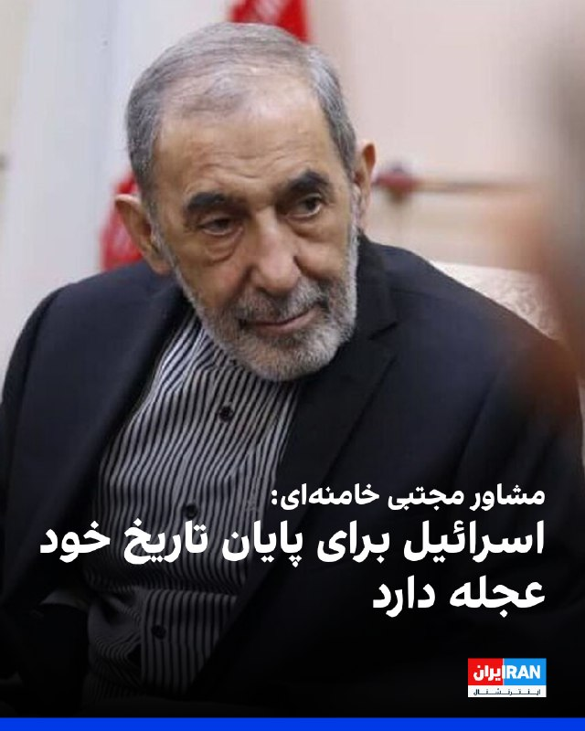

علی‌اکبر ولایتی، مشاور رهبر جمهوری اسلامی در شبکه اجتماعلی ایکس نوشت که بمباران ضاحیه و نقض آتش‌بس، عجله اسرائیل برای پایان دادن به تاریخ خود است.

ولایتی افزود: شما آغاز کردید، اما برخلاف انفعال تماشاچیان منطقه، جمهوری اسلامی و جبهه مقاومت تا آخر کنار مردم عزیز لبنان، از مسلمان تا مارونی ایستاده است.
‌🏁 🇬🇧 IranintlTV

🤖 @VahidOOnLine

## VahidOOnLine — post 243269

♦️حسن یوسفی، سرپرست هیات باستان‌شناسی آتشکده ساسانی ویگل از کشف یک ساختار آیینی با ویژگی‌های کم‌سابقه در این محوطه تاریخی خبر داد.
به گزارش ایسنا، حسن یوسفی با اعلام این خبر گفت: «در جریان فصل سوم کاوش‌های باستان‌شناسی در آتشکده ساسانی ویگل واقع در شهرستان آران و بیدگل، ساختاری آیینی شناسایی شده که از نظر معماری و کارکرد، ویژگی‌های کم‌سابقه‌ای دارد و می‌تواند اطلاعات تازه‌ای درباره آیین‌های مذهبی و سازمان فضایی نیایشگاه‌های دوره ساسانی ارائه کند.»
او افزود: «این ساختار در بخش شرقی آتشکده کشف شده و شامل فضاهایی با چیدمان ویژه و شواهدی از فعالیت‌های آیینی است که تاکنون نمونه‌های مشابه اندکی از آن در محوطه‌های ساسانی شناسایی شده است.»
به گفته یوسفی، نتایج اولیه کاوش‌ها نشان می‌دهد این بخش احتمالا نقشی فراتر از یک فضای معمول مذهبی داشته و ممکن است برای برگزاری آیین‌های خاص مورد استفاده قرار می‌گرفته است.
سرپرست هیات باستان‌شناسی آتشکده ویگل تاکید کرد بررسی‌های تخصصی و مطالعات تکمیلی برای تعیین دقیق کارکرد این ساختار همچنان ادامه دارد.
‌🇸🇦 Indypersian

🤖 @VahidOOnLine

## VahidOOnLine — post 243268

  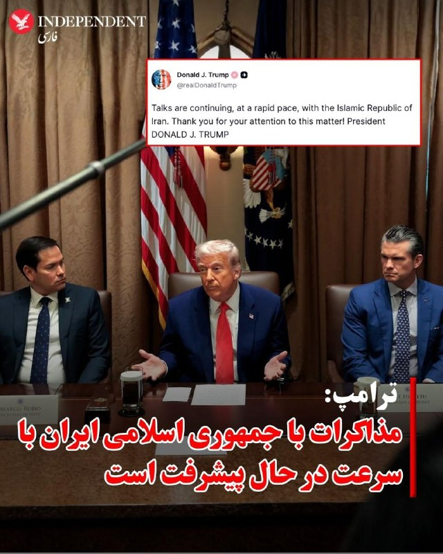

♦️دونالد ترامپ، رئیس‌جمهوری آمریکا اعلام کرد گفتگوها با جمهوری اسلامی ایران همچنان ادامه دارد و با سرعت در حال پیشرفت است.

ترامپ روز دوشنبه در پیامی در شبکه اجتماعی تروث سوشال نوشت: «مذاکرات با جمهوری اسلامی ایران با سرعت در حال ادامه یافتن است. از توجه شما به این موضوع سپاسگزارم!»

رئیس جمهوری آمریکا پیش از این پیام، از توقف حملات اسرائیل به بیروت و موافقت حزب‌الله به پایبندی بر آتش‌بس خبر داده بود.

اظهارات ترامپ پس از آن مطرح می‌شود که خبرگزاری تسنیم به نقل از منابع آگاه گزارش داد ایران در اعتراض به ادامه عملیات نظامی اسرائیل در لبنان، روند «تبادل متون از طریق میانجی» با آمریکا را متوقف خواهد کرد.
‌🇸🇦 Indypersian

🤖 @VahidOOnLine

## VahidOOnLine — post 243267

  <a href="telegram/content/VahidOOnLine_243267_1780339243.mp4" target="_blank">🎬 Download video</a>

♦️انتشار ویدئویی از رفتار عجیب یک زائر زن و قوی‌هیکل ایرانی در مراسم رجم شیطان، توجه بسیاری از زائران را جلب کرده و با بازتاب گسترده‌ای در رسانه‌های عربی همراه شده است. در این ویدئو، این حاجیه ایرانی با سر دادن فریاد «الله اکبر» و شعارهایی علیه اسرائیل، با شتاب و قدرت فراوان به سوی ستون‌ها سنگ‌ریزه پرتاب می‌کند.
مناسک «رجم شیطان» یکی از ارکان اصلی حج تمتع است که هر سال در شهر منا در نزدیکی مکه برگزار می‌شود و در جریان آن، زائران به سه ستون یا دیوار نمادین به نام‌های جمره صغری (کوچک)، جمره وسطی (میانی) و جمره کبری یا عقبه (بزرگ) سنگ‌ریزه پرتاب می‌کنند.
‌🇸🇦 Indypersian

🤖 @VahidOOnLine

## VahidOOnLine — post 243266

  

دونالد ترامپ در تروث سوشال نوشت که مذاکرات با جمهوری اسلامی با سرعت ادامه دارد.

او پیش‌تر درباره توقف ارتباط مذاکره‌کنندگان جمهوری اسلامی با آمریکا به دلیل عملیات نظامی اسرائیل در لبنان، افزود: «واقعا برایم مهم نیست، اصلا اهمیت نمی‌دهم.»

ترامپ همچنین در تروث سوشال نوشت با بنیامین نتانیاهو گفت‌وگویی بسیار سازنده داشته و هیچ نیروی نظامی به بیروت اعزام نخواهد شد و نیروهایی که در مسیر بودند نیز بازگردانده شده‌اند.

او اضافه کرد از طریق نمایندگان عالی‌رتبه، با حزب‌الله تماس بسیار خوبی داشته و توافق شده است همه تیراندازی‌ها متوقف شود؛ اسرائیل به آن‌ها حمله نخواهد کرد و آن‌ها نیز به اسرائیل حمله نخواهند کرد.
‌🏁 🇬🇧 IranintlTV

🤖 @VahidOOnLine

## VahidOOnLine — post 243265

  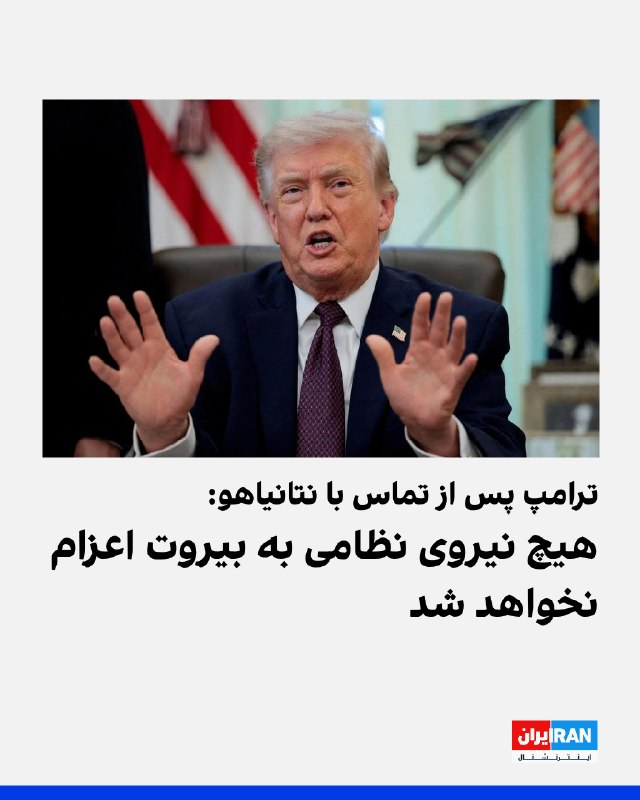

دونالد ترامپ اعلام کرد با بنیامین نتانیاهو گفت‌وگویی بسیار سازنده داشته و هیچ نیروی نظامی به بیروت اعزام نخواهد شد و نیروهایی که در مسیر بودند نیز بازگردانده شده‌اند.

او همچنین گفت از طریق نمایندگان عالی‌رتبه، با حزب‌الله تماس بسیار خوبی داشته و توافق شده است همه تیراندازی‌ها متوقف شود؛ اسرائیل به آن‌ها حمله نخواهد کرد و آن‌ها نیز به اسرائیل حمله نخواهند کرد.
‌🏁 🇬🇧 IranintlTV

🤖 @VahidOOnLine

## VahidOOnLine — post 243264

  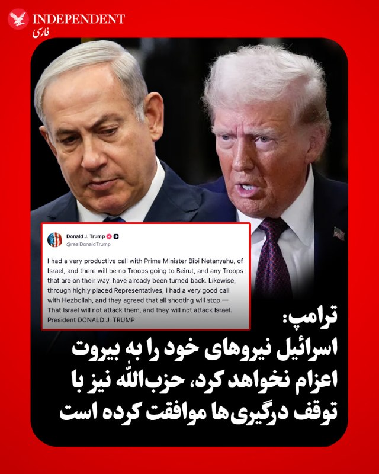

♦️دونالد ترامپ، رئیس‌جمهوری آمریکا، روز دوشنبه ۱۱ خرداد اعلام کرد در گفتگویی با بنیامین نتانیاهو، نخست‌وزیر اسرائیل، درباره تحولات لبنان به توافقاتی دست یافته و نیروهای اسرائیلی به بیروت اعزام نخواهند شد.
ترامپ در پیامی در شبکه اجتماعی تروث سوشال نوشت: «گفتگوی بسیار سازنده‌ای با بی‌بی نتانیاهو، نخست‌وزیر اسرائیل، داشتم و هیچ نیرویی به بیروت اعزام نخواهد شد. همچنین هر نیرویی که در مسیر اعزام بوده، بازگردانده شده است.»
او همچنین در ادامه اعلام کرد از طریق «نمایندگان عالی‌رتبه» با حزب‌الله نیز گفتگو کرده و این گروه با توقف کامل تیراندازی‌ها موافقت کرده است.
ترامپ افزود: «اسرائیل به آنها حمله نخواهد کرد و آنها نیز به اسرائیل حمله نخواهند کرد.»
رئیس‌جمهوری آمریکا جزئیات بیشتری درباره این تماس‌ها، هویت نمایندگان واسطه یا نحوه دستیابی به این توافق اعلام نکرد.
پیشتر وزارت خارجه و سپاه پاسداران جمهوری اسلامی در بیانیه‌هایی اعلام کرده بودند، تشدید حملات اسرائیل در ضاحیه بیروت، از سوی تهران نقض آتش‌بس تلقی خواهد شد.
‌🇸🇦 Indypersian

🤖 @VahidOOnLine

## VahidOOnLine — post 243263

  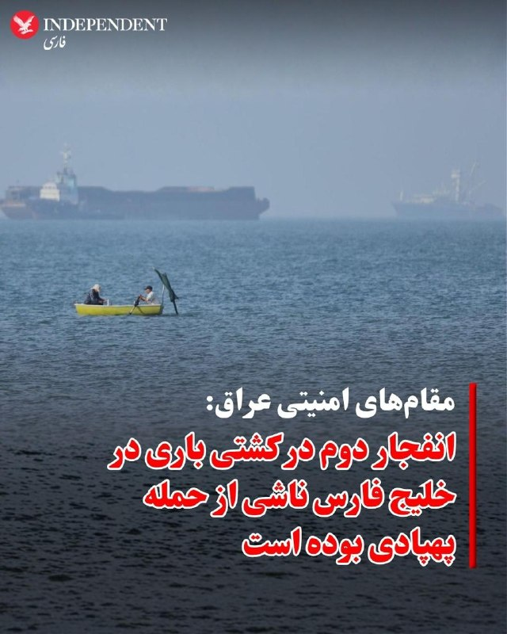

♦️مقام‌های امنیتی عراق، روز دوشنبه ۱۱ خرداد ماه اعلام کردند ارزیابی‌های اولیه نشان می‌دهد دومین انفجار در کشتی باری هدف قرارگرفته در خلیج فارس، در نتیجه یک حمله پهپادی رخ داده است.

این کشتی عصر دوشنبه و در فاصله حدود ۷۴ کیلومتری جنوب‌شرق بندر ام‌القصر عراق هدف حمله قرار گرفت. پیش‌تر سازمان عملیات تجارت دریایی بریتانیا (UKMTO) گزارش داده بود یک پرتابه ناشناس به سمت راست کشتی برخورد کرده و موجب وقوع انفجار بزرگی شده است.

بر اساس اطلاعات جدید مقام‌های عراقی، بررسی‌های اولیه حاکی از آن است که انفجار دوم ناشی از حمله یک پهپاد بوده است. با این حال، جزئیاتی درباره عامل احتمالی این حمله یا میزان خسارت وارده به کشتی منتشر نشده است.
‌🇸🇦 Indypersian

🤖 @VahidOOnLine

## VahidOOnLine — post 243262

  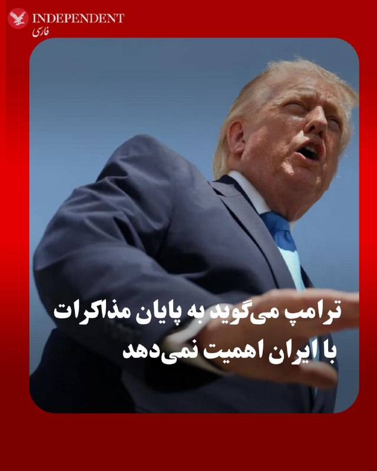

♦️دونالد ترامپ، رئیس‌جمهوری آمریکا، دوشنبه شب و در واکنش به تعلیق یکسویه مذاکرات پایان جنگ از سوی تهران گفت برایش اهمیتی ندارد این مذاکرات به پایان رسیده باشد.
ترامپ در گفتگو با شبکه سی‌ان‌بی‌سی اعلام کرد: «صادقانه بگویم، اهمیتی نمی‌دهم که مذاکرات تمام شده باشد. واقعا برایم مهم نیست. أصلا اهمیتی نمی‌دهم.»

اظهارات رئیس‌جمهوری آمریکا پس از آن مطرح می‌شود که رسانه‌های ایرانی از توقف روند گفتگوها و تبادل پیام‌ها میان تهران و واشنگتن خبر داده‌اند.

ترامپ پیش‌تر نیز در گفتگویی با شبکه ان‌بی‌سی  گفته بود آمریکا عجله‌ای برای دستیابی به توافق ندارد و در صورت توقف مذاکرات، «سکوت خواهد کرد» و به حفظ محاصره دریایی علیه ایران ادامه می‌دهد.
‌🇸🇦 Indypersian

🤖 @VahidOOnLine

## VahidOOnLine — post 243261

  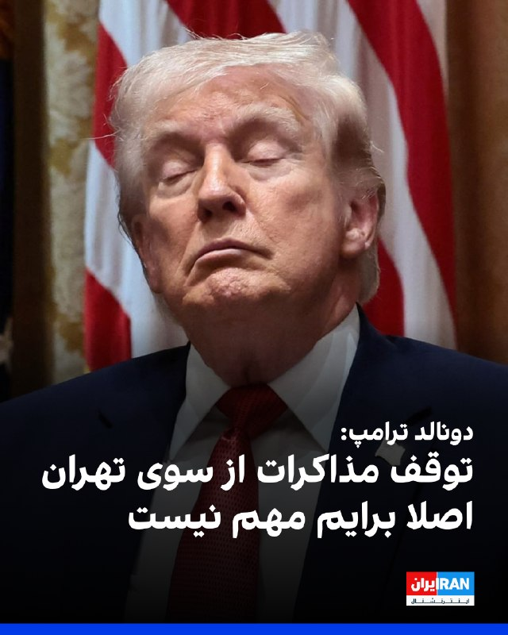

ترامپ در گفت‌وگو با سی‌ان‌بی‌سی در پاسخ به گزارش‌هایی درباره توقف ارتباط مذاکره‌کنندگان جمهوری اسلامی با آمریکا به دلیل عملیات نظامی اسرائیل در لبنان، افزود: «واقعا برایم مهم نیست، اصلا اهمیت نمی‌دهم.»

ترامپ درباره بستن تنگه هرمز از سوی جمهوری اسلامی نیز گفت نگران افزایش قیمت نفت نیست.
او همچنین گفت قصد دارد از بنیامین نتانیاهو درباره وضعیت لبنان سوال کند.
‌🏁 🇬🇧 IranintlTV

🤖 @VahidOOnLine

## VahidOOnLine — post 243260

  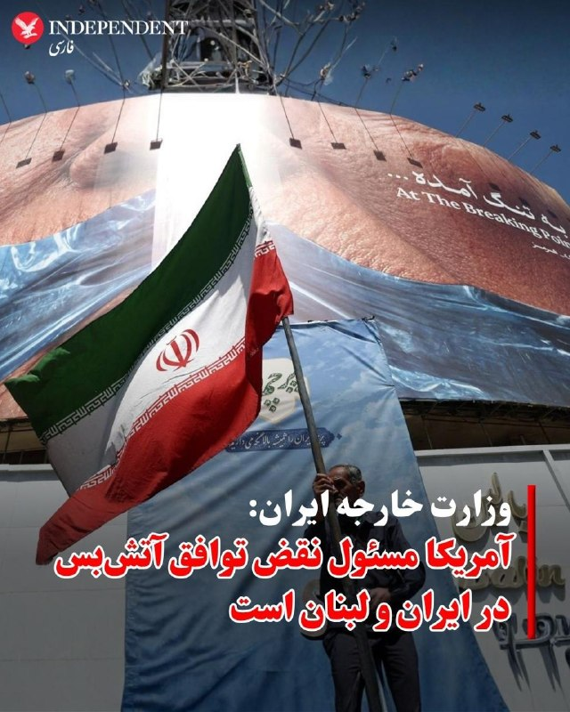

♦️وزارت امور خارجه جمهوری اسلامی ایران روز دوشنبه ۱۱ خرداد با انتشار بیانیه‌ای آمریکا و اسرائیل را به نقض مستمر آتش‌بس متهم کرد و هشدار داد که تهران بر اساس حق دفاع مشروع از منافع خود دفاع خواهد کرد.

در این بیانیه با اشاره به توافق آتش‌بس ۱۹ فروردین ۱۴۰۵ (۸ آوریل ۲۰۲۶) که به گفته وزارت خارجه به جنگ میان آمریکا، اسرائیل و جمهوری اسلامی ایران در همه جبهه‌ها از جمله لبنان پایان داده بود، آمده است آمریکا از زمان اعلام آتش‌بس بارها آن را نقض کرده و از جمله به کشتی‌رانی تجاری ایران تعرض کرده است.

وزارت خارجه ایران همچنین اسرائیل را به نقض «فاحش» آتش‌بس در لبنان متهم کرده و نوشته است این اقدامات به کشته و زخمی شدن هزاران نفر، آوارگی حدود دو میلیون نفر و تخریب زیرساخت‌ها و منازل مسکونی در لبنان منجر شده است.

در این بیانیه تاکید شده «نقض آتش‌بس در هر یک از جبهه‌ها، به منزله نقض آن در تمامی جبهه‌ها است.»
‌🇸🇦 Indypersian

🤖 @VahidOOnLine

## VahidOOnLine — post 243259

  

رسانه‌های اسرائیلی گزارش دادند بنیامین نتانیاهو دوشنبه با دونالد ترامپ به‌صورت تلفنی گفت‌وگو کرده است. جزئیات بیشتری از این تماس منتشر نشده است.

دوشنبه همزمان با حملات اسرائیل به جنوب لبنان، قرارگاه مرکزی خاتم‌الانبیا به ساکنان شمال اسرائیل هشدار تخلیه داد.
خبرگزاری تسنیم نیز از توقف گفت‌وگوها با آمریکا به علت حملات اسرائیل به لبنان خبر داد.

محمد مخبر، مشاور مجتبی خامنه‌ای، گفت هرگونه آتش‌بس بدون در نظر گرفتن لبنان و سایر جبهه‌های مقاومت «فاقد موضوعیت» دانست.
‌🏁 🇬🇧 IranintlTV

🤖 @VahidOOnLine

## VahidOOnLine — post 243258

  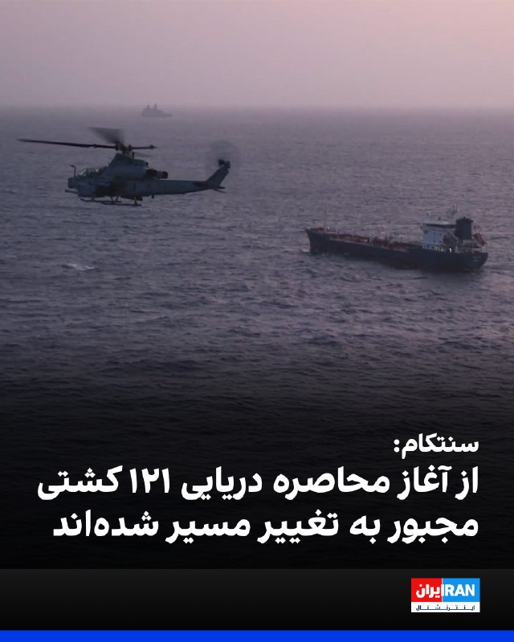

فرماندهی مرکزی آمریکا، سنتکام در شبکه ایکس اعلام کرد که از آغاز محاصره دریایی ایران تاکنون ۱۲۱ کشتی تجاری مجبور به تغییر مسیر شده‌اند و پنج کشتی نیز توسط نیروهای آمریکایی از کار انداخته شده‌اند.

همزمان ترامپ درباره توقف مذاکرات از سوی تهران به دلیل حملات اسرائیل به لبنان، گفت که پیش از این تصمیم، از آن مطلع نشده بود. او افزود: «این به این معنا نیست که ما برویم و شروع به بمباران همه‌جا کنیم. ما محاصره را ادامه خواهیم داد».
‌🏁 🇬🇧 IranintlTV

🤖 @VahidOOnLine

## VahidOOnLine — post 243257

  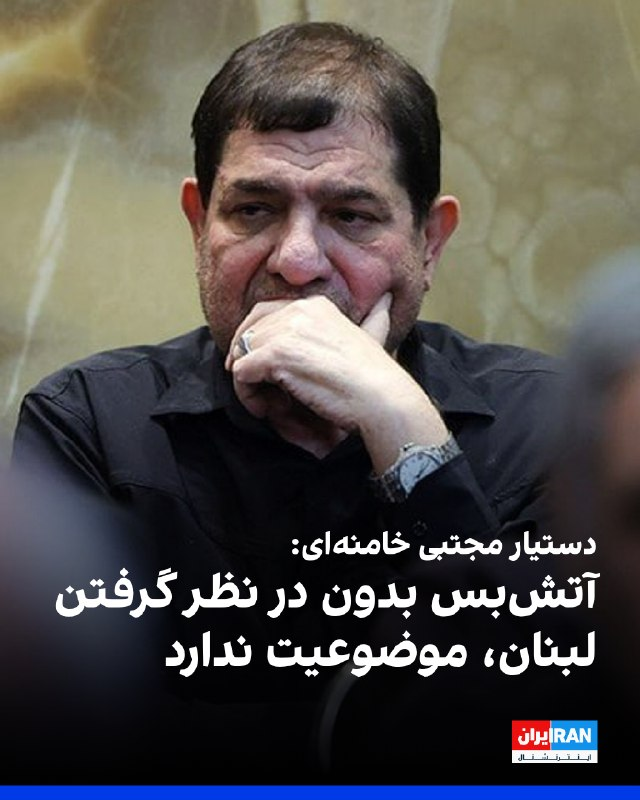

خبرگزاری صداوسیما گزارش داد محمد مخبر، مشاور و دستیار رهبر جمهوری اسلامی، در دیدار با عبدالله صفی‌الدین، نماینده حزب‌الله لبنان در تهران، با تاکید بر یکپارچگی محور مقاومت، هرگونه آتش‌بس با جمهوری اسلامی را بدون در نظر گرفتن لبنان و سایر جبهه‌های مقاومت «فاقد موضوعیت» دانست.
‌🏁 🇬🇧 IranintlTV

🤖 @VahidOOnLine

## VahidOOnLine — post 243256

  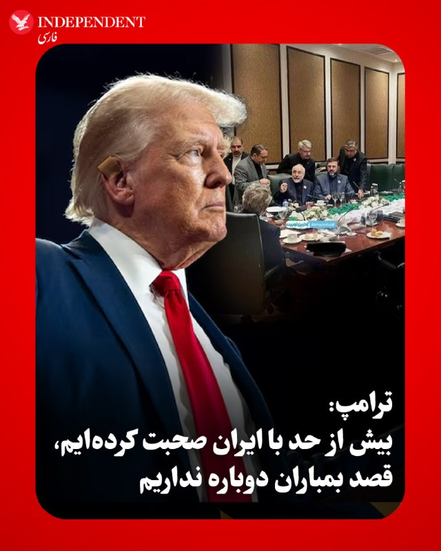

♦️دونالد ترامپ، رئیس‌جمهوری آمریکا، در واکنش به گزارش‌ها درباره تعلیق یکسویه گفتگوهای پایان جنگ از سوی رهبران ایران گفت، واشنگتن بیش از حد با تهران مذاکره کرده است و شاید زمان سکوت فرا رسیده باشد.
ترامپ در گفتگو با شبکه خبری ان‌بی‌سی اعلام کرد: «اگر حقیقت را بخواهید، فکر می‌کنم بیش از حد صحبت کرده‌ایم. فکر می‌کنم سکوت کردن خیلی خوب خواهد بود و این وضعیت می‌تواند برای مدت طولانی ادامه داشته باشد.»
او در عین حال تاکید کرد که توقف یا کاهش ارتباطات به معنای آغاز حملات نظامی گسترده علیه ایران نیست: «این به این معنا نیست که قرار است برویم و همه‌جا را بمباران کنیم.»
اظهارات ترامپ پس از آن مطرح می‌شود که خبرگزاری تسنیم به نقل از منابع آگاه گزارش داد ایران در اعتراض به ادامه عملیات نظامی اسرائیل در لبنان، روند «تبادل متون از طریق میانجی» با آمریکا را متوقف خواهد کرد. همزمان مقام‌های جمهوری اسلامی با انتشار پیام‌هایی اسرائیل را به آغاز دوباره حملات موشکی تهدید کرده‌اند.
‌🇸🇦 Indypersian

🤖 @VahidOOnLine

## VahidOOnLine — post 243255

  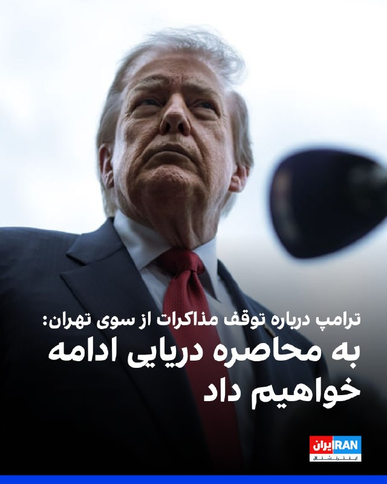

دونالد ترامپ در گفت‌وگو با خبرنگار ان‌بی‌سی اعلام کرد که درباره ایران «بیش از حد صحبت شده» است و افزود: «اگر بخواهید حقیقت را بگویید، فکر می‌کنم سکوت کردن می‌تواند گزینه بهتری باشد».

دونالد ترامپ درباره توقف مذاکرات از سوی تهران به دلیل حملات به لبنان گفت که پیش از این تصمیم، از آن مطلع نشده بود. او افزود: «این به این معنا نیست که ما برویم و شروع به بمباران همه‌جا کنیم. ما محاصره را ادامه خواهیم داد».
‌🏁 🇬🇧 IranintlTV

🤖 @VahidOOnLine

## VahidOOnLine — post 243254

  <a href="telegram/content/VahidOOnLine_243254_1780339249.mp4" target="_blank">🎬 Download video</a>

سخنان عزت‌الله همایون‌فر، ادیب و سیاستمدار، درباره روحیه قوی ملت ایران و ریشه‌های آن در سی قرن تاریخ کشور
‌🏁 🇬🇧 ManotoTV

🤖 @VahidOOnLine

## VahidOOnLine — post 243253

  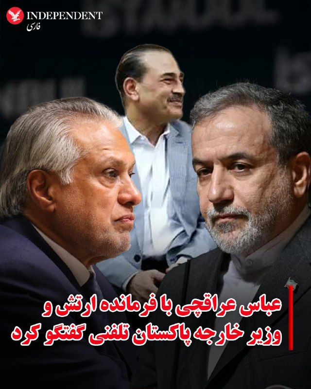

♦️عباس عراقچی، وزیر امور خارجه جمهوری اسلامی ایران، دوشنبه شب و همزمان با بالاگرفتن احتمال از سرگیری جنگ در منطقه با محمد اسحاق دار، وزیر امور خارجه پاکستان، و فیلد مارشال عاصم منیر، فرمانده ارتش این کشور گفتگو کرد.
رسانه‌های داخلی ایران به نقل از مقام‌های آگاه گزارش کرده بودند که جمهوری اسلامی رد و بدل کردن پیام با آمریکا را در اعتراض به تداوم محاصره دریایی و تشدید حملات اسرائیل به لبنان، متوقف کرده است.

بر اساس اعلام وزارت امور خارجه ایران، محور این گفتگوها بررسی آخرین تحولات منطقه‌ای و روندهای جاری مرتبط با آتش‌بس بوده است.

این گفتگوها در حالی انجام می‌شود که پاکستان طی ماه‌های اخیر نقش میانجی میان ایران و آمریکا را بر عهده داشته و هم‌زمان با تشدید تنش‌ها در لبنان و غزه، تلاش‌های دیپلماتیک برای حفظ آتش‌بس و جلوگیری از گسترش درگیری‌ها در منطقه ادامه دارد.
‌🇸🇦 Indypersian

🤖 @VahidOOnLine

## VahidOOnLine — post 243252

  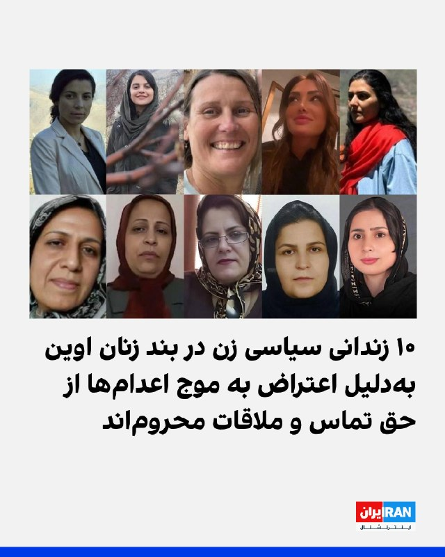

یک منبع آگاه از وضعیت زندانیان سیاسی به ایران‌اینترنشنال گفت دست‌کم ۱۰ زندانی سیاسی در بند زنان اوین از تماس تلفنی و ملاقات محروم‌اند. هم‌زمان چند زندانی دیگر هم در اعتراض به محرومیت از تماس و ملاقات، حکم حبس و شرایط نامناسب زندان در اعتصاب غذا به‌سر می‌برند.
بر اساس اطلاعات ارائه‌شده از سوی این منبع، الهه فولادی، فروغ تقی‌پور، سکینه پروانه، شیوا اسماعیلی، زهرا صفایی، گلرخ ایرایی، لیندزی فورمن، مرضیه فارسی، نسیم سیمیاری و وریشه مرادی همچنان از تماس تلفنی و ملاقات محروم‌اند.
فولادی، تقی‌پور، پروانه، اسماعیلی، صفایی، ایرایی، فارسی و مرادی به‌دلیل اعتراض به اجرای احکام اعدام و همراهی با کارزار «سه‌شنبه‌های نه به اعدام» با این محرومیت‌ها مواجه شده‌اند. سیمیاری نیز به دلیل هم‌کلام شدن با فورمن، هم‌بندی بریتانیایی‌اش در اوین، از تماس و ملاقات محروم شده است.
لیندزی فورمن و همسرش، کریگ فورمن که ۱۷ ماه است در ایران زندانی‌اند، از تماس تلفنی، ملاقات با یکدیگر و وکیل محروم‌اند و در اعتراض به این محرومیت‌ها در اعتصاب غذا به‌سر می‌برند.
غزل مرزبان از چهارم خرداد در اعتراض به حکم ۹ سال و هشت ماه حبس خود در اعتصاب غذاست.
h
‌🏁 🇬🇧 IranintlTV

🤖 @VahidOOnLine

## VahidOOnLine — post 243251

  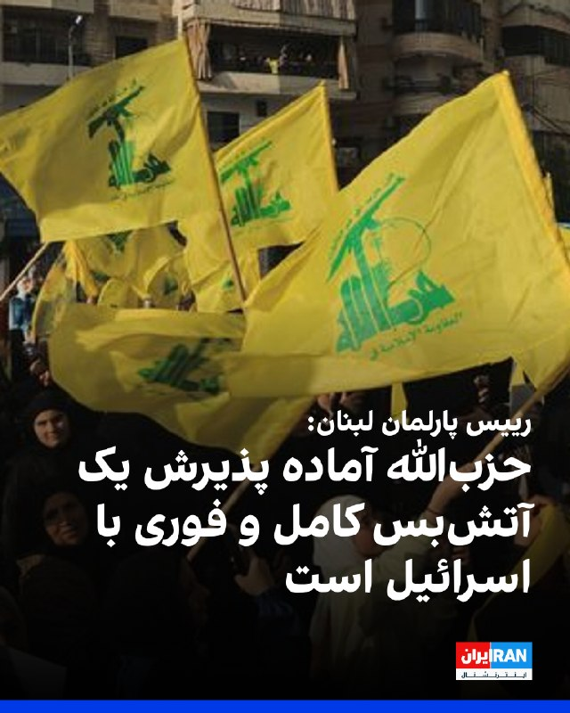

علی حمدان، مشاور ارشد رییس پارلمان لبنان به اکسیوس گفت که نبیه بری، رییس پارلمان لبنان، به دولت ترامپ گفته است حزب‌الله آماده پذیرش یک آتش‌بس کامل و فوری با اسرائیل است و اجرای آن را نیز تضمین خواهد کرد.

بر اساس گزارش اکسیوس، آمریکا طی روزهای گذشته طرحی برای آتش‌بس مرحله‌ای ارائه کرده بود که بر اساس آن حزب‌الله باید حملات خود به شمال اسرائیل را متوقف می‌کرد و در مقابل، اسرائیل نیز متعهد می‌شود بیروت را هدف حمله قرار ندهد و آتش‌بس به‌تدریج به سایر مناطق گسترش یابد.

اما به گفته منابع، علی حمدان این پیشنهاد را رد کرده و خواستار آتش‌بس کامل شده است.

به گزارش اکسیوس، در مقابل، یک مقام آمریکایی گفته است که ارزیابی واشینگتن از پاسخ بری همچنان «ناامیدکننده و مبهم» باقی مانده است.
‌🏁 🇬🇧 IranintlTV

🤖 @VahidOOnLine

## WithYashar — post 13189

حملات اسرائیل به منطقه صور ادامه دارد
@withyashar

## WithYashar — post 13188

پدافند تهران فعال شد
@withyashar

## WithYashar — post 13187

همانطور که از هفته پیش وعده داده بودم حدود یک ساعت دیگر ما متنی را برای شاهزاده رضا پهلوی ارسال می کنیم. همبستگی شما در این فراخوان باعث می شود صدای ما شنیده تر شود و ارتباطی بهتری بین ما و شاهزاده شکل بگیرد. ممنون از همراهی و کمک شما. تا می توانید به دوستان خود بگویید و آنها را آماده کنید.

## WithYashar — post 13186

وزیر بن‌گویر: آقای نخست‌وزیر،
شما گفتید که یک نخست‌وزیر قدرتمند در صورت امکان به رئیس‌جمهور آمریکا «بله» می‌گوید و در صورت ضرورت «نه».
اکنون زمان آن است که به دوست ما، رئیس‌جمهور ترامپ، «نه» گفته شود.
اکنون زمان آن است که آنچه لازم و ضروری است انجام شود: حمله به حزب‌الله، آزاد گذاشتن دست رزمندگان ما و بازگرداندن امنیت به شمال.
@withyashar

## WithYashar — post 13185

  <a href="telegram/content/WithYashar_13185_1780339252.mp4" target="_blank">🎬 Download video</a>

دیدبان اتاق جنگ : الان ازسمت کرج موشک شلیک شد
@withyashar

## WithYashar — post 13184

۲ حمله هوایی اسرائیل به شهر نبطیه الفوقا در جنوب لبنان انجام شد.
@withyashar

## WithYashar — post 13183

  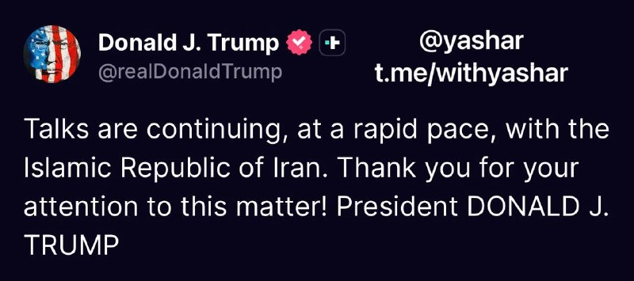

ترامپ: مذاکرات با سرعت بالایی با جمهوری اسلامی ایران ادامه دارد
@withyashar

## WithYashar — post 13182

شلیک راکت/پهپاد توسط حزب‌الله
@withyashar

## WithYashar — post 13181

  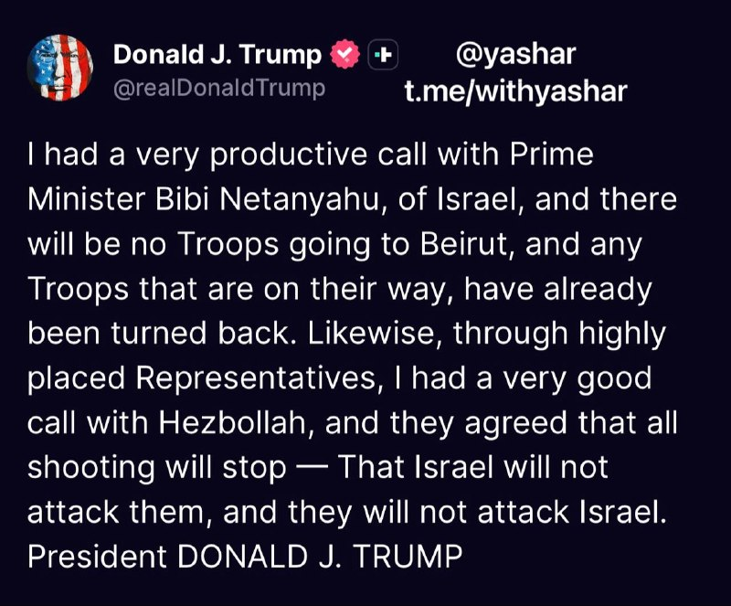

«من تماس بسیار سازنده‌ای با بی‌بی نتانیاهو، نخست‌وزیر اسرائیل داشتم؛ هیچ نیروی نظامی به بیروت نخواهد رفت و تمام نیروهایی که در راه بودند نیز پیش از این بازگردانده شده‌اند. به همین ترتیب، از طریق نمایندگان بلندپایه، گفتگوهای بسیار خوبی با حزب‌الله داشتم و آن‌ها موافقت کردند که تمامی تیراندازی‌ها (درگیری‌ها) متوقف شود؛ به این صورت که اسرائیل به آن‌ها حمله نخواهد کرد و آن‌ها نیز به اسرائیل حمله نمی‌کنند.

رئیس‌جمهور دونالد جی. ترامپ»

@withyashar

## WithYashar — post 13180

خبرنگار اسرائیلی :
یک منبع بسیار موثق از فرودگاه بن‌گوریون به من گفت: اتفاقاتی که داره تو فرودگاه می‌افته دیوانه‌کننده‌ست. تو این ۳۵ سالی که اینجا کار می‌کنم، تا حالا چنین چیزی ندیده بودم. ارتش آمریکا حداقل شش ماه زودتر از برنامه زمان‌بندی‌شده وارد اینجا شده. اونا قراره در هفته‌های آینده هزاران پرواز مسافربری رو لغو کنن؛ تمام مسیرها و تمام مقصدها رو.
تنها جایی که براتون می‌مونه تا بتونید یه کم از این اوضاع خارج بشید و نفس راحت بکشید، یه پایگاه بزرگه؛ پایگاهی که می‌تونید برای مدت طولانی توش بمونید.
آماده باشید.
@withyashar

## WithYashar — post 13179

رویترز به نقل از دو منبع اسرائیلی: اسرائیل منتظر تایید نهایی ترامپ برای هرگونه عملیاتی در حومه جنوبی بیروت است.
@withyashar

## WithYashar — post 13178

کانال ۱۲ عبری: تماس تلفنی ترامپ و نتانیاهو بیش از یک ساعت است که ادامه دارد
@withyashar

## WithYashar — post 13177

العربیه به نقل از رادیو و تلویزیون اسرائیل:
با مداخله آمریکا حمله بزرگی به ضاحیه بیروت لغو شد!
@withyashar

## WithYashar — post 13176

منابع امنیتی اسرائیلی می گویند ترامپ دستور لغو حملات به بیروت را صادر کرده است
@withyashar

## WithYashar — post 13175

ترامپ:در تماس با نخست‌وزیر نتانیاهو فقط میخواهم شرایط را در جبهه لبنان ارزیابی کنم

@withyashar

## WithYashar — post 13174

تسنیم: اسرائیل از ترس تهدیدهای جمهوری اسلامی حمله نکرده.
@withyashar

## WithYashar — post 13173

شبکه کان اسرائیل: حمله به حومه جنوبی (بیروت) به تعویق افتاد.

تلویزیون ارتش اسرائیل: عقب‌نشینی میکنیم
@withyashar

## WithYashar — post 13172

کانال ۱۲ اسرائیل: همه منتظر نتایج گفتگوی دراماتیک بین ترامپ و نتانیاهو هستند تا بفهمند اوضاع به کدام سمت خواهد رفت
@withyashar

## WithYashar — post 13171

ترامپ به CNBC : قیمت نفت به‌زودی مثل سنگ سقوط می‌کنه.
@withyashar

## WithYashar — post 13170

اتاق جنگ با یاشار : یعنی‌ عراقچی‌زنگ زده پاکستان چه پیشنهادی داده که پاکستان رنگ زده ترامپ و ترامپ هم فوری‌ زنگ زده بی بی🤬

## mwarmonitor — post 10003

🔴سازمان UKMTO گزارش داد که یک کشتی کانتینربر (با نام MSC SARISKA V) چند ساعت پس از ترک بندر ام‌القصر عراق، در خلیج فارس هدف برخورد یک پرتابه قرار گرفته است. @mwarmonitor

## mwarmonitor — post 10002

🔴رسانه‌های اسرائیلی: در حال حاضر سکوت بر دفتر نخست‌وزیر حاکم است. این واقعیت که یک رئیس‌جمهور آمریکایی—هرچقدر هم که طرفدار اسرائیل باشد—کشور را اداره می‌کند، باید همه ما را نگران کند.

@mwarmonitor

## mwarmonitor — post 10001

  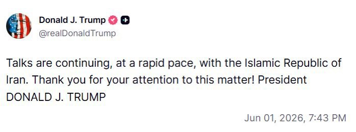

«گفتگوها با جمهوری اسلامی ایران با سرعتی بالا در حال جریان است. از توجه شما به این موضوع سپاسگزارم! رئیس‌جمهور دونالد جی. ترامپ»

@mwarmonitor

## mwarmonitor — post 10000

🔸وزارت امور خارجه ایران: ایالات متحده و اسرائیل از زمان اعلام آتش‌بس در ۱۹ مارس، بارها آن را نقض کرده‌اند؛ از جمله با حمله به کشتی‌های تجاری ایرانی، نقض حاکمیت لبنان و آواره کردن میلیون‌ها غیرنظامی لبنانی.

🔹ایران، آمریکا را مستقیماً مسئول نقض آتش‌بس در هر دو کشور ایران و لبنان می‌داند.

🔹ایران نسبت به پیامدهای خطرناک این نقض‌ها هشدار می‌دهد و تأکید می‌کند که حق دفاع از خود را با هر وسیله‌ای و در هر زمان و مکانی که لازم باشد برای خود محفوظ می‌دارد.

@mwarmonitor

## mwarmonitor — post 9999

  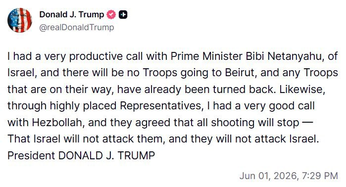

خب همینطور که پیشینی کرده بودم

## mwarmonitor — post 9998

خب همینطور که پیشینی کرده بودم

## mwarmonitor — post 9997

🔴اقدامات جدید پدافند غیرعامل در فردو:

🔸بین ۱۰ تا ۱۸ مه، ایران اقدامات جدیدی از نوع پدافند غیرعامل در قالب تپه‌های خاکی/سنگی و سایر موانع در مسیرهای منتهی به ورودی‌های تونل تأسیسات زیرزمینی (که قبلاً آسیب دیده/تخریب شده) فردو ایجاد کرده است.
🔹چیدمان متناوب این تپه‌ها و موانع بسیار دقیق است و مجموعه‌ای از مسیرهای زیگزاگی (چیکن/پیچ‌دار) ایجاد می‌کند. این موضوع نشان می‌دهد که هدف آن‌ها صرفاً انسداد مسیر نیست، بلکه بیشتر برای جلوگیری از ورود و خروج سریع خودروها طراحی شده و می‌تواند حرکت نیروهای مهاجم در صورت حضور در محل را دشوار کند.
🔸این نحوه قرارگیری همچنین نشان می‌دهد که ایران همچنان قصد دسترسی به محل را دارد، زیرا در غیر این صورت احتمالاً مانند موارد قبلی در مسیرهای منتهی به تونل‌های اصفهان، کل جاده‌ها با خاکریز مسدود می‌شد.
این مسیرهای زیگزاگی در ورودی شرقی ممکن است موقتی بوده و تا ۲۶ مه دوباره برداشته شده باشند، اما این موضوع نیاز به تصاویر دقیق‌تر دارد.
🔹این ورودی قبلاً توسط ایران پر شده بود و در ژوئن ۲۰۲۵ توسط اسرائیل هدف قرار گرفت که منجر به ایجاد یک دهانه (گودال) شد، اما هیچ نشانه‌ای از نفوذ به بالای ورودی تونل دیده نشد.
🔸بر اساس تصاویر تا ۲۶ مه، به نظر می‌رسد همه ورودی‌های تونل همچنان مدفون باقی مانده‌اند.

@mwarmonitor

## mwarmonitor — post 9996

  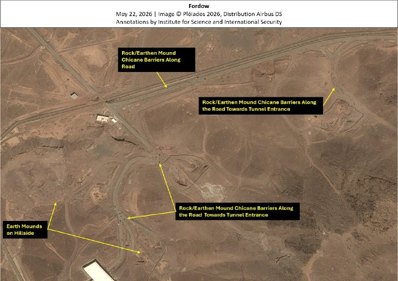

📷 Photo

## mwarmonitor — post 9995

📌 رویترز به نقل از دو منبع اسرائیلی: اسرائیل در انتظار موافقت نهایی ترامپ برای هرگونه عملیات در ضاحیه جنوبی بیروت است.

@mwarmonitor

## mwarmonitor — post 9994

🔴مقامات آمریکایی از طریق کانال‌های دیپلماتیک رسمی لبنان مطلع شده‌اند که حزب‌الله پیشنهاد آمریکا را پذیرفته و آماده است متعهد شود از هدف قرار دادن اسرائیل خودداری کند، در ازای تعهدی متقابل مبنی بر عدم حمله به حومه جنوبی بیروت.

🔸این موضوع به‌عنوان یک گام مثبت تلقی می‌شود که می‌تواند به کاهش تنش‌ها و جلوگیری از لغزش به سمت یک درگیری گسترده‌تر کمک کند.

🔹این تحولات قرار است فردا و روز بعد در جریان نشست‌های مذاکرات مستقیم در واشنگتن مورد بحث قرار گیرد. الشرق

@mwarmonitor

## mwarmonitor — post 9993

📌مراسم انتصاب رئیس جدید موساد به‌دلیل یک تماس تلفنی میان بنیامین نتانیاهو، نخست‌وزیر، و دونالد ترامپ، رئیس‌جمهور آمریکا، به تعویق افتاده است. @mwarmonitor

## mwarmonitor — post 9990

✈️یک تانکر سوخت‌رسان KC-46A نیروی هوایی آمریکا در حال حاضر بر فراز دریای عمان در حال عملیات است، در حالی که یک فروند دیگر نیز از تل‌آویو به سمت خلیج فارس در حال پرواز است.

✈️همچنین یک تانکر KC-135R نیز از پایگاه هوایی پرینس سلطان به سمت خلیج فارس در حال حرکت است.

@mwarmonitor

## mwarmonitor — post 9989

  <a href="telegram/content/mwarmonitor_9989_1780339255.mp4" target="_blank">🎬 Download video</a>

🔴هزاران نیروی نظامی آمریکا در دریا، آسمان و زمین از محاصره در حال انجام ایالات متحده علیه ایران حمایت می‌کنند. تا تاریخ ۱ ژوئن، نیروهای سنتکام ۱۲۱ کشتی تجاری را تغییر مسیر داده و ۵ کشتی را از کار انداخته‌اند تا از رعایت این اقدامات اطمینان حاصل شود.

@mwarmonitor

## mwarmonitor — post 9988

📝تعلیق روابط دیپلماتیک تهران با واشنگتن به خاطر حملات اسرائیل، کاخ سفید را وارد یک سیرک تهوع‌آور کرده است؛ جایی که دونالد ترامپ با شخصیتی فروپاشیده و لحنی التماس‌آمیز فریاد می‌زند: «تلفن رو بدید زنگ بزنم به بی‌بی! چرا این تروریست‌های گوگولی و نازنازی رو وسط…

## mwarmonitor — post 9987

🔴ترامپ می‌گوید گزارش‌ها درباره اینکه ایران مذاکرات با آمریکا را متوقف کرده‌اند، اگر درست باشد «اشکالی ندارد» و در گفت‌وگو با NBC گفته است: «فکر می‌کنم ما بیش از حد صحبت کرده‌ایم.» او افزود: «این به این معنی نیست که ما برویم و شروع به بمباران کنیم. فقط سکوت…

## mwarmonitor — post 9986

📌مراسم انتصاب رئیس جدید موساد به‌دلیل یک تماس تلفنی میان بنیامین نتانیاهو، نخست‌وزیر، و دونالد ترامپ، رئیس‌جمهور آمریکا، به تعویق افتاده است.

@mwarmonitor

## mwarmonitor — post 9985

📝تعلیق روابط دیپلماتیک تهران با واشنگتن به خاطر حملات اسرائیل، کاخ سفید را وارد یک سیرک تهوع‌آور کرده است؛ جایی که دونالد ترامپ با شخصیتی فروپاشیده و لحنی التماس‌آمیز فریاد می‌زند: «تلفن رو بدید زنگ بزنم به بی‌بی! چرا این تروریست‌های گوگولی و نازنازی رو وسط…

## mwarmonitor — post 9984

توقف مذاکرات: اندکی پس از بیانیه عراقچی، خبرگزاری تسنیم به نقل از مقامات ایرانی تاکید کرد که تا زمانی که اسرائیل حملات خود را در لبنان متوقف نکند، هیچ مذاکره‌ای با آمریکا انجام نخواهد شد.
تهدید به تلافی: گزارش تسنیم همچنین حاکی از آن بود که ایران و «محور مقاومت» آماده تلافی در تنگه هرمز و «فعال کردن جبهه‌های دیگر» از جمله تنگه باب‌المندب در دریای سرخ هستند

@mwarmonitor

## FoxNewsTwitter — post 342478

  

Fox News (Twitter/X)

HAPPY BIRTHDAY! Legendary actor and producer Morgan Freeman is celebrating his 89th birthday, marking nearly six decades in entertainment and a career that has helped define generations of film.

## FoxNewsTwitter — post 342477

  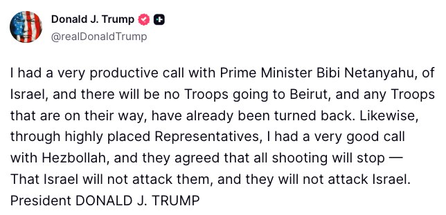

Fox News (Twitter/X)

BREAKING: President Trump announces that no troops will go to Lebanon and Hezbollah has agreed "all shooting will stop" after a "very productive" call with Israeli Prime Minister Netanyahu and Hezbollah.

"Israel will not attack them, and they will not attack Israel."

## FoxNewsTwitter — post 342476

  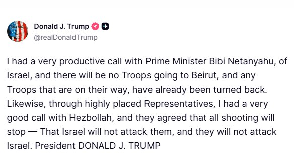

Fox News (Twitter/X)

BREAKING: Trump tries to calm Israel-Hezbollah fighting with Iran deal on the line, saying the terror group 'agreed that all shooting will stop'

## FoxNewsTwitter — post 342475

  

Fox News (Twitter/X)

RT @FoxTrueCrime: A Utah judge granted Tyler Robinson's defense's motion for an order to show cause after his attorneys accused prosecutors of violating the court's gag order through media interviews in the Charlie Kirk assassination case.

An evidentiary hearing lands June 12 — putting the state's own legal team under the microscope before trial even begins.

Both sides will have 90 minutes to present arguments at that hearing, when Robinson is expected to appear in person.

Credit: Rick Egan/The Salt Lake Tribune via Pool

## FoxNewsTwitter — post 342473

Fox News (Twitter/X)

BREAKING: Utah judge denies Tyler Robinson's latest request to hold secret hearings in Charlie Kirk assassination case

## FoxNewsTwitter — post 342472

  <a href="telegram/content/FoxNewsTwitter_342472_1780339259.mp4" target="_blank">🎬 Download video</a>

Fox News (Twitter/X)

JUST IN: Sheridan Gorman's family blames sanctuary policies and "failed removal policies" for the murder of their daughter, allegedly by an illegal immigrant with a criminal background.

Speaking outside the Cook County courthouse following a discovery hearing, Sheridan's father, Thomas Gorman, says failed border enforcement, removal policies, and local cooperation allowed Jose Medina to remain in the country and ultimately cross paths with his daughter.

"Jose Medina is responsible for what he did to Sheridan, but he did not get to Sheridan himself."

"He got there through a broken system, through failed border enforcement, failed removal policies, failed local cooperation, and sanctuary policies that put ideology before safety."

"American families deserve to be protected in their own country."

## FoxNewsTwitter — post 342471

  <a href="telegram/content/FoxNewsTwitter_342471_1780339261.mp4" target="_blank">🎬 Download video</a>

Fox News (Twitter/X)

BREAKING: Iran is halting its indirect talks with U.S. negotiators in protest against Israel's attacks on Hezbollah in Lebanon, Iranian state-linked media reported Monday.

Iran's Tasnim news agency, linked to the Iranian Revolutionary Guard Corps, reported that Tehran is cutting off talks due to the "continued crimes of the Zionist regime in Lebanon."

The report comes after Iranian Foreign Minister Abbas Araghchi posted to social media saying Lebanon must be included in the ongoing ceasefire between the U.S. and Iran.

"The United States and Israel bear responsibility for the consequences of any breach of the truce," Araghchi wrote.

@TreyYingst reports the latest.

## FoxNewsTwitter — post 342470

  <a href="telegram/content/FoxNewsTwitter_342470_1780339263.mp4" target="_blank">🎬 Download video</a>

Fox News (Twitter/X)

NEW: Agitator wrestled to the ground by New Jersey State Police as officers move in to enforce a curfew outside Newark's Delaney Hall detention center.

More than a dozen arrests have been made following days of escalating tensions around the ICE facility.

Authorities say weekend clashes between rioters and law enforcement included burning tires, thrown projectiles, and confrontations that prompted an increased police presence.

DHS sent a blunt warning to the agitators: "If you riot, you will face the consequences. Law and order prevails."

## FoxNewsTwitter — post 342469

  

Fox News (Twitter/X)

NEW: DHS says more than a dozen arrests were made over the weekend as agitators continued clashing with law enforcement outside a New Jersey ICE detention center.

Anti-ICE rioters set fires in the streets outside of Delaney Hall, prompting officials to impose a 9 pm curfew around parts of Newark.

Dem NJ Gov. Mikie Sherrill is sparring with DHS over the facility — but some protesters are now turning on her too, accusing her of lacking transparency and bending to federal pressure.

@AlexisMcAdamsTV breaks down the latest on the administration's "zero tolerance" response to protest-related violence.

## FoxNewsTwitter — post 342468

  

Fox News (Twitter/X)

A new Doocy is on the way.

@pdoocy announced that he and his wife @hillary__vaughn are expecting their third child, adding another member to their growing family.

Here's the twist: the baby is due on @SteveDoocy birthday.

## pm_afshaa — post 92060

  <a href="telegram/content/pm_afshaa_92060_1780339266.webm" target="_blank">🎬 Download video</a>

🔴نفتالی بنت، نخست‌وزیر سابق اسرائیل: دولت کنترل حاکمیت اسرائیل رو از دست داده.

💧 Rainbet.com the #1 Non-KYC Crypto Casino & Sportsbook @rainbetcom

😁 @Pm_Afshaa

## pm_afshaa — post 92059

  <a href="telegram/content/pm_afshaa_92059_1780339266.webm" target="_blank">🎬 Download video</a>

🔴بن گویر، وزیر امنیت اسرائیل:

آقای نتانیاهو شما گفتید که یک نخست‌وزیر قوی هستید که به رئیس‌جمهور آمریکا میگه در صورت امکان «بله» و در صورت لزوم «نه». وقت آن رسیده که به دوستمون، رئیس‌جمهور ترامپ بگیم «نه»

💧 Rainbet.com the #1 Non-KYC Crypto Casino & Sportsbook @rainbetcom

😁 @Pm_Afshaa

## pm_afshaa — post 92058

رسانه های اسرائیلی و شبکه های اسرائیلی بد گرفتن رو ترامپ 
💧 Rainbet.com the #1 Non-KYC Crypto Casino & Sportsbook @rainbetcom 
😁 @Pm_Afshaa

## pm_afshaa — post 92057

  <a href="telegram/content/pm_afshaa_92057_1780339267.webm" target="_blank">🎬 Download video</a>

🔴مکرون، رئیس‌جمهور فرانسه:
چیزی که هرگز نباید در مورد اروپا و فرانسه دست کم بگیرید اینه که ما بسیار قابل پیش‌بینی هستیم.

هیچکدوم از ما نمیتونیم قوانین رو یک‌شبه تغییر بدیم. در اروپا هیچ دستور اجرایی وجود نداره و هیچ فردی نمیتونه همه چیز رو به تنهایی و بر اساس تصمیم خود تغییر بده.

💧 Rainbet.com the #1 Non-KYC Crypto Casino & Sportsbook @rainbetcom

😁 @Pm_Afshaa

## pm_afshaa — post 92056

  <a href="telegram/content/pm_afshaa_92056_1780339267.webm" target="_blank">🎬 Download video</a>

🔴فوری از پست جدید ترامپ: من یک تماس بسیار سازنده با نخست‌وزیر بی‌بی نتانیاهو، از اسرائیل، داشتم و هیچ نیرویی به بیروت اعزام نخواهد شد، و هر نیرویی که در راه بود، قبلاً بازگردانده شده. همچنین، از طریق نمایندگان بلندپایه، تماس بسیار خوبی با حزب‌الله داشتم و…

## pm_afshaa — post 92055

رسانه های اسرائیلی و شبکه های اسرائیلی بد گرفتن رو ترامپ

💧 Rainbet.com the #1 Non-KYC Crypto Casino & Sportsbook @rainbetcom

😁 @Pm_Afshaa

## pm_afshaa — post 92054

  <a href="telegram/content/pm_afshaa_92054_1780339268.webm" target="_blank">🎬 Download video</a>

🔴ترامپ: مذاکرات و گفتگوها با جمهوری اسلامی ایران با سرعت زیادی ادامه داره.

💧 Rainbet.com the #1 Non-KYC Crypto Casino & Sportsbook @rainbetcom

😁 @Pm_Afshaa

## pm_afshaa — post 92053

  <a href="telegram/content/pm_afshaa_92053_1780339268.webm" target="_blank">🎬 Download video</a>

🔴محمد مخبر، مشاور و دستیار مجتبی خامنه‌ای: آتش‌بس بدون در نظر گرفتن لبنان، موضوعیت نداره.

💧 Rainbet.com the #1 Non-KYC Crypto Casino & Sportsbook @rainbetcom

😁 @Pm_Afshaa

## pm_afshaa — post 92052

  <a href="telegram/content/pm_afshaa_92052_1780339269.webm" target="_blank">🎬 Download video</a>

🔴فوری از پست جدید ترامپ: من یک تماس بسیار سازنده با نخست‌وزیر بی‌بی نتانیاهو، از اسرائیل، داشتم و هیچ نیرویی به بیروت اعزام نخواهد شد، و هر نیرویی که در راه بود، قبلاً بازگردانده شده. همچنین، از طریق نمایندگان بلندپایه، تماس بسیار خوبی با حزب‌الله داشتم و…

## pm_afshaa — post 92051

  <a href="telegram/content/pm_afshaa_92051_1780339269.webm" target="_blank">🎬 Download video</a>

🔴فوری از پست جدید ترامپ:

من یک تماس بسیار سازنده با نخست‌وزیر بی‌بی نتانیاهو، از اسرائیل، داشتم و هیچ نیرویی به بیروت اعزام نخواهد شد، و هر نیرویی که در راه بود، قبلاً بازگردانده شده. همچنین، از طریق نمایندگان بلندپایه، تماس بسیار خوبی با حزب‌الله داشتم و آنها موافقت کردن که تمام تیراندازی‌ها متوقف بشه؛ اسرائیل به آنها حمله نخواهد کرد و آنها هم به اسرائیل حمله نخواهند کرد.

💧 Rainbet.com the #1 Non-KYC Crypto Casino & Sportsbook @rainbetcom

😁 @Pm_Afshaa

## pm_afshaa — post 92050

  <a href="telegram/content/pm_afshaa_92050_1780339270.webm" target="_blank">🎬 Download video</a>

🔴کانال 12 اسرائیل: تماس تلفنی ترامپ و نتانیاهو بیش از یک ساعته که ادامه داره.

💧 Rainbet.com the #1 Non-KYC Crypto Casino & Sportsbook @rainbetcom

😁 @Pm_Afshaa

## pm_afshaa — post 92049

  <a href="telegram/content/pm_afshaa_92049_1780339270.webm" target="_blank">🎬 Download video</a>

🔴رویترز: اسرائیل منتظر تایید نهایی ترامپ برای هرگونه عملیات در حومه جنوبی بیروت است.

💧 Rainbet.com the #1 Non-KYC Crypto Casino & Sportsbook @rainbetcom

😁 @Pm_Afshaa

## pm_afshaa — post 92047

  <a href="telegram/content/pm_afshaa_92047_1780339271.webm" target="_blank">🎬 Download video</a>

🔴کانال 12 اسرائیل:
تا ساعاتی دیگر مشخص خواهد شد اسرائیل حملات به لبنان رو انجام میده یا خیر. درصورت این اتفاق احتمال زیاد شروع درگیری مجدد با ایران وجود داره.

💧 Rainbet.com the #1 Non-KYC Crypto Casino & Sportsbook @rainbetcom

😁 @Pm_Afshaa

## pm_afshaa — post 92046

  <a href="telegram/content/pm_afshaa_92046_1780339271.webm" target="_blank">🎬 Download video</a>

🔴مراسم برای رئیس جدید موساد به دلیل گفت‌و‌گوی تلفنی ترامپ و نتانیاهو لغو شد. 
💧 Rainbet.com the #1 Non-KYC Crypto Casino & Sportsbook @rainbetcom 
😁 @Pm_Afshaa

## pm_afshaa — post 92045

  <a href="telegram/content/pm_afshaa_92045_1780339272.webm" target="_blank">🎬 Download video</a>

🔴شبکه کان اسرائیل: حمله به بیروت به دنبال دخالت آمریکا به تعویق افتاد. 
💧 Rainbet.com the #1 Non-KYC Crypto Casino & Sportsbook @rainbetcom 
😁 @Pm_Afshaa

## pm_afshaa — post 92044

  <a href="telegram/content/pm_afshaa_92044_1780339272.webm" target="_blank">🎬 Download video</a>

🔴کانال 12 اسرائیل: همه منتظر نتایج گفتگوی دراماتیک بین ترامپ و نتانیاهو هستن تا بفهمن اوضاع به کدوم سمت خواهد رفت.

💧 Rainbet.com the #1 Non-KYC Crypto Casino & Sportsbook @rainbetcom

😁 @Pm_Afshaa

## pm_afshaa — post 92043

  <a href="telegram/content/pm_afshaa_92043_1780339273.webm" target="_blank">🎬 Download video</a>

🔴رادیو و تلوزیون اسرائیل:
نتانیاهو درحال متقاعد‌ کردن ترامپ برای حمله به بیروت است!

💧 Rainbet.com the #1 Non-KYC Crypto Casino & Sportsbook @rainbetcom

😁 @Pm_Afshaa

## pm_afshaa — post 92042

ترامپ باز مخ نتانیاهو رو زد و حمله به بیروت رو کنسل کرد.

## pm_afshaa — post 92041

  <a href="telegram/content/pm_afshaa_92041_1780339273.webm" target="_blank">🎬 Download video</a>

🔴کانال 12 اسرائیل: هم‌اکنون نتانیاهو و ترامپ باهم تماس تلفنی برقرار کردن. 
💧 Rainbet.com the #1 Non-KYC Crypto Casino & Sportsbook @rainbetcom 
😁 @Pm_Afshaa

## pm_afshaa — post 92040

  <a href="telegram/content/pm_afshaa_92040_1780339274.webm" target="_blank">🎬 Download video</a>

🔴رادیو و تلویزیون اسرائیل: با مداخله آمریکا حمله بزرگ به ضاحیه بیروت لغو شد!

رسانه i24News:
آمریکا حمله به بیروت رو متوقف کرد.

💧 Rainbet.com the #1 Non-KYC Crypto Casino & Sportsbook @rainbetcom

😁 @Pm_Afshaa

## iaghapour — post 2649

  

🧑‍💻 اکثر برنامه‌نویس‌ها دانش فنی فوق العاده ای دارن اما مشکلشون انگلیسیه!

🚫 چون نمیتونن:
▫️توی میتینگ راحت صحبت کنن
◾️داکیومنت‌ها رو سریع بخونن
▫️توی مصاحبه خارجی خوب عمل کنن
◾️یا با تیم بین‌المللی ارتباط بگیرن

برای همین کانال «لرنوبیت» رو ساختیم؛
آموزش انگلیسی مخصوص برنامه‌نویس‌ها و بچه‌های تکنولوژی 👇

🔹 اصطلاحات واقعی دنیای برنامه‌نویسی
🔹 مکالمه کاری و میتینگ
🔹 داکیومنت و کامنت‌نویسی
🔹 آمادگی مصاحبه و کار ریموت

Debug your English. Upgrade your career 🚀

🆔 @learnobit
🆔 @learnobit
🆔 @learnobit

## iaghapour — post 2648

  

⭕️ معرفی GenyConnect؛ جایگزین مدرن v2rayN برای مدیریت پروکسی

نرم‌افزار GenyConnect یک کلاینت تونلینگ و VPN مدرن (با کاربردی شبیه به برنامه محبوب v2rayN) است که با تمرکز بر عملکرد بالا، حریم خصوصی و کنترل دقیق ترافیک طراحی شده است. ویژگی مهم این ابزار، وابسته‌نبودن به یک پروتکل خاص است؛ به این معنی که می‌تواند به عنوان یک بستر یکپارچه برای موتورهای مختلف تونلینگ عمل کند.

🔹 مسیریابی پیشرفته: امکان تعیین مسیر ترافیک بر اساس لیست سفید، دامنه‌های خاص، و حتی مسیریابی در سطح اپلیکیشن‌ها و پروسه‌های سیستم.

🔸 سبک و شفاف: این ابزار با کمترین مصرف منابع سخت‌افزاری کار می‌کند و اطلاعات کاملی از وضعیت شبکه، لاگ‌های زنده و آمارهای لحظه‌ای ترافیک را به شما نمایش می‌دهد.

🔹 انعطاف در پلتفرم‌ها: برخلاف برخی کلاینت‌ها که فقط مختص یک سیستم‌عامل هستند، این برنامه به صورت یکپارچه برای ویندوز، مک، لینوکس و اندروید در دسترس است.

🔗 اطلاعات بیشتر در گیت‌هاب پروژه

🆔 @iAghapour

## iaghapour — post 2647

  

⭕️ تون‌کوین به (Gram) تغییر نام می‌دهد!

پاول دورف در کانال رسمی خود خبر بسیار مهمی برای کاربران و سرمایه‌گذاران شبکه TON اعلام کرد. بر اساس این اطلاعیه، ارز دیجیتال بومی این شبکه قرار است با یک ری‌برندینگ بزرگ، نام فعلی خود را کنار گذاشته و به نام اصلی و اولیه‌اش یعنی Gram تغییر کند.

نکات کلیدی که دورف در این پست به آن‌ها اشاره کرده است:

🔹 بازگشت به ایده اولیه: دورف یادآوری کرده که Gram نام اصلی ارز شبکه در اولین وایت‌پیپر این پروژه بود. او این اتفاق را بازگشت به ریشه‌ها و شروع یک فصل جدید توصیف کرده است.

🔸 زمان‌بندی انتقال: فرایند این تغییر نام و انتقال، حدود ۳ هفته زمان خواهد برد.

🔹 نام بلاک‌چین تغییر نمی‌کند: با وجود تغییر نام ارز بومی (از Toncoin به Gram)، نام خود شبکه بلاک‌چین همچنان TON باقی خواهد ماند.

🔸 قدم چهارم از یک نقشه راه: این ری‌برندینگ تنها یک تغییر اسم ساده نیست، بلکه به گفته دورف، راه را برای اتفاقات مهم بعدی هموار می‌کند و قدم چهارم از یک برنامه ۷ مرحله‌ای برای «عظمت دوباره بخشیدن به TON» است.

🆔 @iAghapour

## DEJradio — post 5231

  <a href="telegram/content/DEJradio_5231_1780339276.mp4" target="_blank">🎬 Download video</a>

🤡
🔺 سه ماه پس از کشته شدن علی خامنه‌ای، شماری از هواداران نظام به مذاکره با قاتلان رهبرشان اعتراض کردند.

این اعتراضات به درگیری در تجمعات شبانه کشیده است. برخی مداحان حکومت را به دلیل تلاش برای توافق با آمریکا به چالش کشیده‌اند، در مقابل نیروهای امنیتی هواداران نظام را که مخالف توافق‌اند ضرب و شتم کرده‌اند.

#موشعلی #تجمعات_حکومتی
@DEJradio

## DEJradio — post 5230

  <a href="telegram/content/DEJradio_5230_1780339278.mp4" target="_blank">🎬 Download video</a>

🚨
🔸 جمهوری اسلامی بزرگترین دشمن زنان ایران

*پژمان گلچین، پژوهشگر فلسفه

#زنان_ایران #جمهوری_اسلامی
@DEJradio

## DEJradio — post 5229

  <a href="telegram/content/DEJradio_5229_1780339279.webm" target="_blank">🎬 Download video</a>

🔺📢 خبرگزاری تسنیم وابسته به سـ.ـپاه پاسداران در واکنش به حمله اسرائیل به مواضع حـ.زب‎الله در جنوب لبنان نوشت، با توجه به تداوم جنگ در لبنان و با عنایت به اینکه لبنان جزو پیش شرط‌های آتش‌بس بوده و هم اینک این آتش‌بس در همه جبهه‌ها از جمله لبنان نقض شده است، تیم مذاکره‌کننده ایرانی «گفتگوها و تبادل متون از طریق میانجی» را متوقف می‌کند.

#حزب_الله_لبنان

## DEJradio — post 5228

  <a href="telegram/content/DEJradio_5228_1780339280.webm" target="_blank">🎬 Download video</a>

🔺📷 ارتش اسرائیل با اعلام قبلی مواضع گروه تروریستی حـ.ـزب‌الله در جنوب بیروت (ضاحیه) را بمباران کرد. بنیامین نتانیاهو نخست وزیر اسرائیل در پیامی هشدار داد «اجازه نمی‌دهیم حزب‌الله به شهروندان اسرائیلی حمله کند و در بیروت در امان بماند.»

علی عبداللهی، فرمانده قرارگاه مرکزی خاتم‌الانبیا، در واکنش به صدور هشدار تخلیه برای شهروندان جنوب بیروت گفت: «با توجه به نقض مکرر آتش‌بس توسط اسرائیل، در صورت عملی‌شدن این تهدید به ساکنان بخش‌های شمالی و شهرک‌های نظامی در اسرائیل هشدار می‌دهیم اگر نمی‌خواهند آسیب ببینند منطقه را ترک نمایند.»

#ارتش_اسرائیل #حزب_الله_لبنان
@DEJradio

## DEJradio — post 5227

  <a href="telegram/content/DEJradio_5227_1780339280.mp4" target="_blank">🎬 Download video</a>

🔺📢 اعتراض یک راننده کامیون به مشکلات معیشتی

یک راننده کامیون از تهران با انتقاد از وضعیت زندگی خودش و همکارانش می‌گوید، سعید مصطفوی رئیس صنف کامیونداران به‌جای رسیدگی به مشکلات و چالش‌های شخصی و صنفی رانندگان شدیدا مانع از کسب درآمد آنها می‌شود و مشغول چرب زبانی و چاپلوسی در مقابل سردمداران رژیم است.

#کامیونداران
@DEJradio

## DEJradio — post 5226

  <a href="telegram/content/DEJradio_5226_1780339282.mp4" target="_blank">🎬 Download video</a>

🛩️
🔥 جنگ ۴۰ روزه؛
بمباران تاسیسات نفتی بندر عسلویه

#جنگ۴۰روزه
@DEJradio

## DEJradio — post 5225

🚨
🔸 #تمام_رخ
در شطرنج، اگه به‌موقع حمله نکنی، خب حریف حمله می‌کنه!
و ممکنه تا آخر بازی فقط مجبور به دفاع بشی 🛡♟

حمله‌ی پیش‌دستانه یعنی قبل از این‌که حریف نقشه‌اش رو کامل کنه، تو ضربه‌ی اول رو بزنی و ابتکار عمل رو به دست بگیری.

اما برای یک حمله‌ی پیش‌دستانه‌ی خوب، زمان‌بندی همه‌چیزه! ⏰
@DEJradio

## DEJradio — post 5224

  <a href="telegram/content/DEJradio_5224_1780339284.webm" target="_blank">🎬 Download video</a>

🔥
🔺 یک کشتی باری غول‌پیکر با پرچم پاناما دوشنبه ۱۱ خرداد ۱۴۰۵ در آب‌های سرزمینی عراق در معرض انفجار قرار گرفته است.

منابع عربی گزارش دادند کشتی MSC SARISKA V پس از تخلیه محموله خود در بندر ام‌القصر عراق، در آب‌های عراق بر اثر یک انفجار دچار آسیب شد.
مشخص نیست این کشتی هدف پرتابه قرار گرفته است یا به مین‌های دریایی برخورد کرده است.

#انفجار #عراق
@DEJradio

## DEJradio — post 5223

  <a href="telegram/content/DEJradio_5223_1780339284.webm" target="_blank">🎬 Download video</a>

🚨
🔸 «زیرصدا»

قسمت اول؛ یانگ تریو
پخش از تلویزیون دژ یکشنبه‌ها، بازپخش پنجشنبه‌ها بعد از خبر ۲۱⁩

@DEJradio

## DEJradio — post 5222

  <a href="telegram/content/DEJradio_5222_1780339285.mp4" target="_blank">🎬 Download video</a>

🚨
⭕️ نتانیاهو دستور داد به اهداف حزب‌الله در حومۀ جنوبی بیروت حمله شود

بنیامین نتانیاهو، نخست‌وزیر اسرائیل روز دوشنبه اعلام کرد به ارتش این کشور دستور داده تا مواضع حزب‌الله را در حومۀ جنوبی بیروت هدف بگیرد.
نتانیاهو و یسرائیل کاتس، وزیر دفاع اسرائیل خبر دادند این تصمیم در پی نقض‌ مکرر آتش‌بس توسط حزب‌الله گرفته شد.
بنا بر گزارش‌ها مقامات اسرائیل دور تازۀ حملات به جنوب بیروت، را در پی هماهنگی با مقامات آمریکا سرگرفتند.
حومۀ جنوبی بیروت از مهم‌ترین پایگاه‌های حزب‌الله در پایتخت لبنان به شمار می‌رود.
این منطقه در ماه‌های پیشین بارها توسط اسرائیل مورد حمله قرار گرفته بود.
در پی پادرمیانی آمریکا برای مذاکره میان لبنان و اسرائیل، آتش‌بسی موقت در این منطقه برقرار شده و حملات قطع شده بود.

#خبر #دژ #بنیامین_نتانیاهو #بیروت
@DEJradio

## VahidOnline — post 75856

  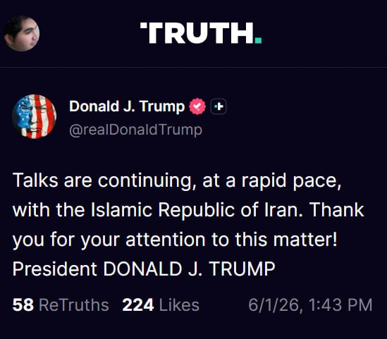

ترامپ: مذاکرات با جمهوری اسلامی ایران با سرعتی بالا ادامه دارد.
از توجه شما به این موضوع سپاسگزارم!

رئیس‌جمهور دونالد جی. ترامپ
realDonaldTrump
این دفعه گفت "جمهوری اسلامی ایران"

📡 @VahidOnline

## VahidOnline — post 75855

  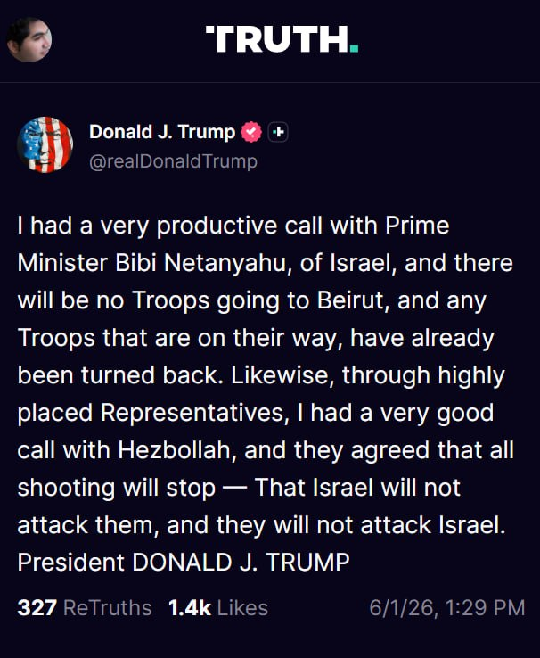

ترامپ: اسرائیل و حزب‌الله پذیرفتند حمله‌ها متوقف شود

ترجمه ماشین:
من تماس بسیار سازنده‌ای با نخست‌وزیر اسرائیل، بی‌بی نتانیاهو، داشتم و هیچ نیرویی به بیروت اعزام نخواهد شد؛ و هر نیرویی هم که در مسیر بوده، همین حالا بازگردانده شده است.
همچنین، از طریق نمایندگان بلندپایه، تماس بسیار خوبی با حزب‌الله داشتم و آن‌ها پذیرفتند که همه تیراندازی‌ها متوقف شود — اینکه اسرائیل به آن‌ها حمله نکند و آن‌ها هم به اسرائیل حمله نکنند.

رئیس‌جمهور دونالد جی. ترامپ
realDonaldTrump

📡 @VahidOnline

## VahidOnline — post 75854

  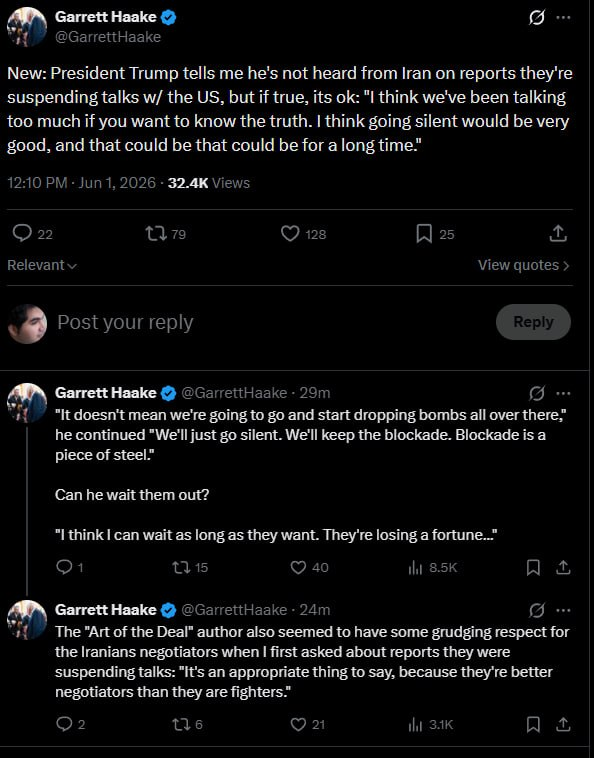

ترامپ: محاصره را حفظ می‌کنیم

توییت‌های خبرنگار NBC، ترجمه ماشین:
تازه: رئیس‌جمهور ترامپ به من گفت که درباره گزارش‌ها مبنی بر تعلیق مذاکرات ایران با آمریکا، چیزی از ایران نشنیده است؛ اما اگر درست باشد، اشکالی ندارد:
«فکر می‌کنم اگر حقیقت را بخواهید، زیادی حرف زده‌ایم. به نظرم سکوت کردن خیلی خوب خواهد بود، و این می‌تواند برای مدتی طولانی باشد.»

او ادامه داد: «این به آن معنا نیست که قرار است برویم و همه‌جا آنجا بمب بریزیم. فقط سکوت می‌کنیم. محاصره را حفظ می‌کنیم. محاصره یک تکه فولاد است.»

آیا می‌تواند آن‌ها را آن‌قدر منتظر بگذارد تا کوتاه بیایند؟
«فکر می‌کنم تا هر وقت که بخواهند می‌توانم صبر کنم. آن‌ها دارند ثروت هنگفتی از دست می‌دهند...»

همچنین وقتی از نویسنده کتاب «هنر معامله» درباره گزارش‌های تعلیق مذاکرات پرسیدم به نظر می‌رسید با اکراه نوعی احترام برای مذاکره‌کنندگان ایرانی قائل است:
«این حرف مناسبی است، چون آن‌ها مذاکره‌کنندگان بهتری هستند تا جنگجو.»
GarrettHaake
الان هم:
ترامپ و نتانیاهو دارند تلفنی صحبت میکنند.
J74wabx

📡 @VahidOnline

## VahidOnline — post 75853

  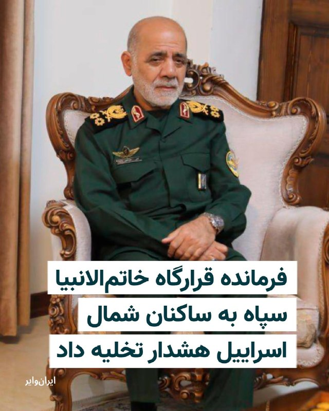

هم‌زمان با صدور هشدار تخلیه از سوی ارتش اسراییل برای ساکنان حومه جنوبی بیروت، فرمانده قرارگاه مرکزی خاتم‌الانبیا به ساکنان مناطق شمالی اسراییل هشدار داد که در صورت عملی شدن تهدیدهای اسراییل علیه لبنان، برای جلوگیری از آسیب، این مناطق را ترک کنند.

علی عبداللهی، فرمانده قرارگاه مرکزی خاتم‌الانبیا، اعلام کرد بنیامین نتانیاهو «در ادامه شرارت‌های خود در منطقه»، ضاحیه و بیروت را به بمباران تهدید کرده و برای ساکنان این مناطق هشدار تخلیه صادر کرده است.

او افزود: «با توجه به نقض مکرر آتش‌بس توسط اسراییل، در صورت عملی شدن این تهدید، به ساکنان بخش‌های شمالی و شهرک‌های نظامی در سرزمین‌های اشغالی هشدار می‌دهیم اگر نمی‌خواهند آسیب ببینند منطقه را ترک کنند.»
@VahidHeadline

📡 @VahidOnline

## VahidOnline — post 75852

  <a href="telegram/content/VahidOnline_75852_1780339287.mp4" target="_blank">🎬 Download video</a>

«حمید سلیمیان» در حال نواختن تنبک
#حمید_سلیمیان، متأهل و پدر یک پسر چهارماهه شامگاه ۱۸ دی‌ماه ۱۴۰۴ در جریان اعتراضات در زرین‌شهر اصفهان با شلیک مستقیم گلوله جنگی جان خود را از دست داد.
حمید سلیمیان راننده یکی از شرکت‌های فولاد بود و به گفته نزدیکانش به موسیقی علاقه فراوانی داشت او تنبک و سنتور می‌نواخت.
@VahidHeadline

📡 @VahidOnline

## VahidOnline — post 75843

هم‌زمان با تشدید حملات نظامی اسراییل به لبنان، مقام‌های جمهوری اسلامی بار دیگر تاکید کردند که هرگونه آتش‌بس میان ایران و آمریکا باید شامل همه جبهه‌های درگیری، به‌ویژه لبنان، باشد و هشدار دادند ادامه حملات به این کشور می‌تواند پیامدهایی در پی داشته باشد.

بنیامین نتانیاهو، نخست‌وزیر اسراییل، روز دوشنبه ۱۱ خرداد ۱۴۰۵، اعلام کرد که به ارتش این کشور دستور داده است اهداف متعلق به حزب‌الله در ضاحیه، حومه جنوبی بیروت، را هدف قرار دهد. او در یک پیام ویدیویی گفت: «هیچ وضعیتی وجود نخواهد داشت که حزب‌الله شهرها و شهروندان ما را هدف قرار دهد اما مقرهای تروریستی آن در ضاحیه بیروت از حمله مصون بماند.»

دفتر نخست‌وزیر اسراییل در بیانیه‌ای اعلام کرد نتانیاهو و یسراییل کاتس، وزیر دفاع این کشور، در پی آنچه «نقض مکرر آتش‌بس از سوی حزب‌الله» و «حملات علیه شهرها و شهروندان اسراییل» خوانده شده، به ارتش دستور حمله به «اهداف تروریستی» در حومه جنوبی بیروت را داده‌اند.

نتانیاهو همچنین گفت عملیات زمینی ارتش اسراییل در لبنان در حال گسترش است. اسراییل در جنوب لبنان منطقه‌ای امنیتی ایجاد کرده و می‌گوید هدف از آن جلوگیری از حملات حزب‌الله به مناطق شمالی این کشور است.

در واکنش به این تحولات، عباس عراقچی، وزیر امور خارجه جمهوری اسلامی، در شبکه ایکس نوشت: «آتش‌بس میان ایران و آمریکا، بدون هیچ ابهامی، آتش‌بسی در تمام جبهه‌ها، از جمله لبنان، است.» او افزود نقض آتش‌بس در هر جبهه‌ای «به معنای نقض آتش‌بس در تمامی جبهه‌ها» خواهد بود.
عراقچی همچنین آمریکا و اسراییل را مسوول پیامدهای هرگونه نقض این آتش‌بس دانست. جمهوری اسلامی پیش از این نیز بارها اعلام کرده بود که آتش‌بس میان ایران و آمریکا باید سایر جبهه‌های درگیری، به‌ویژه لبنان، را نیز در بر بگیرد.

ابوالفضل شکارچی، سخنگوی نیروهای مسلح جمهوری اسلامی، نیز به اسراییل هشدار داد که «تداوم جنایات در لبنان برای نیروهای مسلح ایران قابل تحمل نخواهد بود.»

هم‌زمان، محمدباقر قالیباف، رییس مجلس شورای اسلامی و رییس هیات مذاکره‌کننده ایران با آمریکا، با اشاره به آنچه «محاصره دریایی و تشدید جنایات جنگی در لبنان» خواند، این اقدامات را «شواهد آشکار عدم پایبندی آمریکا به آتش‌بس» توصیف کرد.
قالیباف در پیامی به زبان انگلیسی در شبکه ایکس، بدون اشاره به جزییات بیشتر، نوشت: «هر انتخابی بهایی دارد و زمان پرداخت آن فرا می‌رسد. همه‌چیز در نهایت سر جای خود قرار خواهد گرفت.»

این اظهارات در حالی مطرح می‌شود که عملیات نظامی اسراییل علیه حزب‌الله، از گروه‌های مورد حمایت جمهوری اسلامی در منطقه، شدت گرفته است. با وجود تاکید مکرر تهران بر ضرورت گنجاندن لبنان در هر توافق آتش‌بس میان ایران و آمریکا، این مطالبه تاکنون محقق نشده است.
اسماعیل بقایی، سخنگوی وزارت امور خارجه جمهوری اسلامی، نیز روز دوشنبه در نشست خبری هفتگی خود گفت: «ما تاکید کردیم و کماکان تاکید داریم بر این نکته که آتش‌بس در لبنان بخش لاینفک هرگونه آتش‌بس و هرگونه توافق نهایی برای خاتمه جنگ است.»
او همچنین حملات اسراییل به لبنان را از عوامل ایجاد تاخیر در روند دیپلماتیک برای پایان دادن به جنگ میان ایران و آمریکا دانست و بار دیگر بر ضرورت برقراری آتش‌بس در لبنان به عنوان بخشی جدایی‌ناپذیر از هر توافق نهایی تاکید کرد.
@VahidHeadline
تازه‌تر:
خبرگزاری تسنیم، وابسته به سپاه پاسداران، گزارش داد که جمهوری اسلامی در واکنش به ادامه حملات اسراییل به لبنان و آنچه «نقض آتش‌بس در همه جبهه‌ها» خوانده شده، روند گفت‌وگوها و تبادل پیام با آمریکا از طریق میانجی‌ها را متوقف خواهد کرد.
تسنیم همچنین مدعی شده است که ایران و گروه‌های هم‌پیمان آن در «جبهه مقاومت» در حال بررسی اقداماتی از جمله انسداد تنگه هرمز و فعال‌سازی سایر جبهه‌ها از جمله تنگه باب‌المندب هستند. این گزارش می‌گوید این اقدامات با هدف واکنش به حملات اسراییل و حامیان آن در دستور کار قرار گرفته است.
@VahidHeadline
ارتش اسرائیل در بیانیه‌ای به ساکنان منطقه ضاحیه در جنوب بیروت هشدار داد و از آن‌ها خواست برای حفظ جان خود این منطقه را تخلیه کنند.
در این بیانیه آمده است اگر حزب‌الله به شلیک راکت به سوی شهرها و شهرک‌های اسرائیل ادامه دهد، ارتش اسرائیل اهدافی را در ضاحیه جنوبی هدف قرار خواهد داد.
در ادامه تاکید شده است دولت اسرائیل با مردم لبنان در حال جنگ نیست، بلکه با سازمان تروریستی حزب‌الله می‌جنگد.
@VahidOOnLine
در پی اعلام خبرگزاری تسنیم مبنی بر توقف «گفتگوها و تبادل متون از طریق میانجی» میان تهران و واشنگتن، بهای جهانی نفت بیش از ۵ درصد افزایش یافت و به بالاترین سطح خود در هفته‌های اخیر رسید.
@VahidOOnLine

📡 @VahidOnline

## VahidOnline — post 75842

  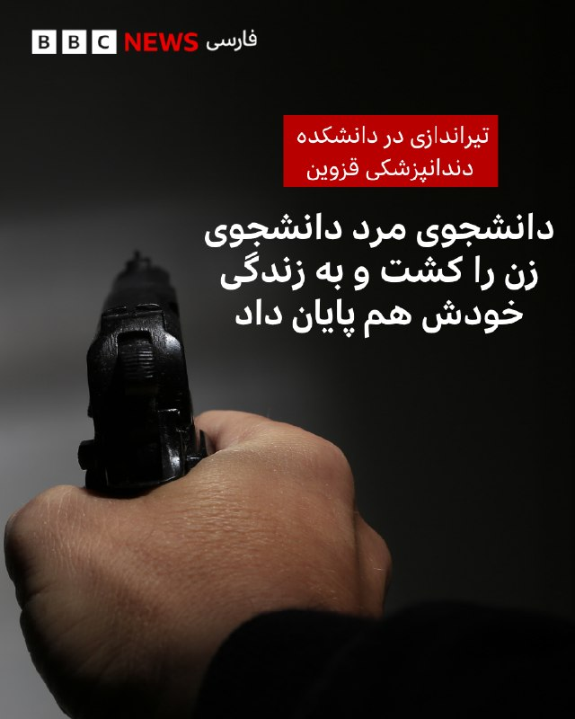

رسانه‌های ایران از کشته شدن یک دانشجوی زن در دانشکده دندانپزشکی قزوین به ضرب گلوله خبر داده‌اند.

میزان، خبرگزاری قوه قضائیه، از قول دادستان قزوین نوشت: «بررسی‌های اولیه نشان می‌دهد این دو دانشجو که در آستانه فارغ‌التحصیلی قرار داشتند، در مرحله متارکه از یک رابطه عاطفی بوده و پیش از این نیز اختلافات خانوادگی شدیدی با یکدیگر داشتند. صبح امروز، مرد جوان با یک قبضه سلاح کلت جنگی وارد محوطه درمانگاه شده و چهار گلوله به ناحیه سینه دانشجوی دختر شلیک کرده است. شدت جراحات وارده به‌حدی بوده که متأسفانه وی در همان محل جان خود را از دست می‌دهد.

در اطلاعیه دانشگاه علوم پزشکی قزوین در این باره آمده است: «انگیزه این واقعه، مسایل شخصی و خانوادگی بوده و ارتباطی با فرآیندهای اداری یا محیط آموزشی دانشکده ندارد.»

به گفته حمیدرضا قافله باشی، رئیس دانشگاه علوم پزشکی قزوین، «این تیراندازی به دلیل خصومت‌ خانوادگی اتفاق افتاده و دو دانشجو که زن و شوهر بودند در اثر شلیک جان خود را از دست داده‌اند.»
@VahidHeadline

📡 @VahidOnline

## IranIntlTV — post 340099

  <a href="telegram/content/IranIntlTV_340099_1780339288.mp4" target="_blank">🎬 Download video</a>

شبکه خبری السومریه روز دوشنبه از انفجار در یک کشتی باری با پرچم پاناما پس از پایان تخلیه محموله خود در نزدیکی بندر ام‌القصر در آب‌های سرزمینی عراق خبر داد.

به گزارش این شبکه، مقام‌های امنیتی انفجار در کشتی MSC SARISKA V را ناشی از نقص فنی اعلام کردند. با این حال، سازمان عملیات تجارت دریایی بریتانیا (UKMTO) اعلام کرد گزارشی دریافت کرده که بر اساس آن، یک کشتی باری در خلیج فارس و در حدود ۴۰ مایل دریایی جنوب‌شرقی ام‌القصر، با یک پرتابه ناشناس هدف قرار گرفته است.
@iranintltv

## IranIntlTV — post 340098

  

علی‌اکبر ولایتی، مشاور رهبر جمهوری اسلامی در شبکه اجتماعی ایکس نوشت که بمباران ضاحیه و نقض آتش‌بس، عجله اسرائیل برای پایان دادن به تاریخ خود است.

ولایتی افزود: شما آغاز کردید، اما برخلاف انفعال تماشاچیان منطقه، جمهوری اسلامی و جبهه مقاومت تا آخر کنار مردم عزیز لبنان، از مسلمان تا مارونی ایستاده است.
https://iranintl.com/202606011355

## IranIntlTV — post 340097

  <a href="https://t.me/IranintlTV/340097" target="_blank">📎 Download file</a>

🎧نسخه صوتی تیتراول با نیوشا صارمی: مذاکرات متوقف شد؛ تنش چند جبهه‌ای در منطقه؛هشدار تخلیه همزمان اسرائیل و سپاه
@iranintlTV

## IranIntlTV — post 340096

  <a href="telegram/content/IranIntlTV_340096_1780339289.mp4" target="_blank">🎬 Download video</a>

مهدی مهدوی‌آزاد در برنامه «چشم‌انداز» گفت: «مجموعه‌ای از شواهد وجود دارد که نشان می‌دهد همین "برادران قاچاقچی" سپاه و همین نهاد فاسد، به دنبال یک ماجراجویی تازه هستند؛ تلاشی برای بیرون کشیدن حزب‌الله لبنان از زیر ضربات اسرائیل.»

او افزود: «ظاهرا حاضرند برای نجات بقایای حزب‌الله، ایران را وارد یک جنگ تازه کنند؛ به بهای ویرانی بیشتر ایران و تحمیل یک جنگ دیگر به کشور.»
@iranintltv

## IranIntlTV — post 340095

  <a href="telegram/content/IranIntlTV_340095_1780339291.mp4" target="_blank">🎬 Download video</a>

🔻علیرضا دبیر، رییس فدراسیون کشتی گفت: «من «حمال» کشتی هستم و به آن افتخار می کنم. خیلی‌ها به اسم حمالی به بالا رسیده‌اند. کشتی ما مثل خاویار و تنگه هرمز و دریای خزر، مزیت رقابتی ماست. کشتی هنوز به ظرفیتی که لایقش است، نرسیده.»

@iranintltvsport

## IranIntlTV — post 340094

  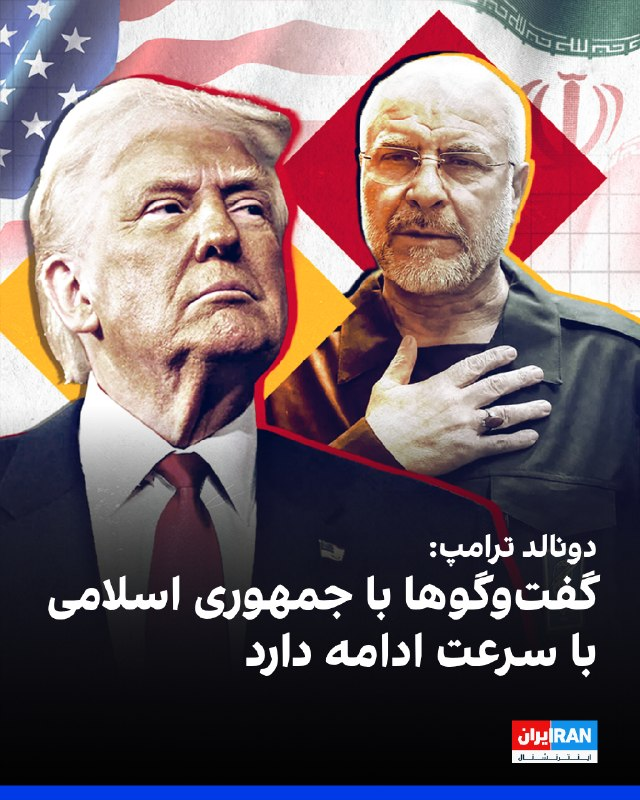

دونالد ترامپ در تروث سوشال نوشت که مذاکرات با جمهوری اسلامی با سرعت ادامه دارد.

او پیش‌تر درباره توقف ارتباط مذاکره‌کنندگان جمهوری اسلامی با آمریکا به دلیل عملیات نظامی اسرائیل در لبنان، افزود: «واقعا برایم مهم نیست، اصلا اهمیت نمی‌دهم.»

ترامپ همچنین در تروث سوشال نوشت با بنیامین نتانیاهو گفت‌وگویی بسیار سازنده داشته و هیچ نیروی نظامی به بیروت اعزام نخواهد شد و نیروهایی که در مسیر بودند نیز بازگردانده شده‌اند.

او اضافه کرد از طریق نمایندگان عالی‌رتبه، با حزب‌الله تماس بسیار خوبی داشته و توافق شده است همه تیراندازی‌ها متوقف شود؛ اسرائیل به آن‌ها حمله نخواهد کرد و آن‌ها نیز به اسرائیل حمله نخواهند کرد.
https://iranintl.com/202606010051

## IranIntlTV — post 340093

  

دونالد ترامپ اعلام کرد با بنیامین نتانیاهو گفت‌وگویی بسیار سازنده داشته و هیچ نیروی نظامی به بیروت اعزام نخواهد شد و نیروهایی که در مسیر بودند نیز بازگردانده شده‌اند.

او همچنین گفت از طریق نمایندگان عالی‌رتبه، با حزب‌الله تماس بسیار خوبی داشته و توافق شده است همه تیراندازی‌ها متوقف شود؛ اسرائیل به آن‌ها حمله نخواهد کرد و آن‌ها نیز به اسرائیل حمله نخواهند کرد.
https://iranintl.com/202606011943

## IranIntlTV — post 340092

  

ترامپ در گفت‌وگو با سی‌ان‌بی‌سی در پاسخ به گزارش‌هایی درباره توقف ارتباط مذاکره‌کنندگان جمهوری اسلامی با آمریکا به دلیل عملیات نظامی اسرائیل در لبنان، افزود: «واقعا برایم مهم نیست، اصلا اهمیت نمی‌دهم.»

ترامپ درباره بستن تنگه هرمز از سوی جمهوری اسلامی نیز گفت نگران افزایش قیمت نفت نیست.
او همچنین گفت قصد دارد از بنیامین نتانیاهو درباره وضعیت لبنان سوال کند.
https://iranintl.com/202606010822

## IranIntlTV — post 340091

  <a href="telegram/content/IranIntlTV_340091_1780339294.mp4" target="_blank">🎬 Download video</a>

همزمان با ردوبدل شدن پیام‌ها میان تهران و واشینگتن درباره تفاهم احتمالی، جمهوری اسلامی و آمریکا از حمله به مواضع یکدیگر در منطقه خبر می‌دهند.

گفت‌وگو با فرزین ندیمی، پژوهشگر ارشد امور دفاعی و امنیتی
@iranintltv

## IranIntlTV — post 340090

  <a href="telegram/content/IranIntlTV_340090_1780339295.mp4" target="_blank">🎬 Download video</a>

جمهوری اسلامی در واکنش به تشدید عملیات اسرائیل در لبنان، تبادل پیام با آمریکا را متوقف کرد.
همزمان، ارتش اسرائیل برای ساکنان حومه جنوبی بیروت دستور تخلیه صادر کرد.

گزارش سمیرا قرایی و بابک اسحاقی، خبرنگاران ایران‌اینترنشنال
@iranintltv

## IranIntlTV — post 340089

  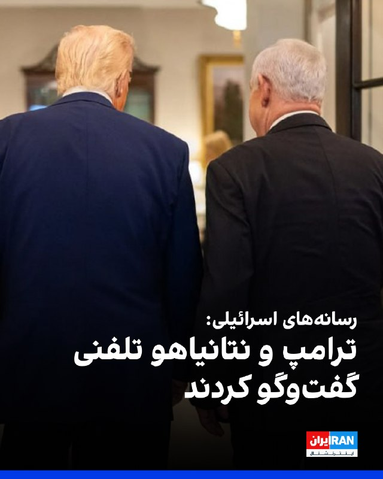

رسانه‌های اسرائیلی گزارش دادند بنیامین نتانیاهو دوشنبه با دونالد ترامپ به‌صورت تلفنی گفت‌وگو کرده است. جزئیات بیشتری از این تماس منتشر نشده است.

دوشنبه همزمان با حملات اسرائیل به جنوب لبنان، قرارگاه مرکزی خاتم‌الانبیا به ساکنان شمال اسرائیل هشدار تخلیه داد.
خبرگزاری تسنیم نیز از توقف گفت‌وگوها با آمریکا به علت حملات اسرائیل به لبنان خبر داد.

محمد مخبر، مشاور مجتبی خامنه‌ای، گفت هرگونه آتش‌بس بدون در نظر گرفتن لبنان و سایر جبهه‌های مقاومت «فاقد موضوعیت» دانست.
https://iranintl.com/202606014520

## IranIntlTV — post 340088

  <a href="telegram/content/IranIntlTV_340088_1780339297.mp4" target="_blank">🎬 Download video</a>

ویدیوهای منتشرشده در شبکه‌های اجتماعی نشان می‌دهد که در پی حمله ارتش اسرائیل به مواضع حزب‌الله در جنوب لبنان، بخش‌هایی از بیمارستان جبل عامل در شهر صور آسیب دیده است.
@iranintltv

## IranIntlTV — post 340087

  

فرماندهی مرکزی آمریکا، سنتکام در شبکه ایکس اعلام کرد که از آغاز محاصره دریایی ایران تاکنون ۱۲۱ کشتی تجاری مجبور به تغییر مسیر شده‌اند و پنج کشتی نیز توسط نیروهای آمریکایی از کار انداخته شده‌اند.

همزمان ترامپ درباره توقف مذاکرات از سوی تهران به دلیل حملات اسرائیل به لبنان، گفت که پیش از این تصمیم، از آن مطلع نشده بود. او افزود: «این به این معنا نیست که ما برویم و شروع به بمباران همه‌جا کنیم. ما محاصره را ادامه خواهیم داد».
https://iranintl.com/202606019608

## IranIntlTV — post 340086

  <a href="https://t.me/IranintlTV/340086" target="_blank">📎 Download file</a>

🎧نسخه صوتی اخبار شبانگاهی | دوشنبه ۱۱ خرداد
@iranintlTV

## IranIntlTV — post 340085

  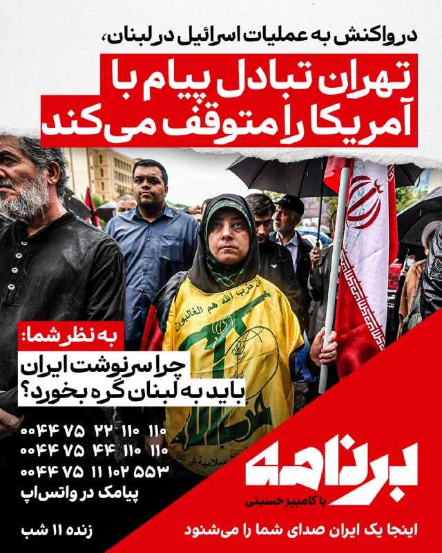

جمهوری اسلامی می‌گوید در واکنش به حملات اسرائیل به لبنان، تبادل پیام با آمریکا را متوقف می‌کند و هشدار داده است که تشدید تنش در لبنان «قابل تحمل نخواهد بود».

به نظر شما:

چرا سرنوشت ایران باید به لبنان گره بخورد؟

چرا هر بحرانی در منطقه می‌تواند بر زندگی، اقتصاد و آیندهٔ مردم ایران تأثیر بگذارد؟

آیا منافع ملی ایران با سیاست‌های منطقه‌ای جمهوری اسلامی یکی است؟

امشب در «برنامه با کامبیز حسینی» از شما می‌پرسیم:

اگر فقط دو دقیقه فرصت داشتید، به مقام‌های جمهوری اسلامی دربارهٔ لبنان، اسرائیل و آیندهٔ ایران چه می‌گفتید؟

«برنامه» صدای شماست.

ما شما را، بدون نوبت، مستقیم از ایران روی خط می‌آوریم.

بیایید و روایت خود را برای همیشه ثبت کنید.

تاریخ با صدای شما نوشته می‌شود.

برای شرکت در برنامه، همین حالا در واتس‌اپ پیام بدهید:

۰۰۴۴۷۵۲۲۱۱۰۱۱۰

۰۰۴۴۷۵۴۴۱۱۰۱۱۰

۰۰۴۴۷۵۱۱۱۰۲۵۵۳

«برنامه با کامبیز حسینی»

«یک ایران صدای شما را می‌شنود»
@iranintltv

## IranIntlTV — post 340084

  

خبرگزاری صداوسیما گزارش داد محمد مخبر، مشاور و دستیار رهبر جمهوری اسلامی، در دیدار با عبدالله صفی‌الدین، نماینده حزب‌الله لبنان در تهران، با تاکید بر یکپارچگی محور مقاومت، هرگونه آتش‌بس با جمهوری اسلامی را بدون در نظر گرفتن لبنان و سایر جبهه‌های مقاومت «فاقد موضوعیت» دانست.
https://iranintl.com/202606011826

## IranIntlTV — post 340083

  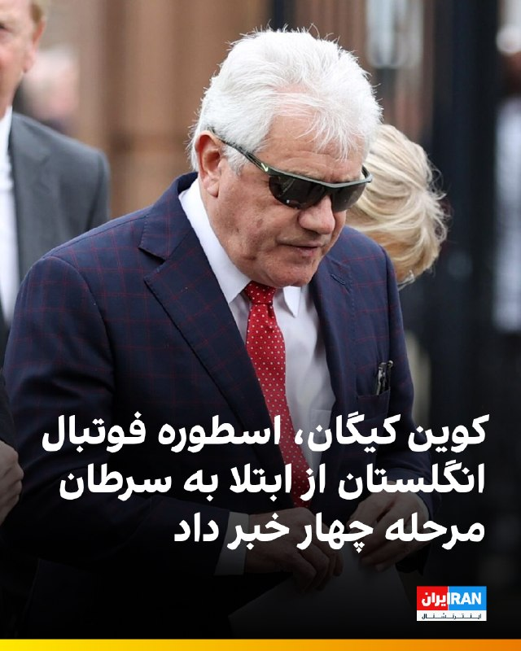

🔻کوین کیگان، کاپیتان و سرمربی پیشین تیم ملی انگلیس، اعلام کرد به سرطان مرحله چهار مبتلا شده است. مرحله چهار پیشرفته‌ترین مرحله سرطان محسوب می‌شود و به این معناست که بیماری به بخش‌های دیگر بدن گسترش یافته است.

🔹خانواده کیگان نخستین‌بار در زمستان گذشته فاش کردند که او با سرطان دست‌وپنجه نرم می‌کند.

🔹به نوشته بی‌بی‌سی، کیگان در یکی از نخستین حضورهای عمومی خود پس از انتشار این خبر، هنگام بازگشت به نیوکاسل برای یک برنامه زنده، گفت: «بعد از تصادف رانندگی،‌ مجبور به جراحی شدم. هنگام انجام اسکن برای عمل، فهمیدند که سرطان دارم. گفتند بهترین پزشک را برای مقابله با چیزی که داری، یعنی سرطان مرحله چهار، در اختیار داریم. برای ملاقاتش رفتم. او هوادار لیورپول بود، فهمیدم تنها نخواهم ماند.»

🔹پزشک به کوین کیگان گفته که این درمان جدید فقط ۳۳ درصد احتمال موفقیت دارد.

🔹کیگان در تیم‌های اسکونتورپ یونایتد، لیورپول، هامبورگ، ساوتهمپتون و نیوکاسل بازی کرد و دوران پرافتخاری داشت. او بعدها هدایت نیوکاسل، فولام، تیم ملی انگلستان و منچسترسیتی را نیز بر عهده گرفت.

🔹جزییات بیشتر را در سایت بخوانید

@iranintltvsport

## IranIntlTV — post 340082

  <a href="telegram/content/IranIntlTV_340082_1780339301.mp4" target="_blank">🎬 Download video</a>

تیتر اول با نیوشا صارمی، دوشنبه ۱۱ خرداد
@iranintltv

## IranIntlTV — post 340081

  <a href="telegram/content/IranIntlTV_340081_1780339302.mp4" target="_blank">🎬 Download video</a>

قانون جدید پناهندگی کانادا که با هدف کاهش پرونده‌های معوقه تصویب شده، نگرانی‌ها درباره وضعیت متقاضیان را افزایش داده است. منتقدان می‌گویند این قانون افرادی را که از سرکوب و نقض حقوق بشر در ایران گریخته‌اند، در شرایط بلاتکلیفی قرار دهد.

گزارش مهسا مرتضوی، خبرنگار ایران‌اینترنشنال
@iranintltv

## IranIntlTV — post 340080

  

دونالد ترامپ در گفت‌وگو با خبرنگار ان‌بی‌سی اعلام کرد که درباره ایران «بیش از حد صحبت شده» است و افزود: «اگر بخواهید حقیقت را بگویید، فکر می‌کنم سکوت کردن می‌تواند گزینه بهتری باشد».

دونالد ترامپ درباره توقف مذاکرات از سوی تهران به دلیل حملات به لبنان گفت که پیش از این تصمیم، از آن مطلع نشده بود. او افزود: «این به این معنا نیست که ما برویم و شروع به بمباران همه‌جا کنیم. ما محاصره را ادامه خواهیم داد».
https://iranintl.com/202606010169

## Shin_Persian — post 6373

🔁 Quoting above tweet:
Shin ✓ @hey_itsmyturn
Mon, 01 Jun 2026 18:33:09 UTC

THE PRESIDENT OF THE UNITED STATES OF AMERICA had a "VERY GOOD CALL WITH HEZBOLLAH", which is a designated FTO (Foreign Terror Organization)
(https://www.state.gov/foreign-terrorist-organizations)

Cool.

فارسی

رئیس‌جمهور ایالات متحده آمریکا یک «تماس بسیار خوب با حزب‌الله» داشت، که یک FTO (سازمان تروریستی خارجی) تعیین شده است.
(https://www.state.gov/foreign-terrorist-organizations)

عالیه.

𝕏 · @shin_persian

## Shin_Persian — post 6372

  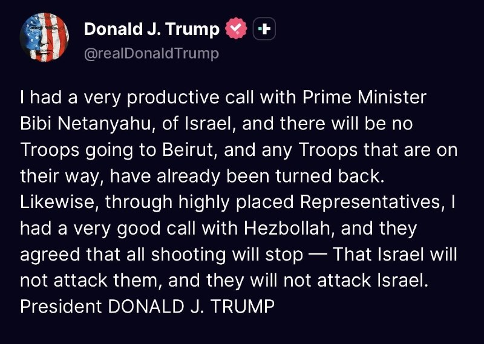

↩️ Quoted tweet: Open Source Intel ✓ @Osint613 Mon, 01 Jun 2026 17:32:55 UTC Trump: “I had a very productive call with Prime Minister Bibi Netanyahu, of Israel, and there will be no Troops going to Beirut, and any Troops that are on their way, have already…

## Shin_Persian — post 6371

↩️ Quoted tweet:
Open Source Intel ✓ @Osint613
Mon, 01 Jun 2026 17:32:55 UTC

Trump: “I had a very productive call with Prime Minister Bibi Netanyahu, of Israel, and there will be no Troops going to Beirut, and any Troops that are on their way, have already been turned back. Likewise, through highly placed Representatives, I had a very good call with

↩️ توییت نقل‌قول شده — برای پاسخ، پست زیر را ببینید.

فارسی

ترامپ: «من تماس بسیار سازنده‌ای با بی‌بی نتانیاهو، نخست‌وزیر اسرائیل داشتم و هیچ نیروی نظامی به بیروت اعزام نخواهد شد و هر نیرویی که در راه است، پیش‌تر بازگردانده شده است. به همین ترتیب، از طریق نمایندگان عالی‌رتبه، تماس بسیار خوبی با مابقی داشتم...»

𝕏 · @shin_persian

## Shin_Persian — post 6370

  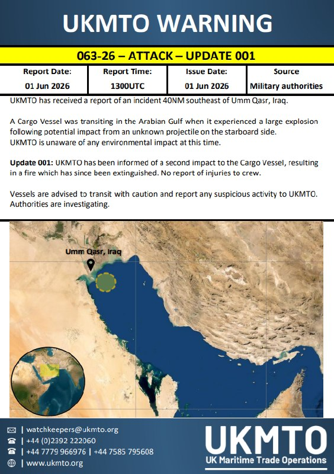

UKMTO Operations Centre @UK_MTO
Mon, 01 Jun 2026 18:17:29 UTC

UKMTO WARNING 063-26 UPDATE 001

Click here to view the full warning⤵️
http://www.ukmto.org/-/media/ukmto/products/20260601-ukmto_warning_063-update_001.pdf?rev=759b918daac243ee8b0c2004571f13ba

#MaritimeSecurity #MarSec

فارسی

هشدار یو‌کی‌ام‌تی‌او (UKMTO) ۰۶۳-۲۶ به‌روزرسانی ۰۰۱

برای مشاهده متن کامل هشدار اینجا کلیک کنید⤵️
http://www.ukmto.org/-/media/ukmto/products/20260601-ukmto_warning_063-update_001.pdf?rev=759b918daac243ee8b0c2004571f13ba

#MaritimeSecurity #MarSec

𝕏 · @shin_persian

## Shin_Persian — post 6369

Shin ✓ @hey_itsmyturn
Mon, 01 Jun 2026 18:15:39 UTC

Jet activity over Tehran,
Tehran Province, #Iran

فارسی

فعالیت جنگنده‌ها بر فراز تهران،
استان تهران، #Iran

𝕏 · @shin_persian

## Shin_Persian — post 6367

  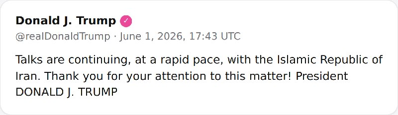

Shin ✓ @hey_itsmyturn
Mon, 01 Jun 2026 17:45:43 UTC

President Trump @POTUS:
"Talks are continuing, at a rapid pace, with the Islamic Republic of Iran. Thank you for your attention to this matter! President DONALD J. TRUMP"

فارسی

رئیس‌جمهور ترامپ @POTUS:

«گفتگوها با جمهوری اسلامی ایران با سرعتی بالا در حال انجام است. از توجه شما به این موضوع سپاسگزارم! رئیس‌جمهور دونالد جی. ترامپ»

𝕏 · @shin_persian

## Shin_Persian — post 6366

  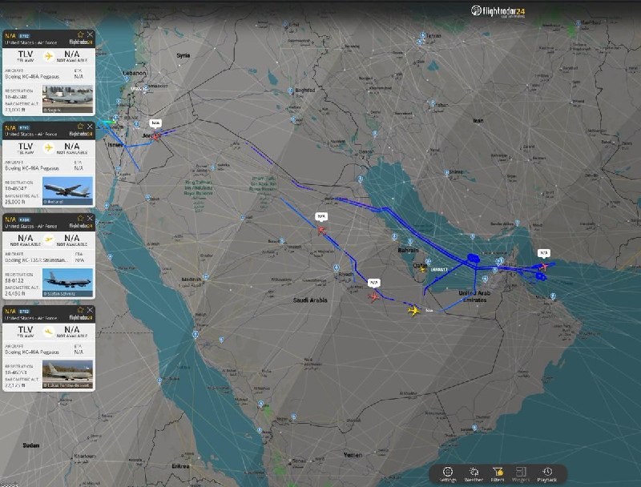

Shin ✓ @hey_itsmyturn
Mon, 01 Jun 2026 16:32:32 UTC

#USAF 🇺🇸 Tankers in the region as of 1631Z:

KC-46A (AE5F9B | 18-46048)
KC-46A (AE5F9A | 18-46047)
KC-135R (AE0628 | 58-0122)
KC-46A (AE5FA0 | 18-46053)

فارسی

#USAF (نیروی هوایی ایالات متحده) 🇺🇸 تانکرهایی در منطقه تا ساعت ۱۶۳۱Z (۲۰:۰۱ به وقت تهران):

KC-46A (AE5F9B | 18-46048)
KC-46A (AE5F9A | 18-46047)
KC-135R (AE0628 | 58-0122)
KC-46A (AE5FA0 | 18-46053)

𝕏 · @shin_persian

## Shin_Persian — post 6365

Shin ✓ @hey_itsmyturn
Mon, 01 Jun 2026 16:17:13 UTC

IRGC Khatam Al Anbiya's terror commander, ‌Brigadier General Abdollahi:
"Benjamin Netanyahu, in a continued escalation of his regional aggressions, has threatened to bomb Dahiya and Beirut and issued an evacuation warning to their residents.
Considering the regime's repeated violations of the ceasefire, if this threat is actualized, we warn residents of the northern sectors and military settlements in the occupied territories to evacuate the area if they wish to avoid harm."

#Iran

فارسی

سردار سرتیپ عبداللهی، فرمانده تروریستی قرارگاه خاتم‌الانبیا سپاه پاسداران (IRGC):
«بنیامین نتانیاهو در ادامه تشدید تجاوزات منطقه‌ای خود، تهدید به بمباران ضاحیه و بیروت کرده و هشدار تخلیه برای ساکنان آن‌ها صادر نموده است.
با توجه به نقض مکرر آتش‌بس توسط این رژیم، در صورت عملی شدن این تهدید، به ساکنان بخش‌های شمالی و شهرک‌های نظامی در اراضی اشغالی هشدار می‌دهیم که اگر می‌خواهند آسیبی نبینند، منطقه را تخلیه کنند.»

#Iran

𝕏 · @shin_persian

## Shin_Persian — post 6364

🔁 Quoting above tweet:
Shin ✓ @hey_itsmyturn
Mon, 01 Jun 2026 16:06:57 UTC

U.S. forces are enforcing a blockade against Iran. As of June 1, CENTCOM has redirected 121 commercial vessels and disabled 5 others to ensure compliance.

Source: @CENTCOM
https://x.com/CENTCOM/status/2061479583631741344

فارسی

نیروهای ایالات متحده در حال اجرای محاصره علیه ایران هستند. تا تاریخ ۱ ژوئن، سنتکام (فرماندهی مرکزی ایالات متحده) ۱۲۱ کشتی تجاری را تغییر مسیر داده و ۵ فروند دیگر را برای اطمینان از پایبندی، متوقف کرده است.

منبع: @CENTCOM
https://x.com/CENTCOM/status/2061479583631741344

𝕏 · @shin_persian

## Shin_Persian — post 6363

  <a href="telegram/content/Shin_Persian_6363_1780339306.mp4" target="_blank">🎬 Download video</a>

↩️ Quoted tweet: U.S. Central Command ✓ @CENTCOM Mon, 01 Jun 2026 16:06:47 UTC Thousands of U.S. service members at sea, in the skies, and from land are supporting the ongoing U.S. blockade against Iran. As of June 1, CENTCOM forces have redirected 121 commercial…

## Shin_Persian — post 6362

↩️ Quoted tweet:
U.S. Central Command ✓ @CENTCOM
Mon, 01 Jun 2026 16:06:47 UTC

Thousands of U.S. service members at sea, in the skies, and from land are supporting the ongoing U.S. blockade against Iran. As of June 1, CENTCOM forces have redirected 121 commercial vessels and disabled 5 to ensure compliance.

↩️ توییت نقل‌قول شده — برای پاسخ، پست زیر را ببینید.

فارسی

هزاران نفر از پرسنل نظامی ایالات متحده در دریا، آسمان و زمین از محاصره جاری ایالات متحده علیه ایران حمایت می‌کنند. تا تاریخ ۱ ژوئن، نیروهای سنتکام (CENTCOM - ستاد فرماندهی مرکزی ایالات متحده) جهت اطمینان از پایبندی، مسیر ۱۲۱ کشتی تجاری را تغییر داده و ۵ فروند را متوقف کرده‌اند.

𝕏 · @shin_persian

## Shin_Persian — post 6357

  

UKMTO Operations Centre @UK_MTO
Mon, 01 Jun 2026 14:23:25 UTC

UKMTO WARNING 063-26

Click here to view the full warning⤵️
http://www.ukmto.org/-/media/ukmto/products/20260601-ukmto_warning_063.pdf?rev=f5e667a1b57c4711b38e8fcadfda022d

#MaritimeSecurity #MarSec

فارسی

هشدار UKMTO (عملیات تجارت دریایی بریتانیا) ۰۶۳-۲۶

برای مشاهده هشدار کامل اینجا کلیک کنید⤵️
http://www.ukmto.org/-/media/ukmto/products/20260601-ukmto_warning_063.pdf?rev=f5e667a1b57c4711b38e8fcadfda022d

#MaritimeSecurity #MarSec

𝕏 · @shin_persian

## Shin_Persian — post 6356

Shin ✓ @hey_itsmyturn
Mon, 01 Jun 2026 14:21:26 UTC

Correction: No new sirens in #Kuwait 🇰🇼

فارسی

اصلاحیه: آژیر خطر جدیدی در #Kuwait 🇰🇼 شنیده نمی‌شود.

𝕏 · @shin_persian

## reutersworldchannel — post 151527

  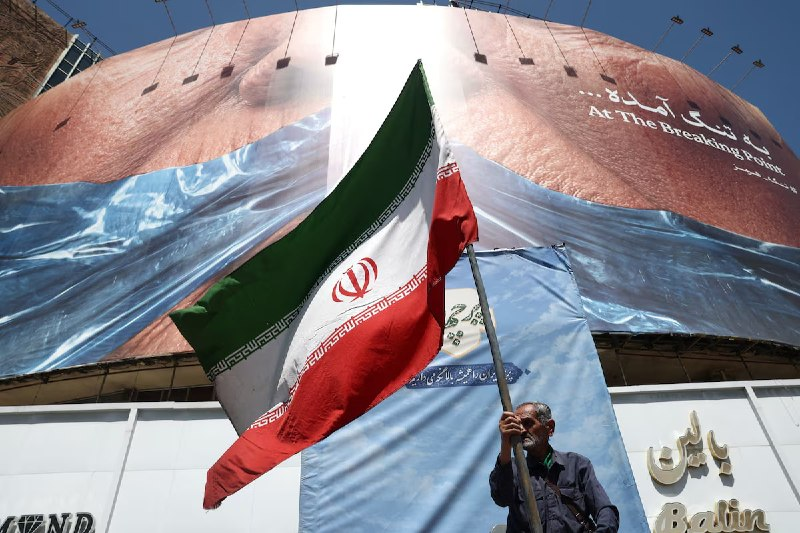

Iran halting indirect talks with US over Israel's Lebanon incursion, Tasnim says

ran is halting indirect negotiations with the U.S. ​after Israel ordered troops to push deeper into Lebanon to battle Tehran-backed Hezbollah, the Iranian news agency Tasnim said on Monday, complicating diplomatic efforts to end three months of war.

Tasnim said the Islamic Republic's ‌negotiating team was stopping exchanging messages with Washington through mediators over attacks on Lebanon, where the U.S.-Israeli war against Iran has reignited Israel's conflict with Hezbollah. read more

## ManotoTV — post 105898

  <a href="telegram/content/ManotoTV_105898_1780339310.mp4" target="_blank">🎬 Download video</a>

سخنان عزت‌الله همایون‌فر، ادیب و سیاستمدار، درباره روحیه قوی ملت ایران و ریشه‌های آن در سی قرن تاریخ کشور

## FarsiVOA — post 219300

علی جوانمردی: با سیاست آمریکا، ایران بە سمت دموکراسی سکولار می‌رود

## FarsiVOA — post 219299

🔺حرکت بدون توقف ماشین سرکوب جمهوری اسلامی؛ یاشار دارالشفا و منصور باسام هم بازداشت شدند

▪️کانون حقوق بشر ایران روز دوشنبه ۱۱ خرداد، از بازداشت دو شهروند‌ در شهرهای مریوان و تهران خبر داد و اعلام کرد: «هر دو بازداشت‌شدگان به مکانی نامعلوم منتقل شده‌اند و ماموران حکومتی دلیلی برای بازداشت آنها ارائه نکرده‌اند.»

⬇️ بیشتر بخوانید:

https://ir.voanews.com/a/arrest-without-cause-citizens-protesting-repressive-regime-iran-/8156114.html/?nocach=1

## FarsiVOA — post 219298

  <a href="telegram/content/FarsiVOA_219298_1780339311.mp4" target="_blank">🎬 Download video</a>

مسعود پیاهو، هنرمند و موسیقی‌دانی که به دلیل ثبت تصویر «مرد تانکی تهران» به ۱۰ سال حبس محکوم شده است در پیامی ویدیویی اعلام کرد روز سه‌شنبه برای اجرای حکم، خود را به زندان معرفی می‌کند.

این تصویر که پیش از اعتراضات هجدهم و نوزدهم دی سال گذشته و در بحبوحه اعتراضات بازار ثبت شد، صحنه‌ای را نشان می‌داد که در آن یک معترض مقابل نیروهای انتظامی و یگان ویژه روی زمین نشسته بود؛ تصویری که پس از انتشار، به نمادی از اعتراض مدنی و مقاومت فردی در برابر نیروهای امنیتی تبدیل شد.

آقاخانی، وکیل دادگستری، تاکید کرد دفاع موکلش بر این اساس بوده که هیچ قصدی برای انتشار عمومی، همکاری، یا اقدام سازمان‌یافته نداشته و این ویدئو صرفاً برای تعداد محدودی از دوستانش در استوری خصوصی منتشر شده بود. به گفته او، مسعود پیاهو هنگام اطلاع‌رسانی درباره بسته بودن پاساژ، به‌طور اتفاقی صحنه نشستن معترض مقابل نیروهای امنیتی را ثبت کرده است.

## FarsiVOA — post 219297

📢‼️ اطلاعیه مهم
تبلیغات و آگهی‌هایی که در کانال تلگرام صدای آمریکا می‌بینید( از قبیل ارز دیجیتال و ...) هیچ ارتباطی با ما ندارد و به صورت خودکار توسط تلگرام نمایش داده می‌شود. صدای آمریکا محتوای آنها را تایید نمی‌کند و هیچ مسئولیتی در قبال آنها ندارد.

## FarsiVOA — post 219296

  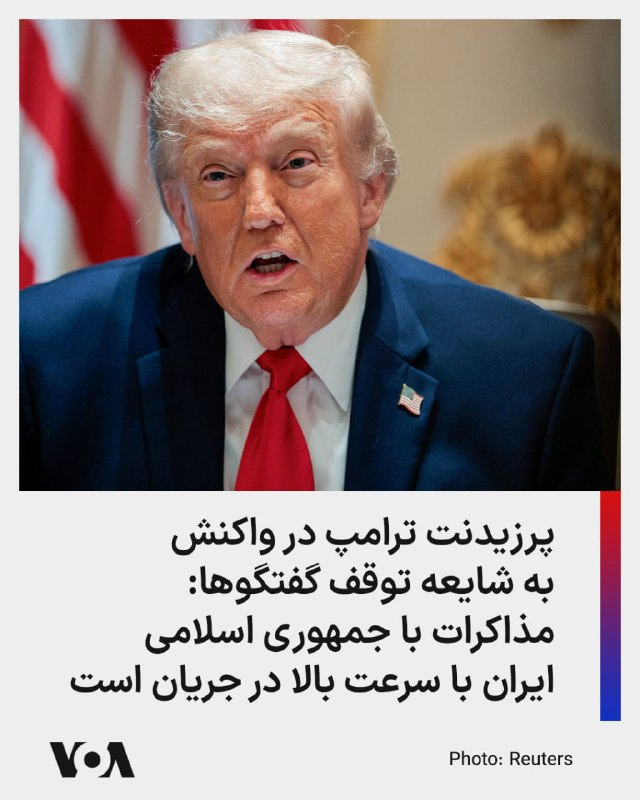

دونالد ترامپ، رئیس جمهوری آمریکا در واکنش به شایعه توقف گفتگوها عنوان کرد: مذاکرات با جمهوری اسلامی ایران با سرعت بالا در جریان است.
پرزیدنت ترامپ پیش از انتشار این موضوع در تروت سوشال به شبکه خبری ان‌بی‌سی نیز گفته بود که نظر او توقف مذاکرات مشکلی ایجاد نمی‌کند چون جمهوری اسلامی در مذاکره بهتر از جنگ است.
او همچنین تاکید کرد که مخاصره دریایی جمهوری اسلامی ادامه می‌یابد.

## FarsiVOA — post 219295

دوگانگی سخنان مقامات حکومتی ازمذاکره تا ادامه جنگ در گفتگو با عرفان نوربخش

## FarsiVOA — post 219291

تفنگداران دریایی، ملوانان و نیروهای گارد ساحلی آمریکا، ۱ خرداد در دریای کارائیب، در نزدیکی ناو «یواس‌اس فورت لادردیل»، یک تمرین عملیات رهگیری دریایی برگزار کردند.

@FarsiVOA

## FarsiVOA — post 219290

  <a href="telegram/content/FarsiVOA_219290_1780339313.mp4" target="_blank">🎬 Download video</a>

حسین قاضیان، جامعه‌شناس در میدان با ابراز نگرانی از خشم و ترامای درمان‌نشده در جامعه می‌گوید جنگ داخلی که درباره‌اش هشدار می‌دهند از قبل شروع شده، مردم با مسلسل کلمات به هم تیراندازی می‌کنند و ممکن است به‌زودی مسلسل واقعی هم دست بگیرند

## FarsiVOA — post 219289

  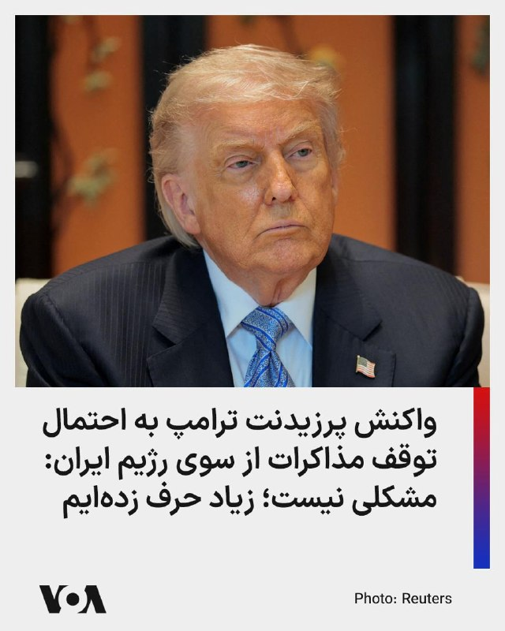

دونالد ترامپ، رئیس جمهوری آمریکا به شبکه خبری ان‌بی‌سی گفت که در جریان تصمیم جمهوری اسلامی برای توقف گفتگوها قرار ندارد، اما از نظر او این اقدام مشکلی ایجاد نمی‌کند.
پرزیدنت ترامپ گفت: « «من فکر می‌کنم اگر کار آن‌ها با گفتگو تمام شده است، اشکالی ندارد. این سخن به‌جایی است، چون آن‌ها مذاکره‌کنندگان بهتری هستند تا جنگجو. اما آن‌ها این موضوع را به ما اطلاع نداده بودند.»
رئیس‌جمهور آمریکا با تأکید بر اینکه پایان گفتگوها لزوماً به معنای آغاز فوری حمله به جمهوری اسلامی نیست، گفت که آمریکا محاصره دریایی را حفظ خواهد کرد و گفت: «اگر آن‌ها نمی‌خواهند گفتگو کنند، برای من مشکلی نیست. من فکر می‌کنم این خوب است. من هم به‌طور ویژه تمایلی به گفتگو ندارم. ما بیش از حد گفتگو می‌کنیم.»

## FarsiVOA — post 219288

بازگشت سایه موشک‌ها بر آسمان اقلیم؛ حملات تازه جمهوری اسلامی به چند نقطه در اقلیم کردستان عراق

## FarsiVOA — post 219287

سخت تر شدن رویکرد پرزیدنت ترامپ نسبت به جمهوری اسلامی در گفتگو با حسن هاشمیان

## FarsiVOA — post 219286

  <a href="telegram/content/FarsiVOA_219286_1780339314.mp4" target="_blank">🎬 Download video</a>

هاشمی‌طبا، معاون پیشین رئیس‌جمهور، یکی از دستاوردهای رفاهی جمهوری اسلامی برای ایرانیان را مجهز بودن ۸۰ درصد خانه‌ها به «حمام» اعلام کرد، آن را با پاکستان، افغانستان و هندوستان مقایسه کرد و گفت: «نمی‌دانند حمام چیست.»

او همچنین مدعی شد جمهوری اسلامی «بهترین سوخت را به تمام خانه‌های کشور کشانده اما اسراف باعث از بین رفتن خیلی از این سرمایه‌ها شده.»

این در صورتی است که نبود لوله‌کشی گاز در بسیاری از مناطق سیستان و بلوچستان باعث سرگردانی شهروندان و تشکیل صف‌های طولانی تهیه کپسول گاز در هر زمستان می‌شود.

## FarsiVOA — post 219285

همزمان با احتمال توافق؛ نظرات قانون گذاران در حمایت و مخالفت با پرزیدنت ترامپ

## FarsiVOA — post 219284

  <a href="telegram/content/FarsiVOA_219284_1780339316.mp4" target="_blank">🎬 Download video</a>

فرماندهی مرکزی ایالات متحده، سنتکام اعلام کرد هزاران نیروی نظامی آمریکا در دریا، هوا و خشکی از محاصره آمریکا علیه جمهوری اسلامی حمایت می‌کنند.

سنتکام همچنین اعلام کرد تا ۱۱ خرداد، مسیر ۱۲۱ کشتی تجاری تغییر داده شده و ۵ فروند نیز از کار افتاده‌اند.

@FarsiVOA

## FarsiVOA — post 219283

  <a href="telegram/content/FarsiVOA_219283_1780339316.mp4" target="_blank">🎬 Download video</a>

ویدیوی منتشر شده از مشاور احمدی‌نژاد در شبکه‌های اجتماعی پربازدید شده که در پاسخ به پرسش خبرنگار درباره حال و مکان احمدی‌نژاد می‌گوید «خوب است؛ همان‌جایی که باید باشد است.»

در ابتدای جنگ، رسانه‌های ایران ابتدا گزارش‌هایی درباره کشته‌شدن احمدی‌نژاد در حمله هوایی به خانه‌اش منتشر کردند؛ اما بعداً اعلام شد او زنده مانده است. پس از آن تصویر، صدا و پیامی از او منتشر نشده است.

تصاویر ماهواره‌ای نشان می‌داد خانه او آسیب جدی ندیده، اما پایگاه امنیتی ورودی کوچه کاملاً تخریب شده است.

## FarsiVOA — post 219282

اختصاصی صدای آمریکا: موج بازداشت، شکنجه و احکام اعدام پس از کشته‌شدن خامنه‌ای

## FarsiVOA — post 219281

سالمرگ خمینی در سایه ابهام جانشینی؛ آیا مشروعیت مجتبی خامنه‌ای تثبیت شده است؟

## DW_Farsi — post 125394

🔶 "بی‌اطلاعی" ترامپ از تعلیق مذاکرات؛ جلوگیری از حمله به بیروت

دونالد ترامپ، رئیس جمهور آمریکا روز دوشنبه، اول ژوئن در مصاحبه با شبکه ان بی سی، در باره برخی خبرهای رسانه‌های نزدیک به حکومت ایران دائر بر لغو تبادلات پیام‌های مذاکراتی برای توافق با تهران، گفت که در این باره گزارشی دریافت نکرده است.
او گفت: «من چنین چیزی نشنیده‌ام، نمی‌دانم که آیا صحت دارد یا خیر. اگر این‌طور باشد، چیز خوبی خواهد بود ، ما خیلی صحبت کرده‌ایم، شاید بیش از حد.»

ترامپ بعداَ تصریح کرد که "این به آن معنا نیست که ما شروع به بمباران خواهیم کرد. ما فقط سکوت خواهیم کرد. ما محاصره را حفظ می‌کنیم".

رئیس جمهور آمریکا در پاسخ به این پرسش که آیا چنین اقدامی از سوی ایران پیامدی برای تهران خواهد داشت یا خیر، گفت: «نه! مشکلی نیست. آن‌ها مذاکره‌کنندگان بسیار خوبی هستند.»

ترامپ همچنین در پاسخ به این سوال که آیا می‌تواند منتظر خروج ایران (از مذاکرات) بماند، گفت: «فکر می‌کنم می‌توانم تا هر زمان که بخواهند صبر کنم. آنها دارند ثروت زیادی را از دست می‌دهند.»

ساعاتی قبل از این اظهارات ترامپ، خبرگزاری تسنیم، نزدیک به سپاه پاسداران، نوشت که "کسب اطلاع" کرده است که "با توجه به تداوم جنایات رژیم صهیونیستی در لبنان و با عنایت به اینکه لبنان جزو پیش شرط‌های آتش‌بس بوده است و هم اینک این آتش‌بس در همه جبهه‌ها از جمله لبنان نقض شده است، تیم مذاکره‌کننده ایرانی گفتگوها و تبادل متون از طریق میانجی را متوقف می‌کند".

در ادامه خبر تسنیم گفته می‌شود که "توقف فوری عملیات تجاوزکارانه و وحشیانه ارتش اسرائیل در غزه و لبنان و ضرورت عقب‌نشینی کامل از مناطق اشغال شده در لبنان توسط مسئولان و مذاکره‌کنندگان ایرانی مورد تاکید قرار گرفته و تا زمانی که نظر ایران و مقاومت در این زمینه تامین نشود، گفتگویی در کار نخواهد بود".

تسنیم همچنین تهدید کرده است که "جبهه مقاومت و ایران عزم خود را برای انسداد کامل تنگه هرمز، و فعال کردن سایر جبهه‌ها از جمله تنگه باب‌المندب، به منظور تنبیه صهیونیست‌ها و حامیانش در دستور کار قرار داده‌اند".

همزمان فرمانده قرارگاه مرکزی خاتم‌الانبیا در واکنش به گسترش عملیات اسرائیل در لبنان و هشدار تخلیه از سوی ارتش این کشور برای ساکنان حومه جنوبی بیروت، به ساکنان مناطق شمالی اسراییل هشدار داد که "در صورت عملی شدن تهدیدهای اسراییل علیه لبنان، برای جلوگیری از آسیب، این مناطق را ترک کنند".

علی عبداللهی، در بیانیه خود با متهم‌کردن نخست‌وزیر اسرائیل به "ادامه شرارت‌ها در منطقه"، افزود: «با توجه به نقض مکرر آتش‌بس توسط اسراییل، در صورت عملی شدن این تهدید، به ساکنان بخش‌های شمالی و شهرک‌های نظامی در سرزمین‌های اشغالی هشدار می‌دهیم اگر نمی‌خواهند آسیب ببینند منطقه را ترک کنند.»
@dw_farsi

## DW_Farsi — post 125392

🔶 ارتش اسرائیل: یک فرمانده حماس پزشک بیهوشی بود

ارتش اسرائیل روز دوشنبه، اول ژوئن اعلام کرد پزشکی که در بمباران روز شنبه گذشته در دیرالبلح در مرکز نوار غزه جان خود را از دست داد، در واقع در یک جایگاه مهم در شاخه نظامی جنبش مقاومت اسلامی (حماس) داشته است.

نیروهای دفاعی اسرائیل (IDF) فرد کشته‌شده را «جمال ابوعون» معرفی کرده‌اند؛ کسی که رئیس بخش بیهوشی در بیمارستان یافا بوده است. ارتش اسرائیل او را "تروریست" و "فرمانده دسته‌ای از شاخه نظامی حماس، یعنی گردان‌های عزالدین قسام" توصیف کرده است.

در بیانیه ارتش آمده است: «او نیروهای حماس را هدایت می‌کرد و در طراحی و پیشبرد عملیات علیه نیروهای ارتش اسرائیل و دولت اسرائیل نقش داشت. همچنین در دوره اخیر در تلاش‌های حماس برای تثبیت، بازسازی و تقویت توان خود مشارکت داشته است؛ اقدامی که نقض توافق آتش‌بس محسوب می‌شود.»

بر اساس این بیانیه، این پزشک هدف یک "حمله هدفمند" از سوی ارتش اسرائیل بوده و فعالیت‌های او نمونه‌ای دیگر از "استفاده ابزاری حماس از موقعیت‌های غیرنظامی برای پیشبرد فعالیت‌های نظامی" عنوان شده است.

گزارش‌ها می‌گویند ابوعون در حمله به یک ایست بازرسی پلیس داخلی حماس کشته شد؛ حمله‌ای که در آن سه نفر دیگر نیز زخمی شدند.

در همین حال، آخرین آمار منتشرشده از سوی وزارت بهداشت غزه نشان می‌دهد از زمان آتش‌بس در غزه در ماه اکتبر تاکنون ۹۲۲ نفر کشته و ۲٬۸۱۱ نفر زخمی شده‌اند. همچنین مجموع تلفات از آغاز جنگ تاکنون به ۷۲٬۹۳۸ کشته و ۱۷۲٬۹۱۹ زخمی رسیده است.

این وزارتخانه که تحت کنترل گروه تروریستی حماس است، همچنین اعلام کرده از زمان اجرای آتش‌بس در ۱۱ اکتبر ۲۰۲۵ تاکنون ۹۳۲ کشته و ۲٬۸۵۹ زخمی ثبت شده است. در ۲۴ ساعت گذشته نیز دو نفر کشته و ۴۰ نفر زخمی شده‌اند.

در ادامه گزارش آمده است از زمان آغاز حمله نظامی اسرائیل پس از حملات ۷ اکتبر ۲۰۲۳ که حدود ۱۲۰۰ کشته و نزدیک به ۲۵۰ گروگان برجای گذاشت (بر اساس آمار رسمی اسرائیل)، تاکنون ۷۲۹۴۱ کشته و ۱۷۲۹۶۷ زخمی در غزه ثبت شده است.

علاوه بر سازمان ملل مقام‌های اسرائیل نیز آمار حماس را نزدیک به واقعیت اعلام کرده‌اند.
@dw_farsi

## DW_Farsi — post 125391

🔶 کارزار روایت‌ها؛ هشتگ "وقتی شما نبودید" از چه می‌گوید؟

🔻 گزارشی از آبان سرایی

جنگ‌ها تنها در آسمان و بر زمین رخ نمی‌دهند، میدان‌های دیگری هم دارند که در آن بازیگران مختلف می‌کوشند نگرش خود را به روایت مسلط تبدیل کنند.

در ساعات اخیر پس از پایان درگیری‌ها و بازگشت نسبی دسترسی به اینترنت، هشتگی با عنوان "وقتی شما نبودید" به یکی از نمودهای این کشمکش‌های روایی تبدیل شده است؛ هشتگی که در نگاه نخست قرار بود برای کاربران داخل ایران روایت کند در روزهایی که به دلیل قطع اینترنت از فضای مجازی محروم بودند، ایرانیان بیرون از مرزهای کشور چه مواضعی داشته‌اند. اما این کارزار به سرعت بستری برای طرح روایتی معکوس شد؛ برآمدن صدای کسانی که در همان روزها زیر چنگال واقعیت جنگ و پیامدهای آن زیستند.

قطع گسترده اینترنت در دوماه اخیر، شکافی ارتباط بی‌سابقه‌ای میان ایرانیان ساکن داخل و دیاسپورای خارج ایجاد کرد؛ گسستی که بسیاری از کاربران معتقدند در سایه بی‌خبری از واقعیت جاری در ایران به شکاف روایت‌ها تبدیل شد.

در این خلا اطلاعاتی‌، فضای رسانه‌ای وشبکه‌های مجازی در اختیار فارسی‌زبان خارج از کشور به یکی از مهم‌ترین عرصه‌های تولید و گردش روایت‌ها بدل شد؛ از کسانی که حملات را فرصتی برای تغییر سیاسی می‌دانستند تا کسانی که نسبت به پیامدهای انسانی و اجتماعی جنگ هشدار می‌دادند.

هشتگ "وقتی شما نبودید" در واقع تلاشی برای بازگرداندن همان لحظات به حافظه جمعی است و هم‌زمان افراد داخل ایران از همین هشتگ استفاده می‌کنند تا بگویند در روزهایی که دیگران از دور درباره جنگ سخن می‌گفتند، آنها در متن واقعه زندگی می‌کردند.

در یکی از پست‌های منتشرشده در این هشتگ آمده است: "وقتی شما نبودید، ما هنوز نمی‌توانیم توضیح دهیم در آن روزها چه گذشت. آنچه از وقایع دیدید حتی نوک کوه یخ هم نیست." در پست دیگری کاربری نوشته است: "شما به اسم ما حرف می‌زنید، در حالی که از آنچه اینجا می‌گذرد خبر ندارید."
@dw_farsi

## DW_Farsi — post 125390

🔶 ژاپن از ایران خواست برای حصول توافق با آمریکا "حداکثر انعطاف‌پذیری" را نشان دهد

تاکایچی سانائه، نخست‌وزیر ژاپن، از مسعود پزشکیان، رئیس جمهور ایران خواسته است تا هرچه سریع‌تر با ایالات متحده به توافق برسد و شرایط را برای عبور و مرور آزادانه کشتی‌ها در تنگه هرمز فراهم کند.

به گزارش خبرگزاری ژاپنی کیودو، تاکایچی دوشنبه‌شب به مدت ۱۵ دقیقه به صورت تلفنی با پزشکیان گفت‌وگو کرد.

او ضمن تأکید بر این موضع که "تنش‌زدایی از طریق گفتگو از بالاترین اهمیت برخوردار است" ابراز امیدواری کرده است که "تهران به نشان دادن حداکثر انعطاف‌پذیری ادامه داده و با واشنگتن به یک توافق نهایی دست یابد".

وی بار دیگر خواستار عبور آزادانه و امن کشتی‌های همه کشورها، از جمله ژاپن و سایر کشورهای آسیایی، در سریع‌ترین زمان ممکن از تنگه هرمز شد.

دومقام توافق کردند که در تماس نزدیک با یکدیگر در گفت‌وگو باقی بمانند. این گفت‌وگوی تلفنی، اولین گفت‌وگوی آن‌ها در حدود یک ماه گذشته بود؛ آخرین آن‌ها در تاریخ ۳۰ آوریل انجام شده بود.

تاکایچی پس از این گفت‌وگوها اعلام کرد که بار دیگر موضع اصولی ژاپن را به دونالد ترامپ، رئیس‌جمهور آمریکا، منتقل کرده است. وی افزود که همچنین بر هماهنگی با رهبران سایر کشورها از جمله کره جنوبی و فیلیپین در جهت کاهش تنش‌ها در منطقه تأکید کرده است. او گفت که به تلاش‌های دیپلماتیک فعالانه خود ادامه خواهد داد.

روایت ایران از گفت‌وگوی پزشکیان و تاکایچی سانائه در رسانه‌ای ایران بازتاب یافته است.

بنا بر این روایت، پزشکیان از باور "جمهوری اسلامی ایران به دیپلماسی به عنوان "مؤثرترین راهکار برای حل مسائل" یاد کرده و آمریکا را به "عدول از تعهدات خود و همچنین اقدامات بی‌ثبات‌کننده" اسرائیل متهم کرده که به گفته او "روندهای دیپلماتیک را با چالش مواجه کرده‌اند".

پزشکیان همچنین با اشاره به تحولات منطقه، نقض مکرر آتش‌بس در لبنان، تداوم آوارگی شهروندان لبنانی و حمایت‌های سیاسی و نظامی آمریکا از اقدامات رژیم صهیونیستی را نگران‌کننده توصیف کرد و خواستار ایفای مسئولیت مؤثر جامعه جهانی در توقف این روند شد.

پزشکیان در ادامه "با تأکید بر اهمیت امنیت و آزادی کشتیرانی در آبراه‌های بین‌المللی" گفته است که "جمهوری اسلامی ایران آمادگی کامل برای تسهیل عبور و مرور دریایی را دارد... و تهران موضوع تردد کشتی‌های مرتبط با ژاپن را با جدیت پیگیری خواهد کرد و تلاش خواهد شد که مسیر عبور کشتی‌های ژاپنی بدون مشکل و با سهولت بیشتری فراهم شود.

پزشکیان در ادامه ابراز امیدوار کرده است که "با بازگشت شرایط عادی، زمینه بهره‌گیری از توانمندی‌های فنی و مهندسی ژاپن در پروژه‌های بازسازی و توسعه پالایشگاه‌ها، بنادر و زیرساخت‌های اقتصادی آسیب دیده ایران بیش از پیش فراهم شود".

او در ادامه خواستار مساعدت دولت ژاپن برای تسهیل بهره‌برداری از منابع مالی و دارایی‌های ایران در ژاپن به‌منظور تأمین کالاهای اساسی، تجهیزات پزشکی و دارو شد.

ژاپن حدود ۹۵ درصد از نفت خود را از خاورمیانه وارد می‌کند که بیشتر آن از تنگه هرمز عبور می کند؛ از آغاز جنگ آمریکا و اسرائیل علیه ایران، بیش از ۴۰ کشتی ژاپنی در این سوی تنگه منتظر اجازه نیروهای نظامی تهران برای عبور بوده‌اند.

مینورو کیهارا دبیر ارشد کابینه ژاپن پس از برقراری آتش‌بس میان ایران و آمریکا، اعلام کرده بود که کاهش تنش واقعی در خاورمیانه از اهمیت بالایی برخوردار است و توکیو انتظار دارد که به زودی از طریق تلاش‌های دیپلماتیک، "توافق نهایی" حاصل شود.
@dw_farsi

## DW_Farsi — post 125389

🔶 هرمز، سوئز، پاناما؛ چرا فقط اولی نمی‌تواند عوارض بگیرد؟

🔻گزارشی از Nik Martin

حکومت ایران، پس از انتشار گزارش‌هایی مبنی بر آغاز دریافت تا دو میلیون دلار از هر کشتی برای "عبور ایمن" از تنگه هرمز، به اخاذی و تهدید امنیت انرژی جهان متهم شد.

تنگه هرمز که میان ایران و عمان قرار دارد، حیاتی‌ترین گذرگاه انرژی جهان به شمار می‌رود. پیش از جنگ ایران، یک‌پنجم نفت و گاز مصرفی جهان از این مسیر عبور می‌کرد.

جمهوری اسلامی این هزینه‌ها را غرامت جنگی برای خسارت‌های ناشی از حملات آمریکا و اسرائیل به ایران دانسته و همچنین آن را با پرداخت "خدمات ناوبری"، حفاظت از محیط زیست و تقویت امنیت توجیه می‌کند.

ایران همچنین اعلام کرده است که در حال تدوین پیش‌نویس یک پروتکل مشترک با عمان است که کشتی‌ها را پیش از عبور از تنگه هرمز، ملزم به اخذ مجوز می‌کند.
@dw_farsi

## DW_Farsi — post 125388

🔶 خبرگزاری نزدیک به سپاه: به دلیل تشدید حملات اسرائیل در لبنان تبادل متن‌های توافق با آمریکا متوقف شده است

خبرگزاری تسنیم، نزدیک به سپاه پاسداران، که منبع "کسب اطلاع" این خبرگزاری است، نوشته که "با توجه به تداوم جنایات رژیم صهیونیستی در لبنان و با عنایت به اینکه لبنان جزو پیش شرط‌های آتش‌بس بوده است و هم اینک این آتش‌بس در همه جبهه‌ها از جمله لبنان نقض شده است، تیم مذاکره‌کننده ایرانی گفتگوها و تبادل متون از طریق میانجی را متوقف می‌کند".

در ادامه خبر تسنیم گفته می‌شود که "توقف فوری عملیات تجاوزکارانه و وحشیانه ارتش اسرائیل در غزه و لبنان و ضرورت عقب‌نشینی کامل از مناطق اشغال شده در لبنان توسط مسئولان و مذاکره‌کنندگان ایرانی مورد تاکید قرار گرفته و تا زمانی که نظر ایران و مقاومت در این زمینه تامین نشود، گفتگویی در کار نخواهد بود".

تسنیم همچنین تهدید کرده است که "جبهه مقاومت و ایران عزم خود را برای انسداد کامل تنگه هرمز، و فعال کردن سایر جبهه‌ها از جمله تنگه باب‌المندب، به منظور تنبیه صهیونیست‌ها و حامیانش در دستور کار قرار داده‌اند".

منابع دیگر این خبر تهدیدآمیز تسنیم را تأیید نکرده‌اند.

روز دوشنبه، مقام‌های مختلف جمهوری اسلامی، از جمله محمدباقر قالیباف، رئیس مجلس و عباس عراقچی، وزیر خارجه در پیام‌هایی جداگانه در شبکه ایکس، نسبت به"پیامدهای گسترش جنگ در لبنان" هشدار دادند و آن را "نقض آتش‌بس میان آمریکا و ایران" توصیف کردند. آنها در باره جزئیات این "پیامدها" توضیحی ندادند.

همزمان سعید آجرلو، عضو تیم رسانه‌ای هیأت مذاکره‌کننده ایران در گفت‌وگو با خبرگزاری فارس، با اشاره به آخرین تحولات مذاکرات، از "بررسی پیشنهاد مکتوب جدید آمریکا در نهادهای عالی تصمیم ساز کشور خبر داد" او گفت که هنوز پاسخی به این پیشنهاد داده نشده است.

آجرلو با اشاره به دریافت متن جدید از سوی آمریکا از طریق واسطه‌ها، گفت: «پیشنهاد ارسالی جدید آمریکا در کمیته ۶ نفره و شورای عالی امنیت ملی در حال بررسی است. از طریق میانجی‌ها متنی به ایران ارسال شده ولی هنوز پاسخی به پیشنهاد جدید آمریکا نداده ایم.»

او احتمال تغییرات بیشتر در متن مورد مبادله از سوی آمریکا را منتفی نشمرد و در ادامه افزود که "ما به دلیل اینکه نگرانی هایی داریم هنوز پاسخی به متن جدید آمریکا ارسال نکردیم و باید نگرانی های ما رفع شود تا بتواند عوایدی از مذاکرات نصیب ما شود".

آجرلو توضیحی در باره این نگرانی‌ها نداده است، ولی جمهوری اسلامی هم در باره مدیریت تنگه هرمز، هم در باره مدت توقف غنی‌سازی اورانیوم و نیز خروج اورانیوم ۶۰‌درصد غنی‌شد، تضمین‌هایی برای درنگرفتن مجدد جنگ اصرار و مصون ماندن نیروهای نیابتی‌اش از حمله، ملاحظاتی دارد که با دیدگاه‌های آمریکا همساز نیست.
@dw_farsi

## DW_Farsi — post 125387

🔶 دستور نتانیاهو برای حمله ارتش اسرائیل به حومه جنوبی بیروت

بنیامین نتانیاهو، نخست‌وزیر اسرائیل روز دوشنبه دستور حمله به حومه جنوبی بیروت، که تحت کنترل حزب‌الله است، را صادر کرد. این اقدام نشانه‌ای از تشدید بیشتر جنگی است که تلاش‌های میانجی‌گری برای حل‌وفصل مناقشه میان آمریکا و ایران را پیچیده‌تر کرده است.

پس از هشدار اسرائیل، مردم شروع به ترک حومه جنوبی بیروت، معروف به ضاحیه، کردند. این تازه‌ترین موج آوارگی در درگیری‌ای است که تاکنون بیش از یک میلیون نفر را در لبنان از خانه‌هایشان رانده است.

نتانیاهو در یک پیام ویدئویی گفت: «وضعیتی را نخواهیم پذیرفت که حزب‌الله به شهرها و شهروندان ما حمله کند، اما مقرهای تروریستی آن در بیروت، در ضاحیه، از حملات مصون بماند.»

او همچنین گفت که اسرائیل به گسترش عملیات زمینی خود در لبنان ادامه می‌دهد. نیروهای اسرائیلی در جنوب لبنان منطقه‌ای را که خود "منطقه امنیتی" می‌نامند ایجاد کرده‌اند و می‌گویند هدفشان محافظت از شمال اسرائیل در برابر حملات حزب‌الله است.

همزمان با پیام ویدئویی، دفتر بنیامین نتانیاهو اعلام کرد که او و یسرائیل کاتس، وزیر دفاع اسرائیل، به ارتش این کشور دستور داده‌اند که به "اهداف تروریستی" در حومه جنوبی بیروت حمله کند.

در بیانیه دفتر نتانیاهو آمده است که این دستور در پی "نقض‌های مکرر آتش‌بس" از سوی حزب‌الله و همچنین "حملات علیه شهرها و شهروندان ما" صادر شده است.

این دستور پس از تشدید درگیری‌ها در جنوب لبنان طی آخر هفته صادر شد؛ جایی که نیروهای اسرائیلی موفق به تصرف قلعه بوفور، دژی تاریخی با قدمتی حدود ۹۰۰ سال، شدند.

حزب‌الله که در سال ۱۹۸۲ با حمایت سپاه پاسداران انقلاب اسلامی ایران تأسیس شد، اعلام کرد که نیروهایش ساعت یک بامداد دوشنبه چند موشک به سوی زیرساخت‌های نظامی اسرائیل در شهر طبریه شلیک کرده‌اند. این گروه همچنین گفت که این حملات و سایر عملیات‌هایش پاسخی به نقض آتش‌بس از سوی اسرائیل بوده است.

یسرائیل کاتس نیز هشدار داد: «اگر در شمال اسرائیل آرامش وجود نداشته باشد، در بیروت نیز آرامشی وجود نخواهد داشت.»

مقام‌های لبنانی می‌گویند از دوم مارس، زمانی که حزب‌الله در حمایت از ایران و در واکنش به حملات آمریکا و اسرائیل به ایران، به سوی اسرائیل آتش گشود، بیش از ۳۴۰۰ نفر در لبنان در نتیجه حملات اسرائیل کشته شده‌اند.

در مقابل، اسرائیل اعلام کرده است که در همین بازه زمانی، ۲۴ سرباز و ۴ غیرنظامی اسرائیلی جان خود را از دست داده‌اند.

اسرائیل در هفته‌های نخست جنگ، حومه جنوبی بیروت را به شدت بمباران کرده بود. با این حال، از زمان اعلام آتش‌بس لبنان توسط دونالد ترامپ، رئیس‌جمهور آمریکا، در ۱۶ آوریل، تنها دو بار این منطقه را هدف حمله قرار داده است؛ هرچند درگیری‌ها در جنوب لبنان همچنان ادامه داشته‌اند.

این درگیری‌ها در ۲ مارس آغاز شد؛ زمانی که حزب‌الله در حمایت از ایران، که تحت حملات آمریکا و اسرائیل قرار گرفته بود، به سوی اسرائیل آتش گشود.

در همین حال، مقام‌های جمهوری اسلامی از وزیر خارجه گرفته تا رئیس مجلس به آمریکا و اسرائیل نسبت به پیامدهای گسترش جنگ هشدار داده‌اند و نقض آتش‌بس را مانع حصول توافق با آمریکا خوانده‌اند. اسماعیل بقایی، سخنگوی وزارت امور خارجه ایران، اعلام کرد که حملات اسرائیل در لبنان از جمله عواملی است که روند دیپلماتیک برای پایان دادن به جنگ میان آمریکا و ایران را به تأخیر انداخته است. او بار دیگر تأکید کرد که برقراری آتش‌بس در لبنان بخشی جدایی‌ناپذیر از هرگونه توافق احتمالی است.
@dw_farsi

## DW_Farsi — post 125386

🔶 ابراز نگرانی وزیر خارجه آلمان از تشدید درگیری‌ها در لبنان؛ لغو سفر وزیر آلمان به دلایل امنیتی

وزیر خارجه آلمان با صدور بیانیه‌ای پیشروی بیشتر ارتش اسرائیل در جنوب لبنان را "موجب نگرانی جدی" توصیف کرد. او با اشاره به این که عملیات اسرائیل واکنشی به حملات مداوم حزب‌الله به شمال اسرائیل است؛ خواهان آن شد که این حملات هرچه زودتر متوقف شوند.

یوهان واده‌فول از همه طرف‌های درگیر در این مناقشه به‌طور فوری خواسته است که تمامی اقدامات خصمانه را متوقف کرده و به آتش‌بس مورد توافق بازگردند.

رئیس دستگاه دیپلماسی آلمان ابراز نگرانی کرد که هرگونه تشدید بیشتر تنش‌ها می‌تواند وضعیت از پیش بحرانی را وخیم‌تر کند و موج‌های جدیدی از آوارگی در داخل لبنان به راه بیاندازد.

واده‌فول در ادامه بیانیه خود، ضمن تاکید بر "نگرانی‌ها و منافع امنیتی مشروع" اسرائیل، می‌گوید: «اما زمانی که غیرنظامیان بهای تشدید درگیری‌های نظامی را می‌پردازند و بخش‌هایی از لبنان به‌طور دائمی غیرقابل سکونت می‌شوند، این امر در بلندمدت امنیت بیشتری برای اسرائیل به همراه نخواهد داشت.»

او از اسرائیل خواسته است که در اقدامات خود علیه حزب‌الله باید از غیرنظامیان و همچنین زیرساخت‌های غیرنظامی محافظت کند.

از نظر وزیر خارجه آلمان "کلید ثبات لبنان، تقویت دولت لبنان است" امری که شامل "اقدام قاطع دولت لبنان علیه حزب‌الله و اعمال انحصاری حق استفاده از زور توسط این دولت در سراسر قلمرو کشور می‌شود".

واده‌فول مذاکرات مستقیم میان دولت‌های لبنان و اسرائیل در واشنگتن را "یک گام تاریخی" توصیف کرده و آن را "راه درست و موفقیت‌آمیز در راستای یک راه‌حل دیپلماتیک پایدار برای حفاظت از غیرنظامیان در هر دو سوی "خط آبی" (مرز تعیین‌شده میان لبنان و اسرائیل)و حصول صلحی پایدار می‌داند.

واده‌فول در انتهای بیانیه خود زنهار می‌دهد که "حزب‌الله نباید این روند صلح را بیش از این تضعیف کند".

در همین حال منابع خبری از لغو سفر وزیر توسعه آلمان به لبنان به دلیل وخامت اوضاع امنیتی خبرداده‌اند.

ریم آلابالی رادوان، وزیر توسعه امور اقتصادی و همکاری‌های بین‌المللی آلمان (از حزب SPD)، سفر خود به لبنان را که برای امروز برنامه‌ریزی شده بود، به دلایل امنیتی لغو کرد.

بر اساس اطلاعات رادیو سراسری آلمان (دویچلندفونک) هواپیمای رادوان پس از یک توقف کوتاه برای سوخت‌گیری در قبرس، به برلین بازخواهد گشت. علت این تصمیم، تشدید ناگهانی و حاد اوضاع امنیتی منطقه اعلام شده است. صبح امروز، بنیامین نتانیاهو، نخست‌وزیر اسرائیل، به ارتش این کشور دستور داد تا اهدافی را در ضاحیه جنوبی بیروت (پایتخت لبنان) نیز مورد حمله قرار دهند.

ارتش اسرائیل در روزهای گذشته پیشروی خود را در جنوب لبنان به سمت شمال ادامه داده است. بنا بر اعلام مقامات لبنانی، از ابتدای ماه مارس تاکنون بیش از ۲,۰۰۰ نفر در پی حملات اسرائیل کشته و بیش از یک میلیون نفر نیز آواره شده‌اند. شمار قربانیان نظامی و غیرنظامی اسرائیل نیز به ۲۴ نفر می‌رسد.
@dw_farsi

## DW_Farsi — post 125385

🔶 مهاجرت خالص به آلمان تقریباً به نصف کاهش یافته است

بر اساس تازه‌ترین آمارها، در سال گذشته میلادی (۲۰۲۵) شمار افرادی که به آلمان مهاجرت کرده‌اند، به شکل چشمگیری کمتر از سال ۲۰۲۴ بوده است.

اداره فدرال آمار آلمان اعلام کرد که "مهاجرت خالص" به این کشور با ۴۵ درصد کاهش، از ۴۳۰ هزار نفر در سال ۲۰۲۴، به ۲۳۵ هزار نفر در سال گذشته رسیده است.

"مهاجرت خالص" یعنی تفاوت تعداد افرادی که وارد یک کشور می‌شوند با تعداد افرادی که از آن کشور خارج می‌شوند. این عدد نشان می‌دهد جمعیت یک کشور بر اثر مهاجرت واقعاً چقدر افزایش یا کاهش یافته است.

طبق نتایج نهایی، در سال ۲۰۲۵ در مجموع حدود یک میلیون و ۴۸۰ هزار نفر وارد آلمان و یک میلیون و ۲۵۰ هزار نفر از این کشور خارج شده‌اند. در نتیجه، شمار مهاجران واردشده به آلمان ۱۳ درصد کاهش یافته، در حالی که تعداد کل مهاجران خارج‌شده نزدیک به دو درصد کمتر شده است.
@dw_farsi

## Persian_Trend_Official — post 15453

کانال 12 اسرائیل: ارتش اسرائیل نخست‌وزیر نتانیاهو و وزیر دفاع اسرائیل کاتز را به‌خاطر اعلام برنامه‌هایی برای حمله به بیروت پیش از انجام عملیات، مورد انتقاد قرار داد.

مقامات نظامی گفتند اهدافی که در این طرح گنجانده شده بودند، پس از اعلام علنی قصد نتانیاهو و کاتز برای حمله به بیروت ناپدید شدند.

📝 Amir

📌 @persian_trend_official
پرشین ترند | متفاوت‌ترین کانال نظامی

## Persian_Trend_Official — post 15452

  <a href="telegram/content/Persian_Trend_Official_15452_1780339318.webm" target="_blank">🎬 Download video</a>

شبکه خبری I24 در خبری اعلام کرد به‌ دلیل نگرانی‌ها درمورد آسیب رساندن به تماس‌ها با ایران و مذاکرات بین اسرائیل و لبنان، واشنگتن در تلاش است تا به آتش‌بس جامع منجر شود.

باراک باتش خبرنگار خارجی نوشت آمریکا عمیقا نگران پیامد حمله اسرائیل به بیروت است. واشنگتن نگران تأثیر این اقدام بر تماس‌های حساس با ایران و مذاکرات جاری بین اسرائیل و لبنان است.

در نتیجه آمریکا از اسرائیل درخواست کرد که عملیات برنامه‌ریزی شده را به حالت تعلیق درآورد تا دریچه دیگری از فرصت برای تماس‌های دیپلماتیک بین کشورها فراهم شود.

درخواست آمریکا پس از آن مطرح می‌شود که طی 24 ساعت گذشته پیام‌هایی از لبنان به واشنگتن رسیده است که نشان دهنده تلاش واقعی برای دستیابی به آتش‌بس جامعی است که حزب‌الله را نیز ملزم به توقف حملات خود کند.

در عین حال دو مقام اسرائیلی که با رویترز صحبت کردند فاش کردند که اسرائیل منتظر تأیید نهایی رئیس جمهور آمریکا قبل از هرگونه اقدام نظامی احتمالی در حومه بیروت است که این امر بر هماهنگی نزدیک و وابستگی سیاسی اسرائیل و آمریکا تأکید دارد.

📝 Amir

📌 @persian_trend_official
پرشین ترند | متفاوت‌ترین کانال نظامی

## Persian_Trend_Official — post 15451

  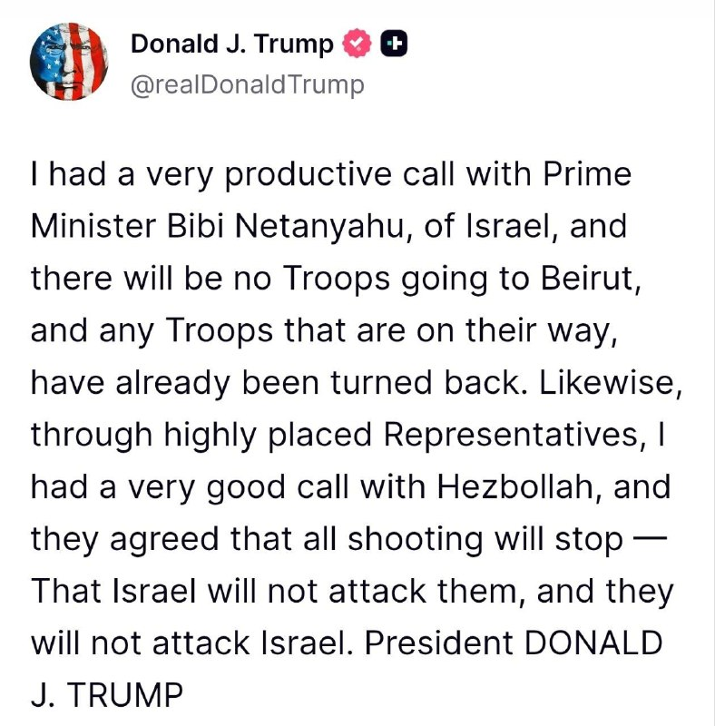

ترامپ: من تماس بسیار مثبتی با نخست‌وزیر بی بی نتانیاهو، از اسرائیل، داشتم و هیچ نیرویی به بیروت اعزام نخواهد شد، و هر نیرویی که در راه بود، قبلاً بازگردانده شده است.

همچنین، از طریق نمایندگان بلندپایه، تماس بسیار خوبی با حزب‌الله داشتم و آنها موافقت کردند که تمام تیراندازی‌ها متوقف شود، اسرائیل به آنها حمله نخواهد کرد و آنها نیز به اسرائیل حمله نخواهند کرد.

📝 Amir

📌 @persian_trend_official
پرشین ترند | متفاوت‌ترین کانال نظامی

## Persian_Trend_Official — post 15450

  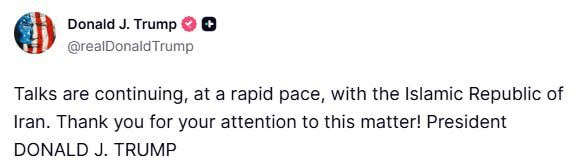

ترامپ: مذاکرات با جمهوری اسلامی ایران با سرعت زیادی ادامه دارد. از توجه شما به این موضوع سپاسگزارم!

📝 Amir

📌 @persian_trend_official
پرشین ترند | متفاوت‌ترین کانال نظامی

## Persian_Trend_Official — post 15449

  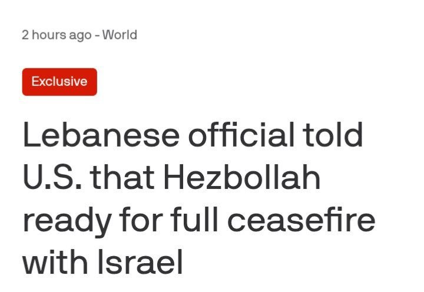

اکسیوس: یک مقام لبنانی به آمریکا گفت که حزب‌الله آماده آتش‌بس کامل با اسرائیل است!

به گزارش از اکسیوس، علی حمدان، مشاور ارشد نبیه بری، رئیس پارلمان لبنان، به اکسیوس گفت که او به دولت ترامپ گفته است که حزب‌الله آماده آتش‌بس کامل و فوری با اسرائیل است و متعهد شده است که اجرای آن را تضمین کند.

به گفته یک منبع آگاه، مقامات آمریکایی به گفته‌اند که فکر نمی‌کنند نتانیاهو موافقت کند. یک مقام اسرائیلی تأیید کرد که حزب‌الله آمادگی خود را برای آتش‌بس کامل حتی بدون درخواست عقب‌نشینی فوری اسرائیل اعلام کرده است.

📝 Amir

📌 @persian_trend_official
پرشین ترند | متفاوت‌ترین کانال نظامی

## Persian_Trend_Official — post 15448

  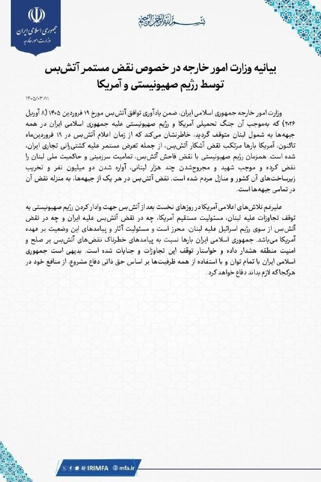

وزارت امور خارجه جمهوری اسلامی: مسئولیت مستقیم آمریکا، چه در نقض آتش‌بس علیه ایران و چه در نقض آتش‌بس از سوی رژیم اسرائیل علیه لبنان، محرز است و مسئولیت آثار و پیامدهای این وضعیت برعهده آمریکاست.

ایران از منافع خود، در هر کجا که لازم بداند دفاع خواهد کرد.

📝 Amir

📌 @persian_trend_official
پرشین ترند | متفاوت‌ترین کانال نظامی

## Persian_Trend_Official — post 15447

  

آمریکا حمله اسرائیل به ضاحیه را متوقف کرد!

کان نیوز: علیرغم تهدیدات صریح نتانیاهو، تدارکات اسرائیل برای حمله به منطقه ضاحیه بیروت در ساعات اخیر پس از مداخله ایالات متحده به تأخیر افتاد.

📝 Amir

📌 @persian_trend_official
پرشین ترند | متفاوت‌ترین کانال نظامی

## Persian_Trend_Official — post 15446

https://youtube.com/live/bKStpJNvOXI?feature=share

## Persian_Trend_Official — post 15445

  <a href="telegram/content/Persian_Trend_Official_15445_1780339321.mp4" target="_blank">🎬 Download video</a>

رسانه نیروی هوافضا سپاه ویدیویی از لحظه سرنگونی پهپاد MQ-1 امریکایی در تاریخ بامداد 10 خرداد 1405 منتشر کرد.

📝 Amir

📌 @persian_trend_official
پرشین ترند | متفاوت‌ترین کانال نظامی

## Persian_Trend_Official — post 15444

گفتگوی تلفنی عراقچی با عاصم منیر و وزیر خارجه پاکستان

عراقچی در تماس‌های تلفنی جداگانه با محمد اسحق‌دار معاون نخست وزیر و وزیر امور خارجه پاکستان و فیلد مارشال عاصم منیر فرمانده ارتش پاکستان در خصوص تحولات منطقه‌ای و روندهای مرتبط با آتش‌بس گفتگو و رایزنی کرد.

📝 Amir

📌 @persian_trend_official
پرشین ترند | متفاوت‌ترین کانال نظامی

## Persian_Trend_Official — post 15443

  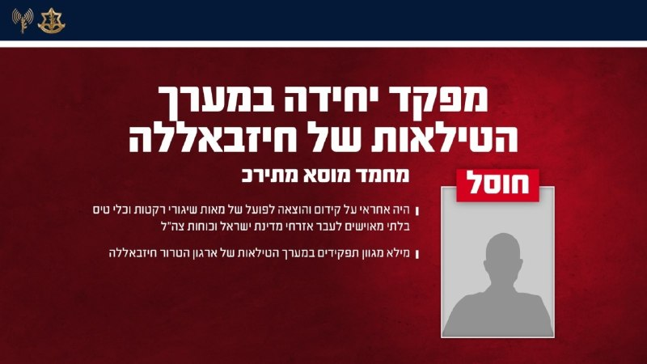

سخنگوی ارتش اسرائیل: ارتش اسرائیل فرمانده یک واحد در سامانه موشکی حزب‌الله را از بین برد.

نیروی هوایی، تحت فرماندهی تیپ گولانی، دیروز (یکشنبه) در منطقه نبطیه حمله کرد و محمد موسی ماترک، فرمانده یک واحد در سامانه موشکی حزب‌الله را از بین برد.

در طول سال‌ها، ماترک سمت‌های مختلفی در سامانه موشکی حزب‌الله داشت. ماترک مسئول ترویج و اجرای صدها پرتاب موشک و پهپاد علیه شهروندان اسرائیلی و نیروهای ارتش اسرائیل، از جمله تیپ گولانی فعال در منطقه بوفورت بود که به نیروی هوایی دستور حذف او را داد.

📝 Amir

📌 @persian_trend_official
پرشین ترند | متفاوت‌ترین کانال نظامی

## Persian_Trend_Official — post 15442

  <a href="telegram/content/Persian_Trend_Official_15442_1780339323.webm" target="_blank">🎬 Download video</a>

محسن رضایی مشاور نظامی رهبر جمهوری اسلامی: تنگه هرمز تحت مدیریت ایران است. اجازه تداوم محاصره دریایی را نخواهیم داد و تشدید تنش در لبنان هم تحمل نخواهد شد. صبر نیروهای مسلح جمهوری اسلامی ایران حدی دارد.

📝 Amir

📌 @persian_trend_official
پرشین ترند | متفاوت‌ترین کانال نظامی

## Persian_Trend_Official — post 15441

  <a href="telegram/content/Persian_Trend_Official_15441_1780339324.webm" target="_blank">🎬 Download video</a>

قرارگاه مرکزی خاتم‌الانبیا اسرائیل را تهدید به حمله موشکی کرد!

سرلشکر خلبان علی عبداللهی، فرمانده قرارگاه‌ خاتم الانبیا: نتانیاهو در ادامه شرارت‌های خود در منطقه، ضاحیه و بیروت را تهدید به بمباران نموده و برای ساکنان آن هشدار تخلیه اعلام کرده است.

با توجه به نقض مکرر آتش بس توسط رژیم، در صورت عملی شدن این تهدید به ساکنان بخش‌های شمالی و شهرک‌های نظامی در سرزمین‌های اشغالی هشدار می‌دهیم اگر نمی‌خواهند آسیب ببینند منطقه را ترک نمایند.

📌 @persian_trend_official
پرشین ترند | متفاوت‌ترین کانال نظامی

## Persian_Trend_Official — post 15440

  

📷 Photo

## Persian_Trend_Official — post 15438

  <a href="telegram/content/Persian_Trend_Official_15438_1780339325.mp4" target="_blank">🎬 Download video</a>

یک نفتکش با پرچم پاناما که در آب‌های سرزمینی عراق فعالیت می‌کرد، در نزدیکی ام قصر مورد اصابت قرار گرفت.

به گفته UKMTO، یک پرتابه ناشناس به سمت راست کشتی برخورد کرد و باعث انفجار بزرگی شد.

📌 @persian_trend_official
پرشین ترند | متفاوت‌ترین کانال نظامی

## Persian_Trend_Official — post 15437

  <a href="telegram/content/Persian_Trend_Official_15437_1780339326.webm" target="_blank">🎬 Download video</a>

🚨 تراست VPN دوباره قیمت سرویس‌هاش رو کاهش داده و پلن‌های جدیدش واقعاً ارزش بررسی دارن. 👌

فرقی نمی‌کنه روی نت ملی باشین یا نت بین‌الملل، برای هر شرایطی سرویس مناسب دارن:

✅ سرور مناسب نت ملی
✅ سرور اقتصادی مناسب نت بین‌الملل

اگر قصد خرید یا تمدید VPN دارین، پیشنهاد می‌کنم حتماً یه پیام به پشتیبانی‌شون بدین و تعرفه‌های جدید رو استعلام بگیرین.
👇👇

@trusstvpnn_admin
@trusstvpnn_admin
@trusstvpnn_admin

## Persian_Trend_Official — post 15436

احتمالا نیاز به یک لایو اضطراری داریم
اوضاع در حال متشنج شدن هست ...

اگر موافق هستید ری اکشن بزارید

## Persian_Trend_Official — post 15435

  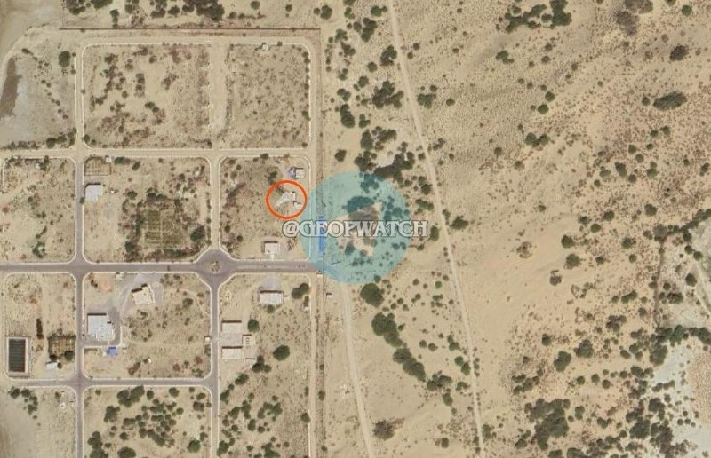

برج مخابراتی‌ای که شب گذشته توسط نیروهای آمریکایی در نزدیکی سیریک در استان هرمزگان، جنوب ایران، هدف قرار گرفت.
📍 مختصات:
26°33'51.4"N 57°05'15.8"E

📌 @persian_trend_official
پرشین ترند | متفاوت‌ترین کانال نظامی

## Persian_Trend_Official — post 15434

  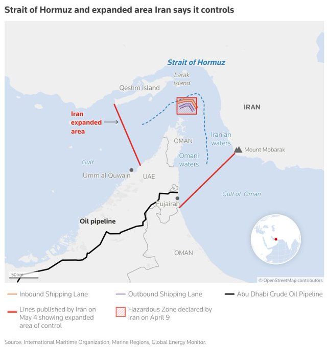

به گزارش خبرگزاری تسنیم، ایران با استناد به نقض آتش‌بس از سوی اسرائیل در لبنان، تمام گفت‌وگوها و تبادل متن از طریق میانجی‌ها را متوقف کرده است.

مذاکره‌کنندگان ایرانی پیش‌تر موضوع لبنان را به‌عنوان یکی از پیش‌شرط‌های هرگونه توافق مطرح کرده بودند. اکنون با نقض آتش‌بس در همه جبهه‌ها، از جمله لبنان، ایران مذاکرات را به‌طور کامل تعلیق کرده است.

ایران خواستار توقف فوری عملیات اسرائیل در غزه و لبنان و همچنین عقب‌نشینی کامل اسرائیل از مناطق اشغالی لبنان شده است؛ شرطی که تهران می‌گوید پیش از ازسرگیری هرگونه گفت‌وگو باید اجرا شود.

همزمان، گزارش‌ها حاکی است که محور مقاومت و ایران تصمیم گرفته‌اند تنگه هرمز را به‌طور کامل مسدود کرده و جبهه‌های بیشتری را فعال کنند؛ از جمله تنگه باب‌المندب.

📌 @persian_trend_official
پرشین ترند | متفاوت‌ترین کانال نظامی

## RadioFarda — post 157787

  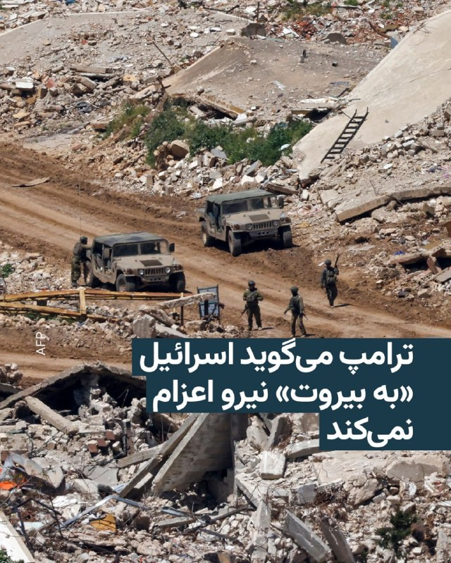

🔸در پی انتشار خبر تماس تلفنی دونالد ترامپ با بنیامین نتانیاهو، رئیس جمهور آمریکا در شبکه اجتماعی خود نوشت که نیروهای ارتش اسرائیل به بیروت نخواهند رفت.

🔸او گفت: «تماسی بسیار مفید با بی‌بی نتانیاهو، نخست وزیر اسرائیل، داشتم و دیگر نیرویی به بیروت نخواهد رفت، و هر نیرویی هم که در راه بودند بازگردانده می‌شوند.»

🔸ترامپ در ادامه نوشت که «از طریق نمایندگان عالی تماسی بسیار خوب با حزب‌الله داشته» و این گروه هم موافقت کرده است که دست از شلیک بردارد.

🔸صبح دوشنبه وب‌سایت آکسیوس به نقل از منابع خود گزارش داده بود که تلاش جدید آمریکا برای آتش‌بس میان اسرائیل و لبنان «شکست» خورده است.

@RadioFarda

## RadioFarda — post 157786

وقوع «دومین انفجار» در کشتی کانتینربر در نزدیکی بندر ام قصر عراق

🔸خبرگزاری رویترز روز دوشنبه از وقوع «دومین انفجار» در یک فروند کشتی کانتینربر در نزدیکی بندر ام قصر عراق خبر داد.

🔸بر اساس این خبر به نقل از منابع امنیتی عراق، این انفجار در فاصله ۴۰ مایل دریایی در جنوب شرقی بندر ام قصر در خلیج فارس رخ داده و باعث بروز آتش‌سوزی شده است.

🔸ساعاتی پیشتر اداره دریانوردی بریتانیا در شبکه ایکس از وقوع «انفجاری بزرگ» در این کشتی کانتینربر در پی اصابت «پرتابه‌ای ناشناس» خبر داده بود.

🔸هنوز خبری درباره مجروحان احتمالی این حادثه گزارش نشده است.

@RadioFarda

## RadioFarda — post 157785

بیانیه وزارت خارجه ایران: مسئولیت آثار و پیامدهای نقض آتش‌بس بر عهده آمریکا است

🔸در ادامه واکنش تند حکومت ایران به حملات اسرائیل در جنوب لبنان، وزارت خارجه جمهوری اسلامی در بیانیه‌ای هشدار داد که مسئولیت «آثار و پیامدهای نقض آتس‌بس» را بر عهده ایالات متحده می‌داند.

🔸در این بیانیه آمده است: «مسئولیت مستقیم آمریکا، چه در نقض آتش‌بس علیه ایران و چه در نقض آتش‌بس از سوی رژیم اسرائیل علیه لبنان، محرز است و مسئولیت آثار و پیامدهای این وضعیت برعهده آمریکاست.»

🔸همزمان رسانه‌ها در اسرائیل از جمله شبکه کان خبر می‌دهند که «در پی مداخله» آمریکا، ارتش اسرائیل حمله خود به منطقه ضاحیه در جنوب لبنان را عقب انداخته است.

🔸این خبر پس از آن منتشر شده است که همین رسانه‌ها از گفت‌وگوی تلفنی طولانی دونالد ترامپ با بنیامین نتانیاهو، نخست وزیر اسرائیل، خبر دادند.

🔸ساعتی پیشتر نخست‌وزیر اسرائیل به ارتش دستور داده بود که اهدافی را در حومه جنوبی بیروت هدف قرار دهد.

@RadioFarda

## RadioFarda — post 157784

  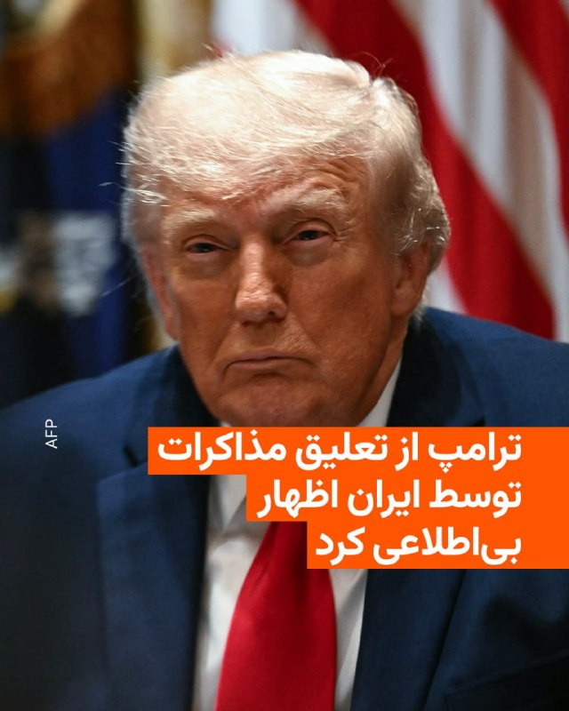

🔸شبکه ان‌بی‌سی روز دوشنبه خبر داد که رئیس جمهور آمریکا از تعلیق مذاکرات یا تلاش برای این کار توسط جمهوری اسلامی اظهار بی‌اطلاعی کرده است.

🔸دونالد ترامپ به خبرنگار این شبکه آمریکایی گفت که از ایران چنین خبری نشنیده است.

🔸رسانه‌های حکومتی در ایران عصر دوشنبه، ۱۱ خردادماه، نوشتند که جمهوری اسلامی «تبادل پیام با آمریکا» را تا زمانی که اسرائیل حملاتش به لبنان را متوقف نکرده قطع می‌کند.

🔸به نوشته خبرگزاری تسنیم، «مسئولان و مذاکره‌کنندگان ایرانی» خواستار توقف فوری حملات اسرائیل شده «و تا زمانی که نظر ایران و مقاومت در این زمینه تأمین نشود، گفت‌وگویی در کار نخواهد بود».

🔸در واکنش به این خبر، ترامپ گفت: «اگر راستش را بخواهید، به نظر من ما زیادی در این باره حرف می‌زنیم. به نظرم، [به جای این کار] سکوت کردن خیلی بهتر خواهد بود.»

🔸او در ادامه گفت: «البته معنایش این نیست که همین الان می‌رویم و شروع می‌کنیم به بمب ریختن، فقط ساکت می‌مانیم، محاصره را هم حفظ می‌کنیم.»

@RadioFarda

## RadioFarda — post 157782

🔸رسانه‌های ایران از افزایش حجم ذخایر آب سد امیرکبیر (سد کرج) و رسیدن میزان پرشدگی مخزن این سد به حدود ۷۰ درصد خبر می‌دهند.

🔸بر اساس تصاویر منتشرشده، حجم آب ذخیره‌شده در این سد نسبت به مدت مشابه سال گذشته افزایش چشمگیری داشته است؛ موضوعی که پس از چند سال خشکسالی و کاهش ذخایر آبی، نشانه‌ای نسبتاً امیدوارکننده برای منابع آب تهران و البرز ارزیابی می‌شود.

🔸با این حال، کارشناسان تأکید می‌کنند بهبود وضعیت سد کرج به معنای پایان بحران آب نیست و وضعیت سدهایی مانند لار، لتیان و ماملو همچنان نگران‌کننده است.

@RadioFarda

## RadioFarda — post 157781

تهدید به «گشودن جبهه‌های جدید» از طرف سپاه در ادامه واکنش به حمله اسرائیل به لبنان

🔸همزمان با هشدار فرمانده قرارگاه خاتم‌الانبیاء‌ سپاه، سازمان اطلاعات سپاه پاسداران نیز در پیامی که به نوشته خبرگزاری فرانسه در تلویزیون حکومتی ایران نیز قرائت شده تهدید کرد که «جبهه‌هایی جدید» خواهد گشود.

🔸حساب سازمان اطلاعات سپاه در شبکه ایکس نوشت:‌ «ایران عبور از خط قرمزها در لبنان و غزه را به معنای جنگ مستقیم و تحمیل هزینه بر امنیت ملی خود و مقاومت اسلامی فرض کرده و متقابلا عزم خود را برای عملیات دفاعی با انجام اقدامات معناشکن و گشودن جبهه‌های جدید به علاوه حفظ معادله تنگه هرمز قرار می‌دهد.»

🔸جمهوری اسلامی از همان ابتدا پایان جنگ در لبنان را از جمله شرایط خود برای کنار آمدن با ایالات متحده عنوان کرده است.

🔸این در حالی است که اسرائیل و گروه حزب‌الله لبنان تحت فشار آمریکا به آتش‌بس رضایت داده، اما به‌ویژه در روزهای اخیر هر یک دیگری را به نقض این آتش‌بس متهم کرده است.

🔸تهدید به «حفظ معادله تنگه هرمز» یعنی بسته ماندن این تنگه استراتژیک در حالی است که ایران و آمریکا از طریق پاکستان و میانجی‌های دیگر در حال تلاش برای نهایی کردن یک تفاهم‌نامه در این باره هستند.

@RadioFarda

## RadioFarda — post 157780

  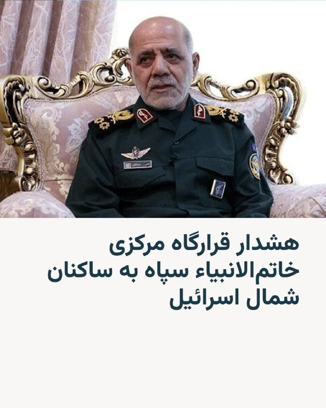

هشدار قرارگاه مرکزی خاتم‌الانبیاء سپاه به ساکنان شمال اسرائیل

🔸در ادامه واکنش‌ مقامات جمهوری اسلامی به حملات مکرر اسرائیل به جنوب لبنان، فرمانده قرارگاه خاتم‌الانبیاء سپاه پاسداران روز دوشنبه به ساکنان شمال اسرائیل هشدار تخلیه داد.

🔸رسانه‌های حکومتی به نقل از علی عبداللهی، فرمانده این قرارگاه، نوشتند: «نتانیاهو در ادامه شرارت‌های خود در منطقه، ضاحیه و بیروت را تهدید به بمباران نموده و برای ساکنان آن هشدار تخلیه اعلام کرده است.»

🔸این فرمانده سپاه در ادامه تهدید کرده که در صورت بمباران شدن این مناطق در لبنان، ایران نیز به شمال اسرائیل حمله خواهد کرد.

🔸عبداللهی گفت: «در صورت عملی شدن این تهدید به ساکنان بخش‌های شمالی و شهرک‌های نظامی در سرزمین‌های اشغالی هشدار می‌دهیم اگر نمی‌خواهند آسیب ببینند منطقه را ترک نمایند.»

@RadioFarda

## RadioFarda — post 157779

  <a href="telegram/content/RadioFarda_157779_1780339329.mp4" target="_blank">🎬 Download video</a>

🔸تصویری از یک قلاده پلنگ ایرانی در پارک ملی گلستان، در جریان گشت و پایش محیطی در اردیبهشت‌ماه ۱۴۰۵ به ثبت رسید.

🔸این ویدیو که توسط جعفر پناه‌پور، از محیط‌بانان و پایشگران محیط زیست ثبت شده، حضور این گونه ارزشمند را در میان پوشش گیاهی منطقه نشان می‌دهد.

🔸پارک ملی گلستان به عنوان یکی از مهم‌ترین زیستگاه‌های حیات‌وحش ایران، نقش کلیدی در حفاظت از پلنگ ایرانی دارد؛ گونه‌ای که در فهرست جانوران در معرض خطر قرار گرفته است.

🔸پارک ملی گلستان با برخورداری از تنوع زیستی کم‌نظیر، یکی از مهم‌ترین مناطق حفاظت‌شده کشور برای بقای پلنگ ایرانی به شمار می‌رود.

@RadioFarda

## RadioFarda — post 157778

🔸رسانه‌های ایران ۱۱ خردادماه، از «نقض آتش‌بس» در همه جبهه‌ها از جمله لبنان خبر دادند
و نوشتند که تیم مذاکره‌کننده ایرانی گفتگوها و تبادل متون از طریق میانجی را متوقف می‌کند.

🔸مقامات رسمی ایران هنوز واکنشی به این خبر نشان ندادند.

🔸پیشتر سخنگوی وزارت خارجه بر «حفظ آتش‌بس» در لبنان تاکید کرده بود.

🔸همزمان نخست‌وزیر اسرائیل روز دوشنبه دستور حمله به جنوب بیروت را صادر کرد.

🔸وب‌سایت آکسیوس به نقل از منابع خود گزارش داده که تلاش جدید آمریکا برای آتش‌بس میان اسرائیل و لبنان «شکست» خورده است.

@RadioFarda

## RadioFarda — post 157777

  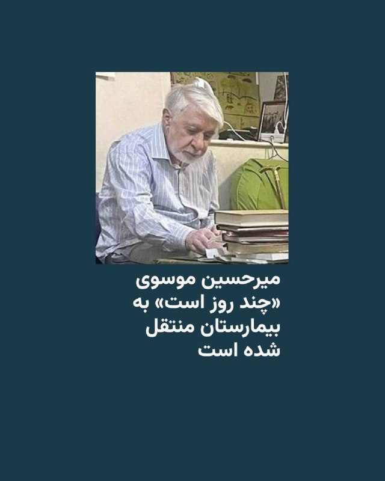

🔸در پی انتشار اخباری از مریض‌احوالی میرحسین موسوی، از رهبران جنبش سبز ایران، اردشیر امیرارجمند، مشاور او، تأیید کرد که آقای موسوی «چند روزی است» به بیمارستان منتقل شده است.

🔸میرحسین موسوی به همراه همسرش زهرا رهنورد، دیگر رهبر جنبش سبز، هم‌چنان در حصر به سر می‌برد.

🔸امیرارجمند که در فرانسه اقامت دارد روز دوشنبه به رادیوفردا گفت که خانه این دو فعال سیاسی دیگر «قابل سکونت نیست»، محل نگهداری آن‌ها پس از انتقال‌شان «نامعلوم» است، و شرایط حصر «دشوارتر» شده است.

🔸محل سکونت این دو در حملات بی‌امان اسرائیل به تهران به‌شدت آسیب دیده است.

@RadioFarda

## RadioFarda — post 157776

تیراندازی در دانشگاه پزشکی قزوین دو کشته برجا گذاشت

🔸رسانه‌ها در ایران از وقوع حادثه‌ای مرگبار در قزوین خبر می‌دهند که صبح روز دوشنبه اتفاق افتاده و جان دو نفر را گرفته است.

🔸به گفته حمیدرضا قافله‌باشی، رئیس دانشگاه علوم پزشکی قزوین، در جریان تیراندازی که «به دلیل خصومت خانوادگی اتفاق افتاده» دو دانشجوی این دانشگاه «که زن و شوهر بودند» جان خود را از دست داده‌اند.

🔸بر اساس شرح حادثه از زبان برخی از کاربران شبکه‌های اجتماعی، صبح روز دوشنبه دانشجوی مرد وارد دانشکده دندانپزشکی قزوین می‌شود و «همسر خودش را با سلاح کمری به قتل می‌رساند و پس از ارتکاب جرم به زندگی خود پایان می‌دهد».

🔸در سال‌های اخیر به نظر می‌رسد دسترسی مردم در ایران به سلاح گرم بسیار آسان‌تر شده، و در شبکه اجتماعی تلگرام حتی آگهی فروش اسلحه هم می‌توان دید.

@RadioFarda

## RadioFarda — post 157775

  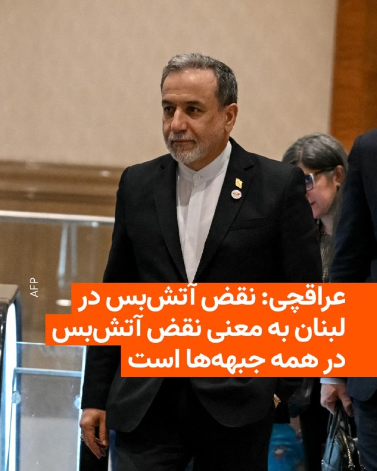

🔸عباس عراقچی، وزیر خارجه ایران، در شبکه ایکس نوشت: «آتش‌بس میان ایران و آمریکا، بدون هیچ ابهامی، آتش‌بسی در تمام جبهه‌ها، از جمله لبنان، است.»

🔸او در این پیام، نقض آتش‌بس در هر جبهه‌ای را «به معنای نقض آتش‌بس در تمامی جبهه‌ها» عنوان کرده است.

🔸عراقچی آمریکا و اسرائیل را «مسئول پیامدهای هرگونه نقض این آتش‌بس» معرفی کرده است.

🔸ایران بارها این موضوع را اعلام کرده که آتش‌بس میان طرفین منازعه در جنگ ایران، باید سایر جبهه‌ها به‌ویژه جبهه لبنان را هم در بر بگیرد.

🔸ابوالفضل شکارچی، سخنگوی نیروهای مسلح جمهوری اسلامی نیز به اسرائیل هشدار داده که «تداوم جنایات در لبنان برای نیروهای مسلح ایران قابل تحمل نخواهد بود.»

🔸در تازه‌ترین بی‌توجهی به این درخواست جمهوری اسلامی، بنیامین نتانیاهو، نخست‌وزیر اسرائیل، به ارتش دستور داده اهدافی را در حومه جنوبی بیروت هدف قرار دهد.

@RadioFarda

## IranianMinds — post 21205

🔴 وزیر امنیت ملی اسرائیل بن گویر:

جناب نخست‌وزیر،

شما گفتید که یک نخست‌وزیر قوی به رئیس‌جمهور آمریکا «بله» می‌گوید وقتی ممکن است و «نه» وقتی لازم است.

اکنون زمان گفتن «نه» به دوست‌مان، رئیس‌جمهور ترامپ است.

اکنون زمان انجام آنچه لازم و ضروری است برای ضربه زدن به حزب‌الله، آزاد کردن دستان رزمندگان ما و بازگرداندن امنیت به شمال است.

@IranianMinds

## IranianMinds — post 21204

دقایقی پیش سپاه در کرج یک آزمایش موشکی انجام داد

@IranianMinds

## IranianMinds — post 21203

  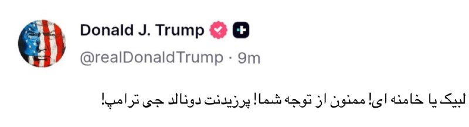

🔴فوری
توییت جدید ترامپ

@IranianMinds

## IranianMinds — post 21202

  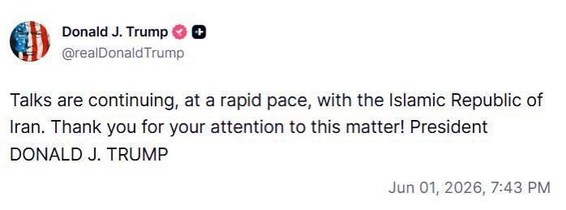

🔴پست ترامپ:

گفت‌وگوها با جمهوری اسلامی ایران با سرعتی بالا ادامه دارد.

از توجه شما به این موضوع سپاسگزارم.
رئیس جمهور دونالد جی. ترامپ.

این بار گفت جمهوری اسلامی ایران .

@IranianMinds

## IranianMinds — post 21201

نمودار محبوبیت ترامپ تو ایران درحال سقوط آزاده

@IranianMinds

## IranianMinds — post 21200

🔴 فوری از پست جدید ترامپ: من یک تماس بسیار سازنده با نخست‌وزیر بی‌بی نتانیاهو، از اسرائیل، داشتم و هیچ نیرویی به بیروت اعزام نخواهد شد، و هر نیرویی که در راه بود، قبلاً بازگردانده شده. همچنین، از طریق نمایندگان بلندپایه، تماس بسیار خوبی با حزب‌الله داشتم…

## IranianMinds — post 21199

  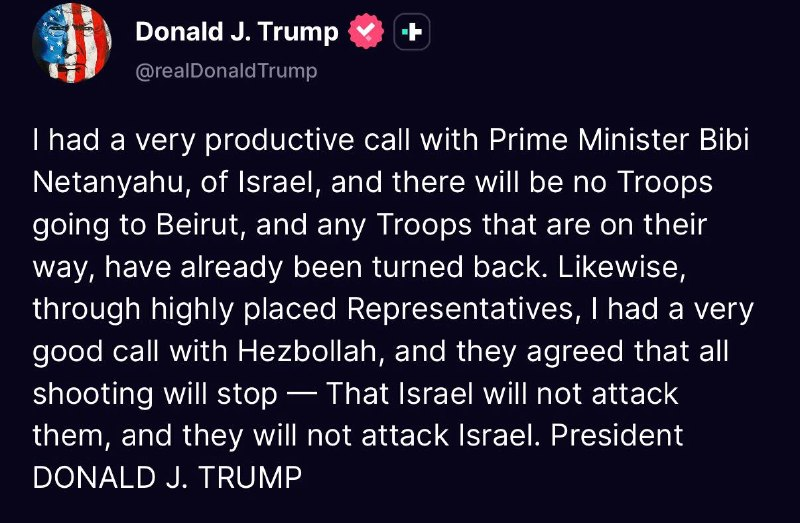

🔴 فوری از پست جدید ترامپ:

من یک تماس بسیار سازنده با نخست‌وزیر بی‌بی نتانیاهو، از اسرائیل، داشتم و هیچ نیرویی به بیروت اعزام نخواهد شد، و هر نیرویی که در راه بود، قبلاً بازگردانده شده. همچنین، از طریق نمایندگان بلندپایه، تماس بسیار خوبی با حزب‌الله داشتم و آنها موافقت کردن که تمام تیراندازی‌ها متوقف بشه؛ اسرائیل به آنها حمله نخواهد کرد و آنها هم به اسرائیل حمله نخواهند کرد.

@IranianMinds

## IranianMinds — post 21198

🔴 رسانه i24News :

آمریکا حمله به بیروت رو متوقف کرد

@IranianMinds

## IranianMinds — post 21197

  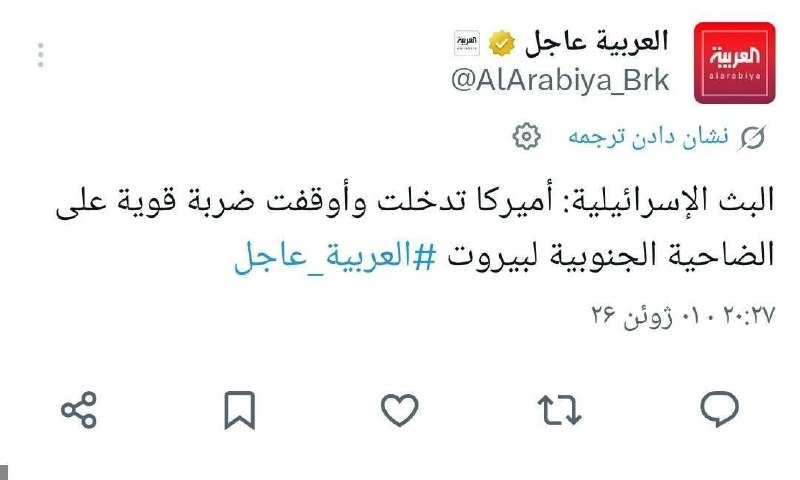

احتمالا درباره حمله اسرائیل به بیروت و همچنین اعلام خارج شدن از مذاکرات توسط رژیم جمهوری اسلامی قراره صحبت بکنن امیدوارم ترامپ کصنمک بازیش گل نکنه و به نتانیاهو نگه به لبنان حمله نکن و آتش بس رو قبول کن تهشم بیاد بگه که من مرد صلح ام و یک جنگ دیگه هم پایان…

## IranianMinds — post 21196

🔴ترامپ به ان‌بی‌سی:

از ایران مفادی بر اینکه مذاکرات را به تعلیق در آورده است نشنیدم.

@IranianMinds

## IranianMinds — post 21195

🔴 ترامپ و نتانیاهو درحال گفتگو به صورت تلفنی هستند @IranianMinds

## IranianMinds — post 21194

🔴ایزد‌خواه، نماینده مجلس:

راه قدس از ابوظبی می‌گذرد، باید به امارات حمله زمینی کنیم.

تا دیروز می‌گفتن از کربلا می‌گذرد😂😂

@IranianMinds

## IranianMinds — post 21193

🔴 ترامپ و نتانیاهو درحال گفتگو به صورت تلفنی هستند

@IranianMinds

## IranianMinds — post 21192

🔴 رییس پارلمان لبنان:

حزب‌الله آماده پذیرش یک آتش‌بس کامل و فوری با اسرائیله.

@IranianMinds

## IranianMinds — post 21191

  

🔹اگر میخوای قبل جام جهانی با بازی های دوستانه مثل رضا کینگ کونگ پول دربیاری همین الان وارد کانال شو 
👇
👇

https://t.me/+YF28GUBRSZkwYTlk
https://t.me/+YF28GUBRSZkwYTlk

‼️با درآمد دلاری پیشبینی های این کانال شرایط بهتر میشه g11🔥

## IranianMinds — post 21190

  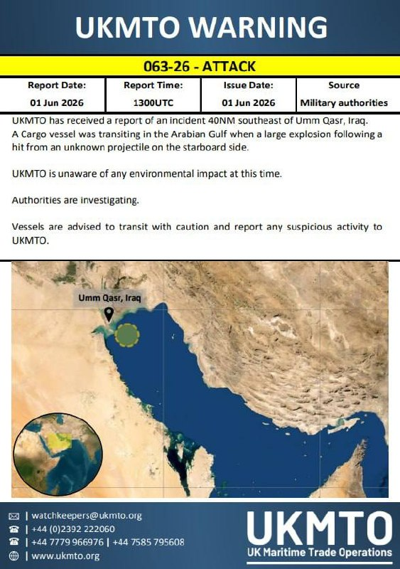

🔴سازمان حمل‌ونقل دریایی بریتانیا(UKMTO) گزارش داد که یک کشتی باری در خلیج‌فارس در حال عبور بوده، در ۴۰ مایلی دریای جنوب شرقی ام قصر عراق مورد حمله قرار گرفته است.
همینطور یک انفجار عظیمی پس از اصابت یک پرتابه ناشناس به سمت راست کشتی رخ داده است.

@IranianMinds

## IranianMinds — post 21189

  <a href="telegram/content/IranianMinds_21189_1780339334.mp4" target="_blank">🎬 Download video</a>

🔴فرودگاه بن گوریون در اسرائیل، تل‌آویو، انبوه هوایپماهای نظامی آمریکا.

@IranianMinds

## IranianMinds — post 21188

🔴فوری

جمهوری اسلامی مذاکرات با آمریکا را متوقف کرد به دلیل حمله های گسترده ی آمریکا به بیروت

و گفته که به زودی به اسرائیل پاسخ میدیم

+ هرکی نده

@IranianMinds

## IranianMinds — post 21187

🔴بی‌ناموس حروم‌زاده کثیف، ما می‌دونیم شماها دشمن ایران هستین.

@IranianMinds

## BBCPersian — post 282591

🔻ترامپ می‌گوید اسرائیل و حزب‌الله به اوقول داده‌اند که در گیری‌ها را متوقف کنند

دونالد ترامپ، رئیس جمهور آمریکا، در پستی در شبکه اجتماعی خود، سوشال تروث، نوشت: «گفت‌وگویی بسیار سازنده با نخست‌وزیر اسرائیل داشتم و هیچ نیرویی به بیروت اعزام نخواهد شد. همچنین هر نیرویی که در مسیر اعزام بود، بازگشته است.»

او همچنین اضافه کرد: «از طریق نمایندگان عالی‌رتبه، گفت‌وگوی بسیار خوبی با حزب‌الله داشتم و آن‌ها موافقت کردند که تمامی تیراندازی متوقف شود؛ اسرائیل به آن‌ها حمله نخواهد کرد و آن‌ها نیز به اسرائیل حمله نخواهند کرد.»

آقای ترامپ در پستی دیگری نوشت: «گفتگوها با جمهوری اسلامی ایران بسرعت در جریان است.»

ساعتی پیش خبرگزاری تسنیم گفت که اطلاع یافته است «با عنایت به اینکه لبنان جزء پیش‌شرط‌های آتش‌بس بوده است و اینک این آتش‌بس در همه جبهه‌ها از جمله لبنان نقض شده است» تیم مذاکره‌کننده ایران «گفتگوها و تبادل متون از طریق میانجی را متوقف می‌کند.»

https://bbc.in/4vjnvWG
@BBCPersian

## BBCPersian — post 282590

  <a href="https://t.me/bbcpersian/282590" target="_blank">📎 Download file</a>

پادکست جام جهان‌نما، دوشنبه ۱۱ خرداد ۱۴۰۵

این برنامه رادیویی را می‌توانید هرشب ساعت ۲۰ به وقت ایران، روی موج متوسط ۷۰۲ کیلوهرتز و موج کوتاه ۹۴۶۵ کیلوهرتز بشنوید.

تکرار برنامه را هم می‌توانید ساعت ۲۱:۳۰ روی موج متوسط ۷۰۲ کیلوهرتز و موج کوتاه ۵۳۹۵ کیلوهرتز گوش کنید.

@BBCPersian

## BBCPersian — post 282588

🔻اینترنت بین‌الملل در ایران، «۶۰ درصد» پیش از اعتراضات دی است

با بازگشت نسبی دسترسی به اینترنت جهانی در ایران از روز ۵ خرداد، ترافیک اینترنت تا امروز، دوشنبه ۱۱ خرداد، در حدود ۶۰ درصد سطح پیش از اعتراضات دی ماه باقی مانده است.

داده‌های شرکت کنتیک در کالیفرنیا که در زمینه اندازه‌گیری ترافیک اینترنت فعالیت می‌کند حاکی است دسترسی به اینترنت بین‌المللی در ایران همچون دوره کوتاه بازگشت اینترنت بعد از اعتراضات، با اختلال همراه است.

کاربران اینترنت در ایران با محدودیت‌های بسیاری مواجهند. علاوه بر بی‌ثباتی اینترنت، بسیاری از وبسایت‌ها یا خدمات فیلتر هستند و بدون وی‌پی‌ان در دسترس نیستند.

https://bbc.in/4vjnvWG
@BBCPersian

## BBCPersian — post 282587

  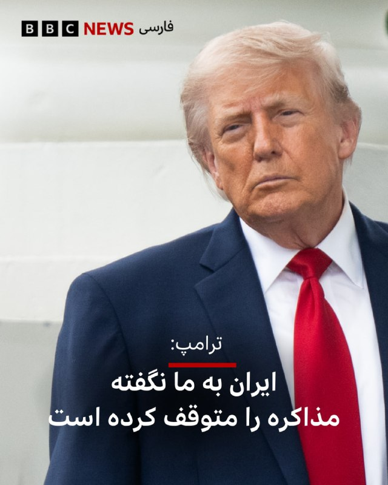

🔻دونالد ترامپ، رئیس‌جمهور آمریکا، گفت ایران اطلاع نداده است که تبادل پیام با آمریکا را متوقف کرده است.

رئیس‌جمهور آمریکا در گفت‌وگوی تلفنی به شبکه خبری ان‌بی‌سی گفت ایرانی‌ها در مذاکره بهتر از جنگ هستند «اما ما را از این موضوع مطلع نکرده‌اند.»

رئیس‌جمهور آمریکا گفت: «این به آن معنا نیست که ما شروع کنیم به بمباران آنجا» اما «محاصره را ادامه می‌دهیم.»

او همچنین گفت: «اگر راستش را بخواهید فکر می‌کنم زیاد حرف زده‌ایم. فکر می‌کنم سکوت کردن خیلی خوب است و می‌تواند مدت طولانی ادامه داشته باشد.»

ساعتی پیش خبرگزاری تسنیم گفت که اطلاع یافته است «با عنایت به اینکه لبنان جزء پیش‌شرط‌های آتش‌بس بوده است و اینک این آتش‌بس در همه جبهه‌ها از جمله لبنان نقض شده است» تیم مذاکره‌کننده ایران «گفتگوها و تبادل متون از طریق میانجی را متوقف می‌کند.»

📷Getty Images
https://bbc.in/4vjnvWG
@BBCPersian

## BBCPersian — post 282586

🔻هشدار قرارگاه مرکزی خاتم‌النبیا به ساکنان شمال اسرائیل

قرارگاه مرکزی خاتم‌النبیا به ساکنان بخش‌های شمالی و شهرک‌های نظامی اسرائیل هشدار داد در صورت بمباران ضاحیه و بیروت «اگر نمی‌خواهند آسیب ببینند منطقه را ترک نمایند.»

بنیامین نتانیاهو امروز در بیانیه‌ای گفت دستور حمله به اهدافی در ضاحیه در جنوب بیروت را صادر کرده است.

ضاحیه پایگاه قدرت حزب‌الله در پایتخت لبنان است.

ساعتی پیش خبرگزاری تسنیم گفت که اطلاع یافته است «با عنایت به اینکه لبنان جزء پیش‌شرط‌های آتش‌بس بوده است و اینک این آتش‌بس در همه جبهه‌ها از جمله لبنان نقض شده است» تیم مذاکره‌کننده ایران «گفتگوها و تبادل متون از طریق میانجی را متوقف می‌کند.»

در همین حال گزارش شده است که ایران به آخرین پیشنهاد آمریکا هنوز پاسخی نداده است.

به گزارش خبرگزاری فارس، سعید آجرلو، عضو تیم رسانه‌ای هیئت مذاکره‌کننده، گفت: «پیشنهاد ارسالی جدید آمریکا در کمیته شش نفره و شورای عالی امنیت ملی در حال بررسی است. از طریق میانجی‌ها متنی به ایران ارسال شده ولی هنوز پاسخی به پیشنهاد جدید آمریکا نداده‌ایم.»

آقای آجرلو گفت: «رفع نگرانی های ایران، شرط اصلی پاسخ به این پیشنهاد است. ما به دلیل اینکه نگرانی‌هایی داریم هنوز پاسخی به متن جدید آمریکا ارسال نکردیم.»

@BBCPersian

## BBCPersian — post 282585

یاسمین شاه‌کرمی، خواهر امیرمحمد، معترض ۱۴ ساله چند روز پیش بعد از وصل شدن نسبی اینترنت در ایران ویدیویی از لحظه شناسایی جسد برادرش ۶۰ روز بعد از اعتراضات دی ماه منتشر کرد.

امیرمحمد شاه‌کرمی در جریان اعتراضات دی ماه ۱۴۰۴ و کشتار بی‌سابقه معترضان به خانه بازنگشت. خواهر امیرمحمد می‌گوید پیگیری‌های خانواده بی‌نتیجه بود تا اینکه روز ۲۰ دی گوشی امیرمحمد روشن می‌شود و ماموران اطلاعات به خانواده اطلاع می‌دهند که او زنده و در بازداشت است.

براساس گفته‌های یاسمین شاه‌کرمی، در پیگیری‌های خانواده از طریق آموزش و پروزش، وضعیت امیرمحمد محرمانه اعلام شده بود. در حالی که خانواده امکان برقراری هیچ تماسی با امیرمحمد را نداشتند، جستجوی آنها در بیمارستان‌ها و سردخانه‌ها هم بی‌نتیجه بوده است.

تا اینکه ۶۰ روز بعد، از پزشکی قانونی کهریزک با آنها تماس گرفته می‌شود که برای شناسایی یک جسد مراجعه کنند.

یاسمین شاه‌کرمی می‌گوید شواهد نشان می‌دهد برادرش در بازداشت کشته شده است. او می‌گوید «سینه و پهلوی او کبود بود و اثر تیر خلاص بر شقیقه او دیده می‌شد.»
@BBCPersian

## BBCPersian — post 282584

🔻امیرحسین سعادت، فعال دانشجویی سابق، در تبریز بازداشت شد

امیرحسین سعادت، فارغ‌التحصیل مقطع کارشناسی ارشد دانشگاه علامه طباطبایی و دبیر سابق شورای صنفی این دانشگاه، صبح روز دوشنبه ۱۱ خرداد در شهر تبریز بازداشت شد.

بر اساس گزارش‌ها، نیروهای وزارت اطلاعات با ضرب و شتم او را در محل کار بازداشت کردند. مأموران سپس به منزلش رفته و ضمن تفتیش خانه، بخشی از وسایل شخصی او را ضبط کردند.

اطلاعاتی درباره دلیل بازداشت یا محل نگهداری او منتشر نشده است.

امیرحسین سعادت از فعالان دانشجویی سابق و دبیر پیشین شورای صنفی دانشگاه علامه طباطبایی بوده است.

@BBCPersian

## BBCPersian — post 282580

🔻خبرگزاری ایسنا تصاویری را از ساختمان قدیم مجلس ایران منتشر کرده است که شدت خسارت‌های واردشده به این بنا در حملات آمریکا و اسرائیل را نشان می‌دهد.

این ساختمان در ۱۲ اسفند و در چهارمین روز جنگ هدف حمله نظامی قرار گرفت. در تصاویر منتشرشده به نظر می رسد عملیات بازسازی این ساختمان شروع شده است.

این بنا که پیش از انقلاب بهمن ۵۷ محل تشکیل مجلس سنا بود، پس از انقلاب میزبان مجلس خبرگان قانون اساسی شد و سپس در اختیار مجلس شورای اسلامی قرار گرفت.
پس از انتقال مجلس شورای اسلامی به ساختمان جدیدی که در همان نزدیکی ساخته شده بود، ساختمان پیشین مجلس کاربری‌های متفاوتی پیدا کرد.

از جمله، این ساختمان در یک دهه اخیر در اختیار مجمع تشخیص مصلحت نظام قرار گرفت و سالی دو بار هم نشست مجلس خبرگان رهبری در آن برگزار می‌شد.

📷ISNA
https://bbc.in/4xgsxFw
@BBCPersian

## BBCPersian — post 282579

🔻یاشار دارالشفا، زندانی سیاسی پیشین، بازداشت شد

یاشار دارالشفا، زندانی سیاسی پیشین، صبح امروز در تهران بازداشت شد.

به گزارش خبرگزاری حقوق‌بشری هرانا، یاشار دارالشفا صبح دوشنبه با مراجعه نیروهای امنیتی و پس از تفتیش خانه، بازداشت شد.

از علت بازداشت و نهاد بازداشت‌کننده او اطلاعاتی منتشر نشده است.

یاشار دارالشفا چندین بار بازداشت و زندانی شده است. او آخرین بار در بهمن ۱۴۰۱ از زندان آزاد شد.

https://bbc.in/4xgsxFw
@BBCPersian

## BBCPersian — post 282577

🖊بهرنگ تاج‌دین، خبرنگار اقتصادی بی‌بی‌سی فارسی

بررسی‌های بانک مرکزی ایران نشان می‌دهد که روند افزایش قیمت‌ها در کشور دارد سریع‌تر می‌شود.

طبق گزارش ماهانه این نهاد، قیمت کالاها و خدمات مصرفی در مناطق شهری در اردیبهشت‌ماه ۱۴۰۵ به طور متوسط بیش از ۷۷ درصد بالاتر از اردیبهشت پارسال بوده است. به این رقم «تورم نقطه به نقطه» گفته می‌شود و در دست کم دهه‌های اخیر بی‌سابقه است.

به گفته بانک مرکزی، قیمت اقلام مصرفی از فروردین تا اردیبهشت امسال به طور میانگین هشت‌ونیم درصد افزایش یافته است که این هم بالاترین رقم تورم ماهانه در آمارهای این نهاد از خرداد ۱۴۰۱ است.

این گزارش نشان می‌دهد قیمت مواد غذایی ظرف ۱۲ ماه به طور متوسط ۱۱۹ درصد افزایش یافته؛ یعنی بیشتر از دو برابر شده است.

به گفته بانک مرکزی، تنها ظرف دو ماه اول امسال، قیمت لوازم خانگی حدود ۳۵ درصد، هزینه‌های ارتباطات و بهداشت و درمان بیش از ۴۰ درصد، و قیمت دخانیات بیش از ۵۰ درصد بالا رفته است.

📷 Getty Images
@BBCPersian

## BBCPersian — post 282576

🔻تسنیم: ایران تصمیم گرفته تبادل پیام با آمریکا را متوقف کند

خبرگزاری تسنیم می‌گوید اطلاع یافته است که «با عنایت به اینکه لبنان جزء پیش‌شرط‌های آتش‌بس بوده است و هم اینک این آتش‌بس در همه جبهه‌ها از جمله لبنان نقض شده است» تیم مذاکره‌کننده ایران «گفتگوها و تبادل متون از طریق میانجی را متوقف می‌کند.»

بنابر این گزارش، تا «توقف فوری» حملات اسرائیل به لبنان و غزه و «عقب‌نشینی کامل» از مناطق اشغال‌شده لبنان محقق نشود «گفت‌وگویی در کار نخواهد بود.»

این خبرگزاری که به نهادهای نظامی و امنیتی نزدیک است نوشت: «جبهه مقاومت و ایران عزم خود را بر انسداد کامل تنگه هرمز و فعال کردن سایر جبهه‌ها از جمله تنگه باب‌المندب» و «گشودن جبهه‌های جدید» قرار داده‌اند.

در ساعت‌های گذشته مقام‌های ارشد ایران بر توقف حملات اسرائیل در لبنان تاکید کرده‌اند از جمله عباس عراقچی، وزیر خارجه‌، در شبکه ایکس نوشت:

«آتش‌بس میان ایران و ایالات متحده، بدون هیچ ابهامی، آتش‌بس در تمامی جبهه‌ها، از جمله لبنان، محسوب می‌شود.»

https://bbc.in/4xgsxFw
@BBCPersian

## BBCPersian — post 282575

🔻تصاویری که از تجمع‌های شبانه حکومتی در ایران منتشر شده، نشان می‌دهد کشمکش در مورد مذاکره با آمریکا همچنان در بین حامیان حکومت ادامه دارد.

در ویدیویی که از یکی از این تجمعات طی روزهای اخیر منتشر شده، حسین طاهری، مداح، می‌گوید: «اگر مذاکره می‌کنید، نتیجه‌اش را بگویید، اگر توافق می‌کنید، نتیجه‌اش را بگویید.... تا لااقل ما در خیابان تکلیف خودمان را بدانیم.»

این در حالی است که محمد طاهری، مداح و پدر حسین طاهری، پیش از این در یکی از این تجمع‌ها به نقل از مجتبی خامنه‌ای گفت: «رهبر انقلاب در دیدار حضوری فرمودند: به مردم بگویید در میادین، حرفی که برای تضعیف دولت و تضعیف تیم مذاکره‌کننده باشد، اصلا به زبان نیاورید.»

در ویدیوی دیگری هم که از این تجمعات منتشر شده، گروهی از حاضران شعار می‌دهند: «با قاتلین رهبر، مذاکره نداریم» و «جان امام در خطره، مذاکره بی‌ثمره». سپس فردی تلاش می‌کند این گروه شعاردهنده را ساکت کند.

تاریخ دقیق ضبط این ویدیوها مشخص نیست.

تحلیلگران سیاسی در ایران هم پیش از این به نقش این تجمعات در ایجاد فشار برای ادامه جنگ و جلوگیری از توافق با آمریکا اشاره کرده‌اند.

@BBCPersian

## BBCPersian — post 282574

  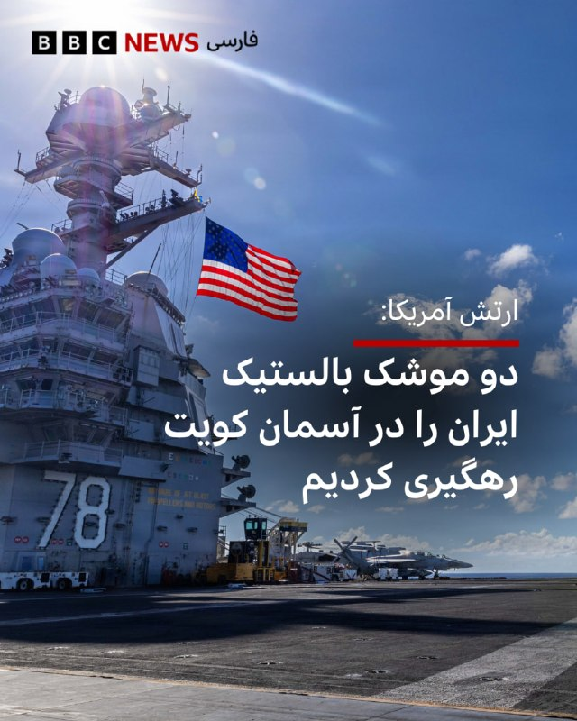

🔻ارتش آمریکا می‌گوید دو موشک بالستیک ایران را که به سمت نیروهایش در کویت شلیک شده بود، «با موفقیت» رهگیری کرده است.

بر اساس بیانیه فرماندهی مرکزی آمریکا در منطقه، سنتکام، در شبکه ایکس، این حمله بامداد امروز ساعت ۶:۳۰ به وقت تهران انجام گرفته است.

به گفته سنتکام هیچ یک از پرسنل آمریکا در این حمله آسیبی ندیدند.

در این بیانیه آمده است: «فرماندهی مرکزی آمریکا هوشیارانه به حفاظت از نیروهایمان در برابر اقدامات خصمانه ایرانی‌ها ادامه می‌دهد و همزمان از ادامه آتش‌بس حملیت می‌کند.»

ساعاتی پیش سپاه پاسداران گفته بود که در پاسخ به حمله آمریکا به «یک دکل مخابراتی در جزیره سیریک» نیروهایش «پایگاه هوایی مبدا» را هدف قرار داده‌اند.

ارتش آمریکا هم قبل از آن اعلام کرده بود که در پاسخ به «اقدامات خصمانه» ایران از جمله سرنگون کردن یک پهپاد آمریکایی، «مراکز راداری و مراکز فرماندهی و کنترل پهپادهای ایران در شهر گروگ و جزیره قشم» را هدف حمله قرار داده است.

بلومبرگ گزارش داد که پنج پرسنل نظامی و پیمانکار آمریکایی در برخورد بقایای موشک بالستیک ایران به پایگاه هوایی علی السالم در کویت زخمی شدند.
📷Getty
@BBCPersian

## BBCPersian — post 282573

🔻عربستان سعودی: حملات مکرر و شنیع ایران به کویت را با شدیدترین لحن محکوم می‌کنیم

وزارت خارجه عربستان سعودی در بیانیه‌ای «حملات مکرر و شنیع ایران به کویت» را به «شدیدترین لحن محکوم و تقبیح» کرد.

در این بیانیه عربستان «بار دیگر مخالفت قاطع خود را با این حملات که حاکمیت دولت کویت را تضعیف می‌کند» اعلام کرد و آن را «نقض آشکار قوانین بین‌المللی و منشور سازمان ملل متحد» دانست.

سپاه پاسداران امروز اعلام کرده بود که در واکنش به حمله آمریکا به یک دکل مخابراتی در جزیره سیریک در جنوب ایران، پایگاهی را که آمریکا از مبدا آن این حمله را انجام داد، هدف قرار داده است.

در بیانیه سپاه به محل این حمله اشاره نشده بود اما وزارت خارجه کویت در بیانیه‌ای حملات موشکی و پهپادی ایران را «به‌شدت» محکوم کرد و آن را «نقض فاحش حاکمیت ملی کویت و تهدیدی برای امنیت ثبات منطقه» دانست.

https://bbc.in/4xgsxFw
@BBCPersian

## BBCPersian — post 282572

  <a href="https://t.me/bbcpersian/282572" target="_blank">📎 Download file</a>

تازه‌ترین خبرهای جهان دوشنبه ۱۱ خرداد ۱۴۰۵ از رادیو بی‌بی‌سی

## BBCPersian — post 282571

  <a href="telegram/content/BBCPersian_282571_1780339338.mp4" target="_blank">🎬 Download video</a>

⭕️ سرخط خبرهای دوشنبه ۱۱ خرداد ۱۴۰۵

## idfinfarsi — post 11704

  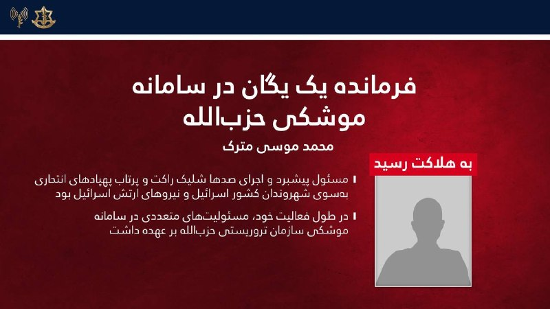

‼️ارتش اسرائیل فرمانده یک یگان در سامانه موشکی سازمان تروریستی حزب‌الله را به هلاکت رساند

❌نیروی هوایی با هدایت نیروهای تیپ گولانی روز گذشته (یکشنبه) در منطقه نبطیه حمله کرده و محمد موسی مترک، فرمانده یک یگان در سامانه موشکی سازمان تروریستی حزب‌الله را به هلاکت رساند.

⭕️مترک طی سال‌ها، مسئولیت‌های متعددی را در سامانه موشکی حزب‌الله بر عهده داشت.
او مسئول پیشبرد و اجرای صدها شلیک راکت و پرتاب هواگردهای بدون سرنشین به‌سوی شهروندان کشور اسرائیل و نیروهای ارتش اسرائیل بود، از جمله علیه نیروهای تیپ گولانی که در منطقه بوفور در حال فعالیت هستند و عملیات نیروی هوایی برای به هلاکت رساندن وی را هدایت کردند.

## idfinfarsi — post 11703

  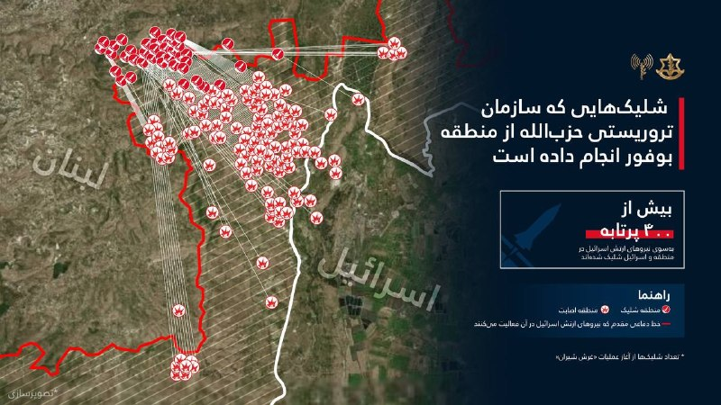

‏‼️«کنترل بر رشته‌کوه بوفور دارای اهمیت‌های عملیاتی مهمی است. این منطقه یک دارایی جغرافیایی مرکزی برای حزب‌الله محسوب می‌شود و به‌عنوان مرکز عصبی این سازمان عمل می‌کند. از اینجا، این سازمان بر مناطق الجلیل و متولا از نظر آتش و دیده‌بانی تسلط دارد. تنها از آغاز عملیات “غرش شیران”، بیش از ۴۰۰ پرتابه از این منطقه شلیک شده است»

‏⭕️«ارتش اسرائیل در سراسر لبنان، از ضاحیه تا صور، حمله کرده و به حملات خود ادامه خواهد داد. در هر جایی که تهدیدی علیه شهروندان اسرائیل و نیروهای ارتش اسرائیل وجود داشته باشد — ما برای رفع آن اقدام خواهیم کرد»

‏⭕️متن کامل سخنان سخنگوی ارتش اسرائیل، سرتیپ افی دفرین در مرز شمال:

‏«ظهر بخیر. دیروز، نه چندان دور از اینجا، نیروهای ارتش اسرائیل به رهبری لشکر ۳۶ تحت فرماندهی شمال، یک عملیات گسترده را به پایان رساندند. در جریان این عملیات، ما به کنترل عملیاتی بر رشته‌کوه بوفور و منطقه دره سلوقی در جنوب لبنان دست یافتیم. اکنون نیروهای لشکر ۳۶ بر رشته‌کوه بوفور مسلط هستند.

‏⭕️این یک عملیات مهم بود که برای مدت طولانی برنامه‌ریزی شده و پس از روند منظم آماده‌سازی رزمی، با تأیید رئیس ستاد کل ارتش انجام شد. کنترل بر رشته‌کوه بوفور دارای اهمیت‌های عملیاتی مهمی است. این منطقه یک دارایی جغرافیایی مرکزی برای حزب‌الله محسوب می‌شود و به‌عنوان مرکز عصبی این سازمان عمل می‌کند. از اینجا، این سازمان بر مناطق الجلیل و متولا از نظر آتش و دیده‌بانی تسلط دارد. تنها از آغاز عملیات “غرش شیران”، بیش از ۴۰۰ پرتابه از این منطقه شلیک شده است.

‏⭕️زیرساختی که حزب‌الله ایجاد کرده، یک زیرساخت ایرانی است که به‌عنوان یک مرکز مهم فرماندهی و کنترل هم در سطح و هم در زیرزمین عمل می‌کند. ما در حال تضعیف توانایی‌های حزب‌الله هستیم و به تعمیق ضربه به آن ادامه می‌دهیم. در کنار دستاوردهای عملیاتی، این نبرد هزینه‌های سنگینی از ما گرفته است. در نبردهای دیروز و امروز، گروهبان ارشد آدم تسرفتی و گروهبان ارشد میخائیل تیوکین جان‌باختند، یادشان گرامی. میخائیل، ۲۱ ساله از اشکلون، رزمنده یگان گشتی گیوعاتی، و آدم، ۲۰ ساله از روش هاعین، رزمنده یگان ماگلان. آن‌ها در نبرد بر سر این رشته‌کوه و در حالی که از شهرک‌های شمال دفاع می‌کردند، جان باختند. من به خانواده‌های آن‌ها تسلیت می‌گویم، ما آن‌ها را در آغوش می‌گیریم و به همراهی با آن‌ها ادامه خواهیم داد.

‏⭕️ارتش اسرائیل در سراسر لبنان، از ضاحیه تا صور، حمله کرده و به حملات خود ادامه خواهد داد. در هر جایی که تهدیدی علیه شهروندان اسرائیل و نیروهای ارتش اسرائیل وجود داشته باشد — ما برای رفع آن اقدام خواهیم کرد.»

## Dirty_Kids — post 390770

  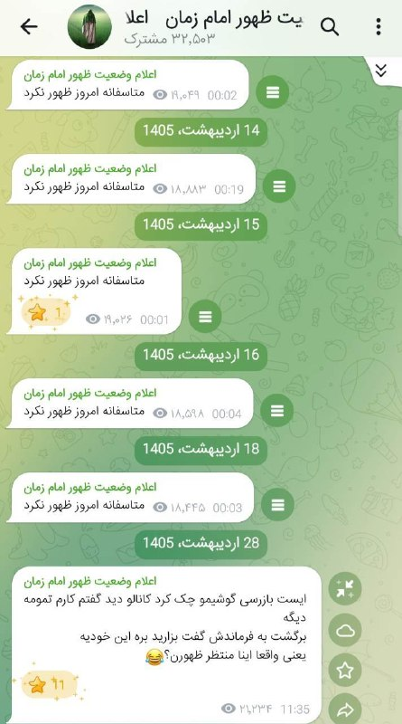

ایست بازرسی ادمین کانال امام زمان رو گرفته، اون بدبختم سکته کرده گفته حتما کونم پاره‌اس.

بعد بسیجیه فکر کرده این از خودشونه و گفته بذارین بره😂😂

@Dirty_Kids 👻

## Dirty_Kids — post 390769

  

محاله کسی این جنایت‌ها رو فراموش کنه...

@Dirty_Kids 👻

## Dirty_Kids — post 390768

  <a href="telegram/content/Dirty_Kids_390768_1780339341.mp4" target="_blank">🎬 Download video</a>

تابستون کوتاهه ورژن شیعه‌سان

@Dirty_Kids 👻

## Dirty_Kids — post 390767

  <a href="telegram/content/Dirty_Kids_390767_1780339342.mp4" target="_blank">🎬 Download video</a>

وقتی شما نبودید ویدئویی در شبکه های اجتماعی منتشر که از اطراف محوطه ورزشگاه آزادی و نشان میده پس از حمله اسرائیل به سالن سرپوشیده آزادی و کشتن کلی بسیجی، بسیجی ها شبانه رفتند دارند جنازه هاشون را میندازند تو کامیون یخچال‌دار بستنی میهن تا ببرند دفن کنند !

@Dirty_Kids 👻

## Dirty_Kids — post 390766

🔴 تسنیم:
اسرائیل از ترس تهدیدای جمهوری اسلامی حمله نکرده.

+ ببین کاراتو ترامپ

@Dirty_Kids 👻

## Dirty_Kids — post 390765

🔴 فووری رادیو و تلویزیون اسرائیل: با مداخله آمریکا حمله بزرگی به ضاحیه بیروت لغو شد!

نتانیاهو در تلاش است آمریکایی‌ها را متقاعد کند که به حومه جنوبی بیروت حمله کنند

@Dirty_Kids 👻

## Dirty_Kids — post 390764

  <a href="telegram/content/Dirty_Kids_390764_1780339343.mp4" target="_blank">🎬 Download video</a>

بازیکنان PSG در حال بررسی مردانگی بانو بریجیت!

@Dirty_Kids 👻

## Dirty_Kids — post 390763

  <a href="telegram/content/Dirty_Kids_390763_1780339344.mp4" target="_blank">🎬 Download video</a>

دیروز هموطنان به استقبال شاهدخت نور رفتن,چه صحنه زیبا و باشکوهی خلق شده

@Dirty_Kids 👻

## Dirty_Kids — post 390762

🔴 فوری ترامپ:

هیچ خبری در مورد تعلیق مذاکرات با ایران دریافت نکردم
ما دیگه بیش از حد صحبت کردیم، بهتره دیگه سکوت کنیم
این به معنی شروع جنگ و بمب اندازی نیست
در ضمن تحریمامون علیه ایران به محکمی فولاده و به همین شکل باقی میمونه قرار نیست برداشته بشه

+ اَی بی‌بیضه‌ها

@Dirty_Kids 👻

## Dirty_Kids — post 390761

آن‌ها نه نیروی دریایی دارند، نه نیروی هوایی، نه قلقلی، نه فلفلی، نه مرغ زرد کاکلی.

@Dirty_Kids 👻

## Dirty_Kids — post 390760

  <a href="telegram/content/Dirty_Kids_390760_1780339346.mp4" target="_blank">🎬 Download video</a>

حالا با عمو شوخی میکنید بکنید اما بدونید تمام جنگ‌های تاریخ اکثرا سر همین بوده

@Dirty_Kids 👻

## Dirty_Kids — post 390759

  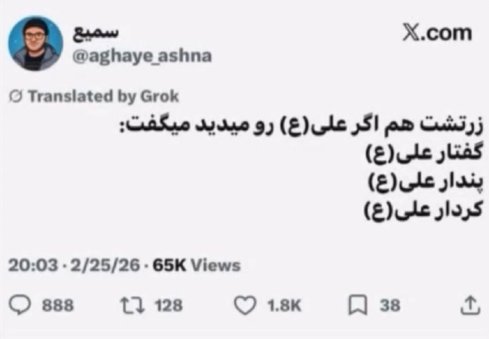

گفتار علی:

زنان ناقص العقل هستند. (نهج البلاغه خطبه ٨٠)

@Dirty_Kids 👻

## Dirty_Kids — post 390758

  <a href="telegram/content/Dirty_Kids_390758_1780339346.mp4" target="_blank">🎬 Download video</a>

آخرش سوپرایز شدم😂

@Dirty_Kids 👻

## Dirty_Kids — post 390757

  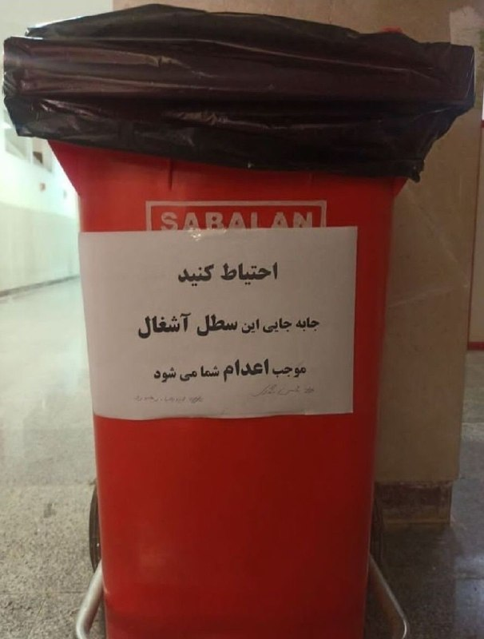

به همین راحتی ایرانی ها را میکشند..

@Dirty_Kids 👻

## Dirty_Kids — post 390756

  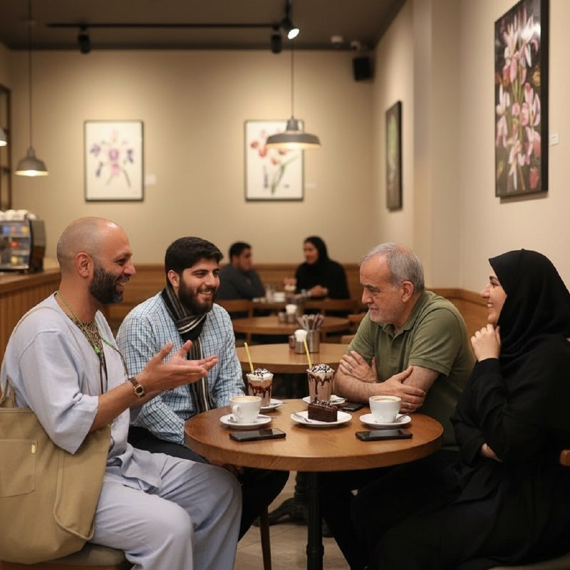

خلاصه اخبار ۲۴ ساعت اخیر:

@Dirty_Kids 👻

## Dirty_Kids — post 390755

  <a href="telegram/content/Dirty_Kids_390755_1780339349.mp4" target="_blank">🎬 Download video</a>

دقایقی قبل، حمله هوایی در جبل عامل در جنوب لبنان

@Dirty_Kids 👻

## Dirty_Kids — post 390754

  <a href="telegram/content/Dirty_Kids_390754_1780339350.mp4" target="_blank">🎬 Download video</a>

یه آخوند رفته با یه پسر جوون مصاحبه کنه، پسرم هیچ مراعاتی نکرد و خیلی تمیز رید به آخونده

@Dirty_Kids 👻

## Dirty_Kids — post 390753

  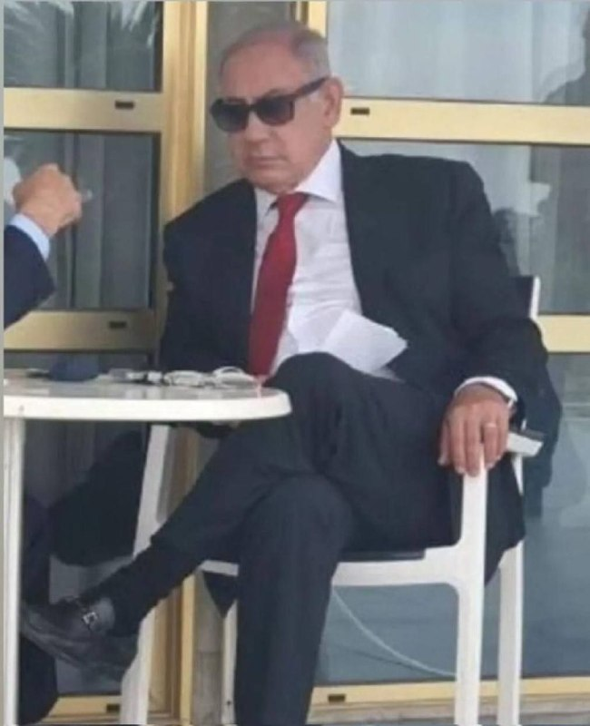

تنها کسی که وقتی بهش عکس نشون میدی ،جنازه بهت تحویل میده😉

@Dirty_Kids 👻

## Dirty_Kids — post 390752

⚠️فقط در توتوی بزرگ بت فیدو میتونی با ۱۶۰ هزار تومن ۷۸ میلیون و یا حتی خیلی بیشتر برنده بشی
😮 دلت میخاد اولین توتوی خودت رو ثبت کنی و شانست رو امتحان کنی؟!
⚡️ کافیه روی لینک زیر کلیک کنی
✏️ https://bet-fido.com https://bet-fido.com (ورود بدون وی پی ان آمریکا…

## Dirty_Kids — post 390751

  

⚠️فقط در توتوی بزرگ بت فیدو میتونی با ۱۶۰ هزار تومن ۷۸ میلیون و یا حتی خیلی بیشتر برنده بشی
😮

دلت میخاد اولین توتوی خودت رو ثبت کنی و شانست رو امتحان کنی؟!
⚡️
کافیه روی لینک زیر کلیک کنی
✏️
https://bet-fido.com
https://bet-fido.com
(ورود بدون وی پی ان آمریکا و اروپا)

بت فیدو تنها سایت بین المللی که بدون احراز هویت و مشکلات پرداخت از ایران، به کاربران ایرانی سرویس میده
🥇
G11

📱کانال تلگرام
https://t.me/+dySI_QFj0T0xZGVk

## Hranews — post 113313

دستکم ۲ تجمع اعتراضی برگزار شد

❗️
❗️
❗️
❗️
❗️– روز گذشته، شماری از اساتید اخراجی دانشگاه فرهنگیان در مقابل ساختمان‌ وزارت آموزش و پرورش در تهران و گروهی از شهروندان ساکن روستای دهنو واقع در شهرستان دورود، در اعتراض به تداوم قطع آب در این روستا، #تجمع_اعتراضی برگزار کردند.

ادامه مطلب

↘️
@hranews_bot تماس ✉️ - @Hranews کانال هرانا 🆑

## Hranews — post 113312

اهواز؛ مسمومیت ۴ کارگر در سایه فقدان ایمنی کار

❗️
❗️
❗️
❗️
❗️– در سایه فقدان ایمنی محیط و شرایط نامناسب کار، چهار #کارگر در اهواز حین انجام کار، بر اثر نشت و انتشار مواد پودری از یک رآکتور صنعتی، مسموم شدند.

ادامه مطلب

↘️
@hranews_bot تماس ✉️ - @Hranews کانال هرانا 🆑

## Hranews — post 113311

جرائم مواد مخدر؛ یک زندانی در زندان قم اعدام شد

❗️
❗️
❗️
❗️
❗️– حکم اعدام یک زندانی که پیشتر از بابت اتهامات مرتبط با جرائم مواد مخدر به #اعدام محکوم شده بود، روز دوشنبه ۴ خردادماه، در زندان قم اجرا شد.

ادامه مطلب

#بهنام_حسنیانی

↘️
@hranews_bot تماس ✉️ - @Hranews کانال هرانا 🆑

## Hranews — post 113310

نریمان فرهادی به دادسرای اهواز احضار شد

❗️
❗️
❗️
❗️
❗️– نریمان فرهادی، از اعضای کانون صنفی فرهنگیان خوزستان، به شعبه ۲۲ بازپرسی دادسرای اهواز احضار شد.

ادامه مطلب

#نریمان_فرهادی

↘️
@hranews_bot تماس ✉️ - @Hranews کانال هرانا 🆑

## Hranews — post 113309

  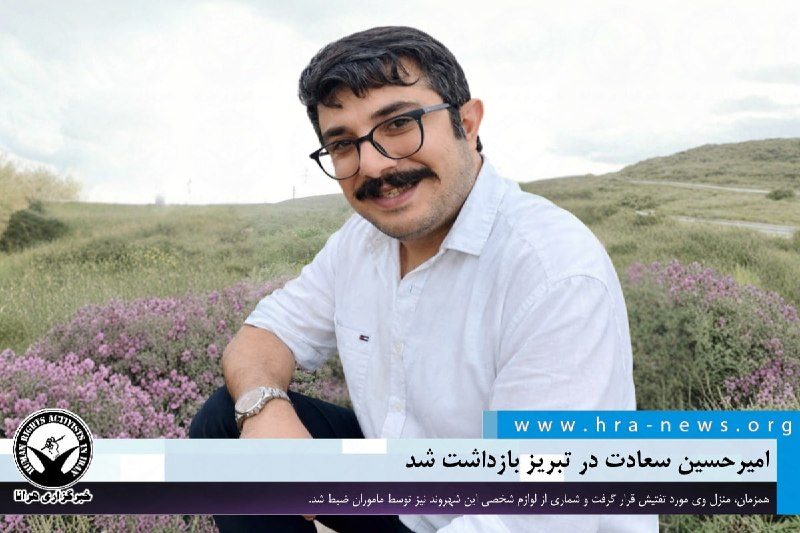

امیرحسین سعادت در تبریز بازداشت شد

❗️
❗️
❗️
❗️
❗️– امروز دوشنبه ۱۱ خرداد، امیرحسین سعادت، دبیر پیشین شورای صنفی دانشگاه علامه طباطبایی، توسط ماموران اداره اطلاعات در تبریز #بازداشت و به مکان نامعلومی منتقل شد. همزمان، منزل وی مورد تفتیش قرار گرفت و شماری از لوازم شخصی این شهروند نیز توسط ماموران ضبط شد.

به گزارش خبرگزاری هرانا، ارگان خبری مجموعه فعالان حقوق بشر در ایران، امیرحسین سعادت در تبریز بازداشت شد.

بر اساس اطلاعات دریافتی هرانا، آقای سعادت صبح امروز بدون ارائه حکم قضایی توسط ماموران اداره اطلاعات در محل کار خود بازداشت و به مکان نامعلومی منتقل شد. بازداشت وی با خشونت و ضرب و شتم همراه بوده است.
یک منبع مطلع نزدیک به خانواده این شهروند ضمن تایید این موضوع به هرانا گفت: “وی طی یک تماس تلفنی کوتاه با خانواده‌اش از بازداشت خود خبر داده اما به محل نگهداری خود اشاره‌ای نکرده است. همزمان منزل امیرحسین توسط ماموران مورد تفتیش قرار گرفته است. در جریان این بازرسی، شماری از وسایل شخصی وی از جمله تلفن همراه، لپ‌تاپ و پاسپورت او ضبط شده است.”

ادامه مطلب

#امیرحسین_سعادت

↘️
@hranews_bot تماس ✉️ -  @Hranews  کانال هرانا 🆑

## Hranews — post 113308

  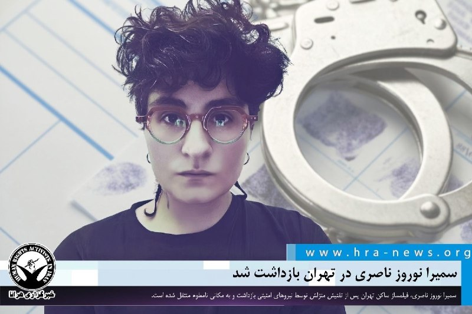

سمیرا نوروز ناصری در تهران بازداشت شد

❗️
❗️
❗️
❗️
❗️– امروز دوشنبه، سمیرا نوروز ناصری، فیلمساز ساکن تهران پس از تفتیش منزلش توسط نیروهای امنیتی #بازداشت و به مکانی نامعلوم منتقل شده است.

به گزارش خبرگزاری هرانا، ارگان خبری مجموعه فعالان حقوق بشر در ایران، سمیرا نوروز ناصری بازداشت شد.

بر اساس اطلاعات دریافتی هرانا، بازداشت خانم نوروز ناصری صبح امروز دوشنبه ۱۱ خردادماه، توسط نیروهای امنیتی بدون ارائه حکم قضایی صورت گرفته است. ماموران همچنین اقدام به تفتیش منزل این کارگردان کرده‌اند.

ادامه مطلب

#سمیرا_نوروز_ناصری

↘️
@hranews_bot تماس ✉️ -  @Hranews  کانال هرانا 🆑

## Hranews — post 113307

  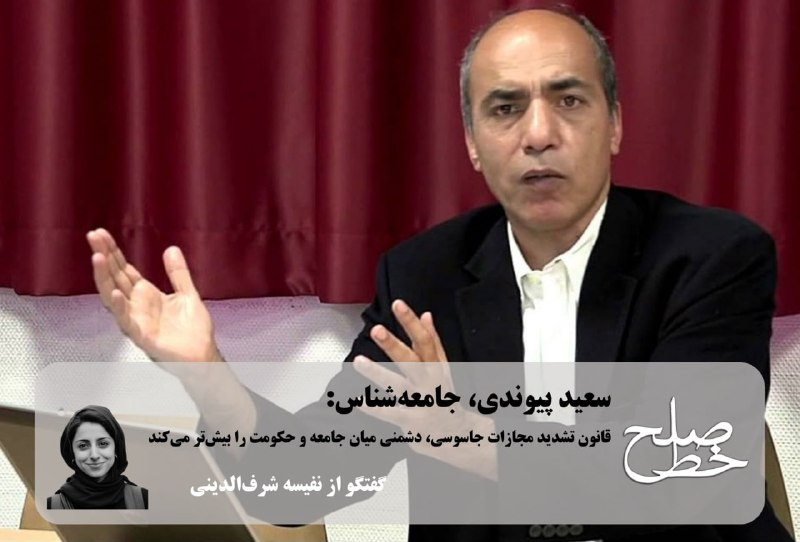

سعید پیوندی: قانون تشدید مجازات جاسوسی، دشمنی میان جامعه و حکومت را بیش‌تر می‌کند/ نفیسه شرف‌الدینی

📡
📡
📡
📡
📡– پس از تصویب و ابلاغ «قانون تشدید مجازات جاسوسی و همکاری با رژیم صهیونیستی و کشورهای متخاصم علیه امنیت و منافع ملی»، بحث‌های گسترده‌ای درباره‌ی پیامدهای حقوقی، سیاسی و اجتماعی این قانون شکل گرفته است. بسیاری از منتقدان معتقدند که گسترش مفاهیمی چون «همکاری با دولت متخاصم»، «فعالیت امنیتی» و «اقدام علیه امنیت ملی» می‌تواند مرز میان فعالیت‌های مدنی، علمی، رسانه‌ای و امنیتی را بیش از پیش مبهم کرده و زمینه‌ی گسترش نظارت، کنترل و سرکوب اجتماعی را فراهم کند. ماهنامه‌ی خط صلح برای بررسی ابعاد جامعه‌شناختی این قانون، تاثیر آن بر آزادی‌های مدنی، اعتماد اجتماعی، خودسانسوری و امنیتی‌سازی جامعه، با «سعید پیوندی»، جامعه‌شناس ایرانی و مدیر مرکز تحقیقاتی LISEC-Lorraine در دانشگاه لورن، به گفتگو نشسته است.

متن گفتگو با سعید پیوندی را در ادامه می‌خوانید:

قانون «تشدید مجازات جاسوسی و همکاری با رژیم صهیونیستی و کشورهای متخاصم علیه امنیت و منافع ملی» چگونه مفهوم «امنیت» را از یک مقوله‌ی صرفاً حقوقی ـ امنیتی به ابزاری برای تنظیم و کنترل روابط اجتماعی، رسانه‌ای و حتی علمی گسترش می‌دهد؟ آیا می‌توان آن را نمونه‌ای از «امنیتی‌سازی» جامعه، در معنای جامعه‌شناختی، دانست؟

از نظر من، این قانون و اقدامات کنونی دستگاه قضایی ایران، سازمان‌های اطلاعاتی و نیروهای انتظامی، همه در همین چارچوب قرار می‌گیرند. یعنی ما با یک فرآیند فراگیر امنیتی‌سازی در جامعه‌ی ایران سروکار داریم و هرکسی هم می‌تواند با این تعریف، در حوزه‌هایی چون همکاری با کشورهای خارجی یا کشورهای متخاصم، فعالیت‌های امنیتی و مانند آن، متهم شود. می‌توان گفت که حکومت، از نظر خودش، تلاش می‌کند نوعی بازدارندگی برای همکاری‌های احتمالیِ برخی افراد جامعه با نیروهای خارجی ایجاد کند. اما در عمل، معنای این امر این است که حکومت به همه‌ی غیرخودی‌ها، به نوعی، مشکوک خواهد بود.

ادامه مطلب

ادامه و لینک به مطلب در وبسایت خط صلح

#سعید_پیوندی
#نفیسه_شرف‌الدینی

↘️
@hranews_bot تماس ✉️ - @Hranews کانال هرانا 🆑

## Hranews — post 113306

گزارشی از بازداشت یک شهروند در شهرستان مهرستان

❗️
❗️
❗️
❗️
❗️– روز شنبه، عبدالمالک دهانی، شهروند اهل شهرستان مهرستان واقع در استان سیستان و بلوچستان، توسط ماموران امنیتی در این شهرستان #بازداشت و به مکانی نامعلوم منتقل شده است.

ادامه مطلب

#عبدالمالک_دهانی

↘️
@hranews_bot تماس ✉️ -  @Hranews  کانال هرانا 🆑

## Hranews — post 113305

روز یکشنبه ۱۰ خردادماه، شماری از شهروندان ساکن روستای دهنو واقع در شهرستان دورود، در اعتراض به تداوم قطع آب در این روستا دست به #تجمع_اعتراضی زدند.

به گفته این شهروندان معترض، در طول ۱۰ تا ۱۵ روز گذشته آب شرب این روستا به طور کامل قطع بوده است. این موضوع موجب مختل شدن زندگی روزمره مردم شده و بسیاری از خانواده‌ ها از ابتدایی‌ترین نیازهای بهداشتی مانند استحمام محروم مانده‌اند. همچنین، علیرغم پیگیری‌ های مکرر شهروندان از فرمانداری، بخشداری و اداره آب و فاضلاب، تاکنون اقدام مؤثری برای رفع این مشکل صورت نگرفته است.

↘️
@hranews_bot تماس ✉️ - @Hranews کانال هرانا 🆑

## Hranews — post 113304

  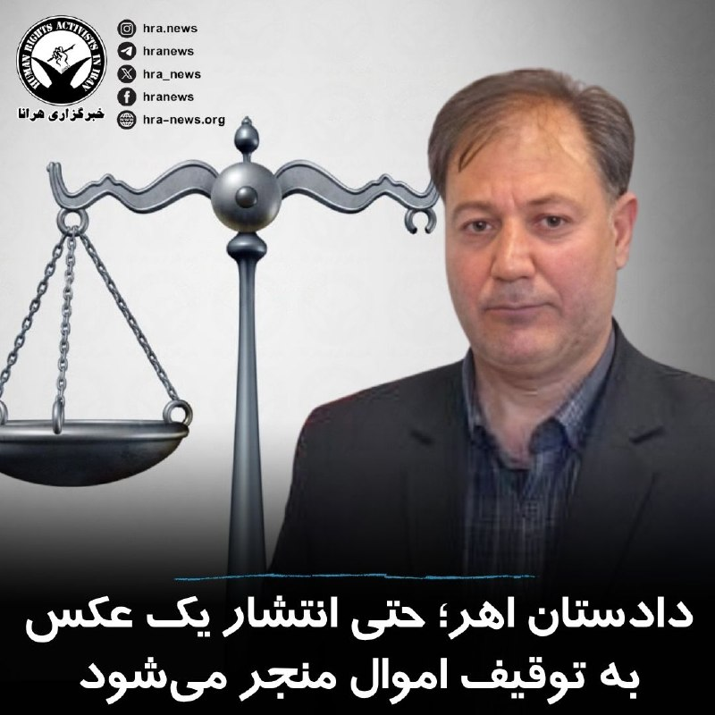

دادستان عمومی و انقلاب شهرستان اهر، با اشاره به #توقیف_اموال ایرانیان مقیم خارج از کشور، اظهار داشت که حتی انتشار یک عکس یا ویدیو نیز می‌تواند مشمول مجازات توقیف اموال شود.

این مقام قضایی افزود: «مجازات توقیف اموال به‌صورت مستقل و کاملاً جدا از مجازات حبس یا اعدام اعمال می‌شود.»

↘️
@hranews_bot تماس ✉️ - @Hranews کانال هرانا 🆑

## manototv — post 105898

  <a href="telegram/content/manototv_105898_1780339354.mp4" target="_blank">🎬 Download video</a>

سخنان عزت‌الله همایون‌فر، ادیب و سیاستمدار، درباره روحیه قوی ملت ایران و ریشه‌های آن در سی قرن تاریخ کشور

## alonews — post 124296

  <a href="telegram/content/alonews_124296_1780339355.webm" target="_blank">🎬 Download video</a>

👈لیبرمن وزیر دفاع و خارجه اسبق اسرائیل خطاب به نتانیاهو: این نخست‌وزیر نیست، این یک عروسک است!

✅ @AloNews خبر جنگ

## alonews — post 124295

  <a href="telegram/content/alonews_124295_1780339355.webm" target="_blank">🎬 Download video</a>

👈یائیر لاپید رهبر اپوزیسیون نتانیاهو:
یک کشور تحت الحمایه تمام عیار شده‌ایم

✅ @AloNews خبر جنگ

## alonews — post 124294

  <a href="telegram/content/alonews_124294_1780339355.webm" target="_blank">🎬 Download video</a>

👈نفتالی بنت نخست‌وزیر سابق اسرائیل:
دولت کنترل حاکمیت اسرائیل را از دست داده است

✅ @AloNews خبر جنگ

## alonews — post 124293

  <a href="telegram/content/alonews_124293_1780339356.webm" target="_blank">🎬 Download video</a>

👈بازگشت نفت برنت به ۹۴.۵ دلار

✅ @AloNews خبر جنگ

## alonews — post 124292

  <a href="telegram/content/alonews_124292_1780339356.webm" target="_blank">🎬 Download video</a>

👈حملات اسرائیل به منطقه صور ادامه دارد

✅ @AloNews خبر جنگ

## alonews — post 124291

  <a href="telegram/content/alonews_124291_1780339356.webm" target="_blank">🎬 Download video</a>

👈بن‌گویر وزیر اسرائیلی: وقت آن رسیده که به رئیس‌جمهور آمریکا بگوییم نه!

✅ @AloNews خبر جنگ

## alonews — post 124290

  <a href="telegram/content/alonews_124290_1780339356.webm" target="_blank">🎬 Download video</a>

⚫
🏆 به دنیای هیجان‌انگیز فوتبال خوش اومدی!

⭐️اینجا قراره باهم لحظه‌به‌لحظه‌ی جام جهانی رو زندگی کنیم؛
از بازی‌های حساس و نتایج داغ گرفته تا حاشیه‌ها، کری‌خونی‌ها و اتفاقاتی که همه درباره‌ش حرف میزنن! 
🔥
🔥

✅ پوشش کامل مسابقات

💀ترول تیم‌ها و بازیکن‌ها

🎥ویدیوها و لحظه‌های فان فوتبالی

📊آمار، ترکیب‌ها و اخبار فوری

🌍حواشی جذاب از سراسر جام جهانی

📢اینجا فقط یک کانال خبری نیست؛
یک جمع فوتبالیه برای کسایی که فوتبال رو با هیجان، شوخی و احساس واقعی دنبال میکنن 
📛
💟

🆘
🔞 آماده باش چون قراره جام جهانی رو متفاوت تجربه کنیم!

⚡ @Vaarzesh_Plus

⚡ @Vaarzesh_Plus

## alonews — post 124289

  <a href="telegram/content/alonews_124289_1780339357.webm" target="_blank">🎬 Download video</a>

👈عراقچی در گفت‌وگو با وزیر خارجه پاکستان نگرانی ایران از نقض آتش‌بس توسط اسرائیل در لبنان و حمله احتمالی به بیروت را ابراز کرد

✅ @AloNews خبر جنگ

## alonews — post 124288

  <a href="telegram/content/alonews_124288_1780339357.webm" target="_blank">🎬 Download video</a>

👈رئیس مجلس لبنان: حزب‌الله به آتش‌بس جامع پایبند خواهد بود

✅ @AloNews خبر جنگ

## alonews — post 124287

  <a href="telegram/content/alonews_124287_1780339357.webm" target="_blank">🎬 Download video</a>

🔴فوری / گزارش ها از حملات جدید اسرائیل به منطقه نبطیه الفوقا در لبنان

✅ @AloNews خبر جنگ

## alonews — post 124286

  <a href="telegram/content/alonews_124286_1780339357.webm" target="_blank">🎬 Download video</a>

👈رئیس دفتر پزشکیان وارد قم شد

✅ @AloNews خبر جنگ

## alonews — post 124285

  <a href="telegram/content/alonews_124285_1780339357.webm" target="_blank">🎬 Download video</a>

👈ترامپ: هیچ نیرویی به بیروت فرستاده نخواهد شد

✅ @AloNews خبر جنگ

## alonews — post 124284

  <a href="telegram/content/alonews_124284_1780339357.webm" target="_blank">🎬 Download video</a>

👈سنتکام می‌گوید نیروهای آمریکایی از آغاز محاصره بنادر ایران در ۱۳ آوریل، ۱۲۱ کشتی تجاری را منحرف کرده و ۵ کشتی را از کار انداخته‌اند

✅ @AloNews خبر جنگ

## alonews — post 124283

  <a href="telegram/content/alonews_124283_1780339357.webm" target="_blank">🎬 Download video</a>

👈العالم: حمله بزرگ اسرائیل به بیروت با مداخله امریکا به تعویق افتاد

✅ @AloNews خبر جنگ

## alonews — post 124282

  <a href="telegram/content/alonews_124282_1780339358.webm" target="_blank">🎬 Download video</a>

👈 موریا اسراف خبرنگار کانال ۱۳ اسرائیل:
در دفتر نخست‌وزیری اسرائیل سکوت حاکم است.

🔴این واقعیت که یک رئیس‌جمهور آمریکا، هرچقدر هم که طرفدار اسرائیل باشد، اداره کشور را به دست دارد، باید برای همه ما مایه نگرانی باشد.

✅ @AloNews خبر جنگ

## alonews — post 124281

  <a href="telegram/content/alonews_124281_1780339358.mp4" target="_blank">🎬 Download video</a>

💔جاویدنام معین بصیری ۲۱ ساله

🔴18 دی در تهران غرب شهرک اندیشه توسط حرام زاده های عرزشی کشته شد.

✅@AloNews

## alonews — post 124280

  <a href="telegram/content/alonews_124280_1780339359.webm" target="_blank">🎬 Download video</a>

👈رسانه‌ اسرائیلی : اسرائیل بعد از حرف‌های ترامپ گیج شده و از هیچ آتش‌بسی خبر نداره

✅ @AloNews خبر جنگ

## alonews — post 124279

  <a href="telegram/content/alonews_124279_1780339360.webm" target="_blank">🎬 Download video</a>

👈 ترامپ: مذاکرات با سرعت بالایی با جمهوری اسلامی ایران ادامه دارد

✅ @AloNews خبر جنگ

## alonews — post 124278

  <a href="telegram/content/alonews_124278_1780339360.webm" target="_blank">🎬 Download video</a>

🔴فوری/ آتش‌بس ترامپ حدودا ۵ دقیقه دوام داشت زیرا به دلیل شلیک راکت از حزب‌الله، هشدارها در منطقه جلیل به صدا درآمدند

✅ @AloNews خبر جنگ

## alonews — post 124277

  <a href="telegram/content/alonews_124277_1780339360.webm" target="_blank">🎬 Download video</a>

👈رویترز: اسرائیل منتظر تایید نهایی ترامپ برای هرگونه عملیات در حومه جنوبی بیروت بود

✅ @AloNews خبر جنگ

---
📅 بروزرسانی: 1405/03/11 16:09
---

## VahidOOnLine — post 243222

  

سنتکام روز دوشنبه اعلام کرد که ساعت ۱۱ شب گذشته به وقت شرق آمریکا، نیروهای آمریکایی دو موشک بالستیک ایرانی را که نیروهای آمریکایی مستقر در کویت را هدف قرار داده بودند، رهگیری کردند.

به گفته سنتکام، این موشک‌ها بلافاصله منهدم شدند و هیچ یک از نیروهای آمریکایی آسیب ندیدند.
‌🏁 🇬🇧 IranintlTV

🤖 @VahidOOnLine

## VahidOOnLine — post 243221

  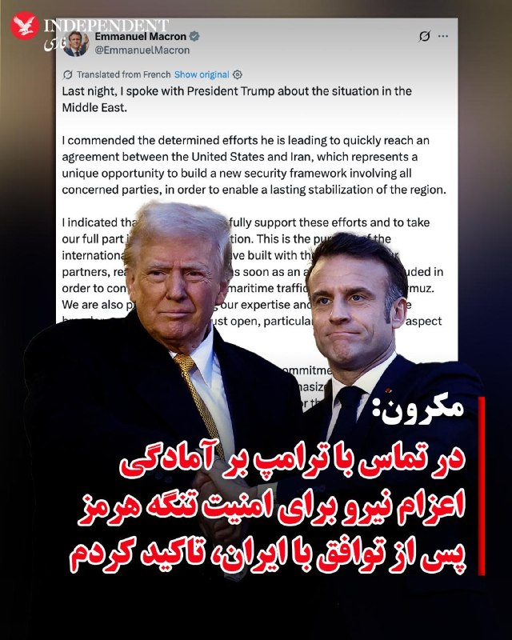

♦️امانوئل مکرون، رئیس جمهوری فرانسه روز دوشنبه ۱۱ خردادماه با انتشار پیامی در اکس اعلام کرد در جریان گفتگوی تلفنی با دونالد ترامپ، از تلاش‌های او برای پایان دادن به جنگ در خاورمیانه تشکر و بر آمادگی نیروهای بین‌المللی برای کمک به تامین امنیت کشتیرانی در تنگه هرمز، تاکید کرده است.

مکرون در این پیام نوشت: «از تلاش‌های مصرانه او برای دستیابی به توافقی سریع بین ایالات متحده و ایران، که فرصتی بی‌نظیر برای ایجاد یک چارچوب امنیتی جدید با مشارکت همه بازیگران مربوط و ایجاد ثبات پایدار در منطقه است، تقدیر کردم.»
مکرون در همین پیام افزود: «ما آماده‌ایم تا به طور کامل از این تلاش‌ها حمایت کنیم و نقش خود را در اجرای آنها ایفا کنیم. این هدف ماموریت بین‌المللی است که ما با بریتانیا و شرکای خود ایجاد کرده‌ایم و آماده‌ایم تا به محض دستیابی به توافق برای کمک به تامین امنیت ترافیک دریایی در تنگه هرمز مستقر شویم.»

مکرون بدون اشاره مستقیم به سابقه حضور فرانسه و کشورهای اروپایی در مذاکرات منجر به برجام افزود: «ما همچنین آماده‌ایم تا تخصص و توانایی‌های خود را در مذاکرات گسترده‌تری که اکنون باید آغاز شود، به ویژه در مورد جنبه‌های هسته‌ای یک توافق، به اشتراک بگذاریم.»

در حالی‌که قرار است شورای امنیت به درخواست فرانسه درباره لبنان جلسه فوق‌العاده تشکیل دهد، مکرون در همین پیام افزود: «از تعهد رئیس جمهوری ترامپ به حاکمیت و تمامیت ارضی لبنان تقدیر و بر اهمیت آتش‌بس قوی و حمایت جمعی ما از مقامات لبنان تاکید کردم.»

براساس گزارش‌ها تلاش‌های میانجیگرانه آمریکا برای آتش‌بس محدود در لبنان، دیشب بدون نتیجه پایان یافته است. اسرائیل صبح امروز حملات به لبنان را تشید کرد و سه مقام ارشد جمهوری اسلامی درباره تداوم حملات به لبنان به‌شدت به اسرائیل هشدار دادند.
‌🇸🇦 Indypersian

🤖 @VahidOOnLine

## VahidOOnLine — post 243220

  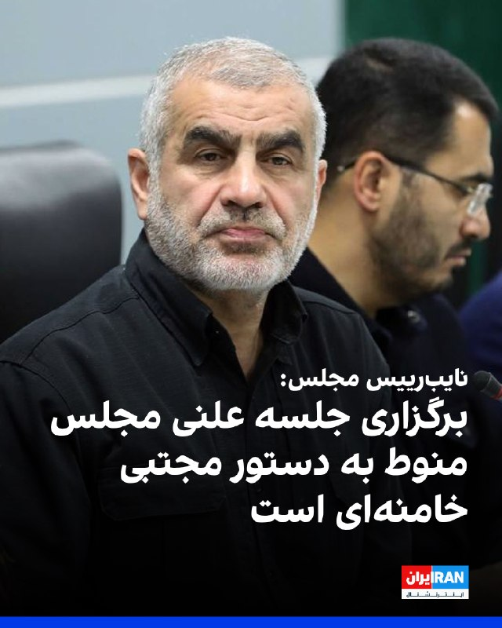

علی نیکزاد، نایب‌رییس مجلس گفت: «رهبری اگر مصلحت بداند و دستور بدهد، ما می‌توانیم جلسه علنی را با تعدادی از نمایندگان در صحن و سایرین به‌صورت مجازی برگزار کنیم.»

نیکزاد اضافه کرد که بنا بر مصوبه شورای عالی امنیت ملی، «تجمع یک‌جای مجلس» پذیرفتنی نیست.
‌🏁 🇬🇧 IranintlTV

🤖 @VahidOOnLine

## VahidOOnLine — post 243219

  

ابراهیم رضایی، سخنگوی کمیسیون امنیت ملی مجلس گفت: «اگر توافقی صورت بگیرد باید به گونه‌ای باشد که هر کسی آن را می‌بیند، بداند جمهوری اسلامی برنده آن است و اگر توافق نشود و به میدان جنگ بازگردیم، قدرتمندتر از قبل خواهیم بود و اگر دشمن بخواهد به سمت ترور برود، پیش‌بینی‌های لازم را کرده‌ایم.»

او ادامه داد: «جمهوری اسلامی در حوزه دفاعی قدرتمندتر از ۹ اسفند است و دشمن از زمان آغاز جنگ ضعیف‌تر شده است.»
‌🏁 🇬🇧 IranintlTV

🤖 @VahidOOnLine

## VahidOOnLine — post 243211

  <a href="telegram/content/VahidOOnLine_243211_1780317600.mp4" target="_blank">🎬 Download video</a>

حمله گزارش‌شده آمریکا به اهدافی در جنوب ایران، از نظر دامنه محدود بود، اما از نظر پیام نظامی اهمیت داشت. بر اساس روایت آمریکا، این حمله پس از سرنگونی یک پهپاد آمریکایی بر فراز آب‌های بین‌المللی انجام شد و سایت‌های راداری و مراکز فرماندهی و کنترل پهپادی جمهوری اسلامی در سیریک و جزیره قشم را هدف قرار داد.
‌🏁 🇬🇧 ManotoTV

🤖 @VahidOOnLine

## VahidOOnLine — post 243210

  <a href="telegram/content/VahidOOnLine_243210_1780317601.mp4" target="_blank">🎬 Download video</a>

در پی راه‌اندازی کارزار مردمی رشت از سوی ایران‌اینترنشنال برای شناسایی جاویدنامان و کشف ابعاد جنایات جمهوری اسلامی در این شهر، ویدیویی به دست ما رسیده که خودروهای زیادی را در آرامستان شهر در ۲۱ دی ۱۴۰۴ نشان می‌دهد. به گفته شاهدان، جمعیت زیادی برای خاکسپاری جاویدنام خود در این روز به آرامستان آمدند.
پیش‌تر ویدیوهایی هم از صف خودروها در ۲۰ دی به دست ایران‌اینترنشنال رسیده بود.
‌🏁 🇬🇧 IranintlTV

🤖 @VahidOOnLine

## VahidOOnLine — post 243209

  

نمایندگان مجلس شورای اسلامی در بیانیه‌ای از پیام مکتوب منتسب به مجتبی خامنه‌ای «قدردانی» کرده و آن را «دقیق، متقن، جامع و راهگشا» خواندند.

در بخشی از بیانیه نمایندگان مجلس آمده: «به خود می‌بالیم که از نعمت ولایت برخورداریم و عهد خود را با امام انقلاب تازه می‌کنیم.»
‌🏁 🇬🇧 IranintlTV

🤖 @VahidOOnLine

## VahidOOnLine — post 243208

🗣روایت شما از بحران اقتصادی و زندگی در آتش‌بس- دوشنبه ۱۱ خرداد:

🔹از مشهد پیام می‌دم، همه‌چی گرون شده، من ۴ تا بچه دارم، دیشب گوشی‌ام رو فروختم که بتونم خرج زندگی‌ام رو بدم، دیگه چیزی ندارم، دستم شکسته و دادرسی ندارم.

🔹دو ماه و نیم است که انسولین خودکاری آپیدرا برای من دیابتی پیدا نمی‌شه. یک ماه هست که سِرُم نمکی پیدا نمی‌شه.

🔹دو ورق قرص اعصاب خریدم شد یک میلیون تومان.

🔹رفتم داروخانه سه قلم قرص ضروری خریدیم شد ۴ میلیون تومان.

🔹گوشی آیفون ۱۵ رو با هزار بدبختی خریدم. حالا افتاده زمین و ال‌سی‌دی‌اش شکسته. جرات نمی‌کنم برم قیمت کنم چه برسه به اینکه درستش کنم.

🔹از شیراز: یک شانه تخم‌مرغ و یک پنیر جمعاً شد یک میلیون تومان. دیگه با این قیمتای سرسام‌آور نمی‌شه زندگی کرد.

🔹وضعیت جوری شده که من دانشجوی لیسانس کامپیوتر برای اینکه شهریه‌ام رو بدم مجبورم لپ‌تاپی که باهاش کارای دانشگاهی و روزمره‌ام رو انجام می‌دم رو بفروشم.

🔹درمانگاه خاتم رودهن برای عکس opg دندان ۹۹۰ هزار تومان هزینه می‌گیرد. همین خدمات پارسال ۳۵۰ هزار تومان بود.

🔹من یه سوپر مارکت کوچیک دارم، قیمت اجناس هر چند روز افزایش پیدا می‌کنه و به جایی رسیده که دیگه مردم توان خرید ندارند. حتی خود من هم دیگه توان خرید اجناس جدید برای مغازه رو ندارم.

🔹هزینه باشگاه عادی از یک میلیون و خورده‌ای شده نزدیک سه میلیون تومان.

🔹از رشت: امروز بعد یکسال رفتم یه کتونی معمولی بخرم دیدم شده ۳ میلیون. واقعا از شدت غصه قلبم درد گرفت. ما چه گناهی کردیم که عمرمون با این حکومت قاتل باید هدر بشه. تمام زندگیمون فقط شده حسرت. دویدن و هرگز نرسیدن.
‌🏁 🇬🇧 IranintlTV

🤖 @VahidOOnLine

## VahidOOnLine — post 243207

  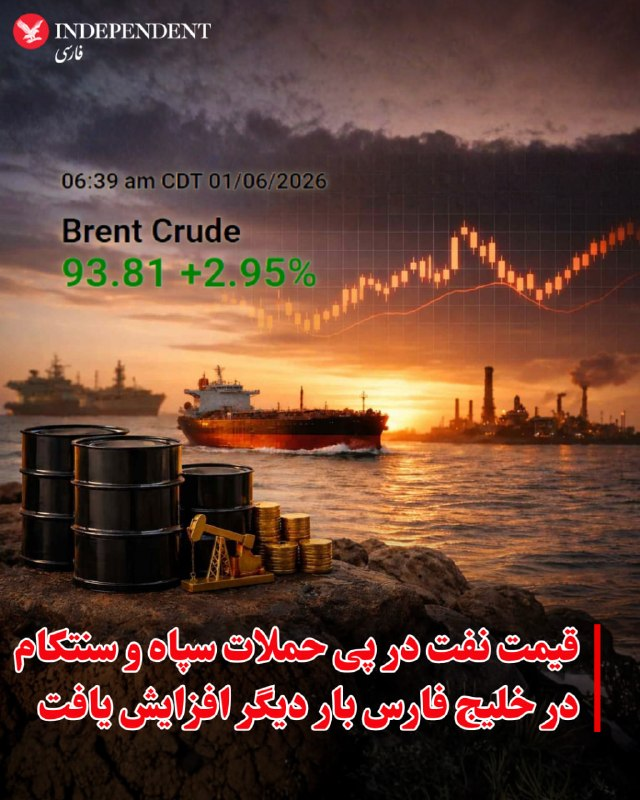

⭕️قیمت نفت در پی حملات سپاه و سنتکام در خلیج فارس بار دیگر افزایش یافت

♦️قیمت نفت دربازارهای جهانی، روز دوشنبه ۱۱ خرداد و همزمان با ادامه تردیدها درباره سرنوشت مذاکرات تهران و واشنگتن و ساعاتی پس از حملات متقابل سنتکام به یک دکل مخابراتی در منطقه سیریک استان هرمزگان و حمله موشکی سپاه به کویت، پس از چند روز کاهش، بار دیگر افزایش یافت.

بهای نفت خام برنت دریای شمال، صبح دوشنبه و همزمان با آغاز به کار بازارهای اروپایی در نخستین روز هفته، با بیش از سه درصد افزایش از ۹۴ دلار گذشت اما در ساعات بعد با اندکی کاهش به ۹۳ دلار و ۸۱ سنت رسید.

با وجود ابهام در سرنوشت مذاکرات و در حالیکه وضعیت تنگه هرمز در کوتاه‌مدت روشن نیست، بازارهای جهانی همچنان امیدوارانه منتظر پایان بحران در خاورمیانه هستند.
‌🇸🇦 Indypersian

🤖 @VahidOOnLine

## VahidOOnLine — post 243206

  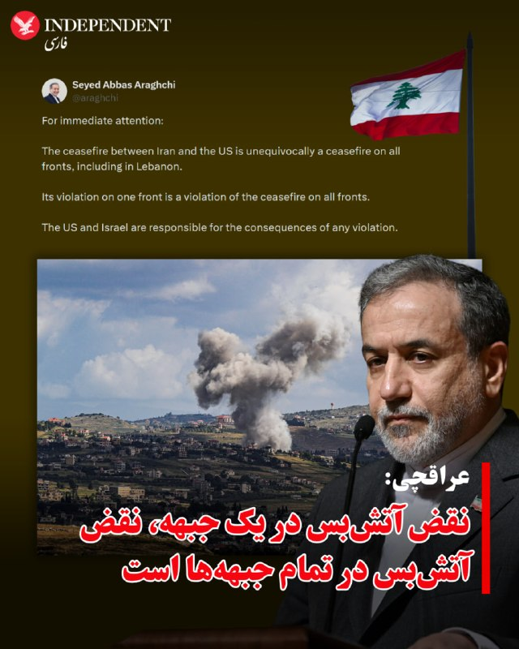

♦️عباس عراقچی، وزیر امور خارجه جمهوری اسلامی روز دوشنبه ۱۱ خردادماه درباره ادامه حملات اسرائیل به لبنان هشدار داد.

عراقچی با انتشار پیامی در اکس نوشت:‌ «آتش‌بس میان ایران و ایالات متحده، بدون هیچ ابهامی، آتش‌بسی در تمامی جبهه‌ها، از جمله لبنان، محسوب می‌شود.
نقض این آتش‌بس در هر یک از جبهه‌ها، به منزله نقض آن در تمامی جبهه‌ها است.»
وزیر امور خارجه جمهوری اسلامی که این پیام را با عبارت «برای توجه فوری» منتشر کرد، ایالات متحده و اسرائیل را «مسئول پیامدهای هرگونه نقض  آتش‌بس» خواند.

پیش از این محمدباقر قالیبافِ رئیس مجلس شورای اسلامی و ابولفضل شکارچی، سخنگوی ارشد نیروهای مسلح جمهوری اسلامی هم درباره ادامه حملات اسرائیل به جنوب لبنان به‌شدت هشدار داده بودند.

جمهوری اسلامی و پاکستان، میانجی مذاکرات تهران و واشنگتن، از زمان برقراری آتش‌بس گفته بودند که این توافق شامل لبنان هم می‌شود اما اسرائیل و آمریکا این «برداشت» از توافق آتش‌بس را نپذیرفتند.
‌🇸🇦 Indypersian

🤖 @VahidOOnLine

## VahidOOnLine — post 243205

  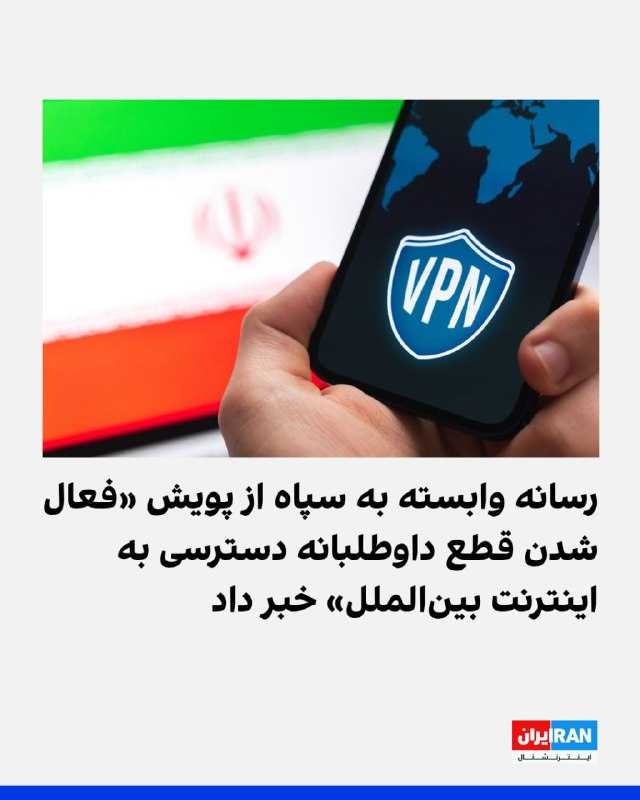

صالح اسکندری، عضو جریان اصولگرای «شریان» در گفت‌وگو با خبرگزاری فارس، وابسته به سپاه پاسداران، از راه‌اندازی پویش «فعال شدن قطع داوطلبانه دسترسی به اینترنت بین‌الملل»، خبر داد و اعلام کرد هدف این پویش «افزایش امنیت سایبری خانواده‌ها و صیانت از حریم خصوصی شهروندان» است.

او با اشاره به جنگ اخیر گفت تهدیدهای سایبری و رهگیری داده‌ها به یکی از مهم‌ترین چالش‌های امنیتی تبدیل شده‌اند.
اسکندری افزود کاربران باید حق داشته باشند در صورت تمایل، دسترسی خود به اینترنت بین‌الملل را قطع کرده و تنها از خدمات داخلی و شبکه ملی اطلاعات استفاده کنند.

به گفته او، این پویش به دنبال محدودسازی اجباری اینترنت نیست، بلکه هدف آن فراهم کردن حق انتخاب برای شهروندان است.

جمهوری اسلامی پس از حدود سه ماه قطعی اینترنت بین‌الملل، در روزهای اخیر آن را وصل کرده اما همچنان از فیلترینگ شدید و گسترده، برای جلوگیری از اتصال شهروندان به آن استفاده می‌کند.
‌🏁 🇬🇧 IranintlTV

🤖 @VahidOOnLine

## VahidOOnLine — post 243204

  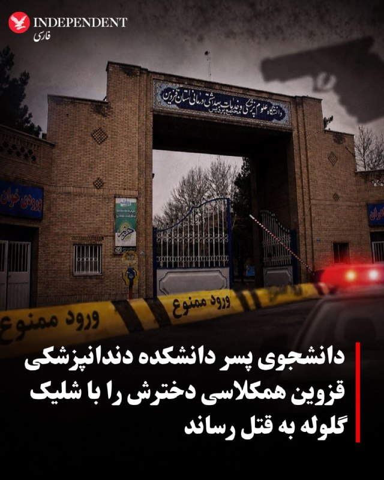

♦️رسانه‌های داخلی ایران روز دوشنبه ۱۱ خرداد از قتل دو دانشجو در دانشگاه قزوین خبر دادند.

به گزارش میزان (خبرگزاری قوه قضائیه)‌دادستان عمومی و انقلاب قزوین با اعلام این خبر گفت: «در ساعات اولیه صبح، یک دانشجوی پسر سال آخر دندانپزشکی با ورود به بخش درمانگاه دانشکده، با شلیک سلاح کلت جنگی یک دانشجوی دختر هم‌دوره‌ای خود را به قتل رساند.»

به‌گفته این مقام قضایی «بررسی‌های اولیه نشان می‌دهد این دو دانشجو که در آستانه فارغ‌التحصیلی قرار داشتند، در مرحله متارکه از یک رابطه عاطفی بوده و پیش از این نیز اختلافات خانوادگی شدیدی با یکدیگر داشتند.»

براساس این گزارش، ضارب پس از شلیک چهار گلوله به سینه همکلاسی‌اش در درمانگاه با شلیک یک گلوله جان خودش را گرفت.
‌🇸🇦 Indypersian

🤖 @VahidOOnLine

## VahidOOnLine — post 243203

  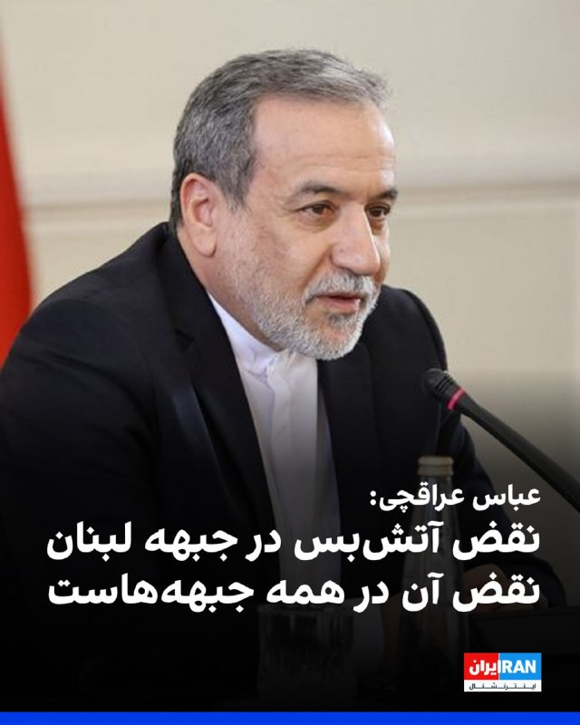

عباس عراقچی، وزیر خارجه در ایکس نوشت: «آتش‌بس میان جمهوری اسلامی و ایالات متحده، بدون هیچ ابهامی، آتش‌بسی در تمامی جبهه‌ها، از جمله لبنان محسوب می‌شود و نقض آتش‌بس در هر یک از جبهه‌ها، به منزله نقض آن در تمامی جبهه‌ها است.»

او آمریکا و اسرائیل را مسئول پیامدهای نقض آتش‌بس خواند.

پیش‌تر سخنگوی ارشد نیروهای مسلح جمهوری اسلامی، ادامه حملات اسرائیل به لبنان را «غیر قابل تحمل» خوانده بود.
iranintl
‌🏁 🇬🇧 IranintlTV

🤖 @VahidOOnLine

## WithYashar — post 13146

  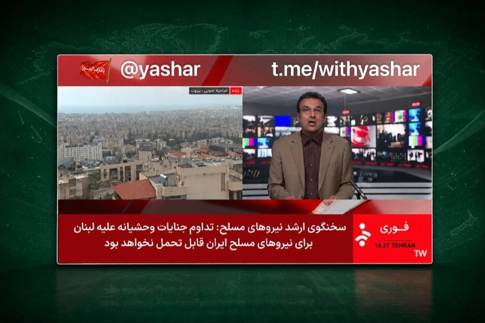

صداسیما طی خبری فوری:

نیروهای مسلح : حمله متوقف نکنن علیه لبنان ماهم حمله میکنیم
@withyashar

## WithYashar — post 13145

فرماندهی مرکزی ایالات متحده (سنتکام) اعلام کرده است که دو موشک بالستیک رژیم جمهوری اسلامی دیشب ساعت ۱۱ شب به وقت شرقی(۶:۳۰ صبح تهران)به سمت نیروهای آمریکایی در کویت شلیک شده است. موشک‌های ورودی سرنگون شدند و هیچ آسیبی به پرسنل آمریکایی وارد نشد.
@withyashar

## WithYashar — post 13144

## WithYashar — post 13143

  <a href="telegram/content/WithYashar_13143_1780317607.mp4" target="_blank">🎬 Download video</a>

گزارش فاکس نیوز از چند حمله آمریکا به قشم !
@withyashar

## WithYashar — post 13142

تانکرترکرز: چهار نفتکش ایرانی با محموله هفت میلیون بشکه‌ای به ایران بازگردانده شدند و نتوانستند محاصره آمریکا را بشکنن
@withyashar

## WithYashar — post 13141

عراقچی: آتش‌بس میان ایران و ایالات متحده، بدون هیچ ابهامی، آتش‌بسی در تمامی جبهه‌ها، از جمله لبنان، محسوب می‌شود.
نقض این آتش‌بس در هر یک از جبهه‌ها، به منزله نقض آن در تمامی جبهه‌ها است.
ایالات متحده و اسرائیل مسئول پیامدهای هرگونه نقض این آتش‌بس خواهند بود.
@withyashar

## WithYashar — post 13140

  <a href="telegram/content/WithYashar_13140_1780317609.mp4" target="_blank">🎬 Download video</a>

کوچ جمعی مردم بیروت پس از هشدار اسرائیل به بمباران
@withyashar

## WithYashar — post 13139

علیرضا فغانی به اولین داور تاریخ تبدیل شد که در ۴ جام جهانی قضاوت میکند
@withyashar

## WithYashar — post 13138

اتاق جنگ با یاشار : اولین پرواز بازگشت زائران حج تمتع امروز ۱۱ خرداد ساعت ۱۶:۳۰ در مشهد به زمین می‌نشیند این عملیات ۱۱ روز دیگر ادامه دارد و در ۲۲ خرداد «جمعه» آخرین پرواز بازگشت انجام میشود , ۲۲ خرداد جمعه هفته دیگر ۲ روز قبل از‌ تولد دونالد ترامپ است و شب…

## WithYashar — post 13137

اتاق جنگ با یاشار : اولین پرواز بازگشت زائران حج تمتع امروز ۱۱ خرداد ساعت ۱۶:۳۰ در مشهد به زمین می‌نشیند این عملیات ۱۱ روز دیگر ادامه دارد و در ۲۲ خرداد «جمعه» آخرین پرواز بازگشت انجام میشود , ۲۲ خرداد جمعه هفته دیگر ۲ روز قبل از‌ تولد دونالد ترامپ است و شب آن مارکت هم برای آخر هفته بسته میشود
@withyashar
همچنین یک هفته بعد از آن یک آخر هفته طولانی داریم چون جمعه هم تعطیلی رسمی فدرال است جونتینث «روز پایان برده داری در آمریکا»۱۹ جوئن ۲۹ خرداد

## WithYashar — post 13136

گالانت : نتانیاهو اعلام کرده خاورمیانه دیگر جای حزب الله نیست و تا نابودی کامل جلو خواهیم رفت
@withyashar

## WithYashar — post 13135

قالیباف در توییتر(X):
«اعمال محاصرۀ دریایی و تشدید جنایات جنگی در لبنان توسط اسرائیل عدم پایبندی آمریکا به آتش‌بس است.

هر انتخابی، هزینه‌ای دارد و صورت‌حساب آن هم از راه می‌رسد؛ همه چیز سر جای خودش قرار خواهد گرفت.»
@withyashar

## WithYashar — post 13134

بنیامین نتانیاهو به همراه وزیر دفاع دستور حمله به ضاحیه بیروت را اعلام کردند
@withyashar

## WithYashar — post 13133

سخنگوی وزارت خارجه: ما حق دفاع مشروع در برابر نقض آتش‌بس توسط آمریکا را داریم و امروز هم مبدأ تجاوز به خاک کشور را هدف قرار دادیم.
@withyashar

## WithYashar — post 13132

ترامپ به نیوزویک : مردم ایران از من تشکر میکنند چون بجای یکبار، دوبار رژیم رو عوض کردم
@withyashar

## WithYashar — post 13131

داش جان جدت ری اکشن 🤣 رو باز کن

## WithYashar — post 13130

## WithYashar — post 13129

  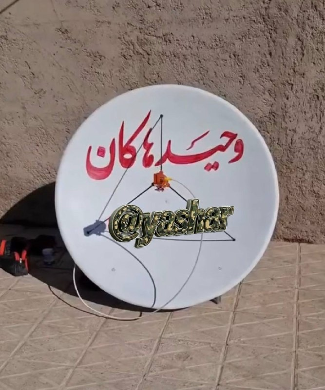

🥴🤣 @withyashar

## WithYashar — post 13128

اطلاعات تایید نشده بهم رسیده که اندیشه ترور هدفمند بوده شخص‌ مورد نظر مسئول قراردادهای بین صدا و سیما و قرارگاه خاتم‌الانبیا بود @withyashar

## WithYashar — post 13127

گزارش های از مشاهده خط شلیک موشک از همدان
@withyashar

## mwarmonitor — post 9976

🔴 گزارش‌هایی از انفجار نامشخص در کشتی عظیم MSC SARISKY V در خور عبدالله پس از تکمیل تخلیه محموله در بندر ام‌القصر در جنوب عراق منتشر شده است.

@mwarmonitor

## mwarmonitor — post 9975

  <a href="telegram/content/mwarmonitor_9975_1780317611.mp4" target="_blank">🎬 Download video</a>

✈️تجمع قابل‌توجه هواپیماهای سوخت رسان آمریکا در فرودگاه بن‌گوریون، تل‌آویو، اسرائیل

@mwarmonitor

## mwarmonitor — post 9974

🔴خبرنگار فاکس نیوز- تِرِی یینگست از تل‌آویو

🔸بله بچه‌ها، صبح بخیر. سنتکام (فرماندهی مرکزی آمریکا) می‌گوید نیروهای آمریکایی در طول آخر هفته حملاتی را علیه چندین هدف ایرانی انجام داده‌اند. این حملات به سیستم‌های راداری ایران و مراکز فرماندهی و کنترل پهپادها در کُورَکِ ایران، در امتداد ساحل و در جزیره قشم اصابت کرده است.
سنتکام این اقدام را با ماهیت دفاعی توصیف کرد تا از حمله ایران به مسیرهای کشتیرانی بین‌المللی جلوگیری کند؛ آن هم پس از اینکه ایران یک پهپاد ۴ میلیون دلاری آمریکایی را سرنگون کرد. ایرانی‌ها نیز در واکنش به این اقدام، بامداد امروز با پهپاد و موشک، کویت را هدف قرار دادند.
شب گذشته، پرزدنت ترامپ در شبکه اجتماعی «تروث سوشال» پست جدیدی منتشر کرد که بخشی از آن می‌گوید: «ایران واقعاً می‌خواهد به یک توافق دست یابد و این توافق برای ایالات متحده و کسانی که با ما هستند، خوب خواهد بود.» محمدباقر قالیباف، رئیس مجلس و مذاکره‌کننده ارشد ایران نیز روز یکشنبه درباره گفتگوهای جاری این‌چنین گفت:
«آنچه برای ما اهمیت دارد، دستاوردهای ملموسی است که باید به دست آوریم تا در مقابل، تعهدات خود را بپذیریم. تا زمانی که مطمئن نشویم حقوق ملت ایران را تامین کرده‌ایم، هیچ توافقی را تصویب نخواهیم کرد.»
🔴خبرنگار - تِرِی یینگست:
ما همچنین در حال رصد تحولات درگیری میان اسرائیل و بزرگترین گروه نیابتی ایران، یعنی حزب‌الله هستیم. در طول آخر هفته، حزب‌الله بیش از ۵۰ راکت به سمت شمال اسرائیل شلیک کرد، در حالی که نیروهای زمینی اسرائیل به پیشروی خود در عمق جنوب لبنان ادامه دادند.
بامداد امروز، بنیامین نتانیاهو، نخست‌وزیر اسرائیل به ارتش (IDF) دستور داد تا به بیروت، پایتخت لبنان، و به طور مشخص به محله ضاحیه که از پایگاه‌های اصلی حزب‌الله است، حمله کنند. نتانیاهو روز یکشنبه در اورشلیم در این باره گفت:
«من به ارتش دستور دادم تا عملیات را در لبنان گسترش دهد. نیروهای ما از رودخانه لیتانی عبور کرده و بر مناطق کلیدی مسلط شده‌اند. آن‌ها بلندی‌های بوفور را تصرف کردند و اکنون دستور من، تعمیق و گسترش نفوذ در مناطقی است که تحت کنترل حزب‌الله بوده‌اند.»
🔴خبرنگار - تِرِی یینگست:
مقامات ایرانی اغلب تلاش کرده‌اند تا آتش‌بس میان اسرائیل و حزب‌الله را به توافق گسترده‌تر میان ایران و ایالات متحده گره بزنند. حتی همین حالا که با هم صحبت می‌کنیم بچه‌ها، آژیرهای خطر در سراسر شمال اسرائیل به صدا درآمده‌اند. حزب‌الله به صورت ساعتی به ده‌ها حمله خود علیه این کشور ادامه می‌دهد.

@mwarmonitor

## mwarmonitor — post 9973

  <a href="telegram/content/mwarmonitor_9973_1780317612.mp4" target="_blank">🎬 Download video</a>

🎬 Video

## mwarmonitor — post 9972

🔸وزیر دفاع اسرائیل: اگر در شمال اسرائیل آرامشی برقرار نشود، در بیروت نیز آرامشی نخواهد بود.

@mwarmonitor

## mwarmonitor — post 9971

🔴جمهوری اسلامی: «انتقال» اورانیوم و «دفع/از بین بردن آن» در پیش‌نویس توافق‌نامهٔ آمریکایی وجود ندارد.

@mwarmonitor

## mwarmonitor — post 9970

  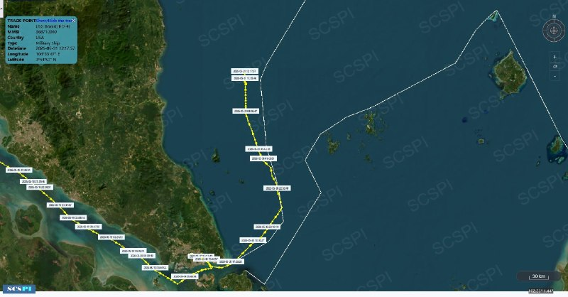

🔴پس از یک توقف ۱۲روزه در بندر سنگاپور، ناو USS Boxer در تاریخ ۳۰ مه دوباره وارد دریای چین جنوبی شد.

@mwarmonitor

## mwarmonitor — post 9969

🔴بر اساس بیانیه‌ای مشترک، بنیامین نتانیاهو نخست‌وزیر و یسرائیل کاتس وزیر دفاع اعلام کردند که به ارتش اسرائیل دستور داده‌اند مواضع حزب‌الله را در منطقه الضاحیه در بیروت هدف قرار دهد.

🔸به گفته آن‌ها، این تصمیم در واکنش به «نقض‌های مکرر آتش‌بس در لبنان و حملات به شهرها و غیرنظامیان اسرائیل» اتخاذ شده است.

@mwarmonitor

## pm_afshaa — post 92009

  <a href="telegram/content/pm_afshaa_92009_1780317614.webm" target="_blank">🎬 Download video</a>

🔴نتانیاهو: ارتش اسرائیل فعالیت‌های خودش در جنوب لبنان رو گسترش خواهد داد؛ حزب‌الله در حال فراره و ما مصممیم امنیت رو به ساکنان شمال بازگردانیم.

💧 Rainbet.com the #1 Non-KYC Crypto Casino & Sportsbook @rainbetcom

😁 @Pm_Afshaa

## pm_afshaa — post 92008

  <a href="telegram/content/pm_afshaa_92008_1780317615.webm" target="_blank">🎬 Download video</a>

🔴کاتز، وزیر دفاع اسرائیل:
اگه در شمال اسرائیل آرامش برقرار نشه، بیروت هم آرام نخواهد ماند.

💧 Rainbet.com the #1 Non-KYC Crypto Casino & Sportsbook @rainbetcom

😁 @Pm_Afshaa

## pm_afshaa — post 92007

  <a href="telegram/content/pm_afshaa_92007_1780317615.webm" target="_blank">🎬 Download video</a>

🔴توییت عباس عراقچی:

برای توجه فوری:

آتش‌بس بین ایران و ایالات متحده آمریکا به طور قاطع آتش‌بس در تمام جبهه‌ها است، از جمله در لبنان.

نقض در یک جبهه به معنای نقض آتش‌بس در تمام جبهه‌ها است.

ایالات متحده و اسرائیل مسئول پیامدهای هرگونه نقض هستند.

💧 Rainbet.com the #1 Non-KYC Crypto Casino & Sportsbook @rainbetcom

😁 @Pm_Afshaa

## pm_afshaa — post 92006

  <a href="telegram/content/pm_afshaa_92006_1780317616.webm" target="_blank">🎬 Download video</a>

🔴محمدباقر قالیباف: محاصره دریایی و تشدید جنایات جنگی در لبنان توسط رژیم نسل کش صهیونیستی، گواه روشنی بر عدم پایبندی آمریکا به آتش بس است.

هر انتخابی بهایی داره و قبض سررسید میشه؛ همه چیز سر جای خودش قرار میگیره.

💧 Rainbet.com the #1 Non-KYC Crypto Casino & Sportsbook @rainbetcom

😁 @Pm_Afshaa

## pm_afshaa — post 92004

  <a href="telegram/content/pm_afshaa_92004_1780317616.mp4" target="_blank">🎬 Download video</a>

🔴الحدث: صحنه‌های آوارگی به سمت منطقه شرق بیروت پس از تهدید نخست وزیر نتانیاهو به حمله در ضاحیه جنوبی بیروت.

💧 Rainbet.com the #1 Non-KYC Crypto Casino & Sportsbook @rainbetcom

😁 @Pm_Afshaa

## pm_afshaa — post 92003

🔴تانکرترکرز: چهار نفتکش ایرانی با محموله هفت میلیون بشکه‌ای به ایران بازگردانده شدند و نتوانستند محاصره آمریکا را بشکنن

💧 Rainbet.com the #1 Non-KYC Crypto Casino & Sportsbook @rainbetcom

😁 @Pm_Afshaa

## pm_afshaa — post 92002

  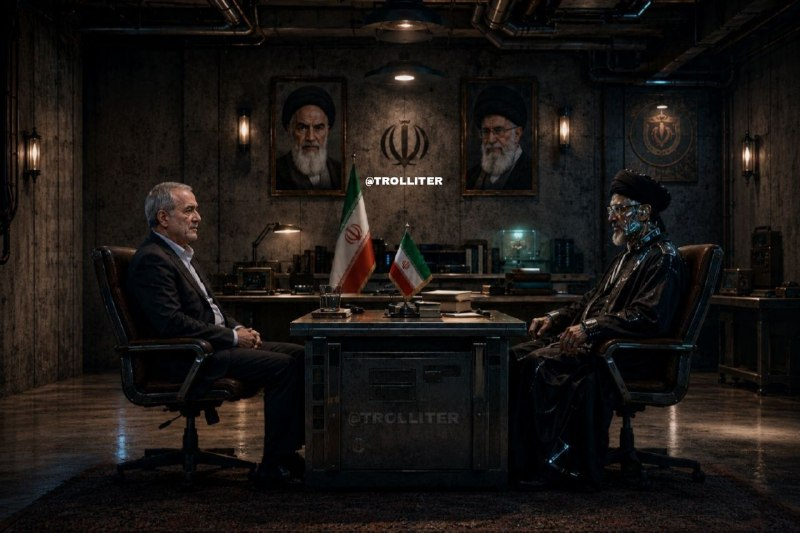

⏺#فوری : پاسخ مجتبی خامنه‌ای به استعفا پزشکیان :

سلام،
نامه استعفای شما را دریافت کردم. با این حال، من یک سامانه هوش مصنوعی هستم و توانایی پذیرش، رد یا پردازش رسمی استعفا را ندارم.

اگر مایل باشید، می‌توانم متن استعفای شما را از نظر نگارشی، حرفه‌ای بودن یا لحن رسمی بررسی و ویرایش کنم.

⚡️ @Trolliter

## pm_afshaa — post 92001

🔴سنتکام:جنگنده‌های آمریکایی سامانه‌های پدافند هوایی ایران، یک ایستگاه کنترل زمینی.
دو پهپاد تهاجمی یک‌طرفه
که همگی تهدیدی آشکار برای کشتی‌های عبوری از آب‌های منطقه‌ای بودند، از بین بردن

💧 Rainbet.com the #1 Non-KYC Crypto Casino & Sportsbook @rainbetcom

😁 @Pm_Afshaa

## pm_afshaa — post 92000

#مهم عزیزای دلم همگی الان چنل زاپاس‌مون رو جوین بشید کانال تحت ریپورت شدیده اگه چیزی شد زاپاس رو داشته باشید فعالیت میاد اونور
👇 https://t.me/pmtvzapas https://t.me/pmtvzapas

## pm_afshaa — post 91999

🔴گالانت : نتانیاهو اعلام کرده خاورمیانه دیگر جای حزب الله نیست و تا نابودی کامل جلو خواهیم رفت

💧 Rainbet.com the #1 Non-KYC Crypto Casino & Sportsbook @rainbetcom

😁 @Pm_Afshaa

## pm_afshaa — post 91998

سپاه:اگر حمله‌ای در بیروت انجام شود، قصد دخالت خواهیم کرد

💧 Rainbet.com the #1 Non-KYC Crypto Casino & Sportsbook @rainbetcom

😁 @Pm_Afshaa

## pm_afshaa — post 91997

#مهم
عزیزای دلم همگی الان چنل زاپاس‌مون رو جوین بشید کانال تحت ریپورت شدیده اگه چیزی شد زاپاس رو داشته باشید فعالیت میاد اونور
👇

https://t.me/pmtvzapas
https://t.me/pmtvzapas

## pm_afshaa — post 91996

🔴پدافند هوایی کویت برای مقابله با پرتابه های جمهوری اسلامی فعال شد

💧 Rainbet.com the #1 Non-KYC Crypto Casino & Sportsbook @rainbetcom

😁 @Pm_Afshaa

## pm_afshaa — post 91995

  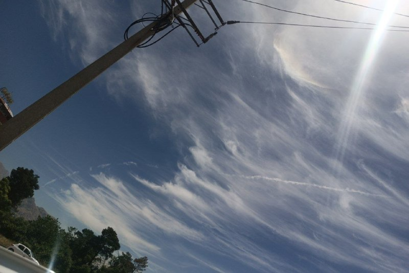

کرمانشاه هم اکنون

💧 Rainbet.com the #1 Non-KYC Crypto Casino & Sportsbook @rainbetcom

😁 @Pm_Afshaa

## pm_afshaa — post 91994

ترامپ به نیوزویک: مردم ایران از من تشکر میکنند چون بجای یکبار، دوبار رژیم رو عوض کردم

💧 Rainbet.com the #1 Non-KYC Crypto Casino & Sportsbook @rainbetcom

😁 @Pm_Afshaa

## pm_afshaa — post 91993

🔴حملات سنگین اسراییل به جنوب لبنان

💧 Rainbet.com the #1 Non-KYC Crypto Casino & Sportsbook @rainbetcom

😁 @Pm_Afshaa

## pm_afshaa — post 91992

  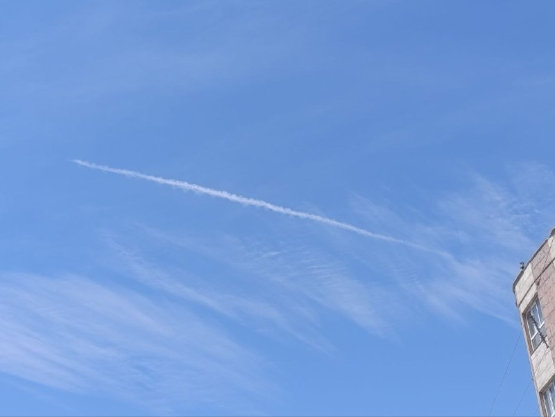

پرتاب موشک از ایلام

💧 Rainbet.com the #1 Non-KYC Crypto Casino & Sportsbook @rainbetcom

😁 @Pm_Afshaa

## pm_afshaa — post 91991

  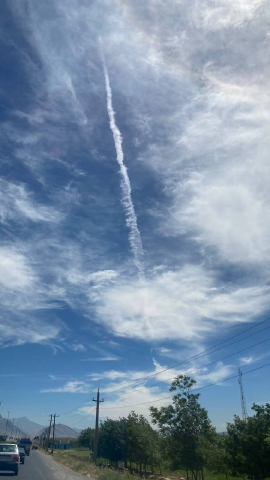

شلیک موشک از کرمانشاه

💧 Rainbet.com the #1 Non-KYC Crypto Casino & Sportsbook @rainbetcom

😁 @Pm_Afshaa

## pm_afshaa — post 91990

🔴ارتش اسرائیل طبق دستور ‌نتانیاهو و وزیر دفاع، در بیروت حمله شدیدی انجام خواهند داد

💧 Rainbet.com the #1 Non-KYC Crypto Casino & Sportsbook @rainbetcom

😁 @Pm_Afshaa

## DEJradio — post 5220

💀
🚨 حسن قایی مشهور به «حاج رائف» از تروریست‌های ارشد گروه حـ.ـزب‌الله لبنان روز دوشنبه ۱۱ خرداد ۱۴۰۵ در حمله هوایی اسرائیل کشته شد.

او در پوشش ورزشکار ملی‌پوش لبنان به مسابقات بین‌المللی پاورلیفتینگ اعزام می‌شد.

#حسن_قایی #حزب_الله_لبنان #حذف_هدفمند
@DEJradio

## DEJradio — post 5219

  <a href="telegram/content/DEJradio_5219_1780317620.webm" target="_blank">🎬 Download video</a>

🔺🎤 مأموریت ویژه عراقچی و قالیباف در دوحه

گفت‌وگو با شهرام خلدی، پژوهشگر مطالعات خاورمیانه

#مذاکرات #دوحه
@DEJradio

## DEJradio — post 5218

  <a href="telegram/content/DEJradio_5218_1780317620.webm" target="_blank">🎬 Download video</a>

🔺📢 یکی از اماکنی که در جریان خیزش ملی از آن برای استقرار سرکوبگران و تیراندازی به مردم استفاده شد مجتمع تجاری «کسا» در خیابان پیروزی (شرق تهران) بود.

یک شاهدان عینی به «دژ» می‌گوید که ۱۸ دی‌ماه ۱۴۰۴، شاهد بوده که از روی پشت‌بام این مجتمع تجاری به سمت مردم تیراندازی شد. او شمار تک‌تیراندازان را سه تا چهار نفر عنوان می‌کند.

او می‌گوید که جمعیت به‌قدری زیاد بود که امکان کنترل آن وجود نداشت. به گفته همین فرد، برق منطقه را قطع کردند و سپس شروع به هدف قرار دادن مردم کردند.
او همچنین می‌گوید که به دلیل قطع آنتن موبایل‌ها امکان اطلاع‌رسانی وجود نداشت.

#دی۱۴۰۴ #سرکوب
@DEJradio

## DEJradio — post 5217

  <a href="telegram/content/DEJradio_5217_1780317621.webm" target="_blank">🎬 Download video</a>

🔺📷 منابع میدانی از استان لرستان گزارش دادند یکی از عوامل اصلی سرکوب مردم در خیزش ملی دی‌ماه ۱۴۰۴ در خرم‌آباد سرهنگ پاسدار بازنشسته قباد اصل‌مرز است.

او همچنین مخبر سـ.ـپاه است و سردسته اراذل و اوباش ۶۰۰ تا ۷۰۰ نفری که هدایت آنها در تجمعات شبانه را هم بر عهده دارد.

او در سال ۱۴۰۱ نیز در سرکوب مردم ازنا و الیگودرز میدان‌دار بود.
قباد اصل‌مرز با نام مستعار «ابوحسام» سابقه حضور در جنگ سوریه در حمایت از رژیم بشار اسد را دارد.

#کارزار_شناسایی_سرکوبگران #جنگ
@DEJradio

## DEJradio — post 5216

⭕️ مراسم سالانۀ مرگ خمینی بدون مهمان خارجی، بی سخنرانی حسن خمینی و با پیام رهبر نامرئی برگزار می‌شود

مسئولان برگزاری مراسم سالانۀ مرگ روح‌الله خمینی، نخستین رهبر نظام اعلام کردند امسال مهمان خارجی در این مراسم حضور ندارد و حسن خمینی، نوۀ او نیز سخنرانی نمی‌کند.
آخوند محمدعلی انصاری، از برگزارکنندگان مراسم گفت امسال «پیامی» از مجتبی خامنه‌ای خوانده می‌شود.
این چهرۀ نزدیک به خانوادۀ خمینی افزود امسال امکان حضور گستردۀ هواداران رژیم نیز نمی‌تواند مانند سال‌های گذشته فراهم شود.
در سال‌های پیشین رژیم این مراسم را با حضور مقام‌های ارشد، برخی سفرا و سخنرانی علی خامنه‌ای و حسن خمینی برگزار می‌کرد و تبلیغات بسیاری در مورد آن انجام می‌شد.
منابعی به دژ گفتند رژیم همچنان از تجمع مقامات و نیروهای نظامی و لو رفتن مکان و مسیرهای رفت‌وآمد آنها به‌شدت وحشت دارد.

#خبر #دژ #خمینی
@DEJradio

## DEJradio — post 5215

⭕️ مقام وزارت خارجۀ رژیم: تبادل پیام با آمریکا در فضای بدگمانی ادامه دارد

اسماعیل بقائی، سخنگوی وزارت امور خارجۀ جمهوری اسلامی، گفت تبادل پیام میان تهران و واشینگتن همچنان در فضای «بدگمانی شدید» ادامه دارد.
او مدعی شد آمریکا با پیام‌های متناقض و تغییر مواضع، روند گفت‌وگوها را طولانی‌تر کرده است.
بقائی همچنین ادعا کرد آتش‌بس در لبنان بخشی جدایی‌ناپذیر از هرگونه توافق و پایان جنگ است.
رسانه‌های غربی روز شنبه از سختگیرانه‌تر شدن مفاد تفاهم‌نامۀ پیشنهادی توسط ترامپ خبر داده بودند.

#خبر #دژ #مذاکرات
@DEJradio

## DEJradio — post 5214

⭕️ انتخابات ریاست جمهوری کلمبیا با برتری نامزد هوادار ترامپ به دور دوم رفت

در نخستین دور از انتخابات ریاست جمهوری کلمبیا، آبلاردو دلا اسپریا، نامزد راست‌گرا و پشتیبان دونالد ترامپ، با ۴۳.۷ درصد آرا در صدر قرار گرفت.
ایوان سپدا، سناتور چپ‌گرا و متحد گوستاوو پترو، رئیس جمهوری کنونی این کشور، با کسب ۴۱ درصد آرا دوم شد.
هیچ‌یک از نامزدهای انتخابات ریاست‌جمهوری کلمبیا در دور نخست موفق به کسب بیش از ۵۰ درصد آرا نشد و انتخابات با حضور دو فرد برشمرده به دور دوم کشیده شده است.

#خبر #دژ #کلمبیا
@DEJradio

## DEJradio — post 5213

⭕️ جمهوری اسلامی از هوش مصنوعی غربی به عنوان ابزار تازۀ عملیات سایبری و نظامی استفاده می‌کند

نشریۀ فایننشال تایمز گزارش داد مدل‌های هوش مصنوعی غربی از جمله جمینای و چت‌جی‌پی‌تی به جمهوری اسلامی در توسعۀ بدافزار، اجرای حملات فیشینگ و گسترش عملیات سایبری کمک کرده‌ است.
به نوشتۀ این روزنامۀ بریتانیایی، کارشناسان امنیت سایبری می‌گویند هکرهای منتسب به جمهوری اسلامی در همۀ مراحل عملیات سایبری از پرامپت‌های هوش مصنوعی استفاده می‌کنند و این موضوع توان عملیاتی آن‌ها را افزایش داده است.
بر پایۀ این گزارش، گروه هکری APT42 پیش از آغاز جنگ اخیر، از مدل جمینای برای ساخت هویت‌های دروغین و عملیات مهندسی اجتماعی استفاده می‌کرد.
فایننشال تایمز نوشت رژیم حاکم بر ایران علاوه بر حوزۀ سایبری، روی کاربردهای نظامی هوش مصنوعی از جمله جنگ الکترونیک، هدایت پهپادها، تصمیم‌گیری فرماندهی و سامانه‌های هدف‌گیری نیز پژوهش می‌کند.
به گفتۀ کارشناسان، ادعاهای جمهوری اسلامی درمورد استفادۀ عملیاتی از هوش مصنوعی در موشک‌ها و پهپادها هنوز قابل به تأیید نیست.

#خبر #دژ #هوش_مصنوعی
@DEJradio

## DEJradio — post 5212

⭕️ ارتش آمریکا به‌آرامی ۷۰ کشتی را از تنگۀ هرمز رد کرد

نشریۀ نیویورک‌تایمز به نقل از مقام‌های آمریکایی گزارش داد سنتکام در سه هفتۀ پیشین عبور درحدود ۷۰ کشتی تجاری از تنگۀ هرمز را هماهنگ کرده‌ است.
به گفتۀ یک مقام آمریکایی به این نشریه، اکثر این کشتی‌ها برای شناسایی نشدن سامانه‌های موقعیت‌یاب خود را خاموش کردند.
مقام‌های آمریکایی گفتند برخی مسیرهای عبور از نزدیکی سواحل عمان انتخاب شد تا خطر برخورد با نیروهای جمهوری اسلامی کاهش یابد.
با وجود عبور این شمار از شناورها، ترافیک دریایی هنوز با وضعیت پیش از جنگ فاصله‌ای بسیار دارد.
تا پیش از جنگ چهل روزه، روزانه بیش از یکصد کشتی از آبراه هرمز عبور می‌کرد.
سنتکام اعلام کرد کشتی‌ها را اسکورت نمی‌کند، اما با شناورهایی که خواهان عبور امن هستند، هماهنگی و ارتباط دارد.

#خبر #دژ #سنتکام #تنگه_هرمز
@DEJradio

## DEJradio — post 5211

⭕️ برای حمله نکردن اسرائیل به بیروت ابتدا باید حملات حزب‌الله پایان یابد

خبرگزاری فرانسه به نقل از یک مقام آمریکایی نوشت واشینگتن پیشنهاد کرد حزب‌الله ابتدا حملات خود علیه اسرائیل را متوقف کند.
بر اساس طرح واشینگتن، در ازای توقف حملات حزب‌الله، اسرائیل از تشدید حملات در بیروت خودداری می‌کند.
این مقام آمریکایی گفت پاسخ نبیه بری، رئیس پارلمان لبنان و متحد حزب‌الله، به پیشنهادات واشینگتن مبهم و ناامیدکننده بود.
این مقام آمریکایی یادآوری کرد که حزب‌الله از تهران دستور می‌گیرد و به رفاه مردم لبنان علاقه‌ای ندارد.
گروه حزب‌الله در فهرست تروریستی ایالات متحده قرار دارد.

#خبر #دژ #اسرائیل #لبنان
@DEJradio

## DEJradio — post 5210

⭕️ سناتوری آمریکایی گفت ترامپ با توافق بد با جمهوری اسلامی موافقت نمی‌کند

لیندزی گراهام، سناتور جمهوری‌خواه نزدیک به ترامپ، گفت با رئیس‌ جمهوری آمریکا درمورد مذاکره با جمهوری اسلامی گفت‌وگو کرده است.
گراهام نوشت تردید ندارد که ترامپ با یک «توافق بد» با جمهوری اسلامی موافقت نمی‌کند.
لیندزی گراهام از جملۀ سیاستمدارانی به شمار می‌رود که خواستار موضع سخت‌تر واشینگتن در برابر برنامۀ هسته‌ای جمهوری اسلامی و دیگر سیاست‌های رژیم‌اند.

#خبر #دژ #لیندسی_گراهام
@DEJradio

## DEJradio — post 5209

  <a href="telegram/content/DEJradio_5209_1780317621.mp4" target="_blank">🎬 Download video</a>

❤️
🔺 اعتراض حامیان حـ.ـزب‌الله به مذاکره جمهوری اسلامی با آمریکا

دختر ابراهیم خلیل فرحات از فرماندهان ارشد گروه تروریستی حـ.ـزب‌الله از جمهوری اسلامی طلبکار شده است. او اعتراض کرده که چرا حکومت با آمریکا مذاکره می‌کند و مردم لبنان را فراموش کرده است!

این در حالی است که ۴۷ سال پول و منابع مردم ایران خرج سفره و شکم فرماندهان و طرفداران حـ.ـزب‌الله شده است.

#حزب_الله_لبنان #مذاکرات
@DEJradio

## DEJradio — post 5208

⭕️ ترامپ گفت بخش عمدۀ تفاهم احتمالی با جمهوری اسلامی دربارۀ برنامه هسته‌ای است

دونالد ترامپ گزارش شبکۀ سی‌ان‌ان درمورد نپرداختن به پروندۀ هسته‌ای در توافق احتمالی با جمهوری اسلامی را نادرست خواند.
او نوشت توافق احتمالی به‌روشنی می‌گوید جمهوری اسلامی به سلاح هسته‌ای دست پیدا نمی‌کند.
ترامپ افزود بخشی عمده از این تفاهم‌نامه، با جزئیات بسیار دربارۀ موضوع هسته‌ای است.
رسانه‌های نزدیک به سپاه پاسداران در روزهای اخیر مدعی شده بودند مرحلۀ نخست توافق احتمالی، شامل موضوع هسته‌ای نمی‌شود.

#خبر #دژ #توافق #ترامپ
@DEJradio

## DEJradio — post 5207

⭕️ سنتکام از حمله به مواضع نظامی جمهوری اسلامی در سواحل ایران خبر داد

سنتکام، ستاد فرماندهی مرکزی ارتش آمریکا اعلام کرد در پاسخ به اقدامات تهاجمی جمهوری اسلامی، مواضعی را در سواحل ایران هدف قرار داده است.
سنتکام گفت این حملات پس از سرنگونی یک پهپاد ام‌کیو-۱ آمریکا بر فراز آب‌های بین‌المللی انجام شد.
به گزارش سنتکام، جنگنده‌های آمریکایی پدافند هوایی، یک ایستگاه کنترل زمینی نیروهای مسلح و دو پهپاد تهاجمی جمهوری اسلامی را هدف قرار دادند.
سنتکام محل این حملات را منطقه گروک در سیریک هرمزگان و جزیرۀ قشم اعلام کرد.

#خبر #دژ #سنتکام
@DEJradio

## DEJradio — post 5206

⭕️ دستگاه قضائی جمهوری اسلامی دو تن دیگر از معترضان دی‌ماه را با اتهام‌زنی اعدام کرد

رسانۀ قوۀ قضائیۀ جمهوری اسلامی از اعدام مهرداد محمدی‌نیا و اشکان مالکی، دو معترض بازداشت‌شده در اعتراضات سراسری دی‌ماه در تهران خبر داد.
دستگاه قضائی این دو مرد جوان را به آتش‌زدن مسجد، تخریب اموال عمومی، درگیری با مأموران و مسدود کردن خیابان‌ها متهم کرده است.
هیچ جزئیاتی دربارۀ زمان بازداشت، روند دادرسی یا دسترسی این دو معترض بازداشتی به وکیل اختیاری، منتشر نشده است.
نهادهای حقوق بشری تأکید دارند که جمهوری اسلامی در ماه‌های اخیر به روند اعدام با هدف ایجاد ترس و سرکوب، شدت داده است.

#خبر #دژ #اعدام
@DEJradio

## DEJradio — post 5205

⭕️ ترامپ از فشارهای داخلی دربارۀ روند مذاکره با جمهوری اسلامی انتقاد کرد

دونالد ترامپ گفت فشارهای سیاسی از سوی دموکرات‌ها و برخی جمهوری‌خواهان، مذاکره با جمهوری اسلامی را برای او دشوارتر می‌کند.
او نوشت جمهوری اسلامی واقعا می‌خواهد به توافق برسد، آن هم توافقی که برای آمریکا و متحدانش سودمند است.
رئیس جمهوری ایالات متحده از منتقدان خواست آرام باشند و گفت نتیجۀ پایانی حتما خوب است.
دونالد ترامپ می‌گوید برای توافق عجله ندارد و در صورت نپذیرفتن شروط آمریکا، جمهوری اسلامی دوباره هدف حمله قرار می‌گیرد.

#خبر #دژ #مذاکرات #ترامپ
@DEJradio

## DEJradio — post 5204

  <a href="telegram/content/DEJradio_5204_1780317622.mp4" target="_blank">🎬 Download video</a>

🔺📢 تنش‌ها در تنگه هرمز رو به افزایش است...

*یوسف ریاضی‌پور، پژوهشگر نظامی

#تنگه_هرمز
@DEJradio

## DEJradio — post 5203

⭕️ نام مجتبی خامنه‌ای در فهرست جانشینان پدرش قرار نداشت

محسن حیدری آل‌کثیر، نمایندۀ خوزستان در مجلس خبرگان رهبری گفت در نشست انتخاب جانشین علی خامنه‌ای، نام مجتبی خامنه‌ای از ابتدا در میان گزینه‌ها قرار نداشت.
به گفتۀ او، ابتدا نام صادق لاریجانی و علیرضا اعرافی به عنوان گزینه‌های رهبری مطرح شد.
آخوند حیدری آل‌کثیر مدعی شد پس از اعتراض او و شماری دیگر از اعضا، نام مجتبی خامنه‌ای نیز وارد فهرست گزینه‌ها شد.
او ادعا کرد اعضای مجلس خبرگان با تدابیر شدید امنیتی و با اتوبوس در ۱۸ اسفند ماه سال پیشین به محل برگزاری نشست انتخاب رهبری منتقل شدند.

#خبر #دژ #موشتبا
@DEJradio

## DEJradio — post 5202

  <a href="telegram/content/DEJradio_5202_1780317625.webm" target="_blank">🎬 Download video</a>

🔺📢 کالبدشکافی سیاست قطع اینترنت

*آیسان قاسم‌پور، روانشناس بالینی

#قطع_اینترنت
@DEJradio

## mamlekate — post 103605

  <a href="telegram/content/mamlekate_103605_1780317625.mp4" target="_blank">🎬 Download video</a>

باباش رو ثبت‌نام کرده پویش جانفدا حالا واکنشش

@mamlekate

## IranIntlTV — post 340042

  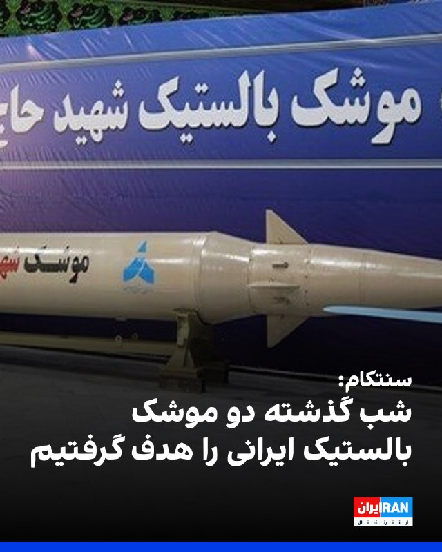

سنتکام روز دوشنبه اعلام کرد که ساعت ۱۱ شب گذشته به وقت شرق آمریکا، نیروهای آمریکایی دو موشک بالستیک ایرانی را که نیروهای آمریکایی مستقر در کویت را هدف قرار داده بودند، رهگیری کردند.

به گفته سنتکام، این موشک‌ها بلافاصله منهدم شدند و هیچ یک از نیروهای آمریکایی آسیب ندیدند.
https://iranintl.com/202606014997

## IranIntlTV — post 340041

  

علی نیکزاد، نایب‌رییس مجلس گفت: «رهبری اگر مصلحت بداند و دستور بدهد، ما می‌توانیم جلسه علنی را با تعدادی از نمایندگان در صحن و سایرین به‌صورت مجازی برگزار کنیم.»

نیکزاد اضافه کرد که بنا بر مصوبه شورای عالی امنیت ملی، «تجمع یک‌جای مجلس» پذیرفتنی نیست.
https://iranintl.com/202606019931

## IranIntlTV — post 340040

  <a href="telegram/content/IranIntlTV_340040_1780317627.mp4" target="_blank">🎬 Download video</a>

هم‌زمان با تداوم تنش‌ها در منطقه، بنیامین نتانیاهو، نخست‌وزیر اسرائیل، دستور حمله به مواضع حزب‌الله در ضاحیه بیروت را صادر کرد. گزارش‌ها حاکی از خروج گسترده ساکنان این منطقه پس از هشدار ارتش اسرائیل درباره حمله قریب‌الوقوع است.

گفت‌وگو با اشکان صفایی، خبرنگار ایران‌اینترنشنال
@iranintltv

## IranIntlTV — post 340039

  <a href="telegram/content/IranIntlTV_340039_1780317629.mp4" target="_blank">🎬 Download video</a>

اسکات بسنت، وزیر خزانه‌داری آمریکا، گفت کارزار «خشم اقتصادی» علیه جمهوری اسلامی موثر بوده است. او تاکید کرد محاصره دریایی بنادر ایران در کنار محاصره مالی اجرا شده موجب تغییر مواضع جمهوری اسلامی شده است.

گفت‌وگو با آرش آزرمی، دبیر بخش اقتصادی ایران‌اینترنشنال

@iranintltv

## IranIntlTV — post 340038

  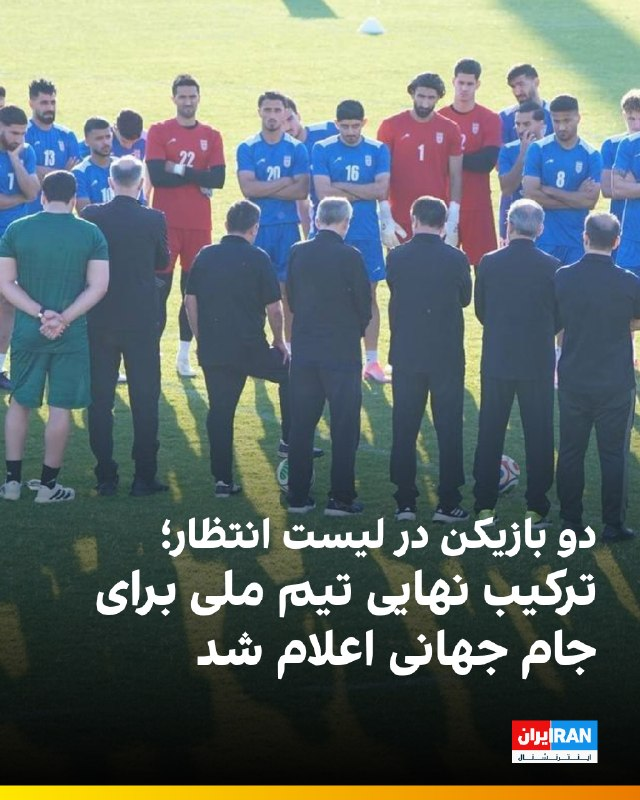

🔻امیر قلعه‌نویی، سرمربی تیم ملی فوتبال ایران، فهرست نهایی ۲۶ بازیکن این تیم برای حضور در جام جهانی ۲۰۲۶ را اعلام کرد.

🔹بر اساس اعلام کادر فنی، محمد خلیفه و امید نورافکن در فهرست انتظار قرار دارند و تیم ملی را در سفر به جام جهانی همراهی خواهند کرد. در صورت مصدومیت هر یک از بازیکنان، این دو بازیکن تا ۲۴ ساعت پیش از آغاز مسابقات امکان جایگزینی خواهند داشت.

🔹فهرست نهایی تیم ملی ایران به شرح زیر است:

🔹دروازه‌بان‌ها: علیرضا بیرانوند، حسین حسینی، سید پیام نیازمند

🔹مدافعان: احسان حاج‌صفی، میلاد محمدی، علی نعمتی، دانیال ایری، شجاع خلیل‌زاده، محمدحسین کنعانی‌زادگان، صالح حردانی، رامین رضاییان

🔹هافبک‌ها: علیرضا جهانبخش، سعید عزت‌اللهی، روزبه چشمی، امیرمحمد رزاق‌نیا، آریا یوسفی، محمد محبی، مهدی قایدی، سامان قدوس، محمد قربانی، مهدی ترابی

🔹مهاجمان: علی علیپور، شهریار مغانلو، دنیس درگاهی، امیرحسین حسین‌زاده و مهدی طارمی

🔹امیر قلعه‌نویی رو نام کسری طاهری، امیر حسین محمودی و هادی حبیبی‌نژاد، سه بازیکن جوان اردوها خط قرمز کشیده است.

🔹تیم ملی در نخستین دیدار خود در جام جهانی به مصاف نیوزیلند خواهد رفت.

@iranintltvsport

## IranIntlTV — post 340037

  <a href="telegram/content/IranIntlTV_340037_1780317631.mp4" target="_blank">🎬 Download video</a>

انجمن خانواده‌های جان‌باختگان پرواز پی‌اس-۷۵۲ اعلام کرد پس از ۶ سال پیگیری، ضمیمه ۱۳ کنوانسیون شیکاگو که مربوط به تحقیقات ایمنی سوانح هوایی است، اصلاح می‌شود.

جزییات بیشتر با مهسا مرتضوی، خبرنگار ایران‌اینترنشنال
@iranintltv

## IranIntlTV — post 340036

  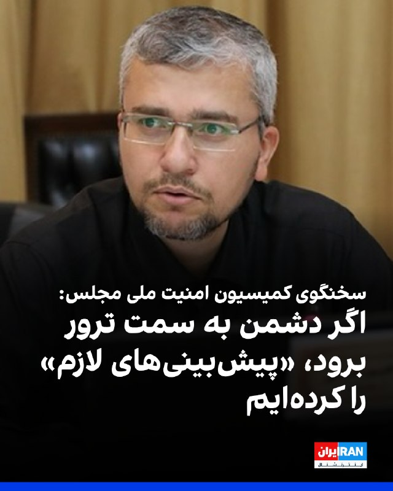

ابراهیم رضایی، سخنگوی کمیسیون امنیت ملی مجلس گفت: «اگر توافقی صورت بگیرد باید به گونه‌ای باشد که هر کسی آن را می‌بیند، بداند جمهوری اسلامی برنده آن است و اگر توافق نشود و به میدان جنگ بازگردیم، قدرتمندتر از قبل خواهیم بود و اگر دشمن بخواهد به سمت ترور برود، پیش‌بینی‌های لازم را کرده‌ایم.»

او ادامه داد: «جمهوری اسلامی در حوزه دفاعی قدرتمندتر از ۹ اسفند است و دشمن از زمان آغاز جنگ ضعیف‌تر شده است.»
https://iranintl.com/202606013537

## IranIntlTV — post 340035

  <a href="telegram/content/IranIntlTV_340035_1780317632.mp4" target="_blank">🎬 Download video</a>

در پی راه‌اندازی کارزار مردمی رشت از سوی ایران‌اینترنشنال برای شناسایی جاویدنامان و کشف ابعاد جنایات جمهوری اسلامی در این شهر، ویدیویی به دست ما رسیده که خودروهای زیادی را در آرامستان شهر در ۲۱ دی ۱۴۰۴ نشان می‌دهد. به گفته شاهدان، جمعیت زیادی برای خاکسپاری جاویدنام خود در این روز به آرامستان آمدند.
پیش‌تر ویدیوهایی هم از صف خودروها در ۲۰ دی به دست ایران‌اینترنشنال رسیده بود.

## IranIntlTV — post 340034

  

🔻الجزیره در یک گزارش تحلیلی به بررسی ریشه‌های تحول فوتبال فرانسه و چگونگی تبدیل شدن این کشور به پرستاره‌ترین تیم دنیا پرداخته است.

🔹توماس مونیه، مدافع تیم ملی بلژیک، چندی پیش با این ادعا که فرانسه استعداد کافی برای چیدن سه تیم مدعی قهرمانی در جام جهانی را دارد، جنجال به پا کرد. شاید خروس‌ها نتوانند با تیم دوم یا سوم خود قهرمان شوند، اما تعداد پرشمار استعدادهای آن‌ها باورنکردنی است؛ تا جایی که ارزش بازیکنان خط‌خورده از لیست ۲۶ نفره فرانسه، از ارزش تیم‌های ملی پرتغال، برزیل، هلند و آرژانتین بیشتر است.

🔹ریشه این تحول به اوایل دهه ۱۹۷۰ برمی‌گردد. ژرژ بولونی، سرمربی وقت فرانسه، پس از ناکامی‌های پی‌درپی تیم ملی بین دهه‌های ۱۹۳۰ تا ۱۹۷۰، راهکار را در تأسیس آکادمی‌های فوتبال تحت نظارت فدراسیون دید. دولت فرانسه نیز با هدف ترویج ارزش‌های ملی و کسب افتخار، از این طرح حمایت کرد. فدراسیون در نهایت ۱۶ مرکز را شکل داد که کلیرفونتن به مرکز اصلی آن تبدیل شد.

🔹جزییات بیشتر را در سایت بخوانید

@iranintltvsport

## IranIntlTV — post 340033

  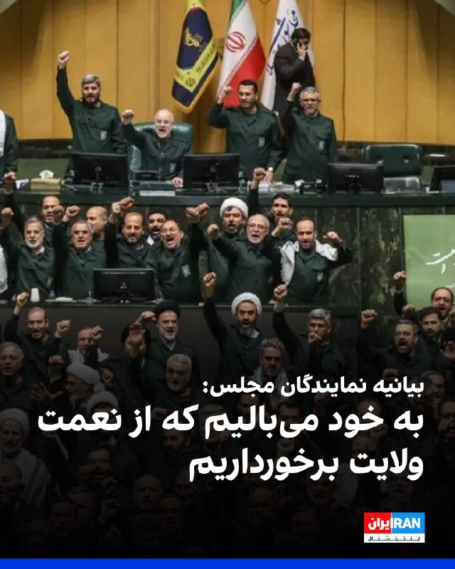

نمایندگان مجلس شورای اسلامی در بیانیه‌ای از پیام مکتوب منتسب به مجتبی خامنه‌ای «قدردانی» کرده و آن را «دقیق، متقن، جامع و راهگشا» خواندند.

در بخشی از بیانیه نمایندگان مجلس آمده: «به خود می‌بالیم که از نعمت ولایت برخورداریم و عهد خود را با امام انقلاب تازه می‌کنیم.»
https://iranintl.com/202606013286

## IranIntlTV — post 340032

🗣روایت شما از بحران اقتصادی و زندگی در آتش‌بس- دوشنبه ۱۱ خرداد:

🔹از مشهد پیام می‌دم، همه‌چی گرون شده، من ۴ تا بچه دارم، دیشب گوشی‌ام رو فروختم که بتونم خرج زندگی‌ام رو بدم، دیگه چیزی ندارم، دستم شکسته و دادرسی ندارم.

🔹دو ماه و نیم است که انسولین خودکاری آپیدرا برای من دیابتی پیدا نمی‌شه. یک ماه هست که سِرُم نمکی پیدا نمی‌شه.

🔹دو ورق قرص اعصاب خریدم شد یک میلیون تومان.

🔹رفتم داروخانه سه قلم قرص ضروری خریدیم شد ۴ میلیون تومان.

🔹گوشی آیفون ۱۵ رو با هزار بدبختی خریدم. حالا افتاده زمین و ال‌سی‌دی‌اش شکسته. جرات نمی‌کنم برم قیمت کنم چه برسه به اینکه درستش کنم.

🔹از شیراز: یک شانه تخم‌مرغ و یک پنیر جمعاً شد یک میلیون تومان. دیگه با این قیمتای سرسام‌آور نمی‌شه زندگی کرد.

🔹وضعیت جوری شده که من دانشجوی لیسانس کامپیوتر برای اینکه شهریه‌ام رو بدم مجبورم لپ‌تاپی که باهاش کارای دانشگاهی و روزمره‌ام رو انجام می‌دم رو بفروشم.

🔹درمانگاه خاتم رودهن برای عکس opg دندان ۹۹۰ هزار تومان هزینه می‌گیرد. همین خدمات پارسال ۳۵۰ هزار تومان بود.

🔹من یه سوپر مارکت کوچیک دارم، قیمت اجناس هر چند روز افزایش پیدا می‌کنه و به جایی رسیده که دیگه مردم توان خرید ندارند. حتی خود من هم دیگه توان خرید اجناس جدید برای مغازه رو ندارم.

🔹هزینه باشگاه عادی از یک میلیون و خورده‌ای شده نزدیک سه میلیون تومان.

🔹از رشت: امروز بعد یکسال رفتم یه کتونی معمولی بخرم دیدم شده ۳ میلیون. واقعا از شدت غصه قلبم درد گرفت. ما چه گناهی کردیم که عمرمون با این حکومت قاتل باید هدر بشه. تمام زندگیمون فقط شده حسرت. دویدن و هرگز نرسیدن.

## IranIntlTV — post 340031

  

صالح اسکندری، عضو جریان اصولگرای «شریان» در گفت‌وگو با خبرگزاری فارس، وابسته به سپاه پاسداران، از راه‌اندازی پویش «فعال شدن قطع داوطلبانه دسترسی به اینترنت بین‌الملل»، خبر داد و اعلام کرد هدف این پویش «افزایش امنیت سایبری خانواده‌ها و صیانت از حریم خصوصی شهروندان» است.

او با اشاره به جنگ اخیر گفت تهدیدهای سایبری و رهگیری داده‌ها به یکی از مهم‌ترین چالش‌های امنیتی تبدیل شده‌اند.
اسکندری افزود کاربران باید حق داشته باشند در صورت تمایل، دسترسی خود به اینترنت بین‌الملل را قطع کرده و تنها از خدمات داخلی و شبکه ملی اطلاعات استفاده کنند.

به گفته او، این پویش به دنبال محدودسازی اجباری اینترنت نیست، بلکه هدف آن فراهم کردن حق انتخاب برای شهروندان است.

جمهوری اسلامی پس از حدود سه ماه قطعی اینترنت بین‌الملل، در روزهای اخیر آن را وصل کرده اما همچنان از فیلترینگ شدید و گسترده، برای جلوگیری از اتصال شهروندان به آن استفاده می‌کند.
https://iranintl.com/202606010996

## IranIntlTV — post 340030

  

عباس عراقچی، وزیر خارجه در ایکس نوشت: «آتش‌بس میان جمهوری اسلامی و ایالات متحده، بدون هیچ ابهامی، آتش‌بسی در تمامی جبهه‌ها، از جمله لبنان محسوب می‌شود و نقض آتش‌بس در هر یک از جبهه‌ها، به منزله نقض آن در تمامی جبهه‌ها است.»

او آمریکا و اسرائیل را مسئول پیامدهای نقض آتش‌بس خواند.

پیش‌تر سخنگوی ارشد نیروهای مسلح جمهوری اسلامی، ادامه حملات اسرائیل به لبنان را «غیر قابل تحمل» خوانده بود.
iranintl.com/202606017992

## IranIntlTV — post 340029

  <a href="telegram/content/IranIntlTV_340029_1780317636.mp4" target="_blank">🎬 Download video</a>

بر اساس اطلاعات رسیده به ایران‌اینترنشنال، در جریان اعتراض‌های دی‌ماه در رشت، یک جوان ۱۹ ساله هنگام سپر شدن برای حفاظت از برادرش هدف گلوله قرار گرفت و مجروح شد. هم‌زمان روایت‌ها از کشته‌شدن امین پیرو با شلیک ماموران در زندان لاکان حکایت دارد.

فرنوش فرجی، عضو تحریریه ایران‌اینترنشنال گزارش می‌دهد
@iranintltv

## IranIntlTV — post 340028

  <a href="telegram/content/IranIntlTV_340028_1780317638.mp4" target="_blank">🎬 Download video</a>

اسماعیل بقایی، سخنگوی وزارت امور خارجه جمهوری اسلامی، از بیانیه‌های کشورهای اروپایی در محکومیت حمله سپاه پاسداران به کویت به‌شدت انتقاد کرد.

لی‌لی نیکفر، خبرنگار ایران‌اینترنشنال، گزارش می‌دهد

@iranintltv

## IranIntlTV — post 340027

  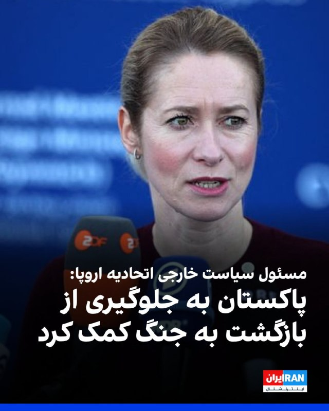

کایا کالاس، مسئول سیاست خارجی اتحادیه اروپا در نشست خبری مشترک با وزیر خارجه پاکستان در اسلام‌آباد، گفت که این اتحادیه آماده است به تلاش‌ها برای دستیابی به راه‌حلی پایدار برای درگیری آمریکا و جمهوری اسلامی کمک کند.

او افزود: «میانجی‌گری پاکستان میان آمریکا و جمهوری اسلامی به جلوگیری از بازگشت به یک جنگ تمام‌عیار کمک کرده است.»
iranintl.com/202606015317

## IranIntlTV — post 340026

  <a href="telegram/content/IranIntlTV_340026_1780317639.mp4" target="_blank">🎬 Download video</a>

امیرمهدی کشاورز، فوتبالیست ۱۷ ساله، در جریان انقلاب ملی ایرانیان علیه جمهوری اسلامی، جمعه ۱۹ دی‌ماه ۱۴۰۴، در اعتراضات زیباشهر (محمدیه) در قزوین، با شلیک دو گلوله جنگی از سوی نیروهای سرکوب، به قتل رسید.

## IranIntlTV — post 340025

  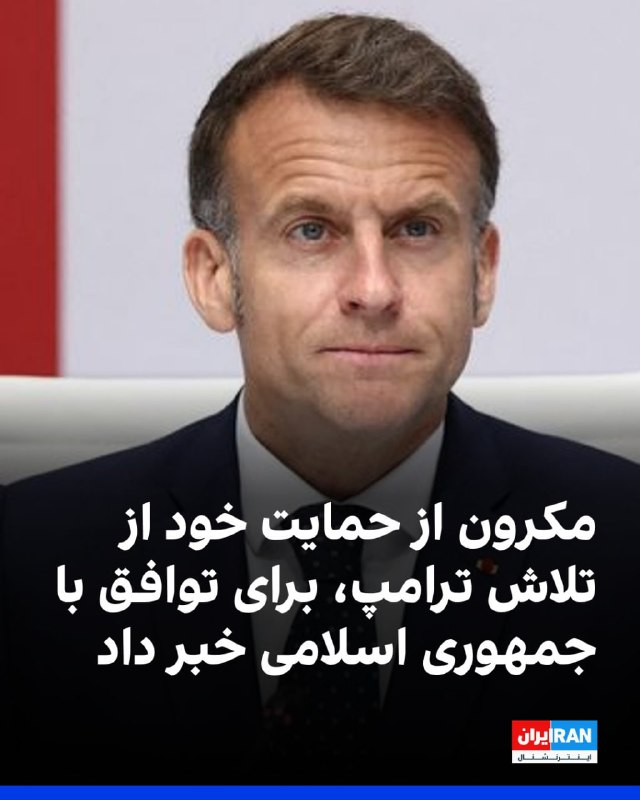

رییس‌جمهور فرانسه خبر داد که شب گذشته در تماس تلفنی با ترامپ اعلام کرده تلاش‌های او برای دستیابی سریع به توافق با جمهوری اسلامی، فرصتی منحصربه‌فرد برای ایجاد چارچوب امنیتی جدید با مشارکت همه طرف‌های ذی‌ربط و دستیابی به ثبات پایدار در منطقه فراهم می‌کند.

امانوئل مکرون در حساب ایکس خود نوشت که فرانسه آماده است توانمندی‌های خود به‌ویژه در بخش هسته‌ای را در مذاکرات گسترده‌تر با جمهوری اسلامی پس از توافق اولیه احتمالی، ارائه دهد.
iranintl.com/202606011591

## IranIntlTV — post 340024

  <a href="telegram/content/IranIntlTV_340024_1780317641.mp4" target="_blank">🎬 Download video</a>

نشست سالانه انجمن آزادی اسلو دوشنبه در پایتخت نروژ آغاز به کار کرد. برنامه‌های امسال این انجمن بر چالش‌های ناشی از حکومت‌های اقتدارگرا و نقض حقوق بشر در ایران متمرکز است.

مهران عباسیان، خبرنگار ایران‌اینترنشنال، گزارش می‌دهد

@iranintltv

## IranIntlTV — post 340023

  <a href="telegram/content/IranIntlTV_340023_1780317643.mp4" target="_blank">🎬 Download video</a>

سرخط خبرهای دوشنبه ۱۱ خرداد
@iranintltv

## Shin_Persian — post 6354

↩️ Quoted tweet: U.S. Central Command ✓ @CENTCOM Mon, 01 Jun 2026 12:08:07 UTC Last night at 11 p.m. ET, U.S. forces successfully intercepted two Iranian ballistic missiles targeting American forces based in Kuwait. These missiles were immediately defeated…

## Shin_Persian — post 6353

↩️ Quoted tweet:
U.S. Central Command ✓ @CENTCOM
Mon, 01 Jun 2026 12:08:07 UTC

Last night at 11 p.m. ET, U.S. forces successfully intercepted two Iranian ballistic missiles targeting American forces based in Kuwait. These missiles were immediately defeated and no American personnel were harmed.

U.S. Central Command remains vigilant and will continue to

↩️ توییت نقل‌قول شده — برای پاسخ، پست زیر را ببینید.

فارسی

دیشب در ساعت ۱۱ شب به وقت منطقه زمانی شرقی، نیروهای آمریکایی با موفقیت دو موشک بالستیک ایرانی را که نیروهای آمریکایی مستقر در کویت را هدف قرار داده بودند، رهگیری کردند. این موشک‌ها بلافاصله منهدم شدند و به هیچ‌یک از پرسنل آمریکایی آسیبی نرسید.

فرماندهی مرکزی ایالات متحده (سنتکام) هوشیار باقی مانده و به... ادامه خواهد داد.

𝕏 · @shin_persian

## Shin_Persian — post 6352

↩️ Quoted tweet: U.S. Central Command ✓ @CENTCOM Mon, 01 Jun 2026 12:07:08 UTC Last night at 11 p.m. ET, U.S. forces successfully intercepted two Iranian ballistic missile targeting American forces based in Kuwait. These missiles were immediately defeated…

## Shin_Persian — post 6351

↩️ Quoted tweet:
U.S. Central Command ✓ @CENTCOM
Mon, 01 Jun 2026 12:07:08 UTC

Last night at 11 p.m. ET, U.S. forces successfully intercepted two Iranian ballistic missile targeting American forces based in Kuwait. These missiles were immediately defeated and no American personnel were harmed.

U.S. Central Command remains vigilant and will continue to

↩️ توییت نقل‌قول شده — برای پاسخ، پست زیر را ببینید.

فارسی

دیشب در ساعت ۱۱ شب به وقت منطقه زمانی شرقی، نیروهای ایالات متحده با موفقیت دو موشک بالستیک ایرانی را که نیروهای آمریکایی مستقر در کویت را هدف قرار داده بودند، رهگیری کردند. این موشک‌ها بلافاصله منهدم شدند و به هیچ‌یک از پرسنل آمریکایی آسیبی وارد نشد.

فرماندهی مرکزی ایالات متحده (سنتکام) هوشیار باقی می‌ماند و به... ادامه خواهد داد.

𝕏 · @shin_persian

## Shin_Persian — post 6350

  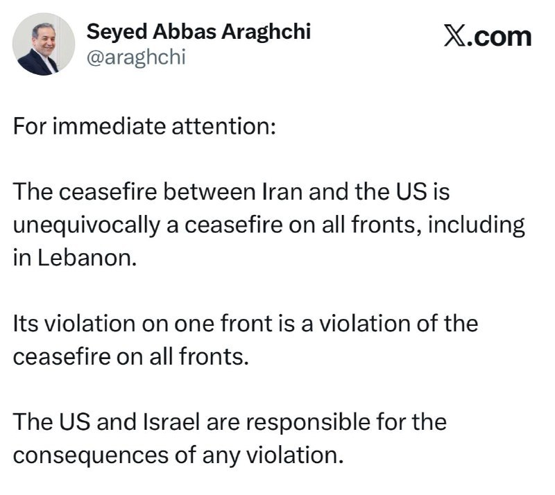

Shin ✓ @hey_itsmyturn
Mon, 01 Jun 2026 11:15:42 UTC

State-owned Mehr News

Islamic Regime FM Araghchi: ceasefire violation on one front means violation on all fronts.

Claims US-Iran ceasefire covers all fronts including Lebanon. Says US and Israel responsible for consequences of any violations.

#Iran

فارسی

خبرگزاری دولتی مهر

عراقچی، وزیر امور خارجه رژیم اسلامی: نقض آتش‌بس در یک جبهه به معنای نقض آن در تمامی جبهه‌هاست.

وی مدعی است که آتش‌بس میان ایران و آمریکا تمامی جبهه‌ها از جمله لبنان را در بر می‌گیرد و می‌گوید آمریکا و اسرائیل مسئول عواقب هرگونه نقض این آتش‌بس هستند.

#ایران

𝕏 · @shin_persian

## Shin_Persian — post 6349

  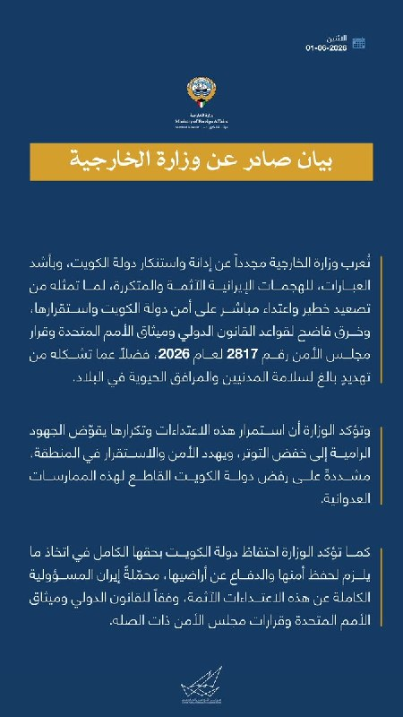

Shin ✓ @hey_itsmyturn
Mon, 01 Jun 2026 07:56:10 UTC

Kuwait Ministry of Foreign Affairs strongly condemns repeated Iranian attacks against Kuwait.

Official statement warns of serious escalation and direct threat to national security and civilian safety. Kuwait reserves …

Source: https://x.com/i/web/status/2061356049962058127

فارسی

وزارت امور خارجه کویت حملات مکرر ایران علیه کویت را به شدت محکوم می‌کند.

بیانیه رسمی نسبت به تشدید جدی تنش‌ها و تهدید مستقیم علیه امنیت ملی و ایمنی غیرنظامیان هشدار می‌دهد. کویت حق ... را برای خود محفوظ می‌دارد.

منبع: https://x.com/i/web/status/2061356049962058127

𝕏 · @shin_persian

## ManotoTV — post 105890

  <a href="telegram/content/ManotoTV_105890_1780317645.mp4" target="_blank">🎬 Download video</a>

حمله گزارش‌شده آمریکا به اهدافی در جنوب ایران، از نظر دامنه محدود بود، اما از نظر پیام نظامی اهمیت داشت. بر اساس روایت آمریکا، این حمله پس از سرنگونی یک پهپاد آمریکایی بر فراز آب‌های بین‌المللی انجام شد و سایت‌های راداری و مراکز فرماندهی و کنترل پهپادی جمهوری اسلامی در سیریک و جزیره قشم را هدف قرار داد.

## FarsiVOA — post 219255

فرماندهی مرکزی ایالات متحده، سنتکام، تصاویری از انجام عملیات تعمیر و نگهداری یک جنگنده اف-۱۶ توسط نیروهای نیروی هوایی آمریکا در یک پایگاه نظامی در خاورمیانه منتشر کرد.

@FarsiVOA

## FarsiVOA — post 219254

🔺ارتش اسرائیل از کشتن یک فرمانده حماس در غزه خبر داد

▪️ارتش اسرائیل اعلام کرد در حمله‌ای هدفمند در مرکز نوار غزه، جمال ابوعون، از اعضای شاخه نظامی حماس، کشته شده است. فردی که به گفته ارتش اسرائیل هم‌زمان به‌عنوان پزشک در بیمارستان یافا در دیرالبلح فعالیت می‌کرد.

▪️ارتش اسرائیل می‌گوید ابوعون فرمانده یک واحد در شاخه نظامی حماس بود و در طراحی و پیشبرد طرح‌هایی علیه نیروهای ارتش اسرائیل و داخل اسرائیل نقش داشت.

▪️بر اساس این اعلام، ابوعون در ماه‌های اخیر در تلاش‌های حماس برای بازسازی توان رزمی، ایجاد ظرفیت‌های جدید و تقویت دوباره این گروه، برخلاف توافق آتش‌بس، مشارکت داشته است.
در مقابل منابع فلسطینی، ابوعون را رئیس بخش بیهوشی بیمارستان یافا معرفی کرده‌اند.

⬇️ بیشتر بخوانید:
https://ir.voanews.com/a/8156054.html

## FarsiVOA — post 219253

  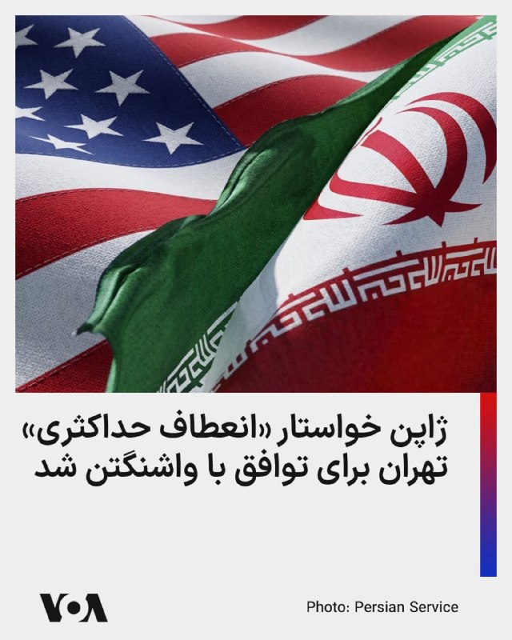

نخست‌وزیر ژاپن گفت در یک گفت‌وگوی تلفنی با رئیس دولت جمهوری اسلامی، از تهران خواست «حداکثر انعطاف‌پذیری» را از خود نشان دهد تا فرصت رسیدن به توافق آتش‌بس با آمریکا از دست نرود.

سانائه تاکایچی دوشنبه پس از تماس تلفنی با مسعود پزشکیان به خبرنگاران گفت که در این تماس، به‌طور جدی خواستار بازگشایی سریع تنگه هرمز شده است تا عبور و مرور آزاد و امن کشتی‌ها از آسیا و سایر کشورها تضمین شود.

او جزئیاتی از پاسخ پزشکیان ارائه نکرد، اما گفت دو طرف بر ادامه ارتباط نزدیک تأکید کرده‌اند.

پیشتر اسکات بسنت، وزیر خزانه‌داری ایالات متحده اعلام کرد که این کشور از وزیر دارایی ژاپن و دیگر اعضای گروه هفت خواسته تا از رژیم تحریم‌های اقتصادی علیه جمهوری اسلامی پیروی کنند.

اعضای گروه هفت کشور صنعتی جهان شامل آمریکا، کانادا، بریتانیا، فرانسه، آلمان، ایتالیا و ژاپن هستند.

نخست‌وزیر ژاپن فروردین‌ماه در واکنش به شرایط حاکم بر خاورمیانه و تنگه هرمز اعلام کرده بود که کشورش به دنبال جایگزینی نفت عبوری از تنکه هرمز است و در تهیه نفت خام از طریق مسیرهایی که از تنگه هرمز عبور نمی‌کنند، پیشرفت‌هایی حاصل شده است.
@FarsiVOA

## FarsiVOA — post 219252

  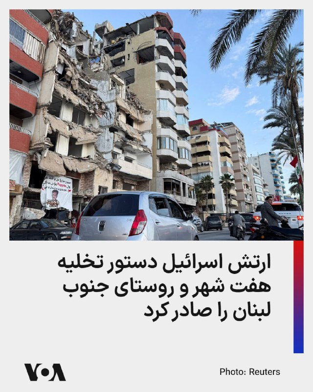

ارتش اسرائیل پیش از آغاز حملات هوایی علیه مواضع حزب‌الله، به ساکنان هفت شهر و روستا در جنوب لبنان دستور تخلیه داد.

بر اساس گزارش تایمز اسرائیل، این هشدار شامل ساکنان حومین الفوقا، بنعفول، عرب صالیم، رومین، عزه، ارکی و جباع است و از آن‌ها خواسته شده دست‌کم یک کیلومتر از محل‌های اعلام‌شده فاصله بگیرند.

آویخای ادرعی، سخنگوی ارتش اسرائیل، اعلام کرد این اقدام در پی نقض توافق آتش‌بس از سوی حزب‌الله انجام می‌شود و ارتش اسرائیل ناچار است با قدرت علیه این گروه اقدام کند.

او در هشدار خود خطاب به ساکنان جنوب لبنان تأکید کرد که ارتش اسرائیل قصد آسیب زدن به غیرنظامیان را ندارد و هدف حملات، مواضع و زیرساخت‌های حزب‌الله است.
@FarsiVOA

## FarsiVOA — post 219251

  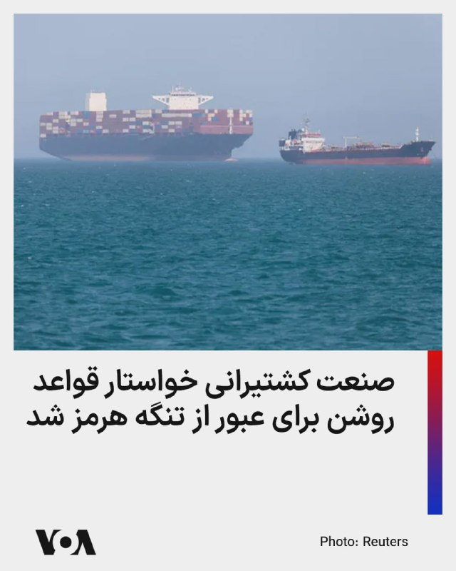

مدیران صنعت کشتیرانی در آتن می‌گویند هر توافق احتمالی میان آمریکا و جمهوری اسلامی برای کاهش تنش در خلیج فارس، باید قواعد روشن و قابل اجرا برای عبور کشتی‌ها از تنگه هرمز داشته باشد؛ در غیر این صورت، بازگشت تجارت دریایی به وضعیت عادی ممکن نخواهد بود.

به گزارش رویترز، این اظهارات در حاشیه نشست‌های آغازین پوزیدونیا، نمایشگاه دوسالانه کشتیرانی در آتن، مطرح شد.

پانکاج خانا، رئیس شرکت هایدمار مریتایم، گفت صنعت کشتیرانی به چارچوبی روشن نیاز دارد؛ مقرراتی که دقیقاً مشخص کند کشتی‌ها چگونه می‌توانند وارد خلیج فارس شوند و از آن خارج شوند. او تأکید کرد حتی اگر توافق صلح امضا شود، تا زمانی که این قواعد روشن نشود، وضعیت برای کشتی‌ها مبهم می‌ماند.

وزیر کشتیرانی یونان نیز گفت هیچ‌کس نمی‌تواند پایان درگیری را پیش‌بینی کند، زیرا بحران‌ها به‌سرعت پیچیده می‌شوند و به‌سختی باز می‌شوند.
@FarsiVOA

## FarsiVOA — post 219250

🔺مکرون از «تلاش‌های قاطعانه‌» دونالد ترامپ برای دستیابی به توافق با تهران استقبال کرد

▪️رئیس‌جمهور فرانسه از گفت‌وگوی تلفنی با دونالد ترامپ، رئیس‌جمهوری آمریکا درباره وضعیت خاورمیانه خبر داد و اعلام کرد که «از تلاش‌های قاطعانه‌ای که او برای دستیابی سریع به یک توافق میان ایالات متحده و ایران انجام می‌دهد» استقبال می‌کند.

▪️او تاکید کرد که توافق احتمالی میان تهران و واشنگتن «فرصتی منحصربه‌فرد برای ایجاد یک چارچوب امنیتی جدید با مشارکت همه طرف‌های ذی‌ربط فراهم می‌کند تا ثباتی پایدار در منطقه امکان‌پذیر شود.»

▪️پیشتر آقای ترامپ گفته بود که برخی کشورهای عضو ناتو به ویژه فرانسه و بریتانیا در زمینه حمایت از ایالات متحده در جنگ علیه جمهوری اسلامی به اندازه کافی تلاش نمی‌کنند.

⬇️ بیشتر بخوانید:
https://ir.voanews.com/a/macron-welcomes-trump-decisive-efforts-to-reach-agreement-with-tehran/8156052.html

## FarsiVOA — post 219249

  <a href="telegram/content/FarsiVOA_219249_1780317647.mp4" target="_blank">🎬 Download video</a>

عملیات تیپ گیواتی در شمال رودخانه لیتانی؛ انهدام پهپادها و راکت‌های آماده شلیک حزب‌الله؛

نیروهای تیپ گیواتی تحت فرماندهی لشکر ۳۶ ارتش اسرائیل، در جریان یک عملیات هدفمند در شمال رودخانه لیتانی برای انهدام زیرساخت‌های نظامی حزب‌الله، موفق شدند سه تن از نیروهای این گروه را که در حال آماده‌سازی برای پرتاب پهپاد به سمت مواضع ارتش بودند، از پا درآورند.

روز گذشته، نیروهای زمینی مستقر در منطقه، سه شبه‌نظامی حزب‌الله را حین تلاش برای هدایت و پرتاب پهپادهای تهاجمی به سمت نیروهای اسرائیلی شناسایی کردند. بلافاصله پهپادهای نیروی هوایی اسرائیل وارد عمل شده و این افراد را هنگام فرار، هدف حملات قرار دادند.

در ادامه این عملیات و طی جستجوهای محلی، نیروهای تیپ گیواتی یک انبار تسلیحاتی مخفی حاوی چندین فروند راکت و پهپاد انتحاری آماده پرتاب را کشف کردند.

این انبار تسلیحات متعاقباً توسط نیروهای ارتش منهدم شد که وقوع انفجارهای ثانویه شدید در محل، وجود حجم بالایی از مهمات و مواد منفجره در آن را تایید کرد.
@FarsiVOA

## FarsiVOA — post 219248

  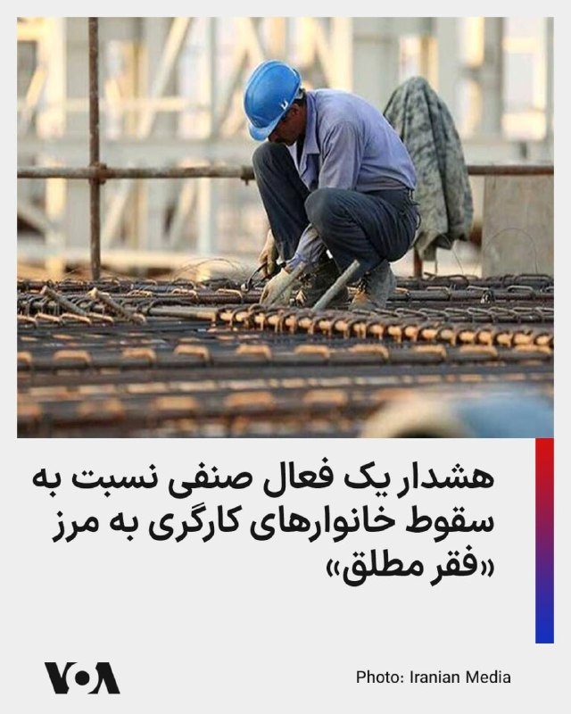

دبیر اجرایی خانه کارگر استان مازندران، نسبت به رسیدن بسیاری از خانواده‌های کارگری به مرز «فقر مطلق»، هشدار داد.

نصرالله دریابیگی طی سخنانی که خبرگزاری کارگری ایلنا منتشر کرده، شکاف عمیق میان حقوق دریافتی و هزینه‌های جاری زندگی را موجب بحرانی شدن معیشت کارگران دانست.

شورای عالی کار جمهوری اسلامی، حداقل دستمزد ماهانه کارگران را ۱۶ میلیون و ۶۰۰ هزار تومان تعیین کرده و طبق اعلام مرکز آمار، در فروردین امسال تورم نسبت به ماه مشابه سال قبل، ۷۳.۵ درصد افزایش داشته است.

این فعال کارگری معتقد است که افزایش ۶۰ درصدی هزینه‌ها در مقابل رشد ناچیز دستمزد کاگران، حقوق‌های حداقلی را بی‌معنی کرده و جامعه کارگری را به مرز فقر مطلق کشانده است.

دریابیگی همچنین نسبت به شکاف میان «زندگی لوکس ثروتمندان» و زندگی کارگران که برای تأمین نیازهای اولیه خود با مشکلات شدید مواجه هستند، انتقاد کرد.
@FarsiVOA

## FarsiVOA — post 219247

  <a href="telegram/content/FarsiVOA_219247_1780317650.mp4" target="_blank">🎬 Download video</a>

انهدام سکوی پرتاب موشک حزب‌الله دقایقی پس از حمله به طبریا؛

ارتش اسرائیل اعلام کرد تنها چند دقیقه پس از حمله موشکی شبانه حزب‌الله به شهر «طبریا»، سکوی پرتابی را که در این حمله مورد استفاده قرار گرفته بود، شناسایی و منهدم کرده است.

ارتش اسرائیل اعلام کرد که نیروهایش در مواجهه با تشدید حملات مرزی این گروه تروریستی تحت حمایت جمهوری اسلامی علیه غیرنظامیان، به واکنش‌های سریع خود در انهدام زیرساخت‌های نظامی آن ادامه می‌دهند.
@FarsiVOA

## FarsiVOA — post 219246

  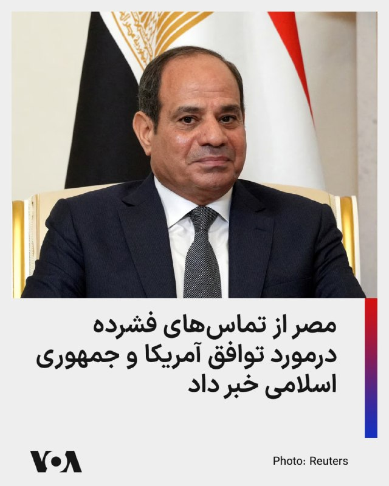

ریاست‌جمهوری مصر اعلام کرد عبدالفتاح السیسی، رئیس‌جمهور این کشور، در تماس تلفنی با امانوئل مکرون، رئیس‌جمهور فرانسه، از تلاش‌های فشرده قاهره برای کمک به دستیابی به توافقی جامع میان آمریکا و جمهوری اسلامی خبر داده است.

مصر اعلام کرده هدف از اقدامات و تلاش‌‌ها برای رسیدن به این توافق، جلوگیری از بازگشت تنش و بازگرداندن امنیت و ثبات به منطقه و کشورهای خلیج فارس است.

این موضع در شرایطی اعلام شده که جنگ آمریکا و جمهوری اسلامی، امنیت خلیج فارس، عبور و مرور در تنگه هرمز و ثبات انرژی جهانی را به یکی از محورهای اصلی رایزنی‌های منطقه‌ای و بین‌المللی تبدیل کرده است.

در همین تماس، مکرون نیز بر ضرورت باز بودن تنگه هرمز و رفع هرگونه محدودیت در عبور و مرور از این مسیر راهبردی تأکید کرد. دو طرف همچنین توافق کردند هماهنگی و رایزنی‌های فشرده میان مصر و فرانسه برای بازگرداندن ثبات منطقه‌ای ادامه یابد.
@FarsiVOA

## FarsiVOA — post 219245

🔺امیدواری نسبی مصرف‌کنندگان منطقه یورو به کنترل تورم بلندمدت

▪️نظرسنجی تازه بانک مرکزی اروپا نشان می‌دهد مصرف‌کنندگان منطقه یورو، با وجود جهش تورم و افزایش فشار قیمت انرژی، انتظارات تورمی بلندمدت خود را نزدیک به هدف نگه داشته‌اند.

▪️بر اساس گزارش رویترز، تورم منطقه یورو در آوریل تحت تأثیر افزایش قیمت نفت به ۳ درصد رسید؛ بالاتر از هدف ۲ درصدی بانک مرکزی اروپا.

▪️داده‌های روزهای اخیر در اقتصادهای بزرگ منطقه یورو از باقی ماندن تورم بالاتر از هدف بانک مرکزی حکایت دارد. در فرانسه، نرخ تورم ماه مه به ۲.۸ درصد افزایش یافت. در ایتالیا، تورم به ۳.۲ درصد رسید. در اسپانیا، نرخ تورم در سطح ۳.۲ درصد ثابت ماند، و در آلمان، تورم به ۲.۶ درصد کاهش یافت.

⬇️ بیشتر بخوانید:
https://ir.voanews.com/a/euro-zone-consumers-take-benign-view-on-inflation-surge/8156051.html

## FarsiVOA — post 219244

  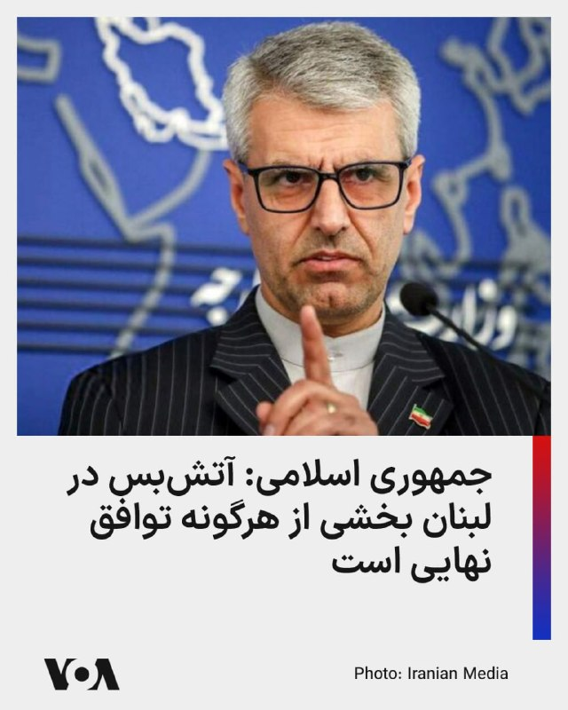

سخنگوی وزارت خارجه جمهوری اسلامی ادعا کرد که موضوع آتش‌بس در لبنان «بخش جدایی‌ناپذیر هرگونه آتش‌بس و توافق نهایی» با آمریکا برای خاتمه جنگ است.

اسماعیل بقایی دوشنبه در یک نشست خبری گفت: «تاکید داریم که آتش‌بس در لبنان بخش لاینفک هرگونه آتش‌بس و توافق نهایی برای جنگ است.»

این اظهارات همزمان با دستور نخست‌وزیر و وزیر دفاع اسرائیل برای آغاز حملات به مواضع حزب‌الله لبنان در حومه بیروت مطرح شده است. این دستور به دلیل نقض‌های مکرر آتش‌بس از سوی حزب‌الله صادر شد. همچنین اسرائیل به پیشروی نیروی زمینی خود در جنوب لبنان ادامه می‌دهد.

بقایی علاوه بر اسرائیل، ادعا کرده که آمریکا نیز به «نقض آتش‌بس» می‌پردازد؛ این در حالی است که سنتکام از «اقدامات تهاجمی» رژیم ایران خبر داده و اعلام کرده که این حملات «شامل سرنگونی یک پهپاد ام‌کیو-۱ آمریکا در حال انجام عملیات بر فراز آب‌های بین‌المللی بود.»
@FarsiVOA

## FarsiVOA — post 219243

  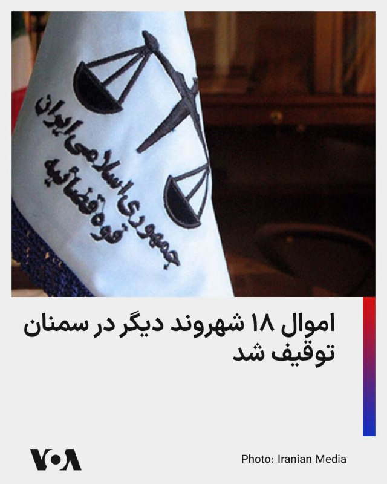

دادگستری استان سمنان دارایی‌های ۱۸ نفر از شهروندان را به اتهام همکاری با آنچه «سرویس‌های جاسوسی آمریکا و اسرائیل» خوانده، توقیف کرد. رئیس کل دادگستری استان سمنان گفت: با اجرای این احکام، شمار افرادی که دارایی‌هایشان در این استان توقیف شده به ۴۰ نفر رسیده است.

به گفته محمدصادق اکبری، برای شماری از افراد در داخل و خارج از ایران پرونده قضایی تشکیل شده و آنها به همکاری با اسرائیل و نهادهای اطلاعاتی خارجی متهم شده‌اند. مقام‌های قضایی مدعی هستند که این افراد با اقدام‌ها یا حمایت‌های خود در جهت تقویت یا مشروعیت‌بخشی به اسرائیل علیه امنیت و منافع ملی ایران فعالیت کرده‌اند.

در این گزارش جزئیاتی درباره هویت افراد، ارزش دارایی‌های توقیف‌شده یا اسناد و مدارک مربوط به این اتهامات منتشر نشده است.

این اقدام در حالی صورت می‌گیرد که رسانه‌های حکومتی پیش‌تر از توقیف اموال ده‌ها ایرانی خارج از کشور در استان‌های گلستان و خراسان جنوبی خبر داده بودند. مقام‌های قضایی این افراد را به همکاری با نهادهای خارجی متهم کرده‌اند، اما جزئیات پرونده‌ها، مستندات اتهام‌ها و امکان دفاع متهمان به‌طور مستقل قابل راستی‌آزمایی نیست.
@FarsiVOA

## FarsiVOA — post 219242

  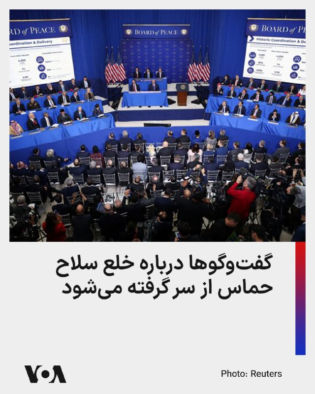

اسرائیل تایمز در گزارشی به نقل از دو دیپلمات اعلام کرد که مذاکره‌‌کنندگان پرونده غزه قرار است روز پنج‌شنبه ۱۴ خرداد، به میزبانی کشور مصر، گفت‌وگوهای مربوط به خلع سلاح حماس را از سر بگیرند.

این دو دیپلمات عرب گفته‌اند که «هیئت صلح» تحت هدایت آمریکا، هنوز به طور کامل امید خود را به امکان پیشرفت مذاکرات از دست نداده و این در حالی است که حماس از پذیرش پیشنهاد «هیئت صلح» برای خلع سلاح خودداری می‌کند.

حماس ادعا می‌کند تا زمانی که رهبر جدید انتخاب نشود، نمی‌توان هیچ تصمیم نهایی درباره خلع سلاح اتخاذ کند. ایالات متحده، اتحادیه اروپا، اسرائیل و برخی از کشورها از جمله مصر، حماس و یا دست‌کم شاخه نظامی این گروه را در فهرست گروه‌های تروریستی قرار داده‌اند.

دیپلمات‌های عرب به اسرائيل تایمز گفته‌اند که اگر طرح رئیس‌جمهور آمریکا، جهت پایان دادن به جنگ غزه به نتیجه نرسد،‌ احتمال بررسی طرح‌های جایگزین وجود دارد.

یکی از گزینه‌های جایگزین، اجازه به دولت بنیامین نتانیاهو برای بازسازی برخی از مناطق غزه که تحت کنترل اسرائیل قرار دارد، است که پیش‌تر از سوی دونالد ترامپ به دلیل احتمال مخالفت منطقه کنار گذاشته شده بود.
@FarsiVOA

## FarsiVOA — post 219241

  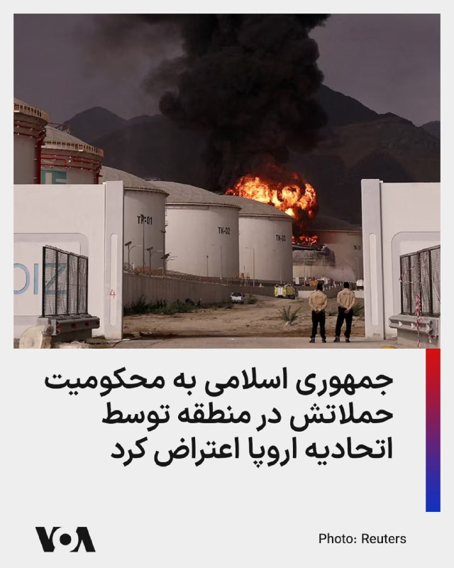

جمهوری اسلامی با اعتراض به انتقادهای اتحادیه اروپا از حملاتش در منطقه، این حملات را در چارچوب «حق دفاع مشروع» توصیف کرد.

اتحادیه‌ ارو‍پا طی روزهای اخیر با صدور بیانیه‌های جداگانه، تداوم حملات جمهوری اسلامی به کشورهای همسایه را محکوم کرده بود.

در یک بیانیه در محکومیت حملات جمهوری اسلامی به خاک کویت، اتحادیه اروپا چنین حملاتی «تهدیدی جدی برای امنیت و ثبات منطقه‌ای» خوانده است. این اتحادیه از جمهوری اسلامی خواسته است تا قطعنامه ۲۸۱۷ شورای امنیت سازمان ملل مبنی بر توقف حملات به کشورهای خلیج فارس را به طور کامل اجرا کند.

اتحادیه اروپا همچنین هفتم خرداد نیز در بیانیه پایانی بیست‌وپنجمین نشست سالانه خود به موضوع ایران اشاره و یادآور شد که به شدت «حملات غیرقابل توجیه و بی رویه موشک‌های بالستیک و پهپاد ایران» علیه کشورهای منطقه را محکوم می‌کند.

اسماعیل بقایی، سخنگوی وزارت خارجه جمهوری اسلامی اما به بیانیه‌‌ها اتحادیه اروپا واکنش نشان داده و مدعی شد که «هدف قرار دادن مبادی و امکاناتی که برای تجاوز نظامی» مورد استفاده قرار می‌گیرد، در چارچوب «حق دفاع مشروع» است.
@FarsiVOA

## FarsiVOA — post 219240

  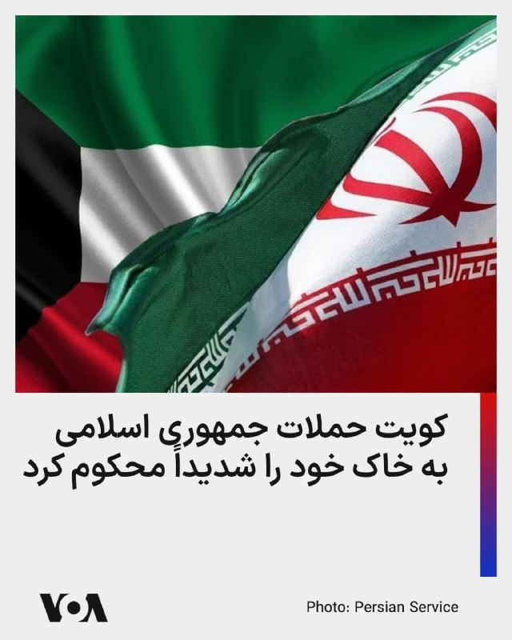

وزارت خارجه کویت با انتشار بیانیه‌ای، «حملات نادرست و مکرر» جمهوری اسلامی به خاک خود را شدیداً محکوم و نسبت به آن ابراز انزجار کرد.

در این بیانیه که دوشنبه منتشر شد، آمده است که این حملات «تشدید تنشی خطرناک، تعرضی مستقیم به امنیت دولت کویت و ثبات آن، نقض آشکار قواعد حقوق بین‌الملل، منشور سازمان ملل متحد و قطعنامه شماره ۲۸۱۷ شورای امنیت برای سال ۲۰۲۶، و تهدیدی جدی برای سلامت غیرنظامیان و تأسیسات حیاتی کشور» محسوب می‌شود.

این وزارتخانه تأکید کرد که ادامه و تکرار این حملات، تلاش‌های صورت‌گرفته برای کاهش تنش را تضعیف کرده و امنیت و ثبات منطقه را به خطر می‌اندازد.

همچنین کویت ضمن مسئول دانستن جمهوری اسلامی در این «حملات تجاوزکارانه»، افزود که «حق کامل خود را برای اتخاذ هر اقدام لازم جهت حفظ امنیت و دفاع از سرزمین خود محفوظ می‌دارد.»
@FarsiVOA

## FarsiVOA — post 219239

  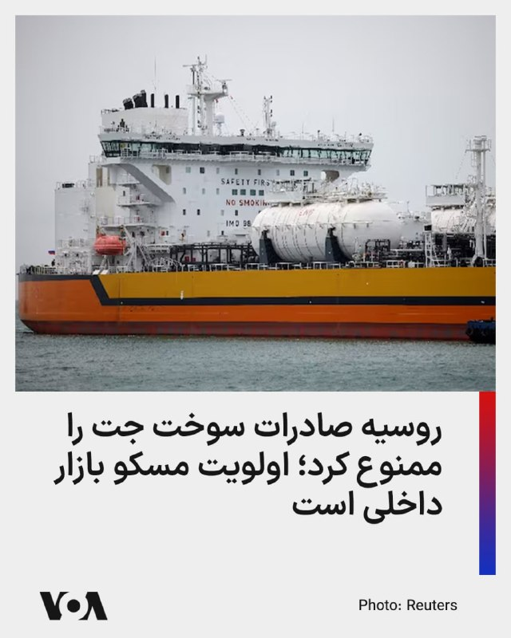

روسیه صادرات سوخت جت را تا ۳۰ نوامبر ممنوع کرد؛ تصمیمی که هم‌زمان با افزایش حملات اوکراین به پالایشگاه‌ها و فشار بر زیرساخت انرژی این کشور گرفته شده است.

دولت روسیه هدف از این محدودیت را حفظ ثبات بازار داخلی و تأمین نیاز مصرف‌کنندگان اعلام کرده است.

اهمیت این تصمیم بیش از آنکه به سهم روسیه در بازار جهانی سوخت جت مربوط باشد، به نشانه‌ای از فشار داخلی بر تولید سوخت در روسیه بازمی‌گردد.

طبق داده‌های جمع‌آوری‌شده بلومبرگ از شرکت تحلیلی ورتکسا، روسیه در سال گذشته به‌طور متوسط روزانه حدود ۳۰ هزار بشکه سوخت جت صادر کرده است. این رقم کمتر از دو درصد عرضه جهانی است.

میانگین صادرات روزانه این کشور در چهار ماه نخست سال ۲۰۲۶ نیز به ۲۸ هزار بشکه کاهش یافته و ترکیه خریدار اصلی آن بوده است.

پیش از این نیز وزارت انرژی روسیه از اول آوریل ممنوعیت صادرات بنزین را دوباره اعمال کرده بود تا سوخت بیشتری در بازار داخلی باقی بماند.
@FarsiVOA

## FarsiVOA — post 219238

🔺دولت مبلغ کالابرگ را افزایش نداد

▪️در حالی که طی هفته‌های گذشته بارها از بررسی افزایش اعتبار کالابرگ، پیشنهاد رشد ۳۰ تا ۱۰۰ درصدی آن و ضرورت جبران فشار گرانی بر سفره مردم سخن گفته شده بود، وزیر تعاون، کار و رفاه اجتماعی، اعلام کرد کالابرگ خردادماه «به روال ماه‌های قبل» پرداخت می‌شود.

▪️این اظهارنظر به معنای آن است که دولت، دست‌کم در خرداد، مبلغ کالابرگ را افزایش نداده است؛ آن هم در شرایطی که انتظار عمومی پس از چندین وعده و اظهارنظر رسمی، به سمت افزایش اعتبار این طرح رفته بود.

▪️کالابرگ قرار بود بخشی از فشار تورم بر معیشت خانوار را جبران کند، اما با ثابت ماندن مبلغ آن و رشد قیمت کالاهای اساسی، ارزش واقعی این حمایت کاهش یافته است.

⬇️ بیشتر بخوانید:
https://ir.voanews.com/a/8156050.html

## DW_Farsi — post 125384

🔶 تهدیدات ایران علیه آمریکا و اسرائیل در ارتباط با "نقض آتش‌بس"

محمدباقر قالیباف، رئیس مجلس شورای اسلامی و سرپرست هیات مذاکره‌کننده ایران با آمریکا در پست جدیدی در شبکه ایکس اسرائیل را تهدید کرد که "هزینه جنایات در لبنان را پرداخت خواهد کرد".

او "اعمال محاصرهٔ دریایی (علیه ایران) و تشدید جنایات جنگی در لبنان توسط اسرائیل" را "شواهد روشن عدم پایبندی آمریکا به آتش بس" توصیف کرد.

در آتش بسی که پس از جنگ ۴۰ روزه میان ایران و آمریکا برقرار شد، خاموش‌شدن سلاح‌ها در لبنان هم مورد بحث بود، اما اسرائیل و حزب‌الله به این تفاهم پایبند نمانده‌اند و حملات متقابل ادامه یافته است. ایران محاصره دریایی سواحل خود از سوی آمریکا را نیز که در واکنش به بستن تنگه هرمز صورت گرفته، نقض مفاد آتش‌بس می‌داند.

قالیباف با اشاره به اینکه "هر انتخابی، هزینه‌ای دارد و صورتحساب آن هم از راه میرسد"، نوشت: «همه چیز در نهایت سر جای خودش قرار خواهد گرفت.» او توضیح بیشتری در این باره نداد.

همزمان عباس عراقچی، وزیر خارجه جمهوری اسلامی ایران نیز در پستی در شبکه ایکس با عنوان "برای توجه فوری"، با بیان این که "آتش‌بس میان ایران و ایالات متحده، بدون هیچ ابهامی، آتش‌بسی در تمامی جبهه‌ها، از جمله لبنان، محسوب می‌شود"، نقض آن در هر یک از جبهه‌ها را "به منزله نقض آن در تمامی جبهه‌ها" اعلام کرد.

او ایالات متحده و اسرائیل را مسئول پیامدهای هرگونه نقض آتش بس دانست، ولی معلوم نکرد که این "پیامدها" چه خواهند بود.

علاوه بر تداوم تبادل آتش در لبنان میان اسرائیل و حزب‌‌الله، در منطقه خلیج فارس و دریای عمان نیز آتش‌بس میان ایران و آمریکا شکننده است و درگیری‌های پراکنده میان دو طرف گاه و بی‌گاه جریان دارد.
@dw_farsi

## DW_Farsi — post 125383

  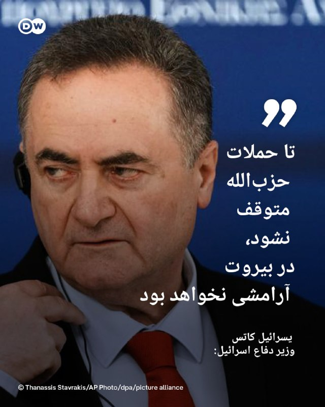

🔶 وزیر دفاع اسرائیل: تا حملات حزب‌الله متوقف نشود، در بیروت آرامشی نخواهد بود
 
وزیر دفاع اسرائیل روز دوشنبه گفت اگر حملات حزب‌الله ادامه یابد، "در بیروت نیز آرامشی وجود نخواهد داشت". او تأکید کرد که اسرائیل قصد دارد منطقه‌ای تحت کنترل نظامی خود در محدوده رود لیتانی در جنوب لبنان ایجاد کند.
 
 در بیانیه‌ای که از سوی یسرائیل کاتس منتشر شد، آمده است: «ضاحیه در بیروت هیچ تفاوتی با شهرک‌های شمال اسرائیل ندارد؛ اگر در شمال آرامش نباشد، در بیروت نیز آرامش نخواهد بود.»
 
"ضاحیه" در حومه جنوبی بیروت و یکی از پایگاه‌های اصلی حزب‌الله است؛ منطقه‌ای که وزیر دفاع اسرائیل پیش‌تر در همان روز دستور حمله به آن را صادر کرده بود.
 
بیانیه کاتس می‌افزاید: «در عین حال، ارتش اسرائیل به عملیات آتشباری و مانورهای نظامی علیه نیروها و زیرساخت‌های حزب‌الله در لبنان ادامه می‌دهد تا تهدیدها را از نیروهای ارتش اسرائیل و ساکنان اسرائیل دور کند و منطقه لیتانی را به منطقه‌ای تحت کنترل امنیتی ارتش اسرائیل، عاری از سلاح و نیروهای تروریستی، تبدیل کند.»
 
اسرائیل و حزب‌الله به‌طور مکرر یکدیگر را به نقض مفاد آتش‌بس متهم می‌کنند.
@dw_farsi

## DW_Farsi — post 125382

  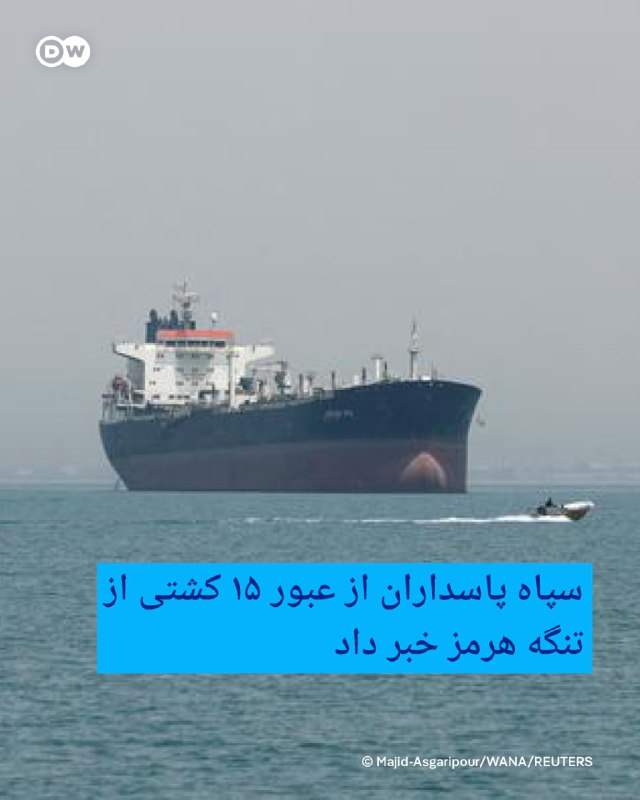

🔶 سپاه پاسداران از عبور ۱۵ کشتی از تنگه هرمز خبر داد
 
روابط عمومی نیروی دریایی سپاه روز دوشنبه با انتشار اطلاعیه‌ای اعلام کرد در ۲۴ ساعت گذشته ۱۵ فروند کشتی، از جمله ۴ نفتکش، از تنگه هرمزعبور کرده‌اند. طبق این اطلاعیه، عبور این کشتی‌ها "پس از کسب مجوز با هماهنگی و تأمین امنیت نیروی دریایی سپاه" صورت گرفته است.
 
خبرگزاری بلومبرگ اخیرا در گزارشی با استناد به داده‌های کشتیرانی نوشته بود از میان ۱۰۹ کشتی بزرگ با ظرفیت حمل ۷۰۰ هزار بشکه یا بیشتر که پس از آغاز جنگ آمریکا و اسرائیل با ایران و بسته شدن تنگه هرمز، گرفتار شده بودند تا کنون ۲۹ کشتی موفق به گذر از این آبراه شده‌اند.
 
مدیرعامل شرکت "شورون" روز جمعه به تلویزیون بلومبرگ گفته بود که برخی از کشتی‌هایی که از تنگه عبور می‌کنند، اخیراً هدف حمله قرار گرفته‌اند. طبق این گزارش چند تن از فعالان بازار کشتیرانی اظهار داشته‌اند که برخی از کشتی‌هایی که از این مسیر عبور کرده‌اند متعلق به شرکت‌هایی هستند که از زمان آغاز جنگ تاکنون از تنگه عبور نکرده بودند.
@dw_farsi

## DW_Farsi — post 125381

  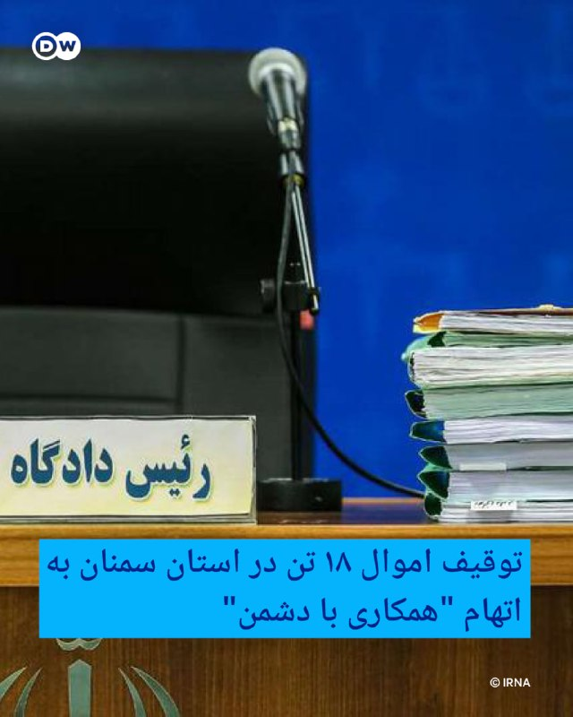

🔶 توقیف اموال ۱۸ تن در استان سمنان به اتهام "همکاری با دشمن"
 
رییس کل دادگستری استان سمنان از توقیف دارایی‌‌های ۱۸ شهروند به اتهام "همکاری با دشمن" خبر داد.
 
رسانه‌های داخلی روز دوشنبه ۱۱ خرداد به نقل از محمدصادق اکبری گزارش دادند تا کنون دارایی‌های منقول و غیرمنقول و همچنین حساب‌های بانکی ۴۰ نفر در این استان به اتهام "همکاری با سرویس‌های جاسوسی آمریکا و اسرائیل" توقیف شده است.
 
پس از آغاز جنگ آمریکا و اسرائیل با ایران در روز نهم اسفند سال گذشته، قوه قضائیه جمهوری اسلامی اموال صدها شهروند ایرانی را توقیف کرده است.
 
برخی از حقوقدانان مستقل بر این باورند که هرچند قوانین ایران در بعضی جرائم امنیتی یا موارد مربوط به اموال حاصل از ارتکاب جرم، امکان توقیف یا مصادره دارایی‌ها را پیش‌بینی کرده‌، اما ضبط تمامی اموال افراد صرفاً بر پایه اتهام "همکاری با دشمن" با چالش‌های حقوقی جدی مواجه است.
 
وکلای دادگستری تاکید دارند که این احکام غالباً بدون طی کردن روند قانونی دادرسی عادلانه، حق دفاع متهم، و اطلاع‌رسانی قبلی صادر و اجرا می‌شوند.
@dw_farsi

## DW_Farsi — post 125371

📸 صدمین زادروز مریلین مونرو؛ افسانه‌ای که هنوز زنده است

صد سال پیش مریلین مونرو، ستاره هالیوود و یکی از شناخته‌شده‌ترین نمادهای فرهنگ عامه در قرن بیستم، چشم به جهان گشود. او اول ژوئن ۱۹۲۶ در لس آنجلس به دنیا آمد و نورما جین مورتنسون نام گرفت.

بیش از شش دهه از مرگ مریلین مونرو می‌گذرد، اما او همچنان به‌عنوان "سمبل جذابیت جنسی" در فرهنگ عامه شناخته می‌شود و زندگی پر فراز و نشیبش همچنان توجه مخاطبان را به خود جلب می‌کند.

انستیتوی فیلم آمریکا، مریلین مونرو را در رتبه ششم فهرست بزرگ‌ترین بازیگران زن دوران طلایی هالیوود قرار داده است.

درخشش او از دهه‌های ۱۹۵۰ و ۱۹۶۰ آغاز شد. ایفای نقش شخصیت "بلوند اغواگر سربه‌هوا" در چندین فیلم معروف به شهرتش کمک کرد، اما استعداد بازیگری‌اش فراتر از این کلیشه بود. فیلم‌های او تا زمان مرگش بیش از ۲۰۰ میلیون دلار در گیشه فروش داشتند.
 
@dw_farsi

## DW_Farsi — post 125370

  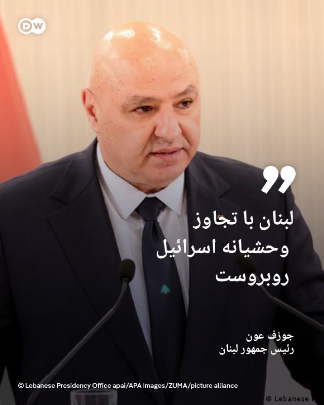

🔶 جوزف عون: لبنان با تجاوز وحشیانه اسرائیل روبروست
 
همزمان با تشدید حملات اسرائیل علیه حزب‌الله و تصرف قلعه تاریخی و راهبری "بوفور" در جنوب لبنان، جوزف عون اعلام کرد کشورش با "تجاوز وحشیانه و سزاوار سرزنش" از سوی اسرائیل روبروست. رئیس جمهور لبنان با انتشار پیامی در شبکه ایکس این حمله را محکوم کرد.
 
شورای امنیت سازمان ملل متحد قرار است روز دوشنبه، اول ژوئن (۱۱ خرداد) نشستی اضطراری درباره لبنان برگزار کند. این امر در حالی است که بنیامین نتانیاهو و یسرائیل کاتس، نخست‌وزیر و وزیر دفاع اسرائیل، از آغاز مجدد حملات به منطقه ضاحیه بیروت خبر داده‌اند.
 
نتانیاهو روز یکشنبه تصرف قلعه بوفور را نشانه "تغییری چشمگیر" در روند درگیری‌ها در لبنان خوانده بود.
 
گروه شبه‌نظامی حزب‌الله که از سوی جمهوری اسلامی حمایت می‌شود، روزانه شمال اسرائیل و نیروهای اسرائیلی مستقر در جنوب لبنان را هدف حملات خود قرار می‌دهد. هم‌زمان ارتش اسرائیل نیز به حملات علیه این گروه در جنوب لبنان ادامه می‌دهد.
 
آتش‌بسی که اواسط ماه آوریل میان لبنان و اسرائیل برقرار شد، اکنون تا حد زیادی از هم فروپاشیده است.
 
@dw_farsi

## DW_Farsi — post 125369

🔶 بقایی: هیچ مذاکره‌ای درباره پرونده هسته‌ای صورت نگرفته است
 
اسماعیل بقائی، سخنگوی وزارت خارجه ایران، روز دوشنبه ۱۱ خرداد در نشست خبری هفتگی خود گفت مذاکرات تهران با واشنگتن "در عین سوءظن شدید" ادامه دارد و انجام مذاکره "به معنای وجود اعتماد بین طرفین نیست".
 
او در پاسخ به پرسشی در مورد آخرین وضعیت مذاکرات اظهار داشت: «ما از ابتدا می‌دانستیم و می‌دانیم که در شرایط عدم اعتماد مذاکره می‌کنیم و این یک مفروض است. فراتر از آن مذاکره در دل سوءظن شدید و بدگمانی آغاز شد و تبادل پیام‌ها نیز در همین قالب و در همین فضا در حال انجام است.»
 
او افزود: «در چنین وضعیتی و در شرایطی که طرف مقابل مدام دیدگاه‌های خود را تغییر می‌دهد، مطالبات جدید یا متناقضی مطرح می‌کند و پیام‌های رسانه‌ای متفاوت، متناقض ارسال می‌کند، طبیعی است که این وضعیت موجب طولانی شدن روند مذاکره شود.»
 
بقائی در ادامه اسرائیل را نیز به "ممانعت از شکل‌گیری هرگونه روندی برای کاهش تنش" در منطقه متهم کرده و حملات این کشور به لبنان را "تخریب نتیجه‌بخشی دیپلماسی" خواند.
 
سخنگوی وزارت خارجه ایران همچنین بار دیگر تأکید کرد در مذاکرات با آمریکا در حال حاضر تمرکز بر "خاتمه جنگ" است و در مورد جزئیات مباحث مرتبط با پرونده هسته‌ای جمهوری اسلامی، "هیچ مذاکره‌ای در این مرحله صورت نگرفته است".
 
این اظهارات در حالی بیان شده است که دونالد ترامپ، رئیس جمهور آمریکا، روز دوشنبه در پیامی نوشت که "بخش عمده" توافق با ایران درباره فعالیت‌های هسته‌ای است و به روشنی تصریح شده است که "ایران نباید به سلاح هسته‌ای دست پیدا کند".
 
بقائی همچنین اعلام کرد که موضوع پرداخت غرامت برای جبران و بازسازی خسارات ناشی از جنگ در جریان مذاکره با آمریکا مطرح شده، اما جزئیات بیشتری در این باره از جمله در مورد مبلغ آن ارائه نکرد.
 
او در ادامه با انتقاد مجدد از برخی کشورهای همسایه به دلیل در اختیار گذاشتن خاک خود برای حمله به ایران، این اقدام را "غیرقانونی و خلاف اصل حسن همجواری" توصیف کرده و نسبت به "پیامدهای ناگوار" آن هشدار داد.
 
سخنگوی وزارت خارجه در ادامه از حملات سپاه پاسداران به کویت دفاع کرده و گفت: «خودداری از اجازه دادن به طرف‌های متجاوز برای استفاده از قلمرو یک کشور جهت انجام اقدامات ایذایی علیه کشور دیگر، یک اصل پذیرفته‌شده و ثابت در حقوق بین‌الملل است. لذا نقض این تعهد از سوی دولت‌های منطقه، آن‌ها را در کنار طرف‌های متجاوز قرار خواهد داد.»
 
ارتش کویت روز دوشنبه از رهگیری چندین پهپاد و موشک خبر داد، اما اشاره‌ای به مبدأ این حمله یا اهداف آن نکرد.
 
بقائی همچنین بیانیه اتحادیه اروپا در محکومیت حملات ایران به کویت را "مصداق واقعی ریاکاری" خوانده و اظهار داشت: «اتحادیه اروپا باید از رویکرد مبتنی بر خشنودسازی متجاوزان و سرزنش کردن طرف‌هایی که از خود دفاع می‌کنند دست بردارد.»
 
اتحادیه اروپا پیش‌تر در بیانیه‌ای حملات ایران را "تهدیدی جدی برای امنیت و ثبات منطقه" خوانده بود.
@dw_farsi

## DW_Farsi — post 125368

🔶 حملات روسیه به خارکیف و خرسون چندین زخمی بر جا گذاشت

در پی حملات تازه روسیه به اوکراین، بار دیگر چندین نفر زخمی شدند. اولگ سینیهوبوف، فرماندار منطقه خارکیف، اعلام کرد که در شهر مرزی خارکیف واقع در شمال شرق اوکراین، دو ساختمان مسکونی نیز هدف قرار گرفته‌اند.
 
این مقام اوکراینی در پیام‌رسان تلگرام نوشت در خارکیف دو نفر زخمی شده‌اند و یک زن دیگر نیز در شهر بوهودوخیف آسیب دیده است.
 
در شهر خرسون واقع در جنوب اوکراین نیز سه نفر در جریان حملات شبانه زخمی شدند. ارتش روسیه این شهر را با توپخانه هدف قرار داد.
 
طبق اعلام مقام‌های شهری خرسون، یک گلوله توپ حدود ساعت ۱:۳۰ بامداد دوشنبه اول ژوئن (۱۱ خرداد) به وقت محلی به یک ساختمان مسکونی در این شهر اصابت کرد.
 
بر اساس اعلام مقام‌های اوکراینی، چهار نفر دیگر نیز در مناطق مختلف استان خرسون زخمی شده‌اند. با این حال، مشخص نشده است که این افراد در جریان حملات شبانه زخمی شده‌اند یا در طول روز پیش از آن.
 
ولودیمیر زلنسکی، رئیس جمهور اوکراین، در یک مصاحبه تلویزیونی با سی‌بی‌اس که روز یکشنبه از این شبکه آمریکایی پخش شد، خواستار برگزاری گفت‌وگوهای صلح با روسیه پیش از آغاز زمستان شد.
 
زلنسکی در این مصاحبه ضمن تلاش برای جلب حمایت افکار عمومی ایالات متحده، گفت موقعیت راهبردی اوکراین بهبود یافته است.
 
@dw_farsi

## DW_Farsi — post 125367

  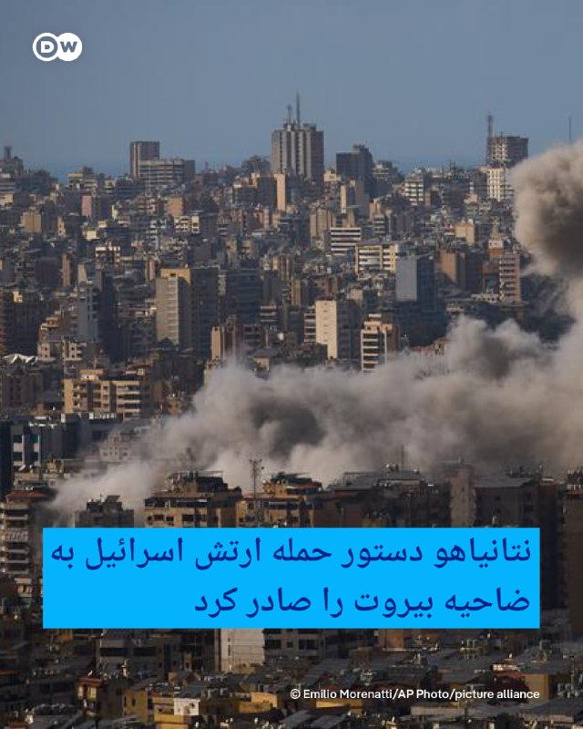

🔶 نتانیاهو دستور حمله ارتش اسرائیل به ضاحیه بیروت را صادر کرد
 
نخست‌وزیر اسرائیل روز دوشنبه اول ژوئن به ارتش این کشور دستور داد تا مواضعی را در حومه جنوبی بیروت، منطقه‌ای معروف به ضاحیه که به عنوان پایگاه حزب‌الله به شمار می‌رود، هدف قرار دهد.
 
در بیانیه‌ای که دفتر بنیامین نتانیاهو منتشر کرده، آمده است در پی "نقض مکرر آتش‌بس" توسط حزب‌الله و ادامه حملات این گروه به شهرها و شهروندان اسرائیلی، نخست‌وزیر و وزیر دفاع اسرائیل به ارتش این کشور دستور دادند تا "اهداف تروریستی" را در منطقه ضاحیه بیروت هدف حمله قرار دهند.
 
اسرائیل در طول دوره آتش‌بس به درخواست دولت آمریکا عمدتا از حمله به بیروت خودداری کرده بود.
 
ارتش اسرائیل و نیروهای حزب‌الله از زمان برقراری آتش‌بس در لبنان که اواسط ماه آوریل رخ داد، همچنان به تبادل آتش ادامه‌ داده‌اند.
 
در همین حال ده‌ها هزار نفر از ساکنان شمال اسرائیل به دلیل حملات موشکی و پهپادی حزب‌الله مجبور به ترک خانه‌های خود شده‌اند.
 
مقامات لبنان می‌گویند حملات اخیر اسرائیل به این کشور موجب کشته‌شدن بیش از سه هزار شهروند لبنانی و آواره شدن چند صد هزار تن شده است.
@dw_farsi

## DW_Farsi — post 125366

  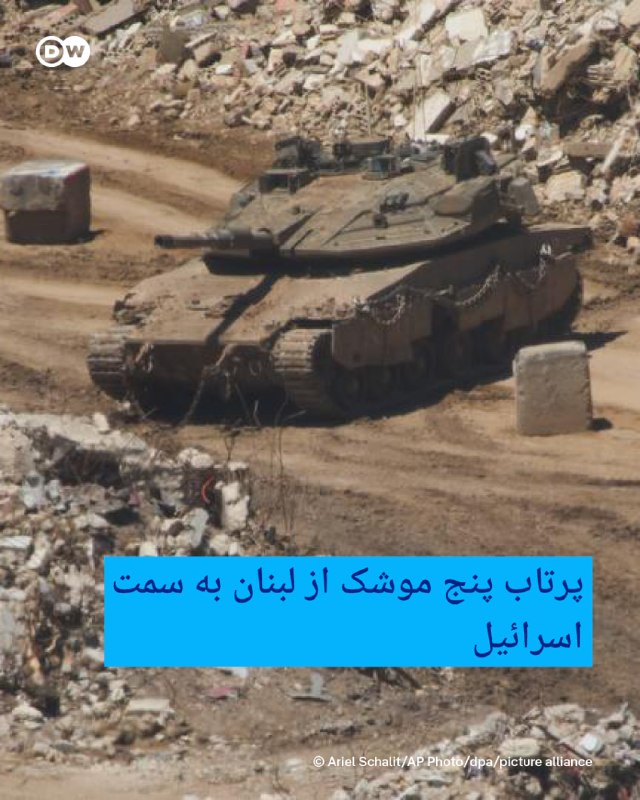

🔶 پرتاب پنج موشک از لبنان به سمت اسرائیل
 
ارتش اسرائیل از رهگیری دو موشک پرتاب‌شده از لبنان به سمت کریات شمونا، شهری در شمال این کشور در دوشنبه ۱۱ خرداد (اول ژوئن) خبر داد و اعلام کرد نتیجه رهگیری موشک سوم در دست بررسی است. به گفته ارتش دو موشک دیگر نیز به سمت شهر طبریه شلیک شد که یکی از آنها در منطقه‌ای باز فرود آمد و موشک دوم داخل خاک لبنان و نزدیک محل استقرار نیروهای اسرائیلی سقوط کرده است.
 
ارتش اسرائیل همچنین اعلام کرد که حمله پهپادی حزب‌الله در جنوب لبنان منجر به کشته شدن یک سرباز اسرائیلی و زخمی شدن سه سرباز دیگر شد.
 
به گزارش تایمز اسرائیل پهپاد انتحاری دید اول شخص (FPV) حزب‌الله حدود ساعت یک بامداد دوشنبه به هدفی در منطقه مسکونی یحمر در شهرستان نبطیه، نزدیک قلعه بوفور جایی که نیروهای اسرائیل مشغول انجام عملیات بودند، اصابت کرد.
 
ارتش اسرائیل یکشنبه اعلام کرد قلعه تاریخی و راهبردی بوفور (شقیف) را که در جنوب لبنان واقع شده، تصرف کرده است. آویخای ادرعی، سخنگوی عرب‌زبان ارتش اسرائیل، نیز در شبکه ایکس عکس‌هایی را منتشر کرده که نیروهای اسرائیلی را در حال حرکت در مقابل این قلعه نشان می‌‌داد.
@dw_farsi

## DW_Farsi — post 125365

🔶 انتخابات ریاست جمهوری کلمبیا؛ مصاف چپ و راست به دور دوم کشید
 
انتخابات ریاست جمهوری کلمبیا به دور دوم، میان آبلاردو د لا اسپریا، حقوقدان راست‌گرا، و ایوان سپدا، سناتور چپ‌گرا، کشیده شد.
 
بر اساس اعلام کمیسیون انتخابات، پس از شمارش حدود ۹۹.۵ درصد آرا، د لا اسپریا ۴۳.۷ درصد و سپدا نزدیک به ۴۱ درصد آرا را به دست آورده‌اند.
 
از آنجا که هیچ‌یک از نامزدها موفق به کسب اکثریت مطلق نشده‌اند، سرنوشت ریاست جمهوری در دور دوم انتخابات در روز ۲۱ ژوئن تعیین خواهد شد.
 
حدود ۴۱ میلیون شهروند کلمبیا برای انتخاب جانشین گوستاوو پترو، رئیس جمهور چپ‌گرای این کشور، به پای صندوق‌های رأی فراخوانده شده بودند. پترو بر اساس قانون اساسی اجازه نامزدی مجدد نداشت.
 
این انتخابات همچنین به عنوان رأی‌گیری درباره ادامه یا توقف سیاست‌های پترو، از جمله افزایش هزینه‌های اجتماعی و مذاکره با گروه‌های مسلح، یا حرکت به سوی رویکردی محافظه‌کارانه‌تر تلقی می‌شد.
 
پالوما والنسیا، سناتور محافظه‌کار که پیش از انتخابات نیز از بخت‌های اصلی پیروزی به شمار می‌رفت، با نزدیک به هفت درصد آرا، فاصله زیادی با دو نامزد پیشتاز داشت.
@dw_farsi

## Persian_Trend_Official — post 15429

  <a href="telegram/content/Persian_Trend_Official_15429_1780317657.mp4" target="_blank">🎬 Download video</a>

برداشت میثم نیلی : طرح ۱۴ بندی از برجام هم بدتر است

📌 @persian_trend_official
پرشین ترند | متفاوت‌ترین کانال نظامی

## Persian_Trend_Official — post 15428

  

محمد باقر قالیباف، رئیس مجلس شورای اسلامی: محاصره دریایی و تشدید جنایات جنگی در لبنان، گواه عدم پایبندی واشنگتن به آتش بس است و هر گزینه ای بهایی دارد که پرداخت خواهد شد.

📝 Amir

📌 @persian_trend_official
پرشین ترند | متفاوت‌ترین کانال نظامی

## Persian_Trend_Official — post 15427

  <a href="telegram/content/Persian_Trend_Official_15427_1780317659.mp4" target="_blank">🎬 Download video</a>

گشت زنی پهپاد شناسایی رزمی کمان-12 نیروی هوایی ارتش برفراز کردستان عراق!

احتمال دارد که نیروی هوایی قصد داشته باشد حملاتی را علیه گروه های تروریستی و تجزیه طلب انجام دهند.

📝 Amir

📌 @persian_trend_official
پرشین ترند | متفاوت‌ترین کانال نظامی

## Persian_Trend_Official — post 15426

  <a href="telegram/content/Persian_Trend_Official_15426_1780317660.mp4" target="_blank">🎬 Download video</a>

ویدیویی از تخلیه ضاحیه بیروت توسط شهروندان لبنانی

📝 Amir

📌 @persian_trend_official
پرشین ترند | متفاوت‌ترین کانال نظامی

## Persian_Trend_Official — post 15425

  

نخست وزیر اسرائیل اعلام کرد که به ارتش اسرائیل دستور داده است تا به اهداف حزب الله در منطقه ضاحیه بیروت حمله کند!

📝 Amir

📌 @persian_trend_official
پرشین ترند | متفاوت‌ترین کانال نظامی

## Persian_Trend_Official — post 15424

  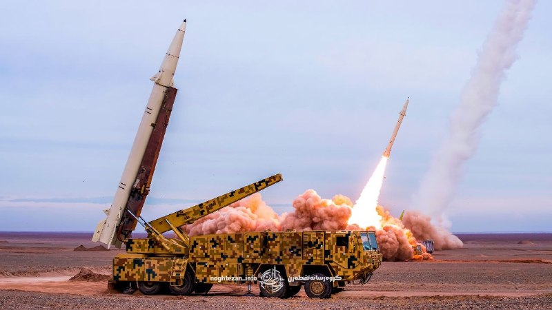

سپاه پاسداران در حمله امروز صبح خود به پایگاه هوایی امریکا در کویت از یک فروند موشک بالستیک سوخت جامد ذوالفقار/دزفول استفاده کرده است.

موشک بالستیک سوخت جامد دزفول با برد 1000 کیلومتر بخاطر بهرگیری از یک کلاهک جداشونده، ماکسیسم سرعت 9 ماخ و مانور های که برای اصلاح مسیر انجام می‌دهد یکی از محلک ترین موشک های ساخت ایران برای هدف قرار دادن پایگاه های امریکا در سطح منطقه محسوب میشود، موشک سوخت جامد ذوالفقار نیز نمونه اولیه دزفول محسوب می‌شود که بردی 700 کیلومتری دارد.

ولی نکته جالبتر ماجرا این است که امریکا به طور رسمی سرنگونی MQ-1 خود را گردن گرفت! پهپاد MQ-1 سال هاست که از ارتش امریکا بازنشسته شده، شاید دلیل مجدد عملیاتی شدن این پهپاد در سازمان رزم نیروی هوایی امریکا جایگزینی سریع آن با ناوگان MQ-9 های منهدم شده در جنگ اخیر باشد.

📝 Amir

📌 @persian_trend_official
پرشین ترند | متفاوت‌ترین کانال نظامی

## RadioFarda — post 157774

🔸مسعود پیاهو، شهروندی که به اتهام ثبت ویدئو از اعتراضات ۱۴۰۴ به ۱۰ سال زندان محکوم شده است، روز دوشنبه ۱۱ خرداد با انتشار پیامی ویدئویی جدید گفت: «با وجود آنکه در بازنشر آن هیچ نقشی نداشته است، روز سه‌شنبه برای اجرای حکم خود را به زندان معرفی می‌کند.»

🔸حسن آقاخانی، وکیل دادگستری، روز یکشنبه از محکومیت موکلش به اتهام ثبت ویدئو از معترضی که در جریان اعتراضات دی‌ماه سال گذشته مقابل مأموران پلیس ایران در خیابان روی زمین نشسته بود، خبر داد.

🔸آقاخانی تاکید کرد که مسعود پیاهو قصد انتشار «عمومی» ویدئو را نداشته و آن را در «استوری پرایوت» صفحه اینستاگرام خود منتشر کرده اما سپس شخص دیگری آن را به شکل عمومی منتشر کرد.

🔸انتشار این ویدئو از فردی که روز هشتم دی‌ماه و در دومین روز اعتراضات به تنهایی مقابل مأموران انتظامی روی زمین نشسته بود، به شکل گسترده منتشر شد، بازتاب‌های فراوانی ایجاد کرد.

🔸تصویر این معترض به یکی از نمادهای اعتراضات دی ماه ۱۴۰۴ تبدیل شد.

🔸آقاخانی روز یکشنبه گفت که دادگاه با استناد به «قانون تشدید مجازات جاسوسی و همکاری با رژیم صهیونیستی» آقای پیاهو را به «۱۰ سال حبس» محکوم کرد.

@Radiofarda

## RadioFarda — post 157773

رئیس فدراسیون فوتبال ایران: تنگناهای مالی به‌شدت تیم را آزار می‌دهد

🔸مهدی تاج، رئیس فدراسیون فوتبال ایران، روز یک‌شنبه دهم خرداد به گلایه از مشکلات مالی در بر سر راه آماده‌سازی تیم ملی فوتبال ایران در راه جام جهانی پرداخت.

🔸به گزارش خبرگزاری ایرنا، او در این باره توضیح داده که «تیم ملی در شرایط خوبی قرار دارد، اما تنگناهای مالی به‌شدت تیم را آزار می‌دهد. هزینه‌های تیم‌های مختلف ملی دلاری است. وزارت ورزش زیر ۲۰۰ میلیارد به ما کمک کرده است.»

🔸رئیس فدراسیون فوتبال ایران دربارهٔ آخرین خبر پیرامون صدور روادید تیم ملی فوتبال برای حضور در جام جهانی ۲۰۲۶ هم گفت: «مسئول برگزاری جام جهانی فیفا است و از نظر ما مسئول دادن ویزا هم فیفا است. وقتی کشوری متعهد به میزبانی می‌شود، یکی از تعهداتی که می‌دهند، صدور ویزا است. در جلساتی که رو در رو با فیفا داشتیم، آنها در این رابطه با ما هم‌نظر هستند.»

🔸در فاصله ۱۴ روز تا جام جهانی ۲۰۲۶، بلاتکلیفی ویزای تیم ملی فوتبال ایران ادامه دارد. خبرگزاری مهر گزارش داده که فدراسیون فوتبال با ارسال نامه‌ای تازه به فیفا خواستار تعیین تکلیف فوری این پرونده شده، اما به گفته این خبرگزاری، فیفا تاکنون پاسخی به نامه‌های فدراسیون نداده است.

🔸مهدی محمدنبی، سرپرست تیم ملی، دو روز پیشتر از این گفته بود هنوز نه ویزای مکزیک و نه ویزای آمریکا برای اعضای تیم صادر نشده و تیم ملی به روادید چندبار ورود هر دو کشور نیاز دارد. پیشتر نیز مهدی تاج اعلام کرده بود که به‌دلیل مشکل ویزا، محل اردوی تیم ملی از آریزونای آمریکا به تیخوانای مکزیک منتقل شده است.

🔸این ابهام در حالی ادامه دارد که به گفته سفیر جمهوری اسلامی در مکزیک، هنوز روشن نیست آمریکا به تیم ملی روادید خواهد داد یا نه؛ موضوعی که می‌تواند برنامه‌های ایران را در روزهای پایانی پیش از جام جهانی با مشکل جدی روبه‌رو کند.

🔸نسخه کامل این گزارش را در وب‌سایت رادیوفردا بخوانید.

@Radiofarda

## RadioFarda — post 157772

🔸ارتش اسرائیل روز دوشنبه ۱۱ خرداد تصاویری از ورود نیروهای یگان گشتی گولانی به قلعه تاریخی شقیف (بوفور) در جنوب لبنان را منتشر کرد.

🔸ییسرائیل کاتز، وزیر دفاع اسرائیل، روز یکشنبه از تصرف این دژ راهبردی قرون وسطایی در جنوب لبنان، که پرچم اسرائیل بر فراز آن برافراشته شده است، خبر داده بود.

🔸قلعه بوفور یا شقیف بر بخش‌های گسترده‌ای از جنوب لبنان اشراف دارد و به همین دلیل از اهمیت نظامی بالایی برخوردار است.

🔸قلعه تاریخی شقیف متعلق به دوران جنگ‌های صلیبی در استان نبطیه در جنوب لبنان است که در فاصله حدود ۱ کیلومتری در جنوب،جنوب شرقی روستای أرنون قرار دارد.

🔸صلاح‌الدین ایوبی،‌ نخستین سلطان مصر و شام در سال ۱۱۹۰ قلعه شقیف را فتح کرد، اما ۶۰ سال بعد صلیبی‌ها دوباره آن را بازپس گرفتند.

🔸در سال ۱۲۶۸ سلطان ظاهر رکن‌الدین بیبرس بندقداری در نهایت قلعه را برای نیروهای اسلامی تصرف کرد.

🔸قلعه شقیف یکی از نمونه‌های معدودی است که در آن یک قلعه قرون وسطایی در جنگ‌های مدرن نیز دارای ارزش و کاربرد نظامی بوده است، همان‌طور که تاریخ اواخر سده بیستم آن، به‌ویژه در طول جنگ ۱۹۸۲ لبنان این موضوع را نشان داد.

@Radiofarda

## RadioFarda — post 157771

  <a href="https://t.me/radiofarda/157771" target="_blank">📎 Download file</a>

📻بشنوید: ساعت ۱۴ با رادیوفردا، یازدهم خرداد ۱۴۰۵‌

@Radiofarda

## RadioFarda — post 157770

وقتی تفلیس از واشینگتن دور شد؛ گرجستان در میانهٔ پرونده نفوذ ایران

🔸یک گزارش تازه می‌گوید که نفوذ سیاسی، مذهبی و اقتصادی جمهوری اسلامی ایران در گرجستان به‌طرزی سیستماتیک گسترش یافته و تفلیس عملاً راه را برای آن باز کرده است؛ از جمله با افزایش شرکت‌های ایرانی، رشد واردات نفت و فراورده‌های پتروشیمی، و امکان دور زدن تحریم‌ها از مسیر تغییر برچسب کالاها.

🔸گزارشی از رادیو اروپای آزاد/رادیو آزادی حاکی است که واکنش حزب حاکم «رؤیای گرجی» به جای پاسخ‌گویی به یافته‌های این گزارش، فشار بر منتقدان و تهدید به پیگرد قانونی بوده است. در نتیجه، گرجستان که زمانی شریک نزدیک واشینگتن در قفقاز جنوبی بود، اکنون بیش از پیش در نگاه آمریکا به عنوان مسئله‌ای امنیتی و سیاسی دیده می‌شود و در دیپلماسی منطقه‌ای واشینگتن نیز به حاشیه رانده شده است.

🔸هنگامی که ایراکلی کوباخیدزه، نخست‌وزیر گرجستان، در هفتۀ جاری اشاره کرد که گیورگی کاندلاکی، قانون‌گذار پیشین و از نویسندگان گزارشی دربارۀ نفوذ ایران در کشورش، ممکن است با پیامدهای قانونی روبه‌رو شود، او این موضوع را مسئله‌ای مربوط به «نهاد دولتی ذی‌ربط» توصیف کرد.

🔸جان والترز، رئیس مؤسسۀ هادسون مستقر در ایالات متحده که این گزارش را منتشر کرده است، دیدگاه متفاوتی داشت: «واقعیت‌ها با هیاهو و تهدید تغییرپذیر نیستند. شما «رؤیای گرجی» نیستید، بلکه نابودکنندۀ رؤیاهای گرجی هستید.»

🔸این گفت‌وگو دریچۀ کوچک اما گویایی است که نشان می‌دهد روابط گرجستان با واشینگتن تا چه حد رو به تیرگی نهاده است و چگونه حزب حاکم رؤیای گرجی برای توقف این روند قهقرایی، یا ناتوان است یا بی‌میل.

🔸نسخه کامل این گزارش را در وب‌سایت رادیوفردا بخوانید.

@RadioFarda

## RadioFarda — post 157769

قانون طالبان «کودک‌عروس‌ها» را در ازدواج‌هایی که انتخاب نکرده‌اند گرفتار می‌کند

🔸ندا فقط ۱۲ ساله بود و دانش‌آموزی در کابل، وقتی والدینش او را به عقد یک خویشاوند دور درآوردند؛ مردی که هرگز او را ندیده بود.

🔸خانواده‌ ندا فقیر بودند، اما خانواده شوهرش وضع مالی بهتری داشتند. ندا باور دارد که «پول و بی‌سوادی مادرش» سرنوشت او را رقم زد. او به خانه شوهر جدیدش، مرد ۲۰ ساله‌ای در منطقه دورافتادۀ دَرواز در شمال شرق افغانستان برده شد؛ جایی که کودکی‌اش ناگهان پایان یافت.

🔸او به رادیو اروپای آزاد/رادیو آزادی گفت: «حتی پریود هم نشده بودم. هیچ تصوری از زندگی زناشویی یا رابطه جنسی نداشتم» و «والدینم حتی از من نپرسیدند که آیا می‌خواهم ازدواج کنم یا نه.»

🔸ندا که به‌دلیل حفط حریم خصوصی، نامش تغییر کرده، گفت که خانواده شوهرش انتظار داشتند تمام کارهای خانه را انجام دهد و اگر نمی‌توانست خانه را به سلیقه خانواده شوهر تمیز کند یا غذا بپزد، شوهرش او را کتک می‌زد؛ «به هر شکلی که قابل تصور بود، مورد آزار قرار گرفتم».

🔸سه سال بعد، پدرش در ماجرا دخالت کرد. با کمک او، ندا درخواست طلاق داد که این فرآیند از طریق دادگاه شرعی دو سال طول کشید.

🔸اگرچه ازدواج کودکان همیشه در افغانستان رایج بوده، اما گروه‌های حقوق بشری می‌گویند این پدیده از زمان بازگشت طالبان به قدرت در سال ۲۰۲۱ شدت گرفته است.

🔸در ۱۴ مه، طالبان قانون جدیدی در مورد طلاق صادر کردند که برای نخستین‌بار به طور ضمنی ازدواج کودکان در این کشور را مجاز دانست.

🔸این حکم با عنوان «جدایی قضایی زوجین» شرایط طلاق در دادگاه‌ها را مشخص می‌کند.

🔸طبق نظر کارشناسان پزشکی، محدوده سنی معمول برای شروع بلوغ در دختران بین هشت تا ۱۳ سالگی است. علمای اسلامی تفسیرهای متفاوتی از بلوغ دارند؛ برخی مکاتب فکری آن را ۱۵ یا ۱۸ سالگی می‌دانند، در حالی که چندین متن کلاسیک پیشنهاد می‌کنند که ۹ سالگی کمترین سنی است که دختری می‌تواند بالغ محسوب شود.

🔸نسخه کامل این گزارش را در وب‌سایت رادیوفردا بخوانید.

@RadioFarda

## RadioFarda — post 157768

  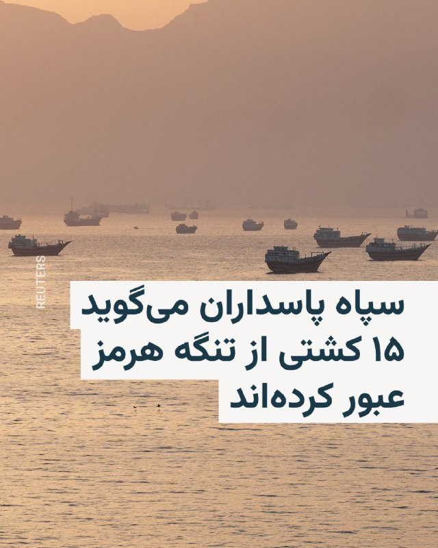

🔸روابط عمومی نیروی دریایی سپاه پاسداران انقلاب اسلامی اعلام کرد طی شبانه‌روز گذشته ۱۵ فروند کشتی، از جمله ۴ نفتکش، پس از دریافت مجوز و با هماهنگی از تنگه هرمز عبور کرده‌اند.

🔸در اطلاعیه سپاه آمده است که «تردد این شناورها با نظارت و هماهنگی نیروهای دریایی سپاه انجام شده است.»

🔸پیشتر یک مقام رسمیِ ایالات متحده به روزنامهٔ نیویورک‌تایمز گفته بود ارتش آمریکا «بی‌سروصدا» کشتی‌های تجاری را برای عبور از تنگه هرمز هدایت می‌کند.

🔸به گفته مقامی دیگر، فرماندهی مرکزی آمریکا (سنتکام) طی سه هفته گذشته، حدود ۷۰ کشتی را در ورود و خروج از خلیج فارس همراهی کرده است.

🔸مقامات آمریکایی اشاره کردند که بیشترِ این کشتی‌ها برای جلوگیری از شناسایی توسط جمهوری اسلامی، فرستنده‌های خود را خاموش کرده بودند.

@RadioFarda

## RadioFarda — post 157767

  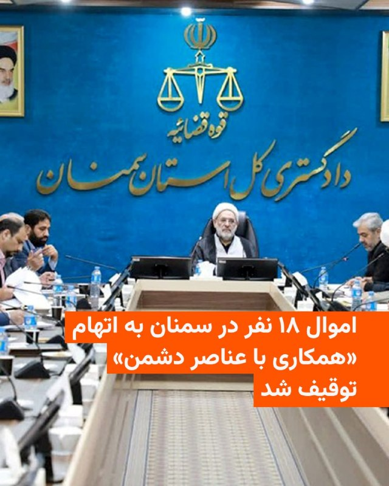

🔸رئیس کل دادگستری استان سمنان از توقیف اموال ۱۸ نفر به اتهام «همکاری با عناصر دشمن» در این استان خبر داد.

🔸روابط عمومی دادگستری استان سمنان به نقل از محمد صادق اکبری نوشته «تاکنون ۴۰ نفر به جرم همین همکاری با توقیف اموال و دارایی‌ها مواجه شدند.»

🔸او افزوده که «با صدور احکام قضایی لازم، دستور توقیف فوری تمامی دارایی‌های منقول، غیرمنقول و حساب‌های بانکی متهمان انجام شده است؛ همچنین دامنه شناسایی و توقیف اموال این افراد به سایر استان‌های کشور نیز گسترش یافته است.»

🔸آن‌طور که اکبری گفته با تأکید رئیس قوه قضائیه، رسیدگی به این پرونده‌ها در شعب ویژه، «با سرعت لازم پیگیری می‌شود و در برخورد با عناصر داخلی همسو با دشمنان، هیچ‌گونه مسامحه‌ای صورت نخواهد گرفت و قاطعانه رفتار خواهد شد».

🔸در نزدیک به سه ماهی که از آغاز جنگ می‌گذرد، به‌ویژه پس از آغاز آتش‌بس، تقریباً به‌طور روزانه خبر توقیف یا مصادره اموال افراد در رسانه‌های حکومتی منتشر شده، اما هرگز شواهد و مدارک مورد استفاده در دادگاه برای رسیدن به این حکم رسانه‌ای نشده است.

@RadioFarda

## RadioFarda — post 157766

  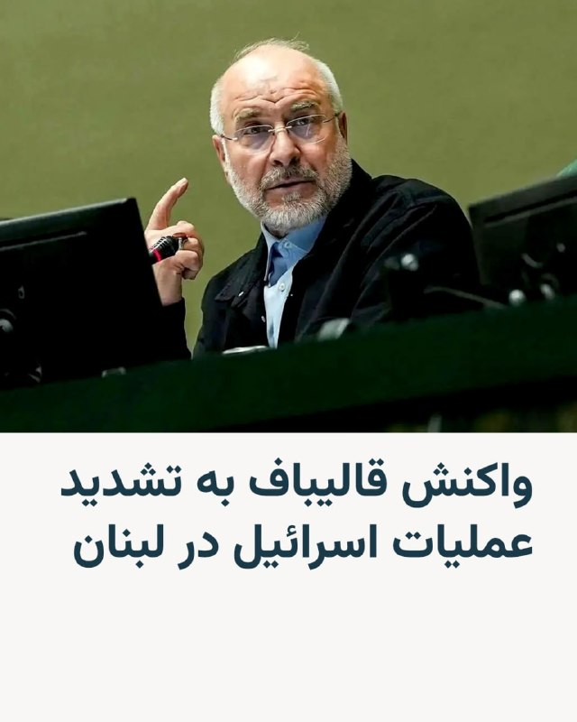

🔸محمدباقر قالیباف، رئیس مجلس شورای اسلامی و رئیس هیئت مذاکره‌کننده ایران با آمریکا، می‌گوید «محاصره دریایی و تشدید جنایات جنگی در لبنان» توسط اسرائیل، «شواهد آشکاری از عدم پایبندی آمریکا به آتش‌بس است».

🔸او بدون اشاره به جزئیات، در پیامی به زبان انگلیسی در شبکه ایکس، تهدید کرده که «هر انتخابی بهایی دارد، و زمان پرداخت آن فرا می‌رسد. همه‌چیز در نهایت سر جای خود قرار خواهد گرفت.»

🔸این پیام همزمان با تشدید عملیات نظامی اسرائیل در لبنان و علیه گروه حزب‌الله صورت می‌گیرد که از گروه‌های نیابتی جمهوری اسلامی در منطقه است.

🔸جمهوری اسلامی بارها گفته که آتش‌بس میان ایران و آمریکا باید شامل آتش‌بس در همه جبهه‌ها به ویژ‌ه جبهه لبنان شود؛ مطالبه‌ای که محقق نشده است.

@RadioFarda

## RadioFarda — post 157765

🔸وزیر کشور فرانسه اعلام کرد که در جریان ناآرامی‌هایی که پس از قهرمانی باشگاه پاری‌سن‌ژرمن در لیگ قهرمانان اروپا برای دومین سال پیاپی رخ داد، نزدیک به ۹۰۰ نفر بازداشت شدند.

🔸لوران نونز دوشنبه یازدهم خرداد، به رادیو «فرانس اینتر» گفت: «بیش از ۸۹۰ بازداشت داشته‌ایم. در مجموع، این رقم ۴۵ درصد بیشتر از سال گذشته است.»

🔸او همچنین افزود که نزدیک به ۱۸۰ نیروی پلیس و مأمور امنیتی در جریان این ناآرامی‌ها زخمی شده‌اند.

🔸پس از پیروزی تیم پاری‌سن‌ژرمن مقابل آرسنال در لیگ قهرمانان اروپا که بعدازظهر شنبه، نهم خرداد، برگزار شد، جشن‌های پیروزی در برخی مناطق این کشور به ناآرامی و خشونت کشیده شد.

🔸مقام‌ها اعلام کردند که میزان ناآرامی‌ها نسبت به سال گذشته، که پاری‌سن‌ژرمن برای نخستین بار قهرمان لیگ قهرمانان شد، حدود ۳۰ درصد افزایش داشته است. در جریان آشوب‌های سال ۲۰۲۵، دو نفر کشته، نزدیک به ۲۰۰ نفر زخمی و ۵۵۹ نفر بازداشت شده بودند.

🔸نسخه کامل این گزارش را در وب‌سایت رادیوفردا بخوانید.

@RadioFarda

## RadioFarda — post 157764

  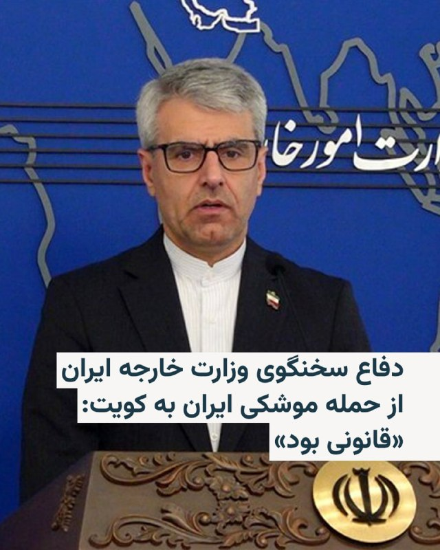

🔸اسماعیل بقائی، سخنگوی وزارت خارجه ایران می‌گوید اقدام جمهوری اسلامی در هدف قرار دادن مبادی و امکاناتی که برای اقدامات نظامی علیه کشور مورد استفاده قرار می‌گیرد، «قانونی» و در چارچوب «حق دفاع مشروع» است.

🔸بقائی این اظهارات را پس از آنکه سپاه اعلام کرد یک پایگاه هوایی مورد استفاده آمریکا برای حمله به جنوب ایران را هدف قرار داده است، بیان کرد.

🔸با آنکه سپاه نام این پایگاه را مشخص نکرده، اما ارتش کویت روز دوشنبه اعلام کرد پدافند هوایی این کشور «حملات خصمانه موشکی و پهپادی» را رهگیری کرده است. آمریکا در کویت دارای پایگاه نظامی است.

🔸این حمله اندکی پس از آن انجام شد که سنتکام، فرماندهی مرکزی آمریکا، اعلام کرد طی دو روز اخیر در پاسخ به «اقدامات تهاجمی ایران، از جمله سرنگونی یک پهپاد ام‌کیو-۱ آمریکا که بر فراز آب‌های بین‌المللی فعالیت می‌کرد»، به مواضع نظامی ایران در سواحل خلیج فارس حمله کرده است.

🔸بقائی نیز بدون اشاره به پایگاهی که سپاه مدعی است به آنجا حمله کرده، افزود: «دولت‌ها تعهد قانونی دارند که مانع از استفاده طرف‌های متجاوز از قلمرو و امکانات آنها برای تعرض به یک کشور دیگر شوند.»

@RadioFarda

## RadioFarda — post 157763

«موج تازه» تشکیل پرونده‌های انضباطی و صدور احکام سنگین برای دانشجویان در ایران

🔸روزنامه شرق در گزارشی از «موج تازه» تشکیل پرونده‌های انضباطی و صدور احکام سنگین برای دانشجویان در چند دانشگاه ایران خبر داده است؛ موجی که به نوشته این روزنامه، از اسفند ۱۴۰۴ و تنها چند روز پس از بازگشایی دانشگاه‌ها آغاز شد و اکنون در خرداد ۱۴۰۵، همزمان با ادامه تعطیلی دانشگاه‌ها به‌دلیل جنگ، دوباره شدت گرفته است.

🔸همزمان، کانال تلگرامی «خبرنامه امیرکبیر» روز دوشنبه ۱۱ خرداد خبر داد که ۵۳ تشکل، نشریه و نهاد دانشجویی دانشگاه صنعتی شریف، در نامه‌ای مشترک به رئیس این دانشگاه، به احکام اخیر کمیته‌های انضباطی اعتراض کردند و خواستار لغو فوری احکام صادرشده و توقف روند جاری رسیدگی‌ها شدند.

🔸امضاکنندگان این نامه گفته‌اند در هفته‌های اخیر شماری از دانشجویان، از جمله به‌دلیل فعالیت در فضای مجازی، به کمیته‌های انضباطی احضار شده و برای برخی از آنان احکام بدوی و تجدیدنظر صادر شده است. آن‌ها روند رسیدگی را همراه با نقض ضوابط شکلی و اصول مندرج در شیوه‌نامه انضباطی دانسته‌اند.

🔸این نامه پس از آن منتشر می‌شود که شورای صنفی دانشجویان شریف پیشتر از احضار دست‌کم ۳۰ دانشجو و صدور حداقل شش حکم اخراج خبر داده بود؛ پرونده‌هایی که بنا بر گزارش‌ها، بخشی از آن‌ها به محتوای صفحات شخصی، پیام در گروه‌های خصوصی و بازنشر مطالب در شبکه‌های اجتماعی مربوط است.

🔸بر اساس گزارش روزنامه شرق، در دانشگاه صنعتی شریف پنج تا هفت دانشجو حکم اخراج گرفته‌اند و بیش از ۲۰ دانشجو نیز با احکام تعلیق یک تا سه ترم از تحصیل روبه‌رو شده‌اند. دانشجویان این دانشگاه گفته‌اند احضارها گاه بدون ارائه توضیح درباره اتهام انجام شده و در برخی موارد، جلسه تفهیم اتهام و صدور رأی در یک روز برگزار شده است.

🔸به نوشته شرق، بخشی از اتهامات در دانشگاه شریف به فعالیت دانشجویان در فضای مجازی مربوط است. یک دانشجو گفته است سه نفر تنها به‌دلیل فعالیت در تلگرام و شبکه ایکس حکم اخراج گرفته‌اند و در یک مورد، مصداق حکم، عکس پروفایل دانشجو بوده است. دانشجویان همچنین می‌گویند در جلسات کمیته انضباطی، به‌جای ارائه سند روشن، به گزارش افراد موسوم به «مطلع» استناد شده است.

🔸نسخه کامل این گزارش را در وب‌سایت رادیوفردا بخوانید.

@RadioFarda

## RadioFarda — post 157762

  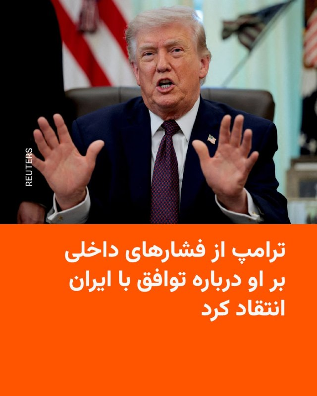

🔸دونالد ترامپ در پستی تازه در تروث‌سوشال از واکنش‌های چهره‌های سیاسی به نحوه برخورد دولت او با حکومت ایران برای دستیابی به توافق انتقاد کرد و نوشت که این فشارها کار را برای او «سخت‌تر» می‌کند.

🔸او در این پست در شبکه اجتماعی خود تأکید کرد که «ایران واقعاً می‌خواهد به توافق برسد، و این توافق برای آمریکا و کسانی که با ما هستند، توافق خوبی خواهد بود.»

🔸ترامپ با بازی با واژهای «دمو» و «دام» به معنی احمق، به طعنه دموکرات را «داموکرات‌ها» [نادان‌ها] نامید و به آنها و «برخی جمهوری‌خواهانِ ظاهراً غیرمیهن‌پرست» نوشت که آنها «نمی‌فهمند که وقتی آدم‌های سیاسیِ فرصت‌طلب مدام و به شکلی بی‌سابقه منفی‌بافی می‌کنند و پشت سر هم می‌گویند که باید سریع‌تر عمل کنم، یا کندتر پیش بروم، یا وارد جنگ شوم، یا نشوم، یا هر چیز دیگری، انجام درست وظیفه و مذاکره برای من خیلی سخت‌تر می‌شود؟»

🔸رئیس‌جمهور آمریکا خطاب به منتقدان خود در ارتباط با توافق با جمهوری اسلامی، نوشت: «فقط آرام باشید و استراحت کنید؛ در نهایت همه‌چیز خوب پیش خواهد رفت — همیشه همین‌طور بوده است!»

@RadioFarda

## RadioFarda — post 157761

  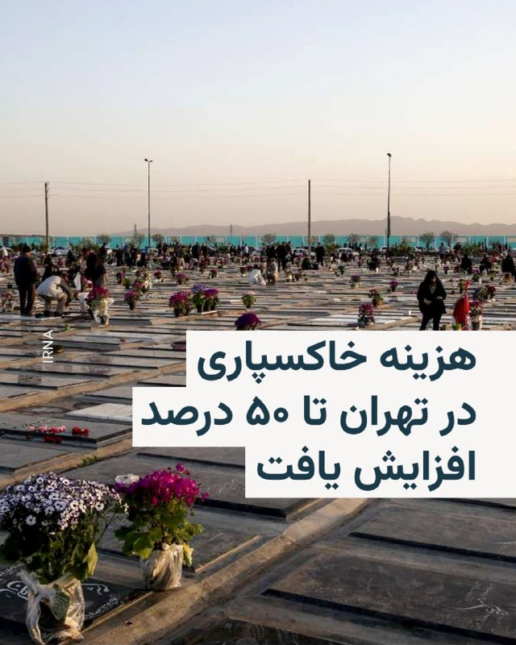

🔸روزنامه دنیای اقتصاد در گزارشی نوشته که نرخ بهای خدمات مرتبط با کفن و دفن در «بهشت ‌زهرا» در تهران، به‌طور میانگین حدود ۴۰ درصد و در برخی موارد حتی تا ۵۰ درصد افزایش یافته است.

🔸در این گزارش آمده که بر اساس مصوبه جدید شورای شهر تهران، تعرفه خدمات مختلف از جمله هزینه انتقال هر متوفی از سطح شهر تهران تا شعاع ۱۰ کیلومتری به ۹ میلیون و ۷۵۰ هزار ریال رسیده و افزایشی ۵۰ درصدی داشته است.

🔸این گزارش می‌افزاید که هزینه‌های مربوط به تغسیل، تکفین، نگهداری در سردخانه، نصب سنگ مزار، قاب بتنی و آماده‌سازی متوفی برای انتقال نیز با افزایش محسوسی همراه شده است.

🔸این افزایش تعرفه‌ها در شرایطی اعمال می‌شود که فشارهای اقتصادی بر شهروندان ایران بعد از حملات آمریکا و اسرائیل و نیز محاصره بنادر ایران، به شدت افزایش یافته است.

🔸گزارش‌های شهروندی و حتی اقتصاددانان حاکی از شرایط بحرانی اقتصاد ایران است و حتی نهادهای رسمی و امنیتی همچون وزارت اطلاعات جمهوری اسلامی نیز نسبت به احتمال وقوع اعتراضات خیابانی ناشی از فشارهای اقتصادی هشدار داده‌اند.

@RadioFarda

## IranianMinds — post 21186

  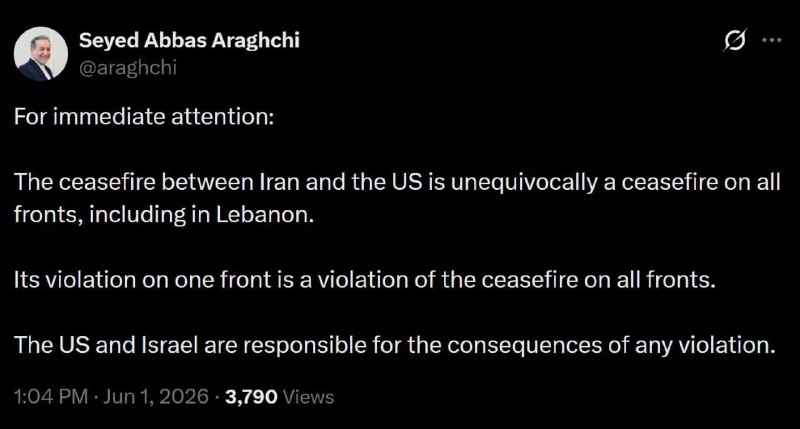

🔴عباس عراقچی

برای توجه فوری:

آتش‌بس میان ایران و ایالات متحده به طور قاطع، آتش‌بسی در تمام جبهه‌ها از جمله لبنان می‌باشد.
نقض کردن آن در یک جبهه، نقض آتش‌بس در همه جبهه‌ها به حساب می‌‌آید.
ایالات متحده و اسرائیل مسؤول پیامدهای هرگونه نقض هستند.

@IranianMinds

## IranianMinds — post 21185

  

🔴پست ترامپ در تروث‌سوشال:

آیا کسی تا به الان یک دموکرات خوشحال دیده است؟؟؟

@IranianMinds

## IranianMinds — post 21184

  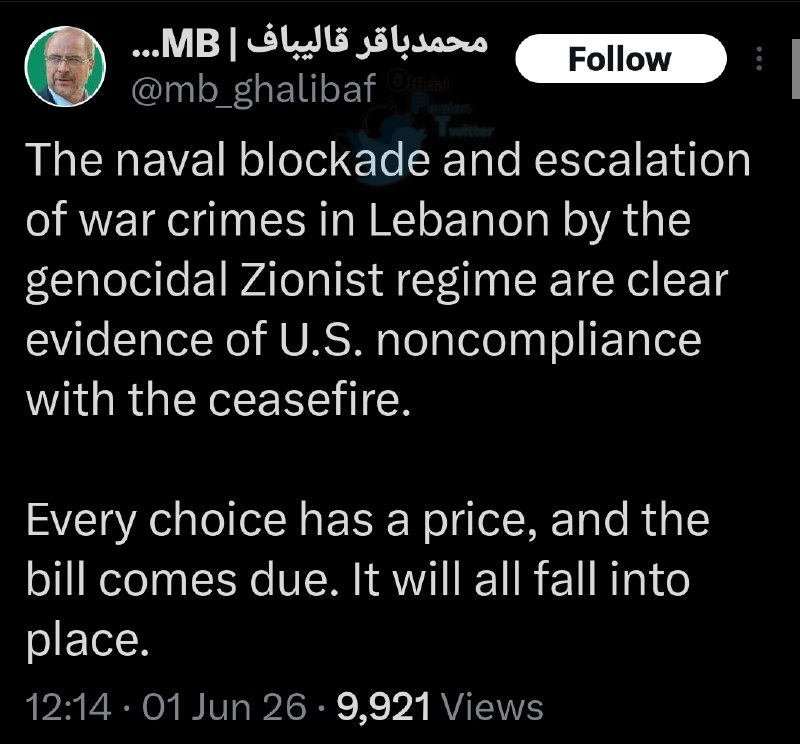

محمدباقر قالیباف:
محاصره دریایی و تشدید جنایات جنگی در لبنان، گواه عدم پایبندی واشنگتن به آتش بس است و هر گزینه ای بهایی دارد که پرداخت خواهد شد.

@IranianMinds

## IranianMinds — post 21183

  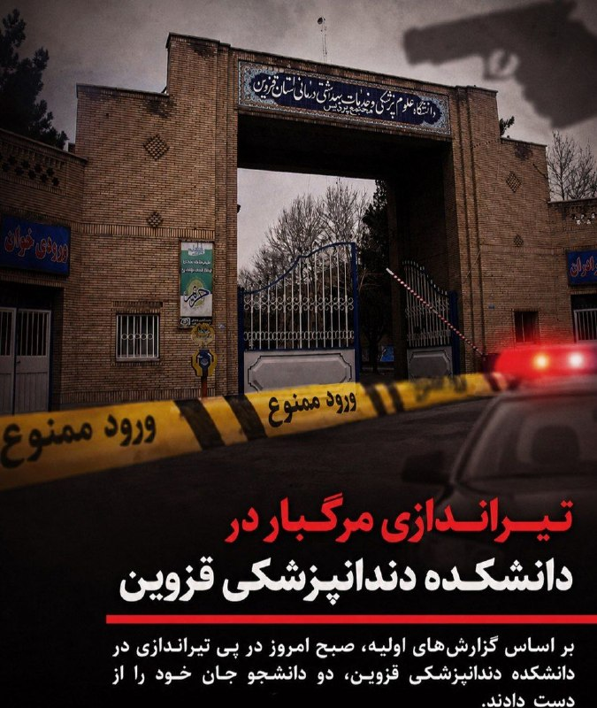

امروز صبح تو دانشکده‌ دندونپزشکی قزوین، یه مرده با کلت کمری وارد دانشگاه شد و همونجا زنش رو کشت و بعدشم به خودش شلیک و خودکشی کرد...

@IranianMinds

## IranianMinds — post 21182

  

‏🔴کاش یه خارجی بودم که با دیدن این شمع یاد موج می‌افتاد، نه عمامه.

@IranianMinds

## IranianMinds — post 21181

  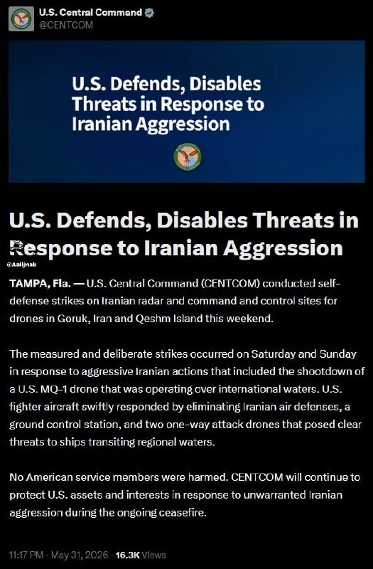

بیانیه سنتکام درباره حملات شنبه و یکشنبه
(از جمله حمله ساعاتی پیش به سیریک هرمزگان که گویا ساعت ۴ صبح دوشنبه به وقت ایران انجام شده. در آمریکا هنوز یکشنبه اس

ادعای سنتکام:
"آمریکا در واکنش به حمله ایران، از خود دفاع کرد و تهدیدها را از کار انداخت

تامپا، فلوریدا — فرماندهی مرکزی ایالات متحده آمریکا، سنتکام، این آخر هفته حملات دفاعی علیه سایت‌های راداری ایران و مراکز فرماندهی و کنترل پهپادها در گروک ایران و جزیره قشم انجام داد.

این حملات حساب‌شده و عامدانه، روزهای شنبه و یکشنبه و در پاسخ به اقدامات تهاجمی ایران انجام شد؛ اقداماتی که شامل سرنگونی یک پهپاد MQ-1 آمریکا بود که بر فراز آب‌های بین‌المللی فعالیت می‌کرد. جنگنده‌های آمریکایی به‌سرعت واکنش نشان دادند و پدافند هوایی ایران، یک ایستگاه کنترل زمینی، و دو پهپاد تهاجمی یک‌طرفه را که تهدیدی آشکار برای کشتی‌های در حال عبور از آب‌های منطقه‌ای محسوب می‌شدند، منهدم کردند.

هیچ‌یک از نیروهای نظامی آمریکا آسیب ندیدند. سنتکام در جریان آتش‌بس جاری، در واکنش به تجاوز بی‌دلیل ایران، به حفاظت از دارایی‌ها و منافع ایالات متحده ادامه خواهد داد."

@IranianMinds

## IranianMinds — post 21180

🔴 ترافیک شدید در ضاحیه بیروت مردم در حال تخلیه این منطقه هستند @IranianMinds

## IranianMinds — post 21179

  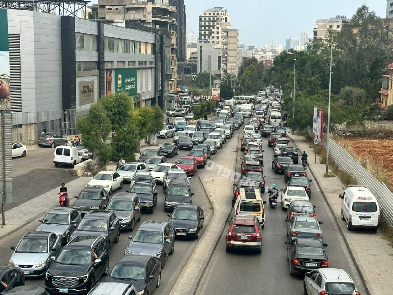

🔴 ترافیک شدید در ضاحیه بیروت
مردم در حال تخلیه این منطقه هستند

@IranianMinds

## IranianMinds — post 21178

🔴 گالانت : نتانیاهو اعلام کرده خاورمیانه دیگر جای حزب الله نیست و تا نابودی کامل جلو خواهیم رفت

@IranianMinds

## IranianMinds — post 21177

🔴 بقایی: ما هر وقت لازم باشد که در رابطه با موضوعات هسته‌ای کاری انجام دهیم، به خوبی می‌دانیم چگونه عمل کنیم

در مورد جزئیات مباحث مرتبط با موضوع هسته‌ای، هیچ مذاکره‌ای در این مرحله صورت نگرفته است. بار دیگر تأکید می‌کنم که تمرکز ما در این مرحله بر خاتمه جنگ است.

@IranianMinds

## IranianMinds — post 21176

چرا این روزها همه سایت جهانی MelBet رو انتخاب میکنن 
⁉️

🎁 شارژ هدیه 130 دلاری اولین واریز

🎁 شارژ هدیه 100 دلاری در روز های یکشنبه و چهارشنبه

🎁 و ده ها بانس ارزنده دیگر...

🥇 متنوع ترین آپشن های ورزشی

🖥 پخش زنده مسابقات

🎮 بیش از 80 نوع ورزش مجازی با پخش زنده

⭐ کاملترین کازینو آنلاین

🛡 امنیت فوق العاده بالا

💵 واریز آنی جوایز با بیش از 30 روش شارژ و برداشت، از جمله کارت بکارت

🌐 اسپانسر رسمی لالیگای اسپانیا

😀 مورد تایید سازمان Gambling Judge

✅ معرفی سایت و اپلیکیشن مل‌بت

💯 ورود به سایت مل‌بت (فیلترشکن خاموش)

## IranianMinds — post 21174

🔴 نتانیاهو: ما دستور بمباران ضاحیه بیروت را صادر کردیم

@IranianMinds

## IranianMinds — post 21173

گزارشاتی از انفجار در بندرعباس

## IranianMinds — post 21172

  <a href="telegram/content/IranianMinds_21172_1780317669.mp4" target="_blank">🎬 Download video</a>

🔴 این روزا خود عرزشیام ضد جمهوری اسلامی شدن!

میخوان عید غدیر جشن پیروزی بگیرن، آخه چه جشنی؟ ما حتی هنوز رهبرمون هم دفن نکردیم.

تا کی میخواین مارو گول بزنین، مگه رهبر شهیدمون نمی گفت با آمریکا مذاکره نکنین؟ دیگه حالم ازتون بهم میخوره.

@IranianMinds

## BBCPersian — post 282555

🔻هشدار ایران به آمریکا و اسرائیل: نقض آتش‌بس در یک جبهه، نقض آن در تمام جبهه‌هاست

ایران به آمریکا و اسرائیل هشدار داد که «نقض آتش‌بس در هر یک از جبهه‌ها، به منزله نقض آن در تمامی جبهه‌ها است.»
عباس عراقچی، وزیر خارجه ایران، در پیامی در شبکه ایکس با عنوان «برای توجه فوری» نوشت:
«آتش‌بس میان ایران و ایالات متحده، بدون هیچ ابهامی، آتش‌بسی در تمامی جبهه‌ها، از جمله لبنان، محسوب می‌شود.»
او هشدار داد که آمریکا و اسرائیل مسئول پیامدهای هرگونه نقض این آتش‌بس خواهند بود.
پیشتر چندین مقام دیگر ایران هم هشدارهای مشابهی دادند از جمله محمدباقر قالیباف.
رئیس مجلس شورای اسلامی که هدایت مذاکرات با آمریکا را هم بر عهده دارد، به اسرائیل هشدار داد که هزینه تشدید حملاتش به لبنان را خواهد پرداخت.
ابوالفضل شکارچی، سخنگوی ارشد نیروهای مسلح جمهوری اسلامی هم به اسرائیل هشدار داد که «تداوم جنایات وحشیانه علیه لبنان، برای نیروهای مسلح جمهوری اسلامی ایران قابل تحمل نخواهد بود.»
هشدار مقام‌های ایران در حالی است که اسرائیل حملات خود به لبنان را گسترش داده و بنیامین نتانیاهو، نخست‌وزیر، حتی دستور حمله به اهدافی در ضاحیه در جنوب بیروت را صادر کرده است.
از زمان برقراری آتش‌بس میان اسرائیل و لبنان، تبادل آتش میان اسرائیل و حزب‌الله ادامه داشته و هر دو طرف یکدیگر را به نقض آتش‌بس متهم می‌کنند.

https://bbc.in/4xgsxFw
@BBCPersian

## BBCPersian — post 282554

🔻واکنش بقایی به گزارش‌ها از احتمال تشکیل صندوق ۳۰۰ میلیارد دلاری برای بازسازی ایران

سخنگوی وزارت خارجه ایران در پاسخ به پرسشی درباره گزارش‌‌ها از احتمال توافق تهران و واشنگتن برسر تاسیس یک صندوق ۳۰۰ میلیارد دلاری برای بازسازی ایران، بدون تایید رقم ذکر شده گفت که تعیین «مبلغی برای جبران و بازسازی خسارات» یکی از موضوعات مطرح در مذاکرات است.

اسماعیل بقایی گفت توضیح بیشتری نمی‌تواند بدهد «زیرا این موضوعات، موضوعاتی پیچیده هستند و جزئیات خاص خود را دارند. قاعدتاً اگر در کلیات این ۱۴ بند به تفاهم برسیم، در بازه زمانی ۳۰ روزه یا ۶۰ روزه باید درباره اجزا و جزئیات آن نیز گفت‌وگو و تصمیم‌گیری شود.»

نیویورک تایمز هفته پیش به نقل از یک مقام ایرانی، مقام‌های آمریکایی و دو دیپلمات دخیل در مذاکرات تهران و واشنگتن، جزئیاتی را گزارش کرد از پیش‌نویس تفاهمنامه‌ای که گفته می‌شود در دست بررسی است.

یکی از مواردی که نیویورک تایمز گزارش کرد احتمال ایجاد یک صندوق مالی برای بازسازی ایران پس از برقراری صلح بود.

نیویورک تایمز نوشت مقام ایرانی و یکی از دو منبع دیپلماتیکش رقم این صندوق را ۳۰۰ میلیارد دلار عنوان کرده‌اند درحالی‌که سایر منابع این رقم را تایید نکردند.

صدا‌و‌سیمای ایران پیشتر «تعهد رسمی آمریکا به تامین حداقل ۳۰۰ میلیارد دلار برای بازسازی خسارت‌های وارده به ایران و پرداخت خسارت‌های جنگ» را یکی از شرایط ایران برای توافق عنوان کرده بود.

https://bbc.in/4xgsxFw
@BBCPersian

## BBCPersian — post 282553

  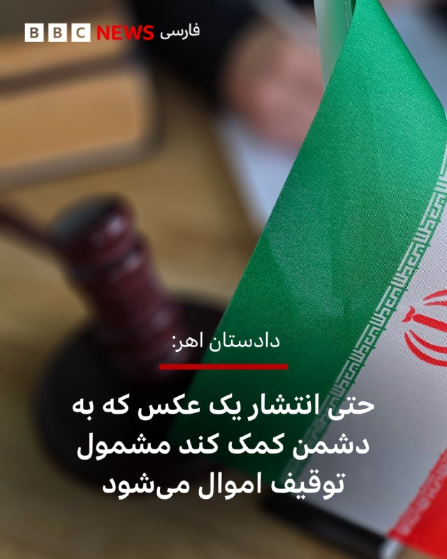

🔻میزان، خبرگزاری قوه قضائیه ایران، یاداشتی از علی فاضلی، دادستان عمومی و انقلاب شهرستان اهر در استان آذربایجان شرقی، منتشر کرد که در آن آمده است بر اساس قانون تشدید مجازات «جاسوسی» برای اسرائیل و «همکاری با کشور‌های معاند، مجازات توقیف اموال، مستقل و کاملا جدا از مجازات حبس یا اعدام اعمال می‌شود.»

در این یادداشت آمده است که «این مجازات شامل کل اموال فرد است و تنها به اموال ناشی از جرم محدود نمی‌شود.»

این قانون انجام هرگونه عملیات به نفع اسرائیل آمریکا یا گروه‌های مخالف «حتی در قالب انتشار یک عکس یا ویدیو که به دشمن در هدف‌گیری کمک کند و ایرانیان مقیم خارج که با دشمن همکاری کنند، حتی بدون حضور فیزیکی در ایران، مشمول توقیف اموال خواهند شد.»

به نوشته آقای فاضلی، «توقیف کل اموال در اینجا یک مجازات اصلی و همراه با اعدام است و هدف از توقیف اموال بر اساس اعلام مقامات قضائی، اموال مصادره شده برای بازسازی خسارات ناشی از جنگ و منفعت عمومی هزینه می‌شود.»

📷Getty Images
@BBCPersian

## BBCPersian — post 282552

  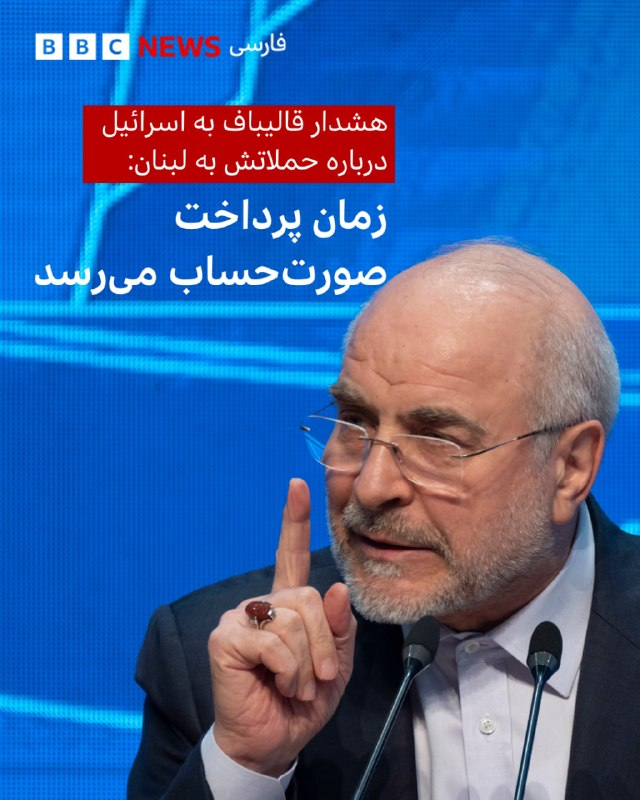

🔻محمدباقر قالیباف، رئیس مجلس شورای اسلامی، به اسرائیل هشدار داده است که هزینه تشدید حملاتش علیه لبنان را خواهد پرداخت.

آقای قالیباف در پیامی در شبکه اجتماعی ایکس به زبان انگلیسی نوشت: «اعمال محاصرهٔ دریایی و تشدید جنایات جنگی در لبنان توسط رژیم نسل‌کش صهیونیستی، شواهد روشن عدم پایبندی آمریکا به آتش بس است.»

او هشدار داد که «هر انتخابی، هزینه‌ای دارد و صورتحساب آن هم از راه می‌رسد؛ همه چیز در نهایت سر جای خودش قرار خواهد گرفت.»

در تازه‌ترین نشانه از تشدید حملات اسرائیل به لبنان، بنیامین نتانیاهو، نخست‌وزیر، به ارتش دستور داده است که اهدافی را در حومه جنوبی بیروت هدف قرار دهد.

پیشتر سخنگوی وزارت خارجه جمهوری اسلامی بار دیگر موضع ایران را تکرار کرد که آتش‌بس در لبنان «بخش لاینفک» هرگونه توافق با آمریکا برای پایان جنگ است.

اسماعیل بقایی تاکید کرد که آمریکا و اسرائیل را نمی‌توان «به‌عنوان دو فاعل مجزا» در نظر گرفت.

📷Getty Images
@BBCPersian

## BBCPersian — post 282551

🔻مسعود پیاهو با انتشار ویدئویی گفت خودش برای اجرای حکم ۱۰ سال زندان معرفی می‌کند. او برای انتشار ویدئویی معترضی که جلوی یگان ویژه نشسته بود بازداشت شد. در ویدیویی که یکشنبه ۱۱ خرداد منتشر شد، آقای پیاهو گفت: «به دستور قوه قضائیه و به احضار اجرای احکام، فردا…

## BBCPersian — post 282550

  <a href="telegram/content/BBCPersian_282550_1780317671.mp4" target="_blank">🎬 Download video</a>

🔻مسعود پیاهو با انتشار ویدئویی گفت خودش برای اجرای حکم ۱۰ سال زندان معرفی می‌کند. او برای انتشار ویدئویی معترضی که جلوی یگان ویژه نشسته بود بازداشت شد.

در ویدیویی که یکشنبه ۱۱ خرداد منتشر شد، آقای پیاهو گفت: «به دستور قوه قضائیه و به احضار اجرای احکام، فردا خودم را برای اجرای حکم ۱۰ سال معرفی می‌کنم.»

آقای پیاهو گفت منکر گرفتن این ویدیو نمی‌شود اما در بازنشر و پخش آن فیلم هیچ دخل و تصرفی نداشته و هرگز قصد نداشته که ویدیو پخش شود.

به گزارش وبسایت امتداد، حسن آقاخانی، وکیل مسعود پیاهو، گفت موکلش در «اعتراضات بازار تهران و پیش از وقایع ۱۸ و ۱۹ دی» بازداشت شده است:

بنابر این گزارش آقای آقاخانی گفت: «موکل من در حال کار در بازاری بودند که به خیابان جمهوری مشرف بوده است. شخصی در مقابل مامورین نیروی انتظامی می‌نشیند و مسعود یک فیلم کوتاه به صورت ناخودآگاه از آن صحنه ضبط می‌کند در حالیکه مطلقا قصد انتشار این فیلم را به صورت عمومی نداشته و اساسا آن فیلم را در استوری خصوصی خود در اینستاگرام منتشر کرده است. شخص دیگری این فیلم را برداشته و منتشر کرده است.»

@BBCPersian

## BBCPersian — post 282548

  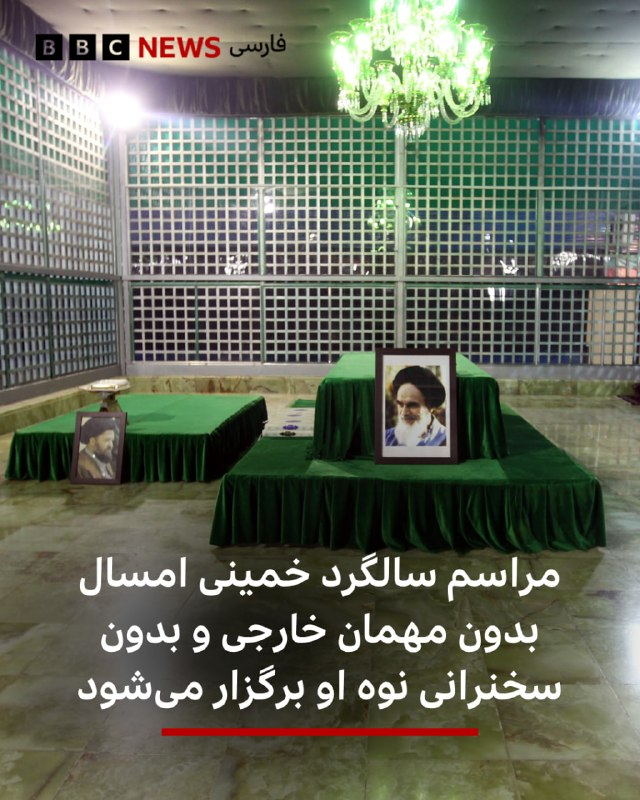

🔻مسئولان برگزاری مراسم سالگرد درگذشت روح‌الله خمینی، می‌گویند در مراسم امسال مهمان خارجی حضور نخواهد داشت و حسن خمینی، نوه بنیان‌گذار جمهوری اسلامی، هم سخنرانی نخواهد کرد.

این مراسم هر سال در ۱۴ خرداد در آرامگاه آیت‌الله خمینی با حضور مقام‌های ارشد سیاسی و نظامی ایران و برخی از سفرای خارجی برگزار می‌شد و طی آن علی خامنه‌ای و حسن خمینی سخنرانی می‌کردند.

محمدعلی انصاری، از برگزارکنندگان این مراسم، گفت که در مراسم امسال پیامی از مجتبی خامنه‌ای قرائت خواهد شد.

او همچنین گفت که امسال «امکان حضور گسترده زائران مانند سال‌های گذشته فراهم نیست» ولی «کاروان‌های استانی... عمدتا از استان‌های همجوار و با برنامه‌ریزی مشخص اعزام خواهند شد.»

📷Getty Images
https://bbc.in/4xgsxFw
@BBCPersian

## BBCPersian — post 282547

🔻هیئت رئیسه: جلسات رسمی مجلس «به‌زودی» برگزار می‌شود

علیرضاسلیمی، عضو هیئت رئیسه مجلس گفت: «فرآیند هماهنگی‌ها و مقدمات لازم طبق نظر شورای عالی امنیت ملی برای برگزاری جلسات علنی مجلس آغاز شده تا جلسات به زودی برگزار شود.»

عباس گودرزی، سخنگوی هیئت رئیسه مجلس، هم امروز گفته بود که «هیئت رئیسه مجلس مخالفتی با برگزاری جلسات ندارد اما این امر مستلزم تایید مراجع امنیتی است.»

آخرین جلسه علنی مجلس شورای اسلامی در محل دائمی، بهمن سال گذشته بود. پس از حمله آمریکا و اسرائیل به ایران در نهم اسفند، جلسات مجلس دیگر در محلش تشکیل نشده است.

به گفته آقای گودرزی در این مدت «چهار جلسه مجازی صحن» و «نزدیک به ۱۵۰ جلسه کمیسیون‌ها» برگزار شده است.

مطابق قوانین ایران جلسات مجلس فقط باید در محل دائمی آن برگزار شود.

https://bbc.in/4xgsxFw
@BBCPersian

## BBCPersian — post 282546

  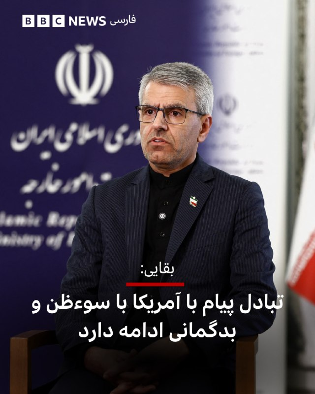

🔻بقایی: تبادل پیام با آمریکا با سوءظن و بدگمانی ادامه دارد

سخنگوی وزارت خارجه جمهوری اسلامی می‌گوید که مذاکره ایران با آمریکا «در دل سوءظن و بدگمانی شدید» شروع شد و اکنون هم تبادل پیام در همین فضا ادامه دارد.

اسماعیل بقایی در کنفرانس خبری تاکید کرد که «مذاکره یا دیپلماسی خود نشانه یا محصول اعتماد بین طرف‌های مذاکره‌کننده نیست.»

آقای بقایی همچنین آمریکا را متهم کرد که با «تغییر مداوم دیدگاه‌های خود» و «پیام‌های رسانه‌ای متفاوت و ضد و نقیض» باعث طولانی شدن روند مذاکره شده است.

آقای بقایی در حالی از ادامه تبادل پیام با واشنگتن سخن گفته است که باوجود آتش‌بس، تبادل آتش پراکنده میان ایران و آمریکا ادامه داشته و در هفته اخیر افزایش هم یافته است.

در تازه‌ترین مورد، سپاه پاسداران اعلام کرد که در پاسخ به حمله آمریکا به «یک دکل مخابراتی در جزیره سیریک» نیروهایش «پایگاه هوایی مبدا» را هدف قرار داده‌اند.

آقای بقایی تاکید کرد که آمریکا و اسرائیل را نمی‌توان «به‌عنوان دو فاعل مجزا» در نظر گرفت.

او یک بار دگیر موضع ایران را تکرار کرد که آتش‌بس در لبنان «بخش لاینفک هرگونه توافق و خاتمه جنگ است.»

@BBCPersian

## BBCPersian — post 282545

🔻صدور دستور قضایی برای توقیف اموال ۷۵ نفر در اراک

خبرگزاری قوه قضاییه ایران، میزان، از صدور حکم قضایی برای توقیف اموال ۷۵ نفر در اراک به اتهام آنچه «عناصر حامی دشمن» خوانده شده، خبر داده است.

میزان، روز یکشنبه به نقل از حجت‌اله درودگر، دادستان عمومی و انقلاب مرکز استان مرکزی، نوشت: «تاکنون ۷۵ پرونده قضایی برای تعدادی از همکاران و مرتبطین مستقیم با شبکه‌های معاند خارج از کشور در دادسرای اراک تشکیل شده است؛ این افراد با اقدامات ضدامنیتی خود، تلاش داشتند تا ضمن همکاری با دشمنان قسم‌خورده ملت، فضای آرام جامعه را ملتهب کنند.»

از زمان آغاز جنگ آمریکا و اسرائیل با ایران، قوه قضاییه این کشور دهها پرونده علیه مخالفان حکومت در داخل و خارج از کشور تشکیل داده و از صدور حکم توقیف و مصادره اموال بسیاری از آنها از جمله چندین چهره سرشناس خبر داده است.

@BBCPersian

## BBCPersian — post 282544

🔻نتانیاهو دستور حمله به اهدافی در جنوب بیروت را صادر کرد

نخست‌وزیر اسرائیل در بیانیه‌ای دستور داد ارتش این کشور اهدافی را در حومه جنوبی پایتخت لبنان، هدف قرار دهد.

منطقه ای که بنیامین نتانیاهو دستور حمله به آن را داده به عنوان پایگاه اصلی حزب‌الله و با نام ضاحیه شناخته می‌شود.

پیشتر گزارش دادیم که رئیس جمهور لبنان حملات اسرائیل به کشورش را محکوم کرده و شورای امنیت سازمان ملل متحد هم امروز جلسه‌ای درباره وضعیت لبنان برگزار خواهد کرد.

@BBCPersian

## idfinfarsi — post 11693

  <a href="telegram/content/idfinfarsi_11693_1780317674.mp4" target="_blank">🎬 Download video</a>

‼️پس از سه ماه نبرد: لشکر ۱۴۶ سومین دور نبرد خود را به پایان رساند و مأموریت خود در جنوب لبنان را تکمیل کرد

🔸لشکر ۱۴۶ در طول سه ماه گذشته در منطقه خط دفاعی پیشرو در جنوب لبنان برای به هلاکت رساندن تروریست‌ها، انهدام زیرساخت‌های تروریستی سازمان تروریستی حزب‌الله و رفع تهدیدات علیه شهروندان کشور اسرائیل فعالیت کرد.

🔸در طول این عملیات، نیروها بیش از ۵۵۰ تروریست را به هلاکت رساندند و بیش از ۲۷۰۰ زیرساخت تروریستی را منهدم کردند، از جمله: بیش از ۲۰۰ انبار تسلیحاتی که با همکاری نیروی هوایی منهدم شد و ده‌ها مسیر زیرزمینی که با همکاری یگان مهندسی ویژه منهدم شدند.

## idfinfarsi — post 11691

## idfinfarsi — post 11690

‼️پس از پیشبرد طرح‌های تروریستی علیه نیروهای ارتش اسرائیل: یک تروریست از شاخه نظامی سازمان تروریستی حماس که به‌عنوان پزشک در بیمارستان فعالیت می‌کرد، به هلاکت رسید

⭕️نیروهای ارتش اسرائیل دو روز گذشته (شنبه) به‌صورت هدفمند در مرکز نوار غزه حمله کرده و تروریست جمال ابو عون، فرمانده یک واحد در شاخه نظامی سازمان تروریستی حماس را که به‌طور همزمان به‌عنوان پزشک در بیمارستان یافا در دیرالبلح فعالیت می‌کرد، به هلاکت رساندند.

⭕️وی در چارچوب نقش خود در این سازمان تروریستی، فرماندهی تروریست‌های حماس را بر عهده داشت و به پیشبرد و طراحی طرح‌های تروریستی علیه نیروهای ارتش اسرائیل و کشور اسرائیل می‌پرداخت. در دوره اخیر نیز در پیشبرد تلاش‌های ایجاد توان رزمی، بازسازی و تقویت سازمان تروریستی حماس، برخلاف توافق آتش‌بس، نقش داشته است.

⭕️فعالیت‌های تروریستی این تروریست نمونه‌ای دیگر از استفاده ابزاری و فرصت‌طلبانه سازمان تروریستی حماس از نقش‌های غیرنظامی برای پیشبرد فعالیت‌های تروریستی است.

⭕️پیش از حمله، اقداماتی برای کاهش آسیب به غیرنظامیان انجام شد، از جمله استفاده از مهمات دقیق و رصد ‌های هوایی.

⭕️نیروهای ارتش اسرائیل تحت فرماندهی جنوب مطابق با توافق در منطقه مستقر هستند و به فعالیت برای رفع هرگونه تهدید فوری ادامه خواهند داد.

## Dirty_Kids — post 390734

  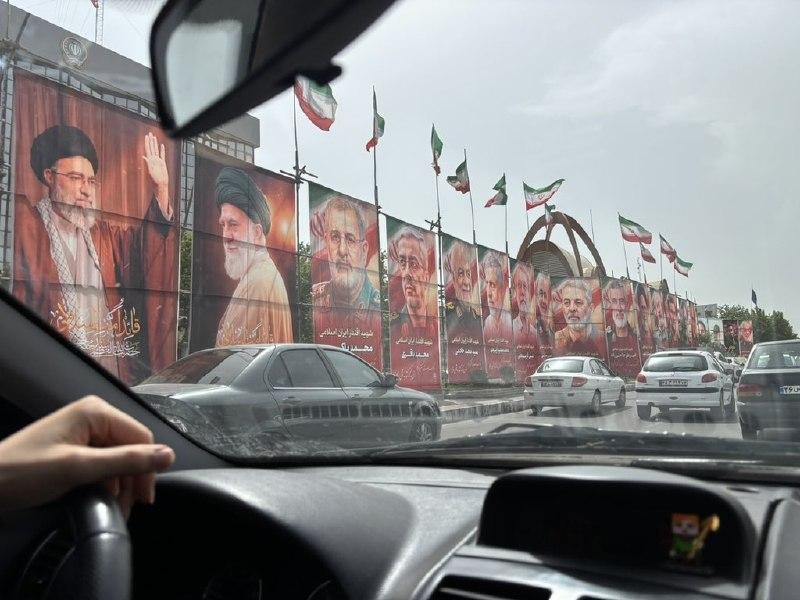

😂😂😂😂😂😂😂😂😂😂😂😂😂😂😂😂😂😂😂😂😂😂😂😂😂😂😂😂😂😂😂😂😂😂😂😂😂😂😂😂😂😂😂😂😂😂😂😂😂😂😂😂😂😂😂😂😂😂😂😂😂😂🫵🏻🫵🏻🫵🏻🫵🏻🫵🏻🫵🏻🫵🏻🫵🏻🫵🏻🫵🏻🫵🏻🫵🏻🫵🏻

@Dirty_Kids 👻

## Dirty_Kids — post 390733

  

آبلیمو تو دیگه چرا قند داری؟ تو که اصلا ترشییی

@Dirty_Kids 👻

## Dirty_Kids — post 390732

  

🔴 هر وقت فکر کردین بدشانسین این خبرو بخونین، این مرد بدبخت همزمان با ۴ تا زن ازدواج کرد و بعد از ازدواج متوجه شد همشون ترنس هستن و شومبول دارن!

@Dirty_Kids 👻

## Dirty_Kids — post 390730

🔴 تصاویر اسحاق قالیباف هنگام مصرف مشروبات الکی و رقص تانگو با دختران...

@Dirty_Kids 👻

## Dirty_Kids — post 390729

  <a href="telegram/content/Dirty_Kids_390729_1780317676.mp4" target="_blank">🎬 Download video</a>

🔴 یه افغانی توی خارج کشور داشت پرچم جمهوری اسلامی رو تکون میداد و وقتی دید یکی ازش فیلم میگیره، ذوق کرد.

و اما داستان یه جور دیگه پیش رفت😂

@Dirty_Kids 👻

## Dirty_Kids — post 390728

  <a href="telegram/content/Dirty_Kids_390728_1780317677.mp4" target="_blank">🎬 Download video</a>

محمدسعید ایزدی، مسئول بخش فلسطین نیروی قدس سپاه از ترس اسرائیل این‌قدر در زیرزمین پنهان شد که استخوان‌هایش به قول دخترش به خاطر کمبود ویتامین D ترک خورد.
او در پناهگاه هم در دسترس اسرائیل بود و عاقبت در خانه‌ امنی در قم به همراه نوجوانی ۱۶ ساله کشته شد!

@Dirty_Kids 👻

## Dirty_Kids — post 390727

دوستان
سمت خرید لباس نرید. هرچی دارید، بشورید، اتو کنید، دوباره عاشقش بشید. قیمت‌ها یجوری شده که فروشنده‌ها هم قبل از گفتن قیمت یه «ببخشید» میگن.

@Dirty_Kids 👻

## Dirty_Kids — post 390726

  <a href="telegram/content/Dirty_Kids_390726_1780317678.mp4" target="_blank">🎬 Download video</a>

وقتی که‌ نبودید سپاه این موشک را از داخل تهران شلیک کرد و در داخل تهران هم سقوط کرد و هیچ مقام کسکشی لب از لب باز نکرد و نکته جالب اینکه غیر از اینترنشنال همه رسانه‌ها لال بودند.

@Dirty_Kids 👻

## Dirty_Kids — post 390725

🔤
🔤
🔤
🔤
🔤
🔤
🔤 #میدونستی با انتخاب برد نروژ مقابل سوئد با شش میلیون به راحتی یازده میلیون تومان برنده میشی؟! برای پیش بینی این مسابقه به یک سایت مطمعن نیاز داری که سریع ترین پرداخت ها و بهترین طرح های تشویقی رو داشته باشه
💖
💖 کجا بهتر از وبسایت بین المللی بت فیدو…

## Dirty_Kids — post 390724

  <a href="telegram/content/Dirty_Kids_390724_1780317680.webm" target="_blank">🎬 Download video</a>

🔤
🔤
🔤
🔤
🔤
🔤
🔤

#میدونستی با انتخاب برد نروژ مقابل سوئد با شش میلیون به راحتی یازده میلیون تومان برنده میشی؟!

برای پیش بینی این مسابقه به یک سایت مطمعن نیاز داری که سریع ترین پرداخت ها و بهترین طرح های تشویقی رو داشته باشه
💖
💖

کجا بهتر از وبسایت بین المللی بت فیدو که بدون احراز هویت و مشکلات پرداخت از ایران، به کاربران ایرانی سرویس میده
🥇

همین حالا پیش بینیتو ثبت کن 
👇
https://bet-fido.com 
💖
https://bet-fido.com 
💖
(ورود با وی-پی-ان غیر اروپایی)

📱 کانال تلگرام 
🥅
👇
R11
https://t.me/+dySI_QFj0T0xZGVk

## Dirty_Kids — post 390723

  

🔴 امروز صبح تو دانشکده‌ دندونپزشکی قزوین، یه مرده با کلت کمری وارد دانشگاه شد و همونجا زنش رو کشت و بعدشم به خودش شلیک و خودکشی کرد.../رکنا

@Dirty_Kids 👻

## Dirty_Kids — post 390722

  

🔴 امروز 1 June ، روز لاک زدن به ناخن‌هاست؛

این پست رو به هرکی بفرستی، باید لاکِ امروزش رو بهت نشون بده💅

@Dirty_Kids 👻

## Dirty_Kids — post 390721

  <a href="telegram/content/Dirty_Kids_390721_1780317681.mp4" target="_blank">🎬 Download video</a>

مراد ویسی داشت می‌گفت که اگه نیروهای سرکوبگر اسلحه‌شون رو زمین بذارن یه مادری... (ازشون میگاییم) که خیلی خوب جمعش کرد😂😂😂

@Dirty_Kids 👻

## Dirty_Kids — post 390720

  <a href="telegram/content/Dirty_Kids_390720_1780317682.mp4" target="_blank">🎬 Download video</a>

بنظرم این میتونست بهترین تبلیغ یخچال تو تاریخ باشه: 😂😂😂😂

@Dirty_Kids 👻

## Dirty_Kids — post 390719

  

خبر خوب برای کاربران بادبان!

آف #فوری 
⭕️
با کاهش هزینه‌ها، موفق شدیم قیمت تمام محصولات را به هر گیگابایت 15 هزار تومان کاهش دهیم
🚀

⛵️این کاهش قیمت شامل تمامی پلن‌ها، حتی حجم‌های پایین‌تر نیز می‌شود و همچنان کیفیت و پایداری سرویس‌ها حفظ خواهد شد.

از همراهی و اعتماد شما سپاسگزاریم
💜
R11

🛡@BadBan_VPN | کانال 

🤖@BadBan_VPNBot | ربات 

📞@BadBan_VPNSupport | پشتیبانی

## Dirty_Kids — post 390718

  <a href="telegram/content/Dirty_Kids_390718_1780317684.mp4" target="_blank">🎬 Download video</a>

🔴 شخصی که این ویدیو رو ظبط کرده بود توی دادگاه به ۱۰ سال حبس محکوم شد.

@Dirty_Kids 👻

## Dirty_Kids — post 390717

  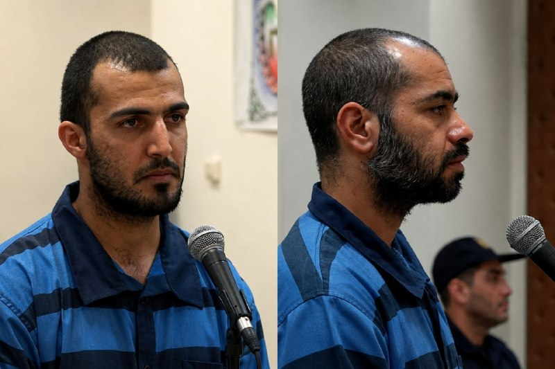

مهرداد محمدی‌نیا و اشکان مالکی، دو معترض بازداشت شده تو اعتراضات ۱۸ و ۱۹ دی، صبح امروز با اتهام «آتش زدن اموال عمومی در جریان اعتراضات» اعدام شدن.

@Dirty_Kids 👻

## Dirty_Kids — post 390716

‏پدسگا قیمت رو تو کپشن بنویسید بابام مجبور نشه «کیوت» رو کامنت کنه.🤬

@Dirty_Kids 👻

## Dirty_Kids — post 390715

  <a href="telegram/content/Dirty_Kids_390715_1780317686.mp4" target="_blank">🎬 Download video</a>

عمو مانوک خدابخشیان:

ترامپ آرزو داشت تیم فوتبال داشته باشه ولی روش کارش بیسبالی هست

@Dirty_Kids 👻

## Hranews — post 113303

رشت؛ حکم اعدام در ملا عام متهم به قتل یک کودک اجرا شد

❗️
❗️
❗️
❗️
❗️– امروز دوشنبه ۱۱ خردادماه، حکم یک زندانی که پیشتر از بابت اتهام تعرض و قتل یک کودک به نام ایلیا زادحسین به #اعدام محکوم شده بود، در شهرستان رشت در ملاء عام به اجرا درآمد.

ادامه مطلب

#ایلیا_زادحسین

↘️
@hranews_bot تماس ✉️ -  @Hranews  کانال هرانا 🆑

## Hranews — post 113302

  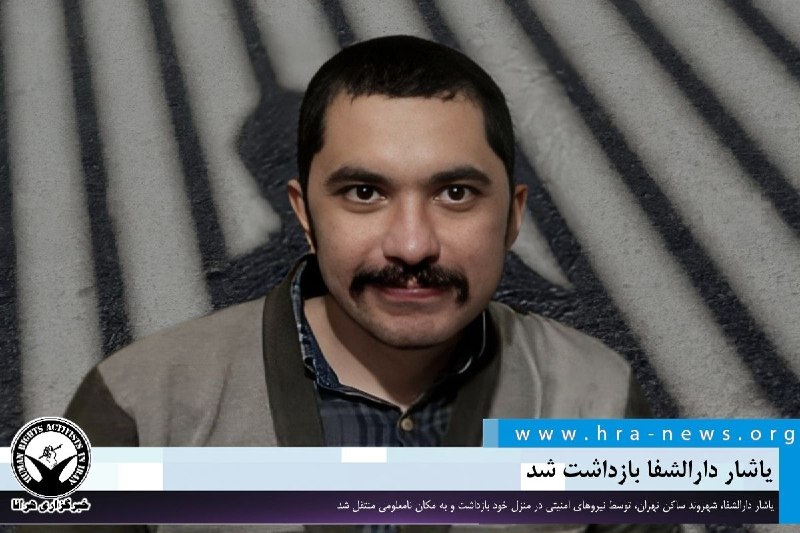

یاشار دارالشفا بازداشت شد

❗️
❗️
❗️
❗️
❗️– یاشار دارالشفا، زندانی سیاسی پیشین که ساکن تهران است، امروز توسط نیروهای امنیتی در منزل خود #بازداشت و به مکان نامعلومی منتقل شد.

به گزارش خبرگزاری هرانا، ارگان خبری مجموعه فعالان حقوق بشر در ایران، یاشار دارالشفا بازداشت شد.

براساس اطلاعات دریافتی هرانا، صبح امروز دوشنبه ۱۱ خرداد ۱۴۰۵، نیروهای امنیتی با مراجعه به منزل خانوادگی این شهروند، بدون ارائه حکم قضایی او را بازداشت کردند. ماموران همچنین منزل وی را نیز تفتیش کردند.

ادامه مطلب

#یاشار_دارالشفا

↘️
@hranews_bot تماس ✉️ -  @Hranews  کانال هرانا 🆑

## Hranews — post 113301

اعتراضات در دانشگاه‌ها؛ دستکم ۱۰ دانشجوی دانشگاه تهران به کمیته انضباطی احضار شدند

❗️
❗️
❗️
❗️
❗️– طی روزهای اخیر، دستکم ۱۰ دانشجوی #دانشگاه_تهران در ارتباط با تجمعات دانشجویی پس از اعتراضات سراسری دی‌ماه، به کمیته انضباطی این دانشگاه احضار شدند.

ادامه مطلب

↘️
@hranews_bot تماس ✉️ -  @Hranews  کانال هرانا 🆑

## Hranews — post 113300

قروه؛ ۲ متهم در پرونده تعرض گروهی به یک نوجوان اعدام شدند

❗️
❗️
❗️
❗️
❗️– صبح امروز، حکم اعدام دو تن از متهمان پرونده تجاوز گروهی به یک پسر ۱۴ ساله اهل قروه که منجر به خودکشی او شد، در این شهرستان به اجرا در آمد.

ادامه مطلب

↘️
@hranews_bot تماس ✉️ -  @Hranews  کانال هرانا 🆑

## Hranews — post 113299

گزارشی از اجرای حکم اعدام یک زندانی در زندان جیرفت

❗️
❗️
❗️
❗️
❗️– سحرگاه روز سه‌شنبه ۵ خردادماه، حکم یک زندانی که پیشتر از بابت اتهام قتل به #اعدام محکوم شده بود، در زندان جیرفت اجرا شد.

ادامه مطلب

#سبحان_عباسی
↘️
@hranews_bot تماس ✉️ -  @Hranews  کانال هرانا 🆑

## Hranews — post 113298

سمنان؛ اموال ۱۸ شهروند دیگر ساکن خارج از کشور توقیف شد

❗️
❗️
❗️
❗️
❗️– اموال و دارایی‌های ۱۸ شهروند ساکن خارج از کشور در استان سمنان توقیف شد. دستگاه قضایی این افراد را به «همکاری با دشمن» متهم کرده است.

ادامه مطلب

↘️
@hranews_bot تماس ✉️ -  @Hranews  کانال هرانا 🆑

## Hranews — post 113297

  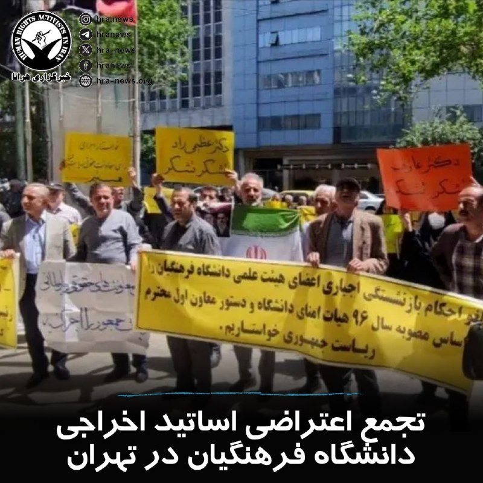

روز یکشنبه ۱۰ خرداد‌ماه، شماری از اساتید اخراجی دانشگاه فرهنگیان در مقابل ساختمان وزارت آموزش و پرورش در تهران، دست به #تجمع_اعتراضی زدند.

لغو احکام بازنشستگی اجباری اعضای هیئت علمی دانشگاه فرهنگیان براساس مصوبه سال ۱۳۹۶ هیات امنای دانشگاه از جمله دلایل اعتراض این اساتید است.

↘️
@hranews_bot تماس ✉️ - @Hranews کانال هرانا 🆑

## Hranews — post 113296

  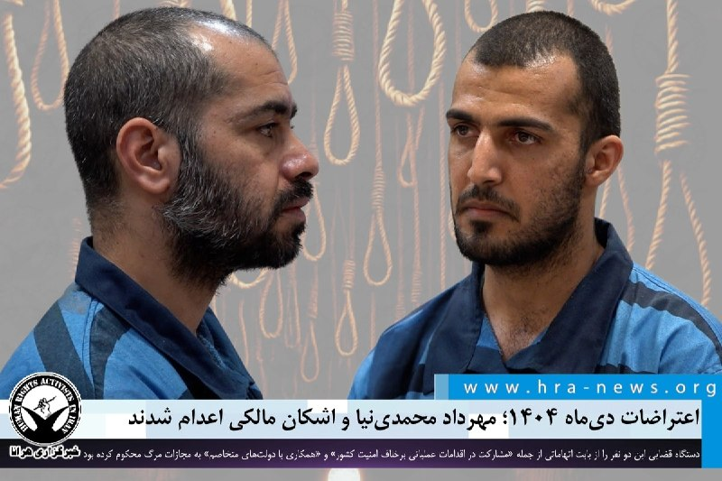

اعتراضات دی‌ماه ۱۴۰۴؛ مهرداد محمدی‌نیا و اشکان مالکی اعدام شدند

❗️
❗️
❗️
❗️
❗️– مرکز رسانه قوه قضاییه اعلام کرد مهرداد محمدی‌نیا و اشکان مالکی، از بازداشت‌شدگان اعتراضات دی‌ماه ۱۴۰۴ تهران، سحرگاه امروز #اعدام شدند. دستگاه قضایی این دو نفر را از بابت اتهاماتی از جمله «مشارکت در اقدامات عملیاتی برخلاف امنیت کشور» و «همکاری با دولت‌های متخاصم» به مجازات مرگ محکوم کرده بود.

ادامه مطلب

#مهرداد_محمدی‌نیا
#اشکان_مالکی

↘️
@hranews_bot تماس ✉️ -  @Hranews  کانال هرانا 🆑

## manototv — post 105890

  <a href="telegram/content/manototv_105890_1780317689.mp4" target="_blank">🎬 Download video</a>

حمله گزارش‌شده آمریکا به اهدافی در جنوب ایران، از نظر دامنه محدود بود، اما از نظر پیام نظامی اهمیت داشت. بر اساس روایت آمریکا، این حمله پس از سرنگونی یک پهپاد آمریکایی بر فراز آب‌های بین‌المللی انجام شد و سایت‌های راداری و مراکز فرماندهی و کنترل پهپادی جمهوری اسلامی در سیریک و جزیره قشم را هدف قرار داد.

## alonews — post 124183

  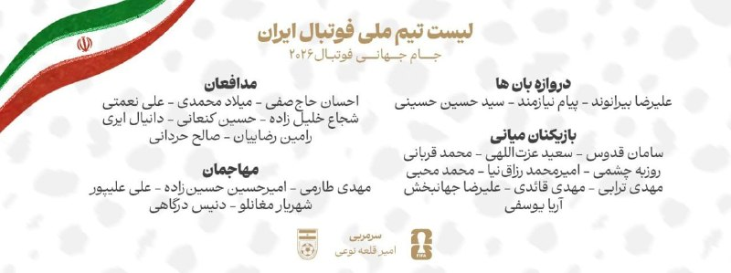

فهرست تیم فوتبال ایرانی برای حضور در جام جهانی

@AloSport

## alonews — post 124182

  <a href="telegram/content/alonews_124182_1780317690.webm" target="_blank">🎬 Download video</a>

👈عربستان سعودی حمله ایران به کویت را محکوم کرد

✅ @AloNews خبر جنگ

## alonews — post 124181

  <a href="telegram/content/alonews_124181_1780317690.webm" target="_blank">🎬 Download video</a>

👈سنتکام: دیشب،نیروهای آمریکایی موفق شدن دو موشک بالستیک ایران رو که هدفش نیروهای آمریکا تو کویت بود،رهگیری و منهدم کنن
- این موشک‌ها همون لحظه خنثی شدن و هیچ آسیبی به نیروهای آمریکایی نرسید
- فرماندهی مرکزی آمریکا (سنتکام) همچنان در حالت آماده‌باشه

✅ @AloNews خبر جنگ

## alonews — post 124180

  <a href="telegram/content/alonews_124180_1780317691.webm" target="_blank">🎬 Download video</a>

👈ارتش اسرائیل دستور تخلیه بخش‌هایی از بیروت را با هماهنگی ایالات متحده صادر خواهد کرد.

✅ @AloNews خبر جنگ

## alonews — post 124178

  <a href="telegram/content/alonews_124178_1780317691.webm" target="_blank">🎬 Download video</a>

👈بانک مرکزی:
نرخ تورم اردیبهشت ماه ۵۳.۹ درصد شد

✅ @AloNews خبر جنگ

## alonews — post 124177

  <a href="telegram/content/alonews_124177_1780317691.webm" target="_blank">🎬 Download video</a>

👈نتانیاهو: ارتش اسرائیل فعالیت‌های خودش در جنوب لبنان رو گسترش خواهد داد؛ حزب‌الله در حال فراره و ما مصممیم امنیت رو به ساکنان شمال بازگردانیم.

✅ @AloNews خبر جنگ

## alonews — post 124176

## alonews — post 124175

## alonews — post 124174

  <a href="telegram/content/alonews_124174_1780317691.mp4" target="_blank">🎬 Download video</a>

👈در روزهای پایانی جنگ، آشیانه‌های هوایی پایگاه هوایی الصفران امارات حداقل دو بار مورد اصابت موشک‌ها و پهپادهای ایرانی قرار گرفت: یک بار در اواخر مارس و بار دیگر پیش از ۵ آوریل.

🔴این پایگاه میزبان جنگنده‌های میراژ ۲۰۰۰ و پهپادهای تهاجمی وینگ لونگ متعلق به نیروی هوایی امارات است که گفته می‌شود هر دو در عملیات‌های تهاجمی امارات علیه ایران نقش داشته‌اند.

✅ @AloNews خبر جنگ

## alonews — post 124173

  <a href="telegram/content/alonews_124173_1780317692.webm" target="_blank">🎬 Download video</a>

👈حسن خمینی امسال به مناسبت سالگرد روح الله خمینی سخنرانی نخواهد کرد

✅ @AloNews خبر جنگ

## alonews — post 124172

  <a href="telegram/content/alonews_124172_1780317692.webm" target="_blank">🎬 Download video</a>

👈علی قلهکی:
عملیاتِ نظامیِ سنگینی که اسرائیل در جنوبِ لبنان انجام می‌دهد، آخرین تحرکاتِ پیش از «تفاهم» نیست، بلکه پیش‌زمینه‌ی اقدام نظامی دیگری‌ست!

✅ @AloNews خبر جنگ

## alonews — post 124171

  <a href="telegram/content/alonews_124171_1780317692.webm" target="_blank">🎬 Download video</a>

⭕️ الونیوز فقط در تلگرام و توییتر (X) فعال هستش 
🔴سایر شبکه های اجتماعی چه داخلی چه خارجی که با نام الونیوز فعالیت می‌کنند مرتبط به ما نیست و پیشنهاد میکنم که لفت بدید. 
✅@AloNews

## alonews — post 124170

  <a href="telegram/content/alonews_124170_1780317693.mp4" target="_blank">🎬 Download video</a>

👈حزب‌الله فیلمی منتشر کرده که نشان می‌دهد یک پهپاد FPV به یک باتری گنبد آهنین در سایت جال العال اسرائیل در شمال این کشور در تاریخ ۲۷ مه حمله کرده است

✅ @AloNews خبر جنگ

## alonews — post 124169

  <a href="telegram/content/alonews_124169_1780317694.mp4" target="_blank">🎬 Download video</a>

👈پنج کارگر در انفجاری در یک تأسیسات سوخت موشک که توسط شرکت هانوها ایرواسپیس در دائه‌جون، کره جنوبی اداره می‌شود، کشته شدند و دو نفر دیگر زخمی شدند.

🔴این انفجار در خط تولید سوخت موشک جامد رخ داد، در حالی که مقامات معتقدند این حادثه در حین کارهای نظافت یا تعمیر و نگهداری اتفاق افتاده است.

✅ @AloNews خبر جنگ

## alonews — post 124168

  <a href="telegram/content/alonews_124168_1780317695.webm" target="_blank">🎬 Download video</a>

👈مرندی، عضو تیم مذاکره کننده: خیلی مهم. صبر ایران دارد تمام می‌شود

✅ @AloNews خبر جنگ

## alonews — post 124167

  <a href="telegram/content/alonews_124167_1780317695.webm" target="_blank">🎬 Download video</a>

👈احتمال شکست آتش بس در ساعات آتی بالاست

✅ @AloNews خبر جنگ

## alonews — post 124164

  <a href="telegram/content/alonews_124164_1780317696.webm" target="_blank">🎬 Download video</a>

👈جنگنده‌های اسرائیلی حملات هوایی به تول، ملیخ و شوکین در جنوب لبنان انجام داده‌اند

✅ @AloNews خبر جنگ

## alonews — post 124161

  <a href="telegram/content/alonews_124161_1780317696.webm" target="_blank">🎬 Download video</a>

👈صحنه‌هایی از الحوش، منطقه صور، جنوب لبنان، پس از حملات هوایی شدید اسرائیل

✅ @AloNews خبر جنگ

<!-- MSG END -->

<!-- NAV START -->

<a href="https://github.com/Tljn/FUD/blob/main/telegram/content/archive_1.md" style="display:inline-block; padding:6px 12px; margin:0 4px; background-color:#2ea44f; color:white; text-decoration:none; border-radius:4px; font-weight:bold;">صفحه بعد</a>

<!-- NAV END -->
