# خواننده تلگرام

<!-- TOP_NAV START -->

<a href="https://github.com/Tljn/FUD/blob/main/telegram/content/archive_1.md" style="display:inline-block; padding:6px 12px; margin:0 4px; background-color:#2ea44f; color:white; text-decoration:none; border-radius:4px; font-weight:bold;">صفحه بعد</a>

<!-- TOP_NAV END -->

<!-- MSG START -->

---
📅 بروزرسانی: 1405/03/26 01:56
---

## VahidOOnLine — post 245783

  <a href="telegram/content/VahidOOnLine_245783_1781562406.mp4" target="_blank">🎬 Download video</a>

♦️صفحه اینستاگرام شهبانو فرح پهلوی، روز دوشنبه، تصاویری از گردهمایی ایرانیان در مراسم یادبود شاهدخت لیلا پهلوی را به اشتراک گذاشت. در توضیح این تصاویر آمده است: «همانند سال‌های گذشته، در سال جاری هم گروه‌های بزرگ ایرانیان از سراسر جهان، روز شنبه ۲۳ خردادماه ۲۵۸۵ (شاهنشاهی) در مراسم یادبود شاهدخت لیلا پهلوی در آرامگاه او در پاریس گرد هم آمدند و به روان شاهدخت ایران ادای احترام کردند». در ادامه این پیام نوشته شده:‌«این گردهمایی عظیم و این همایش زیبا و پر از احساس، نشانی روشن و خودجوش از همبستگی ملی، و از علاقه و احترامی است که ایرانیان همواره و در هر موقعیتی نسبت به شهبانوی ایران و به خاندان پهلوی نشان می‌دهند. شهبانوی ایران تحت تاثیر این ابراز محبت صمیمانه، از صمیم قلب از همه ایرانیان ابراز تشکر می‌کنند». شاهدخت لیلا پهلوی، دختر شاه فقید ایران، ۲۰ خرداد ۱۳۸۰ در ۳۱ سالگی در لندن درگذشت.
‌🇸🇦 Indypersian

🤖 @VahidOOnLine

## VahidOOnLine — post 245782

  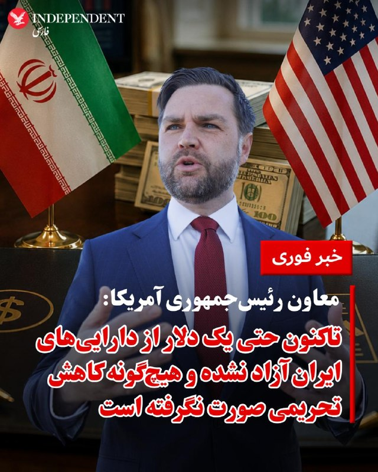

♦️جی‌دی ونس، معاون رئیس‌جمهوری ایالات متحده، در گفتگو با «سی‌ان‌ان» ضمن تکذیب گزارش‌های مربوط به آزادسازی زودهنگام اموال ایران گفت: «تا این لحظه حتی یک دلار از دارایی‌های مسدود شده ایران آزاد نشده و هیچ‌گونه کاهش تحریمی از سوی ایالات متحده یا شرکای ما در خلیج‌فارس صورت نگرفته است.» ونس با اشاره به گزارش‌های نادرست در این زمینه افزود: «تندروها و برخی عناصر در داخل ساختار سیاسی ایران، برای متقاعد کردن افکار عمومی خود، دستاوردهای تهران از این توافق را بزرگ‌نمایی می‌کنند، بدون اینکه به تعهداتی که ایران برای کسب این امتیازات باید به آن‌ها تن بدهد، اشاره‌ای کنند.»
معاون رئیس‌جمهوری آمریکا با تاکید بر اینکه این توافق در صورت اجرا شامل یک بسته کاهش تحریمی بسیار بزرگ برای مردم ایران خواهد بود، تصریح کرد: «این تفاهم‌نامه نحوه تعامل ایران با جهان و منطقه را به طور اساسی تغییر می‌دهد، اما تهران تنها زمانی از این مزایا بهره‌مند خواهد شد که به تمامی تعهدات خود عمل کند.» او در پایان به مخاطبان توصیه کرد که نسبت به بیانیه‌های تبلیغاتی و پروپاگاندای حکومت ایران بدبین باشند و تاکید کرد که بهره‌مندی از این فرصت بزرگ، کاملا به پایبندی عملی ایران به وعده‌هایش بستگی دارد.
‌🇸🇦 Indypersian

🤖 @VahidOOnLine

## VahidOOnLine — post 245781

  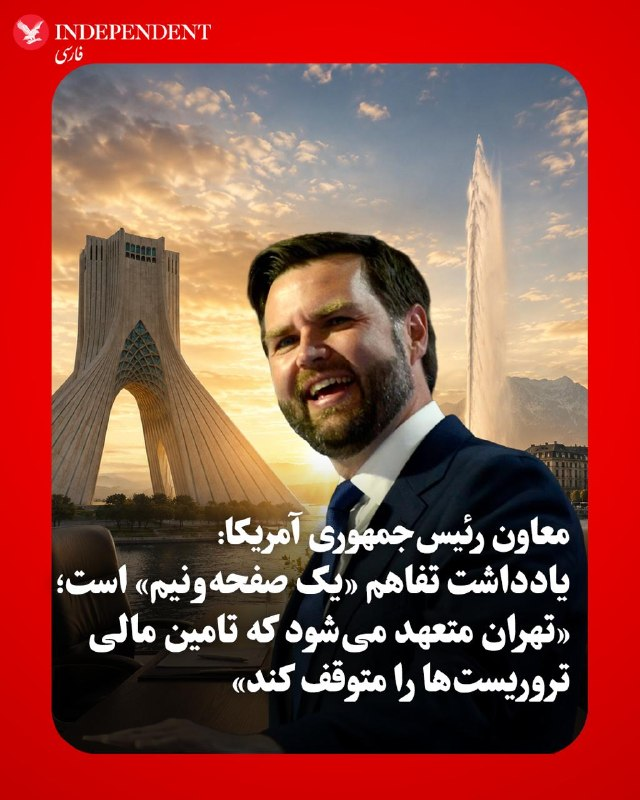

♦️جی‌دی ونس، معاون رئیس‌جمهوری ایالات متحده، روز دوشنبه در گفتگو با «سی‌ان‌ان» اعلام کرد که یادداشت تفاهم میان آمریکا و ایران سندی بسیار کلی و در حدود «یک صفحه و نیم» است. ونس با اشاره به اینکه این متن تنها یک چارچوب کلان را تعیین می‌کند، تاکید کرد که جزئیات مربوط به موضوعات مختلف باید در طول مرحله مذاکرات فنی آینده مشخص و حل‌وفصل شوند. به گفته او، این تفاهم‌نامه ساختاری را ایجاد می‌کند که بر اساس آن، ایرانی‌ها در صورت پایبندی به تعهدات خود، از مزایای این توافق بهره‌مند خواهند شد.
معاون رئیس‌جمهوری آمریکا در بخش دیگری از این مصاحبه گفت که در همان «بند اول» این سند، انتظار واشنگتن مبنی بر تعهد ایران به «صلح و ثبات منطقه‌ای» به صراحت مطرح شده است. او تصریح کرد که بر اساس این بند، همان‌طور که ایالات متحده به صلح متعهد است، تهران نیز متعهد می‌شود که تامین مالی سازمان‌های تروریستی خشن و دامن زدن به بی‌ثباتی در منطقه را به طور کامل متوقف کند.
‌🇸🇦 Indypersian

🤖 @VahidOOnLine

## VahidOOnLine — post 245780

  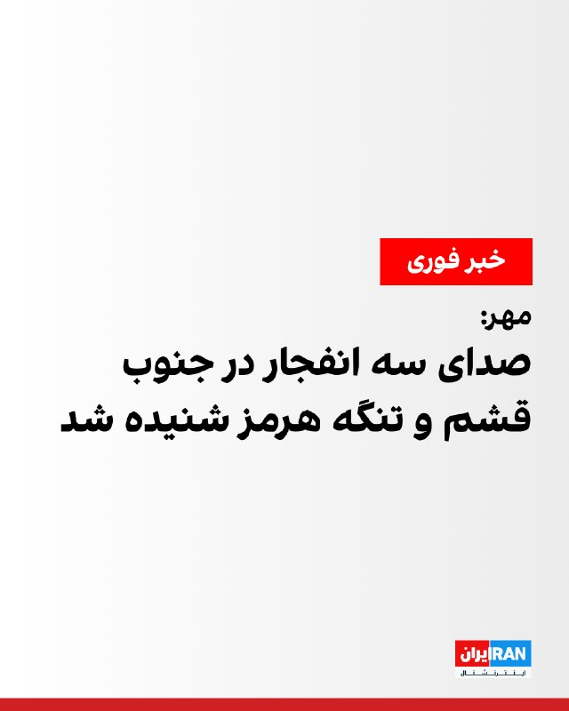

بر اساس این گزارش، دو انفجار نخست ساعات پایانی شامگاه دوشنبه ۲۵ خرداد و سومین انفجار ساعات اولیه بامداد سه‌شنبه ۲۶ خرداد رخ داده است.
طبق گزارش مهر، این انفجارها در محدوده تنگه هرمز روی داده و بر اساس گزارش‌های اولیه، احتمالا به «مدیریت تردد» تنگه هرمز مرتبط است.

‌🏁 🇬🇧 IranintlTV

🤖 @VahidOOnLine

## VahidOOnLine — post 245779

  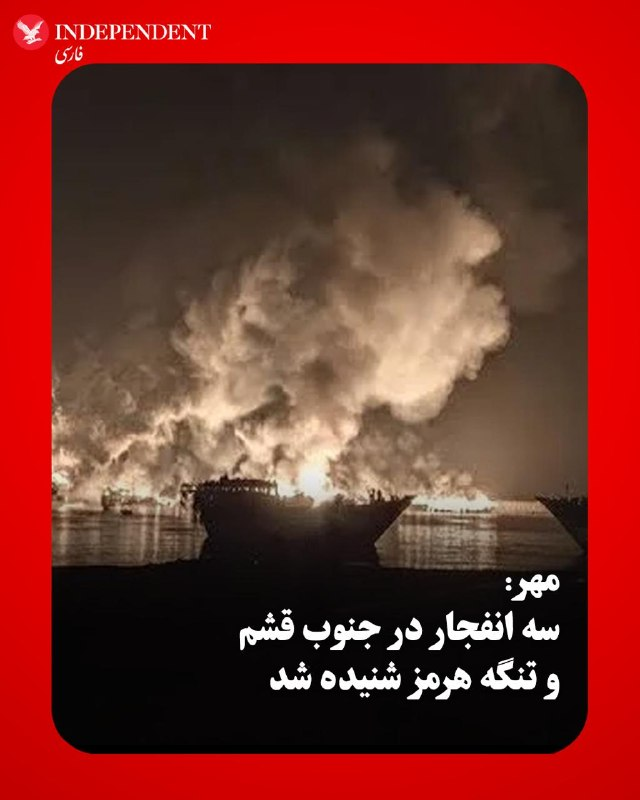

♦️خبرگزاری مهر، از وقوع سه انفجار پیاپی در محدوده تنگه هرمز خبر داد و اعلام کرد که دو انفجار نخست در ساعات پایانی دوشنبه‌شب ۲۵ خرداد و سومین انفجار در ساعات اولیه بامداد سه‌شنبه ۲۶ خرداد رخ داده است. بر اساس بررسی‌های خبرنگار این رسانه، گمانه‌زنی‌های اولیه حاکی از آن است که این انفجارها احتمالا با هدف «مدیریت تردد» در تنگه هرمز صورت گرفته است.
‌🇸🇦 Indypersian

🤖 @VahidOOnLine

## VahidOOnLine — post 245778

  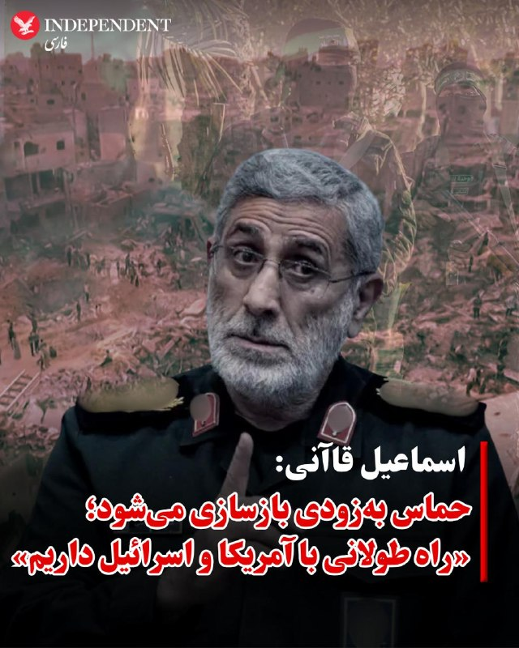

♦️اسماعیل قاآنی، فرمانده نیروی قدس سپاه پاسداران، دوشنبه‌شب در مصابحه با شبکه خبر صداوسیما ضمن اشاره به اینکه «راه طولانی با آمریکا و اسرائیل داریم» گفت: «حماس به‌زودی بازسازی می‌شود. اجزای جبهه مقاومت در جنگ پیش‌قدم مبارزه بودند و در سخت‌ترین شرایط مقابل دشمن آمریکایی-اسرائیلی ایستادگی می‌کنند.» قاآنی در ادامه گفت «باب‌المندب فقط یکی از نقاط استراتژیک در دست مقاومت است و جاهای دیگر هم هستند که اگر لازم باشد فعال می‌شوند».
‌🇸🇦 Indypersian

🤖 @VahidOOnLine

## VahidOOnLine — post 245777

  

خبرگزاری تسنیم، وابسته به سپاه پاسداران، نوشت: رفع محاصره دریایی عملیاتی شد و ۳ نفتکش و ۲ کشتی حامل کالای اساسی جمهوری اسلامی از محاصره دریایی عبور کردند.

پیش‌تر ‌‌ارتش آمریکا در یک یادداشت هشدار اعلام کرد که محاصره بنادر ایران تا زمان تکمیل یک توافق آتش‌بس با این کشور که برای ۱۹ ژوئن (۲۹ خرداد) برنامه‌ریزی شده است، همچنان برقرار است.

در این هشدار که دوشنبه منتشر شد، آمده است: «محاصره نظامی بنادر ایران همچنان برقرار است و تمامی ترددهای ورودی و خروجی از این بنادر را محدود می‌کند.»

ارتش آمریکا افزود: «تا زمانی که دستور صریح صادر نشده است، از تلاش برای عبور خودداری کنید.»
‌🏁 🇬🇧 IranintlTV

🤖 @VahidOOnLine

## VahidOOnLine — post 245776

  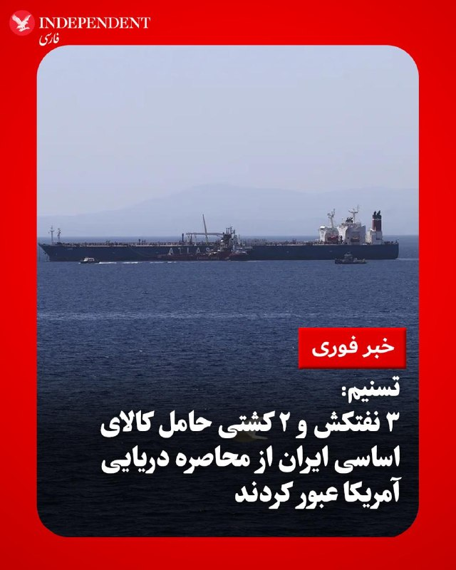

♦️تسنیم، خبرگزاری وابسته به سپاه، روز دوشنبه، ۲۶ خردادماه با انتشار گزارشی اعلام کرد: «دقایقی پیش، ۳ نفتکش و ۲ کشتی حامل کالای اساسی ایران از محاصره دریایی عبور کردند». بر اساس گزارش فارس، دیگر خبرگزاری وابسته به سپاه، یک نفتکش غول‌پیکر ایرانی (VLCC) به همراه یک کشتی حامل نهاده‌های دامی با گذر از منطقه محاصره در آب‌های آزاد به سمت بنادر ایران حرکت کرده‌اند؛ هم‌زمان یک نفتکش دیگر نیز با عبور از دریای عمان و خط محاصره، مسیر خود را به سمت مقصد صادراتی پیش گرفته است.
پیش از این، دونالد ترامپ، رئیس جمهوری آمریکا، روز یکشنبه ضمن اعلام نهایی‌شدن توافق با جمهوری اسلامی ایران گفت:‌ «من بدین‌وسیله اجازه کامل بازگشایی بدون عوارض تنگه هرمز را صادر و هم‌زمان با آن، فرمان لغو فوری محاصره دریایی ایالات متحده [علیه ایران] را ابلاغ می‌کنم».
‌🇸🇦 Indypersian

🤖 @VahidOOnLine

## VahidOOnLine — post 245775

  <a href="telegram/content/VahidOOnLine_245775_1781562411.mp4" target="_blank">🎬 Download video</a>

ویدیوهای منتشرشده در حساب کاربری «وحید آنلاین»، آتش‌سوزی در شهرک امید تهران را در شامگاه دوشنبه ۲۵ خرداد نشان می‌دهد.
تا زمان انتشار این ویدیوها، جزییاتی درباره علت این آتش‌سوزی و خسارت‌های احتمالی آن منتشر نشده است.
‌🏁 🇬🇧 IranintlTV

🤖 @VahidOOnLine

## VahidOOnLine — post 245774

♦️خبرگزاری فرانسه روز دوشنبه، تصاویری از محل سقوط بمب‌افکن «بی-۵۲» آمریکا در پایگاه هوایی «ادواردز» در ایالت کالیفرنیا را منتشر کرد. این تصاویر برخاستن دود غلیظی را از محل سقوط این بمب‌افکن راهبردی متعلق به نیروی هوایی ایالات متحده نشان می‌دهد. براساس این گزارش، این هواپیمای نظامی غول‌پیکر در باند فرود این پایگاه دچار سانحه شده و سقوط کرده است.
‌🇸🇦 Indypersian

🤖 @VahidOOnLine

## VahidOOnLine — post 245773

  <a href="telegram/content/VahidOOnLine_245773_1781562412.mp4" target="_blank">🎬 Download video</a>

♦️اسماعیل قاآنی، فرمانده نیروی قدس سپاه پاسداران، در مصاحبه صداوسیما گفت: «به آمریکا و اسرائیل توصیه می‌کنم خودتان را با مقاومت درگیر نکنید، چرا که شما از پس مقاومت برنمی‌آیید.» او با تاکید بر اینکه تجربه سال‌های گذشته نشان داده دشمن در هر جبهه‌ای با مقاومت روبرو شده شکست خورده است، گفت: «حماس، جهاد اسلامی و بچه‌های مقاومت فلسطین خسارت‌های زیادی دیده‌اند، اما برنده میدان شده‌اند.»
‌🇸🇦 Indypersian

🤖 @VahidOOnLine

## VahidOOnLine — post 245772

  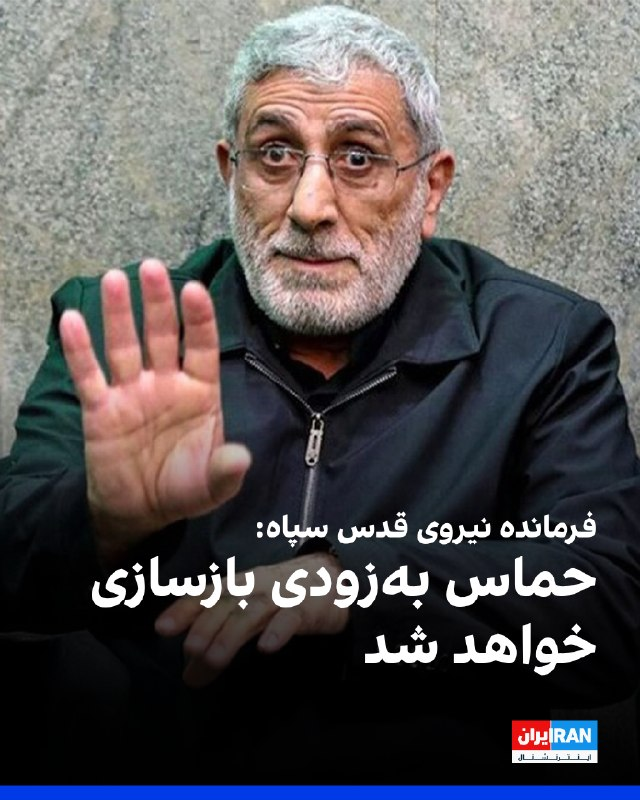

اسماعیل قاآنی، فرمانده نیروی قدس سپاه پاسداران، با تاکید بر اینکه «حماس به‌زودی بازسازی می‌شود»، گفت: «اجزای جبهه مقاومت در جنگ پیش‌قدم مبارزه بودند و در سخت‌ترین شرایط مقابل دشمن آمریکایی - اسرائیلی ایستادگی می‌کنند.»

او افزود: کسی نمی‌تواند مقابل حزب‌الله لبنان ایستادگی کند و هر آنچه از حزب‌الله لبنان دیده‌اید، تنها نوک کوه یخ است.

قاآنی اضافه کرد باب‌المندب یکی از برگ‌های برنده «جبهه مقاومت» است و اگر لازم باشد برگ‌های دیگری هم رو می‌شود.
‌🏁 🇬🇧 IranintlTV

🤖 @VahidOOnLine

## VahidOOnLine — post 245771

  <a href="telegram/content/VahidOOnLine_245771_1781562415.mp4" target="_blank">🎬 Download video</a>

♦️علیرضا زاکانی، شهردار تهران، دوشنبه‌شب در گفتگو با صداوسیما، درباره توافق تهران و واشنگتن ضمن اشاره به ضرورت «شفاف‌سازی» در روند مذاکرات گفت: «ما در میانه جنگیم و به‌هیچ‌وجه کسی نباید فکر کند که جنگ تمام شده است. جنگ یک توقفی دارد و آمریکا و اسرائیل دنبال تکمیل بانک اطلاعاتی‌ خود و به‌ مهیاکردن دیگر آورده‌هایشان هستند.»
‌🇸🇦 Indypersian

🤖 @VahidOOnLine

## VahidOOnLine — post 245770

  <a href="telegram/content/VahidOOnLine_245770_1781562416.mp4" target="_blank">🎬 Download video</a>

ویدیوهای منتشرشده در شبکه‌های اجتماعی از وقوع آتش‌سوزی در یک «موکب» در محدوده میدان تجریش تهران در روز دوشنبه ۲۵ خرداد حکایت دارد.
سخنگوی آتش‌نشانی تهران علت این آتش‌سوزی را ناشی از آتش‌ گرفتن گاز پیک‌نیک در این موکب عنوان کرد.
سخنگوی اورژانس استان تهران نیز اعلام کرد در این حادثه پنج نفر مصدوم شدند.
‌🏁 🇬🇧 IranintlTV

🤖 @VahidOOnLine

## VahidOOnLine — post 245769

  

علیرضا زاکانی، شهردار تهران، گفت: هر زمان آمریکا خلاف تعهداتش عمل کند، تنگه هرمز را خواهیم بست و باید بداند هر اقدامی که می‌کند چه هزینه سنگینی برای او خواهد داشت.

او افزود: «روس‌ها گفتند باور نمی‌کردیم شما اینقدر قابلیت داشته باشید.»
‌🏁 🇬🇧 IranintlTV

🤖 @VahidOOnLine

## VahidOOnLine — post 245767

  <a href="telegram/content/VahidOOnLine_245767_1781562418.mp4" target="_blank">🎬 Download video</a>

♦️مسعود پزشکیان، رئیس‌جمهور ایران، روز دوشنبه ۲۵ خردادماه اعلام کرد پس از اعمال اصلاحات مورد نظر در متن تفاهم‌نامه پایان جنگ، این سند به تصویب رسیده و قرار است مراحل نهایی امضاء و اجرای آن روز جمعه انجام شود.
پزشکیان در گفتگو با پایگاه اطلاع‌رسانی دولت گفت: «قرار بود اصلاحاتی در متن انجام شود که این اصلاحات روز گذشته انجام شد و پس از هماهنگی‌های لازم، به تصویب رسید. بر این اساس، مقرر شده است روز جمعه مراحل نهایی امضاء و اجرای آن انجام شود.»
دونالد ترامپ، رئیس جمهوری آمریکا، جی دی ونس معاون ترامپ و همچنین عباس عراقچی، در روز دوشنبه برگزاری مراسم امضاء در کشور سوئیس را تایید کردند.
‌🇸🇦 Indypersian

🤖 @VahidOOnLine

## VahidOOnLine — post 245766

  

به گزارش رویترز، حزب‌الله اعلام کرد که به سوی نیروهای اسرائیلی که در حال تلاش برای پیشروی در جنوب لبنان بودند، راکت‌ها و پهپادهایی شلیک کرده است.
پیش‌تر رویترز گزارش داد اسرائیل در یک حمله پهپادی خودرویی را در جنوب لبنان هدف قرار داد و راننده آن کشته شد.

‌🏁 🇬🇧 IranintlTV

🤖 @VahidOOnLine

## WithYashar — post 15019

  <a href="telegram/content/WithYashar_15019_1781562419.mp4" target="_blank">🎬 Download video</a>

ونس : هیچ دلار تخفیف تحریمی یا پول بلوکه‌شده‌ای، نه از آمریکا و نه از هیچ‌کدوم از متحدای ما تو خلیج، آزاد نشده

این امتیاز فقط وقتی بهشون داده میشه که به تعهداتشون تو توافق عمل کنن
@withyashar

## WithYashar — post 15018

پرس تی وی: ۳ نفتکش و ۲ کشتی با کالای ایران از محاصره دریایی عبور کرد
@withyashar

## WithYashar — post 15017

@withyashar تحلیل وضعیت

## WithYashar — post 15016

  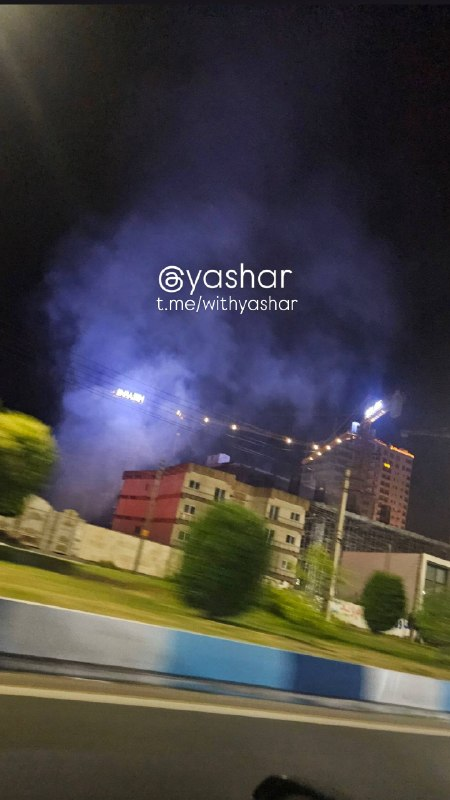

قشم سمت سوزا همین الان خیابون اصلی
@withyashar 🚨🚨🚨

## WithYashar — post 15015

صدای توافق از قشم 🚨
@withyashar

## WithYashar — post 15014

  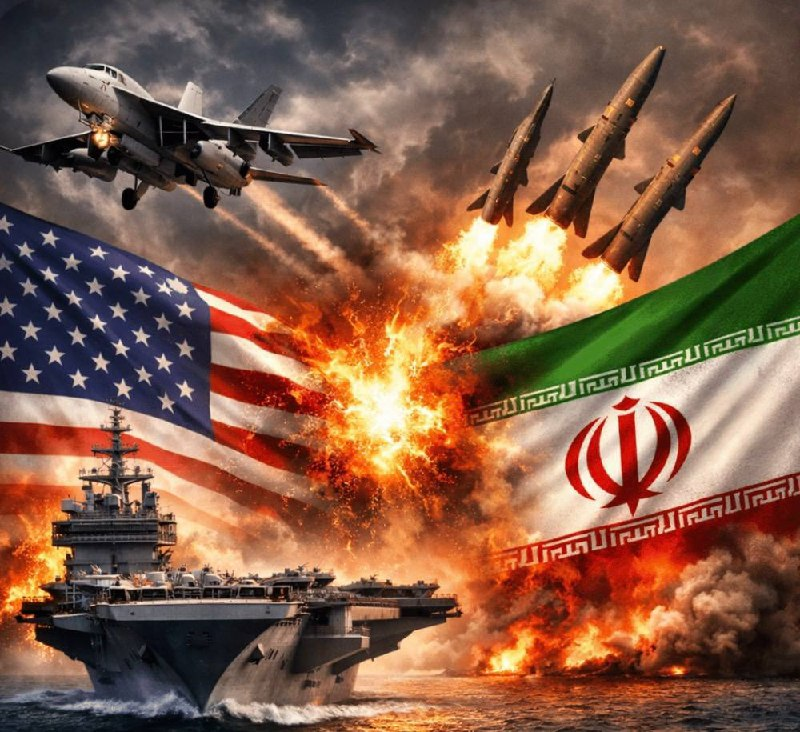

🚨
🚨
🚨 توافق یا عملیات فریب برای حمله وحشتناک امریکا و اسرائیل!

⭕️مشاهده تحلیل
🇮🇱
🇺🇸
🇮🇷
👇

https://t.me/+hLt81qXCGTQzOWQ0
https://t.me/+hLt81qXCGTQzOWQ0

## WithYashar — post 15013

## WithYashar — post 15012

کانال ۱۴ اسرائیل: تعجب جامعه اسرائیل از این بود که مقامات ایران قبل از دفن علی خامنه‌ای با قاتلینش توافق کردند
@withyashar

## WithYashar — post 15011

## WithYashar — post 15010

عراقچی: جمعه در سوئیس تفاهم امضا می‌شود و پس از آن اولین دور مذاکرات بعدی را خواهیم داشت
@withyashar

## WithYashar — post 15009

نیویورک تایمز گزارش داد که ممنوعیت ورود پرچم‌های شیروخورشید ایران به جام جهانی که از سوی فیفا اعمال شده بود، پس از برگزاری یک جلسه اضطراری دادگاه در لس‌آنجلس در روز دوشنبه تایید شد و قاضی کرتیس ای. کین حکم داد که این ممنوعیت به قوت خود باقی بماند.
@withyashar

## mwarmonitor — post 11003

  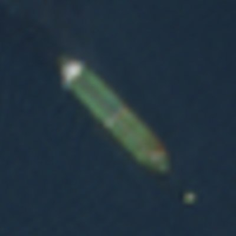

🔴یک نفتکش فوق‌سنگین دیگر (VLCC) که تحت تحریم‌های آمریکا قرار دارد، در حالی که با جعل موقعیت مکانی وانمود می‌کند هنوز خارج از خط محاصره است، موفق شده از خط محاصره نیروی دریایی آمریکا عبور کند. این سوپرتانکر در حال حاضر ۲ میلیون بشکه نفت خام ایران را بارگیری می‌کند.

🔸همچنین می‌توان گفت که شاهد تحرکات بیشتر نفتکش‌ها متعلق به شرکت ملی نفتکش ایران (NITC) هستیم. در حال حاضر دو VLCC به سمت شرق در حرکت‌اند که این موضوع آن‌ها را به خط محاصره نزدیک‌تر می‌کند، در حالی که سه نفتکش دیگر دیگر در شرقی‌ترین بندر ایران، چابهار، حضور ندارند و فعلاً مکان آن‌ها نامشخص است.

اتفاقی در حال رخ دادن است.

TANKER TRACKER

@mwarmonitor

## mwarmonitor — post 11002

🚨✈️یک فروند بمب‌افکن B-52 استراتوفورترس متعلق به نیروی هوایی آمریکا، اندکی پس از برخاستن از پایگاه نیروی هوایی ادواردز و حوالی ساعت ۱۱:۲۰ صبح سقوط کرد. هنوز جزئیاتی درباره تلفات احتمالی یا علت این سانحه منتشر نشده است. @mwarmonitor

## FoxNewsTwitter — post 342997

  <a href="telegram/content/FoxNewsTwitter_342997_1781562422.mp4" target="_blank">🎬 Download video</a>

Fox News (Twitter/X)

A graduation celebration quickly turned into a protest.

Stanford graduates walked out during Google CEO Sundar Pichai's commencement speech. "Free Palestine" chants and boos were heard, and Palestinian flags were visible throughout the demonstration.

The protest was likely aimed at Google's business ties with the Israeli government, including the company's partnership with Israel's Project Nimbus cloud-computing contract, an issue that has fueled campus activism at Stanford for years.

Pichai did not appear to respond to the protest and continued delivering his remarks as demonstrators exited the ceremony.

## FoxNewsTwitter — post 342996

  <a href="telegram/content/FoxNewsTwitter_342996_1781562424.mp4" target="_blank">🎬 Download video</a>

Fox News (Twitter/X)

"My mom even thinks it's the greatest thing ever... Why would I back down?"

@vanillaice makes it clear: he's not going anywhere and WILL perform at the Great American State Fair on the National Mall for America's 250th anniversary celebration.

The '90s pop icon pushed back on critics, saying he's proud to take part in the historic event and calling it an honor to celebrate the country's milestone birthday.

"It's still the greatest country in the world."

"For me, man, this is a great celebration. I'm honored and look forward to getting everybody dancing." | @TheStoryFNC @BillHemmer

## FoxNewsTwitter — post 342995

  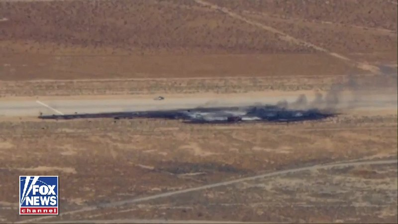

Fox News (Twitter/X)

BREAKING: A U.S. Air Force B-52 bomber crashed shortly after takeoff at Edwards Air Force Base, triggering an emergency response.

Emergency crews rushed to the scene as thick black smoke billowed from the wreckage scattered across the desert airfield.

More details, including the condition of those on board, have not yet been released.

## pm_afshaa — post 94155

🔴امشب اولییین بازی ایران که داخل ورزشگاه بردن پرچم شیر و خورشید هم آزاد اعلام شده ، اگر میخوای بدون سانسور بازی ایران دنبال کنی حتما این کانالو داشته باش که تمام بازیای جام جهانی کاملا بدون سانسور پوشش میده : • @TrollSporte • @TrollSporte

## pm_afshaa — post 94153

  

🔴امشب اولییین بازی ایران که داخل ورزشگاه بردن پرچم شیر و خورشید هم آزاد اعلام شده ، اگر میخوای بدون سانسور بازی ایران دنبال کنی حتما این کانالو داشته باش که تمام بازیای جام جهانی کاملا بدون سانسور پوشش میده :

• @TrollSporte
• @TrollSporte

## pm_afshaa — post 94152

یک مقام ارشد آمریکایی به العربیه: جمهوری اسلامی آماده ارائه امتیازهایی بی‌سابقه‌ست.

💧 Rainbet.com the #1 Non-KYC Crypto Casino & Sportsbook @rainbetcom

😁 @Pm_Afshaa

## pm_afshaa — post 94151

  <a href="telegram/content/pm_afshaa_94151_1781562426.mp4" target="_blank">🎬 Download video</a>

🔴عراقچی: قراره روز جمعه در کشور سوئیس یه دیداری بین هیئت‌های دو طرف انجام بشه، که در ابتدا روسای هیئت‌های دو طرف این یادداشت تفاهم رو امضا کنند و بعدش اولین دور مذاکرات بعدی رو داشته باشیم.

💧 Rainbet.com the #1 Non-KYC Crypto Casino & Sportsbook @rainbetcom

😁 @Pm_Afshaa

## pm_afshaa — post 94150

ایران الان ۲ دسته شده: اونایی که ۲ شب رفتن بیرون تیر خوردن اونایی که ۱۰۰ شب رفتن بیرون ... خوردن

## pm_afshaa — post 94149

ایران الان ۲ دسته شده:

اونایی که ۲ شب رفتن بیرون تیر خوردن
اونایی که ۱۰۰ شب رفتن بیرون ... خوردن

## pm_afshaa — post 94148

مشاور قالیباف: چیزی به اسم شروط رهبری وجود نداره

💧 Rainbet.com the #1 Non-KYC Crypto Casino & Sportsbook @rainbetcom

😁 @Pm_Afshaa

## DEJradio — post 5711

  <a href="telegram/content/DEJradio_5711_1781562427.webm" target="_blank">🎬 Download video</a>

⚽️
🔺 سوشا مکانی:
تیم فوتبال جمهوری اسلامی نماینده یک رژیم جنایتکار است

#دژفوتبالی #جام_جهانی #رژیم_جنایتکار
@DEJradio

## DEJradio — post 5710

  <a href="telegram/content/DEJradio_5710_1781562428.webm" target="_blank">🎬 Download video</a>

⚽️
🔺 برنامه دژ فوتبالی

*مهدی رستم‌پور، خبرنگار ورزشی

#دژفوتبالی #جام_جهانی
@DEJradio

## DEJradio — post 5709

  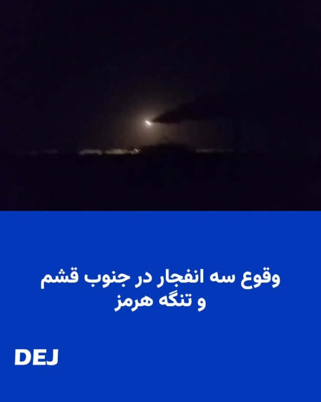

🛩️
🔥 منابع محلی از شنیده شدن صدای انفجارهایی در مناطق جنوبی جزیره قشم و تنگه هرمز خبر می‌دهند.

خبرگزاری مهر وابسته به سازمان تبلیغات اسلامی، گزارش داد بامداد سه‌شنبه و شامگاه دوشنبه ۲۵ خردادماه، صدای انفجارهایی از سمت جنوب جزیره قشم و محدوده تنگه هرمز شنیده شد است.
بر اساس این گزارش، دو انفجار نخست ساعات پایانی شامگاه دوشنبه ۲۵ خرداد و سومین انفجار ساعات اولیه بامداد سه‌شنبه ۲۶ خرداد رخ داده است.

همین خبرگزاری نوشت انفجارها «احتمالاً برای مدیریت تردد در این تنگه رخ داده است.»
هیچ نهادی از جمله سـ.ـپاه یا نهادهای محلی نسبت به جزئیات این رویداد واکنشی نشان نداده است.

#تنگه_هرمز #جنگ
@DEJradio

## DEJradio — post 5708

⭕️
🎤 نخستین نشست مطبوعاتی بنیامین نتانیاهو، نخست وزیر اسرائیل پس از تفاهم جمهوری اسلامی با دولت دونالد ترامپ

#بنیامین_نتانیاهو #مذاکرات #توافق #ترامپ #جمهوری_اسلامی
#زیرنویس
@DEJradio

## DEJradio — post 5707

  <a href="telegram/content/DEJradio_5707_1781562429.mp4" target="_blank">🎬 Download video</a>

🔺📢 خیابان‌های ایران از وفاق تا تفرقه

*روح‌الله رحیم‌پور، تحلیلگر سیاسی

#مذاکرات #توافق
@DEJradio

## DEJradio — post 5706

  <a href="telegram/content/DEJradio_5706_1781562430.mp4" target="_blank">🎬 Download video</a>

🚨
🔸 خبر ۲۱
دوشنبه ۲۵ خرداد ۱۴۰۵

#خبر۲۱
@DEJradio

## VahidOnline — post 76403

جی‌دی ونس، معاون رئیس‌جمهوری ایالات متحده، روز دوشنبه در گفتگو با «سی‌ان‌ان» اعلام کرد که یادداشت تفاهم میان آمریکا و ایران سندی بسیار کلی و در حدود «یک صفحه و نیم» است.
ونس با اشاره به اینکه این متن تنها یک چارچوب کلان را تعیین می‌کند، تاکید کرد که جزئیات مربوط به موضوعات مختلف باید در طول مرحله مذاکرات فنی آینده مشخص و حل‌وفصل شوند.
به گفته او، این تفاهم‌نامه ساختاری را ایجاد می‌کند که بر اساس آن، ایرانی‌ها در صورت پایبندی به تعهدات خود، از مزایای این توافق بهره‌مند خواهند شد.
معاون رئیس‌جمهوری آمریکا در بخش دیگری از این مصاحبه گفت که در همان «بند اول» این سند، انتظار واشنگتن مبنی بر تعهد ایران به «صلح و ثبات منطقه‌ای» به صراحت مطرح شده است.
او تصریح کرد که بر اساس این بند، همان‌طور که ایالات متحده به صلح متعهد است، تهران نیز متعهد می‌شود که تامین مالی سازمان‌های تروریستی خشن و دامن زدن به بی‌ثباتی در منطقه را به طور کامل متوقف کند.
@VahidOOnLine
جی‌دی ونس، معاون رئیس‌جمهوری ایالات متحده، در گفتگو با «سی‌ان‌ان» ضمن تکذیب گزارش‌های مربوط به آزادسازی زودهنگام اموال ایران گفت: «تا این لحظه حتی یک دلار از دارایی‌های مسدود شده ایران آزاد نشده و هیچ‌گونه کاهش تحریمی از سوی ایالات متحده یا شرکای ما در خلیج‌فارس صورت نگرفته است.»
ونس با اشاره به گزارش‌های نادرست در این زمینه افزود: «تندروها و برخی عناصر در داخل ساختار سیاسی ایران، برای متقاعد کردن افکار عمومی خود، دستاوردهای تهران از این توافق را بزرگ‌نمایی می‌کنند، بدون اینکه به تعهداتی که ایران برای کسب این امتیازات باید به آن‌ها تن بدهد، اشاره‌ای کنند.»
معاون رئیس‌جمهوری آمریکا با تاکید بر اینکه این توافق در صورت اجرا شامل یک بسته کاهش تحریمی بسیار بزرگ برای مردم ایران خواهد بود، تصریح کرد: «این تفاهم‌نامه نحوه تعامل ایران با جهان و منطقه را به طور اساسی تغییر می‌دهد، اما تهران تنها زمانی از این مزایا بهره‌مند خواهد شد که به تمامی تعهدات خود عمل کند.»
او در پایان به مخاطبان توصیه کرد که نسبت به بیانیه‌های تبلیغاتی و پروپاگاندای حکومت ایران بدبین باشند و تاکید کرد که بهره‌مندی از این فرصت بزرگ، کاملا به پایبندی عملی ایران به وعده‌هایش بستگی دارد.
@VahidOOnLine

📡 @VahidOnline

## VahidOnline — post 76402

  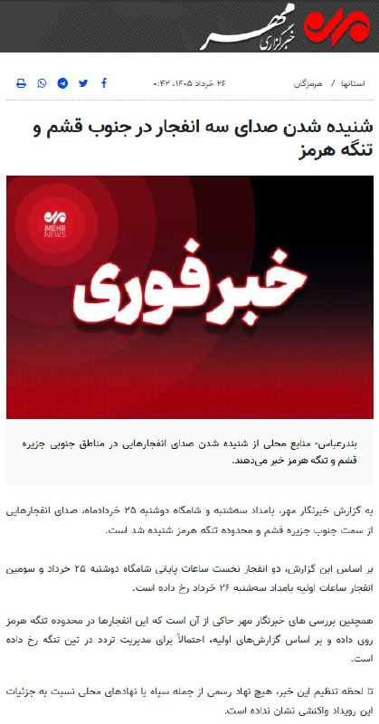

خبرگزاری مهر: منابع محلی از شنیده شدن صدای انفجارهایی در مناطق جنوبی جزیره قشم و تنگه هرمز خبر می‌دهند.

📡 @VahidOnline

## VahidOnline — post 76400

خبرگزاری تسنیم، وابسته به سپاه پاسداران، نوشت: رفع محاصره دریایی عملیاتی شد و ۳ نفتکش و ۲ کشتی حامل کالای اساسی جمهوری اسلامی از محاصره دریایی عبور کردند.

پیش‌تر ‌‌ارتش آمریکا در یک یادداشت هشدار اعلام کرد که محاصره بنادر ایران تا زمان تکمیل یک توافق آتش‌بس با این کشور که برای ۱۹ ژوئن (۲۹ خرداد) برنامه‌ریزی شده است، همچنان برقرار است.
@VahidOOnLine
بر اساس گزارش فارس، دیگر خبرگزاری وابسته به سپاه، یک نفتکش غول‌پیکر ایرانی (VLCC) به همراه یک کشتی حامل نهاده‌های دامی با گذر از منطقه محاصره در آب‌های آزاد به سمت بنادر ایران حرکت کرده‌اند؛ هم‌زمان یک نفتکش دیگر نیز با عبور از دریای عمان و خط محاصره، مسیر خود را به سمت مقصد صادراتی پیش گرفته است.
@VahidOOnLine

📡 @VahidOnline

## VahidOnline — post 76399

پیام‌های دریافتی نیم‌ساعت پیش:

صدای انفجار سیریک ولی با فاصله تقریبا دور

سلام وحید
۲۳:۵۷ دوشنبه ۲۵ خرداد قشم
خودم یه انفجار و موج رو حس کردم، اما بچه‌ها میگفتن دوتا بوده و قبلش هم حس شده، جایی که من هستم نزدیک تنگه است، شاید از روی دریا بوده
۰۰:۰۴ سه‌شنبه ۲۶ خرداد
مجدد دوبار احساس شد

سلام وحید خوبی
ساعت ۱۲ و ۵ دقیقه سمت سیریک صدای انفجار از سمت دریا اومد

📡 @VahidOnline

## kianmeli1 — post 88029

🔴اکسیوس: متن کامل یادداشت تفاهم در ۲۴ تا ۴۸ ساعت آینده منتشر خواهد شد
https://t.me/kianmeli1

## kianmeli1 — post 88028

🔴به گزارش روزنامه اسرائیلی هیوم، آمریکا مخفیانه به قطر اجازه داده است تا در ازای آزادی کشتیرانی در تنگه هرمز و مصونیت از حملات ایران، به ایران پول منتقل کند.
https://t.me/kianmeli1

## kianmeli1 — post 88027

🔴پرس‌تی‌وی: رفع محاصره دریایی عملیاتی شد/ دقایقی پیش، 3 نفتکش و 2 کشتی حامل کالای اساسی ایران از محاصره دریایی عبور کردند
https://t.me/kianmeli1

## IranIntlTV — post 342593

  <a href="telegram/content/IranIntlTV_342593_1781562432.mp4" target="_blank">🎬 Download video</a>

گروهی از ایرانیان در لس‌آنجلس مقابل ورزشگاه محل برگزاری مسابقه تیم‌های ایران و نیوزیلند تجمعی اعتراضی برگزار کردند.

تجمع‌کنندگان می‌گویند هدف از این اقدام، بازتاب صدای اعتراض و دادخواهی مردم ایران در برابر حضور تیم جمهوری اسلامی در رقابت‌های بین‌المللی است.

گزارش نیلوفر منصوری و رضا محدث، خبرنگاران ایران‌اینترنشنال
@iranintltv

## IranIntlTV — post 342592

  <a href="telegram/content/IranIntlTV_342592_1781562434.mp4" target="_blank">🎬 Download video</a>

بن سبطی، پژوهشگر ایران و اسرائیل، درباره رویکرد اسرائیل در قبال توافق جمهوری اسلامی و آمریکا گفت: «ممکن است میان آمریکا و اسرائیل بر سر نحوه مدیریت این توافق اختلاف‌هایی به وجود بیاید، اما اسرائیل معتقد است جمهوری اسلامی و گروه‌های وابسته به آن به این توافق پایبند نخواهند ماند.»

او افزود: «به همین دلیل، اسرائیل احتمالا حضور خود را در جنوب لبنان حفظ خواهد کرد و اگر هم تغییراتی ایجاد شود، بعید است این مناطق را به‌طور کامل ترک کند.»
@iranintltv

## IranIntlTV — post 342591

  <a href="telegram/content/IranIntlTV_342591_1781562435.mp4" target="_blank">🎬 Download video</a>

بن سبطی، پژوهشگر ایران و اسرائیل، درباره رویکرد اسرائیل در قبال توافق جمهوری اسلامی و آمریکا گفت: «ممکن است میان آمریکا و اسرائیل بر سر نحوه مدیریت این توافق اختلاف‌هایی به وجود بیاید، اما اسرائیل معتقد است جمهوری اسلامی و گروه‌های وابسته به آن به این توافق پایبند نخواهند ماند.»

او افزود: «به همین دلیل، اسرائیل احتمالا حضور خود را در جنوب لبنان حفظ خواهد کرد و اگر هم تغییراتی ایجاد شود، بعید است این مناطق را به‌طور کامل ترک کند.»
@iranintltv

## IranIntlTV — post 342590

  <a href="https://t.me/IranintlTV/342590" target="_blank">📎 Download file</a>

🎧نسخه صوتی برنامه با کامبیز حسینی؛ توافق را امضا کردند، آیا به نفع مردم ایران شد؟
@iranintlTV

## IranIntlTV — post 342589

  

🔻علی دایی، اسطوره فوتبال ایران، با اکبر عبدی، بازیگر سینما و تلویزیون که در هفته‌های گذشته دچار حمله قلبی شده بود، دیدار کرده و جویای حال او شد.

🔹اکبر عبدی با انتشار این تصویر در اینستاگرام، از علی دایی بابت پیگیری احوال خود، قدردانی کرد.

@iranintltvsport

## IranIntlTV — post 342588

  

بر اساس این گزارش، دو انفجار نخست ساعات پایانی شامگاه دوشنبه ۲۵ خرداد و سومین انفجار ساعات اولیه بامداد سه‌شنبه ۲۶ خرداد رخ داده است.
طبق گزارش مهر، این انفجارها در محدوده تنگه هرمز روی داده و بر اساس گزارش‌های اولیه، احتمالا به «مدیریت تردد» تنگه هرمز مرتبط است.

https://iranintl.com/202606153732

## IranIntlTV — post 342587

## IranIntlTV — post 342586

  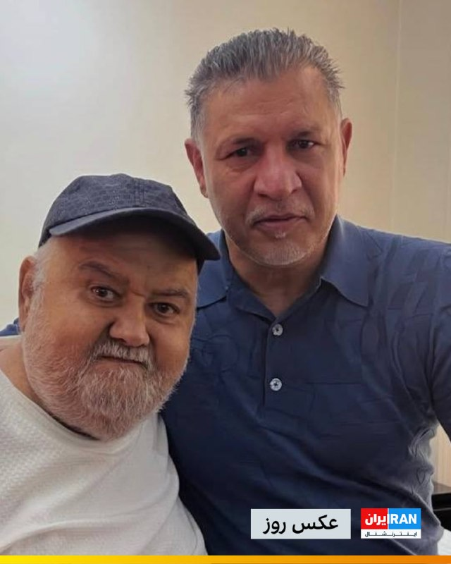

🔻علی دایی، اسطوره فوتبال ایران، با اکبر عبدی، بازیگر سینما و تلویزیون که در هفته‌های گذشته دچار حمله قلبی شده بود، دیدار کرده و جویای حال او شد.

🔹اکبر عبدی با انتشار این تصویر در اینستاگرام، از علی دایی بابت پیگیری احوال خود، قدردانی کرد.

@iranintltvsport

## IranIntlTV — post 342585

  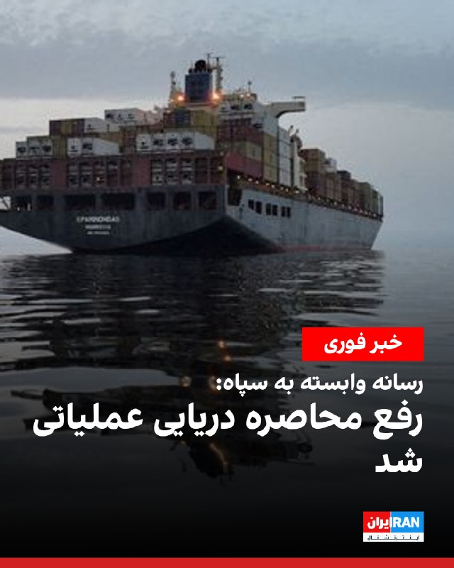

خبرگزاری تسنیم، وابسته به سپاه پاسداران، نوشت: رفع محاصره دریایی عملیاتی شد و ۳ نفتکش و ۲ کشتی حامل کالای اساسی جمهوری اسلامی از محاصره دریایی عبور کردند.

پیش‌تر ‌‌ارتش آمریکا در یک یادداشت هشدار اعلام کرد که محاصره بنادر ایران تا زمان تکمیل یک توافق آتش‌بس با این کشور که برای ۱۹ ژوئن (۲۹ خرداد) برنامه‌ریزی شده است، همچنان برقرار است.

در این هشدار که دوشنبه منتشر شد، آمده است: «محاصره نظامی بنادر ایران همچنان برقرار است و تمامی ترددهای ورودی و خروجی از این بنادر را محدود می‌کند.»

ارتش آمریکا افزود: «تا زمانی که دستور صریح صادر نشده است، از تلاش برای عبور خودداری کنید.»
https://iranintl.com/202606158055

## IranIntlTV — post 342584

  <a href="telegram/content/IranIntlTV_342584_1781562439.mp4" target="_blank">🎬 Download video</a>

ویدیوهای منتشرشده در حساب کاربری «وحید آنلاین»، آتش‌سوزی در شهرک امید تهران را در شامگاه دوشنبه ۲۵ خرداد نشان می‌دهد.
تا زمان انتشار این ویدیوها، جزییاتی درباره علت این آتش‌سوزی و خسارت‌های احتمالی آن منتشر نشده است.

## IranIntlTV — post 342583

  

اسماعیل قاآنی، فرمانده نیروی قدس سپاه پاسداران، با تاکید بر اینکه «حماس به‌زودی بازسازی می‌شود»، گفت: «اجزای جبهه مقاومت در جنگ پیش‌قدم مبارزه بودند و در سخت‌ترین شرایط مقابل دشمن آمریکایی - اسرائیلی ایستادگی می‌کنند.»

او افزود: کسی نمی‌تواند مقابل حزب‌الله لبنان ایستادگی کند و هر آنچه از حزب‌الله لبنان دیده‌اید، تنها نوک کوه یخ است.

قاآنی اضافه کرد باب‌المندب یکی از برگ‌های برنده «جبهه مقاومت» است و اگر لازم باشد برگ‌های دیگری هم رو می‌شود.
https://iranintl.com/202606156609

## IranIntlTV — post 342582

قیمت دلار در بازار آزاد ایران بعد از انشار خبر تفاهم بین تهران و واشینگتن پایین آمد. مطرح شدن بحث لغو محاصره دریایی، باز شدن راه فروش نفت و همین‌طور لغو برخی تحریم‌ها در صورت رسیدن به توافق، مساله اقتصاد ایران و معیشت مردم را در کانون توجه قرار داده است.

گفت‌وگو با محمد ماشین‌چیان، ایران‌اینترنشنال

@iranintltv

## IranIntlTV — post 342581

شبکه اسکای‌نیوز در یک گزارش تحقیقی سراغ کشته شده‌های مدرسه شجره طیبه میناب رفته است. اسکای نیوز اسم، مشخصات و عکس همه ۱۵۲ کشته بمباران این مدرسه را تایید و منتشر کرد. این لیست شامل ۱۲۰ دانش‌آموز ۶ تا ۱۳ ساله و ۲۶ معلم است.
گفت‌وگو با مریم رحمتی، ایران‌اینترنشنال

@iranintltv

## IranIntlTV — post 342580

  <a href="telegram/content/IranIntlTV_342580_1781562441.mp4" target="_blank">🎬 Download video</a>

ویدیوهای منتشرشده در شبکه‌های اجتماعی از وقوع آتش‌سوزی در یک «موکب» در محدوده میدان تجریش تهران در روز دوشنبه ۲۵ خرداد حکایت دارد.
سخنگوی آتش‌نشانی تهران علت این آتش‌سوزی را ناشی از آتش‌ گرفتن گاز پیک‌نیک در این موکب عنوان کرد.
سخنگوی اورژانس استان تهران نیز اعلام کرد در این حادثه پنج نفر مصدوم شدند.

## IranIntlTV — post 342579

  <a href="telegram/content/IranIntlTV_342579_1781562442.mp4" target="_blank">🎬 Download video</a>

در پی اعلام تفاهم میان آمریکا و جمهوری اسلامی، شماری از ایرانیان با انتقاد از این توافق گفته‌اند مطالبات مردم ایران در آن نادیده گرفته شده است. برخی نیز دولت آمریکا را به چشم‌پوشی از سرکوب معترضان متهم کرده و معتقدند دونالد ترامپ، مانند دیگر رهبران جهان، منافع کشور خود را بر حمایت از مردم ایران ترجیح داده است.
@iranintltv

## IranIntlTV — post 342578

در اسرائیل موج انتقادها از تفاهم تهران واشینگتن و عملکرد نتانیاهو بالا گرفته است. اسرائیل‌هیوم نوشت نتانیاهو حالا نه در میز مذاکره جایی دارد و نه ابزاری برای تغییر مسیر توافق. موقعیت سیاسی او عملا در خطر است و کارزار نظامی نخست‌وزیر اسرائیل هم به همه اهدافش نرسیده است.
گفت‌وگو با مئیر جاودان‌فر، تحلیل‌گر مسایل اسرائیل

@iranintltv

## IranIntlTV — post 342577

  <a href="telegram/content/IranIntlTV_342577_1781562443.mp4" target="_blank">🎬 Download video</a>

آرش آرامش، حقوقدان و کارشناس امنیت ملی، گفت: «ترامپ در واقع سنت حمایت آمریکا از اسرائیل را که از پایان جنگ جهانی دوم در سیاست خارجی این کشور وجود داشت، شکسته و به نظر می‌رسد بیش از متحدان دموکراتیک، روابط با دولت‌های اقتدارگرا را در اولویت قرار داده است.»

او افزود: «ایالات متحده می‌توانست با ادامه فشار نظامی تا مرز فروپاشی جمهوری اسلامی پیش برود، اما این مسیر انتخاب نشد و امروز جمهوری اسلامی، هرچند تضعیف شده، همچنان بر سر کار است.»
@iranintltv

## IranIntlTV — post 342576

  

علیرضا زاکانی، شهردار تهران، گفت: هر زمان آمریکا خلاف تعهداتش عمل کند، تنگه هرمز را خواهیم بست و باید بداند هر اقدامی که می‌کند چه هزینه سنگینی برای او خواهد داشت.

او افزود: «روس‌ها گفتند باور نمی‌کردیم شما اینقدر قابلیت داشته باشید.»
https://iranintl.com/202606154980

## IranIntlTV — post 342575

  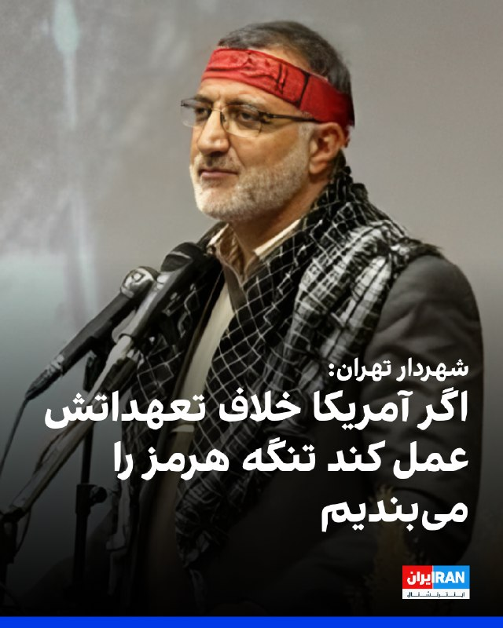

علیرضا زاکانی، شهردار تهران، گفت: هر زمان آمریکا خلاف تعهداتش عمل کند، تنگه هرمز را خواهیم بست و باید بداند هر اقدامی که می‌کند چه هزینه سنگینی برای او خواهد داشت.

او افزود: «روس‌ها گفتند باور نمی‌کردیم شما اینقدر قابلیت داشته باشید.»
https://iranintl.com/202606154980

## IranIntlTV — post 342574

  <a href="telegram/content/IranIntlTV_342574_1781562446.mp4" target="_blank">🎬 Download video</a>

برخی مخاطبان ایران‌اینترنشنال در واکنش به تفاهم آمریکا و جمهوری اسلامی می‌گویند در این روند به مطالبات مردم ایران توجه نشده است. شماری دیگر نیز معتقدند امید بستن به دونالد ترامپ برای ایجاد تغییر در ایران از ابتدا اشتباه بود.

گفت‌وگو با آرش عزیزی، پژوهشگر تاریخ، و فروغ کنعانی، پژوهشگر جامعه‌شناسی
@iranintltv

## Shin_Persian — post 7107

Shin ✓ @hey_itsmyturn
Mon, 15 Jun 2026 21:14:40 UTC

State-owned Mehr reports 3 blasts in south of the Qeshm island / Strait of Hormuz
Hormozgan Province, Iran

ترجمه خودکار فارسی

خبرگزاری دولتی مهر از وقوع ۳ انفجار در جنوب جزیره قشم / تنگه هرمز گزارش می‌دهد.
استان هرمزگان، ایران

𝕏 · @shin_persian

## Shin_Persian — post 7106

  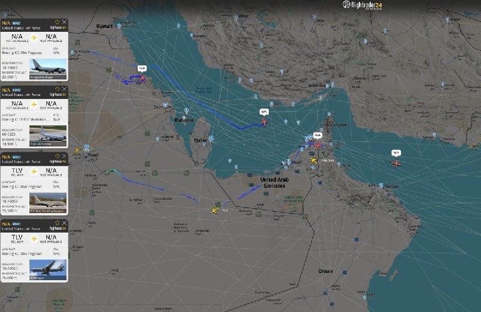

Shin ✓ @hey_itsmyturn
Mon, 15 Jun 2026 20:25:26 UTC

USAF Tankers dragging the peace deal enforcers in the region.

ترجمه خودکار فارسی

تانکرهای نیروی هوایی ایالات متحده (USAF) در حال همراهی و سوخت‌رسانی به مجریان توافق صلح در منطقه هستند.

𝕏 · @shin_persian

## FarsiVOA — post 220855

⚡️از میدان نبرد تا امضای توافق نامه؛ واکنش کاربران شبکه‌های اجتماعی
@FarsiVOA

## FarsiVOA — post 220854

🔺جی‌دی ونس: جمهوری اسلامی تنها با عمل کردن به تعهداتش می‌تواند از مزایای توافق بهره‌مند شود

▪️جی‌دی ونس، معاون رئیس‌ جمهوری آمریکا، در اظهاراتی درباره یادداشت تفاهم میان ایالات متحده و جمهوری اسلامی گفت این توافق بر پایه اصل «تعهد در برابر مزایا» تنظیم شده و رژیم ایران تنها اگر به تعهداتش عمل کند می‌تواند از امتیازات آن بهره‌مند شود.

⬇️ بیشتر بخوانید:
https://ir.voanews.com/a/president-trump-says-iran-agreed-never-to-seek-nuclear-weapons/8161146.html
@FarsiVOA

## FarsiVOA — post 220853

  <a href="telegram/content/FarsiVOA_220853_1781562448.mp4" target="_blank">🎬 Download video</a>

⚡️چرا با بیان شدن توافق ارزش قیمت دلار کاهش یافت در گفتگو با معصومه طاهرخانی
@FarsiVOA

## FarsiVOA — post 220852

🔺کارشناسان: پایان جنگ با رژیم ایران می‌تواند باعث رونق بازار سهام و کاهش تورم شود

▪️سرمایه‌گذاران و تحلیل‌گران بازارهای مالی می‌گویند توافق برای پایان دادن به جنگ میان ایالات متحده و رژیم ایران می‌تواند به رونق در بازارهای سهام منجر شود، و علاوه بر شرکت‌های فناوری، بخش‌های دیگری از اقتصاد را نیز منتفع کند.

⬇️ بیشتر بخوانید:
https://ir.voanews.com/a/experts-say-iran-deal-could-expand-market-gains/8161134.html
@FarsiVOA

## FarsiVOA — post 220851

  <a href="telegram/content/FarsiVOA_220851_1781562449.mp4" target="_blank">🎬 Download video</a>

⚡️ادامه اختلافات در داخل حکومت پس از توافق در گفتگو با سعید آگنجی
@Farsi

## FarsiVOA — post 220850

🔺سقوط بمب‌افکن بی-۵۲ در پایگاه نیروی هوایی ادواردز کالیفرنیا

▪️یک فروند بمب‌افکن بی-۵۲ نیروی هوایی ایالات متحده، که از قدیمی‌ترین هواپیماهای عملیاتی نیروی هوایی آمریکا به شمار می‌رود، روز دوشنبه ۲۵ خرداد، اندکی پس از برخاستن از باند پایگاه نیروی هوایی ادواردز در جنوب کالیفرنیا سقوط کرد.

⬇️ بیشتر بخوانید:
https://ir.voanews.com/a/b-52-bomber-crashes-in-california/8161133.html
@FarsiVOA

## FarsiVOA — post 220849

🔺گزارش | اسرار سقوط رژیم بشار؛ چگونه مهمترین متحد رژیم ایران در ۱۱ روز فرو پاشید

▪️کتابی تحت عنوان «اسرار سقوط رژیم بشار اسد و دیدگاه احمد الشرع» به قلم «منیر ربیع» روزنامه‌نگار لبنانی در قاهره منتشر شده است، که مهمترین وقایع روزهای قبل از سقوط رژیم سوریه را از زبان احمد الشرع حاکم جدید دمشق و یاران وی، روایت می‌کند.

⬇️ بیشتر بخوانید:
https://ir.voanews.com/a/report-how-assad-regime-collapsed-in-11-days/8161088.html
@FarsiVOA

## FarsiVOA — post 220848

⚡️علی جوانمردی: چشم انداز تغییر در ایران پس از توافق آمریکا و جمهوری اسلامی
@FarsiVOA

## Persian_Trend_Official — post 17220

https://youtube.com/live/nrN5oSZHtiU?feature=share

## RadioFarda — post 158354

  <a href="https://t.me/radiofarda/158354" target="_blank">📎 Download file</a>

📻بشنوید: سرخط خبرهای نیمه‌شب با رادیوفردا، ۲۶ خرداد ۱۴۰۵‌

@RadioFarda

## IranianMinds — post 22681

🔴دقایقی پیش، 3 نفتکش و 2 کشتی ایرانی از محاصره دریایی رد شدن و دیگه رسما محاصره آمریکا تموم شد.

@IranianMinds

## IranianMinds — post 22680

  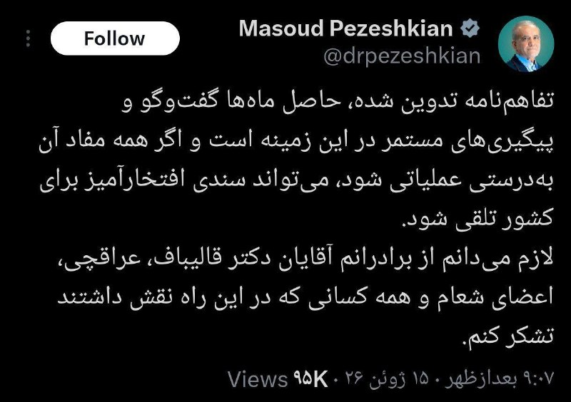

🔴 پزشکیان از قالیباف و عراقچی تشکر و قدردانی کرد

@IranianMinds

## IranianMinds — post 22679

کمی‌ تراپی ببینید

@IranianMinds

## IranianMinds — post 22678

🔴 سردار قاآنی :

دمتون گرم از تیم مذاکره کننده مخصوصا آقای قالیباف تشکر میکنم عالی بودید.

@IranianMinds

## IranianMinds — post 22677

امروز تو یه مانور یه بمب افکن B-52 ارتش آمریکا تو کالیفرنیا سقوط کرد. @IranianMinds

## IranianMinds — post 22676

  

امروز تو یه مانور یه بمب افکن B-52 ارتش آمریکا تو کالیفرنیا سقوط کرد.

@IranianMinds

## BBCPersian — post 283939

🔻عراقچی با مقامات لبنان درباره تفاهم بین ایران و آمریکا گفت‌وگو کرده است

عباس عراقچی، وزیر امور خارجه ایران، با جوزف عون، رئیس جمهور، و نبیه بری، رئیس مجلس لبنان، به طور جداگانه گفت‌وگوی تلفنی کرده است.

وزارت خارجه ایران در حساب کاربری تلگرامش گفته است که آقای عراقچی در این تماس تلفنی مقامات ارشد لبنان را جریان «جزییات» بندهای تفاهم نامه اسلام آباد به ویژه مفاد مربوط به لبنان قرار داده است.

ایران و آمریکا امروز تفاهمنامه‌ای را به امضا رساندند. آمریکا می‌گوید که تفاهمنامه‌اش با ایران به صورت «الکترونیکی» به امضای دو طرف رسیده است. انتظار می‌رود که این تفاهمنامه روز جمعه در سوئیس امضا شود.

وزارت خارجه ایران جزئیاتی از آنچه که مفاد مربوط به لبنان خوانده و در تماس تلفنی آقای عراقچی یا مقامات لبنان مطرح شده، منتشر نکرده است.

اما پیشتر یک مقام ارشد آمریکا به بی‌بی‌سی گفت که توافق آتش‌بس فعلی شامل لبنان نمی‌شود، اما گفت‌وگوهای مستقیم میان اسرائیل و لبنان در جریان است.

این مقام افزود که «اگر ایران نتواند حزب‌الله را کنترل کند و این گروه به مواضع یا شهرهای اسرائیل حمله کند، اسرائیل حق خواهد داشت از خود دفاع کند و پاسخ دهد.»

اگرچه سخنگوی وزارت خارجه ایران در نشست خبری امروز صبح خود تاکید کرد که لبنان بخشی از تفاهم با آمریکاست.

اسماعیل بقایی گفت: «خاتمه جنگ در لبنان بخش لاینفک توافق خاتمه جنگ است و ما در عمل ثابت کردیم که جدی هستیم و از همه ابزارها برای اجرای تعهد طرف مقابل استفاده می‌کنیم.»

https://bbc.in/3QrlSrp
@BBCPersian

## BBCPersian — post 283938

  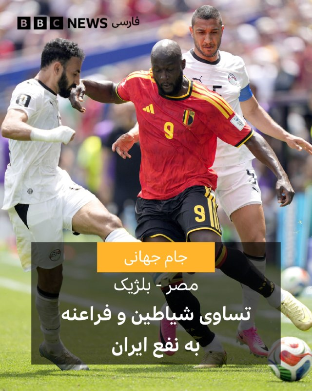

در اولین بازی گروه جی تیم‌های بلژیک و مصر در پایان ۹۰ دقیقه به تقسیم امتیاز رضایت دادند.

در نیمه اول مصر با گل دقیقه ۲۰ همه را شوکه کرد. امام عاشور با پاس گل محمد صلاح توانست در کمال ناباوری مصر را در مقابل تیم پرستاره بلژیک پیش بیاندازد.

در ادامه بلژیک تلاش کرد تا نتیجه را برابر کند اما مصر قدرتمندانه در مقابل این تیم اروپایی مقاومت کرد و حتی فرصت‌های گل‌زنی نیز داشت.

در نیمه دوم مجددا این مصر بود که با حمله به دروازه بلژیک بازی را هجومی آغاز کرد اما پیش از وقت استراحت نیمه دوم روملو لوکاکو وارد زمین شد و در کمتر از ۲۲ ثانیه روی گل تساوی بلژیک تاثیر گذاشت. این گل به نام محمد هانی بازیکن مصر بعنوان گل به خودی ثبت شد.

در ادامه هر دو تیم مجددا تلاش کردند تا به گل برتری برسند که بی‌نتیجه بود.

در گروه جی ایران و نیوزیلند نیز حاضر هستند و این نتیجه بهترین نتیجه برای ایران به حساب می‌آید.

📷EPA/Shutterstock
@BBCPersian

## BBCPersian — post 283937

  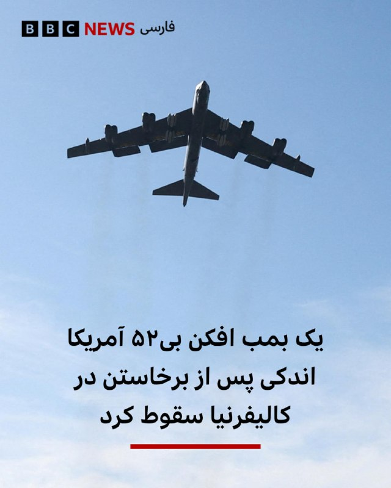

‌ ‌ ‌
یک فروند بمب افکن بی-۵۲ نیروی هوایی آمریکا اندکی پس از برخاستن از پایگاه هوایی ادواردز در جنوب کالیفرنیا سقوط کرده است.

پایگاه هوایی ادواردز در بیانیه ای اعلام کرد این حادثه ساعت ۱۱:۲۰ پیش از ظهر به وقت محلی رخ داده است. این پایگاه درباره احتمال تلفات یا مصدومان حادثه اطلاعاتی منتشر نکرد، اما تصاویر منتشر شده نشان می‌دهد ستون عظیمی از دود سیاه در آسمان برخاسته که از کیلومترها دورتر قابل مشاهده بوده است.

در بیانیه پایگاه آمده است: «تیم های امدادی بلافاصله به محل حادثه اعزام شدند و عملیات همچنان ادامه دارد. اطلاعات بیشتر به محض در دسترس قرار گرفتن منتشر خواهد شد.»

سخنگوی پایگاه هوایی ادواردز نیز در پاسخ به درخواست بی‌بی‌سی برای اظهار نظر، از ارائه جزئیات بیشتر خودداری کرد.

بی-۵۲ یک بمب افکن راهبردی دوربرد است که در جریان جنگ اخیر آمریکا و اسرائیل علیه ایران نیز در عملیات بمباران مشارکت داشته است.

https://bbc.in/44aBUJn
📷Reuters
@BBCPersian

## BBCPersian — post 283936

  <a href="https://t.me/bbcpersian/283936" target="_blank">📎 Download file</a>

📻ویژه برنامه جام ۲۶ - قسمت دوم

🏆اولین دیدار تیم ملی فوتبال ایران در لس آنجلس بامداد سه شنبه به وقت ایران برگزار می شود. در نشست خبری پیش از مسابقه هم با وجود آنکه از خبرنگاران خواسته شده بود سوال‌های سیاسی مطرح نکنند، بخش زیادی به صحبت درباره حاشیه‌ها و اتفاقاتی گذشت که در ماه‌های اخیر حضور ایران در جام جهانی را در هاله‌ای از ابهام قرار داده بود.  

@BBCPersian

## BBCPersian — post 283935

  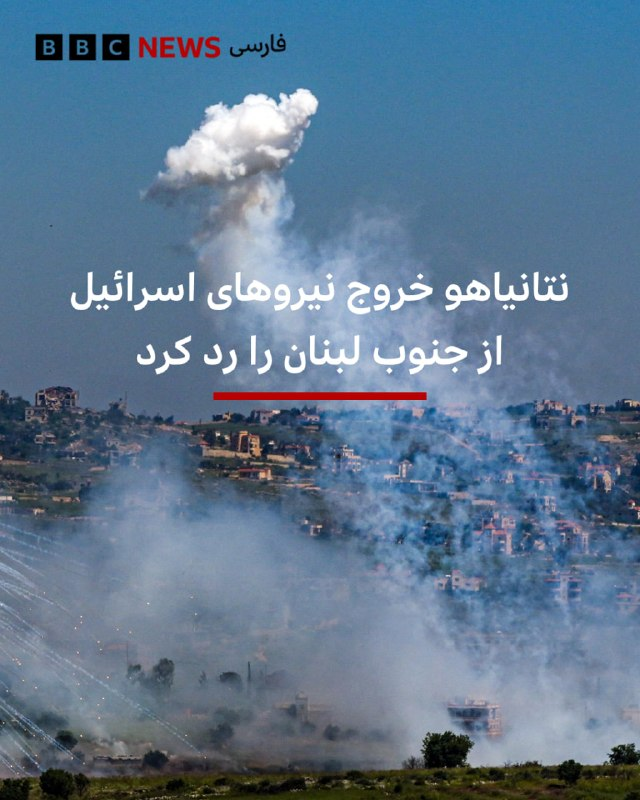

‌ ‌ ‌ ‌
بنیامین نتانیاهو، نخست وزیر اسرائیل، خروج نیروهای اسرائیلی از جنوب لبنان را رد کرده است.

آقای نتانیاهو در ادامه اولین واکنشش به تفاهمنامه ایران و آمریکا تاکید کرده است که ارتش اسرائیل از مناطق اشغال شده در جنوب لبنان خارج نخواهد شد.

بسیاری معتقدند که عدم خروج اسرائیل از جنوب لبنان که مطابق با یکی از بندهای تفاهمنامه مبنی بر توقف کامل درگیری‌ها است، ممکن توافق ایران و آمریکا را از مسیر خود خارج کند.

آقای نتانیاهو گفت: «ما مناطق امنیتی عمیقی در اطراف کشور اسرائیل ایجاد کرده‌ایم. ما این کار را در غزه، لبنان و سوریه انجام دادیم، جایی که تمام سلاح‌های ارتش اسد را از بین بردیم. می‌خواهم این را روشن کنم، ما تا زمانی که لازم باشد برای محافظت از کشورمان در مناطق امنیتی خواهیم ماند.»

نخست‌وزیر اسرائیل تأکید کرد: «ما تا زمانی که لازم باشد در منطقه حائل امنیتی لبنان خواهیم ماند.»

https://bbc.in/4gkH4K2
📷Reuters
@BBCPersian

## BBCPersian — post 283934

  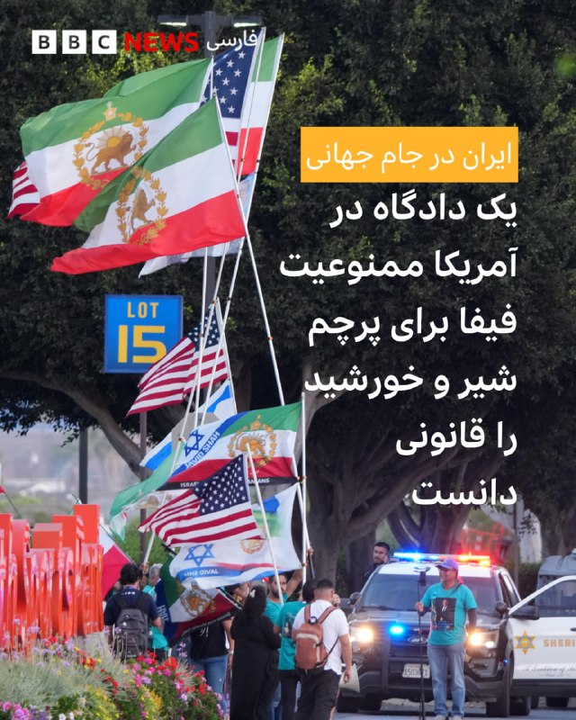

‌ ‌ ‌ ‌
یک دادگاه در فلوریدا درخواست فوری برای لغو ممنوعیت پرچم شیر و خورشید را رد کرده و گفته برگزارکنندگان جام جهانی می‌توانند تنها پرچم‌های رسمی کشورهای شرکت‌کننده را داخل ورزشگاه‌ها مجاز بدانند.

به این ترتیب فعلا موضع فیفا پابرجاست و پرچم شیر و خورشید همچنان در فهرست نمادهای ممنوعه قرار دارد.

معلوم نیست این تصمیم تا چه اندازه روی مخالفان جمهوری اسلامی که خواستار بالا بردن این پرچم در خلال مسابقات تیم ملی ایران هستند تاثیر می‌گذارد و تا چه اندازه از درگیری و تنش جلوگیری خواهد کرد.

https://bbc.in/3S0zTwN
📷IMAGN IMAGES/Reuters
@BBCPersian

## BBCPersian — post 283933

  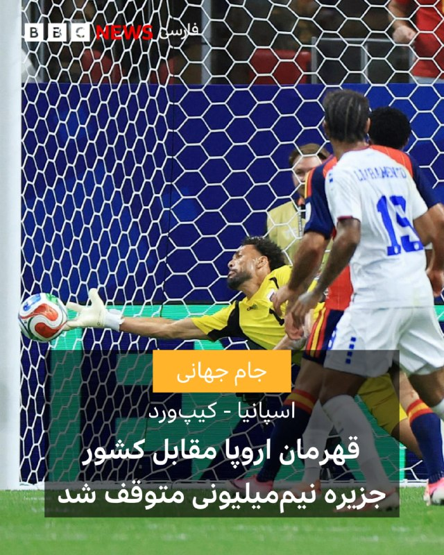

‌ ‌ ‌ ‌
اولین شگفتی بزرگ جام‌جهانی امسال رقم خورد و اسپانیا، قهرمان اروپا و تیم پرستاره‌ای که یکی از شانس‌های قهرمانی این جام شناخته می‌شد، در مقابل کیپ‌ورد، تیمی که برای اولین بار به این مسابقات آمده متوقف شد.

در تمام طول بازی اسپانیا کنترل بازی را در دست داشت و ده‌ها حمله خطرناک را روی دروازه کیپ‌ورد انجام داد اما موفق به عبور توپ از خط دروازه نشد.

در طول این بازی اسپانیا ۲۳ بار تلاش به گلزنی کرد در حالیکه موقعیت‌های کیپ‌ورد تنها شش مورد بود و اسپانیا ۶۲ درصد بازی را در دست داشت.

تمامی آمارهای مسابقه به نفع اسپانیا ثبت شد و به همین علت هم دروازه بان کیپ‌ورد که با شجاعت و اعتمادبنفس بالا مقابل فوق ستاره‌های اسپانیا مقاومت کرد، بهترین بازیکن زمین شد.

این بازی از گروه اچ در شهر آتلانتا برگزار شد و دیگر هم‌گروهی‌های آنها اوروگوئه و عربستان سعودی هستند که آنها هم تا ساعاتی دیگر به مصاف هم می‌روند.

📷Reuters
@BBCPersian

## BBCPersian — post 283932

  <a href="telegram/content/BBCPersian_283932_1781562454.mp4" target="_blank">🎬 Download video</a>

🔻آخرین خبرهای مهم روز دوشنبه ۲۵ خرداد ۱۴۰۵ از تلویزیون بی‌بی‌سی فارسی

@BBCPersian

## BBCPersian — post 283931

  <a href="https://t.me/bbcpersian/283931" target="_blank">📎 Download file</a>

پادکست برنامه شصت دقیقه دوشنبه ۲۵ خرداد ۱۴۰۵
این نسخه رادیویی برنامه شصت دقیقه تلویزیون فارسی بی‌بی‌سی است که هرشب بعد از پخش، با حجم کم از اپلیکیشن‌های پادگیر و صفحه تلگرام بی‌بی‌سی فارسی در دسترس است.
با هشتگ BBCPersianRadio با ما در ارتباط باشید.

## Dirty_Kids — post 392174

  <a href="telegram/content/Dirty_Kids_392174_1781562456.mp4" target="_blank">🎬 Download video</a>

نرمال‌ترین طرفدار جمهوری‌اسلامی و تیم‌ آخوندی:

رقص، استایل، عقل، اصن همه‌چی ۰ از ۱۰

@Dirty_Kids 👻

## Dirty_Kids — post 392173

  

این فیلم چراغی رو در من روشن کرد که تا مدت ها روشن موند و فکر منو هم درگیر خودش کرد.

@Dirty_Kids 👻

## Dirty_Kids — post 392172

  <a href="telegram/content/Dirty_Kids_392172_1781562458.mp4" target="_blank">🎬 Download video</a>

🔴 ویدیوی این بانوی ایرانی خیلی وایرال شده و با همین ۸ ثانیه، ۸۰ درصد پسرا روش کراش زدن.

@Dirty_Kids 👻

## Dirty_Kids — post 392171

  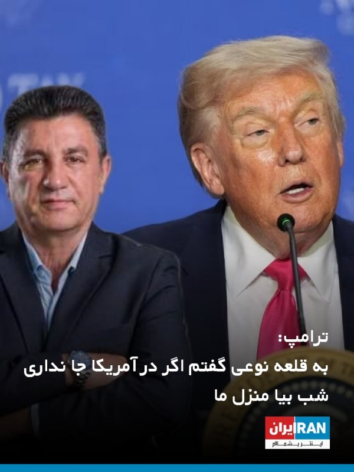

دونالد ترامپ در گفتگو با CBS در واکنش به سفر کاروان تیم فوتبال ایران به آمریکا گفت:
"افتخار میزبانی کاروان تیم فوتبال ایران را داریم. آنها تیمی بزرگ هستند. به قلعه نوعی گفتم اگر اینجا جایی نداری شب بمانی به منزل ما بیا. شاید قبول کرد. شاید هم نکرد. باید ببینیم چه می‌شود"

@Dirty_Kids 👻

## Dirty_Kids — post 392170

  

یکی از هزاران دلیلی که از این تیم متنفرم

@Dirty_Kids 👻

## Dirty_Kids — post 392169

  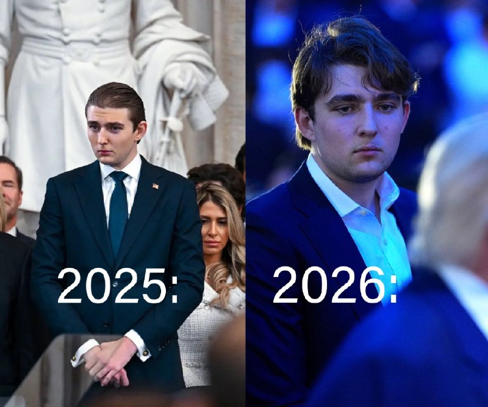

🔴 تغییر عجیب بارون، پسر ترامپ در عرض یه سال! قشنگ معلومه ترامپ پسرشم گاییده.

@Dirty_Kids 👻

## Dirty_Kids — post 392168

الان تو خبر ها خوندم هواداران نیوزلند فقط ۵ هزار بلیط خریداری کردن بقیه ۶۵ هزار تا بلیط باقی مانده رو ایرانی ها خریدن و ظرفیت ورزشگاه تکمیل شده
چه کونی از تیم ملا قرار پاره بشه امشب :))

@Dirty_Kids 👻

## Dirty_Kids — post 392167

  <a href="telegram/content/Dirty_Kids_392167_1781562460.mp4" target="_blank">🎬 Download video</a>

سالاد خیار و ذرت😍🥗

@Dirty_Kids 👻

## Dirty_Kids — post 392166

ایران الان ۲ دسته شده:

اونایی که ۲ شب رفتن بیرون تیر خوردن
اونایی که ۱۰۰ شب رفتن بیرون ... خوردن

@Dirty_Kids 👻

## Dirty_Kids — post 392165

  <a href="telegram/content/Dirty_Kids_392165_1781562462.mp4" target="_blank">🎬 Download video</a>

در اینستاگرام فارسی چی میگذرد؟!

@Dirty_Kids 👻

## Dirty_Kids — post 392164

  <a href="telegram/content/Dirty_Kids_392164_1781562463.mp4" target="_blank">🎬 Download video</a>

دغدغه یه کرمانی
عواقب گران شدن زغال وافوری 😐😂

@Dirty_Kids 👻

## Dirty_Kids — post 392163

  <a href="telegram/content/Dirty_Kids_392163_1781562464.mp4" target="_blank">🎬 Download video</a>

پیام حضرت آقا: «خیلی لاشی تشریف دارید سسسکشا»

@Dirty_Kids 👻

## Dirty_Kids — post 392161

  <a href="telegram/content/Dirty_Kids_392161_1781562466.mp4" target="_blank">🎬 Download video</a>

دو تا تراپی
از بانو شعرهای سوزنده

@Dirty_Kids 👻

## alonews — post 128349

  <a href="telegram/content/alonews_128349_1781562466.mp4" target="_blank">🎬 Download video</a>

👈طبق گزارش سی‌ان‌ان، هشت خدمه در سانحه سقوط بمب‌افکن بی-۵۲ در پایگاه هوایی ادواردز جان خود را از دست داده‌اند.

✅ @AloNews خبر جنگ

## alonews — post 128348

  <a href="telegram/content/alonews_128348_1781562468.webm" target="_blank">🎬 Download video</a>

👈طبق گزارش فایننشال تایمز، دولت ترامپ آماده است تا در چارچوب یک توافق نهایی برای پایان جنگ، از ایجاد صندوق سرمایه‌گذاری ۳۰۰ میلیارد دلاری برای ایران حمایت کند، مشروط بر اینکه تهران یک توافق جامع شامل توافق هسته‌ای را بپذیرد.

یک مقام ارشد آمریکایی گفت که واشنگتن درباره تسهیل احتمالی تحریم‌ها در کنار «یک صندوق بزرگ ۳۰۰ میلیارد دلاری برای بازسازی کشورشان» بحث کرده است و تمام مشوق‌ها به «عملکرد» ایران در رعایت تفاهم‌نامه‌ای که قرار است روز جمعه در سوئیس به صورت رسمی امضا شود، وابسته خواهد بود.

این صندوق تنها پس از یک توافق نهایی و پس از تمدید ۶۰ روزه آتش‌بس، بازگشایی تنگه هرمز و ادامه مذاکرات درباره برنامه هسته‌ای ایران تأسیس خواهد شد.

این پول از دولت‌ها تأمین نخواهد شد، بلکه از شرکت‌های خصوصی علاقه‌مند به سرمایه‌گذاری در اقتصاد ایران تأمین می‌شود و در صورت لغو تحریم‌ها، کسب‌وکارهایی در اروپا، آسیا (از جمله کره جنوبی و ژاپن) و ایالات متحده ممکن است به آن علاقه نشان دهند.

ساختار و مدیریت این صندوق پیشنهادی هنوز نهایی نشده است.

✅ @AloNews خبر جنگ

## alonews — post 128347

  <a href="telegram/content/alonews_128347_1781562468.webm" target="_blank">🎬 Download video</a>

👈11 جنگنده A-10 در راه برگشت به آمریکا هستند.

✅ @AloNews خبر جنگ

## alonews — post 128346

## alonews — post 128345

  <a href="telegram/content/alonews_128345_1781562468.mp4" target="_blank">🎬 Download video</a>

👈ونس : هیچ دلار تخفیف تحریمی یا پول بلوکه‌شده‌ای، نه از آمریکا و نه از هیچ‌کدوم از متحدای ما تو خلیج، آزاد نشده

🔴این امتیاز فقط وقتی بهشون داده میشه که به تعهداتشون تو توافق عمل کنن

✅ @AloNews خبر جنگ

## alonews — post 128344

  <a href="telegram/content/alonews_128344_1781562470.webm" target="_blank">🎬 Download video</a>

👈درگیری عجیب ایرانی ها با همدیگه درنزدیکی محل برگزاری بازی ج.ا و نیوزلند

✅ @AloNews خبر جنگ

## alonews — post 128343

  <a href="telegram/content/alonews_128343_1781562470.webm" target="_blank">🎬 Download video</a>

👈ونس معاون رئیس جمهور آمریکا به سی‌ان‌ان گفت: یادداشت تفاهم با ایران حدود یک صفحه و نیم است و به همین دلیل یک سند عمومی محسوب می‌شود.

🔴یادداشت تفاهم چارچوبی را ایجاد می‌کند که به ایران اجازه می‌دهد در ازای ایفای تعهدات خود، مزایایی به دست آورد

🔴ایران باید تامین مالی سازمان‌های تروریستی خشونت‌آمیز و عوامل بی‌ثباتی در منطقه را متوقف کند

✅ @AloNews خبر جنگ

## alonews — post 128342

  <a href="telegram/content/alonews_128342_1781562470.webm" target="_blank">🎬 Download video</a>

👈شجاع خلیل زاده:
ایشالا امروز پرچم جمهوری اسلامی عزیز رو بالا میبریم

✅ @AloNews خبر جنگ

## alonews — post 128341

  <a href="telegram/content/alonews_128341_1781562470.webm" target="_blank">🎬 Download video</a>

👈در خبری عجیب و به گزارش خبرگزاری MSN، به مارکو روبیو و پیت هگسث گفته شده اگر با توافق با ایران همچنان مخالفت کنند از مقام خود برکنار می‌شوند

✅ @AloNews خبر جنگ

## alonews — post 128340

😁 هنوزم ۱۰۰ گیگ و ۲۰۰ گیگ رو به اسم نامحدود میدن؟! اینجا نامحدود واقعیه 
😎
💯 
🚀 یه ماه کامل با خیال راحت استفاده کن بدون استرسِ تموم شدن حجم 
💎 
❤️فقط گیگی 5 تومان نامحدود هم 200 تومان 
❤️ 
👇
👇
👇 
✅ @TurboVipV2raybot 
✅ @TurboVipV2raybot

## alonews — post 128339

  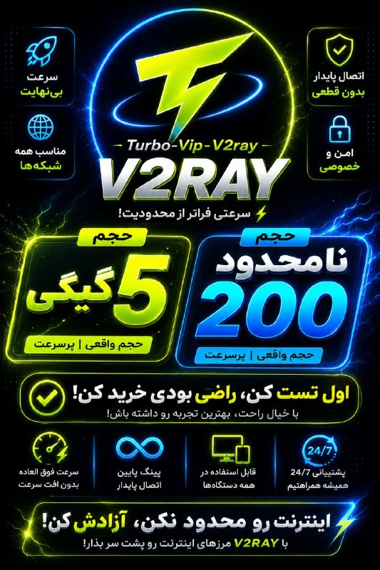

😁 هنوزم ۱۰۰ گیگ و ۲۰۰ گیگ رو به اسم نامحدود میدن؟!

اینجا نامحدود واقعیه 
😎
💯

🚀 یه ماه کامل با خیال راحت استفاده کن
بدون استرسِ تموم شدن حجم 
💎

❤️فقط گیگی 5 تومان
نامحدود هم 200 تومان 
❤️

👇
👇
👇

✅ @TurboVipV2raybot

✅ @TurboVipV2raybot

## alonews — post 128338

  <a href="telegram/content/alonews_128338_1781562471.webm" target="_blank">🎬 Download video</a>

👈نتانیاهو :
من هیچوقت نگفتم هدف عملیات سرنگونی حکومت ایران بوده

✅ @AloNews خبر جنگ

## alonews — post 128337

  <a href="telegram/content/alonews_128337_1781562471.webm" target="_blank">🎬 Download video</a>

👈پرس تی وی: ۳ نفتکش و ۲ کشتی با کالای ایران از محاصره دریایی عبور کرد

✅ @AloNews خبر جنگ

## alonews — post 128336

  <a href="telegram/content/alonews_128336_1781562471.webm" target="_blank">🎬 Download video</a>

🔴فوری / خبرگزاری تسنیم : رفع محاصره دریایی عملیاتی شد

✅ @AloNews خبر جنگ

## alonews — post 128335

  <a href="telegram/content/alonews_128335_1781562471.webm" target="_blank">🎬 Download video</a>

👈برای اولین بار بعد از مدتها، هیچ پرنده آمریکایی در آسمان خلیج فارس نیست

✅ @AloNews خبر جنگ

## alonews — post 128334

  <a href="telegram/content/alonews_128334_1781562472.webm" target="_blank">🎬 Download video</a>

👈وال استریت ژورنال: ترامپ گفت تنگه هرمز تا روز جمعه باز خواهد شد، در حالی که یک مقام ارشد آمریکایی به خبرنگاران گفت که بازگشت به فعالیت عادی حداقل دو هفته طول می‌کشد.

🔴ترامپ همچنین گفت که متن یادداشت تفاهم (MOU) بعد از روز جمعه منتشر خواهد شد اما آن مقام گفت ظرف ۲۴ تا ۴۸ ساعت

✅ @AloNews خبر جنگ

## alonews — post 128333

  <a href="telegram/content/alonews_128333_1781562472.webm" target="_blank">🎬 Download video</a>

👈الجزیره: اسرائیل بزودی برای نابودی توافق آمریکا و ایران اقدام خواهد کرد

✅ @AloNews خبر جنگ

## alonews — post 128332

  <a href="telegram/content/alonews_128332_1781562472.webm" target="_blank">🎬 Download video</a>

👈تصویری ناراحت کننده از وضعیت این روزهای عمو قناد، مجری معروف برنامه کودک

✅ @AloNews خبر جنگ

## alonews — post 128331

  <a href="telegram/content/alonews_128331_1781562472.webm" target="_blank">🎬 Download video</a>

👈کانال ۱۴ اسرائیل: تعجب جامعه اسرائیل از این بود که مقامات ایران قبل از دفن علی خامنه‌ای با قاتلینش توافق کردند

✅ @AloNews خبر جنگ

## alonews — post 128330

  <a href="telegram/content/alonews_128330_1781562472.webm" target="_blank">🎬 Download video</a>

👈حمایت ویژه سردار قاآنی از قالیباف، عراقچی و دیگر اعضای تیم مذاکرات

🔴فرقی بین تیم مذاکره کننده ما و بچه هایی که پای لانچر بودن نیست و جنسشان از جنس مقاومت است

✅ @AloNews خبر جنگ

---
📅 بروزرسانی: 1405/03/25 23:24
---

## VahidOOnLine — post 245765

  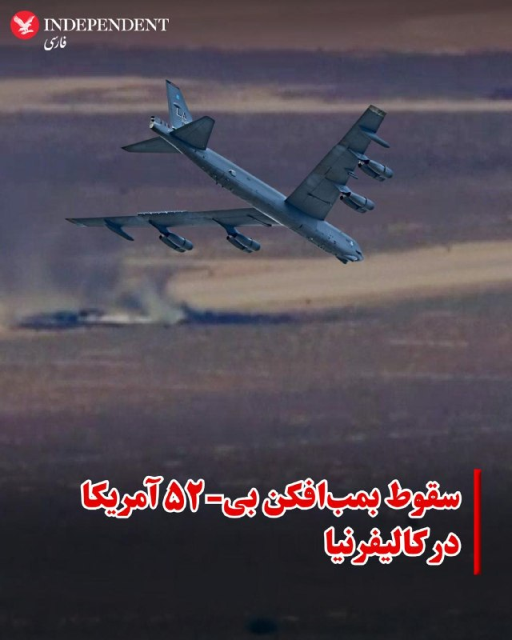

♦️ پایگاه نیروی هوایی ادواردز آمریکا اعلام کرد یک بمب‌افکن بی-۵۲ روز دوشنبه ۲۵ خردادماه در ایالت کالیفرنیا سقوط کرده است.
بر اساس بیانیه منتشرشده از سوی این پایگاه، هواپیما «اندکی پس از برخاستن» از باند فرودگاه پایگاه ادواردز و در ساعت ۱۱:۲۰ صبح به وقت محلی دچار سانحه شد.
در این بیانیه آمده است: «تیم‌های امدادی بلافاصله به محل حادثه اعزام شدند و عملیات امداد و بررسی همچنان ادامه دارد.»
مقام‌های آمریکایی تاکنون جزئیاتی درباره علت سقوط، سرنوشت خدمه یا میزان خسارات احتمالی منتشر نکرده‌اند.
«بی-۵۲ استراتوفورترس» یکی از مهم‌ترین بمب‌افکن‌های دوربرد نیروی هوایی آمریکا است که از دهه ۱۹۵۰ در خدمت ارتش این کشور قرار دارد و توانایی حمل تسلیحات متعارف و هسته‌ای را دارد.
‌🇸🇦 Indypersian

🤖 @VahidOOnLine

## VahidOOnLine — post 245764

  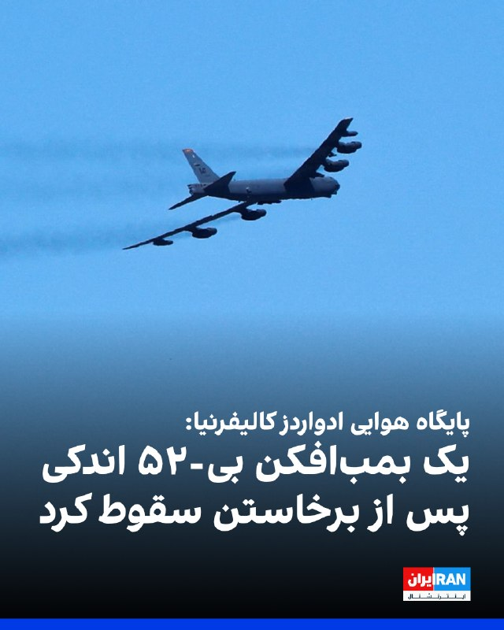

پایگاه هوایی ادواردز در کالیفرنیا اعلام کرد یک بمب‌افکن بی-۵۲ استراتوفورترس نیروی هوایی آمریکا روز دوشنبه اندکی پس از برخاستن از این پایگاه سقوط کرده است.

این پایگاه در پیامی در ایکس نوشت: «تیم‌های امدادی بلافاصله به محل حادثه اعزام شدند و وضعیت همچنان در حال پیگیری است.»
‌🏁 🇬🇧 IranintlTV

🤖 @VahidOOnLine

## VahidOOnLine — post 245763

  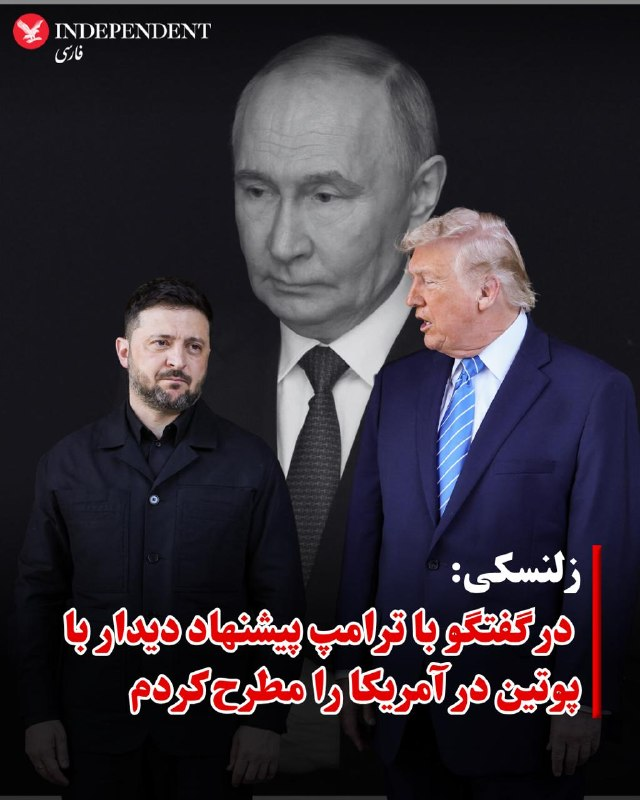

♦️ولودیمیر زلنسکی، رئیس‌جمهور اوکراین، روز دوشنبه ۲۵ خردادماه اعلام کرد در گفتگو با دونالد ترامپ، رئیس‌جمهوری آمریکا، پیشنهاد داده است دیداری با ولادیمیر پوتین، رئیس‌جمهوری روسیه، در خاک آمریکا برگزار شود.
زلنسکی در پیامی ویدیویی که در شبکه اجتماعی ایکس منتشر کرد، گفت: «دیروز (یکشنبه) با رئیس‌جمهوری ترامپ درباره این موضوع صحبت کردیم که چنین دیداری می‌تواند در آمریکا برگزار شود؛ در قالبی که رد کردن آن برای پوتین بسیار دشوارتر باشد.»
رئیس‌جمهوری اوکراین بدون ارائه جزئیات بیشتر افزود: «خواهیم دید چه نتیجه‌ای از آن حاصل می‌شود.»
زلنسکی روز چهاردهم خرداد ماه نیز در اقدامی کم‌سایقه، با انتشار نامه‌ای سرگشاده خطاب به ولادیمیر پوتین، پیشنهاد برگزاری دیداری رو در رو و تعیین تاریخی مشخص برای مذاکرات صلح را مطرح کرده و گفته بود کی‌یف آماده است در طول مذاکرات، آتش‌بسی کامل برقرار کند.
‌🇸🇦 Indypersian

🤖 @VahidOOnLine

## VahidOOnLine — post 245762

  

نتانیاهو گفت: ما خطر نابودی اسرائیل را برای سال‌های آینده از بالای سر خود برداشتیم و دولت اسرائیل را از نابودی نجات دادیم.

او اضافه کرد که «مبارزه هنوز تمام و کامل نشده است. ما باید همچنان هوشیار بمانیم، همچنان قوی و مصمم باشیم و تا حد لازم از خود دفاع کنیم.»
او گفت: «این فقط درباره ایران نیست» و تاکید کرد که نبرد اسرائیل علیه «بازوهای ترور ایران» نیز ادامه خواهد داشت، همان‌طور که به گفته او در برابر گروه‌ها در غزه، لبنان، سوریه، یمن و کرانه باختری ادامه داشته است.
‌🏁 🇬🇧 IranintlTV

🤖 @VahidOOnLine

## VahidOOnLine — post 245761

  

بنیامین نتانیاهو، نخست‌وزیر اسرائیل، در پاسخ به پرسشی درباره احتمال نامزدی دوباره در انتخابات گفت در انتخابات شرکت خواهد کرد و قصد دارد پیروز شود.

او درباره روابطش با دونالد ترامپ، رییس‌جمهوری آمریکا، گفت ادعاهایی مبنی بر اینکه یکی از آنها کاملا از دیگری تبعیت می‌کند، درست نیست و رابطه آنها بر پایه شراکتی است که طی سال‌ها شکل گرفته است.

نتانیاهو افزود در بسیاری از مسائل با ترامپ توافق دارند و در برخی موارد نیز اختلاف نظر وجود دارد. او گفت اسرائیل بر اساس چارچوب‌ها و معیارهای خود عمل می‌کند، اما در عین حال ملاحظات آمریکا را در نظر می‌گیرد و برای آنها احترام قائل است.

نخست‌وزیر اسرائیل همچنین از تصمیم ترامپ برای به‌کارگیری ارتش آمریکا علیه «دشمن مشترک» قدردانی کرد.
‌🏁 🇬🇧 IranintlTV

🤖 @VahidOOnLine

## VahidOOnLine — post 245760

  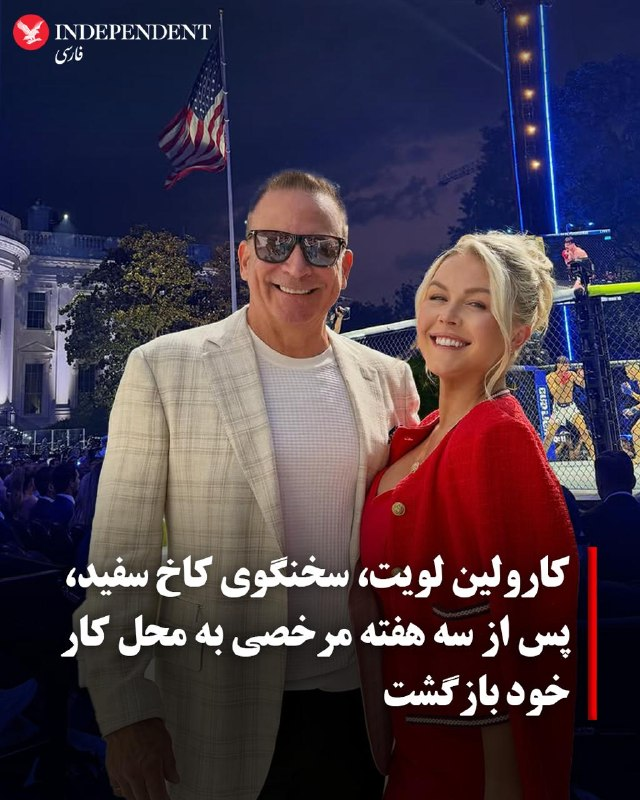

♦️کارولین لیویت، سخنگوی کاخ سفید، پس از حدود سه هفته مرخصی زایمان، با انتشار تصویری از حضور خود و همسرش در مراسم یو‌اف‌سی کاخ سفید از حضور دوباره در محل کارش خبر داد.
لیویت که روز ۱۷ اردیبهشت از تولد دخترش «ویویانا» خبر داده بود، در اینستاگرام نوشت: «شب بیرون رفتن مامان و بابا برای یو‌اف‌سی فریدام ۲۵۰. از رئیس‌جمهور ترامپ و دانا وایت برای این تجربه فوق‌العاده سپاسگزارم.»
او در این پست به مراسمی اشاره کرد که دونالد ترامپ، رئیس‌جمهوری آمریکا، برای جشن هشتادمین سالروز تولد خود در چمن جنوبی کاخ سفید برگزار کرد؛ رویدادی که با برگزاری مسابقات «یو‌اف‌سی» همراه بود.
لیویت از چهارم اردیبهشت ماه گذشته به مرخصی زایمان رفته بود. با این حال، پس از حادثه تیراندازی در مراسم شام خبرنگاران کاخ سفید در شامگاه هفتم اردیبهشت، به‌طور موقت در جمع خبرنگاران حاضر شد و اعلام کرد امیدوار است آن نشست آخرین حضورش پیش از پایان مرخصی زایمان باشد.
در دوره غیبت او، برخی اعضای کابینه دولت ترامپ از جمله مارکو روبیو مسئولیت پاسخگویی به رسانه‌ها را بر عهده داشتند.
‌🇸🇦 Indypersian

🤖 @VahidOOnLine

## VahidOOnLine — post 245759

  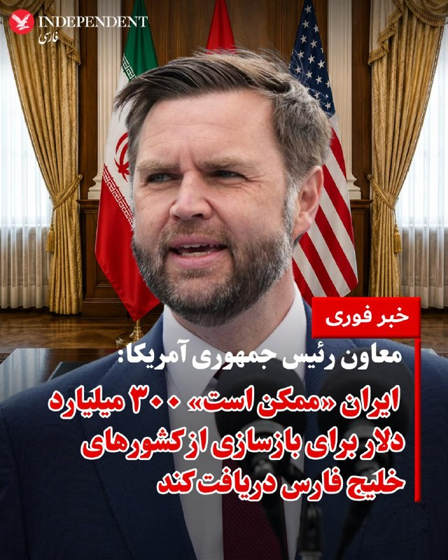

♦️جی‌دی ونس، معاون رئیس‌جمهور آمریکا، در گفتگو با شبکه سی‌بی‌اس اعلام کرد ایران در صورت پایبندی به تعهدات خود ممکن است به صندوقی برای بازسازی دسترسی پیدا کند که از سوی کشورهای حاشیه خلیج فارس تأمین مالی خواهد شد.
ونس با اشاره به مزایای احتمالی توافق برای تهران گفت ایران «ممکن است» حدود ۳۰۰ میلیارد دلار منابع مالی برای بازسازی از کشورهای خلیج فارس دریافت کند، اما تحقق این امر را منوط به اجرای کامل تعهدات جمهوری اسلامی دانست.
او افزود آمریکا با سرمایه‌گذاری کشورهای حاشیه خلیج فارس برای بازسازی ایران موافق است، اما این اتفاق تنها زمانی رخ خواهد داد که ایران به برنامه هسته‌ای خود پایان دهد، فعالیت‌های مربوط به مواد غنی‌شده را متوقف کند و با یک نظام بازرسی و نظارت گسترده موافقت کند.
معاون رئیس‌جمهور آمریکا همچنین تاکید کرد رسانه‌های نزدیک به حکومت ایران بر مزایای توافق تمرکز خواهند کرد، اما از امتیازاتی که تهران باید در مقابل واگذار کند کمتر سخن خواهند گفت.
‌🇸🇦 Indypersian

🤖 @VahidOOnLine

## VahidOOnLine — post 245758

  

بنیامین نتانیاهو، نخست‌وزیر اسرائیل، دوشنبه در یک نشست خبری تلویزیونی درباره عملیات این کشور در لبنان اعلام کرد: «ما آزادی عمل خود را برای خنثی کردن حملات حفظ خواهیم کرد.»

او گفت: «ما متعهد به تامین امنیت و رفاه ساکنان شمال اسرائیل هستیم و شخصا این موضوع را پیگیری می‌کنم. ضربات بسیار سنگینی به حزب‌الله وارد کرده‌ایم. از حدود ۱۵۰ هزار موشک و راکت این گروه، تنها حدود هشت درصد باقی مانده است.»

نخست‌وزیر اسرائیل ادامه داد: «امروز کمربند امنیتی ایجاد کرده‌ایم که هرگونه احتمال نفوذ نیروهای رضوان به منطقه جلیل را از بین می‌برد. هزاران عضو حزب‌الله کشته شده‌اند و ما همچنان برای حل مسائل باقی‌مانده در حال اقدام هستیم.»

نتانیاهو همچنین به یک بسته حمایتی برای ساکنان شمال اسرائیل اشاره کرد و افزود: «ما هم امنیت و هم رفاه را برای ساکنان شمال کشور فراهم خواهیم کرد.»

به گزارش رویترز، نتانیاهو درباره رابطه‌اش با رییس‌جمهوری آمریکا نیز گفت: «ترامپ و من شریک هستیم، اغلب با هم موافقیم و گاهی اختلاف داریم.»
‌🏁 🇬🇧 IranintlTV

🤖 @VahidOOnLine

## VahidOOnLine — post 245757

  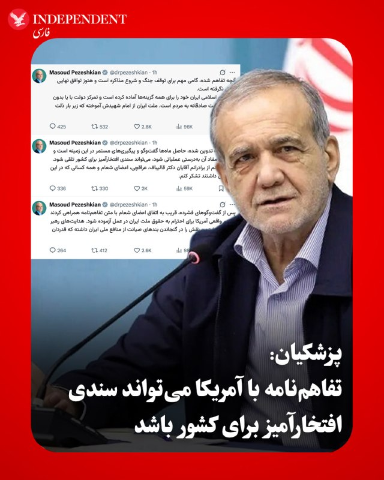

♦️مسعود پزشکیان، رئیس‌جمهور ایران، شامگاه دوشنبه ۲۵ خردادماه در چند پیام در شبکه اجتماعی ایکس تاکید کرد که تفاهم‌نامه تدوین‌شده میان ایران و آمریکا حاصل ماه‌ها مذاکره و پیگیری مستمر بوده و در صورت اجرای کامل مفاد آن می‌تواند به دستاوردی مهم برای کشور تبدیل شود.
پزشکیان نوشت: «تفاهم‌نامه‌ تدوین شده، حاصل ماه‌ها گفتگو و پیگیری‌های مستمر در این زمینه است و اگر همه مفاد آن به‌درستی عملیاتی شود، می‌تواند سندی افتخارآمیز برای کشور تلقی شود.»
او همچنین از محمدباقر قالیباف، عباس عراقچی، اعضای شورای عالی امنیت ملی و سایر افرادی که در روند مذاکرات نقش داشته‌اند قدردانی کرد.
رئیس‌جمهوری ایران افزود پس از گفتگوهای فشرده، «قریب به اتفاق» اعضای شورای عالی امنیت ملی با متن تفاهم‌نامه همراهی کردند تا به گفته او «عزم واقعی آمریکا برای احترام به حقوق ملت ایران در عمل آزموده شود.»
پزشکیان همچنین نقش مجتیی خامنه‌ای، رهبر سوم جمهوری اسلامی، را در روند مذاکرات برجسته کرد و نوشت هدایت‌های او «بیشترین نقش» را در گنجاندن بندهای مربوط به صیانت از منافع ملی ایران در متن تفاهم‌نامه داشته است.
او در پیام دیگری تاکید کرد تفاهم حاصل‌شده هنوز توافق نهایی نیست و جمهوری اسلامی خود را برای همه گزینه‌ها آماده کرده است.
‌🇸🇦 Indypersian

🤖 @VahidOOnLine

## VahidOOnLine — post 245756

♦️حساب کاربری وحید آنلاین دوشنبه‌شب ۲۵ خردادماه تصاویری از آتش‌سوزی در شهرک امید تهران منتشر کرد که شعله‌های گسترده آتش و ستون‌های دود را در این منطقه نشان می‌دهد.

در ویدیوها و تصاویر منتشرشده، دود غلیظ بخش‌هایی از آسمان منطقه را پوشانده و آتش در محدوده‌ای وسیع قابل مشاهده است.

تا زمان انتشار این خبر، رسانه‌های ایران و مقام‌های رسمی درباره علت و ابعاد این حادثه واکنشی منتشر نکرده‌اند و جزئیات بیشتری از خسارت‌های احتمالی یا تلفات آن در دست نیست.
‌🇸🇦 Indypersian

🤖 @VahidOOnLine

## VahidOOnLine — post 245755

♦️عباس عراقچی، وزیر امور خارجه جمهوری اسلامی، روز دوشنبه ۲۵ خردادماه در گفت‌وگو با صداوسیما گفت که تهران با توجه به سابقه بدعهدی‌ها و عدم اجرای تعهدات از سوی آمریکا، روند مذاکرات و اجرای تفاهم به‌دست‌آمده را بر پایه بی‌اعتمادی و تجربه‌های گذشته تنظیم خواهد کرد.

عراقچی گفت: «سابقه بدعهدی‌ها، عدم اجرای تعهدات و پاره کردن توافق‌ها را در مقابل خود داریم و همه این‌ها در ذهن ما وجود دارد، بنابراین برنامه مذاکرات و اجرای تفاهمی که به دست آمده را براساس بی‌اعتمادی و تجربیات گذشته می‌گذاریم.»

وزیر امور خارجه جمهوری اسلامی افزود که تهران در عین حال تلاش می‌کند از مسیر مذاکرات، زمینه‌های گشایش اقتصادی برای کشور را فراهم کند.

او همچنین گفت: «طبیعی است که در سیاست خارجی هیچ فرصتی را از دست نمی‌دهیم، ولی به هیچ فرصتی هم دل نمی‌بندیم.»
‌🇸🇦 Indypersian

🤖 @VahidOOnLine

## VahidOOnLine — post 245754

  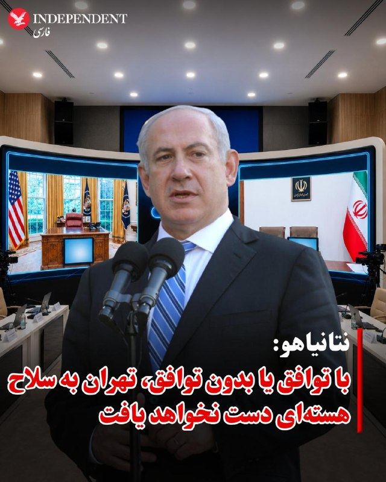

♦️یک روز پس از اعلام توافق میان واشینگتن و تهران از سوی دونالد ترامپ، بنیامین نتانیاهو، نخست‌وزیر اسرائیل، روز دوشنبه ۲۵ خردادماه در یک کنفرانس خبری در اورشلیم گفت اسرائیل اجازه نخواهد داد جمهوری اسلامی به سلاح هسته‌ای دست یابد و این هدف چه با توافق و چه بدون توافق دنبال خواهد شد.

نتانیاهو در حالی که به توافق در حال شکل‌گیری میان ایالات متحده و جمهوری اسلامی اشاره می‌کرد، گفت اسرائیل همچنان خود را متعهد به جلوگیری از هسته‌ای شدن ایران می‌داند و در این زمینه از موضع خود عقب‌نشینی نخواهد کرد.

نخست‌وزیر اسرائیل همچنین از عملیات نظامی کشورش علیه جمهوری اسلامی دفاع کرد و مدعی شد این حملات برنامه هسته‌ای ایران را برای سال‌ها به عقب رانده است.

او در ادامه تاکید کرد اسرائیل تا هر زمان که لازم باشد حضور و مناطق امنیتی خود را در غزه، لبنان و سوریه حفظ خواهد کرد.
‌🇸🇦 Indypersian

🤖 @VahidOOnLine

## VahidOOnLine — post 245753

♦️ حساب رسمی کاخ سفید تصاویری از حضور دونالد ترامپ، رئیس‌جمهوری آمریکا، در نشست گروه هفت (G7) در شهر اویان فرانسه منتشر کرد.

در این تصاویر، ترامپ در کنار امانوئل مکرون، رئیس‌جمهوری فرانسه، و بریژیت مکرون، بانوی اول فرانسه، برای ثبت عکس یادگاری می‌گیرد.

نشست گروه هفت با حضور رهبران کشورهای صنعتی جهان برگزار می‌شود و مسائل مرتبط با اقتصاد جهانی، امنیت بین‌المللی و تحولات سیاسی از مهم‌ترین محورهای آن به شمار می‌رود.
‌🇸🇦 Indypersian

🤖 @VahidOOnLine

## VahidOOnLine — post 245752

  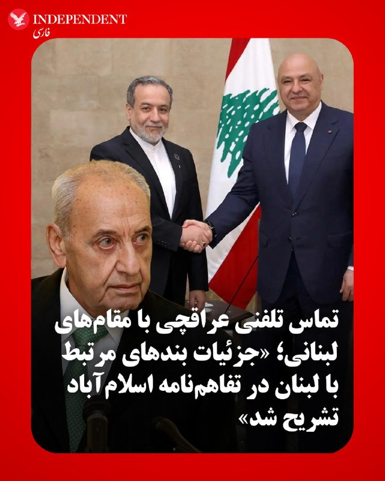

♦️عباس عراقچی، وزیر امور خارجه جمهوری اسلامی ایران، روز دوشنبه ۲۵ خردادماه در تماس‌های تلفنی جداگانه با ژوزف عون، رئیس‌جمهوری لبنان، و نبیه بری، رئیس مجلس این کشور درباره مفاد «تفاهم‌نامه اسلام‌آباد» و «به‌ویژه بندهای مرتبط با لبنان» گفتگو کرد.
بر اساس اعلام کانال اطلاع‌رسانی وزارت امورخارجه ایران، عراقچی در این تماس‌ها مقامات لبنانی را در جریان جزئیات بندهای تفاهم‌نامه قرار داد و بر «اهتمام جمهوری اسلامی به پایان جنگ و تجاوز در لبنان» تأکید کرد.
عراقچی همچنین مسئولیت ایالات متحده را در قبال اجرای مفاد تفاهم‌نامه یادآور شد و خواستار توقف کامل حملات اسرائیل علیه لبنان شد.
کانال تلگرامی عراقچی در گزارش این تماس مدعی شد، ژوزف عون و نبیه بری با استقبال از مفاد یادداشت تفاهم اخیر بر اهمیت ثبات و امنیت لبنان به عنوان بخشی جدایی‌ناپذیر از هر تلاش جدی برای برقراری ثبات در منطقه تاکید کرده‌اند.
این خبر درحالی منتشر می‌شود که ژوزف عون، رئیس جمهوری لبنان روز دوشنبه ۱۸ خردادماه در گفتگو با سی‌ان‌ان، بار دیگر جمهوری اسلامی ایران را به دخالت در امور داخلی این کشور متهم کرد و از تهران خواست تا برای منافع خودش، لبنان جنگ‌زده را قربانی نکند.
این سخنان رئیس جمهوری لبنان به واکنش مقام‌های ایرانی و جدال لفظی دو طرف در شبکه‌های اجتماعی منجر شد.
‌🇸🇦 Indypersian

🤖 @VahidOOnLine

## VahidOOnLine — post 245751

  

بنیامین نتانیاهو، نخست‌وزیر اسرائیل، گفت ایران با توافق یا بدون توافق به سلاح هسته‌ای دست نخواهد یافت.

او افزود ما اسرائیل را از نابودی نجات داده‌ایم، اما مبارزه هنوز پایان نیافته است.

نتانیاهو همچنین گفت اسرائیل تا هر زمان که لازم باشد در «مناطق امنیتی» باقی خواهد ماند و به خنثی کردن تهدیدها در منطقه ادامه خواهد داد.
‌🏁 🇬🇧 IranintlTV

🤖 @VahidOOnLine

## VahidOOnLine — post 245750

  

نفتالی بنت، نخست وزیر پیشین اسرائیل، خواستار بازگشت به راهبرد جنگ‌های سریع و قاطع، احیای ستاد اطلاع‌رسانی ملی و اجرای خدمت سربازی اجباری برای همه شهروندان اسرائیل شد.

او گفت: «شمارش معکوس برای تغییر حکومت در ایران از زمان تغییر حکومت در اسرائیل آغاز خواهد شد.»

بنت ادامه داد: «اگر من جای نتانیاهو بودم دکترین "اختاپوس" علیه ایران را از سر می‌گرفتیم؛ هم مانع دستیابی ایران به سلاح هسته‌ای می‌شدیم و هم با ابزارهای مختلف روند تضعیف حکومت را تسریع می‌کردیم.»
‌🏁 🇬🇧 IranintlTV

🤖 @VahidOOnLine

## VahidOOnLine — post 245749

  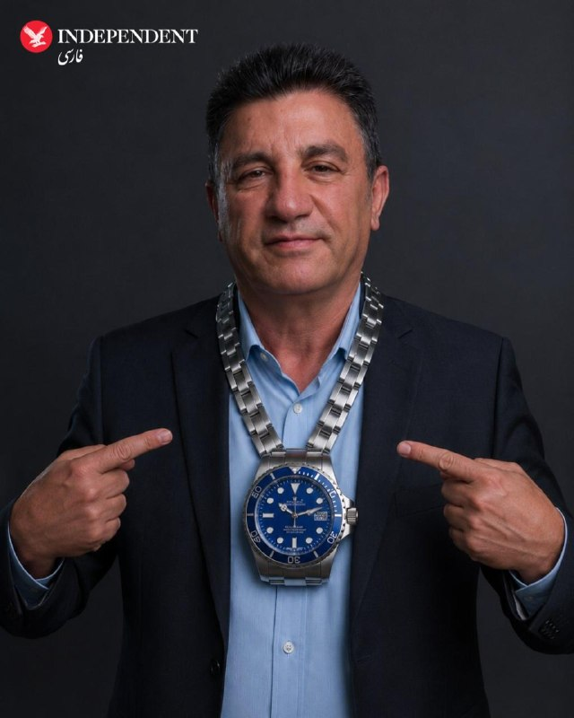

📷 Photo

## VahidOOnLine — post 245746

♦️عکس‌های رسمی منتشرشده از امیر قلعه‌نویی، سرمربی تیم ملی فوتبال ایران، در رسانه‌های فدراسیون بین‌المللی فوتبال (فیفا)، موجی از واکنش‌های طنزآمیز را در شبکه‌های اجتماعی برانگیخت.

بخشی از کاربران معتقد بودند نحوه ژست گرفتن و زاویه ثبت تصاویر به گونه‌ای است که ساعت مچی لوکس او بیش از هر چیز دیگری در عکس‌ها جلب توجه می‌کند. همین موضوع باعث شد تصاویر منتشرشده به سوژه بحث و شوخی در فضای مجازی تبدیل شود.

واکنش‌ها تنها به اظهارنظرهای طنز محدود نماند و برخی کاربران نیز تصاویری با استفاده از هوش مصنوعی تولید کردند که در آن ساعت مچی قلعه‌نویی حتی برجسته‌تر از خود او به نمایش درآمده بود.
برخی کاربران آشنا با ساعت‌های لوکس، ساعت مچی سرمربی تیم ملی را از نشان مشهور رولکس با قیمت تقریبی ۱۲ هزار دلار اعلام کرده‌اند.
‌🇸🇦 Indypersian

🤖 @VahidOOnLine

## WithYashar — post 15008

  <a href="telegram/content/WithYashar_15008_1781553296.mp4" target="_blank">🎬 Download video</a>

تصاویری از محل سقوط بمب‌افکن استراتژیک B-۵۲ آمریکا در کالیفرنیا
@withyashar

## WithYashar — post 15007

  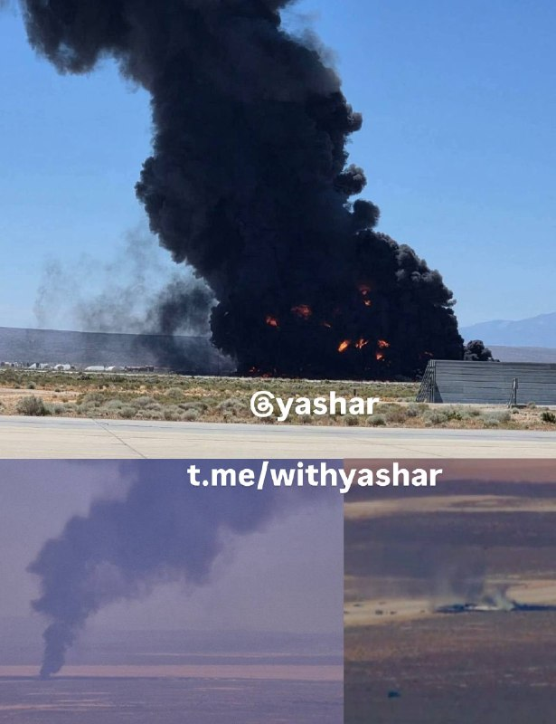

یک بمب‌افکن B-52 استراتوفورتراس نیروی هوایی ایالات متحده بلافاصله پس از برخاستن در پایگاه نیروی هوایی ادواردز سقوط کرد.

جزئیات تلفات هنوز گزارش نشده است.
@withyashar

## WithYashar — post 15006

## WithYashar — post 15005

حملات توپخانه‌ای اسرائیل به ارتفاعات علی‌الطاهر در نبطیه 🚨
@withyashar

## WithYashar — post 15004

## WithYashar — post 15003

پست جدید که در اون هنرنمایی هم کردم براتون کلیک کنید و حتماً کارهای اداریش رو انجام بدید.

https://www.instagram.com/reel/DZngOTKRtYt/?igsh=MWwzcTZmaW9oZndxcQ==

⁨ اتاق جنگ با یاشار : سفر قاهره «ملودیک»⁩

## WithYashar — post 15002

نتانیاهو: از موارد مورد توافق بین ایران و آمریکا مطمئن نیستم ولی قطعا در انتخابات پیروز خواهم شد
@withyashar

## WithYashar — post 15001

  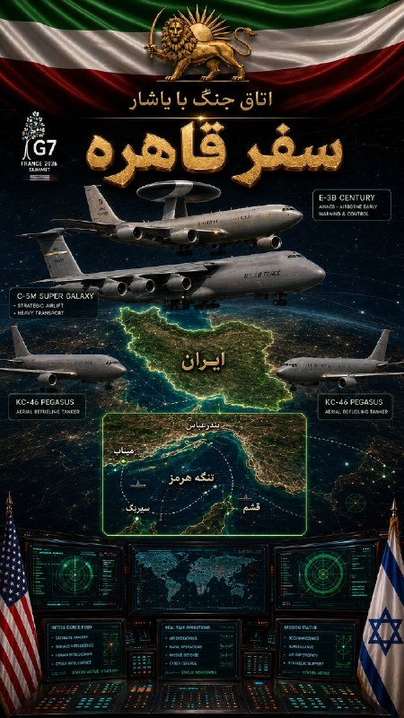

کاور
@withyashar

## WithYashar — post 15000

نتانیاهو: تا خلع سلاح حزب‌الله، اسرائیل از منطقه امنیتی جنوب لبنان خارج نخواهد شد.

همون کاری با غزه کردیم، با جنوب لبنان هم خواهیم کرد؛ همونطور که غزه دیگر تهدید جدی‌ای برای اسرائیل نیست، حزب‌الله هم در آینده نخواهد بود.
@withyashar

## WithYashar — post 14999

نتانیاهو: توافق با ایران توسط ترامپ منعقد شد، این تصمیم اوست و ما منافع خود را داریم‌‌

ترامپ رئیس‌جمهور آمریکاست و من نخست‌وزیر اسرائیل؛ من از منافع کشور خودم دفاع می‌کنم.
@withyashar

## WithYashar — post 14998

نتانیاهو: من نگفتم هدف ما سرنگونی رژیم ایرانه، گفتم میخواهیم به مردم ایران برای انجام این کار کمک کنیم
@withyashar
یاشار : توجه کن این جمله بار حقوقی داره با این حال بنیامین نتانیاهو بارها این حرف رو زده

## WithYashar — post 14997

نتانیاهو: مبارزه تمام نشده است. ما باید همچنان هوشیار، قوی و مصمم باشیم تا از خود تا حد امکان دفاع کنیم. این نه تنها در مورد ایران، بلکه در مورد بازوهای تروریستی ایران نیز صادق است. ما به شیوه‌ای بی‌سابقه به آنها ضربه زدیم. ما این کار را در غزه، لبنان، سوریه، یمن، اردوگاه‌های پناهندگان در یهودا و سامره و همه جا انجام دادیم.
@withyashar

## WithYashar — post 14996

نتانیاهو: من با ترامپ موافق نیستم،
بنابراین، اسرائیل هر کاری که لازم باشد در برابر ایران انجام خواهد داد.
@withyashar

## WithYashar — post 14995

شبکه ۱۳ اسرائیل به نقل از یک منبع:

تل‌آویو و واشینگتن بر سر عدم عقب‌نشینی کامل اسرائیل از لبنان به توافق رسیده‌اند.
@withyashar

## WithYashar — post 14994

  <a href="telegram/content/WithYashar_14994_1781553300.mp4" target="_blank">🎬 Download video</a>

نتانیاهو: ما در لبنان خواهیم ماند. کار با ایران ممکن است همچنان تمام نشده باشد

ماموریت زندگی من مبارزه با برنامه هسته ای ایران است.
با توافق یا بدون توافق، ایران سلاح هسته ای نخواهد داشت.
اگر برای حمله به ایران عجله نکرده بودیم، به بمب هسته ای دست می یافت.
ما رهبران ایران را کشتیم، به سرویس‌های امنیتی آن آسیب شدیدی زدیم و اسرائیل را از تهدید هسته‌ای ایران نجات دادیم.
@withyashar

## WithYashar — post 14993

نتانیاهو: ما خسارات عظیمی به ایرانی‌ها وارد کردیم و اسرائیل را از خطر نابودی هسته‌ای نجات دادیم.

اگر ما به سرعت برای حمله به ایران اقدام نمی‌کردیم، این کشور به بمب هسته‌ای دست پیدا می‌کرد.
@withyashar

## WithYashar — post 14992

نتانیاهو: «اسرائیل تا هر زمان که لازم باشد در “مناطق امنیتی” باقی خواهد ماند.»

«ما شراکت‌های جدیدی را در سراسر منطقه و فراتر از آن شکل خواهیم داد، در حالی که توانایی اسرائیل برای تولید و تأمین مستقل تسلیحات خود را تضمین می‌کنیم.»
@withyashar

## WithYashar — post 14991

## WithYashar — post 14989

مقامات آمریکایی اعلام کردن حتی با وجود توافق قصد عقب نشینی از منطقه را نخواهیم داشت و نیروهای آمریکایی در منطقه خواهند ماند.
@withyashar

## WithYashar — post 14988

## mwarmonitor — post 11001

ما این کار را در غزه انجام دادیم، در لبنان، در سوریه، در یمن، در اردوگاه‌های پناهندگان در یهودا و سامره (کرانه باختری)؛ ما این کار را در همه جا انجام دادیم. ما [محمد] ضیف، [اسماعیل] هنیه و [یحیی] سنوار را به همراه بسیاری از رهبران حماس حذف کردیم؛ در واقع تقریباً…

## mwarmonitor — post 11000

شهروندان عزیز اسرائیل، ده‌ها سال است که من در حال مبارزه با تلاش‌های ایران برای مسلح شدن به سلاح هسته‌ای هستم. من می‌توانم این را به عنوان «مأموریت زندگی‌ام» تعریف کنم. تا به امروز پای آن ایستاده‌ام و در آینده نیز پای آن خواهم ایستاد. با توافق یا بدون توافق،…

## mwarmonitor — post 10999

شهروندان عزیز اسرائیل،
ده‌ها سال است که من در حال مبارزه با تلاش‌های ایران برای مسلح شدن به سلاح هسته‌ای هستم.
من می‌توانم این را به عنوان «مأموریت زندگی‌ام» تعریف کنم.
تا به امروز پای آن ایستاده‌ام و در آینده نیز پای آن خواهم ایستاد.
با توافق یا بدون توافق، ایران سلاح هسته‌ای نخواهد داشت؛
نه امروز و نه فردا.
تا زمانی که من نخست‌وزیر دولت اسرائیل هستم، این اتفاق رخ نخواهد داد.
حالا می‌شنوم که مردم می‌پرسند: «ما چه چیزی به دست آوردیم؟»
و من به آن‌ها پاسخ می‌دهم، چه چیزی به دست آوردیم؟
ما خطر نابودی فوری را از خود دور کردیم.
ما همراه با دوستان آمریکایی‌مان، وارد بزرگ‌ترین عملیات هوایی تهاجمی در تاریخ اسرائیل شدیم.
دانشمندان هسته‌ای آن‌ها را ناکام گذاشتیم.
رهبران رژیم ترور را از سر راه برداشتیم.
کارخانه‌های هسته‌ای آن‌ها را در هم کوبیدیم.
موشک‌ها و بخش اعظمی از کارخانه‌های تولیدکننده موشک آن‌ها را نابود کردیم.
به بی‌شمار زیرساخت‌ها و تاسیسات نظامی آسیب زدیم.
نیروی دریایی آن‌ها و نیروی هوایی‌شان را منهدم کردیم.
فرماندهان پایگاه‌هایی که دست به کشتار مردم ایران زده بودند را از میان برداشتیم.
ما خسارت بزرگی وارد کردیم. ما این خسارت را صدها میلیارد دلار و برخی حتی نزدیک به یک تریلیون دلار برآورد می‌کنند؛ خسارتی عظیم به اقتصاد ایران که ساختن آن ده‌ها سال برایشان زمان برده بود.
اما مهم‌ترین چیز اینجاست؛ مهم‌ترین چیز این است که ما دولت اسرائیل را از تهدید نابودی هسته‌ای نجات دادیم.
چون باید درک کرد، ایران با سرعت به سمت سلاح هسته‌ای در حرکت بود—درست پیش از عملیات «عم کلاوی» (صداقت شیر)—آن‌ها به سمت سلاح هسته‌ای می‌تاختند و تلاش می‌کردند تا صنعت هسته‌ای و موشکی خود را در عمق زمین پنهان کنند.
اگر در زمانی که عمل کردیم و با قدرتی که به کار بردیم اقدام نمی‌کردیم—هم در عملیات «عم کلاوی» و هم پس از آن در عملیات «شاگات هاری» (غرش شیر)—که در یک همکاری تاریخی با پرزیدنت ترامپ و ارتش آمریکا انجام شد؛ اگر به این شیوه عمل نکرده بودیم، ایران همین حالا بمب اتم در اختیار داشت.
و این به چه معناست؟
معنایش این است که میلیون‌ها شهروند اسرائیلی—شما که اکنون صدای مرا می‌شنوید—همگی در خطر هولناک مرگ دسته‌جمعی بودید. همه ما در این خطر بودیم.
و ما این خطر را—که خطر نابودی جمعیت اسرائیل بود—برای سال‌ها از خود دور کردیم.
این همان چیزی است که به دست آوردیم: ما دولت اسرائیل را از نابودی نجات دادیم.
اما شهروندان اسرائیل، به شما می‌گویم که این مبارزه هنوز تمام و کامل نشده است.
ما باید همچنان در حالت آماده‌باش باقی بمانیم، به قوی و مصمم بودن خود ادامه دهیم و همان‌طور که لازم است از خود دفاع کنیم.
این موضوع نه تنها در مواجهه با ایران، بلکه در برابر بازوهای تروریستی ایران نیز صادق است؛ بازوهایی که به شکلی بی‌سابقه به آن‌ها ضربه وارد کردیم.

@mwarmonitor

## mwarmonitor — post 10998

  <a href="telegram/content/mwarmonitor_10998_1781553302.mp4" target="_blank">🎬 Download video</a>

🎬 Video

## mwarmonitor — post 10997

  <a href="telegram/content/mwarmonitor_10997_1781553305.mp4" target="_blank">🎬 Download video</a>

🚨✈️یک فروند بمب‌افکن B-52 استراتوفورترس متعلق به نیروی هوایی آمریکا، اندکی پس از برخاستن از پایگاه نیروی هوایی ادواردز و حوالی ساعت ۱۱:۲۰ صبح سقوط کرد. هنوز جزئیاتی درباره تلفات احتمالی یا علت این سانحه منتشر نشده است.

@mwarmonitor

## mwarmonitor — post 10996

🔴(رویترز) – حاکمان تئوکراتیک ایران یک کارزار نظامی آمریکا را پشت سر گذاشته‌اند، اما مشکلات واقعی آن‌ها ممکن است تازه در حال آغاز باشد: مدیریت مطالبات متضاد تندروهایی که از جان سالم به در بردن از این حمله تقویت شده‌اند و مردمی فقیر و خشمگین.

🔴تندروهای قدرتمند ایران از رویارویی سه‌ماهه‌ای که به باورشان ایران در آن پیروز شده، روحیه گرفته‌اند. آن‌ها می‌خواهند رهبری در مذاکرات پیشِ‌رو با آمریکا موضعی سخت اتخاذ کند و اولویت را به بازسازی توان نظامی بدهد، با این اطمینان که می‌توانند هرگونه نارضایتی داخلی را با زور مهار کنند.

🔴اما مردم عادی ایران در مقابل، خواستار آن هستند که هرگونه «دستاورد صلح» یا تسهیل اقتصادی برای بهبود سطح زندگی و ایجاد فرصت‌های بهتر پس از جنگی ویرانگر—که در ادامه سال‌ها تحریم‌های سنگین رخ داده—صرف شود.

🔴هر دو جناح انتظارات بالایی دارند، مطالباتشان متضاد است و صبر کمی دارند. در پس‌زمینه نیز سایه احتمال بازگشت اعتراضات گسترده دیده می‌شود؛ اعتراضاتی که بنا بر گزارش‌ها، مقام‌ها در ژانویه با کشتن هزاران معترض آن‌ها را سرکوب کردند.

🔸خشم عمومی از بحران اقتصادی

🔴حمیدرضا عزیزی، پژوهشگر مهمان در «مؤسسه آلمانی امور بین‌الملل و امنیت» در برلین، گفت: «لحظه‌ای که جنگ تمام شود، و با توجه به شکننده بودن این توافق موقت، مشکلات واقعی برای حکومت روحانیت ایران آغاز خواهد شد.»

🔴چهار مقام ایرانی و یک مقام پیشین به رویترز گفته‌اند که فشارهایی که اکنون جمهوری اسلامی با آن روبه‌روست، هم‌زمان با گذار جامعه از وضعیت جنگ به واقعیت ویرانه‌های اقتصادی‌اش، در حال افزایش است.

🔴سه نفر از این مقامات گفته‌اند که در جامعه انتظار عمومی وجود دارد که هرگونه کمک مالی حاصل از تعلیق تحریم‌ها یا بازگشت دارایی‌ها، صرف تقویت اقتصاد و بهبود زندگی مردم شود.

🔴یکی از آن‌ها، یک مقام ارشد که ایرانیان را «خسته از جنگ و فشار اقتصادی» توصیف کرد، گفته است که این منابع احتمالاً صرف بازسازی، تزریق نقدینگی به بانک‌ها و حمایت گسترده‌تر اقتصادی خواهد شد.

🔴هر چهار مقام یا به‌طور مستقیم یا غیرمستقیم به خطر ازسرگیری اعتراضات اشاره کرده‌اند، اگر حکومت نتواند سطح معیشت را بهبود دهد. یکی از آن‌ها توافق پایان جنگ را با توجه به افزایش انتظارات عمومی «شمشیری دو لبه» توصیف کرده است.

@mwarmonitor

## mwarmonitor — post 10995

🔴ذخایر اضطراری نفت آمریکا به پایین‌ترین سطح خود از زمان دولت ریگان رسیده است. CNN

@mwarmonitor

## mwarmonitor — post 10994

  <a href="telegram/content/mwarmonitor_10994_1781553307.mp4" target="_blank">🎬 Download video</a>

📝 در حالی که کارشناس منقل‌پایه صداوسیما فکرمی‌کند آمریکایی‌ها برای متر کردن خلیج فارس باید یک کشتی تجاری را بفرستند تا مماس با ساحل کُنارک لایی بکشد، پنتاگون سال‌هاست این روش‌های عهد بوق را کنار گذاشته است.

🔸امروز ارتش آمریکا هواپیمای گشت دریایی P-8A Poseidon را می‌فرستد تا با سامانه لیزری CHARTS، در چند ساعت نقشه سه‌بعدی ساحل را تحویل پنتاگون دهد. از آن بالاتر، ماهواره ICESat-2 با سنسورهای التیمتری، پستی‌بلندی‌های بستر دریا را از فضا اسکن می‌کند. در اعماق آب هم ربات‌ Slocum Glider کانتور کف دریا را اسکن کرده و اطلاعات هیدروگرافی را با ماهواره Iridium مستقیم به واشنگتن می‌فرستند. قایق‌های خودران و غول‌پیکری مثل Sea Hunter هم با سونارهای چندپرتو بستر دریا را متر می‌کنند.

🔸خلاصه، در دنیایی که دشمن با لیدار و ماهواره آمار سنگ‌ریزه‌های کف دریا را دارد، ما امنیت استراتژیک مملکت را سپرده‌ایم به تحلیل کارشناسی که فرق هیدروگرافی با آفتابه‌بستن زیر لنج را نمی‌داند و احتمالاً اگر به او گوشت کوبیده و عنبرنسارا بدهی، اولی را دود می‌کند و دومی را با نان سنگک می‌خورد!

@mwarmonitor

## mwarmonitor — post 10993

🔸مجری (اودی): موریا اساف، خبرنگار مسائل سیاسی کانال ۱۳ ما در اسرائیل؛ همان‌طور که شما در تیتر اشاره کردید، در پی امضای توافقنامه، نوعی شوک و سردرگمی حاکم شده و کلمه دیگری برای توصیف آن وجود ندارد. یک سرخوردگی و ناامیدی مطلق نسبت به آنچه رخ داده است.
🔹خبرنگار (موریا): بله، کمی بعد درباره ارزیابی‌های وضعیت که این بار نیز با شکست مواجه شدند صحبت خواهیم کرد، اما فکر می‌کنم در این شرایط، بهتر است با اظهارات یک مقام ارشد اسرائیلی شروع کنیم که خلاصه می‌کند این توافق از دیدگاه مقامات عالی‌رتبه اسرائیل چگونه به نظر می‌رسد. او این‌طور می‌گوید: «این یک توافق تکان‌دهنده و هولناک برای دولت اسرائیل است.» این سخنان هم دیروز در جلسه کابینه و هم در ارزیابی‌های وضعیت نزد نخست‌وزیر مطرح شد. نکته مشترک در این ماجرا این است که هم نخست‌وزیر (نتانیاهو)، هم وزرا و هم نهادهای امنیتی معتقدند این توافق برای اسرائیل به شدت بد است؛ از جمله به دلیل مسئله مواد غنی‌شده که در آن نادیده گرفته شده و همچنین در هر آنچه به برنامه موشکی مربوط می‌شود. پیش‌تر به اهدافی اشاره کردید که اسرائیل می‌خواست در جریان عملیات به آن‌ها دست یابد، اما هیچ‌کدام از این اهداف محقق نشده و حتی در مسیر تحقق نیز قرار ندارند.
ما امشب گزارش می‌دهیم که نه تنها این شوک و مخالفت در اسرائیل وجود دارد، بلکه مقامات ارشد اسرائیلی در ساعات گذشته به ما گفته‌اند که در تلاش هستند تا به نسخه کامل توافق، یعنی تمام جزئیات آن، دسترسی پیدا کنند. بر اساس آماری که من دارم، مقامات بسیار ارشد در رده‌های بالای اسرائیل هنوز از کل توافق و تمامی جزئیات آن مطلع نشده‌اند. گفتگوهای مختلفی در روزهای گذشته انجام شده است...
🔸مجری (اودی): و این یک اقدام بی‌سابقه است؛ اینکه دو طرف توافقنامه‌ای را امضا کنند و آن را از طریق واتس‌اپ ارسال نکنند!
🔹خبرنگار (موریا): این موضوع بسیار بسیار عجیب است و ما چنین چیزی را در اقدامات قبلی ندیده بودیم. به یاد داشته باشیم که اسرائیل یک طرف این توافق نیست، هرچند که این توافق تا این حد به اسرائیل و امنیت آن مربوط می‌شود، اما همچنان اسرائیل طرفی از آن به شمار نمی‌رود. مقامات ارشد اسرائیلی در ساعات گذشته به ما می‌گویند که همچنان در تلاش هستند تا به جزئیات کامل این توافق دست یابند.
همان‌طور که اشاره کردید، در اسرائیل پیش‌بینی نمی‌کردند که ایالات متحده و ایران به توافقی دست یابند. در تمام ارزیابی‌های وضعیتی که در هفته‌های اخیر صورت گرفت، بیشتر ارزیابی‌ها بر این بود که این مذاکرات با شکست مواجه خواهد شد، امضایی در کار نخواهد بود و توافقی حاصل نمی‌شود. و این اولین بار نیست که ارزیابی‌های مقامات عالی‌رتبه اسرائیل با واقعیت همخوانی ندارد. یادآوری می‌کنم که در پایان عملیات قبلی نیز، زمانی که ترامپ شروع به صحبت از آتش‌بس کرد، در اسرائیل مطمئن بودند که او ادامه خواهد داد و با حمله به اهداف انرژی موافقت خواهد کرد، اما این اتفاق نیفتاد و او به سمت آتش‌بس حرکت کرد.
🔸مجری (اودی): موریا، شما امشب جزئیات گفتگو میان نتانیاهو، نخست‌وزیر و جی‌دی ونس، معاون رئیس‌جمهور را منتشر می‌کنید.
🔹خبرنگار (موریا): بله، و در ادامه صحبت‌های الون، در این گفتگو بر اساس برداشت من، جزئیات دقیق چگونگی فعالیت اسرائیل در لبنان نهایی می‌شود. این گفتگو دقیقاً ۴۸ ساعت پیش انجام شده است. در این میان، نتانیاهو گزارشی ارائه می‌دهد و همراه با معاون رئیس‌جمهور، جزئیات توافق در حال شکل‌گیری را بررسی می‌کند. اما در این تماس، بحث اصلی درباره آینده لبنان است؛ جایی که اسرائیل یک چیز می‌خواهد و ایالات متحده خواهان چیز دیگری است.
یک منبع مطلع از جزئیات این گفتگو می‌گوید که ونس از نتانیاهو خواسته است حضور اسرائیل در لبنان را کاهش دهد. خواست اصلی اسرائیل باقی ماندن در داخل خاک لبنان بود، یعنی عدم عقب‌نشینی کامل. بر اساس برداشت من، در این زمینه توافقی حاصل شده است. این منبع مطلع می‌گوید — و این احتمالاً نکته کلیدی است — که درست است، عقب‌نشینی ارتش اسرائیل صورت نخواهد گرفت، اما تردیدی نیست که از این پس هرگونه اقدامی به شکل بسیار دقیق‌تری مورد بررسی قرار خواهد گرفت. بنابراین، اگر بخواهیم خلاصه کنیم، در این مرحله عقب‌نشینی رخ نخواهد داد، اما این موضوع قطعاً بر اقدامات اسرائیل در لبنان در آینده، در راستای خواسته‌های آمریکا، تأثیرگذار خواهد بود.

@mwarmonitor

## mwarmonitor — post 10992

  <a href="telegram/content/mwarmonitor_10992_1781553308.mp4" target="_blank">🎬 Download video</a>

🎬 Video

## mwarmonitor — post 10991

🔴ترامپ، پیش از دیدار دوجانبه با رئیس‌جمهور فرانسه، مکرون، گفت: 📌«تنگه هرمز از قبل تا حدی باز شده است. همان‌طور که می‌دانید، آن‌ها در حال جست‌وجوی چند مین هستند که قبلاً چند مورد از آن‌ها را پیدا کرده‌اند. اما عملاً کشتی‌ها در حال خروج هستند. تا روز جمعه،…

## mwarmonitor — post 10990

🔴ترامپ، پیش از دیدار دوجانبه با رئیس‌جمهور فرانسه، مکرون، گفت:

📌«تنگه هرمز از قبل تا حدی باز شده است. همان‌طور که می‌دانید، آن‌ها در حال جست‌وجوی چند مین هستند که قبلاً چند مورد از آن‌ها را پیدا کرده‌اند. اما عملاً کشتی‌ها در حال خروج هستند. تا روز جمعه، این تنگه کاملاً باز خواهد شد.» CNN

@mwarmonitor

## mwarmonitor — post 10989

🔴دیوید آلبرایت:

📌بحث عمومی درباره «پایین‌کاهش (downblending)» اورانیوم قابل‌بازیافت غنی‌شده ایران معمولاً یک نکته اساسی را نادیده می‌گیرد: پایین‌کاهش به چه سطحی؟ و بعد از آن چه می‌شود؟

🔸گزینه منطقی، تبدیل آن به هگزافلوراید اورانیوم طبیعی و سپس ارسال آن به خارج از کشور است.

🔸گزینه‌های دیگر، مانند پایین‌کاهش اورانیوم ۲۰٪ و ۶۰٪ به سطح ۴ تا ۵ درصد، همچنان برای ایران یک ظرفیت عظیم «زمان گریز (breakout capability)» باقی می‌گذارد. این مواد بیش از ۷۰٪ مسیر رسیدن به اورانیوم با غنای تسلیحاتی را طی کرده‌اند و در نهایت باز هم نیاز خواهد بود که از کشور خارج شوند.

🔸پیشنهادهایی که فقط شامل پایین‌کاهش اورانیوم ۶۰٪ به ۲۰٪ هستند، بدون معنا و غیرجدی‌اند—مگر اینکه این مواد و تمام اورانیوم‌های غنی‌شده دیگر به‌سرعت به کشور دیگری منتقل شوند. در آن صورت، اصولاً چرا باید پایین‌کاهش انجام شود؟ بهتر است همان اورانیوم قابل‌بازیافت در همان شکل فعلی خارج شود.

🔸مقدار نسبتاً کوچک سوخت ۲۰٪ غنی‌شده برای راکتور تحقیقاتی تهران (TRR) می‌تواند در ایران باقی بماند. علاوه بر این، مقدار کافی سوخت TRR هم‌اکنون در دسترس است (در ایران، به‌صورت قطعات، یا در روسیه تحت توافق قبلی) و برای سال‌ها بهره‌برداری از این راکتور کافی است. بنابراین نیازی به تولید بیشتر نیست، و حتی به دلیل خسارات جنگی، ایران عملاً قادر به تولید بیشتر هم نخواهد بود.

🔸در نتیجه، نیازی نیست ایران هیچ اورانیوم ۲۰٪ به شکل هگزافلوراید یا اکسید، خارج از سوخت موجود راکتور TRR نگه دارد.

🔸از نظر تئوری، به دلیل بقای جرم، ایران به اندازه کافی اورانیوم ضعیف‌شده (depleted uranium hexafluoride) برای پایین‌کاهش همه اورانیوم غنی‌شده خود به سطح طبیعی دارد. اگر از نظر عملی امکان بازیابی کافی آن از خرابه‌ها نباشد، می‌توان مقدار زیادی اورانیوم ضعیف‌شده از کشورهای دیگر (از جمله روسیه) به ایران منتقل کرد تا برای این فرآیند استفاده شود.

@mwarmonitor

## mwarmonitor — post 10988

🔴یک مقام ارشد آمریکایی در نشست توجیهی با خبرنگاران گفت: عقب‌نشینی اسرائیل از لبنان شرطی برای توافق در حال شکل‌گیری با ایران نیست. 🔸این مقام افزود: اسرائیل حق خواهد داشت در صورت حمله حزب‌الله از خود دفاع کند. @mwarmonitor

## mwarmonitor — post 10987

🔴یک مقام ارشد آمریکایی در نشست توجیهی با خبرنگاران گفت: عقب‌نشینی اسرائیل از لبنان شرطی برای توافق در حال شکل‌گیری با ایران نیست.

🔸این مقام افزود: اسرائیل حق خواهد داشت در صورت حمله حزب‌الله از خود دفاع کند.

@mwarmonitor

## mwarmonitor — post 10986

🔴ترامپ و معاونش، جی‌دی ونس، هر دو به‌صورت مجازی یادداشت تفاهم با ایران را امضا کردند؛ این را یک مقام ارشد دولت آمریکا اعلام کرد. 🔴به گفته این مقام، محمدباقر قالیباف، رئیس مجلس ایران، این سند را از طرف ایران امضا کرده است. 🔴با این حال، مراسم رسمی امضا قرار…

## FoxNewsTwitter — post 342994

  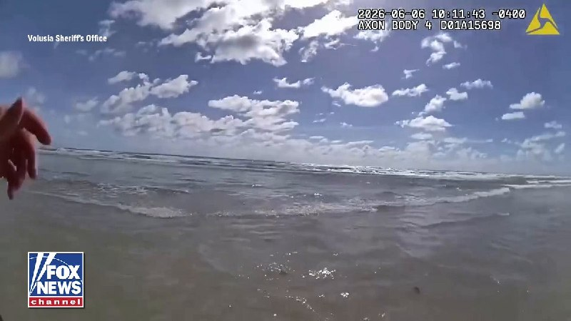

Fox News (Twitter/X)

Two Florida cops are being hailed as heroes for rescuing a drowning woman.

A 68-year-old woman collapsed face-first in the ocean, and seconds later, the two deputies raced into the surf to save her.

Volusia County Deputy Gourley spotted the woman unconscious and floating about 30 feet offshore after beachgoers flagged him down. He pulled her to shore, where Deputy Manhart immediately started CPR.

Dramatic body camera video captured the heart-stopping rescue as witnesses cheered the deputies on.

Officials say the 68-year-old is expected to recover thanks to the deputies’ quick actions and the coordinated emergency response.

## FoxNewsTwitter — post 342993

  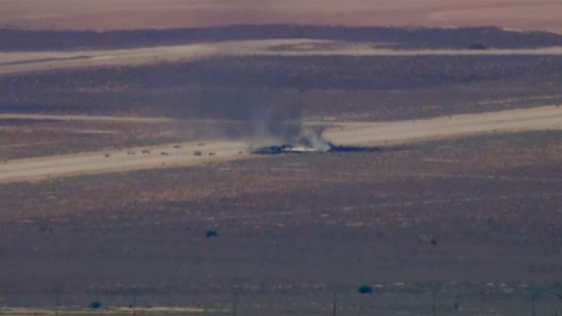

Fox News (Twitter/X)

BREAKING: A U.S. Air Force B-52 Stratofortress crashed shortly after takeoff at Edwards Air Force Base, officials say.

## FoxNewsTwitter — post 342992

  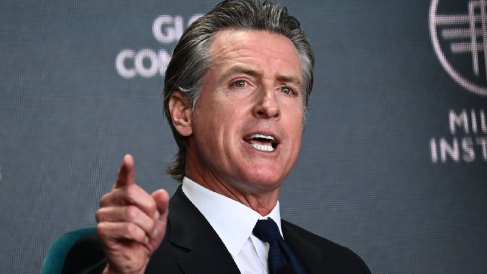

Fox News (Twitter/X)

BREAKING: California Gov. Gavin Newsom says President Trump’s DOJ is investigating him and his wife, accusing the administration of political retaliation.

## FoxNewsTwitter — post 342991

  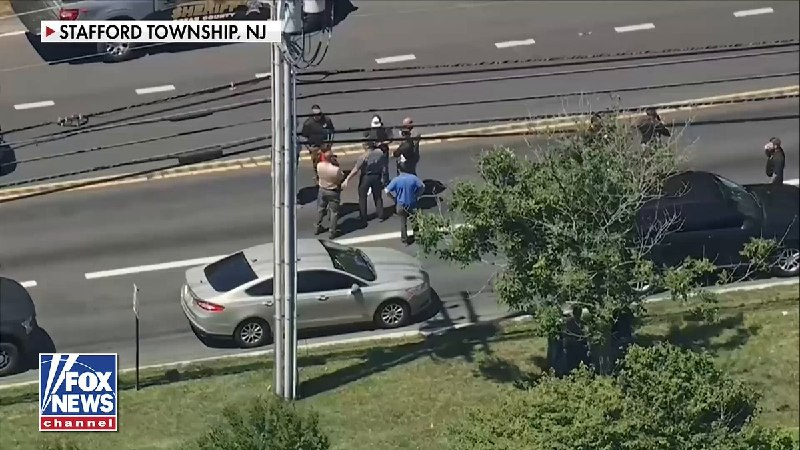

Fox News (Twitter/X)

An ICE agent was struck by a suspect's vehicle during an attempted arrest in New Jersey, and then opened fire as the driver sped away.

The confrontation unfolded along Route 72 in Manahawkin shortly as federal immigration agents moved in to take a suspect into custody.

Authorities say the vehicle was hit by gunfire, but the suspect managed to escape and remains on the run.

Police say they were not involved in the ICE operation and there is currently no known threat to the public.

## FoxNewsTwitter — post 342990

  <a href="telegram/content/FoxNewsTwitter_342990_1781553313.mp4" target="_blank">🎬 Download video</a>

Fox News (Twitter/X)

A UK student's reaction is going viral after Prime Minister Keir Starmer said Britain will ban children younger than 16 from using social media.

During a BBC interview, the student revealed her screen time was nine hours over the weekend. When asked how she'd fill all that extra time without social media, she didn't hesitate: "Stare at a wall."

The deadpan response is quickly becoming one of the most shared reactions to the UK's sweeping new restrictions on children's social media use.

## FoxNewsTwitter — post 342989

Fox News (Twitter/X)

RT @TreyYingst: The memorandum of understanding with Iran is expected to be released in the next 24-48 hours, according to senior U.S. officials. It was electronically signed by President Trump, Vice President Vance, and Iranian Parliament Speaker Ghalibaf.

## FoxNewsTwitter — post 342988

  <a href="telegram/content/FoxNewsTwitter_342988_1781553315.mp4" target="_blank">🎬 Download video</a>

Fox News (Twitter/X)

Florida Rep. Brian Mast puts G7 nations on blast ahead of President Trump’s arrival, accusing global allies of dodging the fight against Iranian aggression while still demanding international relevance.

Mast claims Trump will deliver a blunt message to European leaders, urging them to respond forcefully to global threats instead of relying entirely on the United States to take action.

"I think the president's probably going to tell them be a little bit more American and less European. If somebody is fighting you and attacking you, you have the stones to go out there and hit back instead of run away like what you were doing." | @AmericaRpts

## FoxNewsTwitter — post 342987

  <a href="telegram/content/FoxNewsTwitter_342987_1781553317.mp4" target="_blank">🎬 Download video</a>

Fox News (Twitter/X)

JUST NOW: President Trump greets French President Emmanuel Macron and his wife Brigitte as G7 leaders convene for their high-stakes summit in France.

## FoxNewsTwitter — post 342986

Fox News (Twitter/X)

Get an exclusive look inside America250's time capsule and the items that will be buried on Independence Mall in Philadelphia on July 4th, 2026.

## FoxNewsTwitter — post 342985

Fox News (Twitter/X)

Meta President Dina Powell McCormick announcing that every blind veteran in America can be eligible to receive a free pair of Meta AI glasses, calling the effort a way to help veterans “regain their independence.”

Joining Army veteran Don Overton, who lost his eyesight after serving in Desert Storm, McCormick highlights Overton's role in shaping the technology. Overton spent more than a year working with Meta’s design team to make the glasses more useful for blind veterans.
+
The program aims to give those who sacrificed for the country more freedom, confidence, and independence in everyday life. | @foxandfriends

## FoxNewsTwitter — post 342984

  <a href="telegram/content/FoxNewsTwitter_342984_1781553320.mp4" target="_blank">🎬 Download video</a>

Fox News (Twitter/X)

BREAKING: President Trump says Vice President JD Vance is expected to travel to Geneva for the signing of the Iran peace deal.

Trump says Vance will attend specifically for the signing ceremony, while the president himself may also travel to Geneva depending on scheduling at the G7 summit.

## FoxNewsTwitter — post 342983

  <a href="telegram/content/FoxNewsTwitter_342983_1781553321.mp4" target="_blank">🎬 Download video</a>

Fox News (Twitter/X)

JUST IN: President Trump touts the sweeping impacts of his new Iran deal, predicting a major drop in global energy costs and revealing that French President Emmanuel Macron personally reached out to him to address oil prices.

"The the Iran deal that we made is going to bring a lot of, a lot of success to the world because the oil was really clogged up there for a while."

## FoxNewsTwitter — post 342982

  <a href="telegram/content/FoxNewsTwitter_342982_1781553323.mp4" target="_blank">🎬 Download video</a>

Fox News (Twitter/X)

NEW: President Trump touts his Iran peace deal as the Strait of Hormuz reopens and oil prices begin to drop:

"I think a lot of great things are going to happen with the Middle East right now. Very importantly, the oil is plummeting down, and the stock market is shooting up like a rocket."

"And the main thing is that Iran will not have a nuclear weapon."

## FoxNewsTwitter — post 342981

  <a href="telegram/content/FoxNewsTwitter_342981_1781553325.mp4" target="_blank">🎬 Download video</a>

Fox News (Twitter/X)

NEW: French President Emmanuel Macron praises President Trump's peace deal between the United States and Iran:

"We are ready to take our fair share of the burden and be part of the commitment of the international community."

"It's a very important step towards peace but as well for the global economy."

## pm_afshaa — post 94147

🎙️خبرنگار: چرا ترامپ مثل بایدن عمل کرد و چنین توافقی رو امضا کرد؟

نتانیاهو: من این مقایسه رو نمیکنم، چون هنوز نمیدونیم این توافق چه خواهد بود.

💧 Rainbet.com the #1 Non-KYC Crypto Casino & Sportsbook @rainbetcom

😁 @Pm_Afshaa

## pm_afshaa — post 94146

  <a href="telegram/content/pm_afshaa_94146_1781553327.webm" target="_blank">🎬 Download video</a>

🔴نتانیاهو: در آمریکا میگن ترامپ هر چی من بخوام انجام میده، و در اسرائیل برعکس میگن که من هر چی از ترامپ بخوام اون انجام میده. پس نه این درست و نه اون.

این رابطه‌ای است میان شرکایی که مدت طولانی هست که همدیگه رو می‌شناسن.

💧 Rainbet.com the #1 Non-KYC Crypto Casino & Sportsbook @rainbetcom

😁 @Pm_Afshaa

## pm_afshaa — post 94145

  <a href="telegram/content/pm_afshaa_94145_1781553328.webm" target="_blank">🎬 Download video</a>

🔴پزشکیان: اگر تفاهم‌نامه عملیاتی بشه سندی افتخارآمیز برای کشور خواهد بود.

هدایت‌های مجتبی خامنه‌ای بیشترین نقش رو در گنجاندن بندهای صیانت از منافع ملی ایران داشته که قدردان ایشون هستیم.

💧 Rainbet.com the #1 Non-KYC Crypto Casino & Sportsbook @rainbetcom

😁 @Pm_Afshaa

## pm_afshaa — post 94142

  <a href="telegram/content/pm_afshaa_94142_1781553329.webm" target="_blank">🎬 Download video</a>

🔴یه بمب‌افکن B-52 استراتوفورتراس نیروی هوایی ایالات متحده آمریکا بلافاصله پس از برخاستن در پایگاه نیروی هوایی ادواردز سقوط کرد.

💧 Rainbet.com the #1 Non-KYC Crypto Casino & Sportsbook @rainbetcom

😁 @Pm_Afshaa

## pm_afshaa — post 94141

سقوط یک بمب افکن b-52 در کالیفرنیا

💧 Rainbet.com the #1 Non-KYC Crypto Casino & Sportsbook @rainbetcom

😁 @Pm_Afshaa

## pm_afshaa — post 94140

دلار 155

## pm_afshaa — post 94138

  <a href="telegram/content/pm_afshaa_94138_1781553330.webm" target="_blank">🎬 Download video</a>

🟢 توافق شد و بورس هم شدیداً سبز شد؛

دوستانِ علاقه‌مند به اخبار اقتصادی و سیاسی بازارها و فعالین بورس و بازارها، سرخطی‌ها و گزارش‌های این کانال قطعا به‌دردتون میخوره و سود خوبی می‌کنید؛

رادار بورس، اخبار و سرخطی بازار :

➡️https://t.me/BorsRadar

➡️https://t.me/BorsRadar

## pm_afshaa — post 94136

  <a href="telegram/content/pm_afshaa_94136_1781553330.webm" target="_blank">🎬 Download video</a>

🔴شبکه 13 اسرائیل به نقل از منابع:
گفتگوی پرتنشی میان نتانیاهو و جی‌دی ونس در مورد حضور اسرائیل در لبنان صورت گرفت.

ونس خواستار عقب‌نشینی تدریجی از لبنان شد.
(نتانیاهو امشب گفت در لبنان خواهیم موند)

💧 Rainbet.com the #1 Non-KYC Crypto Casino & Sportsbook @rainbetcom

😁 @Pm_Afshaa

## pm_afshaa — post 94135

  <a href="telegram/content/pm_afshaa_94135_1781553331.webm" target="_blank">🎬 Download video</a>

🔴نتانیاهو: درباره جزئیات توافق ایران و آمریکا مطمئن نیستم.

ایران به سلاح هسته‌ای دست نخواهد یافت و من برای رسیدن به این هدف خودمون رو محدود نمیکنم.

💧 Rainbet.com the #1 Non-KYC Crypto Casino & Sportsbook @rainbetcom

😁 @Pm_Afshaa

## pm_afshaa — post 94134

  <a href="telegram/content/pm_afshaa_94134_1781553332.webm" target="_blank">🎬 Download video</a>

🔴بنیامین نتانیاهو:
من نگفتم هدف ما سرنگونی رژیم ایرانه، گفتم میخوایم به مردم ایران برای انجام این کار کمک کنیم؛ شاید در آینده این اتفاق رخ بده.

💧 Rainbet.com the #1 Non-KYC Crypto Casino & Sportsbook @rainbetcom

😁 @Pm_Afshaa

## pm_afshaa — post 94133

  <a href="telegram/content/pm_afshaa_94133_1781553332.webm" target="_blank">🎬 Download video</a>

🔴نتانیاهو: میخوام در انتخابات پاییز امسال شرکت کنم و دوباره نخست وزیر بشم.

💧 Rainbet.com the #1 Non-KYC Crypto Casino & Sportsbook @rainbetcom

😁 @Pm_Afshaa

## pm_afshaa — post 94132

  <a href="telegram/content/pm_afshaa_94132_1781553333.webm" target="_blank">🎬 Download video</a>

🔴نتانیاهو: تا خلع سلاح حزب‌الله، اسرائیل از منطقه امنیتی جنوب لبنان خارج نخواهد شد. وضعیت ما امروز بسیار بهتر از هفتم اکتبر است و ما محور ترور رو در هم شکستیم. 
💧 Rainbet.com the #1 Non-KYC Crypto Casino & Sportsbook @rainbetcom 
😁 @Pm_Afshaa

## pm_afshaa — post 94131

  <a href="telegram/content/pm_afshaa_94131_1781553334.webm" target="_blank">🎬 Download video</a>

🔴نتانیاهو: مواردی وجود داره که من و ترامپ باهم هم‌نظر نیستیم. ما باید با خرد بر منافع امنیتی اسرائیل با استواری بایستیم. 
💧 Rainbet.com the #1 Non-KYC Crypto Casino & Sportsbook @rainbetcom 
😁 @Pm_Afshaa

## pm_afshaa — post 94130

  <a href="telegram/content/pm_afshaa_94130_1781553334.webm" target="_blank">🎬 Download video</a>

🔴نتانیاهو: تا خلع سلاح حزب‌الله، اسرائیل از منطقه امنیتی جنوب لبنان خارج نخواهد شد.

وضعیت ما امروز بسیار بهتر از هفتم اکتبر است و ما محور ترور رو در هم شکستیم.

💧 Rainbet.com the #1 Non-KYC Crypto Casino & Sportsbook @rainbetcom

😁 @Pm_Afshaa

## pm_afshaa — post 94129

🔴نتانیاهو: مواردی وجود داره که من و ترامپ باهم هم‌نظر نیستیم. ما باید با خرد بر منافع امنیتی اسرائیل با استواری بایستیم.

💧 Rainbet.com the #1 Non-KYC Crypto Casino & Sportsbook @rainbetcom

😁 @Pm_Afshaa

## pm_afshaa — post 94128

  <a href="telegram/content/pm_afshaa_94128_1781553335.webm" target="_blank">🎬 Download video</a>

🔴نتانیاهو، نخست وزیر اسرائیل:
ما بزرگترین عملیات حمله در تاریخ اسرائیل رو آغاز کردیم، ما تأسیسات هسته‌ای رو نابود کردیم، موشک‌های آنها رو از بین بردیم و بخش عمده‌ای از آرایش نظامی آنها رو ویران کردیم.

‏ما خسارت عظیمی به اقتصاد ایران وارد کردیم، برخی یک تریلیون دلار تخمین میزنن.

💧 Rainbet.com the #1 Non-KYC Crypto Casino & Sportsbook @rainbetcom

😁 @Pm_Afshaa

## pm_afshaa — post 94127

  <a href="telegram/content/pm_afshaa_94127_1781553336.webm" target="_blank">🎬 Download video</a>

🔴نتانیاهو: ما در لبنان خواهیم ماند و کارمون با ایران ممکنه هنوز تمام نشده باشه.

مبارزه علیه جمهوری اسلامی به پایان نرسیده و ما مجبور خواهیم بود هر زمان که لازم باشه، همچنان مراقب بمونیم و از خود دفاع کنیم.

💧 Rainbet.com the #1 Non-KYC Crypto Casino & Sportsbook @rainbetcom

😁 @Pm_Afshaa

## pm_afshaa — post 94126

  <a href="telegram/content/pm_afshaa_94126_1781553336.webm" target="_blank">🎬 Download video</a>

🔴نتانیاهو: ما رهبران جمهوری اسلامی رو کشتیم، به سرویس‌های امنیتی آنها آسیب شدیدی زدیم و اسرائیل رو از تهدید هسته‌ای ایران نجات دادیم.

💧 Rainbet.com the #1 Non-KYC Crypto Casino & Sportsbook @rainbetcom

😁 @Pm_Afshaa

## DEJradio — post 5705

  <a href="telegram/content/DEJradio_5705_1781553337.webm" target="_blank">🎬 Download video</a>

🔺🎤 خواب و راهکارهای خوب خوابیدن؛

گفت‌وگو با دکتر مصطفی میررمضانی، روانپزشک و روان‌درمانگر

#خواب #بی_خوابی
@DEJradio

## DEJradio — post 5704

⭕️ تناقض دربارۀ باج‌خواهی جمهوری اسلامی در تنگۀ هرمز

جی‌دی ونس، معاون رئیس جمهوری آمریکا اعلام کرد واشینگتن انتظار دارد گذر کشتی‌ها از تنگۀ هرمز در درازمدت بدون دریافت عوارض انجام شود.
ونس روز دوشنبه در گفت‌وگو با شبکۀ سی‌ان‌بی‌سی گفت موضوع عبور رایگان کشتی‌ها یکی از محورهای مذاکرات فنی آینده میان آمریکا و جمهوری اسلامی است.
به گفتۀ معاون ترامپ، آمریکا انتظار دارد که گذر رایگان این آبراه برای مدتی طولانی ادامه پیدا کند.
در سوی دیگر اسماعیل بقایی، سخنگوی وزارت امور خارجۀ جمهوری اسلامی، گفت تهران قصد دارد که برای خدماتی از جمله ناوبری، حفاظت محیط زیست، بیمه و سایر خدماتی که از سوی جمهوری اسلامی و عمان ارائه می‌شود، هزینه دریافت کند.
دونالد ترامپ در پی اعلام تفاهم میان تهران و واشینگتن گفته بود تنگۀ هرمز پس از بازگشایی دوباره به گذرگاهی بدون پرداخت عوارض بازمی‌گردد.
مقامات آمریکا پیش‌تر جمهوری اسلامی را به باجگیری در خلیج فارس متهم کرده بودند.
آمریکا همچنین تحریم‌هایی را برای کشتی‌هایی که برای عبور به رژیم باج بدهند، درنظر گرفته بود.

#تنگه_هرمز #باجگیری
@DEJradio

## DEJradio — post 5702

  <a href="telegram/content/DEJradio_5702_1781553338.webm" target="_blank">🎬 Download video</a>

🔺📢 هاکان فیدان وزیر خارجه ترکیه در تماس تلفنی با عباس عراقچی وزیر خارجه جمهوری اسلامی بر ضرورت هوشیاری در برابر تحریکاتی که با هدف ناکام گذاشتن توافق با آمریکا صورت می‌گیرد، تأکید کرده است.

همچنین ابراهیم کالین رئیس دستگاه اطلاعات ملی ترکیه (میت)، با استقبال از تفاهم‌نامه خاتمه جنگ بین جمهوری اسلامی ایران و آمریکا، مذاکرات هسته‌ای در پیش رو را «طاقت فرساترین نبردهای دیپلماتیک» توصیف کرد و امتناع اسرائیل از توقف آتش در لبنان را تهدیدی برای روند دیپلماسی طی ۶۰ روزه آتی خواند.

کالین همچنین تاکید کرد که مذاکرات قریب‌الوقوع بر سر برنامه هسته‌ای تهران، دوام آتش‌بس را به شدت آزمایش خواهد کرد.
او همچنین گفت در مورد ادامه مذاکرات باید خیلی محتاط بود.

#ترکیه #عراقچی
@DEJradio

## VahidOnline — post 76396

  <a href="telegram/content/VahidOnline_76396_1781553339.mp4" target="_blank">🎬 Download video</a>

پایگاه نیروی هوایی ادواردز آمریکا اعلام کرد یک بمب‌افکن بی-۵۲ روز دوشنبه ۲۵ خردادماه در ایالت کالیفرنیا سقوط کرده است.

بر اساس بیانیه منتشرشده از سوی این پایگاه، هواپیما «اندکی پس از برخاستن» از باند فرودگاه پایگاه ادواردز و در ساعت ۱۱:۲۰ صبح به وقت محلی دچار سانحه شد.
در این بیانیه آمده است: «تیم‌های امدادی بلافاصله به محل حادثه اعزام شدند و عملیات امداد و بررسی همچنان ادامه دارد.»
مقام‌های آمریکایی تاکنون جزئیاتی درباره علت سقوط، سرنوشت خدمه یا میزان خسارات احتمالی منتشر نکرده‌اند.

«بی-۵۲ استراتوفورترس» یکی از مهم‌ترین بمب‌افکن‌های دوربرد نیروی هوایی آمریکا است که از دهه ۱۹۵۰ در خدمت ارتش این کشور قرار دارد و توانایی حمل تسلیحات متعارف و هسته‌ای را دارد.
@VahidOOnLine

📡 @VahidOnline

## VahidOnline — post 76395

  <a href="telegram/content/VahidOnline_76395_1781553340.mp4" target="_blank">🎬 Download video</a>

"خون آقامون رو چند فروختید؟"

📡 @VahidOnline

## VahidOnline — post 76394

  <a href="telegram/content/VahidOnline_76394_1781553341.mp4" target="_blank">🎬 Download video</a>

عراقچی:
قرار است روز جمعه در کشور سوئیس که محل دقیق آن مشخص خواهد شد، یک دیداری بین هیئت‌های دوطرف انجام شود، که در آن روسای هیئت‌های دو طرف ابتدا این یادداشت تفاهم را امضا کنند و پس از آن اولین دور مذاکرات بعدی را داشته باشیم.

📡 @VahidOnline

## VahidOnline — post 76392

  <a href="telegram/content/VahidOnline_76392_1781553342.mp4" target="_blank">🎬 Download video</a>

جی‌دی ونس، معاون رئیس‌جمهور آمریکا، در گفتگو با شبکه سی‌بی‌اس اعلام کرد ایران در صورت پایبندی به تعهدات خود ممکن است به صندوقی برای بازسازی دسترسی پیدا کند که از سوی کشورهای حاشیه خلیج فارس تأمین مالی خواهد شد.

ونس با اشاره به مزایای احتمالی توافق برای تهران گفت ایران «ممکن است» حدود ۳۰۰ میلیارد دلار منابع مالی برای بازسازی از کشورهای خلیج فارس دریافت کند، اما تحقق این امر را منوط به اجرای کامل تعهدات جمهوری اسلامی دانست.

او افزود آمریکا با سرمایه‌گذاری کشورهای حاشیه خلیج فارس برای بازسازی ایران موافق است، اما این اتفاق تنها زمانی رخ خواهد داد که ایران به برنامه هسته‌ای خود پایان دهد، فعالیت‌های مربوط به مواد غنی‌شده را متوقف کند و با یک نظام بازرسی و نظارت گسترده موافقت کند.

معاون رئیس‌جمهور آمریکا همچنین تاکید کرد رسانه‌های نزدیک به حکومت ایران بر مزایای توافق تمرکز خواهند کرد، اما از امتیازاتی که تهران باید در مقابل واگذار کند کمتر سخن خواهند گفت.
@VahidOOnLine

📡 @VahidOnline

## VahidOnline — post 76390

❌ ویدیوی قدیمی منتسب به تیراندازی به هواداران حکومت در تجمع شبانه

🔹ویدیویی در شبکه‌های اجتماعی منتشر شده که ادعا می‌کند صحنه تیراندازی به مخالفان توافق با آمریکا در تجمعات شبانه هواداران حکومت ایران را نشان می‌دهد.

🔹این ویدیو قدیمی است و ارتباطی به تجمعات شبانه هواداران حکومت در ایران ندارد.

🔹ویدیو مربوط به دهم اسفند ۱۴۰۴ و برخورد پلیس عراق با هواداران جمهوری اسلامی است که سعی داشتند به سفارت آمریکا در بغداد نزدیک شوند.

🔹گزارش‌هایی از تجمع مخالفان توافق جمهوری اسلامی با آمریکا منتشر شده اما خبر تیراندازی به آنها در هیچ منبع رسمی منتشر نشده است.

🔹این ویدیو پیش‌تر نیز با ادعای نادرست دیگری به اعتراضات دی ۱۴۰۴ منتسب شده بود.

🔹بنابراین فکت‌نامه به ادعای مطرح‌شده درباره این ویدیو نشان «نادرست» می‌دهد.

👈 در فکت‌نامه بخوانید

🌐 @Factnameh

## VahidOnline — post 76389

  <a href="telegram/content/VahidOnline_76389_1781553342.mp4" target="_blank">🎬 Download video</a>

بنیامین نتانیاهو، نخست‌وزیر اسرائیل، اعلام کرد نیروهای اسرائیلی در آنچه «مناطق امنیتی» در غزه، لبنان و سوریه خواند، تا زمانی که برای تأمین امنیت اسرائیل ضروری باشد، باقی خواهند ماند.

بنیامین نتانیاهو، نخست وزیر اسرائیل، روز دوشنبه در یک کنفرانس خبری تأکید کرد که به‌رغم امضای تفاهم‌نامه میان ایران و آمریکا، چالش کشور اسرائیل به پایان نرسیده و «ما باید گوش به‌زنگ بمانیم و در مواقع لزوم از خود دفاع کنیم».

به گفته دولت آمریکا، جمهوری اسلامی در قالب تفاهم‌نامه‌ای که روز یک‌شنبه امضا شد تعهد داده است که هرگز به دنبال سلاح هسته‌ای نرود.
نخست وزیر اسرائیل در ادامه سخنان خود تأکید کرد که «با یا بدون توافق، ایران هرگز به سلاح هسته‌ای دست نخواهد یافت».

نتانیاهو در نشست خبری خود همچنین گفت که حملات مشترک در کنار آمریکا به ایران خساراتی سنگین وارد کرده و به گفته او «بعضی معتقدند که خسارت اقتصادی به ایران یک تریلیون دلار بوده است».
او در ادامه گفت:
ما به مردم ایران قول دادیم که شرایطی را فراهم آوریم که رژیم آیت‌الله سرنگون شود، نمی‌دانم چه زمانی این اتفاق خواهد افتاد، ولی خواهد افتاد.
@VahidHeadline

📡 @VahidOnline

## VahidOnline — post 76386

  <a href="telegram/content/VahidOnline_76386_1781553343.mp4" target="_blank">🎬 Download video</a>

'#آتش‌سوزی در شهرک امید #تهران'
تصاویر دریافتی از شهروندان،‌ دوشنبه ۲۵ خرداد، حدود ساعت ۲۱
Vahid

📡 @VahidOnline

## VahidOnline — post 76385

  <a href="telegram/content/VahidOnline_76385_1781553344.mp4" target="_blank">🎬 Download video</a>

ویدیوی دریافتی از #آتش‌سوزی چیزی به اسم "موکب"

منابع حکومتی به نقل از سخنگوی آتش‌نشانی تهران: آتش گرفتن گاز پیک‌نیک در یک موکب مستقر در میدان تجریش #تهران باعث سرایت آتش آن به چادر شده و دود بلندی در منطقه ایجاد کرده است. بازار تجریش از این آتش آسیبی ندیده و آتش به سرعت خاموش
Vahid

📡 @VahidOnline

## VahidOnline — post 76384

  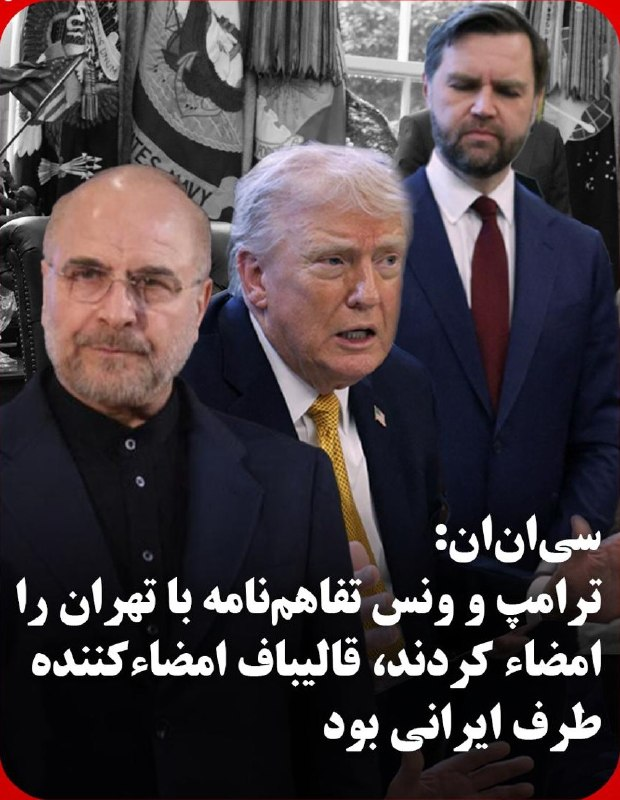

یک مقام ارشد آمریکایی روز دوشنبه اعلام کرد تفاهم‌نامه میان آمریکا و جمهوری اسلامی به امضای دونالد ترامپ، رییس‌جمهوری آمریکا، جی‌دی ونس، معاون رییس‌جمهوری آمریکا، و محمدباقر قالیباف، رییس مجلس جمهوری اسلامی، رسیده است.

او گفت در مرحله بعدی مذاکرات، آرایش فعلی نیروهای نظامی آمریکا حفظ خواهد شد، اما در صورت دستیابی به توافق نهایی، کاهش نیروهای نظامی در نظر گرفته شده است.

این مقام همچنین گفت مذاکرات فنی از اواخر این هفته آغاز می‌شود و جزییات توافق طی ۲۴ تا ۴۸ ساعت آینده منتشر خواهد شد.

او افزود آزادسازی دارایی‌های مسدودشده و کاهش تحریم‌ها به اجرای تعهدات وابسته است.

این مقام ارشد آمریکایی همچنین گفت: «از عملکرد عمانی‌ها در مذاکرات پیش از جنگ رضایت نداشتیم.»
@VahidOOnLine

📡 @VahidOnline

## VahidOnline — post 76383

  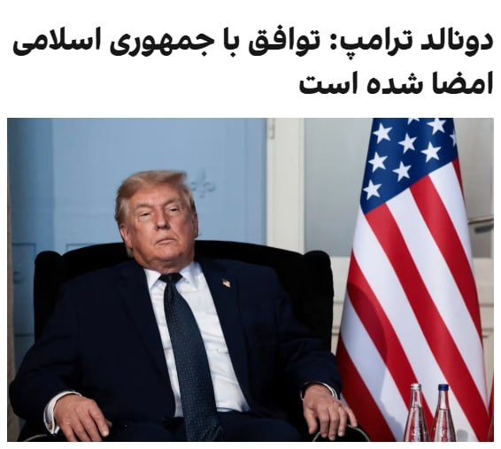

رییس‌جمهوری ایالات متحده دوشنبه اعلام کرد که توافق با ایران امضا شده و متن توافق حاصل شده با ایران پس از مراسم امضای رسمی در جمعه منتشر خواهد شد.

دونالد ترامپ که در هنگام ورود به اویان در فرانسه، برای شرکت در نشست گروه هفت صحبت می‌کرد، همچنین گفت تنگه هرمز تا جمعه به‌طور کامل باز خواهد شد.

ترامپ در کنار امانوئل مکرون، رییس‌جمهور فرانسه، گفت مشخص نیست آیا در مراسم روز جمعه که قرار است در ژنو برگزار شود شرکت خواهد کرد یا نه، اما معاون رییس‌جمهور آمریکا، جی‌دی ونس، در آن حضور خواهد داشت.

او گفت: «توافق کاملا امضا شده است. و همان‌طور که می‌دانید تنگه اکنون تا حدی باز شده است. روز جمعه کاملا باز خواهد شد.»

ونس پیش‌تر گفته بود این توافق یکشنبه به‌صورت دیجیتالی امضا شده و هیچ‌گونه بودجه‌ای آزاد نشده است.

در پاسخ به این سؤال که متن یادداشت تفاهم چه زمانی منتشر خواهد شد، ترامپ گفت: «احتمالا خیلی زود. بعد از جمعه... فکر می‌کنم در آینده بسیار نزدیک.»

ترامپ همچنین گفت هرگونه کاهش تحریم‌ها علیه تهران «به رفتار ایران بستگی دارد. اگر آن‌ها کاری را که باید انجام دهند انجام دهند، این روند آغاز خواهد شد.»
@VahidOOnLine

📡 @VahidOnline

## kianmeli1 — post 88026

  <a href="telegram/content/kianmeli1_88026_1781553345.mp4" target="_blank">🎬 Download video</a>

🔴تصاویری از محل سقوط بمب‌افکن استراتژیک B-۵۲ آمریکا در کالیفرنیا
https://t.me/kianmeli1

## kianmeli1 — post 88025

  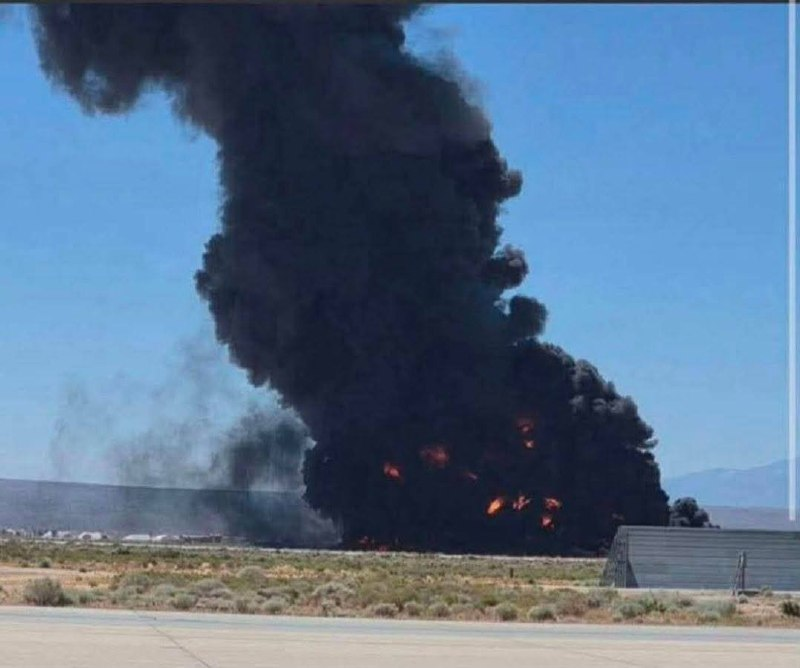

🔴یک بمب‌افکن B-52 نیروی هوایی ایالات متحده اندکی پس از برخاستن در پایگاه نیروی هوایی ادواردز سقوط کرد.
https://t.me/kianmeli1

## kianmeli1 — post 88024

  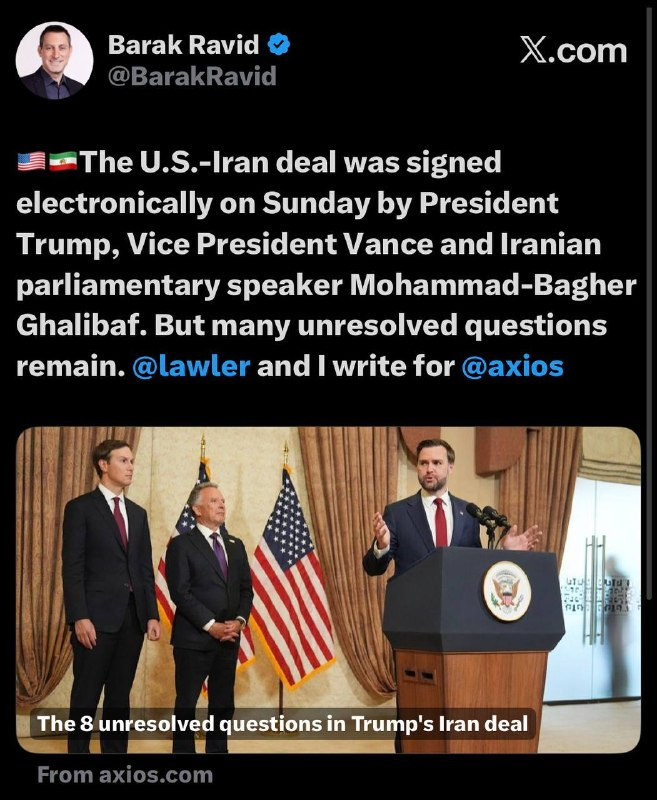

🔴توافق ایالات متحده و ایران روز یکشنبه به صورت الکترونیکی توسط رئیس جمهور ترامپ، معاون رئیس جمهور ونس و رئیس مجلس ایران، محمد باقر قالیباف، امضا شد. اما بسیاری از سوالات حل نشده باقی مانده است.
https://t.me/kianmeli1

## kianmeli1 — post 88023

🔴نتانیاهو: من نگفتم هدف ما سرنگونی رژیم ایران است
بلکه گفتم که می‌خواهیم به ایرانی‌ها در انجام این کار کمک کنیم.
https://t.me/kianmeli1

## kianmeli1 — post 88022

  <a href="telegram/content/kianmeli1_88022_1781553348.mp4" target="_blank">🎬 Download video</a>

🔴تهدید تازه نتانیاهو؛ «هر زمان لازم باشد اقدام می‌کنیم
https://t.me/kianmeli1

## kianmeli1 — post 88021

  <a href="telegram/content/kianmeli1_88021_1781553350.mp4" target="_blank">🎬 Download video</a>

🔴خبرنگار: آیا قصد دارید در مراسم امضای روز جمعه شرکت کنید؟

پرزیدنت ترامپ: خب، بستگی دارد. جی‌دی برای آن می‌آید — در اصل قرار بود او این کار را انجام دهد. احتمالاً تا آن زمان من رفته‌ام.

ما تا دیر وقت می‌مانیم، بنابراین ممکن است درگیر شوم و ممکن است نشوم.
https://t.me/kianmeli1

## kianmeli1 — post 88020

  <a href="telegram/content/kianmeli1_88020_1781553352.mp4" target="_blank">🎬 Download video</a>

🔴متن تفاهم‌نامه کی منتشر خواهد شد؟

ترامپ: فکر می‌کنم خیلی زود، این را می‌توانم بگویم.

می‌توانم بگویم که متن تفاهم نامه زمان کمی بعد از جمعه منتشر خواهد شد.
https://t.me/kianmeli1

## IranIntlTV — post 342573

  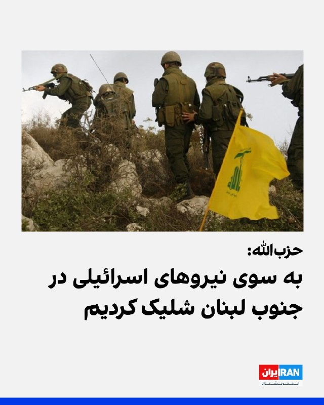

به گزارش رویترز، حزب‌الله اعلام کرد که به سوی نیروهای اسرائیلی که در حال تلاش برای پیشروی در جنوب لبنان بودند، راکت‌ها و پهپادهایی شلیک کرده است.
پیش‌تر رویترز گزارش داد اسرائیل در یک حمله پهپادی خودرویی را در جنوب لبنان هدف قرار داد و راننده آن کشته شد.

https://iranintl.com/202606153995

## IranIntlTV — post 342572

  

پایگاه هوایی ادواردز در کالیفرنیا اعلام کرد یک بمب‌افکن بی-۵۲ استراتوفورترس نیروی هوایی آمریکا روز دوشنبه اندکی پس از برخاستن از این پایگاه سقوط کرده است.

این پایگاه در پیامی در ایکس نوشت: «تیم‌های امدادی بلافاصله به محل حادثه اعزام شدند و وضعیت همچنان در حال پیگیری است.»
https://iranintl.com/202606153101

## IranIntlTV — post 342571

  <a href="https://t.me/IranintlTV/342571" target="_blank">📎 Download file</a>

🎧نسخه صوتی ‌‌‏۲۴ با فرداد فرحزاد: امضای تفاهم‌نامه بین ایران و آمریکا
@iranintlTV

## IranIntlTV — post 342570

  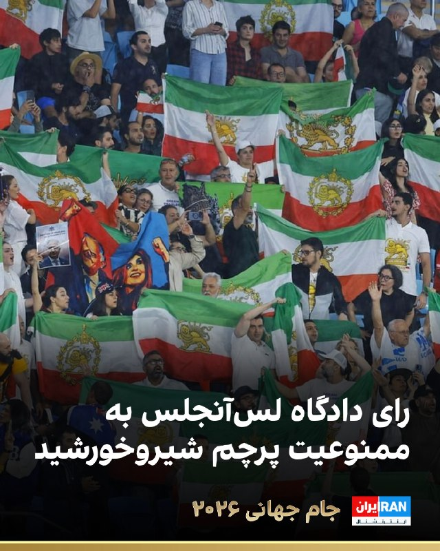

🔻نیویورک تایمز گزارش داد که ممنوعیت ورود پرچم‌های شیروخورشید ایران به جام جهانی که از سوی فیفا اعمال شده بود، پس از برگزاری یک جلسه اضطراری در لس‌آنجلس در روز دوشنبه تایید شد.

🔹این پرچم موضوع شکایتی بود که روز پنج‌شنبه از سوی «موسسه صدای آزادی» و سام کرمانیان، یکی از هواداران ایران که قصد حضور در مسابقه را داشت، در دادگاه عالی لس‌آنجلس مطرح شد.

🔹بر اساس این گزارش، رسیدگی به این پرونده به صورت فوری در دستور کار قرار گرفت و صبح دوشنبه، تنها چند ساعت پیش از آغاز دیدار ایران و نیوزیلند در ورزشگاه سوفای شهر اینگلوود کالیفرنیا، برگزار شد. قاضی کرتیس ای. کین حکم داد که این ممنوعیت به قوت خود باقی بماند.

🔹او گفت: «آزادی بیان فوق‌العاده مهم است، مقدس است و یکی از پایه‌های جامعه ما به شمار می‌رود، اما بدون محدودیت نیست؛ از جمله در مواردی که یک نهاد خصوصی در یک ملک خصوصی فعالیت می‌کند و همان‌طور که در پرونده‌های قبلی نیز نشان داده شده، می‌تواند به شکلی معقول مقرراتی را اعمال کند. درخواست را رد می‌کنم.»

@iranintltvsport

## IranIntlTV — post 342569

  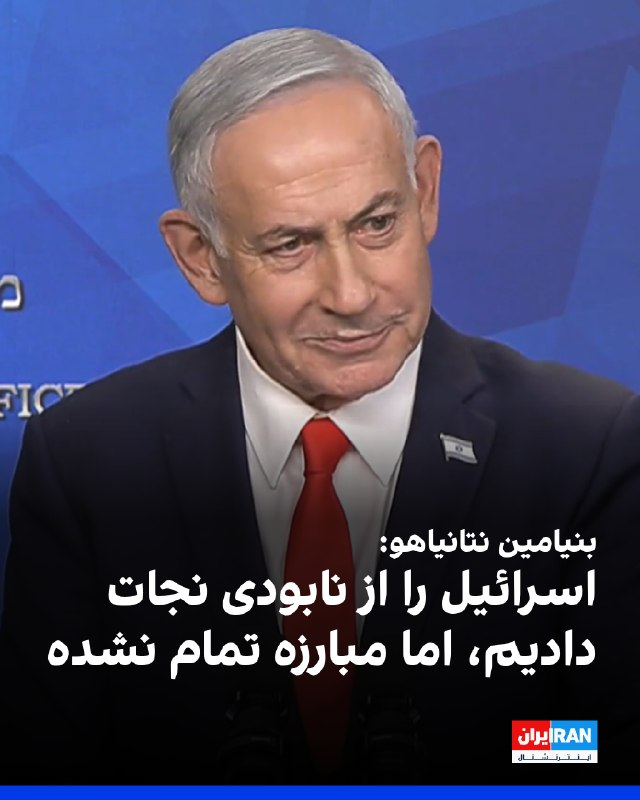

نتانیاهو گفت: ما خطر نابودی اسرائیل را برای سال‌های آینده از بالای سر خود برداشتیم و دولت اسرائیل را از نابودی نجات دادیم.

او اضافه کرد که «مبارزه هنوز تمام و کامل نشده است. ما باید همچنان هوشیار بمانیم، همچنان قوی و مصمم باشیم و تا حد لازم از خود دفاع کنیم.»
او گفت: «این فقط درباره ایران نیست» و تاکید کرد که نبرد اسرائیل علیه «بازوهای ترور ایران» نیز ادامه خواهد داشت، همان‌طور که به گفته او در برابر گروه‌ها در غزه، لبنان، سوریه، یمن و کرانه باختری ادامه داشته است.
https://iranintl.com/202606158925

## IranIntlTV — post 342568

آیا ترامپ جمهوری اسلامی را نجات داده است؟

چشم‌انداز با مهدی مهدو‌ی‌آزاد

نسخه کامل این برنامه در یوتیوب:
https://youtu.be/9BCrScK6pqc
@iranintltv

## IranIntlTV — post 342567

  <a href="https://t.me/IranintlTV/342567" target="_blank">📎 Download file</a>

🎧نسخه صوتی چشم‌انداز: آیا ترامپ جمهوری اسلامی را نجات داده است؟
@iranintlTV

## IranIntlTV — post 342566

  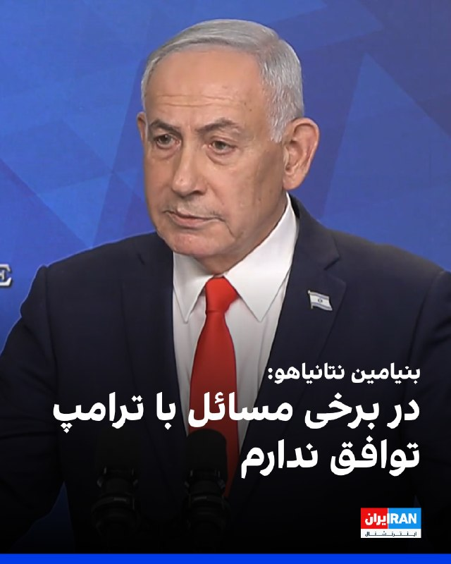

بنیامین نتانیاهو، نخست‌وزیر اسرائیل، در پاسخ به پرسشی درباره احتمال نامزدی دوباره در انتخابات گفت در انتخابات شرکت خواهد کرد و قصد دارد پیروز شود.

او درباره روابطش با دونالد ترامپ، رییس‌جمهوری آمریکا، گفت ادعاهایی مبنی بر اینکه یکی از آنها کاملا از دیگری تبعیت می‌کند، درست نیست و رابطه آنها بر پایه شراکتی است که طی سال‌ها شکل گرفته است.

نتانیاهو افزود در بسیاری از مسائل با ترامپ توافق دارند و در برخی موارد نیز اختلاف نظر وجود دارد. او گفت اسرائیل بر اساس چارچوب‌ها و معیارهای خود عمل می‌کند، اما در عین حال ملاحظات آمریکا را در نظر می‌گیرد و برای آنها احترام قائل است.

نخست‌وزیر اسرائیل همچنین از تصمیم ترامپ برای به‌کارگیری ارتش آمریکا علیه «دشمن مشترک» قدردانی کرد.
https://iranintl.com/202606159236

## IranIntlTV — post 342565

  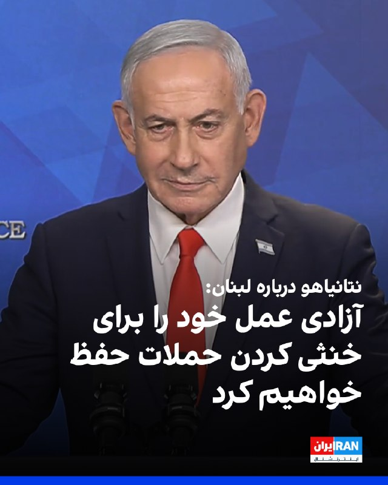

بنیامین نتانیاهو، نخست‌وزیر اسرائیل، دوشنبه در یک نشست خبری تلویزیونی درباره عملیات این کشور در لبنان اعلام کرد: «ما آزادی عمل خود را برای خنثی کردن حملات حفظ خواهیم کرد.»

او گفت: «ما متعهد به تامین امنیت و رفاه ساکنان شمال اسرائیل هستیم و شخصا این موضوع را پیگیری می‌کنم. ضربات بسیار سنگینی به حزب‌الله وارد کرده‌ایم. از حدود ۱۵۰ هزار موشک و راکت این گروه، تنها حدود هشت درصد باقی مانده است.»

نخست‌وزیر اسرائیل ادامه داد: «امروز کمربند امنیتی ایجاد کرده‌ایم که هرگونه احتمال نفوذ نیروهای رضوان به منطقه جلیل را از بین می‌برد. هزاران عضو حزب‌الله کشته شده‌اند و ما همچنان برای حل مسائل باقی‌مانده در حال اقدام هستیم.»

نتانیاهو همچنین به یک بسته حمایتی برای ساکنان شمال اسرائیل اشاره کرد و افزود: «ما هم امنیت و هم رفاه را برای ساکنان شمال کشور فراهم خواهیم کرد.»

به گزارش رویترز، نتانیاهو درباره رابطه‌اش با رییس‌جمهوری آمریکا نیز گفت: «ترامپ و من شریک هستیم، اغلب با هم موافقیم و گاهی اختلاف داریم.»
https://iranintl.com/202606150833

## IranIntlTV — post 342564

  <a href="telegram/content/IranIntlTV_342564_1781553359.mp4" target="_blank">🎬 Download video</a>

دونالد ترامپ گفت: «بسیار خوشحالم که بگویم توافق به‌طور کامل امضا شده و تنگه هرمز همین حالا هم تا حدی باز شده است و از روز جمعه این مسیر به‌طور کامل باز خواهد شد.»

او افزود: «ما با ایران خیلی خوب کنار آمدیم و با مجموعه متفاوتی از رهبران طرف هستیم. گروه اول و دوم رفته‌اند و این گروه سوم را بسیار باهوش و قوی یافتیم، اما در نهایت به توافق رسیدیم.»
@iranintltv

## IranIntlTV — post 342563

  <a href="https://t.me/IranintlTV/342563" target="_blank">📎 Download file</a>

🎧نسخه صوتی تیتراول با نیوشا صارمی: امضا ترامپ و قالیباف پای تفاهم‌نامه؛ ترامپ: شاید در مراسم ژنو حاضر باشم
@iranintlTV

## IranIntlTV — post 342562

  <a href="telegram/content/IranIntlTV_342562_1781553362.mp4" target="_blank">🎬 Download video</a>

۲۴ با فرداد فرحزاد
@iranintltv

## IranIntlTV — post 342561

  <a href="telegram/content/IranIntlTV_342561_1781553363.mp4" target="_blank">🎬 Download video</a>

مهدی مهدوی‌آزاد در برنامه «چشم‌انداز» گفت: «در اسرائیل در واکنش به این تفاهم‌نامه غوغایی برپاست و منتقدان می‌گویند این توافق اهداف جنگ را به شکست کشانده و حکومت ایران را در موضع قوی‌تری قرار داده است.»

او افزود: «اما روایت دیگر این است که جمهوری اسلامی پس از دو جنگ، نابودی زیرساخت‌های نظامی و کشته شدن علی خامنه‌ای و بسیاری از فرماندهان سپاه، به توافقی رسیده که می‌توانست پیش از جنگ نیز به آن دست یابد.»
@iranintltv

## IranIntlTV — post 342560

  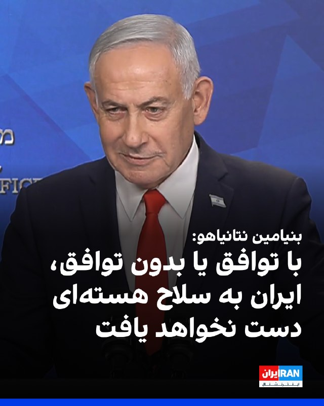

بنیامین نتانیاهو، نخست‌وزیر اسرائیل، گفت ایران با توافق یا بدون توافق به سلاح هسته‌ای دست نخواهد یافت.

او افزود ما اسرائیل را از نابودی نجات داده‌ایم، اما مبارزه هنوز پایان نیافته است.

نتانیاهو همچنین گفت اسرائیل تا هر زمان که لازم باشد در «مناطق امنیتی» باقی خواهد ماند و به خنثی کردن تهدیدها در منطقه ادامه خواهد داد.
https://iranintl.com/202606151267

## IranIntlTV — post 342559

  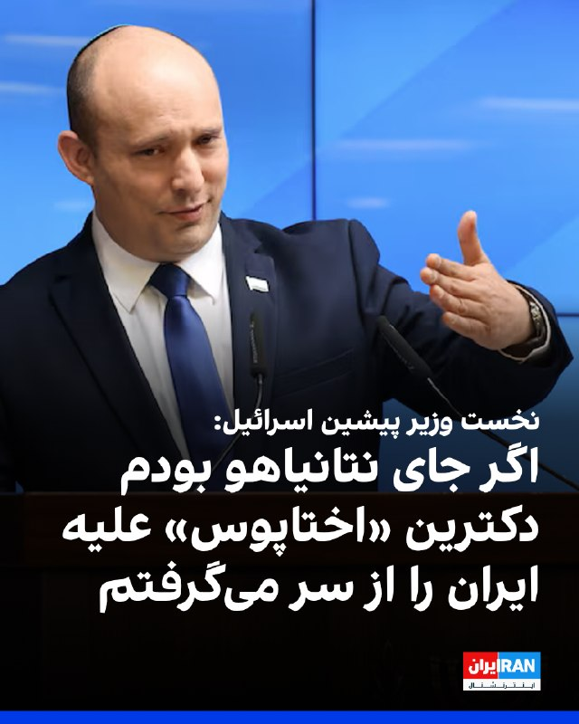

نفتالی بنت، نخست وزیر پیشین اسرائیل، خواستار بازگشت به راهبرد جنگ‌های سریع و قاطع، احیای ستاد اطلاع‌رسانی ملی و اجرای خدمت سربازی اجباری برای همه شهروندان اسرائیل شد.

او گفت: «شمارش معکوس برای تغییر حکومت در ایران از زمان تغییر حکومت در اسرائیل آغاز خواهد شد.»

بنت ادامه داد: «اگر من جای نتانیاهو بودم دکترین "اختاپوس" علیه ایران را از سر می‌گرفتیم؛ هم مانع دستیابی ایران به سلاح هسته‌ای می‌شدیم و هم با ابزارهای مختلف روند تضعیف حکومت را تسریع می‌کردیم.»
https://iranintl.com/202606153453

## IranIntlTV — post 342558

  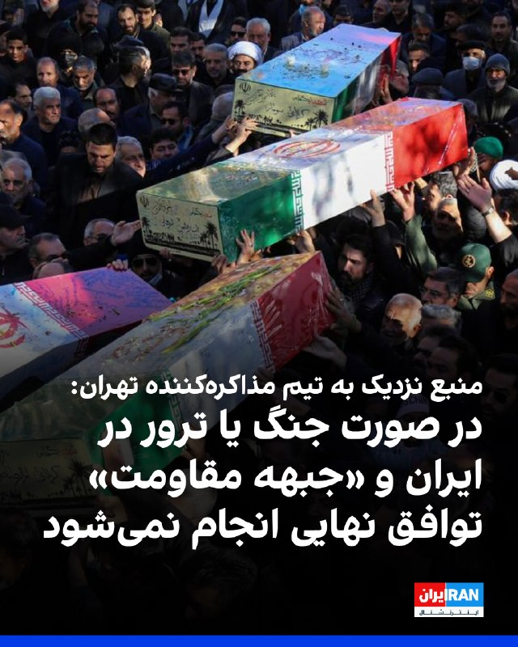

خبرگزاری تسنیم، وابسته به سپاه پاسداران، به نقل از یک منبع نزدیک به تیم مذاکره‌کننده گزارش داد جمهوری اسلامی در روز پایانی گفت‌وگوها با آمریکا اعلام کرده است در صورت وقوع جنگ یا هرگونه عملیات نظامی از جمله ترور یا اقدامات مشابه در ایران یا «جبهه مقاومت» از جمله لبنان، هیچ مذاکره‌ای برای توافق نهایی انجام نخواهد شد و اجرای تفاهم‌نامه، از جمله بازگشایی تنگه هرمز، متوقف می‌شود و این موضوع به بند ۱۳ اضافه شده است.

بر اساس این گزارش، بند ۱۳ تفاهم‌نامه مربوط به این موضوع است که تا زمانی که برخی بندهای دیگر تفاهم‌نامه عملیاتی نشده، مذاکرات درباره توافق نهایی یعنی موضوع هسته‌ای صورت نمی‌گیرد.

پیش از روز پایانی، بند ۱۳ مذاکرات شامل چهار بخش اصلی بوده است: رفع محاصره دریایی، آغاز بازگشایی تنگه هرمز، لغو تحریم‌های فروش نفت و پتروشیمی ایران و آزادسازی اموال بلوکه‌شده.
https://iranintl.com/202606157436

## IranIntlTV — post 342557

  

🔻تیم ملی فوتبال اسپانیا، قهرمان یورو و یکی از مدعیان جدی قهرمانی، در نخستین بازی خود در جام جهانی برابر کیپ‌ورد، تیم رده ۶۷ رده‌بندی فیفا، با تساوی بدون گل متوقف شد تا نخستین شگفتی جام در گروه H رقم بخورد.

🔹عربستان سعودی و اروگوئه امشب دیگر بازی این گروه را برگزار خواهند کرد.

@iranintltvsport

## IranIntlTV — post 342556

  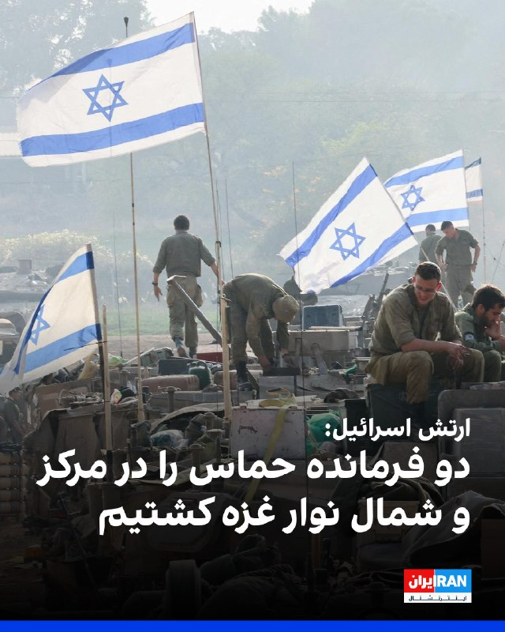

ارتش اسرائیل اعلام کرد نیروی هوایی این کشور صالح رمضان محمد خلیفه، فرمانده یک هسته عملیاتی حماس در گردان النصیرات، را در مرکز نوار غزه کشته است.

ارتش اسرائیل همچنین از کشته شدن محمد موسی دیاب الهبیل، فرمانده یک هسته عملیاتی حماس در گردان غرب جبالیا، در حمله‌ای جداگانه در شمال نوار غزه خبر داد.

ارتش اسرائیل افزود این افراد در حال برنامه‌ریزی برای عملیات علیه نیروهای اسرائیلی بودند و پیش از حملات نیز اقدام‌هایی برای کاهش آسیب به غیرنظامیان انجام شده است.
https://iranintl.com/202606157769

## IranIntlTV — post 342555

  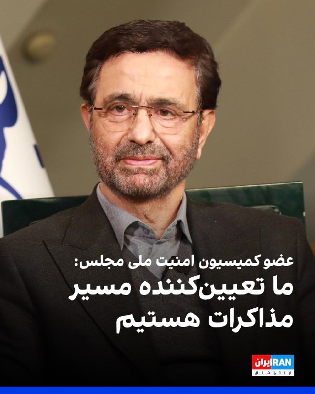

فداحسین مالکی، عضو کمیسیون امنیت ملی مجلس، گفت: «همان‌طور که در میدان جنگ ابتکار عمل با جمهوری اسلامی بود، در مذاکرات نیز همین‌گونه خواهد بود و ما تعیین‌کننده مسیر آن هستیم.»

به گزارش رسانه‌های ایران، او افزود: «اختلافات نباید منجر به شکاف و سوءاستفاده دشمن از شرایط حساس کنونی شود.»
https://iranintl.com/202606152163

## IranIntlTV — post 342554

  <a href="telegram/content/IranIntlTV_342554_1781553369.mp4" target="_blank">🎬 Download video</a>

علیرضا نامور حقیقی، تحلیل‌گر سیاسی، درباره تفاوت تفاهم احتمالی تهران و واشینگتن با برجام گفت: «ترامپ هم امتیازهای بیشتری از ایران گرفته و هم امتیازهای بیشتری داده است، زیرا مذاکرات فعلی صرفا درباره برنامه هسته‌ای نیست، بلکه مذاکراتی جامع درباره کل خاورمیانه است.»

او افزود: «بنابراین ایران باید سیاست نابودی آمریکا و اسرائیل و همچنین تحریک، سازماندهی و مسلح کردن نیروهای نیابتی خود را کنار بگذارد.»
@iranintltv

## Shin_Persian — post 7105

Shin ✓ @hey_itsmyturn
Mon, 15 Jun 2026 17:08:07 UTC

In case you wanna get a better sight on the "DEAL", give @laurnorman a follow, he follows it way better than anyone.

ترجمه خودکار فارسی

اگر می‌خواهید دید بهتری نسبت به این «توافق» (DEAL) پیدا کنید، @laurnorman را دنبال کنید؛ او بسیار بهتر از هر کس دیگری آن را دنبال می‌کند.

𝕏 · @shin_persian

## Shin_Persian — post 7104

laurence norman @laurnorman
Mon, 15 Jun 2026 15:46:03 UTC

Senior administration official talks about Hardliners “on both sides.”

Interesting.

ترجمه خودکار فارسی

یک مقام ارشد دولت درباره «تندروها در هر دو طرف» صحبت می‌کند.

جالب است.

𝕏 · @shin_persian

## FarsiVOA — post 220847

🔺سناتور گراهام: توافق پیشنهادی دولت ترامپ به حکومت ایران می‌تواند منطقه را دگرگون کند

▪️لیندزی گراهام، سناتور ارشد جمهوری‌خواه از ایالت کارولینای جنوبی، روز دوشنبه ۲۵ خرداد با بازنشر بخشی از مصاحبه جی‌دی ونس، معاون رئیس جمهوری آمریکا، با شبکه سی‌ان‌بی‌سی، از توافق پیشنهادی دولت ترامپ با حکومت ایران حمایت کرد و آن را «دستاوردی مهم» برای منطقه دانست.

⬇️ بیشتر بخوانید:
https://ir.voanews.com/a/sen-graham-says-iran-mou-transformative-for-region/8161124.html
@FarsiVOA

## FarsiVOA — post 220846

🔺دیدار تیم‌های ایران و نیوزیلند در جام جهانی؛ مسابقه‌ای زیر سایه حاشیه‌های سیاسی و چالش‌های فنی

▪️تیم فوتبال ایران نخستین دیدار خود در جام جهانی ۲۰۲۶ را شامگاه دوشنبه ۲۵ خرداد، به وقت لس‌آنجلس، برابر نیوزیلند برگزار می‌کند؛ مسابقه‌ای که در گروه جی و در ورزشگاه لس‌آنجلس در اینگلوود انجام می‌شود. زمان آغاز این بازی ساعت ۶ عصر دوشنبه به وقت لس‌آنجلس، و ۴:۳۰ بامداد سه‌شنبه ۲۶ خرداد به وقت تهران است.

⬇️ بیشتر بخوانید:
https://ir.voanews.com/a/iran-opens-amid-political-tensions/8161109.html
@FarsiVOA

## FarsiVOA — post 220845

  <a href="telegram/content/FarsiVOA_220845_1781553372.mp4" target="_blank">🎬 Download video</a>

⚡️واکنش بازارهای جهانی به توافق جمهوری اسلامی و آمریکا در گفتگو با معصومه طاهرخانی
@FarsiVOA

## FarsiVOA — post 220844

پرزیدنت ترامپ: توافق کاملاً امضا شده و تنگه هرمز هم بطور کامل باز شده است

## FarsiVOA — post 220843

بریتانیا و ژاپن از یک بسته سرمایه‌گذاری ۱۸ میلیارد پوندی رونمایی کرده‌اند؛ توافقی که از انرژی بادی و فناوری هسته‌ای تا ساخت جنگنده نسل آینده را در بر می‌گیرد.

## FarsiVOA — post 220842

پیش‌بینی ستاره سابق فوتبال مصر از غافلگیر شدن بلژیک؛ گزارش آرش آرا

## FarsiVOA — post 220841

دست‌کم ۴۰ تن به اتهام‌های مرتبط با «امنیت ملی» از ابتدای ۲۰۲۶ اعدام شده اند

## FarsiVOA — post 220840

🔺ارتش اسرائیل: فرمانده یکی از واحدهای سازمان تروریستی حماس کشته شد

▪️ارتش اسرائیل از کشته شدن دو تروریست که تهدیدی برای نیروهای اسرائیل در نوار غزه بودند خبر داد.

⬇️ بیشتر بخوانید:
https://ir.voanews.com/a/gaza-strip-israeli-army-hamas-terrorists/8161094.html/?nocach=1

## FarsiVOA — post 220839

🔺پرزیدنت ترامپ: حکومت ایران پذیرفته که هرگز دنبال سلاح هسته‌ای نرود

▪️دونالد ترامپ، رئیس جمهوری آمریکا، روز دوشنبه ۲۵ خرداد در دیدار با امانوئل مکرون، رئیس جمهوری فرانسه، در حاشیه نشست «گروه هفت» در فرانسه، گفت توافق میان ایالات متحده و حکومت ایران امضا شده و جمهوری اسلامی پذیرفته است که هرگز دنبال سلاح هسته‌ای نرود.

⬇️ بیشتر بخوانید:
https://ir.voanews.com/a/president-trump-says-iran-agreed-never-to-seek-nuclear-weapons/8161090.html/?nocach=1

## FarsiVOA — post 220838

🔺نخستین حمله اسرائیل به جنوب لبنان پس از اعلام خبر توافق آمریکا و رژیم ایران

▪️درست یک روز پس از اعلام خبر درباره دستیابی آمریکا و جمهوری اسلامی به توافق اولیه برای امضای یک «یادداشت تفاهم» از سوی پرزیدنت دونالد ترامپ، رئیس جمهوری آمریکا، اولین حمله مرگبار پس از اعلام این توافق با حمله اسرائیل در جنوب لبنان رقم خورد.

⬇️ بیشتر بخوانید:

https://ir.voanews.com/a/america-iran-agreement-first-attack/8161062.html/?nocach=1

## FarsiVOA — post 220837

در گفت‌وگو با حسن هاشمیان، واکنش‌های متضاد منطقه‌ای به تفاهم آمریکا و حکومت ایران را بررسی کردیم. به گفته حسن هاشمیان، کشورهای حوزه خلیج فارس با نگاهی محتاطانه از این تفاهم استقبال می‌کنند و منتظرند روشن شود در توافق نهایی، چه نوع رابطه اقتصادی و سیاسی با «ایران آینده» تعریف خواهد شد.

## FarsiVOA — post 220836

  <a href="telegram/content/FarsiVOA_220836_1781553373.mp4" target="_blank">🎬 Download video</a>

ارتش اسرائیل اعلام کرد در حمله دوشنبه ۲۵ خرداد به مرکز نوار غزه، «صالح رمضان محمد خلیفه»، فرمانده یک هسته در گردان نصیراتِ سازمان تروریستی حماس و در حمله‌ای دیگر در شمال نوار غزه، «محمد موسی دیاب الهبیل»، فرمانده یک هسته در گردان غرب جبالیا در سازمان تروریستی حماس را با مهمات دقیق از بین برده است.

بنابر بیانیه ارتش اسرائیل این دو نیروی حماس در حال برنامه‌ریزی برای اجرای طرح‌های تروریستی علیه نیروهای ارتش اسرائیل بودند، تهدیدی فوری محسوب می‌شدند و در حملات دقیق حذف شدند.

## FarsiVOA — post 220835

🔺تداوم سرکوب مخالفان توسط رژیم ایران؛ بازداشت‌شدگان در صف دریافت حکم قضائی

▪️همزمان با اعلام خبر توافق جمهوری اسلامی با آمریکا بر سر امضای یک یادداشت تفاهم، رسانه‌های حقوق بشری همچنان از ادامه سرکوب مخالفان ایران و بلاتکلیفی بازداشت‌شدگان در صف دریافت حکم قضائی خبر می‌دهند.

⬇️ بیشتر بخوانید:

https://ir.voanews.com/a/regime-opponents-islamic-republic-judicial-rulings-agreement-with-america/8161071.html/?nocach=1

## FarsiVOA — post 220834

🔺ولکر تورک: جمهوری اسلامی از «فضای جنگی» برای تشدید سرکوب مخالفان سوءاستفاده می‌کند

▪️کمیسر عالی حقوق بشر سازمان ملل متحد، در تازه‌ترین گزارش خود درباره وضعیت حقوق بشر، از رژیم جمهوری اسلامی به‌ دلیل سوءاستفاده از «فضای جنگی» برای تشدید سرکوب مخالفان داخلی، بازداشت‌های گسترده و اعمال محدودیت‌های اجتماعی بیشتر، به شدت انتقاد کرد.

⬇️ بیشتر بخوانید:

https://ir.voanews.com/a/un-high-commissioner-for-human-rights-islamic-republic-of-iran-suppression-of-dissent-war-space/8161046.html/?nocach=1

## FarsiVOA — post 220833

در گفت‌وگو با سارا کرمانیان، پژوهشگر روابط بین‌الملل در بریتانیا، از ابهام‌های تفاهم مقدماتی آمریکا و حکومت ایران و اهمیت بازه ۶۰ روزه برای دستیابی به توافق نهایی گفتیم. به گفته کرمانیان، تعیین‌کننده‌ترین عامل این دوره زمانی، لبنان است و میزان رضایت کشورهای حوزه خلیج فارس از مسیر توافق نهایی.

## FarsiVOA — post 220832

در ادامه موج بازداشت‌های گسترده در ایران، گزارش‌های تازه حاکی از بازداشت بدون اطلاع قبلی ده‌ها شهروند در استان‌های مختلف، انتقال نامعلوم برخی افراد و توقیف اموال صدها نفر بدون شفافیت کامل قضایی است.

کانون حقوق بشر ایران روز دوشنبه ۲۵ خرداد گزارش داد که همزمان با ادامه بازداشت فعالان سیاسی، معلمان، شهروندان بهائی، فعالان محیط‌زیست و شهروندان کُرد در نقاط مختلف کشور، مقام‌های قضایی و امنیتی اموال ده‌ها شهروند را به اتهام همکاری با «دشمن» توقیف کرده‌اند.

این نهاد حقوق بشری تاکید کرد که مجموعه این اقدامات نگرانی‌ها درباره گسترش بازداشت‌های خودسرانه، بلاتکلیفی زندانیان و مصادره اموال بدون رسیدگی شفاف قضایی را افزایش داده است.

گزارش کامل را در وب‌سایت صدای آمریکا بخوانید.

@FarsiVOA

## FarsiVOA — post 220831

  <a href="telegram/content/FarsiVOA_220831_1781553375.mp4" target="_blank">🎬 Download video</a>

پرسش میدان: تفاهم جمهوری اسلامی و آمریکا چه اثری بر جنبش‌های مدنی در ایران خواهد داشت؟ تشدید سرکوب‌ها یا به هم پیوستن خرده‌مقاومت‌ها؟

## FarsiVOA — post 220830

  <a href="telegram/content/FarsiVOA_220830_1781553376.mp4" target="_blank">🎬 Download video</a>

هم‌زمان با ورود اتوبوس تیم فوتبال ایران به محل اقامتشان در لس‌آنجلس، جمعی از ایرانیان حاضر در محل، شعار «شرم بر شما» سردادند.

تیم فوتبال ایران بامداد سه‌شنبه، ۲۶خرداد ۱۴۰۵ در مرحله گروهی جام جهانی ۲۰۲۶ به مصاف نیوزیلند می‌رود.

## FarsiVOA — post 220829

از بغداد تا اربیل؛ مأموریت تام باراک برای حل پرونده سلاح، نفت و نفوذ جمهوری اسلامی

## FarsiVOA — post 220828

  <a href="telegram/content/FarsiVOA_220828_1781553378.mp4" target="_blank">🎬 Download video</a>

ویدیوی منتشر شده در شبکه‌های اجتماعی صف طولانی خودروها در جایگاه سوخت روستای «تمپ ریگان» ایرانشهر را در روز یکشنبه ۲۴ خرداد ۱۴۰۵ نشان می‌دهد.

## DW_Farsi — post 126023

  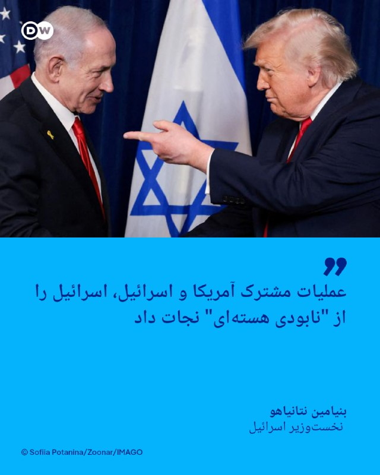

🔶 نتانیاهو: عملیات مشترک آمریکا و اسرائیل، اسرائیل را از "نابودی هسته‌ای" نجات داد
 
بنیامین نتانیاهو، نخست‌وزیر اسرائیل، روز دوشنبه در نخستین اظهارات خود پس از توافق واشنگتن و تهران برای پایان دادن به جنگ خاورمیانه، گفت عملیات نظامی مشترک آمریکا و اسرائیل علیه ایران، اسرائیل را از "تهدید نابودی هسته‌ای" جمهوری اسلامی نجات داده است.
 
او در یک کنفرانس خبری تلویزیونی گفت مهم‌ترین نتیجه این عملیات، دور کردن خطر "مرگ جمعی" از شهروندان اسرائیلی برای سال‌های آینده بوده است.
 
نتانیاهو گفت اگر این تهدید از میان برداشته نمی‌شد، میلیون‌ها شهروند اسرائیلی با خطری جدی روبه‌رو بودند.
 
او تاکید کرد عملیات مشترک علیه ایران، از نگاه او، فقط یک موفقیت نظامی نبود، بلکه اقدامی بود که خطر نابودی جمعیت اسرائیل را برای سال‌ها عقب رانده است.
 
هم‌زمان، یک مقام ارشد آمریکایی گفت تفاهم‌نامه‌ای که روز گذشته با ایران امضا شد، به خروج اسرائیل از لبنان مشروط نشده است.
@dw_farsi

## DW_Farsi — post 126022

🎥 چرا در وسایل نقلیه حالت تهوع می‌گیریم؟
 
نگاه کردن به گوشی در وسایل نقلیه حالتان را بد می‌کند؟ پاسخ در نحوه پردازش اطلاعات حرکتی توسط مغز نهفته است؛ جایی که چشم‌ها یک چیز می‌بینند و گوش داخلی چیز دیگری حس می‌کند.
 @dw_farsi

## DW_Farsi — post 126021

  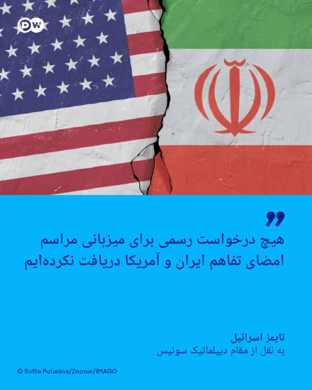

🔶 مقام سوئیسی: هیچ درخواست رسمی برای میزبانی مراسم امضای تفاهم ایران و آمریکا دریافت نکرده‌ایم
 
یک مقام دیپلماتیک سوئیس به تایمز اسرائیل گفت این کشور تاکنون هیچ اطلاعات یا درخواست رسمی برای میزبانی مراسم امضای تفاهم‌نامه میان ایران و آمریکا دریافت نکرده است. این موضع در حالی بیان شده که شهباز شریف، نخست‌وزیر پاکستان، گفته بود دو طرف قرار است روز جمعه در ژنو در مراسم امضای این تفاهم شرکت کنند.
 
دلیل این موضوع آن است که کشورهای حاضر در نشست گروه هفت که این هفته در اویان فرانسه برگزار می‌شود، از نمایندگی‌های خود در ژنو به‌عنوان پایگاه لجستیکی این اجلاس استفاده می‌کنند.
 
در عین حال، این مقام دیپلماتیک گفته است اگر چنین درخواستی مطرح شود، سوئیس به احتمال زیاد خواهد دانست چگونه مقدمات لازم برای برگزاری مراسم امضا را فراهم کند.
 
به این ترتیب، گزارش تازه نشان می‌دهد با وجود مطرح شدن نام ژنو به‌عنوان محل امضای تفاهم، تا این لحظه هیچ درخواست رسمی در این‌باره به سوئیس ارائه نشده است.
@dw_farsi

## DW_Farsi — post 126020

🔶 ترامپ: ممکن است خودم به مراسم امضای تفاهم‌نامه با ایران بروم
 
دونالد ترامپ، رئیس‌جمهوری آمریکا، گفت معاونش، جی‌دی ونس، برای امضای تفاهم‌نامه با ایران به ژنو خواهد رفت و افزود ممکن است خودش تا آن زمان آنجا نباشد، هرچند احتمال حضورش را نیز کاملاً رد نکرد.
 
او گفت متن تفاهم‌نامه میان ایالات متحده و ایران به‌صورت عمومی منتشر خواهد شد و این کار احتمالا پس از مراسم رسمی امضا در روز جمعه انجام می‌شود. او در دیدار دوجانبه با امانوئل ماکرون، رئیس‌جمهوری فرانسه، گفت می‌خواهد این متن منتشر شود، چون به گفته او "یک سند بسیار مهم و قدرتمند" است.
 
ترامپ در پاسخ به این پرسش که چه زمانی متن توافق منتشر خواهد شد، گفت "خیلی زود" و افزود احتمالاً مدتی پس از روز جمعه این کار انجام می‌شود.
 
او بار دیگر تأکید کرد که این تفاهم‌نامه یک سند مهم و قدرتمند است و به همین دلیل می‌خواهد در اختیار عموم قرار گیرد.
 
بر اساس این گزارش، مراسم رسمی امضای تفاهم قرار است روز جمعه در شهر ژنو سوئیس برگزار شود. با این حال، ترامپ گفت هنوز قطعی نیست که خودش در این مراسم حضور پیدا کند.
 
ترامپ همچنین در پاسخ به سوالی درباره این‌که آیا توافق شامل هرگونه رفع زودهنگام تحریم‌ها برای ایران می‌شود یا نه، گفت چنین چیزی در کار نیست.
 
او افزود این تفاهم‌نامه در اصل "یک مسئله رفتاری" است و هم‌زمان هشدار داد که هنوز این احتمال وجود دارد که دوباره جنگ از سر گرفته شود، هرچند ابراز امیدواری کرد که چنین اتفاقی رخ ندهد.
 
به گفته رئیس جمهور آمریکا، "تنگه هرمز در حال حاضر تا حدی باز است... تا جمعه، پس از پاکسازی مین‌ها کاملاً باز خواهد شد". او تأکید کرد که این بازگشایی بدون اخذ هرگونه عوارض از سوی ایران خواهد بود.
 
ترامپ همچنین از کاهش شدید قیمت نفت بعد از حصول توافق میان آمریکاو ایران سخن گفت و افزود که "بازار سهام مثل موشک در حال صعود است".
 
ترامپ با بیان این که "می‌خواهیم ببینیم چگونه می‌توانیم درگیری در لبنان را حل کنیم" گفت که "باید با اسرائیل در این مورد صحبت کنیم".
@dw_farsi

## DW_Farsi — post 126019

🔶 نمایندگان پارلمان اروپا از فیفا خواستند درباره وضعیت فوتبالیست‌های زندانی در ایران سکوت نکند
 
هم‌زمان با جلب نگاه جهان به نخستین بازی تیم ملی ایران در جام جهانی ۲۰۲۶، شماری از نمایندگان پارلمان اروپا با اشاره به زندانی بودن چند فوتبالیست ایرانی و گزارش‌ها درباره خطر اعدام یک بازیکن جوان، از فیفا خواستند به تعهدات حقوق بشری خود پایبند بماند.
 
آن‌ها تأکید کرده‌اند فوتبال را نمی‌توان از حقوق و کرامت انسانی بازیکنان و هوادارانش جدا کرد و پرسش اصلی این است که آیا فیفا در برابر زندانی شدن، ناپدید شدن یا اعدام فوتبالیست‌ها سکوت خواهد کرد یا نه.
 
در این متن آمده است سازمان‌های حقوق بشری پرونده‌هایی از فوتبالیست‌های فعلی و سابق ایران را مستند کرده‌اند که با بازداشت‌های خودسرانه، محرومیت از دادرسی عادلانه، شکنجه، ناپدیدسازی قهری و احکام طولانی زندان روبه‌رو شده‌اند.
 
در این میان از احسان حسینی‌پور حصارلو، فوتبالیست ۱۹ ساله، نام برده شده که به نوشته این گزارش، پس از روندی قضایی که با انتقاد شدید وکلا و مدافعان حقوق بشر همراه بوده، با خطر اعدام قریب‌الوقوع روبه‌رو است.
 
نویسندگان این متن تاکید کرده‌اند حتی اگر فیفا درباره پرونده‌های قضایی فردی موضع‌گیری مستقیم نکند، همین گزارش‌ها پرسش‌های بزرگ‌تری را پیش می‌کشد که مستقیما به مسئولیت‌ها و تعهدات علنی این نهاد مربوط است.
 
در این متن آمده است فیفا بارها از ارزش‌هایی مانند کرامت و احترام سخن گفته و در اساسنامه و سیاست‌های خود به رعایت حقوق بشر متعهد شده است. با این حال، نویسندگان تأکید کرده‌اند اعتبار این تعهدات نه در اسناد، بلکه در نحوه برخورد فیفا با زندانی شدن خود فوتبالیست‌ها سنجیده می‌شود.
 
همچنین یادآوری شده که فیفا پیش‌تر در موضوع‌هایی مانند ممنوعیت ورود زنان به ورزشگاه‌ها در ایران نشان داده بود که می‌خواهد به مسائل حقوق بشری مرتبط با فوتبال ورود کند. بر همین اساس، در متن آمده است سکوت در شرایط کنونی این پیام نگران‌کننده را منتقل می‌کند که تعهدات حقوق بشری فقط تا زمانی معتبرند که هزینه سیاسی نداشته باشند.
@dw_farsi

## DW_Farsi — post 126018

  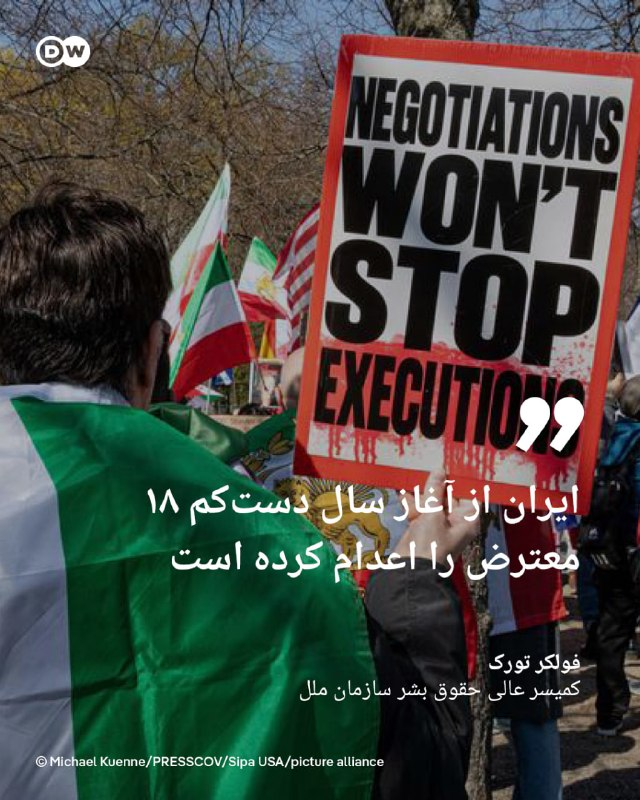

🔶 کمیسر حقوق بشر سازمان ملل: ایران از آغاز سال دست‌کم ۱۸ معترض را اعدام کرده است
 
فولکر تورک، کمیسر عالی حقوق بشر سازمان ملل، در نشست شورای حقوق بشر سازمان ملل در ژنو گفت مقام‌های جمهوری اسلامی از آغاز سال جاری دست‌کم ۴۰ نفر را با استناد به دلایل مرتبط با امنیت ملی اعدام کرده‌اند که ۱۸ نفر از آن‌ها از معترضان بوده‌اند. او افزود مردم ایران "میان جنگ و سرکوب وحشیانه" گرفتار شده‌اند.
 
تورک گفت از زمان سرکوب خونین اعتراضات در ماه ژانویه، مقام‌های جمهوری اسلامی برخورد با منتقدان را تشدید کرده‌اند. به گفته او، هزاران نفر بازداشت شده‌اند و محدودیت‌های سخت‌گیرانه‌تری نیز بر فضای عمومی تحمیل شده است.
 
در این گزارش آمده است ایران، به گفته گروه‌های حقوق بشری، پس از چین بیشترین شمار اعدام‌ها را در جهان دارد. همچنین دو سازمان حقوق بشری گزارش داده‌اند که در سال گذشته دست‌کم ۱۶۳۹ نفر در ایران اعدام شده‌اند؛ رقمی که بالاترین میزان از سال ۱۹۸۹ توصیف شده است.
 
کمیسر حقوق بشر سازمان ملل از توافقی که یک روز پیش‌تر بر سر یک چارچوب برای پایان جنگ حاصل شده بود نیز استقبال کرد.
@dw_farsi

## DW_Farsi — post 126017

🔶 سازمان حقوق بشر ایران: حقوق مردم ایران نباید در روند مذاکرات پس از جنگ نادیده گرفته شود
 
سازمان حقوق بشر ایران، روز یکشنبه (۲۵ خرداد ۱۴۰۵)، در واکنش به اعلام توافق مقام‌های جمهوری اسلامی ایران و ایالات متحده آمریکا برای پایان جنگ، اعلام کرد حقوق بشر مردم ایران نباید در روند مذاکرات آینده نادیده گرفته شود.
 
این نهاد با اشاره به کشته شدن هزاران نفر، بازداشت گسترده شهروندان و افزایش اعدام‌های سیاسی و امنیتی، خواستار آن شد که توقف فوری اعدام‌ها و آزادی زندانیان سیاسی به شروط اصلی هرگونه گفت‌وگو با جمهوری اسلامی تبدیل شود.
 
سازمان حقوق بشر ایران اعلام کرد براساس گزارش‌های رسمی جمهوری اسلامی، در جریان این جنگ ۳۴۶۸ نفر کشته شدند که ۱۴۶۰ نفر از آنان غیرنظامی بودند. این نهاد همچنین به آمار رسمی مقام‌های جمهوری اسلامی درباره بازداشت بیش از ۶۵۰۰ نفر از زمان آغاز جنگ اشاره کرد؛ افرادی که به گفته مقام‌ها در مجموعه اتهام‌های "جاسوسی" و "وطن‌فروشی" دسته‌بندی شده‌اند.
 
در این بیانیه آمده است در همین دوره، ۱۹ معترض، ۱۳ زندانی سیاسی در ارتباط با گروه‌های اپوزیسیون و ۱۰ نفر با اتهام جاسوسی برای کشورهای بیگانه یا همکاری با اسرائیل اعدام شدند؛ آماری که به گفته این نهاد، بالاترین میزان اعدام با اتهام‌های سیاسی و امنیتی در یک بازه حدود ۱۰۰ روزه طی سه دهه گذشته است.
 
سازمان حقوق بشر ایران در این بیانیه از پایان جنگ استقبال کرده، اما هم‌زمان از جامعه بین‌الملل، به‌ویژه دولت‌های اروپایی، خواسته است وضعیت حقوق بشر در ایران را محور اصلی تعاملات خود با جمهوری اسلامی قرار دهند.
 
سازمان حقوق بشر ایران همچنین گفته است از زمان آغاز جنگ، بازداشت گسترده شهروندان با اتهام‌هایی چون همکاری و جاسوسی برای اسرائیل و آمریکا، تصویربرداری از مراکز حساس، ارتباط با رسانه‌های فارسی‌زبان خارج از کشور، نگهداری تجهیزات استارلینک، تشویش اذهان عمومی و اخلال در امنیت در فضای مجازی ادامه داشته است. این نهاد افزوده رسیدگی به پرونده این بازداشت‌شدگان اغلب بر اساس قانون جدید "تشدید مجازات جاسوسی و همکاری با رژیم صهیونیستی و کشورهای متخاصم علیه امنیت و منافع ملی" انجام می‌شود؛ قانونی که به گفته این سازمان، روند صدور و اجرای احکام اعدام را علیه معترضان، مخالفان سیاسی و حتی کاربران فضای مجازی تسریع کرده است.
@dw_farsi

## DW_Farsi — post 126016

🎥 زنگ خطر در آموزش آلمان؛ آموزش فنی‌وحرفه‌ای راه نجات است؟
 
افت تحصیلی، مشکلات روانی و فاصله گرفتن از مدرسه، نوجوانان بیشتری را در آلمان در معرض ترک تحصیل قرار داده است. اما آیا آموزش‌های فنی و حرفه‌ای می‌تواند راه نجات نسل جا مانده از تحصیل باشد؟
 @dw_farsi

## Persian_Trend_Official — post 17219

  <a href="telegram/content/Persian_Trend_Official_17219_1781553382.mp4" target="_blank">🎬 Download video</a>

زاکانی: پوتین گفته بود که نیروهای نظامی روسیه به من گفته بودند که ایران نهایتاً یک هفته می‌تواند تنگهٔ هرمز را بسته نگه‌دارد!

شهردار تهران: روس‌ها به ایران گفته‌اند باور نمی‌کردیم شما اینقدر قابلیت داشته باشید.

📝 Amir

📌 @persian_trend_official
پرشین ترند | متفاوت‌ترین کانال نظامی

## Persian_Trend_Official — post 17218

  <a href="telegram/content/Persian_Trend_Official_17218_1781553384.mp4" target="_blank">🎬 Download video</a>

بمب‌افکن B-52 امریکایی عملا به طور کامل نابود شده.

امروز یک بمب‌افکن Tu-22 روسی نیز سقوط کرد.

📝 Amir

📌 @persian_trend_official
پرشین ترند | متفاوت‌ترین کانال نظامی

## Persian_Trend_Official — post 17217

تا دقایقی دیگه لایو آغاز میشه

## Persian_Trend_Official — post 17216

  <a href="telegram/content/Persian_Trend_Official_17216_1781553386.webm" target="_blank">🎬 Download video</a>

دقایقی پیش یک فروند بمب افکن B-52 نیروی هوایی ایالات متحده پس از برخواستن از پایگاه ادواردز لس آنجلس سقوط کرد.

📝 Amir

📌 @persian_trend_official
پرشین ترند | متفاوت‌ترین کانال نظامی

## Persian_Trend_Official — post 17215

فعال شدن سیستم های پدافندی در شمال اسرائیل

شبکه 12 اسرائیل: حملات موشکی در آسمان شهرک‌های المطله و کریات اشمونه رهگیری شد.

📝 Amir

📌 @persian_trend_official
پرشین ترند | متفاوت‌ترین کانال نظامی

## Persian_Trend_Official — post 17214

  <a href="telegram/content/Persian_Trend_Official_17214_1781553387.mp4" target="_blank">🎬 Download video</a>

نتانیاهو: من قصد دارم نامزد شوم و قصد دارم پیروز شوم.

📝 Amir

📌 @persian_trend_official
پرشین ترند | متفاوت‌ترین کانال نظامی

## Persian_Trend_Official — post 17213

  <a href="telegram/content/Persian_Trend_Official_17213_1781553389.mp4" target="_blank">🎬 Download video</a>

نتانیاهو در مورد توافق ایران با ترامپ: این توافق توسط ایالات متحده، توسط رئیس جمهور ایالات متحده، حاصل شده است و او معتقد است که می‌تواند هم نظارت و هم برچیدن برنامه هسته‌ای را محقق کند.

من گفتم: این تصمیم توست. تکرار می‌کنم: این تصمیم اوست. او آن را رهبری می‌کند. البته، من نظراتم را در گفتگوهای مختلف بیان کردم.

از طرف دیگر، گفتم که ما منافع خودمان را داریم.

📝 Amir

📌 @persian_trend_official
پرشین ترند | متفاوت‌ترین کانال نظامی

## Persian_Trend_Official — post 17212

  <a href="telegram/content/Persian_Trend_Official_17212_1781553391.mp4" target="_blank">🎬 Download video</a>

نتانیاهو: ما ضیف، هنیه و بسیاری از رهبران حماس را کشتیم تقریباً همه آنها را. فکر می‌کنم هنوز یک نفر باقی مانده است؛ او هم کشته خواهد شد.

📝 Amir

📌 @persian_trend_official
پرشین ترند | متفاوت‌ترین کانال نظامی

## Persian_Trend_Official — post 17211

🚨🚨🇺🇸🇮🇷 مجتبی زارعی عضو امنیت ملی مجلس :
«ترامپ چهار بار اعدام خواهد شد، صرف‌نظر از توافق صلح» -

👺Phantom

📌 @persian_trend_official
پرشین ترند | متفاوت‌ترین کانال نظامی

## Persian_Trend_Official — post 17210

نتانیاهو: ما کشور اسرائیل را از تهدید نابودی هسته‌ای نجات دادیم.

زیرا باید فهمید ایران به سمت سلاح‌های هسته‌ای می‌شتافت و برای دفن صنایع هسته‌ای و موشکی خود در اعماق زمین می‌شتافت. ما کشور اسرائیل را از نابودی نجات دادیم.

📝 Amir

📌 @persian_trend_official
پرشین ترند | متفاوت‌ترین کانال نظامی

## Persian_Trend_Official — post 17209

  <a href="telegram/content/Persian_Trend_Official_17209_1781553393.mp4" target="_blank">🎬 Download video</a>

نتانیاهو: ما یک منطقه حائل، یک منطقه امنیتی ایجاد کردیم و تا زمانی که لازم باشد آنجا خواهیم ماند.

ایران می‌خواست ما از آنجا عقب‌نشینی کنیم. این اتفاق نیفتاد. آیا می‌دانید چرا این اتفاق نیفتاد؟ به این دلیل که من خیلی خیلی محکم ایستادم. من در این مورد خیلی خیلی مصمم بودم.

و فکر می‌کنم دوستان آمریکایی ما به این عزم و اراده احترام می‌گذارند.

📝 Amir

📌 @persian_trend_official
پرشین ترند | متفاوت‌ترین کانال نظامی

## Persian_Trend_Official — post 17208

نتانیاهو: در ایالات متحده، می‌گویند که رئیس جمهور ترامپ هر کاری را که من می‌خواهم انجام می‌دهد، و در اسرائیل، برعکس می‌گویند که من هر کاری را که او بخواهد انجام می‌دهم. بنابراین این درست نیست.

این رابطه‌ای بین شرکایی است که مدت‌هاست یکدیگر را می‌شناسند. بسیاری از اوقات ما موافقیم؛ گاهی اوقات نیز مخالفیم. این اتفاق در بهترین خانواده‌ها می‌افتد.

📝 Amir

📌 @persian_trend_official
پرشین ترند | متفاوت‌ترین کانال نظامی

## Persian_Trend_Official — post 17207

نتانیاهو: ما هنوز نمی‌دانیم توافق چه خواهد بود؟ یا اصلا توافق نهایی خواهد بود.

📝 Amir

📌 @persian_trend_official
پرشین ترند | متفاوت‌ترین کانال نظامی

## Persian_Trend_Official — post 17205

  <a href="telegram/content/Persian_Trend_Official_17205_1781553396.mp4" target="_blank">🎬 Download video</a>

نتانیاهو: من نگفتم که یکی از اهداف این عملیات، سرنگونی رژیم ایران است بلکه گفتم ما در این امر به مردم ایران کمک می‌کنیم.

📝 Amir

📌 @persian_trend_official
پرشین ترند | متفاوت‌ترین کانال نظامی

## Persian_Trend_Official — post 17204

  <a href="telegram/content/Persian_Trend_Official_17204_1781553398.mp4" target="_blank">🎬 Download video</a>

نتانیاهو: مواردی وجود دارد که من و رئیس جمهور ترامپ با هم توافق نداریم.

باید با خرد و تدبیر از منافع امنیتی اسرائیل دفاع کرد.

📝 Amir

📌 @persian_trend_official
پرشین ترند | متفاوت‌ترین کانال نظامی

## Persian_Trend_Official — post 17203

  <a href="telegram/content/Persian_Trend_Official_17203_1781553401.mp4" target="_blank">🎬 Download video</a>

نتانیاهو: مبارزه تمام نشده است. ما باید هر زمان که لازم باشد، به دفاع و مراقبت از خود ادامه دهیم.

این نه تنها علیه ایران است؛ بلکه علیه بازوهای تروریستی ایران نیز هست که ما به شیوه‌ای بی‌سابقه به آنها ضربه زده‌ایم. ما این کار را در غزه انجام دادیم. ما این کار را در لبنان، سوریه و یمن انجام دادیم؛ ما این کار را در اردوگاه‌ های پناهندگان در یهودا و سامره انجام دادیم؛ ما این کار را در همه جا انجام دادیم.

ما تا زمانی که لازم باشد برای محافظت از کشور، در مناطق امنیتی مختلفی که تصرف کرده‌ایم، باقی خواهیم ماند.

ما اتحادهای جدیدی با کشورهای منطقه و فراتر از آن ایجاد خواهیم کرد و خودکفایی دفاعی خود را تضمین خواهیم کرد.

📝 Amir

📌 @persian_trend_official
پرشین ترند | متفاوت‌ترین کانال نظامی

## Persian_Trend_Official — post 17202

  <a href="telegram/content/Persian_Trend_Official_17202_1781553403.mp4" target="_blank">🎬 Download video</a>

نتانیاهو: ماموریت زندگی من مبارزه با برنامه هسته‌ای ایران است.

با توافق یا بدون توافق، ایران سلاح هسته‌ای نخواهد داشت. ما خسارت عظیمی به اقتصاد ایران وارد کرده‌ایم؛ برخی آن را یک تریلیون دلار تخمین می‌زنند.

📝 Amir

📌 @persian_trend_official
پرشین ترند | متفاوت‌ترین کانال نظامی

## Persian_Trend_Official — post 17201

  <a href="telegram/content/Persian_Trend_Official_17201_1781553406.mp4" target="_blank">🎬 Download video</a>

هشدار پوتین به ایران/ مذاکره، پوششی برای حمله زمینی!

🔹 روح‌الله مدبر: شورای امنیت روسیه بر مبنای اطلاعات سری، به طرف ایرانی اعلام کرده بود که آمریکایی‌ها میز مذاکره را به عنوان عامل فریب برای عملیات گسترده زمینی می‌خواهند.

🔹حتی آقای پوتین در جلسه با عراقچی هم هشدارهای ویژه در این باره را داده. بعداً نگویید که ما غافلگیر شدیم و رهبری جدید را جایگزین می‌کنیم.

(روایتی از سفر ۷اردیبهشت عراقچی به مسکو و دیدار با پوتين)

👺Phantom

📌 @persian_trend_official
پرشین ترند | متفاوت‌ترین کانال نظامی

## Persian_Trend_Official — post 17200

تماس تلفنی عراقچی و رئیس جمهور لبنان

کاخ ریاست‌ جمهوری لبنان با صدور بیانیه‌ای از گفتگوی تلفنی میان عباس عراقچی، وزیر امور خارجه جمهوری اسلامی ایران و جوزف عون، رئیس‌جمهور این کشور خبر داد.

محور اصلی این تماس تلفنی، بررسی آخرین تحولات و تغییرات جاری در سطح منطقه بوده است.

📝 Amir

📌 @persian_trend_official
پرشین ترند | متفاوت‌ترین کانال نظامی

## Persian_Trend_Official — post 17199

یک مقام ارشد دولت آمریکا امروز به خبرنگاران گفت که عمان در جریان مذاکرات با ایران دو رویی نشان داد بنابراین آنها را از نقش میانجیگری کنار گذاشتند.

این مقام گفت: ما از کاری که عمانی‌ها انجام دادند بسیار ناراضی بودیم. احساس می‌کردیم که آنها بسیار دو رو هستند و تقریباً مانند کارمندان ایرانی‌ها در نحوه مانورشان عمل می‌کنند، بنابراین ما آنها را به نوعی از این روند کنار گذاشتیم.

این مقام ارشد دولت ایالات متحده گفت یکی از چالش‌های کلیدی در مذاکرات با ایران، ایجاد کانال‌های ارتباطی مؤثر با رهبری تهران بود.

این مقام توضیح داد که سیستم قبلی شامل رهبری ایران بود که شورای امنیت ملی را از طریق نهاد سیاسی هدایت می‌کرد و پیام‌ها را از طریق عمان منتقل می‌کرد. این مقام گفت: ما می‌خواستیم بفهمیم کانال‌های جدید برای ارتباط با چه کسانی خواهند بود و بدیهی است که پاکستان و قطر را انتخاب کردیم.

آنها افزودند که سازوکار سیاسی سنتی به دلیل حملات اولیه در ابتدای جنگ تا حد زیادی مختل شده بود، زیرا بسیاری از مقامات در پناهگاه‌ها پنهان شده بودند و چندین چهره ارشد ایرانی کشته شده بودند که ارتباطات دیپلماتیک را دشوارتر می‌کرد.

📝 Amir

📌 @persian_trend_official
پرشین ترند | متفاوت‌ترین کانال نظامی

## RadioFarda — post 158353

  <a href="https://t.me/radiofarda/158353" target="_blank">📎 Download file</a>

📻بشنوید: ایستگاه ۱۹ با رادیوفردا،۲۵ خرداد ۱۴۰۵

@RadioFarda

## RadioFarda — post 158352

بریتانیا هم دسترسی کودکان زیر ۱۶ سال به شبکه‌های اجتماعی را ممنوع می‌کند

🔸کی‌یر استارمر، نخست وزیر بریتانیا، روز دوشنبه اعلام کرد که استفاده از شبکه‌های اجتماعی برای افراد زیر ۱۶ سال در این کشور ممنوع خواهد شد.

🔸او گفت که این شبکه‌ها، کودکان و نوجوانان را در معرض محتوایی قرار می‌دهد که «خطرناک» است و «برای اعتیادآور بودن طراحی شده‌اند.»

🔸طبق اعلام دولت بریتانیا، این ممنوعیت شامل پلتفرم‌هایی مانند اسنپ‌چت، تیک‌تاک، یوتیوب، اینستاگرام، فیس‌بوک و ایکس می‌شود اما شامل سرویس‌های پیام‌رسان مانند واتس‌اپ نمی‌شود.

🔸این تصمیم در حالی از سوی برخی نهادهای خیریه حامی کودکان با استقبال روبه‌رو شده که برخی فعالان دیگر هشدار دادند که چنین تصمیمی می‌تواند نوجوانان را در فضای آنلاین کمتر ایمن کند.

🔸کی‌یر استارمر گفت که این ممنوعیت تحت تأثیر تجربه استرالیا انجام می‌شود که در ماه دسامبر (آذرماه گذشته) اولین کشوری بود که دسترسی افراد زیر ۱۶ سال به شبکه‌های اجتماعی را منع کرد.

🔸آنتونی آلبانیزی، نخست وزیر استرالیا، از این اقدام بریتانیا استقبال کرد و در شبکه اجتماعی ایکس نوشت: «غول‌های رسانه‌های اجتماعی فراتر از مرزها فعالیت می‌کنند. با ایستادن در کنار هم، می‌توانیم اقدامات بیشتری برای پاسخگو کردن آنها و ایمن نگه داشتن کودکان در فضای آنلاین انجام دهیم.»

🔸نخست وزیر بریتانیا ابراز امیدواری کرد که آیین‌نامه مربوط به این ممنوعیت را تا اواخر دسامبر (حدود شش ماه دیگر) تصویب کند و این ممنوعیت در ماه‌های ابتدایی سال آینده به اجرا درآید.

🔸 گزارش کامل را در وب‌سایت رادیوفردا بخوانید.

@RadioFarda

## RadioFarda — post 158351

  <a href="telegram/content/RadioFarda_158351_1781553408.mp4" target="_blank">🎬 Download video</a>

🔸 بنیامین نتانیاهو، نخست‌وزیر اسرائیل، اعلام کرد نیروهای اسرائیلی در آنچه «مناطق امنیتی» در غزه، لبنان و سوریه خواند، تا زمانی که برای تأمین امنیت اسرائیل ضروری باشد، باقی خواهند ماند.

🔸بنیامین نتانیاهو، نخست وزیر اسرائیل، روز دوشنبه در یک کنفرانس خبری تأکید کرد که به‌رغم امضای تفاهم‌نامه میان ایران و آمریکا، چالش کشور اسرائیل به پایان نرسیده و «ما باید گوش به‌زنگ بمانیم و در مواقع لزوم از خود دفاع کنیم».

🔸به گفته دولت آمریکا، جمهوری اسلامی در قالب تفاهم‌نامه‌ای که روز یک‌شنبه امضا شد تعهد داده است که هرگز به دنبال سلاح هسته‌ای نرود.

🔸نخست وزیر اسرائیل در ادامه سخنان خود تأکید کرد که «با یا بدون توافق، ایران هرگز به سلاح هسته‌ای دست نخواهد یافت».

🔸نتانیاهو در نشست خبری خود همچنین گفت که حملات مشترک در کنار آمریکا به ایران خساراتی سنگین وارد کرده و به گفته او «بعضی معتقدند که خسارت اقتصادی به ایران یک تریلیون دلار بوده است».

🔸او در ادامه گفت: «ما به مردم ایران قول دادیم که شرایطی را فراهم آوریم که رژیم آیت‌الله سرنگون شود، نمی‌دانم چه زمانی این اتفاق خواهد افتاد، ولی خواهد افتاد.»

@RadioFarda

## RadioFarda — post 158349

🔸پروین فهیمی، مادر سهراب اعرابی، در سالگرد اعتراضات پس از انتخابات ریاست‌جمهوری ۱۳۸۸ با یادآوری آرزوها و دغدغه‌های فرزندش نوشت که این روزها بیش از گذشته به خواسته‌های سهراب برای «سلامتی، صلح، آزادی، دموکراسی، عدالت و آرامش» فکر می‌کند.

🔸 او تأکید کرد که این مفاهیم را صرفاً شعار نمی‌داند، بلکه معتقد است باید به بخشی از اندیشه و مطالبات ایرانیانی تبدیل شوند که خواهان زندگی در صلح و آزادی هستند.

🔸فهیمی همچنین از ادامه حصر میرحسین موسوی و زهرا رهنورد و وضعیت زندانیان سیاسی انتقاد کرد و با اشاره به بیماری میرحسین موسوی، ابراز امیدواری کرد که حصر رهبران جنبش سبز پایان یابد.

🔸سهراب اعرابی، نوجوان ۱۹ ساله‌ای بود که در جریان اعتراضات پس از انتخابات سال ۱۳۸۸ ناپدید شد و پس از هفته‌ها جست‌وجوی خانواده‌اش، مشخص شد که او کشته شده است. نام او در سال‌های بعد به یکی از شناخته‌شده‌ترین نمادهای اعتراضات آن سال تبدیل شد.
@RadioFarda

## RadioFarda — post 158348

  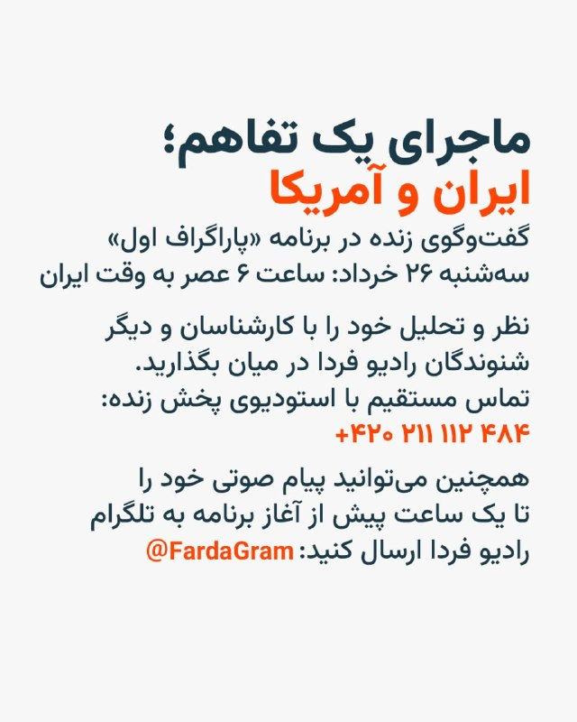

🔸برنامه «پاراگراف اول» روز سه‌شنبه ۲۶ خرداد با حضور فاطمه حقیقت‌جو، نماینده پیشین مجلس شورای اسلامی و مدیر «مرکز خشونت‌پرهیزی برای دموکراسی» در واشینگتن، و امین نایب‌پور، تحلیلگر سیاسی در نیویورک، به بررسی تفاهم ایران و آمریکا و چگونگی مدیریت صلح و کاهش تنش‌ها خواهد پرداخت.

🔸شما چه فکر می‌کنید؟ در صورت تداوم این تفاهم، ایرانیان چگونه می‌توانند از پیامدها و فرصت‌های آن بهره‌مند شوند؟

🔸نظر و تحلیل خود را با کارشناسان و دیگر شنوندگان رادیو فردا در میان بگذارید.

🔸تماس مستقیم با استودیوی پخش زنده:

+420 211 112 484

🔸همچنین می‌توانید پیام صوتی خود را تا یک ساعت پیش از آغاز برنامه به تلگرام رادیو فردا ارسال کنید:

@fardagram

@RadioFarda

## RadioFarda — post 158347

هزاران نفر از ساکنان مناطق جنوبی لبنان در راه بازگشت به خانه‌های خود

🔸ساعاتی پس از اعلام توافق ایران و آمریکا در پایان دادن به جنگ، هزاران نفر از ساکنان مناطق جنوبی لبنان به راه افتادند تا به محل زندگی خود در روستاها بازگردند.

🔸تصاویر منتشر شده در شبکه‌های اجتماعی صف طولانی از خودروها را در جاده‌های منتهی به جنوب لبنان نشان می‌دهد.

🔸ارتش و نهادهای امدادی لبنان از ساکنان مناطق جنوبی خواست تا فعلا از بازگشتن خودداری کنند، چرا که به گفته این نهادها جنگ هنوز تمام نشده است. ارتش اسرائیل هم با گلوله‌باران به سمت افرادی که تلاش کرده بودند به خانه‌هایشان در جنوب شهر نبطیه بروند هشدار داد.

🔸ارتش اسرائیل پس از حملات حزب‌الله در حمایت از ایران در آغاز جنگ اخیر وارد مناطق گسترده‌ای در جنوب لبنان شد و برخی راه‌های ارتباطی را نیز تخریب و مسدود کرد.

🔸مقام‌های اسرائیل از زمان اعلام تفاهم ایران و آمریکا گفته‌اند ارتش این کشور از لبنان خارج نخواهد شد. این در حالی است که حکومت ایران بارها گفته است یک شرط توافق با آمریکا پایان جنگ «در تمام جبهه‌ها از جمله لبنان» است.

@RadioFarda

## RadioFarda — post 158346

ترامپ برای شرکت در نشست گروه ۷ وارد فرانسه شد؛ تفاهم‌نامه اسلام‌آباد در صدر دستورجلسه

🔸دونالد ترامپ، رئیس جمهور آمریکا، بعدازظهر دوشنبه، ۲۵ خرداد، برای شرکت در نشست رهبران هفت کشور صنعتی دنیا معروف به «جی ۷» وارد شهر ژنو در سوئیس شد و از آنجا به شهر اِویان در فرانسه، محل برگزاری نشست، رفت.

🔸نشست رهبران گروه هفت امسال بلافاصله پس از اعلام توافق ایران و آمریکا برای امضای تفاهم‌نامه‌ای در پایان دادن به جنگ اخیر برگزار می‌شود و انتظار می‌رود این موضوع و کسب اطلاعاتی درباره مفاد تفاهم‌نامه اسلام‌آباد از محورهای اصلی گفت‌وگوی رهبران کشورهای عضو باشد.

🔸آمریکا، فرانسه، بریتانیا، آلمان، کانادا، ایتالیا و ژاپن کشورهای عضو گروه هفت هستند.

🔸امانوئل مکرون، رئیس جمهور فرانسه که میزبان این دوره از نشست رهبران است، بامداد دوشنبه در پی اعلام موافقت آمریکا و ایران با امضای تفاهم‌نامه گفت که در نشست جی ۷، «پیامدهای» توافق با ایران از نظر تاثیر آن بر لبنان، بازگشایی پایدار تنگه هرمز و برنامه‌ موشکی ایران بررسی خواهد شد.

🔸او در پیامی در شبکه اجتماعی ایکس هم نوشت که فرانسه همراه بریتانیا آماده اجرای یک مأموریت دریایی مشترک برای کمک به بازگشایی تنگه هرمز است و ناوهای فرانسه «آماده اعزام» هستند.

🔸 گزارش کامل را در وب‌سایت رادیوفردا بخوانید.

@RadioFarda

## RadioFarda — post 158345

  <a href="telegram/content/RadioFarda_158345_1781553412.mp4" target="_blank">🎬 Download video</a>

🔸جی‌دی ونس، معاون دونالد ترامپ، روز دوشنبه در مصاحبه‌ای تلویزیونی تأکید کرد که حکومت ایران «حتی یک دلار» از آمریکا دریافت نخواهد کرد و هر چه هست در قالب تعلیق یا معافیت از تحریم‌ها به ایران خواهد رسید.

🔸ونس تأکید کرد: «حتی یک دلار آمریکا به ایران نخواهد رفت.»

🔸این واکنش در پاسخ به گزارش‌هایی از متن تفاهم‌نامه است که گفته می‌شود بر اساس آن جمهوری اسلامی بخش قابل توجهی از پول‌های مسدودشده خود را دریافت خواهد کرد.

🔸اما آن طور که معاون رئیس جمهور آمریکا می‌گوید، ایران تنها در صورتی پول دریافت خواهد کرد که به تعهدات خود عمل کند، و حتی این پول هم «اساسا به شکل تعلیق تحریم خواهد بود»، یعنی تهران از محل تعلیق تحریم‌ها و در نتیجه توانایی فروش نفت و دیگر کالاها به درآمد خواهد رسید.

@RadioFarda

## RadioFarda — post 158338

🔸 پس از هفته‌ها مذاکره، ایران و آمریکا از دستیابی به تفاهمی خبر داده‌اند که قرار است در روزهای آینده به‌طور رسمی امضا شود. اما این توافق چه تأثیری بر زندگی شهروندان ایرانی خواهد داشت؟

🔸 آیا مردم به بهبود شرایط امیدوارند، یا آن را تنها فرصتی کوتاه برای فاصله گرفتن از تنش‌های نظامی می‌دانند؟ رادیوفردا در گفت‌وگو با شهروندان در ایران، دیدگاه‌های آنان را درباره این تفاهم جویا شده است.

🔸 برای حفظ هویت این شهروندان رادیوفردا اسامی آنها را تغییر داده است.

🔸شما نیز می‌توانید دیدگاه‌های خود را می‌توانید این جا بنویسید یا در قالب پیام‌های متنی و صوتی به نشانی‌های زیر ارسال کنید:

‏🔸Telegram: @Fardagram
‏🔸WhatsApp: +420 725 970 000

@RadioFarda

## RadioFarda — post 158337

استقبال کشورهای عربی، به‌ویژه در خلیج فارس، از امضای تفاهم‌نامه میان ایران و آمریکا

🔸عربستان سعودی از امضای این تفاهم‌نامه که به آغاز مذاکرات ۶۰ روزه، با هدف دستیابی به یک توافق دائمی ‌می‌انجامد، استقبال کرد.

🔸وزارت خارجه عربستان سعودی در بیانیه‌ای که روز دوشنبه ۲۵ خرداد منتشر شد، اعلام کرد که این کشور از تلاش‌های میانجیگرانه پاکستان و قطر و همچنین از همراهی ایالات متحده و ایران با این تلاش‌ها قدردانی می‌کند.

🔸وزارت خارجه عربستان سعودی بر اهمیت بازگرداندن امنیت و آزادی دریانوردی به تنگه هرمز به وضعیت قبل از روز ۹ اسفند ۱۴۰۴، روز آغاز جنگ، تأکید کرد و آن را عنصری اساسی در تقویت ثبات منطقه‌ای و تضمین جریان روان بازرگانی و انرژی جهانی دانست.

🔸ریاض همچنین ابراز امیدواری کرد که مذاکرات آینده منجر به صلحی پایدار شود که به افزایش امنیت منطقه و جهان کمک کند، مذاکراتی که، بنا بر بیانیه وزارت خارجه عربستان سعودی، به دستیابی به تفاهماتی بیانجامد که منافع امنیتی کشورهای منطقه را در نظر بگیرد و اصل احترام به حاکمیت کشورها و عدم دخالت در امور داخلی آنها را تقویت می‌کند.

🔸 گزارش کامل را در وب‌سایت رادیوفردا بخوانید.

@RadioFarda

## IranianMinds — post 22675

  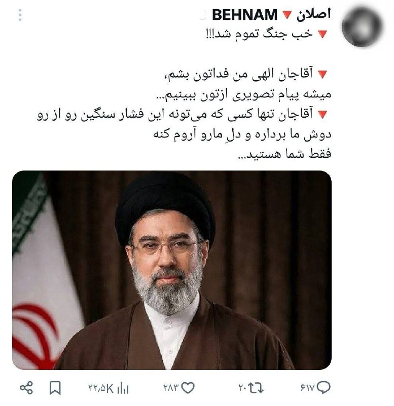

بعد از توافق طرفدارای حکومت همه گیر دادن به اینکه مجتبی باید خودشو نشون بده و شک‌ دارن که این دستورات از طرف اون باشه!

@IranianMinds

## IranianMinds — post 22674

  <a href="telegram/content/IranianMinds_22674_1781553415.mp4" target="_blank">🎬 Download video</a>

🔴 چه بازی بشه امشب
تجمع هموطنای ایرانی اطراف ورزشگاه سوفای محل بازی تیم جمهوری اسلامی و نیوزیلند

@IranianMinds

## IranianMinds — post 22673

⭕️
⭕️ کانفیگای این ربات تو نت ملی وصله به محض استارت ۱ گیگابایت کانفیگ میده بدون هیچ هزینه ای و رفرالی کانفیگ رو تحویلتون میده با بهترین سرعت و بدون قطعی 
⭕️ ربات دریافت کانفیگ رایگان | @daeijoonbot 
⭕️ ربات دریافت کانفیگ رایگان | @daeijoonbot

## IranianMinds — post 22672

⭕️
⭕️ کانفیگای این ربات تو نت ملی وصله به محض استارت ۱ گیگابایت کانفیگ میده
بدون هیچ هزینه ای و رفرالی کانفیگ رو تحویلتون میده با بهترین سرعت و بدون قطعی

⭕️ ربات دریافت کانفیگ رایگان | @daeijoonbot

⭕️ ربات دریافت کانفیگ رایگان | @daeijoonbot

## IranianMinds — post 22671

🔴 مشاور قالیباف : چیزی به اسم شروط رهبری نداریم. @IranianMinds

## IranianMinds — post 22670

🔴 مشاور قالیباف :

چیزی به اسم شروط رهبری نداریم.

@IranianMinds

## IranianMinds — post 22669

🔴 نتانیاهو درباره ایران: من نگفتم که یکی از اهداف عملیات، سرنگونی رژیم ایران بوده. @IranianMinds

## IranianMinds — post 22668

🔴 نتانیاهو برای استقلال نظامی ارتش اسرائیل بودجه دیوانه کننده ۱۲۱ میلیارد دلاری اختصاص داد!

۱۵ برابر بیشتر از رژیم جمهوری اسلامی

@IranianMinds

## IranianMinds — post 22667

🔴 نتانياهو: همانکاری با غزه کردیم با جنوب لبنان نیز خواهیم کرد،همانطور که غزه دیگر تهدید جدی‌ای برای اسرائیل نیست حزب‌الله نیز در آینده نخواهد بود

@IranianMinds

## IranianMinds — post 22666

  <a href="telegram/content/IranianMinds_22666_1781553416.mp4" target="_blank">🎬 Download video</a>

🔴 نتانیاهو درباره ایران:

من نگفتم که یکی از اهداف عملیات، سرنگونی رژیم ایران بوده.

@IranianMinds

## IranianMinds — post 22665

  <a href="telegram/content/IranianMinds_22665_1781553419.mp4" target="_blank">🎬 Download video</a>

🔴 نتانیاهو درباره ترامپ:

مواردی هست که من و رئیس‌جمهور ترامپ نظرمان یکی نیست و کاملاً توافق نداریم.

@IranianMinds

## IranianMinds — post 22664

  <a href="telegram/content/IranianMinds_22664_1781553421.mp4" target="_blank">🎬 Download video</a>

🔴 نتانیاهو درباره لبنان :

ما در لبنان عقب نشینی نمیکنیم و تا هر زمان که لازم باشه در مناطق امنیتی مختلفی که تصرف کردیم، باقی می‌مونیم تا از کشور دفاع کنیم.

@IranianMinds

## IranianMinds — post 22663

  <a href="telegram/content/IranianMinds_22663_1781553424.mp4" target="_blank">🎬 Download video</a>

🔴 نتانیاهو:

ما آسیب عظیمی به اقتصاد ایران وارد کردیم؛ برخی این خسارت رو یک تریلیون دلار تخمین میزنن.

@IranianMinds

## IranianMinds — post 22662

  <a href="telegram/content/IranianMinds_22662_1781553426.mp4" target="_blank">🎬 Download video</a>

🔴 نتانیاهو درباره ایران:

مبارزه هنوز تموم نشده. باید همیشه آماده باشیم، نگهبان بمانیم و هر وقت لازم باشه از خودمون دفاع کنیم.

@IranianMinds

## IranianMinds — post 22661

  <a href="telegram/content/IranianMinds_22661_1781553429.mp4" target="_blank">🎬 Download video</a>

😂😂😂

@IranianMinds

## IranianMinds — post 22660

🔴 ارتش اسرائیل اعلام کرد دو تا از فرمانده‌های عملیاتی حماس رو هدف قرار داده و کشته؛ یکی «صالح رمضان محمد خلیفه» که تو مرکز غزه و گردان النصیرات فعالیت می‌کرده، و یکی دیگه هم «محمد موسی دیاب الهبیل» که در غرب جبالیا فعالیت داشته.

@IranianMinds

## IranianMinds — post 22659

🔴 یک مقام ارشد آمریکایی به العربیه:

جمهوری اسلامی آماده ارائه امتیازهایی بی‌سابقه‌ست.

@IranianMinds

## IranianMinds — post 22658

🔴 پزشکیان : نظر یک گروه خاص مهم نیست و نظر اکثر مردم برام مهمه.

@IranianMinds

## IranianMinds — post 22657

🟢 خفن‌ ترین و جذابترین بونوس های ویژه #جام_جهانی و بدون قیدو شرط فقط در سایت جهانی رومابت
۲۰٪ شارژ اضافی و بونوس ۱۰۰٪ #رومابت رو‌ از دست ندید👌🏼

🇪🇺 https://trentivo6402.bar

## IranianMinds — post 22656

  <a href="telegram/content/IranianMinds_22656_1781553431.webm" target="_blank">🎬 Download video</a>

بازی ایران رو با کمتربن ریسک در رومابت پیش بینی کن.

⭕️ ⚽ ایران 🟢 نیوزلند

💳 حسابتو برای این بازی در #رومابت با ارز دیجیتال شارژ کن 
🅰️
🅰️
🅰️ شارژ اضافی بگیر ✅

💰 10% کش بک روی تیم محبوبت

💰   100% بونوس خوشامدگویی

🎁 20% کش بک بازی های کازینویی و انفجار

🔥   همراه با درگاه‌ #ریالی
#RomaBet

📣‌ #بدون_احراز_هویت

1️⃣
2️⃣
3️⃣
4️⃣   
1️⃣
2️⃣
3️⃣
4️⃣

⛔در صورت فیلتر بودن از طریق VPN غیر از سرور انگلیس ( سرور 
🇺🇸 
🇩🇪 
🇨🇦
🇫🇮
🇹🇷
👇
👇 )

🇪🇺 https://trentivo6402.bar

✅کانال تلگرامی #رومابت 25
👇

🔵 @Romabet_official

## BBCPersian — post 283930

  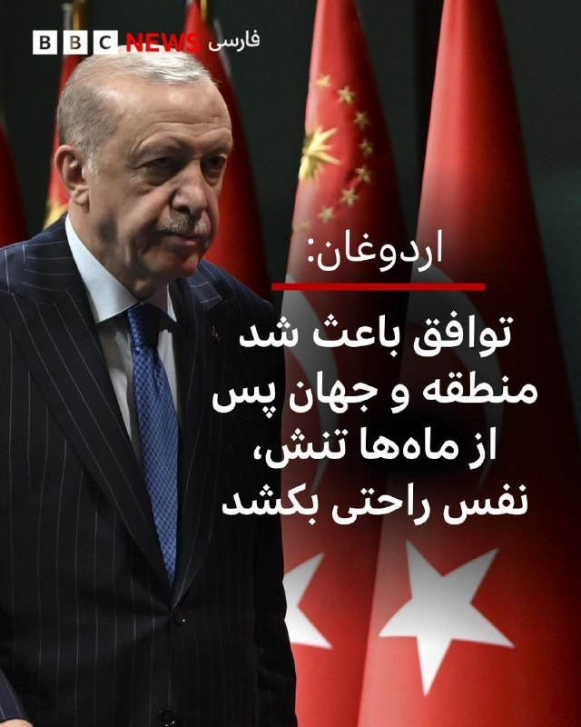

🔻‌رجب طیب اردوغان،‌ رئیس‌جمهور ترکیه از امضای تفاهمنامه میان ایران و آمریکا ابراز خرسندی کرد و به همه کسانی که در دستیابی به آن نقش داشتند،‌ تبریک گفت. او گفت که این توافق باعث شد منطقه و سراسر جهان پس از ماه‌ها تنش نفس راحتی بکشد.

آقای اردوغان همچنین از «برادران پاکستانی خود که به درستی نقش میانجی را ایفا کردند و برادران قطری و سعودی خود که از مذاکرات حمایت کردند»،‌ تبریک گفت.

آقای اردوغان همچنین به مخالفان این تفاهمنامه اشاره کرد و گفت: «ما به‌خوبی می‌دانیم کسانی که تمام امید خود را به خاموش نشدن صدای سلاح‌ها در منطقه ما بسته‌اند، از تقویت فضای صلح ناراحت خواهند شد. همان‌گونه که بارها در گذشته انجام داده‌اند، این بار نیز هر کاری از دستشان برآید برای ایجاد مانع در این روند انجام خواهند داد.»

او بدون نام بردن از اسرائیل گفت: «ما اظهاراتی را که دیروز و امروز از سوی شبکه کشتار که دستانش به خون فلسطینی‌ها و لبنانی‌های بی‌گناه آلوده است،‌ مطرح شده نشانه این موضوع میدانیم.»

📸Dogukan Keskinkilic/Anadolu via Getty Images
https://bbc.in/3Qgf8wt
@BBCPersian

## BBCPersian — post 283929

  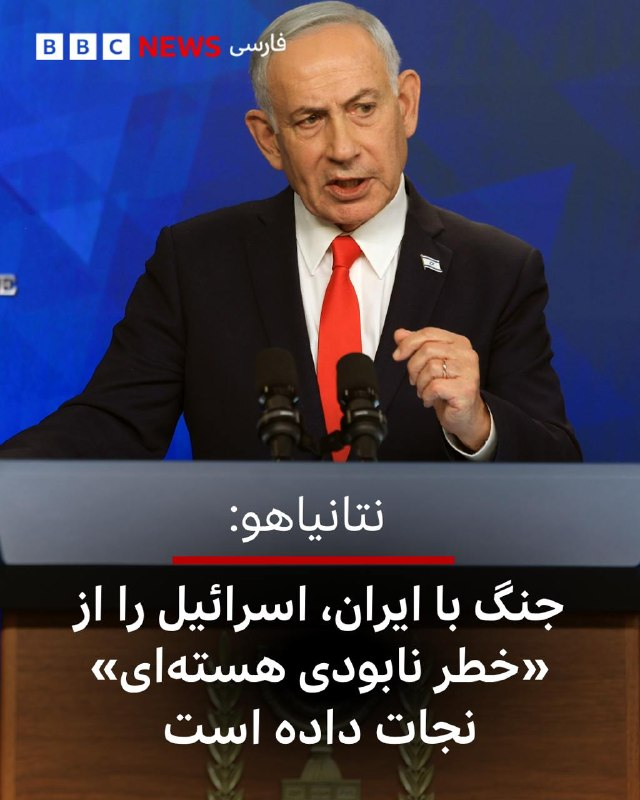

🔻بنیامین نتانیاهو، نخست‌وزیر اسرائیل، روز دوشنبه در اولین اظهارتش پس از امضای تفاهمنامه میان آمریکا و ایران گفت که عملیات نظامی مشترک آمریکا و اسرائیل علیه ایران،‌ کشورش را از آنچه که «تهدید نابودی هسته‌ای از سوی جمهوری اسلامی» توصیف کرد،‌ نجات داده است.

او گفت: «مهمترین مسئله این است که ما کشور اسرائیل را از تهدید نابودی هسته‌ای نجات دادیم.»

آقای نتانیاهو مردم اسرائیل را خطاب قرار داد و گفت: «و این چه معنایی داشت؟ این به این معنا بود که میلیونها شهروند اسرائیلی، شما که اکنون صدای من را می‌شنوید،‌ همگی در معرض خطر وحشتناک مرگ دسته‌جمعی قرار داشتید.. و ما این خطر نابودی جمعیت اسرائیل را برای سال‌های آینده از خود دور کرده‌ایم.»

او در یک کنفرانس خبری که از تلویزیون پخش شد، تاکید کرد که عملیات نظامی علیه ایران، به گفته او،‌ تهدیدی وجودی علیه اسرائیل را خنثی کرده است.

سخنان آقای نتانیاهو در حالی عنوان شده است که بسیاری از سیاستمداران اسرائیلی عمدتا تفاهم ایران و آمریکا را محکوم کرده‌اند.

📸EPA/Shutterstock
https://bbc.in/4a3GZGS
@BBCPersian

## BBCPersian — post 283928

مقام آمریکایی: توافق آتش‌بس فعلا شامل لبنان نمی‌شود

🔻یک مقام ارشد آمریکا به بی‌بی‌سی گفته است که توافق آتش‌بس فعلی شامل لبنان نمی‌شود، اما گفت‌وگوهای مستقیم میان اسرائیل و لبنان در جریان است.

این مقام افزوده است که «اگر ایران نتواند حزب‌الله را کنترل کند و این گروه به مواضع یا شهرهای اسرائیل حمله کند، اسرائیل حق خواهد داشت از خود دفاع کند و پاسخ دهد.»

او همچنین گفت که ایران و متحدانش، در کنار آمریکا و متحدانش، در تلاش هستند تا به درگیری‌ها پایان دهند و به یک توافق صلح نهایی دست یابند که «امیدواریم بسیاری از این گروه‌های نیابتی را نیز در بر بگیرد.»

این سخنان در حالی مطرح شده است که پیشتر سخنگوی وزارت خارجه ایران در نشست خبری بار دیگر تاکید کرد که لبنان بخشی از تفاهم با آمریکاست.

اسماعیل بقایی گفت: «خاتمه جنگ در لبنان بخش لاینفک توافق خاتمه جنگ است و ما در عمل ثابت کردیم که جدی هستیم و از همه ابزارها برای اجرای تعهد طرف مقابل استفاده می‌کنیم.»

https://bbc.in/3S133vI
@BBCPersian

## BBCPersian — post 283927

  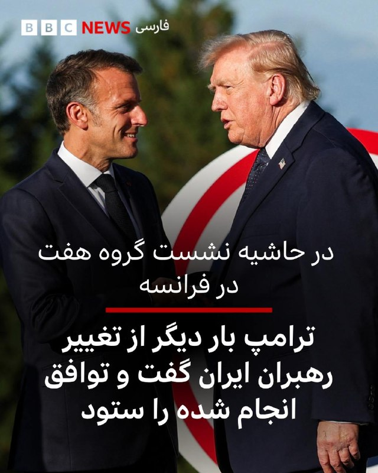

🔻‌دونالد ترامپ در آغاز گفتگوهای دوجانبه‌اش با امانوئل مکرون،‌ رئیس‌جمهور فرانسه، پیش از نشست سران گروه هفت در فرانسه به خبرنگاران گفت که تنگه هرمز از روز جمعه «کاملا باز» خواهد شد.

رئیس جمهور آمریکا گفت که تنگه هرمز اکنون تا حدی باز شده و افزود که عملیاتی برای اطمینان از پاکسازی کامل مین‌های دریایی در جریان است.

آقای ترامپ از توافق انجام شده با جمهوری اسلامی ایران تمجید کرد و بار دیگر گفت: «مهم‌ترین مسئله این است که ایران به سلاح هسته‌ای دست نخواهد یافت.»

او بار دیگر از تغییرات در حکومت ایران حرف زد و گفت: «گروه اول رهبران رفتند، گروه دوم هم رفتند و ما گروه سوم را بسیار هوشمند یافتیم و ... در نهایت به یک توافق رسیدیم.» آقای ترامپ مشخص نکرد که منظورش از این رهبران چه کسانی بودند.

رئیس جمهور آمریکا در پایان گفت:‌ «فکر می‌کنم اکنون اتفاقات بسیار خوبی در خاورمیانه رخ خواهد داد.»

او همچنین به خبرنگاران گفت که جی‌دی ونس، معاون رئیس‌جمهور آمریکا، روز جمعه در مراسم امضای این توافق حضور خواهد داشت اما محل برگزاری این جلسه را مشخص نکرد.

📸Isabel Infantes-Pool/Getty Images
https://bbc.in/4gmLYWY
@BBCPersian

## BBCPersian — post 283926

  <a href="telegram/content/BBCPersian_283926_1781553433.mp4" target="_blank">🎬 Download video</a>

🔻مسعود پزشکیان در همایشی در تهران از تفاهم ایران و آمریکا استقبال کرد و گفت: «اجرای کامل این تفاهمنامه می‌تواند بسیاری از مشکلات و مسائل کشور را برطرف کند و ما دنیای دیگری را در کشور خودمان و در منطقه خاورمیانه خلق خواهیم کرد.»

رئیس‌جمهور ایران بدون اشاره به مفاد این تفاهمنامه گفت که اگر همه آنچه نوشته شده است عملیاتی شود،‌ «سندی افتخارآمیز» نه فقط برای ایران بلکه برای کل منطقه و نیروهای مقاومت خواهد بود.

او از تیم مذاکره‌کننده ایران قدردانی کرد و گفت که تفاهم‌ «حاصل ماه‌ها گفت‌وگو، پیگیری‌های مستمر و ارتباطات مختلف در این زمینه بوده است.»

مسعود پزشکیان گفت که جزئیات این تفاهمنامه در زمان مناسب ارائه خواهد شد.

رئیس‌جمهور ایران از «مساعدت و اختیاراتی» که رهبر جمهوری اسلامی در اختیار «شورای عالی امنیت ملی و تیم مذاکره‌کننده و همچنین دولت گذاشته است»، قدردانی کرد.

https://bbc.in/4gmHHCU
@BBCPersian

## BBCPersian — post 283924

  <a href="https://t.me/bbcpersian/283924" target="_blank">📎 Download file</a>

پادکست برنامه جام جهان‌نما دوشنبه ۲۵ خرداد ۱۴۰۵

این برنامه رادیویی را می‌توانید هرشب ساعت ۲۰ به وقت ایران، روی موج متوسط ۷۰۲ کیلوهرتز و موج کوتاه ۹۴۶۵ کیلوهرتز بشنوید.تکرار برنامه را هم می‌توانید ساعت ۲۱:۳۰ روی موج متوسط ۷۰۲ کیلوهرتز و موج کوتاه ۵۳۹۵ کیلوهرتز گوش کنید.

@BBCPersian

## BBCPersian — post 283923

  <a href="telegram/content/BBCPersian_283923_1781553436.mp4" target="_blank">🎬 Download video</a>

🔻 این تصاویر از آتش‌سوزی و دود سیاه در میدان تجریش در شبکه‌های اجتماعی منتشر شده است.

دلیل این آتش‌‌سوزی، «آتش گرفتن گاز پیک‌نیکی در یک موکب» اعلام شده‌ است.

به گفته سخنگوی سازمان آتش‌نشانی تهران آتش‌سوزی مهار شده و «هیج آسیبی به بازار تجریش نرسیده است.» همچنین این حادثه هیچ مصدومی نداشته است.

@BBCPersian

## BBCPersian — post 283914

🔻تیم ملی ایران با هدایت امیر قلعه‌نویی برای هفتمین بار در جام جهانی حضور پیدا می‌کند. ایران که در سال‌های اخیر یکی از باثبات‌ترین قدرت‌های فوتبال آسیا بوده، ترکیبی از بازیکنان باتجربه و چهره‌های جوان‌تر را در اختیار دارد. مهم‌ترین غایب تیم سردار آزمون است، که به دلیل حواشی سیاسی ماه‌های اخیر از تیم کنار گذاشته شده است.

ستاره تیم مهدی طارمی، مهاجم باتجربه و گلزن تیم که به دلیل قدرت بدنی، بازی هوایی و توانایی گلزنی با هر دو پا، همواره یکی از خطرناک‌ترین مهاجمان آسیا بوده است.

بلژیک با پایان «نسل طلایی‌» وارد جام جهانی ۲۰۲۶ می‌شود، هرچند که ترکیبی از ستاره‌های باتجربه و جوانان بااستعداد را در اختیار دارد. بسیاری معتقدند موفقیتش به هماهنگی بین نسل جدید و بازماندگان نسل طلایی بستگی دارد.

کوین دبروینه، کاپیتان و مغز متفکر ۳۴ ساله بلژیک که همچنان مهم‌ترین بازیکن تیم است. توانایی فوق‌العاده او در بازی‌سازی، ارسال پاس‌های کلیدی و رهبری در میانه میدان، نقش تعیین‌کننده‌ای در عملکرد «شیاطین سرخ» دارد.

ادامه مطلب را از لینک زیر بخوانید:
https://bbc.in/4ouHW0U
📸GettyImages
@BBCPersian

## BBCPersian — post 283904

پس از هفته‌ها جنگ و شرایط «نه جنگ، نه صلح» پس از آتش‌بس، خبر تفاهم ایران و امریکا برای پایان دادن به جنگ، احساسات مختلفی را در مردم ایران برانگیخته است.
در شبکه‌های اجتماعی بسیاری از کاربران، نظراتشان را همرسان کرده‌اند و از امید، نگرانی، خشم، شادی و بی‌اعتمادی گفته‌اند.
از شما خواسته بودیم که نظرتان را درباره تفاهم ایران و آمریکا بگویید. چند نمونه از نظراتی را که دریافت کرده‌ایم بخوانید، با این توضیح که اینها بخشی از نظرات هستند و بازتاب تمام دیدگاه‌های متنوع جامعه ایران نیستند.

ورق بزنید و برخی از نظرات کاربران و مخاطبان بی‌بی‌سی فارسی را بخوانید.
📸 Getty
@BBCPersian

## idfinfarsi — post 11848

  <a href="telegram/content/idfinfarsi_11848_1781553437.mp4" target="_blank">🎬 Download video</a>

❌ارتش اسرائیل دو تروریست را که تهدیدی برای نیروهای ما در نوار غزه بودند به هلاکت رساند

⭕️ارتش اسرائیل امروز (دوشنبه) در مرکز نوار غزه حمله کرد و تروریست صالح رمضان محمد خلیفه، فرمانده یک هسته در گردان نصیراتِ سازمان تروریستی حماس را به هلاکت رساند.

⭕️در حمله‌ای دیگر در شمال نوار، ارتش اسرائیل تروریست محمد موسی دیاب الهبیل، فرمانده یک هسته در گردان غرب جبالیا در سازمان تروریستی حماس را به هلاکت رساند.

⭕️تروریست‌ها در حال برنامه‌ریزی برای اجرای طرح‌های تروریستی علیه نیروهای ارتش اسرائیل بودند، تهدیدی فوری برای نیروها محسوب می‌شدند و در حملات دقیق به هلاکت رسیدند.

⭕️پیش از حملات، اقداماتی برای کاهش آسیب به غیرنظامیان انجام شد، از جمله استفاده از مهمات دقیق و رصدهای هوایی.

⭕️نیروهای ارتش اسرائیل تحت فرماندهی جنوب بر اساس توافق در منطقه مستقر هستند و به اقدام برای رفع هرگونه تهدید ادامه خواهند داد.

## Dirty_Kids — post 392160

  <a href="telegram/content/Dirty_Kids_392160_1781553439.mp4" target="_blank">🎬 Download video</a>

میگه به رهبری تهمت جنسی میزنن چرا هیچی نمیگن:)))) سوال ما هم همینه، ریدن به هیکل رهبرتون ولی شماها دهنتون برای توافق و پول بازه:))) خاک بر سرتون بچه‌ شیعه‌های حقیر:))

@Dirty_Kids 👻

## Dirty_Kids — post 392159

  <a href="telegram/content/Dirty_Kids_392159_1781553441.mp4" target="_blank">🎬 Download video</a>

دهن سانسورچی صداوسیما رسماً سرویسه 😂
تجمع ایرانیان اطراف ورزشگاه سوفای محل بازی تیم آخوندی و نیوزلند

@Dirty_Kids 👻

## Dirty_Kids — post 392155

  <a href="telegram/content/Dirty_Kids_392155_1781553442.mp4" target="_blank">🎬 Download video</a>

می‌خواستن تخریبش کنن، اما دشمن احمق با این کارش یه اسطوره به تاریخ ایران اضافه کرد.
تولدت مبارک شاه خراسان.
#مجیدرضا_رهنورد

@Dirty_Kids 👻

## Dirty_Kids — post 392154

  <a href="telegram/content/Dirty_Kids_392154_1781553443.mp4" target="_blank">🎬 Download video</a>

🔴 نتانیاهو: ما ضربات سنگینی به ایران زدیم و با زدن زیرساخت‌هاشون خسارت سنگینی رو دستشون گذاشتیم.

من نگفتم رژیم ایران رو سرنگون میکنیم، گفتم شرایطی رو فراهم میکنیم تا مردم بریزن بیرون و خودشون این رژیم رو سرنگون کنن.
هیچکس نمیدونه جمهوری اسلامی کی سرنگون میشه.

@Dirty_Kids 👻

## Dirty_Kids — post 392153

  <a href="telegram/content/Dirty_Kids_392153_1781553444.mp4" target="_blank">🎬 Download video</a>

عزیزان ببخشید وسط فوتبال موتبال دیدنتون مزاحم می‌شم،

ویدئویی از شاهکار خوش‌چشم کسمغز رو توی اینستاگرام دیدم، از خنده روده‌بر شدم،
گفتم شما ببینید شاد شید :))

@Dirty_Kids 👻

## Dirty_Kids — post 392152

  <a href="telegram/content/Dirty_Kids_392152_1781553446.mp4" target="_blank">🎬 Download video</a>

مجتبی علاوه بر جنده‌هاش کونیاشم فراخوانده

@Dirty_Kids 👻

## Dirty_Kids — post 392151

  <a href="telegram/content/Dirty_Kids_392151_1781553447.mp4" target="_blank">🎬 Download video</a>

ترامپ:

این توافق شامل رفع تحریم‌های ایران نمیشه، ولی خب کاملا به رفتار اونا بستگی داره.
ما خواهان روابط خوب با ایران هستیم و اگه این اتفاق نیفته، دوباره به جنگ برمی‌گردیم ولی امیدوارم این اتفاق نیفته.
ما با ایران تفاهم‌نامه‌ای امضا کردیم و تنگه هرمز تا حدی بازگشایی شده و روز جمعه بعد از جمع‌آوری مین‌ها و بدون عوارض به طور کامل باز میشه.
این توافق یه سند قوی هستش و متنش رو احتمالا جمعه منتشر میکنم.
برای روز جمعه، معاونم جی‌دی‌ونس قرار شده بره و تفاهم‌نامه رو امضا کنه ولی اگه شرایط پیش بیاد خودم هم میرم.
‌

@Dirty_Kids 👻

## Dirty_Kids — post 392148

🔴 لانا رودز، بازیگر سابق فیلم‌های پورن :

راستش دیگه نمی‌خوام اون ویدیوهای قدیمی ازم تو اینترنت باشن، الان که مادر شدم، بیشتر از هر چیزی نگران اینم که یه روز پسرم اون‌ ویدیوها رو ببینه و بخواد روم جق بزنه؛
دوست دارم همه اون محتواها از گوشی مردم پاک بشن.

@Dirty_Kids 👻

## Dirty_Kids — post 392147

این ویدیو طی ۲ روز اخیر چند میلیون ویو خورده و همه تو کامنتا فقط خندیدن و جک ساختن.

ولی بر باعث و بانیش لعنت که این دختر و پسر بدلیل شرایط بد اقتصادی نمیتونن باهم ازدواج کنن و برن پی زندگی‌شون...💔

@Dirty_Kids 👻

## Dirty_Kids — post 392146

  <a href="telegram/content/Dirty_Kids_392146_1781553449.mp4" target="_blank">🎬 Download video</a>

این ویدیو با عنوان: وقتی نونواها قهر میکنن، بیش از ۱۰ میلیون بازدید داشته😂

@Dirty_Kids 👻

## Dirty_Kids — post 392145

  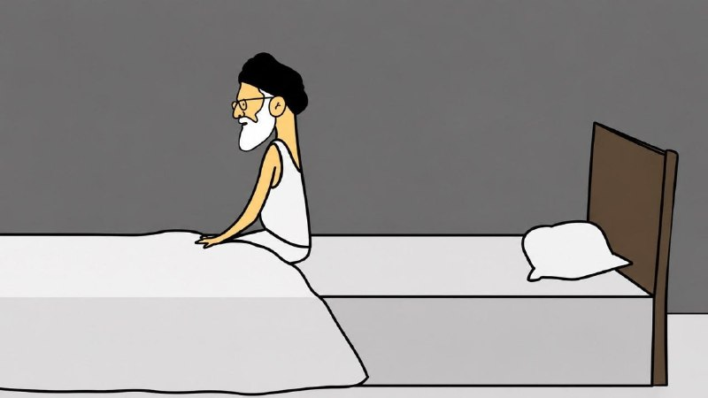

حتی قتل غیرعمدی هم انقد زود نمی‌بخشن کصکشا.

@Dirty_Kids 👻

## Dirty_Kids — post 392144

  <a href="telegram/content/Dirty_Kids_392144_1781553450.mp4" target="_blank">🎬 Download video</a>

تو میتونی به جدم قسم🤣

@Dirty_Kids 👻

## Dirty_Kids — post 392143

  <a href="telegram/content/Dirty_Kids_392143_1781553453.mp4" target="_blank">🎬 Download video</a>

رسیدیم به اسلامی که؛
نه نماز واجبه
نه روزه
نه حج
نه حجاب
نه خمس
نه ذکات
و نه حتی حفظ امام زمان... 🤔
فقط حفقظ جمهوری‌عسلامی مهمه، برای اینکه آخوند باشه، بمونه، بخوره، بدزده و اختلاس کنه، انگل‌زاده‌هاشون اینجا و اونور آب تو پول بغلطن و درد و رنج مردم هم به کیرشون... 😐

@Dirty_Kids 👻

## Dirty_Kids — post 392142

  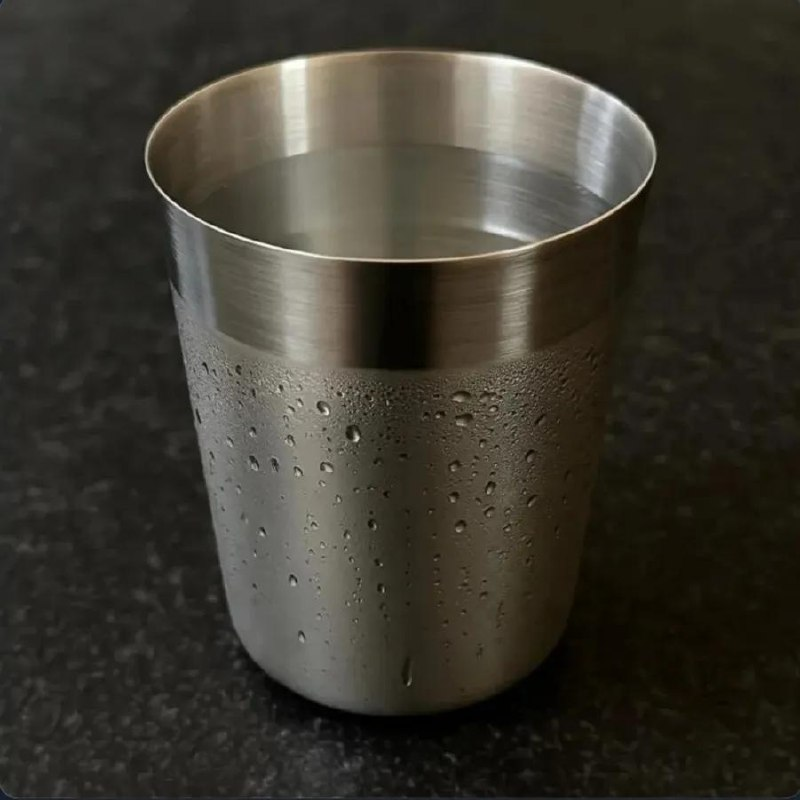

لیوانی ک طعم آب را متفاوت می‌کند:

@Dirty_Kids 👻

## Dirty_Kids — post 392141

  <a href="telegram/content/Dirty_Kids_392141_1781553455.mp4" target="_blank">🎬 Download video</a>

وضعیت خیابون‌های امریکا چندین ساعت قبل شروع بازی تیم آخوندا

چیزی نیست فقط یه میله پرچم کردن تو ،یه عرزشی 🤣

@Dirty_Kids 👻

## Dirty_Kids — post 392140

  <a href="telegram/content/Dirty_Kids_392140_1781553457.mp4" target="_blank">🎬 Download video</a>

بفرست واسه اون دوستت که همیشه قول میده نمیاد...😂😂

هزینه نت برای باز کردن ویدیو بیشتر شد از به‌ریز و به‌پاچ داداشمون

@Dirty_Kids 👻

## Hranews — post 113639

  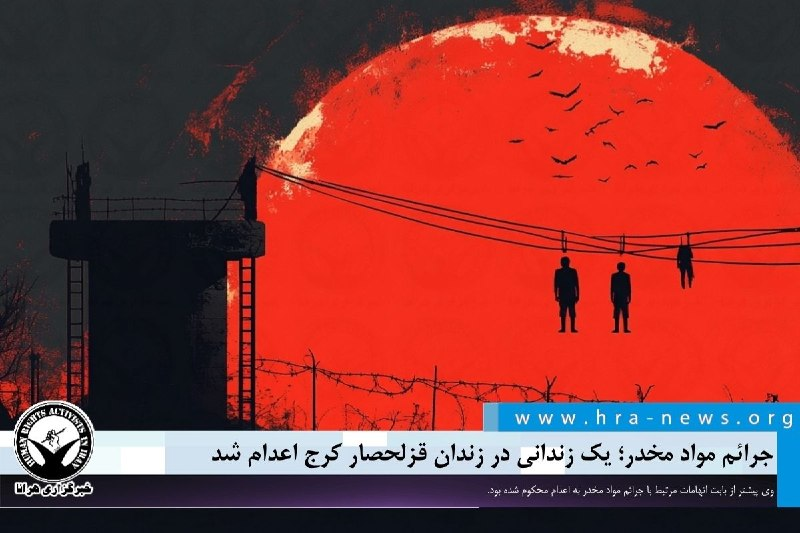

جرائم مواد مخدر؛ یک زندانی در زندان قزلحصار کرج اعدام شد

❗️
❗️
❗️
❗️
❗️– حکم یک زندانی که پیشتر از بابت اتهامات مرتبط با جرائم مواد مخدر به #اعدام محکوم شده بود، امروز دوشنبه ۲۵ خردادماه در زندان قزلحصار کرج اجرا شد.

به گزارش خبرگزاری هرانا، ارگان خبری مجموعه فعالان حقوق بشر در ایران، یک زندانی در زندان قزلحصار کرج اعدام شد.

هویت این زندانی، علی احمدی، ملقب به علی بالانس توسط هرانا احراز شده است.

#علی_احمدی

ادامه مطلب

↘️
@hranews_bot تماس ✉️ - @Hranews کانال هرانا 🆑

## Hranews — post 113638

مردی در آمل هدف اسیدپاشی قرار گرفت؛ متهم بازداشت شد

❗️
❗️
❗️
❗️
❗️– یک مرد در آمل هدف #اسیدپاشی قرار گرفت و در پی آن فرد مهاجم توسط نیروهای انتظامی بازداشت شد.

ادامه مطلب

↘️
@hranews_bot تماس ✉️ - @Hranews کانال هرانا 🆑

## Hranews — post 113637

دستکم ۲ تجمع اعتراضی برگزار شد

❗️
❗️
❗️
❗️
❗️– روز گذشته، شماری از بازنشستگان تامین اجتماعی در اراک دست به #تجمع اعتراضی زدند. همچنین، گروهی از مالباختگان شرکت فرداد کار آمیتیس نیز در تهران تجمع اعتراضی برگزاری کردند.

ادامه مطلب

↘️
@hranews_bot تماس ✉️ - @Hranews کانال هرانا 🆑

## Hranews — post 113636

گزارشی از بازداشت یک شهروند در بیجار

❗️
❗️
❗️
❗️
❗️– پوریا ولی‌زاده، شهروند اهل بیجار روز پنجشنبه ۲۱ خردادماه توسط نیروهای امنیتی در این شهر بازداشت و به مکان نامعلومی منتقل شده است.

#پوریا_ولی‌زاده

ادامه مطلب

↘️
@hranews_bot تماس ✉️ - @Hranews کانال هرانا 🆑

## Hranews — post 113635

گزارشی از اعدام زندانیان در سه زندان‌/ رهایی یک زندانی از چوبه دار

❗️
❗️
❗️
❗️
❗️– با شناسایی دو زندانی دیگر که سحرگاه امروز در زندان دستگرد اصفهان اعدام شده‌اند، شمار اعدام شدگان روز جاری در این زندان به سه تن رسید. همچنین دو تن دیگر از اعدام‌شدگان هفته‌های گذشته در این زندان، شناسایی شدند. از سوی دیگر دو زندانی در زندان‌های سنندج و تبریز اعدام شدند. این افراد پیشتر بابت اتهامات مرتبط با جرائم مواد مخدر و قتل به #اعدام محکوم شده بودند. یک زندانی نیز در زندان قزوین که پیشتر از بابت اتهام قتل به اعدام محکوم شده بود، با گذشت اولیای دم از چوبه‌دار رهایی یافت.

#آرام_زارعی #رسول_عطاپور #فریبرز_جعفری #حمیدرضا_افشاری‌پور
#مسعود_عسگری #پیمان_شاه‌کرمی #محمدرضا_گشول

ادامه مطلب

↘️
@hranews_bot تماس ✉️ - @Hranews کانال هرانا 🆑

## Hranews — post 113634

گزارشی از معوقات مزدی و بیمه‌ای کارگران در ۲ واحد مختلف

❗️
❗️
❗️
❗️
❗️– شماری از کارگران شاغل در یک شرکت تولیدی در زمینه احداث و نصب پنل‌های خورشیدی در شهرستان سراوان از عدم پرداخت مطالبات مزدی خود ابراز نارضایتی کرده و خواستار رسیدگی به وضعیتشان شدند. همچنین، جمعی از #کارگران شرکت کاغذ پارس هفت‌تپه از عدم دریافت حق بیمه تکمیلی خود و محروم ماندن از امکانات درمانی گلایه‌مند هستند.

ادامه مطلب

↘️
@hranews_bot تماس ✉️ - @Hranews کانال هرانا 🆑

## Hranews — post 113633

مرگ و مصدومیت ۵ کارگر در سایه فقدان ایمنی کار

❗️
❗️
❗️
❗️
❗️– در سایه فقدان ایمنی محیط و شرایط نامناسب کار، پنج #کارگر در رفسنجان و رودان حین انجام کار دچار حادثه شدند. طی این حوادث دو کارگر مصدوم شدند و سه تن دیگر جان خود را از دست دادند.

ادامه مطلب

↘️
@hranews_bot تماس ✉️ - @Hranews کانال هرانا 🆑

## Hranews — post 113632

  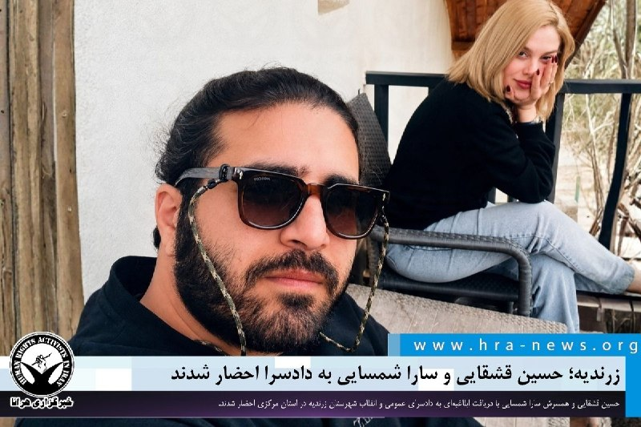

حسین قشقایی و سارا شمسایی به دادسرا احضار شدند

❗️
❗️
❗️
❗️
❗️ – حسین قشقایی و همسرش سارا شمسایی با دریافت ابلاغیه‌ای به دادسرای عمومی و انقلاب شهرستان زرندیه در استان مرکزی #احضار شدند.

به گزارش خبرگزاری هرانا، ارگان خبری مجموعه فعالان حقوق بشر در ایران، حسین قشقایی و همسرش سارا شمسایی به دادسرا احضار شدند.

بر اساس اطلاعات دریافتی هرانا، در ابلاغیه‌ای که برای این زوج صادر شده، از آنان خواسته شده است ظرف مدت پنج روز در شعبه یک دادسرای عمومی و انقلاب شهرستان زرندیه حاضر شوند.
اتهامات مطروحه علیه این زوج «اغوا و تحریک مردم به جنگ و کشتار یکدیگر به قصد برهم زدن امنیت کشور»، «فعالیت تبلیغی علیه نظام جمهوری اسلامی» و «نشر اکاذیب به قصد تشویش اذهان عمومی» عنوان شده است. آقای قشقایی علاوه بر اتهامات یادشده، با اتهام «اجتماع و تبانی علیه امنیت ملی» نیز مواجه است.

ادامه مطلب

#حسین_قشقایی
#سارا_شمسایی

↘️
@hranews_bot تماس ✉️ -  @Hranews  کانال هرانا 🆑

## alonews — post 128323

  <a href="telegram/content/alonews_128323_1781553459.webm" target="_blank">🎬 Download video</a>

👈سخنگوی کمیسیون امور داخلی مجلس و شوراها: انتخابات شوراها به دو ماه بعد از اعلام رسمی پایان جنگ موکول شده است

✅ @AloNews خبر جنگ

## alonews — post 128322

  <a href="telegram/content/alonews_128322_1781553460.webm" target="_blank">🎬 Download video</a>

👈آکسیوس: توافق ایالات متحده و ایران روز یکشنبه به صورت الکترونیکی توسط رئیس جمهور ترامپ، معاون رئیس جمهور ونس و رئیس مجلس ایران، محمد باقر قالیباف، امضا شد. اما بسیاری از سوالات حل نشده باقی مانده است

✅ @AloNews خبر جنگ

## alonews — post 128321

  <a href="telegram/content/alonews_128321_1781553460.webm" target="_blank">🎬 Download video</a>

👈زاکانی: پوتین گفته بود که نیروهای نظامی روسیه به من گفته بودند که ایران نهایتاً یک هفته می‌تواند تنگهٔ هرمز را بسته نگه‌دارد

✅ @AloNews خبر جنگ

## alonews — post 128320

  <a href="telegram/content/alonews_128320_1781553460.webm" target="_blank">🎬 Download video</a>

👈سخنگوی ارتش: ایران در دوره اجرای تفاهم یا توافق نیز به تقویت قدرت دفاعی و بازدارندگی خود ادامه خواهد داد

✅ @AloNews خبر جنگ

## alonews — post 128317

  <a href="telegram/content/alonews_128317_1781553460.webm" target="_blank">🎬 Download video</a>

👈یک بمب‌افکن B-52 استراتوفورتراس نیروی هوایی ایالات متحده بلافاصله پس از برخاستن در پایگاه نیروی هوایی ادواردز سقوط کرد.

🔴 جزئیات تلفات هنوز گزارش نشده است.

✅ @AloNews خبر جنگ

## alonews — post 128316

  <a href="telegram/content/alonews_128316_1781553460.mp4" target="_blank">🎬 Download video</a>

🎤عادل: اگه تو مرحله حذفی به آمریکا بخوریم میتونیم ببریم؟

پیروز قربانی: خیر!
@AloSport

## alonews — post 128315

  <a href="telegram/content/alonews_128315_1781553462.webm" target="_blank">🎬 Download video</a>

🔴فوری/حملات توپخانه‌ای اسرائیل به ارتفاعات علی‌الطاهر در نبطیه

✅ @AloNews خبر جنگ

## alonews — post 128314

  <a href="telegram/content/alonews_128314_1781553462.mp4" target="_blank">🎬 Download video</a>

👈جنگنده اف/ای-۱۸ هورنت از پایگاه هوایی MCAS میرمار در نزدیکی دریاچه ریمرک، ایالت واشنگتن، در حین تمرینات دیروز سقوط کرد.

🔴خلبان به‌طور ایمن بیرون پرید و سپس توسط یک معاون شهرستان یاکیما نجات یافت.

🔴سرویس جنگل‌های ایالات متحده به آتش‌سوزی ناشی از لاشه هواپیما پاسخ داد.

✅ @AloNews خبر جنگ

## alonews — post 128313

  <a href="telegram/content/alonews_128313_1781553464.mp4" target="_blank">🎬 Download video</a>

👈وزیر صنعت لبنان: درحال پخش شیرینی

🔴خبرنگار: «مناسبت چیست؟»

🔴وزیر: «آتش‌بس»

🔴خبرنگار: «گام‌های بعدی پس از آتش‌بس چیست؟»

🔴وزیر: «از سفارت ایران بپرسید»

✅ @AloNews خبر جنگ

## alonews — post 128312

  <a href="telegram/content/alonews_128312_1781553465.webm" target="_blank">🎬 Download video</a>

👈تسنیم: در صورت جنگ یا ترور در ایران و جبهه مقاومت توافق نهایی انجام نمیشه.

✅ @AloNews خبر جنگ

## alonews — post 128311

  <a href="telegram/content/alonews_128311_1781553466.webm" target="_blank">🎬 Download video</a>

🔴فوری /شبکه ۱۳اسرائیل به نقل از یک منبع: تل‌آویو و واشینگتن بر سر عدم عقب‌نشینی کامل اسرائیل از لبنان به توافق رسیده‌اند

✅ @AloNews خبر جنگ

## alonews — post 128310

  <a href="telegram/content/alonews_128310_1781553466.webm" target="_blank">🎬 Download video</a>

👈نتانیاهو: توافق با ایران توسط ترامپ انجام شد، این تصمیم او بود و ما منافع خودمان را داریم.

✅ @AloNews خبر جنگ

## alonews — post 128309

  <a href="telegram/content/alonews_128309_1781553466.webm" target="_blank">🎬 Download video</a>

👈نتانیاهو: همانکاری با غزه کردیم با جنوب لبنان نیز خواهیم کرد،همانطور که غزه دیگر تهدید جدی‌ای برای اسرائیل نیست حزب‌الله نیز در آینده نخواهد بود

🔴ما در منطقه حائل امنیتی در لبنان باقی خواهیم ماند

✅ @AloNews خبر جنگ

## alonews — post 128308

  <a href="telegram/content/alonews_128308_1781553466.webm" target="_blank">🎬 Download video</a>

👈نتانیاهو: من در انتخابات شرکت خواهم کرد و قصد دارم در آن پیروز شوم.

🔴گاهی اوقات بین من و ترامپ اختلاف نظر وجود دارد

✅ @AloNews خبر جنگ

## alonews — post 128307

👈نتانیاهو: ایران به سمت دستیابی به سلاح هسته ای حرکت می کرد و ما توانستیم برنامه های موشکی و هسته ای آن را نابود کنیم.

🔴ترامپ رئیس جمهور آمریکاست و من نخست وزیر اسرائیل،من مسئول امنیت کشور خودم هستم.من از منافع اسرائیل نه با غرور و خود‌خواهی بلکه با خرد و عقب دفاع می‌کنم

✅ @AloNews خبر جنگ

## alonews — post 128306

  <a href="telegram/content/alonews_128306_1781553467.webm" target="_blank">🎬 Download video</a>

👈نتانیاهو: کسانی هستند که می‌خواهند دستاوردهای ما را کم‌اهمیت جلوه دهند، و ما به دستاوردهای بزرگتری هم دست خواهیم یافت.

🔴ما استقلال خود را در زمینه تسلیحات تضمین خواهیم کرد و نوآوری‌هایی را توسعه خواهیم داد که به خیال‌پردازی نزدیک‌تر هستند.

🔴من بر منافع امنیتی‌مان در روابطمان با ترامپ و ایالات متحده تأکید کردم

🔴وضعیت ما امروز بسیار بهتر از هفتم اکتبر است و ما محور ترور را در هم شکسته‌ایم.

🔴به وضوح می‌گویم تا خلع سلاح حزب‌الله،اسرائیل از منطقه امنیتی جنوب لبنان خارج نخواهد شد

✅ @AloNews خبر جنگ

## alonews — post 128305

  <a href="telegram/content/alonews_128305_1781553467.webm" target="_blank">🎬 Download video</a>

👈نتانیاهو: ما نصرالله را کشتیم و از حمله به جلیله جلوگیری کردیم

🔴ما کنترل مناطق کلیدی در لبنان را که حزب‌الله از آنجا اسرائیل را تهدید می‌کرد، به دست گرفته‌ایم

🔴ما دکترین جنگ را تغییر دادیم و سد ترس را شکستیم؛ ما ابتکار عمل و غافلگیری را در دست می‌گیریم.

✅ @AloNews خبر جنگ

## alonews — post 128304

  <a href="telegram/content/alonews_128304_1781553467.webm" target="_blank">🎬 Download video</a>

👈نتانیاهو:ما در لبنان خواهیم ماند. کار با ایران ممکن است همچنان تمام نشده باشد

✅ @AloNews خبر جنگ

---
📅 بروزرسانی: 1405/03/25 19:36
---

## VahidOOnLine — post 245727

  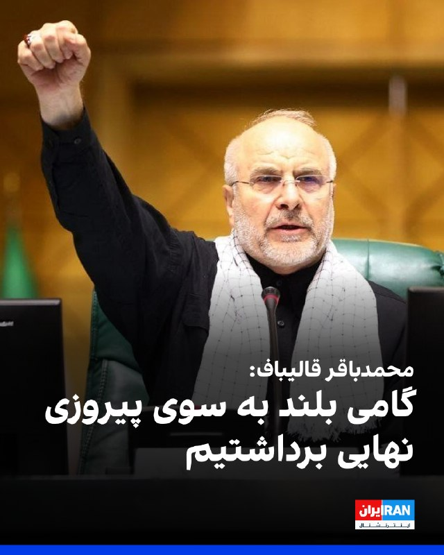

محمدباقر قالیباف، رییس مجلس، در شبکه ایکس خطاب به مردم ایران نوشت: «با مقاومت تاریخی شما و رشادت نیروهای مسلح در برابر آنان که قصد جان این ملت و نابودی و تسلیم این مملکت را کرده بودند، ایران گامی بلند به سوی پیروزی نهایی برداشت. می‌خواستند و نتوانستند.»

او افزود: «ایستاده‌ایم و در نهایت ایران ما پیروز خواهد شد.»
‌🏁 🇬🇧 IranintlTV

🤖 @VahidOOnLine

## VahidOOnLine — post 245726

  <a href="telegram/content/VahidOOnLine_245726_1781539570.mp4" target="_blank">🎬 Download video</a>

♦️مسعود پزشکیان، رئیس‌جمهوری ایران، روز دوشنبه ۲۵ خردادماه گفت دستیابی به تفاهم‌نامه پایان جنگ بدون حمایت‌ها و هدایت‌های مجتبی خامنه‌ای، رهبر جمهوری اسلامی، امکان‌پذیر نبود.
پزشکیان در رویدادی دولتی با قدردانی از اختیارات و حمایت‌هایی که به گفته او از سوی رهبر سوم جمهوری اسلامی به شورای عالی امنیت ملی، تیم مذاکره‌کننده و دولت داده شده است، گفت: «اگر مقام ایشان نبودند و همراهی و هدایت‌های ایشان نبود، ما امکان نداشت به این دستاورد دست پیدا کنیم.»
مسعود پزشکیان، بعد از ظهر یکشنبه و ساعاتی پیش از امضاء تفاهمنامه صلح گفته بود: «تصمیم‌گیری درباره جنگ و مذاکره بر عهده شورای عالی امنیت ملی است؛ شورایی که نمایندگان تمامی ارکان حاکمیت از جمله رهبری عالیقدر در آن حضور دارند و سیاست‌های کلان باید از آن مسیر ابلاغ شود.»
اظهارات رئیس جمهوری ایران در حالی مطرح می‌شود که مقام‌های جمهوری اسلامی از نهایی شدن چارچوب تفاهم با آمریکا خبر داده‌اند و قرار است مراحل نهایی امضا و اجرای آن روز جمعه در سوئیس انجام شود.
‌🇸🇦 Indypersian

🤖 @VahidOOnLine

## VahidOOnLine — post 245725

  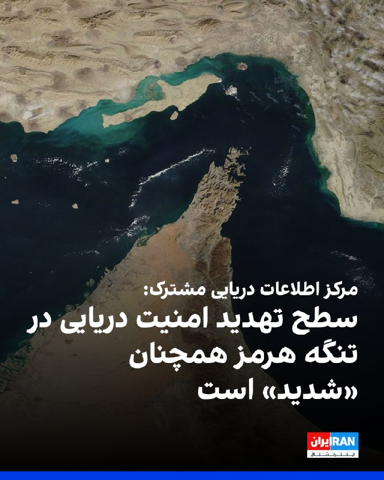

مرکز اطلاعات دریایی مشترک در شبکه ایکس اعلام کرد سطح تهدید امنیت دریایی در تنگه هرمز همچنان «شدید» است.

مرکز اطلاعات دریایی مشترک، سازمانی چندملیتی است که سال ۲۰۲۴ به ابتکار سازمان نیروهای دریایی مشترک شامل ۴۷ کشور عضو تشکیل شد.

وظیفه این مرکز اتصال صنعت کشتیرانی تجاری با نیروهای دریایی در خاورمیانه است.
‌🏁 🇬🇧 IranintlTV

🤖 @VahidOOnLine

## VahidOOnLine — post 245724

  <a href="telegram/content/VahidOOnLine_245724_1781539574.mp4" target="_blank">🎬 Download video</a>

♦️دونالد ترامپ، رئیس‌جمهوری ایالات متحده آمریکا، روز یکشنبه ۲۵ خرداد ماه وارد شهر اویان، میزبان نشست رهبران گروه هفت در فرانسه شد.
نشست رهبران گروه هفت (G7 Summit)، رویدادی سالانه و بسیار مهم در دنیای سیاست و اقتصاد بین‌الملل است. در این نشست، سران کشورها و دولت‌های عضو دور هم جمع می‌شوند تا درباره چالش‌های بزرگ و فوری جهان گفتگو و هماهنگی کنند.
نشست رهبران هفت کشور بزرگ صنعتی جهان در سال ۲۰۲۶ در سایه امضای تفاهم‌نامه پایان جنگ میان ایران و آمریکا و بازگشایی مجدد تنگه هرمز برگزار می‌شود.
‌🇸🇦 Indypersian

🤖 @VahidOOnLine

## VahidOOnLine — post 245723

  

عباس عراقچی، وزیر امور خارجه جمهوری اسلامی، گفت جمعه احتمالا در سوئیس دیداری میان روسای هیات‌های دو طرف برگزار و تفاهم‌نامه میان جمهوری اسلامی و آمریکا امضا خواهد شد و سپس نخستین دور مذاکرات بعدی آغاز می‌شود.

او افزود اقتصاد ایران نباید خود را متکی و موکول به این‌گونه توافقات اقتصادی از طریق مذاکره با آمریکا کند.

عراقچی همچنین گفت روند مذاکرات و اجرای توافق بر اساس «بی‌اعتمادی، بدعهدی‌ها و تجربیات گذشته» برنامه‌ریزی خواهد شد.
‌🏁 🇬🇧 IranintlTV

🤖 @VahidOOnLine

## VahidOOnLine — post 245722

  

سازمان عملیات تجارت دریایی بریتانیا روز دوشنبه اعلام کرد یک نفتکش گزارش داده است که در ۱۱۱ مایل دریایی جنوب‌شرقی عدن یمن، یک قایق کوچک به آن نزدیک شده و به سوی این شناور تیراندازی کرده است.

این سازمان افزود مقام‌ها در حال بررسی این حادثه هستند، اما جزییات بیشتری ارائه نکرد.
‌🏁 🇬🇧 IranintlTV

🤖 @VahidOOnLine

## VahidOOnLine — post 245721

  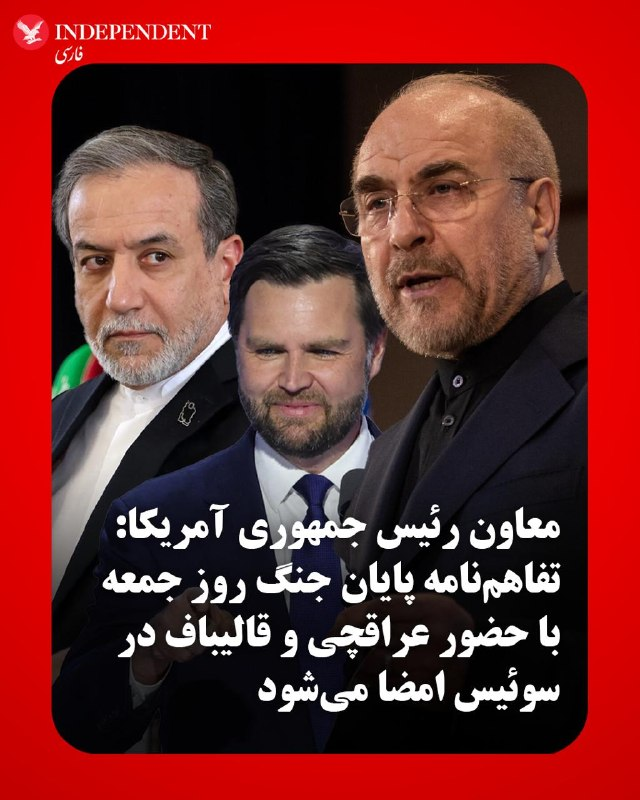

♦️جی‌دی ونس، معاون رئیس‌جمهوری آمریکا، روز یکشنبه ۲۵ خرداد ماه اعلام کرد تفاهم‌نامه میان ایران و آمریکا قرار است روز جمعه در سوئیس و با حضور عباس عراقچی، وزیر امور خارجه جمهوری اسلامی، و محمدباقر قالیباف،‌ سرپرست مذاکره‌کنندگان ایرای امضا شود.
ونس با اشاره به روند مذاکرات گفت که «جزئیات زیادی از توافق هنوز حل‌وفصل نشده است»، اما آمریکا انتظار دارد تنگه هرمز «در درازمدت بدون عوارض باز باشد».

ونس در گفتگو با شبکه ای‌بی‌سی گفت توافق روز یکشنبه «به‌صورت دیجیتال» امضاء شده و قرار است مراسم رسمی امضای آن روز جمعه در ژنو برگزار شود.

در همین حال، مسعود پزشکیان، رئیس جمهوری ایران نیز، روز یکشنبه در مراسمی دولتی با اعلام همین خبر گفته بود، توافق روز جمعه و حضوری امضاء می‌شود.
‌🇸🇦 Indypersian

🤖 @VahidOOnLine

## VahidOOnLine — post 245720

  

ارتش آمریکا در یک یادداشت هشدار اعلام کرد که محاصره بنادر ایران تا زمان تکمیل یک توافق آتش‌بس با این کشور که برای ۱۹ ژوئن (۲۹ خرداد) برنامه‌ریزی شده است، همچنان برقرار است.

در این هشدار که دوشنبه منتشر شد، آمده است: «محاصره نظامی بنادر ایران همچنان برقرار است و تمامی ترددهای ورودی و خروجی از این بنادر را محدود می‌کند.»

ارتش آمریکا افزود: «تا زمانی که دستور صریح صادر نشده است، از تلاش برای عبور خودداری کنید.»
‌🏁 🇬🇧 IranintlTV

🤖 @VahidOOnLine

## VahidOOnLine — post 245719

  

خبرگزاری رویترز به نقل از منابع امنیتی لبنان و رسانه‌های دولتی این کشور گزارش داد یک حمله پهپادی اسرائیل خودرویی را در جنوب لبنان هدف قرار داد و راننده آن کشته شد.

این نخستین حمله مرگبار گزارش‌شده اسرائیل در لبنان از زمان اعلام توافق میان آمریکا و جمهوری اسلامی است.
‌🏁 🇬🇧 IranintlTV

🤖 @VahidOOnLine

## VahidOOnLine — post 245718

  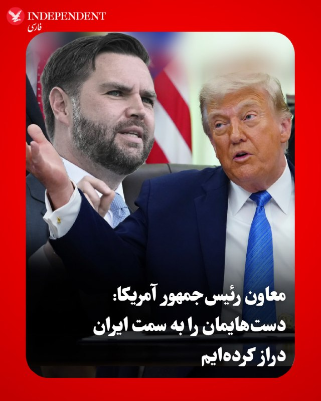

♦️جی‌دی ونس، معاون رئیس‌جمهور آمریکا، روز دوشنبه ۲۵ خردادماه در گفتگو با شبکه سی‌ان‌بی‌سی گفت دولت دونالد ترامپ آماده تغییر روابط با ایران است، مشروط بر آنکه تهران نیز در این مسیر گام بردارد.
ونس با اشاره به رویکرد ترامپ در قبال ایران اظهار داشت: «رئیس‌جمهور دارد به آن‌ها می‌گوید: ما دست دوستی دراز کرده‌ایم. اگر شما می‌خواهید با ما ملاقات کنید و اگر می‌خواهید رابطه‌تان با ایالات متحده را تغییر دهید، ما نیز رابطه‌مان با ایران را تغییر خواهیم داد.»
معاون رئیس‌جمهور آمریکا افزود: «این پیشنهاد ماست و باید منتظر بمانیم و ببینیم آیا آن‌ها نیز در این مسیر با ما همراه می‌شوند یا خیر.»
اظهارات ونس در حالی مطرح می‌شود که پس از نهایی شدن چارچوب تفاهم پایان جنگ میان تهران و اشنگتن، دوطرف قرار است روز جمعه در ژنو با یکدیگر دیدار کنند.
‌🇸🇦 Indypersian

🤖 @VahidOOnLine

## VahidOOnLine — post 245717

  

♦️جی‌دی ونس، معاون رئیس‌جمهور آمریکا، روز دوشنبه ۲۵ خردادماه اعلام کرد آمریکا و ایران پیش از مراسم رسمی امضای توافق، روز یکشنبه (به وقت آمریکا) آن را به‌صورت دیجیتال امضاء کرده‌اند.

ونس در گفتگو با شبکه ای‌بی‌سی گفت توافق روز یکشنبه «به‌صورت دیجیتال» امضاء شده و قرار است مراسم رسمی امضای آن روز جمعه در ژنو برگزار شود.

در همین حال، مسعود پزشکیان، رئیس جمهوری ایران نیز، روز یکشنبه در مراسمی دولتی با اعلام همین خبر گفته بود، توافق روز جمعه و حضوری امضاء می‌شود.
‌🇸🇦 Indypersian

🤖 @VahidOOnLine

## VahidOOnLine — post 245716

  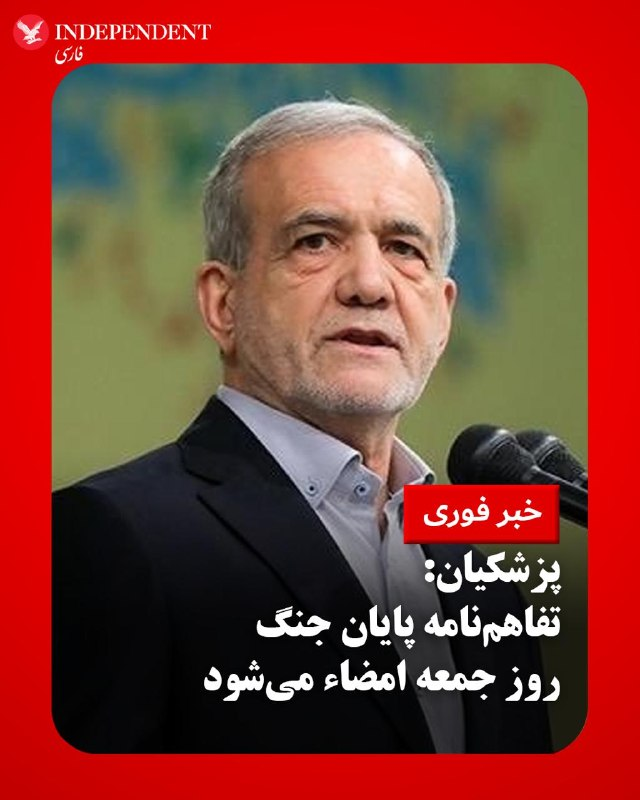

♦️مسعود پزشکیان، رئیس‌جمهور ایران، روز دوشنبه ۲۵ خردادماه اعلام کرد پس از اعمال اصلاحات مورد نظر در متن تفاهم‌نامه پایان جنگ، این سند به تصویب رسیده و قرار است مراحل نهایی امضاء آن روز جمعه انجام شود.
پزشکیان در گفتگو با پایگاه اطلاع‌رسانی دولت گفت: «قرار بود اصلاحاتی در متن انجام شود که این اصلاحات روز گذشته انجام شد و پس از هماهنگی‌های لازم، به تصویب رسید. بر این اساس، مقرر شده است روز جمعه مراحل نهایی امضا و اجرای آن انجام شود.»
پیشتر اسماعیل بقایی اعلام کرده بود، تفاهم‌نامه پایان جنگ میان ایران و آمریکا قرار است در شهر ژنو به امضای طرفین برسد.
‌🇸🇦 Indypersian

🤖 @VahidOOnLine

## VahidOOnLine — post 245715

  

مسعود پزشکیان، رییس دولت جمهوری اسلامی، در حاشیه همایش «حکمرانی هم‌افزا»، گفت که تفاهم خاتمه جنگ با آمریکا با هماهنگی صورت گرفته، قرار است روز جمعه به امضا برسد.

همزمان اسماعیل بقائی، سخنگوی وزارت خارجه، ضمن تایید خبر حضور نمایندگان جمهوری اسلامی در مراسم امضای این تفاهم‌نامه در ژنو، در روز جمعه، گفت که برنامه سفر به برخی کشورهای منطقه و همسایه پیش از آغاز نشست ژنو در دستور کار قرار دارد و به محض قطعی شدن، جزییات آن اطلاع‌رسانی خواهد شد.

پیش‌تر جی‌دی ونس، معاون رییس‌جمهوری آمریکا، گفته بود که قصد دارد در مراسم رسمی امضای یادداشت تفاهم میان آمریکا و جمهوری اسلامی در ژنو حضور داشته باشد، اما احتمال دارد دونالد ترامپ نیز شخصا در این مراسم شرکت کند.
‌🏁 🇬🇧 IranintlTV

🤖 @VahidOOnLine

## VahidOOnLine — post 245714

  

مسعود پزشکیان با اشاره به متن تفاهم بین جمهوری اسلامی و آمریکا گفت: تفاهم‌نامه نه‌تنها برای داخل کشور، بلکه برای کل منطقه و «نیروهای مقاومت» افتخار بزرگی به شمار می‌رود و اجرای کامل این تفاهم‌نامه می‌تواند بسیاری از مسائل را برطرف کند و شرایط تازه‌ای را در ایران و منطقه رقم بزند.

رییس دولت جمهوری اسلامی افزود: «اگر همه مفاد تفاهم‌نامه به‌درستی عملیاتی شود، به‌عنوان سندی افتخارآمیز برای کشور تلقی می‌شود.»

پزشکیان گفت: پس از بحث‌ها و بررسی‌های مختلف در شورای عالی امنیت، تقریبا بیش از ۹۰ درصد اعضا با این روند همراهی کردند و رای دادند که این اقدام باید انجام شود.

‌🏁 🇬🇧 IranintlTV

🤖 @VahidOOnLine

## VahidOOnLine — post 245713

♦️مسعود پزشکیان، رئیس‌جمهوری ایران، روز دوشنبه ۲۵ خردادماه گفت اجرای تفاهم‌نامه پایان جنگ میان ایران و آمریکا می‌تواند بسیاری از مشکلات کشور را برطرف کند و شرایط تازه‌ای را در ایران و منطقه خاورمیانه رقم بزند.
پزشکیان در «همایش سراسری حکمرانی هم‌افزا» اظهار داشت: « گر همه‌آنچه که نوشته شده عملیاتی شود، خیلی از مشکلات ما و مسائلی را که برای کشور وجود دارد از بین خواهد برد و ما یک دنیای دیگر را در کشور خودمان و در منطقه خاورمیانه خلق خواهیم کرد.»
رئیس‌جمهوری ایران همچنین تفاهم‌نامه تدوین‌شده را حاصل ماه‌ها گفتگو، پیگیری و رایزنی‌های مختلف دانست و افزود: «به نظر من این یک سند افتخارآمیز است، اگر همه آنچه که در آن نوشته شده عملیاتی شود.»
او گفت پس از بحث و بررسی در شورای عالی امنیت ملی، بیش از ۹۰ درصد اعضای شورا از این روند حمایت کرده و به آن رای مثبت داده‌اند.
رئیس‌جمهور ایران همچنین از حمایت‌ها و اختیاراتی که به گفته او از سوی رهبر سوم جمهوری اسلامی، مجتبی خامنه‌ای، به شورای عالی امنیت ملی، تیم مذاکره‌کننده و دولت داده شده قدردانی کرد.
‌🇸🇦 Indypersian

🤖 @VahidOOnLine

## VahidOOnLine — post 245712

⭕️پنج سناریوی پیش روی توافق احتمالی ایران و آمریکا؛ از صلح تا بازگشت به جنگ

📌باز بودن تنگه‌ها به سود همه است؛ بنابراین باز خواهند ماند

♦️به نظر می‌رسد آمریکا و جمهوری اسلامی ایران در آستانه توافق بر سر نقشه‌راهی برای دستیابی به نوعی توافق قرار دارند، با این حال، هنوز روشن نیست دقیقا روی چه موضوع‌هایی توافق شده است و این روند در روزهای آینده به چه نتیجه‌ای منتهی خواهد شد.
اورشلیم  پست در گزارش تحلیلی خود اشاره می‌کند که در چند ماه گذشته، بارها درباره اینکه توافق در آستانه امضا قرار دارد، ادعاهای مشابهی مطرح شد، اما بسیاری از مواردی که واقعا بر سر آن‌ها توافق شد، نه یک توافق نهایی، بلکه یادداشت‌تفاهمی برای رسیدن به توافقی در آینده بودند.

بیشتر بخوانید...
‌🇸🇦 Indypersian

🤖 @VahidOOnLine

## VahidOOnLine — post 245711

  

فریدریش مرتس، صدراعظم آلمان، روز دوشنبه گفت توافق صلح میان آمریکا و جمهوری اسلامی می‌تواند به ثبات اقتصاد جهانی کمک کند و افزود این توافق باید شامل لبنان نیز باشد.

او پیش از نشست گروه هفت که این هفته به میزبانی فرانسه برگزار می‌شود، گفت پنجره‌ای برای دیپلماسی در جنگ اوکراین گشوده شده است و می‌خواهد درباره آن با دونالد ترامپ، رییس‌جمهوری آمریکا، گفت‌وگو کند.
‌🏁 🇬🇧 IranintlTV

🤖 @VahidOOnLine

## VahidOOnLine — post 245710

  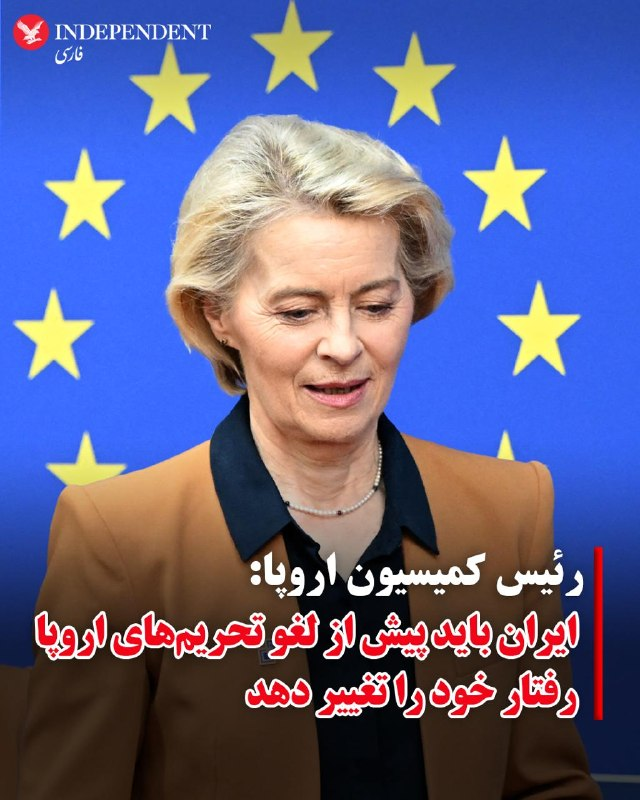

♦️اورسولا فون‌درلاین، رئیس کمیسیون اروپا، روز دوشنبه ۲۵ خردادماه اعلام کرد ایران باید پیش از هرگونه لغو تحریم‌های اتحادیه اروپا، تغییرات اساسی و قابل راستی‌آزمایی در رفتار خود ایجاد کند.
فون‌درلاین در کنفرانس خبری خود در شهر اویان-له-بن فرانسه و در آستانه نشست سران گروه هفت گفت: «اصل تحریم‌ها این است که پیش از آنکه بتوانیم به لغو آن‌ها فکر کنیم، باید شاهد تغییر واقعی در عمل باشیم.»
او افزود: «تحریم‌ها برای تغییر رفتار وضع شده‌اند. بنابراین اگر رفتار به شکلی معتبر و قابل راستی‌آزمایی تغییر کند، آنگاه می‌توان تحریم‌ها را لغو کرد.»
اظهارات فون‌درلاین در حالی ابزار می‌شود که ساعاتی پس از توافق واشنگتن و تهران برای پایان دادن به جنگ، کشورهای بریتانیا، فرانسه، آلمان و ایتالیا اعلام کردند در صورت گام‌های عملی ایران در برنامه‌ هسته‌ای، آمادگی دارند تحریم‌ها علیه ایران را لغو کنند.
‌🇸🇦 Indypersian

🤖 @VahidOOnLine

## VahidOOnLine — post 245709

  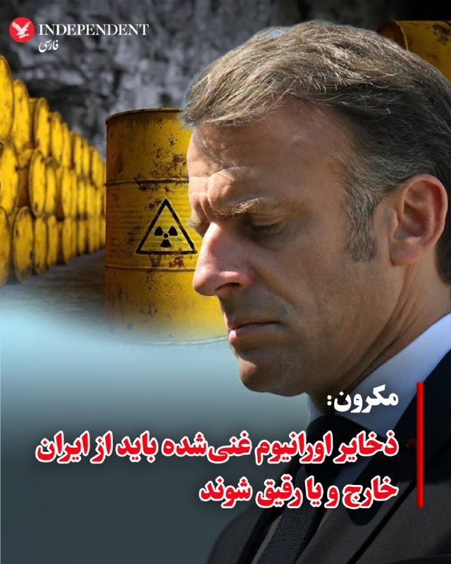

♦️امانوئل مکرون، رئیس‌جمهوری فرانسه، روز دوشنبه ۲۵ خردادماه در حاشیه نشست سران گروه هفت در فرانسه، خواستار خنثی‌سازی ذخایر اورانیوم غنی‌شده ایران و قرار گرفتن آن‌ها تحت نظارت آژانس بین‌المللی انرژی اتمی شد.
مکرون ساعاتی پس از توافق پایان جنگ میان تهران و واشنگتن در اظهارنظری گفت: «اطمینان حاصل خواهیم کرد که ظرفیت‌های باقی‌مانده مرتبط با اورانیوم غنی‌شده به‌طور مناسب خنثی شوند.»
رئیس‌جمهور فرانسه همچنین تاکید کرد ذخایر حساس اورانیوم غنی‌شده ایران باید «یا از کشور خارج شوند یا رقیق‌سازی شوند» و پس از آن تحت نظارت آژانس بین‌المللی انرژی اتمی (IAEA) قرار گیرند.
اظهارات مکرون در حالی مطرح می‌شود که جزئیات توافق اعلام‌شده میان تهران و واشنگتن هنوز منتشر نشده و سرنوشت ذخایر اورانیوم غنی‌شده ایران یکی از مهم‌ترین موضوعات مورد بحث در مذاکرات فنی پیش رو به شمار می‌رود.
‌🇸🇦 Indypersian

🤖 @VahidOOnLine

## VahidOOnLine — post 245708

  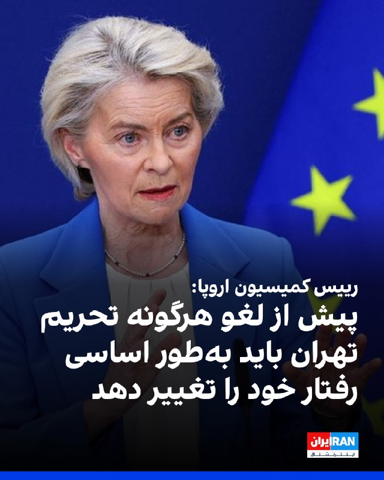

اورسولا فون در لاین، رییس کمیسیون اروپا، گفت ایران باید پیش از لغو هرگونه تحریم اتحادیه اروپا، رفتار خود را به‌طور اساسی تغییر دهد.

او افزود توافق میان آمریکا و جمهوری اسلامی باید به برنامه هسته‌ای، موشک‌های بالستیک و فعالیت‌های بی‌ثبات‌کننده ایران در منطقه پایان دهد و به بازگشایی فوری تنگه هرمز منجر شود.

رییس کمیسیون اروپا همچنین گفت این توافق راه را برای مذاکرات گسترده‌تر درباره صلح و امنیت در خاورمیانه باز می‌کند.
‌🏁 🇬🇧 IranintlTV

🤖 @VahidOOnLine

## WithYashar — post 14977

فوری: اولین سخنرانی مجتبی بعد از پایان جنگ و توافق با آمریکا.
@withyashar

## WithYashar — post 14976

  <a href="telegram/content/WithYashar_14976_1781539587.mp4" target="_blank">🎬 Download video</a>

دونالد ترامپ، رئیس‌جمهور آمریکا، برای شرکت در نشست سران گروه هفت (G7) وارد شهر اویان له‌بن در فرانسه شد
@withyashar

## WithYashar — post 14975

  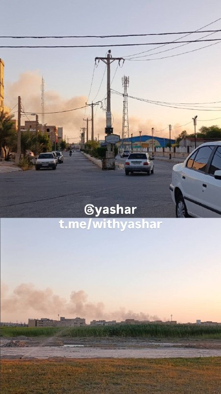

بندر ماهشهر همین الان
@withyashar

## WithYashar — post 14974

کانال ۱۳ اسرائیل:به وضعیت کاملاً غیرقابل قبولی رسیده ایم که ایران در مورد آزادی عمل ما در لبنان «حق وتو» دارد و این یک واقعیت پوچ و غیرقابل قبول است.
@withyashar

## WithYashar — post 14973

## WithYashar — post 14972

  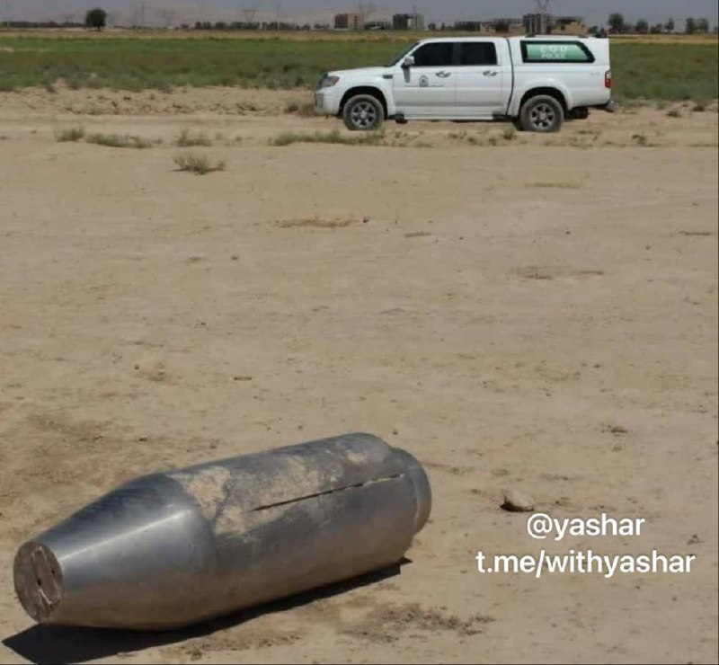

سرجنگی عمل نکرده موشک کروز تاماهاوک در ورامین

این حمله چند شب پیش انجام شد و ده ها سایت راداری در سراسر ایران اعم از کرج و تهران و چند سایت قزوین و جنوب کشور توسط ۴۹ موشک تاماهاوک منهدم شد ( به جز یک موشک تاماهاوک )
موشک های تاماهاوک بار دیگر نشان دادند از دقت فوق العاده ای در زدن اهدافشان برخوردار هستند.
@withyashat

## WithYashar — post 14971

نتانیاهو تا چند ساعت دیگر سخنرانی خواهد کرد و این اولین واکنش رسمی او به اعلام توافق پس از ساعت‌ها سکوت است 🚨
@withyashar

## WithYashar — post 14970

## WithYashar — post 14969

## WithYashar — post 14968

جزئیات دیگری از یک اتفاق قابل توجه درباره ساختار تفاهم اسلام‌آباد

یک منبع نزدیک به تیم مذاکرات در گفتگو با خبرنگار تسنیم، جزئیاتی از یک اتفاق قابل توجه در روز آخر مذاکرات مطرح کرد : بند 13 تفاهم‌نامه مربوط به این موضوع است که تا زمانی که برخی بندهای دیگر تفاهم‌نامه عملیاتی نشده، مذاکرات درباره توافق نهایی یعنی موضوع هسته‌ای صورت نمی‌گیرد.

وی خاطرنشان کرد: تا پیش از روز آخر مذاکرات، بند 13 شامل بندهای 4 و 5 و 10 و 11 بود؛ بند 4 مربوط به رفع محاصره دریایی، بند 5 مربوط به آغاز بازگشایی تنگه هرمز، بند 10 مربوط به اسقاطیه تحریم‌های مربوط به فروش نفت، پتروشیمی و مشتقات ایران و همچنین بند 11 مربوط به آغاز آزادسازی اموال بلوکه شده ایران است.
بنابراین بند 13 به این اشاره داشت که اگر این 4 بند گفته شده (4 و 5 و 10 و 11) انجام نشود، مذاکرات توافق نهایی آغاز نمی‌شود.
این منبع مطلع تاکید کرد: اتفاق مهمی که روز آخر مذاکرات به وقوع پیوست این بود که با پیگیری ایران، بند 1 نیز به بند 13 اضافه شد.
به گفته این منبع آگاه، معنای مهم این اتفاق آن است که اگر جنگ و هرگونه عملیات نظامی، از قبیل ترور و ... در ایران یا جبهه مقاومت از جمله لبنان اتفاق بیفتد، طبق تفاهم هیچگونه مذاکراتی برای توافق نهایی صورت نمی‌گیرد و طبیعتا اجرای تفاهم‌نامه (از جمله بازگشایی تنگه هرمز) از لحاظ ماده ۱۳ متوقف خواهد شد.
@withyashar

## WithYashar — post 14967

عراقچی: جمعه تفاهمنامه ایران و آمریکا امضا می‌شود

اقتصاد ما نباید خود را متکی و موکول به این قبیل توافقات اقتصادی از طریق مذاکره با آمریکا بکند
در راستای منافع کشور، نیمی دیگر از راه مانده که باید طی کنیم که نیمه سختی خواهد بود
@withyashar

## WithYashar — post 14966

  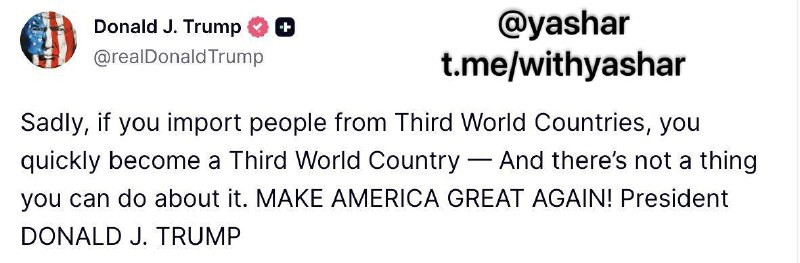

ترامپ‌ در‌تروث: متأسفانه، اگر افراد را از کشورهای جهان سوم وارد کنید، به سرعت خودتان تبدیل به یک کشور جهان سوم می‌شوید و هیچ کاری نمی‌توانید در این باره انجام دهید
آمریکا را دوباره بزرگ کنیم!
@withyashar

## WithYashar — post 14965

ادعای جی‌دی ونس درباره ایران: ما دیروز به صورت دیجیتالی پیش توافق را امضا کردیم
@withyashar

## WithYashar — post 14964

  <a href="telegram/content/WithYashar_14964_1781539593.mp4" target="_blank">🎬 Download video</a>

مجری: ایرانی‌ها می‌گویند قرار است به یک صندوق ۳۰۰ میلیارد دلاری برای بازسازی دسترسی داشته باشند. درست است یا نادرست؟
جی‌دی ونس: چنین چیزی می‌تواند در دسترس آن‌ها قرار بگیرد، مشروط بر اینکه به تعهدات خود در این توافق پایبند باشند.
@withyashar

## WithYashar — post 14963

  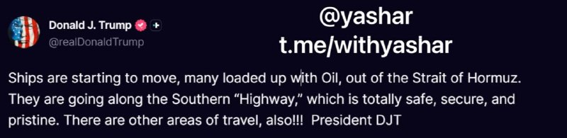

ترامپ در‌تروث: کشتی‌ها شروع به حرکت کرده‌اند، بسیاری از آنها با نفت بارگیری شده‌اند، از تنگه هرمز خارج می‌شوند.

آنها در امتداد «بزرگراه» جنوبی حرکت می‌کنند که کاملاً ایمن، مطمئن و بکر است. مناطق دیگری برای سفر نیز وجود دارد!!!
@withyashar

## WithYashar — post 14962

مکرون: پرداختن به برنامه موشک‌های بالستیک ایران در مذاکرات آینده مهم است.
@withyashar

## WithYashar — post 14961

تسنیم: یک منبع آگاه در گفتگو با خبرگزاری تسنیم، درباره وضعیت نیروهای آمریکایی در منطقه طبق تفاهم اسلام ‌آباد گفت: بر اساس ماده 4 تفاهمنامه، 30 روز پس از توافق نهایی، نیروهای رزمی آمریکایی باید از محیط پیرامونی ایران خارج شوند.

همچنین بر اساس بند 9 تفاهمنامه، در طول 60 روز مذاکرات برای توافق نهایی، نیروی جدید آمریکا در منطقه اضافه نمی‌شود و ایران نیز در این بازه اقدام هسته‌ای انجام نمی‌دهد.
@withyashar

## WithYashar — post 14960

مقام ارشد کاخ سفید به آکسیوس:
هیچ دارایی مسدود شده ایران پس از امضای یادداشت تفاهم نامه در روز جمعه میان ایران و آمریکا آزاد نخواهد شد، همچنین هیچ کاهش تحریمی نیز برای ایران اعمال نخواهد شد.
@withyashar

## WithYashar — post 14959

ونس درباره توافق: جزئیات زیادی هنوز برای حل شدن باقی مانده است!

انتظار می‌رود طیف کاملی از نمایندگان ایران در مراسم امضای روز جمعه حضور داشته باشند
@withyashar

## WithYashar — post 14958

بقائی: ایران و عمان امنیت تردد در تنگه هرمز را تأمین می‌کنند هزینه‌های خدمات ناوبری و بیمه کشتی‌ها طراحی و دریافت می‌شود

مذاکرات هسته‌ای و رفع تحریم‌ها ظرف ۶۰ روز آغاز می‌شود

به اسرائیل اصلاً اعتمادی نیست همون‌طور که به آمریکا هم اعتماد نداریم تجربه هم نشون داده اینها در عمل به تعهداتشان هیچ‌وقت صداقت نداشتند
@withyashar

## mwarmonitor — post 10985

🔴حزب‌الله چند راکت به‌سوی چندین خودروی نظامی اسرائیلی که قصد پیشروی به سمت شهرک کفر‌تبنیت را داشتند، شلیک کرد.

@mwarmonitor

## mwarmonitor — post 10984

🔴ترامپ و معاونش، جی‌دی ونس، هر دو به‌صورت مجازی یادداشت تفاهم با ایران را امضا کردند؛ این را یک مقام ارشد دولت آمریکا اعلام کرد.

🔴به گفته این مقام، محمدباقر قالیباف، رئیس مجلس ایران، این سند را از طرف ایران امضا کرده است.

🔴با این حال، مراسم رسمی امضا قرار است روز جمعه برگزار شود. CNN

@mwarmonitor

## mwarmonitor — post 10983

🔴یکی از مقام‌های حزب‌الله لبنان، محمود قمّاطی، اعلام کرد حق دفاع مشروع این گروه تا زمانی که اشغال و تجاوز ادامه داشته باشد، پابرجاست.

🔴این مقام حزب‌الله همچنین هرگونه پیوند زدن خروج اسرائیل از لبنان به مسائل داخلی لبنان، به‌ویژه موضوع سلاح‌های حزب‌الله، را رد کرد. رویترز

@mwarmonitor

## mwarmonitor — post 10982

  <a href="telegram/content/mwarmonitor_10982_1781539598.mp4" target="_blank">🎬 Download video</a>

🔴یک فروند بمب‌افکن راهبردی روسی Tu-22M3 در منطقه ایرکوتسک روسیه سقوط کرده است. @mwarmonitor

## mwarmonitor — post 10981

  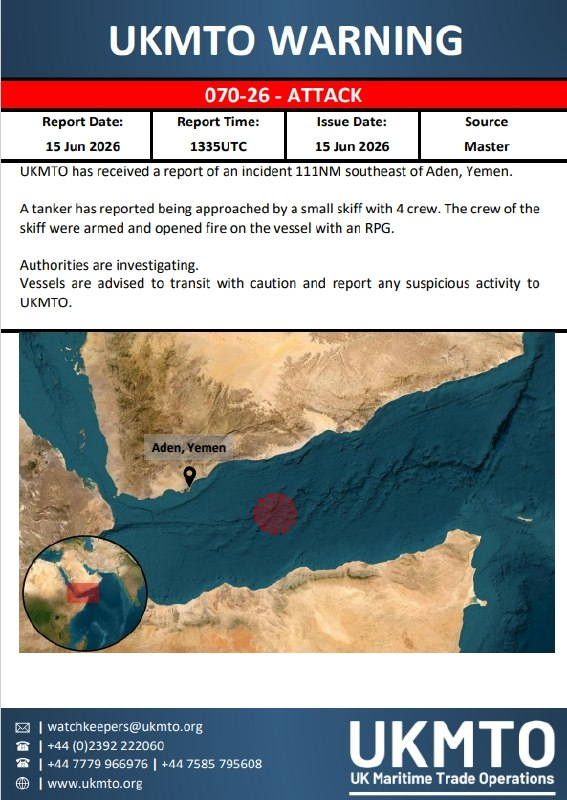

حمله با RPG به یک نفتکش در سواحل یمن

## mwarmonitor — post 10980

حمله با RPG به یک نفتکش در سواحل یمن

## mwarmonitor — post 10979

🔴رسانه‌های لبنانی از کشته شدن یک نفر در حمله پهپادی اسرائیل در جنوب لبنان خبر می‌دهند.

🔹خبرگزاری ملی لبنان گزارش داده است که یک خودرو در منطقه کفر تبنیت هدف قرار گرفته و در نتیجه آن، راننده خودرو جان خود را از دست داده است.

@mwarmonitor

## mwarmonitor — post 10978

🚨 رویترز به نقل از ارتش آمریکا: محاصره بنادر ایران همچنان ادامه دارد و در انتظار تکمیل توافق با ایران است که قرار است روز جمعه انجام شود.

@mwarmonitor

## mwarmonitor — post 10977

🔸ترامپ به گزارش CNN وارد ژنو برای شرکت در نشست سران G7 شده است. طبق گزارش POLITICO، انتظار می‌رود او فردا با رئیس‌جمهور زلنسکی دیدار کند.

@mwarmonitor

## mwarmonitor — post 10976

🔴 رادیو ارتش اسرائیل: تا این لحظه، جالب است که نخست‌وزیر نتانیاهو حتی زحمت نداده درباره این توافق اظهار نظر کند یا در چنین روز مهمی با شهروندان «اسرائیل» صحبت کند. حتی یک بیانیه کوتاه کتبی هم صادر نکرده است. از اعلام دستیابی به توافق توسط ترامپ، ۱۷ ساعت گذشته است.

@mwarmonitor

## mwarmonitor — post 10975

  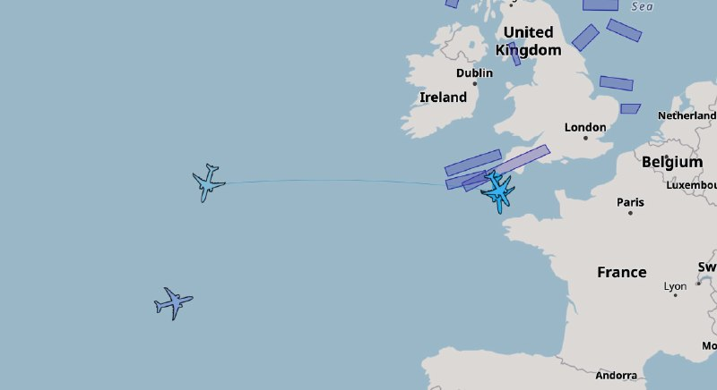

✈️نیروی هوایی آمریکا (USAF) – عملیات Fairford

✈️بمب‌افکن Boeing B-52H Stratofortress (۱ فروند):
61-0035 (کال‌ساین: DITTY 22)

✈️بمب‌افکن Rockwell B-1B Lancer (۳ فروند):
86-0121 (ROTO 11)
86-0102 (ROTO 12)
85-0072 (ROTO 13)

✈️تانکرهای سوخت‌رسان Boeing KC-46 Pegasus (۴ فروند):

21-46095 (BLUE 90)
19-46111 (BLUE 95)
19-46107 (BLUE 96)
18-46044 (BLUE 97)

🔴طبق گزارش، یک فروند B-52 و سه فروند B-1B پس از چند ماه استقرار در RAF Fairford و انجام مأموریت‌های عملیاتی و تمرینات محلی تحت عنوان Operation Epic Fury، این پایگاه را ترک کرده و به پایگاه‌های خود در آمریکا بازمی‌گردند.

✈️این پروازها توسط تانکرهای KC-46 با شناسه‌های BLUE 90 و BLUE 95–97 از پایگاه آزور پشتیبانی شده‌اند.

@mwarmonitor

## mwarmonitor — post 10974

🔸ایالات متحده پس از امضای توافق با ایران، تمرکز خود را بر مین‌روبی تنگه هرمز معطوف خواهد کرد، به نقل از POLITICO.

@mwarmonitor

## mwarmonitor — post 10973

  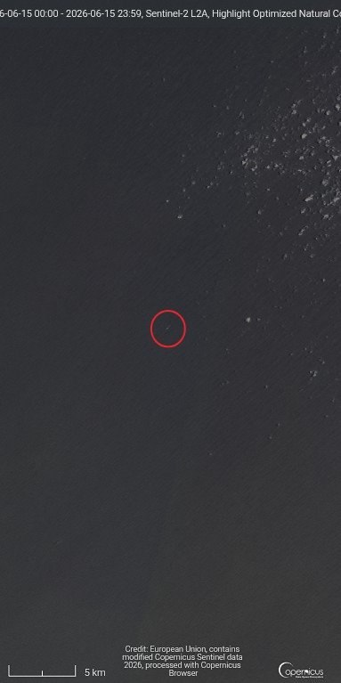

🔴من همین الان کشتی تهاجمی آبی-خاکی USS Tripoli (LHA-7) را در تصاویر ماهواره‌ای Sentinel-2 مربوط به تاریخ ۱۵/۰۶/۲۰۲۶ پیدا کردم.

🔴این کشتی در حال حاضر در مسیر شمال‌شرقی به سمت دریای عمان در حال حرکت است و هیچ اسکورت قابل مشاهده‌ای ندارد.

📍مختصات: 21.636509, 60.517468

@mwarmonitor

## mwarmonitor — post 10972

🔴یک تحقیق بی‌بی‌سی فاش کرده است که یک کارزار دولتی روسیه پشت مجموعه‌ای از حملات آتش‌سوزی عمدی و اقدامات خرابکارانه در بریتانیا قرار دارد؛ از جمله عملیاتی که مستقیماً املاکی مرتبط با نخست‌وزیر کیر استارمر را هدف قرار داده‌اند.

@mwarmonitor

## mwarmonitor — post 10971

🔴رئیس کمیسیون اروپا، اورزولا فون در لاین، گفت اتحادیه اروپا تا زمانی که ایران رفتار خود را تغییر ندهد، تحریم‌ها علیه این کشور را لغو نخواهد کرد.

@mwarmonitor

## mwarmonitor — post 10970

💥 انفجار در منطقه شقلاوه در استان اربیل، شمال عراق رخ داد.

## mwarmonitor — post 10969

  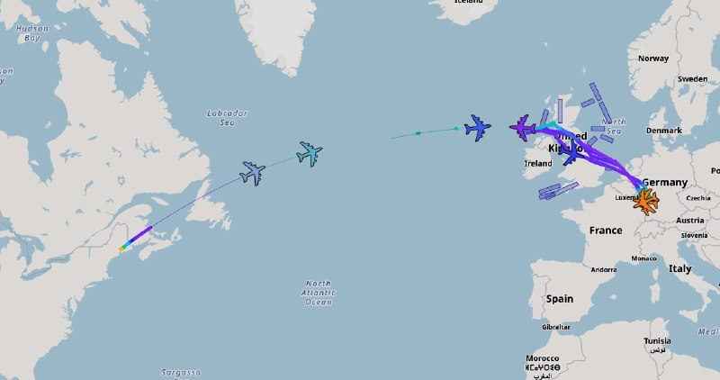

✈️نیروی هوایی آمریکا (USAF) – Coronet East

✈️تانکرهای سوخت‌رسان Boeing KC-135 Stratotanker (۸ فروند):

AE0501 59-1504 – CLEAN 67
AE04E7 60-0343 – CLEAN 66
AE07AB 60-0331 – CLEAN 64
AE047B 58-0117 – CLEAN 57
AE07C2 63-8020 – CLEAN 56
AE035E 58-0077 – CLEAN 55
AE066C 62-3562 – CLEAN 54
Unknown - CLEAN 65

+ پرواز TABOR 11-16 (۶ فروند) A-10C با شناسه “FT”
+ پرواز TABOR 21-25 (۵ فروند) A-10C با شناسه “FT”

✈️یازده فروند A-10C از پایگاه هوایی موودی امروز صبح از RAF Lakenheath (بریتانیا) حرکت کردند. این عملیات با پشتیبانی هواپیماهای CLEAN 54–56 و 64–66 از پایگاه هوایی رامشتاین و همچنین CLEAN 57 و 67 از Bangor ANGB انجام شد.

✈️این هواپیماها پس از یک استقرار طولانی در خاورمیانه و در قالب عملیات «Epic Fury» در حال بازگشت هستند.

@mwarmonitor

## mwarmonitor — post 10968

💥 انفجار در منطقه شقلاوه در استان اربیل، شمال عراق رخ داد.

## mwarmonitor — post 10967

🔴آمیت سیگال خبرنگار و تحلیلگر کانال ۱۲ اسرائیل

🔸پس از آن‌که دونالد ترامپ دیشب اعلام کرد توافق نهایی شده است، من به جمله‌ای از هنری کیسینجر فکر کردم: «شاید دشمن بودن با آمریکا خطرناک باشد، اما دوست آمریکا بودن کشنده است.»

🔹جزئیات هنوز تأیید نشده‌اند، اما آنچه در حال حاضر از این توافق برمی‌آید به این شرح است:

📌این توافق با یک آتش‌بس فوری در چند جبهه آغاز می‌شود—از جمله لبنان—و لغو محاصره دریایی آمریکا علیه بنادر ایران در ازای «باز شدن» تنگه هرمز توسط ایران. ایران خواستار پرداخت اولیه ۱۲ میلیارد دلار پیش از باز شدن تنگه است و با توجه به اشتیاق برای رسیدن به توافق در چشمان ترامپ، بعید است این درخواست رد شود.

با این حال، یک ابهام مهم درباره تنگه وجود دارد. در حالی که ترامپ می‌گوید این بازگشایی «بدون عوارض» خواهد بود، مقامات ایرانی پیش‌تر اشاره کرده‌اند که ممکن است همچنان هزینه‌هایی اعمال شود یا کنترل‌های نظارتی خود را حفظ کنند—که عملاً می‌تواند یکی از اهداف مهم ایران در جنگ را تضمین کند، با این تفاوت که این بار با مشروعیت‌بخشی آمریکا همراه است. همچنین این توافق مقرر می‌کند که ظرف ۶۰ روز پس از امضای برنامه‌ریزی‌شده در ۱۹ ژوئن در ژنو، دو کشور مذاکرات تکمیلی را برای بررسی پایان کامل تحریم‌های آمریکا، موضوع هسته‌ای و بازسازی اقتصادی ایران آغاز کنند.

به نظر می‌رسد این چارچوب با مواضع قبلی آمریکا تفاوت زیادی دارد. ترامپ که پیش‌تر بر نابودی کامل تأسیسات هسته‌ای ایران و غنی‌سازی صفر تأکید داشت، به نیویورک تایمز گفته است که اکنون به ایران اجازه غنی‌سازی سطح پایین داده خواهد شد—به این معنا که «غنی‌سازی صفر» حتی به میز مذاکره هم نخواهد رسید. خبرگزاری تسنیم نیز این توافق را «وقفه تاکتیکی در جنگ، نه یک توافق نهایی» توصیف کرده و هشدار داده که «برای هر توافق آینده به امتیازات بیشتری نیاز است» و بی‌اعتمادی به آمریکا باعث می‌شود یک توافق پایدار بعید باشد. تهران نیز در سایر موارد امتیاز کمی داده است: در برابر درخواست آمریکا برای ممنوعیت ۲۰ ساله غنی‌سازی، تنها یک توقف ۵ ساله پیشنهاد می‌دهد و همچنین در تلاش است حداقل بخشی از دارایی‌های بلوکه‌شده خود را در مراحل اولیه یادداشت تفاهم آزاد کند—که این امر اهرم فشار آمریکا را کاهش داده و پیش از آغاز مذاکرات اصلی هسته‌ای، تسهیلات اقتصادی حیاتی برای ایران فراهم می‌کند.

ترامپ اعلام کرده است که در صورت شکست این مذاکرات، آمریکا دوباره به جنگ بازخواهد گشت—ادعایی که باید به اندازه تمام دفعات قبلی که او در ۶۸ روز گذشته چنین گفته، جدی گرفته شود.

در جمع‌بندی: ایران به باز شدن بنادر، رفع تحریم‌ها و به رسمیت شناختن عملی حاکمیتش بر تنگه هرمز دست می‌یابد—در برابر پایبندی به آتش‌بس اولیه، بازگرداندن آزادی تجارت و توقف اقدامات پراکنده خشونت‌آمیز. در مذاکرات هسته‌ای بعدی نیز، ایران مجبور به توقف کامل برنامه هسته‌ای نخواهد بود؛ تنها کاهش سطح غنی‌سازی برای دوره‌ای بین پنج تا حداکثر ۲۰ سال.


🔹در یک کلمه، موضع آمریکا: تسلیم.

@mwarmonitor

## mwarmonitor — post 10966

  <a href="telegram/content/mwarmonitor_10966_1781539602.mp4" target="_blank">🎬 Download video</a>

🔰ترافیک همچنان نامنظم است.

📌در مجموع ۲۹ عبور تأییدشدهٔ کشتی از تنگه هرمز بین ۱۰ تا ۱۴ ژوئن ثبت شده است که شامل نفت خام، فرآورده‌های پالایش‌شده، گاز مایع (LPG)، مواد شیمیایی، متانول و محموله‌های عمومی می‌شود. فعالیت‌ها عمدتاً در ۱۱ و ۱۲ ژوئن متمرکز بوده‌اند، در حالی که ۲۳ مورد از عبورها از غرب به شرق بوده و در مقابل تنها ۶ مورد در جهت مخالف حرکت کرده‌اند. ۱۸ عبور در دسته «مسیر تاریک» یا «مسیر نامشخص» طبقه‌بندی شده‌اند که نشان‌دهنده محدودیت‌های ادامه‌دار در شفافیت ردیابی، با وجود جریان پایدار ترافیک است.

🔴 همچنین دو کشتی تحریم‌شده در این بازه شناسایی شده‌اند. این داده‌ها با گزارش‌هایی درباره پیشرفت در مذاکرات آمریکا و ایران همخوانی دارد و نشان می‌دهد که تنگه همچنان عملیاتی است، هرچند حجم ترافیک، شفافیت مسیرها و تعادل جهتی هنوز به حالت عادی کامل بازنگشته است.

@mwarmonitor

## FoxNewsTwitter — post 342980

Fox News (Twitter/X)

NOW: President Trump arrives in France as G7 leaders gather for the opening stretch of summit talks.

The kickoff in Évian-les-Bains sets the stage for days of bilateral meetings, closed-door sessions, and global pressure points on the agenda.

## FoxNewsTwitter — post 342979

  <a href="telegram/content/FoxNewsTwitter_342979_1781539604.mp4" target="_blank">🎬 Download video</a>

Fox News (Twitter/X)

“Loving our country is starting to sound like an abused spouse saying they love their abuser.”

That was Robert De Niro’s message as he took aim at President Trump during a First Amendment fundraising event in New York City on Sunday, arguing that America is “not so lovable right now.”

The Oscar-winning actor went on to say he cannot love a country led by Trump, escalating his long-running criticism of the president.

## FoxNewsTwitter — post 342978

Fox News (Twitter/X)

NOW: President Trump arrives in Geneva, Switzerland for the G7 summit, just a day after announcing an agreement to end the U.S. war with Iran.

G7 leaders will convene in France, where discussions are expected to focus on the Iran conflict, the Russia-Ukraine war, and a range of other global issues.

## FoxNewsTwitter — post 342977

  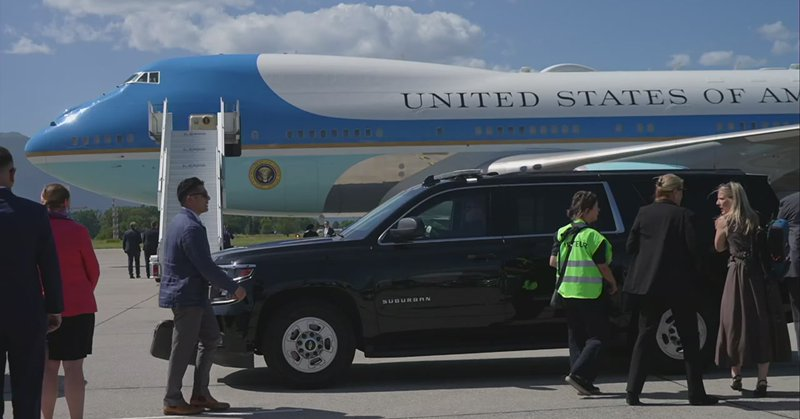

Fox News (Twitter/X)

WATCH LIVE: President Trump arrives in Europe for high-stakes G7 summit https://twitter.com/i/broadcasts/1dKrPPeVEzXJX

## FoxNewsTwitter — post 342976

  <a href="telegram/content/FoxNewsTwitter_342976_1781539608.mp4" target="_blank">🎬 Download video</a>

Fox News (Twitter/X)

The Knicks didn't just beat the Spurs — they sent @LawrenceBJones3 into a dunk tank.

After betting on San Antonio to win the NBA Finals, Lawrence honored every part of the @foxandfriends wager, sporting a Knicks tie and eating sardines.

Then @kilmeade and @ainsleyearhardt sent him plunging into a dunk tank after New York sealed the championship in five games.

## FoxNewsTwitter — post 342975

  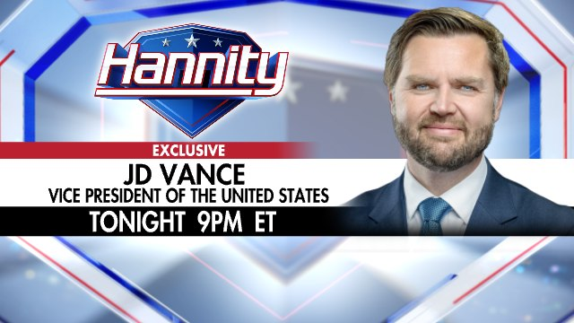

Fox News (Twitter/X)

Vice President JD Vance joins @seanhannity live tonight at 9 PM ET.

Vance will discuss the latest developments in Iran and his new book "Communion: Finding My Way Back to Faith.”

## FoxNewsTwitter — post 342974

  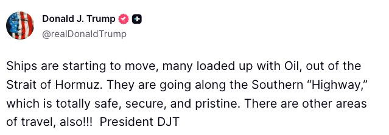

Fox News (Twitter/X)

NEW: President Trump announces that ships are starting to move out of the Strait of Hormuz, many "loaded up with Oil," following the historic agreement reached with Iran over the weekend.

## FoxNewsTwitter — post 342973

  <a href="telegram/content/FoxNewsTwitter_342973_1781539612.mp4" target="_blank">🎬 Download video</a>

Fox News (Twitter/X)

NEW: @TreyYingst breaks down the path to a historic peace deal after more than 100 days of war, highlighting President Trump's role in bringing both sides to the negotiating table.

President Trump says the agreement will help bring peace and security to the region, with the Strait of Hormuz set to reopen Friday and oil expected to begin flowing again.

The official signing ceremony is scheduled for Friday in Switzerland.

VP Vance described the tense final moments before the agreement, saying the U.S. was concerned Iran might launch attacks against Israel. According to Vance, Iranian officials assured negotiators they would not strike and would honor the deal.

Now, the White House is expressing optimism that the agreement could mark a major turning point for stability across the region.

## FoxNewsTwitter — post 342972

  <a href="telegram/content/FoxNewsTwitter_342972_1781539615.mp4" target="_blank">🎬 Download video</a>

Fox News (Twitter/X)

Fairfax County parents say they're being asked to trade Christmas for more classroom time.

A district survey is asking families whether religious and cultural holidays should be removed from the school calendar in exchange for additional "learning days" for students.

One Fairfax mother tells @ainsleyearhardt the district has shown little interest in hearing parents' objections, accusing school leaders of displaying an anti-Christian bias and dismissing concerns raised by families. | @foxandfriends

## pm_afshaa — post 94108

  <a href="telegram/content/pm_afshaa_94108_1781539619.webm" target="_blank">🎬 Download video</a>

ویدیو بدون سانسور از لحظه‌ای که دختر 21 ساله برزیلی جون خودشو بخاطر بی دقتی چندتا احمق از دست داد

حاوی صحنه دلخراش
🔞
🔞
🔞

مشاهده فیلم

@Pm_Afshaa

## pm_afshaa — post 94107

  <a href="telegram/content/pm_afshaa_94107_1781539619.webm" target="_blank">🎬 Download video</a>

🔴عراقچی: احتمالا روز جمعه در سوئیس هیات‌های ایران و آمریکا دیدار میکنن.

💧 Rainbet.com the #1 Non-KYC Crypto Casino & Sportsbook @rainbetcom

😁 @Pm_Afshaa

## pm_afshaa — post 94103

  <a href="telegram/content/pm_afshaa_94103_1781539620.mp4" target="_blank">🎬 Download video</a>

گویا بازار تجریش دچار آتش‌سوزی شده

💧 Rainbet.com the #1 Non-KYC Crypto Casino & Sportsbook @rainbetcom

😁 @Pm_Afshaa

## pm_afshaa — post 94102

  <a href="telegram/content/pm_afshaa_94102_1781539624.webm" target="_blank">🎬 Download video</a>

🔴باراک راوید، خبرنگار آکسیوس:
یک مقام ارشد آمریکایی تأکید کرد که در دو تا سه هفته آینده خواهیم دانست که آیا تفاهم‌های ما با ایران میتونه به توافق تبدیل بشه یا نه.

💧 Rainbet.com the #1 Non-KYC Crypto Casino & Sportsbook @rainbetcom

😁 @Pm_Afshaa

## pm_afshaa — post 94101

  <a href="telegram/content/pm_afshaa_94101_1781539624.webm" target="_blank">🎬 Download video</a>

🔴سفیر ایران در عراق: نزدیک به 1 میلیون نفر از عراق وارد کشور میشن تا در مراسم تشییع علی خامنه‌ای شرکت کنن.

💧 Rainbet.com the #1 Non-KYC Crypto Casino & Sportsbook @rainbetcom

😁 @Pm_Afshaa

## pm_afshaa — post 94100

ساعت 20 به وقت اسراییل نتانیاهو قراره بیانیه بده

💧 Rainbet.com the #1 Non-KYC Crypto Casino & Sportsbook @rainbetcom

😁 @Pm_Afshaa

## pm_afshaa — post 94099

مکرون:توافق باید شامل مسئله موشک‌های بالستیک ایران باشد

💧 Rainbet.com the #1 Non-KYC Crypto Casino & Sportsbook @rainbetcom

😁 @Pm_Afshaa

## pm_afshaa — post 94098

  <a href="telegram/content/pm_afshaa_94098_1781539625.webm" target="_blank">🎬 Download video</a>

🔴نیویورک‌تایمز: جمهوری اسلامی عمدا تا بعد از نیمه‌شب صبر کرد تا نهایی شدن توافق با روز تولد ترامپ هم‌زمان نشه.

💧 Rainbet.com the #1 Non-KYC Crypto Casino & Sportsbook @rainbetcom

😁 @Pm_Afshaa

## pm_afshaa — post 94097

  <a href="telegram/content/pm_afshaa_94097_1781539626.webm" target="_blank">🎬 Download video</a>

🔴رویترز به نقل از ارتش آمریکا:
محاصره بنادر ایران همچنان ادامه داره و در انتظار تکمیل توافق با ایرانه که قراره روز جمعه انجام بشه.

💧 Rainbet.com the #1 Non-KYC Crypto Casino & Sportsbook @rainbetcom

😁 @Pm_Afshaa

## pm_afshaa — post 94096

🔴جی‌دی ونس:
ما کاملاً پذیرای سرمایه‌گذاری کشورهای خلیج فارس در بازسازی ایران هستیم، اما تنها در صورتی که ایران تعهدات لازم رو انجام بده.

💧 Rainbet.com the #1 Non-KYC Crypto Casino & Sportsbook @rainbetcom

😁 @Pm_Afshaa

## pm_afshaa — post 94095

  <a href="telegram/content/pm_afshaa_94095_1781539627.webm" target="_blank">🎬 Download video</a>

🔴جی‌دی ونس:
ایران تا زمانی که به تعهدات خود عمل نکنه، حتی یک ریال هم پول آمریکا رو دریافت نمیکنه، و پولی که ما در موردش صحبت می‌کنیم اساساً تخفیف تحریم‌هاست.

ما مایلیم تخفیف قابل توجهی در تحریم‌ها بدیم، اگر ایرانی‌ها تعهدات بلندمدتی رو که برای تبدیل شدن به یک کشور عادی، کنار گذاشتن برنامه تسلیحات هسته‌ای و توقف تأمین مالی فعالیت‌های تروریستی در سراسر خاورمیانه ضروریه، بپذیرند.

💧 Rainbet.com the #1 Non-KYC Crypto Casino & Sportsbook @rainbetcom

😁 @Pm_Afshaa

## pm_afshaa — post 94094

  <a href="telegram/content/pm_afshaa_94094_1781539628.webm" target="_blank">🎬 Download video</a>

🔴بقائی، سخنگوی وزارت خارجه:
آزاد شدن اموال مسدود شده یا محدود شده ایران، در کنار موضوع بازسازی خسارات، دو موضوع مهم از حیث اقتصادی است و طرف آمریکایی متعهد میشه که در هر دو مورد اقداماتی رو انجام بده.

بر اساس این یادداشت تفاهم، طرف آمریکایی به رفع همه تحریم‌ها، اعم از ثانویه و اولیه موظف میشه.

💧 Rainbet.com the #1 Non-KYC Crypto Casino & Sportsbook @rainbetcom

😁 @Pm_Afshaa

## pm_afshaa — post 94093

  <a href="telegram/content/pm_afshaa_94093_1781539628.mp4" target="_blank">🎬 Download video</a>

🎙 خبرنگار سی‌بی‌اس: ایرانی‌ها میگن که به یک صندوق بازسازی 300 میلیارد دلاری دسترسی پیدا خواهند کرد. درسته یا نادرست؟

جی‌دی ونس: این از اون دست چیزهاییه که آنها میتونن بهش دسترسی داشته باشن، به شرطی که به تعهدات خود پایبند باشن.

💧 Rainbet.com the #1 Non-KYC Crypto Casino & Sportsbook @rainbetcom

😁 @Pm_Afshaa

## pm_afshaa — post 94092

  <a href="telegram/content/pm_afshaa_94092_1781539631.webm" target="_blank">🎬 Download video</a>

🔴جی‌دی ونس: ما دیروز به صورت دیجیتالی توافق رو امضا کردیم.

💧 Rainbet.com the #1 Non-KYC Crypto Casino & Sportsbook @rainbetcom

😁 @Pm_Afshaa

## pm_afshaa — post 94091

  <a href="telegram/content/pm_afshaa_94091_1781539632.webm" target="_blank">🎬 Download video</a>

🔴مکرون، رئیس جمهور فرانسه:
درحال حاضر اولویت ما بازگشایی تنگه هرمز است و درباره عوارض بعداً گفت‌وگو می‌کنیم. تلاش خودمون رو می‌کنیم تا هیچ‌گونه عوارض و حق عبوری در تنگه هرمز تعیین نشه.

البته ایرانی‌ها در حال حاضر با کلمات بازی میکنن و میگن: این هزینه‌ها بابت ارائه خدمات است. به هر حال، ما این موضوع رو بررسی خواهیم کرد.

💧 Rainbet.com the #1 Non-KYC Crypto Casino & Sportsbook @rainbetcom

😁 @Pm_Afshaa

## pm_afshaa — post 94090

  <a href="telegram/content/pm_afshaa_94090_1781539633.mp4" target="_blank">🎬 Download video</a>

🔴شاهکار جدید خوش‌چشم کارشناس صداوسیما، لحظاتی قبل از توافق :

دروغ میگن توافقه، الان میخوایم به اسرائیل موشک بزنیم؛ من از پشت پرده خبر دارم...

💧 Rainbet.com the #1 Non-KYC Crypto Casino & Sportsbook @rainbetcom

😁 @Pm_Afshaa

## pm_afshaa — post 94089

  <a href="telegram/content/pm_afshaa_94089_1781539636.webm" target="_blank">🎬 Download video</a>

🔴جی‌دی ونس، معاون ترامپ: ما شاهدیم که هم تندروها و هم رهبران سیاسی ایران میگن: رابطه ما با آمریکا در 47 سال گذشته یک اشتباه بوده، بیایید ورق جدیدی رو برگردونیم. 
💧 Rainbet.com the #1 Non-KYC Crypto Casino & Sportsbook @rainbetcom 
😁 @Pm_Afshaa

## iaghapour — post 2676

  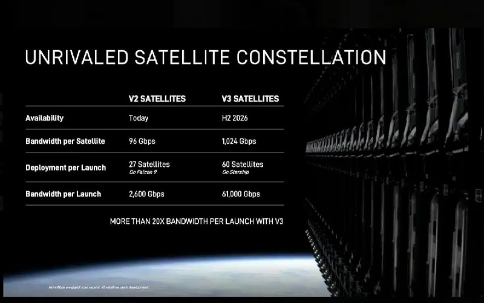

🚀 ادعای ایلان ماسک: پهنای باند استارلینک ۱۰۰ برابر می‌شود!

اسپیس ایکس از دستاورد جدیدی خبر داده و اعلام کرده که تعداد مشترکان اینترنت ماهواره‌ای استارلینک از مرز ۱۲ میلیون کاربر در ۱۶۰ کشور عبور کرده است. اما این تازه آغاز راه است و ایلان ماسک برنامه‌های بسیار جاه‌طلبانه‌ای برای آینده دارد.

🔸 انقلاب ماهواره‌های نسل سوم: ماهواره‌های نسل سوم استارلینک، پهنای باندی ۱۰ برابر نسبت به ماهواره‌های فعلی ارائه خواهند داد. همزمان، سرعت پرتاب این ماهواره‌ها نیز ۱۰ برابر افزایش می‌یابد که در نهایت منجر به افزایش ۱۰۰ برابری پهنای باند کل منظومه استارلینک خواهد شد.

🔸 کاهش محسوس تاخیر: ماهواره‌های نسل جدید قرار است در مداری پایین‌تر (فاصله ۳۵۰ کیلومتری زمین به جای ۵۵۰ کیلومتر) حرکت کنند. این کاهش فاصله، طبق ادعای ماسک، زمان تاخیر را به نصف کاهش می‌دهد.

🔹 وضعیت در ایران: این جهش‌های تکنولوژیک در حالی رخ می‌دهد که در ایران، استفاده و خرید و فروش تجهیزات استارلینک همچنان ممنوع و جرم تلقی می‌شود. با این حال، در پی قطعی‌های اینترنت در یک سال اخیر، ده‌ها هزار ترمینال به صورت قاچاق وارد کشور شده است.

🆔 @iAghapour

## DEJradio — post 5701

  <a href="telegram/content/DEJradio_5701_1781539637.webm" target="_blank">🎬 Download video</a>

🔺🎤 دوسلدورف میزبان نشست نیروهای جمهوری‌خواه در حمایت از شاهزاده رضا پهلوی

دانیال ایلخانی‌پور، سیاستمدار ایرانی‌تبار آلمانی و نماینده حزب سوسیال دموکرات (SPD) در پارلمان ایالتی هامبورگ در گفت‌وگو با ایمان صفتی می‌گوید:
«گروه‌های مختلف از طیف‌های مختلف از شاهزاده رضا پهلوی شرکت می‌کنند و این ستون الان تشکیل شده و برنامه این است که توضیح داده شود چرا باید از ایشان حمایت شود و نشان دهیم که میان ایرانی‌ها بر روی آلترناتیو مشترک اتحاد وجود دارد.»

#شاهزاده_رضا_پهلوی
@DEJradio

## DEJradio — post 5700

  <a href="telegram/content/DEJradio_5700_1781539638.webm" target="_blank">🎬 Download video</a>

🚨📢 با وجود توافق اولیه جمهوری اسلامی و آمریکا برای باز شدن تنگه هرمز، منابع امنیت دریایی و صنعت کشتیرانی می‌گویند عملیات مین‌روبی تنگه هرمز تا بازگشایی این آبراه، ممکن است ۴۰ تا ۵۰ روز طول بکشد.

-یاکوب لارسن مدیر ایمنی و امنیت انجمن کشتیرانی «BIMCO» می‌گوید، «هنوز هم عبور کشتی‌ها از این منطقه بسیار پرخطر است.»
به گفته تحلیلگران امنیتی وجود مین‌ها همچنان یک نگرانی جدی است و باید مسیرهای عاری از مین شناسایی و تأیید شوند.»
پیدا نیست جمهوری اسلامی چه تعداد مین در تنگه هرمز کار گذاشته است.

رنه کوفود اولسن، مدیرعامل شرکت مدیریت کشتی «V.Group» که ۱۳ کشتی آن در خلیج فارس گرفتار شده‌اند، گفت: «وجود حتی یک مین دریایی هم می‌تواند به تلفات انسانی منجر شود. این مسئله برای صنعت کشتیرانی جهانی بسیار جدی است.»

#تنگه_هرمز #توافق
@DEJradio

## DEJradio — post 5699

  <a href="telegram/content/DEJradio_5699_1781539639.webm" target="_blank">🎬 Download video</a>

🔺📢 تلسکوپ، قسمت ششم

#تلسکوپ
@DEJradio

## DEJradio — post 5698

  <a href="telegram/content/DEJradio_5698_1781539640.webm" target="_blank">🎬 Download video</a>

🚨
🔸 نمایش آینده صنعت دفاعی جهان در برلین؛ ایران جا مانده از رقابت جهانی

گزارش: ملیکا رضاپور

#صنعت_دفاعی #برلین #ایران
@DEJradio

## DEJradio — post 5697

  <a href="telegram/content/DEJradio_5697_1781539640.mp4" target="_blank">🎬 Download video</a>

🤡
🔺 عزاداری زنان کفن‌پوش در اعتراض به توافق با آمریکا

شماری از زنان حامی نظام در اعتراض به توافق جمهوری اسلامی با آمریکا کفن پوشیدند و دست به اعتراض زدند.

#کفن #توافق #تجمعات_حکومتی
@DEJradio

## DEJradio — post 5696

⭕️ توافق با جمهوری اسلامی برای اسرائیل و جهان آزاد خوب نیست

بتسالل اسموتریچ، وزیر دارایی اسرائیل توافق میان آمریکا و جمهوری اسلامی را توافقی بد برای اسرائیل و همه جهان آزاد، عنوان کرد.
او در شبکۀ اکس نوشت کارزار مشترک علیه جمهوری اسلامی دستاوردهای مهمی داشته است.
به گفتۀ وزیر کابینۀ نتانیاهو، نباید اجازه داد دستاوردهای علیه جمهوری اسلامی، نابود شود.
اسموتریچ تأکید کرد اسرائیل باید با «روش‌های خلاقانه» فشار بر جمهوری اسلامی را ادامه دهد.
او افزود باید اطمینان به‌دست آید که رژیم حاکم بر ایران هرگز به سلاح هسته‌ای دست پیدا نمی‌کند.
وزیر دارایی اسرائیل همچنین گفت ارتش اسرائیل باید آزادی عمل کامل خود را برای عملیات علیه حزب‌الله، محفوظ نگه دارد.
اسموتریچ، جبهۀ لبنان را نخستین آزمون عملی پساتوافق دانست و تصریح کرد که اسرائیل باید حزب‌الله را از مرزهای شمالی اسرائیل دور نگه دارد.
شبه‌نظامیان حزب‌الله که جزو نیروهای نیابتی جمهوری اسلامی در منطقه به‌شمار می‌روند، در سیاهۀ تروریستی آمریکا و اتحادیۀ اروپا قرار دارند.

#توافق #مذاکره #اسرائیل #خاورمیانه
@DEJradio

## DEJradio — post 5695

⭕️ نامۀ اعضای پارلمان اروپا به فیفا دربارۀ فوتبالیست‌های زندانی ایران

چهار عضو پارلمان اروپا در نامه‌ای سرگشاده به جیانی اینفانتینو، رئیس فیفا خواستار توضیح دربارۀ وضعیت فوتبالیست‌های زندانی در ایران شدند.
امضاکنندگان نامه با اشاره به بازداشت، زندانی شدن و صدور احکام سنگین برای شماری از فوتبالیست‌های ایرانی، از فیفا پرسیده‌اند آیا هرگز در این راستا با فدراسیون فوتبال جمهوری اسلامی رایزنی کرده است یا نه.
تنظیم‌کنندگان نامه به فیفا، از اینفانتینو در مورد «میزان اطلاعات فیفا از وضعیت حقوقی و امنیتی بازیکنان بازداشتی» خواستار توضیح شدند.
در این نامه به پروندۀ احسان حسینی‌پور حصارلو، فوتبالیست ۱۹ ساله‌ای که بنا بر گزارش‌ها در خطر اعدام قرار دارد، اشاره شده است.
اعضای پارلمان اروپا از فیفا خواستند مسئلۀ حقوق بشر را در تعاملات خود با فدراسیون فوتبال جمهوری اسلامی در مرکز توجه قرار دهد.
چهار عضو پارلمان اروپا تأکید کردند اعتبار «تعهدات حقوق بشری فیفا» زمانی سنجیده می‌شود که خود فوتبالیست‌ها زندانی می‌شوند یا در معرض اعدام قرار می‌گیرند.
نامه به فیفا به امضای هانا نویمان، بارت گروتیوس، دانیل عطارد و لوکاس فورلاس رسیده است.
رئیس فیفا به‌تازگی برای رفع مشکل اعضای فدراسیون و اکیپ تیم ملی فوتبال جمهوری اسلامی تلاش‌هایی بسیار انجام داده است.

#پارلمان_اروپا #فیفا
@DEJradio

## DEJradio — post 5694

⭕️ آتش‌سوزی در نفتکش هندی در سواحل عمان؛ آسیبی به سرنشین‌ها نرسید

وزارت کشتیرانی هندوستان روز دوشنبه از وقوع آتش‌سوزی در نفتکش ماریوکس، در سواحل عمان خبر داد.
به گفته مقام‌های هندی، این کشتی با پرچم ماداگاسکار در حال حرکت بود و ۲۴ ملوان هندی در آن حضور داشتند.
مدیر وزارت بنادر و کشتیرانی هند با اشاره به این که همۀ سرنشینان کشتی سالم مانده‌اند، اعلام کرد دهلی‌نو با وزارت خارجه، نیروی دریایی و نمایندگی‌های خود در منطقه برای تأمین امنیت خدمه در تماس است.
علت آتش‌سوزی که در ساعات ابتدایی عصر دوشنبه رخ داد، هنوز مشخص نشده و تحقیقات ادامه دارد.

#آتش_سوزی #دریای_عمان
@DEJradio

## DEJradio — post 5693

⭕️ ایتامار بن‌گویر گفت توافق ترامپ تعهدی برای اسرائیل ایجاد نمی‌کند

ایتامار بن‌گویر، وزیر امنیت ملی اسرائیل روز دوشنبه با بی‌اعتنایی به توافق میان آمریکا و جمهوری اسلامی، گفت اسرائیل خود را ملزم به اجرای آن نمی‌داند.
بن‌گویر در کانال تلگرامی خود نوشت: توافق ترامپ ما را متعهد نمی‌کند.
به گفتۀ وزیر امنیت ملی اسرائیل، توافق تهران و واشینگتن امنیت اسرائیل را تضمین نمی‌کند.
بن‌گویر افزود اسرائیل نباید به چیزی کمتر از برچیدن کامل حزب‌الله لبنان رضایت بدهد.

#اسرائیل #توافق #جمهوری_اسلامی
@DEJradio

## DEJradio — post 5692

⭕️ سازمان ملل گزارش داد جمهوری اسلامی از ابتدای ۲۰۲۶ دست‌کم ۴۰ نفر را با اتهام‌های امنیتی اعدام کرده است

ولکر تورک، کمیسر عالی حقوق بشر سازمان ملل متحد، اعلام کرد جمهوری اسلامی از آغاز سال ۲۰۲۶ تاکنون دست‌کم ۴۰ نفر را به اتهام‌های مرتبط با «امنیت ملی» اعدام کرده است.
به گفتۀ کمیسر ارشد سازمان ملل، در میان اعدام‌شدگان دست‌کم ۱۸ نفر جزو معترضان خیابانی بودند.
تورک همچنین گفت جمهوری اسلامی پس از اعتراضات و همزمان با جنگ منطقه‌ای، سرکوب‌ها را تشدید کرده است.
کمیسر عالی حقوق بشر افزود رژیم در ماه‌های اخیر هزاران شهروند را بازداشت و محدودیت‌هایی بیشتر را بر فضای مدنی اعمال کرده است.

#اعدام #اعتراضات #جاویدنامان
@DEJradio

## DEJradio — post 5691

⭕️
⭕️ اسرائیل از لبنان عقب‌نشینی نمی‌کند

یسرائیل کاتس، وزیر دفاع اسرائیل ساعاتی پس از اعلام نهائی شدن تفاهم میان جمهوری اسلامی و آمریکا گفت ارتش اسرائیل به‌صورت نامحدود در لبنان، سوریه و غزه حضور می‌یابد.
او در بیانیه‌ای اعلام کرد سیاست دولت بنیامین نتانیاهو برای حفاظت از امنیت اسرائیل، روشن است.
به گفتۀ یسرائیل کاتز، بر اساس سیاست دولت، نیروهای اسرائیلی در مناطق امنیتی باقی می‌مانند تا از شهرها و مرزهای کشور در برابر نیروهای جهادی، محافظت کنند.
کاتس همچنین به جمهوری اسلامی هشدار داد اگر تهران به بهانۀ عملیات اسرائیل علیه حزب‌الله در لبنان، به خاک اسرائیل حمله کند، با واکنشی شدید مواجه می‌شود.
مقام‌های جمهوری اسلامی مدعی‌اند توافق با آمریکا شامل پایان جنگ در لبنان و عقب‌نشینی نیروهای اسرائیل از خاک این کشور است.
اسرائیل در روزهای اخیر بارها مواضع حزب‌الله را هدف گرفته است.
شبه‌نظامیان حزب‌الله که از پشتیبانی جمهوری اسلامی برخوردارند، در سیاهۀ تروریستی آمریکا و اتحادیۀ اروپا قرار دارند.

#اسرائیل #لبنان
@DEJradio

## DEJradio — post 5690

  <a href="telegram/content/DEJradio_5690_1781539645.webm" target="_blank">🎬 Download video</a>

🤡
🔺 وزیر آموزش و پرورش:
فرهنگ شهادت، مهمترین مؤلفه قدرت جمهوری اسلامی است

علیرضا کاظمی وزیر آموزش و پرورش جمهوری اسلامی در جمع شماری از نظامی‌های ارتش و سـ.ـپاه گفت «فرهنگ شهادت، مهمترین مؤلفه قدرت جمهوری اسلامی ایران است» و «از مکتب عاشورا و سیره شهدا الهام گرفته‌ شده است.»
او با تأکید بر اینکه جنگ امروز دشمنان صرفاً نظامی نیست، هشدار داد «جنگ رسانه‌ای، اقتصادی و شناختی با هدف تضعیف امید و کاهش تاب‌آوری مردم دنبال می‌شود و لازم است همگان با هوشیاری و آگاهی در برابر این هجمه‌ها ایستادگی کنند.»

#عاشورا #شهادت #حذف
@DEJradio

## VahidOnline — post 76382

  <a href="telegram/content/VahidOnline_76382_1781539645.mp4" target="_blank">🎬 Download video</a>

اکانت فارسی وزارت خارجه آمریکا با انتشار ویدیوی بالا نوشت:

جی. دی. ونس، معاون رئیس‌جمهور ایالات متحده: توافق با ایران، «مبتنی بر عملکرد» است.
«باید به خاطر داشته باشیم که اقتصاد آنها اساساً نابود شده است. برنامه هسته‌ای آنها اساساً نابود شده است. اگر آنها [در چارچوب این توافق] اقدامات درست را انجام ندهند، از همان ابتدا هرگز پولی در اختیار نخواهند داشت که بتوانند برنامه هسته‌ای خود را بازسازی کنند.
USABehFarsi

📡 @VahidOnline

## VahidOnline — post 76379

منابع حکومتی با انتشار تصاویر بالا نوشتند:
کلاهک ۵۰۰ کیلویی موشک تاماهاوک سقوط کرده در اطراف ورامین خنثی شد

📡 @VahidOnline

## VahidOnline — post 76378

  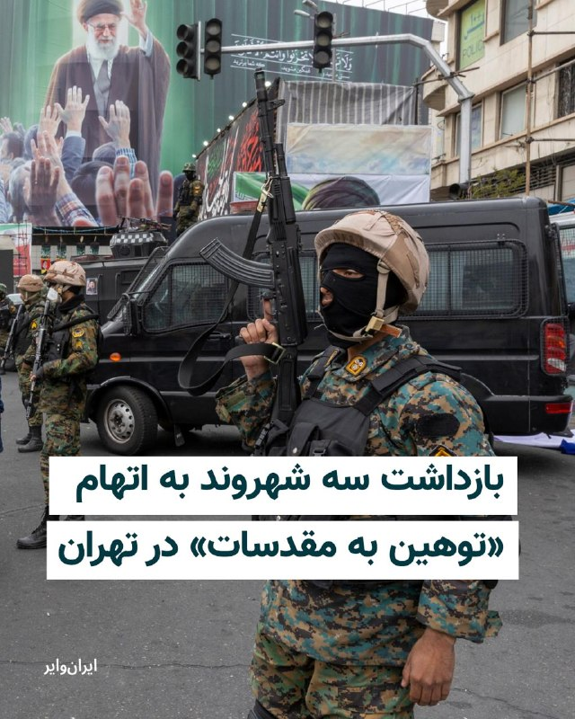

پلیس اطلاعات تهران، روز دوشنبه ۲۵ خرداد ۱۴۰۵ از بازداشت سه شهروند به اتهام انتشار مطالبی در شبکه‌های اجتماعی خبر داد.
خبرگزاری مهر به نقل از پلیس اطلاعات تهران بزرگ گزارش داد که این افراد در پی رصد فعالیت‌های فضای مجازی شناسایی و بازداشت شده‌اند. به گفته پلیس، بازداشت‌شدگان متهم هستند با انتشار مطالبی در شبکه‌های اجتماعی به مقدسات و آنچه «مدافعان وطن» خوانده شده، توهین کرده‌اند.
@VahidHeadline

📡 @VahidOnline

## VahidOnline — post 76374

  <a href="telegram/content/VahidOnline_76374_1781539647.mp4" target="_blank">🎬 Download video</a>

تصاویر دریافتی از دود یک آتش‌سوزی 'در میدان تجریش #تهران
دوشنبه ۲۵ خرداد، الان'
Vahid

📡 @VahidOnline

## VahidOnline — post 76373

  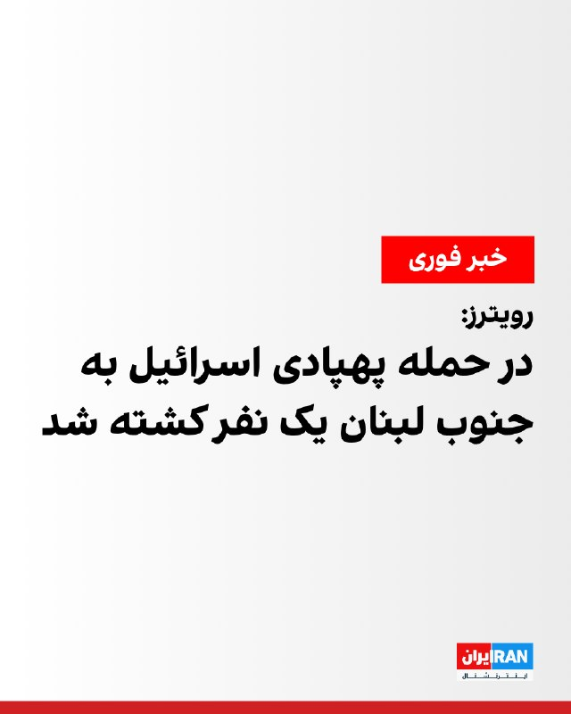

خبرگزاری رویترز به نقل از منابع امنیتی لبنان و رسانه‌های دولتی این کشور گزارش داد یک حمله پهپادی اسرائیل خودرویی را در جنوب لبنان هدف قرار داد و راننده آن کشته شد.

این نخستین حمله مرگبار گزارش‌شده اسرائیل در لبنان از زمان اعلام توافق میان آمریکا و جمهوری اسلامی است.
@VahidOOnLine

📡 @VahidOnline

## VahidOnline — post 76372

  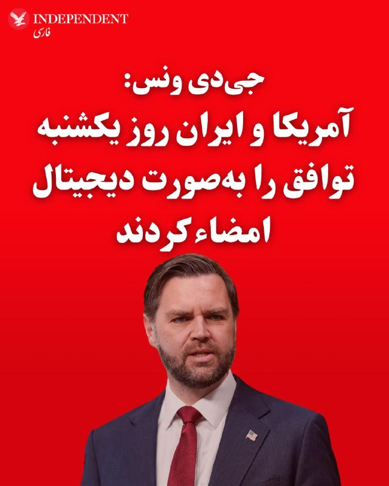

♦️جی‌دی ونس، معاون رئیس‌جمهور آمریکا، روز دوشنبه ۲۵ خردادماه اعلام کرد آمریکا و ایران پیش از مراسم رسمی امضای توافق، روز یکشنبه (به وقت آمریکا) آن را به‌صورت دیجیتال امضاء کرده‌اند.

ونس در گفتگو با شبکه ای‌بی‌سی گفت توافق روز یکشنبه «به‌صورت دیجیتال» امضاء شده و قرار است مراسم رسمی امضای آن روز جمعه در ژنو برگزار شود.

در همین حال، مسعود پزشکیان، رئیس جمهوری ایران نیز، روز یکشنبه در مراسمی دولتی با اعلام همین خبر گفته بود، توافق روز جمعه و حضوری امضاء می‌شود.
@VahidOOnLine

📡 @VahidOnline

## VahidOnline — post 76371

  

با وجود اعلام مقام‌های بانکی درباره رفع اختلال در خدمات بانک‌های ملی، تجارت، صادرات و توسعه صادرات، خبرگزاری فارس وابسته به سپاه اعلام کرد که بخشی از خدمات غیرحضوری و اینترنتی این بانک‌ها همچنان با اختلال مواجه است.

پیش‌تر این بانک‌ها در اطلاعیه‌های جداگانه اعلام کرده بودند که تمامی خدمات کارتی و سامانه‌های اینترنتی و موبایل‌بانک به حالت عادی بازگشته است.

فارس گزارش داد در حال حاضر خدمات مبتنی بر کارت در پایانه‌های فروشگاهی و دستگاه‌های خودپرداز این بانک‌ها فعال می باشد، اما بخشی از خدمات اینترنتی و غیرحضوری همچنان دچار اختلال است.

شورای هماهنگی بانک‌ها، وابسته به ساختار بانکی جمهوری اسلامی، روز شنبه ۲۴ خرداد حمله سایبری به سامانه‌های چهار بانک ملی، تجارت، صادرات و توسعه صادرات را تأیید کرده بود.
@VahidHeadline

📡 @VahidOnline

## VahidOnline — post 76370

  

روز دوشنبه، به دنبال اعلام توافق ایران و آمریکا بر سر امضای تفاهم‌نامۀ پایان جنگ، قیمت ارزهای خارجی و سکه طلا در بازار آزاد ایران کاهش قابل توجهی یافت.

وب‌سایت‌های اعلام نرخ آزاد ارز و طلا، بعدازظهر روز دوشنبه قیمت هر دلار آمریکا را کمتر از ۱۶۲ هزار تومان اعلام کردند که نشان‌دهنده کاهشی در حدود ده هزار تومان از زمان اعلام توافق موقت است.

قیمت هر دلار آمریکا در روزهای گذشته بیش از ۱۷۱ هزار تومان گزارش می‌شد.

قیمت سایر ارزهای خارجی هم در بازار آزاد ایران کاهش مشابهی داشت.

همزمان قیمت هر سکه طلا در حدود ۱۶۷ میلیون تومان اعلام شد که نسبت به روز قبل کاهشی پنج میلیون تومانی را نشان می‌داد. این میزان کاهش در حالی رخ داد که قیمت طلا در بازارهای جهانی پس از اعلام توافق ایران و آمریکا افزایش یافته بود.

قیمت دلار و طلا در بازار ایران از زمان وقوع جنگ در ایران افزایش یافته و در روزهایی هر دلار آمریکا تا مرز ۱۹۰ هزار تومان هم معامله شده بود.
@VahidHeadline

📡 @VahidOnline

## VahidOnline — post 76369

  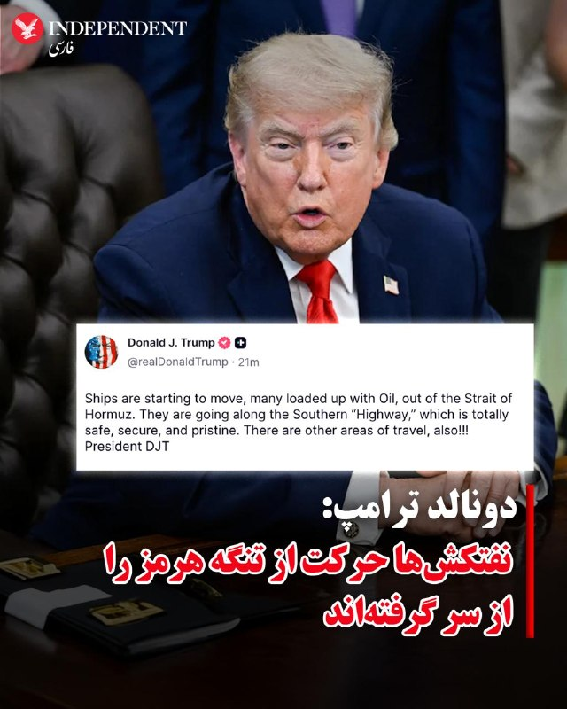

دونالد ترامپ، رئیس‌جمهور آمریکا، روز دوشنبه ۲۵ خردادماه در پیامی در شبکه اجتماعی تروث سوشال اعلام کرد کشتی‌ها، از جمله نفتکش‌های حامل نفت، حرکت از تنگه هرمز را آغاز کرده‌اند.
ترامپ نوشت: «کشتی‌ها در حال حرکت هستند؛ بسیاری از آن‌ها با نفت بارگیری شده‌اند و از تنگه هرمز خارج می‌شوند. آن‌ها از مسیر جنوبی حرکت می‌کنند؛ مسیری که کاملا امن، مطمئن و پاک است.»
رئیس‌جمهور آمریکا همچنین افزود: «مسیرهای دیگری نیز برای تردد وجود دارد.»

پیام ترامپ در حالی منتشر می‌شود که صدا و سیمای جمهوری اسلامی ایران، روز دوشنبه در گزارشی تصویری اعلام کرده بود: «بیش از ۹۶ ساعت است که نیروی دریایی سپاه هیچ مجوز عبوری صادر نکرده است.»
پیشتر رویترز گزارش داده بود، نخستین نفتکش حامل گاز طبیعی مایع پس از اعلام پایان جنگ جمهوری اسلامی ایران و آمریکا، صبح دوشنبه از تنگه هرمز عبور کرده است.
@VahidOOnLine

📡 @VahidOnline

## VahidOnline — post 76368

  

معاون رئیس‌جمهور آمریکا می‌گوید تفاهم‌نامه ایران و آمریکا روز جمعه در حضور عباس عراقچی و محمد‌باقر قالیباف در سوئیس امضا خواهد شد.

جی‌دی ونس گفت که «جزئیات زیادی از توافق هنوز حل‌و‌فصل نشده است» اما آمریکا انتظار دارد که تنگه هرمز «در درازمدت بدون عوارض باز باشد.»

سخنگوی وزارت خارجه جمهوری اسلامی اما گفته است که هنوز مشخص نیست که چه کسی از جانب ایران تفاهمنامه را امضا می‌کند.

اسماعیل بقایی همچنین تاکید کرد که ایران «به‌دنبال گرفتن عوارض نیست» اما «هزینه ارائه خدمات» را دریافت خواهد کرد.
@VahidHeadline

📡 @VahidOnline

## VahidOnline — post 76367

  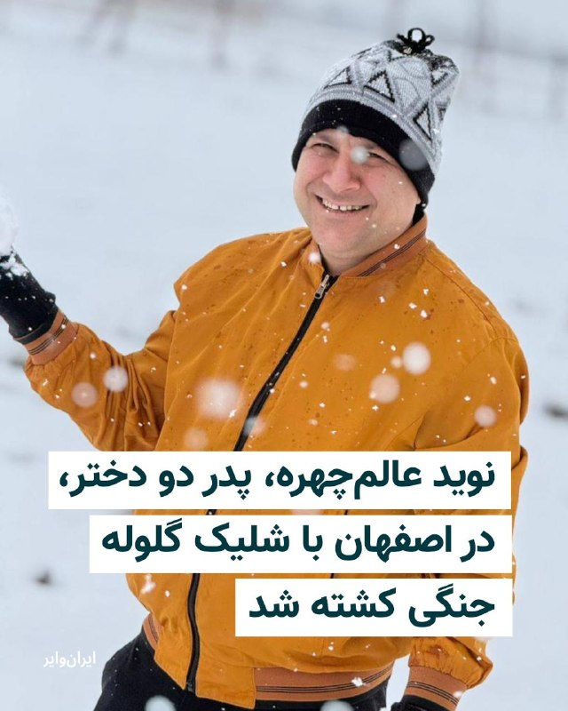

«نوید عالم‌چهره» ۴۴ ساله، ساکن ملک‌شهر اصفهان و پدر دو دختر، روز جمعه ۱۹ دی‌ماه ۱۴۰۴ هدف شلیک گلوله جنگی قرار گرفت و جان خود را از دست داد.
به گفته منابع آگاه، گلوله جنگی از پشت به پهلوی او اصابت کرده بود.
خانواده می‌گویند نوید عالم‌چهره هنگام مجروح شدن هنوز هوشیار بود و توسط اعضای خانواده به بیمارستان غرضی اصفهان منتقل شد.
به گفته آنان، کادر درمان پس از تحویل گرفتن او اعلام کردند که برای عمل جراحی به اتاق عمل منتقل خواهد شد.
نزدیکان نوید می‌گویند تا صبح مقابل بیمارستان منتظر ماندند، اما با باز شدن درهای بیمارستان و مراجعه برای پیگیری وضعیت او، دیگر اثری از نوید پیدا نکردند. به گفته نزدیکان، پس از دو روز جست‌وجو و مراجعه به مراکز مختلف، سرانجام پیکر او را در سردخانه باغ رضوان اصفهان پیدا کردند.
@VahidHeadline

📡 @VahidOnline

## VahidOnline — post 76366

  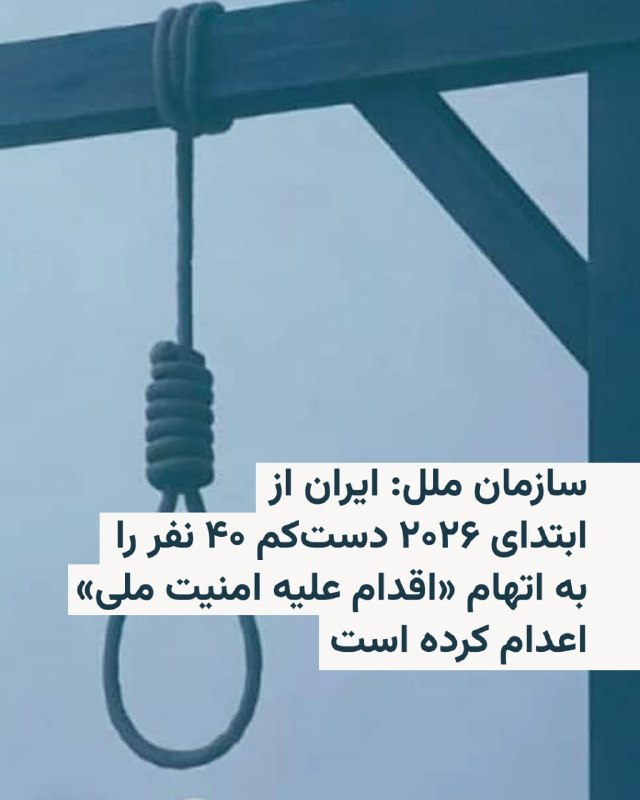

کمیسر عالی حقوق بشر سازمان ملل اعلام کرد که از آغاز سال جاری میلادی تاکنون، دست‌کم ۴۰ نفر در ایران به اتهام‌های مرتبط با «امنیت ملی» اعدام شده‌اند که در میان آن‌ها ۱۸ معترض نیز دیده می‌شود.

ولکر تورک روز دوشنبه ۲۵ خرداد افزود: «مقامات دست به سرکوب شدید زده‌اند، هزاران نفر را بازداشت کرده و محدودیت‌های بیشتری بر فضای مدنی اعمال کرده‌اند».

او در بخش دیگری از اظهاراتش از اعلام توافق صلح میان ایالات متحده و ایران استقبال کرد و از همه طرف‌ها در منطقه خواست حداکثر خویشتنداری را رعایت کنند.

تورک گفت: «از اعلام این‌که ایالات متحده و ایران بر سر یک توافق صلح به تفاهم رسیده‌اند که شامل آتش‌بسی فوری و دائمی، بازگشایی تنگه هرمز و چارچوبی برای ادامه مذاکرات است، استقبال می‌کنم».

او افزود: «در این مقطع حساس، روشن است که همه طرف‌ها باید حداکثر خویشتنداری را به خرج دهند و برای اجرای سریع و با حسن نیت توافق حاصل‌شده تلاش کنند».
@VahidHeadline

📡 @VahidOnline

## VahidOnline — post 76362

  <a href="telegram/content/VahidOnline_76362_1781539655.mp4" target="_blank">🎬 Download video</a>

بهروز رضوی، گوینده محبوب علی خامنه‌ای، درگذشت.
FattahiFarzad
بهروز رضوی، گوینده، صداپیشه، ترانه‌سرا و بازیگر، پس از دوره‌ای بیماری در ۷۸ سالگی درگذشت.
او فعالیت حرفه‌ای را از سال ۱۳۴۷ با گویندگی در رادیو آغاز کرد و طی بیش از پنج دهه فعالیت، به یکی از شناخته‌شده‌ترین صداهای رسانه‌ای ایران بدل شد. روایت مجموعه مستند «ایران» از جمله ماندگارترین آثار او به شمار می‌رود.
بهروز رضوی علاوه بر فعالیت در رادیو و تلویزیون، در سینما و دوبله نیز حضور داشت و در آثاری چون «گناه فرشته»، «سفر به چزابه» و «نجات‌یافتگان» ایفای نقش کرده بود.
او همچنین شاعر ترانه‌های «کویر دل» و «گمشده» با صدای مرجان بود.
این هنرمند متولد یزد از سال ۱۳۷۴ در کرج زندگی می‌کرد و برادر عاطفه رضوی، بازیگر و چهره‌پرداز، است.
@VahidHeadline

📡 @VahidOnline

## kianmeli1 — post 88019

  <a href="telegram/content/kianmeli1_88019_1781539656.mp4" target="_blank">🎬 Download video</a>

🔴استادیوم خارق‌العاده مرسدس بنز شهر آتلانتا میزبان دیدار اسپانیا و کیپ ورد
https://t.me/kianmeli1

## kianmeli1 — post 88018

  <a href="telegram/content/kianmeli1_88018_1781539658.mp4" target="_blank">🎬 Download video</a>

🔴جی‌دی ونس
ما دست دوستی به سوی ایران دراز کرده‌ایم. اگر آن‌ها بخواهند رابطه‌شان با ما را تغییر دهند، ما نیز رابطه‌مان با ایران را تغییر خواهیم داد/ این پیشنهاد است
https://t.me/kianmeli1

## kianmeli1 — post 88017

  <a href="telegram/content/kianmeli1_88017_1781539659.mp4" target="_blank">🎬 Download video</a>

🔴جی‌دی ونس درباره ایران:

ایران هیچ پولی دریافت نمی‌کند مگر اینکه تعهدات خود را انجام دهد. و پولی که ما درباره‌اش صحبت می‌کنیم اساساً رفع تحریم‌ها است.
ما به آنها پول آمریکایی نمی‌دهیم—حتی یک دلار پول آمریکایی به ایران نخواهد رسید.
ما آماده‌ایم در صورت انجام تعهدات بلندمدت لازم برای تبدیل شدن به یک کشور عادی، کنار گذاشتن برنامه هسته‌ای و توقف حمایت از فعالیت‌ های تروریستی در سراسر خاورمیانه، تخفیف قابل توجهی در تحریم‌ها بدهیم.
https://t.me/kianmeli1

## kianmeli1 — post 88016

  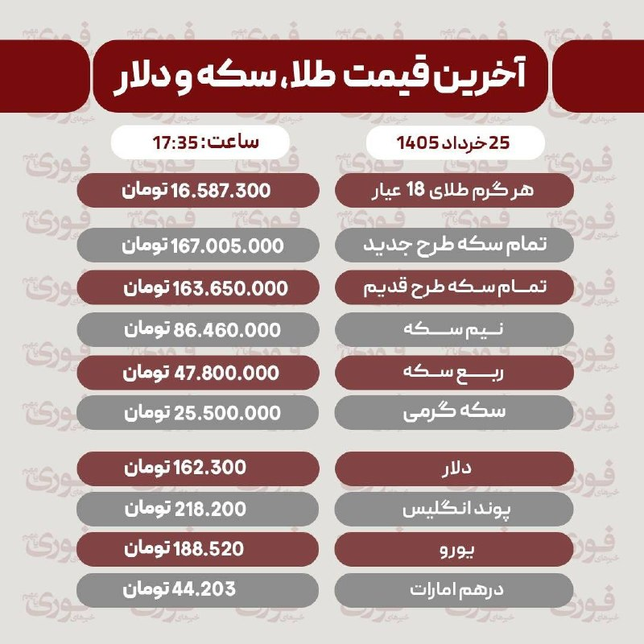

🔴قیمت طلا، سکه و دلار امروز 25 خرداد
https://t.me/kianmeli1

## kianmeli1 — post 88015

‏🔴اکبر فتحی، معاون وزارت جهاد کشاورزی، گفت برای ماه محرم، سهمیه‌های ویژه استانی برای تامین برنج، شکر، روغن، گوشت قرمز و گوشت مرغ در نظر گرفته شده و این اقلام از طریق ستادهای تنظیم بازار استان‌ها در اختیار هیئت‌های عزاداری قرار می‌گیرد
https://t.me/kianmeli1

## kianmeli1 — post 88014

‏🔴محمدجواد ظریف، وزیر خارجه پیشین جمهوری اسلامی، در شبکه ایکس نوشت هوشمندی مجتبی خامنه‌ای و ایثار مسعود پزشکیان، محمدباقر قالیباف و اعضای هیات مذاکره‌کننده برای «تثبیت پیروزی تاریخی مردم و سربازان وطن در برابر دو متجاوز اتمی» شایسته پشتیبانی ملی است
https://t.me/kianmeli1

## kianmeli1 — post 88013

‏🔴رویترز در گزارشی نوشت که بر اساس ارزیابی شرکت‌های کشتیرانی و امنیت دریایی، اطمینان از پاک‌سازی تنگه هرمز از مین‌های دریایی ممکن است ۴۰ تا ۵۰ روز طول بکشد
https://t.me/kianmeli1

## kianmeli1 — post 88012

‏🔴خبرنگار صداوسیمای جمهوری اسلامی، بعدازظهر دوشنبه گزارش داد: «بیش از ۹۶ ساعت است که نیروی دریایی سپاه پاسداران هیچ مجوزی برای عبور کشتی‌ها از تنگه هرمز صادر نکرده و تا اطلاع بعدی، این تنگه بر روی همه شناورها در گذرگاه ورودی و خروجی بسته است»
https://t.me/kianmeli1

## kianmeli1 — post 88011

‏🔴خبرگزاری ایلنا گزارش داد حداقل دستمزد روزانه کارگران در سال ۱۴۰۵، حدود ۵۵۴ هزار تومان تعیین شده و این مبلغ تنها امکان خرید ۲۳۰ گرم ران گوسفندی ممتاز را فراهم می‌کند و حتی هزینه خرید ۲۵۰ گرم گوشت قرمز را هم پوشش نمی‌دهد
https://t.me/kianmeli1

## kianmeli1 — post 88010

‏🔴مرکز مشترک اطلاعات دریایی بریتانیا اعلام کرد سطح تهدید امنیت دریایی در تنگه هرمز همچنان «شدید» است
https://t.me/kianmeli1

## kianmeli1 — post 88009

  <a href="telegram/content/kianmeli1_88009_1781539663.mp4" target="_blank">🎬 Download video</a>

🔴بقایی:

آمریکا در یادداشت تفاهم موظف به رفع همه تحریم‌ها (اولیه، ثانویه، شورای امنیت و شورای حکام) شد؛ این شالوده اصلی مباحث اقتصادی تفاهم است
https://t.me/kianmeli1

## kianmeli1 — post 88008

  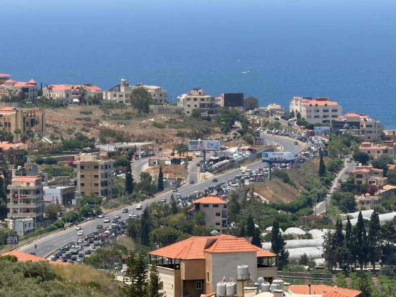

🔴هزاران آواره لبنانی پس از اعلام توافق آمریکا و ایران در حال بازگشت به خانه‌های خود در جنوب لبنان هستند
https://t.me/kianmeli1

## kianmeli1 — post 88007

  

🔴حملات اسرائیل به لبنان ادامه دارد
https://t.me/kianmeli1

## kianmeli1 — post 88006

  <a href="telegram/content/kianmeli1_88006_1781539668.mp4" target="_blank">🎬 Download video</a>

ونس: تعهد دادن که ذخایر مواد بسیار غنی‌شده‌شون رو نابود و جمع‌آوری کنن

همون اورانیوم بسیار غنی‌شده‌ای که در دوران دولت اوباما و دولت بایدن جمع کرده بودن
https://t.me/kianmeli1

## kianmeli1 — post 88005

  <a href="telegram/content/kianmeli1_88005_1781539669.mp4" target="_blank">🎬 Download video</a>

مجری: ایرانی‌ها می‌گویند قرار است به یک صندوق ۳۰۰ میلیارد دلاری برای بازسازی دسترسی داشته باشند. درست است یا نادرست؟

جی‌دی ونس: چنین چیزی می‌تواند در دسترس آن‌ها قرار بگیرد، مشروط بر اینکه به تعهدات خود در این توافق پایبند باشند.
https://t.me/kianmeli1

## kianmeli1 — post 88004

‏🔴اداره هوانوردی غیرنظامی کویت اعلام کرد فعالیت محدود شرکت‌های هواپیمایی خلیج فارس، عربی و خارجی از طریق ترمینال ۴ فرودگاه بین‌المللی کویت از سر گرفته شد
https://t.me/kianmeli1

## IranIntlTV — post 342541

  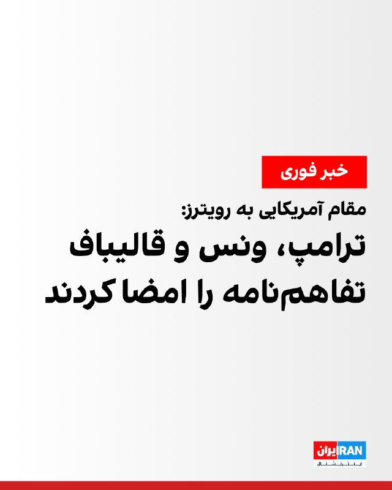

یک مقام ارشد آمریکایی روز دوشنبه اعلام کرد تفاهم‌نامه میان آمریکا و جمهوری اسلامی به امضای دونالد ترامپ، رییس‌جمهوری آمریکا، جی‌دی ونس، معاون رییس‌جمهوری آمریکا، و محمدباقر قالیباف، رییس مجلس جمهوری اسلامی، رسیده است.

او گفت در مرحله بعدی مذاکرات، آرایش فعلی نیروهای نظامی آمریکا حفظ خواهد شد، اما در صورت دستیابی به توافق نهایی، کاهش نیروهای نظامی در نظر گرفته شده است.

این مقام همچنین گفت مذاکرات فنی از اواخر این هفته آغاز می‌شود و جزییات توافق طی ۲۴ تا ۴۸ ساعت آینده منتشر خواهد شد.

او افزود آزادسازی دارایی‌های مسدودشده و کاهش تحریم‌ها به اجرای تعهدات وابسته است.

این مقام ارشد آمریکایی همچنین گفت: «از عملکرد عمانی‌ها در مذاکرات پیش از جنگ رضایت نداشتیم.»
https://iranintl.com/202606155330

## IranIntlTV — post 342540

  

محمدباقر قالیباف، رییس مجلس، در شبکه ایکس خطاب به مردم ایران نوشت: «با مقاومت تاریخی شما و رشادت نیروهای مسلح در برابر آنان که قصد جان این ملت و نابودی و تسلیم این مملکت را کرده بودند، ایران گامی بلند به سوی پیروزی نهایی برداشت. می‌خواستند و نتوانستند.»

او افزود: «ایستاده‌ایم و در نهایت ایران ما پیروز خواهد شد.»
https://iranintl.com/202606155533

## IranIntlTV — post 342539

  <a href="telegram/content/IranIntlTV_342539_1781539674.mp4" target="_blank">🎬 Download video</a>

🔻تیم ملی ایران بامداد سه‌شنبه ۲۶ خرداد در نخستین مسابقه خود در جام جهانی ۲۰۲۶ به مصاف نیوزیلند می‌رود.

🔹گزارش رضا محدث و علیرضا مدیری، خبرنگارهای ایران اینترنشنال از حال و هوای شهر لس آنجلس پیش از اولین دیدار تیم ملی در جام جهانی

@iranintltvsport

## IranIntlTV — post 342538

  

مرکز اطلاعات دریایی مشترک در شبکه ایکس اعلام کرد سطح تهدید امنیت دریایی در تنگه هرمز همچنان «شدید» است.

مرکز اطلاعات دریایی مشترک، سازمانی چندملیتی است که سال ۲۰۲۴ به ابتکار سازمان نیروهای دریایی مشترک شامل ۴۷ کشور عضو تشکیل شد.

وظیفه این مرکز اتصال صنعت کشتیرانی تجاری با نیروهای دریایی در خاورمیانه است.
https://iranintl.com/202606157053

## IranIntlTV — post 342537

  

واشینگتن و تهران به توافق رسیده‌اند؛ اما جای مردم ایران در این میان کجاست؟
آیا این توافق را به نفع مردم می‌دانید؟
آیا فکر می‌کنید زندگی مردم ایران با این توافق بهتر خواهد شد؟
آیا از وقوع جنگ جلوگیری شده است یا فقط بحرانی دیگر به تعویق افتاده؟
اگر شما پای میز مذاکره بودید، چه خواسته‌ای را به نمایندگی از مردم ایران مطرح می‌کردید؟
امشب در «برنامه با کامبیز حسینی» از شما می‌پرسیم:
واکنش شما به توافق واشنگتن و تهران چیست؟
اگر در ایران هستید و به اینترنت دسترسی دارید، مستقیم و بدون نوبت روی خط بیایید. این برنامه، صدای شماست.
«برنامه» صدای شماست.
ما شما را، بدون نوبت، مستقیم از ایران روی خط می‌آوریم.
بیایید و روایت خود را برای همیشه ثبت کنید. تاریخ با صدای شما نوشته می‌شود.
برای شرکت در برنامه، همین حالا در واتس‌اپ پیام بدهید:
۰۰۴۴۷۵۲۲۱۱۰۱۱۰
۰۰۴۴۷۵۴۴۱۱۰۱۱۰
۰۰۴۴۷۵۱۱۱۰۲۵۵۳
«برنامه با کامبیز حسینی»
«یک ایران صدای شما را می‌شنود»
@iranintltv

## IranIntlTV — post 342536

  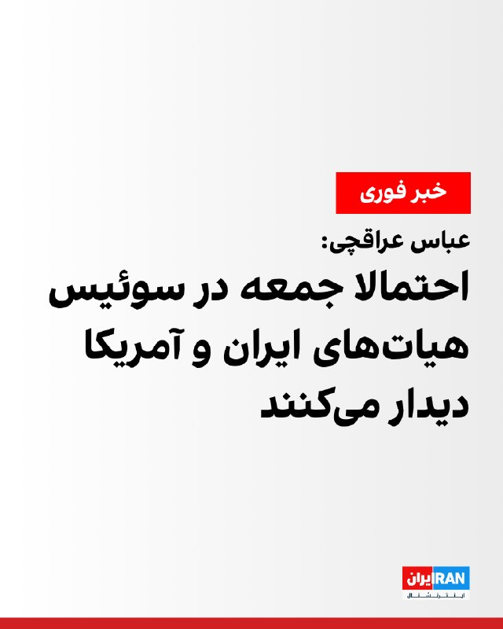

عباس عراقچی، وزیر امور خارجه جمهوری اسلامی، گفت جمعه احتمالا در سوئیس دیداری میان روسای هیات‌های دو طرف برگزار و تفاهم‌نامه میان جمهوری اسلامی و آمریکا امضا خواهد شد و سپس نخستین دور مذاکرات بعدی آغاز می‌شود.

او افزود اقتصاد ایران نباید خود را متکی و موکول به این‌گونه توافقات اقتصادی از طریق مذاکره با آمریکا کند.

عراقچی همچنین گفت روند مذاکرات و اجرای توافق بر اساس «بی‌اعتمادی، بدعهدی‌ها و تجربیات گذشته» برنامه‌ریزی خواهد شد.
https://iranintl.com/202606152224

## IranIntlTV — post 342535

  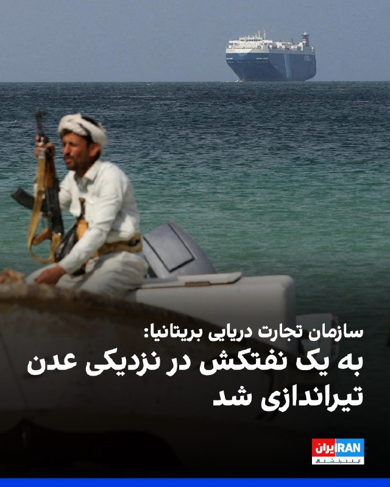

سازمان عملیات تجارت دریایی بریتانیا روز دوشنبه اعلام کرد یک نفتکش گزارش داده است که در ۱۱۱ مایل دریایی جنوب‌شرقی عدن یمن، یک قایق کوچک به آن نزدیک شده و به سوی این شناور تیراندازی کرده است.

این سازمان افزود مقام‌ها در حال بررسی این حادثه هستند، اما جزییات بیشتری ارائه نکرد.
https://iranintl.com/202606150341

## IranIntlTV — post 342534

  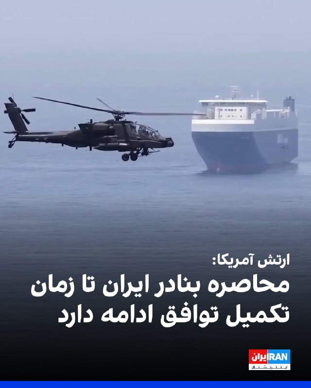

ارتش آمریکا در یک یادداشت هشدار اعلام کرد که محاصره بنادر ایران تا زمان تکمیل یک توافق آتش‌بس با این کشور که برای ۱۹ ژوئن (۲۹ خرداد) برنامه‌ریزی شده است، همچنان برقرار است.

در این هشدار که دوشنبه منتشر شد، آمده است: «محاصره نظامی بنادر ایران همچنان برقرار است و تمامی ترددهای ورودی و خروجی از این بنادر را محدود می‌کند.»

ارتش آمریکا افزود: «تا زمانی که دستور صریح صادر نشده است، از تلاش برای عبور خودداری کنید.»
https://iranintl.com/202606151074

## IranIntlTV — post 342533

  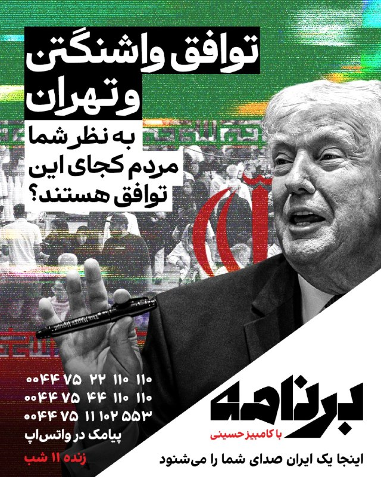

واشنگتن و تهران به توافق رسیده‌اند؛ اما جای مردم ایران در این میان کجاست؟
آیا این توافق را به نفع مردم می‌دانید؟
آیا فکر می‌کنید زندگی مردم ایران با این توافق بهتر خواهد شد؟
آیا از وقوع جنگ جلوگیری شده است یا فقط بحرانی دیگر به تعویق افتاده؟
اگر شما پای میز مذاکره بودید، چه خواسته‌ای را به نمایندگی از مردم ایران مطرح می‌کردید؟
امشب در «برنامه با کامبیز حسینی» از شما می‌پرسیم:
واکنش شما به توافق واشنگتن و تهران چیست؟
اگر در ایران هستید و به اینترنت دسترسی دارید، مستقیم و بدون نوبت روی خط بیایید. این برنامه، صدای شماست.
«برنامه» صدای شماست.
ما شما را، بدون نوبت، مستقیم از ایران روی خط می‌آوریم.
بیایید و روایت خود را برای همیشه ثبت کنید. تاریخ با صدای شما نوشته می‌شود.
برای شرکت در برنامه، همین حالا در واتس‌اپ پیام بدهید:
۰۰۴۴۷۵۲۲۱۱۰۱۱۰
۰۰۴۴۷۵۴۴۱۱۰۱۱۰
۰۰۴۴۷۵۱۱۱۰۲۵۵۳
«برنامه با کامبیز حسینی»
«یک ایران صدای شما را می‌شنود»

## IranIntlTV — post 342531

  

خبرگزاری رویترز به نقل از منابع امنیتی لبنان و رسانه‌های دولتی این کشور گزارش داد یک حمله پهپادی اسرائیل خودرویی را در جنوب لبنان هدف قرار داد و راننده آن کشته شد.

این نخستین حمله مرگبار گزارش‌شده اسرائیل در لبنان از زمان اعلام توافق میان آمریکا و جمهوری اسلامی است.
https://iranintl.com/202606159209

## IranIntlTV — post 342530

  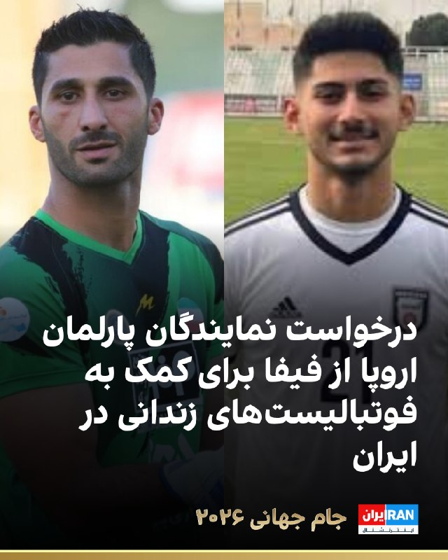

🔻چهار نماینده پارلمان اروپا با انتشار بیانیه‌ای خواستار توجه و کمک فیفا به فوتبالیست‌های زندانی در ایران شده‌اند. این نامه مشترک و سرگشاده که هم‌زمان با جام جهانی ۲۰۲۶ به جانی اینفانتینو، رئیس فیفا، ارسال شده، توسط هانا نیومن، رئیس هیئت رابطه با ایران در پارلمان اروپا و ۳ نماینده دیگر امضا شده است.

🔹در این بیانیه با اشاره به گزارش‌های سازمان‌های حقوق بشری آمده است که چندین فوتبالیست فعلی و سابق ایران با بازداشت‌های خودسرانه، شکنجه و احکام سنگین روبه‌رو هستند؛ از جمله احسان حسینی‌پور حصارلو، بازیکن ۱۹ ساله‌ای که با خطر اعدام مواجه است. نمایندگان تأکید کرده‌اند که فوتبال از حقوق و کرامت انسانی جدا نیست و اعتبار تعهدات حقوق بشری فیفا، اکنون و در شرایطی که فوتبالیست‌های ایرانی زندانی هستند، مورد آزمایش قرار می‌گیرد.

🔹جزییات بیشتر را اینجا بخوانید

@iranintltvsport

## IranIntlTV — post 342529

## IranIntlTV — post 342528

  <a href="telegram/content/IranIntlTV_342528_1781539683.mp4" target="_blank">🎬 Download video</a>

ساعاتی پس از اعلام خبر توافق ترامپ با جمهوری اسلامی‌، وزیر امنیت ملی اسرائیل گفت، این کشور بخشی از توافق بد واشینگتن و تهران نیست. رهبران احزاب اپوزیسیون اسرائیل هم ضمن مخالفت با این توافق، بر ضرورت سرنگونی فوری جمهوری اسلامی تاکید کردند.

گزارشی از مجتبا پورمحسن
@iranintltv

## IranIntlTV — post 342527

  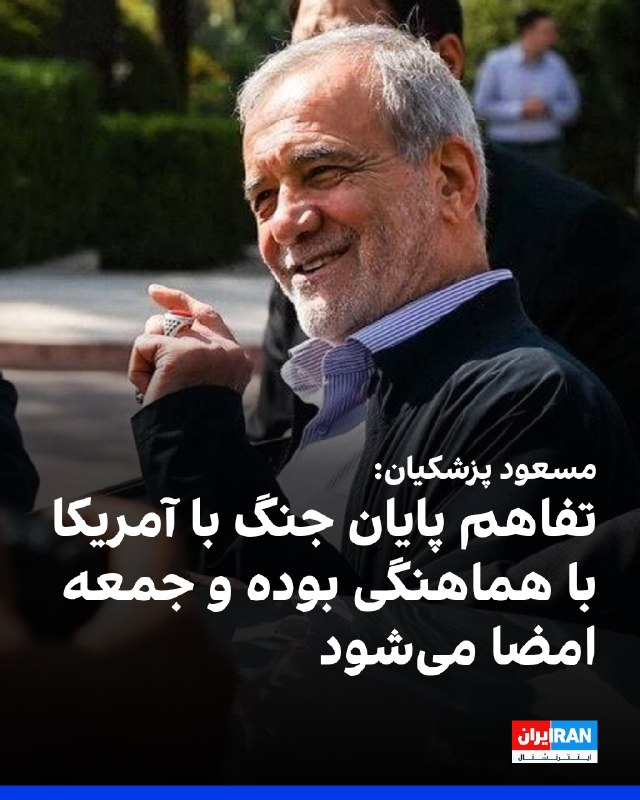

مسعود پزشکیان، رییس دولت جمهوری اسلامی، در حاشیه همایش «حکمرانی هم‌افزا»، گفت که تفاهم خاتمه جنگ با آمریکا با هماهنگی صورت گرفته، قرار است روز جمعه به امضا برسد.

همزمان اسماعیل بقائی، سخنگوی وزارت خارجه، ضمن تایید خبر حضور نمایندگان جمهوری اسلامی در مراسم امضای این تفاهم‌نامه در ژنو، در روز جمعه، گفت که برنامه سفر به برخی کشورهای منطقه و همسایه پیش از آغاز نشست ژنو در دستور کار قرار دارد و به محض قطعی شدن، جزییات آن اطلاع‌رسانی خواهد شد.

پیش‌تر جی‌دی ونس، معاون رییس‌جمهوری آمریکا، گفته بود که قصد دارد در مراسم رسمی امضای یادداشت تفاهم میان آمریکا و جمهوری اسلامی در ژنو حضور داشته باشد، اما احتمال دارد دونالد ترامپ نیز شخصا در این مراسم شرکت کند.
https://iranintl.com/202606155978

## IranIntlTV — post 342526

  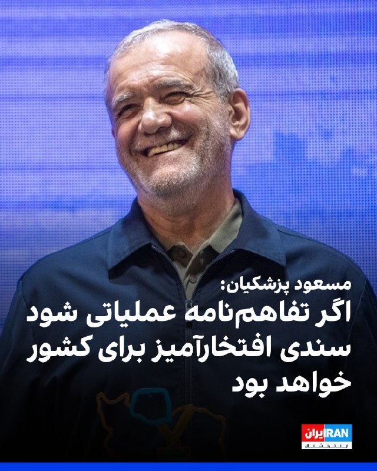

مسعود پزشکیان با اشاره به متن تفاهم بین جمهوری اسلامی و آمریکا گفت: تفاهم‌نامه نه‌تنها برای داخل کشور، بلکه برای کل منطقه و «نیروهای مقاومت» افتخار بزرگی به شمار می‌رود و اجرای کامل این تفاهم‌نامه می‌تواند بسیاری از مسائل را برطرف کند و شرایط تازه‌ای را در ایران و منطقه رقم بزند.

رییس دولت جمهوری اسلامی افزود: «اگر همه مفاد تفاهم‌نامه به‌درستی عملیاتی شود، به‌عنوان سندی افتخارآمیز برای کشور تلقی می‌شود.»

پزشکیان گفت: پس از بحث‌ها و بررسی‌های مختلف در شورای عالی امنیت، تقریبا بیش از ۹۰ درصد اعضا با این روند همراهی کردند و رای دادند که این اقدام باید انجام شود.

https://iranintl.com/202606150920

## IranIntlTV — post 342525

  <a href="telegram/content/IranIntlTV_342525_1781539688.mp4" target="_blank">🎬 Download video</a>

بعد از بیش از سه ماه جنگ، تهدید، مذاکره، تکذیب و دوباره مذاکره، سرانجام آمریکا و جمهوری اسلامی از نهایی شدن متن تفاهمی برای پایان جنگ و بازگشایی تنگه هرمز خبر دادند.

مهدی بیگی، عضو تحریریه ایران‌اینترنشنال، در «پیوست»، ابهام‌ها و سوال‌های بی‌جواب این توافق را بررسی می‌کند
@iranintltv

## IranIntlTV — post 342524

تفاهم میان آمریکا و جمهوری اسلامی واکنش‌های متفاوتی را در آلمان به همراه داشته است. دولت آلمان از این توافق استقبال کرد. سیاستمداران آلمانی این تفاهم را فاجعه توصیف کرده و آن را خیانتی به مردم ایران دانستند.

علی حسن‌پور، خبرنگار ایران‌اینترنشنال، گزارش می‌دهد
@iranintltv

## IranIntlTV — post 342523

  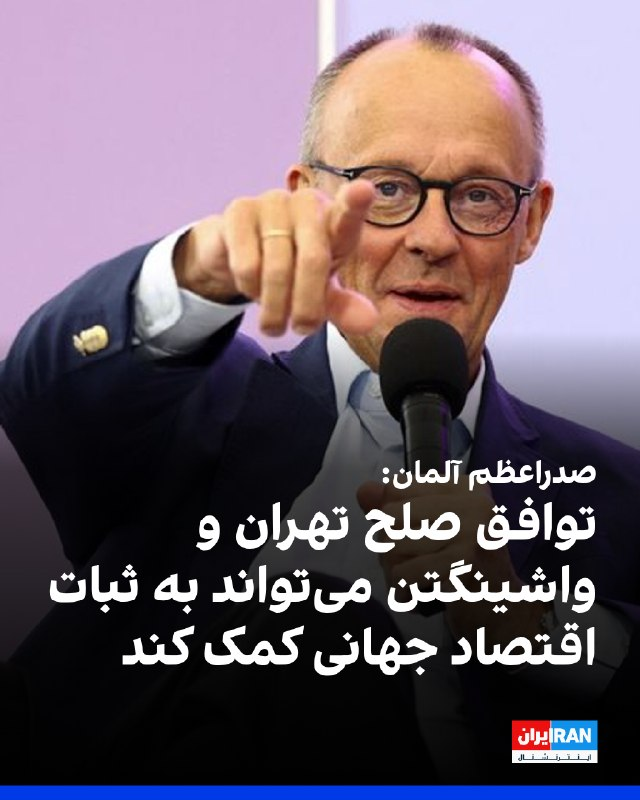

فریدریش مرتس، صدراعظم آلمان، روز دوشنبه گفت توافق صلح میان آمریکا و جمهوری اسلامی می‌تواند به ثبات اقتصاد جهانی کمک کند و افزود این توافق باید شامل لبنان نیز باشد.

او پیش از نشست گروه هفت که این هفته به میزبانی فرانسه برگزار می‌شود، گفت پنجره‌ای برای دیپلماسی در جنگ اوکراین گشوده شده است و می‌خواهد درباره آن با دونالد ترامپ، رییس‌جمهوری آمریکا، گفت‌وگو کند.
https://iranintl.com/202606154712

## IranIntlTV — post 342522

  <a href="telegram/content/IranIntlTV_342522_1781539692.mp4" target="_blank">🎬 Download video</a>

دونالد ترامپ در پیامی در تروت سوشال اعلام کرد کشتی‌ها، از جمله نفتکش‌ها، در حال عبور از تنگه هرمز هستند و مسیر جنوبی این آبراه کاملا امن و قابل استفاده است.

مرضیه حسینی، خبرنگار ایران‌اینترنشنال، درباره آخرین واکنش‌ها در آمریکا به نهایی شدن توافق تهران و واشینگتن می‌گوید
@iranintltv

## IranIntlTV — post 342521

  <a href="telegram/content/IranIntlTV_342521_1781539694.mp4" target="_blank">🎬 Download video</a>

یک شهروند با ارسال ویدیویی به ایران‌اینترنشنال در دوشنبه ۲۵ خرداد، می‌گوید در گرمای شدید آب منطقه آنها را قطع کرده‌اند. بنا به درخواست این شهروند، شهر محل زندگی او ذکر نمی‌شود.

## Shin_Persian — post 7103

laurence norman @laurnorman
Mon, 15 Jun 2026 14:48:59 UTC

It really fundamentally boils down to this. @JDVance gave 2 reasons this morning why MoU deal is “great” for American people.
1/ strait of Hormuz is reopening.
Was open on Feb 28th
2/ Iran commits in LT to no nuke weapon. A promise Iran long made with dubious follow through.

ترجمه خودکار فارسی

واقعیت امر اساساً به اینجا ختم می‌شود. جی‌دی ونس (@JDVance) امروز صبح ۲ دلیل آورد که چرا توافق یادداشت تفاهم (MoU) برای مردم آمریکا «عالی» است.
۱/ تنگه هرمز در حال بازگشایی است.
در تاریخ ۲۸ فوریه باز بود.
۲/ ایران در بلندمدت متعهد می‌شود که سلاح هسته‌ای نداشته باشد. وعده‌ای که ایران مدت‌هاست داده و اجرای آن با تردید همراه بوده است.

𝕏 · @shin_persian

## Shin_Persian — post 7102

  

UKMTO Operations Centre @UK_MTO
Mon, 15 Jun 2026 14:56:35 UTC

UKMTO WARNING 070-26 - ATTACK

Click here to view the full warning.⤵️
https://www.ukmto.org/-/media/ukmto/products/20260615-ukmto_warning_attack-070-26.pdf?rev=8e912089f0af45e5a6300517e92beee9

#MaritimeSecurity #MarSec

ترجمه خودکار فارسی

هشدار یو‌کی‌ام‌تی‌او (UKMTO - عملیات‌های تجاری دریانوردی بریتانیا) ۰۷۰-۲۶ - حمله

برای مشاهده متن کامل هشدار اینجا کلیک کنید.⤵️
https://www.ukmto.org/-/media/ukmto/products/20260615-ukmto_warning_attack-070-26.pdf?rev=8e912089f0af45e5a6300517e92beee9

#MaritimeSecurity #MarSec

𝕏 · @shin_persian

## Shin_Persian — post 7101

 𝓂𝒶𝓇𝒾𝑜🇱🇧🇬🇧🇦🇪 ✓ @MarioLeb79
Mon, 15 Jun 2026 13:53:28 UTC

🚨 car Targeted in Kfartebnit
1 dead

ترجمه خودکار فارسی

🚨 یک خودرو در کفر تبنیت هدف قرار گرفت
۱ کشته

𝕏 · @shin_persian

## Shin_Persian — post 7100

Shin ✓ @hey_itsmyturn
Mon, 15 Jun 2026 13:46:15 UTC

There’s a Persian idiom that says “Throw an apple into the air, and it will turn a thousand times before it hits the ground.”

Let’s see how will things go till THE FRIDAY.

ترجمه خودکار فارسی

یک اصطلاح فارسی هست که می‌گوید: «سیب را که به هوا بیندازی، هزار چرخ می‌خورد تا به زمین برسد.»

ببینیم تا «آن جمعه» اوضاع چگونه پیش خواهد رفت.

𝕏 · @shin_persian

## Shin_Persian — post 7099

  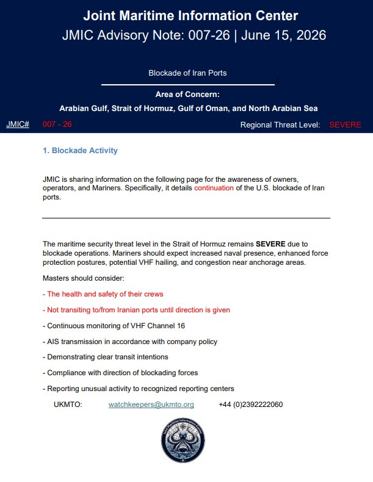

UKMTO Operations Centre @UK_MTO
Mon, 15 Jun 2026 13:40:30 UTC

JMIC Advisory Note 007-26 (blockade still in effect)

Click here to view the full advisory note⤵️
https://www.ukmto.org/-/media/ukmto/products/jmic-advisory-note-00726-blockade-still-in-effect.pdf?rev=08d34da620df4d259e4c1f269387de97

#MaritimeSecurity #MarSec

ترجمه خودکار فارسی

یادداشت مشورتی JMIC (مرکز مشترک هماهنگی اطلاعات دریانوردی) ۰۰۷-۲۶ (محاصره همچنان پابرجا است)

برای مشاهده متن کامل یادداشت مشورتی اینجا کلیک کنید⤵️
https://www.ukmto.org/-/media/ukmto/products/jmic-advisory-note-00726-blockade-still-in-effect.pdf?rev=08d34da620df4d259e4c1f269387de97

#MaritimeSecurity #MarSec_

𝕏 · @shin_persian

## Shin_Persian — post 7098

↩️ Quoted tweet: Lindsey Graham ✓ @LindseyGrahamSC Tue, 03 May 2016 21:03:30 UTC If we nominate Trump, we will get destroyed.......and we will deserve it. ↩️ توییت نقل‌قول شده — برای پاسخ، پست زیر را ببینید. ترجمه خودکار فارسی اگر ترامپ را نامزد کنیم،…

## Shin_Persian — post 7097

↩️ Quoted tweet:
Lindsey Graham ✓ @LindseyGrahamSC
Tue, 03 May 2016 21:03:30 UTC

If we nominate Trump, we will get destroyed.......and we will deserve it.

↩️ توییت نقل‌قول شده — برای پاسخ، پست زیر را ببینید.

ترجمه خودکار فارسی

اگر ترامپ را نامزد کنیم، نابود خواهیم شد....... و حقمان هم همین خواهد بود.

𝕏 · @shin_persian

## Shin_Persian — post 7096

Shin ✓ @hey_itsmyturn
Mon, 15 Jun 2026 10:14:33 UTC

IRGC-owned Tasnim claims after the 60 days period, Iran will charge "service fees" from the vessels passing through the Strait of Hormuz, which is an "agreement article".

Tasnim adds:

"""The inclusion of the phrase "guaranteeing Lebanon's sovereignty and respect for its territorial integrity" in the first article of the agreement."""

ترجمه خودکار فارسی

خبرگزاری تسنیم وابسته به سپاه پاسداران انقلاب اسلامی (IRGC) مدعی است که پس از پایان دوره ۶۰ روزه، ایران بابت عبور کشتی‌ها از تنگه هرمز «هزینه خدمات» دریافت خواهد کرد، که این یک «بند توافق» است.

تسنیم می‌افزاید:

"""گنجاندن عبارت "تضمین حاکمیت لبنان و احترام به تمامیت ارضی آن" در ماده اول توافقنامه."""

𝕏 · @shin_persian

## Iliaen — post 4490

یک تجربه‌ی مشترک در میان دریانوردان وجود دارد که اگر در مسیر به طوفان برخورد کردید، باید تا پایان طوفان از یکدیگر محافظت کنید زیرا طوفان از کنترل شما خارج است.

گاهی شرایط سیاسی برای مدت کوتاهی از کنترل ما خارج می‌شود، در این زمان نباید بگوییم چرا طوفان شد یا مثلاً از طوفان نمی‌شود عبور کرد، بلکه می‌بایست پشت یکدیگر باشیم تا در زمان مناسب، کنترل را دوباره به دست بگیریم.

امروز، ما دلگرمی و امید زندانیان سیاسی هستیم، کسانی که وقتی برای آینده‌ای بهتر از تمام جان خود مایه گذاشتند، ایمان داشتند که یک ایران پشت آنان است.

چطور می‌شود هنگامی که دیگران اینطور به ما ایمان دارند و به امید ما شب را به صبح می‌رسانند، حرف از ناامیدی بزنیم؟

مگر امید چیست؟ آیا نمی‌بینید که ما زنده ماندیم که شاهد روزهایی باشیم که قول آن را به یکدیگر داده بودیم؟ به تیترها اهمیت ندهید، به تحلیل زرد و صحبت نابلدانِ هیجان زده هم اعتماد نکنید، این کشتی، به ساحل امن خواهد رسید.

@iliaen

## ManotoTV — post 106071

توافق اخیر آمریکا و جمهوری اسلامی، اگر نهایی شود، بیش از آنکه پایان بحران ایران باشد، آغاز مرحله‌ای تازه از آن است. برای مردم ایران، مسئله اصلی همچنان زندگی زیر سایه حکومتی است که از هر بحران و هر توافقی برای بقا استفاده می‌کند. برای اپوزیسیون نیز پرسش اساسی این است: آیا می‌تواند از انتظار برای تصمیم قدرت‌های خارجی عبور کند و به نیرویی سازمان‌یافته، واقع‌بین و آماده برای عبور از جمهوری اسلامی و اداره آینده ایران تبدیل شود؟

## FarsiVOA — post 220827

واکنش کنگره به اعلام تفاهم بین جمهوری‌اسلامی و آمریکا؛ جمهوری‌خواهان آن را پیروزی دیپلماتیک توصیف می‌کنند و دموکرات‌ها آن را تسلیم

## FarsiVOA — post 220826

با نزدیک شدن فصل تابستان، دور تازه‌ای از فشارها برای اعمال حجاب اجباری شروع شده و حکومت تعدادی از کافه‌ها، رستوران‌ها و واحدهای صنفی را ‌پلمب کرده است

## FarsiVOA — post 220825

🔺استقبال محتاطانه کشورهای عربی از توافق آمریکا با جمهوری اسلامی؛ ابهام درباره ایران آینده

▪️کشورهای عربی با صدور بیانیه‌هایی در روز دوشنبه ۲۵ خرداد، از یک سو از امضای مجازی یادداشت تفاهم میان آمریکا و جمهوری اسلامی استقبال کردند، و از سوی دیگر، با نگرشی محتاطانه، به دنبال این هستند که ببینند بعد از این توافق با چه نوع ایرانی مواجه خواهند شد.

⬇️ بیشتر بخوانید:

https://ir.voanews.com/a/united-state-iran-negotiation-arab-world/8161037.html/?nocach=1

## FarsiVOA — post 220824

رهبران اروپایی توافق ایران و آمریکا را گامی مهم برای کاهش تنش‌ها در خاورمیانه دانستند و بر اجرای کامل توافق، تثبیت آتش‌بس و حفظ امنیت کشتیرانی در تنگه هرمز تأکید کردند

## FarsiVOA — post 220823

🔺پرزیدنت ترامپ: کشتی‌های حامل نفت در حال عبور از تنگه هرمز هستند

▪️دونالد ترامپ، رئیس جمهوری آمریکا، روز دوشنبه ۲۵ خرداد در شبکه اجتماعی تروت سوشال اعلام کرد که کشتی‌ها، از جمله شمار زیادی نفتکش، عبور از تنگه هرمز را از سر گرفته‌اند.

⬇️ بیشتر بخوانید:

https://ir.voanews.com/a/president-trump-says-ships-are-starting-to-move-in-strait-of-hormuz-/8161034.html/?nocach=1

## FarsiVOA — post 220822

  <a href="telegram/content/FarsiVOA_220822_1781539698.mp4" target="_blank">🎬 Download video</a>

آلن اکباتانی، تحلیلگر سیاسی در میدان: شورش گرسنگان نه به آزادی می‌رسد و نه به رفاه اقتصادی اما با تفاهم، اگر مفت‌خورها بگذارند جامعه به سوی رفاه نسبی می‌رود.

## FarsiVOA — post 220821

  

📸اینستاگرام صدای آمریکا را هم اکنون فالو کنید تا از آخرین خبرها مطلع بمانید:
https://www.instagram.com/voafarsi/

📡همچنین جهت اطلاع از بروزترین فرکانسهای ماهواره‌ای صدای آمریکا به لینک زیر مراجعت فرمایید:
https://ir.voanews.com/satellite

این پست را با دوستانتان به اشتراک بگذارید
@FarsiVOA

## FarsiVOA — post 220820

  <a href="telegram/content/FarsiVOA_220820_1781539700.mp4" target="_blank">🎬 Download video</a>

ویدیوی منتشر شده، حضور بازیکنان تیم فوتبال ایران را در ورزشگاه سوفای لس‌آنجلس، یک روز پیش از دیدار با نیوزیلند نشان می‌دهد. رقابت تیم‌های فوتبال ایران و نیوزیلند بامداد سه‌شنبه، ۲۶خرداد ۱۴۰۵ در مرحله گروهی جام جهانی ۲۰۲۶ برگزار می‌شود.

## FarsiVOA — post 220812

جام جهانی ۲۰۲۶ در روزهای نخست خود پر از قاب‌های پرهیجان و روایت‌های متفاوت بود؛ از دوئل ستاره‌هایی مثل وینیسیوس و حکیمی تا مقاومت ژاپن برابر هلند، آتش‌بازی آلمان مقابل کوراسائو و شادی هوادارانی که در شهرهای مختلف آمریکا نبض مسابقات را زنده نگه داشتند.

@FarsiVOA

## FarsiVOA — post 220811

🔺واکنش‌های جهانی به اعلام تفاهم آمریکا و جمهوری اسلامی؛ استقبال محتاطانه، نگرانی‌های امنیتی، و ابهام درباره اجرای توافق

▪️اعلام خبر درباره دستیابی آمریکا و جمهوری اسلامی به یک تفاهم اولیه از سوی پرزیدنت دونالد ترامپ موجی از واکنش‌های بین‌المللی را به دنبال داشته است. بر اساس گزارش‌های منتشرشده، این تفاهم شامل توقف فوری تنش‌ها، بازگشایی تنگه هرمز، و آغاز یک دوره مذاکرات ۶۰ روزه برای رسیدن به توافق نهایی عنوان شده است.

⬇️ بیشتر بخوانید:

https://ir.voanews.com/a/global-reaction-to-us-iran-deal/8161031.html/?nocach=1

## FarsiVOA — post 220810

گزارش همشهری از وضعیت بیماران نادر در دوره جنگ ۴۰ روزه نشان می‌دهد بحران درمان در کشور با آغاز جنگ لایه‌های پنهان خود را آشکارتر و خطرناک‌تر کرد.

پیش از جنگ نیز هشدارها درباره کمبود دارو، فرسایش ذخایر دارویی و مشکل تأمین داروهای وارداتی جدی بود. سخنگوی کمیسیون بهداشت مجلس پیش‌تر از کمبود نزدیک به هزار قلم دارو در کشور خبر داده و خواستار ورود وزارت بهداشت، سازمان غذا و دارو و بیمه‌ها به مدیریت بحران شده بود.

بنا بر این گزارش در کشور ۵۱۸ نوع بیماری نادر شناسایی شده است و فقط ۱۳۰ نوع تحت پوشش بیمه قرار دارند و ۳۸۰ نوع هنوز پوشش بیمه‌ای ندارند.

این یعنی بخش بزرگی از بیماران، حتی پیش از ورود شوک جنگ، در برابر هزینه دارو، درمان، توان‌بخشی و مراقبت‌های تخصصی بی‌دفاع بوده‌اند.

گزارش کامل را در وب‌سایت صدای آمریکا بخوانید.

@FarsiVOA

## FarsiVOA — post 220809

  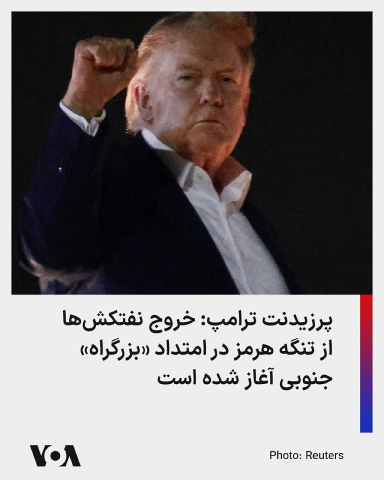

⚡️دونالد ترامپ، رئیس جمهوری آمریکا، روز دوشنبه ۲۵ خرداد با انتشار پیامی در شبکه اجتماعی تروت سوشال نوشت: «کشتی‌ها، که بسیاری از آنها پر از نفت هستند، خروج از تنگه هرمز را آغاز کرده‌اند.»

او در ادامه با اشاره به این که این نفتکش‌ها در امتداد «بزرگراه» جنوبی که «کاملاً امن، مطمئن، و دست‌نخورده» است، حرکت می‌کنند»، افزوده است که مناطق دیگری هم برای عبور وجود دارد.

## FarsiVOA — post 220806

وزارت جنگ آمریکا تصاویری از عملیات هوایی تفنگداران دریایی و نیروی دریایی این کشور بر عرشه ناو آبی‌خاکی «یواس‌اس باکسر» در اقیانوس آرام را منتشر کرد.

به گفته این وزارتخانه، این تمرین‌ها با هدف تقویت توان اعزام سریع نیروها، افزایش آمادگی رزمی و ارتقای هماهنگی میان تفنگداران دریایی و نیروی دریایی آمریکا برگزار شده است.

@FarsiVOA

## DW_Farsi — post 126015

  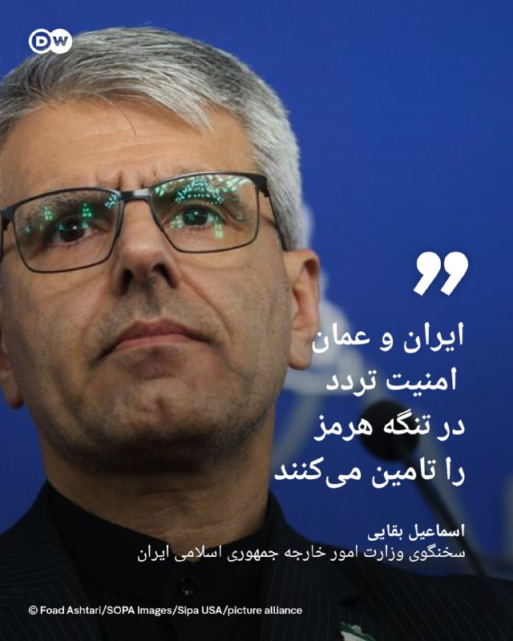

🔶 بقایی: ایران و عمان امنیت تردد در تنگه هرمز را تامین می‌کنند
 
اسماعیل بقایی، سخنگوی وزارت امور خارجه جمهوری اسلامی ایران، اعلام کرد امنیت تنگه هرمز برای ایران از اهمیت بالایی برخوردار است و همه تدابیر اتخاذشده در ماه‌های اخیر کاملا منطبق با حقوق بین‌الملل بوده است. او گفت بر اساس یادداشت تفاهم، ایران به‌عنوان دولت ساحلی با همکاری عمان و با مشورت ذی‌نفعان، امنیت و تردد ایمن کشتی‌ها را در این آبراه راهبردی تأمین می‌کند.
 
بقایی گفت این اقدامات نظارتی و حمایتی، متناسب با تعهدات طرف مقابل اجرا می‌شود و جایگاه حاکمیتی ایران را به‌طور کامل حفظ می‌کند.
 
او همچنین تاکید کرد ایران صرفا به‌دنبال دریافت عوارض نیست، بلکه هزینه‌های مربوط به خدمات ناوبری، حفاظت از محیط زیست و بیمه کشتی‌ها را که از سوی ایران و عمان ارائه می‌شود، طراحی و دریافت خواهد کرد.
@dw_farsi

## DW_Farsi — post 126014

  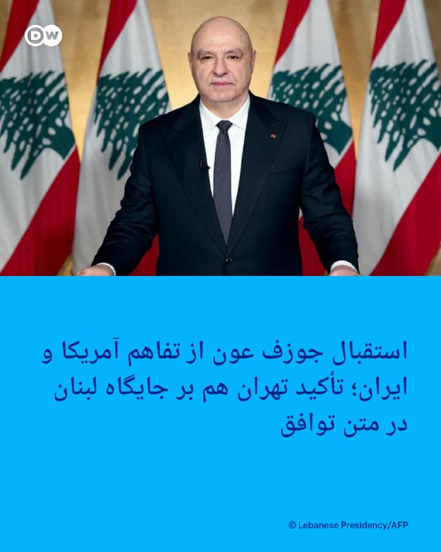

🔶 استقبال جوزف عون از تفاهم آمریکا و ایران؛ تأکید تهران هم بر جایگاه لبنان در متن توافق
 
جوزف عون، رئیس‌جمهوری لبنان، در بیانیه‌ای اعلام کرد تفاهم به‌دست‌آمده میان ایالات متحده آمریکا و جمهوری اسلامی ایران را با دقت دنبال کرده و از مفاد آن، به‌ویژه بخش‌های مربوط به توقف عملیات نظامی و کاهش تنش در منطقه، از جمله در لبنان، استقبال می‌کند.
 
او گفت تصریح این تفاهم بر احترام به وضعیت خاص لبنان و پیوند زدن ثبات و امنیت این کشور با هر تلاش جدی برای آرام‌سازی منطقه، برای لبنانی‌ها که در ماه‌های گذشته هزینه‌های سنگینی پرداخته‌اند، اهمیت ویژه‌ای دارد.
 
او همچنین از همه کشورها و طرف‌هایی که در دستیابی به این تفاهم نقش داشته‌اند، قدردانی کرد و از تلاش‌هایی که باعث شد لبنان در روند پایان دادن به تنش و توقف عملیات نظامی در جبهه‌های مختلف مورد توجه قرار گیرد، تشکر کرد.

هم‌زمان، سخنگوی وزارت امور خارجه جمهوری اسلامی نیز با اشاره به سه بار تکرار نام لبنان در یادداشت تفاهم اخیر، گفت این موضوع نشان‌دهنده جایگاه راهبردی لبنان در روند سازش است.
@dw_farsi

## DW_Farsi — post 126012

🔶 توافق ایران و آمریکا: تسلیم‌نامه یا فرصت تنفس برای مردم؟
 
🔻گزارشی از میترا شجاعی

در اولین ساعات روز دوشنبه ۲۵ خرداد (۱۵ ژوئن) اعلام شد که ایران و آمریکا به یک توافق اولیه دست یافته‌اند؛ توافقی که به گفته دونالد ترامپ رییس جمهوری آمریکا "تنگه هرمز را برای کشتیرانی تجاری باز خواهد کرد" و "صلح و امنیت را به سراسر منطقه می‌آورد".
 
هم‌زمان شورای عالی امنیت ملی ایران طی بیانیه‌ای اعلام کرد: «بر اساس توافقات انجام‌شده، جنگ و عملیات نظامی در تمامی جبهه‌ها از جمله لبنان از امشب به صورت فوری و دائمی پایان یافته و به علاوه، محاصره دریایی علیه ایران بلافاصله و به طور کامل خاتمه می‌یابد.»
 
این شورا که در حال حاضر عالی‌ترین مرجع تصمیم‌گیری درباره سیاست‌های کلان جمهوری اسلامی است تصریح کرده که "مذاکراتبرای توافق نهایی، به پس از اجرای تعهدات طرف مقابل وفق یادداشت تفاهم موکول خواهد شد".
 
این توافق اولیه هنوز به امضای طرفین نرسیده و قرار است روز جمعه ۲۹ خرداد (۱۹ ژوئن) امضا شود.
 
این که "توافق نهایی" چه زمانی حاصل می‌شود و شامل چه مفادی خواهدبود هنوز مشخص نیست. جی‌دی ونس، معاون رئیس‌جمهور آمریکا، در گفت‌وگویی با شبکه فاکس‌نیوز در شامگاه یکشنبه گفت در این توافق "عدم دستیابی ایران به سلاح هسته‌ای گنجانده شده" و آمریکا قادر خواهد بود پایبندی به آن را راستی‌آزمایی کند. اما طرف ایرانی تا کنون چیزی در این باره بیان نکرده است.
 
همچنین سرنوشت ۴۰۰ کیلوگرم اورانیوم غنی‌شده که آمریکا و شخص ترامپ اصرار بر خروج آن از ایران داشتند نیز مشخص نشده است.
 
با توجه به همه این موارد آیا می‌توان این توافق اولیه را قدمی برای رسیدن به یک توافق پایدار دانست که شاید در درازمدت بتواند روابط ایران و آمریکا را عادی کند؟
@dw_farsi

## DW_Farsi — post 126011

  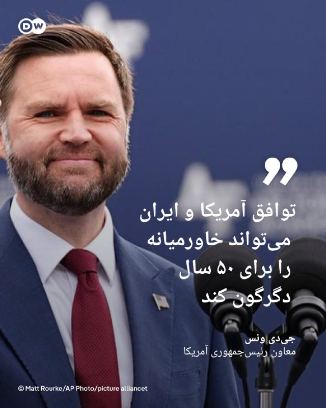

ونس: توافق آمریکا و ایران می‌تواند خاورمیانه را برای ۵۰ سال دگرگون کند
 
جی‌دی ونس، معاون رئیس‌جمهوری آمریکا، از توافق گزارش‌شده میان آمریکا و ایران استقبال کرد و آن را تحولی دانست که می‌تواند خاورمیانه را برای دهه‌ها تغییر دهد.

او در گفت‌وگو با فاکس‌نیوز گفت مراسم امضای این توافق قرار است روز جمعه در ژنو سوئیس برگزار شود و خود او انتظار دارد در این مراسم حضور داشته باشد. ونس همچنین گفت ممکن است دونالد ترامپ نیز در این مراسم شرکت کند.
 
ونس گفت این توافق به جلوگیری از دستیابی ایران به سلاح هسته‌ای کمک خواهد کرد، هزینه انرژی را پایین می‌آورد و ثباتی بلندمدت برای منطقه به همراه خواهد داشت.
 
او افزود آمریکا با این توافق خواهد توانست نه فقط در کوتاه‌مدت، بلکه در بلندمدت هم هزینه انرژی را کاهش دهد و "یک موتور واقعی رفاه" در خاورمیانه ایجاد کند.
 
ونس همچنین گفت آمریکا "دست صلح و تعامل" به سوی ایران دراز کرده و اگر تهران بخواهد رابطه‌اش را با واشینگتن تغییر دهد، آمریکا نیز رابطه خود را با ایران تغییر خواهد داد.
 @dw_farsi

## DW_Farsi — post 126010

🔶 آغاز مذاکرات برای عضویت اوکراین و مولداوی در اتحادیه اروپا
 
از امروز، دوشنبه ۱۵ ژوئن (۲۵ خردادماه) مذاکرات پیچیده و بررسی‌های چندمرحله‌ای مربوط به عضویت اوکراین و مولداوی در اتحادیه اروپا آغاز می‌شود.
 
اوکراین در فوریه ۲۰۲۲، اندکی پس از حمله تجاوزکارانه روسیه، درخواست عضویت خود در اتحادیه اروپا را ارائه کرد.
 
اکنون، چهار سال بعد، مذاکرات سرنوشت‌ساز برای بررسی عضویت این کشور در این اتحادیه آغاز می‌شود؛ آن هم در شرایطی که جنگ در اوکراین همچنان ادامه دارد و کی‌یف هر روز از خود در برابر حملات سنگین مسکو دفاع می‌کند.
 
به گفته مارتا کوس، کمیسر گسترش اتحادیه اروپا، "هیچ کشوری در تاریخ اتحادیه اروپا تاکنون تحت چنین شرایطی مسیر عضویت را دنبال نکرده است".
 
اورزولا فون در لاین، رئیس کمیسیون اروپا، نیز از "شجاعت، قاطعیت و تلاش سخت هر دو کشور" برای پیوستن به اتحادیه اروپا تمجید کرد.
 
جمهوری مولداوی نیز تقریباً هم‌زمان درخواست عضویت خود را ارائه کرده بود. این کشور در سال‌های گذشته تحت فشار شدید مسکو قرار داشته است.
 
روند بررسی عضویت اوکراین و مولداوی در اتحادیه اروپا در حالی آغاز می‌شود که این دو کشور از جهات بسیاری با یکدیگر تفاوت دارند.
 
جمهوری مولداوی با بیش از دو میلیون نفر جمعیت، کشوری نسبتاً کوچک به شمار می‌رود. در مقابل، اوکراین با نزدیک به ۴۰ میلیون نفر جمعیت، بزرگ‌ترین کشور اروپا از نظر مساحت است.
 
به این ترتیب، عضویت احتمالی اوکراین در اتحادیه اروپا می‌تواند بسیاری از توازن‌ها و معادلات در اتحادیه را دگرگون کند.
@dw_farsi

## DW_Farsi — post 126009

🎥 واده‌فول: تنگه هرمز باید بدون محدودیت برای کشتیرانی باز بماند
 
وزیر امور خارجه آلمان روز دوشنبه ۲۵ خرداد، خواستار تضمین آزادی کشتیرانی در تنگه هرمز شد و گفت هدف مذاکرات در هفته‌های آینده باید رفع نگرانی‌ها درباره برنامه هسته‌ای ایران باشد.
@dw_farsi

## DW_Farsi — post 126008

🔶 ممنوعیت شبکه‌های اجتماعی برای افراد زیر ۱۶ سال در بریتانیا
 
دولت بریتانیا اعلام کرد در یک اقدام تازه، شبکه‌های اجتماعی از ارائه خدمات به افراد زیر ۱۶ سال منع خواهند شد؛ تصمیمی که به گفته دولت، قرار است مرزی تازه در حفاظت از کودکان ایجاد کند و توازن را از شرکت‌های فناوری به سود خانواده‌ها و والدین تغییر دهد.
 
بر اساس این طرح، محدودیت‌ها قرار است پیش از کریسمس به پارلمان ارائه شود و پیش‌بینی می‌شود از بهار ۲۰۲۷ به اجرا درآید.
 
دولت بریتانیا گفته است برای این ممنوعیت از الگویی مشابه استرالیا  استفاده خواهد کرد. بر اساس این مدل، پلتفرم‌های کاربرمحور که هدفشان تعامل اجتماعی است و به کاربران امکان انتشار محتوا می‌دهند، همراه با الگوریتم‌هایشان، مشمول ممنوعیت خواهند شد.
 
در متن منتشرشده، از اسنپ‌چت، تیک‌تاک، یوتیوب، اینستاگرام، فیس‌بوک و ایکس به‌عنوان نمونه نام برده شده است. در عین حال، دولت گفته قصد ندارد پیام‌رسان‌هایی مانند واتس‌اپ و سیگنال را در این ممنوعیت بگنجاند.
 
دولت بریتانیا همچنین اعلام کرد علاوه بر این ممنوعیت، قابلیت‌های "مضر" مانند پخش زنده و ارتباط غریبه‌ها با کودکان هم برای افراد زیر ۱۶ سال مسدود خواهد شد. این محدودیت‌ها فقط به شبکه‌های اجتماعی محدود نمی‌شود و دامنه آن به طیف گسترده‌تری از خدمات آنلاین، از جمله برخی خدمات در سایت‌های بازی، هم می‌رسد.
@dw_farsi

## DW_Farsi — post 126007

🔶 حملات روسیه به اوکراین؛ ۹ کشته و آسیب شدید به صومعه کی‌یف

در جریان حملات گسترده هوایی روسیه به اوکراین، چندین نفر کشته و شمار زیادی دیگر زخمی شدند. در پایتخت اوکراین، کی‌یف، "صومعه غارها" که جزو میراث جهانی یونسکو و از مهمترین نمادهای تاریخی و مذهبی این کشور است، در پی این حملات آتش گرفت.

در همین خصوص، یولیا سویریدنکو، نخست‌وزیر اوکراین، این حمله را "یورش بی‌رحمانه به میراث اوکراین" توصیف کرد.

هنوز مشخص نیست که این زیارتگاه مشهور جهانی بر اثر اصابت مستقیم پرتابه‌های روسی آتش گرفته یا اینکه سقوط قطعات ناشی از عملکرد سامانه‌های پدافند هوایی اوکراین، باعث وقوع آتش‌سوزی شده است.

متروپولیت اپیفانیوس، رهبر کلیسای ارتدوکس اوکراین نیز این اقدام را "جنایتی دیگر علیه بشریت، علیه تاریخ و علیه مسیحیت" دانست که از سوی روسیه انجام شده است.

به گفته تتیانا برژنا، وزیر فرهنگ اوکراین، ساختمان‌های دیگری از مجموعه این صومعه نیز آسیب دیده‌اند؛ از جمله نمای بیرونی یک کلیسای دیگر.

@dw_farsi

## DW_Farsi — post 126006

  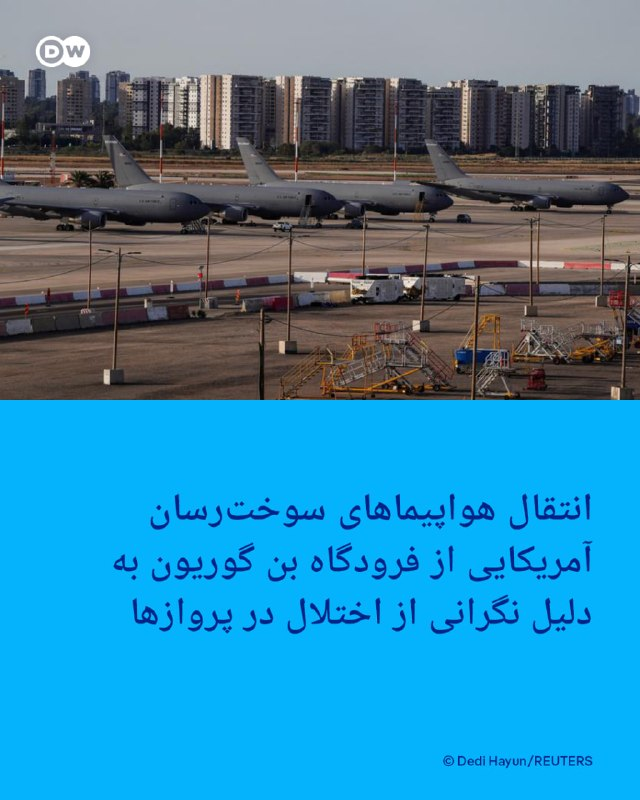

🔶 انتقال هواپیماهای سوخت‌رسان آمریکایی از فرودگاه بن‌ گوریون به دلیل نگرانی از اختلال در پروازها

روزنامه اسرائیلی "معاریو" گزارش داد حدود نیمی از هواپیماهای سوخت‌رسان آمریکایی که در حال حاضر در فرودگاه بن گوریون مستقر هستند، برای کاهش خطر بروز اختلال در پروازها در فصل تعطیلات تابستانی، به پایگاه‌های نیروی هوایی اسرائیل منتقل خواهند شد.

طبق این گزارش این هواپیماها دست‌کم تا پایان سال ۲۰۲۷ در فرودگاه بن گوریون باقی خواهند ماند با این حال حضور آنها به همراه پرسنل نظامی آمریکا، مشکلات لجستیکی قابل‌توجهی را برای این فرودگاه ایجاد کرده است تا جایی که سازمان فرودگاه‌های اسرائیل ماه گذشته اعلام کرده بود فرودگاه بن گوریون تنها با یک سوم ظرفیت خود فعالیت می‌کند.

به گفته شارون کدمی، مدیر این سازمان، ۷۰ درصد فعالیت‌های این فرودگاه بین‌المللی به دلیل اشغال فضا و منابع توسط هواپیماهای سوخت‌رسان آمریکایی محدود شده است.

او اظهار داشته بود در دو ماه گذشته فرودگاه بن گوریون حدود ۷۰۰ میلیون شکل (تقریبا ۲۴۸ میلیون دلار) زیان دیده است و در صورت تداوم این وضعیت، رقم این ضرر می‌تواند به میلیاردها شکل افزایش پیدا کند.
@dw_farsi

## DW_Farsi — post 126005

  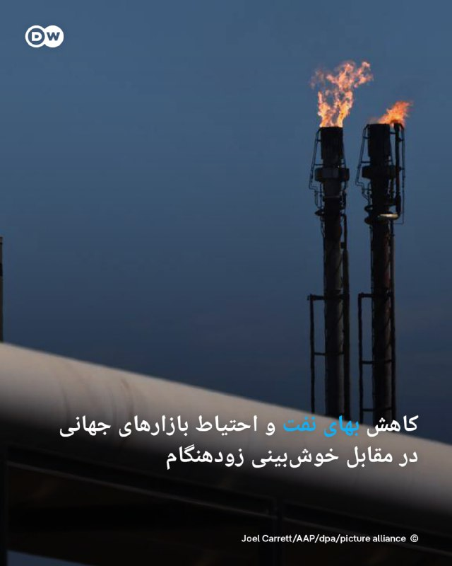

🔶 کاهش بهای نفت و احتیاط بازارهای جهانی در مقابل خوش‌بینی زودهنگام

پس از اعلام توافق آمریکا و ایران برای بازگشایی تنگه هرمز قیمت نفت در معاملات اولیه روز دوشنبه ۱۵ ژوئن (۲۵ خرداد) در آسیا کاهش چشمگیری یافت. نفت خام برنت با ۳.۹۵ درصد کاهش به ۸۳.۸۸ دلار در هر بشکه و نفت خام تگزاس با ۴.۶۲ درصد کاهش به ۸۰.۹۶ دلار در هر بشکه رسید. با این حال به اعتقاد کارشناسان ممکن است ماه‌ها طول بکشد تا قیمت نفت پس از اختلالات ناشی از جنگ ایران به ثبات برسد.

به گزارش آسوشیتدپرس به گفته کارشناسان حوزه انرژی شرکت‌های کشتیرانی و بیمه در تلاش یافتن تضمینی در مورد پایدار ماندن توافق بین ایران و آمریکا هستند و هرچند این توافق مهمترین پیشرفت دیپلماتیک میان تهران و واشنگتن از زمان آغاز جنگ به شمار می‌رود اما با این‌حال بازارها تا زمانی که توافق رسما به امضا نرسد و مین‌‌های کارگذاری‌شده در تنگه هرمز پاکسازی نشوند، با احتیاط عمل خواهند کرد و از خوش‌بینی زودهنگام پرهیز می‌کنند.

رویترز روز دوشنبه به نقل از منابع کشتیرانی و امنیت دریایی گزارش داد عملیات مین‌روب‌های متعارف و پهپادهای پیشرفته زیرآبی ممکن است بین ۴۰ تا ۵۰ روز طول بکشد که این وضعیت می‌تواند مانع جابه‌جایی ده‌ها میلیون بشکه نفت از تنگه هرمز شود.

اداره اطلاعات انرژی ایالات متحده هفته گذشته در تحلیل جدیدی اعلام کرده بود ذخایر نفتی بزرگترین اقتصادهای جهان در حال نزدیک شدن به پایین‌ترین سطح خود از دستکم‌ سال ۲۰۰۳ تا کنون هستند.

از همین رو به اعتقاد تحلیلگران حتی اگر توافق بازگشایی تنگه هرمز امضا شود، ممکن است تا حدود یک تا دو ماه طول بکشد تا پاکسازی مین‌ها کامل شود و شرکت‌های بزرگ کشتیرانی، بیمه و انرژی با اطمینان کامل فعالیت عادی خود را از سر بگیرند. همین موضوع می‌تواند همچنان بر عرضه جهانی نفت و قیمت‌های انرژی تأثیرگذار باشد.

@dw_farsi

## DW_Farsi — post 126004

🔶 بحران هرمز؛ ترکیه در پی احیای راه‌آهن بین عربستان و اروپا

در پی جنگ و تنش میان جمهوری اسلامی با آمریکا و اسرائیل، حکومت ایران با بستن تنگه هرمز عملا تجارت در خاورمیانه را فلج کرد.

حال، طبق گزارش‌ها دولت ترکیه احیای خط‌ آهن تاریخی میان عربستان سعودی و اروپا را در اولویت بالایی قرار داده است تا بدین‌وسیله، خاورمیانه به قاره سبز متصل شود. هدف از احیای خط آهن مزبور این است که کالاهایی مانند نفت و گاز طبیعی از طریق "مسیر زمینی" حمل شوند.

در همین خصوص، عبدالقادر اورال‌اوغلو، وزیر حمل‌ونقل ترکیه، به شبکه الجزیره گفت که "ترکیه و عربستان سعودی قصد دارند شکاف عدم اتصال به طول ۴۰۰ کیلومتر در مسیر اردن و سوریه را طی سه تا چهار سال آینده برطرف کنند."

شرکای این پروژه روز سه‌شنبه هفته گذشته ۱۹ خردادماه (۹ ژوئن) بیانیه‌ مربوط به همکاری در بخش لجستیک و راه‌آهن را امضا کردند. این مناطق پیشتر در دوران امپراتوری عثمانی از طریق راه‌آهن موسوم به "حجاز" به یکدیگر متصل بودند که البته بعدها بخش‌هایی از آن، از بین رفت و رو به ویرانی گذاشت.

@dw_farsi

## DW_Farsi — post 126003

  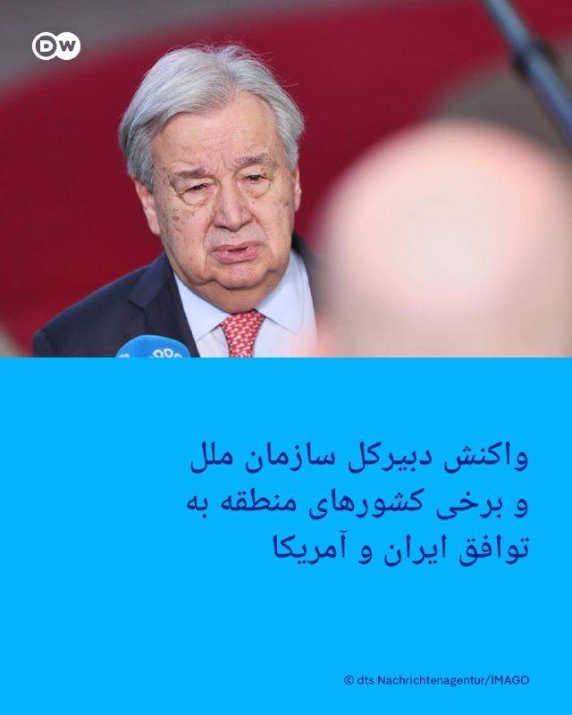

🔶 واکنش دبیرکل سازمان ملل و برخی کشورهای منطقه به توافق ایران و آمریکا

آنتونیو گوترش، دبیرکل سازمان ملل متحد، از توافق میان ایران و آمریکا استقبال کرد. او با انتشار بیانیه‌ای‌ اظهار داشت از دستیابی ایالات متحده و ایران به "توافق صلحی که شامل برقراری فوری و دائمی آتش‌بس، بازگشایی تنگه هرمز و همچنین ایجاد چارچوبی برای ادامه مذاکرات" باشد، استقبال می‌کند.

گوترش این توافق را "گامی بسیار مهم در مسیر حل‌ و فصل مسالمت‌آمیز" جنگ میان ایران و آمریکا دانسته و از ترکیه، عربستان سعودی، مصر، قطر، پاکستان و دیگر کشورهای منطقه به دلیل "ایفای نقش سازنده در مذکرات" قدردانی کرد.

از سوی دیگر محمد بن عبدالعزیز بن صالح الخلیفی، مشاور در امور خارجه دولت قطر نیز با انتشار پیامی در ایکس نوشت این کشور از "تفاهم حاصل‌شده میان ایالات متحده و جمهوری اسلامی ایران که هموارکننده راه برای توقف پایدار عملیات نظامی است" استقبال می‌کند.

این مقام ارشد قطری نیز از تلاش‌های پاکستان برای میانجی‌گیری میان تهران و واشنگتن قدردانی کرد و گفت دوحه بار دیگر بر "تعهد راسخ خود به صلح و گفت‌وگو به عنوان مؤثرترین ابزار حل اختلافات" تأکید دارد.

وزارت خارجه کویت هم در بیانیه‌ای از این توافق استقبال کرده و از همه طرف‌ها خواست تا "با روحیه‌ای مثبت و سازنده" در مذاکرات پیش‌رو شرکت کنند.

در این بیانیه ابراز امیدواری شده است که تفاهم‌نامه میان ایران و آمریکا "گاهی مهم در جهت یافتن رویکردهای گسترده‌تر برای حل مسائل باقی‌مانده از طریق راه‌حل‌های پایدار باشد که اصول همجواری از جمله احترام متقابل و تقویت اعتماد، عدم دخالت در امور داخلی کشورها، خودداری از استفاده از زور یا تهدید به آن و توقف حمایت از گروه‌های نیابتی را تقویت می‌کنند".

@dw_farsi

## DW_Farsi — post 126002

  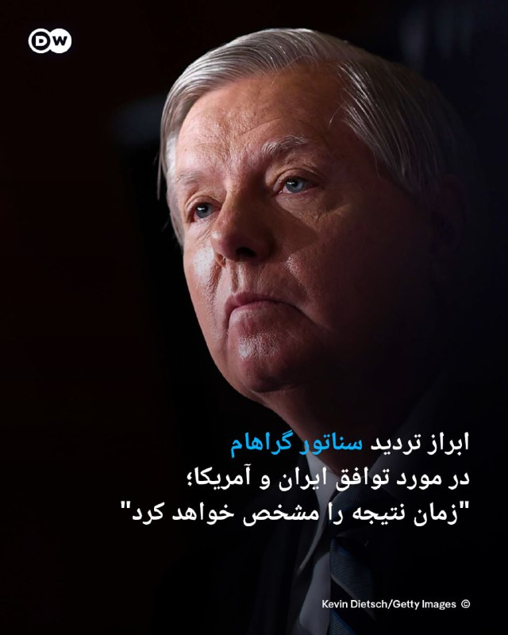

🔶 ابراز تردید سناتور گراهام در مورد توافق ایران و آمریکا؛ "زمان نتیجه را مشخص خواهد کرد"

لیندزی گراهام، سناتور جمهوری‌خواه، از بازگشایی تنگه هرمز ابراز "خشنودی" کرد، اما خاطرنشان ساخت که همچنان درباره اختلاف میان برداشت ایران و روایت تیم مذاکره‌کننده آمریکایی از مفاد توافق نگران است.

او پس از اعلام توافق ایران و آمریکا بر سر یادداشت تفاهم، در پیامی در شبکه اجتماعی ایکس نوشت: «تا حدی نگران هستم که برداشت و تفسیر ایران از این توافق با آنچه تیم مذاکره‌کننده آمریکایی مطرح می‌کند، متفاوت به نظر می‌رسد.»

این سناتور پرنفوذ ایالت کارولینای جنوبی و از مدافعان حمله نظامی به ایران گفت که مذکرات پیش‌رو را از نزدیک دنبال خواهد کرد و تأکید کرد که هرگونه توافق هسته،‌ای با ایران باید برای بررسی و رأی‌گیری به کنگره ارائه شود.

گراهام افزود: «من مشتاقانه منتظر بررسی نسخه نهایی این توافق هستم و معتقدم که ضروری است معمار این توافق جی‌دی ونس، معاون رئیس‌جمهور و همکاران مذاکره‌کننده، بخشی از روند ارائه نسخه نهایی توافق به کنگره باشند.»

او در پایان تأکید کرد که "زمان مشخص خواهد کرد که نتیجه نهایی چه خواهد بود".

@dw_farsi

## DW_Farsi — post 126001

🔶 هزاران نفر در ژنو علیه نشست گروه هفت تظاهرات کردند

روز یکشنبه ۱۴ ژوئن (۲۴ خردادماه) هزاران نفر در شهر ژنو سوئیس علیه نشست قریب‌الوقوع گروه هفت در فرانسه که در نزدیکی این شهر برگزار می‌شود، دست به اعتراض زدند. راهپیمایی اعتراضی از سوی ائتلاف "نه به گروه هفت" با حضور گسترده نیروهای پلیس در خیابان‌های این شهر مرزی در سوئیس برگزار شد.

بنا بر اعلام مقامات پلیس در ژنو، حدود ۲۰ هزار نفر در این تظاهرات شرکت کردند. نیروهای امنیتی پیش‌تر انتظار داشتند که حدود ۵۰ هزار نفر در این تظاهرات شرکت کنند.

رهبران کشورهای صنعتی عضو گروه هفت شامل آلمان، فرانسه، بریتانیا، ایتالیا، کانادا، ژاپن و ایالات متحده قرار است روز دوشنبه ۱۵ ژوئن (۲۵ خردادماه) در شهر اویان در فرانسه گرد هم جمع شوند.

@dw_farsi

## DW_Farsi — post 126000

  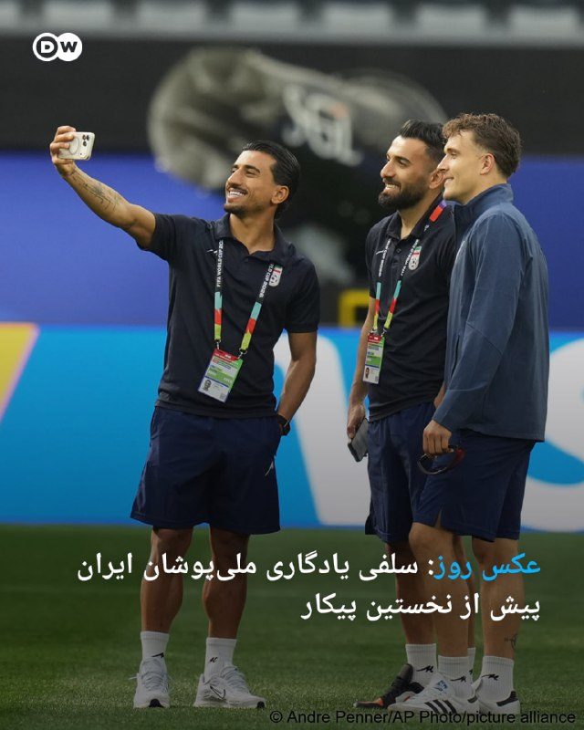

📸 عکس روز: سلفی یادگاری ملی‌پوشان ایران پیش از نخستین پیکار

تیم ملی فوتبال ایران در نخستین دیدار خود در مسابقات جام جهانی فوتبال ۲۰۲۶ به مصاف نیوزیلند می‌روند. ملی‌پوشان ایران در این بین امکان ورود به ورزشگاه لس‌آنجلس را داشتند تا با فضای میدان آشنا شوند. این برای برخی از بازیکنان از جمله صالح حردانی فرصتی بوده تا سلفی یادگاری بگیرند.

@dw_farsi

## Persian_Trend_Official — post 17190

  <a href="telegram/content/Persian_Trend_Official_17190_1781539710.mp4" target="_blank">🎬 Download video</a>

خبرنگار: آیا امیدی هست که توافق آمریکا و ایران دوام زیادی داشته باشد؟

رادوسلاو سیکورسکی، وزیر امور خارجه لهستان: ان‌شاءالله

📝 Amir

📌 @persian_trend_official
پرشین ترند | متفاوت‌ترین کانال نظامی

## Persian_Trend_Official — post 17189

  <a href="telegram/content/Persian_Trend_Official_17189_1781539713.webm" target="_blank">🎬 Download video</a>

عراقچی: روز جمعه احتمالاً در کشور سوئیس دیداری بین روسای هیئت‌های دو طرف انجام و تفاهم نامه بین ایران و آمریکا امضا شود، سپس اولین دور مذاکرات بعدی برگزار شود.

📝 Amir

📌 @persian_trend_official
پرشین ترند | متفاوت‌ترین کانال نظامی

## Persian_Trend_Official — post 17188

  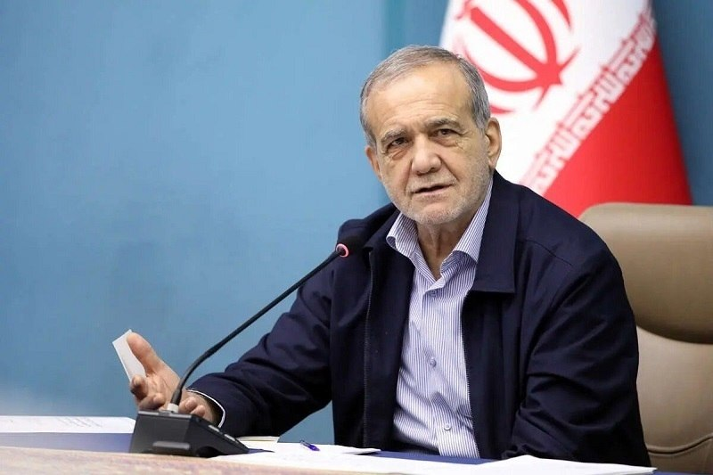

پزشکیان: در شورای عالی امنیت ملی فقط یک نفر مخالف تفاهم نامه بود.

اجرای کامل این تفاهم‌نامه می‌تواند بسیاری از مسائل را برطرف کند و شرایط تازه‌ای را در ایران و منطقه خاورمیانه رقم بزند. این تفاهم‌نامه نه‌تنها برای داخل کشور، بلکه برای کل منطقه و نیروهای مقاومت نیز افتخاری بزرگ به شمار می‌رود. جزئیات آن نیز ان‌شاءالله در زمان مناسب ارائه خواهد شد.

لازم می‌دانم از اعضای تیم مذاکره‌کننده تشکر کنم؛ از آقای قالیباف که زحمات زیادی کشیدند، از آقای عراقچی و همچنین از اعضای شورای‌عالی امنیت ملی و همۀ کسانی که در این مسیر نقش‌آفرینی کردند.

در شورای‌عالی امنیت ملی، پس از بحث‌ها و بررسی‌های مختلف، تقریباً بیش از 90 رصد اعضا با این روند همراهی کردند و رأی دادند که این اقدام باید انجام شود.

📝 Amir

📌 @persian_trend_official
پرشین ترند | متفاوت‌ترین کانال نظامی

## Persian_Trend_Official — post 17187

  <a href="telegram/content/Persian_Trend_Official_17187_1781539714.mp4" target="_blank">🎬 Download video</a>

اورزولا فون در لاین، رئیس کمیسیون اروپا: ما از توافق حاصل شده بین ایالات متحده و ایران استقبال می‌کنیم. اولویت اکنون اجرای آن است.

تنگه هرمز باید بازگشایی شود و آزادی دریانوردی باید بدون عوارض برقرار شود. این امر برای ثبات منطقه‌ای و البته برای اقتصاد جهانی ضروری است.

این توافق باید در را برای مذاکرات گسترده‌تر باز کند و به پایان برنامه‌های هسته‌ای و بالستیک ایران منجر شود.

📝 Amir

📌 @persian_trend_official
پرشین ترند | متفاوت‌ترین کانال نظامی

## Persian_Trend_Official — post 17184

  <a href="telegram/content/Persian_Trend_Official_17184_1781539717.webm" target="_blank">🎬 Download video</a>

کشف و خنثی‌سازی سر جنگی موشک کروز تاماهاوک در ورامین

یگان کشف و خنثی بمب (EOD) نیروی انتظامی سرجنگی یک فروند موشک کروز تاماهاوک آمریکا را در ورامین کشف و پس از ایمن‌سازی، خنثی کردند.

📝 Amir

📌 @persian_trend_official
پرشین ترند | متفاوت‌ترین کانال نظامی

## Persian_Trend_Official — post 17180

حزب‌الله روز گذشته ویدیویی از شلیک یک فروند موشک تاکتیکی آرمان به سمت مواضع ارتش اسرائیل منتشر کرد.

موشک تاکتیکی آرمان جدیدترین موشک بالستیک تاکتیکی سپاه پاسداران محسوب می‌شود که حواشی فراوانی حول خود دارد، از صادرات این موشک به روسیه تا رسیدن این موشک به دست حزب الله لبنان آن هم در شرایطی که مسیرهای لجستیک جمهوری اسلامی با لبنان قطع شده است.

این موشک در دو نمونه مختلف با نهایت برد 86 کیلومتر توسعه پیدا کرده، نمونه مجهز به سیکر اپتیکی این موشک بردی 60 کیلومتری دارد.

این موشک چندین بار در نمایشگاه های نظامی مختلف از جمله در روسیه به نمایش درآمد، تقریبا یک سال پیش در بحبوحه شایعات صادرات موشک بالستیک ایرانی به روسیه، تصاویری از حضور لانچرهای این موشک در بندرانزلی منتشر شد که نشان میداد در حال بارگیری در کشتی برای ارسال به روسیه هستند ولی تا به این لحظه هیچ گزارشی از استفاده روسیه از این موشک یا موشک ایرانی دیگری منتشر نشده.

📝 Amir

📌 @persian_trend_official
پرشین ترند | متفاوت‌ترین کانال نظامی

## Persian_Trend_Official — post 17179

بن گویر، وزیر امنیت ملی اسرائیل: تاریخ به ما می‌آموزد که هر بار که مسیر خویشتن‌ داری، تسلیم یا تکیه بر توهم آرامش را انتخاب کردیم، وحشت بیشتر، وحشت بیشتر و وحشت بیشتری را تجربه کردیم.

من به نخست وزیر عزیزمان آشکارا می‌گویم: دوره دورهای بی‌پایان جنگ به پایان رسیده است. نه در غزه، نه در لبنان، نه در ایران.

📝 Amir

📌 @persian_trend_official
پرشین ترند | متفاوت‌ترین کانال نظامی

## Persian_Trend_Official — post 17178

  <a href="telegram/content/Persian_Trend_Official_17178_1781539718.mp4" target="_blank">🎬 Download video</a>

خبرنگار CBS نیوز: پیش از این، ترامپ گفته بود که هیچ توافقی با ایران جز تسلیم بی‌قید و شرط وجود نخواهد داشت. چرا او اکنون مسیر خود را تغییر داد و با این توافق موافقت کرد؟

ونس: فکر نمی‌کنم او مسیر خود را تغییر داده باشد. اساساً، استدلال ترامپ این بود که ما قصد داریم از نیروی نظامی برای اعمال فشار بر ایران استفاده کنیم و قرار است چیز خوبی برای مردم آمریکا به دست آوریم. و اکنون ما این را داریم.

📝 Amir

📌 @persian_trend_official
پرشین ترند | متفاوت‌ترین کانال نظامی

## Persian_Trend_Official — post 17177

  <a href="telegram/content/Persian_Trend_Official_17177_1781539721.mp4" target="_blank">🎬 Download video</a>

خبرنگار CBS نیوز: ایرانی‌ها می‌گویند که به 300 میلیارد دلار بودجه بازسازی دسترسی خواهند داشت. درست است یا غلط؟

ونس: این از آن نوع چیزهایی است که می‌توانند به آن دسترسی داشته باشند، البته تا زمانی که به تعهدات خود عمل کنند.

📝 Amir

📌 @persian_trend_official
پرشین ترند | متفاوت‌ترین کانال نظامی

## Persian_Trend_Official — post 17176

معاون رئیس جمهور امریکا، جی دی ونس در مورد ایران: ما دیروز توافق را به صورت دیجیتالی امضا کردیم و هیچ پولی آزاد نشده است. این تغییر نخواهد کرد.

این یک موضوع مبتنی بر عملکرد است. اگر ببینیم ایرانی‌ها برای از بین بردن ذخایر مواد غنی‌شده خود اقدام می‌کنند و اجازه می‌دهند آن نوع رژیم راستی‌آزمایی که ما نیاز داریم تا بدانیم که آنها قصد ساخت سلاح هسته‌ای ندارند، برقرار شود، بله، لغو تحریم‌ها به دنبال آن خواهد آمد.

📝 Amir

📌 @persian_trend_official
پرشین ترند | متفاوت‌ترین کانال نظامی

## Persian_Trend_Official — post 17175

معاون رئیس جمهور امریکا، جی دی ونس در مورد توافق ایران: ما متن توافق را این هفته منتشر خواهیم کرد.

ایران حتی یک ریال هم پول دریافت نمی‌کند مگر اینکه به تعهدات خود عمل کند. و پولی که ما در مورد آن صحبت می‌کنیم اساساً کاهش تحریم‌ها است. ما به آنها پول آمریکایی نمی‌دهیم حتی یک دلار از پول آمریکا به ایران نخواهد رفت.

ما مایلیم در صورتی که ایرانی‌ها تعهدات بلندمدتی را که برای تبدیل شدن به یک کشور عادی، کنار گذاشتن برنامه تسلیحات هسته‌ای و توقف تأمین مالی فعالیت‌های تروریستی در سراسر خاورمیانه ضروری است، انجام دهند، کاهش قابل توجهی در تحریم‌ها ایجاد کنیم.

📝 Amir

📌 @persian_trend_official
پرشین ترند | متفاوت‌ترین کانال نظامی

## Persian_Trend_Official — post 17174

  <a href="telegram/content/Persian_Trend_Official_17174_1781539724.webm" target="_blank">🎬 Download video</a>

وضعیت در جنگ روسیه و اکراین !
زمین جبهه را فیبرنوری پوشانده و اگر دورِ پلوس یا هر قطعه چرخانی پیچیده شوند، خودرو تا ابد گیر میفتد. این رشته های فیبرنوری با کِولار تقویت شده اند و پاره کردنشان محال است، مقاومت کششی بسیار بالاست. فقط می توانید دانه دانه بِبُریدشان !
تازه هر لحظه باید منتظر باشید یک FPV از راه برسه و ...

## Persian_Trend_Official — post 17173

  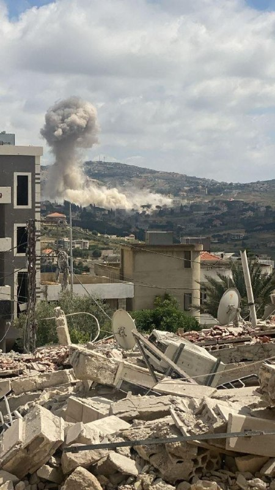

حمله هوایی ارتش اسرائیل به عیتا الجبال در جنوب لبنان

📝 Amir

📌 @persian_trend_official
پرشین ترند | متفاوت‌ترین کانال نظامی

## Persian_Trend_Official — post 17172

  <a href="telegram/content/Persian_Trend_Official_17172_1781539725.mp4" target="_blank">🎬 Download video</a>

بمب‌افکن روسی Tu-22M3 در منطقه ایرکوتسک روسیه سقوط کرد.

ساعاتی پیش یک فروند بمب‌افکن استراتژیک توپولوف-22 ام-3 روسی در منطقه ایرکوتسک سقوط کرد، تا به این لحظه اطلاعاتی درباره وضعیت خدمه آن منتشر نشده.

📝 Amir

📌 @persian_trend_official
پرشین ترند | متفاوت‌ترین کانال نظامی

## Persian_Trend_Official — post 17171

  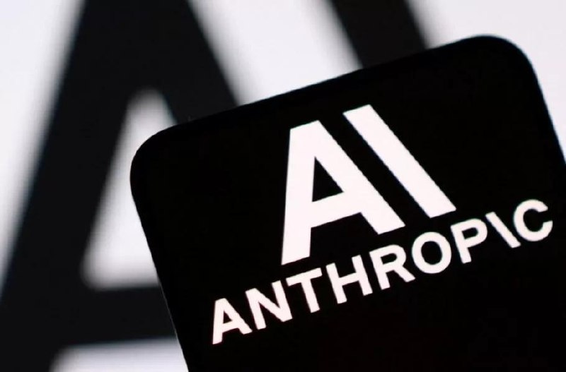

💔 آنتروپیک برای حل اختلافات پیرامون Fable 5 و Mythos 5 با کاخ سفید مذاکره می‌کند.

🔹در پی دستور دولت ترامپ مبنی بر ممنوعیت دسترسی اتباع خارجی به مدل‌های پیشرفته هوش مصنوعی Fable 5 و Mythos 5، شرکت آنتروپیک دسترسی به این مدل‌ها را در سراسر جهان به طور کامل قطع کرد. اکنون تیم فنی این شرکت قصد دارد تا در دیداری با مقامات کاخ سفید، این بحران را حل‌وفصل کند.

🔹این رویارویی درحالی رخ می‌دهد که آنتروپیک خود را برای عرضه اولیه سهامش در بورس آمریکا آماده می‌کند. این شرکت پیش از این درباره خطرات سایبری و توانایی‌های مدل Mythos هشدار داده بود و نسخه عمومی Fable را همراه با تدابیر امنیتی ویژه روانه بازار کرد اما اکنون با سد محکم دولت مواجه شده است.

پ.ن: این مدل قوی ترین هوش مصنوعی عمومی شده تا به این لحظه حساب میشه که از قابلیت های هوشمند خودمختار و منطق بالا پشتیبانی میکنه.
برای درک بهتر در تست‌های اولیه، هم از مهاجرت بزرگ در یک کدبیس ۵۰ میلیون خطی و هم از امتیاز بالای آن در بنچمارک‌های کدنویسی خبر داده اند 🔥.

📝 Nick

📌 @persian_trend_official
پرشین ترند | متفاوت‌ترین کانال نظامی

## RadioFarda — post 158336

  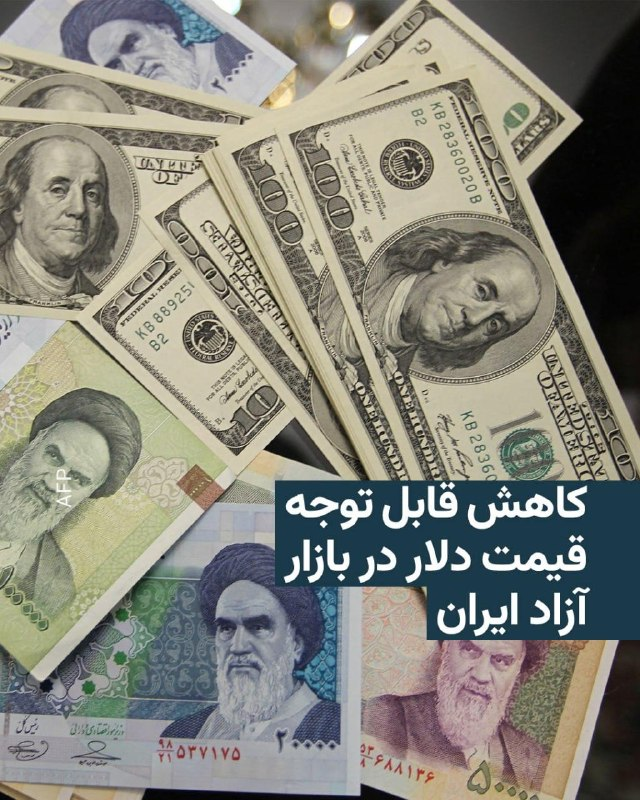

🔸روز دوشنبه، به دنبال اعلام توافق ایران و آمریکا بر سر امضای تفاهم‌نامۀ پایان جنگ، قیمت ارزهای خارجی و سکه طلا در بازار آزاد ایران کاهش قابل توجهی یافت.

🔸وب‌سایت‌های اعلام نرخ آزاد ارز و طلا، بعدازظهر روز دوشنبه قیمت هر دلار آمریکا را کمتر از ۱۶۲ هزار تومان اعلام کردند که نشان‌دهنده کاهشی در حدود ده هزار تومان از زمان اعلام توافق موقت است.

🔸قیمت هر دلار آمریکا در روزهای گذشته بیش از ۱۷۱ هزار تومان گزارش می‌شد.

🔸قیمت سایر ارزهای خارجی هم در بازار آزاد ایران کاهش مشابهی داشت.

🔸همزمان قیمت هر سکه طلا در حدود ۱۶۷ میلیون تومان اعلام شد که نسبت به روز قبل کاهشی پنج میلیون تومانی را نشان می‌داد. این میزان کاهش در حالی رخ داد که قیمت طلا در بازارهای جهانی پس از اعلام توافق ایران و آمریکا افزایش یافته بود.

🔸قیمت دلار و طلا در بازار ایران از زمان وقوع جنگ در ایران افزایش یافته و در روزهایی هر دلار آمریکا تا مرز ۱۹۰ هزار تومان هم معامله شده بود.

@RadioFarda

## RadioFarda — post 158335

🔸جی دی ونس، معاون رئیس جمهور آمریکا، روز دوشنبه در مصاحبه‌ای گفت که ایالات متحده انتظار دارد ایران برای کشتیرانی از طریق تنگه هرمز عوارض دریافت نکند. او در عین حال تأیید کرد که این موضوع، به عنوان بخشی از توافق صلح جدید مورد بحث قرار خواهد گرفت. 🔸او در گفت‌وگو…

## RadioFarda — post 158334

  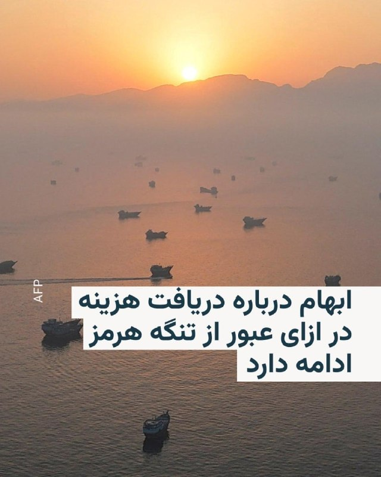

🔸جی دی ونس، معاون رئیس جمهور آمریکا، روز دوشنبه در مصاحبه‌ای گفت که ایالات متحده انتظار دارد ایران برای کشتیرانی از طریق تنگه هرمز عوارض دریافت نکند. او در عین حال تأیید کرد که این موضوع، به عنوان بخشی از توافق صلح جدید مورد بحث قرار خواهد گرفت.

🔸او در گفت‌وگو با شبکه سی‌ان‌بی‌سی در پاسخ به این سوال که آیا تفاهمی با ایران حاصل شده است که تنگه هرمز فقط برای یک دوره اولیه ۶۰ روزه به صورت رایگان بازگشایی شود یا برای مدتی بیشتر، گفت: «انتظار ما این است که این تنگه برای مدت طولانی به صورت رایگان باز شود و این چیزی است که ما در این مذاکرات فنی به آن خواهیم پرداخت.»

🔸با این همه تقریبا همزمان با این اظهارات، اسماعیل بقایی، سخنگوی وزارت خارجه جمهوری اسلامی، در یک نشست خبری گفت: «ما برای یک مدت زمان مشخص قرار است که متناظر با اقدامات طرف مقابل، تردد ایمن در تنگه هرمز را تدبیر کنیم.»

@RadioFarda

## RadioFarda — post 158333

  <a href="https://t.me/radiofarda/158333" target="_blank">📎 Download file</a>

از گشت ارشاد تا طالبان؛ درد مشترک زنان ایران و افغانستان

🔸بازداشت ده‌ها زن در هرات به‌دلیل نوع پوشش و برخورد خشونت‌آمیز طالبان با معترضان، موج تازه‌ای از نگرانی و اعتراض را برانگیخته است. همزمان، شماری از زنان ایرانی با یادآوری تجربه گشت ارشاد و جنبش «زن، زندگی، آزادی»، از زنان افغانستان حمایت کرده‌اند؛ همبستگی‌ای که از درد و تجربه‌ای نزدیک در دو سوی مرز می‌آید.
گزارش وحید پور‌استاد را در این مورد بشنوید .

@RadioFarda

## RadioFarda — post 158332

اتحادیه اروپا، با وجود اعتراض‌ها، برای نخستین بار میزبان طالبان خواهد شد

🔸اتحادیه اروپا، با وجود انتقادهای شدید گروه‌های مدافع حقوق بشر و هم‌زمان با تشدید محدودیت‌ها علیه زنان در افغانستان، برای نخستین بار قرار است میزبان هیئتی از طالبان در بروکسل باشد تا دربارهٔ سازوکارهای بازگرداندن شهروندان افغانستان مذاکره و گفت‌وگو کنند.

🔸اتحادیه اروپا که از ۲۷ کشور عضو تشکیل شده است، دولت طالبان را به رسمیت نمی‌شناسد، اما دیدار با هیئتی از حکومت اسلام‌گرای افغانستان به سرپرستی عبدالقاهر بلخی، سخنگوی وزارت خارجهٔ طالبان، را برای ماه جاری میلادی برنامه‌ریزی کرده است.

🔸این دیدار احتمالاً در روزهای ۲۲ یا ۲۳ ژوئن (یکم یا دوم تیرماه) در بروکسل برگزار خواهد شد و قرار است هیئت طالبان با مقام‌های ارشد کمیسیون اروپا، سرویس اقدام خارجی اتحادیه اروپا و نمایندگان چند کشور عضو، از جمله سوئد، دیدار کنند.

🔸برنامه‌ریزی برای این گفت‌وگوها با اعتراض‌های گسترده‌ای روبه‌رو شده است، به‌ویژه پس از آن‌که در شورای امنیت سازمان ملل اعلام شد نزدیک به سه میلیون و ۸۰۰ هزار دختر افغان همچنان از آموزش محروم هستند و هر سال نیز حدود ۲۵۰ هزار دختر دیگر از ادامهٔ تحصیل محروم می‌شوند.

🔸سخنگوی اتحادیه اروپا اخیراً در یک نشست خبری تأکید کرد که «تعامل به معنای به رسمیت شناختن نیست». با این حال، این توضیح نتوانسته منتقدان این دیدارها را قانع کند. این نشست‌ها بخشی از تلاش‌های کشورهای اروپایی برای کاهش مهاجرت و افزایش بازگرداندن مهاجران به کشورهای مبدأ تلقی می‌شود.

🔸شکوفه غفوری از اندیشکدهٔ مستقل سی‌ای‌پی‌اس در بروکسل می‌گوید: «این یک اشتباه بزرگ است».

🔸خانم غفوری می‌گوید: «در بهترین حالت، بروکسل تسلیم فشارهای سیاسی محدود شده است و در بدترین حالت، در حال عادی‌سازی حکومتی مبتنی بر آپارتاید جنسیتی و ترور است؛ آن هم در ازای یک راه‌حل کوتاه‌مدت برای مسئلهٔ مهاجرت که به بهای قربانی شدن ارزش‌های بنیادین و امنیت بلندمدت تمام می‌شود».

🔸 گزارش کامل را در وب‌سایت رادیوفردا بخوانید.

@RadioFarda

## RadioFarda — post 158331

  <a href="https://t.me/radiofarda/158331" target="_blank">📎 Download file</a>

تیم ملی فوتبال؛ دوگانهٔ عشق به ایران و خشم از حکومت

🔸جام جهانی ۲۰۲۶ برای ایران فقط یک رقابت فوتبالی نیست؛ صحنه‌ای است که در آن خاطره شادی‌های خیابانی، اعتراض‌های سال‌های اخیر، خشم از حکومت و تعلق به نام ایران دوباره در برابر هم قرار می‌گیرند. برای بخشی از ایرانیان، تیم ملی هنوز بخشی از هویت و خاطره جمعی است و برای بخشی دیگر، دیگر نمی‌توان آن را جدا از جمهوری اسلامی دید. این گزارش به شکافی می‌پردازد که از سکوهای ورزشگاه تا جامعه ایرانی و مهاجران خارج از کشور امتداد پیدا کرده است.گزارش وحید پور‌استاد را در این مورد بشنوید.

@RadioFarda

## RadioFarda — post 158330

🔸در این نامه همچنین آمده که فیفا در چارچوب سیاست حقوق بشر و چارچوب حفاظت از افراد خود چه اقداماتی در واکنش به گزارش‌های بازداشت خودسرانه فوتبالیست‌های ایرانی انجام داده و چگونه اطمینان خواهد داد که ملاحظات حقوق بشری همچنان در مرکز تعاملاتش با مسئولان فوتبال…

## RadioFarda — post 158329

🔸رئیس و نواب رئیس هیئت روابط با مردم ایران در پارلمان اروپا و نیز گزارشگر دائم روابط با ایران در این نهاد، در نامه‌ای سرگشاده به جیانی اینفانتینو، رئیس فدراسیون جهانی فوتبال (فیفا)، از او درباره اقدامات این نهاد درباره وضعیت فوتبالیست‌های زندانی ایرانی پرسیده‌اند.…

## RadioFarda — post 158328

  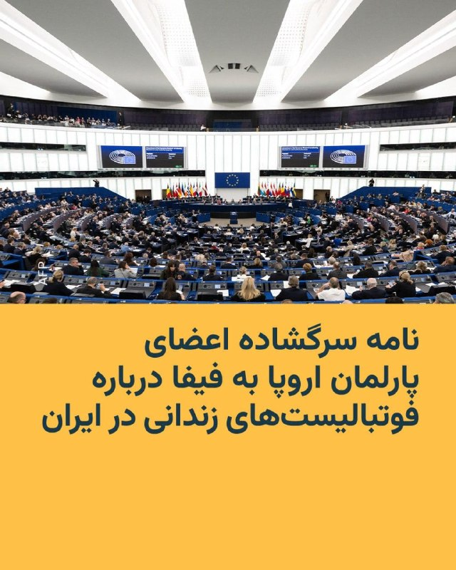

🔸رئیس و نواب رئیس هیئت روابط با مردم ایران در پارلمان اروپا و نیز گزارشگر دائم روابط با ایران در این نهاد، در نامه‌ای سرگشاده به جیانی اینفانتینو، رئیس فدراسیون جهانی فوتبال (فیفا)، از او درباره اقدامات این نهاد درباره وضعیت فوتبالیست‌های زندانی ایرانی پرسیده‌اند.

🔸این نامه توسط هانا نویمان (رئیس هیئت پارلمان اروپا برای روابط با مردم ایران)، دانیل عطارد (نایب‌رئیس هیئت روابط با مردم ایران)، لوکاس فورلاس (گزارشگر دائم پارلمان اروپا در امور روابط با ایران ) و بارت گروتیوس (نایب‌رئیس هیئت روابط با مردم ایران) امضا شده است.

🔸در این نامه از اینفانتینو پرسیده شده که آیا فیفا در آستانهٔ نخستین دیدار تیم فوتبال ایران در جام جهانی ۲۰۲۶، موضوع زندانی شدن فوتبالیست‌های ایرانی را با فدراسیون فوتبال ایران مطرح کرده و درباره وضعیت رفاهی، جایگاه حقوقی و امنیت فوتبالیست‌های مورد نظر اطلاعاتی درخواست کرده است؟
@RadioFarda

## RadioFarda — post 158327

پاراگراف اول؛ وقتی سکوها ساکت می‌شوند؛ افول ترانه‌های فوتبالی در ایران

🔸از «بچه‌ها متشکریم» ویگن تا «ایران، ایران» آرش؛ از سرودهای رسمی تا حجم انبوهی از ترانه‌های حماسی دهه‌های گذشته؛ تیم ملی فوتبال ایران برای حضور در جام جهانی ۲۰۲۶، مسیری پر فراز و نشیب را طی کرده است، مسیری که در احساس مشترک یکی-دو ترانهٔ فوتبالی به خاطره‌ای جمعی تبدیل شده‌اند و چه بسیار کارها که از محدودهٔ عاطفی زمان خود فراتر نرفته‌اند و به فراموشی سپرده شده‌اند.

🔸رمز ماندگاری آن‌ها و فراموشی این عدهٔ پرتعداد در چیست و چه شد که از آغاز سال ۱۴۰۰ خورشیدی تب و تاب تولید این آثار فروکش کرد، تا برسیم به جام جهانی ۲۰۲۶، سالی که تنها تک ترانه‌ای رسمی به نام «آواز باشکوه» در کنار ترانه‌ای غیر رسمی به نام «بدو-بدو» با صدای عرفان طهماسبی در سبد همراهی اجتماعی با تیم ملی فوتبال ایران دیده می‌شوند.

🔸در برنامهٔ رادیویی «پاراگراف اول»، بهرنگ قدرتی آهنگساز و کارشناس موسیقی در لندن همراه با محمد حیرانی روزنامه‌نگار و کارشناس فوتبال از فرانکفورت، رابطهٔ موسیقی، هویت جمعی، سیاست و تیم ملی فوتبال را با یادآوری نمونه‌هایی از این تولیدات به بحث گذاشته‌اند.

🔸نسخه کامل این گفت‌وگو را در وب‌سایت رادیوفردا بخوانید.

@RadioFarda

## RadioFarda — post 158326

  <a href="https://t.me/radiofarda/158326" target="_blank">📎 Download file</a>

📻بشنوید: ساعت ۱۴ با رادیوفردا، ۲۵ خرداد ۱۴۰۵‌

@RadioFarda

## RadioFarda — post 158325

  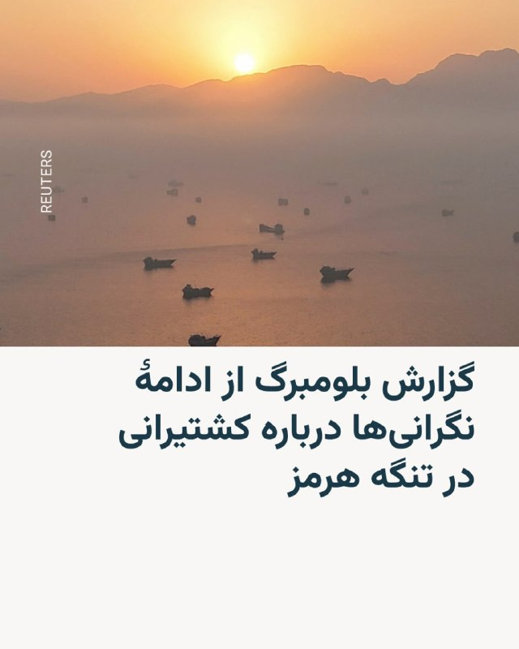

🔸خبرگزاری بلومبرگ با اشاره به توافق میان ایران و آمریکا، نوشته؛اگرچه یکی از اهداف آن بازگشایی تنگه هرمز است اما مالکان کشتی‌ها و تجار با «احتیاط و تردید» به این موضوع نگاه می‌کنند.

🔸بر اساس این گزارش، «تقریباً همه آن‌ها می‌گویند برای ارزیابی امکان عبور ایمن کشتی‌ها، پس از ماه‌ها تلاش‌های نافرجام، به جزئیات بیشتری نیاز دارند».

🔸به نوشته بلومبرگ، شرکت‌هایی که نفت خام و گاز را در سراسر جهان جابه‌جا می‌کنند، همچنان این پرسش را مطرح می‌کنند که بازگشایی تنگه هرمز که دونالد ترامپ، رئیس‌جمهور آمریکا، گفته است روز جمعه انجام خواهد شد، در عمل چه معنایی خواهد داشت.

🔸بر اساس داده‌های کپلر که بلومبرگ به آن استناد کرده، نزدیک به ۶۰۰ کشتی هنوز در خلیج فارس مانده‌اند و آماده خروج‌اند. بیش از ۳۰۰ کشتی خالی نیز در سوی دیگر تنگه، در دریای عمان، منتظرند تا در صورت بازگشایی مسیر وارد خلیج فارس شوند و بارگیری کنند.

🔸این گزارش حاکی است اگر فقط همان ۶۰۰ کشتیِ منتظر خروج در نظر گرفته شوند، حتی در ظرفیت عادیِ پیش از جنگ هم تخلیه این صف بیش از چهار روز زمان می‌برد.

@RadioFarda

## RadioFarda — post 158324

  <a href="https://t.me/radiofarda/158324" target="_blank">📎 Download file</a>

🔸 در این کافه فردا مفصلا به پیش‌بازی ایران و نیوزلند و حواشی آن در زمین و روی سکوها می‌پردازیم، بازی‌های ترکیه-استرالیا، برزیل-مراکش و ژاپن-هلند را بررسی و خاطرات جام‌جهانی‌های گذشته را مرور می‌کنیم.

🔸 برای تماس با ما می‌توانید به شناسه کافه فردا در تلگرام صوت و متن بفرستید.

📻 کافه فردا

## RadioFarda — post 158323

  

🔸کمیسر عالی حقوق بشر سازمان ملل اعلام کرد که از آغاز سال جاری میلادی تاکنون، دست‌کم ۴۰ نفر در ایران به اتهام‌های مرتبط با «امنیت ملی» اعدام شده‌اند که در میان آن‌ها ۱۸ معترض نیز دیده می‌شود.

🔸ولکر تورک روز دوشنبه ۲۵ خرداد افزود: «مقامات دست به سرکوب شدید زده‌اند، هزاران نفر را بازداشت کرده و محدودیت‌های بیشتری بر فضای مدنی اعمال کرده‌اند».

🔸او در بخش دیگری از اظهاراتش از اعلام توافق صلح میان ایالات متحده و ایران استقبال کرد و از همه طرف‌ها در منطقه خواست حداکثر خویشتنداری را رعایت کنند.

🔸تورک گفت: «از اعلام این‌که ایالات متحده و ایران بر سر یک توافق صلح به تفاهم رسیده‌اند که شامل آتش‌بسی فوری و دائمی، بازگشایی تنگه هرمز و چارچوبی برای ادامه مذاکرات است، استقبال می‌کنم».

🔸او افزود: «در این مقطع حساس، روشن است که همه طرف‌ها باید حداکثر خویشتنداری را به خرج دهند و برای اجرای سریع و با حسن نیت توافق حاصل‌شده تلاش کنند».

@RadioFarda

## IranianMinds — post 22652

🔴 بنیامین نتانیاهو امشب یک‌ بیانیه مهم درمورد مذاکرات منتشر خواهد کرد.

@IranianMinds

## IranianMinds — post 22651

  <a href="telegram/content/IranianMinds_22651_1781539736.mp4" target="_blank">🎬 Download video</a>

🔴آتش‌سوزی در میدان تجریش/ تهران.
۲۵ خرداد

@IranianMinds

## IranianMinds — post 22650

  <a href="telegram/content/IranianMinds_22650_1781539738.mp4" target="_blank">🎬 Download video</a>

🔴خوش‌چشم، لحظاتی قبل از توافق.

@IranianMinds

## IranianMinds — post 22649

  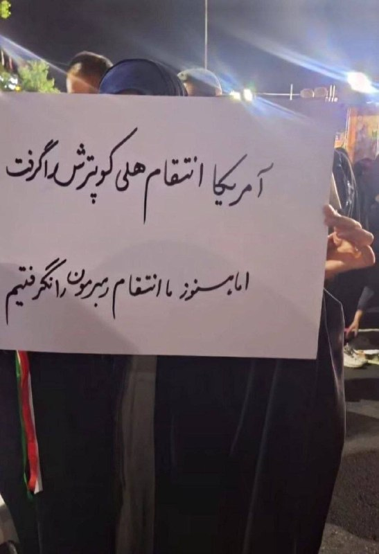

@IranianMinds

## IranianMinds — post 22648

  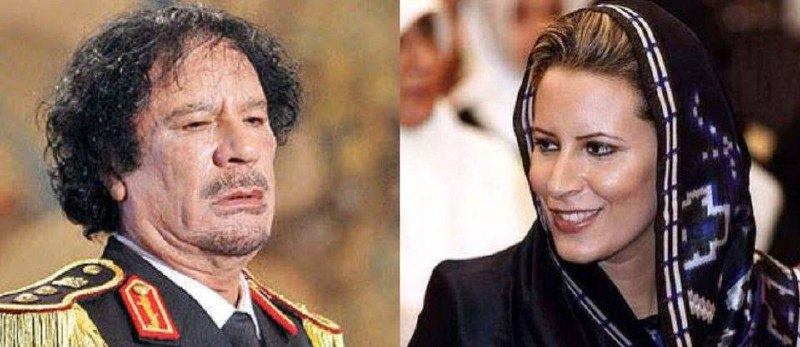

🔴دختر معمر قذافی:

آمریکا به پدر من گفته بود، موشک‌ها و اورانیوم را تحویل بده و به جامعه جهانی برگرد. پدر من هم یک سری از کارها را انجام داد و توافق امضاء شد، ولی بعدش لیبی را بمب‌باران کردند.

@IranianMinds

## IranianMinds — post 22647

  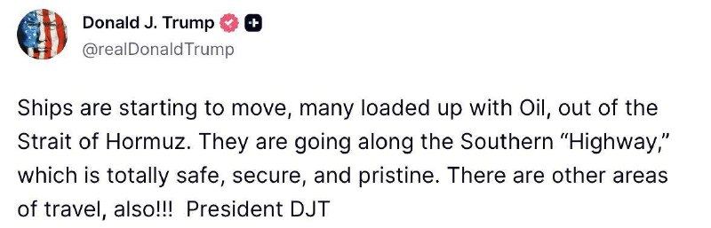

🔴 ترامپ:

کشتی‌ها در حال حرکت هستند؛ بسیاری از آن‌ها با محموله‌های نفتی از تنگه هرمز خارج شده‌اند.

این کشتی‌ها از مسیر جنوبی، که کاملاً امن، ایمن و بدون مشکل است، عبور می‌کنند.

البته مسیرهای دیگری برای تردد نیز وجود دارد.

@IranianMinds

## IranianMinds — post 22646

🔴 جی‌دی ونس درباره ایران:

تمام کشورهای ائتلاف خلیج فارس از توافق اوباما با ایران متنفر بودند، چون معتقد بودند آن توافق به ایران قدرت بیشتری می‌دهد تا به‌عنوان یک بازیگر مخرب عمل کند.

اما امروز ائتلاف کشورهای خلیج فارس درباره توافق صلح رئیس‌جمهور ترامپ چه می‌گوید؟

آن‌ها از این توافق استقبال می‌کنند، چون آن را فرصتی برای ساختن و شکل دادن به خاورمیانه‌ای جدید می‌دانند.

@IranianMinds

## IranianMinds — post 22645

🔴 جی‌دی ونس :

اگه ایرانیا درخواست های مارو قبول نکنن هیچ امتیازی بهشون نمیدیم ، همه ی کارت ها دست ماست.

@IranianMinds

## IranianMinds — post 22644

🔴 جی‌دی ونس درباره ایران:

اکنون ما مستقیماً با ساختار حاکمیتی ایران در حال گفت‌وگو هستیم. در آنجا ارتباطات خوبی برقرار کرده‌ایم.

دیگر پیام‌ها را از طریق کانال‌های غیررسمی و واسطه‌ها رد و بدل نمی‌کنیم؛ ما مستقیماً با طرف ایرانی صحبت می‌کنیم.

@IranianMinds

## IranianMinds — post 22643

  <a href="telegram/content/IranianMinds_22643_1781539743.mp4" target="_blank">🎬 Download video</a>

🔴 جی‌دی ونس :

وقتی مردم این هفته متن این توافق رو ببینن خودشون متوجه میشن چه توافق خوبیه و چقدر منطقه رو امن میکنه.

@IranianMinds

## IranianMinds — post 22642

🔴 جی‌دی ونس :

ترامپ می‌خواهد ایران به کشوری موفق و شکوفا تبدیل شود؛ به شرط آنکه در گشودن صفحه‌ای جدید و آغاز فصلی تازه، جدیت و حسن نیت واقعی از خود نشان دهد.

@IranianMinds

## IranianMinds — post 22641

  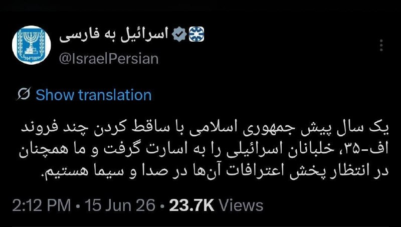

تیکه ی صفحه ی اسرائیل به فارسی به صداوسیما که گفته بودن خلبان زن اسرائیلی رو اسارت گرفتیم.

@IranianMinds

## IranianMinds — post 22640

  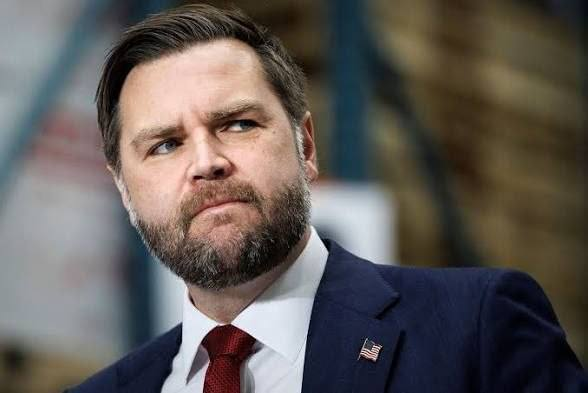

🔴 جی‌دی ونس :

امیدواریم متن توافق این هفته منتشر بشه ، خواهیم دید ایران حاضر به امتیاز دهی هست یا خیر.

@IranianMinds

## IranianMinds — post 22639

🔴 ابوترابی، نماینده اصفهان:

در حال حاضر موضوع استیضاح پزشکیان مطرح نیست، شاید خدا شهیدش کند.

@IranianMinds

## IranianMinds — post 22638

  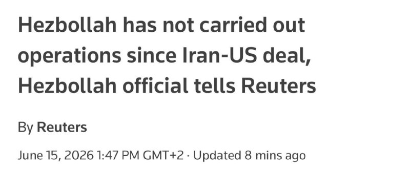

🔴 یک مقام حزب الله به رویترز :

بخدا ما بعد اینکه گفتن توافق شد و آنش بس شده دیگه هیچ عملیاتی رو علیه نیروهای اسرائیلی نداشتیم ولی اینا دارن مارو میزنن.

@IranianMinds

## IranianMinds — post 22637

🔴 یسرائیل کاتز وزیر جنگ اسرائیل :

ما به ترامپ اطلاع داده ایم که مخالف عقب نشینی در لبنان هستیم و به عملیاتمون بر علیه حزب الله ادامه میدیم.

@IranianMinds

## IranianMinds — post 22636

  <a href="telegram/content/IranianMinds_22636_1781539749.mp4" target="_blank">🎬 Download video</a>

🔴 بعد از اعلام آتش بس و توافق مردم ستم دیده و مظلوم لبنان اینطوری دارن به خونه هاشون برمیگردن , طفل معصوما حتی یه ماشین خوبم ندارن یکم پراید صادرات کنید براشون دلم سوخت :))

@IranianMinds

## IranianMinds — post 22635

🔴 نفتالی بنت، نخست‌وزیر پیشین اسرائیل و از گزینه‌های جانشینی نتانیاهو:

برای فروپاشی جمهوری اسلامی و برچیدن برنامه هسته‌ای اون، یک طرح راهبردی دارم که بر ترکیبی از ابزارهای دیپلماتیک، اطلاعاتی، اقتصادی، فناوری و نظامی متکیه.

نتانیاهو نتونست دستاوردهای نظامی اسرائیل رو به دستاوردهای امنیتی پایدار تبدیل کنه. دولت نتانیاهو کشور رو وارد جنگ‌های فرسایشی و بی‌نتیجه کرده و توان دستیابی به پیروزی قاطع رو نداره.

@IranianMinds

## IranianMinds — post 22634

## IranianMinds — post 22633

  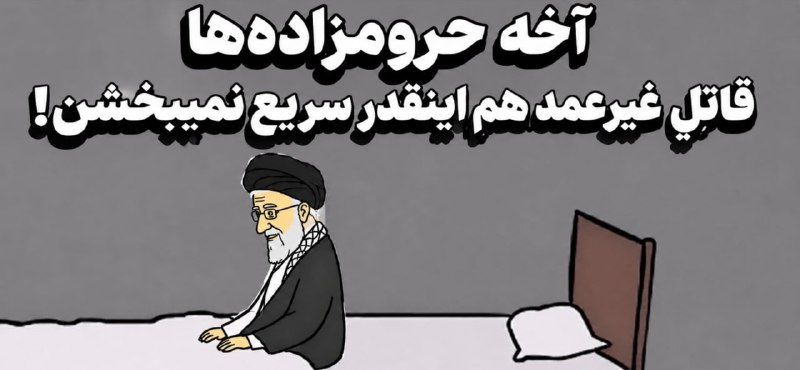

💔

@IranianMinds

## BBCPersian — post 283901

  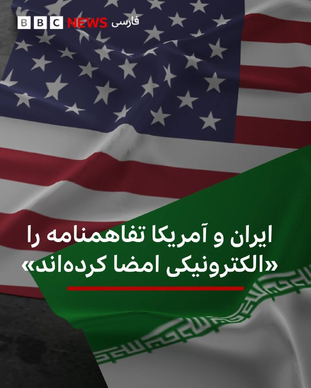

🔻یک مقام ارشد دولت آمریکا که نامش ذکر نشد گفت تفاهمنامه ایران و آمریکا الکترونیکی به امضای دونالد ترامپ و جی‌دی ونس از یک سو و محمدباقر قالیباف از سوی دیگر رسیده است.

نخست‌وزیر پاکستان گفته بود که این تفاهنامه ابتدا «دیجیتال» امضا می‌شود.

به گزارش خبرنگار بی‌بی‌سی در واشنگتن، قرار است این تفاهم نامه جمعه در سوئیس حضوری امضا شود با حضور، جی‌دی ونس، استیو ویتکاف و جارد کوشنر.

جی‌دی ونس، معاون آقای ترامپ، گفته بود که رئیس مجلس ایران و عباس عراقچی به ژنو خواهند رفت.

وزارت خارجه ایران احتمال ملاقات هیئت‌های نمایندگی دو کشور را در سوئیس منتفی ندانست اما هنوز رسما مذاکره‌کنندگان ارشد را اعلام نکرده است.

📸Getty Images
@BBCPersian
https://bbc.in/4esRe96

## BBCPersian — post 283900

  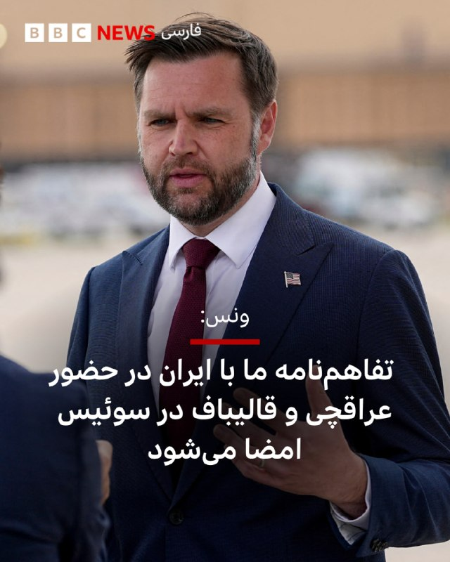

🔻معاون رئیس‌جمهور آمریکا می‌گوید تفاهم‌نامه ایران و آمریکا روز جمعه در حضور عباس عراقچی و محمد‌باقر قالیباف در سوئیس امضا خواهد شد.

جی‌دی ونس گفت که «جزئیات زیادی از توافق هنوز حل‌و‌فصل نشده است» اما آمریکا انتظار دارد که تنگه هرمز «در درازمدت بدون عوارض باز باشد.»

سخنگوی وزارت خارجه جمهوری اسلامی اما گفته است که هنوز مشخص نیست که چه کسی از جانب ایران تفاهمنامه را امضا می‌کند.

اسماعیل بقایی همچنین تاکید کرد که ایران «به‌دنبال گرفتن عوارض نیست» اما «هزینه ارائه خدمات» را دریافت خواهد کرد.

📷Getty Images
@BBCPersian

## BBCPersian — post 283899

  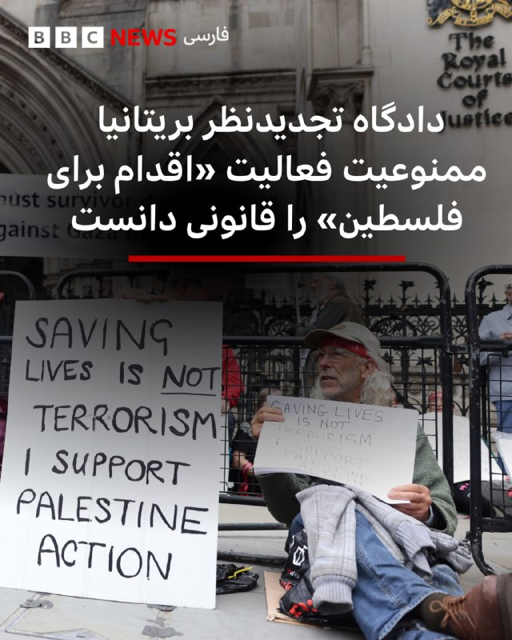

دادگاه تجدیدنظر در لندن «تروریستی» خواندن و ممنوعیت فعالیت «اقدام برای فلسطین» را مطابق قوانین مبارزه با «تروریسم» دانست و رای به قانونی بودن تصمیم دولت بریتانیا داد.

در یکی از مهمترین احکام سال‌های اخیر در زمینه امنیت ملی،‌ پنج قاضی ارشد تصمیم قبلی دادگاه عالی را نقض کردند.

دادگاه عالی پیشتر در ماه فوریه/بهمن حکم داد که تصمیم وزارت کشور بریتانیا در قرار دادن گروه اقدام برای فلسطین در فهرست گروه‌های «تروریستی» نقض آزادی اعتراض و غیرقانونی بوده است.

فعالیت این گروه همچنان ممنوع ماند اما دولت به رای صادره اعتراض و درخواست تجدیدنظر کرد. بر اساس این ممنوعیت،‌ عضویت یا حمایت از این گروه،‌ اقدام مجرمانه است که می‌تواند تا ۱۴ سال زندان هم باشد.

پس از اجرایی شدن این ممنوعیت در تابستان سال گذشته‌، در اعتراضات به اسرائیل برای جنگ غزه هزاران نفر در بریتانیا دستگیر شدند.

هدا عموری، از بنیان‌گذاران «اقدام برای فلسطین» در بیانیه‌ای گفت که قصد دارد در دیوان عالی بریتانیا از این حکم فرجام خواهی کند.

📷EPA/Shutterstock
https://bbc.in/4eITSJ1
@BBCPersian

## BBCPersian — post 283897

  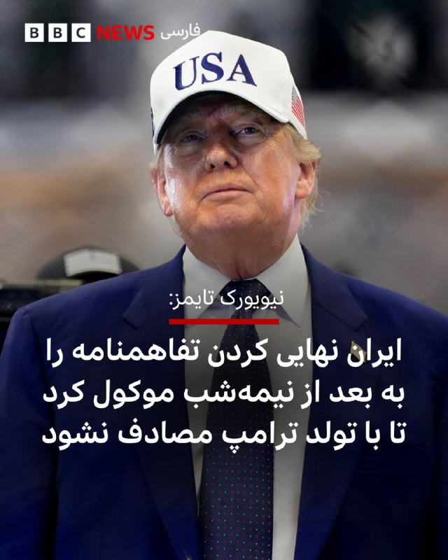

🔻نیویورک تایمز به نقل از سه مقام ایرانی گزارش داد که تهران نهایی شدن متن تفاهم‌نامه با آمریکا را به بعد از نیمه‌شب یکشنبه موکول کرد تا با تولد دونالد ترامپ مصادف نشود.

به گفته این مقام‌ها که به شرط فاش نشدن نامشان با این روزنامه صحبت کرده‌اند، «دو کشور با توجه به هفت ساعت و نیم اختلاف ساعت، این امکان را داشتند که روایت خود را مبنی بر اینکه تفاهم یکشنبه حاصل شده است یا نه، به کرسی بنشانند.»

نیویورک تایمز به نقل از این مقامات، روایتی را هم از تحولات بعد از حمله روز یکشنبه اسرائیل به ضاحیه در جنوب بیروت ارائه کرده است؛ حمله‌ای که ایران گفته بود برایش خط قرمز است.

بر اساس گزارش این روزنامه، بعد از حمله اسرائیل، مقام‌های ایران در مورد نحوه واکنش دادن، اختلاف نظر داشتند:

«فرماندهان سپاه دستور دادند که نیروهای مسلح برای شلیک موشک به اسرائیل آماده شوند. مسعود پزشکیان، رئیس‌جمهور، خواستار خویشتنداری شد و به فرماندهان سپاه گفت که اگر ایران پاسخ دهد، اسرائیل قطعا تلافی خواهد کرد و ایران به دام نتانیاهو برای به‌هم زدن توافق خواهد افتاد.»

📷Getty Images
@BBCPersian

## BBCPersian — post 283896

  <a href="telegram/content/BBCPersian_283896_1781539756.mp4" target="_blank">🎬 Download video</a>

⭕️ سرخط خبرهای دوشنبه ۲۵ خرداد ۱۴۰۵

## BBCPersian — post 283895

  <a href="https://t.me/bbcpersian/283895" target="_blank">📎 Download file</a>

تازه‌ترین خبرهای جهان دوشنبه ۲۵ خرداد ۱۴۰۵ از رادیو بی‌بی‌سی در لندن

@BBCPersian

## BBCPersian — post 283894

  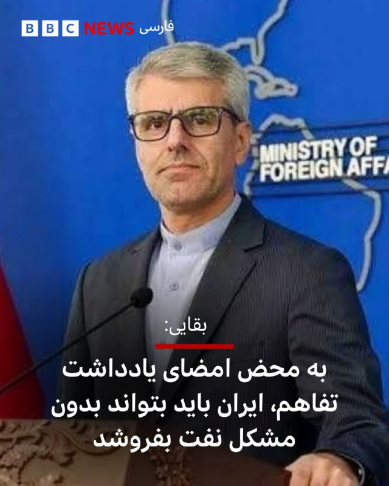

🔻اسماعیل بقایی، سخنگوی وزارت خارجه ایران، اعلام کرد که در یادداشت تفاهم با آمریکا به جزئیات پرونده هسته‌ای پرداخته نشده و گفت‌وگو درباره این موضوع از فردای امضای تفاهم‌نامه آغاز خواهد شد.

به گفته او، مواضع ایران در این زمینه روشن است و مذاکرات پس از امضا بر رفع تمامی تحریم‌ها، از جمله تحریم‌های اولیه و ثانویه آمریکا، تحریم‌های شورای امنیت و قطعنامه‌های مرتبط با شورای حکام آژانس متمرکز خواهد بود. قرار است دو طرف ظرف ۶۰ روز درباره این موارد به تفاهم برسند.

اسماعیل بقایی همچنین آزادسازی اموال مسدودشده یا محدودشده ایران و جبران خسارات اقتصادی را از محورهای مهم تفاهم‌نامه دانست و گفت طرف آمریکایی متعهد شده در هر دو زمینه اقداماتی انجام دهد.
او تأکید کرد که ایران باید بلافاصله پس از امضای یادداشت تفاهم بتواند بدون مانع به فروش نفت، محصولات پتروشیمی و مشتقات نفتی بپردازد.

📷ISNA
@BBCPersian

## BBCPersian — post 283893

  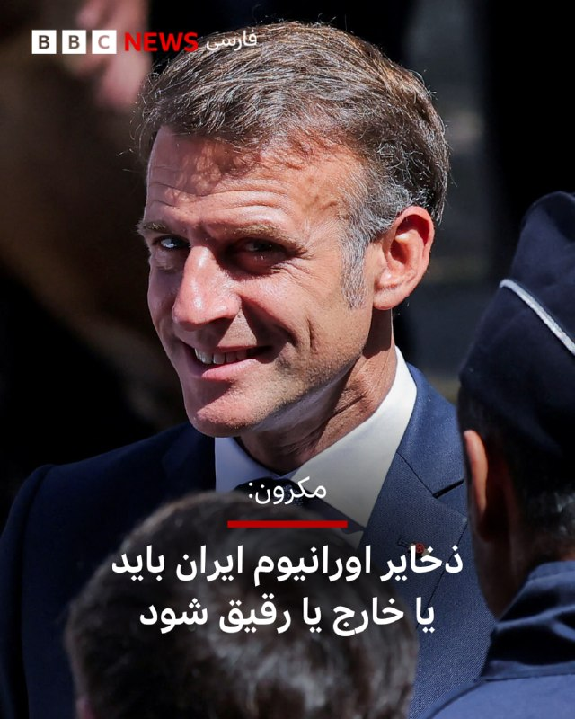

🔻رئیس‌جمهور فرانسه گفت که ذخایر اورانیوم غنی‌شده ایران باید خنثی شود و تحت نظارت آژانس بین‌المللی انرژی اتمی قرار گیرد.

امانوئل مکرون پس از اعلام تفاهم ایران و آمریکا گفت: «ما اطمینان حاصل خواهیم کرد که ذخایر اورانیوم غنی‌شده باقی‌مانده به‌درستی خنثی شوند.»

آقای مکرون گفت که ذخایر حساس باید «یا خارج یا رقیق شوند» و سپس تحت نظارت و مراقبت آژانس بین‌المللی انرژی اتمی قرار بگیرند.

شبکه سی‌ان‌‌ان سه روز پیش به نقل از منابع اطلاعاتی آمریکا نوشت ایران برخی تونل‌های تاسیسات هسته‌ای اصفهان را تخریب و ورودی تونل‌ها را مین‌گذاری کرده است تا از هر اقدام آمریکا برای دسترسی به اورانیوم با غنای بالای پیشگیری کرده باشد. به گزارش سی‌ان‌‌ان با این اقدامات دسترسی به این مواد بسیار دشوارتر و خطرناک‌تر شده است.

ایران و آمریکا به این گزارش واکنش رسمی نشان نداده‌اند.

ایران می‌گوید که مذاکره درباره برنامه هسته‌ای و ذخایر اورانیوم به مرحله دوم و پس از امضای تفاهم‌نامه پایان جنگ انجام خواهد شد.

📷Getty Images
@BBCPersian

## BBCPersian — post 283892

  <a href="telegram/content/BBCPersian_283892_1781539761.mp4" target="_blank">🎬 Download video</a>

🔸تیم ملی فوتبال ایران بعد از عبور از موانع بسیار به لس‌آنجلس رسید تا در نخستین دیدار خود در جام جهانی ۲۰۲۶ با نیوزیلند روبه‌رو شود.

تیم ملی ۱۰ صبح روز یکشنبه به وقت غرب آمریکا از تیخوانا در مکزیک به لس‌آنجلس پرواز کرد و طی تدابیر امنیتی از فرودگاه به هتل محل اقامت‌شان منتقل شدند.

اعضای تیم ملی و کادر فنی پس از نشست خبری برای آشنایی وارد ورزشگاه لس‌انجلس شدند و دور و اطراف زمین را گشتند و جایگاه‌های تماشاچیان را دیدند.

سپس به ورزشگاه «کارسون» در بیست دقیقه‌ای محل برگزاری مسابقات رفتند و اولین تمرین‌ خود را در این شهر انجام دادند. این تمرین جدی‌تر از تمرینی بود که در روز یازدهم ژوئن در تیخوانا جلوی خبرنگاران داشتند.

گروهی از مخالفان حکومت ایران با پرچم‌های شیر و خورشید، آمریکا و اسرائیل سر راه اتوبوس تیم تجمع کردند. آنها می‌گویند «این تیم، ملی نیست و تیم جمهوری اسلامی است.» امیر قلعه‌نویی، سرمربی تیم در نشست خبری گفت: «تیم ملی سیاسی نیست و برای همه ایرانیان بازی خواهد کرد.» اعضای تیم ملی ایران طی تدابیر امنیتی از فرودگاه به هتل محل اقامت‌شان منتقل شدند.

@BBCPersian

## BBCPersian — post 283891

ایران و آمریکا به تفاهم رسیدند و جمعه در سوئیس تفاهمنامه امضا می‌کنند. از شما خواسته بودیم به ما بگویید احساس شما از شنیدن این خبر چه بود؟ فکر می‌کنید این تفاهم چه تاثیری بر زندگی شما می‌گذارد؟ بیم و امیدهایتان چیست؟

در این ویدیو بخشی از نظرات مخاطبان که برای بی‌بی‌سی فارسی فرستاده‌اند را بشنوید.

شما هم می‌توانید پیام‌های ویدیویی، صوتی یا متنی خود را با هشتگ تفاهم بفرستید به:

پیامگیر تلگرام:
@BBCShoma

واتس‌اپ:
۰۰۴۴۷۳۴۲۰۳۲۱۱۳

## BBCPersian — post 283882

🔸اسپانیا از مدعیان اصلی قهرمانی جام جهانی ۲۰۲۶، برای نخستین بار در تاریخ جام‌های جهانی بدون حتی یک بازیکن از رئال مادرید راهی این رقابت‌ها شده است.

سرمربی تیم لوئیس دلا فوئنته، با تکیه بر اتحاد و روحیه خانوادگی در تیم شناخته می‌شود. انعطاف‌پذیری تاکتیکی و توانایی تغییر سیستم بازی از ویژگی‌های مهم اوست.
لامین یامال، پدیده جوان فوتبال اسپانیا، پیش از نیمه‌نهایی جام جهانی ۲۰۲۶ تنها ۱۹ ساله خواهد شد. بسیاری او را ستاره‌ای می‌دانند که می‌تواند سرنوشت مسابقات بزرگ را تغییر دهد.

اروگوئه با هدایت مارچلو بیلسا یکی از جذاب‌ترین و در عین حال غیرقابل‌ پیش‌بینی‌ترین تیم‌های جام جهانی ۲۰۲۶ است. بزرگ‌ترین نقطه قوت اروگوئه انرژی، دوندگی و شدت بازی بالاست.

فدریکو والورده، هافبک رئال مادرید، رهبر جدید فوتبال اروگوئه است. او با دوندگی فوق‌العاده، قدرت رهبری، انرژی بالا و توانایی بازی در چندین پست مختلف، قلب تپنده اروگوئه به شمار می‌رود.

ادامه مطلب🔽
https://bbc.in/4eJwJWQ
📸GettyImages
@BBCPersian

## BBCPersian — post 283881

🔻تمجید رئیس‌جمهور لبنان از تفاهم ایران و آمریکا

رئیس‌جمهور لبنان ابراز امیدواری کرد که توافق واشنگتن و تهران برای پایان دادن به جنگ در خاورمیانه، به «پایان قطعی» درگیری اسرائیل و حزب‌الله منجر شود.

در بیانیه‌ دفتر جوزف عون آمده است که او از این تفاهم که «امنیت و ایمنی لبنان را بخشی جدایی‌ناپذیر از هر تلاشی برای تحکیم ثبات در منطقه» می‌داند، تمجید می‌کند.

در ادامه این بیانیه آمده است که مردم لبنان «امیدوارند این تفاهم به گام‌های عملی تبدیل شود و چرخه خشونت به پایانی قطعی برسد و پایه مرحله‌ای از ثبات، امنیت، بهبود و بازسازی گذاشته شود.»

https://bbc.in/4viCUHy
@BBCPersian

## Dirty_Kids — post 392139

یه دختره رفته از یه پسره ماشین خریده و وقتی کف‌پوش ها رو باز کردن و انواع ویگارا، قرص و کاندوم تاخیری و قرص ضدبارداری توش پیدا کردن!😐😂

@Dirty_Kids 👻

## Dirty_Kids — post 392138

  <a href="telegram/content/Dirty_Kids_392138_1781539763.mp4" target="_blank">🎬 Download video</a>

جهنمِ لس آنجلس ایز لودینگ ✌️⏳✌️

@Dirty_Kids 👻

## Dirty_Kids — post 392137

  <a href="telegram/content/Dirty_Kids_392137_1781539766.webm" target="_blank">🎬 Download video</a>

✅ اپلیکیشن حرفه ای اندروید سایت بین المللی دربی بت

✅اسپانسر لیگ انگلستان

💰اولین سایت جهانی با امکان شارژ و برداشت با کارت بانکی

◻️ برای ورود فیلترشکن روشن کرده روی کانادا یا سنگاپور یا آلمان و ....
📢

😀Telegram Channel
👇
https://t.me/+bcynkEgSW2dlYTc0

## Dirty_Kids — post 392136

  

😤میخوای جام جهانی پیش بینی کنی؟!

🔹پس نیاز داری به یه سایت بین المللی و معتبر
🔹

⛔دربی بت همون انتخاب  100%

💎ویژگی های سایت جهانی Derby Bet:

⬅️امکان شارژ امن با کارت بانکی

⬅️واریز اول دوبل شارژ می شوید(بونوس۱۰۰٪)

⬅️پر اپشن ترین سایت فعال در ایران

⬅️تسویه حساب کمتر از 5 دقیقه

⬅️برگشت بخشی از باخت به صورت هفتگی

⭐دارای لایسنس و مجوز anjuan

🚨کد هدیه ثبت نام:GG007

⚠️برای دانلود اپلکیشن کلیک کنید
👉

🔔کانال دربی بت :
👇

✅https://t.me/+bcynkEgSW2dlYTc0

## Dirty_Kids — post 392135

  <a href="telegram/content/Dirty_Kids_392135_1781539768.mp4" target="_blank">🎬 Download video</a>

شهبازی تو تَه بازی نه؟؟؟؟
شنیدم تو کار راه اندازی نه ؟؟؟؟ 😂😂😂😂

@Dirty_Kids 👻

## Dirty_Kids — post 392132

  <a href="telegram/content/Dirty_Kids_392132_1781539771.mp4" target="_blank">🎬 Download video</a>

🔴دیشب ترامپ تولد 80 سالگی خودشو همزمان با جشن 250 سالگی آمریکا، به این صورت برگزار کرد :

@Dirty_Kids 👻

## Dirty_Kids — post 392131

🔴 فوری: اولین سخنرانی مجتبی بعد از پایان جنگ و توافق با آمریکا.

@Dirty_Kids 👻

## Dirty_Kids — post 392130

  <a href="telegram/content/Dirty_Kids_392130_1781539774.mp4" target="_blank">🎬 Download video</a>

تراپی:

@Dirty_Kids 👻

## Dirty_Kids — post 392126

  <a href="telegram/content/Dirty_Kids_392126_1781539775.mp4" target="_blank">🎬 Download video</a>

🔴 طبق گفته کاربران؛
بازار تجریش آتیش گرفته و هنوز جزئیاتی دقیقی از علت آتیش سوزی مشخص نیست.

@Dirty_Kids 👻

## Dirty_Kids — post 392125

  <a href="telegram/content/Dirty_Kids_392125_1781539778.mp4" target="_blank">🎬 Download video</a>

تراپی

ایکاش یکی بیاد بگه این کشتزار کجا بساط میکنه!!:))

@Dirty_Kids 👻

## Dirty_Kids — post 392124

  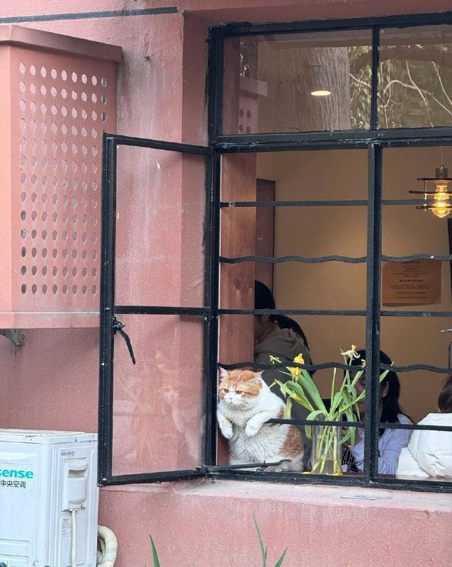

روز اول تیمارستان وقتی میبینی حرف بیمارا برات منطقیه:

@Dirty_Kids 👻

## Dirty_Kids — post 392123

  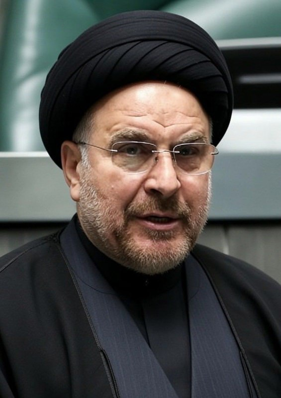

اولین تصویر لو رفته از مجتبی خامنه‌ای بعد از جراحی پلاستیک و ریکاوری

@Dirty_Kids 👻

## Dirty_Kids — post 392122

  <a href="telegram/content/Dirty_Kids_392122_1781539782.mp4" target="_blank">🎬 Download video</a>

هزار تا برنامه هم برای جام جهانی بسازید، ما فراموش نمی‌کنیم.

@Dirty_Kids 👻

## Dirty_Kids — post 392121

  <a href="telegram/content/Dirty_Kids_392121_1781539783.mp4" target="_blank">🎬 Download video</a>

داداش تخته سیا روبه‌روته

@Dirty_Kids 👻

## Dirty_Kids — post 392120

  

تو این خونه چه کاری میچسبه👹؟

@Dirty_Kids 👻

## Hranews — post 113631

پس از انتشار ویدیو رقص و موسیقی؛ یک کافه در شمال تهران پلمب شد

❗️
❗️
❗️
❗️
❗️ – انتشار ویدیویی از پخش موسیقی و رقص در یک کافه در شمال تهران، به تشکیل پرونده قضایی و #پلمب این محل با دستور دادستانی تهران منجر شد. در این پرونده همچنین برای مدیران کافه نیز پرونده قضایی تشکیل شده است.

ادامه مطلب

↘️
@hranews_bot تماس ✉️ -  @Hranews  کانال هرانا 🆑

## Hranews — post 113630

  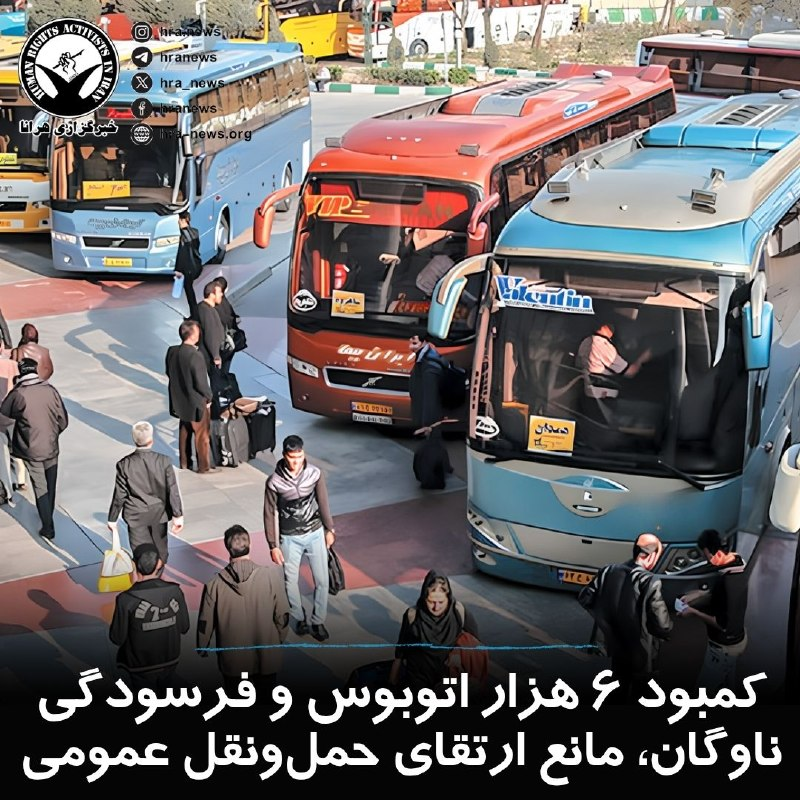

وزیر راه و شهرسازی از کمبود بیش از ۶ هزار دستگاه اتوبوس در ناوگان حمل‌ونقل عمومی بین‌شهری کشور خبر داد. وی اعلام کرد که فرسودگی بخش قابل‌توجهی از ناوگان موجود، یکی از چالش‌های جدی این حوزه به شمار می‌رود. فرزانه صادق مالواجرد با اشاره به هزینه بالای تامین ناوگان جدید و محدودیت‌های مالی موجود، اظهار کرد که این عوامل موجب شده‌اند روند نوسازی ناوگان با سرعت مورد نیاز پیش نرود. صادق مالواجرد تاکید کرد که بخشی از سوانح و خسارت‌های جاده‌ای به فرسودگی وسایل نقلیه و کمبود ناوگان استاندارد بازمی‌گردد.

↘️
@hranews_bot تماس ✉️ -  @Hranews  کانال هرانا 🆑

## Hranews — post 113629

  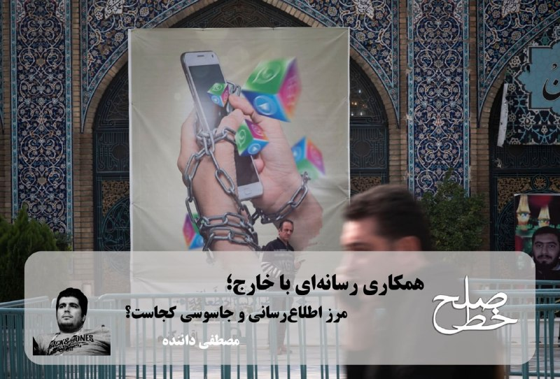

همکاری رسانه‌ای با خارج؛ مرز اطلاع‌رسانی و جاسوسی کجاست؟/ #مصطفی_داننده

📡
📡
📡
📡
📡– طی دو #جنگ دوازده و چهل روزه، رابطه میان «فعالیت رسانه‌ای» و «امنیت ملی» در ایران وارد مرحله‌ای تازه شده است. مرحله‌ای که در آن، ارسال یک ویدئو، انتشار یک گزارش، یا حتی گفتگو با رسانه‌های خارج از کشور می‌تواند ذیل مفاهیمی چون «همکاری با دولت متخاصم» یا «#جاسوسی» تفسیر شود.
قانون جدید تشدید مجازات جاسوسی و همکاری با اسرائیل و کشورهای متخاصم نیز این نگرانی را پررنگ‌تر کرده و این سوال را به وجود آورده است که آیا هرگونه انتقال اطلاعات به رسانه‌های برون‌مرزی می‌تواند مصداق جاسوسی تلقی شود؟

این پرسش، صرفاً یک بحث نظری حقوقی نیست. در ماه‌های اخیر، بارها خبر بازداشت افرادی منتشر شده که اتهام آن‌ها ارسال تصویر، فیلم یا اطلاعات برای رسانه‌های فارسی‌زبان خارج از کشور یا کانال‌های تلگرامی مثل «وحید آنلاین» است. همین مسئله باعث شده مرز میان «اطلاع‌رسانی» و «اقدام امنیتی» بیش از هر زمان دیگری مبهم شود.

برای پاسخ به این پرسش، ابتدا باید به یک اصل بنیادین در حقوق توجه کرد، «اصل قانونی بودن جرم و مجازات». بر اساس این اصل، هیچ رفتاری جرم نیست، مگر آن‌که قانون‌گذار به‌طور روشن، دقیق و بدون ابهام آن را جرم‌انگاری کرده باشد. در نتیجه، اگر مفاهیمی چون «همکاری رسانه‌ای»، «ارسال اطلاعات» یا «کمک به رسانه‌ی خارجی» بدون تعریف شفاف وارد حوزه‌ی امنیتی شوند، زمینه برای تفسیرهای موسع و سلیقه‌ای فراهم می‌شود. مسئله‌ای که می‌تواند امنیت حقوقی شهروندان را با چالش جدی روبه‌رو کند.

در تعریف کلاسیک حقوقی، جاسوسی معمولاً به انتقال آگاهانه و هدفمند اطلاعات محرمانه یا طبقه‌بندی‌شده به نفع یک دولت خارجی اطلاق می‌شود، اطلاعاتی که افشای آن‌ها به امنیت نظامی، سیاسی یا اقتصادی کشور آسیب بزند. بنابراین، عنصر «محرمانه بودن اطلاعات» و هم‌چنین «قصد همکاری امنیتی» در بسیاری از نظام‌های حقوقی نقش اساسی دارد. اما زمانی که این تعریف گسترش پیدا کند و هر نوع انتقال خبر، تصویر یا روایت به رسانه‌های خارجی را دربرگیرد، مرز میان «روزنامه‌نگاری»، «شهروندخبرنگاری» و «جاسوسی» مبهم می‌شود.

ادامه مطلب

ادامه مطلب در وب‌سایت خط صلح

↘️
@hranews_bot تماس ✉️ -  @Hranews  کانال هرانا 🆑

## Hranews — post 113628

بازداشت ۳ شهروند در تهران به اتهام توهین به مقدسات در فضای مجازی

❗️
❗️
❗️
❗️
❗️ – پلیس اطلاعات تهران بزرگ از #بازداشت سه شهروند خبر داد. به گفته این نهاد، افراد بازداشت ‌شده متهم هستند که با انتشار مطالبی در شبکه‌های اجتماعی، به مقدسات و آنچه «مدافعان وطن» عنوان شده توهین کرده‌اند.

ادامه مطلب

↘️
@hranews_bot تماس ✉️ -  @Hranews  کانال هرانا 🆑

## Hranews — post 113627

  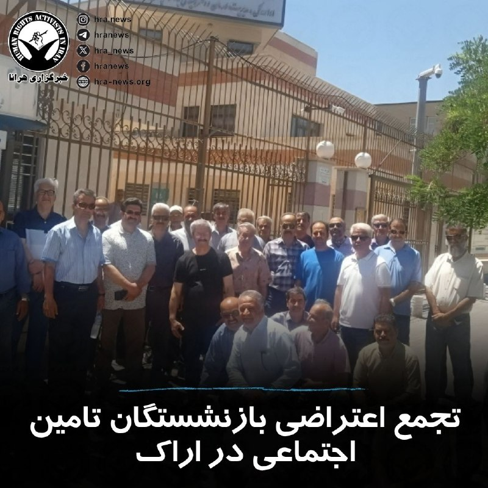

روز گذشته، شماری از بازنشستگان تامین اجتماعی در مقابل ساختمان این سازمان در اراک دست به #تجمع اعتراضی زدند.

این تجمع بازنشستگان در اعتراض به عدم اجرای ماده ۹۶ و ۵۴ توسط سازمان تامین اجتماعی، صورت گرفته است.

↘️
@hranews_bot تماس ✉️ -  @Hranews  کانال هرانا 🆑

## Hranews — post 113626

  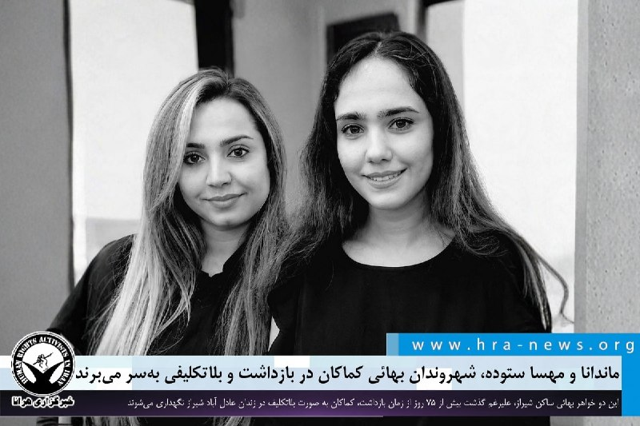

ماندانا و مهسا ستوده، شهروندان بهائی کماکان در بازداشت و بلاتکلیفی به‌سر می‌برند

❗️
❗️
❗️
❗️
❗️ – ماندانا ستوده و مهسا ستوده، دو خواهر بهائی ساکن شیراز، علیرغم گذشت بیش از ۷۵ روز از زمان بازداشت، کماکان به صورت بلاتکلیف در زندان عادل آباد شیراز نگهداری می‌شوند.

به گزارش خبرگزاری هرانا، ارگان خبری مجموعه فعالان حقوق بشر در ایران، ماندانا و مهسا ستوده، شهروندان بهائی همچنان در بازداشت به‌سر می‌برند.

بر اساس اطلاعات دریافتی هرانا، علیرغم گذشت بیش از ۷۵ روز از زمان بازداشت ماندانا و مهسا ستوده، این دو خواهر بهائی کماکان به‌صورت بلاتکلیف در زندان عادل آباد شیراز به‌سر می‌برند. پیگیری‌های مکرر خانواده این شهروندان جهت اطلاع از وضعیت پرونده و اتهامات مطروحه علیه آنها بی‌نتیجه مانده و مسئولان ذی‌ربط تاکنون پاسخ روشنی در این خصوص ارائه نکرده‌اند.
یک منبع مطلع نزدیک به خانواده این شهروندان بهائی ضمن تایید این موضوع به هرانا گفت: “ماندانا که پیش از این سابقه بیماری قلبی نداشته، در طول این مدت دچار ناراحتی‌های قلبی شده و مهسا نیز با برخی مشکلات جسمانی مواجه شده و به دارو نیاز دارد. بی‌خبری از وضعیت پرونده این شهروندان بازداشتی و همچنین شرایط جسمانی آنها، به افزایش نگرانی‌های خانواده و بستگان این دو خواهر بهائی منجر شده است.”

ادامه مطلب

#ماندانا_ستوده
#مهسا_ستوده

↘️
@hranews_bot تماس ✉️ -  @Hranews  کانال هرانا 🆑

## Hranews — post 113625

  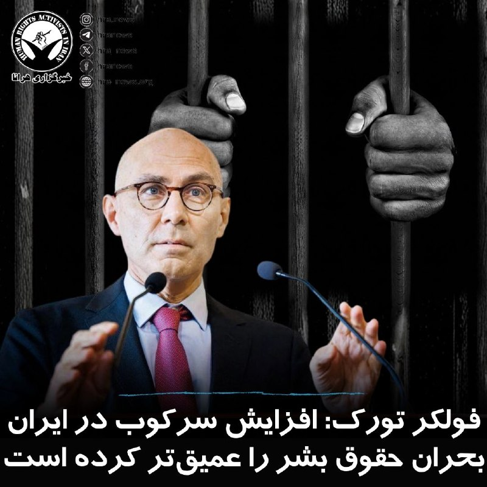

در تازه‌ترین گزارش جهانی #حقوق_بشر که توسط فولکر تورک، کمیسر عالی حقوق بشر سازمان ملل ارائه شده است، وضعیت ایران با نگرانی جدی در مرکز توجه قرار گرفته است. در این گزارش آمده است که در جریان برخوردهای امنیتی با اعتراضات در ایران، شمار زیادی از افراد کشته شده‌اند و پس از آن نیز موج گسترده بازداشت‌ها، فشار بر فعالان مدنی و محدودیت‌های شدید بر آزادی‌های اساسی افزایش یافته است. همچنین اجرای ده‌ها حکم اعدام در سال جاری، از جمله در پرونده‌های مرتبط با معترضان، به‌عنوان نشانه‌ای از #تشدید_سرکوب و #نقض_حقوق_بشر مورد اشاره قرار گرفته است.

در همین گزارش تأکید شده است که تنش‌های نظامی و سیاسی ماه‌های اخیر در خاورمیانه، از جمله میان ایران، اسرائیل و ایالات متحده، پیامدهای سنگینی برای غیرنظامیان و زیرساخت‌های حیاتی منطقه داشته و به افزایش بی‌ثباتی دامن زده است. همچنین برخی اقدامات مرتبط با درگیری‌ها و محدودیت‌ها در مسیرهای راهبردی، به‌عنوان عواملی نگران‌کننده برای اقتصاد جهانی و روند کمک‌رسانی بشردوستانه مطرح شده‌اند.

در جمع‌بندی این گزارش، وضعیت ایران ترکیبی از بحران داخلی و فشارهای خارجی توصیف شده و هشدار داده می‌شود که ادامه این روند می‌تواند به گسترش ناامنی و نقض گسترده‌تر حقوق بشر منجر شود.

↘️
@hranews_bot تماس ✉️ -  @Hranews  کانال هرانا 🆑

## Hranews — post 113624

اجرای حکم اعدام ۵ زندانی در زندان‌های مختلف

❗️
❗️
❗️
❗️
❗️ – طی دو روز اخیر، حکم پنج زندانی که پیشتر در پرونده‎‌های جداگانه از بابت اتهامات مرتبط با جرائم مواد مخدر و قتل به #اعدام محکوم شده بودند، در زندان‌های بیرجند، آمل، همدان و عادل آباد شیراز اجرا شد.

ادامه مطلب

↘️
@hranews_bot تماس ✉️ -  @Hranews  کانال هرانا 🆑

## Hranews — post 113623

  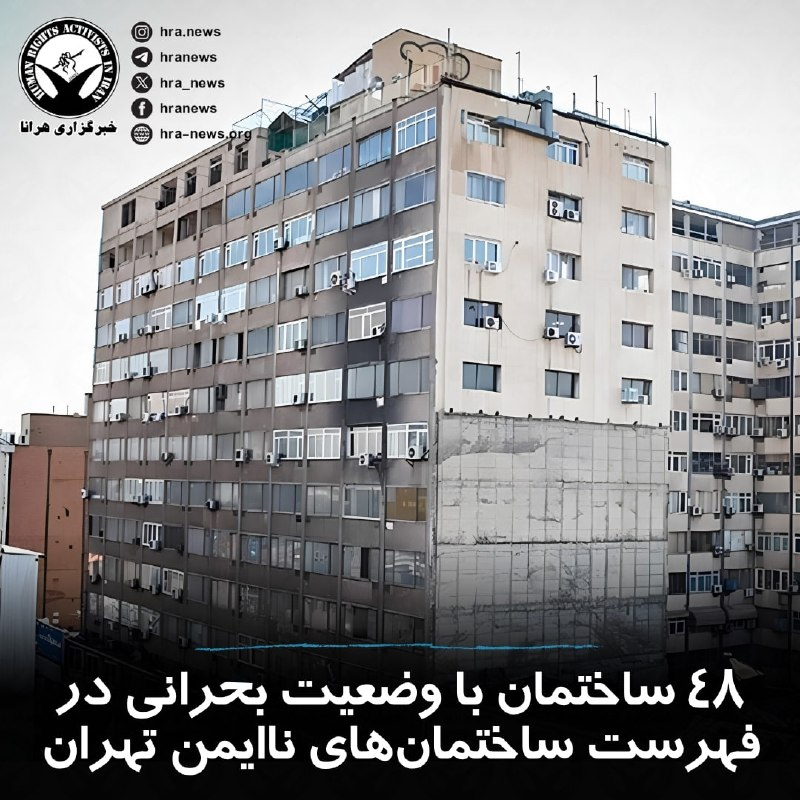

معاون پیشگیری و حفاظت از حریق سازمان آتش‌نشانی تهران اعلام کرد که در حال حاضر ۴۸ #ساختمان_ناایمن در پایتخت، شامل بیمارستان‌ها، مراکز تجاری، مسکونی و صنعتی، در وضعیت بحرانی ایمنی قرار دارند. به گفته کامران عبدولی، از میان ۹۰ هزار و ۹۶ ساختمان در تهران که مورد ارزیابی ایمنی قرار گرفته‌اند، ۲۹ هزار و ۹۸۵ ساختمان پرخطر و ۵۶ هزار و ۳۷۵ ساختمان نیز با سطح خطر متوسط شناسایی شده‌اند.

↘️
@hranews_bot تماس ✉️ -  @Hranews  کانال هرانا 🆑

## Hranews — post 113622

یک متهم در اسدآباد به مجازات جایگزین حبس محکوم شد

❗️
❗️
❗️
❗️
❗️ – رئیس اداره حفاظت محیط‌زیست شهرستان اسدآباد، از صدور #حکم_سبز برای یک متهم خبر داد و اعلام کرد که او به انجام ۵۴۰ ساعت خدمات عمومی رایگان در زمینه پاک‌سازی تالاب پیرسلمان، جایگزین شش ماه حبس، محکوم شده است.

ادامه مطلب

↘️
@hranews_bot تماس ✉️ -  @Hranews  کانال هرانا 🆑

## manototv — post 106071

توافق اخیر آمریکا و جمهوری اسلامی، اگر نهایی شود، بیش از آنکه پایان بحران ایران باشد، آغاز مرحله‌ای تازه از آن است. برای مردم ایران، مسئله اصلی همچنان زندگی زیر سایه حکومتی است که از هر بحران و هر توافقی برای بقا استفاده می‌کند. برای اپوزیسیون نیز پرسش اساسی این است: آیا می‌تواند از انتظار برای تصمیم قدرت‌های خارجی عبور کند و به نیرویی سازمان‌یافته، واقع‌بین و آماده برای عبور از جمهوری اسلامی و اداره آینده ایران تبدیل شود؟

## alonews — post 128267

  <a href="telegram/content/alonews_128267_1781539788.webm" target="_blank">🎬 Download video</a>

👈یک مقام ارشد آمریکایی: جزئیات توافق با ایران ظرف یک یا دو روز منتشر خواهد شد و مذاکرات پیش رو بسیار مهم خواهد بود. 
🔴مذاکرات فنی اواخر این هفته آغاز خواهد شد. 
🔴ما نمی‌توانیم به ایران اجازه دسترسی به دارایی‌هایش را بدهیم یا اگر از آنها برای حمایت از تروریسم…

## alonews — post 128266

  <a href="telegram/content/alonews_128266_1781539789.mp4" target="_blank">🎬 Download video</a>

👈فکر می‌کنید تفاهم‌نامه ایران و آمریکا طولانی‌مدت و دائمی شود؟

🔴 وزیرخارجه لهستان: ان‌شاءالله!

✅ @AloNews خبر جنگ

## alonews — post 128265

  <a href="telegram/content/alonews_128265_1781539790.webm" target="_blank">🎬 Download video</a>

👈یک مقام ارشد آمریکایی: جزئیات توافق با ایران ظرف یک یا دو روز منتشر خواهد شد و مذاکرات پیش رو بسیار مهم خواهد بود.

🔴مذاکرات فنی اواخر این هفته آغاز خواهد شد.

🔴ما نمی‌توانیم به ایران اجازه دسترسی به دارایی‌هایش را بدهیم یا اگر از آنها برای حمایت از تروریسم استفاده کند، آنها را آزاد کنیم

🔴نیروهای ما استقرار فعلی خود در خاورمیانه را حفظ خواهند کرد و هرگونه کاهش نیرو پس از امضای توافق نهایی انجام خواهد شد.

✅ @AloNews خبر جنگ

## alonews — post 128264

  <a href="telegram/content/alonews_128264_1781539790.webm" target="_blank">🎬 Download video</a>

👈رویترز به نقل از یک مقام ارشد آمریکایی:
ترامپ و ونس از طرف امریکا و همچنین قالیباف از طرف ایران این یادداشت تفاهم را امضا کردند.

🔴این توافق، بازگشایی فوری تنگه هرمز و لغو تحریم‌های آمریکا علیه ایران را تصریح می‌کند.

🔴ترافیک در تنگه هرمز از همین حالا شاهد افزایش قابل توجهی خواهد بود.

✅ @AloNews خبر جنگ

## alonews — post 128263

  <a href="telegram/content/alonews_128263_1781539790.webm" target="_blank">🎬 Download video</a>

👈 قالیباف : ایران گامی بلند به سوی پیروزی نهایی برداشت

✅ @AloNews خبر جنگ

## alonews — post 128262

  <a href="telegram/content/alonews_128262_1781539791.webm" target="_blank">🎬 Download video</a>

👈روزنامه عبری یدیعوت آحارونوت:
اهدافی که بنیامین نتانیاهو برای توافق با ایران تعیین کرده بود، در یادداشت تفاهم میان آمریکا و ایران جایی ندارند و به نظر می‌رسد در توافق نهایی نیز محقق نخواهند شد.

🔴این اهداف شامل خروج مواد غنی‌شده از ایران، برچیدن زیرساخت‌های غنی‌سازی، محدودسازی برنامه موشکی و پایان دادن به حمایت ایران از متحدانش در خاورمیانه است

✅ @AloNews خبر جنگ

## alonews — post 128261

  <a href="telegram/content/alonews_128261_1781539791.webm" target="_blank">🎬 Download video</a>

👈عراقچی: روز جمعه احتمالاً در کشور سوئیس دیداری بین روسای هیئت‌های دو طرف انجام و تفاهمنامه بین ایران و امریکا امضا شود، سپس اولین دور مذاکرات بعدی برگزار شو

✅ @AloNews خبر جنگ

## alonews — post 128260

  <a href="telegram/content/alonews_128260_1781539791.mp4" target="_blank">🎬 Download video</a>

👈رئیس‌ پلیس راهور : صدور گواهینامه موتورسیکلت برای بانوان داره اجرایی میشه

✅ @AloNews خبر جنگ

## alonews — post 128259

  <a href="telegram/content/alonews_128259_1781539794.webm" target="_blank">🎬 Download video</a>

👈 شرکت مخابرات سوریه به سانا اعلام کرد که یک کابل زیردریایی بین‌المللی که طرطوس را به اسکندریه مصر متصل می‌کند، در نزدیکی ساحل طرطوس خرابکاری شده است.

🔴 این آسیب باعث اختلال در بخش قابل توجهی از ظرفیت اینترنت بین‌المللی سوریه شده و خدمات اینترنتی ضعیف‌تری را در چندین استان به دنبال داشته است.

🔴 شرکت اعلام کرد که تیم‌های تخصصی برای تعمیر کابل اعزام شده‌اند و هشدار داد که بازسازی کامل خدمات ممکن است به دلیل پیچیدگی فنی تعمیرات کابل زیر دریا زمان‌بر باشد.

✅ @AloNews خبر جنگ

## alonews — post 128258

  <a href="telegram/content/alonews_128258_1781539794.mp4" target="_blank">🎬 Download video</a>

👈دونالد ترامپ، رئیس‌جمهور آمریکا، برای شرکت در نشست سران گروه هفت (G7) وارد شهر اویان-له‌بن در فرانسه شد

✅ @AloNews خبر جنگ

## alonews — post 128257

  <a href="telegram/content/alonews_128257_1781539797.webm" target="_blank">🎬 Download video</a>

👈نتانیاهو تا چند ساعت دیگر سخنرانی خواهد کرد و این اولین واکنش رسمی او به اعلام توافق پس از ساعت‌ها سکوت است

✅ @AloNews خبر جنگ

## alonews — post 128254

  <a href="telegram/content/alonews_128254_1781539797.mp4" target="_blank">🎬 Download video</a>

👈تصاویری از آتیش سوزی آتش‌سوزی تو میدون تجریش، تهران

✅ @AloNews خبر جنگ

## alonews — post 128253

  <a href="telegram/content/alonews_128253_1781539801.webm" target="_blank">🎬 Download video</a>

👈براساس گزارش‌های اولیه، یک نفتکش در آب‌های ساحلی یمن هدف قرار گرفته اما تاکنون جزئیات بیشتری منتشر نشده است.

✅ @AloNews خبر جنگ

## alonews — post 128252

  <a href="telegram/content/alonews_128252_1781539801.webm" target="_blank">🎬 Download video</a>

👈پزشکیان: نگرانی و عصبانیت اسرائیل از توافق، نشانه‌ای روشن از موفقیت و پیروزی ملت ایران است و به فضل الهی این مسیر با اقتدار ادامه خواهد یافت

✅ @AloNews خبر جنگ

## alonews — post 128251

  <a href="telegram/content/alonews_128251_1781539801.webm" target="_blank">🎬 Download video</a>

👈رئیس کمیسیون انرژی مجلس با اشاره به اجرای آزمایشی انتقال سهمیه کارت سوخت به کارت بانکی از تیرماه، گفت:با اجرای این مصوبه، هیچ تغییری درمیزان سهمیه و قیمت سوخت ایجاد نخواهد شد و مردم از این بابت نگرانی نداشته باشند

✅ @AloNews خبر جنگ

## alonews — post 128250

  <a href="telegram/content/alonews_128250_1781539801.webm" target="_blank">🎬 Download video</a>

👈پزشکیان: تیم مذاکره‌کننده‌ای که برای امضای توافق اعزام خواهد شد، به هیچ عنوان از چارچوب‌ها و سیاست‌های تعیین‌شده از سوی رهبری عالیقدر عدول نخواهد کرد و تمامی اقدامات در چارچوب منافع ملی و خطوط ترسیم‌شده نظام انجام خواهد شد

✅ @AloNews خبر جنگ

## alonews — post 128249

  <a href="telegram/content/alonews_128249_1781539802.webm" target="_blank">🎬 Download video</a>

👈نیویورک‌پست: جمهوری اسلامی باید قدم‌های عملی و مشخصی برای کنار گذاشتن برنامه هسته‌ایش برداره؛ در عوض، آمریکا هم به‌صورت مرحله‌ای تحریم‌ها رو کاهش می‌ده.

✅ @AloNews خبر جنگ

## alonews — post 128248

  <a href="telegram/content/alonews_128248_1781539802.webm" target="_blank">🎬 Download video</a>

👈کمیسیون اروپا: توافق تفاهم نشان می‌دهد دیپلماسی نتیجه می‌دهد

✅ @AloNews خبر جنگ

---
📅 بروزرسانی: 1405/03/25 13:36
---

## VahidOOnLine — post 245670

  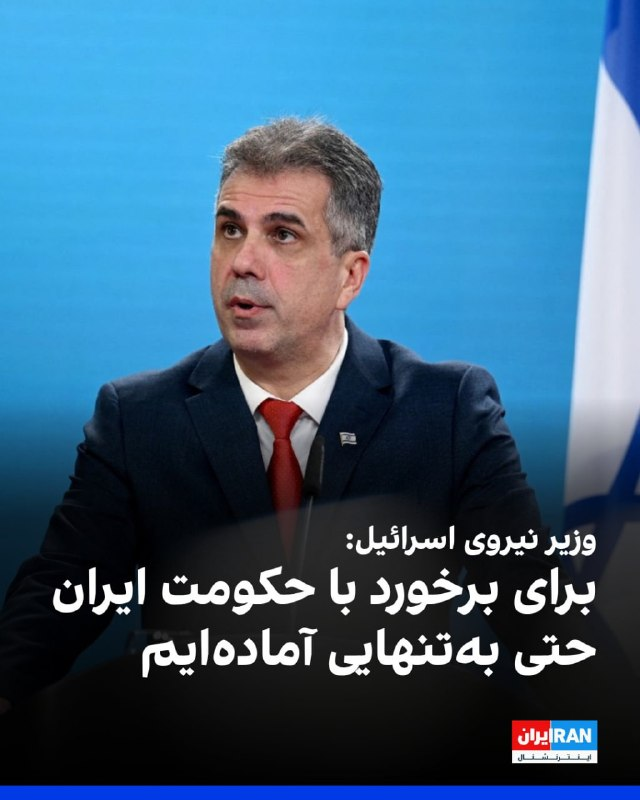

الی کوهن، وزیر نیروی اسرائیل، با انتقاد از توافق آمریکا و جمهوری اسلامی گفت: «آن‌ها در نهایت به رفتار و رویه گذشته خود بازخواهند گشت و اسرائیل در صورت نیاز، حتی به‌تنهایی برای مقابله با ایران آماده است.»

او افزود: «دیگر هیچ مدارا و مهاری در کار نیست. اسرائیل در ضاحیه پاسخ می‌دهد و شب گذشته حتی گزینه واکنش در خاک ایران را نیز بررسی کردیم.»
iranintl
‌🏁 🇬🇧 IranintlTV

🤖 @VahidOOnLine

## VahidOOnLine — post 245669

  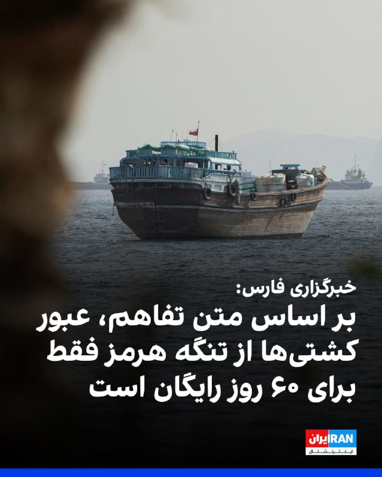

خبرگزاری فارس، وابسته به سپاه پاسداران، به نقل از یک منبع آگاه از اعمال «تغییرات مهم» در متن نهایی تفاهم جمهوری اسلامی و آمریکا خبر داد و نوشت با تصریح نقش ایران و عمان در تعیین آینده خدمات دریانوردی در تنگه هرمز، حق حاکمیتی دو کشور بر این گذرگاه تثبیت شده است.

خبرگزاری فارس به نقل از یک منبع آگاه نوشت: «در لحظات آخر مذاکرات، متن تفاهم‌نامه تغییراتی داشت که مسئله اعمال حاکمیت ایران و عمان بر تنگه هرمز را به‌صورت قطعی و مصرح مورد تاکید قرار داده است.»

منبع آگاه به فارس گفت در متن تفاهم آمده است که جمهوری اسلامی «فقط» برای ۶۰ روز عبور بدون هزینه کشتی‌ها را خواهد پذیرفت؛ یعنی آمریکا اصل دریافت هزینه را پذیرفته و صرفا ۶۰ روز تخفیف از تهران گرفته است.

منبع آگاه به فارس گفت بر اساس متن تفاهم، جمهوری اسلامی پس از ۶۰ روز بنا دارد با ارائه خدمات ایمنی، دریانوردی، محیط زیست و بیمه، از عواید مالی حاصل از تردد کشتی‌های تجاری در تنگه هرمز برای توسعه اقتصادی کشور بهره‌مند شود.
‌🏁 🇬🇧 IranintlTV

🤖 @VahidOOnLine

## VahidOOnLine — post 245668

  

یک مقام ارشد در دولت اقلیم کردستان عراق، در گفت‌وگوی اختصاصی با ایران‌اینترنشنال، اعلام کرد جمهوری اسلامی در انتخاب علی زیدی به عنوان نخست‌وزیر عراق هیچ‌گونه اعتراضی نداشت.

این مقام، درباره احتمال اختلاف نظر تهران با علی زیدی بر سر پروژه حصر سلاح در دست دولت، گفت: «جمهوری اسلامی هنگام انتخاب علی زیدی اعتراضی به این انتخاب نکرد، زیرا او در دایره سیاسی تهران قرار دارد.»

به گفته این مقام، «علی زیدی در پروژه‌های سیاسی و اقتصادی ارتباطات گسترده‌ای با جمهوری اسلامی داشته و پروژه خلع سلاح، دست‌کم تا زمانی که به خلع سلاح گروه‌های اصلی دارای تانک، زره‌پوش و سلاح‌های سنگین منجر نشود، پروژه‌ای ظاهری است.»

این مقام ارشد همچنین به ایران‌اینترنشنال گفت سفر دو روزه تام باراک، نماینده ویژه دونالد ترامپ در امور عراق، بر پرونده‌های خلع سلاح گروه‌های مسلح، نفت، حمایت از دولت علی زیدی برای پیشبرد اصلاحات اقتصادی و هماهنگی برای سفر احتمالی نخست‌وزیر عراق به واشینگتن متمرکز خواهد بود.
iranintl
‌🏁 🇬🇧 IranintlTV

🤖 @VahidOOnLine

## VahidOOnLine — post 245667

  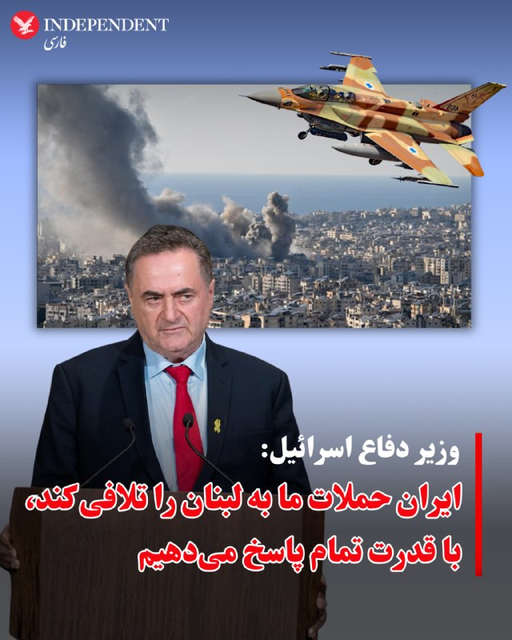

⭕️وزیر دفاع اسرائیل: ایران حملات ما به لبنان را تلافی‌ کند، با قدرت تمام پاسخ می‌دهیم

♦️اسرائیل کاتس، وزیر دفاع اسرائیل روز دوشنبه ۲۵ خردادماه و ساعاتی پس    از اعلام توافق پایان جنگ میان تهران و واشنگتن تاکید کرد که در صورت حمله تلافی جویانه جمهوری اسلامی به این کشور به‌دلیل «عملیات نظامی در لبنان»، ارتش اسرائیل با تمام قدرت به ایران پاسخ خواهد داد. کاتز همچنین گفت که نیروهای نظامی این کشور از لبنان، سوریه و غزه خارج نمی‌شود.

کاتس با انتشار بیانیه‌ای گفت: «نخست وزیر بنیامین نتانیاهو و من یک سیاست روشن را دنبال می‌کنیم که براساس آن ارتش دفاعی اسرائیل در مناطق امنیتی در لبنان، سوریه و غزه برای دوره‌ای نامحدود باقی خواهند ماند تا از مرزهای جوامع اسرائیل در برابر «عوامل جهادی» محافظت کنند.
‌🇸🇦 Indypersian

🤖 @VahidOOnLine

## VahidOOnLine — post 245666

  

سازمان دریانوردی تجاری بریتانیا از حادثه برای یک کشتی در ۱۴ مایلی سواحل یمن خبر داد.

سازمان دریانوردی تجاری بریتانیا خبر داد که سرنشینان یک قایق کوچک به یک کشتی در ۱۴ مایلی سواحل یمن تیراندازی کرده و تلاش کرده‌اند سوار آن شوند.
iranintl
‌🏁 🇬🇧 IranintlTV

🤖 @VahidOOnLine

## VahidOOnLine — post 245665

  <a href="telegram/content/VahidOOnLine_245665_1781517968.mp4" target="_blank">🎬 Download video</a>

بر اساس ویدیوهای رسیده به ایران‌اینترنشنال، گروهی از ایرانیان مقیم ایتالیا یکشنبه ۲۴ خرداد با تجمع در شهر تورین، یاد جاویدنامان انقلاب ملی را گرامی داشتند.
‌🏁 🇬🇧 IranintlTV

🤖 @VahidOOnLine

## VahidOOnLine — post 245664

  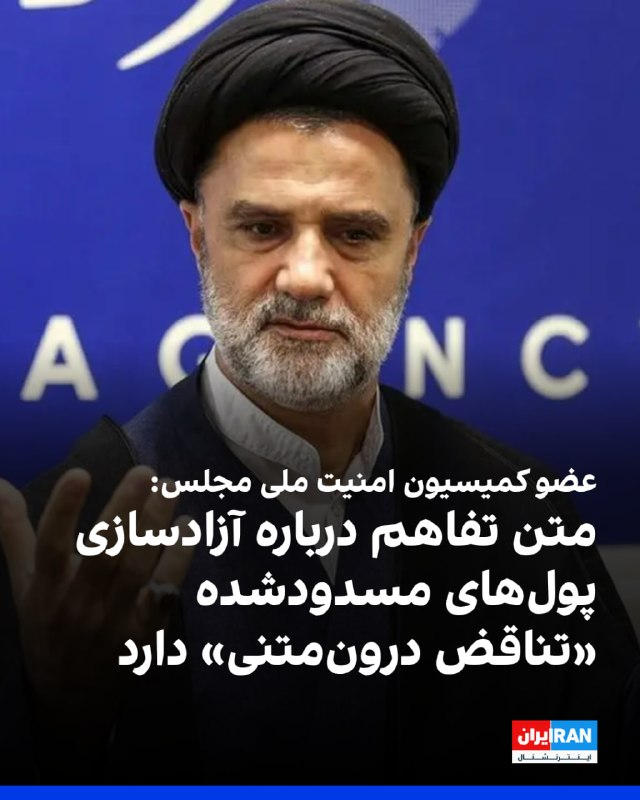

محمود نبویان، عضو کمیسیون امنیت ملی مجلس، در شبکه ایکس نوشت طبق یادداشت تفاهم، رفع محاصره دریایی از سوی آمریکا و بازگشایی تنگه هرمز بدون محدودیت از سوی جمهوری اسلامی باید «بلافاصله پس از امضای توافق» اجرایی شود.

محمود نبویان، عضو کمیسیون امنیت ملی مجلس، نوشت: «آمریکا متعهد شده تا زمان خاتمه تحریم‌ها، اسقاطیه وزارت خزانه‌داری آمریکا برای صادرات نفت خام ایران، مواد پتروشیمی و مشتقات آن و همه خدمات مرتبط از جمله تراکنش‌های بانکی، بیمه و حمل‌ونقل را صادر کند.»

نبویان نوشت در متن یادداشت تفاهم درباره آزادسازی پول‌های مسدودشده «تناقض درون‌متنی» وجود دارد، زیرا طبق بند ۱۳ باید بند ۱۱ بلافاصله اجرا شود، اما در بند ۱۱ آزادسازی پول‌ها به «پیشرفت مذاکرات» مشروط شده است.
او خواستار ارائه گزارش دقیق اجرای یادداشت تفاهم به «ملت ایران» شد.
‌🏁 🇬🇧 IranintlTV

🤖 @VahidOOnLine

## VahidOOnLine — post 245663

  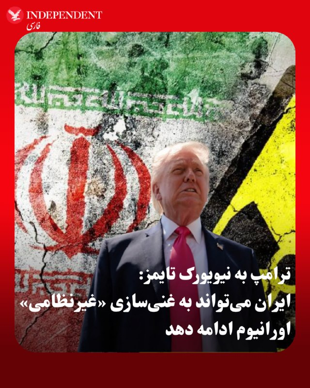

⭕️ترامپ به نیویورک تایمز: ایران می‌تواند به غنی‌سازی «غیرنظامی» اورانیوم ادامه دهد

♦️نیویورک تایمز روز دوشنبه ۲۵ خردادماه و ساعاتی پس از اعلام توافق پایان جنگ میان تهران و واشنگتن، از موافقت دونالد ترامپ با «غنی‌سازی غیرنظامی و سطح پایین اورانیوم در ایران» خبر داد.

به گزارش نیویورک تایمز، ترامپ در یک مصاحبه تلفنی گفت: «جمهوری اسلامی می‌تواند به غنی‌سازی اورانیوم «در سطوح پایین و نه برای اهداف نظامی» ادامه دهد. وی اظهار داشت که ایالات متحده برای اجرای این توافق، از «اختیارات نظارتی قوی» برخوردار خواهد بود.

این خبر در حالی منتشر می‌شود که ترامپ در جریان دو دور مذاکرات منجر به دو جنگ، اعلام کرده بود به کم‌تر از غنی‌سازی «صفر» رضایت نمی‌دهد.
‌🇸🇦 Indypersian

🤖 @VahidOOnLine

## VahidOOnLine — post 245662

  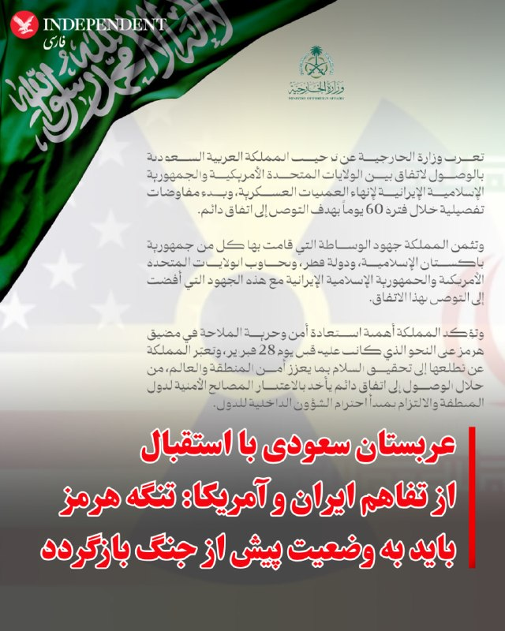

♦️وزارت امور خارجه عربستان سعودی روز دوشنبه ۲۵ خردادماه با انتشار بیانیه‌ای، ضمن استقبال از توافق پایان جنگ میان جمهوری اسلامی ایران و ایالات متحده آمریکا، بر اهمیت بازگرداندن امنیت و آزادی کشتیرانی در تنگه هرمز به وضعیت قبل از آغاز جنگ شد.

وزارت امور خارجه عربستان سعودی در این بیانیه از تلاش‌های میانجیگرانه جمهوری اسلامی پاکستان و دولت قطر و پاسخ مثبت ایالات متحده و جمهوری اسلامی ایران به این تلاش‌ها، قدردانی کرد.

وزارت خارجه عربستان سعودی در همین پیام نوشت: «آرزوی خود را را برای تحقق صلح به نحوی که امنیت منطقه و جهان را تقویت کند، از طریق دستیابی به یک توافق دائمی که منافع امنیتی کشورهای منطقه و پایبندی به اصل احترام به امور داخلی کشورها را در نظر بگیرد» ابراز می‌داریم.
‌🇸🇦 Indypersian

🤖 @VahidOOnLine

## VahidOOnLine — post 245661

  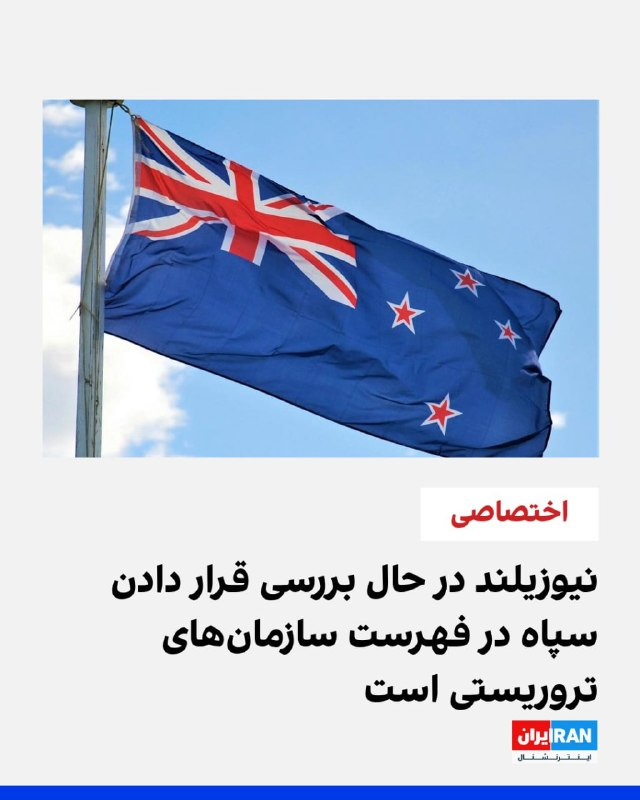

دیوید سیمور، معاون نخست‌وزیر نیوزیلند، در گفت‌وگوی اختصاصی با ایران‌اینترنشنال اعلام کرد دولت نیوزیلند به‌طور جدی در حال بررسی قرار دادن نام سپاه پاسداران انقلاب اسلامی در فهرست سازمان‌های تروریستی است.

سیمور دوشنبه، ۲۵ خرداد حکومت ایران را «یک رژیم شیطانی» خواند و گفت: «ما اقدامات جمهوری اسلامی علیه همسایگانش، حمایت آن از گروه‌های تروریستی در سراسر خاورمیانه و فعالیت‌های مرتبط با آن در نزدیکی ما در استرالیا را محکوم می‌کنیم. همچنین رفتار این حکومت با مردم ایران را به‌شدت محکوم می‌کنیم.»

به گفته او، پلیس و نهادهای اطلاعاتی نیوزیلند از فعالیت‌های سپاه پاسداران «کاملا آگاه هستند» و به‌طور مداوم آن‌ها را تحت نظر دارند.

سیمور ادامه داد: «شخصا درباره این موضوع با نخست‌وزیر نیوزیلند گفت‌وگو کرده‌ام و موضع او کاملا روشن است؛ دولت نیوزیلند و نهادهای مختلف آن، از جمله پلیس و سازمان‌های اطلاعاتی، نظارت بر فعالیت‌های سپاه پاسداران و مقابله با آن را در اولویت خود قرار داده‌اند.»
iranintl
‌🏁 🇬🇧 IranintlTV

🤖 @VahidOOnLine

## VahidOOnLine — post 245660

  <a href="telegram/content/VahidOOnLine_245660_1781517972.mp4" target="_blank">🎬 Download video</a>

ویدیوهای رسیده به ایران‌اینترنشنال حاکی است رانندگان پیک‌های موتوری شرکت «اسنپ» در شیراز، روز دوشنبه ۲۵ خرداد همچنان برای اعتراض به کمیسیون بالا، مالیات سنگین، کرایه کم، حذف سهمیه سوخت و نداشتن بیمه در اعتصاب هستند.
‌🏁 🇬🇧 IranintlTV

🤖 @VahidOOnLine

## VahidOOnLine — post 245659

  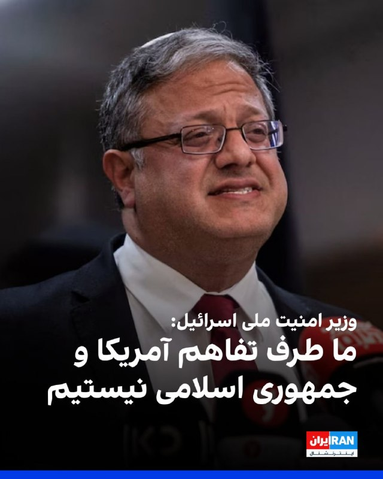

ایتامار بن‌گویر، وزیر امنیت ملی اسرائیل اعلام کرد این کشور طرف تفاهم آمریکا و جمهوری اسلامی نیست و نباید به چیزی کمتر از برچیدن حزب‌الله رضایت دهد.

پیش‌تر وزیر دفاع اسرائیل گفت نتانیاهو به طور شفاف به دونالد ترامپ اعلام کرده نیروهای اسرائیلی از مناطق حائل در لبنان، سوریه و غزه خارج نخواهند شد.
iranintl
‌🏁 🇬🇧 IranintlTV

🤖 @VahidOOnLine

## VahidOOnLine — post 245658

  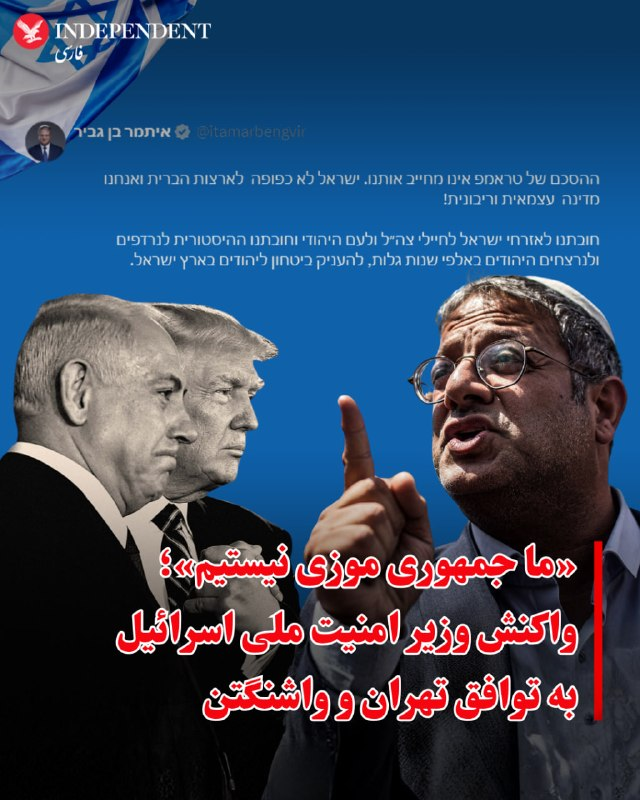

♦️ایتامار بن‌گویر، وزیر امنیت ملی اسرائیل روز دوشنبه ۲۵ خردادماه با انتشار پیامی در اکس اعلام کرد اسرائیل «تعهدی به اجرای توافق پایان جنگ تهران و واشنگتن» ندارد.

بن گویر در این پیام، باوجود «تشکر» از دونالد ترامپ نوشت: «ما جمهوری موزی نیستیم»؛ اصطلاحی که در علوم سیاسی برای توصیف کشوره‌های ضعیف، عمدتا تک محصولی و وابسته به کار می‌رود.

وزیر «راست‌گرای» امنیت ملی اسرائیل در این پیام نوشت: «ما ملزم به رعایت توافق ترامپ نستیم. اسرائیل تابع ایالات متحده نیست و ما یک ملت مستقل و دارای حاکمیت هستیم!
وظیفه ما در قبال شهروندان اسرائیل، سربازان ارتش اسرائیل و مردم یهود و وظیفه تاریخی ما در قبال یهودیانی که در طول هزاران سال تبعید مورد آزار و اذیت و قتل قرار گرفته‌اند، مسئولیم تا امنیت یهودیان را در سرزمین اسرائیل فراهم کنیم.»

بن گویر با یادآوری «شکست توافق‌های پیشین» افزود: «هر بار که به قیمت امنیت اسرائیل تسلیم فشارهای بین‌المللی شدیم، بهای خون خود را با بهره آن پرداختیم. این موضوع در توافق اسلو، در توافق لبنان در سال ۲۰۰۶ و در هر دوره مهار غزه که در مقابل ما منفجر شد، صادق بود.»

وزیر امنیت ملی اسرائیل در همین پیام نوشت: «موضع من روشن است: ما شریک این توافق نیستیم که امنیت ما را تضمین نمی‌کند و به هیچ وجه ما را ملزم به رعایت آن نمی‌کند. ما نباید در مورد چیزی کمتر از برچیدن حزب‌الله مصالحه کنیم، نباید از هیچ سرزمینی که رزمندگان ما تصرف کرده و از زیرساخت‌های تروریستی پاکسازی کرده‌اند، عقب‌نشینی کنیم، نباید به وضعیتی برگردیم که هزاران تروریست در حصارهای شهرک‌های شمالی مستقر باشند و مطمئناً نباید لحظه‌ای در برابر آتشی که به سمت کشور اسرائیل نشانه گرفته می‌شود، ساکت بمانیم. ما باید این را روشن کنیم: پرتاب هر پهپاد، هواپیمای بدون سرنشین یا موشک به سمت اسرائیل از لبنان منجر به حمله اسرائیل به ضاحیه خواهد شد. این توازن بازدارندگی همین چند ماه پیش بود و ما به هیچ وجه نباید از آن دست بکشیم.»
‌🇸🇦 Indypersian

🤖 @VahidOOnLine

## VahidOOnLine — post 245657

  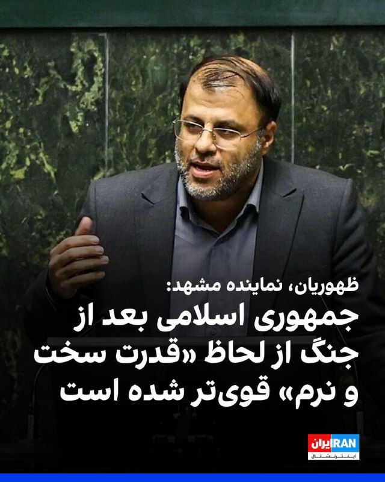

میثم ظهوریان، نماینده مشهد در مجلس، در شبکه ایکس نوشت محتوای یادداشت تفاهم تهران و واشینگتن هر چه که باشد، جمهوری اسلامی بعد از جنگ به‌طور حتم هم از لحاظ «قدرت سخت» و هم «قدرت نرم» قوی‌تر و مقتدرتر از پیش از آن است.

او افزود: «جمهوری اسلامی در جنگی نابرابر در مقابل دو قدرت هسته‌ای و هفت قدرت منطقه‌ای ایستاد و سربلند بیرون آمد و همه دنیا و حتی معارضان داخلی فهمیدند نظامی پایدار است؛ ادراکی که قبل جنگ خلاف آن وجود داشت.»
iranintl
‌🏁 🇬🇧 IranintlTV

🤖 @VahidOOnLine

## VahidOOnLine — post 245656

  <a href="telegram/content/VahidOOnLine_245656_1781517976.mp4" target="_blank">🎬 Download video</a>

⭕️اولین نفتکش حامل گاز طبیعی مایع پس از «توافق تهران و واشنگتن» از تنگه هرمز گذشت

♦️نخستین نفتکش حامل گاز طبیعی مایع پس از اعلام پایان جنگ جمهوری اسلامی ایران و آمریکا، صبح دوشنبه ۲۵ اسرائیل از تنگه هرمز عبور کرد.

خبرگزاری رویترز گزارش کرد نفتکش دیشا با پرچم مالت از خلیج فارس به دریای عمان رفته است.

رسانه‌های ایران می‌گویند این نفتکش از «طرح تفکیک ترافیک دریایی ایران استفاده کرده است.»

دونالد ترامپ، رئیس جمهوری آمریکا نیمه‌شب یکشنبه به‌وقت تهران و در زمان اعلام توافق برای پایان جنگ با ایران، در پیامی خطاب به کشتی‌های گرفتار در خلیج فارس نوشته بود: «موتورهایتان را روشن کنید، بگذارید نفت جریان یابد.»
‌🇸🇦 Indypersian

🤖 @VahidOOnLine

## VahidOOnLine — post 245655

  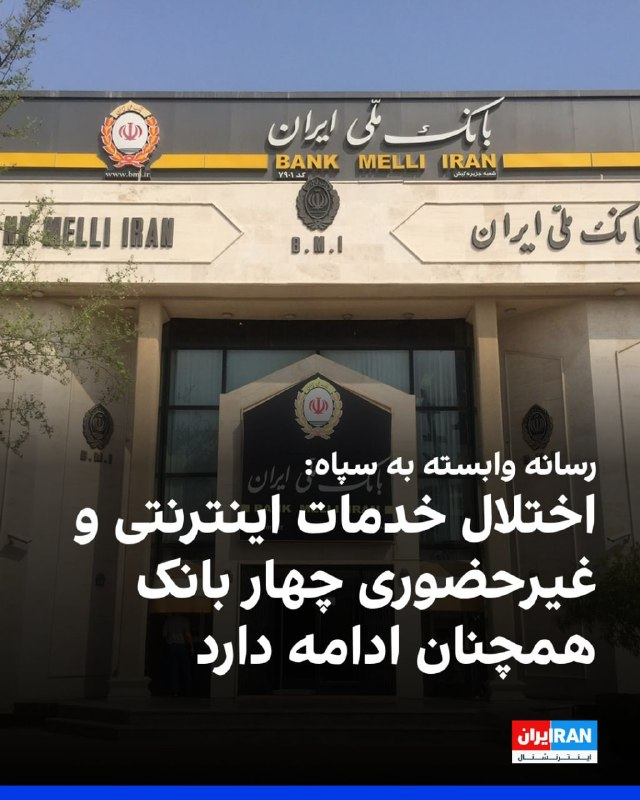

خبرگزاری فارس، وابسته به سپاه پاسداران، گزارش داد با وجود اعلام رفع اختلال در خدمات بانک‌های ملی، صادرات، تجارت و توسعه صادرات، اختلال خدمات اینترنتی و غیرحضوری این بانک‌ها همچنان ادامه دارد.

خبرگزاری فارس گزارش داد دو روز پیش شورای هماهنگی بانک‌ها اختلال سامانه‌های چهار بانک ملی، صادرات، تجارت و توسعه صادرات را ناشی از «حمله سایبری محدود» اعلام کرده و گفته بود نشت اطلاعاتی رخ نداده است، اما اکنون تنها خدمات کارت در پایانه‌های فروشگاهی و خودپردازها فعال است.
iranintl
‌🏁 🇬🇧 IranintlTV

🤖 @VahidOOnLine

## VahidOOnLine — post 245654

  <a href="telegram/content/VahidOOnLine_245654_1781517978.mp4" target="_blank">🎬 Download video</a>

بر اساس ویدیوهای رسیده به ایران‌اینترنشنال، گروهی از ایرانیان مقیم آمریکا یکشنبه ۲۴ خرداد با تجمع در هیوستون تگزاس، نام جاویدنامان انقلاب ملی را فریاد زدند.
‌🏁 🇬🇧 IranintlTV

🤖 @VahidOOnLine

## VahidOOnLine — post 245653

  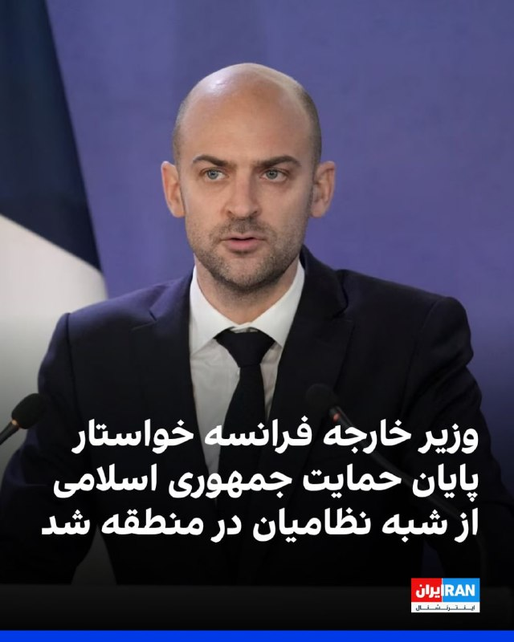

ژان نوئل بارو، وزیر خارجه فرانسه، بار دیگر از جمهوری اسلامی خواست حمایت خود از شبه‌نظامیان و گروه‌های نیابتی در منطقه مانند حزب‌الله لبنان، حوثی‌های یمن و دیگر شبه‌نظامیان مورد حمایت خود را پایان دهد.

او جمهوری اسلامی را «نیروی بی‌ثبات‌کننده» توصیف کرد و گفته برنامه هسته‌ای، موشکی و حمایت از این گروه‌ها تهدیدی برای کشورهای خاورمیانه و حتی اروپا محسوب می‌شود.
iranintl
‌🏁 🇬🇧 IranintlTV

🤖 @VahidOOnLine

## VahidOOnLine — post 245652

  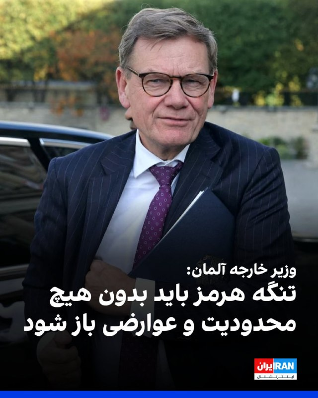

یوهان وادفول، وزیر خارجه آلمان، پس از تفاهم اولیه تهران و واشینگتن گفت که تنگه هرمز باید بار دیگر بدون هیچ محدودیتی قابل کشتیرانی شود.

وادفول پیش از دیدار با همتایان اروپایی خود در لوکزامبورگ گفت: «باید روشن شود تنگه هرمز بدون هیچ محدودیت و عوارضی به روی کشتیرانی باز است.»
iranintl
‌🏁 🇬🇧 IranintlTV

🤖 @VahidOOnLine

## VahidOOnLine — post 245651

  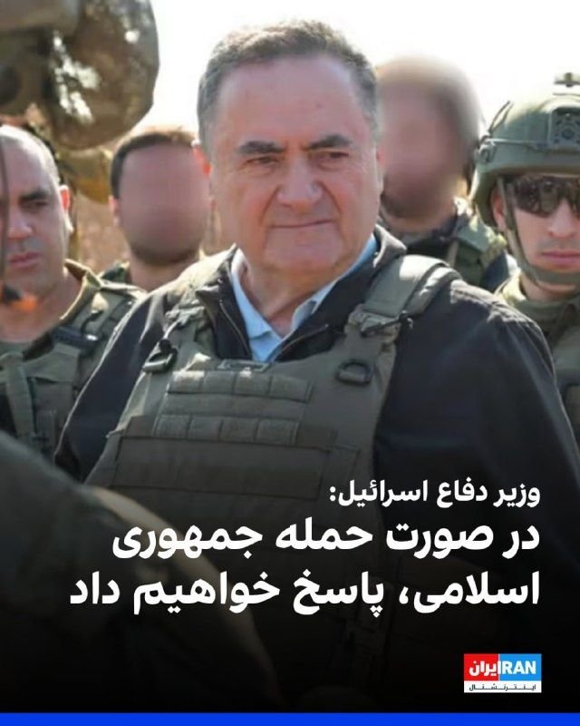

یسرائیل کاتز، وزیر دفاع اسرائیل گفت که نیروهای این کشور در مناطق امنیتی حائل در لبنان، سوریه و غزه باقی خواهد ماند و نتانیاهو این موضوع را به‌طور شفاف به ترامپ و دیگر مقام‌های ارشد آمریکا اعلام کرده است.

او افزود: «اگر جمهوری اسلامی به دلیل رویدادهای لبنان به اسرائیل حمله کند، به آنها حمله خواهیم کرد.»
iranintl
‌🏁 🇬🇧 IranintlTV

🤖 @VahidOOnLine

## WithYashar — post 14952

  <a href="telegram/content/WithYashar_14952_1781517982.mp4" target="_blank">🎬 Download video</a>

هم اکنون امام علی نزدیک خیابون دماوند
@withyashar

## WithYashar — post 14951

تتر ۱۶۳.۵۰۰ تومان
@withyashar

## WithYashar — post 14950

کانال ۱۲ اسرائیل: حدود ۱۰ ساعت از اعلام توافق بین واشنگتن و تهران می‌گذرد اما نتانیاهو هنوز در سکوت به سر می برد
@withyashar

## WithYashar — post 14949

نشست سران گروه هفت (G7) امروز در شهر اویان-له-بن فرانسه برگزار می‌شود؛ جایی که رهبران کشورهای صنعتی جهان درباره‌ی مجموعه‌ای از بحران‌های جهانی گفت‌وگو خواهند کرد.

گروه G7 یک گروه متشکل از هفت اقتصاد بزرگ جهان شامل آمریکا، بریتانیا، کانادا، فرانسه، آلمان، ایتالیا و ژاپن است که از دهه‌ی ۱۹۷۰ و پس از بحران نفتی اوپک شکل گرفت.
@withyashar

## WithYashar — post 14948

ایران فعلا در تنگه هرمز پولی دریافت نخواهد کرد
ایسنا: براساس جزئیات تفاهم‌نامه، ایران تنگه هرمز را مدیریت خواهد کرد و عوارض را «در تاریخ بعدی» دریافت خواهد کرد.
@withyashar

## WithYashar — post 14947

️ترامپ به نیویورک تایمز:

«کنار آمدن با نتانیاهو فوق‌العاده دشوار است و او باید از ما بسیار سپاسگزار باشد، زیرا اگر ایران سلاح هسته‌ای داشت، اسرائیل وجود نداشت.»
@withyashar

## WithYashar — post 14946

وزیر دفاع اسرائیل: همراه با نتانیاهو سیاستی روشن را دنبال میکنم که بر اساس آن، ارتش در مناطق امنیتی در لبنان، سوریه و غزه باقی خواهد ماند

با وجود تمام فشارهای فعلی و آینده، خروج ارتش اسرائیل از لبنان را نمیپذیریم
@withyashar

## WithYashar — post 14945

  <a href="telegram/content/WithYashar_14945_1781517983.mp4" target="_blank">🎬 Download video</a>

اولین شناوری که پس از اعلام توافق صلح میان ایالات متحده و جمهوری اسلامی ایران از تنگه هرمز عبور کرد، نفتکش گاز طبیعی مایع (LNG) با پرچم مالت به نام “دیشا” (Disha) است که از طرح تفکیک ترافیک دریایی ایران استفاده کرد
@withyashar

## WithYashar — post 14944

حمله اسرائیل به الخیام جنوب لبنان!
@withyashar

## WithYashar — post 14943

کانال ۱۳ اسرائیل به‌نقل از یه مقام ارشد:
توافقی که داره صورت میگیره فاجعه‌بارترین توافق تاریخه. از نخست وزیر گرفته تا رئیس ستاد ارتش کل غیر از این فکر نمیکنه
@withyashar

## mwarmonitor — post 10953

📝 در حالی که اکثریت مردم ایران در فقر مطلق غوطه‌ورند و مثل محکومین به اعدام، شبانه‌روز با چشمانی کاسه خون به خبرگزاری‌ها زل زده‌اند تا شاید فرجی بشود و از شر این نظام خون‌خوار نجات یابند، یک مشت انگلِ مرفح و بی‌درد وسط جنگل، حمامِ کف راه انداخته‌اند و به محیط‌زیستِ بیچاره گند می‌زنند. برای این جماعتِ کرم‌گونه و لاشخور که هویتشان را از رانت و خون ملت تعزیه می‌کنند، بقای این رژیم فاسد هزار بار گواراتر از آن بسیجیِ جیره‌خوار و مغزشسته‌ایی است که کل ارزش وجودی‌اش، چرخاندن ۲۴ ساعته پرچم با دستمزد یک ساندیس ولرم است؛ کمدی تهوع‌آوری که در آن، حماقتِ یک پادوِ ساندیس‌خور، امنیتِ رقصِ این زالوهای رانتی را در کفِ صابون تضمین می‌کند.

@mwarmonitor

## mwarmonitor — post 10952

🔴 «هیچ آتش‌بسی در لبنان وجود ندارد و حملات اسرائیل در جنوب این کشور ادامه دارد، در حالی که گفته می‌شود اسرائیل تأکید دارد تفاهم‌نامه (MoU) میان ایران و آمریکا شامل حال آن نمی‌شود.» 🔴 «چندین روستا صبح امروز هدف قرار گرفته‌اند و عملیات تخریب در آن‌ها در جریان…

## mwarmonitor — post 10951

  <a href="telegram/content/mwarmonitor_10951_1781517985.mp4" target="_blank">🎬 Download video</a>

🔴 «هیچ آتش‌بسی در لبنان وجود ندارد و حملات اسرائیل در جنوب این کشور ادامه دارد، در حالی که گفته می‌شود اسرائیل تأکید دارد تفاهم‌نامه (MoU) میان ایران و آمریکا شامل حال آن نمی‌شود.»

🔴 «چندین روستا صبح امروز هدف قرار گرفته‌اند و عملیات تخریب در آن‌ها در جریان است. همچنین یک خودروی بمب‌گذاری‌شده در جاده بین حاریس و تبنین منفجر شده است.»

🔴 «برخی شهرداری‌ها به مردم هشدار داده‌اند که بازنگردند، در حالی که بسیاری از آوارگان در حال حرکت به سمت جنوب هستند.»

🔴 «نیروهای اسرائیلی صبح امروز به کفار رمانه تیراندازی کرده و همچنین اطراف منطقه میفدون را هنگام تلاش غیرنظامیان برای بازگشت هدف قرار داده‌اند که در نتیجه آن دست‌کم یک نفر زخمی شده است.»

@mwarmonitor

## mwarmonitor — post 10950

  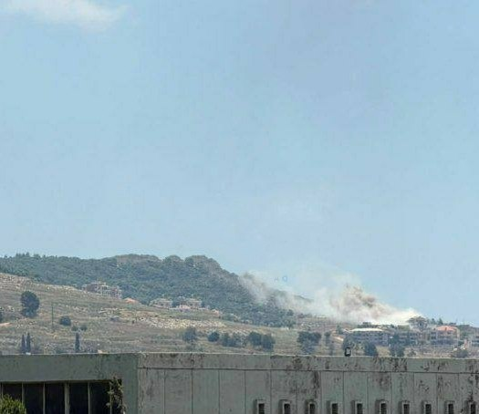

🔴 «گلوله‌باران توپخانه‌ای ارتش اسرائیل بر روی جبل علی الطاهر در جنوب لبنان انجام شد.»

@mwarmonitor

## mwarmonitor — post 10949

🔴 رئیس پارلمان لبنان و متحد حزب‌الله، نبیه بری، از ایران و آمریکا بابت گنجاندن لبنان در تفاهم‌نامه (MoU) برای توقف حملات اسرائیل در سراسر لبنان تشکر کرد.

🔴 بری از این تفاهم‌نامه تمجید کرد و تلاش‌های پاکستان، قطر، عربستان سعودی و مصر را برای رسیدن به این توافق ستود؛ توافقی که به گفته او «پایه‌های امنیت و ثبات در منطقه، از جمله لبنان» را ایجاد می‌کند.i24

@mwarmonitor

## mwarmonitor — post 10948

🔴سازمان UKMTO (سازمان عملیات تجارت دریایی بریتانیا) گزارشی درباره وقوع یک حادثه در فاصله ۱۴ مایل دریایی (14NM) در جنوب سواحل یمن دریافت کرده است.

🔸یک کشتی کانتینربر گزارش داده است که یک قایق کوچک (اسکیف) به آن نزدیک شده است. خدمه این قایق کوچک به سمت کشتی آتش گشوده و تلاش کردند وارد آن شوند.
مقامات در حال بررسی موضوع هستند.

@mwarmonitor

## mwarmonitor — post 10947

📈طلا از زمان اعلام توافق میان ایران و آمریکا همچنان به روند صعودی خود ادامه می‌دهد؛ به‌طوری که از ساعات اولیه صبح ۳٪ افزایش یافته و به ۴٬۳۴۳ دلار برای هر اونس رسیده است.

@mwarmonitor

## mwarmonitor — post 10946

🔴وزیر دفاع اسرائیل، یسرائیل کاتس گفت:

🔸«من و نخست‌وزیر نتانیاهو سیاستی روشن را پیش می‌بریم که بر اساس آن، ارتش اسرائیل در مناطق امنیتی در لبنان، سوریه و غزه — بدون محدودیت زمانی — باقی خواهد ماند تا از آنجا از مرز و شهرک‌های اسرائیلی در برابر گروه‌های جهادی محافظت کند.

🔸این مناطق از ساکنان محلی و تمام زیرساخت‌های تروریستی، چه در زیرزمین و چه روی زمین، پاکسازی خواهند شد؛ از جمله خانه‌ها در روستاهای مرزی که به‌عنوان پایگاه‌های تروریستی استفاده می‌شدند و تخریب خواهند شد. این مهم‌ترین درس از رویدادهای ۷ اکتبر است.

🔸تصرف زمین و ایجاد مناطق امنیتی یکی از بزرگ‌ترین دستاوردهای ارتش اسرائیل در جنگ «بازسازی» است که تحت تصمیمات و هدایت رده سیاسی انجام شده است.

🔸بنابراین ما با عقب‌نشینی ارتش اسرائیل از لبنان مخالف هستیم — با وجود تمام فشارهای موجود و فشارهای آینده.

🔸نخست‌وزیر نتانیاهو این موضوع را به رئیس‌جمهور آمریکا ترامپ و دیگر مقام‌های آمریکایی توضیح داده است، و من نیز دیروز همین موضوع را به وزیر جنگ آمریکا پیت هگست منتقل کردم.

🔸ارتش اسرائیل این موضع را از نظر حرفه‌ای و امنیتی تأیید می‌کند.

🔸اگر در اپوزیسیون افرادی هستند که این دکترین امنیتی را به چالش می‌کشند و از عقب‌نشینی ارتش حمایت می‌کنند، باید علناً آن را بیان کنند تا مردم بتوانند بین دیدگاه‌ها قضاوت کنند.

🔸ما بر سر منافع امنیتی حیاتی اسرائیل و حفاظت از شهروندانمان مصالحه نخواهیم کرد و از مناطق امنیتی عقب‌نشینی نمی‌کنیم.

🔸اگر ایران به‌دلیل رویدادهای لبنان به اسرائیل حمله کند، ما با تمام قدرت به آن حمله خواهیم کرد و شکاف قدرت را به‌خوبی نشان خواهیم داد.

🔸ما فقط به شهروندانمان و امنیت دولت اسرائیل متعهد هستیم.»

@mwarmonitor

## mwarmonitor — post 10945

🔴رسانه‌های لبنانی گزارش دادند که صبح امروز یک خودرو که در شهر کفر تبنیت در جنوب لبنان در حال حرکت بود، هدف حمله پهپادی اسرائیل قرار گرفت.

🔸خبرگزاری ملی لبنان اعلام کرد که «گزارش‌هایی از مجروح شدن افراد» منتشر شده است.

🔸این خبرگزاری همچنین گزارش داد که گلوله‌باران توپخانه‌ای اسرائیل شهر کفر تبنیت و شهرک نزدیک نَبَطیه الفوقا را هدف قرار داده است.

🔸تاکنون اظهارنظر فوری از سوی ارتش اسرائیل منتشر نشده است.

🔸مقام‌های اسرائیلی همچنین هنوز درباره آتش‌بس میان آمریکا و ایران ـ که گفته می‌شود شامل توقف درگیری‌ها در لبنان نیز می‌شود ـ واکنشی نشان نداده‌اند.

@mwarmonitor

## mwarmonitor — post 10944

🔴یک مقام ارشد اسرائیلی به Channel 13 اسرائیل گفت:

🔸«این توافق برای اسرائیل فاجعه‌بار است. در سطوح عالی هیچ‌کس نیست که چنین نظری نداشته باشد؛ از نخست‌وزیر گرفته تا رئیس ستاد ارتش.»

@mwarmonitor

## mwarmonitor — post 10943

🔴وزیر امنیت داخلی اسرائیل، ایتامار بن‌گویر، اعلام کرد که توافق ترامپ «برای ما الزام‌آور نیست» و تأکید کرد که اسرائیل «یک کشور مستقل و دارای حاکمیت است» و تابع ایالات متحده نیست.

🔸بن‌گویر گفت اسرائیل نباید به چیزی کمتر از خلع سلاح حزب‌الله رضایت دهد، نباید از هیچ‌یک از مناطقی که توسط نیروهای اسرائیلی تصرف و پاکسازی شده‌اند عقب‌نشینی کند، و همچنین نباید در برابر شلیک‌ها به‌سوی اسرائیل سکوت اختیار کند.

@mwarmonitor

## mwarmonitor — post 10942

🔸این ادعای آقای ترامپ که ایالات متحده در صورت نیاز به یک نیروی پلیس حقوق‌بگیر در خاورمیانه تبدیل خواهد شد، یک چرخش تند و البته بسیار شبیه به سبک ترامپ خواهد بود. رئیس‌جمهور در واقع حفاظت آمریکا از منطقه — و چتر هسته‌ای ایالات متحده — را به یک نیروی مزدور تبدیل…

## mwarmonitor — post 10941

🔴ترامپ مدعی شد که طبق توافق با ایران، تنگه هرمز «برای همیشه رایگان» خواهد بود. 🔸رئیس جمهور ترامپ در تماسی با نیویورک تایمز، رهبران روسیه و چین را ستود و نخست وزیر اسرائیل را «آدمی بسیار سرسخت» توصیف کرد. 🔸پرزیدنت ترامپ روز یکشنبه تأکید کرد که اگر ایران به…

## mwarmonitor — post 10940

🔴ترامپ مدعی شد که طبق توافق با ایران، تنگه هرمز «برای همیشه رایگان» خواهد بود.

🔸رئیس جمهور ترامپ در تماسی با نیویورک تایمز، رهبران روسیه و چین را ستود و نخست وزیر اسرائیل را «آدمی بسیار سرسخت» توصیف کرد.

🔸پرزیدنت ترامپ روز یکشنبه تأکید کرد که اگر ایران به توافق نهایی هسته‌ای با ایالات متحده دست نیابد، حملات نظامی به تهران را از سر خواهد گرفت.

🔹دیوید ای. سنگر، بیش از ۲۰ سال است که اخبار پنج رئیس جمهور آمریکا را پوشش می‌دهد و درباره برنامه هسته‌ای ایران می‌نویسد. او از لندن گزارش می‌داد، جایی که رئیس جمهور ترامپ برای توصیف توافق دولت با تهران با او تماس گرفت.

🔸رئیس جمهور ترامپ عصر یکشنبه در مصاحبه‌ای گفت که توافقی که با ایران حاصل کرده است در نهایت تضمین می‌کند که تنگه هرمز «برای همیشه بدون عوارض» خواهد بود و تأکید کرد که علیرغم اعتراضات بنیامین نتانیاهو، نخست وزیر اسرائیل، او اسرائیل را از نابودی هسته‌ای نجات داده است.

🔴آقای ترامپ همچنین اصرار داشت که اگر ایران نتواند به توافق هسته‌ای نهایی با ایالات متحده دست یابد - روندی که دستیاران او می‌گویند انتظار دارند روز جمعه در سوئیس آغاز شود - او حملات نظامی به تهران را از سر خواهد گرفت یا ایالات متحده را در ازای دریافت 20 درصد از درآمدهای منطقه، «نگهبان خاورمیانه» خواهد کرد.

🔸در یک مکالمه تلفنی ۲۸ دقیقه‌ای که آقای ترامپ از اقامتگاه کاخ سفید آغاز کرد و یک تماس کوتاه پس از آن، رئیس جمهور ادعا کرد که تصمیم او برای حمله به ایران در اواخر فوریه و محاصره دریایی متعاقب آن بنادر ایران پس از بسته شدن تنگه هرمز توسط تهران، خاورمیانه را به نفع آمریکا تغییر داده است.

🔸او در هشتادمین سالگرد تولدش، در حالی که صدای خانواده‌اش در پس‌زمینه برای شام جشن شنیده می‌شد، از دو اقتدارگرا - روسای جمهور شی جین پینگ از چین و ولادیمیر پوتین از روسیه - به خاطر کمک به حل و فصل مناقشه یا حداقل عدم دخالت در محاصره تنگه هرمز، تمجید کرد.

🔹آقای ترامپ درباره آقای شی که ماه گذشته در چین از او دیدار کرده بود، گفت: «او یک جنتلمن تمام‌عیار بود. او یک نفتکش به همراه ۲۰ ناوشکن در هر طرف آن نفرستاد تا محاصره را بشکند»، اقدامی که می‌توانست نیروی دریایی چین و آمریکا را در معرض درگیری بالقوه قرار دهد.

🔸اما او از آقای نتانیاهو به خاطر حملات فزاینده‌ای که تقریباً توافق نهایی را از مسیر خود خارج کرد، به شدت انتقاد کرد.

🔸آقای ترامپ درباره نخست وزیر اسرائیل گفت: «او آدم خیلی سرسختی است و راستش را بخواهید، او باید از ما به خاطر این کار خیلی ممنون باشد. چون اگر ایران سلاح هسته‌ای داشت، اسرائیل دو ساعت هم دوام نمی‌آورد.»

@mwarmonitor

## pm_afshaa — post 94062

بسیجیا بد افتادن به جون هم

💧 Rainbet.com the #1 Non-KYC Crypto Casino & Sportsbook @rainbetcom

😁 @Pm_Afshaa

## pm_afshaa — post 94061

  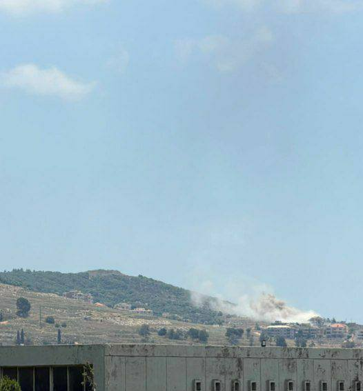

حملات اسراییل به جنوب لبنان

💧 Rainbet.com the #1 Non-KYC Crypto Casino & Sportsbook @rainbetcom

😁 @Pm_Afshaa

## pm_afshaa — post 94060

بسیجی خیالباف
درت گذاشت قالیباف!؟

## pm_afshaa — post 94059

🔴وزیر دفاع اسرائیل:ما از جنوب لبنان عقب نشینی نخواهیم کرد و به حملات خود ادامه خواهیم داد

💧 Rainbet.com the #1 Non-KYC Crypto Casino & Sportsbook @rainbetcom

😁 @Pm_Afshaa

## pm_afshaa — post 94058

محسن رضایی: باید طرفداران خودمان را هم با تیر بزنیم تا آمریکا بفهمد ما با خودمان هم شوخی نداریم چه برسد به دشمن

💧 Rainbet.com the #1 Non-KYC Crypto Casino & Sportsbook @rainbetcom

😁 @Pm_Afshaa

## pm_afshaa — post 94057

  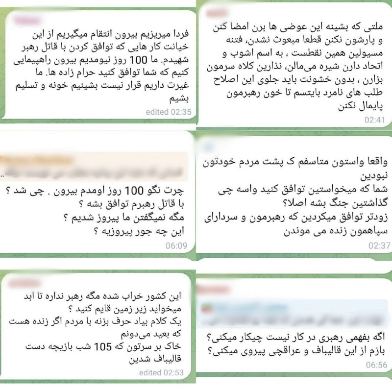

تندرو ها برا امشب فراخوان دادن تازه گفتن مجتبی مرده

💧 Rainbet.com the #1 Non-KYC Crypto Casino & Sportsbook @rainbetcom

😁 @Pm_Afshaa

## pm_afshaa — post 94056

هر بشکه نفت به 79 دلار رسید

💧 Rainbet.com the #1 Non-KYC Crypto Casino & Sportsbook @rainbetcom

😁 @Pm_Afshaa

## pm_afshaa — post 94055

در شهرداری گناباد چه میگذرد 2 تا حکومتی دارن تو شهرداری گناباد کون کونک بازی میکنن که توسط یهکی از شهروندان شکار میشن و فیلمشون در میاد مشاهده فیلم @Pm_Afshaa

## pm_afshaa — post 94054

بحث بحث ریشست نه به اون بچه ای که باباشو جلوشو کشتن بعد 20 سال کل اون گروهو کشت انتقام باباشو بگیره نه به اینا که انقدر گنده گوز و طرفداراشون مینازیدن اخر با قاتل پدر و زن و بچش دست داد و تسلیمش شد

## pm_afshaa — post 94053

بحث بحث ریشست نه به اون بچه ای که باباشو جلوشو کشتن بعد 20 سال کل اون گروهو کشت انتقام باباشو بگیره نه به اینا که انقدر گنده گوز و طرفداراشون مینازیدن اخر با قاتل پدر و زن و بچش دست داد و تسلیمش شد

## pm_afshaa — post 94052

  <a href="telegram/content/pm_afshaa_94052_1781517988.mp4" target="_blank">🎬 Download video</a>

لحظه ورود تيم جمهوري‌اسلامی به هتل محل اقامتشان در لس‌آنجلس و پذیرایی سفت ایرانیان غیور کالیفرنیا از این مزدوران خایه مال

💧 Rainbet.com the #1 Non-KYC Crypto Casino & Sportsbook @rainbetcom

😁 @Pm_Afshaa

## DEJradio — post 5687

  <a href="telegram/content/DEJradio_5687_1781517990.webm" target="_blank">🎬 Download video</a>

🚨
⭕️ اسراییل اعلام کرد برای تامین امنیت خود، پایبند توافق جمهوری اسلامی و آمریکا برای توقف جنگ علیه حزب‌الله نیست

#حزب_الله_لبنان #توافق
@DEJradio

## DEJradio — post 5686

  <a href="telegram/content/DEJradio_5686_1781517990.mp4" target="_blank">🎬 Download video</a>

🤡
🔺 هنوز انتقام رهبرمون رو نگرفتیم!

#موشعلی #انتقام_سخت
@DEJradio

## DEJradio — post 5685

  <a href="telegram/content/DEJradio_5685_1781517991.mp4" target="_blank">🎬 Download video</a>

🔺🎥 میوه‌های نوبرانه‌ آمده، اما بسیاری نمی‌توانند بچشند

شهروندان از گرانی مواد غذایی کمرشان شکسته است و از پس هزینه‌ها برنمی‌آیند. یک شهروند با ارسال ویدیویی از گرانی نوبرانه‌ها شکایت دارد. مردم می‌گویند با توافق و بی‌توافق زندگی آنها پر از مشقت است.

#گرانی #تورم
@DEJradio

## DEJradio — post 5684

  <a href="telegram/content/DEJradio_5684_1781517993.mp4" target="_blank">🎬 Download video</a>

🤡
🔺 پروژه یدالله برای جلوگیری از حذف مجتبی خامنه‌ای

یکی از پاسداران پریشان‌احوال نظام، برای حفظ جان مجتبی خامنه‌ای پیشنهاد اجرای "پروژه یدالله" را مطرح کرده است. مجتبی خامنه‌ای رهبر جمهوری اسلامی از وقتی به این مقام رسید، نیست.

#موشتبا #غیبت_کبری
@DEJradio

## DEJradio — post 5683

  <a href="telegram/content/DEJradio_5683_1781517995.webm" target="_blank">🎬 Download video</a>

🔺📢 دونالد ترامپ می‌گوید توافق با جمهوری اسلامی امضاء شد. او توضیح داد: «بدین‌وسیله من بازگشایی بدون عوارض تنگه هرمز را به طور کامل مجاز می‌دانم، و همزمان با این، لغو فوری محاصره دریایی ایالات متحده را دستور می‌دهم.» او همچنین تأکید کرد «کشتی‌های جهان، موتورهای خود را روشن کنید. بگذارید نفت جریان پیدا کند.»

او ساعاتی پیش از آن در گفتگو با روزنامه «وال استریت ژورنال» گفت: «هیچ پول نقدی به ایران پرداخت نخواهد شد.»

#جنگ #توافق
@DEJradio

## mamlekate — post 103718

  <a href="telegram/content/mamlekate_103718_1781517995.mp4" target="_blank">🎬 Download video</a>

قالیباف، رییس مجلس، ۲۰ بهمن ۱۴۰۳، در همایش ویژه فرماندهان سپاه: «ترامپ قاتل قاسم سلیمانی است 02:00 و مذاکره با او شرافتمندانه نیست.»

@mamlekate

## mamlekate — post 103717

  <a href="telegram/content/mamlekate_103717_1781517997.mp4" target="_blank">🎬 Download video</a>

روح بلند پیشوا و پیشقراول امت اسلامی < ۲۴ میلیارد دلار

t.me/mamlekate/103716

## mamlekate — post 103716

📝 جزئیات تأیید‌نشده از محتوای توافق

آزادسازی ۲۴ میلیارد دلار پول های بلوکه‌شده ایران در دوره ۶۰ روزه مذاکرات نهایی. نیمی از این مبلغ قبل از شروع مذاکرات باید در دسترس ایران قرار گیرد.

@mamlekate

## mamlekate — post 103715

  <a href="telegram/content/mamlekate_103715_1781517998.mp4" target="_blank">🎬 Download video</a>

به‌طور خلاصه و در دو کلمه

@mamlekate

## IranIntlTV — post 342477

  <a href="telegram/content/IranIntlTV_342477_1781517999.mp4" target="_blank">🎬 Download video</a>

در واکنش به توافق احتمالی میان جمهوری اسلامی و آمریکا، شماری از مخاطبان تاکید کردند که در روند مذاکرات، هیچ اشاره‌ای به کشته‌شدگان اعتراضات دی‌ماه، زندانیان سیاسی و مطالبات خانواده‌های قربانیان نشده است.

بهاران آزادی، عضو تحریریه ایران‌اینترنشنال، درباره واکنش شهروندان به این موضوع می‌گوید

@iranintltv

## IranIntlTV — post 342476

  

الی کوهن، وزیر نیروی اسرائیل، با انتقاد از توافق آمریکا و جمهوری اسلامی گفت: «آن‌ها در نهایت به رفتار و رویه گذشته خود بازخواهند گشت و اسرائیل در صورت نیاز، حتی به‌تنهایی برای مقابله با ایران آماده است.»

او افزود: «دیگر هیچ مدارا و مهاری در کار نیست. اسرائیل در ضاحیه پاسخ می‌دهد و شب گذشته حتی گزینه واکنش در خاک ایران را نیز بررسی کردیم.»
iranintl.com/202606153424

## IranIntlTV — post 342475

  

خبرگزاری فارس، وابسته به سپاه پاسداران، به نقل از یک منبع آگاه از اعمال «تغییرات مهم» در متن نهایی تفاهم جمهوری اسلامی و آمریکا خبر داد و نوشت با تصریح نقش ایران و عمان در تعیین آینده خدمات دریانوردی در تنگه هرمز، حق حاکمیتی دو کشور بر این گذرگاه تثبیت شده است.

خبرگزاری فارس به نقل از یک منبع آگاه نوشت: «در لحظات آخر مذاکرات، متن تفاهم‌نامه تغییراتی داشت که مسئله اعمال حاکمیت ایران و عمان بر تنگه هرمز را به‌صورت قطعی و مصرح مورد تاکید قرار داده است.»

منبع آگاه به فارس گفت در متن تفاهم آمده است که جمهوری اسلامی «فقط» برای ۶۰ روز عبور بدون هزینه کشتی‌ها را خواهد پذیرفت؛ یعنی آمریکا اصل دریافت هزینه را پذیرفته و صرفا ۶۰ روز تخفیف از تهران گرفته است.

منبع آگاه به فارس گفت بر اساس متن تفاهم، جمهوری اسلامی پس از ۶۰ روز بنا دارد با ارائه خدمات ایمنی، دریانوردی، محیط زیست و بیمه، از عواید مالی حاصل از تردد کشتی‌های تجاری در تنگه هرمز برای توسعه اقتصادی کشور بهره‌مند شود.

## IranIntlTV — post 342474

  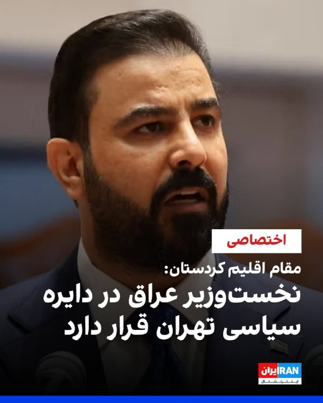

یک مقام ارشد در دولت اقلیم کردستان عراق، در گفت‌وگوی اختصاصی با ایران‌اینترنشنال، اعلام کرد جمهوری اسلامی در انتخاب علی زیدی به عنوان نخست‌وزیر عراق هیچ‌گونه اعتراضی نداشت.

این مقام، درباره احتمال اختلاف نظر تهران با علی زیدی بر سر پروژه حصر سلاح در دست دولت، گفت: «جمهوری اسلامی هنگام انتخاب علی زیدی اعتراضی به این انتخاب نکرد، زیرا او در دایره سیاسی تهران قرار دارد.»

به گفته این مقام، «علی زیدی در پروژه‌های سیاسی و اقتصادی ارتباطات گسترده‌ای با جمهوری اسلامی داشته و پروژه خلع سلاح، دست‌کم تا زمانی که به خلع سلاح گروه‌های اصلی دارای تانک، زره‌پوش و سلاح‌های سنگین منجر نشود، پروژه‌ای ظاهری است.»

این مقام ارشد همچنین به ایران‌اینترنشنال گفت سفر دو روزه تام باراک، نماینده ویژه دونالد ترامپ در امور عراق، بر پرونده‌های خلع سلاح گروه‌های مسلح، نفت، حمایت از دولت علی زیدی برای پیشبرد اصلاحات اقتصادی و هماهنگی برای سفر احتمالی نخست‌وزیر عراق به واشینگتن متمرکز خواهد بود.
iranintl.com/202606157357

## IranIntlTV — post 342468

🔻تیم ملی فوتبال ایران در اولین دیدار خود در جام جهانی ۲۰۲۶، بامداد سه‌شنبه در استادیوم سوفای لس‌آنجلس به مصاف نیوزیلند می‌رود.

🔹بازیکنان تیم ملی ایران پس از رسیدن به لس‌آنجلس در استادیوم سوفای حاضر شدند و آخرین تمرین خود پیش از دیدار برابر نیوزیلند را در این استادیوم برگزار کردند.

🔹دیدار ایران و نیوزیلند ساعت ۴:۳۰ بامداد سه شنبه برگزار خواهد شد.

@iranintltvsport

## IranIntlTV — post 342467

  <a href="telegram/content/IranIntlTV_342467_1781518002.mp4" target="_blank">🎬 Download video</a>

گروهی از ایرانیان مخالف جمهوری اسلامی با تجمع در برابر محل اقامت اعضای تیم ملی فوتبال ایران در لس‌آنجلس، مخالفت خود را با حضور این تیم در خاک ایالات متحده اعلام کردند.

گفت‌وگو با احسان اکبری، عضو تحریریه ایران‌اینترنشنال

@iranintltv

## IranIntlTV — post 342466

  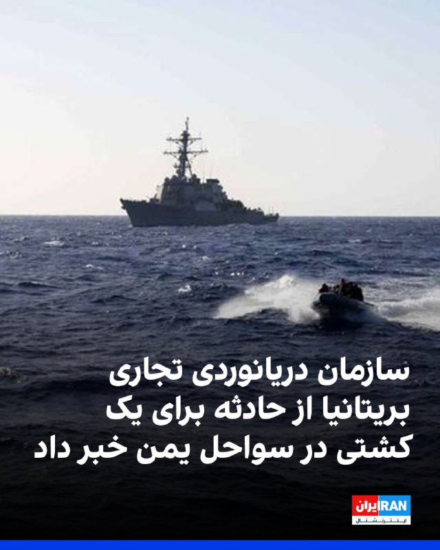

سازمان دریانوردی تجاری بریتانیا از حادثه برای یک کشتی در ۱۴ مایلی سواحل یمن خبر داد.

سازمان دریانوردی تجاری بریتانیا خبر داد که سرنشینان یک قایق کوچک به یک کشتی در ۱۴ مایلی سواحل یمن تیراندازی کرده و تلاش کرده‌اند سوار آن شوند.
iranintl.com/202606152133

## IranIntlTV — post 342465

  <a href="telegram/content/IranIntlTV_342465_1781518004.mp4" target="_blank">🎬 Download video</a>

حسین آقایی، عضو تحریریه ایران‌اینترنشنال، درباره توافق جمهوری اسلامی و آمریکا گفت: «دونالد ترامپ می‌خواهد معادله‌ای را که بدون خواست مردم ایران در خاورمیانه حل نخواهد شد، بدون مشارکت و خواست آنها حل کند؛ اما این امر امکان‌پذیر نیست.»

@iranintltv

## IranIntlTV — post 342464

  <a href="telegram/content/IranIntlTV_342464_1781518006.mp4" target="_blank">🎬 Download video</a>

مقام‌های اسرائیلی به نهایی‌شدن تفاهم‌نامه میان جمهوری اسلامی و ایالات متحده آمریکا واکنش نشان دادند.

اشکان صفایی، خبرنگار ایران‌اینترنشنال، گزارش می‌دهد

@iranintltv

## IranIntlTV — post 342463

  <a href="telegram/content/IranIntlTV_342463_1781518008.mp4" target="_blank">🎬 Download video</a>

توافق میان آمریکا و جمهوری اسلامی با واکنش‌های گسترده‌ای در میان شهروندان روبه‌رو شده است. برخی از مخاطبان در پیام‌های خود به ایران‌اینترنشنال، رویکرد دونالد ترامپ را مشابه رویکرد باراک اوباما در سال ۱۳۸۸ دانسته‌اند.

لیلا سعادتی، عضو تحریریه ایران‌اینترنشنال، گزارش می‌دهد

@iranintltv

## IranIntlTV — post 342462

  <a href="telegram/content/IranIntlTV_342462_1781518009.mp4" target="_blank">🎬 Download video</a>

علی‌حسین قاضی‌زاده، عضو تحریریه ایران‌اینترنشنال، با اشاره به آتش‌بس ۶۰ روزه میان جمهوری اسلامی و آمریکا گفت انتظار می‌رود با وجود توافق میان تهران و واشینگتن، درگیری میان جمهوری اسلامی و اسرائیل بار دیگر رخ دهد. او افزود اجرای این آتش‌بس با چالش‌های بسیاری روبه‌رو خواهد بود و این چالش‌ها می‌تواند توافق میان دو طرف را به خطر بیندازد.

@iranintltv

## IranIntlTV — post 342461

  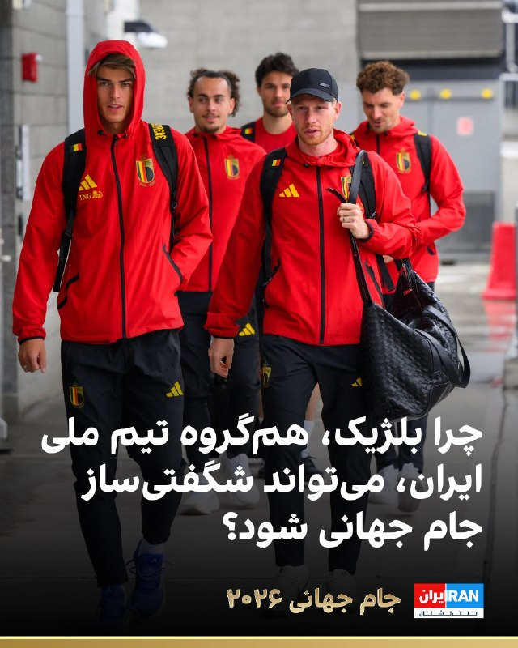

🔻رسانه فوت مرکاتو در گزارشی تحلیلی به دلایل احتمال شگفتی‌سازی تیم ملی بلژیک، هم‌گروه تیم ملی ایران در جام جهانی ۲۰۲۶، پرداخته است. تیم ملی فوتبال بلژیک که امشب ساعت ۲۲:۳۰ نخستین بازی خود را مقابل مصر برگزار می‌کند، با آمادگی کامل راهی آمریکا شده است.

🔹شیاطین سرخ گرچه در حال حاضر در میان مدعیان اصلی این جام قرار ندارند، اما به دلیل کسب نتایج درخشان در بازی‌های تدارکاتی، با اعتمادبه‌نفس بالایی پا به این مسابقات گذاشته‌اند. شاگردان رودی گارسیا با پیروزی‌های پیاپی اخیر خود، از جمله برد ۲ بر ۰ مقابل کرواسی و پیروزی ۵ بر ۰ برابر تونس، پیام روشنی برای رقبای خود فرستاده‌اند.

🔹این نتایج روند صعودی تیمی را نشان می‌دهد که اکنون رکورد ۱۳ پیروزی متوالی در تمامی رقابت‌ها را در اختیار دارد. رودی گارسیا که نخستین تجربه سرمربیگری خود در جام جهانی را پشت سر می‌گذارد، به نظر می‌رسد فرمول موفقیت با بلژیک را یافته است.

🔹جزییات بیشتر را در سایت بخوانید

@iranintltvsport

## IranIntlTV — post 342460

  <a href="telegram/content/IranIntlTV_342460_1781518012.mp4" target="_blank">🎬 Download video</a>

بر اساس ویدیوهای رسیده به ایران‌اینترنشنال، گروهی از ایرانیان مقیم ایتالیا یکشنبه ۲۴ خرداد با تجمع در شهر تورین، یاد جاویدنامان انقلاب ملی را گرامی داشتند.

## IranIntlTV — post 342459

  

محمود نبویان، عضو کمیسیون امنیت ملی مجلس، در شبکه ایکس نوشت طبق یادداشت تفاهم، رفع محاصره دریایی از سوی آمریکا و بازگشایی تنگه هرمز بدون محدودیت از سوی جمهوری اسلامی باید «بلافاصله پس از امضای توافق» اجرایی شود.

محمود نبویان، عضو کمیسیون امنیت ملی مجلس، نوشت: «آمریکا متعهد شده تا زمان خاتمه تحریم‌ها، اسقاطیه وزارت خزانه‌داری آمریکا برای صادرات نفت خام ایران، مواد پتروشیمی و مشتقات آن و همه خدمات مرتبط از جمله تراکنش‌های بانکی، بیمه و حمل‌ونقل را صادر کند.»

نبویان نوشت در متن یادداشت تفاهم درباره آزادسازی پول‌های مسدودشده «تناقض درون‌متنی» وجود دارد، زیرا طبق بند ۱۳ باید بند ۱۱ بلافاصله اجرا شود، اما در بند ۱۱ آزادسازی پول‌ها به «پیشرفت مذاکرات» مشروط شده است.
او خواستار ارائه گزارش دقیق اجرای یادداشت تفاهم به «ملت ایران» شد.

## IranIntlTV — post 342458

  <a href="telegram/content/IranIntlTV_342458_1781518014.mp4" target="_blank">🎬 Download video</a>

اتوبوس تیم ملی فوتبال ایران تحت تدابیر شدید امنیتی و ترافیکی به هتل «وست‌دریفت» در لس‌آنجلس رسید. هم‌زمان گروهی از ایرانیان مقابل این هتل علیه جمهوری اسلامی تجمع کردند.

گزارش رضا محدث، خبرنگار ایران‌اینترنشنال

@iranintltv

## Shin_Persian — post 7095

  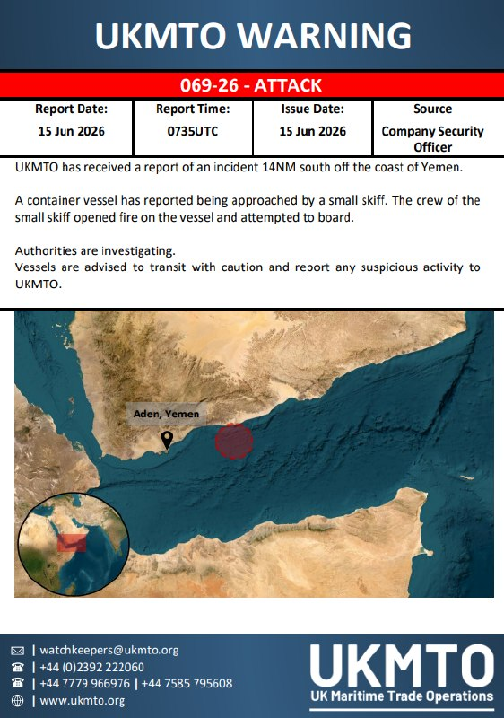

UKMTO Operations Centre @UK_MTO
Mon, 15 Jun 2026 08:42:55 UTC

UKMTO WARNING 069-26 - ATTACK

Click here to view the full warning.⤵️
https://www.ukmto.org/-/media/ukmto/products/20260615-ukmto_warning_attack-069-26.pdf?rev=a900d20dde764e05b5f73ff9289e4704

#MaritimeSecurity #MarSec

ترجمه خودکار فارسی

هشدار سازمان عملیات تجارت دریایی بریتانیا (UKMTO) ۶۹-۲۶ - حمله

برای مشاهده متن کامل هشدار اینجا کلیک کنید. ⤵️
https://www.ukmto.org/-/media/ukmto/products/20260615-ukmto_warning_attack-069-26.pdf?rev=a900d20dde764e05b5f73ff9289e4704

#MaritimeSecurity #MarSec_

𝕏 · @shin_persian

## Shin_Persian — post 7094

  <a href="telegram/content/Shin_Persian_7094_1781518017.mp4" target="_blank">🎬 Download video</a>

EDGE ✓ @_edgegroup
Mon, 15 Jun 2026 06:40:44 UTC

Every layer of defence matters. EDGE’s VSHORAD solutions provide close-range aerial protection engineered for precision, speed, and reliability, because the final layer of defence can be the one that matters most.

ترجمه خودکار فارسی

هر لایه دفاعی اهمیت دارد. راهکارهای برد بسیار کوتاه (VSHORAD) شرکت اج (EDGE)، حفاظت هوایی میان‌برد را با مهندسی دقیق، سریع و قابل‌اطمینان فراهم می‌کنند؛ زیرا لایه نهایی دفاع می‌تواند همان لایه‌ای باشد که بیشترین اهمیت را دارد.

𝕏 · @shin_persian

## Shin_Persian — post 7093

Open Source Intel ✓ @Osint613
Mon, 15 Jun 2026 06:54:57 UTC

Hegseth: Large U.S. military forces will remain in the region. If Iran fails to meet its commitments, the blockade will be reimposed.

ترجمه خودکار فارسی

هگزت: نیروهای نظامی بزرگ ایالات متحده در منطقه باقی خواهند ماند. اگر ایران در انجام تعهدات خود کوتاهی کند، محاصره مجدداً اعمال خواهد شد.

𝕏 · @shin_persian

## Shin_Persian — post 7092

Shin ✓ @hey_itsmyturn
Mon, 15 Jun 2026 07:51:56 UTC

RECAP if you were away for the weekend:

Israel attacked Dahiye, southern Beirut
Islamic Regime's officials threatened to retaliate by attacking Israel
Israel said expecting missile strike from Iran
Missile strike was called off.
USA and Iran agreed on a deal, which is set to be signed on Friday, June 19, 2026.

Have a nice week

ترجمه خودکار فارسی

خلاصه اگر در تعطیلات آخر هفته حضور نداشتید:

اسرائیل به ضاحیه در جنوب بیروت حمله کرد
مقامات رژیم اسلامی تهدید کردند که با حمله به اسرائیل تلافی خواهند کرد
اسرائیل اعلام کرد که انتظار یک حمله موشکی از سوی ایران را دارد
حمله موشکی لغو شد.
ایالات متحده و ایران در مورد توافقی به تفاهم رسیدند که مقرر شده است در روز جمعه، ۱۹ ژوئن ۲۰۲۶ امضا شود.

هفته خوبی داشته باشید

𝕏 · @shin_persian

## Shin_Persian — post 7090

  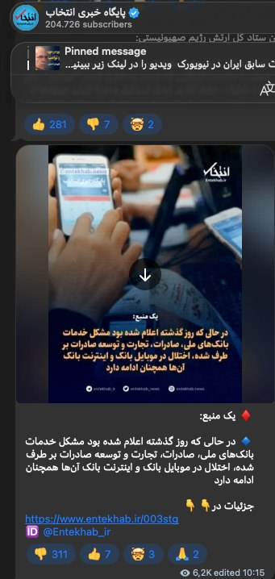

↩️ Quoted tweet: Shin ✓ @hey_itsmyturn Sat, 13 Jun 2026 08:51:45 UTC Widespread interruption in Iranian banking systems including e-banking and ATM machines. ↩️ توییت نقل‌قول شده — برای پاسخ، پست زیر را ببینید. ترجمه خودکار فارسی اختلال گسترده در سیستم‌های…

## Shin_Persian — post 7089

↩️ Quoted tweet:
Shin ✓ @hey_itsmyturn
Sat, 13 Jun 2026 08:51:45 UTC

Widespread interruption in Iranian banking systems including e-banking and ATM machines.

↩️ توییت نقل‌قول شده — برای پاسخ، پست زیر را ببینید.

ترجمه خودکار فارسی

اختلال گسترده در سیستم‌های بانکی ایران از جمله بانکداری الکترونیک و دستگاه‌های خودپرداز (ATM).

𝕏 · @shin_persian

## Shin_Persian — post 7088

Emanuel (Mannie) Fabian ✓ @manniefabian
Mon, 15 Jun 2026 06:55:30 UTC

Defense Minister Israel Katz says Israel will not withdraw from southern Lebanon, following the announcement of a ceasefire between the US and Iran, which supposedly also includes ending the fighting against Hezbollah.

"Prime Minister Benjamin Netanyahu and I are leading a clear policy that determines that the IDF will remain in the security zones in Lebanon, Syria, and Gaza, without any time limit, to protect the border and Israeli communities from there against jihadist elements," Katz says in a statement.

He says the security zones will be "cleared of local residents, and all terror infrastructure, above and below ground, including the houses in the contact-line villages that served as terror outposts, will be destroyed."

Katz says that holding onto the security zones is "among the IDF's greatest achievements" in the war, and therefore, "we oppose an IDF withdrawal from Lebanon, despite all the existing pressures and those that will still come."

"Prime Minister Netanyahu made these points clear to US President Trump and to other senior American officials, and I also made this clear yesterday to US Secretary of War Pete Hegseth," he says, adding that the IDF also supports holding onto the security zone in Lebanon.

"We will not compromise on Israel's security interests and the protection of our citizens, and we will not withdraw from the security zones," Katz says.

Katz also warns that "if Iran attacks Israel because of the events in Lebanon, we will strike it with full force."

"We are committed only to our citizens and to the security of the State of Israel," he adds.

ترجمه خودکار فارسی

ایسرائیل کاتس، وزیر دفاع، در پی اعلام آتش‌بس میان ایالات متحده و ایران که ظاهراً شامل پایان درگیری‌ها علیه حزب‌الله نیز می‌شود، می‌گوید اسرائیل از جنوب لبنان عقب‌نشینی نخواهد کرد.

کاتس در بیانیه‌ای می‌گوید: «نخست‌وزیر بنیامین نتانیاهو و من در حال هدایت سیاست روشنی هستیم که تعیین می‌کند ارتش دفاعی اسرائیل (IDF) بدون هیچ محدودیت زمانی در مناطق امنیتی در لبنان، سوریه و غزه باقی خواهد ماند تا از مرزها و جوامع اسرائیلی در برابر عناصر جهادی محافظت کند.»

او می‌گوید که مناطق امنیتی از «ساکنان محلی تخلیه خواهد شد و تمام زیرساخت‌های تروریستی، در بالا و زیر زمین، از جمله خانه‌های روستاهای خط تماس که به عنوان پایگاه‌های تروریستی خدمت می‌کردند، نابود خواهند شد.»

کاتس می‌گوید که حفظ مناطق امنیتی «از جمله بزرگترین دستاوردهای ارتش دفاعی اسرائیل» در جنگ است و بنابراین، «ما با وجود تمام فشارهای موجود و فشارهایی که در آینده وارد خواهد شد، با عقب‌نشینی ارتش از لبنان مخالف هستیم.»

او می‌گوید: «نخست‌وزیر نتانیاهو این نکات را برای پرزیدنت ترامپ، رئیس‌جمهور آمریکا و دیگر مقامات ارشد آمریکایی روشن کرده است و من نیز روز گذشته این موضوع را برای پیت هگست، وزیر جنگ ایالات متحده روشن کردم.» وی افزود که ارتش دفاعی اسرائیل نیز از حفظ منطقه امنیتی در لبنان حمایت می‌کند.

کاتس می‌گوید: «ما بر سر منافع امنیتی اسرائیل و حفاظت از شهروندانمان سازش نخواهیم کرد و از مناطق امنیتی عقب‌نشینی نخواهیم کرد.»

کاتس همچنین هشدار داد که «اگر ایران به دلیل حوادث لبنان به اسرائیل حمله کند، ما با تمام قوا به آن ضربه خواهیم زد.»

او افزود: «ما فقط در برابر شهروندان خود و امنیت دولت اسرائیل متعهد هستیم.»

𝕏 · @shin_persian

## Shin_Persian — post 7087

Shin ✓ @hey_itsmyturn
Mon, 15 Jun 2026 06:53:47 UTC

Now Ghalibaf will slowly unplug Mojtaba’s life support 🫪

ترجمه خودکار فارسی

حالا قالیباف به آرامی دستگاه‌های علائم حیاتی مجتبی را از برق خواهد کشید 🫪

𝕏 · @shin_persian

## FarsiVOA — post 220791

  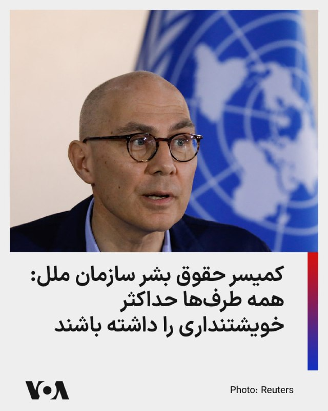

ولکر تورک، کمیسر عالی حقوق بشر سازمان ملل متحد، از اعلام توافق صلح میان آمریکا و جمهوری اسلامی استقبال کرد و از همه طرف‌ها در منطقه خواست «حداکثر خویشتنداری» را به خرج دهند.

تورک روز دوشنبه گفت از اعلام توافقی که به گفته او شامل آتش‌بس فوری و دائمی، بازگشایی تنگه هرمز و چارچوبی برای مذاکرات بیشتر است، استقبال می‌کند. او افزود در این «لحظه شکننده»، همه طرف‌ها باید برای اجرای سریع و با حسن نیت توافق به دست آمده تلاش کنند.

اظهارات کمیسر عالی حقوق بشر سازمان ملل پس از آن مطرح شد که مقام‌های آمریکایی و مقام‌های جمهوری اسلامی از دستیابی به توافقی اولیه برای پایان دادن به جنگ و بازگشایی تنگه هرمز خبر دادند؛ توافقی که باعث افت قیمت نفت شد، اما سرنوشت برنامه هسته‌ای جمهوری اسلامی را به مذاکرات بعدی موکول می‌کند.

رویترز نوشت این توافق، هرچند هنوز در حد چارچوب است، بزرگ‌ترین پیشرفت برای حل مناقشه‌ای به شمار می‌رود که از ماه فوریه، با حملات مشترک آمریکا و اسرائیل به خاک ایران آغاز شد و هزاران کشته برجای گذاشت.
@FarsiVOA

## FarsiVOA — post 220790

  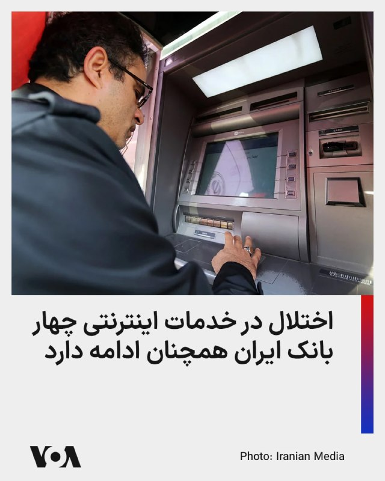

با وجود اعلام مقام‌های بانکی درباره رفع اختلال در خدمات بانک‌های ملی، تجارت، صادرات و توسعه صادرات، خبرگزاری فارس وابسته به سپاه اعلام کرد که بخشی از خدمات غیرحضوری و اینترنتی این بانک‌ها همچنان با اختلال مواجه است.

پیش‌تر این بانک‌ها در اطلاعیه‌های جداگانه اعلام کرده بودند که تمامی خدمات کارتی و سامانه‌های اینترنتی و موبایل‌بانک به حالت عادی بازگشته است.

فارس گزارش داد در حال حاضر خدمات مبتنی بر کارت در پایانه‌های فروشگاهی و دستگاه‌های خودپرداز این بانک‌ها فعال می باشد، اما بخشی از خدمات اینترنتی و غیرحضوری همچنان دچار اختلال است.

شورای هماهنگی بانک‌ها، وابسته به ساختار بانکی جمهوری اسلامی، روز شنبه ۲۴ خرداد حمله سایبری به سامانه‌های چهار بانک ملی، تجارت، صادرات و توسعه صادرات را تأیید کرده بود.
@FarsiVOA

## FarsiVOA — post 220789

  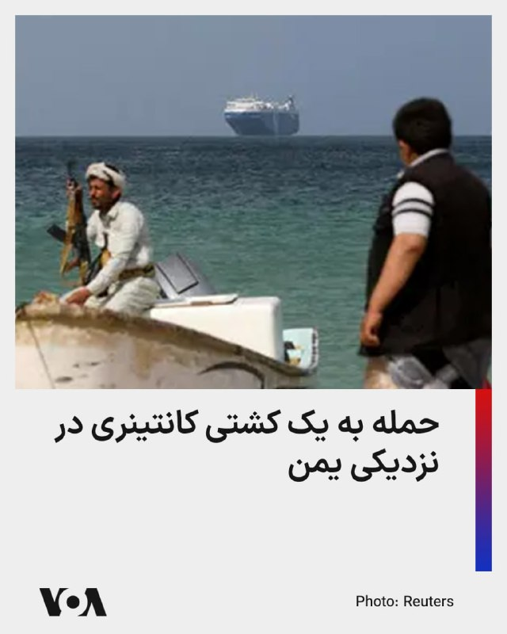

مرکز عملیات تجارت دریایی بریتانیا اعلام کرد یک کشتی کانتینری در ۱۴ مایل دریایی جنوب ساحل یمن هدف حمله قرار گرفته است.

در هشدار این مرکز آمده است یک قایق کوچک به کشتی کانتینری نزدیک شد، سرنشینان قایق به سمت کشتی شلیک کردند و تلاش کردند سوار آن شوند.

مرکز عملیات تجارت دریایی بریتانیا اعلام کرد مقام‌ها در حال بررسی این حادثه هستند و از کشتی‌های عبوری خواست با احتیاط در منطقه تردد کنند و هرگونه فعالیت مشکوک را گزارش دهند.

این حادثه در حالی رخ می‌دهد که مسیرهای دریایی اطراف یمن در ماه‌های اخیر بارها شاهد حمله، تهدید یا نزدیک شدن قایق‌های مشکوک به کشتی‌های تجاری بوده‌اند.
@FarsiVOA

## FarsiVOA — post 220788

🔺والتز: توافق باید غنی‌سازی و حمایت از حزب‌الله و گروه‌های نیابتی را متوقف کند

▪️سفیر آمریکا در سازمان ملل گفت توافق با جمهوری اسلامی باید این حکومت را به خروج اورانیوم با غنای بالا، کنار گذاشتن ظرفیت غنی‌سازی و توقف حمایت از گروه‌های نیابتی از جمله حوثی‌ها، حزب‌الله، حماس و شبه‌نظامیان عراق متعهد کند.

▪️مایک والتز در گفت‌وگو با ای‌بی‌سی‌نیوز تأکید کرد برخلاف برجام، بر پایه «پرداخت در برابر عملکرد» و راستی‌آزمایی سخت‌گیرانه تنظیم خواهد شد.

▪️او اضافه کرد که در هرگونه آزادسازی دارایی‌های مسدودشده یا کاهش تحریم‌ها، پول یا امتیاز اقتصادی پیشاپیش به جمهوری اسلامی داده نخواهد شد، و گفت هرگونه منفعت اقتصادی برای جمهوری اسلامی به اجرای تعهدات از سوی این حکومت وابسته خواهد بود.

⬇️ بیشتر بخوانید:
https://ir.voanews.com/a/ambassador-waltz-on-iran-negotiations/8161005.html

## FarsiVOA — post 220787

  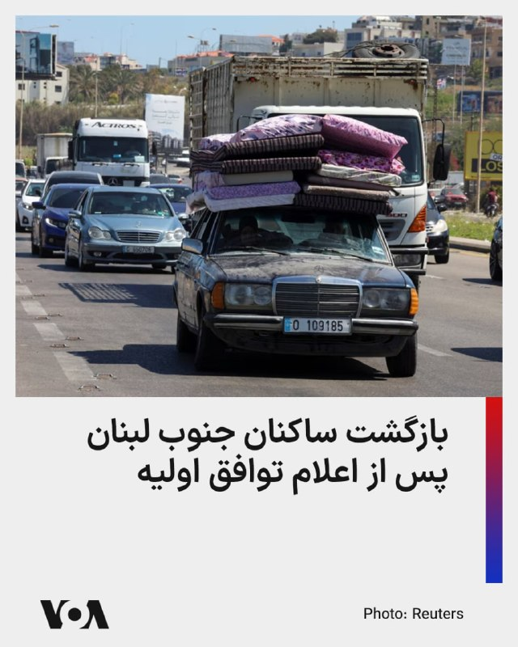

تصاویر منتشرشده از خبرگزاری‌ها نشان می‌دهد شماری از ساکنان آواره جنوب لبنان، پس از اعلام توافق اولیه میان آمریکا و جمهوری اسلامی، راهی روستاهای خود در جنوب لبنان شده‌اند.

هنوز روشن نیست ارتش اسرائیل اجازه بازگشت ساکنان را به همه روستاهای جنوب لبنان بدهد. تایمز اسرائیل نوشت احتمالاً مجوز بازگشت، بسته به موقعیت هر روستا، متفاوت خواهد بود.

بازگشت بخشی از آوارگان در حالی آغاز شده که مقام‌های جمهوری اسلامی و پاکستان گفته‌اند تفاهم آمریکا و جمهوری اسلامی شامل پایان عملیات نظامی در همه جبهه‌ها، از جمله لبنان، است.

وزیر دفاع اسرائیل اما پس از اعلام توافق گفت اسرائیل از جنوب لبنان عقب‌نشینی نخواهد کرد.
@FarsiVOA

## FarsiVOA — post 220786

  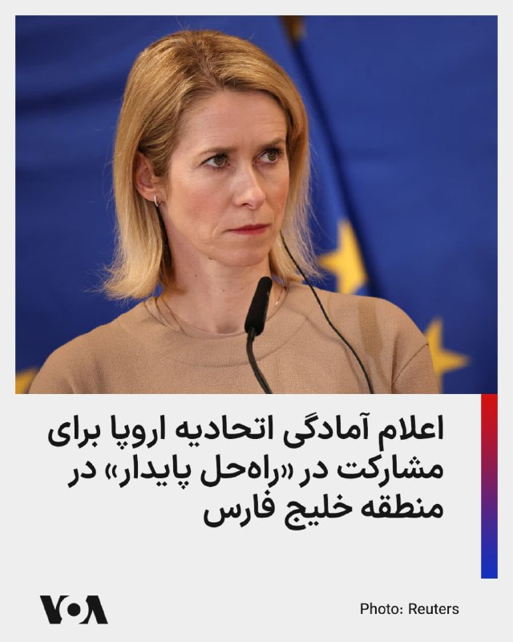

مسئول سیاست خارجی اتحادیه اروپا با استقبال از توافق اعلام‌شده میان ایالات متحده و حکومت ایران اعلام کرد که این اتحادیه آماده است تا در دستیابی به «یک راه‌حل پایدار» در منطقه خلیج فارس مشارکت کند.

کایا کالاس، روز دوشنبه در شبکه اجتماعی ایکس نوشت که این توافق «یک پیشرفت بالقوه» را نشان می‌دهد و می‌تواند «فضای بسیار مورد نیاز برای مذاکرات عمیق‌تر درباره برنامه هسته‌ای ایران و سایر مسائل حیاتی» را فراهم کند.

او همچنین افزود که پس از اجرا، این توافق به کاهش بحران جهانی انرژی کمک می‌کند.

کالاس نوشت: «من در روزهای اخیر با همتایان ایرانی و کشورهای حوزه خلیج فارس گفت‌وگو کرده‌ام و امروز، وزرای خارجه اتحادیه اروپا درباره این‌که چگونه اتحادیه اروپا می‌تواند در مرحله بعدی به‌طور نزدیک درگیر باشد، بحث خواهند کرد.»

مسئول سیاست خارجی اتحادیه اروپا از «اهرم‌های اقتصادی و تخصص هسته‌ای» و همچنین «روابط دیرینه با شرکای خلیج فارس»، به عنوان ابزارهای این اتحادیه در زمینه مشارکت برای رسیدن به یک توافق پایدار نام برد.
@FarsiVOA

## FarsiVOA — post 220785

  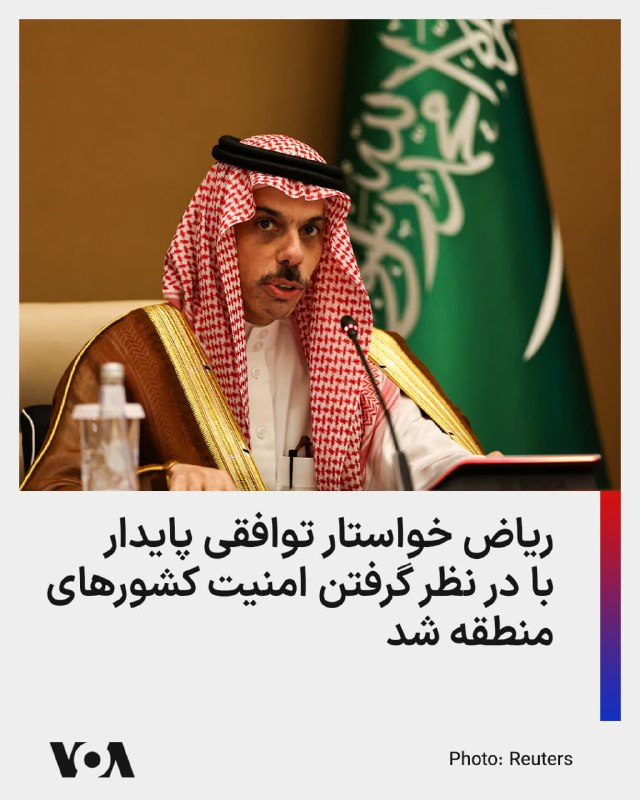

وزارت خارجه عربستان سعودی اعلام کرد از دستیابی به توافق میان ایالات متحده آمریکا و جمهوری اسلامی برای توقف عملیات نظامی و آغاز مذاکرات تفصیلی به مدت ۶۰ روز با هدف رسیدن به توافق دائمی استقبال می‌کند.

ریاض ضمن قدردانی از نقش میانجی‌گری پاکستان و قطر، از تلاش‌های دو طرف برای رسیدن به این توافق نیز تمجید کرد.

در این بیانیه همچنین بر اهمیت بازگشت امنیت و آزادی کشتیرانی در تنگه هرمز تنگه هرمز مطابق وضعیت پیش از ۲۸ فوریه تأکید شده و عربستان خواستار توافقی پایدار با در نظر گرفتن امنیت کشورهای منطقه و احترام به حاکمیت دولت‌ها شد.
@FarsiVOA

## FarsiVOA — post 220784

  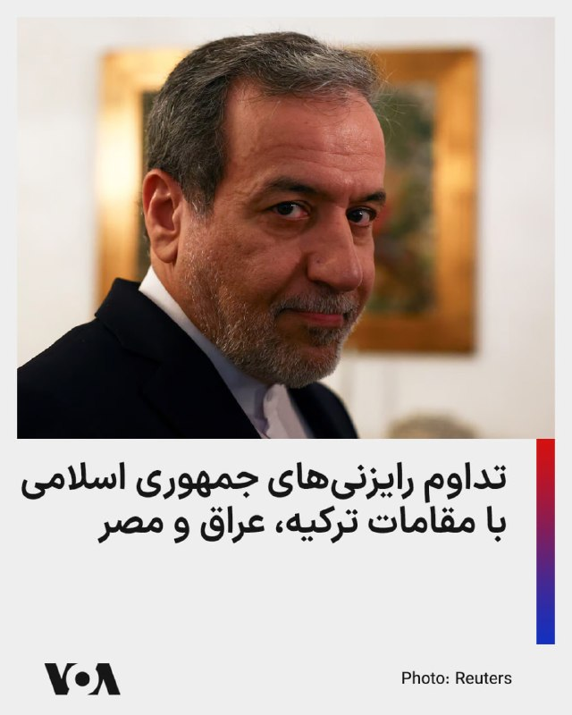

وزیر امور خارجه جمهوری اسلامی، در تماس‌های تلفنی جداگانه با هاکان فیدان، فواد حسین و بدر عبدالعاطی، وزرای امور خارجه ترکیه، عراق و مصر، درباره روند و مفاد «تفاهم اسلام‌آباد» گفت‌وگو و رایزنی کرد.

به گزارش وب‌سایت اطلاع‌رسانی دولت، عراقچی در این گفت‌وگوها از مواضع و نقش این سه کشور در حمایت از برقراری آتش‌بس و تفاهم میان تهران و واشنگتن قدردانی، و بر ضرورت توقف درگیری‌ها میان اسرائيل و لبنان تاکید کرده است.

وزرای خارجه ترکیه، عراق و مصر، نیز در این گفت‌وگوها بر تداوم رایزنی‌ و همکاری‌ نزدیک در خصوص تحولات منطقه‌ای و ضرورت تقویت تلاش‌های دیپلماتیک برای حفظ صلح و ثبات تأکید کرده‌اند.

ترکیه و مصر به همراه عربستان و پاکستان، چهار کشوری بودند که برای به نتیجه رسیدن تفاهم اولیه آمریکا و جمهوری اسلامی به میزبانی اسلام‌آباد، جلسات متعددی را برگزار کردند.
@FarsiVOA

## FarsiVOA — post 220783

  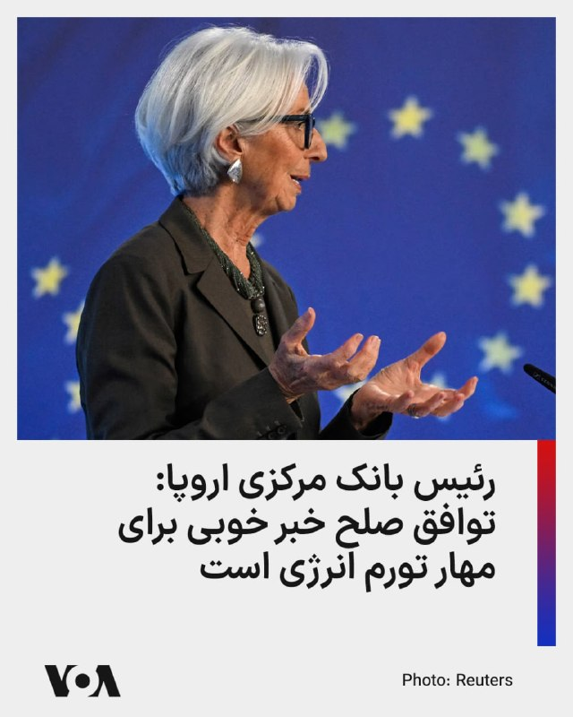

کریستین لاگارد، رئیس بانک مرکزی اروپا، از توافق موقت آمریکا و جمهوری اسلامی برای پایان جنگ و بازگشایی تنگه هرمز استقبال کرد و آن را، در صورت تأیید و امضای رسمی، «خبر خوب» خواند.

لاگارد روز دوشنبه در گفت‌وگو با رادیو فرانس کالچر گفت اگر این خبر در روزهای آینده با تحولات عملی و امضای یادداشت تفاهم تأیید شود، باید از آن استقبال کرد؛ به‌ویژه اگر به بازگشایی و مین‌روبی تنگه هرمز منجر شود.

او هم‌زمان هشدار داد که افزایش قیمت انرژی در هفته‌های اخیر به بخش‌های دیگر اقتصاد سرایت کرده و آثار غیرمستقیم تورم در نقاط مختلف دیده می‌شود.

به گفته لاگارد، اگر تورم دوباره از کنترل خارج شود، بازگرداندن آن بسیار دشوارتر و پرهزینه‌تر خواهد بود. بانک مرکزی اروپا هفته گذشته برای نخستین بار پس از چند سال نرخ بهره را افزایش داد.

لاگارد با این حال تأکید کرد داستان هنوز تمام نشده و موضوع غنی‌سازی اورانیوم جمهوری اسلامی باید در مذاکرات بعدی بررسی، توافق و نهایی شود.
@FarsiVOA

## FarsiVOA — post 220782

🔺کاتز: در صورت حمله جمهوری اسلامی با تمام قوا پاسخ می‌دهیم

▪️در حالی که مقام‌های جمهوری اسلامی و پاکستان گفته‌اند توافق با آمریکا شامل پایان عملیات در همه جبهه‌ها، از جمله لبنان است، وزیر دفاع اسرائیل هشدار داد اگر جمهوری اسلامی به دلیل تحولات در لبنان به اسرائیل حمله کند، اسرائیل «با تمام قوا» پاسخ خواهد داد.

▪️یسرائیل کاتز، پس از اعلام توافق آمریکا و جمهوری اسلامی گفت اسرائیل از جنوب لبنان عقب‌نشینی نخواهد کرد؛ هرچند گفته می‌شود توافق اعلام‌شده، پایان درگیری‌ها با حزب‌الله را نیز در بر می‌گیرد.

▪️کاتز در بیانیه‌ای گفت بر اساس سیاست روشن او و بنیامین نتانیاهو، ارتش اسرائیل بدون محدودیت زمانی در مناطق امنیتی لبنان، سوریه و غزه باقی خواهد ماند.

⬇️ بیشتر بخوانید:
https://ir.voanews.com/a/katz-says-if-iran-attack-israel-we-fully-respond/8161004.html

## FarsiVOA — post 220781

🔺جنگ، قطع اینترنت و قطعی برق بیماران نادر را در معرض خطر قرار داد

▪️گزارش همشهری از وضعیت بیماران نادر در دوره جنگ ۴۰ روزه نشان می‌دهد بحران درمان در کشور با آغاز جنگ لایه‌های پنهان خود را آشکارتر و خطرناک‌تر کرد.

▪️پیش از جنگ نیز هشدارها درباره کمبود دارو، فرسایش ذخایر دارویی و مشکل تأمین داروهای وارداتی جدی بود. سخنگوی کمیسیون بهداشت مجلس پیش‌تر از کمبود نزدیک به هزار قلم دارو در کشور خبر داده و خواستار ورود وزارت بهداشت، سازمان غذا و دارو و بیمه‌ها به مدیریت بحران شده بود.

▪️پیش از جنگ، ترکیبی از تحریم، مشکل انتقال پول، ضعف واردات، کمبود ارز، قیمت‌گذاری غیرواقعی، ناکارآمدی زنجیره توزیع و پوشش ناقص بیمه‌ای، دسترسی بیماران نادر را دشوار کرده بود.

⬇️ بیشتر بخوانید:
https://ir.voanews.com/a/8161003.html

## FarsiVOA — post 220780

  

📸اینستاگرام صدای آمریکا را هم اکنون فالو کنید تا از آخرین خبرها مطلع بمانید:
https://www.instagram.com/voafarsi/

📡همچنین جهت اطلاع از بروزترین فرکانسهای ماهواره‌ای صدای آمریکا به لینک زیر مراجعت فرمایید:
https://ir.voanews.com/satellite

این پست را با دوستانتان به اشتراک بگذارید
@FarsiVOA

## FarsiVOA — post 220779

Farsi VOA pinned an audio file

## FarsiVOA — post 220778

  <a href="https://t.me/farsivoa/220778" target="_blank">📎 Download file</a>

🔴📢‌ پادکست خبری یکشنبه ۲۴خرداد ۱۴۰۵

🛜در صورتی که با مشکل اینترنت مواجه هستید میتوانید اخبار صدای آمریکا را از نسخه‌های پادکست خبری ما روزانه دنبال کنید و یا اخبار را از نسخه سبک وب‌سایت ما پیگیر باشید:
https://ir.voanews.com/lite

📡بروزترین فرکانسهای ماهواره‌ای را نیز میتوانید از صفحه زیر پیگیری کنید:
https://ir.voanews.com/satellite

🔔دیگر شبکه‌های اجتماعی ما را هم دنبال کنید:
https://linktr.ee/voafarsi

ما را به اشتراک بگذارید
@farsivoa

## FarsiVOA — post 220777

  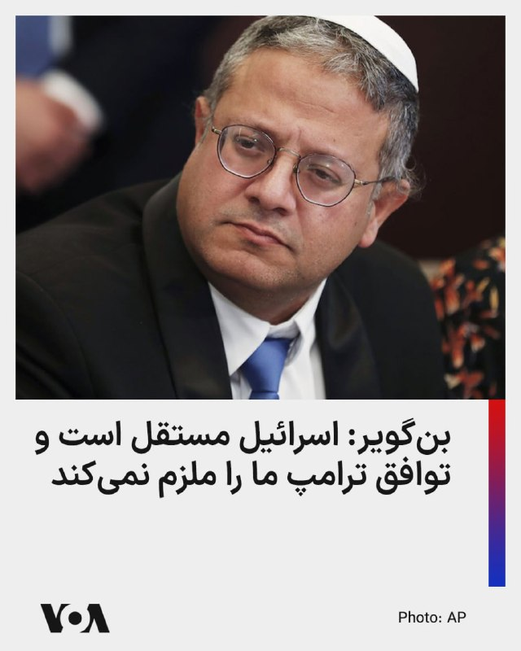

ایتامار بن‌گویر، وزیر امنیت ملی اسرائیل، در واکنش به توافق اعلام‌شده از سوی دونالد ترامپ با جمهوری اسلامی گفت این توافق اسرائیل را ملزم نمی‌کند.

به گزارش تایمز اسرائیل، بن‌گویر در بیانیه‌ای گفت: «توافق ترامپ ما را ملزم نمی‌کند. اسرائیل تابع آمریکا نیست. ما کشوری مستقل و دارای حاکمیت هستیم.»

او افزود اسرائیل طرف این توافق نیست و آن را توافقی ندانست که به گفته او امنیت اسرائیل را تضمین کند.

بن‌گویر همچنین گفت اسرائیل نباید از هیچ‌یک از مناطقی که نیروهایش در جریان درگیری‌ها در لبنان تصرف کرده‌اند، عقب‌نشینی کند.
@FarsiVOA

## FarsiVOA — post 220776

  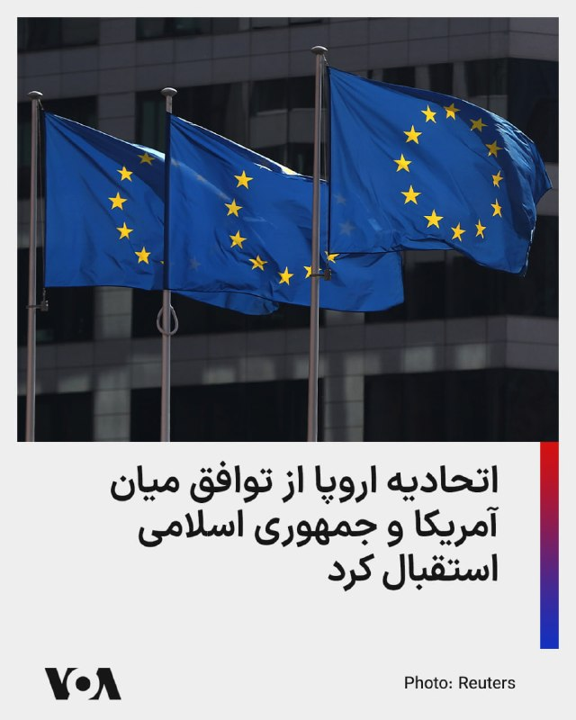

رئیس شورای اروپا از توافق اعلام‌‌شده میان آمریکا و حکومت ایران استقبال کرد و آن را گامی مهم در جهت پایان دادن به تنش‌ها و بازگشت ثبات در منطقه دانست.

آنتونیو کوستا در پیامی در شبکه اجتماعی ایکس نوشت که امیدوار است این جنگ به پایان برسد و آزادی کشتیرانی در تنگه هرمز به ‌طور کامل احیا شود.

او همچنین از تلاش‌های دیپلماتیک «مستمر» تمامی طرف‌هایی که زمینه دستیابی به این توافق را فراهم کردند، قدردانی کرد.

رئیس شورای اروپا تأکید کرد: «اکنون باید سلاح‌ها خاموش شوند و اختلافات باقی‌مانده مطابق با حقوق بین‌الملل و از طریق روش‌های مسالمت‌آمیز حل‌وفصل شوند.»

او همچنین اعلام کرد که شورای اروپا آماده است برای پیشبرد یک راهبرد جامع با هدف دستیابی به صلحی پایدار در سراسر خاورمیانه نقش‌ آفرینی کند.
@FarsiVOA

## FarsiVOA — post 220775

  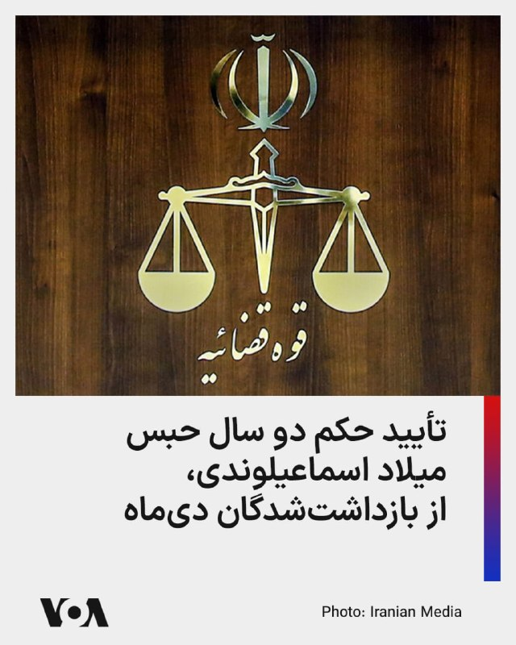

حکم قضایی شامل دو سال حبس برای میلاد اسماعیلوندی، از بازداشت‌شدگان اعتراضات دی‌ماه ۱۴۰۴، از سوی دادگاه تجدیدنظر استان خوزستان تایید شد.

هرانا، ارگان خبری مجموعه فعالان حقوق بشر در ایران، گزارش داد که این زندانی سیاسی که در زندان شیبان اهواز محبوس است، پیشتر در مرحله بدوی توسط شعبه یک دادگاه انقلاب اهواز به دو سال حبس، دو سال منع خروج از کشور و یک سال الزام به حضور در اداره امر به معروف و نهی از منکر محکوم شده بود.

بر اساس این گزارش، این مجازات‌ها توسط شعبه ۱۶ دادگاه تجدیدنظر استان خوزستان عینا تایید شد.

در حکم صادر شده علیه آقای اسماعیلوند، که روز ۲۸ دی ماه ۱۴۰۴ و در جریان اعتراضات سراسری، بازداشت شد، او به «اخلال در نظم عمومی» متهم شده است.

جمهوری اسلامی با بازداشت‌های خودسرانه معترضان، به نقض حقوق بازداشت‌شدگان به ویژه بازداشت‌شدگان و زندانیان سیاسی متهم است.
@FarsiVOA

## FarsiVOA — post 220774

  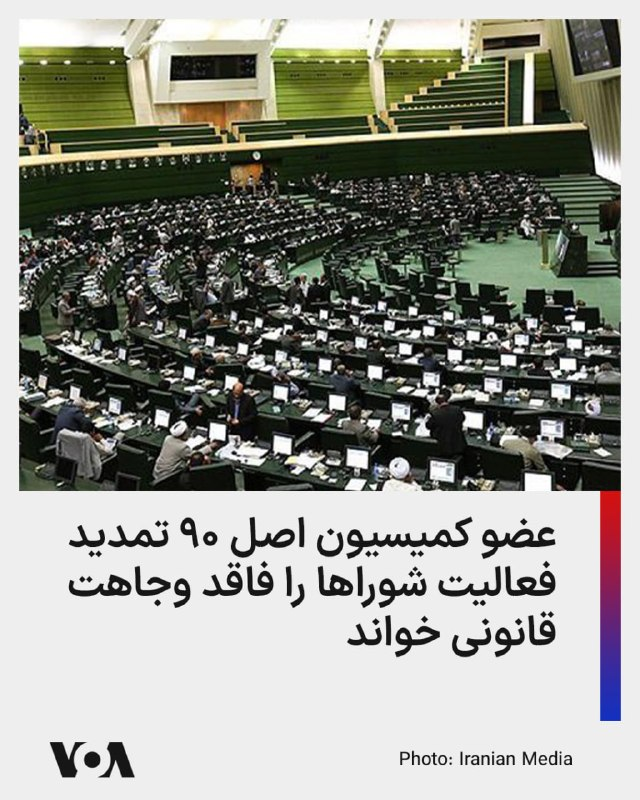

یک عضو کمیسیون اصل نود مجلس شورای اسلامی با انتقاد از تصمیم شورای عالی امنیت ملی مبنی تمدید فعالیت ششمین دوره شوراهای شهر، تاکید کرد که هیچ‌کس به جز مجلس نمی‌تواند در اینباره تصمیم‌گیری کند.

علیرضا زندیان در گفتگو با خبرگزاری دولتی ایسنا، با اشاره به تعویق برگزاری انتخابات شوراها به دلیل شرایط جنگی، به برخی از اظهارنظرها مبنی تمدید فعالیت این دوره تا انتخابات ریاست جمهوری انتقاد کرد.

وی یادآور شد که «مجلس باید به این موضوع ورود و پایان فعالیت شورای ششم را اعلام کند» و وزارت کشور نیز می‌تواند تا زمان برگزاری انتخابات شوراها، امور مربوط به مدیریت شهری را برعهده بگیرد.

پیشتر ابراهیم رضایی، سخنگوی کمیسیون امنیت ملی مجلس شورای اسلامی به نقل از وزیر کشور اعلام کرده بود که با تصمیم شورای عالی امنیت ملی، فعلا انتخابات شوراها نمی‌شود و شوراهای فعلی به فعالیت خود ادامه می‌دهند.
@FarsiVOA

## FarsiVOA — post 220773

🔺وزیر خارجه پاکستان: توافق آمریکا و جمهوری اسلامی نشان‌دهنده قدرت دیپلماسی است

▪️در پی اعلام تفاهم میان ایالات متحده آمریکا و جمهوری اسلامی، محمد اسحاق دار، وزیر خارجه پاکستان، این تحول را «یک پیشرفت مهم» توصیف کرد که نشانه‌ای از قدرت دیپلماسی است.

▪️او همچنین از اعتماد رهبری آمریکا و جمهوری اسلامی به نقش میانجی پاکستان قدردانی کرد و تلاش‌های دیپلماتیک کشورهای منطقه از جمله عربستان سعودی، قطر، ترکیه، مصر و همچنین سازمان ملل متحد را در تسهیل این روند ستود.

▪️در جریان مذاکرات برای دستیابی به تفاهم میان آمریکا و جمهوری اسلامی، مقامات ارشد پاکستانی از جمله عاصم منیر، رئیس ستاد ارتش پاکستان چندین بار با هدف نهایی کردن تفاهم‌نامه به تهران سفر کردند.

⬇️ بیشتر بخوانید:
https://ir.voanews.com/a/pakistan-welcomes-reaching-mou-between-iran-usa/8161000.html

## FarsiVOA — post 220772

  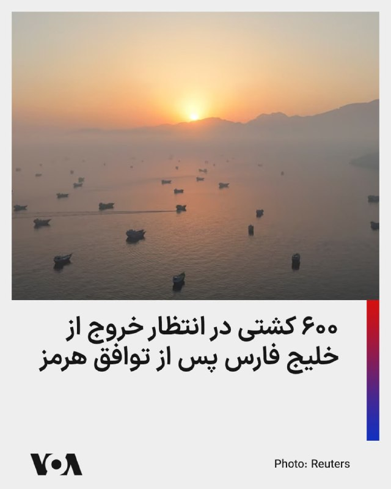

بلومبرگ گزارش داد اعلام توافق موقت آمریکا و جمهوری اسلامی برای بازگشایی تنگه هرمز، با استقبال محتاطانه مالکان کشتی و معامله‌گران روبه‌رو شده است. صنعت کشتیرانی منتظر اعلام جزئیات عبور بوده و هنوز نمی‌داند عبور ایمن از این مسیر در عمل چگونه تضمین خواهد شد.

بر اساس داده‌های کپلر، نزدیک به ۶۰۰ کشتی همچنان در خلیج فارس مانده‌اند و آماده خروج‌اند. صدها کشتی خالی نیز در سوی دیگر تنگه منتظرند تا در صورت بازگشایی مسیر، وارد خلیج فارس شوند.

بلومبرگ نوشت در ساعات نخست پس از انتشار خبر توافق، تردد در تنگه همچنان محدود بود و فقط یک نفتکش گاز طبیعی مایع به نام دیشا در حال حرکت به سوی هرمز دیده شد.

مالکان کشتی می‌گویند امنیت مسیر، احتمال وجود مین، پوشش بیمه و نحوه مدیریت عبور از گذرگاهی باریک همچنان روشن نیست.

به گفته تحلیلگران، کشتی‌های بارگیری‌شده احتمالاً نخستین گروهی خواهند بود که برای خروج آماده می‌شوند.

⬇️ بیشتر بخوانید:
https://ir.voanews.com/a/shipowners-seek-clarity-on-hormuz-deal-as-600-vessels-eye-exit/8161001.html

## DW_Farsi — post 125999

📸 جام جهانی ۲۰۲۶؛ پیروزی مقتدرانه آلمان بر کوراسائو با نتیجه ۷ بر ١

🔺 گزارشی از شهرام احدی

تیم ملی فوتبال آلمان در نخستین دیدار خود در مسابقات جام جهانی ۲۰۲۶ به مصاف کوراسائو رفت؛ تیمی که اولین حضورش در این رقابت‌ها را تجربه می‌کند. دیدار دو تیم در حضور ۶۸ هزار تماشاگر در ورزشگاه هیوستون برگزار شد.

تیم ملی فوتبال کوراسائو اولین حضور خود در رقابت‌های جام جهانی را تجربه می‌کند و همین حضور به نوبه خود دلیل شادی هوداران این تیم است، سوای اینکه دیدارهای ملی‌پوشان این کشور چه نتایجی به دنبال داشته باشد.

تیم ملی فوتبال آلمان تا کنون ۴ بار قهرمان فوتبال جهان شده است: ۱۹۵۴، ۱۹۷۴، ۱۹۹۰ و ۲۰۱۴. دوره‌های اخیر جام جهانی در روسیه و قطر با نمایش ضعیف ملی‌پوشان آلمان همراه بود که این بار امیدوارند، دوره‌های پیش را جبران کرده و چهره‌ای قوی از خود نشان دهند.

ملی‌پوشان آلمان در این دیدار نمایشی تماشایی ارائه کرده و حریف خود را ۷ بر یک شکست دادند.

@dw_farsi

## DW_Farsi — post 125998

  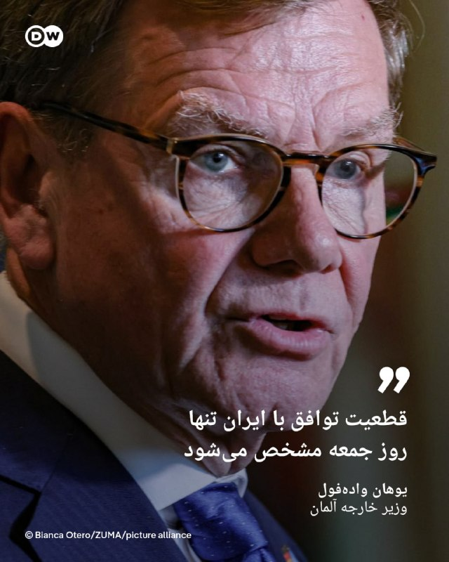

🔶 وزیر خارجه آلمان: قطعیت توافق با ایران تنها روز جمعه مشخص می‌شود

وزیر خارجه آلمان در واکنش به توافق ایران و آمریکا، این امر را "فرصتی برای کل منطقه" توصیف کرد، اما با این حال نسبت به خو‌ش‌بینی زودهنگام هشدار داد.

یوهان واده‌فول روز دوشنبه ۱۵ ژوئن (۲۵ خرداد) در حاشیه نشست وزرای خارجه اتحادیه اروپا در لوکزامبورگ گفت توافق اولیه "خبر خوبی" است اما در مورد محتوای واقعی آن تنها روز جمعه می‌توان با قطعیت صحبت کرد. او افزود: «فقط می‌توانم از همه طرف‌ها بخواهم که اجازه ندهند این فرصت از دست برود.»

واده‌فول این موضوع را در مورد لبنان نیز صادق دانسته و گفت: «ایران باید بر حزب‌الله اعمال نفوذ کند تا اطمینان حاصل شود که حملات بیشتری به اسرائیل صورت نمی‌گیرد.» او افزود در عین حال اسرائیل نباید دلیلی برای ادامه حملات در لبنان داشته باشد.

وزیر خارجه آلمان همچنین تأکید کرد تنگه هرمز باید برای تردد کشتی‌ها "بدون هیچ محدودیتی و بدون هیچ گونه عوارض یا هزینه‌های مشابه" باز شود. او افزود در جریان مذاکرات ۶۰ روز آینده پس از امضای توافق در روز جمعه باید تضمین شود که هیچ تهدیدی از سوی ایران وجود نخواهد داشت. واده‌فول گفت اروپا آماده است تا نقش خود را در بازگشایی مجدد مسیر کشتیرانی در تنگه هرمز ایفا کند.

از سوی دیگر کایا کالاس، مسئول سیاست خارجی اتحادیه اروپا نیز با استقبال از توافق ایران و آمریکا به خبرنگاران گفت که این توافق در مرحله نخست در مورد بازگشایی تنگه هرمز و پیشبرد مذاکرات در مورد مسائل کلیدی نظیر پرونده هسته‌ای ایران است. او اضافه کرد، اکنون در مورد چگونگی مشارکت اروپایی‌ها در این روند گفت‌وگو خواهد شد.

@dw_farsi

## DW_Farsi — post 125996

🎥 ورود خبرساز تیم ملی فوتبال ایران به لس‌آنجلس

تیم ملی فوتبال ایران ۲۷ ساعت قبل از نخستین دیدار خود در جام جهانی ۲۰۲۶ مقابل نیوزیلند، وارد اقامتگاه خود در لس‌آنجلس شد. همکارمان فرید اشرفیان از محل هتل ملی‌پوشان ایران در لس‌آنجلس و نیز تمرین این تیم در استادیوم گزارش می‌دهد.

@dw_farsi

## DW_Farsi — post 125995

  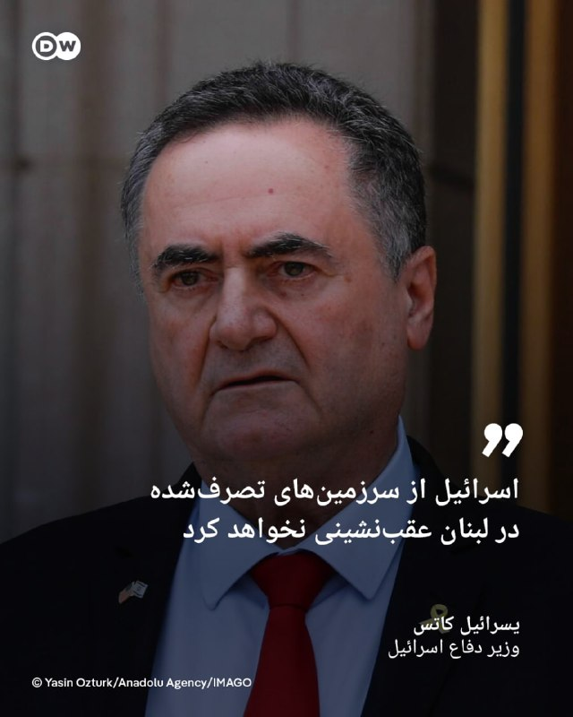

🔶 کاتس: اسرائیل از سرزمین‌های تصرف‌شده در لبنان عقب‌نشینی نخواهد کرد

یسرائیل کاتس، وزیر دفاع اسرائیل، روز دوشنبه ۱۵ ژوئن (۲۵ خرداد) با انتشار بیانیه‌ای اعلام کرد که اسرائیل از مناطق تصرف‌شده در لبنان عقب‌نشینی نخواهد کرد و اگر ایران به دلیل وقایع لبنان به اسرائیل حمله کند، اسرائیل تلافی خواهد کرد.

در همین حال یک مقام اسرائیلی به نشریه "جروزالم پست" گفت که اسرائیل به‌رغم درخواست ایران در چارچوب تفاهم‌نامه‌‌ای که تهران و واشنگتن به آن رسیده‌اند، از جنوب لبنان خارج نخواهد شد. به نوشته این روزنامه یک مقام ارتش اسرائیل نیز تأیید کرد اگر حزب‌الله به آتش‌بس پایبند بماند، اسرائیل به هیچ نقطه‌ای از لبنان حمله نخواهد کرد.

شهباز شریف، نخست‌وزیر پاکستان، گفته است که موضوع لبنان در توافق آمریکا و ایران ذکر شده است. به گفته او تهران و واشنگتن در مورد "پایان همه درگیری‌های نظامی در همه جبهه‌ها از جمله لبنان" موافقت کرده‌اند. توقف حملات اسرائیل به لبنان یکی از درخواست‌های اصلی جمهوری اسلامی برای ادامه مذاکرات با آمریکا بوده است.

بنیامین نتانیاهو، نخست‌وزیر اسرائیل، پس از اعلام ترامپ مبنی بر توافق در حال شکل‌گیری میان ایران و آمریکا، تا کنون در این باره اظهارنظر نکرده است.

ساعاتی پیش از اعلام این توافق، نتانیاهو و کاتس در بیانیه‌ای مشترک از صدور دستور حمله ارتش به منطقه ضاحیه در حومه جنوبی بیروت خبر داده و تأکید کرده بودند که اسرائیل "حمله مستقیم به خاک خود را تحمل نخواهد کرد".

اکسیوس در همین رابطه گزارش داده بود ارتش اسرائیل اندکی پیش از انجام حمله به ضاحیه، سنتکام را در جریان اقدام خود گذاشته بود.

@dw_farsi

## DW_Farsi — post 125994

  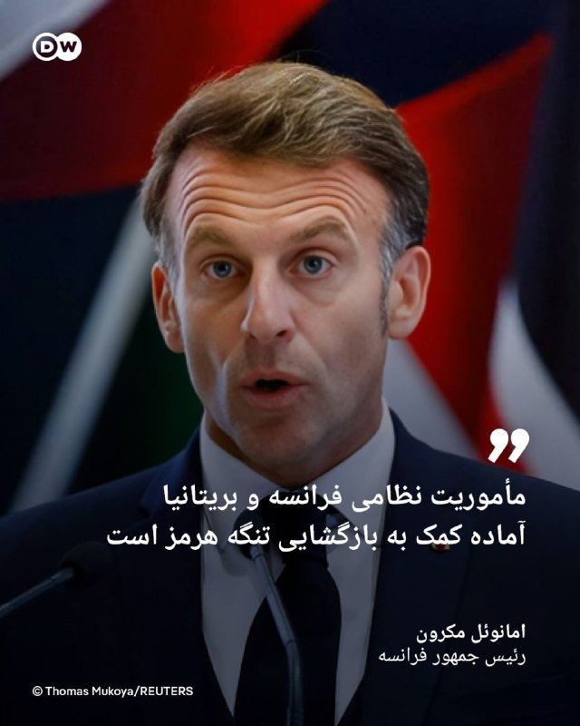

🔶 مکرون: مأموریت نظامی فرانسه و بریتانیا آماده کمک به بازگشایی تنگه هرمز است

امانوئل مکرون، رئیس جمهور فرانسه، اعلام کرد قصد دارد در اجلاس سران گروه ۷ درباره بازگشایی دائمی تنگه هرمز با رهبران دیگر کشورهای صنعتی گفت‌وگو و رایزنی کند. او گفت: «هدف این خواهد بود که پیامدهای این توافق، حمایت از لبنان، بازگشایی دائمی تنگه هرمز و نهایی کردن توافقی درباره برنامه هسته‌ای و برنامه موشکی ایران را روشن کنیم.»

رئیس جمهور فرانسه همچنین اعلام کرد مأموریت نظامی مشترک به رهبری فرانسه و بریتانیا برای کمک به تردد کشتی‌ها در تنگه هرمز آماده استقرار و به‌کارگیری است.

مکرون با انتشار پیامی در ایکس تأکید کرد: «از سرگیری تردد دریایی، بدون هیچ‌گونه محدودیت یا دریافت عوارض، یک شرط اساسی برای ثبات منطقه و اقتصاد جهانی است.»

نشست سران گروه ۷ از روز دوشنبه تا چهارشنبه (۱۵ تا ۱۷ ژوئن) به میزبانی فرانسه در شهر اویان برگزار خواهد شد. پیامدهای چارچوب توافق تازه اعلام‌شده بین ایالات متحده و ایران، یکی از بحث‌های اصلی این اجلاس است. دونالد ترامپ قرار است بعدازظهر دوشنبه (۱۵ ژوئن / ۲۵ خرداد) پس از ورود به فرانسه با مکرون دیدار کند.

@dw_farsi

## DW_Farsi — post 125993

  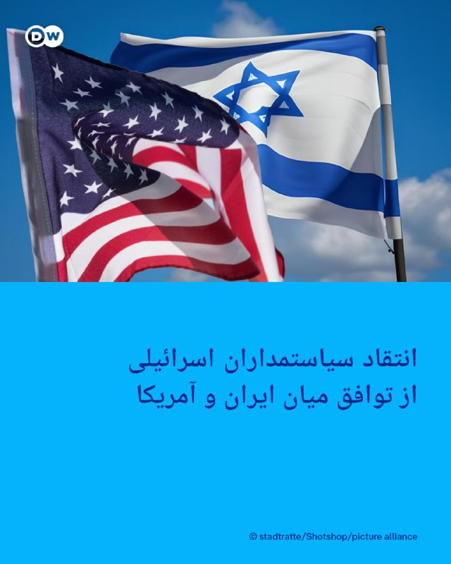

🔶 انتقاد سیاستمداران اسرائیلی از توافق میان ایران و آمریکا

یائیر گولان، رئیس حزب "دموکرات‌ها" در اسرائیل تفاهم‌نامه آمریکا با ایران را برای این کشور "فاجعه‌بار" توصیف کرد. به گزارش سایت "تایمز اسرائیل"، گولان اظهار داشت: «دستاوردهای عظیم نظامی که با شجاعت خلبانان‌مان و خون سربازان‌مان به دست آمده بود، از بین رفت، در حالی‌که نتانیاهو کنار ایستاده بود؛ ضعیف، بیمار، منزوی و فاقد نفوذ.»

این سیاستمدار اسرائیلی این وضعیت را "اوج سال‌ها شکست" بنیامین نتانیاهو خواند و گفت: «مردی که وعده پیروزی داده بود، دوران مسئولیت خود را در حالی به پایان می‌رساند که دشمنان اسرائیل قوی‌تر و اسرائیل ضعیف‌تر شده است و بازدارندگی‌ای که با خون سربازان‌ ما ساخته شده بود، در مقابل چشمان‌مان در حال فرسایش است.»

هم‌زمان ایتامار بن‌گویر، وزیر امنیت ملی اسرائیل، نیز با انتشار بیانیه‌ای اعلام کرد توافقی که ترامپ با ایران به دست آورده، به معنای "متعهد کردن اسرائیل" نیست. او گفت: «اسرائیل تابع ایالات متحده نیست. ما کشوری مستقل و دارای حاکمیت هستیم.»

بن گویر تأکید کرد اسرائیل شریکی برای این توافق که امنیت این کشور را تضمین نمی‌کند، نیست و نباید از هیچ‌ منطقه‌ای که ارتش در لبنان تصرف کرده است، عقب‌نشینی کند.

@dw_farsi

## DW_Farsi — post 125988

🔶 دانش‌آموزان در جدال با معدل، شکاف آموزش، بی‌عدالتی و آینده

🔺 گزارشی از آتفه چهارمحالیان

طی هفته‌های اخیر، مناقشه بر سر تأثیر قطعی معدل در کنکور به یکی از مهم‌ترین اعتراضات دانش‌آموزی سال‌های اخیر ایران تبدیل شد. دانش‌آموزان و داوطلبان کنکور می‌گویند در شرایطی که نظام آموزشی با تعطیلی‌های مکرر، آموزش مجازی، نابرابری امکانات و بی‌ثباتی برنامه‌های آموزشی روبه‌رو بوده، افزایش نقش سوابق تحصیلی در پذیرش دانشگاه‌ها به زیان دانش‌آموزان مدارس عادی و مناطق محروم تمام می‌شود.

در فاصله ۱۲ تا ۱۶ خرداد ۱۴۰۵، دانش‌آموزان در شهرهای مختلف ایران، از تهران و مشهد تا اصفهان، شیراز، تبریز، رشت و کرمانشاه، در برابر ادارات آموزش‌وپرورش و نهادهای تصمیم‌گیر تجمع کردند و خواستار بازنگری در مصوبه تأثیر قطعی معدل شدند.

معترضان با اشاره به تعطیلی‌های آموزشی، تعویق آزمون‌ها، آموزش مجازی و آشفتگی برنامه‌ریزی درسی می‌پرسیدند: "در شرایطی که بر ما گذشت، چگونه درس می‌خواندیم؟" اعتراض‌ها در برخی شهرها به مقابل شورای عالی انقلاب فرهنگی نیز کشیده شد.

به گفته دانش‌آموزان معترض در گفت‌وگو با دویچه وله، اعمال سهم ۶۰ درصدی سوابق تحصیلی در شرایطی که سال تحصیلی با تعطیلی‌های مکرر، آموزش مجازی، اختلال‌های ناشی از جنگ، بلاتکلیفی در زمان برگزاری آزمون‌ها و افت کیفیت آموزشی همراه بوده، نه‌تنها به عدالت آموزشی منجر نشده بلکه آینده تحصیلی میلیون‌ها دانش‌آموز را به عواملی گره زده که خارج از اختیار آنان بوده است. خواسته اصلی تجمع‌کنندگان تبدیل "اثر قطعی" معدل به "تأثیر مثبت"، حذف سهمیه نمرات پایه یازدهم و بازنگری در سهم ۶۰ درصدی سوابق تحصیلی در مقررات کنکور بود.

@dw_farsi

## DW_Farsi — post 125987

  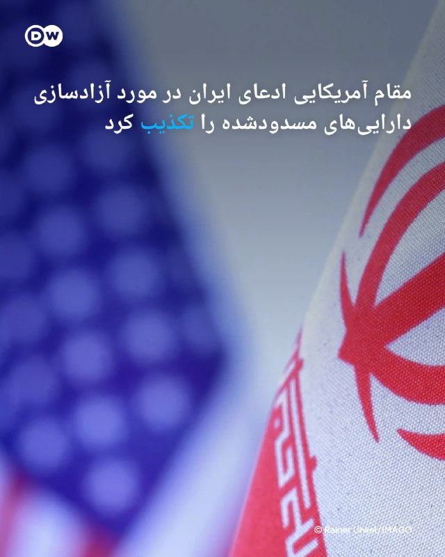

🔶 مقام آمریکایی ادعای ایران در مورد آزادسازی دارایی‌های مسدودشده را تکذیب کرد

یک مقام آمریکایی ادعای ایران مبنی بر دریافت میلیارد‌ها دلار از دارایی‌های مسدودشده، پیش از آغاز دوره ۶۰ روزه مذاکرات پس از امضای توافق در روز جمعه را رد کرد. این مقام که هویتش فاش نشده به شبکه سی‌ان‌ان گفت: «این موضوع کاملا نادرست است. این توافق بر پایه اجرای تعهدات است و هیچ یک از دارایی‌های مسدودشده تا زمانی که ایران تعهدات خود را اجرا نکند، آزاد نخواهد شد.»

این واکنش پس از آن مطرح شد که کاظم غریب‌آبادی، معاون وزیر خارجه ایران، گفته بود مرحله بعدی مذاکرات تهران و واشنگتن به شرطی است که آمریکا "ابتدا چند تعهد از جمله آزادسازی دارایی‌های ایران را که در خارج از کشور مسدود شده‌اند، عملی کند".

به نوشته سی‌‌ان‌ان‌ به نظر می‌رسد شکاف قابل توجهی میان دیدگاه‌های ایالات متحده و ایران درباره اقداماتی که باید پیش از آغاز دور بعدی مذاکرات انجام شوند، وجود دارد و دو طرف برداشت‌های متفاوتی در مورد پیش‌شرط‌های ورود به مرحله بعدی گفت‌وگوها دارند.

@dw_farsi

## DW_Farsi — post 125986

  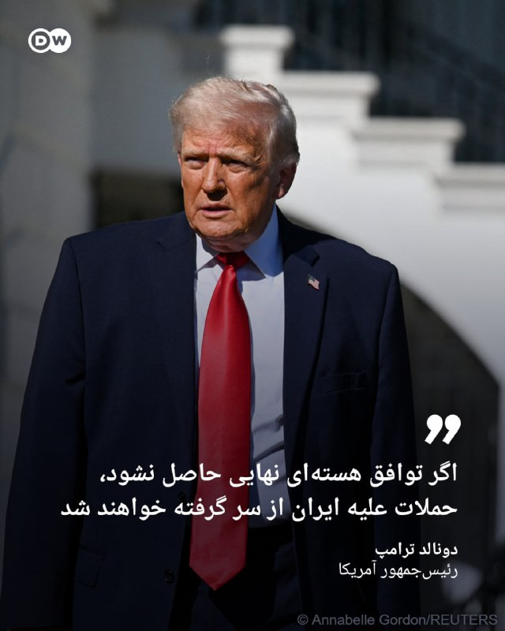

🔶 ترامپ: اگر توافق هسته‌ای نهایی حاصل نشود، حملات علیه ایران از سر گرفته خواهند شد

پس از اعلام حصول توافق میان ایران و آمریکا، دونالد ترامپ در مصاحبه‌ای با روزنامه "نیویورک تایمز" گفت اگر ایران به یک توافق هسته‌ای نهایی با ایالات متحده نرسد، حملات نظامی علیه این کشور از سر گرفته خواهند شد یا اینکه در ازای دریافت ۲۰ درصد از درآمدهای منطقه، ایالات متحده را به "نگهبان خاورمیانه" تبدیل خواهد کرد.

ترامپ در این مصاحبه گفته است که توافقی که با ایران به دست آمده، در نهایت تضمین خواهد کرد که تنگه هرمز "برای همیشه بدون عوارض" باشد.

او در بخش دیگری از این گفت‌وگو نخست‌وزیر اسرائیل را "فردی بسیار دشوار" توصیف کرده و گفت که بنیامین نتانیاهو باید قدردان باشد. ترامپ اظهار داشت: «او آدم بسیار دشواری است و راستش را بخواهید باید بابت این کار از ما سپاسگزار باشد، زیرا اگر ایران سلاح هسته‌ای داشت، اسرائیل حتی دو ساعت هم دوام نمی‌آورد.»

اسرائیل در مذاکرات مربوط به توافق تازه اعلام‌شده میان تهران و واشنگتن مشارکت نداشت و مفاد این توافق نگرانی‌های عمیقی را در میان مقام‌های این کشور برانگیخته است.

دونالد ترامپ در مقابل از شی جین‌‌پینگ، رهبر چین و ولادیمیر پوتین، رئیس جمهور روسیه، به دلیل کمک‌هایشان در پیشبرد این توافق تمجید کرد.

اسرائیل تا لحظه تنظیم این خبر هنوز در مورد توافق ایران و آمریکا اظهار نظری نکرده است.

@dw_farsi

## DW_Farsi — post 125985

  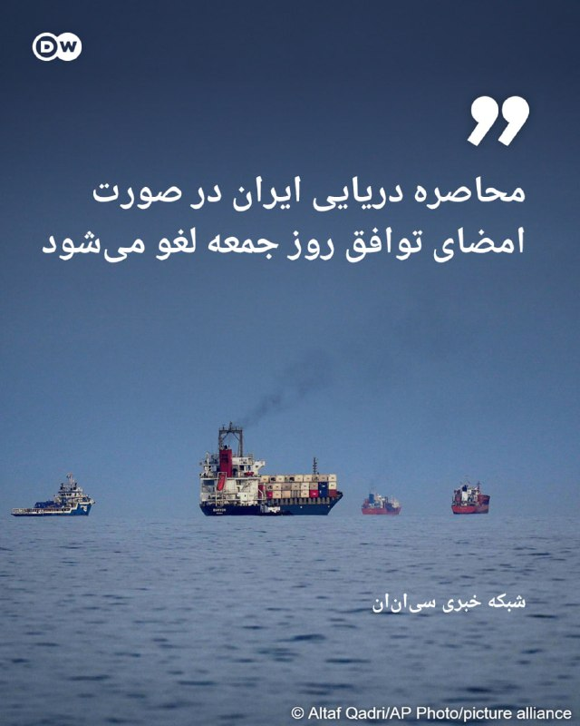

🔶 سی‌‌ان‌ان‌: محاصره دریایی ایران در صورت امضای توافق روز جمعه لغو می‌شود

شبکه خبری سی‌ان‌ان‌ به نقل از یک مقام آمریکایی گزارش داد که ارتش ایالات متحده دستورالعملی دریافت کرده است که طبق آن، در صورت امضای توافق با ایران، محاصره دریایی آمریکا علیه بنادر ایران در تنگه هرمز را روز جمعه لغو کند.

دونالد ترامپ روز یکشنبه ۱۴ ژوئن (۲۴ خرداد) اعلام کرد که پس از دستیابی به توافق با تهران، مجوز "رفع فوری محاصره دریایی ایالات متحده" علیه ایران را صادر می‌کند. او سپس گفت: «با بازگشایی تنگه هرمز پس از امضای توافق در روز جمعه، در پی انجام عملیات مین‌روبی، جریان نفت بار دیگر از هر دو سو برای منطقه و جهان برقرار خواهد شد.»

رئیس جمهور آمریکا حدود شش هفته پس از آغاز جنگ با ایران دستور اجرای محاصره دریایی را صادر کرده بود.

این مقام آمریکایی که هویتش فاش نشده به سی‌ان‌ان گفته است که "این برداشت فعلی است، اما ممکن است شرایط بین اکنون تا روز جمعه تغییر کند".

@dw_farsi

## DW_Farsi — post 125984

  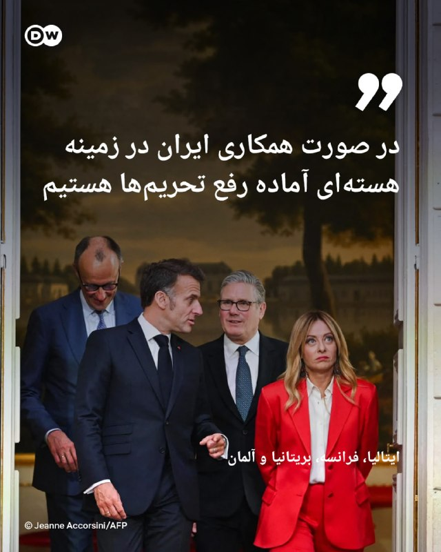

🔶 چهار کشور اروپایی: در صورت همکاری ایران در زمینه هسته‌ای آماده‌ رفع تحریم‌ها هستیم

ایتالیا، فرانسه، بریتانیا و آلمان با استقبال از تفاهم حاصل‌شده میان ایران و آمریکا اعلام کردند، آن را "فرصتی برای بازگرداندن ثبات منطقه‌ای و تثبیت اقتصاد جهانی" می‌دانند.

این چهار کشور در بیانیه مشترکی با اعلام آمادگی خود برای حمایت از تلاش‌ها در جهت "اجرای سریع و جامع" این تفاهم‌نامه، تأکید کردند که "بازگشایی فوری تنگه هرمز با آزادی بدون قید و شرط و نامحدود کشتیرانی ضروری است".

آنها تصریح کردند که آماده‌اند تا مطابق با الزامات قانون اساسی کشورهای خود، سهم‌شان را در تحقق این هدف از جمله از طریق یک مأموریت کاملاً دفاعی و مستقل برای اطمینان‌بخشی به کشتی‌های تجاری و انجام عملیات پاکسازی مین‌های دریایی ایفا کنند.

فرانسه، بریتانیا، آلمان و ایتالیا همچنین با قدردانی از تلاش‌های قطر، پاکستان و سایر کشورهای میانجی برای این دستاورد دیپلماتیک، تأکید کرده‌اند که "ایران هرگز نباید به سلاح هسته‌ای دست یابد".

در این بیانیه گفته شده است: «ما آماده‌ همکاری با ایالات متحده، ایران و آژانس بین‌‌المللی انرژی اتمی برای تحقق این هدف هستیم. همچنین آماده‌ایم در پاسخ به گام‌های روشن و قابل راستی‌آزمایی ایران در زمینه برنامه هسته‌ای خود، تحریم‌های مرتبط [علیه ایران] را لغو کنیم.»

این چهار کشور همچنین بار دیگر حمایت کامل خود را از "ثبات، حاکمیت ملی و تمامیت ارضی لبنان" و نیز"اهمیت برقراری و حفظ یک آتش‌بس پایدار و مؤثر" اعلام کردند.

@dw_farsi

## Persian_Trend_Official — post 17158

بن گویر، وزیر امنیت ملی اسرائیل: توافق ترامپ ما را ملزم نمی‌کند. اسرائیل تابع ایالات متحده نیست و ما یک ملت مستقل و دارای حاکمیت هستیم!

وظیفه ما در قبال شهروندان اسرائیل، سربازان ارتش اسرائیل، مردم یهود و وظیفه تاریخی ما در قبال یهودیانی است که در طول هزاران سال تبعید مورد آزار و اذیت و قتل قرار گرفته‌اند، تا امنیت یهودیان را در سرزمین اسرائیل تأمین کنیم.

هر بار که به قیمت امنیت اسرائیل تسلیم فشارهای بین‌المللی شدیم، بهای خون خود را با بهره آن پرداختیم. این موضوع در توافق اسلو، در توافق لبنان در سال ۲۰۰۶ و در هر دوره مهار غزه که در مقابل ما منفجر شد، صادق بود. ما تأکید می‌کنیم: ما ایالات متحده آمریکا را دوست داریم و از رئیس جمهور ترامپ سپاسگزاریم. با این حال، کشور اسرائیل یک جمهوری موز نیست.

من این حرف‌ها را همیشه به نخست‌وزیر می‌زنم و در هر مقطع مهم تاریخی در اتاق‌های بسته تکرار می‌کنم: در لحظات تاریخی، باید یک تصمیم تاریخی گرفته شود. موضع من روشن است: ما شریک این توافق نیستیم که امنیت ما را تضمین نمی‌کند و به هیچ وجه ما را ملزم نمی‌کند. ما نباید در مورد چیزی کمتر از برچیدن حزب‌الله مصالحه کنیم، نباید از هیچ سرزمینی که رزمندگان ما تصرف کرده و از زیرساخت‌های تروریستی پاکسازی کرده‌اند، عقب‌نشینی کنیم، نباید به وضعیتی برگردیم که هزاران تروریست در حصارهای شهرک‌های شمالی مستقر باشند و مطمئناً نباید لحظه‌ای در برابر آتشی که به سمت کشور اسرائیل نشانه گرفته می‌شود، ساکت بمانیم.

ما باید روشن کنیم: هر پرتاب پهپاد، هواپیمای بدون سرنشین یا موشک به سمت اسرائیل از لبنان منجر به حمله اسرائیل به ضاحیه خواهد شد. این توازن بازدارندگی همین چند ماه پیش بود و ما نباید به هیچ وجه از آن دست بکشیم. و مهم‌تر از همه، باید برای همه روشن کنیم: قوم اسرائیل قومی با قدمت 3000 سال است، قومی جاودانه که از راه طولانی نمی‌ترسد؛ ما به خالق جهان ایمان داریم، ما قومی قوی و مغرور هستیم که قوی و مغرور به سرزمین مادری خود بازگشتیم و دیگر قصد نداریم در برابر دشمنان سر تعظیم فرود آوریم.

روزهایی که یهودیان ضربه می‌خوردند و سکوت می‌کردند، به پایان رسیده است. دیگر هرگز!

📝 Amir

📌 @persian_trend_official
پرشین ترند | متفاوت‌ترین کانال نظامی

## Persian_Trend_Official — post 17157

  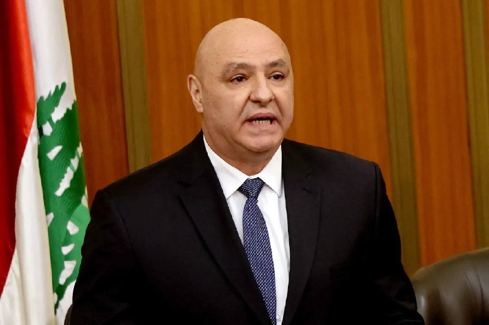

جوزف عون، رئیس جمهور لبنان: مردم لبنان، به ویژه کسانی که در مناطق آسیب دیده از حملات و ویرانی هستند و عزیزان، معیشت و خانه‌های خود را از دست داده‌اند، مشتاقانه منتظرند تا این تفاهمات به گام‌های عملی تبدیل شود که به چرخه خشونت پایان قطعی دهد و پایه‌های مرحله‌ای از ثبات، امنیت، بهبود و بازسازی را بنا نهد.

📝 Amir

📌 @persian_trend_official
پرشین ترند | متفاوت‌ترین کانال نظامی

## Persian_Trend_Official — post 17156

  <a href="telegram/content/Persian_Trend_Official_17156_1781518033.webm" target="_blank">🎬 Download video</a>

جزئیات تثبیت حق ایران بر تنگهٔ هرمز در تفاهم نهایی به ادعای خبرگزاری فارس

یک منبع آگاه در گفت‌وگو با فارس: در لحظات آخر مذاکرات، متن تفاهم‌نامه تغییراتی داشت که مسئلهٔ اعمال حاکمیت ایران-عمان بر تنگهٔ هرمز را به‌صورت قطعی و مصرح تاکید کرده است.

در نسخهٔ قبلی، اصطلاحاتی قرار داده شده بود که این اعمال حاکمیت و ترتیبات ایرانی را تضمین کند؛ اما حالا نوشته شده که آیندهٔ ادارهٔ خدمات دریانوردی در تنگهٔ هرمز توسط ایران و عمان تعیین می‌شود. تصریح استفاده از اصطلاح خدمات دریایی یعنی تثبیت دریافت هزینه برای ایران توسط آمریکا خواهد بود.

این اصل در جای دیگری از متن هم تکرار شده؛ به این شکل که ایران فقط برای 60 روز عبور بدون هزینه کشتی‌ها را خواهد پذیرفت. یعنی آمریکا اصل دریافت هزینه را پذیرفته و صرفا 60 روز تخفیف را از ایران گرفته است.

اما پس از این 60 روز، جمهوری اسلامی ایران بنا دارد با ارائهٔ خدمات ایمنی، دریانوردی، محیط‌زیست و بیمه از عواید مالی حاصل از تردد کشتی‌های تجاری در این تنگه برای توسعهٔ اقتصادی کشور، بهره‌مند شود.

📝 Amir

📌 @persian_trend_official
پرشین ترند | متفاوت‌ترین کانال نظامی

## Persian_Trend_Official — post 17155

  

وزیر دفاع اسرائیل، یسرائیل کاتز: نخست‌وزیر نتانیاهو و من سیاستی را رهبری می‌کنیم که نیروهای ارتش اسرائیل بدون محدودیت زمانی در مناطق امنیتی لبنان، سوریه و غزه باقی خواهند ماند.

ما مخالف خروج نیروها از لبنان هستیم، با وجود فشارهای موجود و آینده. نتانیاهو این موضوع را به رئیس‌جمهور آمریکا، ترامپ، و مقامات ارشد آمریکایی توضیح داد؛ من نیز دیروز این موضوع را به وزیر دفاع آمریکا، پیت هگست، توضیح دادم.

اگر ایران به دلیل رویدادهای لبنان به اسرائیل حمله کند، با تمام قدرت پاسخ خواهیم داد و شکاف قدرت را به وضوح نشان خواهیم داد.

📝 Amir

📌 @persian_trend_official
پرشین ترند | متفاوت‌ترین کانال نظامی

## Persian_Trend_Official — post 17154

  <a href="telegram/content/Persian_Trend_Official_17154_1781518034.mp4" target="_blank">🎬 Download video</a>

🚨سقوط هواپیمای آموزشی ارتش پاکستان

ارتش پاکستان اعلام کرد هر دو خلبان این هواپیما جان خود را از دست داده‌اند.

👺Phantom

📌 @persian_trend_official
پرشین ترند | متفاوت‌ترین کانال نظامی

## Persian_Trend_Official — post 17153

  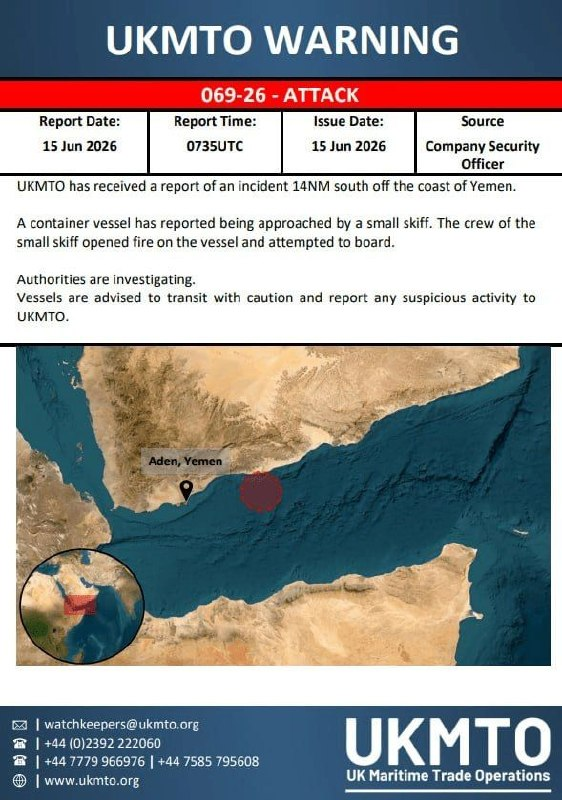

]

🔴 حادثه امنیتی برای یک کشتی تجاری در نزدیکی سواحل یمن

🔹 سازمان عملیات تجارت دریایی بریتانیا (UKMTO) از وقوع یک حادثه امنیتی برای یک کشتی فله‌بر در آب‌های جنوب یمن خبر داد.

🔹 بر اساس گزارش اولیه، این کشتی در فاصله حدود ۲۶ کیلومتری جنوب بندر عدن اعلام کرد که یک قایق تندرو حامل چندین سرنشین به آن نزدیک شده است.

🔹 گزارش‌ها حاکی است سرنشینان قایق به سمت کشتی تیراندازی کرده و تلاش کرده‌اند وارد آن شوند.

🔹 جزئیات بیشتری درباره هویت مهاجمان، خسارات احتمالی یا سرنوشت خدمه کشتی منتشر نشده و تحقیقات در این خصوص ادامه دارد..

👺 Phantom

📌 @persian_trend_official
پرشین ترند | متفاوت‌ترین کانال نظامی

## Persian_Trend_Official — post 17152

  <a href="telegram/content/Persian_Trend_Official_17152_1781518036.mp4" target="_blank">🎬 Download video</a>

اینطوری که بی بی داره عرزشی ها رو نقره داغ میکنه در تاریخ مثلش نبوده 😄

## Persian_Trend_Official — post 17151

  <a href="telegram/content/Persian_Trend_Official_17151_1781518037.mp4" target="_blank">🎬 Download video</a>

دیشا؛ نخستین شناوری که پس از بازگشایی تنگه هرمز از آن عبور کرد. نخستین شناوری که پس از اعلام توافق صلح میان ایالات متحده و جمهوری اسلامی از تنگه هرمز عبور کرده، این کشتی که از پرچم مالت استفاده می‌کرده حامل گاز مایع است. گفته می‌شود که دیشا از مسیر معین…

## Persian_Trend_Official — post 17150

  <a href="telegram/content/Persian_Trend_Official_17150_1781518039.mp4" target="_blank">🎬 Download video</a>

لحظه سقوط F-18 در آمریکا.

👺Phantom

📌 @persian_trend_official
پرشین ترند | متفاوت‌ترین کانال نظامی

## Persian_Trend_Official — post 17149

یه گزارش آکسیوس ونس، ویتکاف و کوشنر موافق تفاهم نامه اخیر امریکا با ایران و روبیو و هگست مخالف آن هستند.

📝 Amir

📌 @persian_trend_official
پرشین ترند | متفاوت‌ترین کانال نظامی

## Persian_Trend_Official — post 17148

یک مقام ارشد اسرائیلی در مصاحبه با کانال 13 اسرائیل: این توافق برای اسرائیل یک توافق فاجعه‌بار است. در سطوح عالی حاکمیت، از نخست‌وزیر گرفته تا رئیس ستاد کل ارتش، هیچ‌کس نیست که چنین نظری نداشته باشد.

📝 Amir

📌 @persian_trend_official
پرشین ترند | متفاوت‌ترین کانال نظامی

## Persian_Trend_Official — post 17146

  <a href="telegram/content/Persian_Trend_Official_17146_1781518041.webm" target="_blank">🎬 Download video</a>

حملات امروز صبح نیروی هوایی ارتش اسرائیل به خیام و مرکبا در جنوب لبنان

📝 Amir

📌 @persian_trend_official
پرشین ترند | متفاوت‌ترین کانال نظامی

## Persian_Trend_Official — post 17145

◾️ قالیباف خطاب به اسرائیل: پس از چراغ سبز آمریکا به این تجاوز، سخن از ادامه مسیر ممکن نیست؛ بازی پلیس بد و پلیس خوب قدیمی شده؛ بچرخ تا بچرخیم

◾️ رئیس کمیسیون امنیت ملی مجلس: پاسخ به حمله امروز اسرائیل قطعی است

◾️ سردار اسدی معاون قرارگاه خاتم‌الانبیا: جنایت صهیونیست‌ها بی‌پاسخ نمی‌ماند

◾️ فرمانده هوافضای سپاه سردار موسوی: گوش به فرمان ولایت باشید؛ نه یک گام جلوتر نه یک گام عقب‌تر، همراه با ولی خویش باشید

◾️ وزارت خارجه ایران: حمله به ضاحیه نقض آشکار حاکمیت لبنان و نقض فاحش تفاهم آتش‌بس ۱۹ فروردین است؛ مسئولیت پیامدها برعهده آمریکا و اسرائیل است

◾️ گزارش‌های میدانی از قطع شدید GPS در آسمان اسرائیل و توقف پروازهای غیرنظامی منطقه؛ تسنیم پروازهای غرب کشور را لغو اعلام کرد اما سازمان هواپیمایی این خبر را تکذیب کرد

◾️ ارتش اسرائیل: رئیس ستاد کل ایال زامیر ارزیابی مستمر با فرماندهان دارد؛ ارتش برای احتمال شلیک از سمت ایران در ساعات آینده آماده می‌شود؛ هرگونه شلیک به اسرائیل تحمل نخواهد شد

◾️ کانال ۱۴ اسرائیل: آمریکا از طریق واسطه‌ها در تلاش برای جلوگیری از حمله احتمالی ایران است؛ پاسخ اسرائیل: اگر ایران حمله کند، پاسخ سریع و شدید خواهد بود

◾️ کانال ۱۲: این بار حتی پرتاب یک موشک از ایران را تحمل نمی‌کنیم؛ در این صورت حمله گسترده و خردکننده به زیرساخت‌های نظامی و اقتصادی ایران در پیش است

◾️ مقام ارشد اسرائیلی: ایران مسئله ترامپ است و او حق دارد توافق کند، اما لبنان مسئله ماست؛ نباید با معادله ایران موافقت کنیم حتی به قیمت رویارویی با آمریکا

◾️ کابینه امنیتی امشب در یکی از سایت‌های فوق‌محرمانه زیرزمینی برگزار شد؛ ونس به‌طور اضطراری به کاخ سفید بازگشت

◾️ سی‌ان‌ان: نتانیاهو به‌دنبال دیدار فوری با ترامپ پس از بازگشت او از نشست G7 است

◾️ شبکه ۱۲: ایران پیشنهاد ترامپ برای خویشتنداری در ازای پول را رد کرد و گفت به‌زودی پاسخ می‌دهد

◾️ ارتش اسرائیل پیش از حمله به ضاحیه، هشدار تخلیه برای ۲۹ شهر و روستا در جنوب لبنان صادر کرد

◾️ حزب‌الله ویدیوی پهپاد انتحاری شاهد-۱۰۱ به سمت الجلیل و عملیات پهپادی دیگری در شمال اسرائیل را منتشر کرد؛ حداقل یکی از دو پهپاد به هدف اصابت کرد

◾️ نیروی هوایی اسرائیل پس از حمله به ضاحیه، اهدافی در تبنین، شوکن، المنصوری و کفرسیر را بمباران کرد؛ ارتش در جبهه‌های اطراف نبطیه شدیداً درگیر است

◾️ سردار قاآنی فرمانده نیروی قدس: پیروزی عظیم حزب‌الله در راه است؛ جهان استقلال لبنان را با فداکاری حزب‌الله می‌شناسد

◾️ OSINT: تمرکز گسترده ناوگان آمریکا — دو گروه ضربت ناو هواپیمابر (USS Abraham Lincoln و USS George H.W. Bush) و گروه آبی‌خاکی USS Tripoli در دریای عرب؛ ناوشکن‌های USS Thomas Hudner و USS Gonzalez در دریای سرخ؛ USS Arleigh Burke، USS Oscar Austin و USS Roosevelt در شرق مدیترانه

◾️ پیت هگست وزیر جنگ آمریکا: ذخایر تسلیحاتی ما عالی هستند و فقط قوی‌تر می‌شوند؛ ادعای کسری ذخایر داستانی ساختگی است؛ ما در مسیر امضای توافق هستیم، اسرائیل در واکنش به حزب‌الله بسیار میانه‌رو است

◾️ یک فروند F/A-18 هورنت آمریکا نزدیک دریاچه ریم‌راک واشنگتن سقوط کرد؛ خلبان با صندلی پران نجات یافت

◾️ سقوط هواپیمایی نزدیک فرودگاه باتلر‌مموریال میزوری ۱۱ چترباز و ۱ خلبان را به کشتن داد

◾️ سپاه اصفهان: عملیات انفجار کنترل‌شده در منطقه زردنجان شرق اصفهان امروز بین ساعت ۸ تا ۱۲ انجام شد؛ صدای انفجار جای نگرانی ندارد

◾️ همتی: تقویت ذخایر ارزی و حمایت از تولید در دستور کار بانک مرکزی است

◾️ پزشکیان: تصمیم‌گیری درباره جنگ و مذاکره بر عهده رهبری و شورای عالی امنیت ملی است، نه رسانه ملی

◾️ زلنسکی: گفتگوی خوبی با ترامپ داشتم؛ او را از تحولات میدانی مطلع کردم؛ در نشست G7 بیشتر گفتگو می‌کنیم

◾️ کرملین: پوتین و ترامپ توافق کردند ویتکاف و کوشنر به‌زودی بار دیگر به روسیه سفر کنند

◾️ بریتانیا یک کشتی از ناوگان سایه روسیه را در کانال مانش توقیف کرد

◾️ خبرگزاری‌های عبری: خشم رسانه‌های اسرائیلی از توافق ایران-آمریکا؛ ترامپ را بازنده توصیف کردند

👺Phantom

📌 @persian_trend_official
پرشین ترند | متفاوت‌ترین کانال نظامی

## Persian_Trend_Official — post 17144

  <a href="telegram/content/Persian_Trend_Official_17144_1781518041.webm" target="_blank">🎬 Download video</a>

📍بولتن خبری ۲۴ ساعت اخیر پرشین ترند

🗓 ۲۵ خرداد ۱۴۰۵

◾️ شهباز شریف نخست‌وزیر پاکستان: توافق صلح میان آمریکا و ایران حاصل شد؛ پایان فوری و دائمی عملیات نظامی در همه جبهه‌ها از جمله لبنان؛ امضای رسمی جمعه ۲۹ خرداد در سوئیس؛ از قطر، عربستان و ترکیه برای میانجیگری تشکر کرد

◾️ شورای عالی امنیت ملی ایران: یادداشت تفاهم اسلام‌آباد شامگاه ۲۴ خرداد نهایی شد؛ جنگ در همه جبهه‌ها از امشب پایان یافته و محاصره دریایی بلافاصله و کامل لغو می‌شود

◾️ ترامپ در تروث‌سوشال: توافق با ایران کامل شد؛ بازگشایی کامل و بدون عوارض تنگه هرمز و لغو فوری محاصره دریایی را مجاز می‌دانم؛ کشتی‌های جهان موتورهایتان را روشن کنید

◾️ فاکس‌نیوز: میانجی‌گران قطری پس از ۱۷ ساعت مذاکره فشرده تهران را ترک کردند؛ پیش از امضای رسمی، جلسات مقدماتی این هفته در دوحه برگزار می‌شود

◾️ مهدی محمدی مشاور تیم مذاکره‌کننده: توقف درگیری‌ها با تضمین امنیتی آمریکا، آزادسازی بخشی از دارایی‌ها در گام اول، تعلیق برخی تحریم‌ها، تسهیل تردد دریایی؛ موضوع هسته‌ای منوط به راستی‌آزمایی تعهدات آمریکاست

◾️ رویترز به نقل از مقام ایرانی: یادداشت تفاهم ۲۵ میلیارد دلار از دارایی‌های بلوکه‌شده ایران را آزاد می‌کند؛ ذخایر اورانیوم غنی‌شده می‌تواند داخل کشور رقیق شود؛ ایران تعهد به عدم ساخت سلاح هسته‌ای می‌دهد

◾️ انتخاب به نقل از منبع آگاه: بندی از تفاهم، تعهد آمریکا و متحدانش به برنامه ۳۰۰ میلیارد دلاری بازسازی و توسعه ایران است

◾️ غریب‌آبادی: تمرکز مذاکرات ۶۰ روزه صرفاً بر موضوع هسته‌ای است؛ چهار محور شامل خاتمه تحریم‌ها، مسائل هسته‌ای، بازسازی اقتصادی و نظارت بر اجرای تعهدات؛ در بی‌اعتمادی کامل مذاکره کردیم

◾️ چهار کشور اروپایی (فرانسه، بریتانیا، آلمان، ایتالیا): آماده‌ایم در پاسخ به گام‌های قابل‌راستی‌آزمایی هسته‌ای ایران، تحریم‌ها را لغو کنیم

◾️ ترامپ به نیویورک‌تایمز: ایران اجازه غنی‌سازی در سطح پایین (غیرقابل استفاده نظامی) خواهد داشت؛ موضوع غنی‌سازی صفر کنار گذاشته شد

◾️ ونس: قطعاً برای امضا در سوئیس حضور خواهم داشت؛ ایران هرگز سلاح هسته‌ای نخواهد داشت، امشب پیروزی بزرگی به دست آوردیم

◾️ ترامپ درباره رژیم ایران: من اصلاً به تغییر رژیم اهمیت نداده‌ام؛ این منطقی‌ترین گروهی است که با آن طرف بوده‌ایم؛ نتانیاهو هم با توافق موافق است

◾️ نتانیاهو و کاتز در بیانیه مشترک: در پاسخ به آتش حزب‌الله، ضاحیه بیروت (منطقه الغبیری) هدف قرار گرفت

◾️ المیادین: حمله به یک ساختمان پنج طبقه ۳ شهید و ۶ زخمی برجا گذاشت؛ کانال ۱۲ مدعی شد هدف فرمانده ارشد واحد ارتباطات حزب‌الله بود

◾️ العربیه: علی الحاج، مقام ارشد حزب‌الله، در این حمله کشته شد؛ سفیر اسرائیل در آمریکا: فرمانده ارشد علی موسی دقاق نیز ترور شد

◾️ ترامپ به کانال ۱۲: قرار بود توافق صبح امضا شود اما حمله اسرائیل به بیروت آن را به تأخیر انداخت؛ خیلی عصبانی شدم، همه‌چیز را به‌هم ریخت

◾️ ترامپ در ادامه: مسئولیت عدم امضای امروز برعهده بی‌بی است؛ به نتانیاهو گفتم چیکار می‌کنی، او اختیار از خودش ندارد، من باید تصمیم بگیرم؛ با ایران صحبت می‌کنم تا حمله نکند

◾️ فاکس‌نیوز به نقل از دیپلمات: حمله به ضاحیه تلاش آشکار اسرائیل برای تضعیف توافق ترامپ و کشاندن دوباره آمریکا به جنگ بود

◾️ انتخاب به نقل از منبع آگاه: پس از حمله، قالیباف دستور توقف مذاکرات با طرف قطری را داد و نیروهای مسلح پرتابگرها را آماده شلیک کردند؛ ترامپ در پاسخ، محاصره دریایی را بلافاصله و کامل (به‌جای ۳۰ روز) لغو کرد و مدیریت تنگه هرمز به ایران و عمان محول شد

◾️ وای‌نت: تهران در حال بررسی به‌تعویق‌انداختن حمله موشکی به اسرائیل بود تا فرصتی به تلاش‌های ترامپ بدهد؛ یکی از پیشنهادهای قطر، رفع فوری محاصره به‌جای کاهش تدریجی تحریم‌ها بود

◾️ یدیعوت‌آحارونوت: آمریکا پیشنهاد رفع فوری (نه تدریجی) محاصره دریایی را در ازای عدم حمله ایران به اسرائیل مطرح کرد

◾️ یک منبع امنیتی اسرائیلی: نتانیاهو انتظار داشت حمله بیروت باعث انحراف دیپلماسی شود، اما مذاکرات علی‌رغم این حادثه ادامه یافت

◾️ مرندی عضو تیم مذاکره‌کننده: حمله امروز نباید رخ می‌داد؛ هیچ‌کس آسیب جدی ندید و نباید روند صلح را مختل کند؛ دیگر هیچ حمله‌ای از سوی هیچ طرف نباید باشد

◾️ علی‌اکبر ولایتی مشاور رهبری: یک اشتباه محاسباتی در بیروت صبر را به پایان رساند؛ ساعت صفر فرا رسیده و پرتابگرها آماده‌سازی می‌شوند

◾️ سرلشکر عبداللهی فرمانده قرارگاه خاتم‌الانبیا: فرزندان ملت در نیروهای مسلح دست به ماشه آماده شلیک به قلب دشمن هستند؛ توان رزمی، موشکی، دریایی و پهپادی ما قوی‌تر از گذشته است

◾️ ذوالقدر دبیر شورای عالی امنیت ملی: پاسخ رزمندگان اسلام در پیش است؛ لبنان جان ماست و نقض خطوط قرمز تحمل نخواهد شد

## Persian_Trend_Official — post 17143

  <a href="telegram/content/Persian_Trend_Official_17143_1781518042.webm" target="_blank">🎬 Download video</a>

نفت هم اکنون در محدوده 83 دلار قرار دارد.

📝 Amir

📌 @persian_trend_official
پرشین ترند | متفاوت‌ترین کانال نظامی

## Persian_Trend_Official — post 17142

  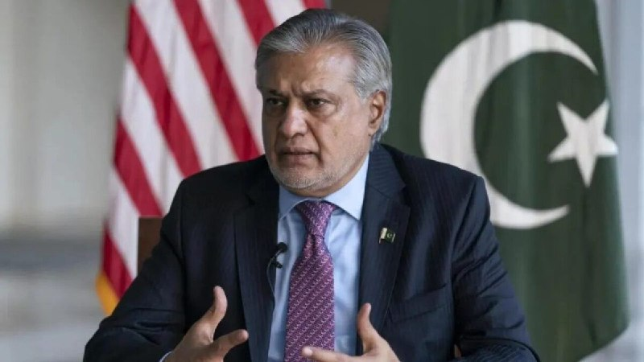

وزیرخارجه پاکستان: از هر تلاشی برای تثبیت توافق ایران و آمریکا حمایت می کنیم!

محمد اسحاق دار معاون نخست وزیر و وزیر امور خارجه پاکستان با استقبال از توافق بین جمهوری اسلامی ایران و ایالات متحده، از ادامه مذاکرات در مورد مسائل معوقه خبر داد و تاکید کرد: اسلام‌آباد از هر تلاشی در راستای تثبیت این تحول حمایت می کند.

این پیشرفت قابل توجه، نشان دهنده قدرت تعامل دیپلماتیک پایدار و عزم جمعی کشورهای دوست برای انتخاب گفتگو به جای رویارویی است.

📝 Amir

📌 @persian_trend_official
پرشین ترند | متفاوت‌ترین کانال نظامی

## Persian_Trend_Official — post 17141

  <a href="telegram/content/Persian_Trend_Official_17141_1781518043.webm" target="_blank">🎬 Download video</a>

دیشا؛ نخستین شناوری که پس از بازگشایی تنگه هرمز از آن عبور کرد.

نخستین شناوری که پس از اعلام توافق صلح میان ایالات متحده و جمهوری اسلامی از تنگه هرمز عبور کرده، این کشتی که از پرچم مالت استفاده می‌کرده حامل گاز مایع است.

گفته می‌شود که دیشا از مسیر معین شده توسط سپاه پاسداران عبور کرده.

📝 Amir

📌 @persian_trend_official
پرشین ترند | متفاوت‌ترین کانال نظامی

## RadioFarda — post 158322

🔸چند ساعت پس از اعلام دستیابی به توافق میان ایران و ایالات متحده، مقام‌های اسرائیلی به‌طور رسمی یکی از بخش‌های آن یعنی پایان درگیری با گروه حزب‌الله لبنان را رد کردند.

🔸این در حالی است که به جز پروندهٔ هسته‌ای جمهوری اسلامی، یکی از موارد مورد مناقشه در دستیابی به توافق، پایان درگیری در آنچه که ایران «همه جبهه‌ها» می‌نامد، به ویژه در لبنان، بوده است.

🔸اسرائیل کاتس، وزیر دفاع اسرائیل، روز دوشنبه ۲۵ خرداد گفت که نیروهای اسرائیلی برای «مدتی نامحدود» در لبنان، سوریه و غزه باقی خواهند ماند.

🔸او در بیانیه‌ای گفت: «من و نخست‌وزیر بنیامین نتانیاهو سیاستی روشن را دنبال می‌کنیم که بر اساس آن، نیروهای دفاعی اسرائیل برای مدت نامحدود در مناطق امنیتی لبنان، سوریه و غزه باقی خواهند ماند تا از مرزها و جوامع اسرائیلی در برابر عناصر جهادی محافظت کنند».

🔸کاتس همچنین به ایران هشدار داد که اگر جمهوری اسلامی در واکنش به عملیات اسرائیل در لبنان به این کشور حمله کند، اسرائیل با «تمام قوا» پاسخ خواهد داد.

🔸وزیر امنیت ملی اسرائیل هم روز دوشنبه توافق میان ایالات متحده و ایران برای پایان دادن به جنگ خاورمیانه، از جمله در لبنان، را تقبیح کرد و گفت که کشورش به این توافق متعهد نخواهد بود.

🔸ایتامار بن‌گویر در کانال تلگرامی خود نوشت: «توافق ترامپ ما را متعهد نمی‌کند... ما طرف این توافق نیستیم. این توافق امنیت ما را تضمین نمی‌کند».

🔸حزب‌الله که از سوی ایالات متحده سازمانی تروریستی شناخته می‌شود، با مذاکرات لبنان و اسرائیل مخالفت کرده بود. این سازمان شامل دو بخش نظامی و سیاسی است و شاخۀ سیاسی آن در لبنان نفوذ زیادی داشته و حتی در پارلمان هم نماینده دارد. اتحادیۀ اروپا تنها شاخۀ نظامی این سازمان را تروریستی می‌داند.

🔸نسخه کامل این گزارش را در وب‌سایت رادیوفردا بخوانید.

@RadioFarda

## RadioFarda — post 158321

🔸بهروز رضوی، مجری و صداپیشه پیشکسوت و از صداهای ماندگار رادیو و تلویزیون ایران، شامگاه یک‌شنبه ۲۴ خرداد درگذشت.

🔸آقای رضوی از چندی پیش در بخش مراقبت‌های ویژه بیمارستانی در کرج بستری بود.

🔸این هنرمند، همکاری خود را با رادیو در سال ۱۳۴۷ به‌عنوان گوینده آغاز کرد و در چند دهه گذشته صدای او در برنامه‌های مختلف رادیو و تلویزیون، هم‌چنین مستندهای تصویری و سریال‌های پربیننده شنیده شد.

🔸 مجموعه «مستند ایران» به کارگردانی حمید مجتهدی از جمله آثار این هنرمند است.

@RadioFarda

## RadioFarda — post 158320

  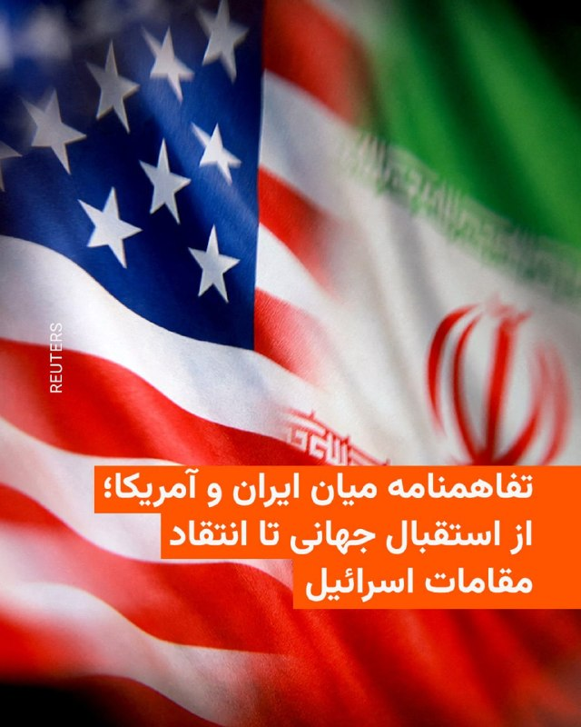

🔸آنتونیو کاستا، رئیس شورای اتحادیه اروپا، روز دوشنبه ۲۵ خرداد از این توافق استقبال کرد و در شبکهٔ ایکس نوشت: «منتظر پایان این جنگ پرهزینه و بازگشت کامل آزادی کشتیرانی در تنگه هرمز هستم.»

🔸کایا کالاس، مسئول سیاست خارجی اتحادیه اروپا هم گفت که توافق اعلام‌شده میان ایالات متحده و ایران می‌تواند یک «پیشرفت بالقوه مهم» در پایان جنگ باشد و اتحادیه اروپا اکنون بررسی خواهد کرد که چگونه می‌تواند در مرحله بعدی این روند مشارکت داشته باشد.

🔸رئیس کمیسیون اروپا هم روز دوشنبه اعلام کرد که توافق میان ایالات متحده و ایران باید امکان «بازگشایی فوری» تنگه هرمز را فراهم کند. اورسلا فون درلاین همچنین اظهار داشت که برقراری صلح در خاورمیانه «تا زمانی که لبنان در آتش می‌سوزد» امکان‌پذیر نیست.

🔸در همین حال وزیر امنیت ملی اسرائیل روز دوشنبه توافق میان ایالات متحده و ایران برای پایان دادن به جنگ خاورمیانه، از جمله در لبنان، را تقبیح کرد و گفت که کشورش به این توافق متعهد نخواهد بود.

@RadioFarda

## RadioFarda — post 158319

🔸پس از اعلام خبر توافق اولیه آمریکا و ایران در شامگاه یک‌شنبه ۲۴ خرداد آوارگان لبنانی در پناهگاهی واقع در منطقه برج رحال واقع در جنوب لبنان به رقص و پایکوبی پرداختند.

🔸در جریان تنش‌های نظامی و سیاسی در منطقه خاورمیانه در ماه‌های گذشته اسرائیل بارها به مناطق مختلفی در جنوب لبنان حمله و برای ساکنان ده‌ها روستا و شهر هشدار تخلیه صادر کرد.

🔸جمهوری اسلامی در مذاکرات با آمریکا توقف حملات اسرائیل به مقر اصلی حزب‌الله در جنوب بیروت را یکی از شرط‌های خود تعیین کرده است.

🔸هفته گذشته، حمله اسرائیل به ضاحیه موجب حملات موشکی ایران به اسرائیل شد و در مقابل ارتش اسرائیل نیز مناطقی از ایران را هدف قرار داد. این رخداد رسیدن به توافق پایان جنگ بین ایران و آمریکا را تحت تأثیر قرار داد. اما تبادل آتش طرفین با دخالت دونالد ترامپ، رئیس‌جمهور آمریکا، متوقف شد.

@RadioFarda

## RadioFarda — post 158318

  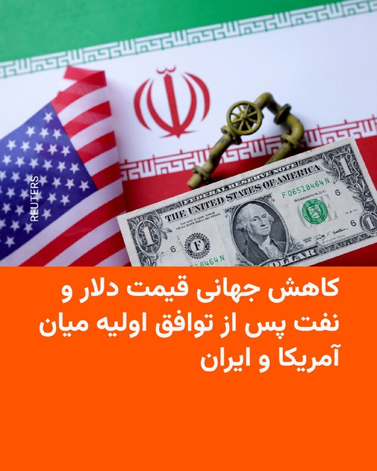

🔸دلار آمریکا روز دوشنبه ۲۵ خرداد در برابر ارزهای اصلی جهان به پایین‌ترین سطح خود در ۱۰ روز گذشته رسید.

🔸به نوشته رویترز، توافق اولیه برای پایان دادن به جنگ میان آمریکا و ایران باعث سقوط قیمت نفت و افزایش تمایل سرمایه‌گذاران به دارایی‌های پرریسک‌تر شده است.

🔸همزمان، با کاهش تنش‌های ژئوپلیتیکی و نگرانی‌های تورمی، تقاضا برای دلار به‌عنوان یک دارایی امن کاهش یافت. یورو تا ۰.۵ درصد افزایش یافت و به ۱.۱۶۲۲ دلار رسید و پوند بریتانیا نیز با رشد ۰.۴ درصدی به ۱.۳۴۵۹ دلار صعود کرد.

🔸شاخص دلار آمریکا که ارزش این ارز را در برابر سبدی از ارزها از جمله ین ژاپن و یورو می‌سنجد، روز دوشنبه با ۰.۱ درصد کاهش به ۹۹.۳۹۵ رسید که ضعیف‌ترین سطح آن از ۵ ژوئن تاکنون محسوب می‌شود.

🔸بهای نفت هم روز دوشنبه پس از اعلام توافق میان آمریکا و ایران برای پایان دادن به ماه‌ها جنگ و بازگشایی تنگه هرمز، بیش از چهار درصد کاهش یافت.

🔸بهای نفت خام وست تگزاس اینترمدیت در معاملات توکیو با ۴٫۳۹ درصد کاهش به ۸۱ دلار و ۱۵ سنت در هر بشکه رسید.

@RadioFarda

## RadioFarda — post 158317

  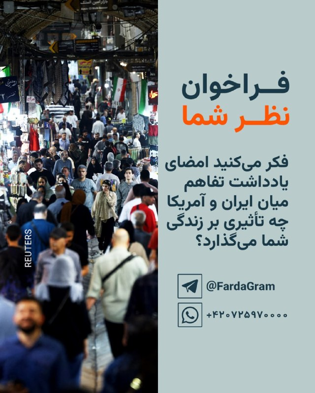

🔸دونالد ترامپ، رئیس‌جمهور آمریکا، و مقامات جمهوری اسلامی ایران سرانجام بعد از هفته‌ها مذاکرات پر فراز و نشیب، روز یکشنبه ۲۴ خرداد از نهایی‌شدن توافق میان دو کشور برای پایان جنگ خبر دادند.

🔸امضای رسمی یادداشت تفاهم اسلام‌آباد قرار است روز جمعه ۲۹ خرداد در سوئیس انجام خواهد شود.

🔸 به نظر شما امضای این یادداشت تفاهم چه پیامدهایی بر زندگی ایرانیان خواهد داشت؟ آیا شما به آینده این تفاهمنامه بر زندگی مردم ایران خوش‌بین هستید یا بدبین؟

🔸دیدگاه‌های خود را می‌توانید در قالب پیام‌های متنی و صوتی به نشانی‌های زیر ارسال کنید؟

Telegram: @fardagram

WhatsApp: +420 725 970 000

@RadioFarda

## RadioFarda — post 158315

  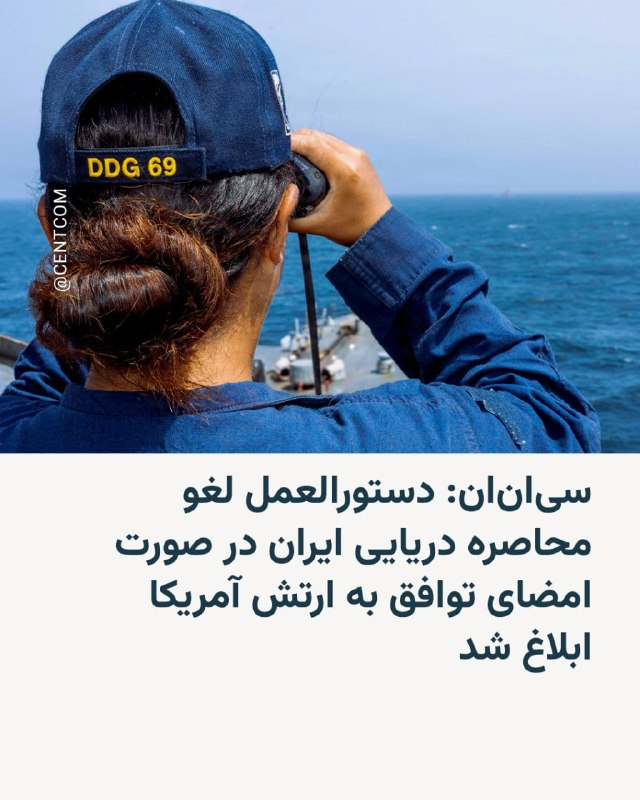

🔸یک مقام آمریکایی که نامش ذکر نشده به شبکه خبری سی‌ان‌ان گفت ارتش آمریکا دستورالعملی دریافت کرده است که در صورت امضای توافق با ایران، محاصرهٔ دریایی آمریکا در تنگه هرمز را روز جمعه لغو کند.

🔸دونالد ترامپ، رئیس‌جمهور آمریکا، روز یک‌شنبه ۲۴ خرداد اعلام کرد که پس از دستیابی به توافق با تهران، «رفع فوری محاصرهٔ دریایی ایالات متحده» علیه بنادر ایران را مجاز می‌داند. او سپس گفت: «با بازگشایی تنگه پس از امضای توافق در روز جمعه، برای پاکسازی مین‌ها، نفت بار دیگر از هر دو سو برای منطقه و جهان جریان خواهد یافت.»

🔸ترامپ در اواسط آوریل، حدود شش هفته پس از آغاز جنگ، دستور برقراری این محاصره را صادر کرده بود.

🔸این مقام آمریکایی به سی‌ان‌ان گفته است که «این، برداشت و برنامهٔ فعلی دولت آمریکا است، اما ممکن است تا روز جمعه شرایط تغییر کند.»

@RadioFarda

## RadioFarda — post 158314

  <a href="telegram/content/RadioFarda_158314_1781518046.mp4" target="_blank">🎬 Download video</a>

🔸تنها چند ساعت پس از آن‌که دونالد ترامپ، رئیس‌جمهور آمریکا، در تماس تلفنی با ولادیمیر پوتین، رهبر کرملین، به او گفت که می‌خواهد به پایان دادن به جنگ در اوکراین کمک کند، دست‌کم ۹ نفر در سراسر اوکراین در پی حملات هوایی روسیه کشته شدند.

🔸ایگور کلیمنکو، وزیر کشور اوکراین، روز دوشنبه ۲۵ خرداد گفت که حملات روسیه در خارکیف، دومین شهر بزرگ اوکراین در شمال‌شرق کشور، پنج امدادگر را کشته و دست‌کم پنج نفر دیگر را زخمی کرده است.

🔸او در کانال تلگرامی خود نوشت: «در خارکیف، پنج نفر از نیروهای خدمات اضطراری دولتی در حالی که در حال مهار آتش‌سوزی ناشی از حملات مکرر روسیه بودند، کشته شدند. دست‌کم پنج نفر دیگر نیز زخمی شدند».

🔸ویتالی کلیچکو، شهردار کی‌یف، پایتخت اوکراین، گفت که یک حملهٔ «گسترده» در طول شب باعث خسارت و آتش‌سوزی در تقریباً تمام مناطق شهر شده است. مقامات اعلام کردند که در این حملات، چهار نفر کشته و دست‌کم ۲۳ نفر دیگر زخمی شده‌اند.

🔸نسخه کامل این گزارش را در وب‌سایت رادیوفردا بخوانید.

@RadioFarda

## RadioFarda — post 158313

تیم ملی فوتبال ایران در آستانه بازی با نیوزیلند وارد آمریکا شد

🔸تیم ملی فوتبال ایران روز یک‌شنبه ۲۴ خرداد برای نخستین بار در جریان جام جهانی ۲۰۲۶ وارد خاک آمریکا شد و ساعاتی بعد خبر توافق صلح میان تهران و واشینگتن برای پایان دادن به جنگ منتشر شد.

🔸این تیم پس از پروازی کوتاه از شهر تیخوانا در مکزیک، جایی که در هفته‌های اخیر اردو زده بودند، در فرودگاه بین‌المللی لس‌آنجلس فرود آمدند. این تیم قرار است دوشنبه شب در نخستین دیدار خود در گروه هفتم جام جهانی برابر نیوزیلند به میدان برود.

🔸ورود تیم ایران در حالی صورت گرفت که فضای امنیتی شدیدی در اطراف محل اقامت بازیکنان برقرار بود و نیروهای پلیس بخشی از خیابان‌های اطراف هتل را مسدود کرده بودند. امیر قلعه‌نویی، سرمربی تیم ملی، و مهدی طارمی نیز قرار بود شامگاه یک‌شنبه در نشست خبری پیش از مسابقه شرکت کنند.

🔸این مسابقه در شرایطی برگزار می‌شود که جنگ میان آمریکا و ایران در ماه‌های گذشته بر همه جنبه‌های حضور تیم ایران در جام جهانی سایه افکنده بود. ایران پس از حملات مشترک آمریکا و اسرائیل در اسفندماه، اردوگاه آماده‌سازی خود را از ایالت آریزونا به مکزیک منتقل کرده بود. اکنون توافق اعلام‌شده میان دو کشور قرار است روز جمعه در سوئیس به امضا برسد.

🔸همزمان با ورود تیم ایران به لس‌آنجلس، به نوته خبرگزاری فرانسه، گروهی از مخالفان جمهوری اسلامی در نزدیکی ورزشگاه محل برگزاری مسابقه تجمع کردند. معترضان با در دست داشتن پرچم شیر و خورشید و پلاکاردهایی با شعارهایی علیه جمهوری اسلامی، خواستار دموکراسی در ایران شدند. برخی از آنان تصاویر ورزشکاران و معترضان کشته‌شده در سرکوب اعتراضات را نیز به نمایش گذاشتند.

🔸نسخه کامل این گزارش را در وب‌سایت رادیوفردا بخوانید.

@RadioFarda

## RadioFarda — post 158312

  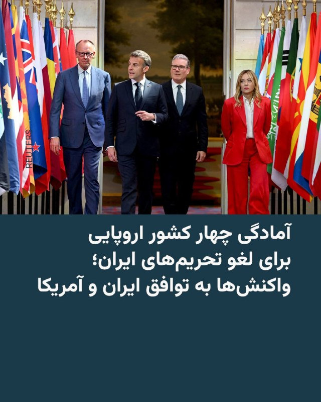

🔸اعلام توافق میان ایران و آمریکا برای توقف درگیری‌ها، بازگشایی تنگه هرمز و آغاز روند مذاکرات برای دستیابی به یک توافق نهایی، با استقبال شماری از رهبران جهان روبه‌رو شده است.

🔸در مهم‌ترین واکنش اروپایی، بریتانیا، فرانسه، آلمان و ایتالیا اعلام کردند در صورتی که ایران تعهدات مرتبط با برنامه هسته‌ای خود را اجرا کند، آماده‌اند تحریم‌ها علیه جمهوری اسلامی را لغو کنند.

🔸رهبران این چهار کشور در بیانیه‌ای مشترک تأکید کردند که ایران نباید به سلاح هسته‌ای دست یابد و افزودند آماده همکاری با آمریکا، ایران و آژانس بین‌المللی انرژی اتمی برای تحقق این هدف هستند.

🔸همزمان، آنتونیو گوترش، دبیرکل سازمان ملل متحد، توافق تازه را «گامی حیاتی» برای حل‌وفصل دیپلماتیک جنگ توصیف کرد. او ابراز امیدواری کرد که طرف‌ها از این فرصت برای دستیابی به راه‌حلی پایدار استفاده کنند و تلاش‌های خود را برای پایان دادن کامل به مناقشه افزایش دهند.

@RadioFarda

## RadioFarda — post 158311

  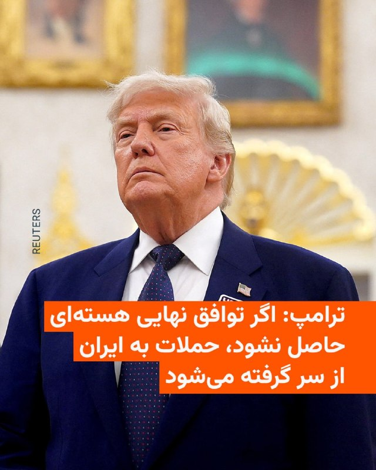

🔸دونالد ترامپ، رئیس‌جمهور آمریکا، روز یک‌شنبه ۲۴ خرداد در گفت‌وگو با روزنامه نیویورک تایمز گفت اگر ایران نتواند به یک توافق نهایی هسته‌ای با ایالات متحده دست یابد، او حملات نظامی علیه تهران را از سر خواهد گرفت یا در مقابل دریافت ۲۰ درصد از درآمدهای منطقه، آمریکا را به «نگهبان خاورمیانه» تبدیل خواهد کرد.

🔸ترامپ در این مصاحبه همچنین گفت توافقی که با ایران به دست آورده، در نهایت تضمین خواهد کرد که عبور و مرور از تنگه هرمز «برای همیشه بدون عوارض» باشد.

🔸رئیس‌جمهور آمریکا همچنین گفت که با وجود مخالفت‌های بنیامین نتانیاهو، نخست‌وزیر اسرائیل، او اسرائیل را از «نابودی هسته‌ای» نجات داده است.

🔸ایران پس از اعلام توافق با آمریکا برای توقف فوری جنگ، اعلام کرد که در دو ماه آینده گفت‌وگوهایی را با واشینگتن با هدف دستیابی به یک «توافق نهایی» برای حل‌وفصل این مناقشه برگزار خواهد کرد.

@RadioFarda

## RadioFarda — post 158310

  <a href="https://t.me/radiofarda/158310" target="_blank">📎 Download file</a>

📻بشنوید: سرخط خبرها با رادیوفردا، ۲۵ خرداد ۱۴۰۵‌

@RadioFarda

## IranianMinds — post 22619

🔴 ترامپ به نیویورک پست :

ایران میتونه غنی سازیش رو برای اهداف غیرنظامی در سطح خیلی پایین و با نظارت قوی ایالات متحده ادامه بده.

@IranianMinds

## IranianMinds — post 22618

  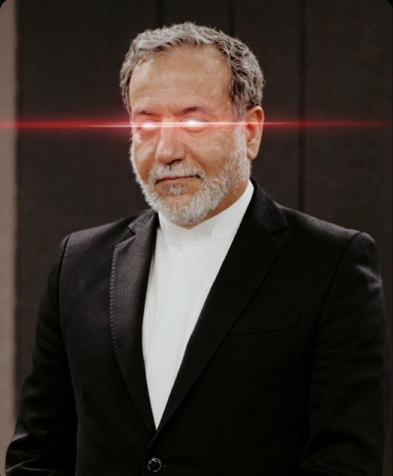

🔴 وقتی انقد خوب مذاکره کردی که جنگ خارجی به جنگ داخلی تبدیل شد.

@IranianMinds

## IranianMinds — post 22617

  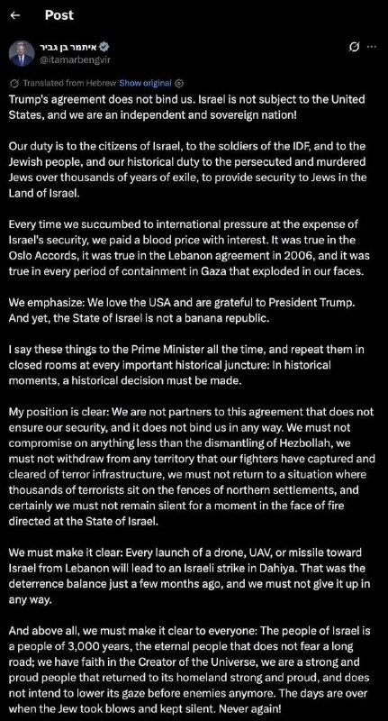

🔴 توافق عالی اصلا حملات امروز اسرائیل به جنوب لبنان @IranianMinds

## IranianMinds — post 22616

  <a href="telegram/content/IranianMinds_22616_1781518050.mp4" target="_blank">🎬 Download video</a>

🔴 توافق عالی اصلا

حملات امروز اسرائیل به جنوب لبنان

@IranianMinds

## IranianMinds — post 22615

  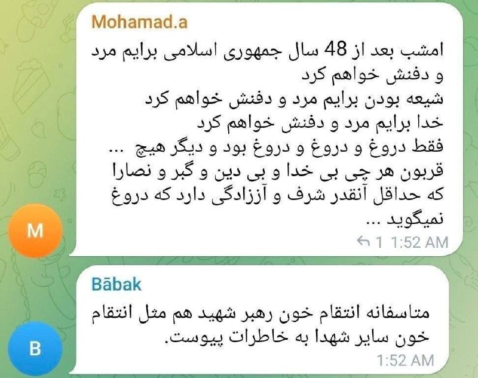

🔴 وضعیت عرزشی ها :

@IranianMinds

## IranianMinds — post 22614

  <a href="telegram/content/IranianMinds_22614_1781518052.mp4" target="_blank">🎬 Download video</a>

قالیباف ۲۰ بهمن ۱۴۰۳ :

مذاکره با ترامپ، قاتل قاسم سلیمانی شرافتمندانه نیست.

@IranianMinds

## IranianMinds — post 22613

  <a href="telegram/content/IranianMinds_22613_1781518053.mp4" target="_blank">🎬 Download video</a>

علی خامنه‌ای خرداد ۱۳۸۱ :

کسانی که دم از مذاکره با آمریکا می‌زنن، یا الفبای سیاست رو بلد نیستن یا الفبای غیرت رو؛ یکی از این دوتاست

علی خامنه‌ای مرداد ۱۳۹۷ :

مذاکره با آمریکا رو امام ممنوع کرد، من هم ممنوع کردم؛ حالا اگر به فرض محال قرار بود با آمریکا مذاکره کنیم، با این دولت فعلی آمریکا ترامپ هرگز مذاکره نمی‌کنیم

@IranianMinds

## BBCPersian — post 283871

🔻تغییرات مهمی در لحظه آخر در متن تفاهم‌نامه اعمال شد

جزئیات تفاهم‌نامه ایران و آمریکا هنوز رسما منتشر نشده است اما خبرگزاری فارس که به نهادهای نظامی و امنیتی ایران نزدیک است، به نقل از «یک منبع نزدیک به تیم مذاکره‌کننده» می‌گوید که ایران در لحظات آخر امتیازات بیشتر گرفته است.

به گفته این منبع، «پس از آنکه روز شنبه کلیات یادداشت تفاهم در شورای عالی امنیت ملی تصویب شد، از صبح یکشنبه با ورود تیم قطری، برخی مسائل باقی‌مانده مورد بحث قرار گرفت. به نظر می‌رسید که این مسائل لاینحل بمانند.»

این منبع به فارس گفت که بعد از حمله به ضاحیه، ایران «آماده می‌شد که از چند جبهه حملات گسترده‌ای» به اسرائیل کند «اما با ورود مجدد ترامپ و امتیازهایی که در ازای عدم حمله ایران به اسرائیل ارائه شد، تیم مذاکره‌کننده قانع شد که این توافق در راستای منافع کشور و منافع مردم لبنان است.»

بنابر این گزارش، به این ترتیب در «لحظه آخر» تغییراتی در متن تفاهم‌نامه اعمال شد که «مهم‌ترین» تغییرات عبارت بودند از: «برداشته شدن فوری محاصره دریایی (به جای بازه ۳۰ روزه که قبلا توافق شده بود) و پایان جنگ و عملیات نظامی در همه جبهه‌ها و همه مناطق لبنان و ضرورت احترام به تمامیت ارضی این کشور.»

فارس همچنین به نقل از این منبع نوشت که یکی از تغییراتی که «در لحظات آخر مذاکرات» در متن تفاهم‌نامه اعمال شد مسئله «اعمال حاکمیت ایران و عمان» بر تنگه هرمز به‌صورت «قطعی و مصرح» بود.

در متن فعلی، حالا نوشته شده است که «آینده اداره خدمات دریانوردی در تنگه هرمز توسط ایران و عمان تعیین می‌شود؛ تصریح استفاده از اصطلاح 'خدمات دریایی' یعنی تثبیت دریافت هزینه برای ایران توسط آمریکا.»

این منبع به فارس گفت که در «جای دیگری از متن هم تکرار شده است؛ به این شکل که ایران فقط برای ۶۰ روز عبور بدون هزینه کشتی‌ها را خواهد پذیرفت. یعنی آمریکا اصل دریافت هزینه را پذیرفته و صرفا ۶۰ روز تخفیف را از ایران گرفته است.»

https://bbc.in/4viCUHy
@BBCPersian

## BBCPersian — post 283870

  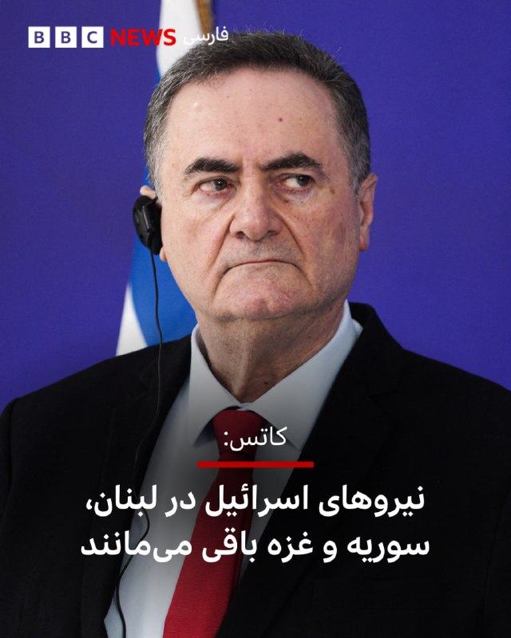

🔻همزمان با اعلام تفاهم ایران و آمریکا، وزیر دفاع اسرائیل می‌گوید که نیروهای آن کشور برای «مدتی نامحدود» در لبنان، سوریه و غزه باقی می‌مانند.

اسرائیل کاتس در بیانیه‌ای گفت: «من و نخست‌وزیر بنیامین نتانیاهو پیگیر سیاستی واضح هستیم که در چارچوب آن ارتش اسرائیل برای مدتی نامحدود در مناطق (حائل) امنیتی در لبنان، سوریه و غزه باقی می‌مانند تا از مرز و جوامع اسرائیلی در برابر عوامل جهادی حفاظت کنند.»

آقای کاتس هشدار داد که اسرائیل به هرگونه حمله احتمالی ایران در واکنش به ادامه عملیاتش در لبنان، «با قدرت کامل» واکنش نشان خواهد داد.

📷Getty Images
https://bbc.in/4viCUHy
@BBCPersian

## BBCPersian — post 283869

  <a href="telegram/content/BBCPersian_283869_1781518054.mp4" target="_blank">🎬 Download video</a>

مهدی طارمی، کاپیتان تیم ملی فوتبال ایران در نشست خبری در پاسخ به سوال بی‌بی‌سی فارسی گفت: «ما به هیچ گروه و جناحی ربطی نداریم و اینجا هستیم که فقط با فوتبال مردم را خوشحال کنیم. »

پوریا ژافره، خبرنگار بی‌بی‌سی فارسی که برای پوشش جام جهانی به آمریکا سفر کرده، با اشاره به اینکه گروهی از ایرانیان در روز بازی تیم را تشویق نخواهند کرد، از مهدی طارمی پرسید پیامش به آنها چیست.

در این ویدیو پاسخ مهدی طارمی را بشنوید.

@BBCPersian

## BBCPersian — post 283867

فراخوان نظر:
واتس‌اپ: ۰۰۴۴۷۳۴۲۰۳۲۱۱۳
تلگرام: BBCShoma@

ایران و آمریکا به تفاهم رسیدند و جمعه در سوئیس تفاهم‌نامه امضا می‌کنند.

احساس شما از شنیدن این خبر چه بود؟
فکر می‌کنید این تفاهم چه تاثیری بر زندگی شما می‌گذارد؟
بیم‌ها و امیدهایتان چیست؟

نظر خود را به صورت متن، ویدیو یا فایل صوتی با هشتگ #تفاهم برای ما بفرستید:

واتس‌اپ: ۰۰۴۴۷۳۴۲۰۳۲۱۱۳
تلگرام: BBCShoma@

## BBCPersian — post 283866

🔻وقوع آتش‌سوزی در یک نفتکش هندی در سواحل عمان

وزارت کشتیرانی هند از آتش‌سوزی در نفتکش «ماریوکس» در سواحل عمان با ۲۴ ملوان هندی خبر داد و گفت که همه آنها در سلامت هستند.

اوپش کومار شارما، مدیر وزارت بنادر و کشتیرانی فدرال در هند، در یک کنفرانس مطبوعاتی گفت که این کشتی با پرچم ماداگاسکار در حرکت بود و محموله‌ای حمل نمی‌کرد.

او گفت: «در حال حاضر همه دریانوردان هندی در سلامت هستند. ما در حال هماهنگی با وزارت خارجه، نمایندگی‌های هند در خارج از کشور، نیروی دریایی هند و وزارت دفاع هستیم تا ایمنی آنها را تضمین کنیم.»

به گفته او علت آتش‌سوزی که ساعت یک و نیم بعد از ظهر به وقت محلی رخ داد، «هنوز مشخص نیست.»

https://bbc.in/4viCUHy
@BBCPersian

## BBCPersian — post 283865

🔻رئیس کمیسیون اروپا: توافق باید امکان بازگشایی فوری تنگه هرمز را فراهم کند

اورزولا فون در لاین، رئیس کمیسیون اروپا، گفت که توافق ایالات متحده و ایران باید امکان «بازگشایی فوری» تنگه هرمز را فراهم کند.

او گفت که اکنون برای همه طرف باید اولویت اجرای «سریع و کامل» بازگشایی باشد:

«آزادی دریانوردی باید بدون عوارض برقرار شود. این امر برای ثبات منطقه‌ای و اقتصاد جهانی ضروری است. این در را برای مذاکرات گسترده‌تر در مورد صلح و امنیت در خاورمیانه باز می‌کند.»

رئیس کمیسیون اروپا همچنین گفت که صلح در خاورمیانه «تا زمانی که لبنان در آتش می‌سوزد» غیرممکن است.

خانم فون در لاین گفت: «اروپا بار دیگر از همه طرف‌ها می‌خواهد که به حاکمیت و تمامیت ارضی لبنان احترام بگذارند و آتش‌بس واقعی را اجرا کنند.»

https://bbc.in/4viCUHy
@BBCPersian

## BBCPersian — post 283864

  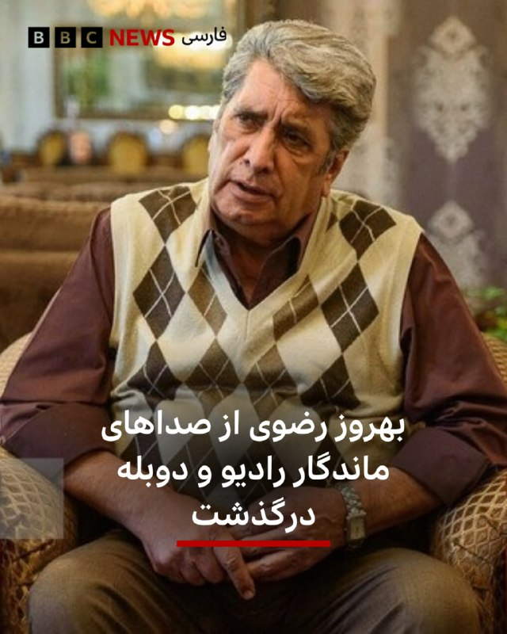

🔻بهروز رضوی، گوینده، صداپیشه، ترانه‌سرا و بازیگر، پس از دوره‌ای بیماری در ۷۸ سالگی درگذشت.

او فعالیت حرفه‌ای را از سال ۱۳۴۷ با گویندگی در رادیو آغاز کرد و طی بیش از پنج دهه فعالیت، به یکی از شناخته‌شده‌ترین صداهای رسانه‌ای ایران بدل شد. روایت مجموعه مستند «ایران» از جمله ماندگارترین آثار او به شمار می‌رود.

بهروز رضوی علاوه بر فعالیت در رادیو و تلویزیون، در سینما و دوبله نیز حضور داشت و در آثاری چون «گناه فرشته»، «سفر به چزابه» و «نجات‌یافتگان» ایفای نقش کرده بود. او همچنین شاعر ترانه‌های «کویر دل» و «گمشده» با صدای مرجان بود.

این هنرمند متولد یزد از سال ۱۳۷۴ در کرج زندگی می‌کرد و برادر عاطفه رضوی، بازیگر و چهره‌پرداز، است.

📷ISNA
https://bbc.in/4viCUHy
@BBCPersian

## BBCPersian — post 283863

  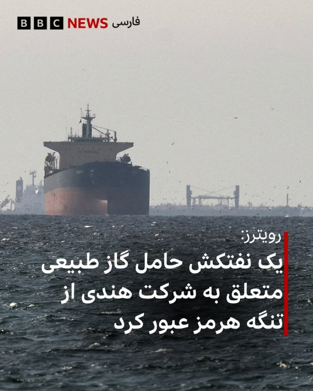

🔻داده‌های ردیابی کشتی‌ها نشان می‌دهد که یک نفتکش حامل گاز طبیعی مایع شرکت پترونت هند، روز دوشنبه از تنگه هرمز عبور کرد و به سمت شرق این تنگه حرکت کرد تا از آن خارج شود.

داده‌های شرکت‌های کپلر و ال‌اس‌جی‌ای نشان می‌دهد که این کشتی محموله خود را در تاریخ اول و دوم مارس در بندر راس لفان قطر تحویل گرفته و از آن زمان در غرب تنگه هرمز بوده است.

در حالی که داده‌های ردیابی کشتی مقصد نفتکش را نشان نمی‌دهد، یک منبع آگاه به خبرگزاری رویترز گفت که این محموله به ترمینال داهج در هند تحویل داده خواهد شد.

📷Reuters
https://bbc.in/4viCUHy
@BBCPersian

## BBCPersian — post 283862

🔻نگاهی به مهمترین خبرها تا این لحظه

▪️آنتونیو گوترش، دبیر کل سازمان ملل متحد از اعلام توافق میان ایران و آمریکا استقبال کرده است. یکی از سخنگوهای او گفت: «این نشانگر قدمی حیاتی در راه حل مسالمت‌آمیز مناقشه» است.

▪️سران بریتانیا، فرانسه، آلمان و ایتالیا در بیانیه مشترکی درباره تفاهم میان ایران و آمریکا گفته‌اند «فرصت را غنیمت می‌دانند» و از نزدیک با آمریکا، ایران و شرکای منطقه‌ای همکاری خواهند کرد.

▪️امانوئل مکرون، رئیس جمهور فرانسه می‌گوید سران گروه ۷ در اجلاس این هفته خود در شهر اوی‌یان در مورد بازگشایی بلند مدت تنگه هرمز به عنوان بخشی از معاهده ایران و آمریکا صحبت خواهند کرد.

▪️رئیس جمهور آمریکا عصر یکشنبه در مصاحبه‌ای با نیویورک تایمز گفت توافق با ایران تضمین می‌کند که تنگه هرمز «برای همیشه بدون عوارض» باشد.

▪️قیمت نفت در معاملات اولیه بازار آسیا به دلیل توافق آمریکا و ایران که قرار است بر اساس آن تنگه هرمز بازگشایی شود، کاهش یافت.

▪️خبرگزاری فرانسه گزارش داده است که جی‌دی ونس، معاون رئیس جمهور آمریکا تصمیم دارد روز جمعه در مراسم امضای توافق شرکت کند و امکان دارد که دونالد ترامپ هم آن را امضا کند.

https://bbc.in/4viCUHy
@BBCPersian

## BBCPersian — post 283861

  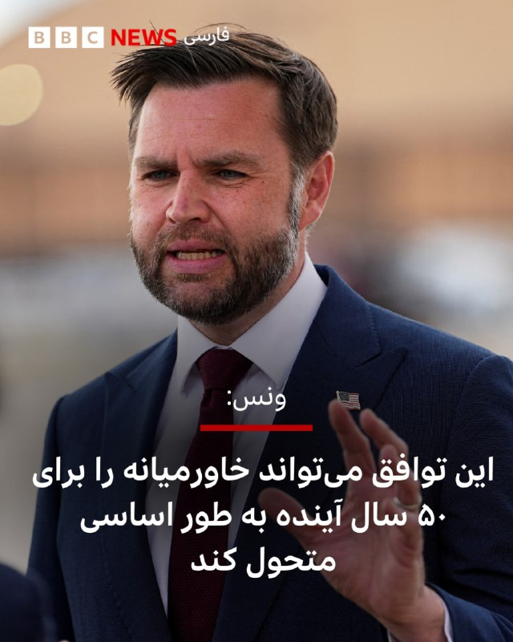

🔻ونس: این توافق می‌تواند خاورمیانه را برای ۵۰ سال آینده به طور اساسی متحول کند
جی‌دی ونس، معاون اول رئیس جمهور آمریکا روز یکشنبه به شبکه خبری فاکس گفت که توافق با ایران این پتانسیل را دارد که «خاورمیانه را برای ۵۰ سال آینده به طور اساسی متحول کند.»

او گفت: «این منطقه از جهان در تمام عمرم و حتی بیشتر از آن، یک منطقه‌ تنش‌زا بوده است.»

آقای ونس گفت دونالد ترامپ موفق شده است «تهدید ایران را از بین ببرد.»

او افزود که اکنون «ساختن دوران جدیدی از رفاه و موفقیت در خاورمیانه» امکان‌پذیر خواهد بود؛ «جایی که رک بگویم می‌توانیم از آن منطقه رفاه زیادی برای مردم آمریکا ایجاد کنیم.»

📷Reuters
https://bbc.in/4viCUHy
@BBCPersian

## BBCPersian — post 283853

🖊امنیه النجار, کارشناس خاورمیانه، بخش مانیتورینگ بی‌بی‌سی

امارات متحده عربی در واکنش به جنگ ایران و پیامدهای آن، از تغییر قابل توجهی در استراتژی منطقه‌ای خود خبر داده و رویکردی با تمرکز بیشتر بر مسائل امنیتی در پیش گرفته است.

امارات که به طور سنتی به عنوان یکی از مراکز باثبات منطقه در حوزه تجارت، امور مالی و سرمایه‌گذاری شناخته می‌شد، خود را تحت تاثیر جنگی یافت که تلاش کرده بود از آن دور بماند.

حملات ایران به خاک امارات آسیب‌پذیری‌هایی را آشکار کرد که به نظر می‌رسد مدل دیرینه «صلح از طریق تجارت» را در این کشور به چالش کشیده است. این حملات نشان داد که چنین مدلی بدون برخورداری از توانمندی‌های دفاعی پیشرفته و قدرتمند قابل دوام نیست. همین موضوع ابوظبی را به سمت تقویت روابط نظامی با شرکای اصلی خود، به ویژه آمریکا و اسرائیل، سوق داده است.
در عین حال جنگ محدودیت‌های وابستگی متقابل سیاست و اقتصاد را نیز آشکار کرد و ابوظبی را بر آن داشت تا روند حرکت خود به سوی استقلال استراتژیک را سرعت ببخشد.

مطلب کامل🔽
https://bbc.in/4fMvl72
📷Getty/ Reuters/ EPA

## BBCPersian — post 283852

🔻استقبال دبیر کل سازمان ملل و دیگر رهبران جهان از تفاهم‌نامه ایران و آمریکا

آنتونیو گوترش، دبیر کل سازمان ملل متحد از اعلام این موضوع که «ایران و آمریکا با یک توافق صلح موافقت کرده‌اند» استقبال کرده است.

یکی از سخنگویان آقای گوترش گفت: «این نشانگر قدمی حیاتی در راه حل مسالمت‌آمیز مناقشه» است.

سانائه تاکائیچی، نخست‌وزیر ژاپن هم از این تفاهم‌نامه استقبال کرد.

خانم تاکائیچی گفت «عمیقا امیدوار» است که «کشتیرانی آزاد و امن در تنگه هرمز عملا تضمین شود و هر چه زودتر، بر سر برنامه هسته‌ای ایران و دیگر مسائل، یک توافق نهایی حاصل شود.»

آنتونی آلبانیزی، نخست‌وزیر استرالیا هم اظهار امیدواری کرد که این تفاهم، «به صلحی ماندگار» منجر شود.

وینستون پیترز، وزیر امور خارجه نیوزیلند هم تفاهم‌نامه ایران و آمریکا را «پیمانی حیاتی و سازنده» خواند و آن را «گامی در جهت کاهش تنش‌ها و افزایش ثبات در منطقه خواند که برای امنیت اقتصادی جهان ضروری است.»

پیشتر هم گزارش کردیم که سران بریتانیا، فرانسه، آلمان و ایتالیا از این تفاهم‌نامه استقبال کردند.

https://bbc.in/4viCUHy
@BBCPersian

## Dirty_Kids — post 392093

  <a href="telegram/content/Dirty_Kids_392093_1781518058.mp4" target="_blank">🎬 Download video</a>

این چه سمی بود😂😂😂😂
مامورا تو ماشین دوتا پسرو گرفتن حالا خودتون ببینید به خاطر چی گرفته شدن! مامور خودش پشماش ریخت
۵۰/۵۰😐

@Dirty_Kids 👻

## Dirty_Kids — post 392092

  <a href="telegram/content/Dirty_Kids_392092_1781518059.mp4" target="_blank">🎬 Download video</a>

حواستون به توله سگ های فامیل باشه
از هر فرصتی استفاده میکنن تا یه صفایی به خودشون بدن😂😂😂

@Dirty_Kids 👻

## Dirty_Kids — post 392091

  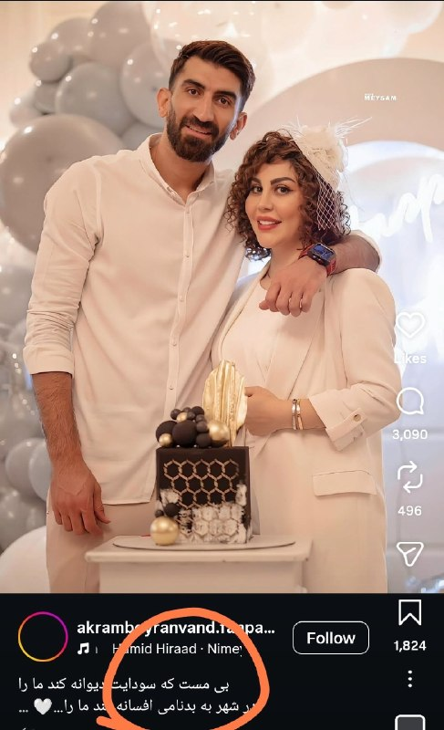

کپشن پستشو که دیدم یلحظه ضربان قلبم رفت بالا و شوک بهم وارد شد ، مگه میشه یه آدم آی‌کیو در حد جلبک داشته باشه؟؟؟
بی مست؟؟؟؟؟؟؟؟؟؟؟؟؟؟؟
چطور تا الان نفهمیده که اون بیم است بوده؟
بیسواد و لمپن و تازه به دوران رسیده!

@Dirty_Kids 👻

## Dirty_Kids — post 392089

جذاب‌ترین عکسای جام تا اینجا

@Dirty_Kids 👻

## Dirty_Kids — post 392088

  

برد حق مسلم آلمان بود...

@Dirty_Kids 👻

## Dirty_Kids — post 392087

  <a href="telegram/content/Dirty_Kids_392087_1781518061.mp4" target="_blank">🎬 Download video</a>

آماده سازی یکی از بزرگترین پرچم شیرو خورشید
برای ورود به ورزشگاه جام جهانی ❤️💪

@Dirty_Kids 👻

## Dirty_Kids — post 392086

‏وضعیت جمهوری اسلامی شده اون دیالوگ ال‌پاچینو تو فیلم گادفادر
یا امضا می‌کنی، یا مغزت روی اون برگه است

@Dirty_Kids 👻

## Dirty_Kids — post 392085

  <a href="telegram/content/Dirty_Kids_392085_1781518062.mp4" target="_blank">🎬 Download video</a>

کربلایی ترامپ

@Dirty_Kids 👻

## Dirty_Kids — post 392084

  <a href="telegram/content/Dirty_Kids_392084_1781518063.mp4" target="_blank">🎬 Download video</a>

خِرکش شدن جمهوری‌عسلامی :)))))

@Dirty_Kids 👻

## Dirty_Kids — post 392083

  <a href="telegram/content/Dirty_Kids_392083_1781518065.mp4" target="_blank">🎬 Download video</a>

راز شلوار جینی که باسنت‌رو خوش‌فرم‌تر نشون بده👌😍

@Dirty_Kids 👻

## Dirty_Kids — post 392082

  <a href="telegram/content/Dirty_Kids_392082_1781518067.mp4" target="_blank">🎬 Download video</a>

ویدیوی وایرال شده از یه دختر ترکیه‌ای که تقلید شکیرا و رقص جام‌جهانی میکنه

@Dirty_Kids 👻

## Hranews — post 113621

افزایش هزینه‌های زندگی و رشد قیمت کالاهای اساسی، فاصله میان دستمزد و #سبد_معیشت خانوارهای کارگری را بیش از پیش افزایش داده است. خبرگزاری ایلنا با انتشار گزارشی در این رابطه اعلام کرد که حداقل #دستمزد_روزانه #کارگران در سال ۱۴۰۵، معادل ۵۵۴ هزار تومان تعیین شده است. این در حالی است که قیمت هر کیلوگرم ران گوسفندی به حدود دو میلیون و ۳۸۰ هزار تومان رسیده و دستمزد یک روز کار تنها امکان خرید حدود ۲۳۰ گرم گوشت را فراهم می‌کند.

برخی کارگران در گفت‌وگو با این رسانه اعلام کرده‌اند که حتی با اشتغال تمام‌وقت و دریافت دستمزد ماهانه، امکان پس‌انداز یا برنامه‌ریزی برای تشکیل خانواده و تامین نیازهای اولیه زندگی را ندارند. یدالله فرجی، فعال صنفی بازنشستگان، در این رابطه گفته است که حقوق و مستمری دریافتی کارگران و بازنشستگان تناسبی با هزینه‌های واقعی زندگی ندارد و بخش قابل توجهی از خانوارهای مزدبگیر در تامین نیازهای اولیه خود با مشکل مواجه هستند.

↘️
@hranews_bot تماس ✉️ -  @Hranews  کانال هرانا 🆑

## Hranews — post 113620

  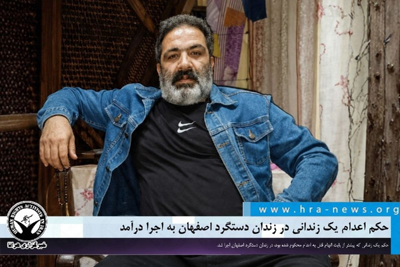

حکم اعدام یک زندانی در زندان دستگرد اصفهان به اجرا درآمد

❗️
❗️
❗️
❗️
❗️ – سحرگاه امروز، حکم یک زندانی که پیشتر از بابت اتهام قتل به #اعدام محکوم شده بود، در زندان دستگرد اصفهان اجرا شد.

به گزارش خبرگزاری هرانا، ارگان خبری مجموعه فعالان حقوق بشر در ایران، یک زندانی در زندان دستگرد اصفهان اعدام شد.

هویت این زندانی که سحرگاه امروز دوشنبه ۲۵ خردادماه به چوبه دار آویخته شد، محمدرضا گشول، توسط هرانا احراز شده است.

ادامه مطلب

#محمدرضا_گشول

↘️
@hranews_bot تماس ✉️ -  @Hranews  کانال هرانا 🆑

## Hranews — post 113619

یک شهروند در ایلام به اتهام جاسوسی برای اسرائیل بازداشت شد

❗️
❗️
❗️
❗️
❗️ – وزارت اطلاعات جمهوری اسلامی ایران از #بازداشت یک شهروند در استان ایلام به اتهام همکاری با سرویس اطلاعاتی اسرائیل خبر داد. این نهاد مدعی شده است که فرد بازداشت‌ شده قصد نفوذ به مراکز داده و سامانه‌های حساس کشور و انتقال اطلاعات به خارج از کشور را داشته است.

#جاسوسی

ادامه مطلب

↘️
@hranews_bot تماس ✉️ -  @Hranews  کانال هرانا 🆑

## alonews — post 128184

👈خبرگزاری واس: وزیر خارجه عربستان سعودی تماس تلفنی‌ای از همتای ایرانی خود دریافت کرد.

🔴فیصل بن فرحان در گفت‌وگو با عباس عراقچی، از توافق برای پایان دادن به عملیات نظامی ابراز خرسندی کرد.

🔴 فیصل بن فرحان همچنین از آغاز مذاکرات تفصیلی با هدف دستیابی به یک توافق دائمی استقبال کرد.

🔴 وزیر امور خارجه عربستان سعودی ابراز امیدواری کرد که صلحی محقق شود که امنیت منطقه و جهان را تقویت کند.

✅ @AloNews خبر جنگ

## alonews — post 128183

  <a href="telegram/content/alonews_128183_1781518069.mp4" target="_blank">🎬 Download video</a>

👈ترامپ برای شرکت تو اجلاس گروه ۷ به فرانسه پرواز کرد

✅ @AloNews خبر جنگ

## alonews — post 128182

  <a href="telegram/content/alonews_128182_1781518070.webm" target="_blank">🎬 Download video</a>

👈شورای عالی مناطق ازاد تجاری اعلام کرده که صدور مجوز نصب پلاک ملی روی خودروهای لوکس مناطق آزاد درحال انجامه

✅ @AloNews خبر جنگ

## alonews — post 128181

👈داده‌های هواشناسی جهانی نشان می‌دهد زابل در ۲۴ ساعت منتهی به صبح ۲۵ خرداد با ثبت دمای ۴۷.۶ درجه، گرم‌ترین نقطه جهان بوده است.

🔴شهرهای الاحساء عربستان با ۴۷.۴ و سبی پاکستان و ینبع عربستان با ۴۷ درجه در رتبه‌های بعدی قرار گرفتند.

✅ @AloNews خبر جنگ

## alonews — post 128180

  <a href="telegram/content/alonews_128180_1781518071.webm" target="_blank">🎬 Download video</a>

👈شرط بندی روی پیروزی گادی آیزنکوت و شکست بنیامین نتانیاهو، در انتخابات اسرائیل افزایش یافته است

✅ @AloNews خبر جنگ

## alonews — post 128179

  <a href="telegram/content/alonews_128179_1781518071.webm" target="_blank">🎬 Download video</a>

👈یورونیوز : توافق کنونی راه را برای مذاکرات ۶۰ روزه درباره مسائل هسته‌ای هموار می‌کند.

✅ @AloNews خبر جنگ

## alonews — post 128178

  <a href="telegram/content/alonews_128178_1781518071.webm" target="_blank">🎬 Download video</a>

👈رویترز این توافق را بزرگ‌ترین پیشرفت دیپلماتیک از زمان آغاز جنگ توصیف کرد و نوشت: توافق ایران و آمریکا به کاهش قیمت نفت و امیدواری بازارهای جهانی منجر شده است

✅ @AloNews خبر جنگ

## alonews — post 128177

  <a href="telegram/content/alonews_128177_1781518071.webm" target="_blank">🎬 Download video</a>

👈رئیس‌جمهور لبنان، عون : از اینکه امنیت و ثبات لبنان تو توافق آمریکا و ایران برای پایان دادن به جنگ لحاظ شده، قدردانی می‌کنم

✅ @AloNews خبر جنگ

## alonews — post 128176

  <a href="telegram/content/alonews_128176_1781518072.mp4" target="_blank">🎬 Download video</a>

👈حملات اسرائیل تو مناطقی از جنوب لبنان ادامه داره!

✅ @AloNews خبر جنگ

## alonews — post 128175

  <a href="telegram/content/alonews_128175_1781518073.webm" target="_blank">🎬 Download video</a>

👈قیمت هر بشکه نفت خام برنت بعد از توافق بین ایران و آمریکا : ۸۳ دلار

✅ @AloNews خبر جنگ

## alonews — post 128174

  <a href="telegram/content/alonews_128174_1781518073.webm" target="_blank">🎬 Download video</a>

👈آتش توپخانه اسرائیل تپه علی الطاهر در منطقه نبطیه، جنوب لبنان را هدف قرار می‌دهد

✅ @AloNews خبر جنگ

## alonews — post 128173

  <a href="telegram/content/alonews_128173_1781518073.webm" target="_blank">🎬 Download video</a>

👈وزارت خارجه امارات: ما بر اهمیت اولویت دادن به گفت‌وگو و دیپلماسی و پایبندی به قوانین بین‌المللی تأکید می‌کنیم، به‌گونه‌ای که امنیت و ثبات در منطقه تقویت شود.

🔴ما بر اهمیت پایبندی کامل به مفاد توافق تأکید می‌کنیم، به‌گونه‌ای که توقف فوری و کامل اقدامات تجاوزکارانه در منطقه تضمین شود.

🔴 ما از مشارکت کشورها و طرف‌های ذی‌ربط در فراهم‌سازی شرایط مناسب برای دستیابی به این توافق قدردانی می‌کنیم.

✅ @AloNews خبر جنگ

## alonews — post 128172

  <a href="telegram/content/alonews_128172_1781518073.webm" target="_blank">🎬 Download video</a>

👈نفتالی بنت، نخست وزیر پیشین اسرائیل درباره توافق با ایران: «این یک نقطه عطف خطرناک برای امنیت اسرائیل است. نتانیاهو ما را به جنگ‌های فرسایشی کشانده است.»

✅ @AloNews خبر جنگ

## alonews — post 128171

  <a href="telegram/content/alonews_128171_1781518074.webm" target="_blank">🎬 Download video</a>

👈در جریان معاملات امروز شاخص کل بورس با جهش ۱۶۱ هزار و ۵۹۸ واحد در سطح ۴ میلیون و ۹۸۰ هزار واحدی ایستاد

✅ @AloNews خبر جنگ

## alonews — post 128170

  <a href="telegram/content/alonews_128170_1781518074.webm" target="_blank">🎬 Download video</a>

👈اسموتریچ، وزیر دارایی اسرائیل:
توافق با ایران برای اسرائیل بد است

✅ @AloNews خبر جنگ

## alonews — post 128169

  <a href="telegram/content/alonews_128169_1781518074.webm" target="_blank">🎬 Download video</a>

👈مقامات اسرائیلی خواسته نشده‌اند که از جنوب لبنان عقب‌نشینی کنند، گزارش کانال ۱۲

✅ @AloNews خبر جنگ

## alonews — post 128168

  <a href="telegram/content/alonews_128168_1781518074.webm" target="_blank">🎬 Download video</a>

👈گزارش UKMTO از حادثه‌ای در ۱۴ مایل دریایی جنوب ساحل یمن ارائه داد.

🔴 یک کشتی کانتینری توسط یک قایق کوچک که خدمه‌اش آتش گشودند و تلاش کردند به کشتی سوار شوند، مورد حمله قرار گرفت

✅ @AloNews خبر جنگ

## alonews — post 128167

  <a href="telegram/content/alonews_128167_1781518074.mp4" target="_blank">🎬 Download video</a>

👈برگشت مردمِ به لُبنان بعد آتش‌بس

✅ @AloNews خبر جنگ

## alonews — post 128166

  <a href="telegram/content/alonews_128166_1781518076.webm" target="_blank">🎬 Download video</a>

👈گزارش ها از حمله به یک کشتی در نزدیکی یمن

✅ @AloNews خبر جنگ

## alonews — post 128165

---
📅 بروزرسانی: 1405/03/25 07:19
---

## VahidOOnLine — post 245630

  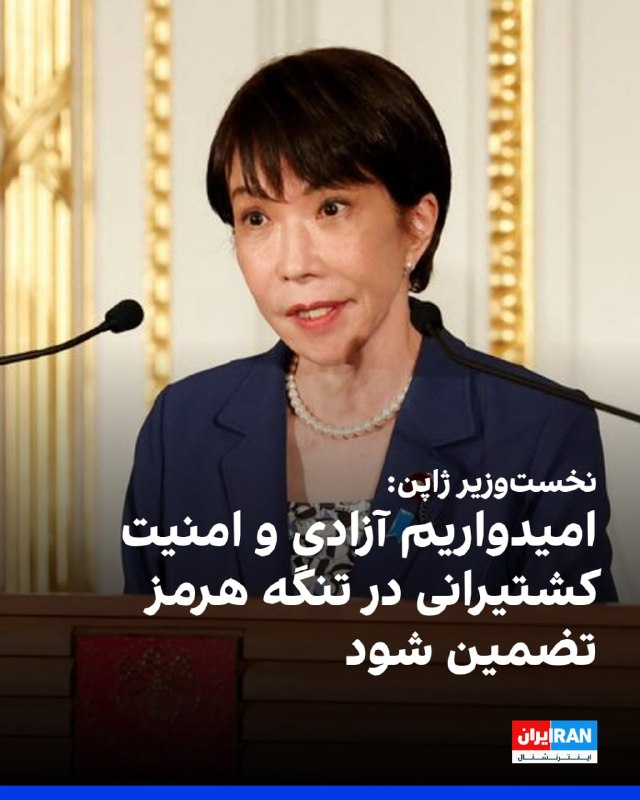

سانائه تاکایچی، نخست‌وزیر ژاپن، در شبکه اجتماعی ایکس از توافق میان آمریکا و جمهوری اسلامی برای پایان دادن به درگیری‌ها استقبال و ابراز امیدواری کرد که مفاد این توافق، از جمله بازگشایی تنگه هرمز برای کشتی‌های بین‌المللی، به‌طور کامل اجرا شود. او نوشت ژاپن «به‌شدت امیدوار است» آزادی و امنیت کشتیرانی در تنگه هرمز در عمل تضمین شود و توافق نهایی درباره برنامه هسته‌ای ایران و سایر مسائل نیز هرچه سریع‌تر حاصل شود. iranintl
‌🏁 🇬🇧 IranintlTV

🤖 @VahidOOnLine

## VahidOOnLine — post 245629

  

اسکات بسنت‌، وزیر خزانه‌داری آمریکا، در شبکه اجتماعی ایکس نوشت: دونالد ترامپ، رییس‌جمهوری ایالات متحده، امروز با دستیابی به یک توافق صلح تاریخی با ایران، همچنان به امن‌تر کردن جهان ادامه می‌دهد. او اشاره کرد که رهبری ترامپ، «همراه با تعامل مستقیمش با متحدان و دشمنان، برای قرن‌ها در کتاب‌های تاریخ ثبت خواهد شد.» iranintl
‌🏁 🇬🇧 IranintlTV

🤖 @VahidOOnLine

## VahidOOnLine — post 245628

  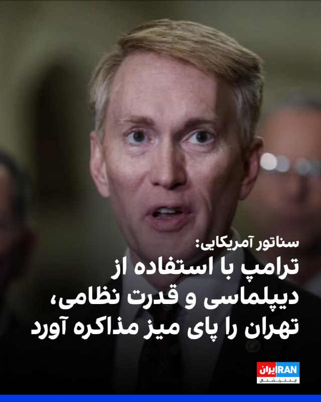

سناتور جیمز لنکفورد، نماینده جمهوری‌خواه مجلس سنای آمریکا، گفت جمهوری اسلامی طی ۴۷ سال گذشته به آمریکا، متحدانش و شهروندان آمریکایی در منطقه حمله کرده است. او افزود مردم ایران تحت سرکوب حکومت زندگی می‌کنند و واشینگتن سال‌ها برای مقابله با تهدیدهای ناشی از جمهوری اسلامی میلیاردها دلار هزینه کرده است. لنکفورد گفت روسای‌جمهوری پیشین آمریکا طی بیش از چهار دهه تلاش کردند اختلافات با جمهوری اسلامی را حل کنند، اما دونالد ترامپ نخستین رییس‌جمهوری است که با استفاده هم‌زمان از دیپلماسی و قدرت نظامی، تهران را پای میز مذاکره آورده است. iranintl
‌🏁 🇬🇧 IranintlTV

🤖 @VahidOOnLine

## VahidOOnLine — post 245627

  

ویل ریچیاردلا، از چهره‌های نزدیک به جریان محافظه‌کار آمریکا، در واکنش به توافق میان واشینگتن و جمهوری اسلامی گفت بازگشایی تنگه هرمز نباید به‌عنوان یک امتیاز از سوی ایران تلقی شود. او در شبکه اجتماعی ایکس نوشت آزادی کشتیرانی در تنگه هرمز، وضعیت عادی و اولیه بوده و جمهوری اسلامی آن را به اهرم فشار تبدیل کرده است. ریچیاردلا نوشت اگر نخستین دستاورد این توافق بازگرداندن چیزی باشد که ایران اساسا حق سلب آن را نداشته، باید دید آمریکا برای دستیابی به این نتیجه چه امتیازهایی داده است. iranintl
‌🏁 🇬🇧 IranintlTV

🤖 @VahidOOnLine

## VahidOOnLine — post 245626

  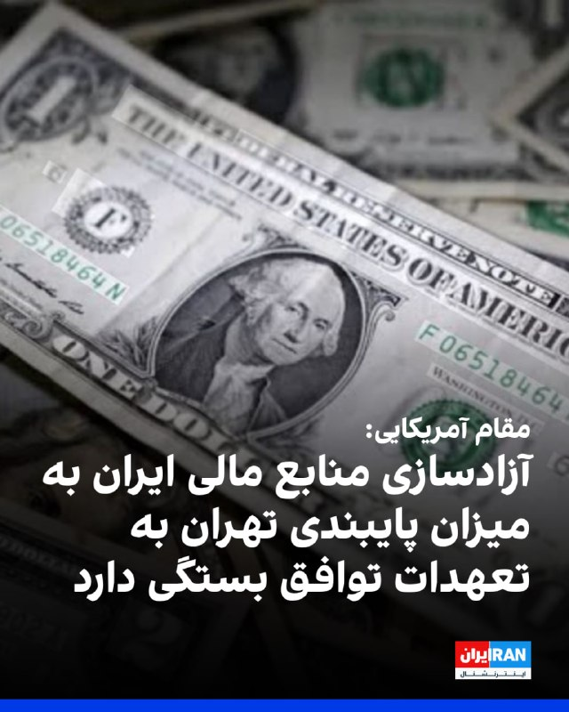

باراک راوید، خبرنگار اکسیوس، به نقل از یک مقام ارشد آمریکایی نوشت واشینگتن ادعای جمهوری اسلامی درباره آزادسازی بدون قید و شرط ۱۲ میلیارد دلار از دارایی‌های مسدودشده ایران پیش از آغاز مذاکرات ۶۰ روزه را رد کرده است. این مقام آمریکایی این ادعا را «روایت‌سازی» توصیف کرد و گفت چنین موضوعی صحت ندارد. به گفته او، توافق به‌دست‌آمده بر اساس اصل «اقدام در برابر اقدام» تنظیم شده و هیچ بخشی از دارایی‌های مسدودشده ایران پیش از اجرای تعهدات جمهوری اسلامی آزاد نخواهد شد. این مقام آمریکایی تاکید کرد هرگونه آزادسازی منابع مالی ایران به میزان پایبندی تهران به تعهدات توافق بستگی خواهد داشت. iranintl
‌🏁 🇬🇧 IranintlTV

🤖 @VahidOOnLine

## VahidOOnLine — post 245625

  <a href="telegram/content/VahidOOnLine_245625_1781495353.mp4" target="_blank">🎬 Download video</a>

♦️دونالد ترامپ، رئیس‌جمهوری آمریکا، هشتادمین سال تولدش را با برگزاری جنجالی مبارزه در قفس مسابقات «یو‌اف‌سی» در چمن جنوبی کاخ سفید جشن گرفت. در این رویداد بی‌سابقه که با مانور هوایی جنگنده‌های ارتش آغاز شد، ترامپ در ردیف اول صندلی‌های کنار قفس، میان ملانیا ترامپ، بانوی اول ایالات متحده، و دانا وایت، رئیس یو‌اف‌سی نشست؛ در حالی که بارون ترامپ، فرزند رئیس جمهوری در پشت سر آنها و مارک زاکربرگ، مدیرعامل «متا» نیز در میان مهمانان ویژه این مسابقات حضور داشتند.
‌🇸🇦 Indypersian

🤖 @VahidOOnLine

## VahidOOnLine — post 245624

  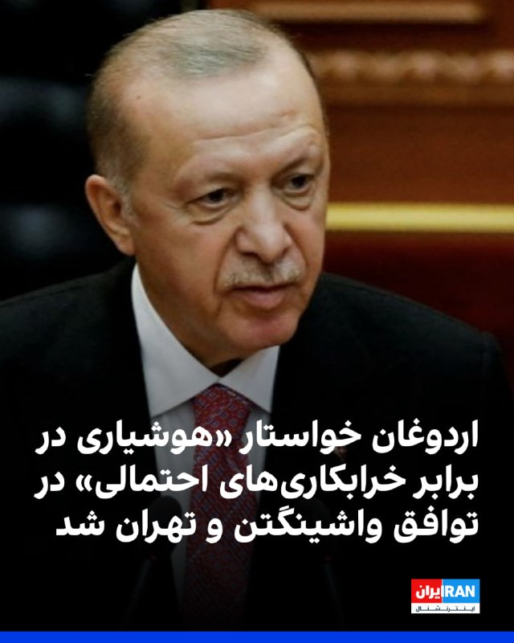

رجب طیب اردوغان، رییس‌جمهوری ترکیه، توافق حاصل شده بین ایالات متحده و ایران را تحولی مهم برای برقراری صلح و آرامش در منطقه خود دانست و از آن استقبال کرد. او ابراز امیدواری کرد که خبر اعلام توافق «که تمام جهان مدت‌هاست به آن نیاز دارد، راه را برای ایجاد فضایی پایدار از صلح و امنیت در منطقه ما هموار کند» و نوشت: «من بر لزوم اجتناب از لفاظی‌ها، تحریکات و اقداماتی که می‌تواند تنش‌ها را در دوره منتهی به امضای توافق تشدید کند، تاکید می‌کنم.» اردوغان در این ارتباط خواستار «هوشیاری در برابر خرابکاری‌های احتمالی» شد و از پاکستان به خاطر تلاش‌های میانجیگرانه استثنایی‌اش، حمایت قطر و عربستان سعودی از ابتکارات دیپلماتیک، و به ویژه از رهبران ایالات متحده و جمهوری اسلامی، در دستیابی به این نتیجه، قدردانی کرد. او تاکید کرد: «ما به حمایت از تمام تلاش‌ها برای برقراری صلح، ثبات و آرامش در منطقه خود ادامه خواهیم داد و به راه‌حل‌های پایدار مبتنی بر دیپلماسی و حقوق بین‌الملل کمک خواهیم کرد.» iranintl
‌🏁 🇬🇧 IranintlTV

🤖 @VahidOOnLine

## VahidOOnLine — post 245623

  <a href="telegram/content/VahidOOnLine_245623_1781495356.mp4" target="_blank">🎬 Download video</a>

♦️حساب رسمی کاخ سفید بامداد دوشنبه ۲۵ خردادماه ویدیویی از ورود دونالد ترامپ، رئیس‌جمهوری آمریکا، و دانا وایت، مدیرعامل «یو‌اف‌سی» (UFC)، به رویداد «یو‌اف‌سی آزادی ۲۵۰» (UFC Freedom 250) در محوطه جنوبی کاخ سفید منتشر کرد.

در این ویدیو، ترامپ و وایت در میان تشویق حاضران وارد محل برگزاری مسابقات می‌شوند. این رویداد همزمان با هشتادمین سال تولد ترامپ و «روز پرچم» آمریکا برگزار شد.

برای برگزاری این مسابقات، قفس هشت‌ضلعی سازمان «یو‌اف‌سی» به طور موقت در چمن جنوبی کاخ سفید نصب شد و هزاران مهمان برای تماشای هفت مبارزه این برنامه دعوت شدند.

این مراسم که کاخ سفید از آن با عنوان «تاریخ‌سازی در کاخ سفید» یاد کرده است، یکی از کم‌سابقه‌ترین رویدادهای ورزشی برگزارشده در تاریخ این مجموعه به شمار می‌رود. روابط نزدیک ترامپ و دانا وایت به بیش از دو دهه پیش بازمی‌گردد و مدیرعامل «یو‌اف‌سی» از شناخته‌شده‌ترین حامیان رئیس‌جمهوری آمریکا به شمار می‌رود.
‌🇸🇦 Indypersian

🤖 @VahidOOnLine

## VahidOOnLine — post 245622

  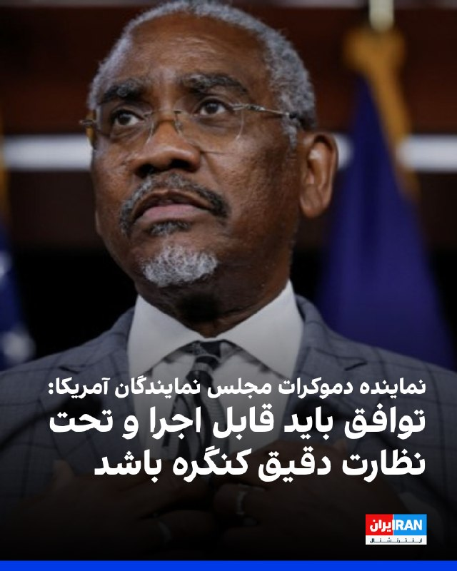

گرگوری میکس، عضو ارشد کمیته امور خارجی مجلس نمایندگان آمریکا، با استقبال از حرکت دولت ترامپ به سمت دیپلماسی، جنگ با جمهوری اسلامی را «انتخابی، گمراه‌کننده و زیان‌بار» توصیف کرد. او گفت این جنگ هزینه‌های سنگینی بر آمریکا، متحدانش، اقتصاد جهانی و غیرنظامیان تحمیل کرده است.

این نماینده دموکرات تاکید کرد تنها راه‌حل پایدار اختلافات با جمهوری اسلامی، از جمله در موضوع هسته‌ای، توافقی مذاکره‌شده و قابل راستی‌آزمایی است. به گفته او، جنگ نه به تغییر حکومت ایران منجر می‌شود، نه برنامه موشکی و پهپادی آن را از بین می‌برد و نه به حمایت تهران از گروه‌های نیابتی پایان می‌دهد.

میکس همچنین از خروج ترامپ از برجام بدون ارائه جایگزین معتبر انتقاد کرد و گفت این اقدام به تشدید بحران کنونی انجامید. او تاکید کرد هر توافقی باید شفاف، قابل اجرا، پایدار و تحت نظارت کنگره باشد و مردم آمریکا شایسته پاسخ‌های روشن و تضمین عدم تکرار اشتباهاتی هستند که به این جنگ پرهزینه منجر شد.

‌🏁 🇬🇧 IranintlTV

🤖 @VahidOOnLine

## VahidOOnLine — post 245621

  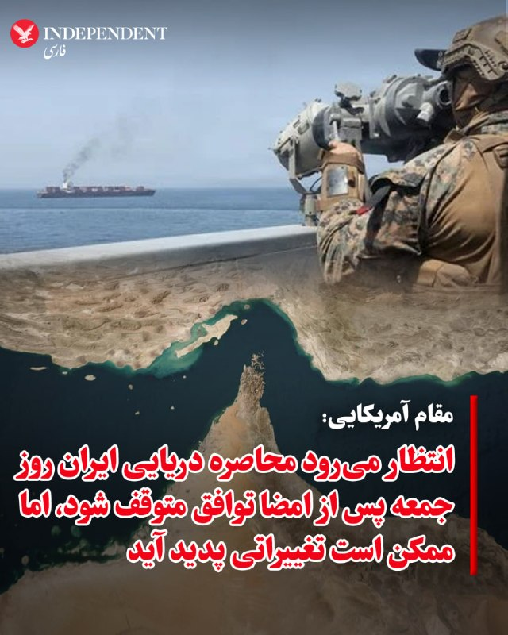

♦️یک مقام آمریکایی به سی‌ان‌ان گفت، ارتش ایالات متحده دستوری دریافت کرده است که محاصره دریایی جاری در تنگه هرمز را روز جمعه، در صورت امضای یادداشت تفاهم با ایران، لغو کند.
دونالد ترامپ، رئیس‌جمهوری آمریکا، ابتدا روز یکشنبه اعلام کرد که پس از توافق با تهران، دستور «لغو فوری محاصره دریایی ایالات متحده» علیه بنادر ایران را صادر کرده است. او بعدتر گفت: «با باز شدن تنگه پس از امضای توافق در روز جمعه، برای اهداف پاکسازی مین‌ها، نفت دوباره از هر دو سمت برای منطقه و جهان جریان خواهد یافت.»
ترامپ این محاصره را حدود شش هفته پس از آغاز جنگ برقرار کرد.
این مقام آمریکایی تاکید کرد که این وضعیت در حال حاضر برداشت موجود است، اما ممکن است تا روز جمعه تغییر کند.
‌🇸🇦 Indypersian

🤖 @VahidOOnLine

## VahidOOnLine — post 245620

  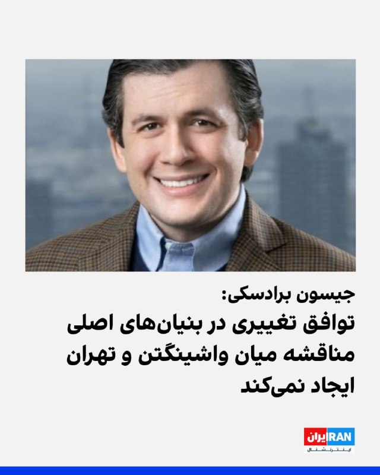

جیسون برادسکی، مدیر سیاست‌گذاری سازمان «اتحاد علیه ایران هسته‌ای»، در واکنش به تفاهم‌نامه میان واشینگتن و تهران گفت این توافق تغییری در بنیان‌های اصلی مناقشه میان آمریکا و جمهوری اسلامی ایجاد نخواهد کرد. او در شبکه اجتماعی ایکس نوشت فرق نمی‌کند این تفاهم‌نامه امروز، فردا یا چند روز دیگر امضا شود. برادسکی همچنین نوشت تا زمانی که جمهوری اسلامی در تهران بر سر کار باشد، بی‌ثباتی در منطقه ادامه خواهد داشت. iranintl
‌🏁 🇬🇧 IranintlTV

🤖 @VahidOOnLine

## VahidOOnLine — post 245619

  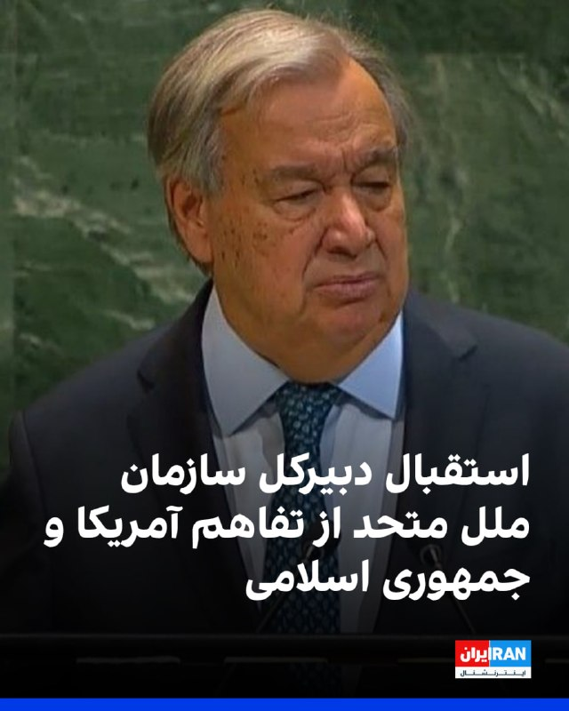

آنتونیو گوترش، دبیرکل سازمان ملل متحد، در شبکه اجتماعی ایکس نوشت: «به گرمی، به ایالات متحده و ایران به خاطر دستیابی به توافق صلحی که آتش‌بس فوری و دائمی، بازگشایی تنگه هرمز و همچنین چارچوبی برای مذاکرات بیشتر را فراهم می‌کند، تبریک می‌گویم.» او تاکید کرد که این گامی حیاتی به سوی حل و فصل مسالمت‌آمیز درگیری است. گوترش همچنین از پاکستان، قطر، مصر، عربستان سعودی، ترکیه و سایر کشورهای منطقه به خاطر نقش سازنده‌ای که در حمایت از مذاکراتی که منجر به توافق صلح شد، ایفا کردند، قدردانی کرد. iranintl
‌🏁 🇬🇧 IranintlTV

🤖 @VahidOOnLine

## VahidOOnLine — post 245618

  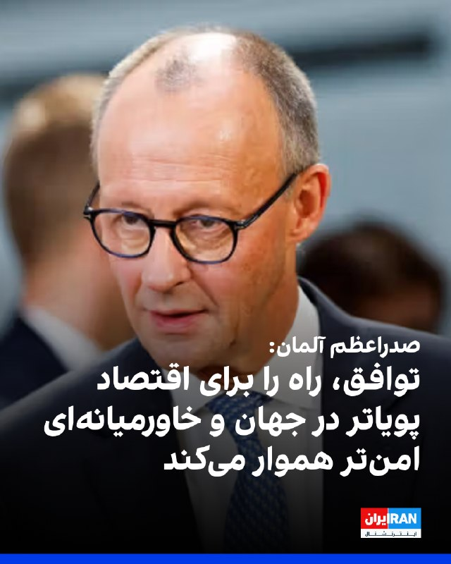

فریدریش مرتس، صدراعظم آلمان، از توافق میان آمریکا و جمهوری اسلامی استقبال کرد و آن را یک دستاورد مهم دیپلماتیک دانست.

او گفت این توافق، راه را برای اقتصاد پویاتر در جهان و خاورمیانه‌ای امن‌تر هموار می‌کند.

مرتس همچنین تاکید کرد اجرای توافق با عزم و اراده همه طرف‌ها اهمیت دارد و می‌تواند به تقویت ثبات و امنیت منطقه‌ای کمک کند.
‌🏁 🇬🇧 IranintlTV

🤖 @VahidOOnLine

## VahidOOnLine — post 245617

  <a href="telegram/content/VahidOOnLine_245617_1781495360.mp4" target="_blank">🎬 Download video</a>

♦️حساب رسمی کاخ سفید بامداد دوشنبه ۲۵ خرداد ویدیویی از مانور جنگنده‌های آمریکایی بر فراز کاخ سفید منتشر کرد. در این ویدیو، همزمان با اجرای سرود ملی آمریکا، جنگنده‌های تیم‌های نمایشی نیروی دریایی و نیروی هوایی آمریکا از فراز کاخ سفید عبور می‌کنند.

دونالد ترامپ، رئیس‌جمهوری آمریکا، روز یکشنبه هشتاد ساله شد. این مناسبت با «روز پرچم» آمریکا همزمان بود و در حالی برگزار شد که ایالات متحده خود را برای جشن‌های دویست‌وپنجاهمین سالگرد استقلال این کشور آماده می‌کند.

در این مراسم که در محوطه جنوبی کاخ سفید برگزار شد، هزاران مهمان حضور داشتند و جنگنده‌های تیم‌های نمایشی «بلو انجلز» و «تاندربردز» نیز با پرواز بر فراز کاخ سفید در برنامه شرکت کردند.

ترامپ همچنین میزبان رویداد «یو‌اف‌سی آزادی ۲۵۰» (UFC Freedom 250) در محوطه جنوبی کاخ سفید بود؛ رقابت‌هایی که برای نخستین بار در تاریخ این مجموعه در چمن جنوبی کاخ سفید برگزار شد. برای این رویداد، قفس هشت‌ضلعی مسابقات «یو‌اف‌سی» (UFC) به طور موقت در محوطه کاخ سفید نصب شد و هزاران مهمان برای تماشای هفت مبارزه این برنامه دعوت شدند.

برگزاری این رویداد بازتابی از روابط دیرینه ترامپ با سازمان «یو‌اف‌سی» (UFC) به شمار می‌رود؛ رابطه‌ای که به اوایل دهه ۲۰۰۰ میلادی بازمی‌گردد، زمانی که او از برگزاری مسابقات این سازمان در مجموعه‌های تحت مالکیت خود حمایت می‌کرد.
‌🇸🇦 Indypersian

🤖 @VahidOOnLine

## VahidOOnLine — post 245616

  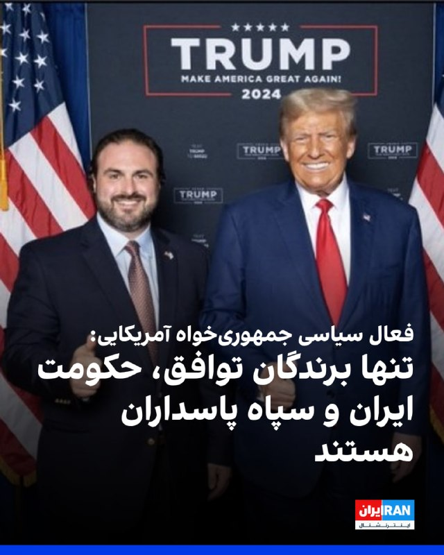

برایان لیب، فعال سیاسی جمهوری‌خواه و از حامیان دونالد ترامپ، با انتقاد از توافق میان واشینگتن و جمهوری اسلامی گفت: «تنها برندگان این توافق، حکومت ایران و سپاه پاسداران هستند.» او در شبکه اجتماعی ایکس نوشت آنچه «توافق صلح» نامیده می‌شود، در عمل به سود جمهوری اسلامی تمام شده است. iranintl
‌🏁 🇬🇧 IranintlTV

🤖 @VahidOOnLine

## VahidOOnLine — post 245615

  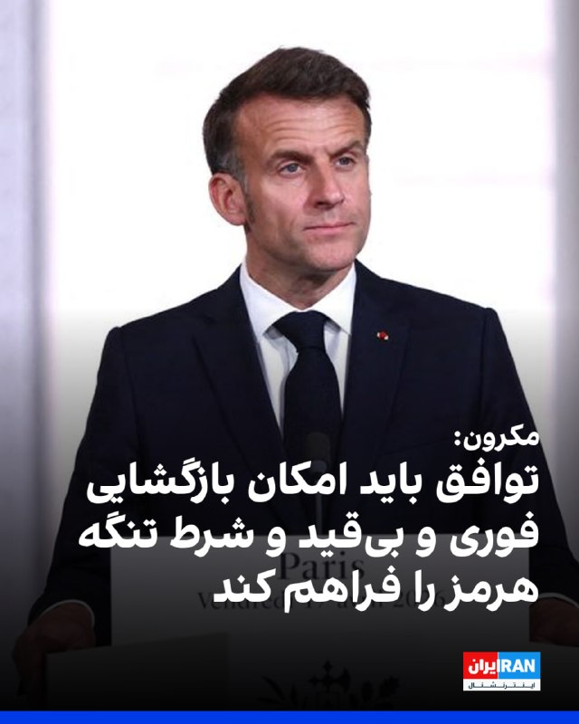

امانوئل مکرون، رییس‌جمهوری فرانسه، از توافق میان آمریکا و جمهوری اسلامی استقبال کرد و آن را نتیجه یک تلاش دیپلماتیک چندجانبه دانست. او خواستار اجرای سریع و کامل توافق از سوی همه طرف‌ها شد و تاکید کرد بازگشایی فوری و بدون قید و شرط تنگه هرمز و ازسرگیری کشتیرانی بدون محدودیت یا عوارض، برای ثبات منطقه‌ای و اقتصاد جهانی ضروری است. مکرون گفت این توافق می‌تواند زمینه‌ساز مذاکراتی گسترده‌تر برای صلح و امنیت در خاورمیانه باشد؛ مذاکراتی که باید برنامه هسته‌ای و موشکی جمهوری اسلامی و آنچه او سیاست‌های بی‌ثبات‌کننده منطقه‌ای تهران خواند را نیز در بر بگیرد. او افزود فرانسه آماده است همراه با شرکای خود در این روند نقش‌آفرینی کند. رییس‌جمهوری فرانسه همچنین بر حمایت پاریس از تلاش‌های دولت لبنان برای بازگرداندن حاکمیت این کشور تاکید کرد و گفت تنها حاکمیت کامل لبنان می‌تواند ثبات، تمامیت ارضی و تامین نیازهای مردم این کشور را تضمین کند. مکرون در پایان بر ضرورت برقراری یک آتش‌بس پایدار و موثر در لبنان تاکید کرد. iranintl
‌🏁 🇬🇧 IranintlTV

🤖 @VahidOOnLine

## VahidOOnLine — post 245614

  

سناتور لیندسی گراهام، نماینده جمهوری‌خواه مجلس سنای آمریکا، در شبکه اجتماعی ایکس «از شنیدن توافق با ایران برای باز شدن تنگه هرمز » ابراز خوشحالی کرد و نوشت: «من مذاکرات بعدی در مورد برنامه هسته‌ای ایران و سایر مسائل را از نزدیک دنبال خواهم کرد.»

او با این حال اضافه کرد: «من تا اندازه‌ای نگرانم که دیدگاه ایران در مورد این توافق با آنچه تیم مذاکره‌کننده آمریکایی ادعا می‌کند متفاوت باشد.»

گراهام اشاره کرد: «طبق قانون ما، هرگونه توافق هسته‌ای با ایران برای بررسی و رأی‌گیری به کنگره ارسال خواهد شد» و نوشت: «مشتاقانه منتظر بررسی محصول نهایی هستم.»
‌🏁 🇬🇧 IranintlTV

🤖 @VahidOOnLine

## VahidOOnLine — post 245613

  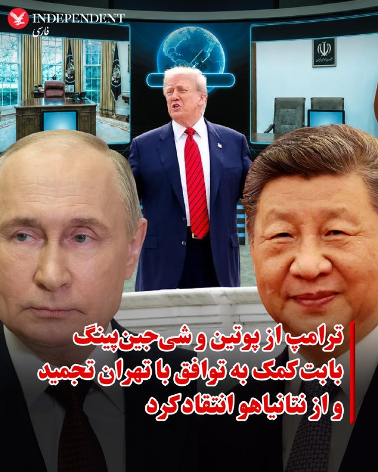

♦️دونالد ترامپ، رئیس‌جمهوری آمریکا در مصاحبه تلفنی ۲۸ دقیقه‌ای با نیویورک‌تایمز گفت که تصمیم او برای حمله به ایران در اسفندماه و سپس اعمال محاصره دریایی بنادر این کشور پس از بسته شدن تنگه هرمز توسط تهران، خاورمیانه را به نفع آمریکا تغییر داده است.
به گزارش این روزنامه آمریکایی، او در روز تولد ۸۰ سالگی‌اش، در حالی که صدای جمع شدن خانواده‌اش برای یک شام جشن در پس‌زمینه شنیده می‌شد، از شی جین‌پینگ رئیس‌جمهوری چین و ولادیمیر پوتین رئیس‌جمهوری روسیه بابت کمک در این توافق تمجید کرد و در مقابل، از بنیامین نتانیاهو به‌شدت انتقاد کرد و گفت حملات او تقریبا باعث شکست توافق نهایی شده بود.
ترامپ درباره نخست‌وزیر اسرائیل گفت: «او آدم بسیار دشواری است و راستش باید خیلی از ما تشکر کند، چون اگر ایران سلاح هسته‌ای داشت، اسرائیل دو ساعت هم دوام نمی‌آورد.»
‌🇸🇦 Indypersian

🤖 @VahidOOnLine

## VahidOOnLine — post 245612

  

وال‌استریت ژورنال در تحلیلی نوشت سرنوشت توافق اولیه میان آمریکا و جمهوری اسلامی به سه عامل کلیدی بستگی دارد: بازگشایی تنگه هرمز، پایان محاصره دریایی ایران و نحوه رفتار اسرائیل در روزهای پیش از امضای رسمی توافق.

این روزنامه توافق اعلام‌شده از سوی دونالد ترامپ را بزرگ‌ترین پیشرفت دیپلماتیک چهار ماه جنگ اخیر توصیف کرد، اما درباره پایداری و اجرای آن ابراز تردید کرد.

به نوشته این روزنامه، بازگشایی تنگه هرمز مهم‌ترین آزمون توافق است و می‌تواند با ازسرگیری عبور عادی نفتکش‌ها و کشتی‌های تجاری، بر بازارهای انرژی و اقتصاد جهانی تاثیر بگذارد.

رفع محاصره دریایی ایران نیز از عوامل مهم موفقیت توافق دانسته شده، زیرا می‌تواند انگیزه تهران برای ادامه مذاکرات را افزایش دهد.

وال‌استریت ژورنال اسرائیل را بزرگ‌ترین متغیر این روند معرفی کرد و نوشت ادامه حملات اسرائیل در لبنان و منطقه می‌تواند توافق را با خطر مواجه کند.

این روزنامه در عین حال از کاهش تنش و نوعی احساس آرامش در تهران و واشینگتن خبر داد، اما تاکید کرد همچنان ابهام‌های مهمی درباره آینده مذاکرات، نقش اسرائیل و نحوه اجرای توافق باقی مانده است.
iranintl.c
‌🏁 🇬🇧 IranintlTV

🤖 @VahidOOnLine

## VahidOOnLine — post 245611

  

دونالد ترامپ، رییس‌جمهوری آمریکا، در گفت‌وگو با نیویورک‌تایمز از توافق تازه با جمهوری اسلامی دفاع کرد و هشدار داد اگر مذاکرات آتی درباره برنامه هسته‌ای ایران به نتیجه نرسد، حملات نظامی علیه تهران را از سر خواهد گرفت. او گفت در چنین شرایطی یا اقدام نظامی انجام خواهد شد یا آمریکا در ازای دریافت ۲۰ درصد از درآمدهای منطقه، نقش «نگهبان خاورمیانه» را بر عهده خواهد گرفت. ترامپ همچنین تاکید کرد توافق حاصل‌شده در نهایت عبور از تنگه هرمز را «برای همیشه بدون عوارض» تضمین خواهد کرد. او تصمیم خود برای حمله به ایران و اعمال محاصره دریایی پس از بسته شدن تنگه هرمز را عامل تغییر موازنه قدرت در منطقه به سود آمریکا دانست. رییس‌جمهوری آمریکا از شی جین‌پینگ و ولادیمیر پوتین به دلیل کمک به روند مذاکرات قدردانی کرد، اما از بنیامین نتانیاهو به دلیل اقداماتی که به گفته او نزدیک بود توافق را به شکست بکشاند، انتقاد کرد. ترامپ گفت اگر ایران به سلاح هسته‌ای دست می‌یافت، «اسرائیل حتی دو ساعت هم دوام نمی‌آورد». مذاکرات بعدی درباره پرونده هسته‌ای ایران قرار است از جمعه آینده در سوئیس آغاز شود. متن کامل را اینجا بخوانید iranintl
‌🏁 🇬🇧 IranintlTV

🤖 @VahidOOnLine

## FoxNewsTwitter — post 342971

  <a href="telegram/content/FoxNewsTwitter_342971_1781495363.mp4" target="_blank">🎬 Download video</a>

Fox News (Twitter/X)

Smoke rises from the wreckage after a skydiving plane crashed shortly after takeoff in Missouri.

Officials say all 12 people aboard — 11 skydivers and one pilot — were killed.

The plane turned around for an unknown reason before crashing near a highway. Dennis Jacobs, director of the Bates County Emergency Management Agency, said he suspects the plane experienced power issues before the crash.

Investigators are now piecing together the aircraft's final moments as families await answers.

## pm_afshaa — post 94051

  <a href="telegram/content/pm_afshaa_94051_1781495366.webm" target="_blank">🎬 Download video</a>

🔴مرندی، عضو تیم مذاکره‌کننده:
اگر نتانیاهو به این توافق پایبند نمونه، هیچ‌گونه اجرایی در کار نخواهد بود و جهان خواهد دانست که مسئول و مقصر فاجعهٔ اقتصادی قریب‌الوقوع چه کسی و کدام طرف است.

💧 Rainbet.com the #1 Non-KYC Crypto Casino & Sportsbook @rainbetcom

😁 @Pm_Afshaa

## pm_afshaa — post 94050

  <a href="telegram/content/pm_afshaa_94050_1781495367.webm" target="_blank">🎬 Download video</a>

🔴آکسیوس به نقل از یک مقام ارشد آمریکایی: تا زمانی که ایرانی‌ها به تعهدات خود عمل نکنند، هیچ وجه مسدود شده‌ای آزاد نمیشه.

توافق با ایران بر اساس اصل پرداخت در ازای عملکرد و تعهد متقابل است.

💧 Rainbet.com the #1 Non-KYC Crypto Casino & Sportsbook @rainbetcom

😁 @Pm_Afshaa

## pm_afshaa — post 94049

در شهرداری گناباد چه میگذرد 2 تا حکومتی دارن تو شهرداری گناباد کون کونک بازی میکنن که توسط یهکی از شهروندان شکار میشن و فیلمشون در میاد مشاهده فیلم @Pm_Afshaa

## pm_afshaa — post 94048

یه جوری یه مشت بچه کونی میان فحش میدن میگن کیر شدی توافق شد مادر جندتو گاییدم من باید بهت اینو بگم کیر شدی که با قاتل رهبرتون دست دادی یه دورم کون دادی همه چیو دادین رفت

## pm_afshaa — post 94047

یه جوری یه مشت بچه کونی میان فحش میدن میگن کیر شدی توافق شد

مادر جندتو گاییدم من باید بهت اینو بگم کیر شدی که با قاتل رهبرتون دست دادی یه دورم کون دادی همه چیو دادین رفت

## pm_afshaa — post 94046

ترامپ بابت شبایی که نزاشتی بخابم مادرتو گاییدم مخصوصا امشب

## pm_afshaa — post 94045

پنیک نکنید! وارد مذاکره میشید، به نتیجه میرسید، تسلیم‌شون میکنید، موشک‌ها رو تحویل می‌گیرید (اورانیوم و کلی چیزای دیگه می‌گیرید)، ساختار هرم قدرت رو به‌هم می‌زنید، بعد بازی شروع میشه.. پیشنهاد میکنم اگه حرفای مانوک رو نشنیدین حتما اینو ببینید تا متوجه بازی…

## pm_afshaa — post 94044

  <a href="telegram/content/pm_afshaa_94044_1781495367.webm" target="_blank">🎬 Download video</a>

🔴مانوک خدابخشیان: من نمیدونم چرا همه پنیک کردن که چرا گفت مذاکره میکنه؟! خب باید مذاکره کنه که اینها رو بیاره پایین! موشک‌هارو میگیرن، تسلیم‌شون میکنن و بعد بازی تازه شروع میشه. مگه با گورباچوف مذاکره نکردن؟ با صدام لاس زدن. ماه‌ها لاس زدن، بعد زدن توی سرش..…

## pm_afshaa — post 94043

خارکصه ها با قاتل رهبرمون توافق کردین!؟
خیلی گه خوردین از فردا کف خیابون کونتون میزاریم با قاتلین رهبر شهیدمون!؟

## IranIntlTV — post 342410

  

سانائه تاکایچی، نخست‌وزیر ژاپن، در شبکه اجتماعی ایکس از توافق میان آمریکا و جمهوری اسلامی برای پایان دادن به درگیری‌ها استقبال و ابراز امیدواری کرد که مفاد این توافق، از جمله بازگشایی تنگه هرمز برای کشتی‌های بین‌المللی، به‌طور کامل اجرا شود. او نوشت ژاپن «به‌شدت امیدوار است» آزادی و امنیت کشتیرانی در تنگه هرمز در عمل تضمین شود و توافق نهایی درباره برنامه هسته‌ای ایران و سایر مسائل نیز هرچه سریع‌تر حاصل شود. iranintl.com/202606156453

## IranIntlTV — post 342409

  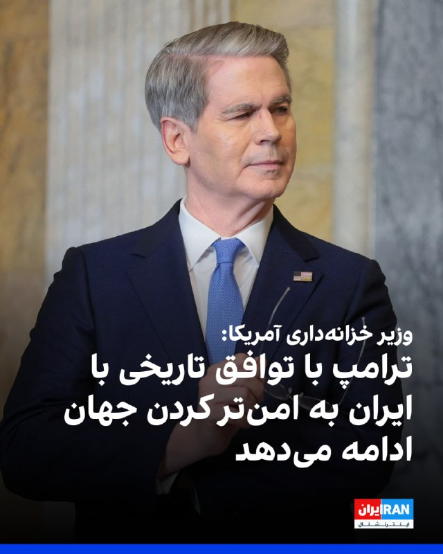

اسکات بسنت‌، وزیر خزانه‌داری آمریکا، در شبکه اجتماعی ایکس نوشت: دونالد ترامپ، رییس‌جمهوری ایالات متحده، امروز با دستیابی به یک توافق صلح تاریخی با ایران، همچنان به امن‌تر کردن جهان ادامه می‌دهد. او اشاره کرد که رهبری ترامپ، «همراه با تعامل مستقیمش با متحدان و دشمنان، برای قرن‌ها در کتاب‌های تاریخ ثبت خواهد شد.» iranintl.com/202606154716

## IranIntlTV — post 342408

  

سناتور جیمز لنکفورد، نماینده جمهوری‌خواه مجلس سنای آمریکا، گفت جمهوری اسلامی طی ۴۷ سال گذشته به آمریکا، متحدانش و شهروندان آمریکایی در منطقه حمله کرده است. او افزود مردم ایران تحت سرکوب حکومت زندگی می‌کنند و واشینگتن سال‌ها برای مقابله با تهدیدهای ناشی از جمهوری اسلامی میلیاردها دلار هزینه کرده است. لنکفورد گفت روسای‌جمهوری پیشین آمریکا طی بیش از چهار دهه تلاش کردند اختلافات با جمهوری اسلامی را حل کنند، اما دونالد ترامپ نخستین رییس‌جمهوری است که با استفاده هم‌زمان از دیپلماسی و قدرت نظامی، تهران را پای میز مذاکره آورده است. iranintl.com/202606158770

## IranIntlTV — post 342407

  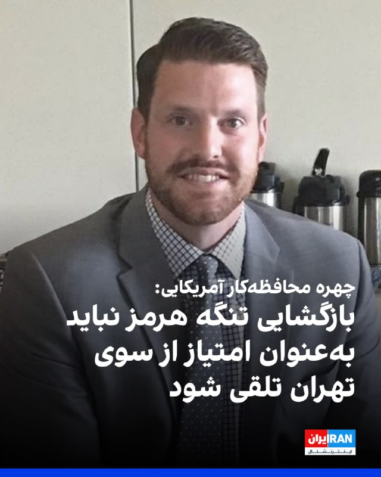

ویل ریچیاردلا، از چهره‌های نزدیک به جریان محافظه‌کار آمریکا، در واکنش به توافق میان واشینگتن و جمهوری اسلامی گفت بازگشایی تنگه هرمز نباید به‌عنوان یک امتیاز از سوی ایران تلقی شود. او در شبکه اجتماعی ایکس نوشت آزادی کشتیرانی در تنگه هرمز، وضعیت عادی و اولیه بوده و جمهوری اسلامی آن را به اهرم فشار تبدیل کرده است. ریچیاردلا نوشت اگر نخستین دستاورد این توافق بازگرداندن چیزی باشد که ایران اساسا حق سلب آن را نداشته، باید دید آمریکا برای دستیابی به این نتیجه چه امتیازهایی داده است. iranintl.com/202606157636

## IranIntlTV — post 342406

  

باراک راوید، خبرنگار اکسیوس، به نقل از یک مقام ارشد آمریکایی نوشت واشینگتن ادعای جمهوری اسلامی درباره آزادسازی بدون قید و شرط ۱۲ میلیارد دلار از دارایی‌های مسدودشده ایران پیش از آغاز مذاکرات ۶۰ روزه را رد کرده است. این مقام آمریکایی این ادعا را «روایت‌سازی» توصیف کرد و گفت چنین موضوعی صحت ندارد. به گفته او، توافق به‌دست‌آمده بر اساس اصل «اقدام در برابر اقدام» تنظیم شده و هیچ بخشی از دارایی‌های مسدودشده ایران پیش از اجرای تعهدات جمهوری اسلامی آزاد نخواهد شد. این مقام آمریکایی تاکید کرد هرگونه آزادسازی منابع مالی ایران به میزان پایبندی تهران به تعهدات توافق بستگی خواهد داشت. iranintl.com/202606151558

## IranIntlTV — post 342405

  

رجب طیب اردوغان، رییس‌جمهوری ترکیه، توافق حاصل شده بین ایالات متحده و ایران را تحولی مهم برای برقراری صلح و آرامش در منطقه خود دانست و از آن استقبال کرد. او ابراز امیدواری کرد که خبر اعلام توافق «که تمام جهان مدت‌هاست به آن نیاز دارد، راه را برای ایجاد فضایی پایدار از صلح و امنیت در منطقه ما هموار کند» و نوشت: «من بر لزوم اجتناب از لفاظی‌ها، تحریکات و اقداماتی که می‌تواند تنش‌ها را در دوره منتهی به امضای توافق تشدید کند، تاکید می‌کنم.» اردوغان در این ارتباط خواستار «هوشیاری در برابر خرابکاری‌های احتمالی» شد و از پاکستان به خاطر تلاش‌های میانجیگرانه استثنایی‌اش، حمایت قطر و عربستان سعودی از ابتکارات دیپلماتیک، و به ویژه از رهبران ایالات متحده و جمهوری اسلامی، در دستیابی به این نتیجه، قدردانی کرد. او تاکید کرد: «ما به حمایت از تمام تلاش‌ها برای برقراری صلح، ثبات و آرامش در منطقه خود ادامه خواهیم داد و به راه‌حل‌های پایدار مبتنی بر دیپلماسی و حقوق بین‌الملل کمک خواهیم کرد.» iranintl.com/202606157835

## IranIntlTV — post 342404

  

گرگوری میکس، عضو ارشد کمیته امور خارجی مجلس نمایندگان آمریکا، با استقبال از حرکت دولت ترامپ به سمت دیپلماسی، جنگ با جمهوری اسلامی را «انتخابی، گمراه‌کننده و زیان‌بار» توصیف کرد. او گفت این جنگ هزینه‌های سنگینی بر آمریکا، متحدانش، اقتصاد جهانی و غیرنظامیان تحمیل کرده است.

این نماینده دموکرات تاکید کرد تنها راه‌حل پایدار اختلافات با جمهوری اسلامی، از جمله در موضوع هسته‌ای، توافقی مذاکره‌شده و قابل راستی‌آزمایی است. به گفته او، جنگ نه به تغییر حکومت ایران منجر می‌شود، نه برنامه موشکی و پهپادی آن را از بین می‌برد و نه به حمایت تهران از گروه‌های نیابتی پایان می‌دهد.

میکس همچنین از خروج ترامپ از برجام بدون ارائه جایگزین معتبر انتقاد کرد و گفت این اقدام به تشدید بحران کنونی انجامید. او تاکید کرد هر توافقی باید شفاف، قابل اجرا، پایدار و تحت نظارت کنگره باشد و مردم آمریکا شایسته پاسخ‌های روشن و تضمین عدم تکرار اشتباهاتی هستند که به این جنگ پرهزینه منجر شد.

https://iranintl.com/202606159629

## IranIntlTV — post 342403

  

جیسون برادسکی، مدیر سیاست‌گذاری سازمان «اتحاد علیه ایران هسته‌ای»، در واکنش به تفاهم‌نامه میان واشینگتن و تهران گفت این توافق تغییری در بنیان‌های اصلی مناقشه میان آمریکا و جمهوری اسلامی ایجاد نخواهد کرد. او در شبکه اجتماعی ایکس نوشت فرق نمی‌کند این تفاهم‌نامه امروز، فردا یا چند روز دیگر امضا شود. برادسکی همچنین نوشت تا زمانی که جمهوری اسلامی در تهران بر سر کار باشد، بی‌ثباتی در منطقه ادامه خواهد داشت. iranintl.com/202606154974

## IranIntlTV — post 342402

  

آنتونیو گوترش، دبیرکل سازمان ملل متحد، در شبکه اجتماعی ایکس نوشت: «به گرمی، به ایالات متحده و ایران به خاطر دستیابی به توافق صلحی که آتش‌بس فوری و دائمی، بازگشایی تنگه هرمز و همچنین چارچوبی برای مذاکرات بیشتر را فراهم می‌کند، تبریک می‌گویم.» او تاکید کرد که این گامی حیاتی به سوی حل و فصل مسالمت‌آمیز درگیری است. گوترش همچنین از پاکستان، قطر، مصر، عربستان سعودی، ترکیه و سایر کشورهای منطقه به خاطر نقش سازنده‌ای که در حمایت از مذاکراتی که منجر به توافق صلح شد، ایفا کردند، قدردانی کرد. iranintl.com/202606154527

## IranIntlTV — post 342401

  

فریدریش مرتس، صدراعظم آلمان، از توافق میان آمریکا و جمهوری اسلامی استقبال کرد و آن را یک دستاورد مهم دیپلماتیک دانست.

او گفت این توافق، راه را برای اقتصاد پویاتر در جهان و خاورمیانه‌ای امن‌تر هموار می‌کند.

مرتس همچنین تاکید کرد اجرای توافق با عزم و اراده همه طرف‌ها اهمیت دارد و می‌تواند به تقویت ثبات و امنیت منطقه‌ای کمک کند.
https://iranintl.com/202606141966

## IranIntlTV — post 342400

  

برایان لیب، فعال سیاسی جمهوری‌خواه و از حامیان دونالد ترامپ، با انتقاد از توافق میان واشینگتن و جمهوری اسلامی گفت: «تنها برندگان این توافق، حکومت ایران و سپاه پاسداران هستند.» او در شبکه اجتماعی ایکس نوشت آنچه «توافق صلح» نامیده می‌شود، در عمل به سود جمهوری اسلامی تمام شده است. iranintl.com/202606142295

## IranIntlTV — post 342399

  

امانوئل مکرون، رییس‌جمهوری فرانسه، از توافق میان آمریکا و جمهوری اسلامی استقبال کرد و آن را نتیجه یک تلاش دیپلماتیک چندجانبه دانست. او خواستار اجرای سریع و کامل توافق از سوی همه طرف‌ها شد و تاکید کرد بازگشایی فوری و بدون قید و شرط تنگه هرمز و ازسرگیری کشتیرانی بدون محدودیت یا عوارض، برای ثبات منطقه‌ای و اقتصاد جهانی ضروری است. مکرون گفت این توافق می‌تواند زمینه‌ساز مذاکراتی گسترده‌تر برای صلح و امنیت در خاورمیانه باشد؛ مذاکراتی که باید برنامه هسته‌ای و موشکی جمهوری اسلامی و آنچه او سیاست‌های بی‌ثبات‌کننده منطقه‌ای تهران خواند را نیز در بر بگیرد. او افزود فرانسه آماده است همراه با شرکای خود در این روند نقش‌آفرینی کند. رییس‌جمهوری فرانسه همچنین بر حمایت پاریس از تلاش‌های دولت لبنان برای بازگرداندن حاکمیت این کشور تاکید کرد و گفت تنها حاکمیت کامل لبنان می‌تواند ثبات، تمامیت ارضی و تامین نیازهای مردم این کشور را تضمین کند. مکرون در پایان بر ضرورت برقراری یک آتش‌بس پایدار و موثر در لبنان تاکید کرد. iranintl.com/202606146378

## IranIntlTV — post 342398

  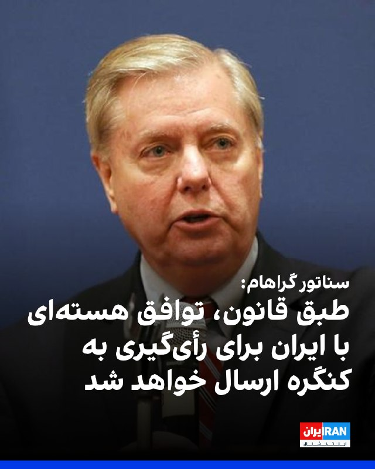

سناتور لیندسی گراهام، نماینده جمهوری‌خواه مجلس سنای آمریکا، در شبکه اجتماعی ایکس «از شنیدن توافق با ایران برای باز شدن تنگه هرمز » ابراز خوشحالی کرد و نوشت: «من مذاکرات بعدی در مورد برنامه هسته‌ای ایران و سایر مسائل را از نزدیک دنبال خواهم کرد.»

او با این حال اضافه کرد: «من تا اندازه‌ای نگرانم که دیدگاه ایران در مورد این توافق با آنچه تیم مذاکره‌کننده آمریکایی ادعا می‌کند متفاوت باشد.»

گراهام اشاره کرد: «طبق قانون ما، هرگونه توافق هسته‌ای با ایران برای بررسی و رأی‌گیری به کنگره ارسال خواهد شد» و نوشت: «مشتاقانه منتظر بررسی محصول نهایی هستم.»
https://iranintl.com/202606148781

## IranIntlTV — post 342397

  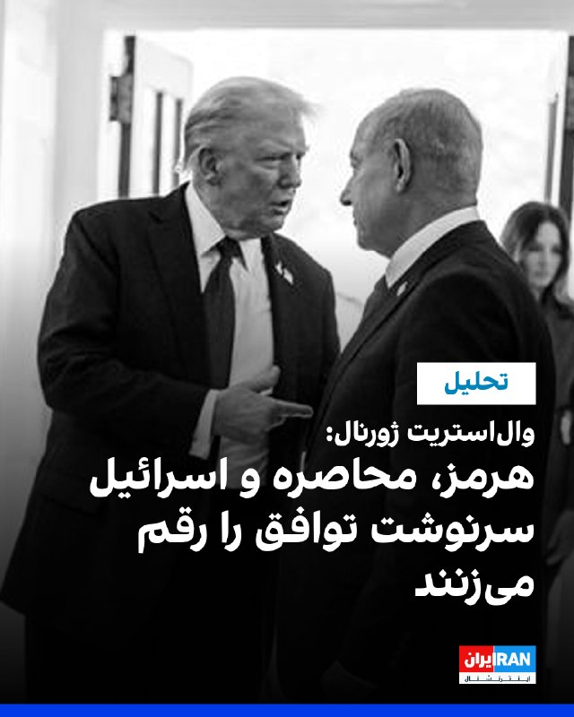

وال‌استریت ژورنال در تحلیلی نوشت سرنوشت توافق اولیه میان آمریکا و جمهوری اسلامی به سه عامل کلیدی بستگی دارد: بازگشایی تنگه هرمز، پایان محاصره دریایی ایران و نحوه رفتار اسرائیل در روزهای پیش از امضای رسمی توافق.

این روزنامه توافق اعلام‌شده از سوی دونالد ترامپ را بزرگ‌ترین پیشرفت دیپلماتیک چهار ماه جنگ اخیر توصیف کرد، اما درباره پایداری و اجرای آن ابراز تردید کرد.

به نوشته این روزنامه، بازگشایی تنگه هرمز مهم‌ترین آزمون توافق است و می‌تواند با ازسرگیری عبور عادی نفتکش‌ها و کشتی‌های تجاری، بر بازارهای انرژی و اقتصاد جهانی تاثیر بگذارد.

رفع محاصره دریایی ایران نیز از عوامل مهم موفقیت توافق دانسته شده، زیرا می‌تواند انگیزه تهران برای ادامه مذاکرات را افزایش دهد.

وال‌استریت ژورنال اسرائیل را بزرگ‌ترین متغیر این روند معرفی کرد و نوشت ادامه حملات اسرائیل در لبنان و منطقه می‌تواند توافق را با خطر مواجه کند.

این روزنامه در عین حال از کاهش تنش و نوعی احساس آرامش در تهران و واشینگتن خبر داد، اما تاکید کرد همچنان ابهام‌های مهمی درباره آینده مذاکرات، نقش اسرائیل و نحوه اجرای توافق باقی مانده است.
https://iranintl.c

## IranIntlTV — post 342396

  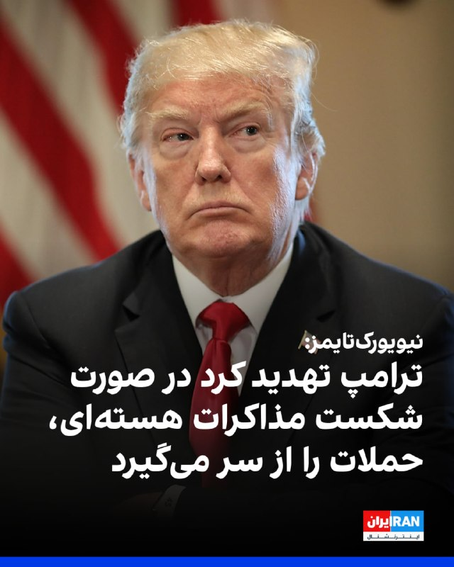

دونالد ترامپ، رییس‌جمهوری آمریکا، در گفت‌وگو با نیویورک‌تایمز از توافق تازه با جمهوری اسلامی دفاع کرد و هشدار داد اگر مذاکرات آتی درباره برنامه هسته‌ای ایران به نتیجه نرسد، حملات نظامی علیه تهران را از سر خواهد گرفت. او گفت در چنین شرایطی یا اقدام نظامی انجام خواهد شد یا آمریکا در ازای دریافت ۲۰ درصد از درآمدهای منطقه، نقش «نگهبان خاورمیانه» را بر عهده خواهد گرفت. ترامپ همچنین تاکید کرد توافق حاصل‌شده در نهایت عبور از تنگه هرمز را «برای همیشه بدون عوارض» تضمین خواهد کرد. او تصمیم خود برای حمله به ایران و اعمال محاصره دریایی پس از بسته شدن تنگه هرمز را عامل تغییر موازنه قدرت در منطقه به سود آمریکا دانست. رییس‌جمهوری آمریکا از شی جین‌پینگ و ولادیمیر پوتین به دلیل کمک به روند مذاکرات قدردانی کرد، اما از بنیامین نتانیاهو به دلیل اقداماتی که به گفته او نزدیک بود توافق را به شکست بکشاند، انتقاد کرد. ترامپ گفت اگر ایران به سلاح هسته‌ای دست می‌یافت، «اسرائیل حتی دو ساعت هم دوام نمی‌آورد». مذاکرات بعدی درباره پرونده هسته‌ای ایران قرار است از جمعه آینده در سوئیس آغاز شود. متن کامل را اینجا بخوانید iranintl.com/20260615

## IranIntlTV — post 342395

  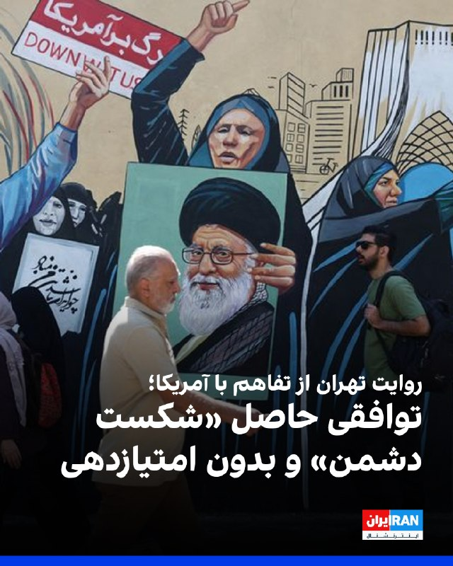

رسانه‌های نزدیک به حکومت، «تفاهم اسلام‌آباد» میان جمهوری اسلامی و آمریکا را نتیجه «پیروزی مقاومت» و پذیرش خواسته‌های تهران از سوی واشینگتن توصیف کرده‌اند.

بر اساس گزارش‌های منتشرشده، این تفاهم‌نامه شامل آتش‌بس دائمی در همه جبهه‌ها از جمله لبنان، پایان محاصره دریایی ایران، بازگشایی تنگه هرمز، تعلیق بخشی از تحریم‌ها، آزادسازی دارایی‌های مسدودشده ایران و آغاز مذاکرات ۶۰ روزه برای توافق نهایی است.

خبرگزاری مهر گزارش داد جمهوری اسلامی تنها بر پایبندی به پیمان منع گسترش سلاح‌های هسته‌ای تاکید کرده و موضوع برنامه موشکی و گروه‌های هم‌پیمان منطقه‌ای از مذاکرات کنار گذاشته شده است.

نورنیوز نیز نوشت اورانیوم غنی‌شده و تاسیسات هسته‌ای در ایران باقی می‌ماند، بخشی از دارایی‌های مسدودشده آزاد می‌شود و صندوقی ۳۰۰ میلیارد دلاری برای بازسازی ایران تشکیل خواهد شد.

مقام‌های جمهوری اسلامی، از جمله کاظم غریب‌آبادی، این تفاهم را نتیجه مقاومت نظامی و سیاسی دانسته و تاکید کرده‌اند مذاکرات نهایی پس از راستی‌آزمایی اجرای تعهدات اولیه آمریکا آغاز خواهد شد.
متن کامل را اینجا بخوانید
https://iranintl.com/202606142330

## IranIntlTV — post 342394

  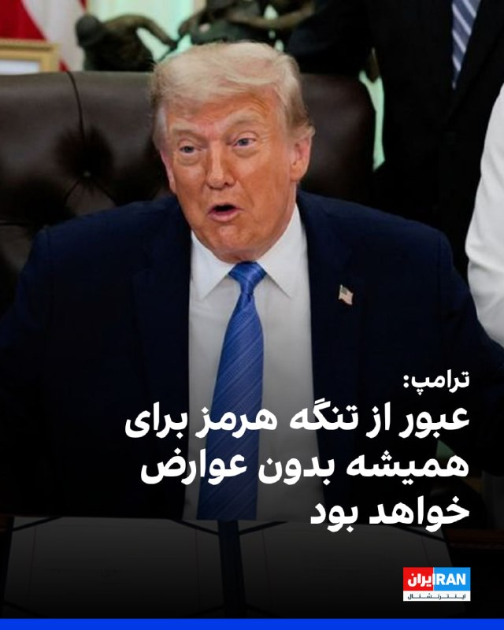

دونالد ترامپ، رییس‌جمهوری آمریکا، در گفت‌وگو با نیویورک تایمز گفت توافق با تهران در نهایت تضمین خواهد کرد که عبور از تنگه هرمز «برای همیشه بدون عوارض» باشد. او مدعی شد با وجود مخالفت‌های بنیامین نتانیاهو، نخست‌وزیر اسرائیل، این کشور را از «نابودی هسته‌ای» نجات داده است. ترامپ هشدار داد اگر جمهوری اسلامی به توافق نهایی هسته‌ای با آمریکا دست نیابد، حملات نظامی علیه ایران از سر گرفته خواهد شد یا واشینگتن در ازای دریافت ۲۰ درصد از درآمدهای منطقه، نقش «نگهبان خاورمیانه» را بر عهده خواهد گرفت. او گفت حمله به ایران و محاصره دریایی بنادر این کشور پس از بسته شدن تنگه هرمز، موازنه منطقه را به نفع آمریکا تغییر داده است. رییس‌جمهوری آمریکا همچنین از شی جین‌پینگ و ولادیمیر پوتین برای کمک به این توافق قدردانی کرد و از نتانیاهو به دلیل حملاتی که به گفته او نزدیک بود توافق را از مسیر خارج کند، انتقاد کرد. ترامپ گفت اگر ایران سلاح هسته‌ای داشت، «اسرائیل حتی دو ساعت هم دوام نمی‌آورد.» iranintl.com/202606149083

## IranIntlTV — post 342393

  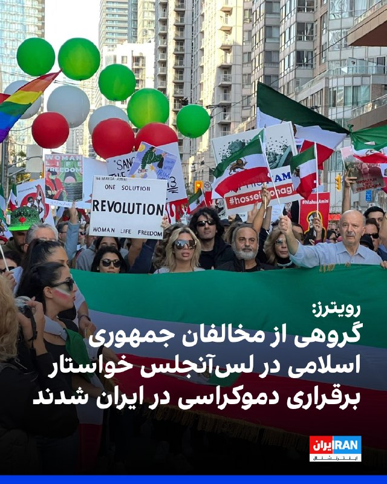

خبرگزاری رویترز گزارش داد: «هم‌زمان با ورود تیم ملی فوتبال ایران به فرودگاه لس‌آنجلس برای انجام نخستین بازی خود در جام جهانی، گروهی از مخالفان جمهوری اسلامی در نزدیکی ورزشگاه تجمع کردند و با سر دادن شعار خواستار برقراری دموکراسی در ایران شدند.»

رویترز نوشت مسابقه ایران و نیوزیلند در چارچوب جام جهانی در شرایطی برگزار می‌شود که توافق پایان جنگ میان آمریکا و جمهوری اسلامی اعلام شده است.

این خبرگزاری اشاره کرد لس‌آنجلس میزبان بزرگ‌ترین جامعه ایرانیان خارج از ایران است؛ جامعه‌ای که به «تهرانجلس» شهرت دارد.
https://iranintl.com/202606143198

## IranIntlTV — post 342392

  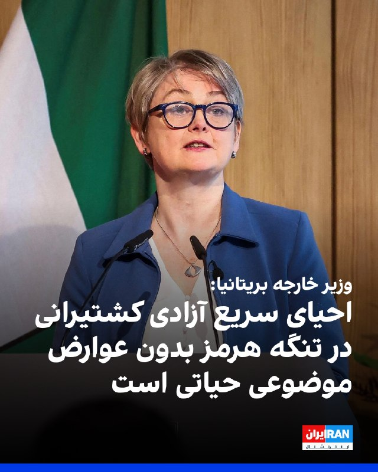

ایوت کوپر، وزیر خارجه بریتانیا، از اعلام توافق بین ایالات متحده و ایران به شدت استقبال کرد.

او گفت:‌ «این موضوعی حیاتی است که آزادی کشتیرانی بدون عوارض از طریق تنگه هرمز به سرعت احیا شود.»
https://iranintl.com/202606141615

## IranIntlTV — post 342391

  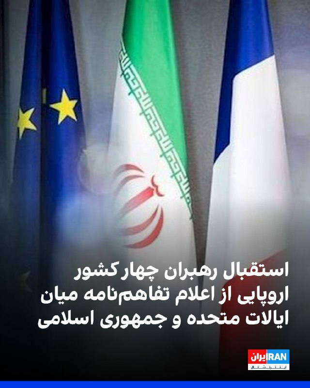

رهبران کشورهای «گروه چهار»،‌ شامل بریتانیا، فرانسه، آلمان و ایتالیا، در بیانیه‌ای گفتند که از اعلام تفاهم‌نامه میان ایالات متحده و ایران به گرمی استقبال می‌کنند.

آنها در تاکید کردند: «ایران هرگز نباید به سلاح هسته‌ای دست یابد»، و افزودند: «ما آمادگی داریم در پاسخ به گام‌های شفاف و قابل راستی‌آزمایی ایران در برنامه هسته‌ای خود، تحریم‌های مرتبط را لغو کنیم.»

در این بیانیه آمده است: «بازگشایی فوری تنگه هرمز همراه با آزادی بی‌قیدوشرط و بدون محدودیت کشتیرانی، امری حیاتی است.»

رهبران این چهار کشور اروپایی همچنین گفتند که آماده‌اند در مورد پرونده هسته‌ای تهران، با ایالات متحده، جمهوری اسلامی و آژانس بین‌المللی انرژی اتمی همکاری کنند.

آن‌ها در بیانیه خود بر «حمایت کامل خود از ثبات، حاکمیت و تمامیت ارضی لبنان و همچنین اهمیت یک آتش‌بس پایدار» تاکید کردند.
https://iranintl.com/202606146396

## FarsiVOA — post 220766

⚡️تبریک پرشور رئیس‌جمهوری آمریکا دونالد ترامپ به بو نیکال پس از پیروزی در راند اول. کاخ سفید هم‌زمان با تولد ۸۰ سالگی پرزیدنت ترامپ میزبان رویداد رزمی «یواف‌سی آزادی ۲۵۰» بود.
@FarsiVOA

## FarsiVOA — post 220765

⚡️نخست‌وزیر جدید عراق طرح ۷۶۴ میلیون دلاری توسعه فرودگاه بین‌المللی بغداد را لغو کرد
@FarsiVOA

## FarsiVOA — post 220764

⚡️نگاه بازار سهام به تصمیم بانک مرکزی آمریکا
@FarsiVOA

## FarsiVOA — post 220763

  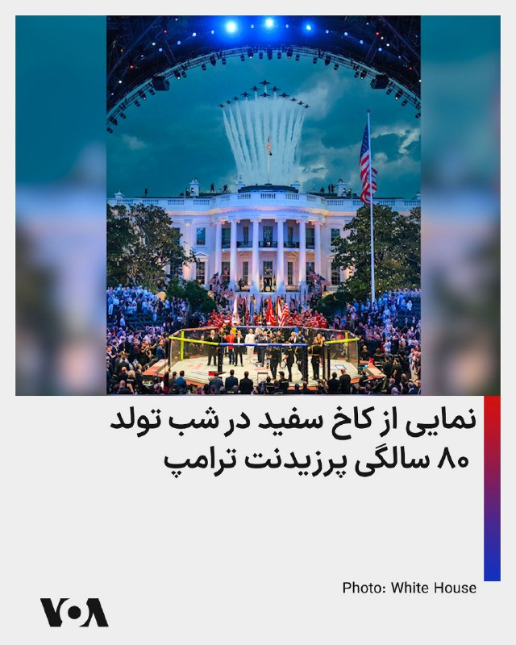

⚡️نمایی از کاخ سفید در شب تولد ۸۰ سالگی پرزیدنت ترامپ
@FarsiVOA

## FarsiVOA — post 220762

  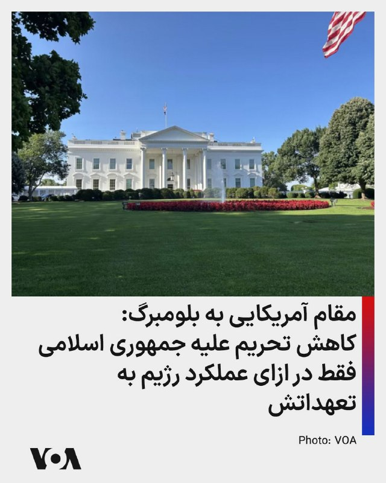

⚡️یک خبرنگار بلومبرگ به نقل از یک مقام کاخ سفید گفت توافق با جمهوری اسلامی مرحله‌ای و مبتنی بر عملکرد رژیم است. این مقام گفته است اگر جمهوری اسلامی به تعهداتش عمل کند، از کاهش تحریم‌ها برخوردار می‌شود و اگر این کار را نکند، از کاهش تحریم برخوردار نمی‌شود.
@FarsiVOA

## FarsiVOA — post 220761

⚡️درگیری پلیس و معترضان مخالف «گروه هفت» در ژنو
@FarsiVOA

## FarsiVOA — post 220760

⚡️آرایش پروازی نادر «سوپر دلتا» با حضور تیم نمایشی «تاندربردز» نیروی هوایی و تیم «بلوانجلز» نیروی دریایی آمریکا. جنگنده‌ها بر فراز کاخ سفید، هم‌زمان با هشتادمین سالگرد تولد پرزیدنت ترامپ و رویداد «رزمی یواف‌سی آزادی ۲۵۰» پرواز کردند.
@FarsiVOA

## FarsiVOA — post 220759

⚡️خروج اورانیوم غنی‌شده از ایران؛ گفت‌وگو با بهروز بیات کارشناس امور هسته‌ای
@FarsiVOA

## FarsiVOA — post 220758

  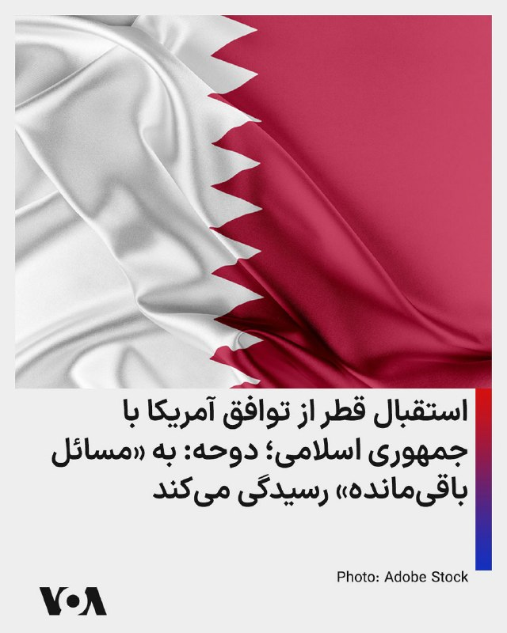

⚡️دولت قطر با صدور بیانیه‌ای از توافق حاصل شده در مورد یادداشت تفاهم بین ایالات متحده و جمهوری اسلامی «در مورد رسیدگی به مسائل باقیمانده» استقبال کرد. دوحه گفت این توافق را گامی مهم در جهت تحکیم صلح پایدار و ارتقای رشد اقتصادی در سطح منطقه‌ای و بین‌المللی می‌داند.
@FarsiVOA

## FarsiVOA — post 220757

⚡️از سرکوب اعتراضات هرات تا ممنوعیت تلفن‌های هوشمند؛ زنان افغان در اروپا صدای همبستگی را بلند کردند
@FarsiVOA

## FarsiVOA — post 220756

⚡️هم‌زمان با هشتادمین سالگرد تولد پرزیدنت ترامپ، حساب کاربری کاخ سفید ویدیوی کوتاهی از رویداد مسابقات «رزمی یواف‌سی آزادی ۲۵۰» در فضای باز و مملو از جمعیت در محوطه کاخ سفید را به اشتراک گذاشت. جمعیت عظیم حاضران می‌گویند «آمریکا! آمریکا!»
@FarsiVOA

## FarsiVOA — post 220755

  <a href="telegram/content/FarsiVOA_220755_1781495378.mp4" target="_blank">🎬 Download video</a>

⚡️توقیف یک نفتکش ناوگان سایه روسیه در کانال مانش؛ گفت‌وگو با امیر چاهکی کارشناس روابط بین‌الملل
@FarsiVOA

## FarsiVOA — post 220754

⚡️هم‌زمان با سالگرد تولد ۸۰ سالگی پرزیدنت دونالد ترامپ، کاخ سفید یکشنبه شب ویدیویی از میزبانی مسابقات هنرهای رزمی ترکیبی «یو.اف.سی آزادی ۲۵۰» در چمن جنوبی این مکان را منتشر کرد.
@FarsiVOA

## FarsiVOA — post 220753

⚡️محورهای مذاکرات نخست‌وزیر عراق در سفر به واشنگتن و توافق بغداد و اربیل برای حفاظت از شرکت‌های نفتی
@FarsiVOA

## FarsiVOA — post 220752

🔺پرزیدنت ترامپ ۸۰ ساله شد؛ کاخ سفید میزبان مسابقه رزمی

▪️دونالد ترامپ، رئیس جمهوری ایالات متحده که چهل‌وپنجمین و چهل‌وهفتمین رئیس جمهوری این کشور بوده است، روز یکشنبه ۱۴ ژوئن ۲۰۲۶ هشتاد ساله شد؛ مناسبتی که با «روز پرچم» آمریکا همزمان شده است؛ ضمن آنکه آمریکا برای جشن‌های دویست‌وپنجاهمین سالگرد استقلال آماده می‌شود.

⬇️ بیشتر بخوانید:
https://ir.voanews.com/a/president-trump-turns-eighty/8160668.html
@FarsiVOA

## FarsiVOA — post 220751

⚡️تقابل رسانه‌ای در خاورمیانه؛ فرآیند مبهم تصمیم‌گیری در تهران و آماده‌باش نظامی اسرائیل
@FarsiVOA

## FarsiVOA — post 220750

⚡️دیوید هاکنی، نقاش و هنرمند برجسته بریتانیایی که یکی از تأثیرگذارترین چهره‌های هنر معاصر جهان تبدیل بود، در ۸۸ سالگی در خانه‌اش در لندن درگذشت. او با آثار رنگارنگ و نوآورانه خود، به‌ویژه نقاشی‌های مشهور استخرهای کالیفرنیا، تأثیری ماندگار بر هنر قرن بیستم و بیست‌ویکم گذاشت.
@FarsiVOA

## FarsiVOA — post 220749

  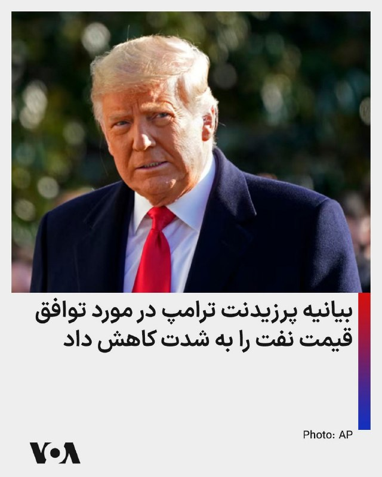

⚡️بیانیه پرزیدنت ترامپ در مورد توافق ایالات متحده با جمهوری اسلامی قیمت نفت را به‌شدت کاهش داد. قیمت هر بشکه نفت نفت خام برنت روز یکشنبه نزدیک به ۴ درصد کاهش و به حدود ۸۴ دلار در هر بشکه رسید. آقای ترامپ بارها گفته بود که با رسیدن به توافق، قیمت نفت به سرعت پایین خواهد آمد.
@FarsiVOA

## FarsiVOA — post 220748

⚡️«تندروها» علیه توافق به خیابان آمدند؛ چرا قالیباف و عراقچی هدف حملات قرار گرفته‌اند؟
@FarsiVOA

## FarsiVOA — post 220747

  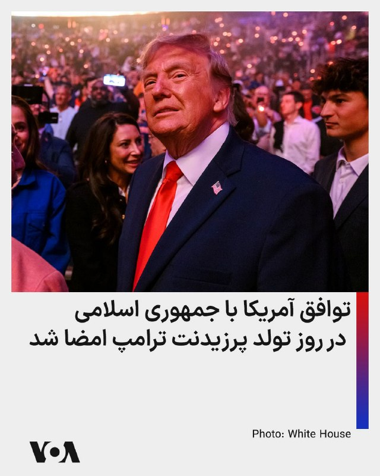

⚡️دونالد ترامپ، رئیس جمهوری ایالات متحده روز یکشنبه ۱۴ ژوئن ۲۰۲۶ هشتاد ساله شد؛ مناسبتی که با «روز پرچم» آمریکا همزمان شده است. در همین روز، رئيس جمهوری آمریکا از امضای توافق با جمهوری اسلامی خبر داد. آقای ترامپ گفت «این توافق بزرگ»، صلح و امنیت را برای کل منطقه به ارمغان خواهد آورد.
@FarsiVOA

## DW_Farsi — post 125983

🔶 آمریکا و ایران از دستیابی به توافق برای پایان جنگ خبر دادند

رئیس جمهور آمریکا با انتشار پیامی در شبکه تروث سوشال نوشت: «توافق با جمهوری اسلامی ایران اکنون نهایی شده است. به همه تبریک می‌گویم!»

دونالد ترامپ نوشت: «بدین‌وسیله بازگشایی کامل و بدون دریافت عوارض تنگه هرمز را مجاز اعلام می‌کنم و همزمان دستور رفع فوری محاصره دریایی ایالات متحده را صادر می‌کنم.»
او در ادامه افزود: «کشتی‌های جهان، موتورهای خود را روشن کنید. بگذارید نفت جریان پیدا کند!»

ترامپ همچنین در پیامی دیگر با اشاره به نهایی‌شدن متن یادداشت تفاهم با جمهوری اسلامی نوشت: «این توافق بزرگ، صلح و امنیت را برای سراسر منطقه به ارمغان خواهد آورد. رؤسای‌جمهور بسیاری تلاش کردند با ایران به صلح برسند، اما همگی پیش از من ناکام ماندند.»

به نوشته او، "با بازگشایی تنگه هرمز پس از امضای توافق در روز جمعه، با هدف پاکسازی مین‌ها، نفت بار دیگر از هر دو سوی منطقه و به سوی جهان جریان خواهد یافت."

دبیرخانه شورای عالی امنیت ملی جمهوری اسلامی در نخستین ساعات روز دوشنبه ۲۵ خردادماه با انتشار بیانیه‌ای از توافق میان تهران و واشنگتن برای پایان جنگ خبر داد.

طبق این بیانیه "بر اساس توافق انجام‌شده، جنگ و عملیات نظامی در تمامی جبهه‌ها از جمله لبنان از امشب به صورت فوری و دائمی پایان می‌یابد و محاصره دریایی علیه ایران نیز بلافاصله لغو خواهد شد".

دبیرخانه شورای عالی امنیت ملی از برنامه‌ریزی برای امضای رسمی این یادداشت تفاهم در روز جمعه ۲۹ خرداد خبر داد و افزود که "مذاکرات برای دستیابی به توافق نهایی پس از اجرای تعهدات طرف مقابل ادامه خواهد یافت".

واکنش‌های گسترده به خبر توافق میان جمهوری اسلامی و آمریکا آغاز شده است.

@dw_farsi

## IranianMinds — post 22612

🔴 نیویورک تایمز :

ترامپ گفت اگر ایران نتواند به یک توافق نهایی هسته‌ای با ایالات متحده دست پیدا کند، حملات نظامی علیه تهران از سر گرفته خواهد شد؛ یا اینکه آمریکا در ازای دریافت «۲۰ درصد از درآمدهای منطقه»، نقش «نگهبان خاورمیانه» را بر عهده خواهد گرفت.

@IranianMinds

## IranianMinds — post 22611

🔴 بیانیه مشترک فرانسه، بریتانیا، آلمان و ایتالیا:

از یادداشت تفاهم میان آمریکا و ایران استقبال می‌کنیم و آن را فرصتی برای بازگشت ثبات منطقه‌ای می‌دانیم.

ایران نباید به سلاح هسته‌ای دست یابد، اما در صورت اقدامات شفاف و قابل‌راستی‌آزمایی تهران، آماده لغو تحریم‌های مرتبط هستیم.

@IranianMinds

## IranianMinds — post 22610

جام جهانی ینی اوج هیجان و پول دراوردن پس بیا توی کانال ورسوس بت و پول دراوردن شروع کن👌

## IranianMinds — post 22609

  <a href="telegram/content/IranianMinds_22609_1781495380.webm" target="_blank">🎬 Download video</a>

📢توم میخوای از مسابقات جام جهانی فوتبال پول دربیاری؟
🥇

✅کانال ورسوس بت کارش تحلیل و پیش بینی مسابقات جام جهانی به صورت حرفه ای
🍑

⚠️توم میتونی از پیش بینی جام جهانی خیلی راحت پول دربیاری فقط کافیه با کانال ورسوس بت همراه شی
📣

🌐ادرس عضویت کانالشون e24:
👇

🔪https://t.me/+vEPd1hF2Y38yMWI0

🔪https://t.me/+vEPd1hF2Y38yMWI0

## BBCPersian — post 283843

🔻 ترامپ به نیویورک تایمز: تنگه هرمز «برای همیشه رایگان» خواهد بود

رئیس جمهور آمریکا عصر یکشنبه در مصاحبه‌ای با نیویورک تایمز گفت توافق با ایران تضمین می‌کند که تنگه هرمز «برای همیشه بدون عوارض» باشد.

در این تماس تلفنی ۲۸ دقیقه‌ای، دونالد ترامپ همچنین گفته است که اگر ایران به توافق هسته‌ای نهایی با آمریکا نرسد، حملات نظامی را از سر خواهد گرفت یا در ازای دریافت یک پنجم درآمد منطقه، ایالات متحده را «نگهبان خاورمیانه» خواهد کرد.

آقای ترامپ همچنین سخنان قبلی خود را مبنی بر اینکه تصمیم به حمله به ایران در ماه فوریه و محاصره دریایی متعاقب بنادر آن، اوضاع «خاورمیانه را به نفع آمریکا تغییر داده» تکرار کرد.

https://bbc.in/4eiPq2g
@BBCPersian

## BBCPersian — post 283842

🔻 لینزی گراهام از تفسیر ایران از توافق ابراز «نگرانی» کرد

لیندزی گراهام، سناتور ارشد جمهوری‌خواه، می‌گوید اگرچه از توافق بر سر یک تفاهم‌نامه بین آمریکا و ایران «خوشحال» است، اما «تا حدودی نگران» است که «دیدگاه ایران در مورد این توافق‌نامه با آنچه تیم مذاکره‌کننده آمریکایی ادعا می‌کند متفاوت به نظر می‌رسد.»

آقای گراهام در پستی در شبکه اجتماعی ایکس نوشت که مذاکرات بعدی را «از نزدیک» زیر نظر خواهد داشت و مشتاقانه منتظر بررسی «محصول نهایی» در کنگره است.

او نوشت: «به همه برای رسیدن به این نقطه تبریک می‌گویم. زمان، همه چیز را مشخص خواهد کرد.»

https://bbc.in/4viCUHy
@BBCPersian

## BBCPersian — post 283841

🔻 کاهش قیمت نفت پس از اعلام توافق آمریکا و ایران

قیمت نفت در معاملات اولیه بازار آسیا به دلیل توافق آمریکا و ایران که قرار است بر اساس آن تنگه هرمز بازگشایی شود، کاهش یافت.

نفت خام برنت، معیار جهانی نفت، با ۳/۸ درصد کاهش به ۸۴/۰۲ دلار در هر بشکه رسید، در حالی که نفت معامله شده در آمریکا با ۴/۱ درصد کاهش به ۸۱/۴۰ دلار رسید.

پاکستان می‌گوید این توافق روز جمعه رسما در سوئیس امضا خواهد شد و دونالد ترامپ، رئیس جمهور آمریکا، در شبکه‌های اجتماعی درباره این توافق نوشته است که «نفت جریان خواهد یافت.»

تنگه هرمز که یکی از مبادی مهم صادرات نفت در دنیا است مدت کوتاهی پس از حملات هوایی آمریکا و اسرائیل به ایران در ۲۸ فوریه، عملا بسته شد.

https://bbc.in/4eoBgg7
@BBCPersian

## BBCPersian — post 283840

‌ ‌ ‌ کی‌یر استارمر، نخست‌وزیر بریتانیا، تفاهم‌نامه میان ایران و آمریکا را «یک قدم بسیار مهم» خوانده است. آقای استارمر در واکنش به اخبار پیمان صلح با ایران آن را «قدمی بسیار بزرگ و مهم رو به جلو در پایان دادن به جنگ، تضمین ثبات منطقه‌ای و بازگشایی تنگه هرمز»…

## BBCPersian — post 283839

  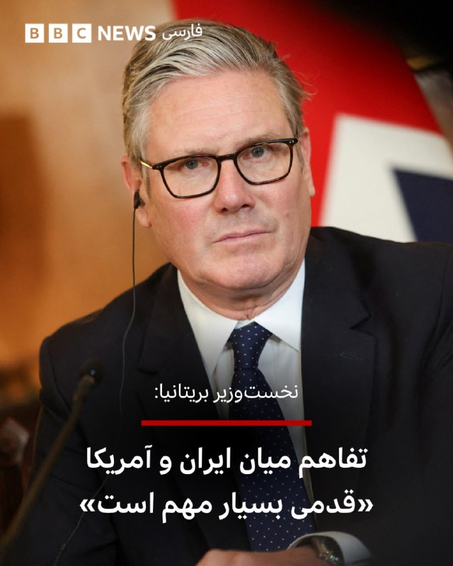

‌ ‌ ‌
کی‌یر استارمر، نخست‌وزیر بریتانیا، تفاهم‌نامه میان ایران و آمریکا را «یک قدم بسیار مهم» خوانده است.

آقای استارمر در واکنش به اخبار پیمان صلح با ایران آن را «قدمی بسیار بزرگ و مهم رو به جلو در پایان دادن به جنگ، تضمین ثبات منطقه‌ای و بازگشایی تنگه هرمز» خواند.

او گفت:«به پرزیدنت ترامپ و میانجیگران پاکستانی، قطری و هر جای دیگری که در حصول این دستاورد مهم دخیل بودند، تبریک می‌گویم. ما از مدت‌ها قبل خواهان کاهش تنش بوده‌ایم و این، پیشرفتی است که امیدوار بودیم شاهدش باشیم.»

نخست‌وزیر بریتانیا اضافه کرد: «آزادی کشتیرانی و بدون پرداخت عوارض در تنگه هرمز باید مجددا برقرار شود تا اثرات منفی اقتصادی چندین ماهه آن بر خانواده‌ها در اینجا، بریتانیا، و در همه جهان کاهش یابد.»

آقای استارمر گفت: «ما به همکاری با شرکای خود ادامه خواهیم داد تا از این پروسه حمایت کنیم. از جمله، اگر لازم باشد، از طریق ماموریت‌های دفاعی و چند وجهی مستقل که بریتانیا و فرانسه تا الان در طراحی آن نقش پیشرو داشته‌اند، به ویژه در حمایت از عملیات مین‌روبی، این کار را خواهیم کرد.»

https://bbc.in/4vTyIhk
📷Reuters
@BBCPersian

## BBCPersian — post 283838

🔻 جزییات توافق ایران و آمریکا به روایت خبرگزاری مهر

خبرگزاری مهر اقدام به انتشار ۱۴ بند کرده و گفته است که «جزئیات پیش‌نویس تفاهم‌نامه» میان ایران و آمریکا است.

براساس این خبر این موارد عبارتند از:

۱- توقف دائمی و فوری جنگ در همه جبهه‌ها از جمله لبنان

۲- تعهد آمریکا به عدم مداخله در امور داخلی ایران و احترام به حاکمیت جمهوری اسلامی ایران

۳- رفع کامل محاصره دریایی ظرف ۳۰ روز

۴- تعهد آمریکا به خروج نیروهایش از پیرامون ایران

۵- بازگشایی تنگه هرمز ظرف ۳۰ روز با ترتیبات ایرانی

۶- تعلیق تحریم‌های فروش نفت، محصولات پتروشیمی و مشتقات و دسترسی کامل ایران به منابع مالی آن

۷- لزوم ارائه طرح‌های بازسازی ایران حداقل به مبلغ ۳۰۰ میلیارد دلار توسط آمریکا و متحدانش

۸- ۶۰ روز مذاکره برای رسیدن به توافق نهایی مبتنی بر موضوعات هسته‌ای و لغو کامل تحریم‌های اولیه، ثانویه، آمریکا و قطعنامه‌های شورای امنیت سازمان ملل و شورای حکام آژانس بین‌المللی انرژی اتمی

۹- تکرار تعهد ایران در پیمان ان‌پی‌تی مبنی بر عدم تولید سلاح هسته‌ای

۱۰- در دوره مذاکرات آمریکا متعهد شده به نیروهای خود در منطقه اضافه نمی‌کند و تحریم جدیدی هم وضع نخواهد کرد

۱۱- آزادسازی ۲۴ میلیارد دلار پول‌های بلوکه شده ایران در دوره ۶۰ روزه مذاکرات نهایی. نیمی از این مبلغ قبل از شروع مذاکرات باید در دسترس ایران قرار گیرد

۱۲- تشکیل سازوکار نظارتی برای اجرایی کردن توافق

۱۳- توافق نامه نهایی توسط قطعنامه شورای امنیت سازمان ملل به تایید می‌رسد

۱۴- مذاکره نهایی قبل از آزادسازی نیمی از پول‌های بلوکه شده ایران، تعلیق تحریم‌های نفتی ایران و رفع محاصره دریایی آغاز نمی‌شود و توافق نهایی صرفا در موضوع سرنوشت مواد غنی شده و غنی سازی، رفع تحریم ها، برنامه بازسازی اقتصاد ایران انجام می‌شود و بحث درباره برنامه موشکی ایران و حمایت از گروه‌های مقاومت به صورت قطعی از دستور کار خارج شده است.

این ۱۴ مورد در حالی منتشر شده است که دو روز قبل عباس عراقچی، وزیر خارجه ایران، از رسانه‌ها خواسته بود تا از گمانه‌زنی در خصوص مفاد تفاهم‌نامه خودداری کنند و دونالد ترامپ، رئیس‌جمهور آمریکا هم توئیت آقای عراقچی را بازنشر کرده بود.

https://bbc.in/4eiUZ29
@BBCPersian

## BBCPersian — post 283837

  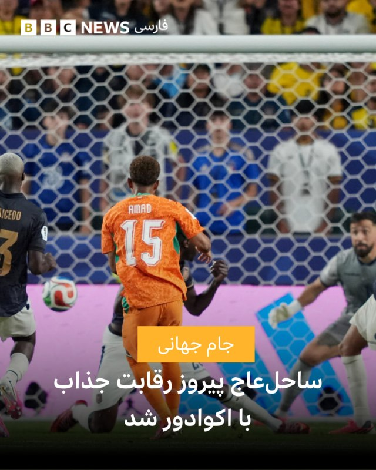

‌ ‌ ‌ ‌
تیم‌های فوتبال اکوادور، نماینده آمریکای جنوبی و ساح‌عاج، نماینده آفریقا از گروه ای رقابت‌های جام‌جهانی در شهر فیلادفیا به مصاف هم رفتند که در پایان نماینده آفریقا با یک گل به پیروزی رسید.

نیمه اول این مسابقه جذاب، دیدنی بود و اکوادور دو بار به تیر دروازه ساحل‌عاج زد و در مقابل، نماینده آفریقا هم حملات خطرناکی را انجام داد، اما هر دو تیم موفق به گلزنی نشدند.

نیمه دوم مسابقه با همان زیبایی نیمه اول آغاز شد و اینبار ابتدا ساح‌عاج بود که به تیر دروازه اکوادور زد و حملات دو تیم ادامه پیدا کرد تا در نهایت در دقیقه ۹۰ آماد دیالو از ساح‌عاج موفق به گلزنی برای تیمش شد.

📷IMAGN IMAGES/Reuters
@BBCPersian

## BBCPersian — post 283836

  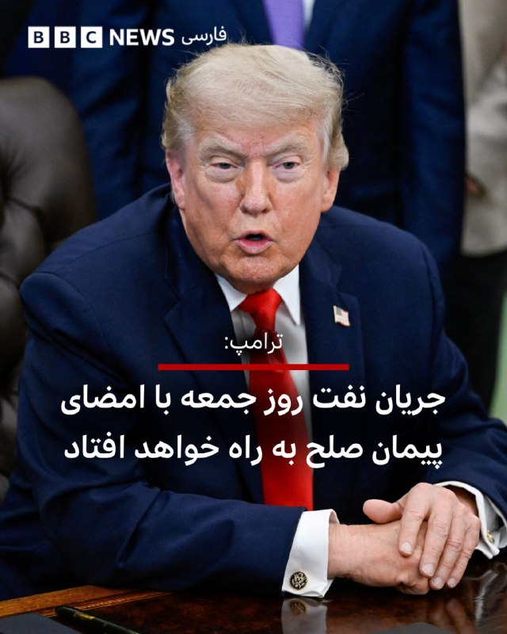

‌ ‌ ‌
دونالد ترامپ، رئیس جمهور آمریکا دوباره در شبکه اجتماعی تروت سوشال، پستی درباره توافق میان آمریکا و ایران منتشر کرد و نوشت او موفق شده است و دیگران ناتوان بودند.

او در این پست نوشت:« این 'پیمان بزرگ'، برای کل 'منطقه'، 'صلح و امنیت' خواهد آورد.»

آقای ترامپ در ادامه نوشت: «بسیاری از روسای جمهور تلاش کردند با ایران به 'صلح' برسند و قبل از من، هیچکدام از آنها نتوانستند. رهبران منطقه برای اولین بار، 'رئیس جمهوری' پیدا کرده‌اند که می‌تواند به آنها در حصول 'صلح' کمک کند.»

در ادامه پیام دونالد ترامپ آمده است: «با امضای این پیمان در روز جمعه و باز شدن تنگه هرمز برای مین‌‌روبی، نفت برای 'منطقه' و جهان، در هر دو سوی تنگه دوباره جاری خواهد شد.»

https://bbc.in/49Zy2yn
📷Reuters
@BBCPersian

## BBCPersian — post 283835

🔻 استقبال نخست‌وزیر قطر از تفاهم میان آمریکا و ایران

نخست‌وزیر قطر که همراه با پاکستان بین ایران وآمریکا میانجیگری می‌کرد، از حصول تفاهم میان دو کشور استقبال کرده است.

شیخ محمد بن عبدالرحمان بن جاسم آل ثانی در شبکه اجتماعی ایکس نوشت:«از برادرانمان در جمهوری اسلامی پاکستان هم متشکریم.»

او در این پیام نوشته است که انتظار دارد تمامی طرف‌ها با روحیه‌ای مثبت و سازنده در مذاکرات آتی شرکت کنند.

https://bbc.in/4vPhv8A
@BBCPersian

## BBCPersian — post 283834

برای بسیاری از هواداران فوتبال، نام «نیوزیلند» در جام جهانی هنوز با تصویری قدیمی همراه است: تیمی منظم، فیزیکی، پرتلاش و محدود؛ تیمی که بیشتر برای مقاومت کردن شناخته می‌شود تا برای ساختن بازی و البته ناشناخته مانده و اطلاعاتی محدود و معدود در موردش در رسانه‌ها منتشر می‌شود.

این تصویر بی‌دلیل شکل نگرفته است. نیوزیلند از منطقه‌ای می‌آید که سطح فوتبال آن فاصله‌ای قابل توجه با سایر قاره‌ها دارد؛ از اروپا گرفته، تا آمریکای جنوبی و حتی آفریقا و آسیا.

فاصله سطح فنی قاره اقیانوسیه از سایر قاره‌ها از یک سو و مسیر صعود نیوزیلند از این قاره از سویی دیگر، باعث ناشناخته‌تر ماندن این تیم شده است. نیوزیلند در این دوره و به واسطه این که برای رسیدن به جام جهانی، سختی و طولانی بودن مسیرهای دیگر را در پیش نداشت، کیفیت خودش را به صورت کامل در نگاه‌ها کارشناسان قرار نداد.

نسل فعلی تیم ملی فوتبال نیوزیلند فقط مجموعه‌ای از بازیکنان فیزیکی و دونده که به صورت سنتی در ذهن هواداران فوتبال شکل گرفته‌اند، نیست. تعدادی از بازیکنان این تیم سابقه بازی در فوتبال اروپا را دارند یا کماکان در لیگ‌های معتبرتر از لیگ نیوزیلند حضور دارند.

https://bbc.in/4vJgX3V
@BBCPersian

<!-- MSG END -->

<!-- NAV START -->

<a href="https://github.com/Tljn/FUD/blob/main/telegram/content/archive_1.md" style="display:inline-block; padding:6px 12px; margin:0 4px; background-color:#2ea44f; color:white; text-decoration:none; border-radius:4px; font-weight:bold;">صفحه بعد</a>

<!-- NAV END -->
