# خواننده تلگرام

<!-- TOP_NAV START -->

<a href="https://github.com/Tljn/FUD/blob/main/telegram/content/archive_1.md" style="display:inline-block; padding:6px 12px; margin:0 4px; background-color:#2ea44f; color:white; text-decoration:none; border-radius:4px; font-weight:bold;">صفحه بعد</a>

<!-- TOP_NAV END -->

<!-- MSG START -->

---
📅 بروزرسانی: 1405/02/31 02:26
---

## VahidOOnLine — post 241240

  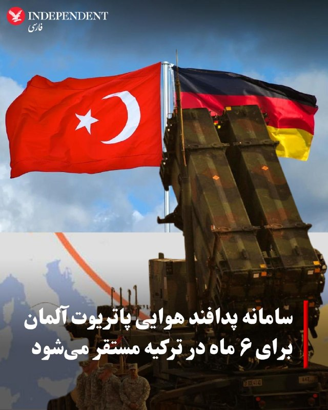

♦️ترکیه روز چهارشنبه ۳۰ اردیبهشت‌ماه اعلام کرد آلمان از ماه ژوئن یک سامانه دفاع موشکی پاتریوت را به مدت شش ماه در این کشور مستقر خواهد کرد تا جایگزین سامانه‌ قبلی ناتو شود.

سامانه دفاعی پیشین در چارچوب تدابیر ناتو در جنوب شرقی ترکیه و در بحبوحه جنگ برای تقویت پدافند هوایی مستقر شده بود.

پدافندهای ناتو در جریان جنگ، چهار موشک بالستیک شلیک‌شده از ایران را رهگیری و سرنگون کرده بودند.

وزارت دفاع ترکیه اعلام کرد یکی از دو سامانه پاتریوت اضافی ناتو که به دلیل درگیری‌های میان آمریکا، اسرائیل و ایران در منطقه مستقر شده بود، اکنون با سامانه آلمانی جایگزین خواهد شد.

این وزارتخانه افزود روند جایگزینی در ماه ژوئن تکمیل می‌شود و سامانه جدید حدود شش ماه عملیاتی خواهد بود.
‌🇸🇦 Indypersian

🤖 @VahidOOnLine

## VahidOOnLine — post 241239

  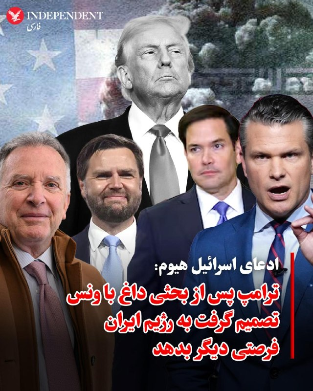

♦️درحالی که دونالد ترامپ، رئیس‌جمهوری آمریکا بسیاری از گزارش‌هایی که به نقل از منابع ناشناس در رسانه‌ها از پشت‌پرده مذاکرات با تهران را رد کرده و آنها را به داستان‌سرایی متهم کرده است، اسرائیل هیوم به نقل از منابعی که آنها را افراد مطلع معرفی کرده، ادعا کرده است که پس از یک بحث داغ در کاخ سفید میان دونالد ترامپ و جی‌دی ونس، معاون رئیس‌جمهوری آمریکا، ترامپ تصمیم گرفت به مذاکرات با رژیم ایران فرصت دیگری بدهد. در این جلسه، وزیر جنگ و وزیر خارجه آمریکا نیز حضور داشتند و معتقد بودند بدون اعمال فشار گسترده‌تر، از جمله احتمال حمله نظامی و تحریم‌های شدیدتر، گرفتن امتیاز از تهران ممکن نیست.
در مقابل، ونس استدلال کرد که پیشنهاد جدید جمهوری اسلامی نشان‌دهنده انعطاف‌پذیری تهران است و می‌توان از طریق آن به یک توافق اولیه برای پایان دادن به درگیری‌ها رسید. هیوم ادعا می‌کند، استیو ویتکاف و جرد کوشنر نیز از موضع ونس حمایت کردند. آنها پیش از نشست، با رهبران عمان، قطر و عربستان سعودی گفتگو کرده بودند؛ کشورهایی که به نوشته هیوم مخالف ازسرگیری جنگ هستند.
هیوم در ادامه ادعا می‌کند که ترامپ از ونس و فرستادگانش انتقاد کرد که ویکردی در پیش گرفته‌اند که به رژیم ایران اجازه وقت‌کشی می‌دهد.
هم‌زمان، ترامپ با رهبران منطقه نیز گفتگو کرد.
هیوم می‌نویسد، در نهایت، ترامپ پس از گفتگو با نتانیاهو تصمیم گرفت مذاکرات ادامه پیدا کند.
‌🇸🇦 Indypersian

🤖 @VahidOOnLine

## VahidOOnLine — post 241238

  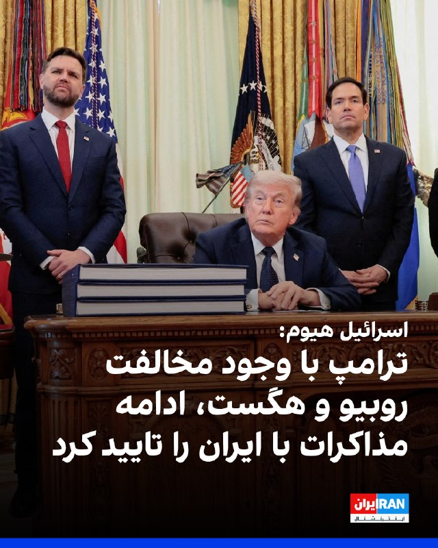

اسرائیل هیوم به نقل از منابع آگاه گزارش داد جلسه‌ای که چهارشنبه در کاخ سفید درباره ایران برگزار شد، به تنش انجامید، اما ترامپ در نهایت، خلاف نظر وزیران جنگ و خارجه و همسو با دیدگاه جی‌دی ونس و فرستادگان ویژه‌اش، ادامه مذاکرات با جمهوری اسلامی را تایید کرد.
این روزنامه نوشت ارزیابی مارکو روبیو، وزیر امور خارجه، و پیت هگست، وزیر جنگ آمریکا، این بود که در این مرحله، بدون اعمال فشار قابل‌توجه، از جمله تهدید به حمله و تشدید تحریم‌های اقتصادی، نمی‌توان از جمهوری اسلامی امتیاز گرفت. در مقابل، ونس معتقد بود تازه‌ترین پیشنهاد تهران نشانه‌ای از انعطاف است و می‌تواند زمینه حرکت به سوی یک توافق اولیه را فراهم کند.
منابع آگاه از این جلسه به اسرائیل هیوم گفتند که استیو ویتکاف و جرد کوشنر، فرستادگان ویژه دونالد ترامپ نیز در این گفت‌وگو از موضع ونس حمایت کردند.
آنها پیش از این جلسه با رهبران عمان، قطر و عربستان سعودی گفت‌وگو کرده بودند.
به نوشته این رسانه تنش در این جلسه زمانی شدت گرفت که ترامپ از ونس و فرستادگان انتقاد و آنها متهم کرد که رویکردشان به جمهوری اسلامی امکان می‌دهد زمان بخرد و به تصویر ایالات متحده و نهاد ریاست
‌🏁 🇬🇧 IranintlTV

🤖 @VahidOOnLine

## VahidOOnLine — post 241237

  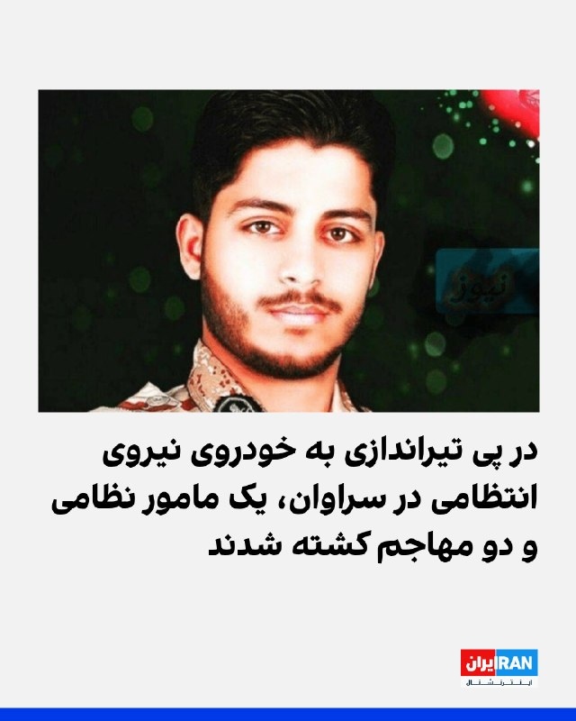

به گزارش رسانه‌های ایران، چهارشنبه در پی تیراندازی سرنشینان مسلح یک خودروی پژو به خودروی نیروهای انتظامی در یکی از جاده‌های اطراف سراوان، یک نیروی نظامی به نام امیرحسین شهرکی و دو نفر از مهاجمان کشته شدند.
بر اساس این گزارش‌ها، پس از این درگیری، سلاح، مهمات و یک دستگاه استارلینک کشف و خودروی مهاجمان توقیف شد. تلاش‌ها برای شناسایی و بازداشت دیگر مهاجمان ادامه دارد.

‌🏁 🇬🇧 IranintlTV

🤖 @VahidOOnLine

## VahidOOnLine — post 241236

  <a href="telegram/content/VahidOOnLine_241236_1779317795.mp4" target="_blank">🎬 Download video</a>

جاویدنام سینا عباسی؛
جوان ۲۲ ساله‌ای از کرمانشاه که هشتم دی ۱۴۰۴ در جریان اعتراضات میدان انقلاب، بر اثر ضربات باتوم به سر جان باخت.
با گذشت ماه‌ها، هنوز نامش جایی ثبت نشده…
و خانواده‌اش فقط می‌خواهند صدای سینا شنیده شود.»
‌🏁 🇬🇧 ManotoTV

🤖 @VahidOOnLine

## VahidOOnLine — post 241235

  <a href="telegram/content/VahidOOnLine_241235_1779317797.mp4" target="_blank">🎬 Download video</a>

‌
«نهاد مدیریت آبراه خلیج فارس» با انتشار نقشه‌ای در شبکه اکس «محدوده نظارتی مدیریت» جمهوری اسلامی در تنگه هرمز را تعیین کرد.

بر اساس متن این نقشه، محدوده مورد نظر در شرق تنگه از خط اتصال «کوه مبارک» در ایران به جنوب فجیره در امارات متحده عربی، و در غرب تنگه از خط اتصال انتهای جزیره قشم به ام‌القوین در امارات تعیین شده است.

در این بیانیه آمده است تردد در این محدوده برای عبور از تنگه هرمز باید «با هماهنگی مدیریت آبراه خلیج فارس و مجوز این نهاد» انجام شود.

در نقشه منتشرشده، بخش وسیعی از آب‌های اطراف تنگه هرمز (محدوده قرمز) با عنوان «محدوده تحت نظارت نیروهای مسلح ایران» مشخص شده است.
‌🏁 🇬🇧 ManotoTV

🤖 @VahidOOnLine

## VahidOOnLine — post 241234

♦️نارندرا مودی، نخست وزیر هند، با انتشار تصاویری از اجرای رقص پنج زن ایتالیایی در حساب کاربری خود در اکس نوشت: «دیدن علاقه جهانی به فرم‌های رقص هندی واقعا شگفت‌انگیز است.» این هنرمندان ایتالیایی به مناسبت سفر رسمی مودی به رم و برای خوش‌آمدگویی به او، ترکیبی از رقص‌های سنتی «کوچی‌پودی»، «بهاراتاناتیام» و «کاتاک» را اجرا کردند؛ هنرمندانی که پس از این اجرا اعلام کردند احساسات بسیار عمیقی داشتند و مودی نیز شخصا از عملکرد عالی آن‌ها تقدیر کرده است. نخست وزیر هند در بخش دیگری از این سفر دیپلماتیک، به همراه همتای ایتالیایی خود، جورجیا ملونی، از بنای تاریخی کولوسئوم در رم بازدید کرد؛ سفری که ملونی با انتشار پیامی در شبکه اجتماعی اکس و با عبارت «دوست من، به رم خوش آمدی»، استقبال گرمی از آن به عمل آورد. این سفر، نخستین سفر یک نخست‌وزیر هند به ایتالیا در ۲۶ سال گذشته است.
‌🇸🇦 Indypersian

🤖 @VahidOOnLine

## WithYashar — post 11802

وزیر کشور پاکستان با احمد وحیدی، فرمانده سپاه پاسداران در تهران دیدار کرد.
@withyashar
یکی اینو آخرش از سولاخ کشید بیرون دیگه مابقی با موساده 😅

## mwarmonitor — post 9392

  <a href="telegram/content/mwarmonitor_9392_1779317797.mp4" target="_blank">🎬 Download video</a>

📝 اصلاً بوی زهمِ این بساط از فرسنگ‌ها داد می‌زند؛ شاهکارِ جدیدِ جماعتِ ارزشی مدار که کلِ جهان‌بینی‌شان از ناف به پایین خلاصه می‌شود. غرفه‌ی همسریابی کفِ خیابان! رسماً دکانِ چوب‌زدن و حراجِ غریزه راه انداخته‌اند، آن‌وقت اسمش را می‌گذارند «تسهیلِ ازدواجِ جوانان».

🔸فضا بیشتر شبیه به بازارِ هفتگیِ فروشِ احشام است تا کانونِ خانواده. یک طرف پسرک‌های هول و کفری که با هورمون‌های بالا زده، یقه غرفه‌دار را چسبیده‌اند که «پس کاتالوگِ سوگلی‌های مؤمنه چی شد؟»؛ یک طرف هم خانواده‌های متوهمی که مشخصاتِ دخترشان را آورده‌اند، اما از ترسِ چشم‌زخم، حتی اسمِ خریدار را هم نمی‌پرسند!

🔸تمام هنرِ این تفکرِ کپک‌زده، تنزل دادنِ شأنِ انسان به حدِ یک جفت‌گیریِ خیابانی و هول‌هولکی است. خب اگر خیلی نگرانِ جوششِ غریزه و کاهشِ جمعیتِ نظام هستید، تعارف را کنار بگذارید؛ همان‌جا وسطِ پیاده‌رو، بغلِ غرفهٔ آش و سیب‌زمینی، یک لاحاف تشک پهن کنید تا برادران و خواهرانِ بی‌تاب، کار را بی‌فوتِ وقت تمام کنند. واقعاً تف به این حجم از سقوط و لجن‌زارِ فرهنگی.

@mwarmonitor

## mwarmonitor — post 9391

🔴شبکه CBS گزارش داد: کار بر روی تدوین گزینه‌های نظامی علیه کوبا برای رئیس‌جمهور ترامپ آغاز شده و جامعه اطلاعاتی آمریکا در حال بررسی این است که کوبا چگونه ممکن است به یک اقدام نظامی آمریکا واکنش نشان دهد.

@mwarmonitor

## mwarmonitor — post 9390

  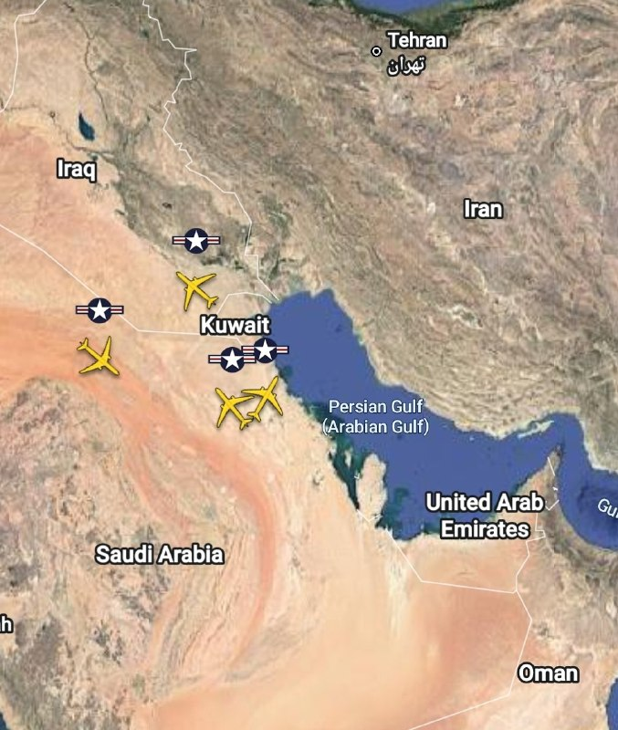

✈️۴ فروند هواپیمای سوخت‌رسان هوایی KC-46A Pegasus نیروی هوایی آمریکا از اسرائیل به پرواز درآمده‌اند و بر اساس داده‌های فلایت‌رادار بر فراز عربستان سعودی و عراق شناسایی شده‌اند.

@mwarmonitor

## mwarmonitor — post 9389

📝 سوال، انتقاد ، پیشنهاد ، دایرکت به گوشم

## mwarmonitor — post 9388

🔴هدف این تلاش جدید این است که تعهدات ملموس‌تری از سوی ایران درباره گام‌های مربوط به برنامه هسته‌ای‌اش به دست آید، و همچنین جزئیات بیشتری از سوی آمریکا درباره این‌که چگونه دارایی‌های مسدودشده ایران به‌تدریج آزاد خواهند شد، ارائه شود؛ یک مقام عربی گفت. باراک راوید

@mwarmonitor

## mwarmonitor — post 9387

🇮🇷🇺🇸ایالات متحده و ایران در حال گفت‌وگو درباره یک «نقشه راه » برای دور جدیدی از مذاکرات هستند که قرار است محورهای مورد بحث را مشخص کند؛ مذاکراتی که ترامپ پیش‌تر گفته بود در اسلام‌آباد برگزار خواهد شد—اگر ایران آماده گفت‌وگو درباره کنار گذاشتن جاه‌طلبی‌های هسته‌ای خود باشد. نیویورک پست

@mwarmonitor

## mwarmonitor — post 9386

  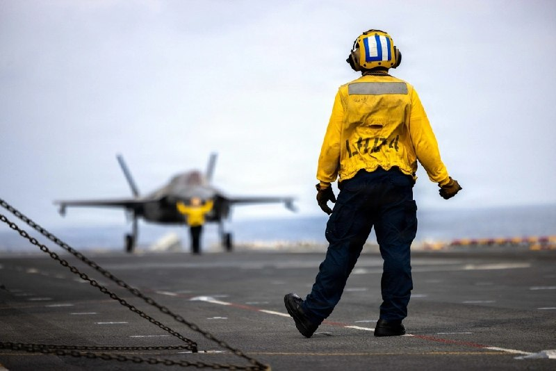

⁉️سوال زیادی در مورد موقعیت ناو boxer پرسیده بودید

🔸اقیانوس هند
۱۵ می ۲۰۲۶ (۲۵ اردیبهشت ۱۴۰۵)

📷عکس از: سرجوخه ترنت ای. هنری
یگان یازدهم اعزامی تفنگداران دریایی 11th MEU

🔸یک ملوان آمریکایی مستقر در کشتی بالگردبر و آب‌خاکی کلاس واسپ، یو‌اس‌اس باکسر (LHD 4)، در حال نظارت بر یک جنگنده F-35B لایتنینگ ۲ متعلق به اسکادران ۱۲۲ حمله جنگنده‌ای تفنگداران دریایی (VMFA-122)، یگان یازدهم اعزامی تفنگداران دریایی، در جریان عملیات پروازی در اقیانوس هند در تاریخ ۱۵ می ۲۰۲۶ است.

🔸یگان 11th MEU که بر روی ناوگروه آماده آب-خاکی باکسر (Boxer ARG) مستقر شده است، یک نیروی مداوم و با توان رزمی معتبر است که به بازدارندگی و پاسخ به بحران‌ها در منطقه عملیاتی ناوگان هفتم نیروی دریایی آمریکا کمک می‌کند. ناوگان هفتم ایالات متحده، به عنوان بزرگ‌ترین ناوگان شماره‌گذاری‌شده و فرامرزی نیروی دریایی آمریکا، به طور منظم با متحدان و شرکای خود تعامل و عملیات انجام می‌دهد تا امنیت و پایداری یک منطقه آزاد و باز در هند-آرام (ایندو-پاسیفیک) را حفظ کند.

@mwarmonitor

## pm_afshaa — post 91137

  <a href="telegram/content/pm_afshaa_91137_1779317800.webm" target="_blank">🎬 Download video</a>

🔴امروز وزیر کشور پاکستان با احمد وحیدی، فرمانده سپاه پاسداران در تهران دیدار کرد.

💧 Rainbet.com the #1 Non-KYC Crypto Casino & Sportsbook @rainbetcom

😁 @Pm_Afshaa

## IranIntlTV — post 338166

  

اسرائیل هیوم به نقل از منابع آگاه گزارش داد جلسه‌ای که چهارشنبه در کاخ سفید درباره ایران برگزار شد، به تنش انجامید، اما ترامپ در نهایت، خلاف نظر وزیران جنگ و خارجه و همسو با دیدگاه جی‌دی ونس و فرستادگان ویژه‌اش، ادامه مذاکرات با جمهوری اسلامی را تایید کرد.
این روزنامه نوشت ارزیابی مارکو روبیو، وزیر امور خارجه، و پیت هگست، وزیر جنگ آمریکا، این بود که در این مرحله، بدون اعمال فشار قابل‌توجه، از جمله تهدید به حمله و تشدید تحریم‌های اقتصادی، نمی‌توان از جمهوری اسلامی امتیاز گرفت. در مقابل، ونس معتقد بود تازه‌ترین پیشنهاد تهران نشانه‌ای از انعطاف است و می‌تواند زمینه حرکت به سوی یک توافق اولیه را فراهم کند.
منابع آگاه از این جلسه به اسرائیل هیوم گفتند که استیو ویتکاف و جرد کوشنر، فرستادگان ویژه دونالد ترامپ نیز در این گفت‌وگو از موضع ونس حمایت کردند.
آنها پیش از این جلسه با رهبران عمان، قطر و عربستان سعودی گفت‌وگو کرده بودند.
به نوشته این رسانه تنش در این جلسه زمانی شدت گرفت که ترامپ از ونس و فرستادگان انتقاد و آنها متهم کرد که رویکردشان به جمهوری اسلامی امکان می‌دهد زمان بخرد و به تصویر ایالات متحده و نهاد ریاست

## IranIntlTV — post 338165

  <a href="telegram/content/IranIntlTV_338165_1779317801.mp4" target="_blank">🎬 Download video</a>

انتشار قانون جدید طالبان درباره طلاق موجی از نگرانی درباره وضعیت حقوق زنان و احتمال تشدید کودک‌همسری در افغانستان ایجاد کرده است.

براساس این قانون، سکوت یک دختر هنگام جاری شدن خطبه عقد، به معنای رضایتش برای ازدواج تلقی می‌شود.

گفت‌وگو با راضیه دانش، عضو تحریریه ایران‌اینترنشنال
@iranintltv

## IranIntlTV — post 338164

  <a href="telegram/content/IranIntlTV_338164_1779317803.mp4" target="_blank">🎬 Download video</a>

مسعود پزشکیان، رییس دولت در جمهوری اسلامی، با تایید آسیب دیدن بخشی از زیرساخت‌های انرژی جمهوری اسلامی در جریان حملات آمریکا و اسرائیل، از ناتوانی دولت در تامین و واردات بنزین خبر داد.

گفت‌وگو با مهدی مصلحی، کارشناس بازار نفت
@iranintltv

## IranIntlTV — post 338163

  <a href="telegram/content/IranIntlTV_338163_1779317804.mp4" target="_blank">🎬 Download video</a>

سنای آمریکا طرح پایان دادن به جنگ با ایران را با ۵۰ رای در برابر ۴۷ رای یک گام به پیش برد.

رسانه‌ها این اقدام را ضربه‌ای سیاسی به دونالد ترامپ توصیف کرده‌اند.

گزارش مرضیه حسینی، خبرنگار ایران‌اینترنشنال
@iranintltv

## IranIntlTV — post 338162

  <a href="telegram/content/IranIntlTV_338162_1779317805.mp4" target="_blank">🎬 Download video</a>

مراد ویسی، تحلیل‌گر ارشد ایران‌اینترنشنال، گفت: «صف بنزین در بندرعباس، شهری که بخش بزرگی از بنزین کشور را تولید می‌کند، نشانه‌ای از شدت گرفتن کمبود بنزین و بحرانی عمیق‌تر از روایت‌ دولت است. در صورت گسترش جنگ و حمله به زیرساخت‌های انرژی، خطر شکل‌گیری ابر بحران بنزین و برق در کشور وجود دارد.»
@iranintltv

## IranIntlTV — post 338161

  <a href="https://t.me/IranintlTV/338161" target="_blank">📎 Download file</a>

🎧نسخه صوتی سیاست با مراد ویسی: چهارمین جنگ یا توافق در آخرین لحظه؟
@iranintlTV

## IranIntlTV — post 338160

  <a href="telegram/content/IranIntlTV_338160_1779317807.mp4" target="_blank">🎬 Download video</a>

آکسیوس گزارش داد دونالد ترامپ در گفت‌وگوی تلفنی با بنیامین نتانیاهو از کار میانجی‌ها روی یک «تفاهم اولیه» خبر داده که قرار است آمریکا و ایران آن را امضا کنند تا جنگ به‌صورت رسمی پایان یابد و دوره ۳۰ روزه مذاکرات آغاز شود.

گفت‌وگو با فرزین ندیمی، پژوهشگر امور دفاعی و امنیتی
@iranintltv

## IranIntlTV — post 338159

  

به گزارش رسانه‌های ایران، چهارشنبه در پی تیراندازی سرنشینان مسلح یک خودروی پژو به خودروی نیروهای انتظامی در یکی از جاده‌های اطراف سراوان، یک نیروی نظامی به نام امیرحسین شهرکی و دو نفر از مهاجمان کشته شدند.
بر اساس این گزارش‌ها، پس از این درگیری، سلاح، مهمات و یک دستگاه استارلینک کشف و خودروی مهاجمان توقیف شد. تلاش‌ها برای شناسایی و بازداشت دیگر مهاجمان ادامه دارد.

https://iranintl.com/202605200267

## IranIntlTV — post 338158

  <a href="telegram/content/IranIntlTV_338158_1779317809.mp4" target="_blank">🎬 Download video</a>

دونالد ترامپ گفت ایران باید تنگه هرمز را باز نگه دارد. او با اشاره به شرایط دشوار زندگی در ایران افزود خشم و ناآرامی زیادی در کشور وجود دارد.

همزمان آکسیوس گزارش داد تماس تلفنی ترامپ و نتانیاهو درباره جمهوری اسلامی پرتنش بوده است.

گزارش اردوان روزبه، خبرنگار ایران‌اینترنشنال
@iranintltv

## Shin_Persian — post 6119

  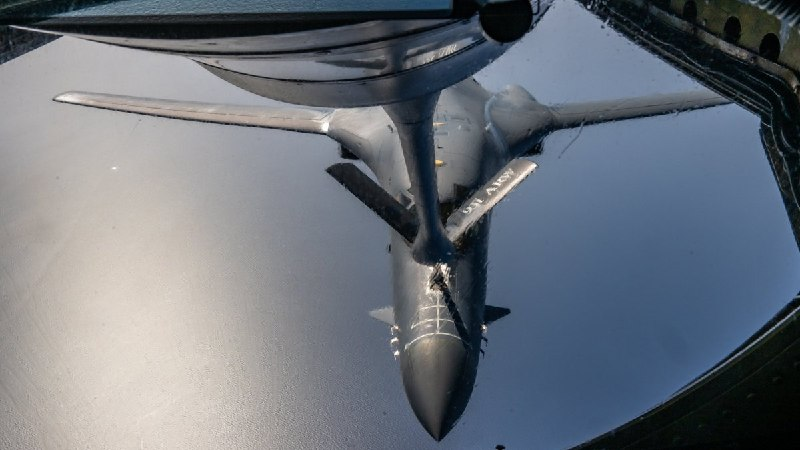

U.S. Central Command ✓ @CENTCOM
Wed, 20 May 2026 22:20:46 UTC

A U.S. Air Force B-1B Lancer refuels from a KC-135 Stratotanker during a training flight over regional waters in the Middle East.

فارسی

یک فروند بی-۱بی لنسر نیروی هوایی ایالات متحده (USAF) در جریان یک پرواز آموزشی بر فراز آب‌های منطقه در خاورمیانه، از یک کی‌سی-۱۳۵ استراتوتانکر سوخت‌گیری می‌کند.

𝕏 · @shin_persian

## Shin_Persian — post 6118

Shin ✓ @hey_itsmyturn
Wed, 20 May 2026 22:03:08 UTC

Jet activity over Daraa, #Syria 🇸🇾

فارسی

فعالیت جت‌ها برفراز درعا، #Syria 🇸🇾

𝕏 · @shin_persian

## ManotoTV — post 105706

  <a href="telegram/content/ManotoTV_105706_1779317812.mp4" target="_blank">🎬 Download video</a>

جاویدنام سینا عباسی؛
جوان ۲۲ ساله‌ای از کرمانشاه که هشتم دی ۱۴۰۴ در جریان اعتراضات میدان انقلاب، بر اثر ضربات باتوم به سر جان باخت.
با گذشت ماه‌ها، هنوز نامش جایی ثبت نشده…
و خانواده‌اش فقط می‌خواهند صدای سینا شنیده شود.»

## ManotoTV — post 105705

  <a href="telegram/content/ManotoTV_105705_1779317813.mp4" target="_blank">🎬 Download video</a>

‌
«نهاد مدیریت آبراه خلیج فارس» با انتشار نقشه‌ای در شبکه اکس «محدوده نظارتی مدیریت» جمهوری اسلامی در تنگه هرمز را تعیین کرد.

بر اساس متن این نقشه، محدوده مورد نظر در شرق تنگه از خط اتصال «کوه مبارک» در ایران به جنوب فجیره در امارات متحده عربی، و در غرب تنگه از خط اتصال انتهای جزیره قشم به ام‌القوین در امارات تعیین شده است.

در این بیانیه آمده است تردد در این محدوده برای عبور از تنگه هرمز باید «با هماهنگی مدیریت آبراه خلیج فارس و مجوز این نهاد» انجام شود.

در نقشه منتشرشده، بخش وسیعی از آب‌های اطراف تنگه هرمز (محدوده قرمز) با عنوان «محدوده تحت نظارت نیروهای مسلح ایران» مشخص شده است.

## FarsiVOA — post 218261

  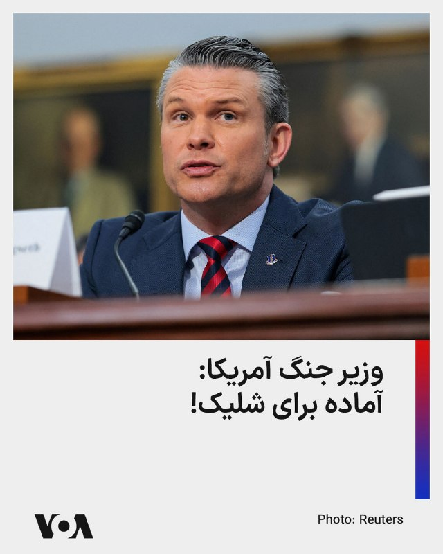

⚡️پیت هگست، وزیر جنگ آمریکا، عصر چهارشنبه ویدیویی از سخنان اخیر جی‌دی ونس، معاون رئیس‌جمهوری آمریکا در مورد «گزینه ب» واشنگتن در صورت شکست مذاکرات با جمهوری اسلامی را بازنشر کرد و در شبکه اجتماعی ایکس نوشت: «آماده برای شلیک»
@FarsiVOA

## FarsiVOA — post 218260

🔺آمریکا علیه رهبر سابق کوبا کیفرخواست صادر کرد؛ رائول کاسترو متهم به قتل شد

▪️دادستان‌های فدرال آمریکا روز چهارشنبه اعلام کردند که علیه رائول کاسترو، رئیس‌جمهوری پیشین کوبا، به اتهام نقش داشتن در سرنگونی هواپیماهای غیرنظامی در سال ۱۹۹۶ پرونده کیفری تشکیل داده‌اند. این هواپیماها مورد استفاده تبعیدی‌هایی کوبایی‌تبار ساکن میامی در آمریکا بود.

⬇️ بیشتر بخوانید:
https://ir.voanews.com/a/8152139.html
@FarsiVOA

## Persian_Trend_Official — post 14564

  <a href="telegram/content/Persian_Trend_Official_14564_1779317814.mp4" target="_blank">🎬 Download video</a>

▪️شبی پر از آرامش برای شما آرزومندم 🫶

🫆:Tony

📌 @persian_trend_official
پرشین ترند | متفاوت‌ترین کانال نظامی

## Persian_Trend_Official — post 14563

⭕️ رائول کاسترو متهم به قتل شد 💢دادستان‌های فدرال آمریکا روز چهارشنبه اعلام کردند که علیه رائول کاسترو، رئیس‌جمهوری پیشین کوبا، به اتهام نقش داشتن در سرنگونی هواپیماهای غیرنظامی در سال ۱۹۹۶ پرونده کیفری تشکیل داده‌اند. این هواپیماها مورد استفاده تبعیدی‌هایی…

## Persian_Trend_Official — post 14562

  <a href="telegram/content/Persian_Trend_Official_14562_1779317815.webm" target="_blank">🎬 Download video</a>

⭕️ رائول کاسترو متهم به قتل شد

💢دادستان‌های فدرال آمریکا روز چهارشنبه اعلام کردند که علیه رائول کاسترو، رئیس‌جمهوری پیشین کوبا، به اتهام نقش داشتن در سرنگونی هواپیماهای غیرنظامی در سال ۱۹۹۶ پرونده کیفری تشکیل داده‌اند. این هواپیماها مورد استفاده تبعیدی‌هایی کوبایی‌تبار ساکن میامی در آمریکا بود.

🫆:Tony

📌 @persian_trend_official
پرشین ترند | متفاوت‌ترین کانال نظامی

## IranianMinds — post 20470

  

🔴نهاد مدیریت آبراه خلیج ‌فارس که به تازگی اعلام موجودیت کرده است، می‌گوید یک منطقه دریایی کنترل شده در تنگه هرمز ایجاد کرده است.

@IranianMinds

## BBCPersian — post 281648

  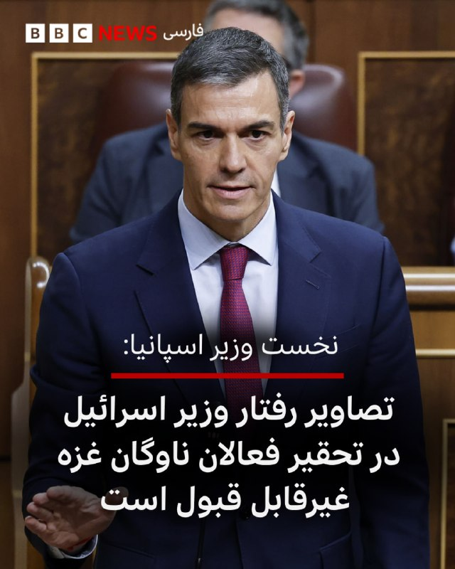

🔻پدرو سانچز، نخست‌وزیر اسپانیا، در واکنشی تند به برخورد تند و خشن وزیر امنیت ملی اسرائیل با فعالان ناوگان بشردوستانه غزه گفته تلاش خواهد کرد اتحادیه اروپا را برای تحریم برخی از اعضای تندور دولت اسرائیل، مجاب کند.

آقای سانچز روز چهارشنبه در حساب ایکس خود نوشت:

«تصاویر مربوط به تحقیر اعضای ناوگان بین‌المللی حامی غزه توسط وزیر اسرائیلی، بن گویر، غیرقابل قبول است. ما تحمل نخواهیم کرد که با شهروندان‌مان بدرفتاری شود. در ماه سپتامبر، ممنوعیت ورود این عضو دولت اسرائیل به خاک کشورمان را اعلام کردم. اکنون نیز در بروکسل تلاش خواهیم کرد این تحریم‌ها در سریع‌ترین زمان ممکن به سطح اتحادیه اروپا گسترش یابد.»

📸EPA/Shutterstock
https://bbc.in/4dViGx1
@BBCPersian

## BBCPersian — post 281646

🔻قاآنی: جنگ باعث شد اسرائیل سریع‌تر به «نقطه پایان نزدیک شود»

اسماعیل قاآنی، فرمانده نیروی قدس سپاه پاسداران در اظهاراتی جدید که خبرگزاری‌های نزدیک به سپاه منتشر کرده‌اند به تحولات روز واکنش نشان داده است از جمله به حرکت ناوگان بشردوستانه به سمت غزه که متوقف کردن آن و برخورد خشن و تحقیر آمیز وزیر امنیت ملی اسرائیل با یکی از دهها فعال ناوگان صمود آن امروز خبر ساز شده است.

آقای قاآنی گفته آنچه او دستاورهای ناوگان صمود خوانده «ادامه» خواهد داشت و از نظر او: «فلسطین را باز به کانون توجه جهانیان بازگرداند. رژیم صهیونسیتی مغلوب را که به تشدید سرکوب و جنایاتگری دست زده، سریعتر از قبل به نقطه پایان نزدیک کرد.»

نیروی قدس سپاه پاسداران که پیش از آقای قاآنی، قاسم سلیمانی برای سالها فرماندهی آن را در دست داشت، شاخه برون مرزی سپاه پاسداران است و بازوری اصلی حکومت در ایران برای هماهنگی و کنترل و حمایت از نیروهای نیابتی آن در منطقه محسوب می‌شود.

این بخش از سپاه پاسداران از سال‌ها قبل در فهرست سازمان‌های تروریستی آمریکا و چند کشور غربی دیگر قرار گرفته است.

https://bbc.in/4upkbJS
@BBCPersian

## Dirty_Kids — post 389855

  <a href="telegram/content/Dirty_Kids_389855_1779317816.webm" target="_blank">🎬 Download video</a>

☢️خفن ترین و‌ قدیمی ترین  انالیزور  ایران ینی دکتر بت 
👍 
🔴هیچ سایت بتی دوست نداره شما کانال دکتر بت رو پیدا کنین چون خیلی سود میکنید🤷‍♂ رایگان بهترین شرط هارو براتون میذاره حتی هزار تومن هم دریافت نمیکنه روزانه میتونی از پیش بینی فوتبال باهاش پول در بیاری…

## Dirty_Kids — post 389854

  <a href="telegram/content/Dirty_Kids_389854_1779317817.webm" target="_blank">🎬 Download video</a>

☢️خفن ترین و‌ قدیمی ترین  انالیزور  ایران ینی دکتر بت 
👍

🔴هیچ سایت بتی دوست نداره شما کانال دکتر بت رو پیدا کنین چون خیلی سود میکنید🤷‍♂

رایگان بهترین شرط هارو براتون میذاره
حتی هزار تومن هم دریافت نمیکنه
روزانه میتونی از پیش بینی فوتبال باهاش پول در بیاری 👌
A30
اگ اهل پیش بینی فوتبالی این کانال اصلا از دست ندین👇

✅https://t.me/+4_ADqwB9e-QwYjlk

✅https://t.me/+4_ADqwB9e-QwYjlk

## Dirty_Kids — post 389853

  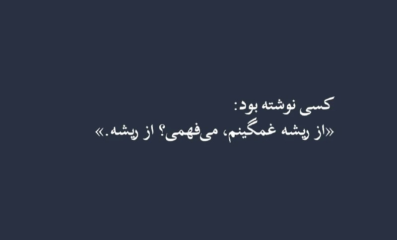

#بخوابیم

@Dirty_Kids 👻

## Dirty_Kids — post 389852

این خبر احمدی‌نژاد یه چیزی تو مایه‌های ماجرای مهران مدیری بود که با قایق رفته بود دنبال علی کریمی.

@Dirty_Kids 👻

## Dirty_Kids — post 389851

دیگه چیزی‌ نمونده که جوون ایرانی تجربه نکرده باشه جز یک چیز. شادی. شادی رو هنوز تجربه نکردیم.

@Dirty_Kids 👻

## Dirty_Kids — post 389850

  <a href="telegram/content/Dirty_Kids_389850_1779317818.mp4" target="_blank">🎬 Download video</a>

ازدواج آسان

اینا اصلا موشعلی و مقوایی اینارو یادشون رفته
افتادن به مقاومت جنسی.
فکر کن هر شب میرن پرچم تکون میدن واسه پایین تنه.🤣🤣

@Dirty_Kids 👻

## Dirty_Kids — post 389849

  <a href="telegram/content/Dirty_Kids_389849_1779317819.mp4" target="_blank">🎬 Download video</a>

مود: 🦦

@Dirty_Kids 👻

## Dirty_Kids — post 389848

  

🔴 طبق مطالعات جدید کسایی که دائم از بقیه غلط املایی میگیرن، دچار اختلال روانی ان.

@Dirty_Kids 👻

## Dirty_Kids — post 389847

  <a href="telegram/content/Dirty_Kids_389847_1779317821.mp4" target="_blank">🎬 Download video</a>

این صحبت ترامپ ارزش داره چندین بار ببینیش:

@Dirty_Kids 👻

## Dirty_Kids — post 389846

  

سرانجام بخت زیبای خفته‌ی عرزشی‌ها هم باز شد @Dirty_Kids 👻

## Dirty_Kids — post 389845

  <a href="telegram/content/Dirty_Kids_389845_1779317823.mp4" target="_blank">🎬 Download video</a>

سرانجام بخت زیبای خفته‌ی عرزشی‌ها هم باز شد

@Dirty_Kids 👻

## manototv — post 105706

  <a href="telegram/content/manototv_105706_1779317824.mp4" target="_blank">🎬 Download video</a>

جاویدنام سینا عباسی؛
جوان ۲۲ ساله‌ای از کرمانشاه که هشتم دی ۱۴۰۴ در جریان اعتراضات میدان انقلاب، بر اثر ضربات باتوم به سر جان باخت.
با گذشت ماه‌ها، هنوز نامش جایی ثبت نشده…
و خانواده‌اش فقط می‌خواهند صدای سینا شنیده شود.»

## manototv — post 105705

  <a href="telegram/content/manototv_105705_1779317825.mp4" target="_blank">🎬 Download video</a>

‌
«نهاد مدیریت آبراه خلیج فارس» با انتشار نقشه‌ای در شبکه اکس «محدوده نظارتی مدیریت» جمهوری اسلامی در تنگه هرمز را تعیین کرد.

بر اساس متن این نقشه، محدوده مورد نظر در شرق تنگه از خط اتصال «کوه مبارک» در ایران به جنوب فجیره در امارات متحده عربی، و در غرب تنگه از خط اتصال انتهای جزیره قشم به ام‌القوین در امارات تعیین شده است.

در این بیانیه آمده است تردد در این محدوده برای عبور از تنگه هرمز باید «با هماهنگی مدیریت آبراه خلیج فارس و مجوز این نهاد» انجام شود.

در نقشه منتشرشده، بخش وسیعی از آب‌های اطراف تنگه هرمز (محدوده قرمز) با عنوان «محدوده تحت نظارت نیروهای مسلح ایران» مشخص شده است.

## alonews — post 121450

👈یدیعوت آحارونوت: مقامات اسرائیل از اقدامات ترامپ راضی نیستند

✅ @AloNews خبر جنگ

## alonews — post 121448

👈کانال 14 اسرائیل: ایران و ایالات متحده امشب از طریق واسطه‌های پاکستانی نزدیک‌ترین پیش‌نویس‌های پیشنهادی خود را مبادله کردند. هر دو کشور فردا جزئیات را بررسی خواهند کرد

✅ @AloNews خبر جنگ

## alonews — post 121445

👈کلاهبرداری صرافی #رمزینکس
⁉️

🔴پیام مخاطب:

با سلام
من در تاریخ ۶ فروردین ۳۰۰ ملیون معامله اهرمی در نماد تتر گلد صرافی رمزینکس داشتم در عرض چند ثانیه قیمت از ۱۷هزار به یک هزار سقوط کرد و دوباره برگشت همه معاملات اهرمی پودر شدند با پشتیبانی هرچقدر پیگیری کردیم آخرش میگن که شما ریسک معاملاتی رو پذیرفته اید یا بعضا قبول میکنن قصوراتشون رو ولی جبران خسارت نمیکنن خواهشا اطلاع رسانی کنید تا بقیه تو دام این کلاهبرداران کثیف نیوفتن وسط جنگ از این شرایط سو استفاده میکنن و پول ملت رو بالا میکشن و هیچ مسؤولیتی رو گردن نمیگیرن.

🔴این اقدام صرافی رمزینکس مصداق بارز اخلال در نظام اقتصادی و سواستفاده از شرایط جنگی است

✅ @AloNews خبر جنگ

## alonews — post 121444

  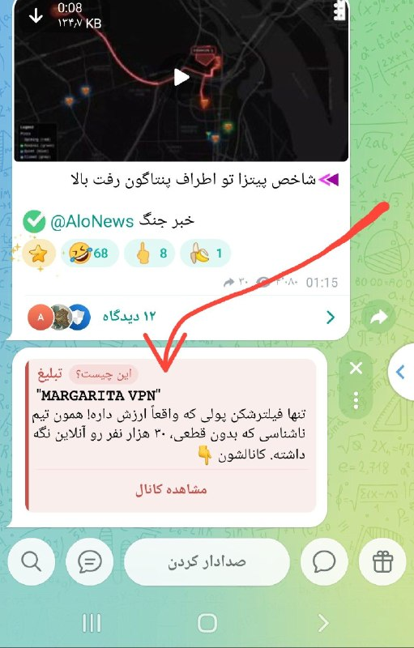

👈دوستان این تبلیغاتی که پائین کانال نمایش داده میشه توسط تلگرامه و دست ما نیست و کلاهبرداری هست و فریب نخورید

✅ @AloNews خبر جنگ

## alonews — post 121443

  <a href="telegram/content/alonews_121443_1779317826.mp4" target="_blank">🎬 Download video</a>

👈شاخص پیتزا تو اطراف پنتاگون رفت بالا

✅ @AloNews خبر جنگ

---
📅 بروزرسانی: 1405/02/31 01:06
---

## VahidOOnLine — post 241233

  <a href="telegram/content/VahidOOnLine_241233_1779312966.mp4" target="_blank">🎬 Download video</a>

♦️وزارت دفاع بریتانیا چهارشنبه ۳۰ اردیبهشت‌ماه اعلام کرد یک فروند هواپیمای شناسایی «ریوت جوینت» نیروی هوایی سلطنتی در حریم هوایی بین‌المللی بر فراز دریای سیاه با مزاحمت و رهگیری جنگنده‌های روسیه روبه‌رو شده است.

بر اساس بیانیه لندن، جنگنده‌های روسی تا فاصله شش متری به هواپیمای بریتانیایی نزدیک شدند و سامانه‌های اضطراری داخل هواپیما فعال شد.

در تصاویر منتشرشده از سوی وزارت دفاع بریتانیا، جنگنده‌های روسیه در فاصله‌ای بسیار نزدیک کنار هواپیمای شناسایی بریتانیا دیده می‌شوند.

بریتانیا اعلام کرد این هواپیما در حال انجام ماموریتی عادی در حمایت از عملیات ناتو بوده و خدمه آن با وجود «مانورهای بی‌پروا» ماموریت خود را با امنیت کامل به پایان رساندند.

وزارت دفاع بریتانیا همچنین این حادثه را نشانه ادامه افزایش فعالیت‌های نظامی روسیه در اروپای شرقی و مناطق شمالی توصیف کرد.
‌🇸🇦 Indypersian

🤖 @VahidOOnLine

## VahidOOnLine — post 241232

۴۰ روز مادری؛ مراقبت انسانی، نمایش عاطفه و پرسش‌های اخلاقی

نعیمه دوستدار- روایت زنی جوان که برای مدتی کوتاه سرپرستی یک نوزاد را بر عهده داشت، به یکی از بحث‌برانگیزترین موضوعات شبکه‌های اجتماعی فارسی‌زبان تبدیل شد. روایتی که با لحنی احساسی و الهام‌بخش منتشر شد، خیلی زود به موجی از نقدهای اخلاقی، روانشناختی و سیاسی دامن زد.
ماجرا از انتشار روایت‌های سارا کنعانی، فعال فضای مجازی، درباره حضور موقت یک نوزاد در خانه‌اش آغاز شد. او در اینستاگرام و ایکس از تجربه «مادری موقت» نوشت. تجربه‌ای که در قالب طرح «میزبان» سازمان بهزیستی انجام شد.
رسانه‌های حکومتی در ایران، از جمله خبرگزاری جمهوری اسلامی (ایرنا) و روزنامه همشهری، این روایت را با ادبیاتی احساسی و تصویری بازنشر کردند. تصاویری از خانه، آغوش، گریه هنگام جدایی و توصیف‌هایی از «۴۰ روز مادری».
تصاویر بدون حجاب کنعانی در ایرنا منتشر شد و کاربران مدتی بعد خبر از دسترس خارج شدن این خبرگزاری را منتشر کردند.
اما آنچه ابتدا برای بخشی از کاربران تصویری انسانی از مراقبت از کودک بی‌سرپرست به نظر می‌رسید، برای گروهی دیگر به پرسشی جدی درباره مرز میان حمایت از کودک و تبدیل کودک به «محتوا» بدل شد.
https://www.iranintl.com/fa/202605197267

‌🏁 🇬🇧 IranintlTV

🤖 @VahidOOnLine

## VahidOOnLine — post 241231

  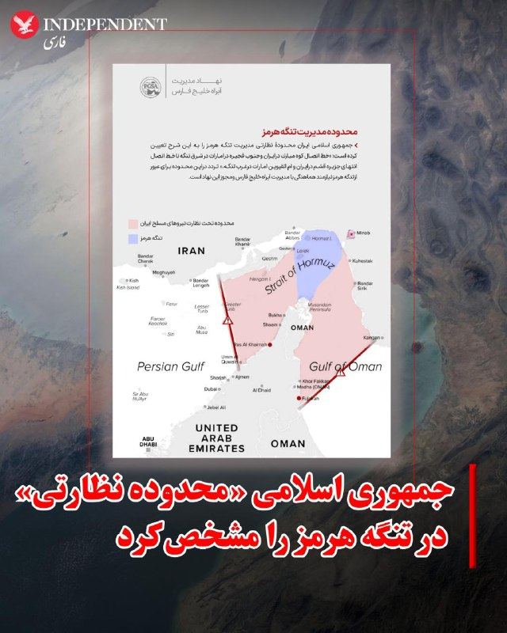

♦️خبرگزاری تسنیم، وابسته به سپاه پاسداران، چهارشنبه‌شب ۳۰ اردیبهشت‌ماه اعلام کرد «نهاد مدیریت آبراه خلیج فارس» محدوده نظارتی جمهوری اسلامی در تنگه هرمز را تعیین کرده است.

بر اساس نقشه منتشرشده، محدوده شرقی این منطقه از خط اتصال «کوه مبارک» در ایران تا جنوب فجیره در امارات متحده عربی و محدوده غربی آن از انتهای جزیره قشم تا ام‌القوین در امارات تعیین شده است.

در متن منتشرشده آمده است عبور از تنگه هرمز در این محدوده باید «با هماهنگی مدیریت آبراه خلیج فارس و مجوز این نهاد» انجام شود.

در نقشه منتشرشده، بخش وسیعی از آب‌های اطراف تنگه هرمز با عنوان «محدوده تحت نظارت نیروهای مسلح جمهوری اسلامی» مشخص شده است.
‌🇸🇦 Indypersian

🤖 @VahidOOnLine

## VahidOOnLine — post 241230

  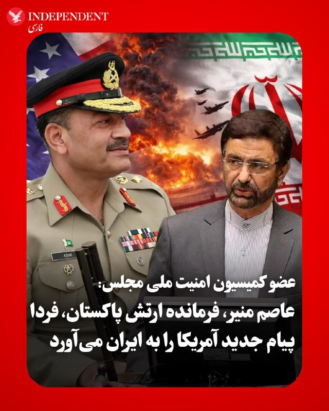

♦️به گزارش انتخاب، فداحسین مالکی، عضو کمیسیون امنیت ملی و سیاست خارجی مجلس، چهارشنبه‌شب ۳۰ اردیبهشت‌ماه، در گفتگو با صداوسیما اعلام کرد عاصم منیر، فرمانده ارتش پاکستان، فردا به ایران سفر خواهد کرد. این عضو کمیسیون امنیت ملی با اشاره به اهداف این سفر اعلام کرد که فرمانده ارتش پاکستان در این دیدار، حامل پیام جدیدی از سوی ایالات متحده آمریکا به مقامات جمهوری اسلامی است.
پیش‌تر نیز مسعود پزشکیان، رئیس‌جمهوری اسلامی، در دیدار با سید محسن نقوی، وزیر کشور پاکستان، درباره آخرین تحولات منطقه، روند مذاکرات غیرمستقیم ایران و آمریکا و گسترش همکاری‌های تهران و اسلام‌آباد گفتگو کرده بود. در این دیدار، وزیر کشور پاکستان پیام‌ها و دیدگاه‌های مقام‌های این کشور را درباره تحولات منطقه و ادامه رایزنی‌های دیپلماتیک به پزشکیان منتقل کرد.
‌🇸🇦 Indypersian

🤖 @VahidOOnLine

## VahidOOnLine — post 241229

  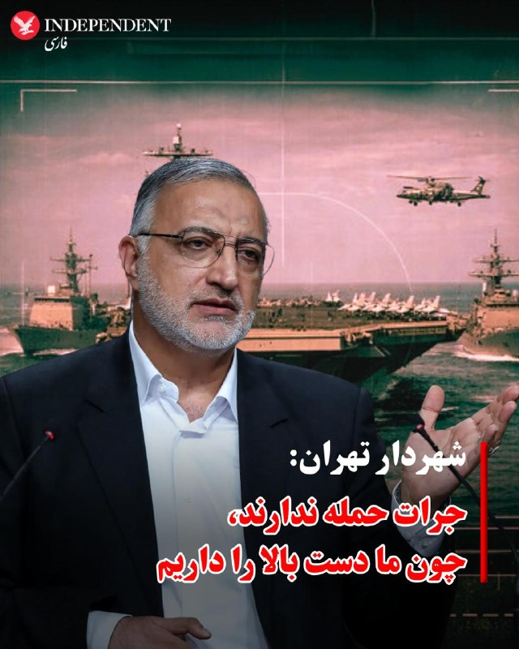

♦️علیرضا زاکانی، شهردار تهران، چهارشنبه‌شب ۳۰ اردیبهشت‌ماه، در گفتگو با صداوسیما با رد گزارش‌ها درباره محاصره دریایی جمهوری اسلامی گفت: «محاصره دریایی معنا ندارد. این‌ها اغراق می‌کنند و جرات حمله ندارند. اوج اقداماتشان را هم انجام دادند و دیدند ما دست بالا را داریم.»

او افزود: «اگر حمله کنند، پاسخ می‌گیرند. دوره بزن‌دررو تمام شده است.»

زاکانی همچنین درباره تنگه هرمز گفت نظارت بر این آبراه «حق طبیعی» جمهوری اسلامی است و تهران نباید درباره آن با آمریکا مذاکره کند.

شهردار تهران افزود: «از تنگه هرکی می‌خواهد استفاده کند، باید منابع ما را آزاد کند» و گفت کشورهایی که جمهوری اسلامی را تحریم کرده‌اند، نباید انتظار عبور آزاد از تنگه هرمز را داشته باشند.
‌🇸🇦 Indypersian

🤖 @VahidOOnLine

## VahidOOnLine — post 241228

  

علیرضا زاکانی، شهردار تهران، در گفت‌وگو با صداوسیما، گفت: «محاصره دریایی معنا ندارد. این‌ها اغراق می‌کنند و جرات حمله ندارند. اوج اقداماتشان را هم انجام دادند و دیدند ما دست بالا را داریم.»

او اضافه کرد: «اگر حمله کنند، پاسخ می‌گیرند. دوره بزن‌دررو تمام شده است.»
‌🏁 🇬🇧 IranintlTV

🤖 @VahidOOnLine

## VahidOOnLine — post 241227

  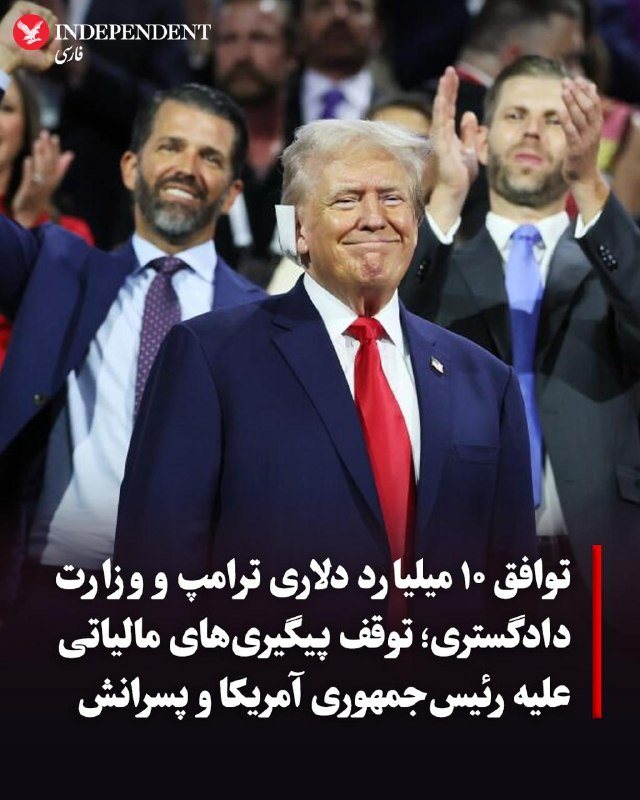

♦️روزنامه «فایننشال تایمز» روز چهارشنبه ۳۰ اردیبهشت، گزارش داد که بر اساس توافق جدید میان دونالد ترامپ و وزارت دادگستری آمریکا، اداره امور مالیاتی این کشور (IRS) دیگر حق پیگیری ادعاهای مالیاتی علیه ترامپ، پسران بزرگش و سازمان ترامپ را نخواهد داشت. این توافق در پی انصراف رئیس‌جمهوری آمریکا از شکایت ۱۰ میلیارد دلاری خود علیه این نهاد مالیاتی صورت گرفت.

این تعهد از سوی وزارت دادگستری یک روز پس از آن صادر شد که ترامپ موافقت کرد در ازای راه‌اندازی یک صندوق ۱.۸ میلیارد دلاری از سوی دولت برای قربانیان جنگ قضایی (Lawfare)، شکایت خود را تسویه کند. جنگ قضایی نامی است که در صحنه سیاسی آمریکا به اختلافات میان شهروندان و اداره مالیات در دوره ریاست‌جمهوری جو بایدن داده شده است. تاد بلانش، سرپرست دادستانی کل آمریکا، در سندی رسمی اعلام کرد که ایالات متحده تمامی ادعاهای مالیاتی علیه شاکیان این پرونده را برای همیشه لغو و ساقط کرده است.

سخنگوی وزارت دادگستری در گفتگو با فایننشال تایمز تصریح کرد که این ممنوعیت تعقیب، «تنها شامل حسابرسی‌های مالیاتی موجود» می‌شود. او افزود اگر هر یک از طرفین می‌توانستند ادعاهای قبلی خود را دوباره مطرح کنند، تسویه این پرونده‌های بزرگ بی‌معنا می‌شد.
‌🇸🇦 Indypersian

🤖 @VahidOOnLine

## VahidOOnLine — post 241226

♦️دونالد ترامپ، رئیس‌جمهور آمریکا، در تازه‌ترین اظهارات خود درباره روند تحولات مرتبط با ایران و مذاکرات جاری، اعلام کرد که شرایط «در مرز تصمیم‌گیری» قرار دارد و در صورت دریافت نکردن پاسخ‌های موردنظر واشنگتن، تحولات می‌تواند «بسیار سریع» پیش برود.
ترامپ با تاکید بر اینکه آمریکا برای هر سناریویی آمادگی کامل دارد، گفت پاسخ‌هایی که از طرف مقابل دریافت می‌شود باید «صددرصد کامل و مطلوب» باشد، چرا که رسیدن به توافق می‌تواند از اتلاف زمان، انرژی و مهم‌تر از همه از تلفات انسانی جلوگیری کند.
رئیس‌جمهوری آمریکا همچنین گفت ایران اکنون در موقعیتی «ضعیف و شکست‌خورده» قرار دارد، اما در عین حال تاکید کرد افرادی که هم‌اکنون در مذاکرات حضور دارند، نسبت به گذشته «منطقی‌تر» هستند. ترامپ گفت طرف‌های حاضر در گفتگوها را افرادی «باهوش، بااستعداد و دارای قدرت فکری بالا» می‌داند و ابراز امیدواری کرد که این مذاکرات به توافقی منجر شود که «برای همه عالی» باشد.
او در بخش دیگری از سخنانش با اشاره به احتمال تشدید تنش‌ها، تاکید کرد ترجیح می‌دهد با چند روز صبر و ادامه مسیر دیپلماسی، از وقوع جنگ و کشته شدن انسان‌ها جلوگیری شود.
‌🇸🇦 Indypersian

🤖 @VahidOOnLine

## VahidOOnLine — post 241224

  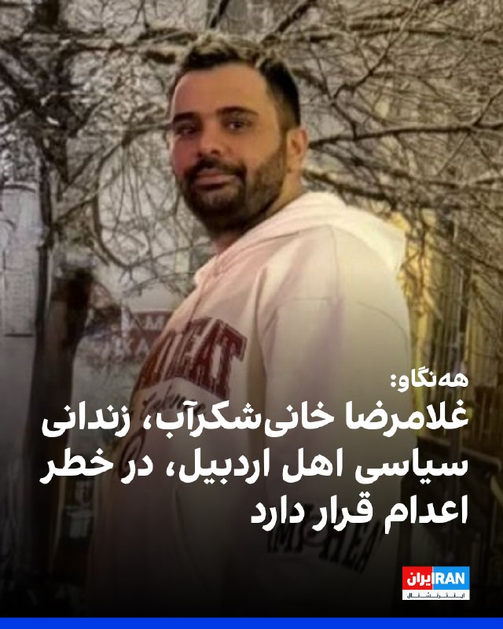

به گزارش سازمان حقوق بشری هه‌نگاو، غلامرضا خانی‌شکرآب، ورزشکار و زندانی سیاسی اهل اردبیل که پیش‌تر با اتهام جاسوسی برای اسرائیل به اعدام محکوم شده بود، در خطر قریب‌الوقوع اجرای حکم اعدام قرار دارد.

بر اساس این گزارش، او به‌طور ناگهانی از بند امنیتی زندان اوین به سلول انفرادی زندان قزل‌حصار کرج منتقل شده است.
‌🏁 🇬🇧 IranintlTV

🤖 @VahidOOnLine

## WithYashar — post 11801

ادعای «میدل ایست آی»: دونالد ترامپ، حمله برنامه‌ریزی‌شده به ایران را در این هفته به تعویق انداخت، چراکه متحدان عرب و مقامات دولت خودش به او هشدار دادند در ایام حج، جنگ را از سر نگیرد. به گفته دو مقام ارشد کشورهای حوزه خلیج‌فارس، به ترامپ گفته شده بود که حمله…

## WithYashar — post 11800

ادعای «میدل ایست آی»: دونالد ترامپ، حمله برنامه‌ریزی‌شده به ایران را در این هفته به تعویق انداخت، چراکه متحدان عرب و مقامات دولت خودش به او هشدار دادند در ایام حج، جنگ را از سر نگیرد.

به گفته دو مقام ارشد کشورهای حوزه خلیج‌فارس، به ترامپ گفته شده بود که حمله به ایران در ایام حج، بحرانی را در میان کشورهای عربی حاشیه خلیج فارس ایجاد می‌کند، زیرا این حمله باعث می‌شود صدها هزار زائر حج سرگردان بمانند.

منابع همچنین گفتند که به ترامپ گفته شده بود حمله در این ایام مقدس که منتهی به عید قربان می‌شود، بیشتر از این به جایگاه آمریکا در جهان اسلام لطمه می‌زند.

یک مقام ارشد آمریکایی که از بحث‌های جریان‌یافته در دولت ترامپ آگاه است، تأیید کرد که این گفت‌وگوها انجام شده است
@withyashar

## WithYashar — post 11799

معاون نیروی دریایی ۳پا :
همه نیروهای مسلح دست به ماشه و آماده هرگونه پاسخ به هر تعرض دشمن هستند
@withyashar

## WithYashar — post 11798

صدا و سیما : مردم یه سر به فضای مجازی بزنن تا ببینن چطور مردم کل دنیا منتظرن جمهوری اسلامی مقابل آمریکا و اسرائیل بایسته و یه تو دهنی محکم بهشون بزنه؛ پاسخی که دل خیلی‌ها رو خنک کنه.
@withyashar 🤣

## WithYashar — post 11797

آکسیوس: تماس سه‌شنبه ترامپ و نتانیاهو درباره طرح جدید صلح ایران که با میانجی‌گری قطر و پاکستان ارائه شده، «تنش‌آلود» بوده.

ترامپ هنوز معتقده امکان رسیدن به توافق با ایران وجود داره، ولی نتانیاهو به شدت میخواد که اقدام نظامی علیه ایران انجام بشه. نتانیاهو بعد از این تماس «به‌شدت نگران و آشفته» شده بود!
@withyashar

## WithYashar — post 11796

آکسیوس : یک منبع آمریکایی که در جریان این تماس تلفنی قرار داشت به من گفت: «موهای بی‌بی بعد از تماس آتش گرفته بود.»
@withyashar

## WithYashar — post 11795

  

دنیا با نفس حبس‌شده در انتظار موج بعدی اسناد یوفوهاست؛ پس از آنکه مقام‌ها وعده دادند این اسناد «به‌زودی» منتشر خواهند شد.

شان پارنل، سخنگوی ارشد پنتاگون، در ایکس اعلام کرد که این مدارک هم‌اکنون «به‌طور فعال در حال آماده‌سازی و پردازش» برای انتشار هستند.

مقام‌های سابق سیا و پنتاگون اخیراً مدعی شده‌اند «چهار گونهٔ بیگانه» به زمین رفت‌وآمد دارند: خزنده‌ها (Reptilians)، حشره‌مانندها (Insectoids)، گری‌ها (Greys) و نوردیک‌ها (Nordics).

آیا ما برای حقیقت آماده‌ایم؟
@withyashar

## WithYashar — post 11794

گزارش کانال ۱۴ اسرائیل : آیا ارزیابی ایران از شرایط کاملاً اشتباه است؟

با وجود تبلیغات تهاجمی، تهران در خفا عمق بحران خود را درک می‌کند. حکومت روی لبهٔ تیغ حرکت می‌کند؛ از یک سو ترامپ را تحریک می‌کند و از سوی دیگر، به‌طور پنهانی افکار عمومی ایران را برای یک تشدید بزرگ نظامی آماده می‌کند.

افراد در داخل حکومت اذعان دارند که حملهٔ آمریکا بسیار محتمل است، اما روی این موضوع شرط بسته‌اند که ترامپ یک حملهٔ محدود انجام دهد، اعلام پیروزی کند و سپس متوقف شود.

«همهٔ ما فقط امیدواریم که این هم یکی دیگر از ارزیابی‌های اشتباه ایران از شرایط باشد.»
@withyashar

## WithYashar — post 11793

یک مقام اسرائیلی به روزنامه اسرائیل هیوم : حکومت ایران هنوز درک نکرده چه بر سر این کشور آمده و افزود همان‌گونه که این حکومت لبنان، عراق و یمن را به عقب‌ماندگی کشاند، اکنون خود ایران نیز به کشوری عقب‌مانده تبدیل شده است.

به گزارش اسرائیل هیوم، در اورشلیم سقوط حکومت ایران همچنان سناریویی محتمل تلقی می‌شود و مقام‌های اسرائیلی می‌گویند پس از پایان مرحله کنونی، احتمال ازسرگیری اعتراض‌ها وجود دارد.

این روزنامه همچنین نوشت آسیب‌های واردشده به ایران بسیار قابل توجه بوده و برآوردها حاکی است در دو دور درگیری حدود ۳۰۰ میلیارد دلار خسارت اقتصادی به ایران وارد شده است.
@withyashar

## WithYashar — post 11792

کانال ۱۲ اسرائیل:
نتانیاهو با نظر ترامپ در مورد مذاکره مخالفت کرد
@withyashar

## mwarmonitor — post 9385

  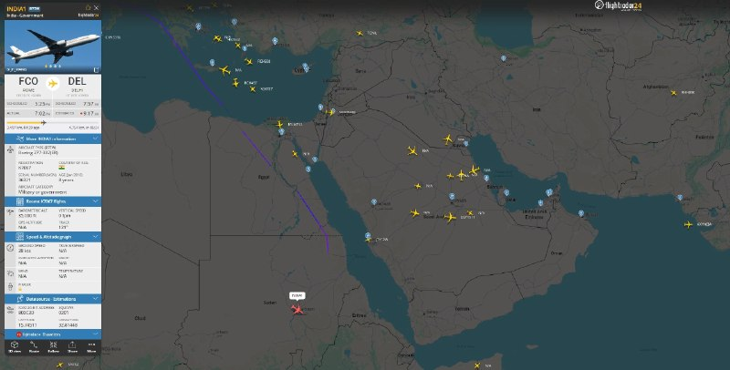

🔴به نظر می‌رسد نخست وزیر هند در مسیر بازگشت از اروپا، به‌طور کامل از خاورمیانه اجتناب می‌کند. عجیب است که او حتی از حریم هوایی عربستان هم عبور نکرده است.

@mwarmonitor

## mwarmonitor — post 9384

🇺🇸مقامات فدرال آمریکا در حال بررسی معاملاتی مشکوک در بازار نفت به ارزش ۸۰۰ میلیون دلار هستند که درست پیش از انتشار خبرهای مهم مربوط به جنگ ایران انجام شده است؛ موضوعی که یک گزارش آن را فاش کرده است. نیویورک پست

@mwarmonitor

## mwarmonitor — post 9383

🔴فیننشال تایمز: ارزشمندترین شرکت جهان (اینویدیا) پیش‌بینی کرده است که فروش آن در سه‌ماهه جاری به ۹۱ میلیارد دلار برسد؛ رقمی که به‌طور قابل توجهی بالاتر از میانگین انتظار وال‌استریت (۸۶ میلیارد دلار بر اساس داده‌های Visible Alpha) است، اما از خوش‌بینانه‌ترین پیش‌بینی‌ها کمتر است.

@mwarmonitor

## mwarmonitor — post 9382

🔴طرح پیشنهادی جدید برای صلح با ایران، موجب تماس تلفنی تنش‌آمیز میان ترامپ و نتانیاهو شد 📝نویسنده: باراک راوید AXIOS 🔰سه منبع آگاه اعلام کردند که دونالد ترامپ، رئیس‌جمهور آمریکا و بنیامین نتانیاهو، نخست‌وزیر اسرائیل، روز سه‌شنبه در یک تماس تلفنی دشوار، درباره…

## mwarmonitor — post 9381

  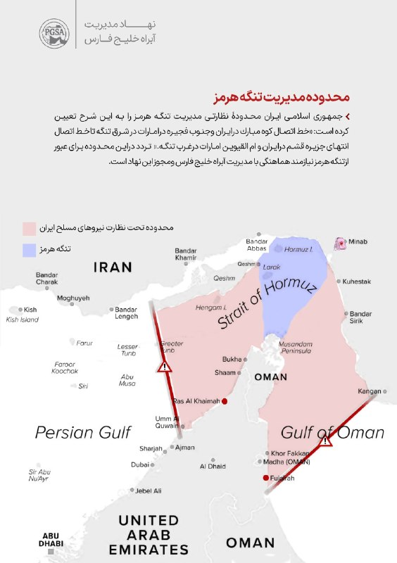

🇮🇷جمهورى اسلامى ايران محدودهٔ نظارتى مديریت تنگه هرمز را به این شرح تعيین کرده است: «خط اتصال كوه مبارك درايران وجنوب فجيره درامارات در شرق تنگه تاخط اتصال انتهاى جزيره قشم درايران و ام القيوین امارات درغرب تنگه.»

🔸تردد دراین محدوده برای عبورازتنگه هرمز نیازمند هماهنگی با مدیریت آبراه خلیج فارس ومجوز این نهاد است.

@mwarmonitor

## FoxNewsTwitter — post 342028

  <a href="telegram/content/FoxNewsTwitter_342028_1779312973.mp4" target="_blank">🎬 Download video</a>

Fox News (Twitter/X)

WATCH: Boos break out during former Google CEO Eric Schmidt’s commencement speech after he addressed fears about AI reshaping the workforce.

“There is a fear in your generation that the future has already been written... The question is not whether AI will shape the world. It will. The question is whether you will help shape artificial intelligence."

Schmidt said those concerns are “rational” as AI rapidly transforms industries, but pushed graduates to help build the future instead of rejecting the technology outright — prompting audible boos from some in the crowd.

## FoxNewsTwitter — post 342027

  

Fox News (Twitter/X)

A Texas Democrat is getting ripped by members of her own party after making shocking comments online.

Congressional candidate Maureen Galindo posted that she wants to lock up “American Zionists” in an ICE detention facility.

Galindo — a sex therapist and housing activist running in the Democratic runoff for Texas’ newly redrawn 35th Congressional District — also said she would lock up former ICE officers and turn the local ICE detention center into a “castration processing center for pedophiles, which will probably be most of the Zionists.”

The comments sparked outrage, with critics calling them antisemitic. Even fellow Democrats and The New York Times condemned the remarks, with the paper urging voters not to let her win the runoff.

Jewish Democratic Rep. Jared Moskowitz accused Galindo of proposing “concentration camps for American Jews,” while Sen. Ruben Gallego said she should “never be allowed in any political office.”

## pm_afshaa — post 91136

  <a href="telegram/content/pm_afshaa_91136_1779312976.mp4" target="_blank">🎬 Download video</a>

🎙 خبرنگار: پیامت به خانواده‌های آمریکایی که از هوش مصنوعی می‌ترسن چیه؟ اونا نگرانن بچه‌هاشون تو آینده کار نداشته باشن.

جواب کاملا مرتبط و منطقی ترامپ:
هوش مصنوعی فوق‌العاده‌ست و ایران نباید سلاح هسته‌ای داشته باشه!

💧 Rainbet.com the #1 Non-KYC Crypto Casino & Sportsbook @rainbetcom

😁 @Pm_Afshaa

## pm_afshaa — post 91135

  <a href="telegram/content/pm_afshaa_91135_1779312978.webm" target="_blank">🎬 Download video</a>

🔴میدل ایست آی: سه منبع گفتن که انتظار دارن جنگ در هفته‌های آینده و پس از پایان دوره حج، از سر گرفته بشه. آمریکا از سیگنال‌های فریبنده استفاده کرده تا سعی کنه طرف مقابل رو دچار احساس امنیت کاذب کنه. 
💧 Rainbet.com the #1 Non-KYC Crypto Casino & Sportsbook…

## pm_afshaa — post 91134

  <a href="telegram/content/pm_afshaa_91134_1779312979.webm" target="_blank">🎬 Download video</a>

🔴میدل ایست آی: سه منبع گفتن که انتظار دارن جنگ در هفته‌های آینده و پس از پایان دوره حج، از سر گرفته بشه.

آمریکا از سیگنال‌های فریبنده استفاده کرده تا سعی کنه طرف مقابل رو دچار احساس امنیت کاذب کنه.

💧 Rainbet.com the #1 Non-KYC Crypto Casino & Sportsbook @rainbetcom

😁 @Pm_Afshaa

## pm_afshaa — post 91133

  <a href="telegram/content/pm_afshaa_91133_1779312980.webm" target="_blank">🎬 Download video</a>

🔴فدا حسین مالکی، عضو کمیسیون امنیت ملی مجلس در صداوسیما: عاصم منیر فردا حامل پیام جدیدی از سوی آمریکا به ایرانه.

💧 Rainbet.com the #1 Non-KYC Crypto Casino & Sportsbook @rainbetcom

😁 @Pm_Afshaa

## pm_afshaa — post 91132

  <a href="telegram/content/pm_afshaa_91132_1779312981.webm" target="_blank">🎬 Download video</a>

🔴آکسیوس به نقل از یک منبع آمریکایی: ترامپ به نتانیاهو از یک دوره 30 روزه مذاکره درباره برنامه هسته‌ای ایران و تنگه هرمز اطلاع داد 
💧 Rainbet.com the #1 Non-KYC Crypto Casino & Sportsbook @rainbetcom 
😁 @Pm_Afshaa

## kianmeli1 — post 87525

  <a href="telegram/content/kianmeli1_87525_1779312981.mp4" target="_blank">🎬 Download video</a>

🔴 ترامپ درباره ایران:
اگر پاسخ‌های درست را نگیریم، خیلی سریع پیش می‌رود. همه ما آماده‌ایم. باید پاسخ‌های درست را بگیریم.

باید پاسخ‌ها کاملاً ۱۰۰٪ درست باشند، و اگر اینطور باشد، زمان، انرژی و جان‌های زیادی را نجات می‌دهیم.
https://t.me/kianmeli1

## kianmeli1 — post 87524

  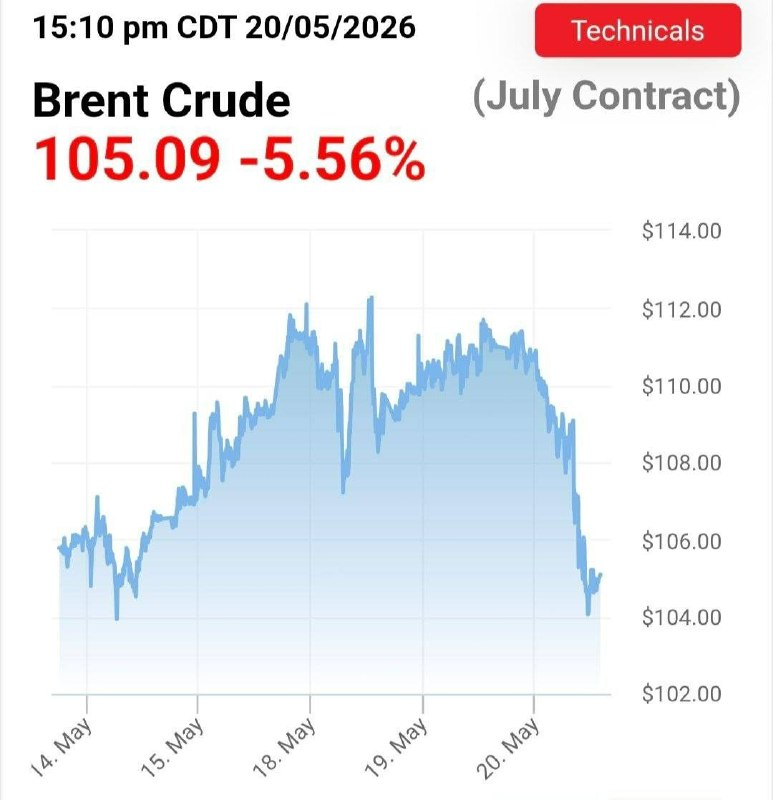

🔴آخرین قیمت نفت ۱۰۵.۰۹ دلار
https://t.me/kianmeli1

## kianmeli1 — post 87523

  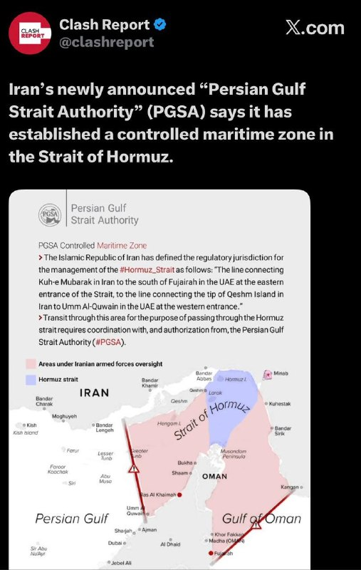

🔴«اداره تنگه خلیج فارس» (PGSA) که به تازگی از سوی ایران اعلام موجودیت کرده است، می‌گوید یک منطقه دریایی کنترل‌شده در تنگه هرمز ایجاد کرده است.
https://t.me/kianmeli1

## IranIntlTV — post 338157

  <a href="telegram/content/IranIntlTV_338157_1779312984.mp4" target="_blank">🎬 Download video</a>

مراد ویسی، تحلیل‌گر ارشد ایران‌اینترنشنال، گفت: «تشکیل تدریجی صف برای برخی کالاها، از جمله بنزین و نان، در شهرهای مختلف به مساله‌ای تازه در زندگی روزمره مردم تبدیل شده، صف‌هایی که نشانه کمبود و اختلال در تامین برخی کالاها پس از جنگ اخیر هستند. گزارش‌هایی از شهرهایی مانند اصفهان، مشهد، بندرعباس و اراک از طولانی شدن صف بنزین و نان و مشکلات تأمین بنزین و آرد خبر می‌دهد.»
@iranintltv

## IranIntlTV — post 338156

  <a href="telegram/content/IranIntlTV_338156_1779312986.mp4" target="_blank">🎬 Download video</a>

مراد ویسی، تحلیل‌گر ارشد ایران‌اینترنشنال، گفت: «ترامپ گفته فقط چند روز دیگر برای توافق با جمهوری اسلامی فرصت خواهد داد. او گفته الان سوال اصلی این است که جمهوری اسلامی سند توافق را امضا خواهد کرد یا ما کار را تمام خواهیم کرد. طبق گفته ترامپ همه چیز باید تا یکشنبه روشن شود اما تجارب تاریخی نشان داده سیاست بالا و پایین بسیار دارد.»
@iranintltv

## IranIntlTV — post 338155

۴۰ روز مادری؛ مراقبت انسانی، نمایش عاطفه و پرسش‌های اخلاقی

نعیمه دوستدار- روایت زنی جوان که برای مدتی کوتاه سرپرستی یک نوزاد را بر عهده داشت، به یکی از بحث‌برانگیزترین موضوعات شبکه‌های اجتماعی فارسی‌زبان تبدیل شد. روایتی که با لحنی احساسی و الهام‌بخش منتشر شد، خیلی زود به موجی از نقدهای اخلاقی، روانشناختی و سیاسی دامن زد.
ماجرا از انتشار روایت‌های سارا کنعانی، فعال فضای مجازی، درباره حضور موقت یک نوزاد در خانه‌اش آغاز شد. او در اینستاگرام و ایکس از تجربه «مادری موقت» نوشت. تجربه‌ای که در قالب طرح «میزبان» سازمان بهزیستی انجام شد.
رسانه‌های حکومتی در ایران، از جمله خبرگزاری جمهوری اسلامی (ایرنا) و روزنامه همشهری، این روایت را با ادبیاتی احساسی و تصویری بازنشر کردند. تصاویری از خانه، آغوش، گریه هنگام جدایی و توصیف‌هایی از «۴۰ روز مادری».
تصاویر بدون حجاب کنعانی در ایرنا منتشر شد و کاربران مدتی بعد خبر از دسترس خارج شدن این خبرگزاری را منتشر کردند.
اما آنچه ابتدا برای بخشی از کاربران تصویری انسانی از مراقبت از کودک بی‌سرپرست به نظر می‌رسید، برای گروهی دیگر به پرسشی جدی درباره مرز میان حمایت از کودک و تبدیل کودک به «محتوا» بدل شد.

https://www.iranintl.com/fa/202605197267

## IranIntlTV — post 338154

  <a href="telegram/content/IranIntlTV_338154_1779312988.mp4" target="_blank">🎬 Download video</a>

دونالد ترامپ گفت باید پاسخ درستی از جمهوری اسلامی دریافت کند. او افزود واشینگتن در تهران با «افرادی منطقی» در حال گفت‌وگو است و چند روز دیگر نیز در انتظار پاسخ آنها خواهد ماند.
ترامپ همچنین تاکید کرد تا زمان دستیابی به توافق، هیچ‌گونه امتیاز یا تخفیفی به ایران داده نخواهد شد.

گفت‌وگو با محسن مدیرشانه‌چی، پژوهشگر موسسه نظم جهانی، و محمد قائدی، مدرس روابط بین‌الملل
@iranintltv

## IranIntlTV — post 338153

  <a href="telegram/content/IranIntlTV_338153_1779312991.mp4" target="_blank">🎬 Download video</a>

رابرت اِستلوف، مدیر اجرایی انستیتو واشینگتن، به مرضیه حسینی، خبرنگار ایران‌اینترنشنال، گفت: «کاملا وارد مرحله‌ای شده‌ایم که هدف بلندمدت، تغییر حکومت است. اینکه چطور به آن برسند، از طریق ادامه فشار و محاصره سیاسی و اقتصادی حکومت خواهد بود.»
@iranintltv

## IranIntlTV — post 338152

  <a href="telegram/content/IranIntlTV_338152_1779312992.mp4" target="_blank">🎬 Download video</a>

سپاه پاسداران در واکنش به تهدیدهای کاخ سفید هشدار داد در صورت حمله آمریکا و اسرائیل، به نقاطی که آنها تصور نمی‌کنند، ضرباتی کوبنده وارد می‌کند.

گفت‌وگو با علی شیرازی، عضو تحریریه ایران‌اینترنشنال و آرام حسامی، استاد علوم سیاسی کالج مونتگومری
@iranintltv

## IranIntlTV — post 338151

  <a href="telegram/content/IranIntlTV_338151_1779312995.mp4" target="_blank">🎬 Download video</a>

دونالد ترامپ گفت: «مهم این است که چه پاسخی از ایران دریافت می‌کنیم. اگر پاسخ، آن چیزی نباشد که ما انتظار داریم، خیلی سریع وارد عمل خواهیم شد. همه‌چیز آماده است.»

او افزود: «اگر به توافق برسیم، از هزینه‌های بسیار زیاد و کشته شدن انسان‌ها جلوگیری می‌شود. ممکن است این ماجرا خیلی زود تمام شود یا چند روز دیگر طول بکشد.»

او تاکید کرد: «آمریکا تا پیش از امضای توافق، هیچ تخفیفی در تحریم‌ها به ایران نخواهد داد و در حال حاضر هیچ امتیاز یا پیشنهاد مشخصی روی میز نیست.»
@iranintltv

## IranIntlTV — post 338150

  <a href="telegram/content/IranIntlTV_338150_1779312997.mp4" target="_blank">🎬 Download video</a>

کلیفورد می، رییس بنیاد دفاع از دموکراسی‌ها، به مرضیه حسینی، خبرنگار ایران‌اینترنشنال، گفت: «پیش‌بینی دونالد ترامپ خیلی سخت است، چون مدام نظرش را عوض می‌کند.»

او افزود: «امیدوارم هرچه زودتر به این نتیجه برسد که برای ادامه این مسیر، باید هم فشار اقتصادی را حفظ کند و هم فشار نظامی را افزایش دهد؛ از جمله حمله به مراکز نظامی و شاید حتی حذف لایه‌های بعدی قدرت در ایران.»
@iranintltv

## IranIntlTV — post 338149

  <a href="telegram/content/IranIntlTV_338149_1779313000.mp4" target="_blank">🎬 Download video</a>

سپاه در واکنش به تهدیدهای آمریکا و اسرائیل هشدار داد در صورت حمله، پاسخ‌های کوبنده‌ای در نقاط غیرقابل‌تصور خواهد داد. محمدباقر قالیباف نیز گفت نشانه‌ها از احتمال دور جدید تنش و جنگ حکایت دارد. وزیر خارجه ایران هم از هماهنگی روزانه میان دستگاه دیپلماسی و نیروهای نظامی خبر داد.
@iranintltv

## IranIntlTV — post 338148

  <a href="telegram/content/IranIntlTV_338148_1779313001.mp4" target="_blank">🎬 Download video</a>

قانون جدید طالبان درباره طلاق و ازدواج، موجی از نگرانی درباره حقوق زنان و افزایش کودک‌همسری در افغانستان ایجاد کرده است. براساس این قانون، سکوت دختر به‌منزله رضایت برای ازدواج تلقی می‌شود؛ موضوعی که منتقدان می‌گویند راه را برای ازدواج اجباری و کودک‌همسری هموارتر می‌کند.
@iranintltv

## IranIntlTV — post 338147

  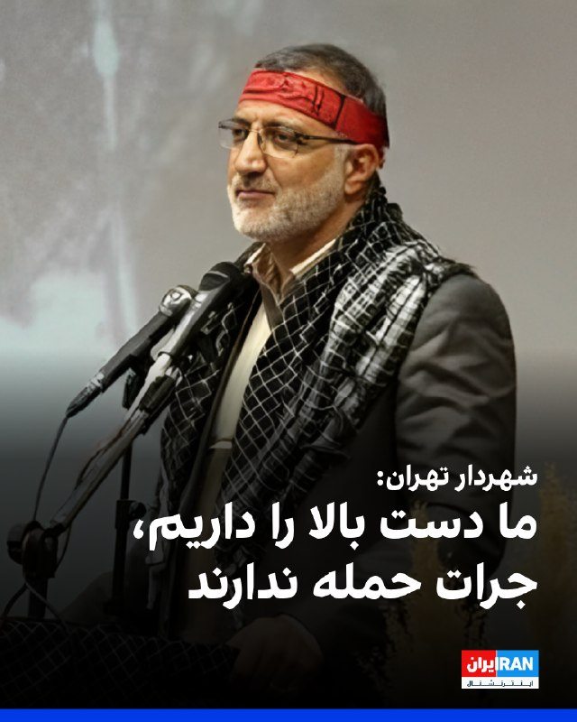

علیرضا زاکانی، شهردار تهران، در گفت‌وگو با صداوسیما، گفت: «محاصره دریایی معنا ندارد. این‌ها اغراق می‌کنند و جرات حمله ندارند. اوج اقداماتشان را هم انجام دادند و دیدند ما دست بالا را داریم.»

او اضافه کرد: «اگر حمله کنند، پاسخ می‌گیرند. دوره بزن‌دررو تمام شده است.»
https://iranintl.com/202605200745

## IranIntlTV — post 338146

  

به گزارش سازمان حقوق بشری هه‌نگاو، غلامرضا خانی‌شکرآب، ورزشکار و زندانی سیاسی اهل اردبیل که پیش‌تر با اتهام جاسوسی برای اسرائیل به اعدام محکوم شده بود، در خطر قریب‌الوقوع اجرای حکم اعدام قرار دارد.

بر اساس این گزارش، او به‌طور ناگهانی از بند امنیتی زندان اوین به سلول انفرادی زندان قزل‌حصار کرج منتقل شده است.
https://iranintl.com/202605206911

## IranIntlTV — post 338145

  <a href="https://t.me/IranintlTV/338145" target="_blank">📎 Download file</a>

🎧نسخه صوتی ۲۴ با فرداد فرحزاد: ترامپ: تهران توافق را امضا نکند، کار را تمام می‌کنیم
@iranintlTV

## ManotoTV — post 105704

  <a href="telegram/content/ManotoTV_105704_1779313005.mp4" target="_blank">🎬 Download video</a>

تماسی که از جاویدنام سینا عباسی، ۲۲ ساله از کرمانشاه گفت…

## FarsiVOA — post 218259

🔺وزیر خزانه‌داری آمریکا با وزیر دارایی قطر در مورد لزوم حفظ فشار بر جمهوری اسلامی صحبت کرد

▪️وزیر خزانه‌داری آمریکا، اسکات بسنت، روز چهارشنبه ۳۰ اردیبهشت اعلام کرد که با وزیر علی احمد الکواری وزیر دارایی قطر در پاریس دیدار و گفت‌وگو کرده است.

⬇️ بیشتر بخوانید:
https://ir.voanews.com/a/8152133.html
@FarsiVOA

## FarsiVOA — post 218258

🔺سناتور گراهام: جمهوری اسلامی با اقدامات دونالد ترامپ در ضعیف‌ترین وضعیت خود قرار دارد

▪️لیندزی گراهام، سناتور جمهوری‌خواه آمریکایی از ایالت کارولینای جنوبی، روز چهارشنبه ۳۰ اردیبهشت با تمجید از سیاست‌های دونالد ترامپ، رئیس‌جمهوری آمریکا، در قبال جمهوری اسلامی، گفت آقای ترامپ توانسته است رژیم ایران را به ضعیف‌ترین وضعیتش از سال ۱۳۵۷ برساند.

⬇️ بیشتر بخوانید:
https://ir.voanews.com/a/lindsey-graham-on-asim-munir-going-to-iran/8152121.html
@FarsiVOA

## FarsiVOA — post 218257

⚡️امید جمهوری اسلامی به کولبران و ملوانان برای واردات مواد پتروشیمی و پلیمری
@FarsiVOA

## FarsiVOA — post 218256

🔺دونالد ترامپ: اگر با چند روز صبر کردن، از کشته‌شدن افراد جلوگیری کنم این کار را انجام می‌دهم

▪️رئیس‌جمهوری آمریکا، دونالد ترامپ، عصر چهارشنبه ۳۰ اردیبهشت در پاسخ به پرسش خبرنگاری درباره علت مذاکرات بی‌وقفه‌اش با رژیم ایران و اینکه آیا از مذاکرات خسته‌ می‌شود گفت: «من هرگز خسته نمی‌شوم. کاری که دوست دارم انجام ‌دهم [این است که] اگر بتوانم با چند روز صبر کردن از جنگ جلوگیری کنم، یا بتوانم با چند روز صبر کردن از کشته شدن افراد جلوگیری کنم، فکر می‌کنم کار بزرگی است.»

⬇️ بیشتر بخوانید:
https://ir.voanews.com/a/8152125.html
@FarsiVOA

## Persian_Trend_Official — post 14561

نسخه صوتی لایو امشب در اسپاتیفای : https://open.spotify.com/episode/4ZyN11ARn9PzPUowsFbzbh?si=w_I-pR9MRMyUKElfOPbe8Q

## Persian_Trend_Official — post 14560

  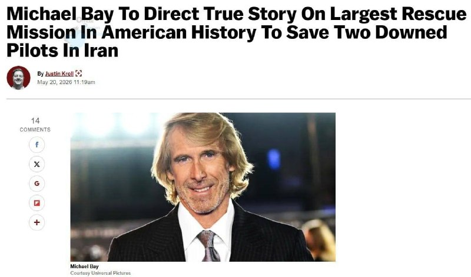

🔴 هالیوود فیلمی درباره عملیات نجات خلبانان آمریکایی در ایران می‌سازد

💢به گزارش ددلاین، استودیوی «یونیورسال پیکچرز» و «مایکل بی» کارگردان مشهور آمریکایی، در حال ساخت فیلمی درباره نجات دو نیروی هوایی آمریکا در ایران پس از سرنگونی جنگنده F-15E Strike Eagle آن‌ها در جریان عملیات «خشم حماسی» هستند.

🔻بر اساس این گزارش:

▪️ فیلم بر پایه کتابی از «میچل زاکف» که قرار است در سال ۲۰۲۷ منتشر شود ساخته خواهد شد
▪️ مایکل بی اعلام کرده طی سال‌های فعالیتش همکاری «شگفت‌انگیزی» با وزارت جنگ آمریکا و ارتش این کشور داشته است
▪️ این موضوع احتمال همکاری مستقیم پنتاگون با پروژه را تقویت می‌کند

مایکل بی درباره این پروژه گفت:

▪️ فیلم روی نیروهایی تمرکز دارد که یکی از «پیچیده‌ترین و پرریسک‌ترین عملیات‌های تاریخ معاصر» را انجام داده‌اند

🫆:Tony

📌 @persian_trend_official
پرشین ترند | متفاوت‌ترین کانال نظامی

## Persian_Trend_Official — post 14559

💢ادعای «میدل ایست آی»:

🔹سه منبع گفتند که انتظار دارند جنگ در هفته‌های آینده و پس از پایان دوره حج، از سر گرفته شود

🔹ایالات متحده در گذشته از سیگنال‌های فریبنده و حیله‌های دیگر استفاده کرده تا سعی کند طرف مقابل را دچار احساس امنیت کاذب کند

🫆:Tony

📌 @persian_trend_official
پرشین ترند | متفاوت‌ترین کانال نظامی

## Persian_Trend_Official — post 14558

🔴 جانشین فرمانده نیروی دریایی سپاه: آماده رویارویی در تنگه هرمز هستیم

💢جانشین فرمانده نیروی دریایی سپاه پاسداران ایران اعلام کرد نیروهای ایرانی در وضعیت آماده‌باش قرار دارند و تهدیدها را جدی می‌دانند.

وی گفت:

▪️ «دست ما روی ماشه است»

▪️ اگر ترامپ تصور می‌کند می‌تواند با زور تنگه هرمز را باز کند، باید بداند با همان نیروی دریایی مواجه خواهد شد که ادعا می‌کردند نابود شده است

▪️ دشمنان اشتباه می‌کنند اگر فکر کنند با هدف قرار دادن زیرساخت‌ها، این ملت عقب‌نشینی خواهد کرد

▪️ ایران طی ۴۷ سال گذشته نشان داده که آسیب‌پذیر است اما تسلیم نمی‌شود

🫆:Tony

📌 @persian_trend_official
پرشین ترند | متفاوت‌ترین کانال نظامی

## Persian_Trend_Official — post 14557

  <a href="https://t.me/persian_trend_official/14557" target="_blank">📎 Download file</a>

نسخه تلگرام :

## Persian_Trend_Official — post 14555

  <a href="telegram/content/Persian_Trend_Official_14555_1779313008.webm" target="_blank">🎬 Download video</a>

نسخ صوتی لایو امشب در کست باکس :

https://castbox.fm/vi/947285526

## Persian_Trend_Official — post 14554

  <a href="telegram/content/Persian_Trend_Official_14554_1779313008.webm" target="_blank">🎬 Download video</a>

💢سپاه پاسداران با صدور بیانیه‌ای تهدید کرد:

⭕️در صورت حمله دوباره آمریکا و اسرائیل، جنگ را به فراتر از منطقه خواهد کشاند.

🫆:Tony

📌 @persian_trend_official
پرشین ترند | متفاوت‌ترین کانال نظامی

## Persian_Trend_Official — post 14553

نسخه صوتی لایو امشب در اسپاتیفای :

https://open.spotify.com/episode/4ZyN11ARn9PzPUowsFbzbh?si=w_I-pR9MRMyUKElfOPbe8Q

## Persian_Trend_Official — post 14552

  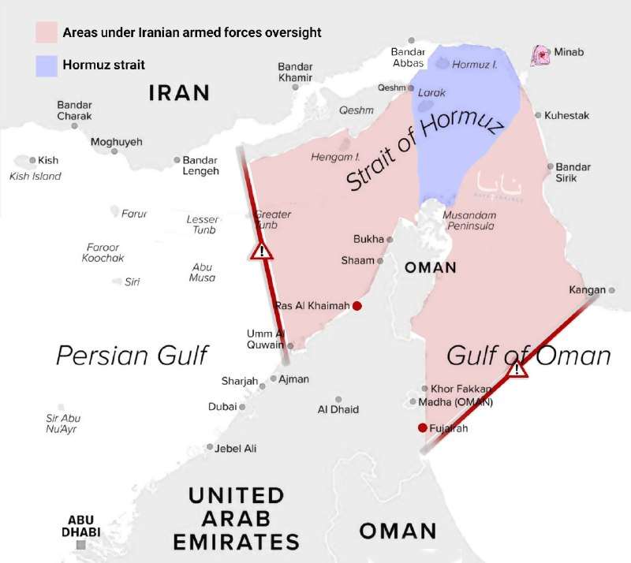

🔴 ایران محدوده نظارت خود بر تنگه هرمز را مشخص کرد

💢هیئت تنگه خلیج فارس اعلام کرد جمهوری اسلامی ایران حدود منطقه نظارت بر مدیریت تنگه هرمز را تعیین کرده است.

🔻بر اساس این بیانیه:

▪️ مرز شرقی این محدوده، خطی است که «کوه مبارک» در ایران را به جنوب فجیره در امارات متصل می‌کند

▪️ مرز غربی نیز خطی است کهانتهای جزیره قشم در ایران را به «ام‌القیوین» در امارات وصل می‌کند

💢این اعلام در شرایطی منتشر شده که تنش‌ها بر سر کنترل و عبور کشتی‌ها از تنگه هرمز همچنان ادامه دارد.

🫆:Tony

📌 @persian_trend_official
پرشین ترند | متفاوت‌ترین کانال نظامی

## Persian_Trend_Official — post 14551

💢 عضو کمیسیون امنیت ملی مجلس

💢عاصم منیر فردا حامل پیام جدیدی از سوی آمریکا به ایران است

🫆:Tony

📌 @persian_trend_official
پرشین ترند | متفاوت‌ترین کانال نظامی

## Persian_Trend_Official — post 14550

  <a href="telegram/content/Persian_Trend_Official_14550_1779313009.webm" target="_blank">🎬 Download video</a>

🔴آکسیوس

💢یک منبع آمریکایی گفت ترامپ به نتانیاهو گفته است که میانجی‌ها در حال کار بر روی یک «توافقنامه» هستند که هم ایالات متحده و هم ایران آن را امضا خواهند کرد تا رسماً به جنگ پایان دهند و یک دوره ۳۰ روزه مذاکره در مورد مسائلی مانند برنامه هسته‌ای ایران و باز شدن تنگه هرمز را آغاز کنند.

🫆:Tony

📌 @persian_trend_official
پرشین ترند | متفاوت‌ترین کانال نظامی

## IranianMinds — post 20469

🔴کانال ۱۲ اسرائیل:

نخست‌وزیر نتانیاهو همیشه با نظر ترامپ در مورد مذاکره با ایران مخالفت کرده است.

@IranianMinds

## BBCPersian — post 281645

  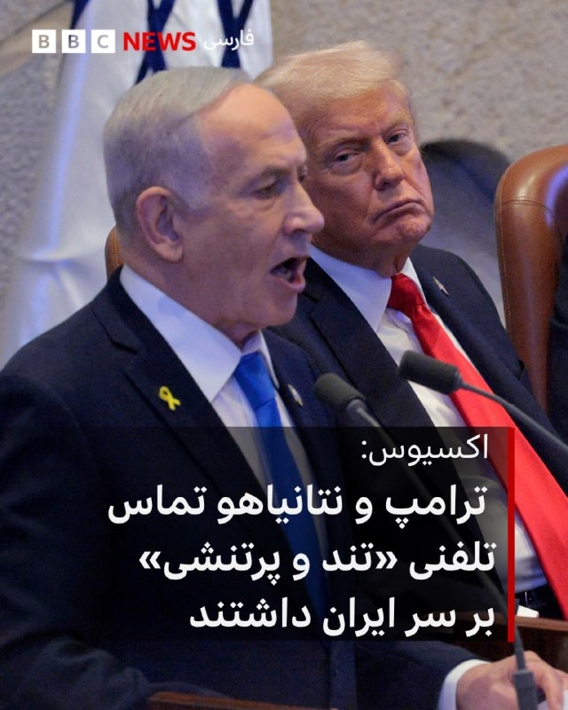

🔻نشریه آمریکایی اکسیوس از تماس تلفنی روز گذشته - سه‌شنبه ۲۹ اردیبهشت - میان دونالد ترامپ و بنیامین نتانیاهو بر سر ایران خبر داده که به نوشته این رسانه، «پرتنش» بوده و نخست‌وزیر اسرائیل را «بسیار برآشفته» است.

باراک راوید، خبرنگار اکسیوس در گزارش روز چهارشنبه خود نوشته که این اطلاعات را سه منبع مطلع دریافت کرده است هر چند نام آنها را ذکر نکرده است.

به گفته این باراک راوید: «بنیامین نتانیاهو نسبت به مذاکرات به‌شدت بدبین است و خواهان ازسرگیری جنگ برای تضعیف بیشتر توانایی‌های نظامی ایران و ضربه زدن به حکومت از طریق نابودی زیرساخت‌های حیاتی آن است.»

بر اساس آنچه اکسیوس گزارش کرده در برابر این موضع نخست‌وزیر اسرائیل، دونالد ترامپ «معتقد است که امکان دستیابی به توافق وجود دارد، اما اگر چنین توافقی حاصل نشود، آماده ازسرگیری جنگ است.»

📸GettyImages
https://bbc.in/49Zp2sK
@BBCPersian

## BBCPersian — post 281644

🔸آرسنال پس از ۲۲ سال دوباره قهرمان لیگ برتر شد؛ قهرمانی‌ای که دیشب با توقف منچسترسیتی مقابل بورنموث قطعی شد. هزاران هوادار این تیم بیرون از ورزشگاه امارات و همزمان، بازیکنان و کادر فنی هم در محل تمرین تیم در شمال لندن این قهرمانی را جشن گرفتند. قرار است جام قهرمانی لیگ برتر در پایان آخرین بازی فصل لیگ برتر توپچی‌ها به آرسنال اهدا شود؛ دیداری که یکشنبه آینده در خانه کریستال پالاس برگزار می‌شود. این چهارمین قهرمانی آرسنال در تاریخ لیگ برتر است؛ تیمی که حالا به یک چالش بزرگ دیگر فکر می‌کند: فینال لیگ قهرمانان اروپا مقابل پاری‌سن‌ژرمن در بوداپست.

 گزارشی از کاوه مشکات

@BBCPersian

## BBCPersian — post 281643

🔻بریتانیا با لغو تحریم‌های نفتی روسیه، مجوز واردات دیزل و سوخت جت را صادر می‌کند

بریتانیا بر اساس برنامه معافیت از تحریم‌ها، اجازه واردات دیزل و سوخت جت پالایش‌شده از نفت خام روسیه در خارج از این کشور را خواهد داد.

با افزایش هزینه‌های سوخت و فشار بر خطوط هوایی و خانوارها، که بخشی از آن به دلیل درگیری در خاورمیانه است، بریتانیا در صدد است تا محدودیت‌ها در این زمینه را کاهش ‌دهد.

تصمیم بریتانیا پس از اقدام مشابه ایالات متحده انجام می‌شود.

آمریکا روز دوشنبه طرح معافیت از تحریم‌های نفتی روسیه را تمدید کرد و مجوز خرید نفت از این کشور را صادر کرد.

منتقدان این تصمیم آمریکا می‌گویند که چنین اقدامی، پول بیشتری را روانه روسیه خواهد کرد که آن را جنگ در اوکراین برای کشتن مردم اوکراین هزینه خواهد کرد.

روز سه‌شنبه قیمت هر بشکه نفت برنت روز سه‌شنبه به حدود ۱۱۰ دلار رسید که نزدیک به بالاترین رکوردهای اخیر است.

این نشان‌دهنده ادامه نگرانی‌ها در مورد اختلال در جریان نفت از طریق تنگه هرمز است.

https://bbc.in/4eTwV6x
@BBCPersian

## BBCPersian — post 281642

  <a href="https://t.me/bbcpersian/281642" target="_blank">📎 Download file</a>

🔻پادکست برنامه شصت دقیقه چهارشنبه ۳۰ اردیبهشت ۱۴۰۵

این نسخه رادیویی برنامه شصت دقیقه تلویزیون فارسی بی‌بی‌سی است که هرشب بعد از پخش، با حجم کم از صفحه تلگرام بی‌بی‌سی فارسی در دسترس است.
با هشتگ BBCPersianRadio با ما در ارتباط باشید.

## Dirty_Kids — post 389841

حاصل خالی گذاشتن سکوهای ورزشگاه جام جهانی قطر شد:
حضور ‎#پرستوهای_رژیم به اسم «نماینده ی ملت ایران» با هد بند و پرچم!
آخوندها هم به دنیا گفتند: ببینید مردم ایران چقدر آزادند و حامی و دوستدار حکومت میباشند!!

تبلیغات جمهوری اسلامی در جام جهانی قطر دقیقا ۴ سال جنایت و فلاکت و شکنجه و غارت ایران و همچنین ۴۰ هزار کشته فقط در ۲ روز واسمون هزینه ایجاد کرد!!
این بار فریب نخوریم و با برنامه پیش بریم.

@Dirty_Kids 👻

## Dirty_Kids — post 389840

  <a href="telegram/content/Dirty_Kids_389840_1779313011.mp4" target="_blank">🎬 Download video</a>

چالش "دوربین‌به‌کون" هم تازه راه افتاده

@Dirty_Kids 👻

## Dirty_Kids — post 389839

نخست وزیر پاکستان:
بتخمم اصلا جنگ کنید

@Dirty_Kids 👻

## Dirty_Kids — post 389838

  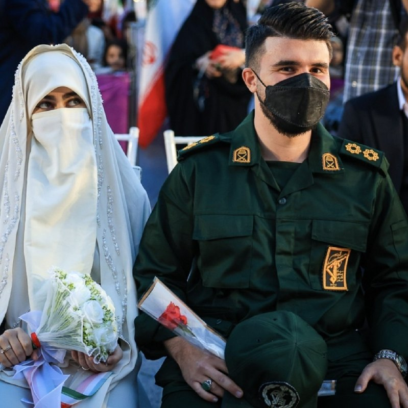

جان‌فداست ولی تو عروسیش ماسک میزنه شناسایی نشه.

@Dirty_Kids 👻

## Dirty_Kids — post 389837

ترامپ:

قرار بود فردا به ایران حمله کنم ولی قراره تعمیرکار بیاد برای سرویس کولر
ملانیا خونه تنهاس، باید باشم حتما

@Dirty_Kids 👻

## Dirty_Kids — post 389836

  

۷۰۰ هزار کیلومتر کار کرده
۲۲ میلیارد تومن قیمت میخوره یعنی ۱۲۵ هزار دلار
صفر خشک ۲۰۲۶ این ۸۸ هزاردلاره

@Dirty_Kids 👻

## manototv — post 105704

  <a href="telegram/content/manototv_105704_1779313014.mp4" target="_blank">🎬 Download video</a>

تماسی که از جاویدنام سینا عباسی، ۲۲ ساله از کرمانشاه گفت…

## alonews — post 121442

  <a href="telegram/content/alonews_121442_1779313017.mp4" target="_blank">🎬 Download video</a>

👈خبرنگار: پیامت به خانواده‌های آمریکایی که از هوش مصنوعی می‌ترسن چیه؟ اونا نگرانن بچه‌هاشون تو آینده کار نداشته باشن.

🔴جواب کاملا مرتبط و منطقی ترامپ:
ایران نباید سلاح هسته‌ای داشته باشه!

✅ @AloNews خبر جنگ

## alonews — post 121441

  <a href="telegram/content/alonews_121441_1779313018.mp4" target="_blank">🎬 Download video</a>

👈 وزیر بهداشت و خدمات انسانی آر‌اف‌کِی جونیور: من همیشه در اطراف دختران جوان زیادی هستم و همه آنها در آن بخش از زندگی خود واقعا دیوانه به نظر می رسند

✅ @AloNews خبر جنگ

## alonews — post 121440

  <a href="telegram/content/alonews_121440_1779313020.webm" target="_blank">🎬 Download video</a>

👈بزرگترین کشتی جنگی ژاپن برای آموزش F-35B با تفنگداران دریایی آمریکا آماده میشه - USNI

✅ @AloNews خبر جنگ

## alonews — post 121439

  <a href="telegram/content/alonews_121439_1779313021.webm" target="_blank">🎬 Download video</a>

👈وزیر امور خارجه مارکو روبیو:
اشتباهی نباشد: ایالات متحده به طور قاطع از دولت قانونی و قانون اساسی بولیوی حمایت می‌کند.

🔴ما اجازه نخواهیم داد که جنایتکاران و قاچاقچیان مواد مخدر رهبران منتخب دموکراتیک در نیمکره ما را سرنگون کنند.

✅ @AloNews خبر جنگ

## alonews — post 121438

  <a href="telegram/content/alonews_121438_1779313021.webm" target="_blank">🎬 Download video</a>

👈زاکانی شهردار تهران: آمریکا ته زورشو زد و دیگه جرات حمله نداره

✅ @AloNews خبر جنگ

## alonews — post 121437

  <a href="telegram/content/alonews_121437_1779313021.webm" target="_blank">🎬 Download video</a>

👈اوکراین تعداد زیادی پهپاد به سمت غرب روسیه و کریمه پرتاب کرده است

✅ @AloNews خبر جنگ

## alonews — post 121436

  <a href="telegram/content/alonews_121436_1779313022.webm" target="_blank">🎬 Download video</a>

👈ادعای «میدل ایست آی»: دونالد ترامپ، حمله برنامه‌ریزی‌شده به ایران را در این هفته به تعویق انداخت، چراکه متحدان عرب و مقامات دولت خودش به او هشدار دادند در ایام حج، جنگ را از سر نگیرد. 
🔴به گفته دو مقام ارشد کشورهای حوزه خلیج‌فارس، به ترامپ گفته شده بود که…

## alonews — post 121435

  <a href="telegram/content/alonews_121435_1779313022.webm" target="_blank">🎬 Download video</a>

👈فرستاده ویژه ترامپ به گرینلند جف لندری: زمان آن است که ایالات متحده ردپای خود را دوباره در گرینلند بگذارد 
✅ @AloNews خبر جنگ

## alonews — post 121434

  <a href="telegram/content/alonews_121434_1779313022.webm" target="_blank">🎬 Download video</a>

👈ادعای «میدل ایست آی»: دونالد ترامپ، حمله برنامه‌ریزی‌شده به ایران را در این هفته به تعویق انداخت، چراکه متحدان عرب و مقامات دولت خودش به او هشدار دادند در ایام حج، جنگ را از سر نگیرد.

🔴به گفته دو مقام ارشد کشورهای حوزه خلیج‌فارس، به ترامپ گفته شده بود که حمله به ایران در ایام حج، بحرانی را در میان کشورهای عربی حاشیه خلیج فارس ایجاد می‌کند، زیرا این حمله باعث می‌شود صدها هزار زائر حج سرگردان بمانند.

🔴منابع همچنین گفتند که به ترامپ گفته شده بود حمله در این ایام مقدس که منتهی به عید قربان می‌شود، بیشتر از این به جایگاه آمریکا در جهان اسلام لطمه می‌زند.

🔴یک مقام ارشد آمریکایی که از بحث‌های جریان‌یافته در دولت ترامپ آگاه است، تأیید کرد که این گفت‌وگوها انجام شده است

✅ @AloNews خبر جنگ

## alonews — post 121433

  <a href="telegram/content/alonews_121433_1779313022.webm" target="_blank">🎬 Download video</a>

👈فرستاده ویژه ترامپ به گرینلند جف لندری: زمان آن است که ایالات متحده ردپای خود را دوباره در گرینلند بگذارد

✅ @AloNews خبر جنگ

## alonews — post 121431

لکسوس LX600 غول ژاپنی با قیمت 110 میلیارد تومان ناقابل!

و حالا همون ماشین در فرانسه به قیمت 124000 یورو که میشع چیزی حدود 26 میلیارد تومن…

شما فقط اختلاف رو ببین

[@AloTweet]

## alonews — post 121430

  <a href="telegram/content/alonews_121430_1779313023.webm" target="_blank">🎬 Download video</a>

👈نهاد مدیریت آبراه خلیج فارس محدودهٔ نظارتی مدیریتی تنگهٔ هرمز را مشخص کرد

🔴ايران محدودهٔ نظارتى مديریت تنگهٔ هرمز را به این شرح تعيین کرده است:

🔴«خط اتصال كوه مبارک درايران و جنوب فجيره درامارات در شرق تنگه تا خط اتصال انتهاى جزيره قشم در ايران و ام‌القيوین امارات درغرب تنگه.»

🔴تردد دراین محدوده برای عبور از تنگهٔ هرمز نیازمند هماهنگی با مدیریت آبراه خلیج فارس و مجوز این نهاد است

✅ @AloNews خبر جنگ

## alonews — post 121429

اخبار جنگ الونیوز AloNews pinned a photo

## alonews — post 121428

👈نخست‌وزیر اسپانیا: فشار می‌آورم تا کل اروپا وزیر امنیت اسرائیل را تحریم کند

✅ @AloNews خبر جنگ

## alonews — post 121426

  <a href="telegram/content/alonews_121426_1779313023.webm" target="_blank">🎬 Download video</a>

👈آخرین قیمت نفت ۱۰۵.۰۹ دلار

✅ @AloNews خبر جنگ

## alonews — post 121425

  <a href="telegram/content/alonews_121425_1779313023.webm" target="_blank">🎬 Download video</a>

👈آکسیوس: یک منبع آمریکایی که در جریان این تماس تلفنی قرار داشت به من گفت: «موهای بی‌بی بعد از تماس آتش گرفته بود.»

✅ @AloNews خبر جنگ

## alonews — post 121424

  <a href="telegram/content/alonews_121424_1779313024.webm" target="_blank">🎬 Download video</a>

👈ترامپ درباره کوبا: مردم غذا و برق ندارند، اما مردم بزرگی هستند

✅ @AloNews خبر جنگ

## alonews — post 121423

  <a href="telegram/content/alonews_121423_1779313024.webm" target="_blank">🎬 Download video</a>

👈نخست‌وزیر اسپانیا، پدرو سانچز:
تصاویر وزیر اسرائیلی بن گویر که اعضای ناوگان بین‌المللی حمایت از غزه را تحقیر می‌کند، غیرقابل قبول است.

🔴ما اجازه نمی‌دهیم کسی با شهروندان ما بدرفتاری کند. در سپتامبر، ممنوعیت ورود این عضو دولت اسرائیل به قلمرو ملی را اعلام کردم.

🔴اکنون قصد داریم در بروکسل فشار بیاوریم تا این تحریم‌ها به صورت فوری در مقیاس اروپایی افزایش یابد.

✅ @AloNews خبر جنگ

## alonews — post 121421

  <a href="telegram/content/alonews_121421_1779313024.webm" target="_blank">🎬 Download video</a>

👈یونیورسال پیکچرز بی قرار است فیلمی درباره نجات دو خلبان آمریکایی در ایران بسازند، پس از اینکه جنگنده F-15E Strike Eagle آنها در عملیات خشم حماسی سرنگون شد

✅ @AloNews خبر جنگ

<!-- MSG END -->

<!-- NAV START -->

<a href="https://github.com/Tljn/FUD/blob/main/telegram/content/archive_1.md" style="display:inline-block; padding:6px 12px; margin:0 4px; background-color:#2ea44f; color:white; text-decoration:none; border-radius:4px; font-weight:bold;">صفحه بعد</a>

<!-- NAV END -->
