# خواننده تلگرام

<!-- TOP_NAV START -->

<a href="https://github.com/Tljn/FUD/blob/main/telegram/content/archive_1.md" style="display:inline-block; padding:6px 12px; margin:0 4px; background-color:#2ea44f; color:white; text-decoration:none; border-radius:4px; font-weight:bold;">صفحه بعد</a>

<!-- TOP_NAV END -->

<!-- MSG START -->

---
📅 بروزرسانی: 1405/03/20 15:50
---

## VahidOOnLine — post 244670

  

دونالد ترامپ، رییس‌جمهوری آمریکا، در مصاحبه با فاکس‌نیوز گفت ممکن است به‌زودی دستور حملات جدید به نیروگاه‌ها و پل‌ها در ایران را صادر کند.

او دلیل این موضوع را طولانی شدن روند مذاکرات از سوی جمهوری اسلامی عنوان کرد و افزود تهران دستیابی به توافق را بیش از حد به تاخیر انداخته است.

ترامپ تاکید کرد صدور دستور حملات جدید نزدیک است و گفت اگر روند مذاکرات تغییر نکند، تصمیم‌های تازه‌ای اتخاذ خواهد شد. او افزود ۵۵ درصد از سامانه‌های راداری که جمهوری اسلامی در دوران آتش‌بس بازسازی کرده بود، در حملات جدید آمریکا نابود شد.
‌🏁 🇬🇧 IranintlTV

🤖 @VahidOOnLine

## VahidOOnLine — post 244669

  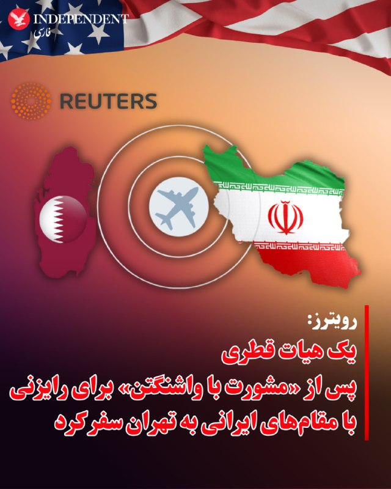

⭕️رویترز: یک هیات قطری پس از «مشورت با واشنگتن» برای رایزنی با مقام‌های ایرانی به تهران سفر کرد

♦️خبرگزاری رویترز روز چهارشنبه ۲۰ خردادماه و همزمان با تشدید تنش‌ها میان ایران و آمریکا، از سفر یک هیئت رسمی قطر «پس از مشورت با واشنگتن» به تهران خبر داد.

براساس این گزارش، هیئت قطری برای گفتگو درباره مذاکرات میان جمهوری اسلامی و آمریکا به پایتخت ایران سفر کرده است.

 هیئت قطری ساعاتی پس از تشدید بی‌سابقه رویارویی نظامی میان نیروهای مسلح جمهوری اسلامی ایران و سنتکام در بامداد چهارشنبه به تهران سفر کرده است.
‌🇸🇦 Indypersian

🤖 @VahidOOnLine

## VahidOOnLine — post 244668

  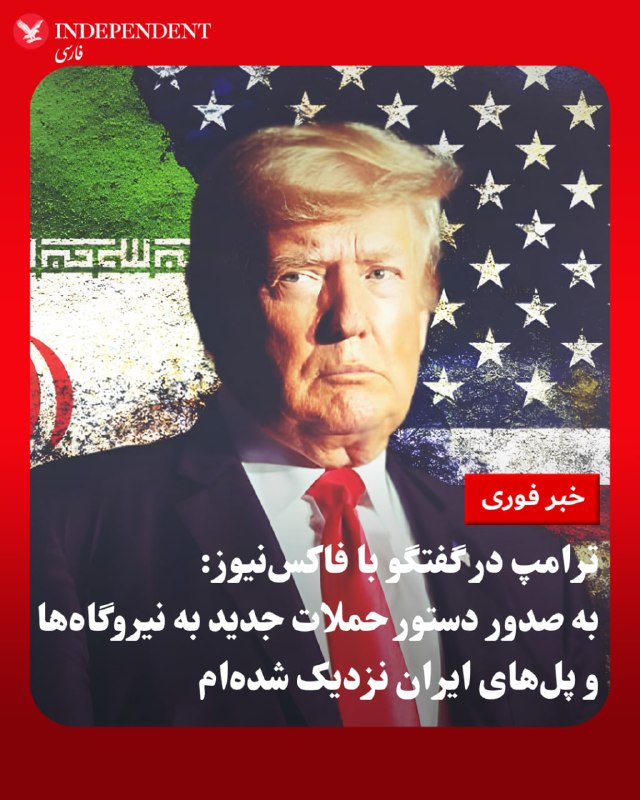

⭕️ترامپ در گفتگو با فاکس‌نیوز: به صدور دستور حملات جدید به نیروگاه‌ها و پل‌های ایران نزدیک شده‌ام

♦️فاکس‌نیوز روز چهارشنبه ۲۰ خردادماه گزارش کرد دونالد ترامپ، رئیس جمهوری آمریکا در یک مصاحبه تلفنی با این شبکه گفته است که امکان دارد دستور حملات جدید به نیروگاه‌های برق و پل‌های ایران را صادر کند چرا که تهران دستیابی به توافق را بیش از حد طول می‌دهد.
‌🇸🇦 Indypersian

🤖 @VahidOOnLine

## VahidOOnLine — post 244667

  <a href="telegram/content/VahidOOnLine_244667_1781094019.mp4" target="_blank">🎬 Download video</a>

⭕️پزشکیان: جنگ به نفع ما نیست ولی خوابش را ببینند که کوتاه بیاییم

♦️مسعود پزشکیان، رئیس‌جمهوری اسلامی ایران روز چهارشنبه ۲۰ خردادماه در مراسم برای بزرگداشت علی خامنه‌ای گفت: «جنگ به سود ایران نیست، اما تهران در برابر هرگونه تعرض به حاکمیت، عزت و تمامیت ارضی کشور عقب‌نشینی نخواهد کرد».

پزشکیان با پذیرش وضعیت دشوار اقتصادی حاکم بر ایران گفت: «ما باید از این وضعیتِ نه جنگ و نه صلح خارج شویم. بدون تردید، جنگ به نفع کشور نیست. اما این به آن معنا نیست که اگر بخواهند عزت ما را زیر پا بگذارند یا به سرزمین و تمامیت ارضی ما تعرض کنند، تسلیم شویم یا عقب‌نشینی کنیم. چنین چیزی را فقط می‌توانند در خواب ببینند. این موضوعی نیست که هرگز بر سر آن مصالحه کنیم.»

پزشکیان همچنین مدعی شد تلاش‌های آمریکا و اسرائیل برای تحریک کشورهای عربی و اسلامی علیه ایران ناکام مانده و این روند موجب فاصله گرفتن دولت‌های منطقه از واشنگتن و تل‌آویو شده است.
‌🇸🇦 Indypersian

🤖 @VahidOOnLine

## VahidOOnLine — post 244666

  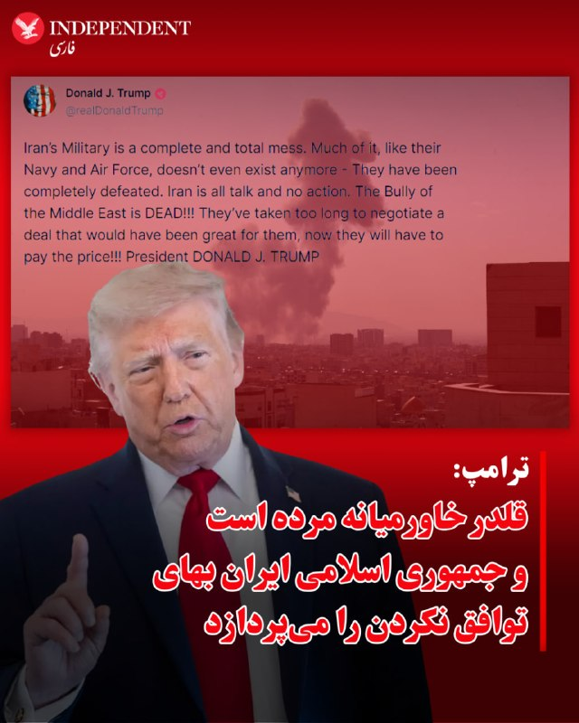

♦️دونالد ترامپ، رئیس‌جمهوری آمریکا روز چهارشنبه ۲۰ خردادماه و پس از حملات نظامی به مناطقی در جنوب ایران در پاسخ  به سرنگونی هلی‌کوپتر آمریکایی در تنگه هرمز، با انتشار پیامی در شبکه اجتماعی تروث سوشال، جمهوری اسلامی ایران را از لحاظ نظامی ناتوان خواند و نوشت که بخش بزرگی از توان نظامی این کشور از میان رفته است.

ترامپ در این پیام نوشت که ارتش ایران در وضعیت «آشفتگی کامل» قرار دارد و بخش‌های مهمی از نیروهای نظامی آن، از جمله نیروی دریایی و نیروی هوایی، عملا دیگر وجود ندارند.

او همچنین مدعی شد جمهوری اسلامی ایران «کاملا شکست خورده» و تنها به تهدیدهای لفظی متکی است. رئیس‌جمهوری آمریکا در ادامه با اشاره به مذاکرات میان واشنگتن و تهران، جمهوری اسلامی را متهم کرد که فرصت دستیابی به توافقی مطلوب را از دست داده و اکنون باید «بهای آن را بپردازد».
‌🇸🇦 Indypersian

🤖 @VahidOOnLine

## VahidOOnLine — post 244665

  <a href="telegram/content/VahidOOnLine_244665_1781094023.mp4" target="_blank">🎬 Download video</a>

♦️رسانه‌های داخلی ایران بعدازظهر چهارشنبه ۲۰ خردادماه از سرنگونی یک «پهپاد متخاصم» در نزدیکی روستای چال بلوطک شهرستان اندیکا در شمال استان خوزستان خبر دادند.

خبرگزاری فارس، وابسته به سپاه پاسداران با اعلام این خبر نوشت «یک فروند پهپاد متخاصم توسط شبکه یکپارچهٔ پدافندی ایران، در محدوده روستای چال بلوطک شهرستان اندیکای خوزستان منهدم شد.»

سنتکام هنوز واکنشی به این خبر نشان نداده است.
‌🇸🇦 Indypersian

🤖 @VahidOOnLine

## VahidOOnLine — post 244664

  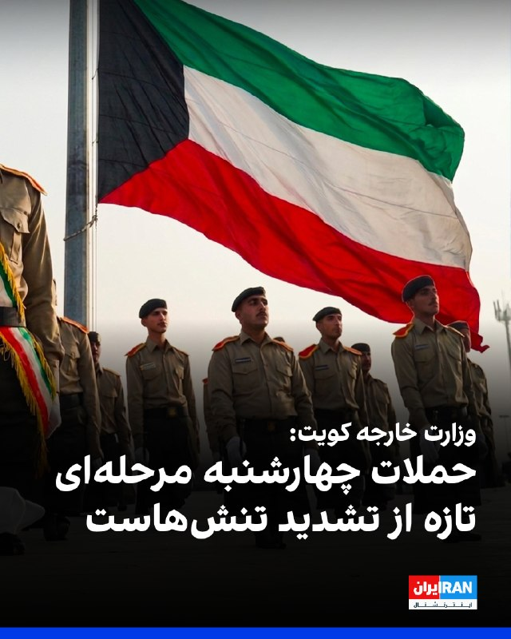

وزارت خارجه کویت در بیانیه‌ای ادامه حملات جمهوری اسلامی به خاک این کشور را محکوم کرد و نوشت حملات چهارشنبه به‌عنوان مرحله‌ای تازه از تشدید تنش‌ها ارزیابی می‌شود که جان غیرنظامیان و ایمنی تاسیسات حیاتی و مسکونی را در معرض خطر قرار می‌دهد.

در بیانیه این وزارتخانه آمده است این حملات تشدید خطرناک تنش به شمار می‌رود و پیامدهای جدی برای ثبات منطقه دارد.

این وزارتخانه تکرار این حملات را نشانه رویکردی سازمان‌یافته و خصمانه دانست و تاکید کرد این اقدامات نقض آشکار حاکمیت کویت و مغایر با قواعد حقوق بین‌الملل و منشور سازمان ملل متحد است و تلاش‌ها برای کاهش تنش در منطقه را تضعیف می‌کند.

وزارت خارجه کویت همچنین اعلام کرد این کشور حق خود را برای اتخاذ تمامی اقدامات لازم به منظور حفظ امنیت و دفاع از سرزمین و تاسیسات حیاتی‌اش، در چارچوب حقوق بین‌الملل و منشور سازمان ملل، محفوظ می‌داند.
‌🏁 🇬🇧 IranintlTV

🤖 @VahidOOnLine

## VahidOOnLine — post 244663

  <a href="telegram/content/VahidOOnLine_244663_1781094026.mp4" target="_blank">🎬 Download video</a>

⭕️اسرائیل پس از هشدار تخلیه، شهر صور لبنان را هدف حملات گسترده قرار داد

♦️ارتش اسرائیل ظهر چهارشنبه ۲۰ خردادماه، ساعاتی پس از صدور هشدار تخلیه برای ساکنان شهر صور و مناطق اطراف آن، این شهر در جنوب لبنان را بمباران کرد.

جنوب لبنان از زمان آغاز جنگ میان اسرائیل و حزب‌الله به یکی از اصلی‌ترین جبهه‌های درگیری تبدیل شده است. شهر صور به دلیل موقعیت راهبردی خود بارها هدف حملات هوایی اسرائیل قرار گرفته و از مناطق راهبردی در جنوب لبنان به شمار می‌رود.
‌🇸🇦 Indypersian

🤖 @VahidOOnLine

## VahidOOnLine — post 244662

  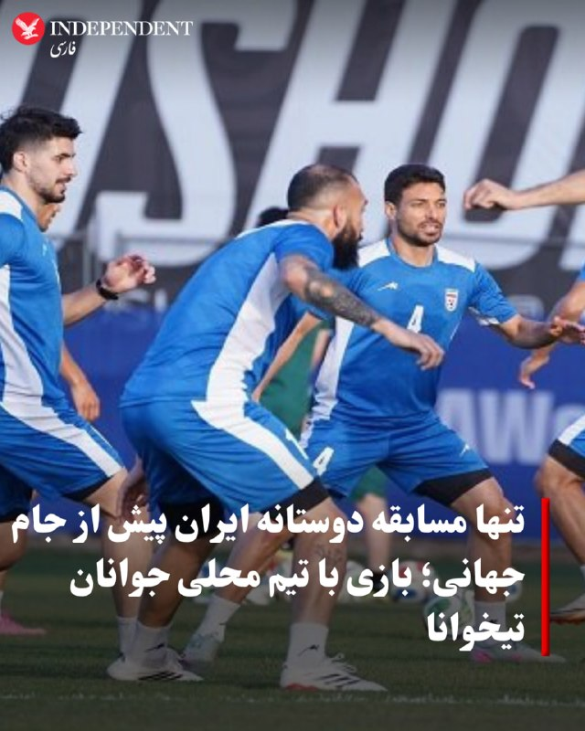

♦️تیم فوتبال ایران در شرایطی آخرین مراحل آماده‌سازی خود برای حضور در جام جهانی ۲۰۲۶ را پشت سر می‌گذارد که تنها دیدار تدارکاتی این تیم پیش از آغاز مسابقات، برابر تیم زیر ۲۱ سال شهر تیخوانا در مکزیک برگزار خواهد شد.
رسانه‌های ایران گزارش دادند این مسابقه روز چهارشنبه ۲۰ خرداد، تنها یک روز پیش از شروع جام جهانی برگزار می‌شود. این در حالی است که فدراسیون فوتبال ایران پیش‌تر برای برگزاری یک بازی دوستانه مقابل تیم ملی گرانادا برنامه‌ریزی کرده بود، اما این دیدار به دلیل لغو سفر و آماده نبودن حریف برگزار نشد. لغو مسابقه با گرانادا، ادامه شکست‌های سریالی در برنامه‌های تدارکاتی تیم ایران در هفته‌های اخیر به شمار می‌رود. پیش از آن نیز بازی دوستانه برابر پورتوریکو که قرار بود در دوران حضور تیم ایران در آمریکای شمالی انجام شود، از برنامه خارج شده بود.
‌🇸🇦 Indypersian

🤖 @VahidOOnLine

## VahidOOnLine — post 244661

  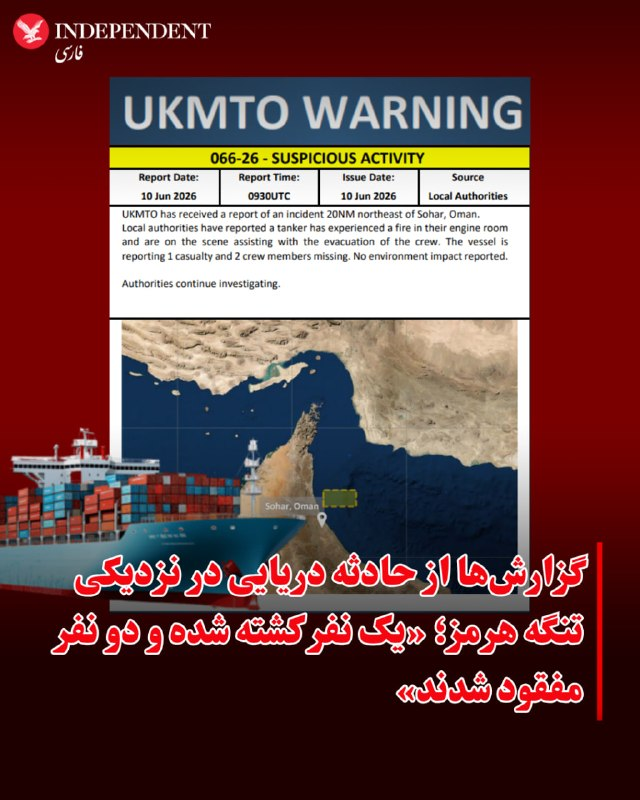

♦️سازمان عملیات تجارت دریایی بریتانیا (UKMTO)، ظهر چهارشنبه ۲۰ خردادماه از وقوع یک حادثه مرگ‌بار دریایی در نزدیکی تنگه هرمز خبر داد.

براساس بیانیه این سازمان نظارت بر دریانوردی، «گزارش وقوع یک حادثه در ۲۰ مایل دریایی شمال‌شرق شهر صحار عمان را دریافت شده است.
مقام‌های محلی اعلام کرده‌اند یک نفتکش دچار آتش‌سوزی در موتورخانه شده و نیروهای امدادی در محل برای تخلیه خدمه حضور دارند.»

سازمان عملیات تجارت دریایی بریتانیا  اعلام کرد این حادثه «تاکنون یک کشته و دو خدمه مفقود گزارش کرده است.»

هنوز جزئیاتی درباره تابعیت این کشتی و منشاء احتمالی حمله به آن منتشر نشده است.
‌🇸🇦 Indypersian

🤖 @VahidOOnLine

## VahidOOnLine — post 244660

  

به گزارش رویترز، دولت آمریکا به دلیل آنچه ارتباط عمر عبدالقادر ارتان با «افراد مظنون به عضویت در سازمان‌های تروریستی» عنوان کرده، از ورود این داور فوتبال اهل سومالی به ایالات متحده برای حضور در جام جهانی ۲۰۲۶ جلوگیری کرده است؛ تصمیمی که در چارچوب سیاست‌های سخت‌گیرانه مهاجرتی واشینگتن و ممنوعیت سفر شهروندان ۱۲ کشور، از جمله سومالی، اتخاذ شده است.

ارتان، برنده عنوان بهترین داور فوتبال آفریقا در سال ۲۰۲۵، قصد داشت به عنوان نخستین داور سومالیایی تاریخ در رقابت‌های جام جهانی قضاوت کند. او صبح چهارشنبه به سومالی بازگشت.

سخنگوی فیفا تایید کرد که این داور فرصت حضور در جام جهانی را از دست داده است و افزود فیفا در فرآیندهای مهاجرتی کشورهای میزبان نقشی ندارد.

دولت سومالی نیز با ابراز تاسف از این تصمیم اعلام کرد تلاش‌های دیپلماتیک این کشور برای حل موضوع بی‌نتیجه مانده است.

این اقدام در آستانه جام جهانی ۲۰۲۶ نگرانی‌هایی را درباره محدودیت‌های ورود به آمریکا برای برخی شرکت‌کنندگان در این رقابت‌ها ایجاد کرده است.
‌🏁 🇬🇧 IranintlTV

🤖 @VahidOOnLine

## VahidOOnLine — post 244659

⭕️پاپ لئو چهاردهم در مسیر بارسلونا وارد کابین خلبانان شد

♦️پاپ لئو چهاردهم، پیشوای کلیسای کاتولیک جهان روز چهارشنبه ۲۰ خرداد در جریان پرواز از مادرید به بارسلونا، پیش از آغاز بخش دوم سفر یک‌هفته‌ای به اسپانیا، دقایقی را در کابین خلبانان هواپیما سپری کرد.
پاپ قرار است در بارسلونا برج جدید و عظیم کلیسای ساگرادا فامیلیا را افتتاح و متبرک کند و همچنین مراسم عشای ربانی را در این بنای مذهبی که اکنون بلندترین کلیسای جهان به شمار می‌رود، برگزار کند.

کلیسای ساگرادا فامیلیا، شاهکار معماری آنتونی گائودی، یکی از شناخته‌شده‌ترین نمادهای شهر بارسلونا و از پربازدیدترین بناهای مذهبی جهان است. ساخت این کلیسا در سال ۱۸۸۲ آغاز شد و پس از بیش از یک قرن همچنان مراحل تکمیل و توسعه آن ادامه دارد.
‌🇸🇦 Indypersian

🤖 @VahidOOnLine

## VahidOOnLine — post 244658

  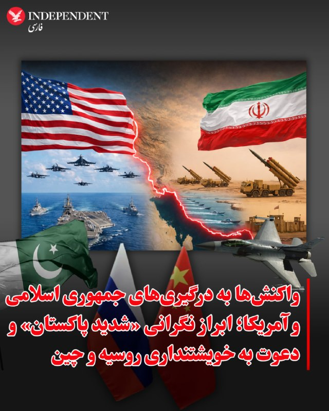

♦️ساعاتی پس از حملات هوایی، موشکی و پهپادی متقابل آمریکا و جمهوری اسلامی در تنگه هرمز و منطقه خاورمیانه، نگرانی‌ها از پایان آتش‌بس و شکست مذاکرات میان تهران و واشنگتن، شدت گرفته است.

عاصم افتخار احمد، نماینده دائم پاکستان در سازمان ملل متحد گفت: «افزایش اخیر خشونت در خاورمیانه یادآوری آشکاری از خطرات مرتبط با آتش‌بس شکننده و عواقب غیرقابل تحملی است که ممکن است به دنبال داشته باشد. چرخه خشونت و بی‌ثباتی باید به نفع صلح، امنیت و رفاه منطقه‌ای و بین‌المللی پایان یابد.»

لین جیان، سخنگوی وزارت خارجه چین، هم در واکنش به درگیری‌های بامداد چهارشنبه گفت: «همه طرف‌ها باید با حفظ آرامش، خویشتنداری نشان دهند، از تشدید درگیری و وخیم‌تر شدن اوضاع خودداری و با در پیش گرفتن اقدامات ملموس، به کاهش تنش‌ و آرام کردن وضعیت کمک کنند.»

همزمان با چین و پاکستان، ماریا زاخارووا، سخنگوی وزارت امور خارجه روسیه هم ایران و آمریکا را به خویشتنداری دعوت کرد و گفت مسکو برای کمک به به‌نتیجه رسیدن دیپلماسی آماده است.
‌🇸🇦 Indypersian

🤖 @VahidOOnLine

## VahidOOnLine — post 244657

  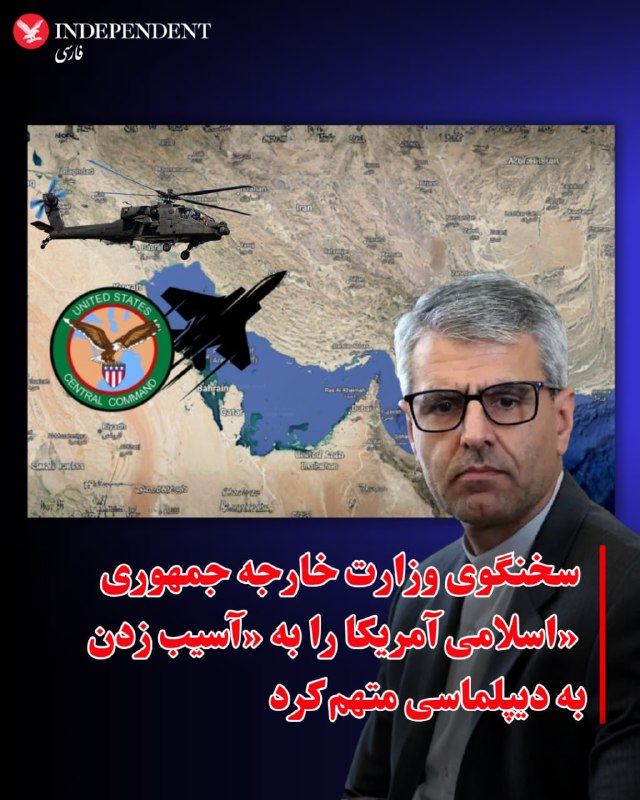

♦️اسماعیل بقایی، سخنگوی وزارت امور خارجه جمهوری اسلامی روز چهارشنبه ۲۰ خرداد و پس از حملات متقابل نیروهای مسلح ایران و آمریکا، ایالات متحده را به «نقض مکرر» آتش‌بس و «آسیب» به روند دیپلماتیک متهم کرد.

به گزارش ایرنا، بقایی در پاسخ به پرسش خبرگزاری جمهوری اسلامی درباره وضعیت مذاکرات با آمریکا گفت: «آمریکا هم از حیث پیام‌های متناقضی که می‌فرستد و هم از جهت تغییر مکرر مواضع و مطالباتش و هم بدتر از همه از طریق نقض مکرر آتش‌بس به روند دیپلماتیک آسیب می‌رساند.

سخنگوی وزارت امور خارجه جمهوری اسلامی افزود: «ادامه روند مذاکرات با توجه به تحولات اخیر بررسی می‌شود.»
‌🇸🇦 Indypersian

🤖 @VahidOOnLine

## WithYashar — post 14306

گزارش صدای انفجار‌ از محدوده سوهانک / دارآباد تهران 🚨
@withyashar

## WithYashar — post 14305

  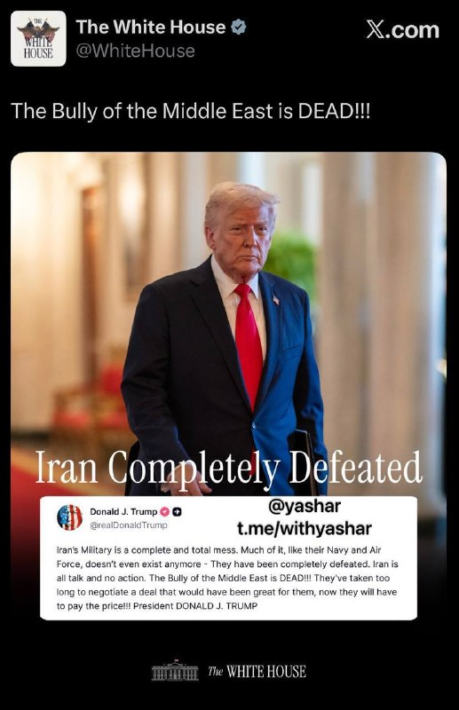

کاخ سفید:

قلدر خاورمیانه مُرده است!!!
@withyashar

## WithYashar — post 14304

ترامپ: حملات بیشتر آمریکا به ایران، یک گزینه واقع بینانه است.
@withyashar

## WithYashar — post 14303

  <a href="telegram/content/WithYashar_14303_1781094034.mp4" target="_blank">🎬 Download video</a>

اسرائیل نان استاپ داره لبنان رو میزنه، یه خودرو رو هم با پهپاد نقطه‌زنی کرده، هدفمند.
@withyashar

## WithYashar — post 14302

ترامپ: در آتش بس 55 درصد از آنچه که ایران درحال بازسازی آن بود را ویران کردم هنوز با ایران کار دارم🚨
@withyashar

## WithYashar — post 14301

یک منبع مطلع به i24NEWS می‌گوید: رئیس‌جمهور ترامپ دیشب با نخست‌وزیر نتانیاهو صحبت کرد و او را در جریان حمله احتمالی امشب قرار داد. این دو همچنین درباره موضوعات دیگری مرتبط با مذاکرات با ایران بحث کردند. در آمریکا از وضعیت مذاکرات ناامید شده‌اند و صبرشان رو به پایان است.
@withyashar

## WithYashar — post 14300

ترامپ این جمله را برای بار دوم دارد می‌گوید: «بلوکاد «حبس دریایی» ما علیه ایران آنقدر موفق است که حتی خدای آنها (الله) هم دارد علیه آنها کار می‌کند و من را تأیید می‌کند، ستایش بر الله باد!» @withyashar

## WithYashar — post 14299

نتانیاهو: اسرائیل به شدت علیه ایران و نمایندگانش که خاورمیانه و جهان را تهدید می‌کنند، به فعالیت خود ادامه خواهد داد
@withyashar

## WithYashar — post 14298

پست جدیدتر ترامپ: رسانه‌های اخبار جعلی از گزارش میزان اثربخشی محاصره دریایی ایالات متحده، که موفق‌ترین محاصره در تاریخ جنگ دریایی است، خودداری می‌کنند. هیچ چیز عبور نمی‌کند مگر اینکه ما بخواهیم. این یک دیوار فولادی است! ایران هیچ تجارتی ندارد، به ارتش خود…

## WithYashar — post 14297

ترامپ: میدونی خیلی وقت کشی میکنن خیلی باعث میشه تصمیم حمله بگیرم
@withyashar

## WithYashar — post 14296

ترامپ داره قاهره رو رد میکنه اقا ترمز کن 🤣🤣

## WithYashar — post 14295

ترامپ داره قاهره رو رد میکنه اقا ترمز کن 🤣🤣

## WithYashar — post 14294

  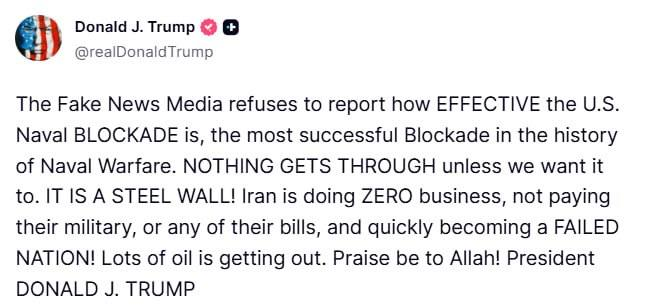

پست جدیدتر ترامپ:
رسانه‌های اخبار جعلی از گزارش میزان اثربخشی محاصره دریایی ایالات متحده، که موفق‌ترین محاصره در تاریخ جنگ دریایی است، خودداری می‌کنند.

هیچ چیز عبور نمی‌کند مگر اینکه ما بخواهیم. این یک دیوار فولادی است! ایران هیچ تجارتی ندارد، به ارتش خود یا هیچ یک از صورتحساب‌هایش پرداخت نمی‌کند و به سرعت به یک ملت شکست خورده تبدیل می‌شود! نفت زیادی در حال خروج است.

الله را شکر !

@withyashar

## WithYashar — post 14293

فاکس نیوز: ترامپ در حال مشورت با مشاوران خود برای بازگشت به جنگ با ایران است و گزینه حملات به نیروگاه‌ها و پل‌های ایران را بررسی می‌کند.@withyashar

## WithYashar — post 14292

قالیباف: با وجود شهادت فرماندهان و دانشمندان در جنگ ۱۲ روزه، نه حرکت علم و دانش در کشور متوقف شد و نه توان دفاعی و بازدارندگی ایران کاهش یافت
@withyashar

## WithYashar — post 14291

ترامپ : ما کارمون با ایران رو ادامه می‌دیم و جلو می‌ریم
@withyashar

## WithYashar — post 14290

ترامپ به فاکس : به صدور دستور برای حمله‌های جدید به نیروگاه‌ها و پل‌های ایران نزدیک شده‌ام
@withyashar

## WithYashar — post 14289

وزیر فرهنگ اسرائیل:

دیکتاتور اردوغان که دستانش آغشته به خون است باید درباره جنایاتش پاسخگو باشد و به تنها کشور دموکراتیک در خاورمیانه موعظه نکند. اگر جرات کند ما را امتحان کند - سرنوشتش بدتر از رژیم رو به زوال ایران خواهد بود
@withyashar

## WithYashar — post 14288

قالیباف، رئیس مجلس ایران :
توان دفاعی و بازدارندگی ایران همچنان پابرجاست و آسیبی به اون وارد نشده
@withyashar

## WithYashar — post 14287

نتانیاهو بعد توییت ترامپ: ایران نباید سلاح هسته ای داشته باشه.
@withyashar

## mwarmonitor — post 10609

  <a href="telegram/content/mwarmonitor_10609_1781094038.mp4" target="_blank">🎬 Download video</a>

خواهیم دید

## mwarmonitor — post 10608

مجری داخل استودیو: «یکی از چیزهایی که او را متوقف می‌کند... یعنی مانع از بازگشت و ادامه کارش شد، چندین مسئله است. افرادی در دولت او هستند که فقط نگران انتخابات هستند، که من این را درک می‌کنم، و کلاً فکر می‌کنند که ما اصلاً نباید این کار را انجام می‌دادیم.…

## mwarmonitor — post 10607

«من همین الان مکالمه تلفنی‌ام با رئیس‌جمهور ترامپ تمام شد و او جزئیات کاملاً جدیدی را درباره اتفاقی که برای آن هلیکوپتر آپاچی که اوایل این هفته سقوط کرد، در اختیار فاکس نیوز گذاشت و همچنین دیدگاه خود را درباره اینکه اوضاع در زمینه مذاکرات در چه مرحله‌ای قرار…

## mwarmonitor — post 10606

«من همین الان مکالمه تلفنی‌ام با رئیس‌جمهور ترامپ تمام شد و او جزئیات کاملاً جدیدی را درباره اتفاقی که برای آن هلیکوپتر آپاچی که اوایل این هفته سقوط کرد، در اختیار فاکس نیوز گذاشت و همچنین دیدگاه خود را درباره اینکه اوضاع در زمینه مذاکرات در چه مرحله‌ای قرار دارد، بیان کرد. من می‌خواهم با داستانی شروع کنم که رئیس‌جمهور به من گفت؛ جزئیات جدیدی درباره سرنگونی این هلیکوپتر آپاچی ارتش ایالات متحده.
رئیس‌جمهور ترامپ به فاکس نیوز می‌گوید که پهپاد ایرانی بین دو خلبان در این هلیکوپتر گیر کرده بود؛ آنها در ارتفاع بسیار پایینی پرواز می‌کردند. و در آن لحظه، پهپاد آن‌طور که قصد داشت، منفجر نشد. بنابراین، این خلبان‌ها تلاش می‌کردند هلیکوپتر را با پهپادی که داخل این بالگرد جنگی گیر کرده بود، بدون اینکه منفجر شود، به زمین بنشانند، در حالی که هر لحظه ممکن بود منفجر شود؛ این چیزی است که رئیس‌جمهور به من گفت.
او گفت که هلیکوپتر آتش گرفته بود و گرمای زیادی در داخل کابین این هلیکوپتر وجود داشت، اما در نهایت این دو خلبان توانستند آن را در دریا فرود بیاورند و در نهایت برای اولین بار در تاریخ نظامی ایالات متحده، توسط یک پهپاد دریایی بدون سرنشین نجات یافتند.
رئیس‌جمهور ترامپ همچنین درباره حملات دیشب ایالات متحده به سیستم‌های راداری و سایت‌های پدافند هوایی ایران صحبت کرد. او گفت که ایرانی‌ها در طول آتش‌بس تلاش کرده بودند توانمندی‌های دفاعی خود را بازسازی کنند، اما نتوانستند جلوی حملات شبانه ایالات متحده را بگیرند و توسط جنگنده‌های آمریکایی در هم کوبیده شدند.
نکته جالب اینجاست که رئیس‌جمهور ترامپ به من گفت به صدور دستور حملات جدید علیه نیروگاه‌ها و پل‌های ایران نزدیک شده است، زیرا او می‌گوید ایرانی‌ها در فرآیند مذاکره، ایالات متحده را معطل کرده و بازی می‌دهند. او گفت "قلدر خاورمیانه مرده است" و به من گفت "من ممکن است به این روند ادامه دهم." وقتی از او درباره پاسخ احتمالی به شلیک موشک‌های ایران که دیشب نیروهای آمریکایی را در کویت، بحرین و اردن هدف قرار دادند پرسیدم، رئیس‌جمهور گفت آنها شانس این را داشتند که توافقی امضا کنند و زنده بمانند. این اظهارات دوباره نشان می‌دهد که او ممکن است دستور حملات جدیدی را علیه رژیم ایران در پاسخ به تعلل آنها در میز مذاکره صادر کند.
با این حال، آخرین اطلاعاتی که از رئیس‌جمهور ترامپ درباره آن هلیکوپتری که اوایل این هفته سقوط کرد به دست آوردیم، واقعاً داستان شگفت‌انگیزی است؛ رئیس‌جمهور آن را یک "معجزه" خواند. این پهپاد به هلیکوپتر آپاچی برخورد می‌کند، بین دو خلبان گیر می‌کند، آتش می‌گیرد و مقدار زیادی گرما از پهپاد خارج می‌شود، اما منفجر نمی‌شود. و این خلبان‌ها خیلی سریع، ظرف چند ثانیه، چون در ارتفاع بسیار پایینی پرواز می‌کردند، هلیکوپتر را به داخل دریا هدایت می‌کنند. و سپس در نهایت، حدود دو ساعت بعد، به گفته فرماندهی مرکزی ایالات متحده (سنتکام)، آنها برای اولین بار در تاریخ نظامی آمریکا توسط یک پهپاد دریایی بدون سرنشین نجات می‌یابند.
دوباره یادآوری می‌کنم، رئیس‌جمهور دستور آن حملات شبانه را برای هدف قرار دادن سیستم‌های راداری و سایت‌های پدافند هوایی ایران صادر کرد؛ همان‌هایی که ایرانی‌ها تلاش کرده بودند در طول آتش‌بس بازسازی کنند. آنها اجازه این کار را نداشتند، اما رئیس‌جمهور گفت که آنها فقط توانسته بودند درصد کمی از آن توانمندی دفاعی را بازسازی کنند و پرزیدنت ترامپ می‌گوید آنها حدود ۵۵ درصد از آنچه را که حتی موفق به بازسازی‌اش شده بودند، نابود کردند.
اما در کل، این یک داستان شگفت‌انگیز درباره این خلبانان ارتش ایالات متحده است که توانستند از این مصیبت ناشی از گیر کردن پهپاد ایرانی در هلیکوپترشان جان سالم به در ببرند. و بار دیگر، پرزیدنت ترامپ با صدور دستور آن حملات سنگین شبانه، این پیام را به رژیم ایران فرستاد که کار او هنوز تمام نشده است و اگر آنها تمایلی به توافق نداشته باشند، رئیس‌جمهور به فاکس نیوز می‌گوید که او ممکن است به این مسیر ادامه دهد.»

@mwarmonitor

## mwarmonitor — post 10605

  <a href="telegram/content/mwarmonitor_10605_1781094039.mp4" target="_blank">🎬 Download video</a>

🔴 ترامپ به فاکس‌نیوز گفت: 🔸«در آستانه صدور دستور حملات جدید علیه نیروگاه‌ها و پل‌ها در ‎ایران هستم.» @mwarmonitor

## mwarmonitor — post 10604

  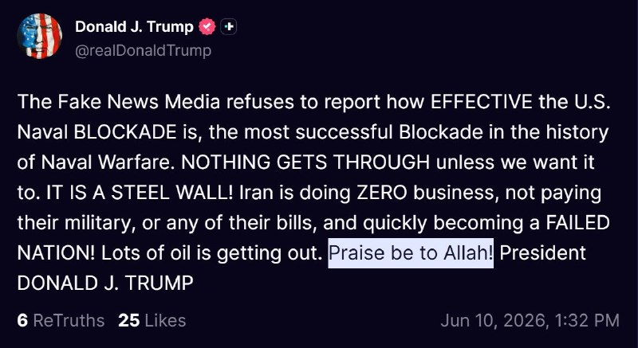

🔴رسانه‌های اخبار جعلی (فیک نیوز) از گزارش اینکه محاصره دریایی ایالات متحده چقدر مؤثر است، خودداری می‌کنند؛ موفق‌ترین محاصره در تاریخ جنگ‌های دریایی. هیچ چیز عبور نمی‌کند مگر اینکه ما بخواهیم. این یک دیوار فولادی است! ایران صفر تجارت انجام می‌دهد، حقوق نظامیان یا هیچ‌یک از قبوض خود را پرداخت نمی‌کند و به‌سرعت در حال تبدیل شدن به یک کشور ورشکسته است! نفت زیادی در حال خارج شدن است.

الحمدلله! رئیس‌جمهور دونالد جی. ترامپ.

@mwarmonitor

## mwarmonitor — post 10603

🔴 ترامپ به فاکس‌نیوز گفت:

🔸«در آستانه صدور دستور حملات جدید علیه نیروگاه‌ها و پل‌ها در ‎ایران هستم.»

@mwarmonitor

## mwarmonitor — post 10602

  <a href="telegram/content/mwarmonitor_10602_1781094042.mp4" target="_blank">🎬 Download video</a>

🔴خبر فوری: پس از رایزنی‌ها با ایالات متحده، مذاکره‌کنندگان قطری صبح امروز به تهران سفر کردند تا با ایرانی‌ها دیدار کنند و با هدف پر کردن شکاف‌های باقی‌مانده در روند مذاکرات تلاش کنند؛ این موضوع را یک دیپلمات آگاه از وضعیت به فاکس نیوز گفته است. @mwarmonitor

## mwarmonitor — post 10601

  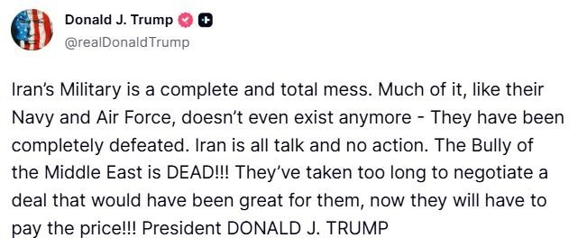

🚨 ترامپ در Truth Social:

ارتش ایران یک آشفتگی کامل و تمام‌عیار است. بخش زیادی از آن، مانند نیروی دریایی و نیروی هوایی‌اش، دیگر حتی وجود ندارد — آن‌ها به‌طور کامل شکست خورده‌اند. ایران فقط حرف می‌زند و عمل نمی‌کند. «قلدر خاورمیانه» مرده است!!!

آن‌ها بیش از حد برای مذاکره درباره یک توافقی که برایشان بسیار عالی می‌توانست باشد وقت تلف کردند، و حالا باید بهای آن را بپردازند!!!

@mwarmonitor

## mwarmonitor — post 10600

🔴خبر فوری: پس از رایزنی‌ها با ایالات متحده، مذاکره‌کنندگان قطری صبح امروز به تهران سفر کردند تا با ایرانی‌ها دیدار کنند و با هدف پر کردن شکاف‌های باقی‌مانده در روند مذاکرات تلاش کنند؛ این موضوع را یک دیپلمات آگاه از وضعیت به فاکس نیوز گفته است.

@mwarmonitor

## mwarmonitor — post 10599

📝 مرگ مظلومانه و جانگداز سامیار رستمی، طفل معصوم دو ساله‌ای که در چنگال فقر جان سپرد، فراتر از یک تراژدی، سندی عریان از جنایت نظام ناپاک، غارتگر و ضدبشری جمهوری اسلامی است. لعنت و نفرین ابدی بر حکومت ضدمردمی و سفاک آخوندی که با چپاول ثروت‌های ملی و ویران کردن…

## mwarmonitor — post 10598

  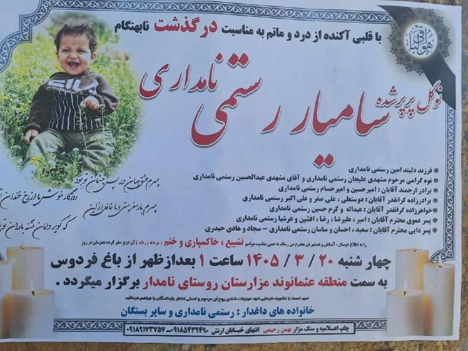

📝 مرگ مظلومانه و جانگداز سامیار رستمی، طفل معصوم دو ساله‌ای که در چنگال فقر جان سپرد، فراتر از یک تراژدی، سندی عریان از جنایت نظام ناپاک، غارتگر و ضدبشری جمهوری اسلامی است. لعنت و نفرین ابدی بر حکومت ضدمردمی و سفاک آخوندی که با چپاول ثروت‌های ملی و ویران کردن اقتصاد کشور، مردم شریف و زحمت‌کش را به خاک سیاه نشانده و چنان در منجلاب فقر مفرط و فلاکت اسیر کرده است که کشاورزان درمانده برای بقای خود ناچار به کشت خشخاش شوند.

🔸این رژیم تبهکار و بی‌کفایت، خون‌آشامی است که نه‌تنها زندگی و آیندهٔ جوانان، بلکه جان طفلان بی‌گناه را در کلبه‌های محرومیت می‌گیرد. مرگ سامیارِ تشنه و گرسنه در روستای نامدار عثمانوند، فریاد تظلم‌خواهی ملتی است که زیر پای استبداد و بیدادگری این حکومت دست‌وپا می‌زنند؛ فاجعه‌ای تکان‌دهنده که لکه ننگ ابدی دیگری بر پیشانی سیاه و خون‌آلود این نظام جنایت‌پیشه حک می‌کند.

@mwarmonitor

## mwarmonitor — post 10597

🔴سازمان UKMTO (سازمان عملیات تجارت دریایی بریتانیا) گزارشی درباره وقوع یک حادثه در فاصله ۲۰ مایل دریایی (NM) شمال شرقی بندر صحار در عمان دریافت کرده است.

📌مقامات محلی گزارش داده‌اند که یک کشتی نفتکش در اتاق موتور خود دچار آتش‌سوزی شده است و نیروها جهت کمک به تخلیه خدمه در صحنه حضور دارند. طبق گزارش‌های دریافتی از این شناور، این حادثه ۱ کشته برجای گذاشته و ۲ تن از اعضای خدمه نیز مفقود شده‌اند. هیچ‌گونه اثرات زیست‌محیطی (مانند آلودگی یا نشت) گزارش نشده است.

@mwarmonitor

## mwarmonitor — post 10596

💥صدای انفجار در اطراف جزیره قشم شنیده شده است.

## FoxNewsTwitter — post 342795

Fox News (Twitter/X)

BREAKING: President Trump exclusively tells @TreyYingst that the U.S. is getting close to ordering new strikes against Iranian power plants and bridges in response to “tapping the United States along” when it comes to drawn out negotiations.

The U.S. launched overnight strikes against Iranian-linked targets after a U.S. Apache helicopter was downed near the Strait of Hormuz, hitting roughly 20 sites.

Trump also revealing new details about the helicopter incident - saying an Iranian drone became lodged between the helicopter's two pilots as they maneuvered to avoid an explosion.

## FoxNewsTwitter — post 342794

‌Fox News (Twitter/X)

👉 Full story here:

## FoxNewsTwitter — post 342793

  

Fox News (Twitter/X)

FIRST ON FOX: Sen. Tom Cotton fires off a letter to acting AG Blanche demanding a DOJ investigation into a China-linked influence campaign he says is designed to 'kneecap' America's AI infrastructure. Cotton warns that Beijing is exploiting environmental and energy cost concerns to block U.S. data centers — while China subsidizes up to half the energy costs for its own AI operations.

## FoxNewsTwitter — post 342792

  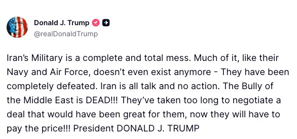

Fox News (Twitter/X)

“They’ve taken too long to negotiate a deal... now they will have to pay the price!!!”

President Trump putting the Iranian regime in his crosshairs after the U.S. launched defensive strikes in response to an American helicopter being shot down near the Strait of Hormuz.

“Iran’s Military is a complete and total mess... The Bully of the Middle East is DEAD!!!”

## FoxNewsTwitter — post 342791

  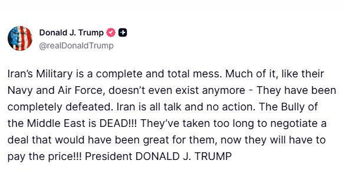

Fox News (Twitter/X)

BREAKING: Iran has 'taken too long to negotiate a deal,' 'will have to pay the price,' Trump writes on Truth Social

## FoxNewsTwitter — post 342790

  <a href="telegram/content/FoxNewsTwitter_342790_1781094048.mp4" target="_blank">🎬 Download video</a>

Fox News (Twitter/X)

"I've made mistakes in my life, mistakes that I regret, that I live with and I continue to learn from."

Democrat Graham Platner making a point to acknowledge the damage done by a campaign marked by scrutiny over past mistakes and personal controversies during his primary victory speech in Maine.

Platner telling supporters he understands why some voters feel disappointed or disillusioned with him, while trying to frame his past abuse allegations and Nazi tattoo as a story of “redemption.”

"It is my job to earn your trust, faith and support... Redemption is not just some simple or easy destination."

## pm_afshaa — post 93295

  <a href="telegram/content/pm_afshaa_93295_1781094051.webm" target="_blank">🎬 Download video</a>

🔴تحلیلگر عرب:
با درگیری‌های دیشب و چند روز پیش آمریکا و اسرائیل به اطمینان رسیدن که قدرت نظامی ایران به مقدار خیلی زیادی نابود شده و این یکی از دلایل برای شروع مجدد جنگ گسترده.

💧 Rainbet.com the #1 Non-KYC Crypto Casino & Sportsbook @rainbetcom

😁 @Pm_Afshaa

## pm_afshaa — post 93294

  <a href="telegram/content/pm_afshaa_93294_1781094052.webm" target="_blank">🎬 Download video</a>

🔴پزشکیان: هر هفته بدون استثنا با رهبر شهید دیدار داشتم که پشتوانه محکمی برای مدیریت ما و سیاست‌هایی بود که باید در کشور پیاده کنم.

💧 Rainbet.com the #1 Non-KYC Crypto Casino & Sportsbook @rainbetcom

😁 @Pm_Afshaa

## pm_afshaa — post 93293

🔴اسرائیل هیوم:پنتاگون طرح های حمله جدید را به ترامپ گزارش داده و اسرائیل را نیز مطلع کرده 
💧 Rainbet.com the #1 Non-KYC Crypto Casino & Sportsbook @rainbetcom 
😁 @Pm_Afshaa

## pm_afshaa — post 93292

🔴اسرائیل هیوم:پنتاگون طرح های حمله جدید را به ترامپ گزارش داده و اسرائیل را نیز مطلع کرده

💧 Rainbet.com the #1 Non-KYC Crypto Casino & Sportsbook @rainbetcom

😁 @Pm_Afshaa

## pm_afshaa — post 93291

♨️
♨️
♨️
♨️

## pm_afshaa — post 93290

  <a href="telegram/content/pm_afshaa_93290_1781094053.webm" target="_blank">🎬 Download video</a>

🔴شریفی زارچی استاد سابق دانشگاه شریف:

جمهوری اسلامی در حال انتقام‌گیری از دانشجوهاس؛ حداقل 7 نفر از دانشجویان دانشگاه صنعتی آریامهر (شریف) حکم اخراج دریافت کردن. 103 روز جرات نکردن رهبرشونو به گور بسپارن؛ با قاتل رهبرشون در حال مذاکره‌ن؛ و تمام شجاعتشون انتقام‌گیری از جوانان ایرانه. کفتارهای مقوایی.
‌

💧 Rainbet.com the #1 Non-KYC Crypto Casino & Sportsbook @rainbetcom

😁 @Pm_Afshaa

## pm_afshaa — post 93289

🔴فاکس نیوز: ترامپ در حال مشورت با مشاوران خود برای بازگشت به جنگ با ایران است و گزینه حملات به نیروگاه‌ها و پل‌های ایران را بررسی می‌کند

💧 Rainbet.com the #1 Non-KYC Crypto Casino & Sportsbook @rainbetcom

😁 @Pm_Afshaa

## pm_afshaa — post 93288

🔴ترامپ به فاکس نیوز : به صدور دستور برای حمله‌های جدید به نیروگاه‌ها و پل‌های ایران نزدیک شده‌ام؛ ایران بیش از حد داره برای رسیدن به توافق وقت‌کشی میکنه. 
💧 Rainbet.com the #1 Non-KYC Crypto Casino & Sportsbook @rainbetcom 
😁 @Pm_Afshaa

## pm_afshaa — post 93287

🔴ترامپ به فاکس نیوز : به صدور دستور برای حمله‌های جدید به نیروگاه‌ها و پل‌های ایران نزدیک شده‌ام؛ ایران بیش از حد داره برای رسیدن به توافق وقت‌کشی میکنه.

💧 Rainbet.com the #1 Non-KYC Crypto Casino & Sportsbook @rainbetcom

😁 @Pm_Afshaa

## pm_afshaa — post 93286

فارس:جمعی از نمایندگان مجلس در نامه‌ای به رهبر ایران خواستار افزایش برد موشک‌ها شدن

💧 Rainbet.com the #1 Non-KYC Crypto Casino & Sportsbook @rainbetcom

😁 @Pm_Afshaa

## pm_afshaa — post 93285

🔴پست جدید ترامپ:

نیروهای نظامی ایران کاملاً از هم پاشیده و نابود شدن. بخش زیادی از آن‌ها، مثل نیروی دریایی و نیروی هوایی، عملاً دیگه وجود خارجی ندارن؛ اونا به طور کامل شکست خوردن. ایران فقط حرف میزنه و هیچ اقدامی نمیکنه. قلدرِ خاورمیانه مُرده!

اونا بیش از حد واسه مذاکره و رسیدن به توافقی که می‌تونست واسشون فوق‌العاده باشه، وقت تلف کردن؛ حالا باید هزینه‌اش رو بدن!

💧 Rainbet.com the #1 Non-KYC Crypto Casino & Sportsbook @rainbetcom

😁 @Pm_Afshaa

## pm_afshaa — post 93284

  

در سالروز درگذشت خواهر عزیزم، لیلا، یاد و خاطره‌اش را گرامی می‌دارم.

لیلا دختری از ایران بود؛ وفادار به میهن، عاشق پدر و خانواده، و دلبسته هم‌میهنانش. هرچند دور از سرزمین مادری زندگی کرد، اما عشق به ایران هرگز از قلب او رخت برنبست و امید به آزادی و سربلندی میهن را تا واپسین روزهای زندگی‌اش از دست نداد.

امروز که ایرانیان با پرچم شیر و خورشید و با امید به آینده‌ای آزاد، ملی و سربلند، برای بازپس‌گیری کشورشان ایستاده‌اند، یاد لیلا بیش از هر زمان دیگری در کنار ما زنده است.

یادش گرامی و نامش جاودان.

@OfficialRezaPahlavi

## pm_afshaa — post 93283

اردوغان: حملات اسرائیل به سوریه و لبنان اکنون به تهدیدی برای ترکیه تبدیل شده

💧 Rainbet.com the #1 Non-KYC Crypto Casino & Sportsbook @rainbetcom

😁 @Pm_Afshaa

## DEJradio — post 5536

⭕️ فرماندۀ قرارگاه خاتم‌الانبیا گفت تجمعات شبانه باید تا دستور تازۀ مجتبی خامنه‌ای ادامه یابد

علی عبداللهی، فرماندۀ قرارگاه مرکزی خاتم‌الانبیا از حامیان حکومت خواست تجمعات شبانه را تا زمان صدور «دستور تازه از سوی مجتبی خامنه‌ای» ادامه دهند.
این در حالی است که از صدا و سیمای مجتبی خامنه‌‌ای هیچ نشانه‌ای دردست نیست.
عبداللهی، سردار سپاه پاسداران، یک‌صد شب تجمع مدوام حکومتی را بخشی از «بازدارندگی راهبردی جمهوری اسلامی» توصیف کرد و خواستار تداوم این برنامه‌ها شد.
این تجمعات که از هفته‌های نخست جنگ آغاز شد، با انتقاد شماری از شهروندان به دلیل ایجاد مزاحمت و اخلال در آرامش عمومی روبه‌رو شده است.
رژیم در این تجمعات تلاش می‌کند نمایشی ساختگی از هواداری طیف‌های گوناگون مردم را برای رسانه‌های خارجی به نمایش بگذارد.

#خبر #دژ #سیرک_خیابانی #موشتبا
@DEJradio

## DEJradio — post 5535

  <a href="telegram/content/DEJradio_5535_1781094054.mp4" target="_blank">🎬 Download video</a>

⭕️
👑 شاهزاده رضا پهلوی گفت تیم ملی واقعی ایران، همان مردم ایران است

شاهزاده رضا پهلوی در آستانۀ آغاز رقابت‌های جام جهانی فوتبال سال 2026 اعلام کرد تیم ملی واقعی ایران، همان مردم ایران است.
شاهزاده رضا پهلوی همچنین با اشاره به معترضان کشته‌شده، خواستار گرامی‌داشت یاد کسانی شد که امروز آنها نیز باید زنده می‌بودند.
شاهزاده یک روز مانده به گشایش جام جهانی، با اشاره به این که خودش هم به فوتبال علاقه دارد یادآور شد که جمهوری اسلامی این ورزش را به ابزاری علیه مردم ایران تبدیل کرده است.
شاهزاده از ایرانیان خواست نشان شیر و خورشید را در ورزشگاه‌، بیرون از آن و در هر جایی که هواداران گردهم می‌آیند، به‌نمایش درآوردند.

#شاهزاده_رضا_پهلوی #جام_جهانی #فوتبال
@DEJradio

## DEJradio — post 5534

  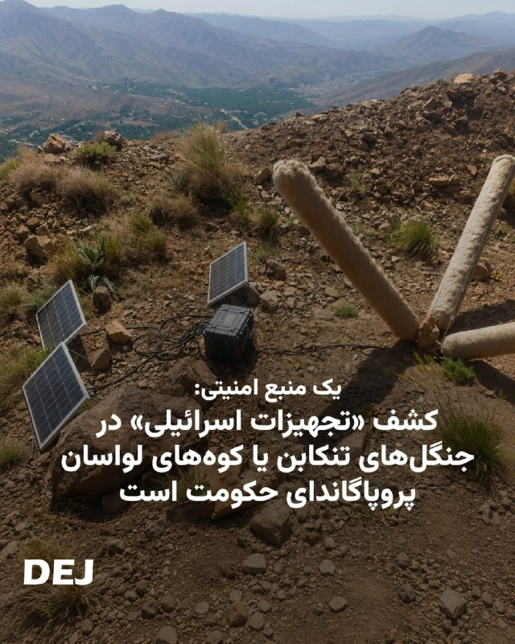

⭕️
🔸 یک منبع امنیتی:
کشف «تجهیزات اسرائیلی» در جنگل‌های تنکابن یا کوه‌های لواسان پروپاگاندای حکومت است

رسانه‌های حکومتی و کانال‌های وابسته به سـ.ـپاه مدعی کشف تجهیزات فنی و سامانه‌های زمین‌پایه در جنگل‌های تنکابن (استان مازندران) و کوه‌های لواسان (شمال شرق تهران) شده‌اند.

گفته شده این تجهیزات برای پشتیبانی و هدایت جنگنده‌های مهاجم استفاده می‌شود و در مسیرهای اصلی ورود جنگنده‌های دشمن به حریم هوایی تهران مستقر شده‌اند.

یک منبع امنیتی به دژ می‌گوید، «اگر منظور حکومت از تجهیزات مکشوفه همین تصاویر باشد کاملا پروپاگانداست زیرا نسل جدید جنگنده‌ها مجهز به سامانه‌های دیجیتال ماهواره‌ای‌اند. این تجهیزات که با پنل خورشیدی تغذیه می‌شوند یشتر شبیه سامانه‌های ایستگاه هواشناسی یا پایش محیطی و پایش حیات وحش است و ارتباطی با سامانه‌های هدایت هواپیما ندارد.»

#پروپاگاندا #اسرائیل
@DEJradio

## DEJradio — post 5533

  

در سالروز درگذشت خواهر عزیزم، لیلا، یاد و خاطره‌اش را گرامی می‌دارم.

لیلا دختری از ایران بود؛ وفادار به میهن، عاشق پدر و خانواده، و دلبسته هم‌میهنانش. هرچند دور از سرزمین مادری زندگی کرد، اما عشق به ایران هرگز از قلب او رخت برنبست و امید به آزادی و سربلندی میهن را تا واپسین روزهای زندگی‌اش از دست نداد.

امروز که ایرانیان با پرچم شیر و خورشید و با امید به آینده‌ای آزاد، ملی و سربلند، برای بازپس‌گیری کشورشان ایستاده‌اند، یاد لیلا بیش از هر زمان دیگری در کنار ما زنده است.

یادش گرامی و نامش جاودان.

@OfficialRezaPahlavi

## DEJradio — post 5532

  <a href="telegram/content/DEJradio_5532_1781094058.mp4" target="_blank">🎬 Download video</a>

🔺📢 نارضایتی در نیروهای مسلح؛ پیام اعتراضی پرسنل فراجا

#نیروهای_مسلح #فراجا
@DEJradio

## DEJradio — post 5531

  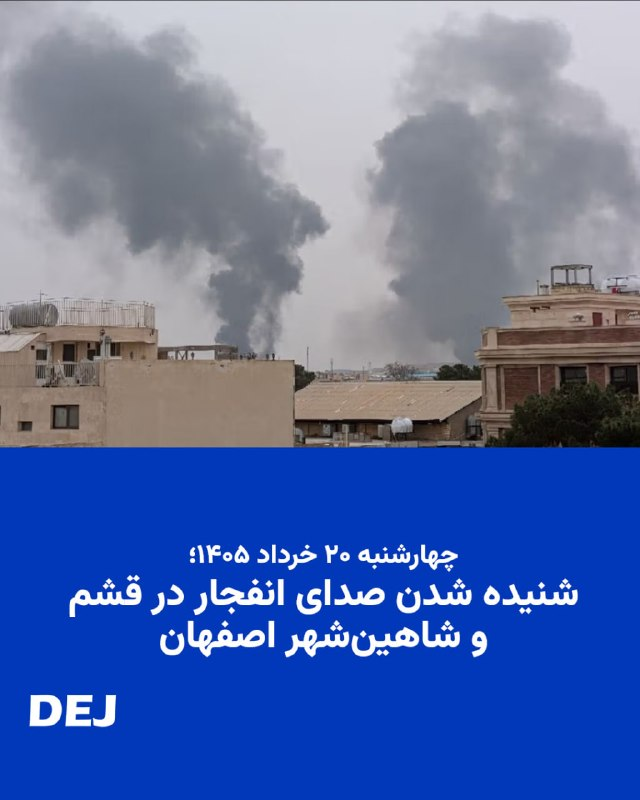

🛩️
🔥 چهارشنبه ۲۰ خرداد ۱۴۰۵؛
شنیده شدن صدای انفجار در قشم و شاهین‌شهر اصفهان

بر اساس گزارش‌ منابع داخلی اندکی پیش از ظهر چهارشنبه ۲۰ خرداد صدای یک انفجار در جزیره قشم شنیده شد.

رسانه‌های داخلی گزارش دادند «ماهیت دقیق این صداها هنوز معلوم نیست، اما با توجه به حجم صدا ممکن است منبع انفجار فاصله به‌نسبت زیادی با شهر قشم داشته و/یا مربوط یه تحرکاتی در تنگه هرمز باشد.»

در شاهین‌شهر اصفهان نیز صدای انفجار شنیده شد اما ماهیت آن هنوز پیدا نیست.
بامداد همین روز آمریکا رادارها و سایت‌های موشکی در سیریک، اهواز، قشم، شهرستان جاسک، اطراف بندرعباس و نوار ساحلی میناب را هدف قرار داد.

*عکس آرشیوی

#حملات_هدفمند #جنگ
@DEJradio

## mamlekate — post 103657

## kianmeli1 — post 87858

🔴فوری - اسرائیل هیوم:

پنتاگون طرح های حمله جدید را به ترامپ گزارش داده و اسرائیل را نیز مطلع کرده
https://t.me/kianmeli1

## kianmeli1 — post 87857

🔴فوری-رسانه های عبری

تصمیم ترامپ برای حمله به پل ها و زیرساخت ایران قطعی است
https://t.me/kianmeli1

## kianmeli1 — post 87856

🔴ترامپ:

ایران داره وقت‌کشی میکنه و احتمالا بزودی تصمیم حمله رو بگیرم
https://t.me/kianmeli1

## kianmeli1 — post 87855

🔴با دستور دیشب ترامپ زیرساخت آب چندتا روستا و شهر در سیریک منهدم شده٫ امروز در فاکس نیوز از پیروزی میگه

جمهوری اسلامی اگر حمله متقابل کنه به آب کویت و دوبی و بحرین٫ میاد میگه جمهوری اسلامی کار تروریستی داره میکنه
https://t.me/kianmeli1

## kianmeli1 — post 87854

  <a href="telegram/content/kianmeli1_87854_1781094061.mp4" target="_blank">🎬 Download video</a>

🔴ترامپ با پیروزی دیشب در حملات به جنوب ایران لقمه بزرگ برای دهانش گرفت

فاکس‌نیوز: ترامپ می‌گوید که ایالات متحده در پاسخ به طولانی شدن مذاکرات، به صدور دستور حملات جدید علیه نیروگاه‌ها و پل‌های ایران نزدیک می‌شود.

ایالات متحده پس از سرنگونی یک هلیکوپتر آپاچی آمریکایی در نزدیکی تنگه هرمز، حملات شبانه‌ای را علیه اهداف مرتبط با ایران آغاز کرد و تقریباً 20 نقطه را هدف قرار داد.

ترامپ همچنین جزئیات جدیدی در مورد حادثه هلیکوپتر فاش کرد و گفت که یک پهپاد ایرانی بین دو خلبان هلیکوپتر گیر افتاده است، زیرا آنها برای جلوگیری از انفجار مانور می‌دادند.
https://t.me/kianmeli1

## kianmeli1 — post 87853

🔴با حمله دیشب ترامپ به جنوب ایران ٫ به این نتیجه رسیده که جمهوری اسلامی توان پاسخ ندارد و میتواند به زیرساخت ضربه سنگین وارد کند

بزودی جمهوری اسلامی محاصره دریایی را میشکند و ترامپ مجدد به فحاشی رو می آورد
https://t.me/kianmeli1

## kianmeli1 — post 87852

🔴فوری-ترامپ به فاکس نیوز :

به صدور دستور برای حمله‌های جدید به نیروگاه‌ها و پل‌های ایران نزدیک شده‌ام!
https://t.me/kianmeli1

## kianmeli1 — post 87851

  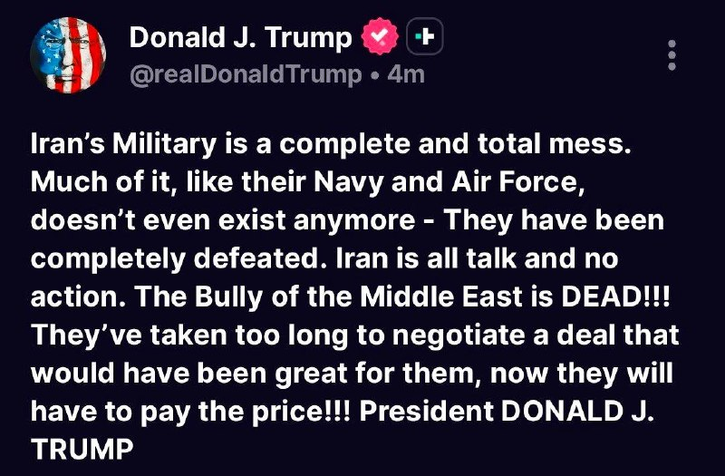

🔴 ترامپ:

«ایران فقط حرف می‌زند و هیچ عملی انجام نمی‌دهد. قلدر خاورمیانه مُرد!!! آنها خیلی طول کشیدند تا برای توافقی که برایشان عالی بود مذاکره کنند، حالا باید هزینه‌اش را بپردازند!!!»
https://t.me/kianmeli1

## kianmeli1 — post 87850

  <a href="telegram/content/kianmeli1_87850_1781094065.mp4" target="_blank">🎬 Download video</a>

🔴گزارش شده است که ایران پس از تلاش یک کشتی برای عبور از تنگه هرمز، در نزدیکی بندر صحار عمان، آن را هدف قرار داده است.

رسانه‌های محلی گزارش می‌دهند که این کشتی آسیب قابل توجهی دیده و ممکن است تلفات زیادی داشته باشد.
https://t.me/kianmeli1

## kianmeli1 — post 87849

  <a href="telegram/content/kianmeli1_87849_1781094066.mp4" target="_blank">🎬 Download video</a>

🔴سخنگوی کمیسیون امنیت ملی: آمریکا یا باید تسلیم دیپلمات‌های ما بشود یا موشک‌های ما
https://t.me/kianmeli1

## IranIntlTV — post 341470

  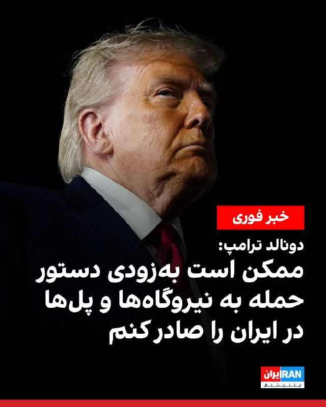

دونالد ترامپ، رییس‌جمهوری آمریکا، در مصاحبه با فاکس‌نیوز گفت ممکن است به‌زودی دستور حملات جدید به نیروگاه‌ها و پل‌ها در ایران را صادر کند.

او دلیل این موضوع را طولانی شدن روند مذاکرات از سوی جمهوری اسلامی عنوان کرد و افزود تهران دستیابی به توافق را بیش از حد به تاخیر انداخته است.

ترامپ تاکید کرد صدور دستور حملات جدید نزدیک است و گفت اگر روند مذاکرات تغییر نکند، تصمیم‌های تازه‌ای اتخاذ خواهد شد. او افزود ۵۵ درصد از سامانه‌های راداری که جمهوری اسلامی در دوران آتش‌بس بازسازی کرده بود، در حملات جدید آمریکا نابود شد.
https://iranintl.com/202606100464

## IranIntlTV — post 341469

  <a href="telegram/content/IranIntlTV_341469_1781094069.mp4" target="_blank">🎬 Download video</a>

مرکز پژوهش‌های کنگره آمریکا اعلام کرد در پیش‌نویس بودجه ۲۰۲۷ حدود ۱۱۹ میلیون دلار برای حمایت از نیروهای مسلح عراق در نظر گرفته شده و بررسی مشروط شدن این کمک‌ها به مهار گروه‌های وابسته به جمهوری اسلامی در جریان است

گفت‌وگو با تروسکه صادقی، خبرنگار ایران‌اینترنشنال
@iranintltv

## IranIntlTV — post 341468

  <a href="telegram/content/IranIntlTV_341468_1781094071.mp4" target="_blank">🎬 Download video</a>

مروری بر رسانه‌ها و خبرگزاری‌ها در ایران، چهارشنبه ۲۰ خرداد، با مجتبی هاشمی، روزنامه‌نگار
@iranintltv

## IranIntlTV — post 341467

  <a href="telegram/content/IranIntlTV_341467_1781094074.mp4" target="_blank">🎬 Download video</a>

در ماه‌های گذشته و به‌ویژه پس از جنگ، تجمع‌های شبانه حامیان حکومت، ایست‌های بازرسی، تفتیش تلفن‌های همراه و اختلال گسترده اینترنت از جمله مواردی بوده که به گفته شهروندان به تشدید فضای امنیتی در کشور منجر شده است.

جزییات بیشتر با فرزاد فتاحی، عضو تحریریه ایران‌اینترنشنال
@iranintltv

## IranIntlTV — post 341466

  

وزارت خارجه کویت در بیانیه‌ای ادامه حملات جمهوری اسلامی به خاک این کشور را محکوم کرد و نوشت حملات چهارشنبه به‌عنوان مرحله‌ای تازه از تشدید تنش‌ها ارزیابی می‌شود که جان غیرنظامیان و ایمنی تاسیسات حیاتی و مسکونی را در معرض خطر قرار می‌دهد.

در بیانیه این وزارتخانه آمده است این حملات تشدید خطرناک تنش به شمار می‌رود و پیامدهای جدی برای ثبات منطقه دارد.

این وزارتخانه تکرار این حملات را نشانه رویکردی سازمان‌یافته و خصمانه دانست و تاکید کرد این اقدامات نقض آشکار حاکمیت کویت و مغایر با قواعد حقوق بین‌الملل و منشور سازمان ملل متحد است و تلاش‌ها برای کاهش تنش در منطقه را تضعیف می‌کند.

وزارت خارجه کویت همچنین اعلام کرد این کشور حق خود را برای اتخاذ تمامی اقدامات لازم به منظور حفظ امنیت و دفاع از سرزمین و تاسیسات حیاتی‌اش، در چارچوب حقوق بین‌الملل و منشور سازمان ملل، محفوظ می‌داند.
https://iranintl.com/202606100118

## IranIntlTV — post 341465

  <a href="telegram/content/IranIntlTV_341465_1781094077.mp4" target="_blank">🎬 Download video</a>

سرخط خبرهای چهارشنبه ۲۰ خرداد
@iranintltv

## IranIntlTV — post 341464

  

🔻به گزارش رویترز، دولت آمریکا به دلیل آنچه ارتباط عمر عبدالقادر ارتان با «افراد مظنون به عضویت در سازمان‌های تروریستی» عنوان کرده، از ورود این داور فوتبال اهل سومالی به ایالات متحده برای حضور در جام جهانی ۲۰۲۶ جلوگیری کرده است؛ تصمیمی که در چارچوب سیاست‌های سخت‌گیرانه مهاجرتی واشینگتن و ممنوعیت سفر شهروندان ۱۲ کشور، از جمله سومالی، اتخاذ شده است.

🔹ارتان، برنده عنوان بهترین داور فوتبال آفریقا در سال ۲۰۲۵، قصد داشت به عنوان نخستین داور سومالیایی تاریخ در رقابت‌های جام جهانی قضاوت کند. او صبح چهارشنبه به سومالی بازگشت.

🔹سخنگوی فیفا تایید کرد که این داور فرصت حضور در جام جهانی را از دست داده است و افزود فیفا در فرآیندهای مهاجرتی کشورهای میزبان نقشی ندارد.

🔹دولت سومالی نیز با ابراز تاسف از این تصمیم اعلام کرد تلاش‌های دیپلماتیک این کشور برای حل موضوع بی‌نتیجه مانده است.

🔹این اقدام در آستانه جام جهانی ۲۰۲۶ نگرانی‌هایی را درباره محدودیت‌های ورود به آمریکا برای برخی شرکت‌کنندگان در این رقابت‌ها ایجاد کرده است.

@iranintltvsport

## IranIntlTV — post 341463

  <a href="telegram/content/IranIntlTV_341463_1781094080.mp4" target="_blank">🎬 Download video</a>

علی‌حسین قاضی‌زاده، عضو تحریریه ایران‌اینترنشنال، با اشاره به اظهارات دونالد ترامپ درباره احتمال دستیابی به توافق و همزمان تداوم تنش‌ها و حملات به مواضع جمهوری اسلامی گفت این وضعیت نشان می‌دهد توافق نهایی در دسترس نیست.

او افزود اگر توافقی در حال نزدیک شدن بود، سطح کنونی تنش‌ها قابل تداوم نبود و به گفته او، اظهارات ترامپ در این باره بارها تکرار شده است.
@iranintltv

## IranIntlTV — post 341461

  <a href="https://t.me/IranintlTV/341461" target="_blank">📎 Download file</a>

🎧نسخه صوتی اخبار بامدادی | چهارشنبه ۲۰ خرداد
@iranintlTV

## IranIntlTV — post 341460

  <a href="telegram/content/IranIntlTV_341460_1781094084.mp4" target="_blank">🎬 Download video</a>

مرتضی کاظمیان، عضو تحریریه ایران‌اینترنشنال، در ارزیابی خود از بیانیه وزارت امور خارجه جمهوری اسلامی گفت این بیانیه نشان‌دهنده ضعف و تلاش برای نمایش اقتداری است که به گفته او وجود ندارد.

وزارت خارجه جمهوری اسلامی در بیانیه‌ای کشورهای حاشیه خلیج فارس را مسئول حملات آمریکا به ایران دانست و تاکید کرد نیروهای نظامی کشور، به حملات خود به پایگاه‌های ایالات متحده در کشورهای منطقه ادامه خواهد داد.
@iranintltv

## IranIntlTV — post 341459

  <a href="telegram/content/IranIntlTV_341459_1781094086.mp4" target="_blank">🎬 Download video</a>

شبکه خبری آی‌۲۴ اسرائیل به نقل از نتانیاهو گزارش داد اسرائیل مایل نیست به تنهایی علیه جمهوری اسلامی اقدام کند، اما برای انجام آن آمادگی دارد

گفت‌وگو با بابک اسحاقی، خبرنگار ایران‌اینترنشنال
@iranintltv

## Shin_Persian — post 6856

  <a href="telegram/content/Shin_Persian_6856_1781094088.mp4" target="_blank">🎬 Download video</a>

🔁 Quoting above tweet:
Shin ✓ @hey_itsmyturn
Wed, 10 Jun 2026 11:48:14 UTC

Grok nailed it

ترجمه خودکار فارسی

گروک (Grok) عالی عمل کرد.

𝕏 · @shin_persian

## Shin_Persian — post 6855

  

↩️ Quoted tweet: Shin ✓ @hey_itsmyturn Wed, 10 Jun 2026 11:35:26 UTC POTUS: "The Fake News Media refuses to report how EFFECTIVE the U.S. Naval BLOCKADE is, the most successful Blockade in the history of Naval Warfare. NOTHING GETS THROUGH unless we want…

## Shin_Persian — post 6854

↩️ Quoted tweet:
Shin ✓ @hey_itsmyturn
Wed, 10 Jun 2026 11:35:26 UTC

POTUS:
"The Fake News Media refuses to report how EFFECTIVE the U.S. Naval BLOCKADE is, the most successful Blockade in the history of Naval Warfare. NOTHING GETS THROUGH unless we want it to. IT IS A STEEL WALL! Iran is doing ZERO business, not paying their military, or any of

↩️ توییت نقل‌قول شده — برای پاسخ، پست زیر را ببینید.

ترجمه خودکار فارسی

رئیس‌جمهور ایالات متحده (POTUS):
«رسانه‌های اخبار جعلی از گزارش اینکه محاصره دریایی ایالات متحده چقدر موثر است، امتناع می‌کنند؛ موفق‌ترین محاصره در تاریخ جنگ‌های دریایی. هیچ‌چیز عبور نمی‌کند مگر آنکه ما بخواهیم. این یک دیوار فولادی است! ایران هیچ معامله تجاری انجام نمی‌دهد، حقوق نظامیان خود یا هیچ‌کدام از...»

𝕏 · @shin_persian

## Shin_Persian — post 6853

  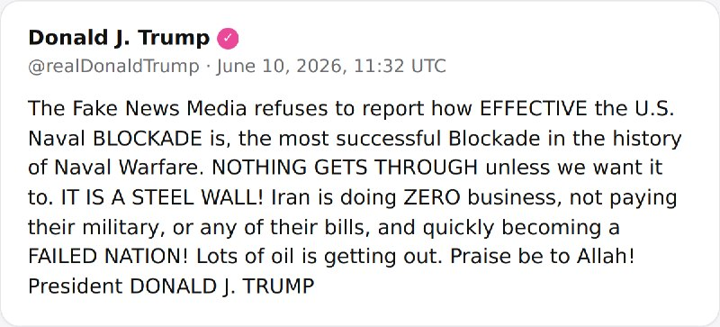

Shin ✓ @hey_itsmyturn Wed, 10 Jun 2026 11:35:26 UTC POTUS: "The Fake News Media refuses to report how EFFECTIVE the U.S. Naval BLOCKADE is, the most successful Blockade in the history of Naval Warfare. NOTHING GETS THROUGH unless we want it to. IT IS A STEEL…

## Shin_Persian — post 6852

Shin ✓ @hey_itsmyturn
Wed, 10 Jun 2026 11:35:26 UTC

POTUS:
"The Fake News Media refuses to report how EFFECTIVE the U.S. Naval BLOCKADE is, the most successful Blockade in the history of Naval Warfare. NOTHING GETS THROUGH unless we want it to. IT IS A STEEL WALL! Iran is doing ZERO business, not paying their military, or any of their bills, and quickly becoming a FAILED NATION! Lots of oil is getting out. Praise be to Allah! President DONALD J. TRUMP"

ترجمه خودکار فارسی

رئیس‌جمهور ایالات متحده (POTUS):
«رسانه‌های اخبار جعلی از گزارش اینکه محاصره دریایی ایالات متحده چقدر موثر است، خودداری می‌کنند؛ موفق‌ترین محاصره در تاریخ جنگ‌های دریایی. هیچ‌چیز عبور نمی‌کند مگر آنکه ما بخواهیم. این یک دیوار فولادی است! ایران هیچ معامله‌ای انجام نمی‌دهد، حقوق نظامیان خود یا هیچ‌یک از قبوضش را پرداخت نمی‌کند و به سرعت در حال تبدیل شدن به یک ملت شکست‌خورده است! مقدار زیادی نفت در حال خارج شدن است. الحمدلله! رئیس‌جمهور دونالد جی. ترامپ»

𝕏 · @shin_persian

## Shin_Persian — post 6851

  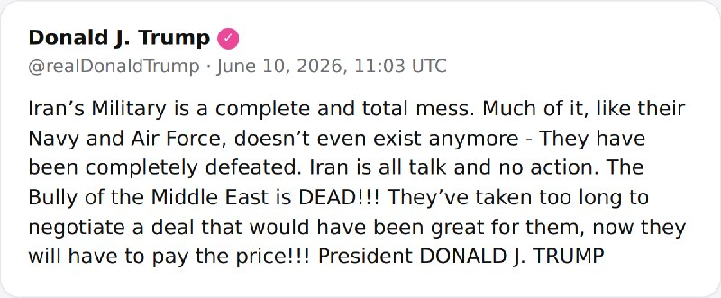

Shin ✓ @hey_itsmyturn Wed, 10 Jun 2026 11:05:22 UTC POTUS: "Iran’s Military is a complete and total mess. Much of it, like their Navy and Air Force, doesn’t even exist anymore - They have been completely defeated. Iran is all talk and no action. The Bully…

## Shin_Persian — post 6850

Shin ✓ @hey_itsmyturn
Wed, 10 Jun 2026 11:05:22 UTC

POTUS:
"Iran’s Military is a complete and total mess. Much of it, like their Navy and Air Force, doesn’t even exist anymore - They have been completely defeated. Iran is all talk and no action. The Bully of the Middle East is DEAD!!! They’ve taken too long to negotiate a deal that would have been great for them, now they will have to pay the price!!! President DONALD J. TRUMP"

ترجمه خودکار فارسی

رئیس‌جمهور ایالات متحده (POTUS):
«نظامیان ایران یک فاجعه تمام‌وعیار و مطلق هستند. بخش بزرگی از آن، مانند نیروی دریایی و نیروی هوایی‌شان، دیگر حتی وجود خارجی ندارد - آن‌ها به طور کامل شکست خورده‌اند. ایران فقط حرف می‌زند و اهل عمل نیست. قلدر خاورمیانه مرده است!!! آن‌ها برای مذاکره بر سر توافقی که می‌توانست برایشان عالی باشد، خیلی طولش دادند؛ حالا باید بهایش را بپردازند!!! رئیس‌جمهور دونالد جی. ترامپ»

𝕏 · @shin_persian

## FarsiVOA — post 220242

  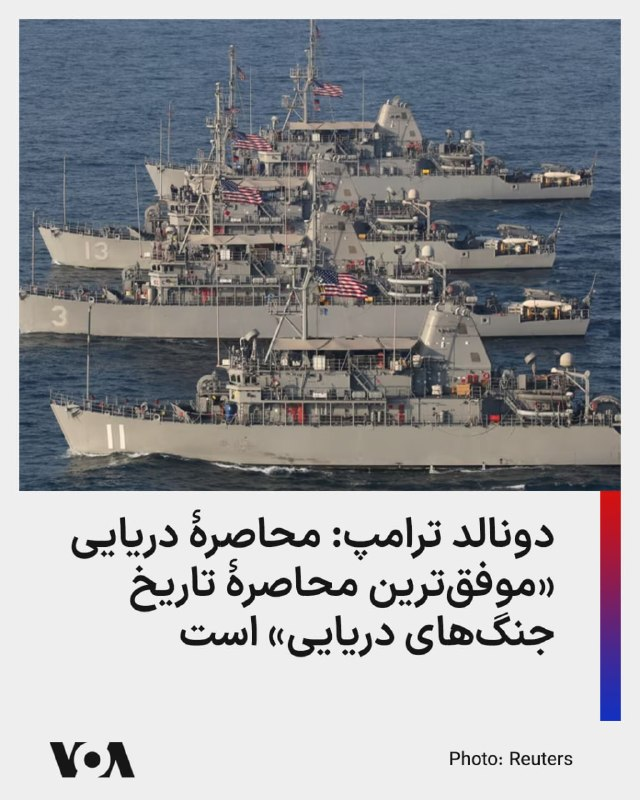

دونالد ترامپ، رئیس‌جمهوری آمریکا، در پیامی در تروث‌سوشال، محاصرهٔ دریایی آمریکا علیه جمهوری اسلامی را «موفق‌ترین محاصره در تاریخ جنگ‌های دریایی» خواند و نوشت «رسانه‌های جعلی» از انعکاس میزان «اثرگذاری» آن خودداری می‌کنند.

آقای ترامپ نوشت: «هیچ‌چیز عبور نمی‌کند، مگر آنکه ما بخواهیم. این یک دیوار فولادی است.» آقای ترامپ تاکید کرده است جمهوری اسلامی «هیچ تجارتی ندارد، حقوق نظامیانش را نمی‌پردازد و هیچ‌یک از صورت‌حساب‌هایش را پوشش نمی‌دهد» و «به‌سرعت در حال تبدیل‌شدن به یک کشور ورشکسته» است.

آقای ترامپ در همان پیام به عبور نفتکش‌ها از تنگه هرمز اشاره کرد و نوشت «نفت زیادی در حال خارج‌شدن است» و جمله را با عبارت «الحمدلله» به پایان رساند.
@FarsiVOA

## FarsiVOA — post 220241

🔺ترامپ: جمهوری اسلامی وقت‌کشی کرد و باید بهای آن را بپردازد

◾️دونالد ترامپ، رئیس‌جمهوری آمریکا، در تازه‌ترین پیام خود در تروث‌سوشال، جمهوری اسلامی را به وقت‌کشی در مذاکرات متهم کرد و نوشت توافقی که می‌توانست برای تهران «عالی» باشد، بیش از حد طول کشیده و حالا جمهوری اسلامی «باید بهای آن را بپردازد».

◾️آقای ترامپ در این اظهار نظر یادآور شد که «نیروی نظامی ایران یک ویرانه کامل و تمام‌عیار است. بخش زیادی از آن، مانند نیروی دریایی و نیروی هوایی‌شان، دیگر حتی وجود خارجی ندارد - آن‌ها کاملاً شکست خورده‌اند.»

◾️او تصریح کرد: «ایران فقط حرف می‌زند و مرد عمل نیست. [اما] قلدرِ خاورمیانه مرده است.»

⬇️ بیشتر بخوانید:
https://ir.voanews.com/a/8159302.html

## FarsiVOA — post 220240

  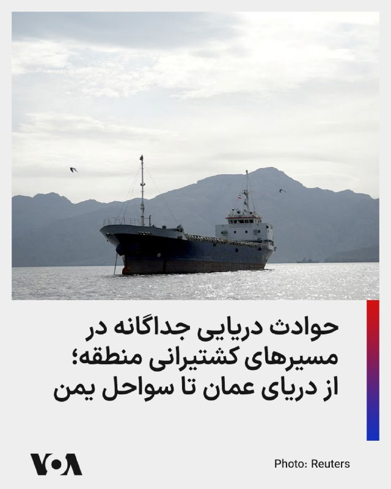

سازمان عملیات تجارت دریایی بریتانیا روز چهارشنبه ۱۰ ژوئن از دو حادثهٔ جداگانه در مسیرهای حساس کشتیرانی منطقه خبر داد.

در دریای عمان، یک نفتکش در حدود ۲۰ مایل دریایی شمال‌شرق صحارِ عمان دچار آتش‌سوزی در موتورخانه شد. به نقل از گزارش دریافتیِ این سازمان، یک نفر مصدوم و دو خدمه مفقود گزارش شده‌اند؛ با این حال هنوز علت آتش‌سوزی مشخص نیست و حادثه به‌طور رسمی «حمله» اعلام نشده است.

چند ساعت پیش از آن نیز سازمان عملیات تجارت دریایی بریتانیا اعلام کرد یک کشتی باری در حدود ۸۸ مایل دریایی جنوب‌غرب بلحاف یمن، نزدیک تنگهٔ باب‌المندب و خلیج عدن با یک قایق کوچک حامل شش فرد مسلح روبه‌رو شد.

میان افراد مسلح و تیم امنیتی کشتی تبادل آتش رخ داد و قایق از محل دور شد. گزارشی از تلفات یا خسارت به کشتی منتشر نشده است.

این دو رخداد در حالی ثبت شده که یحیی سریع، سخنگوی نظامی حوثی‌های یمن، روز ۸ ژوئن «ناوبری دشمن» در دریای سرخ را ممنوع اعلام کرد و گفت هرگونه حرکت مرتبط با اسرائیل را هدف نظامی تلقی خواهد کرد.

او همچنین هشدار داد «تشدید با تشدید پاسخ داده می‌شود و عملیات‌ها مطابق تحولات گسترده‌تر خواهد شد.»
@FarsiVOA

## FarsiVOA — post 220239

  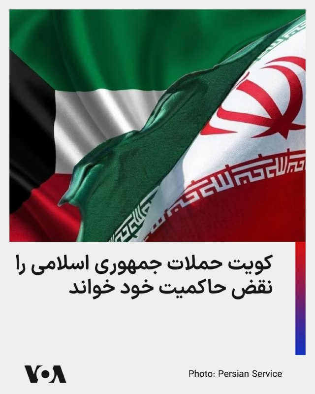

وزارت خارجه کویت روز چهارشنبه ۱۰ ژوئن ۲۰۲۶ حملات موشکی و پهپادی جمهوری اسلامی را محکوم کرد و آن را «تشدید خطرناک» علیه امنیت این کشور دانست.

این واکنش پس از آن اعلام شد که سپاه پاسداران مدعی شد پایگاه‌ها و اهداف مرتبط با آمریکا در بحرین، کویت و اردن را با موشک و پهپاد هدف قرار داده است.

وزارت خارجه کویت گفت این حملات جان غیرنظامیان و تأسیسات حیاتی را تهدید می‌کند و تکرار آن‌ها نقض حاکمیت کویت و قوانین بین‌المللی است.

این وزارتخانه همچنین تأکید کرد کویت حق خود را برای اتخاذ همه اقدامات لازم جهت حفاظت از امنیت، خاک و زیرساخت‌های حیاتی کشور محفوظ می‌داند.

در همین حال، یک مقام آمریکایی، بدون افشای نام، گفت ارزیابی‌های اولیه نشان می‌دهد تقریباً همه موشک‌ها و پهپادهای شلیک‌شده از سوی جمهوری اسلامی رهگیری شده‌اند و تا این لحظه گزارشی از آسیب به نیروها یا تأسیسات آمریکایی دریافت نشده است.
@FarsiVOA

## FarsiVOA — post 220238

  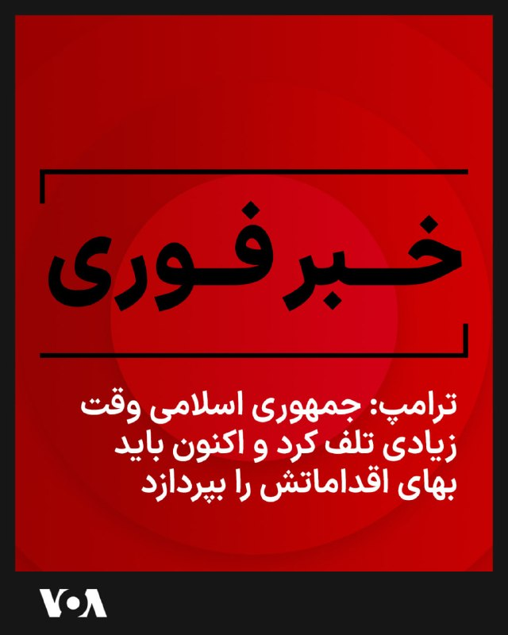

دونالد ترامپ در اظهار نظر جدیدی در شبکه اجتماعی تروت‌سوشال هشدار داد که اکنون زمانی است که جمهوری اسلامی باید بهای اقداماتش را بپردازد.

آقای ترامپ در این اظهار نظر یادآور شد که «نیروی نظامی ایران یک ویرانه کامل و تمام‌عیار است. بخش زیادی از آن، مانند نیروی دریایی و نیروی هوایی‌شان، دیگر حتی وجود خارجی ندارد - آن‌ها کاملاً شکست خورده‌اند.»

او تصریح کرد: «ایران فقط حرف می‌زند و مرد عمل نیست. [اما] قلدرِ خاورمیانه مرده است.»

آقای ترامپ افزود: «آن‌ها برای مذاکره بر سر توافقی که می‌توانست برایشان عالی باشد بیش از حد وقت تلف کردند، و اکنون باید بهای آن را بپردازند.»
@FarsiVOA

## FarsiVOA — post 220237

  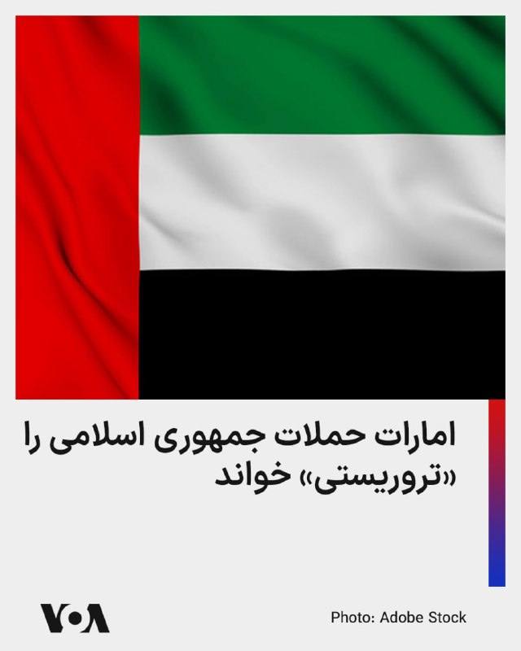

امارات متحده عربی روز چهارشنبه، حملات موشکی و پهپادی جمهوری اسلامی به بحرین، کویت و اردن را به‌شدت محکوم کرد.

وزارت خارجه امارات در بیانیه‌ای این حملات را «تروریستی» و «بی‌دلیل» خواند و اعلام کرد که هدف قرار دادن پادشاهی بحرین، دولت کویت و پادشاهی اردن هاشمی، نقض آشکار حاکمیت این سه کشور و تهدیدی علیه امنیت و ثبات آن‌هاست.

در این بیانیه همچنین آمده است که امارات همبستگی کامل خود را با بحرین، کویت و اردن اعلام می‌کند و از همه اقداماتی که این کشورها برای حفاظت از امنیت و ثبات خود انجام دهند، حمایت می‌کند.
@FarsiVOA

## FarsiVOA — post 220236

  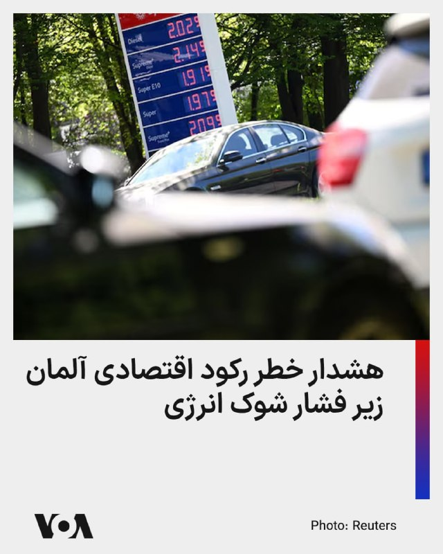

خبرگزاری رویترز روز چهارشنبه ۱۰ ژوئن ۲۰۲۶ گزارش داد اقتصاددانان موسسه پژوهش اقتصادی آلمان هشدار داده‌اند شوک انرژی ناشی از جنگ خلیج فارس می‌تواند رشد آلمان را بیشتر تضعیف کند و خطر رکود را بالا ببرد.

بر اساس گزارش رویترز، نگرانی اصلی این است که افزایش هزینه انرژی، اختلال در عرضه و افت اعتماد اقتصادی، بهبود شکننده بزرگ‌ترین اقتصاد اروپا را متوقف کند.

شاخص ماه مه موسسه پژوهش اقتصادی آلمان پیش‌تر به ۹۴.۸ واحد سقوط کرده بود؛ سطحی پایین‌تر از مرز ۱۰۰ واحد که نشانه رشد متوسط اقتصاد است.

جرالدینه دانی-کندلیک، رئیس بخش پیش‌بینی اقتصادی این موسسه، گفته بود آغاز جنگ در خلیج فارس و پیامدهای آن از ماه مارس چشم‌انداز اقتصاد آلمان را به‌طور محسوسی تیره‌تر کرده و امید به یک رونق قابل توجه، تقریباً جای خود را به ناامیدی داده است.

حساسیت اصلی برای آلمان، صنایع پرمصرف انرژی، هزینه تولید، صادرات و مصرف داخلی است. ابهام مهم هم مدت شوک انرژی، وضعیت مسیرهای حمل انرژی و واکنش بازارهاست.
@FarsiVOA

## FarsiVOA — post 220235

  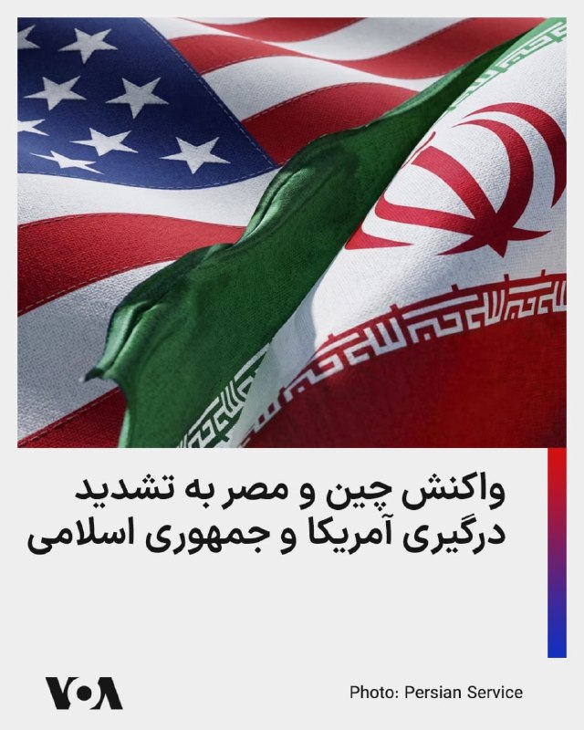

چین و مصر روز چهارشنبه به موج تازه درگیری میان آمریکا و جمهوری اسلامی واکنش نشان دادند.

لین جیان، سخنگوی وزارت خارجه چین، در نشست خبری پکن گفت کشورش از وضعیت خاورمیانه «عمیقاً نگران» است و از طرف‌های مرتبط خواست آرامش و خویشتنداری نشان دهند، از تشدید درگیری خودداری کنند و برای کاهش تنش اقدام عملی انجام دهند.

مصر نیز در بیانیه وزارت خارجه، حملات جمهوری اسلامی به اردن، بحرین و کویت را محکوم کرد و آن را «تشدید خطرناک» و نقض حاکمیت و تمامیت ارضی این کشورها دانست.

قاهره همچنین همبستگی کامل خود را با این سه کشور اعلام کرد و گفت امنیت کشورهای عربی بخشی جدایی‌ناپذیر از امنیت ملی مصر و جهان عرب است.

این درگیری‌ پس از حملات آمریکا به مواضع سپاه در واکنش به سرنگونی یک بالگرد آمریکایی آغاز شد و سپس با حملات موشکی و پهپادی جمهوری اسلامی به اهداف مرتبط با آمریکا در اردن، بحرین و کویت گسترش یافت.
@FarsiVOA

## FarsiVOA — post 220234

  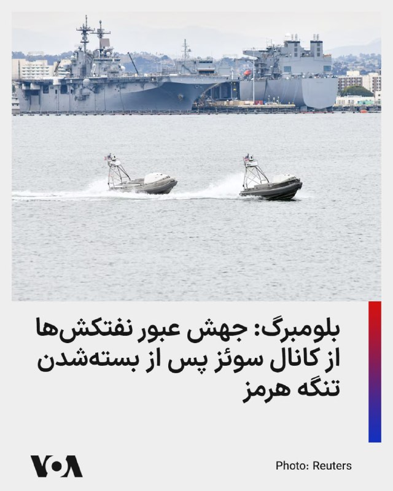

بلومبرگ روز چهارشنبه ۱۰ ژوئن ۲۰۲۶ گزارش داد بسته‌شدن تنگه هرمز باعث افزایش عبور نفتکش‌ها از کانال سوئز مصر شده و درآمد این کشور از این مسیر را به بالاترین سطح از اوایل سال ۲۰۲۴ رسانده است.

بر اساس داده‌های آژانس آمار دولتی مصر، در ماه آوریل ۲۰۲۶ در مجموع ۵۲۹ نفتکش از کانال سوئز عبور کردند. رقمی که نسبت به آوریل ۲۰۲۵ حدود ۲۸ درصد افزایش نشان می‌دهد و تقریباً معادل رشد یک‌سومی تردد نفتکش‌هاست.

ترافیک کلی کانال نیز بالا رفته است به‌طوری‌که هزار و ۱۸۲ کشتی از انواع مختلف در این مسیر تردد کردند که نسبت به سال قبل ۱۴ درصد بیشتر است.

بلومبرگ نوشت عبور از کانال سوئز پس از حملات حوثی‌های یمن به کشتی‌ها در جنوب دریای سرخ، طی بیش از دو سال گذشته کاهش یافته بود، اما پیامدهای جنگ آمریکا و اسرائیل علیه جمهوری اسلامی و بسته‌شدن هرمز، اکنون یک جهش غیرمنتظره برای مسیر انرژی از دریای سرخ ایجاد کرده است.
@FarsiVOA

## FarsiVOA — post 220233

  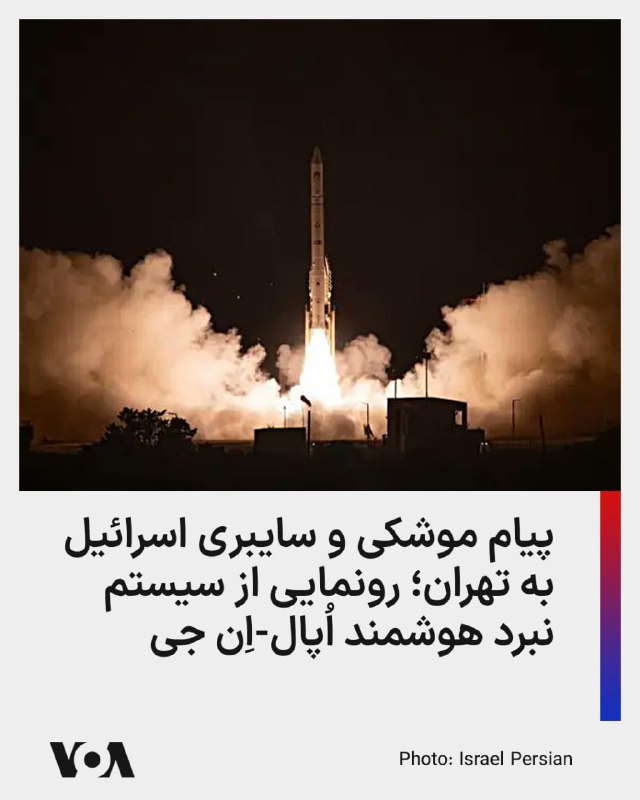

پس از موفقیت‌های سامانه دفاع موشکی «پیکان» (ختس) و توسعه ماهواره‌های فضایی، صنایع هوافضای اسرائیل با رونمایی از نسل جدید سیستم مدیریت نبرد خود تحت عنوان «اُپال-اِن‌ جی»، پیام هشداری واضح و مبتنی بر فناوری‌های نوین به جمهوری اسلامی فرستاد.

این سیستم پیشرفته با تکیه بر هوش مصنوعی و منطبق بر استانداردهای ناتو طراحی شده است و وظیفه یکپارچه‌سازی کامل عملیات‌های هوایی، زمینی و دریایی را بر عهده دارد.

سیستم اُپال-اِن‌ جی با پردازش آنی داده‌ها و اولویت‌بندی هوشمند اهداف، تصمیم‌گیری‌های نظامی را سرعت می‌بخشد.

از ویژگی‌های کلیدی این فناوری، ایجاد شبکه ارتباطی فوری میان پلتفرم‌های مختلف (از جمله جنگنده‌ها، بالگردها و مراکز فرماندهی) و تسهیل عملیات‌های هماهنگ و مشترک میان هواپیماهای سرنشین‌دار و یگان‌های پهپادی در حوزه‌های جمع‌آوری اطلاعات، جنگ الکترونیک و حملات ترکیبی است.
@FarsiVOA

## FarsiVOA — post 220232

🔺هشدار مقام سازمان غذا و دارو درباره کاهش ذخایر؛ ۸۵ داروی ضروری در کمبود

◾️مدیرکل دارو و مواد تحت کنترل سازمان غذا و دارو، در نشست کمیسیون بهداشت و درمان مجلس شورای اسلامی، نسبت به کاهش ذخایر دارویی و تشدید خطر کمبودها هشدار داده است.

◾️بر اساس این گزارش، از میان ۷۰۰ قلم داروی ضروری کشور، حدود ۸۵ قلم با کمبود مواجه‌اند؛ اما هشدار اصلی او فراتر از این عدد است.

◾️اکبر عبداللهی‌اصل اعلام کرده تعداد داروهایی که موجودی آن‌ها به سطح هشدار رسیده افزایش یافته و بخش قابل توجهی از اقلام دارویی به سمت موجودی کمتر از یک تا دو ماه حرکت کرده‌اند؛ وضعیتی که احتمال کمبودهای گسترده‌تر را بالا می‌برد.

◾️این هشدار تازه، ادامه مجموعه‌ای از هشدارهای قبلی مقام‌های حوزه سلامت است.

⬇️ بیشتر بخوانید:
https://ir.voanews.com/a/8159296.html

## FarsiVOA — post 220231

🔺اصرار دولت بر «مدیریت» تقاضای بنزین؛ آمارها چه می‌گویند؟

◾️وزیر نفت جمهوری اسلامی بر لزوم «مدیریت تقاضا و بهینه‌سازی مصرف بنزین» در کشور تاکید و اعلام کرد که این کار بدون همراهی مردم ممکن نیست.

◾️محسن پاک‌نژاد گفت اگر بتوانیم نیاز به واردات بنزین را کاهش دهیم، این منابع می‌تواند در مسیر بهبود و ارتقای معیشت مردم هزینه شود.

◾️مقامات جمهوری اسلامی بارها نسبت به کسری فزاینده بنزین در کشور و «بار سنگین واردات» سوخت هشدار داده‌اند، اما آمارهای بانک مرکزی نشان می‌دهد ارقامی که دولت از واردات بنزین ارائه می‌کند غلوآمیز است.

◾️پیشتر مسعود پزشکیان، مدعی شده بود که در سال ۱۴۰۴ دولت مجبور به واردات «۶ میلیارد دلار بنزین» شده و این میزان از واردات را «غیرعاقلانه» خواند.

⬇️ بیشتر بخوانید:
https://ir.voanews.com/a/8159295.html

## FarsiVOA — post 220230

  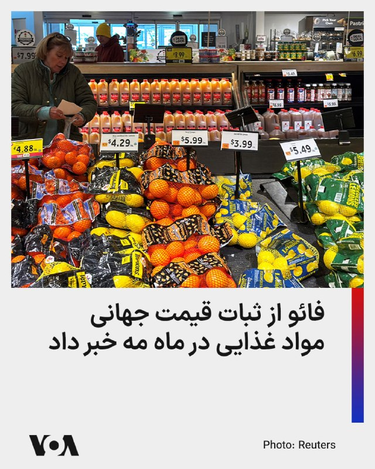

به رغم انسداد تنگه هرمز توسط جمهوری اسلامی و جهش قیمت حامل‌های انرژی و کودهای شیمیایی، قیمت جهانی مواد غذایی در ماه گذشته تغییر چندانی نسبت به ماه آوریل نکرده است.

سازمان خواربار و کشاورزی ملل متحد می‌گوید قیمت غلات و شکر در ماه مه نسبت به آوریل مقداری رشد داشت، اما شاخص معیار قیمت جهانی کالاهای غذایی به خاطر کاهش قیمت روغن‌های گیاهی تغییری نکرد.

با این‌حال، قیمت مواد غذایی در ماه مه نسبت به ماه مشابه پارسال ۲.۹ درصد رشد کرده است. این رشد برای غلات پنج درصد بوده است.

افزایش نسبی قیمت مواد غذایی به خاطر انسداد تنگه هرمز توسط جمهوری اسلامی در حالی است که ایران یکی از بزرگترین واردکننده‌های مواد غذایی است و سالانه ۱۷ میلیون تن غلات وارد می‌کند. طبق گزارش‌های رسمی، قیمت مواد غذایی در ایران طی ماه گذشته نسبت به اردیبهشت پارسال ۱۳۰ درصد جهش کرده است.
@FarsiVOA

## FarsiVOA — post 220229

🔺صادرات نفتی آمریکا بیش از دو برابر شد

◾️اداره اطلاعات انرژی آمریکا از جهش صادرات خالص نفت خام و محصولات نفتی آمریکا به ۵ میلیون و ۸۰۰ هزار بشکه در روز طی ماه گذشته خبر داد که بیش از دو برابر سطح سال ۲۰۲۵ است.

◾️این رقم در سال گذشته بطور متوسط ۲.۸ میلیون بشکه در روز بود.

◾️ایالات متحده طی ماه‌های گذشته برای کاهش تاثیر انسداد تنگه هرمز توسط جمهوری اسلامی بر بازارهای انرژی، هم تولید نفت خود را افزایش داده و هم بخشی از ذخایر استراتژیک نفت خود را راهی بازارها کرده است.

◾️این گزارش می‌افزاید انتظار می‌رود در مجموع طی سال جاری، متوسط صادرات خالص نفت و محصولات نفتی آمریکا به ۴.۲ میلیون بشکه برسد که ۵۰ درصد بیشتر از سال ۲۰۲۵ خواهد بود.

⬇️ بیشتر بخوانید:
https://ir.voanews.com/a/8159292.html

## DW_Farsi — post 125776

🔶 ایران؛ کوچکتر شدن سفره‌ها علیرغم افزایش دستمزدها

🔺 گزارشی از دانیال عمری

در پی تداوم جنگ و فشارهای اقتصادی، شرایط زندگی در ایران به‌مراتب دشوارتر شده است. مقام‌های دولتی می‌گویند افزایش دستمزدها و اجرای طرح کالابرگ برای حمایت از خانوارهای کم‌درآمد طراحی شده، اما بسیاری از ایرانیان معتقدند این اقدامات از سرعت رشد قیمت‌ها عقب مانده است. از نگاه آن‌ها، مسئله دیگر فقط تورم نیست، بلکه شکاف روزافزون میان درآمد اسمی و قدرت خرید واقعی است؛ شکافی که جنگ نیز آن را عمیق‌تر کرده است.

برای بسیاری از خانواده‌ها، ملموس‌ترین نشانه بحران نه نرخ رسمی تورم، بلکه سرعت تغییر قیمت کالاهای روزمره است.

یکی از ساکنان تهران به دویچه‌وله گفت: «برنجی که ۱۵ روز قبل کیلویی ۲۷۵ هزار تومان خریده بود، هنگام خرید مجدد به ۳۰۰ هزار تومان رسیده است. بستنی لیوانی هم که یک هفته پیش ۴۰ هزار تومان قیمت داشت، اکنون ۵۰ هزار تومان شده است.» به گفته او، قیمت‌ها هفته به هفته بالا می‌روند، در حالی که حقوق‌ها فقط سالی یک‌بار افزایش پیدا می‌کنند و همان افزایش نیز حتی با نرخ تورم برابری نمی‌کند.

این گلایه، هسته اصلی نارضایتی عمومی را نشان می‌دهد. مردم اقتصاد را نه از طریق آمارهای رسمی، بلکه هنگام خرید روزانه تجربه می‌کنند. به همین دلیل، حتی افزایش قابل توجه حقوق روی کاغذ نیز زمانی که قیمت‌ها هر هفته تغییر می‌کنند، تأثیر چندانی بر زندگی آن‌ها ندارد.

آرزو کریمی، تحلیلگر اقتصادی ساکن لندن، به دویچه‌وله گفت: «هزینه تامین حداقل کالری مورد نیاز روزانه یک نفر اکنون از ۷ میلیون تومان فراتر رفته است.» به باور او، این یعنی فقط هزینه غذا می‌تواند بیش از ۷۰ درصد درآمد یک خانوار سه‌نفره را مصرف کند و عملاً پولی برای اجاره، درمان یا آموزش باقی نگذارد.

📌 برای دسترسی کامل به گزارش به وبسایت دویچه‌وله فارسی مراجعه کنید.
@dw_farsi

## DW_Farsi — post 125775

🔶 "اسرائیل در صورت لزوم به‌تنهایی با ایران مقابله می‌کند"

به گزارش شبکه خبری تلویزیونی "آی۲۴ نیوز" بنیامین نتانیاهو ابراز آمادگی کرده که در صورت لزوم به تنهایی و بدون پشتیبانی نظامی آمریکا دست به مقابله نظامی با جمهوری اسلامی بزند.

این شبکه گزارش خود را با استناد به اظهارات نخست‌وزیر اسرائیل در یک نشست کابینه منتشر کرده است. به گزارش آی۲۴ نیوز نتانیاهو در این نشست تصریح کرد: «ممکن است ما در شرایطی قرار گیریم که مجبور شویم به تنهایی و بدون پشتیبانی ایالات متحده با ایران روبرو شود با تمامی بهایی که ممکن است در ازای آن بپردازیم: هزینه‌های نظامی و انزوای بین‌المللی.»

نخست‌وزیر اسرائیل در ادامه اظهارات خود تأکید کرد که این کشور خواهان بروز چنین وضعیتی نیست، اما بر این امر واقف است که چنین وضعیتی ممکن است رخ دهد و کار به چنین جایی بکشد.

اظهارات نتانیاهو در حالی است که ترامپ تا کنون نخست‌وزیر اسرائیل را فراخوانده تا از انجام اقدامات یکجانبه و تک‌روی پرهیز کند. علیرغم حملات متقابل روزهای اخیر واشنگتن همچنان به تلاش‌های دیپلماتیک برای رسیدن به توافق با جمهوری اسلامی تأکید دارد.

@dw_farsi

## DW_Farsi — post 125765

📸 نتایج نظرسنجی از وضعیت رضایت مردم در ۴۰ شهر بزرگ آلمان

رضایت ساکنان شهر ارفورت، پایتخت ایالت تورینگن از هر شهر بزرگ دیگری در آلمان بیشتر است. این نتیجه تحقیقات "اطلس رضایت" است که توسط دانشگاه فرایبورگ و موسسه نظرسنجی آلنسباخ تهیه شده است.

ارفورت به دلیل مزایایی مانند اجاره‌بهای نسبتاً پایین، کیفیت بالای محیط زیست و وضعیت اقتصادی نسبتاً مطلوب امتیاز بالایی کسب کرده است. همچنین تعداد دریافت‌کنندگان کمک‌های اجتماعی در این شهر از پایین‌ترین ارقام در سطح کشور است.

ارفورت با جهشی چشمگیر از رتبه ششم در "اطلس رضایت ۲۰۲۵" به رتبه نخست رسیده است. در مقابل، قهرمان سال گذشته یعنی کاسل به‌طور محسوسی سقوط کرده و تنها در رتبه سیزدهم قرار گرفته است.

با وجود رفاه اقتصادی، زیرساخت‌های مناسب و سایر شاخص‌های عینی کیفیت زندگی، شهرهایی مانند مونیخ و کارلسروهه در این رتبه‌بندی عملکردی پایین‌تر از حد انتظار داشته‌اند.

برای تهیه این رتبه‌بندی، از ساکنان ۴۰ شهر بزرگ با بیش از ۲۰۰ هزار نفر جمعیت نظرسنجی شده است. در مجموع، بین ژانویه ۲۰۲۳ تا آوریل ۲۰۲۶ حدود ۲۳ هزار و ۳۰۰ نفر در این نظرسنجی شرکت کرده‌اند.
@dw_farsi

## DW_Farsi — post 125764

🔶 رأی مثبت شورای امنیت به بررسی روند بازگشت تحریم‌های ایران

شورای امنیت سازمان ملل متحد شامگاه سه‌شنبه ۹ ژوئن (۱۹ خرداد) در نشستی با ۱۱ رأی موافق، بررسی روند بازگشت‌ تحریم‌ها علیه ایران را در پی فعال‌سازی مکانیسم ماشه تصویب کرد.

در این رأی‌گیری روسیه و چین به این قطعنامه رأی منفی و پاکستان و سومالی رأی‌ ممتنع دادند. این نشست با اختلاف نظر فرانسه، بریتانیا و ایالات متحده از یک سو و چین و روسیه از سوی دیگر، بر سر فعال‌شدن مکانیسم ماشه و بازگشت تحریم‌ها علیه ایران همراه بود.

روسیه و چین بر این نظر بودند که مکانیسم ماشه فعال نشده است، در حالی‌که فرانسه، ایالات متحده و آمریکا تأکید کردند این مکانیسم عملا فعال شده است و تحریم‌ها علیه ایران مجددا برقرار شده‌اند.

نماینده روسیه پیش از آغاز نشست شورای امنیت اظهار داشت که مکانیسم ماشه "به دلایل مختلف" فعال نشده است و نه "تحریف‌های عمدی" و نه "موضع نادرست و غیرقانونی رهبری دبیرخانه سازمان ملل" در این‌باره اهمیتی ندارند. واسیلی نبنزیا با تأکید بر این‌که هیچ مبنایی برای برگزاری نشست توجیهی کمیته ۱۷۳۷ وجود ندارد، خواستار رأی‌گیری شورای امنیت درباره برگزاری جلسه روز سه‌شنبه شد.

@dw_farsi

## DW_Farsi — post 125763

🔶 ژوزه مورینیو؛ وداع با بنفیکا و آغاز فصلی تازه با رئال مادرید

ژوزه مورینیو، ستاره پرآوازه پرتغالی از فصل آتی سرمربی‌گیری تیم رئال مادرید را بر عهده خواهد داشت. این خبر را باشگاه بنفیکا لیسبون روز چهارشنبه ۱۰ ژوئن اعلام کرد؛ باشگاهی که مورینو تا کنون سرمربی آن بوده است.

بنفیکا لیسبون با انتشار پیامی در شبکه ایکس ضمن قدردانی از همکاری با مورینیو اعلام کرد، رئال مادرید قصد به خدمت درآوردن او در ازای ۱۵ میلیون یورو را داشته و مورینیو نیز با این انتقال موافقت کرده است.

گمانه‌زنی‌ها در مورد احتمال فصل تازه همکاری مورینیو با رئال مادرید در اواخر ماه مه از سوی رسانه‌های ورزشی مطرح شده بود. این گمانه‌زنی‌ها پس از آنکه فلورنتینو پرز در مقام خود به عنوان رئیس رئال ابقا شد، بالا گرفت. او که از طرفداران مورینیو محسوب می‌شود، توانسته بود ۶۵ درصد آراء اعضای باشگاه را به دست آورد.

رئال مادرید با به خدمت گرفتن سرمربی باتجربه‌ای چون ژوزه مورینیو امیدوار است که از تکرار فصل ناموفق گذشته جلوگیری کند؛ فصلی که دستاوردی درخور توجه برای این باشگاه نداشت.

@dw_farsi

## DW_Farsi — post 125762

  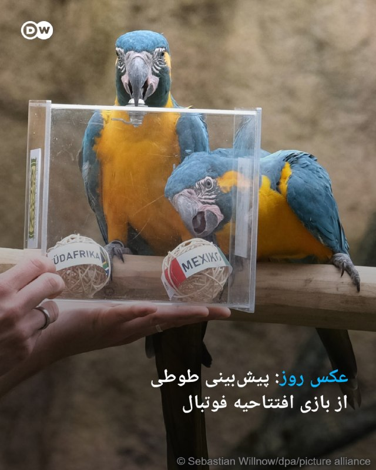

📸 عکس روز: پیش‌بینی طوطی از بازی افتتاحیه فوتبال

در آستانه آغاز جام جهانی، تب فوتبال داغ شده و بازار پیش‌بینی‌ها به راه افتاده است؛ این پیش‌بینی‌ها تنها از طرف انسان‌ها صورت نمی‌گیرد. در باغ وحش شهر لایپزیگ از طوطی‌ها خواسته شد تا نتیجه دیدار افتتاحیه بین مکزیک و آفریقای جنوبی را پیش‌بینی کنند و طوطی دم‌کوتاه با منقارش لوگوی مکزیک را برداشت. طوطی‌های دم‌کوتاه به شدت در معرض انقراض هستند و تعدادی از آنها عمدتا در زادگاه‌شان بولیوی دیده می‌شوند.

@dw_farsi

## DW_Farsi — post 125761

🔶 تشدید ناآرامی‌های ضد مهاجرتی در بلفاست در پی حمله با چاقو

پس از انتشار ویدئویی از یک حمله وحشیانه با چاقو در شهر بلفاست، پایتخت ایرلند شمالی، روز سه‌شنبه ۹ ژوئن (۱۹ خرداد) چندین شهر در بریتانیا شاهد اعتراضاتی خشونت‌بار بود. این اعتراضات پس از آن رخ داد که یک مرد ۳۰ ساله سودانی به تلاش برای قتل، حمل سلاح سرد در مکان عمومی و تهدید به قتل متهم شد. او قرار است روز چهارشنبه در دادگاه بدوی بلفاست مقابل قاضی حاضر شود.

قربانی این حمله که شامگاه دوشنبه رخ داد، مردی حدودا ۴۰ ساله است که بنا بر گزارش‌ها از ناحیه دو چشم به شدت آسیب دیده و صورت و کمر او دچار زخم‌های عمیقی شده است. تصاویر ویدئویی نشان می‌دهند که به هنگام وقوع این حمله چند عابر تلاش کردند تا قبل از رسیدن پلیس مهاجم اهل سودان را متوقف کنند که به گفته مقامات پلیس‌، این اقدام نقش مؤثری در نجات جان قربانی داشته است.

در یک ویدئوی منتشرشده از این واقعه دیده می‌شود که مهاجم وسط خیابان روی این مرد که بدنش سراسر به خون آغشته شده نشسته و با چاقو در حال وارد آوردن ضرباتی محکم و عمیق به اوست. در این تصاویر دیده می‌شود که پس از چند لحظه چند عابر مرد به مهاجم نزدیک شده و سپس با هجوم به سمتش تلاش می‌کنند تا او را از قربانی جدا کنند.

@dw_farsi

## DW_Farsi — post 125760

  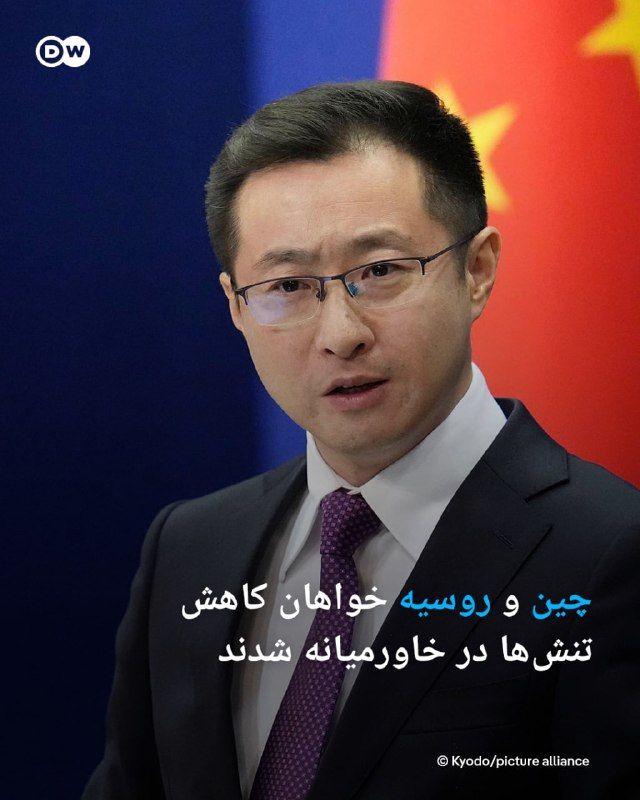

🔶 چین و روسیه خواهان کاهش تنش‌ها در خاورمیانه شدند

چین و روسیه با توجه به بروز دوباره حملات متقابل میان ایران و آمریکا طرف‌های درگیری را به "خویشتن‌داری و خودداری از تشدید تنش‌ها" فراخوانده و از آن‌ها خواستند تا برای کاهش بحران دست به "اقداماتی عملی" بزنند.

لین جیان، سخنگوی وزارت خارجه چین روز چهارشنبه ۱۰ ژوئن (۲۰ خرداد) در نشستی خبری تصریح کرد، "تمامی طرف‌های درگیر باید آرامش خود را حفظ کنند، از خود خویشتن‌داری نشان دهند، از تشدید درگیری و وخامت اوضاع خودداری کنند و با اتخاذ اقدامات ملموس، به کاهش تنش‌ها و آرام کردن اوضاع کمک کنند".

از سوی دیگر ماریا زاخارووا، سخنگوی وزارت امور خارجه روسیه نیز امروز چهارشنبه گفت، مسکو از تهران و واشنگتن می‌خواهد که از خود خویشتن‌داری نشان دهند.

او اضافه کرد: «ما از طرفین می‌خواهیم که از خود خویشتن‌داری نشان دهند و حملات نظامی را فورا متوقف کنند.» سخنگوی وزارت خارجه روسیه حمله به زیرساخت‌های غیر نظامی را "کاملاً غیر قابل قبول" خواند.

@dw_farsi

## DW_Farsi — post 125759

  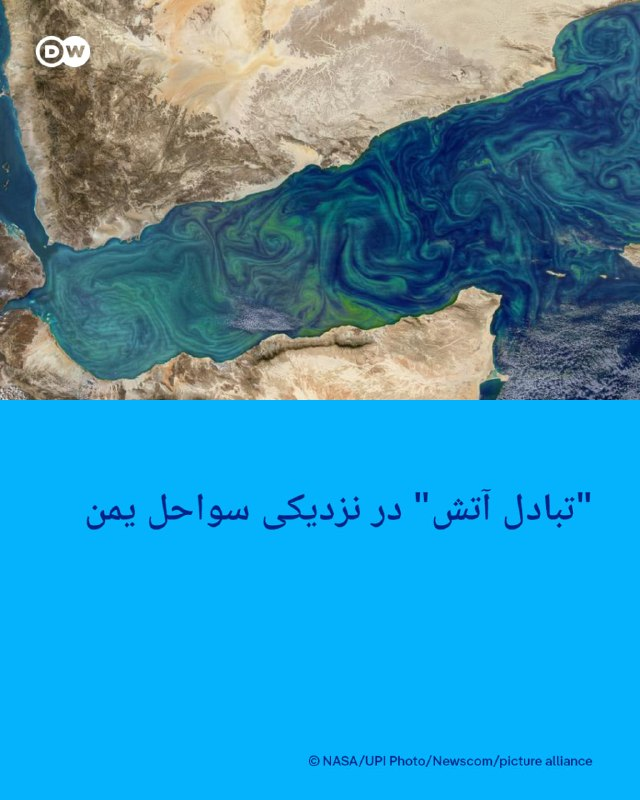

🔶 "تبادل آتش" در نزدیکی سواحل یمن

سازمان عملیات تجاری دریایی بریتانیا (UKMTO) روز چهارشنبه ۱۰ ژوئن (۲۰ خرداد) خبر داد که "در نزدیکی سواحل یمن میان یک کشتی باری و یک شناور حامل افراد مسلح تبادل آتش روی داده است".

به گزارش این نهاد، کشتی باری مزبور در ۸۸ مایل دریایی (حدود ۱۶۳ کیلومتری) جنوب غرب بلحاف یمن با یک شناور حامل ۶ فرد مسلح روبرو شد. این محدوده در نزدیکی سواحل جنوبی یمن در مسیر دریایی خلیج عدن و دریای عرب قرار دارد.

سازمان عملیات تجاری دریایی بریتانیا گزارش داد که میان تیم امنیتی مستقر در کشتی باری و سرنشینان مسلح این شناور کوچک تبادل آتش صورت گرفت، اما شناور مزبور پس از درگیری مسیر خود را تغییر داده از محل وقوع حادثه دور شده است.

این سازمان کشتی‌های تجاری را فراخواند تا در هنگام تردد در این مسیر احتیاط را رعایت کنند.

@dw_farsi

## DW_Farsi — post 125758

  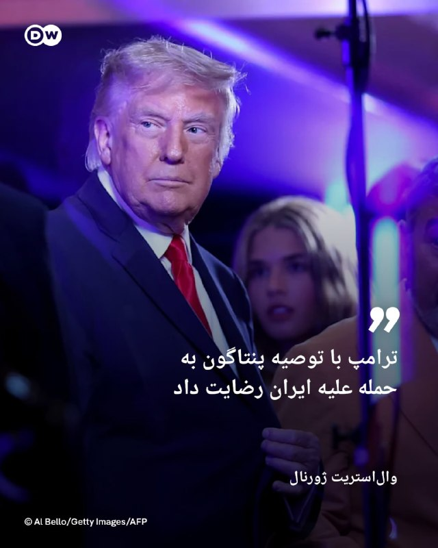

🔶 وال‌استریت ژورنال: ترامپ با توصیه پنتاگون به حمله علیه ایران رضایت داد

به نوشته نشریه وال‌استریت ژورنال، دونالد ترامپ درباره ضرورت پاسخ نظامی به جمهوری اسلامی پس از سقوط بالگرد آپاچی ارتش آمریکا نخست قانع نشده بود، اما نظرش را پس از دریافت گزارش و توصیه‌های پیت هگست، وزیر دفاع و دن کین، رئیس ستاد مشترک ارتش آمریکا، تغییر داد. رئیس جمهور آمریکا پیشتر این مسئله را کم‌اهمیت جلوه داده و گفته بود که این مسئله "اتفاق بزرگی" نیست.

فرماندهی مرکزی نیروهای آمریکا (سنتکام) بامداد روز چهارشنبه ۱۰ ژوئن با انتشار بیانیه‌ای رسمی اعلام کرد که حملات تلافی‌جویانه و تکمیلی نیروهای ارتش ایالات متحده علیه مواضعی در ایران به پایان رسیده است. به گزارش سنتکام، جنگنده‌های نیروی هوایی و نیروی دریایی ایالات متحده "با استفاده از مهمات هوشمند و دقیق، پدافند هوایی، ایستگاه‌های کنترل زمینی و رادارهای نظارتی ایران را در نزدیکی تنگه هرمز هدف قرار دادند".

جمهوری اسلامی نیز در تلافی به این حملات، پایگاه‌های آمریکا در شماری از کشورهای منطقه از جمله کویت، اردن و بحرین را مورد حمله قرار داد.

@dw_farsi

## Persian_Trend_Official — post 16468

  <a href="telegram/content/Persian_Trend_Official_16468_1781094106.webm" target="_blank">🎬 Download video</a>

ترامپ: ایران در اشتباه خود، هلی‌کوپتر ما را سرنگون کرد، مثل معجزه بود که خلبانان ما کشته نشدند و زنده ماندند.

هنوز کارم با ایران تمام نشده است. ما 55 درصد از آنچه ایران در طول آتش‌بس بازسازی کرده بود را نابود کردیم.

📝 Amir

📌 @persian_trend_official
پرشین ترند | متفاوت‌ترین کانال نظامی

## Persian_Trend_Official — post 16467

یک منبع مطلع به i24NEWS گفت: رئیس‌جمهور ترامپ دیشب با نخست‌وزیر نتانیاهو گفتگو کرد و او را در جریان حمله احتمالی شب گذشته قرار داد.

این دو همچنین درباره موضوعات دیگری مرتبط با مذاکرات با ایران بحث کردند. در آمریکا از وضعیت مذاکرات ناامید شده‌اند و صبرشان رو به پایان است.

📝 Amir

📌 @persian_trend_official
پرشین ترند | متفاوت‌ترین کانال نظامی

## Persian_Trend_Official — post 16465

  <a href="telegram/content/Persian_Trend_Official_16465_1781094107.mp4" target="_blank">🎬 Download video</a>

حمله پهپادی به صیدا و کشته شدن دو لبنانی

منابع لبنانی گزارش دادند که در حمله پهپادی اسرائیل به خودرویی در شهر صیدا در جنوب لبنان دو لبنانی احتمالا از اعضای حزب‌الله کشته شدند.

📝 Amir

📌 @persian_trend_official
پرشین ترند | متفاوت‌ترین کانال نظامی

## Persian_Trend_Official — post 16464

  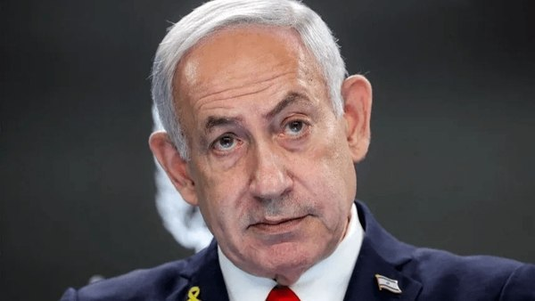

لیکود نامزدی نتانیاهو برای انتخابات آینده را اعلام کرد.

حزب لیکود اعلام کرد که نتانیاهو ریاست این حزب را برعهده خواهد داشت و در انتخابات پارلمانی آینده اسراییل نامزد خواهد شد.

📝 Amir

📌 @persian_trend_official
پرشین ترند | متفاوت‌ترین کانال نظامی

## Persian_Trend_Official — post 16463

اردوغان، رئیس جمهور ترکیه: امنیت ترکیه نه تنها از هاتای، بلکه از حلب، دمشق و بیروت نیز آغاز می‌شود! ما هیچ گونه عمل انجام شده‌ای را در کشورهای برادر خود تحمل نخواهیم کرد و از تجاوز به آنها چشم‌پوشی نخواهیم کرد. 📝 Amir 📌 @persian_trend_official پرشین ترند…

## Persian_Trend_Official — post 16462

  <a href="telegram/content/Persian_Trend_Official_16462_1781094109.webm" target="_blank">🎬 Download video</a>

ترامپ: رسانه‌های به‌اصطلاح "اخبار جعلی" حاضر نیستند گزارش دهند که محاصره دریایی نیروی دریایی آمریکا تا چه اندازه مؤثر بوده است؛ موفق‌ترین محاصره دریایی در تاریخ جنگ‌های دریایی.

هیچ‌چیز از این محاصره عبور نمی‌کند، مگر آنچه خودمان بخواهیم. این یک دیوار فولادی است! ایران عملاً هیچ کسب‌وکاری انجام نمی‌دهد، قادر به پرداخت حقوق نیروهای نظامی یا سایر هزینه‌های خود نیست و به‌سرعت در حال تبدیل شدن به یک کشور شکست‌خورده است!

البته نفت زیادی هم در حال خارج شدن از کشور است. الحمدلله!

📝 Amir

📌 @persian_trend_official
پرشین ترند | متفاوت‌ترین کانال نظامی

## Persian_Trend_Official — post 16461

  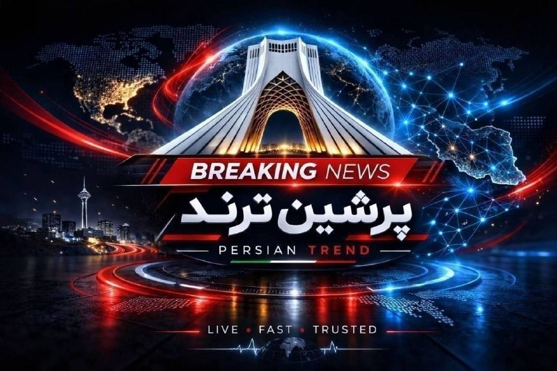

ترامپ به فاکس نیوز گفت که در آستانه دستور حملات جدید علیه زیرساخت ها انرژی و پل های ایران است.

📝 Amir

📌 @persian_trend_official
پرشین ترند | متفاوت‌ترین کانال نظامی

## Persian_Trend_Official — post 16460

  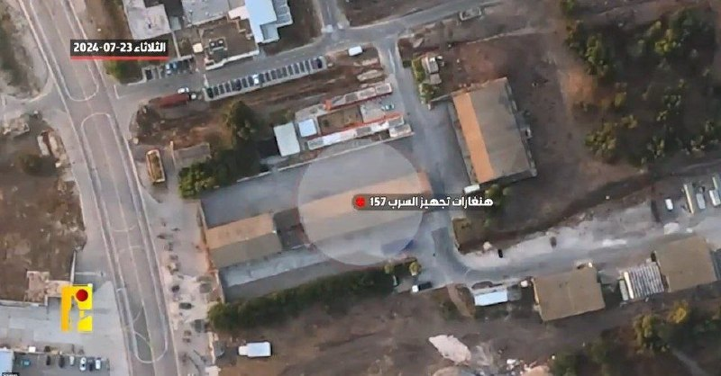

تصویری واضح تر از سوله منهدم شده در پایگاه رامات دیوید 📝 Amir 📌 @persian_trend_official پرشین ترند | متفاوت‌ترین کانال نظامی

## Persian_Trend_Official — post 16459

  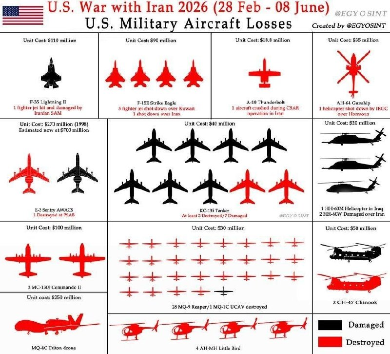

🔴 آمار ادعایی به‌روز شده از تلفات هوایی ارتش آمریکا در جنگ با ایران

اینفوگرافی منتشرشده مدعی است که از آغاز درگیری‌ها در ۲۸ فوریه تا ۸ ژوئن ۲۰۲۶، ارتش آمریکا بخشی از ناوگان هوایی خود را در منطقه از دست داده یا آسیب دیده است.

بر اساس این ادعاها:

🔹 ۱ فروند F-35 آسیب دیده
🔹 ۴ فروند F-15E سرنگون شده
🔹 ۱ فروند A-10 از دست رفته
🔹 ۱ فروند بالگرد AH-64 سرنگون شده
🔹 ۱ فروند هواپیمای آواکس E-3 منهدم شده
🔹 دست‌کم ۲ فروند KC-135 منهدم و ۷ فروند دیگر آسیب دیده‌اند
🔹 ۲ فروند MC-130J از بین رفته‌اند
🔹 ۱ فروند پهپاد MQ-4C Triton منهدم شده
🔹 ۲۸ فروند MQ-9 Reaper و یک پهپاد MQ-1C از دست رفته‌اند
🔹 چندین بالگرد HH-60 و CH-47 نیز آسیب دیده یا منهدم شده‌اند

⚠️ این آمار بر پایه ادعاهای منتشرشده در این اینفوگرافی است و تاکنون از سوی وزارت دفاع آمریکا به‌صورت رسمی تأیید نشده است.

👺 Phantom

📌 @persian_trend_official
پرشین ترند | متفاوت‌ترین کانال نظامی

## Persian_Trend_Official — post 16456

  

ترامپ: ارتش ایران کاملاً آشفته و بهم ریخته است. بخش زیادی از آن، مانند نیروی دریایی و هوایی آنها، دیگر حتی وجود ندارد. آنها کاملاً شکست خورده‌اند.

ایران فقط حرف می‌زند و عمل نمی‌کند. قلدر خاورمیانه مرده است!!! آنها برای مذاکره در مورد توافقی که برایشان عالی بود، خیلی وقت صرف کردند، حالا باید هزینه آن را بپردازند!!!

📝 Amir

📌 @persian_trend_official
پرشین ترند | متفاوت‌ترین کانال نظامی

## Persian_Trend_Official — post 16455

  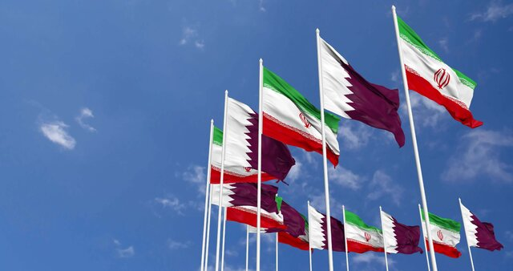

سفر یک هیات قطری به تهران

هیاتی از قطر برای گفت‌وگو و تبادل نظر درباره روابط دوجانبه و تحولات منطقه‌ای، امروز ظهر(چهارشنبه) وارد تهران شده است.

در جریان این سفر، علاوه بر مباحث دوجانبه و تحولات منطقه، راجع به آخرین تحولات مرتبط با روند دیپلماتیک برای خاتمه جنگ با آمریکا نیز بحث و رایزنی می‌شود.

📝 Amir

📌 @persian_trend_official
پرشین ترند | متفاوت‌ترین کانال نظامی

## Persian_Trend_Official — post 16454

  <a href="telegram/content/Persian_Trend_Official_16454_1781094114.webm" target="_blank">🎬 Download video</a>

👺Phantom

📌 @persian_trend_official
پرشین ترند | متفاوت‌ترین کانال نظامی

## Persian_Trend_Official — post 16453

  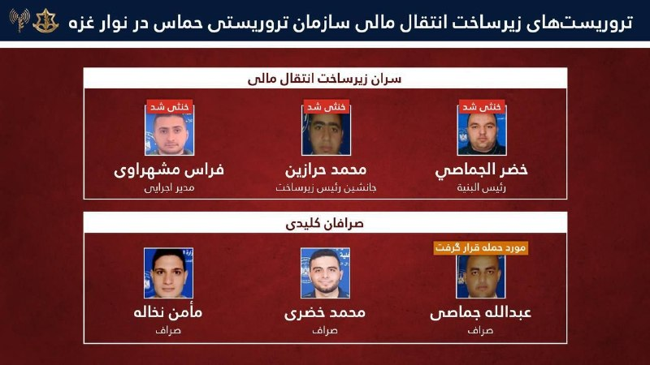

🔴 اسرائیل از کشته شدن مسئول شبکه مالی حماس در غزه خبر داد

ارتش اسرائیل و سازمان امنیت داخلی این کشور (شین‌بت) مدعی شدند در حمله‌ای به شمال نوار غزه، «خضر جماصی» مسئول شبکه انتقال مالی حماس و معاون او «محمد خرازین» را هدف قرار داده و کشته‌اند.

بر اساس بیانیه منتشرشده، این دو نفر از عوامل اصلی انتقال و توزیع منابع مالی حماس در نوار غزه بوده‌اند و چندین عضو دیگر این شبکه نیز در جریان حمله کشته شده‌اند.

اسرائیل می‌گوید این شبکه نقش مهمی در تأمین مالی فعالیت‌های نظامی حماس و انتقال منابع به شاخه‌های مختلف این گروه در غزه داشته است.

⚠️ حماس تاکنون به‌صورت رسمی این ادعا را تأیید یا رد نکرده است.

Phantom

📌 @persian_trend_official
پرشین ترند | متفاوت‌ترین کانال نظامی

## Persian_Trend_Official — post 16452

  <a href="telegram/content/Persian_Trend_Official_16452_1781094115.mp4" target="_blank">🎬 Download video</a>

به مدت چندثانیه در میانه پخش زنده شبکه خبر، کلیپی شبیه‌سازی از انفجار هسته‌ای منتشر شد

برخی کاربران در فضای مجازی هک شدن را گمانه‌زنی کردند؛ با این حال تا این لحظه رسانه صدا و سیما توضیح راجب این خطا نداده است.

👺Phantom

📌 @persian_trend_official
پرشین ترند | متفاوت‌ترین کانال نظامی

## Persian_Trend_Official — post 16451

  <a href="telegram/content/Persian_Trend_Official_16451_1781094118.mp4" target="_blank">🎬 Download video</a>

اردوغان، رئیس جمهور ترکیه: امنیت ترکیه نه تنها از هاتای، بلکه از حلب، دمشق و بیروت نیز آغاز می‌شود!

ما هیچ گونه عمل انجام شده‌ای را در کشورهای برادر خود تحمل نخواهیم کرد و از تجاوز به آنها چشم‌پوشی نخواهیم کرد.

📝 Amir

📌 @persian_trend_official
پرشین ترند | متفاوت‌ترین کانال نظامی

## Persian_Trend_Official — post 16450

  <a href="telegram/content/Persian_Trend_Official_16450_1781094121.mp4" target="_blank">🎬 Download video</a>

اردوغان، رئیس جمهور ترکیه: حملات نتانیاهو و شبکه جنایتکار او علیه سوریه و لبنان به نقطه‌ای رسیده است که نه تنها این دو کشور برادر، بلکه اکنون ترکیه را نیز تهدید می‌کند.

📝 Amir

📌 @persian_trend_official
پرشین ترند | متفاوت‌ترین کانال نظامی

## Persian_Trend_Official — post 16449

  <a href="telegram/content/Persian_Trend_Official_16449_1781094123.mp4" target="_blank">🎬 Download video</a>

سازمان عملیات تجارت دریایی بریتانیا از وقوع حادثه برای یک نفتکش در نزدیکی عمان خبر داد! سازمان عملیات تجارت دریایی بریتانیا (UKMTO) اعلام کرد که در فاصله 20 مایل دریایی شمال‌شرق صحار عمان، یک نفتکش دچار آتش‌سوزی در موتورخانه شده است. بر اساس این گزارش، این…

## Persian_Trend_Official — post 16448

  <a href="telegram/content/Persian_Trend_Official_16448_1781094125.mp4" target="_blank">🎬 Download video</a>

پزشکیان: شهادت فوز عظیمی است ولی اینکه دشمن بتواند به این راحتی فرماندهان ما را شهید کند به هیچ وجه قابل قبول نیست.

📝 Amir

📌 @persian_trend_official
پرشین ترند | متفاوت‌ترین کانال نظامی

## Persian_Trend_Official — post 16447

  <a href="telegram/content/Persian_Trend_Official_16447_1781094128.mp4" target="_blank">🎬 Download video</a>

پزشکیان: رهبر شهید هم تاکید داشتند که مسئله نه جنگ و نه صلح باید حل شود.

بچه های این مرز و بوم باید با امید و داشتن آینده روشن زندگی کنند و دولت باید بتواند طبق مسوولیتی که دارد طراحی لازم برای توانمند کردن بچه‌های این مرز و بوم در ساخت آینده کشور انجام دهد.

در جنگ و درگیری‌، مدیریت کردن کار ساده‌ای نیست و حتی بارها مقام معظم رهبری تاکید کرده بودند که مسئله نه جنگ، نه صلح باید حل شود.

صدا و سیما هرچند یک بخش از سخنان رهبر شهید را پخش می‌کند که مذاکره نمی‌کنیم ولی در همان موقع که خدمت ایشان رسیدیم، رهبری اجازه دادند گفتگو ادامه پیدا کند و در آخرین گفت‌وگوها تاکید داشتند که مسئله را حل کنیم.

ما باید از حالت نه جنگ نه صلح خارج شویم. البته جنگ به نفع کشور نیست اما قطعا اگر بخواهند به عزت ما، خاک ما و سرزمین ما تجاوز کنند، ما تسلیم نمی‌شویم.

باید با عزت راه را به گونه‌ای پیش ببریم که آینده کشور و سرزمین را از بحران‌ها و طوفان‌ها  نجات دهیم که راهکار آن همراهی و همکاری همه قشرها و قومیت‌ها و باور و اراده برای ساختن ایرانی سربلند است.

📝 Amir

📌 @persian_trend_official
پرشین ترند | متفاوت‌ترین کانال نظامی

## RadioFarda — post 158143

اردوغان: حملات اسرائیل به سوریه و لبنان برای ترکیه نیز تهدید است

🔸رجب طیب اردوغان، رئیس‌جمهور ترکیه، روز چهارشنبه ۲۰ خرداد گفت حملات اسرائیل به سوریه و لبنان به مرحله‌ای رسیده که ترکیه را نیز تهدید می‌کند و افزود «تجاوزگری» اسرائیل تهدیدی برای کل جهان است و باید متوقف شود.

🔸ترکیه، عضو ناتو، از سرسخت‌ترین منتقدان حملات اسرائیل به ایران، غزه و لبنان بوده و می‌گوید اسرائیل بزرگ‌ترین مانع صلح منطقه‌ای است. این کشور همه روابط تجاری با اسرائیل را متوقف کرده و خواستار اتخاذ تدابیری علیه آن در دادگاه‌های بین‌المللی شده است.

🔸اردوغان در پارلمان و در جمع نمایندگان حزب حاکم عدالت و توسعه گفت: «حملات (بنیامین) نتانیاهو و شبکهٔ قتل او به لبنان و سوریه، موضوع را به نقطه‌ای رسانده که ترکیه را نیز تهدید می‌کند».

🔸او افزود امنیت آنکارا با امنیت این دو کشور گره خورده است.

🔸رئیس‌جمهور ترکیه همچنین گفت اسرائیل در حال «تلاشی پنهان» برای بی‌ثبات کردن کشورهای آفریقایی و منطقه مدیترانه، از طریق دامن زدن به «آتش تفرقه» در جزیره قبرس است که از نظر قومی دچار شکاف است.

🔸اردوغان افزود: «این موجودیت‌های کوچک که جاه‌طلبی‌هایشان بسیار فراتر از اندازه‌شان است، سوار قایق شیطنت اسرائیل شده‌اند، نقش پیمانکاران صهیونیستی را پذیرفته‌اند و در شرق مدیترانه در پی رؤیاهای واهی هستند».

🔸 گزارش کامل را در وب‌سایت رادیوفردا بخوانید.

@RadioFarda

## RadioFarda — post 158142

  <a href="https://t.me/radiofarda/158142" target="_blank">📎 Download file</a>

📻بشنوید: ساعت ۱۴ با رادیوفردا،۲۰ خرداد ۱۴۰۵‌

@RadioFarda

## RadioFarda — post 158141

عربستان، با وجود جنگ ایران، دومین شرکت هواپیمایی خود را راه‌اندازی کرد

🔸عربستان سعودی علی‌رغم وضعیت بحرانی منطقه به‌دلیل جنگ ایران، دومین شرکت هواپیمایی ملی خود به نام «ریاض ایر» را راه‌اندازی کرد.

🔸خبرگزاری‌ها نوشته‌اند این شرکت هواپیمایی روز چهارشنبه، ۲۰ خرداد، با بیش از یک سال تأخیر، آغاز به کار کرد.

🔸این اقدام در حالی انجام شد که منطقهٔ خاورمیانه با مسائل امنیتی و همچنین آشفتگی‌های اقتصادی ناشی از جنگ روبه‌رو است. از دیگر چالش‌های پیش‌روی عربستان سعودی این است که در عین حال باید با شرکت‌های هواپیمایی باسابقهٔ خلیج فارس رقابت کند.

🔸به گزارش خبرگزاری فرانسه، با آغاز به کار این شرکت، بامداد چهارشنبه یک فروند بوئینگ ۷۸۷ دریم‌لاینر با رنگ‌بندی سفید و بنفش روشن، از ریاض به مقصد لندن پرواز کرد. این پرواز آغاز یکی از پروژه‌های شاخص عربستان برای کاهش وابستگی اقتصاد خود به نفت محسوب می‌شود.

🔸ریاض ایر، دومین شرکت هواپیمایی دولتی عربستان پس از سعودیا (مستقر در جده)، قرار است به تبدیل پایتخت عربستان به یک مرکز جهانی حمل‌ونقل هوایی کمک کند؛ مرکزی که بتواند با دبی، شلوغ‌ترین فرودگاه جهان از نظر مسافران بین‌المللی، رقابت کند.

🔸راه‌اندازی این شرکت که در ابتدا برای سال ۲۰۲۵ برنامه‌ریزی شده بود، به‌دلیل تأخیر در تحویل هواپیماها از سوی بوئینگ عقب افتاد. بوئینگ در سال‌های اخیر با مجموعه‌ای از مشکلات تولیدی و ایمنی مواجه بوده است.

🔸 گزارش کامل را در وب‌سایت رادیوفردا بخوانید.

@RadioFarda

## RadioFarda — post 158139

کافه فردا به وقت جام جهانی از پنجشنبه ساعت ۱۳:۰۵ به وقت ایران شروع میشه و میخوایم از شما بپرسیم که نظرتون در مورد این جام جهانی چیه؟ اصلا خبرهاشو پیگیری می‌کنید یا نه؟ و در مورد حضور تیم ملی جمهوری اسلامی ایران در این جام چه نظری دارید؟ لطفا ترجیحا صدای خودتونو زیر همین پست برامون بفرستید یا هم که برای ارسال پیام خصوصی از شناسه کافه فردا در تلگرام استفاده کنید. باشد که همگی رستگار شویم.

## RadioFarda — post 158138

🔸رئیس‌جمهور ایالات متحده روز چهارشنبه ۲۰ خرداد گفت که ایران برای رسیدن به توافقی که می‌توانست برایش بسیار خوب باشد بیش از حد تعلل کرد و حالا باید بهای آن را بپردازد. 🔸دونالد ترامپ در پیامی در شبکه اجتماعی خود، تروث سوشال، نوشت: «ارتش ایران کاملاً در وضعیت…

## RadioFarda — post 158136

🔸رئیس‌جمهور ایالات متحده روز چهارشنبه ۲۰ خرداد گفت که ایران برای رسیدن به توافقی که می‌توانست برایش بسیار خوب باشد بیش از حد تعلل کرد و حالا باید بهای آن را بپردازد.

🔸دونالد ترامپ در پیامی در شبکه اجتماعی خود، تروث سوشال، نوشت: «ارتش ایران کاملاً در وضعیت آشفته‌ای قرار دارد. بخش زیادی از آن، مانند نیروی دریایی و نیروی هوایی، عملاً دیگر وجود ندارد؛ آن‌ها کاملاً شکست خورده‌اند».

🔸او افزود: «ایران فقط حرف می‌زند و عمل نمی‌کند. قلدر خاورمیانه مُرده است!!! آن‌ها برای رسیدن به توافقی که می‌توانست برایشان بسیار خوب باشد بیش از حد تعلل کردند و حالا باید بهای آن را بپردازند!!!»

🔸دونالد ترامپ در این پیام خود توضیحی بیشتری دربارهٔ «پرداخت بها» و همچنین آیندهٔ مذاکرات جاری میان ایران و آمریکا نداد.

🔸او هنگام عملیات محدود بامداد چهارشنبه نیز گفته بود «به پاسخ قاطع اعتقاد دارم» و همزمان تأکید کرده بود که واشینگتن و تهران به یک توافق «بسیار خوب» نزدیک بوده‌اند. هرچند در ادامه اشاره کرده بود که احتمالاً این توافق همچنان در دسترس خواهد بود.

@RadioFarda

## RadioFarda — post 158135

سه آمریکایی و یک ایتالیایی، فضانوردان مأموریت آرتمیس-۳

🔸ناسا روز سه‌شنبه ۱۹ خرداد سه فضانورد آمریکایی و یک فضانورد ایتالیایی را به‌عنوان خدمهٔ مأموریت بعدی آرتمیس معرفی کرد.

🔸مأموریت جدید آرتمیس شامل نمایش اتصال فضاپیماها در مدار زمین در سال آینده خواهد بود و برای نخستین‌بار فرودگرهای ماهِ شرکت‌های اسپیس‌ایکس متعلق به ایلان ماسک و بلو اوریجین متعلق به جف بزوس را در فضا آزمایش می‌کند.

🔸جرد آیزاکمن، مدیر ناسا، در مراسمی در هیوستون، آندره داگلاس، فرانک روبیو و رندی برزنیک از آمریکا و لوکا پارمیتانو از آژانس فضایی اروپا را به‌عنوان خدمهٔ آرتمیس-۳ معرفی کرد. این مأموریت قرار است اواخر سال ۲۰۲۷ انجام شود، هرچند تاریخ دقیقی برای آن اعلام نشده است.

🔸جرمی پارسونز، مدیر برنامهٔ آرتمیس ناسا، در این مراسم گفت: «آرتمیس-۳ یک عملیات چندپرتابهٔ بسیار هیجان‌انگیز، پیچیده و با هماهنگی بالا است که در یک بازهٔ زمانی کوتاه و با سه فروند از قدرتمندترین موشک‌های جهان انجام خواهد شد».

🔸برزنیک ۵۸ ساله، خلبان آزمایشی سابق و کهنه‌کار سه مأموریت فضایی، به‌عنوان فرمانده مأموریت انتخاب شده است. این خدمه همچنین شامل یک رکورددار فضایی، یک تازه‌وارد به فضا و نخستین شهروند اروپایی در یک مأموریت آرتمیس است.

🔸 گزارش کامل را در وب‌سایت رادیوفردا بخوانید.

@RadioFarda

## RadioFarda — post 158134

🔸مسعود پزشکیان، رئیس‌جمهور ایران، روز چهارشنبه ۲۰ خرداد در مورد «اختلاف و تفرقه در داخل کشور» هشدار داد و گفت «بخشی از اختلاف‌ها فعلاً به هر شکل ممکن نباید مطرح شود». 🔸پزشکیان ایجاد اختلاف و تفرقه را نقشه «دشمن» خواند و با اشاره به حملات نظامی آمریکا و اسرائیل…

## RadioFarda — post 158133

  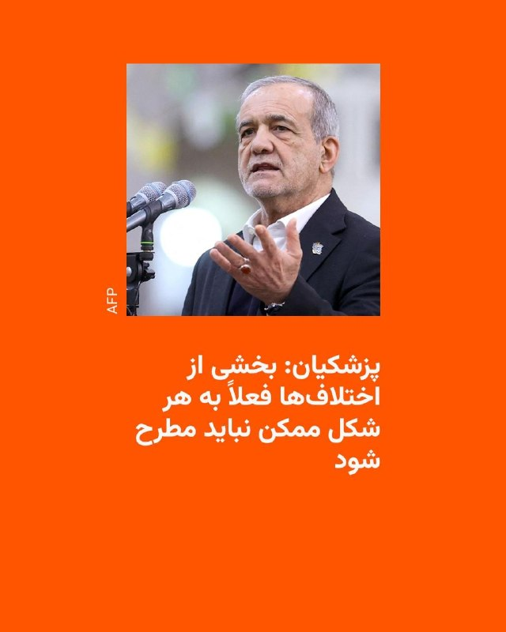

🔸مسعود پزشکیان، رئیس‌جمهور ایران، روز چهارشنبه ۲۰ خرداد در مورد «اختلاف و تفرقه در داخل کشور» هشدار داد و گفت «بخشی از اختلاف‌ها فعلاً به هر شکل ممکن نباید مطرح شود».

🔸پزشکیان ایجاد اختلاف و تفرقه را نقشه «دشمن» خواند و با اشاره به حملات نظامی آمریکا و اسرائیل ادعا کرد «دشمن از راه‌های دیگر نتوانست به هدف خود برسد و اکنون می‌خواهد از این مسیر اقدام کند».

🔸رئیس‌جمهور ایران همچنین با اشاره به وضعیت اقتصادی کشور گفت: «ما اکنون در تحریم هستیم، مسیرهای ما را بسته‌اند و امتحان سختی در پیش داریم.» او با اذعان به وجود «کسری‌ها، ناترازی‌ها و مشکلات موجود» گفت دولت او تلاش می‌کند مشکلات و نارسایی‌ها فشار بیشتری بر مردم وارد نکند.

@RadioFarda

## RadioFarda — post 158132

مدیر صنایع دفاعی آمریکا: عصر پهپادها در حال تغییر دادن شکل جنگ است

🔸بیش از سه ماه درگیری در منطقهٔ خلیج فارس، اهمیت روزافزون سامانه‌های تسلیحاتی ارزان‌قیمت و تولید انبوه، به‌ویژه پهپادها و مهمات، را برجسته کرده و در عین حال محدودیت‌های اتکا به فناوری‌های دفاعی گران‌قیمت برای مقابله با آن‌ها را آشکار ساخته است.

🔸این موضوع را ناتان دیلر، از مدیران شرکت فناوری دفاعی «صنایع مچ»، مطرح کرده است. دیلر که سرهنگ بازنشستهٔ نیروی هوایی آمریکا نیز هست، در مصاحبه‌ای در ۱۸ خرداد با رادیو اروپای آزاد/رادیو آزادی گفت این درگیری نشان داده که کشورهای متحد باید فوراً زنجیره‌های تأمین صنعتی-نظامی خود را تقویت کرده و تاب‌آوری تولیدی بیشتری ایجاد کنند.

🔸او در این زمینه به درس‌هایی که از جنگ روسیه در اوکراین به دست آمده اشاره کرد.

🔸دیلر گفت: «وقتی می‌بینیم با ابزارهای بسیار گران‌قیمت با پهپادها و مهمات ارزان‌قیمت مقابله می‌شود، این درسی است که نمی‌توانیم در یادگیری آن تأخیر کنیم».

🔸او که در دورهٔ نخست ریاست‌جمهوری دونالد ترامپ به‌عنوان معاون بخش هوانوردی در دفتر سیاست‌گذاری علم و فناوری کاخ سفید فعالیت داشته، افزود: به‌عنوان یک خلبان سابق جنگنده، توانمندی‌های سنتی نظامی همچنان ضروری هستند، اما فناوری‌های جدید می‌توانستند هزینه و مدت درگیری ایران و اسرائیل را کاهش داده و بازدارندگی را سریع‌تر برقرار کنند.

🔸او گفت: «دو دهه طول کشیده تا این رویکرد به جنگ و این نگاه به تولید انبوه نادیده گرفته شود»، و افزود که ابتکارات اخیر دولت آمریکا با حمایت کنگره، به تقویت بازدارندگی در آینده کمک می‌کند.

🔸 گزارش کامل را در وب‌سایت رادیوفردا بخوانید.

@RadioFarda

## RadioFarda — post 158131

چین، در سرمایه‌گذاری در آسیای مرکزی، روسیه را پشت سر گذاشت

🔸داده‌های بانک توسعه اوراسیا نشان می‌دهد چین از روسیه پیشی گرفته و به بزرگ‌ترین سرمایه‌گذار مستقیم خارجی در آسیای مرکزی تبدیل شده است؛ منطقه‌ای سرشار از منابع طبیعی که سال‌ها در حوزهٔ نفوذ مسکو قرار داشت، اما اکنون بیش از پیش به کانون توجه پکن تبدیل شده است.

🔸بانک توسعهٔ اوراسیا در گزارشی که در ماه دسامبر منتشر کرد، اعلام کرد مجموع سرمایه‌گذاری مستقیم چین در آسیای مرکزی طی ۱۰ سال گذشته تا سال ۲۰۲۵ از ۳۵ میلیارد دلار فراتر رفته است. این بانک که در سال ۲۰۰۶ از سوی روسیه و قزاقستان تأسیس شد، با هدف گسترش تجارت و همگرایی اقتصادی میان هفت جمهوری سابق شوروی فعالیت می‌کند.

🔸در مقابل، ولادیمیر پوتین، رئیس‌جمهور روسیه، در نشست منطقه‌ای ماه اکتبر گفت مجموع سرمایه‌گذاری مستقیم روسیه در آسیای مرکزی حدود ۲۰ میلیارد دلار است؛ رقمی که خود او آن را «نسبتاً ناچیز» توصیف کرد.

🔸سرمایه‌گذاری روسیه در آسیای مرکزی از سال ۲۰۲۲ به این سو کاهش یافته است. این کاهش سرمایه‌گذاری به هزینه‌های اقتصادی تهاجم نظامی این کشور به اوکراین و تحریم‌های غرب پس از آن نسبت داده می‌شود. اما در همین دوره، چین حضور اقتصادی خود را در منطقه گسترش داده است.

🔸 گزارش کامل را در وب‌سایت رادیوفردا بخوانید.

@RadioFarda

## RadioFarda — post 158130

حملات محدود آمریکا به جنوب ایران چرا انجام شد و پیامی داشت؟

🔸مقام‌های ارشد آمریکایی و کارشناسان امنیتی منطقه می‌گویند حملات آمریکا به سامانه‌های پدافند هوایی و راداری ایران بیشتر با هدف ارسال یک هشدار محدود به جمهوری اسلامی انجام شده است، نه به‌عنوان نخستین مرحله از یک عملیات نظامی گسترده‌تر.

🔸این حملات در بامداد چهارشنبه ۲۰ خرداد چندین سامانهٔ پدافند هوایی و راداری ایران را هدف قرار داد. یک مقام آمریکایی به رادیو اروپای آزاد/رادیو آزادی در همان ساعات حمله گفت این عملیات «در حال انجام» است و تأسیسات پدافند هوایی و راداری را هدف گرفته است.

🔸رسانه‌های جمهوری اسلامی ایران نیز از وقوع انفجار در چند نقطه استان هرمزگان، از جمله سیریک، بندرعباس، میناب و جزیره قشم خبر دادند.

🔸این حملات در مقطع حساسی از روابط آمریکا و ایران انجام شده است؛ زمانی که دولت دونالد ترامپ با وجود افزایش تنش‌های نظامی در خلیج فارس، همچنان در پی پیشبرد مذاکرات با تهران است.

🔸چندین مقام آمریکایی نیز در گفت‌وگو با خبرنگاران تأکید کردند که انتظار ندارند این اقدام نظامی به تلاش‌های دیپلماتیک جاری آسیب بزند یا روند مذاکرات را مختل کند.

🔸یکی از مقام‌های ارشد ایلات متحده گفت که دونالد ترامپ همچنان معتقد است دستیابی به توافق صلح با ایران امکان‌پذیر است. او گفت «در حال حاضر هیچ تغییری در وضعیت توافق ایجاد نشده» و توافق «همچنان نزدیک» است.

🔸 گزارش کامل را در وب‌سایت رادیوفردا بخوانید.

@RadioFarda

## RadioFarda — post 158129

  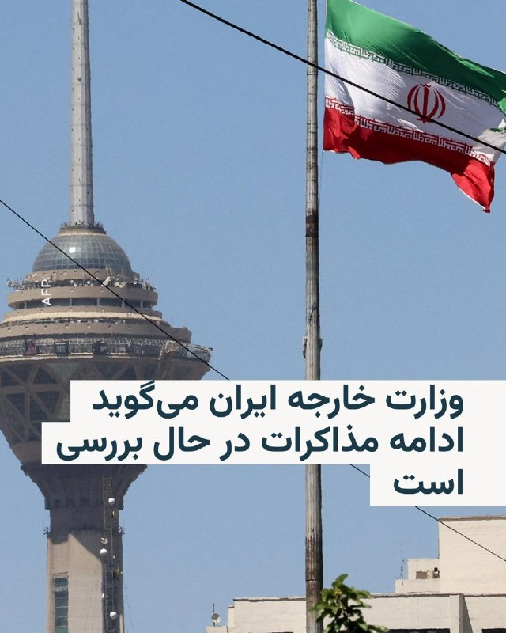

🔸سخنگوی وزارت خارجه ایران درباره تأثیر درگیری‌های نظامی اخیر بر مذاکرات با آمریکا گفت ««باید بررسی شود، دیپلماسی و میدان دو امر جدا از هم نبوده و در امتداد و عرض یکدیگر» هستند.

🔸اسماعیل بقائی روز چهارشنبه ۲۰ خرداد دربارهٔ آخرین وضعیت مذاکرات هم گفت: «با توجه به تحولات دیشب باید بررسی کنیم. روند دیپلماتیک در خلأ اتفاق نمی‌افتد و برای پیشبرد هر فرایند دیپلماتیکی نیازمند فضای حداقلی هستید تا بتوان روند جاری را پیش برد.»

🔸شب گذشته ارتش ایالات متحده، در واکنش به سرنگونی یک بالگرد آمریکایی در سواحل عمان، حملاتی را به جنوب ایران انجام داد و ایران نیز در واکنش به شلیک موشک به برخی کشورهای منطقه اقدام کرد.

🔸دونالد ترامپ که پیشتر بارها از نزدیک بودن توافق خبر داده بود، هنگام انجام عملیات آمریکا در جنوب ایران گفت: «ما توافقی بسیار خوب داشتیم و احتمالاً همچنان خواهیم داشت.»
@RadioFarda

## RadioFarda — post 158128

🔸فرمانده قرارگاه مرکزی خاتم‌الانبیاء از آن دسته حامیان حکومت که در تجمعات شبانه شرکت می‌کنند، خواست تا زمانی که مجتبی خامنه‌ای دستور جدیدی برای مردم صادر کند، همچنان به شرکت در این تجمعات حکومتی ادامه دهند. 🔸علی عبداللهی در بیانیه‌ای که روز چهارشنبه ۲۰ خرداد…

## RadioFarda — post 158127

  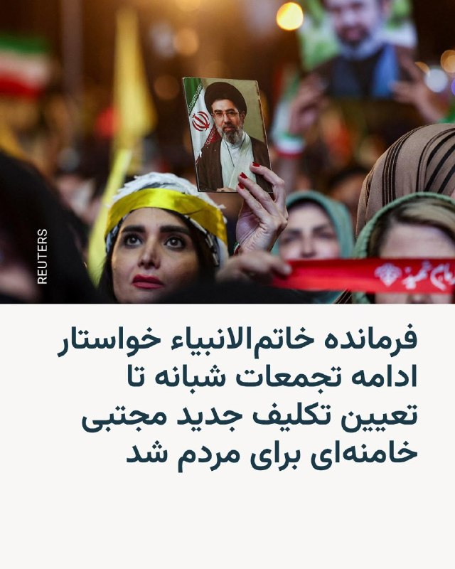

🔸فرمانده قرارگاه مرکزی خاتم‌الانبیاء از آن دسته حامیان حکومت که در تجمعات شبانه شرکت می‌کنند، خواست تا زمانی که مجتبی خامنه‌ای دستور جدیدی برای مردم صادر کند، همچنان به شرکت در این تجمعات حکومتی ادامه دهند.

🔸علی عبداللهی در بیانیه‌ای که روز چهارشنبه ۲۰ خرداد منتشر شد، «یکصد شب» تجمع شبانه را از عوامل «بازدارندگی راهبردی جمهوری اسلامی» خواند و از حامیان نظام خواست شرکت در این تجمعات را تا زمانی که رهبر جمهوری اسلامی «تکلیف دیگری برای ملت تعیین فرمایند»، ادامه دهند.

🔸قرارگاه مرکزی خاتم‌الانبیاء بالاترین نهاد نظامی در ساختار جمهوری اسلامی ایران است که مسئولیت طراحی، هماهنگی و نظارت عملیاتی نیروهای مسلح را بر عهده دارد.

🔸پیشتر، شهرداری تهران، اعلام کرده بود که ادارهٔ «۱۲۰ اجتماع بزرگ و ۴۰۰ اجتماع محلی و ۴۰۰ کاروان خودرویی در سطح شهر تهران» را بر عهده دارد.

@RadioFarda

## RadioFarda — post 158126

🔸رئیس‌ کل دادگستری خراسان ‌شمالی می‌گوید تاکنون اموال «۴۷ نفر» از ایرانیان مقیم خارج در این استان شناسایی و توقیف شده است. 🔸خبرگزاری فارس با انتشار این گزارش، به نقل از رضا براتی‌زاده این افراد را «خائن به وطن و افراد تأثیرگذار در شبکهٔ کمک به‌نفع دشمن» نامیده،…

## RadioFarda — post 158125

  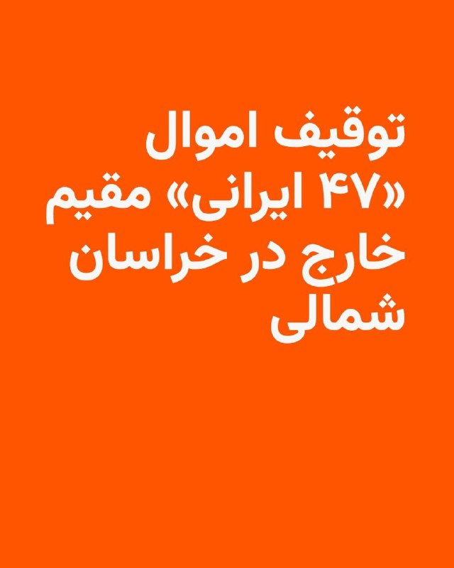

🔸رئیس‌ کل دادگستری خراسان ‌شمالی می‌گوید تاکنون اموال «۴۷ نفر» از ایرانیان مقیم خارج در این استان شناسایی و توقیف شده است.

🔸خبرگزاری فارس با انتشار این گزارش، به نقل از رضا براتی‌زاده این افراد را «خائن به وطن و افراد تأثیرگذار در شبکهٔ کمک به‌نفع دشمن» نامیده، است.

🔸بر اساس این گزارش، چهار نفر از این افراد که به هویت هیچ‌یک اشاره‌ای نشد، مقیم آلمان، شش نفر مقیم بریتانیا، دو نفر مقیم فرانسه، ۱۰ نفر مقیم ترکیه، پنج نفر مقیم آمریکا، دو نفر مقیم کانادا، دو نفر مقیم ایتالیا، دو نفر مقیم استرالیا، دو نفر مقیم عمان و مابقی مقیم دانمارک، اسپانیا، قطر، امارات، چین، اسکاتلند، قبرس، یونان، نیوزیلند و کشورهای دیگر هستند.

🔸روز سه‌شنبه نیز خبرگزاری‌ها در ایران به نقل از قوه قضائیه از شناسایی اموال دیگری از علی کریمی، بازیکن سابق تیم ملی فوتبال ایران که مقیم آمریکاست، و توقیف آنها خبر داده بودند.

@RadioFarda

## RadioFarda — post 158124

  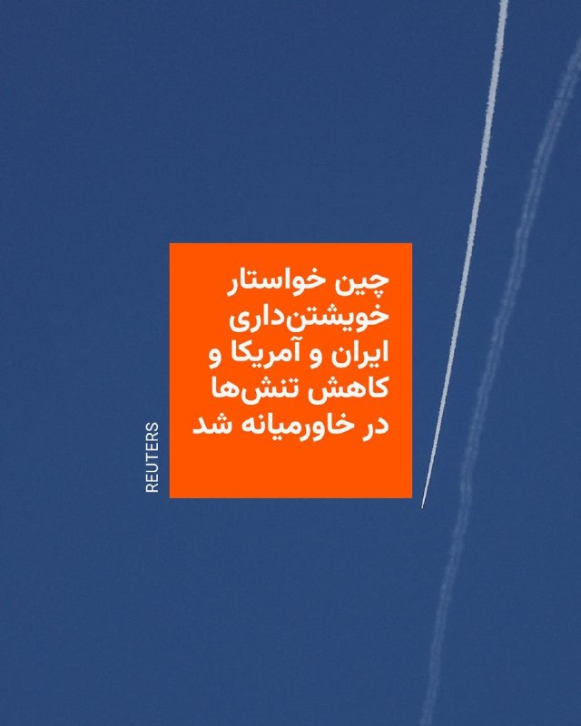

🔸وزارت خارجه چین با ابراز نگرانی عمیق از درگیری‌های جاری در خاورمیانه، از طرف‌های درگیر خواست از تشدید تنش‌ها خودداری کنند و برای کاهش بحران گام‌های عملی بردارند.

🔸لین جیان، سخنگوی وزارت خارجه چین، روز چهارشنبه ۲۰ خرداد گفت که «طرف‌های مختلف ذی‌ربط باید آرامش خود را حفظ کنند و خویشتن‌داری نشان دهند، از تشدید درگیری و وخیم‌تر شدن اوضاع خودداری کنند و با اتخاذ اقدامات ملموس، به کاهش تنش‌ها و آرام کردن وضعیت کمک کنند.»

🔸ارتش ایالات متحده، در واکنش به سرنگونی یک بالگرد آمریکایی در سواحل عمان، بامداد چهارشنبه حملاتی را به جنوب ایران انجام داد و ایران نیز در واکنش به شلیک موشک و پهپاد به برخی کشورهای منطقه اقدام کرد.

🔸پکن تاکنون از موضع‌گیری مستقیم به نفع هر یک از طرف‌های درگیر خودداری کرده و صرفاً بر ضرورت جلوگیری از گسترش درگیری‌ها و حفظ ثبات منطقه تأکید کرده است.
@RadioFarda

## IranianMinds — post 22081

🔴 ترامپ به فاکس‌نیوز:

به صدور دستور حملات جدید علیه نیروگاه‌ها و پل‌های ایران نزدیک شدم.

@IranianMinds

## IranianMinds — post 22080

  <a href="telegram/content/IranianMinds_22080_1781094136.mp4" target="_blank">🎬 Download video</a>

🔴همزمان با پست جدید ترامپ، توئیت جدید نتانیاهو.

رژیم ایران نباید هرگز سلاح هسته‌ای داشته باشد.

@IranianMinds

## IranianMinds — post 22079

  

🔴تصویری که فاکس‌نیوز از آخرین آرایش سنگین ناوگان دریایی در خاورمیانه نشان داده است.

@IranianMinds

## IranianMinds — post 22078

  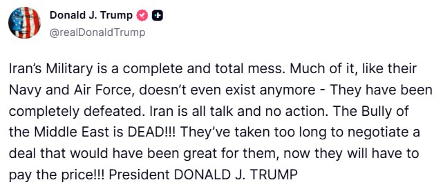

🔴 فوری، پست جدید ترامپ:

ایران کاملا بهم ریخته و آشفته شده، نیروی دریایی و نیروی هوایی اونا دیگه وجود ندارن، اونا کامل شکست خوردن.

ایران فقط حرف میزنه و هیچ اقدامی نمیکنه، قلدر خاورمیانه دیگه مُرده.
اونا در مورد مذاکره‌ای که براشون فوق العاده بود خیلی طول دادن، حالا باید بهاشو پرداخت کنن.

@IranianMinds

## IranianMinds — post 22077

  

در سالروز درگذشت خواهر عزیزم، لیلا، یاد و خاطره‌اش را گرامی می‌دارم.

لیلا دختری از ایران بود؛ وفادار به میهن، عاشق پدر و خانواده، و دلبسته هم‌میهنانش. هرچند دور از سرزمین مادری زندگی کرد، اما عشق به ایران هرگز از قلب او رخت برنبست و امید به آزادی و سربلندی میهن را تا واپسین روزهای زندگی‌اش از دست نداد.

امروز که ایرانیان با پرچم شیر و خورشید و با امید به آینده‌ای آزاد، ملی و سربلند، برای بازپس‌گیری کشورشان ایستاده‌اند، یاد لیلا بیش از هر زمان دیگری در کنار ما زنده است.

یادش گرامی و نامش جاودان.

@OfficialRezaPahlavi

## IranianMinds — post 22076

  <a href="telegram/content/IranianMinds_22076_1781094141.mp4" target="_blank">🎬 Download video</a>

🔴تصاویری از حمله آمریکا به مخازن آب آشامیدنی بخش بمانی شهرستان سیریک/ هرمزگان.

@IranianMinds

## IranianMinds — post 22075

🔴 قتل پسرعمو بر سر تقسیم ۵۰ میلیون تومان پول دزدی

درگیری دو پسرعمو در تهران بر سر تقسیم ۵۰میلیون تومان پول دزدیده‌شده از خانه دوستشان، به قتل رسید.
متهم که پارچه‌ای به دور گردن پسرعموی ۳۸ ساله خود انداخته بود، پس از مرگ او با پلیس تماس گرفت و بازداشت شد./هفت صبح

@IranianMinds

## IranianMinds — post 22074

  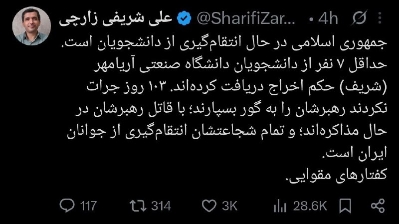

🔴شریفی زارچی استاد سابق دانشگاه شریف:

جمهوری اسلامی در حال انتقام‌گیری از دانشجوهاس؛
حداقل 7 نفر از دانشجویان دانشگاه صنعتی آریامهر (شریف) حکم اخراج دریافت کردن.
103 روز جرات نکردن رهبرشونو به گور بسپارن؛ با قاتل رهبرشون در حال مذاکره‌ن؛ و تمام شجاعتشون انتقام‌گیری از جوانان ایرانه.
کفتارهای مقوایی.
‌
@IranianMinds

## IranianMinds — post 22073

🔺 بانس‌های فوق خفن مل‌بت 
🔺

🫴 100 درصد پاداش اولین واریز

😀 100 درصد بانس یکشنبه ها

🎁 100 درصد بانس چهارشنبه ها

🔹 هر روز 1 چرخش گردونه 1 یورویی

😀 3 درصد باز پرداخت نقدی

😀 بانس شرط رایگان 30 دلاری

🎩 10 درصد باز پرداخت نقدی کازینو

🎆 بانس هدیه روز تولد

💵 و چندین بانس دیگر از جمله بانس خوش‌آمد گویی، بانس شرطبندی طولانی مدت، بانس 1750 یورویی کازینو و...

💰 هنگام ثبت‌نام با وارد کردن کد هدیه Sport100 بانس 100 دلاری رایگان دریافت کنید!
r20

✈️ معرفی سایت و اپلیکیشن مل‌بت

🔄 ورود به سایت مل‌بت (فیلترشکن خاموش)

## IranianMinds — post 22069

  <a href="telegram/content/IranianMinds_22069_1781094144.mp4" target="_blank">🎬 Download video</a>

🔴اسرائیل به حملات خود در جنوب لبنان ادامه می‌دهد.

@IranianMinds

## IranianMinds — post 22068

  <a href="telegram/content/IranianMinds_22068_1781094145.mp4" target="_blank">🎬 Download video</a>

🔴پزشکیان:

جنگ قطعأ به نفع کشور نیست، اما اگر دشمن بخواهد به خاک ما تجاوز کند، کوتاه آمدن و تسلیم شدن ما را در خواب ببیند.

@IranianMinds

## IranianMinds — post 22067

  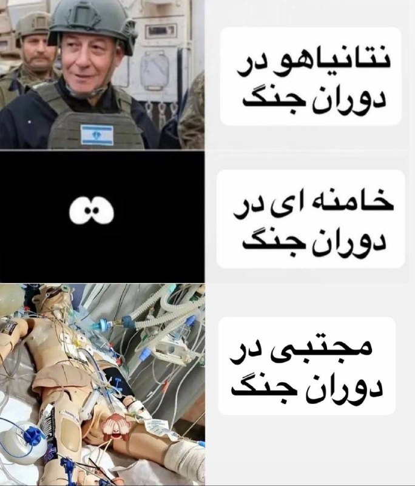

اکانت اسرائیل به فارسی:

از شبکه‌های اجتماعی😂😂😂

@IranianMinds

## IranianMinds — post 22066

  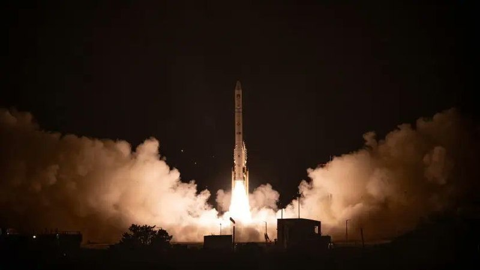

پس از سامانه دفاع موشکی ختس و ماهواره در فضا - توسعه جدید اسرائیل پیامی واضح به جمهوری اسلامی می‌فرستد.

صنایع هوافضای اسرائیل از نسل بعدی سیستم مدیریت نبرد OPAL-NG خود رونمایی کرده است که برای شکل دادن به آینده میدان نبرد با ادغام هوش مصنوعی، سیستم‌های سرنشین‌دار و بدون سرنشین و قابلیت‌های چندبعدی طراحی شده است.

این سیستم امکان ایجاد یک تصویر عملیاتی یکپارچه در نیروهای هوایی، زمینی و دریایی را فراهم می‌کند و امکان اشتراک‌گذاری فوری اطلاعات و تصمیم‌گیری سریع‌تر بر اساس تجزیه و تحلیل داده‌ها را فراهم می‌کند. OPAL-NG بر اساس تجربه عملیاتی سیستم OPAL موجود ساخته شده است که در پلتفرم‌های مختلفی از جمله جت‌های جنگنده، هلیکوپترها، پهپادها، کشتی‌ها و مراکز فرماندهی و کنترل مستقر شده است، ضمن اینکه مطابق با استانداردهای ناتو است.

این سیستم جدید از فناوری‌های هوش مصنوعی پیشرفته برای پردازش اطلاعات به محض دریافت، اولویت‌بندی اهداف و کمک به تصمیم‌گیری عملیاتی استفاده می‌کند.

همچنین همکاری بین هواپیماهای سرنشین‌دار و بدون سرنشین را تسهیل می‌کند و شامل جمع‌آوری اطلاعات، جنگ الکترونیکی و حملات هماهنگ می‌شود.

## BBCPersian — post 283349

🔻سفر یک هیات قطری به تهران

🔻به گزارش رسانه‌های ایران یک هیئت بلندپایه از قطر ظهر امروز برای گفتگو با مقامات ایران وارد تهران شده است.

به گزارش روزنامه دولتی ایران، این هیئت برای گفتگو و تبادل نظر درباره روابط دوجانبه و تحولات منطقه‌ای، به تهران سفر کرده است.

بر اساس این گزارش «در جریان این سفر، این هیئت علاوه بر بحث در مورد روابط دوجانبه و تحولات منطقه، در باره آخرین تحولات مرتبط با روند دیپلماتیک برای خاتمه جنگ بین آمریکا و ایران هم بحث و رایزنی می‌کند.»

این سفر در حالی انجام می‌شود که درپی ساقط شدن یک بالگرد آمریکایی، تبادل آتش‌های تازه‌ای بین آمریکا و ایران رخ داده است.

ساعتی پیش دونالد ترامپ گفت که ایران در مذاکرات بیش از حد تعلل کرده است و حالا باید بهایش را بپردازد.

ایران هم پیشتر گفت که با درنظر گرفتن حملات جدید آمریکا در مورد ادامه مذاکرات تصمیم می‌گیرد.

https://bbc.in/3QuVrRC
@BBCPersian

## BBCPersian — post 283348

  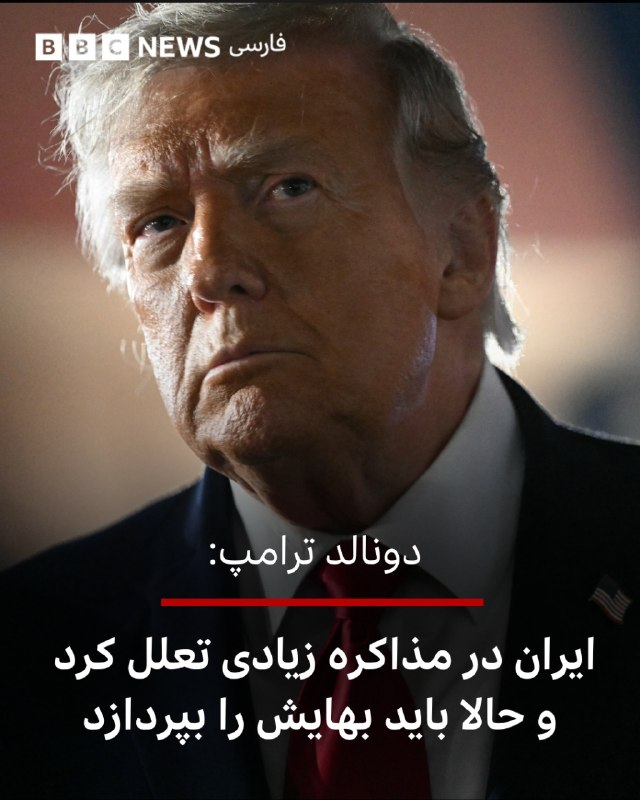

🔻دونالد ترامپ، رئیس‌جمهور آمریکا، می‌گوید که ایران در مذاکرات بیش از حد تعلل کرده است و حالا باید بهایش را بپردازد.

آقای ترامپ در پستی در شبکه اجتماعی خود تروث سوشال نوشت: «ارتش ایران کاملا آشفته و بهم ریخته است. بخش زیادی از آن، مانند نیروی دریایی و هوایی آنها، دیگر حتی وجود ندارد- آنها کاملا شکست خورده‌اند.»

او در ادامه آورده است: «ایران فقط حرف می‌زند و هیچ عملی انجام نمی‌دهد. قلدر خاورمیانه مرده است.»

آقای ترامپ در انتهای پیامش نوشته است: «آنها مذاکره در مورد توافقی که برایشان عالی بود را خیلی کش دادند، حالا باید هزینه آن را بپردازند.»

این اظهارات یک روز پس از حملات متقابل آمریکا و ایران در پی سقوط بالگرد آمریکایی منتشر شده است.

📷AFP via Getty Images
https://bbc.in/4eg30Uf

@BBCPersian

## BBCPersian — post 283346

  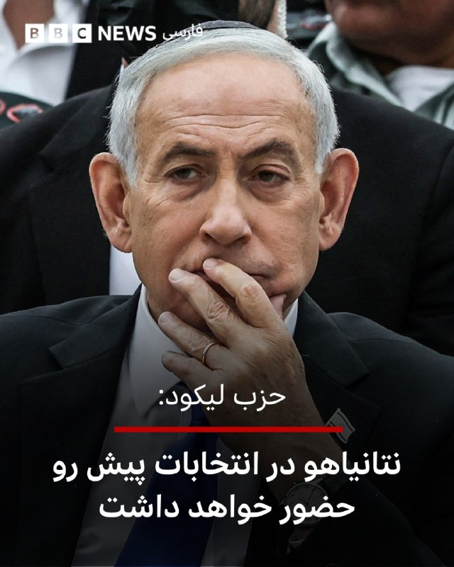

🔻حزب لیکود اسرائیل اعلام کرده است که رهبرش بنیامین نتانیاهو، در انتخابات پارلمانی امسال حضور خواهد داشت و برای انتخاب مجدد به‌عنوان نخست‌وزیر تلاش می‌کند.

در بیانیه کوتاه این حزب راستگرای اسرائیل آمده است که «نخست‌وزیر نتانیاهو در انتخابات بعد شرکت می‌کند و به خواست خدا پیروز خواهد شد.»

زمان برگزاری انتخابات هنوز به طور رسمی اعلام نشده است اما آخرین مهلت قانونی برگزاری آن ۲۷ اکتبر است.

این اولین انتخابات سراسری اسرائیل پس از حمله حماس در ۷ اکتبر ۲۰۲۳ خواهد بود، حمله‌ای که بدترین شکست امنیتی اسرائیل تلقی می‌شود و باعث آغاز جنگ غزه شد.

آقای نتانیاهو از زمان بازگشت به قدرت در دسامبر ۲۰۲۲ با دوره‌ای بسیار پرتنش روبرو بوده است.

او پیش از آغاز جنگ‌های غزه، لبنان و ایران با اعتراضات گسترده ضددولتی روبرو بود.

📷Reuters
https://bbc.in/4ezkXOI

@BBCPersian

## BBCPersian — post 283345

🔻ایران می‌گوید ادامه روند مذاکرات را با در نظر گرفتن حملات جدید آمریکا بررسی می‌کند

🔻سخنگوی وزارت خارجه جمهوری اسلامی می‌گوید که ایران ادامه روند مذاکرات را با توجه به حملات جدید آمریکا بررسی خواهد کرد.

اسماعیل بقایی که پس از دور جدید تبادل آتش ایران و آمریکا صحبت می‌کرد، گفت: «روند دیپلماتیک در خلا اتفاق نمی‌افتد و برای پیشبرد هر فرایند دیپلماتیکی، نیازمند فضای حداقلی هستید تا بتوان کار را پیش برد.»

آقای بقایی آمریکا را متهم کرد که «با پیام‌های متناقض و تغییر مکرر مواضع و مطالبات و نقض مکرر آتش‌بس به روند مذاکرات آسیب می‌رساند.»

بامداد چهارشنبه آمریکا در پاسخ به ساقط شدن یک بالگرد خود در دریای عمان چندین حمله هوایی به نقاطی در جنوب ایران انجام داد، قرارگاه خاتم الانبیا هم از حملات متقابل سپاه پاسداران و ارتش ایران به پایگاه‌های آمریکا در کشورهای بحرین، کویت و اردن خبر داد.

در همین حال ارتش آمریکا از پایان عملیاتش در واکنش به ساقط شدن بالگرد آپاچی خود خبر داده است.

https://bbc.in/4g8XQf5
@BBCPersian

## BBCPersian — post 283344

  <a href="telegram/content/BBCPersian_283344_1781094151.mp4" target="_blank">🎬 Download video</a>

🔻مدیرعامل شرکت آب و فاضلاب استان هرمزگان گفته است در پی حملات بامداد امروز آمریکا «زیرساخت‌های حیاتی توزیع آب در شهرستان سیریک» تخریب شده است.

عبدالحمید حمزه پور گفته در این حملات «دو مخزن استراتژیک آب در بخش بمانی هدف قرار گرفته و به طور کامل تخریب شدند ... که نقش کلیدی در تأمین آب شرب بخش بمانی و شهر کوهستک ایفا می‌کردند.»

به گفته او «در حال حاضر روند توزیع آب در تمامی روستاهای بخش بمانی و شهر کوهستک متوقف شده است.»

@BBCPersian
https://bbc.in/4xj7geh

## BBCPersian — post 283343

  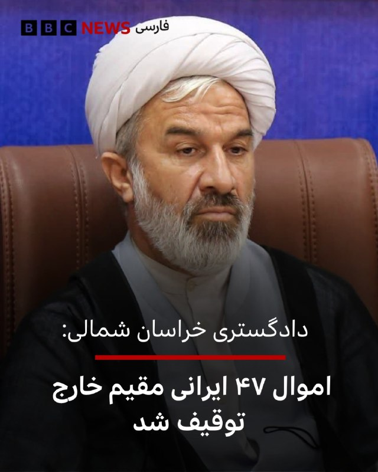

🔻رئیس کل دادگستری خراسان شمالی اعلام کرده است که اموال ۴۷ تن از ایرانیان مقیم خارج کشور که به گفته او با «دشمن همکاری» داشتند، شناسایی و توقیف شده است.

رضا براتی‌زاده همچنین گفت که ۱۴ فقره پرونده قضایی «علیه اشخاصی که به هر نحو با دشمن همکاری کرده بودند» تشکیل شده است.

آقای براتی گفت از میان متهمانی که اموالشان توقیف شده، چهار نفر مقیم آلمان، شش نفر مقیم بریتانیا، دو نفر مقیم فرانسه، ۱۰ نفر مقیم ترکیه، پنج نفر مقیم آمریکا، دو نفر مقیم کانادا، دو نفر مقیم ایتالیا، دو نفر مقیم استرالیا، دو نفر مقیم عمان و «بقیه مقیم کشورهای دانمارک، اسپانیا، قطر، امارات، چین، اسکاتلند، قبرس، یونان، نیوزلند و ... هستند.»

«فعالیت تبلیغی علیه نظام» و «اجتماع و تبانی برای ارتکاب جرم علیه امنیت داخلی و خارجی» از جمله اتهاماتی است که به این افراد نسبت داده شده است.

در پی جنگ آمریکا و اسرائیل علیه ایران قوه قضائیه با استناد به قانون «تشدید مجازات جاسوسی» اموال تعدادی را توقیف کرده است که در میان آنها برخی از چهره‌های شناخته شده هم دیده می‌شود.

https://bbc.in/4exxToe
📷Mehr News

@BBCPersian

## BBCPersian — post 283342

  <a href="telegram/content/BBCPersian_283342_1781094155.mp4" target="_blank">🎬 Download video</a>

🔻لس‌آنجلس یکی از شهرهای آمریکاست که میزبان رقابت‌های جام جهانی ۲۰۲۶ است.

‏هشت بازی قرار است در این شهر انجام شود؛ از جمله دو مسابقه تیم ملی ایران. اما ساکنان این شهر و گردشگران، یک هفته مانده به آغاز این تورنمنت هنوز احساس نمی‌کنند که در این شهر حال‌وهوای میزبانی رویداد بزرگی چون جام جهانی جاری است.

‏خبرنگارمان سام فرزانه به مغازه‌های فروش سوغاتی‌های جام جهانی رفته و با طرفداران پروپاقرص فوتبال صحبت کرده است.

@BBCPersian

## BBCPersian — post 283341

🔻فرماندار قشم وقوع انفجار در این شهر را رد کرد

🔻ساعتی پس از گزارش شنیده شدن صدای انفجار در قشم، فرماندار قشم وقوع انفجار در این جزیره را رد کرد.

حسین امیرتیموری گفت: «صدای انفجاری که ساعتی پیش شنیده شده است مربوط به شهر قشم نیست.»

پیشتر خبرگزاری مهر به نقل از منابع محلی، از شنیده شدن صدای یک انفجار در محدوده شهرستان قشم خبر داده بود.

خبرگزاری مهر نوشته بود: «هرچند ماهیت دقیق این صداها هنوز مشخص نیست، اما با توجه به حجم صدا ممکن است منبع انفجار فاصله نسبتا زیادی با شهر قشم داشته است و یا مربوط یه تحرکاتی در تنگه هرمز باشد.»

https://bbc.in/43sZuRn
@BBCPersian

## BBCPersian — post 283340

🔻قطع آب «۲۰ هزار نفر» از ساکنان بمانی در نتیجه حمله آمریکا

🔻مدیرعامل شرکت آب و فاضلاب استان هرمزگان می‌گوید در پی حمله دیشب آمریکا به مناطق جنوبی ایران، دسترسی «۲۰ هزار نفر» از مردم منطقه بمانی به آب سالم قطع شده است.

در حمله دیشب، به گفته شرکت آب و فاضلاب استان هرمزگان ۲ مخزن بتونی ذخیره آب با ظرفیت ۲هزار و ۵۰۰ مترمکعب در بخش بمانی این استان، «هدف اصابت موشک قرار گرفت و به طور کامل از مدار بهره‌برداری خارج شد.»

این مخازن وظیفه تأمین آب شرب شهر کوهستک و ۱۰ روستای اطراف را بر عهده داشتند.

به گزارش خبرگزاری‌‌های ایران، در این منطقه منابع آب زیرزمینی کافی برای جایگزینی فوری وجود ندارد و تخریب این مخازن مشکلی جدی برای شبکه آب‌رسانی منطقه ایجاد خواهد کرد.

https://bbc.in/3Q7mjag
@BBCPersian

## BBCPersian — post 283333

🖊دومنیک هیوز،لزلی هیچن و جیمز گوان
بی‌بی‌سی

🔻پژوهش‌های اخیر نشان می‌دهد انجام حدود ۹۰ دقیقه تا دو ساعت تمرین با وزنه در هفته می‌تواند احتمال مرگ زودهنگام بر اثر بیماری‌های گوناگون را به طور قابل توجهی کاهش دهد.

بررسی داده‌های چند دهه تحقیق روی بیش از ۱۴۷ هزار نفر نشان داده است تمرینات مقاومتی با کاهش خطر مرگ بر اثر بیماری‌های قلبی‌عروقی تا ۱۹٪ و بیماری‌های عصب‌شناختی تا ۲۷٪ همراه است. همچنین در مجموع، خطر مرگ زودرس تا حدود ۱۳٪ کاهش پیدا می‌کند، به‌ویژه زمانی که همراه با فعالیت‌های هوازی انجام شود. با این حال، انجام بیش از دو ساعت تمرین قدرتی در هفته در این زمینه مزیت بیشتری نشان نداده است.

کارشناسان تأکید می‌کنند ورزش‌های هوازی همچنان در کاهش بیماری‌هایی مانند دیابت و سکته نقش مهمی دارند، اما نقش تمرینات قدرتی نیز به طور روز‌افزون اهمیت بیشتری پیدا می‌کند.

متن کامل خبر:

https://bbc.in/3S0WRDN
📷Getty Images

@BBCPersian

## Dirty_Kids — post 391573

  

🔴 فاکس‌نیوز:
ترامپ درحال نزدیک شدن به صدور دستور حمله به نیروگاه‌ها و پل‌های ایرانه.

@Dirty_Kids 👻

## Dirty_Kids — post 391572

🔴 فوری-رسانه های عبری

تصمیم ترامپ برای حمله به پل ها و زیرساخت ایران قطعی است.
پنتاگون طرح های حمله جدید را به ترامپ گزارش داده و اسرائیل را نیز مطلع کرده.

@Dirty_Kids 👻

## Dirty_Kids — post 391571

  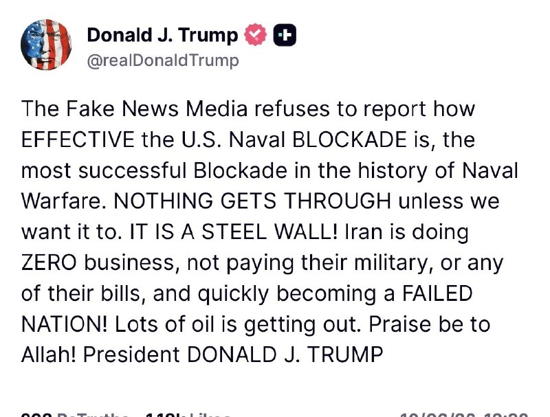

ترامپ در حالیکه امروز از دنده‌ی چپ از خواب بلند شده و معامله با ج.ا در این دقایق از چشش افتاده در پست دیگری گفت:

رسانه‌های فیک‌نیوز اصلاً به روی قرمساق خودشون نمیارن که محاصره‌ی دریایی آمریکا چقدر کارساز بوده.
محاصره‌ای که موفق‌ترین نمونه در کل تاریخ جنگ‌های دریایی به‌حساب میاد.
تا خودمون نخوایم پرنده هم نمی‌تونه ازش رد شه.
این محاصره مثل یه دیوار فولادیه. داد و ستد جمهوری‌اسلامی‌ کاملاً صفر شده. نه پول نیروی نظامیش رو داره بده و نه از پس مخارج دیگه‌ش برمیاد و خیلی سریع داره تبدیل به یه کشور ورشکسته می‌شه.
البته کلی نفت داره خارج می‌شه

رئیس‌جمهور، دونالد جی. ترامپ

@Dirty_Kids 👻

## Dirty_Kids — post 391570

ترامپ با کله‌ی خراب از خواب پا شده و در پستی در تروث‌سوشال نوشته: «نیروی نظامی جمهوری‌اسلامی قحبه یک افتضاح تمام‌عیار و مطلقه. بخش زیادیش مثل نیروی دریایی و نیروی هوایی‌شون دیگه حتی وجود خارجی هم نداره. این قحبه‌ها به طور کامل شکست خورده‌اند. روافض گنده‌گوز…

## Dirty_Kids — post 391569

  <a href="telegram/content/Dirty_Kids_391569_1781094159.mp4" target="_blank">🎬 Download video</a>

بهروز رهبری فرد:
ایرانی‌ها کونده پررواند! 😐

@Dirty_Kids 👻

## Dirty_Kids — post 391568

  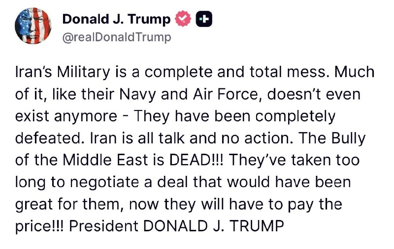

ترامپ با کله‌ی خراب از خواب پا شده و در پستی در تروث‌سوشال نوشته:

«نیروی نظامی جمهوری‌اسلامی قحبه یک افتضاح تمام‌عیار و مطلقه.
بخش زیادیش مثل نیروی دریایی و نیروی هوایی‌شون دیگه حتی وجود خارجی هم نداره.
این قحبه‌ها به طور کامل شکست خورده‌اند.
روافض گنده‌گوز فقط حرف می‌زنه و مرد عمل نیست.
قلدرِ خاورمیانه بگای سگ رفته و مرده.
روافض هزارپدر برای مذاکره بر سر توافقی که می‌تونست براشون عالی باشه خیلی لفتش دادن.
الان باید تاوانش رو پس بدن.
پرزیدنت دونالد جی. ترامپ

@Dirty_Kids 👻

## Dirty_Kids — post 391567

  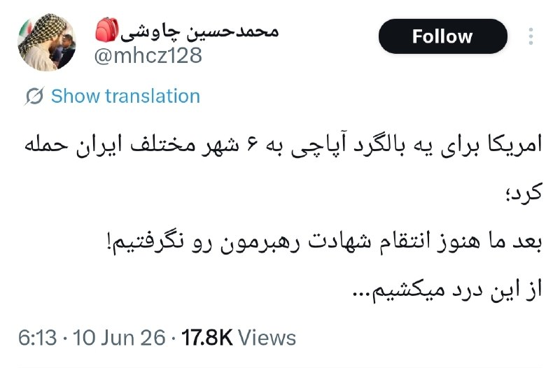

حق داری چاووشی 😔😔🤣🤣🤣

کاری ندارم که بخوانم نمیتونن، توازن قدرت برقرار نیست، ولی خیلی لاشین بخاطر اینکه کتلت نشن قدرت‌رو از دست ندن عاغاتونو بتخمشون گرفتن بی‌خایه‌ها

@Dirty_Kids 👻

## Dirty_Kids — post 391566

  <a href="telegram/content/Dirty_Kids_391566_1781094161.mp4" target="_blank">🎬 Download video</a>

حالا که همش بحث آپاچی آمریکاییه،
وقتی نبودین با برنو، ساقه‌طلایی و نوشابه
رفته بودن خلبان آمریکایی رو بگیرن که…🤣🤣🤣🤣🤣

@Dirty_Kids 👻

## Dirty_Kids — post 391564

اینجا کدوم تهرانهههه؟ واقعا کدوم تهرانه بچه ها؟

@Dirty_Kids 👻

## Dirty_Kids — post 391563

  

برند چایکین به تازگی ساعتی طراحی کرده که زمان رو با ممه‌های یه خانم نمایش میده.

@Dirty_Kids 👻

## Dirty_Kids — post 391562

  <a href="https://t.me/Dirty_Kids/391562" target="_blank">📎 Download file</a>

ریتزوبت تنها سایت بین المللی میباشد ، که به صورت هفتگی پرومو کد دریافت میکنید ✅

♦️ آموزش شارژ حساب با کریپتو
♦️ آموزش شارژ حساب ریالی در ریتزوبت

🔵ریتزوبت برندی با لایسنس معتبر در صنعت شرطبندی و پیشبینی مسابقات ورزشی و کازینویی 👇
#پیشبینی
https://t.me/+LB508WZyIr8xNmY0

## Dirty_Kids — post 391561

  <a href="telegram/content/Dirty_Kids_391561_1781094165.webm" target="_blank">🎬 Download video</a>

🎁 می‌دونستین توی ریتزوبت هرکی شرط‌بندی کنه، هر هفته بین 1.000.000 تومن تا 100.000.000 تومان پروموکد می‌گیره 
‼️

💰 باحالیش اینجاست که فرقی نداره شرطت ببره یا ببازه، تو هر صورت پروموکد بهت میدن 
🔥

🚀 وقتی شرط ‌هاتون رو توی ریتزوبت ثبت کنین ، هم شانس برد دارین و هم هفتگی کسب درآمد میکنید 
🤑

🛸 لینک ورود به سایت 👉

🌐 کانال تلگرامی 
3️⃣
2️⃣
1️⃣
R20
https://t.me/+LB508WZyIr8xNmY0

## Dirty_Kids — post 391560

این ویدئو از سورپرایز تولد این دختر خانوم، تو چند روز اخیر نزدیک به 10 میلیون ویو تو فضای مجازی خورده؛

مخاطب‌ها هزاران سوالِ بی‌پاسخ تو ذهنشون اومده و همه خایه فنگ شدن که اصلا یعنی چی؟ اینجا کجاست؟ اون چرا از بالا اومد؟ نوید محمدزاده کو؟

@Dirty_Kids 👻

## Hranews — post 113514

  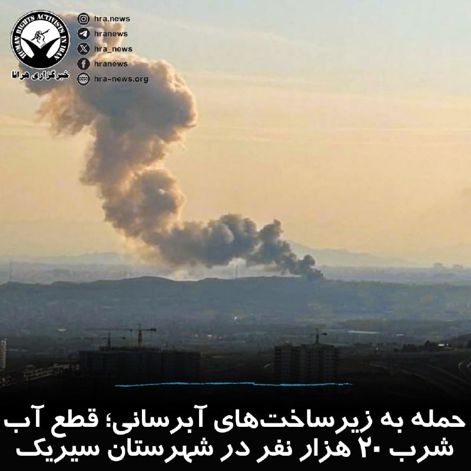

مدیر عامل آب و فاضلاب هرمزگان اعلام کرد که روز جاری در پی حملات نظامی آمریکا تأسیسات آبرسانی شهرستان سیریک دچار آسیب‌دیدگی شده است. به گفته عبدالحمید حمزه پور، به دنبال این حملات دسترسی بیش از ۲۰ هزار نفر از ساکنان شهر کوهستک و ۱۰ روستای بخش بمانی در این شهرستان به آب شرب قطع شده است.

وی همچنین با اشاره به خسارت ۱۴۰ میلیارد تومان به تاسیسات آب رسانی، تاکید کرد، دو مخزن ذخیره آب با حجم ۵۰۰ و ۲۰۰۰ متر مکعب و بخشی از تأسیسات مرتبط آسیب دیده و آبرسانی به این مناطق را با اختلال جدی مواجه کرده است.
#حمله_نظامی #جنگ

↘️
@hranews_bot تماس ✉️ - @Hranews کانال هرانا 🆑

## Hranews — post 113513

  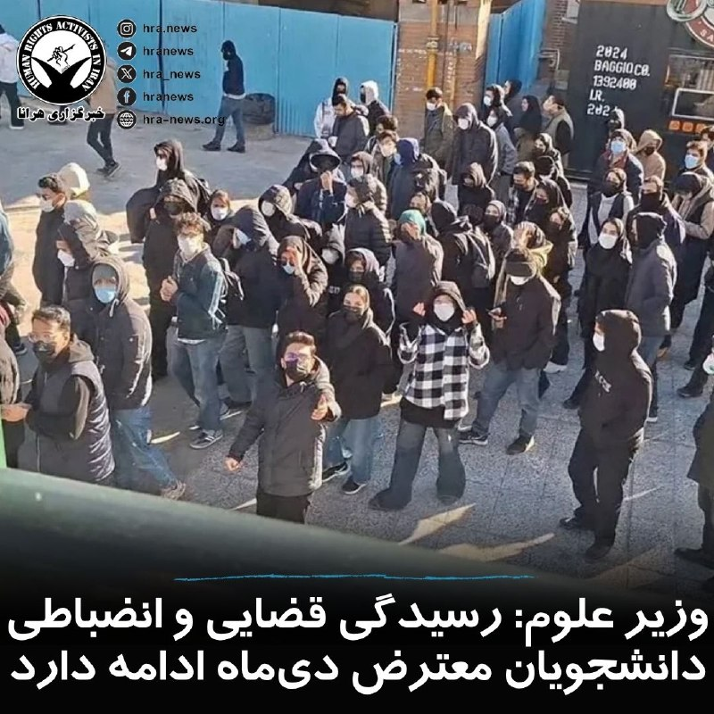

وزیر علوم، تحقیقات و فناوری درباره احکام انضباطی دانشجویان معترض در اعتراضات دانشگاه‌ها در دی ماه ۱۴۰۴ گفت: افرادی که در این تجمعات پرچم متفاوت را به دانشگاه آوردند یا اقدام به آتش زدن پرچم کردند، هم در دادسراها تحت تعقیب قضایی قرار دارند و هم برای آنها در دانشگاه پرونده انضباطی تشکیل شده است. حسین سیمایی‌صراف درباره تعداد #دانشجویان مشمول این رسیدگی‌ها اظهار کرد: آمار دقیقی در اختیار ندارم، اما در دانشگاه صنعتی شریف که یکی از موارد شاخص در این زمینه بوده، رسیدگی‌های لازم انجام شده است. در سایر دانشگاه‌ها نیز روند رسیدگی تفاوتی نخواهد داشت.
#اعتراضات_۱۴۰۴

↘️
@hranews_bot تماس ✉️ - @Hranews کانال هرانا 🆑

## Hranews — post 113512

  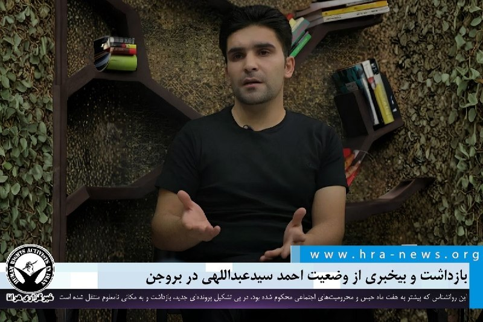

بازداشت و بیخبری از وضعیت احمد سیدعبداللهی در بروجن

❗️
❗️
❗️
❗️
❗️– سیداحمد سیدعبداللهی، مشاور و روانشناس ساکن بروجن، حدود ده روز پیش توسط نیروهای امنیتی بازداشت و به مکانی نامعلوم منتقل شده است. این بازداشت در حالی صورت گرفته که وی پیشتر در پرونده‌ای دیگر به هفت ماه حبس و پنج سال محرومیت از خدمات دولتی و عمومی محکوم شده بود و همزمان با تشکیل پرونده جدید، احضاریه‌ای با اتهام تبلیغ علیه نظام برای او صادر شده بود.

به گزارش خبرگزاری هرانا، ارگان خبری مجموعه فعالان حقوق بشر در ایران، حدود ده روز پیش، نیروهای امنیتی با مراجعه به منزل پدری سید احمد سیدعبداللهی در بروجن، وی را بازداشت و به مکانی نامعلوم منتقل کردند. بازداشت اخیر پیش از اجرای حکم صادره در پرونده نخست صورت گرفته و نزدیکان وی نسبت به وضعیت کنونی، محل نگهداری و روند رسیدگی به پرونده جدید او ابراز نگرانی کرده‌اند.

یک منبع مطلع نزدیک به خانواده سیدعبداللهی، ضمن تایید این موضوع به هرانا گفت: «ماموران در جریان این اقدام تلفن‌های همراه، رایانه و شماری از وسایل الکترونیکی متعلق به او و اعضای خانواده‌اش را نیز ضبط کرده‌اند. آقای سیدعبداللهی پس از بازداشت تنها تماس کوتاهی با خانواده خود داشته و از محل نگهداری یا وضعیت پرونده‌اش اطلاعی ارائه نکرده است.»

بررسی اسناد دریافتی هرانا نشان می‌دهد که شعبه اول بازپرسی دادسرای عمومی و انقلاب بروجن به ریاست بازپرس وحید قدیردخت قهفرخی، در تاریخ ۴ خردادماه ۱۴۰۵ با صدور احضاریه‌ای، سید احمد سیدعبداللهی را جهت دفاع از اتهام «تبلیغ علیه نظام جمهوری اسلامی» احضار کرده بود. بر اساس این احضاریه، وی موظف شده بود ظرف پنج روز پس از ابلاغ در شعبه حاضر شود. این در حالی است که وی پیشتر در پرونده‌ای دیگر با اتهام «اقدام به انجام فعالیت‌های رسانه‌ای بر خلاف امنیت ملی» محاکمه و حکم حبس و مجازات‌های تکمیلی در این پرونده صادر شده بود.

ادامه مطلب

#سیداحمد_سیدعبداللهی #احمد_سیدعبداللهی

↘️
@hranews_bot تماس ✉️ - @Hranews کانال هرانا 🆑

## Hranews — post 113511

  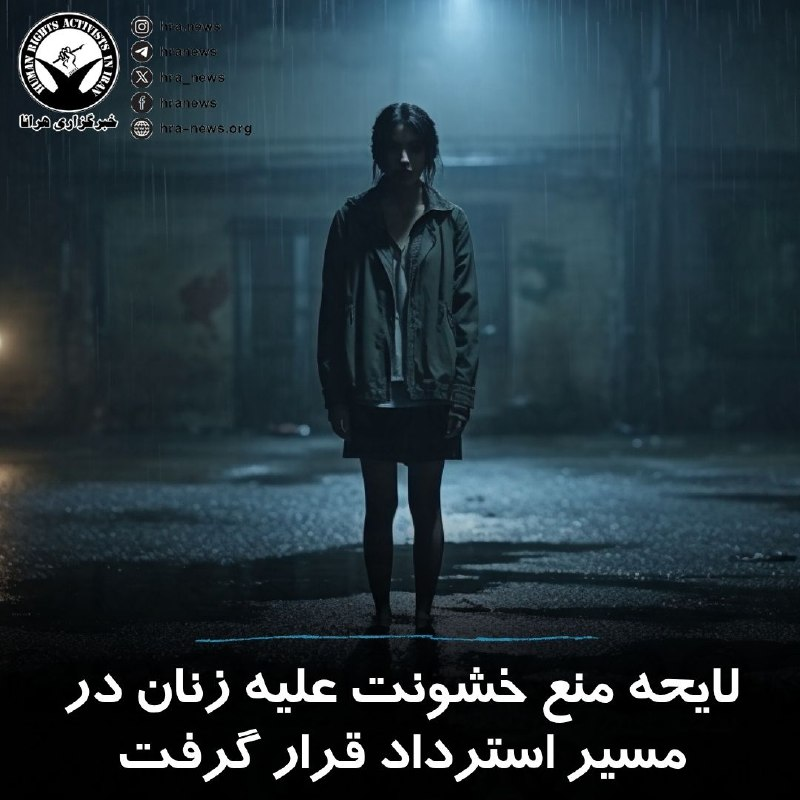

فاطمه مهاجرانی، سخنگوی دولت بدون بیان جزئیات اعلام کرد که لایحه منع خشونت علیه زنان در مسیر استرداد قرار گرفته است.

این درحالی است که این لایحه ابتدا در دولت یازدهم و توسط معاونت امور زنان و خانواده تهیه شد، اما به‌دلیل ماهیت قضایی آن، شورای نگهبان متن را برای بررسی و تدوین نهایی به قوه قضاییه ارجاع داد؛ موضوعی که باعث شد سال‌ها در بلاتکلیفی بماند. نسخه اولیه لایحه در پنج فصل و ۹۲ ماده تنظیم شده بود تا از بی‌عدالتی در روابط خانوادگی جلوگیری کند، #حقوق_زنان را در خانواده پاس بدارد و ضمانت‌های قانونی لازم را پیش‌بینی کند، اما در فرآیند اصلاحات، ۴۰ ماده آن حذف شد. نهایتا چندی پیش لایحه مذکور به مجلس رسیده بود.
#لایحه_منع_خشونت_علیه_زنان

↘️
@hranews_bot تماس ✉️ - @Hranews کانال هرانا 🆑

## Hranews — post 113510

گزارشی از بازداشت یک شهروند در تهران

❗️
❗️
❗️
❗️
❗️– مرکز اطلاع‌رسانی پلیس تهران بزرگ از #بازداشت یک شهروند به دلیل آنچه «ارسال اطلاعات به خارج از کشور» عنوان کرده، خبر داد.

ادامه مطلب

↘️
@hranews_bot تماس ✉️ - @Hranews کانال هرانا 🆑

## officialrezapahlavi — post 1842

  

در سالروز درگذشت خواهر عزیزم، لیلا، یاد و خاطره‌اش را گرامی می‌دارم.

لیلا دختری از ایران بود؛ وفادار به میهن، عاشق پدر و خانواده، و دلبسته هم‌میهنانش. هرچند دور از سرزمین مادری زندگی کرد، اما عشق به ایران هرگز از قلب او رخت برنبست و امید به آزادی و سربلندی میهن را تا واپسین روزهای زندگی‌اش از دست نداد.

امروز که ایرانیان با پرچم شیر و خورشید و با امید به آینده‌ای آزاد، ملی و سربلند، برای بازپس‌گیری کشورشان ایستاده‌اند، یاد لیلا بیش از هر زمان دیگری در کنار ما زنده است.

یادش گرامی و نامش جاودان.

@OfficialRezaPahlavi

## alonews — post 126816

  <a href="telegram/content/alonews_126816_1781094168.webm" target="_blank">🎬 Download video</a>

👈معاون وزیر ارتباطات از بازگشت ۷۸ درصدی ترافیک اینترنت به شرایط پیش از محدودیت‌ها خبر داد و ابراز امیدواری کرد حداکثر طی دو هفته آینده وضعیت به طور کامل عادی شود. وی همچنین شایعه اعمال فیلترینگ جدید را تکذیب کرد

✅ @AloNews خبر جنگ

## alonews — post 126815

  <a href="telegram/content/alonews_126815_1781094168.webm" target="_blank">🎬 Download video</a>

👈 به گزارش بلومبرگ، عراق در حال تسریع روند بارگیری نفت در بندر اصلی خود و افزایش حجم صادرات از مبدأ خلیج فارس است. این تحرک تازه، جدیدترین نشانه از عزم تولیدکنندگان ارشد اوپک در این منطقه برای انتقال و عبور بشکه‌های بیشتر نفت از مسیر استراتژیک و حیاتی تنگه هرمز به شمار می‌رود.

✅ @AloNews خبر جنگ

## alonews — post 126814

  

😳هنوز داری گیگی 10...15 تومن میخری ، وقتی اینترنت کامل درست شده
😱چون داری از واسطه تهیه میکنی

😍تخفیف ویژه فقط گیگی 2t
با لینک ساب

🌟با ضمانت و بهترین سرعت و کیفیت

☑️نامحدود واقعی فقط 290t

⌛️برای 200 نفر اول این تخفیف اعمال میشه ، سریع اقدام کنید که دیگه قرار نیست هزینه زیاد بابت وی پی ان بدید
👇
👇
@tvpnshop_bot
@tvpnshop_bot

## alonews — post 126813

  <a href="telegram/content/alonews_126813_1781094170.webm" target="_blank">🎬 Download video</a>

👈ترامپ به فاکس نیوز : کارم با ایران تموم نشده؛ ما ۵۵٪ از چیزهایی رو که ایران در زمان آتش‌بس دوباره ساخته بود، نابود کردیم

✅ @AloNews خبر جنگ

## alonews — post 126811

  <a href="telegram/content/alonews_126811_1781094170.webm" target="_blank">🎬 Download video</a>

👈قطعنامه آمریکا علیه ایران که حمایت آلمان، فرانسه و انگلیس را نیز به همراه دارد، امروز در شورای حکام به رأی گذاشته می‌شود

🔴در این سند از ایران خواسته شده درباره تأسیسات هسته‌ای بمباران‌شده و اورانیوم غنی‌شده آن‌ها به آژانس اطلاع‌رسانی کند.

✅ @AloNews خبر جنگ

## alonews — post 126810

  <a href="telegram/content/alonews_126810_1781094170.mp4" target="_blank">🎬 Download video</a>

👈نیروی هوایی اسرائیل بین یساریه و سرفند داره لُبنان حملۀ می‌کنه

✅ @AloNews خبر جنگ

## alonews — post 126809

  <a href="telegram/content/alonews_126809_1781094172.webm" target="_blank">🎬 Download video</a>

👈یک منبع مطلع به i24NEWS می‌گوید:
رئیس‌جمهور ترامپ دیشب با نخست‌وزیر نتانیاهو صحبت کرد و او را در جریان حمله احتمالی امشب قرار داد.

🔴این دو همچنین درباره موضوعات دیگری مرتبط با مذاکرات با ایران بحث کردند.

🔴در آمریکا از وضعیت مذاکرات ناامید شده‌اند و صبرشان رو به پایان است.

✅ @AloNews خبر جنگ

## alonews — post 126808

  <a href="telegram/content/alonews_126808_1781094173.webm" target="_blank">🎬 Download video</a>

👈پیت هگست، وزیر جنگ آمریکا؛ پست ترامپ درباره رسانه‌های جعلی رو تو صفحه خودش پست کرد

✅ @AloNews خبر جنگ

## alonews — post 126807

  <a href="telegram/content/alonews_126807_1781094173.webm" target="_blank">🎬 Download video</a>

👈پیت هگستث، وزیر جنگ ایالات متحده، امروز به پایگاه دریایی گوانتانامو در کوبا سفر خواهد کرد و پس از آن از فرماندهی مرکزی ایالات متحده (CENTCOM) در تامپا، فلوریدا و احتمالاً فرماندهی جنوبی ایالات متحده در دورال، فلوریدا بازدید خواهد کرد.

✅ @AloNews خبر جنگ

## alonews — post 126806

  <a href="telegram/content/alonews_126806_1781094173.webm" target="_blank">🎬 Download video</a>

👈نتانیاهو: اسرائیل به شدت علیه ایران و نمایندگانش که خاورمیانه و جهان را تهدید می‌کنند، به فعالیت خود ادامه خواهد داد

✅ @AloNews خبر جنگ

## alonews — post 126805

  <a href="telegram/content/alonews_126805_1781094174.webm" target="_blank">🎬 Download video</a>

👈نفت صعودی شد: ۹۳.۲۶ دلار

✅ @AloNews خبر جنگ

## alonews — post 126804

  <a href="telegram/content/alonews_126804_1781094174.webm" target="_blank">🎬 Download video</a>

👈اسرائیل هیوم: وقت تمام شد مذاکرات شکست خورده و پاکستان از میانجیگری دست کشیده. ترامپ بعد از حادثه بالگرد و حملات دیشب بسیار عصبانی شده و میخواهد هرچه زودتر به جنگ باز گردد. پنتاگون طرح های حمله جدید راه به ترامپ گزارش داده و اسرائیل را نیز مطلع کرده.

✅ @AloNews خبر جنگ

## alonews — post 126803

  <a href="telegram/content/alonews_126803_1781094174.webm" target="_blank">🎬 Download video</a>

👈عراقچی: دشمن خطای محاسباتی کند، پاسخ سنگینی دریافت خواهد کرد

✅ @AloNews خبر جنگ

## alonews — post 126802

  <a href="telegram/content/alonews_126802_1781094175.webm" target="_blank">🎬 Download video</a>

👈افزایش قیمت نفت در پی سخنان ترامپ

✅ @AloNews خبر جنگ

## alonews — post 126801

  <a href="telegram/content/alonews_126801_1781094175.mp4" target="_blank">🎬 Download video</a>

👈تخریب‌ها در طول جاده زبدین-نبطیه در جنوب لبنان به دلیل حملات مداوم اسرائیل قابل مشاهده است

✅ @AloNews خبر جنگ

## alonews — post 126797

  <a href="telegram/content/alonews_126797_1781094178.mp4" target="_blank">🎬 Download video</a>

👈یک حمله پهپادی اسرائیلی به تازگی خودرویی را در صیدا، جنوب لبنان هدف قرار داد.

✅ @AloNews خبر جنگ

## alonews — post 126796

  <a href="telegram/content/alonews_126796_1781094180.webm" target="_blank">🎬 Download video</a>

👈توییت جدید ترامپ از طریق تروث سوشال: رسانه‌های خبری جعلی از گزارش میزان اثربخشی محاصره دریایی ایالات متحده که موفق‌ترین محاصره در تاریخ جنگ‌های دریایی است، خودداری می‌کنند.

🔴هیچ چیزی عبور نمی‌کند مگر اینکه ما بخواهیم. این یک دیوار فولادی است! ایران هیچ تجارتی انجام نمی‌دهد، به ارتش خود پرداخت نمی‌کند، یا هیچ قبضی را پرداخت نمی‌کند و به سرعت به یک ملت شکست‌خورده تبدیل می‌شود! مقدار زیادی نفت خارج می‌شود.

🔴الحمدالله!

✅ @AloNews خبر جنگ

---
📅 بروزرسانی: 1405/03/20 12:24
---

## VahidOOnLine — post 244656

  <a href="telegram/content/VahidOOnLine_244656_1781081646.mp4" target="_blank">🎬 Download video</a>

⭕️ریاض ایر با نمایشگرهای فوق‌پیشرفته، اینترنت پرسرعت و کابین‌های لوکس؛ عربستان سعودی چگونه ریاض را به مرکز جدید اتصال هوایی جهان تبدیل می‌کند؟

📌سیستم سرگرمی پرواز «آسترووا» که در هواپیماهای این شرکت استفاده شده، یکی از پیشرفته‌ترین نمونه‌های موجود در صنعت هوانوردی است؛ علاوه بر این، مسافران می‌توانند دستگاه‌های شخصی خود را مستقیم به نمایشگرها متصل کنند

♦️شرکت هواپیمایی ریاض ایر در حالی آغاز به فعالیت کرده است که می‌خواهد با تکیه بر فناوری‌های پیشرفته، خدمات لوکس و توسعه سریع شبکه پروازی، ریاض را به یکی از مهم‌ترین مراکز اتصال هوایی جهان تبدیل کند. این شرکت با دریافت نخستین بویینگ‌های ۷۸۷-۹ دریم‌لاینر سفارشی‌اش، از کابین‌هایی مجهز به نمایشگرهای او‌ال‌ئی‌دی (OLED) فوق‌پیشرفته، اینترنت پرسرعت، امکان اتصال دستگاه‌های شخصی به سیستم سرگرمی پرواز و امکانات رفاهی رونمایی کرد. 

بیشتر بخوانید...
‌🇸🇦 Indypersian

🤖 @VahidOOnLine

## VahidOOnLine — post 244655

  

♦️سازمان عملیات تجارت دریایی بریتانیا (UKMTO) روز چهارشنبه ۲۰ خردادماه با انتشار پیامی از تبادل آتش میان یک کشتی باری افراد مسلح در یک قایق افراد مسلح در آب‌های نزدیک سواحل یمن خبر داد.

این نهاد ناظر بر تردد دریایی اعلام کرد قایق کوچک حامل ۶ فرد مسلح بود و پس از نزدیک شدن به یک کشتی باری در حدود ۸۸ مایلی  جنوب‌غربی منطقه بلحاف در سواحل یمن، دو طرف به یکدیگر تیراندازی کردند.

بر اساس این گزارش، پس از تبادل آتش شناور کوچک مسیر خود را تغییر داد و از محل دور شد.

هنوز جزئیات بیشتری درباره این رویارویی منتشر نشسته است.
حوثی‌های یمن سه روز پیش و همزمان با حملات موشکی سپاه به اسرائیل اعلام کرده بودند آب‌های دریای سرخ را به روی کشتی‌های اسرائیلی می‌بندند.
‌🇸🇦 Indypersian

🤖 @VahidOOnLine

## VahidOOnLine — post 244654

  

اسماعیل بقایی، سخنگوی وزارت خارجه جمهوری اسلامی، با اشاره به حملات شامگاه سه‌شنبه آمریکا گفت: «پیام‌های متناقض، تغییر مکرر مواضع و مطالبات و همچنین نقض‌های پیاپی آتش‌بس از سوی آمریکا به روند دیپلماتیک آسیب می‌زند.»

او افزود: «هر روند دیپلماتیکی از توسل به زور و اقدامات غیرقانونی متضرر می‌شود.» بقایی تاکید کرد روند دیپلماتیک در خلأ شکل نمی‌گیرد و برای پیشبرد هر مذاکره‌ای، وجود حداقلی از فضای مناسب ضروری است.

سخنگوی وزارت خارجه جمهوری اسلامی همچنین گفت اسرائیل با «نقض‌های مکرر آتش‌بس» در لبنان به این روند لطمه می‌زند.
‌🏁 🇬🇧 IranintlTV

🤖 @VahidOOnLine

## VahidOOnLine — post 244653

  

♦️خبرگزاری مهر، وابسته به سازمان تبلیغات اسلامی، اندکی پیش از ظهر چهارشنبه ۲۰ خرداد از شنیده شدن صدای یک انفجار در جزیره قشم خبر داد.

مهر با اعلام این خبر نوشت:‌ «ماهیت دقیق این صداها هنوز مشخص نیست، اما با توجه به حجم صدا ممکن است منبع انفجار فاصله نسبتا زیادی با شهر قشم داشته است و یا مربوط یه تحرکاتی در تنگه هرمز باشد.»

مقام‌های نظامی و سیاسی جمهوری اسلامی هنوز واکنشی به این خبر نشان نداده‌اند.
‌🇸🇦 Indypersian

🤖 @VahidOOnLine

## VahidOOnLine — post 244652

♦️مصطفی خوش‌چشم، کارشناس صداوسیمای جمهوری اسلامی روز دوشنبه ۱۸ خردادماه با انتقاد از سازوکار پرداخت حقوق و مزایا به نیروهای مسلح ایران گفت: «بچه‌های نظامی تولیدکننده و کف میدان ما از چهار تا ۱۰ میلیون تومان می‌گیرند.» این کارشناس حکومتی علت کمبود حقوق و مزایای کارکنان وزارت دفاع را کشته شدن عزیز نصیرزاده، وزیر پیشین دفاع در حملات آمریکا و اسرائیل و بی‌سرپرست ماندن این وزارتخانه، توصیف کرد.

این اظهارات در حالی بیان می‌شود که اسکات بسنت، وزیر خزانه‌داری آمریکا و مجری طرح «خشم اقتصادی» دولت دونالد ترامپ علیه جمهوری اسلامی ایران دو هفته پیش گفته بود که در پی تشدید تحریم‌های همه‌جانبه آمریکا، تهران توان پرداخت حقوق به نیروهای مسلح را ندارد و ماموران نیروی انتظامی ایران سر کارشان حاضر نمی‌شوند.
‌🇸🇦 Indypersian

🤖 @VahidOOnLine

## VahidOOnLine — post 244651

  

رسانه‌های ایران صبح چهارشنبه ۲۰ خرداد از شنیده شدن صدای چند انفجار در قشم خبر دادند.

خبرگزاری مهر نوشت ماهیت دقیق صداها هنوز مشخص نیست، اما با توجه به شدت آن، ممکن است منبع انفجار در فاصله‌ای نسبتا دور از شهر قشم قرار داشته یا به تحرکاتی در تنگه هرمز مرتبط باشد.

تا زمان انتشار این گزارش، مقام‌های رسمی درباره منشا این صداها یا خسارات احتمالی توضیحی ارائه نکرده‌اند.
‌🏁 🇬🇧 IranintlTV

🤖 @VahidOOnLine

## VahidOOnLine — post 244650

  

لین جیان، سخنگوی وزارت خارجه چین، چهارشنبه ۲۰ خرداد در نشست خبری با خبرنگاران، در واکنش به حملات اخیر میان آمریکا و جمهوری اسلامی گفت چین «عمیقا نگران» این تنش‌ها است.

او از طرف‌های درگیر خواست «خونسردی خود را حفظ کنند، خویشتنداری نشان دهند، از تشدید تنش‌ها خودداری و اقدام‌های ملموسی برای کاهش تنش انجام دهند.»

سخنگوی وزارت خارجه چین همچنین از آمریکا و جمهوری اسلامی خواست از ابزارهای سیاسی و دیپلماتیک برای «دستیابی سریع به آتش‌بسی جامع و پایدار» استفاده کنند.
‌🏁 🇬🇧 IranintlTV

🤖 @VahidOOnLine

## VahidOOnLine — post 244649

  <a href="telegram/content/VahidOOnLine_244649_1781081651.mp4" target="_blank">🎬 Download video</a>

ویدیوهای رسیده به ایران‌اینترنشنال نشان می‌دهند گروهی از ایرانیان مقیم آلمان سه‌شنبه ۱۹ خرداد در اعتراض به اعدام‌های جمهوری اسلامی و در حمایت از شاهزاده رضا پهلوی در شهر هانوفر تجمع کردند و تصاویر اعدام‌شدگان و جاویدنامان را به دست گرفتند.
‌🏁 🇬🇧 IranintlTV

🤖 @VahidOOnLine

## VahidOOnLine — post 244642

  <a href="telegram/content/VahidOOnLine_244642_1781081653.mp4" target="_blank">🎬 Download video</a>

ناپدید شدن پول از حساب‌های بانکی فقط یک مشکل مالی نیست، نشانه‌ای از فروریختن اعتماد عمومی به نظام بانکی و توان دولت در حفاظت از دارایی شهروندان است.
‌🏁 🇬🇧 ManotoTV

🤖 @VahidOOnLine

## VahidOOnLine — post 244641

🗣روایت شما از بحران اقتصادی و زندگی در آتش‌بس- چهارشنبه ۲۰ خرداد:

🔹رفتم ال‌سی‌دی گوشیمو عوض کنم ۴ میلیون و ۸۰۰ هزار تومن پول دادم. پارسال همین وقتا ال‌سی‌دی‌ با قیمت ۲ میلیون تومن عوض کردم. همه جنس‌های بازار علاوه بر گرونی، بنجل هم هستن.

🔹طبقه دوم از شش طبقه ساختمان هستم، فشار آب کم است و امروز برای بار دوم موتور کولر سوخت چون آب به پشت‌بام نمی‌رسه، نه پول خرید پمپ دارم نه موتور دوباره کولر، پنکه قرض کردم.

🔹قبل از جنگ ماست ۵۰ هزار تومان بود الان شده ۲۰۰ هزار تومان. یعنی ۳۰۰ درصد افزایش توی ۳ ماه.

🔹تا همین چند ماه پیش تخم‌مرغ دونه‌ای ۵ هزار تومان بود، الان در کمترین حالت، شده دونه‌ای ۲۰ هزار تومان.

🔹تورم و گرونی عجیبه. موتوری که تا ۳ ماه پیش کمتر از ۱۰۰ میلیون تومان بود الان شده بالای ۲۰۰ میلیون تومان.

🔹گرونی بیداد می‌کنه، نیازهای عادیمون شده خواسته‌های لاکچریمون.

🔹من با چندین سال سابقه کار، ۲۰ روزه بدون هیچ دلیلی اخراج شدم. پیگیر شدم برای بیمه بیکاری‌ام می‌گن ۵ ماه حداقل طول می‌کشه. من الان چه‌کار کنم با اجاره خونه و قسط عقب افتاده؟ چطوری شکم زن و بچه‌ام رو سیر کنم.

🔹کاسب بازار هستم. از آذر ماه سال قبل تا الان اوضاع خرابه. مخصوصا همین خرداد که خیلی از کاسب‌ها حتی خرج اجاره مغازه‌شون رو هم در نیاوردن.

🔹عینکم شکسته و باید ۵ میلیون تومان برای یه عینک معمولی هزینه کنم؛ یعنی یک‌سوم حقوق پایه یک کارگر.
‌🏁 🇬🇧 IranintlTV

🤖 @VahidOOnLine

## VahidOOnLine — post 244640

  <a href="telegram/content/VahidOOnLine_244640_1781081653.mp4" target="_blank">🎬 Download video</a>

ویدیوی رسیده به ایران‌اینترنشنال از خمین، رد موشک‌های شلیک‌شده از سوی جمهوری اسلامی را به سوی اسرائیل در چهارشنبه ۲۰ خرداد نشان می‌دهد.
‌🏁 🇬🇧 IranintlTV

🤖 @VahidOOnLine

## VahidOOnLine — post 244639

  <a href="telegram/content/VahidOOnLine_244639_1781081655.mp4" target="_blank">🎬 Download video</a>

ویدیوی رسیده به ایران‌اینترنشنال در چهارشنبه ۲۰ خرداد، دود ناشی از انفجار را در حوالی شاهین‌شهر نشان می‌دهد.
‌🏁 🇬🇧 IranintlTV

🤖 @VahidOOnLine

## VahidOOnLine — post 244638

  

⭕️وزارت خارجه جمهوری اسلامی: کشورهای خلیج فارس مسئولیت اخلاقی و حقوقی  دارند تا اجازه استفاده از قلمرویشان به آمریکا و اسرائیل را ندهند

♦️وزارت امور خارجه جمهوری اسلامی صبح چهارشنبه بیستم خردادماه و پس از حملات متقابل نیروهای مسلح ایران و آمریکا، با صدور بیانیه‌ای از کشورهای منطقه و به‌ویژه دولت‌های «حاشیه جنوبی خلیج فارس» خواست تا قلمرویشان را برای حملات علیه ایران در اختیار آمریکا و اسرائیل قرار ندهند.

وزارت امور خارجه جمهوری اسلامی حملات بامداد چهارشنبه ارتش آمریکا علیه مناطقی در جنوب ایران را «نقض فاحش منشور سازمان ملل» خواند و اعلام کرد: «نیروهای مسلح مقتدر جمهوری اسلامی ایران در راستای اعمال حق ذاتی دفاع مشروع، پایگاه‌ها و دارایی‌های آمریکا در منطقه که مبدا این تجاوزها بودند را مورد ضربه شدید قرار دادند.»

گزارش‌ها از حملات موشکی و پهپادی سپاه پاسداران و ارتش به اهدافی در بحرین، کویت و اردن حکایت دارد.

وزارت امور خارجه جمهوری اسلامی در این بیانیه با هشدار به کشورهای منطقه درباره احتمال حملات مجدد به آن‌ها افزود «بار دیگر مسئولیت قانونی و اخلاقی همه کشورهای منطقه، به‌ویژه کشورهای واقع در حاشیه جنوبی خلیج فارس، برای ممانعت از هرگونه استفاده ارتش آمریکا و اسرائیل از قلمرو و امکانات آن‌ها جهت طراحی، سازماندهی، اجرا و پشتیبانی از اقدامات تجاوزکارانه علیه ایران را یادآوری می‌کند و هشدار می‌دهد که جمهوری اسلامی ایران در اعمال حق ذاتی دفاع از خود، از جمله از طریق هدف قرار دادن مبدا حملات و نیز پایگاه‌ها و امکانات لجستیک مورد استفاده برای اجرا و پشتیبانی از عملیات‌های تجاوزکارانه علیه ایران، درنگ نخواهد کرد.»
‌🇸🇦 Indypersian

🤖 @VahidOOnLine

## VahidOOnLine — post 244637

  

علی خضریان، عضو کمیسیون امنیت ملی مجلس جمهوری اسلامی، با اشاره به حمله بامداد چهارشنبه علیه اردن گفت زیرساخت‌های این کشور که به گفته او در جنگ «با این شدت» مورد اصابت قرار نگرفته بود، به دلیل ادامه همکاری با آمریکا مشمول «تنبیه مبدا تجاوز» شد.

او افزود: «این تنبیه شامل حال کشورهای دیگر هم خواهد شد.»

علی خضریان همچنین درباره تحولات اخیر میان تهران و واشینگتن گفت دونالد ترامپ، رییس‌جمهوری آمریکا، به دنبال آن است که «آبرومندانه از جنگ خارج شود» و به همین دلیل یا یک «حمله بزرگ‌تر» انجام خواهد داد یا تلاش می‌کند جمهوری اسلامی را به نقطه ضعفی برساند تا در میز مذاکره امتیاز بگیرد.

او در بخش دیگری از اظهارات خود گفت: «با وجود سامانه پدافندی نوین و یکپارچه جمهوری اسلامی، آمریکا نتوانست هیچ نفوذی به داخل ایران انجام دهد.»
‌🏁 🇬🇧 IranintlTV

🤖 @VahidOOnLine

## WithYashar — post 14277

  <a href="telegram/content/WithYashar_14277_1781081658.mp4" target="_blank">🎬 Download video</a>

ساعت 01:59 به وقت جهانی (UTC)، یک بمب‌افکن B-52H متعلق به نیروی هوایی آمریکا در حال پرواز بود.
این هواپیما از پایگاه ماینوت در آمریکا حرکت کرده و به سمت پایگاه هوایی فِیرفورد در بریتانیا می‌رود.
این پایگاه یکی از مراکز مهم برای استقرار بمب‌افکن‌های راهبردی آمریکاست در میانه حمله و در عملیات‌های مرتبط با ایران نیز مورد استفاده قرار گرفت. نام ارتباطی این پرواز THIRD51 است. خلبان در مسیر، موقعیت هواپیما را از طریق رادیو به مرکز کنترل بر فراز اقیانوس اطلس گزارش داده است. بعد از عبور از یک نقطه مشخص، به او گفته شده با برج کنترل شانون در ایرلند روی یک فرکانس جدید تماس بگیرد.
@withyashar

## WithYashar — post 14276

کانال ۱۴ اسرائیل فاش کرد:

طبق جزئیات فاش شده از مذاکرات، دولت ترامپ در حال انجام مذاکرات محرمانه پیشرفته با تهران در مورد یک توافق هسته‌ای جدید است که برای متوقف کردن برنامه تسلیحاتی ایران به مدت تقریباً ۱۵ سال طراحی شده است.
@withyashar

## WithYashar — post 14275

  <a href="telegram/content/WithYashar_14275_1781081660.mp4" target="_blank">🎬 Download video</a>

پاکستان تصاویر هدف قرار دادن اردوگاه‌های تحریک طالبان پاکستان در کنر، پکتیکا و خوست در افغانستان را منتشر کرد.

این هدف‌گیری به وضوح نشان می‌دهد که این سازه توسط بمب‌های هدایت‌شونده لیزری مورد اصابت قرار گرفته است.
@withyashar

## WithYashar — post 14274

کانال 13 اسرائیل: ارتش اسرائیل توصیه کرده در پاسخ به هرگونه شلیک به سمت اسرائیل، حملات گسترده و شدیدی علیه بیروت انجام شود.
@withyashar

## WithYashar — post 14273

اتاق جنگ با یاشار : خبر ۳ میلیارد دلار خبر فیک با منبع رسانه داخلیه خودش هم گفته باز به نقل از یک مقام سپاهی!!!! @withyashar اون پرواز هم چک کردم رفته پرسنل رو تخلیه کنه !

## WithYashar — post 14271

گزارشها از صدای انفجار هم اکنون در قشم
@withyashar

## WithYashar — post 14270

  

تصویری از کشف تجهیزات جاسوسی برای پشتیبانی هدایت جنگنده‌ها در لواسان
@withyashar

## WithYashar — post 14269

صحنه‌ای از پرتاب حداقل ۱۱ فروند موشک سوخت‌جامد بردبلند علیه اهداف آمریکا در منطقه طی حملات موشکی صبح امروز @withyashar

## WithYashar — post 14268

صحنه‌ای از پرتاب حداقل ۱۱ فروند موشک سوخت‌جامد بردبلند علیه اهداف آمریکا در منطقه طی حملات موشکی صبح امروز
@withyashar

## WithYashar — post 14267

  

تو خمین دم صبح موشک اومدن ول بدن برگشته پایین
@withyashar

## WithYashar — post 14266

هشدار مسکو به تهران:
صلح، پوشش حمله زمینی است، نقشه پنتاگون برای پایان آتش‌بس دوهفته‌ای

شورای امنیت روسیه در بیانیه‌ای تکان‌دهنده که توسط خبرگزاری «تاس» منتشر شد، هشدار داد آمریکا و اسرائیل از پوشش دیپلماسی و مذاکرات صلح برای آماده‌سازی یک عملیات زمینی گسترده علیه ایران استفاده می‌کنن
@withyashar

## WithYashar — post 14265

سازمان دریانوردی بریتانیا:یک کشتی تجاری گزارش داده که در جنوب غربی بندر بلحاف یمن، یک قایق کوچک حامل ۶ فرد مسلح به آن نزدیک شده است.

به گفته این سازمان، بین قایق مسلح و تیم حفاظت مسلح کشتی تبادل تیراندازی رخ داده و در نهایت قایق از محل دور شده است.
@withyashar

## WithYashar — post 14264

روزنامه همشهری: خوشبین نباشید، ترامپ از این جنگ دست برنمی دارد
روزنامه همشهری: واقعیت این است که دعوا بر سر چند درصد غنی‌سازی نیست، دعوا بر سر نظم منطقه است؛ بر سر این است که چه‌کسی گلوگاه‌های راهبردی جهان را کنترل کند و چه‌کسی موازنه قدرت آینده را شکل دهد.
برای همین شاید آتش‌بس باشد، شاید وقفه باشد، شاید جابه‌جایی تاکتیک‌ها را ببینیم‌ اما تصور اینکه این کشمکش با چند توافق فنی برای همیشه خاموش شود، خوش‌بینانه است.
@withyashar

## WithYashar — post 14263

حمله سنگین اسرائیل به جنوب لبنان
@withyashar

## WithYashar — post 14262

  

پالایشگاه نفت سامارا روسیه پس از اصابت پهپاد‌های اوکراینی
@withyashar

## WithYashar — post 14261

سخنگوی طالبان:
دیشب ارتش پاکستان حریم هوایی افغانستان رو نقض کرد و چند خونه مسکونی رو در ولایت‌های کنر، خوست و پکتیکا بمباران کرد.

تو این حملات 11 کودک، یک زن و یک مرد سالمند کشته شدن و 14 نفر دیگه زخمی شدن.
@withyashar

## WithYashar — post 14260

۳پا پاسداران: به دنبال عملیات موفق نیروی دریایی سپاه در اصابت قرار دادن 21 هدف در پایگاه‌های هوایی و دریایی آمریکا در منطقه و ساقط کردن یک فروند پهپاد MQ9 در آسمان شهرستان جم، با توجه به تداوم شرارت‌های دشمن، 4 هدف از جمله آشیانه‌های جنگنده‌های F-35 در پایگاه…

## WithYashar — post 14259

۳پا پاسداران:
به دنبال عملیات موفق نیروی دریایی سپاه در اصابت قرار دادن 21 هدف در پایگاه‌های هوایی و دریایی آمریکا در منطقه و ساقط کردن یک فروند پهپاد MQ9 در آسمان شهرستان جم، با توجه به تداوم شرارت‌های دشمن، 4 هدف از جمله آشیانه‌های جنگنده‌های F-35 در پایگاه هوایی ارتش آمریکا در الازرق اردن رو مورد هدف و انهدام قرار دادیم.
@withyashar

## WithYashar — post 14258

خبرنگار وای نت:
در چند ساعت اخیر در رویدادی جالب سامانه‌های پدافندی آمریکا تمامی موشک‌های شلیک شده به 3 کشور مختلف رو رهگیری کردن. صفر اصابت و شاهکار پاتریوت!
@withyashar

## WithYashar — post 14257

وال‌استریت ژورنال به نقل از مقام‌های آمریکایی نوشت: ترامپ تمایلی به حمله به ایران نداشت، اما پس از توصیه وزیر دفاع و رئیس ستاد مشرک، نظرش را تغییر داد
@withyashar

## mwarmonitor — post 10595

  

🔴 تجهیزات ارتباطی کشف شده منطقه لواسان در شمال تهران.

@mwarmonitor

## mwarmonitor — post 10594

💥صدای انفجار در اطراف جزیره قشم شنیده شده است.

## mwarmonitor — post 10593

🔴 وزارت دفاع کویت نیز اعلام کرد که کویت هدف حمله ایران قرار گرفته است.

@mwarmonitor

## mwarmonitor — post 10592

  

🔴اسرائیل حملات هوایی خود را علیه جنوب لبنان تشدید کرده است؛ حمله‌ای جدید مناطقی را در قضاء صور در جنوب لبنان هدف قرار داد.

@mwarmonitor

## mwarmonitor — post 10591

🔸خبرنگار الجزیره: یک حمله هوایی اسرائیل، شهرک دیر قانون النهر در قضاء صور در جنوب لبنان را هدف قرار داد.

@mwarmonitor

## mwarmonitor — post 10590

🚨نیروی دفاع بحرین: سامانه‌های پدافند هوایی با تعدادی از حملات هوایی ایران مقابله کرده، آن‌ها را رهگیری و منهدم کردند.

@mwarmonitor

## mwarmonitor — post 10589

🔴خبرگزاری آسوشیتدپرس ؛ ارتش بریتانیا اعلام کرد که نگهبانان مسلح حاضر در یک کشتی باری در خلیج عدن، در سواحل یمن، با افراد مسلحی که در یک قایق کوچک بودند تبادل آتش کرده‌اند.

@mwarmonitor

## mwarmonitor — post 10588

  

🔴 حذف شدند: خضر جماسی، رئیس شبکه انتقال منابع مالی حماس، به‌همراه معاونش محمد حرازین؛ هر دو از عوامل کلیدی تأمین مالی حماس در غزه بودند.
این افراد از طریق شبکه‌ای متشکل از ده‌ها صرافی فعال در سراسر غزه، توانستند ده‌ها میلیون دلار را به شاخه نظامی حماس در غزه منتقل کنند.

@mwarmonitor

## mwarmonitor — post 10587

‼️ هشدار فوری به ساکنان لبنانِ حاضر در روستای انصاریه

🔸 در پی نقض توافق آتش‌بس از سوی حزب‌الله ، ارتش دفاعی ناچار است با قدرت علیه آن اقدام کند. ارتش دفاعی قصد آسیب‌ رساندن به شما را ندارد.

🔸 به‌منظور حفظ جان شما، باید فوراً منازل خود را تخلیه کرده و به شمال رود زهرانی منتقل شوید.

🔸 هر کسی که در نزدیکی نیروها، تأسیسات و تجهیزات رزمی حزب‌الله حضور داشته باشد، جان خود را در معرض خطر قرار می‌دهد!

@mwarmonitor

## FoxNewsTwitter — post 342789

  <a href="telegram/content/FoxNewsTwitter_342789_1781081666.mp4" target="_blank">🎬 Download video</a>

Fox News (Twitter/X)

Police had to rescue the firefighters this time.

Texas officers wrangled an alligator out of a creek behind a fire station after the reptile was spotted lurking near the station.

## pm_afshaa — post 93282

  

لبنان هم اکنون

💧 Rainbet.com the #1 Non-KYC Crypto Casino & Sportsbook @rainbetcom

😁 @Pm_Afshaa

## pm_afshaa — post 93281

منابع داخلی از انفجار در قشم خبر دادن

💧 Rainbet.com the #1 Non-KYC Crypto Casino & Sportsbook @rainbetcom

😁 @Pm_Afshaa

## pm_afshaa — post 93280

🔴شورای امنیت روسیه در بیانیه‌ای تکان‌دهنده که توسط خبرگزاری «تاس» منتشر شد، هشدار داد آمریکا و اسرائیل از پوشش دیپلماسی و مذاکرات صلح برای آماده‌سازی یک عملیات زمینی گسترده علیه ایران استفاده می‌کنن

💧 Rainbet.com the #1 Non-KYC Crypto Casino & Sportsbook @rainbetcom

😁 @Pm_Afshaa

## pm_afshaa — post 93279

🔴وزارت دفاع کویت اعلام کرد مورد حمله از سوی جمهوری اسلامی قرار گرفته

💧 Rainbet.com the #1 Non-KYC Crypto Casino & Sportsbook @rainbetcom

😁 @Pm_Afshaa

## pm_afshaa — post 93278

🔴حملات سنگین اسراییل به جنوب لبنان

💧 Rainbet.com the #1 Non-KYC Crypto Casino & Sportsbook @rainbetcom

😁 @Pm_Afshaa

## pm_afshaa — post 93277

🔴نیویورک تایمز : ایران امروز صبح به سمت پایگاه های آمریکا حمله ی موشکی کرد که تمامی موشک ها در هوا رهگیری شدن و هیچ خسارتی به پایگاهای آمریکا وارد نشد

💧 Rainbet.com the #1 Non-KYC Crypto Casino & Sportsbook @rainbetcom

😁 @Pm_Afshaa

## pm_afshaa — post 93276

  

تو خمین امروز موشک اومدن ول بدن فیل شده خوابیده تو زمین خودی

💧 Rainbet.com the #1 Non-KYC Crypto Casino & Sportsbook @rainbetcom

😁 @Pm_Afshaa

## pm_afshaa — post 93275

  

رضا دالمن، دانشجوی کارشناسی ارشد مهندسی کامپیوتر دانشگاه صنعتی شریف، با حکم شورای انضباطی این دانشگاه به اخراج و محرومیت چهار ساله از تحصیل در تمامی دانشگاه‌های کشور محکوم شد.

دادبان پیش‌تر نوشته بود رضا دالمن، دانشجوی ۲۴ ساله کازرونی، شب سال نو ۱۴۰۵ با اتهام آویختن عروسک موش به درخت بازداشت شد.

روزنامه فرهیختگان بدون نام بردن کامل از او، از تایید حکم اخراج «ر.د» در شورای تجدیدنظر دانشگاه شریف خبر داد و او را به «برهم‌زدن نظم»، «تخریب اموال عمومی» و «فحاشی و هتاکی به خامنه‌ای» متهم کرد

💧 Rainbet.com the #1 Non-KYC Crypto Casino & Sportsbook @rainbetcom

😁 @Pm_Afshaa

## pm_afshaa — post 93274

🔴وال استریت ژورنال:ترامپ در ابتدا فکر می‌کرد که ایالات متحده نباید در پاسخ به سرنگونی هلیکوپتر در تنگه هرمز به ایران حمله کند، اما پس از توصیه‌های پیت هگزت (وزیر جنگ) و ژنرال دن کِین (رئیس ستاد مشترک ارتش)، او متقاعد شد که این کار را انجام دهد

💧 Rainbet.com the #1 Non-KYC Crypto Casino & Sportsbook @rainbetcom

😁 @Pm_Afshaa

## pm_afshaa — post 93273

وزیر علوم: سهمیه جنگ 40 روزه در کنکور 405 قطعی شد 
💧 Rainbet.com the #1 Non-KYC Crypto Casino & Sportsbook @rainbetcom 
😁 @Pm_Afshaa

## pm_afshaa — post 93272

وزیر علوم: سهمیه جنگ 40 روزه در کنکور 405 قطعی شد

💧 Rainbet.com the #1 Non-KYC Crypto Casino & Sportsbook @rainbetcom

😁 @Pm_Afshaa

## pm_afshaa — post 93271

برا کسایی که دیشب خوا بودن بگم که امریکا زد گایید جمهوری اسلامیم هر چی زد رو هوا رهگیری شد

## DEJradio — post 5530

  

💀
🚨 یک سـ.ـپاهی در جنوب ایران «هنگام انجام ماموریت» کشته شد

بر اساس گزارش منابع داخلی امیرمحمد احمدی از کادر تیپ ۵۷ «سپاه ابولفضل» استان لرستان، ۱۹ خرداد ۱۴۰۵ هنگام انجام مأموریت در جنوب ایران بر اثر سانحه رانندگی کشته شد.

پیدا نیست آیا او واقعا تصادف کرده یا ماشین هدف قرار گرفته است. پیش‌تر دو ارتشی در حمله هوایی اسرائیل کشته شدند.

#IRGCterrorists #لرستان #تصادف
@DEJradio

## DEJradio — post 5529

  <a href="telegram/content/DEJradio_5529_1781081670.webm" target="_blank">🎬 Download video</a>

🔺📢 دیدگاه؛
نیروی هوایی و پدافند جمهوری اسلامی توانایی حراست از آسمان ایران را ندارند

طی دو جنگ ۱۲ و ۴۰ روزه، ده‌ها سایت راداری و پدافندی ارتش منهدم شدند. اکنون که درگیری‌های محدود هم‌زمان با آتش‌بس ادامه دارد، آمریکا و اسرائیل روی سرکوب رادارهای پدافندی و مخابراتی به‌ویژه در جنوب ایران و نواحی مرزی تمرکز کرده‌اند.

برخی کارشناسان نظامی داخل ایران با انتقاد از تصمیمات و تدابیر سلسله مراتب فرماندهی نیروهای مسلح ایران می‌گویند، «پس از سال‌ها جداسازی پدافند از نیروی هوایی، اثرات مخرب آن در جنگ بروز کرده و اکنون پدافند، پشتیبانی هوایی ندارد و به سرعت در درگیری‌ها هدف قرار گرفته می‌شود.»

بخشی از این تحلیل درست به نظر می‌رسد اما واقعیت آن است که اصلا نیروی هوایی جمهوری اسلامی توانایی پشتیبانی از پدافند و حراست از آسمان ایران را ندارد.
با وجود اینکه بهترین خلبانان منطقه در نیروی هوایی ایران زیر نظر برجسته‌ترین اساتید پرورش پیدا می‌کنند اما با اسکادران‌هایی که عمرشان از نیم قرن بیشتر است نمی‌شود در مقابل هواپیماهای پیشرفته کار ویژه‌ای کرد.
برای همین است که از تل‌آویو تا ایران بزرگراه باز شده است.

#پدافند #نیروی_هوایی #جنگ
@DEJradio

## DEJradio — post 5528

  <a href="telegram/content/DEJradio_5528_1781081671.mp4" target="_blank">🎬 Download video</a>

🔺🎥 بی‌عدالتی در پرداخت «پاداش جنگ» به نیروهای مسلح باعث نارضایتی ارتشی‌ها شده است.

یک ارتشی با شعارنویسی نسبت به این تبعیض اعتراض کرده است. روی دیوار نوشته شده «سقف ما ارتشی‌ها میریزد اما بودجه سـ.ـپاه تمامی ندارد.»

بسیاری از ارتشی‌ها هنوز پاداش ۸ میلیون تومانی خود را دریافت نکرده‌اند اما فرماندهان ارشد حواله خودرو گرفته‌اند.

#ارتش #جنگ #پاداش
@DEJradio

## DEJradio — post 5527

  <a href="telegram/content/DEJradio_5527_1781081673.mp4" target="_blank">🎬 Download video</a>

🔺🎥 یک جگرکی که برای تبلیغ محل، تصویر مشتریان خود را در حال صرف غذا در اینستاگرام منتشر می‌کند، سه‌شنبه شب ۱۹ خرداد با انتشار ویدیویی لو داد که سید علی مؤمنی مداح جنگ‌طلب حکومتی بعد از عربده‌کشی در یکی از تجمعات شبانه، به جگرکی آمده و در یک سینی سنگین با سیخ‌های دل، جگر و دمبه شکم‌چرانی می‌کند.

*در ایران آخرین باری که شما توانستید با خانواده به یک رستوران یا جگرکی بروید کی بود؟ آیا مداحان مفت‌خور جنگ‌طلب از وضعیت زندگی گرسنگان خبر دارند؟

#مداح #جگرکی #علی_مؤمنی
@DEJradio

## DEJradio — post 5525

  <a href="telegram/content/DEJradio_5525_1781081674.webm" target="_blank">🎬 Download video</a>

🔺📷 بر اساس تصاویری که از منابع محلی در شبکه‌های اجتماعی به اشتراک گذاشته شده، سـ.ـپاه از تونل «پونه» واقع در استان لرستان (جاده بروجرد- خرم‌آباد) به عنوان سپر انسانی استفاده کرده است.

زمان دقیق این تصاویر مشخص نیست اما طی جنگ ۱۲ روزه و ۴۰ روزه چندین تونل هدف حمله قرار گرفت.

#سپر_انسانی #بروجرد #خرم_آباد
@DEJradio

## kianmeli1 — post 87848

  

🔴تصویری از کشف تجهیزات پشتیبان هدایت جنگنده‌های اسراییل در لواسان

(با توجه به نوع چیدمان ٫ نیروهای پیاده آموزش دیده درون کشور در اختیار دارند)
https://t.me/kianmeli1

## kianmeli1 — post 87847

  <a href="telegram/content/kianmeli1_87847_1781081675.mp4" target="_blank">🎬 Download video</a>

🔴بقایی

باتوجه به قضایای دیشب باید وضعیت مذاکره را بررسی کنیم
https://t.me/kianmeli1

## kianmeli1 — post 87846

‏🔴امارات متحده عربی حملات جمهوری اسلامی به اردن، بحرین و کویت را نقض آشکار حاکمیت این کشورها خواند و با آنان اعلام همبستگی کرد
https://t.me/kianmeli1

## kianmeli1 — post 87845

  <a href="telegram/content/kianmeli1_87845_1781081676.mp4" target="_blank">🎬 Download video</a>

ویدیویی که ترامپ پست کرده: اگر یک آمریکایی را بکشید ما با پاسخ متناسب برنمی‌گردیم با فاجعه کامل برمی‌گردیم

این صحنه از قسمت «پاسخ متناسب» است. در داستان سریال، یک هواپیمای آمریکایی در مأموریتی پزشکی هدف قرار گرفته و شماری از آمریکایی‌ها، از جمله پزشک شخصی رئیس‌جمهور، کشته شده‌اند. در اتاق وضعیت کاخ سفید، فرماندهان ارتش گزینه‌هایی برای یک حمله محدود و «متناسب» ارائه می‌کنند؛ اما رئیس‌جمهور خیالی، جِد بارتلت، با خشم می‌پرسد فایده چنین پاسخی چیست؟ او می‌گوید اگر دشمن می‌داند آمریکا همیشه محدود و قابل‌پیش‌بینی پاسخ می‌دهد، پس این پاسخ دیگر بازدارنده نیست.

اهمیت انتخاب این سکانس در این است که ترامپ پس از حمله‌ای که رسماً «متناسب» توصیف شده، پیامی دوگانه می‌فرستد: از یک طرف می‌گوید پاسخ فعلی کنترل‌شده و محدود بوده؛ از طرف دیگر هشدار می‌دهد که محدود بودن این پاسخ نباید به‌عنوان ضعف تعبیر شود. پایان سکانس با تهدیدی روشن همراه است: اگر آمریکایی کشته شود، پاسخ بعدی می‌تواند از چارچوب «متناسب» خارج شود و به «فاجعه کامل» تبدیل شود.
https://t.me/kianmeli1

## kianmeli1 — post 87844

  <a href="telegram/content/kianmeli1_87844_1781081678.mp4" target="_blank">🎬 Download video</a>

🔴تصاویری از حمله‌ی آمریکا به مخازن آب آشامیدنی بخش بمانی شهرستان سیریک هرمزگان

حمله به مخازن آب و برق غیرنظامیان به نوعی نشان دهنده استیصال ترامپ از وضعیت موجود است
https://t.me/kianmeli1

## kianmeli1 — post 87843

🔴دقایقی پیش منابع محلی از شنیده شدن صدای یک انفجار در محدوده شهرستان قشم خبر داده‌اند.
https://t.me/kianmeli1

## kianmeli1 — post 87842

  

🔴تصویری که فاکس نیوز از آخرین آرایش سنگین‌ ناوگان‌ دریایی آمریکا در منطقه برای "محاصره دریایی ایران" منتشر کرده است!
https://t.me/kianmeli1

## kianmeli1 — post 87841

  <a href="telegram/content/kianmeli1_87841_1781081680.mp4" target="_blank">🎬 Download video</a>

🔴کلیپی از شلیک ۱۱ موشک به سمت پایگاه های امریکایی که امروز صبح توسط سپاه صورت پذیرفت
https://t.me/kianmeli1

## IranIntlTV — post 341458

  

🔻مرتضی آقاتهرانی، رییس کمیسیون فرهنگی مجلس جمهوری اسلامی، با انتقاد از حضور ایران در مسابقات جام جهانی به میزبانی آمریکا، اعلام کرد که «شخصا موافق» این اعزام نبوده است.

🔹او با تاکید بر لزوم حفظ «عزت اسلامی و ملی» اظهار داشت: «وقتی با دشمن خارجی و مشترک روبه‌رو می‌شویم، حق نداریم مسائل اختلافی‌مان را در آنجا بروز دهیم.»

🔹آقاتهرانی با اشاره به اینکه آمریکا مسئولیت امنیت تیم ملی را نمی‌پذیرد، گفت: «بهترین راه این است که هرگز خودتان را در اختیار چنین کسی قرار ندهید؛ زیرا با حضور در آنجا احساس امنیت نمی‌کنید.»

@iranintltvsport

## IranIntlTV — post 341457

  

اسماعیل بقایی، سخنگوی وزارت خارجه جمهوری اسلامی، با اشاره به حملات شامگاه سه‌شنبه آمریکا گفت: «پیام‌های متناقض، تغییر مکرر مواضع و مطالبات و همچنین نقض‌های پیاپی آتش‌بس از سوی آمریکا به روند دیپلماتیک آسیب می‌زند.»

او افزود: «هر روند دیپلماتیکی از توسل به زور و اقدامات غیرقانونی متضرر می‌شود.» بقایی تاکید کرد روند دیپلماتیک در خلأ شکل نمی‌گیرد و برای پیشبرد هر مذاکره‌ای، وجود حداقلی از فضای مناسب ضروری است.

سخنگوی وزارت خارجه جمهوری اسلامی همچنین گفت اسرائیل با «نقض‌های مکرر آتش‌بس» در لبنان به این روند لطمه می‌زند.
https://iranintl.com/202606101258

## IranIntlTV — post 341456

🔻کنفدراسیون فوتبال آسیا (ای‌اف‌سی) فهرست نهایی باشگاه‌های حاضر در رقابت‌های آسیایی فصل آینده را اعلام کرد. بر این اساس، استقلال و تراکتور در لیگ نخبگان آسیا حضور خواهند داشت و گل‌گهر نیز نماینده ایران در لیگ قهرمانان آسیا ۲ خواهد بود.

🔹سپاهان که فصل را در رتبه سوم جدول به پایان رساند، نتوانست مجوز حرفه‌ای ای‌اف‌سی را دریافت کند و به همین دلیل از حضور در رقابت‌های آسیایی بازماند.

🔹پیش‌تر رسانه‌های ایران نوشته بودند که سرنوشت آخرین سهمیه آسیایی همچنان به نتیجه پرونده در کمیته استیناف گره خورده است. در صورتی که رای انضباطی به سود گل‌گهر نقض شود، قرار است با برگزاری رقابت‌های سه‌جانبه میان گل‌گهر، چادرملو و پرسپولیس، تکلیف تیم راه‌یافته به لیگ قهرمانان آسیا ۲ مشخص شود.

@iranintltvsport

## IranIntlTV — post 341455

  <a href="telegram/content/IranIntlTV_341455_1781081683.mp4" target="_blank">🎬 Download video</a>

وزارت امنیت داخلی ایالات متحده اعلام کرد تیم فوتبال ایران می‌تواند یک روز پیش از هر یک از سه مسابقه خود در جام جهانی ۲۰۲۶ وارد خاک آمریکا شود. این مجوز در چارچوب ترتیبات ویژه میزبانی مشترک این رقابت‌ها صادر شده است.

رضا محدث، خبرنگار ایران‌اینترنشنال، از مکزیکوسیتی گزارش می‌دهد
@iranintltv

## IranIntlTV — post 341454

  

رسانه‌های ایران صبح چهارشنبه ۲۰ خرداد از شنیده شدن صدای چند انفجار در قشم خبر دادند.

خبرگزاری مهر نوشت ماهیت دقیق صداها هنوز مشخص نیست، اما با توجه به شدت آن، ممکن است منبع انفجار در فاصله‌ای نسبتا دور از شهر قشم قرار داشته یا به تحرکاتی در تنگه هرمز مرتبط باشد.

تا زمان انتشار این گزارش، مقام‌های رسمی درباره منشا این صداها یا خسارات احتمالی توضیحی ارائه نکرده‌اند.
https://iranintl.com/202606109490

## IranIntlTV — post 341453

  

لین جیان، سخنگوی وزارت خارجه چین، چهارشنبه ۲۰ خرداد در نشست خبری با خبرنگاران، در واکنش به حملات اخیر میان آمریکا و جمهوری اسلامی گفت چین «عمیقا نگران» این تنش‌ها است.

او از طرف‌های درگیر خواست «خونسردی خود را حفظ کنند، خویشتنداری نشان دهند، از تشدید تنش‌ها خودداری و اقدام‌های ملموسی برای کاهش تنش انجام دهند.»

سخنگوی وزارت خارجه چین همچنین از آمریکا و جمهوری اسلامی خواست از ابزارهای سیاسی و دیپلماتیک برای «دستیابی سریع به آتش‌بسی جامع و پایدار» استفاده کنند.
https://iranintl.com/202606101330

## IranIntlTV — post 341452

  <a href="telegram/content/IranIntlTV_341452_1781081686.mp4" target="_blank">🎬 Download video</a>

نشست شورای امنیت سازمان ملل متحد درباره تحریم‌های جمهوری اسلامی با حضور نمایندگان ۱۵ عضو شورا و نماینده ایران برگزار شد.
در این نشست، شورا با ۱۱ رای موافق بررسی روند بازگشت تحریم‌های سازمان ملل علیه جمهوری اسلامی را تصویب کرد

گزارش از مریم رحمتی، خبرنگار ایران‌اینترنشنال
@iranintltv

## IranIntlTV — post 341451

  <a href="telegram/content/IranIntlTV_341451_1781081687.mp4" target="_blank">🎬 Download video</a>

ویدیوهای رسیده به ایران‌اینترنشنال نشان می‌دهند گروهی از ایرانیان مقیم آلمان سه‌شنبه ۱۹ خرداد در اعتراض به اعدام‌های جمهوری اسلامی و در حمایت از شاهزاده رضا پهلوی در شهر هانوفر تجمع کردند و تصاویر اعدام‌شدگان و جاویدنامان را به دست گرفتند.

## IranIntlTV — post 341450

🗣روایت شما از بحران اقتصادی و زندگی در آتش‌بس- چهارشنبه ۲۰ خرداد:

🔹رفتم ال‌سی‌دی گوشیمو عوض کنم ۴ میلیون و ۸۰۰ هزار تومن پول دادم. پارسال همین وقتا ال‌سی‌دی‌ با قیمت ۲ میلیون تومن عوض کردم. همه جنس‌های بازار علاوه بر گرونی، بنجل هم هستن.

🔹طبقه دوم از شش طبقه ساختمان هستم، فشار آب کم است و امروز برای بار دوم موتور کولر سوخت چون آب به پشت‌بام نمی‌رسه، نه پول خرید پمپ دارم نه موتور دوباره کولر، پنکه قرض کردم.

🔹قبل از جنگ ماست ۵۰ هزار تومان بود الان شده ۲۰۰ هزار تومان. یعنی ۳۰۰ درصد افزایش توی ۳ ماه.

🔹تا همین چند ماه پیش تخم‌مرغ دونه‌ای ۵ هزار تومان بود، الان در کمترین حالت، شده دونه‌ای ۲۰ هزار تومان.

🔹تورم و گرونی عجیبه. موتوری که تا ۳ ماه پیش کمتر از ۱۰۰ میلیون تومان بود الان شده بالای ۲۰۰ میلیون تومان.

🔹گرونی بیداد می‌کنه، نیازهای عادیمون شده خواسته‌های لاکچریمون.

🔹من با چندین سال سابقه کار، ۲۰ روزه بدون هیچ دلیلی اخراج شدم. پیگیر شدم برای بیمه بیکاری‌ام می‌گن ۵ ماه حداقل طول می‌کشه. من الان چه‌کار کنم با اجاره خونه و قسط عقب افتاده؟ چطوری شکم زن و بچه‌ام رو سیر کنم.

🔹کاسب بازار هستم. از آذر ماه سال قبل تا الان اوضاع خرابه. مخصوصا همین خرداد که خیلی از کاسب‌ها حتی خرج اجاره مغازه‌شون رو هم در نیاوردن.

🔹عینکم شکسته و باید ۵ میلیون تومان برای یه عینک معمولی هزینه کنم؛ یعنی یک‌سوم حقوق پایه یک کارگر.

## IranIntlTV — post 341449

  <a href="telegram/content/IranIntlTV_341449_1781081689.mp4" target="_blank">🎬 Download video</a>

همان‌گونه که جمهوری اسلامی سال‌ها معترضان به حجاب اجباری را با احکام سنگین زندان سرکوب کرد، طالبان نیز با خشونت زنان را بازداشت می‌کند و با تحمیل قوانین جدید، بر همه ابعاد زندگی مردم افغانستان سایه انداخته است

گزارش الهام کریمی، خبرنگار ایران‌اینترنشنال
@iranintltv

## IranIntlTV — post 341448

  <a href="telegram/content/IranIntlTV_341448_1781081691.mp4" target="_blank">🎬 Download video</a>

🔻احمد دنیا‌مالی، وزیر ورزش دولت جمهوری اسلامی روز گذشته اعلام کرد در صورت نمایش پرچمی غیر از پرچم جمهوری اسلامی در ورزشگاه‌های جام جهانی، بازی تیم ملی متوقف خواهد شد.

🔹این تهدید جدید در حالی است که او پیش‌تر حضور تیم ملی در آمریکا را «بی‌غیرتی» خوانده بود.

🔹همزمان، امیرمهدی علوی، سخنگوی فدراسیون فوتبال بار دیگر گفت تیم ملی برای بازی نخست ۲۴ ساعت و برای دو دیدار بعدی مرحله گروهی ۴۸ ساعت پیش از مسابقه وارد آمریکا می‌شود.

@iranintltvsport

## IranIntlTV — post 341447

  <a href="telegram/content/IranIntlTV_341447_1781081693.mp4" target="_blank">🎬 Download video</a>

ویدیوی رسیده به ایران‌اینترنشنال از خمین، رد موشک‌های شلیک‌شده از سوی جمهوری اسلامی را به سوی اسرائیل در چهارشنبه ۲۰ خرداد نشان می‌دهد.

## IranIntlTV — post 341446

  <a href="telegram/content/IranIntlTV_341446_1781081694.mp4" target="_blank">🎬 Download video</a>

ویدیوی رسیده به ایران‌اینترنشنال در چهارشنبه ۲۰ خرداد، دود ناشی از انفجار را در حوالی شاهین‌شهر نشان می‌دهد.

## IranIntlTV — post 341445

  <a href="telegram/content/IranIntlTV_341445_1781081696.mp4" target="_blank">🎬 Download video</a>

نهادهای امنیتی استرالیا نسبت به تلاش جمهوری اسلامی برای جذب نوجوانان در فعالیت‌های خشونت‌آمیز و «تروریستی» ابراز نگرانی کردند و گفتند شبکه‌های اجتماعی و بازی‌های آنلاین به ابزار هدف قرار دادن جوانان آسیب‌پذیر تبدیل شده‌اند

گفت‌وگو با علیرضا محبی، خبرنگار ایران‌اینترنشنال
@iranintltv

## IranIntlTV — post 341444

  <a href="telegram/content/IranIntlTV_341444_1781081697.mp4" target="_blank">🎬 Download video</a>

مهرداد محمدی، روزنامه‌نگار، گفت: «برخوردهای شدید انضباطی با دانشجویان، در واقع تسویه‌حساب اصلاح‌طلبان و دولتشان با دانشجوهاست. اصلاح‌طلبان در سال‌های گذشته می‌خواستند در دانشگاه و در میان دانشجویان نفوذ کنند تا برای اهداف سیاسی خود، از جمله راه انداختن شوهای انتخاباتی، نمایش مضحک دموکراسی دینی و در نهایت ایجاد سنگر برای حفظ نظام، استفاده کنند. شعارهای دانشجویان در حمایت از پهلوی، آخرین میخ به تابوت اصلاح‌طلبی حکومتی در ایران بود.»
@iranintltv

## IranIntlTV — post 341443

  

علی خضریان، عضو کمیسیون امنیت ملی مجلس جمهوری اسلامی، با اشاره به حمله بامداد چهارشنبه علیه اردن گفت زیرساخت‌های این کشور که به گفته او در جنگ «با این شدت» مورد اصابت قرار نگرفته بود، به دلیل ادامه همکاری با آمریکا مشمول «تنبیه مبدا تجاوز» شد.

او افزود: «این تنبیه شامل حال کشورهای دیگر هم خواهد شد.»

علی خضریان همچنین درباره تحولات اخیر میان تهران و واشینگتن گفت دونالد ترامپ، رییس‌جمهوری آمریکا، به دنبال آن است که «آبرومندانه از جنگ خارج شود» و به همین دلیل یا یک «حمله بزرگ‌تر» انجام خواهد داد یا تلاش می‌کند جمهوری اسلامی را به نقطه ضعفی برساند تا در میز مذاکره امتیاز بگیرد.

او در بخش دیگری از اظهارات خود گفت: «با وجود سامانه پدافندی نوین و یکپارچه جمهوری اسلامی، آمریکا نتوانست هیچ نفوذی به داخل ایران انجام دهد.»
https://iranintl.com/202606101414

## IranIntlTV — post 341442

  <a href="telegram/content/IranIntlTV_341442_1781081700.mp4" target="_blank">🎬 Download video</a>

مقام‌های چین بار دیگر از آمریکا، جمهوری اسلامی و اسرائیل خواستند با خویشتن‌داری به راه‌حل سیاسی روی بیاورند. این در حالی است که برخی تحلیلگران چینی با بدبینی به پایان نبردها نگاه کرده و گفته‌اند مذاکرات ممکن است سال‌ها طول بکشد

گفت‌وگو با توماج طاهباز، خبرنگار ایران‌اینترنشنال
@iranintltv

## IranIntlTV — post 341441

  <a href="telegram/content/IranIntlTV_341441_1781081701.mp4" target="_blank">🎬 Download video</a>

سنتکام اعلام کرد آمریکا حملات دفاعی علیه جمهوری اسلامی را پایان داد و یک مقام ارشد آمریکایی به فاکس‌نیوز گفت ۲۰ هدف در داخل ایران هدف قرار گرفت.

رییس مجلس نمایندگان آمریکا نیز گفت این اقدام یک حمله محدود و متناسب با شرایط بود

گفت‌وگو با اردوان روزبه، خبرنگار ایران‌اینترنشنال
@iranintltv

## IranIntlTV — post 341440

  <a href="telegram/content/IranIntlTV_341440_1781081703.mp4" target="_blank">🎬 Download video</a>

پرونده هسته‌ای جمهوری اسلامی محور نشست شورای حکام در وین است و مدیرکل آژانس بین‌المللی انرژی هسته‌ای از اختلال در تعامل با تهران خبر داده است

گزارش احمد صمدی، خبرنگار ایران‌اینترنشنال
@iranintltv

## Shin_Persian — post 6849

  

acceladealer ✓ @acceladealer
Wed, 10 Jun 2026 08:14:35 UTC

Damage to unidentified structure in BEMANI [بماني], Iran

Iranian state media claimed this facility in Sirik County, Hormozgan Province was used for water storage and was damaged in the overnight airstrike

26.810097, 57.050461

@GeoConfirmed @FaytuksNetwork

geolocated by

ترجمه خودکار فارسی

خسارت به سازه‌ای شناسایی‌نشده در بماني، ایران

رسانه‌های دولتی ایران ادعا کردند که این مرکز در شهرستان سیریک، استان هرمزگان برای ذخیره آب استفاده می‌شده و در حمله هوایی شبانه آسیب دیده است

26.810097, 57.050461

@GeoConfirmed @FaytuksNetwork

توسط ... موقعیت‌یابی جغرافیایی شد

𝕏 · @shin_persian

## ManotoTV — post 105981

  <a href="telegram/content/ManotoTV_105981_1781081705.mp4" target="_blank">🎬 Download video</a>

ناپدید شدن پول از حساب‌های بانکی فقط یک مشکل مالی نیست، نشانه‌ای از فروریختن اعتماد عمومی به نظام بانکی و توان دولت در حفاظت از دارایی شهروندان است.

## FarsiVOA — post 220228

  

مجموعه خبری حال‌ وش که اخبار استان سیستان و بلوچستان را پوشش می‌دهد، از بازداشت مولوی عبدالعزیز عمرزهی، از مدرسان سابق «دارالعلوم مکی زاهدان» توسط وزارت اطلاعات خبر داد.

این دستگیری که حال وش آن را «همراه با بی‌احترامی» توصیف کرده، روز سه‌شنبه ۱۹ خرداد و در زمان خروج او از مسجد مکی زاهدان انجام شد. حال وش از محل نگهداری، وضعیت جسمی و اتهامات احتمالی مطرح‌ شده علیه آقای عمرزهی ابراز بی اطلاعی کرد.

مولوی عبدالعزیز عمرزهی پیش‌تر نیز پس از وقایع «جمعه خونین زاهدان» در سال ۱۴۰۱، توسط نهادهای امنیتی بازداشت شده بود. در آن مقطع علاوه بر بازداشت او، شناسنامه‌اش و شماری از اعضای خانواده‌اش توسط اداره اطلاعات ضبط و محدودیت‌های اداری و خدماتی علیه او اعمال شده بود.

در سال ۱۴۰۲، برخی از منابع خبری از ابطال شناسنامه مولوی عبدالعزیز عمرزهی و اخراج وی به افغانستان خبر داده بودند.
@FarsiVOA

## FarsiVOA — post 220227

🔺دیدار مقام‌های نظامی بحرین و پاکستان در اوج تنش با جمهوری اسلامی

◾️روزنامهٔ پاکستانی داون به نقل از روابط‌عمومی ارتش پاکستان، گزارش داد ژنرال شیخ محمد بن عیسی آل خلیفه، فرمانده گارد ملی بحرین، در ستاد کل ارتش پاکستان در راولپندی با فیلد مارشال سید عاصم منیر، رئیس نیروهای دفاعی و فرمانده ارتش پاکستان، دیدار کرد.

◾️بر اساس این بیانیه، دو طرف دربارهٔ موضوعات مورد علاقهٔ مشترک، محیط امنیتی منطقه و راه‌های تقویت همکاری‌های دفاعی و امنیتی دوجانبه گفت‌وگو کردند.

◾️به نوشتهٔ داون، گفت‌وگوها به‌طور مشخص بر فناوری‌های نوظهور دفاعی، پهپادها، هوش مصنوعی، سامانه‌های خودگردان، حسگرهای پیشرفته و نوآوری دیجیتال و نیز چالش‌های پدافند هوایی و معماری یکپارچهٔ دفاعی متمرکز بود.

⬇️ بیشتر بخوانید:
https://ir.voanews.com/a/8159291.html

## FarsiVOA — post 220226

  

رئیس‌کل دادگستری استان خراسان شمالی، از توقیف اموال ۴۷ شهروند مقیم خارج از کشور، به اتهام فعالیت تبلیغی علیه نظام، اجتماع و تبانی ضدامنیت داخلی و خارجی، خبر داد.

به گفته رضا براتی‌زاده این شهروندان ساکن آلمان، انگلیس، فرانسه، ترکیه، آمریکا، کانادا، ایتالیا، استرالیا، عمان، دانمارک، اسرائيل، قطر، امارات، چین، اسکاتلند، قبرس، یونان و نیوزیلند هستند.

او همچنین از تشکیل ۱۴ پرونده قضایی علیه شهروندان در این استان طی دوره جنگ با اتهام‌های مشابه خبر داد.

پیشتر مقامات دستگاه قضایی مدعی شده بودند که قانون جدید برای مصادره اموال مخالفان حکومت، دست آنها را برای برخورد با شهروندان باز گذاشته است.

خبرگزاری میزان وابسته به دستگاه قضایی، روز سه‌شنبه ۱۹ خرداد نیز از توقیف بخش دیگری از اموال علی کریمی، فوتبالیست مخالف جمهوری اسلامی خبر داده بود.
@FarsiVOA

## FarsiVOA — post 220225

کامبک - ویژه برنامه‌ی جام جهانی ۲۰۲۶ از پنجشنبه ۲۱ خرداد هر شب ساعت ۱۱ به وقت ایران تا پایان جام جهانی با اجرای آرش آرا و نجمه مرادی مهمان خانه های شماست.
جهت کسب اطلاعات بیشتر و اخبار جام جهانی به صفحه ویژه جام‌جهانی در وبسایت صدای آمریکا مراجعه فرمایید.

## FarsiVOA — post 220224

Farsi VOA pinned a photo

## FarsiVOA — post 220223

  

📸اینستاگرام صدای آمریکا را هم اکنون فالو کنید تا از آخرین خبرها مطلع بمانید:
https://www.instagram.com/voafarsi/

📡همچنین جهت اطلاع از بروزترین فرکانسهای ماهواره‌ای صدای آمریکا به لینک زیر مراجعت فرمایید:
https://ir.voanews.com/satellite

این پست را با دوستانتان به اشتراک بگذارید
@FarsiVOA

## FarsiVOA — post 220222

  

منابع خبری لبنانی گزارش داده‌اند که در چهار حمله جداگانه ارتش اسرائیل در جنوب لبنان، دست‌کم هفت نفر کشته شده‌اند.

بر اساس این گزارش‌ها، دو نفر در حمله به روستای صادقین، دو نفر در حمله به یک موتورسیکلت در روستای تیردبا، یک نفر در حمله به موتورسیکلت دیگری در روستای الدویر و دو نفر نیز در حمله به روستای دونین کشته شده‌اند.

این حملات در حالی انجام شده که ارتش اسرائیل امروز هشدار فوری برای تخلیه برخی مناطق جنوب لبنان صادر کرده بود.
@FarsiVOA

## FarsiVOA — post 220221

  

ارتش اسرائیل در دو هشدار پیاپی از ساکنان سه روستای جنوب لبنان خواست پیش از حملات علیه مواضع حزب‌الله، این مناطق را ترک کنند.

به گزارش تایمز اسرائیل، در هشدار نخست، ارتش اسرائیل از ساکنان غسانیه و حومین الفوقا خواست دست‌کم یک کیلومتر از محل زندگی خود فاصله بگیرند. دقایقی بعد، هشدار جداگانه‌ای برای روستای انصاریه صادر شد و از ساکنان آن خواسته شد به شمال رود زهرانی بروند.

آویخای ادرعی، سخنگوی عربی‌زبان ارتش اسرائیل، گفت این اقدام به دلیل آنچه «نقض توافق آتش‌بس از سوی حزب‌الله» خواند، انجام می‌شود و ارتش اسرائیل «ناچار است با قدرت» علیه این گروه اقدام کند.
@FarsiVOA

## FarsiVOA — post 220220

  

انجمن اسلامی دانشجویان دانشگاه صنعتی شریف با صدور اطلاعیه ‌ای از اعمال نخستین حکم اخراج یک دانشجو توسط شورای انضباطی این دانشگاه خبر داد.

به این ترتیب، رضا دالمن، دانشجوی کارشناسی ارشد مهندسی کامپیوتر، به اخراج و محرومیت از تحصیل در تمام دانشگاه‌ها به مدت چهار سال محکوم شده است.

انجمن اسلامی دانشجویان دانشگاه صنعتی شریف اعلام کرد که آقای دالمن با وجود تبرئه از سوی دستگاه قضایی، از سوی شورای انضباطی دانشگاه با این حکم سنگین روبه‌رو شده است.

این انجمن یادآور شد که حکم اخراج دانشجوی فوق برای تأیید به وزارت علوم ارسال و در روزهای اخیر نیز حداقل برای یک دانشجوی دیگر نیز حکم «بدوی اخراج» صادر شده است.

رضا دالمن، در ۲۸ اسفند سال ۱۴۰۴ و در اوج جنگ ۴۰ روزه از سوی نهادهای امنیتی بازداشت و پس از یک ماه با قرار وثیقه آزاد شده بود.
@FarsiVOA

## FarsiVOA — post 220219

  

سخنگوی ارتش اسرائیل و سخنگوی شاباک در بیانیه‌ای مشترک اعلام کردند نیروهای اسرائیلی دو روز پیش در شمال نوار غزه، خضر جماصی، مسئول شبکه انتقال وجوه برای حماس، و محمد حرازین، معاون او را هدف قرار داده و از بین برده‌اند.

بر اساس این بیانیه، این دو نفر از چهره‌های اصلی انتقال پول برای حماس در نوار غزه بودند و در جریان جنگ، جابه‌جایی ده‌ها میلیون دلار برای شاخه نظامی این گروه را مدیریت می‌کردند.

ارتش اسرائیل و شاباک می‌گویند این شبکه با استفاده از ده‌ها صراف در داخل نوار غزه، منابع مالی لازم برای پرداخت حقوق به نیروهای حماس و ادامه فعالیت‌های عملیاتی این گروه علیه نیروهای اسرائیلی و شهروندان اسرائیل را فراهم می‌کرد.

در این بیانیه همچنین آمده است که جماصی و حرازین به فهرست چهره‌های مالی حماس اضافه شده‌اند که طی ماه‌های گذشته هدف قرار گرفته‌اند؛ از جمله فراس مشهراوی و ایهاب کریزم که پیش‌تر کشته شده بودند.
@FarsiVOA

## FarsiVOA — post 220218

  

سازمان عملیات تجارت دریایی بریتانیا اعلام کرد یک کشتی باری در ۸۸ مایل دریایی، حدود ۱۶۳ کیلومتر، جنوب غرب بلحاف یمن با نزدیک شدن یک شناور حامل ۶ فرد مسلح روبه‌رو شد.

این محدوده به سواحل جنوبی یمن نزدیک است و در مسیر دریایی خلیج عدن و دریای عرب قرار دارد. به گفته سازمان عملیات تجارت دریایی، میان شناور کوچک و تیم امنیتی مسلح کشتی تبادل آتش رخ داد و شناور مهاجم از محل دور شد. مقام‌ها در حال تحقیق هستند.

این حادثه در شرایطی رخ می‌دهد که حوثی‌های یمن در روزهای اخیر تهدید کرده‌اند در صورت تشدید تنش‌های منطقه‌ای، حملات دریایی را از سر می‌گیرند.

در سه ماه گذشته نیز چند حادثه مشابه در آب‌های اطراف یمن گزارش شده؛ از جمله نزدیک شدن قایق‌های مسلح به کشتی‌ها در نزدیکی الحدیده، المکلا و سقطرا.
@FarsiVOA

## FarsiVOA — post 220217

  

نماینده دائم پاکستان در سازمان ملل متحد، اعلام کرد که پاکستان عمیقاً نسبت به وضعیت جاری در منطقه که با افزایش تنش‌ها همراه شده، نگران است.

عاصم افتخار احمد در بیانیه‌ای که ساعاتی پیش در شبکه ایکس منتشر شد، آتش‌بس میان تهران و واشنگتن را شکننده توصیف و اعلام کرد که تنش‌های نظامی «بر بررسی موضوع هسته‌ای ایران» تأثیر گذاشته و مأموریت حیاتی راستی‌آزمایی آژانس بین‌المللی انرژی اتمی را مختل کرده است.

او بار دیگر اعلام کرد که اسلام‌آباد همچنان معتقد به حل و فصل اختلافات در چارچوب دیپلماسی است و پاکستان به همراه «سایر شرکای منطقه‌ای و فرامنطقه‌ای»، به‌ویژه عربستان سعودی، مصر، ترکیه، قطر و چین، در راستای بازگرداندن طرف‌های مختلف به میز مذاکره و تسهیل تبادل پیام‌ها میان تهران و واشنگتن تلاش می‌کند.
@FarsiVOA

## FarsiVOA — post 220216

  

پلیس آفریقای جنوبی اعلام کرد در تیراندازی شامگاه سه‌شنبه در یک سکونتگاه غیررسمی در منطقه کلیولند، شرق ژوهانسبورگ، دست‌کم ۱۲ نفر کشته و ۹ نفر زخمی شدند.

بر اساس گزارش رویترز و رسانه‌های محلی، این حمله در سکونتگاه غیررسمی «جامپرز» رخ داد. پلیس گفته مأموران حدود ساعت ۱۱:۱۰ شب، پس از دریافت گزارش تیراندازی در جریان، به محل اعزام شدند و با چندین قربانی روبه‌رو شدند که هدف گلوله قرار گرفته بودند.

بررسی‌های اولیه نشان می‌دهد هشت مرد و سه زن بزرگسال در محل جان باختند و یک مرد دیگر بعداً در بیمارستان جان خود را از دست داد. دست‌کم ۹ زخمی نیز به مراکز درمانی منتقل شدند.

به نوشته رسانه‌های محلی، پلیس گفته بیش از ۱۰ مظنون با یک خودروی سفیدرنگ تویوتا کوانتوم در نزدیکی یک پمپ بنزین در کلیولند پیاده شدند، از دو ورودی وارد سکونتگاه شدند و در چند نقطه به سوی ساکنان شلیک کردند. مهاجمان سپس با همان خودرو از محل گریختند.

پلیس آفریقای جنوبی اعلام کرده تحقیقات جنایی، اطلاعاتی و پزشکی قانونی در جریان است، اما تا این لحظه انگیزه حمله مشخص نیست و کسی بازداشت نشده است.
@FarsiVOA

## FarsiVOA — post 220215

  

به نوشته وال‌استریت ژورنال، دونالد ترامپ در ابتدا درباره ضرورت پاسخ نظامی به جمهوری اسلامی پس از سقوط بالگرد آپاچی ارتش آمریکا قانع نشده بود و بخش زیادی از روز سه‌شنبه، این حادثه را کم‌اهمیت جلوه می‌داد. او به خبرنگاران گفته بود این اتفاق «مسئله بزرگی» نیست.

با این حال، وال‌استریت ژورنال نوشت نظر ترامپ پس از دریافت گزارش و توصیه‌های پیت هگست، وزیر جنگ، و دن کین، رئیس ستاد مشترک ارتش آمریکا، تغییر کرد.

آسوشیتدپرس نیز گزارش داده بالگرد آپاچی پس از برخورد با یک پهپاد متعلق به جمهوری اسلامی سقوط کرده، هرچند هنوز روشن نیست این برخورد عمدی بوده یا نه.

اما مقام‌های آمریکایی گفته‌اند با وجود این ابهام، حادثه مستحق پاسخ بوده است.

ترامپ سپس در شبکه اجتماعی خود نوشت ایران بالگرد را سرنگون کرده و آمریکا باید پاسخ دهد؛ ساعاتی بعد حملات آمریکا به ایران آغاز شد.
@FarsiVOA

## FarsiVOA — post 220214

  <a href="telegram/content/FarsiVOA_220214_1781081712.mp4" target="_blank">🎬 Download video</a>

حملات اسرائیل به زیرساخت‌های حزب‌الله در جنوب لبنان؛

ارتش اسرائیل اعلام کرد که طی ۲۴ ساعت گذشته، زیرساخت‌های حزب‌الله در شهر «صور» و همچنین دیگر مناطق جنوبی لبنان را هدف قرار داده است.

در شهر صور، شش هدف نظامی از جمله تاسیسات پهپادی حزب‌الله که برای حملات علیه غیرنظامیان و نیروهای ارتش استفاده می‌شد، هدف قرار گرفت.

به گفته ارتش اسرائیل، طی این مدت در دیگر مناطق جنوبی لبنان نیز چند پرتابگر موشک آماده به شلیک و همچنین نیروهای حزب‌الله هدف قرار گرفتند.

ارتش اسرائیل تصاویری از هدف قرار گرفتن این پرتابگرها را در شبکه ایکس منتشر و اعلام کرد که به حملات خود به علیه زیرساخت‌های حزب‌الله در «جنوب لبنان» ادامه خواهد داد.

ایالات متحده و چند کشور از جمله اسرائيل، حزب‌الله لبنان را یک سازمان تروریستی می‌دانند و اتحادیه اروپا نیز شاخه نظامی این گروه را در فهرست گروه‌های تروریستی قرار داده است.
@FarsiVOA

## FarsiVOA — post 220213

🔺ونس: توافق با جمهوری اسلامی ممکن است هفته آینده یا چند ماه دیگر حاصل شود

◾️معاون رئیس‌جمهور آمریکا، در مصاحبه‌ای با شبکه سی‌بی‌اس گفت واشینگتن به توافقی با جمهوری اسلامی درباره برنامه هسته‌ای این کشور «بسیار نزدیک» است، اما زمان رسیدن به این توافق هنوز روشن نیست.

◾️جی‌دی ونس در این مصاحبه که قرار است در برنامه «سی‌بی‌اس ساندی مورنینگ» پخش شود، گفت آمریکا در موقعیتی قرار دارد که می‌تواند به توافقی برسد که هم از نظر اقتصادی برای ایالات متحده خوب باشد و هم برنامه هسته‌ای جمهوری اسلامی را «برای بلندمدت» حل‌وفصل کند.

◾️او گفت هدف سیاست دولت آمریکا این است که جمهوری اسلامی نه فقط در دوره ترامپ، بلکه در بلندمدت به سلاح هسته‌ای دست پیدا نکند.

⬇️ بیشتر بخوانید:
https://ir.voanews.com/a/8159289.html

## FarsiVOA — post 220212

🔺حملات موشکی سپاه به پایگاه‌های آمریکایی در کویت، بحرین و اردن

◾️کویت، بحرین و اردن روز چهارشنبه در پی حملات موشکی و پهپادی جمهوری اسلامی علیه اهداف آمریکایی در منطقه، از فعال شدن سامانه‌های پدافندی و رهگیری پرتابه‌ها خبر دادند.

◾️در کویت، ستاد کل ارتش اعلام کرد سامانه‌های پدافند هوایی این کشور در حال مقابله با «اهداف هوایی متخاصم» هستند.

◾️در بحرین نیز وزارت کشور آژیر هشدار را فعال کرد و از شهروندان و مقیمان خواست آرام بمانند و به نزدیک‌ترین مکان امن بروند.

◾️در اردن، ارتش اعلام کرد پنج موشک شلیک‌شده به سوی الازرق را رهگیری و ساقط کرده و این حمله تلفات انسانی یا خسارت مادی نداشته است.

⬇️ بیشتر بخوانید:
https://ir.voanews.com/a/8159288.html

## DW_Farsi — post 125757

  

🔶 هشدار وزیر ورزش ایران؛ "احتمال قطع بازی‌های ایران در جام جهانی!"

احمد دنیامالی، وزیر ورزش و جوانان جمهوری اسلامی در رابطه با مسابقات جام جهانی فوتبال ۲۰۲۶ درباره "اتفاقاتی" هشدار داد که ممکن است در سکوهای ورزشگاه‌ها رخ داده و در صورت وقوع "جریان مسابقه را تحت تاثیر قرار دهد".

به گزارش وبسایت خبری "ورزش ۳" این مقام جمهوری اسلامی با اشاره به آنچه که "مسئولیت برگزارکنندگان جام جهانی برای تامین امنیت و نظم ورزشگاه‌ها" نامید، اعلام کرد "ایران نسبت به نمایش پرچم‌های غیررسمی یا سردادن شعارهای هنجارشکنانه در جریان مسابقات حساسیت جدی خواهد داشت".

دنیامالی در این رابطه اضافه کرد: «ما به آنها اعلام کردیم که اگر در استادیوم‌هایی که بازی می‌کنیم پرچم دیگری غیر از نشان خودمان ببینیم یا شعارهای هنجارشکنانه مشاهده کنیم، سرپرست تیم مسئولیت دارد که بازی را متوقف کند.»

پیش از این نیز مهدی تاج، رئیس فدراسیون فوتبال ایران در نامه‌هایی به جیانی اینفانتینو، رئیس فیفا "خواستار جلوگیری از تکرار چنین اتفاقاتی شده بود".

تیم ملی فوتبال ایران تمامی مسابقات خود در مرحله گروهی را در خاک ایالات متحده انجام خواهند داد. جام جهانی فوتبال روز پنجشنبه ۱۱ ژوئن افتتاح می‌شود.

@dw_farsi

## DW_Farsi — post 125756

  

🔶 تأکید ایران بر "مسئولیت حقوقی و اخلاقی" کشورهای حوزه خلیج فارس

وزارت امور خارجه جمهوری اسلامی روز چهارشنبه ۲۰ خردادماه در بیانیه‌ای درباره حملات به کشورهای حاشیه خلیج فارس، اعلام کرد همسایگان ایران در منطقه به‌دلیل "مسئولیت حقوقی و اخلاقی باید مانع حملات آمریکا و اسرائیل شوند".

این وزارتخانه در بیانیه خود تصریح کرد، جمهوری اسلامی "بر مسئولیت حقوقی و اخلاقی تمامی کشورهای منطقه (به‌ویژه کشورهای واقع در سواحل جنوبی خلیج فارس) برای جلوگیری از استفاده آمریکا و اسرائیل از قلمرو یا تأسیسات آن‌ها به‌منظور برنامه‌ریزی، سازماندهی، اجرا یا پشتیبانی از اقدامات خصمانه علیه ایران تأکید مجدد می‌کند".

پیش از آن گزارش‌هایی در مورد حملات سپاه پاسداران و ارتش جمهوری اسلامی به چند کشور از جمله کویت، بحرین و اردن منتشر شد؛ حملاتی که تهران آن‌ها را پاسخی به حملاتی دانسته که آمریکا در تلافی سرنگونی یک هلی‌کوپترش در دریای عمان علیه جمهوری اسلامی انجام داد.

در این میان عباس عراقچی، وزیر خارجه جمهوری اسلامی با وزیران خارجه عربستان سعودی و ترکیه تماسی تلفنی داشته است. کانال تلگرامی عراقچی ضمن انتشار این خبر نوشت، وزیر خارجه ایران در این گفت‌وگوهای تلفنی "ضمن محکومیت تجاوز نظامی امریکا و نقض حاکمیت ملی و تمامیت ارضی ایران، بر حق ذاتی دفاع مشروع جهت پاسخ متقابل نیروهای مسلح جمهوری اسلامی" تأکید کرد.

عراقچی پیشتر نیز با انتشار پیامی در شبکه ایکس هشدار داده بود که جمهوری اسلامی حملات آمریکا را "بی‌پاسخ" نخواهد گذاشت.

@dw_farsi

## DW_Farsi — post 125755

  

🔶 ادامه حملات هوایی اسرائیل به جنوب لبنان

ارتش اسرائیل اعلام کرد که سکوهای پرتاب موشک و زیرساختارهای حزب‌الله را که برای شلیک پهپادهای تهاجمی به اسرائیل مورد استفاده قرار می‌گرفته‌اند، هدف قرار داده است. در این رابطه اعلام شد که حملات در منطقه صور در جنوب لبنان و چندین نقطه دیگر در این کشور صورت گرفته‌اند.

شبکه خبری الجزیره گزارش داد که ارتش اسرائیل به شش موضع حزب‌الله در صور حمله کرده است. ارتش اسرائیل تصاویری هوایی در شبکه ایکس (توییتر سابق) منتشر کرد که حاکی از حملات هوایی تازه نیروهای اسرائیلی به لبنان است.

@dw_farsi

## DW_Farsi — post 125754

  

🔶 مقام ارشد آمریکایی: ۲۰ هدف در داخل ایران مورد حمله قرار گرفت

رسانه‌های خبری از جمله فاکس‌نیوز به نقل از یک مقام ارشد آمریکایی گزارش دادند که در حملات ارتش آمریکا علیه جمهوری اسلامی در تلافی سرنگون شدن یک هلی‌کوپتر ایالات متحده در دریای عمان، "۲۰ هدف در داخل ایران مورد حمله قرار گرفت".

این مقام ارشد اضافه کرد، هرچند سنتکام اعلام کرده که عملیات خود را به پایان رسانده اما وضعیت همچنان "فعال" باقی مانده و ارتش آمریکا در صورت هرگونه اقدام تلافی‌جویانه از سوی جمهوری اسلامی "آماده پاسخگویی" خواهد بود.

فرماندهی مرکزی نیروهای آمریکا (سنتکام) بامداد چهارشنبه ۱۰ ژوئن با انتشار بیانیه‌ای رسمی اعلام کرد که حملات تلافی‌جویانه و تکمیلی نیروهای ارتش ایالات متحده علیه مواضعی در ایران به پایان رسیده است.

به گزارش سنتکام، جنگنده‌های نیروی هوایی و نیروی دریایی ایالات متحده با استفاده از مهمات هوشمند و دقیق، پدافند هوایی، ایستگاه‌های کنترل زمینی و رادارهای نظارتی ایران را در نزدیکی تنگه هرمز هدف قرار دادند.

این نهاد در در پایان بیانیه خود تاکید کرد که نیروهای آمریکایی همچنان در وضعیت آماده‌باش کامل قرار دارند و برای دفاع در برابر آنچه اقدامات تجاوزکارانه و توجیه‌ناپذیر ایران نامیده شده، آمادگی دارند.

@dw_farsi

## DW_Farsi — post 125753

  

🔶 ونس: توافق با ایران قطعاً پیش از انتخابات میان‌دوره‌ای حاصل می‌شود

جی‌دی ونس، معاون ریاست جمهوری آمریکا بار دیگر بر این ادعا تأکید کرد که ایالات متحده در آستانه دستیابی به توافقی با جمهوری اسلامی به منظور "سامان دادن به برنامه هسته‌ای ایران در درازمدت" است.

او در مصاحبه با شبکه خبری سی‌بی‌اس نیوز گفت که "این توافق می‌تواند در هفته آینده یا در طی ماه‌های آینده حاصل شود، اما قطعاً پیش از انتخابات میان‌دوره‌ای (در ماه نوامبر) خواهد بود". مصاحبه ونس با سی‌بی‌اس نیوز قرار است به طور کامل روز یکشنبه آینده پخش شود.

معاون ترامپ در مصاحبه خود با این شبکه خبری افزود: «حس من این است که ما می‌توانیم به توافقی دست یابیم که به لحاظ اقتصادی به نفع آمریکا باشد و برنامه هسته‌ای ایران را واقعا تحت کنترل درآورد، نه تنها اکنون و نه تنها در دورانی که دونالد ترامپ، رئیس‌ جمهور آمریکا است، بلکه در درازمدت، به طوری که فرزندان من در بزرگسالی بتواند بگویند: ایران به سلاح هسته‌ای دست نخواهد یافت.»

مقامات دولت آمریکا در هفته‌های گذشته تا کنون بارها چنین اظهاراتی را بیان کرده‌اند. این در حالی است که منطقه بار دیگر شاهد حملات متقابل تهران و واشنگتن است و تلاش‌های دیپلماتیک و گفت‌وگوها میان دو طرف شاهد پیشرفت ملموسی نبوده است.

@dw_farsi

## DW_Farsi — post 125752

  

🔶 وزارت خارجه ایران: در حمله به مبدأ حملات درنگ نمی‌کنیم

وزارت خارجه جمهوری اسلامی روز چهارشنبه ۲۰ خردادماه با انتشار بیانیه‌ای حملات آمریکا را که بامداد همین روز در پاسخ به ساقط شدن یک بالگرد این کشور در دریای عمان صورت گرفت، "نقض فاحش منشور سازمان ملل و نقش حاکمیت ملی و تمامیت سرزمینی" دانست و اعلام کرد که نیروهای مسلح ایران "پایگاه‌ها و دارایی‌های آمریکا در منطقه را که مبدأ این حملات بوده‌اند، هدف قرار داده‌اند.

رسانه‌های خبری در این رابطه از جمله از حملات موشکی و پهپادی به اردن، کویت و بحرین خبر داده بودند.

وزارت خارجه جمهوری اسلامی در بیانیه خود با لحنی تهدیدآمیز هشدار داد که ایران "در اعمال حق ذاتی دفاع از خود، از جمله از طریق هدف‌ قراردادن مبدأ حملات و پایگاه‌ها و امکانات لجستیک مورد استفاده برای عملیات‌های تجاوزکارانه علیه ایران، درنگ نخواهد کرد".

پیش از آن نیز عباس عراقچی، وزیر خارجه جمهوری اسلامی هشدار داده بود که حملات آمریکا علیه ایران "بی‌پاسخ نخواهند ماند".

@dw_farsi

## DW_Farsi — post 125751

  

🔶 ارتش اردن از سرنگونی پنج موشک شلیک‌شده از ایران خبر داد

ارتش اردن روز چهارشنبه ۲۰ خردادماه با انتشار بیانیه‌ای اعلام کرد که سامانه دفاع هوایی این کشور پنج موشک را که از سوی ایران به پایگاه الازرق شلیک شده بودند، رهگیری و سرنگون کرده است. این موشک‌ها در پاسخ به حملات تلافی‌جویانه ایالات متحده که بامداد چهارشنبه ۱۰ ژوئن صورت گرفتند، شلیک شدند.

در بیانیه ارتش اردن آمده است: «ما پنج موشک را که از سوی ایران به سمت پایگاه الازرق شلیک شده‌ بودند، رهگیری و منهدم کردیم. در پی این اقدام تکه‌پاره‌های موشک‌های سرنگون‌شده فرود آمدند، اما خساراتی مالی یا جانی به بار نیامده است.»

پیش از آن خبرگزاری فارس گزارش داده بود که سپاه پاسداران یک پایگاه ارتش ایالات متحده در اردن را مورد حمله موشکی قرار داده است. فارس در گزارش خود به نقل از سپاه پاسداران مدعی شده بود که با "موشک‌های سوخت جامد دوربرد چهار هدف مهم از جمله آشیانه‌های جنگنده‌های اف ۳۵ در پایگاه هوایی و مرکز فرمانده کنترل ارتش آمریکا" در الازرق اردن را هدف قرار داده است.

@dw_farsi

## Persian_Trend_Official — post 16445

  <a href="telegram/content/Persian_Trend_Official_16445_1781081718.mp4" target="_blank">🎬 Download video</a>

بقایی: آمریکا با نقض مکرر آتش‌بس، به روند دیپلماتیک آسیب می‌زند.

سخنگوی وزارت امور خارجه: روند دیپلماتیک در خلأ اتفاق نمی‌افتد. برای پیشبرد هر مذاکره‌ای یا فرایند دیپلماتیکی، نیازمند یک فضای حداقلی هستید تا بتوانید کار دیپلماسی را پیش ببرید.

متاسفانه، آمریکا با پیام‌های متناقض، تغییر مکرر مواضع و مطالبات و همچنین نقض مکرر آتش‌بس، به این روند آسیب می‌زند.

رژیم صهیونیستی نیز با نقض‌های مکرر آتش‌بس در لبنان به این روند لطمه می‌زند. هر روند دیپلماتیکی از توسل به زور و اقدامات غیرقانونی متضرر می‌شود.

📝 Amir

📌 @persian_trend_official
پرشین ترند | متفاوت‌ترین کانال نظامی

## Persian_Trend_Official — post 16444

  <a href="telegram/content/Persian_Trend_Official_16444_1781081719.mp4" target="_blank">🎬 Download video</a>

صحنه ای از شلیک حدودا 11 موشک بالستیک سوخت جامد به سوی پایگاه های امریکا در کشور های عربی منطقه

📝 Amir

📌 @persian_trend_official
پرشین ترند | متفاوت‌ترین کانال نظامی

## Persian_Trend_Official — post 16443

  <a href="telegram/content/Persian_Trend_Official_16443_1781081721.webm" target="_blank">🎬 Download video</a>

منابعی با انتشار این عکس مدعی کشف تجهیزات پشتیبان و هدایت جنگنده‌های اسرائیلی در لواسان شدند.

📝 Amir

📌 @persian_trend_official
پرشین ترند | متفاوت‌ترین کانال نظامی

## Persian_Trend_Official — post 16442

  <a href="telegram/content/Persian_Trend_Official_16442_1781081721.mp4" target="_blank">🎬 Download video</a>

در پی شلیک راکت توسط حزب‌الله لبنان به شمال اسرائیل، سیستم های پدافندی گنبد آهنین فعال شدند.

📝 Amir

📌 @persian_trend_official
پرشین ترند | متفاوت‌ترین کانال نظامی

## Persian_Trend_Official — post 16441

  

الاخبار: گروه‌های فلسطینی در قاهره با نقشه راه 15 ماده‌ای ارائه شده توسط نیکولای ملادنوف، فرستاده غزه، به یک فرمول نهایی قابل قبول در مورد سلاح‌های مقاومت دست یافته‌اند.

این گروه‌ها از تحویل سلاح به اسرائیل خودداری کردند و در عوض موافقت کردند که آنها را تحت نظارت یک نهاد فلسطینی با نظارت اعراب و بین‌المللی قرار دهند. خلع سلاح به صورت مرحله‌ای و مستقیماً به خروج اسرائیل از غزه یک فرآیند گام به گام مرتبط خواهد بود.

هر مرحله از تحویل سلاح به عقب‌نشینی اسرائیل از مناطق خط زرد، ورود یک کمیته اداری به غزه و جریان کمک‌ها و مصالح ساختمانی مرتبط خواهد بود.

با این حال، حماس هنوز تأیید نهایی را نداده است و این توافق به نخست وزیر اسرائیل، نتانیاهو، ارائه نشده است.

📝 Amir

📌 @persian_trend_official
پرشین ترند | متفاوت‌ترین کانال نظامی

## Persian_Trend_Official — post 16435

  <a href="telegram/content/Persian_Trend_Official_16435_1781081724.mp4" target="_blank">🎬 Download video</a>

تصاویری از حمله ارتش امریکا به مخازن آب آشامیدنی بخش بمانی شهرستان سیریک هرمزگان

📝 Amir

📌 @persian_trend_official
پرشین ترند | متفاوت‌ترین کانال نظامی

## Persian_Trend_Official — post 16434

  

ونس: توافق با ایران می‌تواند ظرف یک هفته یا چندین ماه دیگر بدست آید.

جی دی ونس، معاون رئیس جمهور آمریکا مدعی شد که دولت این کشور به دستیابی به توافق با ایران بسیار نزدیک است، اما این اتفاق می‌تواند ظرف یک هفته یا چندین ماه دیگر رخ دهد.

📝 Amir

📌 @persian_trend_official
پرشین ترند | متفاوت‌ترین کانال نظامی

## Persian_Trend_Official — post 16433

  <a href="telegram/content/Persian_Trend_Official_16433_1781081725.mp4" target="_blank">🎬 Download video</a>

سپاه پاسداران ویدیویی از لحظه رهگیری و انهدام پهپاد MQ-9 امریکایی در نزدیکی جم منتشر کرد.

📝 Amir

📌 @persian_trend_official
پرشین ترند | متفاوت‌ترین کانال نظامی

## Persian_Trend_Official — post 16432

  <a href="telegram/content/Persian_Trend_Official_16432_1781081727.webm" target="_blank">🎬 Download video</a>

تصویری که فاکس نیوز از آخرین آرایش ناوگان‌ دریایی آمریکا در منطقه برای محاصره دریایی ایران منتشر کرده است.

📝 Amir

📌 @persian_trend_official
پرشین ترند | متفاوت‌ترین کانال نظامی

## Persian_Trend_Official — post 16431

  <a href="telegram/content/Persian_Trend_Official_16431_1781081727.mp4" target="_blank">🎬 Download video</a>

بد شد که !!!!
چطور با نرخ 100 درصد اشتباه میکنی 😄

## Persian_Trend_Official — post 16430

  <a href="telegram/content/Persian_Trend_Official_16430_1781081729.webm" target="_blank">🎬 Download video</a>

⚡️🇾🇪 UKMTO گزارشی از حادثه‌ای در ۸۸ مایل دریایی جنوب غربی بالحاف، یمن ارائه داد، جایی که یک کشتی باربری توسط یک قایق کوچک حامل شش فرد مسلح مورد نزدیک شدن قرار گرفت.

گزارش شده است که تبادل آتش بین قایق و تیم امنیتی مسلح کشتی رخ داده است، پس از آن قایق کوچک دور شده است.

👺Phantom

📌 @persian_trend_official
پرشین ترند | متفاوت‌ترین کانال نظامی

## Persian_Trend_Official — post 16429

🔴 آغاز مانور غافلگیرانه ارتش اسرائیل در اطراف غزه

رسانه‌های عبری گزارش داده‌اند ارتش اسرائیل صبح امروز یک رزمایش غافلگیرانه را در منطقه شورای اشکول در مجاورت نوار غزه آغاز کرده است.

بر اساس گزارش کانال ۱۲ اسرائیل، این مانور شامل استقرار گسترده نیروها و خودروهای نظامی در محورهای منتهی به جاده ۲۳۲ بوده و قرار است تا ساعت ۱۸:۰۰ ادامه داشته باشد.

همزمان گزارش‌هایی از انتقال تجهیزات و نیروهای جدید ارتش اسرائیل به برخی نقاط کرانه باختری از جمله اطراف نابلس منتشر شده است. همچنین منابع محلی سوری از ورود چند خودروی نظامی اسرائیل به حومه جنوبی قنیطره و ایجاد یک ایست بازرسی موقت خبر داده‌اند.

🧭:اگرچه ارتش اسرائیل این فعالیت‌ها را در قالب یک رزمایش اعلام کرده، اما همزمانی آن با افزایش تحرکات نظامی در چند جبهه باعث شده برخی ناظران احتمال آماده‌سازی برای سناریوهای امنیتی یا عملیاتی جدید را مطرح کنند. با این حال تاکنون هیچ نشانه رسمی مبنی بر آغاز عملیات نظامی جدید منتشر نشده است.

Phantom

📌 @persian_trend_official
پرشین ترند | متفاوت‌ترین کانال نظامی

## Persian_Trend_Official — post 16428

  <a href="telegram/content/Persian_Trend_Official_16428_1781081730.webm" target="_blank">🎬 Download video</a>

📰وزیر علوم: سهمیه جنگ در کنکور ۱۴۰۵ قطعی شد

حسین سیمایی صراف، وزیر علوم، تحقیقات و فناوری خبر از اختصاص قطعی سهمیه به داوطلبان آسیب‌دیده جنگ اخیر در کنکور ۱۴۰۵ داد و اعلام کرد مراحل اجرایی و تعیین مرجع صدور گواهی در حال تدوین است.

👺Phantom

📌 @persian_trend_official
پرشین ترند | متفاوت‌ترین کانال نظامی

## Persian_Trend_Official — post 16427

  <a href="telegram/content/Persian_Trend_Official_16427_1781081730.mp4" target="_blank">🎬 Download video</a>

تصاویری از شاهد۱۳۶ در آسمان عراق

## Persian_Trend_Official — post 16426

  <a href="telegram/content/Persian_Trend_Official_16426_1781081731.mp4" target="_blank">🎬 Download video</a>

لحظه منهدم شدن پهپاد ام کیو ۹ آمریکایی شهرستان جم در استان بوشهر

## RadioFarda — post 158123

🔸توماج صالحی، خواننده معترض، با انتشار ویدئویی در صفحه اینستاگرام خود به ادامه «تحریم‌ها» و «جنگ» اعتراض کرد.

🔸آقای صالحی که خود چندبار بازداشت شده و به زندان افتاده، می‌گوید:« انقلاب‌هایی که از سر گرسنگی بودند، اغلب نتیجه مثبتی نداشتند.تغیییر باید همراه با آگاهی باشد که نتیجه آن مثبت باشد.»

🔸او همراه با این ویدئو در صفحه خود نوشته است:«شاید دشوارترین مسیر، مسیرِ آزادی باشد، سخت‌ترین کارها را از انسان می‌خواهد:صبر، تحمل، از خودگذشتگی، امیدوار ماندن…اما جز این مسیرِ دشوار راهی وجود ندارد، مسیرهای میانبر واقعی نیستند، حُقه‌ی غول‌هایی هستند که می‌خواهند کوچک‌ترها را ببلعند.»

🔸توماج صالحی که در جریان اعتراضات سال ۱۴۰۱ بازداشت شده بود در اردیبهشت ۱۴۰۳ از سوی دادگاه انقلاب جمهوری اسلامی به اعدام محکوم شد اما دیوان عالی کشور این حکم را نقض کرد و آقای صالحی در آذرماه ۱۴۰۳ پس گذراندن یک سال حکم حبس از زندان آزاد شد.

@RadioFarda

## RadioFarda — post 158122

  

🔸سازمان عملیات تجارت دریایی بریتانیا، «یوکی‌ام‌تی‌او»، از تبادل آتش میان یک کشتی باری و یک شناور حامل افراد مسلح در نزدیکی سواحل یمن خبر داد.

🔸این سازمان اعلام کرد که این شناور کوچک حامل «شش فرد مسلح» بود و این درگیری در حدود ۸۸ مایل دریایی در جنوب‌غربی منطقه بَلحاف در سواحل یمن، رخ داد.

🔸«یوکی‌ام‌تی‌او» افزود که میان این شناور کوچک و تیم امنیتی مسلح مستقر بر روی کشتی باری «تبادل آتش» صورت گرفته است.

🔸با این حال بر اساس این گزارش، پس از این درگیری، شناور کوچک مسیر خود را تغییر داده و از محل دور شده است.

🔸هنوز جزئیات بیشتری در این زمینه منتشر نشده است.

@RadioFarda

## RadioFarda — post 158121

🔸جی‌دی ونس، معاون رئیس‌جمهور آمریکا، می‌گوید اگرچه ایالات متحده به دستیابی به توافق با ایران، «بسیار نزدیک» شده، اما این توافق ممکن است «هفته آینده یا چند ماه دیگر» حاصل شود. 🔸ونس این اظهارات را قبل از عملیات آمریکا در جنوب ایران در واکنش به ساقط‌کردن بالگرد…

## RadioFarda — post 158120

  

🔸جی‌دی ونس، معاون رئیس‌جمهور آمریکا، می‌گوید اگرچه ایالات متحده به دستیابی به توافق با ایران، «بسیار نزدیک» شده، اما این توافق ممکن است «هفته آینده یا چند ماه دیگر» حاصل شود.

🔸ونس این اظهارات را قبل از عملیات آمریکا در جنوب ایران در واکنش به ساقط‌کردن بالگرد آمریکایی در نزدیکی سواحل عمان، در گفت‌و‌گو با برنامه «ساندی مورنینگ» شبکه سی‌بی‌اس، بیان کرد.

🔸او تأکید کرد که این توافق، برنامه هسته‌ای ایران را «در بلندمدت» حل‌وفصل خواهد کرد.

🔸ونس افزوده: «در حال حاضر احساس می‌کنم در موقعیتی هستیم که بتوانیم به توافقی دست یابیم که از نظر اقتصادی برای ایالات متحده مفید باشد و واقعاً به برنامه هسته‌ای ایران رسیدگی کند؛ نه فقط برای اکنون و نه فقط تا زمانی که دونالد ترامپ رئیس‌جمهور است، بلکه برای بلندمدت؛ به‌گونه‌ای که وقتی فرزندان من بزرگسال شدند، بتوانند بگویند: "ایران قرار نیست به سلاح هسته‌ای دست پیدا کند."»

🔸او می‌گوید: «این هدف سیاست ماست و فکر می‌کنم بسیار به تحقق این هدف نزدیک شده‌ایم. اما هنوز کارهایی باقی مانده که باید انجام دهیم و به تلاش خود ادامه خواهیم داد.»

@RadioFarda

## RadioFarda — post 158119

  <a href="https://t.me/radiofarda/158119" target="_blank">📎 Download file</a>

📻بشنوید: سرخط خبرها با رادیوفردا، ۲۰ خرداد ۱۴۰۵‌

@RadioFarda

## RadioFarda — post 158118

🔸یک مقام آمریکایی به رویترز گفته که پس از حملات موشکی و پهپادی ایران، هیچ گزارشی از آسیب دیدن نیروهای آمریکایی یا خسارت به مراکز و تأسیسات شناخته‌شده آمریکا در منطقه دریافت نشده است. 🔸این مقام که به نام او اشاره‌ای نشده، افزود که تقریباً تمامی موشک‌ها و پهپادهای…

## RadioFarda — post 158117

  

🔸یک مقام آمریکایی به رویترز گفته که پس از حملات موشکی و پهپادی ایران، هیچ گزارشی از آسیب دیدن نیروهای آمریکایی یا خسارت به مراکز و تأسیسات شناخته‌شده آمریکا در منطقه دریافت نشده است.

🔸این مقام که به نام او اشاره‌ای نشده، افزود که تقریباً تمامی موشک‌ها و پهپادهای ورودی رهگیری و منهدم شده‌اند.

🔸او در عین حال تأکید کرده که ارزیابی‌های نهایی دربارۀ حملات ایران به پایگاه‌های نظامی آمریکا در منطقه همچنان ادامه دارد.

🔸فرماندهی مرکزی ارتش آمریکا، سنتکام، هنوز گزارشی در این زمینه منتشر نکرده است.

@RadioFarda

## RadioFarda — post 158116

🔸قرارگاه مرکزی خاتم‌الانبیا اعلام کرد در پاسخ به حملات آمریکا به مناطقی در جنوب ایران، برخی پایگاه‌های ایالات متحده در منطقه هدف حمله مشترک ارتش و سپاه پاسداران قرار گرفته است. 🔸روابط عمومی ارتش جمهوری اسلامی نیز مدعی شد که بامداد چهارشنبه، پایگاه‌های آمریکایی…

## RadioFarda — post 158115

🔸قرارگاه مرکزی خاتم‌الانبیا اعلام کرد در پاسخ به حملات آمریکا به مناطقی در جنوب ایران، برخی پایگاه‌های ایالات متحده در منطقه هدف حمله مشترک ارتش و سپاه پاسداران قرار گرفته است.

🔸روابط عمومی ارتش جمهوری اسلامی نیز مدعی شد که بامداد چهارشنبه، پایگاه‌های آمریکایی و سامانه‌های راداری ناوگان پنجم آمریکا در بحرین را با «موجی از حملات پهپادی» هدف قرار داده است.

🔸همزمان، خبرگزاری فارس از فعال شدن آژیرهای خطر در بحرین، وقوع چند انفجار در کویت و حمله به پایگاه آمریکایی الجهراء در این کشور خبر داد. این خبرگزاری همچنین مدعی شد که سپاه پاسداران پایگاه آمریکایی الازرق در اردن را هدف حمله موشکی قرار داده است.

🔸خبرگزاری فارس، به نقل از «یک‌ منبع آگاه نظامی» می‌گوید که حمله موشکی ایران «آشیانۀ جنگنده‌های اف۳۵ آمریکا در اردن» را هدف قرار داده است.

🔸به نوشتۀ رویترز، نیروهای مسلح اردن روز چهارشنبه اعلام کردند که پنج موشک شلیک‌شده از ایران به سمت منطقه الازرق در اردن را رهگیری و سرنگون کرده‌اند. ارتش اردن افزود که بقایای عملیات رهگیری در خاک اردن سقوط کرده اما هیچ تلفات یا خسارت مادی نداشته است.

@RadioFarda

## IranianMinds — post 22065

  

حملات هوایی به جنوب لبنان

@IranianMinds

## IranianMinds — post 22064

  

تصویری از کشف تجهیزات جاسوسی برای پشتیبانی هدایت جنگنده‌ها در لواسان تهران

@IranianMinds

## IranianMinds — post 22063

🔴قرارگاه خاتم الانبیا:
اگه یه بار دیگه تعرض کنید جواب سنگین تر و سهمگین تری بهتون میدیم.

+ دیگه چجوری باید بزنن که جواب سنگین بدید؟

@IranianMinds

## IranianMinds — post 22062

  

🔴 تاج، رئیس فدراسیون فوتبال: اینکه آمریکا بهمون ویزا نداد شایعه‌اس!
کادر فنی و بازیکنا دیدن آمریکا گرمه، گفتن بریم مکزیک که آب و هواش بهتر باشه.😂😂😂😂😂😂😂

@IranianMinds

## IranianMinds — post 22061

شنیده شدن صدای انفجار در جزیره  قشم

دقایقی پیش منابع محلی از شنیده شدن صدای یک انفجار در محدوده شهرستان قشم خبر داده‌اند.

@IranianMinds

## IranianMinds — post 22060

ارتش اسرائیل ۲ مقام مسئول حماس را ترور کرد

ارتش اسرائیل ادعا کرد که مسئول سیستم انتقال پول حماس و معاون وی را ترور کرده است.

@IranianMinds

## IranianMinds — post 22059

  

🔴 نیویورک تایمز :

ایران امروز صبح به سمت پایگاه های آمریکا حمله ی موشکی کرد که تمامی موشک ها در هوا رهگیری شدن و هیچ خسارتی به پایگاهای آمریکا وارد نشد.

@IranianMinds

## IranianMinds — post 22058

  

🔴 وزارت علوم:

تعلق سهمیه به آسیب‌ دیدگان جنگ اخیر در کنکور ۱۴۰۵ قطعی شده.

+ علاوه بر سهمیه های دیگه اینم اضافه شد حالا بقیه جوونا باید خودشونو بکشن تا بزور بتونن قبول شن.

@IranianMinds

## IranianMinds — post 22057

🔴 روابط عمومی سپاه:
نیروی دریایی سپاه ۲۱ هدف از پایگاه‌های هوایی و دریایی آمریکا در منطقه رو مورد اصابت قرار داد.

@IranianMinds

## BBCPersian — post 283332

‌🔻گزارش‌ رسانه‌های ایران از شنیده شدن صدای انفجار در قشم

🔻خبرگزاری ایران به نقل از منابع محلی، از شنیده شدن صدای یک انفجار در محدوده شهرستان قشم خبر می‌دهند.

خبرگزاری مهر نوشته است: «هرچند ماهیت دقیق این صداها هنوز مشخص نیست، اما با توجه به حجم صدا ممکن است منبع انفجار فاصله نسبتا زیادی با شهر قشم داشته است و یا مربوط یه تحرکاتی در تنگه هرمز باشد.»

جزئیات بیشتری در این باره منتشر نشده است.

بامداد چهارشنبه آمریکا در پاسخ به ساقط شدن یک بالگرد خود در دریای عمان چندین حمله هوایی به نقاطی در جنوب ایران انجام داد، قرارگاه خاتم الانبیا هم از حملات متقابل سپاه پاسداران و ارتش ایران به پایگاه‌های آمریکا در کشورهای بحرین، کویت و اردن خبر داد.

https://bbc.in/4vECISn
@BBCPersian

## BBCPersian — post 283331

  

‌🔻جی دی ونس، معاون اول رئیس جمهور آمریکا گفته است که ایالات متحده به دستیابی به توافقی که برنامه هسته‌ای ایران را «برای درازمدت» حل کند، بسیار نزدیک است، اما این توافق ممکن است طی هفته یا ماه‌های آینده حاصل شود.

او در مصاحبه‌ای با شبکه سی‌بی‌اس گفت: «در حال حاضر، احساس می‌کنم که ما در موقعیتی هستیم که می‌توانیم به توافقی دست یابیم که از نظر اقتصادی برای ایالات متحده خوب باشد و واقعا به برنامه هسته‌ای ایران بپردازد، نه فقط اکنون، نه فقط در زمانی که دونالد ترامپ رئیس جمهور است، بلکه برای درازمدت، تا جایی که فرزندانم وقتی بزرگ شدند بتوانند بگویند: ایران قرار نیست سلاح هسته‌ای داشته باشد.»

او افزود: «این هدف چنین سیاستی است. و من فکر می‌کنم ما به دستیابی به آن هدف بسیار نزدیک شده‌ایم. اما هنوز باید چوب‌های زیادی را خرد کنیم(کار زیادی مانده). ما به این کار ادامه خواهیم داد.»

آقای ونس گفت که این توافق «قطعا» می‌تواند قبل از انتخابات میان‌دوره‌ای در ماه نوامبر حاصل شود.

📷Anadolu via Getty Images
https://bbc.in/4uvC2xY

@BBCPersian

## BBCPersian — post 283330

🔻چین خواستار کاهش درگیری‌ها در خاورمیانه شد

🔻در پی حملات متقابل ایران و آمریکا پس از سرنگونی هلی‌کوپتر آمریکایی، چین روز چهارشنبه درباره درگیری‌ها در خاورمیانه ابراز نگرانی «عمیق» کرده است و خواستار جلوگیری از تشدید تنش‌ها شده است.

لین جیان، سخنگوی وزارت خارجه چین، در یک نشست خبری گفت: «طرف‌های مختلف ذیربط باید آرامش و خویشتنداری خود را حفظ کنند، از تشدید درگیری و تشدید اوضاع دست بردارند و اقدامات مشخصی را برای کاهش و آرام کردن تنش‌ها انجام دهند.»

https://bbc.in/4xgySRa
@BBCPersian

## BBCPersian — post 283329

🔻وزیر علوم ایران: سهمیه جنگ در کنکور ۱۴۰۵ قطعی شد

🔻حسین سیمایی صراف، وزیر علوم ایران از اختصاص «قطعی» سهمیه به داوطلبان آسیب‌دیده از جنگ در کنکور ۱۴۰۵ خبر داده است.

او البته گفته است: «مراحل اجرایی و تعیین مرجع صدور گواهی در حال تدوین است.»

آقای سیمایی گفته است: «سهمیه جنگ تحمیلی قطعا اختصاص پیدا می‌کند. منتها باید مراحل اجرایی آن را تدوین کنیم.»

او در ادامه گفته است: «اینکه به چه نحوی، چه مرجعی صادر کننده گواهی خواهد بود و اینکه چه درصدی اختصاص پیدا می‌کند بعدا مشخص می شود.»

پس از آغاز جنگ هشت ساله ایران و عراق، طرح مشابهی برای کسانی که به جنگ رفته بودند یا مجروح شده‌ بودند و همچنین خانواده آنها در ایران به اجرا درآمد.

https://bbc.in/4ogFxGW
@BBCPersian

## BBCPersian — post 283320

🖊ویکتوریا دربی‌شر
مجری برنامه نیوزنایت

🔻لحظه‌ای را که موهایم شروع به ریزش کردند، به‌وضوح به یاد می‌آورم.

عصر یک روز شنبه در اتاق هتلی روی وان حمام زانو زده بودم و موهایم را می‌شستم تا برای جشن تولد چهل‌ سالگی دوستم آماده شوم. هفده روز از اولین جلسه از شش جلسه شیمی‌درمانی‌ام برای درمان سرطان پستان می‌گذشت، اما در این چند روز هیچ مویی از دست نداده بودم.

خودم را متقاعد کرده بودم که شاید یکی از افراد خوش‌شانس باشم.

اما همین که دوش را بالای سرم گرفتم، ناگهان جریان آب تیره شد، چون تارهای بلند موی قهوه‌ای درست جلوی چشمانم دور دهانه چاه گره می‌خوردند و جمع می‌شدند. هیچ کاری هم از دست من برای متوقف کردن این وضعیت برنمی‌آمد.

با خودم گفتم «وای»، چون واقعا چنین انتظاری نداشتم.

در طول دوره شیمی‌درمانی از یک کلاه خنک‌کننده مو استفاده می‌کردم؛ کلاهی که برای کمک به حفظ موها در طول درمان طراحی شده است. به من گفته بودند این روش برای همه مؤثر نیست.

متن کامل خبر را از لینک زیر بخوانید:
https://bbc.in/3Qevjua
📷Getty Images/BBC/ Victoria Derbyshire/ Takashi Tsuji

@BBCPersian

## BBCPersian — post 283319

🔻سازمان عملیات تجارت دریایی بریتانیا: یک قایق کوچک با کشتی باری در نزدیکی سواحل یمن به تبادل آتش پرداختند

🔻سازمان عملیات تجارت دریایی بریتانیا اعلام کرد که روز چهارشنبه، یک قایق کوچک حامل شش فرد مسلح در حدود ۸۸ مایل دریایی جنوب غربی بلحاف یمن به یک کشتی باری نزدیک شد.

این سازمان می‌گوید تبادل آتش بین قایق کوچک و تیم امنیتی مسلح کشتی رخ داد و سپس قایق مهاجم برگشت.

https://bbc.in/4olsios
@BBCPersian

## BBCPersian — post 283318

🔻مروری بر مهمترین خبرها تا این لحظه

🔻قرارگاه خاتم الانبیاء از حملات متقابل سپاه پاسداران و ارتش ایران به پایگاه‌های آمریکا در کشورهای بحرین، کویت و اردن خبر داد و مدعی شد ۲۱ هدف مورد حمله قرار گرفته است.

🔻ارتش آمریکا هم اعلام کرد طی سه موج حمله به ۲۰ نقطه، رادارها، سیستم پدافندی و موشکی ایران را هدف قرار داده است.

🔻سنتکام پس از موج سوم این حملات از پایان عملیات خود در واکنش به ساقط شدن بالگرد آپاچی خود خبر داد.

🔻در پی حملات اخیر آمریکا، وزارت خارجه ایران این حملات را «نقض فاحش منشور سازمان ملل» توصیف کرد. این نهاد به سقوط بالگرد آمریکایی در تنگه هرمز هم اشاره کرده ولی مسئولیت حمله به آن را نپذیرفته است.

🔻ارتش اردن اعلام کرده است که پنج موشک شلیک شده از سوی ایران را سرنگون کرده است.
ارتش کویت هم اعلام کرده است که سامانه‌های پدافند هوایی این کشور «اهداف هوایی متخاصم» را رهگیری کرده‌اند.

🔻مدیرعامل شرکت آب و فاضلاب استان هرمزگان گفته است در پی حملات بامداد امروز آمریکا «زیرساخت‌های حیاتی توزیع آب در شهرستان سیریک» تخریب شده است.

https://bbc.in/4uniewr
@BBCPersian

## BBCPersian — post 283317

  

🔻در پی حملات اخیر آمریکا، وزارت خارجه ایران این حملات را «نقض فاحش منشور سازمان ملل» توصیف کرده است.

این وزارت‌خانه در بیانیه‌ای حملات ایالات متحده به مناطقی در جنوب این کشور را «نقض فاحش منشور سازمان ملل، به‌ویژه بند ۴ ماده ۲، و قاعده بنیادین منع توسل به زور در روابط بین‌الملل» خوانده است.

وزارت خارجه ایران در این بیانیه به سقوط بالگرد آمریکایی در تنگه هرمز هم اشاره کرده ولی مسئولیت حمله به آن را نپذیرفته است.

در این بیانیه پایگاه‌ها و دارایی‌های آمریکا در منطقه «مبدا تجاوز» توصیف شده و از حملات ایران به عنوان «حق ذاتی دفاع» یاد شده است.

وزارت خارجه ایران از کشورهای منطقه، به‌ ویژه کشورهای واقع در حاشیه جنوبی خلیج فارس خواسته است که مانع از هرگونه استفاده ارتش آمریکا و اسرائیل از «قلمرو و امکانات آنها جهت طراحی، سازماندهی، اجرا و پشتیبانی از اقدامات تجاوزکارانه علیه ایران» شوند.

موج اخیر حملات آمریکا به ایران در پاسخ به ساقط شدن هلی‌کوپتر آپاچی آمریکا درآبهای دریای عمان انجام شده است.

📷دنیای اقتصاد

https://bbc.in/4aaM14z
@BBCPersian

## BBCPersian — post 283316

🔻ارتش اردن می‌گوید پنج موشک شلیک شده از ایران را سرنگون کرده است

🔻ارتش اردن اعلام کرده است که پنج موشک شلیک شده از سوی ایران را سرنگون کرده است.

نیروهای مسلح اردن در بیانیه‌ای گفته است: «ما پنج موشک شلیک شده از ایران به سمت ازرق را رهگیری و سرنگون کردیم. این رهگیری منجر به ریزش ترکش شد، اما هیچ تلفات جانی یا خسارت مادی نداشت.»

رسانه‌های ایران پیشتر گزارش کرده بودند که سپاه پاسداران به پایگاه‌ ارتش آمریکا در اردن حمله موشکی کرده است.

سپاه پاسداران گفته بود «توسط موشک‌های سوخت جامد دور برد خود ۴ هدف مهم از جمله آشیانه‌های جنگنده‌های اف‌۳۵ در پایگاه هوایی و مرکز فرمانده کنترل ارتش» آمریکا در ازرق اردن را مورد هدف قرار داده است.

قرارگاه خاتم الانبیاء در اطلاعیه خود اعلام کرد حملات ایران به طور مشترک توسط سپاه پاسداران و ارتش ایران صورت گرفته است.

https://bbc.in/3S0vee7
@BBCPersian

## idfinfarsi — post 11829

  

بیانیه مشترک سخنگوی ارتش اسرائیل و سخنگوی شین‌بت:

ارتش اسرائیل و شین‌بت رئیس شبکه انتقال مالی سازمان تروریستی حماس و معاونش را در نوار غزه به هلاکت رساندند

ارتش اسرائیل و شین‌بت روز یکشنبه در شمال نوار غزه حمله کرده و تروریست خضر جماصی، رئیس شبکه انتقال مالی و معاون او محمد خرازین را که به‌عنوان انتقال‌دهندگان مرکزی وجوه برای سازمان تروریستی حماس در نوار غزه فعالیت می‌کردند، به هلاکت رساندند.

در طول جنگ، این تروریست‌ها انتقال وجوهی به ارزش ده‌ها میلیون دلار به شاخه نظامی حماس در نوار غزه را مدیریت کردند و از شبکه‌ای شامل ده‌ها صراف در نوار غزه استفاده نمودند. از طریق این منابع مالی، سازمان تروریستی حماس به پرداخت حقوق به تروریست‌های خود ادامه داده و شرایط را برای پیشبرد و اجرای طرح‌های تروریستی علیه نیروهای ارتش اسرائیل و شهروندان کشور اسرائیل فراهم کرد.

این دو، به سلسله حذف تروریست‌هایی که مسئول حوزه اقتصادی در سازمان تروریستی حماس هستند می‌پیوندند، از جمله حذف افراد ارشد نظیر فراس مشهراوی و ایهاب کریزم که در سال گذشته به هلاکت رسیدند.

## Dirty_Kids — post 391559

  <a href="telegram/content/Dirty_Kids_391559_1781081738.mp4" target="_blank">🎬 Download video</a>

خیابونای مملکت بوی زنا گرفته …
کارناوال نکاح عرزشی راه انداختن … اینا قبل این قضیه کجا خودشونو تخلیه میکردن؟!

@Dirty_Kids 👻

## Dirty_Kids — post 391558

  

همه عکس یطرف اون لوگو LG رو میز تلویزیون یطرف🤣🤣

@Dirty_Kids 👻

## Dirty_Kids — post 391557

  <a href="telegram/content/Dirty_Kids_391557_1781081740.mp4" target="_blank">🎬 Download video</a>

داداشمون با شیر مست شد، رفت واسه خودش

@Dirty_Kids 👻

## Dirty_Kids — post 391556

دیشب تو خاورمیانه هرکی یکی رو برده بود یه گوشه دارشت میکرد.

@Dirty_Kids 👻

## Dirty_Kids — post 391555

  

چون جنس‌ش خوبه؟!

@Dirty_Kids 👻

## Dirty_Kids — post 391554

  

نسل کثافتی که با خریت، پنج نسل بعد از خودش رو گایید.

@Dirty_Kids 👻

## Dirty_Kids — post 391553

تا صدای یه موشک میاد استرس نگیرید
خاورمیانه زیر ۱۰ تا موشک کونی بازیه

@Dirty_Kids 👻

## Dirty_Kids — post 391552

برای حذف قند اول باید خودخوری رو بذارم کنار.

@Dirty_Kids 👻

## Dirty_Kids — post 391551

  <a href="telegram/content/Dirty_Kids_391551_1781081742.mp4" target="_blank">🎬 Download video</a>

برای تویی که دیشب خواب بودی:
آمریکا، ایران رو زد
ایران، بحرین و کویت رو زد
پاکستان، افغانستان رو زد
اسرائیل لبنان و سوریه رو زد
ترکیه، عراق رو زد
یمن، اسرائیل رو زد
عربستان هم یمن رو زد

@Dirty_Kids 👻

## Hranews — post 113509

  

پویا اسماعیلی در نوشهر بازداشت شد

❗️
❗️
❗️
❗️
❗️– پویا اسماعیلی، شهروند ساکن نوشهر، توسط نیروهای امنیتی در این شهرستان بازداشت و به مکان نامعلومی منتقل شد.

به گزارش خبرگزاری هرانا، ارگان خبری مجموعه فعالان حقوق بشر در ایران، پویا اسماعیلی بازداشت شد.

بر اساس اطلاعات دریافتی هرانا، بازداشت این شهروند روز سه شنبه ۱۹ خردادماه، توسط نیروهای امنیتی در نوشهر صورت گرفته است.

ادامه مطلب

#پویا_اسماعیلی

↘️
@hranews_bot تماس ✉️ - @Hranews کانال هرانا 🆑

## Hranews — post 113508

  

بامداد امروز، رسانه‌های رسمی ایران از وقوع چندین انفجار و حملات هوایی آمریکا به نقاطی از جنوب کشور خبر دادند. بر اساس گزارش‌های منتشرشده، مناطقی در جاسک، کوه مبارک، سیریک، قشم و حوالی بندرعباس هدف حملات قرار گرفتند. صداوسیما اصابت پرتابه در سیریک، حمله به چند نقطه در قشم و جاسک و همچنین تخریب دو مخزن آب در سیریک و بندر کوهستک را تایید کرد. مرکز رسانه قوه قضاییه نیز از شنیده شدن صدای انفجار و فعالیت پدافند در بندرعباس، قشم و سیریک خبر داد. در همین حال، سپاه پاسداران اعلام کرد یک فروند پهپاد آمریکایی در آسمان شهرستان جم استان بوشهر توسط پدافند هوایی این نیرو سرنگون شده است.

مقامات آمریکایی اعلام کردند که در جریان حملات بامداد چهارشنبه، حدود ۲۰ هدف در جنوب ایران در سه موج جداگانه مورد حمله قرار گرفته است. این دور از حملات پس از آن آغاز شد که دونالد ترامپ، رئیس‌جمهور آمریکا، مدعی شد یک بالگرد آمریکایی در آب‌های ایران هدف قرار گرفته و سقوط کرده است؛ موضوعی که به گفته او نیازمند «پاسخ» بود. در مقابل، مجید تخت‌روانچی، معاون وزیر امور خارجه ایران، هرگونه حمله عمدی ایران به بالگرد آمریکایی در تنگه هرمز را رد کرد و مدعی شد که با توجه به شرایط متشنج منطقه، احتمال وقوع حوادث ناخواسته وجود دارد، اما ایران در این حادثه نقشی نداشته است.
#حمله_نظامی #جنگ

↘️
@hranews_bot تماس ✉️ - @Hranews کانال هرانا 🆑

## Hranews — post 113507

اموال ۴۷ نفر در خراسان شمالی توقیف شد

❗️
❗️
❗️
❗️
❗️– رئیس کل دادگستری خراسان شمالی از شناسایی و توقیف اموال ۴۷ تن از ساکنین خارج کشور خبر داد. دستگاه قضایی این افراد را به «همکاری با دشمن» متهم کرده است.

ادامه مطلب

#توقیف_اموال

↘️
@hranews_bot تماس ✉️ - @Hranews کانال هرانا 🆑

## manototv — post 105981

  <a href="telegram/content/manototv_105981_1781081744.mp4" target="_blank">🎬 Download video</a>

ناپدید شدن پول از حساب‌های بانکی فقط یک مشکل مالی نیست، نشانه‌ای از فروریختن اعتماد عمومی به نظام بانکی و توان دولت در حفاظت از دارایی شهروندان است.

## alonews — post 126745

  <a href="telegram/content/alonews_126745_1781081744.webm" target="_blank">🎬 Download video</a>

👈سخنگوی دولت: لایحه منع خشونت علیه زنان در مسیر استرداد است

✅ @AloNews خبر جنگ

## alonews — post 126744

  <a href="telegram/content/alonews_126744_1781081744.webm" target="_blank">🎬 Download video</a>

👈آسمان کشورهای منطقه بعد از حملات بامدادی ایران و امریکا

✅ @AloNews خبر جنگ

## alonews — post 126743

  <a href="telegram/content/alonews_126743_1781081744.webm" target="_blank">🎬 Download video</a>

👈سخنگوی وزارت خارجه:

🔴دیپلماسی و میدان دو امر جدا از هم نیستند؛ این دو در کنار یکدیگر، ابزاری برای صیانت از منافع و امنیت ملی ایران هستند.

🔴در هر کجا که لازم باشد، نیروهای مسلح ما با اقتدار به دشمن پاسخ می‌دهند.

🔴اتفاقی که دیشب رخ داد نشان داد که نیروهای مسلح شجاع ایران در دفاع از کشور درنگ نمی‌کنند.

🔴در حوزه دیپلماسی نیز ارکان حاکمیت کاملا هماهنگ هستند و در هر کجا که لازم باشد، از ابزار دیپلماسی و هر جا که اقتضا کند، از نیروی نظامی برای دفاع از کشور استفاده خواهند کرد.

✅ @AloNews خبر جنگ

## alonews — post 126742

  <a href="telegram/content/alonews_126742_1781081745.webm" target="_blank">🎬 Download video</a>

👈شورای امنیت روسیه در بیانیه‌ای که توسط خبرگزاری «تاس» منتشر شد، هشدار داد آمریکا و اسرائیل از پوشش دیپلماسی و مذاکرات صلح برای آماده‌سازی یک عملیات زمینی گسترده علیه ایران استفاده می‌کنن

✅ @AloNews خبر جنگ

## alonews — post 126741

  <a href="telegram/content/alonews_126741_1781081745.mp4" target="_blank">🎬 Download video</a>

👈سخنگوی وزارت خارجه، بقایی :
با توجه به اتفاقات دیشب، باید برای ادامه مذاکرات بررسی کنیم

✅ @AloNews خبر جنگ

## alonews — post 126740

  <a href="telegram/content/alonews_126740_1781081745.webm" target="_blank">🎬 Download video</a>

👈چندسال قبل ولایتی یه توئیت زد که مردم ما باید از یمنی‌ها یاد بگیرن که با پای‌برهنه و خوردن نون خشک دارن مقاومت میکنن، اون موقع خیلیا گفتن چی میگی بابا، اما انگار داریم با سرعت به اون نزدیک میشیم!

✅ @AloNews خبر جنگ

## alonews — post 126733

  <a href="telegram/content/alonews_126733_1781081745.webm" target="_blank">🎬 Download video</a>

👈در حملات هوایی دیشب پاکستان به افغانستان، ۱۱ کودک کشته شدند

✅ @AloNews خبر جنگ

## alonews — post 126732

  <a href="telegram/content/alonews_126732_1781081746.webm" target="_blank">🎬 Download video</a>

👈قیمت نفت به ۹۱ دلار رسید

✅ @AloNews خبر جنگ

## alonews — post 126731

  <a href="telegram/content/alonews_126731_1781081746.webm" target="_blank">🎬 Download video</a>

👈وضعیت خاورمیانه واقعا عجیبه
‼️

🔴افغانستان و پاکستان که دیشب باهم جنگ داشتن، امروز بازی دوستانه دارن!

✅ @AloNews خبر جنگ

## alonews — post 126730

  <a href="telegram/content/alonews_126730_1781081746.mp4" target="_blank">🎬 Download video</a>

👈تصویر لحظه انهدام پهپاد MQ9 آمریکا

✅ @AloNews خبر جنگ

## alonews — post 126729

  

⚠️هنوز نگران تموم شدن حجمت هستی
😱
یا استرس ضریب و تایمشو داری؟؟

🥸کافیه اشتراک TVPN رو تهیه کنی
نامحدود واقعی با ساب
🔥

که دیگه نه نگران حجم باشی نه تایم
🎈

اشتراک نامحدود فقط 290t
🎁
😀
حجمی از گیگی 2t

@tvpnshop_bot
@tvpnshop_bot

## alonews — post 126728

  <a href="telegram/content/alonews_126728_1781081748.mp4" target="_blank">🎬 Download video</a>

👈ویدئو جدید :
- صبح حداقل ۱۱ موشک سوخت جامد دوربرد به سمت اهدافی تو خاورمیانه شلیک شد

✅ @AloNews خبر جنگ

## alonews — post 126727

  <a href="telegram/content/alonews_126727_1781081749.webm" target="_blank">🎬 Download video</a>

👈دقایقی پیش منابع محلی از شنیده شدن صدای یک انفجار در محدوده شهرستان قشم خبر داده‌اند.

✅ @AloNews خبر جنگ

## alonews — post 126726

  <a href="telegram/content/alonews_126726_1781081749.webm" target="_blank">🎬 Download video</a>

👈روستای بیت یاحون در جبهه بنت جبیل، قبل و بعد از حملات اسرائیل

✅ @AloNews خبر جنگ

---
📅 بروزرسانی: 1405/03/20 08:31
---

## VahidOOnLine — post 244634

  

رویترز به نقل از یک مقام آمریکایی گزارش داد در حال حاضر گزارشی از آسیب یا تلفات در میان نیروهای آمریکایی یا خسارت به پایگاه‌های آمریکا در منطقه وجود ندارد. او افزود تقریبا تمام موشک‌ها و پهپادهای شلیک‌شده از سوی ایران رهگیری و منهدم شده‌اند.

فاکس نیوز نیز به نقل از یک مقام ارشد آمریکا گزارش داد که ایالات متحده در حملات سه‌شنبه شب، به ۲۰ هدف در درون ایران حمله کرده است.
‌🏁 🇬🇧 IranintlTV

🤖 @VahidOOnLine

## VahidOOnLine — post 244633

  

♦️خبرنگار روزنامه وال استریت ژورنال آمریکا صبح چهارشنبه بیستم خردادماه با انتشار گزارشی یه نقل از مقام‌های آمریکایی علام کرد که دونالد ترامپ تا اوایل روز سه‌شنبه نسبت به ضرورت اقدام تلافی‌جویانه علیه ایران متقاعد نشده بود.

رئیس جمهوری آمریکا صبح سه‌شنبه و پس از تائید خبر سقوط هلی‌کوپتر این کشور در تنگه هرمز با آتش نیروهای مسلح جمهوری اسلامی به وال استریت ژورنال گفته بود ساقط کردن هلی‌کوپتر آپاچی ارتش «موضوع بزرگی نبود» و خلبانان سالم‌اند.

به گفته مقام‌های آمریکایی، ترامپ پس از آن که پیت هگست، وزیر جنگ ، و دن کین، رئیس ستاد مشترک ارتش آمریکا، در جریان یک نشست توجیهی در کاخ‌سفید انجام اقدام نظامی را توصیه کردند، نظر خود را تغییر داد.

بر اساس این گزارش، رئیس‌ جمهوری آمریکا در نهایت مجوز حملات علیه اهدافی در ایران را صادر کرد.
‌🇸🇦 Indypersian

🤖 @VahidOOnLine

## VahidOOnLine — post 244632

  

وزارت خارجه جمهوری اسلامی در بیانیه‌ای ضمن محکوم کردن حمله‌های جدید آمریکا به مناطق جنوبی ایران، به همه کشورهای منطقه، به ویژه در خلیج فارس، هشدار داد اگر آمریکا و اسرائیل از قلمرو آنها برای حمله به ایران استفاده کنند، تهران در هدف قرار دادن مبدا این حملات درنگ نخواهد کرد.
‌🏁 🇬🇧 IranintlTV

🤖 @VahidOOnLine

## VahidOOnLine — post 244631

سرخط خبرهای چهارشنبه ۲۰ خرداد
‌🏁 🇬🇧 IranintlTV

🤖 @VahidOOnLine

## VahidOOnLine — post 244630

  

♦️فرماندهی کل نیروهای مسلح اردن در بیانیه‌ای که خبرگزاری رسمی اردن منتشر کرد، اعلام کرد: «پنج موشک شلیک‌شده از ایران به سمت منطقه الازرق رهگیری و سرنگون شدند.»
به گزارش سی‌ان‌ان، این حمله ظاهرا نخستین باری است که از زمان اجرایی شدن آتش‌بس میان آمریکا و ایران در ماه آوریل، اردن به‌طور مستقیم هدف قرار می‌گیرد.
در این بیانیه آمده است: «در نتیجه عملیات رهگیری، قطعات و ترکش‌های موشک‌ها سقوط کردند، اما هیچ تلفات انسانی یا خسارت مادی گزارش نشده است.»
سپاه پاسداران مدعی شده است که پایگاهی در منطقه الازرق در شمال اردن را با موشک‌های دوربرد سوخت جامد هدف قرار داده و آشیانه‌های نگهداری جنگنده‌های اف-۳۵ را منهدم کرده است.
با این حال، تاکنون هیچ مدرک تصویری برای پشتیبانی از این ادعا ارائه نشده است. سی‌ان‌ان نیز برای دریافت توضیح با فرماندهی مرکزی آمریکا (سنتکام) تماس گرفته است.
آمریکا در ماه فوریه دست‌کم ۱۸ فروند جنگنده رادارگریز اف-۳۵ لایتنینگ ۲ را در پایگاه هوایی موفق السلطی، در نزدیکی الازرق، مستقر کرده بود.
‌🇸🇦 Indypersian

🤖 @VahidOOnLine

## VahidOOnLine — post 244629

  

ارتش کویت اعلام کرد که سامانه‌های پدافند هوایی این کشور چند هدف هوایی متخاصم را رهگیری و منهدم کرده‌اند. پیش‌تر قرارگاه خاتم‌الانبیا از حمله تلافی‌جویانه سپاه و ارتش به چند پایگاه آمریکا در منطقه خبر داده بود.
‌🏁 🇬🇧 IranintlTV

🤖 @VahidOOnLine

## VahidOOnLine — post 244628

  

♦️به گزارش سی‌ان‌ان، تصاویر ثبت‌شده توسط یک دوربین اینترنتی متعلق به تلویزیون ارث EarthTV در صبح چهارشنبه، ظاهرا نور شدیدی را در جهت تاسیسات ناوگان پنجم نیروی دریایی آمریکا در منامه، پایتخت بحرین، نشان می‌دهد.
سی‌ان‌ان با تعیین موقعیت جغرافیایی این ویدیو اعلام کرد که تصاویر ظاهرا لحظه درخشش یک نور شدید از سمت تاسیسات ناوگان پنجم آمریکا در منامه را ثبت کرده‌اند.
این ویدیو توسط دوربینی ضبط شده که در فاصله حدود ۵.۶ کیلومتری شمال‌شرقی این تاسیسات قرار دارد. بر اساس زمان ثبت‌شده روی تصاویر، این نور شدید تنها سه دقیقه پس از آن مشاهده شد که مقام‌های بحرین در شبکه اجتماعی ایکس اعلام کردند آژیرهای هشدار به صدا درآمده‌اند؛ موضوعی که احتمال وقوع یک حمله را مطرح می‌کند.
با این حال، علت این نور شدید بلافاصله مشخص نشد.
سپاه پاسداران پیش‌تر اعلام کرده بود که حمله‌ای پهپادی علیه مقر ناوگان پنجم آمریکا در بحرین انجام داده است.
وزارت کشور بحرین نیز در یک ساعت گذشته اعلام کرد که آژیرهای هشدار بار دیگر در این کشور به صدا درآمده‌اند.
‌🇸🇦 Indypersian

🤖 @VahidOOnLine

## VahidOOnLine — post 244627

  

♦️درحالی که سپاه پاسداران ادعا می‌کند ۲۱ پایگاه آمریکا را در منطقه هدف قرار داده است، نیویورک‌تایمز صبح چهارشنبه به نقل از یک مقام آمریکایی نوشت که برآورد‌های اولیه حاکی از آن است که تقریبا همه حمله‌های ایران رهگیری شده و هیچ گزارشی از خسارت به پایگاه‌های آمریکا یا تلفات نیروها مخابره نشده است. یک مقام آمریکایی دیگر نیز به نیویورک‌تایمز گفته، ادعای سپاه درباره حمله به پایگاه‌های آمریکایی صحت ندارد. هنوز مقامات سنتکام به‌طور رسمی در این زمینه اظهارنظر نکرده‌اند.
‌🇸🇦 Indypersian

🤖 @VahidOOnLine

## VahidOOnLine — post 244626

  

ارتش اردن اعلام کرد نیروهای این کشور پنج موشک شلیک شده از ایران به سمت پایگاه الازرق را رهگیری و ساقط کردند. نیروهای اردنی گفتند پس از رهگیری موشک‌ها، بقایای آنها سقوط کرد، اما هیچ تلفات جانی یا خسارتی ایجاد نشد.
پیش‌تر سپاه از حمله به ۲۱ هدف در پایگاه‌های آمریکا در منطقه خبر داد و گفت نیروی هوافضای سپاه با موشک‌های سوخت جامد دوربرد، چهار «هدف مهم»، از جمله آشیانه‌های جنگنده‌های اف-۳۵ در پایگاه هوایی و مرکز فرماندهی و کنترل ارتش آمریکا در الازرق اردن را هدف قرار داد و منهدم کرد.
‌🏁 🇬🇧 IranintlTV

🤖 @VahidOOnLine

## VahidOOnLine — post 244625

  <a href="telegram/content/VahidOOnLine_244625_1781067713.mp4" target="_blank">🎬 Download video</a>

♦️خبرگزاری تسنیم، رسانه وابسته به سپاه پاسداران، به نقل از منابع محلی از انهدام یک شیء پرنده در آسمان شهرستان جم در جنوب استان بوشهر خبر داد.
پیش‌تر نیز سپاه پاسداران اعلام کرده بود یک پهپاد ام‌کیو۹ را در شمال خلیج فارس و در آسمان شهرستان جم در استان بوشهر سرنگون کرده است. تا زمان انتشار این خبر، ارتش آمریکا درباره این گزارش اظهارنظری نکرده است.
‌🇸🇦 Indypersian

🤖 @VahidOOnLine

## VahidOOnLine — post 244624

  <a href="telegram/content/VahidOOnLine_244624_1781067715.mp4" target="_blank">🎬 Download video</a>

♦️هم‌زمان با انتشار تصاویری از رد موشک‌های ایران در آسمان امان، پایتخت اردن، سپاه پاسداران با انتشار بیانیه‌ای مدعی شد که ۴ هدف مهم نظامی را در خاک این کشور منهدم کرده است. سپاه اعلام کرد آشیانه‌های جنگنده‌های رادارگریز اف-۳۵ (F-35) و مرکز فرماندهی و کنترل ارتش آمریکا در پایگاه نظامی الازرق اردن، هدف این حملات موشکی بوده‌اند. این ادعاهای سنگین در حالی مطرح می‌شود که مقامات دولتی اردن و ستاد فرماندهی مرکزی آمریکا (سنتکام) هنوز درباره اهدافی که سپاه مدعی نابودی آن‌ها شده، هیچ‌گونه واکنش رسمی نشان نداده‌اند.
‌🇸🇦 Indypersian

🤖 @VahidOOnLine

## VahidOOnLine — post 244623

  

♦️دونالد ترامپ، رئیس‌جمهوری ایالات متحده، با انتشار پیامی در شبکه اجتماعی «تروث سوشال»، پیروزی قاطع لیندزی گراهام، سناتور ارشد جمهوری‌خواه، را تبریک گفت و اعلام کرد: «پیروزی بزرگ سناتور لیندزی گراهام از ایالت بزرگ کارولینای جنوبی را در انتخابات امشب تبریک می‌گویم. او با کسب نزدیک به ۶۰ درصد آرا در رقابت با گروه بزرگی از نامزدهای بسیار توانمند پیروز شد و کار به دور دوم نخواهد کشید.» ترامپ در ادامه پیام خود افزود: «اکنون لیندزی این فرصت را خواهد داشت تا تمام وقت خود را وقف تصویب لایحه حیاتی و بسیار دیرهنگام نجات آمریکا (SAVE AMERICA ACT) کند.»
این پیام رئیس جمهوری آمریکا در پی برگزاری انتخابات مقدماتی حزب جمهوری‌خواه در ایالت کارولینای جنوبی منتشر شد. جایی که سناتور لیندزی گراهام موفق شد با کسب اکثریت آرا، رقبای هم‌حزبی خود را پشت سر بگذارد و بدون نیاز به تمدید رقابت در دور دوم، جایگاه خود را برای انتخابات نهایی سنا تثبیت کند. لایحه مورد اشاره ترامپ، از طرح‌های کلیدی و همسو با دکترین سیاسی اوست که جمهوری‌خواهان تلاش می‌کنند با تمرکز بر اصلاحات انتخاباتی و ساختاری، آن را در کنگره به تصویب برسانند.
‌🇸🇦 Indypersian

🤖 @VahidOOnLine

## VahidOOnLine — post 244622

  <a href="telegram/content/VahidOOnLine_244622_1781067717.mp4" target="_blank">🎬 Download video</a>

روز چهارشنبه، پس از ساعت ۳ بامداد و هم‌زمان با حملات ایالات متحده، در برنامه بخش خبر بامدادی صداوسیمای جمهوری اسلامی و هنگام پخش اخبار اقتصادی، برای مدت کوتاهی تصاویری از یک انفجار هسته‌ای پخش شد. عبارت «تسلیت بندرعباس» نیز در این تصاویر دیده می‌شد. هنوز دلیلی برای پخش چنین تصاویری از سوی صداوسیما اعلام نشده است.
‌🏁 🇬🇧 IranintlTV

🤖 @VahidOOnLine

## VahidOOnLine — post 244621

  

♦️قرارگاه خاتم در بیانیه‌ای اعلام کرد که «پایگاه‌های آمریکا در منطقه» هدف حمله مشترک ارتش و سپاه قرار گرفته است و «در صورت تکرار تعرض آمریکا به جمهوری اسلامی ایران، حملات سهمگین‌ و گسترده‌تر علیه بانک اهداف تعیین شده در منطقه انجام خواهد شد.»
‌🇸🇦 Indypersian

🤖 @VahidOOnLine

## VahidOOnLine — post 244620

  

♦️ارتش کویت صبح چهارشنبه اعلام کرد سامانه‌های پدافند هوایی این کشور در حال درگیری با اهداف هوایی متخاصم هستند. پیشتر، سپاه و ارتش جمهوری اسلامی از حمله به «اهداف آمریکایی» در منطقه خبر داده بودند.
‌🇸🇦 Indypersian

🤖 @VahidOOnLine

## VahidOOnLine — post 244619

  

سپاه از حمله به ۲۱ هدف در پایگاه‌های آمریکا در منطقه خبر داد و گفت نیروی هوافضای سپاه با موشک‌های سوخت جامد دوربرد، چهار «هدف مهم»، از جمله آشیانه‌های جنگنده‌های اف-۳۵ در پایگاه هوایی و مرکز فرماندهی و کنترل ارتش آمریکا در الازرق اردن را هدف قرار داد و منهدم کرد.
‌🏁 🇬🇧 IranintlTV

🤖 @VahidOOnLine

## VahidOOnLine — post 244618

♦️همزمان با حملات روز چهارشنبه آمریکا به جنوب ایران، بخش خبری ساعت ۳ بامداد صداوسیما، در حین اعلام یک خبر اقتصادی، تصاویر شبیه‌سازی شده از انفجار هسته‌ای در وسط یک شهر را پخش کرد و پس از آن عبارت «تسلیت بندرعباس» زیرنویس شد.
‌🇸🇦 Indypersian

🤖 @VahidOOnLine

## VahidOOnLine — post 244617

  

وزارت دفاع بحرین از فعال شدن آژیرهای خطر و پدافند هوایی در پی حمله‌هایی از سمت ایران خبر داد. طبق اعلام مشاور رسانه‌ای پادشاه بحرین، پدافند هوایی بحرین این حملات جمهوری اسلامی را دفع کرده‌‌ است.
‌🏁 🇬🇧 IranintlTV

🤖 @VahidOOnLine

## VahidOOnLine — post 244616

  

♦️خبرگزاری فارس، رسانه وابسته به سپاه پاسداران، اعلام کرد که  سپاه دقایقی قبل پایگاه آمریکایی الازرق در خاک اردن را هدف حمله موشکی قرار داده‌اند. این حمله موشکی در حالی صورت می‌گیرد که پیش از این نیز سپاه پاسداران با انتشار بیانیه‌ای رسمی اعلام کرده بود در پاسخ به حملات ایالات متحده، مقر فرماندهی ناوگان پنجم آمریکا در بحرین را هدف حملات خود قرار داده است. با این حملات، دامنه درگیری‌های نظامی در منطقه به شکل بی‌سابقه‌ای گسترش یافته است.
‌🇸🇦 Indypersian

🤖 @VahidOOnLine

## VahidOOnLine — post 244615

  

♦️به گزارش سی‌ان‌ان، بامداد چهارشنبه در بحرین آژیرها به صدا درآمد و از ساکنان خواسته شد به مکان‌های امن بروند.
در پیام وزارت کشور بحرین در اکس آمده است: «آژیر به صدا درآمده است. از شهروندان و ساکنان خواسته می‌شود آرامش خود را حفظ کرده و به نزدیک‌ترین مکان امن بروند.»
پیش از این، سپاه پاسداران اعلام کرده بود که در پاسخ به حملات آمریکا، ناوگان پنجم ایالات متحده در بحرین را هدف قرار داده است.
در بیانیه‌ای که تسنیم منتشر کرده، آمده است: «نیروهای دریایی سپاه پاسداران در ساعت ۲:۳۰ بامداد یک حمله پهپادی علیه ناوگان پنجم آمریکا در بحرین انجام دادند.»
‌🇸🇦 Indypersian

🤖 @VahidOOnLine

## mwarmonitor — post 10586

🔴تامپا، فلوریدا — فرماندهی مرکزی ایالات متحده آمریکا (سنتکام) اعلام کرد که نیروهای این فرماندهی در ۹ ژوئن و به دستور فرمانده کل قوا، حملات «دفاع از خود» را علیه ایران تکمیل کرده اند؛ این اقدام در پاسخ به سرنگونی یک بالگرد آپاچی ارتش آمریکا در روز گذشته صورت گرفته است.

🔸بر اساس این بیانیه، نیروهای سنتکام مواضع پدافند هوایی ایران، ایستگاه‌های کنترل زمینی و سایت‌های راداری مراقبت در نزدیکی تنگه هرمز را با مهمات دقیق و توسط جنگنده‌های نیروی هوایی و نیروی دریایی آمریکا هدف قرار داده‌اند.

🔸در این گزارش آمده است که این عملیات پاسخی متناسب به حملات اخیر علیه نیروهای آمریکایی و کشتی‌های تجاری بین‌المللی عبوری از آب‌های منطقه‌ای بوده است.

🔸در پایان نیز تأکید شده است که نیروهای آمریکایی همچنان در حالت هوشیاری کامل قرار دارند و برای دفاع در برابر هرگونه «تجاوز غیرموجه ایران» آماده هستند.

@mwarmonitor

## mwarmonitor — post 10585

🔴صدای انفجار در شهر اهواز، مرکز استان خوزستان ایران.

## mwarmonitor — post 10584

  

🔸سناتور کارولینای جنوبی و متحد ترامپ، لیندسی گراهام، در انتخابات مقدماتی خود در برابر مارک لینچ، رقیب «انزواگرا» با رویکرد «اول آمریکا»، پیروز شد. او شانس بالایی برای پیروزی در انتخابات مجدد در ماه نوامبر دارد.

@mwarmonitor

## mwarmonitor — post 10583

📝 ضاحیه جنوبی بیروت خط قرمزه
ولی استان‌های جنوبی ایران نه؛

بعد همین فرقه شیطانی شیعه که مرزهای دلشون هزاران کیلومتر اون‌ورتر

به ما می‌گن وطن‌فروش

## FoxNewsTwitter — post 342788

  <a href="telegram/content/FoxNewsTwitter_342788_1781067723.mp4" target="_blank">🎬 Download video</a>

Fox News (Twitter/X)

Austin Metcalf’s family, including his twin brother and parents, stand with the DA following the murder conviction of Karmelo Anthony.

A Texas jury found Anthony guilty of murder in the fatal stabbing of the student-athlete during a high school track meet.

Anthony was sentenced to 35 years in prison.

## FoxNewsTwitter — post 342787

  

Fox News (Twitter/X)

BREAKING: Embattled Maine Democrat Graham Platner wins his party's nomination for Senate.

He will now face longtime Republican Senator Susan Collins in November.

The race is one of a handful across the country that will determine whether the GOP keeps control of its slim Senate majority.

## FoxNewsTwitter — post 342786

  

Fox News (Twitter/X)

WATCH LIVE: Graham Platner speaks at primary election headquarters in Maine https://twitter.com/i/broadcasts/1OGwbbpPvqWKB

## FoxNewsTwitter — post 342785

  

Fox News (Twitter/X)

"A chance for change."

Steve Hilton celebrated advancing to California's gubernatorial general election after securing a spot in the state's top-two primary.

The Trump-backed Republican will now face former Biden Cabinet secretary Xavier Becerra in a high-stakes race to succeed Gov. Gavin Newsom.

## FoxNewsTwitter — post 342784

  <a href="telegram/content/FoxNewsTwitter_342784_1781067726.mp4" target="_blank">🎬 Download video</a>

Fox News (Twitter/X)

RT @JesseBWatters: 🚨 BREAKING: JURY SENTENCES KARMELO ANTHONY TO 35 YEARS BEHIND BARS 🚨

## FoxNewsTwitter — post 342783

  

Fox News (Twitter/X)

BREAKING: Karmelo Anthony has been sentenced to 35 years in prison.

Anthony was found guilty of murder on Tuesday for the stabbing death of Austin Metcalf at a high school track meet.

He will be eligible for parole after half time served.

## pm_afshaa — post 93270

  <a href="telegram/content/pm_afshaa_93270_1781067729.mp4" target="_blank">🎬 Download video</a>

🔴وسط این همه اخبار جنگ این جا موند؛
دیشب اوکراین به شکل پشم ریزونی خط اصلی لوله گاز روسیه رو هدف قرار داد :

💧 Rainbet.com the #1 Non-KYC Crypto Casino & Sportsbook @rainbetcom

😁 @Pm_Afshaa

## pm_afshaa — post 93269

  <a href="telegram/content/pm_afshaa_93269_1781067730.webm" target="_blank">🎬 Download video</a>

🔴یک مقام آمریکایی به نیویورک تایمز: ایران اوایل امروز چندین موشک و پهپاد به پایگاه‌های آمریکایی در سراسر خاورمیانه شلیک کرد و تقریباً همه طبق ارزیابی‌های اولیه آمریکا رهگیری شدن.

هیچ تلفات آمریکایی گزارش نشده و هیچ خسارتی به پایگاه‌های آمریکا تأیید نشده.

💧 Rainbet.com the #1 Non-KYC Crypto Casino & Sportsbook @rainbetcom

😁 @Pm_Afshaa

## pm_afshaa — post 93268

  <a href="telegram/content/pm_afshaa_93268_1781067731.webm" target="_blank">🎬 Download video</a>

🔴پست جدید ترامپ با کلیپی از سریال تلویزیونی The West Wing در تروث سوشال :
‏
این سکانس از این سریال با عنوان «پاسخ متناسب» نشون میده که پرزیدنت بارتلت علیه انتقام‌جویی متناسب استدلال میکنه و میگه: «شما هر یک آمریکایی که می‌کُشید، ما با پاسخی متناسب برنمی‌گردیم، ما با فاجعه کامل برمی‌گردیم.»

💧 Rainbet.com the #1 Non-KYC Crypto Casino & Sportsbook @rainbetcom

😁 @Pm_Afshaa

## pm_afshaa — post 93267

  <a href="telegram/content/pm_afshaa_93267_1781067731.webm" target="_blank">🎬 Download video</a>

🔴سپاه پاسداران: به دنبال عملیات موفق نیروی دریایی سپاه در اصابت قرار دادن 21 هدف در پایگاه‌های هوایی و دریایی آمریکا در منطقه و ساقط کردن یک فروند پهپاد MQ9 در آسمان شهرستان جم، با توجه به تداوم شرارت‌های دشمن، 4 هدف از جمله آشیانه‌های جنگنده‌های F-35 در پایگاه…

## pm_afshaa — post 93266

  <a href="telegram/content/pm_afshaa_93266_1781067732.webm" target="_blank">🎬 Download video</a>

🔴اسرائیل دقایقی پیش به جنوب لبنان حمله کرد.

💧 Rainbet.com the #1 Non-KYC Crypto Casino & Sportsbook @rainbetcom

😁 @Pm_Afshaa

## pm_afshaa — post 93265

  <a href="telegram/content/pm_afshaa_93265_1781067732.webm" target="_blank">🎬 Download video</a>

🔴سخنگوی طالبان: دیشب ارتش پاکستان حریم هوایی افغانستان رو نقض کرد و چند خونه مسکونی رو در ولایت‌های کنر، خوست و پکتیکا بمباران کرد. تو این حملات 11 کودک، یک زن و یک مرد سالمند کشته شدن و 14 نفر دیگه زخمی شدن. 
💧 Rainbet.com the #1 Non-KYC Crypto Casino &…

## pm_afshaa — post 93264

  <a href="telegram/content/pm_afshaa_93264_1781067733.webm" target="_blank">🎬 Download video</a>

🔴سخنگوی طالبان:
دیشب ارتش پاکستان حریم هوایی افغانستان رو نقض کرد و چند خونه مسکونی رو در ولایت‌های کنر، خوست و پکتیکا بمباران کرد.

تو این حملات 11 کودک، یک زن و یک مرد سالمند کشته شدن و 14 نفر دیگه زخمی شدن.

💧 Rainbet.com the #1 Non-KYC Crypto Casino & Sportsbook @rainbetcom

😁 @Pm_Afshaa

## pm_afshaa — post 93263

  <a href="telegram/content/pm_afshaa_93263_1781067733.webm" target="_blank">🎬 Download video</a>

🔴خبرنگار وای نت:
در چند ساعت اخیر در رویدادی جالب سامانه‌های پدافندی آمریکا تمامی موشک‌های شلیک شده به 3 کشور مختلف رو رهگیری کردن. صفر اصابت و شاهکار پاتریوت!

💧 Rainbet.com the #1 Non-KYC Crypto Casino & Sportsbook @rainbetcom

😁 @Pm_Afshaa

## pm_afshaa — post 93262

  <a href="telegram/content/pm_afshaa_93262_1781067734.webm" target="_blank">🎬 Download video</a>

🔴ارتش کویت: در حال مقابله با حملات موشکی و پهپادی ایران هستیم. 
💧 Rainbet.com the #1 Non-KYC Crypto Casino & Sportsbook @rainbetcom 
😁 @Pm_Afshaa

## pm_afshaa — post 93261

اینکه نفت جهانی بالا نرفت و رو همون کانال 90 دلار موند عجیبه

## pm_afshaa — post 93260

  <a href="telegram/content/pm_afshaa_93260_1781067734.webm" target="_blank">🎬 Download video</a>

آژیر خطر در کویت فعال شد. 
💧 Rainbet.com the #1 Non-KYC Crypto Casino & Sportsbook @rainbetcom 
😁 @Pm_Afshaa

## pm_afshaa — post 93259

آژیر خطر در کویت فعال شد.

💧 Rainbet.com the #1 Non-KYC Crypto Casino & Sportsbook @rainbetcom

😁 @Pm_Afshaa

## pm_afshaa — post 93257

  <a href="telegram/content/pm_afshaa_93257_1781067735.webm" target="_blank">🎬 Download video</a>

🔴سپاه پاسداران:
به دنبال عملیات موفق نیروی دریایی سپاه در اصابت قرار دادن 21 هدف در پایگاه‌های هوایی و دریایی آمریکا در منطقه و ساقط کردن یک فروند پهپاد MQ9 در آسمان شهرستان جم، با توجه به تداوم شرارت‌های دشمن، 4 هدف از جمله آشیانه‌های جنگنده‌های F-35 در پایگاه هوایی ارتش آمریکا در الازرق اردن رو مورد هدف و انهدام قرار دادیم.

💧 Rainbet.com the #1 Non-KYC Crypto Casino & Sportsbook @rainbetcom

😁 @Pm_Afshaa

## pm_afshaa — post 93256

  <a href="telegram/content/pm_afshaa_93256_1781067735.webm" target="_blank">🎬 Download video</a>

🔴وزارت کشور بحرین:
پس از حملات ایران، شرایط امنیتی به حالت عادی بازگشته و همه چیز امنه.

💧 Rainbet.com the #1 Non-KYC Crypto Casino & Sportsbook @rainbetcom

😁 @Pm_Afshaa

## pm_afshaa — post 93255

دریغ از یه برخورد عرزشی زجه بزن😂

## pm_afshaa — post 93254

  <a href="telegram/content/pm_afshaa_93254_1781067736.mp4" target="_blank">🎬 Download video</a>

موشکایی که به سمت پایگاه الازق اردن شلیک شده بودن همشون رهگیری شدن

💧 Rainbet.com the #1 Non-KYC Crypto Casino & Sportsbook @rainbetcom

😁 @Pm_Afshaa

## pm_afshaa — post 93253

  <a href="telegram/content/pm_afshaa_93253_1781067738.webm" target="_blank">🎬 Download video</a>

🔴فارس: سپاه پاسداران دقایقی پیش پایگاه آمریکایی الازرق در اردن رو هدف حملۀ موشکی قرار داد. 
💧 Rainbet.com the #1 Non-KYC Crypto Casino & Sportsbook @rainbetcom 
😁 @Pm_Afshaa

## pm_afshaa — post 93252

کاش به حرف پزشکیان گوش کرده بودیم پایتختو برده بودیم بوشهر

## pm_afshaa — post 93251

  <a href="telegram/content/pm_afshaa_93251_1781067739.webm" target="_blank">🎬 Download video</a>

🔴فارس: سپاه پاسداران دقایقی پیش پایگاه آمریکایی الازرق در اردن رو هدف حملۀ موشکی قرار داد.

💧 Rainbet.com the #1 Non-KYC Crypto Casino & Sportsbook @rainbetcom

😁 @Pm_Afshaa

## pm_afshaa — post 93250

  <a href="telegram/content/pm_afshaa_93250_1781067739.webm" target="_blank">🎬 Download video</a>

🔴مشاور رسانه‌ای پادشاه بحرین: پدافندهای هوایی بحرین حملات ایران رو دفع کردن.

💧 Rainbet.com the #1 Non-KYC Crypto Casino & Sportsbook @rainbetcom

😁 @Pm_Afshaa

## VahidOnline — post 76132

  <a href="telegram/content/VahidOnline_76132_1781067740.mp4" target="_blank">🎬 Download video</a>

ویدیویی که ترامپ پست کرده: اگر یک آمریکایی را بکشید ما با پاسخ متناسب برنمی‌گردیم با فاجعه کامل برمی‌گردیم
realDonaldTrump
چت‌جی‌پی‌تی:
ترامپ سکانسی از سریال معروف سیاسی The West Wing منتشر کرده است؛ سکانسی که برای مخاطب آمریکایی معنای کاملاً مشخصی دارد.

این صحنه از قسمت «پاسخ متناسب» است. در داستان سریال، یک هواپیمای آمریکایی در مأموریتی پزشکی هدف قرار گرفته و شماری از آمریکایی‌ها، از جمله پزشک شخصی رئیس‌جمهور، کشته شده‌اند. در اتاق وضعیت کاخ سفید، فرماندهان ارتش گزینه‌هایی برای یک حمله محدود و «متناسب» ارائه می‌کنند؛ اما رئیس‌جمهور خیالی، جِد بارتلت، با خشم می‌پرسد فایده چنین پاسخی چیست؟ او می‌گوید اگر دشمن می‌داند آمریکا همیشه محدود و قابل‌پیش‌بینی پاسخ می‌دهد، پس این پاسخ دیگر بازدارنده نیست.

اهمیت انتخاب این سکانس در این است که ترامپ پس از حمله‌ای که رسماً «متناسب» توصیف شده، پیامی دوگانه می‌فرستد: از یک طرف می‌گوید پاسخ فعلی کنترل‌شده و محدود بوده؛ از طرف دیگر هشدار می‌دهد که محدود بودن این پاسخ نباید به‌عنوان ضعف تعبیر شود. پایان سکانس با تهدیدی روشن همراه است: اگر آمریکایی کشته شود، پاسخ بعدی می‌تواند از چارچوب «متناسب» خارج شود و به «فاجعه کامل» تبدیل شود.

با این حال یک نکته مهم در خود سریال وجود دارد: بارتلت در نهایت توسط مشاورانش از واکنش نامتناسب بازداشته می‌شود و به پاسخ محدود تن می‌دهد. بنابراین ترامپ با انتشار این بخش، بیش از آنکه کل پیام سریال را بازگو کند، بخش خشم‌آلود و بازدارنده آن را برجسته کرده است؛ پیامی برای تهران، و همزمان برای مخاطب داخلی آمریکا: «فعلاً محدود زدیم، اما گزینه بزرگ‌تر هنوز روی میز است.»

گراک:

**این سکانس از سریال تلویزیونی «The West Wing» (نام فارسی: بال غربی یا اتاق بیضی) است.**

دقیقاً فصل اول، قسمت سوم با عنوان **«A Proportional Response»** (پاسخ متناسب).

### زمینه داستان چیست؟
این صحنه ادامه مستقیم قسمت قبلی (قسمت دوم فصل اول به نام «Post Hoc, Ergo Propter Hoc») است. در قسمت قبل، یک هواپیمای آمریکایی که دوست شخصی رئیس‌جمهور **جوزایا بارتلت** (با بازی مارتین شین) داخل آن بود، توسط نیروهای سوری سرنگون می‌شود و چند آمریکایی (از جمله دوست رئیس‌جمهور) کشته می‌شوند.

رئیس‌جمهور بارتلت که معمولاً آدم آرام، باهوش و اخلاق‌گرایی است، این بار بسیار عصبانی و دنبال انتقام شخصی است. او در اتاق وضعیت کاخ سفید (Situation Room) با دریاسالار **فیتزوالاس** و مشاوران نظامی‌اش جلسه دارد.

### معنی و مفهوم مکالمه چیست؟
نظامی‌ها گزینه‌ای به نام **«پاسخ متناسب» (Proportional Response)** پیشنهاد می‌کنند. یعنی:

- سوریه (یا نیروهای مورد حمایت آن) یک هواپیما را زده → ما هم چند هدف نظامی محدود مثل انبار مهمات، پل راه‌آهن و ساختمان اطلاعاتی‌شان را بزنیم.
- این کار «عادلانه» و «متناسب» با خسارت واردشده به نظر می‌رسد و جلوی escalation (تشدید درگیری) را می‌گیرد.

**رئیس‌جمهور بارتلت** اما این منطق را قبول ندارد و با عصبانیت می‌پرسد:

> «فضیلت پاسخ متناسب چیست؟ چرا خوب است؟
> آنها یک هواپیما را زدند، ما یک فرستنده را می‌زنیم؟ این پاسخ متناسب است؟»

او استدلال می‌کند که:
- دشمن دقیقاً می‌داند ما چه کار می‌کنیم (چون همیشه همین کار را کرده‌ایم).
- بنابراین اهداف را از قبل تخلیه می‌کنند (مثل همان انبارها و پل‌هایی که سه روز است خالی هستند).
- نتیجه؟ پاسخ ما بی‌اثر می‌شود و دشمن جری‌تر می‌شود.

بارتلت می‌خواهد **«پاسخ نامتناسب» (Disproportional Response)** بدهد:

> «اگر یک آمریکایی را بکشید، هر آمریکایی، ما با پاسخ متناسب برنمی‌گردیم.
> ما با فاجعه کامل برمی‌گردیم.»

یعنی ضربه‌ای آن‌قدر سنگین و غافلگیرکننده بزنیم که دشمن برای همیشه بترسد و دیگر جرأت حمله نکند.

### در نهایت چه اتفاقی می‌افتد؟
وقتی نظامی‌ها گزینه شدیدتر را پیشنهاد می‌کنند (بمباران فرودگاه که هزاران کشته غیرنظامی دارد)، بارتلت عقب‌نشینی می‌کند و همان پاسخ متناسب اولیه را انتخاب می‌کند. این نشان‌دهندهٔ تعارض درونی اوست:

- از یک طرف خشم و احساسات شخصی (چون دوستش کشته شده).
- از طرف دیگر مسئولیت ریاست‌جمهوری و ترس از کشتن بی‌گناهان و شروع جنگ بزرگ‌تر.

### چرا این صحنه این‌قدر معروف و مهم است؟
- نوشتهٔ **آرون سورکین** (نویسندهٔ نابغهٔ سریال) است و دیالوگ‌هایش بسیار قوی و فلسفی هستند.
- نشان‌دهندهٔ یکی از تم‌های اصلی سریال است: تعارض بین **ایده‌آلیسم** و **واقع‌گرایی** در قدرت.
- مارتین شین در این صحنه بازی فوق‌العاده‌ای دارد و عصبانیت، ناامیدی و در نهایت پختگی بارتلت را به زیبایی نشان می‌دهد.
- خیلی‌ها این صحنه را نمادی از سیاست خارجی آمریکا می‌دانند: آیا همیشه باید «متناسب» پاسخ داد یا گاهی باید قاطع و بازدارنده عمل کرد؟

📡 @VahidOnline

## VahidOnline — post 76131

  

درحالی که سپاه پاسداران ادعا می‌کند ۲۱ پایگاه آمریکا را در منطقه هدف قرار داده است، نیویورک‌تایمز صبح چهارشنبه به نقل از یک مقام آمریکایی نوشت که برآورد‌های اولیه حاکی از آن است که تقریبا همه حمله‌های ایران رهگیری شده و هیچ گزارشی از خسارت به پایگاه‌های آمریکا یا تلفات نیروها مخابره نشده است.
یک مقام آمریکایی دیگر نیز به نیویورک‌تایمز گفته، ادعای سپاه درباره حمله به پایگاه‌های آمریکایی صحت ندارد. هنوز مقامات سنتکام به‌طور رسمی در این زمینه اظهارنظر نکرده‌اند.
@VahidOOnLine

📡 @VahidOnline

## VahidOnline — post 76130

  

ارتش ایران و سپاه پاسداران اعلام کردند که «با موجی از حملات پهپادی، پایگاه‌های آمریکایی و سامانه‌های راداری ناوگان پنجم ایالات متحده را در بحرین هدف قرار» دادند. همچنین گزارش‌هایی از حملات سپاه و ارتش به پایگاه‌های آمریکا در اردن و کویت منتشر شده است.

ارتش ایران می‌گوید این حملات را «اقدامی متقابل» در پی «مزاحمت‌های» آمریکا برای ساکنان جنوب ایران خوانده است.

خبرگزاری فارس گزارش کرده که سپاه پاسداران به پایگاه ارتش آمریکا در اردن حمله موشکی کرده است.

سپاه پاسداران گفته که با «موشک‌های سوخت جامد دور برد خود ۴ هدف مهم از جمله آشیانه‌های جنگنده‌های اف‌۳۵ در پایگاه هوایی و مرکز فرمانده کنترل ارتش» آمریکا در الازرق اردن را مورد هدف قرار داده است.»

باراک راوید، گزارشگر اکسیوس به نقل ازمقامات آمریکایی می‌گوید که دست‌کم ۴ موشک بالستیک و چندین پهپاد به سوی پایگاه‌های آمریکا در بحرین،‌ کویت و اردن شلیک شده است.
@VahidHeadline

📡 @VahidOnline

## VahidOnline — post 76129

  

سپاه از حمله به ۲۱ هدف در پایگاه‌های آمریکا در منطقه خبر داد و گفت نیروی هوافضای سپاه با موشک‌های سوخت جامد دوربرد، چهار «هدف مهم»، از جمله آشیانه‌های جنگنده‌های اف-۳۵ در پایگاه هوایی و مرکز فرماندهی و کنترل ارتش آمریکا در الازرق اردن را هدف قرار داد و منهدم کرد.
@VahidOOnLine
توییت اکانت وزارت کشور بحرین، ترجمه ماشین:
آژیر هشدار به صدا درآمده است. از شهروندان و افراد مقیم درخواست می‌شود آرامش خود را حفظ کنند، به نزدیک‌ترین مکان امن بروند و اخبار را از طریق کانال‌های رسمی دنبال کنند.
moi_bahrain

📡 @VahidOnline

## VahidOnline — post 76128

  

خبرنگار فاکس‌ نیوز، جنیفر گریفین می‌گوید که یک مقام ارشد آمریکایی به او گفت که سه‌شنبه شب به وقت واشنگتن ۲۰ هدف در داخل ایران هدف قرار گرفت. این مقام گفت اگرچه حملات آمریکا به گفته سنتکام پایان یافته است، ارتش آمریکا آماده است تا در صورت تصمیم جمهوری اسلامی برای تلافی، واکنش نشان دهد.
@VahidHeadline

📡 @VahidOnline

## VahidOnline — post 76127

  

قرارگاه مرکزی خاتم الانبیا اعلام کرد ارتش و سپاه در پاسخ به حمله‌های جدید آمریکا علیه جمهوری اسلامی، برخی از پایگاه‌های آمریکا در منطقه هدف حمله‌های قرار دادند.
این قرارگاه تاکید کرد در صورت تکرار حملات آمریکا، جمهوری اسلامی «حملات سهمگین و گسترده‌تری» علیه بانک اهداف تعیین شده در منطقه انجام خواهد شد.

@VahidOOnLine

📡 @VahidOnline

## VahidOnline — post 76126

  <a href="telegram/content/VahidOnline_76126_1781067742.mp4" target="_blank">🎬 Download video</a>

پیام‌های دریافتی تایید نشده:

سلام آقا وحید ساعت ۴و۳۶ دقیقه
خمین ۳ تا موشک پرتاب شد

همین الان پنج تا موشک از خمین شلیک شد ساعت ۴:۳۵

سلام وحید جان همین الان ازنا لرستان زدن
ساعت4:37

ساعت ۴:۳۵ از خمین چهارتا موشک زدن

از خمین حدود ۴ تا موشک فرستادنننن همین الان

📡 @VahidOnline

## VahidOnline — post 76125

  

"آمریکا حملات خود را در پاسخ به حمله ایران به آپاچی تکمیل کرد"

پست سنتکام، ترجمه ماشین:
تامپا، فلوریدا — نیروهای فرماندهی مرکزی ایالات متحده، سنتکام، روز ۹ ژوئن به دستور فرمانده کل قوا، حملات دفاعی خود علیه ایران را در پاسخ به سرنگونی هلیکوپتر آپاچی ارتش آمریکا در روز گذشته تکمیل کردند.

نیروهای سنتکام با استفاده از مهمات هدایت‌شونده دقیق شلیک‌شده از جنگنده‌های نیروی هوایی و نیروی دریایی آمریکا، سامانه‌های پدافند هوایی ایران، ایستگاه‌های کنترل زمینی و سایت‌های راداری نظارتی در نزدیکی تنگه هرمز را هدف قرار دادند.

این عملیات پاسخی متناسب به حملات اخیر علیه نیروهای آمریکایی و کشتی‌های تجاری بین‌المللی در حال عبور از آب‌های منطقه بود.

نیروهای آمریکایی همچنان هوشیار و در موضع آمادگی برای دفاع در برابر تجاوزات توجیه‌ناپذیر ایران باقی می‌مانند.
CENTCOM

📡 @VahidOnline

## VahidOnline — post 76124

خبرگزاری فارس، وابسته به سپاه:
"سپاه پاسداران: یک فروند پهپاد MQ9 دشمن رهگیری و منهدم شد

در جریان درگیری‌های هوایی جاری در تنگۀ‌هرمز یک فروند پهپاد MQ9 که از آسمان شمال خلیج‌فارس قصد نزدیک شدن و مداخله در صحنۀ نبرد را داشت، در آسمان شهرستان جم استان بوشهر مورد اصابت آتش رزمندگان قهرمان پدافند هوایی نوین سپاه قرار گرفت و منهدم شد."
‌
📡 @VahidOnline

## VahidOnline — post 76123

  <a href="telegram/content/VahidOnline_76123_1781067743.mp4" target="_blank">🎬 Download video</a>

صدا و سیما: دو انفجار در بندر عباس
هنوز درباره محل دقیق انفجارها و جزئیات اصابت‌های احتمالی، اطلاعات دقیقی در دسترس نیست.
دو‌ مخزن آب در سیریک و‌ بندر کوهستک بطور کامل تخریب شده است.

📡 @VahidOnline

## VahidOnline — post 76122

پیام‌های دریافتی تایید نشده:

یک صدای انفجار هم تو اهواز اومد 03:53

سلام وحید جان، اهواز ساعت 3:53 صدای بمب شنیده شد.

سلام همین الان اهواز رو زدن

همین الان اهواز صدا انفجار زدن پنجره لریزید

یه صدای شدیدی اومد که خونمون لرزید همه همسایه ها ریختن بیرون
سری قبل کولر روشن بود اصلا صدا نمیرسید این خیلی شدید بود

آپدیت:
خبرگزاری مهر: صدای انفجار در اهواز شنیده شد
منابع محلی از شنیده شدن صدائی شبیه به انفجار در اهواز خبر می‌دهند.

📡 @VahidOnline

## kianmeli1 — post 87840

🔴سپاه پاسداران دقایقی قبل پایگاه آمریکایی الازرق در اردن را هدف حملۀ موشکی قرار داد.
https://t.me/kianmeli1

## kianmeli1 — post 87839

  <a href="telegram/content/kianmeli1_87839_1781067744.mp4" target="_blank">🎬 Download video</a>

🔴لحظه اصابت موشک به پایگاه ناوگان پنجم نیروی دریایی آمریکا در بحرین
https://t.me/kianmeli1

## kianmeli1 — post 87838

  <a href="telegram/content/kianmeli1_87838_1781067745.mp4" target="_blank">🎬 Download video</a>

🔴شلیک چندین موشک از خمین بسمت پایگاه های امریکایی

ساعت ۴:۳۷ صبح
https://t.me/kianmeli1

## kianmeli1 — post 87837

  

🔴گزارش نهایی عملیات سنتکام

سنتکام: «نیروهای آمریکایی در پاسخ به سرنگونی دیروز یک هلیکوپتر آپاچی ارتش آمریکا، حملات دفاع از خود علیه ایران را تکمیل کردند... این نیروها با مهمات دقیق از جنگنده‌های نیروی هوایی و دریایی ایالات متحده، به پدافند هوایی، ایستگاه‌های کنترل زمینی و سایت‌های رادار نظارتی ایران در نزدیکی تنگه هرمز حمله کردند. این عملیات پاسخی متناسب به حملات اخیر به نیروهای آمریکایی و کشتی‌های تجاری بین‌المللی در حال عبور از آب‌های منطقه‌ای بود. نیروهای آمریکایی هوشیار و آماده دفاع در برابر تجاوز بی‌دلیل ایران هستند.»
https://t.me/kianmeli1

## kianmeli1 — post 87836

🔴 در بیانیه‌ سپاه پاسداران آمده است

در ساعت ۰۲:۳۰ بامداد به ناوگان پنجم آمریکا در بحرین حمله کرده است.

(احتمالا با پهپاد حمله کرده اند و از موشک استفاده نکرده اند)

-یکی از دلایل عدم انتشار فیلم این است: کشورهای عربی ضبط و انتشار فیلم را با محکومیت زندانی طولانی مدت جریمه میکنند
https://t.me/kianmeli1

## kianmeli1 — post 87835

  <a href="telegram/content/kianmeli1_87835_1781067746.mp4" target="_blank">🎬 Download video</a>

🔴دقایقی پیش در حین پخش اخبار از شبکه خبر، به‌صورت ناگهانی تصویری شبیه‌سازی‌شده از یک انفجار هسته‌ای به نمایش درآمد که موجب جلب توجه مخاطبان قرار گرفت
https://t.me/kianmeli1

## kianmeli1 — post 87834

🔴فوری

صدای مهیب انفجار در اهواز
https://t.me/kianmeli1

## kianmeli1 — post 87833

🔴شرکت آبفا هرمزگان

زیرساخت آب سیریک بصورت کامل منهدم شده است و چندین روستا و بخش آب ندارند
https://t.me/kianmeli1

## IranIntlTV — post 341439

  

رویترز به نقل از یک مقام آمریکایی گزارش داد در حال حاضر گزارشی از آسیب یا تلفات در میان نیروهای آمریکایی یا خسارت به پایگاه‌های آمریکا در منطقه وجود ندارد. او افزود تقریبا تمام موشک‌ها و پهپادهای شلیک‌شده از سوی ایران رهگیری و منهدم شده‌اند.

فاکس نیوز نیز به نقل از یک مقام ارشد آمریکا گزارش داد که ایالات متحده در حملات سه‌شنبه شب، به ۲۰ هدف در درون ایران حمله کرده است.
https://iranintl.com/202606105874

## IranIntlTV — post 341438

  

وزارت خارجه جمهوری اسلامی در بیانیه‌ای ضمن محکوم کردن حمله‌های جدید آمریکا به مناطق جنوبی ایران، به همه کشورهای منطقه، به ویژه در خلیج فارس، هشدار داد اگر آمریکا و اسرائیل از قلمرو آنها برای حمله به ایران استفاده کنند، تهران در هدف قرار دادن مبدا این حملات درنگ نخواهد کرد.
https://iranintl.com/202606104647

## IranIntlTV — post 341437

  <a href="telegram/content/IranIntlTV_341437_1781067749.mp4" target="_blank">🎬 Download video</a>

سرخط خبرهای چهارشنبه ۲۰ خرداد
@iranintltv

## IranIntlTV — post 341436

  

ارتش کویت اعلام کرد که سامانه‌های پدافند هوایی این کشور چند هدف هوایی متخاصم را رهگیری و منهدم کرده‌اند. پیش‌تر قرارگاه خاتم‌الانبیا از حمله تلافی‌جویانه سپاه و ارتش به چند پایگاه آمریکا در منطقه خبر داده بود.
https://iranintl.com/202606108120

## IranIntlTV — post 341435

  

ارتش اردن اعلام کرد نیروهای این کشور پنج موشک شلیک شده از ایران به سمت پایگاه الازرق را رهگیری و ساقط کردند. نیروهای اردنی گفتند پس از رهگیری موشک‌ها، بقایای آنها سقوط کرد، اما هیچ تلفات جانی یا خسارتی ایجاد نشد.
پیش‌تر سپاه از حمله به ۲۱ هدف در پایگاه‌های آمریکا در منطقه خبر داد و گفت نیروی هوافضای سپاه با موشک‌های سوخت جامد دوربرد، چهار «هدف مهم»، از جمله آشیانه‌های جنگنده‌های اف-۳۵ در پایگاه هوایی و مرکز فرماندهی و کنترل ارتش آمریکا در الازرق اردن را هدف قرار داد و منهدم کرد.
https://iranintl.com/202606109846

## IranIntlTV — post 341434

  <a href="telegram/content/IranIntlTV_341434_1781067751.mp4" target="_blank">🎬 Download video</a>

روز چهارشنبه، پس از ساعت ۳ بامداد و هم‌زمان با حملات ایالات متحده، در برنامه بخش خبر بامدادی صداوسیمای جمهوری اسلامی و هنگام پخش اخبار اقتصادی، برای مدت کوتاهی تصاویری از یک انفجار هسته‌ای پخش شد. عبارت «تسلیت بندرعباس» نیز در این تصاویر دیده می‌شد. هنوز دلیلی برای پخش چنین تصاویری از سوی صداوسیما اعلام نشده است.

## IranIntlTV — post 341433

  

سپاه از حمله به ۲۱ هدف در پایگاه‌های آمریکا در منطقه خبر داد و گفت نیروی هوافضای سپاه با موشک‌های سوخت جامد دوربرد، چهار «هدف مهم»، از جمله آشیانه‌های جنگنده‌های اف-۳۵ در پایگاه هوایی و مرکز فرماندهی و کنترل ارتش آمریکا در الازرق اردن را هدف قرار داد و منهدم کرد.
https://iranintl.com/202606109827

## IranIntlTV — post 341432

  

وزارت دفاع بحرین از فعال شدن آژیرهای خطر و پدافند هوایی در پی حمله‌هایی از سمت ایران خبر داد. طبق اعلام مشاور رسانه‌ای پادشاه بحرین، پدافند هوایی بحرین این حملات جمهوری اسلامی را دفع کرده‌‌ است.
https://iranintl.com/202606107702

## IranIntlTV — post 341431

  <a href="telegram/content/IranIntlTV_341431_1781067754.mp4" target="_blank">🎬 Download video</a>

رسانه‌های اجتماعی وابسته به جمهوری اسلامی ویدیویی منتشر کرده‌اند که نشان می‌دهد یک پهپاد جمهوری اسلامی از فراز آسمان عراق به‌سوی هدفی در حال پرواز است.
فرماندهی مرکزی ایالات متحده، سنتکام، ساعاتی پیش با انتشار اطلاعیه‌ای در شبکه اجتماعی ایکس اعلام کرد در پاسخ به سرنگونی یک هلیکوپتر آپاچی آمریکا، حملاتی را در دفاع از خود علیه ایران آغاز کرده است.
سنتکام تاکید کرد که این عملیات، پاسخی متناسب به تجاوز غیرموجه ایران است.
رسانه‌های داخلی نیز از حملات به قشم، سیریک، جاسک، کوه مبارکه و بندرعباس خبر دادند.
گزارش‌های منتشرشده حاکی است سپاه پاسداران حملات موشکی و پهپادی را در منطقه آغاز کرده است.

## IranIntlTV — post 341430

  

منابع پاکستانی بامداد چهارشنبه به «افغانستان‌اینترنشنال» گفتند که این کشور حملات هوایی را علیه آنچه «اردوگاه‌ها و زیرساخت‌های تروریستی» خوانده‌ است، در ولایت‌های خوست، پکتیکا و کنر انجام داده‌ است.
تاکنون درباره اهداف مورد نظر و تلفات یا خسارات احتمالی ناشی از آن‌ها جزییات دقیقی ارائه نشده است. مقامات محلی طالبان نیز تا این لحظه درباره این رویدادها ابراز نظر نکرده‌اند.

https://iranintl.com/202606104572

## IranIntlTV — post 341429

  

ستاد فرماندهی مرکزی آمریکا، سنتکام، اعلام کرد عملیات جدید خود علیه جمهوری اسلامی را که در پاسخ به سرنگون شدن یک بالگرد آپاچی ارتش آمریکا انجام داد، به پایان رسانده است.
طبق اعلام سنتکام، نیروهای آمریکا با استفاده از مهمات دقیق که از جنگنده‌های نیروی هوایی و نیروی دریایی آمریکا شلیک شد، سامانه‌های پدافند هوایی، ایستگاه‌های کنترل زمینی و سایت‌های راداری نظارتی جمهوری اسلامی در نزدیکی تنگه هرمز را هدف قرار دادند.
سنتکام این عملیات را پاسخی متناسب به حملات اخیر علیه نیروهای آمریکایی و کشتی‌های تجاری بین‌المللی در حال عبور از آب‌های منطقه توصیف کرد.
سنتکام تاکید کرد نیروهای آمریکایی همچنان در حالت آماده‌باش باقی مانده‌اند و برای دفاع در برابر «تجاوز غیرموجه» جمهوری اسلامی آمادگی دارند.

https://iranintl.com/202606103042

## IranIntlTV — post 341428

  

قرارگاه مرکزی خاتم الانبیا اعلام کرد ارتش و سپاه در پاسخ به حمله‌های جدید آمریکا علیه جمهوری اسلامی، برخی از پایگاه‌های آمریکا در منطقه هدف حمله‌های قرار دادند.
این قرارگاه تاکید کرد در صورت تکرار حملات آمریکا، جمهوری اسلامی «حملات سهمگین و گسترده‌تری» علیه بانک اهداف تعیین شده در منطقه انجام خواهد شد.

https://iranintl.com/202606100414

## IranIntlTV — post 341427

  

سپاه پاسداران اعلام کرد در پاسخ به حمله‌های آمریکا علیه جمهوری اسلامی، نیروی دریایی سپاه ساعت ۲.۳۰ بامداد ناوگان پنجم دریایی بحرین را هدف حمله پهپادی قرار داد.
طبق اعلام سپاه، آمریکا در اوایل بامداد چهارشنبه چند نقطه در جاسک، سیریک و قشم را مورد حمله قرار داد که به یک دکل مخابراتی در سیریک خساراتی وارد آمد و دو مخزن آب بخش بمانی این شهرستان منهدم شد.
سپاه با اشاره به اینکه درگیری‌ها ادامه دارد و نیروهایش در حال پاسخ گفتن به حملات هستند، تاکید کرد: «در صورت ادامه حملات نیروهای متخاصم، پاسخ‌های سنگین‌تری در راه است.»

https://iranintl.com/202606108587

## IranIntlTV — post 341426

  

گزارش‌ها از دور جدید صداهای انفجار در مناطق جنوبی ایران خبر می‌دهد. رسانه‌های جمهوری اسلامی از صداهای انفجار در بندرعباس خبر دادند. خبرگزاری مهر نیز از شنیده شدن مجدد صدای انفجار در شهرستان جاسک و چندین صدای انفجار در قشم خبر داد.
گزارش‌های منتشر شده در فضای مجازی از شنیده شدن صداهای انفجار در جم بوشهر و اهواز خبر می‌دهد.
همچنین طبق پیام‌های مخاطبان، حدود ساعت یک بامداد صدای چند انفجار از جزیره قشم ، سیریک و جاسک به گوش رسید.
مخاطبان همچنین در پیام‌هایی به ایران‌اینترنشنال از صداهای چند انفجار مهیب در بندرعباس خبر دادند.

https://iranintl.com/202606105970

## IranIntlTV — post 341425

  <a href="telegram/content/IranIntlTV_341425_1781067757.mp4" target="_blank">🎬 Download video</a>

دونالد ترامپ در گفت‌وگو با شبکه خبری «ان‌بی‌سی» گفت آمریکا به دستیابی توافق با ایران بسیار نزدیک است، اما افزود در صورت شکست مذاکرات، واشینگتن به‌گونه‌ای دیگر اقدام خواهد کرد.

او با اشاره به اینکه پیش از رسیدن به توافق صلح، دارایی‌های ایران را از حالت مسدود خارج نمی‌کند، گفت در صورت توافق، آزادسازی دارایی‌های مسدودشده در مراحل بعدی و پس از رفتار مناسب جمهوری اسلامی مطرح خواهد شد.
@iranintltv

## Shin_Persian — post 6848

Shin ✓ @hey_itsmyturn
Wed, 10 Jun 2026 02:45:48 UTC

Bahrain's Ministry of Interior announces: Sirens sounded. Citizens and residents urged to stay calm, move to nearest safe location, and follow official channels for updates.
#Bahrain 🇧🇭

Source: @moi_bahrain
https://x.com/moi_bahrain/status/2064539450827247776

ترجمه خودکار فارسی

وزارت کشور بحرین اعلام کرد: صدای آژیرها شنیده شد. از شهروندان و ساکنان درخواست می‌شود آرامش خود را حفظ کنند، به نزدیک‌ترین مکان امن بروند و برای دریافت به‌روزرسانی‌ها کانال‌های رسمی را دنبال کنند.
#Bahrain 🇧🇭

منبع: @moi_bahrain
https://x.com/moi_bahrain/status/2064539450827247776

𝕏 · @shin_persian

## Shin_Persian — post 6847

  

Shin ✓ @hey_itsmyturn
Wed, 10 Jun 2026 02:11:34 UTC

Kuwait Army General Staff announces air defense systems are currently engaging hostile aerial targets.

Citizens are urged to follow safety instructions from official sources.

#Kuwait 🇰🇼

Source: @KuwaitArmyGHQ
https://x.com/KuwaitArmyGHQ/status/2064530836901216641

ترجمه خودکار فارسی

ستاد کل ارتش کویت اعلام کرد که سامانه‌های پدافند هوایی در حال حاضر در حال درگیری با اهداف هوایی متخاصم هستند.

از شهروندان درخواست می‌شود دستورالعمل‌های ایمنی را از منابع رسمی دنبال کنند.

#Kuwait 🇰🇼

منبع: @KuwaitArmyGHQ
https://x.com/KuwaitArmyGHQ/status/2064530836901216641

𝕏 · @shin_persian

## Shin_Persian — post 6846

Shin ✓ @hey_itsmyturn
Wed, 10 Jun 2026 02:02:26 UTC

NOW @ 0202Z -
Jet activity over Erbil, #Iraq 🇮🇶

ترجمه خودکار فارسی

هم‌اکنون در ۰۲۰۲ زولو (۰۵:۳۲ به وقت تهران) -
فعالیت جنگنده‌ها بر فراز اربیل، #Iraq 🇮🇶

𝕏 · @shin_persian

## Shin_Persian — post 6845

Shin ✓ @hey_itsmyturn
Wed, 10 Jun 2026 01:59:13 UTC

IRGC terror organization:

"Following the successful operation by the IRGC Navy, which targeted 21 objectives across US air and naval bases in the region and led to the downing of an MQ9 drone over Kangan County, and in response to the enemy's ongoing malevolence, the forces of Islam and the brave aerospace fighters of the IRGC have utilized their long-range solid-propellant missiles to strike and destroy four critical targets. These targets include F-35 fighter jet hangars at an airbase and the command and control center of the American army in Al-Azraq, Jordan.

Our forces are prepared to deliver a decisive and crushing response to any further aggression by the enemy. The consequences of any renewed aggression will rest squarely with the American enemy."

ترجمه خودکار فارسی

سازمان تروریستی سپاه پاسداران انقلاب اسلامی (IRGC):

«در پی عملیات موفقیت‌آمیز نیروی دریایی سپاه پاسداران (IRGC)، که ۲۱ هدف را در پایگاه‌های هوایی و دریایی آمریکا در منطقه مورد هدف قرار داد و منجر به سرنگونی یک پهپاد MQ9 بر فراز شهرستان کنگان شد، و در پاسخ به شرارت‌های مستمر دشمن، نیروهای اسلام و رزمندگان دلاور هوافضای سپاه پاسداران (IRGC) با استفاده از موشک‌های دوربرد سوخت جامد خود، چهار هدف حیاتی را مورد اصابت قرار داده و منهدم کردند. این اهداف شامل آشیانه‌های جنگنده F-35 در یک پایگاه هوایی و مرکز فرماندهی و کنترل ارتش آمریکا در الازرق اردن است.

نیروهای ما آماده‌اند تا به هرگونه تجاوز بیشتر از سوی دشمن، پاسخی قاطع و کوبنده بدهند. عواقب هرگونه تجاوز مجدد مستقیماً بر عهده دشمن آمریکایی خواهد بود.»

𝕏 · @shin_persian

## Shin_Persian — post 6844

  

↩️ Quoted tweet: Shin ✓ @hey_itsmyturn Wed, 10 Jun 2026 01:28:55 UTC Bahrain MOI: Sirens sounded. Citizens and residents urged to remain calm, head to nearest safe place, and follow official channels. #Bahrain 🇧🇭 Source: @moi_bahrain https://x.com/moi…

## Shin_Persian — post 6843

↩️ Quoted tweet:
Shin ✓ @hey_itsmyturn
Wed, 10 Jun 2026 01:28:55 UTC

Bahrain MOI: Sirens sounded. Citizens and residents urged to remain calm, head to nearest safe place, and follow official channels.

#Bahrain 🇧🇭

Source: @moi_bahrain
https://x.com/moi_bahrain/status/2064520099243921819

↩️ توییت نقل‌قول شده — برای پاسخ، پست زیر را ببینید.

ترجمه خودکار فارسی

وزارت کشور بحرین: آژیرهای خطر به صدا درآمدند. از شهروندان و ساکنان درخواست می‌شود آرامش خود را حفظ کرده، به نزدیک‌ترین مکان امن بروند و کانال‌های رسمی را دنبال کنند.

#Bahrain 🇧🇭

منبع: @moi_bahrain
https://x.com/moi_bahrain/status/2064520099243921819

𝕏 · @shin_persian

## Shin_Persian — post 6842

  

Shin ✓ @hey_itsmyturn
Wed, 10 Jun 2026 01:48:29 UTC

IRGC-owned Fars News:
"The IRGC has targeted Al Azraq [Air] Base in Jordan."

ترجمه خودکار فارسی

خبرگزاری فارس متعلق به سپاه پاسداران:
«سپاه پاسداران انقلاب اسلامی پایگاه [هوایی] الازرق در اردن را هدف قرار داده است.»

𝕏 · @shin_persian

## Shin_Persian — post 6841

  

Shin ✓ @hey_itsmyturn
Wed, 10 Jun 2026 01:42:40 UTC

0121Z
Isfahan Province, Iran

ترجمه خودکار فارسی

۰۱۲۱ زولو (۰۴:۵۱ به وقت تهران)
استان اصفهان، ایران

𝕏 · @shin_persian

## Shin_Persian — post 6839

Shin ✓ @hey_itsmyturn
Wed, 10 Jun 2026 01:33:58 UTC

Interceptions over #Bahrain 🇧🇭
Cameraperson tells me all of the UAVs were intercepted.

ترجمه خودکار فارسی

رهگیری‌ها بر فراز #Bahrain 🇧🇭
فیلمبردار به من می‌گوید تمام پهپادها رهگیری شدند.

𝕏 · @shin_persian

## Shin_Persian — post 6838

Shin ✓ @hey_itsmyturn
Wed, 10 Jun 2026 01:30:28 UTC

Blasts heard in #Bahrain 🇧🇭

ترجمه خودکار فارسی

صدای انفجارهایی در #Bahrain 🇧🇭 شنیده شد.

𝕏 · @shin_persian

## Shin_Persian — post 6837

Shin ✓ @hey_itsmyturn
Wed, 10 Jun 2026 01:28:55 UTC

Bahrain MOI: Sirens sounded. Citizens and residents urged to remain calm, head to nearest safe place, and follow official channels.

#Bahrain 🇧🇭

Source: @moi_bahrain
https://x.com/moi_bahrain/status/2064520099243921819

ترجمه خودکار فارسی

وزارت کشور بحرین: آژیرهای خطر به صدا درآمدند. از شهروندان و ساکنان درخواست می‌شود آرامش خود را حفظ کنند، به نزدیک‌ترین مکان امن بروند و کانال‌های رسمی را دنبال کنند.

#Bahrain 🇧🇭

منبع: @moi_bahrain
https://x.com/moi_bahrain/status/2064520099243921819

𝕏 · @shin_persian

## Shin_Persian — post 6836

  <a href="telegram/content/Shin_Persian_6836_1781067760.mp4" target="_blank">🎬 Download video</a>

Shin ✓ @hey_itsmyturn
Wed, 10 Jun 2026 01:11:06 UTC

Via @Vahid:
0106Z - 3 BMs launched from Khomein, Markaz Province, #Iran

ترجمه خودکار فارسی

به نقل از @Vahid:
۰۱۰۶ زولو (۰۴:۳۶ به وقت تهران) - شلیک ۳ فروند موشک بالستیک از خمین، استان مرکزی، #Iran_

𝕏 · @shin_persian

## Shin_Persian — post 6833

  <a href="telegram/content/Shin_Persian_6833_1781067761.mp4" target="_blank">🎬 Download video</a>

↩️ Quoted tweet:
Shin ✓ @hey_itsmyturn
Fri, 13 Mar 2026 02:46:44 UTC

Getting some rest,
Take care of yourselves &lt;3

↩️ توییت نقل‌قول شده — برای پاسخ، پست زیر را ببینید.

ترجمه خودکار فارسی

کمی استراحت می‌کنم،
مراقب خودتان باشید <3

𝕏 · @shin_persian

## Shin_Persian — post 6832

Shin ✓ @hey_itsmyturn
Wed, 10 Jun 2026 01:08:59 UTC

IRGC claims that the downed UAV was a Reaper.

ترجمه خودکار فارسی

سپاه پاسداران انقلاب اسلامی (IRGC) ادعا می‌کند که پهپاد سرنگون شده از نوع ریپر (Reaper) بوده است.

𝕏 · @shin_persian

## Shin_Persian — post 6831

Shin ✓ @hey_itsmyturn
Wed, 10 Jun 2026 01:08:15 UTC

IRGC: A UAV was shot down over Jam, Bushehr Province, Iran

ترجمه خودکار فارسی

سپاه پاسداران انقلاب اسلامی (IRGC): یک پهپاد بر فراز جم در استان بوشهر ایران سرنگون شد.

𝕏 · @shin_persian

## Shin_Persian — post 6830

Shin ✓ @hey_itsmyturn
Wed, 10 Jun 2026 01:04:29 UTC

"U.S. Completes Strikes in Response to Iran’s Attack on Apache"

- CENTCOM

ترجمه خودکار فارسی

«ایالات متحده حملات تلافی‌جویانه در پاسخ به حمله ایران به آپاچی را به پایان رساند»

- سنتکام (ستاد فرماندهی مرکزی ایالات متحده)

𝕏 · @shin_persian

## Shin_Persian — post 6829

  <a href="telegram/content/Shin_Persian_6829_1781067762.mp4" target="_blank">🎬 Download video</a>

Shin ✓ @hey_itsmyturn
Wed, 10 Jun 2026 00:57:52 UTC

Whatever the fuck these are.
0052Z - Isfahan suburbs, central Iran

ترجمه خودکار فارسی

هر چه که هست، لعنت به این‌ها.
۰۰۵۲ زولو (۰۴:۲۲ به وقت تهران) - حومه اصفهان، مرکز ایران

𝕏 · @shin_persian

## Shin_Persian — post 6828

Shin ✓ @hey_itsmyturn
Wed, 10 Jun 2026 00:53:54 UTC

IRGC:
"In response to the enemy's malicious act, IRGC naval forces launched a drone attack on the Fifth Fleet of Bahrain at 2:30 AM [2300Z]

Engagements are ongoing, and the valiant guardians of the Iranian nation are responding to the enemy's aggressions. Should these provocations persist, more severe responses are imminent."

ترجمه خودکار فارسی

سپاه پاسداران انقلاب اسلامی (IRGC):
«در پاسخ به اقدام شرورانه دشمن، نیروهای دریایی سپاه پاسداران انقلاب اسلامی در ساعت ۲:۳۰ بامداد [۲۳۰۰ زولو (۰۲:۳۰ به وقت تهران)] حمله‌ای پهپادی علیه ناوگان پنجم مستقر در بحرین انجام دادند.

درگیری‌ها همچنان ادامه دارد و پاسداران دلاور ملت ایران در حال پاسخگویی به تجاوزات دشمن هستند. در صورت تداوم این تحریکات، پاسخ‌های شدیدتری در راه خواهد بود.»

𝕏 · @shin_persian

## Shin_Persian — post 6827

Shin ✓ @hey_itsmyturn
Wed, 10 Jun 2026 00:48:06 UTC

IRGC Khatam al Anbiya:
"In response to the aggression by the terrorist U.S. military in southern regions of the country, under the false pretext of a helicopter crash, several U.S. bases in the region were subjected to a powerful assault by the heroic army of the Islamic Republic and the brave men of the Islamic Revolutionary Guard Corps."
Adds:
"The criminal U.S. military should be aware that any repeat aggression against the Islamic Republic of Iran will result in severe and widespread attacks against identified target banks in the region."

ترجمه خودکار فارسی

قرارگاه خاتم‌الانبیا سپاه پاسداران انقلاب اسلامی:
«در پاسخ به تجاوزات ارتش تروریست ایالات متحده در مناطق جنوبی کشور، که با بهانه دروغین سقوط بالگرد صورت گرفت، چندین پایگاه آمریکا در منطقه مورد حمله قدرتمندانه ارتش قهرمان جمهوری اسلامی و دلاورمردان سپاه پاسداران انقلاب اسلامی (IRGC) قرار گرفتند.»
می‌افزاید:
«ارتش جنایتکار آمریکا باید بداند که هرگونه تکرار تجاوز علیه جمهوری اسلامی ایران، منجر به حملات شدید و گسترده علیه بانک‌های هدف شناسایی شده در منطقه خواهد شد.»

𝕏 · @shin_persian

## Iliaen — post 4468

ساعت حدود ۰۴:۳۰ صبح چهارشنبه؛ جمهوری اسلامی چندین موشک بالستیک را از نقاط مختلف ایران به سمت اهدافی نامشخص پرتاب کرد.

@iliaen

## Iliaen — post 4467

ساعت حدود ۰۳:۴۰ صبح چهارشنبه؛ در مجموع حدود ۱۵ انفجار در قشم شنیده شد. مکان انفجارها مشخص نیست و برخی از فاصله‌ی دور شنیده شدند.

احتمالاً برخی از انفجارها مرتبط با جزیره لارَک در نزدیک قشم هستند که محل استقرار قایق‌های تندرو سپاه و انبار پهپاد است.

@iliaen

## Iliaen — post 4466

اگر از بندرعباس، سیریک و چند شهر دیگر در جنوب که نزدیک مناطق انفجار هستند این پیام را می‌بینید، علی‌رغم اینکه انفجارها در مرکز شهر نیست، توصیه می‌شود از حضور در پشت‌بام خودداری فرمایید؛ زیرا شدّت انفجارها زیاد است و می‌تواند هزاران ترکش کوچکِ سنگی را تا کیلومتر‌ها و در جهت‌های متفاوت پرتاب کند.

@iliaen

## FarsiVOA — post 220211

⚡️وزارت کشور بحرین دقایقی پیش بار دیگر از به صدا در آمدن آژیر خطر در این کشور خبر داد
@FarsiVOA

## FarsiVOA — post 220210

  

⚡️ارتش کویت دقیقه‌ای پیش اعلام کرد که سامانه‌های پدافند هوایی آن در حال حاضر مشغول مقابله با «اهداف هوایی متخاصم» هستند.
@FarsiVOA

## FarsiVOA — post 220209

  

⚡️جمهوری اسلامی مدعی شد که حمله‌ای را علیه یک پایگاه نظامی در اردن که میزبان نیروهای آمریکایی است، انجام داده است. به گزارش آسوشیتدپرس، هیچ تأییدی از سوی اردن یا ایالات متحده در این باره صورت نگرفته است.
@FarsiVOA

## FarsiVOA — post 220208

  

⚡️مایک جانسون، رئیس مجلس نمایندگان آمریکا، به خبرنگاران گفت که پیش از حملات تلافی‌جویانه ایالات متحده به جمهوری اسلامی در عصر سه‌شنبه (به‌وقت واشنگتن)، از این موضوع مطلع بوده است.
جانسون گفت: «آنها قبل از شروع این حمله، به من، به عنوان رئیس مجلس، اطلاع دادند و این حملات هدفمند به سایت‌های رادار، موشک و فرماندهی و کنترل آنها است و ماهیت دفاعی دارد.»
جانسون فاش کرد که صبح سه‌شنبه «چند ساعت» را در اتاق وضعیت کاخ سفید با رئیس جمهوری آمریکا، دونالد ترامپ، معاون رئیس جمهوری، جی‌دی ونس، وزیر امور خارجه، مارکو روبیو، وزیر جنگ، پیت هگست و رئیس سازمان اطلاعات مرکزی آمریکا (سیا)، جان راتکلیف، گذرانده است.
جانسون گفت: «ما در مورد ایران و برخی مسائل دیگر صحبت کردیم.»
@FarsiVOA

## FarsiVOA — post 220207

  <a href="telegram/content/FarsiVOA_220207_1781067764.mp4" target="_blank">🎬 Download video</a>

⚡️ویدیوی منتسب به «شلیک موشک از خمین» - چهارشنبه ۲۰ خرداد
@FarsiVOA

## FarsiVOA — post 220206

⚡️لایحه جدید کنگره: پایان کمک‌های نظامی به عراق در صورت تداوم نفوذ گروه‌های نیابتی جمهوری اسلامی
@FarsiVOA

## FarsiVOA — post 220205

  

⚡️وزارت کشور بحرین دقایقی قبل از به صدا در آمدن آژیر خطر در این کشور خبر داد. این در حالی است که ایالات متحده اعلام کرد که حمله دفاعی خود به سایت‌های نظامی حکومت ایران را که در واکنش به سرنگونی هلی‌کوپتر آپاچی توسط جمهوری اسلامی آغاز کرده بود، به پایان رسانده است.

@FarsiVOA

## FarsiVOA — post 220204

⚡️احضار حدود ۳۰ سینماگر به دادسرای فرهنگ و رسانه به دلیل اعتراض به کشتار و سرکوب معترضان
@FarsiVOA

## FarsiVOA — post 220203

  

⚡️خبرنگار فاکس‌ نیوز، جنیفر گریفین می‌گوید که یک مقام ارشد آمریکایی به او گفت که سه‌شنبه شب به وقت واشنگتن ۲۰ هدف در داخل ایران هدف قرار گرفت. این مقام گفت اگرچه حملات آمریکا به گفته سنتکام پایان یافته است، ارتش آمریکا آماده است تا در صورت تصمیم جمهوری اسلامی برای تلافی، واکنش نشان دهد.
@FarsiVOA

## FarsiVOA — post 220202

🔺آمریکا می‌گوید «حمله دفاعی» آن در واکنش به حمله جمهوری اسلامی به هلی‌کوپتر آپاچی تکمیل شد

▪️ستاد فرماندهی مرکزی آمریکا،‌ سنتکام، در بیانیه‌ای که سه‌شنبه شب به وقت واشنگتن صادر کرد گفت نیروهای آمریکایی حملاتی را به جمهوری اسلامی در تاریخ ۹ ژوئن، به دستور فرمانده کل قوا و در پاسخ به سرنگونی روز دوشنبه یک هلیکوپتر آپاچی ارتش ایالات متحده آغاز کرده‌ بودند، تکمیل کردند.

⬇️ بیشتر بخوانید:
https://ir.voanews.com/a/8159284.html
@FarsiVOA

## FarsiVOA — post 220201

⚡️پاسخ اسرائيل به خط‌ ونشان جمهوری اسلامی؛ پایان مصونیت محله مسیحی‌نشین صور با فرمان تخلیه فوری
@FarsiVOA

## FarsiVOA — post 220200

  

⚡️سنتکام دقایقی قبل اعلام کرد که ایالات متحده در پاسخ به حمله جمهوری اسلامی به هلی‌کوپتر آپاچی، حملات خود به جمهوری اسلامی را تکمیل کرد.
@FarsiVOA

## FarsiVOA — post 220199

⚡️گزارش الحره از پشت‌پرده تلاش‌های بغداد برای کنترل گروه‌های مسلح وابسته به جمهوری اسلامی
@FarsiVOA

## FarsiVOA — post 220198

  

⚡️دو مقام آمریکایی به شبکه سی‌بی‌اس نیوز گفتند که ارتش آمریکا در حملات روز سه‌شنبه (به وقت واشنگتن)، پدافند‌های هوایی و سایت‌های راداری جمهوری اسلامی را هدف قرار داد. این عملیات آمریکا در واکنش به حمله جمهوری اسلامی به یک هلی‌کوپتر آپاچی در هفته جاری است.
@FarsiVOA

## FarsiVOA — post 220197

Farsi VOA pinned a photo

## FarsiVOA — post 220196

Farsi VOA pinned a photo

## FarsiVOA — post 220195

  

📸اینستاگرام صدای آمریکا را هم اکنون فالو کنید تا از آخرین خبرها مطلع بمانید:
https://www.instagram.com/voafarsi/

📡همچنین جهت اطلاع از بروزترین فرکانسهای ماهواره‌ای صدای آمریکا به لینک زیر مراجعت فرمایید:
https://ir.voanews.com/satellite

این پست را با دوستانتان به اشتراک بگذارید
@FarsiVOA

## FarsiVOA — post 220194

  

⚡️در ادامه حملات ایالات متحده به مواضع جمهوری اسلامی، کانال تلگرامی وحیدآنلاین به نقل از گزارش‌های «تائيد نشده» مردمی می‌گوید صدای انفجار در اهواز به‌گوش می‌رسد. پیش‌ از این، عمده گزارش‌ها از حملات به مواضع نظامی در استان هرمزگان بود. همچنین گزارش‌هایی از شنیده‌شدن صدای انفجار در شهر جم منتشر شده است. برخی مخاطبان صدای آمریکا نیز از شنیده‌شدن صدای انفجار در اهواز خبر داده‌‌اند.
@FarsiVOA

## FarsiVOA — post 220193

⚡️تشدید جنگ پهپادی اوکراین و روسیه؛ ضربه به تاسیسات نفتی و افزایش فشار اقتصادی بر مسکو
@FarsiVOA

## FarsiVOA — post 220192

  

⚡️در پی ادامه حملات آمریکا به مواضع جمهوری اسلامی، گزارش‌ها از شنیده شدن صدای انفجار در جاسک، بندرعباس، و جزیره قشم حکایت دارد. دونالد ترامپ، رئیس جمهوری آمریکا ساعاتی قبل گفت: پاسخ ما به اقدام جمهوری اسلامی در سرنگونی هلی‌کوپتر آمریکا «بسیار قوی و قدرتمند» خواهد بود.
@FarsiVOA

## DW_Farsi — post 125750

  

🔶 سنتکام: حملات تلافی‌جویانه آمریکا در پاسخ به سرنگونی بالگرد آپاچی پایان یافت

فرماندهی مرکزی نیروهای آمریکا (سنتکام) بامداد چهارشنبه ۱۰ ژوئن با انتشار بیانیه‌ای رسمی اعلام کرد، حملات تلافی‌جویانه و تکمیلی نیروهای ارتش ایالات متحده علیه مواضعی در ایران به پایان رسیده است.

بنا بر این بیانیه، این عملیات که به دستور مستقیم دونالد ترامپ، رئیس‌جمهور آمریکا انجام شد، پاسخی به سرنگونی یک فروند بالگرد آپاچی ارتش آمریکا از سوی ایران در روز سه‌شنبه ۹ ژوئن بوده است.

به گزارش سنتکام، جنگنده‌های نیروی هوایی و نیروی دریایی ایالات متحده با استفاده از مهمات هوشمند و دقیق، پدافند هوایی، ایستگاه‌های کنترل زمینی و رادارهای نظارتی ایران را در نزدیکی تنگه هرمز هدف قرار دادند.

ارتش آمریکا این عملیات را یک پاسخ متناسب به حملات اخیر علیه نیروهای آمریکایی و کشتی‌های تجاری بین‌المللی در حال تردد در آب‌های منطقه خواند.

در پایان این بیانیه تاکید شده است که نیروهای آمریکایی همچنان در وضعیت آماده‌باش کامل قرار دارند و برای دفاع در برابر آنچه اقدامات تجاوزکارانه و توجیه‌ناپذیر ایران نامیده شده، آمادگی دارند.
@dw_farsi

## DW_Farsi — post 125749

  

🔶 گزارش‌ها از شنیده شدن صدای انفجار در بحرین و کویت

در پی آغاز دور جدیدی از حملات ارتش ایالات متحده به مواضعی در جنوب ایران، گزارش‌ها از برقراری بالاترین سطح هشدار در پایگاه‌های نظامی آمریکا در کشورهای حوزه خلیج فارس و شنیده شدن صدای انفجارهای شدید در بحرین و کویت حکایت دارد.

به گزارش ایرنا، صداهای انفجار شدیدی در بحرین و کویت شنیده شده است. هنوز جزئیات بیشتری درباره علت این انفجارها یا اهداف احتمالی منتشر نشده است.

این تحولات پس از آن رخ می‌دهد که فرماندهی مرکزی نیروهای آمریکا در خاورمیانه (سنتکام) رسما اعلام کرد، ارتش این کشور حملات تلافی‌جویانه‌ای را در پاسخ به سرنگونی یک بالگرد آپاچی خود علیه ایران آغاز کرده است.

📌تصویر از آرشیو
@dw_farsi

## DW_Farsi — post 125748

  

🔴 "آغاز موج سوم حملات"؛ گزارش کاربران از انفجار در جم، قشم و بندرعباس

باراک راوید، خبرنگار پایگاه خبری اکسیوس، اعلام کرد، "ارتش ایالات متحده موج سوم حملات خود را علیه مواضعی در ایران آغاز کرده است". این عملیات تلافی‌جویانه بنا به اعلام فرماندهی مرکزی ایالات متحده (سنتکام)، در پاسخ به سرنگونی یک بالگرد آپاچی ارتش آمریکا صورت می‌گیرد.

هم‌زمان، کانال تلگرامی وحیدآنلاین پیام‌های متعددی از سوی شهروندان در جنوب ایران منتشر کرده که حاوی گزارش‌هایی از شنیده شدن صدای انفجار و فعال شدن پدافند هوایی در ساعات اولیه بامداد است.

بر اساس این گزارش‌های تاییدنشده، حوالی ساعت ۳:۳۳ تا ۳:۳۵ بامداد چهارشنبه، صدای انفجار و لرزش شدید در شهرستان جم واقع در استان بوشهر احساس شده است.

همچنین گزارش‌هایی از لرزش‌های پیاپی در جزیره قشم و شنیده شدن صدای انفجار در بندرعباس حوالی ساعت ۳:۳۸ بامداد منتشر شده که برخی کاربران آن را به هدف قرار گرفتن پایگاه هوایی بندرعباس نسبت می‌دهند. کاربران همچنین از شنیده شدن صدای انفجار در اهواز خبر داده‌اند.

مقامات رسمی ایران هنوز درباره این اخبار اظهار نظر نکرده‌اند.

📌تصویر از آرشیو
@dw_farsi

## DW_Farsi — post 125747

  

🔶 تخریب مخازن آب در پی حملات موشکی به هرمزگان؛ قطع آب شرب در بخش بمانی و شهر کوهستک

در پی حملات موشکی آمریکا به زیرساخت‌های استان هرمزگان در بامداد چهارشنبه ۲۰ خرداد، دو مخزن استراتژیک آب در بخش بمانی به طور کامل تخریب شدند و شبکه توزیع آب شرب در این منطقه و شهر کوهستک به طور کامل قطع شد.

عبدالحمید حمزه‌پور، مدیرعامل شرکت آب و فاضلاب استان هرمزگان با تایید این خبر اعلام کرد، "این حمله موشکی ساعاتی پیش رخ داده و طی آن دو مخزن با ظرفیت‌های ۵۰۰ و ۲ هزار متر مکعب به طور صد درصد نابود شده‌اند".

به گفته این مقام مسئول، این مخازن نقش کلیدی و حیاتی در تامین آب شرب ساکنان بخش بمانی و شهر کوهستک ایفا می‌کردند.

مدیرعامل آبفای هرمزگان در ادامه تصریح کرد، در حال حاضر روند توزیع آب در تمامی روستاهای بخش بمانی و شهر کوهستک متوقف شده است.

📌تصویر از آرشیو
@dw_farsi

## Persian_Trend_Official — post 16418

  

یک مقام آمریکایی به نیویورک تایمز گفت که ایران اوایل روز چهارشنبه چندین موشک و پهپاد به پایگاه‌های آمریکایی در سراسر خاورمیانه شلیک کرد و تقریباً همه آنها طبق ارزیابی‌های اولیه ایالات متحده رهگیری شدند.

هیچ تلفات آمریکایی گزارش نشده است. به گفته همان مقام، هیچ خسارتی به پایگاه‌های آمریکایی در اثر حملات ایران تأیید نشده است.

📝 Amir

📌 @persian_trend_official
پرشین ترند | متفاوت‌ترین کانال نظامی

## Persian_Trend_Official — post 16417

رویترز به نقل از منابع آمریکایی میگوید در حمله آمریکا نزدیک به 20 نقطه در ایران را مورد هدف قرار گرفته است.

📝 Amir

📌 @persian_trend_official
پرشین ترند | متفاوت‌ترین کانال نظامی

## Persian_Trend_Official — post 16416

سپاه پاسداران به پایگاه پنجم دریایی و پایگاه الزرق در پاسخ به حملات امریکا، حمله کرده است.

روابط عمومی سپاه پاسداران: به دنبال عملیات موفق نیروی دریایی سپاه در اصابت قرار دادن 21 هدف در پایگاه‌های هوایی و دریایی آمریکا در منطقه و ساقط کردن یک فروند پهپاد MQ-9 در آسمان شهرستان جم، با توجه به تداوم شرارتهای دشمن در تکمیل عملیات مقابله به مثل، قوای اسلام و رزمندگان شجاع هوافضای سپاه توسط موشک های سوخت جامد دور برد خود 4 هدف مهم از جمله آشیانه های جنگنده های F-35 در پایگاه هوایی و مرکز فرمانده کنترل ارتش کودک‌کش آمریکا در الازرق اردن را مورد هدف قرار داده و منهدم کردند.

نیروهای ما آماده پاسخ کوبنده و قاطع به هرگونه تجاوز مجدد دشمن هستند و عواقب هر تجاوز مجدد بر عهده دشمن آمریکایی میباشد.

📝 Amir

📌 @persian_trend_official
پرشین ترند | متفاوت‌ترین کانال نظامی

## Persian_Trend_Official — post 16415

  

بیانیه وزارت امور خارجه ایران درمورد تنش های روز گذشته و سقوط بالگرد آپاچی نیروی زمینی ایالات متحده:

Phantom

📌 @persian_trend_official
پرشین ترند | متفاوت‌ترین کانال نظامی

## Persian_Trend_Official — post 16414

  <a href="telegram/content/Persian_Trend_Official_16414_1781067769.webm" target="_blank">🎬 Download video</a>

🚨🔴 خبرها حاکی از اینه که ایران در پاسخ به اتفاقات و حملات بامداد امروز، چند موشک بالستیک دوربرد به سمت اهداف آمریکایی در منطقه شلیک کرده.

طبق گزارش‌ها، در این حمله از موشک‌های «قدر»، «عماد» و «خیبرشکن» استفاده شده. فعلاً جزئیات دقیقی درباره اهدافی که مورد اصابت قرار گرفته‌اند یا میزان خسارت احتمالی منتشر نشده.

Phantom

📌 @persian_trend_official
پرشین ترند | متفاوت‌ترین کانال نظامی

## Persian_Trend_Official — post 16413

  <a href="telegram/content/Persian_Trend_Official_16413_1781067769.webm" target="_blank">🎬 Download video</a>

قرارگاه مرکزی حضرت خاتم الانبیاء: در پاسخ به تجاوز ارتش تروریست آمریکا در مناطقی از جنوب کشور به بهانه واهی سقوط بالگرد خود، برخی از پایگاه های آمریکا در منطقه هدف هجوم قدرتمند ارتش قهرمان جمهوری اسلامی و دلاورمردان سپاه پاسداران انقلاب اسلامی قرار گرفت.

ارتش جنایت‌کار آمریکا بداند در صورت تکرار تعرض به جمهوری اسلامی ایران، حملات سهمگین و گسترده تر علیه بانک اهداف تعیین شده در منطقه انجام خواهد شد.

📝 Amir

📌 @persian_trend_official
پرشین ترند | متفاوت‌ترین کانال نظامی

## RadioFarda — post 158114

🔸قرارگاه مرکزی خاتم‌الانبیا اعلام کرد در پاسخ به حملات آمریکا به مناطقی در جنوب ایران، برخی پایگاه‌های ایالات متحده در منطقه هدف حمله مشترک ارتش و سپاه پاسداران قرار گرفته است. 🔸روابط عمومی ارتش جمهوری اسلامی نیز مدعی شد که بامداد چهارشنبه، پایگاه‌های آمریکایی…

## RadioFarda — post 158113

  

🔸قرارگاه مرکزی خاتم‌الانبیا اعلام کرد در پاسخ به حملات آمریکا به مناطقی در جنوب ایران، برخی پایگاه‌های ایالات متحده در منطقه هدف حمله مشترک ارتش و سپاه پاسداران قرار گرفته است.

🔸روابط عمومی ارتش جمهوری اسلامی نیز مدعی شد که بامداد چهارشنبه، پایگاه‌های آمریکایی و سامانه‌های راداری ناوگان پنجم آمریکا در بحرین را با «موجی از حملات پهپادی» هدف قرار داده است.

🔸همزمان، خبرگزاری فارس از فعال شدن آژیرهای خطر در بحرین، وقوع چند انفجار در کویت و حمله به پایگاه آمریکایی الجهراء در این کشور خبر داد. این خبرگزاری همچنین مدعی شد که سپاه پاسداران پایگاه آمریکایی الازرق در اردن را هدف حمله موشکی قرار داده است.

@RadioFarda

## RadioFarda — post 158112

  

🔸فرماندهی مرکزی ارتش آمریکا، سنتکام، اعلام کرد نیروهای این فرماندهی شامگاه ۱۹ خرداد به دستور رئیس‌جمهور آمریکا، حملات «دفاع از خود» علیه ایران را در واکنش به سرنگونی یک بالگرد آپاچی ارتش آمریکا در روز گذشته به پایان رساندند.

🔸بر اساس این بیانیه، «نیروهای سنتکام با استفاده از جنگنده‌های نیروی هوایی و نیروی دریایی آمریکا و با به‌کارگیری مهمات هدایت‌شونده دقیق، سامانه‌های پدافند هوایی، ایستگاه‌های کنترل زمینی و مراکز راداری پایش ایران در نزدیکی تنگه هرمز را هدف قرار دادند.»

🔸سنتکام این عملیات را «پاسخی متناسب» به حملات اخیر علیه نیروهای آمریکایی و کشتی‌های تجاری بین‌المللی عبوری از آب‌های منطقه توصیف کرد.

🔸در پایان این بیانیه آمده است که نیروهای آمریکایی همچنان در آماده‌باش کامل قرار دارند و برای دفاع در برابر آنچه «اقدامات تجاوزکارانه و غیرموجه ایران» خوانده شده، آمادگی دارند.

@RadioFarda

## IranianMinds — post 22055

مثل اینکه خبری نیست موشکا ایندفه مارمولکارم نتونسن هدف قرار بدن بریم بخوابیم

## IranianMinds — post 22053

این موشکا کجا میرن دقیقا؟ نکنه دارن آدم فضایی شکار میکنن چون نه رهگیری میشن نه خبر انفجار از جایی هست

## IranianMinds — post 22052

  

شلیک موشک از الیگودرز لرستان

@IranianMinds

## IranianMinds — post 22051

  <a href="telegram/content/IranianMinds_22051_1781067771.mp4" target="_blank">🎬 Download video</a>

شلیک موشک از خمین

@IranianMinds

## IranianMinds — post 22049

سپاه دوباره از خمین چن تا آبگرمکن شلیک کرد @IranianMinds

## IranianMinds — post 22048

سپاه دوباره از خمین چن تا آبگرمکن شلیک کرد

@IranianMinds

## IranianMinds — post 22047

  <a href="telegram/content/IranianMinds_22047_1781067773.mp4" target="_blank">🎬 Download video</a>

🔴 هم اکنون سید مجید:

@IranianMinds

## IranianMinds — post 22046

  

😤دنبال یه سایت شرط بندی بین المللی بودی که به ایرانیا خدمات بده؟!
⛔

👍دربی بت همون انتخاب  100%

💎ویژگی های سایت جهانی Derby Bet:

⬅️امکان شارژ امن با کارت بانکی

⬅️واریز اول دوبل شارژ می شوید(بونوس۱۰۰٪)

⬅️پر اپشن ترین سایت فعال در ایران

⬅️تسویه حساب کمتر از 5 دقیقه

⬅️برگشت بخشی از باخت به صورت هفتگی

🚨کد هدیه ثبت نام:GG007

⚠️برای دانلود اپلکیشن کلیک کنید
👉
E19

🔔کانال دربی بت :

🪙https://t.me/+aCbq7yy8QY80NzQ0

## IranianMinds — post 22045

  

🔴 بیانیه سنتکام فرماندهی مرکزی آمریکا:

نیروهای سنتکام به دستور رئیس‌جمهور آمریکا، عملیات نظامی علیه ایران را به پایان رساندند.
این حملات در واکنش به سرنگونی یک بالگرد آپاچی ارتش آمریکا در روز گذشته انجام شد.
اهداف حملات شامل سامانه‌های پدافند هوایی، مراکز کنترل زمینی و سایت‌های راداری در نزدیکی تنگه هرمز بود.
این عملیات با استفاده از مهمات دقیق توسط جنگنده‌های نیروی هوایی و نیروی دریایی آمریکا انجام شد.
سنتکام این حملات را «پاسخی متناسب» به حملات اخیر علیه نیروهای آمریکایی و کشتی‌های تجاری در منطقه توصیف کرد.

آمریکا اعلام کرد نیروهایش همچنان در حالت آماده‌باش برای مقابله با هرگونه اقدام ایران باقی خواهند ماند.

@IranianMinds

## IranianMinds — post 22044

🔴 سپاه :

با کمک ارتش چن تا از پایگاه های آمریکارو در پاسخ به حملاتشون زدیم ، اگه ادامه بدن بدتر پاسخ میدیم.

@IranianMinds

## IranianMinds — post 22043

رفتن فک کنم خبری از انفجار جدیدی نیست

## IranianMinds — post 22042

  <a href="telegram/content/IranianMinds_22042_1781067774.mp4" target="_blank">🎬 Download video</a>

یه ساعت پیش شبکه خبر صداوسیما اینطوری هک شد :

@IranianMinds

## IranianMinds — post 22041

  

وضعیت جاسک

@IranianMinds

## IranianMinds — post 22040

🔴 قرارگاه مرکزی خاتم الانبیا :

پایگاه های آمریکایی رو هدف قرار دادیم.

@IranianMinds

## IranianMinds — post 22039

سید مجید خوابه ؟

## IranianMinds — post 22038

  <a href="telegram/content/IranianMinds_22038_1781067777.mp4" target="_blank">🎬 Download video</a>

وضعیت پشم ریزون‌ جنوب کشور زیر بمباران سنگین

@IranianMinds

## IranianMinds — post 22037

🔴 حملات مجدد آمریکا به قشم

@IranianMinds

## IranianMinds — post 22036

🔴 چند انفجار مهیب در اهواز

@IranianMinds

## IranianMinds — post 22035

🔴 حملات موشکی آمریکا به اهواز

@IranianMinds

## IranianMinds — post 22034

اهوازو زدن ؟

## BBCPersian — post 283315

  

مقامات کانادایی می‌گویند که یک خلبان سابق شرکت هواپیمایی ایرکانادا متهم شده است که بدون گواهینامه معتبر به مدت ۱۷ سال هزاران مسافر را در پروازهای مسافربری جابه‌جا کرده است.

پلیس اعلام کرد که مشخص شده است که خلبان جفری وال، ۵۹ ساله و اهل انتاریو،‌ از زمان ارتقا به شغل خلبانی در سال ۲۰۰۹ با مدارک جعلی پرواز می‌کرده است. او اکنون با چندین اتهام مرتبط با کلاهبرداری مواجه است.

ایرکانادا اعلام کرد که پس از کشف جعلی بودن مدارک در سال گذشته،‌ این خلبان بلافاصله از کار برکنار شده است. این شرکت هواپیمایی اعلام کرد: «این شرکت داوطلبانه موضوع را به سازمان حمل و نقل کانادا گزارش داده است.»

این شرکت هواپیمایی اعلام کرد که ایمنی مسافران هرگز در معرض خطر قرار نگرفته و خاطرنشان کرد که همه خلبانان هر شش ماه یکبار دوره‌های آموزشی و تمرینی لازم را می‌گذراندند.

دادگاه جفری وال قرار است آخر ماه جاری میلادی برگزار شود.
📷NurPhoto via Getty Images

از لینک ⬇️ مطلب را در سایت بی‌بی‌سی فارسی بخوانید.

https://bbc.in/4gbGU7L
@BBCPersian

## BBCPersian — post 283314

پوشش زنده
۱۸ دقیقه پیشرسانه‌های آمریکایی: ترامپ مایل به حمله جدید به ایران نبود
آلکس وارد، گزارشگر نشریه وال استریت ژورنال آمریکا می‌گوید مقام های آمریکایی اعلام کردند که دونالد ترامپ تا اوایل روز سه‌شنبه نسبت به ضرورت اقدام تلافی‌جویانه علیه ایران متقاعد نشده بود.

آقای ترامپ صبح همان روز در گفت وگو با روزنامه وال استریت ژورنال گفته بود ساقط کردن بالگرد آپاچی ارتش «موضوع بزرگی نبود» چرا که خلبانان سالم‌اند.

با این حال، به گفته این مقام‌ها، رئیس جمهور آمریکا پس از آن که پیت هگست، وزیر جنگ آمریکا، و دن کین، رئیس ستاد مشترک ارتش آمریکا، در جریان یک نشست توجیهی در کاخ‌سفید انجام اقدام نظامی را توصیه کردند، نظر خود را تغییر داد.

بر اساس این گزارش، رئیس‌جمهور آمریکا در نهایت مجوز حملات علیه اهدافی در ایران را صادر کرد؛ حملاتی که مقام‌های آمریکایی می‌گویند در واکنش به سرنگونی یک فروند بالگرد آپاچی ارتش آمریکا انجام شده است.

🔻احضار محسن کیایی، تهمینه میلانی و دو سینماگر دیگر به دادسرای رسانه

کانال تلگرام امتداد از احضار چهار سینماگر به قوه قضائیه به دلیل اظهارنظر درباره وقایع دی ماه ۱۴۰۴ خبر داده است.

به نوشته این رسانه خبری، تهمینه میلانی، نویسنده و کارگردان سینما، محسن امیریوسفی، کارگردان و نائب رئیس خانه سینما، مصطفی کیایی، کارگردان و تهیه کننده سینما و محسن کیایی، بازیگر سینما، چهار سینماگری هستند که به دادسرای فرهنگ و رسانه احضار شدند. اتهام آنها «همکاری با دول متخاصم» اعلام شده است.

به گفته یکی از این چهارسینماگر در گفت‌و‌گو با بی‌بی‌سی یکی از اتهامات آنها در جلسه بازپرسی؛ امضای نامه سینماگران در انتقاد از کشتار دی ماه و فعالیت‌ آنها در شبکه‌های اجتماعی عنوان شده است.

در همین حال میزان، خبرگزاری قوه قضائیه، احضار «چند سینماگر به دادسرای فرهنگ و رسانه» را تکذیب کرده است.

این خبرگزاری نوشت که «از ابتدای سال از ابتدای سال ۱۴۰۵ هیچ سینماگری در رابطه با حوادث دی ماه به مرجع قضایی احضار نشده است.»

پیشتر مهدی کوهیان؛ مدیر حقوقی خانه سینما تایید کرده بود که شماری از سینماگران به دادسرای فرهنگ و رسانه احضار شده اند.

او گفته بود که احضارها فراتر از هومن سیدی و سعید روستایی بوده است.
https://bbc.in/43Zspg0
@BBCPersian

## BBCPersian — post 283313

  

ارتش ایران و سپاه پاسداران اعلام کردند که «با موجی از حملات پهپادی، پایگاه‌های آمریکایی و سامانه‌های راداری ناوگان پنجم ایالات متحده را در بحرین هدف قرار» دادند. همچنین گزارش‌هایی از حملات سپاه و ارتش به پایگاه‌های آمریکا در اردن و کویت منتشر شده است.

ارتش ایران می‌گوید این حملات را «اقدامی متقابل» در پی «مزاحمت‌های» آمریکا برای ساکنان جنوب ایران خوانده است.

گزارش شده که سپاه پاسداران به پایگاه ارتش آمریکا در اردن حمله موشکی کرده است.

سپاه پاسداران گفته که با «موشک‌های سوخت جامد دور برد خود ۴ هدف مهم از جمله آشیانه‌های جنگنده‌های اف‌۳۵ در پایگاه هوایی و مرکز فرمانده کنترل ارتش» آمریکا در الازرق اردن را مورد هدف قرار داده است.»

باراک راوید، گزارشگر اکسیوس به نقل ازمقامات آمریکایی می‌گوید که دست‌کم ۴ موشک بالستیک و چندین پهپاد به سوی پایگاه‌های آمریکا در بحرین،‌ کویت و اردن شلیک شده است.

وزارت کشور بحرین چندین بار از به صدا درآمدن آژیرهای خطر خبر داد.

کویت هم اعلام کرد که پدافند هوایی این کشور‌«اهداف هوایی متخاصم را رهگیری کردند.»

📷NurPhoto via Getty Images

https://bbc.in/43Zspg0
@BBCPersian

## BBCPersian — post 283304

‌
حزب نیکول پاشینیان، نخست‌وزیر ارمنستان در انتخاباتی سرنوشت‌ساز که به‌عنوان تعیین‌کننده مسیر حرکت کشور به سوی غرب تلقی شده، پیروز شده است.

حزب میانه‌رو «پیمان مدنی» به رهبری او ۴۹/۸ درصد آرا را به‌دست آورد.

رای‌گیری روز یکشنبه نخستین انتخابات سراسری پس از آن بود که ارمنستان با حدود سه میلیون جمعیت، در سال ۲۰۲۳ در برابر جمهوری آذربایجان بر سر قره‌باغ شکست نظامی سنگینی متحمل شد.

پاشینیان که از سال ۲۰۱۸ در قدرت است، روز دوشنبه پس از اعلام نتایج اولیه، که نشان می‌داد حزبش بیش از ۵۰ درصد آرا را کسب کرده، پیروزی خود را اعلام کرد.

این انتخابات توجه زیادی در سطح بین‌المللی جلب کرد. فرانسه و اتحادیه اروپا از جمله کشورها و نهادهایی بودند که پیروزی او را تبریک گفتند.

در مقابل، سخنگوی وزارت خارجه روسیه، از «فشار بی‌سابقه» بر احزاب مخالف سخن گفت و مدعی شد «مداخله‌ای» از سوی غرب در این روند صورت گرفته است.

📷Getty/ Reuters/ BBC

از لینک ⬇️ این مطلب را در سایت بی‌بی‌سی فارسی بخوانید.
https://bbc.in/4e9FPuv
@BBCPersian

## BBCPersian — post 283303

🔻 حمله موشکی ایران به پایگاه آمریکا در اردن

خبرگزاری فارس گزارش کرده که سپاه پاسداران به پایگاهی ارتش آمریکا در اردن حمله موشکی کرده است.

سپاه پاسداران گفته «توسط موشک‌های سوخت جامد دور برد خود ۴ هدف مهم از جمله آشیانه‌های جنگنده‌های اف‌۳۵ در پایگاه هوایی و مرکز فرمانده کنترل ارتش» آمریکا در الازرق اردن را مورد هدف قرار داده است.

تاکنون منابع آمریکایی در خصوص این حمله واکنشی نداشته‌اند.

آن طور که قرارگاه خاتم الانبیاء ساعتی پیش در اطلاعیه خود اعلام کرد حملات ایران به طور مشترک توسط سپاه پاسداران و ارتش ایران صورت گرفته است.

https://bbc.in/43Y0c9g
@BBCPersian

## BBCPersian — post 283302

🔻 آمریکا از حمله به ۲۰ هدف در بامداد چهارشنبه خبر داد

مقام‌های آمریکایی در گفتگو با شبکه فاکس درباره حملات هوایی بامداد چهارشنبه به نقاطی در جنوب ایران گفته اند از جمله این که در جریان این حملات که به نظر طی سه موج در فواصل زمانی کوتاه انجام شد «۲۰ هدف» مورد حمله قرار گرفته است.

ایران هدف قرار گرفتن نقاطی در شهرهای جنوبی این کشور چون جاسک و حوالی بندرعباس، میناب و روستاهای سیریک و کوه مبارک را تایید کرده است اما جزییاتی از تاسیسات یا نقاط مورد حمله قرار گرفته هنوز منتشر نکرده است.

در هرمزگان اما مقام‌های محلی از هدف قرار گرفتن دو منبع آب روستاهای سیریک خبر داده‌اند.

https://bbc.in/4uqpnfC
@BBCPersian

## BBCPersian — post 283301

🔻 آژیرهای خطر در بحرین به صدا درآمدند

آژیر خطر در بحرین به صدا در آمده است.

وزارت کشور بحرین از مردم خواسته تا «آرامش خود را حفظ کرده و به نزدیکترین مکان امن بروند».

پیش از این سپاه پاسداران اعلام کرده بود که به پایگاه نیروی دریایی آمریکا در بحرین حمله کرده است.

https://bbc.in/4aj1hfy
@BBCPersian

## BBCPersian — post 283300

🔻 سپاه پاسداران می‌گوید یک پهپاد آمریکا را در شمال خلیج فارس سرنگون کرده است

سپاه پاسداران گفته «در جریان درگیری‌های هوایی جاری در تنگه هرمز یک فروند پهپاد ام‌کیو۹» را سرنگون کرده است.

به گفته سپاه این پهپاد «از آسمان شمال خلیج فارس قصد نزدیک شدن و مداخله در صحنه نبرد را داشت.»

رسانه‌های ایران به نقل سپاه نوشته است که این پهپاد «در آسمان شهرستان جم استان بوشهر مورد اصابت» قرار گرفته و «منهدم» شده است.

سنتکام هنوز واکنشی به این ادعا نداده است.

https://bbc.in/4ojSP5p
@BBCPersian

## BBCPersian — post 283299

🔻 مدیرعامل آب هرمزگان: در پی حملات آمریکا آب بخش بمانی و شهر کوهستک قطع شده است

مدیرعامل شرکت آب و فاضلاب استان هرمزگان گفته است در پی حملات بامداد امروز آمریکا «زیرساخت‌های حیاتی توزیع آب در شهرستان سیریک» تخریب شده است.

عبدالحمید حمزه پور گفته در این حملات «دو مخزن استراتژیک آب در بخش بمانی هدف قرار گرفته و به طور کامل تخریب شدند ... که نقش کلیدی در تأمین آب شرب بخش بمانی و شهر کوهستک ایفا می‌کردند.»

به گفته او «در حال حاضر روند توزیع آب در تمامی روستاهای بخش بمانی و شهر کوهستک متوقف شده است.»

https://bbc.in/4ofYgCm
@BBCPersian

## BBCPersian — post 283298

🔻 قرارگاه خاتم‌الانبیاء: پایگاه‌های آمریکا در منطقه هدف قرار گرفتند

قرارگاه خاتم الانبیاء که مدیریت جنگ در ایران را بر عهده دارد، ساعتی بعد از حملات آمریکا به نقاطی در جنوب ایران با صدور اطلاعیه‌ای اعلام کرد: «در پاسخ به تجاوز ارتش تروریست آمریکا در مناطقی از جنوب کشور به بهانه واهی سقوط بالگرد خود، برخی از پایگاه‌های آمریکا در منطقه هدف هجوم قدرتمند ارتش قهرمان جمهوری اسلامی و دلاورمردان سپاه پاسداران انقلاب اسلامی قرار گرفت.»

در این بیانیه هشدار داده شده است که در صورت ادامه حملات آمریکا «پاسخ‌های سهمگین‌تری» از سوی ایران داده خواهد شد.

https://bbc.in/3Qflqwj
@BBCPersian

## BBCPersian — post 283297

🔻سنتکام از پایان این دور حملاتش به ایران خبر داد: پاسخ ما به ایران در پی سرنگون کردن بالگرد پایان یافت

سنتکام، سرفرماندهی ارتش آمریکا اعلام کرد که حملاتش به ایران در پاسخ به سرنگون کردن بالگرد آپاچی پایان یافته است.

سنتکام در پستی در شبکه اجتماعی ایکس نوشت: «نیروهای فرماندهی مرکزی ایالات متحده با مهمات دقیق از جنگنده‌های نیروی هوایی و دریایی ایالات متحده، به پدافند هوایی، ایستگاه‌های کنترل زمینی و سایت‌های رادار نظارتی ایران در نزدیکی تنگه هرمز حمله کردند.»

آمریکا گفته که «این عملیات پاسخی متناسب به حملات اخیر به نیروهای آمریکایی و کشتی‌های تجاری بین‌المللی در حال عبور از آب‌های منطقه‌ای بود.»

سنتکام در پایان هم تاکید کرده که ارتش آمریکا «آماده دفاع در برابر تجاوز بی‌دلیل ایران» است.
https://bbc.in/4fAMoZF
@BBCPersian

## BBCPersian — post 283296

🔻سپاه پاسداران از حمله به پایگاه نیروی دریایی آمریکا در بحرین خبر داد

خبرگزاری تسنیم به نقل از سپاه پاسداران نوشته است: «در پاسخ به حرکت شرارت آمیز دشمن، رزمندگان نیروی دریایی سپاه ساعت ۲.۳۰ دقیقه بامداد ناوگان پنجم دریایی بحرین را مورد حمله پهپادی قرار دادند.»

در بیانیه سپاه پاسداران که بامداد چهارشنبه منتشر شد آمده است: «رژیم جنگ افروز آمریکا در اوایل بامداد امروز با بهانه های واهی چند نقطه در جاسک، سیریک و قشم را مورد حمله قرار داد که به یک دکل مخابراتی در سیریک خساراتی وارد آمد و دو مخزن آب بخش بمانی این شهرستان منهدم شد. در پاسخ به این حرکت شرارت آمیز دشمن، رزمندگان نیروی دریایی سپاه ساعت ۲.۳۰ دقیقه بامداد ناوگان پنجم دریایی بحرین را مورد حمله پهپادی قرار دادند.»

در بیانیه سپاه از «ادامه درگیری‌ها» خبر داده شده و آمده است: «در صورت ادامه شرارت، پاسخ‌های سنگین‌تری در راه است.»

پیش از این هم خبرگزاری‌های نزدیک به سپاه پاسداران تصاویری از مشاهده پهپاد در آسمان عراق منتشر کرده و تلویحا آنها را در «مسیر حمله و واکنش به حملات آمریکا» خوانده بودند.
https://bbc.in/4fAMoZF
@BBCPersian

## alonews — post 126684

  <a href="telegram/content/alonews_126684_1781067779.mp4" target="_blank">🎬 Download video</a>

👈ترامپ بعد از حملات آمریکا به ایران، یه تیکه از سریال «وست وینگ» رو تو تروث سوشال خودش پست کرد؛
که تو اون سکانس رئیس‌جمهور بارتلت میگه؛ اگه یه آمریکایی کشته بشه، ما جوابش رو در حد همون حمله نمی‌دیم؛ با یه فاجعه تمام عیار برمی‌گردیم.

✅ @AloNews خبر جنگ

## alonews — post 126682

  <a href="telegram/content/alonews_126682_1781067781.webm" target="_blank">🎬 Download video</a>

👈عکس‌هایی از فعالیت پدافند هوایی بر فراز بحرین در حملات ایران.

✅ @AloNews خبر جنگ

## alonews — post 126681

  <a href="telegram/content/alonews_126681_1781067781.mp4" target="_blank">🎬 Download video</a>

👈لحظه اصابت موشک ایرانی به پایگاه ناوگان پنجم نیروی دریایی آمریکا در بحرین

✅ @AloNews خبر جنگ

## alonews — post 126680

  <a href="telegram/content/alonews_126680_1781067782.webm" target="_blank">🎬 Download video</a>

👈یک مقام آمریکایی به نیویورک تایمز: ایران اوایل چهارشنبه چندین موشک و پهپاد به پایگاه‌های آمریکایی در سراسر خاورمیانه شلیک کرد و تقریباً همه طبق ارزیابی‌های اولیه آمریکا رهگیری شدند.

هیچ تلفات آمریکایی گزارش نشده است.
هیچ خسارتی به پایگاه‌های آمریکا از حملات ایرانی تأیید نشده است.​​​​​​​​​​​​​​​​

✅ @AloNews خبر جنگ

## alonews — post 126679

  <a href="telegram/content/alonews_126679_1781067782.webm" target="_blank">🎬 Download video</a>

👈صدای انفجار در بحرین

✅ @AloNews خبر جنگ

<!-- MSG END -->

<!-- NAV START -->

<a href="https://github.com/Tljn/FUD/blob/main/telegram/content/archive_1.md" style="display:inline-block; padding:6px 12px; margin:0 4px; background-color:#2ea44f; color:white; text-decoration:none; border-radius:4px; font-weight:bold;">صفحه بعد</a>

<!-- NAV END -->
