# خواننده تلگرام

<!-- TOP_NAV START -->

<a href="https://github.com/Tljn/FUD/blob/main/telegram/content/archive_1.md" style="display:inline-block; padding:6px 12px; margin:0 4px; background-color:#2ea44f; color:white; text-decoration:none; border-radius:4px; font-weight:bold;">صفحه بعد</a>

<!-- TOP_NAV END -->

<!-- MSG START -->

---
📅 بروزرسانی: 1405/03/22 18:10
---

## VahidOOnLine — post 245151

  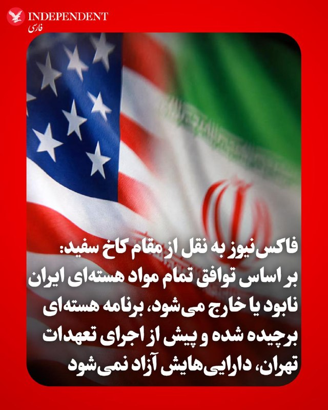

♦️یک مقام کاخ سفید در گفتگو با «فاکس نیوز» اعلام کرد که جمهوری اسلامی ایران با یک توافق «مبتنی بر عملکرد» موافقت کرده است؛ توافقی که تهران را ملزم می‌کند پیش از دریافت هرگونه کاهش تحریم، امتیازات بزرگی واگذار کند.

بر اساس اظهارات این مقام آمریکایی، طبق این توافق تمام مواد هسته‌ای ایران باید نابود و از کشور خارج شود، برنامه هسته‌ای آن به طور کامل برچیده گردد و تا زمانی که تهران تمامی تعهدات خود را به طور کامل اجرا نکند، هیچ‌یک از دارایی‌های بلوکه‌شده‌اش آزاد نخواهد شد.

این مقام رسمی خزانه‌داری و امنیت ملی آمریکا در پایان افزود که بر اساس این تفاهم، تنگه هرمز باید برای همیشه باز بماند و ایران متعهد شده است که حمایت مالی از گروه‌های تروریستی را به طور کامل متوقف کند. این شروط سخت‌گیرانه درست پس از اظهارات تند ترامپ مبنی بر بی‌اعتبار بودن روایت رسانه‌های دولتی ایران از مفاد توافق، منتشر شده است.
‌🇸🇦 Indypersian

🤖 @VahidOOnLine

## VahidOOnLine — post 245150

  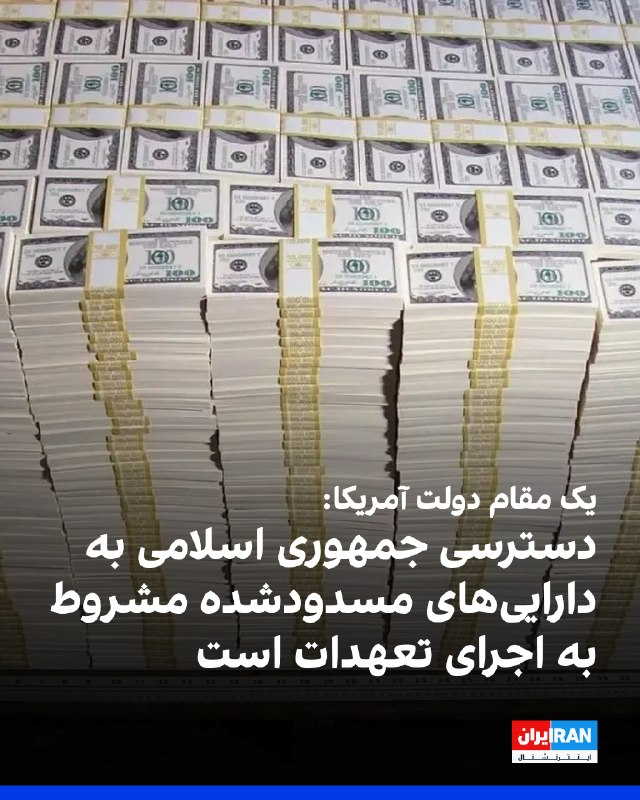

یک مقام ارشد دولت آمریکا به رویترز گفت که توافق با تهران شامل توقف حمایت جمهوری اسلامی از گروه‌های تروریستی خواهد بود.

این مقام آمریکایی گفت که توافق در حال شکل‌گیری با جمهوری اسلامی بر پایه اجرای تعهدات است و تهران تا زمانی که به تعهدات خود عمل نکند، به هیچ‌یک از دارایی‌های مسدودشده خود دسترسی نخواهد داشت.
‌🏁 🇬🇧 IranintlTV

🤖 @VahidOOnLine

## VahidOOnLine — post 245149

♦️ولادیمیر پوتین، رئیس‌جمهوری روسیه، روز جمعه ۲۲ خرداد در مراسمی در کرملین و همزمان با «روز ملی روسیه» به تعدادی از شهروندان این کشور جوایز دولتی اعطا کرد؛ روزی که به مناسبت شکل‌گیری فدراسیون روسیه پس از فروپاشی اتحاد جماهیر شوروی در سال ۱۹۹۱ گرامی داشته می‌شود.
در همین حال، رسانه‌های روسی گزارش دادند که مراسم اصلی این روز که معمولا در میدان سرخ مسکو برگزار می‌شود، امسال به یک مکان سرپوشیده در خارج از مرکز شهر منتقل شده است.
بر اساس این گزارش، این تغییر به‌دلیل افزایش حملات اوکراین به خاک روسیه پس از بیش از چهار سال جنگ صورت گرفته و تدابیر امنیتی در پایتخت تشدید شده است.
‌🇸🇦 Indypersian

🤖 @VahidOOnLine

## VahidOOnLine — post 245148

  

یک مقام ارشد دولت آمریکا به رویترز گفت توافق با جمهوری اسلامی بر اساس اجرای تعهدات خواهد بود.

این مقام ارشد دولت آمریکا اضافه کرد که مواد هسته‌ای ایران نابود و از این کشور خارج خواهد شد و برنامه هسته‌ای آن‌ها برچیده خواهد شد.

این مقام ارشد دولت آمریکا گفت که تنگه هرمز نیز باز خواهد بود.
‌🏁 🇬🇧 IranintlTV

🤖 @VahidOOnLine

## VahidOOnLine — post 245147

  

♦️ تنها یک روز پس از اعلام نهایی شدن توافق با ایران، دونالد ترامپ مقامات تهران را «بدقول و بی‌شرف» (Dishonorable) خواند و آن‌ها را به ارائه اطلاعات نادرست از مفاد توافق متهم کرد.

ترامپ در شبکه اجتماعی «تروث سوشال» نوشت: «شرایطی که ایران به رسانه‌های جعلی درز داده، هیچ ارتباطی با توافقی که به صورت مکتوب بر سر آن موافقت شده بود، ندارد. بیانیه ضعیف و رقت‌انگیز آن‌ها درباره توافق، فرسنگ‌ها با حقیقت فاصله دارد. معامله با این افرادِ بی‌اعتبار فایده‌ای ندارد؛ در قاموس آن‌ها چیزی به نام حسن نیت وجود ندارد.»

این خشم ترامپ پس از آن برانگیخته شد که رسانه‌های دولتی ایران، گزارش‌هایی از «خطوط کلی توافق احتمالی» منتشر کردند و مدعی شدند که جمهوری اسلامی مدیریت تنگه هرمز را واگذار نخواهد کرد و آمریکا باید ۲۴ میلیارد دلار از دارایی‌های بلوکه‌شده ایران را آزاد کند.

ترامپ در پایان پیام خود، تداوم هدف قرار گرفتن کشتی‌ها در تنگه هرمز توسط ایران را «کاملا غیرقابل قبول» دانست و هشدار داد: «بهتر است رفتارشان را اصلاح کنند، آن هم سریع!»
‌🇸🇦 Indypersian

🤖 @VahidOOnLine

## VahidOOnLine — post 245146

  

دونالد ترامپ در شبکه تروث سوشال نوشت مفادی که جمهوری اسلامی در اختیار رسانه‌ها قرار داده، هیچ ارتباطی با مفادی که به صورت مکتوب بر سر آن توافق شده ندارد.

ترامپ اضافه کرد: «آنچه آن‌ها گفته‌اند، از جمله بیانیه ضعیف و رقت‌انگیزشان درباره توافق، هیچ ارتباطی با واقعیت ندارد.»

رییس جمهوری ایالات متحده مقام‌های جمهوری اسلامی را «بسیار بی‌آبرو» خواند و افزود با آن‌ها چیزی به نام مذاکره با حسن نیت وجود ندارد.

ترامپ همچنین گفت حمله پهپادی شب گذشته جمهوری اسلامی به کشتی‌های هندی که در حال خروج از تنگه هرمز بودند، «کاملا غیرقابل قبول» بوده و افزود: «آنها باید خیلی سریع اوضاع را سامان دهند.»
‌🏁 🇬🇧 IranintlTV

🤖 @VahidOOnLine

## VahidOOnLine — post 245145

  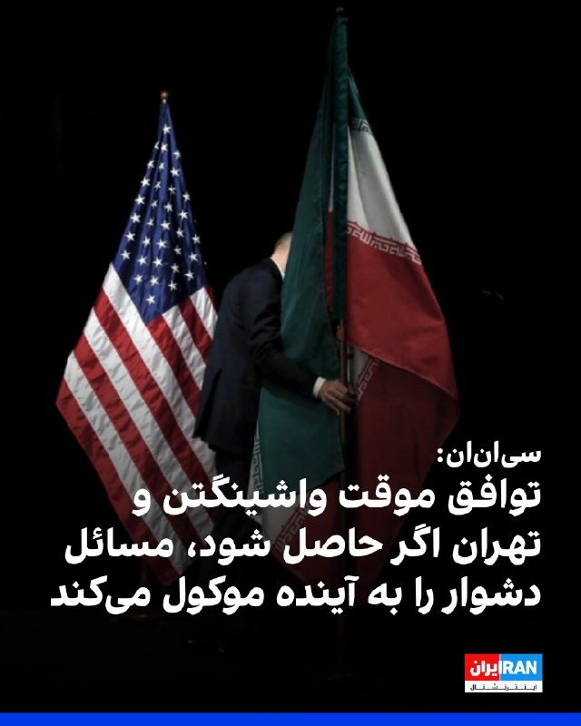

سی‌ان‌ان به نقل از یک دیپلمات آگاه نوشت توافق موقت میان آمریکا و جمهوری اسلامی - که هنوز به طور قطعی نهایی نشده - پس از امضا، راه را برای مذاکرات بیشتر درباره برنامه هسته‌ای تهران و موضوع رفع تحریم‌ها در دوره آتش‌بس ۶۰ روزه باز خواهد کرد.

سی‌ان‌ان افزود لزوم رسیدگی به سه موضوع اصلی و مورد اختلاف تنها در مدت ۶۰ روز باعث شده برخی ناظران تردید داشته باشند که آیا این توافق واقعا به جنگ پایان می‌دهد یا فقط مسائل دشوار را به آینده موکول می‌کند.

بنا بر این گزارش، اگر مذاکره‌کنندگان آمریکایی اهدافی مشابه توافق قبلی را دنبال کنند، دستیابی به نتیجه در بازه ۶۰ روزه امکان‌پذیر است.
‌🏁 🇬🇧 IranintlTV

🤖 @VahidOOnLine

## VahidOOnLine — post 245143

  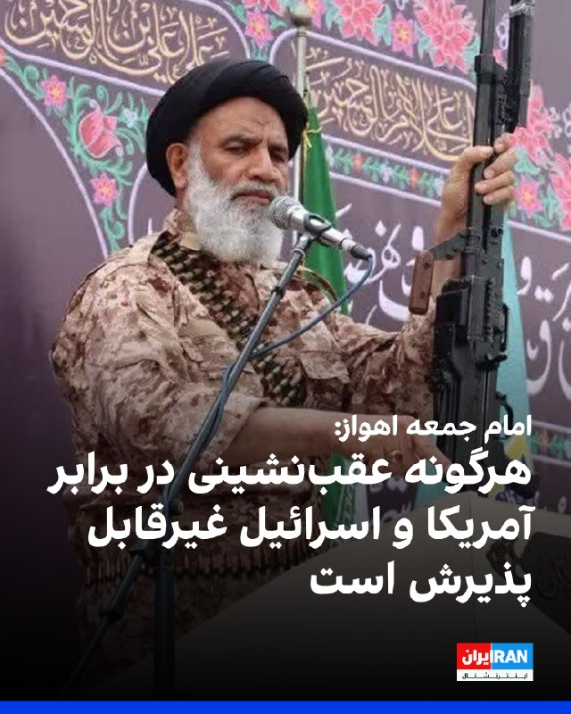

محمدنبی موسوی‌فرد، امام جمعه اهواز، گفت هرگونه عقب‌نشینی در برابر «جبهه آمریکا و اسرائیل»، ممنوع و غیرقابل پذیرش است.

او در خطبه‌های نماز جمعه ۲۲ خرداد گفت امنیت کشور تنها به توان نظامی محدود نمی‌شود و حاصل ترکیبی از قدرت نظامی، قدرت نرم، هوشمندی رسانه‌ای و تاب‌آوری اقتصادی است.

موسوی‌فرد افزود «دشمن» تلاش می‌کند با شایعه‌سازی و دوقطبی‌سازی، تاب‌آوری جامعه را تضعیف کند.
‌🏁 🇬🇧 IranintlTV

🤖 @VahidOOnLine

## VahidOOnLine — post 245142

یک شهروند در پیامی صوتی به ایران اینترنشنال از وضعیت اقتصادی، کاهش قدرت خرید و نایاب شدن داروی ضدافسردگی روایت می‌کند و می‌گوید مجبور به توقف استفاده از داروی آسنترا شده است. صدای این مخاطب برای حفظ امنیتش تغییر داده شده است.
‌🏁 🇬🇧 IranintlTV

🤖 @VahidOOnLine

## VahidOOnLine — post 245141

  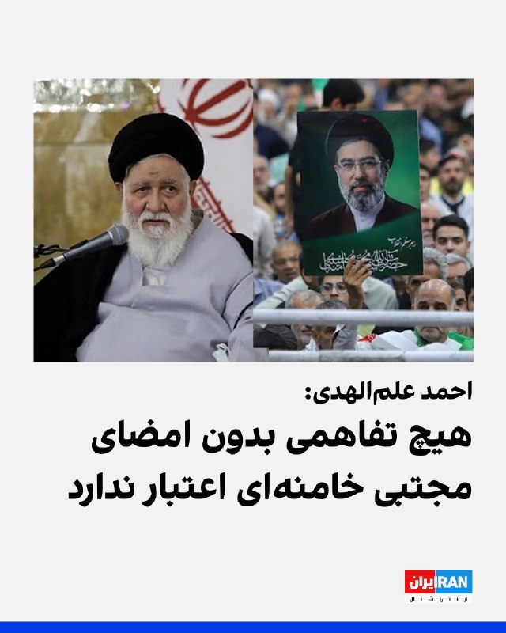

احمد علم‌الهدی، نماینده رهبر جمهوری اسلامی در خراسان رضوی، گفت هیچ تفاهم و تعهدی بدون امضای مجتبی خامنه‌ای قابل قبول نیست.

او «عداوت و دشمنی با آمریکا» را اصل مسلم جمهوری اسلامی خواند و افزود باید با تبعیت کامل از مجتبی خامنه‌ای، جرات هرگونه تجاوز را نه تنها از آمریکا، بلکه از هر عنصر زورمند دیگری گرفت. او در ادامه تاکید کرد: «دشمنی آمریکا با ما بیشتر از قبل شده است.»
‌🏁 🇬🇧 IranintlTV

🤖 @VahidOOnLine

## VahidOOnLine — post 245140

  <a href="telegram/content/VahidOOnLine_245140_1781275253.mp4" target="_blank">🎬 Download video</a>

♦️یک هواپیمای بوئینگ ۷۷۷ متعلق به خطوط هوایی ترکیش (THY) در فرودگاه آنتالیا دچار حادثه شد. این هواپیما که پرواز استانبول به آنتالیا را انجام می‌داد، پس از فرود ایمن، هنگام حرکت به سمت محل پارک، با دکل آنتن رادار زمینی برخورد کرد.
بر اساس گزارش‌ها، بال سمت راست هواپیما در حین حرکت به این دکل برخورد کرده و بلافاصله تیم‌های امدادی وارد عمل شدند. تمامی ۲۶۷ مسافر حاضر در هواپیما به‌صورت ایمن تخلیه شدند و تنها یک نفر به‌صورت سطحی دچار جراحت شد که وضعیت عمومی او مساعد اعلام شده است.
مسئولان این خطوط هوایی با تایید این حادثه اعلام کردند بررسی‌های فنی برای مشخص شدن علت دقیق برخورد آغاز شده و جزئیات بیشتر متعاقبا اعلام خواهد شد.
‌🇸🇦 Indypersian

🤖 @VahidOOnLine

## VahidOOnLine — post 245139

  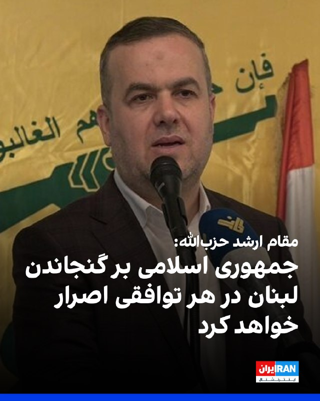

حسن فضل‌الله، از چهره‌های ارشد حزب‌الله و نماینده این گروه در پارلمان لبنان، گفت حزب‌الله اطمینان دارد که جمهوری اسلامی در هر توافق احتمالی با آمریکا بر گنجانده شدن موضوع لبنان اصرار خواهد کرد.

فضل‌الله روز جمعه در سخنانی که از شبکه المنار پخش شد، گفت: «اگر توافقی حاصل شود، به جمهوری اسلامی اعتماد کامل داریم و اطمینان داریم که این کشور بر گنجانده شدن پرونده لبنان در هر توافقی اصرار خواهد کرد.»

این اظهارات در حالی مطرح می‌شود که گزارش‌ها از افزایش احتمال دستیابی به توافق میان آمریکا و جمهوری اسلامی حکایت دارند.

مقام‌های جمهوری اسلامی در ماه‌های اخیر بارها بر لزوم برقراری آتش‌بس در لبنان تاکید کردند و آن را یکی از مطالبات اصلی تهران در مذاکرات با واشینگتن دانستند.
‌🏁 🇬🇧 IranintlTV

🤖 @VahidOOnLine

## VahidOOnLine — post 245138

  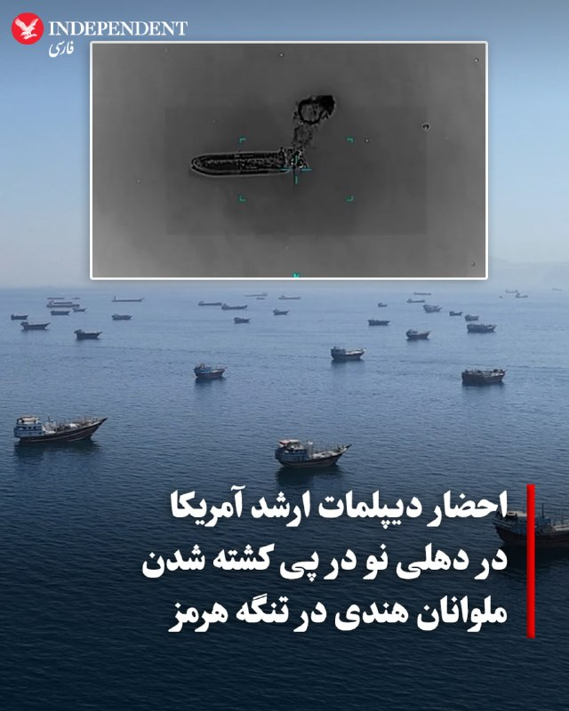

♦️ وزارت امور خارجه هند روز جمعه ۲۲ خرداد با صدور بیانیه‌ای اعلام کرد که در اعتراض به نقش ایالات متحده در حمله به کشتی‌های تجاری حامل ملوانان هندی در تنگه هرمز، دیپلمات ارشد آمریکا را احضار کرده است. دهلی نو با احضار «جیسون میکس»، کاردار سفارت آمریکا، مراتب «اعتراض شدید» خود را به واشنگتن ابلاغ کرد.

وزارت امور خارجه هند در این بیانیه، «حملات مداوم نیروهای دریایی آمریکا به کشتی‌های تجاری حامل دریانوردان هندی در دریای عمان را که منجر به جان باختن دلخراش و قابل پیشگیری سه شهروند هندی شده است»، به شدت محکوم کرد. این موضع‌گیری پس از آن اتخاذ شد که در حملات هوایی این هفته ارتش آمریکا به حداقل سه کشتی تجاری در تنگه هرمز، سه ملوان هندی کشته شدند.

در پایان این بیانیه آمده است که دولت هند «نگرانی عمیق خود را نسبت به استفاده از تسلیحات مرگبار علیه کشتی‌های غیرنظامی و تجاری» به طرف آمریکایی منتقل کرده است.
‌🇸🇦 Indypersian

🤖 @VahidOOnLine

## VahidOOnLine — post 245137

  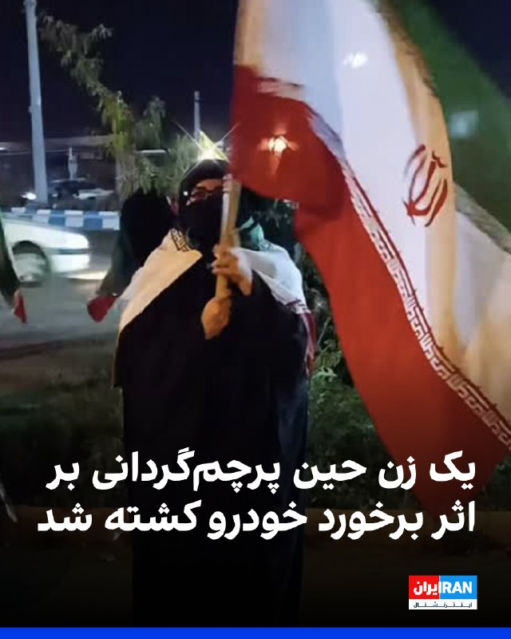

ایرنا، خبرگزاری دولت جمهوری اسلامی، گزارش داد معصومه سهامی، یک زن شرکت‌کننده در تجمع حکومتی در شیراز، روز چهارشنبه ۲۰ خرداد در حین «پرچم‌گردانی» بر اثر برخورد یک خودرو جان خود را از دست داد.

بر اساس این گزارش، این حادثه مقابل یکی از موکب‌های شهر شیراز و در جریان مراسم پرچم‌گردانی رخ داد. ایرنا نوشت این زن پس از انحراف یک دستگاه خودرو دچار حادثه شد.

ایرنا از او با عنوان «شهید» یاد کرده و گزارش داده است مراسم تشییع جنازه او از حرم شاهچراغ در شیراز برگزار شده است.
‌🏁 🇬🇧 IranintlTV

🤖 @VahidOOnLine

## VahidOOnLine — post 245136

  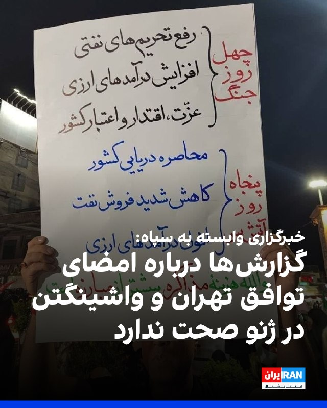

خبرگزاری فارس، وابسته به سپاه پاسداران، به نقل از یک منبع نزدیک به تیم مذاکره‌کننده جمهوری اسلامی گزارش داد گزارش‌ها درباره نهایی شدن توافق با آمریکا و امضای آن در روز یکشنبه در ژنو صحت ندارد.

این منبع گفت روند بررسی و تصمیم‌گیری درباره توافق در ایران هنوز نهایی نشده است و گزارش‌های منتشرشده درباره زمان و محل امضای توافق کذب است.
‌🏁 🇬🇧 IranintlTV

🤖 @VahidOOnLine

## VahidOOnLine — post 245135

  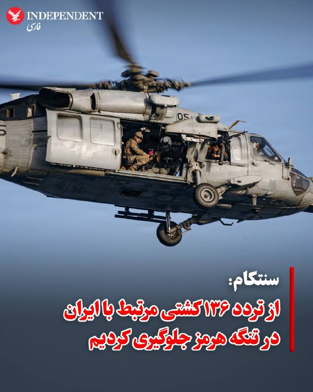

♦️فرماندهی مرکزی ارتش آمریکا (سنتکام) روز جمعه ۲۲ خرداد با انتشار پیامی در شبکه اجتماعی ایکس اعلام کرد که نیروهای آمریکایی در راستای تضمین پایبندی به محاصره اعمال‌شده از سوی واشنگتن بر تنگه هرمز، «مسیر ۱۳۶ کشتی را تغییر داده و ۹ کشتی دیگر را توقیف یا غیرفعال کرده‌اند.»

سنتکام در ادامه تاکید کرد: «ناوهای جنگی و یگان‌های هوایی نیروی دریایی آمریکا به گشت‌زنی در آب‌های منطقه جهت اجرای کامل محاصره دریایی علیه ایران ادامه می‌دهند.»
‌🇸🇦 Indypersian

🤖 @VahidOOnLine

## VahidOOnLine — post 245134

  

سنتکام، ستاد فرماندهی مرکزی آمریکا، اعلام کرد نیروهای این کشور در چارچوب اجرای محاصره دریایی بنادر جنوبی ایران، تاکنون ۱۳۶ شناور را وادار به تغییر مسیر و ۹ شناور دیگر را متوقف کرده‌اند.

سنتکام جمعه ۲۲ خرداد در شبکه اجتماعی ایکس نوشت نیروی دریایی آمریکا و تجهیزات هوایی این کشور همچنان در آب‌های منطقه گشت‌زنی می‌کنند و به اجرای محاصره علیه ایران ادامه می‌دهند.

این محاصره پس از آن آغاز شد که دونالد ترامپ، رییس‌جمهوری آمریکا، ۲۴ فروردین دستور اعمال محدودیت بر تردد کشتی‌های ورودی و خروجی بنادر ایران را صادر کرد.
‌🏁 🇬🇧 IranintlTV

🤖 @VahidOOnLine

## VahidOOnLine — post 245133

♦️حبیب‌الله سیاری، رئیس ستاد و معاون هماهنگ‌کننده ارتش جمهوری اسلامی، اعلام کرد از سرنوشت خلبانان دو فروند جنگنده سوخو ۲۴ که در جریان جنگ اخیر برای انجام مأموریت به سمت قطر اعزام شده بودند، اطلاعی در دست نیست.
او روز پنجشنبه ۲۱ خردادماه در یک برنامه تلویزیونی گفت این جنگنده‌ها از اربیل عراق به سمت قطر پرواز کرده‌اند و چهار خلبان در این عملیات حضور داشته‌اند که «هنوز از وضعیت آن‌ها خبری در دست نیست».
سیاری همچنین گفت جمهوری اسلامی در جریان این درگیری‌ها، حملات هوایی دیگری با جنگنده‌های اف-۵ و اف-۴ در کشورهای منطقه انجام داده که به گفته او با وارد کردن تلفات به نیروهای مقابل همراه بوده و هواپیماها پس از انجام مأموریت به ایران بازگشته‌اند.
این اظهارات در حالی مطرح می‌شود که پیش‌تر وزارت دفاع قطر اعلام کرده بود در تاریخ ۱۱ اسفندماه، دو فروند جنگنده سوخو ۲۴ ایران را سرنگون کرده است.
‌🇸🇦 Indypersian

🤖 @VahidOOnLine

## WithYashar — post 14639

Voice message

## WithYashar — post 14638

  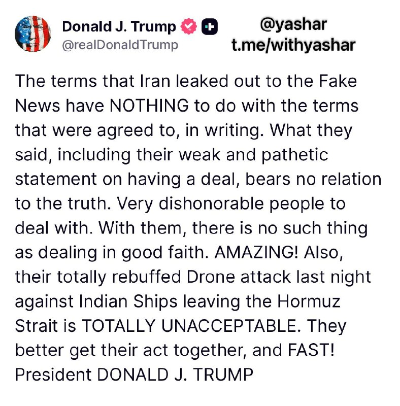

ترامپ در تروث : مفادی که ایران به رسانه‌های جعلی (Fake News) درز داده است، هیچ ارتباطی با مفادی که به‌صورت مکتوب بر سر آن‌ها توافق شده بود، ندارد.
آنچه آن‌ها گفته‌اند، از جمله بیانیه ضعیف و تأسف‌بارشان درباره وجود یک توافق، هیچ نسبتی با حقیقت ندارد.
آن‌ها افرادی بسیار بی‌شرافت برای مذاکره و معامله هستند. در مورد آن‌ها، چیزی به نام مذاکره و رفتار با حسن نیت وجود ندارد. شگفت‌انگیز است!
همچنین، حمله پهپادی کاملاً ناکام‌مانده آن‌ها دیشب علیه کشتی‌های هندی که در حال خروج از تنگه هرمز بودند، کاملاً غیرقابل قبول است.
بهتر است هرچه سریع‌تر اوضاع خود را سر و سامان دهند؛ وگرنه با عواقب آن روبه‌رو خواهند شد.
@withyashar

## WithYashar — post 14637

خبرنگار وال‌استریت ژورنال: برای اینکه توافقی شکل بگیره، مهمتر از تایید مجتبی خامنه‌ای، تایید فرمانده‌های ارشد سپاهه.
@withyashar

## WithYashar — post 14636

منبع ارشد در تیم مذاکره کننده ایران:
یادداشت تفاهم نامه برای ورود به مذاکرات میان ایران و آمریکا نهایی نشده است و در حال بررسی است و هرگونه امضای یادداشت تفاهم در روز های آینده کذب است
@withyashar

## WithYashar — post 14635

‏شاهزاده رضا پهلوی: در ایران نوین با مافیایی شدن ورزش مقابله خواهیم کرد.
@withyashar

## WithYashar — post 14634

رویترز: توافق توسط جی‌دی ونس و قالیباف امضا می‌شود.🚨
@withyashar

## WithYashar — post 14633

نبویان: ما آمریکا رو زدیم زمین، رو سینه‌اش نشستیم که کار رو تموم کنیم یهو رفتیم پای میز مذاکره، میخوایم توافقی بکنیم که اون بیاد بشینه رو سینه ما اخه.
@withyashar 😂🍋🍋

## WithYashar — post 14632

سی‌ان‌ان به نقل از یک منبع اسرائیلی:
اسرائیل به آمریکا فشار میاره تا دارایی‌های مسدود شده ایران رو به عنوان بخشی از یادداشت تفاهم آزاد نکنه.
@withyashar

## WithYashar — post 14631

  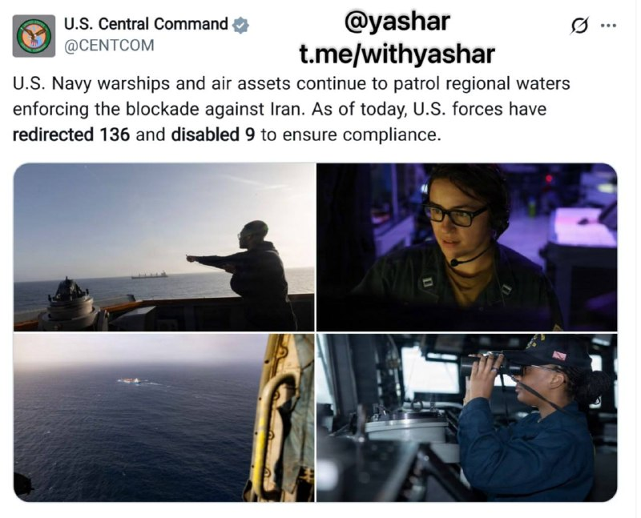

سنتکام: ناوهای جنگی و تجهیزات هوایی نیروی دریایی ایالات متحده همچنان در آب‌های منطقه‌ای به گشت‌زنی ادامه می‌دهند و محاصره علیه ایران را اجرا می‌کنند.
تا امروز، نیروهای آمریکا ۱۳۶ شناور را تغییر مسیر داده‌اند و ۹ شناور را از کار انداخته‌اند تا از رعایت این محاصره اطمینان حاصل شود.
@withyashar

## mwarmonitor — post 10775

🔴 وزیر جنگ اسرائیل گفت:

🔸رئیس‌جمهور ایالات متحده آمریکا این روزها با تکیه بر رویکردی مبتنی بر منافع آمریکا در مسیر دستیابی به توافق با ایران حرکت می‌کند. ما انتظار داریم او به اصل جلوگیری از دستیابی ایران به سلاح هسته‌ای پایبند باشد و همچنین به اصول دیگری در حوزه موشک‌ها و شبکه‌های نیابتیِ تروریستی توجه کند.

🔸او افزود: اسرائیل باید اطمینان حاصل کند که در آینده، توانایی اقدام مستقل برای جلوگیری از دستیابی ایران به سلاح هسته‌ای را خواهد داشت.

🔴در ادامه وزیر کاتز گفت که اسرائیل از مناطق امنیتی در لبنان، سوریه و غزه عقب‌نشینی نخواهد کرد.

@mwarmonitor

## mwarmonitor — post 10774

🔴 فوری: به گزارش Reuters، طبق توافق با تهران، مواد هسته‌ای ایران نابود شده و از کشور خارج خواهد شد؛ این را یک مقام ارشد دولت آمریکا اعلام کرده است. 🔴 این مقام می‌گوید برنامه هسته‌ای ایران برچیده خواهد شد. 🔴 به گفته این مقام، تا زمانی که ایران تعهدات خود…

## mwarmonitor — post 10773

🔴 فوری: به گزارش Reuters، طبق توافق با تهران، مواد هسته‌ای ایران نابود شده و از کشور خارج خواهد شد؛ این را یک مقام ارشد دولت آمریکا اعلام کرده است.

🔴 این مقام می‌گوید برنامه هسته‌ای ایران برچیده خواهد شد.

🔴 به گفته این مقام، تا زمانی که ایران تعهدات خود را اجرا نکند، هیچ پولی به تهران آزاد نخواهد شد.

@mwarmonitor

## mwarmonitor — post 10772

🔴عرضه اولیه سهام (IPO) شرکت SpaceX باعث شد ایلان ماسک به نخستین تریلیونر جهان تبدیل شود.

🔸پیش از این عرضه اولیه، ثروت ماسک طبق برآورد CBS حدود ۸۱۳ میلیارد دلار تخمین زده می‌شد.

@mwarmonitor

## mwarmonitor — post 10771

  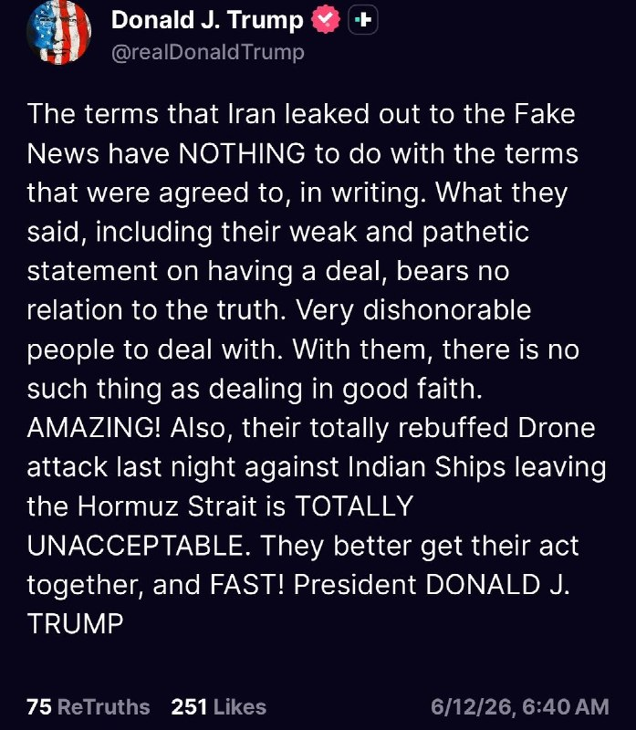

🔴«شرایطی که ایران به رسانه‌های جعلی (فیک نیوز) درز داده است، هیچ ربطی به شرایطی که به صورت مکتوب بر سر آن‌ها توافق شده بود، ندارد. آنچه آن‌ها گفته‌اند، از جمله بیانیه ضعیف و رقت‌انگیزشان درباره داشتن یک توافق، هیچ نسبتی با حقیقت ندارد. افراد بسیار بی‌شرفی برای معامله کردن هستند. با آن‌ها چیزی به نام معامله از روی حسن نیت وجود ندارد. مایه شگفتی است! همچنین، حمله پهپادی کاملاً دفع‌شده آن‌ها در شب گذشته علیه کشتی‌های هندی که در حال ترک تنگه هرمز بودند، کاملاً غیرقابل قبول است. بهتر است سر عقل بیایند، آن هم سریع!

رئیس‌جمهور دونالد جی. ترامپ»

@mwarmonitor

## mwarmonitor — post 10770

🔸 شبکه CNN به نقل از یک منبع آگاه اسرائیلی:

🔹یک منبع اسرائیلی مطلع اعلام کرد که اسرائیل به ایالات متحده فشار می‌آورد تا از آزادسازی دارایی‌های مسدودشده ایران به‌عنوان بخشی از یادداشت تفاهم خودداری کند.

@mwarmonitor

## mwarmonitor — post 10769

  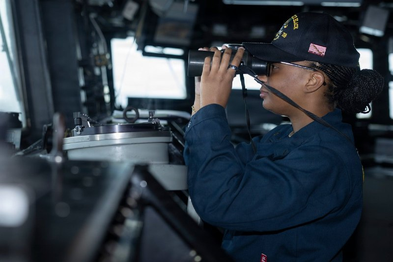

🔴ناوهای جنگی و یگان‌های هوایی نیروی دریایی ایالات متحده به گشت‌زنی در آب‌های منطقه ادامه می‌دهند و محاصره اعمال‌شده علیه ایران را اجرا می‌کنند.

🔸تا امروز، نیروهای آمریکایی مسیر ۱۳۶ شناور را تغییر داده و ۹ مورد را برای اطمینان از رعایت این محاصره متوقف یا از کار انداخته‌اند.

@mwarmonitor

## FoxNewsTwitter — post 342902

  <a href="telegram/content/FoxNewsTwitter_342902_1781275260.mp4" target="_blank">🎬 Download video</a>

Fox News (Twitter/X)

"You must be smoking some really good crack."

That's how Elon Musk says he would have reacted if someone told him years ago that SpaceX would one day launch the largest IPO ever.

Speaking ahead of the company's historic Wall Street debut, Musk recalled the early days of SpaceX, when the company operated out of a warehouse in El Segundo and faced serious doubts about its survival.

"I think this company is going to fail," he remembered thinking.

## FoxNewsTwitter — post 342901

  <a href="telegram/content/FoxNewsTwitter_342901_1781275262.mp4" target="_blank">🎬 Download video</a>

Fox News (Twitter/X)

WATCH: SpaceX CEO Elon Musk rings the NASDAQ opening bell as the company officially goes public, setting him up to be the world's first trillionaire.

## FoxNewsTwitter — post 342900

  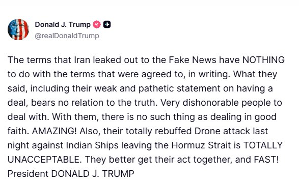

Fox News (Twitter/X)

BREAKING: Trump blasts leaked Iranian deal terms, saying US is dealing with 'very dishonorable people' who 'better get their act together'

## FoxNewsTwitter — post 342899

Fox News (Twitter/X)

BREAKING: A White House official says Iran has agreed to a performance-based deal that would require major concessions before receiving any sanctions relief.

According to the official, Iran's nuclear material would be destroyed and removed, its nuclear program dismantled, and none of its money released until it fulfills its commitments.

The official also says the Strait of Hormuz would remain open and Iran would agree to stop funding terrorist groups.

## FoxNewsTwitter — post 342898

  <a href="telegram/content/FoxNewsTwitter_342898_1781275264.mp4" target="_blank">🎬 Download video</a>

Fox News (Twitter/X)

A London restaurant manager saw a little girl hanging from a balcony ledge — then made the catch of his life.

He says that he acted on “pure instinct” as the child fell from an upper-floor flat and he moved into position below.

Afterward, he credited his cricket skills for helping him react in time.

## FoxNewsTwitter — post 342897

Fox News (Twitter/X)

WATCH LIVE: SpaceX launches Falcon 9 rocket from Florida https://twitter.com/i/broadcasts/1dxYllNrmazJX

## FoxNewsTwitter — post 342896

Fox News (Twitter/X)

U.S. forces shot down two Iranian attack drones targeting commercial ships in the Strait of Hormuz just hours after President Trump said he had called off planned strikes on Iran.

The incident comes as Washington and Tehran continue negotiating a potential agreement aimed at preventing Iran from obtaining a nuclear weapon.

Iranian state media claims a draft deal includes sanctions relief, troop withdrawals, and the release of frozen funds, but major nuclear and economic issues remain unresolved and no final agreement has been signed, @Max_Gorden reports.

## FoxNewsTwitter — post 342895

  <a href="telegram/content/FoxNewsTwitter_342895_1781275266.mp4" target="_blank">🎬 Download video</a>

Fox News (Twitter/X)

Robbed at gunpoint while selling lemonade.

New video shows the two suspects police say targeted a children's lemonade stand in South Boston, stealing a cash box before one suspect flashed a firearm at the children.

It's the kind of crime most people associate with businesses or convenience stores, not two kids trying to make money at a neighborhood lemonade stand.

Police are asking for the public's help identifying those involved.

## pm_afshaa — post 93696

  <a href="telegram/content/pm_afshaa_93696_1781275267.webm" target="_blank">🎬 Download video</a>

🔴کاتز، وزیر جنگ اسرائیل:
ترامپ این روزها بر اساس دیدگاه منافع آمریکا به سمت توافق با ایران پیش میره و ما انتظار داریم که به اصل جلوگیری از دستیابی ایران به سلاح هسته‌ای و اصول دیگر در زمینه موشک‌ها و شبکه‌ نیروهای نیابتی پایبند باشه.

اسرائیل باید اطمینان حاصل کنه که در آینده توانایی عمل مستقل برای جلوگیری از دستیابی ایران به سلاح هسته‌ای رو خواهد داشت.

💧 Rainbet.com the #1 Non-KYC Crypto Casino & Sportsbook @rainbetcom

😁 @Pm_Afshaa

## pm_afshaa — post 93695

  <a href="telegram/content/pm_afshaa_93695_1781275268.webm" target="_blank">🎬 Download video</a>

🔴فاکس‌نیوز به نقل از یک مقام کاخ سفید: ایران با توافقی مبتنی بر اجرای تعهدات موافقت کرده که بر اساس آن، ایران باید پیش از هرگونه کاهش تحریم‌ها امتیازات بزرگی بده. به گفته این مقام، مواد هسته‌ای ایران نابود و از کشور خارج میشه، برنامه هسته‌ای برچیده خواهد…

## pm_afshaa — post 93694

  <a href="telegram/content/pm_afshaa_93694_1781275268.webm" target="_blank">🎬 Download video</a>

🔴رویترز به نقل از یک مقام ارشد آمریکایی: طبق توافق، مواد هسته‌ای ایران نابود میشه و از کشور خارج خواهد شد و برنامه هسته‌ای ایران برچیده خواهد شد و ایران از سازمان‌های تروریستی حمایت مالی نخواهد کرد. تا زمانی که ایران تعهدات خودش رو اجرا نکنه، هیچ پولی به…

## pm_afshaa — post 93693

  <a href="telegram/content/pm_afshaa_93693_1781275269.webm" target="_blank">🎬 Download video</a>

🔴رویترز به نقل از یک مقام ارشد آمریکایی:
طبق توافق، مواد هسته‌ای ایران نابود میشه و از کشور خارج خواهد شد و برنامه هسته‌ای ایران برچیده خواهد شد و ایران از سازمان‌های تروریستی حمایت مالی نخواهد کرد.

تا زمانی که ایران تعهدات خودش رو اجرا نکنه، هیچ پولی به ایران آزاد و پرداخت نخواهد شد.

💧 Rainbet.com the #1 Non-KYC Crypto Casino & Sportsbook @rainbetcom

😁 @Pm_Afshaa

## pm_afshaa — post 93692

  <a href="telegram/content/pm_afshaa_93692_1781275269.webm" target="_blank">🎬 Download video</a>

🔴پست جدید ترامپ: شروطی که ایران در اختیار رسانه‌های دروغگو قرار داد، ربطی به شروطی که کتبا بر آن توافق شده، نداره. آنچه آنها گفتن، از جمله اظهارات ضعیف و رقت انگیز آنها در مورد وجود توافق، ربطی به حقیقت نداره. واقعاً طرف‌های بسیار بی‌شرافت برای مذاکره هستن.…

## pm_afshaa — post 93691

  <a href="telegram/content/pm_afshaa_93691_1781275270.webm" target="_blank">🎬 Download video</a>

🔴پست جدید ترامپ:

شروطی که ایران در اختیار رسانه‌های دروغگو قرار داد، ربطی به شروطی که کتبا بر آن توافق شده، نداره. آنچه آنها گفتن، از جمله اظهارات ضعیف و رقت انگیز آنها در مورد وجود توافق، ربطی به حقیقت نداره. واقعاً طرف‌های بسیار بی‌شرافت برای مذاکره هستن. چیزی به نام برخورد با حسن نیت با آنها وجود نداره. شگفت انگیزه!
حمله پهبادی شب گذشته آنها به کشتی‌های هندی که از تنگه هرمز خارج میشدن هم کاملا غیرقابل قبوله. بهتره اونا سریع خودشونو جمع و جور کنن وگرنه اوضاع براشون خوب پیش نمیره!

💧 Rainbet.com the #1 Non-KYC Crypto Casino & Sportsbook @rainbetcom

😁 @Pm_Afshaa

## pm_afshaa — post 93690

  <a href="telegram/content/pm_afshaa_93690_1781275270.webm" target="_blank">🎬 Download video</a>

🔴نبویان، نماینده مجلس:
اینکه رسانه‌ها میگن هر توافقی حتما با امضای رهبری هست یک شیطنت رسانه‌ای است؛ با گفتن این موضوع میخوان تمام عواقب این توافق رو بر روی دوش رهبری بذارن.

💧 Rainbet.com the #1 Non-KYC Crypto Casino & Sportsbook @rainbetcom

😁 @Pm_Afshaa

## pm_afshaa — post 93689

  <a href="telegram/content/pm_afshaa_93689_1781275271.webm" target="_blank">🎬 Download video</a>

🔴خبرنگار وال‌استریت ژورنال: برای اینکه توافقی شکل بگیره، مهمتر از تایید مجتبی خامنه‌ای، تایید فرمانده‌های ارشد سپاهه.

💧 Rainbet.com the #1 Non-KYC Crypto Casino & Sportsbook @rainbetcom

😁 @Pm_Afshaa

## pm_afshaa — post 93688

  <a href="telegram/content/pm_afshaa_93688_1781275271.webm" target="_blank">🎬 Download video</a>

🔴مرندی، عضو تیم مذاکره‌کننده:
یکشنبه در ژنو اتفاقی نمیفته. هنوز کارهایی برای انجام دادن باقی مونده.

💧 Rainbet.com the #1 Non-KYC Crypto Casino & Sportsbook @rainbetcom

😁 @Pm_Afshaa

## pm_afshaa — post 93687

خبرگزاری رویترز: توافق بزودی توسط جی‌دی ونس و قالیباف امضا میشه.

💧 Rainbet.com the #1 Non-KYC Crypto Casino & Sportsbook @rainbetcom

😁 @Pm_Afshaa

## pm_afshaa — post 93686

  <a href="telegram/content/pm_afshaa_93686_1781275272.webm" target="_blank">🎬 Download video</a>

🔴فارس به نقل از منبعی نزدیک به تیم مذاکره‌کننده: ادعاهایی که ترامپ و برخی رسانه‌های خارجی مطرح کردن مبنی بر اینکه «توافق نهایی شده و قراره روز یکشنبه در ژنو امضا بشه» کاملاً بی‌اساسه.

اساساً فرآیند بازبینی و اتخاذ تصمیم در ایران هنوز کامل نشده، بنابراین اعلام روز یکشنبه و مکان ژنو کاملاً رد میشه.

💧 Rainbet.com the #1 Non-KYC Crypto Casino & Sportsbook @rainbetcom

😁 @Pm_Afshaa

## pm_afshaa — post 93685

  <a href="telegram/content/pm_afshaa_93685_1781275272.webm" target="_blank">🎬 Download video</a>

🔴سنتکام: نیروهای آمریکایی از آغاز محاصره بنادر ایران، 136 کشتی تجاری رو تغییر مسیر داده و 9 کشتی رو از کار انداختن.

💧 Rainbet.com the #1 Non-KYC Crypto Casino & Sportsbook @rainbetcom

😁 @Pm_Afshaa

## pm_afshaa — post 93684

  <a href="telegram/content/pm_afshaa_93684_1781275273.webm" target="_blank">🎬 Download video</a>

🔴سی‌ان‌ان به نقل از یک منبع اسرائیلی:
اسرائیل به آمریکا فشار میاره تا دارایی‌های مسدود شده ایران رو به عنوان بخشی از یادداشت تفاهم آزاد نکنه.

💧 Rainbet.com the #1 Non-KYC Crypto Casino & Sportsbook @rainbetcom

😁 @Pm_Afshaa

## DEJradio — post 5618

⭕️
⭕️ نتانیاهو: تا زمانی که نخست‌وزیر باشم، جمهوری اسلامی نمی‌تواند به سلاح هسته‌ای برسد

بنیامین نتانیاهو، نخست‌وزیر اسرائیل روز آدینه ۲۲ خرداد اعلام کرد تا زمانی که در رأس دولت اسرائیل باشد، جمهوری اسلامی نمی‌تواند به سلاح هسته‌ای دست یابد.
نخست‌وزیر اسرائیل با انتشار پیامی نوشت میان او و دونالد ترامپ، دربارۀ جلوگیری از هسته‌ای شدن جمهوری اسلامی توافق کامل برقرار است.
بنیامین نتانیاهو یادآور شد که طی۳۰ سال فعالیت سیاسی خود، در مقابله با برنامۀ هسته‌ای جمهوری اسلامی پیشگام بوده است.
نتانیاهو همچنین گفت جمهوری اسلامی همچنان به دنبال نابودی اسرائیل است.
این نخستین اظهار نظر رسمی نخست‌وزیر اسرائیل در پی خبر احتمال توافق نهائی میان واشینگتن و تهران به‌شمار می‌رود.

#بنیامین_نتانیاهو #اسرائیل #توافق #ترامپ
@DEJradio

## DEJradio — post 5617

  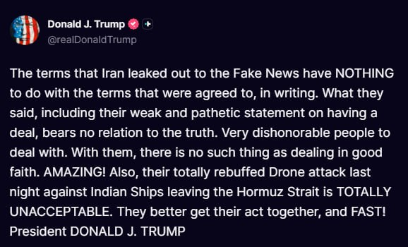

⭕️
⭕️ ترامپ: جمهوری اسلامی دربارۀ تفاهمنامه، دروغ و چرند می‌گوید

دونالد ترامپ، رئیس جمهوری ایالات متحده عصر آدینه ۲۲ خرداد اعلام کرد مفادی که جمهوری اسلامی دربارۀ توافق احتمالی با آمریکا نشر داده، واقعی نیست.
به گفتۀ ترامپ، بندهایی از توافق که مقامات تهران از طریق رسانه‌های دروغگو نشر داده‌اند، با بندهایی که بر سر آن تفاهم شده است، هیچ شباهتی ندارد.
رئیس جمهوری آمریکا افزود گفته‌های مقام‌های جمهوری اسلامی دربارۀ توافق ضعیف و چرند است.
او بازهم رژیم حاکم بر ایران را متهم کرد که در مذاکرات با حسن نیت عمل نمی‌کند.
رئیس جمهوری آمریکا همچنین از حمله پهپادی جمهوری اسلامی به کشتی‌های هندی در حال عبور از تنگه هرمز انتقاد کرد و گفت این حملۀ ناکام، پذیرفتنی نیست.

#خبر_فوری #ترامپ #مذاکرات
@DEJradio

## DEJradio — post 5616

  <a href="telegram/content/DEJradio_5616_1781275274.webm" target="_blank">🎬 Download video</a>

🔺📢 سنتکام با انتشار تصاویری اعلام کرد ناوهای جنگی و دارایی‌های هوایی نیروی دریایی ایالات متحده به گشت‌زنی در آب‌های منطقه‌ای ادامه می‌دهند و محاصره علیه جمهوری اسلامی را اجرا می‌کنند.

در بیانیه سنتکام اعلام شد از آغاز محاصره تا امروز، نیروهای ایالات متحده ۱۳۶ مورد را تغییر مسیر داده و ۹ مورد را غیرفعال کرده‌اند تا اطمینان حاصل شود که قوانین رعایت می‌شوند.

#تنگه_هرمز #محاصره_دریایی
@DEJradio

## VahidOnline — post 76266

  <a href="telegram/content/VahidOnline_76266_1781275274.mp4" target="_blank">🎬 Download video</a>

خامنه‌ای: خطرناک‌تر از ناو، سلاحی است که می‌تواند این ناو را به قعر دریا فرو ببرد رهبر جمهوری اسلامی تعیین نتیجه از قبل برای مذاکرات بین ایران و آمریکا را «کار غلط و ابلهانه» خواند و گفت اگر هدف گفت‌وگوها برچیدن برنامهٔ هسته‌ای باشد، چنین موضوعی اساساً جای…

## VahidOnline — post 76264

  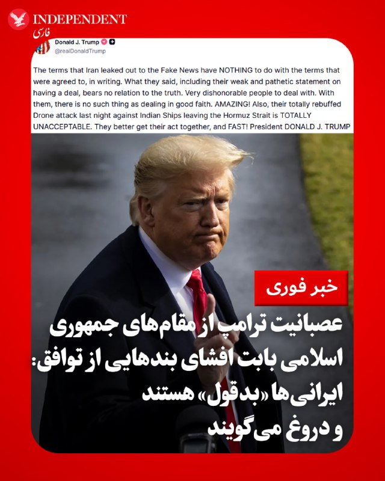

♦️ تنها یک روز پس از اعلام نهایی شدن توافق با ایران، دونالد ترامپ مقامات تهران را «بدقول و بی‌شرف» (Dishonorable) خواند و آن‌ها را به ارائه اطلاعات نادرست از مفاد توافق متهم کرد.

ترامپ در شبکه اجتماعی «تروث سوشال» نوشت: «شرایطی که ایران به رسانه‌های جعلی درز داده، هیچ ارتباطی با توافقی که به صورت مکتوب بر سر آن موافقت شده بود، ندارد. بیانیه ضعیف و رقت‌انگیز آن‌ها درباره توافق، فرسنگ‌ها با حقیقت فاصله دارد. معامله با این افرادِ بی‌اعتبار فایده‌ای ندارد؛ در قاموس آن‌ها چیزی به نام حسن نیت وجود ندارد.»

این خشم ترامپ پس از آن برانگیخته شد که رسانه‌های دولتی ایران، گزارش‌هایی از «خطوط کلی توافق احتمالی» منتشر کردند و مدعی شدند که جمهوری اسلامی مدیریت تنگه هرمز را واگذار نخواهد کرد و آمریکا باید ۲۴ میلیارد دلار از دارایی‌های بلوکه‌شده ایران را آزاد کند.

ترامپ در پایان پیام خود، تداوم هدف قرار گرفتن کشتی‌ها در تنگه هرمز توسط ایران را «کاملا غیرقابل قبول» دانست و هشدار داد: «بهتر است رفتارشان را اصلاح کنند، آن هم سریع!»
@VahidOOnLine

📡 @VahidOnline

## VahidOnline — post 76263

  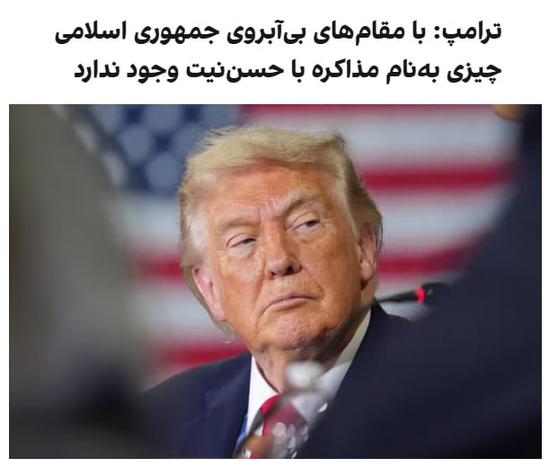

دونالد ترامپ در شبکه تروث سوشال نوشت مفادی که جمهوری اسلامی در اختیار رسانه‌ها قرار داده، هیچ ارتباطی با مفادی که به صورت مکتوب بر سر آن توافق شده ندارد.

ترامپ اضافه کرد: «آنچه آن‌ها گفته‌اند، از جمله بیانیه ضعیف و رقت‌انگیزشان درباره توافق، هیچ ارتباطی با واقعیت ندارد.»

رییس جمهوری ایالات متحده مقام‌های جمهوری اسلامی را «بسیار بی‌آبرو» خواند و افزود با آن‌ها چیزی به نام مذاکره با حسن نیت وجود ندارد.

ترامپ همچنین گفت حمله پهپادی شب گذشته جمهوری اسلامی به کشتی‌های هندی که در حال خروج از تنگه هرمز بودند، «کاملا غیرقابل قبول» بوده و افزود: «آنها باید خیلی سریع اوضاع را سامان دهند.»
@VahidOOnLine

📡 @VahidOnline

## VahidOnline — post 76262

  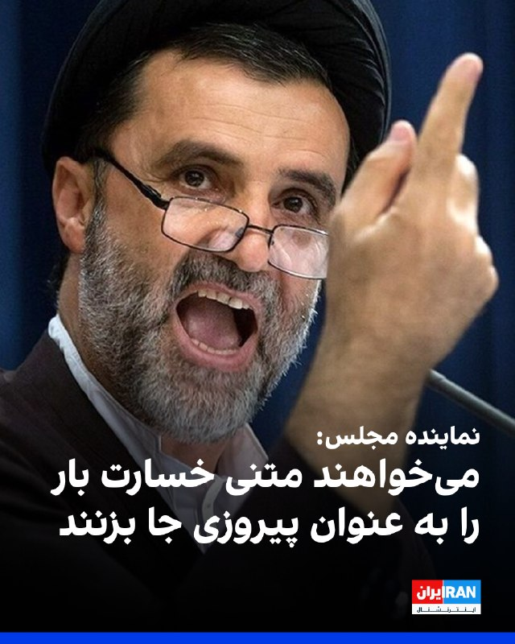

محمود نبویان، نماینده مجلس جمهوری اسلامی، با انتقاد از پیش‌نویس توافق احتمالی میان آمریکا و جمهوری اسلامی، آن را مشابه برجام و «خسارت محض» توصیف کرد. او گفت: «حرف از پیروزی با این متن مبهم و خسارت‌بار کاملا غلط است.»

نبویان با انتقاد از مفاد مطرح‌شده در پیش‌نویس توافق، گفت در این توافق جمهوری اسلامی حق تولید سلاح هسته‌ای را نخواهد داشت. او همچنین افزود سرنوشت مواد غنی‌شده به رضایت آمریکا وابسته شده و همه موضوعات مرتبط با برنامه هسته‌ای باید مورد مذاکره قرار گیرد.

این نماینده مجلس تاکید کرد: «این توافق مانند برجام خسارت محض است و بخاطر تغییر محاسبات مسئولان است.»
@VahidOOnLine

📡 @VahidOnline

## VahidOnline — post 76261

  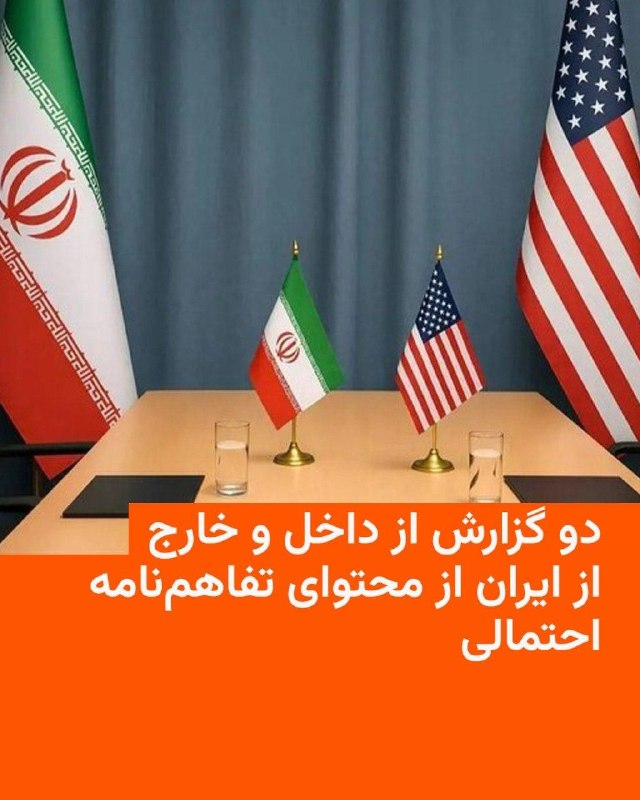

روزنامه اعتماد در داخل ایران به نقل از یک عضو رسانه‌ای هیئت مذاکره‌کننده جمهوری اسلامی و وب‌سایت اکسیوس در خارج به نقل از یک دیپلمات از یک کشور میانجی و یک مقام آمریکایی روز جمعه، ۲۲ خردادماه، گزارش‌هایی از محتوای احتمالی تفاهم‌نامه میان ایران و آمریکا منتشر کردند.

این دو گزارش تا اندازه‌ای به یکدیگر نزدیک هستند، اما گزارش اعتماد با وجود جزئیات بیشتر به نقطه نظر حکومت ایران نزدیک است، در حالی که متن اکسیوس برخی از موارد را منوط به آینده مذاکرات گزارش کرده است، مانند تعلیق تحریم‌ها که اکسیوس می‌گوید مشروط به پایبندی تهران به تفاهم‌نامه است.

روزنامه اعتماد به نقل از «عضو کمیته رسانه هیئت مذاکراتی ایران» از تفاهم‌نامه‌ای ۱۴ ماده‌ای می‌گوید که در آن بر «بازگشایی تنگه هرمز ظرف ۳۰ روز با ترتیبات ایرانی» و «تعلیق تحریم‌های فروش نفت، محصولات پتروشیمی و مشتقات و دسترسی کامل ایران به منابع مالی آن» تأکید شده است.

این در حالی است که در گزارش اکسیوس آمده است که تنگه هرمز «بلافاصله بدون دریافت عوارض بازگشایی می‌شود» و «ظرف ۳۰ روز» تعداد کشتی‌های عبوری از این تنگه به زمان پیش از جنگ بازمی‌گردد.
در مقابل این اقدام، آمریکا هم محاصره دریایی بنادر ایران را که بر صادرات نفت ایران اثر قابل توجه دارد حذف می‌کند.
اکسیوس به نقل از منبع دیپلماتیک خود می‌نویسد: «هیچ تاریخی برای تعلیق تحریم‌ها تعیین نشده و تعلیق منوط است به اجرای توافق [از طرف ایران].»

به نوشته اکسیوس، تعلیق تحریم زمانی افزایش می‌یابد که ایران «تفاهم‌نامه را اجرا کند و در مذاکرات بعدی از خود حسن نیت نشان دهد».

تفاوت دیگر بین دو گزارش از محتوای احتمالی به آزاد شدن یا نشدن اموال بلوکه‌شده ایران مربوط است. اعتماد به نقل از منبع خود می‌گوید: «آزادسازی ۲۴ میلیارد دلار پول‌های بلوکه شده ایران در دوره ۶۰ روزه مذاکرات نهایی. نیمی از این مبلغ قبل از شروع مذاکرات باید در دسترس ایران قرار گیرد.»

این در حالی است که دونالد ترامپ پیشتر به طور مشخص با آزاد کردن پول‌های ایران پیش از مذاکره یا رسیدن به توافق مخالفت کرده و به طور کلی به این کار به دلیل سابقه‌اش با باراک اوباما در توافق برجام حساسیت ویژه دارد.

گزارش اکسیوس در این زمینه سکوت می‌کند و می‌نویسد که «مشخص نیست» که متن تفاهم‌نامه حاوی اطلاعاتی درباره پول‌های ایران هست یا خیر.

درباره برنامه هسته‌ای ایران، اکسیوس نوشته است که تفاهم‌نامه شامل «تعهداتی»‌از طرف ایران خواهد بود، مهم‌تر از همه این که ایران هرگز به دنبال سلاح اتمی نخواهد رفت و بن‌بست در مورد اورانیوم غنی‌شده را حل خواهد کرد، دو موضوعی که ترامپ بر آن تمرکز دارد.

به نوشته اکسیوس، ترامپ موافقت کرده است که یکی از گزینه‌ها برای حل این مسئله رقیق کردن اورانیوم در داخل ایران «زیر نظر کارشناسان سازمان ملل» است، نکته‌ای که پیشتر روزنامه نیویورک تایمز هم خبر داده بود.

منبع اعتماد تنها به این شکل به این موضوعات اشاره کرده است: «۶۰ روز مذاکره برای رسیدن به توافق نهایی مبتنی بر موضوعات هسته‌ای و لغو کامل تحریم‌های اولیه، ثانویه، آمریکا و قطعنامه‌های شورای امنیت سازمان ملل و شورای حکام آژانس بین‌المللی انرژی اتمی» و «تکرار تعهد ایران در پیمان ان‌پی‌تی مبنی بر عدم تولید سلاح هسته‌ای».

در این بخش از گزارش روزنامه اعتماد به موضوع سرنوشت مواد غنی‌شده اشاره نشده است.

به طور کلی، بر اساس گزارش اکسیوس، تفاهم‌نامه در صورت امضا شدن آتش‌بس جنگ را، از جمله در لبنان، تا ۶۰ روز تمدید می‌کند، دو ماهی که قرار است تهران و واشینگتن مذاکرات هسته‌ای را برگزار کنند.

آن طور که اکسیوس نوشته است، ایران و آمریکا بر سر متن تفاهم‌نامه توافق کرده‌اند، و این متن توسط مقامات عالی‌رتبه در جمهوری اسلامی نیز تأیید شده، اما «احتمالا هنوز تأیید مجتبی خامنه‌ای را ندارد». بنابراین در حال حاضر گفته سخنگوی وزارت خارجه ایران که تفاهم‌نامه هنوز نهایی نشده به واقعیت نزدیک‌تر است.

در حالی که ترامپ از امضای تفاهم‌نامه احتمالا در روزهای شنبه و یک‌شنبه حرف زده بود، به نوشته اکسیوس، چهار هواپیمای نیروی هوایی آمریکا روز پنج‌شنبه برای انتقال تجهیزات سفر جی‌دی ونس، معاون ترامپ، به ژنو در سوئیس برای شرکت در مراسم امضا «در روزهای آینده» پرواز کردند.
@VahidHeadline

📡 @VahidOnline

## VahidOnline — post 76260

  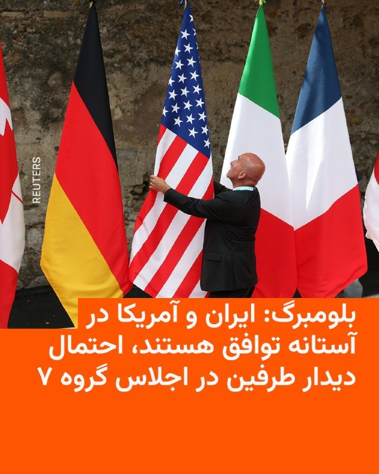

خبرگزاری بلومبرگ به نقل از مقامات ارشد آمریکایی و ایرانی نوشته احتمال دارد توافق میان دو کشور از روز یکشنبه و در شهر ژنو سوئیس نهایی شود.

این خبرگزاری بدون اشاره به نام این مقام‌ها افزوده که طرفین «در آستانه» دستیابی به توافقی برای بازگشایی تنگه هرمز قرار دارند.

بر اساس این گزارش، طرف‌های ایرانی و آمریکایی قرار است در حاشیه اجلاس گروه هفت که از دوشنبه در فرانسه برگزار می‌شود، «دیدار کنند».

اجلاس امسال گروه هفت از ۲۵ تا ۲۷ خرداد در دامنه‌های آلپ فرانسه برگزار می‌شود. به گفته افرادی که در جریان برنامه‌ریزی‌ها قرار دارند، شهر ژنو در سوئیس که در نزدیکی محل برگزاری اجلاس قرار دارد، به عنوان یکی از گزینه‌های احتمالی برای امضای این توافق مطرح شده و ممکن است این مراسم از روز یکشنبه ۲۴ خرداد انجام شود.

یک مقام ارشد ایرانی و یکی از اعضای گروه هفت به بلومبرگ گفته‌اند که «احتمال دستیابی به توافق زیاد است.»
@VahidHeadline

📡 @VahidOnline

## VahidOnline — post 76259

  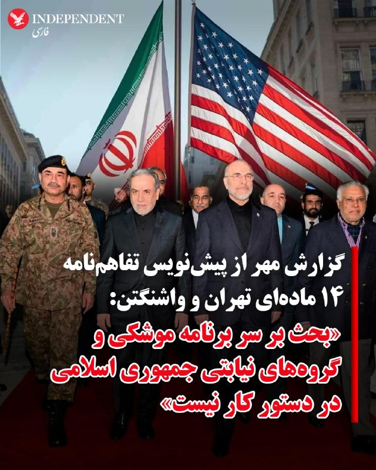

خبرگزاری مهر، وابسته به سازمان تبلیغات اسلامی، جمعه ۲۲ خرداد به نقل از «منبع نزدیک به تیم مذاکره کننده ایرانی» جزئیات جدیدی از پیش‌نویس تفاهمنامه ۱۴ ماده‌ای ایران و آمریکا را منتشر کرد.

بر اساس این گزارش تهران متعهد می‌شود به دنبال ساخت سلاح هسته‌ای نرود و در مقابل، برخی امتیازهای اقتصادی از جمله تسهیل صادرات نفت و بررسی آزادسازی بخشی از دارایی‌های مسدودشده را به دست می‌آورد.

مهر به نقل از این مقام گزارش داد که پس از امضای احتمالی این تفاهم‌نامه، مذاکرات جامع‌تری به‌مدت ۶۰ روز آغاز خواهد شد و موضوعات پیچیده‌تر از جمله سطح غنی‌سازی اورانیوم، ذخایر اورانیوم غنی‌شده و جزئیات رفع تحریم‌ها مورد بررسی قرار می‌گیرد.

براساس این گزارش ۱۴ محور تفاهمنامه احتمالی تهران و واشنگتن شامل موارد زیر است:
۱- توقف دائمی و فوری جنگ در همه جبهه ها از جمله لبنان
۲- تعهد آمریکا به مداخله نکردن در امور داخلی ایران
۳- رفع کامل محاصره دریایی ظرف ۳۰ روز
۴- تعهد آمریکا به خروج نیروهایش از پیرامون ایران
۵- بازگشایی تنگه هرمز ظرف ۳۰ روز به وسیله ایران
۶- تعلیق تحریم های فروش نفت، محصولات پتروشیمی و مشتقات و دسترسی کامل ایران به منابع مالی آن.
۷- لزوم ارائه طرح های بازسازی ایران حداقل به مبلغ ۳۰۰ میلیارد دلار توسط آمریکا و متحدانش
۸- ۶۰ روز مذاکره برای رسیدن به توافق نهایی مبتنی بر موضوعات هسته‌ای و لغو کامل تحریم‌های اولیه، ثانویه، آمریکا و قطعنامه‌های شورای امنیت سازمان ملل و شورای حکام آژانس بین المللی انرژی اتمی
۹- تعهد ایران برای تداوم عضویت در پیمان «ان پی تی» مبنی بر عدم تولید سلاح هسته ای
۱۰- در دوره مذاکرات آمریکا متعهد شده به نیروهای خود در منطقه اضافه نمی کند و تحریم جدیدی هم وضع نخواهد کرد.
۱۱- آزادسازی ۲۴ میلیارد دلار اموال مسدود شده ایران در دوره ۶۰ روزه مذاکرات نهایی. نیمی از این مبلغ قبل از شروع مذاکرات باید در دسترس ایران قرار گیرد.
۱۲- تشکیل سازوکار نظارتی برای اجرایی کردن توافق احتمالی
۱۳- تایید توافق نامه نهایی توسط قطعنامه شورای امنیت سازمان ملل

مهر به نقل از این «مقام آگاه» گزارش کرد که در بند آخر توافقنامه احتمالی، دوطرف تفاهم می‌کنند، مذاکره نهایی قبل از آزادسازی نیمی از اموال مسدود شده ایران، تعلیق تحریم‌های نفتی و رفع محاصره دریایی آغاز نشود.

دونالد ترامپ، رئیس جمهوری آمریکا شامگاه پنجشنبه گفته بود که به محض امضای توافق، محاصره دریایی پایان می‌یابد و تنگه هرمز باز می‌شود.

به گزارش مهر، توافق نهایی صرفا در موضوع سرنوشت اورانیوم‌های غنی شده و غنی سازی، رفع تحریم‌ها و «برنامه بازسازی اقتصاد ایران انجام می‌شود» و بحث درباره برنامه موشکی و حمایت از گروه‌های نیابتی «به صورت قطعی از دستور کار خارج شده است».
@VahidOOnLine

📡 @VahidOnline

## VahidOnline — post 76258

  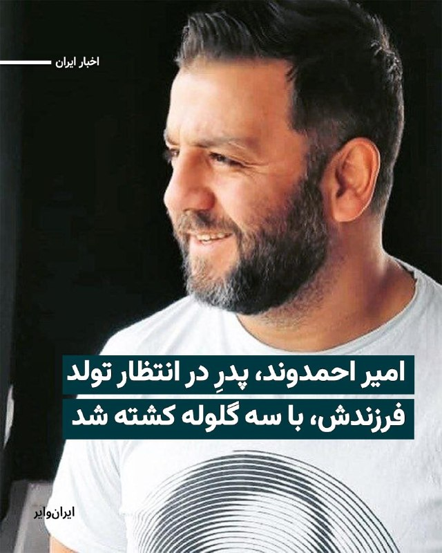

«امیر احمدوند» ۳۹ ساله، شامگاه ۱۸ دی‌ماه ۱۴۰۴ در نزدیکی کلانتری رشید در تهران هدف شلیک گلوله قرار گرفت و جان خود را از دست داد. او متأهل بود و همسرش در زمان کشته‌شدن او سه ماهه باردار و در شرایط استراحت مطلق قرار داشت.
@VahidHeadline

📡 @VahidOnline

## kianmeli1 — post 87960

  

🔴توئیت الان ترامپ خلاف تمام صحبت های دیشبش

ترامپ می‌گوید مفاد توافقی که ایران «افشا» کرده «هیچ ارتباطی با مفاد توافق‌شده ندارد» و رهبران ایران «افراد بسیار بی‌آبرویی هستند که نمی‌توان با آنها معامله کرد.»

ترامپ می‌گوید: «با آنها، چیزی به نام معامله با حسن نیت وجود ندارد.»
https://t.me/kianmeli1

## IranIntlTV — post 341892

  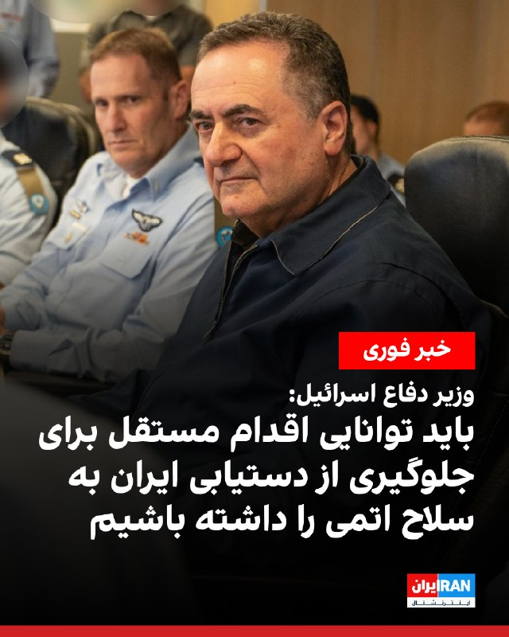

یسرائیل کاتز، وزیر دفاع اسرائیل، در شبکه ایکس نوشت رییس‌جمهوری آمریکا در حال پیشبرد توافقی با جمهوری اسلامی بر اساس منافع آمریکا، از جمله منفعت مشترک با اسرائیل برای جلوگیری از دستیابی ایران به سلاح هسته‌ای است و اسرائیل انتظار دارد او بر این اصل و همچنین موضوع موشک‌ها و نیروهای نیابتی پافشاری کند.

کاتز افزود: «آمریکا و اسرائیل با هم ضربات سنگینی به جمهوری اسلامی وارد کرده‌اند که توانایی‌های آن را سال‌ها به عقب رانده است.»

او تاکید کرد: «اسرائیل باید اطمینان حاصل کند که در آینده نیز توانایی اقدام مستقل برای جلوگیری از دستیابی ایران به سلاح هسته‌ای را خواهد داشت و من و نخست‌وزیر بنیامین نتانیاهو به ارتش اسرائیل دستور داده‌ایم بر این اساس آماده‌سازی لازم را انجام دهد.»
https://iranintl.com/202606129208

## IranIntlTV — post 341891

  <a href="telegram/content/IranIntlTV_341891_1781275279.mp4" target="_blank">🎬 Download video</a>

سرخط خبرهای جمعه ۲۲ خرداد
@iranintltv

## IranIntlTV — post 341890

  <a href="telegram/content/IranIntlTV_341890_1781275280.mp4" target="_blank">🎬 Download video</a>

سرخط خبرهای جمعه ۲۲ خرداد
@iranintltv

## IranIntlTV — post 341889

  

یک مقام ارشد دولت آمریکا به رویترز گفت که توافق با تهران شامل توقف حمایت جمهوری اسلامی از گروه‌های تروریستی خواهد بود.

این مقام آمریکایی گفت که توافق در حال شکل‌گیری با جمهوری اسلامی بر پایه اجرای تعهدات است و تهران تا زمانی که به تعهدات خود عمل نکند، به هیچ‌یک از دارایی‌های مسدودشده خود دسترسی نخواهد داشت.
https://iranintl.com/202606120103

## IranIntlTV — post 341888

  <a href="telegram/content/IranIntlTV_341888_1781275281.mp4" target="_blank">🎬 Download video</a>

کانال «دانشجویان متحد» از موج تازه‌ احکام انضباطی علیه دانشجویان در دانشگاه‌های ایران خبر داد. در دانشگاه سوره برای دست‌کم ۲۲ دانشجو احکام اخراج و تعلیق از تحصیل صادر شده است. همچنین در دانشگاه علم‌وصنعت، دست‌کم هشت دانشجو به یک ترم محرومیت از تحصیل محکوم شده‌اند و دفاعیات آنان بدون برگزاری جلسه و از طریق ایمیل دریافت شده است.

گفت‌وگو با شیدا رهبری، فعال دانشجویی
@iranintltv

## IranIntlTV — post 341887

  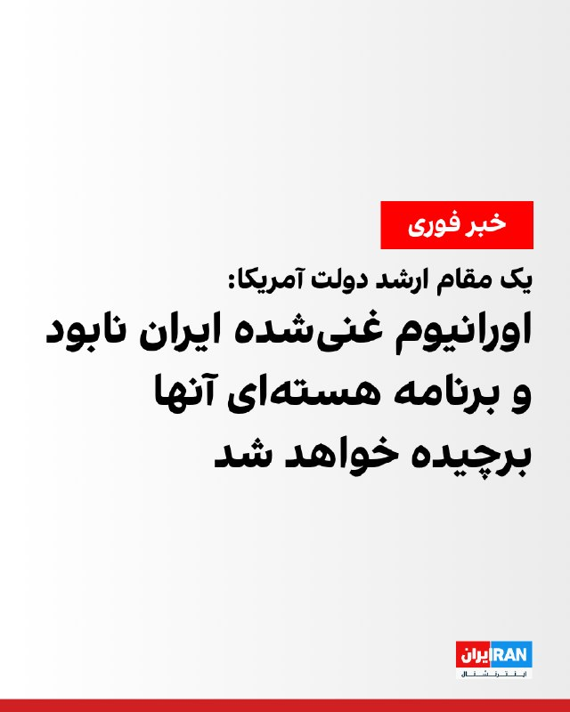

یک مقام ارشد دولت آمریکا به رویترز گفت توافق با جمهوری اسلامی بر اساس اجرای تعهدات خواهد بود.

این مقام ارشد دولت آمریکا اضافه کرد که مواد هسته‌ای ایران نابود و از این کشور خارج خواهد شد و برنامه هسته‌ای آن‌ها برچیده خواهد شد.

این مقام ارشد دولت آمریکا گفت که تنگه هرمز نیز باز خواهد بود.
https://iranintl.com/202606124169

## IranIntlTV — post 341886

  <a href="telegram/content/IranIntlTV_341886_1781275283.mp4" target="_blank">🎬 Download video</a>

بلومبرگ گزارش داد توافق میان واشینگتن و تهران قرار است همزمان با آغاز نشست گروه هفت در ژنو امضا شود. همزمان، خبرگزاری فارس، وابسته به سپاه پاسداران، به نقل از یک منبع نزدیک به تیم مذاکره‌کننده جمهوری اسلامی، این گزارش را رد کرد و نوشت که تصمیم‌گیری درباره توافق در ایران هنوز نهایی نشده است.

سمیرا قرایی، خبرنگار ایران‌اینترنشنال، گزارش می‌دهد
@iranintltv

## IranIntlTV — post 341885

  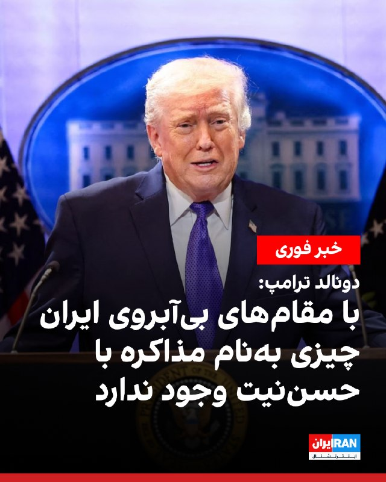

دونالد ترامپ در شبکه تروث سوشال نوشت مفادی که جمهوری اسلامی در اختیار رسانه‌ها قرار داده، هیچ ارتباطی با مفادی که به صورت مکتوب بر سر آن توافق شده ندارد.

ترامپ اضافه کرد: «آنچه آن‌ها گفته‌اند، از جمله بیانیه ضعیف و رقت‌انگیزشان درباره توافق، هیچ ارتباطی با واقعیت ندارد.»

رییس جمهوری ایالات متحده مقام‌های جمهوری اسلامی را «بسیار بی‌آبرو» خواند و افزود با آن‌ها چیزی به نام مذاکره با حسن نیت وجود ندارد.

ترامپ همچنین گفت حمله پهپادی شب گذشته جمهوری اسلامی به کشتی‌های هندی که در حال خروج از تنگه هرمز بودند، «کاملا غیرقابل قبول» بوده و افزود: «آنها باید خیلی سریع اوضاع را سامان دهند.»
https://iranintl.com/202606128086

## IranIntlTV — post 341883

  

سی‌ان‌ان به نقل از یک دیپلمات آگاه نوشت توافق موقت میان آمریکا و جمهوری اسلامی - که هنوز به طور قطعی نهایی نشده - پس از امضا، راه را برای مذاکرات بیشتر درباره برنامه هسته‌ای تهران و موضوع رفع تحریم‌ها در دوره آتش‌بس ۶۰ روزه باز خواهد کرد.

سی‌ان‌ان افزود لزوم رسیدگی به سه موضوع اصلی و مورد اختلاف تنها در مدت ۶۰ روز باعث شده برخی ناظران تردید داشته باشند که آیا این توافق واقعا به جنگ پایان می‌دهد یا فقط مسائل دشوار را به آینده موکول می‌کند.

بنا بر این گزارش، اگر مذاکره‌کنندگان آمریکایی اهدافی مشابه توافق قبلی را دنبال کنند، دستیابی به نتیجه در بازه ۶۰ روزه امکان‌پذیر است.
https://iranintl.com/202606121945

## IranIntlTV — post 341882

  

محمدنبی موسوی‌فرد، امام جمعه اهواز، گفت هرگونه عقب‌نشینی در برابر «جبهه آمریکا و اسرائیل»، ممنوع و غیرقابل پذیرش است.

او در خطبه‌های نماز جمعه ۲۲ خرداد گفت امنیت کشور تنها به توان نظامی محدود نمی‌شود و حاصل ترکیبی از قدرت نظامی، قدرت نرم، هوشمندی رسانه‌ای و تاب‌آوری اقتصادی است.

موسوی‌فرد افزود «دشمن» تلاش می‌کند با شایعه‌سازی و دوقطبی‌سازی، تاب‌آوری جامعه را تضعیف کند.
https://iranintl.com/202606121890

## IranIntlTV — post 341881

یک شهروند در پیامی صوتی به ایران اینترنشنال از وضعیت اقتصادی، کاهش قدرت خرید و نایاب شدن داروی ضدافسردگی روایت می‌کند و می‌گوید مجبور به توقف استفاده از داروی آسنترا شده است. صدای این مخاطب برای حفظ امنیتش تغییر داده شده است.

## IranIntlTV — post 341880

  

احمد علم‌الهدی، نماینده رهبر جمهوری اسلامی در خراسان رضوی، گفت هیچ تفاهم و تعهدی بدون امضای مجتبی خامنه‌ای قابل قبول نیست.

او «عداوت و دشمنی با آمریکا» را اصل مسلم جمهوری اسلامی خواند و افزود باید با تبعیت کامل از مجتبی خامنه‌ای، جرات هرگونه تجاوز را نه تنها از آمریکا، بلکه از هر عنصر زورمند دیگری گرفت. او در ادامه تاکید کرد: «دشمنی آمریکا با ما بیشتر از قبل شده است.»
https://iranintl.com/202606122193

## IranIntlTV — post 341879

بیش از ۷۰ درصد درآمد برخی خانوارها صرف اجاره خانه می‌شود

یاسر عربی، عضو کمیسیون عمران مجلس، با اشاره به افزایش شدید اجاره‌بها گفت در بسیاری از موارد بیش از ۷۰ درصد درآمد خانوار صرف اجاره خانه می‌شود؛ وضعیتی که به گفته او بسیاری از مستاجران را به مهاجرت به حاشیه شهرها یا سکونت در واحدهای کوچک و کم‌کیفیت وادار کرده است.

عربی جمعه ۲۲ خرداد در گفت‌وگو با سایت شفقنا گفت مسکن از یک نیاز اولیه به کالایی دور از دسترس تبدیل شده و برای بسیاری از خانوارها، رویای خانه‌دار شدن عملا پایان یافته است.

به گفته عربی، افزایش اجاره‌بها مستاجران را برای تمدید قرارداد یا یافتن محل سکونت جدید با فشار مالی سنگینی مواجه کرده و بسیاری از آنان را ناچار به مهاجرت به حاشیه شهرها یا سکونت در واحدهای کوچک‌مقیاس و کم‌کیفیت کرده است.

مهاجرت اجباری مستاجران
این نماینده مجلس گفت بخشی از شهروندان به‌دلیل ناتوانی در پرداخت اجاره‌بها، ناچار به ترک تهران و در برخی موارد مراکز استان‌ها شده‌اند.

او این روند را صرفا یک جابه‌جایی مکانی ندانست و گفت این وضعیت نوعی «عقب‌نشینی اجتماعی» است که پیامدهای آن در کیفیت زندگی، دسترسی به خدمات، آموزش و امنیت شغلی شهروندان دیده می‌شود.

عربی با اشاره به سهم بالای هزینه مسکن از درآمد خانوارها گفت در بسیاری از موارد بیش از ۷۰ درصد درآمد خانواده‌ها صرف اجاره خانه می‌شود؛ موضوعی که به‌گفته او خانواده‌ها را در تامین هزینه‌های خوراک، درمان، آموزش و رفت‌وآمد با مشکل مواجه کرده و به تشدید فقر اقتصادی و فشارهای اجتماعی و روانی انجامیده است.

روزنامه دنیای اقتصاد ۱۷ خرداد گزارش داد هزینه اقلام خوراکی اساسی یک خانواده چهارنفره در اردیبهشت ۱۴۰۵ به بیش از ۲۱ میلیون تومان، معادل ۷۱/۵ درصد حداقل دستمزد، رسیده است.

انتقاد از وام ودیعه مسکن
عضو کمیسیون عمران مجلس گفت وام ودیعه مسکن با وجود ظاهر حمایتی، به‌دلیل نرخ سود و اقساط سنگین برای بسیاری از مستاجران کم‌درآمد کارایی ندارد و اثر آن در برابر رشد اجاره‌بها ناچیز است.

عربی همچنین گفت تا زمانی که بحران مسکن و اجاره مهار نشود، شعارهایی مانند تسهیل ازدواج و حل مشکلات جوانان به نتیجه نخواهد رسید.

او افزود جوانی که توان اجاره یک واحد کوچک را ندارد یا هر سال با نگرانی افزایش اجاره‌بها روبه‌رو است، نمی‌تواند برای تشکیل خانواده برنامه‌ریزی کند.

ایران‌اینترنشنال ۱۹ خرداد در گزارشی با استناد به پیام‌های شهروندان نوشت گرانی مواد غذایی، سفره بسیاری از خانوارها را به سطح «سیر شدن برای زنده ماندن» رسانده است.

این نماینده مجلس، افزایش عرضه مسکن، کنترل تقاضای سوداگرانه، واگذاری زمین‌های دولتی، کاهش زمان صدور پروانه‌های ساختمانی و هدایت ساخت‌وساز به سمت واحدهای کوچک و میان‌متراژ را از راهکارهای کاهش قیمت مسکن و اجاره‌بها عنوان کرد.

او همچنین گفت کاهش هزینه ساخت از طریق ثبات در تامین مصالح، کاهش ریسک‌های مقرراتی، بهبود بهره‌وری، صنعتی‌سازی ساخت‌وساز و اصلاح عوارض و هزینه‌های غیرضروری شهری می‌تواند به کاهش قیمت تمام‌شده مسکن و افزایش انگیزه تولید کمک کند.

عربی در ادامه گفت ساماندهی بازار مسکن به شرایط سیاسی و روابط بین‌المللی کشور نیز وابسته است و بهبود مناسبات خارجی می‌تواند به ثبات اقتصادی، کاهش نااطمینانی و فراهم شدن زمینه برای بهبود وضعیت بازار مسکن کمک کند.

او افزود هرچه فضای سیاسی کشور آرام‌تر و روابط بین‌المللی آن سازنده‌تر باشد، امکان تحقق تحولات مثبت و پایدار در حوزه مسکن و اقتصاد نیز بیشتر خواهد شد.

عربی در پایان با تاکید بر اینکه مسکن تنها یک بازار اقتصادی نیست، بلکه پایه ثبات اجتماعی است، هشدار داد در صورت نبود اقدام جدی برای کنترل تورم مسکن، تنظیم بازار اجاره، افزایش عرضه موثر و حمایت از مستاجران، شکاف طبقاتی عمیق‌تر خواهد شد و روند مهاجرت اجباری به حاشیه شهرها ادامه خواهد یافت.

این اظهارات در شرایطی مطرح می‌شود که افزایش هزینه‌های مسکن و معیشت، فشار فزاینده‌ای بر خانوارهای ایرانی وارد کرده و نگرانی‌ها درباره گسترش فقر و شکاف طبقاتی را افزایش داده است.
 
🔗وب‌سایت ایران‌اینترنشنال
@iranintltv

## IranIntlTV — post 341878

  

حسن فضل‌الله، از چهره‌های ارشد حزب‌الله و نماینده این گروه در پارلمان لبنان، گفت حزب‌الله اطمینان دارد که جمهوری اسلامی در هر توافق احتمالی با آمریکا بر گنجانده شدن موضوع لبنان اصرار خواهد کرد.

فضل‌الله روز جمعه در سخنانی که از شبکه المنار پخش شد، گفت: «اگر توافقی حاصل شود، به جمهوری اسلامی اعتماد کامل داریم و اطمینان داریم که این کشور بر گنجانده شدن پرونده لبنان در هر توافقی اصرار خواهد کرد.»

این اظهارات در حالی مطرح می‌شود که گزارش‌ها از افزایش احتمال دستیابی به توافق میان آمریکا و جمهوری اسلامی حکایت دارند.

مقام‌های جمهوری اسلامی در ماه‌های اخیر بارها بر لزوم برقراری آتش‌بس در لبنان تاکید کردند و آن را یکی از مطالبات اصلی تهران در مذاکرات با واشینگتن دانستند.
https://iranintl.com/202606126361

## IranIntlTV — post 341877

  <a href="telegram/content/IranIntlTV_341877_1781275287.mp4" target="_blank">🎬 Download video</a>

در پی اظهارات دونالد ترامپ، رییس‌جمهوری آمریکا، درباره دستیابی به توافقی میان ایران و آمریکا، موجی از واکنش‌ها در شبکه‌های اجتماعی شکل گرفت.

آیه دریس، عضو تحریریه ایران‌اینترنشنال، از واکنش کاربران می‌گوید
@iranintltv

## IranIntlTV — post 341876

  <a href="telegram/content/IranIntlTV_341876_1781275288.mp4" target="_blank">🎬 Download video</a>

دونالد ترامپ، رییس‌جمهوری آمریکا، خبر داد که به توافقی «عالی» با جمهوری اسلامی دست یافته است. او تاکید کرد محاصره دریایی بنادر ایران تا نهایی شدن توافق پابرجا می‌ماند. همزمان، پایگاه خبری وای‌نت گزارش داد که بنیامین نتانیاهو در تماس با دونالد ترامپ گفته است فکر نمی‌کند توافقی با تهران حاصل شود و اسرائیل قربانی چنین توافقی نخواهد شد.

جزییات بیشتر با لی‌لی نیکفر، بابک اسحاقی و مریم رحمتی، خبرنگاران ایران‌اینترنشنال
@iranintltv

## IranIntlTV — post 341875

  

ایرنا، خبرگزاری دولت جمهوری اسلامی، گزارش داد معصومه سهامی، یک زن شرکت‌کننده در تجمع حکومتی در شیراز، روز چهارشنبه ۲۰ خرداد در حین «پرچم‌گردانی» بر اثر برخورد یک خودرو جان خود را از دست داد.

بر اساس این گزارش، این حادثه مقابل یکی از موکب‌های شهر شیراز و در جریان مراسم پرچم‌گردانی رخ داد. ایرنا نوشت این زن پس از انحراف یک دستگاه خودرو دچار حادثه شد.

ایرنا از او با عنوان «شهید» یاد کرده و گزارش داده است مراسم تشییع جنازه او از حرم شاهچراغ در شیراز برگزار شده است.
https://iranintl.com/202606121304

## IranIntlTV — post 341874

  

خبرگزاری فارس، وابسته به سپاه پاسداران، به نقل از یک منبع نزدیک به تیم مذاکره‌کننده جمهوری اسلامی گزارش داد گزارش‌ها درباره نهایی شدن توافق با آمریکا و امضای آن در روز یکشنبه در ژنو صحت ندارد.

این منبع گفت روند بررسی و تصمیم‌گیری درباره توافق در ایران هنوز نهایی نشده است و گزارش‌های منتشرشده درباره زمان و محل امضای توافق کذب است.
https://iranintl.com/202606123426

## IranIntlTV — post 341873

  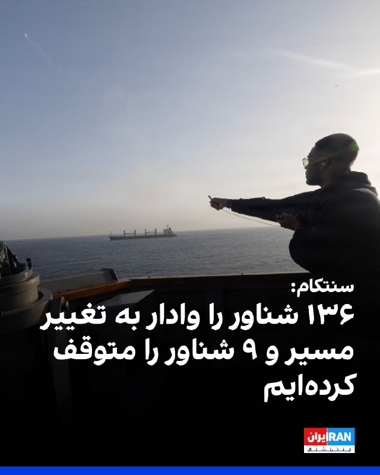

سنتکام، ستاد فرماندهی مرکزی آمریکا، اعلام کرد نیروهای این کشور در چارچوب اجرای محاصره دریایی بنادر جنوبی ایران، تاکنون ۱۳۶ شناور را وادار به تغییر مسیر و ۹ شناور دیگر را متوقف کرده‌اند.

سنتکام جمعه ۲۲ خرداد در شبکه اجتماعی ایکس نوشت نیروی دریایی آمریکا و تجهیزات هوایی این کشور همچنان در آب‌های منطقه گشت‌زنی می‌کنند و به اجرای محاصره علیه ایران ادامه می‌دهند.

این محاصره پس از آن آغاز شد که دونالد ترامپ، رییس‌جمهوری آمریکا، ۲۴ فروردین دستور اعمال محدودیت بر تردد کشتی‌های ورودی و خروجی بنادر ایران را صادر کرد.
https://iranintl.com/202606128620

## IranIntlTV — post 341872

  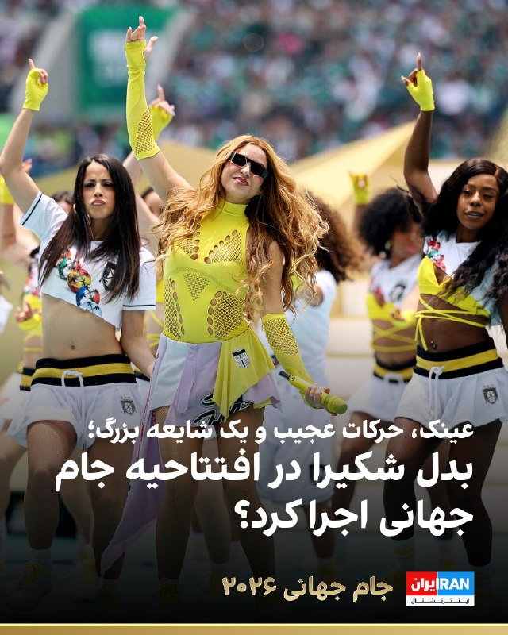

🔻اجرای شکیرا در مراسم افتتاحیه جام جهانی ۲۰۲۶ با موجی از واکنش‌ها و گمانه‌زنی‌ها در شبکه‌های اجتماعی همراه شد؛ تا جایی که برخی کاربران مدعی شدند فردی که روی صحنه حضور داشت، خود شکیرا نبوده است.

🔹این خواننده کلمبیایی که یکی از چهره‌های اصلی مراسم افتتاحیه جام جهانی بود، در کنار برنا بوی، خواننده نیجریه‌ای، به اجرای برنامه پرداخت. با این حال، دقایقی پس از آغاز اجرا، تردیدهایی در میان کاربران شبکه‌های اجتماعی شکل گرفت و برخی نسبت به هویت فرد حاضر روی صحنه ابراز تردید کردند.

🔹منشا این گمانه‌زنی‌ها دو موضوع عنوان شده است؛ نخست استفاده شکیرا از عینک آفتابی تیره در بخش زیادی از اجرا و دوم تفاوت ظاهری و حرکات او نسبت به آنچه هوادارانش به آن عادت دارند. همین موضوع باعث شد موجی از شوخی‌ها، میم‌ها و گمانه‌زنی‌ها در فضای مجازی منتشر شود و برخی حتی ادعا کنند یک بدل به جای شکیرا روی صحنه حضور داشته است.

🔹این شایعات در حالی مطرح شده که شکیرا تاکنون هیچ واکنشی به این بحث‌ها نشان نداده و درباره ادعاهای مطرح‌شده در شبکه‌های اجتماعی اظهارنظری نکرده است.

🔹جزییات بیشتر را در سایت بخوانید

@iranintltvsport

## Shin_Persian — post 6982

Shin ✓ @hey_itsmyturn
Fri, 12 Jun 2026 14:36:27 UTC

A white house official familiar with the negotiations just told me "Imma take a leak, will be back and tell Axios what's going to happen."

ترجمه خودکار فارسی

یکی از مقامات کاخ سفید که در جریان مذاکرات است، همین الان به من گفت: «می‌رم یه دستشویی، برمی‌گردم و به آکسیوس می‌گم قرار چه اتفاقی بیفته.»

𝕏 · @shin_persian

## Shin_Persian — post 6981

  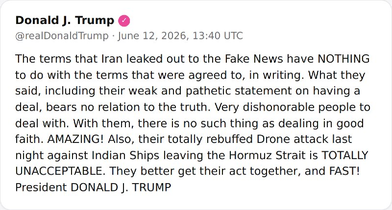

Shin ✓ @hey_itsmyturn Fri, 12 Jun 2026 13:45:42 UTC POTUS: "The terms that Iran leaked out to the Fake News have NOTHING to do with the terms that were agreed to, in writing. What they said, including their weak and pathetic statement on having a deal, bears…

## Shin_Persian — post 6980

Shin ✓ @hey_itsmyturn
Fri, 12 Jun 2026 13:45:42 UTC

POTUS:
"The terms that Iran leaked out to the Fake News have NOTHING to do with the terms that were agreed to, in writing. What they said, including their weak and pathetic statement on having a deal, bears no relation to the truth. Very dishonorable people to deal with. With them, there is no such thing as dealing in good faith. AMAZING! Also, their totally rebuffed Drone attack last night against Indian Ships leaving the Hormuz Strait is TOTALLY UNACCEPTABLE. They better get their act together, and FAST! President DONALD J. TRUMP"

ترجمه خودکار فارسی

رئیس‌جمهور ایالات متحده (POTUS):
«شرایطی که ایران به رسانه‌های جعلی (Fake News) درز داده است، هیچ ارتباطی به شرایطی که به صورت کتبی بر سر آن‌ها توافق شده بود، ندارد. آنچه آن‌ها گفته‌اند، از جمله بیانیه ضعیف و رقت‌بارشان درباره داشتن یک توافق، هیچ نسبتی با حقیقت ندارد. افرادی بسیار بی‌شرف برای معامله کردن هستند. نزد آن‌ها، چیزی به اسم معامله با حسن نیت وجود ندارد. حیرت‌آور است! همچنین، حمله پهپادی کاملاً دفع‌شده آن‌ها در شب گذشته علیه کشتی‌های هندی که در حال خروج از تنگه هرمز بودند، کاملاً غیرقابل‌قبول است. بهتر است خودشان را جمع‌وجور کنند، آن هم سریع! رئیس‌جمهور دونالد جی. ترامپ»

𝕏 · @shin_persian

## Shin_Persian — post 6976

Shin ✓ @hey_itsmyturn
Fri, 12 Jun 2026 12:44:47 UTC

U.S. Navy assets continue to enforce a blockade against Iran. U.S. forces have redirected 136 commercial vessels and disabled 9 to date to ensure compliance.

Source: @CENTCOM
https://x.com/CENTCOM/status/2065414960176410982

ترجمه خودکار فارسی

نیروهای نیروی دریایی ایالات متحده به اجرای محاصره علیه ایران ادامه می‌دهند. نیروهای آمریکایی تا به امروز برای اطمینان از پایبندی، مسیر ۱۳۶ کشتی تجاری را تغییر داده و ۹ فروند را متوقف کرده‌اند.

منبع: @CENTCOM (فرماندهی مرکزی ایالات متحده)
https://x.com/CENTCOM/status/2065414960176410982

𝕏 · @shin_persian

## FarsiVOA — post 220483

  <a href="telegram/content/FarsiVOA_220483_1781275293.mp4" target="_blank">🎬 Download video</a>

در گفت‌وگو با رضا غیبی به ادعاهای متناقض درباره «توافق بزرگ» آمریکا و جمهوری اسلامی، ارقام درشت بازسازی ۳۰۰ میلیارد دلاری اقتصاد ایران و سکوت رسانه‌های وابسته به سپاه پرداختیم. به گفته او، این اعداد بیش از آنکه واقع‌بینانه باشند، مصرف داخلی دارند و رقم واقعی به‌مراتب کمتر است

## FarsiVOA — post 220482

🔺پرزیدنت ترامپ: مفاد درز داده شده توسط رژیم ایران به هیچ وجه حقیقت ندارد

▪️دونالد ترامپ، رئیس‌جمهوری ایالات متحده، روز جمعه ۲۲ خرداد در پیامی در شبکه اجتماعی «تروت سوشال» گفت مفادی که رژیم ایران در اختیار رسانه‌ها قرار داده است «هیچ ارتباطی» با شرایطی ندارد که به‌صورت مکتوب بر سر آن توافق شده بود.

⬇️ بیشتر بخوانید:

https://ir.voanews.com/a/trump-warns-iran-over-deal/8160129.html/?nocach=1

## FarsiVOA — post 220481

  

📸اینستاگرام صدای آمریکا را هم اکنون فالو کنید تا از آخرین خبرها مطلع بمانید:
https://www.instagram.com/voafarsi/

📡همچنین جهت اطلاع از بروزترین فرکانسهای ماهواره‌ای صدای آمریکا به لینک زیر مراجعت فرمایید:
https://ir.voanews.com/satellite

این پست را با دوستانتان به اشتراک بگذارید
@FarsiVOA

## FarsiVOA — post 220480

🔺سنتکام: محاصره دریایی علیه رژیم ایران همچنان ادامه دارد

▪️سنتکام اعلام کرد که در ادامه محاصره دریایی جمهوری اسلامی در تنگه هرمز «کشتی‌ها و هواپیماهای جنگی نیروی دریایی ایالات متحده» همچنان در آب‌های منطقه گشت می‌زنند.

⬇️ بیشتر بخوانید:
https://ir.voanews.com/a/iran-us-centcom-blockade-percian-gulf/8160127.html/?nocach=1

## FarsiVOA — post 220479

🔺نتانیاهو: تا من نخست‌وزیرم رژیم ایران سلاح هسته‌ای نخواهد داشت

▪️بنیامین نتانیاهو، نخست‌وزیر اسرائیل، در پیامی اعلام کرد که تا زمانی که او در مقام نخست‌وزیری این کشور قرار دارد، جمهوری اسلامی به سلاح هسته‌ای دست نخواهد یافت.

⬇️ بیشتر بخوانید:

https://ir.voanews.com/a/netanyahu-warns-iran-on-nukes/8160122.html/?nocach=1

## FarsiVOA — post 220477

  <a href="telegram/content/FarsiVOA_220477_1781275294.mp4" target="_blank">🎬 Download video</a>

ارتش اسرائیل اعلام کرد نیروی هوایی این کشور حدود ۳۱۰ موضع مرتبط با حزب‌الله را در جنوب لبنان بمباران کرده است.

به گفته ارتش اسرائیل، در این حملات حدود ۸۰ نفر از نیروهای حزب‌الله کشته شدند.

ارتش اسرائیل همچنین می‌گوید نیروهای زمینی به‌طور هم‌زمان در امتداد خط مقدم دفاعی در جنوب لبنان در حال عملیات هستند تا زیرساخت‌های حزب‌الله را از بین ببرند و تهدیدها علیه نیروها و شهروندان اسرائیلی را کاهش دهند.

@FarsiVOA

## FarsiVOA — post 220476

  <a href="telegram/content/FarsiVOA_220476_1781275295.mp4" target="_blank">🎬 Download video</a>

ارتش اسرائیل می‌گوید نیروهای تیپ ۷۶۹ چند هفته پیش در منطقه دبین در جنوب لبنان، حدود ۱۲ کیلومتری مرز اسرائیل، عملیاتی انجام داده‌اند.

به گفته ارتش اسرائیل، در این عملیات انبارهای سلاح کشف شد و نیروی هوایی اسرائیل حدود ۵۰ هدف را در منطقه مورد حمله قرار داد.

ارتش اسرائیل همچنین می‌گوید این منطقه برای حملات موشکی ضد زره علیه نیروهای اسرائیلی مورد استفاده قرار می‌گرفت.

@FarsiVOA

## DW_Farsi — post 125897

  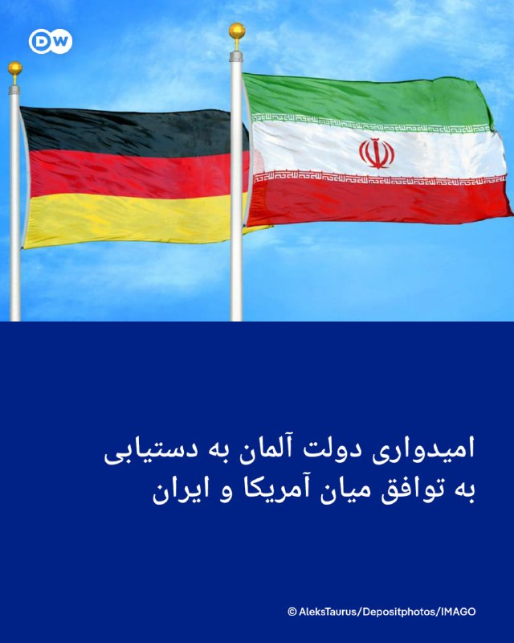

🔶 امیدواری دولت آلمان به دستیابی به توافق میان آمریکا و ایران

به گزارش شبکه خبری "ان‌تی‌وی" آلمان به نقل از منابع آگاه در دولت این کشور، برلین پتانسیل و شانس بالایی برای دست‌یابی به یک توافق میان ایالات متحده و ایران می‌بیند.

یک منبع در محافل دولتی آلمان در این باره گفت: «طی روزهای گذشته، پیشرفت‌هایی در این زمینه حاصل شده است.»

بر اساس این گزارش، به نقل از این منابع، دونالد ترامپ، رئیس‌جمهور آمریکا می‌تواند در مسیر تلاش‌های دیپلماتیک خود همچنان روی حمایت‌های آلمان حساب کند.

مقام‌های دولتی آلمان تأکید دارند که سران کشورهای عضو گروه هفت که از روز دوشنبه ۱۵ ژوئن در شهر اویان فرانسه گرد هم می‌آیند، در اصول و نکات کلیدی این پرونده با یکدیگر هم‌نظرند: ایران نباید به سلاح هسته‌ای دست یابد و آزادی کشتی‌رانی و رفت و آمد ایمن کشتی‌ها از تنگه هرمز نیز باید مجددا تضمین شود.

این منبع آگاه در پایان تأکید کرد: «تحقق این اهداف تنها از طریق نشستن پای میز مذاکره امکان‌پذیر خواهد بود.»
@dw_farsi

## DW_Farsi — post 125896

🔶 ثروت ایلان ماسک از یک بیلیون دلار فراتر می‌رود

عرضه اولیه سهام اسپیس‌ایکس از بعدازظهر روز ١٢ ژوئن (۲٢ خرداد)، آغاز خواهد شد. پس از آن احتمالا ثروت ایلان ماسک از مرز یک بیلیون دلار (۱۰۰۰ میلیارد دلار) عبور خواهد کرد.

بر اساس شاخص میلیاردرهای بلومبرگ، ثروت فعلی او حدود ۷۲۰ میلیارد دلار است و ارزش سهامش در اسپیس‌ایکس تقریباً دو برابر می‌شود.

ایلان ماسک ۵۴ ساله است و اولین شرکت خود را در سال ۱۹۹۵ بنیان گذاشته است. محاسبات نشان می‌دهد که ثروت او طی سه دهه گذشته به طور متوسط حدود ۷۵۰ دلار در هر ثانیه افزایش یافته است.
@dw_farsi

## DW_Farsi — post 125895

🔶 اجرای مقررات جدید پناهندگی در اتحادیه اروپا آغاز شد

اتحادیه اروپا پس از سال‌ها کشمکش و مذاکرات طولانی، از امروز اجرای "سیستم مشترک پناهندگی اروپا" (GEAS) را آغاز کرد.

هدف اصلی این اصلاحات جامع مقابله با مهاجرت‌های ثانویه (حرکت پناهجویان از کشورهای مرزی به سمت کشورهای مرکزی اروپا)، تسریع روند رسیدگی به درخواست‌های پناهندگی و اخراج سریع‌تر پناهجویانی است که شانس کمی برای دریافت قبولی دارند.

بر اساس بسته جدید مهاجرتی اتحادیه اروپا، پناهجویان باید بلافاصله پس از ورود به مرزهای خارجی اتحادیه اروپا مورد بررسی اولیه قرار گیرند تا وضعیت آن‌ها در همان مراحل ابتدایی مشخص شود.
@dw_farsi

## DW_Farsi — post 125894

🔶 رئيس‌جمهور سابق کره جنوبی به ۳۰ سال زندان محکوم شد

به گزارش خبرگزاری یونهاپ، دادگاه منطقه‌ای سئول یون سوک یول، رئیس‌جمهور سابق کره جنوبی را در پرونده ارسال پهپاد به کره شمالی محکوم شناخت و به ۳۰ سال زندان محکوم کرد.

او در موارد اتهامی "سوءاستفاده از قدرت" و "کمک به دشمن" گناهکار شناخته شده است.
@dw_farsi

## DW_Farsi — post 125893

  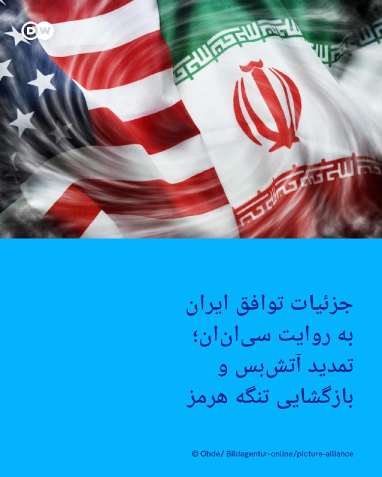

🔶 جزئيات توافق ایران به روایت سی‌ان‌‌ان: تمدید آتش‌بس و بازگشایی تنگه هرمز

یک دیپلمات آگاه در گفت‌وگو با شبکه "سی‌ا‌ن‌ا‌ن" گفت که توافق موقت میان آمریکا و ایران شامل تمدید آتش‌بس، بازگشایی تنگه هرمز و هموار کردن مسیر برای مذاکرات بیش‌تر درباره برنامه هسته‌ای ایران است.

به گفته این دیپلمات، دو طرف بر سر متن این تفاهم‌نامه به توافق رسیده‌اند، اما این متن هنوز به امضای نهایی نرسیده است.

بر این مبنا، مفاد کلیدی این تفاهم‌نامه شامل یک آتش‌بس ۶۰ روزه "در تمامی جبهه‌ها"، از جمله لبنان، و بازگشایی تنگه هرمز است: «حجم تردد در این آبراه ۳۰ روز پس از امضای توافق به سطح پیش از جنگ بازخواهد گشت.»

محاصره بنادر ایران توسط آمریکا لغو خواهد شد و برخی تحریم‌ها نیز "بر اساس پیشرفت توافق و تداوم تعهدات با حسن نیت" کاهش می‌یابند؛ هرچند تاریخ مشخصی برای لغو تحریم‌ها تعیین نشده است.

این سند همچنین "تمامی الزامات آمریکا در موضوع هسته‌ای را برآورده می‌کند"، از جمله تعهد ایران به عدم دست‌یابی به سلاح هسته‌ای و تعیین تکلیف ذخایر اورانیوم بسیا‌ر غنی‌شده این کشور.

نام این سند نیز "توافق‌‌‌ اسلام‌آباد" خواهد بود.
@dw_farsi

## DW_Farsi — post 125892

  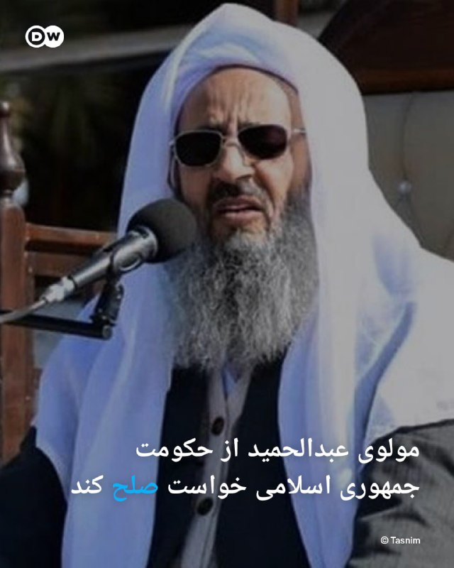

🔶 مولوی عبدالحمید از حکومت جمهوری اسلامی خواست صلح کند

مولوی عبدالحمید در خطبه‌ نماز جمعه ۲۲ خرداد (۱۲ ژوئن) از جمهوری اسلامی خواست صلح را بپذیرد. این روحانی برجسته سنی با استناد به آیه‌ای از قرآن تاکید کرد: «اگر دشمن شما و طرف شما به صلح و توافق تمایل نشان دهد، شما هم صلح کنید.»

عبدالحمید با استناد به مثال‌های دینی تاکید کرد که باید صلح برقرار شود، زیرا به گفته او در این صلح، امنیت و منافع ملی تامین می‌شود.

او همچنین خاطرنشان کرد: «جنگ تخریب می‌آورد، ویرانگر است و ملت‌ها را به عقب برمی‌گرداند و اگر طرف شما بخواهد صلح کند، صلح کنید و فرصت را از دست ندهید.«

این روحانی برجسته سنی در ادامه بر موضع پیشین خود درباره ضرورت خودداری از جنگ تاکید کرده و گفت که او از همان ابتدا با احساس مسئولیت نسبت به جلوگیری از جنگ و حفظ سرمایه‌ها و منافع ملی هشدار داده بود.

امام جمعه اهل سنت زاهدان در پایان صحبت‌های خود گفت که به عنوان یک شهروند امیدوار است سران کشورهای بزرگ مانند آمریکا، چین، روسیه و اروپا برای برقراری صلحی فراگیر در جهان اقدام کنند.
@dw_farsi

## DW_Farsi — post 125891

  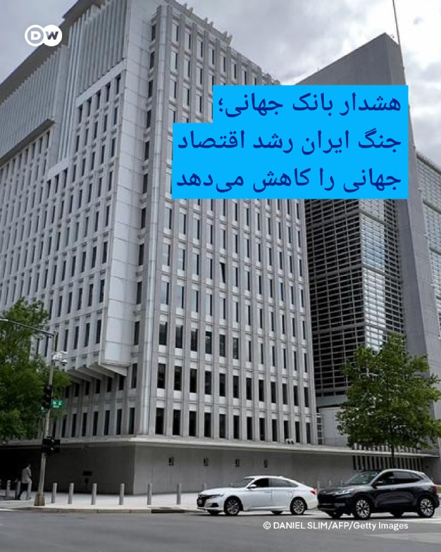

🔶 هشدار بانک جهانی؛ جنگ ایران رشد اقتصاد جهانی را کاهش می‌دهد

بانک جهانی در گزارشی اعلام کرده است که جنگ و تنش‌های مرتبط با ایران می‌تواند رشد اقتصاد جهانی را به پایین‌ترین سطح خود از زمان همه‌گیری کرونا برساند.

بر اساس این گزارش رشد اقتصاد جهانی در سال جاری حدود ۲.۵ درصد پیش‌بینی شده است، در حالی که این رقم در سال ۲۰۲۵ برابر با ۲.۹ درصد بوده است.

بانک جهانی هشدار داده است که در صورت تشدید درگیری‌ها یا اختلال جدی در عرضه انرژی و تجارت جهانی، رشد اقتصادی ممکن است تا حدود ۱.۳ درصد کاهش یابد.

این گزارش همچنین به پیامدهای احتمالی چنین شرایطی از جمله افزایش قیمت نفت، گاز و کودهای شیمیایی، افزایش تورم، تشدید ناامنی غذایی و فشار مالی بر کشورهای آسیب‌پذیر اشاره می‌کند.

علاوه بر این، اختلال در مسیرهای حمل‌ونقل و انرژی در تنگه هرمز  می‌تواند هزینه‌ها را افزایش داده و دسترسی به منابع را محدود کند.
@dw_farsi

## DW_Farsi — post 125890

  <a href="telegram/content/DW_Farsi_125890_1781275297.mp4" target="_blank">🎬 Download video</a>

🎥 لحظاتی کم نظیر از مواجهه با یک خرس ماده و توله‌هایش

جعفر پناه‌پور، عکاس طبیعت و یاور محیط‌بانان در پارک ملی گلستان لحظات کم‌نظیری از مواجهه با یک ماده خرس قهوه‌ای و توله‌هایش را ثبت کرده است.

در این ویدیو، خرس مادر و دو توله‌اش با تشخیص حضور انسان، برای بررسی موقعیت و میزان خطر احتمالی، به سمت عکاس می‌روند. در ویدیو دیده می‌شود که توله‌ها مادر خود را پناه قرار داده‌اند ولی همچنان با کنجکاوی وضعیت را رصد می‌کنند. در نهایت خرس‌ها با بی‌خطر یافتن موقعیت، به دل طبیعت بازمی‌گردند.

این ویدیو مورد استقبال کاربران قرار گرفته و رفتار و نحوه ایستادن خرس‌ها توجه آنها را به خود جلب کرده است.
@dw_farsi

## DW_Farsi — post 125889

🔶 "آمریکا درحال دیپورت چند ایرانی به جمهوری آفریقای مرکزی است"

امیلی تراستل، وکیل شماری از مهاجران آمریکا، از جمله تعدادی ایرانی که به گفته خبرگزاری رویترز، قرار است به جمهوری آفریقای مرکزی منتقل شوند گفت که در میان این ایرانیان، دو زن نیز حضور دارند که در صورت بازگردانده شدن اجباری به ایران، با خطر احتمالی شکنجه و آزار و اذیت روبرو هستند.

به گفته او، یکی از این مهاجران ایرانی نوکیش مسیحی و دیگری فعال دموکراسی‌خواه است.
@dw_farsi

## DW_Farsi — post 125881

🔶 جنگ، فقر و ترک تحصیل؛ سه ضلع گسترش کار کودک

🔻 گزارشی از آتفه چهارمحالیان

همزمان با ۱۲ ژوئن، روز جهانی مبارزه با کار کودک، گزارش‌ها و روایت‌های میدانی از ایران نشان می‌دهد که بسیاری از کودکان بیش از هر زمان دیگری در معرض ترک تحصیل و ورود به بازار کار قرار گرفته‌اند.

در حالی که شمار کودکان کار در جهان طی دو دهه گذشته کاهش یافته، فعالان حقوق کودک می‌گویند جنگ، بحران اقتصادی، فقر آموزشی و ضعف حمایت‌های اجتماعی در ایران روندی معکوس را رقم زده است؛ روندی که در مناطق محروم، به‌ویژه سیستان و بلوچستان، آشکارتر از همیشه دیده می‌شود.

از کودکانی که به دلیل فقر از مدرسه بازمانده‌اند تا نوجوانانی که رؤیای دانشگاه را با کار روزانه در اقتصادغیررسمی معاوضه کرده‌اند؛ این گزارش به بررسی همدستی جنگ، فقر و محرومیت آموزشی در گسترش کار کودک در ایران می‌پردازد.
@dw_farsi

## Persian_Trend_Official — post 16855

پوتین: ما فقط می‌توانیم یک نصیحت به دشمنانمان بکنیم، با روسیه نجنگید.

رئیس جمهور روسیه: بیایید در صلح زندگی کنیم و همه مسائل را از طریق مذاکره حل کنیم. اما این مذاکرات باید باشد، نه اولتیماتوم.

📝 Amir

📌 @persian_trend_official
پرشین ترند | متفاوت‌ترین کانال نظامی

## Persian_Trend_Official — post 16854

  <a href="telegram/content/Persian_Trend_Official_16854_1781275299.webm" target="_blank">🎬 Download video</a>

فاکس نیوز: ایران با یک توافق مبتنی بر عملکرد موافقت کرده است که مستلزم امتیازات عمده‌ای قبل از دریافت هرگونه کاهش تحریم‌ها است.

مواد هسته‌ای ایران نابود و حذف خواهد شد، برنامه هسته‌ای آن برچیده می‌شود و هیچ یک از پول‌های آن تا زمانی که به تعهدات خود عمل نکند، آزاد نخواهد شد.

یک مقام کاخ سفید گفت تنگه هرمز باز خواهد ماند و ایران موافقت خواهد کرد که تأمین مالی گروه‌های تروریستی را متوقف کند.

📝 Amir

📌 @persian_trend_official
پرشین ترند | متفاوت‌ترین کانال نظامی

## Persian_Trend_Official — post 16853

  <a href="telegram/content/Persian_Trend_Official_16853_1781275299.webm" target="_blank">🎬 Download video</a>

ترامپ: شرایطی که ایران به رسانه‌های جعلی درز داده است، هیچ ارتباطی به شرایطی که به صورت کتبی بر سر آن‌ها توافق شده بود، ندارد.

آنچه آن‌ها گفته‌اند، از جمله بیانیه ضعیف و رقت‌بارشان درباره داشتن یک توافق، هیچ نسبتی با حقیقت ندارد. افرادی بسیار بی‌شرف برای معامله کردن هستند. نزد آن‌ها، چیزی به اسم معامله با حسن نیت وجود ندارد. حیرت‌آور است!

همچنین، حمله پهپادی کاملاً دفع‌شده آن‌ها در شب گذشته علیه کشتی‌های هندی که در حال خروج از تنگه هرمز بودند، کاملاً غیرقابل‌قبول است. بهتر است خودشان را جمع‌وجور کنند، آن هم سریع!

📝 Amir

📌 @persian_trend_official
پرشین ترند | متفاوت‌ترین کانال نظامی

## Persian_Trend_Official — post 16852

  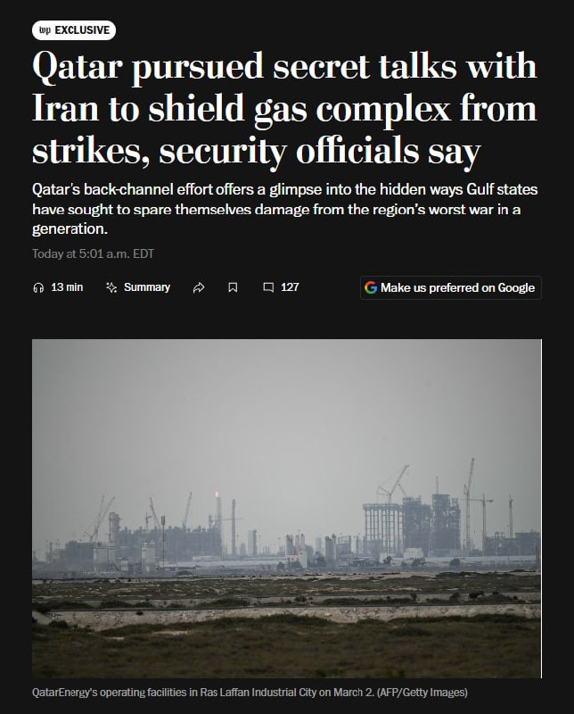

واشنگتن پست: به گفته‌ی سازمان اطلاعات آمریکا، قطر در آغاز جنگ از ایران تضمین خواست که مجتمع گازی راس لفان را هدف قرار ندهد.

در عوض، دوحه یک توافق محرمانه پیشنهاد داد که در آن تولید گاز را به طور موقت متوقف می‌کرد، که به طور بالقوه باعث افزایش قیمت جهانی انرژی و افزایش فشار اقتصادی بر ایالات متحده و اسرائیل برای پایان سریع‌تر درگیری می‌شد.

پیام قطر به تهران این بود که ایران می‌تواند بدون حمله به خاک قطر به اهداف استراتژیک خود دست یابد. با این حال، مقامات گفتند که ایران هرگز تضمین رسمی مبنی بر مصون ماندن راس لفان نداده است.

مذاکرات پشت پرده، که طبق گزارش‌ها از طریق نظارت اطلاعاتی بر ارتباطات ایران کشف شده و برای CIA و مقامات ارشد دولت ترامپ شناخته شده است.

با وجود این تلاش‌ها، ایران بعداً به قطر حمله کرد و به بخش‌هایی از تأسیسات راس لفان بزرگترین مجتمع تولید گاز طبیعی جهان که تقریباً یک پنجم عرضه گاز جهانی را بر عهده دارد آسیب رساند و قراردادهای بزرگ انرژی را مختل کرد و نقش قطر را به عنوان میانجی بین واشنگتن و تهران پیچیده کرد.

📝 Amir

📌 @persian_trend_official
پرشین ترند | متفاوت‌ترین کانال نظامی

## Persian_Trend_Official — post 16851

  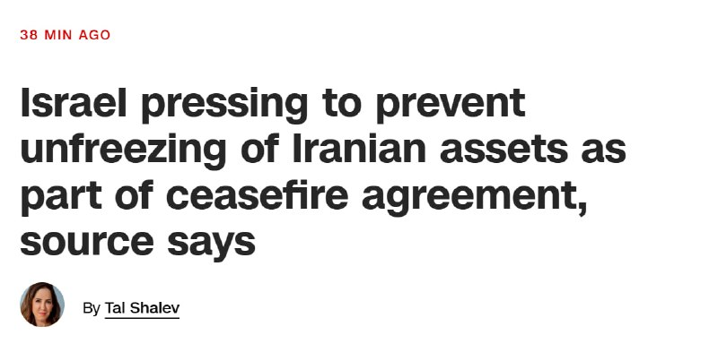

اسرائیل در حال فشار آوردن به امریکا برای بلوکه ماندن پول های ایران!

به گزارش CNN، به نقل از یک منبع اسرائیلی، اسرائیل در حال فشار آوردن به ایالات متحده است تا از آزاد شدن دارایی‌های مسدود شده ایران به عنوان بخشی از توافق آتش‌بس قریب‌الوقوع جلوگیری کند.

📝 Amir

📌 @persian_trend_official
پرشین ترند | متفاوت‌ترین کانال نظامی

## Persian_Trend_Official — post 16850

  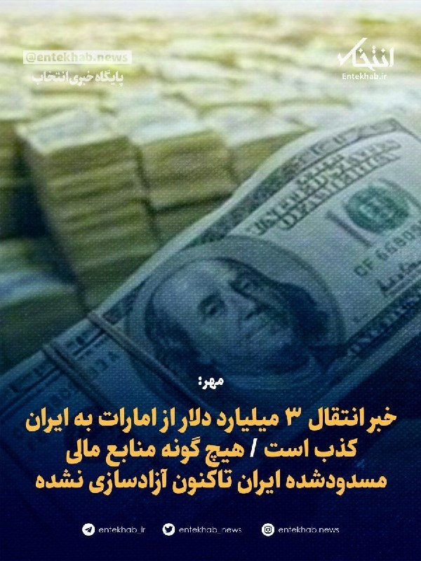

ایران اینتل واچ:«بر اساس اطلاعات به‌دست‌آمده، تصمیم ایران برای توقف حملات به اسرائیل پس از یک پیام آمریکا که از طریق هیأتی قطری در ۸ ژوئن منتقل شد اتخاذ شد؛ این پیام درباره مهار اسرائیل در لبنان بود. همچنین در کنار آن، انتقال ۳ میلیارد دلار از ابوظبی به تهران…

## Persian_Trend_Official — post 16849

  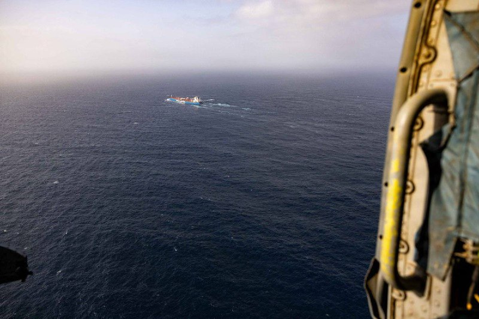

سنتکام می‌گوید نیروهای آمریکایی از زمان آغاز محاصره بنادر ایران در 13 آوریل، 136 کشتی تجاری را تغییر مسیر داده و 9 کشتی را از کار انداخته‌اند.

📝 Amir

📌 @persian_trend_official
پرشین ترند | متفاوت‌ترین کانال نظامی

## Persian_Trend_Official — post 16848

  <a href="telegram/content/Persian_Trend_Official_16848_1781275302.webm" target="_blank">🎬 Download video</a>

🔻اسرائیل برای سه منطقه در جنوب لبنان دستور تخلیه صادر کرد

🔹 ارتش اسرائیل برای شهرها و روستاهای صرفند، تفاحتا و مزرعة سيناي در جنوب لبنان هشدار تخلیه فوری صادر کرد.

👺Phantom

📌 @persian_trend_official
پرشین ترند | متفاوت‌ترین کانال نظامی

## Persian_Trend_Official — post 16847

رویترز: تفاهم‌نامه بین ایران و امریکا احتمالا تا یکشنبه امضا خواهد شد! به گزارش رویترز و به نقل از یک منبع غربی، تفاهم‌نامه‌ای بین ایالات متحده و ایران با هدف پایان دادن به درگیری خلیج فارس می‌تواند تا روز یکشنبه امضا شود و ژنو محتمل‌ترین مکان در نظر گرفته…

## RadioFarda — post 158225

  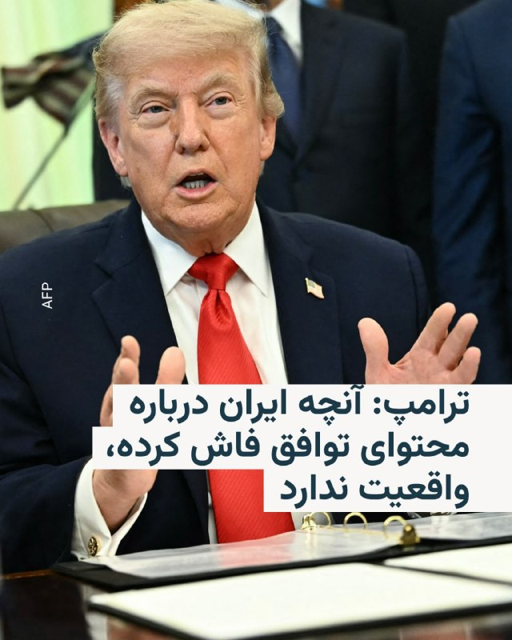

🔸دونالد ترامپ، رئیس‌جمهور آمریکا، روز جمعه اعلام کرد مواردی که از سوی ایران درباره توافق با ایالات متحده به رسانه‌ها درز کرده است، بازتاب‌دهنده آنچه واقعاً میان تهران و واشینگتن مورد تفاهم قرار گرفته، نیست.

🔸او با انتشار پستی در شبکه اجتماعی تروث سوشال نوشت: «آنچه آنها (ایران) گفته‌اند، از جمله بیانیه ضعیف و رقت‌انگیزشان درباره دستیابی به توافق، هیچ نسبتی با واقعیت ندارد.»

🔸ترامپ طرف ایرانی را «افراد بسیار بی‌شرافت» خواند و افزود: «در مورد آنها، چیزی به نام مذاکره و تعامل با حسن نیت وجود ندارد.»

🔸رئیس‌جمهور آمریکا همچنین اعلام کرد حمله پهپادی شب گذشته ایران علیه کشتی‌های هندی که در حال خروج از تنگه هرمز بودند «و به‌طور کامل دفع شد، کاملاً غیرقابل قبول است».

🔸او به مقام‌های حکومت ایران هشدار داد که «بهتر است هرچه سریع‌تر اوضاع خود را سر و سامان دهند».

@RadioFarda

## RadioFarda — post 158224

گزارش‌ها از محتوای تفاهم‌نامه احتمالی ایران و آمریکا؛ وضعیت مبهم هسته‌ای و تنگه هرمز

🔸در پی اعلام دونالد ترامپ درباره به توافق رسیدن ایران و آمریکا بر سر تفاهم‌نامه پایان جنگ، خبرگزاری جمهوری اسلامی، ایرنا، روز جمعه ۲۲ خرداد مدعی شد که در این تفاهم «هیچ توافقی» درباره پرونده هسته‌ای ایران وجود ندارد.

🔸این خبرگزاری در گزارشی درباره محتوای تفاهم‌نامه نوشت: «ایران هیچ تعهد جدیدی نمی‌دهد و چارچوب برنامه صلح آمیز هسته‌ای ایران در پی امضای تفاهم دست‌نخورده باقی می‌ماند.»

🔸ایرنا همچنین با رد گزارش‌ها درباره تنگه هرمز اعلام کرد که ایران تعهدی در مورد «واگذاری مدیریت و یا بازگشت شرایط تنگه هرمز» به پیش از حملات آمریکا و اسرائیل نخواهد داد.

🔸این در حالی است که رئیس‌جمهور آمریکا شامگاه پنجشنبه گفته بود که به محض امضای توافق با ایران «تنگه هرمز به شکل رسمی باز خواهد شد».

🔸ایرنا در بخش دیگر گزارش خود نوشته که «متن نهایی تفاهم‌نامه تا زمان پذیرش قطعی آن توسط دو طرف منتشر نخواهد شد.»

🔸این خبرگزاری افزوده است:‌ «برخی از متون منتشر شده در دو روز گذشته، هرچند برخی از اصول موجود در متن تفاهم نهایی را مورد اشاره قرار داده‌اند، اما به شکل گمراه‌کننده‌ای به عنوان «متن نهایی» نامگذاری شده‌اند، این متون فاقد اعتبار هستند.»

🔸گزارش کامل را در وب‌سایت رادیوفردا بخوانید.

@RadioFarda

## IranianMinds — post 22411

  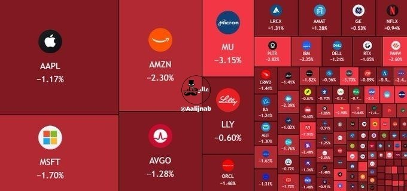

500میلیارد دلار از ارزش بازار سهام آمریکا تنها در 5 دقیقه پس از آنکه ترامپ گفت مفاد توافق فاش شده ایران «جعلی» است، از بین رفت.

@IranianMinds

## IranianMinds — post 22410

  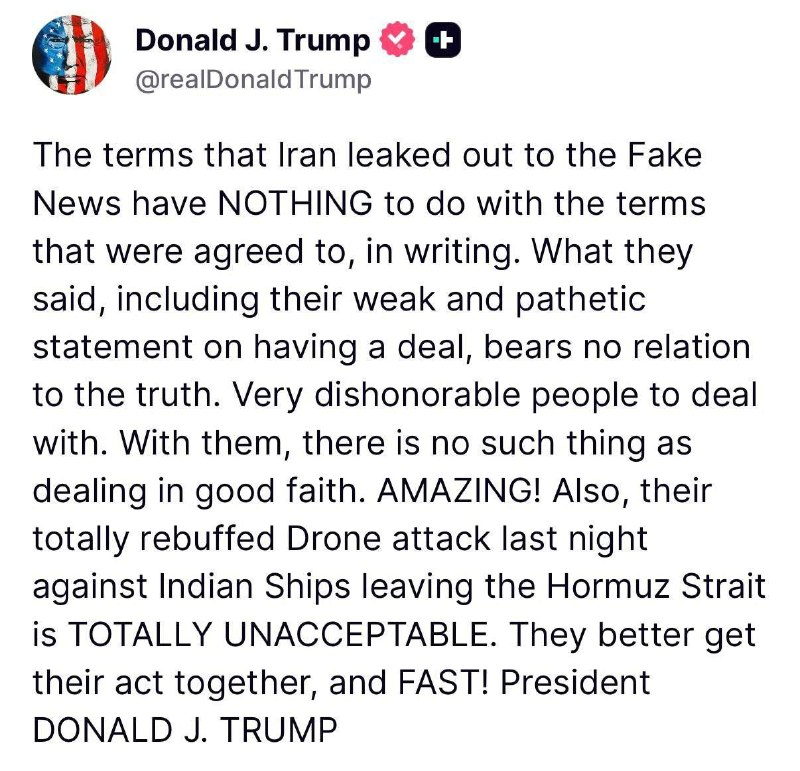

🔴 ترامپ :

شرایطی که ایران به رسانه‌های جعلی درز داده، هیچ ارتباطی با مفاد توافقی که به‌صورت مکتوب بر سر آن توافق شده ندارد.

ادعاهای آن‌ها، از جمله بیانیه ضعیف و تأسف‌بارشان درباره توافق، هیچ شباهتی به حقیقت ندارد.

اونا ادم ‌های بسیار بیشرفی برای مذاکره هستند.
با آن‌ها چیزی به نام مذاکره با حسن نیت وجود ندارد.

همچنین حمله پهپادی شب گذشته علیه کشتی‌های هندی که از تنگه هرمز خارج می‌شدند، کاملا غیرقابل قبول است.

بهتره زودتر اوضاعشونو درست کنن خیلی زود !!

@IranianMinds

## IranianMinds — post 22409

  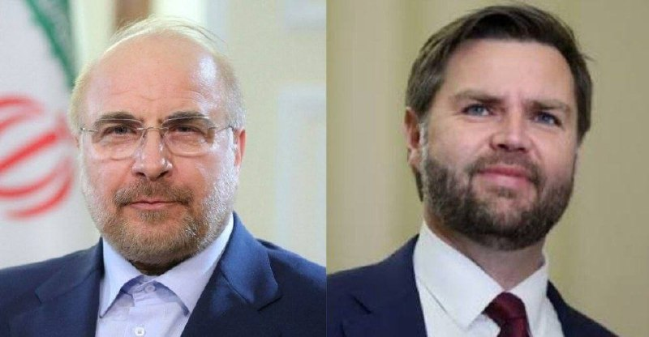

🔴 رویترز :

توافق ایران و آمریکا قراره توسط جی‌دی ونس و قالیباف امضا بشه.

@IranianMinds

## IranianMinds — post 22408

  

فقط آستینشو‌ که زده بالا برا اینکه ساعت رولکسش حتما معلوم شه.

@IranianMinds

## IranianMinds — post 22406

  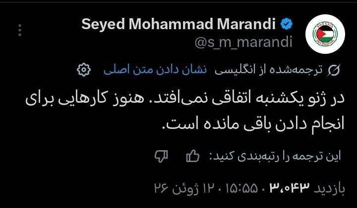

🔴مرندی:

در ژنو یکشنبه اتفاقی نمی‌افتد، هنوز کارهایی برای انجام دادن باقی مانده است.

@IranianMinds

## IranianMinds — post 22405

🔴 یک منبع نزدیک به تیم مذاکره‌کننده ایران به فارس گفت:

ادعاهایی که از سوی ترامپ و برخی از رسانه‌های خارجی مبنی بر اینکه توافق نهایی شده است و قرار است که یکشنبه در ژنو به امضاء برسد به هیچ عنوان درست نیست و صحت ندارد.

@IranianMinds

## IranianMinds — post 22404

🔴سی‌ان‌ان تمام اون ۳۹ باری که ترامپ گفته توافق نزدیک هستو کنار هم گذاشته.

@IranianMinds

## IranianMinds — post 22403

  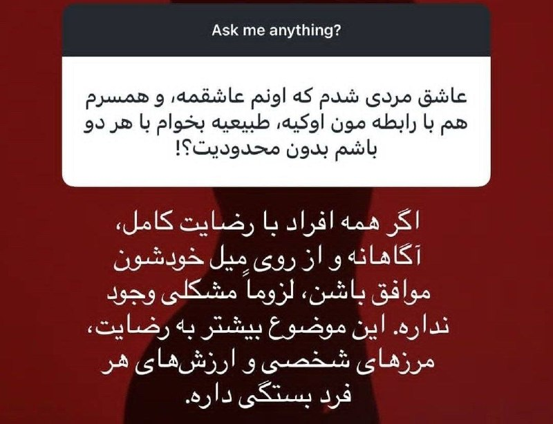

وضعیت اینستاگرام :

@IranianMinds

## IranianMinds — post 22402

  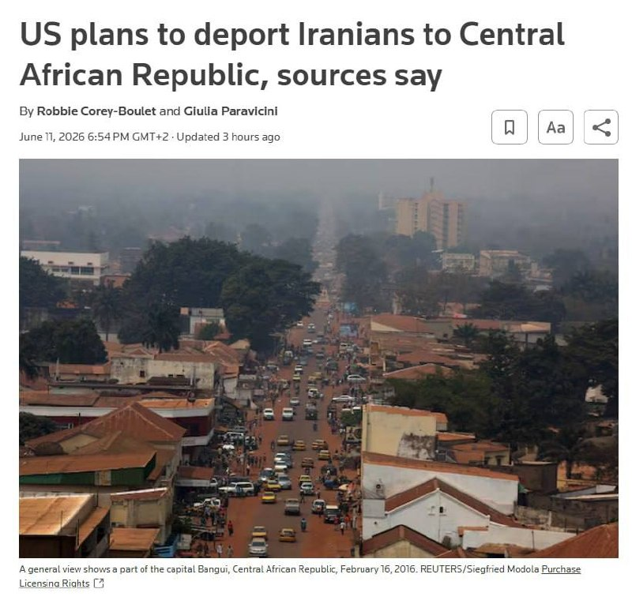

🔴 رویترز :

دولت ترامپ میخواد مهاجرای غیرقانونی ایرانی رو به آفریقای مرکزی دیپورت‌ کنه ، جایی که خودش سال هاست تو فقره و امنیتی نداره.

@IranianMinds

## IranianMinds — post 22401

  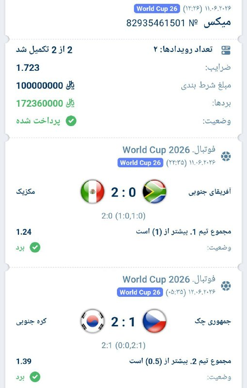

میکسمون عالی برد شد ❤️
✅
@Tabanii_Mafia

## BBCPersian — post 283567

  <a href="telegram/content/BBCPersian_283567_1781275307.mov" target="_blank">🎬 Download video</a>

🔻این هفته در پرگار: دیپلماسی ایرانی، امتیازگیری یا فرصت‌سوزی؟

🔻در دیپلماسی کنونی ایران بهره‌برداری حداکثری از امتیازهای میدان جنگ می‌بینم یا آنچه می‌بینیم زیاده‌خواهی و در نهایت فرصت‌سوزیست؟

میهمان‌ها:
علم صالح، استاد دانشگاه در روابط بین‌الملل
علی مهتدی، تحلیل‌گر مسائل خاورمیانه

@BBCPersian

## BBCPersian — post 283566

  <a href="telegram/content/BBCPersian_283566_1781275308.mp4" target="_blank">🎬 Download video</a>

🔻سرخط خبرهای جمعه ۲۲ خرداد ۱۴۰۵
@BBCPersian

## BBCPersian — post 283565

  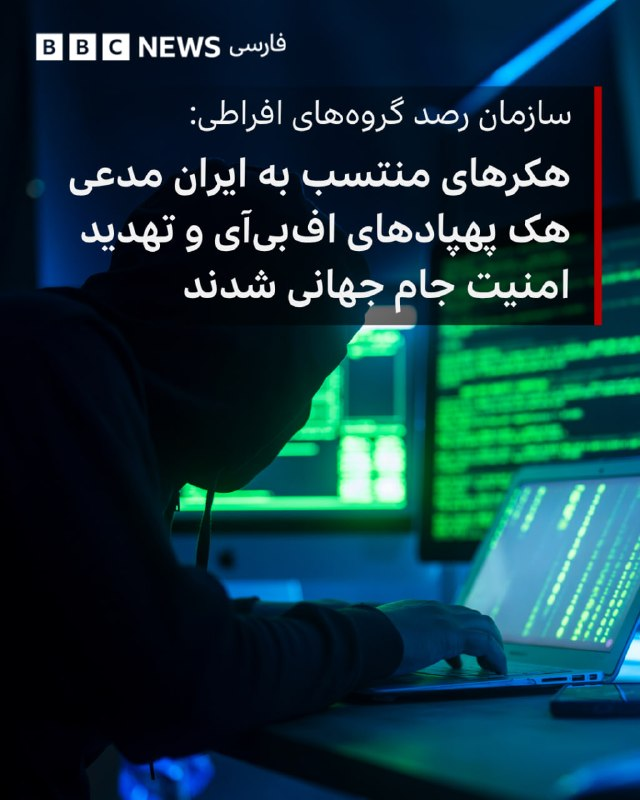

🔻یک سازمان که فعالیت‌های گروه‌های افراطی را در فضای مجازی رصد می‌کند، گفته است که یک گروه هکری مرتبط با ایران مدعی شده است که به پهپادهای سازمان اطلاعات مرکزی آمریکا، اف‌بی‌آی نفوذ کرده و تهدید کرده است که جام جهانی فوتبال که از این هفته آغاز شده را هدف قرار خواهد داد.

سازمان آمریکایی «جستجو برای شناسایی گروه‌های تروریستی بین‌المللی»، بیانیه‌ای از گروه «حنظله» منتشر کرده که در آن ادعا شده این گروه ه «ماه‌ها به تصاویر و داده‌های جمع‌آوری‌شده توسط پهپادهای مجهز به تصویر زنده اف‌پی‌وی دسترسی داشته‌ است.»

هکرها گفته‌اند که این پهپادها به فناوری تشخیص چهره و شناسایی پلاک خودرو مجهز بوده و در عملیات ضدتروریستی به کار گرفته می‌شوند.

این سازمان اطلاعاتی به نقل از بیانیه‌ای از گروه حنظله گفت: «بهتر است تدابیر امنیتی جام جهانی را تشدید کنید؛ ما از برخی از این تیم‌ها اصلاً خوشمان نمی‌آید. فراموش نکنید که پهپادهای اف‌پی‌وی همه‌ جا هستند؛ هیچ‌وقت نمی‌دانید چه زمانی یکی از آن‌ها ممکن است درست به اتوبوس تیم شما برسد.»
ادامه مطلب⬇️

📸GettyImages
https://bbc.in/4eiVmZg
@BBCPersian

## BBCPersian — post 283564

🔻تسنیم و فارس: متن تفاهم احتمالی هنوز به تایید مراجع ذی‌صلاح ایران نرسیده است

خبرگزاری‌های تسنیم و فارس وابسته به سپاه پاسداران می‌گویند که متن تفاهم احتمالی با آمریکا «هنوز در مراجع‌ذی صلاح ایران به تایید نهایی نرسیده است.»

تسنیم در گزارشی به نقل از منابع مطلع که نامی از آنها نبرده، گفته است که دونالد ترامپ «طی روز‌های اخیر با شروع به فشار و تهدید و اقدام نظامی و از طریق دیگر با فشار میانجی قطری تلاش کرد تا از دو سو مواضع ایران را تغییر دهد که در نهایت ایران تغییرات جدید را نپذیرفت.»

این خبرگزاری می‌گوید «با این حال این متن همچنان نیازمند بررسی و نهایی شدن در نهاد‌های ذیربط در ایران است و تا آن زمان سایر گمانه زنی‌ها و خبرها، معتبر نیست.»

خبرگزاری فارس هم در گزارشی گفته است که در ارتباط با برخی از خواسته‌ها، «آمریکا عقب‌نشینی کرده» اما «هنوز هیچ توافقی حاصل نشده است. هر گمانه‌زنی درباره امضا [تفاهم] در سوئیس یا دیدار حضوری، چیزی جز فهم اشتباه از پیشنهادها و آرزوهای آمریکایی نیست.»

https://bbc.in/4efiF5Z
@BBCPersian

## Dirty_Kids — post 391807

مرتیکه ندید بدید، آستین رو داده بالای ساعت که رولکسش معلوم بشه. @Dirty_Kids 👻

## Dirty_Kids — post 391806

‏جام جهانی قبل دلار ۳۲ تومان بود.

@Dirty_Kids 👻

## Dirty_Kids — post 391805

  <a href="telegram/content/Dirty_Kids_391805_1781275310.mp4" target="_blank">🎬 Download video</a>

🔴 رقص این پسربچه با ریمیکس "تو رستم تهمتنی" تو اینستاگرام وایرال شده:

@Dirty_Kids 👻

## Dirty_Kids — post 391804

  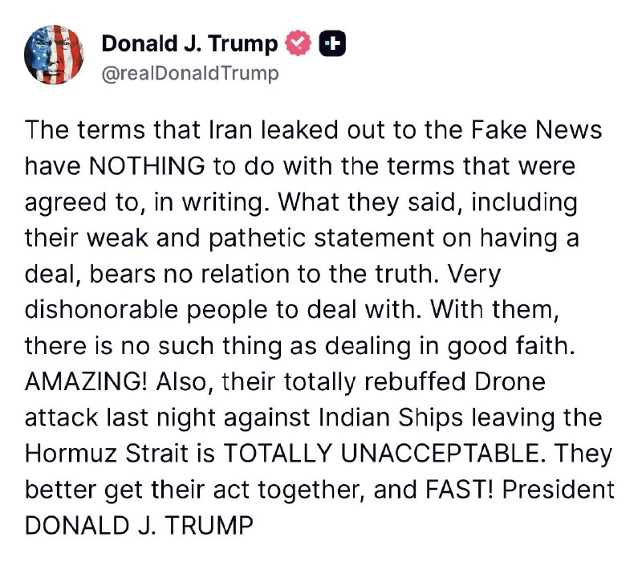

پست جدید ترامپ در تروث‌سوشال که کله‌ش خیلی کیری شده، خیلی:

شرط و شروطی که جمهوری‌اسلامی لو داده و تو رسانه‌های فیک‌نیوز پخش شده، هیچ ربطی به توافقات کتبی نهایی نداره.

چیزایی که این پدرخرابای رافضی گفتن از جمله بیانیه ضعیف و رقت‌بارشون درباره رسیدن به توافق اصلاً با واقعیت جور درنمیاد.

با آدمای فوق‌العاده بی‌شرف و مادرجنده‌ای طرفیم. کلمه‌ای به اسم حسن نیت تو مرام و معامله این پدرقحبه‌ها اصلاً وجود نداره. واقعاً عجیبه.

در ضمن حمله دیشب پهپادیشون که کاملاً دفع شد و کشتی‌های هندی در حال خروج از تنگه‌ی هرمز رو هدف گرفته بود، به‌هیچ‌وجه قابل قبول نیست.

بهتره هرچه زودتر کون مون‌شون رو جمع‌وجور کنن، اونم سریع.
رئیس‌جمهور، دونالد جی. ترامپ

@Dirty_Kids 👻

## Dirty_Kids — post 391802

هرچی تو پیج این عرزشی جلو میرم جندگیش بیشتر میشه

پیجشو و بستم فرار کردم گوشیمو با الکل پاک کردم بوی زنا و زیگیل گرفته بود

@Dirty_Kids 👻

## Dirty_Kids — post 391800

تصویری عجیب از یه عرزشی توی تجمعات شبانه، خطش دائمیه یا اعتباری :) @Dirty_Kids 👻

## Dirty_Kids — post 391799

  <a href="telegram/content/Dirty_Kids_391799_1781275312.mp4" target="_blank">🎬 Download video</a>

🔴ویدیویی تازه منتشر شده از شب ۱۹ دی ماه و سیل جمعیت در پونک تهران.

هنگامی که جمهوری اسلامی برق را قطع کرد تا جمعیت مردم مشخص نشود و در تاریکی دست به قتل‌عام بزند، مردم با نور گوشی‌های خود سعی کردند تا جمعیت عظیم خود را به جهان نشان دهند

@Dirty_Kids 👻

## Dirty_Kids — post 391798

  <a href="telegram/content/Dirty_Kids_391798_1781275314.mp4" target="_blank">🎬 Download video</a>

ماسک گذاشته شناسایی نشه، بعد ماسک رو برداشته ویدئو رو پست کرده؟ :)))))))
واقعا دلقکی داداش

ویدیوی منتشرشده از توماج صالحی

@Dirty_Kids 👻

## Dirty_Kids — post 391797

  <a href="telegram/content/Dirty_Kids_391797_1781275314.mp4" target="_blank">🎬 Download video</a>

🔴 پست صفحه رسمی وزارت خارجه اسرائیل تو اینستاگرام :

@Dirty_Kids 👻

## Dirty_Kids — post 391796

  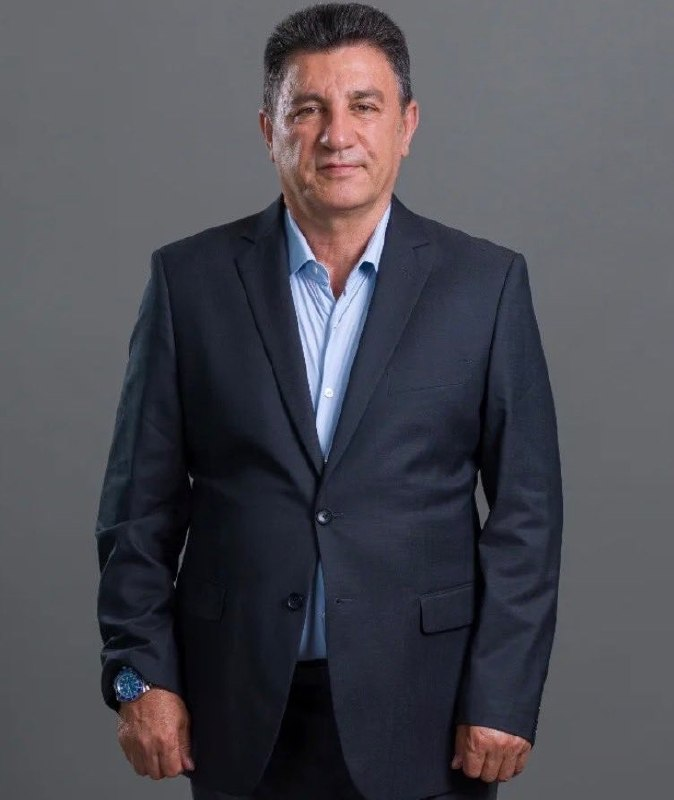

مرتیکه ندید بدید، آستین رو داده بالای ساعت که رولکسش معلوم بشه.

@Dirty_Kids 👻

## Dirty_Kids — post 391795

🔴دیشب یه نفر تو شیراز ۸ خانوم عرزشی رو با ماشین زیر میگیره یه نفر به اسم معصومه مهسایی از پا در اومده و بقیه خانوما هم مجروح شدن

@Dirty_Kids 👻

## Dirty_Kids — post 391794

  <a href="telegram/content/Dirty_Kids_391794_1781275316.mp4" target="_blank">🎬 Download video</a>

🔴ما میگیم این اسپرممون خاصیت داره شما باورنمیکنید! توی کره جنوبی بازیگرای هالیوود و بقیه خانوما میرن کلینک تا به صورتشون اسپرم تزریق کنن و بابتش دارن پول میدن! ما تو ایران رایگان داریم انجامش میدیم ولی کسی قدرمونو نمیدونه.

@Dirty_Kids 👻

## Hranews — post 113560

  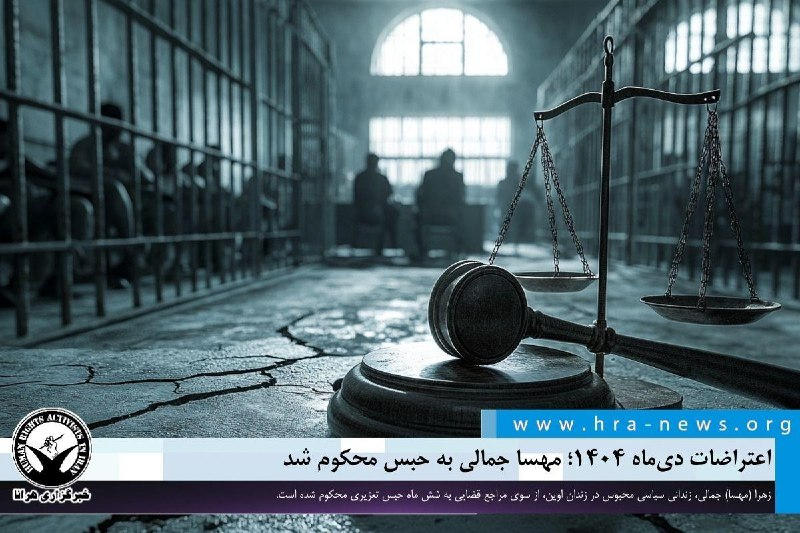

اعتراضات دی‌ماه ۱۴۰۴؛ مهسا جمالی به حبس محکوم شد

❗️
❗️
❗️
❗️
❗️– زهرا (مهسا) جمالی، از بازداشت شدگان اعتراضات دی‌ماه ۱۴۰۴ که در بند زنان زندان اوین محبوس است، توسط دادگاه انقلاب به شش ماه حبس تعزیری محکوم شده است.

به گزارش خبرگزاری هرانا، ارگان خبری مجموعه فعالان حقوق بشر در ایران، زهرا جمالی به حبس محکوم شد.

بر اساس اطلاعات دریافتی هرانا، خانم جمالی با حکم دادگاه انقلاب به شش ماه حبس محکوم شده است. وی هم اکنون در بند زنان زندان اوین محبوس است.

ادامه مطلب

#زهرا_جمالی #مهسا_جمالی

↘️
@hranews_bot تماس ✉️ - @Hranews کانال هرانا 🆑

## Hranews — post 113559

  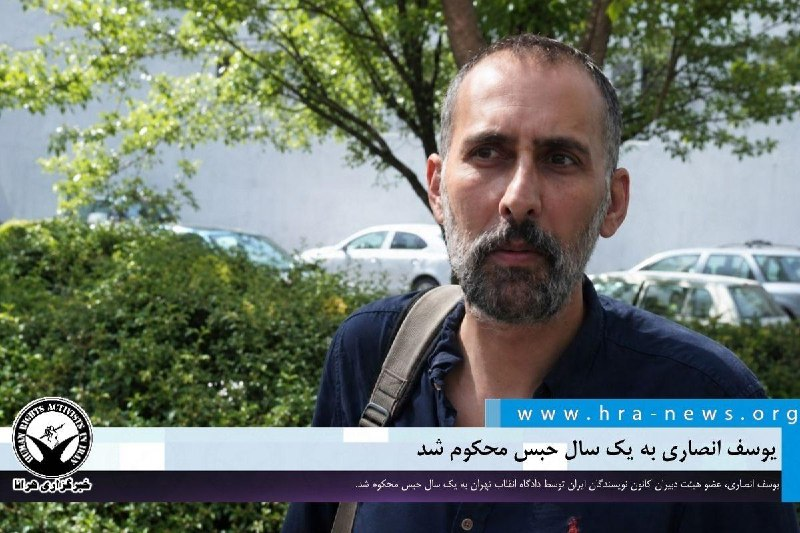

یوسف انصاری به یک سال حبس محکوم شد

❗️
❗️
❗️
❗️
❗️– یوسف انصاری، عضو هیئت دبیران کانون نویسندگان ایران توسط دادگاه انقلاب تهران به یک سال حبس محکوم شد.

به گزارش خبرگزاری هرانا، ارگان خبری مجموعه فعالان حقوق بشر در ایران، یوسف انصاری به حبس محکوم شد.

کانون نویسندگان ایران در این خصوص نوشت: شعبه ۲۱ دادگاه انقلاب تهران، آقای انصاری را به اتهام تبلیغ علیه نظام به یک سال حبس محکوم کرده است. بر اساس حکم صادره، چهار ماه از این مجازات به صورت تعزیری قابل اجرا بوده و هشت ماه دیگر به حالت تعلیق درآمده است.

ادامه مطلب

#یوسف_انصاری

↘️
@hranews_bot تماس ✉️ - @Hranews کانال هرانا 🆑

## Hranews — post 113558

  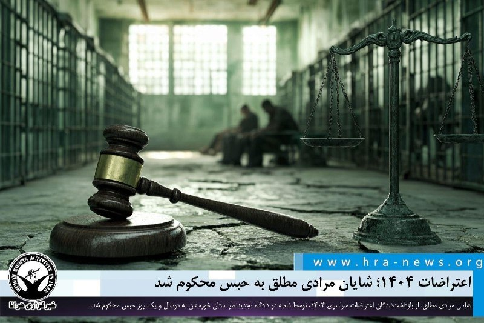

اعتراضات دی‌ماه ۱۴۰۴؛ شایان مرادی مطلق به حبس محکوم شد

❗️
❗️
❗️
❗️
❗️– محکومیت شایان مرادی مطلق، از بازداشت‌شدگان اعتراضات سراسری دی‌ماه ۱۴۰۴، توسط شعبه دو دادگاه تجدیدنظر استان خوزستان عینا تایید شد. وی پیشتر در مرحله بدوی، توسط شعبه یک دادگاه انقلاب ایذه به دو سال و یک روز حبس محکوم شده بود.

به گزارش خبرگزاری هرانا، ارگان خبری مجموعه فعالان حقوق بشر در ایران، حکم صادره توسط شایان مرادی مطلق در دادگاه تجدیدنظر تایید شد.

براساس رای صادره توسط شعبه دو دادگاه تجدیدنظر استان خوزستان، آقای مرادی مطلق از بابت اتهام «اخلال در نظم عمومی» با استناد به تبصره ماده ۲۸۶ قانون مجازات اسلامی به دو سال و یک روز حبس محکوم شده است.

ادامه مطلب

#شایان_مرادی_مطلق

↘️
@hranews_bot تماس ✉️ - @Hranews کانال هرانا 🆑

## Hranews — post 113557

یک شهروند در شهرستان سلسله بازداشت شد

❗️
❗️
❗️
❗️
❗️– یک شهروند در شهرستان سلسله به اتهام «تشویش اذهان عمومی» در بستر فضای مجازی توسط نیروهای انتظامی بازداشت و پس از تشکیل پرونده به مرجع قضایی معرفی شده است.

ادامه مطلب

↘️
@hranews_bot تماس ✉️ - @Hranews کانال هرانا 🆑

## alonews — post 127420

  <a href="telegram/content/alonews_127420_1781275319.webm" target="_blank">🎬 Download video</a>

👈شبکه خبری ای‌بی‌سی به نقل از یک مقام آمریکایی: تردد در تنگه هرمز ادامه دارد.

🔴شبکه خبری ای‌بی‌سی به نقل از یک مقام آمریکایی: تردد در تنگه هرمز ادامه دارد.

✅ @AloNews خبر جنگ

## alonews — post 127419

  <a href="telegram/content/alonews_127419_1781275319.webm" target="_blank">🎬 Download video</a>

👈وزیر دفاع اسرائیل: اسرائیل از مناطق امنیتی در لبنان، سوریه و غزه عقب‌نشینی نخواهد کرد

✅ @AloNews خبر جنگ

## alonews — post 127418

  <a href="telegram/content/alonews_127418_1781275320.webm" target="_blank">🎬 Download video</a>

👈رئیس ستاد کل نیروهای مسلح : هرگز به‌ دنبال دستیابی به سلاح هسته‌ ای نخواهیم رفت و توانمندی‌ های نظامی ما ماهیتی دفاعی دارد و در چارچوب ایجاد بازدارندگی تعریف میشود

✅ @AloNews خبر جنگ

## alonews — post 127417

  <a href="telegram/content/alonews_127417_1781275320.webm" target="_blank">🎬 Download video</a>

👈اعتراف به همسرکشی پس از یک ساعت گریه کنار جسد

🔴مرد جوانی پس از قتل همسر ۳۸ ساله‌اش با چکش و چاقو، حدود یک ساعت بالای سر جسد او نشست و گریه کرد و سپس خود به پلیس اطلاع داد.

🔴بر اساس اعتراف متهم، اختلافات مالی و مشکلات معیشتی عامل اصلی این جنایت خانوادگی بوده است. تحقیقات درباره پرونده ادامه دارد.

✅ @AloNews خبر جنگ

## alonews — post 127415

  <a href="telegram/content/alonews_127415_1781275320.webm" target="_blank">🎬 Download video</a>

👈ترامپ:
آنها افراد بسیار بی شرفی برای توافق هستند

✅ @AloNews خبر جنگ

## alonews — post 127414

  <a href="telegram/content/alonews_127414_1781275320.webm" target="_blank">🎬 Download video</a>

👈ترامپ:
شرایطی که ایران به اخبار جعلی داده است، هیچ ارتباطی با شرایطی که به صورت کتبی توافق شده ندارد. آنچه آنها گفتند، از جمله بیانیه ضعیف و ناامیدکننده‌شان درباره انجام معامله، هیچ ربطی به حقیقت ندارد.

🔴افراد بسیار بی‌انصاف برای انجام معاملات. با آنها مفهومی به نام مذاکره منصفانه وجود ندارد. شگفت‌انگیز! علاوه بر این، حمله پهپادی کاملاً منعکس‌شده آنها دیشب به کشتی‌های هندی که از تنگه هرمز خارج می‌شدند، کاملاً غیرقابل قبول است.

🔴بهتر است سریعاً به خودشان بیایند! رئیس‌جمهور دونالد ج. ترامپ

✅ @AloNews خبر جنگ

## alonews — post 127413

  <a href="telegram/content/alonews_127413_1781275320.webm" target="_blank">🎬 Download video</a>

👈یک مقام کاخ سفید به فاکس نیوز گفت: مواد هسته‌ای ایران نابود و منتقل خواهد شد. 
✅ @AloNews خبر جنگ

## alonews — post 127412

  <a href="telegram/content/alonews_127412_1781275320.webm" target="_blank">🎬 Download video</a>

👈یک مقام کاخ سفید به فاکس نیوز گفت: مواد هسته‌ای ایران نابود و منتقل خواهد شد.

✅ @AloNews خبر جنگ

## alonews — post 127411

  <a href="telegram/content/alonews_127411_1781275321.webm" target="_blank">🎬 Download video</a>

👈امیرحسین ثابتی: کسی حق ندارد تنگه هرمز را به امید رفع تحریم یا محاصره باز کند

✅ @AloNews خبر جنگ

## alonews — post 127410

  <a href="telegram/content/alonews_127410_1781275321.webm" target="_blank">🎬 Download video</a>

👈محمد مرندی:
روز یکشنبه هیچ اتفاقی در ژنو نمی‌افتد. هنوز کارهایی برای انجام دادن وجود دارد.

✅ @AloNews خبر جنگ

## alonews — post 127409

  <a href="telegram/content/alonews_127409_1781275321.webm" target="_blank">🎬 Download video</a>

👈وزیر قطع ارتباطات:
از سرعت اینترنت راضی نیستم.

✅ @AloNews خبر جنگ

## alonews — post 127408

  

ژست‌ گروهبان در مراسم‌ فتوشات جام‌جهانی😎

ساعتشو دیدید یا نه کرد تو چشممون

@AloSport

## alonews — post 127407

  <a href="telegram/content/alonews_127407_1781275321.webm" target="_blank">🎬 Download video</a>

👈علم الهدی: هیچ تفاهمی تا به امضای رهبری نرسد، کوچک‌ترین فرد از امت ما ولو کودک ما قبول نخواهد کرد

✅ @AloNews خبر جنگ

## alonews — post 127406

  <a href="telegram/content/alonews_127406_1781275322.webm" target="_blank">🎬 Download video</a>

🔴فوری / فارس: ادعای امضای توافق در روز یکشنبه در ژنو کذب محض است 
✅ @AloNews خبر جنگ

## alonews — post 127405

  <a href="telegram/content/alonews_127405_1781275322.webm" target="_blank">🎬 Download video</a>

🔴فوری / فارس: ادعای امضای توافق در روز یکشنبه در ژنو کذب محض است

✅ @AloNews خبر جنگ

## alonews — post 127404

  <a href="telegram/content/alonews_127404_1781275322.webm" target="_blank">🎬 Download video</a>

👈اسرائیل، یونان، قبرس و ایالات متحده روز جمعه مرکز انرژی شرق مدیترانه را راه‌اندازی کردند که سکویی جدید برای همکاری در زمینه انرژی، فناوری، نوآوری و پژوهش ایجاد می‌کند.

🔴اسرائیل می‌گوید این ابتکار با هدف تقویت همکاری‌ها در امنیت انرژی، امنیت سایبری، زیرساخت‌های حیاتی و توسعه فناوری از طریق اتصال دولت‌ها، مؤسسات دانشگاهی، پژوهشگران و رهبران بخش خصوصی است

✅ @AloNews خبر جنگ

## alonews — post 127403

  <a href="telegram/content/alonews_127403_1781275322.webm" target="_blank">🎬 Download video</a>

👈اداره ملی اقیانوسی و جوی آمریکا (NOAA): شرایط ال نینو اکنون در بخش گرمسیری اقیانوس آرام شکل گرفته و دمای سطح آب دریا در ماه‌های اخیر به طور قابل توجهی افزایش یافته است.

🔴بسیاری از پیش‌بینی‌ها نشان می‌دهند که این دوره ممکن است به یک «ابر ال نینو» تبدیل شود و حتی در میان قوی‌ترین نمونه‌های ثبت شده قرار گیرد.

✅ @AloNews خبر جنگ

## alonews — post 127402

  <a href="telegram/content/alonews_127402_1781275322.webm" target="_blank">🎬 Download video</a>

👈خبرگزاری یونهاپ کره‌جنوبی: سامانه پیشرفته پدافند موشکی KM-SAM (Cheongung-II) که هم‌اکنون در امارات متحده عربی مستقر است، در جریان حملات ایران بیش از ۶۰ موشک رهگیر شلیک کرده است.

🔴بر اساس این گزارش، این سامانه موفق شده حدود ۹۶ درصد از اهداف مهاجم را رهگیری و منهدم کند که نشان‌دهنده عملکرد بسیار بالای آن در مقابله با حملات موشکی و پهپادی بوده است.

✅ @AloNews خبر جنگ

## alonews — post 127401

  <a href="telegram/content/alonews_127401_1781275322.webm" target="_blank">🎬 Download video</a>

👈خبر فوری رویترز:
توافق توسط جی‌دی ونس و قالیباف امضا می‌شود.

✅ @AloNews خبر جنگ

## alonews — post 127398

  <a href="telegram/content/alonews_127398_1781275322.webm" target="_blank">🎬 Download video</a>

👈 دیروز دونالد ترامپ جونیور در هتل لوکس د آنگلتِر در کپنهاگ، دانمارک، همراه با گروهی از مأموران سرویس مخفی دیده شد.

🔴دلیل حضور او در دانمارک مشخص نیست

✅ @AloNews خبر جنگ

<!-- MSG END -->

<!-- NAV START -->

<a href="https://github.com/Tljn/FUD/blob/main/telegram/content/archive_1.md" style="display:inline-block; padding:6px 12px; margin:0 4px; background-color:#2ea44f; color:white; text-decoration:none; border-radius:4px; font-weight:bold;">صفحه بعد</a>

<!-- NAV END -->
