# خواننده تلگرام

<!-- TOP_NAV START -->

<a href="https://github.com/Tljn/FUD/blob/main/telegram/content/archive_1.md" style="display:inline-block; padding:6px 12px; margin:0 4px; background-color:#2ea44f; color:white; text-decoration:none; border-radius:4px; font-weight:bold;">صفحه بعد</a>

<!-- TOP_NAV END -->

<!-- MSG START -->

---
📅 بروزرسانی: 1405/02/26 23:19
---

## VahidOOnLine — post 240531

  

شاهزاده رضا پهلوی در نشست آینده تکنولوژی در ایران، خطاب به کشورهای جهان گفت: «جمهوری اسلامی ثابت کرده غیرقابل اعتماد است و افزود اگر به دنبال یک شریک واقعی هستید به مردم ایران نگاه کنید.»

شاهزاده رضا پهلوی افزود: «باید این درک مشترک در سطح جهانی شکل بگیرد که با وجود جمهوری اسلامی هیچ کشوری نمی‌تواند احساس امنیت و آرامش پایدار داشته باشد.»

او گفت: «جامعه جهانی باید از مردم ایران برای تغییر حکومت حمایت کند. این اقدام نه‌تنها به سود مردم ایران بلکه به نفع خود کشورهای حامی نیز خواهد بود.»
‌🏁 🇬🇧 IranintlTV

🤖 @VahidOOnLine

## VahidOOnLine — post 240530

  

شاهزاده رضا پهلوی در نشست آینده تکنولوژی در ایران، گفت: «ایران می‌تواند به کشوری مانند کره جنوبی تبدیل شود، اما به دلیل وضعیت سیاسی کنونی به سمت الگویی شبیه کره شمالی سوق داده شده است.» شاهزاده رضا پهلوی افزود: «جمهوری اسلامی در ذات خود قابل تغییر نیست.»
‌🏁 🇬🇧 IranintlTV

🤖 @VahidOOnLine

## VahidOOnLine — post 240529

  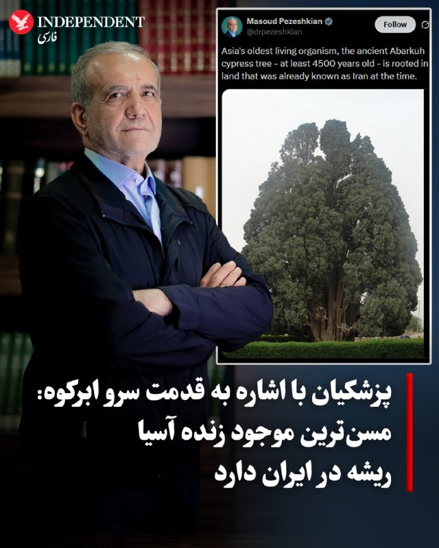

♦️ مسعود پزشکیان روز شنبه ۲۶ اردیبهشت با انتشار تصویری از سرو ابرکوه در شبکه اجتماعی ایکس نوشت: «مسن‌ترین موجود زنده آسیا، درخت سرو کهنسال ابرکوه با قدمتی دست‌کم ۴۵۰۰ ساله، در سرزمینی ریشه دوانده است که حتی در آن دوران نیز به نام ایران شناخته می‌شد.» به نظر می‌رسد که پزشکیان با این پیام که اشاره به قدمت تمدن ایران دارد، قصد دارد ایران را با کشورهای تازه تاسیس منطقه یا ایالات متحده مقایسه کند.

با این‌وجود، اشاره پزشکیان به قدمت سرو ابرکوه، به‌ویژه با بحران آب و خطراتی که در سال‌های اخیر این درخت کهن را تهدید کرده و از سوی مقام‌های جمهوری اسلامی نادیده گرفته شده، با انتقاد کاربران مواجه شد.

سرو ابرکوه، قدیمی‌ترین درخت آسیا و پس از کاج متوشلخ در ایالت کالیفرنیای آمریکا، دومین درخت کهنسال جهان است.
‌🇸🇦 Indypersian

🤖 @VahidOOnLine

## WithYashar — post 11418

  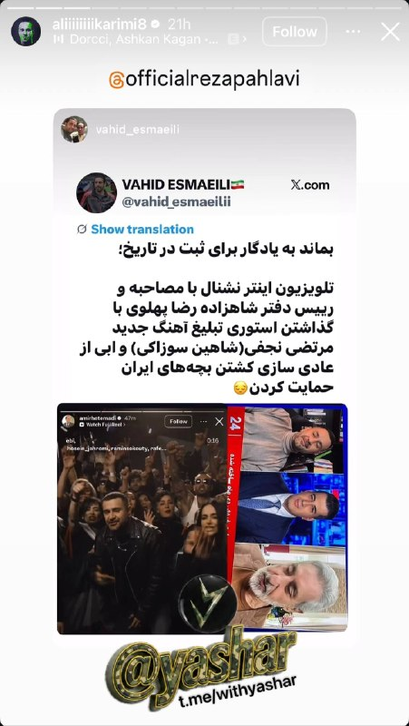

مشاورین شاهزاده (امیر اعتمادی و سعید قاسمینژاد) ، علی کریمی‌ رو به علت واکنش ‌به کنسرت و آهنگ شاهین نجفی آنفالو کردند @withyashar

## WithYashar — post 11417

شاهزاده رضا پهلوی در نشست آینده تکنولوژی در ایران:

ایران می‌تونه به کره جنوبی تبدیل بشه، اما به دلیل وضعیت سیاسی کنونی به سمت الگویی شبیه کره شمالی سوق داده شده؛ جمهوری اسلامی در ذات خودش قابل تغییر نیست.

@withyashar

## WithYashar — post 11416

کانال ۱۳ اسرائیل:
اسرائیل در بالاترین سطح هشدار برای احتمال از سرگیری جنگ با ایران است. در صورت از سرگیری جنگ با ایران، احتمال دارد ایران در روزهای نخست ده‌ها موشک به سمت اسرائیل شلیک کند.
@withyashar

## WithYashar — post 11415

قلعه نویی در لیست نهایی جام جهانی آزمونو خط زد و گفت باشرف هارو دعوت کردم.
@withyashar

## mwarmonitor — post 9174

  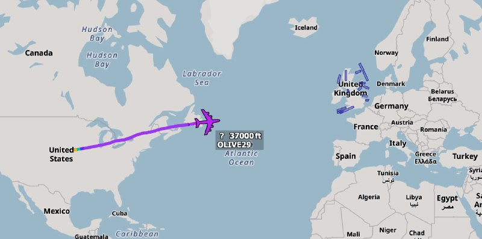

✈️🇺🇸نیروی هوایی آمریکا (USAF)

✈️هواپیمای Boeing TC-135 Stratolifter (یک فروند) AE01D3 62-4129 - OLIVE 29

✈️هواپیمای OLIVE 29 در حال عبور از اقیانوس اطلس است و مستقیم از پایگاه نیروی هوایی اوفوت (Offutt Air Force Base) پرواز کرده؛ مقصد آن یا پایگاه RAF Mildenhall انگلستان است یا شهر خانیا (Chania) قبرس، اما با توجه به مسیر پرواز و اینکه هواپیماهای RC-135 مستقر فعلی در آنجا هستند، احتمال خانیا بیشتر است.

@mwarmonitor

## mwarmonitor — post 9173

📝 سوالی دارید دایرکت جواب میدم

## mwarmonitor — post 9172

  

🔸ترامپ که از پکن برگشته، امروز (طبق گزارش سرویس مخفی) در باشگاه گلف خود در ویرجینیا سپری کرده است.

🔹تصاویر از جو واگنر از شبکه CNN منتشر شده است.

@mwarmonitor

## mwarmonitor — post 9171

  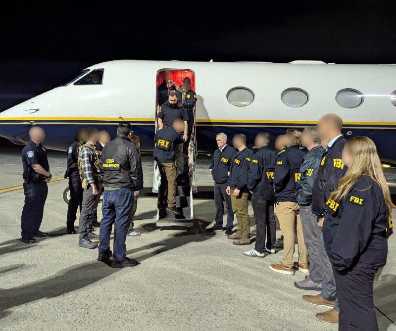

🔴امروز، محمد باقر سعد داوود الساعدی، یکی از اعضای ارشد کتائب حزب‌الله — یک سازمان تروریستی خارجی که توسط آمریکا تعیین شده است — به شش فقره اتهام مرتبط با تروریسم به دلیل فعالیت‌هایش به عنوان عامل کتائب حزب‌الله و نیروی قدس سپاه پاسداران انقلاب اسلامی ایران متهم شد. محمد باقر سعد داوود الساعدی در ترکیه بازداشت و به ایالات متحده منتقل گردیده است.

🔸 «در فاصله فقط سه ماه، محمد الساعدی ادعا شده که ۱۸ حمله تروریستی در سراسر اروپا را هدایت کرده است — از جمله علیه شهروندان و منافع ایالات متحده — و همچنین قصد داشته حمله‌ای مشابه را در کشور ما انجام دهد. گروه ویژه مشترک مبارزه با تروریسم اف‌بی‌آی نیویورک، اراده‌ای تزلزل‌ناپذیر دارد برای پاسخگو کردن رهبران سازمان‌های تروریستی خارجی که از ترس و رنج گسترده برای پیشبرد دستورکار ضدآمریکایی خود استفاده می‌کنند.»

@mwarmonitor

## mwarmonitor — post 9170

🔴پیش از آن‌که ترامپ برای سفر خود به پکن راهی شود، او — که از نحوه برخورد ایران با مذاکرات برای پایان دادن به جنگ روزبه‌روز ناراضی‌تر می‌شد — طبق گفته منابع آگاه از گفتگوها به CNN، به‌طور جدی‌تر از هفته‌های اخیر در حال بررسی ازسرگیری عملیات نظامی بود.

🔴با این حال، تیم ترامپ آماده بود صبر کند تا ببیند آیا این سفر مهم و دیدارهای رو در رو با رئیس‌جمهور چین، شی جین‌پینگ، می‌تواند به یک پیشرفت قابل توجه منجر شود یا نه.

🔴اما ترامپ روز جمعه بدون تغییر محسوس در وضعیت جنگ ایران به آمریکا بازگشت. اکنون او باید تصمیم بگیرد که آیا آغاز حملات بیشتر به ایران بهترین گزینه برای پایان دادن به این درگیری است یا خیر. CNN

@mwarmonitor

## pm_afshaa — post 90863

  <a href="telegram/content/pm_afshaa_90863_1778961002.webm" target="_blank">🎬 Download video</a>

🔴قالیباف: جهان در آستانهٔ نظمی نوین قرار دارد. چنان‌که رئیس‌جمهور شی گفت: «تحولی که در یک قرن دیده نشده، در سراسر جهان با شتاب در حال پیشروی است»، و من تأکید می‌کنم که مقاومت ۷۰ روزهٔ ملت ایران این تحول را شتاب بخشیده است. آینده از آنِ جنوب جهانی است.

💧 Rainbet.com the #1 Non-KYC Crypto Casino & Sportsbook @rainbetcom

😁 @Pm_Afshaa

## pm_afshaa — post 90862

🔴سردار آزمون به علت حمایت از مردم ایران از تیم ملی خط خورد

💧 Rainbet.com the #1 Non-KYC Crypto Casino & Sportsbook @rainbetcom

😁 @Pm_Afshaa

## pm_afshaa — post 90861

🔴نتانیاهو : اگه آمریکا دوباره بخواد عملیات نظامی علیه ایران رو شروع کنه، اسرائیل آماده‌ست

💧 Rainbet.com the #1 Non-KYC Crypto Casino & Sportsbook @rainbetcom

😁 @Pm_Afshaa

## pm_afshaa — post 90860

  <a href="telegram/content/pm_afshaa_90860_1778961003.webm" target="_blank">🎬 Download video</a>

🔴کانال 13 اسرائیل:
برآوردها در ارتش اسرائیل اینه که ترامپ پس از بازگشت از چین، دستور حمله به جمهوری اسلامی رو صادر خواهد کرد.

اهداف احتمالی حمله شامل زیرساخت‌های حکومتی، مراکز انرژی، نیروگاه‌ها و همچنین مقام‌های ارشد جمهوری اسلامی خواهد بود.

اسرائیل امیدواره در صورت آغاز درگیری، جنگ فقط چند روز طول بکشه.

💧 Rainbet.com the #1 Non-KYC Crypto Casino & Sportsbook @rainbetcom

😁 @Pm_Afshaa

## IranIntlTV — post 337524

  <a href="telegram/content/IranIntlTV_337524_1778961003.mp4" target="_blank">🎬 Download video</a>

ناصر رفیعی، سخنران مذهبی دفتر علی خامنه‌ای، رهبر کشته‌شده جمهوری اسلامی، به نقل از غلامعلی حداد عادل، پدرزن مجتبی خامنه‌ای، گفت اعضای خانواده علی خامنه‌ای پیش از عملیات مرگبار نهم اسفند در مجتمع رهبری باقی ماندند، زیرا مقامات «اطمینان داده بودند» که با نزدیک شدن توافق در مذاکرات، هیچ اقدام نظامی صورت نخواهد گرفت.
رفیعی در این فایل صوتی به نقل از حداد عادل می‌گوید که این اتفاق به‌ این دلیل افتاد که شرایط عادی در بیت بود و «خامنه‌ای خود را در معرض قرار داده بود.»

## IranIntlTV — post 337523

  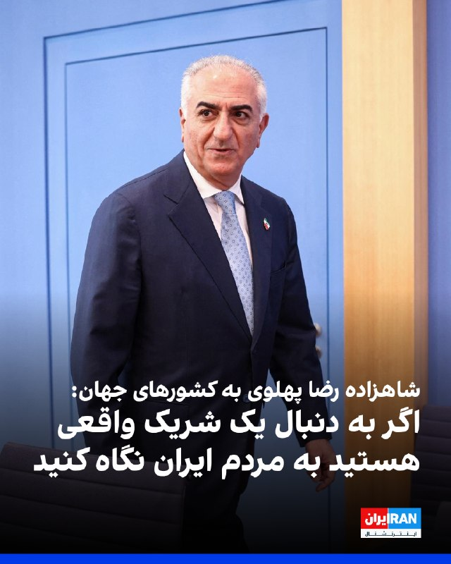

شاهزاده رضا پهلوی در نشست آینده تکنولوژی در ایران، خطاب به کشورهای جهان گفت: «جمهوری اسلامی ثابت کرده غیرقابل اعتماد است و افزود اگر به دنبال یک شریک واقعی هستید به مردم ایران نگاه کنید.»

شاهزاده رضا پهلوی افزود: «باید این درک مشترک در سطح جهانی شکل بگیرد که با وجود جمهوری اسلامی هیچ کشوری نمی‌تواند احساس امنیت و آرامش پایدار داشته باشد.»

او گفت: «جامعه جهانی باید از مردم ایران برای تغییر حکومت حمایت کند. این اقدام نه‌تنها به سود مردم ایران بلکه به نفع خود کشورهای حامی نیز خواهد بود.»
https://iranintl.com/202605162411

## IranIntlTV — post 337522

  <a href="telegram/content/IranIntlTV_337522_1778961005.mp4" target="_blank">🎬 Download video</a>

شاهزاده رضا پهلوی در نشست «آینده تکنولوژی در ایران» گفت دعوت او از همه جریان‌های سیاسی و فکری، توافق بر سر چهار اصل برای پایان دادن به جمهوری اسلامی و ساختن آینده ایران است.

او این اصول را حفظ تمامیت ارضی ایران، جدایی دین از حکومت، برابری شهروندان در برابر قانون و تعیین شکل نظام آینده از طریق انتخابات آزاد عنوان کرد.

شاهزاده رضا پهلوی همچنین گفت هدف، تدوین نقشه راهی برای بازسازی و شکوفایی ایران پس از جمهوری اسلامی است.
@iranintltv

## IranIntlTV — post 337521

  <a href="telegram/content/IranIntlTV_337521_1778961007.mp4" target="_blank">🎬 Download video</a>

شاهزاده رضا پهلوی در نشست «آینده تکنولوژی در ایران» با تاکید بر ظرفیت‌های گسترده ایران گفت جمهوری اسلامی مانع اصلی شکوفایی کشور است و با تغییر وضع سیاسی، ایران می‌تواند به جای کره شمالی، کره جنوبی باشد و سیستان‌وبلوچستان، سیلیکون‌ولی ایران بشود.
@iranintltv

## IranIntlTV — post 337520

  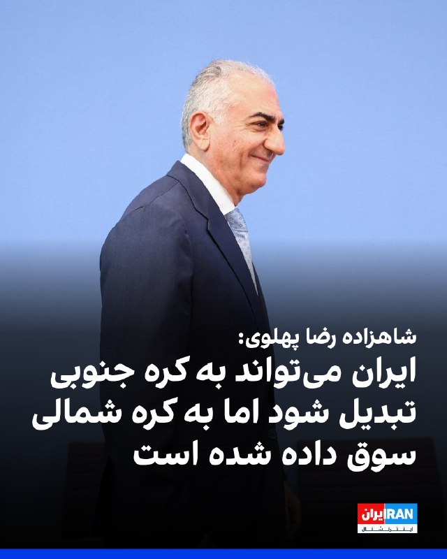

شاهزاده رضا پهلوی در نشست آینده تکنولوژی در ایران، گفت: «ایران می‌تواند به کشوری مانند کره جنوبی تبدیل شود، اما به دلیل وضعیت سیاسی کنونی به سمت الگویی شبیه کره شمالی سوق داده شده است.» شاهزاده رضا پهلوی افزود: «جمهوری اسلامی در ذات خود قابل تغییر نیست.»
https://iranintl.com/202605163867

## ManotoTV — post 105536

  <a href="telegram/content/ManotoTV_105536_1778961009.mp4" target="_blank">🎬 Download video</a>

‌
شاهزاده رضا پهلوی در «نشست آینده تکنولوژی در ایران» گفت ایرانیان موفق در سیلیکون‌ولی می‌توانند الگوی توسعه آینده ایران باشند و نشان دهند که با تغییر وضعیت سیاسی، چه فرصت‌هایی برای کشور ایجاد خواهد شد.

او با اشاره به توانایی متخصصان ایرانی در حوزه فناوری و هوش مصنوعی گفت نمونه‌ای مشابه سیلیکون‌ولی حتی می‌تواند در بلوچستان شکل بگیرد و ایران ظرفیت تبدیل شدن به کشوری پیشرفته را دارد.

شاهزاده رضا پهلوی تاکید کرد مشکلات اقتصادی و معیشتی کنونی به دلیل ناتوانی مردم یا کمبود امکانات نیست و افزود: «ایران می‌تواند کره جنوبی باشد؛ اما به‌دلیل وضعیت سیاسی، به کره شمالی تبدیل شده است.»

## FarsiVOA — post 217929

⚡️مستند بلند «تمرین‌هایی برای یک انقلاب» ساخته پگاه آهنگرانی در هفتاد‌ونهمین دوره فیلم کن به نمایش درآمد و با تشویق ممتد تماشاگران روبه‌رو شد.
@FarsiVOA

## FarsiVOA — post 217928

  <a href="telegram/content/FarsiVOA_217928_1778961010.mp4" target="_blank">🎬 Download video</a>

⚡️نمایش فیلم «تمرین‌هایی برای یک انقلاب» ساخته پگاه آهنگرانی در جشنواره کن
@FarsiVOA

## FarsiVOA — post 217927

🔺پست جدید ترامپ در تروت‌سوشال؛ تصویر گرافیکی از حمله ناو آمریکایی به یک هواگرد مهاجم

▪️رئیس جمهوری ایالات متحده روز شنبه ۲۶ اردیبهشت پستی را در شبکه اجتماعی تروت‌سوشال منتشر کرد که در آن یک ویدیوی گرافیکی کوتاه از شلیک یک ناو آمریکایی به یک پهپاد یا هواگرد مهاجم نمایش داده می‌شود.

⬇️ بیشتر بخوانید:

https://ir.voanews.com/a/8150713.html
@FarsiVOA

## FarsiVOA — post 217926

نت‌بلاکس، نهاد ناظر بر اختلالات اینترنت، اعلام کرد خاموشی دیجیتال در ایران وارد هفته دوازدهم و روز هفتادوهشتم شده است؛ محدودیتی بی‌سابقه که به گفته این نهاد، کشوری ۹۰ میلیونی را تا حد زیادی از اینترنت جهانی جدا کرده و حقوق بشر، اقتصاد و آزادی‌های بنیادین شهروندان را در مقیاسی گسترده فرسایش می‌دهد.

این در حالی است که الیاس حضرتی، رئیس شورای اطلاع‌رسانی دولت، در سخنانی تازه گفته است سیاست دولت پزشکیان «گشایش اینترنت بین‌الملل» است و این سیاست «بروبرگرد ندارد».

حضرتی گفته است وقتی ۸۰ درصد مردم از فیلترشکن استفاده می‌کنند، فیلترینگ چه معنایی دارد و اگر هدف جلوگیری از دسترسی مردم به برخی سایت‌ها بوده، این هدف نه تنها محقق نشده، بلکه به گفته او «بدتر» هم شده است.

او همچنین گفته اختلاف‌نظرهایی میان مسئولان درباره گشایش اینترنت وجود دارد، اما دولت تلاش می‌کند این مسئله را از مسیر گفت‌وگو حل کند.

اما هم‌زمان با این اظهارات، گزارش‌های داخلی نشان می‌دهد محدودیت‌ها نه فقط ادامه دارد، بلکه برخی ابزارهای پایه کار دیجیتال دوباره از دسترس خارج شده‌اند.

گزارش کامل را در وب‌سایت صدای آمریکا بخوانید.

@FarsiVOA

## FarsiVOA — post 217925

حضور ناگهانی ژنرال دیوید پترائوس در بغداد و دیدار با رئیس شورای عالی قضایی عراق حامل چه پیامی است؟

## FarsiVOA — post 217924

گفت‌وگو با منصور سهرابی وقتی نفت به دریا می‌ریزد؛ جزیره خارک و نشت نفت و بن‌بست صادراتی

## FarsiVOA — post 217923

توافق اروپا برای محاکمه رهبران روسیه؛ هم‌زمان با موج حملات گسترده مسکو به شهرهای اوکراین

## FarsiVOA — post 217922

در هفتاد و نهمین فستیوال فیلم کن «تمرین‌های برای یک انقلاب » ساخته پگاه آهنگرانی به نمایش در آمد . مراسم فرش قرمز این فیلم بارحضور پگاه آهنگرانی ، علی عظیمی ، منیژه حکت و کاوه فرنام همراه بود

## DW_Farsi — post 124777

  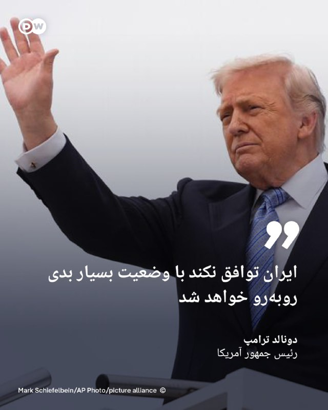

🔶 ترامپ: ایران توافق نکند با "وضعیت بسیار بدی" روبه‌رو خواهد شد

دونالد ترامپ، رئیس‌ جمهور آمریکا، گفته است ایران "به توافق علاقه‌مند است" و هشدار داده در غیر این صورت با "وضعیت بسیار بدی" روبه‌رو خواهد شد.

ترامپ در گفت‌وگو با شبکه فرانسوی BFMTV گفته هنوز مشخص نیست مذاکرات درباره برنامه هسته‌ای ایران و تنش‌های اخیر به توافق منجر شود یا نه.

او افزود: «اگر توافق نکنند، دوران بسیار سختی خواهند داشت.»

این اظهارات در حالی مطرح می‌شود که مذاکرات برای پایان دادن به درگیری‌ها تاکنون به نتیجه نرسیده است. گزارش‌ها حاکی از آن است که ترامپ در حال بررسی ازسرگیری حملات علیه ایران است.
@dw_farsi

## DW_Farsi — post 124776

  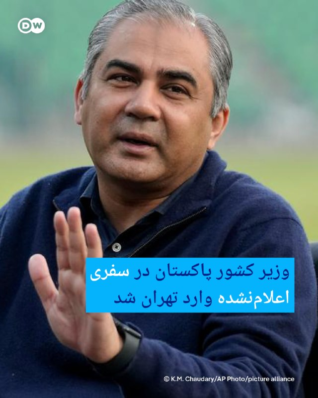

🔶 وزیر کشور پاکستان در سفری اعلام‌نشده وارد تهران شد

رسانه‌های ایران گزارش داده‌اند که محسن نقوی، وزیر کشور پاکستان، در سفری از پیش اعلام‌نشده وارد تهران شده است.

به گزارش ایرنا و ایسنا، او قرار است با برخی مقام‌های ایرانی از جمله اسکندر مومنی، وزیر کشور ایران، دیدار کند.

جزئیاتی درباره محور گفت‌وگوها منتشر نشده، اما نقوی پیش‌تر نیز در فروردین‌ماه همراه فرمانده ارتش پاکستان به تهران سفر کرده و در دیدارهای رسمی با مقام‌های ارشد جمهوری اسلامی حضور داشت.
@dw_farsi

## DW_Farsi — post 124775

  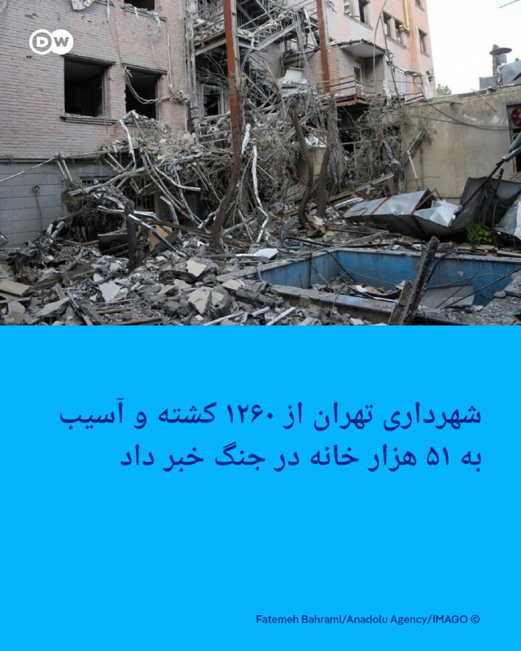

🔶 شهرداری تهران از ۱۲۶۰ کشته و آسیب به ۵۱ هزار خانه در جنگ خبر داد

سخنگوی شهرداری تهران می‌گوید، در جریان "جنگ ۴۰ روزه" میان ایران، آمریکا و اسرائیل، دست‌کم ۱۲۶۰ نفر در تهران کشته و بیش از ۲۸۰۰ نفر زخمی شدند.

عبدالمطهر محمدخانی اعلام کرد که در این مدت ۶۵۰ مورد اصابت در پایتخت ثبت شده و حدود ۵۱ هزار واحد مسکونی آسیب دیده‌اند؛ بخش عمده آن‌ها خسارت‌های جزئی مانند شکستن شیشه‌ها و آسیب به در و پنجره بوده است.

به گفته او، بیش از ۱۰ هزار خودرو و ۷۵۴ موتورسیکلت نیز آسیب دیده‌اند و حدود ۲۲ میلیارد تومان خسارت به ناوگان اتوبوسرانی تهران وارد شده است.

محمدخانی همچنین گفت برخی نیروهای آتش‌نشانی که در محل انفجارها حضور داشتند، دچار مشکلات تنفسی ناشی از گازهای سمی شده‌اند.
@dw_farsi

## Persian_Trend_Official — post 14267

🔴آمریکا معافیت تحریم نفت روسیه را تمدید نکرد

💢به گزارش رویترز، آمریکا روز شنبه معافیت تحریمی که پیشتر به کشورهایی از جمله هند اجازه می‌داد نفت روسیه را خریداری کنند، تمدید نکرد.

💢این معافیت قبلاً به مدت یک ماه تمدید شده بود تا کمبود عرضه نفت و قیمت‌های بالا ناشی از بسته شدن تنگه هرمز توسط ایران کاهش یابد.

💢اسکات بسنت، وزیر خزانه‌داری آمریکا پیشتر گفته بود که مجوز خرید نفت روسیه ذخیره‌شده روی تانکرها را تمدید نخواهد کرد.

🫆:Tony

📌 @persian_trend_official
پرشین ترند | متفاوت‌ترین کانال نظامی

## Persian_Trend_Official — post 14266

  <a href="telegram/content/Persian_Trend_Official_14266_1778961012.webm" target="_blank">🎬 Download video</a>

🔴تارنمای بیمهٔ ایرانی تنگهٔ هرمز راه‌اندازی شد

💢تارنمای «هرمز سیف» (Hormuz Safe) ارائه بیمه به محموله‌های دریایی عبوری از تنگهٔ هرمز را شروع کرد.

💢مقررات این تارنمای بیمه می‌گوید، بیمه‌نامه‌هایی سریع و با قابلیت تایید رمزنگاری شده برای محموله‌هایی که از خلیج فارس، تنگهٔ هرمز و آبراه‌های اطراف آن عبور می‌کنند، ارائه می‌شود و پرداخت‌ها با ارز دیجیتال تسویه خواهد شد.

🫆:Tony

📌 @persian_trend_official
پرشین ترند | متفاوت‌ترین کانال نظامی

## Persian_Trend_Official — post 14265

⭕️ ادعای ترامپ:
ایران روزهای بسیار سختی در پیش خواهد داشت.

📝 Nick

📌 @persian_trend_official
پرشین ترند | متفاوت‌ترین کانال نظامی

## IranianMinds — post 20257

  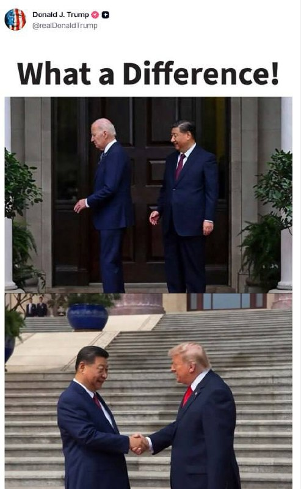

🔴 پست جدید ترامپ که دوباره گرفته رو‌ بایدن یتیم:

@IranianMinds

## BBCPersian — post 281237

⭕️آمریکا یک فرمانده شبه‌نظامیان عراقی را به توطئه برای هدف قرار دادن یهودیان در شهرهایی از لندن تا لس‌آنجلس متهم کرد

آمریکا می‌گوید که محمد باقر سعد داوود ساعدی، از فرماندهان شبه‌نظامیان عراقی را به اتهام نقش داشتن در طراحی بیش از ۱۲ حمله «تروریستی» در آمریکای شمالی و اروپا بازداشت و به آمریکا منتقل کرده است.

مقامات قضایی آمریکا گفته‌اند که این حملات در واکنش به جنگ با ایران برنامه‌ریزی شده بود.

این مقام‌های آمریکا همچنین گفتند که «محمد باقر سعد داوود ساعدی، ۳۲ ساله، در حال طراحی حمله به یک کنیسه در نیویورک و دو مرکز یهودی در لس‌آنجلس و اسکاتسدیل بوده است.»

بر اساس شکایت کیفری، آقای ساعدی با شش اتهام مرتبط با تروریسم روبه‌رو است. وکیلش اما می‌گوید که پیگرد او با «انگیزه‌های سیاسی» صورت گرفته است.

مقام‌های آمریکایی، آقای ساعدی را به عنوان یکی از فرماندهان کتائب حزب‌الله معرفی کرده‌اند.

https://bbc.in/3PKX1OQ
@BBCPersian

## BBCPersian — post 281236

  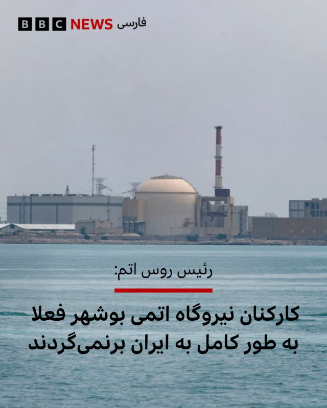

🔻مسکو می‌گوید اتباع روسی شاغل در نیروگاه اتمی بوشهر را فعلا به طور کامل به ایران برنمی‌گرداند.

الکسی لیخاچف، رئیس شرکت دولتی روس‌اتم، گفت هفته گذشته ایران و آمریکا بار دیگر حملاتی علیه یکدیگر انجام و رسانه‌های آمریکایی هم دوباره از احتمال ازسرگیری درگیری‌ها خبر دادند و ادامه داد گه «تا زمانی که وضعیت روشن نشود، ما حق نداریم درباره بازگشت کامل نیروها به محل نیروگاه تصمیم‌گیری کنیم.»

به گفته او، روس‌اتم در حال آماده‌سازی طرح‌های آتی برای افزایش تعداد نیروهای روسی در نیروگاه اتمی بوشهر است اما در «در عین حال گفت «باید شرایط نظامی را هم در نظر بگیریم.»

محوطه بوشهر که تنها نیروگاه اتمی ایران است، در جریان جنگ اخیر چند بار هدف حمله قرار گرفت اما به ساختمان و تاسیاست اصلی آسیبی نرسید.

روسیه از زمان حمله اسرائیل و آمریکا به ایران در چند مرحله اتباع خود را که در این نیروگاه مشغول به کار هستند، از ایران خارج کرد.

📸NurPhoto via Getty Images

https://bbc.in/4duJS4e
@BBCPersian

## Dirty_Kids — post 389578

ترامپ:
اگه توافق نشود ایران روز های خیلی سختی در پیش دارد

@Dirty_Kids 👻

## Dirty_Kids — post 389577

  <a href="telegram/content/Dirty_Kids_389577_1778961013.mp4" target="_blank">🎬 Download video</a>

بابای گلشیفته هستن

@Dirty_Kids 👻

## Dirty_Kids — post 389576

  <a href="telegram/content/Dirty_Kids_389576_1778961014.mp4" target="_blank">🎬 Download video</a>

تامی رابینسون (فعال ملی‌گرای بریتانیایی) در تطاهرات لندن عکس شاهزاده رضا پهلوی بالا برد

@Dirty_Kids 👻

## Dirty_Kids — post 389575

  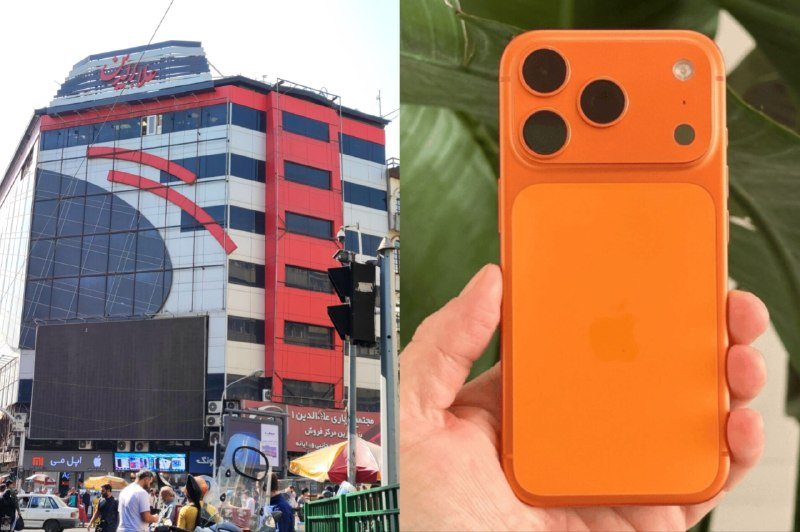

سال 1374، کل پاساژ علاءالدین: 500 میلیون

سال 1405، آیفون 17 پرومکس: 500 میلیون

@Dirty_Kids 👻

## Hranews — post 112975

تجمع اعتراضی کارگران پتروشیمی پتروناد در بندر امام

❗️
❗️
❗️
❗️
❗️– امروز شنبه ۲۶ اردیبهشت ماه، گروهی از #کارگران شرکت پتروشیمی پتروناد بندر امام، در اعتراض به اخراج ۲۰۰ همکار خود، مقابل دادسرای این شهر #تجمع اعتراضی برگزار کردند.

ادامه مطلب

↘️
@hranews_bot تماس ✉️ - @Hranews کانال هرانا 🆑

## manototv — post 105536

  <a href="telegram/content/manototv_105536_1778961016.mp4" target="_blank">🎬 Download video</a>

‌
شاهزاده رضا پهلوی در «نشست آینده تکنولوژی در ایران» گفت ایرانیان موفق در سیلیکون‌ولی می‌توانند الگوی توسعه آینده ایران باشند و نشان دهند که با تغییر وضعیت سیاسی، چه فرصت‌هایی برای کشور ایجاد خواهد شد.

او با اشاره به توانایی متخصصان ایرانی در حوزه فناوری و هوش مصنوعی گفت نمونه‌ای مشابه سیلیکون‌ولی حتی می‌تواند در بلوچستان شکل بگیرد و ایران ظرفیت تبدیل شدن به کشوری پیشرفته را دارد.

شاهزاده رضا پهلوی تاکید کرد مشکلات اقتصادی و معیشتی کنونی به دلیل ناتوانی مردم یا کمبود امکانات نیست و افزود: «ایران می‌تواند کره جنوبی باشد؛ اما به‌دلیل وضعیت سیاسی، به کره شمالی تبدیل شده است.»

## alonews — post 120474

  <a href="telegram/content/alonews_120474_1778961017.webm" target="_blank">🎬 Download video</a>

👈خبرنگار فاکس نیوز: ترامپ درحال آماده‌شدن برای دور جدیدی از حملات نظامی به ایران است

✅ @AloNews خبر جنگ

## alonews — post 120473

  <a href="telegram/content/alonews_120473_1778961017.mp4" target="_blank">🎬 Download video</a>

👈 ترامپ: ایران در گذشته بارها تنگه هرمز را بسته است!

🔴ترامپ : ایران سال‌هاست که با استفاده از تنگه هرمز، جهان را تحت فشار گذاشته است.

🔴ایران از انسداد تنگه هرمز بارها و بارها بهره برداری کرده! (بارها تنگه را بسته است)

🔴آنها در گذشته تنگه را بسته‌اند. از آن به عنوان یک سلاح استفاده کردند!

🔴 اما الان نمی‌توانند از آن به عنوان سلاح علیه من استفاده ‌کنند.

✅ @AloNews خبر جنگ

## alonews — post 120472

  <a href="telegram/content/alonews_120472_1778961018.webm" target="_blank">🎬 Download video</a>

👈یه پهپاد حزب‌الله مستقیم به خودروی ارتش اسرائیل خورد

✅ @AloNews خبر جنگ

## alonews — post 120471

🔥 FLASH NET VPN 
🔥 
⚠️ شرایط جنگی؟ نت ملی؟ فیلترینگ سنگین؟ 
💪 ما هنوز پایدار و بدون قطعی کنار شماییم! 
🚀 پینگ خفن 
🌐 سرعت فوق‌العاده پایدار 
😍 رضایت فراوان کاربران 
🤖 ربات کاملاً خودکار 
💸 نرخ‌ها پایین‌تر از همه جا 🇧🇬 تک لوکیشن بلغارستان ♾ بدون ضریب 
🔗 دارای لینک…

## alonews — post 120470

🔥 FLASH NET VPN 
🔥

⚠️ شرایط جنگی؟ نت ملی؟ فیلترینگ سنگین؟

💪 ما هنوز پایدار و بدون قطعی کنار شماییم!

🚀 پینگ خفن

🌐 سرعت فوق‌العاده پایدار

😍 رضایت فراوان کاربران

🤖 ربات کاملاً خودکار

💸 نرخ‌ها پایین‌تر از همه جا

🇧🇬 تک لوکیشن بلغارستان
♾ بدون ضریب

🔗 دارای لینک ساب اختصاصی

━━━━━━━━━━━━━━━

📦 ۵ گیگ ➜  650,000 تومان 
✅ 

📦 ۱۰ گیگ ➜  990,000 تومان 
✅

📦 ۵۰ گیگ ➜  4,500,000 تومان 
✅
━━━━━━━━━━━━━━

🛒 خرید فوری از ربات 👇
@Flashnetofferbot

کانالشون:
@flashnnet

⚡️ FLASH NET | همیشه آنلاین، همیشه پایدار 
⚡️

## alonews — post 120469

  <a href="telegram/content/alonews_120469_1778961019.mp4" target="_blank">🎬 Download video</a>

👈رسول جلیلی، عضو شورای عالی فضای مجازی،چهره نزدیک به جلیلی: اینستاگرام مثل اف۳۵، اف۲۲ و ای۱۰ آمریکا است، مثل آن اژدری است که به ناو دنا شلیک شد.

✅ @AloNews خبر جنگ

## alonews — post 120468

  <a href="telegram/content/alonews_120468_1778961020.webm" target="_blank">🎬 Download video</a>

👈قالیباف: جهان در آستانهٔ نظمی نوین قرار دارد.

🔴چنان‌که رئیس‌جمهور شی گفت: «تحولی که در یک قرن دیده نشده، در سراسر جهان با شتاب در حال پیشروی است»، و من تأکید می‌کنم که مقاومت ۷۰ روزهٔ ملت ایران این تحول را شتاب بخشیده است.

🔴آینده از آنِ جنوب جهانی است

✅ @AloNews خبر جنگ

## alonews — post 120467

  <a href="telegram/content/alonews_120467_1778961020.webm" target="_blank">🎬 Download video</a>

👈سایت بیمه ایرانی تنگه هرمز راه‌اندازی شد

🔴سایت «هرمز سیف» (Hormuz Safe) ارائه بیمه به محموله‌های دریایی عبوری از تنگه هرمز را شروع کرد.

🔴بر این اساس، بیمه‌نامه‌هایی سریع و با قابلیت تایید رمزنگاری شده برای محموله‌هایی که از خلیج فارس، تنگه هرمز و آبراه‌های اطراف آن عبور می‌کنند، ارائه می‌شود و پرداخت‌ها با بیت‌کوین، تسویه خواهد شد

✅ @AloNews خبر جنگ

## alonews — post 120466

  <a href="telegram/content/alonews_120466_1778961021.webm" target="_blank">🎬 Download video</a>

👈کوثری، عضو‌ کمیسیون امنیت ملی مجلس: دشمن باید بداند، ما در خشکی و دریا امکاناتی داریم که هنوز به کار‌گرفته نشده و در صورت نیاز استفاده می‌شود

✅ @AloNews خبر جنگ

## alonews — post 120465

  <a href="telegram/content/alonews_120465_1778961021.webm" target="_blank">🎬 Download video</a>

👈بورل، مقام ارشد سابق اتحادیه اروپا:
ناتوانی اتحادیه اروپا در دستیابی به مواضع مشترک در مورد مسائل ژئوپلیتیکی، جایگاه جهانی آن را تضعیف کرده است.

🔴اتحادیه اروپا در شکل فعلی خود قادر به پاسخگویی به واقعیت‌های ژئوپلیتیکی پرشتاب امروزی نیست

✅ @AloNews خبر جنگ

## alonews — post 120464

  <a href="telegram/content/alonews_120464_1778961021.webm" target="_blank">🎬 Download video</a>

👈 سی‌ان‌ان به نقل از سخنگوی کاخ سفید: رئیس جمهور فقط توافقی را می‌پذیرد که از امنیت ملی ما محافظت کند

✅ @AloNews خبر جنگ

## alonews — post 120463

  <a href="telegram/content/alonews_120463_1778961021.webm" target="_blank">🎬 Download video</a>

👈رهبر حماس: ما هیچوقت تسلیم دشمن نمیشیم

✅ @AloNews خبر جنگ

<!-- MSG END -->

<!-- NAV START -->

<a href="https://github.com/Tljn/FUD/blob/main/telegram/content/archive_1.md" style="display:inline-block; padding:6px 12px; margin:0 4px; background-color:#2ea44f; color:white; text-decoration:none; border-radius:4px; font-weight:bold;">صفحه بعد</a>

<!-- NAV END -->
