# خواننده تلگرام

<!-- TOP_NAV START -->

<a href="https://github.com/Tljn/FUD/blob/main/telegram/content/archive_1.md" style="display:inline-block; padding:6px 12px; margin:0 4px; background-color:#2ea44f; color:white; text-decoration:none; border-radius:4px; font-weight:bold;">صفحه بعد</a>

<!-- TOP_NAV END -->

<!-- MSG START -->

---
📅 بروزرسانی: 1405/03/10 16:45
---

## VahidOOnLine — post 243054

  <a href="telegram/content/VahidOOnLine_243054_1780233310.mp4" target="_blank">🎬 Download video</a>

ویدیوهای رسیده به ایران‌اینترنشنال، مراسم چهلم ماهان و امیررضا حیدری، دو پسرعموی جاویدنام را نشان می‌دهد که در ۱۸ دی‌ماه در محله پاسداران تهران به ضرب گلوله کشته شدند.
امیررضا، ۳۰ ساله و ماهان هم ۲۱ سال سن داشت. مادر ماهان در مراسم چهلم آنها خطاب به پسرش فریاد زد: «خوشت باشد که در این راه رفتی. من ناراحت نیستم که در این راه کشته شدی.»
‌🏁 🇬🇧 IranintlTV

🤖 @VahidOOnLine

## VahidOOnLine — post 243053

  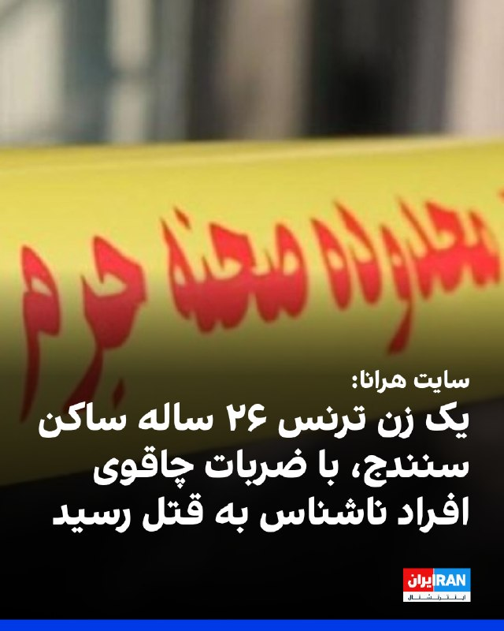

سایت هرانا گزارش داد یک زن ترنس ۲۶ ساله ساکن سنندج، در محله گلشن این شهر، بر اثر ضربات چاقو توسط افراد ناشناس کشته شده است و هنوز انگیزه و هویت عاملان مشخص نیست.
هرانا نوشت: «احتمالا او روز جمعه به‌دست افراد ناشناس و با ضربات چاقو به قتل رسیده و مهاجمان جسد را هم مثله کرده‌اند.»
‌🏁 🇬🇧 IranintlTV

🤖 @VahidOOnLine

## VahidOOnLine — post 243052

  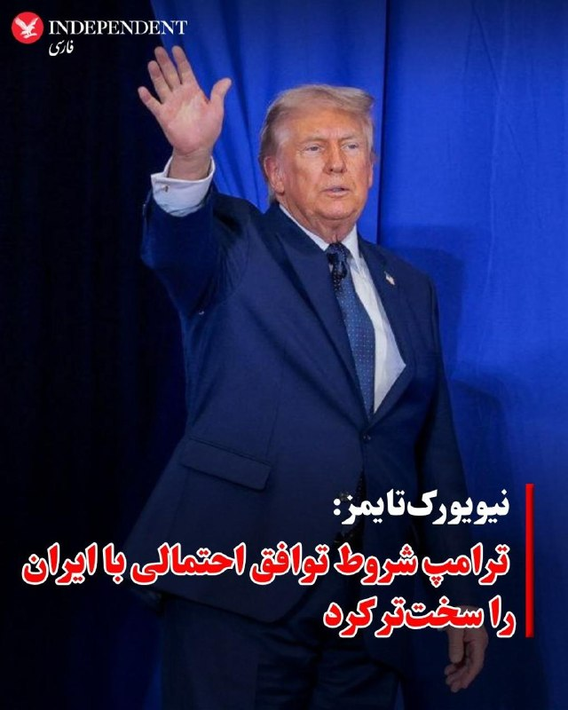

♦️روزنامه نیویورک‌تایمز،روز یکشنبه دهم خرداد ماه، به نقل از سه مقام آگاه گزارش داد دونالد ترامپ شروط چارچوب احتمالی توافق برای پایان دادن به جنگ با ایران را سخت‌تر کرده و نسخه اصلاح‌شده را برای بررسی دوباره به تهران ارسال کرده است.

بر اساس این گزارش،هنوز مشخص نیست چه تغییراتی در متن پیشنهادی اعمال شده است، اما دو مقام آمریکایی گفته‌اند ترامپ نسبت به بخش‌هایی از توافق که شامل آزادسازی منابع مالی مسدودشده ایران می‌شود، ابراز نگرانی کرده است.

نیویورک تامیز به نقل از یکی مقام‌های کاخ سفید گزارش کرد، رئیس‌جمهور آمریکا از طولانی شدن روند پاسخ ایران به پیشنهادهای واشنگتن ناراضی است. این پیشنهادها با مشارکت میانجی‌هایی از جمله پاکستان تدوین شده‌اند

این مقام افزود تغییرات جدید ترامپ وارائه نسخه‌ای سخت‌گیرانه‌تر از چارچوب توافق، احتمالا با هدف افزایش فشار بر ایران برای پذیرش طرحی انجام شده که پیش‌تر برای تایید به مجتبی خامنه‌ای، رهبر جمهوری اسلامی ایران، ارسال شده بود

نیویورک‌تایمز نوشت هنوز مشخص نیست تهران چه پاسخی به نسخه جدید پیشنهاد آمریکا خواهد داد و مذاکرات غیرمستقیم میان دوطرف همچنان ادامه دارد
‌🇸🇦 Indypersian

🤖 @VahidOOnLine

## VahidOOnLine — post 243051

  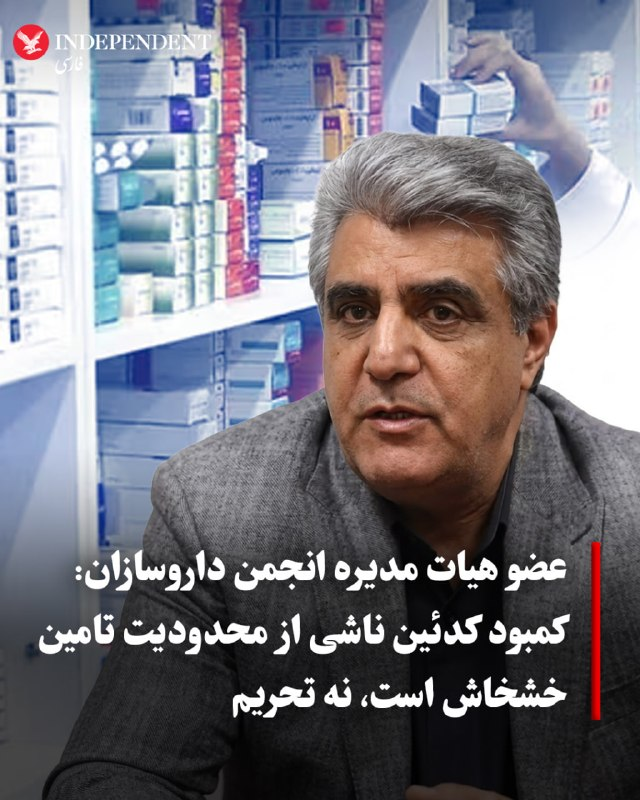

♦️هادی احمدی، سخنگو و عضو هیات مدیره انجمن داروسازان ایران، روز یکشنبه دهم خرداد ماه در گفتگو با خبرگزاری ایلنا، با اشاره به کمبود برخی داروها از جمله کدئین گفت این مشکل بیش از آنکه ناشی از تحریم‌ها باشد، به محدودیت در تامین ماده اولیه آن بازمی‌گردد.
به گفته سخنگوی انجمن داروسازان، کاهش تولید خشخاش در افغانستان و محدودیت‌های اعمال‌شده بر کشت این محصول، تامین ماده اولیه مورد نیاز برای تولید کدئین را با مشکل مواجه کرده و همین مسئله در کمبود این دارو نقش داشته است.
احمدی همچنین با ادعای آنکه تحریم‌ها نیز در کمبود این داروی ضد درد بی‌تاثیر نیستند، افزود محدودیت‌های بانکی، حمل‌ونقل و بیمه، روند واردات برخی داروها و مواد اولیه را دشوار کرده است، اما کمبود کدئین مستقیما به موضوع تامین خشخاش مرتبط است.
‌🇸🇦 Indypersian

🤖 @VahidOOnLine

## VahidOOnLine — post 243050

  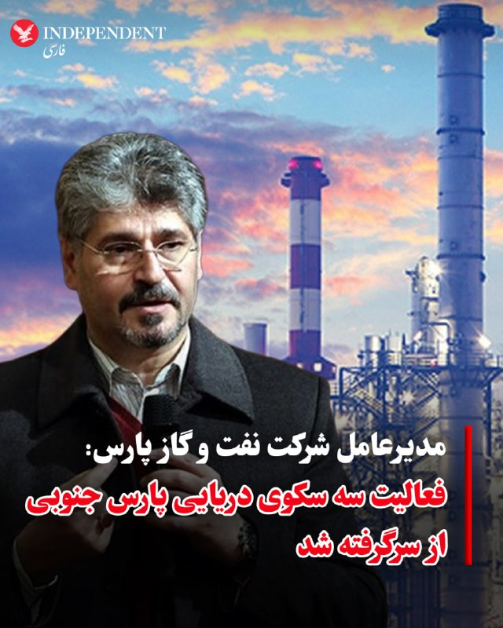

♦️تورج دهقانی، مدیرعامل شرکت نفت و گاز پارس، روز یکشنبه دهم خرداد ماه اعلام کرد، تولید گاز در سه سکوی دریایی میدان گازی پارس جنوبی از سر گرفته شده است.
این تاسیسات در جریان جنگ گذشته و اختلال در ظرفیت فرآورش برخی تاسیسات خشکی متوقف شده بود.
تورج دهقانی روز یکشنبه اعلام کرد این سکوهای دریایی آسیبی ندیده‌اند و گاز تولیدی آن‌ها اکنون به واحدهای فرآورش دیگری در منطقه منتقل می‌شود.
به گفته مدیرعامل شرکت نفت و گاز پارس، عملیات تعمیر و بازسازی تاسیسات آسیب‌دیده همچنان ادامه دارد و در این مدت، تولید گاز سکوهای یادشده از طریق مسیرهای جایگزین به شبکه فرآورش منتقل می‌شود.
حملات اسرائیل پیش‌تر موجب اختلال در فعالیت برخی تاسیسات مرتبط با میدان گازی پارس جنوبی شده بود. پارس جنوبی بزرگ‌ترین میدان گازی ایران و یکی از بزرگ‌ترین منابع گاز طبیعی جهان به شمار می‌رود.
‌🇸🇦 Indypersian

🤖 @VahidOOnLine

## VahidOOnLine — post 243049

  <a href="telegram/content/VahidOOnLine_243049_1780233315.mp4" target="_blank">🎬 Download video</a>

در پی راه‌اندازی کارزار مردمی رشت از سوی ایران‌اینترنشنال، ویدیوهایی از مراسم چهلم جاویدنام امیرحسین (شایان) شکاری به دست ما رسیده است.
شکاری، ۲۱ ساله، عضو پیشین تیم ملی تکواندو نوجوانان که سابقه نایب‌قهرمانی آسیا را در کارنامه دارد، ۱۸ دی ۱۴۰۴ با شلیک مستقیم گلوله به سر کشته شد.
‌🏁 🇬🇧 IranintlTV

🤖 @VahidOOnLine

## VahidOOnLine — post 243048

  

فرزانه صادق، وزیر راه و شهرسازی، در نشست «مجازی» مجلس گفت: «شاهد جنگ کریدورها هستیم و بر همین اساس بنادر جنوبی کشور در خط مقدم جنگ قرار دارند.»

او افزود: «برای تامین کالاهای اساسی و ضروری، برنامه‌ریزی شد تا روند واردات و صادرات متوقف نشود. همچنین رایزنی با کشورهای همسایه به منظور افزایش ناوگان حمل و نقل نیز انجام شده است.»

وزیر راه و شهرسازی اضافه کرد: «در جنگ اخیر خسارات زیادی نیز در حوزه راه و شهرسازی رخ داد.»
‌🏁 🇬🇧 IranintlTV

🤖 @VahidOOnLine

## WithYashar — post 13041

## WithYashar — post 13040

## WithYashar — post 13039

سی‌ن‌ان: ایران ۵۰ ورودی از ۶۹ ورودی تونل‌های تاسیسات هدف قرارگرفته موشکی را باز کرده است
@withyashar

## WithYashar — post 13038

سی‌ان‌ان: برای وارد کردن آسیب به تاسیسات موشکی ایران باید از سلاح‌های بسیار پیچیده و بسیار گران‌قیمت استفاده کرد، اما عملیات بازیابی با فناوری بسیار ساده‌ای انجام می‌شود، فقط با بولدوزر
@withyashar

## WithYashar — post 13037

متن چکیده نسخه ۲

بیانیه جمعی از ایرانیان داخل و خارج کشور خطاب به شاهزاده رضا پهلوی

شاهزاده گرامی،
این متن جمع‌بندی مجموعه‌ای از دیدگاه‌ها، نگرانی‌ها و پیشنهادهای طیف گسترده‌ای از ایرانیان داخل و خارج کشور است که با هدف تقویت انسجام ملی، افزایش شفافیت و ایجاد مسیر عملی برای آینده ایران ارائه می‌شود.

در شرایط کنونی، جامعه ایران تحت فشارهای شدید اقتصادی، اجتماعی، امنیتی و سیاسی قرار دارد و در کنار آن، یکی از مهم‌ترین چالش‌ها، نبود یک ساختار منسجم و قابل فهم برای سازماندهی ظرفیت عظیم مردمی و تبدیل آن به یک نیروی هماهنگ است.

⸻

1. ضرورت ایجاد ساختار یا پلتفرم سازماندهی ملی

مطالبه گسترده مردم، ایجاد یک ساختار یا پلتفرم منسجم است که بتواند:

نیروهای مردمی داخل و خارج کشور را شبکه‌سازی کند
وظایف و نقش‌ها را مشخص و قابل اجرا نماید
از پراکندگی و موازی‌کاری جلوگیری کند
مسیر فعالیت گروه‌ها و افراد را شفاف و هدفمند سازد
امکان هماهنگی عملی در سطح رسانه‌ای، اجتماعی و میدانی را فراهم کند

⸻

2. انسجام و اتحاد میان جریان‌های مختلف مخالف

درخواست جدی جامعه، ایجاد سازوکاری برای همگرایی و هماهنگی میان گروه‌ها، جریان‌ها و افراد مختلف مخالف حکومت است تا:

اختلافات مانع حرکت مشترک نشود
یک محور هماهنگ‌کننده واحد وجود داشته باشد
انرژی سیاسی و اجتماعی هدر نرود

⸻

3. ضرورت اعلام چارچوب زمانی و نقشه راه عملی

یکی از مهم‌ترین دغدغه‌های مردم، نبود زمان‌بندی روشن برای مراحل مختلف حرکت سیاسی است.
مطالبه عمومی این است که:

سناریوهای مختلف به‌صورت شفاف و مرحله‌بندی‌شده مشخص شوند
برای اقدامات جمعی، چارچوب زمانی تقریبی یا بازه‌های مشخص تصمیم‌گیری و اقدام اعلام شود
مردم بدانند در هر مرحله چه انتظاری باید داشته باشند و نقش آنها چیست

همچنین بخش مهمی از جامعه خواستار آن است که در صورت وجود شرایط مناسب، فراخوان‌های مشخص، هدفمند و زمان‌دار برای اقدامات جمعی و هماهنگ صادر شود تا انرژی اجتماعی به‌صورت پراکنده و فرسایشی از بین نرود.

⸻

4. آمادگی میدانی و سازوکارهای حمایتی در شرایط بحران

بخش قابل توجهی از پیام‌ها بر ضرورت ایجاد سازوکارهایی برای حمایت از مردم در شرایط بحرانی تأکید دارد؛ به‌گونه‌ای که:

شبکه‌های حمایتی و سازمانی امن شکل گیرد
هماهنگی میان نیروهای مردمی افزایش یابد
آمادگی اجتماعی و مدنی برای شرایط حساس تقویت شود
هزینه انسانی تحولات احتمالی کاهش یابد

⸻

5. شفافیت در ساختار مشاوران و تیم تصمیم‌سازی

یکی از مطالبات مهم، شفاف‌تر شدن ساختار مشاوران و نقش افراد در حلقه تصمیم‌گیری است تا:

جایگاه افراد مشخص باشد
اعتماد عمومی تقویت شود
از ابهام و چندصدایی غیرسازنده جلوگیری گردد

⸻

6. معیشت و وضعیت اقتصادی مردم

در کنار موضوعات سیاسی، بحران معیشتی یکی از اصلی‌ترین فشارهای روزمره مردم است.
درخواست عمومی این است که در کنار برنامه‌های کلان، راهکارهایی برای کاهش فشار اقتصادی و حمایت از اقشار آسیب‌پذیر در دوره گذار نیز در نظر گرفته شود.

⸻

7. ارتباط مستقیم‌تر با جامعه و گروه‌های مختلف

مردم خواستار ارتباط فعال‌تر، مستقیم‌تر و مستمرتر میان رهبری اپوزیسیون و بدنه اجتماعی هستند تا:

ابهامات کاهش یابد
اعتماد افزایش پیدا کند
و امکان هماهنگی واقعی میان گروه‌ها فراهم شود

⸻

جمع‌بندی

در مجموع، پیام مشترک این مجموعه دیدگاه‌ها چنین است:

جامعه ایران آماده تغییر است، اما این مسیر تنها در صورتی به نتیجه می‌رسد که با انسجام، شفافیت، ساختار اجرایی روشن، نقشه راه قابل فهم و ارتباط مستمر با مردم همراه باشد.

⸻

درخواست پایانی (از طرف نماینده جمع)

در پایان، اینجانب یاشار به عنوان نماینده جمعی از این دیدگاه‌ها، با نهایت احترام درخواست دارم امکان ارتباط مستقیم برای انتقال دیدگاه‌ها و هماهنگی بیشتر فراهم شود و پاسخ این پیام برای اینجانب ارسال گردد.

راه‌های ارتباطی جهت پاسخ

پاینده ایران ، جاوید شاه
@withyashar

## WithYashar — post 13036

## WithYashar — post 13035

خودمو یادم رفت 🥲

## WithYashar — post 13034

یاشار چرا درخواست اینکه با خودت حرف بزنن تا اینارو بگی رو نداریم ؟

## WithYashar — post 13033

پس این متن چه اشاره ای به تو داره؟
ما میخایم یاشار با شاهزاده در ارتباط باشه

## WithYashar — post 13032

جاوید شاهم بگو یاشار

## WithYashar — post 13031

## WithYashar — post 13030

متن چکیده شده نسخه ۱
⸻

بیانیه جمعی از ایرانیان داخل و خارج کشور خطاب به شاهزاده رضا پهلوی

شاهزاده گرامی،
ایرانیان داخل و خارج از کشور، با وجود تفاوت دیدگاه‌ها و تجربه‌های متفاوت، در یک نقطه اشتراک دارند: امید به عبور ایران از وضعیت کنونی و رسیدن به آینده‌ای آزاد، باثبات و شایسته ملت ایران.

در سال‌های گذشته، اعتراضات و جنبش‌های متعدد با هزینه‌های سنگین انسانی و اجتماعی همراه بوده و بخش بزرگی از جامعه همچنان در وضعیت فشار اقتصادی، ناامنی روانی، سرکوب سیاسی و ناامیدی نسبت به آینده قرار دارد. در کنار این شرایط، فضای سیاسی اپوزیسیون نیز از نگاه بسیاری از مردم دچار پراکندگی، نبود انسجام و فقدان نقشه راه عملی و قابل سنجش است.

مطالبه اصلی بخش بزرگی از مردم نه صرفاً شعار، بلکه وجود یک ساختار روشن، قابل فهم و اجرایی برای گذار سیاسی و دوران پس از آن است؛ ساختاری که بتواند اعتماد عمومی را حفظ کرده و انرژی اجتماعی را به مسیر مؤثر تبدیل کند.

در همین راستا، مهم‌ترین پیشنهادها و خواسته‌های مشترک به شرح زیر جمع‌بندی می‌شود:

1. ضرورت ارائه نقشه راه روشن و مرحله‌بندی‌شده

بخش بزرگی از جامعه خواستار آن است که مسیر حرکت، شامل اهداف کوتاه‌مدت، میان‌مدت و بلندمدت، به‌صورت شفاف مشخص شود؛ به‌گونه‌ای که مردم بدانند در هر مرحله چه نقشی دارند و نتیجه نهایی چگونه تعریف می‌شود.

2. ایجاد ساختار منسجم و شبیه «دولت در تبعید»

پیشنهاد شده است یک ساختار هماهنگ و چندلایه شامل بخش‌های مختلف شکل گیرد؛ از جمله:

رهبری و شورای مرکزی تصمیم‌گیری
تیم‌های رسانه‌ای داخلی و بین‌المللی
تیم‌های سیاست‌گذاری و برنامه‌ریزی اقتصادی و حقوقی
شبکه‌های ارتباطی و سازماندهی اجتماعی داخل و خارج کشور
تیم تحلیل و نظارت برای ارزیابی عملکرد و اصلاح مسیر
ساختار مقابله با جنگ روانی و عملیات اطلاعاتی

هدف از این ساختار، کاهش پراکندگی، افزایش کارآمدی و ایجاد یک مرجع واحد برای هماهنگی فعالیت‌ها عنوان شده است.

3. شفافیت، اعتمادسازی و گزارش‌دهی

یکی از مطالبات مهم، شفافیت در عملکرد، نحوه تصمیم‌گیری‌ها و مسیرهای حمایتی (از جمله مالی و رسانه‌ای) است. ارائه گزارش‌های منظم می‌تواند اعتماد عمومی را تقویت کرده و مشارکت مردم را افزایش دهد.

4. استفاده از ظرفیت همه اقشار و تنوع اجتماعی ایران

درخواست شده است که نمایندگان اقوام، اصناف، متخصصان، جوانان و گروه‌های مختلف اجتماعی در ساختار تصمیم‌سازی حضور داشته باشند تا احساس نمایندگی و مشارکت واقعی در میان مردم تقویت شود.

5. سازماندهی مشارکت مردمی در داخل و خارج کشور

بسیاری از پیام‌ها بر ضرورت ایجاد شبکه‌های منسجم مردمی در حوزه‌های رسانه‌ای، اجتماعی، مدنی و حمایتی تأکید دارند تا انرژی عظیم پراکنده در فضای مجازی و میدانی به یک مسیر هماهنگ تبدیل شود.

6. تمرکز بر انسجام به جای پراکندگی

یکی از نگرانی‌های جدی، تعدد صداها، اختلافات درونی و نبود فرماندهی واحد در جبهه مخالفان است. درخواست عمومی این است که انسجام، هماهنگی و وحدت عملی جایگزین فعالیت‌های پراکنده شود.

7. ضرورت فعال‌تر شدن ارتباط با افکار عمومی

بخش قابل توجهی از مردم خواستار ارتباط مستمرتر، روشن‌تر و مستقیم‌تر رهبری اپوزیسیون با جامعه هستند؛ به‌گونه‌ای که ابهامات، پرسش‌ها و نگرانی‌ها بدون فاصله زمانی طولانی پاسخ داده شود.

8. آینده‌نگری برای دوران گذار و پس از آن

در کنار موضوع تغییر سیاسی، مردم نسبت به آینده پس از آن نیز دغدغه جدی دارند؛ از جمله ساختار حکمرانی، عدالت، فرصت‌های برابر، توسعه اقتصادی، و جلوگیری از تکرار تمرکز قدرت.

⸻

در جمع‌بندی، پیام مشترک همه دیدگاه‌ها این است که:

جامعه ایران آماده تغییر است، اما این آمادگی نیازمند سازماندهی، شفافیت، برنامه‌ریزی و یک محور هماهنگ‌کننده قابل اعتماد است.

در پایان، این مجموعه نظرات با نیت خیرخواهانه و از سر دغدغه برای آینده ایران ارائه می‌شود و هدف آن تقویت مسیر همبستگی ملی و افزایش کارآمدی حرکت جمعی ایرانیان است.

پاینده ایران
@withyashar

## WithYashar — post 13029

## FoxNewsTwitter — post 342444

  <a href="telegram/content/FoxNewsTwitter_342444_1780233317.mp4" target="_blank">🎬 Download video</a>

Fox News (Twitter/X)

Hasan Piker denied having any personal contact with American Marxist Neville Roy Singham but said he knows some "wonderful people" tied to the tech tycoon's network when Fox News Digital asked about a federal subpoena.

"None of it is actually hidden or illegal in any way, shape, or form," Piker said.

## iaghapour — post 2646

  

⭕️ اسکنر IP سفید کلودفلر با نوا رادار

🔹نوا رادار یک اسکنر IP دسکتاپ است که با Wails v3 (بک‌اند گو + فرانت ری‌اکت/تایپ‌اسکریپت) ساخته شده. این برنامه رنج‌های IP کلودفلر را از منابع متعدد اسکن می‌کند، تأیید پروتکل واقعی (TCP + TLS handshake) انجام می‌دهد و IPهای سالم را مرتب‌شده بر اساس سرعت تحویل می‌دهد.

— اسکن چندمنبعی — ۹ منبع IP قابل انتخاب
— تأیید دو مرحله‌ای — اسکن سریع TCP → تست عمیق TLS
— مرتب‌سازی بر اساس سرعت
— قابلیت انتخاب پورت

🔗 اطلاعات بیشتر در گیت‌هاب پروژه

🆔@iAghapour

## DEJradio — post 5181

⭕️ اسرائیل هیوم: شماری از نفتکش‌های قطری با پرداخت پول به رژیم از تنگۀ هرمز گذر کردند

روزنامۀ اسرائیل هیوم، به نقل از سه منبع دیپلماتیک و اطلاعاتی گزارش داد ده‌ها نفتکش در هفتۀ پیشین از تنگۀ هرمز عبور کرده‌اند.
بنا بر این گزارش برخی ازشناورها پس از تأیید جمهوری اسلامی و سپاه پاسداران، برای عبور پول پرداخت کردند.
بر پایۀ گزارش اسرائیل هیوم، شمار بسیاری از نفتکش‌ها حامل نفت و گاز مایع قطر بودند و به سمت هند، چین و اروپا راهی شدند.
همچنین برخی شناورهای دیگر توانستند با همراهی نیروی دریایی آمریکا گذر کنند.
آمریکا پیش‌تر بارها اعلام کرده بود که با باج‌دهی به جمهوری اسلامی برای عبور از تنگۀ هرمز مخالف است.
وزارت خزانه‌داری آمریکا اعلام کرد شرکت‌ها و نفتکش‌هایی را که برای عبور از آبراه هرمز به تهران باج بدهند، مورد تحریم قرار می‌دهد.

#خبر #دژ #تنگه_هرمز
@DEJradio

## DEJradio — post 5180

  <a href="telegram/content/DEJradio_5180_1780233320.mp4" target="_blank">🎬 Download video</a>

⭕️ وزیر دفاع اسرائیل از تصرف قلعۀ شقیف در لبنان خبر داد

یسرائیل کاتز، وزیر دفاع اسرائیل اعلام کرد ارتش این کشور قلعۀ راهبردی شقیف بوفور در جنوب لبنان را تصرف کرده است.
بنا بر تصاویر منتشر شده، پرچم اسرائیل بر فراز این قلعۀ باستانی برافراشته شد.
یسرائیل کاتز، این منطقه را یکی از مهم‌ترین مناطق راهبردی برای دفاع از شهرک‌های الجلیل و تأمین امنیت نیروهای اسرائیلی عنوان کرد.
قلعۀ شقیف بر بخش‌هایی گسترده از جنوب لبنان اشراف دارد.
اسرائیل بیش از بیست و شش سال پیش در دوران درگیری‌های پیشین با لبنان نیز از این قلعه به عنوان پایگاه استفاده می‌کرد.
#خبر #دژ #اسرائیل
@DEJradio

## DEJradio — post 5179

⭕️ هلال‌احمر جمهوری اسلامی خبر داد بیمارستان ایرانیان دوبی تعطیل و اموالش توقیف شد

پیرحسین کولیوند، رئیس جمعیت هلال‌احمر جمهوری اسلامی گفت بیمارستان ایرانیان دوبی تعطیل شده و دارایی‌ها و اموال نقدی آن با حکم دادگاه بلوکه شده است.
او گفت بیماران این بیمارستان از مرکز درمانی خارج شده‌اند.
به گفتۀ این مقام دولتی، رئیس بیمارستان دوبی نیز ممنوع‌الخروج شده و برای بازجویی و محاکمه احضار شده است.
کولیوند افزود همچنین ویزای کارکنان بیمارستان باطل شده و آن‌ها از خانه‌های سازمانی خارج شده‌اند.
پیش‌تر یک مقام اماراتی گفته بود نهادهای «مرتبط با حکومت جمهوری اسلامی» به دلیل سوءاستفادۀ آنها از موقعیت، تعطیل می‌شود.

#خبر #دژ #امارات
@DEJradio

## DEJradio — post 5178

  <a href="telegram/content/DEJradio_5178_1780233322.mp4" target="_blank">🎬 Download video</a>

👑
🔺 پیام ایرانیان مقیم اوکلند(نیوزلند) به پرزیدنت دونالد ترامپ: میراثی از خود به جا نگذارید که از کارتر و اوباما نیز بدتر باشد!

#همبستگی #اوکلند
@DEJradio

## VahidOnline — post 75816

بر اساس مصوبه جدید شورای شهر تهران، هزینه خدمات مرتبط با خاکسپاری در بهشت‌زهرا به‌طور میانگین حدود ۴۰ درصد افزایش یافته و در برخی موارد رشد تعرفه‌ها به ۵۰ درصد رسیده است.

روزنامه دنیای اقتصاد گزارش داد نرخ خدماتی از جمله حمل متوفی، تغسیل، تکفین، تدفین و برگزاری مراسم افزایش یافته است. بر اساس این مصوبه، هزینه انتقال هر متوفی از سطح شهر تهران تا شعاع ۱۰ کیلومتری ۵۰ درصد افزایش داشته است.
@VahidHeadline

📡 @VahidOnline

## VahidOnline — post 75815

  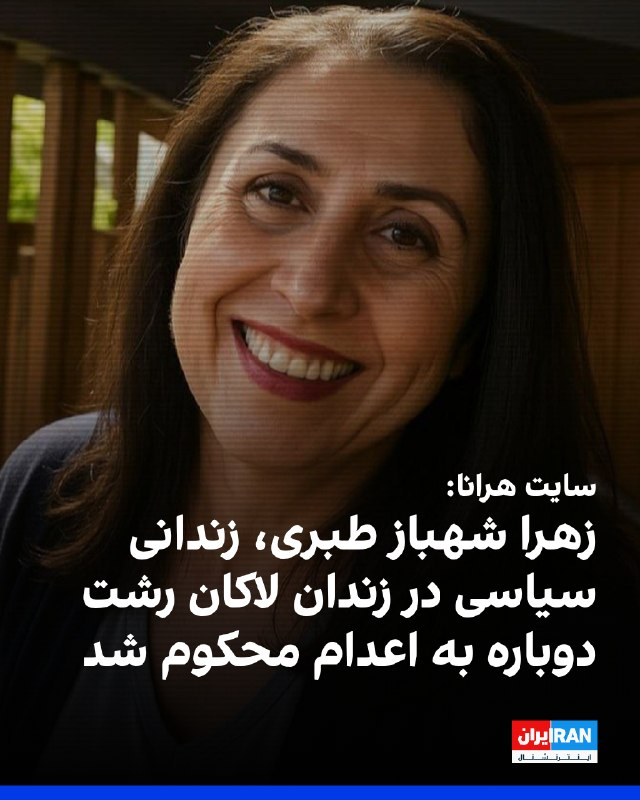

سایت هرانا گزارش داد زهرا شهباز طبری، زندانی سیاسی محبوس در زندان لاکان رشت، پس از نقض حکم پیشین در دیوان عالی کشور، بار دیگر از سوی شعبه دوم دادگاه انقلاب رشت به ریاست محمدعلی درویش‌گفتار، به اتهام «بغی از طریق عضویت و فعالیت در سازمان مجاهدین خلق» به اعدام محکوم شد.
این زندانی سیاسی ۶۸ ساله، در فروردین ۱۴۰۴ در منزل شخصی خود در رشت بازداشت شده بود.
@VahidOOnLine

📡 @VahidOnline

## VahidOnline — post 75814

  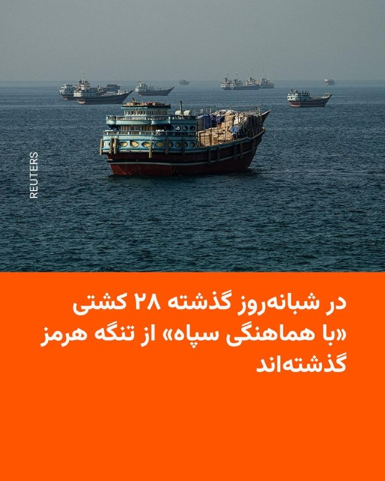

نیروی دریایی سپاه پاسداران روز یک‌شنبه اعلام کرد‌ «طی شبانه‌روز گذشته ۲۸ فروند کشتی اعم از نفتکش، کانتینربَر و سایر کشتی‌های تجاری پس از کسب مجوز با هماهنگی و تأمین امنیت نیروی دریایی سپاه از تنگه هرمز عبور کردند.»

ساعتی پیشتر روزنامه اسرائیلی «اسرائیل هیوم» نوشته بود که ده‌ها نفتکش حامل نفت و گاز طبیعی مایع در هفتهٔ گذشته با اجازه آمریکا و پرداخت عوارض به ایران از تنگهٔ هرمز عبور کرده‌اند.

این در حالی است که دولت آمریکا بارها اعلام کرده است با پرداخت عوارض به ایران برای عبور از تنگه هرمز مخالف است.
@VahidHeadline

📡 @VahidOnline

## VahidOnline — post 75812

  <a href="telegram/content/VahidOnline_75812_1780233325.mp4" target="_blank">🎬 Download video</a>

جلسه مجازی صحن مجلس شورای اسلامی به ریاست محمدباقر قالیباف و مشارکت آنلاین ۱۸۷ نماینده و حضور ۱۴ نماینده برگزار شد.
در این جلسه که اولین جلسه از سومین سال مجلس دوازدهم بود، اعضای جدید هیئت رئیسه مجلس سوگند یاد کردند.
جلسه روز یک‌شنبه، دهم خردادماه، همچون جلسات معدود گذشته در مکانی مخفی برگزار شد.
محمدباقر قالیباف در همین جلسه تأکید کرد که «تا اطمینان پیدا نکنیم که حقوق ملت ایران را گرفته‌ایم، هیچ توافقی تأیید نمی‌شود».
قالیباف که از او به عنوان رئیس هیئت مذاکره‌کننده ایران نیز یاد می‌شود در این جلسه بیانیه‌ای را قرائت کرد و در آن ادعا کرد که «در حال عقب نشاندن دشمن در یک جنگ تاریخ‌ساز هستیم».
@VahidHeadline
محمدباقر قالیباف، رییس مجلس شورای اسلامی گفت: «سومین سال مجلس دوازدهم را در حالی آغاز می‌کنیم که یاد و خاطره رهبر شهید با ماست و هنوز فقدان رهبر و پدر امت را باور نمی‌کنیم.»
او ادامه داد: «رهبرمان به ما آموخت مقابل زورگویی و تهدید، ذره‌ای سر خم نکنیم و با مشت‌های گره کرده مقابل خصم تا آخرین قطره خون مبارزه کنیم.»
قالیباف اضافه کرد: «دیدن جای خالی رهبری برایمان جانکاه است، ولی دلگرم به مدیریت و رهبری جدید هستیم.»
@VahidOOnLine

📡 @VahidOnline

## VahidOnline — post 75810

  <a href="telegram/content/VahidOnline_75810_1780233326.mp4" target="_blank">🎬 Download video</a>

نیروی انتظامی تهران کافه‌ای در خیابان ولیعصر را که در آن برنامه‌های موسیقی اجرا می‌شد، به بهانه آن چه «فعالیت‌های مروج فرقه‌های انحرافی» خواند، پلمب کرد.

مرکز اطلاع‌رسانی پلیس جمهوری اسلامی در اطلاعیه‌ای نوشت: «این کافه با برگزاری برنامه‌هایی با ظاهر موسیقی غربی، بستری برای حرکات نابهنجار، و آنچه که ماموران توصیف کرده‌اند "تحرکات شیطانی" فراهم آورده بود.»

نیروی انتظامی جمهوری اسلامی نام این کافه را ذکر نکرد اما ادعا کرد که «مشتریان این کافه، شامل دختران و پسران جوان، در وضعیتی غیرطبیعی و با حرکاتی عجیب و غریب، که از آن به عنوان “شیطانی” یاد شده، مشاهده گردیدند.»

پیشتر نیز بسیاری از کافه‌ها و اماکن کسب و کار به اتهام‌های مشابه پلمب شده‌ بودند اما جمهوری اسلامی سرکوب‌ شهروندان را از زمان اعتراضات دی‌ماه گذشته تاکنون شدت بیشتری داده است.

موج تازه اعدام‌ها، صدور احکام سنگین و بازداشت‌ها نگرانی فعالان و نهادهای حقوق بشری را برانگیخته است.
@VahidHeadline
ویدیوی بالا رو هم به عنوان "تحرکات شیطانی" در اون کافه منتشر کردند!
📡 @VahidOnline

## IranIntlTV — post 339886

  <a href="telegram/content/IranIntlTV_339886_1780233327.mp4" target="_blank">🎬 Download video</a>

مروری بر روزنامه‌های ایران، یکشنبه ۱۰ خرداد، با مجتبی هاشمی، روزنامه‌نگار

@iranintltv

## IranIntlTV — post 339885

  <a href="telegram/content/IranIntlTV_339885_1780233328.mp4" target="_blank">🎬 Download video</a>

ویدیوهای رسیده به ایران‌اینترنشنال، مراسم چهلم ماهان و امیررضا حیدری، دو پسرعموی جاویدنام را نشان می‌دهد که در ۱۸ دی‌ماه در محله پاسداران تهران به ضرب گلوله کشته شدند.
امیررضا، ۳۰ ساله و ماهان هم ۲۱ سال سن داشت. مادر ماهان در مراسم چهلم آنها خطاب به پسرش فریاد زد: «خوشت باشد که در این راه رفتی. من ناراحت نیستم که در این راه کشته شدی.»

## IranIntlTV — post 339884

  <a href="telegram/content/IranIntlTV_339884_1780233330.mp4" target="_blank">🎬 Download video</a>

گزارش‌ها از پرداخت نشدن مطالبات کشاورزان از سوی دولت و قاچاق گندم از ایران به کشورهای همسایه خبر می‌دهد.

گفت‌وگو با آرش آزرمی، دبیر بخش اقتصادی ایران‌اینترنشنال
@iranintltv

## IranIntlTV — post 339883

  

سایت هرانا گزارش داد یک زن ترنس ۲۶ ساله ساکن سنندج، در محله گلشن این شهر، بر اثر ضربات چاقو توسط افراد ناشناس کشته شده است و هنوز انگیزه و هویت عاملان مشخص نیست.
هرانا نوشت: «احتمالا او روز جمعه به‌دست افراد ناشناس و با ضربات چاقو به قتل رسیده و مهاجمان جسد را هم مثله کرده‌اند.»
https://iranintl.com/202605315624

## IranIntlTV — post 339882

در حالی که گزارش‌ها از بازگشت اینترنت بین‌المللی در ایران حکایت دارد، بسیاری از کاربران از تداوم اختلال در دسترسی به برخی سرویس‌ها و وب‌سایت‌ها خبر می‌دهند. در شبکه‌های اجتماعی، انتقاد از هرگونه کاهش فشار بر جمهوری اسلامی و مخالفت با مذاکرات نیز ادامه دارد.
عادله بورنگ، عضو تحریریه ایران‌اینترنشنال، از واکنش کاربران می‌گوید
@iranintltv

## IranIntlTV — post 339881

  <a href="telegram/content/IranIntlTV_339881_1780233333.mp4" target="_blank">🎬 Download video</a>

در حالی که گزارش‌ها از بازگشت اینترنت بین‌المللی در ایران حکایت دارد، بسیاری از کاربران از تداوم اختلال در دسترسی به برخی سرویس‌ها و وب‌سایت‌ها خبر می‌دهند. در شبکه‌های اجتماعی، انتقاد از هرگونه کاهش فشار بر جمهوری اسلامی و مخالفت با مذاکرات نیز ادامه دارد.
عادله بورنگ، عضو تحریریه ایران‌اینترنشنال، از واکنش کاربران می‌گوید
@iranintltv

## IranIntlTV — post 339880

  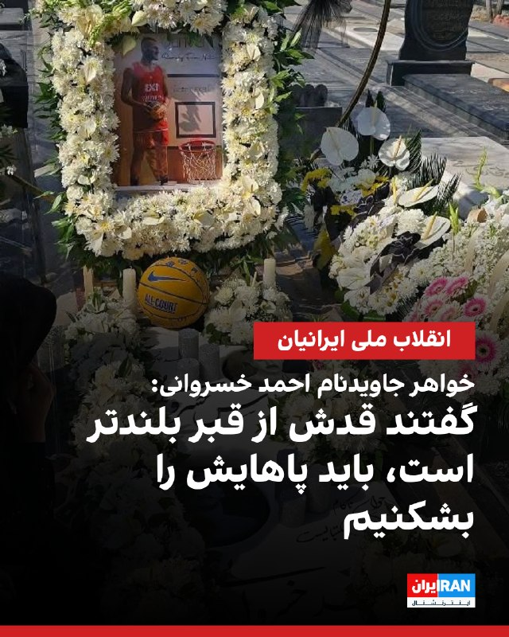

🔻‏خواهر جاویدنام احمد خسروانی، دانشجوی ۲۱ ساله دانشگاه صنعتی شریف و بسکتبالیست در شبکه اجتماعی ایکس نوشت: «بعد از التماس و پول دادن به گرسنگان جمهوری اسلامی، قبول کردند احمدو روی مزار بابام بزاریم. ‏اما از عذاب دادنمان سیر نشده بودند. ‏فهمیدند هنوز هم می توانند از ما پول بگیرند.»

🔹او نوشت: «‏گفتند چون قد احمد بالای ۱۹۸ است و سایز قبرهای قطعه بابام ۱۹۳ است ‏باید پاهایش را بشکنیم تا داخل قبر جا شود.»

🔹خواهر جاویدنام احمد خسروانی، همچنین در پست دیگری نوشت: «در سالن پذیرش بهشت زهرا برای کارهای دفن خواستیم طبقه بالای مزار بابام برای داداش احمدم باشد. گفتند: «نمی توانید اغتشاشگر را کنار مزار جانباز دفن کنید، آنها مطهرند، اما اینها اغتشاشگر.» احمد را می گفتند و ما فقط تحقیر شدیم میان درد و اون ها فقط دنبال پول بودند.»

🔹جاویدنام احمد خسروانی، دانشجوی ۲۱ ساله دانشگاه صنعتی شریف و بسکتبالیست که با تیم فرزان شمیران در مسابقات بسکتبال سه نفره تهران قهرمان شده بود و عنوان برترین بازیکن لیگ تهران در سال ۱۴۰۴ هم داشت، شامگاه پنجشنبه ۱۸ دی ۱۴۰۴ با شلیک مستقیم گلوله کشته شد.

@iranintltvsport

## IranIntlTV — post 339879

  <a href="https://t.me/IranintlTV/339879" target="_blank">📎 Download file</a>

🎧نسخه صوتی اخبار نیمروزی | یکشنبه ۱۰ خرداد
@iranintlTV

## IranIntlTV — post 339878

  <a href="telegram/content/IranIntlTV_339878_1780233336.mp4" target="_blank">🎬 Download video</a>

در پی راه‌اندازی کارزار مردمی رشت از سوی ایران‌اینترنشنال، ویدیوهایی از مراسم چهلم جاویدنام امیرحسین (شایان) شکاری به دست ما رسیده است.
شکاری، ۲۱ ساله، عضو پیشین تیم ملی تکواندو نوجوانان که سابقه نایب‌قهرمانی آسیا را در کارنامه دارد، ۱۸ دی ۱۴۰۴ با شلیک مستقیم گلوله به سر کشته شد.

## IranIntlTV — post 339877

  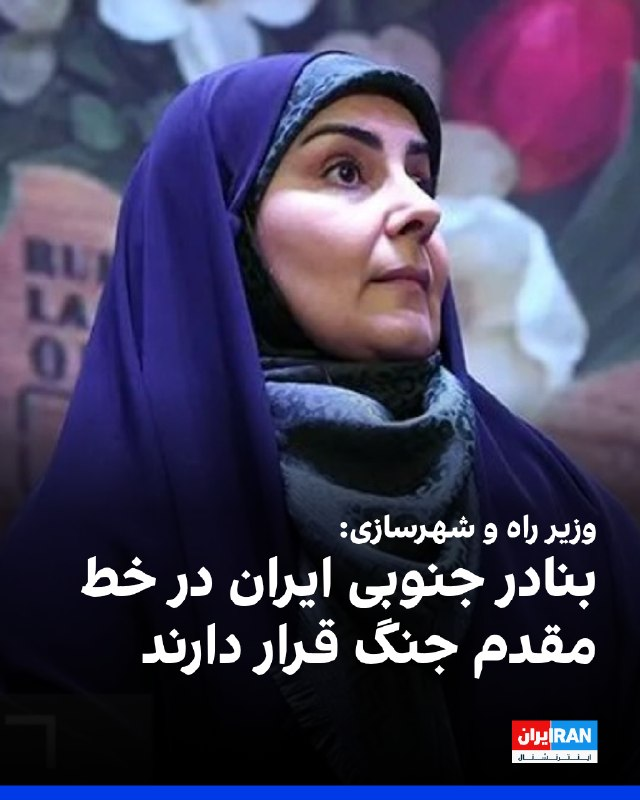

فرزانه صادق، وزیر راه و شهرسازی، در نشست «مجازی» مجلس گفت: «شاهد جنگ کریدورها هستیم و بر همین اساس بنادر جنوبی کشور در خط مقدم جنگ قرار دارند.»

او افزود: «برای تامین کالاهای اساسی و ضروری، برنامه‌ریزی شد تا روند واردات و صادرات متوقف نشود. همچنین رایزنی با کشورهای همسایه به منظور افزایش ناوگان حمل و نقل نیز انجام شده است.»

وزیر راه و شهرسازی اضافه کرد: «در جنگ اخیر خسارات زیادی نیز در حوزه راه و شهرسازی رخ داد.»
https://iranintl.com/202605310731

## Shin_Persian — post 6325

↩️ Quoted tweet: ImmortalGuard 🦸🏻 @ZuperZ3R0 Sun, 31 May 2026 12:11:07 UTC @hey_itsmyturn This is starting to sound like the jet activity over Baghdad. All hype and no results ↩️ توییت نقل‌قول شده — برای پاسخ، پست زیر را ببینید. فارسی @hey_itsmyturn این…

## Shin_Persian — post 6324

↩️ Quoted tweet:
ImmortalGuard 🦸🏻 @ZuperZ3R0
Sun, 31 May 2026 12:11:07 UTC

@hey_itsmyturn This is starting to sound like the jet activity over Baghdad. All hype and no results

↩️ توییت نقل‌قول شده — برای پاسخ، پست زیر را ببینید.

فارسی

@hey_itsmyturn این داره شبیه فعالیت جت‌ها برفراز بغداد به نظر می‌رسه. همه‌اش هیاهو و بدون هیچ نتیجه‌ای.

𝕏 · @shin_persian

## FarsiVOA — post 219167

🔺تداوم بی‌خبری از جواد علیکردی، وکیل محبوس در زندان وکیل‌آباد مشهد

◾️گزارش‌های منتشرشده از نزدیکان جواد علیکردی، وکیل دادگستری و استاد دانشگاه، از تداوم بی‌خبری از وضعیت او در زندان وکیل‌آباد مشهد حکایت دارد. بر اساس این گزارش‌ها، خانواده و نزدیکان علیکردی طی بیش از ۱۵ روز گذشته امکان تماس منظم و اطلاع دقیق از وضعیت جسمی و حقوقی او را نداشته‌اند.

⬇️ بیشتر بخوانید:

https://ir.voanews.com/a/javad-alikordi-held-incommunicado-again/8155766.html

## FarsiVOA — post 219166

  <a href="telegram/content/FarsiVOA_219166_1780233338.mp4" target="_blank">🎬 Download video</a>

تصاویری از حملات هوایی امروز ارتش اسرائیل به مواضع حزب‌الله در منطقه صور لبنان؛

جنگ میان حزب‌الله و ارتش اسرائیل به رغم تمدید آتش‌بس همچنان ادامه دارد و در همین راستا، در روزهای اخیر ارتش اسرائیل چندین هشدار تخلیه برای مناطق مختلف لبنان صادر کرد. نتانیاهو نیز بر گسترش عملیات اسرائیل در جنوب لبنان تأکید کرد.

## FarsiVOA — post 219165

  <a href="telegram/content/FarsiVOA_219165_1780233340.mp4" target="_blank">🎬 Download video</a>

ارتش اسرائیل ویدیویی از انهدام انبارهای تسلیحاتی حماس منتشر و اعلام کرد در طول هفته سه انبار تسلیحاتی متعلق به سازمان تروریستی حماس را در چند منطقه در نوار غزه هدف قرار داده است.

در این انبارها مواد انفجاری، سلاح‌های سبک، تفنگ‌های تک‌تیراندازی، خودرو و تجهیزات رزمی دیگر نگهداری می‌شد. انفجارهای ثانویه بعد از حملات نشان‌دهنده وجود تسلیحات در داخل این انبارها بود.

ارتش اسرائیل در ادامه اعلام کرد این تسلیحات برای آسیب رساندن به نیروهایش که در منطقه خط زرد فعالیت می‌کنند و همچنین شهروندان اسرائیل در نظر گرفته شده بود و به‌منظور رفع این تهدید منهدم شدند.

ارتش اسرائیل تاکید کرد پیش از این حملات، اقداماتی برای کاهش آسیب به غیرنظامیان، از جمله استفاده از مهمات دقیق و رصد هوایی انجام شد.

## FarsiVOA — post 219164

  <a href="telegram/content/FarsiVOA_219164_1780233342.mp4" target="_blank">🎬 Download video</a>

گروهی از بازنشستگان تامین اجتماعی در شوش، در ادامه اعتراضات هفتگی، روز یکشنبه، ۱۰ خرداد ۱۴۰۵، با شعار «گرانی، تورم، بلای جان مردم» در اعتراض به شرایط دشوار معیشتی تجمع کردند.

## FarsiVOA — post 219163

  <a href="telegram/content/FarsiVOA_219163_1780233344.mp4" target="_blank">🎬 Download video</a>

ویدیوی منتشرشده از سوی وزارت جنگ آمریکا در روز یکشنبه ۱۰ خرداد، ورود پیت هگست، وزیر جنگ ایالات متحده، به پایگاه اندروز در ایالت مریلند را نشان می‌دهد.

@FarsiVOA

## FarsiVOA — post 219162

ارتش اسرائیل ویدیویی از ادامه حملات هوایی در صور منتشر و تاکید کرد حملات به مقرهای فرماندهی سازمان تروریستی حزب‌الله در منطقه صور همچنان در حال انجام است.

جنگ میان حزب‌الله و ارتش اسرائیل به رغم تمدید آتش‌بس همچنان ادامه دارد و در همین راستا، در روزهای اخیر ارتش اسرائیل چندین هشدار تخلیه برای مناطق مختلف لبنان صادر کرد. نتانیاهو نیز بر گسترش عملیات اسرائیل در جنوب لبنان تأکید کرد.

## DW_Farsi — post 125343

  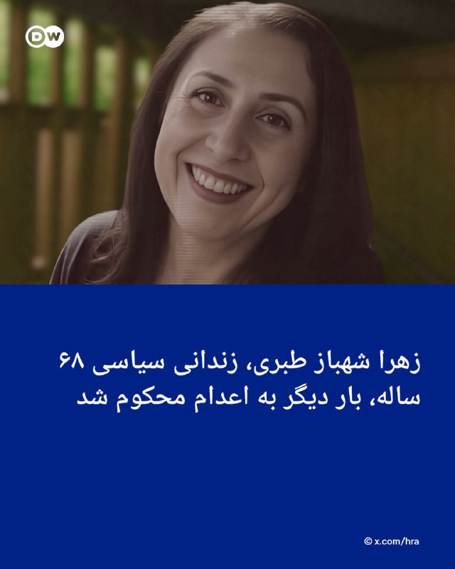

🔶 زهرا شهباز طبری بار دیگر به اعدام محکوم شد
 
به گزارش هرانا، زهرا شهباز طبری، زندانی سیاسی ۶۸ ساله، پس از آن‌که حکم اعدام پیشین او در دیوان عالی کشور نقض شده بود، بار دیگر از سوی شعبه دوم دادگاه انقلاب رشت به ریاست محمدعلی درویش‌گفتار به اعدام محکوم شده است. این حکم با اتهام "بغی" از طریق عضویت و فعالیت در سازمان مجاهدین خلق ایران صادر شده و در تاریخ سه‌شنبه (۲۵ فروردین ۱۴۰۵) علیه او صادر و به‌تازگی ابلاغ شده است.
 
زهرا شهباز طبری پیش‌تر در آبان ۱۴۰۴ از سوی شعبه اول دادگاه انقلاب رشت در ارتباط با همین اتهام به اعدام محکوم شده بود. آن حکم بعدتر در دیوان عالی کشور نقض شد و پرونده برای رسیدگی دوباره به شعبه دوم دادگاه انقلاب رشت فرستاده شد.
 
با این حال، رسیدگی مجدد نیز بار دیگر به صدور حکم اعدام منتهی شده است.
 
هرانا نوشته است زهرا شهباز طبری پیش‌تر در نامه‌ای از زندان، روند رسیدگی به پرونده خود را "فاقد مبنای حقوقی و نشانه‌ای از نبود دادرسی عادلانه" توصیف کرده بود.
 
@dw_farsi

## DW_Farsi — post 125342

  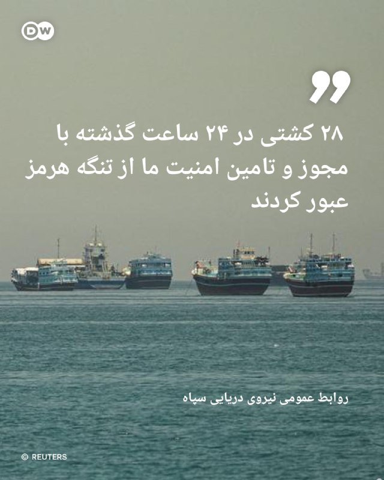

🔶 سپاه: ۲۸ کشتی در ۲۴ ساعت گذشته با مجوز و تامین امنیت ما از تنگه هرمز عبور کردند
 
روابط عمومی نیروی دریایی سپاه در اطلاعیه‌ای اعلام کرد طی ۲۴ ساعت گذشته ۲۸ فروند کشتی، شامل نفتکش، کانتینربر و دیگر کشتی‌های تجاری، پس از دریافت مجوز و با هماهنگی و تامین امنیت نیروی دریایی سپاه از تنگه هرمز عبور کرده‌اند.
 
در این اطلاعیه آمده است کنترل "هوشمند" تنگه هرمز به‌طور مستمر و آنچه "صلابت و اقتدار" خوانده شده، در حال انجام است.
 
سپاه در این بیانیه عبور کشتی‌ها را در چارچوب مجوزدهی و نظارت مستقیم خود توصیف کرده است.
 
روابط عمومی نیروی دریایی سپاه همچنین خلیج فارس را پهنه‌ای آبی متعلق به کشورهای مسلمان منطقه خواند و اعلام کرد "تجاوز و شرارت‌های ارتش تروریست آمریکایی" مهم‌ترین دلیل ناامنی این منطقه در روزهای اخیر بوده است.
@dw_farsi

## DW_Farsi — post 125341

🔶 اسرائیل قلعه راهبردی بوفور در جنوب لبنان را تصرف کرد
 
ارتش اسرائیل امروز یکشنبه ۳۱ مه (۱۰ خرداد) اعلام کرد که نیروهایش در جنوب لبنان قلعه راهبردی بوفور (شقیف) را تصرف کرده‌اند. این عمیق‌ترین پیشروی نیروهای اسرائیلی در خاک لبنان در بیش از ربع قرن گذشته به شمار می‌رود.
 
یسرائیل کاتس، وزیر دفاع اسرائیل، گفت ارتش این کشور به رهبری نخست‌وزیر بنیامین نتانیاهو «عملیات خود در لبنان را گسترش داده، از رود لیتانی عبور کرده و ارتفاعات بوفور را به تصرف درآورده است.»
 
کاتس افزود که این اقدام در راستای دفاع از شهرک‌های منطقه جلیل در شمال اسرائیل و تأمین امنیت سربازان اسرائیلی انجام شده است.
 
آویخای ادرعی، سخنگوی عرب‌زبان ارتش اسرائیل، نیز در شبکه ایکس عکس‌هایی را منتشر کرده که نیروهای اسرائیلی را در حال حرکت در برابر این قلعه نشان می‌دهد.
 
این نخستین بار در ۲۶ سال گذشته است که نیروهای اسرائیلی در این محل مستقر می‌شوند. قلعه بوفور، در ارتفاع تقریبی ۶۵۰ متری بالاتر از سطح رودخانه لیتانی در جنوب لبنان، علاوه بر اهمیت استراتژیک، از اهمیت نمادین بالایی برخوردار است.
 
در دوران اشغال جنوب لبنان توسط اسرائیل از سال ۱۹۸۲ تا ۲۰۰۰، این قلعه ابتدا مدت‌ها صحنه درگیری بود و سپس برای سال‌ها به یک پایگاه پیشروی ارتش اسرائیل تبدیل شد.
 
@dw_farsi

## Persian_Trend_Official — post 15395

دونالد ترامپ: ما به یک توافق عالی خواهیم رسید، وگرنه برمی‌گردیم و آن را از طریق نظامی تمام می‌کنیم.

آنها در ابتدا گفتند: ما سلاح هسته‌ای تولید نخواهیم کرد. من گفتم: خب، اگر سلاح هسته‌ای بخرید چه اتفاقی می‌افتد؟

بنابراین اکنون گفته می‌شود: ما سلاح نظامی تولید نخواهیم کرد یا به هیچ وجه خریداری نخواهیم کرد. این یک تفاوت بزرگ است.

📌 @persian_trend_official
پرشین ترند | متفاوت‌ترین کانال نظامی

## Persian_Trend_Official — post 15394

ترامپ در مصاحبه با فاکس نیوز: ببینید، دو چیز لازم است، تنگه هرمز باید فوراً باز شود و باید آزاد باشد، آن هم بدون عوارض

و دوم اینکه آنها نمی‌توانند سلاح هسته‌ای داشته باشند. همین است؛ خیلی ساده است. بعد ما از آنجا خارج خواهیم شد.

📌 @persian_trend_official
پرشین ترند | متفاوت‌ترین کانال نظامی

## Persian_Trend_Official — post 15392

  <a href="telegram/content/Persian_Trend_Official_15392_1780233346.mp4" target="_blank">🎬 Download video</a>

تصاویری بیشتر از بمباران شهر صور توسط ارتش اسرائیل

همچنین وزارت بهداشت لبنان اعلام کرد که در جریان حملات هوایی روز گذشته اسرائیل، 16 نفر از شهروندان این کشور کشته و 35 نفر زخمی شدند.

📝 Amir

📌 @persian_trend_official
پرشین ترند | متفاوت‌ترین کانال نظامی

## IranianMinds — post 21142

🔴 ناتو:

ممکن است در موضوع بازگشایی تنگه هرمز مداخله کنیم

@IranianMinds

## IranianMinds — post 21141

  <a href="telegram/content/IranianMinds_21141_1780233347.mp4" target="_blank">🎬 Download video</a>

جان‌فدایی را با فرم و ثبت‌نام ثبت نمی‌کنند، جان‌فدایی را با ایستادگی، زندان، زخم و خون می‌نویسند.

@IranianMinds

## BBCPersian — post 282501

🔻سخنگوی دولت: افزایش مبلغ کالابرگ در صورت فراهم بودن شرایط مالی اجرا می‌شود

سخنگوی دولت ایران گفت که افزایش مبلغ کالابرگ از برنامه‌های دولت است اما تصمیم‌گیری در این زمینه باید با توجه به ظرفیت‌های مالی کشور انجام شود.

فاطمه مهاجرانی با تاکید بر ضرورت هم‌خوانی برنامه‌ها با منابع موجود گفت که وزارتخانه‌های مرتبط در حال بررسی شرایط هستند.

او همچنین گفت: «وضعیت مناطق مرزی جنوبی و حوزه دریایی هم بر درآمدهای کشور اثر گذاشته و در نهایت هدف دولت، تحقق این افزایش در صورت فراهم شدن امکان آن است.»

طی ماه‌های اخیر به‌ویژه پس از جنگ، روند افزایش قیمت کالاهای اساسی، بازنگری در مبلغ کالابرگ را به یکی از مطالبات جدی خانوارها و کارشناسان اقتصادی تبدیل کرده است.

مبلغ کالابرگ ثابت و یکسان نیست و به عوامل مختلفی مثل دهک درآمدی خانوار و تصمیم‌های دوره‌ای دولت بستگی دارد.

@BBCPersian

## BBCPersian — post 282500

🔻نتانیاهو تصرف قلعه استراتژیک در لبنان را «تغییری چشمگیر» در جنگ با حزب‌الله خواند

بنیامین نتانیاهو گفت که تصرف قلعه شقیف (بوفور) در جنوب لبنان «تغییری چشمگیر» در کارزار علیه حزب‌الله محسوب می‌شود.

او در پیامی ویدئویی گفت: «امروز ما به شکلی متفاوت به بوفور بازگشتیم، ما متحد، مصمم و قوی‌تر از همیشه بازگشته‌ایم.»

نخست وزیر اسرائیل افزود: «تصرف قلعه بوفور یک مرحله و یک تغییر اساسی در سیاستی است که در پیش گرفته‌ایم. ما مانع ترس را از میان برداشته‌ایم. ما ابتکار عمل را در دست داریم و در همه جبهه‌ها، در سوریه، غزه و لبنان در حال عملیات هستیم.»

https://trib.al/iXdrBex
@BBCPersian

## BBCPersian — post 282499

🔻انجمن داروسازان ایران: کمبود کدئين ناشی از محدودیت در کشت خشخاش است نه تحریم

سخنگوی هیئت‌مدیره انجمن داروسازان ایران گفت که کمبود برخی داروها از جمله کدئین «الزاما ناشی از تحریم‌ها نیست، بلکه مشکل اصلی به تأمین ماده اولیه این دارو بازمی‌گردد.»

هادی احمدی گفت: «ممنوعیت کشت خشخاش و محدودیت‌های اعمال‌شده در حوزه مواد مخدر، تولید ماده اولیه کدئین در افغانستان را کاهش داده و در زنجیره تأمین این دارو در ایران اختلال ایجاد کرده است.»

او گفت «حدود ۲۵ مرکز دارویی و کارخانه» مستقیم و غیرمستقیم در طول جنگ هدف حملات آمریکا و اسرائيل قرار گرفت و آسیب به صنایع پتروشیمی و فولاد باعث اختلال در زنجیره تأمین شده که آن هم به صنعت داروسازی هم ضربه زده است.

به گفته آقای احمدی صنعت دارو از نظر بسته‌بندی محصولات دارویی کاملا به مواد پتروشیمی و فولاد وابسته است.

https://trib.al/GYChrgO
@BBCPersian

## BBCPersian — post 282498

🔻فرانسه خواستار نشست اضطراری شورای امنیت پس از تصرف قلعه تاریخی در لبنان شد

وزیر امور خارجه فرانسه گفت که پس از تصرف قلعه تاریخی شقیف (بوفور) در لبنان به دست نیروهای اسرائیل، خواستار برگزاری نشست اضطراری شورای امنیت سازمان ملل شده است.

ژان نوئل بارو به شبکه «بی‌اف‌ام تی‌وی» گفت: «من درخواست برگزاری نشست اضطراری شورای امنیت سازمان ملل را مطرح کرده‌ام. با وجود آنکه حق دفاع مشروع اسرائیل را مانند هر کشوری به رسمیت می‌شناسیم، هیچ چیز نمی‌تواند ادامه عملیات نظامی اسرائیل و پیشروی هرچه بیشتر در خاک لبنان را توجیه کند.»

او از گسترش حضور نظامی اسرائیل در خاک لبنان ابراز نگرانی کرد و خواستار بررسی این موضوع در شورای امنیت شد.

وزیر دفاع اسرائیل امروز اعلام کرد که قلعه تاریخی و استراتژيک شقیف (بوفور) به تصرف نیروهایش درآمده است.

او در پستی در شبکه تلگرام گفت: «چهل‌وچهار سال پس از نبرد قهرمانانه بوفور و در روزی که یادآور سربازان کشته‌ شده در جنگ اول لبنان (۱۹۸۲) است، نیروهای ما بار دیگر به این قلعه بازگشتند و پرچم اسرائیل را برافراشتند.»

این قلعه ۹۰۰ ساله دید وسیعی بر جنوب لبنان دارد و از نظر نظامی بسیار مهم محسوب می‌شود.

https://trib.al/6WSTBOw
@BBCPersian

## BBCPersian — post 282497

🔻مدیرعامل شرکت نفت و گاز پارس: تولید گاز سه سکوی پارس جنوبی از سرگرفته شد

مدیرعامل شرکت نفت و گاز پارس «از بازگشت سه سکوی فراساحلی میدان مشترک پارس جنوبی به مدار تولید» خبر داد.

تورج دهقانی با اشاره به «پیشرفت در عملیات احیای تولید گاز در میدان مشترک پارس جنوبی» گفت: با کمک متخصصان داخلی تاکنون سه سکوی فراساحلی این میدان دوباره وارد مدار بهره‌برداری شده‌اند.

او گفت که در پی آسیب به برخی تأسیسات پالایشی پارس جنوبی در جریان جنگ، «بخشی از ظرفیت فرآورش گاز در نوارساحلی استان بوشهر محدود شد و به همین دلیل تعدادی از سکوهای فراساحلی، با وجود آمادگی کامل و بدون آسیب‌دیدگی، موقتاً از مدار تولید خارج شدند، زیرا امکان دریافت و فرآورش گاز تولیدی در بخش خشکی فراهم نبود.»

پارس جنوبی که بزرگ‌ترین میدان گازی جهان در خلیج فارس است در جریان جنگ هدف حملات آمریکا و اسرائیل قرار گرفت.

پارس جنوبی در اختیار ایران است و بخش شمالی آن به قطر تعلق دارد که بزرگ‌ترین تولیدکننده گاز در منطقه محسوب می‌شود. قطر حدود ۲۰ درصد گاز مایع جهان را تامین می‌کند.
https://trib.al/6iC7acL
@BBCPersian

## BBCPersian — post 282496

  <a href="telegram/content/BBCPersian_282496_1780233348.mp4" target="_blank">🎬 Download video</a>

یک گروه نجات تایلندی، شنبه ۹ خرداد، خبر داد که چهار مرد دیگر که به مدت ۱۰ روز در غار آب‌گرفته‌ای در لائوس گیر افتاده بودند، نجات یافتند. روز قبل آن (جمعه ۸ خرداد) هم یک نفر دیگر نجات پیدا کرده بود.
 
این چهار نفر، بخشی از هفت مرد روستایی بودند که در جست و جوی طلا وارد تونل‌های بسیار باریک شده بودند، اما پس از وقوع سیلاب‌های ناگهانی در منطقه کوهستانی و دورافتاده استان زایسومبون در مرکز لائوس در تاریخ ۳۰ اردیبهشت (۲۰ مه)، دیگر نتوانستند از غار خارج شوند.
 
به گفته امدادگران، این مجموعه غار که تا اعماق زمین امتداد دارد، بسیار تنگ است و عرض برخی از تالارهای آن تنها حدود ۵۰ سانتی‌متر است. عملیات نجات این مردان، با دادن آموزش غواصی با تجهیزات اسکوبا به آنها انجام شد تا بتوانند با شنا کردن و غواصی، از غار خارج شوند.
 
دو مرد دیگر از این گروه هفت نفره همچنان مفقود هستند.

@bbcpersian

## Dirty_Kids — post 390638

‏میری میپرسی اقا این عن چند میگه خانوم گرون شده پتروشیمی رو زدن دیگه عن تولید نمیشه.
قبلا بهانه دلار بود الان ‌پتروشیمی.

@Dirty_Kids 👻

## Dirty_Kids — post 390637

  <a href="telegram/content/Dirty_Kids_390637_1780233349.mp4" target="_blank">🎬 Download video</a>

عادل فردوسی‌پور اینجوری گزارشِ فینال چمپیونزلیگ رو شروع کرد:

فوتبال و تماشاش، تنها یک لحظه توقفه، نه نقطه فراموشی؛ فراموش نمی‌کنیم که بیرون از زمین در این چند ماه ، چه روزهای سختی بر مردم عزیز ما گذشت و میگذره؛ و چه جان های عزیز و بی‌گناهی از دست رفتن...

گزارش این بازی رو به همه مردم عزیزی که مظلومانه از بین ما رفتن و میتونستن تماشاگر پرشور این بازی باشن، تقدیم میکنم

پ‌ن: نظرات اینشکلی که؛ خیلیا میگن باهوش، خطرناک و شدیدا وسطباز به‌نفع رژیم بموقعش حرکت میزنه
بعضیا هم میگن خب بغل گوش آخوند چیکار کنه

@Dirty_Kids 👻

## Dirty_Kids — post 390636

  <a href="telegram/content/Dirty_Kids_390636_1780233351.mp4" target="_blank">🎬 Download video</a>

حمله خبرگزاری دانشجو به همکاری امیرحسین قیاسی با دیجی کالا برای ساخت برنامه جام جهانی

+ بیننده ندارن جنگ زرگری راه انداختن

@Dirty_Kids 👻

## Dirty_Kids — post 390635

  <a href="telegram/content/Dirty_Kids_390635_1780233353.mp4" target="_blank">🎬 Download video</a>

مجتبی خامنه‌ای درحال نوشتن بیانیه جدید:

@Dirty_Kids 👻

## Dirty_Kids — post 390634

  <a href="telegram/content/Dirty_Kids_390634_1780233354.mp4" target="_blank">🎬 Download video</a>

هوش دستشویی از زجر الله معین

دوباره اینترنت وصل شد سموم اینستا پیداشون شد😂😂 داداش تو بنویس شاید خطت بهتر باشه.

@Dirty_Kids 👻

## Hranews — post 113272

  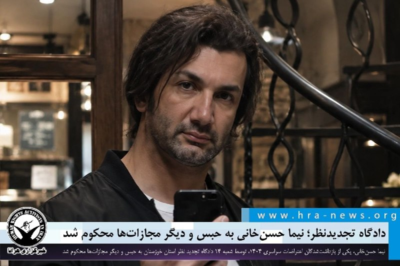

دادگاه تجدیدنظر؛ نیما حسن‌خانی به حبس و دیگر مجازات‌ها محکوم شد

❗️
❗️
❗️
❗️
❗️– نیما حسن‌خانی، یکی از بازداشت‌شدگان اعتراضات سراسری ۱۴۰۴، محبوس در زندان شیبان اهواز، توسط شعبه ۱۴ دادگاه تجدید نظر استان خوزستان به دو سال حبس و دیگر مجازات‌ها محکوم شد. یک سال از این محکومیت به حالت تعلیق درآمده است.

به گزارش خبرگزاری هرانا، ارگان خبری مجموعه فعالان حقوق بشر در ایران، نیما حسن‌خانی توسط دادگاه تجدیدنظر به حبس و دیگر مجازات‌ها محکوم شد.

بر اساس حکمی که توسط ۱۴ دادگاه تجدید نظر استان خوزستان صادر و به حسین‌علی حاتمی، وکیل مدافع این شهروند ابلاغ شده، آقای حسن‌خانی از بابت اتهامات تبلیغ علیه نظام و اخلال در نظم و آسایش از طریق شرکت در اعتراضات، به دو سال حبس، دو سال ممنوعیت خروج از کشور و یک سال حضور در ستاد امر به معروف و نهی از منکر است. یک سال از این محکومیت به حالت تعلیق درآمده است.

ادامه مطلب

#نیما_حسن‌خانی

↘️
@hranews_bot تماس ✉️ - @Hranews کانال هرانا 🆑

## Hranews — post 113271

  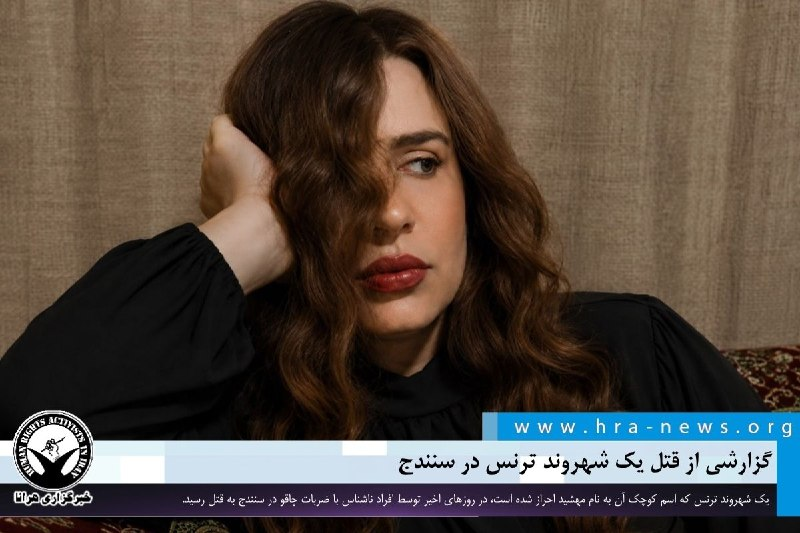

یک زن ترنس در سنندج به قتل رسید

❗️
❗️
❗️
❗️
❗️ – مهشید، یک زن #ترنس ۲۶ ساله، چند روز پیش در سنندج بر اثر ضربات چاقو توسط افراد ناشناس به قتل رسید.

به گزارش خبرگزاری هرانا، ارگان خبری مجموعه فعالان حقوق بشر در ایران، مهشید، زن ترنس و ساکن محله گلشن سنندج، جان خود را در پی حمله افراد ناشناس از دست داد.

یک منبع مطلع در این خصوص به هرانا گفت: «احتمالاً او روز جمعه توسط افراد ناشناس با ضربات چاقو به قتل رسیده است. مهاجمان پس از قتل، جسد مهشید را نیز مثله کرده‌اند.»
انگیزه و هویت عاملان این قتل تاکنون مشخص نشده است. با این حال، این منبع مطلع محلی در ادامه به هرانا گفت: «با توجه به نحوه وقوع این قتل و شرایط پیرامون آن، به نظر می‌رسد این جنایت با انگیزه نفرت صورت گرفته باشد. همچنین خانواده مهشید نیز برای پیگیری پرونده و اطلاع‌رسانی درباره این قتل تحت فشار و تهدید قرار گرفته‌اند؛ به‌طوری‌که تاکنون حتی آگهی ترحیمی نیز برای او منتشر نکرده‌اند.»

ادامه مطلب

#مهشید

↘️
@hranews_bot تماس ✉️ -  @Hranews  کانال هرانا 🆑

## Hranews — post 113270

تداوم بازداشت و بی‌خبری از وضعیت مجتبی ایروی در بیجار

❗️
❗️
❗️
❗️
❗️ – مجتبی ایروی، معلم بازنشسته اهل بیجار، ۹۰ روز است که توسط نیروهای امنیتی در بیجار #بازداشت شده و کماکان از وضعیت و محل نگهداری وی اطلاعی کسب نشده است. بی‌خبری از سرنوشت این شهروند، منجر به افزایش نگرانی‌های خانواده و بستگان وی شده است.

ادامه مطلب

#مجتبی_ایروی

↘️
@hranews_bot تماس ✉️ -  @Hranews  کانال هرانا 🆑

## alonews — post 123957

  <a href="telegram/content/alonews_123957_1780233356.webm" target="_blank">🎬 Download video</a>

👈وال استریت ژورنال: سازمان ملل در حال ورشکستگی است، زیرا ایالات متحده و چین میلیاردها دلار را از این نهاد بین‌المللی خارج می‌کنند. 

✅ @AloNews خبر جنگ

## alonews — post 123956

  <a href="telegram/content/alonews_123956_1780233356.webm" target="_blank">🎬 Download video</a>

👈عضو هیئت‌مدیره انجمن داروسازان :
کمبود کدئین به خاطر تحریم نیست، به خاطر محدود شدن تأمین تریاکه

✅ @AloNews خبر جنگ

## alonews — post 123955

  <a href="telegram/content/alonews_123955_1780233356.webm" target="_blank">🎬 Download video</a>

👈الجزیره: پرونده لبنان در صدر تعاملات مربوط به توافق بین تهران و واشنگتن است

✅ @AloNews خبر جنگ

## alonews — post 123954

  <a href="telegram/content/alonews_123954_1780233356.webm" target="_blank">🎬 Download video</a>

👈سی‌ان‌ان: اگر خصومت‌ها از سر گرفته شوند، ایران در موقعیتی است که می‌تواند تا زمانی که پرتابگرها و خدمه داشته باشد، حتی اگر تولید متوقف شده باشد، به پرتاب موشک ادامه دهد

🔴هیچ چیز مانع از مسلح شدن پرتابگرها به ذخایر فراوان موشکی که ایرانی‌ها هنوز در اختیار دارند، نمی‌شود

🔴برای آسیب به تاسیسات موشکی ایران از سلاح‌های بسیار پیچیده و بسیار گران‌قیمت استفاده می‌شود، اما عملیات بازیابی با فناوری بسیار ساده‌ای انجام می‌شود: بولدوزر

✅ @AloNews خبر جنگ

## alonews — post 123950

  <a href="telegram/content/alonews_123950_1780233356.mp4" target="_blank">🎬 Download video</a>

👈ویرانیِ.های گسترده؛ جنوب لبنان

✅ @AloNews خبر جنگ

## alonews — post 123949

  <a href="telegram/content/alonews_123949_1780233358.webm" target="_blank">🎬 Download video</a>

👈روزنامه کیهان: به دلیل نقض آتش‌بس در لبنان، میتونیم جنگ علیه اسرائیل رو آغاز کنیم.

✅ @AloNews خبر جنگ

## alonews — post 123948

  <a href="telegram/content/alonews_123948_1780233358.webm" target="_blank">🎬 Download video</a>

👈صادرات تخم‌مرغ آزاد شد

✅ @AloNews خبر جنگ

## alonews — post 123947

  <a href="telegram/content/alonews_123947_1780233358.webm" target="_blank">🎬 Download video</a>

👈 دقایقی پیش سامانه پدافند هوایی در کریات یام بدون به صدا درآمدن آژیر فعال شد.

✅ @AloNews خبر جنگ

## alonews — post 123946

  <a href="telegram/content/alonews_123946_1780233358.webm" target="_blank">🎬 Download video</a>

👈سی‌ن‌ان: ایران ۵۰ ورودی از ۶۹ ورودی تونل‌های تاسیسات هدف قرارگرفته موشکی را باز کرده است

✅ @AloNews خبر جنگ

## alonews — post 123945

  <a href="telegram/content/alonews_123945_1780233358.webm" target="_blank">🎬 Download video</a>

👈واکنش به گزارش امنیتی دانمارک؛ سفارت ایران خواستار ارائه شواهد درباره اتهامات شد

🔴سفارت جمهوری اسلامی ایران در کپنهاگ به ارزیابی اخیر «سازمان اطلاعات و امنیت دانمارک» (PET) که در آن از افزایش نقش ایران در تهدیدات «تروریستی» در داخل خاک دانمارک سخن گفته شده بود، واکنش نشان داد و این اتهامات را فاقد شواهد «مستند و غیرقابل‌انکار» خواند.

✅ @AloNews خبر جنگ

## alonews — post 123944

  <a href="telegram/content/alonews_123944_1780233359.webm" target="_blank">🎬 Download video</a>

👈سد کرج پس از بارش‌های اخیر جان گرفت و مخزن آن به ۷۰ درصد ظرفیت رسید

✅ @AloNews خبر جنگ

## alonews — post 123943

  <a href="telegram/content/alonews_123943_1780233359.webm" target="_blank">🎬 Download video</a>

👈پخش برنامه «به من چه» که از روبیکا منتشر و اجرای آن را مجید واشقانی برعهده داشت، به دستور سازمان تنظیم مقررات رسانه‌های صوت و تصویر فراگیر در فضای مجازی متوقف شد.

✅ @AloNews خبر جنگ

## alonews — post 123942

  <a href="telegram/content/alonews_123942_1780233359.webm" target="_blank">🎬 Download video</a>

👈وزارت بهداشت لبنان اعلام کرد از دوم مارس تاکنون در جریان درگیری‌های جاری بین اسرائیل و حزب‌الله، ۳۳۷۱ کشته و ۱۰۱۲۹ زخمی گزارش شده اند

✅ @AloNews خبر جنگ

## alonews — post 123941

  <a href="telegram/content/alonews_123941_1780233359.webm" target="_blank">🎬 Download video</a>

👈 نیویورک‌تایمز: ترامپ شرایط سخت‌تری را برای چارچوب صلح به ایران ارسال کرده است

🔴نیویورک تایمز به نقل از سه مقام آگاه:
رئیس‌جمهور آمریکا عناصری از پیش‌نویس توافق را اصلاح کرده و آن را برای بررسی به تهران بازگردانده است. 

🔴این گزارش به تغییرات دقیق اعمال شده در متن اشاره‌ای نکرده است.

🔴ترامپ نگران بخش‌هایی از توافق احتمالی است که شامل آزادسازی دارایی‌های مسدود شده برای ایرانیان می‌شود.

🔴ترامپ از مدت زمانی که طول کشیده تا ایران به پیشنهادات واشنگتن پاسخ دهد، ناامید شده است. 

✅ @AloNews خبر جنگ

## alonews — post 123940

  <a href="telegram/content/alonews_123940_1780233359.mp4" target="_blank">🎬 Download video</a>

👈 فرار سخنگوی دولت از پاسخ به سوالی درباره ستاد غیرقانونی فضای مجازی

✅ @AloNews خبر جنگ

## alonews — post 123939

  <a href="telegram/content/alonews_123939_1780233362.mp4" target="_blank">🎬 Download video</a>

💔جاویدنام مهرداد مشتاقی «چه جوان خوشتیپی، چه رقصی، من که دیدمش یاد آلن دلون افتادم» یاد و نامت جاوید قهرمان.

🤔عرزشی حرام زاده ، مهرداد مشتاقی تروریست بود؟ دینی که پرستش میکنین دروغگو بودن از واجبات شماست؟

✅@AloNews

## alonews — post 123938

  <a href="telegram/content/alonews_123938_1780233364.webm" target="_blank">🎬 Download video</a>

👈ناتو: ممکن است در موضوع بازگشایی تنگه هرمز مداخله کنیم

✅ @AloNews خبر جنگ

<!-- MSG END -->

<!-- NAV START -->

<a href="https://github.com/Tljn/FUD/blob/main/telegram/content/archive_1.md" style="display:inline-block; padding:6px 12px; margin:0 4px; background-color:#2ea44f; color:white; text-decoration:none; border-radius:4px; font-weight:bold;">صفحه بعد</a>

<!-- NAV END -->
