# خواننده تلگرام

<!-- TOP_NAV START -->

<a href="https://github.com/Tljn/FUD/blob/main/telegram/content/archive_1.md" style="display:inline-block; padding:6px 12px; margin:0 4px; background-color:#2ea44f; color:white; text-decoration:none; border-radius:4px; font-weight:bold;">صفحه بعد</a>

<!-- TOP_NAV END -->

<!-- MSG START -->

---
📅 بروزرسانی: 1405/03/27 15:11
---

## VahidOOnLine — post 246005

  <a href="telegram/content/VahidOOnLine_246005_1781696492.mp4" target="_blank">🎬 Download video</a>

⭕️ترامپ: با ایران یادداشت تفاهم امضا کردیم نه توافق نهایی، رضایت نداشته باشم، دوباره بر سرشان بمب می‌ریزیم

♦️دونالد ترامپ، رئیس جمهوری آمریکا روز چهارشنبه ۲۷ خرداد و در دیدار با عبدالفتاح سیسی، رئیس جمهوری مصر در حاشیه نشست سران گروه ۷ در اویان فرانسه گفت: «تفاهم‌نامه با ایران توافق نیست و اگر از عملکرد جمهوری اسلامی رضایت نداشته باشم، دوباره بر سرشان بمب می‌ریزیم.»

ترامپ در پاسخ به خبرنگاران گفت: «این توافق نهایی نیست. این یک یادداشت تفاهم است. اگر از آن خوشم نیاید و آن‌ها درست رفتار نکنند، ما قطعا به سراغ انداختن بمب درست وسط سرشان برمی‌گردیم؛ فهمیدید؟ چون آن‌ها ۴۷ سال است که دارند بدرفتاری می‌کنند.»

از زمان انتشار نسخ‌های غیررسمی از سند تفاهم مشترک تهران و واشنگتن،‌ علاوه بر اسرائیل، گروهی از سیاستمداران دموکرات و حتی جمهوریخواه آمریکا هم از آن انتقاد کرده‌اند.
‌🇸🇦 Indypersian

🤖 @VahidOOnLine

## VahidOOnLine — post 246004

  <a href="telegram/content/VahidOOnLine_246004_1781696494.mp4" target="_blank">🎬 Download video</a>

♦️محمدباقر قالیباف، رئیس مجلس و مذاکره‌کننده ارشد جمهوری اسلامی درگفتگوها با آمریکا، روز چهارشنبه ۲۷ خرداد و در دفاع «تلویحی» از تفاهم‌نامه پایان جنگ گفت: باید سنگر را از بچه‌های لانچر تحویل بگیریم و مردم را از زیر فشار اقتصادی دربیاوریم.»

قالیباف این سخنان را در نشست هم‌فکری نماینده ویژه ایران در امور چین با اتاق بازرگانی بیان کرد.

در روزهای گذشته بخش‌های وسیعی از سیاستمداران، نمایندگان مجلس و رسانه‌های جریان‌های متفاوت سیاسی داخل حکومت، از تفاهم‌نامه پایان جنگ با ایران انتقاد کرده‌اند. گروهی از حامیان حکومت یکشنبه شب و همزمان با اعلام امضای توافق قالیباف و عراقچی را به خیانت محکوم کرده بودند.
‌🇸🇦 Indypersian

🤖 @VahidOOnLine

## VahidOOnLine — post 246003

  

دونالد ترامپ، رییس‌جمهوری آمریکا، چهارشنبه ۲۷ خرداد در حاشیه نشست گروه هفت و در دیدار با عبدالفتاح السیسی، رییس‌جمهوری مصر، یادداشت تفاهم با جمهوری اسلامی را «بسیار قوی» توصیف کرد، اما هم‌زمان هشدار داد که این توافق هنوز نهایی نشده و در صورت نارضایتی واشینگتن، اقدام نظامی از سر گرفته خواهد شد.

ترامپ گفت: «این فقط یک یادداشت تفاهم است. اگر از آن راضی نباشم و رفتارشان را اصلاح نکنند، دوباره به سمت آنها شلیک می‌کنیم و روی سرشان بمب می‌اندازیم. چون به مدت ۴۷ سال بدرفتاری کرده‌اند.»

رییس‌جمهوری آمریکا همچنین مدعی شد این تفاهم بیش از ۹۹ درصد امکان دستیابی جمهوری اسلامی به سلاح هسته‌ای را از بین می‌برد و تاکید کرد که تهران هرگز به سلاح هسته‌ای دست نخواهد یافت.

ترامپ افزود یادداشت تفاهم شامل لغو فوری تحریم‌ها نیست، اما این موضوع در مراحل بعدی مذاکرات مورد بحث قرار خواهد گرفت.

او همچنین درباره وضعیت تنگه هرمز گفت این آبراه راهبردی هم‌اکنون به‌طور جزئی بازگشایی شده و انتظار می‌رود طی یک تا دو روز آینده به‌طور کامل باز شود.
‌🏁 🇬🇧 IranintlTV

🤖 @VahidOOnLine

## VahidOOnLine — post 246002

.♦️خاویر باردم، هنرپیشه سرشناس سینمای جهان، روز چهارشنبه ۲۷ خرداد (سه‌شنبه شب به وقت غرب آمریکا) با برجای گذاشتن رد دستان، پاها و صورتش روی بلوک سیمان نمادین مقابل سالن نمایش «چینی» در بلوار هالیوود، به باشگاه هنرمندان جاودان صنعت سینمای آمریکا پیوست.

باردم اسپانیایی که به‌دلیل مواضع سیاسی چپ‌گرایانه و به‌ویژه حمایت تندوتیز از فلسطینیان در سال‌های گذشته خبرساز بوده در این مراسم گفت: «از اینکه نامش در کنار برخی ستاره‌های بزرگ سینمای جهان جاودانه شده، احساس ویژه‌ای دارد.»
‌🇸🇦 Indypersian

🤖 @VahidOOnLine

## VahidOOnLine — post 246001

  

خبرگزاری رسمی لبنان گزارش داد در حملات هوایی روز چهارشنبه ۲۷ خرداد اسرائیل به مناطقی در جنوب لبنان، چندین نفر زخمی شدند. این حملات در حالی رخ داد که مقام‌های جمهوری اسلامی در روزهای اخیر بارها تاکید کرده‌اند حملات اسرائیل به لبنان نقض یادداشت تفاهم با آمریکا محسوب می‌شود.

خبرگزاری ملی لبنان اعلام کرد سه حمله هوایی به شهرهای منصوری و عازیه انجام شده و در پی آن چندین نفر زخمی شده‌اند. این خبرگزاری همچنین از حمله دیگری به منطقه براشیت خبر داد. ارتش اسرائیل تاکنون درباره این گزارش‌ها اظهار نظر نکرده است.

اندکی پس از این حملات، آژیرهای هشدار نفوذ احتمالی پهپاد از لبنان در شهرک مرزی زاریت در شمال اسرائیل به صدا درآمد، اما ارتش اسرائیل اعلام کرد این هشدار ناشی از «خطای تشخیص» بوده است.
‌🏁 🇬🇧 IranintlTV

🤖 @VahidOOnLine

## VahidOOnLine — post 246000

  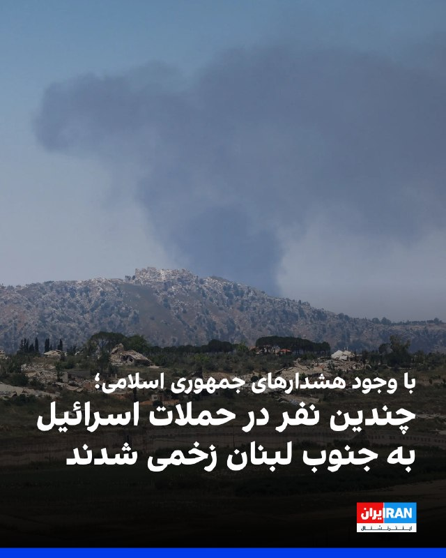

خبرگزاری رسمی لبنان گزارش داد در حملات هوایی روز چهارشنبه ۲۷ خرداد اسرائیل به مناطقی در جنوب لبنان، چندین نفر زخمی شدند. این حملات در حالی رخ داد که مقام‌های جمهوری اسلامی در روزهای اخیر بارها تاکید کرده‌اند حملات اسرائیل به لبنان نقض یادداشت تفاهم با آمریکا محسوب می‌شود.

خبرگزاری ملی لبنان اعلام کرد سه حمله هوایی به شهرهای منصوری و عازیه انجام شده و در پی آن چندین نفر زخمی شده‌اند. این خبرگزاری همچنین از حمله دیگری به منطقه براشیت خبر داد. ارتش اسرائیل تاکنون درباره این گزارش‌ها اظهار نظر نکرده است.

اندکی پس از این حملات، آژیرهای هشدار نفوذ احتمالی پهپاد از لبنان در شهرک مرزی زاریت در شمال اسرائیل به صدا درآمد، اما ارتش اسرائیل اعلام کرد این هشدار ناشی از «خطای تشخیص» بوده است.
‌🏁 🇬🇧 IranintlTV

🤖 @VahidOOnLine

## VahidOOnLine — post 245999

⭕️سرگذشت هنر گچ‌بری در ایران؛ از شاهان ساسانی تا اسلیمی‌های اسلامی

📌گچ‌بری ایران از یک هنر فیگوراتیو و روایی در دوران باستان به یک هنر عمدتا انتزاعی و کتیبه‌ای در دوران اسلامی تبدیل شد

♦️هنر گچ‌بری در ایران از روزگار باستان تا امروز، یکی از روشن‌ترین آینه‌های تحولات فرهنگی، مذهبی و سیاسی این سرزمین بوده است. این هنر در دوره‌های هخامنشی، اشکانی و به‌ویژه ساسانی، افزون بر کارکرد تزیینی، ابزاری برای نمایش قدرت سیاسی، روایت‌های اسطوره‌ای و بازنمایی جهان‌بینی حاکم به شمار می‌رفت و با همین رویکرد نیز دیوارهای کاخ‌ها و بناهای اشرافی با نقش شاهان، ایزدان، جانوران اساطیری و صحنه‌های شکار و بزم آراسته می‌شد.

بیشتر بخوانید...

✍️سایه رحیمی
‌🇸🇦 Indypersian

🤖 @VahidOOnLine

## VahidOOnLine — post 245998

  

حسن خمینی، نوه روح‌الله خمینی، با اشاره به جنگ اسرائیل و آمریکا علیه جمهوری اسلامی، از آن با عنوان «جهاد اصغر» یاد کرد و گفت «جهاد اکبر» برای حفظ پیروزی و کنار گذاشتن نزاع‌های بی‌حاصل از امروز آغاز می‌شود.

او همچنین گفت جمهوری اسلامی با «تدبیر» از محاصره دریایی عبور کرد و افزود همین اقدام می‌تواند «غول‌های دنیا» را زمین بزند.

این اظهارات در حالی مطرح شد که یادداشت تفاهم میان واشینگتن و تهران، با وجود مخالفت شماری از مقام‌های جمهوری اسلامی از جمله برخی نمایندگان مجلس جمهوری اسلامی، روز یکشنبه ۲۴ خرداد به‌صورت الکترونیکی در اسلام‌آباد امضا شد. قرار است این تفاهم‌نامه روز جمعه نیز با حضور مقام‌های دو طرف در ژنو به‌صورت حضوری امضا شود.
‌🏁 🇬🇧 IranintlTV

🤖 @VahidOOnLine

## VahidOOnLine — post 245990

  <a href="telegram/content/VahidOOnLine_245990_1781696499.mp4" target="_blank">🎬 Download video</a>

پشتِ توافق احتمالی آمریکا و جمهوری اسلامی، فقط بحث هسته‌ای نیست. مسئله اصلی مسیرهای مالی است، از نفت و دارایی‌های بلوکه‌شده تا صندوق سرمایه‌گذاری ۳۰۰ میلیارد دلاری.
‌🏁 🇬🇧 ManotoTV

🤖 @VahidOOnLine

## VahidOOnLine — post 245989

  <a href="telegram/content/VahidOOnLine_245989_1781696500.mp4" target="_blank">🎬 Download video</a>

بخشی از یک گفت‌وگوی اختصاصی و کمتر دیده‌ شده میان خبرنگار رادیو و تلویزیون ملی ایران در لندن و رئیس اداره اطلاعات و سخنگوی سفارت اتحادجماهیر شوروی.
این مصاحبه در اوج تنش‌های جنگ سرد و پس از اخراج دیپلمات‌های شوروی از بریتانیا انجام شده و دیدگاه رسمی شوروی درباره این بحران را روایت می‌کند.
برای تماشای نسخه کامل این مصاحبه و صدها فیلم آرشیوی نایاب دیگر، کانال یوتیوب Manoto را دنبال کنید.
‌🏁 🇬🇧 ManotoTV

🤖 @VahidOOnLine

## VahidOOnLine — post 245988

  

در آستانه دیدار مقام‌های آمریکا و جمهوری اسلامی برای امضای رسمی یادداشت تفاهم در سوئیس، خیابان‌ها و بزرگراه‌های اسلام‌آباد با بیلبوردها و نمایشگرهای دیجیتالی پوشیده شده که پیام‌هایی در حمایت از این توافق را به نمایش می‌گذارند.

این کارزار تبلیغاتی که از سوی اداره شهرداری کلان‌شهر اسلام‌آباد اجرا شده، نمایشگرهای عمومی و بیلبوردهای دیجیتال پایتخت پاکستان را به محلی برای انتشار پیام‌هایی درباره صلح، همبستگی و همکاری بین‌المللی تبدیل کرده است.
در این بیلبوردها شهباز شریف، نخست‌وزیر پاکستان، و عاصم منیر، رییس ستاد نیروهای دفاعی پاکستان دیده می‌شوند.

از این تفاهم با عنوان «توافق صلح» یاد می‌شود؛ توافقی که قرار است به‌طور رسمی در ژنو امضا شود و پاکستان خود را میزبان و تسهیل‌کننده اصلی روند دستیابی به آن معرفی می‌کند.

یکی از پیام‌های منتشرشده بر روی این نمایشگرها می‌گوید: «از اسلام‌آباد به جهان؛ پیامی از صلح، همبستگی و امید.»

‌🏁 🇬🇧 IranintlTV

🤖 @VahidOOnLine

## VahidOOnLine — post 245987

  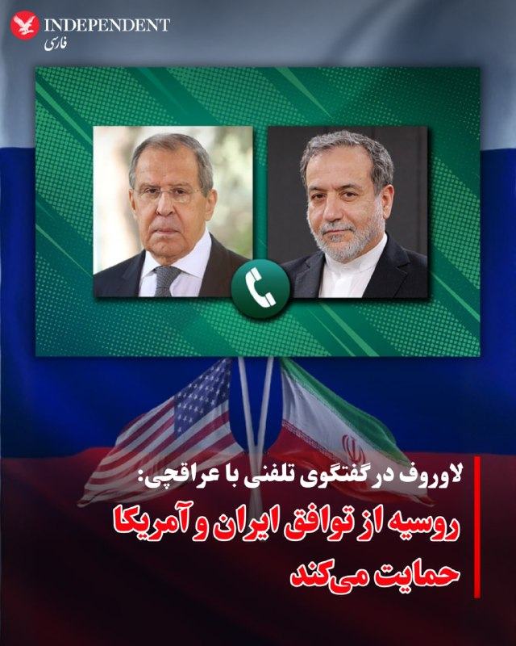

♦️کانال تلگرامی عباس عراقچی، وزیر امور خارجه جمهوری اسلامی، روز چهارشنبه ۲۷ خردادماه از حمایت سرگئی لاوروف، وزیر امور خارجه روسیه از تفاهم پایان جنگ تهران و واشنگتن خبر داد.

سرگئی لاوروف یکی از منتقدان جدی توافق هسته‌ای جمهوری اسلامی و گروه ۵+۱ (برجام) به‌شمار می‌رفت.

کانال تلگرامی عباس عراقچی با اعلام این خبر نوشت:‌‌ «وزیر امور خارجه روسیه نیز ضمن استقبال از نهایی شدن متن یادداشت تفاهم، بر حمایت کامل کشورش از اجرای مفاد آن تصریح کرد.
وزرای امور خارجه دو کشور با اشاره به لزوم حمایت جامعه جهانی و شورای امنیت سازمان ملل متحد از این تفاهم، همچنین بر ضرورت تداوم همکاری های دیپلماتیک بین کشورهای منطقه با هدف تثبیت صلح و ثبات تاکید کردند.»

روسیه در ماه‌های گذشته و پیش از آغاز دور اخیر جنگ آمریکا و اسرائیل و پس از آن، بارها آمادگی خود را برای دریافت ذخایر اورانیوم غنی‌شده ایران اعلام کرده است.
‌🇸🇦 Indypersian

🤖 @VahidOOnLine

## VahidOOnLine — post 245986

  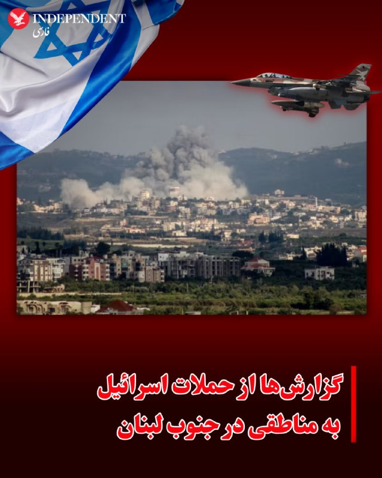

♦️خبرگزاری فرانسه روز چهارشنبه ۲۷ خرداد از حملات اسرائیل به منطقه نبطیه در جنوب لبنان خبر داد.

 رسانه‌های محلی لبنان و شبکه‌ الجزیره پیش از این از حملات توپخانه‌ای و گلوله‌باران چند شهرک و روستا در نبطیه خبر داده بودند.
الجزیره به نقل از خبرنگار خود گزارش کرد که حزب‌الله لبنان پس از این حملات دست‌کم ۱۰ راکت به سوی اسرائیل شلیک کرد.

حملات اسرائیل به جنوب لبنان در حالی ادامه دارد که قرارگاه مرکزی خاتم‌الانبیاء شب گذشته به این کشور هشدار داده بود که در صورت ادامه حملات، با پاسخ سخت مواجه خواهد شد.
‌🇸🇦 Indypersian

🤖 @VahidOOnLine

## WithYashar — post 15148

  <a href="telegram/content/WithYashar_15148_1781696504.mp4" target="_blank">🎬 Download video</a>

ترامپ درباره ایران: دلیل پایین ماندن قیمت نفت این است که هر شب کشتی‌هایی را از بین می‌بردیم که حتی شما از آن‌ها خبر نداشتید.
دو روز پیش، سه روز پیش، یک ماه پیش، ۲۲ کشتی را از بین بردیم. به طور متوسط هر شب بین ۱۵ تا ۲۵ کشتی را از بین می‌بردیم. هیچ‌کس این را نمی‌دانست.

نیروی دریایی ما کار بزرگی انجام داد. هیچ‌کس نمی‌دانست چه اتفاقی می‌افتد. به همین دلیل نفت به ۳۰۰ دلار در هر بشکه نرسید؛ بلکه به ۱۲۵ تا ۱۵۰ دلار رسید.

حالا قیمت آن ۷۲، ۷۳ دلار است. شنیده‌ام که الان حتی کمتر از این است
@withyashar

## WithYashar — post 15147

ترامپ: با احمد الشرع، رهبر سوریه، درباره مقابله با حزب‌الله گفت‌وگو کردم.
@withyashar

## WithYashar — post 15146

  <a href="telegram/content/WithYashar_15146_1781696505.mp4" target="_blank">🎬 Download video</a>

ترامپ‌ در‌کنار ژنرال السیسی (واقعی): فراموش نکنید، هیچ‌کس هرگز به اندازه من با ایران سخت‌گیر نبوده است.

این کار باید توسط کلینتون و باراک حسین اوباما انجام می‌شد. این کار باید توسط بایدن، بوش و بسیاری از افراد دیگر انجام می‌شد.
@withyashar

## WithYashar — post 15145

ترامپ: قابلیت پرداخت فقط یک حقه دیگر است. آنها کلمه «قابلیت پرداخت» را ساختند
@withyashar

## WithYashar — post 15144

ترامپ: یادداشت با ایران نهایی نیست. اگر از توافق خوشمان نیاید، دوباره به بمباران بازمی‌گردیم @withyashar

## WithYashar — post 15143

ترامپ: یادداشت با ایران نهایی نیست. اگر از توافق خوشمان نیاید، دوباره به بمباران بازمی‌گردیم
@withyashar

## WithYashar — post 15142

  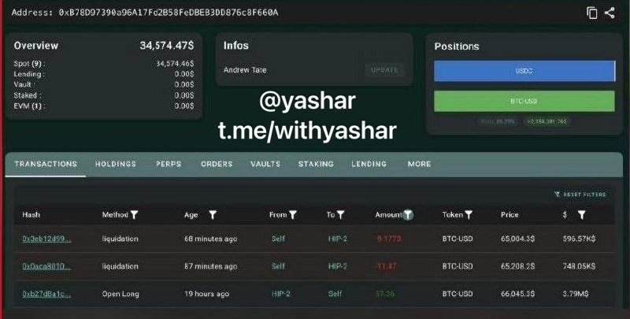

اندرو تیت که ۱۰۷ بار لیکویید شده، دوباره در صرافی هایپرلیکویید با اهرم ۴۰ و حجم حدوداً ۴ میلیون دلار، روی بیت‌کوین پوزیشن لانگ (خرید) باز کرده و باز هم بخشی از سرمایه‌اش (۱.۳۵ میلیون دلار) لیکویید شد.
اگه قیمت به 64,626 هزار دلار برسه کامل لیکویید می‌شه.
نرخ فعلی بیت‌کوین: 64,800$
@withyashar

## WithYashar — post 15141

  <a href="telegram/content/WithYashar_15141_1781696508.mp4" target="_blank">🎬 Download video</a>

‎بخشی از سخنرانی قالیباف که تو رسانه‌ها وایرال شده

دیگه ساختار مدیریتی کشور از فردمحوری خارج شده و گروهی تصمیم میگیریم.
@withyashar

## WithYashar — post 15140

وزیر دفاع اسرائیل کاتز: تمام روستاهای نزدیک به مرز لبنان به صورت سیستماتیک ویران می‌شوند.
@withyashar

## WithYashar — post 15139

فاکس نیوز: ترامپ به زودی درباره توافق ایران کنفرانس خبری برگزار می‌کند
@withyashar

## WithYashar — post 15138

تسنیم: متن توافقنامه به صورت کامل در روز جمعه و پس از امضا منتشر خواهد شد
یک منبع نزدیک به تیم مذاکره‌کننده گفت: تفاهمنامه همانطور که پیشتر اعلام شده ۱۴ بند است و موضوعات مربوط به ۱۴ بند نیز بارها در رسانه‌ها مطرح شده، اما جزییاتی که در بلومبرگ‌ درباره هر بندی آمده است در موارد قابل توجهی ناقص است.
@withyashar

## WithYashar — post 15137

  

خودرو پورشه سردار آزمون در کرمان توقیف شد

به گزارش تابناک به نقل از ایسنا، سرهنگ اکبر نجفی ۲۶ در تشریح این خبر گفت: خودروی مذکور که به دلیل تخلفات قانونی و برابر با احکام صادره در لیست توقیفی‌های مصادره اموال سردار آزمون قرار داشت، توسط گشت‌های محسوس و نامحسوس یگان امداد شناسایی و پس از طی مراحل قانونی، به پارکینگ منتقل شد.
@withyashar

## WithYashar — post 15136

صدای انفجار‌ سیریک🚨
@withyashar

## WithYashar — post 15135

بلومبرگ به نقل از یک منبع آگاه اعلام کرد: واشنگتن شروع به توزیع محتوای تفاهم با ایران به کشورهای متحد در اجلاس گروه ۷ در فرانسه کرده است
@withyashar

## WithYashar — post 15134

خبرگزاری فرانسه: یک گزارش حقوقی دولت آمریکا نشان می‌دهد ارتش این کشور از ابزار هوش مصنوعی گروک متعلق به شرکت اسپیس ایکس تحت مالکیت ایلان ماسک، میلیاردر حوزه فناوری در جنگ علیه ایران استفاده کرده است
@withyashar

## WithYashar — post 15133

پمپئو وزیر خارجه سابق به فاکس می‌گوید اگر برداشت ایران از موضع آمریکا درست باشد و تصمیم‌گیران اصلی (سپاه و رهبری) واقعاً تغییر رفتار بدهند، می‌توان به عادی‌سازی و حتی ورود سرمایه‌گذاری فکر کرد، اما احتمال چنین تغییری را بسیار پایین می‌داند. او تأکید می‌کند نباید هیچ پولی—چه مستقیم، چه از طریق واسطه یا حتی
آزادسازی دارایی‌ها—به ایران داده شود، چون به‌جای رفاه مردم، صرف تقویت برنامه موشکی، سپاه و خرید تسلیحات از روسیه و چین می‌شود. در عین حال می‌گوید اگر واقعاً تغییر واقعی رخ دهد، از آن استقبال خواهد کرد.
@withyashar

## WithYashar — post 15132

  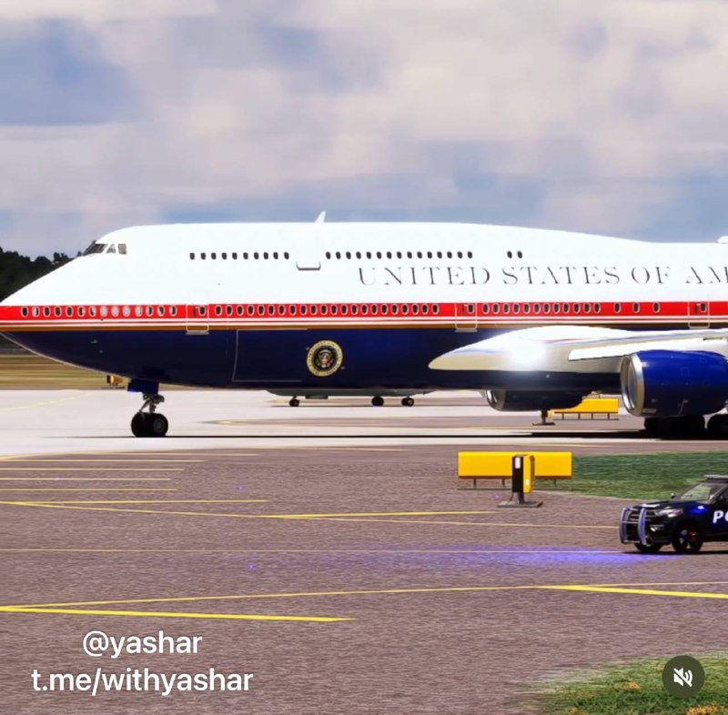

«ایرباس موقت ایر فورس وان که توسط قطر اهدا شده، رنگ‌آمیزی شده و در نیویورک آماده است — درست همزمان با تعهد سرمایه‌گذاری ۱ میلیارد دلاری قطر که دیروز اعلام شد، بعد از آنچه برخی آن را تسلیم کامل آمریکا در برابر خواسته‌های قطر و ایران می‌دانند.»
@withyashar

## WithYashar — post 15131

یديعوت احرونوت ادعا کرده بالای ۵۰درصد از پول‌های بلوکه شده ایران دست چین و عراقه

رقمش هم کم نیست؛ حداقل ۳۵میلیارد دلاره!
@withyashar

## WithYashar — post 15130

خبرنگار اسرائیلی : این یک اشتباه تاریخی است.
پرداخت میلیاردها دلار به بزرگترین حامی دولتی تروریسم در جهان، فقط باعث تأمین مالی راکت‌های بیشتر، پهپاد‌های بیشتر و حملات بیشتری علیه اسرائیل و غرب خواهد شد. این سیاست «آمریکا در اولویت اول» نیست.
@withyashar

## mwarmonitor — post 11065

  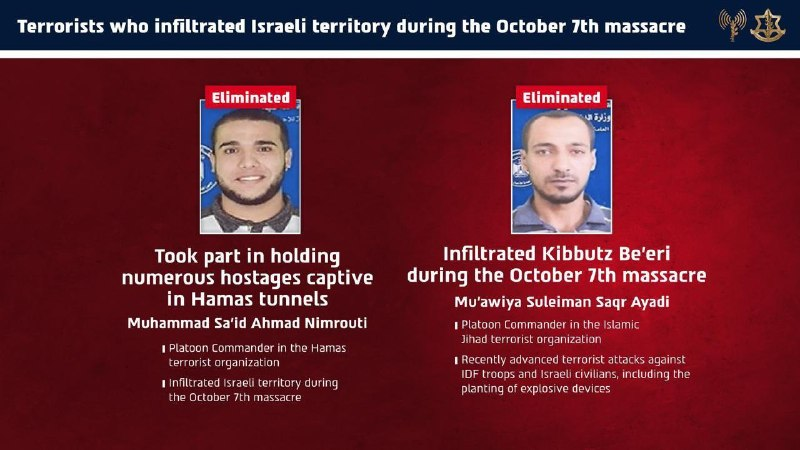

🔴 حذف شد:

📌محمد سعید احمد نمرُوتی، فرمانده یک دسته در حماس که در جریان کشتار ۷ اکتبر وارد خاک اسرائیل شده بود و در نگه‌داری شمار زیادی از گروگان‌ها در تونل‌های حماس مشارکت داشت، از بین رفت.

📌در حمله‌ای جداگانه، معاویه سلیمان صقر عیادی، فرمانده یک دسته در تیپ اردوگاه‌های مرکزی جهاد اسلامی فلسطین که در جریان کشتار ۷ اکتبر به کیبوتص بئری نفوذ کرده و در کارگذاری مواد منفجره نقش داشت، حذف شد.

@mwarmonitor

## mwarmonitor — post 11064

او همچنین گفت پیشنهاد داده است که اسرائیل اجازه دهد سوریه با حزب‌الله برخورد کند: «اگر اسرائیل نتواند بدون کشتن همه کار را انجام دهد، او [الشرع] این کار را انجام می‌دهد، سوریه انجام می‌دهد.»

## mwarmonitor — post 11063

🔴 دونالد ترامپ، رئیس‌جمهور آمریکا، می‌گوید گزارش مربوط به صندوق ۳۰۰ میلیارد دلاری در توافق با ایران نادرست است و تأکید می‌کند که آمریکا هیچ سرمایه‌گذاری‌ای در آن انجام نمی‌دهد — رویترز

@mwarmonitor

## mwarmonitor — post 11062

  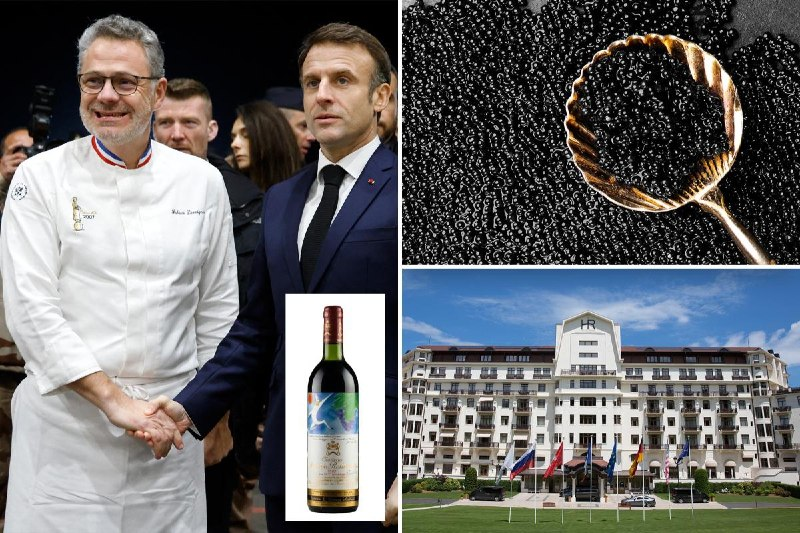

🔴رهبران گروه هفت (G7) بعد از تعهد برای مبارزه با «فقرِ پایدار»، با خاویار و شراب‌های وینتیج ۷ هزار دلاری ضیافت مفصل برگزار کردند. «نیویورک پست»

@mwarmonitor

## mwarmonitor — post 11061

  <a href="telegram/content/mwarmonitor_11061_1781696512.mp4" target="_blank">🎬 Download video</a>

🔴ترامپ می‌گوید یادداشت تفاهم با ایران نهایی نیست:

🔸«اگر از توافق خوشم نیاید، دوباره به بمباران ایران برمی‌گردیم.»

@mwarmonitor

## mwarmonitor — post 11060

🔴ما یک نسخه از توافق بین ایران و آمریکا را به دست آورده‌ایم. این یادداشت تفاهم ۱۴ بندی، شرایط آتش‌بس بین این دو رقیب سرسخت را مشخص می‌کند؛ از جمله بازگشایی تنگه هرمز، برخی امتیازات مالی برای ایران، و تأکید دوباره تهران بر اینکه هرگز سلاح هسته‌ای تولید نخواهد…

## mwarmonitor — post 11059

🔴ما یک نسخه از توافق بین ایران و آمریکا را به دست آورده‌ایم. این یادداشت تفاهم ۱۴ بندی، شرایط آتش‌بس بین این دو رقیب سرسخت را مشخص می‌کند؛ از جمله بازگشایی تنگه هرمز، برخی امتیازات مالی برای ایران، و تأکید دوباره تهران بر اینکه هرگز سلاح هسته‌ای تولید نخواهد کرد. CNN

@mwarmonitor

## mwarmonitor — post 11058

  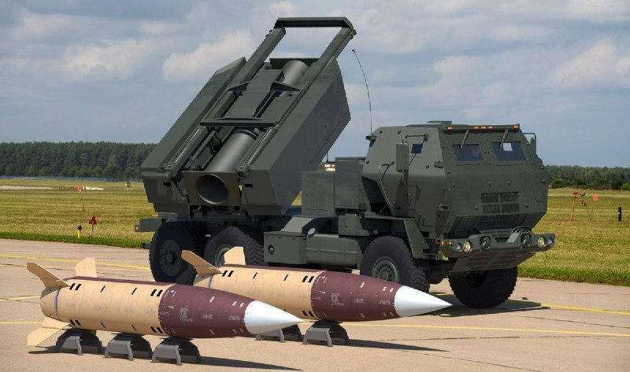

🔴تایوان برای اولین بار سامانه‌های راکتی High Mobility Artillery Rocket Systems (HIMARS) ساخت آمریکا را در ساحل غربی خود و به سمت تنگه مورد مناقشه تایوان شلیک کرد.

🔸این شلیک‌ها بخشی از یک رزمایش بزرگ‌تر بودند که سناریوی تهاجم احتمالی و اقدامات مقابله‌ای را شبیه‌سازی می‌کردند — آکسیوس

@mwarmonitor

## mwarmonitor — post 11056

🔴 سفیر آمریکا در اسرائیل مایک هاکبی

🔸ایران خواستار آن است که اسرائیل دفاع از مرزهای خود در برابر حزب‌الله را متوقف کند. طرح صلح غزه به خلع سلاح شدن حماس بستگی دارد. ایده: تمام اعضای حزب‌الله و حماس به «سفینه مادر» در ایران دیپورت شوند. نتیجه؟ لبنان و اسرائیل از نیابتی‌های تروریستی ایران رها می‌شوند. به صلح یک شانس بدهید!

@mwarmonitor

## mwarmonitor — post 11055

🔸ماساد بولوس، مشاور ارشد آمریکا در امور عربی و آفریقایی، در حال تلاش برای میانجی‌گری یک توافق تقسیم قدرت میان دولت‌های رقیب شرق و غرب لیبی است. هدف این طرح، تشکیل یک دولت واحد و ادغام نهادهای دولتی برای تثبیت وضعیت کشور و جذب سرمایه‌گذاری انرژی آمریکا است – به گزارش فایننشال تایمز (FT).

@mwarmonitor

## mwarmonitor — post 11054

🔴درباره صندوق ادعایی ۳۰۰ میلیارد دلاری ایران، متنی که من دارم می‌گوید «مکانیزم اجرای آن به توافق نهایی با تهران بستگی دارد». این در واقع تأییدی بر چیزی است که دیروز گفتم؛ این‌که بدون رفع گسترده/کامل تحریم‌های آمریکا، این پول عملاً جابه‌جا نخواهد شد. «لارنس نورمن خبرنگار وال‌استریت ژورنال»

@mwarmonitor

## mwarmonitor — post 11053

🔴 خبرنگار الجزیره: حمله‌ای از سوی یک پهپاد اسرائیلی به شهرک المنصوری در منطقه صور در جنوب لبنان انجام شده است.

@mwarmonitor

## mwarmonitor — post 11052

🔴مایک پمپئو (وزیر خارجه سابق آمریکا) در مصاحبه با فاکس نیوز

🔹« اگر بیانیه معاون رئیس‌جمهور دقیق باشد و ایرانی‌ها — که این نکته مهمی است — و ایرانی‌ها هم موضوع را همین‌طور متوجه شده باشند؛ چیزی که البته هنوز باید منتظر ماند و دید.

🔸به هر حال، منظورم فقط کل ایرانی‌ها نیست، بلکه افرادی است که قدرت دستشان است؛ نه آن کسی که قرار است توافق‌نامه را امضا کند، بلکه سپاه پاسداران (IRGC) که کنترل واقعی را در دست دارد و آیت‌الله.

🔹اگر این افراد تصمیم بگیرند که می‌خواهند به یک ملت عادی تبدیل شوند، من را هم در لیست کسانی قرار دهید که موافق رفتن سرمایه‌گذاران به آنجا هستند. اما جان، باید به تو بگویم که به نظر من احتمال رخ دادن چنین چیزی بسیار کم است.

🔹پس، منصفانه است؛ آن‌ها هیچ پولی دریافت نخواهند کرد. آنچه امیدوارم اتفاق نیفتد این است که در حالی که ما این شانس را داریم تا به نتیجه‌ای فوق‌العاده برای ایالات متحده آمریکا دست یابیم، پای خود را از روی گلوی آن‌ها برداریم. پرزیدنت ترامپ شرایط را برای این کار مهیا کرده بود.

🔹دادن پول به آن‌ها — چه از طریق انتقال مستقیم، چه انتقال از طریق یک شخص ثالث (کشور واسط) و چه حتی آزاد کردن دارایی‌هایی که ادعا می‌کنند "پول خودِ ایرانی‌هاست" — یک اشتباه خواهد بود. چون جان، تو قبلاً هم این را دیده‌ای؛ ما این فیلم بد را قبلاً هم دیده‌ایم. آن پول قرار نیست صرف بهداشت و درمان، دارو و غذای مردم ایران شود؛ بلکه صرف بازسازی برنامه موشکی‌شان، تقویت سپاه پاسداران، و خرید سیستم‌های تسلیحاتی بیشتر از روسیه و چین خواهد شد.

🔹پولی که به رژیم ایران برسد، صرف اهداف مخرب خواهد شد. اما اگر من اشتباه کنم و ایرانی‌ها واقعاً تغییر رویه داده باشند (اصطلاحاً ورق برگشته باشد)، هیچ‌کس خوشحال‌تر از من نخواهد بود.»

@mwarmonitor

## mwarmonitor — post 11051

🔴گزارش روزنامه New York Post می‌گوید که پلیس فدرال آمریکا (FBI) پنج نفر را به اتهام طراحی یک حمله به رویداد «UFC Freedom 250» که قرار بود در محوطه چمن جنوبی کاخ سفید برگزار شود، بازداشت کرده است. گفته می‌شود این طرح شامل استفاده از پهپادهای انفجاری، تک‌تیراندازها…

## mwarmonitor — post 11049

🔴رسانه یونانی: نیروی دریایی یونان در حال آماده‌سازی برای استقرار دو واحد دریایی در نزدیکی تنگه هرمز است.

@mwarmonitor

## FoxNewsTwitter — post 343057

‌Fox News (Twitter/X)

Stop scrolling for updates and turn on live alerts.

Get FOX One and get the facts:

https://www.fox.com/stream/fox-news?cmpid=org=fn::ag=owned_other::mc=organicsocial[%E2%80%A6]WITTER::cmp=100_o2_th4::cont=m2_tp1::add=03_17_00_05_13_00_02_A

## FoxNewsTwitter — post 343056

  <a href="telegram/content/FoxNewsTwitter_343056_1781696514.mp4" target="_blank">🎬 Download video</a>

Fox News (Twitter/X)

BREAKING: "If I don't like it, we'll go back to shooting at them, dropping bombs on their head."

President Trump warns Iran that any change to the peace agreement or failure to comply could bring an immediate military response.

"If they don't behave, we'll go right back to dropping bombs right smack in the middle of their head," Trump said.

Trump contrasted the deal with the Obama-era JCPOA, arguing the previous administration tried to "bribe their way out of it."

"You know what the Iranians did? They laughed at Obama and they said, 'he's a stupid son of a b****.'"

## FoxNewsTwitter — post 343055

  <a href="telegram/content/FoxNewsTwitter_343055_1781696515.mp4" target="_blank">🎬 Download video</a>

Fox News (Twitter/X)

NEW: Stocks up. Oil down. President Trump says that's the clearest sign yet that the proposed Iran deal is being welcomed by investors.

Speaking about the agreement, Trump highlighted a market rally, declining energy prices, and progress toward reopening the Strait of Hormuz after weeks of uncertainty.

"The stock market has gone through the roof and oil has come tumbling down."

He argued the deal delivers economic stability while also keeping Iran from obtaining a nuclear weapon.

## FoxNewsTwitter — post 343054

Fox News (Twitter/X)

BREAKING: Details are beginning to emerge ahead of the U.S.-Iran memorandum signing ceremony, now less than 48 hours away.

The proposed framework reportedly includes reopening the Strait, ending the U.S. blockade, a 60-day negotiation period over Iran's uranium enrichment, sanctions relief, and a ceasefire agreement involving Israel and Hezbollah.

President Trump says he plans to move against Iran's nuclear program on Tuesday, while pointing to the 60-day window for negotiations over Tehran's nuclear ambitions.

Now all eyes are on whether the ceasefires can survive long enough for any deal to take hold.

@TreyYingst breaks down the latest.

## FoxNewsTwitter — post 343053

  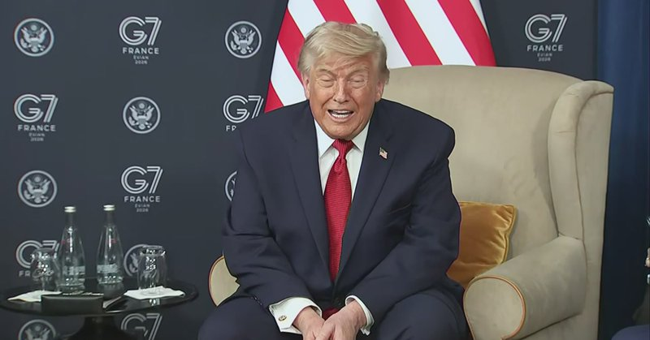

Fox News (Twitter/X)

WATCH LIVE: Trump holds bilateral meeting with the Egyptian president
https://twitter.com/i/broadcasts/1qxvvvqBkPaxB

## pm_afshaa — post 94243

  <a href="telegram/content/pm_afshaa_94243_1781696519.webm" target="_blank">🎬 Download video</a>

🔴کامران غضنفری، نماینده مجلس:
اگر این تفاهم‌نامه جمعه امضا بشه، اسرائیل ظرف چند روز اونو نقض خواهد کرد و دوباره به ایران حمله میکنه.

💧 Rainbet.com the #1 Non-KYC Crypto Casino & Sportsbook @rainbetcom

😁 @Pm_Afshaa

## pm_afshaa — post 94242

اختلاس 1200میلیاردی از سپرده ی مردم در بانک ملی محسن سیفی کفشگری مدیرعامل بانک ملی به مهر گفت متاسفانه 1200میلیارد تومان سپرده ی حساب ملی در عملیاتی هک و برداشت شده

💧 Rainbet.com the #1 Non-KYC Crypto Casino & Sportsbook @rainbetcom

😁 @Pm_Afshaa

## pm_afshaa — post 94241

🔴سفیر اسرائیل در سازمان ملل:تاریخ رژیم ایران پر از شکنجه، گورهای دسته‌جمعی و خانواده‌های بدون پاسخ است قربانیان دی‌ماه شایسته عدالت‌اند. جهان نباید ساکت بماند

💧 Rainbet.com the #1 Non-KYC Crypto Casino & Sportsbook @rainbetcom

😁 @Pm_Afshaa

## pm_afshaa — post 94240

🔴ترامپ: یادداشت با ایران نهایی نیست. اگر از توافق خوشمان نیاید، دوباره به بمب‌گذاری بازمی‌گردیم

💧 Rainbet.com the #1 Non-KYC Crypto Casino & Sportsbook @rainbetcom

😁 @Pm_Afshaa

## pm_afshaa — post 94238

🔴وزیر دفاع اسرائیل کاتز: تمام روستاهای نزدیک به مرز لبنان به صورت سیستماتیک ویران می‌شوند

💧 Rainbet.com the #1 Non-KYC Crypto Casino & Sportsbook @rainbetcom

😁 @Pm_Afshaa

## pm_afshaa — post 94237

  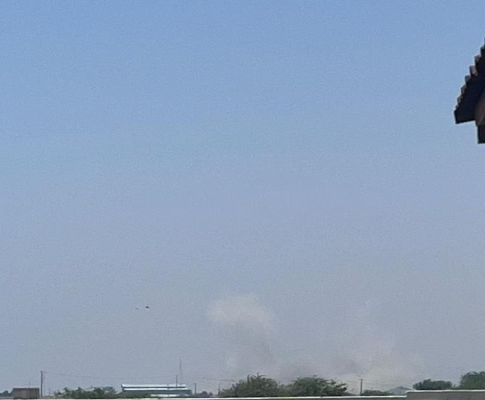

سیریک

💧 Rainbet.com the #1 Non-KYC Crypto Casino & Sportsbook @rainbetcom

😁 @Pm_Afshaa

## pm_afshaa — post 94236

گزارشات مردمی از انفجار در سیریک

💧 Rainbet.com the #1 Non-KYC Crypto Casino & Sportsbook @rainbetcom

😁 @Pm_Afshaa

## pm_afshaa — post 94235

🔴بلومبرگ به نقل از یک منبع آگاه: وزارت خزانه‌داری آمریکا بلافاصله پس از امضای توافق، معافیت‌هایی برای نفت و پتروشیمی ایران صادر خواهد کرد

💧 Rainbet.com the #1 Non-KYC Crypto Casino & Sportsbook @rainbetcom

😁 @Pm_Afshaa

## pm_afshaa — post 94234

  

فرمانده انتظامی کرمان از توقیف یک دستگاه پورشه متعلق به سردار آزمون خبر داد

💧 Rainbet.com the #1 Non-KYC Crypto Casino & Sportsbook @rainbetcom

😁 @Pm_Afshaa

## pm_afshaa — post 94229

🔴وزیر دارایی اسرائیل، بزالئل سموتریچ:هیچ عقب‌نشینی از لبنان صورت نخواهد گرفت—نه تا جمعه و نه بعد از جمعه 
💧 Rainbet.com the #1 Non-KYC Crypto Casino & Sportsbook @rainbetcom 
😁 @Pm_Afshaa

## DEJradio — post 5759

🛩️
🔥 ارتش اسرائیل چهارشنبه ۲۷ خرداد ۱۴۰۵ مواضع حـ.ـزب‌الله در ارتفاعات علی الطاهر و اطراف شهرک نبطیه الفوقا در جنوب لبنان را گلوله باران کرد. مواضع تروریست‌ها در جنوب بیروت نیز هدف حمله قرار گرفت.
این حملات درحالیست که جمهوری اسلامی، توقف حمله با تررویست‌های حزب‌الله را بخشی از توافق با آمریکا می‌داند اما مقام‌های اسرائیل می‌گویند خط‌ونشان‌های حاکمان تهران برای بنیامین نتانیاهو و مقامت این کشور بی‌اعتبار است زیرا اولویت آنها تأمین امنیت اسرائیل است.
در حملات روز گذشته اسرائیل به منطقه ضاحیه در جنوب بیروت دستکم ۹ نیروی حـ.-زب‌الله کشته و زخمی شدند.

این حملات درحالیست که جمهوری اسلامی، توقف حمله با تررویست‌های حزب‌الله را بخشی از توافق با آمریکا می‌داند اما مقام‌های اسرائیل می‌گویند خط‌ونشان‌های حاکمان تهران برای بنیامین نتانیاهو و مقامت این کشور بی‌اعتبار است زیرا اولویت آنها تأمین امنیت اسرائیل است.

در حملات اسرائیل به منطقه ضاحیه در جنوب بیروت دستکم ۹ نیروی حـ.ـزب‌الله کشته و زخمی شدند.

#حزب_الله_لبنان #اسرائیل #جنگ
@DEJradio

## DEJradio — post 5758

  <a href="telegram/content/DEJradio_5758_1781696521.mp4" target="_blank">🎬 Download video</a>

🔺🎤 مدعی بودند تیم ملی پنج شش پلن تاکتیکی دارد، چه شد؟

گفت‌وگو با داریوش یزدانی

#تیم_ملی #فوتبال #جام_جهانی
@DEJradio

## DEJradio — post 5755

  <a href="telegram/content/DEJradio_5755_1781696522.webm" target="_blank">🎬 Download video</a>

🚨📢 اختصاصی دژ؛
در بین فرماندهان و نیروهای میدانی سـ.ـپاه بر سر «توافق» با آمریکا اختلاف شدیدتر شده است

هرچند شماری از فرماندهان ارشد سـ.ـپاه پاسداران موافق مذاکره و توافق احتمالی با آمریکا هستند اما شماری از سرداران و همچنین بیشتر نیروهای میدانی سـ.ـپاه این توافق را «ننگ» می‌دانند و با آن مخالف‌اند.

یک منبع مطلع به دژ می‌گوید، «در بین نیروها همه می‌دانند محمدباقر قالیباف با تأیید مجتبی خامنه‌ای مسئول امضاء توافق شده اما فرماندهان و نیروهای میدانی به صورت تمام و کمال از آنها تبعیت نمی‌کنند.

برای نمونه، بعد از تفاهم دستور توقف حملات به کشتی‌ها صادر شد اما با این ادعا که کشتی‌ها از مقررات سرپیچی کرده‌اند با پهپاد و شهپاد به سمت آنها شلیک شده است.»
به‌گفته همین منبع «نیروهای میدانی سـ.ـپاه به اشکال مختلف از اجرای دستورات فرماندهی مبنی بر توقف پرتاب‌ها شانه خالی می‌کنند.»

اکنون بسیاری از نیروها می‌گویند قالیباف و باند او خائن‌اند و همچنین می‌پرسند: «این همه کشته دادیم که آخر با ترامپ توافق کنیم؟»

بخشی از اختلافات بر سر توافق احتمالی، به بدنه نیروهای سرکوبگر سرایت کرده است. مخالفان توافق یک حرف مشترک دارند: «چرا باید با قاتلان رهبر توافق کرد؟» این اختلاف به یگان‌ها کشیده شده است و در مواردی به درگیری فیزیکی کشیده شده است.»

#جنگ #توافق #مذاکرات
@DEJradio

## DEJradio — post 5754

  <a href="telegram/content/DEJradio_5754_1781696523.webm" target="_blank">🎬 Download video</a>

🤡
🔺 یک نماینده مجلس:
پس از امضای تفاهم‌نامه، اسرائیل دوباره به جمهوری اسلامی حمله می‌کند

کامران غضنفری عضو کمیسیون امور داخلی مجلس، در گفت‌وگو با «سایت دیده‌بان ایران» با انتقاد از تفاهم‌نامه جمهوری اسلامی و آمریکا گفت که در این تفاهم، تکلیف پرداخت غرامت جنگ معلوم نشده و اشاره‌ای نشده که تنگه هرمز تحت اختیار جمهوری اسلامی می‌ماند و کشتی‌ها با تشخیص تهران اجازه عبور دارند.

او گفت تیم مذاکره‌کننده پذیرفته است تنگه هرمز به حالت سابق بازگردد و همه بتوانند در آن تردد کنند. غضنفری این موضوع را «نقض خطوط رهبری» خواند و گفت در چند مورد دیگر نیز دستور مجتبی خامنه‌ای نقض شده است.

غضنفری همچنین با اشاره به اعلام خزانه‌داری آمریکا درباره پرداخت خسارت کشورهای عربی از محل پول‌های مسدودشده ایران گفت آمریکا نه‌تنها قصد آزادسازی این پول‌ها را ندارد، بلکه می‌خواهد آن را به «دشمنان» جمهوری اسلامی پرداخت کند.

#غضنفر #جنگ #توافق #مذاکرات
@DEJradio

## DEJradio — post 5753

  <a href="telegram/content/DEJradio_5753_1781696523.mp4" target="_blank">🎬 Download video</a>

👑📌 دل‌های ما خون شده، اما انتقام خون جوان‌ها رو می‌گیریم...

#جنگ #خون_جوانان_وطن #دی۱۴۰۴
@DEJradio

## DEJradio — post 5752

  <a href="telegram/content/DEJradio_5752_1781696525.webm" target="_blank">🎬 Download video</a>

🔺📢 اعتراض میان نظامی‌ها به وضعیت معیشتی و دستمزد پایین آن‌هم بعد از ۴۰ روز جنگ به شدت افزایش یافته است. یکی از آنها با پیامک واریز حقوق خود در خردادماه می‌گوید دو ماه جنگ و آماده‌باش بودیم، حقوق ما ۲۵ میلیون تومان است.

بیشتر نظامی‌ها هفته‌ها به خانه نرفتند و در یگان‌ها آماده باش بودند. بسیاری از آنها مجبور شدند در مناطق عملیاتی خانواده خود را به شهرستان‌ها بفرستند تا امنیت‌شان بیشتر باشد. اکنون اما پول‌ها سرازیر سایر ارگان‌ها شده است بدون توجه به آنکه آنها زیر بمباران بودند.

هرچند بسیاری از مردم معتقدند مقصر وضعیت بد زندگی نظامی‌ها خود آنها هستند که از رژیم دفاع می‌کنند. رژیمی که دستش به خون مردم ایران آلوده است.

این نگاه به‌ویژه در مورد پرسنل نیروی انتظامی جدی‌تر است زیرا مستقیم در سرکوب مشارکت داشتند، هرچند که بسیاری می‌گویند سکوت ارتشی‌ها در برابر قتل‌عام مردم فرق زیادی با دخالت مستقیم در سرکوب ندارد.

#جنگ #ارتش #نیروی_انتظامی
@DEJradio

## DEJradio — post 5751

  <a href="telegram/content/DEJradio_5751_1781696526.mp4" target="_blank">🎬 Download video</a>

🔺📢 یک شهروند از مشهد در ویدیویی که برای دژ ارسال شده می‌گوید، وقتی به حرم می‌رود آرامش می‌گیرد، اما اگر خامنه‌ای را آنجا دفن کنند نجس می‌شود.

#زیارت #موشعلی
@DEJradio

## DEJradio — post 5750

  <a href="telegram/content/DEJradio_5750_1781696528.webm" target="_blank">🎬 Download video</a>

⚽️
🔺 مهدی رستم‌پور در دژ فوتبالی با اشاره به صحبت‌های قلعه‌نوعی در کنفرانس خبری که گفت «ایران» مظلوم‌ترین تیم تاریخ جام جهانی است، گفت: «مطالبات قلعه‌نوعی از انتقام خون خامنه‌ای رسید به ریکاوری در لس‌آنجلس.»

#دژفوتبالی #جام_جهانی #فوتبال
@DEJradio

## DEJradio — post 5749

  <a href="telegram/content/DEJradio_5749_1781696528.webm" target="_blank">🎬 Download video</a>

🔺📌 در سایه حکمرانی شیخ تمیم بن حمد آل ثانی قطر بهشت تروریست‌هاست، القاعده، طالبان و حماس روابط بسیار محکمی با قطری‌ها دارند. آنها ۴۷ سال است عاشقانه پشتیبان ملاها هستند، سودش را هم برده‌اند. این پشتیبانی فقط خلاصه به دیپلماسی نیست، پشت پرده قطر عملاً برای بقای ملاها پول جور می‌کند.

آکسیوس گزارش داد قطر طرح «صندوق شکوفایی» را کرده است. صندوقی که قرار است در آن میلیاردها دلار پول ریخته شود تا در صورت توافق جمهوری اسلامی و آمریکا به اسم «بازسازی ایران» صرف پشتیبانی از رژیم شود.
این پول صرف رفا مردم می‌شود؟ خیر سـ.ـپاه، بـ.ـسیج، ارتش و دستگاه امنیتی جمهوری اسلامی میلیاردها دلار طی جنگ ۴۰ روزه خسارت دید و حالا باید برای بازسازی آن پول جور کرد.

قطر عملاً با سیاست‌های خودش که در بسیاری موارد مورد پذیرش غربی‌هاست عملا نقش رابط با گروه‌ها و رژیم‌های تروریست را ایفا می‌کند.

آنها اکنون تلاش می‌کنند طی ۶۰ روز مهلت برای توافق جمهوری اسلامی آزادانه نفت بفروشد.
دولت قطر میلیاردها دلار به سازمان‌ها و افرادی پرداخت کرده که در فهرست سیاه تروریسم بسیاری از کشورها قرار دارند. آیا دولت‌های غربی یا آمریکا این واقعیت‌ها را نمی‌دانند؟ حتما می‌دانند، اتفاقا این نقشی است که مورد تأیید آنهاست.\

پس از قتل‌عام ۴۲ هزار نفر از شهروندان ایرانی، هرگونه کمک سیاسی و اقتصادی به ملاها برای بقا خون‌شویی است کاری که شیخ تمیم می‌کند.

#دی۱۴۰۴ #خونشویی #قطر
@DEJradio

## kianmeli1 — post 88045

  <a href="telegram/content/kianmeli1_88045_1781696529.mp4" target="_blank">🎬 Download video</a>

🔴ترامپ درباره توافق با ایران:

هیچ‌کس نمی‌داند [مفاد آن] چیست، اما توافق بسیار قوی‌ای است.
به نظر می‌رسد اکثر مردم بسیار خوشحال هستند.

توافق با ایران به دلایل بسیار از جمله عدم دستیابی آن به سلاح هسته ای خوب است

رئیس جمهور امریکا: تنگه هرمز به صورت جزئی بازگشایی شده و طی دو روز آینده به صورت کامل بازگشایی خواهد شد.

ترامپ: از جمله نتایج توافق با ایران، افزایش شاخص های بازار و کاهش قیمت سوخت است.
https://t.me/kianmeli1

## kianmeli1 — post 88044

‏🔴علی ربیعی، وزیر سابق کار، تعاون و رفاه اجتماعی جمهوری اسلامی: بر اساس نظرسنجی‌ها، نزدیک به ۷۰ درصد مردم خواهان تغییر درون نظام هستند
https://t.me/kianmeli1

## kianmeli1 — post 88043

  <a href="telegram/content/kianmeli1_88043_1781696530.mp4" target="_blank">🎬 Download video</a>

🔴وزیر دفاع اسرائیل کاتز: تمام روستاهای نزدیک به مرز لبنان به صورت سیستماتیک ویران می‌شوند.
https://t.me/kianmeli1

## kianmeli1 — post 88042

‏🔴عباس موسوی، معاون دفتر پزشکیان: ممکن است دیگر به اورانیوم با غلظت ۶۰ درصد نیاز نداشته باشیم و آن را کاهش دهیم تا امتیازات مورد نیاز خود را بگیریم و این هیچ ایرادی در دنیای سیاست ندارد
https://t.me/kianmeli1

## kianmeli1 — post 88041

  <a href="telegram/content/kianmeli1_88041_1781696531.mp4" target="_blank">🎬 Download video</a>

🔴تصاویری از پایگاه نظامی‌جدید آمریکا در نزدیکی غزه
https://t.me/kianmeli1

## kianmeli1 — post 88040

  <a href="telegram/content/kianmeli1_88040_1781696533.mp4" target="_blank">🎬 Download video</a>

🔴ترامپ در نشست G۷ : «من رئیس هستم»
https://t.me/kianmeli1

## kianmeli1 — post 88039

  <a href="telegram/content/kianmeli1_88039_1781696534.mp4" target="_blank">🎬 Download video</a>

🔴کلینتون در حال تمسخر ترامپ

ترامپ بعد از حمله به ایران گفته که: هیچ‌کس به من نگفته بود که ایرانی‌ها می‌توانند تنگهٔ هرمز را ببندد ٫ تنگه هرمز کجاست.
https://t.me/kianmeli1

## IranIntlTV — post 342845

  <a href="https://t.me/IranintlTV/342845" target="_blank">📎 Download file</a>

🎧نسخه صوتی اخبار نیم‌روزی | چهارشنبه ۲۷ خرداد
@iranintlTV

## IranIntlTV — post 342844

  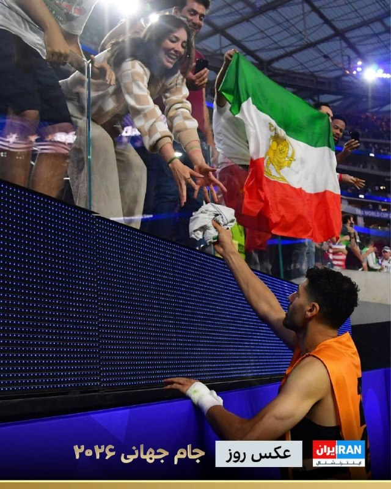

🔻تیم ملی فوتبال ایران در نخستین دیدار خود در جام جهانی ۲۰۲۶ برابر نیوزیلند به تساوی ۲ بر ۲ رسید. در این مسابقه، شماری از ایرانیان حاضر در ورزشگاه سوفای لس‌آنجلس با پرچم‌های شیروخورشید در ورزشگاه حضور داشتند و شعارهایی علیه جمهوری اسلامی سر دادند. همچنین هنگام پخش سرود جمهوری اسلامی، صدای اعتراض و سوت از سکوها شنیده شد.

🔹پس از پایان مسابقه، مهدی طارمی، کاپیتان تیم ملی ایران، به سمت تماشاگران حاضر در ورزشگاه رفت و پیراهن خود را به یکی از هواداران اهدا کرد.

@iranintltvsport

## IranIntlTV — post 342843

  <a href="telegram/content/IranIntlTV_342843_1781696536.mp4" target="_blank">🎬 Download video</a>

هم‌زمان با برگزاری مسابقات تیم فوتبال ایران در جام جهانی، بخشی از ایرانیان مقیم آمریکا با استفاده از این رویداد تلاش کرده‌اند صدای اعتراضات داخل کشور را بازتاب دهند. با وجود ممنوعیت فیفا برای ورود پرچم شیر و خورشید به استادیوم‌ها، گزارش‌ها و پیام‌های رسیده به ایران‌اینترنشنال از تلاش ایرانیان برای رساندن پیام‌های اعتراضی در حاشیه این بازی‌ها حکایت دارد.
جزییات بیشتر با سبا حیدرخانی، عضو تحریریه ایران‌اینترنشنال
@iranintltv

## IranIntlTV — post 342842

  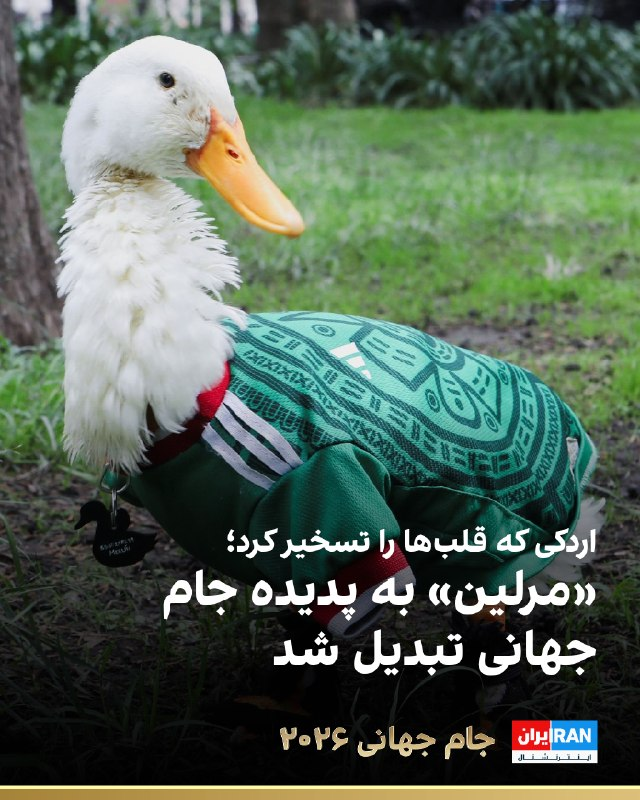

🔻یک اردک خانگی به نام «مرلین» که پیراهن کوچک تیم ملی مکزیک را به تن دارد، به یکی از پدیده‌های غیرمنتظره جام جهانی ۲۰۲۶ تبدیل شده و توجه هواداران فوتبال را به خود جلب کرده است.

🔹شهرت مرلین پس از پیروزی ۲ بر صفر مکزیک مقابل آفریقای جنوبی در دیدار افتتاحیه جام جهانی آغاز شد. در حالی که هواداران در خیابان‌های پایتخت برای گل‌های تیم ملی مکزیک جشن گرفته بودند، این اردک لباس‌پوشیده در میان جمعیت در خیابان معروف رفورما قدم می‌زد.

🔹رهگذران از این صحنه غیرمعمول فیلم گرفتند و تصاویر به سرعت در شبکه‌های اجتماعی فراگیر شد؛ تا جایی که برخی هواداران خواستار انتخاب مرلین به عنوان نماد غیررسمی مکزیک در جام جهانی شدند.

🔹کارلا گومز، صاحب مرلین که به همراه پسرش کریستین در خیابان‌های مکزیکوسیتی نوشیدنی می‌فروشد، گفت هرگز تصور نمی‌کرد اردکش به چنین شهرتی برسد.

🔹او گفت: «آن روز برای ما کاملا عادی بود. فکر می‌کردیم کسی متوجه ما نشده است. واقعا تصور نمی‌کردیم مرلین چنین استقبالی پیدا کند.»

🔹جزییات بیشتر را در سایت بخوانید

@iranintltvsport

## IranIntlTV — post 342841

  <a href="telegram/content/IranIntlTV_342841_1781696538.mp4" target="_blank">🎬 Download video</a>

دونالد ترامپ در حاشیه نشست گروه هفت در فرانسه از در راه بودن «توافقی بسیار قدرتمند» خبر داد و گفت بازارهای مالی نسبت به این روند واکنش مثبت نشان داده‌اند و شاخص‌ها در حال رشد هستند. او با تاکید بر بازگشت بازارها به شرایط پیشین، بار دیگر گفت هدف اصلی این است که ایران به سلاح هسته‌ای دست پیدا نکند و باید دید تهران در ادامه چه تصمیمی خواهد گرفت.
@iranintltv

## IranIntlTV — post 342839

  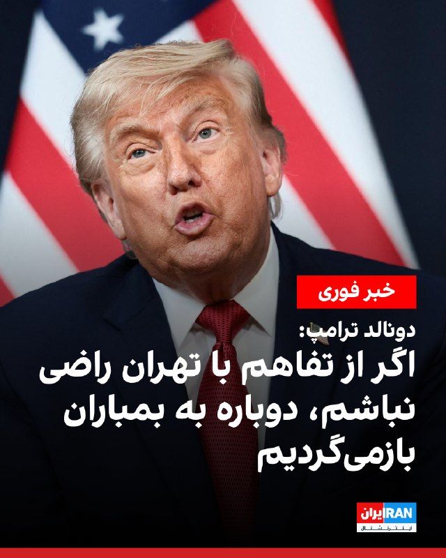

دونالد ترامپ، رییس‌جمهوری آمریکا، چهارشنبه ۲۷ خرداد در حاشیه نشست گروه هفت و در دیدار با عبدالفتاح السیسی، رییس‌جمهوری مصر، یادداشت تفاهم با جمهوری اسلامی را «بسیار قوی» توصیف کرد، اما هم‌زمان هشدار داد که این توافق هنوز نهایی نشده و در صورت نارضایتی واشینگتن، اقدام نظامی از سر گرفته خواهد شد.

ترامپ گفت: «این فقط یک یادداشت تفاهم است. اگر از آن راضی نباشم و رفتارشان را اصلاح نکنند، دوباره به سمت آنها شلیک می‌کنیم و روی سرشان بمب می‌اندازیم. چون به مدت ۴۷ سال بدرفتاری کرده‌اند.»

رییس‌جمهوری آمریکا همچنین مدعی شد این تفاهم بیش از ۹۹ درصد امکان دستیابی جمهوری اسلامی به سلاح هسته‌ای را از بین می‌برد و تاکید کرد که تهران هرگز به سلاح هسته‌ای دست نخواهد یافت.

ترامپ افزود یادداشت تفاهم شامل لغو فوری تحریم‌ها نیست، اما این موضوع در مراحل بعدی مذاکرات مورد بحث قرار خواهد گرفت.

او همچنین درباره وضعیت تنگه هرمز گفت این آبراه راهبردی هم‌اکنون به‌طور جزئی بازگشایی شده و انتظار می‌رود طی یک تا دو روز آینده به‌طور کامل باز شود.
https://iranintl.com/202606176397

## IranIntlTV — post 342838

  <a href="telegram/content/IranIntlTV_342838_1781696540.mp4" target="_blank">🎬 Download video</a>

یک شهروند با ارسال ویدیویی به ایران اینترنشنال گفت که پرداخت نشدن حقوق کارکنان غار علیصدر همدان، آنها را از تأمین مایحتاج زندگی ناتوان کرده و به اعتصاب کشانده است. او افزود که بخش گردشگری این میراث طبیعی ملی در حال تعطیل شدن است.

## IranIntlTV — post 342837

  

خبرگزاری رسمی لبنان گزارش داد در حملات هوایی روز چهارشنبه ۲۷ خرداد اسرائیل به مناطقی در جنوب لبنان، چندین نفر زخمی شدند. این حملات در حالی رخ داد که مقام‌های جمهوری اسلامی در روزهای اخیر بارها تاکید کرده‌اند حملات اسرائیل به لبنان نقض یادداشت تفاهم با آمریکا محسوب می‌شود.

خبرگزاری ملی لبنان اعلام کرد سه حمله هوایی به شهرهای منصوری و عازیه انجام شده و در پی آن چندین نفر زخمی شده‌اند. این خبرگزاری همچنین از حمله دیگری به منطقه براشیت خبر داد. ارتش اسرائیل تاکنون درباره این گزارش‌ها اظهار نظر نکرده است.

اندکی پس از این حملات، آژیرهای هشدار نفوذ احتمالی پهپاد از لبنان در شهرک مرزی زاریت در شمال اسرائیل به صدا درآمد، اما ارتش اسرائیل اعلام کرد این هشدار ناشی از «خطای تشخیص» بوده است.
https://iranintl.com/202606177467

## IranIntlTV — post 342836

  

خبرگزاری رسمی لبنان گزارش داد در حملات هوایی روز چهارشنبه ۲۷ خرداد اسرائیل به مناطقی در جنوب لبنان، چندین نفر زخمی شدند. این حملات در حالی رخ داد که مقام‌های جمهوری اسلامی در روزهای اخیر بارها تاکید کرده‌اند حملات اسرائیل به لبنان نقض یادداشت تفاهم با آمریکا محسوب می‌شود.

خبرگزاری ملی لبنان اعلام کرد سه حمله هوایی به شهرهای منصوری و عازیه انجام شده و در پی آن چندین نفر زخمی شده‌اند. این خبرگزاری همچنین از حمله دیگری به منطقه براشیت خبر داد. ارتش اسرائیل تاکنون درباره این گزارش‌ها اظهار نظر نکرده است.

اندکی پس از این حملات، آژیرهای هشدار نفوذ احتمالی پهپاد از لبنان در شهرک مرزی زاریت در شمال اسرائیل به صدا درآمد، اما ارتش اسرائیل اعلام کرد این هشدار ناشی از «خطای تشخیص» بوده است.
https://iranintl.com/202606177467

## IranIntlTV — post 342835

  <a href="telegram/content/IranIntlTV_342835_1781696543.mp4" target="_blank">🎬 Download video</a>

حسین شریعتمداری، مدیرمسئول کیهان، گفت: «درگیری جمهوری اسلامی و آمریکا ماهوی است و هنگامی پایان می‌پذیرد که یکی از دو طرف تغییر ماهیت بدهد.»
ارزیابی مرتضی کاظمیان، عضو تحریریه ایران‌اینترنشنال، از تفاهم تهران و واشینگتن و چشم‌انداز تحولات ایران
@iranintltv

## IranIntlTV — post 342834

  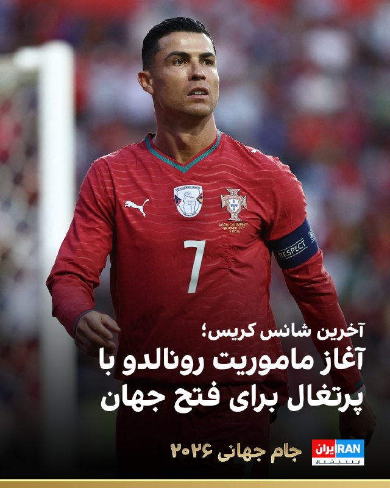

🔻تیم ملی پرتغال امیدوار است با آغاز جام جهانی ۲۰۲۶ به شش دهه انتظار برای فتح بزرگ‌ترین جام فوتبال جهان پایان دهد. شاگردان روبرتو مارتینس در نخستین دیدار خود در گروه K به مصاف جمهوری دموکراتیک کنگو می‌روند. اکنون کریستیانو رونالدو در آخرین حضور خود در این رقابت‌ها به دنبال فتح تنها جام مهمی است که هنوز در کارنامه‌اش دیده نمی‌شود.

🔹بهترین عملکرد پرتغال در جام جهانی به سال ۱۹۶۶ بازمی‌گردد؛ زمانی که با درخشش اوزه‌بیو در نخستین حضور خود به مقام سوم رسید. این تیم تنها یک بار دیگر، در سال ۲۰۰۶، به نیمه‌نهایی راه یافته و در جام جهانی ۲۰۲۲ قطر نیز پس از پیروزی ۶ بر یک مقابل سوئیس، در مرحله یک‌چهارم نهایی برابر مراکش حذف شد.

🔹نسل طلایی فوتبال پرتغال در سال‌های اخیر قهرمانی یورو ۲۰۱۶ و لیگ ملت‌های اروپا را تجربه کرده است، اما جام جهانی همچنان بزرگ‌ترین هدف دست‌نیافته این تیم به شمار می‌رود.

🔹جزییات بیشتر را در سایت بخوانید

@iranintltvsport

## IranIntlTV — post 342833

  <a href="telegram/content/IranIntlTV_342833_1781696545.mp4" target="_blank">🎬 Download video</a>

رییس سازمان نظام پرستاری می‌گوید پرستارانی که پیش‌تر برای مهاجرت اقدام می‌کردند، اکنون ترجیح می‌دهند بیکار بمانند یا به مشاغل غیرپرستاری روی بیاورند. به گفته احمد نجاتیان، شرایط نامناسب کاری و پرداخت‌ها عامل اصلی این وضعیت است.
گفت‌وگو با منصوره حسینی‌یگانه، عضو تحریریه ایران‌اینترنشنال
@iranintltv

## IranIntlTV — post 342832

  <a href="telegram/content/IranIntlTV_342832_1781696547.mp4" target="_blank">🎬 Download video</a>

یک هواپیمای کوچک مسافربری شامگاه سه‌شنبه ۲۶ خرداد در نزدیکی بزرگراه «لوپ ۲۰» در شهر لاریدوِ ایالت تگزاس سقوط کرد. پلیس اعلام کرد چند سرنشین از هواپیما خارج شده‌اند، اما شمار دقیق آن‌ها و وضعیت جسمی‌شان هنوز مشخص نیست. نیروهای امدادی و آتش‌نشانی با توجه به خطر نشت سوخت و مواد خطرناک، محل حادثه را مسدود کردند و تحقیقات درباره علت سقوط ادامه دارد.
@iranintltv

## IranIntlTV — post 342831

  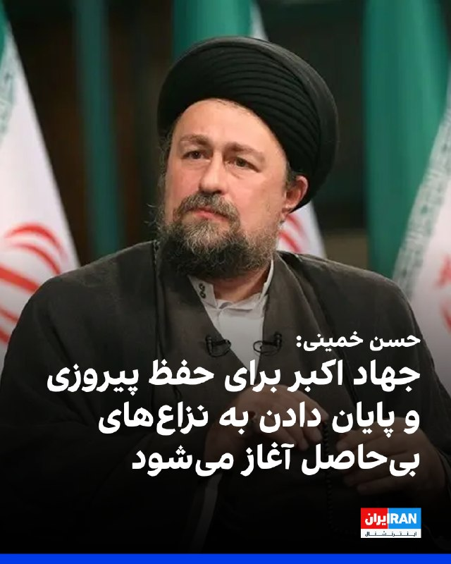

حسن خمینی، نوه روح‌الله خمینی، با اشاره به جنگ اسرائیل و آمریکا علیه جمهوری اسلامی، از آن با عنوان «جهاد اصغر» یاد کرد و گفت «جهاد اکبر» برای حفظ پیروزی و کنار گذاشتن نزاع‌های بی‌حاصل از امروز آغاز می‌شود.

او همچنین گفت جمهوری اسلامی با «تدبیر» از محاصره دریایی عبور کرد و افزود همین اقدام می‌تواند «غول‌های دنیا» را زمین بزند.

این اظهارات در حالی مطرح شد که یادداشت تفاهم میان واشینگتن و تهران، با وجود مخالفت شماری از مقام‌های جمهوری اسلامی از جمله برخی نمایندگان مجلس جمهوری اسلامی، روز یکشنبه ۲۴ خرداد به‌صورت الکترونیکی در اسلام‌آباد امضا شد. قرار است این تفاهم‌نامه روز جمعه نیز با حضور مقام‌های دو طرف در ژنو به‌صورت حضوری امضا شود.
https://iranintl.com/202606177440

## IranIntlTV — post 342830

  <a href="telegram/content/IranIntlTV_342830_1781696548.mp4" target="_blank">🎬 Download video</a>

در پی کشتار معترضان در جریان اعتراضات دی‌ماه، گروهی از زنان و مادران ایرانی در ایالت مریلند آمریکا یک سازمان غیرانتفاعی ایجاد کرده‌اند تا از ایرانیانی که پس از سرکوب‌ها موفق به خروج از کشور شده‌اند حمایت کنند. خدمات این نهاد شامل کمک‌های درمانی، مشاوره و حمایت‌های روانی برای آسیب‌دیدگان است.

گزارش اردوان روزبه، خبرنگار ایران‌اینترنشنال
@iranintltv

## IranIntlTV — post 342829

  <a href="telegram/content/IranIntlTV_342829_1781696550.mp4" target="_blank">🎬 Download video</a>

یک شهروند ساکن مشهد با ارسال ویدیویی به ایران اینترنشنال نشان داد که شامگاه ۲۶ خرداد و در پی توافق میان آمریکا و جمهوری اسلامی، یک جشن حکومتی در منطقه وکیل‌آباد برپا شده است. او گفت: «رهبر قاتل و فرماندهان حکومت کشته شدند و حالا با وجود امتیازدهی فراوان به آمریکا حامیان نظام ادعای پیروزی دارند. اینها نان خود را در خون مردم ایران می‌زنند.»

## IranIntlTV — post 342828

  <a href="telegram/content/IranIntlTV_342828_1781696552.mp4" target="_blank">🎬 Download video</a>

«۲۴ با #فرداد _فرحزاد»؛ دوشنبه تا جمعه ساعت ۲۲:۰۰ تهران

اخبار فوری، گزارش‌ و گفت‌وگوهای عمیق از ایران و جهان

در جریان بمانید!
@iranintltv

## IranIntlTV — post 342827

  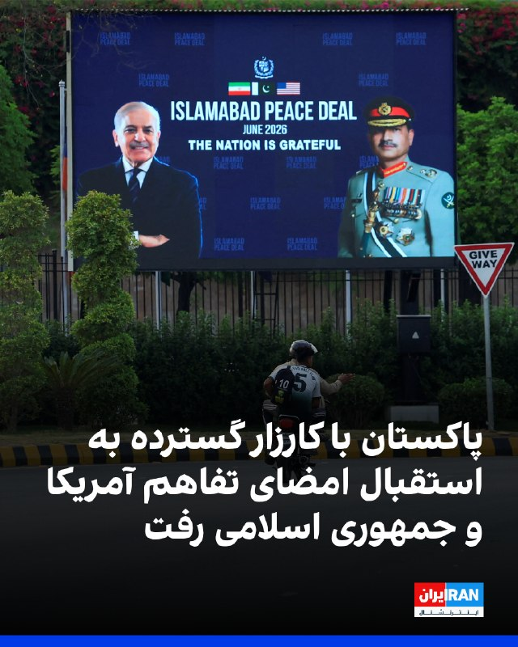

در آستانه دیدار مقام‌های آمریکا و جمهوری اسلامی برای امضای رسمی یادداشت تفاهم در سوئیس، خیابان‌ها و بزرگراه‌های اسلام‌آباد با بیلبوردها و نمایشگرهای دیجیتالی پوشیده شده که پیام‌هایی در حمایت از این توافق را به نمایش می‌گذارند.

این کارزار تبلیغاتی که از سوی اداره شهرداری کلان‌شهر اسلام‌آباد اجرا شده، نمایشگرهای عمومی و بیلبوردهای دیجیتال پایتخت پاکستان را به محلی برای انتشار پیام‌هایی درباره صلح، همبستگی و همکاری بین‌المللی تبدیل کرده است.
در این بیلبوردها شهباز شریف، نخست‌وزیر پاکستان، و عاصم منیر، رییس ستاد نیروهای دفاعی پاکستان دیده می‌شوند.

از این تفاهم با عنوان «توافق صلح» یاد می‌شود؛ توافقی که قرار است به‌طور رسمی در ژنو امضا شود و پاکستان خود را میزبان و تسهیل‌کننده اصلی روند دستیابی به آن معرفی می‌کند.

یکی از پیام‌های منتشرشده بر روی این نمایشگرها می‌گوید: «از اسلام‌آباد به جهان؛ پیامی از صلح، همبستگی و امید.»

https://iranintl.com/202606177182

## IranIntlTV — post 342826

  <a href="telegram/content/IranIntlTV_342826_1781696554.mp4" target="_blank">🎬 Download video</a>

سرخط خبرهای چهارشنبه ۲۷ خرداد
@iranintltv

## IranIntlTV — post 342825

  <a href="telegram/content/IranIntlTV_342825_1781696555.mp4" target="_blank">🎬 Download video</a>

پیام‌های رسیده به ایران‌اینترنشنال از تشدید مشکلات اقتصادی و معیشتی، تعطیلی کسب‌وکارها و افزایش هزینه‌های تولید حکایت دارد. یکی از کشاورزان با اشاره به رشد چندبرابری هزینه‌های کشاورزی گفته است برای تامین معاش ناچار به فروش نخلستان خود شده است.

جزییات بیشتر با لیلا سعادتی، عضو تحریریه ایران‌اینترنشنال
@iranintltv

## Shin_Persian — post 7118

  <a href="telegram/content/Shin_Persian_7118_1781696556.mp4" target="_blank">🎬 Download video</a>

ارتش دفاعی اسرائیل | IDF Farsi ✓ @IDFFarsi
Wed, 17 Jun 2026 11:19:09 UTC

Original text in comments
English translation in comments

𝕏 · @shin_persian

## Shin_Persian — post 7117

Shin ✓ @hey_itsmyturn
Wed, 17 Jun 2026 11:36:30 UTC

Trump called Soleimani an "Evil Genius" 🤣

ترجمه خودکار فارسی

ترامپ سلیمانی را یک «نابغه شرور» نامید 🤣

𝕏 · @shin_persian

## Shin_Persian — post 7116

Shin ✓ @hey_itsmyturn
Wed, 17 Jun 2026 11:01:45 UTC

Trump on Iran deal:
"No it's not final, it's a memorandum of understanding and If I don't like it, we will go back to shooting at them, dropping bombs on their head. If I don't like it, If they don't behave, we will go right back to dropping bombs right smacking in the middle of their head, cause they misbehaved for 47 years."

ترجمه خودکار فارسی

ترامپ درباره توافق با ایران:
«نه قطعی نیست، این یک یادداشت تفاهم است و اگر از آن خوشم نیاید، دوباره به سراغ شلیک به آن‌ها و ریختن بمب بر سرشان خواهیم رفت. اگر از آن خوشم نیاید، اگر رفتارشان را درست نکنند، مستقیماً به سراغ ریختن بمب درست وسط فرق سرشان برمی‌گردیم، چون آن‌ها برای ۴۷ سال بدرفتاری کرده‌اند.»

𝕏 · @shin_persian

## Shin_Persian — post 7114

  <a href="telegram/content/Shin_Persian_7114_1781696558.mp4" target="_blank">🎬 Download video</a>

Open Source Intel ✓ @Osint613
Wed, 17 Jun 2026 07:00:35 UTC

Lebanon report: Strikes reported in Nabatieh al-Fawqa and a drone strike in Ansariyeh in southern Lebanon.

ترجمه خودکار فارسی

گزارش لبنان: حملاتی در نبطیه الفوقا و یک حمله پهپادی در انصاریه در جنوب لبنان گزارش شده است.

𝕏 · @shin_persian

## ManotoTV — post 106109

  <a href="telegram/content/ManotoTV_106109_1781696559.mp4" target="_blank">🎬 Download video</a>

پشتِ توافق احتمالی آمریکا و جمهوری اسلامی، فقط بحث هسته‌ای نیست. مسئله اصلی مسیرهای مالی است، از نفت و دارایی‌های بلوکه‌شده تا صندوق سرمایه‌گذاری ۳۰۰ میلیارد دلاری.

## ManotoTV — post 106108

  <a href="telegram/content/ManotoTV_106108_1781696560.mp4" target="_blank">🎬 Download video</a>

بخشی از یک گفت‌وگوی اختصاصی و کمتر دیده‌ شده میان خبرنگار رادیو و تلویزیون ملی ایران در لندن و رئیس اداره اطلاعات و سخنگوی سفارت اتحادجماهیر شوروی.
این مصاحبه در اوج تنش‌های جنگ سرد و پس از اخراج دیپلمات‌های شوروی از بریتانیا انجام شده و دیدگاه رسمی شوروی درباره این بحران را روایت می‌کند.
برای تماشای نسخه کامل این مصاحبه و صدها فیلم آرشیوی نایاب دیگر، کانال یوتیوب Manoto را دنبال کنید.

## FarsiVOA — post 221010

  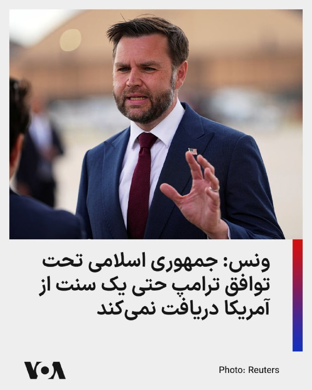

معاون رئیس‌جمهوری آمریکا می‌گوید در چارچوب توافق دولت ترامپ با جمهوری اسلامی، «تحت هیچ شرایطی» حتی یک سنت از پول آمریکا به این حکومت پرداخت نخواهد شد.

جی‌دی ونس این سخنان را در برنامه «د فایو» شبکه فاکس‌نیوز و در پاسخ به انتقاد جسیکا تارلو، تحلیلگر دموکرات این برنامه، بیان کرد.

او گفت اگر جمهوری اسلامی با جهان تعامل کند، آمریکا می‌تواند نحوه ارتباط اقتصاد جهانی با ایران را تغییر دهد؛ اما اگر چنین نکند، از هیچ‌یک از مزایای توافق برخوردار نخواهد شد.

ونس همچنین گفت برنامه هسته‌ای، توان نظامی، برنامه موشکی و پایه صنعتی جمهوری اسلامی پیش‌تر «نابود» شده و به گفته او، آمریکا مسیر خاورمیانه را تغییر داده است.

او مزایای احتمالی توافق را امری اضافه بر این دستاوردها توصیف کرد و گفت پایبندی یا عدم پایبندی جمهوری اسلامی اصل این دستاوردها را تغییر نمی‌دهد.
@FarsiVOA

## FarsiVOA — post 221009

  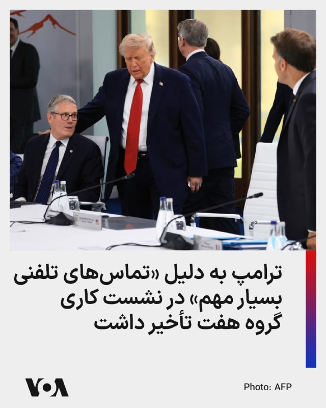

پس از آنکه تأخیر پرزیدنت ترامپ در اولین نشست کاری رهبران گروه هفت در روز چهارشنبه خبرساز شد، یک مقام ارشد کاخ سفید گفت که این تأخیر به دلیل تماس‌های تلفنی بسیار مهم رخ داده است.

دونالد ترامپ روز چهارشنبه تقریباً یک ساعت دیرتر از برنامه به اولین جلسه کاری گروه هفت رسید، جلسه‌ای که بدون حضور او آغاز شده بود.

در این زمینه به گزارش ان‌بی‌سی‌نیوز یک مقام ارشد کاخ سفید در پاسخ به سؤالی در مورد تأخیر آقای ترامپ گفت که او «در حال انجام تماس‌های بسیار مهمی با افرادی در آمریکا بود».

جزئیات بیشتری در این زمینه منتشر نشده است.
@FarsiVOA

## FarsiVOA — post 221008

🔺اعتراض در لس‌آنجلس، تعقیب قضایی در تهران؛ سایه سرکوب فرامرزی بر جام جهانی

▪️نورنیوز مدعی شد بخشی از افرادی که در جریان دیدار تیم‌های ایران و نیوزیلند در جام جهانی ۲۰۲۶ در آمریکا، به گفته این رسانه، با «سردادن شعارهای توهین‌آمیز»، «ایجاد درگیری» و «هتک حرمت نمادهای ملی» در برگزاری مسابقه اخلال کرده بودند، شناسایی شده‌اند.

▪️این رسانه نزدیک به ساختارهای حکومتی و امنیتی نوشت پرونده این افراد برای پیگیری حقوقی و قضایی در حال تکمیل است و محدودیت‌هایی از جمله بررسی توقیف دارایی‌های مرتبط با آنان در دستور کار قرار گرفته است.

▪️نورنیوز همچنین تهدید کرد در ادامه مسابقات جام جهانی، هرگونه اقدام علیه «منافع کشور»، با شناسایی، تعقیب قضایی و «اشد مجازات‌های مقرر» روبه‌رو خواهد شد.

⬇️ بیشتر بخوانید:
https://ir.voanews.com/a/protest-in-los-angeles-prosecution-in-tehran-shadow-of-cross-border-repression-over-world-cup/8161827.html

## FarsiVOA — post 221007

🔺امارات می‌گوید وابستگی به تنگه هرمز را به «صفر» ‌می‌رساند

▪️امارات متحده عربی می‌گوید در نظر دارد وابستگی تجاری خود به تنگه هرمز را به «صفر» برساند.

▪️این کشور پیشتر خط لوله حبشان-‌فجیره با ظرفیت انتقال روزانه ۱.۹ میلیون بشکه نفت را برای دور زدن تنگه هرمز راه‌اندازی کرده بود و اخیراً توسعه خط لوله‌ جدیدی به همان ظرفیت را شتاب بخشیده تا در سال آینده به بهره‌برداری برساند.

▪️امارات ماه گذشته همچنین از بررسی طرح توسعه خط لوله نفتی سوم نیز خبر داد.

▪️ظرفیت تولید نفت امارات روزانه نزدیک ۵ میلیون بشکه است و پیش از انسداد تنگه هرمز توسط جمهوری اسلامی، روزانه ۳.۵ میلیون بشکه تولید داشت.

⬇️ بیشتر بخوانید:
https://ir.voanews.com/a/uae-moves-to-cut-dependency-on-strait-of-hormuz-to-zero/8161826.html

## FarsiVOA — post 221006

  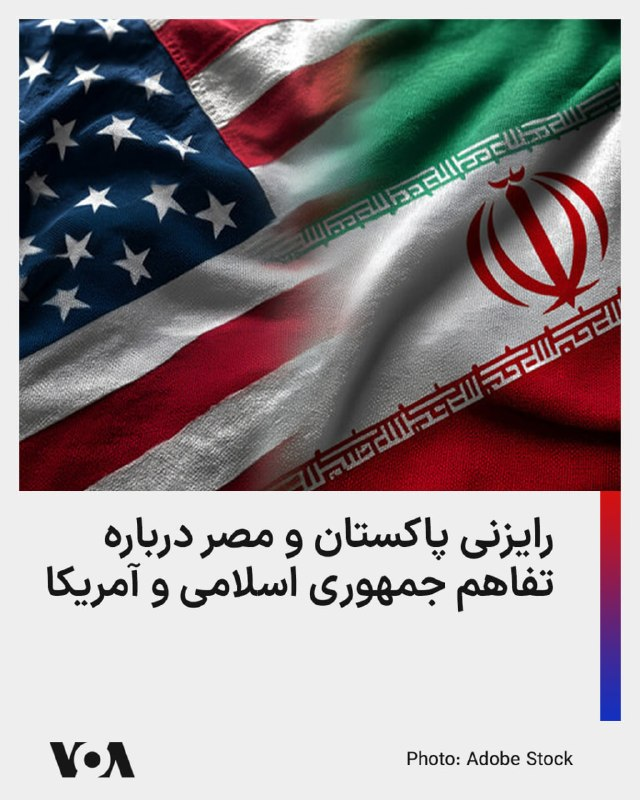

محمد اسحاق‌دار وزیر امور خارجه پاکستان و بدر عبدالعاطی، وزیر امور خارجه مصر، درباره آخرین تحولات منطقه‌ای به ویژه تفاهم‌ جمهوری اسلامی و آمریکا بحث و تبادل نظر کردند.

این دو دیپلمات ارشد، روز چهارشنبه ۲۷ خردادماه، در یک تماس تلفنی، دیدگاه‌های خود را درباره این موضوع و به ویژه امضای قریب‌الوقوع یک یادداشت تفاهم در « بورگن‌اشتوک سوئیس» مطرح کردند.

همچنین طرفین درباره نشست آتی چهار کشور مصر، پاکستان، ترکیه و عربستان طی روزهای آینده مذاکره کردند.

این چهار کشور نقش مهمی در برگزاری نشست اسلام‌آباد، پیش از برقراری آتش‌بس میان آمریکا و جمهوری اسلامی داشتند و قرار است نشست آتی خود را به میزبانی قاهره برگزار کنند.
@FarsiVOA

## FarsiVOA — post 221005

  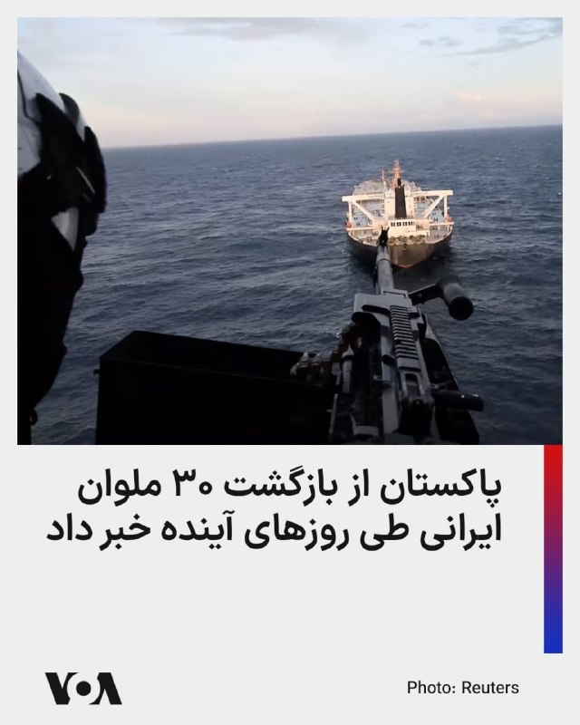

محمد اسحاق‌دار، وزیر امور خارجه پاکستان، از تلاش اسلام‌آباد برای بازگرداندن ۳۰ ملوان ایرانی خبر داد و اعلام کرد که آنها طی روزهای آینده از طریق کراچی به ایران باز می‌گردند.

هشت نفر از این ملوانان ماهی‌گیرانی هستند که توسط یک کشتی بریتانیایی نجات یافتند، اما ۲۲ نفر دیگر خدمه کشتی «ام‌تی داوینا» هستند.

این کشتی که تحت تحریم‌ قرار داشت، روز ۱۵ خردادماه، توسط نیروهای دریایی ایالات متحده و در جریان یک عملیات دریایی در اقیانوس هند توقیف شده است.

وزیر خارجه پاکستان یادآور شد که اسلام‌آباد در هماهنگی نزدیک با مقامات جمهوری اسلامی، ایالات متحده و بریتانیا قرار دارد تا عبور امن و بازگشت این افراد تضمین شود.
@FarsiVOA

## FarsiVOA — post 221004

🔺روته: متحدان اروپایی سهم خود در نیروهای بحران ناتو را افزایش داده‌اند

▪️دبیرکل ناتو، روز چهارشنبه گفت متحدان اروپایی پس از کاهش سهم آمریکا، تعهدات خود را برای تأمین نیروهای آماده در زمان بحران افزایش داده‌اند.

▪️بر اساس گزارش رویترز مارک روته افزود کشورهای اروپایی عضو ناتو برای جبران بخشی از کاهش مشارکت آمریکا، نیروهای بیشتری را در چارچوب «مدل نیروی ناتو» در اختیار این ائتلاف قرار داده‌اند.

▪️این مدل، سازوکاری است که بر اساس آن اعضا مشخص می‌کنند در صورت بروز بحران بزرگ یا حمله نظامی به یک کشور عضو، چه نیروها و قابلیت‌هایی می‌توانند فعال شوند.

▪️آمریکا پیش‌تر به متحدان خود اطلاع داده بود که قصد دارد بخشی از توانایی‌های نظامی متعهد به ناتو در زمان بحران را کاهش دهد.

⬇️ بیشتر بخوانید:
https://ir.voanews.com/a/european-allies-have-increased-pledges-for-nato-crisis-forces-rutte-says/8161824.html

## FarsiVOA — post 221003

🔺ترامپ از بازگشت تحریم‌ نفتی روسیه در آینده نزدیک خبر داد

▪️روزنامه گاردین گزارش داد دونالد ترامپ، رئیس‌جمهوری آمریکا، همزمان با بازگشت موضوع اوکراین به دستور کار اصلی نشست گروه هفت، گفته است واشنگتن می‌تواند به‌زودی تحریم‌ها علیه محموله‌های نفتی روسیه را دوباره اعمال کند.

▪️ترامپ در حاشیه نشست گروه هفت در اویان‌له‌بن فرانسه گفت با بازگشت جریان نفت از مسیر تنگه هرمز، آمریکا در موقعیتی قرار گرفته که بتواند معافیت تحریمی مربوط به نفت روسیه را پایان دهد. او گفت: «به‌زودی می‌توانیم این کار را انجام دهیم، چون نفت حالا در جریان است.»

▪️این معافیت به‌طور موقت و در جریان جنگ آمریکا و جمهوری اسلامی اعمال شده بود تا فشار بر قیمت جهانی نفت کاهش یابد.

⬇️ بیشتر بخوانید:
https://ir.voanews.com/a/ukraine-war-briefing-sanctions-waiver-on-russian-oil-could-end-soon-trump-suggests/8161823.html

## FarsiVOA — post 221002

🔺اسموتریچ: اسرائیل حضور خود در جنوب لبنان را عمیق‌تر می‌کند

▪️وزیر دارایی اسرائیل و وزیر در وزارت دفاع این کشور، گفته است اسرائیل از جنوب لبنان عقب‌نشینی نخواهد کرد و حضور نظامی خود را در آنجا گسترش می‌دهد.

▪️او که از چهره‌های راست افراطی در ائتلاف بنیامین نتانیاهو است، گفت اسرائیل «در جنوب لبنان باقی خواهد ماند» و به گفته او، حضور خود را در آنجا «عمیق‌تر» خواهد کرد.

▪️او افزود نیروهای اسرائیلی برای مدتی طولانی در عمق «هشت، ۹ یا ۱۰ کیلومتری» جنوب لبنان خواهند ماند و دستور به واحدها ادامه «رفع هرگونه تهدید» است.

▪️وزیر دارایی اسرائیل همچنین گفت این کشور در لبنان «آزادی عمل کامل» دارد و تا زمانی که حزب‌الله خلع سلاح نشود، عقب‌نشینی در کار نخواهد بود.

⬇️ بیشتر بخوانید:
https://ir.voanews.com/a/finance-minister-smotrich-says-israel-to-deepen-its-presence-in-south-lebanon/8161822.html

## FarsiVOA — post 221001

  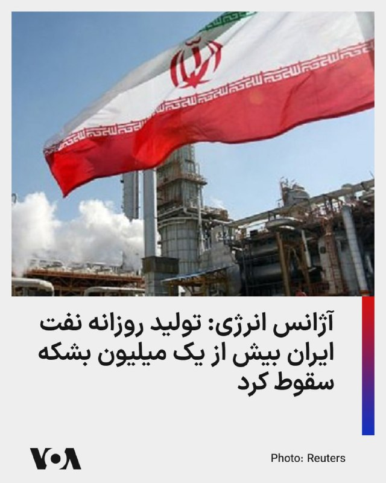

آژانس بین‌المللی انرژی می‌گوید تولید روزانه نفت ایران در ماه گذشته بیش از یک میلیون بشکه سقوط کرده است.

بر اساس این گزارش، تولید روزانه نفت ایران از ۳ میلیون و ۳۶۰ هزار بشکه در ماه آوریل به ۲.۳ میلیون بشکه در ماه مه کاهش یافته است.

ایالات متحده از نیمه آوریل محاصره دریایی جمهوری اسلامی را آغاز کرد و صادرات نفت ایران کلاً قطع شد. طی روزهای گذشته با لغو محاصره دریایی، دوباره ایران صادرات نفت را آغاز کرده است.

⬇️ بیشتر بخوانید:
https://ir.voanews.com/a/8161831.html

## FarsiVOA — post 221000

🔺سهم اقتصاد دیجیتال از تولید ناخالص ملی ایران: کمتر از نصف میانگین جهانی

▪️معاون وزیر ارتباطات ایران مدعی افزایش سهم اقتصاد دیجیتال از تولید ناخالص ملی از ۴.۴۹ درصد در سال ۱۴۰۰ به ۷.۱۴ درصد در سال ۱۴۰۳ شده است.

▪️احسان چیت‌ساز بدون اشاره به محدودیت‌های گسترده اعمال شده بر اینترنت گفته است شکاف میان رشد تقاضا و عقب‌ماندگی عرضه زیرساختی می‌تواند در آینده به یکی از محدودیت‌های اصلی اقتصاد دیجیتال ایران تبدیل شود.

▪️حتی با فرض صحت این ادعا، باز هم سهم اقتصاد دیجیتال از کل اقتصاد کشور کمتر از نصف میانگین جهانی است.

▪️افزایش سهم اقتصاد دیجیتال از تولید ناخالص ملی ایران به کمی بالاتر از ۷ درصد در حالی است که متوسط سهم اقتصاد دیجیتال از اقتصاد جهانی در سال گذشته میلادی ۱۷.۳ درصد بود.

⬇️ بیشتر بخوانید:
https://ir.voanews.com/a/share-of-digital-economy-in-iran-gdp-less-than-half-the-global-average/8161821.html

## FarsiVOA — post 220999

  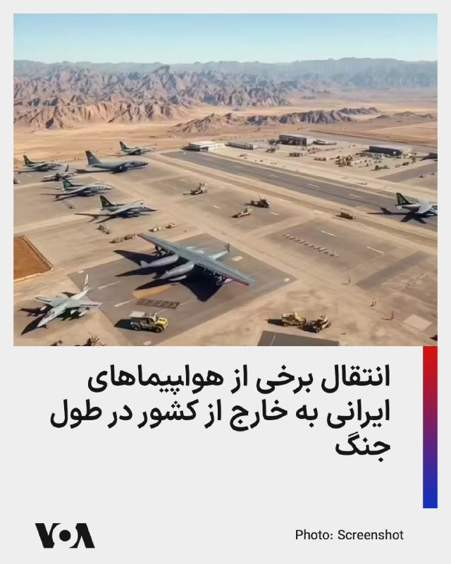

رئیس سازمان هواپیمایی کشوری، از صدور ۳۶ مجوز انتقال هواپیماهای ایرانی به فرودگاه‌های خارج از کشور در طول جنگ ۴۰ روزه خبر داد. او به کشورهای مقصد این هواپیماها اشاره‌ای نکرده است.

ابوذر شیرودی همچنین اعلام کرد که در این مدت ۱۳۳ هواپ‍یمای مستقر در دو فرودگاه تهران با هماهنگی ستاد کل نیروهای مسلح به فرودگاه‌های امن منتقل شدند.

تاکنون سازمان هوا‍پیمایی کشوری، آمار خسارات ناشی از جنگ در این حوزه منتشر نکرده است. اما خبرگزاری ایلنا در ۲۳ فروردین ماه، بر اساس گزارش‌های غیر رسمی از انهدام کامل دست‌کم ۲۰ فرورند هواپیمای مسافرتی و آسیب به ۴۰ فروند هواپیمای دیگر خبر داده بود.

مقصود اسعدی سامانی، دبیر انجمن شرکت‌های هواپیمایی کشور نیز از ۳۰ هزار میلیارد تومان خسارت عدم‌النفع به شرکت‌های هواپیمایی در ایام جنگ خبر داده است.
@FarsiVOA

## FarsiVOA — post 220998

🔺استارمر شلیک هشدار ناو روسی به قایق بریتانیایی را «نگران‌کننده» خواند

▪️نخست‌وزیر بریتانیا، شلیک هشدار یک ناو روسی به نزدیکی یک قایق بادبانی غیرنظامی با پرچم بریتانیا در کانال مانش را «بی‌ملاحظه و عمیقاً نگران‌کننده» خواند.

▪️کی‌یر استارمر گفت ارزیابی وزارت دفاع بریتانیا این است که ناو روسی در حال رانش بوده و تیراندازی انجام‌شده، شلیک هشدار بوده است.

▪️بر اساس اعلام وزارتخانه‌های دفاع بریتانیا و روسیه، این حادثه روز سه‌شنبه رخ داد.

▪️وزارت دفاع روسیه گفت ناو «آدمیرال گریگوروویچ» پس از ناکامی در برقراری تماس رادیویی با قایق، که به گفته مسکو در مسیر برخورد قرار داشت، چند شلیک هشدار از جمله با سلاح سبک انجام داد و قایق سپس مسیر خود را تغییر داد.

⬇️ بیشتر بخوانید:
https://ir.voanews.com/a/starmer-calls-channel-incident-involving-russian-warship-reckless/8161820.html

## FarsiVOA — post 220997

  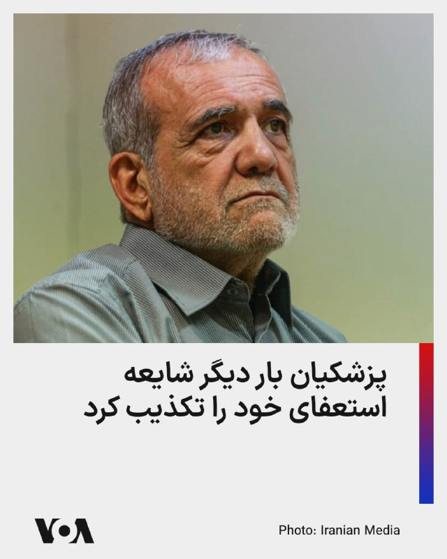

مسعود پزشکیان، رئیس جمهوری دولت جمهوری اسلامی، بار دیگر «شایعات متعدد درباره استعفا» خود را تکذیب کرد.

پزشکیان در دیدار با فعالان رسانه‌ای مدعی شده که «هستم و لازم باشد دوباره هم می‌آیم». او در پاسخ به پرسش یکی از خبرنگاران، مدعی شده که برای ماندن در مسند ریاست جمهوری هیچ تردیدی ندارد.

طی ماه‌های اخیر گمانه‌زنی‌های متعددی درباره احتمال کناره‌گیری مسعود پزشکیان به دلیل ناتوانی دولت در اداره کشور و بی‌اطلاعی رئيس‌جمهور از تصمیمات کلان کشور مطرح شده بود.

از زمان روی کار آمدن پزشکیان، جمهوری اسلامی درگیر دو جنگ و تورم ۸۴ درصدی شده است.
@FarsiVOA

## FarsiVOA — post 220996

  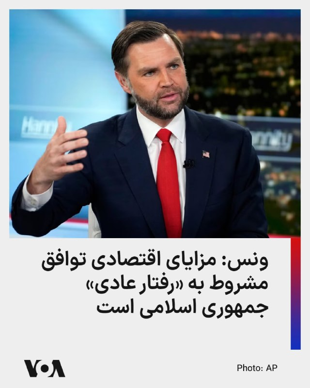

جی‌دی ونس، معاون رئیس‌جمهوری آمریکا، در مصاحبه با فاکس‌نیوز دیجیتال از چارچوب توافق دولت ترامپ با جمهوری اسلامی دفاع کرد و گفت هرگونه منفعت اقتصادی برای جمهوری اسلامی به تغییر رفتار این رژیم بستگی دارد.

ونس گفت جمهوری اسلامی وارد یک دوره آزمایشی ۶۰ روزه می‌شود و باید با عمل، نه وعده، نشان دهد دنبال سلاح هسته‌ای نیست، اجازه بازگشت بازرسان را می‌دهد، ذخایر اورانیوم غنی‌شده را از بین می‌برد و از حمایت از گروه‌های تروریستی دست می‌کشد.

او تأکید کرد اگر جمهوری اسلامی مانند «یک کشور عادی» رفتار کند، آمریکا می‌تواند رابطه خود را تغییر دهد و زمینه بازگشت آن به اقتصاد جهانی را فراهم کند.

ونس همچنین گفت هیچ پولی از مالیات‌دهندگان آمریکایی پرداخت نخواهد شد و مزایا فقط در صورت اجرای تعهدات داده می‌شود.

⬇️ بیشتر بخوانید:
https://ir.voanews.com/a/vance-benefits-of-agreement-conditional-on-normal-behavior-of-islamic-republic/8161819.html

## FarsiVOA — post 220995

  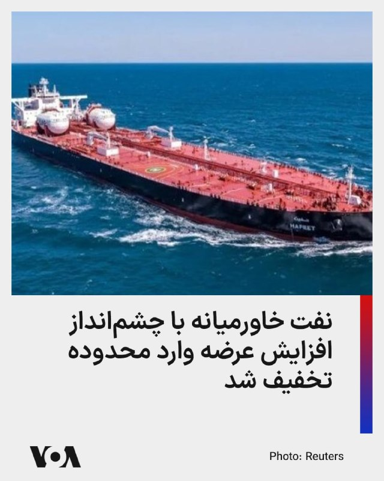

رویترز گزارش داد بازار نفت خاورمیانه پس از چارچوب توافق آمریکا و جمهوری اسلامی برای بازگشایی تنگه هرمز، به‌شدت تضعیف شده و برخی شاخص‌های اصلی منطقه وارد محدوده تخفیف شده‌اند.

بر اساس داده‌های رویترز، پریمیوم شاخص دبی نسبت به سوآپ‌ها روز سه‌شنبه به تخفیف ۴۶ سنتی رسید؛ نخستین ساختار کونتانگو از ژانویه. شاخص‌های عمان و موربان نیز به‌ترتیب با تخفیف ۶۷ و ۴۹ سنت معامله شدند.

کونتانگو به معنای ارزان‌تر بودن محموله‌های فوری نسبت به تحویل‌های بعدی است و معمولاً نشانه افزایش عرضه کوتاه‌مدت تلقی می‌شود.

تحلیلگران می‌گویند بازگشایی رسمی هرمز می‌تواند میلیون‌ها بشکه نفتی را که در ذخیره‌سازی شناور مانده آزاد کند و فشار نزولی بر قیمت نفت منطقه وارد آورد.

در بازار جهانی، افت نفت ادامه یافت و برنت زیر ۸۰ دلار رفت؛ موضوعی که نگرانی تورمی را کاهش داد و بازده اوراق را پایین آورد.
@FarsiVOA

## FarsiVOA — post 220994

  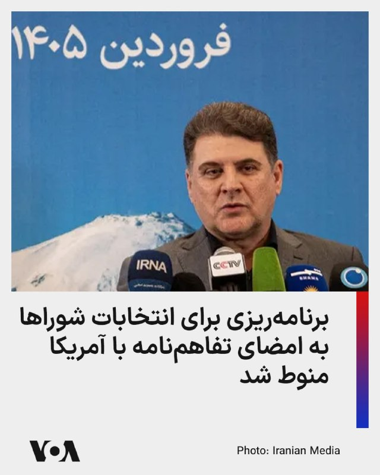

رئیس ستاد انتخابات کشور، اعلام کرد که در صورت امضای تفاهم‌‌نامه با آمریکا در روز جمعه ۲۹ خردادماه، تلاش می‌شود تا در فاصله ۶۰ روزه، انتخابات شوراها برگزار شود.

علی زینی‌‌وند، در گفت‌‌وگویی با صداوسیمای جمهوری اسلامی، با اشاره به عدم برگزاری انتخابات به دلیل شرایط جنگی، اعلام که شورای امنیت ملی، مجوز برگزاری انتخابات را دو ماه پس از پایان جنگ، صادر کرده است.

او یادآور شد که با وجود آمادگی‌های لازم برای برگزاری این دوره از انتخابات، تحقق آن به بررسی‌های بیشتر و تصمیم‌‌گیری‌ نهادهای بالادستی نیاز دارد.

پیشتر قرار بود که هفتمین دوره انتخابات شوراها در روز ۱۱ اردیبهشت برگزار شود.
@FarsiVOA

## FarsiVOA — post 220993

  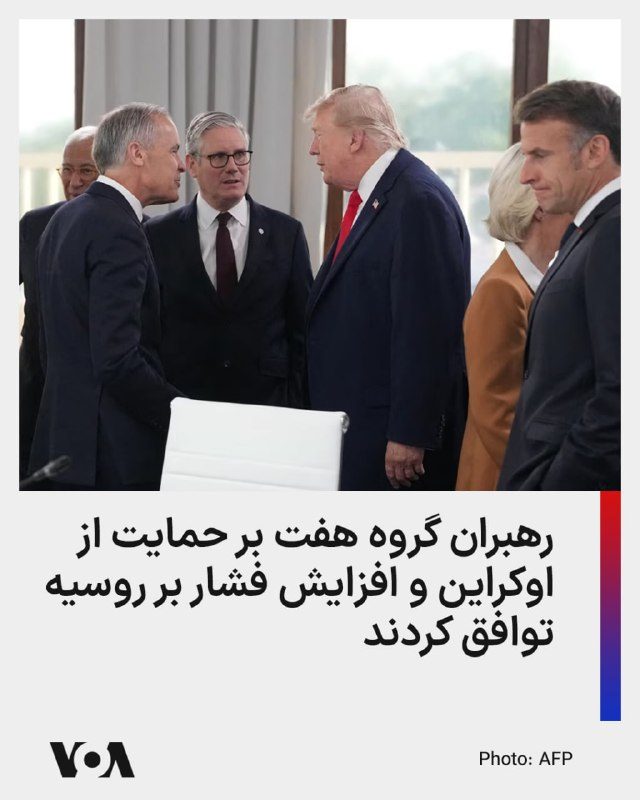

رویترز گزارش داد رهبران کشورهای گروه هفت روز چهارشنبه در بیانیه‌ای مشترک اعلام کردند در حمایت از اوکراین، از جمله تمامیت ارضی این کشور، متحد هستند و برای افزایش فشار بر اقتصاد جنگی روسیه توافق کرده‌اند.

رهبران گروه هفت که برای نشست سران در اویان-له-بن فرانسه گرد آمده‌اند، گفتند در این چارچوب تحریم‌ها علیه روسیه، از جمله تحریم‌های مربوط به بخش‌های نفت و گاز، را تقویت خواهند کرد.

رویترز نوشت این موضع در بیانیه‌ای مشترک مطرح شد که هدف آن نشان دادن وحدت کشورهای گروه هفت در برابر مسکو است.

در بخش جداگانه‌ای از بیانیه، رهبران گروه هفت از توافق میان آمریکا و جمهوری اسلامی استقبال کردند و گفتند آماده‌اند در اجرای آن مشارکت کنند.

آنها همچنین اعلام کردند برای کاهش آسیب‌پذیری بازارهای جهانی، تلاش‌ها برای متنوع‌سازی مسیرهای تأمین انرژی، کاهش وابستگی به تنگه هرمز و افزایش ذخایر انرژی را پیگیری خواهند کرد.
@FarsiVOA

## FarsiVOA — post 220992

  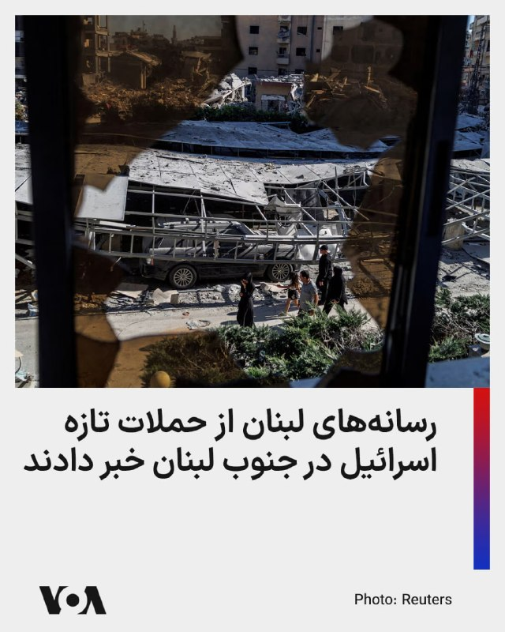

رسانه‌های لبنان گزارش دادند که ارتش اسرائیل حملات تازه‌ای را در جنوب لبنان انجام داده است.

بر اساس این گزارش،خبرگزاری ملی لبنان اعلام کرد جنگنده‌های اسرائیلی منطقه نبطیه‌الفوقا در جنوب لبنان را هدف قرار دادند و یک حمله پهپادی نیز روستای انصاریه، در ساحل جنوب لبنان، را هدف گرفت.

تایمز اسرائیل نوشت ارتش اسرائیل تا زمان انتشار این گزارش درباره این حملات اظهار نظر نکرده است.

این گزارش در حالی منتشر می‌شود که در روزهای گذشته نیز جنوب لبنان شاهد حملات هوایی و پهپادی اسرائیل بوده است.

رویترز روز سه‌شنبه به نقل از خبرگزاری ملی لبنان گزارش داده بود حملات پهپادی اسرائیل به سه خودرو در جنوب لبنان دست‌کم چهار کشته و شماری زخمی بر جا گذاشت.

جزئیات بیشتری درباره تلفات احتمالی حملات تازه، هدف‌های مورد اصابت، یا واکنش رسمی ارتش اسرائیل اعلام نشده است.
@FarsiVOA

## DW_Farsi — post 126094

  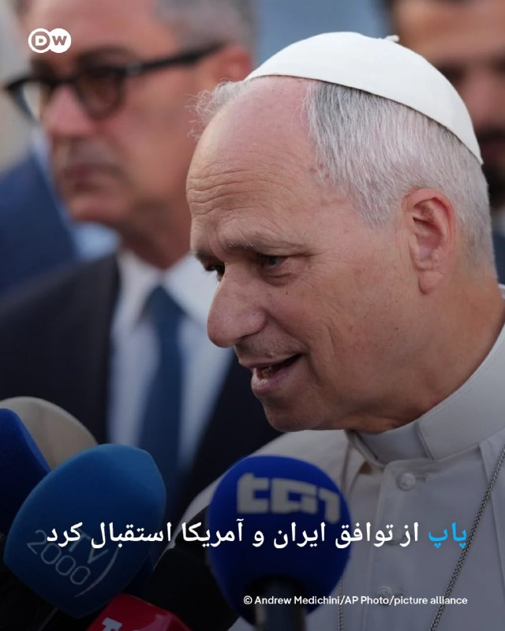

🔶 پاپ از توافق ایران و آمریکا استقبال کرد

پاپ لئو چهاردهم، رهبر کاتولیک‌های جهان روز چهارشنبه ۲۷ خرداد (۱۷ ژوئن) از توافق میان ایران و ایالات متحده برای پایان دادن به جنگ خاورمیانه استقبال کرد و آن را نتیجه "تلاش‌های امیدوارکننده در مسیر گفت‌وگو و مذاکره" دانست.

پاپ در جریان دیدار هفتگی خود در واتیکان، ضمن ابراز قدردانی از کسانی که در روند مذاکرات نقش داشتند، ابراز امیدواری کرد که این توافق بتواند "با تقویت اعتماد متقابل، امنیت و ثبات، مسیرهای گفت‌وگو و همکاری میان ملت‌های خاورمیانهرا گسترش دهد".

پاپ همچنین با اشاره به جنگ اوکراین، از اخبار "دردناک" این درگیری ابراز نگرانی کرد و برای دستیابی به "صلحی عادلانه و پایدار از طریق گفت‌وگو" دعا کرد.

رهبر کاتولیک‌های جهان با اشاره به تلفات گسترده جنگ اوکراین گفت: «بسیاری از غیرنظامیان بی‌گناه، امدادگران و همچنین کلیساها و میراث فرهنگی در آتش جنگ نابود شده‌اند.»

پاپ لئو در پایان افزود که در کنار خانواده‌های داغدار، مجروحان و کسانی است که "در دل خشونت همچنان با شجاعت به خدمت ادامه می‌دهند".

@dw_farsi

## DW_Farsi — post 126093

🔶 بلومبرگ "سند ۱۴ماده‌ای تفاهم‌" آمریکا و ایران را منتشر کرد

قرار است که ایالات متحده آمریکا و ایران در روز جمعه ۱۹ ژوئن در سوئیس به‌طور رسمی یک یادداشت تفاهم را امضا کنند؛ اقدامی که راه را برای ۶۰ روز مذاکرات با هدف پایان دائمی جنگ میان دو کشور و خاتمه دادن به اعمال محدودیت‌های سخت‌گیرانه جدید بر برنامه هسته‌ای ایران را هموار خواهد کرد.

به گزارش رسانه‌ها، محمدباقر قالیباف، مسئول هیات مذاکره‌کننده ایران و جی‌دی ونس، معاون رئیس جمهور آمریکا برای امضای این تفاهم‌نامه در سوئیس حضور خواهند داشت.

هنوز سندی رسمی از سوی ایران و آمریکا درباره مفاد تفاهم‌نامه منتشر نشده است.

متن زیر، پیش‌نویس ۱۴ ماده‌ای این یادداشت تفاهم است که به رؤیت خبرگزاری بلومبرگ رسیده است.

@dw_farsi

## DW_Farsi — post 126092

  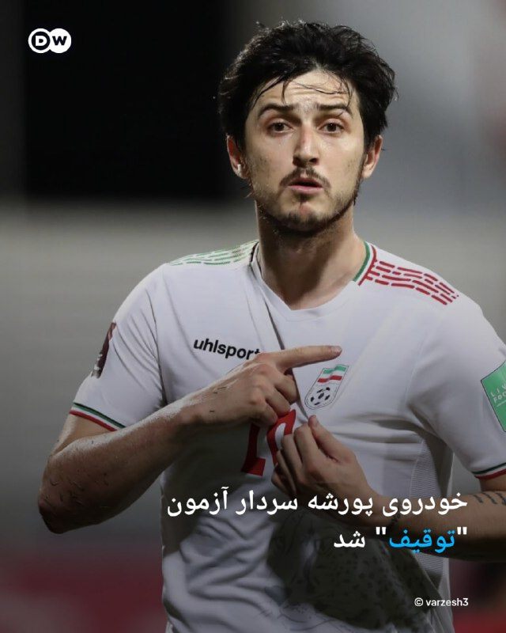

🔶 خودروی پورشه سردار آزمون "توقیف" شد

اکبر نجفی، فرمانده انتظامی شهرستان کرمان از توقیف خودروی پورشه سردار آزمون، فوتبالیست مطرح ایرانی خبر داد.

این مقام انتظامی ادعا کرد این خودرو در فهرست توقیفی‌ها قرار داشته و توسط "گشت‌های محسوس و نامحسوس یگان امداد" شناسایی و پس از طی مراحل قانونی به پارکینگ منتقل شد.

سردار آزمون چندی پیش در مصاحبه با وبسایت "ورش سه" اعلام کرده است که حرف برای گفتن زیاد دارد، اما فعلا هدفش حمایت از تیم ملی فوتبال ایران است.

او در این مصاحبه تلفنی برای هم‌بازی‌های خود آرزوی موفقیت کرد.

@dw_farsi

## DW_Farsi — post 126090

🔶 مشکل ویزای آمریکای مهدی ترابی، مهاجم تیم ملی ایران، رفع شد

فدراسیون فوتبال ایران روز سه‌شنبه ۲۶ خردادماه (۱۶ ژوئن) اعلام کرد که مهدی ترابی، مهاجم تیم ملی ایران، پس از حل مشکل ویزای خود می‌تواند به حضور در جام جهانی ادامه دهد. با این حال، ایالات متحده بار دیگر تأکید کرده است که اعضای تیم باید پس از هر مسابقه خاک آمریکا را ترک کنند.

پیش‌تر ویزای مهدی ترابی، مهاجم تیم ملی ایران پس از نخستین ورودش به خاک آمریکا برای دیدار تیم ایران در جام جهانی مقابل نیوزیلند در روز دوشنبه ۱۵ ژوئن در لس‌آنجلس، نامعتبر اعلام شده بود. این دیدار با نتیجه تساوی ۲ بر ۲ پایان یافت.

در حالی که سایر بازیکنان تیم ملی ایران ویزاهایی با امکان ورود متعدد به آمریکا دریافت کرده بودند، گزارش‌ها حاکی از آن بود که به ترابی تنها مجوز یک بار ورود برای بازی مقابل نیوزیلند داده شده بود. مهدی ترابی در دیدار اول ایران مقابل نیوزیلند به میدان نرفت.

اما اکنون ویزای دومی برای او صادر شده که امکان ورود ترابی به آمریکا برای دیدارهای باقی‌مانده مرحله گروهی ایران مقابل بلژیک در لس‌آنجلس و مصر در سیاتل را بدون مشکل فراهم می‌کند.

@dw_farsi

## DW_Farsi — post 126088

  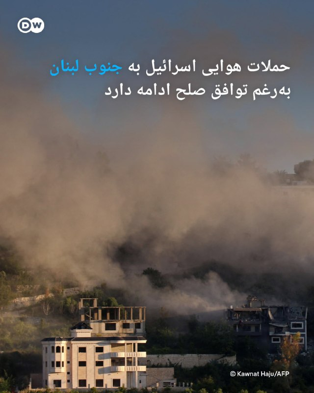

🔶 حملات هوایی اسرائیل به جنوب لبنان به‌رغم توافق صلح ادامه دارد

رسانه‌های دولتی لبنان گزارش دادند که نیروهای اسرائیلی روز چهارشنبه ۲۷ خرداد (۱۷ ژوئن) چندین حمله هوایی به مناطق مختلف جنوب لبنان انجام دادند؛ این در حالی است که "توافق پایان جنگ خاورمیانه، لبنان را نیز در بر می‌گیرد".

خبرگزاری دولتی لبنان اعلام کرد جنگنده‌های اسرائیلی مناطقی در "نبطیه فوقا" و حومه شرقی شهر "کفر تبنیت" را هدف قرار دادند و یک حمله پهپادی نیز به شهر "انصاریه" در منطقه زهرانی گزارش شده است.

با وجود کاهش خشونت‌ها پس از اعلام توافق آمریکا و ایرانبرای پایان جنگ خاورمیانه، حملات اسرائیل به جنوب لبنان از زمان اعلام این توافق تاکنون دست‌کم پنج کشته بر جای گذاشته است.

کاهش درگیری‌ها باعث شده برخی ساکنان جنوب لبنان برای بررسی وضعیت خانه‌ها و روستاهای خود بازگردند، اما ارتش لبنان از مردم خواسته است به دلیل "خطر نقض توافق و حملات اسرائیل" بازگشت خود را به تعویق بیندازند.

@dw_farsi

## DW_Farsi — post 126087

  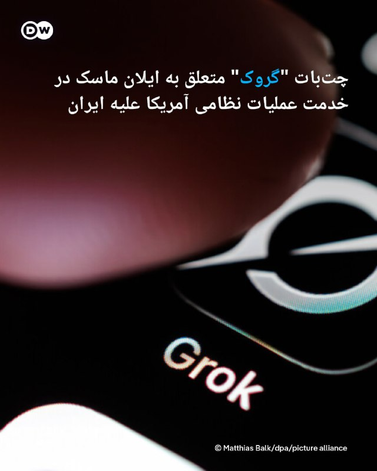

🔶 چت‌بات "گروک" متعلق به ایلان ماسک در خدمت عملیات نظامی آمریکا علیه ایران

چت‌بات هوش مصنوعی "گروک" متعلق به ایلان ماسک در حملات آمریکا علیه ایران مورد استفاده قرار گرفته است؛ این موضوع را دولت ایالات متحده در یک سند حقوقی که به رویت خبرگزاری فرانسه رسیده، فاش کرده است.

در این سند از توربین‌های گازی مورد استفاده در یک مرکز داده عظیم متعلق به شرکت "ایکس‌ای‌آی" دفاع شده است؛ توربین‌هایی که هدف یک شکایت زیست‌محیطی نیز قرار دارند.

وزارت دادگستری آمریکا در این متن استدلال می‌کند که این شکایت "با تلاش برای قطع برق نوآوری‌های هوش مصنوعی که از عملیات نظامی وزارت جنگ پشتیبانی می‌کند، امنیت ملی، اقتصادی و انرژی آمریکا را تهدید می‌کند".

@dw_farsi

## DW_Farsi — post 126085

  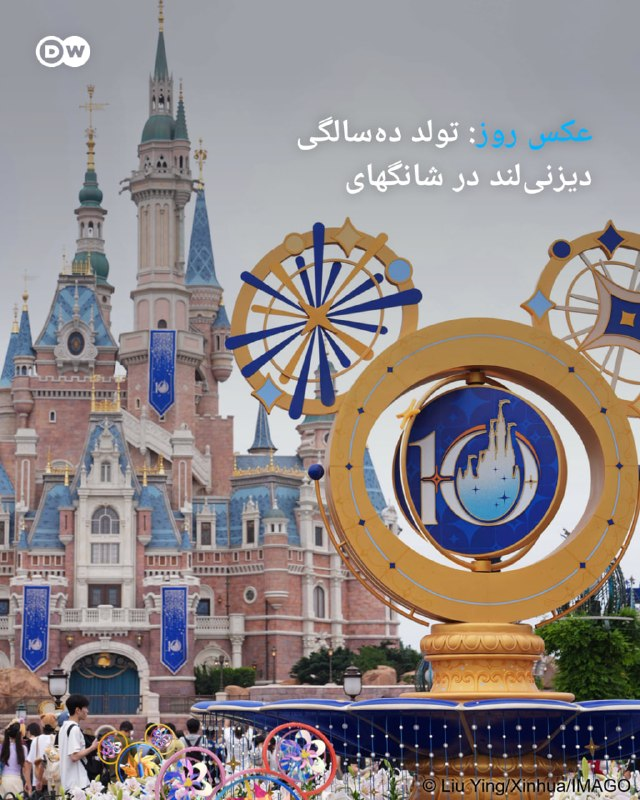

📸 عکس روز: تولد ده‌سالگی دیزنی‌لند در شانگهای

سالگرد افتتاح دیزنی‌لند در شهر شانگهای چین فرارسیده و این تفریحگاه به مناسبت تولد ده سالگی‌اش، با امکانات و سرگرمی‌هایی ویژه مجهز و تزیین شده است. در حال حاضر چندین طرح توسعه در دیزنی‌لند شانگهای در دست انجام است. این تفریحگاه که فرهنگ چینی در آن به شکل پررنگی دیده می‌شود، از پربازدیدترین پارک‌های سرگرمی در جهان به‌شمار می‌رود.

@dw_farsi

## DW_Farsi — post 126084

  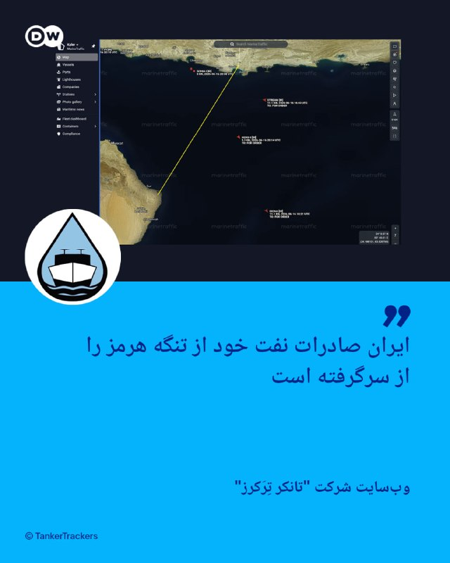

🔶 تانکر ترکرز: ایران صادرات نفت خود از تنگه هرمز را از سرگرفته است

بر اساس گزارش وب‌سایت شرکت "تانکر تِرَکرز" که حمل‌ونقل و ذخیره‌سازی محموله‌های نفتی را رصد می‌کند، صادرات نفت ایران از طریق تنگه هرمز بار دیگر آغاز شده است.

طبق این گزارش، چند نفتکش ایرانی موفق شده‌اند منطقه دریایی‌ای را که پیش‌تر توسط نیروی دریایی آمریکا مسدود شده بود، ترک کنند. به نوشته تانکر ترکرز، این "نخستین صادرات نفت خام ایران در دو ماه گذشته" محسوب می‌شود.

این گزارش می‌افزاید که بر اساس تصاویر ماهواره‌ای، دو ابرنفتکش شرکت ملی نفت ایران به نام‌های "Diona" و "Hero2" با عبور از منطقه‌ای که توسط نیروی دریایی آمریکا محاصره شده، در مجموع حامل ۳.۸ میلیون بشکه نفت خام را به سوی مقاصد خود حمل کرده‌اند.

تانکر ترکرز همچنین نوشت که نفتکش سوم نیز با یک میلیون بشکه نفت از منطقه تحت محاصره دریایی آمریکا عبور کرده است.

@dw_farsi

## DW_Farsi — post 126083

  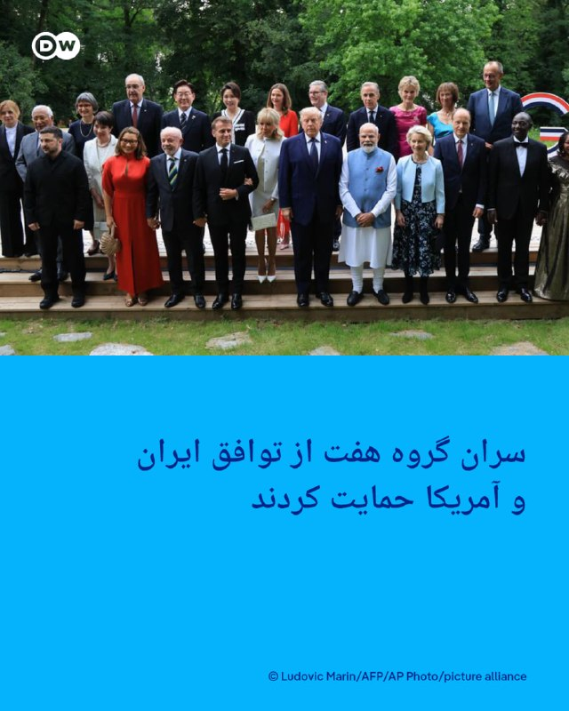

🔶 سران گروه هفت از توافق ایران و آمریکا حمایت کردند

سران کشورهای گروه هفت (آمریکا، کانادا، فرانسه، آلمان، ایتالیا، ژاپن و بریتانیا) بامداد روز چهارشنبه ۲۷ خرداد (۱۷ ژوئن) در بیانیه‌ای از توافق میان ایالات متحده و جمهوری اسلامی ایران حمایت کردند.

این بیانیه توافق یادشده را "فرصتی تاریخی" برای جلوگیری از دستیابی ایران به سلاح هسته‌ای و مهار تهدیدهای منطقه‌ای و موشکی نامیدند و آمادگی خود را برای مشارکت در اجرای این توافق اعلام کردند.

در این بیانیه بر اهمیت آزادی "تردد کشتی‌ها در آبراه‌های بین‌المللی بدون محدودیت و عوارض" به‌عنوان یکی از پایه‌های تجارت جهانی تاکید شده است.

@dw_farsi

## Persian_Trend_Official — post 17342

  <a href="telegram/content/Persian_Trend_Official_17342_1781696572.mp4" target="_blank">🎬 Download video</a>

بن گویر، وزیر امنیت ملی اسرائیل: ما نمی‌توانیم تخریب خانه‌ها در جنوب لبنان را متوقف کنیم. ما نمی‌توانیم متوقف شویم.

ما نمی‌توانیم اجازه دهیم جمعیت جنوب لبنان بازگردند. ما باید به کنترل این منطقه ادامه دهیم، حتی اگر ترامپ مخالف باشد. ما یک کشور مستقل هستیم.

ما باید به فعالیت خود در لبنان ادامه دهیم. ما باید همچنان مستقل باشیم. ما ترامپ را دوست داریم، اما توافقی را که او امضا کرده است، نمی‌پذیریم و باید به مسیر خود ادامه دهیم.

📝 Amir

📌 @persian_trend_official
پرشین ترند | متفاوت‌ترین کانال نظامی

## Persian_Trend_Official — post 17341

  <a href="telegram/content/Persian_Trend_Official_17341_1781696574.mp4" target="_blank">🎬 Download video</a>

ترامپ: ما مردی به نام سلیمانی را از بین بردیم. فکر می‌کنید اگر او زنده بود، این اتفاق می‌افتاد؟ او یک نابغه شیطانی بود.

📝 Amir

📌 @persian_trend_official
پرشین ترند | متفاوت‌ترین کانال نظامی

## Persian_Trend_Official — post 17340

  <a href="telegram/content/Persian_Trend_Official_17340_1781696575.mp4" target="_blank">🎬 Download video</a>

ترامپ: دلیل پایین ماندن قیمت نفت این است که ما هر شب کشتی‌هایی را که شما حتی از آنها خبر نداشتید، از آب می‌گرفتیم.

دو روز پیش، سه روز پیش، یک ماه پیش، ما 22 کشتی را از آب بیرون کشیدیم. ما به طور متوسط 15 تا 25 کشتی در هر شب داشتیم. هیچ کس این را نمی‌دانست.

نیروی دریایی ما کار بزرگی انجام داد. هیچ کس نمی‌دانست چه اتفاقی دارد می‌افتد. به همین دلیل است که قیمت نفت به 308 دلار در هر بشکه نرسید؛ به 125 تا 150 دلار رسید.

الان 72 تا 73 دلار است. شنیده‌ام که الان از این هم پایین‌تر است.

📝 Amir

📌 @persian_trend_official
پرشین ترند | متفاوت‌ترین کانال نظامی

## Persian_Trend_Official — post 17339

  <a href="telegram/content/Persian_Trend_Official_17339_1781696577.mp4" target="_blank">🎬 Download video</a>

ترامپ درباره ایران و اوباما: ایرانی‌ها به اوباما خندیدند و گفتند او یک حرامزاده احمق است.

📝 Amir

📌 @persian_trend_official
پرشین ترند | متفاوت‌ترین کانال نظامی

## Persian_Trend_Official — post 17338

  <a href="telegram/content/Persian_Trend_Official_17338_1781696579.mp4" target="_blank">🎬 Download video</a>

ترامپ در مورد توافق ایران: متن نهایی نیست؛ این یک یادداشت تفاهم است.

اگر من آن را دوست نداشته باشم، به بمباران سرشان برمی‌گردیم. اگر آنها درست رفتار نکنند، ما دوباره به بمباران برمی‌گردیم.

📝 Amir

📌 @persian_trend_official
پرشین ترند | متفاوت‌ترین کانال نظامی

## Persian_Trend_Official — post 17337

خبرنگار: گزارش شده است که این توافق شامل یک صندوق 300 میلیارد دلاری برای ایران است.

ترامپ: نه، این دروغ است. ما سرمایه‌گذاری نمی‌کنیم. مردم می‌توانند تصمیم بگیرند که این کار را انجام دهند، اما این به خودشان بستگی دارد.

می‌خواهید بگویم که هیچ‌کس هرگز اجازه سرمایه‌ گذاری در یک کشور را ندارد؟

📝 Amir

📌 @persian_trend_official
پرشین ترند | متفاوت‌ترین کانال نظامی

## Persian_Trend_Official — post 17336

ترامپ درباره توافق ایران: هیچ‌کس نمی‌داند این توافق چیست، اما توافق بسیار قوی‌ است.

به نظر می‌رسد اکثر مردم بسیار خوشحال هستند.

📝 Amir

📌 @persian_trend_official
پرشین ترند | متفاوت‌ترین کانال نظامی

## Persian_Trend_Official — post 17335

  <a href="telegram/content/Persian_Trend_Official_17335_1781696581.mp4" target="_blank">🎬 Download video</a>

🇱🇧
🇮🇱وزیر دفاع اسرائیل کاتز:
هر کس دست به اقدامی علیه دولت اسرائیل در غزه، لبنان، سوریه یا هر جای دیگری بردارد، بداند که باید بهای آن را بپردازد.
اول از همه، زمین را از دست می‌دهند. خانه را از دست می‌دهند.
Phantom

📌 @persian_trend_official
پرشین ترند | متفاوت‌ترین کانال نظامی

## Persian_Trend_Official — post 17334

  <a href="telegram/content/Persian_Trend_Official_17334_1781696582.webm" target="_blank">🎬 Download video</a>

🔴 ترکیه از بازداشت مسئول رسانه‌ای داعش خراسان خبر داد

🔹 منابع امنیتی ترکیه اعلام کردند سازمان اطلاعات ملی این کشور (MIT) در یک عملیات ویژه، «علی احمد کازانچی» ملقب به «ابوعبیده ابوابراهیم» را بازداشت و به ترکیه منتقل کرده است.

🔹 بر اساس گزارش خبرگزاری آناتولی، کازانچی از عناصر ارشد داعش خراسان و مسئول بخش اطلاع‌رسانی و رسانه‌ای این گروه تروریستی بوده است.

🔹 گفته می‌شود وی پس از بازداشت «اوزگور آلتون» معروف به «ابو یاسر الترکی»، مسئولیت هدایت فعالیت‌های رسانه‌ای داعش در ترکیه را بر عهده گرفته بود.

🔹 منابع امنیتی مدعی‌اند کازانچی پس از حضور در مناطق افغانستان و پاکستان و همکاری در انتقال نیروهای داعش، قصد داشت به‌صورت غیرقانونی وارد ترکیه شود تا فعالیت‌های سازمانی خود را ادامه دهد.

🔹 سازمان اطلاعات ترکیه اعلام کرده این فرد در جریان عملیاتی در منطقه مرزی شناسایی و دستگیر شده است.

🎯 اهمیت این تحول:

بازداشت یکی از مسئولان رسانه‌ای داعش خراسان می‌تواند ضربه‌ای به شبکه تبلیغاتی و جذب نیروهای این گروه وارد کند. داعش خراسان طی سال‌های اخیر تلاش کرده از بسترهای رسانه‌ای و فضای مجازی برای گسترش نفوذ و جذب نیرو در منطقه استفاده کند.

👺 Phantom

📌 @persian_trend_official
پرشین ترند | متفاوت‌ترین کانال نظامی

## Persian_Trend_Official — post 17333

  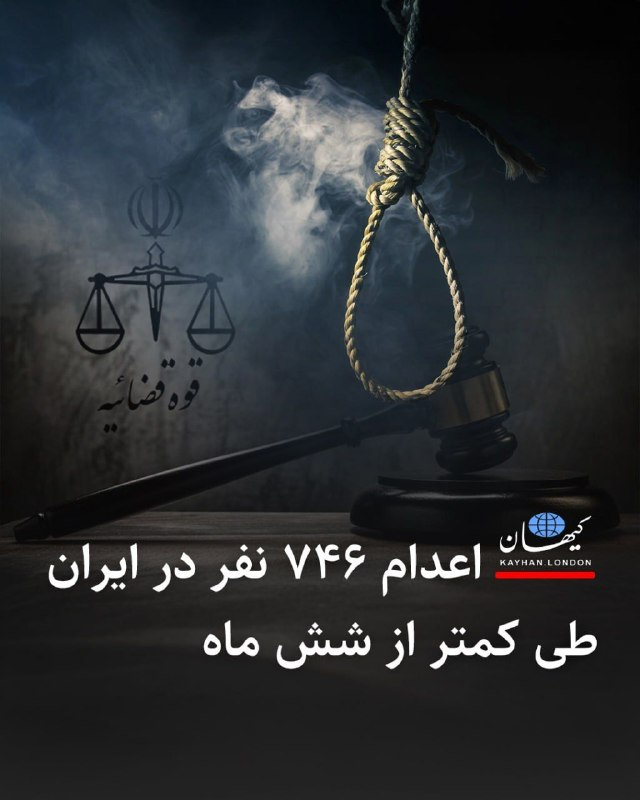

‌‌‏ ‏
‏ ‏ اعدام ۷۴۶ نفر در ایران طی کمتر از شش ماه

بنیاد عبدالرحمن برومند اعلام کرده از آغاز سال ۲۰۲۶ میلادی (۱۱ دی ۱۴۰۴) تا کنون جمهوری اسلامی ۷۴۶ زندانی را به اتهامات سیاسی و غیرسیاسی اعدام کرده است که ۵۲ مورد این اعدام‌ها طی دو هفته گذشته صورت گرفته است.

این بنیاد حقوق بشری تأکید کرده جمهوری اسلامی در سایه جنگ و در واکنش به اعتراضات دی۴۰۴، اجرای احکام اعدام زندانیان سیاسی را شتاب بخشیده به‌طوریکه از ابتدای سال جاری میلادی تاکنون، دست‌کم ۴۵ معترض و زندانی سیاسی به اتهام جرایم علیه امنیت ملی، از جمله جاسوسی، اعدام شده‌اند.

این گزارش تأکید کرده مبنای صدور بسیاری از این احکام اعدام، «اعترافات اجباری» گرفته شده تحت فشارهای جسمی و روحی از زندانیان بوده است؛ امری که نقض آشکار حقوق اولیه دادرسی عادلانه و مصونیت‌های بین‌المللی در برابر شکنجه به شمار می‌رود.

🌎 گزارش از کیهان لندن

👺Phantom

📌 @persian_trend_official
پرشین ترند | متفاوت‌ترین کانال نظامی

## Persian_Trend_Official — post 17332

  <a href="telegram/content/Persian_Trend_Official_17332_1781696583.mp4" target="_blank">🎬 Download video</a>

ویدیویی جالب از تلاش بالگرد کاموف-52 روسی برای سرنگونی پهپاد انتحاری اوکراینی برفراز مسکو

خدمه بالگرد تلاش میکنند پهپاد به ناحیه ای کم تراکم برسد تا انفجار و لاشه پهپاد تلفات انسانی نگیرد.

📝 Amir

📌 @persian_trend_official
پرشین ترند | متفاوت‌ترین کانال نظامی

## Persian_Trend_Official — post 17331

  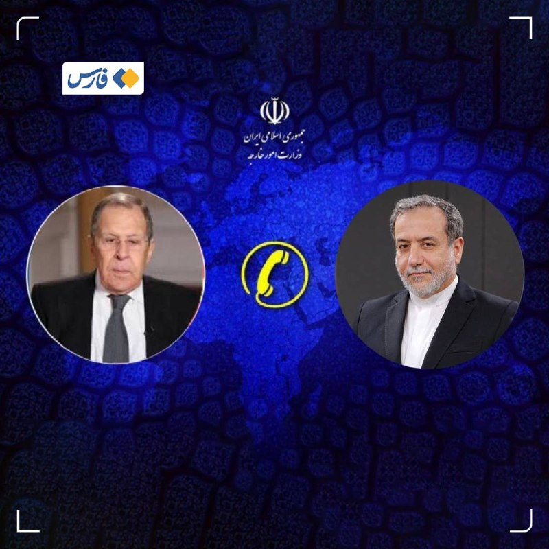

عراقچی دربارهٔ تفاهم اسلام‌آباد با لاوروف گفت‌گو کرد.

وزیر خارجهٔ روسیه در یک تماس تلفنی با همتای ایرانی در خصوص یادداشت تفاهم اسلام‌آباد و برخی موضوعات منطقه‌ای و دوجانبه رایزنی کرد.

صداوسیما: عراقچی در این گفت‌وگو ضمن تشریح جزئیات مربوط به تفاهم‌نامه، بر مسئولیت آمریکا در قبال حسن اجرای بندهای آن و ضرورت توقف کامل تجاوزات رژیم صهیونیستی علیه لبنان تأکید کرد. لاوروف هم ضمن استقبال از نهایی‌شدن متن یادداشت تفاهم، بر حمایت کامل کشورش از اجرای مفاد آن تأکید کرد.

وزرای خارجهٔ ایران و روسیه با اشاره به لزوم حمایت جامعهٔ جهانی و شورای امنیت از این تفاهم، بر ضرورت تداوم همکاری‌های دیپلماتیک بین کشورهای منطقه با هدف تثبیت صلح و ثبات تأکید کردند.

📝 Amir

📌 @persian_trend_official
پرشین ترند | متفاوت‌ترین کانال نظامی

## Persian_Trend_Official — post 17330

🇺🇸 نیروهای سنتکام پهپادهای که در روزهای پس از اعلام توافق توسط سپاه به سوی کشتی های تجاری و نظامی شلیک شدند را منهدم کردند

📰
📺به گزارش ان بی سی و جروزالم حتی پس از امضای تفاهم‌نامه میان تهران و واشنگتن، نیروی قدس سپاه پاسداران چندین پهپاد تهاجمی یک‌طرفه به سمت کشتی‌های تجاری در تنگه هرمز شلیک کرد. نیروهای آمریکایی تمامی آن‌ها را سرنگون کردند و CENTCOM تأیید کرد که تردد دریایی در تنگه بدون اختلال ادامه دارد.

این عملیات عمداً در سکوت خبری انجام شد تا نه بازار انرژی دچار تلاطم شود، نه مسیر مذاکرات مسدود شود

توافق روی کاغذ یک چیز است؛ میدان چیز دیگری. این اقدام سپاه — در فاصله‌ای کوتاه پس از امضای تفاهم‌نامه — یک پیام دوگانه است؛ از یک سو نشان می‌دهد بخش‌هایی از سپاه پاسداران مستقل از مسیر دیپلماتیک عمل می‌کنند، و از سوی دیگر آمریکا با سرنگون کردن پهپادها در سکوت خبری، اراده خود برای حفظ آرامش در مسیر مذاکرات را نشان داده است.

👺Phantom
📌 @persian_trend_official
پرشین ترند | متفاوت‌ترین کانال نظامی

## Persian_Trend_Official — post 17329

بلومبرگ: یادداشت تفاهم پیشنهادی ایالات متحده و ایران، پایان فوری و دائمی جنگ در تمام جبهه‌ها، از جمله لبنان، را ترسیم می‌کند و هر دو طرف متعهد می‌شوند که از اقدامات خصمانه خودداری کنند، به حاکمیت یکدیگر احترام بگذارند و ظرف 60 روز برای رسیدن به یک توافق نهایی…

## Persian_Trend_Official — post 17325

  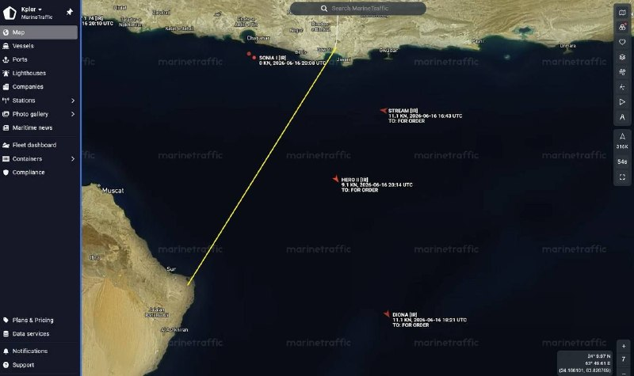

TankerTrackers:
نفت خام پس از یک محاصره دریایی دو ماهه از ایران خارج شد.

🔹 بر اساس داده‌های AIS و گزارش منتشرشده توسط TankerTrackers، دست‌کم دو نفتکش بسیار بزرگ متعلق به شرکت ملی نفتکش ایران (NITC) پس از حدود دو ماه از محدوده‌ای که «محاصره دریایی» توصیف شده خارج شده‌اند.

🔹 این نفتکش‌ها با نام‌های DIONA (9569695) و HERO2 (9362073) در مجموع حدود ۳.۸ میلیون بشکه نفت خام ایران را حمل می‌کردند.

🔹 طبق این گزارش، این نخستین صادرات نفت خام ایران در بازه دو ماه اخیر محسوب می‌شود.

🔹 همچنین نفتکش دیگری با نام STREAM (9569633) در نزدیکی مسیر بازگشت و در محدوده منطقه اقتصادی انحصاری پاکستان مشاهده شده که طی هفته‌های گذشته در انتظار ورود به آب‌های ایران بوده است.

این جابه‌جایی می‌تواند نشانه‌ای از تغییر در شرایط امنیتی مسیرهای کشتیرانی یا کاهش محدودیت‌های عملیاتی در منطقه باشد. همچنین داده‌های AIS نشان می‌دهد که مسیرهای نفتی ایران همچنان تحت رصد دقیق بین‌المللی قرار دارند.

👺 Phantom

@persian_trend_officialپرشین ترند | متفاوت‌ترین کانال نظامی

## Persian_Trend_Official — post 17324

  

📰 اف‌بی‌آی: حمله به رویدادی با حضور ترامپ خنثی شد
🔹دفتر اف‌بی‌آی ادعا کرده است که حمله‌ای برنامه‌ریزی‌شده به مسابقات هنرهای رزمی ترکیبی در کاخ سفید که ترامپ در آن حضور داشت را در روزهای اخیر خنثی کرده و پنج نفر را در ارتباط با آن دستگیر کرده است.

👺Phantom

📌 @persian_trend_official
پرشین ترند | متفاوت‌ترین کانال نظامی

## RadioFarda — post 158424

  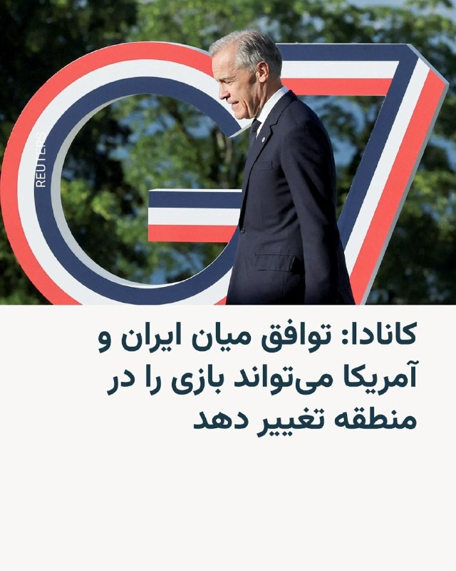

🔸مارک کارنی، نخست‌وزیر کانادا، می‌گوید توافق میان آمریکا و ایران برای پایان دادن به جنگ خاورمیانه، می‌تواند «تغییردهندۀ بازی» در منطقه و فراتر از آن باشد.

🔸کارنی در سومین روز نشست رهبران گروه ۷ در شهر اویان فرانسه، به خبرنگاران گفت باوجود «خطراتی» که وجود دارد، «این توافق باید به اجرا درآید».

🔸او افزود: «نفسِ وجود این توافق ــ و این واقعیت که کشورهای زیادی در تدوین آن مشارکت داشته‌اند و در موفقیت آن ذی‌نفع هستند ــ خود موجب ایجاد پیامدهای جانبی مثبت خواهد شد.»

🔸رهبران گروه ۷ در بیانیه‌ای مشترک در اواخر روز سه‌شنبه اعلام کردند به‌دنبال این توافق، «پیشرفت مهم و فرصتی» در خاورمیانه به وجود آمده است.

🔸آن‌ها افزودند که این یادداشت تفاهم «فرصتی تاریخی برای جلوگیری از دستیابی ایران به هرگونه سلاح هسته‌ای و مقابله با تهدیدهای مرتبط با فعالیت‌های منطقه‌ای و موشک‌های بالستیک آن فراهم می‌کند.»

@RadioFarda

## RadioFarda — post 158423

  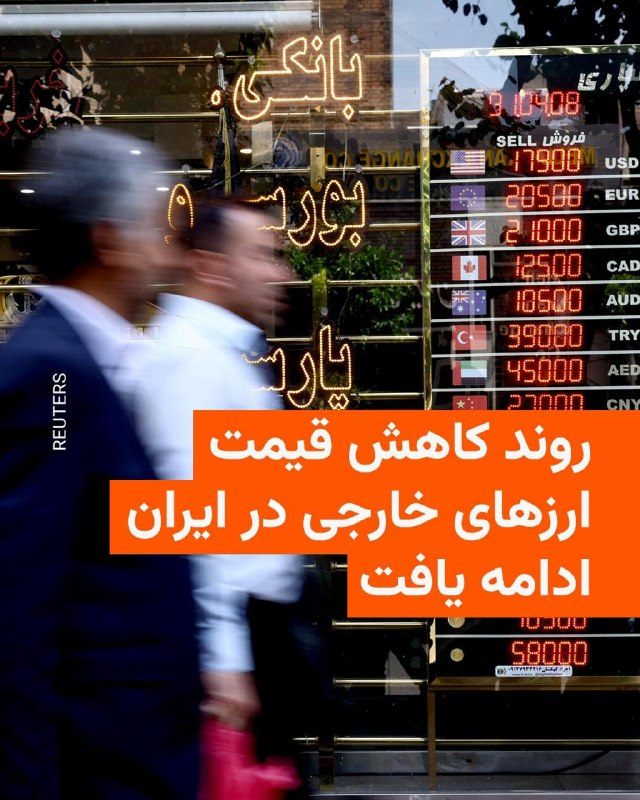

🔸در ادامهٔ روند کاهشی قیمت ارزهای خارجی در بازار آزاد ایران، روز چهارشنبه ۲۷ خرداد قیمت هر دلار آمریکا به حدود ۱۵۳ هزار تومان رسید و قیمت سکه طلا هم در محدوده ۱۶۰ میلیون تومان اعلام شد.

🔸از زمان اعلام توافق ایران و آمریکا برای پایان جنگ، قیمت ارزهای خارجی و سکه طلا در بازار آزاد ایران شاهد کاهش قابل توجهی بوده است.

🔸قیمت دلار آمریکا که در مقطعی تا ۱۹۰ هزار تومان بالا رفته بود، تا کنون حدود ۲۰ درصد کاهش پیدا کرده است.

🔸قیمت هر گرم طلای ۱۸ عیار نیز روز چهارشنبه به ۱۵ میلیون و ۷۶۷ هزار تومان و «سکه امامی» نیز به ۱۵۹ میلیون و ۵۰۰ هزار تومان کاهش یافت.

🔸در مقابل، شاخص بازار سهام بورس تهران از زمان اعلام توافق رشد چشمگیری داشته و روز چهارشنبه با ثبت رکوردی تازه به بیش از ۵ میلیون و ۱۰۰ هزار واحد رسید.

@RadioFarda

## RadioFarda — post 158422

🔸 در سایت احیا و تکثیر مرال در پناهگاه حیات‌وحش لوندویل آستارا، نخستین گوساله مرال سال ۱۴۰۵ متولد شد. تصاویری که به‌تازگی از این تولد منتشر شده، این نوزاد را در روزهای ابتدایی زندگی‌اش نشان می‌دهد.

🔸 رئیس اداره حفاظت محیط زیست آستارا با اعلام این خبر، تولد این گوساله را اتفاقی ارزشمند برای برنامه‌های حفاظتی و تکثیر مرال در منطقه عنوان کرد.

🔸 مرال که با نام گوزن قرمز ایرانی نیز شناخته می‌شود، بزرگ‌ترین گونه گوزن بومی کشور به شمار می‌آید. این حیوان عمدتاً در جنگل‌های هیرکانی شمال ایران زیست می‌کند، اما فشارهایی مانند نابودی بخشی از زیستگاه‌های طبیعی و شکار غیرمجاز، جمعیت آن را در برخی مناطق کاهش داده است.

🔸 پناهگاه حیات‌وحش لوندویل یکی از مراکز مهم نگهداری و تکثیر مرال در کشور محسوب می‌شود. این مجموعه در نزدیکی آستارا قرار دارد و با اجرای برنامه‌های حفاظتی، در تلاش است زمینه افزایش جمعیت این گونه ارزشمند و حفظ آن برای نسل‌های آینده را فراهم کند

@RadioFarda

## RadioFarda — post 158421

  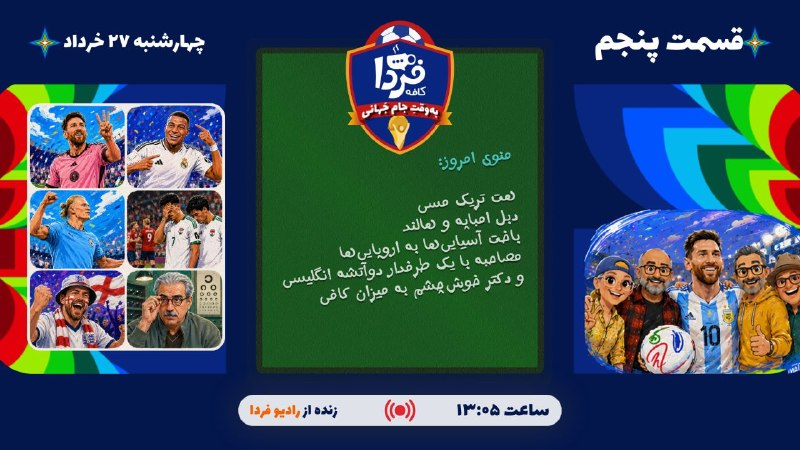

📷 Photo

## RadioFarda — post 158420

جی‌دی ونس: هدف اقدامات ترامپ به قدرت رساندن رضا پهلوی نبود

🔸جی‌دی ونس، معاون رئیس‌جمهور آمریکا، در گفت‌وگویی پیرامون توافق اخیر با ایران، موضوع تغییر رژیم جمهوری اسلامی را رد کرد و گفت: «دونالد ترامپ هرگز نگفت که هدف اقدامات او به قدرت رساندن رضا پهلوی در ایران است.»

🔸ونس شامگاه سه‌شنبه ۲۶ خرداد در ادامه گفت: «آن‌چه دونالد ترامپ گفت این بود که اگر مردم ایران به پا خاسته‌اند و مقابل حکومت خود ایستاده‌اند، خیلی هم خوب است، اما آن‌چه او می‌خواهد، اطمینان یافتن از فعالیت‌های هسته‌ای ایران است چه از طریق دیپلماتیک و چه از طریق جنگ که خب در نهایت راه دوم رخ داد.»

🔸آقای ونس این اظهارات را در گفت‌و‌گوی ویدئویی با مگان کلی، مجری سرشناس آمریکایی، در شبکه رادیویی سیروس ایکس‌ام بیان کرد.

🔸دونالد ترامپ، رئیس جمهور آمریکا، در آغاز حملات به ایران در پیامی خطاب به مردم ایران گفته بود: «وقت آزادی شما فرا رسیده است. وقتی کار ما تمام شد، حکومت خود را در دست بگیرید. این به عهده شما خواهد بود. این احتمالاً تنها فرصت شما برای چندین نسل خواهد بود.»

🔸او پس از برقراری آتش‌بس، موضوع تغییر حکومت به عنوان هدف حملات را رد کرد. رئیس‌جمهور آمریکا روز سه‌شنبه ۲۶ خرداد در حاشیه نشست گروه هفت در فرانسه هم بار دیگر گفت به تغییر رژیم در ایران اعتقادی ندارد و سال‌ها تغییر رژیم‌ها را دیده و به باور او «این کارها جواب نمی‌دهد». او گفت چنین چیزی باید خودش رخ دهد.

🔸این اظهارات در حالی است که شاهزاده رضا پهلوی، روز سه‌شنبه توافق اخیر ایران و آمریکا را «نتیجه معامله و سازش با یک رژیم جنایتکار» خواند و گفت: «توافق با رژیمی که تنها در دو روز، بیش از ۴۰ هزار معترض را به قتل رساند، نه‌تنها از نظر اخلاقی نادرست است، بلکه از منظر راهبردی نیز خطایی فاجعه‌بار خواهد بود.»

🔸آقای پهلوی در گفت‌وگو با مجلهٔ «تایمز» همچنین گفت هر توافقی با جمهوری اسلامی در نهایت شکست خواهد خورد.

🔸او در بخش دیگری از این گفت‌وگو، «تغییر رژیم» را تنها راه‌حل ممکن دانست و گفت جمهوری اسلامی به‌دلیل ماهیت خود «ناسازگار با جهان آزاد» است و مدعی شد که «حملات آمریکا و اسرائیل از سوی بسیاری از ایرانیان به‌عنوان اقدامی آزادی‌بخش تلقی شده است».

🔸 گزارش کامل را در وب‌سایت رادیوفردا بخوانید.

@RadioFarda

## RadioFarda — post 158419

معاون وزیر کشور: ۶۰ درصد مردم ایران تحمل فشار اقتصادی بیش از این را ندارند

🔸یک مقام ارشد وزارت کشور می‌گوید «۶۰ درصد» شهروندان ایران «تحمل» فشار اقتصادی بیش از این را ندارند و «به بهبود شرایط آینده» هم امیدوار نیستند.

🔸محمد بطحائی، رئیس سازمان امور اجتماعی ایران، سه‌شنبه ۲۶ خرداد، در یک نشست خبری این آمار را بر اساس یک پیمایش انجام‌شده در خرداد امسال ارائه کرد.

🔸رادیو فردا به‌طور مستقل قادر به تأیید این آمار نیست و راستی‌آزمایی آمارهای وزارت کشور نیز به‌دلیل ماهیت اطلاعات و نوع کاربری آن‌ها با تردیدها از سوی نهادهای نظارتی، کارشناسان مستقل و افکار عمومی مواجه است.

🔸با این حال، انتشار آماری از این دست از سوی منابع رسمی در شرایط جنگ و فشارهای اقتصادی و روانی بر شهروندان ایران دارای اهمیت تلقی می‌شود.

🔸بطحائی در ادامه اظهارات خود افزوده که بر اساس نتایج پیمایش‌های دولتی، «حدود ۶۰ درصد مردم» درباره «بهبود شرایط» در آینده امیدوار نیستند و در پیمایش انجام‌شده در سال گذشته، «تصور مثبتی نسبت به بهتر شدن وضعیت نداشته‌اند».

🔸او می‌گوید همچنین میزان رضایت اجتماعی جامعه آماری یکی از پیمایش‌ها، در بازه صفر تا صد، حدود ۳۸ درصد برآورد شده است؛ «به بیان دیگر، حدود ۶۲ درصد مردم از شرایط اجتماعی رضایت ندارند.»

🔸این مقام دولتی با این حال درباره دلایل عدم رضایت این میزان از جمعیت کشور بر اساس جامعه آماری این پیمایش‌ها اشاره‌ای نکرد.

🔸گزارش‌های رسانه‌ای و شهروندی از ایران در ماه‌های اخیر حاکی از افزایش سرسام‌آور قیمت کالاها و خدمات و رکوردشکنی نرخ تورم و طلا و ارز، به‌دنبال حملات اسرائیل و آمریکا به کشور و محاصره بنادر ایران بوده است.

🔸 گزارش کامل را در وب‌سایت رادیوفردا بخوانید.

@RadioFarda

## RadioFarda — post 158418

سازمان هواپیمایی کشوری انتقال هواپیما در ابتدای جنگ به فرودگاه‌های خارجی را تأیید کرد

🔸رئیس سازمان هواپیمایی کشوری ایران می‌گوید بعد از شروع حملات آمریکا و اسرائیل در جنگ ۴۰ روزه، «مجوز انتقال و گسترش استقرار ۳۶ هواپیما» در فرودگاه‌های خارجی صادر شد که «بخشی از آن‌ها با موفقیت اجرایی شد».

🔸ابوذر شیرودی با این حال به‌طور دقیق مشخص نکرد که چه تعدادی از این هواپیماها و در فرودگاه‌های کدام کشورها مستقر شدند.

🔸اواسط اردیبهشت‌ماه، شبکه تلویزیونی «سی‌بی‌اس» به نقل از مقام‌های آمریکایی، گزارش داد که هواپیماهای ایران، در میانهٔ جنگ، در یک پایگاه نظامی در نزدیکی شهر راوِلپندی پارک شده بودند.

🔸بر اساس این گزارش، با استقرار هواپیماهای ایران در پایگاه «نور خان» در پاکستان، پاکستان عملاً از این ناوگان در برابر حملات آمریکا حفاظت کرده است.

🔸وزارت خارجه پاکستان روز ۲۲ اردیبهشت با انتشار بیانیه‌ای گزارش سی‌بی‌اس را «گمراه‌کننده و اغراق‌آمیز» خواند، اما اصل گزارش یعنی حضور هواپیماهای ایران در پایگاه هوایی نورخان را تکذیب نکرد.

🔸رئیس سازمان هواپیمایی کشوری روز سه‌شنبه ۲۶ خرداد در بخش دیگری از اظهاراتش گفت که آمریکا و اسرائیل از همان ابتدای جنگ ۴۰ روزه قصد داشتند زیرساخت‌های هوانوردی ایران را هدف قرار دارند و «نخستین نشانه این رویکرد، حمله به هواپیمای ایرباس جمهوری اسلامی ایران در فرودگاه بوشهر بود».

🔸او افزوده که پس از آغاز حملات، علاوه بر اجرای طرح توقف عملیات پروازی، «پروازهای عبوری نیز به مسیرهای جایگزین در کشورهای همسایه منتقل شدند».

🔸رئیس سازمان هواپیمایی کشوری افزوده که این حملات موجب شد که با هماهنگی ستاد کل نیروهای مسلح و بخش پدافندی کشور، تصمیم به «پراکندگی» ناوگان هوایی گرفته شد.

🔸بر اساس اظهارات او، «در این راستا ۱۳۳ جابه‌جایی هواپیما از فرودگاه‌های امام خمینی و مهرآباد به فرودگاه‌های امن‌تر انجام شد.»

@RadioFarda

## RadioFarda — post 158417

ماجرای تخریب جنجالی یک کلیسا در مشهد چیست؟

🔸در روزهای اخیر تخریب یک کلیسا در مشهد موجی از واکنش‌ها را به‌دنبال داشت و بار دیگر موضوع نقض حقوق اقلیت‌های دینی و همچنین تخریب آثار میراث فرهنگی اعم از اسلامی و غیراسلامی را پیش کشید.

🔸بر اساس آن چه خبرگزاری رسمی جمهوری اسلامی، ایرنا، گزارش داده، تخریب کلیسای انجیلی مشهد واقع در بافت قدیمی و مرکزی این شهر به صورت شبانه در اولین ساعات روز ۱۴ خرداد امسال با بولدوزر رخ داد و اکنون این موضوع به یک پروندهٔ حقوقی، میراثی و حتی حقوق بشری تبدیل شده است.

🔸کلیسای انجیلی، نام یک کلیسای تاریخی مربوط به دورهٔ پهلوی اول بود و در شهرستان مشهد، شهر مشهد، خیابان جنت، کوچهٔ گلستان، جنب سوپر کوهسار، پلاک ۵۳ واقع شده و این اثر در تاریخ ۲۵ مرداد ۱۳۸۴ با شمارهٔ ثبت ۱۳۳۷۵ به‌عنوان یکی از آثار ملی ایران به ثبت رسیده‌ بود.

🔸فرد پطروسیان، روزنامه‌نگار در بروکسل که اخیرا کتابی را با عنوان «چرا نوکیشان مسیحی از ایران می‌گریزند» منتشر کرده، دربارهٔ پیشینهٔ حضور مسیحیان در مشهد به رادیو فردا می‌گوید: «از منظر تاریخی، ورود میسیونرهای مسیحی به مشهد به اوایل قرن بیستم باز می‌گردد. گفته می‌شود در سال ۱۹۱۱ فعالیت‌های میسیونری در این شهر آغاز شد و به تدریج به تأسیس مراکزی درمانی و آموزشی مانند بیمارستان آمریکایی مشهد انجامید؛ مجموعه‌ای که به‌دلیل کیفیت خدمات، مورد استفاده افراد از ادیان و اقوام مختلف قرار می‌گرفت. همچنین این مراکز در برخی مناطق اطراف مشهد خدمات درمانی و اجتماعی گسترده‌ای، از جمله در حوزه بیماری‌هایی مانند جذام، ارائه می‌دادند».

🔸این پژوهشگر ادامه می‌دهد که در منابع تاریخی همچنین به فضای متناقض اجتماعی آن دوره اشاره شده است؛ از یک سو محدودیت‌ها و فشارهایی علیه نوکیشان مسیحی وجود داشته و از سوی دیگر، نمونه‌هایی از تعامل و گفت‌وگوی دینی میان برخی روحانیون و میسیونرها نیز گزارش شده است.

🔸 گزارش کامل را در وب‌سایت رادیوفردا بخوانید.

@RadioFarda

## IranianMinds — post 22785

  <a href="telegram/content/IranianMinds_22785_1781696588.mp4" target="_blank">🎬 Download video</a>

🔴 علی خامنه ای درسال ۱۳۹۸:

با آمریکایی ها مذاکره نکنید. اونا احتیاج دارن به مذاکره با ما تا به کل جهان نشون بدن ما اینا رو کشوندیم سر میز مذاکره.
روزی که اوباما با روحانی تونست تلفنی حرف بزنه جشن گرفتن. یه همچین آدمایین. اصلا مذاکره نکنید با ترامپی که شمشیرو از رو بسته.
اون که اوبامای ظاهرساز بود اینکارو کرد. چه برسه به ترامپ وقیح پرروی بی تربیت.

@IranianMinds

## IranianMinds — post 22784

🔴 ترامپ درباره توافق ایران:

هیچ‌کس دقیق نمی‌دونه چیه، ولی این یک معامله خیلی قویه.

به نظر می‌رسه اکثر مردم خیلی خوشحال و راضی هستن.

@IranianMinds

## IranianMinds — post 22783

  <a href="telegram/content/IranianMinds_22783_1781696589.webm" target="_blank">🎬 Download video</a>

🆕 اپلیکیشن MelBet 
🔄

🎁 کد هدیه 100 دلاری: Sport100

🔵 کاملترین برنامه موبایل

🤝 اسپانسر رسمی لالیگا

☄️ صرافی معتبر

🤖 ربات راهنما

🇮🇷 برای تغییر زبان برنامه، زبان موبایل خود را تغییر دهید.

✅ ورود به اپلیکیشن بدون فیلترشکن

## IranianMinds — post 22782

  <a href="telegram/content/IranianMinds_22782_1781696590.mp4" target="_blank">🎬 Download video</a>

🔴 ترامپ:

فراموش نکنید، هیچ‌کسی تا حالا اینقدر سخت و محکم با ایران برخورد نکرده.

این کار باید خیلی وقت پیش توسط کلینتون و باراک حسین اوباما انجام می‌شد. باید توسط بایدن، بوش و خیلی‌های دیگه انجام می‌شد.

@IranianMinds

## IranianMinds — post 22781

  <a href="telegram/content/IranianMinds_22781_1781696591.mp4" target="_blank">🎬 Download video</a>

🔴 ترامپ:

ما یک نفر به اسم سلیمانی رو از بین بردیم. فکر می‌کنی اگر اون زنده بود، این اتفاق می‌افتاد؟

اون یک نابغه شیطانی بود.

@IranianMinds

## IranianMinds — post 22780

🔴 فاکس نیوز :

بزودی ترامپ درباره توافق با ایران یک‌ کنفرانس خبری برگزار میکنه.

@IranianMinds

## IranianMinds — post 22779

  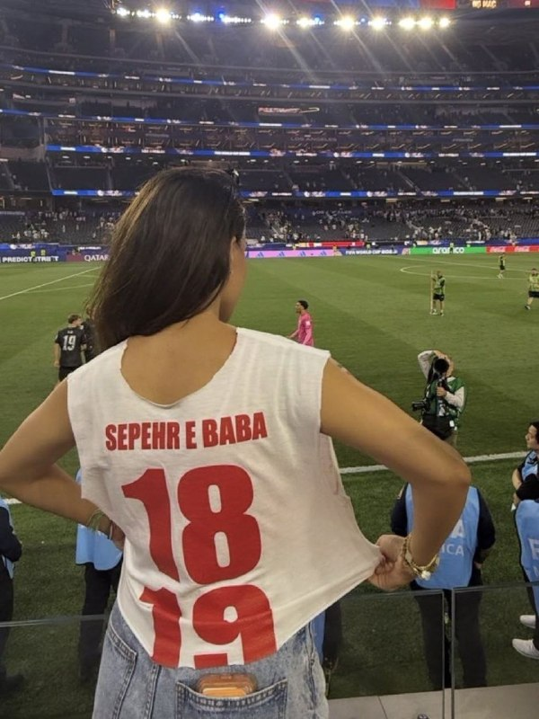

اکانت اسرائیل به فارسی:

سپهر بابا💔

@IranianMinds

## IranianMinds — post 22778

  <a href="telegram/content/IranianMinds_22778_1781696594.mp4" target="_blank">🎬 Download video</a>

دیشب نجم الدین شریعتی برنامه محرم زد زیر گریه و گفت: دلم برای آقا (علی خامنه‌ای) خیلی تنگ شده
بقیه هم همینطوری عر میزدن😂😂😂

@IranianMinds

## IranianMinds — post 22777

  <a href="telegram/content/IranianMinds_22777_1781696594.mp4" target="_blank">🎬 Download video</a>

🔴 کارشناس صداوسیما :

خدایا ما به کی دردمونو بگیم ؟
ترامپ صدبار به رهبرمون گفته همجنسگرا. تهمت های زشت و جنسی بهش میزنه. تهدید به تـرورش میکنه. ما رو به لجن کشیده. همش تحقیرمون میکنه. اونوقت ما خفه خون گرفتیم داریم میریم توافق کنیم .

@IranianMinds

## IranianMinds — post 22776

🔴 ترامپ در دیدار با رهبران گروه هفت :

رئیس اینجا منما !

@IranianMinds

## IranianMinds — post 22775

  <a href="telegram/content/IranianMinds_22775_1781696596.mp4" target="_blank">🎬 Download video</a>

وقتی با یکی حال نمیکنی ولی مجبوری سلامو علیک داشته باشی :

@IranianMinds

## BBCPersian — post 284118

  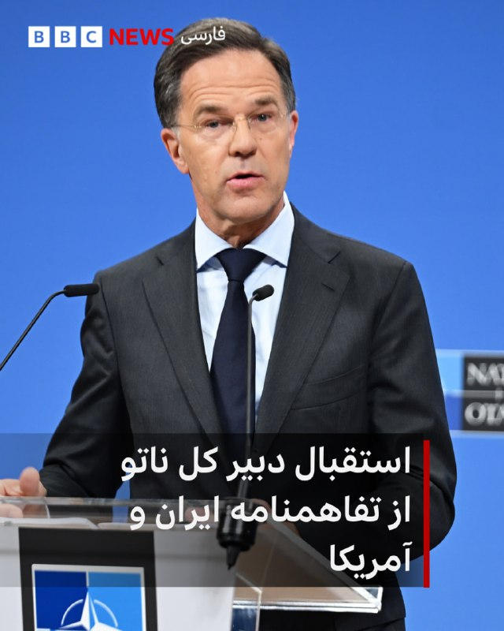

🔻مارک روته، دبیر کل ناتو، از توافق آمریکا و ایران برای پایان دادن به جنگ خاورمیانه استقبال کرد و گفت بازگشایی برنامه‌ریزی‌شده تنگه هرمز «گامی بسیار بزرگ»خواهد بود.

آقای روته در یک کنفرانس خبری در بروکسل گفت: «بازگشت آزادی عبور و مرور از تنگه هرمز یک گام بسیار مهم و رو به جلو خواهد بود. می‌دانم که بسیاری از متحدان، از طریق ابتکاری که به رهبری فرانسه و بریتانیا انجام شده، آماده حمایت هستند.»

📸Anadolu via Getty Images
https://bbc.in/4a7qMjY
@BBCPersian

## BBCPersian — post 284117

  <a href="telegram/content/BBCPersian_284117_1781696597.mp4" target="_blank">🎬 Download video</a>

🔻در  نخستین مسابقه جام جهانی در سیاتل که ۲۵ خرداد (۱۵ ژوئن) بین تیم‌های بلژیک و مصر برگزار شد، نتیجه مسابقه به همراه پرچم هر دو کشور با پهپاد در آسمان این شهر نقش بست.
 
به گفته «ویزیت سیاتل»، مجری این طرح، هدف از این تابلوی امتیازات «خلق تصاویری خیره‌کننده با عنصر میان‌فرهنگی و گرد هم آوردن هواداران فوتبال از نقاط مختلف در سیاتل» است.
 
سیاتل میزبان شش بازی در جام جهانی ۲۰۲۶ خواهد بود که از جمله این بازی‌ها، دیدار بین تیم‌های ایران و مصر در ششم تیر است.
 
این تابلوی امتیازات پهپادی در تمام روزهای برگزاری مسابقات در این شهر به نمایش در خواهد آمد.

https://bbc.in/4oIqYfx
@BBCPersian

## BBCPersian — post 284115

نظرتان درباره حضور تیم ملی فوتبال ایران در جام‌جهانی ۲۰۲۶ چیست؟ حواشی حضور این تیم و اولین مسابقه با نیوزیلند، از نظر شما چه معنایی برای دنیای فوتبال و سیاست داشت؟
تیم ملی فوتبال ایران در شرایط جنگی و بحران روابط ایران و آمریکا، برای تمرین و اردو و بازی تدارکاتی و ویزا با مشکلاتی مواجه بود، فقط یک روز قبل از مسابقه به لس‌آنجلس رسید و مجبور شد بعد از بازی خاک آمریکا را ترک کند. اما در شبکه‌های اجتماعی هم اختلاف نظر و بحث و تقابل مثل کسانی که برای تماشای بازی ایران و نیوزیلند به ورزشگاه رفته بودند در جریان است. نظر شما چیست؟

نظرات و مشاهدات خود درباره حضور ایران در جام‌جهانی ۲۰۲۶ با هشتگ #فوتبال برای ما ارسال کنید:
آی‌مسج و واتس‌اپ: ۰۰۴۴۷۳۴۲۰۳۲۱۱۳
پیامگیر تلگرام t.me/bbcshoma

@BBCPersian
📷 Getty Images
https://bbc.in/3SKW9La

## BBCPersian — post 284114

🔻آژانس بین‌المللی انرژی: ذخایر نفتی کشورهای سازمان همکاری اقتصادی به کمترین سطح از سال ۱۹۹۰ رسید

آژانس بین‌المللی انرژی اعلام کرده است که ذخایر نفتی کشورهای عضو سازمان همکاری و توسعه اقتصادی به پایین‌ترین سطح از سال ۱۹۹۰ تاکنون رسیده است.

این آژانس می‌گوید به دلیل جنگ، برداشت از ذخایر اضطراری نفت در ماه گذشته میلادی (مه) با سرعت بیشتری انجام شده است.

این نهاد در تازه‌ترین گزارش ماهانه‌اش نوشت که اگر تفاهم آمریکا و ایران حفظ شود، بازار جهانی نفت به‌تدریج پیامدهای بسته شدن تنگه هرمز را پشت سرخواهد گذاشت.

آژانس بین‌المللی انرژی همچنین افزود جنگ در خاورمیانه بزرگ‌ترین اختلال در تاریخ بازار جهانی نفت را به وجود آورده است.

https://bbc.in/4eh9GCQ
@BBBCPersian

## BBCPersian — post 284113

🔻حمله اسرائیل به نبطیه در جنوب لبنان

پس از حملات هوایی امروز صبح اسرائیل، ستون‌های دود در آسمان شهر نبطیه دیده می‌شود.

از روز دوشنبه اگرچه حملات اسرائیل به جنوب لبنان همچنان ادامه داشت اما از شدت آن کاسته شده است.

کاهش تنش‌ها باعث شده برخی از ساکنان جنوب لبنان به شهرها و روستاهای خود بازگردند و وضعیت خانه‌هایشان را بررسی کنند، اما ارتش لبنان از مردم خواسته بازگشت خود را به تعویق بیندازند و همچنان از «خطر حملات احتمالی اسرائیل» ابراز نگرانی کرده‌اند.

حزب‌الله تاکنون از روز سه‌شنبه بیانیه‌ای درباره حملات جدید منتشر نکرده است. قرار است نعیم قاسم، رهبر این گروه، روز چهارشنبه سخنرانی تلویزیونی داشته باشد.

به گفته قرارگاه مرکزی خاتم‌الانبیا، اسرائیل در دو روز گذشته دست‌کم ۸۴ بار آتش‌بس را نقض کرده است.
https://bbc.in/4xAnks0
@BBCPersian

## BBCPersian — post 284112

  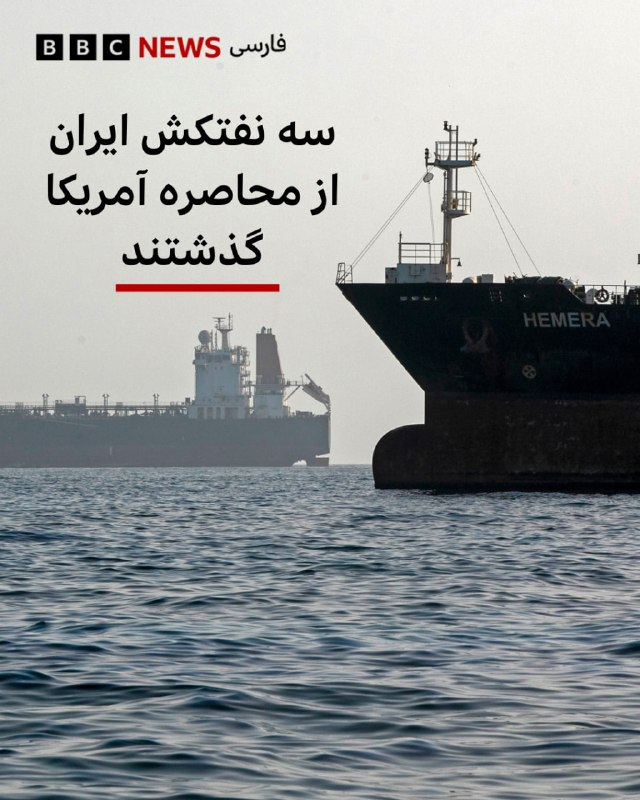

🔻بر اساس وبسایت‌های رهگیری دریایی سه نفتکش ایران برای نخستین بار در دو ماه گذشته از محاصره دریایی آمریکا عبور کرده‌اند.

راستی‌آزمایی بی‌بی‌سی نشان می‌دهد که این نفتکش‌های تحت تحریم متعلق به شرکت ملی نفتکش ایران، با بار کامل از خط محاصره گذشته و وارد دریای عرب شده‌اند.

سامانه‌های اعلام موقعیت این نفتکش‌ها روشن است اما مقصدی را مخابره نمی‌کنند.

📸GettyImages
https://bbc.in/4go6Ltc
@BBCPersian

## BBCPersian — post 284111

  <a href="https://t.me/bbcpersian/284111" target="_blank">📎 Download file</a>

پادکست برنامه شصت دقیقه سه شنبه ۲۶ خرداد ۱۴۰۵
این نسخه رادیویی برنامه شصت دقیقه تلویزیون فارسی بی‌بی‌سی است که هرشب بعد از پخش، با حجم کم از اپلیکیشن‌های پادگیر و صفحه تلگرام بی‌بی‌سی فارسی در دسترس است.
با هشتگ BBCPersianRadio با ما در ارتباط باشید.

@BBCPersian

## BBCPersian — post 284110

  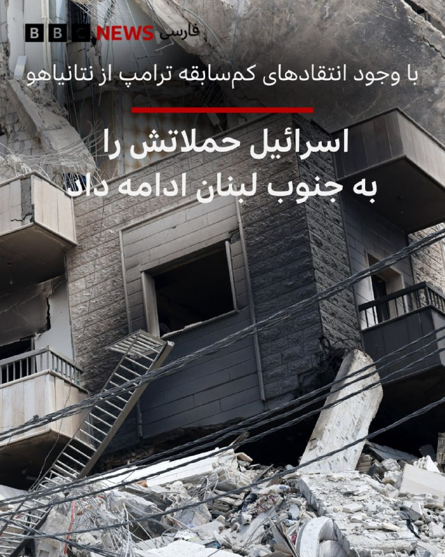

🔻حملات امروز اسرائیل به نقاطی در جنوب لبنان در حالی رخ داد که دونالد ترامپ دیروز در اظهاراتی کم‌سابقه و صریح از عملکرد بنیامین نتانیاهو در لبنان انتقاد کرد.

آقای ترامپ در حاشیه اجلاس گروه هفت در اویان فرانسه گفت که از حمله اسرائیل به بیروت دو ساعت پیش از اعلام تفاهم ایران و آمریکا ناراضی است هرچند که روابطش با بنیامین نتانیاهو خیلی خوب است.

آقای ترامپ گفت: «اسرائیل بیش از حد طولانی با حزب‌الله جنگیده است و بیش از حد مردم کشته شده‌اند. شما نباید هر وقت دنبال کسی هستید کل مجتمع آپارتمانی را پایین بیاورید چون مردم زیادی در آن آپارتمان‌ها زندگی می‌کنند و همه‌شان حز‌ب‌الله نیستند.»

او همچنین گفت برای مقابله با حزب‌الله احمد شرع عملکرد بهتری داشته است.

ایران هشدار داده است که هرگونه حمله اسرائیل به لبنان را نقض تفاهم با آمریکا تلقی‌ می‌کند.

عباس عراقچی، وزیر خارجه ایران گفت که از نظر تهران، یک طرف تفاهمنامه حاصل‌شده ایران و حزب‌الله است، و طرف دیگر آمریکا و اسرائیل.
ادامه مطلب⬇️

📸EPA/Shutterstock
https://bbc.in/4vaQP21
@BBCPersian

## idfinfarsi — post 11852

❌برای رفع تهدید: ارتش اسرائیل یک تروریست را که در نگهداری شمار زیادی از ربوده شدگان در اسارت حماس نقش داشت و یک تروریست دیگر را که در 7 اکتبر به کیبوتص بئری یورش برده بود، به هلاکت رساند

⭕️ارتش اسرائیل در پایان هفته گذشته (شنبه) در جنوب نوار غزه حمله کرد و تروریست محمد سعید احمد نمرُوطی، فرمانده دسته در سازمان تروریستی حماس را که در جریان کشتار 7 اکتبر به خاک اسرائیل نفوذ کرده بود، به هلاکت رساند.

در طول جنگ، نمرُوطی در نگهداری شمار زیادی از گروگان‌ها در اسارت تونل‌های حماس نقش داشت.

⭕️در حمله‌ای دیگر در مرکز نوار غزه، ارتش اسرائیل تروریست معاویه سلیمان زقر عایدی، فرمانده دسته در اردوگاه‌های مرکزی سازمان تروریستی جهاد اسلامی فلسطین را به هلاکت رساند. عایدی در جریان کشتار 7 اکتبر به کیبوتص بئری یورش برده بود.

⭕️در طول جنگ و در دوره اخیر، هر دو تروریست طرح‌های تروریستی علیه نیروهای ارتش اسرائیل و غیرنظامیان اسرائیلی را پیش برده بودند؛ عایدی همچنین در کارگذاری مواد منفجره نقش داشت. این تروریست‌ها پس از آنکه تهدیدی فوری برای نیروهای ارتش اسرائیل فعال در نوار غزه محسوب می‌شدند، در حملات دقیق به هلاکت رسیدند.

⭕️پیش از حمله، اقداماتی برای کاهش آسیب به غیرنظامیان انجام شد، از جمله استفاده از مهمات دقیق و رصدهای هوایی.

⭕️نیروهای ارتش اسرائیل تحت فرماندهی جنوب بر اساس توافق در منطقه مستقر هستند و به اقدام برای رفع هرگونه تهدید فوری ادامه خواهند داد.

## Dirty_Kids — post 392378

  <a href="telegram/content/Dirty_Kids_392378_1781696600.mp4" target="_blank">🎬 Download video</a>

من اون دی جی بودم وقتی زمان جنگ داشتم سعی میکردم حواسم رو صد درصد بذارم رو کارم درحالی که اون پشت املاکی کله زرد با آخوند داشت لاس میزد!

@Dirty_Kids 👻

## Dirty_Kids — post 392377

  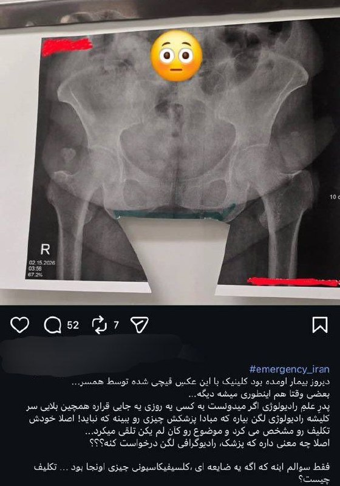

این عجیب ترین چیزی بود که میتونستم امروز ببینیم؛
یه مرد عکس لگن زنشو برده نشون دکتر بده زده ناحیه تناسلی رو با قیچی بریده که دکتر نبینه😐😂
مشخصه اول ماژیک کشیده دیده فایده نداره قیچیش کرده😂

@Dirty_Kids 👻

## Dirty_Kids — post 392376

  <a href="telegram/content/Dirty_Kids_392376_1781696603.mp4" target="_blank">🎬 Download video</a>

فشاری که روی لِگ هست، روی زندگیم نیست.

@Dirty_Kids 👻

## Dirty_Kids — post 392375

  <a href="telegram/content/Dirty_Kids_392375_1781696605.mp4" target="_blank">🎬 Download video</a>

تراپی 🤣🤣🤣🤣🤣
کسخلا رو ببینید لذت ببرید

@Dirty_Kids 👻

## Dirty_Kids — post 392374

  <a href="telegram/content/Dirty_Kids_392374_1781696606.mp4" target="_blank">🎬 Download video</a>

داداش اون گفت اونجا تتو کن تو چرا کردی

چرا پارتنرش پستونک داره😂کاش کات میکرد ولی اینو نمیزد

@Dirty_Kids 👻

## Dirty_Kids — post 392373

⚡️ جام جهانی شروع شده و میدون مال توئه! 
🌟 این #جام_جهانی رو فقط باید توی #بت فیدو پیش‌بینی کنی 
💰 با ۵۰ میلیون تومان شرط روزانه ← ۴ میلیون تومان اعتبار شرط‌بندی رایگان 
📊 با ۱۰۰ میلیون تومان شرط روزانه ← ۸ میلیون تومان اعتبار شرط‌بندی رایگان میدونستی با انتخاب…

## Dirty_Kids — post 392372

  <a href="telegram/content/Dirty_Kids_392372_1781696608.webm" target="_blank">🎬 Download video</a>

⚡️ جام جهانی شروع شده و میدون مال توئه!

🌟 این #جام_جهانی رو فقط باید توی #بت فیدو پیش‌بینی کنی

💰 با ۵۰ میلیون تومان شرط روزانه ← ۴ میلیون تومان اعتبار شرط‌بندی رایگان

📊 با ۱۰۰ میلیون تومان شرط روزانه ← ۸ میلیون تومان اعتبار شرط‌بندی رایگان

میدونستی با انتخاب برد پرتغال مقابل کنگو در نیمع اول با ده میلیون به راحتی ۱۶ میلیون تومن برنده میشی؟!
🇵🇹

💸 هرچی بزرگ‌تر بازی کنی، جایزت بزرگ‌تره!

🥅همین حالا پیش بینیتو ثبت کن
💖
https://fido874vt.click
https://fido874vt.click

👆
👆
👆
👆
👆
(ورود با وی-پی-ان غیر اروپایی)
❌
R27

📲کانال تلگرام 
👇
https://t.me/+dySI_QFj0T0xZGVk

## Dirty_Kids — post 392371

  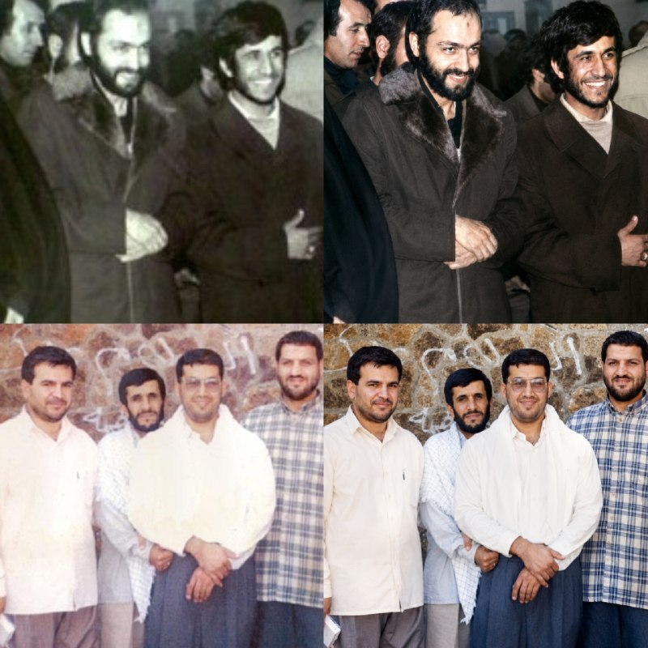

🔴 ترند‌ترین و محبو‌ترین پرامپت هوش مصنوعی تو 2 سال اخیر مربوط به این پرامپته؛

بااین پرامپت میتونی هرعکس قدیمی که از خودت، دوستت یا خانوادت داری و اگه کیفیتش خیلی پایین و رو مخه رو به حداکثر کیفیت برسونی:

- برای اکثر هوش‌های مصنوعی (ChatGPT، Gemini، Midjourney، Flux، Ideogram، Leonardo) این پرامپت نتیجه خیلی خوبی برای بازسازی عکس‌های قدیمی میده، فقط کافیه عکس مدنظرتو همراه با پرامپت زیر براش بفرستی :

Restore and enhance this old low-quality photograph. Recover lost details, remove blur, reduce noise, repair scratches and damage, improve facial features, sharpen eyes, restore realistic skin texture, correct colors naturally, enhance lighting and contrast, preserve original identity and authenticity, professional photo restoration, ultra-realistic, high-definition, true-to-life, 4K resolution, HDR quality, maximum detail.

‌
برای عکس‌های خیلی قدیمی و سیاه‌وسفید :

Professional restoration of an old historical photograph. Remove scratches, dust, stains and damage. Recover missing details, sharpen faces, improve focus, restore natural textures, realistic colorization, preserve historical accuracy, cinematic quality, ultra realistic, 4K HDR, museum-grade restoration.


‌
اگه فقط میخوای فقط کیفیت بالا بره ولی چهره تغییر نکنه :
Do not alter facial identity, preserve original appearance exactly.

+این پست رو یه گوشه ذخیره کن یه روزی حتماً بدرت میخوره.

@Dirty_Kids 👻

## Dirty_Kids — post 392370

  <a href="telegram/content/Dirty_Kids_392370_1781696610.mp4" target="_blank">🎬 Download video</a>

ببینید این خوش‌چشم چقد کصخل که عادلم میرینه بهش

بعد عرزشیا میشینن پای تحلیلای این میان واسه ما رجز میخونن :)))))

@Dirty_Kids 👻

## Dirty_Kids — post 392369

  

همه با امپاپه و مایکل اولیسه طرفدار فرانسه‌ میشن تو جامجهانی من ولی من با ایشون

@Dirty_Kids 👻

## Dirty_Kids — post 392368

  <a href="telegram/content/Dirty_Kids_392368_1781696612.mp4" target="_blank">🎬 Download video</a>

اولین بار هم ویدیو میبینم هم عکس...
خسته‌شو حاجب خسته‌شو یه پلک بزن

@Dirty_Kids 👻

## Dirty_Kids — post 392367

  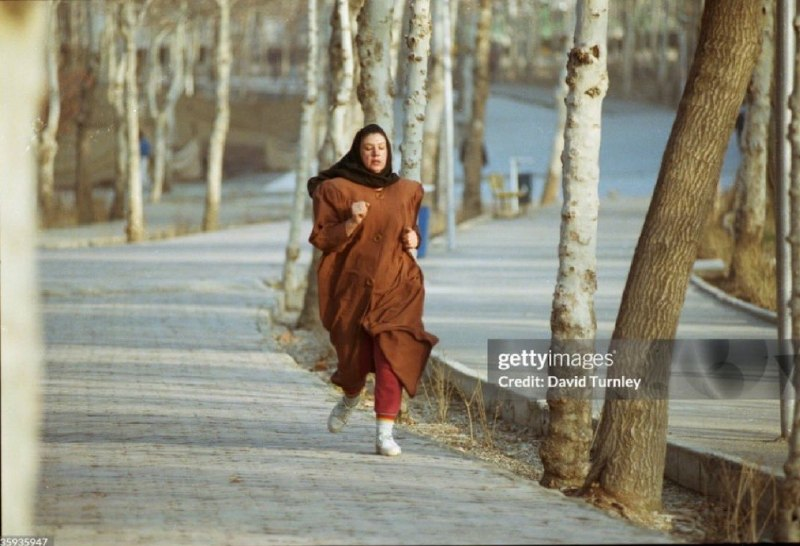

خانمی درحال ورزش صبح‌گاهی در پارکی در تهران، ۱۳۷۲ خورشیدی

@Dirty_Kids 👻

## Hranews — post 113670

  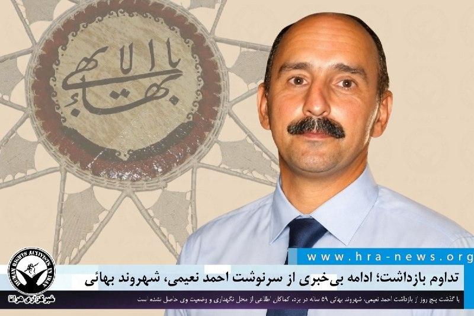

تداوم بازداشت؛ ادامه بی‌خبری از سرنوشت احمد نعیمی، شهروند بهائی

❗️
❗️
❗️
❗️
❗️– با گذشت پنج روز از بازداشت احمد نعیمی، شهروند بهائی ۵۹ ساله در یزد، کماکان اطلاعی از محل نگهداری و وضعیت وی حاصل نشده است. بی‌خبری از وضعیت این شهروند، منجر به افزایش نگرانی‌های خانواده او شده است.

به گزارش خبرگزاری هرانا، ارگان خبری مجموعه فعالان حقوق بشر در ایران، احمد نعیمی، شهروند بهائی در بازداشت بسر میبرد.

براساس اطلاعات دریافتی هرانا، با وجود گذشت پنج روز از زمان بازداشت آقای نعیمی، وی همچنان در وضعیت بلاتکلیف به‌سر می‌برد و از محل نگهداری این شهروند بهائی اطلاعی حاصل نشده است.

یک منبع مطلع نزدیک به خانواده آقای نعیمی، ضمن تایید تداوم بی‌خبری از وضعیت وی گفت که این شهروند بهائی تاکنون تماسی با خانواده خود نداشته است و پیگیری‌های بستگان او از دادسرای یزد برای کسب اطلاع از سرنوشت این شهروند تاکنون بی‌نتیجه مانده است؛ شرایطی که بر نگرانی‌های خانواده افزوده است.

ادامه مطلب

#احمد_نعیمی

↘️
@hranews_bot تماس ✉️ - @Hranews کانال هرانا 🆑

## Hranews — post 113669

  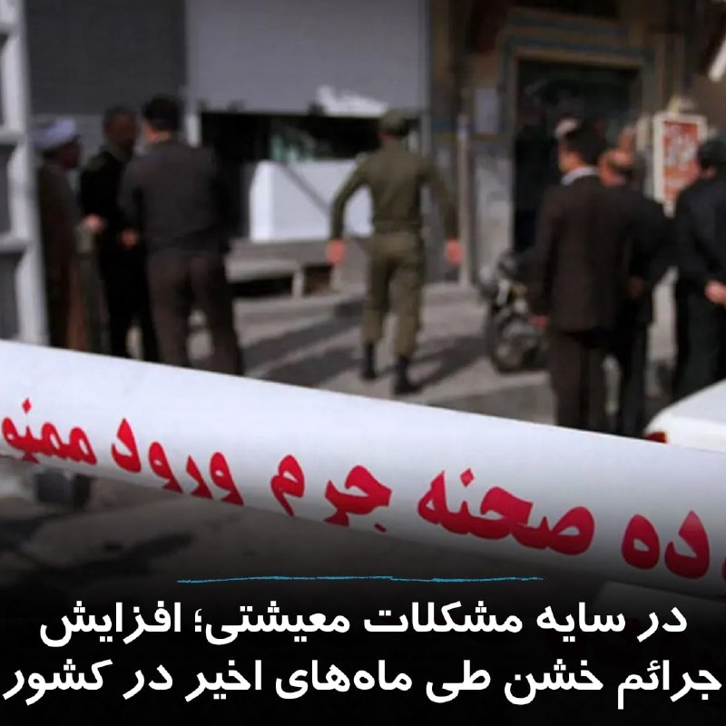

قاسم قاسمی، جرم‌شناس، از افزایش جرائم در کشور به‌ویژه جرائم علیه اموال و جرائم خشن در ماه‌های اخیر خبر داد. وی با بیان اینکه تبیین علل افزایش جرم نیازمند دسترسی به آمار جنایی و بررسی تفکیک جغرافیایی آن است، عواملی همچون نرخ تورم، بیکاری و تعارضات فرهنگی را از مهم‌ترین زمینه‌های افزایش جرائم در کشور دانست. قاسمی همچنین با اشاره به افزایش موارد خشونت خانگی، همزیستی اجباری ناشی از مشکلات معیشتی را از مهم‌ترین دلایل وقوع این نوع جرائم عنوان کرد.

وی همچنین با انتقاد از عدم شفافیت در ارائه آمار جرائم، اظهار داشت: «مجازات با هدف کاهش جرم اعمال می‌شود، اما به نظر می‌رسد دستگاه قضایی در سال‌های اخیر در این زمینه با چالش‌هایی مواجه بوده است. با وجود تلاش‌های صورت‌گرفته برای مقابله با جرائم مالی، این تصور در جامعه شکل گرفته که مرتکبان جرائم اقتصادی از نوعی مصونیت نسبی برخوردارند؛ موضوعی که می‌تواند بر بازدارندگی مجازات‌ها تأثیر بگذارد.»
#خشونت_خانگی #افزایش_جرم

↘️
@hranews_bot تماس ✉️ - @Hranews کانال هرانا 🆑

## Hranews — post 113668

بوکان؛ علی شکری توسط نیروهای امنیتی بازداشت شد

❗️
❗️
❗️
❗️
❗️– روز سه‌شنبه ۲۶ خردادماه، علی شکری، شهروند اهل بوکان توسط نیروهای امنیتی بازداشت و به یکی از بازداشتگاه های امنیتی ارومیه منتقل شده است.

ادامه مطلب

#علی_شکری

↘️
@hranews_bot تماس ✉️ - @Hranews کانال هرانا 🆑

## Hranews — post 113667

جرائم مواد مخدر؛ یک زندانی در زندان زابل اعدام شد

❗️
❗️
❗️
❗️
❗️– سحرگاه امروز چهارشنبه ۲۷ خردادماه، حکم یک زندانی که پیشتر از بابت اتهامات مرتبط با جرائم مواد مخدر به #اعدام محکوم شده بود، در زندان زابل اجرا شد.

ادامه مطلب

#عارف_براهویی (#عارف_عیدوزهی)

↘️
@hranews_bot تماس ✉️ - @Hranews کانال هرانا 🆑

## Hranews — post 113666

  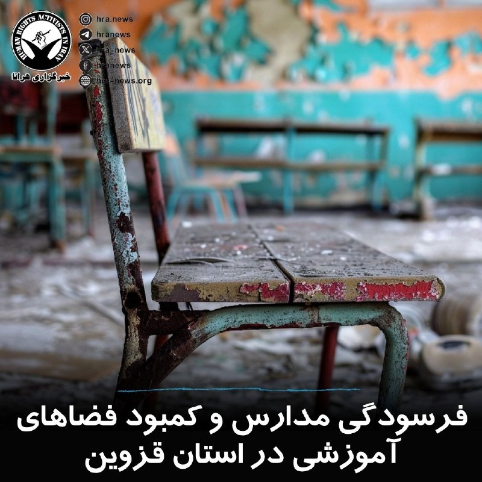

مدیرکل نوسازی مدارس قزوین گفت: این استان دارای ۱٬۶۷۰ فضای آموزشی است که از این میزان، ۵۱٪ مستحکم، ۳۰٪ نیازمند تخریب و بازسازی و ۱۹٪ نیازمند مقاوم‌سازی و بهسازی هستند. مجتبی پورعباسی همچنین اظهار کرد: ۲۱ مدرسه تخریبی، ۵۲ مدرسه نیمه‌تمام و ۳۳ مدرسه مرتبط با کمبود سرانه آموزشی در قالب طرح توسعه عدالت آموزشی استان در حال رسیدگی هستند.

به گفته وی، در برخی مناطق استان قزوین سرانه آموزشی پایین‌تر از میانگین کشوری است و در ناحیه شهری مهرگان نیز این شاخص به حدود نصف میانگین کشور رسیده است. پورعباسی افزود: برای رسیدن به سطح استاندارد، احداث حدود ۲۰ مدرسه جدید در این منطقه ضرورت دارد.

#کمبود_مدرسه #فرسودگی_مدارس

↘️
@hranews_bot تماس ✉️ - @Hranews کانال هرانا 🆑

## Hranews — post 113665

تصادف اتوبوس حامل کارگران در رشت به مصدومیت ۱۴ کارگر انجامید

❗️
❗️
❗️
❗️
❗️– عصر روز گذشته، بر اثر حادثه برخورد یک دستگاه اتوبوس حامل #کارگران با یک دستگاه کامیون در محور جاده تهران-رشت، ۱۴ کارگر مصدوم شدند.

ادامه مطلب

↘️
@hranews_bot تماس ✉️ - @Hranews کانال هرانا 🆑

## Hranews — post 113664

دو شهروند در تالش بازداشت شدند

❗️
❗️
❗️
❗️
❗️– دو شهروند در شهرستان تالش به اتهام آنچه «تشویش اذهان عمومی» در فضای مجازی عنوان شده، توسط نیروهای انتظامی #بازداشت و به مرجع قضایی معرفی شدند.

ادامه مطلب

↘️
@hranews_bot تماس ✉️ - @Hranews کانال هرانا 🆑

## Hranews — post 113663

بخش دیگری از اموال سردار آزمون، بازیکن فوتبال توقیف شد

❗️
❗️
❗️
❗️
❗️– فرمانده انتظامی شهرستان کرمان از توقیف یک دستگاه خودرو متعلق به سردار آزمون، بازیکن فوتبال ساکن خارج از کشور، در ادامه روند اجرای پرونده توقیف اموال وی خبر داد. پیشتر نیز بخشی از دارایی‌های او توقیف شده بود.

ادامه مطلب

#سردار_آزمون #توقیف_اموال

↘️
@hranews_bot تماس ✉️ - @Hranews کانال هرانا 🆑

## Hranews — post 113662

یک زندانی در زندان سنندج اعدام شد

❗️
❗️
❗️
❗️
❗️– روز گذشته، حکم یک زندانی که پیشتر از بابت اتهام قتل به #اعدام محکوم شده بود، در زندان سنندج اجرا شد.

ادامه مطلب

#محمد_احمدی

↘️
@hranews_bot تماس ✉️ - @Hranews کانال هرانا 🆑

## Hranews — post 113661

یک شهروند در سقز توسط نیروهای امنیتی بازداشت شد

❗️
❗️
❗️
❗️
❗️– روز دوشنبه ۲۵ خردادماه، اشکان آبخو، شهروند اهل سقز توسط نیروهای امنیتی در این شهرستان بازداشت و به مکانی نامعلوم منتقل شده است.

ادامه مطلب

#اشکان_آبخو

↘️
@hranews_bot تماس ✉️ - @Hranews کانال هرانا 🆑

## manototv — post 106109

  <a href="telegram/content/manototv_106109_1781696615.mp4" target="_blank">🎬 Download video</a>

پشتِ توافق احتمالی آمریکا و جمهوری اسلامی، فقط بحث هسته‌ای نیست. مسئله اصلی مسیرهای مالی است، از نفت و دارایی‌های بلوکه‌شده تا صندوق سرمایه‌گذاری ۳۰۰ میلیارد دلاری.

## manototv — post 106108

  <a href="telegram/content/manototv_106108_1781696616.mp4" target="_blank">🎬 Download video</a>

بخشی از یک گفت‌وگوی اختصاصی و کمتر دیده‌ شده میان خبرنگار رادیو و تلویزیون ملی ایران در لندن و رئیس اداره اطلاعات و سخنگوی سفارت اتحادجماهیر شوروی.
این مصاحبه در اوج تنش‌های جنگ سرد و پس از اخراج دیپلمات‌های شوروی از بریتانیا انجام شده و دیدگاه رسمی شوروی درباره این بحران را روایت می‌کند.
برای تماشای نسخه کامل این مصاحبه و صدها فیلم آرشیوی نایاب دیگر، کانال یوتیوب Manoto را دنبال کنید.

## alonews — post 128659

  <a href="telegram/content/alonews_128659_1781696618.webm" target="_blank">🎬 Download video</a>

👈ترامپ: من با رئیس جمهور سوریه در مورد احتمال جنگ علیه حزب الله صحبت کردم.

✅ @AloNews خبر جنگ

## alonews — post 128658

  <a href="telegram/content/alonews_128658_1781696618.webm" target="_blank">🎬 Download video</a>

👈حزب‌الله فیلمی منتشر کرده که تاریخ آن ۱۴ ژوئن است و نشان می‌دهد نیروهایش با استفاده از پهپاد حمله‌ای ابابیل، یک خودروی زرهی اسرائیلی را در حومه مجدل زون در جنوب لبنان هدف قرار می‌دهند

✅ @AloNews خبر جنگ

## alonews — post 128657

  <a href="telegram/content/alonews_128657_1781696618.mp4" target="_blank">🎬 Download video</a>

👈ترامپ درباره ایران: ما مردی به نام سلیمانی را از بین بردیم. فکر می‌کنید اگر او زنده بود، این اتفاق می‌افتاد؟

🔴او نابغه‌ای شرور بود

✅ @AloNews خبر جنگ

## alonews — post 128656

  <a href="telegram/content/alonews_128656_1781696620.mp4" target="_blank">🎬 Download video</a>

👈رئیس‌جمهور مصر سیسی به ترامپ:
نمی‌توانم به اندازه کافی تأکید کنم که چقدر برای شما احترام قائلم

✅ @AloNews خبر جنگ

## alonews — post 128655

  <a href="telegram/content/alonews_128655_1781696622.webm" target="_blank">🎬 Download video</a>

👈ترامپ درباره ایران: دلیل پایین ماندن قیمت نفت این است که هر شب کشتی‌هایی را از بین می‌بردیم که حتی شما از آن‌ها خبر نداشتید.

🔴دو روز پیش، سه روز پیش، یک ماه پیش، ۲۲ کشتی را از بین بردیم. به طور متوسط هر شب بین ۱۵ تا ۲۵ کشتی را از بین می‌بردیم. هیچ‌کس این را نمی‌دانست.

🔴نیروی دریایی ما کار بزرگی انجام داد. هیچ‌کس نمی‌دانست چه اتفاقی می‌افتد. به همین دلیل نفت به ۳۰۰ دلار در هر بشکه نرسید؛ بلکه به ۱۲۵ تا ۱۵۰ دلار رسید.

🔴حالا قیمت آن ۷۲، ۷۳ دلار است. شنیده‌ام که الان حتی کمتر از این است

✅ @AloNews خبر جنگ

## alonews — post 128654

  <a href="telegram/content/alonews_128654_1781696622.webm" target="_blank">🎬 Download video</a>

👈ترامپ: قیمت نفت بلافاصله پس از اعلام توافق با ایران کاهش یافت

✅ @AloNews خبر جنگ

## alonews — post 128653

  <a href="telegram/content/alonews_128653_1781696622.webm" target="_blank">🎬 Download video</a>

👈روزنامه کیهان: مجلس باید جلوی مذاکره پنهانی با آمریکا رو بگیره

✅ @AloNews خبر جنگ

## alonews — post 128652

  <a href="telegram/content/alonews_128652_1781696623.mp4" target="_blank">🎬 Download video</a>

👈ورود نیروهای اسرائیلی به شهر بیت امر تو شمال الخلیل

✅ @AloNews خبر جنگ

## alonews — post 128651

  <a href="telegram/content/alonews_128651_1781696624.webm" target="_blank">🎬 Download video</a>

👈ترامپ درباره اوباما و ایران: هیچ‌کس نمی‌توانست این توافق را انجام دهد.

🔴برجام توسط اوباما انجام شد؛ او ۱.۷ میلیارد دلار پول نقد سبز از بانک‌ها به آنها داد، آن را در یک بوئینگ ۷۵۷ گذاشت و به ایران پرواز داد. و آنها کنار هواپیما ایستادند. من عکس‌هایی از آن دارم: «وای خدای من. نگاه کن به این پولی که به ما می‌دهد.»

🔴او تلاش کرد با رشوه راه فرار پیدا کند. من این کار را نکردم. هیچ‌کس به این اشاره نمی‌کند.

🔴و می‌دانید ایرانی‌ها چه کردند؟ به اوباما خندیدند و گفتند: «او یک پسر احمق لعنتی است.»

✅ @AloNews خبر جنگ

## alonews — post 128650

  <a href="telegram/content/alonews_128650_1781696624.mp4" target="_blank">🎬 Download video</a>

👈ترامپ: فراموش نکنید، هیچ‌کس هرگز به اندازه من با ایران سخت‌گیر نبوده است.

🔴این کار باید توسط کلینتون و باراک حسین اوباما انجام می‌شد. این کار باید توسط بایدن، بوش و بسیاری از افراد دیگر انجام می‌شد.

✅ @AloNews خبر جنگ

## alonews — post 128649

  <a href="telegram/content/alonews_128649_1781696626.mp4" target="_blank">🎬 Download video</a>

👈ترامپ: قابلیت پرداخت فقط یک حقه دیگر است. آنها کلمه «قابلیت پرداخت» را ساختند

✅ @AloNews خبر جنگ

## alonews — post 128648

  <a href="telegram/content/alonews_128648_1781696628.webm" target="_blank">🎬 Download video</a>

👈بروجردی، عضو کمیسیون امنیت ملی و سیاست خارجی مجلس: تفاهم‌نامه نیازی به تصویب مجلس ندارد/ ایران دانش هسته‌ای را رها نمی‌کند

✅ @AloNews خبر جنگ

## alonews — post 128647

  <a href="telegram/content/alonews_128647_1781696628.webm" target="_blank">🎬 Download video</a>

👈گزارشگر: گزارش شده است که این توافق شامل صندوقی به ارزش ۳۰۰ میلیارد دلار برای ایران است.

🔴ترامپ: نه، این دروغ است. ما سرمایه‌گذاری نمی‌کنیم. مردم می‌توانند تصمیم بگیرند که این کار را انجام دهند، اما این به خودشان بستگی دارد.

🔴آیا می‌خواهید بگویم که هیچ‌کس هرگز مجاز نیست در یک کشور سرمایه‌گذاری کند؟

✅ @AloNews خبر جنگ

## alonews — post 128646

  <a href="telegram/content/alonews_128646_1781696628.mp4" target="_blank">🎬 Download video</a>

👈ترامپ درباره توافق ایران: متن نهایی نیست؛ این یک یادداشت تفاهم است!

🔴اگر از آن خوشم نیاید، دوباره به بمباران سرشان باز خواهیم گشت.

🔴همچنین اگر آنها رفتار مناسبی نداشته باشند، ما دوباره به بمباران باز خواهیم گشت

✅ @AloNews خبر جنگ

## alonews — post 128645

  <a href="telegram/content/alonews_128645_1781696630.webm" target="_blank">🎬 Download video</a>

👈ترامپ: توافق با ایران به دلایل زیادی خوب است، از جمله جلوگیری از دستیابی این کشور به سلاح هسته‌ای، و باز شدن تنگه هرمز تا دو روز اینده

✅ @AloNews خبر جنگ

## alonews — post 128644

  <a href="telegram/content/alonews_128644_1781696630.webm" target="_blank">🎬 Download video</a>

👈عضو تیم رسانه‌ای هیئت مذاکره کننده هسته‌ای ایران: ما تعهد هسته‌ای نداده‌ایم/ گفت‌وگوی هسته‌ای در مرحله بعد از اعتمادسازی انجام می‌شود

✅ @AloNews خبر جنگ

## alonews — post 128643

  <a href="telegram/content/alonews_128643_1781696630.webm" target="_blank">🎬 Download video</a>

🔴فوری / فاکس نیوز: ترامپ به زودی درباره توافق ایران کنفرانس خبری برگزار می‌کند

✅ @AloNews خبر جنگ

## alonews — post 128642

  <a href="telegram/content/alonews_128642_1781696630.mp4" target="_blank">🎬 Download video</a>

👈دعوت ترامپ از خبرنگاران برای ماندن در جلسه و اخراج آنها توسط مکرون

🔴در نشست سران گروه هفت در فرانسه، ترامپ به خبرنگاران گفت که می توانند در جلسه بمانند، اما مکرون با اشاره آنها را بیرون فرستاد. این لحظه در حالی ثبت شد که مکرون پیشتر در گفتوگویی محرمانه با زلنسکی به تنش با ترامپ اشاره کرده بود.

✅ @AloNews خبر جنگ

## alonews — post 128641

  <a href="telegram/content/alonews_128641_1781696632.webm" target="_blank">🎬 Download video</a>

👈وزیر دفاع اسرائیل کاتز: هر کس دست به اقدامی علیه دولت اسرائیل در غزه، لبنان، سوریه یا هر جای دیگری بردارد، بداند که باید بهای آن را بپردازد.

🔴اول از همه، زمین را از دست می‌دهند. خانه را از دست می‌دهند.

✅ @AloNews خبر جنگ

## alonews — post 128640

  <a href="telegram/content/alonews_128640_1781696632.mp4" target="_blank">🎬 Download video</a>

👈 وزیر دفاع اسرائیل کاتز: تمام روستاهای نزدیک به مرز لبنان به صورت سیستماتیک ویران می‌شوند.

✅ @AloNews خبر جنگ

---
📅 بروزرسانی: 1405/03/27 10:33
---

## VahidOOnLine — post 245971

  

♦️لیونل مسی، مهاجم ۳۸ ساله تیم ملی آرژانتین پس از آنکه سه بار دروازه الجزایر را در نخستین دیدار جام جهانی باز کرد، رکورد بهترین گل‌ زن تاریخ جام جهانی را در کنار میروسلاو کلوزه آلمانی به دست آورد.

این اولین «هت‌تریک» (سه‌ گل در یک بازی) مسی در جام جهانی بود، شاهکاری که تنها کریستیانو رونالدو به آن دست یافته است.

جادوگر آلبی‌سلسته‌ها در دقیقه ۷۹ در میان تشویق و احترام تماشاگران تعویض شد.
‌🇸🇦 Indypersian

🤖 @VahidOOnLine

## VahidOOnLine — post 245970

  <a href="telegram/content/VahidOOnLine_245970_1781679836.mp4" target="_blank">🎬 Download video</a>

جی‌دی ونس، معاون رییس‌جمهوری آمریکا، ادعای پرداخت پول از سوی واشینگتن به تهران را رد کرد و گفت جمهوری اسلامی تا زمانی که به حمایت مالی از حزب‌الله و دیگر گروه‌های مورد حمایت خود ادامه دهد، از مزایای اقتصادی توافق بهره‌مند نخواهد شد.

گزارش مریم رحمتی، خبرنگار ایران‌اینترنشنال
‌🏁 🇬🇧 IranintlTV

🤖 @VahidOOnLine

## VahidOOnLine — post 245969

🗣روایت شما از بحران اقتصادی و زندگی بعد از توافق- چهارشنبه ۲۷ خرداد:

🔹زیر سایه این حکومت سوختیم. چشم‌مون را روی همه آرزوهامون بستیم. مثل تراکتور کار کردیم، تنها دلخوشی‌مون خانواده بود تا یک زندگی بسازیم به‌بهای برباد رفتن جوونی‌مون. حالا که بچه‌ها بزرگ شدند، دردمون هزار برابر شده با خرج‌های کمرشکن و دغدغه آینده بچه‌ها.

🔹هزینه‌های پزشکی مخصوصا ارتوپدی کمرشکن شده؛ یک صندل و کفی برای کفش شده ۹ میلیون و ۵۰۰ هزار تومان. کف پای دخترم صافه و هزینه عمل می‌شه ۲۵۰ میلیون تومان.

🔹بعد از اختلالی که در بانک تجارت پیش اومد، مبالغی که از پوز تجارت کارت کشیده شده به حسابمون برنگشته. دزدی در روز روشن؟

🔹من یه دست‌فروش خرده‌فروشم. کل سرمایه‌ام همون جنسیه که هر روز می‌فروشم. حالا که بانک تجارت پولی که مشتریام کارت کشیدن رو به حسابم واریز نمی‌کنه، چطور جنس جدید بیارم؟ سه روزه نمی‌تونم برم بازار.

🔹بیمار قلبی هستم؛ طی کمتر از یک ماه، قیمت داروهایم از ۳.۵ میلیون به ۱۴ میلیون و ۷۰۰ هزار تومان رسیده است.

🔹یک شانه تخم‌مرغ شده ۴۹۵ هزار تومان، نیم کیلو گوشت چرخ کرده مخلوط گوسفند و گوساله ۶۲۵ هزار تومان، یه رب گوجه ۴۰۰ گرمی ۱۰۰ هزار تومان.
‌🏁 🇬🇧 IranintlTV

🤖 @VahidOOnLine

## VahidOOnLine — post 245968

  <a href="telegram/content/VahidOOnLine_245968_1781679838.mp4" target="_blank">🎬 Download video</a>

♦️تصاویر «دست دادن با اکراه» دونالد ترامپ، رئیس جمهوری آمریکا با امانوئل مکرون، رئیس جمهوری فرانسه در جریان نشست سران گروه ۷ (جی ۷) خبرساز شده است.

در این ویدیو دیده می‌شود که در زمان گرفتن عکس رهبران دو کشور، مکرون پس از درخواست خبرنگاران، دستش را به سوی دونالد ترامپ دراز می‌کند اما رئیس جمهوری آمریکا، برخلاف دست دادن‌های طولانی و «پرفشار» سابق، این بار با بی‌میلی تمام با همتای فرانسوی دست می‌دهد.

خبرنگار شبکه ب‌اف‌ام فرانسه، این وضعیت را با دست دادن طولانی‌مدت و گرم ترامپ با برژیت مکرون در جریان همین اجلاس مقایسه کرد.
‌🇸🇦 Indypersian

🤖 @VahidOOnLine

## VahidOOnLine — post 245967

⭕️۱۴ بند یادداشت تفاهم تهران و واشنگتن به روایت بلومبرگ؛ تا دستیابی به توافق نهایی، ایران سطح کنونی برنامه هسته‌ای را حفظ می‌کند

📌آمریکا متعهد می‌شود با توجه به پیشرفت مذاکرات رسیدن به توافق نهایی،منابع مالی مسدود شده ایران آزاد شوند؛این منابع،چه در حساب‌های اصلی نگهداری شوند و چه منتقل شوند،برای پرداخت به هر ذی‌نفع نهایی که بانک مرکزی ایران تعیین کند، مورد استفاده قرار می‌گیرند

♦️انتظار می‌رود نمایندگان آمریکا و حکومت ایران روز جمعه یک یادداشت تفاهم امضا کنند که راه را برای ۶۰ روز مذاکره با هدف پایان دادن به جنگ و اعمال محدودیت‌های جدید بر برنامه هسته‌ای ایران هموار می‌کند.
بلومبرگ می‌گوید نسخه‌ای از این یادداشت تفاهم را مشاهده کرده و ۱۴ بند آن را به این ترتیب شرح داده است:

بیشتر بخوانید...
‌🇸🇦 Indypersian

🤖 @VahidOOnLine

## VahidOOnLine — post 245966

  <a href="telegram/content/VahidOOnLine_245966_1781679839.mp4" target="_blank">🎬 Download video</a>

سرخط خبرهای چهارشنبه ۲۷ خرداد
‌🏁 🇬🇧 IranintlTV

🤖 @VahidOOnLine

## VahidOOnLine — post 245965

  

دنی دانون، سفیر اسرائیل در سازمان ملل، با بازنشر گزارشی از شبکه ۱۴ اسرائیل درباره کشتار دی‌ماه، در ایکس نوشت: «قربانیان سرکوب در ایران و خانواده‌های آن‌ها شایسته حقیقت، شفافیت و پاسخگویی هستند. جامعه بین‌المللی نباید در برابر این وضعیت بی‌تفاوت بماند.»
او گفت: «تاریخ حکومت ایران با رنج مردم خود نوشته شده است؛ اتاق‌های شکنجه، گورهای دسته‌جمعی، ناپدیدسازی اجباری و خانواده‌هایی که بدون پاسخ رها شده‌اند.»

‌🏁 🇬🇧 IranintlTV

🤖 @VahidOOnLine

## VahidOOnLine — post 245964

♦️سعید آجرلو، عضو تیم رسانه‌ای هیئت مذاکره‌کننده جمهوری اسلامی، با اشاره به منتشر نشدن متن یادداشت تفاهم با آمریکا گفت طرف آمریکایی از هدف و نیت مذاکره‌کنندگان ایرانی در به‌کار بردن برخی واژه‌ها و عبارات در متن آگاه نیست و به همین دلیل نباید این موارد علنی شود.
او با اشاره به انتقادها از برخی واژه‌های به‌کاررفته در متن گفت: «آمریکا مراد و قصد ما را از آوردن این کلمات نمی‌داند و نیتمان را نباید افشا کنیم.»
آجرلو همچنین گفت پس از روز جمعه امکان صحبت شفاف‌تر درباره متن تفاهم‌نامه وجود خواهد داشت و مدعی شد مقایسه نسخه‌های مختلف متن نشان می‌دهد آخرین نسخه تفاهم‌نامه نسبت به متن‌های اولیه، برای جمهوری اسلامی شرایط بهتری دارد.
‌🇸🇦 Indypersian

🤖 @VahidOOnLine

## VahidOOnLine — post 245963

♦️تیم ملی فوتبال نروژ در نخستین دیدار خود در جام جهانی ۲۰۲۶، موفق شد با نتیجه ۴ بر ۱ تیم ملی عراق را در ورزشگاه شهر بوستون آمریکا شکست دهد. این مسابقه از آن جهت اهمیت ویژه‌ای داشت که نروژ پس از ۲۸ سال و عراق پس از ۴ دهه انتظار بار دیگر در این تورنمنت بزرگ حضور یافته بودند.
به گزارش رویترز، ارلینگ هالند، ستاره ۲۵ ساله نروژ و آقای گل فصل گذشته لیگ برتر انگلیس که به او لقب «ترمیناتور» داده‌اند، قفل دروازه‌ها را در دقیقه ۲۸ باز کرد. اگرچه ایمن حسین، مهاجم ۳۰ ساله عراق در دقیقه ۳۹ بازی را به تساوی کشاند، اما هالند تنها سه دقیقه بعد گل دوم خود و نروژ را به ثمر رساند. در نیمه دوم نیز لئو اوستیگارد در دقیقه ۷۶ و کریستین ثورستود در وقت‌های تلف‌شده، پیروزی قاطع نروژ را کامل کردند. در دیدارهای بعدی این گروه که روز دوشنبه ۱ تیر برگزار می‌شود، عراق به مصاف فرانسه می‌رود و نروژ برابر سنگال صف‌آرایی خواهد کرد.
‌🇸🇦 Indypersian

🤖 @VahidOOnLine

## VahidOOnLine — post 245962

  

ان‌بی‌سی نیوز به نقل از یک مقام آمریکایی گزارش داد از زمان امضای یادداشت تفاهم جمهوری اسلامی و آمریکا، سپاه هر شب چندین پهپاد را به سمت کشتی‌های تجاری در تنگه هرمز پرتاب کرده، اما نیروهای آمریکا آنها را رهگیری کرده‌اند.
این مقام گفت ارتش آمریکا همچنان برای حمایت از عبور ایمن کشتی‌ها از تنگه هرمز، با شرکت‌های کشتیرانی تجاری هماهنگی می‌کند.

‌🏁 🇬🇧 IranintlTV

🤖 @VahidOOnLine

## VahidOOnLine — post 245961

  

♦️علیرضا فغانی، داور بین‌المللی فوتبال، با قضاوت دیدار فرانسه و سنگال در جام جهانی ۲۰۲۶، به یکی از نخستین داوران تاریخ فوتبال مردان تبدیل شد که در چهار دوره جام جهانی حضور داشته‌اند.
این داور باسابقه که در جام‌های جهانی ۲۰۱۴، ۲۰۱۸ و ۲۰۲۲ نیز حضور داشت، در سال ۲۰۱۴ به عنوان داور چهارم و در دو دوره بعدی به عنوان داور وسط در این رقابت‌ها فعالیت کرد. فغانی این بار پس از مهاجرت به استرالیا و خروج از فهرست داوران بین‌المللی ایران، به عنوان نماینده فدراسیون فوتبال استرالیا دیدار فرانسه و سنگال را قضاوت کرد.
این رکورد تاریخی در حالی ثبت شد که قوه قضاییه جمهوری اسلامی چند ماه پیش از توقیف اموال علیرضا فغانی به دلیل مخالفت با سیاست‌های حکومت خبر داده بود.
‌🇸🇦 Indypersian

🤖 @VahidOOnLine

## VahidOOnLine — post 245960

  

♦️خبرگزاری بلومبرگ در گزارشی اختصاصی، متن پیش‌نویس یک یادداشت تفاهم ۱۴ ماده‌ای میان ایالات متحده و ایران را منتشر کرد. بر اساس این گزارش، این تفاهم‌نامه مسیر را برای یک دوره ۶۰ روزه گفتگو با هدف پایان دادن به جنگ و اعمال محدودیت‌های جدید بر برنامه هسته‌ای ایران هموار می‌کند.
در بند چهاردهم این پیش‌نویس آمده است که ایران و آمریکا سازوکاری برای نظارت بر اجرای توافق نهایی و تعهدات آینده ایجاد خواهند کرد و توافق نهایی نیز از طریق یک قطعنامه الزام‌آور شورای امنیت سازمان ملل تایید خواهد شد.
بر اساس این سند، تهران و واشنگتن همچنین متعهد می‌شوند ظرف ۶۰ روز برای دستیابی به توافق نهایی مذاکره کنند و در این مدت وضعیت کنونی برنامه هسته‌ای ایران و تحریم‌های آمریکا حفظ شود.
‌🇸🇦 Indypersian

🤖 @VahidOOnLine

## WithYashar — post 15129

  <a href="telegram/content/WithYashar_15129_1781679843.mp4" target="_blank">🎬 Download video</a>

مایک پنس، معاون سابق ترامپ: «به نظر من بهتر است به نیروهای مسلح ایالات متحده اجازه دهیم کار را تمام کنند، تنگه را باز کنند و قابلیت‌های تهاجمی ایرانیان را از بین ببریم و به مردم ایران فرصتی واقعی برای آزادی بدهیم.»
@withyashar

## WithYashar — post 15128

چند ساعت پیش، دونالد ترامپ با استناد به قانون تولید دفاعی (یک قانون از سال ۱۹۵۰ در دوران جنگ سرد)، دستور داد تا تولید مهمات، موشک‌ها و تجهیزات دفاعی آمریکا سریع‌تر شود. این فرمان در ۱۱ ژوئن به وزیر دفاع پیته هگست ارسال شد و مشکلات سیستمی در صنعت مهمات را هدف گرفت: ظرفیت تولید محدود، زنجیره‌های تأمین ضعیف، وابستگی‌های طولانی‌مدت و گلوگاه‌های تولید.
هدف اصلی: تسریع تولید مهمات حیاتی، موشک‌ها و تجهیزات دفاعی برای دفاع ملی آمریکا.
نحوه اجرا: قانون به ترامپ اجازه می‌دهد با شرکت‌های خصوصی توافق‌های داوطلبه ایجاد کند، تولید را اولویت‌دار کند و زنجیره‌های تأمین را تقویت نماید.
توافق مهم: شرکت لاکهید مارتین اعلام کرد با دولت آمریکا برای چهار برابر کردن تولید مهمات حیاتی به توافق رسیده است.
دلیل اقدام: کاهش ذخایر تسلیحاتی آمریکا پس از جنگ با ایران و استفاده از مهمات در ایران و ونزوئلا، که باعث افزایش سفارشات مهمات شد.
@withyashar

## WithYashar — post 15127

  

️ارتش اسرائیل اعلام کرد یک انبار تسلیحات جدید حزب‌الله حاوی ۵ تن مواد منفجره و ده‌ها پهپاد انتحاری را کشف کرده است
@withyashar

## WithYashar — post 15126

## WithYashar — post 15125

تنکر ترکرز: ۳.۸ میلیون بشکه نفت خام ایران از محاصره آمریکا عبور کرد تارنمای تنکر ترکز بامداد چهارشنبه گزارش داد، دو ابرنفتکش ایران که مجموعا حامل ۳.۸ میلیون بشکه نفت خام هستند، از محاصره آمریکا عبور کردند @withyashar

## WithYashar — post 15124

خبرنگار العربیه: جنگنده‌های اسرائیلی دو بار به شهرک‌های «انصاریه» و «المنصوره» در جنوب لبنان حمله کردند.
@withyashar

## WithYashar — post 15123

بلومبرگ: به گفته مقامات آمریکایی، معافیت فروش نفت ایران فقط شامل محموله‌های نفتی می‌شود که قبلاً بارگیری شده است و شامل مجوز گسترده‌تر برای از سرگیری فروش نفت ایران نمی‌شود @withyashar

## WithYashar — post 15122

## WithYashar — post 15121

دنی دانون، سفیر اسرائیل در سازمان ملل، با بازنشر گزارشی از شبکه 14 اسرائیل درباره کشتار دی‌ماه، در ایکس نوشت:
«قربانیان سرکوب در ایران و خانواده‌های آن‌ها شایسته حقیقت، شفافیت و پاسخگویی هستند. جامعه بین‌المللی نباید در برابر این وضعیت بی‌تفاوت بماند.»
او گفت: «تاریخ حکومت ایران با رنج مردم خود نوشته شده است؛ اتاق‌های شکنجه، گورهای دسته‌جمعی، ناپدیدسازی اجباری و خانواده‌هایی که بدون پاسخ رها شده‌اند.»
@withyashar

## WithYashar — post 15120

منابع عربی: اسرائیل حومۀ شهرک نبطیه‌الفوقا در جنوب لبنان را هدف حملات قرار داد
@withyashar

## WithYashar — post 15119

وبسایت خبری سمافور: مارکو روبیو، وزیر خارجه دولت ترامپ با انعقاد یادداشت تفاهم نامه با ایران مخالفت کرده و هیچ اظهار نظری درباره رسیدن به توافق با ایران نمی‌کند.

وزیر خارجه آمریکا امیدی به رسیدن به توافق هسته‌ای در مذاکرات با ایران پس از امضای یادداشت تفاهم نامه ندارد و تاکنون درباره امضای یادداشت تفاهم نامه با ایران کاملاً سکوت کرده است
@withyashar

## WithYashar — post 15118

  

بلومبرگ: به گفته مقامات آمریکایی، معافیت فروش نفت ایران فقط شامل محموله‌های نفتی می‌شود که قبلاً بارگیری شده است و شامل مجوز گسترده‌تر برای از سرگیری فروش نفت ایران نمی‌شود
@withyashar

## WithYashar — post 15117

  

کاخ سفید:
«نه سلاح هسته‌ای، نه لغو کامل تحریم‌ها, نه پول»
@withyashar

## FoxNewsTwitter — post 343052

  <a href="telegram/content/FoxNewsTwitter_343052_1781679846.mp4" target="_blank">🎬 Download video</a>

Fox News (Twitter/X)

"If you believe that Jesus is the son of God, rose from the dead on the third day, there are a lot of progressives who will say you're a crazy person."

VP JD Vance took aim at what he called "progressive atheistic culture," arguing that many on the left dismiss traditional religious beliefs while embracing ideas he considers far less believable.

"Actually, you believe something that's far crazier and clearly a violation of nature." @Gutfeldfox

## FoxNewsTwitter — post 343051

  <a href="telegram/content/FoxNewsTwitter_343051_1781679848.mp4" target="_blank">🎬 Download video</a>

Fox News (Twitter/X)

"What really does bother me is that they don't show gratitude for the United States of America."

VP JD Vance blasted Democrats serving in public office during an appearance on @Gutfeldfox, arguing that too many spend their time criticizing the country rather than appreciating it.

Vance said he was raised to love America and be grateful for the opportunities it provides, calling patriotism a core value that shaped his upbringing.

He contrasted that outlook with what he sees from many on the left, saying a lack of appreciation for the country has become increasingly common in American politics.

## FoxNewsTwitter — post 343050

  <a href="telegram/content/FoxNewsTwitter_343050_1781679850.mp4" target="_blank">🎬 Download video</a>

Fox News (Twitter/X)

"Honestly Greg, I expected them to be absolutely vicious, and they were only a little bit vicious."

VP JD Vance is looking back on his recent appearance on The View and says it went better than he expected.

While appearing on @Gutfeldfox, Vance joked that "it wasn't as bad as I thought it was gonna be" despite sparring with the show's co-hosts over immigration, race, and his past "childless cat ladies" comments.

He even revealed what happened once the cameras stopped rolling: "Joy Behar even said during the break, not joking, she said, 'You know what, you're pretty good for a Republican.'"

## FoxNewsTwitter — post 343049

  <a href="telegram/content/FoxNewsTwitter_343049_1781679851.mp4" target="_blank">🎬 Download video</a>

Fox News (Twitter/X)

"Honestly Greg, I expected them to be absolutely vicious, and they were only a little bit vicious."

VP JD Vance is looking back on his recent appearance on The View and says it went better than he expected.

While appearing on Gutfeldfox, Vance joked that "it wasn't as bad as I thought it was gonna be" despite sparring with the show's co-hosts over immigration, race, and his past "childless cat ladies" comments.

He even revealed what happened once the cameras stopped rolling: "Joy Behar even said during the break, not joking, she said, 'You know what, you're pretty good for a Republican.'"

## FoxNewsTwitter — post 343048

  <a href="telegram/content/FoxNewsTwitter_343048_1781679853.mp4" target="_blank">🎬 Download video</a>

Fox News (Twitter/X)

"Donald Trump did exactly what he came to do."

VP JD Vance touted the administration's Iran strategy during an appearance on @Gutfeldfox, arguing that the U.S. achieved its core objectives and now holds the leverage moving forward.

"We accomplished what we set out to accomplish and now we have, as the president says, all the cards."

Vance pointed to the destruction of Iran's nuclear infrastructure and the ongoing negotiations with Tehran, saying any future economic benefits for Iran will depend entirely on whether it follows through on its commitments.

## pm_afshaa — post 94228

🔴وزیر دارایی اسرائیل، بزالئل سموتریچ:هیچ عقب‌نشینی از لبنان صورت نخواهد گرفت—نه تا جمعه و نه بعد از جمعه

💧 Rainbet.com the #1 Non-KYC Crypto Casino & Sportsbook @rainbetcom

😁 @Pm_Afshaa

## pm_afshaa — post 94227

  <a href="telegram/content/pm_afshaa_94227_1781679854.webm" target="_blank">🎬 Download video</a>

هنوز میرین گیگی 10 15 هزار تومن پول سرور میدین!؟
بیاین از اینجا سرعت بالاش رو بخرین فقط گیگی 3 هزار تومن
👇
👇
👇

⚡️ @Lex_Server

⚡️ @Lex_Server

## pm_afshaa — post 94225

🔴ارتش اسراییل: 4تروریست حزب‌الله که از حمایت ایران برخوردار بودند، در حملات جدید نیروهای دفاعی اسرائیل در جنوب لبنان کشته شدن

💧 Rainbet.com the #1 Non-KYC Crypto Casino & Sportsbook @rainbetcom

😁 @Pm_Afshaa

## VahidOnline — post 76439

  <a href="telegram/content/VahidOnline_76439_1781679855.mp4" target="_blank">🎬 Download video</a>

یک جت خصوصی تو یک اتوبان در تگزاس سقوط کرده، راننده‌ها رفتن کمک سرنشینها
J74wabx
یک نفر کشته شد؛ پنج نفر به دلیل استنشاق دود در بیمارستان بستری شدند.
AZ_Intel_

📡 @VahidOnline

## VahidOnline — post 76438

  

نخستین نفتکش‌های حامل نفت خام ایران از زمان آغاز محاصرۀ دریایی آمریکا، از تنگۀ هرمز خارج شدند. این موضوع را صبح چهارشنبه یکی از وب‌سایت‌های ردیابی کشتی‌ها اعلام کرد.

وبسایت «تنکر ترکِرز» (Tanker Trackers) که ذخیره و حمل‌ونقل محموله‌های نفتی را دنبال می‌کند، بر اساس داده‌های دیجیتال منطبق با تصاویر ماهواره‌ای، «اولین صادرات نفت خام ایران در دو ماه اخیر» را تأیید کرده است.
@VahidHeadline

📡 @VahidOnline

## IranIntlTV — post 342804

  <a href="telegram/content/IranIntlTV_342804_1781679856.mp4" target="_blank">🎬 Download video</a>

جی‌دی ونس، معاون رییس‌جمهوری آمریکا، ادعای پرداخت پول از سوی واشینگتن به تهران را رد کرد و گفت جمهوری اسلامی تا زمانی که به حمایت مالی از حزب‌الله و دیگر گروه‌های مورد حمایت خود ادامه دهد، از مزایای اقتصادی توافق بهره‌مند نخواهد شد.

گزارش مریم رحمتی، خبرنگار ایران‌اینترنشنال

## IranIntlTV — post 342803

🗣روایت شما از بحران اقتصادی و زندگی بعد از توافق- چهارشنبه ۲۷ خرداد:

🔹زیر سایه این حکومت سوختیم. چشم‌مون را روی همه آرزوهامون بستیم. مثل تراکتور کار کردیم، تنها دلخوشی‌مون خانواده بود تا یک زندگی بسازیم به‌بهای برباد رفتن جوونی‌مون. حالا که بچه‌ها بزرگ شدند، دردمون هزار برابر شده با خرج‌های کمرشکن و دغدغه آینده بچه‌ها.

🔹هزینه‌های پزشکی مخصوصا ارتوپدی کمرشکن شده؛ یک صندل و کفی برای کفش شده ۹ میلیون و ۵۰۰ هزار تومان. کف پای دخترم صافه و هزینه عمل می‌شه ۲۵۰ میلیون تومان.

🔹بعد از اختلالی که در بانک تجارت پیش اومد، مبالغی که از پوز تجارت کارت کشیده شده به حسابمون برنگشته. دزدی در روز روشن؟

🔹من یه دست‌فروش خرده‌فروشم. کل سرمایه‌ام همون جنسیه که هر روز می‌فروشم. حالا که بانک تجارت پولی که مشتریام کارت کشیدن رو به حسابم واریز نمی‌کنه، چطور جنس جدید بیارم؟ سه روزه نمی‌تونم برم بازار.

🔹بیمار قلبی هستم؛ طی کمتر از یک ماه، قیمت داروهایم از ۳.۵ میلیون به ۱۴ میلیون و ۷۰۰ هزار تومان رسیده است.

🔹یک شانه تخم‌مرغ شده ۴۹۵ هزار تومان، نیم کیلو گوشت چرخ کرده مخلوط گوسفند و گوساله ۶۲۵ هزار تومان، یه رب گوجه ۴۰۰ گرمی ۱۰۰ هزار تومان.

## IranIntlTV — post 342802

  

🔻تیم ملی فوتبال اتریش در اولین دیدار خود در جام جهانی ۲۰۲۶ از گروه J این رقابت‌ها با نتیجه ۳-۱ اردن را شکست داد.

🔹در این بازی ابتدا اشمید در دقیقه ۲۰ اتریش را پیش انداخت اما در دقیقه ۵۰ علی عولان گل تساوی را برای اردن به ثمر رساند.

🔹در ادامه همچنین علی عرب بازیکن اردن در دقیقه ۷۶ به اشتباه دروازه خودی را باز کرد. اما این پایان کار نبود و آرناتوویچ در دقیقه ۱۲+۹۰ از روی نقطه پنالتی گل سوم اتریش را وارد دروازه اردن کرد تا اتریش جام جهانی را با پیروزی قاطع آغاز کند.

@iranintltvsport

## IranIntlTV — post 342801

  <a href="telegram/content/IranIntlTV_342801_1781679857.mp4" target="_blank">🎬 Download video</a>

رویترز گزارش داد شرکت‌هایی از آمریکا، کشورهای عربی حاشیه خلیج فارس، آسیا، آفریقا و آمریکای جنوبی متعهد شده‌اند بیش از ۱۵۰ میلیارد دلار از منابع صندوق ۳۰۰ میلیارد دلاری بازسازی و توسعه ایران را تامین کنند
@iranintltv

## IranIntlTV — post 342800

  <a href="telegram/content/IranIntlTV_342800_1781679859.mp4" target="_blank">🎬 Download video</a>

جی‌دی ونس، معاون رییس‌جمهوری آمریکا، ادعای پرداخت پول از سوی واشینگتن به تهران را رد کرد و گفت جمهوری اسلامی تا زمانی که به حمایت مالی از حزب‌الله و دیگر گروه‌های مورد حمایت خود ادامه دهد، از مزایای اقتصادی توافق بهره‌مند نخواهد شد.

گزارش مریم رحمتی، خبرنگار ایران‌اینترنشنال
@iranintltv

## IranIntlTV — post 342799

  <a href="telegram/content/IranIntlTV_342799_1781679860.mp4" target="_blank">🎬 Download video</a>

سرخط خبرهای چهارشنبه ۲۷ خرداد

## IranIntlTV — post 342798

  

دنی دانون، سفیر اسرائیل در سازمان ملل، با بازنشر گزارشی از شبکه ۱۴ اسرائیل درباره کشتار دی‌ماه، در ایکس نوشت: «قربانیان سرکوب در ایران و خانواده‌های آن‌ها شایسته حقیقت، شفافیت و پاسخگویی هستند. جامعه بین‌المللی نباید در برابر این وضعیت بی‌تفاوت بماند.»
او گفت: «تاریخ حکومت ایران با رنج مردم خود نوشته شده است؛ اتاق‌های شکنجه، گورهای دسته‌جمعی، ناپدیدسازی اجباری و خانواده‌هایی که بدون پاسخ رها شده‌اند.»

https://iranintl.com/202606170389

## IranIntlTV — post 342797

  

🔻تیم فوتبال آرژانتین، قهرمان دوره گذشته جام جهانی در اولین دیدار خود در جام جهانی ۲۰۲۶ با نتیجه ۳-۰ الجزایر را شکست داد.

🔹در این بازی لیونل مسی هر سه گل آلبی سلسته را به ثمر رساند و تعداد گل‌هایش در ادوار جام جهانی را به عدد ۱۶ رساند و به رکورد میروسلاو کلوزه، بهترین گلزن تاریخ جام جهانی رسید.

@iranintltvsport

## IranIntlTV — post 342796

  

ارلینگ هالند در نخستین حضورش در جام جهانی، در دقایق ۲۹ و ۴۳ با زدن دو گل در نیمه نخست، نقش مهمی در پیروزی ۴ بر ۱ نروژ مقابل عراق در نخستین دیدار گروه I برای هر دو تیم داشت.
در این مسابقه که سه‌شنبه در فاکسبورو، ایالت ماساچوست برگزار شد، ایمن حسین در دقیقه ۳۹ برای عراق گل زد. لئو اوستیگارد از تیم نروژ که به‌عنوان بازیکن تعویضی وارد زمین شده بود، در دقیقه ۷۶ نتیجه را ۳ بر ۱ کرد. گل چهارم نروژ نیز در ششمین دقیقه وقت‌های تلف‌شده نیمه دوم با گل به خودی ایمن حسین رقم خورد.

https://iranintl.com/202606178155

## IranIntlTV — post 342795

  

ان‌بی‌سی نیوز به نقل از یک مقام آمریکایی گزارش داد از زمان امضای یادداشت تفاهم جمهوری اسلامی و آمریکا، سپاه هر شب چندین پهپاد را به سمت کشتی‌های تجاری در تنگه هرمز پرتاب کرده، اما نیروهای آمریکا آنها را رهگیری کرده‌اند.
این مقام گفت ارتش آمریکا همچنان برای حمایت از عبور ایمن کشتی‌ها از تنگه هرمز، با شرکت‌های کشتیرانی تجاری هماهنگی می‌کند.

https://iranintl.com/202606172267

## FarsiVOA — post 220991

  

در حالی مقامات جمهوری اسلامی از کسری فزاینده گاز به خاطر آنچه «آسیب‌های جنگ به تاسیسات گازی عسلویه» خبر می‌دهند که صادرات گاز کشور به ترکیه کماکان روند صعودی چشمگیری را تجربه می‌کند.

گزارش جدید اداره تنظیم بازار انرژی ترکیه نشان می‌دهد ایران در ماه ابتدایی جنگ، مارس، ۸۲۳ میلیون متر مکعب گاز تحویل ترکیه داده که ۴۶ درصد بیشتر از ماه مشابه پارسال است. در ماه آوریل این رقم حتی به ۹۴۵ میلیون متر مکعب اوج گرفته است.

در مجموع طی چهار ماه ابتدایی ۲۰۲۶ ایران حدود ۲.۷ میلیارد متر مکعب گاز تحویل ترکیه داده که ۷۶ درصد بیشتر از دور مشابه پارسال است.

توافق ۲۵ ساله صادرات گاز ایران ترکیه در ماه آینده به پایان می‌رسد و هنوز ترکیه تصمیمی برای تمدید آن نگرفته است.
@FarsiVOA

## FarsiVOA — post 220990

  

شرکت‌های ردیابی نفتکش‌ها از سرگیری صادرات نفت جمهوری اسلامی بعد از دو ماه محاصره دریایی توسط ایالات متحده خبر دادند.

تانکر ترکرز می‌گوید دست‌کم دو نفتکش متعلق به شرکت ملی نفتکش ایران با نام‌های «دیونا» و «هرو ۲» از محاصره دریایی آمریکا عبور کرده و یک نفتکش دیگر با نام «استریم» در حال نزدیک شدن به خط محاصره در نزدیکی آب‌های پاکستان است.

طبق برآورد شرکت‌های ردیابی نفتکش‌ها، از جمله کپلر، بیش از ۶۰ میلیون بشکه نفت ایران در آب‌های جنوب طی دو ماه گذشته گرفتار محاصره دریایی شده‌ است.

اخیراً دونالد ترامپ رئیس‌جمهور آمریکا در چهارچوب توافق با جمهوری اسلامی، دستور رفع محاصره دریایی علیه رژیم حاکم ایران را صادر کرد.
@FarsiVOA

## FarsiVOA — post 220989

  

رهبران گروه هفت در بیانیه‌ای رسمی اعلام کردند حق عبور از مسیرهای دریایی، از جمله تنگه هرمز، باید بدون محدودیت و بدون دریافت عوارض باقی بماند و آن را از پایه‌های تجارت بین‌المللی دانستند.

در این بیانیه که پس از اعلام توافق آمریکا و جمهوری اسلامی منتشر شد، رهبران گروه هفت از بازگشایی تنگه هرمز حمایت کردند و گفتند آماده‌اند در اجرای این روند مشارکت کنند.

آنها همچنین از ابتکار دفاعی فرانسه و بریتانیا برای کمک به ازسرگیری تردد دریایی در هرمز پشتیبانی کردند؛ طرحی که هدف آن حفاظت از کشتی‌های تجاری، اطمینان‌بخشی به شرکت‌های کشتیرانی و کمک به راستی‌آزمایی پاک‌سازی مین‌ها عنوان شده است.

گروه هفت همچنین بر ضرورت کاهش آسیب‌پذیری جهانی در برابر اختلال در تنگه هرمز و متنوع‌سازی مسیرهای تأمین انرژی تأکید کرد.
@FarsiVOA

## FarsiVOA — post 220988

  

رویترز گزارش داد فروش سوخت کشتی در بندر فجیره امارات در ماه مه کاهش خود را ادامه داد و به پایین‌ترین سطح ثبت‌شده رسید.

داده‌ها نشان می‌دهد محدودیت در جایگزینی محموله‌ها پس از جنگ خاورمیانه و اختلال در ارسال سوخت از مسیر تنگه هرمز، این مرکز مهم سوخت‌رسانی دریایی را تحت فشار گذاشته است.

بر اساس داده‌های منطقه صنعتی نفت فجیره که اس‌اندپی گلوبال منتشر کرده، فروش سوخت دریایی، بدون احتساب روان‌کننده‌ها، در ماه مه به ۹۶ هزار و ۷۲۱ متر مکعب، معادل حدود ۹۵ هزار و ۸۰۰ تن، رسید.

فروش سوخت کم‌گوگرد کشتی نسبت به ماه قبل ۲۷ درصد و فروش سوخت پرگوگرد ۱۵ درصد کاهش یافت.

فجیره در ماه‌های اخیر نیز از پیامدهای امنیتی جنگ آسیب دیده بود.

رویترز پیش‌تر گزارش داده بود که مقام‌های امارات از آتش‌سوزی در منطقه صنعتی نفت فجیره پس از حمله پهپادی جمهوری اسلامی خبر داده بودند.
@FarsiVOA

## FarsiVOA — post 220987

  

رویترز به نقل از یک منبع آگاه گزارش داد چارچوب توافق آمریکا و جمهوری اسلامی شامل ایجاد یک صندوق خصوصی ۳۰۰ میلیارد دلاری برای جذب سرمایه‌گذاری در اقتصاد ایران است و بیش از نیمی از این مبلغ تاکنون تعهد شده است.

این منبع که نامش فاش نشده، گفت صندوق یادشده با هدف ایجاد انگیزه اقتصادی برای دو طرف در مسیر رسیدن به توافق نهایی طراحی شده و شامل پول دولتی، کمک بلاعوض یا برنامه جبران خسارت جنگی نخواهد بود.

به گفته این منبع، شرکت‌هایی از آمریکا، کشورهای عربی خلیج فارس، آسیا، آمریکای جنوبی و آفریقا برای تأمین مالی پروژه‌هایی در بخش انرژی، حمل‌ونقل، تولید و زیرساخت اعلام آمادگی کرده‌اند.

رویترز نوشت این سازوکار مالی از مذاکرات جداگانه درباره رفع تحریم‌های آمریکا و آزادسازی دارایی‌های مسدودشده جمهوری اسلامی مستقل است و تنها پس از امضای توافق نهایی فعال خواهد شد.

به نوشته رویترز جمهوری اسلامی در ابتدا ۴۰۰ میلیارد دلار به عنوان غرامت خسارات جنگ از آمریکا درخواست کرده بود، اما واشنگتن با آن مخالفت کرد.
@FarsiVOA

## FarsiVOA — post 220986

  

بلومبرگ گزارش داد قطر همزمان با آمادگی برای افزایش تولید و صادرات گاز طبیعی مایع پس از بازگشایی احتمالی تنگه هرمز، شماری از کشتی‌های خود را به خاورمیانه بازمی‌گرداند.

بر اساس داده‌های ردیابی کشتی‌ها، دست‌کم چهار کشتی خالی حامل گاز طبیعی مایع متعلق به قطر پس از مدتی توقف یا حرکت در مسیرهای دیگر، به سوی منطقه بازگشته‌اند و یک کشتی اجاره‌شده دیگر نیز در راه است.

همه این کشتی‌ها مجتمع راس لفان، بزرگ‌ترین مرکز صادرات گاز طبیعی مایع جهان، را به‌عنوان مقصد بعدی ثبت کرده‌اند.

این اقدام پس از گزارشی دیگر از بلومبرگ صورت می‌گیرد که بر اساس آن، قطر قصد دارد پس از بازگشت عبور ایمن از هرمز، ظرف یک ماه تولید را به حدود ۵۰ درصد ظرفیت و تا دو ماه به نزدیک ۸۰ درصد برساند.

بازگشت صادرات قطر می‌تواند بخشی از فشار کمبود جهانی عرضه را کاهش دهد، هرچند قیمت‌ها در اروپا و آسیا همچنان بالاتر از سطح پیش از جنگ مانده‌اند.
@FarsiVOA

## FarsiVOA — post 220985

🔺یادداشت رئيس‌جمهوری آمریکا تولید مهمات جنگی را سرعت می‌بخشد

▪️بر اساس یک یادداشت ریاست‌جمهوری آمریکا که روز سه‌شنبه منتشر شد، رئیس‌جمهوری ایالات متحده، دونالد ترامپ، برای رفع محدودیت‌های موجود در تولید مهمات، به «قانون تولید دفاعی» استناد کرده است.

⬇️ بیشتر بخوانید:
https://ir.voanews.com/a/8161816.html
@FarsiVOA

## FarsiVOA — post 220984

⚡️اوکراین و توافق واشنگتن با جمهوری اسلامی در کانون توجه نشست سران گروه هفت
@FarsiVOA

## FarsiVOA — post 220983

  <a href="telegram/content/FarsiVOA_220983_1781679866.mp4" target="_blank">🎬 Download video</a>

⚡️نمایشگاه سئول فود ۲۰۲۶ با حضور بیش از ۱۸۰۰ شرکت از ۴۹ کشور برگزار شد. آمریکا به‌عنوان مهمان ویژه، همزمان با ۲۵۰ سالگی استقلال خود، محصولات غذایی و کشاورزی‌اش را به نمایش گذاشت؛ رویدادی برای نمایش تنوع، نوآوری و همکاری‌های بین‌المللی.
@FarsiVOA

## FarsiVOA — post 220982

  

⚡️قیمت نفت خام روز سه‌شنبه بیش از ۵ درصد کاهش یافت؛ به این ترتیب کاهش قیمت‌ نفت در این هفته ادامه یافت. کاهش قیمت نفت با ادامه خوش‌بینی‌ها در مورد توافق اولیه آمریکا و جمهوری اسلامی صورت می‌گیرد. این توافق اولیه مسیر مذاکرات دشوارتر برای رسیدن به یک توافق هسته‌ای را فراهم می‌کند. رویترز گزارش داد که قیمت نفت خام برنت ۴ دلار و ۲۱ سنت (۵.۱ درصد) کاهش یافت و به قیمت ۷۸ دلار و ۹۶ سنت رسید. دونالد ترامپ، رئیس‌جمهوری آمریکا پیشتر وعده داده بود که با رسیدن به یک توافق، قیمت‌ها به سرعت پایین می‌آید.
@FarsiVOA

## FarsiVOA — post 220981

⚡️هشدار کارزار «سه‌شنبه‌های نه به اعدام» به افزایش تعداد اعدام‌ها در ایران توسط جمهوری‌ اسلامی
@FarsiVOA

## FarsiVOA — post 220980

🔺مخالفت سناتور ریک اسکات با آزادسازی منابع رژیم ایران: اگر پولی از آنها داریم باید به خاطر «خشم حماسی» و به سرعقل درآوردنشان بگیریم

▪️ریک اسکات با آزادسازی دارایی‌های مسدود شده مخالف است و می‌گوید این پول باید برای پرداخت هزینه عملیات خشم حماسی استفاده شود

⬇️ بیشتر بخوانید:
https://ir.voanews.com/a/8161815.html
@FarsiVOA

## FarsiVOA — post 220979

⚡️تمدید مأموریت یوناما؛ افغانستان میان بحران بشردوستانه و چالش‌های منطقه‌ای
@FarsiVOA

## DW_Farsi — post 126082

  

🔶 "ایران پس از توافق هرشب پهپادهایی به کشتی‌ها در تنگه هرمز شلیک کرد"

شبکه "ان‌بی‌سی‌ نیوز" روز چهارشنبه ۲۷ خرداد (۱۷ ژوئن) گزارش داد جمهوری اسلامی از زمان امضای یادداشت تفاهم میان آمریکا و ایران در روز یکشنبه ۱۴ ژوئن، "هر شب پهپادهایی را به سمت کشتی‌های تجاری در تنگه هرمز شلیک کرده است".

یک مقام آمریکایی به این رسانه گفته است که ارتش آمریکا پهپادهای شلیک‌شده توسط سپاه پاسداران را "پیش از آنکه بتوانند کشتی‌ها یا نیروهای حاضر در منطقه را تهدید کنند، سرنگون می‌کند".

این‌همه در حالی است که واشنگتن و تهران در حال آماده‌سازی برای امضای رسمی چارچوب یک توافق در روز جمعه ۱۹ ژوئن هستند. طبق گزارش‌ها و بنا بر گفته مقامات کاخ سفید، این توافق پیش‌تر به‌صورت دیجیتالی در روز یکشنبه ۱۴ ژوئن امضا شده است.

@dw_farsi

## DW_Farsi — post 126081

  

🔶 رویترز: توافق آمریکا و ایران شامل یک صندوق ۳۰۰ میلیارد دلاری است

خبرگزاری رویترز بر اساس اطلاعات منابع آگاه گزارش داده است که در چارچوب توافق برنامه‌ریزی‌شده میان آمریکا و ایران، یک صندوق سرمایه‌گذاری خصوصی به ارزش "۳۰۰ میلیارد دلار" برای بازسازی این کشور در نظر گرفته شده است.

یک منبع آگاه که نامش فاش نشده، به خبرگزاری رویترز گفت که تاکنون درباره بیش از نیمی از این مبلغ، تعهدهای لازم داده شده است. هدف از تاسیس این صندوق "ایجاد انگیزه اقتصادی برای هر دو طرف جهت نهایی‌سازی توافق" عنوان شده است.

آمریکا و ایران روز یکشنبه ۲۴ خرداد (۱۴ ژوئن) بر سر چارچوب پایان دادن به درگیری‌ای که از ماه فوریه ادامه داشته، به توافق رسیدند و اکنون برای امضای آن در روز جمعه ۱۹ ژوئن آماده می‌شوند.

طبق گزارش رویترز "صندوق بازسازی و توسعه" ابزاری برای سرمایه‌گذاری خصوصی است و "شامل هیچ‌گونه بودجه یا کمک دولتی نمی‌شود".

@dw_farsi

## DW_Farsi — post 126080

  

🔶 مرتس: فشار آمریکا بر ایران می‌تواند الگویی برای پایان جنگ در اوکراین باشد

فریدریش مرتس، صدراعظم آلمان، توافق میان آمریکا و ایران را به‌عنوان الگویی برای پایان جنگ در اوکراین توصیف کرد.

مرتس شامگاه سه‌شنبه ۲۶ خرداد (۱۶ ژوئن) در حاشیه نشست گروه هفت در شهر اویان فرانسه گفت این توافق "فرصتی بزرگ برای ثبات منطقه و بهبود اقتصاد جهانی" ایجاد می‌کند. او در این رابطه به کاهش قیمت نفت و رشد بازارهای سهام اشاره کرد.

صدراعظم آلمان همچنین افزود: «من مطمئن هستم که این توافق پایدار خواهد ماند.» او با اشاره به چارچوب توافق گفت: «آنچه از ایران می‌شنویم نشان می‌دهد که این کشور نیز آن را می‌پذیرد، زیرا باید بپذیرد که برتری نظامی آمریکا انتخاب دیگری باقی نگذاشته است.»

@dw_farsi

## DW_Farsi — post 126079

  

🔶 تهدید قرارگاه مرکزی خاتم‌الانبیاء علیه اسرائیل بخاطر حمله به لبنان

قرارگاه مرکزی خاتم‌الانبیاء، شامگاه سه‌شنبه ۲۶ خرداد (۱۶ ژوئن) با صدور بیانیه‌ای هشدار‌آمیز ادعا کرد که ارتش اسرائیل طی دو روز گذشته، "پس از اعلام پایان جنگ از سوی رئیس‌جمهور آمریکا، ۸۴ بار آتش‌بس در جنوب لبنان را نقض کرده است".

این قرارگاه در ادامه با لحنی تهدیدآمیز هشدار داده است که در صورت ادامه اینگونه اقدامات، اسرائیل "باید منتظر پاسخ سخت نیروهای مسلح جمهوری اسلامی ایران باشد".

مقام‌های جمهوری اسلامی می‌گویند تفاهم‌نامه ایران با آمریکا شامل لبنان هم می‌شود اما در سوی مقابل، اسرائیل ضمن رد این موضوع می‌گوید که موضوع لبنان ربطی به ایران ندارد و ارتش این کشور مواضع حزب‌الله را هدف قرار می‌دهد.

@dw_farsi

## Persian_Trend_Official — post 17323

  

بلومبرگ: یادداشت تفاهم پیشنهادی ایالات متحده و ایران، پایان فوری و دائمی جنگ در تمام جبهه‌ها، از جمله لبنان، را ترسیم می‌کند و هر دو طرف متعهد می‌شوند که از اقدامات خصمانه خودداری کنند، به حاکمیت یکدیگر احترام بگذارند و ظرف 60 روز برای رسیدن به یک توافق نهایی مذاکره کنند.

پیش‌نویس این چارچوب خواستار لغو محاصره دریایی ایالات متحده، احیای کامل ناوبری تجاری از طریق تنگه هرمز، کاهش مرحله‌ای تحریم‌ها، معافیت از صادرات نفت ایران و آزادسازی تدریجی دارایی‌های مسدود شده ایران است. همچنین یک طرح توسعه اقتصادی 300 میلیارد دلاری برای ایران با حمایت ایالات متحده و شرکای منطقه‌ای پیشنهاد شده است.

بر اساس این سند، ایران تأکید می‌کند که هرگز سلاح هسته‌ای تولید نخواهد کرد، در حالی که هر دو طرف موافقند که مسائلی از جمله ذخایر اورانیوم غنی‌شده و ترتیبات گسترده‌تر هسته‌ای در یک توافق نهایی که از طریق یک مکانیسم اجرایی نظارت می‌شود و در نهایت توسط قطعنامه شورای امنیت سازمان ملل تأیید می‌شود، حل و فصل خواهد شد.

📝 Amir

📌 @persian_trend_official
پرشین ترند | متفاوت‌ترین کانال نظامی

## Persian_Trend_Official — post 17322

  

🇫🇷فرانسه درباره توسعه نسل آینده جنگنده رافال با امارات وارد مذاکره شد.

📰 روزنامه فایننشال تایمز گزارش داده است که فرانسه، در پی بروز اختلافات و کندی پیشرفت برنامه جنگنده نسل آینده اروپا (FCAS)، مذاکراتی را با امارات متحده عربی برای همکاری در توسعه و ارتقای نسل جدید جنگنده «رافال» آغاز کرده است.

⚔️این گفت‌وگوها بر بسته ارتقایی جدید رافال متمرکز است؛ نسخه‌ای که پیش‌بینی می‌شود در حدود سال ۲۰۳۰ وارد خدمت عملیاتی شود.

اگرچه نسخه آینده رافال جایگزین مستقیم پروژه FCAS نخواهد بود و از تمامی ویژگی‌های نسل ششم، از جمله قابلیت‌های پیشرفته پنهانکاری، بهره‌مند نیست، اما می‌تواند به عنوان بستری برای توسعه فناوری‌ها و جنگنده‌های آینده فرانسه در دهه ۲۰۴۰ مورد استفاده قرار گیرد.

⚔️ امارات متحده عربی، به عنوان یکی از بزرگ‌ترین کاربران خارجی جنگنده رافال، طی سال‌های اخیر قراردادهای مهمی برای خرید این هواپیما با فرانسه منعقد کرده است.

⚔️ همکاری احتمالی میان ابوظبی و پاریس می‌تواند منابع مالی، فنی و صنعتی مورد نیاز برای تداوم توسعه مستقل فناوری‌های رزمی هوایی فرانسه را تأمین کند.

⚔️این مذاکرات می‌تواند نشانه‌ای از تلاش فرانسه برای کاهش وابستگی به پروژه‌های مشترک اروپایی و حرکت به سمت همکاری‌های دوجانبه با شرکای ثروتمند خاورمیانه باشد. در صورت موفقیت، امارات ممکن است به یکی از شرکای اصلی توسعه نسل آینده توان هوایی فرانسه تبدیل شود.

👺 Phantom

📌 @persian_trend_official
پرشین ترند | متفاوت‌ترین کانال نظامی

## Persian_Trend_Official — post 17321

  <a href="telegram/content/Persian_Trend_Official_17321_1781679870.mp4" target="_blank">🎬 Download video</a>

ارتش آمریکا روز گذشته یک کشتی مظنون به قاچاق مواد مخدر را در شرق اقیانوس آرام هدف حمله پهپادی خود قرار داد.

از سه سرنشین قایق، یکی از سرنشینان کشته و دو سرنشین دیگر موفق به فرار شدند، گارد ساحلی امریکا عملیات جستجو و نجات فوری برای یافتن آن دو قاچاقچی آغاز کرده است.

📝 Amir

📌 @persian_trend_official
پرشین ترند | متفاوت‌ترین کانال نظامی

## Persian_Trend_Official — post 17320

  <a href="telegram/content/Persian_Trend_Official_17320_1781679871.mp4" target="_blank">🎬 Download video</a>

انفجار مهیب جت شخصی در تگزاس؛ کابین خلبان شکسته و ۱ نفر کشته شد.

👺Phantom

📌 @persian_trend_official
پرشین ترند | متفاوت‌ترین کانال نظامی

## Persian_Trend_Official — post 17319

  <a href="telegram/content/Persian_Trend_Official_17319_1781679873.webm" target="_blank">🎬 Download video</a>

منابع لبنانی گزارش میدهند نیروی هوایی اسرائیل چندین نقطه در منطقه کفر تبنیت در جنوب لبنان را بمباران‌ کرد.

📝 Amir

📌 @persian_trend_official
پرشین ترند | متفاوت‌ترین کانال نظامی

## Persian_Trend_Official — post 17318

  

پولیتیکو: دولت ترامپ در حال بررسی اقداماتی برای احیای کامل تردد نفتکش‌ها از تنگه هرمز است، از جمله پیشنهادی که به مالکان کشتی اجازه می‌دهد هزینه عبور سریع همراه با اسکورت‌های دریایی ایالات متحده را بپردازند.

ترامپ و سوزی وایلز، رئیس دفتر کاخ سفید، به مقامات دستور داده‌اند تا همزمان با ادامه مذاکرات ایالات متحده و ایران، راه‌هایی برای تشویق شرکت‌های کشتیرانی و بیمه‌ها به از سرگیری فعالیت از طریق این آبراه پیدا کنند.

یکی از پیشنهادهای مورد بحث، ایجاد یک سیستم گذرنامه VIP مبتنی بر هزینه است که امکان ترانزیت اولویت‌دار و احتمالاً حفاظت نظامی را فراهم می‌کند. ایده دیگری که در حال بررسی است، استفاده از قانون تولید دفاعی برای الزام شرکت‌های بیمه مستقر در ایالات متحده به ارائه پوشش بیمه‌ای برای کشتی‌های فعال در منطقه است.

این پیشنهادها همچنین با هدف تشویق مشارکت بیشتر اروپایی‌ها در عملیات امنیتی دریایی در منطقه ارائه می‌شود.

📝 Amir

📌 @persian_trend_official
پرشین ترند | متفاوت‌ترین کانال نظامی

## Persian_Trend_Official — post 17317

◾️ خارگ در جنگ اخیر هدف حملات گسترده قرار گرفت: بخشدار ویژه خارگ اعلام کرد باوجود حملات مکرر به این جزیره، صادرات نفت ایران بدون وقفه ادامه یافته است.

◾️ سقوط بمب‌افکن B-52H آمریکا: یک فروند بمب‌افکن راهبردی B-52H پس از برخاستن از پایگاه ادواردز کالیفرنیا سقوط کرد و هر ۸ سرنشین آن جان باختند.

◾️ دلار وارد کانال ۱۵۰ هزار تومان شد: قیمت دلار در بازار آزاد به حدود ۱۵۶ هزار تومان رسید.

◾️ طلا در کانال ۱۵ میلیون تومان: هر گرم طلای ۱۸ عیار به حدود ۱۵ میلیون و ۹۸۶ هزار تومان افزایش یافت.

◾️ امتحانات نهایی از ۲۰ تیر آغاز می‌شود: وزارت آموزش‌وپرورش زمان برگزاری امتحانات نهایی را از ۱۳ تیر به ۲۰ تیرماه تغییر داد.

◾️ چین: مسیر توافق هنوز طولانی است: وانگ یی، وزیر خارجه چین، اعلام کرد توافق اولیه تنها نقطه آغاز است و مرحله دوم مذاکرات ایران و آمریکا به‌مراتب دشوارتر خواهد بود.

◾️ ترکیه از توافق ایران و آمریکا حمایت کرد: هاکان فیدان، وزیر خارجه ترکیه، گفت واشنگتن باوجود مخالفت‌های اسرائیل مسیر توافق با تهران را ادامه داده و این روند باید حفظ شود.

◾️ ترامپ: توافق را برای بررسی به کنگره می‌فرستم: رئیس‌جمهور آمریکا اعلام کرد توافق صلح و مذاکرات هسته‌ای با ایران جهت بررسی در اختیار کنگره قرار خواهد گرفت.

◾️ ترامپ: هیچ پولی به ایران پرداخت نمی‌شود: ترامپ گزارش‌ها درباره پرداخت مستقیم پول از سوی آمریکا به ایران را رد کرد و آن را «اخبار جعلی» خواند.

◾️ واشنگتن بخشی از تجهیزات نظامی خود را از اسرائیل خارج می‌کند: رسانه‌های اسرائیلی گزارش دادند آمریکا در حال بررسی کاهش بخشی از استقرار هواپیماهای سوخت‌رسان خود در اسرائیل پس از تفاهم اخیر با ایران است.

◾️ آلمان برای بازگشایی کامل کشتیرانی در هرمز اعلام آمادگی کرد: برلین از آمادگی خود برای مشارکت در عملیات احتمالی مین‌روبی و تأمین امنیت دریانوردی در تنگه هرمز خبر داد.

◾️ قدردانی حزب‌الله از نقش ایران در مذاکرات: شیخ نعیم قاسم، دبیرکل حزب‌الله، از تیم مذاکره‌کننده جمهوری اسلامی و حمایت ایران از لبنان و مقاومت قدردانی کرد.

◾️ گفت‌وگوی تلفنی وزرای خارجه ایران و عمان: دو طرف درباره روند اجرای تفاهم اخیر، تحولات منطقه و ادامه همکاری‌های دوجانبه رایزنی کردند.

◾️ ترامپ: نتانیاهو باید در قبال لبنان مسئولیت‌پذیرتر باشد: رئیس‌جمهور آمریکا خواستار مدیریت محتاطانه‌تر تحولات لبنان از سوی دولت اسرائیل شد.

◾️ تردد نفتکش‌ها در خلیج فارس افزایش یافت: پس از اعلام تفاهم ایران و آمریکا، گزارش‌ها از آغاز تدریجی بازگشت برخی نفتکش‌ها و کشتی‌های تجاری به مسیرهای عادی تردد حکایت دارد.

👺Phantom

📌 @persian_trend_official
پرشین ترند | متفاوت‌ترین کانال نظامی

## Persian_Trend_Official — post 17316

📍 بولتن خبری ۲۴ ساعت اخیر پرشین ترند

🗓 ۲۷ خرداد ۱۴۰۵

◾️ سوئیس میزبان امضای توافق ایران و آمریکا: وزارت خارجه سوئیس اعلام کرد مراسم امضای یادداشت تفاهم ایران و آمریکا روز جمعه در مجتمع «بورگن‌اشتوک» برگزار خواهد شد.

◾️ عراقچی: جمعه مذاکرات مرحله دوم آغاز می‌شود: وزیر امور خارجه اعلام کرد پس از امضای یادداشت تفاهم، مذاکرات ۶۰ روزه برای دستیابی به توافق نهایی درباره پرونده هسته‌ای و لغو تحریم‌ها آغاز خواهد شد.

◾️ ترامپ: متن تفاهم‌نامه را منتشر می‌کنم: رئیس‌جمهور آمریکا گفت متن توافق را به صورت عمومی منتشر کرده و برای بررسی به کنگره ارسال خواهد کرد.

◾️ ترامپ: توافق با ایران عادلانه است: ترامپ تأکید کرد توافق نهایی شده و وارد مرحله دوم خواهد شد؛ مرحله‌ای که به گفته او آسان‌تر از مرحله نخست است.

◾️ اکسیوس: برخی نهادهای اطلاعاتی آمریکا تردید دارند: اکسیوس گزارش داد جان رتکلیف، رئیس سیا، درباره میزان آمادگی ایران برای اجرای تعهدات هسته‌ای مورد نظر واشنگتن ابراز تردید کرده است.

◾️ رئیس سیا نسبت به نیت ایران ابراز تردید کرد: گزارش‌ها حاکی است ارزیابی‌های اطلاعاتی آمریکا همچنان پرسش‌هایی درباره اهداف و نیت واقعی تهران در روند مذاکرات مطرح می‌کنند.

◾️ صندوق ۳۰۰ میلیارد دلاری در دستور کار: رویترز و فایننشال تایمز گزارش دادند بیش از نیمی از سرمایه صندوق خصوصی ۳۰۰ میلیارد دلاری پیش‌بینی‌شده برای سرمایه‌گذاری و بازسازی ایران تاکنون تعهد شده است.

◾️ ونس: دسترسی ایران مشروط به پایبندی است: معاون رئیس‌جمهور آمریکا تأکید کرد استفاده ایران از منابع صندوق سرمایه‌گذاری تنها در صورت اجرای کامل تعهدات توافق امکان‌پذیر خواهد بود.

◾️ وال‌استریت ژورنال: فروش نفت ایران بلافاصله آغاز می‌شود: این رسانه گزارش داد آمریکا در چارچوب تفاهم اخیر اجازه ازسرگیری فوری صادرات نفت و سوخت ایران را خواهد داد.

◾️ عبور نفتکش‌ها از منطقه محاصره: منابع ایرانی از عبور چند نفتکش و کشتی تجاری از خطوط محاصره دریایی و ازسرگیری تردد دریایی خبر دادند.

◾️ ۳.۸ میلیون بشکه نفت ایران از محاصره عبور کرد: تانکر ترکرز گزارش داد دو ابرنفتکش ایرانی حامل مجموعاً ۳.۸ میلیون بشکه نفت خام از محاصره دریایی عبور کرده‌اند.

◾️ صنعت کشتیرانی هنوز محتاط است: سی‌ان‌ان گزارش داد باوجود اعلام بازگشایی تنگه هرمز، صدها نفتکش و شناور همچنان در انتظار کاهش ریسک‌های امنیتی منطقه هستند.

◾️ ارزیابی اطلاعاتی آمریکا درباره تنگه هرمز: به گزارش سی‌ان‌ان، نهادهای اطلاعاتی آمریکا معتقدند ایران اکنون توانایی بیشتری برای کنترل یا اختلال در تردد تنگه هرمز در اختیار دارد.

◾️ آلمان آماده مشارکت در مین‌روبی هرمز: وزیر خارجه آلمان از آمادگی برلین برای حمایت از عملیات مین‌روبی و بازگشایی کامل مسیر کشتیرانی در تنگه هرمز خبر داد.

◾️ حملات اسرائیل به جنوب لبنان ادامه دارد: توپخانه و پهپادهای اسرائیلی مناطقی در جنوب لبنان از جمله العیشیه و میفادون را هدف قرار دادند.

◾️ عراقچی: حمله به لبنان نقض تفاهم است: وزیر خارجه ایران تأکید کرد هرگونه اقدام نظامی اسرائیل علیه لبنان نقض مستقیم یادداشت تفاهم محسوب می‌شود.

◾️ فرمانده نیروی هوایی اسرائیل: یک ساعت تا حمله گسترده فاصله داشتیم: عومر تیشلر مدعی شد تمامی مقدمات حمله وسیع به اهدافی در ایران آماده شده بود اما عملیات متوقف شد.

◾️ کانال ۱۲ اسرائیل: آمریکا بخشی از هواپیماهای سوخت‌رسان را خارج می‌کند: رسانه‌های اسرائیلی از برنامه واشنگتن برای کاهش حضور ده‌ها هواپیمای سوخت‌رسان در فرودگاه بن‌گوریون خبر دادند.

◾️ اسرائیل به متن تفاهم‌نامه دسترسی نیافت: کانال ۱۲ اسرائیل گزارش داد درخواست تل‌آویو برای مشاهده متن یادداشت تفاهم ایران و آمریکا رد شده است.

◾️ ترامپ: ایران هرگز سلاح هسته‌ای نخواهد داشت: رئیس‌جمهور آمریکا مدعی شد توافق جدید تضمین می‌کند ایران به سلاح هسته‌ای دست پیدا نکند.

◾️ ترامپ: به تغییر حکومت اعتقادی ندارم: ترامپ اعلام کرد تجربه تغییر رژیم در کشورهای مختلف موفق نبوده و از چنین سیاستی حمایت نمی‌کند.

◾️ هاکان فیدان: ترامپ به مخالفت اسرائیل توجه نکرد: وزیر خارجه ترکیه گفت آمریکا باوجود اعتراضات اسرائیل مسیر توافق با ایران را ادامه داده است.

◾️ وانگ یی: مرحله دوم مذاکرات دشوارتر خواهد بود: وزیر خارجه چین هشدار داد رسیدن به توافق نهایی از مرحله نخست پیچیده‌تر و چالش‌برانگیزتر است.

◾️ بن‌گویر سفر به آمریکا را لغو کرد: رسانه‌های اسرائیلی گزارش دادند وزیر امنیت ملی اسرائیل به دلیل مشکلات صدور ویزا سفر برنامه‌ریزی‌شده خود به آمریکا را لغو کرده است.

👺Phantom

📌 @persian_trend_official
پرشین ترند | متفاوت‌ترین کانال نظامی

## Persian_Trend_Official — post 17315

قرارگاه خاتم الانبیا: اگر اسرائیل به نقض آتش بد ادامه دهد به آن پاسخ خواهیم داد. قرارگاه مرکزی خاتم‌الانبیا: ارتش تروریستی رژیم صهیونیستی طی دو روز گذشته پس از اعلام پایان جنگ توسط رئیس جمهور آمریکا، 84 بار آتش بس در جنوب لبنان را نقض نموده و همچنان به جنایات…

## Persian_Trend_Official — post 17314

  

برزیل 100 موشک دوش پرتاب استینگر آمریکایی را خریداری کرد.

آمریکا با فروش احتمالی 100 فروند موشک دوش‌پرتاب پدافندی FIM-92K استینگر به برزیل به ارزش تقریبی 330 میلیون دلار موافقت کرد.

این قرارداد علاوه بر موشک‌ها، شامل سامانه‌های پرتاب، تجهیزات پشتیبانی، آموزش، خدمات فنی و پشتیبانی لجستیکی نیز خواهد بود.

این موشک‌های دوش پرتاب قرار است جایگزین موشک های دوش پرتاب ایگلا ساخت شوروی ارتش برزیل شوند.

📝 Amir

📌 @persian_trend_official
پرشین ترند | متفاوت‌ترین کانال نظامی

## Persian_Trend_Official — post 17313

  <a href="telegram/content/Persian_Trend_Official_17313_1781679874.mp4" target="_blank">🎬 Download video</a>

صبحتون بخیر 🌄
TU-160 Blackjack

📌 @persian_trend_official
پرشین ترند | متفاوت‌ترین کانال نظامی

## RadioFarda — post 158416

  

🔸رئیس دانشگاه صنعتی شریف می‌گوید در جنگ ۴۰ روزه، حدود هشت هزار میلیارد تومان به تجهیزات و زیرساخت‌های فناوری این دانشگاه خسارت وارد شده و مبلغ اختصاص‌یافته از سوی دولت برای بازسازی تنها یک‌چهارم منابع مورد نیاز این دانشگاه را پوشش می‌دهد.

🔸مسعود تجریشی روز چهارشنبه ۲۷ خرداد گفت: «بخش قابل توجهی از امکانات فناورانهٔ دانشگاه از بین رفته و در حال حاضر دانشگاه با حداقل امکانات به ارائهٔ خدمات ادامه می‌دهد، به‌گونه‌ای که برخی خدمات از جمله زیرساخت‌های هوش مصنوعی در دسترس نیست و ظرفیت محاسبات سریع نیز به حدود ۱۰ درصد کاهش یافته است.»

🔸رئیس دانشگاه شریف همچنین گفت ایستگاه اصلی گاز دانشگاه از مدار خارج شده و برآوردها نشان می‌دهد که بازسازی آن، پس از تحویل زمین و انجام سفارش‌های مورد نیاز، بیش از سه ماه زمان خواهد برد.

🔸این در حالی است که به‌گفتهٔ تجریشی، وزارت علوم تنها دو هزار و ۵۰۰ میلیارد تومان منابع مالی برای جبران خسارت به این دانشگاه اختصاص داده که فقط حدود یک‌چهارم منابع مورد نیاز دانشگاه را پوشش می‌دهد.

@RadioFarda

## RadioFarda — post 158415

  

🔸شبکه خبری ان‌بی‌سی به نقل از یک مقام آمریکایی گزارش داد که حکومت ایران پس از اعلام توافق با آمریکا برای پایان جنگ، به سمت کشتی‌های تجاری در تنگه هرمز چندین پهپاد پرتاب کرده است.

🔸این مقام آمریکایی که نام و سمتش اعلام نشده، گفت که ارتش آمریکا این پهپادها را قبل از این‌که بتوانند کشتی‌های تجاری و خدمهٔ نظامی آمریکایی در منطقه را تهدید کنند، سرنگون کرده است.

🔸به‌ادعای این مقام آمریکایی، سپاه پاسداران انقلاب اسلامی از زمان امضای دیجیتالی یادداشت تفاهم در روز یکشنبه، هر شب چندین پهپاد شلیک کرده است.

🔸 بر اساس این گزارش، ارتش آمریکا همچنان در هماهنگی با شرکت‌های کشتیرانی برای پشتیبانی از کشتی‌هایی است که در تنگه هرمز رفت‌وآمد می‌کنند.

🔸حکومت ایران هنوز واکنشی به این گزارش نشان نداده است، اما در دو شب اخیر گزارش‌های پراکنده و تأییدنشده‌ای از شنیده شدن صدای انفجار در نزدیکی تنگه هرمز منتشر شده بود.

@RadioFarda

## RadioFarda — post 158414

رکوردهای بی‌نظیر مسی و فغانی در جام جهانی؛ عراق، اولین ناکام در جمع آسیایی‌ها

🔸دور اول مرحلۀ گروهی جام جهانی فوتبال با سه مسابقۀ دیگر و ثبت دو رکورد خارق‌العاده دنبال شد.

🔸سه‌شنبه‌شب در دیداری حساس از گروه ۹ مسابقات، که قضاوتش را علیرضا فغانی عهده‌دار بود، تیم‌های فرانسه و سنگال در مقابل هم قرار گرفتند.

🔸فرانسۀ پرستاره در نیمۀ اول بازی کم‌فروغ ظاهر شد و بازیکنان سنگال دو بار تا آستانۀ باز کردن دروازۀ این تیم هم پیش رفتند.

🔸نیمۀ دوم بازی هم کم و بیش پایاپای ادامه داشت، تا اینکه در دقیقه ۶۶، اِمباپه فوق ستارۀ خروس‌ها دروازۀ سنگال را گشود و جریان بازی را تغییر داد.

🔸شانزده دقیقۀ بعد، بارکولا که تنها دو دقیقۀ قبل به‌جای عثمان دمبله به میدان آمده بود، دومین گل فرانسه را به ثمر رساند تا خیال دیدیه دِشان را از ثبت نخستین پیروزی راحت کند.

🔸 گزارش کامل را در وب‌سایت رادیوفردا بخوانید.

@RadioFarda

## RadioFarda — post 158413

  

🔸رهبران گروه ۷ چارچوب توافق میان ایالات متحده و ایران را «فرصتی تاریخی» برای ممانعت از دستیابی تهران به سلاح هسته‌ای می‌بینند.

🔸این موضوع در بیانیه‌ای که از طرف اعضای گروه در نخستین ساعات بامداد چهارشنبه ۲۷ خردادماه منتشر شد،‌ آمده است.

🔸سران هفت کشور دموکراتیک صنعتی در این بیانیه می‌گویند توافق بین واشینگتن و تهران، که قرار است روز جمعه در مراسمی رسمی در سوئیس به امضای نمایندگان ارشد دو کشور برسد، می‌تواند «برای همۀ منطقه صلح و آرامش را به ارمغان بیاورد».

🔸سران این کشورها با تأکید بر حمایت‌شان از اجرای مفاد توافق،‌ از آمادگی برای کمک به تسهیل این روند خبر دادند.
در این بیانیه در مورد تنگۀ هرمز هم آمده که «حق تردد آزادانه بدون مانع و نیاز به پرداخت عوارض، زیربنای تجارت بین‌المللی است».

🔸سران این گروه در مورد درگیری میان اسرائیل و گروه حزب‌الله لبنان هم،‌ ضمن تأکید بر حمایت از تلاش‌های رهبری سیاسی لبنان برای خلع سلاح حزب‌الله از طریق «یک آتش‌بس فوری و محکم»، خواستار حفظ یکپارچگی سرزمینی لبنان «با تضمین‌های امنیتی مناسب و بین‌المللی» شدند.

@RadioFarda

## RadioFarda — post 158412

  

🔸دولت ایالات متحده در سندی که به رویت خبرگزاری فرانسه رسیده، تأیید کرده که در جریان حملاتش به ایران، از ابزار هوش مصنوعی ایلان ماسک، موسوم به «گروک» استفاده کرده است.

🔸در آستانۀ آغاز جنگ آمریکا و ایران، پس از آن‌که شرکت آنتروپیک حاضر نشد مجوز استفاده از ابزارهای هوش مصنوعی‌اش برای استفاده در حملات کاملاً خودکار، یا نظارت گسترده بر شهروندان آمریکا را به دولت ایالات متحده بدهد، کاخ سفید قراردادش با این شرکت را لغو کرد.

🔸پنتاگون سپس برای پیگیری برنامه‌هایش در زمینۀ استفاده از هوش مصنوعی به سراغ رقیبان آنتروپیک رفت؛ از جمله گوگل، اوپن اِی‌آی، و اِکس‌اِی‌آی.

🔸در گوگل بیش از ششصد تن از کارکنان از شرکت خواستند که ابزار هوش مصنوعی را برای عملیات طبقه‌بندی‌شده در اختیار ارتش قرار ندهد. سایر شرکت‌ها هم دربارۀ تهدیدات ناشی از استفادۀ نظامی از هوش مصنوعی ابراز نگرانی جدی کردند.

🔸حرکت ارتش آمریکا به سمت توسعۀ هوش مصنوعی اختصاصی‌اش، بیش از زمان پیش‌بینی‌شده طول کشیده و فروردین‌ماه گذشته، دولت ناچار شد اذعان کند که همچنان از ابزار «کلاود» در جنگ ایران استفاده می‌کرده است.

@RadioFarda

## RadioFarda — post 158411

  

🔸نخستین نفتکش‌های حامل نفت خام ایران از زمان آغاز محاصرۀ دریایی آمریکا، از تنگۀ هرمز خارج شدند. این موضوع را صبح چهارشنبه یکی از وب‌سایت‌های ردیابی کشتی‌ها اعلام کرد.

🔸این در حالی‌است که قرار است روز جمعه، دو روز دیگر، نمایندگان ارشد ایران و آمریکا در سوئیس توافق اولیه با هدف پایان جنگ را امضا کنند.

🔸وبسایت «تنکر ترکِرز» (Tanker Trackers) که ذخیره و حمل‌ونقل محموله‌های نفتی را دنبال می‌کند، بر اساس داده‌های دیجیتال منطبق با تصاویر ماهواره‌ای، «اولین صادرات نفت خام ایران در دو ماه اخیر» را تأیید کرده است.

🔸«تنکر ترکرز» با انتشار مطلبی در شبکه ایکس نوشت: «دست‌کم دو نفتکش شرکت ملی نفتکش ایران، شامل دو سوپرتانکر بسیار بزرگ حمل نفت خام به نام‌های «دیونا» و «هیرو ۲» با عبور از منطقۀ محاصرۀ دریایی نیروی دریایی ایالات متحده، در مجموع ۳ میلیون و ۸۰۰ هزار بشکه نفت خام ایران را از پایانه‌های این کشور بارگیری کرده و به سمت مقاصد خود در حرکتند».

🔸این شرکت سپس از عبور سومین نفتکش ایرانی از محدودۀ محاصره دریایی آمریکا هم خبر داد.

@RadioFarda

## RadioFarda — post 158410

  

🔸فدراسیون فوتبال ایران اعلام کرد که با حل‌شدن مشکل ویزای مهدی ترابی، این بازیکن برای همراهی تیم ملی در بازی‌های بعدی در مقابل بلژیک و مصر، و احیاناً مرحله حذفی جام جهانی مشکلی نخواهد داشت.

🔸تیم ملی فوتبال ایران که اردوی خود را در شهر مرزی تیخوانای مکزیک برپا کرده، باید در آستانۀ هریک از دیدارهای مرحلۀ گروهی خود، که همگی در آمریکا برگزار می‌شوند، به این کشور سفر کرده و پس از مسابقه، به مکزیک بازگردد.

🔸ایالات متحده برای همۀ بازیکنان تیم ملی ایران بجز مهدی ترابی ویزای ورود چندگانه صادر کرده بود؛ اما این بازیکن، که به طرفداری از حکومت و داشتن ارتباطاتی با سپاه پاسداران مشهور است، ویزایی برای یک مرتبه ورود دریافت کرده بود.

🔸مهدی ترابی در مسابقۀ ایران و نیوزیلند که در لس‌آنجلس برگزار شد، ذخیره بود و به میدان نرفت؛ با وجود این در زمان بازگشت تیم یه تیخوانا به او یادآوری شد که روادیدش منقضی شده و امکان بازگشت به آمریکا را نخواهد داشت.

🔸ساعاتی بعد اما فدراسیون فوتبال جمهوری اسلامی تأیید کرد که با همراهی و مساعدت فیفا، ایالات متحده برای مهدی ترابی ویزای ورود چندگانه صادر کرده

@RadioFarda

## RadioFarda — post 158409

  

🔸سنای ایالات متحده برای نهمین بار به طرح دموکرات‌ها برای محدودکردن اختیارات دونالد ترامپ در زمینۀ جنگ رأی منفی داد.

🔸سناتورهای دموکرات از زمان آغاز جنگ اسرائیل و آمریکا با ایران در نهم اسفندماه ۱۴۰۴ با ارائۀ ۹ طرح مختلف تلاش کرده‌اند که جلوی ادامۀ مشارکت ایالات متحده در جنگ با ایران را گرفته و آن‌را به موافقت کنگره منوط کنند.

🔸در رأی‌گیری سه‌شنبه، طرحی که از سوی رافائل وارناک، سناتور جورجیا معرفی شده بود، با تنها یک‌رای اختلاف؛ ۴۸ به ۴۷ شکست خورد. در این رأی‌گیری ۵ سناتور شامل دو جمهوری‌خواه از جمله میچ مک‌کانِل، دو دموکرات و همینطور برنی سندرز، سناتور باسابقۀ مستقل شرکت نکردند.

🔸رأی‌گیری تازه در حالی انجام شد که قانون‌گذاران آمریکایی منتظر هستند که دونالد ترامپ رئیس‌جمهور ایالات متحده جزئیات طرح توافق با ایران را با آنها در میان بگذارد.

🔸به تازگی مجلس نمایندگان هم به لایحۀ مشابهی، رأی منفی داد.

🔸حزب جمهوریخواه با اختلافی اندک، اکثریت هم دو مجلس کنگره را در اختیار دارد.
@RadioFarda

## RadioFarda — post 158408

  

🔸برخی منابع امنیتی از وقوع یک حملۀ پهپادی به یک اردوگاه گروه‌های کرد مخالف جمهوری اسلامی در شرق اربیل در اقلیم کردستان عراق خبر می‌دهند.

🔸هنوز جزئیات بیشتری از این موضوع منتشر نشده است، اما طی هفته‌ها و ماه‌های گذشته، نیروهای مسلح جمهوری اسلامی به‌‌ویژه سپاه پاسداران بارها با پهپاد و موشک‌های بالستیک، مواضع شبه‌نظامیان کرد مخالف جمهوری اسلامی مستقر در کردستان عراق را هدف قرار داده‌اند.

@RadioFarda

## RadioFarda — post 158407

  <a href="https://t.me/radiofarda/158407" target="_blank">📎 Download file</a>

📻بشنوید: سرخط خبرها با رادیوفردا، ۲۷ خرداد ۱۴۰۵‌

@RadioFarda

## BBCPersian — post 284109

🔻تورم ماهانه بریتانیا در ماه مه، تحت تاثیر جنگ آمریکا و اسرائیل با ایران، همچنان ۲.۸ درصد باقی ماند

نرخ تورم سالانه در بریتانیا در ماه مه بدون تغییر نسبت به ماه قبل همچنان ۲.۸ درصد باقی مانده است.

بنابر این گزارش، قیمت بنزین و سوخت در بریتانیا به خاطر جنگ آمریکا و اسرائیل با ایران بالا رفته است. اما در همان زمان، قیمت مواد غذایی پایین آمده و این کاهش، اثر گرانی سوخت را تا حدی خنثی کرده است.

اداره ملی آمار بریتانیا روز چهارشنبه اعلام کرد شاخص قیمت مصرف‌کننده با رقم ثبت‌شده در ماه آوریل برابر بوده است.

این در حالی است که تحلیلگران پیش‌بینی می‌کردند این شاخص تا سطح ۳ درصد افزایش یابد.
https://bbc.in/4vZEZrP
@BBCPersian

## BBCPersian — post 284108

🔻گزارش‌ها از حملات هوایی اسرائیل به چندین نقطه در جنوب لبنان

نیروهای اسرائیلی چهارشنبه چندین نقطه در جنوب لبنان را بمباران کردند.

رسانه‌های دولتی لبنان گزارش دادند که این حملات در حالی انجام شده که توافق آتش‌بس مرتبط با جنگ خاورمیانه، لبنان را نیز در بر می‌گیرد.

خبرگزاری ملی لبنان اعلام کرد جنگنده‌های اسرائیلی در این حملات مناطقی از جمله نبطیه را هدف قرار دادند.

بر اساس گزارش این خبرگزاری، اسرائیل همچنین با استفاده از پهپاد شهر انصاریه در منطقه زهرانی را هم هدف قرار داده است.

https://bbc.in/43Bd6dr
@BBCPersian

## BBCPersian — post 284107

💢«بداهه‌سرایی پای میز مذاکره»؛ قطار دیپلماسی بدون دیپلمات به کجا می‌رسد؟
🖌مهرنوش پورضیایی، بی‌بی‌سی، واشنگتن

بیش از صد روز از آغاز جنگی که قرار بود چند روزه باشد می‌گذرد؛ جنگی که در هفته‌های اخیر با تبادل حملات میان ایران، اسرائیل و آمریکا بار دیگر نشان داد آتش‌بس بیش از آنکه پایان بحران باشد، نامی موقت بر وضعیتی ناپایدار و آماده انفجار است. با این حال، در روزهای اخیر نشانه‌هایی از پیشرفت در مذاکرات برای پایان دادن به جنگ ظاهر شده و مقام‌های ایران، آمریکا و پاکستان از نزدیک شدن یک تفاهم احتمالی سخن گفته‌اند.
ناوهای آمریکایی همچنان در خلیج فارس حضور دارند، ایران و اسرائیل یکدیگر را به نقض آتش‌بس متهم می‌کنند و فضای بی‌اعتمادی همچنان بر روابط طرف‌ها سایه انداخته است. در عین حال، گزارش‌ها از نهایی شدن متن یک تفاهم‌نامه و احتمال امضای آن در روزهای آینده حکایت دارد؛ توافقی که در صورت تحقق می‌تواند نخستین گام جدی برای پایان دادن به بحرانی باشد که بیش از سه ماه منطقه را درگیر کرده است.
دیدارها دیگر تب‌وتاب روزهای نخست را ندارند، اما کانال‌های مستقیم و غیرمستقیم مذاکره همچنان فعال‌اند. پس از ماه‌ها بن‌بست و تشدید تنش، اکنون برای نخستین بار زمزمه‌های دستیابی به توافقی پایدار بیش از گذشته شنیده می‌شود؛ هرچند با توجه به سابقه مواضع متغیر و گاه غیرقابل پیش‌بینی دونالد ترامپ، بسیاری از تحلیلگران همچنان با دیده تردید به ادعاهای مطرح‌شده درباره نزدیک بودن پایان بحران می‌نگرند.
ادامه مطلب⬇️
https://bbc.in/3Q7zfwV
@BBCPersian

## BBCPersian — post 284097

🖋بخش پادکست‌
بی‌بی‌سی روسی

ایران و آمریکا برای پایان دادن به جنگ به تفاهم رسیده‌اند. دونالد ترامپ، رئیس‌جمهور آمریکا، با اعلام این خبر گفت: «بگذارید نفت جاری شود.» مقام‌های ایرانی نیز در مقابل از پیروزی بر آمریکا سخن گفته‌اند. با این حال، هنوز اطلاعات بسیار اندکی درباره محتوای این توافق منتشر شده است. این مصالحه دقیقا چیست؟ کدام طرف از آن بیشتر سود می‌برد؟ و آیا این صلح پایدار خواهد بود؟

سوا بویکو، مجری پادکست سرویس روسی بی‌بی‌سی، این پرسش‌ها را با نیکیتا اسماگین، ایران‌شناس و صاحب کانال تلگرامی «اسلام‌گرایی از زبان یک عامل خارجی»، در میان گذاشته است. دولت روسیه آقای اسماگین را در فهرست «عوامل خارجی» ثبت کرده است.
ادامه مطلب⬇️

📸GettyImages/ Reuters/ AFP via Getty Images/ U.S. Navy via Getty Images/ NurPhoto via Getty Images
https://bbc.in/4aAHsAu
@BBCPersian

## BBCPersian — post 284096

  

🔻شماری از شهروندان آمریکایی که به تازگی مدارک اثبات شهروندی کانادا را دریافت کرده‌اند، از سوی مقام‌های کانادایی نامه‌ای دریافت کرده‌اند مبنی بر این که تا زمان تکمیل بررسی‌های بیشتر، گواهی‌های جدید شهروندی خود را تحویل دهند؛ اقدامی که موجب سردرگمی و ناامیدی افراد مشمول و وکلای آنها شده است.

در نامه‌هایی که از سوی وزارت مهاجرت کانادا ارسال شده و نسخه‌هایی از آن در اختیار بی‌بی‌سی قرار گرفته، آمده است که دریافت‌کنندگان «ممکن است واجد شرایط دریافت گواهی شهروندی نباشند» و از آنها خواسته شده است مدارک خود را بازگردانند.

این نامه‌ها برای شمار نامعلومی از افرادی ارسال شده که بر اساس یک قانون مصوب ماه دسامبر و از طریق پیوندهای خانوادگی با کانادا، موفق به دریافت شهروندی شده بودند.

سخنگوی وزارت مهاجرت کانادا در بیانیه‌ای به بی‌بی‌سی تایید کرد که «تعداد محدودی از پرونده‌ها» در حال بازبینی هستند.
ادامه مطلب⬇️
📸GettyImages
https://bbc.in/3Swvlyd
@BBCPersian

## BBCPersian — post 284086

‌ ‌ ‌
ران بیشاپ می‌دانست که دروغ می‌گوید.

او ۱۴ ساله بود و در برابر قاضی به‌عنوان شاهد اصلی در یک محاکمه قتل ایستاده بود. این پرونده مربوط به سه نوجوان متهم به قتل بهترین دوست او، دویت داکت، در نوامبر ۱۹۸۳ بود.

آقای بیشاپ علیه آلفرد چستنات، اندرو استوارت و رنسوم واتکینز شهادت می‌داد. با شهادت سه شاهد دیگر، پرونده دادستانی مستحکم به‌ نظر می‌رسید. آقای بیشاپ می‌ترسید که اگر با آن‌ها مخالفت کند، چه اتفاقی خواهد افتاد.

او به بی‌بی‌سی گفت: «اگر حقیقت را می‌گفتم، با همه‌شان مخالفت کرده بودم. سه شاهد گفته بودند که آن سه نفر مقصرند. و من فکر می‌کردم هیئت منصفه فکر می‌کند من دروغ می‌گویم.»

دروغ‌هایی که آن روز در دادگاه بالتیمور گفته شد، به محکومیت سه نوجوان سیاه‌پوست به حبس ابد منجر شد.

https://bbc.in/4eOhxYs
📷 GettyImages/ Ron Bishop
@BBCPersian

## Dirty_Kids — post 392366

  <a href="telegram/content/Dirty_Kids_392366_1781679880.mp4" target="_blank">🎬 Download video</a>

قسط یک ماه کاوازاکی نینجا ۶۵۰ سی‌سی رو میشه با روزی ۶ ساعت کار کردن تو سوئیس دراورد!

+ مادرتو گاییدم آخوند که مردم ایران روی گنج خوابیدن ولی برای جوونا این موتور آرزوی دست نیافتنیه!

@Dirty_Kids 👻

## Dirty_Kids — post 392365

  <a href="telegram/content/Dirty_Kids_392365_1781679881.mp4" target="_blank">🎬 Download video</a>

اینوری خیلی قشنگه ولی اونوریه انقد قشنگه که به چشم نمیاد

@Dirty_Kids 👻

## alonews — post 128605

  <a href="telegram/content/alonews_128605_1781679883.webm" target="_blank">🎬 Download video</a>

👈بلومبرگ: آمریکا آماده است در توافق صلح، منافع مالی گسترده‌ای به ایران ارائه کند؛ مانند حق فروش فوری نفت، دسترسی به صندوق توسعه‌ ۳۰۰ میلیارد دلاری و دارایی‌های مسدود شده خود

✅ @AloNews خبر جنگ

## alonews — post 128604

  <a href="telegram/content/alonews_128604_1781679883.webm" target="_blank">🎬 Download video</a>

👈وزیر خارجه چین: توافق فعلی بین ایران و آمریکا آغاز راه است، نه نقطه پایان

🔴وانگ یی در گفت‌و‌گو با همتای پاکستانی خود: توافق فعلی، آغاز راه است، نه نقطه پایان؛ از این رو، تداوم صلح در خاورمیانه و منطقه خلیج فارس همچنان به تداوم تلاش‌های همه طرف‌ها نیاز دارد.

🔴چین نیز به روش خود به میانجیگری بین ایران و آمریکا پرداخته است

✅ @AloNews خبر جنگ

## alonews — post 128603

  <a href="telegram/content/alonews_128603_1781679883.mp4" target="_blank">🎬 Download video</a>

👈مایک پنس، معاون سابق ترامپ: «به نظر من بهتر است به نیروهای مسلح ایالات متحده اجازه دهیم کار را تمام کنند، تنگه را باز کنند و قابلیت‌های تهاجمی ایرانیان را از بین ببریم و به مردم ایران فرصتی واقعی برای آزادی بدهیم.»

✅ @AloNews خبر جنگ

## alonews — post 128602

  <a href="telegram/content/alonews_128602_1781679884.mp4" target="_blank">🎬 Download video</a>

👈سرقت خودپرداز بانک با لیفتراک در بریتانیا

🔴 سارقان با یک لیفتراک تلسکوپی شبانه به شعبه بانک در کمبریج‌شایر رفتند و دستگاه خودپرداز را از دیوار کندند. پلیس اعلام کرد لیفتراک هم سرقتی بوده است

✅ @AloNews خبر جنگ

## alonews — post 128601

  <a href="telegram/content/alonews_128601_1781679886.webm" target="_blank">🎬 Download video</a>

👈ونس: اگر ایران همان راهی را که عربستان سعودی رفت طی کند، ایالات متحده کمک خواهد کرد که کشوری موفق باشد.

✅ @AloNews خبر جنگ

## alonews — post 128600

  <a href="telegram/content/alonews_128600_1781679886.webm" target="_blank">🎬 Download video</a>

👈وزیر دارایی اسرائیل:توافق با ایران بد است

🔴 ترامپ از منافع کشور خودش محافظت می‌کند و ما از منافع خودمان

🔴 باید بدانیم که چگونه این بحران را مدیریت کنیم و در عین حال، بر مواضع خود بایستیم

✅ @AloNews خبر جنگ

## alonews — post 128599

  <a href="telegram/content/alonews_128599_1781679886.mp4" target="_blank">🎬 Download video</a>

👈وضعیت جوریه که حتی رهبر جمهوری خواهان سنا هم مثل من و شما از مفاد تفاهم نامه خبر نداره!

✅ @AloNews خبر جنگ

## alonews — post 128598

  <a href="telegram/content/alonews_128598_1781679888.mp4" target="_blank">🎬 Download video</a>

👈ونس درباره ایران: دلیل اینکه متن تفاهم‌نامه را منتشر نکرده‌ایم این است که برخی از میانجی‌های ما؛ پاکستانی‌ها و قطری‌ها؛ از ما خواسته‌اند که این موضوع را به ترتیب درست انجام دهیم.

🔴 حساسیت‌هایی در جهان عرب و مسلمان وجود دارد که ما در تلاشیم به آن‌ها پاسخ دهیم.

✅ @AloNews خبر جنگ

## alonews — post 128597

  <a href="telegram/content/alonews_128597_1781679890.mp4" target="_blank">🎬 Download video</a>

👈ونس درباره ایران: ایرانی‌ها در موقعیتی هستند که می‌گویند می‌خواهند تعهدات بلندمدتی به ایالات متحده و کشورهای عرب خلیج فارس بدهند تا رابطه‌شان را تغییر دهند.

✅ @AloNews خبر جنگ

## alonews — post 128596

  <a href="telegram/content/alonews_128596_1781679891.mp4" target="_blank">🎬 Download video</a>

👈هواپیمای "سسنا ۶۸۰ سایتیشن لاتیتود" هنگام ورود به تگزاس منفجر شد

🔴 تیم‌های اورژانس به سرعت به محل حادثه رفتند.

🔴 ورود به پنجره کابین خلبان

✅ @AloNews خبر جنگ

## alonews — post 128595

  <a href="telegram/content/alonews_128595_1781679892.mp4" target="_blank">🎬 Download video</a>

👈 هم‌اکنون حمله هوایی اسرائیل به النبطیه الفوقا و شلیک موشک به اطراف کفرتبنیه در جنوب لبنان

✅ @AloNews خبر جنگ

## alonews — post 128594

  <a href="telegram/content/alonews_128594_1781679893.webm" target="_blank">🎬 Download video</a>

👈شریعتمداری: درگیری ما و امریکا، ماهوی و وجودی است؛ تفاهم اخیر، اصل درگیری ما را تغییر نمی‌دهد!

✅ @AloNews خبر جنگ

## alonews — post 128593

  <a href="telegram/content/alonews_128593_1781679894.webm" target="_blank">🎬 Download video</a>

👈با فعال شدن کریدور جدید دریایی بین قشم و عمان پس از جنگ، محموله‌های خودروهای خارجی به این جزیره سرازیر شده است

✅ @AloNews خبر جنگ

## alonews — post 128592

  <a href="telegram/content/alonews_128592_1781679894.webm" target="_blank">🎬 Download video</a>

👈 ارتش اسرائیل اعلام کرد یک انبار تسلیحات جدید حزب‌الله حاوی ۵ تن مواد منفجره و ده‌ها پهپاد انتحاری را کشف کرده است

✅ @AloNews خبر جنگ

## alonews — post 128591

  <a href="telegram/content/alonews_128591_1781679894.mp4" target="_blank">🎬 Download video</a>

👈تیراندازی مرگبار در بیمارستان ویلیمینگتون ایالت دِلاوِر آمریکا، یک قربانی برجای گذاشت و عامل مسلح حادثه همچنان متواری است.

🔴پلیس اعلام کرد نیروهای امنیتی در حال انجام عملیات برای یافتن و بازداشت فرد مهاجم هستند و تحقیقات درباره جزئیات این تیراندازی ادامه دارد.

✅ @AloNews خبر جنگ

## alonews — post 128590

  <a href="telegram/content/alonews_128590_1781679895.mp4" target="_blank">🎬 Download video</a>

👈فرماندهی جنوبی ارتش آمریکا از حملۀ مرگبار به یک شناور در آب‌های شرق اقیانوس آرام خبر داد؛ اقدامی که جان یک سرنشین را گرفت

✅ @AloNews خبر جنگ

## alonews — post 128589

  <a href="telegram/content/alonews_128589_1781679896.webm" target="_blank">🎬 Download video</a>

👈تنکر ترکرز: ۳.۸ میلیون بشکه نفت خام ایران از محاصره آمریکا عبور کرد

🔴 تارنمای تنکر ترکز بامداد چهارشنبه گزارش داد، دو ابرنفتکش ایران که مجموعا حامل ۳.۸ میلیون بشکه نفت خام هستند، از محاصره آمریکا عبور کردند

✅ @AloNews خبر جنگ

## alonews — post 128588

  <a href="telegram/content/alonews_128588_1781679897.webm" target="_blank">🎬 Download video</a>

👈منابع عربی: اسرائیل حومۀ شهرک نبطیه‌الفوقا در جنوب لبنان را هدف حملات قرار داد

✅ @AloNews خبر جنگ

## alonews — post 128587

  <a href="telegram/content/alonews_128587_1781679897.webm" target="_blank">🎬 Download video</a>

👈وبسایت خبری سمافور: مارکو روبیو، وزیر خارجه دولت ترامپ با انعقاد یادداشت تفاهم نامه با ایران مخالفت کرده و هیچ اظهار نظری درباره رسیدن به توافق با ایران نمی‌کند.

🔴وزیر خارجه آمریکا امیدی به رسیدن به توافق هسته‌ای در مذاکرات با ایران پس از امضای یادداشت تفاهم نامه ندارد و تاکنون درباره امضای یادداشت تفاهم نامه با ایران کاملاً سکوت کرده است

✅ @AloNews خبر جنگ

## alonews — post 128586

  <a href="telegram/content/alonews_128586_1781679897.webm" target="_blank">🎬 Download video</a>

👈 بلومبرگ: به گفته مقامات آمریکایی، معافیت فروش نفت ایران فقط شامل محموله‌های نفتی می‌شود که قبلاً بارگیری شده است و شامل مجوز گسترده‌تر برای از سرگیری فروش نفت ایران نمی‌شود

✅ @AloNews خبر جنگ

<!-- MSG END -->

<!-- NAV START -->

<a href="https://github.com/Tljn/FUD/blob/main/telegram/content/archive_1.md" style="display:inline-block; padding:6px 12px; margin:0 4px; background-color:#2ea44f; color:white; text-decoration:none; border-radius:4px; font-weight:bold;">صفحه بعد</a>

<!-- NAV END -->
