# خواننده تلگرام

<!-- TOP_NAV START -->

<a href="https://github.com/Tljn/FUD/blob/main/telegram/content/archive_1.md" style="display:inline-block; padding:6px 12px; margin:0 4px; background-color:#2ea44f; color:white; text-decoration:none; border-radius:4px; font-weight:bold;">صفحه بعد</a>

<!-- TOP_NAV END -->

<!-- MSG START -->

---
📅 بروزرسانی: 1405/03/13 10:27
---

## VahidOOnLine — post 243473

  

غلامحسین محسنی اژه‌ای، رییس قوه قضاییه جمهوری اسلامی، چهارشنبه ۱۳ خرداد در جمع تعدادی از فعالان اقتصادی و تولیدی بخش خصوصی با اشاره به حملات اخیر آمریکا و اسرائیل گفت در کوتاه‌نیامدن مقابل «دشمن» جمهوری اسلامی هیچ اختلافی میان مسئولان وجود ندارد.

او با تاکید بر ادامه جنگ افزود: «دشمن اسرائیلی، نابودی و عدم ما را می‌خواهد؛ ما هم به دنبال اضمحلال این غده سرطانی هستیم؛ فلذا جنگ ما با استکبار و اذناب او ادامه خواهد داشت.»

رییس قوه قضاییه جمهوری اسلامی همچنین گفت: «آینده بسیار بسیار بهتر، حتی بهتر از قبل از جنگ را پیش‌رو خواهیم داشت.»
‌🏁 🇬🇧 IranintlTV

🤖 @VahidOOnLine

## VahidOOnLine — post 243472

  

سپاه پاسداران در بیانیه‌ای درباره حملات بامداد چهارشنبه ۱۳ خرداد به قشم، خطاب به آمریکا و کشورهای منطقه اعلام کرد هرگونه «تجاوز بیشتر» یا اقدامی که حتی «یک وجب از مرزها و حاکمیت» ایران را نقض کند، با پاسخی «ویرانگر، کوبنده و قاطع» روبه‌رو خواهد شد.

در این بیانیه آمده است این پاسخ «فراتر از همه قوانین و مرزهای تعیین‌شده» خواهد بود.

سپاه پاسداران همچنین نوشت که دوران «بزن و در رو» به پایان رسیده است و «نیروهای متجاوز» باید عواقب آنچه «ماجراجویی‌های بی‌ملاحظه» خوانده شد را تحمل کنند.
‌🏁 🇬🇧 IranintlTV

🤖 @VahidOOnLine

## VahidOOnLine — post 243471

  

اسماعیل کوثری، عضو کمیسیون امنیت ملی مجلس جمهوری اسلامی، با اشاره به حملات بامداد چهارشنبه آمریکا به اهدافی در قشم بر لزوم «تشدید برخورد با آمریکا» تاکید کرد و گفت: «آمریکایی‌ها منطق ندارند و جز زور و قدرت چیز دیگری نمی‌فهمند.»

کوثری در مصاحبه با صدا و سیمای جمهوری اسلامی افزود: «این حرکات آمریکایی‌ها برخاسته از تفکر شیطانی آن‌هاست که می‌گویند آتش‌بس، ولی اقداماتی انجام می‌دهند که خلاف آن است.»
‌🏁 🇬🇧 IranintlTV

🤖 @VahidOOnLine

## VahidOOnLine — post 243470

  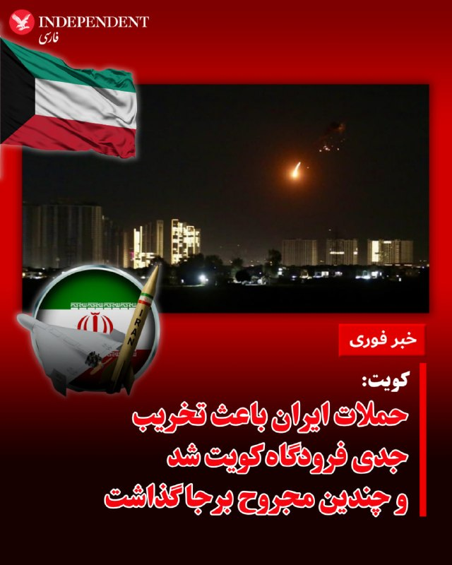

♦️وزارت دفاع کویت صبح چهارشنبه و ساعاتی پس از حملات موشکی و پهپادی سپاه به این کشور اعلام کرد که این حملات در ترمینال ۱ فرودگاه بین‌المللی کویت خسارات شدیدی برجا گذاشته و باعث مجروح شدن چندین نفر شده است.

سعود العطوان، سخنگوی وزارت دفاع کویت با اعلام این خبر گفت مجروحان این حملات کمک‌های درمانی لازم را دریافت کرده‌اند.

آخرین دور حملات موشکی و پهپادی جمهوری اسلامی به کویت و بحرین نیمه‌شب سه‌شنبه و بامداد چهارشنبه و پس از آن آغاز شد که سنتکام اهدافی نظامی را در جنوب ایران هدف قرار داد. سپاه پاسداران دقایقی پس این حملات، به سوی بحرین و کویت موشک و پهپاد شلیک کرد.
‌🇸🇦 Indypersian

🤖 @VahidOOnLine

## VahidOOnLine — post 243469

♦️رسانه‌های داخلی ایران صبح چهارشنبه ۱۳ خردادماه از وقوع انفجار در یک جایگاه سوخت‌رسانی در منطقه تهرانپارس واقع در شرق تهران خبر دادند.

به گزارش ایرنا، سخنگوی سازمان آتش‌نشانی تهران گفت یک خودروی نیسان یخچال‌دار در حال سوخت‌گیری در این جایگاه به‌دلایل نامشخص منفجر شده است.
به گفته این مقام آتش‌نشانی، راننده خودرو و یکی از کارکنان جایگاه در پی انفجار «مصدوم» شده‌اند.

صبح روز چهارشنبه کاربران شبکه‌های اجتماعی از شنیده شدن چند صدای شدید انفجار در شرق تهران خبر داده بودند.
‌🇸🇦 Indypersian

🤖 @VahidOOnLine

## VahidOOnLine — post 243468

  <a href="telegram/content/VahidOOnLine_243468_1780469845.mp4" target="_blank">🎬 Download video</a>

⭕️سقوط بقایای موشک و پهپادهای سپاه در کویت

♦️در پی حملات موشکی و پهپادی سپاه به کویت و بحرین، تصاویری از بقایای در حال سوختن یک موشک یا پهپاد در شهر الفروانیه کویت در شبکه‌های اجتماعی منتشر شده است.

خبرگزاری رویترز صحت این ویدیو را تائید کرده است.

آخرین دور حملات متقابل سنتکام و نیروهای مسلح جمهوری اسلامی، نیمه‌شب سه‌شنبه و در نخستین ساعات بامداد چهارشنبه ۱۳ خرداد روی داد. سپاه پاسداران و رسانه‌های نزدیک به آن ادعا می‌کنند که دست‌کم یکی از موشک‌های سپاه به مرکز استقرار ناوگان پنجم نیروی دریایی آمریکا در بحرین اصابت کرده است. سنتکام این ادعاها را تکذیب کرده است.
‌🇸🇦 Indypersian

🤖 @VahidOOnLine

## VahidOOnLine — post 243467

  

سازمان کوییرهای ایرانی سیمرغ در ارتباط با قتل اخیر مهشید فلاحی، زن ترنس ۳۲ ساله، در سنندج به نقل از کنشگران کوییر و فعالان کرد داخل ایران گزارش داد او حدود دو هفته پیش با چاقو به قتل رسید و سرش از پیکرش جدا شد.
طبق این گزارش، پیکر مثله‌شده مهشید چند روز پیش در نزدیکی سد سنندج پیدا شد و چند روز بعد نیز سر او در یکی از خیابان‌های شهر کشف شد.
سیمرغ به نقل از کنشگران کوییر و فعالان کرد داخل ایران نوشت مهشید سال‌ها پیش از سوی خانواده خود طرد شده و بی‌خانمان و کارتن‌خواب بود و از بازماندگان خشونت جنسی به شمار می‌رفت.
طبق گزارش‌های سازمان‌های حقوق بشری، پیکر مهشید همچنان در پزشکی قانونی نگهداری می‌شود و هیچ‌یک از اعضای خانواده برای تحویل پیکر او اقدام نکرده‌اند.
در حالی که برخی گزارش‌های اولیه، قتل مهشید فلاحی را به اسلام‌گرایان سلفی نسبت داده‌ بودند، اما هنوز هویت عامل یا عاملان این قتل مشخص نیست.

‌🏁 🇬🇧 IranintlTV

🤖 @VahidOOnLine

## VahidOOnLine — post 243466

♦️محسن جلیلوند، استاد روابط بین‌الملل، در برنامه «کامنت» فرارو، با اشاره به پیش‌بینی‌پذیر بودن رفتارهای نظامی در منطقه گفت: «من به شما قول می‌دهم که آمریکایی‌ها از قبل محاسبه تنگه هرمز را کرده بودند. این‌گونه نیست که فکر کنیم یکدفعه غافلگیر شده‌اند. مسائلی مثل انسداد یا محدودیت در تنگه هرمز در استراتژی‌های نظامی و امنیتی ایالات متحده فرضیاتی کاملا پیش‌بینی‌شده و از‌پیش‌محاسبه‌بردار هستند.» او تاکید کرد: «آن‌ها حتی یک امتحان هم در جهان زدند تا ببینند اگر نفت، مواد اولیه شیمیایی یا هلیوم از تنگه هرمز نرود، دنیا چه خواهد شد. آمریکایی‌ها قبل از این وضعیت، ونزوئلا را جمع کردند تا بتوانند نفت آن را جایگزین نفت تنگه هرمز کنند و با روسیه هم معاملاتی کردند تا نفتش را بفروشد. آن‌ها از این طریق هم خواستند اروپای همراهی‌نکرده را ادب کنند و هم چین را تحت کنترل درآورند تا ۴۰ درصد نفتی که از خاورمیانه می‌برد، کنترل شود».
‌🇸🇦 Indypersian

🤖 @VahidOOnLine

## VahidOOnLine — post 243465

  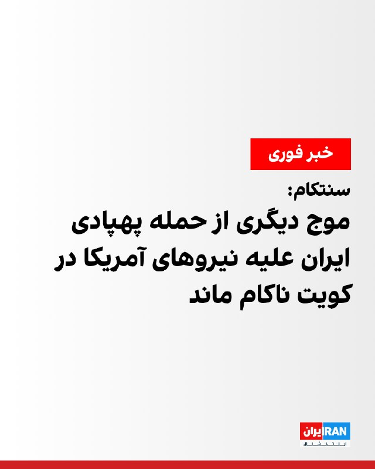

ستاد فرماندهی مرکزی آمریکا، سنتکام، اعلام کرد موج دیگری از پهپادهای جمهوری اسلامی که قصد حمله به نیروهای آمریکا در کویت را داشتند، امشب نتوانستند به اهداف مورد نظر اصابت کنند و پدافند هوایی آمریکا چندین پهپاد را سرنگون کردند. در این حمله هیچ‌یک از نیروها یا تجهیزات آمریکا آسیب ندیدند.
‌🏁 🇬🇧 IranintlTV

🤖 @VahidOOnLine

## WithYashar — post 13342

  <a href="telegram/content/WithYashar_13342_1780469850.mp4" target="_blank">🎬 Download video</a>

جاباری استیون براون که در مسابقه معروف «۱۰۰ خلبان برای یک جت خصوصی» متعلق به مستر ‌بیست برنده یک جت شده بود ، توسط مقامات پاراگوئه در جت خصوصی که از میامی و از طریق پاناما وارد شده بود و حدود ۲۶۱٫۶ کیلوگرم ماری‌جوانا با THC بالا به ارزش ۳.۶ میلیون دلار حمل و نقل میکرد دستگیرشد !
@withyashar

## WithYashar — post 13341

حرکت پهپاد شاهد۱۳۶ ، فعالیت پدافند و در پایان برخورد و انفجار در فرودگاه کویت !
@withyashar

## WithYashar — post 13340

سازمان هواپیمایی کشوری کویت: یک ساختمان مسافربری در فرودگاه
کویت هدف پهپادها و موشک‌های ایرانی قرار گرفت و حالت اضطراری فعال شده.
@withyashar

## WithYashar — post 13339

وال‌استریت ژورنال: حمله سنتکام به جزیره قشم، قیمت نفت را صعودی کرد و چشم‌انداز بازگشایی تنگه هرمز را کمرنگ ساخت.
@withyashar

## mwarmonitor — post 10064

🔴سازمان هواپیمایی کشوری کویت اعلام کرد که حمله شبانه پهپادی و موشکی ایران که کویت را هدف قرار داد، خسارات شدیدی به ترمینال یک فرودگاه بین‌المللی کویت وارد کرده و شمار نامعلومی از افراد را مجروح کرده است.
🔸بر اساس گزارش نیوزنیشن، فرودگاه طرح واکنش اضطراری خود را فعال کرده و تمامی پروازها متوقف یا به مسیرهای جایگزین هدایت شده‌اند.

@mwarmonitor

## FoxNewsTwitter — post 342549

  <a href="telegram/content/FoxNewsTwitter_342549_1780469852.mp4" target="_blank">🎬 Download video</a>

Fox News (Twitter/X)

"People just want the truth..."

LA mayoral candidate Spencer Pratt shares what he's learned from his campaign, and why the race has become personal for him as he awaits election results:

"All I do is just speak from the heart, and I try to be as true to my authentic self and express how I feel about what I see and what other people see."

"I know what people want now. They want somebody to speak the truth for their communities and fight for them."

## FoxNewsTwitter — post 342548

  <a href="telegram/content/FoxNewsTwitter_342548_1780469855.mp4" target="_blank">🎬 Download video</a>

Fox News (Twitter/X)

JUST NOW: LA mayoral candidate Spencer Pratt projects confidence as he waits for election results, dismisses the idea that he doesn't represent Democrats, Republicans and independents.

"Right now, the media likes to say, 'Oh, he's this.' I'm not that. I'm an Angeleno who said enough is enough and I had to step up."

"I didn't know I'd be here tonight, but this is obviously God's plan, and I'm going to go all the way, and I'm going to show everybody that I'm their mayor."

## FoxNewsTwitter — post 342547

  

Fox News (Twitter/X)

LA Mayor Karen Bass advances to the November runoff in her bid for reelection.

Despite being challenged from the left and right and a rocky first term, the Democrat secured a spot for the final round of voting.

Bass, for her own part, maintains that her three years as mayor have taken the city in the right direction.

The incumbent mayor and former congresswoman will now head into a high-profile November showdown as voters decide whether to give her a second term.

## FoxNewsTwitter — post 342546

  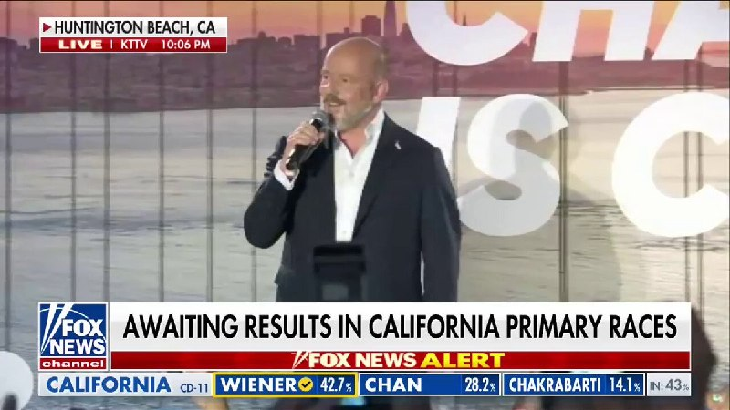

Fox News (Twitter/X)

JUST NOW: Republican California gubernatorial candidate Steve Hilton shares an optimistic message with supporters as results continue to roll in.

"It looks very much as if Californians really will have the chance to vote for change in November...and take our state in a new direction — a fresh start for our state — which is long overdue."

"Whether you voted for me or not, I am here for you."

## FoxNewsTwitter — post 342545

  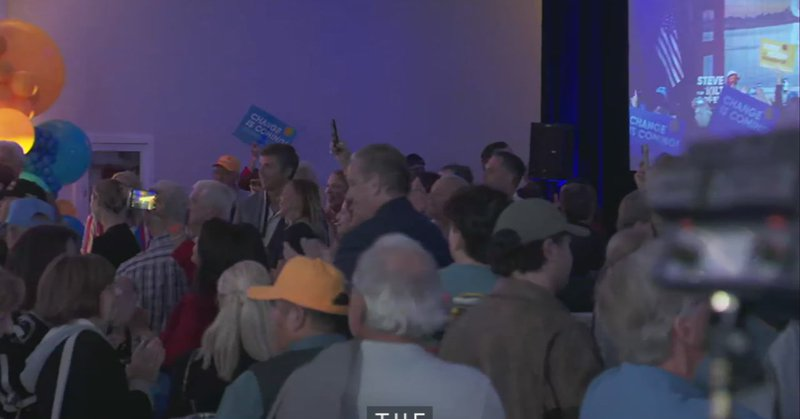

Fox News (Twitter/X)

WATCH LIVE: GOP candidate Steve Hilton hosts election night watch party in California https://twitter.com/i/broadcasts/1dGYllLOQXvKX

## FoxNewsTwitter — post 342544

  

Fox News (Twitter/X)

Trump-endorsed Rep. Randy Feenstra lost Iowa’s Republican gubernatorial primary Tuesday night to businessman and farmer Zach Lahn.

Trump had praised Feenstra as “MAGA all the way” in a last-minute Truth Social endorsement last week, and the congressman was widely expected to win the race.

The upset marks a notable break from recent GOP primaries in states like Texas and Kentucky, where Trump-backed candidates prevailed.

Lahn now advances to Iowa’s general election on Nov. 3.

## FoxNewsTwitter — post 342543

  <a href="telegram/content/FoxNewsTwitter_342543_1780469860.mp4" target="_blank">🎬 Download video</a>

Fox News (Twitter/X)

"An unbelievable honor."

With the race still too soon to call, Republican California gubernatorial candidate Steve Hilton thanks his supporters in the state, saying as a "proud American," it's an honor to have gotten the support he's received.

"One million Californians, and rising, putting their hopes in me to bring change and put our state back on track, it's an unbelievable honor."

"We've got to turn this state around, and I think tonight looks like the first step down that very important road."

## FoxNewsTwitter — post 342542

  

Fox News (Twitter/X)

WATCH LIVE: LA Mayor Karen Bass hosts election night watch party https://twitter.com/i/broadcasts/1DGLddEMXrbGm

## FoxNewsTwitter — post 342541

  

Fox News (Twitter/X)

Eyes are now turning to California as voters weigh in on a slate of races that could reshape the state's political landscape.

In Los Angeles, independent challenger Spencer Pratt has emerged in recent months as an unexpected force with his bid to unseat Mayor Karen Bass, who has been criticized over homelessness, infrastructure and the city's emergency response. Bass is also facing a left-wing challenge from Councilwoman Nithya Raman.

The battle to replace Gov. Gavin Newsom is also generating its own political drama, with Republicans Steve Hilton and Chad Bianco fighting a field of Democrats in the state's jungle primary system.

## FoxNewsTwitter — post 342540

  <a href="telegram/content/FoxNewsTwitter_342540_1780469863.mp4" target="_blank">🎬 Download video</a>

Fox News (Twitter/X)

"You have to win."

California GOP gubernatorial candidate Steve Hilton speaks about the urgency with which voters are expressing their desire for a new direction in the state ahead of the primary election results.

"It's a very intense desire for change right now," Hilton said, explaining that voters feel "it's now or never" for California.

## FoxNewsTwitter — post 342539

  

Fox News (Twitter/X)

Veteran '60 Minutes' correspondent Scott Pelley is out at CBS News after clashes with the network's editor-in-chief Bari Weiss and the show's new executive producer Nick Bilton.

Pelley's exit comes after he lashed out at Bilton during an all-staff meeting where he accused Weiss of "murdering" the program and bluntly told Bilton, who has no linear television experience, that he has "slender qualifications" for his new role.

Weiss reportedly asked Pelley to make an apology and accused him of creating a hostile work environment.

Pelley, who previously served as the 'CBS Evening News' anchor, first joined CBS News in 1989 and later joined '60 Minutes' as a correspondent in 2004. In recent years, Pelley was outspoken with criticism of his bosses, including at CBS News' parent company Paramount.

## FoxNewsTwitter — post 342538

Fox News (Twitter/X)

Sen. Ted Cruz blasts Democrats for staying silent on Maine Senate candidate Graham Platner: "I think this election is revealing what Senate Democrats really care about." https://twitter.com/seanhannity/status/2061989748483199404#m

## FoxNewsTwitter — post 342537

  <a href="telegram/content/FoxNewsTwitter_342537_1780469866.mp4" target="_blank">🎬 Download video</a>

Fox News (Twitter/X)

"We can do so amazingly well if we have common sense at the top in California."

Steve Hilton shares his outlook for the Golden State ahead of California's gubernatorial primary results. https://twitter.com/seanhannity/status/2061989409545761221#m

## pm_afshaa — post 92204

  

گزارشاتی منتشر شده که محمدرضا شهبازی، مجری برنامه پاورقی دیشب مورد تجاوزِ 3 نفر قرار گرفته و برنامه پاورقی فعلا به طور موقت متوقف شده

💧 Rainbet.com the #1 Non-KYC Crypto Casino & Sportsbook @rainbetcom

😁 @Pm_Afshaa

## pm_afshaa — post 92203

سنتکام:آتش بس هنوز برقراره

💧 Rainbet.com the #1 Non-KYC Crypto Casino & Sportsbook @rainbetcom

😁 @Pm_Afshaa

## pm_afshaa — post 92202

🔴کانال 14 اسرائیل:اگر ایران حتی یک گلوله به سمت اسرائیل شلیک کند، تمام دروازه های جهنم به رویشان باز خواهد شد

💧 Rainbet.com the #1 Non-KYC Crypto Casino & Sportsbook @rainbetcom

😁 @Pm_Afshaa

## pm_afshaa — post 92201

🔴رسانه‌های عربی از توقف کامل فعالیت فرودگاه‌ها و تمام پروازها در بحرین، کویت و امارات متحده عربی به دنبال وقوع حملات هوایی خبر دادن

💧 Rainbet.com the #1 Non-KYC Crypto Casino & Sportsbook @rainbetcom

😁 @Pm_Afshaa

## pm_afshaa — post 92200

آژیر خطر در بحرین فعال شد

💧 Rainbet.com the #1 Non-KYC Crypto Casino & Sportsbook @rainbetcom

😁 @Pm_Afshaa

## pm_afshaa — post 92199

🔴وزارت خزانه‌داری آمریکا چهار صرافی رمز ارز ایرانی نوبیتکس، بیت‌پین، رمزینکس و والکس را در لیست سیاه قرار داد و تحریم کرد

💧 Rainbet.com the #1 Non-KYC Crypto Casino & Sportsbook @rainbetcom

😁 @Pm_Afshaa

## VahidOnline — post 75892

  <a href="telegram/content/VahidOnline_75892_1780469870.mp4" target="_blank">🎬 Download video</a>

"انفجار خودرو در جایگاه سوخت‌گیری تهرانپارس"

خبرگزاری فارس و تسنیم با انتشار ویدیوهای بالا نوشتند:
سخنگوی سازمان آتش‌نشانی:
در ساعت ۶:۱۴ صبح امروز، وقوع یک مورد انفجار در جایگاه سوخت گاز واقع در بزرگراه یاسینی، مسیر غرب به شرق، بعد از سه‌راه تهرانپارس (نرسیده به پل ۱۲ فروردین) به سامانه ۱۲۵ اعلام شد. بلافاصله نیروهای دو ایستگاه آتش‌نشانی به محل حادثه اعزام شدند.

در بررسی‌های اولیه مشخص شد که یک دستگاه خودروی نیسان یخچال‌دار در حال سوخت‌گیری در این جایگاه بوده که به دلایل نامشخص و در حال بررسی، دچار انفجار شده است.

خوشبختانه این انفجار منجر به آتش‌سوزی نشده بود، اما شدت آن باعث وارد آمدن خسارات قابل‌توجهی به بدنه خودروی نیسان و بخش‌هایی از سقف و دیواره‌های جایگاه سوخت شده است.
در این حادثه دو نفر شامل راننده خودروی نیسان (حدوداً ۶۰ ساله) و یکی از متصدیان جایگاه (حدوداً ۴۰ ساله) دچار مصدومیت شدند.

📡 @VahidOnline

## VahidOnline — post 75891

پیام‌های دریافتی:

شرق تهران
تهران نو صدای انفجار شنیده شد

وحید جان ۵:۵۸ صدای تک انفجار شمال شرق تهران، سنگین بود. مثل بمب بود

سمت شرق تهران یه تک صدا اومد ۵:۵۷ وحید جان

ساعت 5:56 تهران شرق یه صدایی مثل انفجار شنیدم دقیق نمیدونم

سلام، ساعت ۵:۵۷
شرق تهرانیم و انگار صدای انفجار از جنوب غربی بود

تهرانپارس صدای انفجار اومد ساعت۶صبح

منم صدای انفجار ساعت ۶ شرق تهران بیدارم کرد ولی چون ادامه نداشت فکر کردم اشتباه کردم تا پیام بقیه رو دیدم

سلام، ساکن شرق تهرانم، تهرانپارس- با صدای انفجار ساعت حدود ۵:۵۶ بیدار شدم اول فکر کردم توهم زدم، الان که پیغام‌های شما رو خوندم گویا بقیه هم شنیدن.
الان حدود ۵ دقیقه ممتد صدای آژیر میاد حالا آمبولانس یا آتش نشانی نمیدونم.

سلام، پردیس چهارشنبه ۱۳ خرداد ۶ صبح صدای مثل بمب اومد

وحید جان من تو نارمک صدای انفجار شنیدم ولی نزدیک نبود ۵:۵۸

شرق تهران یه صدای خیلی بلند اومد ۵:۵۷

سلام تهرانپارس فلکه اول ساعت ۶ یک صداى انفجار بلند اومد و از ساعت ۶:۱۹ تا ۶:۲۲ صداى آژیر ماشین هاى امبولانس و اتش نشانى میاد

آپدیت:
دلیل احتمالی انفجار در پست بعدی
📡 @VahidOnline

## IranIntlTV — post 340318

  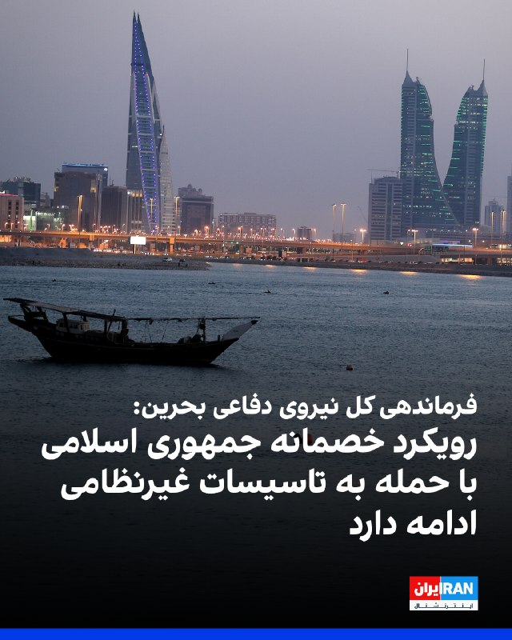

فرماندهی کل نیروی دفاع بحرین در بیانیه‌ای اعلام کرد که سامانه‌های پدافند هوایی این کشور بامداد چهارشنبه موفق شدند سه موشک و تعدادی پهپاد جمهوری اسلامی را رهگیری و منهدم کنند.

بحرین این حملات را «جنایتکارانه» توصیف کرد و نوشت: «ایران رویکرد خصمانه خود را با پرتاب موشک‌ها و پهپادهایی که تاسیسات غیرنظامی را هدف قرار می‌دهند، ادامه می‌دهد.»

فرماندهی کل بحرین تاکید کرد همه سلاح‌ها و یگان‌های این نیرو در بالاترین سطح آمادگی و آماده‌باش دفاعی برای حفاظت از کشور قرار دارند.

این نهاد همچنین اعلام کرد استفاده عمدی از موشک‌ها و پهپادها برای هدف قرار دادن تاسیسات غیرنظامی و اموال خصوصی، نقض آشکار قوانین بین‌المللی بشردوستانه است و بر آمادگی و هوشیاری نیروهای خود برای دفاع از کشور تاکید کرد.
https://iranintl.com/202606035943

## IranIntlTV — post 340317

  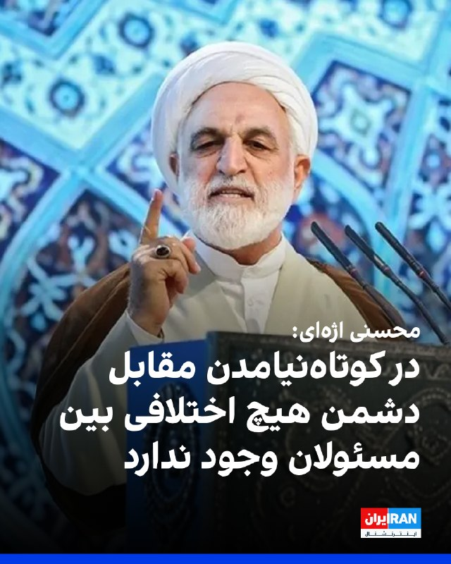

غلامحسین محسنی اژه‌ای، رییس قوه قضاییه جمهوری اسلامی، چهارشنبه ۱۳ خرداد در جمع تعدادی از فعالان اقتصادی و تولیدی بخش خصوصی با اشاره به حملات اخیر آمریکا و اسرائیل گفت در کوتاه‌نیامدن مقابل «دشمن» جمهوری اسلامی هیچ اختلافی میان مسئولان وجود ندارد.

او با تاکید بر ادامه جنگ افزود: «دشمن اسرائیلی، نابودی و عدم ما را می‌خواهد؛ ما هم به دنبال اضمحلال این غده سرطانی هستیم؛ فلذا جنگ ما با استکبار و اذناب او ادامه خواهد داشت.»

رییس قوه قضاییه جمهوری اسلامی همچنین گفت: «آینده بسیار بسیار بهتر، حتی بهتر از قبل از جنگ را پیش‌رو خواهیم داشت.»
https://iranintl.com/202606039964

## IranIntlTV — post 340316

  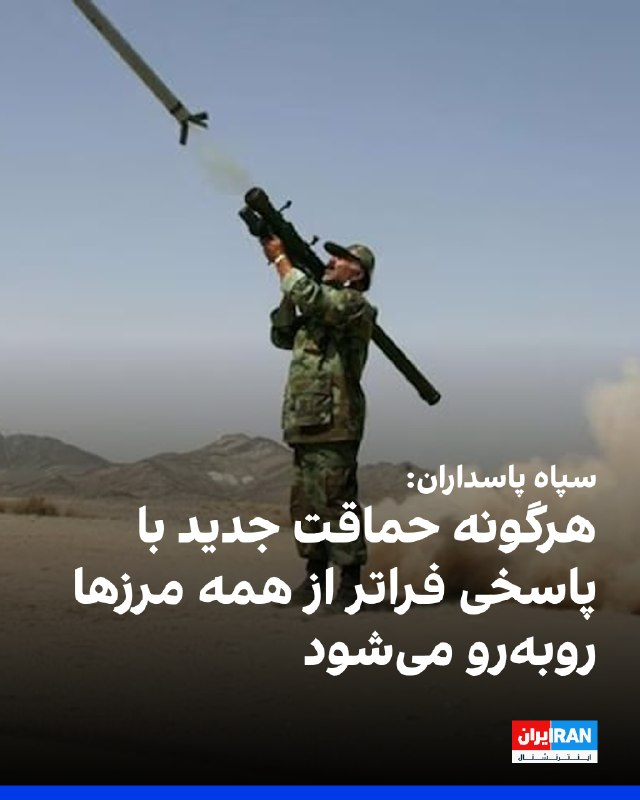

سپاه پاسداران در بیانیه‌ای درباره حملات بامداد چهارشنبه ۱۳ خرداد به قشم، خطاب به آمریکا و کشورهای منطقه اعلام کرد هرگونه «تجاوز بیشتر» یا اقدامی که حتی «یک وجب از مرزها و حاکمیت» ایران را نقض کند، با پاسخی «ویرانگر، کوبنده و قاطع» روبه‌رو خواهد شد.

در این بیانیه آمده است این پاسخ «فراتر از همه قوانین و مرزهای تعیین‌شده» خواهد بود.

سپاه پاسداران همچنین نوشت که دوران «بزن و در رو» به پایان رسیده است و «نیروهای متجاوز» باید عواقب آنچه «ماجراجویی‌های بی‌ملاحظه» خوانده شد را تحمل کنند.
https://iranintl.com/202606034678

## IranIntlTV — post 340315

  <a href="telegram/content/IranIntlTV_340315_1780469873.mp4" target="_blank">🎬 Download video</a>

امیر حمیدی، متخصص امنیت ملی، درباره تنش‌ها میان جمهوری اسلامی و آمریکا به ایران‌اینترنشنال گفت آنچه در حال حاضر جریان دارد، آزمونی برای سنجش توانایی بازدارندگی هر یک از دو طرف است
@iranintltv

## IranIntlTV — post 340314

  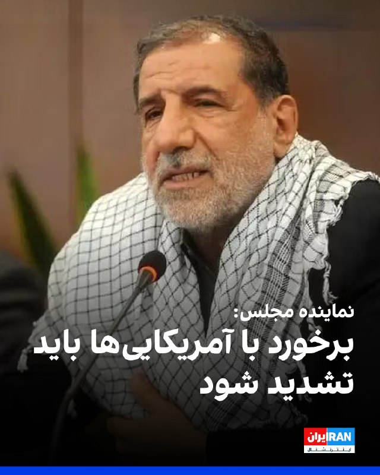

اسماعیل کوثری، عضو کمیسیون امنیت ملی مجلس جمهوری اسلامی، با اشاره به حملات بامداد چهارشنبه آمریکا به اهدافی در قشم بر لزوم «تشدید برخورد با آمریکا» تاکید کرد و گفت: «آمریکایی‌ها منطق ندارند و جز زور و قدرت چیز دیگری نمی‌فهمند.»

کوثری در مصاحبه با صدا و سیمای جمهوری اسلامی افزود: «این حرکات آمریکایی‌ها برخاسته از تفکر شیطانی آن‌هاست که می‌گویند آتش‌بس، ولی اقداماتی انجام می‌دهند که خلاف آن است.»
https://iranintl.com/202606032397

## IranIntlTV — post 340313

  <a href="telegram/content/IranIntlTV_340313_1780469875.mp4" target="_blank">🎬 Download video</a>

رسانه‌های دولتی و تحلیلگران چینی در ساعت‌های گذشته روایت‌هایی از بن‌بست در مذاکرات تهران و آمریکا ارائه کرده‌اند که ممکن است به رویه «جنگ همراه مذاکره» تبدیل شود.

گفت‌وگو با توماج طاهباز، خبرنگار ایران‌اینترنشنال
@iranintltv

## IranIntlTV — post 340312

  <a href="telegram/content/IranIntlTV_340312_1780469877.mp4" target="_blank">🎬 Download video</a>

سپاه پاسداران در بیانیه‌ای اعلام کرد در پاسخ به حمله نیروهای آمریکایی به یک نفتکش ایران در حوالی تنگه هرمز، شناوری به نام پانایا را هدف قرار داده است.

امیر گیتی، عضو تحریریه ایران‌اینترنشنال، گفت تبادل آتش میان آمریکا و جمهوری اسلامی ادامه دارد و خبری از آتش‌بس نیست
@iranintltv

## IranIntlTV — post 340311

وزارت خزانه‌داری آمریکا اعلام کرد نوبیتکس، بزرگ‌ترین صرافی رمزارز ایران را تحریم کرده است.

میعاد ملکی، رییس پیشین دفتر هدف‌گذاری تحریم‌های وزارت خزانه‌داری آمریکا، گفت این اقدام به دلیل فعالیت‌های سپاه پاسداران و پیامی به اعضای کنگره است که فشار بر جمهوری اسلامی باید ادامه یابد
@iranintltv

## IranIntlTV — post 340310

  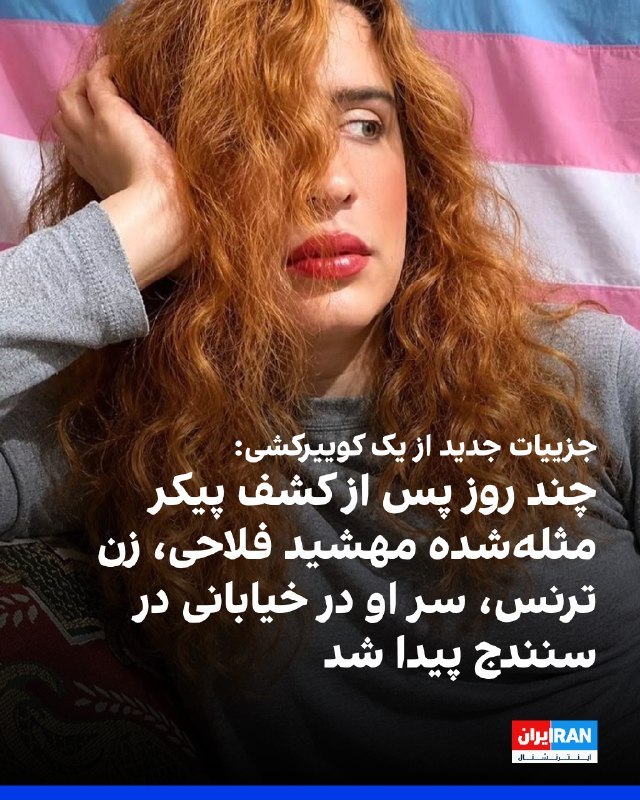

سازمان کوییرهای ایرانی سیمرغ در ارتباط با قتل اخیر مهشید فلاحی، زن ترنس ۳۲ ساله، در سنندج به نقل از کنشگران کوییر و فعالان کرد داخل ایران گزارش داد او حدود دو هفته پیش با چاقو به قتل رسید و سرش از پیکرش جدا شد.
طبق این گزارش، پیکر مثله‌شده مهشید چند روز پیش در نزدیکی سد سنندج پیدا شد و چند روز بعد نیز سر او در یکی از خیابان‌های شهر کشف شد.
سیمرغ به نقل از کنشگران کوییر و فعالان کرد داخل ایران نوشت مهشید سال‌ها پیش از سوی خانواده خود طرد شده و بی‌خانمان و کارتن‌خواب بود و از بازماندگان خشونت جنسی به شمار می‌رفت.
طبق گزارش‌های سازمان‌های حقوق بشری، پیکر مهشید همچنان در پزشکی قانونی نگهداری می‌شود و هیچ‌یک از اعضای خانواده برای تحویل پیکر او اقدام نکرده‌اند.
در حالی که برخی گزارش‌های اولیه، قتل مهشید فلاحی را به اسلام‌گرایان سلفی نسبت داده‌ بودند، اما هنوز هویت عامل یا عاملان این قتل مشخص نیست.

https://iranintl.com/202606031363

## IranIntlTV — post 340309

  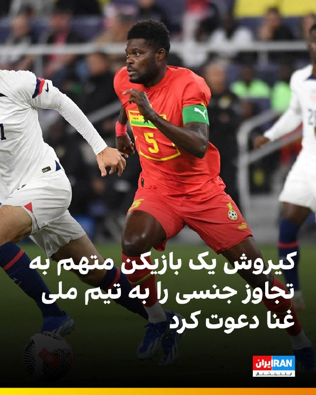

🔻اتحادیه فوتبال انگلستان در حال بررسی نحوه برخورد بازیکنان تیم ملی این کشور با توماس پارتی در مراسم دست‌دادن پیش از مسابقه در جام جهانی ۲۰۲۶ است.

🔹هافبک سابق آرسنال قرار است به اتهام تجاوز در دادگاه محاکمه شود، با این حال از سوی کارلوس کیروش در فهرست تیم ملی غنا قرار گرفته است.

🔹انگلستان و غنا، روز دوم تیر ۱۴۰۵ در مرحله گروهی جام جهانی ۲۰۲۶ با یکدیگر بازی می‌کنند.

🔹به نوشته تایمز لندن، پارتی که در این فصل برای ویارئال بازی کرد، قرار است بابت هفت فقره تجاوز و یک فقره تعرض جنسی در دادگاه سلطنتی ساوت‌وارک در لندن محاکمه شود. این دادگاه ابتدا برای ماه اواخر سال ۲۰۲۶ برنامه‌ریزی شده بود، اما ممکن است اکنون تا اوایل سال ۲۰۲۷ به تعویق بیفتد.

🔹کارلوس کیروش، سرمربی غنا، درباره دعوت از این هافبک گفت: «پاسخ ساده و ابتدایی است. تا جایی که می‌دانم، در انگلیس، در پرتغال یا هر جای دیگر، تا زمانی که دادگاه حکمی صادر نکرده باشد، اصل بر بی‌گناهی است.»

🔹جزییات بیشتر را در سایت بخوانید.

@iranintltvsport

## IranIntlTV — post 340308

  

ستاد فرماندهی مرکزی آمریکا، سنتکام، اعلام کرد موج دیگری از پهپادهای جمهوری اسلامی که قصد حمله به نیروهای آمریکا در کویت را داشتند، امشب نتوانستند به اهداف مورد نظر اصابت کنند و پدافند هوایی آمریکا چندین پهپاد را سرنگون کردند. در این حمله هیچ‌یک از نیروها یا تجهیزات آمریکا آسیب ندیدند.
https://iranintl.com/202606030741

## Shin_Persian — post 6458

🔁 Quoting above tweet:
Shin ✓ @hey_itsmyturn
Wed, 03 Jun 2026 05:43:47 UTC

Armed forces are on full alert and monitoring the situation.

#Kuwait 🇰🇼

Source: @KuwaitArmyGHQ
https://x.com/KuwaitArmyGHQ/status/2062047516384690551

فارسی

نیروهای مسلح در آماده‌باش کامل هستند و اوضاع را زیر نظر دارند.

#Kuwait 🇰🇼

منبع: @KuwaitArmyGHQ
https://x.com/KuwaitArmyGHQ/status/2062047516384690551

𝕏 · @shin_persian

## Shin_Persian — post 6457

  

↩️ Quoted tweet: KUWAIT ARMY - الجيش الكويتي ✓ @KuwaitArmyGHQ Wed, 03 Jun 2026 05:43:33 UTC بيان رقم (63) صرّح المتحدث الرسمي لوزارة الدفاع، العقيد الركن سعود عبدالعزيز العطوان، بأن عدداً من الطائرات المسيّرة المعادية استهدفت اليوم مبنى الركاب (T1) بمطار…

## Shin_Persian — post 6456

↩️ Quoted tweet:
KUWAIT ARMY - الجيش الكويتي ✓ @KuwaitArmyGHQ
Wed, 03 Jun 2026 05:43:33 UTC

بيان رقم (63)

صرّح المتحدث الرسمي لوزارة الدفاع، العقيد الركن سعود عبدالعزيز العطوان، بأن عدداً من الطائرات المسيّرة المعادية استهدفت اليوم مبنى الركاب (T1) بمطار الكويت الدولي نتيجة العدوان الإيراني الآثم، ما أسفر عن أضرار مادية جسيمة في المبنى وإصابة عدد من الأشخاص، حيث تلقوا

↩️ Quoted tweet — see the post below for the reply.

English

Statement No. (63)

The official spokesperson for the Ministry of Defense, Colonel Staff Saud Abdulaziz Al-Atwan, stated that a number of hostile drones targeted Terminal 1 (T1) at Kuwait International Airport today as a result of the sinful Iranian aggression. This resulted in severe material damage to the building and injuries to several individuals, who received...

𝕏 · @shin_persian

## Shin_Persian — post 6455

  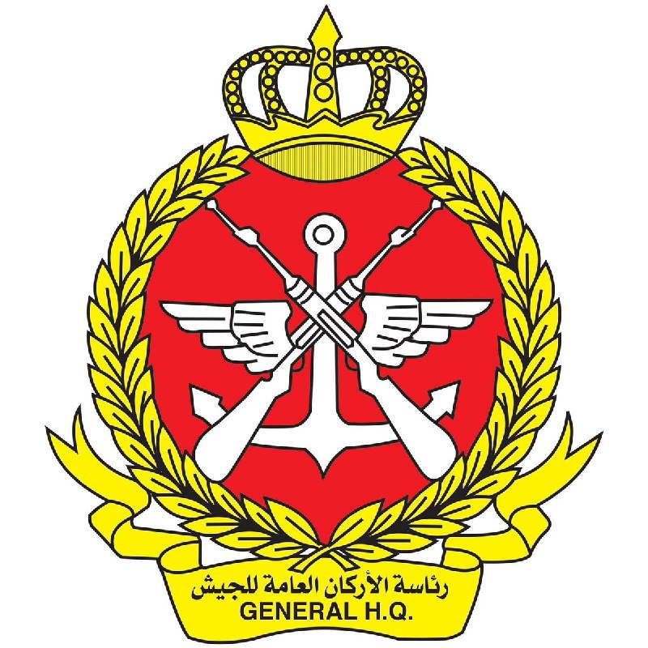

Shin @hey_itsmyturn
Wed, 03 Jun 2026 05:43:46 UTC

Kuwait Ministry of Defense spokesperson confirms hostile drones targeted Terminal 1 (T1) at Kuwait International Airport.

Significant material damage reported and several injuries confirmed following Iranian aggression.

فارسی

سخنگوی وزارت دفاع کویت تأیید کرد که پهپادهای متخاصم ترمینال ۱ (T1) در فرودگاه بین‌المللی کویت را هدف قرار داده‌اند.

گزارش‌ها حاکی از خسارات مادی قابل توجه است و چندین جراحت در پی تهاجم ایران تأیید شده است.

𝕏 · @shin_persian

## FarsiVOA — post 219443

  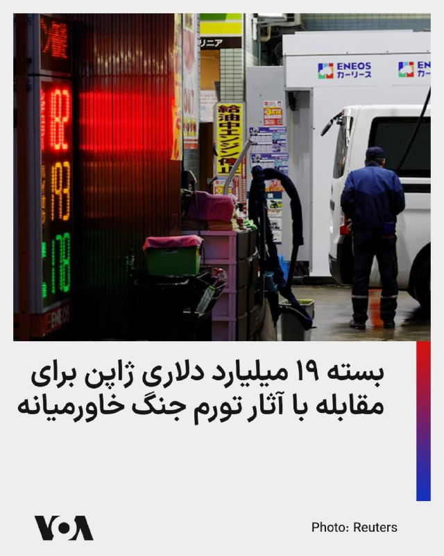

کابینه دولت ژاپن بسته حمایتی تکمیلی ۱۹.۵ میلیارد دلاری برای تأمین مالی مجموعه اقداماتی با هدف کاهش فشار تورمی بر خانوارها که ناشی از تنش‌های خاورمیانه است، تصویب کرد.

بخش اعظم این بسته مالی که روز چهارشنبه برای تصویب نهایی به پارلمان ارسال شده، مربوط به مقابله با افزایش قیمت کالاهای اساسی، از جمله بنزین، از طریق پرداخت یارانه است.

تورم ماه گذشته در ژاپن حدود ۱.۳ درصد ثبت شده است.

این بسته مالی به طور کامل از طریق انتشار اوراق قرضه تأمین خواهد شد، اما دولت ژاپن هم‌زمان در تلاش است با سیاست‌های مالیاتی و غیرمالیات قوی از افزایش بدهی‌های دولتی ناشی از فروش اوراق قرضه جلوگیری کند.
@FarsiVOA

## FarsiVOA — post 219442

  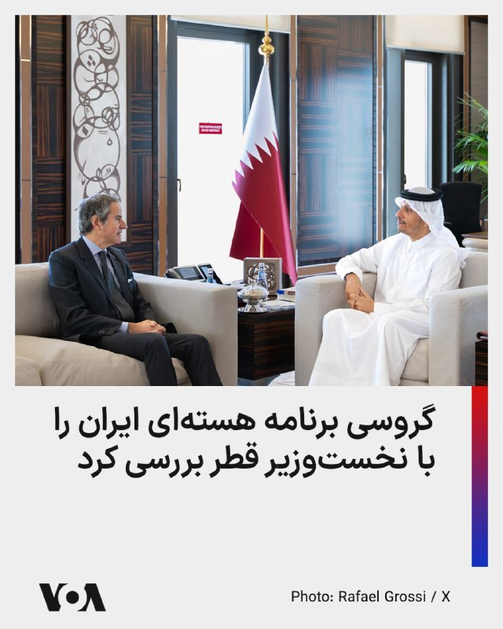

وزارت خارجه قطر از دیدار نخست‌وزیر و وزیر خارجه این کشور با رافائل گروسی، مدیرکل آژانس بین‌المللی انرژی اتمی، خبر داد.

بر اساس بیانیه وزارت خارجه قطر، گروسی روز سه‌شنبه در سفر به دوحه علاوه بر بررسی همکاری‌های دوجانبه میان آژانس و قطر، درباره آخرین تحولات مربوط به برنامه هسته‌ای جمهوری اسلامی ایران و تلاش‌های دیپلماتیک مرتبط با آن گفت‌وگو کرده است.

گروسی نیز با انتشار پیامی در شبکه اجتماعی ایکس به این دیدار اشاره کرد و نوشت که با نخست‌وزیر قطر درباره موضوع عدم اشاعه هسته‌ای در ایران و نقش «حیاتی و غیرقابل جایگزین» آژانس بین‌المللی انرژی اتمی در این زمینه گفت‌وگو کرده است.

مدیرکل آژانس افزود: «بار دیگر بر تعهد آژانس برای همکاری با کشورهای منطقه به منظور تقویت ایمنی و امنیت هسته‌ای و حمایت از ثبات تأکید کردم. در این مقطع حساس، گفت‌وگو و دیپلماسی تنها مسیر پیش‌رو برای دستیابی به صلح، ثبات و همکاری است.»
@FarsiVOA

## FarsiVOA — post 219441

🔺بلومبرگ: آمریکا بی‌سروصدا در حال باز کردن مسیر هرمز است

▪️بلومبرگ گزارش داد یک ماه پس از آنکه دونالد ترامپ طرحی علنی برای اسکورت کشتی‌های تجاری در تنگه هرمز اعلام کرد و سپس آن را کنار گذاشت، ارتش آمریکا اکنون روش‌هایی کم‌صداتر را برای حفاظت از کشتی‌ها در این آبراه حیاتی آزمایش می‌کند.

▪️بر اساس این گزارش، واشنگتن به‌جای اعلام یک چالش آشکار علیه تهران، به‌طور غیرعلنی با شرکت‌های کشتیرانی هماهنگ می‌کند؛ شرکت‌هایی که حاضرند برای عبور از هرمز، مسیر و شیوه حرکت خود را تغییر دهند.

▪️طرح تازه آمریکا نه اسکورت رسمی است و نه عقب‌نشینی از هرمز؛ بلکه نسخه‌ای کم‌صداتر و عملیاتی‌تر برای باز کردن مسیر عبور تجاری، بدون تبدیل آن به رویارویی علنی با تهران است.

⬇️ بیشتر بخوانید:
https://ir.voanews.com/a/us-looks-to-unblock-hormuz-with-quiet-version-of-project-freedom/8156777.html

## FarsiVOA — post 219440

  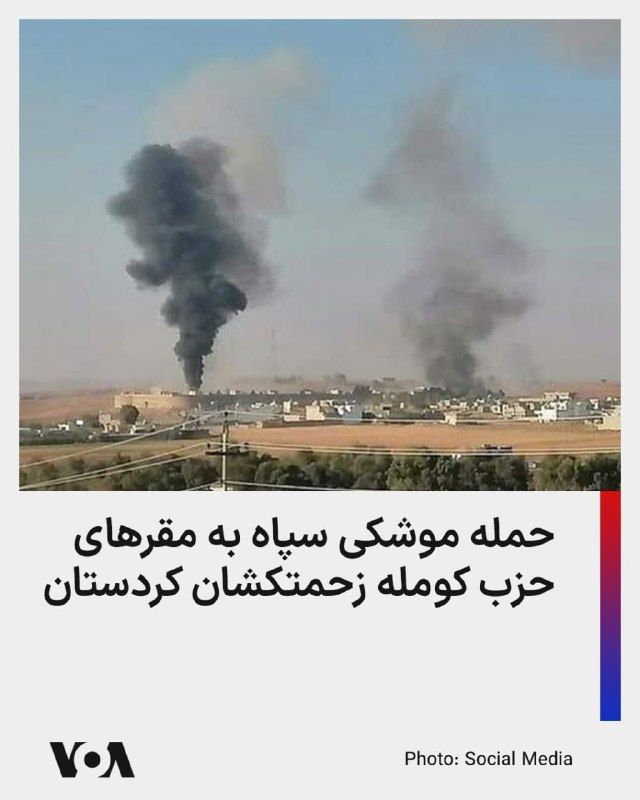

مسئول مطبوعاتی حزب کومله زحمتکشان کردستان، از حمله موشکی سپاه به مقرهای این حزب در شامگاه سه‌شنبه ۱۲خرداد، خبر داد.

امجد حسین‌پناهی با انتشار پیامی در شبکه اجتماعی ایکس، از شلیک دست‌کم دو موشک به این مقرها خبر داد، اما مکان دقیق اهداف را اعلام نکرد.

در همین ارتباط خبرگزاری تسنیم وابسته به سپاه نیز اعلام کرد که «ساعت ۲۳:۰۰ به وقت محلی روز سه‌شنبه، دو موشک به مقر حزب کومله در «دره آلانه»، واقع در شمال شرقی اربیل، اصابت کرده است.»

حسین‌پناهی اعلام کرد که جمهوری اسلامی از آغاز جنگ تاکنون، با بیش از ۸۲ موشک و پهپاد، پایگاه‌ها و مقرهای کومله را هدف قرار داده است.
@FarsiVOA

## FarsiVOA — post 219439

Farsi VOA pinned an audio file

## FarsiVOA — post 219438

  <a href="https://t.me/farsivoa/219438" target="_blank">📎 Download file</a>

🔴📢‌ پادکست خبری سه‌شنبه ۱۲ خرداد ۱۴۰۵

🛜در صورتی که با مشکل اینترنت مواجه هستید میتوانید اخبار صدای آمریکا را از نسخه‌های پادکست خبری ما روزانه دنبال کنید و یا اخبار را از نسخه سبک وب‌سایت ما پیگیر باشید:
https://ir.voanews.com/lite

📡بروزترین فرکانسهای ماهواره‌ای را نیز میتوانید از صفحه زیر پیگیری کنید:
https://ir.voanews.com/satellite

🔔دیگر شبکه‌های اجتماعی ما هم دنبال کنید:
https://linktr.ee/voafarsi

ما را به اشتراک بگذارید
@farsivoa

## FarsiVOA — post 219437

  <a href="telegram/content/FarsiVOA_219437_1780469886.mp4" target="_blank">🎬 Download video</a>

سخنگوی سازمان آتش‌نشانی تهران از انفجار یک خودروی نیسان یخچال‌دار در جایگاه سوخت گاز در بزرگراه یاسینی، حوالی تهرانپارس، خبر داد؛ حادثه‌ای که به گفته او آتش‌سوزی به همراه نداشت، اما به خودرو و بخش‌هایی از جایگاه خسارت وارد کرد.

بر اساس اعلام آتش‌نشانی، این حادثه صبح امروز چهارشنبه در جایگاه سوخت گاز واقع در بزرگراه یاسینی بعد از سه‌راه تهرانپارس گزارش شد و نیروهای دو ایستگاه آتش‌نشانی به محل اعزام شدند.

بنابر اعلام آتش‌نشانی علت حادثه مشخص نیست و بررسی‌های فنی برای مشخص شدن منشأ انفجار ادامه دارد.

شدت انفجار باعث آسیب جدی به بدنه خودرو و خسارت به سقف و دیواره‌های جایگاه شد. در این حادثه راننده نیسان، حدود ۶۰ ساله، و یکی از متصدیان جایگاه، حدود ۴۰ ساله، مصدوم شدند.

همزمان رسانه‌ها به نقل از کاربران از شنیده شدن صدای انفجار در مناطق شرق و شمال شرق تهران در ساعات اولیه روز چهارشنبه خبر داده‌اند. تا این لحظه مقام‌های رسمی هیچ علت امنیتی یا خرابکارانه‌ای برای حادثه اعلام نکرده‌اند.
@FarsiVOA

## FarsiVOA — post 219436

  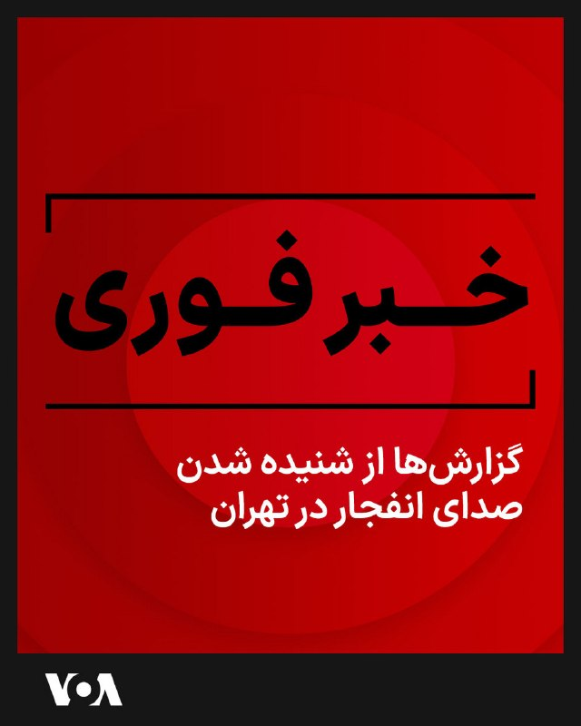

⚡️کانال تلگرامی وحیدآنلاین به نقل از کاربران از شنیده شدن صدای انفجار در مناطق شرق و شمال شرق تهران در ساعات اولیه روز چهارشنبه خبر می‌دهد.
@FarsiVOA

## FarsiVOA — post 219435

🔺وزیر خزانه‌داری آمریکا: «هرج و مرج اقتصادی فعلی» در جمهوری اسلامی ایران گواه موفقیت کارزار «فشار حداکثری» دونالد ترامپ است

▪️اسکات بسنت، وزیر خزانه داری آمریکا روز سه‌شنبه ۱۲ اردیبهشت گفت «در حالی که اقتصاد ایران در حال سقوط آزاد است، رژیم تصمیم گرفته است که از فناوری‌های دارایی دیجیتال برای دستور کار فاسد خود، از جمله دور زدن تحریم‌ها و انتقال ثروت به خارج از کشور، استفاده کند.»

⬇️ بیشتر بخوانید:
https://ir.voanews.com/a/8156775.html
@FarsiVOA

## FarsiVOA — post 219434

  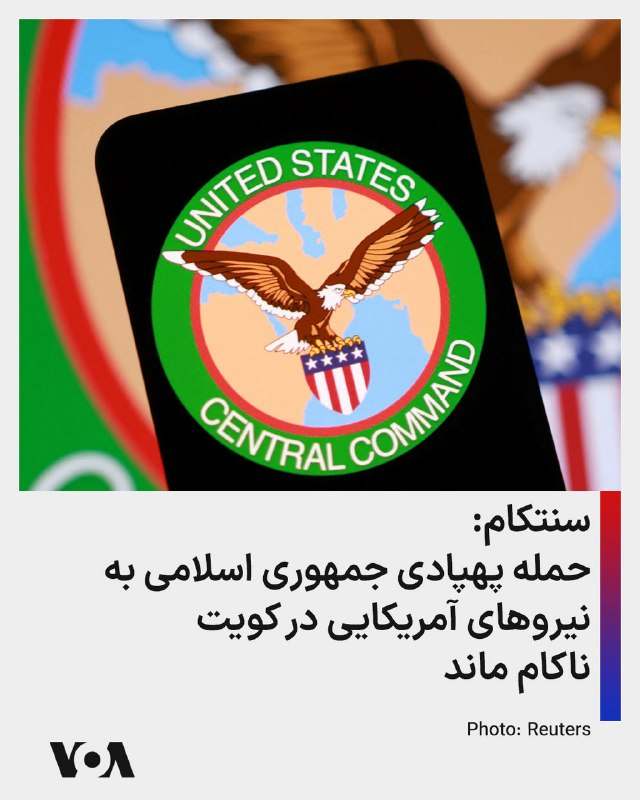

⚡️ستاد فرماندهی مرکزی آمریکا (سنتکام) دقایقی پیش اعلام کرد که «موج دیگری» از حملات پهپادی جمهوری اسلامی که نیروهای آمریکایی در کویت را هدف گرفته بود، ناکام ماند و پهپادها به اهدافی که داشتند برخورد نکردند.
سنتکام افزود پدافند هوایی ستاد فرماندهی مرکزی ایالات متحده «با موفقیت» چندین پهپاد را سرنگون کرد. سنتکام گفت هیچ یک از پرسنل و یا تجهیزات آمریکا آسیبی ندیده است.
@FarsiVOA

## DW_Farsi — post 125442

  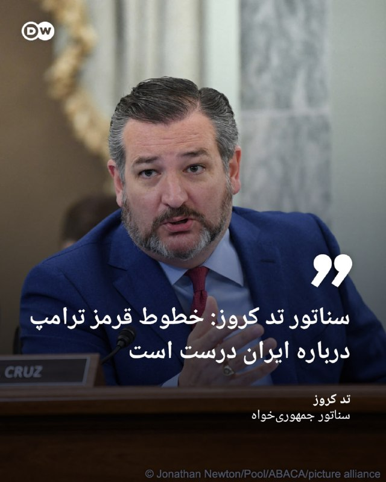

🔶 سناتور تد کروز: خطوط قرمز ترامپ درباره ایران درست است

تد کروز، سناتور بانفوذ جمهوری‌خواه از ایالت تگزاس شامگاه سه‌شنبه ۱۲ خرداد (۲ ژوئن) در پلتفرم ایکس نوشت خطوط قرمز تعیین‌شده از سوی دونالد ترامپ، رئیس‌جمهور آمریکا شامل "باز شدن تنگه هرمز، توقف کامل غنی‌سازی، تحویل اورانیوم غنی‌شده و قطع تامین مالی تروریسم" درست هستند.

کروز همچنین تاکید است ایران برای برنامه هسته‌ای غیرنظامی نیازی به غنی‌سازی اورانیوم ندارد.

او در ادامه افزود: «غنی‌سازی تنها یک هدف دارد؛ ساخت سلاح هسته‌ای.»

این سناتور پرنفوذ همچنین گفته است که او و مارکو روبیو، وزیر خارجه، درباره راه‌هایی گفت‌وگو کرده‌اند که اطمینان حاصل شود ایران نتواند از خطوط قرمز عبور کند.

@dw_farsi

## DW_Farsi — post 125441

  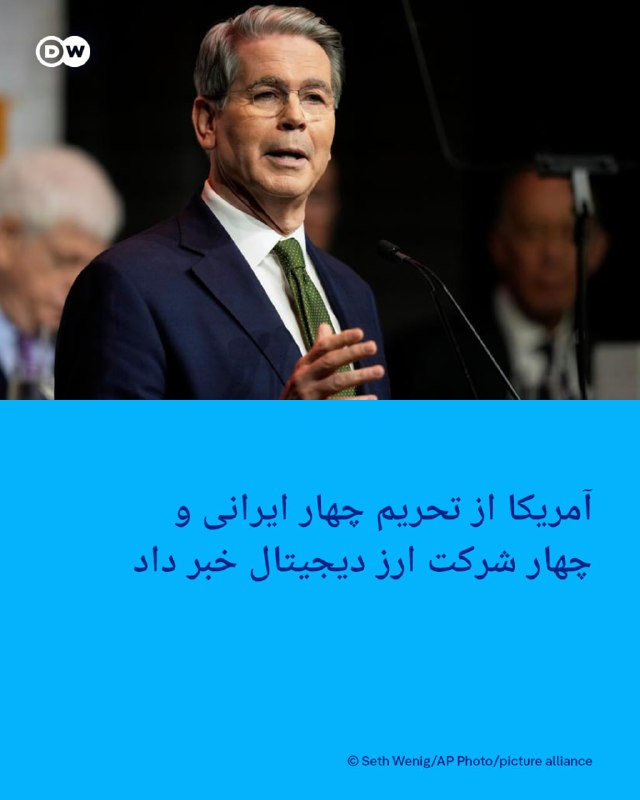

🔶 آمریکا از تحریم چهار ایرانی و چهار شرکت ارز دیجیتال خبر داد

وزارت خزانه‌داری آمریکا شامگاه سه‌شنبه ۱۲ خرداد (۲ مه) در بیانیه‌ای اعلام کرد این وزارتخانه شش فرد و چهار صرافی فعال در حوزه خدمات مالی و رمزارز مرتبط با جمهوری اسلامی ایران را در فهرست تحریم‌های خود قرار داده است.

طبق این گزارش که در تارنمای وزارت خزانه‌داری منتشر شده است، افراد ایرانی تحریم‌شده شامل محمد آقامیر، محمدعلی آقامیر، علی خویی و امیرحسین‌راد هستند که با صرافی رمزارز "نوبیتکس" مرتبط معرفی شده‌اند.

همچنین چهار صرافی نوبیتکس، بیت‌پین، رمزینکس و والکس نیز در فهرست تحریم‌ها قرار گرفته‌اند.

در بخش دیگری از این بیانیه آمده است که وزارت خزانه‌داری آمریکا دو فرد از جمهوری دموکراتیک کنگو را نیز به این فهرست افزوده است.

اسکات بسنت، وزیر خزانه‌داری آمریکا در پلتفرم ایکس نوشته است در حالی که اقتصاد ایران به شدت در حال سقوط است، حکومت تصمیم گرفته از فناوری‌های ارز دیجیتال برای پیشبرد اهداف خود استفاده کند؛ از جمله برای دور زدن تحریم‌ها و خارج کردن پول از کشور.

بسنت در ادامه تاکید کرده است که وضعیت نابسامان اقتصادی فعلی ایران نشان می‌دهد که سیاست فشار حداکثری دولت ترامپ مؤثر بوده است.

اسکات بسنت، وزیر خزانه‌داری ایالات متحده اخیرا اعلام کرد مجموع دارایی‌های رمزارزی مرتبط با جمهوری اسلامی که تا کنون توسط آمریکا توقیف شده، به حدود یک میلیارد دلار رسیده است. او گفت این رقم مربوط به کل دارایی‌های توقیف‌شده تا امروز است و به یک اقدام واحد محدود نمی‌شود.

@dw_farsi

## DW_Farsi — post 125440

  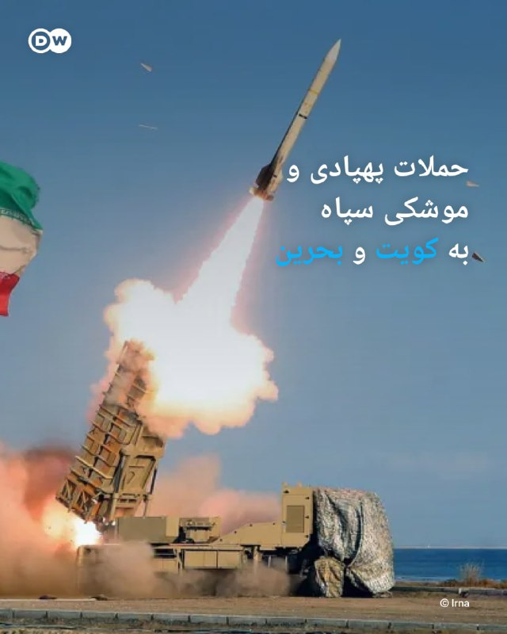

🔶 حملات پهپادی و موشکی سپاه به کویت و بحرین

فرماندهی مرکزی آمریکا (سنتکام) و سپاه پاسداران از حملات جدید موشکی و پهپادی خبر دادند.

کویت از رهگیری حملات موشکی و پهپادی ایران خبر داد، در بحرین آژیر خطر به صدا درآمد. وزارت کشور بحرین بامداد چهارشنبه ۱۳ خرداد (۳ ژوئن) از شهروندان و ساکنان این کشور خواست که آرامش خود را حفظ کنند و به نزدیک‌ترین مکان امن بروند.

رسانه‌های نزدیک به سپاه پاسداران از حمله به فرودگاه دبی در امارات متحده عربی و همچنین از به صدا درآمدن آژیرهای خطر در شرق عربستان خبر دادند.

فرماندهی مرکزی آمریکا (سنتکام) هم تائید کرد که چند موشک بالستیک و پهپاد ایرانی و یک ایستگاه کنترل زمینی نظامی در قشم را منهدم کردند.

سنتکام همچنین گفته است بامداد روز چهارشنبه ۱۳ خرداد (۳ ژوئن) موج دیگری از پهپادهای منتسب به ایران که قصد حمله به نیروهای آمریکایی در کویت را داشتند، توسط سامانه‌های پدافند هوایی آمریکا سرنگون شدند.

طبق داده‌های سنتکام هیچ‌یک از نیروها یا تاسیسات آمریکا در کویت دچار آسیب نشده‌اند.

@dw_farsi

## Persian_Trend_Official — post 15600

  <a href="telegram/content/Persian_Trend_Official_15600_1780469891.webm" target="_blank">🎬 Download video</a>

🌏 بولتن خبری ۲۴ ساعت گذشته

۱۳ خرداد ۱۴۰۵

💬تهیه شده در تحریریه پرشین ترند

⚔️ آکسیوس: تماس تلفنی ترامپ و نتانیاهو به یکی از پرتنش‌ترین مکالمات دو طرف تبدیل شد؛ ترامپ تشدید تنش اسرائیل در لبنان را تهدیدی برای مذاکرات با ایران دانسته و با لحنی تند از نتانیاهو انتقاد کرد

⚔️کانال ۱۲ اسرائیل: ترامپ و نتانیاهو پیش‌تر درباره صدور هشدار تخلیه ضاحیه بدون اجرای حمله توافق کرده بودند؛ اختلاف بر سر تبدیل این تهدید به اقدام واقعی بالا گرفت

⚔️ ترامپ ادعای توقف مذاکرات با ایران را رد کرد و گفت گفت‌وگوها به‌صورت مداوم ادامه دارد

⚔️ فارس: تبادل پیام میان ایران و آمریکا طی روزهای اخیر متوقف شده است

⚔️ مهر: تهران همچنان در حال بررسی متن نهایی توافق پیشنهادی آمریکا است و پاسخی ارائه نشده است

⚔️ گروسی: گزینه رقیق‌سازی اورانیوم در حال بررسی است؛ انتقال ذخایر با غنای بالا دشوار اما ممکن است

⚔️ وال‌استریت ژورنال: واشنگتن فشار بر عمان برای فاصله گرفتن از ایران را افزایش داده و حتی تهدید به تحریم کرده است

⚔️ بلومبرگ: برخی تولیدکنندگان بزرگ انرژی مانند قطر در حال عبور از قواعد دریانوردی در بحران هرمز هستند

⚔️ جروزالم‌پست: اسرائیل پدافند هوایی خود را در ایلات در برابر تهدیدات احتمالی انصارالله تقویت کرده است

⚔️ نخستین گزارش‌ها از حمله موشکی و پهپادی گسترده به کویت و بحرین؛ آژیرهای خطر، انفجارهای متعدد و فعال شدن پدافند تأیید شد

⚔️ منابع عربی: پایگاه‌های آمریکا در کویت (علی‌السالم و عریفجان) و بحرین هدف حملات قرار گرفتند

⚔️ سپاه: حملات به کویت و بحرین در پاسخ به حمله آمریکا به مواضع راداری و پدافندی در قشم انجام شده است

⚔️ سنتکام: چندین موشک و پهپاد ایرانی رهگیری شد و حملات دفاعی علیه اهدافی در قشم انجام گرفت

⚔️ گزارش‌ها از انفجار در اربیل همزمان با حملات منطقه‌ای؛ گروه کومله اصابت دو موشک به مقر خود را تأیید کرد

⚔️ رسانه‌ها: پروازها در بحرین، کویت و امارات به‌دلیل ناامنی هوایی متوقف شد

⚔️ صداوسیما: اصابت یک پرتابه به ساحل جنوبی قشم در محدوده سوزا تأیید شد

⚔️ سنتکام: یک نفتکش در مسیر ایران با شلیک موشک هلفایر از کار انداخته شد

⚔️ سپاه: در پاسخ به حمله به نفتکش ایرانی، شناور «پانایا» و همچنین پایگاه‌های آمریکا در منطقه هدف قرار گرفتند

⚔️ افزایش فعالیت هوایی آمریکا در خلیج فارس و دریای عمان با حضور هواپیماهای P-8 و تانکرهای KC-135

⚔️ تصاویر ماهواره‌ای از استقرار حدود ۸۰ شناور تندرو سپاه در اطراف قشم منتشر شد

⚔️ وزیر دفاع اسرائیل: در صورت ادامه حملات، ضاحیه بیروت هدف قرار خواهد گرفت؛ ۶۰۰ هزار نفر تخلیه شده‌اند

⚔️ ارتش اسرائیل از ادامه عملیات در لبنان و عدم وجود آتش‌بس خبر داد

⚔️ حملات هوایی و انفجارهای مکرر در جنوب لبنان گزارش شد

⚔️ حزب‌الله یک سامانه گنبد آهنین را با پهپادهای FPV هدف قرار داد

⚔️ اسرائیل: یکی از اعضای حماس مرتبط با حملات ۷ اکتبر کشته شد

⚔️ رئیس پیشین موساد: مأموریت علیه ایران تا تغییر نظام ادامه خواهد داشت

⚔️ رئیس جدید موساد: عملیات مخفی و غافلگیرکننده علیه محور ایران ادامه می‌یابد

⚔️ روبیو: ایران عملاً نیروی دریایی مؤثری ندارد و توان آن به‌شدت تضعیف شده است

⚔️ روبیو: هیچ‌گونه رفع تحریمی در ازای بازگشایی هرمز انجام نخواهد شد

⚔️ روبیو: ایران بخش‌هایی از تنگه هرمز را مین‌گذاری کرده و به کشتی‌ها حمله می‌کند

⚔️ روبیو: نشانه‌هایی از نقش‌آفرینی بیشتر مجتبی خامنه‌ای در تصمیم‌گیری‌ها وجود دارد

📺: بیش از نیمی از پست‌های سفارت آمریکا در جهان خالی است

⚔️ وزارت خزانه‌داری آمریکا چند صرافی ارز دیجیتال ایرانی را تحریم کرد

⚔️ بحرین سفر شهروندان خود به ایران و عراق را ممنوع اعلام کرد

⚔️ ارتش آمریکا و بریتانیا: یک نظامی آمریکایی و یک نظامی بریتانیایی در اربیل کشته شدند

⚔️ قیمت نفت در پی تحولات منطقه از ۹۷ دلار عبور کرد

⚔️ مرکز آمار: تورم نقطه‌ای روستایی به بیش از ۱۰۱ درصد رسید

⚔️ سازمان مالیاتی: خبر معافیت مالیاتی ۶۰ میلیاردی تکذیب شد

⚔️ انفجار بمب باقی‌مانده از جنگ جهانی دوم در اندونزی ۵ کشته برجای گذاشت

⚔️ بحران زباله در کوبا؛ مردم اقدام به سوزاندن زباله‌ها کرده‌اند

⚔️ سقوط بیت‌کوین به محدوده ۶۷ هزار دلار

👺Phantom

📌 @persian_trend_official
پرشین ترند | متفاوت‌ترین کانال

## Persian_Trend_Official — post 15599

⭕️ جنگنده‌های سوخو-۲۴ ایران مواضعی در نزدیکی اربیل را هدف قرار دادند.

گزارش‌ها حاکی است نیروی هوایی ارتش ایران شامگاه گذشته مواضع گروه‌های مسلح کُرد مخالف جمهوری اسلامی را در نزدیکی اربیل، مرکز اقلیم کردستان عراق، هدف حملات هوایی قرار داده است.
بر اساس این گزارش، بمب‌افکن‌های سوخو-۲۴ به پرواز درآمده و اهدافی را در چند کیلومتری اربیل مورد حمله قرار داده‌اند.
این حملات تنها یک روز پس از برگزاری رزمایش‌های گسترده و تمرینات آتش زنده نیروی هوایی در مناطق مرزی با عراق انجام شده است.

📝 Nick

📌 @persian_trend_official
پرشین ترند | متفاوت‌ترین کانال نظامی

## Persian_Trend_Official — post 15598

  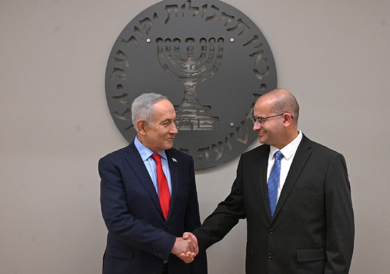

⭕️ اسرائیل به فارسی:

نخست‌وزیر نتانیاهو در مراسم معارفه رئیس جدید موساد:
سرنوشت رژیم ایران این است که از جهان محو شود و ما به آن برای رسیدن به این سرنوشت کمک خواهیم کرد. این رژیم هرگز دیگر موجودیت ما را تهدید نخواهد کرد.

📝 Nick

📌 @persian_trend_official
پرشین ترند | متفاوت‌ترین کانال نظامی

## Persian_Trend_Official — post 15596

  <a href="telegram/content/Persian_Trend_Official_15596_1780469892.mp4" target="_blank">🎬 Download video</a>

⭕️ اسرائیل به فارسی:

یوسف رمضان تروریست عضو حماس که در جنایت ربودن شهروندان اسرائیلی در هفتم اکتبر شرکت داشت، در غزه به هلاکت رسید.

📝 Nick

📌 @persian_trend_official
پرشین ترند | متفاوت‌ترین کانال نظامی

## Persian_Trend_Official — post 15595

  <a href="telegram/content/Persian_Trend_Official_15595_1780469894.mp4" target="_blank">🎬 Download video</a>

⭕️ سخنگوی آتش‌نشانی: صبح امروز خودروی نیسان در حال سوخت‌گیری در جایگاه سوخت گاز واقع در بزرگراه یاسینی بود که به‌دلایل نامشخص دچار انفجار شد.

در این حادثه دو نفر مصدوم شدند.

📝 Nick

📌 @persian_trend_official
پرشین ترند | متفاوت‌ترین کانال نظامی

## Persian_Trend_Official — post 15594

🎥 فواد ایزدی: آمریکا به‌دنبال عادی‌سازی حمله به ایران است.

🔹کارشناس مسائل بین‌الملل: کاری که آمریکایی‌ها می‌کنند شبیه آتش‌بس در غزه و لبنان است. حوصلۀ ایران همیشگی نیست. / فارس

📝 Nick

📌 @persian_trend_official
پرشین ترند | متفاوت‌ترین کانال نظامی

## Persian_Trend_Official — post 15593

⭕️ فارس:

احتمال شنیدن صدای انفجارهای کنترل‌شده در دزفول

فرمانداری دزفول: درپی امحای مهمات از ساعت ۱۰ تا ۱۲، احتمال شنیدن صدای انفجار وجود دارد.

📝 Nick

📌 @persian_trend_official
پرشین ترند | متفاوت‌ترین کانال نظامی

## Persian_Trend_Official — post 15592

  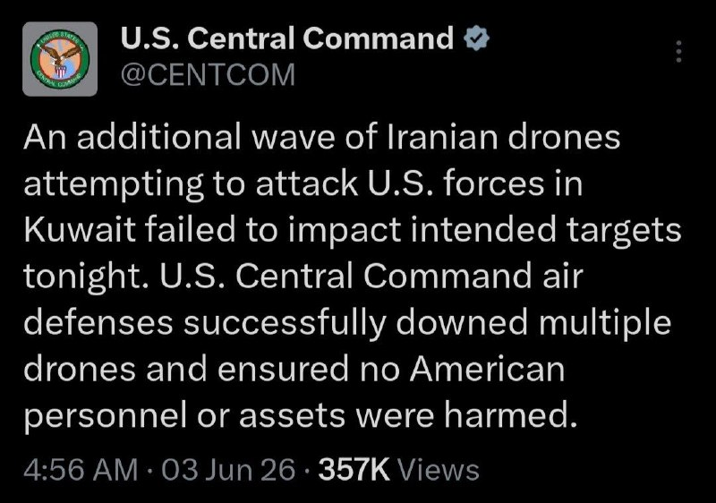

⭕️ سنتکام:

«موج دیگری از پهپادهای ایرانی که تلاش داشتند به نیروهای آمریکا در کویت حمله کنند، امشب نتوانست به اهداف موردنظر اصابت کند. پدافند هوایی فرماندهی مرکزی ایالات متحده با موفقیت چندین پهپاد را سرنگون کرد و اطمینان حاصل شد که هیچ‌یک از پرسنل یا تجهیزات آمریکایی آسیب ندیده‌اند.»

📝 Nick

📌 @persian_trend_official
پرشین ترند | متفاوت‌ترین کانال نظامی

## Persian_Trend_Official — post 15591

  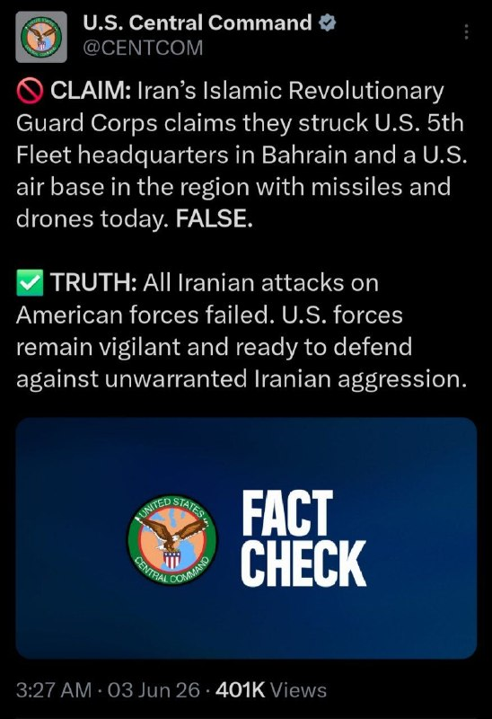

⭕️ سنتکام:

🚫 ادعا: سپاه پاسداران انقلاب اسلامی مدعی شده است که امروز با استفاده از موشک‌ها و پهپادها، مقر ناوگان پنجم نیروی دریایی آمریکا در بحرین و یک پایگاه هوایی آمریکا در منطقه را هدف قرار داده و مورد اصابت قرار داده است. نادرست.

✅ واقعیت: تمامی حملات ایران علیه نیروهای آمریکایی ناکام ماند. نیروهای ایالات متحده همچنان در حالت هوشیاری کامل قرار دارند و آماده‌اند در برابر آنچه «اقدامات تهاجمی و غیرموجه ایران» توصیف شده است، از خود دفاع کنند.

📝 Nick

📌 @persian_trend_official
پرشین ترند | متفاوت‌ترین کانال نظامی

## Persian_Trend_Official — post 15590

  <a href="telegram/content/Persian_Trend_Official_15590_1780469896.mp4" target="_blank">🎬 Download video</a>

صبحتون بخیر 🌄
F-15 Eagle

📌 @persian_trend_official
پرشین ترند | متفاوت‌ترین کانال نظامی

## RadioFarda — post 157839

  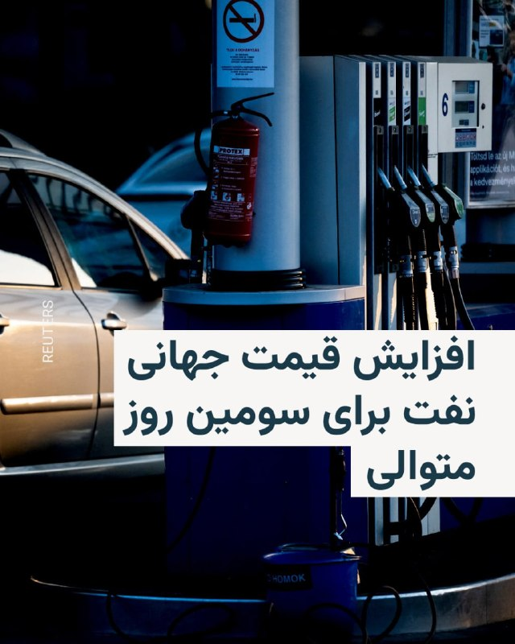

🔸همزمان با شعله‌ورشدن دوباره تنش‌ها در منطقه خلیج فارس، قیمت نفت در روز چهارشنبه ۱۳ خرداد برای سومین روز متوالی افزایش یافت و دلار نیز در آستانه عبور از مرز ۱۶۰ ین قرار گرفت.

🔸به نوشته رویترز، قراردادهای آتی نفت خام برنت با یک درصد افزایش به ۹۴.۷۴ دلار در هر بشکه رسید. دلار نیز به سطح ۱۶۰ ین صعود کرد، اما سپس متوقف شد؛ زیرا معامله‌گران نسبت به احتمال مداخله دولت ژاپن در بازار ارز در این سطح محتاط شده‌اند.

🔸با این حال، بازارهای سهام عمدتاً تحت تأثیر تداوم تقاضا برای فناوری‌های مرتبط با هوش مصنوعی رشد کردند و شاخص‌های سهام در تایوان و ژاپن به رکوردهای جدیدی رسیدند.

🔸در شرایطی که تلاش‌های دیپلماتیک میان واشینگتن و تهران پیشرفت چندانی نداشته، ارتش آمریکا اعلام کرد که حملات موشکی ایران به بحرین، کویت و دیگر اهداف منطقه‌ای یا خنثی شده‌اند یا با شکست مواجه شده‌اند.

🔸ایران و ایالات متحده هفته گذشته اعلام کرده بودند که به یک توافق اولیه برای توقف جنگ دست یافته‌اند، اما دو طرف هنوز هیچ توافقی را به طور رسمی نهایی و امضا نکرده‌اند.

@Radiofarda

## RadioFarda — post 157838

روبیو: تحریم‌های ایران با کنار گذاشتن فعالیت‌های هسته‌ای‌اش کاهش خواهد یافت

🔸وزیر خارجه آمریکا روز سه‌شنبه ۱۲ خرداد گفت که تیم مذاکره‌کننده دونالد ترامپ، رئیس‌جمهور، در ازای بازگشایی تنگه هرمز هیچ پیشنهاد کاهش یا لغو تحریم‌ها به ایران ارائه نکرده و تأکید کرد که هرگونه کاهش تحریم‌ها منوط به کنار گذاشتن برنامه هسته‌ای از سوی تهران است.

🔸مارکو روبیو در جلسه پرسش و پاسخ کمیته روابط خارجی سنای آمریکا گفت: «در حال حاضر، هر آنچه با آن‌ها (ایران) مطرح شده این است که هرگونه کاهش تحریم‌ها مبتنی بر شروطی است؛ یعنی باید در ازای همان دلایلی باشد که اساساً این تحریم‌ها به خاطر آن‌ها اعمال شده‌اند، یعنی برنامه هسته‌ای‌شان».

🔸او که برای نخستین بار از زمان آغاز جنگ ایران به‌صورت علنی در کنگره شهادت می‌داد، گفت در صورتی که ایران با کنار گذاشتن فعالیت‌های هسته‌ای خود موافقت کند، کاهش تحریم‌ها برای آن در نظر گرفته خواهد شد.

🔸وزیر خارجه آمریکا افزود: «ایران به دلیل غنی‌سازی در سطوح بالا تحت تحریم است. ایران به خاطر فعالیت‌های هسته‌ایش تحریم شده است. اگر با کنار گذاشتن این موارد موافقت کنند، کاهش تحریم‌ها متناسب با تعهد و پایبندی‌شان به این توافق‌ها اعمال خواهد شد».

🔸روبیو در حالی در برابر کمیته روابط خارجی سنای آمریکا شهادت داد، که دولت ترامپ به دنبال جلب موافقت کنگره برای کاهش ۳۰ درصدی بودجه امور خارجی و افزایش ۵۰ درصدی هزینه‌های نظامی پیشنهادی خود است.

🔸وزیر خارجه آمریکا در بخشی از اظهارات خود گفت که ایران با مذاکره دربارهٔ برخی جنبه‌های برنامهٔ هسته‌ایش که پیش‌تر از گفت‌وگو درباره آن‌ها خودداری می‌کرد، موافقت کرده است.

🔸روبیو در عین حال تأکید کرد این موضوع هیچ تضمینی ایجاد نمی‌کند که مذاکرات در نهایت به توافقی برای پایان دادن به جنگ میان آمریکا و اسرائیل با ایران منجر شود.

🔸نسخه کامل این گزارش را در وب‌سایت رادیوفردا بخوانید.

@Radiofarda

## RadioFarda — post 157837

  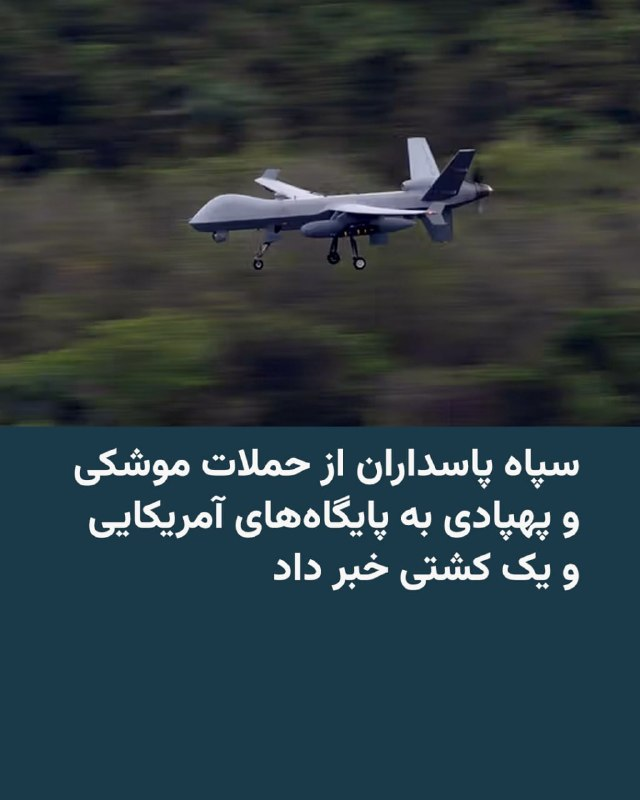

🔸سپاه پاسداران هم حملۀ آمریکا به یک «دکل مخابراتی سپاه» در جزیرۀ قشم و حملات موشکی به یک کشتی و پایگاه‌های آمریکا، از جمله در بحرین را تأیید کرد.

🔸در بیانیۀ روابط عمومی سپاه پاسداران آمده که در پاسخ به حملۀ جنگندۀ آمریکایی به نفتکش «لکسی» در نزدیکی تنگۀ‌ هرمز، نیروی دریایی سپاه یک شناور «متعلق به دشمن به نام پانایا» را هدف حملۀ موشکی قرار داده است.

🔸روابط عمومی سپاه پاسداران در ادامۀ بیانیۀ خود، با اشاره به حملۀ آمریکا به هدفی در جزیرۀ قشم، از حملۀ تلافی‌جویانه به یک «پایگاه هوایی و بالگردی در یکی از کشورهای منطقه» و مرکز ناوگان پنجم آمریکا [در بحرین] خبر داده است.

🔸پیشتر فرماندهی مرکزی نیروهای آمریکایی در منطقه، سنتکام، با صدور بیانیه‌ای، حمله به نقاطی در جزیره قشم، «در پاسخ به حملات موشکی و پهپادی جمهوری اسلامی» را تأیید کرد.

@RadioFarda

## RadioFarda — post 157836

  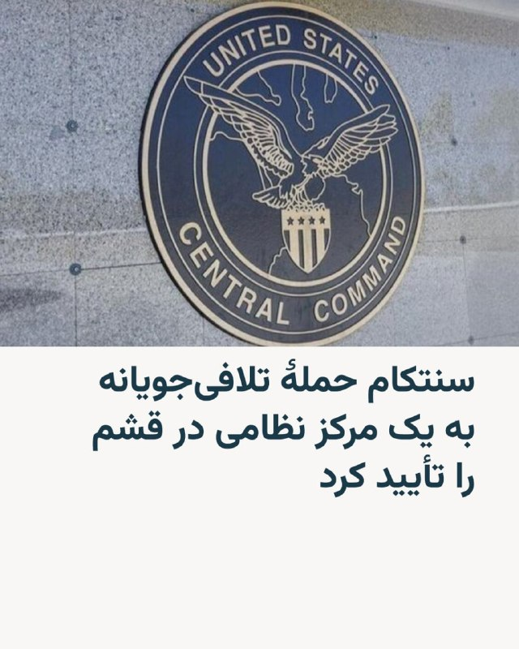

🔸فرماندهی مرکزی نیروهای آمریکایی در منطقه، سنتکام، با صدور بیانیه‌ای دیگر، حمله به نقاطی در جزیره قشم، «در پاسخ به حملات موشکی و پهپادی جمهوری اسلامی» را تأیید کرد.

🔸در این بیانیه آمده که نیروهای آمریکایی با موفقیت چندین موشک بالستیک و پهپاد شلیک‌شده از ایران را رهگیری و منهدم کرده و در اقدامی دفاعی، نقاطی در جزیرۀ قشم را هدف قرار داده‌اند.

🔸این بیانیه می‌افزاید که ایران چندین موشک بالیستیک را به سمت همسایگانش شلیک کرد؛ اما همگی در اصابت به اهداف خود ناموفق بوده‌اند. دو موشک شلیک‌شده به سمت کویت، در مسیر خود و پیش از رسیدن به این کشور دچار مشکل فنی شده و سقوط کردند و سه موشک شلیک‌شده به سمت بحرین هم از سوی پدافند هوایی ایالات متحده و بحرین رهگیری و منهدم شدند.

🔸سنتکام در ادامۀ بیانیۀ تازۀ خود می‌گوید: «لحظاتی پیش نیروهای سنتکام سه پهپاد تهاجمی انتحاری ایرانی را که به سمت کشتی‌های غیر نظامی در حرکت بودند، رهگیری و ساقط کردند. نیروهای آمریکایی همزمان در اقدامی دفاعی، یک ایستگاه کنترل نظامی ایران در جزیرۀ قشم را هدف قرار دادند».

@RadioFarda

## RadioFarda — post 157835

🔸تقریباً همزمان با انتشار بیانیۀ سنتکام، حاکی از شلیک یک موشک هل‌فایر به موتورخانۀ یک نفتکش خالی که قصد نزدیک‌شدن به پایانه‌های نفتی جزیرۀ خارک را داشته، خبرگزاری مهر به نقل از مردم و منابع محلی، از شنیده‌شدن صدای چند انفجار از سمت جزیرۀ قشم خبر داد.

🔸در گزارش کوتاه خبرگزاری مهر، ماهیت و علت شنیده‌شدن این صداها نامشخص اعلام و تأکید شده که مراجع نظامی و انتظامی در منطقه هم از این موضوع اظهار بی‌اطلاعی کرده‌اند.

🔸در همین حال، کویت هم از درگیری سامانه‌های دفاع هوایی‌اش با حملات موشکی و پهپادی خبر داده است.

🔸ارتش کویت در دقایق اولیه چهارشنبه به وقت محلی و کم‌وبیش همزمان با شنیده‌شدن صداهای انفجار در قشم، اعلام کرد که مشغول رهگیری حملات موشکی و پهپادی است و از مردم این کشور خواست که دستور‌العمل‌های ایمنی را دنبال کنند.

🔸این بیانیه بدون اشاره به مبدأ حملات موشکی و پهپادی، تأکید کرده که همۀ صداهای انفجار شنیده‌شده، ناشی از عملیات رهگیری پرتابه‌های تهاجمی است.

@RadioFarda

## RadioFarda — post 157834

  <a href="telegram/content/RadioFarda_157834_1780469900.mp4" target="_blank">🎬 Download video</a>

🔸فرماندهی مرکزی نیروهای ایالات متحده می‌گوید با شلیک یک موشک به یک نفتکش خالی، مانع از نزدیک‌شدن این شناور به یک بندر ایرانی شده است.

🔸بر اساس بیانیۀ سنتکام نیروهای نظامی آمریکا به این ترتیب جلوی رسیدن نفتکش M/T Lexie که با پرچم بوتسوانا تردد می‌کند، به ترمینال بارگیری در جزیرۀ خارک را گرفتند.

🔸این بیانیه می‌گوید خدمۀ کشتی به اخطارهای پیاپی نیروهای آمریکا بی‌اعتنایی کرده و در طول بیش از ۲۴ ساعت، حاضر به تبعیت از دستورات آنها نشدند.

🔸در نهایت یک هواپیمای جنگنده با شلیک یک موشک «هِل‌فایِر» به موتورخانۀ کشتی، مانع از رسیدن نفتکش به ایران شد.

🔸سنتکام از پنجاه روز پیش، جلوگیری از تردد همۀ شناورها به بنادر ایرانی را آغاز کرد. در این فاصله نیروهای آمریکایی شش کشتی تجاری را از کار انداخته و ۱۲۲ شناور را هم به مسیرهایی دیگر راهنمایی کرده‌اند.

🔸این در حالی‌است که آتش‌بس میان ایران و آمریکا همچنان ادامه دارد و تلاش‌های دیپلماتیک برای تمدید دست‌کم شش‌ماهۀ آن هم در جریان است.

@RadioFarda

## RadioFarda — post 157833

  <a href="https://t.me/radiofarda/157833" target="_blank">📎 Download file</a>

📻بشنوید: سرخط خبرها با رادیوفردا، ۱۳ خرداد ۱۴۰۵‌

@RadioFarda

## IranianMinds — post 21290

  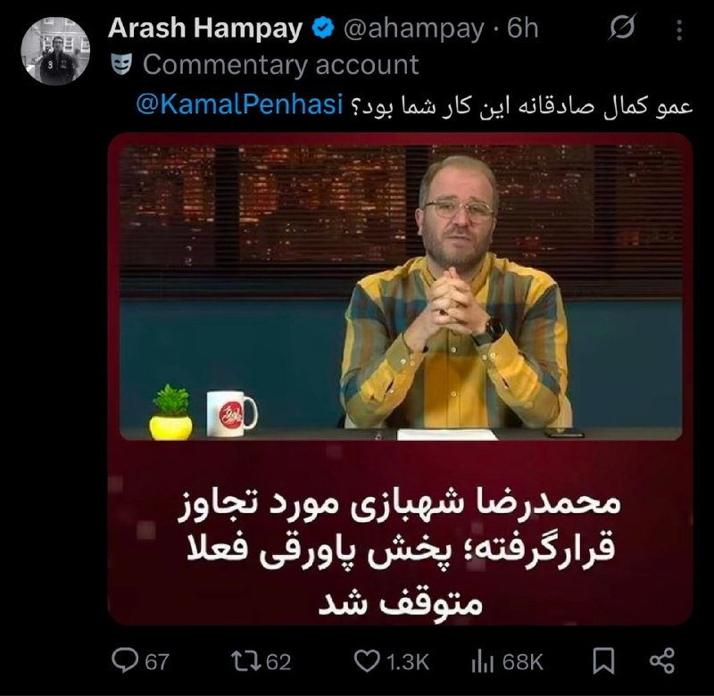

احتمالا تروله ولی باحال بود 😂

@IranianMinds

## IranianMinds — post 21289

🔴 سنتکام:
در پاسخ به حملات جمهوری اسلامی، به اهدافی در جزیره قشم حمله کردیم.
موج دیگری از حمله پهپادی جمهوری اسلامی علیه نیروهای آمریکا در کویت ناکام مانده و هیچ آسیبی به نیروها یا تجهیزات آمریکایی وارد نشده.
سنتکام همچنین ادعاهای جمهوری اسلامی درباره هدف گرفتن مقر ناوگان پنجم در بحرین رو تکذیب کرد.

@IranianMinds

## IranianMinds — post 21288

🔴 سنتکام:
خب آره خب دیشب به قشم حمله کردیم اماااااا آتش‌بس همچنان برقراره.☺️☺️

@IranianMinds

## IranianMinds — post 21287

  

🔴 بعد از کشته شدن استاد اسپلینتر ارتش موش ها برای انتقام به کشور حمله کردن

با اعلام مدیرکل محیط زیست موش های پا سفید که رنگ قهوه ای مایل به قرمز دارن، بخاطر گرما به کشور هجوم آوردن و بسیار هم خطرناک هستن!

@IranianMinds

## BBCPersian — post 282744

🖊بریجت کندال
خبرنگار پیشین بی‌بی‌سی در مسکو

🔻در تمام سال‌هایی که ولادیمیر پوتین رئیس‌جمهور روسیه بوده، همواره از قدرت تصویرسازی آگاه بوده است.

اولین بار که در سال ۲۰۰۱ با او مصاحبه کردم، درست پیش از آن‌که دوربین‌ها روشن شوند، یکی از دستیارانش ناگهان جلو آمد و لیوان‌های کوچک آب را که روی میز مقابل ما قرار داشت، برداشت.

از او پرسیدم: «چرا این کار را کردید؟»

پاسخ داد: «نمی‌خواهیم کسی فکر کند داخل آن‌ها ودکا بوده است. ضمن این‌که نمی‌توانیم ریسک کنیم که لیوانی هنگام پخش زنده تلویزیونی روی میز بریزد. تلویزیون از نظر تبلیغات و تاثیرگذاری مثل یک بمب هسته‌ای است.»

متن کامل خبر را از لینک زیر بخوانید:
https://bbc.in/3PQr08d

📷Getty Images/ Reuters/ BBC/ Shutterstock / Reuters/ Stasi Records Agency Dresden (Public Domain)/ AP

@BBCPersian

## BBCPersian — post 282743

🔻انفجار خودرو در جایگاه سوخت‌گیری تهرانپارس تهران

🔻بنابر اعلام سخنگوی سازمان آتش‌نشانی صبح امروز(چهارشنبه سیزدهم خرداد) یک انفجار در جایگاه سوخت گاز در بزرگراه یاسینی، مسیر غرب به شرق، بعد از سه‌ راه تهرانپارس بوقوع پیوست.

دلیل این انفجار هنوز مشخص نشده است.

سخنگوی سازمان آتش‌نشانی گفته است: «در بررسی‌های اولیه مشخص شد که یک دستگاه خودرو نیسان یخچال‌دار در حال سوخت‌گیری در این جایگاه بوده که به دلایل نامشخص و در حال بررسی، دچار انفجار شده است.»

شدت این انفجار باعث وارد آمدن خسارات به خودرو و جایگاه سوخت شد.

به گزارش رسانه‌های ایران، دو نفر در این انفجار مصدوم شدند.

https://bbc.in/4o1NHmi
@BBCPersian

## BBCPersian — post 282742

🔻سنتکام هدف قرار گرفتن ناوگان پنجم ایالات متحده در حملات سپاه پاسداران را رد کرد

🔻فرماندهی مرکزی ارتش ایالات متحده، سنتکام، در اطلاعیه‌ای هدف قرارگرفتن ناوگان پنجم ایالات متحده در بحرین و یک پایگاه هوایی ایالات متحده در منطقه، در حملات «موشکی و پهپادی» سپاه پاسداران را رد کرده است.

این نهاد در پیامی که در شبکه اجتماعی ایکس منتشر کرده نوشته است: «این ادعا نادرست است.»

سنتکام همچنین اعلام کرده است: «تمام حملات ایران به نیروهای آمریکایی شکست خورد. نیروهای آمریکایی هوشیار و آماده دفاع در برابر تجاوز بی‌توجیه ایران هستند.»

ساعتی پس از انتشار گزارش‌های متعدد از حملات موشکی به نقاطی در کویت و بحرین، سپاه پاسداران با انتشار اطلاعیه‌ای رسما از حمله به پایگاه ناوگان پنجم نیروی دریایی آمریکا خبر داده بود.

سنتکام پیشتر اعلام کرده بود چندين موشک بالستيک و پهپاد ايرانی را رهگيری و منهدم کرده و در پاسخ به آنچه «تلاش‌های ايران برای حمله در سراسر منطقه» خوانده، حملاتی را در قالب دفاع از خود عليه اهدافی در جزيره قشم انجام داده است.

https://bbc.in/4x7i8M9
@BBCPersian

## BBCPersian — post 282732

‌🖊سعید جعفری
روزنامه‌نگار

🔻در حالی که مذاکرات ایران و آمریکا وارد مرحله‌ای حساس شده، در اسرائیل بحث‌ها درباره «روز بعد از توافق احتمالی» شدت گرفته است. سوال اصلی فقط این نیست که آیا توافقی شکل خواهد گرفت یا نه؛ بلکه این است که اگر واشنگتن و تهران به تفاهم برسند، اسرائیل چه خواهد کرد؟

در رسانه‌ها، اندیشکده‌ها و محافل امنیتی اسرائیل، به‌نظر می‌رسد بحث‌ها از مرحله تلاش برای جلوگیری کامل از توافق عبور کرده و بیشتر بر این متمرکز شده که اسرائیل چگونه باید با توافقی احتمالی کنار بیاید؛ توافقی که ممکن است نه‌تنها برنامه هسته‌ای ایران، بلکه آزادی عمل نظامی اسرائیل در منطقه را نیز تحت تاثیر قرار دهد.

متن کامل خبر را از لینک زیر بخوانید:
https://bbc.in/4dNcGq8
📷Getty Images

@‌BBCPersian

## BBCPersian — post 282731

🔻به گزارش رویترز سازمان اطلاعات مرکزی آمریکا، سیا، مشارکت در بعضی از ارزیابی‌های اطلاعاتی را متوقف کرده است. به گفته منابع آگاه، سازمان سیا در ارزیابی‌های مربوط به جنگ با ایران که دفتر جاسوسی ارشد کشور تهیه می‌کند مشارکت نمی‌کند. توقف مشارکت به علت «بالا…

## BBCPersian — post 282730

  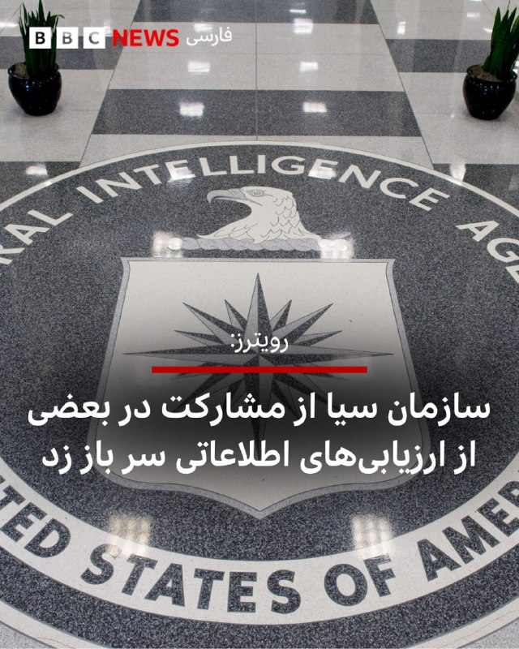

🔻به گزارش رویترز سازمان اطلاعات مرکزی آمریکا، سیا، مشارکت در بعضی از ارزیابی‌های اطلاعاتی را متوقف کرده است.

به گفته منابع آگاه، سازمان سیا در ارزیابی‌های مربوط به جنگ با ایران که دفتر جاسوسی ارشد کشور تهیه می‌کند مشارکت نمی‌کند. توقف مشارکت به علت «بالا گرفتن اختلافات بر سر حوزه‌های مسئولیت و اشتراک‌گذاری اطلاعات» گزارش شده است.

یک مقام دولت آمریکا و سه منبع آگاه به رویترز گفتند که درگیری میان سی‌آی‌ای و دفتر مدیر اطلاعات ملی آمریکا «بیش از یک سال است که بالا گرفته» و تحلیل‌های امنیت ملی این کشور را دچار «اختلال» کرده است. روسای جمهور آمریکا همیشه از این تحلیل‌ها برای مقابله با چالش‌های سیاست خارجی آمریکا استفاده می‌کنند.

این منابع به علت حساسیت موضوع نخواستند نامشان فاش شود.

این افراد گفتند یک کارگروه که تولسی گابارد، مدیر سابق اطلاعات ملی آمریکا، در آوریل ۲۰۲۵ تشکیل داده بود موضوع اختلاف است.

📷Bloomberg via Getty Images
https://bbc.in/3RO0jS8
@BBCPersian

## BBCPersian — post 282729

🔻دونالد ترامپ، رئيس جمهور آمريکا، فرمان اجرايی جديدی را امضا کرده است که بر اساس آن شرکت‌های فناوری می‌توانند به صورت داوطلبانه مدل‌های هوش مصنوعی خود را پيش از انتشار عمومی در اختيار دولت قرار دهند. هدف از اين اقدام، حفاظت از سامانه‌های دولتی در برابر حملات…

## BBCPersian — post 282728

  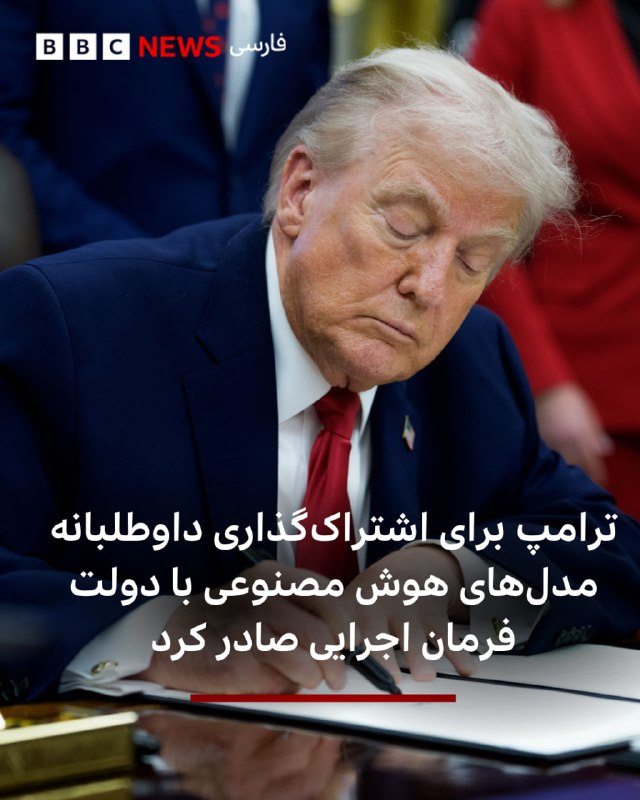

🔻دونالد ترامپ، رئيس جمهور آمريکا، فرمان اجرايی جديدی را امضا کرده است که بر اساس آن شرکت‌های فناوری می‌توانند به صورت داوطلبانه مدل‌های هوش مصنوعی خود را پيش از انتشار عمومی در اختيار دولت قرار دهند.

هدف از اين اقدام، حفاظت از سامانه‌های دولتی در برابر حملات سايبری مبتنی بر هوش مصنوعی عنوان شده است.

بر اساس اين طرح، شرکت‌هايی مانند گوگل، اوپن‌ای‌آی (که چت جی‌پی‌تی را ارایه کرده)‌و آنتروپيک می‌توانند مدل‌های جديد خود را تا ۳۰ روز پيش از انتشار عمومی با دولت آمريکا به اشتراک بگذارند.

اين اقدام چند هفته پس از آن انجام می‌شود که آقای ترامپ مراسم امضای يک طرح قبلی با حضور مديران ارشد شرکت‌های فناوری را به دليل نگرانی از اينکه مقررات جديد ممکن است روند پيشرفت هوش مصنوعی را کند کند، به تعويق انداخت.

📷 EPA
@BBCPersian

## Dirty_Kids — post 390896

  <a href="telegram/content/Dirty_Kids_390896_1780469905.mp4" target="_blank">🎬 Download video</a>

ویدیو وایرال از دختری که دوتا دختر رو خفت کرده چکی‌شون میکنه

باران بگیرمت کردمت
توله‌هاتون از پارک جمع کنید

@Dirty_Kids 👻

## Dirty_Kids — post 390895

  

به کیرم

چقدر کسشر میشناسید

@Dirty_Kids 👻

## Dirty_Kids — post 390894

  <a href="telegram/content/Dirty_Kids_390894_1780469908.mp4" target="_blank">🎬 Download video</a>

ویدیو وایرال از دختری که دوتا دختر رو خفت کرده چکی‌شون میکنه

باران بگیرمت کردمت
توله‌هاتون از پارک جمع کنید

@Dirty_Kids 👻

## alonews — post 124690

  <a href="telegram/content/alonews_124690_1780469910.webm" target="_blank">🎬 Download video</a>

👈عضو کمیسیون اقتصادی مجلس: افزایش ۳۰درصدی قیمت مواد اولیه داخلی، قیمت خودرو، لوازم خانگی و بسته‌بندی محصولات، در موج جدید گرانی در راه است

✅ @AloNews خبر جنگ

## alonews — post 124689

  <a href="telegram/content/alonews_124689_1780469911.webm" target="_blank">🎬 Download video</a>

👈پرداخت افزایش حقوق بازنشستگان در سال ۱۴۰۵ به تأخیر می افتد

✅ @AloNews خبر جنگ

## alonews — post 124688

  <a href="telegram/content/alonews_124688_1780469911.webm" target="_blank">🎬 Download video</a>

👈یک ماه پس از آن‌که دونالد ترامپ طرحی را برای اسکورت کشتی‌های تجاری از طریق تنگه هرمز اعلام کرد و سپس از آن صرف‌نظر کرد، ارتش آمریکا در تلاش است با روش‌هایی کم‌سروصداتر از شناورها در این آبراه حیاتی محافظت کند

✅ @AloNews خبر جنگ

## alonews — post 124687

  <a href="telegram/content/alonews_124687_1780469911.webm" target="_blank">🎬 Download video</a>

👈جنگنده‌های سوخو-۲۴ ایران مواضعی در نزدیکی اربیل را هدف قرار دادند

🔴گزارش‌ها حاکی است نیروی هوایی ارتش ایران شامگاه گذشته مواضع گروه‌های مسلح کُرد مخالف جمهوری اسلامی را در نزدیکی اربیل، مرکز اقلیم کردستان عراق، هدف حملات هوایی قرار داده است.

🔴بر اساس این گزارش، بمب‌افکن‌های سوخو-۲۴ به پرواز درآمده و اهدافی را در چند کیلومتری اربیل مورد حمله قرار داده‌اند.

🔴این حملات تنها یک روز پس از برگزاری رزمایش‌های گسترده و تمرینات آتش زنده نیروی هوایی در مناطق مرزی با عراق انجام شده است

✅ @AloNews خبر جنگ

## alonews — post 124686

  <a href="telegram/content/alonews_124686_1780469911.webm" target="_blank">🎬 Download video</a>

👈نیکزاد ، نایب رئیس مجلس: وزارت خارجه اذن تشکیل کارگروه تنگه هرمز را از رهبری گرفته بود

✅ @AloNews خبر جنگ

## alonews — post 124685

  <a href="telegram/content/alonews_124685_1780469912.webm" target="_blank">🎬 Download video</a>

👈فرمانداری دزفول: درپی امحای مهمات از ساعت ۱۰ تا ۱۲، احتمال شنیدن صدای انفجار وجود دارد

✅ @AloNews خبر جنگ

## alonews — post 124684

  <a href="telegram/content/alonews_124684_1780469912.webm" target="_blank">🎬 Download video</a>

👈شاخص کل بورس تهران در دقایق ابتدایی آخرین روز کاری بازار در هفته جاری ۱۷ هزار واحد رشد کرد و به تراز ۴ میلیون و ۳۶۱ هزار واحد رسید

✅ @AloNews خبر جنگ

## alonews — post 124683

  <a href="telegram/content/alonews_124683_1780469912.mp4" target="_blank">🎬 Download video</a>

👈ساعتی قبل، حمله پهپادهای اوکراین به سن پترزبورگ

✅ @AloNews خبرر جنگ

## alonews — post 124682

  <a href="telegram/content/alonews_124682_1780469914.webm" target="_blank">🎬 Download video</a>

👈سازمان هواپیمایی کشوری کویت همچنین مدعی شد که هدف قرار گرفتن فرودگاه کویت منجر به مجروح شدن تعدادی از افراد و وارد آمدن خسارت‌های شدید به برخی از تاسیسات آن شد.

✅ @AloNews خبر جنگ

## alonews — post 124681

  <a href="telegram/content/alonews_124681_1780469914.webm" target="_blank">🎬 Download video</a>

👈نیویورک پست: خلبانی که در ایران سقوط کرد و‌ نجات یافت همان خلبانی بوده که در کویت و بر اثر آتش خودی سقوط کرده بود. دو سقوط در ۴ هفته!

✅ @AloNews خبر جنگ

## alonews — post 124680

  <a href="telegram/content/alonews_124680_1780469914.webm" target="_blank">🎬 Download video</a>

👈حمله گسترده روسیه به کی‌اف و دیگر مناطق اوکراین دست‌کم ۲۲کشته و بیش از ۱۰۰زخمی برجای گذاشت و هزاران نفر به مترو پناه بردند

✅ @AloNews خبر جنگ

## alonews — post 124679

  <a href="telegram/content/alonews_124679_1780469914.mp4" target="_blank">🎬 Download video</a>

👈کوثری: آمریکایی‌ها جز زور متوجه چیز دیگری نمی‌شوند

🔴عضو کمیسیون امنیت ملی مجلس: برخورد با آمریکایی‌ها باید تشدید شود.

✅ @AloNews خبر جنگ

## alonews — post 124678

  <a href="telegram/content/alonews_124678_1780469916.webm" target="_blank">🎬 Download video</a>

👈سخنگوی سازمان آتش‌نشانی شهر تهران:
ساعت ۳ دقیقه بامداد امروز حادثه خودرویی در زیر پل استخر محله تهرانپارس به سامانه ۱۲۵ اعلام شد.

🔴آتش‌نشانان پس از حضور در محل مشاهده کردند یک دستگاه خودروی MVM با دو سرنشین که در روی پل در حال عبور بودند، به دلیل نامشخصی با گاردریل‌های پل برخورد کرده است.

🔴پس از حضور عوامل اورژانس مشخص شد که متأسفانه هر دو سرنشین جان خود را از دست داده‌اند

✅ @AloNews خبر جنگ

## alonews — post 124677

  <a href="telegram/content/alonews_124677_1780469916.webm" target="_blank">🎬 Download video</a>

👈حمله اسرائیل به حومه بلعت در بخش مرجعیون در جنوب لبنان

✅ @AloNews خبر جنگ

## alonews — post 124676

  <a href="telegram/content/alonews_124676_1780469917.webm" target="_blank">🎬 Download video</a>

👈روایت سی‌ان‌ان از درگیری شب گذشته ایران و آمریکا در خلیج فارس

🔴ایالات متحده و ایران در یکی از سنگین‌ترین شب‌های حملات از زمان آغاز آتش‌بس در آوریل، دست به تبادل حمله زده‌اند

🔴به نظر می‌رسد درگیری‌های شب سه‌شنبه زمانی آغاز شد که ارتش آمریکا با استفاده از موشک هلفایر، یک نفت‌کش با پرچم بوتسوانا را که به سمت بندری ایرانی در جزیره خارک در حرکت بود، هدف قرار داد. به گفته فرماندهی مرکزی ایالات متحده (سنتکام)، این کشتی با محاصره دریایی بنادر ایران توسط آمریکا همکاری نکرده بود.

🔴در پاسخ، ایران اعلام کرد به یک کشتی با پرچم لیبریا موشک شلیک کرده است.

🔴اما تشدید خطرناک‌تر پس از آن رخ داد که آمریکا یک ایستگاه کنترل زمینی نظامی ایران را در جزیره قشم، نزدیک تنگه هرمز، هدف قرار داد و این موضوع باعث شد ایران به کشورهای کویت و بحرین در منطقه خلیج فارس موشک و پهپاد شلیک کند.

🔴ایران اعلام کرد که «یک پایگاه هوایی و بالگردی آمریکایی» در منطقه و همچنین مقر ناوگان پنجم ایالات متحده در بحرین را هدف قرار داده است

✅ @AloNews خبر جنگ

## alonews — post 124675

  <a href="telegram/content/alonews_124675_1780469917.webm" target="_blank">🎬 Download video</a>

👈احتمال شنیده شدن صدای انفجار کنترل شده در محدوده جنوب اصفهان

✅ @AloNews خبر جنگ

## alonews — post 124674

  <a href="telegram/content/alonews_124674_1780469917.mp4" target="_blank">🎬 Download video</a>

👈سخنگوی آتش‌نشانی: صبح امروز خودروی نیسان در حال سوخت‌گیری در جایگاه سوخت گاز واقع در بزرگراه یاسینی بود که به‌دلایل نامشخص دچار انفجار شد.

🔴در این حادثه دو نفر مصدوم شدند.

✅ @AloNews خبر جنگ

## alonews — post 124673

  <a href="telegram/content/alonews_124673_1780469919.webm" target="_blank">🎬 Download video</a>

👈بیت کوین در ۴۸ ساعت گذشته بدون هیچ خبر منفی مهمی؛ ۸۰۰۰ دلار (۱۰٪-) سقوط کرد

✅ @AloNews خبر جنگ

## alonews — post 124672

  <a href="telegram/content/alonews_124672_1780469919.mp4" target="_blank">🎬 Download video</a>

👈 تصادف در خیابان های کویت بر اثر تماشای موشکهای سپاه

✅ @AloNews خبر جنگ

## alonews — post 124669

  <a href="telegram/content/alonews_124669_1780469922.mp4" target="_blank">🎬 Download video</a>

👈دیشب ، حمله‌های ارتش اوکراین به روسیه

✅ @AloNews خبر جنگ

---
📅 بروزرسانی: 1405/03/13 05:32
---

## VahidOOnLine — post 243464

  

نشریه های ساید ساب‌استک به نقل از مقام‌های نظامی کنونی و پیشین آمریکا گزارش داد یکی از خلبانان اف-۱۵ای آمریکا که ۱۴ فروردین بر فراز ایران سرنگون شد، همان خلبانی بود که پنج هفته پیش از آن در یک حادثه شلیک خودی از سوی یک جنگنده اف/ای-۱۸ کویتی، با دو اف-۱۵ای دیگر سرنگون شده بود.
به گفته ساید ساب‌استک، این خلبان «تقریبا به طور قطع» نخستین خلبان هواپیمای بال‌ثابت نیروی هوایی است که از زمان جنگ ویتنام در یک جنگ واحد دو بار سرنگون شده است.
در حادثه اول در ۱۱ اسفند نیروهای دفاعی کویت به اشتباه به سه جنگنده اف-۱۵ئی استرایک ایگل شلیک کردند و هر شش خدمه این هواپیماها به بیرون پرتاب شدند و در خاک این کشور هم‌پیمان به سلامت فرود آمدند.
در ۱۴ فروردین نیز، بدشانسی دوباره به سراغ یکی از این خلبانان آمد و در یک جنگنده اف-۱۵ای بر فراز ایران هدف قرار گرفت. در این عملیات این خلبان به سرعت نجات یافت، اما افسر تسلیحات مجروح شد و روز بعد پس از آنکه نیروهای نظامی محل اختفای او را در کوه‌های زاگرس شناسایی کردند نجات یافت.

‌🏁 🇬🇧 IranintlTV

🤖 @VahidOOnLine

## VahidOOnLine — post 243463

  

♦️فرماندهی مرکزی ایالات متحده، سنتکام، با انتشار پیامی در شبکه اجتماعی اکس اعلام کرد موج تازه‌ای از پهپادهای ایرانی که تلاش داشتند به نیروهای آمریکایی مستقر در کویت حمله کنند، در اصابت به اهداف خود ناکام ماندند. بر اساس این بیانیه، پدافند هوایی سنتکام با موفقیت چندین فروند از این پهپادها را سرنگون کرده و تضمین نموده است که هیچ‌یک از پرسنل یا تجهیزات نظامی ایالات متحده در این حملات آسیب ندیده‌اند.
‌🇸🇦 Indypersian

🤖 @VahidOOnLine

## VahidOOnLine — post 243462

  

♦️نیویورک‌پست می‌نویسد، بر اساس گزارشی جدید، یک خلبان جنگنده «اف-۱۵ئی استرایک ایگل» نیروی هوایی آمریکا در جریان جنگ ایران در کمتر از یک ماه دو بار در کویت (آتش خودی) و ایران سرنگون شد، اما هر دو بار زنده ماند.
هویت این خلبان هرگز به‌طور علنی اعلام نشده است. مقام‌های کنونی و سابق نظامی به نشریه «های ساید ساب‌استک» گفتند که او یکی از دشوارترین پنج هفته‌های دوران خدمت یک خلبان نیروی هوایی آمریکا را از زمان جنگ ویتنام پشت سر گذاشته است.
به نوشته نیویورک‌پست، بدبیاری او از دوم مارس آغاز شد؛ زمانی که در یک حادثه آتش خودی در کویت، نیروهای دفاعی این کشور به اشتباه به سوی سه فروند جنگنده اف-۱۵ئی آمریکایی شلیک کردند.
در این حادثه، هر شش خدمه این سه جنگنده مجبور شدند با استفاده از صندلی پران از هواپیما خارج شوند و با چتر در خاک کویت فرود آیند. همه آن‌ها سالم نجات پیدا کردند.
با وجود این حادثه، به گفته پیت هگست، وزیر جنگ آمریکا، خلبانان تنها چهار هفته بعد دوباره به ماموریت بازگشتند و در عملیات بمباران اهدافی در تهران شرکت کردند؛ اقدامی که او آن را نشانه شجاعت و فداکاری این نیروها دانست.
نیویورک‌پست می‌نویسد، اما چند روز پس از آن ماموریت، بدشانسی بار دیگر به سراغ یکی از این خلبانان آمد. یک جنگنده اف-۱۵ئی بر فراز ایران هدف قرار گرفت و دو سرنشین آن در خاک ایران سقوط کردند.
این خلبان در سوم آوریل به‌سرعت نجات داده شد، اما افسر سامانه‌های تسلیحاتی همراه او زخمی شده بود و پس از آنکه ایران برای دستگیری او جایزه تعیین کرد، ناچار شد مخفی شود.
این سرهنگ نیروی هوایی روز بعد در عملیاتی نجات پیدا کرد. ارتش آمریکا محل اختفای او را در کوه‌های زاگرس شناسایی کرده بود؛ جایی که برای در امان ماندن پناه گرفته بود.
مقام‌های نظامی به های ساید گفته‌اند این خلبان که ظرف پنج هفته دو بار سرنگون شده است، «تقریبا با قطعیت» نخستین خلبان هواپیمای بال‌ثابت نیروی هوایی آمریکا از زمان جنگ ویتنام به شمار می‌رود که در یک درگیری واحد دو بار سرنگون شده است.
فرماندهی مرکزی آمریکا (سنتکام) به درخواست روزنامه نیویورک پست برای اظهارنظر درباره این گزارش پاسخی نداد.
‌🇸🇦 Indypersian

🤖 @VahidOOnLine

## VahidOOnLine — post 243461

  

♦️فرماندهی مرکزی آمریکا (سنتکام)، بامداد چهارشنبه اعلام کرد، نیروهای این کشور در پاسخ به تلاش‌های نافرجام سپاه برای حمله در سراسر خاورمیانه، حملاتی تدافعی را علیه یک ایستگاه کنترل زمینی نظامی در جزیره قشم انجام داده و هم‌زمان چندین موشک بالستیک و پهپاد سپاه را منهدم کرده‌اند. به گفته سنتکام، سپاه چندین موشک بالستیک را به سمت کشورهای همسایه شلیک کرد که همگی ناکام ماندند؛ از جمله دو موشک شلیک‌شده به سمت کویت قبل از رسیدن به هدف سقوط کردند و سه موشک شلیک‌شده به سمت بحرین نیز بلافاصله توسط نیروهای پدافند هوایی آمریکا و بحرین رهگیری و نابود شدند. همچنین ارتش آمریکا سه پهپاد انتحاری را که به سمت کشتی‌های تجاری غیرنظامی در آب‌های منطقه هدایت می‌شدند، سرنگون کرد.
در همین حال، سنتکام با تکذیب ادعای سپاه پاسداران مبنی بر اصابت موشک و پهپاد به مقر ناوگان پنجم آمریکا در بحرین و یک پایگاه هوایی دیگر در منطقه، این ادعا را کاملا «دروغ» خواند و تاکید کرد که تمامی حملات ایران علیه نیروهای آمریکایی شکست خورده است و هیچ نیروی آمریکایی آسیب ندیده‌اند.
‌🇸🇦 Indypersian

🤖 @VahidOOnLine

## VahidOOnLine — post 243460

  

♦️به گزارش رسانه های داخلی، قرار است تیم فوتبال ایران پیش از شروع جام جهانی به جای پورتوریکو به مصاف تیم ملی گرنادا برود.
گرنادا منطقه‌ای جزیره‌ای در بخش جنوب شرقی دریای کارائیب و در بخش شمال ونزوئلا و جنوب شرقی میامی قرار دارد.
قرار بود طبق برنامه از قبل تعیین شده، تیم ایران در آخرین دیدار تدارکاتی خود پیش از شروع مسابقات جام جهانی ۲۰۲۶ در آمریکا به مصاف پورتوریکو برود. از آنجایی که کمپ تیم از آمریکا به کمپی در منطقه تیخوانا مکزیک منتقل شد، برگزاری این مسابقه در هاله‌ای از ابهام قرار گرفت.
فرارو می‌نویسد، روز سه‌شنبه رایزنی مسئولان فدراسیون فوتبال با پورتوریکو برای برگزاری بازی تدارکاتی در مکزیک به جایی نرسید تا به فکر گزینه دیگری بیفتند. بر اساس این گزارش، با توجه به زمان کم، فدراسیون فوتبال با کشور گرنادا صحبت‌هایی انجام داد تا شاگردان امیر قلعه‌نویی در مکزیک به مصاف این تیم بروند. قرار است جزئیات این موضوع مورد بررسی قرار بگیرد و در صورت نهایی شدن دو تیم به مصاف هم بروند.
‌🇸🇦 Indypersian

🤖 @VahidOOnLine

## VahidOOnLine — post 243459

  

♦️فرماندهی مرکزی ایالات متحده، سنتکام، در اطلاعیه‌ای ادعای سپاه مبنی بر حمله موشکی و پهپادی به «ناوگان پنجم آمریکا در بحرین» را تکذیب کرد. در این پیام آمده است: «سپاه پاسداران انقلاب اسلامی ایران ادعا می‌کند که امروز با موشک و پهپاد به مقر ناوگان پنجم آمریکا در بحرین و یک پایگاه هوایی آمریکا در منطقه حمله کرده است. این ادعا نادرست است.» در ادامه این پیام آمده است: «حقیقت: همه حملات ایران علیه نیروهای آمریکایی شکست خورده‌اند. نیروهای آمریکا همچنان هوشیار هستند و برای دفاع در برابر اقدامات تهاجمی غیرموجه ایران آماده‌اند.»
‌🇸🇦 Indypersian

🤖 @VahidOOnLine

## VahidOOnLine — post 243458

  

تامی پیکوت، سخنگوی وزارت خارجه آمریکا، در ایکس با اشاره به برگزاری چهارمین دور گفت‌وگوهای مستقیم هیئت‌های سیاسی و امنیتی اسرائیل و لبنان در وزارت خارجه آمریکا گفت این مذاکرات در مسیر پیشرفت و توافق جامع قرار دارد و دور دیگری از این گفت‌وگوها چهارشنبه برگزار می‌شود.
او افزود: «ما از ناکامی‌های ۲۰ سال گذشته فاصله می‌گیریم و به سوی توافقی جامع حرکت می‌کنیم که هدف آن بازگرداندن حاکمیت لبنان و تضمین امنیت اسرائیل است. ایالات متحده همچنان به طور کامل به تسهیل این مذاکرات تاریخی متعهد است.»

‌🏁 🇬🇧 IranintlTV

🤖 @VahidOOnLine

## VahidOOnLine — post 243457

  <a href="telegram/content/VahidOOnLine_243457_1780452170.mp4" target="_blank">🎬 Download video</a>

♦️به گزارش فرارو، حمام تاریخی گنجعلی‌خان کرمان، یکی از شاخص‌ترین بناهای دوره صفوی، با آسیب‌های جدی در تزئینات کاشی‌کاری خود روبه‌رو شده است. بخش‌هایی از کاشی‌ها به‌قدری فرسوده شده‌اند که با کوچک‌ترین تماس فرو می‌ریزند و در برخی نقاط دیوار گرمینه نیز تورم و جداشدگی کاشی‌ها، خطر ریزش کامل آن‌ها را افزایش داده است. این حمام که در مجموعه تاریخی گنجعلی‌خان قرار دارد، به‌دلیل معماری منحصربه‌فرد کاشی‌کاری‌های نفیس، مقرنس‌کاری‌ها، حجاری‌ها و نقاشی‌های دیواری، از ارزشمندترین گرمابه‌های تاریخی ایران به شمار می‌رود. حمام گنجعلی‌خان که تا حدود ۶۰ تا ۷۰ سال پیش فعال بود، اکنون به موزه مردم‌شناسی تبدیل شده و از پربازدیدترین جاذبه‌های گردشگری کرمان است. با این حال، روند فرسودگی و تخریب آن در سایه بی‌توجهی مسئولان ادامه دارد.
‌🇸🇦 Indypersian

🤖 @VahidOOnLine

## VahidOOnLine — post 243456

♦️تصاویر منتشر شده در شبکه‌های اجتماعی، بامداد چهارشنبه، هدف قرار گرفتن و سقوط موشک‌های سپاه را در کویت نشان می‌دهد. همزمان سنتکام در بیانیه‌ای اعلام کرد چندین موشک بالستیک با موفقیت رهگیری شدند و تاکید کرده که رژیم ایران حمله‌های موشکی متعددی علیه همسایگان منطقه‌ای خود انجام داده اما هیچ‌یک به هدف برخورد نکرده‌اند. قطعات دو موشک نیز در راه کویت از هم پاشیده است. سپاه نیز با انتشار بیانیه‌ای اعلام کرد ناوگان پنجم نیروی دریایی آمریکا که مقر آن در بحرین است را مورد تهاجم پهپادی و موشکی قرار داده است.
‌🇸🇦 Indypersian

🤖 @VahidOOnLine

## VahidOOnLine — post 243455

  

ستاد فرماندهی مرکزی آمریکا، سنتکام، با اشاره به درگیری‌های جدید نیروهای آمریکایی و سپاه اعلام کرد جمهوری اسلامی چندین موشک بالستیک به سمت کشورهای همسایه منطقه شلیک کرد، اما هیچ‌کدام به اهداف مورد نظر اصابت نکردند و هیچ‌یک از نیروهای آمریکایی نیز آسیب ندیدند.
طبق این اطلاعیه، دو موشک ایرانی که به سوی کویت شلیک شدند، در مسیر سقوط کردند یا حین حرکت متلاشی شدند و سه موشک که به سمت بحرین پرتاب شده بودند، بلافاصله از سوی سامانه‌های پدافند هوایی آمریکا و بحرین رهگیری شدند.
پیش‌تر سپاه اعلام کرد در پاسخ به حمله‌ پرتابه‌های آمریکا به یک دکل مخابراتی سپاه در جنوب جزیرۀ قشم، نیروی هوافضای سپاه پایگاه هوایی و بالگردی ایالات‌متحده در یکی از کشورهای منطقه و همچنین مرکز ناوگان پنجم دریایی آمریکا را هدف حملات موشکی و پهپادی قرار داده است.

‌🏁 🇬🇧 IranintlTV

🤖 @VahidOOnLine

## VahidOOnLine — post 243454

  

♦️پزشکان و کارشناسان سلامت نسبت به مصرف توت‌های چیده‌شده از درختان خیابان‌های تهران هشدار داده‌اند و می‌گویند آلودگی هوا، گرد و غبار و آلاینده‌های شیمیایی می‌تواند این میوه‌ها را به تهدیدی برای سلامت تبدیل کند.
ایرج خسرونیا، فوق‌تخصص بیماری‌های گوارش و کبد، رئیس جامعه متخصصان داخلی ایران و عضو هیئت علمی دانشگاه بهشتی، گفت مصرف توت در باغ‌ها و مناطق خارج از شهرهای شلوغ از نظر بهداشتی مشکلی ندارد، اما چیدن و خوردن توت از درختان واقع در معابر و خیابان‌های شهرهای بزرگ، به‌ویژه تهران، می‌تواند با خطرات جدی همراه باشد.
او در گفتگو با فرارو توضیح داد که آلاینده‌های موجود در هوای کلان‌شهرها، از جمله مواد شیمیایی، میکروب‌ها و ویروس‌ها، از طریق باران یا حتی رطوبت هوا روی سطح میوه‌ها می‌نشینند و در صورت مصرف بدون شست‌وشوی مناسب می‌توانند باعث بروز مشکلاتی مانند اسهال، استفراغ و ضعف عمومی شوند.
خسرونیا همچنین هشدار داد که آلودگی‌های سطح زمین و گرد و غبار نیز به این میوه‌ها منتقل می‌شود و از طریق دستگاه گوارش وارد بدن خواهد شد.
به گفته این متخصص، در موارد شدیدتر، مصرف مداوم مواد آلوده می‌تواند خطر ابتلا به بیماری‌های مزمن از جمله مشکلات کلیوی، قلبی و کبدی را افزایش دهد. او افزود افرادی که به بیماری‌های زمینه‌ای مبتلا هستند یا از ضعف جسمانی رنج می‌برند، در صورت ابتلا به اسهال شدید ناشی از مصرف این میوه‌ها، با عوارض خطرناک‌تری روبه‌رو خواهند شد.
رئیس جامعه متخصصان داخلی ایران با اشاره به آلودگی هوای تهران و بارش‌های حاوی ترکیبات شیمیایی و اسیدی گفت این آلاینده‌ها روی مواد غذایی و میوه‌های در معرض هوای آزاد می‌نشینند و سلامت مصرف‌کنندگان را تهدید می‌کنند.
او همچنین از شهرداری‌ها خواست از کاشت درختان میوه، به‌ویژه توت، در خیابان‌ها و معابر عمومی خودداری کنند و به جای آن از درختان زینتی استفاده شود.
تهران از گذشته به درختان توت خود شهرت داشته است، اما پزشکان می‌گویند تغییر شرایط محیطی، افزایش آلودگی هوا و تراکم ترافیک باعث شده مصرف میوه‌های چیده‌شده از درختان حاشیه خیابان‌ها دیگر مانند گذشته بی‌خطر نباشد.
‌🇸🇦 Indypersian

🤖 @VahidOOnLine

## VahidOOnLine — post 243453

  

سپاه اعلام کرد در پاسخ به حمله‌ پرتابه‌های آمریکا به یک دکل مخابراتی سپاه در جنوب جزیرۀ قشم، نیروی هوافضای سپاه پایگاه هوایی و بالگردی ایالات‌متحده در یکی از کشورهای منطقه و همچنین مرکز ناوگان پنجم دریایی آمریکا را هدف حملات موشکی و پهپادی قرار داد.
این اطلاعیه همچنین با اشاره به اینکه در اواخر شب‌گذشته ارتش آمریکا یک نفتکش ایرانی را در حوالی تنگۀ هرمز مورد اصابت پرتابه هوایی قرار داد و این نفتکش از محل موتورخانه دچار خسارت شد، گفت در پاسخ به این حمله و «نقض مقررات تنگه هرمز»، یک شناور متعلق به آمریکا و اسرائیل به نام پانایا هدف موشک‌های نیروی دریایی سپاه قرار گرفت.

‌🏁 🇬🇧 IranintlTV

🤖 @VahidOOnLine

## VahidOOnLine — post 243452

♦️مارکو روبیو، وزیر امور خارجه ایالات متحده، سه‌شنبه ۱۲ خرداد در جلسه استماع سنا، در پاسخ به سوال تد کروز، سناتور ارشد جمهوری‌خواه آمریکا، درباره برنامه واشنگتن برای تسلیح معترضان در ایران گفت: «من از هیچ برنامه‌ای برای مسلح کردن غیرنظامیان در ایران به منظور سرنگونی حکومتشان آگاهی ندارم.»
پیش از این اظهارات، تد کروز با تاکید بر اینکه منصفانه نیست از مردم و معترضان ایرانی انتظار داشت با سنگ در برابر سربازان مسلح به تیربار ایستادگی کنند، اعلام کرد که پیش از این از دولت آمریکا و اسرائیل خواسته بود تا معترضان را در ایران مسلح کنند. روبیو در پاسخ به این موضع‌گیری افزود: «منظورم این است که ممکن است کشورها یا عناصر دیگری دست به این کار بزنند، اما دولت ایالات متحده قطعا چنین برنامه‌ای ندارد.»
‌🇸🇦 Indypersian

🤖 @VahidOOnLine

## VahidOOnLine — post 243451

  

♦️در ساعات اولیه بامداد چهارشنبه، به دنبال شنیده شدن صدای آژیر خطر در بحرین، سپاه پاسداران در بیانیه‌ای اعلام کرد ناوگان پنجم نیروی دریایی آمریکا که مقر آن در بحرین است را مورد تهاجم پهپادی و موشکی قرار داده است. همزمان سنتکام نیز در بیانیه‌ای اعلام کرد چندین موشک بالستیک با موفقیت رهگیری شدند. در این بیانیه آمده که «حمله‌های دفاعی» در جزیره قشم در پاسخ به حمله‌های حکومت ایران در روز سه‌شنبه نیز به پایان رسیده است. سنتکام تاکید کرده که رژیم ایران حمله‌های موشکی متعددی علیه همسایگان منطقه‌ای خود انجام داده اما هیچ‌یک به هدف برخورد نکرده‌اند. قطعات دو موشک نیز در راه کویت از هم پاشیده است. بر اساس این گزارش، سه موشک شیلک شده به سمت بحرین نیز فورا از سوی نیروهای آمریکایی و نیروهای بحرین رهگیری شدند.سنتکام می‌گوید، دقایقی قبل از این حملات، سه پهپاد انتحاری ایران که به سمت یک شناور غیرنظامی در پرواز بودند نیز رهگیری و منهدم شدند. سنتکام می‌گوید در پاسخ به این حمله‌ها، نیرو‌های آمریکایی، به ایستگاه کنترل نظامی در جزیره قشم حمله کردند.
‌🇸🇦 Indypersian

🤖 @VahidOOnLine

## VahidOOnLine — post 243450

  

ستاد فرماندهی مرکزی آمریکا، سنتکام، اعلام کرد در پاسخ به تلاش‌های جمهوری اسلامی برای حمله در سراسر خاورمیانه، چندین موشک بالستیک و پهپاد ایرانی و یک ایستگاه کنترل زمینی نظامی در قشم را منهدم کرده است.
به گفته سنتکام، جمهوری اسلامی چندین موشک بالستیک به سمت کشورهای همسایه منطقه شلیک کرد، اما هیچ‌کدام به اهداف مورد نظر اصابت نکردند و هیچ‌یک از نیروهای آمریکایی نیز آسیب ندیدند.
طبق این اطلاعیه، دو موشک ایرانی که به سوی کویت شلیک شدند، در مسیر سقوط کردند یا حین حرکت متلاشی شدند و سه موشک که به سمت بحرین پرتاب شده بودند، بلافاصله از سوی سامانه‌های پدافند هوایی آمریکا و بحرین رهگیری شدند.
به گفته ارتش آمریکا، لحظاتی پیش از آن، نیروهای سنتکام سه پهپاد انتحاری را که ایران به سمت کشتی‌های غیرنظامی در حال عبور از آب‌های منطقه‌ای پرتاب کرده بود، سرنگون کردند. نیروهای آمریکایی همچنین یک ایستگاه کنترل زمینی نظامی جمهوری اسلامی در جزیره قشم را هدف حملات دفاعی قرار دادند.

‌🏁 🇬🇧 IranintlTV

🤖 @VahidOOnLine

## VahidOOnLine — post 243449

  

♦️وزارت کشور بحرین، بامداد چهارشنبه، ۱۳ خردادماه، با انتشار بیانیه‌ای فوری اعلام کرد که آژیرهای هشدار و خطر در این کشور به صدا درآمده‌اند. مقامات امنیتی بحرین ضمن دعوت مردم به حفظ آرامش، از آن‌ها خواسته‌اند تا سریعا به نزدیک‌ترین مکان امن و پناهگاه‌ها بروند. همزمان تسنیم، خبرگزاری وابسته به سپاه، به نقل از «منابع عربی» از هدف قرار گرفتن «پایگاه‌های آمریکا» در بحرین خبر داد.
‌🇸🇦 Indypersian

🤖 @VahidOOnLine

## VahidOOnLine — post 243448

  

سپاه اعلام کرد در پاسخ به حمله‌های جدید به قشم، نیروی هوایی سپاه با حملات موشکی پایگاه‌های آمریکا در کویت را هدف قرار داده است.
سپاه تاکید کرد: «زمان بزن و فرار کن به پایان رسیده است و نیروهای ستمگر باید عواقب وخیم نادانی و ماجراجویی‌های بی‌محاسبه خود را بپذیرند.»

‌🏁 🇬🇧 IranintlTV

🤖 @VahidOOnLine

## WithYashar — post 13338

منبع آمریکایی: اگر پاسخ ندهیم، باید به رهبری کاخ سفید شک کرد
@withyashar

## WithYashar — post 13337

ترامپ الان میاد میگه چون موشک ها از رو آب رد شده مسافر حساب‌ میشن و رعب و وحشتشون شکسته حساب میشه پس این جنگ نیست !!! هرچی شده رفع بلا بوده فکر کنین دادین خمس و زکات ، حالا هم آشتی و من به یک جنگ دیگه پایان دادم و رژیم هم تغییر کرد ولی سلاح هسته ای نباید…

## WithYashar — post 13336

گروه کومله کردستان در بیانیه‌ای اعلام کرد که ساعت ۲۳:۰۰ به وقت محلی دیشب ، دو موشک ایرانی به مقر حزب کومله در دره آلانه، واقع در شمال شرقی اربیل، اصابت کرده است

در این خبر جزئیات دقیقی از تلفات احتمالی ارائه نشده است.
@withyashar

## WithYashar — post 13335

ترامپ الان میاد میگه چون موشک ها از رو آب رد شده مسافر حساب‌ میشن و رعب و وحشتشون شکسته حساب میشه پس این جنگ نیست !!! هرچی شده رفع بلا بوده فکر کنین دادین خمس و زکات ، حالا هم آشتی و من به یک جنگ دیگه پایان دادم و رژیم هم تغییر کرد ولی سلاح هسته ای نباید داشته باشن
@withyashar 👱🏽‍♂️📿

## WithYashar — post 13334

کانال ۱۴ اسرائیل: اگر رژیم ایران امشب حتی یک گلوله به سمت اسرائیل شلیک کند، تمام دروازه های جهنم به رویشان باز خواهد شد.
@withyashar

## WithYashar — post 13333

سنتکام : نیروهای آمریکایی با موفقیت چندین موشک بالستیک و پهپاد ایرانی را سرنگون کردند و در پاسخ به حملات احتمالی ایران در سراسر خاورمیانه، امروز ، حملات دفاعی به جزیره قشم انجام دادند.

ایران چندین موشک بالستیک به سمت همسایگان منطقه‌ای پرتاب کرد؛ اما همه آنها نتوانستند به اهداف مورد نظر خود اصابت کنند. دو موشک ایرانی که به کویت شلیک شده بودند، کوتاه آمدند یا در مسیر شکسته شدند و سه موشک پرتاب شده به بحرین بلافاصله توسط نیروهای دفاع هوایی آمریکا و بحرین رهگیری شدند.

لحظاتی پیش‌تر، نیروهای فرماندهی مرکزی آمریکا (سنتکام) سه پهپاد حمله یک‌طرفه را که ایران به سمت دریانوردان غیرنظامی که به‌حق در حال عبور از آب‌های منطقه‌ای بودند، شلیک کرده بود، سرنگون کردند. نیروهای آمریکایی همچنین حملات دفاعی به یک ایستگاه کنترل زمینی نظامی ایرانی در جزیره قشم انجام دادند.

هیچ یک از پرسنل آمریکایی آسیب ندیدند. نیروهای سنتکام هوشیار باقی مانده و آماده دفاع در برابر تجاوزات بی‌دلیل ایران در طول آتش‌بس جاری هستند.
@withyashar

## WithYashar — post 13332

اصابت در عربستان

@withyashar

## mwarmonitor — post 10063

  

✈️چندین پرواز در حال انتظار در آسمان امارات متحده عربی هستند.

@mwarmonitor

## mwarmonitor — post 10062

🚨آژیرهای هشدار در بحرین متوقف شده‌اند و هشدار مربوط به حمله موشکی نیز لغو شده است. @mwarmonitor

## mwarmonitor — post 10061

🔴دفاع نیروهای آمریکا و شرکا در برابر رفتار تهاجمی ایران

🔹ستاد فرماندهی مرکزی ایالات متحده (CENTCOM)

🔰تامپا، فلوریدا — در پاسخ به تلاش‌های ایران برای انجام حملاتی در سراسر خاورمیانه در تاریخ ۲ ژوئن، نیروهای آمریکایی با موفقیت چندین موشک بالستیک و پهپاد ایرانی را منهدم کرده و حملات دفاع از خود را در جزیره قشم انجام دادند.
ایران چندین موشک بالستیک را به سمت همسایگان منطقه‌ای خود شلیک کرد؛ با این حال، همه آن‌ها در اصابت به اهداف مورد نظر خود ناکام ماندند. دو موشک ایرانی شلیک شده به سمت کویت در میان راه سقوط کردند یا متلاشی شدند، و سه موشک پرتاب شده به سمت بحرین نیز بلافاصله توسط نیروهای پدافند هوایی آمریکا و بحرین رهگیری و منهدم شدند.
لحظاتی پیش از آن، نیروهای ستاد فرماندهی مرکزی آمریکا (سنتکام) سه پهپاد انتحاری (یک‌طرفه) را که از سوی ایران به سمت دریانوردان غیرنظامی در حال عبور قانونی از آب‌های منطقه پرتاب شده بودند، سرنگون کردند. نیروهای آمریکایی همچنین حملاتی را در قالب دفاع از خود علیه یک ایستگاه کنترل زمینی نظامی ایران در جزیره قشم انجام دادند.
هیچ‌یک از پرسنل آمریکایی آسیب ندیده‌اند. نیروهای سنتکام همچنان هوشیار و آماده دفاع در برابر تجاوزات بی‌دلیل ایران در طول آتش‌بس جاری هستند.

@mwarmonitor

## mwarmonitor — post 10060

  

🔴یک نفتکش بسیار بزرگ (VLCC) برای نخستین بار طی چهار هفته گذشته در جزیره خارک در ایران در حال بارگیری نفت خام است.

@mwarmonitor

## FoxNewsTwitter — post 342536

Fox News (Twitter/X)

RT @ShannonBream: BREAKING: #SCOTUS grants stay of decision blocking Alabama from using its 2023 maps. More litigation to come, but it appears Alabama will be able to use the 2023 maps for this election cycle - likely giving GOP +1 advantage for House seat.

## FoxNewsTwitter — post 342535

  

Fox News (Twitter/X)

U.S. forces intercepted multiple Iranian missiles and drones and carried out self-defense strikes on Qeshm Island after Iran launched attacks across the Middle East on Tuesday, according to U.S. Central Command. https://twitter.com/JesseBWatters/status/2061975277480165832#m

## FoxNewsTwitter — post 342534

  

Fox News (Twitter/X)

Acting Deputy Attorney General Todd Blanche says President Trump would have faced prison time if he hadn't won the 2024 election.

Blanche, who represented Trump during the New York criminal trial that resulted in 34 felony convictions, called the case an "incredible travesty" during an interview on "Hang Out with @seanhannity."

Asked whether it was "the White House or the big house," Blanche's answer was simple: "Absolutely."

## FoxNewsTwitter — post 342530

Fox News (Twitter/X)

Legendary singer-songwriter Peabo Bryson has died at age 75.

Bryson died on Tuesday after suffering a stroke, according to a statement from the family.

"While our hearts are broken, we find comfort in knowing how deeply Peabo was loved and how many lives were touched by his voice and his generous spirit. His legacy and music will live on for generations to come," the family said.

Best known for performing Disney classics like Beauty and the Beast with Celine Dion and A Whole New World with Regina Belle, Bryson's soaring vocals made him one of the most recognizable voices in pop and R&B.

## FoxNewsTwitter — post 342529

  

Fox News (Twitter/X)

The progressive Democrat who campaigned alongside "Abolish ICE" activists is moving on to November.

Rep. Analilia Mejia secured victory in New Jersey's Democratic primary, keeping her on track to seek a full term in Congress just months after winning a special election.

Mejia has drawn national attention for her support of abolishing ICE and her criticism of Trump's immigration agenda.

## FoxNewsTwitter — post 342528

  

Fox News (Twitter/X)

"Karen Bass just violated election law."

LA mayoral candidate Spencer Pratt says his campaign has filed a formal complaint accusing Los Angeles Mayor Karen Bass of illegally campaigning too close to a ballot box.

Pratt says Bass filmed herself campaigning within 100 feet of a ballot box, calling it a blatant violation of election law and evidence of what he calls a "rules for thee, but not for me" culture at City Hall.

"We must protect our democracy," he wrote on X, saying the complaint is about protecting election integrity and holding public officials accountable.

The 42-year-old included a photo of the complaint in his post, saying "Enjoy your conference calls with your lawyers, Karen!"

## FoxNewsTwitter — post 342527

  <a href="telegram/content/FoxNewsTwitter_342527_1780452179.mp4" target="_blank">🎬 Download video</a>

Fox News (Twitter/X)

Caitlyn Jenner supports Spencer Pratt for Los Angeles mayor ahead of primary results: "We need people like Spencer Pratt to make the changes." https://twitter.com/TheStoryFNC/status/2061897203153588227#m

## FoxNewsTwitter — post 342526

  <a href="telegram/content/FoxNewsTwitter_342526_1780452180.mp4" target="_blank">🎬 Download video</a>

Fox News (Twitter/X)

"His whole aura seems to be contrived."

Laura Ingraham and Reince Priebus break down Democrats' "Platner problem" as Maine Senate candidate Graham Platner's controversies continue to grow. https://twitter.com/IngrahamAngle/status/2061958690559668539#m

## FoxNewsTwitter — post 342525

  <a href="telegram/content/FoxNewsTwitter_342525_1780452182.mp4" target="_blank">🎬 Download video</a>

Fox News (Twitter/X)

U.S. forces disabled an oil tanker headed for an Iranian port after the vessel allegedly ignored repeated warnings for nearly 24 hours.

Newly released CENTCOM footage shows the moment a Hellfire missile strikes the ship's engine room, stopping the tanker before it could reach Kharg Island.

Military officials say the vessel was unladen at the time and had repeatedly failed to comply with U.S. directives.

## FoxNewsTwitter — post 342524

Fox News (Twitter/X)

RT @TreyYingst: NEW: American forces conducted self-defense strikes on an Iranian military ground control station on Qeshm Island, according to CENTCOM.

## pm_afshaa — post 92198

خلاصه کل اتفاقات امشب: آمریکا یه نفتکش ایرانی که داشته به جزیره خارک میرفته رو بعد از بی توجهی به هشدارها، به موتورخونه‌ نفتکش شلیک میکنه و متوقف میشه. در جواب سپاه یه نفتکش آمریکایی رو میزنه و بعد آمریکا یه دکل مخابراتی یا ایستگاه کنترل زمینی نظامی تو قشم…

## pm_afshaa — post 92197

خلاصه کل اتفاقات امشب:

آمریکا یه نفتکش ایرانی که داشته به جزیره خارک میرفته رو بعد از بی توجهی به هشدارها، به موتورخونه‌ نفتکش شلیک میکنه و متوقف میشه. در جواب سپاه یه نفتکش آمریکایی رو میزنه و بعد آمریکا یه دکل مخابراتی یا ایستگاه کنترل زمینی نظامی تو قشم رو میزنه و بعد از اون سپاه به پایگاه و ناوگان پنجم دریایی آمریکا در کویت و بحرین حمله موشکی و پهبادی میکنه؛ که به گفته سنتکام تمام موشک‌ها رهگیری شده و آسیبی نرسیده.

💧 Rainbet.com the #1 Non-KYC Crypto Casino & Sportsbook @rainbetcom

😁 @Pm_Afshaa

## pm_afshaa — post 92196

  <a href="telegram/content/pm_afshaa_92196_1780452183.webm" target="_blank">🎬 Download video</a>

🔴سنتکام: سپاه پاسداران ادعا کرده که مقر ناوگان پنجم آمریکا تو بحرین و یه پایگاه هوایی آمریکا رو با موشک و پهپاد هدف قرار داده که همش غلطه.

در حقیقت حملات ایران به نیروهای آمریکا ناموفق بوده. آمریکا هیچ آسیبی ندیده و همچنان آماده و هوشیاره تا در برابر هر حمله‌ای واکنش نشون بده.

💧 Rainbet.com the #1 Non-KYC Crypto Casino & Sportsbook @rainbetcom

😁 @Pm_Afshaa

## pm_afshaa — post 92195

ترامپ الان میاد میگه من یه جنگ دیگه رو پایان دادم

## pm_afshaa — post 92194

  <a href="telegram/content/pm_afshaa_92194_1780452184.webm" target="_blank">🎬 Download video</a>

🔴بیانیه سپاه پاسداران: در اواخر شب گذشته ارتش متجاوز آمریکا یک نفتکش ایرانی رو در حوالی تنگه هرمز مورد اصابت پرتابه هوایی قرار داد که این نفتکش از محل موتورخانه دچار خسارت گردید. در پاسخ به این تجاوز و نقض مقررات تنگه هرمز شناور متعلق به دشمن آمریکایی صهیونی…

## pm_afshaa — post 92193

تو آتش‌بس همدیگه رو میزنن هردو طرف هم میگن اقدام دفاعی کردیم!
خاورمیانه عالیهههههه

## pm_afshaa — post 92192

  <a href="telegram/content/pm_afshaa_92192_1780452184.webm" target="_blank">🎬 Download video</a>

🔴سنتکام: نیروهای آمریکایی چندین موشک بالستیک و پهپاد ایرانی رو رهگیری کردن و پس از تلاش ایران برای حمله به نقاط مختلف خاورمیانه، یک ایستگاه کنترل زمینی نظامی در جزیره قشم رو هدف قرار دادن. دو موشک ایرانی پرتاب‌شده به سمت کویت قبل از اصابت به هدف نرسیدن، در…

## pm_afshaa — post 92191

  <a href="telegram/content/pm_afshaa_92191_1780452185.webm" target="_blank">🎬 Download video</a>

🔴کانال 14 اسرائیل: اگه ایران امشب حتی یک گلوله به سمت اسرائیل شلیک کنه، تمام دروازه‌های جهنم به روشون باز خواهد شد.

💧 Rainbet.com the #1 Non-KYC Crypto Casino & Sportsbook @rainbetcom

😁 @Pm_Afshaa

## pm_afshaa — post 92190

  <a href="telegram/content/pm_afshaa_92190_1780452185.webm" target="_blank">🎬 Download video</a>

🔴بیانیه سپاه پاسداران: در اواخر شب گذشته ارتش متجاوز آمریکا یک نفتکش ایرانی رو در حوالی تنگه هرمز مورد اصابت پرتابه هوایی قرار داد که این نفتکش از محل موتورخانه دچار خسارت گردید. در پاسخ به این تجاوز و نقض مقررات تنگه هرمز شناور متعلق به دشمن آمریکایی صهیونی…

## pm_afshaa — post 92189

  <a href="telegram/content/pm_afshaa_92189_1780452185.webm" target="_blank">🎬 Download video</a>

🔴سنتکام: نیروهای آمریکایی چندین موشک بالستیک و پهپاد ایرانی رو رهگیری کردن و پس از تلاش ایران برای حمله به نقاط مختلف خاورمیانه، یک ایستگاه کنترل زمینی نظامی در جزیره قشم رو هدف قرار دادن. دو موشک ایرانی پرتاب‌شده به سمت کویت قبل از اصابت به هدف نرسیدن، در…

## pm_afshaa — post 92188

  <a href="telegram/content/pm_afshaa_92188_1780452186.webm" target="_blank">🎬 Download video</a>

🔴سنتکام: نیروهای آمریکایی چندین موشک بالستیک و پهپاد ایرانی رو رهگیری کردن و پس از تلاش ایران برای حمله به نقاط مختلف خاورمیانه، یک ایستگاه کنترل زمینی نظامی در جزیره قشم رو هدف قرار دادن. دو موشک ایرانی پرتاب‌شده به سمت کویت قبل از اصابت به هدف نرسیدن، در…

## pm_afshaa — post 92187

  <a href="telegram/content/pm_afshaa_92187_1780452187.webm" target="_blank">🎬 Download video</a>

🔴سنتکام: نیروهای آمریکایی چندین موشک بالستیک و پهپاد ایرانی رو رهگیری کردن و پس از تلاش ایران برای حمله به نقاط مختلف خاورمیانه، یک ایستگاه کنترل زمینی نظامی در جزیره قشم رو هدف قرار دادن.

دو موشک ایرانی پرتاب‌شده به سمت کویت قبل از اصابت به هدف نرسیدن، در حالی که سه موشک پرتاب‌شده به سمت بحرین توسط دفاع هوایی آمریکا و بحرین رهگیری شدن. نیروهای آمریکایی همچنین سه پهپاد یک‌طرفه حمله‌ای پرتاب‌شده به سمت کشتی‌های تجاری رو سرنگون کردن و درکل هیچ نیروی آمریکایی مجروح نشد.

💧 Rainbet.com the #1 Non-KYC Crypto Casino & Sportsbook @rainbetcom

😁 @Pm_Afshaa

## pm_afshaa — post 92186

  <a href="telegram/content/pm_afshaa_92186_1780452187.webm" target="_blank">🎬 Download video</a>

🔴سپاه: مرکز ناوگان پنجم دریایی آمریکا مورد تهاجم موشکی و پهپادی نیروی هوافضای سپاه قرار گرفتن.

💧 Rainbet.com the #1 Non-KYC Crypto Casino & Sportsbook @rainbetcom

😁 @Pm_Afshaa

## pm_afshaa — post 92185

  <a href="telegram/content/pm_afshaa_92185_1780452187.webm" target="_blank">🎬 Download video</a>

🔴گزارش‌ها از پرواز جت‌های جنگی آمریکا بر فراز آسمان بغداد عراق.

💧 Rainbet.com the #1 Non-KYC Crypto Casino & Sportsbook @rainbetcom

😁 @Pm_Afshaa

## pm_afshaa — post 92184

  <a href="telegram/content/pm_afshaa_92184_1780452188.webm" target="_blank">🎬 Download video</a>

🔴یک نفتکش در سواحل امارات هدف قرار گرفته.

💧 Rainbet.com the #1 Non-KYC Crypto Casino & Sportsbook @rainbetcom

😁 @Pm_Afshaa

## pm_afshaa — post 92182

🔴گزارشاتی از حمله به فرودگاه دبی 
💧 Rainbet.com the #1 Non-KYC Crypto Casino & Sportsbook @rainbetcom 
😁 @Pm_Afshaa

## VahidOnline — post 75890

  

نیویورک‌پست می‌نویسد، بر اساس گزارشی جدید، یک خلبان جنگنده «اف-۱۵ئی استرایک ایگل» نیروی هوایی آمریکا در جریان جنگ ایران در کمتر از یک ماه دو بار در کویت (آتش خودی) و ایران سرنگون شد، اما هر دو بار زنده ماند.

هویت این خلبان هرگز به‌طور علنی اعلام نشده است. مقام‌های کنونی و سابق نظامی به نشریه «های ساید ساب‌استک» گفتند که او یکی از دشوارترین پنج هفته‌های دوران خدمت یک خلبان نیروی هوایی آمریکا را از زمان جنگ ویتنام پشت سر گذاشته است.

به نوشته نیویورک‌پست، بدبیاری او از دوم مارس آغاز شد؛ زمانی که در یک حادثه آتش خودی در کویت، نیروهای دفاعی این کشور به اشتباه به سوی سه فروند جنگنده اف-۱۵ئی آمریکایی شلیک کردند.
در این حادثه، هر شش خدمه این سه جنگنده مجبور شدند با استفاده از صندلی پران از هواپیما خارج شوند و با چتر در خاک کویت فرود آیند. همه آن‌ها سالم نجات پیدا کردند.

با وجود این حادثه، به گفته پیت هگست، وزیر جنگ آمریکا، خلبانان تنها چهار هفته بعد دوباره به ماموریت بازگشتند و در عملیات بمباران اهدافی در تهران شرکت کردند؛ اقدامی که او آن را نشانه شجاعت و فداکاری این نیروها دانست.
نیویورک‌پست می‌نویسد، اما چند روز پس از آن ماموریت، بدشانسی بار دیگر به سراغ یکی از این خلبانان آمد. یک جنگنده اف-۱۵ئی بر فراز ایران هدف قرار گرفت و دو سرنشین آن در خاک ایران سقوط کردند.
این خلبان در سوم آوریل به‌سرعت نجات داده شد، اما افسر سامانه‌های تسلیحاتی همراه او زخمی شده بود و پس از آنکه ایران برای دستگیری او جایزه تعیین کرد، ناچار شد مخفی شود. او روز بعد در عملیاتی نجات پیدا کرد.
@VahidOOnLine

📡 @VahidOnline

## VahidOnline — post 75889

  

ستاد فرماندهی مرکزی آمریکا در شبکه‌های اجتماعی اعلام کرد که سپاه پاسداران مدعی شده که در حملات امروز با موشک و پهپاد به مقر ناوگان پنجم آمریکا در بحرین و یک پایگاه هوایی آمریکا در منطقه ضربه زده است.
سنتکام گفت این ادعا نادرست است و تمام حملات جمهوری اسلامی به نیروهای آمریکایی شکست خورد.
@VahidHeadline
(مثل دو روز گذشته در این ساعت، ده‌ها پیام دیگر از تهران دریافت کردم درباره صدای عجیب پرواز هواپیما که منجر به بیدار شدن خیلی‌ها شد.)
📡 @VahidOnline

## VahidOnline — post 75888

  

سنتکام از حمله به جزیره قشم پس از دفع حملات موشکی جمهوری اسلامی خبر داد

ترجمه ماشین:
نیروهای آمریکا و شرکایش در برابر رفتار تهاجمی ایران دفاع کردند

تامپا، فلوریدا — نیروهای آمریکا در تاریخ ۲ ژوئن با موفقیت چندین موشک بالستیک و پهپاد ایرانی را منهدم کردند و در پاسخ به تلاش‌های ایران برای حمله در سراسر خاورمیانه، حملات دفاع از خود را در جزیره قشم انجام دادند.

ایران چندین موشک بالستیک به سوی همسایگان منطقه‌ای شلیک کرد؛ با این حال، هیچ‌کدام به اهداف مورد نظر خود اصابت نکردند.
دو موشک ایرانی که به سوی کویت شلیک شده بودند، پیش از رسیدن به هدف سقوط کردند یا در مسیر متلاشی شدند و سه موشکی که به سوی بحرین شلیک شده بودند، بلافاصله توسط نیروهای پدافند هوایی آمریکا و بحرین رهگیری شدند.

لحظاتی پیش از آن، نیروهای فرماندهی مرکزی آمریکا، سنتکام، سه پهپاد تهاجمی یک‌طرفه را که ایران به سوی دریانوردان غیرنظامی در حال عبور قانونی از آب‌های منطقه‌ای شلیک کرده بود، سرنگون کردند.

نیروهای آمریکایی همچنین حملات دفاع از خود را علیه یک ایستگاه کنترل زمینی نظامی ایران در جزیره قشم انجام دادند.
هیچ‌یک از نیروهای آمریکایی آسیبی ندیدند. نیروهای سنتکام در جریان آتش‌بس جاری، همچنان هوشیار و آماده دفاع در برابر تجاوز بی‌دلیل ایران هستند.
CENTCOM

📡 @VahidOnline

## IranIntlTV — post 340307

  

نشریه های ساید ساب‌استک به نقل از مقام‌های نظامی کنونی و پیشین آمریکا گزارش داد یکی از خلبانان اف-۱۵ای آمریکا که ۱۴ فروردین بر فراز ایران سرنگون شد، همان خلبانی بود که پنج هفته پیش از آن در یک حادثه شلیک خودی از سوی یک جنگنده اف/ای-۱۸ کویتی، با دو اف-۱۵ای دیگر سرنگون شده بود.
به گفته ساید ساب‌استک، این خلبان «تقریبا به طور قطع» نخستین خلبان هواپیمای بال‌ثابت نیروی هوایی است که از زمان جنگ ویتنام در یک جنگ واحد دو بار سرنگون شده است.
در حادثه اول در ۱۱ اسفند نیروهای دفاعی کویت به اشتباه به سه جنگنده اف-۱۵ئی استرایک ایگل شلیک کردند و هر شش خدمه این هواپیماها به بیرون پرتاب شدند و در خاک این کشور هم‌پیمان به سلامت فرود آمدند.
در ۱۴ فروردین نیز، بدشانسی دوباره به سراغ یکی از این خلبانان آمد و در یک جنگنده اف-۱۵ای بر فراز ایران هدف قرار گرفت. در این عملیات این خلبان به سرعت نجات یافت، اما افسر تسلیحات مجروح شد و روز بعد پس از آنکه نیروهای نظامی محل اختفای او را در کوه‌های زاگرس شناسایی کردند نجات یافت.

https://iranintl.com/202606037743

## IranIntlTV — post 340306

  

تامی پیکوت، سخنگوی وزارت خارجه آمریکا، در ایکس با اشاره به برگزاری چهارمین دور گفت‌وگوهای مستقیم هیئت‌های سیاسی و امنیتی اسرائیل و لبنان در وزارت خارجه آمریکا گفت این مذاکرات در مسیر پیشرفت و توافق جامع قرار دارد و دور دیگری از این گفت‌وگوها چهارشنبه برگزار می‌شود.
او افزود: «ما از ناکامی‌های ۲۰ سال گذشته فاصله می‌گیریم و به سوی توافقی جامع حرکت می‌کنیم که هدف آن بازگرداندن حاکمیت لبنان و تضمین امنیت اسرائیل است. ایالات متحده همچنان به طور کامل به تسهیل این مذاکرات تاریخی متعهد است.»

https://iranintl.com/202606033066

## IranIntlTV — post 340305

  

ستاد فرماندهی مرکزی آمریکا، سنتکام، با اشاره به درگیری‌های جدید نیروهای آمریکایی و سپاه اعلام کرد جمهوری اسلامی چندین موشک بالستیک به سمت کشورهای همسایه منطقه شلیک کرد، اما هیچ‌کدام به اهداف مورد نظر اصابت نکردند و هیچ‌یک از نیروهای آمریکایی نیز آسیب ندیدند.
طبق این اطلاعیه، دو موشک ایرانی که به سوی کویت شلیک شدند، در مسیر سقوط کردند یا حین حرکت متلاشی شدند و سه موشک که به سمت بحرین پرتاب شده بودند، بلافاصله از سوی سامانه‌های پدافند هوایی آمریکا و بحرین رهگیری شدند.
پیش‌تر سپاه اعلام کرد در پاسخ به حمله‌ پرتابه‌های آمریکا به یک دکل مخابراتی سپاه در جنوب جزیرۀ قشم، نیروی هوافضای سپاه پایگاه هوایی و بالگردی ایالات‌متحده در یکی از کشورهای منطقه و همچنین مرکز ناوگان پنجم دریایی آمریکا را هدف حملات موشکی و پهپادی قرار داده است.

https://iranintl.com/202606030219

## IranIntlTV — post 340304

  

سپاه اعلام کرد در پاسخ به حمله‌ پرتابه‌های آمریکا به یک دکل مخابراتی سپاه در جنوب جزیرۀ قشم، نیروی هوافضای سپاه پایگاه هوایی و بالگردی ایالات‌متحده در یکی از کشورهای منطقه و همچنین مرکز ناوگان پنجم دریایی آمریکا را هدف حملات موشکی و پهپادی قرار داد.
این اطلاعیه همچنین با اشاره به اینکه در اواخر شب‌گذشته ارتش آمریکا یک نفتکش ایرانی را در حوالی تنگۀ هرمز مورد اصابت پرتابه هوایی قرار داد و این نفتکش از محل موتورخانه دچار خسارت شد، گفت در پاسخ به این حمله و «نقض مقررات تنگه هرمز»، یک شناور متعلق به آمریکا و اسرائیل به نام پانایا هدف موشک‌های نیروی دریایی سپاه قرار گرفت.

https://iranintl.com/202606039128

## IranIntlTV — post 340303

  <a href="telegram/content/IranIntlTV_340303_1780452192.mp4" target="_blank">🎬 Download video</a>

ستاد فرماندهی مرکزی آمریکا، سنتکام، با انتشار ویدیویی در ایکس از هدف قرار دادن یک نفتکش خالی از محموله که در حال حرکت به سوی جزیره خارک در خلیج فارس بود، خبر داد.

به گفته سنتکام، خدمه این کشتی که با پرچم بوتسوانا در حال حرکت بود، طی یک دوره ۲۴ ساعته به هشدارهای نیروهای آمریکایی توجه نکردند. در نهایت، یک هواپیمای آمریکایی با شلیک یک موشک به اتاق موتور کشتی، سامانه پیشران آن را از کار انداخت و مانع رسیدن نفتکش به ایران شد.

بر اساس بیانیه سنتکام، ارتش آمریکا تاکنون شش کشتی تجاری را از کار انداخته و ۱۲۲ کشتی دیگر را وادار به تغییر مسیر کرده است.
@iranintltv

## IranIntlTV — post 340302

  

ستاد فرماندهی مرکزی آمریکا، سنتکام، اعلام کرد در پاسخ به تلاش‌های جمهوری اسلامی برای حمله در سراسر خاورمیانه، چندین موشک بالستیک و پهپاد ایرانی و یک ایستگاه کنترل زمینی نظامی در قشم را منهدم کرده است.
به گفته سنتکام، جمهوری اسلامی چندین موشک بالستیک به سمت کشورهای همسایه منطقه شلیک کرد، اما هیچ‌کدام به اهداف مورد نظر اصابت نکردند و هیچ‌یک از نیروهای آمریکایی نیز آسیب ندیدند.
طبق این اطلاعیه، دو موشک ایرانی که به سوی کویت شلیک شدند، در مسیر سقوط کردند یا حین حرکت متلاشی شدند و سه موشک که به سمت بحرین پرتاب شده بودند، بلافاصله از سوی سامانه‌های پدافند هوایی آمریکا و بحرین رهگیری شدند.
به گفته ارتش آمریکا، لحظاتی پیش از آن، نیروهای سنتکام سه پهپاد انتحاری را که ایران به سمت کشتی‌های غیرنظامی در حال عبور از آب‌های منطقه‌ای پرتاب کرده بود، سرنگون کردند. نیروهای آمریکایی همچنین یک ایستگاه کنترل زمینی نظامی جمهوری اسلامی در جزیره قشم را هدف حملات دفاعی قرار دادند.

https://iranintl.com/202606024373

## IranIntlTV — post 340301

  

سپاه اعلام کرد در پاسخ به حمله‌های جدید به قشم، نیروی هوایی سپاه با حملات موشکی پایگاه‌های آمریکا در کویت را هدف قرار داده است.
سپاه تاکید کرد: «زمان بزن و فرار کن به پایان رسیده است و نیروهای ستمگر باید عواقب وخیم نادانی و ماجراجویی‌های بی‌محاسبه خود را بپذیرند.»

https://iranintl.com/202606026647

## Shin_Persian — post 6454

🔁 Quoting above tweet:
Shin ✓ @hey_itsmyturn
Wed, 03 Jun 2026 01:26:27 UTC

U.S. Central Command says Iranian drones attempted to attack U.S. forces in Kuwait tonight. Air defenses downed multiple drones; no American personnel or assets were harmed.

Source: @CENTCOM
https://x.com/CENTCOM/status/2061982709723906359

فارسی

فرماندهی مرکزی ایالات متحده (سنتکام) اعلام کرد پهپادهای ایرانی امشب تلاش کردند به نیروهای آمریکایی در کویت حمله کنند. پدافند هوایی چندین پهپاد را سرنگون کرد؛ به هیچ‌یک از پرسنل یا دارایی‌های آمریکا آسیبی وارد نشده است.

منبع: @CENTCOM
https://x.com/CENTCOM/status/2061982709723906359

𝕏 · @shin_persian

## Shin_Persian — post 6451

## Shin_Persian — post 6448

  <a href="telegram/content/Shin_Persian_6448_1780452193.mp4" target="_blank">🎬 Download video</a>

Shin ✓ @hey_itsmyturn
Wed, 03 Jun 2026 00:37:30 UTC

𝕏 · @shin_persian

## Shin_Persian — post 6447

Shin ✓ @hey_itsmyturn
Wed, 03 Jun 2026 00:35:45 UTC

Got visuals now, not a fighter jet, but a twin engine low passing NW -&gt; SE

فارسی

تصاویر را دریافت کردم، یک جنگنده نیست، بلکه یک هواپیمای دو موتوره است که در ارتفاع پایین از سمت شمال غربی به سمت جنوب شرقی عبور می‌کند.

𝕏 · @shin_persian

## Shin_Persian — post 6445

Shin ✓ @hey_itsmyturn
Wed, 03 Jun 2026 00:32:01 UTC

Jet activity over western Tehran.

فارسی

فعالیت جنگنده‌ها برفراز غرب تهران.

𝕏 · @shin_persian

## Shin_Persian — post 6444

  

🔁 Quoting above tweet: Shin ✓ @hey_itsmyturn Tue, 02 Jun 2026 23:57:31 UTC Following IRGC claims of striking U.S. 5th Fleet headquarters and a regional air base, U.S. Central Command says the claims are false and all Iranian attacks on American forces failed.…

## Shin_Persian — post 6443

🔁 Quoting above tweet:
Shin ✓ @hey_itsmyturn
Tue, 02 Jun 2026 23:57:31 UTC

Following IRGC claims of striking U.S. 5th Fleet headquarters and a regional air base, U.S. Central Command says the claims are false and all Iranian attacks on American forces failed.

Source: @CENTCOM
https://x.com/CENTCOM/status/2061960381245891028

فارسی

در پی ادعاهای سپاه پاسداران انقلاب اسلامی (IRGC) مبنی بر هدف قرار دادن مقر ناوگان پنجم ایالات متحده و یک پایگاه هوایی منطقه‌ای، فرماندهی مرکزی ایالات متحده (سنتکام - CENTCOM) اعلام کرد که این ادعاها کذب است و تمامی حملات ایران به نیروهای آمریکایی شکست خورده است.

منبع: @CENTCOM
https://x.com/CENTCOM/status/2061960381245891028

𝕏 · @shin_persian

## Shin_Persian — post 6442

  

↩️ Quoted tweet: U.S. Central Command ✓ @CENTCOM Tue, 02 Jun 2026 23:57:18 UTC 🚫 CLAIM: Iran’s Islamic Revolutionary Guard Corps claims they struck U.S. 5th Fleet headquarters in Bahrain and a U.S. air base in the region with missiles and drones today. FALSE.…

## Shin_Persian — post 6441

↩️ Quoted tweet:
U.S. Central Command ✓ @CENTCOM
Tue, 02 Jun 2026 23:57:18 UTC

🚫 CLAIM: Iran’s Islamic Revolutionary Guard Corps claims they struck U.S. 5th Fleet headquarters in Bahrain and a U.S. air base in the region with missiles and drones today. FALSE.

✅ TRUTH: All Iranian attacks on American forces failed. U.S. forces remain vigilant and ready to

↩️ توییت نقل‌قول شده — برای پاسخ، پست زیر را ببینید.

فارسی

🚫 ادعا: سپاه پاسداران انقلاب اسلامی ایران (IRGC) ادعا می‌کند که امروز با موشک و پهپاد به مقر ناوگان پنجم ایالات متحده در بحرین و یک پایگاه هوایی آمریکا در منطقه حمله کرده است. کذب.

✅ واقعیت: تمام حملات ایران به نیروهای آمریکایی شکست خورد. نیروهای ایالات متحده هوشیار و آماده باقی می‌مانند.

𝕏 · @shin_persian

## Shin_Persian — post 6440

↩️ Quoted tweet: الجزيرة - عاجل ✓ @AJABreaking Tue, 02 Jun 2026 17:41:45 UTC عاجل | مجلس الوزراء الكويتي: نطالب #إيران بالوقف الفوري دون شرط لاعتداءاتها ونحملها المسؤولية الكاملة عنها ↩️ Quoted tweet — see the post below for the reply. English Urgent…

## Shin_Persian — post 6439

↩️ Quoted tweet:
الجزيرة - عاجل ✓ @AJABreaking
Tue, 02 Jun 2026 17:41:45 UTC

عاجل | مجلس الوزراء الكويتي: نطالب #إيران بالوقف الفوري دون شرط لاعتداءاتها ونحملها المسؤولية الكاملة عنها

↩️ Quoted tweet — see the post below for the reply.

English

Urgent | Kuwaiti Council of Ministers: We demand that Iran immediately and unconditionally cease its aggressions, and we hold it fully responsible for them.

𝕏 · @shin_persian

## Shin_Persian — post 6438

U.S. Central Command ✓ @CENTCOM
Tue, 02 Jun 2026 23:34:40 UTC
Centcom:
"U.S., Partner Forces Defend Against Aggressive Iranian Behavior
TAMPA, Fla. — U.S. forces successfully defeated multiple Iranian ballistic missiles and drones, and conducted self-defense strikes on Qeshm Island in response to attempted attacks by Iran across the Middle East, June 2.

Iran launched several ballistic missiles toward regional neighbors; however, all failed to hit their intended targets. Two Iranian missiles fired at Kuwait fell short or broke apart enroute, and three missiles launched at Bahrain were immediately intercepted by U.S. and Bahrain air defense forces.

Moments earlier, U.S. Central Command (CENTCOM) forces shot down three one-way attack drones launched by Iran toward civilian mariners that were rightfully transiting regional waters. American forces also conducted self-defense strikes on an Iranian military ground control station on Qeshm Island.

No U.S. personnel were harmed. CENTCOM forces remain vigilant and ready to defend against unwarranted Iranian aggression during the ongoing ceasefire."

𝕏 · @shin_persian

## FarsiVOA — post 219433

⚡️واکنش‌ها به گزارش تکان‌د‌هنده سازمان ملل در مورد افزایش خشونت جنسی علیه زنان افغان در حکومت طالبان
@FarsiVOA

## FarsiVOA — post 219432

⚡️آیا بیانیه ائتلاف شیعه حاکم، پایان دوران شبه‌نظامیان وابسته به جمهوری اسلامی در عراق است؟
@FarsiVOA

## FarsiVOA — post 219431

⚡️صدور حکم اعدام برای پهلوان جوان شیرازی؛ بنیامین نقدی پنجمین قهرمانی که به مرگ محکوم شد
@FarsiVOA

## FarsiVOA — post 219430

⚡️نگرانی خانواده فاطمه سپهری از وضعیت وخیم جسمانی این فعال سیاسی
@FarsiVOA

## FarsiVOA — post 219429

  <a href="telegram/content/FarsiVOA_219429_1780452195.mp4" target="_blank">🎬 Download video</a>

⚡️ابرتورم در ایران؛ مرکز آمار نرخ تورم را حدود ۸۴ درصد اعلام کرد؛ گفت‌وگو با رضا غیبی
@FarsiVOA

## FarsiVOA — post 219428

  <a href="telegram/content/FarsiVOA_219428_1780452196.mp4" target="_blank">🎬 Download video</a>

⚡️بازگشت محدود اینترنت و بلاتکلیفی خریداران «پرو»؛ واکنش کاربران شبکه‌های اجتماعی
@FarsiVOA

## FarsiVOA — post 219427

⚡️«الفبای نیاکان» دوباره در تاجیکستان مورد توجه قرار گرفته است.
@FarsiVOA

## FarsiVOA — post 219426

  

⚡️کاخ سفید، هشدار دونالد ترامپ، رئیس‌جمهوری آمریکا به جمهوری اسلامی را روز سه‌شنبه در حساب خود در شبکه اجتماعی ایکس منتشر کرد. آقای ترامپ در هشداری که در تروت‌سوشال منتشر کرده بود، گفت که «همانطور که به [جمهوری اسلامی] ایران گفتم، 'وقت آن رسیده که به هر طریقی شده، به توافق برسید. شما ۴۷ سال است که این کار را می‌کنید و دیگر نمی‌توان اجازه داد که [این وضعیت] ادامه یابد!'»
@FarsiVOA

## FarsiVOA — post 219425

⚡️رزمایش سالانه ناتو در دریای بالتیک در مقیاس کوچکتر برگزار می‌شود
@FarsiVOA

## FarsiVOA — post 219424

  <a href="telegram/content/FarsiVOA_219424_1780452197.mp4" target="_blank">🎬 Download video</a>

⚡️افزایش چشمگیر اعدام زندانیان سیاسی و بازداشت‌شدگان اعتراضات دی‌ماه ۱۴۰۴؛ گفت‌وگو با سینا یوسفی
@FarsiVOA

## FarsiVOA — post 219423

⚡️حقوق ۱۶ میلیون تومانی در برابر تورم ۷۳ درصدی؛ رونمایی از پدیده «شاغلان فقیر»
@FarsiVOA

## FarsiVOA — post 219422

  

⚡️سپاه پاسداران در بیانیه‌ای که رسانه‌های حکومتی در ایران منتشر کردند، اعلام کرد به کشتی «پانایا» حمله کرده است. این نهاد که در فهرست تروریستی آمریکا و چند کشور دیگر قرار دارد، دلیل حمله به این کشتی را واکنش به اقدام نیروهای آمریکایی در جلوگیری از نقض محاصره دریایی بنادر ایران توسط یک نفتکش عنوان کرد. ستاد فرماندهی مرکزی آمریکا، سنتکام، ‌در دقایقی قبل در بیانیه‌ای با اشاره به اقدام جمهوری اسلامی در حمله به دریانوردان غیرنظامی، گفت که یک مرکز نظامی در جزیره قشم را در اقدامی دفاعی، هدف حمله نظامی قرار داد.
@FarsiVOA

## FarsiVOA — post 219421

  

⚡️ستاد فرماندهی مرکزی آمریکا در شبکه‌های اجتماعی اعلام کرد که سپاه پاسداران مدعی شده که در حملات امروز با موشک و پهپاد به مقر ناوگان پنجم آمریکا در بحرین و یک پایگاه هوایی آمریکا در منطقه ضربه زده است. سنتکام گفت این ادعا نادرست است و تمام حملات جمهوری اسلامی به نیروهای آمریکایی شکست خورد.
@FarsiVOA

## FarsiVOA — post 219420

🔺سنتکام از حمله دفاعی نیروهای آمریکایی به جزیره قشم و دفع حملات موشکی جمهوری اسلامی در سراسر خاورمیانه خبر داد

▪️در پی گزارش‌ها در مورد حملات موشکی جمهوری اسلامی به کویت و بحرین (چهارشنبه صبح به وقت ایران)، ستاد فرماندهی مرکزی آمریکا، سنتکام در بیانیه‌ای گفت که نیروهای آمریکایی در پاسخ به حملات جمهوری اسلامی «در سراسر خاورمیانه، در ۲ ژوئن (۱۲ خرداد به وقت واشنگتن)، «با موفقیت» حملات موشک‌های بالستیک و پهپاد‌های جمهوری اسلامی را شکست دادند.

⬇️ بیشتر بخوانید:
https://ir.voanews.com/a/8156568.html
@FarsiVOA

## Persian_Trend_Official — post 15589

  <a href="telegram/content/Persian_Trend_Official_15589_1780452198.webm" target="_blank">🎬 Download video</a>

قیمت نفت صعودی شد و به حدود 97 دلار رسید!

📝 Amir

📌 @persian_trend_official
پرشین ترند | متفاوت‌ترین کانال نظامی

## Persian_Trend_Official — post 15588

  <a href="telegram/content/Persian_Trend_Official_15588_1780452199.mp4" target="_blank">🎬 Download video</a>

ویدیویی از لحظه فیل شدن موشک پدافندی کویت در منطقه ای مسکونی

📝 Amir

📌 @persian_trend_official
پرشین ترند | متفاوت‌ترین کانال نظامی

## Persian_Trend_Official — post 15587

  <a href="telegram/content/Persian_Trend_Official_15587_1780452200.webm" target="_blank">🎬 Download video</a>

گروه تروریستی و تجزیه طلب کومله در بیانیه‌ای اعلام کرد که دو موشک ایرانی روز سه‌شنبه ساعت 23:00 به وقت محلی به مقر این گروه در دره آلانا، شمال شرقی اربیل، اصابت کردند.

در این بیانیه هیچ جزئیات فوری در مورد تلفات ارائه نشده است.

📝 Amir

📌 @persian_trend_official
پرشین ترند | متفاوت‌ترین کانال نظامی

## Persian_Trend_Official — post 15586

  <a href="telegram/content/Persian_Trend_Official_15586_1780452200.webm" target="_blank">🎬 Download video</a>

خب فکر میکنم دیگه تموم شد. 🗿

مثل اینکه آتش‌بس هم پر قدرت پابرجاست.

شبتون بخیر 😑

📝 Nick

## Persian_Trend_Official — post 15585

  <a href="telegram/content/Persian_Trend_Official_15585_1780452200.mp4" target="_blank">🎬 Download video</a>

⭕️ فیلم ضبط‌شده از دوربین داشبورد یک خودرو در کویت که انفجار موشک بالستیک ایران با کلاهک خوشه‌ای را نشان می‌دهد.

📝 Nick

📌 @persian_trend_official
پرشین ترند | متفاوت‌ترین کانال نظامی

## Persian_Trend_Official — post 15584

  

سنتکام: نیروهای آمریکایی در پاسخ به حملات ایران در سراسر خاورمیانه، در تاریخ 2 ژوئن، با موفقیت چندین موشک بالستیک و پهپاد ایرانی را شکست دادند و حملات دفاع شخصی را در جزیره قشم انجام دادند.

ایران چندین موشک بالستیک به سمت همسایگان منطقه‌ای شلیک کرد؛ با این حال، همه آنها نتوانستند به اهداف مورد نظر خود اصابت کنند. دو موشک ایرانی که به سمت کویت شلیک شدند، در مسیر خود به هدف نرسیدند یا متلاشی شدند و سه موشک شلیک شده به سمت بحرین بلافاصله توسط نیروهای دفاع هوایی ایالات متحده و بحرین رهگیری شدند.

لحظاتی پیش از آن، نیروهای فرماندهی مرکزی ایالات متحده (سنتکام) سه پهپاد تهاجمی یک طرفه را که توسط ایران به سمت دریانوردان غیرنظامی که به طور قانونی در حال عبور از آب‌های منطقه‌ای بودند، شلیک شده بود، سرنگون کردند. نیروهای آمریکایی همچنین حملات دفاع شخصی را به یک ایستگاه کنترل زمینی نظامی ایران در جزیره قشم انجام دادند.

هیچ پرسنل آمریکایی آسیبی ندیدند. نیروهای سنتکام در طول آتش‌بس جاری هوشیار و آماده دفاع در برابر تجاوز بی‌مورد ایران هستند.

📝 Amir

📌 @persian_trend_official
پرشین ترند | متفاوت‌ترین کانال نظامی

## Persian_Trend_Official — post 15583

⭕️ فارس:

مرکز ناوگان پنجم دریایی آمریکا مورد تهاجم موشکی و پهپادی نیروی هوافضای سپاه قرار گرفت

روابط عمومی سپاه پاسداران انقلاب اسلامی:

بسم الله القاصم الجبارین
فَمَنِ اعْتَدَىٰ عَلَيْكُمْ فَاعْتَدُوا عَلَيْهِ بِمِثْلِ مَا اعْتَدَىٰ عَلَيْكُمْ

🔹️در اواخر شب گذشته ارتش متجاوز آمریکا یک نفتکش ایرانی را در حوالی تنگه هرمز مورد اصابت پرتابه هوایی قرار داد که این نفتکش از محل موتورخانه دچار خسارت گردید.

🔹️در پاسخ به این تجاوز و نقض مقررات تنگه هرمز شناور متعلق به دشمن آمریکایی صهیونی به نام پانایا مورد هدف موشک های نیروی دریایی سپاه قرار گرفت.

🔹️دشمن آمریکایی در تجاوزی مجدد یک دکل مخابراتی سپاه در جنوب جزیره قشم را هدف پرتابه های هوایی خود قرار داد در پاسخ به این تجاوز پایگاه هوایی و بالگردی آنان مستقر در یکی از کشورهای منطقه و همچنین مرکز ناوگان پنجم دریایی آمریکا مورد تهاجم موشکی و پهپادی نیروی هوافضای سپاه قرار گرفتند.

🔹️پیش از این اخطار داده بودیم که در صورت تجاوز پاسخ متفاوت و سنگین تر خواهد بود و همینطور اقدام کردیم. این پاسخ ها باید عبرت شده باشد.

🔹️ تکرار می کنیم برهم زدن امنیت تنگه هرمز تاوان سختی برای ارتش متجاوز آمریکا خواهد داشت.

و ما النصر الا من عندالله العزیز الحکیم

منبع: فارس

📝 Nick

📌 @persian_trend_official
پرشین ترند | متفاوت‌ترین کانال نظامی

## Persian_Trend_Official — post 15581

  <a href="telegram/content/Persian_Trend_Official_15581_1780452202.webm" target="_blank">🎬 Download video</a>

🇸🇦🇦🇪 اصلاحیه: ادعاهای مبنی بر حمله به عربستان و امارات صحیح نبوده‌اند و تا این لحظه حمله‌ای به این دو کشور انجام نشده است. 📝 Nick 📌 @persian_trend_official پرشین ترند | متفاوت‌ترین کانال نظامی

## Persian_Trend_Official — post 15580

⭕️ هشدار حملات در عربستان نیز به صدا درآمد! 📝 Nick 📌 @persian_trend_official پرشین ترند | متفاوت‌ترین کانال نظامی

## IranianMinds — post 21285

🔴 بنده خدا اومد یه تور گذاشت برن یکم آب بازی کنن و بگردن بعد از شانسش رسانه ای شد همه جا پخشش کردن و این حکومتیام دیدن دختر پسر با همن و مختلطه توره و ریختن سرشو نذاشتن برگزار کنه چیزیو ...

@IranianMinds

## IranianMinds — post 21284

  

🔴فقط 
5️⃣ روز فرصت باقی مونده
🔴

🎉 500 هزارتومن بونوس رایگان فقط با ثبت نام بدون هیچگونه واریزی!

😮 تنها سایتی که با عضویت بدون واریز 500,000 تومان شارژ بی قیدو شرط میده #وینرو هست
💰

7️⃣
1️⃣ خرداد، افتتاحیه سایت با جوایز بزرگ
🔥

👑 #معتبرترین سایت ایرانی 
⬇️

🌐 Winro.io

🌐 Winro.io

📱کانال اخبار و هدایا Aa12 
🎁

📱 @winro_io

## IranianMinds — post 21283

  

🔴سنتکام:

سپاه ادعا کرده که مقر ناوگان پنجم آمریکا در بحرین و یک پایگاه هوایی آمریکا را یا موشک و پهپاد هدف قرار داده است. همش دروغ است و در حقیقت حملات ایران به نیروهای آمریکا ناموفق بوده است. آمریکا هیچ آسیبی ندیده است و همیشه در هوشیاری کامل است که در برابر هر حمله‌ای واکنش نشان بدهد.

@IranianMinds

## IranianMinds — post 21282

🔴کانال ۱۴ اسرائیل:

اگر امشب ایران فقط یک گلوله به سمت اسرائیل شلیک کند، تمام دروازه‌های جهنم به سویشان باز خواهد شد.

@IranianMinds

## IranianMinds — post 21281

  

🔴آسمان ایران، کویت و بحرین کلیر شد.

@IranianMinds

## BBCPersian — post 282727

  <a href="telegram/content/BBCPersian_282727_1780452204.mp4" target="_blank">🎬 Download video</a>

🔻بامداد چهارشنبه و ساعتی پس از مخابره گزارش‌های متعدد از حملات موشکی به نقاطی در کویت و بحرین، سپاه پاسداران با انتشار اطلاعیه‌ای رسما از حمله به پایگاه ناوگان پنجم نیروی دریایی آمریکا در بحرین و پایگاه هوایی ایالات متحده در کویت خبر داد.

پیش از آن سنتکام، ستاد فرماندهی مرکزی ارتش آمریکا، اعلام کرده بود اقدامات مربوط به محاصره دريايی را عليه نفتکش «ام تی لکسی» با پرچم بوتسوانا، در حالی که در آب‌های بين‌المللی به سمت جزيره خارک در حرکت بود، اجرا کرده است.

سنتکام سپس در اطلاعیه دوم خود مدعی شد چندين موشک بالستيک و پهپاد ايرانی را رهگيری و منهدم کرده و در پاسخ به آنچه «تلاش‌های ايران برای حمله در سراسر منطقه» خوانده، حملاتی را در قالب دفاع از خود عليه اهدافی در جزيره قشم انجام داده است.

هر دو طرف تصاویر ویدیویی از انچه منتسب به اقدامات نظامی‌شان است منتشر کردند که بی‌بی‌سی هنوز به طور مستقل قادر به تایید یا تکذیب آنها نیست.

@BBCPersian

## BBCPersian — post 282726

سنتکام اعلام کرد نيروهای آمريکايی در چارچوب دفاع از خود، يک ايستگاه کنترل زمينی نظامی ايران را در جزيره قشم هدف قرار داده‌اند.

این همسو با گزارش سپاه پاسداران است که هدف قرار گرفتن یک دکل مخابراتی خود در جنوب جزیره قشم را علت حملات خود به مقر ناوگان پنجم نیروی دریایی آمریکا عنوان کرده است.

به گفته مقام‌های آمريکايی، در اين درگیری‌ها هيچ يک از نيروهای آمريکايی آسيب نديده‌اند.

فرماندهی مرکزی آمريکا افزوده نيروهای اين کشور همچنان در دوران آتش‌بس جاری در حالت آماده باش باقی خواهند ماند و برای مقابله با آنچه «تجاوزهای غيرموجه ايران» توصيف شد، آمادگی کامل دارند.

سپاه پاسداران هم در اطلاعیه خود تاکید کرده است «پیش از این اخطار داده بودیم که در صورت تجاوز پاسخ متفاوت و سنگین تر خواهد بود و همین‌طور اقدام کردیم.»

@BBCPersian

## BBCPersian — post 282725

  

🔻ستاد فرماندهی مرکزی ارتش آمریکا - سنتکام - اعلام کرد چندين موشک بالستيک و پهپاد ايرانی را رهگيری و منهدم کرده و در پاسخ به آنچه «تلاش‌های ايران برای حمله در سراسر منطقه» خوانده، حملاتی را در قالب دفاع از خود عليه اهدافی در جزيره قشم انجام داده است.

بر اساس اين بيانيه، ايران چندين موشک بالستيک به سوی کشورهای منطقه شليک کرد، اما هيچ يک به اهداف مورد نظر اصابت نکردند.

آمريکا مدعی شد دو موشک شليک شده به سوی کويت پيش از رسيدن به هدف سقوط کردند يا در مسير متلاشی شدند و سه موشک ديگر که به سمت بحرين پرتاب شده بودند، بلافاصله توسط سامانه‌های پدافند هوايی آمريکا و بحرين رهگيری شدند.

این در حالی است که منابع ایرانی مدعی وقوع دست کم سه انفجار در کویت و همچنین از کار افتادن یک سامانه پاتریوت آمریکا شدند.

در اين بيانيه سنتکام همچنین آمده است که «دقايقی پيش از آن، نيروهای فرماندهی مرکزی ارتش آمريکا (سنتکام) سه پهپاد انتحاری را که از سوی ايران به سمت کشتی‌های غيرنظامی در حال عبور از آب‌های منطقه پرتاب شده بودند را سرنگون کردند.»

📷 Centcom / U.S. Central Command
https://bbc.in/3SfXLwa
@BBCPersian

## BBCPersian — post 282724

🔻ساعتی پس از مخابره گزارش‌های متعدد از حملات موشکی به نقاطی در کویت و بحرین، سپاه پاسداران با انتشار اطلاعیه‌ای رسما از حمله به پایگاه ناوگان پنجم نیروی دریایی آمریکا خبر داد. در بیانیه بامداد چهارشنبه سپاه پاسداران آمده است: «در اواخر شب گذشته ارتش متجاوز…

## BBCPersian — post 282723

  

🔻ساعتی پس از مخابره گزارش‌های متعدد از حملات موشکی به نقاطی در کویت و بحرین، سپاه پاسداران با انتشار اطلاعیه‌ای رسما از حمله به پایگاه ناوگان پنجم نیروی دریایی آمریکا خبر داد.

در بیانیه بامداد چهارشنبه سپاه پاسداران آمده است: «در اواخر شب گذشته ارتش متجاوز آمریکا یک نفتکش ایرانی را در حوالی تنگه هرمز مورد اصابت پرتابه هوایی قرار داد که این نفتکش از محل موتورخانه دچار خسارت گردید. در پاسخ به این تجاوز و نقض مقررات تنگه هرمز شناور متعلق به دشمن آمریکایی صهیونی به نام پانایا مورد هدف موشک های نیروی دریایی سپاه قرار گرفت.» ️در ادامه این بیانیه آمده است که نیروهای آمریکایی همچنین یک دکل مخابراتی سپاه در جنوب جزیره قشم را هدق قرار داده‌اند و در مقابل: «در پاسخ به این تجاوز پایگاه هوایی و بالگردی آنان مستقر در یکی از کشورهای منطقه و همچنین مرکز ناوگان پنجم دریایی آمریکا مورد تهاجم موشکی و پهپادی نیروی هوافضای سپاه قرار گرفتند.»

📷 Getty Images
https://bbc.in/43Jbe25
@BBCPersian

## Dirty_Kids — post 390892

بچه ها اسم این بازی عبور مرغ از خیابون  هست ویدئو نگاه کنید خیلی راحت 8 میلیون ازش سود گرفتیم😍 
😤اگ توم دوس داری خیلی راحت از بازی های انلاین پول در بیاری حتما عضو کازینو شبانه شو
✅ توی کازینو شبانه بهت اموزش میدیم از بازی های انلاین پول دربیاری👌 کانال کازینو…

## Dirty_Kids — post 390891

  <a href="telegram/content/Dirty_Kids_390891_1780452207.mp4" target="_blank">🎬 Download video</a>

بچه ها اسم این بازی عبور مرغ از خیابون  هست ویدئو نگاه کنید خیلی راحت 8 میلیون ازش سود گرفتیم😍

😤اگ توم دوس داری خیلی راحت از بازی های انلاین پول در بیاری حتما عضو کازینو شبانه شو
✅

توی کازینو شبانه بهت اموزش میدیم از بازی های انلاین پول دربیاری👌

کانال کازینو شبانه راهی برای چند برابر کردن سرمایت 🤷‍♂

کسب درامد انلاین با یه ادم حرفه ای یاد بگیر و‌ پول دربیار 
💵
A12
🎯همین حالا عضو شو و شروع کن👇N
https://t.me/+6ckCmywafrxiYzk0
https://t.me/+6ckCmywafrxiYzk0

## Dirty_Kids — post 390890

  

#بخوابیم

@Dirty_Kids 👻

## Dirty_Kids — post 390886

  <a href="telegram/content/Dirty_Kids_390886_1780452208.mp4" target="_blank">🎬 Download video</a>

🔴 تو این مدت که شما نت نداشتید، کلی دختر و پسر از جاهای مختلف جهان با هوش مصنوعی می‌رفتن استادیوم‌های مختلف و عشق میکردن با خودشون؛

● حالا چطور این کارو میکردن؟

وارد ChatGPT میشی ، عکست رو آپلود میکنی و زیرش اینو می‌نویسی :

Ultra-realistic TV broadcast screenshot, identity preserved exactly from reference image. Young woman sitting in the crowd at a (اسم تیمتون) home soccer match, filmed by a live broadcast camera.
She is seated in stadium chairs, leaned back, looking off to the side with a surprised caught-on-camera expression. She wears a (اسم تیمتون) home jersey with jeans, casual match-day styling, relaxed pose, one arm resting on the chair. The jersey should look like a normal full jersey, not a crop top, not rolled up, not tied. Around her are other fans in stadium seats, blurred. Keep the crowd mixed and natural. Add a scoreboard graphic in the top corner, subtle broadcast compression, digital noise, bright stadium lighting, and imperfect live-TV framing. Telephoto sports camera look, authentic televised soccer crowd shot, natural skin texture, no smoothing, 4K.

ویدئو هم میشه درست کرد ولی خب اون دیگه رایگان نیست و باید پول خرج کنید.

- 1 : وارد سایت http://openart.ai/home میشی.
- 2 : گزینه text to video رو انتخاب و عکسی که درست کردید رو آپلود میکنید.
- 3 : پرامپت زیر رو هم وارد می‌کنید و تمام.

character identity reference only (face, hairstyle, proportions).Preserve exact face, hairstyle, skin texture, and identity. Do NOT stylize or beautify.Output: single continuous live sports broadcast shot, 4-5s, 16:9, 1080p, no cuts. SUBJECT:A young woman based on @image1, sitting in a [WRITE YOUR TEAM HERE] football stadium audience.Hands resting naturally on her lap or lightly placed on the seat.Neutral, slightly distant expression.Natural breathing, minimal movement.
ENVIRONMENT: [اسم تیمتون] stadium crowd during live match.Plastic seats, fans around her wearing [اسم تیمتون] jerseys. Background slightly out of focus.Realistic stadium lighting - day or night.Slight haze from broadcast compression. MOOD:Unstaged, candid, real broadcast moment No cinematic drama. Pure live TV capture. CAMERA:Telephoto broadcast lens (120-150mm).Long-distance zoom from upper stands camera.Strong compression, shallow depth of field.Eye-level, very slight upward tilt.Subtle micro-shake from broadcast stabilization. ACTION (4-5s):[0-2s] She sits still, blinks once. Hands resting naturally.[2-4s] Subtle weight shift, naturally adjusting posture. Minimal body movement.[4-5s] Small hand reposition on lap or seat. Slight head turn toward the field._ DETAILS:No posing. No eye contact with camera. Skin texture realistic, no smoothing or beautification. Slight motion blur on background crowd.Faint broadcast scoreboard UI visible in corner.

@Dirty_Kids 👻

## Dirty_Kids — post 390885

  

🔴 فوری: گزارش هایی منتشر شده که محمدرضا شهبازی، مجری برنامه پاورقی دیشب مورد تجاوزِ ۳ نفر قرار گرفته و برنامه پاورقی فعلا به طور موقت متوقف شده!

+ هنوز جزئیات دقیقی بیرون نیومده و پلیس در حال بررسیه!

@Dirty_Kids 👻

## Dirty_Kids — post 390884

  <a href="telegram/content/Dirty_Kids_390884_1780452210.mp4" target="_blank">🎬 Download video</a>

ترور هدفمند در خودرو در استان میسان در جنوب عراق

@Dirty_Kids 👻

## Dirty_Kids — post 390883

کانال ۱۴ اسرائیل:
اگر رژیم ایران امشب حتی یک گلوله به سمت اسرائیل شلیک کند، تمام دروازه های جهنم به رویشان باز خواهد شد.

@Dirty_Kids 👻

## Dirty_Kids — post 390882

  <a href="telegram/content/Dirty_Kids_390882_1780452211.mp4" target="_blank">🎬 Download video</a>

حمله جمهوری اسلامی به عربستان

@Dirty_Kids 👻

## Dirty_Kids — post 390881

  

🔴 فوری، سنتکام: موشک هایی که ایران به سمت کویت و بحرین پرتاب کرد یا تو راه خراب شدن یا توسط ما منهدم شدن و هیچ اصابتی نداشتیم.

ایران به ما حمله کرد و ما هم طی اقدامی دفاعی، ایستگاه کنترل زمینی نظامی ایران رو تو جزیره قشم زدیم.

@Dirty_Kids 👻

## Dirty_Kids — post 390879

🔴 اگه امشب آتش بس نقض نشد، دیگه حتی مجتبی کون ملانیا بذاره، بازم نقض نمیشه.

@Dirty_Kids 👻

## Dirty_Kids — post 390878

معلوم نیست آمریکا در قشم چه هدفی را زده که آخوند رم کرده و از یک ساعت قبل تا الان به چهار کشور عراق، بحرین، کویت و عربستان حمله موشکی کرده!

@Dirty_Kids 👻

<!-- MSG END -->

<!-- NAV START -->

<a href="https://github.com/Tljn/FUD/blob/main/telegram/content/archive_1.md" style="display:inline-block; padding:6px 12px; margin:0 4px; background-color:#2ea44f; color:white; text-decoration:none; border-radius:4px; font-weight:bold;">صفحه بعد</a>

<!-- NAV END -->
