# خواننده تلگرام

<!-- TOP_NAV START -->

<a href="https://github.com/Tljn/FUD/blob/main/telegram/content/archive_1.md" style="display:inline-block; padding:6px 12px; margin:0 4px; background-color:#2ea44f; color:white; text-decoration:none; border-radius:4px; font-weight:bold;">صفحه بعد</a>

<!-- TOP_NAV END -->

<!-- MSG START -->

---
📅 بروزرسانی: 1405/04/03 02:00
---

## VahidOOnLine — post 247059

  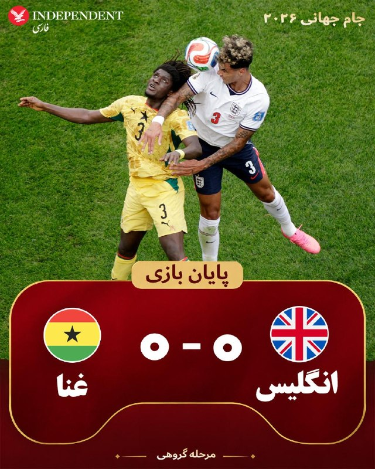

♦️تیم ملی فوتبال انگلیس در دومین بازی خود در جام جهانی ۲۰۲۶، روز سه‌شنبه مقابل تیم غنا با نتیجه صفر بر صفر متوقف شد. ستاره‌های انگلیس در این دیدار حریف دفاع چندلایه تیم کارلوس کیروش نشدند؛ هرچند که تیم ملی فوتبال غنا نیز کمترین شانس گل‌زنی را داشت.
‌🇸🇦 Indypersian

🤖 @VahidOOnLine

## VahidOOnLine — post 247058

  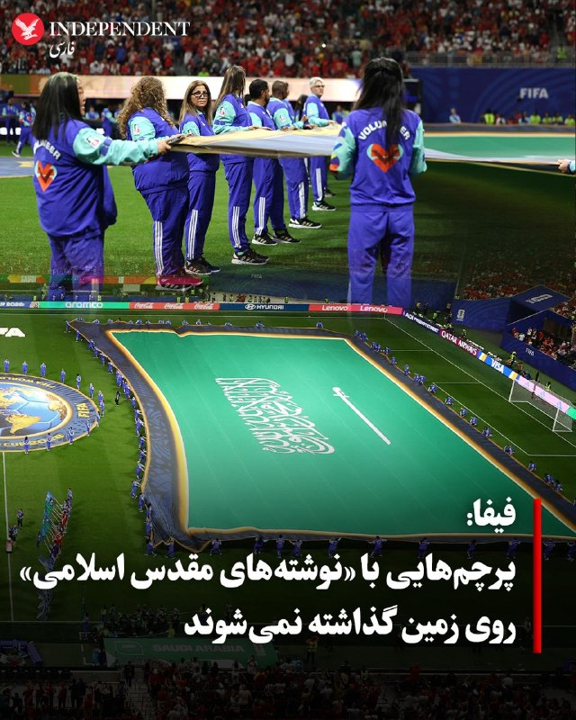

♦️به گزارش رویترز، در پی تغییرات جدید فیفا در مراسم پیش از آغاز مسابقات جام جهانی ۲۰۲۶ در کشورهای ایالات متحده، کانادا و مکزیک که پرچم‌های غول‌پیکر تیم‌ها روی زمین چمن پهن می‌شوند، مقرر شد پرچم‌های کشورهایی مانند عربستان سعودی و عراق به دلیل داشتن نوشته‌های مقدس اسلامی روی زمین قرار نگیرند. سخنگوی فیفا در گفتگو با رویترز تایید کرد که این نهاد برای «احترام به مقدسات» و درخواست تیم‌های شرکت‌کننده، تغییراتی در نحوه نمایش ایجاد کرده است؛ بر این اساس، در زمان بازی‌های این دو کشور، پرچم عربستان سعودی که روی آن «شهادتین» نوشته شده و پرچم عراق که عبارت «الله اکبر» روی آن نقش بسته، توسط افراد بالای سطح زمین نگه داشته می‌شوند، چرا که مسلمانان قرار دادن این عبارات مقدس را بر روی زمینی که روی آن راه رفته می‌شود، بی‌احترامی می‌دانند.
‌🇸🇦 Indypersian

🤖 @VahidOOnLine

## VahidOOnLine — post 247057

  <a href="telegram/content/VahidOOnLine_247057_1782253855.mp4" target="_blank">🎬 Download video</a>

ویدیوی رسیده نشان می‌دهد که مراسم زادروز علی حاجیوند رشیدی، شبانه در کنار آرامگاه او برگزار شد. این جاویدنام در جریان اعتراضات ۱۹ دی ۱۴۰۴ در دزفول، به دست سرکوبگران کشته شد.
‌🏁 🇬🇧 IranintlTV

🤖 @VahidOOnLine

## VahidOOnLine — post 247056

  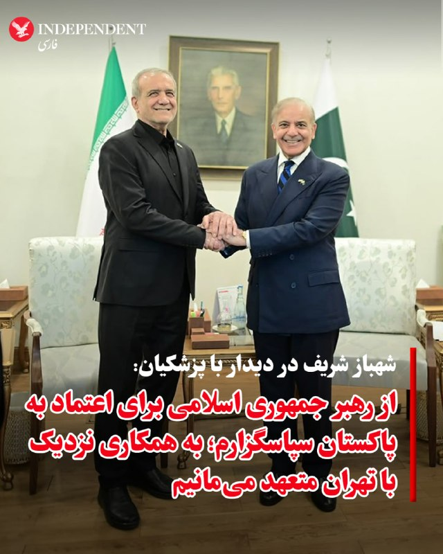

♦️شهباز شریف، نخست‌وزیر پاکستان، روز سه‌شنبه با انتشار پیامی در اکس تصاویری از دیدار با مسعود پزشکیان، رئیس‌جمهوری اسلامی ایران، در اسلام‌آباد منتشر کرد و این دیدار را اولین ملاقات طرفین پس از امضای یادداشت تفاهم و دور نخست گفتگوهای فنی در بورگن‌اشتوک خواند. شریف با توصیف گفتگوهای خود با پزشکیان به عنوان دیداری «صمیمانه و گرم» اعلام کرد: «ما بر تعهد مشترک خود به صلح منطقه‌ای و اهمیت دنبال کردن گفتگو و دیپلماسی برای حل تمامی مسائل باقی‌مانده تاکید و توافق کردیم که روابط دیرینه پاکستان و ایران را تقویت کرده و همکاری‌ها را در تمامی حوزه‌های مورد علاقه گسترش دهیم.» نخست‌وزیر پاکستان در ادامه افزود: «من مراتب قدردانی عمیق پاکستان را از مجتبی خامنه‌ای ابراز کردم و از رهبری ایران تجلیل نمودم. همچنین از او برای اعتماد همیشگی به پاکستان به عنوان یک دوست صادق، همسایه و میانجی سپاسگزارم و اسلام‌آباد همچنان به همکاری نزدیک با تهران برای صلح، پیشرفت و شکوفایی دو ملت و منطقه متعهد می‌ماند.»
‌🇸🇦 Indypersian

🤖 @VahidOOnLine

## VahidOOnLine — post 247055

  <a href="telegram/content/VahidOOnLine_247055_1782253859.mp4" target="_blank">🎬 Download video</a>

⭕️چه کسانی بیشترین گل را در تاریخ جام جهانی فوتبال زده‌اند؟

📌میروسلاو کلوزه با ۱۶ گل در چهار دوره جام جهانی، سال‌ها دست‌نیافتنی به نظر می‌رسید، اما مسی سرانجام از او عبور کرد

♦️یونل مسی بار دیگر نام خود را در تاریخ فوتبال ثبت کرده است. ستاره آرژانتینی با دو گل در پیروزی برابر اتریش، تعداد گل‌هایش در جام‌های جهانی را به ۱۸ رساند و از میروسلاو کلوزه عبور کرد تا به تنهایی در صدر جدول گلزنان تاریخ این رقابت‌ها قرار گیرد. این رکورد تازه، آخرین فصل از داستان فوتبالی بازیکنی است که نزدیک به دو دهه در بزرگ‌ترین صحنه فوتبال جهان حضور داشته و اکنون در ششمین جام جهانی خود، بالاتر از همه ایستاده است.

مسی نخستین گل جام جهانی خود را در سال ۲۰۰۶ و در ۱۸ سالگی به ثمر رساند. از آن زمان تا امروز، او در شش دوره جام جهانی برای آرژانتین به میدان رفته و توانسته ۱۸ بار دروازه حریفان را باز کند. رکوردی که تا پیش از جام جهانی ۲۰۲۶ در اختیار میروسلاو کلوزه، مهاجم افسانه‌ای آلمان، بود. کلوزه با ۱۶ گل در چهار دوره جام جهانی، سال‌ها دست‌نیافتنی به نظر می‌رسید، اما مسی سرانجام از او عبور کرد.

بیشتر بخوانید...
‌🇸🇦 Indypersian

🤖 @VahidOOnLine

## VahidOOnLine — post 247054

  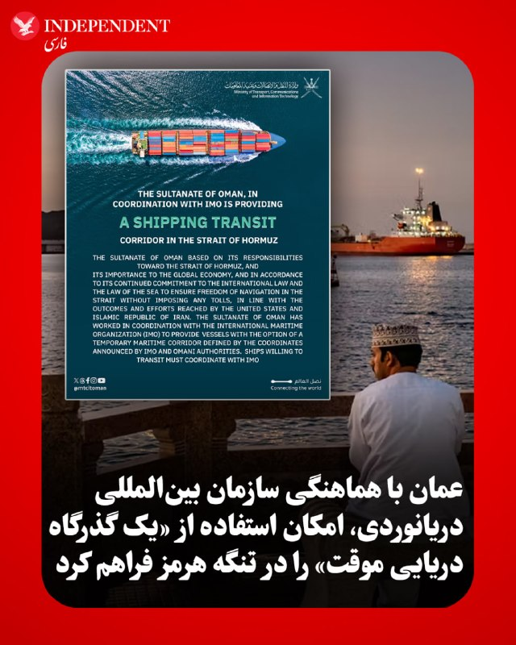

♦️وزارت حمل‌ونقل، ارتباطات و فناوری اطلاعات پادشاهی عمان با انتشار بیانیه‌ای رسمی اعلام کرد که این کشور در راستای مسئولیت خود در قبال تنگه هرمز و اهمیت آن برای اقتصاد جهانی، و بر اساس تعهد ثابت خود به قوانین بین‌المللی و حقوق دریاها جهت تضمین آزادی کشتیرانی بدون وضع حق عبور، امکان استفاده از یک مسیر دریایی موقت را برای تردد تمام کشتی‌ها فراهم کرده است. این اقدام که همسو با نتایج رایزنی‌ها و تلاش‌های اخیر میان ایالات متحده آمریکا و جمهوری اسلامی ایران صورت گرفته، با هماهنگی سازمان بین‌المللی دریانوردی (IMO) انجام شده است. بر این اساس، تمامی کشتی‌های متقاضی عبور می‌توانند بر پایه مختصات اعلام‌شده از سوی این سازمان و مقامات ذی‌صلاح عمان و پس از هماهنگی با سازمان بین‌المللی دریانوردی، از این گذرگاه موقت استفاده کنند.
‌🇸🇦 Indypersian

🤖 @VahidOOnLine

## VahidOOnLine — post 247053

  <a href="telegram/content/VahidOOnLine_247053_1782253863.mp4" target="_blank">🎬 Download video</a>

ویدیوی ارسالی به ایران اینترنشنال نشان می‌دهد که ایرانیان ساکن هانوفر آلمان روز سه‌شنبه ۲ تیر در تجمعی به اعدام‌ها در ایران اعتراض کردند. حاضران در این تجمع حمایت خود را از شاهزاده رضا پهلوی اعلام کردند.
‌🏁 🇬🇧 IranintlTV

🤖 @VahidOOnLine

## VahidOOnLine — post 247052

  

چاک شومر، سناتور دموکرات آمریکا، در گفت‌وگو با ایران‌اینترنشنال درباره ارسال پول به جمهوری اسلامی گفت: «فکر می‌کنم دونالد ترامپ کاملا از سوی رهبری جمهوری اسلامی فریب خورده و سرش کلاه رفته است. وضعیت ما از زمانی که ترامپ این جنگ را آغاز کرد، بدتر شده است.»

او افزود: «تنگه هرمز اکنون بیش از گذشته در کنترل و نفوذ ایران قرار دارد. رهبری جمهوری اسلامی رادیکال‌تر شده است. ما هنوز نمی‌دانیم همه اورانیوم‌های غنی‌شده کجا هستند و چه سرنوشتی پیدا کرده‌اند.»

شومر همچنین گفت: «جهان به عملکرد ترامپ نگاه کرده و تا حدی او را به تمسخر گرفته است. او کار ضعیفی انجام داده است.»
‌🏁 🇬🇧 IranintlTV

🤖 @VahidOOnLine

## WithYashar — post 15695

  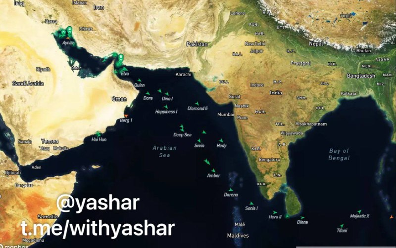

بیش از ۳۰ نفتکش حامل نفت خام ایران که دستگاه‌های فرستنده و گیرنده AIS آنها فعال است!

اکنون به سمت آسیا، چین، ژاپن و کره جنوبی در حرکت هستند و بیش از ۵۰ میلیون بشکه نفت حمل می‌کنند.
@withyashar

## FoxNewsTwitter — post 343321

  <a href="telegram/content/FoxNewsTwitter_343321_1782253868.mp4" target="_blank">🎬 Download video</a>

Fox News (Twitter/X)

President Trump deboards Air Force One at Joint Base Andrews after returning from Pennsylvania, where he delivered a speech focused on the economy at Mack Trucks in Lehigh Valley.

Trump touted rising 401(k)s, lower gas prices and his plans to boost American manufacturing while also touching on Iran and other major political issues.

The president returned to Washington after wrapping up the event earlier in the afternoon.

## FoxNewsTwitter — post 343320

  <a href="telegram/content/FoxNewsTwitter_343320_1782253871.mp4" target="_blank">🎬 Download video</a>

Fox News (Twitter/X)

"What he should do is submit his letter of resignation."

House Minority Leader Hakeem Jeffries unloaded on Pete Hegseth amid reports that the War Secretary could come to Capitol Hill seeking an additional $80 billion tied to the Iran war.

Jeffries called "Operation Epic Failure" a "reckless and costly war of choice," and argued that taxpayers should not be asked to fund it.

## FoxNewsTwitter — post 343319

  <a href="telegram/content/FoxNewsTwitter_343319_1782253874.mp4" target="_blank">🎬 Download video</a>

Fox News (Twitter/X)

NEW: President Trump shares the behind-the-scenes conversations he has with First Lady Melania Trump about his signature rally dance moves and crowd-pleasing impressions.

“She says, darling, please, please don't dance. It's not presidential, I said, but the people love it!"

## FoxNewsTwitter — post 343318

  <a href="telegram/content/FoxNewsTwitter_343318_1782253876.mp4" target="_blank">🎬 Download video</a>

Fox News (Twitter/X)

"Did you have a good time? How good a speech was that?"

President Trump talked to reporters as he departed Pennsylvania following a rally-style speech at Mack Trucks focused on the economy.

Over roughly 90 minutes, Trump touted rising 401(k)s, lower gas prices and his plans to boost manufacturing jobs in Pennsylvania. He also declared victory in the conflict with Iran, praised the UFC event at the White House and took jabs at former Presidents Biden and Obama.

After wrapping up his remarks, Trump boarded Air Force One for the flight back to Joint Base Andrews.

## FoxNewsTwitter — post 343317

  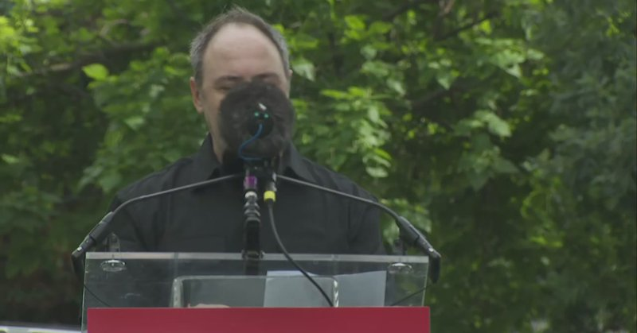

Fox News (Twitter/X)

WATCH LIVE: Lawmakers, parents hold memorial on Social Media Victims Remembrance Day https://twitter.com/i/broadcasts/1DGleedALMzJL

## pm_afshaa — post 94716

  <a href="telegram/content/pm_afshaa_94716_1782253879.webm" target="_blank">🎬 Download video</a>

🔴چاک شومر، رهبر دموکرات‌ها در سنای آمریکا: جهان عملکرد ترامپ در قبال ایران رو به تمسخر گرفته.

💧 Rainbet.com the #1 Non-KYC Crypto Casino & Sportsbook @rainbetcom

😁 @Pm_Afshaa

## pm_afshaa — post 94715

  <a href="telegram/content/pm_afshaa_94715_1782253880.webm" target="_blank">🎬 Download video</a>

🔴گروسی، مدیرکل آژانس انرژی اتمی:
بازرسی از تأسیسات هسته‌ای ایران انجام خواهد شد؛ هرچه زودتر بهتر.

💧 Rainbet.com the #1 Non-KYC Crypto Casino & Sportsbook @rainbetcom

😁 @Pm_Afshaa

## pm_afshaa — post 94714

  <a href="telegram/content/pm_afshaa_94714_1782253881.webm" target="_blank">🎬 Download video</a>

🔴ترامپ: من میتونم کار ایران رو تو کمتر از یک هفته تموم کنم؛ ما هر وقت بخوایم میتونیم تو آسمون تهران پرواز کنیم و هیچ کس نمیتونه جلوی ما رو بگیره.

ما ایران رو بدون هیچ ظرفیت هسته‌ای باقی میذاریم و اونا هم با این موضوع موافقت کردن. روابطمون هم خوبه. داریم تلاش میکنیم به توافقی برسیم که منصفانه باشه.

💧 Rainbet.com the #1 Non-KYC Crypto Casino & Sportsbook @rainbetcom

😁 @Pm_Afshaa

## IranIntlTV — post 344036

  <a href="telegram/content/IranIntlTV_344036_1782253882.mp4" target="_blank">🎬 Download video</a>

شهیر شهید ثالث، تحلیل‌گر روابط بین‌الملل و مسائل ایران، درباره مذاکرات جمهوری اسلامی و آمریکا و مفاد تفاهم‌نامه گفت: «با توجه به نرمش آمریکا در تدوین این تفاهم‌نامه، به نظر می‌رسد واشینگتن در پی دستیابی به یک توافق پایدار است. اما جمهوری اسلامی با اعتمادبه‌نفسی که به دست آورده، ممکن است آن‌قدر بر مواضع غیرمنطقی خود پافشاری کند که مذاکرات را به بن‌بست بکشاند.»
@iranintltv

## IranIntlTV — post 344035

  <a href="https://t.me/IranintlTV/344035" target="_blank">📎 Download file</a>

🎧نسخه صوتی برنامه با کامبیز حسینی؛ عوضش ذرت داریم!
@iranintlTV

## IranIntlTV — post 344034

  

🔻تیم ملی فوتبال انگلیس در دومین بازی خود در جام جهانی ۲۰۲۶، در استادیوم بوستون مقابل غنا با تساوی بدون گل متوقف شد.

🔹دفاع سفت و سخت و چندلایه تیم کارلوس کیروش اجازه نداد هیچ موقعیت گل قابل توجهی برای ستاره‌های انگلیس ساخته شود و البته غنا هم با کمترین شوت و شانس گل بازی را به پایان برد.

🔹هرچند هری کین و دیگر بازیکنان انگلیس هم با بی‌دقتی در گلزنی ناکام بودند.

🔹در بین دو نیمه بازی، کارلوس کیروش، سرمربی غنا با جود بلینگام، ستاره انگلیس درگیر شد.

🔹این تساوی باعث شد انگلیس و غنا با چهار امتیاز در صدر گروه L باقی بمانند. با این حال، انگلیس به لطف تفاضل گل بهتر، در آستانه بازی‌های پایانی مرحله گروهی، برتری اندکی نسبت به غنا برای صدرنشینی در گروه دارد.

@iranintltvsport

## IranIntlTV — post 344033

  <a href="https://t.me/IranintlTV/344033" target="_blank">📎 Download file</a>

🎧نسخه صوتی سیاست با مراد ویسی: اورانیوم در برابر غذا
@iranintlTV

## IranIntlTV — post 344032

  <a href="telegram/content/IranIntlTV_344032_1782253886.mp4" target="_blank">🎬 Download video</a>

دونالد ترامپ درباره بازرسی از تاسیسات اتمی جمهوری اسلامی گفت بازرسان آژانس در زمان مناسب در ایران حضور خواهند داشت. رییس جمهور آمریکا تاکید کرد اگر تهران با بازرسی‌های هسته‌ای موافق نبود، او مذاکرات را لغو می‌کرد.

نیلوفر منصوری، خبرنگار ایران‌اینترنشنال، گزارش می‌دهد
@iranintltv

## IranIntlTV — post 344031

  <a href="telegram/content/IranIntlTV_344031_1782253889.mp4" target="_blank">🎬 Download video</a>

ویدیوی رسیده نشان می‌دهد که مراسم زادروز علی حاجیوند رشیدی، شبانه در کنار آرامگاه او برگزار شد. این جاویدنام در جریان اعتراضات ۱۹ دی ۱۴۰۴ در دزفول، به دست سرکوبگران کشته شد.

## IranIntlTV — post 344030

  <a href="telegram/content/IranIntlTV_344030_1782253892.mp4" target="_blank">🎬 Download video</a>

مراد ویسی، تحلیلگر ارشد ایران‌اینترنشنال، گفت: «دلیل عدم حمایت بسیاری از ایرانی‌ها از تیم ملی فوتبال ایستادن بازیکنان آن در کنار حکومت در اوج شکاف بین مردم و حکومت است. تعبیر مهدی طارمی درباره عادی بودن اختلافات در ایران درست بعد ازکشتار دی ماه همسویی در توجیه یک جنایت است.»
@iranintltv

## IranIntlTV — post 344029

  <a href="telegram/content/IranIntlTV_344029_1782253894.mp4" target="_blank">🎬 Download video</a>

مراد ویسی، تحلیلگر ارشد ایران‌اینترنشنال، گفت: «با توجه به نوعی امان‌نامه که آمریکا بعد از امضای تفاهم‌نامه به مقامات جمهوری اسلامی داده است، احتمال دارد در مراسم تشییع و نماز میت علی خامنه‌ای، از مجتبی خامنه‌ای رونمایی شود و در انظار عمومی ظاهر شود. اگر تا حدود ۱۰ الی ۱۲ روز آینده او را نشان ندهند، ادامه روایت رهبر نادیده و ناشنیده برای نظام دشوارتر خواهد شد و پرسش‌های بیشتری درباره اصل زنده یا مرده بودن او مطرح می‌شود.»

@iranintltv

## IranIntlTV — post 344028

  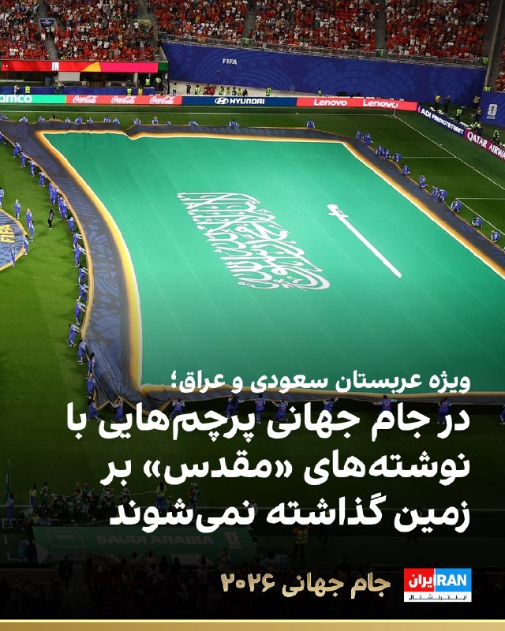

🔻رویترز روز سه‌شنبه به نقل از سخنگوی فیفا گزارش داد که پرچم عراق و عربستان به دلیل وجود عبارات مقدس اسلامی، در مراسم پیش از مسابقات جام جهانی ۲۰۲۶ روی زمین قرار داده نمی‌شوند؛ زیرا این پرچم‌ها دارای نوشته‌های مقدس اسلامی هستند.

🔹در مسابقات جام جهانی در آمریکا، کانادا و مکزیک، پرچم‌های بزرگ دو تیم پیش از آغاز بازی در هر نیمه زمین باز می‌شوند و هنگام صف کشیدن بازیکنان در نزدیکی دایره میانی برای پخش سرودهای ملی، روی زمین قرار می‌گیرند.

🔹اما در دیدارهای عربستان سعودی و عراق، پرچم هر دو تیم به جای قرار گرفتن روی زمین، بالاتر از سطح زمین نگه داشته می‌شود تا ضمن حفظ مراسم پیش از مسابقه، به نوشته‌های اسلامی روی این پرچم‌ها نیز احترام گذاشته شود.

🔹سخنگوی فیفا به رویترز گفت: «فیفا در چارچوب تغییرات جدید مراسم افتتاحیه جام جهانی ۲۰۲۶، شیوه‌ای تازه و هوادارمحور را برای ارائه مراسم پیش از مسابقات معرفی کرده است.»

🔹او افزود: «برای اجرای این مراسم، فیفا با تیم‌های شرکت‌کننده همکاری نزدیکی داشته تا درخواست‌های منطقی آن‌ها در زمینه نحوه برگزاری مراسم را در نظر بگیرد.»

جزییات بیشتر را در سایت بخوانید
@iranintltvsport

## IranIntlTV — post 344027

  <a href="telegram/content/IranIntlTV_344027_1782253896.mp4" target="_blank">🎬 Download video</a>

مراد ویسی، تحلیلگر ارشد ایران‌اینترنشنال گفت: «اورانیوم در برابر غذا؛ اورانیوم در برابر گندم؛ و حتی اورانیوم در برابر جو، ذرت و سویا برای گاوها، گوسفندها و مرغ‌ها.

کار برنامه هسته‌ای جمهوری اسلامی بعد از سه دهه به جایی رسیده که جمهوری اسلامی مجبور شده اورانیوم‌های غنی‌شده را تحویل بدهد یا رقیق کند و از بین ببرد تا در مقابلش اجازه پیدا کند از پول‌های مسدودشده خود، گندم، ذرت و سایر کالاهای اساسی وارد کند.

روایتی شبیه سال‌های پایانی اتحاد شوروی؛ کشوری که زرادخانه عظیم هسته‌ای و موشک‌های قاره‌پیما داشت، اما برای تأمین غلات مورد نیاز مردمش ناچار بود هر سال میلیون‌ها تن گندم از آمریکا وارد کند.»
@iranintltv

## IranIntlTV — post 344026

  <a href="telegram/content/IranIntlTV_344026_1782253898.mp4" target="_blank">🎬 Download video</a>

ویدیوی ارسالی به ایران اینترنشنال نشان می‌دهد که ایرانیان ساکن هانوفر آلمان روز سه‌شنبه ۲ تیر در تجمعی به اعدام‌ها در ایران اعتراض کردند. حاضران در این تجمع حمایت خود را از شاهزاده رضا پهلوی اعلام کردند.

## IranIntlTV — post 344025

  <a href="telegram/content/IranIntlTV_344025_1782253901.mp4" target="_blank">🎬 Download video</a>

ایران اینترنشنال در فصل «مرگ خامنه‌ای؛ پایان دیکتاتور» به بررسی کارنامه رهبری علی خامنه‌ای، پیامدهای فقدان و اهمیت حذف دیکتاتور، و چالش‌های پیش روی مجتبی خامنه‌ای و جمهوری اسلامی می‌پردازد.
گزارش‌ها، مقالات، مستندها و مصاحبه‌ها را در تلویزیون، بخش‌های خبر، وبسایت و اکانت‌های ایران اینترنشنال در شبکه‌های اجتماعی دنبال کنید.
#پایان_دیکتاتور
@iranintltv

## FarsiVOA — post 221684

⚡️اطلاعات اختصاصی صدای آمریکا درباره «حکم پنج سال حبس تعزیری» طیبه نظری مادر دادخواه مریم آروین
@FarsiVOA

## FarsiVOA — post 221683

🔺گزارش‌ها از احتمال طرح پرونده رون آراد در مذاکرات اسرائیل و لبنان در واشنگتن

◾️یک رسانه اسرائیلی روز سه‌شنبه گزارش داد که پرونده رون آراد، خلبان مفقودشده نیروی هوایی اسرائیل، ممکن است در مذاکرات جاری میان نمایندگان اسرائیل و لبنان در واشنگتن مطرح شود.

⬇️ بیشتر بخوانید:
https://ir.voanews.com/a/ron-arad-case-enters-talks/8164049.html
@FarsiVOA

## FarsiVOA — post 221682

🔺سازمان بین‌المللی دریانوردی تخلیه ۱۱ هزار ملوان گرفتار در خلیج فارس را آغاز می‌کند

◾️سازمان بین‌المللی دریانوردی وابسته به سازمان ملل متحد روز سه‌شنبه ۲ تیر اعلام کرد تخلیه بیش از ۱۱ هزار ملوانی را که در پی جنگ میان ایالات متحده و رژیم ایران در خلیج فارس گرفتار شده‌اند، آغاز خواهد کرد.

⬇️ بیشتر بخوانید:
https://ir.voanews.com/a/imo-begins-evacuating-stranded-sailors-persian-gulf/8164043.html
@FarsiVOA

## FarsiVOA — post 221681

⚡️حمایت واشنگتن از اقدامات بیروت برای گسترش حاکمیت خود در میانه پنجمین دور مذاکرات اسرائیل-لبنان
@FarsiVOA

## FarsiVOA — post 221680

🔺یک نظرسنجی تازه می‌گوید نرخ تأیید عملکرد ترامپ پس از امضای تفاهم‌نامه با جمهوری اسلامی افزایش یافته است

◾️نتایج یک نظرسنجی «دیلی‌میل» نشان می‌دهد نرخ تائید اقدامات دونالد ترامپ رئیس‌جمهوری آمریکا، پس از امضای تفاهم‌نامه با رژیم ایران، در بین رای‌دهندگان آمریکایی افزایش یافته است.

⬇️ بیشتر بخوانید:
https://ir.voanews.com/a/8164058.html
@FarsiVOA

## Persian_Trend_Official — post 17909

  <a href="telegram/content/Persian_Trend_Official_17909_1782253904.mp4" target="_blank">🎬 Download video</a>

شبتون بخیر 🌃
Su-33 Flanker-D

📌 @persian_trend_official
پرشین ترند | متفاوت‌ترین کانال نظامی

## BBCPersian — post 284865

  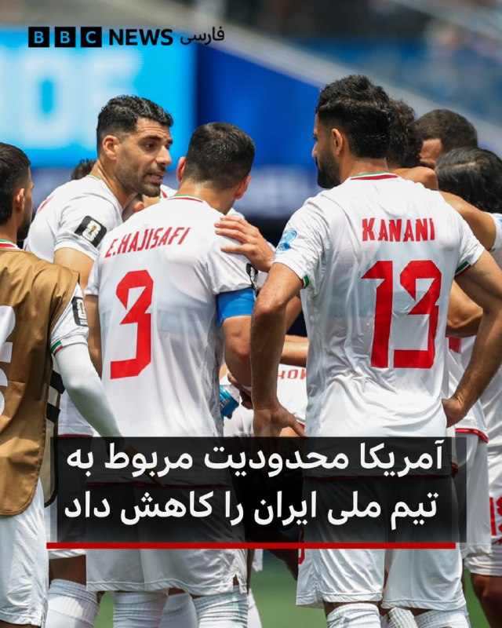

🔻آمریکا اعلام کرده است که محدودیت‌های مربوط به ترتیبات سفر تیم ملی ایران در جام جهانی را کاهش داده است.

بر اساس این گزارش، ایالات متحده به این تیم اجازه داد دو روز پیش از دیدار بعدی خود به آمریکا سفر کند.

درچارچوب محدودیت‌هایی که آمریکا به عنوان میزبان جام جهانی برای تیم ایران اعمال کرده بود به این تیم اجازه داده شده بود که یک روز قبل از بازی خود به آمریکا سفر کند و طبق شرایط ویزای خود، باید بلافاصله و در همان روز مسابقه، خاک آمریکا را ترک می‌کرد.

به دلیل همین محدودیت، تیم ملی ایران محل اردوی خود را هم از آریزونا در آمریکا به شهر تیخوانا در مکزیک منتقل کرد.

ایران تاکنون دو بازی در مرحله گروهی جام‌جهانی انجام داده و بازی سوم این تیم ۲۷ ژوئن در برابر مصر و در سیاتل خواهد بود.

📸Getty Images
https://bbc.in/4aN1fga
@BBCPersian

## BBCPersian — post 284864

  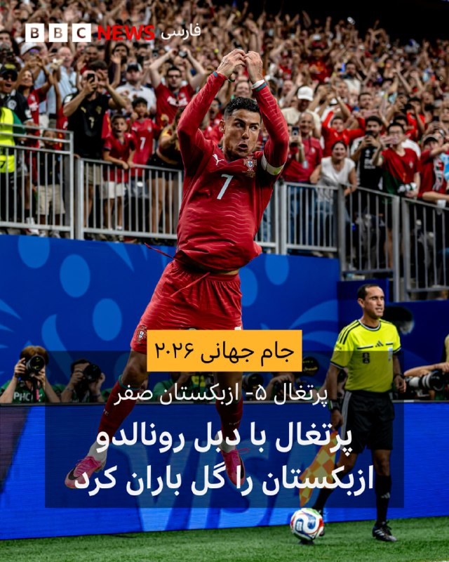

🔸تیم ملی فوتبال پرتغال توانست با پیروزی ۵ بر صفر برابر ازبکستان صعود خود به مرحله بعد را قطعی کند.

کریس رونالدو، فوق ستاره فوتبال در این مسابقه دبل کرد تا یک رکورد جدید دیگر ثبت کند؛ او نخستین فوتبالیستی شد که در شش جام جهانی گلزنی کرده است.

ازبکستان که در دیدار اول برابر کلمبیا مغلوب شده بود در این مسابقه نتوانست انسجام و برنامه تیمی خود را نشان دهد و با دو شکست در آستانه حذف قرار گرفته است و تنها در صورت شکست کنگو در دیدار آخر می‌تواند به صعود به عنوان یکی از تیم‌های سوم امیدوار بماند.

📸NurPhoto via Getty Images
https://bbc.in/4erMvWl
@BBCPersian

## BBCPersian — post 284863

🔻ترامپ: بازرسان آژانس در «زمان مناسب» در ایران حاضر خواهند شد

دونالد ترامپ، رئیس‌جمهور آمریکا، گفت که ایران درباره نبود برنامه‌ای برای بازرسی آژانس بین‌المللی انرژی اتمی از مراکز هسته‌ای آسیب‌دیده‌اش در جنگ، در اشتباه است.

ترامپ: بازرسان آژانس در «زمان مناسب» در ایران حاضر خواهند شد
دونالد ترامپ، رئیس‌جمهور آمریکا، گفت که ایران درباره نبود برنامه‌ای برای بازرسی آژانس بین‌المللی انرژی اتمی از مراکز هسته‌ای آسیب‌دیده‌اش در جنگ، در اشتباه است.

آقای ترامپ افزود که بازرسان آژانس در «زمان مناسب» در ایران حاضر خواهند شد.

او ساعاتی پیش از این در پستی در تروث سوشال نوشته بود «ایران به طور کامل و بدون قید و شرط با انجام بازرسی‌های هسته‌ای در بالاترین سطح و برای مدت بسیار طولانی در آینده (تا ابد!!!) موافقت کرده است» و افزوده که «اگر ایران با این موضوع موافقت نمی‌کرد، هیچ مذاکره دیگری در کار نبود.»

اسماعیل بقایی، سخنگوی وزارت خارجه ایران، پیش از این گفته بود که ایران برنامه‌ای برای دسترسی دادن به آژانس برای بازدید از تاسیسات هسته‌ای آسیب‌دیده در جنگ ندارد. اظهاراتی که به نظر می‌رسد واکنشی به گفته‌های دیروز جی دی ونس، معاون رئیس‌جمهور آمریکا باشد که گفته بود ایران با بازگشت بازرسان آژانس بین‌المللی انرژی اتمی موافقت کرده است.

https://bbc.in/4xGuzPv
@BBCPersian

## Dirty_Kids — post 392942

  <a href="telegram/content/Dirty_Kids_392942_1782253908.mp4" target="_blank">🎬 Download video</a>

امروز پزشکیان تو پاکستان به نشان دوستی داشت درخت میکاشت، بعد شهباز شریف نخست‌وزیر پاکستان هر چقدر به مسعود می‌گفت جان مادرت بیخیال شو این حرکت نمادینه، مسعود توجه نمی‌کرد و بی وقفه بیل میزد😂😂

@Dirty_Kids 👻

## Dirty_Kids — post 392941

  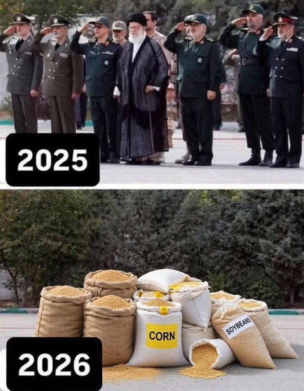

دست خدا عیان شد، خامنه‌ای سویا شد😂😂

@Dirty_Kids 👻

## alonews — post 129943

  <a href="telegram/content/alonews_129943_1782253910.webm" target="_blank">🎬 Download video</a>

👈ارتش اسرائیل به چادری تو غزه حملهِ هوایی کرد

✅ @AloNews خبر جنگ

## alonews — post 129942

  <a href="telegram/content/alonews_129942_1782253910.webm" target="_blank">🎬 Download video</a>

👈رسایی: این روزا همه چیز عجیب شده...

🔴اون جایی که باید بسته باشه، بازه.

🔴اون جایی که باید باز باشه، بسته‌ست.

✅ @AloNews خبر جنگ

## alonews — post 129941

  <a href="telegram/content/alonews_129941_1782253910.webm" target="_blank">🎬 Download video</a>

👈فرماندهی سایبری کشور: اختلال ایجادشده در سامانه‌های کارت‌محور برخی بانک‌ها ناشی از یک حمله سایبری هدفمند به زیرساخت‌های مرتبط بوده است.

✅ @AloNews خبر جنگ

## alonews — post 129940

  <a href="telegram/content/alonews_129940_1782253911.mp4" target="_blank">🎬 Download video</a>

👈شهباز شریف هم نتونست مانع بیل زدن پایان ناپذیر پزشکیان برای کاشتن درخت تو اسلام آباد بشه

🔴شهباز هی میگه نمادین هست ولش کن اما مسعود ول نمیکنه

✅ @AloNews خبر جنگ

## alonews — post 129939

  <a href="telegram/content/alonews_129939_1782253912.webm" target="_blank">🎬 Download video</a>

👈کانالای ایتا: ممکنه نهاده‌های دامی آمریکایی آلوده باشه و مردم مریض بشن

🔴پ.ن: احتمالا ارزشیون جزو دام و طیور هستن که نگرانن😂

✅ @AloNews خبر جنگ

---
📅 بروزرسانی: 1405/04/03 00:28
---

## VahidOOnLine — post 247051

  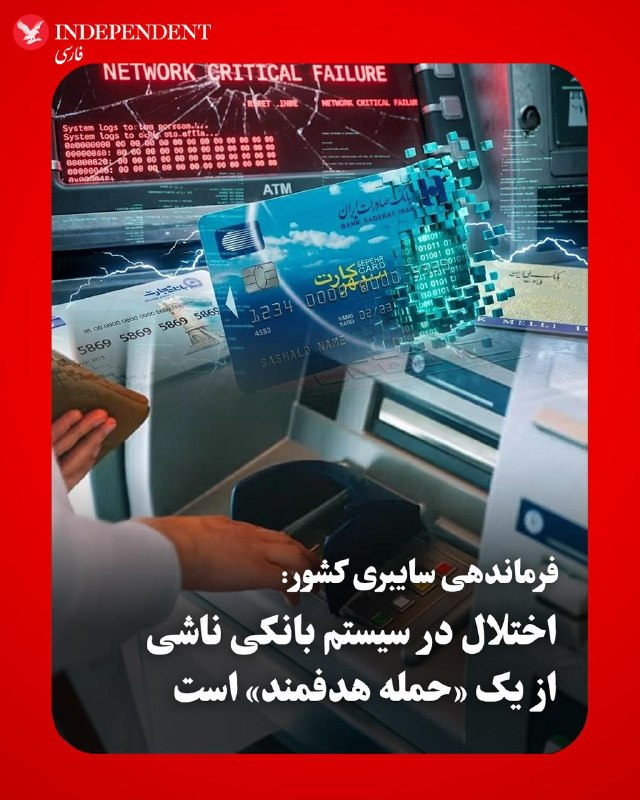

♦️به گزارش فارس، در پی ایجاد اختلال گسترده در سامانه‌های کارت‌محور برخی از بانک‌های بزرگ ایران از جمله ملی، صادرات و تجارت، مرکز فرماندهی سایبری کشور با انتشار اطلاعیه‌ای رسمی اعلام کرد که این اختلال ناشی از «یک حمله سایبری هدفمند» به زیرساخت‌های مرتبط بوده است. براساس این گزارش، این حمله با هدف از کار انداختن خدمات بانکی صورت گرفته و مسئولان مربوطه مدعی شده‌اند که به‌منظور جلوگیری از سوءاستفاده‌های احتمالی و حفظ امنیت دارایی‌های مشتریان، بخشی از خدمات مبتنی بر کارت را به‌صورت موقت از دسترس خارج کرده‌اند. با این حال، فرماندهی سایبری ضمن اعلام پایش لحظه‌ای سامانه‌ها و تلاش تیم‌های تخصصی برای رفع آثار این حمله، گفت فرآیند بازگردانی کامل خدمات در حال انجام است.
‌🇸🇦 Indypersian

🤖 @VahidOOnLine

## VahidOOnLine — post 247050

  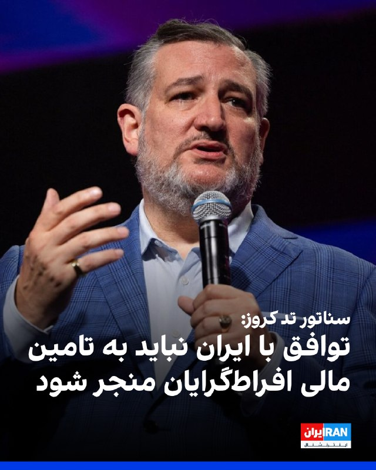

تد کروز، سناتور جمهوری‌خواه آمریکا در گفت‌وگویی با مرضیه حسینی، خبرنگار ایران‌اینترنشنال، درباره توافق میان دولت دونالد ترامپ و ایران ابراز تردید کرد و نسبت به پیامدهای آن هشدار داد.

او در پاسخ به پرسشی درباره این توافق گفت: «تاریخ نشان داده است که ارسال میلیاردها دلار به افراط‌گرایان تئوکراتی که می‌خواهند ما را به قتل برسانند، ایده بسیار بدی است. بنابراین امیدوارم چنین کاری انجام نشود.»

کروز همچنین در واکنش به احتمال دستیابی به توافق نهایی در بازه ۶۰ روزه اظهار داشت: «من کاملا انتظار دارم که ایرانی‌ها در پایان این ۶۰روز، باز هم موضوع را به تعویق بیندازند و زمان بیشتری بخرند.»

او در ادامه با انتقاد از رفتار جمهوری اسلامی افزود: «ایرانی‌ها طی سال‌ها نشان داده‌اند که آیت‌الله و ملاها قابل اعتماد نیستند. آنها به‌طور فعال در حال دروغ گفتن هستند و هر پولی که در اختیارشان قرار گیرد، برای تأمین مالی تروریسم استفاده خواهد شد. و صرف‌نظر از هر وعده‌ای که بدهند، آیت‌الله همچنان به دنبال دستیابی به سلاح هسته‌ای است، زیرا می‌خواهد بتواند از آن علیه ایالات متحده استفاده کند. و این یک تهدید بسیار جدی برای آمریکا است.»
h
‌🏁 🇬🇧 IranintlTV

🤖 @VahidOOnLine

## VahidOOnLine — post 247049

  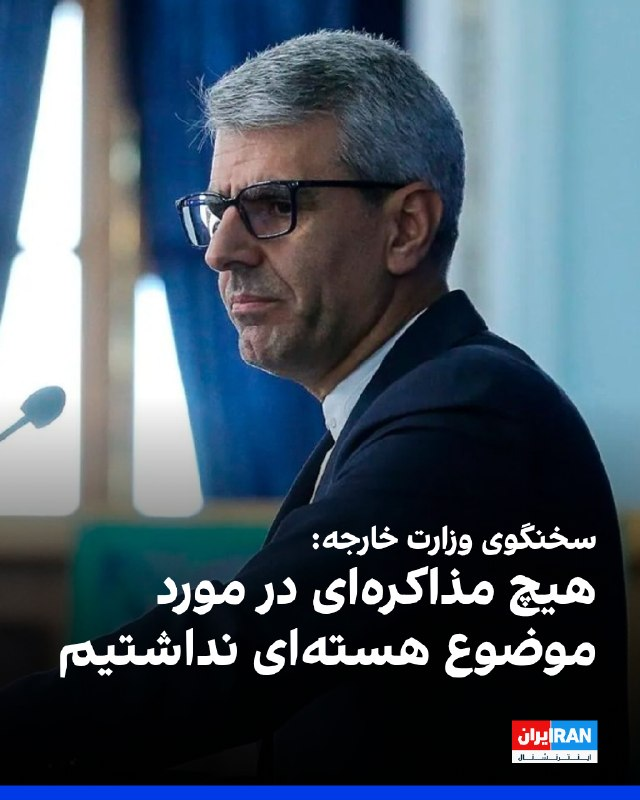

اسماعیل بقایی، سخنگوی وزارت امور خارجه جمهوری اسلامی گفت: «مذاکره برای توافق نهایی با آمریکا زمانی آغاز می‌شود که اجرای بندهای ۱، ۴، ۵، ۱۰ و ۱۱ تفاهم‌نامه آغاز شده باشد.»

او افزود: «سفر اخیر هیات مذاکره‌کننده جمهوری اسلامی به سوئیس برای اطمینان از آغاز اجرای این پنج بند انجام شد.»

سخنگوی وزارت امورخارجه افزود: «هیچ مذاکره‌ای در مورد موضوع هسته‌ای نداشتیم.»

او ادامه داد که بازرسی‌های آژانس به روال جاری ادامه خواهد داشت.
‌🏁 🇬🇧 IranintlTV

🤖 @VahidOOnLine

## VahidOOnLine — post 247048

  <a href="telegram/content/VahidOOnLine_247048_1782248306.mp4" target="_blank">🎬 Download video</a>

ویدیوی رسیده به ایران اینترنشنال نشان می‌دهد که مراسم زادروز جاویدنام شهروز مهرابی کنار آرامگاهش در بروجرد برگزار شد و همسر او به یادش کبوتری را آزاد کرد. این جاویدنام در جریان اعتراضات ۱۸ دی در ساوه کشته شد.
‌🏁 🇬🇧 IranintlTV

🤖 @VahidOOnLine

## VahidOOnLine — post 247047

  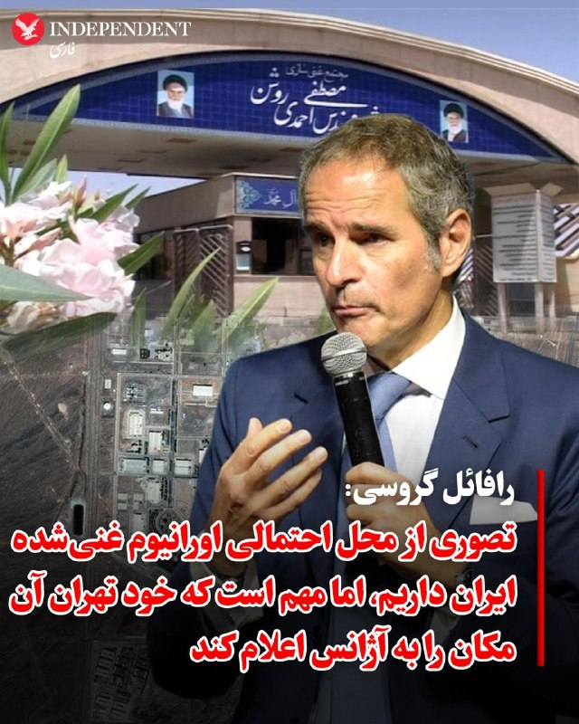

♦️رافائل گروسی، مدیرکل آژانس بین‌المللی انرژی اتمی، روز سه‌شنبه در گفتگوی اختصاصی با شبکه «ان‌اچ‌کی» ژاپن، با تاکید بر اینکه اولویت اصلی این سازمان در بازرسی‌های پیش‌رو تایید محل دقیق اورانیوم با غنای بالا در ایران است، اعلام کرد که هرچند آژانس تصوری از محل احتمالی این مواد دارد، اما بسیار مهم است که خود ایران این مکان‌ها را به طور رسمی اعلام کند. گروسی تایید کرد که بازرسی‌ها انجام خواهد شد و افزود: «فکر می‌کنیم هر چه زودتر این اتفاق بیفتد بهتر است، به‌ویژه از آنجا که این توافق بازه زمانی ۶۰ روزه دارد، بنابراین باید بدون هدر دادن وقت دست به کار شویم.» این اظهارات در حالی مطرح می‌شود که پیش از این، دونالد ترامپ با رد ادعای وزارت امور خارجه ایران مبنی بر عدم برنامه برای پذیرش بازرسان، به صراحت تهدید کرده بود که در صورت ممانعت تهران از ورود ماموران آژانس، مذاکرات صلح بعدی لغو خواهد شد. موضوعی که نشان می‌دهد پس از توافق ۶۰ روزه اخیر میان تهران و واشنگتن برای پایان دادن به درگیری‌ها، دسترسی سریع و شفاف به سایت‌های هسته‌ای به کلیدی‌ترین چالش میان دو طرف تبدیل شده است.
‌🇸🇦 Indypersian

🤖 @VahidOOnLine

## VahidOOnLine — post 247046

  

رویترز گزارش داد سنای آمریکا که جمهوری‌خواهان در آن اکثریت دارند، روز سه‌شنبه از طرحی برای توقف اقدام نظامی آمریکا علیه جمهوری اسلامی حمایت کرد؛ هرچند هنوز مشخص نیست این اقدام چه تاثیری بر روند درگیری خواهد داشت، زیرا دولت دونالد ترامپ در حال مذاکره برای دستیابی به توافق صلح با جمهوری اسلامی است.
سنای آمریکا این طرح را با ۵۰ رای موافق در برابر ۴۸ رای مخالف تصویب کرد. این طرح پیش‌تر در اوایل ماه جاری در مجلس نمایندگان نیز به تصویب رسیده بود.
در گزارش رویترز آمده است که این رای‌گیری نشان‌دهنده افزایش نگرانی‌ها، حتی در میان برخی جمهوری‌خواهان، درباره این درگیری است.
‌🏁 🇬🇧 IranintlTV

🤖 @VahidOOnLine

## VahidOOnLine — post 247045

  <a href="telegram/content/VahidOOnLine_247045_1782248309.mp4" target="_blank">🎬 Download video</a>

♦️ دونالد ترامپ، رئیس‌جمهوری ایالات متحده روز سه‌شنبه دوم تیرماه در جریان بازدید از کارخانه کامیون‌سازی «مک» در پنسیلوانیا، به مذاکرات با جمهوری اسلامی ایران نیز پرداخت و روند آن را تا این‌جا «عالی» توصیف کرد. با این‌حال او هشدار داد: «اگر ایران منطقی باشد، اگر باهوش باشند [که چه بهتر]، در غیر این صورت ما مجبور خواهیم بود کار را تمام کنیم که شاید کمتر از یک هفته زمان ببرد».

ترامپ پیش‌بینی کرد که مقام‌های جمهوری اسلامی «کاری که باید» را انجام دهند و مذاکرات میان دو کشور، به نتیجه برسد.
‌🇸🇦 Indypersian

🤖 @VahidOOnLine

## VahidOOnLine — post 247044

  <a href="telegram/content/VahidOOnLine_247044_1782248311.mp4" target="_blank">🎬 Download video</a>

♦️مسعود پزشکیان، رئیس‌جمهوری اسلامی ایران، سه‌شنبه‌شب دوم تیرماه در پایان سفر رسمی یک‌روزه خود به پاکستان، اسلام‌آباد را ترک کرد. این سفر با دیدارهای جداگانه او با آصف علی زرداری، رئیس‌جمهوری پاکستان، و شهباز شریف، نخست‌وزیر این کشور، همراه بود.

شهباز شریف در دیدار با پزشکیان بر ادامه تلاش‌های دیپلماتیک پاکستان برای دستیابی به صلحی پایدار در منطقه تاکید کرد و گفت اسلام‌آباد از گفت‌وگو و مذاکره به‌عنوان بهترین راه‌حل برای حل بحران‌های منطقه‌ای حمایت می‌کند. او همچنین ابراز امیدواری کرد مذاکرات فنی در حال انجام میان تهران و واشینگتن به توافقی پایدار منجر شود.

نخست‌وزیر پاکستان در جریان نشست خبری مشترک با پزشکیان اعلام کرد هفته آینده به ایران سفر خواهد کرد و با مجتبی خامنه‌ای دیدار خواهد داشت.

بر اساس بیانیه مشترک منتشرشده از سوی خبرگزاری ایرنا، مقام‌های پاکستانی از توافق‌های اخیر میان ایران و آمریکا استقبال کردند و آن را گامی در جهت کاهش تنش‌های منطقه‌ای دانستند. آصف علی زرداری نیز در دیدار با پزشکیان بر حمایت پاکستان از دیپلماسی و گفت‌وگو در حل اختلافات منطقه‌ای و بین‌المللی تاکید کرد.

پزشکیان نیز با قدردانی از نقش پاکستان در حمایت از مذاکرات و تلاش‌های صلح، روابط با اسلام‌آباد را از اولویت‌های سیاست خارجی جمهوری اسلامی دانست و بر گسترش همکاری‌های سیاسی، اقتصادی و امنیتی میان دو کشور تاکید کرد.

در بیانیه مشترک دو طرف، این سفر آغاز «فصل جدیدی از همکاری راهبردی» میان ایران و پاکستان توصیف شده است.
‌🇸🇦 Indypersian

🤖 @VahidOOnLine

## VahidOOnLine — post 247043

  

دونالد ترامپ، رییس‌جمهوری آمریکا، در جریان بازدید از یک کارخانه مونتاژ کامیون در پنسیلوانیا گفت: اگر جمهوری اسلامی منطقی و باهوش عمل کند، مشکلی نخواهیم داشت. در غیر این صورت، مجبور خواهیم شد کار را تمام کنیم؛ کاری که شاید کمتر از یک هفته طول بکشد.
او افزود: اما فکر می‌کنم آن‌ها کاری را که باید انجام دهند، انجام خواهند داد، زیرا ما می‌خواهیم این اتفاق بیفتد.
ترامپ گفت آمریکا در تلاش است به توافقی «منصفانه» با جمهوری اسلامی دست یابد.
‌🏁 🇬🇧 IranintlTV

🤖 @VahidOOnLine

## VahidOOnLine — post 247042

  <a href="telegram/content/VahidOOnLine_247042_1782248313.mp4" target="_blank">🎬 Download video</a>

گروهی از ایرانیان در هامبورگ سه‌شنبه ۲ تیر با برگزاری تجمعی حمایت خود از فاطمه سپهری، زندانیان سیاسی و ورزشکاران زندانی را اعلام کردند و خواستار آزادی و توجه به وضعیت آنان شدند
‌🏁 🇬🇧 IranintlTV

🤖 @VahidOOnLine

## VahidOOnLine — post 247041

  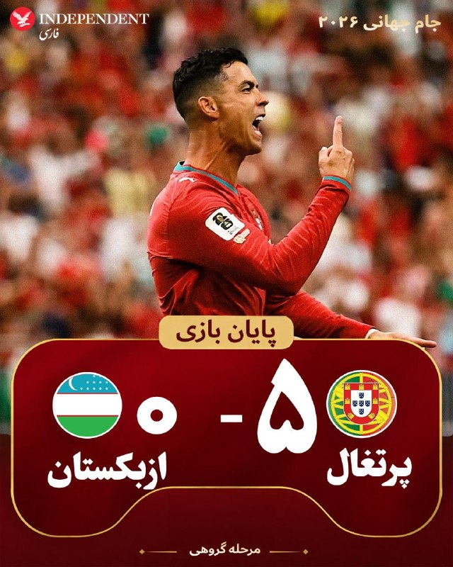

♦️تیم ملی پرتغال روز دوشنبه اول تیرماه در دومین دیدار خود در جام جهانی ۲۰۲۶، ازبکستان را با نتیجه پرگل ۵ بر صفر شکست داد و با چهار امتیاز به صدر جدول گروه «کا» صعود کرد.

در این دیدار، کریستیانو رونالدو در دقایق ۶ و ۳۹ دو بار برای پرتغال گلزنی کرد. نونو مندز نیز در دقیقه ۱۷ گل سوم را به ثمر رساند. در ادامه، نعمت‌اف، بازیکن ازبکستان، در دقیقه ۶۰ به اشتباه دروازه خودی را باز کرد و رافائل لیائو در دقیقه ۸۷ گل پنجم پرتغال را وارد دروازه حریف کرد.

رونالدو با گل نخست خود در این مسابقه به نخستین فوتبالیست تاریخ تبدیل شد که در شش دوره جام جهانی موفق به گلزنی می‌شود. او با گل دومش نیز شمار گل‌های خود در جام‌های جهانی را به ۱۰ رساند.

فوق‌ستاره ۴۱ ساله پرتغال پس از این دیدار با صدای بلند خطاب به تماشاگران و دوربین‌های تلویزیونی گفت: «من برگشتم، من برگشتم.» او همچنین به مسن‌ترین بازیکن تاریخ جام جهانی تبدیل شد که در یک مسابقه دو گل به ثمر می‌رساند.
‌🇸🇦 Indypersian

🤖 @VahidOOnLine

## VahidOOnLine — post 247040

  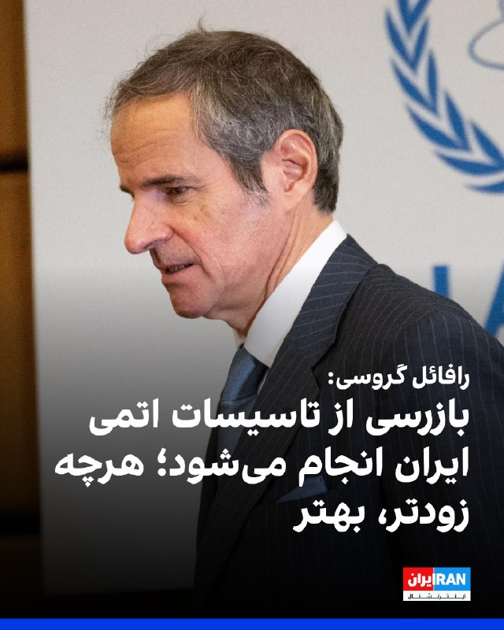

رافائل گروسی، مدیرکل آژانس بین‌المللی انرژی اتمی، سه‌شنبه به شبکه ان‌اچ‌کی ژاپن گفت بازرسی از تاسیسات هسته‌ای ایران انجام خواهد شد و هرچه زودتر آغاز شود بهتر است.
او افزود اولویت اصلی آژانس، شناسایی و تایید محل نگهداری اورانیوم با غنای بالا است. 

گروسی گفت آژانس بین‌المللی انرژی اتمی به‌زودی با مقام‌های جمهوری اسلامی درباره زمان‌بندی و جزییات بازرسی‌ها گفت‌وگو خواهد کرد.
او تاکید کرد آژانس این بازرسی‌ها را به‌طور مستقل انجام می‌دهد و نیازی به نظارت یا کمک دیگران ندارد.
‌🏁 🇬🇧 IranintlTV

🤖 @VahidOOnLine

## VahidOOnLine — post 247039

♦️ شهباز شریف، نخست‌وزیر پاکستان، روز سه‌شنبه دوم تیرماه در دیدار با مسعود پزشکیان، رئیس‌جمهوری اسلامی ایران، گفت با توجه به ظرفیت‌های انسانی و منابع طبیعی ایران، این کشور تحت رهبری پزشکیان می‌تواند به یکی از سریع‌ترین اقتصادهای در حال رشد جهان تبدیل شود.

نخست‌وزیر پاکستان با اشاره به «شجاعت، آگاهی و توانمندی» مردم ایران و همچنین برخورداری این کشور از زمین‌های حاصلخیز، معادن، نفت و گاز گفت: «هیچ تردیدی ندارم که ایران تحت رهبری دوراندیش و پویای شما، به‌زودی به یکی از سریع‌ترین اقتصادهای در حال رشد جهان تبدیل خواهد شد.»

شریف همچنین بر گسترش همکاری‌های دوجانبه تاکید کرد و افزود پاکستان و ایران برای تامین منافع مشترک و توسعه روابط اقتصادی، تجاری و منطقه‌ای به همکاری با یکدیگر ادامه خواهند داد.

پزشکیان روز سه‌شنبه در راس هیئتی بلندپایه وارد اسلام‌آباد شد و با مقام‌های ارشد پاکستان، از جمله آصف علی زرداری، رئیس‌جمهور این کشور، دیدار و گفتگو کرد.
‌🇸🇦 Indypersian

🤖 @VahidOOnLine

## VahidOOnLine — post 247038

  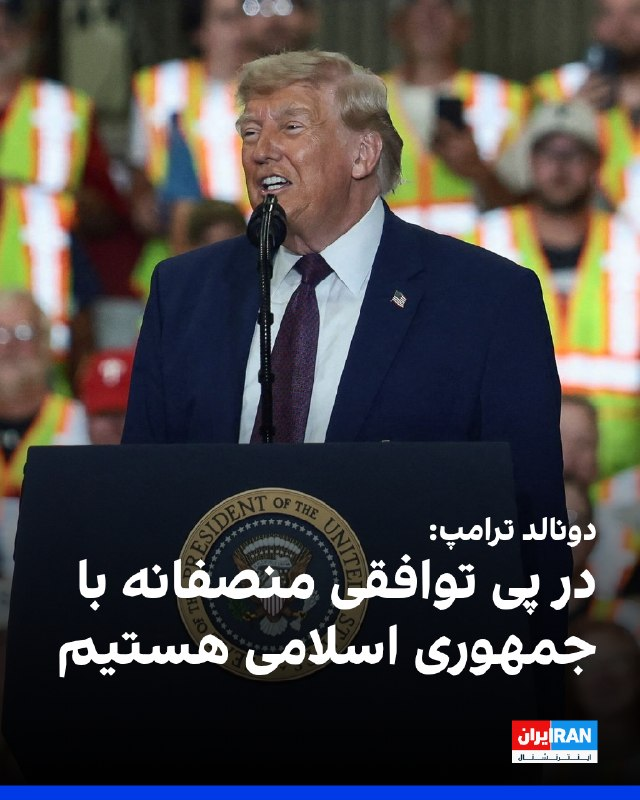

دونالد ترامپ، رییس‌جمهوری آمریکا، گفت روابط واشینگتن و تهران «بسیار خوب» پیش می‌رود و افزود آمریکا در تلاش است به توافقی «منصفانه» با جمهوری اسلامی دست یابد.
ترامپ گفت: نکته بسیار مهم این است که ایران هرگز سلاح هسته‌ای نخواهد داشت و با این موضوع موافقت خواهد کرد. به همین دلیل آن عملیات را انجام دادم.

او با انتقاد از سیاست باراک اوباما در قبال برجام افزود: «آن‌ها فکر کردند می‌توانند با پول به ایران برای صلح رشوه بدهند. نه، تنها چیزی که آن‌ها می‌فهمند چکش است؛ مانند عملیاتی که انجام دادیم و برنامه هسته‌ای آن‌ها را هدف قرار دادیم.»
‌🏁 🇬🇧 IranintlTV

🤖 @VahidOOnLine

## VahidOOnLine — post 247037

  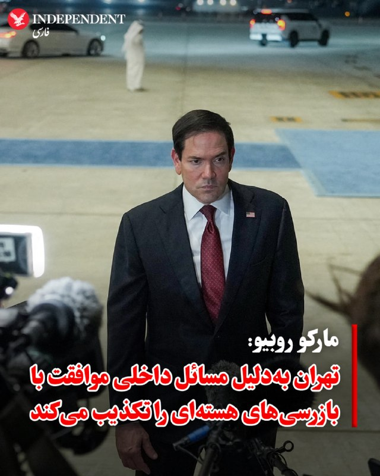

♦️ مارکو روبیو، وزیر امور خارجه ایالات متحده، در حضور خبرنگاران در ابوظبی گفت که جمهوری اسلامی ایران به دلایل سیاسی و داخلی خود، موافقت با بازرسی‌های هسته‌ای آژانس بین‌المللی انرژی اتمی در نشست سوئیس را تکذیب می‌کند.

روبیو گفت: «ما می‌دانیم آن‌ها با چه مواردی موافقت کرده‌اند. من نمی‌دانم چرا مجبورند این حرف‌ها را بزنند. سیاست داخلی یا مسائل درون‌مرزی آن‌ها هرچه که هست، خودشان باید با آن کنار بیایند. اما ما می‌دانیم متعهد به انجام چه کارهایی شده‌اند؛ حالا یا آن را انجام می‌دهند یا خیر.»

وزیر خارجه آمریکا در پایان تاکید کرد: «اگر آن‌ها به تعهدات خود عمل کنند، فرآیند رو به جلو حرکت خواهد کرد، اما اگر از انجام آن سر باز زنند، رئیس‌جمهوری (ترامپ) باید تصمیمات جدیدی اتخاذ کند.»
‌🇸🇦 Indypersian

🤖 @VahidOOnLine

## VahidOOnLine — post 247036

  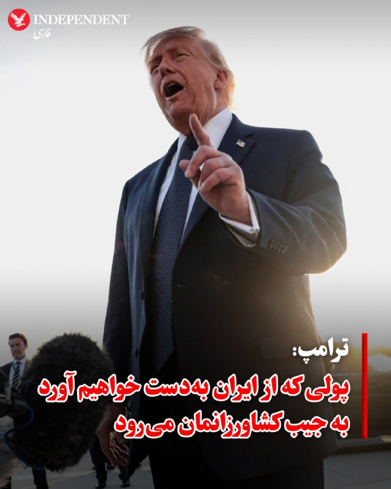

♦️ دونالد ترامپ، رئیس‌جمهوری ایالات متحده، روز سه‌شنبه دوم تیرماه در فرودگاه پنسیلوانیا، وضعیت جمهوری اسلامی ایران را «ضعیف‌ترین موقعیت مذاکراتی تاریخ خود» توصیف کرد و گفت ارتش، رهبری و سامانه‌های راداری این کشور به طور کامل از بین رفته‌اند. او با اشاره به بحران‌های اقتصادی داخلی ایران، نرخ تورم آن را ۳۰۰ درصد اعلام کرد و گفت مردم در ایران با بحران غذا و دارو مواجه هستند.

رئیس‌جمهوری آمریکا تاکید کرد مبالغی که ایالات متحده از طریق صادرات مواد غذایی و دارو به ایران کسب خواهد کرد، مستقیما به کشاورزان آمریکایی خواهد رسید. به گفته ترامپ، این پول‌ها (دارایی‌های آزاد شده ایران) برای خرید و تامین محصولاتی همچون ذرت، سویا و گندم هزینه می‌شود. او افزود روسای‌جمهور قبلی آمریکا باید طی ۴۷ سال گذشته چنین موقعیت اقتداری را در برابر ایران ایجاد می‌کردند.
‌🇸🇦 Indypersian

🤖 @VahidOOnLine

## VahidOOnLine — post 247035

  <a href="telegram/content/VahidOOnLine_247035_1782248317.mp4" target="_blank">🎬 Download video</a>

ایران فقط نفت، گاز، کارخانه و ارتش نیست. آنچه یک ملت را در روزهای بحران کنار هم نگه می‌دارد، سرمایه‌های نامرئی اوست، پرچم، حافظه تاریخی، زبان، شاهنامه، قهرمانان و حس تعلق به یک سرنوشت مشترک.

اما وقتی این نمادها به ابزار دعواهای روزمره، حذف سیاسی و جذب مخاطب تبدیل شوند، آرام‌آرام تهی می‌شوند. فردای آزادی ایران، بیش از هر چیز، به همین سرمایه‌های مشترک نیاز خواهد داشت.
‌🏁 🇬🇧 ManotoTV

🤖 @VahidOOnLine

## VahidOOnLine — post 247034

  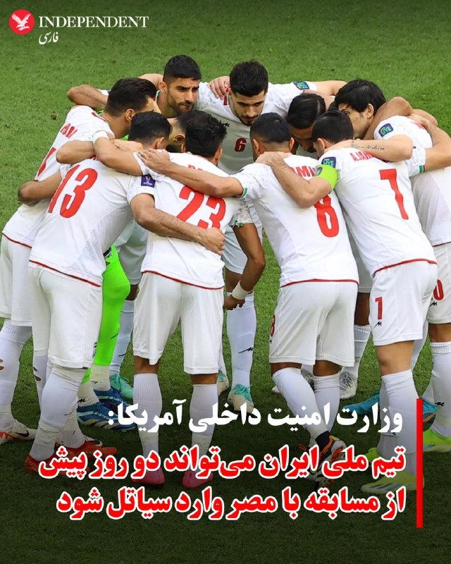

♦️وزارت امنیت داخلی آمریکا روز سه‌شنبه دوم تیرماه اعلام کرد تیم ملی فوتبال ایران از این پس می‌تواند دو روز پیش از مسابقه خود برابر مصر وارد سیاتل شود؛ تصمیمی که به معنای کاهش بخشی از محدودیت‌های سفر اعمال‌شده بر این تیم در جریان جام جهانی است.

بر اساس این تصمیم، تیم ملی ایران روز چهارشنبه از اردوی خود در تیخوانای مکزیک راهی سیاتل خواهد شد تا برای دیدار روز جمعه مقابل مصر آماده شود. با این حال، مقام‌های آمریکایی تاکید کردند که تیم ایران همچنان موظف است پس از پایان مسابقه خاک آمریکا را ترک کند.

در دو دیدار قبلی جام جهانی، تیم ملی ایران تنها یک روز پیش از مسابقه اجازه ورود به آمریکا را داشت. همچنین محل اردوی این تیم از آریزونا به مکزیک منتقل شد و شماری از اعضای کادر فنی و پشتیبانی نیز امکان همراهی تیم در سفر به آمریکا را پیدا نکردند.

علیرضا جهانبخش، کاپیتان تیم ملی ایران، پس از دیدار برابر بلژیک خواستار برخوردی مشابه با سایر تیم‌های حاضر در جام جهانی شده بود و گفته بود تیم ایران تنها خواهان اجرای همان رویه‌ای است که برای دیگر تیم‌های حاضر در رقابت‌ها در نظر گرفته شده است.
‌🇸🇦 Indypersian

🤖 @VahidOOnLine

## WithYashar — post 15694

ترامپ‌ در‌ پنسیلوانیا: ایران قلدر خاورمیانه بود.
ما باید این مسیر را انجام می دادیم. باید به ایران می رفتیم.
شما نمی توانید اجازه دهید که خاورمیانه و سپس ما را منفجر کنند، اگر این امکان پذیر باشد. ما قبلاً آنها را می گرفتیم، اما آنها اسرائیل را منفجر می کردند. آنها می توانستند کل خاورمیانه را منفجر کنند.

به توافق صلح تاریخی با ایران دست یافتیم
ایران عالی بوده است. اگر ایرانیان هوشمند باشند، منطقی خواهند بود؛ در غیر این صورت، مجبور خواهیم شد کار را به پایان برسانیم که احتمالاً کمتر از یک هفته طول می‌کشد.

اما فکر می‌کنم همه چیز برای آن‌ها خوب خواهد شد. آن‌ها کاری که باید انجام دهند را انجام خواهند داد زیرا ما می‌خواهیم این کار انجام شود
@withyashar

## WithYashar — post 15693

سنای آمریکا به پایان جنگ با ایران رأی داد سنای آمریکا تصویب کرد که ادامه عملیات نظامی علیه ایران مستلزم کسب مجوز کنگره است. @withyashar

## WithYashar — post 15692

سنای آمریکا به پایان جنگ با ایران رأی داد

سنای آمریکا تصویب کرد که ادامه عملیات نظامی علیه ایران مستلزم کسب مجوز کنگره است.
@withyashar

## WithYashar — post 15691

کانال ۱۴ اسرائیل نقل قول‌های اختصاصی از احمد وحیدی، فرمانده سپاه پاسداران، خطاب به مقامات ارشد رژیم را منتشر کرد.
1 «ما رئیس جمهور ترامپ را به زانو درآوردیم. ما به آنچه می‌خواستیم رسیدیم. طبق معمول، غرب احمق فکر می‌کند که در عوض چیزی از ما دریافت می‌کند، که البته هرگز اتفاق نخواهد افتاد.»
2 «هدف ما در حال حاضر این است که آمریکایی‌ها را در تنگنا قرار دهیم. هرگونه تخلف، هر چقدر هم کوچک، به ما اجازه می‌دهد که تهدید به بستن تنگه هرمز کنیم و ترامپ و مردمش با هر چیزی موافقت خواهند کرد.»
3 «ترامپ فکر می‌کند پولی را که به ما می‌دهد صرف خرید کالاهای آمریکایی خواهیم کرد. این هرگز در طول عمر ما اتفاق نخواهد افتاد.»
4 «حالا باید به آمریکایی‌ها بفهمانیم که اسرائیل بازیگر بد خاورمیانه است. هدف این است.»
5 «از هیچ چیز دست نکشید. تهدید کنید. و در صورت لزوم، از مذاکرات کناره‌گیری کنید.»
@withyashar

## WithYashar — post 15690

نخست‌وزیر پاکستان: هفته آینده با مجتبی خامنه‌ای در ایران دیدار خواهم کرد.
@withyashar

## WithYashar — post 15689

WarRoom with YASHAR pinned «دوستان، زیر چنل تبلیغاتی از افرادی می‌آید که در بازارهای مالی شرکت دارند. اینها از طرف خود تلگرام است. حتی اگر من هم تبلیغی بگذارم، دلیل برای این که شما جایی پولی پرداخت کنید و تایید من باشد نیست. به هیچ وجه این کار را در هیچ شرایطی در هیچ کجای اینترنت انجام…»

## WithYashar — post 15688

دوستان، زیر چنل تبلیغاتی از افرادی می‌آید که در بازارهای مالی شرکت دارند. اینها از طرف خود تلگرام است. حتی اگر من هم تبلیغی بگذارم، دلیل برای این که شما جایی پولی پرداخت کنید و تایید من باشد نیست. به هیچ وجه این کار را در هیچ شرایطی در هیچ کجای اینترنت انجام ندهید. در غیر این صورت مسئولیت با شماست و توسط حرص و طمع خود شما انجام گرفته. به این مسئله دقت کنید و فقط از تحلیلها و مطالب آموزشی افراد استفاده کنید. هیچ پکج یا هیچ پرداختی به هیچ بی ناموسی انجام ندهید.⚠️⚠️⚠️⚠️⚠️⚠️⚠️
از توجه شما به این مطلب سپاسگزارم، یاشار

## WithYashar — post 15686

  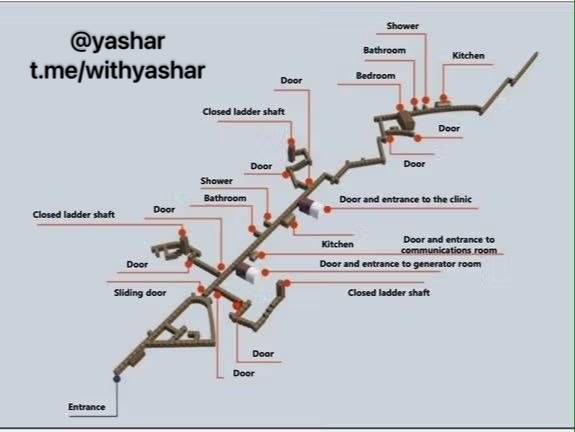

وزارت خارجه اسرائیل با انتشار نقشه تونل کشف شده جدید حزب الله نوشت:
حزب‌الله با حمایت مالی جمهوری اسلامی طی سال‌ها(صدها میلیون دلار) شبکه گسترده‌ای از تونل‌ها، انبارهای تسلیحاتی، سایت‌های موشکی و مراکز فرماندهی در جنوب لبنان ایجاد کرده ، هدف این زیرساخت‌ها حمله به اسرائیل بوده
@withyashar

## mwarmonitor — post 11434

  <a href="telegram/content/mwarmonitor_11434_1782248320.mp4" target="_blank">🎬 Download video</a>

📝وقتی می‌گویند این مایهٔ شرمساری، باسوادترین منتخب این جماعت است، آدم جفت پا وارد دنیای سورئالِ ناامیدی می‌شود؛ وقتی با‌سوادترین‌شان این است، پس وای به حال بقیه که لابد هنوز آتش را کشف نکرده‌اند!

در صحنه شاهد این هستیم پشم‌های شهباز شریف از این حجم از بدویتِ دیپلماتیک کز می‌خورد؛ او با همان لبخندِ ماسیده، در مغزش مابین بهت و وحشت دست‌وپا می‌زند و پیش خودش می‌گوید: «خدا را شکر، پس از من دوزاری‌تر هم در این جهان یافت می‌شود!»

بجای برگزاری یک ساعت کلاسِ آموزشیِ پروتکل، انگار ریس جمهور مملکت را مستقیم از یک خلأ تاریخی و با بیلِ پرتاب کرده‌اند وسط پاکستان؛ موجودی هولناک که مثل عمله‌ها چنان وحشیانه خاک را شخم می‌زند که اگر دست‌های نگرانِ شهباز جلویش را نمی‌گرفت، در چند ساعت نه تنها چند هکتار جنگلِ انبوه تحویل می‌داد، بلکه با آن مغزِ تهی و بازوانِ خستگی‌ناپذیرش، کلِ کره‌زمین را سوراخ می‌کرد و از آن طرف سر درمی‌آورد.

@mwarmonitor

## FoxNewsTwitter — post 343316

  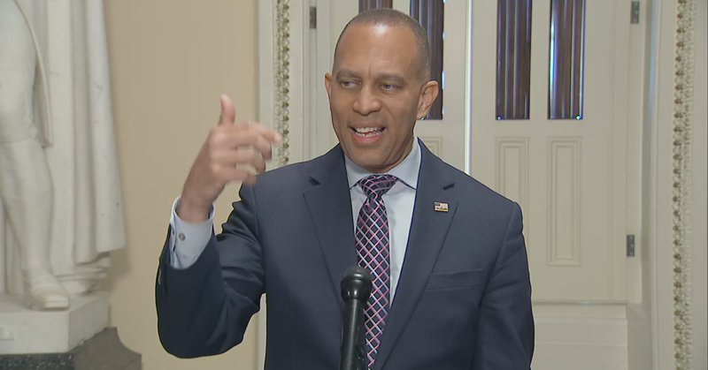

Fox News (Twitter/X)

WATCH LIVE: House Minority Leader Jeffries speaks to reporters as key primary results roll in https://twitter.com/i/broadcasts/1nJOLLAMmAOxR

## FoxNewsTwitter — post 343315

  

Fox News (Twitter/X)

A NY school board vice president who called himself the first drag queen elected to a public school board has been arrested on charges of sexual misconduct against children.

46-year-old Travis Barr Longo was arrested by the state police after an investigation into allegations that he engaged in a pattern of sexually explicit digital communications with a child under the age of 12.

Investigators found "numerous images and videos of child pornography" during a search of Longo's cell phone, "including several videos depicting the sexual abuse of infants that Longo had received from other users of an internet-based messaging application," the U.S. Attorney's Office said in a statement.

Longo, the vice president of the Cazenovia Central School District Board of Education, faces four counts of endangering the welfare of a child. He made a virtual federal court appearance last weekend on charges of receiving and possessing child pornography.

## FoxNewsTwitter — post 343314

Fox News (Twitter/X)

WATCH: President Trump welcomes Marine Corp. veteran and longtime Mack Trucks employee Pat McHugh to the stage with him in Pennsylvania.

McHugh was joined by his father and his son, who are also Mack Trucks workers, and touted their 78 years of combined service with the company.

“It is a profound honor and privilege to be here with you today and help celebrate the upcoming 250th birthday of America.”

“Standing here with me today are my father and my son, both Mack Trucks employees. Together, we have a combined 78 years of experience building the greatest trucks on Earth. You could say Mack Trucks runs in our blood.”

## FoxNewsTwitter — post 343313

Fox News (Twitter/X)

NOW: President Trump polls the crowd at a Mack Trucks facility in Pennsylvania to find out who voted for him... and who didn't.

## FoxNewsTwitter — post 343312

  <a href="telegram/content/FoxNewsTwitter_343312_1782248323.mp4" target="_blank">🎬 Download video</a>

Fox News (Twitter/X)

"This country has gotten very strange politically."

President Trump argued the U.S. has taken a sharp turn toward electing what he called "communists" and "socialists," saying today's political landscape is far different from the one he grew up watching.

He then turns to critics who have compared him to Nazis over the years:

"They said Trump is a Nazi. Now they can't say that anymore because they have a guy with a tattoo on his chest. It's unbelievable."

## FoxNewsTwitter — post 343311

  <a href="telegram/content/FoxNewsTwitter_343311_1782248325.mp4" target="_blank">🎬 Download video</a>

Fox News (Twitter/X)

NOW: President Trump pushes his tax cuts as part of his midterm pitch at an event in Pennsylvania.

Trump highlighting no tax on overtime and no tax on Social Security benefits for seniors, projecting they could boost household pay by more than $10,000 a year.

"Every single Democrat in Congress voted against our tax cuts."

## FoxNewsTwitter — post 343310

  <a href="telegram/content/FoxNewsTwitter_343310_1782248326.mp4" target="_blank">🎬 Download video</a>

Fox News (Twitter/X)

BREAKING: President Trump touts what he called a major jobs surge in Pennsylvania during remarks at Mack Trucks, saying the state has added 32,000 new jobs and 2,600 manufacturing jobs in just the last few months.

## FoxNewsTwitter — post 343309

Fox News (Twitter/X)

NOW: "The average price of gasoline nationwide is down $0.60 a gallon just from a short while ago... but remember that our oil in the middle of this conflict was less than it was for Sleepy Joe Biden."

President Trump touts falling oil prices while calling out his predecessors for how they handled Iran and its nuclear program.

"None of them did anything."

## FoxNewsTwitter — post 343308

  <a href="telegram/content/FoxNewsTwitter_343308_1782248328.mp4" target="_blank">🎬 Download video</a>

Fox News (Twitter/X)

NOW: President Trump is greeted by roaring “USA” chants as he begins his speech in Macungie, Pennsylvania.

## FoxNewsTwitter — post 343307

  

Fox News (Twitter/X)

WATCH LIVE: Trump speaks on economy at Mack Trucks in Pennsylvania https://twitter.com/i/broadcasts/1yKAPPNZgOwxb

## pm_afshaa — post 94713

  <a href="telegram/content/pm_afshaa_94713_1782248330.webm" target="_blank">🎬 Download video</a>

🔴سنای آمریکا با 50 رای موافق در برابر 48 رای مخالف به تصویب قطعنامه اختیارات جنگی درباره ایران که پیش‌تر در مجلس نمایندگان تصویب شده بود، رای داد. طی این قطعنامه، ترامپ بدون اجازه از کنگره دیگه نمیتونه به ایران حمله کنه. + البته ترامپ همچنان میتونه این قطعنامه…

## pm_afshaa — post 94712

  <a href="telegram/content/pm_afshaa_94712_1782248330.webm" target="_blank">🎬 Download video</a>

🔴سنای آمریکا با 50 رای موافق در برابر 48 رای مخالف به تصویب قطعنامه اختیارات جنگی درباره ایران که پیش‌تر در مجلس نمایندگان تصویب شده بود، رای داد.
طی این قطعنامه، ترامپ بدون اجازه از کنگره دیگه نمیتونه به ایران حمله کنه.

+ البته ترامپ همچنان میتونه این قطعنامه رو وتو کنه و خیلی مهم نیست.

💧 Rainbet.com the #1 Non-KYC Crypto Casino & Sportsbook @rainbetcom

😁 @Pm_Afshaa

## pm_afshaa — post 94711

  <a href="telegram/content/pm_afshaa_94711_1782248331.webm" target="_blank">🎬 Download video</a>

🔴ترامپ: اگر ایران منطقی رفتار کنه مشکلی نخواهیم داشت، اما در غیر این صورت آمریکا کار رو تمام میکنه، اونم در کمتر از یک هفته.

💧 Rainbet.com the #1 Non-KYC Crypto Casino & Sportsbook @rainbetcom

😁 @Pm_Afshaa

## pm_afshaa — post 94710

  <a href="telegram/content/pm_afshaa_94710_1782248331.mp4" target="_blank">🎬 Download video</a>

امروز پزشکیان به نشانه دوستی در حال کاشتن یک درخت در اسلام‌آباد بود که رسم پاکستانی‌هاست. شهباز شریف اشاره میکنه مسعود داداش بسه دیگه، نمادینه، ولش کن؛ ولی پزشکیان توجهی نمیکنه و فقط بیل میزنه.

💧 Rainbet.com the #1 Non-KYC Crypto Casino & Sportsbook @rainbetcom

😁 @Pm_Afshaa

## pm_afshaa — post 94709

  <a href="telegram/content/pm_afshaa_94709_1782248333.webm" target="_blank">🎬 Download video</a>

🔴رویترز: برخلاف ادعای سپاه درباره بسته شدن تنگه هرمز، داده‌ها نشون می‌ده تردد کشتی‌ها همچنان در جریانه و کشتیرانی در وضعیت عادی قرار داره.

💧 Rainbet.com the #1 Non-KYC Crypto Casino & Sportsbook @rainbetcom

😁 @Pm_Afshaa

## pm_afshaa — post 94708

  <a href="telegram/content/pm_afshaa_94708_1782248333.webm" target="_blank">🎬 Download video</a>

🔴رییس مرکز امور نمایندگان مجلس:
علی‌الاصول ما خواهان نابودی اسرائیل هستیم.

💧 Rainbet.com the #1 Non-KYC Crypto Casino & Sportsbook @rainbetcom

😁 @Pm_Afshaa

## DEJradio — post 5923

  <a href="telegram/content/DEJradio_5923_1782248334.mp4" target="_blank">🎬 Download video</a>

⭕️🎥 وزیر خارجه آمریکا: من گمان نمی‌کنم جمهوری اسلامی زیر بار شروط توافق برود

مارکو روبیو، وزیر امور خارجه آمریکا، سه‌شنبه‌شب دوم تیرماه پس از ورود به ابوظبی، در پاسخ به سوال خبرنگاری درباره سرمایه گذاری و صندوق بازسازی ایران گفت که این مرحله بسیار دور است و او گمان نمی‌کند که جمهوری اسلامی زیر بار شروط توافق برود.

* برای مشاهده این ویدئو با کیفیت بالا به حساب ایکس دژ مراجعه فرمایید.

#مارکو_روبیو #تفاهم
@DEJradio

## VahidOnline — post 76635

  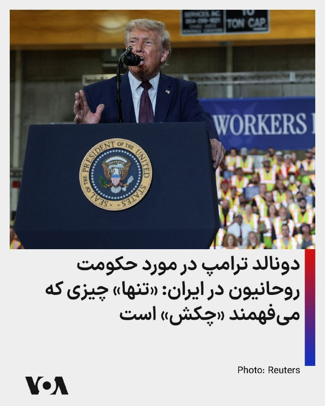

سخنرانی ترامپ در پنسیلوانیا
جملات مرتبط با ایران به تشخیص ماشین:

ما به یک توافق صلح تاریخی با ایران دست پیدا کردیم تا درگیری در تنگه هرمز را پایان دهیم.

راستی، دیروز ۱۹ میلیون بشکه نفت از تنگه هرمز عبور کرد. جای بسیار زیبایی است. این بیشترین مقدار نفت در تاریخ این تنگه است. هرگز چنین چیزی ندیده‌اید. به آن می‌گویند فوران نفت.

مهم‌تر از همه، داریم یک چیز بسیار مهم را تضمین می‌کنیم؛ چون دلیل انجام این کار همین بود. من به همین دلیل این کار را کردم. ۹۹ درصدش برای همین بود: ایران هرگز سلاح هسته‌ای نخواهد داشت.
اما یادتان باشد، این آسان نبود. ما ۴۷ سال رئیس‌جمهور و افراد دیگر داشتیم؛ کشورهای دیگر هم بودند. ما تنها کسانی نیستیم که هیچ کاری نکردند. آنها قلدر خاورمیانه بودند. حالا داریم ایران را بدون نیروی دریایی، بدون نیروی هوایی، بدون پدافند ضدهوایی، بدون توان موشکی، و بدون برنامه هسته‌ای باقی می‌گذاریم.

ما آنها را بدون هیچ ظرفیت هسته‌ای باقی می‌گذاریم، و آنها با این موافقت کرده‌اند. و رابطه‌مان هم خیلی خوب پیش می‌رود، هرچند اگر اخبار جعلی را بخوانید، هیچ‌وقت نمی‌فهمید. فکرش را بکنید، اخبار جعلی.
آنها ارتش ندارند، نیروی دریایی ندارند، نیروی هوایی ندارند، پدافند ضدهوایی ندارند. ما می‌توانیم هر وقت بخواهیم بر فراز تهران پرواز کنیم. هیچ‌کس کاری به ما نخواهد کرد. بعد اخبار جعلی را می‌خوانم که می‌گویند اوضاع آنها خیلی خوب است. اوضاعشان خیلی خوب نیست.
اما اقتصاد ایران خرد شده و پایه صنعتی دفاعی‌شان چنان به‌شدت آسیب دیده که بازسازی آن سال‌های زیادی طول خواهد کشید. سال‌های بسیار زیاد. حالا ما داریم تلاش می‌کنیم به توافقی برسیم که منصفانه باشد.

یادتان باشد، ما مجبور شدیم این مسیر انحرافی را برویم. مجبور شدیم سراغ ایران برویم. نمی‌شود اجازه داد آنها خاورمیانه و ما را منفجر کنند؛ اگر چنین چیزی ممکن باشد. ما زودتر به آنجا می‌رسیدیم، اما آنها اسرائیل را منفجر می‌کردند، کل خاورمیانه را منفجر می‌کردند. اگر می‌خواهید اقتصاد بد ببینید، آن اقتصاد بد است.

یادتان باشد، نفت ما، در میانه این درگیری، از دوران جو خواب‌آلود بایدن هم ارزان‌تر بود. و ما داریم یک آتش را خاموش می‌کنیم. بایدن، کلینتون، بوش، همه‌شان، باراک حسین اوباما ـ اسمش را شنیده‌اید؟ اسم باراک حسین اوباما را شنیده‌اید؟ ـ هیچ‌کدامشان کاری نکردند.
اوباما به آنها ۱.۷ میلیارد دلار پول نقد سبز داد، یادتان هست؟ با یک ۷۴۷. آنها انبوهی از پول نقد را با هواپیما بردند. ۱.۷ میلیارد دلار. صدها میلیارد دلار به آنها دادند و فکر کردند می‌توانند با رشوه آنها را به صلح بکشانند.

تنها چیزی که آنها می‌فهمند همان چیزی است که این آقایان ردیف جلو می‌فهمند: چکش. چون اگر نگاه کنید به کاری که آنها کردند ـ به کاری که ما با ظرفیت هسته‌ای‌شان با آن بمب‌افکن‌های B-2 کردیم ـ آن یک چکش بود. در واقع اسمش را هم گذاشتیم چکش. عملیات چکش.

دمبوکرات‌ها به نفع داشتن سلاح هسته‌ای توسط ایران رأی دادند. و علیه بودجه نظامی رأی دادند. اما من آن را دور زدم.

ایران، ما آنها را از پا درآوردیم. در یک هفته، اساساً از نظر نظامی تمام شده بود. کشوری بسیار بزرگ‌تر، و با ایدئولوژی‌ای بسیار متفاوت. ایدئولوژی مسلمانان کمی با ایدئولوژی کاتولیک‌ها فرق دارد. ما کاتولیک‌ها و مسلمانان را داریم؛ کمی متفاوت‌اند.

... ونزوئلا عالی بوده و ایران هم عالی بوده/خواهد بود، اگر عاقل باشند. وگرنه مجبور می‌شویم کار را تمام کنیم، که کمتر از یک هفته طول خواهد کشید. اما فکر می‌کنم آنها مشکلی نخواهند داشت. آنها کاری را که باید انجام دهند انجام خواهند داد، چون ما باید این کار را تمام‌شده ببینیم.

📡 @VahidOnline

## VahidOnline — post 76634

  <a href="telegram/content/VahidOnline_76634_1782248336.mp4" target="_blank">🎬 Download video</a>

آذر عظیما، خواننده پیشکسوت موسیقی ایران و از نخستین خوانندگان برنامه «گل‌ها»، در ۹۹ سالگی در اصفهان درگذشت.

آذرمیدخت عظیما سراج‌پور که بیشتر با نام آذر عظیما شناخته می‌شد، متولد ۱۳۰۶ در اصفهان بود و فعالیت هنری خود را از سال ۱۳۳۳ با رادیو ایران آغاز کرد.

نخستین اثر او ساخته‌ای از ابوالحسن صبا با شعری از ابوالحسن ورزی بود. او همچنین از نخستین هنرمندانی بود که در مجموعه برنامه‌های ماندگار «گل‌ها» حضور یافت و نخستین برنامه «یک شاخه گل» را با همراهی ویولن ابوالحسن صبا و سنتور فرامرز پایور اجرا کرد.

آذر عظیما در طول فعالیت هنری خود آثار متعددی را در برنامه‌های «گلهای صحرایی» و دیگر برنامه‌های رادیویی اجرا کرد. قطعه «راه شیراز» از شناخته‌شده‌ترین آثار اوست که با ارکستر فارابی به رهبری همسرش، زنده‌یاد مرتضی حنانه، آهنگساز و رهبر ارکستر، اجرا شد.

از آذر عظیما به عنوان نخستین بانوی آوازخوان اصفهان نیز یاد می‌شود. او روز دوم تیر ۱۴۰۵ در ۹۹ سالگی درگذشت.
@VahidHeadline

📡 @VahidOnline

## VahidOnline — post 76633

  <a href="telegram/content/VahidOnline_76633_1782248336.mp4" target="_blank">🎬 Download video</a>

ویدیوی بالا رو منابع دولتی با این شرح منتشر کردند:
"تشریح جزئیات اقتصادی تفاهم‌نامه ایران و آمریکا از زبان رئیس‌کل بانک مرکزی"

📡 @VahidOnline

## VahidOnline — post 76632

  

مارکو روبیو، وزیر امور خارجه ایالات متحده، در حضور خبرنگاران در ابوظبی گفت که جمهوری اسلامی ایران به دلایل سیاسی و داخلی خود، موافقت با بازرسی‌های هسته‌ای آژانس بین‌المللی انرژی اتمی در نشست سوئیس را تکذیب می‌کند.

روبیو گفت:
ما می‌دانیم آن‌ها با چه مواردی موافقت کرده‌اند. من نمی‌دانم چرا مجبورند این حرف‌ها را بزنند. سیاست داخلی یا مسائل درون‌مرزی آن‌ها هرچه که هست، خودشان باید با آن کنار بیایند. اما ما می‌دانیم متعهد به انجام چه کارهایی شده‌اند؛ حالا یا آن را انجام می‌دهند یا خیر.

وزیر خارجه آمریکا در پایان تاکید کرد: «اگر آن‌ها به تعهدات خود عمل کنند، فرآیند رو به جلو حرکت خواهد کرد، اما اگر از انجام آن سر باز زنند، رئیس‌جمهوری (ترامپ) باید تصمیمات جدیدی اتخاذ کند.»
@VahidOOnLine

📡 @VahidOnline

## VahidOnline — post 76631

ترجمه ماشین:
خبرنگار:
آقای رئیس‌جمهور، وزارت جنگ برای جنگ ایران ۸۰ میلیارد دلار درخواست کرده است. فکر می‌کنید آمریکایی‌ها در شرایطی که بسیاری از نظر مالی تحت فشارند، از این حمایت می‌کنند؟
...
آنها فقط از این حمایت نمی‌کنند، بلکه آن را مطالبه می‌کنند، چون اجازه نخواهند داد ایران سلاح هسته‌ای داشته باشد.
می‌خواهید دردسر ببینید؟ بگذارید آنها سلاح هسته‌ای داشته باشند.
ما در قبال ایران خیلی خوب پیش می‌رویم. آنها نابود شده‌اند و ما داریم با آنها توافق می‌کنیم. باید ببینیم همه‌چیز چطور پیش می‌رود.

همین حالا، همان‌طور که احتمالاً دیروز شنیدید، ۱۹ میلیون بشکه نفت عبور کرد. این بزرگ‌ترین رقم در تاریخ تنگه است؛ تنگه هرمز.
بازار سهام ما به‌شدت بالا رفته و قیمت نفت در حال سقوط است. امروز برای لحظه‌ای به ۷۰ دلار برای هر بشکه رسیدیم ــ در واقع فکر می‌کنم از آن هم پایین‌تر خواهد رفت. این پایین‌تر از زمانی است که شروع کردیم.
و واقعاً شگفت‌انگیز بوده است. نکته اصلی این است که ایران سلاح هسته‌ای نخواهد داشت.

خبرنگار:
ایران؛ ایرانی‌ها می‌گویند هیچ سفر برنامه‌ریزی‌شده‌ای برای بازرسان آژانس بین‌المللی انرژی اتمی وجود ندارد. آیا این بخشی از توافق شماست؟
ترامپ:
اشتباه می‌کنند. خودشان می‌دانند اشتباه می‌کنند. به ما در داخل گفتند که این را قطعی کرده‌ایم: بازرسی صددرصدی.
و اگر حق با آنها بود، همین حالا جلسات را لغو می‌کردم.

خبرنگار:
و ایران می‌گوید درباره آن توافقی وجود ندارد. از نگاه شما، آقای رئیس‌جمهور، آن بازرسان واقعاً چه زمانی روی زمین خواهند بود؟
ترامپ:
در زمان مناسب. عجله‌ای نیست، اما در زمان مناسب روی زمین خواهند بود.

خبرنگار:
آقای رئیس‌جمهور، به متحدان خودتان که از توافق با ایران انتقاد کرده‌اند چه می‌گویید؟
ترامپ:
خب، فکر می‌کنم هر کسی که از آن انتقاد کرده، در موضع بدی قرار دارد؛ حتی اگر از دوستان ما باشد.
چون ما ایران را در موقعیتی قرار داده‌ایم که هیچ‌کس تا حالا قرار نداده بود. رؤسای جمهور دیگر باید ۴۷ سال پیش این کار را می‌کردند.
ما ایران را در موقعیتی قرار داده‌ایم که ارتشش کاملاً از بین رفته، رهبری‌اش از بین رفته، رادارش از بین رفته؛ همه‌چیزش از بین رفته است.
آنها موقعیت مذاکره خوبی ندارند.

اما با وجود این، پولی که از ایران خارج می‌کنیم، قرار است به کشاورزان ما برسد تا ذرت، سویا و گندم بگیرند؛ باید پول زیادی باشد.
چون آنها مشکل گرسنگی دارند، مشکل غذا دارند، مشکل دارو دارند و مشکلات زیادی دارند. تورم هم دارند. تورمشان همین حالا به ۳۰۰ درصد رسیده است.
بنابراین مشکلات زیادی دارند.

📡 @VahidOnline

## VahidOnline — post 76630

  

رافائل گروسی، مدیرکل آژانس بین‌المللی انرژی اتمی، سه‌شنبه به شبکه ان‌اچ‌کی ژاپن گفت بازرسی از تاسیسات هسته‌ای ایران انجام خواهد شد و هرچه زودتر آغاز شود بهتر است.
او افزود اولویت اصلی آژانس، شناسایی و تایید محل نگهداری اورانیوم با غنای بالا است. 

گروسی گفت آژانس بین‌المللی انرژی اتمی به‌زودی با مقام‌های جمهوری اسلامی درباره زمان‌بندی و جزییات بازرسی‌ها گفت‌وگو خواهد کرد.
او تاکید کرد آژانس این بازرسی‌ها را به‌طور مستقل انجام می‌دهد و نیازی به نظارت یا کمک دیگران ندارد.
@VahidOOnLine

📡 @VahidOnline

## IranIntlTV — post 344024

  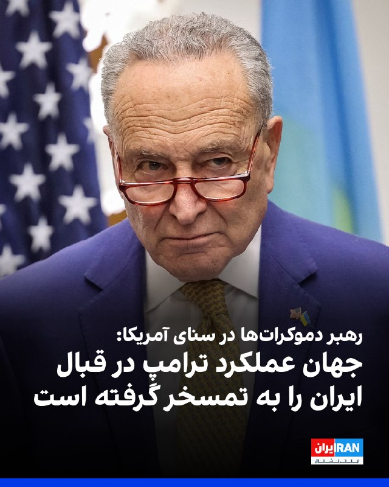

چاک شومر، سناتور دموکرات آمریکا، در گفت‌وگو با ایران‌اینترنشنال درباره ارسال پول به جمهوری اسلامی گفت: «فکر می‌کنم دونالد ترامپ کاملا از سوی رهبری جمهوری اسلامی فریب خورده و سرش کلاه رفته است. وضعیت ما از زمانی که ترامپ این جنگ را آغاز کرد، بدتر شده است.»

او افزود: «تنگه هرمز اکنون بیش از گذشته در کنترل و نفوذ ایران قرار دارد. رهبری جمهوری اسلامی رادیکال‌تر شده است. ما هنوز نمی‌دانیم همه اورانیوم‌های غنی‌شده کجا هستند و چه سرنوشتی پیدا کرده‌اند.»

شومر همچنین گفت: «جهان به عملکرد ترامپ نگاه کرده و تا حدی او را به تمسخر گرفته است. او کار ضعیفی انجام داده است.»
https://iranintl.com/202606239396

## IranIntlTV — post 344023

  

تد کروز، سناتور جمهوری‌خواه آمریکا در گفت‌وگویی با مرضیه حسینی، خبرنگار ایران‌اینترنشنال، درباره توافق میان دولت دونالد ترامپ و ایران ابراز تردید کرد و نسبت به پیامدهای آن هشدار داد.

او در پاسخ به پرسشی درباره این توافق گفت: «تاریخ نشان داده است که ارسال میلیاردها دلار به افراط‌گرایان تئوکراتی که می‌خواهند ما را به قتل برسانند، ایده بسیار بدی است. بنابراین امیدوارم چنین کاری انجام نشود.»

کروز همچنین در واکنش به احتمال دستیابی به توافق نهایی در بازه ۶۰ روزه اظهار داشت: «من کاملا انتظار دارم که ایرانی‌ها در پایان این ۶۰روز، باز هم موضوع را به تعویق بیندازند و زمان بیشتری بخرند.»

او در ادامه با انتقاد از رفتار جمهوری اسلامی افزود: «ایرانی‌ها طی سال‌ها نشان داده‌اند که آیت‌الله و ملاها قابل اعتماد نیستند. آنها به‌طور فعال در حال دروغ گفتن هستند و هر پولی که در اختیارشان قرار گیرد، برای تأمین مالی تروریسم استفاده خواهد شد. و صرف‌نظر از هر وعده‌ای که بدهند، آیت‌الله همچنان به دنبال دستیابی به سلاح هسته‌ای است، زیرا می‌خواهد بتواند از آن علیه ایالات متحده استفاده کند. و این یک تهدید بسیار جدی برای آمریکا است.»
h

## IranIntlTV — post 344022

  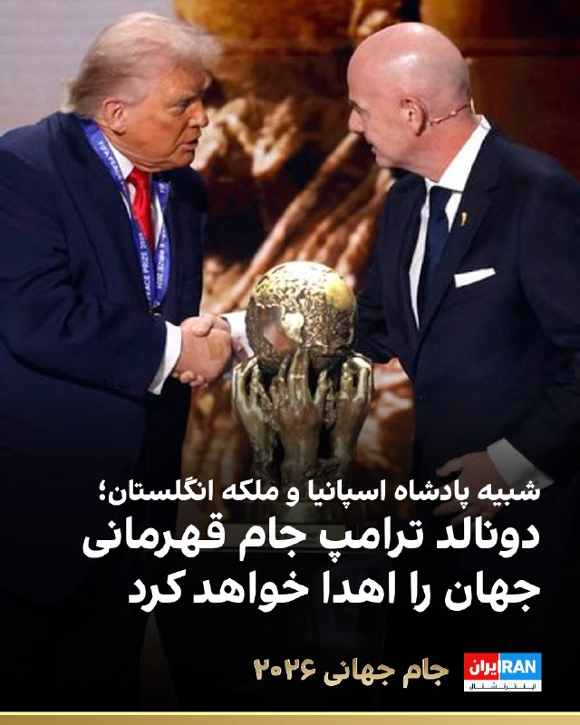

🔻در اقدامی متفاوت با رویه دوره‌های گذشته، جیانی اینفانتینو، رییس فیفا، تایید کرد که دونالد ترامپ، رییس‌جمهوری آمریکا، در فینال جام جهانی ۲۰۲۶ که یک‌شنبه ۲۸ تیر در نیوجرسی برگزار می‌شود، جام قهرمانی را اهدا خواهد کرد. ترامپ تاکنون در هیچ‌یک از مسابقات جام جهانی حضور پیدا نکرده است.

🔹اینفانتینو در گفت‌وگو با برنامه «فاکس اند فرندز» گفت: «ما همراه با رییس‌جمهوری [ترامپ] از فینال لذت خواهیم برد و البته با هم جام را به تیم قهرمان اهدا خواهیم کرد. ما همیشه در کنار یکدیگر هستیم.»

🔹در دو دوره قبلی، اینفانتینو به تنهایی جام را به تیم قهرمان اهدا کرده بود.

🔹البته در گذشته روسای کشورها و مقام‌های ارشد نیز این نقش را بر عهده داشته‌اند. به نوشته ای‌اس‌پی‌ان، خوان کارلوس، پادشاه اسپانیا، در جام جهانی ۱۹۸۲ جام قهرمانی را به دینو زوف، کاپیتان ایتالیا، اهدا کرد و ملکه الیزابت دوم نیز پس از قهرمانی انگلستان در جام جهانی ۱۹۶۶، جام را به بابی مور، کاپیتان این تیم، تحویل داد.

🔹این تصمیم پس از جنجال مراسم اهدای جام قهرمانی جام جهانی باشگاه‌ها به چلسی، گرفته شده است.

🔹جزییات بیشتر را در سایت بخوانید.

@iranintltvsport

## IranIntlTV — post 344021

  

اسماعیل بقایی، سخنگوی وزارت امور خارجه جمهوری اسلامی گفت: «مذاکره برای توافق نهایی با آمریکا زمانی آغاز می‌شود که اجرای بندهای ۱، ۴، ۵، ۱۰ و ۱۱ تفاهم‌نامه آغاز شده باشد.»

او افزود: «سفر اخیر هیات مذاکره‌کننده جمهوری اسلامی به سوئیس برای اطمینان از آغاز اجرای این پنج بند انجام شد.»

سخنگوی وزارت امورخارجه افزود: «هیچ مذاکره‌ای در مورد موضوع هسته‌ای نداشتیم.»

او ادامه داد که بازرسی‌های آژانس به روال جاری ادامه خواهد داشت.
https://iranintl.com/202606239161

## IranIntlTV — post 344020

  <a href="telegram/content/IranIntlTV_344020_1782248340.mp4" target="_blank">🎬 Download video</a>

ویدیوی رسیده به ایران اینترنشنال نشان می‌دهد که مراسم زادروز جاویدنام شهروز مهرابی کنار آرامگاهش در بروجرد برگزار شد و همسر او به یادش کبوتری را آزاد کرد. این جاویدنام در جریان اعتراضات ۱۸ دی در ساوه کشته شد.

## IranIntlTV — post 344019

  <a href="https://t.me/IranintlTV/344019" target="_blank">📎 Download file</a>

🎧نسخه صوتی ۲۴ با فرداد فرحزاد: ترامپ: جمهوری اسلامی از پا افتاده
@iranintlTV

## IranIntlTV — post 344018

  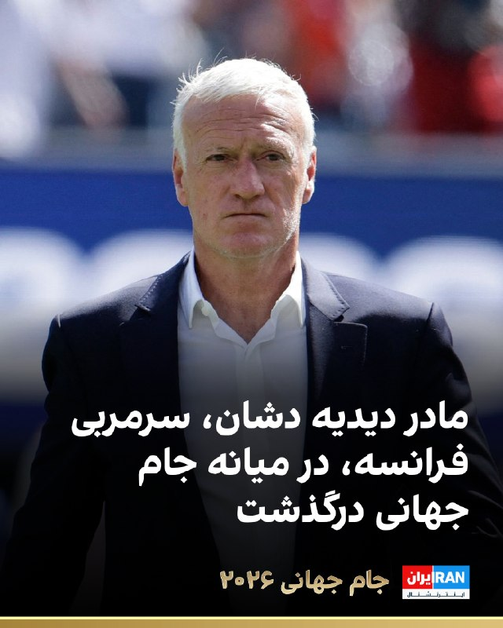

🔻فدراسیون فوتبال فرانسه روز سه‌شنبه اعلام کرد دیدیه دشان، سرمربی تیم ملی صبح امروز از درگذشت مادرش مطلع شد و به همین برای شرکت در مراسم خاکسپاری به فرانسه بازمی‌گردد و در دیدار پایانی فرانسه در گروه I جام جهانی مقابل نروژ روی نیمکت این تیم نخواهد نشست.

🔹فدراسیون فوتبال فرانسه در بیانیه‌ای اعلام کرد: «دیدیه دشان قادر نخواهد بود بر تمرینات تیم پیش از دیدار نروژ و فرانسه نظارت کند. او همچنین در بازی پایانی مرحله گروهی در روز جمعه روی نیمکت حضور نخواهد داشت.»

🔹به نوشته فدراسیون فوتبال فرانسه «با توافق فیلیپ دیالو، رییس فدراسیون فوتبال فرانسه که هم‌اکنون در محل اردوی تیم ملی فرانسه حضور دارد، دشان هدایت تیم را تا زمان بازگشت خود به گی استفان، دستیارش، سپرده است.»

🔹فرانسه پیش از این با پیروزی ۳ بر یک مقابل سنگال و ۳ بر صفر برابر عراق، صعود خود به مرحله حذفی جام جهانی را قطعی کرده است.

@iranintltvsport

## IranIntlTV — post 344017

  <a href="telegram/content/IranIntlTV_344017_1782248343.mp4" target="_blank">🎬 Download video</a>

شهباز شریف، نخست‌وزیر پاکستان، گفت موضوع موشک‌های بالستیک هرگز در مذاکرات مطرح نشده و در تفاهم‌نامه نیز ذکر نشده است. او همچنین تاکید کرد که موشک‌های بالستیک ایران ماهیتی دفاعی دارند و بسیاری از کشورهای جهان نیز از چنین توانمندی‌ای برخوردارند.

ارزیابی بهنام بن طالب‌لو، مدیر ارشد برنامه ایران در بنیاد دفاع از دموکراسی‌ها

@iranintltv

## IranIntlTV — post 344016

  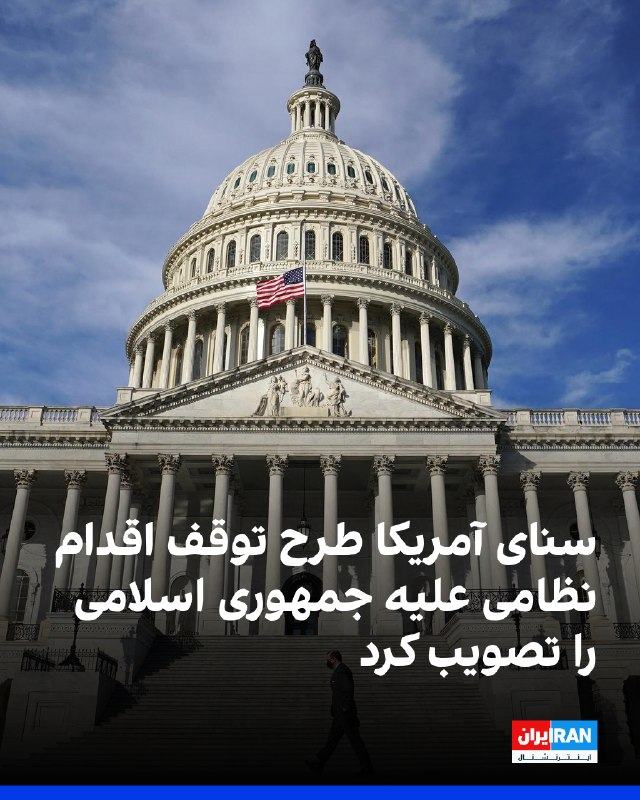

رویترز گزارش داد سنای آمریکا که جمهوری‌خواهان در آن اکثریت دارند، روز سه‌شنبه از طرحی برای توقف اقدام نظامی آمریکا علیه جمهوری اسلامی حمایت کرد؛ هرچند هنوز مشخص نیست این اقدام چه تاثیری بر روند درگیری خواهد داشت، زیرا دولت دونالد ترامپ در حال مذاکره برای دستیابی به توافق صلح با جمهوری اسلامی است.
سنای آمریکا این طرح را با ۵۰ رای موافق در برابر ۴۸ رای مخالف تصویب کرد. این طرح پیش‌تر در اوایل ماه جاری در مجلس نمایندگان نیز به تصویب رسیده بود.
در گزارش رویترز آمده است که این رای‌گیری نشان‌دهنده افزایش نگرانی‌ها، حتی در میان برخی جمهوری‌خواهان، درباره این درگیری است.
https://iranintl.com/202606238058

## IranIntlTV — post 344015

  <a href="telegram/content/IranIntlTV_344015_1782248345.mp4" target="_blank">🎬 Download video</a>

یک شهروند با ارسال ویدیویی به ایران اینترنشنال از کیفیت آب آشامیدنی در اهواز انتقاد کرد و گفت رنگ آن به حدی تغییر کرده که به «شیرکاکائو» شباهت پیدا کرده است. او این وضعیت را نشانه آلودگی بالا دانست و نسبت به بهداشتی‌نبودن آب مصرفی شهروندان ابراز نگرانی کرد.

## IranIntlTV — post 344014

  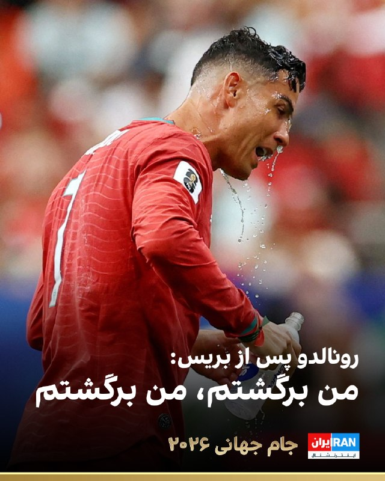

🔻کریستیانو رونالدو، فوق ستاره فوتبال دنیا پس از بریس در بازی پرتغال - ازبکستان در جام جهانی ۲۰۲۶، که او را به تنها فوتبالیست تاریخ که در ۶ دوره این تورنمنت گل می‌زند، بدل کرد، با صدای بلند خطاب به تماشاگران و دوربین‌های تلویزیونی گفت: «من برگشتم، من برگشتم.»

🔹او با به ثمر رساندن گل اول بازی در دقیقه ۷، به نخستین بازیکنی شد که در شش دوره جام جهانی گل می‌زند و با زدن سومین گل پرتغال در دقیقه ۳۹، دهمین گل خود در این مسابقات را به ثمر رساند.

🔹تا پیش از این گل‌ها، انتقادات زیادی به رونالدو به دلیل ناکامی در گلزنی در بازی اول پرتغال در جام جهانی وارد شده بود، برخی کارشناسان معتقدند بودند او دیگر مهاجم مرگبار سال‌های اوج خود نیست و نمی‌تواند به تنهایی بار هجومی تیمش را به دوش بکشد.

🔹حتی برخی از روبرتو مارتینس خواسته‌اند وابستگی کمتری به ستاره ۴۱ ساله تیمش داشته باشد.

🔹رونالدو اما اکنون و با بیش از ۴۱ سال سن، به مسن‌ترین فوتبالیست تاریخ بدل شد که در یک بازی جام جهانی دو گل به ثمر می‌رساند.

@iranintltvsport

## IranIntlTV — post 344013

خلبان جنگنده اف-۱۵ آمریکا که در جریان جنگ در حریم هوایی ایران سرنگون شد و در عملیات ویژه نجات پیدا کرد، در جلسه‌های تحقیقات درباره این حادثه گفت پرواز هماهنگ و گروهی پهپادهای جمهوری اسلامی را در آرایشی شبیه به عروس دریایی دیده است.

گفت‌وگو با مرضیه حسینی، ایران‌اینترنشنال
@iranintltv

## IranIntlTV — post 344012

  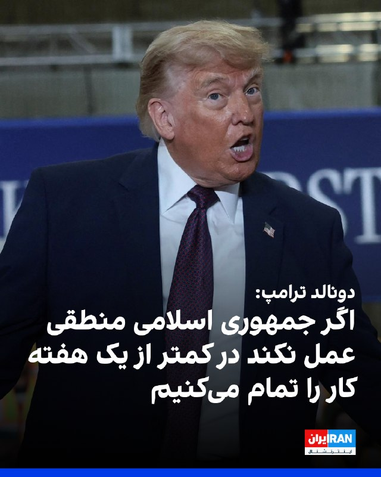

دونالد ترامپ، رییس‌جمهوری آمریکا، در جریان بازدید از یک کارخانه مونتاژ کامیون در پنسیلوانیا گفت: اگر جمهوری اسلامی منطقی و باهوش عمل کند، مشکلی نخواهیم داشت. در غیر این صورت، مجبور خواهیم شد کار را تمام کنیم؛ کاری که شاید کمتر از یک هفته طول بکشد.
او افزود: اما فکر می‌کنم آن‌ها کاری را که باید انجام دهند، انجام خواهند داد، زیرا ما می‌خواهیم این اتفاق بیفتد.
ترامپ گفت آمریکا در تلاش است به توافقی «منصفانه» با جمهوری اسلامی دست یابد.
https://iranintl.com/202606237347

## IranIntlTV — post 344011

  <a href="telegram/content/IranIntlTV_344011_1782248347.mp4" target="_blank">🎬 Download video</a>

پنتاگون به قانون‌گذاران آمریکایی اعلام کرد که برای هزینه‌های جنگ با ایران به حدود ۸۰ میلیارد دلار بودجه اضافی نیاز دارد؛ رقمی که جدا از افزایش بودجه نظامی پیشنهادی دولت ترامپ است. کاخ سفید هنوز درخواست رسمی خود را به کنگره ارائه نکرده است.

ارزیابی شایان سمیعی، کارشناس امنیت ملی
@iranintltv

## IranIntlTV — post 344010

همزمان با شروع اجرای تفاهم‌نامه، اظهارات متناقض مقام‌های تهران و واشینگتن درباره شروط این توافق ادامه دارد. ساعاتی پیش ترامپ با رد ادعاهای تهران گفت ایران با بالاترین سطح بازرسی‌ها به‌طور کامل و تمام‌عیار و تا ابد موافقت کرده. تهران می‌گوید

گفت‌وگو با فرشته پزشک، کارشناس روابط بین‌الملل
@iranintltv

## IranIntlTV — post 344009

  <a href="telegram/content/IranIntlTV_344009_1782248348.mp4" target="_blank">🎬 Download video</a>

علیرضا نوری‌زاده، مدیر مرکز پژوهش‌های ایران و عرب به برنامه ۲۴ گفت اطمینان‌خاطری که جمهوری اسلامی به حزب‌الله می‌دهد، آنها را به ادامه جنگ با اسرائیل ترغیب می‌کند
@iranintltv

## IranIntlTV — post 344008

  <a href="telegram/content/IranIntlTV_344008_1782248351.mp4" target="_blank">🎬 Download video</a>

گروهی از ایرانیان در هامبورگ سه‌شنبه ۲ تیر با برگزاری تجمعی حمایت خود از فاطمه سپهری، زندانیان سیاسی و ورزشکاران زندانی را اعلام کردند و خواستار آزادی و توجه به وضعیت آنان شدند

## IranIntlTV — post 344007

  <a href="https://t.me/IranintlTV/344007" target="_blank">📎 Download file</a>

🎧نسخه صوتی چشم‌انداز: معتمد مجتبی یا منتخب ترامپ؛ قالیباف دقیقا کیست؟
@iranintlTV

## IranIntlTV — post 344006

  

رافائل گروسی، مدیرکل آژانس بین‌المللی انرژی اتمی، سه‌شنبه به شبکه ان‌اچ‌کی ژاپن گفت بازرسی از تاسیسات هسته‌ای ایران انجام خواهد شد و هرچه زودتر آغاز شود بهتر است.
او افزود اولویت اصلی آژانس، شناسایی و تایید محل نگهداری اورانیوم با غنای بالا است. 

گروسی گفت آژانس بین‌المللی انرژی اتمی به‌زودی با مقام‌های جمهوری اسلامی درباره زمان‌بندی و جزییات بازرسی‌ها گفت‌وگو خواهد کرد.
او تاکید کرد آژانس این بازرسی‌ها را به‌طور مستقل انجام می‌دهد و نیازی به نظارت یا کمک دیگران ندارد.
https://iranintl.com/202606235016

## IranIntlTV — post 344005

  <a href="telegram/content/IranIntlTV_344005_1782248353.mp4" target="_blank">🎬 Download video</a>

شایان سمیعی، کارشناس امنیت ملی به برنامه ۲۴ گفت: توافق‌نامه‌ای که آمریکا با جمهوری اسلامی امضا کرده است، در واقع یک آتش‌بس سیاسی است و یک راه حل پایدار نیست
@iranintltv

## ManotoTV — post 106216

  <a href="telegram/content/ManotoTV_106216_1782248355.mp4" target="_blank">🎬 Download video</a>

ایران فقط نفت، گاز، کارخانه و ارتش نیست. آنچه یک ملت را در روزهای بحران کنار هم نگه می‌دارد، سرمایه‌های نامرئی اوست، پرچم، حافظه تاریخی، زبان، شاهنامه، قهرمانان و حس تعلق به یک سرنوشت مشترک.

اما وقتی این نمادها به ابزار دعواهای روزمره، حذف سیاسی و جذب مخاطب تبدیل شوند، آرام‌آرام تهی می‌شوند. فردای آزادی ایران، بیش از هر چیز، به همین سرمایه‌های مشترک نیاز خواهد داشت.

## FarsiVOA — post 221679

  <a href="telegram/content/FarsiVOA_221679_1782248357.mp4" target="_blank">🎬 Download video</a>

⚡️سام خسروی‌فر در برنامه تفسیر خبر: اگر جمهوری اسلامی پنج دهه سر کار مانده، کسانی آن را در قدرت نگه داشته‌اند
@FarsiVOA

## FarsiVOA — post 221678

🔺سنای آمریکا به طرح توقف جنگ با رژیم ایران رای مثبت داد

◾️سنای آمریکا که تحت کنترل جمهوری‌خواهان است، روز سه‌شنبه ۲ تیر طرحی را تصویب کرد که خواستار توقف اقدامات نظامی ایالات متحده علیه رژیم ایران است.

⬇️ بیشتر بخوانید:
https://ir.voanews.com/a/senate-votes-to-halt-iran-war-/8164050.html
@FarsiVOA

## FarsiVOA — post 221677

  

⚡️دونالد ترامپ، سه‌شنبه ۲ تیر در ایالت پنسیلوانیا در یک سخنرانی در حمایت از کارگران آمریکایی، گفت: «ما مجبور بودیم مسیر را منحرف کنیم ما باید به ایران می‌رفتیم...نباید گذاشت آنها خاورمیانه و سپس ما را منفجر کنند.»
آقای ترامپ گفت پیش از آنکه آن‌ها این کار را انجام دهند، ما جلوی آن‌ها را می‌گرفتیم «اما آن‌ها اسرائیل را منفجر می‌کردند. آنها کل خاورمیانه را منفجر می‌کردند.»
رئیس جمهوری آمریکا گفت چنین وضعیتی که جمهوری اسلامی چنین اقداماتی انجام می‌داد باعث «یک اقتصاد بد» می‌شد. آقای ترامپ همچنین در انتقاد از روسای جمهوری پیشین آمریکا گفت آن‌ها کاری درباره جمهوری اسلامی نکردند و باراک اوباما به آن‌ها «۱.۷ میلیارد دلار پول نقد» داد و این پول را با یک هواپیمای بوئینگ «۷۴۷» فرستاد و فکر می‌کرد که با «دادن رشوه می‌تواند آن ها را به [مسیر] صلح بیاورد.»
رئیس جمهوری آمریکا در مورد حکومت روحانیون حاکم در ایران گفت «تنها چیزی که آن‌ها می‌فهمند...چکش است. چون اگر به کاری که ما با آن بمب‌افکن‌های زیبای بی-۲ با ظرفیت هسته‌ای آنها کردیم نگاه کنید، آن واقعاً یک چکش بود. در حقیقت، ما آن را چکش نامیدیم. عملیات چکش.»
@FarsiVOA

## FarsiVOA — post 221676

  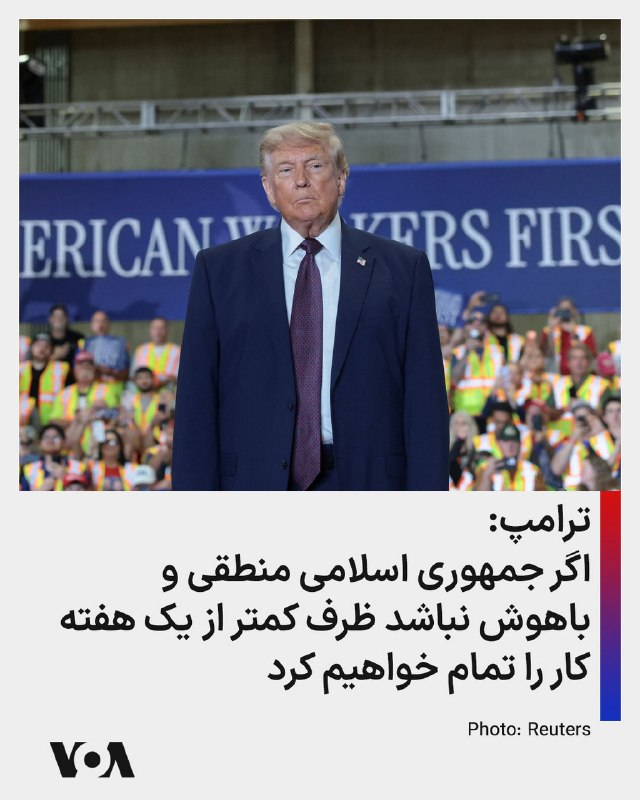

⚡️دونالد ترامپ، رئیس‌جمهوری آمریکا، سه‌شنبه ۲ تیر در یک سخنرانی به جمهوری اسلامی هشدار داد که اگر «منطقی» و «باهوش» نباشد، آمریکا کار را ظرف «کمتر از یک هفته» به «تمام» خواند کرد. آقای ترامپ با اشاره به اقدامات واشنگتن در خصوص ونزوئلا و جمهوری اسلامی گفت: «ونزوئلا عالی بوده و [حکومت] ایران هم عالی بوده است. منظورم این است که اگر [حکومت] ایران منطقی باشد... باهوش هستند. در غیر این صورت، ما باید کار را تمام کنیم که شاید کمتر از یک هفته طول بکشد، اما فکر می‌کنم آنها خوب خواهند بود. آنها کاری را که باید انجام دهند انجام خواهند داد زیرا ما می‌خواهیم این کار انجام شود.»
@FarsiVOA

## FarsiVOA — post 221675

  <a href="telegram/content/FarsiVOA_221675_1782248358.mp4" target="_blank">🎬 Download video</a>

⚡️بازرسی‌های هسته‌ای و آینده توافق؛ واکنش‌ها در کنگره آمریکا
@FarsiVOA

## FarsiVOA — post 221674

🔺ترامپ: هر وقت بخواهیم می‌توانیم بر فراز تهران پرواز کنیم و کسی نمی‌تواند کاری علیه ما انجام دهد؛ بازسازی صنایع دفاعی‌شان سا‌ل‌ها زمان می‌برد

◾️دونالد ترامپ رئيس‌جمهوری آمریکا، روز سه‌شنبه ۲ تیر در یک سخنرانی در ایالت پنسیلوانیا گفت: «من در برابر متقلبان تجاری، سوءاستفاده‌کنندگان و ناقضان قوانین در سراسر جهان ایستادم؛ آن هم به شکلی که هیچ رئیس‌جمهوری پیش از من انجام نداده بود. و حالا دوباره ایستاده‌ام، چون [رژیم] ایران نباید سلاح هسته‌ای داشته باشد؛.. و اوضاع هم خیلی خوب پیش می‌رود.»

⬇️ بیشتر بخوانید:
https://ir.voanews.com/a/8164038.html
@FarsiVOA

## FarsiVOA — post 221673

  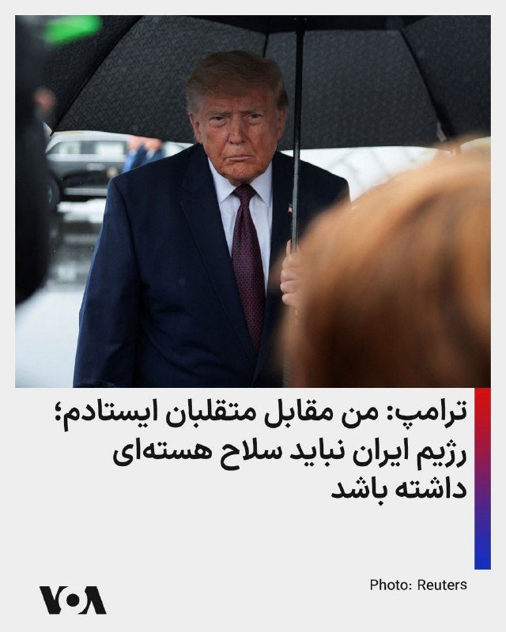

⚡️دونالد ترامپ رئيس‌جمهوری آمریکا، روز سه‌شنبه در یک سخنرانی در ایالت پنسیلوانیا گفت: «من در برابر متقلبان تجاری، سوءاستفاده‌کنندگان و ناقضان قوانین در سراسر جهان ایستادم؛ آن هم به شکلی که هیچ رئیس‌جمهوری پیش از من انجام نداده بود. و حالا دوباره ایستاده‌ام، چون [رژیم] ایران نباید سلاح هسته‌ای داشته باشد؛.. و اوضاع هم خیلی خوب پیش می‌رود.»
@FarsiVOA

## FarsiVOA — post 221671

🔺هشدار کانون فیلمسازان مستقل ایران درباره احتمال اعدام علی صفری بازیگر تئاتر

◾️کانون فیلم‌سازان مستقل ایران «ایفما» با ابراز نگرانی از طرح اتهام «محاربه» علیه علی صفری، نسبت به خطر اعدام این بازیگر تئاتر و دانشجوی دانشگاه فرهنگ و هنر هشدار داد.

⬇️ بیشتر بخوانید:
https://ir.voanews.com/a/iifma-warns-about-ali-safari-execution/8164025.html
@FarsiVOA

## FarsiVOA — post 221669

🔺آمریکا محدودیت ورود تیم فوتبال ایران را برای سومین بازی جام جهانی کاهش داد

◾️وزارت امنیت داخلی ایالات متحده محدودیت زمانی ورود تیم ملی فوتبال ایران به خاک آمریکا را برای سومین مسابقه این تیم در جام جهانی ۲۰۲۶ کاهش داده و به بازیکنان و اعضای مجاز هیئت ایران اجازه داده است دو روز پیش از مسابقه وارد این کشور شوند.

⬇️ بیشتر بخوانید:
https://ir.voanews.com/a/u-s-eases-iran-team-restrictions/8164031.html
@FarsiVOA

## FarsiVOA — post 221668

⚡️استعفای کی‌یر استارمر، رقابت برای رهبری حزب کارگر را وارد مرحله تازه‌ای کرده است. اندی برنهام، وس استریتینگ و آنجلا رینر از جمله نام‌هایی هستند که بیشتر از بقیه در رسانه‌های بریتانیایی مطرح می‌شوند.
@FarsiVOA

## FarsiVOA — post 221667

🔺اینفانتینو: فینال جام جهانی و مراسم اهدای جام با حضور پرزیدنت ترامپ برگزار می‌شود

◾️جیانی اینفانتینو، رئیس فدراسیون جهانی فوتبال «فیفا»، روز سه‌شنبه ۲ تیر با اعلام خبر حضور پرزیدنت ترامپ در مراسم فینال جام‌ جهانی گفت: «ما قرار است با رئیس جمهوری آمریکا از فینال جام جهانی لذت ببریم و جام را با هم به تیم برنده اهدا کنیم.»

⬇️ بیشتر بخوانید:

https://ir.voanews.com/a/infantino-says-president-trump-attending-world-cup-final-match-trophy-presentation/8163962.html

## FarsiVOA — post 221666

🔺مقام آمریکایی به صدای آمریکا: دور پنجم مذاکرات اسرائیل و لبنان در واشنگتن آغاز شده است

◾️یک مقام دولت آمریکا به صدای آمریکا گفت که دور پنجم مذاکرات اسرائیل و لبنان در واشنگتن آغاز شده است. به گفته این مقام آمریکایی، مذاکرات روز سه‌شنبه ۲ تیر در واشنگتن بین نمایندگان اسرائیل و لبنان، تنها چند روز پس از امضای یادداشت تفاهم بین ایالات متحده و حکومت ایران که شامل لبنان نیز می‌شود، آغاز شد.

⬇️ بیشتر بخوانید:

https://ir.voanews.com/a/fifth-round-of-israel-lebanon-talks-washington-voice-of-america/8163964.html

## FarsiVOA — post 221665

🔺اقدام جدید دولت ترامپ برای تقویت تولیدات آمریکا: تخصیص وام ۹۰ درصدی به تولیدکنندگان

◾️دولت ترامپ اقدام جدیدی برای تقویت تولیدات آمریکا انجام می‌دهد. دیلی سیگنال سه‌شنبه ۲ تیر در گزارشی در این‌باره نوشت در تلاش برای تقویت تولید آمریکا و کاهش وابستگی به شرکت‌های خارجی، بانک صادرات و واردات ایالات متحده «اِکسیم»، که یک سازمان اعتباری فدرال است، از یک فرصت وام جدید برای تولیدکنندگان رونمایی می‌کند.

⬇️ بیشتر بخوانید:

https://ir.voanews.com/a/trump-admin-makes-new-move-beefing-up-american-manufacturing/8163949.html

## DW_Farsi — post 126389

🔶 شهباز شریف و مسعود پزشکیان: موضوع موشک‌های بالستیک در تفاهم‌نامه مطرح نیست
 
شهباز شریف، نخست‌وزیر پاکستان و مسعود پزشکیان، رئیس‌جمهور ایران پس از دیدار در اسلام‌آباد تاکید کردند، "در یادداشت تفاهم، موضوع موشک‌های بالستیک ایران مطرح نشده است."
 
مسعود پزشکیان، رئیس‌جمهور ایران که به پاکستان سفر کرده است، با بیان این موضوع گفت: «بحث موشکی در تفاهم‌نامه نیست و هیچ‌وقت هم وجود نخواهد داشت. اگر موشک‌های ما نبود اسرائیل و آمریکا، ایران را مثل غزه شخم می‌زدند.»
 
شهباز شریف، نخست‌وزیر پاکستان نیز به خبرگزاری ایرنا گفت: «هیچ‌گونه بحثی درباره برنامه‌ها یا توانمندی‌های موشکی ایران با آمریکا صورت نگرفته و این موضوع نه در مذاکرات ایران و آمریکا مطرح بوده و نه در هیچ‌یک از تفاهم‌نامه‌های مرتبط با اسلام‌آباد جایی داشته است.»
 
او همچنین تصریح کرد، "هرگز درباره قابلیت‌های موشکی جمهوری اسلامی ایران اظهارنظری نکرده است".
 
نخست وزیر پاکستان همچنین در دیدار با مسعود پزشکیان که روز سه‌شنبه ۲ تیر (۲۳ ژوئن) انجام شد، با ابراز امیدواری از اینکه "این یادداشت تفاهم به برقراری صلح در سراسر منطقه منجر شود" گفت: «استانداردهای دوگانه قابل قبول نیست و منطقی نیست که برخی کشورها دارای موشک‌های بالستیک باشند اما ایران از داشتن آن‌ها منع شود.»
 
پیش تر ژان نوئل بارو، وزیر خارجه فرانسه که کشورش یکی از اعضای دائم شورای امنیت سازمان ملل با حق وتو است، گفته بود: «تا زمانی که مذاکرات ایالات متحده با ایران علاوه بر برنامه هسته‌ای، برنامه موشک‌های بالستیک ایران و حمایت تهران از نیروهای نیابتی را نیز در بر نگیرد، ثباتی در منطقه وجود نخواهد داشت.»
 
نخست‌وزیر پاکستان در ادامه سخنانش بدون آن که از فرد یا کشور مشخصی نام ببرد، گفت: «در سراسر جهان، خرابکارانی وجود دارند که می‌خواهند این توافق صلح را بر هم بزنند. آنها نمی‌خواهند ایران از خاکستر جنگ بیرون آید و به شکوه دست یابد.»
 
@dw_farsi

## DW_Farsi — post 126388

🔶 رئیس جمهور لبنان و رهبر حزب‌الله خواهان خروج کامل اسرائیل از لبنان شدند
 
در حالی که دیپلمات‌های لبنان و اسرائیل امروز در واشنگتن دی‌سی برای گفت‌وگو دیدار می‌کنند،جوزف عون، رئیس‌جمهور لبنان، اعلام کرده است که بیروت «به چیزی کمتر از پایان اشغال اسرائیل در جنوب لبنان رضایت نخواهد داد».
 
بر اساس پستی که دفتر ریاست‌جمهوری لبنان در شبکه ایکس منتشر کرده، عون گفته است: «تحولات روزهای گذشته درستی انتخاب ما برای پیگیری مذاکرات را ثابت کرده است، زیرا این تنها مسیر مورد تأیید جامعه بین‌المللی برای دستیابی به اهداف ملی و بازگرداندن همه حقوق ماست.»
 
او افزود که امیدوار است دور جدید مذاکرات با اسرائیل «در مسیر دستیابی به آنچه برای خیر کشور و مردممان می‌خواهیم، تعیین‌کننده باشد»؛ اهدافی که شامل «حاکمیت کامل لبنان بر تمام خاک خود» می‌شود.
 
عون تأکید کرد: «امروز اعلام می‌کنیم که به چیزی کمتر از پایان اشغال جنوب لبنان توسط اسرائیل رضایت نخواهیم داد. تنها انتخاب ما حاکمیت ملی ماست و تنها تکیه‌گاه ما دولت لبنان است؛ دولتی که از همه محافظت می‌کند، آزادی‌ها و کرامت همگان را پاس می‌دارد، به فداکاری‌های انجام‌شده احترام می‌گذارد و همه اشکال ترس و بی‌عدالتی را از میان برمی‌دارد.»
 
با وجود تلاش‌های دیپلماتیک جاری و توافق بر سر آتش‌بسی تازه در روز جمعه، درگیری‌ها میان اسرائیل و حزب‌الله در لبنان همچنان ادامه دارد.
 
وزارت بهداشت لبنان روز سه‌شنبه، ۲۳ ژوئن، اعلام کرد که از دوم مارس، یعنی از زمان ورود حزب‌الله به جنگ در حمایت از ایران در برابر اسرائیل و آمریکا تاکنون، دست‌کم ۴۱۹۲ نفر در حملات اسرائیل به لبنان کشته و ۱۲.۱۷۱ نفر زخمی شده‌اند. این وزارتخانه در آمار خود میان غیرنظامیان و نیروهای رزمی تفکیکی قائل نمی‌شود.
 
در همین حال، نعیم قاسم، رهبر حزب‌الله لبنان نیز در پی توافق میان آمریکا و ایران برای پایان دادن به جنگ در خاورمیانه، خواهان خروج کامل و برنامه‌ریزی‌شده نیروهای اسرائیلی از این کشور شد.
 
قاسم در یک سخنرانی تلویزیونی گفت: «ما اکنون در شرایط آتش‌بس هستیم. این عقب‌نشینی باید بر اساس یک جدول زمانی انجام شود. اسرائیل هیچ چاره‌ای جز خروج کامل از تمام خاک لبنان ندارد و نباید حتی یک وجب از آن را در اشغال خود نگه دارد.»
 
او افزود: «اسرائیل باید عقب‌نشینی ‌کند و ارتش لبنان به‌صورت انحصاری در جنوب رودخانه لیتانی مستقر می‌شود.»
 
دولت لبنان سال گذشته اعلام کرده بود، در چارچوب توافق آتش‌بس و پس از خلع سلاح حزب‌الله در این منطقه، استقرار نیروهای ارتش لبنان در جنوب کشور را تکمیل کرده است.
 
با این حال، اسرائیل نسبت به این ادعا تردیدهای جدی ابراز کرده بود و گروه حزب‌الله که از حمایت ایران برخوردار است، پس از آن نیز به حملات خود از آن منطقه علیه اسرائیل ادامه داد.
 
@dw_farsi

## Persian_Trend_Official — post 17908

  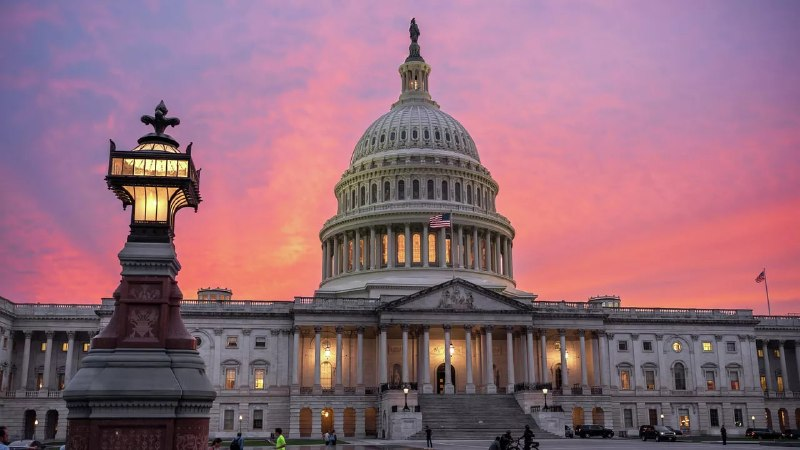

سنای آمریکا به محدودیت اختیارات جنگی ترامپ علیه ایران رای داد

مجلس سنای آمریکا عصر امروز سه‎‌شنبه به وقت محلی قطعنامه‌ای را تصویب کرد که به دونالد ترامپ رئیس جمهور آمریکا دستور می‌دهد نیروهای نظامی را از درگیری با ایران خارج کند.

سنای آمریکا با 50 رای مثبت در برابر 48 رای منفی قطعنامه اختیارات جنگی درباره ایران را که پیش‌ از این، در مجلس نمایندگان تصویب شده بود، تصویب کرد که بر اساس آن هرگونه اقدام نظامی علیه ایران مسدود می‌شود مگر آنکه رئیس‌جمهور آمریکا ابتدا از کنگره این کشور مجوزی دریافت کند.

📝 Amir

📌 @persian_trend_official
پرشین ترند | متفاوت‌ترین کانال نظامی

## Persian_Trend_Official — post 17907

https://youtube.com/live/VNODt0yCk1k?feature=share

## Persian_Trend_Official — post 17906

تا دقایقی دیگه لایو شروع میشه

## Persian_Trend_Official — post 17905

  <a href="telegram/content/Persian_Trend_Official_17905_1782248359.webm" target="_blank">🎬 Download video</a>

گروسی: از تأسیسات هسته‌ای ایران بازرسی خواهیم کرد!

مدیرکل آژانس بین‌المللی انرژی اتمی: معتقدیم بازرسی از تأسیسات هسته‌ای ایران در اسرع وقت بهترین گزینه است. اولویت اصلی ما مشخص کردن محل ذخایر اورانیوم غنی‌شده با خلوص بالای ایران است.

ما از محل اورانیوم غنی‌شده با خلوص بالا اطلاع داریم، اما مهم است که ایران ما را از آن مطلع کند. به‌زودی با ایران برای تعیین تاریخ بازرسی‌ها و جزئیات مربوط به آن مذاکره خواهیم کرد.

📝 Amir

📌 @persian_trend_official
پرشین ترند | متفاوت‌ترین کانال نظامی

## Persian_Trend_Official — post 17904

  <a href="telegram/content/Persian_Trend_Official_17904_1782248360.mp4" target="_blank">🎬 Download video</a>

امیر حسین ثابتی: تنگه رو مفت باز کردیم بدون اینکه هیچ عوارضی بگیریم.

Phantom

📌 @persian_trend_official
پرشین ترند | متفاوت‌ترین کانال نظامی

## Persian_Trend_Official — post 17903

  <a href="telegram/content/Persian_Trend_Official_17903_1782248361.mp4" target="_blank">🎬 Download video</a>

پزشکیان اسلام‌آباد را ترک کرد

مسعود پزشکیان در پایان سفر رسمی یک روزه خود به پاکستان لحظاتی قبل اسلام‌آباد را ترک کرد.
Phantom

📌 @persian_trend_official
پرشین ترند | متفاوت‌ترین کانال نظامی

## Persian_Trend_Official — post 17902

ترامپ در مورد ایران: ما آنها را بدون هیچ گونه ظرفیت هسته ای رها می کنیم و آنها با این موضوع موافقت کرده اند. ما کاملاً خوب با هم کنار می آییم.

ما می‌توانیم هر زمان که بخواهیم بر فراز تهران پرواز کنیم و هیچ‌کس نمی‌تواند کاری با ما انجام دهد.

📝 Amir

📌 @persian_trend_official
پرشین ترند | متفاوت‌ترین کانال نظامی

## Persian_Trend_Official — post 17901

نخست وزیر ایتالیا، ملونی: اگر به ایران اجازه دهیم در تنگه هرمز عوارض بگیرد، وارد جهانی می‌شویم که در آن هر مسیر تجاری استراتژیک به سلاح تبدیل می‌شود.

این چیزی است که ما به سادگی نمی‌توانیم تصور کنیم.

📝 Amir

📌 @persian_trend_official
پرشین ترند | متفاوت‌ترین کانال نظامی

## Persian_Trend_Official — post 17900

  <a href="telegram/content/Persian_Trend_Official_17900_1782248363.mp4" target="_blank">🎬 Download video</a>

نخست وزیر ایتالیا، ملونی: ما به سادگی نمی‌توانیم اجازه دهیم رژیم آیت‌الله به سلاح‌های هسته‌ای، کلاهک‌های هسته‌ای دست یابد، به خصوص با توجه به اینکه در حال حاضر موشک‌های دوربرد دارد و به وضوح نشان داده است که دارد.

و من فقط در مورد ایالات متحده، یا کشورهای نزدیک‌تر به مرزهای ایران، یا اسرائیل صحبت نمی‌کنم. ما نمی‌توانیم اجازه دهیم. ما نمی‌توانیم از عهده آن برآییم.

📝 Amir

📌 @persian_trend_official
پرشین ترند | متفاوت‌ترین کانال نظامی

## RadioFarda — post 158678

  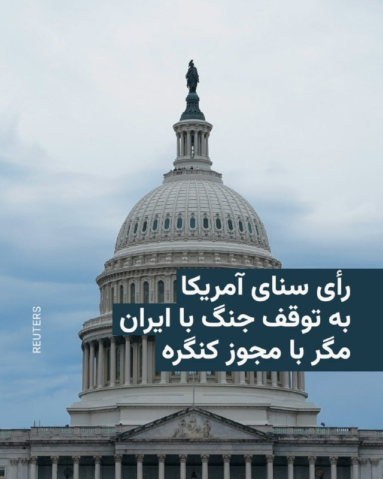

🔸سنای ایالات متحده در یک رأی‌گیری تازه به مشروط‌شدن ادامۀ جنگ ایران، به مجوز کنگره رأی داد.

🔸بر اساس رأی مثبت ۵۰ سناتور در مقابل ۴۸ رأی مخالف، این جنگ باید متوقف شود و دونالد ترامپ رئیس‌جمهور ایالات متحده برای از سر گرفتن جنگ، به مجوز کنگره نیاز خواهد داشت.

🔸این طرح که ابتدا در مجلس نمایندگان تصویب شده بود دونالد ترامپ را ملزم می‌کند که نیروهای ایالات متحده را از درگیری با ایران خارج کند؛ مگر آنکه کنگره به طور مشخص، مجوز این اقدام را صادر کند.

🔸این مصوبه برای امضا به دونالد ترامپ ارائه نخواهد شد و به همین دلیل از نظر قدرت قانونی، محل بحث بوده و عمدتا جنبۀ نمادین دارد.

🔸طی ماه‌های گذشته سناتورهای دموکرات بارها لایحه‌هایی را برای توقف جنگ به رأی گذاشته بودند اما هربار با مخالفت جمهوری‌خواهان با شکست مواجه شده بودند.

🔸در همین حال دونالد ترامپ که در حال سخنرانی در پنسیلوانیا است، ضمن ابراز رضایت از روند مذاکرات با ایران می‌گوید به‌دنبال توافقی «منصفانه» برای همه است.

@RadioFarda

## RadioFarda — post 158677

  <a href="https://t.me/radiofarda/158677" target="_blank">📎 Download file</a>

جدال ایران و آمریکا بر سر بازرسی آژانس در گفت‌وگو با مهران مصطفوی

🔸رئیس‌جمهور آمریکا روز دوم تیرماه در پستی در شبکهٔ اجتماعی خود، تروث سوشال، نوشت که با وجود اعتراض‌ها و ادعاهای نادرست ایران، این کشور به‌طور کامل و تمام‌عیار با بالاترین سطح بازرسی‌های هسته‌ای برای مدت طولانی موافقت کرده است. دونالد ترامپ تأکید کرده که اگر با این موضوع موافقت نمی‌کردند، دیگر هیچ مذاکره‌ای ادامه پیدا نمی‌کرد. از سوی دیگر اسماعیل بقائی، سخنگوی وزارت خارجه ایران، روز سه شنبه گفت تهران هیچ برنامه‌ای برای بازرسی آژانس از تأسیسات بمباران‌شدۀ هسته‌ای ندارد. در مورد این تناقض در گفتار ایران و آمریکا، دیدگاه مهران مصطفوی، استاد فیزیک و شیمی در دانشگاه پاریس، را جویا شدیم.

@RadioFarda

## RadioFarda — post 158676

🔸آذر عظیما، خواننده پیشکسوت موسیقی ایران و از نخستین خوانندگان برنامه «گل‌ها»، در ۹۹ سالگی در اصفهان درگذشت.

🔸آذرمیدخت عظیما سراج‌پور که بیشتر با نام آذر عظیما شناخته می‌شد، متولد ۱۳۰۶ در اصفهان بود و فعالیت هنری خود را از سال ۱۳۳۳ با رادیو ایران آغاز کرد.

🔸نخستین اثر او ساخته‌ای از ابوالحسن صبا با شعری از ابوالحسن ورزی بود. او همچنین از نخستین هنرمندانی بود که در مجموعه برنامه‌های ماندگار «گل‌ها» حضور یافت و نخستین برنامه «یک شاخه گل» را با همراهی ویولن ابوالحسن صبا و سنتور فرامرز پایور اجرا کرد.

🔸آذر عظیما در طول فعالیت هنری خود آثار متعددی را در برنامه‌های «گلهای صحرایی» و دیگر برنامه‌های رادیویی اجرا کرد. قطعه «راه شیراز» از شناخته‌شده‌ترین آثار اوست که با ارکستر فارابی به رهبری همسرش، زنده‌یاد مرتضی حنانه، آهنگساز و رهبر ارکستر، اجرا شد.

🔸از آذر عظیما به عنوان نخستین بانوی آوازخوان اصفهان نیز یاد می‌شود. او روز دوم تیر ۱۴۰۵ در ۹۹ سالگی درگذشت.

@RadioFarda

## IranianMinds — post 23202

🔴 ترامپ : اگه ایرانیا توافق رو امضا نکنن ایندفه میریم و ظرف یک‌ هفته کارشونو تموم میکنیم! @IranianMinds

## IranianMinds — post 23201

  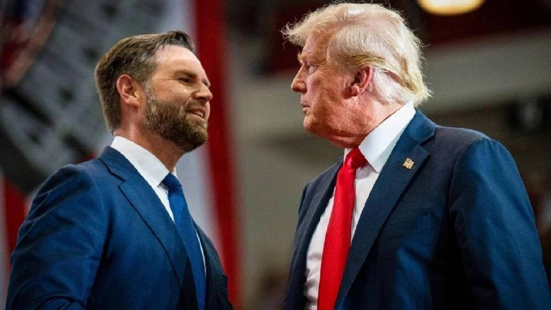

🔴 ترامپ :

اگه ایرانیا توافق رو امضا نکنن ایندفه میریم و ظرف یک‌ هفته کارشونو تموم میکنیم!

@IranianMinds

## IranianMinds — post 23200

مدیر آژانس بین‌المللی انرژی اتمی:

عملیات بازرسی از تأسیسات هسته‌ای در ایران را انجام خواهیم داد.

به‌زودی مذاکراتی را با ایران جهت تعیین زمان بازرسی‌ها و جزئیات مربوط به آن‌ها انجام خواهیم داد.

@IranianMinds

## IranianMinds — post 23199

هم اکنون پرتغال پنجمی هم زد به ازبکستان

@IranianMinds

## BBCPersian — post 284862

  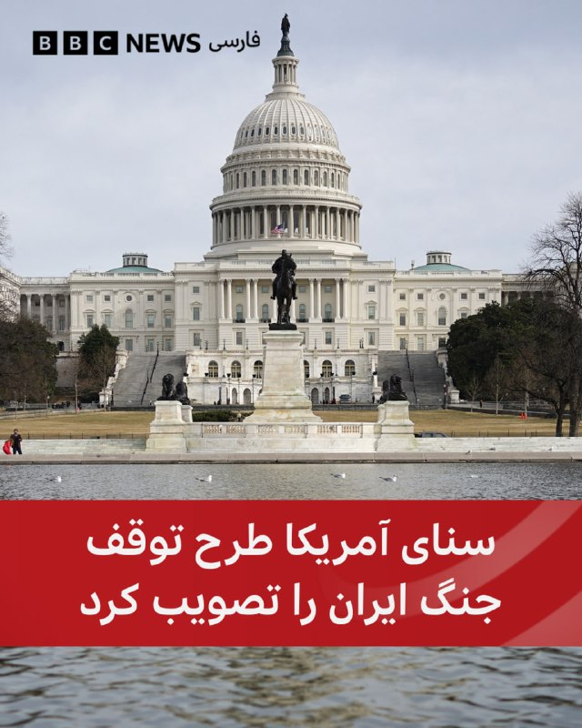

🔴سنای آمریکا که در اختیار جمهوری‌خواهان است، روز سه‌شنبه از طرحی قانونی برای توقف اقدام نظامی آمریکا علیه ایران حمایت کرد، اما هنوز مشخص نیست این مصوبه چه تاثیری بر جنگ خواهد داشت؛ آن هم در شرایطی که دولت دونالد ترامپ، رئیس‌جمهور آمریکا، در حال مذاکره برای دستیابی به توافق صلح با جمهوری اسلامی ایران است.

سنا با ۵۰ رای موافق در برابر ۴۸ رای مخالف به این قطعنامه مشترک رای داد. این طرح پیشتر در اوایل ماه جاری در مجلس نمایندگان آمریکا نیز تصویب شده بود.

این رای‌گیری نشان‌دهنده افزایش نگرانی‌ها درباره جنگ با ایران است؛ نگرانی‌هایی که حتی در میان برخی جمهوری‌خواهان حامی آقای ترامپ نیز دیده می‌شود. جنگی که از ۲۸ فوریه آغاز شد و از نظر اکثریت جامعه آمریکا محبوبیت چندانی ندارد و رسانه‌های این کشور بارها از آن به عنوان «شکست» برابر ایران یاد کرده‌اند.

📸AFP via Getty Images
https://bbc.in/4vra1Zs
@BBCPersian

## BBCPersian — post 284861

🔻شهباز شریف: نباید در موضوع موشک‌های بالستیک «استانداردهای دوگانه» اعمال شود

شهباز شریف، نخست‌وزیر پاکستان، صبح امروز در پارلمان این کشور گفت «در ۶۰ روز آینده، زمانی که مذاکرات فنی ایران و آمریکا برگزار شود، موضوعاتی مانند برنامه هسته‌ای، موشک‌های بالستیک و دارایی‌های مسدودشده ایران مورد بحث قرار خواهد گرفت.»

اینک آقای شریف پس از دیدار با مسعود پزشکیان، رئیس‌جمهور ایران، که به پاکستان سفر کرده در این باره اظهارنظر کرده است.

نخست‌وزیر پاکستان گفت که نباید در موضوع موشک‌های بالستیک «استانداردهای دوگانه» اعمال شود و تأکید کرد که ایران همانند سایر کشورها حق برخورداری از این موشک‌ها را دارد.

آقای شریف همچنین به خبرنگاران گفت که در یادداشت تفاهم مورد توافق ایران و ایالات متحده هیچ اشاره‌ای به موشک‌های بالستیک نشده است.

به گفته او «این موضوع اساسا در مذاکرات دو طرف مطرح نبوده است.»

https://bbc.in/43TEiEf
@BBCPersian

## BBCPersian — post 284860

🔻مادر امیرحسین موسوی: پخش «اعتراف تلویزیونی» باعث تشدید اتهامات علیه پسرم شد

ثریا طالبی، مادر امیرحسین موسوی، فعال شبکه‌های اجتماعی که از آذر ۱۴۰۳ در بازداشت به سر می‌برد، از «بلاتکلیفی» پرونده فرزندش انتقاد کرده و گفته است که در طول دوران بازداشت، اتهامات جدیدی به پرونده او افزوده شده است.

به گفته او، امیرحسین موسوی پس از انتقال به بند عمومی، «برای انجام یک مصاحبه تصویری با این وعده روبه‌رو شده بود که این اقدام می‌تواند به آزادی او با قرار وثیقه کمک کند، اما اتهامش تشدید شده است.»

خانم طالبی به وب‌سایت امتداد گفته است پس از پخش بخشی از «اعترافات اجباری» پسرش در تلویزیون ایران، هم‌زمان با جنگ ۱۲ روزه میان ایران و اسرائیل، اتهام «همکاری با دولت‌های متخاصم» نیز به پرونده افزوده شده است.
ادامه مطلب⬇️

https://bbc.in/4xJJpEP
@BBCPersian

## BBCPersian — post 284859

  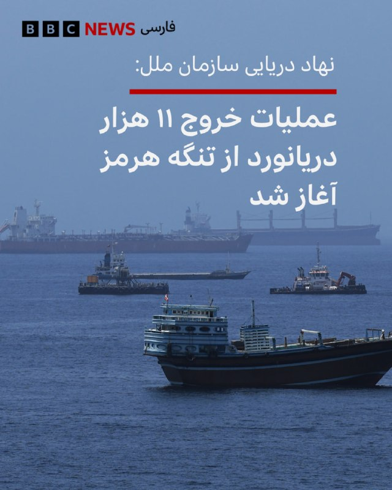

🔻سازمان بین‌المللی دریانوردی، وابسته به سارمان ملل، از آغاز روند خارج‌سازی بیش از ۱۱ هزار دریانورد گرفتار در تنگه هرمز خبر داد؛ دریانوردانی که از زمان جنگ آمریکا و اسرائیل با ایران و محدود شدن رفت‌وآمد در تنگه هرمز در این منطقه سرگردان بوده‌اند.

سازمان بین‌المللی دریانوردی گفت که عملیات خارج‌سازی این دریانوردان، در همکاری نزدیک با همه کشورهای منطقه و آمریکا خواهد بود.

به گفته این نهاد سازمان ملل، ملوانان و دریانوردان گرفتار، برای ماه‌ها رنج و سختی زیادی را تحمل کرده‌اند.

آرسنیو دومینگز، دبیرکل سازمان بین‌المللی دریانوردی، گفت که توافق ایران و آمریکا گامی قاطعانه به سوی احیای امنیت دریایی است.

📸Anadolu via Getty Images
https://bbc.in/4xKcNun
@BBCPersian

## BBCPersian — post 284858

🔻دانمارک: به ائتلاف بین‌المللی تحت رهبری بریتانیا و فرانسه برای کمک به بازگشایی تنگه هرمز ملحق خواهیم شد

دولت دانمارک می‌گوید که این کشور به ائتلاف بین‌المللی‌ای که بریتانیا و فرانسه برای کمک به باز کردن تنگه هرمز شکل داده‌اند، ملحق خواهد شد.

یپه بروس، وزیر دفاع دانمارک، به خبرنگاران گفت که مشارکت این کشور شامل اعزام «گروهی از مترجمان، قابلیت‌های پهپادی، پرسنل و احتمالا کمک تخصصی در حوزه سایبری» خواهد بود.

وزیر دفاع دانمارک از ارائه جزئیات بیشتر خودداری کرد.

بر اساس لایحه‌ای که به پارلمان دانمارک فرستاده شده و انتظار می‌رود به تصویب برسد، هدف از این اقدام «تقویت امنیت دریایی و تضمین آزادی تردد در داخل و اطراف تنگه هرمز و دریای سرخ است.»

فرانسه و بریتانیا در کنار چند کشور دیگر پیشنهاد تشکیل یک ماموریت بین‌المللی را داده‌اند که هدف آن مین‌روبی تنگه هرمز و تامین امنیت این آبراه استراتژیک عنوان شده است.

فرانسه پیشتر گفته بود که «هرگز» درصدد استقرار نیروی دریایی در تنگه هرمز نبوده است، بلکه به‌دنبال یک ماموریت برای حفظ امنیت است که با ایران «هماهنگ شده باشد.»

https://bbc.in/43SZ2vS
@BBCPersian

## BBCPersian — post 284857

🔻در ایران، تفاهم با آمریکا، به شکاف میان تندروها با دولت و تیم مذاکره‌کننده دامن زده است. تندروهایی که خود را بیش از بقیه به نظام و رهبر جمهوری اسلامی وفادار می‌دانند، می‌گویند این توافق به مجتبی خامنه‌ای تحمیل شده و مذاکره کنندگان، خطوط قرمز او را رعایت نکرده‌اند.

اما بعضی معتقدند که رهبر جدید مانند پدرش، با موضع‌گیری دو پهلو درباره مذاکره و توافق با آمریکا، سیاست کج‌دار و مریز را پیش می‌برد.

گزارشی از پرهام قبادی.
@BBCPersian

## BBCPersian — post 284856

  <a href="telegram/content/BBCPersian_284856_1782248367.mp4" target="_blank">🎬 Download video</a>

🔻آخرین خبرهای مهم سه‌شنبه ۲ تیر ۱۴۰۵

@BBCPersian

## BBCPersian — post 284855

🔻مسعود پزشکیان پس از دیدار با مقام‌های پاکستان به تهران بازگشت

مسعود پزشکیان، رئیس‌جمهور ایران، پس ازسفری یک روزه به پاکستان، به تهران بازگشته است.

آقای پزشکیان در جریان سفر امروزش به پاکستان با شهباز شریف، نخست‌وزیر، آصف‌علی زرداری، رئیس‌جمهور و فیلد مارشال عاصم منیر، فرمانده کل ارتش پاکستان دیدار کرد.

قدردانی آقای پزشکیان از پیگیری‌های پاکستان به‌عنوان میانجی ایران و آمریکا از جمله دلایل این سفر عنوان شده بود.

شهباز شریف و فیلد مارشال عاصم منیر در گفت‌وگوی ایران و آمریکا در سوئیس حضور داشتند.

گسترش همکاری‌های اقتصادی ایران و پاکستان از دیگر دلایل این سفر عنوان شده است.

شماری از وزرا از جمله وزیران خارجه، کشور، کشاورزی و راه و شهرسازی در این سفر همراه آقای پزشکیان بودند.

https://bbc.in/3Spcc1g
@BBCPersian

## BBCPersian — post 284854

  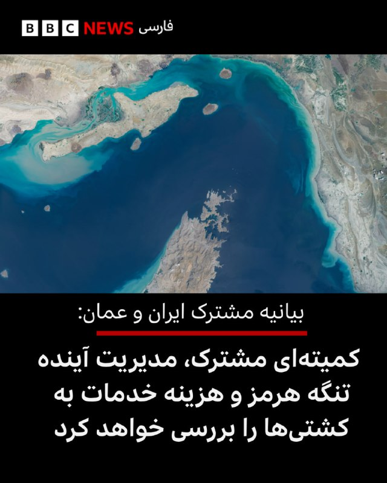

🔻ایران و عمان در بیانیه‌ای مشترک اعلام کردند که به حفظ تنگه هرمز به‌عنوان یک آبراه امن و باز برای کشتیرانی بین‌المللی متعهدند و هم‌زمان، بر حاکمیت و حقوق حاکمیتی خود بر آب‌های سرزمینی در تنگه هرمز تاکید کردند.

آنها همچنین اعلام کرده‌اند که مدیریت آینده تنگه هرمز و هزینه خدمات ارائه‌شده در این آبراه را با تشکیل یک کمیته مشترک بررسی خواهند کرد.

این بیانیه پس از دیدار مقام‌های ارشد دو کشور در مسقط منتشر شد.

محمدباقر قالیباف، رئیس هیئت مذاکره‌کننده ایران و عباس عراقچی، وزیر امور خارجه ایران پس از ترک سوئیس به عمان رفتند و با بدر بوسعیدی، وزیر خارجه و سلطان هیثم بن طارق، پادشاه عمان، دیدار کردند.

📸GettyImages
https://bbc.in/3QjCd1r
@BBCPersian

## BBCPersian — post 284853

  <a href="telegram/content/BBCPersian_284853_1782248369.mp4" target="_blank">🎬 Download video</a>

‏علیرضا جهانبخش، ملی‌پوش تیم فوتبال ایران پس از مسابقه با بلژیک در پاسخ به رسانه‌ها درباره محدودیت‌هایی که آمریکا برای ویزای تیم ملی اعمال می‌کند گفت: «ما خواسته زیادی نداریم. می‌خواهیم بر اساس عدالت و مانند ۴۷ تیم دیگر با ما رفتار شود اما ایرانی‌ها در شرایط دشوار بهتر بازی می‌کنند و متحد می‌شوند.»

‏آقای جهانبخش که در این گفتگو در کنار سامان قدوس، دیگر بازیکن مسلط به زبان انگلیسی ایستاده بود،‌ در سخنانی که بازتاب خبری گسترده‌ای یافته است از مردم مکزیک به ‌خاطر میزبانی و مهمان‌نوازیشان قدردانی کرد.

‏علیرضا جهانبخش در بخش دیگری از سخنانش گفت که تیم ملی ایران برای شاد کردن همه ایرانیان، در داخل و خارج از این کشور بازی می‌کند؛ «فارغ از هر ایدئولوژی و گرایشی که داشته باشند.»

‏در مسابقه ایران و بلژیک هم، مانند بازی پیشین این تیم مقابل نیوزیلند بسیاری از تماشاگران به‌رغم ممنوعیت فیفا با پرچم شیروخورشید نشان به ورزشگاه آمده بودند اما در بسیاری از لحظات مسابقه به‌ویژه پس از ۱۰ نفره شدن تیم بلژیک صدای تشویق هزاران هوادار تیم ملی ایران در ورزشگاه خیره‌کننده بود.
@bbcpersian

## Dirty_Kids — post 392940

  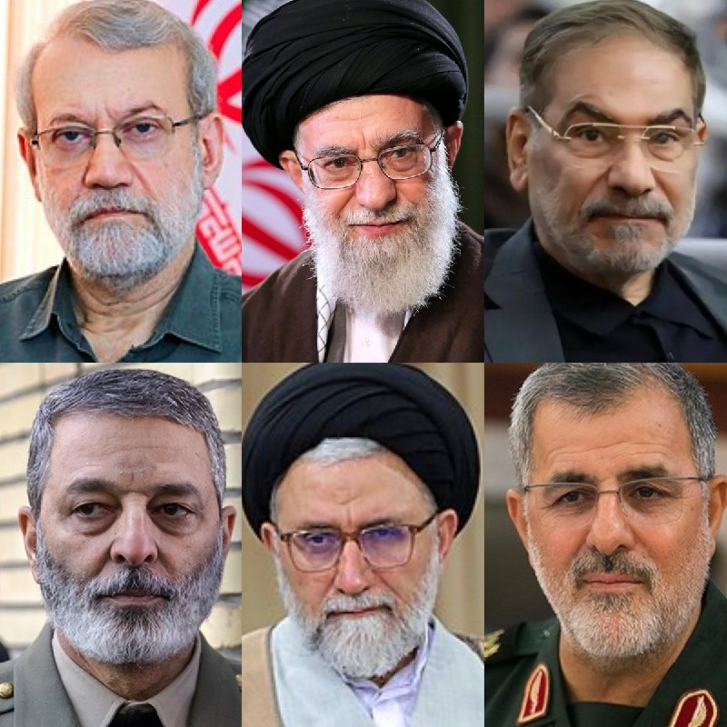

شهدای راه سویا و یونجه

@Dirty_Kids 👻

## Dirty_Kids — post 392938

  <a href="telegram/content/Dirty_Kids_392938_1782248372.mp4" target="_blank">🎬 Download video</a>

‼️شورش در حرم حسین

آزار و اذیت ۶ امامی ها توسط ۱۲ امامی ها

+ گوه تو مغز ایناست ؟ یا چی؟

@Dirty_Kids 👻

## Dirty_Kids — post 392937

  <a href="telegram/content/Dirty_Kids_392937_1782248374.mp4" target="_blank">🎬 Download video</a>

نذری عطر قلابی و جماعت زامبی

@Dirty_Kids 👻

## Dirty_Kids — post 392936

  <a href="telegram/content/Dirty_Kids_392936_1782248375.mp4" target="_blank">🎬 Download video</a>

یه دختر: خانم دکتر از بعدِ جنگ، احساس میکنم واژنم گشاد شده!

دکتر: همش بخاطر استرسه، استرس باعث میشه واژنتون گشاد و خشک بشه!!

@Dirty_Kids 👻

## Hranews — post 113817

  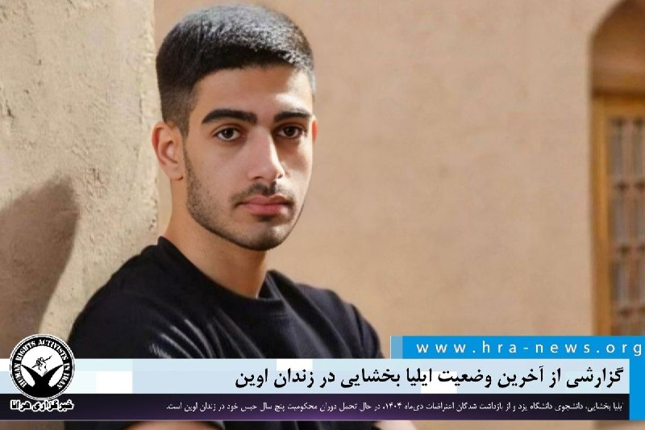

گزارشی از آخرین وضعیت ایلیا بخشایی در زندان اوین

❗️
❗️
❗️
❗️
❗️ – ایلیا بخشایی، دانشجوی دانشگاه یزد و از بازداشت شدگان اعتراضات دی‌ماه ۱۴۰۴، در حال تحمل دوران محکومیت خود در زندان اوین است. او در مرحله بدوی توسط دادگاه انقلاب تهران به پنج سال #حبس محکوم و این رای در مرحله تجدیدنظر عینا تایید شد.

به گزارش خبرگزاری هرانا، ارگان خبری مجموعه فعالان حقوق بشر در ایران، ایلیا بخشایی، در حال تحمل دوران محکومیت خود است.

یک منبع مطلع نزدیک به خانواده این شهروند ضمن تایید این موضوع به هرانا گفت: «آقای بخشایی که در زندان اوین به سر می‌برد اخیرا درخواست اعاده دادرسی پرونده خود را به دیوان ارسال کرده است.»

ادامه مطلب

#ایلیا_بخشایی

↘️
@hranews_bot تماس ✉️ -  @Hranews  کانال هرانا 🆑

## Hranews — post 113816

یک زندانی در زندان بیرجند اعدام شد

❗️
❗️
❗️
❗️
❗️ – حکم یک زندانی که پیشتر از بابت اتهامات مرتبط با جرائم مواد مخدر به #اعدام محکوم شده بود، در تاریخ ۲۴ خردادماه، در زندان بیرجند به اجرا درآمد.

ادامه مطلب

#علی‌اصغر_امینی‌پور

↘️
@hranews_bot تماس ✉️ -  @Hranews  کانال هرانا 🆑

## manototv — post 106216

  <a href="telegram/content/manototv_106216_1782248376.mp4" target="_blank">🎬 Download video</a>

ایران فقط نفت، گاز، کارخانه و ارتش نیست. آنچه یک ملت را در روزهای بحران کنار هم نگه می‌دارد، سرمایه‌های نامرئی اوست، پرچم، حافظه تاریخی، زبان، شاهنامه، قهرمانان و حس تعلق به یک سرنوشت مشترک.

اما وقتی این نمادها به ابزار دعواهای روزمره، حذف سیاسی و جذب مخاطب تبدیل شوند، آرام‌آرام تهی می‌شوند. فردای آزادی ایران، بیش از هر چیز، به همین سرمایه‌های مشترک نیاز خواهد داشت.

## alonews — post 129938

👈اوکراین تقریبا 320 تا پهباد به سمت روسیه پرتاب کرد

✅ @AloNews خبر جنگ

## alonews — post 129937

  <a href="telegram/content/alonews_129937_1782248378.webm" target="_blank">🎬 Download video</a>

👈امیر پوردستان رئیس مرکز تحقیقات راهبردی ارتش: چنانچه مصلحت نظام ایجاب کند، ممکن است با انجام عملیات‌های پیش‌دستانه در عرصه‌های ناشناخته، دشمن را به‌شدت غافلگیر کنیم

✅ @AloNews خبر جنگ

## alonews — post 129936

  <a href="telegram/content/alonews_129936_1782248379.webm" target="_blank">🎬 Download video</a>

👈ترامپ: به توافق صلح تاریخی با ایران دست یافتیم

✅ @AloNews خبر جنگ

## alonews — post 129935

  <a href="telegram/content/alonews_129935_1782248379.mp4" target="_blank">🎬 Download video</a>

👈ترامپ دوباره تهدید کرد

🔴می‌توانیم کار ایران را کمتر از یک هفته تمام کنیم

✅ @AloNews خبر جنگ

## alonews — post 129934

  <a href="telegram/content/alonews_129934_1782248381.mp4" target="_blank">🎬 Download video</a>

👈ترامپ پیشنهاد می‌کند که ونزوئلا باید در آمار تولید نفت ایالات متحده گنجانده شود

✅ @AloNews خبر جنگ

## alonews — post 129933

  <a href="telegram/content/alonews_129933_1782248383.webm" target="_blank">🎬 Download video</a>

👈فرماندهی سایبری کشور: اختلال ایجادشده در سامانه‌های کارت‌محور برخی بانک‌ها از جمله بانک‌های ملی، صادرات و تجارت ناشی از یک حمله سایبری هدفمند به زیرساخت‌های مرتبط بوده است

✅ @AloNews خبر جنگ

## alonews — post 129932

  <a href="telegram/content/alonews_129932_1782248383.webm" target="_blank">🎬 Download video</a>

👈نخست‌وزیر ایتالیا: ما باید سیاست خارجی را به عمقی که سیاست خارجی به آن نیاز دارد، برگردانیم.

🔴نظرم را درباره رئیس‌جمهور ایالات متحده عوض نمی‌کنم

✅ @AloNews خبر جنگ

## alonews — post 129931

  <a href="telegram/content/alonews_129931_1782248383.webm" target="_blank">🎬 Download video</a>

🔴فوری / سنای آمريکا طرحي را تصويب کرد که به دنبال مسدود کردن اقدام نظامي عليه ايران است مگر اينکه رئيس‌جمهور ترامپ مجوز کنگره را دريافت کند. 
✅ @AloNews خبر جنگ

## alonews — post 129930

  <a href="telegram/content/alonews_129930_1782248383.webm" target="_blank">🎬 Download video</a>

👈ترامپ: ایران عالی بوده است. اگر ایرانیان هوشمند باشند، منطقی خواهند بود؛ در غیر این صورت، مجبور خواهیم شد کار را به پایان برسانیم که احتمالاً کمتر از یک هفته طول می‌کشد.

🔴اما فکر می‌کنم همه چیز برای آن‌ها خوب خواهد شد. آن‌ها کاری که باید انجام دهند را انجام خواهند داد زیرا ما می‌خواهیم این کار انجام شود

✅ @AloNews خبر جنگ


## alonews — post 129929

  <a href="telegram/content/alonews_129929_1782248383.webm" target="_blank">🎬 Download video</a>

👈ترامپ : ایران با ونزوئلا خیلی فرق داره و نگاه و ایدئولوژی متفاوتی داره

🔴در کل هم طرز فکر و باورهای مسلمان‌ها با کاتولیک‌ها یه سری تفاوت‌های اساسی داره

✅ @AloNews خبر جنگ

## alonews — post 129928

  <a href="telegram/content/alonews_129928_1782248383.webm" target="_blank">🎬 Download video</a>

🔴فوری / سنای آمريکا طرحي را تصويب کرد که به دنبال مسدود کردن اقدام نظامي عليه ايران است مگر اينکه رئيس‌جمهور ترامپ مجوز کنگره را دريافت کند.

✅ @AloNews خبر جنگ

## alonews — post 129927

  <a href="telegram/content/alonews_129927_1782248384.mp4" target="_blank">🎬 Download video</a>

👈ترامپ در پنسیلوانیا: «کدومو بیشتر دوست دارین، جو خواب‌آلود یا جو فاسد؟ آماده‌این؟»

🔴جو خواب‌آلود! تشویق حضار

🔴جو فاسد! تشویق بلندتر حضار

🔴«متعجب شدم. من خودم "جو خواب‌آلود" رو بیشتر دوست دارم، ولی ظاهراً "جو فاسد" برنده شد. البته هر دوشون خوبن!»

✅ @AloNews خبر جنگ

## alonews — post 129926

  <a href="telegram/content/alonews_129926_1782248386.mp4" target="_blank">🎬 Download video</a>

👈اسحاق دار، وزیر خارجه پاکستان در مصاحبه با شبکه العربیه: براساس برداشت من نباید هیچ هزینه‌ای در مورد تنگه‌هرمز وجود داشته باشد، فرقی هم نمی‌کند چه اسمی داشته باشد و وضعیت پیش از ۲۸ فوریه باید احیا شود

✅ @AloNews خبر جنگ

## alonews — post 129925

  <a href="telegram/content/alonews_129925_1782248387.webm" target="_blank">🎬 Download video</a>

👈ترامپ در پنسیلوانیا: ایران قلدر خاورمیانه بود.

🔴و اکنون ما ایران را بدون نیروی دریایی، بدون نیروی هوایی، بدون سامانه‌های پدافند هوایی، بدون توان موشکی و بدون برنامه هسته‌ای ترک می‌کنیم.

🔴ما در تلاشیم تا توافقی عادلانه را به نتیجه برسانیم.

🔴ما باید این مسیر را انجام می دادیم. باید به ایران می رفتیم.

🔴شما نمی توانید اجازه دهید که خاورمیانه و سپس ما را منفجر کنند، اگر این امکان پذیر باشد. ما قبلاً آنها را می گرفتیم، اما آنها اسرائیل را منفجر می کردند. آنها می توانستند کل خاورمیانه را منفجر کنند.

🔴آیا می خواهید اقتصاد بدی را ببینید؟ این یک اقتصاد بد است. پس به یاد داشته باشید که نفت ما در میانه این درگیری کمتر از جو بایدن خواب آلود بود

✅ @AloNews خبر جنگ

## alonews — post 129924

  <a href="telegram/content/alonews_129924_1782248387.webm" target="_blank">🎬 Download video</a>

👈ترامپ: دیروز ۱۹ میلیون بشکه نفت از تنگه هرمز عبور کرد و این بزرگ‌ترین مقدار نفت عبوری در تاریخ این تنگه است

✅ @AloNews خبر جنگ

## alonews — post 129923

👈 ترامپ درباره ایران: ما می‌توانیم هر وقت خواستیم بر فراز تهران پرواز کنیم و هیچ‌کس نمی‌تواند کاری با ما داشته باشد.

✅ @AloNews خبر جنگ

## alonews — post 129922

  <a href="telegram/content/alonews_129922_1782248388.webm" target="_blank">🎬 Download video</a>

👈پوتین: احتمال بروز درگیری در مناطق مختلف جهان در حال افزایش است

🔴 کشور‌های غربی آشکارا اعلام می‌کنند که برای جنگ با روسیه آماده می‌شوند؛ آن‌ها هنوز به مرحله وارد کردن ضربه مستقیم به روسیه نرسیده‌اند، زیرا می‌دانند که مسکو پاسخ خواهد داد

✅ @AloNews خبر جنگ

---
📅 بروزرسانی: 1405/04/02 22:23
---

## VahidOOnLine — post 247033

  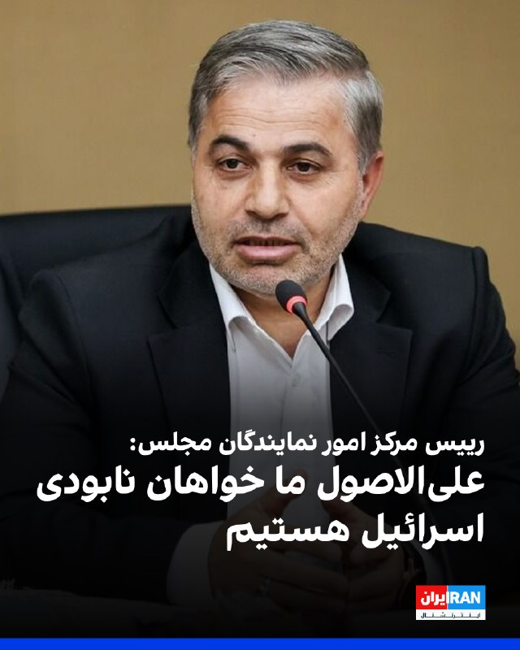

عبدالعلی رحیمی مظفری، رییس مرکز امور نمایندگان مجلس، با اشاره به پیام مجتبی خامنه‌ای درباره یادداشت تفاهم تهران و واشینگتن گفت: «علی‌الاصول ما خواهان نابودی اسرائیل هستیم و علی‌الاصول هیچ رابطه‌ای با آمریکا نداریم و نمی‌توانیم با آن کنار بیاییم و علی‌الاصول مذاکره از موضع قدرت است.»
پس از آنکه توان خود را در میدان نظامی اثبات کردیم، برای تثبیت دستاوردهای به دست آمده و آوردن آن‌ها روی کاغذ، وارد مذاکره شده‌ایم.
‌🏁 🇬🇧 IranintlTV

🤖 @VahidOOnLine

## VahidOOnLine — post 247032

  <a href="telegram/content/VahidOOnLine_247032_1782240782.mp4" target="_blank">🎬 Download video</a>

♦️دونالد ترامپ، رئیس‌جمهوری آمریکا، سه‌شنبه دوم تیرماه هنگام ورود به پنسیلوانیا گفت ۱۹ میلیون بشکه نفت در یک روز از تنگه هرمز عبور کرده که به گفته او بیشترین حجم ثبت‌شده در تاریخ این آبراه است.

ترامپ همچنین گفت بازار سهام آمریکا در اوج قرار دارد و قیمت نفت در حال کاهش است. او افزود بهای نفت برای مدتی به حدود ۷۰ دلار در هر بشکه رسید و ممکن است از این سطح نیز پایین‌تر برود.

رئیس‌جمهوری آمریکا در ادامه هشدار داد: «اگر می‌خواهید دردسر واقعی را ببینید، بگذارید آن‌ها به سلاح هسته‌ای دست پیدا کنند.» او بار دیگر تاکید کرد که ایران به سلاح هسته‌ای دست نخواهد یافت.

ترامپ در حالی رقم ۱۹ میلیون بشکه را «بالاترین میزان در تاریخ» توصیف کرد که پیش از جنگ، روزانه ۱۰۰ تا ۱۲۰ شناور، شامل ۵۰ تا ۷۰ نفتکش، از تنگه هرمز عبور می‌کردند؛ رقمی که معادل حدود ۱۷ تا ۲۱ میلیون بشکه نفت خام و میعانات گازی در روز برآورد می‌شود.
‌🇸🇦 Indypersian

🤖 @VahidOOnLine

## VahidOOnLine — post 247031

  <a href="telegram/content/VahidOOnLine_247031_1782240783.mp4" target="_blank">🎬 Download video</a>

گروهی از ایرانیان ساکن بریتانیا روز سه‌شنبه ۲ تیر مقابل پارلمان بریتانیا در لندن تجمع کردند و با سر دادن شعارهایی، خواستار تروریستی اعلام شدن سپاه پاسداران و اتخاذ تصمیم‌های قاطع علیه جمهوری اسلامی شدند. شرکت‌کنندگان همچنین با گرامیداشت یاد جاویدنامان انقلاب ملی ایران، خواستار آزادی زندانیان شدند.
‌🏁 🇬🇧 IranintlTV

🤖 @VahidOOnLine

## VahidOOnLine — post 247030

  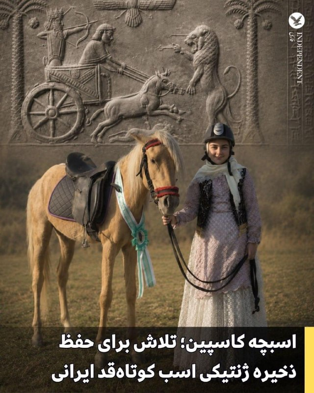

♦️ تشکیل کارگروه ملی توسعه «اسب کاسپین» بار دیگر توجه را به یکی از ارزشمندترین ذخایر ژنتیکی ایران جلب کرده است؛ اسبی کوچک‌جثه، چابک و مقاوم که ریشه آن به نواحی شمالی کشور، به‌ویژه گیلان و حاشیه دریای خزر، بازمی‌گردد و در ایران بیشتر با نام اسبچه خزر شناخته می‌شود.

اسب کوچ جثه کاسپین، با وجود قامت کوتاهش، یک اسبچه معمولی نیست. ساختار استخوانی ظریف، دست‌وپای کشیده، سر کوچک، چشم‌های درشت، حرکت نرم، چابکی و هوش بالا از ویژگی‌هایی است که آن را از بسیاری از اسب‌های کوچک‌ جدا می‌کند. این اسب به دلیل تناسب‌اندام، استقامت و ویژگی‌های حرکتی‌اش، هم از نظر تاریخی و هم از دیدگاه اصلاح نژاد اسب اهمیت دارد.

به گفته رئیس مرکز تحقیقات کشاورزی گیلان، اسب کاسپین قدمتی بیش از پنج هزار سال دارد و یکی از چهار جد اسبان خونگرم جهان به شمار می‌رود. این ویژگی، ارزش آن را از یک‌گونه محلی فراتر می‌برد و آن را به بخشی از گنجینه ژنتیکی اسب‌های جهان تبدیل می‌کند.

اسب‌های خونگرم (Warmblood) دسته‌ای از اسب‌های ورزشی‌اند که معمولا از ترکیب نژادهای پرانرژی و چابک، مانند اسب عرب، با اسب‌های کاری و آرام‌تر به وجود آمده‌اند. این اسب‌ها به دلیل تعادل میان قدرت، سرعت، هوش و فرمان‌پذیری، در رشته‌هایی مانند پرش با اسب و سوارکاری استقامتی جایگاه ویژه‌ای دارند.

بر اساس اعلام مرکز تحقیقات و آموزش کشاورزی و منابع طبیعی گیلان، در حال حاضر حدود ۳۵۰ رأس اسب کاسپین در کشور شناسایی شده‌اند که نیمی از آن‌ها در گیلان‌اند و ۵۰ رأس نیز در مرکز تحقیقات نگهداری می‌شوند. این آمار نشان می‌دهد که جمعیت این اسب همچنان محدود و آسیب‌پذیر است و حفاظت از آن به برنامه‌ریزی دقیق، ثبت نژادی، جلوگیری از آمیختگی ژنتیکی و حمایت از پرورش‌دهندگان محلی نیاز دارد.
‌🇸🇦 Indypersian

🤖 @VahidOOnLine

## VahidOOnLine — post 247029

  

به گزارش کانال ۱۳ اسرائیل، این کشور قرار است بخشی از نیروهای خود را از جنوب لبنان خارج کند.

بر اساس این گزارش، موضوع عقب‌نشینی اسرائیل از برخی مناطق تحت کنترل ارتش این کشور در حال حاضر در جریان نشست میان هیات‌های اسرائیلی و لبنانی در واشینگتن در حال بررسی است.
‌🏁 🇬🇧 IranintlTV

🤖 @VahidOOnLine

## VahidOOnLine — post 247028

  

ایلانا گریتزوسکی، گروگان پیشین حماس، در شصت‌ودومین نشست شورای حقوق بشر سازمان ملل در ژنو درباره خشونت جنسی علیه گروگان‌های ربوده‌شده در حمله هفتم اکتبر ۲۰۲۳ شهادت داد و ریم السالم، گزارشگر ویژه سازمان ملل در امور خشونت علیه زنان، را به انکار شواهد این جرایم متهم کرد.

گریتزوسکی خطاب به ریم السالم گفت: «در هفتم اکتبر و در دوران اسارت، زنان یهودی مورد تجاوز، آزار و تحقیر قرار گرفتند و شما سکوت و انکار را انتخاب کردید.»

او افزود: «شما می‌گویید هیچ مدرکی درباره خشونت جنسی در هفتم اکتبر وجود نداشته است. من امروز اینجا ایستاده‌ام؛ زنی که از آن وقایع جان سالم به در برده است. من شاهد زنده خشونت جنسی حماس هستم.»

او سال گذشته نیز در شورای امنیت سازمان ملل شهادت داده و گفته بود اسیرکنندگانش او را مورد آزار جنسی قرار داده‌اند و برای جلوگیری از تجاوز، به آنها گفته بود که در دوران قاعدگی قرار دارد.

اظهارات ریم السالم در سال ۲۰۲۵ مبنی بر اینکه هیچ تحقیق مستقلی وقوع تجاوز در حمله هفتم اکتبر را تایید نکرده، با واکنش مقام‌های اسرائیلی و سازمان‌های یهودی روبه‌رو شد.
‌🏁 🇬🇧 IranintlTV

🤖 @VahidOOnLine

## VahidOOnLine — post 247027

  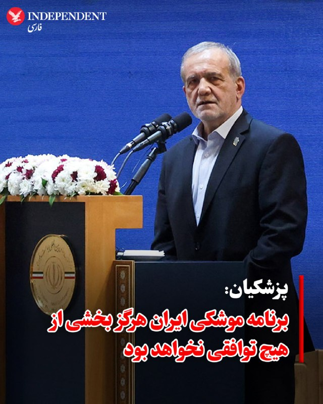

♦️ مسعود پزشکیان، رئیس‌جمهوری اسلامی ایران، روز سه‌شنبه دوم تیرماه، در گفتگو با رسانه‌های دولتی اعلام کرد که برنامه موشکی ایران بخشی از توافق اولیه برای پایان دادن به جنگ نبوده است و «هرگز» بخشی از هیچ توافقی در آینده نیز نخواهد بود. او گفت: «اگر موشک‌هایمان را که برای دفاع مشروع ماست نداشتیم، اسرائیل و آمریکا همان‌طور که غزه را با خاک یکسان کردند، ایران را هم در می‌نوردیدند.»

محدود کردن توانمندی‌های موشکی ایران یکی از نگرانی‌های اصلی اسرائیل است و این موضوع از اهدافی بود که مقامات دولت ترامپ در اوایل جنگ تعیین کرده بودند. با این حال، جی‌دی ونس، معاون رئیس‌جمهوری آمریکا، در پاسخ به سوالی درباره این مسئله گفت که غیرممکن است به کشوری بگوییم حق ندارد از خود دفاع کند.
‌🇸🇦 Indypersian

🤖 @VahidOOnLine

## VahidOOnLine — post 247026

♦️دونالد ترامپ، رئیس‌جمهوری آمریکا، سه‌شنبه دوم تیرماه هنگام ورود به پنسیلوانیا در پاسخ به سوالی درباره اظهارات مقام‌های جمهوری اسلامی مبنی بر نبود برنامه‌ای برای حضور بازرسان آژانس بین‌المللی انرژی اتمی در ایران، گفت: «آن‌ها اشتباه می‌کنند. اشتباه می‌کنند. اشتباه می‌کنند.»

ترامپ افزود مقام‌های جمهوری اسلامی در مذاکرات خصوصی با آمریکا با این موضوع موافقت کرده‌اند و گفت: «آن‌ها می‌دانند که اشتباه می‌کنند. آن‌ها در جلسات خصوصی به ما این را گفته‌اند و ما توافق بازرسی‌های صددرصدی را ثبت کرده‌ایم.»

رئیس‌جمهوری آمریکا همچنین تاکید کرد اگر چنین توافقی وجود نداشت، مذاکرات را متوقف می‌کرد. او در پاسخ به سوالی درباره زمان حضور بازرسان آژانس در ایران گفت: «عجله‌ای وجود ندارد، اما آن‌ها در زمان مناسب در محل حضور خواهند داشت.»
‌🇸🇦 Indypersian

🤖 @VahidOOnLine

## VahidOOnLine — post 247025

  

دونالد ترامپ، رییس‌جمهوری آمریکا، گفت جمهوری اسلامی در موقعیت مناسبی برای مذاکره قرار ندارد و با مشکلات متعددی از جمله کمبود غذا، دارو و تورم روبه‌رو است.

او افزود: «پولی که از ایران خارج خواهد شد، در اختیار کشاورزان آمریکایی قرار می‌گیرد تا ذرت، سویا و گندم مورد نیاز ایران را تامین کنند.»

ترامپ همچنین گفت: «تورم در ایران اکنون به ۳۰۰ درصد رسیده و این کشور با مشکلات زیادی مواجه است.»
‌🏁 🇬🇧 IranintlTV

🤖 @VahidOOnLine

## VahidOOnLine — post 247024

  <a href="telegram/content/VahidOOnLine_247024_1782240788.mp4" target="_blank">🎬 Download video</a>

مسعود پزشکیان، رییس دولت جمهوری اسلامی، روز سه‌شنبه ۲ تیر وارد اسلام‌آباد شد. آصف‌علی زرداری، رییس‌جمهوری پاکستان، و شهباز شریف، نخست‌وزیر این کشور، هنگام ورود او به پایگاه هوایی نورخان از وی استقبال کردند.
در فرودگاه، از پزشکیان با تشریفات رسمی، شلیک ۲۱ گلوله توپ و ادای احترام جنگنده‌های JF-17 نیروی هوایی پاکستان استقبال شد.
پزشکیان در این سفر با عاصم منیر، فرمانده ارتش پاکستان، نیز دیدار و گفت‌وگو کرد.
عباس عراقچی، وزیر خارجه، نیز به همراه هیاتی، پزشکیان را در این سفر همراهی می‌کرد.
در جریان این سفر، شهباز شریف «فلوشیپ افتخاری» کالج پزشکان و جراحان پاکستان در رشته جراحی قلب را به مسعود پزشکیان اعطا کرد.
‌🏁 🇬🇧 IranintlTV

🤖 @VahidOOnLine

## VahidOOnLine — post 247023

  <a href="telegram/content/VahidOOnLine_247023_1782240789.mp4" target="_blank">🎬 Download video</a>

ویدیوی منتشرشده، بی‌قراری مادر نازنین‌زهرا صالحی را نشان می‌دهد؛ کودک ۱۳ ساله‌ای که ۱۹ دی‌ماه ۱۴۰۴ در جریان اعتراضات در کرمانشاه با شلیک نیروهای حکومت کشته شد.
‌🏁 🇬🇧 IranintlTV

🤖 @VahidOOnLine

## VahidOOnLine — post 247022

⭕️پشت حصارهای گراند هتل قزوین چه می‌گذرد؟ نگرانی‌ها از ساخت‌وساز در عرصه دولتخانه صفوی

📌حتی معاون میراث فرهنگی و مدیر پایگاه تاریخی دولت‌خانه صفوی نیز اجازه ورود به محوطه را ندارند

♦️حدود دو سال پیش بود که فعالان میراث فرهنگی ضمن ابراز نگرانی از وضعیت نامناسب گراند هتل قزوین، از واگذاری این بنای تاریخی به یک سرمایه‌گذار خصوصی در فرایندی غیرشفاف خبر دادند و اعلام کردند که به بهانه راه‌اندازی کارگاه مرمت، دور این بنا حصارکشی شده است.

در همان زمان، مسئولان میراث فرهنگی مدعی بودند کارگاه مرمتی گراند هتل به‌صورت «روباز» فعالیت می‌کند، اما فعالان میراث فرهنگی این ادعا را رد کردند و گفتند به دلیل حصارهای فلزی، امکان مشاهده آنچه در داخل محوطه می‌گذرد، وجود ندارد.

روزنامه پیام ما نیز در گزارشی نوشت که حتی معاون میراث فرهنگی و مدیر پایگاه تاریخی دولت‌خانه صفوی نیز اجازه ورود به محوطه را ندارند و مشخص نیست پیمانکار پشت این حصارها چه اقدام‌هایی انجام می‌دهد.

حالا نزدیک به دو سال از آن روزها می‌گذرد و آنچه ابتدا به‌عنوان اقدامی برای حفاظت از کارگاه مرمت معرفی می‌شد، به‌تدریج به حصارهای فلزی بلند و گسترده‌ای تبدیل شده که علاوه بر گراند هتل، بخش‌هایی از عرصه دولتخانه صفوی را نیز در بر گرفته است. در هفته‌های اخیر نیز انتشار تصاویری از پشت این حصارها که از برپایی سازه‌های فلزی مرتفع در داخل محوطه حکایت دارد، موج تازه‌ای از نگرانی‌ها را در میان دوستداران میراث فرهنگی برانگیخته است.

آن‌ها می‌گویند هم‌زمان با بالا رفتن اسکلت‌های فلزی و اجرای عملیات عمرانی در محدوده گراند هتل و عرصه دولتخانه صفوی، امکان مشاهده مستقیم آنچه در داخل محوطه می‌گذرد، از میان رفته است و هیچ بعید نیست که این پروژه در نهایت به قیمت مخدوش شدن بخش مهمی از دولتخانه صفوی تمام شود. همین نبود شفافیت درباره ماهیت مداخلات انجام‌شده، نحوه مرمت بنا، ساخت‌وسازهای احتمالی در عرصه دولتخانه صفوی و حتی هویت سرمایه‌گذار پروژه پرسش‌های متعددی ایجاد کرده است.

خطر تخریب بیخ گوش دولتخانه صفوی

گراند هتل قزوین یکی از اولین نمونه‌های هتل به شیوه مدرن در ایران است. این بنا در سال‌های پایانی دوره قاجاریه و در زمان فرمانداری سعدالسلطنه بر قزوین و به دستور او و با استادکاری علی جولای احداث شد.

از آنجا که این هتل کنار دولتخانه صفوی ساخته شد، اکنون هرگونه مداخله و پروژه عمرانی در محیط پیرامون آن می‌تواند آثار تاریخی صفوی را نیز متاثر کند. بخش مهمی از انتقادهای مطرح‌شده درباره پروژه گراند هتل قزوین هم به مداخلات انجام‌شده در عرصه دولتخانه صفوی و نحوه واگذاری بخش‌هایی از این محدوده تاریخی مربوط می‌شود.

دولتخانه صفوی، یادگار دوران پایتختی قزوین در عصر شاه طهماسب صفوی، یکی از مهم‌ترین محوطه‌های تاریخی این شهر است. هرچند بخش عمده‌ای از کاخ‌ها و ساختمان‌های این مجموعه در دوره‌های بعد تخریب شدند، کارشناسان معتقدند لایه‌های تاریخی ارزشمندی که همچنان زیر خاک این عرصه باقی مانده است، می‌توانند درباره ساختار کاخ‌ها، باغ‌ها و نظام حکومتی صفویان اطلاعات مهمی در اختیار پژوهشگران قرار دهند.

بیشتر بخوانید...
‌🇸🇦 Indypersian

🤖 @VahidOOnLine

## VahidOOnLine — post 247021

  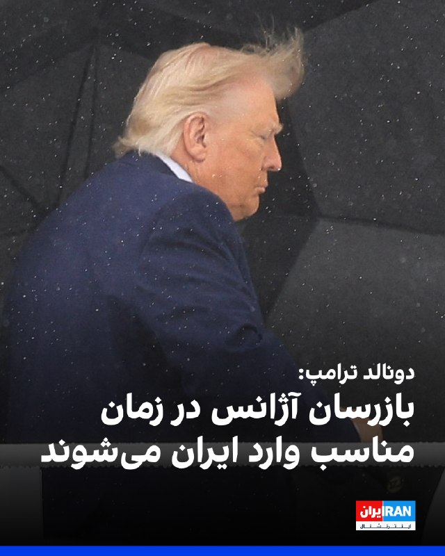

دونالد ترامپ درباره حضور بازرسان انرژی اتمی در ایران گفت: بازرسان در زمان مناسب در محل حضور خواهند داشت. آنها (جمهوری اسلامی) در مورد بازرسی‌های آژانس بین‌المللی انرژی اتمی اشتباه می‌کنند.
او افزود: می‌خواهید دردسر ببینید؟ بگذارید ایران سلاح هسته‌ای داشته باشد. ما در رابطه با ایران وضعیت بسیار خوبی داریم. آن‌ها به‌شدت تضعیف شده‌اند و ما در حال رسیدن به یک توافق با آن‌ها هستیم و خواهیم دید که همه‌چیز چگونه پیش می‌رود.
‌🏁 🇬🇧 IranintlTV

🤖 @VahidOOnLine

## VahidOOnLine — post 247020

  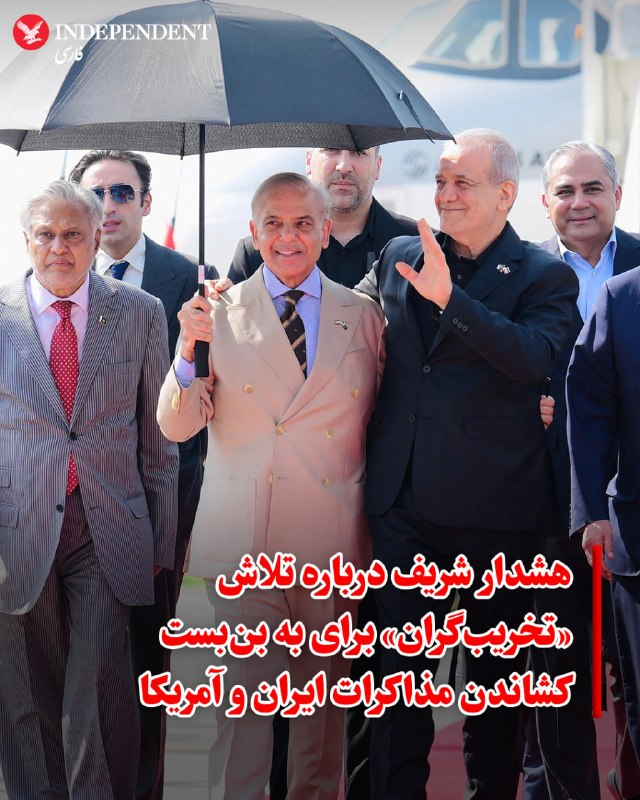

♦️ نخست‌وزیر پاکستان روز سه‌شنبه دوم تیرماه در جریان نشست خبری مشترک با مسعود پزشکیان، هشدار داد که تلاش‌هایی برای از بین بردن توافق و پیشرفت‌های حاصل‌شده میان ایالات متحده و جمهوری اسلامی ایران در جریان است.

شهباز شریف بدون نام بردن از کشور یا گروهی خاص گفت: «تخریب‌گران زیادی در سراسر جهان وجود دارند که می‌خواهند این توافق صلح را به نابودی بکشانند.»

او در ادامه افزود: «آن‌ها نمی‌خواهند ملت ایران—که ملتی بزرگ است—از میان خاکستر جنگ برخواسته و به اوج شکوه و عظمت دست یابد.»
‌🇸🇦 Indypersian

🤖 @VahidOOnLine

## VahidOOnLine — post 247019

  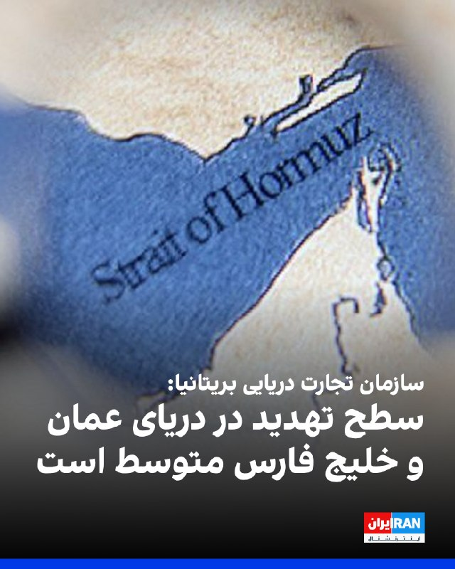

سازمان عملیات تجارت دریایی بریتانیا اعلام کرد تردد شناورها در تنگه هرمز در حال افزایش است.

با این حال این سازمان افزود که هشدارها درباره وجود مین‌های دریایی و احتمال اختلال در ناوبری همچنان برقرار است.

سازمان عملیات تجارت دریایی بریتانیا اعلام کرد در دریای عمان و خلیج فارس سطح تهدید در حد متوسط ارزیابی شده و مواردی از اختلال در سیستم‌های ردیابی نیز گزارش شده است.
‌🏁 🇬🇧 IranintlTV

🤖 @VahidOOnLine

## VahidOOnLine — post 247018

  <a href="telegram/content/VahidOOnLine_247018_1782240793.mp4" target="_blank">🎬 Download video</a>

♦️مقام‌های ترکیه روز سه‌شنبه دوم تیرماه اعلام کردند ۲۰۹ نفر را در چارچوب عملیات ضدتروریسم در نقاط مختلف این کشور بازداشت کرده‌اند. این عملیات در حالی انجام شده است که تدابیر امنیتی پیش از برگزاری نشست ناتو افزایش یافته است.

دادستانی کل آنکارا اعلام کرد برای ۲۴۱ نفر به اتهام ارتباط با گروه‌های شبه‌نظامی و افراطی حکم بازداشت صادر شده است. بر اساس این گزارش، ۲۰۹ مظنون بازداشت شده‌اند و تلاش برای یافتن سایر افراد ادامه دارد.

این عملیات یک روز پس از آن انجام شد که استانداری آنکارا برگزاری تظاهرات، نشست‌های خبری و سایر تجمعات عمومی را از هفتم تا نوزدهم تیرماه، هم‌زمان با برگزاری نشست ناتو، ممنوع اعلام کرد. گروه‌های مخالف دولت این بازداشت‌ها را بخشی از محدودیت‌های گسترده‌تر علیه آزادی‌های مدنی و سیاسی در ترکیه دانسته‌اند.
‌🇸🇦 Indypersian

🤖 @VahidOOnLine

## VahidOOnLine — post 247017

  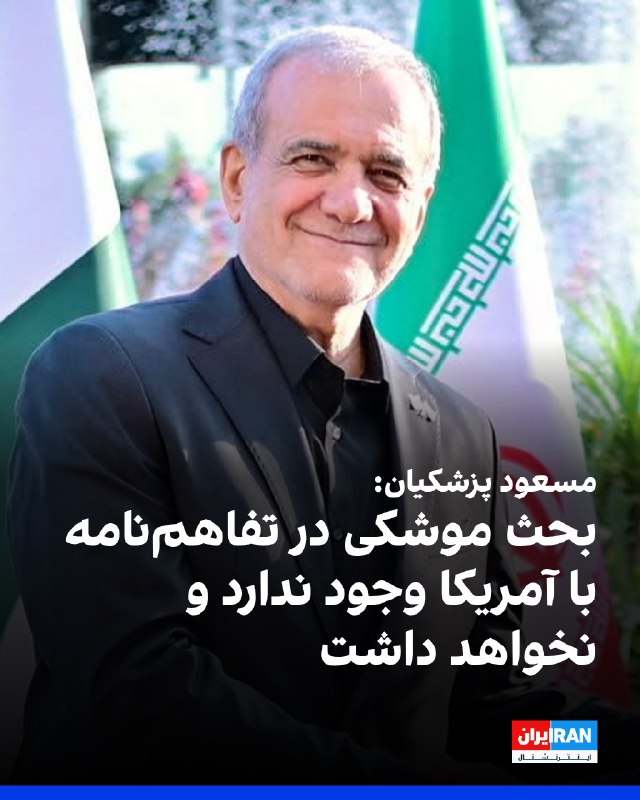

مسعود پزشکیان در جریان سفر به اسلام‌آباد گفت: «بحث موشکی در تفاهم‌نامه نیست و هیچ‌وقت وجود نخواهد داشت.»

پزشکیان به خبرنگاران گفت: «اگر موشک‌های ما نبود اسرائیل و آمریکا ایران را مثل غزه شخم می‌زدند.»

او افزود که در جریان سفر به اسلام‌آباد، گفت‌وگوهای سازنده‌ای با مقامات پاکستانی داشته است.

پزشکیان گفت: «ما عمیقا بر این باوریم که صلح و ثبات منطقه‌ای تنها از طریق گفت‌وگوهای صادقانه و همکاری‌های درون‌منطقه‌ای قابل دستیابی است.»
‌🏁 🇬🇧 IranintlTV

🤖 @VahidOOnLine

## WithYashar — post 15685

  <a href="telegram/content/WithYashar_15685_1782240794.mp4" target="_blank">🎬 Download video</a>

ایلان ماسک یه ویدیو از محرم پست کرده
@withyashar

## WithYashar — post 15684

  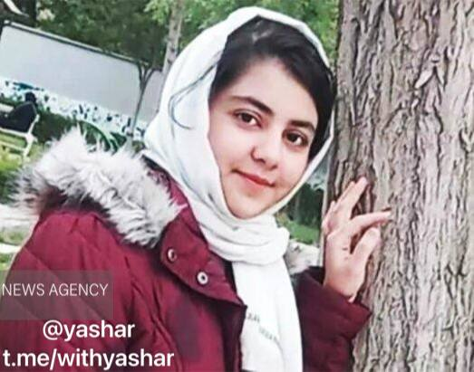

مبینا محمدعلی‌پورثانی پس از ۱۰ روز پیدا شد
سیدامیر احمدی، دادستان عمومی و انقلاب بهارستان:
مبینا محمدعلی‌پورثانی، دختر ۱۹ ساله ساکن نسیم‌شهر، پس از ۱۰ روز بی‌خبری پیدا شد.
این دختر پس از پیگیری‌های قضایی و اقدامات انجام‌شده، پیدا شده و در سلامت کامل به سر می‌برد.
@withyashar

## WithYashar — post 15683

بنیامین نتانیاهو، نخست وزیر اسرائیل، در مصاحبه ای با شبکه سیان بی سی به وضعیت شکننده حکومت جمهوری اسلامی اشاره کرد و فروپاشی آن را اجتناب ناپذیر اما از نظر زمانی غیر قابل پیش بینی دانست.
وی با مقایسه شرایط کنونی ایران با وقایع تاريخي غير منتظره ای نظیر سقوط دیوار برلین و تحولات رومانی، تأکید کرد که شکاف های عمیق و پنهانی در زیر لایه های این نظام در حال گسترش است. نتانیاهو با بیان اینکه حکومت ایران در حال حاضر به شدت ضعیف شده است، تصریح کرد که اسرائیل همچنان بر موضع خود مبنی بر کمک به مردم ایران برای سرنگونی این رژیم پافشاری می کند؛ هر چند زمان دقیق وقوع این اتفاق در کنترل یا انتخاب آنها نخواهد بود و به روند گسترش این شکافهای داخلی بستگی دارد.
@withyashar

## WithYashar — post 15682

ترامپ: هیچ عجله‌ای برای ورود بازرسان آژانس بین‌المللی انرژی اتمی به ایران وجود ندارد
@withyashar

## WithYashar — post 15681

رکورد تاریخی رونالدو در جام جهانی ۲۰۲۶ کریستیانو رونالدو با گلزنی مقابل ازبکستان در جام جهانی ۲۰۲۶، به نخستین بازیکن تاریخ فوتبال مردان تبدیل شد که در ۶ دوره متوالی این رقابت‌ها موفق به گلزنی شده است. این گل که در ابتدای بازی(دقیقه۷) به ثمر رسید، به انتقادها…

## WithYashar — post 15680

رکورد تاریخی رونالدو در جام جهانی ۲۰۲۶
کریستیانو رونالدو با گلزنی مقابل ازبکستان در جام جهانی ۲۰۲۶، به نخستین بازیکن تاریخ فوتبال مردان تبدیل شد که در ۶ دوره متوالی این رقابت‌ها موفق به گلزنی شده است. این گل که در ابتدای بازی(دقیقه۷) به ثمر رسید، به انتقادها علیه این ستاره ۴۱ ساله پایان داد.
@withyashar

## WithYashar — post 15679

خبرنگار : ایرانی‌ها می‌گن هیچ بازدید برنامه‌ریزی‌شده‌ای برای بازرسان آژانس وجود نداره؟

ترامپ: بلوف میزنن ، اونا داخل به ما گفتن و ما ۱۰۰٪ بازرسی رو ثبت و قطعی کردیم.
اگر راست می‌گفتن، همین الان مذاکرات رو لغو می‌کردم.
@withyashar

## WithYashar — post 15678

ارسالی : یاشار جان بانک رفاه و سامان و بلو بانک هم از کار افتادند ، ساعت شش عصر
@withyashar

## mwarmonitor — post 11433

📰دموکرات‌های سنای آمریکا خواستار برگزاری جلسات استماع درباره سرمایه‌گذاری ۵۰۰ میلیون دلاری یک عضو خاندان سلطنتی امارات در پروژه رمزارزی خانواده ترامپ شده‌اند.

📰قانون‌گذاران با اشاره به نگرانی‌های امنیت ملی می‌گویند زمان‌بندی این معامله—تنها چند روز پیش از آن‌که دولت آمریکا صادرات تراشه‌های حساس هوش مصنوعی به امارات متحده عربی را تأیید کند—می‌تواند نشانه تعارض منافع باشد. این گزارش را وال‌استریت ژورنال منتشر کرده است.

@mwarmonitor

## mwarmonitor — post 11432

🔴سخنگوی وزارت امنیت داخلی آمریکا: ایالات متحده محدودیت‌های اعمال شده بر تیم ملی ایران در جام جهانی را کاهش داده است، که به تیم اجازه می‌دهد دو روز قبل از بازی بعدی خود سفر کند.

@mwarmonitor

## mwarmonitor — post 11431

  <a href="telegram/content/mwarmonitor_11431_1782240797.mp4" target="_blank">🎬 Download video</a>

🔹خبرنگار «آیا ایالات متحده و متحدانش می‌توانند دریانوردی، یعنی آزادی دریانوردی را در این تنگه تضمین کنند؟»

🔸«خب، این قانون است. این‌ها... این یک آبراه بین‌المللی است. هیچ کشوری اجازه ندارد در یک آبراه بین‌المللی عوارض یا هزینه‌ای دریافت کند. این قانون بین‌المللیِ موجود است. در تمام آبراه‌های بین‌المللی سراسر جهان وضعیت به همین شکل است و ما انتظار داریم که اینجا هم همین‌طور باشد. بنابراین، فکر نمی‌کنم در این زمینه لازم باشد کسی را در این اطراف متقاعد کنیم. من فکر می‌کنم همه کشورهای این منطقه با ما هم‌عقیده باشند.»

@mwarmonitor

## mwarmonitor — post 11430

  <a href="telegram/content/mwarmonitor_11430_1782240798.mp4" target="_blank">🎬 Download video</a>

💢مارکو روبیو، وزیر خارجه آمریکا، وارد ابوظبی شد؛ در حالی‌ که دولت ترامپ پس از توافق مقدماتی آمریکا با ایران، رایزنی‌های خود با متحدان کلیدی خلیج فارس را افزایش داده است.

🔸وزیر خارجه آمریکا طی سه روز آینده با رهبران United Arab Emirates، Kuwait و Bahrain دیدار خواهد کرد. محور اصلی این گفت‌وگوها امنیت منطقه‌ای و باز نگه داشتن تنگه هرمز برای کشتیرانی جهانی است.

🔸این سفر پس از ماه‌ها تشدید تنش‌ها در منطقه انجام می‌شود؛ دوره‌ای که در آن شرکای خلیج فارس با حملات مکرر ایران روبه‌رو بوده و نگرانی‌ها درباره تحولات بعدی به‌طور چشمگیری افزایش یافته است.

@mwarmonitor

## mwarmonitor — post 11429

  <a href="telegram/content/mwarmonitor_11429_1782240800.mp4" target="_blank">🎬 Download video</a>

🔹خبرنگار: «وقتی فردا با سناتورها دیدار می‌کنید، به متحدان خود مانند سناتور کروز که از توافق ایران انتقاد کرده‌اند، چه خواهید گفت؟»
🔸دونالد ترامپ: «خب، فکر می‌کنم هرکسی که از آن انتقاد کرده، اِ، باید توجیه بشه (آموزش ببینه)، حتی اگه از دوستان من باشن. چون ما ایران رو در موقعیتی قرار دادیم که هیچ‌کس تا حالا قرار نداده بود. این کار باید در طول ۴۷ سال گذشته توسط رؤسای‌جمهور دیگه انجام می‌شد، و ما ایران رو در موقعیتی قرار دادیم که ارتش اون‌ها کاملاً نابود شده، رهبری‌شون نابود شده، رادارهاشون نابود شده... همه‌چیزشون نابود شده. اون‌ها... اون‌ها موقعیت خوبی برای مذاکره ندارند. اما با وجود این، و... و پولی که از ایران خارج میشه قرار هست به کشاورزان ما برسه، تا ذرت، سویا و گندم به ایران بدن، چون اون‌ها مشکل گرسنگی دارند، مشکل غذا دارند، مشکل دارو دارند، اون‌ها مشکلات زیادی دارند. و اون‌ها تورم دارند... تورم اون‌ها الان به ۳۰۰ درصد رسیده. بنابراین، اون‌ها مشکلات زیادی دارند.»

@mwarmonitor

## mwarmonitor — post 11428

  <a href="telegram/content/mwarmonitor_11428_1782240802.mp4" target="_blank">🎬 Download video</a>

🔹خبرنگار:
آقای رئیس‌جمهور، در مورد ایران... ایرانی‌ها می‌گویند هیچ برنامه بازدیدی برای بازرسان آژانس بین‌المللی انرژی اتمی (IAEA) تعیین نشده است. آیا این بخشی از توافق شماست؟
🔸دونالد ترامپ:
آن‌ها اشتباه می‌کنند. اشتباه می‌کنند. خودشان هم می‌دانند که اشتباه می‌کنند. آن‌ها در جلسات داخلی این را به ما گفتند و ما مجوز بازرسیِ صد درصدی را مکتوب داریم. و اگر حق با آن‌ها بود، من همین الان جلسات را لغو می‌کردم.
🔹خبرنگار:
آقای رئیس‌جمهور، آن بازرسان دقیقاً چه زمانی مستقر خواهند شد؟ چه زمانی در آنجا حضور خواهند یافت؟
🔸دونالد ترامپ:
در زمان مناسب. در زمان مناسب. عجله‌ای در کار نیست، اما در زمان مناسب در آنجا حضور خواهند یافت.

@mwarmonitor

## FoxNewsTwitter — post 343306

  <a href="telegram/content/FoxNewsTwitter_343306_1782240804.mp4" target="_blank">🎬 Download video</a>

Fox News (Twitter/X)

WATCH: President Trump takes a close look at a lineup of Mack Trucks in Reading, Pennsylvania before taking the stage.

## FoxNewsTwitter — post 343305

  <a href="telegram/content/FoxNewsTwitter_343305_1782240806.mp4" target="_blank">🎬 Download video</a>

Fox News (Twitter/X)

BREAKING: President Trump is pushing back on Republican lawmakers who have been speaking out again his Iran deal, like Senator Ted Cruz.

"Anybody who has been critical of it has to be educated, even if they're friends of mine."

"We have Iran in a position that nobody's ever had. This should have been done for 47 years by other presidents."

"They have a hunger problem. They have a food problem. They have a medicine problem. They've got a lot of problems."

## FoxNewsTwitter — post 343304

  <a href="telegram/content/FoxNewsTwitter_343304_1782240807.mp4" target="_blank">🎬 Download video</a>

Fox News (Twitter/X)

NEW: Secretary Rubio arrives in Abu Dhabi as the Trump administration ramps up talks with key Gulf allies following the preliminary U.S. agreement with Iran.

Over the next three days, the Secretary of State will meet with leaders in the UAE, Kuwait, and Bahrain, with a major focus on regional security and keeping the Strait of Hormuz open to global shipping.

The visit comes after months of escalating tensions across the region, with Gulf partners facing repeated Iranian attacks and growing concerns about what comes next.

## FoxNewsTwitter — post 343303

  <a href="telegram/content/FoxNewsTwitter_343303_1782240809.mp4" target="_blank">🎬 Download video</a>

Fox News (Twitter/X)

BREAKING: President Trump pushing back on Republican lawmakers who have been speaking out again his Iran deal, like Senator Ted Cruz.

"Anybody who has been critical of it has to be educated, even if they're friends of mine."

"We have Iran in a position that nobody's ever had. This should have been done for 47 years by other presidents."

"They have a hunger problem. They have a food problem. They have a medicine problem. They've got a lot of problems."

## FoxNewsTwitter — post 343302

  <a href="telegram/content/FoxNewsTwitter_343302_1782240811.mp4" target="_blank">🎬 Download video</a>

Fox News (Twitter/X)

BREAKING: President Trump confirms IAEA inspectors will be allowed into Iran under the U.S. agreement, pushing back on claims from the regime saying otherwise.

"They're wrong. They know they're wrong... and if they were right, I'd cancel the meetings right now."

"They'll be on the ground at the appropriate time."

## FoxNewsTwitter — post 343301

  <a href="telegram/content/FoxNewsTwitter_343301_1782240813.mp4" target="_blank">🎬 Download video</a>

Fox News (Twitter/X)

JUST IN: President Trump puts protesters who vandalized the Lincoln Memorial Reflecting Pool on notice:

"Somebody went in with the knife and cut it. They cut it up good... They destroyed it. So it's all being fixed, but it's a shame.

"I understand 5 or 6 people are arrested."

## FoxNewsTwitter — post 343300

  <a href="telegram/content/FoxNewsTwitter_343300_1782240814.mp4" target="_blank">🎬 Download video</a>

Fox News (Twitter/X)

"That's the law."

Secretary of State Marco Rubio rejecting any suggestion that countries could impose tolls or transit fees in the Strait of Hormuz, calling such a move a clear violation of international law.

"No country is allowed to charge tolls or fees on an international waterway," Rubio said, as concerns mount over whether the U.S. and its allies can ensure freedom of navigation through one of the world's most strategically important shipping lanes amid ongoing tensions with Iran.

## FoxNewsTwitter — post 343299

Fox News (Twitter/X)

"You can't have the end of hostilities and conflicts in the region as long as Iranian proxies are launching missiles and drones."

Secretary of State Marco Rubio defends President Trump's Iran deal, arguing the agreement doesn't just address Iran directly — it also targets the terror groups Tehran backs across the region.

Rubio points specifically to Hamas and Hezbollah, saying a "careful reading" of the memorandum shows that ending regional hostilities requires stopping Iranian-backed proxy attacks and terrorism.

## pm_afshaa — post 94706

هر دو نامه قالیباف و مجتبی با یک کامپیوتر نوشته شده

💧 Rainbet.com the #1 Non-KYC Crypto Casino & Sportsbook @rainbetcom

😁 @Pm_Afshaa

## pm_afshaa — post 94704

تو پاکستان به مسعود دکترای افتخاری دادن.

💧 Rainbet.com the #1 Non-KYC Crypto Casino & Sportsbook @rainbetcom

😁 @Pm_Afshaa

## pm_afshaa — post 94703

🔴سازمان بین‌المللی دریانوردی:تخلیه 11 هزار ملوان کشتی‌های گرفتار در تنگه هرمز آغاز شد

💧 Rainbet.com the #1 Non-KYC Crypto Casino & Sportsbook @rainbetcom

😁 @Pm_Afshaa

## pm_afshaa — post 94702

  <a href="telegram/content/pm_afshaa_94702_1782240816.webm" target="_blank">🎬 Download video</a>

🔴ترامپ: ایران با بازرسی‌های کامل موافقت کرده؛ اگر غیر این بود مذاکرات را لغو می‌کردم 
💧 Rainbet.com the #1 Non-KYC Crypto Casino & Sportsbook @rainbetcom 
😁 @Pm_Afshaa

## pm_afshaa — post 94701

🔴ترامپ: ایران با بازرسی‌های کامل موافقت کرده؛ اگر غیر این بود مذاکرات را لغو می‌کردم

💧 Rainbet.com the #1 Non-KYC Crypto Casino & Sportsbook @rainbetcom

😁 @Pm_Afshaa

## pm_afshaa — post 94700

  <a href="telegram/content/pm_afshaa_94700_1782240817.webm" target="_blank">🎬 Download video</a>

🔴شهباز شریف، نخست‌وزیر پاکستان خطاب به پزشکیان:

من مطمئنم که ایران تحت رهبری شما، به‌زودی به یکی از سریع‌ترین اقتصادهای در حال رشد جهان تبدیل میشه. آینده‌ای روشن برای ایران و پاکستان در کنارهم تو راهه.

💧 Rainbet.com the #1 Non-KYC Crypto Casino & Sportsbook @rainbetcom

😁 @Pm_Afshaa

## DEJradio — post 5922

  <a href="telegram/content/DEJradio_5922_1782240817.mp4" target="_blank">🎬 Download video</a>

🚨
🔸 خبر ۲۱
سه‌شنبه ۲ تیر ۱۴۰۵

#خبر۲۱
@DEJradio

## DEJradio — post 5921

  <a href="telegram/content/DEJradio_5921_1782240819.webm" target="_blank">🎬 Download video</a>

🔺📢 شکایت بازاری‌ها از وضعیت اقتصادی؛ مردم قدرت خرید ندارند

#اقتصاد_ایران #تورم #گرانی
@DEJradio

## DEJradio — post 5920

  <a href="telegram/content/DEJradio_5920_1782240820.webm" target="_blank">🎬 Download video</a>

🔺📢 پوزکس لوفای گاد

زیرصدا با آرش

#زیرصدا
@DEJradio

## DEJradio — post 5919

  <a href="telegram/content/DEJradio_5919_1782240820.mp4" target="_blank">🎬 Download video</a>

🚨
🔸 تمام‌رخ

زوگزوانگ؛ موقعیتیه که کابوس هر شطرنج‌بازیه! ♟
یک وضعیت اره‌ای که نه راهِ پس داری، نه راهِ پیش. هر حرکت فقط شما رو به سقوط نزدیک تر میکنه.
۴۷ سال دغل‌بازی و فریب، سرانجام رژیم را وارد یک موقعیت زوگ‌زوانگی کرده است. ⏳💀
#تمام_رخ
@DEJradio

## kianmeli1 — post 88143

  <a href="telegram/content/kianmeli1_88143_1782240822.mp4" target="_blank">🎬 Download video</a>

🔴پزشکیان: بحث موشکی در تفاهم‌نامه نیست و هیچ‌وقت وجود نخواهد داشت

اگر موشک‌های ما نبود اسرائیل و آمریکا ایران را مثل غزه شخم می‌زدند
https://t.me/kianmeli1

## IranIntlTV — post 343997

  

عبدالعلی رحیمی مظفری، رییس مرکز امور نمایندگان مجلس، با اشاره به پیام مجتبی خامنه‌ای درباره یادداشت تفاهم تهران و واشینگتن گفت: «علی‌الاصول ما خواهان نابودی اسرائیل هستیم و علی‌الاصول هیچ رابطه‌ای با آمریکا نداریم و نمی‌توانیم با آن کنار بیاییم و علی‌الاصول مذاکره از موضع قدرت است.»
پس از آنکه توان خود را در میدان نظامی اثبات کردیم، برای تثبیت دستاوردهای به دست آمده و آوردن آن‌ها روی کاغذ، وارد مذاکره شده‌ایم.
https://iranintl.com/202606236342

## IranIntlTV — post 343996

  <a href="telegram/content/IranIntlTV_343996_1782240824.mp4" target="_blank">🎬 Download video</a>

گروهی از ایرانیان ساکن بریتانیا روز سه‌شنبه ۲ تیر مقابل پارلمان بریتانیا در لندن تجمع کردند و با سر دادن شعارهایی، خواستار تروریستی اعلام شدن سپاه پاسداران و اتخاذ تصمیم‌های قاطع علیه جمهوری اسلامی شدند. شرکت‌کنندگان همچنین با گرامیداشت یاد جاویدنامان انقلاب ملی ایران، خواستار آزادی زندانیان شدند.

## IranIntlTV — post 343986

🔻کریستیانو رونالدو، فوق ستاره فوتبال دنیا در بازی پرتغال - ازبکستان در جام جهانی ۲۰۲۶، دهمین گل خود در ادوار این تورنمنت را به ثمر رساند.

🔹او با به ثمر رساندن گل اول بازی در دقیقه ۷، به نخستین بازیکنی شد که در شش دوره جام جهانی گل می‌زند و با زدن سومین گل پرتغال در دقیقه ۳۹، دهمین گل خود در این مسابقات را به ثمر رساند.

🔹فوق‌ستاره پرتغالی با این گل از تعداد گل‌های اوزبیو به‌عنوان برترین گلزن تاریخ تیم ملی پرتغال در جام‌های جهانی عبور کرد.

🔹این، گل شماره ۹۷۵ فوق ستاره در تمام عمرش بود.

@iranintltvsport

## IranIntlTV — post 343985

  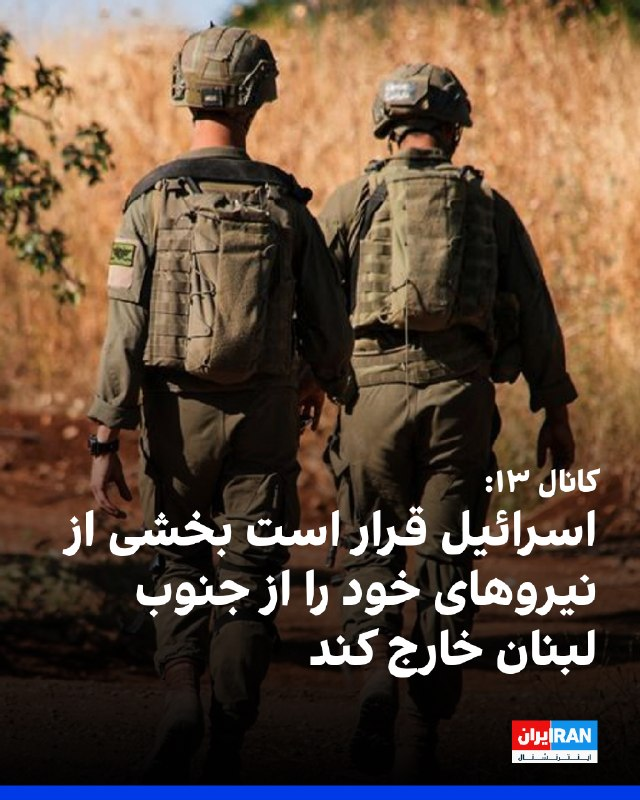

به گزارش کانال ۱۳ اسرائیل، این کشور قرار است بخشی از نیروهای خود را از جنوب لبنان خارج کند.

بر اساس این گزارش، موضوع عقب‌نشینی اسرائیل از برخی مناطق تحت کنترل ارتش این کشور در حال حاضر در جریان نشست میان هیات‌های اسرائیلی و لبنانی در واشینگتن در حال بررسی است.
https://iranintl.com/202606234640

## IranIntlTV — post 343984

  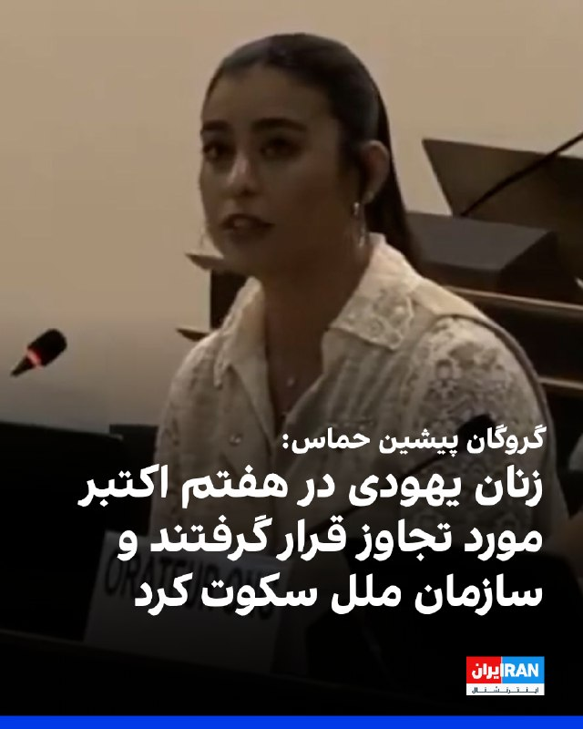

ایلانا گریتزوسکی، گروگان پیشین حماس، در شصت‌ودومین نشست شورای حقوق بشر سازمان ملل در ژنو درباره خشونت جنسی علیه گروگان‌های ربوده‌شده در حمله هفتم اکتبر ۲۰۲۳ شهادت داد و ریم السالم، گزارشگر ویژه سازمان ملل در امور خشونت علیه زنان، را به انکار شواهد این جرایم متهم کرد.

گریتزوسکی خطاب به ریم السالم گفت: «در هفتم اکتبر و در دوران اسارت، زنان یهودی مورد تجاوز، آزار و تحقیر قرار گرفتند و شما سکوت و انکار را انتخاب کردید.»

او افزود: «شما می‌گویید هیچ مدرکی درباره خشونت جنسی در هفتم اکتبر وجود نداشته است. من امروز اینجا ایستاده‌ام؛ زنی که از آن وقایع جان سالم به در برده است. من شاهد زنده خشونت جنسی حماس هستم.»

او سال گذشته نیز در شورای امنیت سازمان ملل شهادت داده و گفته بود اسیرکنندگانش او را مورد آزار جنسی قرار داده‌اند و برای جلوگیری از تجاوز، به آنها گفته بود که در دوران قاعدگی قرار دارد.

اظهارات ریم السالم در سال ۲۰۲۵ مبنی بر اینکه هیچ تحقیق مستقلی وقوع تجاوز در حمله هفتم اکتبر را تایید نکرده، با واکنش مقام‌های اسرائیلی و سازمان‌های یهودی روبه‌رو شد.
https://iranintl.com/202606232388

## IranIntlTV — post 343983

  <a href="https://t.me/IranintlTV/343983" target="_blank">📎 Download file</a>

🎧نسخه صوتی تیتراول با نیوشا صارمی: اظهارات جنجالی ترامپ از نظارت هسته‌ای تا ابد تا نگهداری امانی پولهای ایران
@iranintlTV

## IranIntlTV — post 343982

  <a href="telegram/content/IranIntlTV_343982_1782240827.mp4" target="_blank">🎬 Download video</a>

🔻تیم ملی فوتبال نروژ با نتیجه ۳-۲ سنگال را شکست داد تا صعود خود را به مرحله بعدی جام جهانی مسجل کند. بعد از این بازی بازیکنان تیم ملی نروژ به همراه هواداران این تیم تشویق معروف واینکینگ‌ها را در زمین بازی انجام دادند.

🔹توضیحات مهران عباسیان، خبرنگار ایران‌اینترنشنال در برنامه هت‌تریک

@iranintltvsport

## IranIntlTV — post 343981

  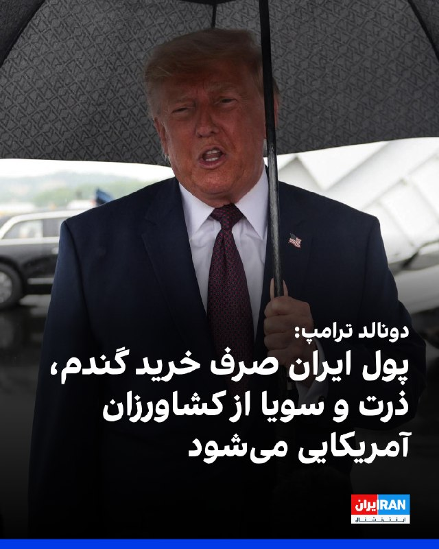

دونالد ترامپ، رییس‌جمهوری آمریکا، گفت جمهوری اسلامی در موقعیت مناسبی برای مذاکره قرار ندارد و با مشکلات متعددی از جمله کمبود غذا، دارو و تورم روبه‌رو است.

او افزود: «پولی که از ایران خارج خواهد شد، در اختیار کشاورزان آمریکایی قرار می‌گیرد تا ذرت، سویا و گندم مورد نیاز ایران را تامین کنند.»

ترامپ همچنین گفت: «تورم در ایران اکنون به ۳۰۰ درصد رسیده و این کشور با مشکلات زیادی مواجه است.»
https://iranintl.com/202606230257

## IranIntlTV — post 343980

  <a href="telegram/content/IranIntlTV_343980_1782240829.mp4" target="_blank">🎬 Download video</a>

مسعود پزشکیان، رییس دولت جمهوری اسلامی، روز سه‌شنبه ۲ تیر وارد اسلام‌آباد شد. آصف‌علی زرداری، رییس‌جمهوری پاکستان، و شهباز شریف، نخست‌وزیر این کشور، هنگام ورود او به پایگاه هوایی نورخان از وی استقبال کردند.
در فرودگاه، از پزشکیان با تشریفات رسمی، شلیک ۲۱ گلوله توپ و ادای احترام جنگنده‌های JF-17 نیروی هوایی پاکستان استقبال شد.
پزشکیان در این سفر با عاصم منیر، فرمانده ارتش پاکستان، نیز دیدار و گفت‌وگو کرد.
عباس عراقچی، وزیر خارجه، نیز به همراه هیاتی، پزشکیان را در این سفر همراهی می‌کرد.
در جریان این سفر، شهباز شریف «فلوشیپ افتخاری» کالج پزشکان و جراحان پاکستان در رشته جراحی قلب را به مسعود پزشکیان اعطا کرد.

## IranIntlTV — post 343979

  <a href="telegram/content/IranIntlTV_343979_1782240830.mp4" target="_blank">🎬 Download video</a>

ویدیوی منتشرشده، بی‌قراری مادر نازنین‌زهرا صالحی را نشان می‌دهد؛ کودک ۱۳ ساله‌ای که ۱۹ دی‌ماه ۱۴۰۴ در جریان اعتراضات در کرمانشاه با شلیک نیروهای حکومت کشته شد.

## IranIntlTV — post 343978

  

دونالد ترامپ درباره حضور بازرسان انرژی اتمی در ایران گفت: بازرسان در زمان مناسب در محل حضور خواهند داشت. آنها (جمهوری اسلامی) در مورد بازرسی‌های آژانس بین‌المللی انرژی اتمی اشتباه می‌کنند.
او افزود: می‌خواهید دردسر ببینید؟ بگذارید ایران سلاح هسته‌ای داشته باشد. ما در رابطه با ایران وضعیت بسیار خوبی داریم. آن‌ها به‌شدت تضعیف شده‌اند و ما در حال رسیدن به یک توافق با آن‌ها هستیم و خواهیم دید که همه‌چیز چگونه پیش می‌رود.
https://iranintl.com/202606237772

## FarsiVOA — post 221664

شورش تندروها علیه توافق؛ از تهدید به برگزاری مجلس در خیابان تا کفن پوشی

## FarsiVOA — post 221663

علی جوانمردی: آمریکا بە رویکرد جمهوری اسلامی توجە می‌کند نە تبلیغات رسانەهای ایران!

## FarsiVOA — post 221662

پوشش ویژه | دونالد ترامپ، رئیس جمهوری آمریکا ادعای جمهوری اسلامی را رد کرد: بازرسی آژانس انرژی اتمی قطعا انجام می‌شود

## FarsiVOA — post 221661

هشدار اوکراین درباره آتش‌بس و تشدید جنگ؛ سئول آماده پذیرش اسرای کره‌شمالی

## FarsiVOA — post 221660

  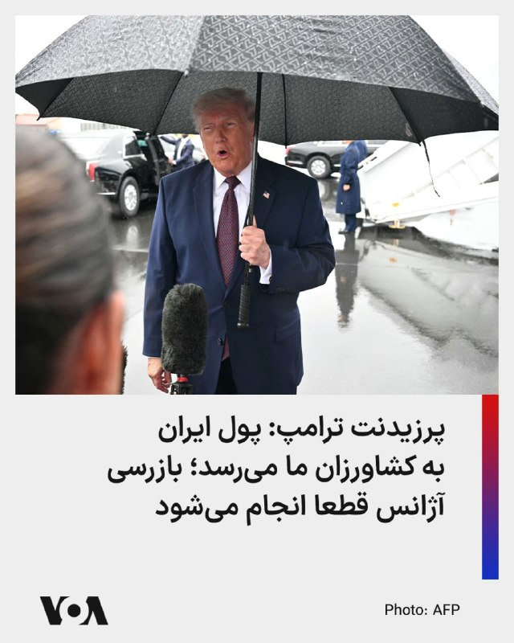

⚡️دونالد ترامپ، رئیس جمهوری آمریکا با اشاره به این که ایران را در موقعیتی بی‌سابقه قرار داده است گفت: آن‌ها ویران شده‌اند و ما در حال توافق با آن‌ها هستیم. دیروز، ۱۹ میلیون بشکه نفت [از تنگه هرمز] خارج شد و این بزرگ‌ترین میزان در تاریخ تنگه هرمز است. بازار بورس ما در اوج است و قیمت نفت در حال سقوط است.»
پرزیدنت ترامپ سه‌شنبه ۲ تیر هنگام ورود به پنسیلوانیا به خبرنگاران گفت که پولی که قرار است در اختیار ایران قرار بگیرد، «به کشاورزان ما می‌رسد تا ذرت، سویا و گندم به ایران بدهند» چون که ایران با تورم و «مشکل گرسنگی» مواتجه است.
همچنین از او پرسیده شد که ایران می‌گوید با هیچ دیدار برنامه‌ریزی‌شده‌ای برای بازرسان آژانس بین‌المللی انرژی اتمی موافقت نکرده است و آقای ترامپ پاسخ داد: «بازرسی‌ها صد در صد انجام می‌شود»؛ در غیر این صورت، «همین الان جلسات را لغو می‌کردم.»

## FarsiVOA — post 221659

بیش از ۱۲۳ میلیون نفر در جهان به اجبار آواره شده‌اند؛ انسان‌هایی که خانه، خانواده و زندگی خود را پشت سر گذاشته‌اند تا در امنیت زندگی کنند. روز جهانی پناهندگان یادآور این حقیقت است که پشت هر عدد، یک زندگی و یک امید زنده قرار دارد.

## FarsiVOA — post 221658

گرداندن جنازه علی خامنه‌ای در شهرهای عراق، به جز رویکرد مذهبی، آیا کارکرد سیاسی هم دارد؟ گفت‌وگو با امین قضایی، نویسنده و جامعه‌شناس

## FarsiVOA — post 221657

افزایش شدید قیمت نان، به عنوان پایه سبد خوراک ایرانیان، چه تاثیری بر سفره مردم ایران خواهد داشت؟ گفت‌وگو با جمشید اسدی، اقتصاددان

## FarsiVOA — post 221656

کابینه ناتمام عراق؛ آزمون دشوار علی الزیدی پیش از سفر به واشنگتن

## FarsiVOA — post 221655

  <a href="telegram/content/FarsiVOA_221655_1782240833.mp4" target="_blank">🎬 Download video</a>

پرواز تمرینی هواپیمای جدید ریاست‌جمهوری آمریکا؛ پیشتر دونالد ترامپ، از هواپیمای جدید ریاست‌جمهوری «ایرفورس وان» در پایگاه مشترک اندروزو واقع در ایالت مریلند رونمایی کرده بود.

## DW_Farsi — post 126387

🔶 روبیو: ایران اجازه دریافت عوارض برای تنگه هرمز را نخواهدداشت
 
بنا بر تازه ترین اظهارات مارکو روبیو، وزیر امور خارجه آمریکا، "ایران در چارچوب هیچ توافق نهایی با ایالات متحده اجازه نخواهد داشت از کشتی‌های عبوری در تنگه هرمز عوارض دریافت کند".
 
وزیر امور خارجه ایالات متحده که با ورود به ابوظبی در این‌باره اظهارنظر کرده است، ادامه داد: «اگر ایران دست به چنین اقدامی بزند، این موضوع با حقوق بین‌الملل مغایرت دارد.»
 
مارکو روبیو، از امروز، سه‌شنبه ۲۳ ژوئن (۲ تیر) تا پنج‌شنبه ۲۵ ژوئن (۴ تیر) در امارات متحده عربی، کویت و بحرین خواهد بود.
 
این سفر در حالی انجام می‌شود که پس از امضای تفاهم‌نامه میان واشنگتن و تهران، روند صلح همچنان در دست بررسی است و مسائل مربوط به امنیت منطقه، تنگه هرمز و اجرای مفاد تفاهم در دستور کار قرار دارد.
 
وزیر خارجه آمریکا همچنین در بخش دیگری از اظهاراتش مدعی شد: «اگر رهبری ایران تصمیم بگیرد، می‌خواهد به جای یک جنبش انقلابی که تروریسم صادر می‌کند، یک کشور باشد، فرصتی برای انجام کارهای باورنکردنی در ایران خواهد داشت. این فرصت‌ها می‌تواند شامل سرمایه‌گذاری مستقیم خارجی باشد.»
 
روبیو همچنین به موضوع لبنان نیز پرداخت و با بیان اینکه "مسئله لبنان از ایران جداست" افزود: «لبنان یک کشور مستقل با دولت خود است. ما قصد داریم با دولت لبنان مذاکره و توافق کنیم. آینده لبنان متعلق به مردم این کشور از طریق دولت مستقل و منتخب آنهاست.»
 
او همچنین با تاکید بر اینکه "نیروهای نیابتی ایران" باید به پرتاب موشک و پهپاد پایان دهند، گفت: «تا زمانی که نیروهای نیابتی ایران از عراق موشک و پهپاد پرتاب می‌کنند و مانند حماس و حزب‌الله در تروریسم مشارکت دارند، نمی‌توان به خصومت‌ها و درگیری‌ها در منطقه پایان داد.»
 
قرار است روبیو فردا نیز با رهبران امارات متحده عربی دیدار و گفت‌وگو کند. او سپس راهی کویت خواهد شد و پس از آن برای شرکت در نشست شورای همکاری خلیج فارس به بحرین سفر می‌کند.
 
هدف از این سفر، اطمینان‌بخشی به متحدان منطقه‌ای آمریکا پس از امضای توافق اولیه میان ایالات متحده و ایران در هفته گذشته عنوان شده است.
 
@dw_farsi

## DW_Farsi — post 126386

  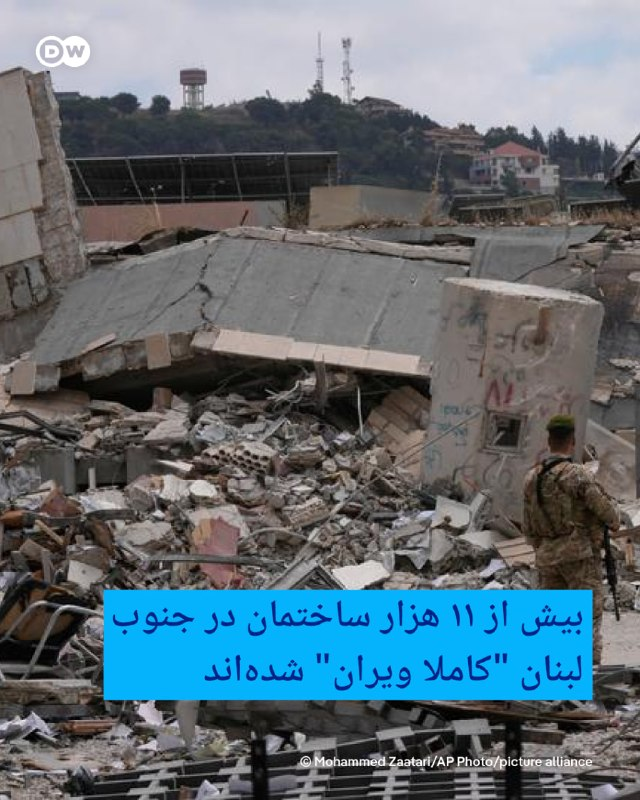

🔶 بیش از ۱۱ هزار ساختمان در جنوب لبنان "کاملا ویران" شده‌اند
 
بر اساس گزارش جدید سازمان ملل متحد، در جنگ اخیر بیش از ۱۱ هزار ساختمان در جنوب لبنان به طور کامل تخریب شده است. در این تحقیق، از جمله شهرستان‌های صور، نبطیه و بنت جبیل در این کشور مورد بررسی قرار گرفته‌اند.
 
در گزارش برنامه توسعه سازمان ملل متحدکه روز سه‌شنبه ۲۳ ژوئن (۲ تیرماه) منتشر شد، خسارات وارده حدودا ۱.۳۸ میلیارد دلار آمریکا برآورد شده است.
 
این گزارش با همکاری شورای ملی پژوهش لبنان منتشر شده است که از سال ۲۰۲۳ به نمایندگی از دولت، مشغول بررسی خسارات ناشی از جنگ در لبنان است.
 
گفته شده است، در پی تخریب نزدیک به ۱۱ هزار و ۱۰۰ ساختمان در این مناطق، ۱۸ هزار واحد مسکونی آسیب دیده‌اند.
 
علاوه بر این، دو هزار و ۲۰۰ ساختمان دیگر دچار خسارت‌های جزئی تا متوسط و ۹ هزار و ۳۰۰ ساختمان نیز متحمل خسارت‌های اندک شده‌اند.
 
در این گزارش، وضعیت راه‌ها، پل‌ها و تاسیسات برق و آب مورد بررسی قرار نگرفته است.
@dw_farsi

## DW_Farsi — post 126385

  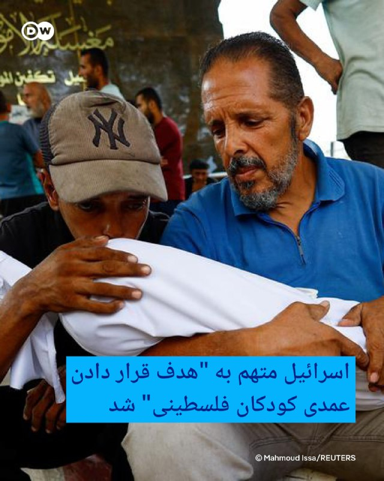

🔶 اسرائیل متهم به "هدف قرار دادن عمدی کودکان فلسطینی" شد
 
یک کمیسیون تحقیق مستقل وابسته به سازمان ملل متحد، مقامات و نیروهای امنیتی اسرائیل را متهم کرد، "کودکان فلسطینی را به‌طور عمدی هدف قرار داده‌اند."
 
این کمیسیون در گزارشی که روز سه‌شنبه ۲۳ ژوئن (۲ تیرماه) در این باره منتشر کرد، آورده است: «چنین اقداماتی در نوار غزه به ارتکاب نسل‌کشی، جنایت علیه بشریت و جنایات جنگی و در کرانه باختری به ارتکاب جنایات جنگی منجر شده است.»
 
بر اساس این گزارش، تنها در جنگ غزه حدود ۳۰ درصد از قربانیان جان‌باخته را کودکان تشکیل داده‌اند.
 
این کمیسیون همچنین به بررسی موارد نقض حقوق کودکان فلسطینی از زمان آغاز جنگ میان اسرائیل و حماس در ۷ اکتبر ۲۰۲۳ پرداخته است.
 
طبق یافته‌های این کمیسیون، کودکان فلسطینی در طول جنگ، حتی پس از آن‌که آتش‌بس در اکتبر ۲۰۲۵ به اجرا درآمد، "به‌صورت عمدی کشته شده‌اند".
 
اسرائیل در مقابل، این ادعا را که "عمدا کودکان را هدف قرار می‌دهد"، با "قاطعیت" رد کرده است.
 
@dw_farsi

## Persian_Trend_Official — post 17899

ناآرامی در حرم حسین بن علی

بیرون کردن شش امامی‌ها از حرم توسط دوازده امامی‌های ایرانی

Phantom

📌 @persian_trend_official
پرشین ترند | متفاوت‌ترین کانال نظامی

## Persian_Trend_Official — post 17898

وضعیت شیعیان تو کربلا

آزار و اذیت ۶ امامی ها توسط ۱۲ امامی ها

Phantom

📌 @persian_trend_official
پرشین ترند | متفاوت‌ترین کانال نظامی

## Persian_Trend_Official — post 17897

کانال رسمی پرشین ترند pinned «💎 دوستان پرشین ترند برای خرید vpn هم اکانت حجمی و هم اکانت نامحدود به بچه های تراست پیام بدین خدماتشون گارانتی داره لوکیشین های مختلف هم دارن و تمام هوش مصنوعی هارو هم باز می‌کنه 🇹🇷🇺🇸🇩🇪 برای تیم ایران هم از همینجا می‌گیریم👍 @trusstvpnn_admin @trusstvpnn_admin»

## Persian_Trend_Official — post 17896

  <a href="telegram/content/Persian_Trend_Official_17896_1782240835.webm" target="_blank">🎬 Download video</a>

🔴 شیخ نعیم قاسم: اسرائیل راهی جز عقب‌نشینی از خاک لبنان ندارد

دبیر کل حزب‌الله لبنان:

🔹پروژه نابودی حزب‌الله شکست خورده است.

🔹اسرائیل راهی جز عقب‌نشینی از خاک لبنان ندارد.

🔹صبر ۱۵ ماهه حزب‌الله به معنای عقب‌نشینی نبوده، بلکه بخشی از استراتژی آمادگی و آماده‌سازی برای مرحله‌ای سرنوشت‌ساز بوده است.

🔹حزب‌الله با تکیه بر حمایت‌های تهران، قدرت خود را مضاعف کرده است.

Phantom

📌 @persian_trend_official
پرشین ترند | متفاوت‌ترین کانال نظامی

## Persian_Trend_Official — post 17895

  <a href="telegram/content/Persian_Trend_Official_17895_1782240836.mp4" target="_blank">🎬 Download video</a>

ترامپ در مورد ایران: آنها مشکل گرسنگی دارند. آنها مشکل غذا دارند. آنها مشکل پزشکی دارند.

تورم آنها 300 درصد است. آنها مشکلات زیادی دارند.

📝 Amir

📌 @persian_trend_official
پرشین ترند | متفاوت‌ترین کانال نظامی

## Persian_Trend_Official — post 17894

  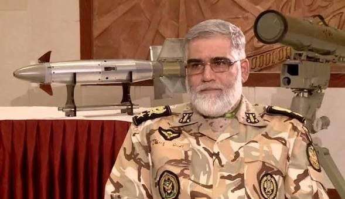

امیر پوردستان: آماده انجام عملیات پیش‌دستانه هستیم.

🔹 امیر سرتیپ «احمدرضا پوردستان» رئیس مرکز مطالعات و تحقیقات راهبردی ارتش جمهوری اسلامی اعلام کرد که در دکترین نظامی ایران، عملیات پیش‌دستانه نیز تعریف شده است.

🔹 وی تأکید کرد: «چنانچه مصلحت نظام ایجاب کند، ممکن است با انجام عملیات‌های پیش‌دستانه در عرصه‌های ناشناخته، دشمن را به‌شدت غافلگیر کنیم.»

🔹 پوردستان همچنین گفت نیروهای مسلح جمهوری اسلامی ایران هنوز بخش مهمی از توانمندی‌های خود را به‌کار نگرفته‌اند و در صورت هرگونه اقدام از سوی دشمن، پاسخ ایران محدود به مرزها یا تنگه هرمز نخواهد بود.

🔹 رئیس مرکز تحقیقات راهبردی ارتش در بخش دیگری از سخنان خود مدعی شد که طی یک ماه گذشته چندین بار شرایط تا آستانه درگیری مستقیم با اسرائیل پیش رفته و یگان‌های عملیاتی در وضعیت آمادگی کامل قرار داشته‌اند.

🔹 وی همچنین عنوان کرد فشارهای نظامی و تهدیدات ایران موجب شد آمریکا برای جلوگیری از گسترش درگیری‌ها، اسرائیل را به کاهش تنش در جبهه لبنان ترغیب کند.

اظهارات پوردستان از تداوم رویکرد بازدارندگی فعال در دکترین دفاعی ایران حکایت دارد. طرح مجدد مفهوم «عملیات پیش‌دستانه» در شرایطی مطرح می‌شود که تحولات لبنان، امنیت تنگه هرمز و آینده توافقات منطقه‌ای همچنان از مهم‌ترین موضوعات امنیتی خاورمیانه محسوب می‌شوند.

 Phantom

📌 @persian_trend_official
پرشین ترند | متفاوت‌ترین کانال نظامی

## Persian_Trend_Official — post 17893

  <a href="telegram/content/Persian_Trend_Official_17893_1782240838.mp4" target="_blank">🎬 Download video</a>

خبرنگار: ایرانی‌ها می‌گویند هیچ بازدید برنامه‌ ریزی‌ شده‌ای برای بازرسان آژانس بین‌المللی انرژی اتمی وجود ندارد؟

ترامپ: آنها اشتباه می‌کنند. آنها در داخل به ما گفتند و ما 100% بازرسی‌ها را انجام داده‌ایم.

اگر آنها درست می‌گفتند، من همین الان جلسات را لغو می‌کردم.

📝 Amir

📌 @persian_trend_official
پرشین ترند | متفاوت‌ترین کانال نظامی

## RadioFarda — post 158675

🔸وزارت امنیت داخلی آمریکا اعلام کرد که دستورالعمل‌های مربوط به تیم ملی فوتبال ایران را پیش از سومین بازی این تیم در جام جهانی در روز پنجم تیرماه تغییر می‌دهد تا زمان بیشتری مشابه سایر تیم‌های حاضر در مسابقات در اختیار آن‌ها قرار گیرد. 🔸شبکهٔ تلویزیونی ان‌بی‌سی،…

## RadioFarda — post 158674

  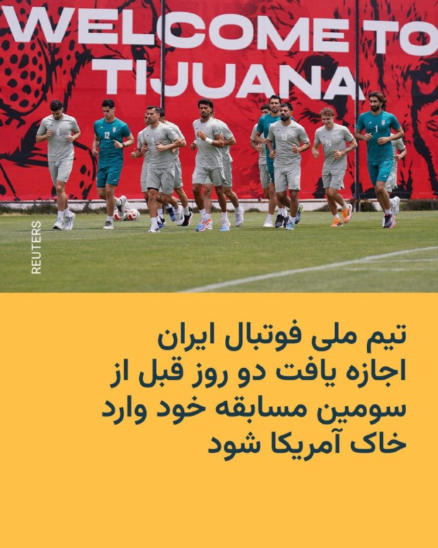

🔸وزارت امنیت داخلی آمریکا اعلام کرد که دستورالعمل‌های مربوط به تیم ملی فوتبال ایران را پیش از سومین بازی این تیم در جام جهانی در روز پنجم تیرماه تغییر می‌دهد تا زمان بیشتری مشابه سایر تیم‌های حاضر در مسابقات در اختیار آن‌ها قرار گیرد.

🔸شبکهٔ تلویزیونی ان‌بی‌سی، سایت اکسیوس و خبرگزاری آسوشیتدپرس روز سه‌شنبه دوم تیرماه این خبر را به نقل از یک سخنگوی این وزارتخانه منتشر کردند.

🔸بر اساس این تصمیم، تیم ایران اکنون اجازه خواهد داشت دو روز پیش از مسابقه به سیاتل در ایالت واشینگتن سفر کند، یعنی یک روز بیشتر از بازه ۲۴ ساعته‌ای که برای دو بازی نخست به «تیم ملی» داده شده بود.

🔸با این حال، همچنان از تیم ملی فوتبال ایران خواسته خواهد شد که پس از پایان مسابقه به محل کمپ خود در تیخوانا مکزیک بازگردد.

🔸این تغییر در حالی صورت می‌گیرد که فدراسیون فوتبال ایران اعلام کرده که قصد دارد به‌دلیل نحوهٔ برخورد آمریکا با این تیم، شکایت رسمی به فیفا، نهاد برگزارکننده جام جهانی، تسلیم کند.

@RadioFarda

## RadioFarda — post 158673

🔸رئیس‌جمهور آمریکا اعلام کرد بازرسان آژانس بین‌المللی انرژی اتمی در «زمان مناسب» برای بازرسی از تأسیسات هسته‌ای آسیب‌دیده به ایران خواهند رفت.

🔸دونالد ترامپ روز سه‌شنبه سوم تیرماه در پاسخ به گزارش‌هایی مبنی بر نبود برنامه‌ای برای حضور بازرسان آژانس در ایران گفت مقام‌های ایرانی در این باره «اشتباه می‌کنند» و واشینگتن بر سر انجام «بازرسی‌های صددرصدی» با تهران توافق کرده است.

🔸او در پاسخ به پرسشی درباره زمان آغاز این بازرسی‌ها گفت: «هیچ عجله‌ای وجود ندارد، اما آن‌ها در زمان مناسب در محل حاضر خواهند شد».

🔸رئیس‌جمهور آمریکا همچنین از روند مذاکرات با ایران ابراز رضایت کرد و گفت واشینگتن در حال دستیابی به «یک توافق فوق‌العاده» با تهران است.

🔸ترامپ افزود هدف این توافق جلوگیری از دستیابی ایران به سلاح هسته‌ای است و مقام‌های جمهوری اسلامی نیز با این موضوع موافقت کرده‌اند.

@RadioFarda

## RadioFarda — post 158672

عفو بین‌الملل: ایران فوراً احکام محکومیت پرستو احمدی و هشت نوازنده دیگر را لغو کند

🔸عفو بین‌الملل روز سه‌شنبه دوم تیرماه از مقام‌های جمهوری اسلامی ایران خواست که فوراً احکام محکومیت پرستو احمدی، خواننده، و هشت نوازنده دیگر را لغو کنند.

🔸این افراد به‌دلیل اجرای کنسرت «کارونسرا» یا «کنسرت فرضی» در ۲۱ آذر سال ۱۴۰۳، هر یک به ۷۴ ضربه شلاق، دو سال ممنوعیت خروج از کشور و دو سال محرومیت از فعالیت‌های هنری محکوم شده‌اند.

🔸دادگاه کیفری استان قم در حکم قضایی خود، که رادیو فردا نیز آن را رؤیت کرده، اتهام آن‌ها را «جریحه‌دار کردن عفت عمومی از طریق تولید و انتشار محتوای مبتذل و خلاف اخلاق در بستر فضای مجازی» عنوان کرده است.

🔸عفو بین‌الملل در بیانیهٔ خود، شلاق را «مجازاتی ظالمانه، غیرانسانی و تحقیرآمیز» خوانده که برخلاف «ممنوعیت مطلق شکنجه و سایر بدرفتاری‌ها به شمار می‌رود».

🔸این نهاد حقوق بشری می‌گوید که «این احکام شلاق، غیرانسانی‌بودن و خشونت نظام قضایی ایران و نقش آن در تعرض به حقوق زنان را برجسته می‌کند».

🔸عفو بین‌الملل تأکید کرده که مقام‌های ایران باید حجاب اجباری و مجازات‌های بدنی را لغو کنند و به جرم‌انگاری آزادی بیان پایان دهند. جامعه بین‌المللی نباید اجازه دهد در بحبوحهٔ توافق آمریکا و ایران برای پایان دادن به جنگ، سرکوب دوباره حقوق زنان رخ دهد.

🔸کنسرت پرستو احمدی به صورت زنده از یک کاروانسرا در استان قم پخش شد و ویدئوی آن به سرعت فراگیر شد و میلیون‌ها بازدید گرفت. این خواننده، بدون حجاب اجباری و با لباس آستین‌کوتاه اجرای خود را انجام داد.

🔸قوه قضائیه جمهوری اسلامی بلافاصله پس از پخش این کنسرت، علیه پرستو احمدی و سایر عوامل این اجرا اعلام جرم کرد. پس از آن خانم احمدی همراه با احسان بیرقدار، نوازنده پیانو و سهیل فقیه نصیری، نوازنده گیتار الکتریک در ۲۴ آذرماه بازداشت شدند اما بعدتر اعلام شد که هر سه نفر آزاد شدند.

🔸در پی انتشار این ویدئو، قوه قضائیه کاروانسرای تاریخی «دیر گچین»، محل اجرای کنسرت، را هم پلمب کرد.

🔸حکم صادرشده در دادگاه کیفری قم بدوی است و در مهلت قانونی قابل تجدیدنظرخواهی است.

🔸گزارش کامل را در وب‌سایت رادیوفردا بخوانید.

@RadioFarda

## RadioFarda — post 158671

  <a href="https://t.me/radiofarda/158671" target="_blank">📎 Download file</a>

«جنگ ایران؛ تازه‌ترین تجربه واقعی هوش مصنوعی در میدان نبرد» در گفت‌وگو با نیتن وود

🔸چگونگی استفاده از هوش مصنوعی در جنگ ۴۰ روزهٔ اسرائیل و آمریکا با ایران، از سوی برخی محافل نظامی و رسانه‌ای به عنوان «اولین جنگ هوش مصنوعی در مقیاس بزرگ» توصیف شده است. استفاده از تجهیزات نظامی مبتنی بر هوش مصنوعی در این جنگ، پرسش‌های زیادی را درباره مرزهای مسئولیت انسانی در میدان نبرد ایجاد کرد. در گفت‌وگو با نیتن وود، پژوهشگر ارشد هوش مصنوعی و مدیر اجرایی انجمن بین‌المللی اروپایی اخلاق نظامی، از او درباره چگونگی استفاده از هوش مصنوعی در جنگ اخیر پرسیدیم.

@RadioFarda

## RadioFarda — post 158670

🔸مارکو روبیو، وزیر خارجه آمریکا، می‌گوید متحدان واشینگتن از چارچوب توافق صلح با ایران حمایت می‌کنند، هرچند به گفته او هنوز کار زیادی برای نهایی شدن این روند باقی مانده است.

🔸آقای روبیو در پاسخ به پرسش الکس رئوف‌اوغلو، خبرنگار رادیو اروپای آزاد/رادیو آزادی، درباره میزان حمایت متحدان آمریکا از چارچوب صلح با ایران گفت: «فکر می‌کنم همه متحدان ما از صلح حمایت می‌کنند.»

🔸او با اشاره به اینکه مناقشه میان ایران و آمریکا دهه‌ها ادامه داشته است، افزود: «این مسئله ۴۷ سال است که جریان دارد، بنابراین فکر نمی‌کنم کسی انتظار داشته باشد در یک روز و نیم حل شود.»

🔸وزیر خارجه آمریکا گفت اکنون چارچوب و نقشه راهی برای پیشبرد مذاکرات وجود دارد و در ۷۲ ساعت گذشته زمینه‌های اولیه برای ادامه این روند فراهم شده است.

🔸او در عین حال تأکید کرد که هنوز کارهای زیادی باقی مانده و واشینگتن قصد دارد دیدگاه متحدان خود را نیز در روند مذاکرات لحاظ کند.

@RadioFarda

## IranianMinds — post 23198

🔴 نخست‌وزیر پاکستان، شهباز شریف:

هفته آینده انشالله به تهران سفر می‌کنم تا به روح مرحوم رهبر معظم، آیت‌الله علی خامنه‌ای ادای احترام کنم و مجدداً همبستگی و حمایت پاکستان را از ملت برادر ایران اعلام نمایم

@IranianMinds

## IranianMinds — post 23197

  <a href="telegram/content/IranianMinds_23197_1782240840.mp4" target="_blank">🎬 Download video</a>

🔴 ترامپ درباره توافق ایران:

هر کسی که از این توافق انتقاد کرده، باید آگاه بشه و درست متوجه بشه، حتی اگه دوست خودم باشن.

@IranianMinds

## IranianMinds — post 23196

  <a href="telegram/content/IranianMinds_23196_1782240842.mp4" target="_blank">🎬 Download video</a>

🔴 ترامپ درباره ایران:

اونا مشکل گرسنگی دارن. مشکل غذا دارن. مشکل دارو دارن.

تورم‌شون رسیده به ۳۰۰٪. کلی مشکل دارن.

@IranianMinds

## IranianMinds — post 23195

  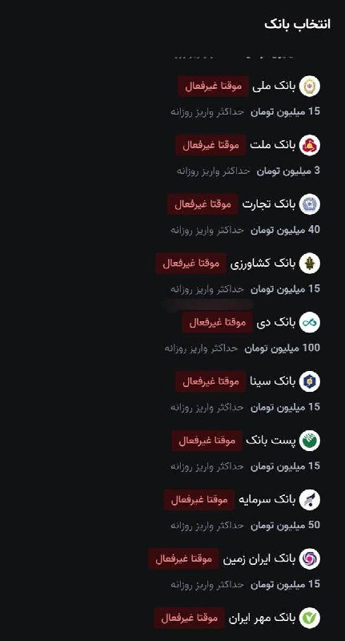

وضعیت بانک های کشور عالی

تمامی همراه بانک ها غیرفعال شدن.

@IranianMinds

## IranianMinds — post 23194

  <a href="telegram/content/IranianMinds_23194_1782240844.webm" target="_blank">🎬 Download video</a>

🔝برای اولین بار در ایران
🇮🇷
تا 
0️⃣
0️⃣
1️⃣
🔣 سود اضافه روی شرط‌های ترکیبی
🤩

ده تا بازی میکس کن، سودت رو 
2️⃣برابر کن
⏩

فقط کافیه بازی‌های موردنظرت رو توی یک میکس قرار بدی. هرچی تعداد انتخاب‌هات بیشتر باشه، درصد بیشتری به سود بردت
اضافه میشه
🛍

🆗 تا 
0️⃣
3️⃣
🔣 سود بیشتر با 3 انتخاب

🆗 تا 
0️⃣
5️⃣
🔣 سود بیشتر با 9 انتخاب

🆗 تا 
0️⃣
0️⃣
1️⃣
🔣 سود بیشتر با 10 انتخاب

همون برد، پول بیشتر!
میکس حرفه‌ای بچین و از ACCA Boost
نهایت استفاده رو ببر
💵
💵

📺 تلویزیون لایو برای پوشش بازی ها

💳 واریز و برداشت مستقیم و سریع 
بدون واسطه، بدون معطلی 
🛫 تسویه در سریع‌ترین زمان ممکن
🎰 همین الان وارد شو و اولین شرط ترکیبی‌ت رو بساز

🔤 Winro.io         معتبرترین سایت ایران

🔤 Winro.io

📱 کانال اخبار و هدایــا eG2
🌟

📱 @winro_io

## IranianMinds — post 23193

  <a href="telegram/content/IranianMinds_23193_1782240845.mp4" target="_blank">🎬 Download video</a>

🔴 خبرنگار : ایرانی‌ها می‌گن هیچ بازدید برنامه‌ریزی‌شده‌ای برای بازرسان آژانس وجود نداره؟

ترامپ: بلوف میزنن ، اونا داخل به ما گفتن و ما ۱۰۰٪ بازرسی رو ثبت و قطعی کردیم.

اگر راست می‌گفتن، همین الان مذاکرات رو لغو می‌کردم.

@IranianMinds

## IranianMinds — post 23192

🔴مسعود پزشکیان در جریان سفر به اسلام‌آباد گفت:

بحث موشکی در تفاهم‌نامه نیست و هیچ‌وقت وجود نخواهد داشت.
پزشکیان به خبرنگاران گفت:
اگر موشک‌های ما نبود، اسرائیل و آمریکا ایران را مثل غزه شخم می‌زدنند.

@IranianMinds

## BBCPersian — post 284852

  <a href="https://t.me/bbcpersian/284852" target="_blank">📎 Download file</a>

🔻جام ۲۶ - قسمت ششم - آیا تیم ملی از گروه G صعود می کند؟

تیم ملی فوتبال ایران پس از دو بازی در جام جهانی با دو امتیاز در رده دوم جدول گروه G قرار دارد.

حالا چشم‌ها به بازی است که بامداد شنبه به وقت ایران برگزار می شود تا تکلیف تیم‌های صعود کننده به مرحله بعد مشخص شود. پوریا ژافره و سام فرزانه خبرنگاران بی بی سی فارس در لس‌آنجلس از شرایط دیدار با بلژیک و حال و هوای احتمالی دیدار بعدی با مصر گفتند.

@bbcpersian

## BBCPersian — post 284851

  <a href="telegram/content/BBCPersian_284851_1782240847.mp4" target="_blank">🎬 Download video</a>

‏فدراسیون فوتبال ایران ویدئویی از سخنان پرشور مهدی طارمی، مهاجم تیم ملی پیش از مسابقه با بلژیک منتشر کرده است که در آن از هم‌تیمی‌‌هایش می‌خواهد که از بازیکنان قوی حریف نترسند و با تمام توانشان بدوند.

‏انتشار این سخنان واکنش بعضی از کاربران را در شبکه‌های اجتماعی برانگیخته که سخنان او را «انگیزشی» و عملکرد او را مثل یک «رهبر» توصیف می‌‌کنند.

‏مهدی طارمی پس از پایان بازی با بلژیک هم در وسط حلقه بازیکنان در زمین چمن هم در حال سخن گفتن در قاب دوربین‌های ورزشگاه لس‌آنجلس به تصویر کشیده شد. بعضی رسانه‌های ایران گزارش کرده‌اند که او با یادآوری ناکامی‌ها در جام جهانی قطر و جام ملت‌های آسیا گفت: «الان همه به خاطر این بازی خوشحال هستیم، اما اتفاقی نیفتاده است. مهم این است که قدم سوم را در بازی با مصر محکم برداریم.»

‏ایران ۶ تیر (۲۷ ژوئن) در سیاتل به مصاف مصر خواهد رفت که هم اکنون با ۴ امتیاز در صدر گروه جی است. بلژيک که مانند ایران دو امتیازی است هم در مسابقه هم‌زمان مقابل نیوزیلند بازی می‌‌کند.
@bbcpersian

## BBCPersian — post 284850

  <a href="https://t.me/bbcpersian/284850" target="_blank">📎 Download file</a>

پادکست برنامه جام جهان‌نما، سه‌شنبه ۲ تیر ۱۴۰۵

در این برنامه:
در حالی که تهران گزارش‌ها درباره صدور مجوز بازرسی از تأسیسات هسته‌ای آسیب‌دیده در جنگ را رد کرده، دونالد ترامپ می‌گوید ایران با بازرسی‌های گسترده موافقت کرده است. در جام جهان‌نمای امروز، تازه‌ترین تحولات مذاکرات را مرور می‌کنیم و می‌پرسیم اختلاف‌ها بر سر بازرسی‌ها و دیگر مسائل تا چه اندازه می‌تواند توافق نهایی میان تهران و واشنگتن را به خطر بیندازد.
همزمان، اختلال در خدمات شش بانک بزرگ ایران، مشکلاتی را برای مشتریان ایجاد کرده است. از آخرین جزئیات این اختلال‌ها و واکنش مقام‌ها خواهیم گفت.
@bbcpersian

## Dirty_Kids — post 392935

  <a href="telegram/content/Dirty_Kids_392935_1782240848.mp4" target="_blank">🎬 Download video</a>

ایلان ماسک طِی یه حرکت منطقی یه کلیپ از عزاداری ماه محرم رو تو صفحه رسمی توییتری خودش پست کرده:

@Dirty_Kids 👻

## Dirty_Kids — post 392934

  <a href="telegram/content/Dirty_Kids_392934_1782240850.mp4" target="_blank">🎬 Download video</a>

مست کرده و اومده هیئت

@Dirty_Kids 👻

## Dirty_Kids — post 392933

  <a href="telegram/content/Dirty_Kids_392933_1782240851.mp4" target="_blank">🎬 Download video</a>

توی نیشابور یه خانم حماسه آفرید و برای اولین بار در تاریخ، با سرعت ۵ کیلومتر در ساعت چپ کرد

@Dirty_Kids 👻

## Dirty_Kids — post 392932

دوستان شما میخواین سردار سلیمانی درست کنین اول سیب زمینی رو می‌پزین یا همینجوری خام رنده میکنین ؟

@Dirty_Kids 👻

## Dirty_Kids — post 392931

  

‏نسل جوان ایران وقتی می فهمد
شهربانی کل کشور زمان پادشاه
پلیس ضد شورش و گارد ویژه نداشته

@Dirty_Kids 👻

## Dirty_Kids — post 392930

با این وضع تورم، سیستم بانکی رو هم مختل کنند ملت باید با فرغون پول ببرند اینور و اونور

@Dirty_Kids 👻

## Dirty_Kids — post 392926

هیپاپولوژیست رو یادتونه پای دوست دوست دخترش رو می‌خورد؟

با انتشار این عکس‌ها رسما اعلام کرد که فوت فتیشِ وفاداریه و ایشون رو گرفته.

@Dirty_Kids 👻

## Hranews — post 113815

  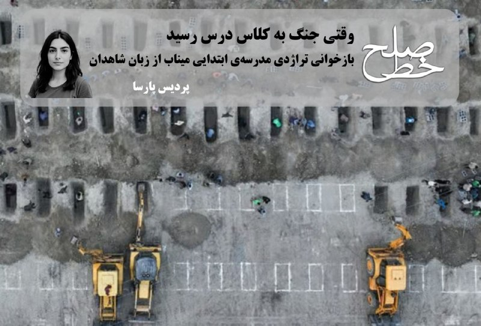

بازخوانی تراژدی مدرسه‌ی ابتدایی میناب از زبان شاهدان/ #پردیس_پارسا

📡
📡
📡
📡
📡 – پدر «محمد مهدی»، یکی از قربانیان این حمله، از وقایع آن روز به خط صلح چنین می‌گوید: «صبح بعد از شنیدن خبر انفجارهای تهران، گوشی همسرم زنگ خورد. از مدرسه زنگ زده بودند که بیایید بچه‌ها را ببرید. داشتم آماده می‌شدم تا بروم که بعد از سه-چهار دقیقه صدای انفجار آمد. آن‌قدر صدا زیاد بود که ما توی خانه متوجه شدیم. همین موقع یکی از دوستانم زنگ زد و گفت آمده نزدیک مدرسه و دیده که مدرسه را زده‌اند. گفت آن‌قدر ترافیک است که اصلاً نمی‌شود رفت آنجا. فوری به خانمم گفتم زنگ بزن به خانم معلم. ولی گوشی خانم معلم در دسترس نبود. دیگر دوزاری‌ام افتاد. بلافاصله ماشین را روشن کردیم و با مامانش رفتیم. نزدیکی‌های مدرسه ماشین را نگه داشتم، نه قفلش کردم نه چیزی، پیاده شدیم و فقط دویدیم. وقتی رسیدیم به مدرسه، خشکمان زد. داغان شده بود. الان فهمیده‌ام که پسرم آن موقع با دوست‌هایش توی حیاط بوده، فکر می‌کنم ورزش داشته‌اند. موج انفجار این بچه‌ها را پرت می‌کند. خیلی شدید می‌خورند به دیوار. شانه‌های خودش و دوستش شکسته بود. چشم‌هایش زده بود بیرون. بدنش سوراخ‌سوراخ بود…

آن‌جایی خیلی اذیت می‌شدم که توی سردخانه لابه‌لای آن استخوان‌ها، دست‌ها و پاها و تکه‌های بدن بچه‌ها، دنبال پسرم بودم؛ خیلی وضعیت بدی بود، وضعیت بدن بچه‌هایی که در سردخانه بودند، آن‌قدر بد بود که گاهی حتی نمی‌توانستم تشخیص بدهم که کدام تکه از بدن است. فقط بعضی از بدن‌ها سالم بود، بقیه فقط تکه‌هایی از بدن بچه‌های طفل معصوم باقی مانده بود.

تا بچه‌ام را پیدا کنم، دو تا سالن پر از جنازه را دیدم و دور زدم؛ حداقل پنجاه تا کاور را گشتم تا به محمد مهدی رسیدم؛ سردخانه دومی را دو ردیف گشتم، ردیف آخری پنج تا مانده بود که تمام شود دیدم محمدمهدی من آن‌جا خوابیده.»

ادامه مطلب

ادامه مطلب در وب‌سایت خط صلح

↘️
@hranews_bot تماس ✉️ -  @Hranews  کانال هرانا 🆑

## Hranews — post 113814

گزارشی از تجمع اعتراضی کارگران شرکت سرجین‌بافت و کارکنان مرکز بهداشت/ اعتصاب کارگران ماشین‌سازی تبریز

❗️
❗️
❗️
❗️
❗️ – امروز سه‌شنبه ۲ تیرماه، گروهی از #کارگران شرکت سرجین‌بافت زنجان برای سومین روز متوالی با برگزاری #تجمع اعتراضی خواستار رسیدگی به مطالبات خود شدند. همچنین، شماری از کارگران گروه ماشین‌سازی تبریز، دست از کار کشیدند و اعتصاب کردند. روز گذشته نیز جمعی از کارکنان مرکز بهداشت اسلام‌آباد غرب دست به تجمع زدند.

ادامه مطلب

↘️
@hranews_bot تماس ✉️ -  @Hranews  کانال هرانا 🆑

## Hranews — post 113813

اعدام یک زندانی در زندان ساری/ صدور حکم اعدام برای یک متهم در تهران

❗️
❗️
❗️
❗️
❗️ – حکم یک زندانی که پیشتر از بابت اتهامات مرتبط با جرائم مواد مخدر به #اعدام محکوم شده بود، سحرگاه روز یکشنبه ۳۱ خردادماه در زندان ساری به اجرا در آمد. همچنین، یک متهم در تهران از بابت اتهام قتل دو زن توسط شعبه دوم دادگاه کیفری یک این استان به دو بار اعدام محکوم شد.

ادامه مطلب

#فایق_احمدی

↘️
@hranews_bot تماس ✉️ -  @Hranews  کانال هرانا 🆑

## Hranews — post 113812

  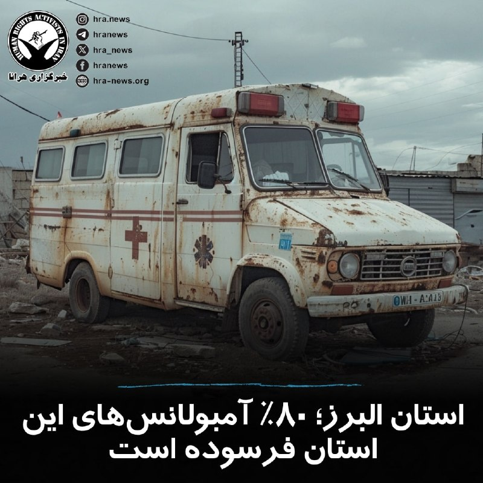

عیسی هواسی، بازرس کل استان البرز اعلام کرد که ۸۰٪ از آمبولانس‌های این استان بیش از ۱۵ سال قدمت داشته و #فرسوده هستند. هواسی همچنین با اشاره به #کمبود نیروی انسانی در حوزه درمان به‌خصوص در حوزه‌های بیهوشی، اطفال، داخلی و زنان و زایمان افزود که اکنون با کمبود ۱۳۹۵ پرستار و ۱۶۸ کمک پرستار مواجه هستیم.

↘️
@hranews_bot تماس ✉️ -  @Hranews  کانال هرانا 🆑

## Hranews — post 113811

گزارشی از اخراج، معوقات مزدی و بیمه‌ای کارگران در ۳ واحد مختلف

❗️
❗️
❗️
❗️
❗️ – کارگزاران مخابرات روستایی از عدم دریافت مطالبات مزدی خود خبر دادند. همچنین، شماری از #کارگران شهرداری چابهار با اشاره به عدم پرداخت مطالبات مزدی و حق بیمه خود، خواستار رسیدگی به وضعیتشان شدند. از سوی دیگر شماری از کارگران شرکت سیروحرکت راه‌ آهن زاهدان از کار اخراج شدند.

ادامه مطلب

↘️
@hranews_bot تماس ✉️ -  @Hranews  کانال هرانا 🆑

## alonews — post 129921

  <a href="telegram/content/alonews_129921_1782240853.webm" target="_blank">🎬 Download video</a>

👈پزشکیان اسلام‌آباد را ترک کرد

✅ @AloNews خبر جنگ

## alonews — post 129920

  <a href="telegram/content/alonews_129920_1782240853.webm" target="_blank">🎬 Download video</a>

👈ایلان ماسک خیلی منطقی و یهویی اومده یه ویدیو از محرم پست کرده

✅ @AloNews خبر جنگ

## alonews — post 129919

  <a href="telegram/content/alonews_129919_1782240854.mp4" target="_blank">🎬 Download video</a>

👈 نخست‌وزیر ایتالیا، ملونی: ما نمی‌توانیم اجازه دهیم که رژیم آیت‌الله‌ها به سلاح‌های هسته‌ای یا کلاهک‌های هسته‌ای دست یابد، به‌ویژه با توجه به اینکه آن‌ها از پیش — و به‌وضوح نشان داده‌اند که — موشک‌های برد بلند در اختیار دارند.

🔴و من فقط درباره ایالات متحده، یا کشورهای نزدیک‌تر به مرزهای ایران، یا اسرائیل صحبت نمی‌کنم.

🔴ما نمی‌توانیم اجازه دهیم. ما توان پرداخت هزینه آن را نداریم

✅ @AloNews خبر جنگ

## alonews — post 129918

👈عضو رسانه‌ای تیم مذاکره‌کننده: هیچ بازرسی از تاسیسات هسته‌ای آسیب‌دیده انجام نمی‌شود

✅ @AloNews خبر جنگ

## alonews — post 129917

  <a href="telegram/content/alonews_129917_1782240855.webm" target="_blank">🎬 Download video</a>

👈نخست‌وزیر ایتالیا: اگر اجازه دهیم ایران در تنگه هرمز عوارض بگیرد، وارد دنیایی خواهیم شد که هر مسیر تجاری استراتژیک به یک سلاح تبدیل می‌شود

✅ @AloNews خبر جنگ

## alonews — post 129916

  <a href="telegram/content/alonews_129916_1782240855.mp4" target="_blank">🎬 Download video</a>

وقتی این روزا میری بیرون

[@AloTweet]

## alonews — post 129915

  <a href="telegram/content/alonews_129915_1782240856.webm" target="_blank">🎬 Download video</a>

👈ریس کل بانک مرکزی: در مذاکرات با آمریکا دو تصمیم مهم در ارتباط با بخش اقتصادی این تفاهم‌نامه داشتیم

🔴یکی مربوط به آزادسازی منابع مسدود شده ما بود که در تفاهم‌نامه آمده بود و در جریان مذاکرات به تدریج آزاد می‌شود.

🔴قرار بود ۱۲ میلیارد آن ابتدای کار آزاد شود و بقیه منابع در جریان مذاکرات.

🔴با توجه به آن که در جریان مذاکرات ۱۴۰۲ موافقتنامه ای بین ایران و آمریکا امضا شده بود، ما مبنا را آن قرار دادیم

✅ @AloNews خبر جنگ

## alonews — post 129914

  <a href="telegram/content/alonews_129914_1782240856.webm" target="_blank">🎬 Download video</a>

👈طبق گزارش آکسیوس، تیم ملی فوتبال اجازه دارد دو روز پیش از دیدار بعدی خود در جام جهانی، به ایالات متحده سفر کند.

🔴تیم ملی برای دیدار سوم خود در سیاتل (۲۶ ژوئن / ۵ تیر) مقابل مصر، می‌تواند دو روز زودتر وارد آمریکا شود. با این حال، تیم همچنان باید در همان روز پایان مسابقه، کشور را ترک کند.

✅ @AloNews خبر جنگ

## alonews — post 129913

  <a href="telegram/content/alonews_129913_1782240857.mp4" target="_blank">🎬 Download video</a>

👈شهباز شریف: برنامه موشکی ایران هرگز بر سر میز مذاکرات نبوده و در تفاهم‌نامه نیز ذکر نشده است

✅ @AloNews خبر جنگ

## alonews — post 129912

👈نخستین بیمار تب کریمه کنگو در اردبیل شناسایی شد

🔴معاون بهداشتی دانشگاه علوم پزشکی استان اردبیل گفت: نخستین بیمار قطعی تب خونریزی دهنده کریمه کنگو در استان طی سال ۱۴۰۵ شناسایی و تحت درمان قرار گرفت.

🔴سعید صادقیه اهری به ایرنا، ایرنا اظهار کرد: این بیمار، زن ۴۶ ساله‌ای است که با سابقه گزش کنه شناسایی و بستری شده است.

✅ @AloNews خبر جنگ

## alonews — post 129911

  <a href="telegram/content/alonews_129911_1782240858.webm" target="_blank">🎬 Download video</a>

👈وزارت خارجه اسرائیل : حزب‌الله با حمایت مالی جمهوری اسلامی طی سال‌ها(صدها میلیون دلار) شبکه گسترده‌ای از تونل‌ها، انبارهای تسلیحاتی، سایت‌های موشکی و مراکز فرماندهی در جنوب لبنان ایجاد کرده.

🔴 هدف این زیرساخت‌ها حمله به اسرائیل بوده

✅ @AloNews خبر جنگ

## alonews — post 129910

  <a href="telegram/content/alonews_129910_1782240859.webm" target="_blank">🎬 Download video</a>

👈ترامپ: اوضاع در لبنان خوب پیش خواهد رفت

✅ @AloNews خبر جنگ

## alonews — post 129909

  <a href="telegram/content/alonews_129909_1782240859.webm" target="_blank">🎬 Download video</a>

👈ترامپ : ما داریم یه توافق فوق‌العاده با ایران می‌سازیم؛ داریم توافقی می‌سازیم که کشورمون و دنیا رو امن نگه می‌داره

🔴چون اجازه نمی‌دیم ایران سلاح هسته‌ای داشته باشه، و اونا اینو می‌دونن، و باهاش موافقن

✅ @AloNews خبر جنگ

## alonews — post 129908

  <a href="telegram/content/alonews_129908_1782240859.webm" target="_blank">🎬 Download video</a>

👈خبرنگار : بازرسان آژانس کی قراره برن داخل ایران؟

🔴ترامپ : هر وقت زمانش مناسب باشه، عجله‌ای نیست

✅ @AloNews خبر جنگ

## alonews — post 129907

  <a href="telegram/content/alonews_129907_1782240859.webm" target="_blank">🎬 Download video</a>

👈خبرنگار: شما در حال صحبت با رانندگان کامیون هستید. رانندگان کامیون در معرض خطر بالای از دست دادن شغل خود به دست هوش مصنوعی هستند...

🔴 پرزیدنت ترامپ: آن‌ها نیستند. شما نمی‌توانید شغلی پیدا کنید. ما بالاترین آمار شغلی در تاریخ این کشور را داریم.

🔴ما آنقدر شغل داریم که در دسترس خواهند بود و بزرگترین مشکل، جذب افراد است

✅ @AloNews خبر جنگ

## alonews — post 129906

  <a href="telegram/content/alonews_129906_1782240859.webm" target="_blank">🎬 Download video</a>

👈ترامپ: ایرانی‌ها تو این چندساله گدا و گشنه شدن

✅ @AloNews خبر جنگ

## alonews — post 129905

  <a href="telegram/content/alonews_129905_1782240859.webm" target="_blank">🎬 Download video</a>

👈ترامپ: مهمترین چیز الان این است که ایران هرگز سلاح هسته‌ای نخواهد داشت

✅ @AloNews خبر جنگ

## alonews — post 129904

  <a href="telegram/content/alonews_129904_1782240860.webm" target="_blank">🎬 Download video</a>

👈 ترامپ: هرکس که از توافق با ایران انتقاد کرده، باید آگاه و توجیه شود، حتی اگر از دوستان من باشد.

🔴آنها مشکل گرسنگی دارند. آنها مشکل غذا دارند. آنها مشکل دارو دارند/تورم آنها ۳۰۰٪ است. آنها مشکلات زیادی دارند.

✅ @AloNews خبر جنگ

## alonews — post 129903

  <a href="telegram/content/alonews_129903_1782240860.mp4" target="_blank">🎬 Download video</a>

👈ترامپ: ایران با بازرسی‌های کامل موافقت کرده؛ اگر غیر این بود مذاکرات را لغو می‌کردم

✅ @AloNews خبر جنگ

## alonews — post 129902

  <a href="telegram/content/alonews_129902_1782240861.mp4" target="_blank">🎬 Download video</a>

👈مارکو روبیو: مسئله لبنان جدا از ایران است زیرا لبنان کشوری مستقل با دولت خود است.

🔴ما قصد داریم با دولت لبنان مذاکره و با آن برخورد کنیم

🔴آینده لبنان متعلق به مردم لبنان از طریق دولت منتخب و مستقل آن‌هاست

✅ @AloNews خبر جنگ

---
📅 بروزرسانی: 1405/04/02 20:35
---

## VahidOOnLine — post 247016

  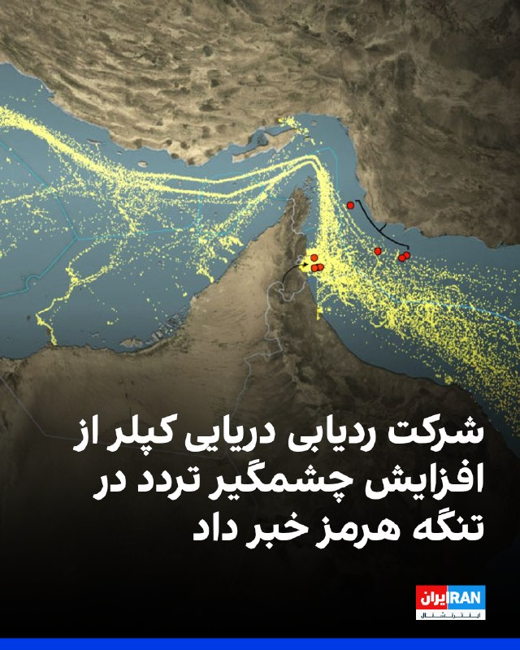

شرکت ردیابی دریایی کپلر گزارش داد تعداد عبور کشتی‌ها در بازه ۲۲ تا ۲۴ خرداد، ۳۲ مورد بوده، در حالی که این رقم در بازه ۲۹ تا ۳۱ خرداد به ۹۳ مورد رسیده و افزایش ۶۱ موردی را نشان می‌دهد.

این گزارش حاکی است که بیشترین افزایش تردد در شنبه ۳۱ خرداد ثبت شد؛ به‌طوری‌که تعداد عبورها نسبت به هفته قبل از سه مورد به ۴۲ مورد رسید که نشان‌دهنده رشد قابل توجه تردد در این گذرگاه راهبردی است.

‌🏁 🇬🇧 IranintlTV

🤖 @VahidOOnLine

## VahidOOnLine — post 247015

  <a href="telegram/content/VahidOOnLine_247015_1782234306.mp4" target="_blank">🎬 Download video</a>

♦️مارکو روبیو، وزیر امور خارجه آمریکا، سه‌شنبه‌شب دوم تیرماه پس از ورود به ابوظبی، در پاسخ به سوال خبرنگاری درباره آزادی کشتیرانی در تنگه هرمز گفت هیچ کشوری حق دریافت عوارض یا هزینه از یک آبراه بین‌المللی را ندارد.

روبیو با اشاره به وضعیت حقوقی تنگه هرمز گفت: «این یک آبراه بین‌المللی است و هیچ کشوری اجازه ندارد برای عبور از آن عوارض یا هزینه‌ای دریافت کند.» او افزود این موضوع بر اساس قوانین بین‌المللی در همه آبراه‌های بین‌المللی جهان اجرا می‌شود و انتظار آمریکا نیز رعایت همین اصل در تنگه هرمز است.

وزیر امور خارجه آمریکا همچنین گفت نیازی به متقاعد کردن کشورهای منطقه در این زمینه وجود ندارد و افزود که همه کشورهای منطقه با اصل آزادی کشتیرانی در این آبراه موافق‌اند.
‌🇸🇦 Indypersian

🤖 @VahidOOnLine

## VahidOOnLine — post 247014

  

مارکو روبیو، وزیر خارجه آمریکا، گفت جمهوری اسلامی در چارچوب هیچ توافق نهایی با واشینگتن اجازه دریافت عوارض یا هزینه عبور از تنگه هرمز را نخواهد داشت.
او تاکید کرد وضع چنین هزینه‌ای در یک آبراه بین‌المللی برخلاف قوانین بین‌المللی است.
روبیو همچنین گفت: «نمی‌توان درگیری‌ها در منطقه را پایان داد، در حالی که نیروهای نیابتی جمهوری اسلامی همچنان در حال شلیک موشک هستند.»

‌🏁 🇬🇧 IranintlTV

🤖 @VahidOOnLine

## VahidOOnLine — post 247013

  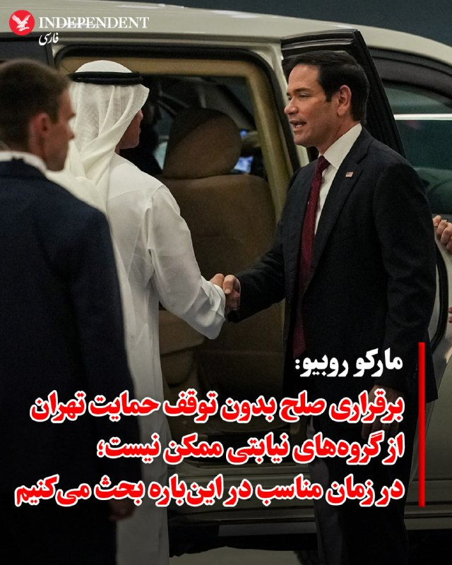

♦️ مارکو روبیو، وزیر امور خارجه ایالات متحده، در آغاز سفر منطقه‌ای خود وارد امارات متحده عربی شد. او قرار است در ادامه، از کویت و قطر نیز بازدید کند.

روبیو در بدو ورود با اشاره به مذاکرات جاری میان اسرائیل و لبنان در واشنگتن، این فرآیند را از توافق با جمهوری اسلامی ایران مجزا دانست و تاکید کرد که واشنگتن مستقیما با دولت مستقل لبنان در تعامل است و آینده این کشور، تنها به لبنانی‌ها مربوط است. او با این حال تصریح کرد که آینده خاورمیانه و اجرای کامل یادداشت تفاهم (MOU)امضاشده میان ایران و آمریکا، مستقیما به رفتار تهران بستگی دارد.

وزیر خارجه آمریکا خاطرنشان کرد که اگرچه مسئله شبه‌نظامیان تحت حمایت تهران، مستقیما در تفاهم‌نامه اسلام‌آباد ذکر نشده، اما تحقق صلح پایدار و پایان کامل خصومت‌ها در منطقه که در بند اول آمده، تا زمانی که گروه‌های نیابتی جمهوری اسلامی به حملات موشکی و پهپادی خود و همچنین مشارکت در اقدامات تروریستی ادامه دهند، امکان‌پذیر نخواهد بود. روبیو افزود که این موضوع به عنوان عاملی کلیدی در زمان مناسب با ایرانی‌ها بحث خواهد شد.
‌🇸🇦 Indypersian

🤖 @VahidOOnLine

## VahidOOnLine — post 247012

  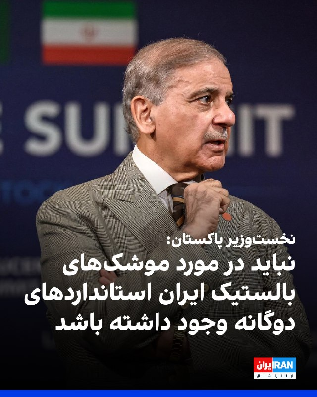

شهباز شریف، نخست‌وزیر پاکستان، سه‌شنبه گفت نباید در مورد موشک‌های بالستیک استانداردهای دوگانه وجود داشته باشد و افزود که ایران به میزان سایر کشورها، حق داشتن موشک‌های بالستیک را دارد.

به گزارش رویترز، شریف همچنین به خبرنگاران گفت که در تفاهم‌نامه‌ای که میان ایران و ایالات متحده به دست آمده، هیچ اشاره‌ای به موشک‌های بالستیک نشده است، زیرا این موضوع هرگز در آن مذاکرات روی میز نبوده است.
‌🏁 🇬🇧 IranintlTV

🤖 @VahidOOnLine

## VahidOOnLine — post 247011

♦️شهباز شریف، نخست‌وزیر پاکستان، روز سه‌شنبه دوم تیرماه در نشست خبری مشترک با مسعود پزشکیان، رئیس‌جمهوری اسلامی ایران، اعلام کرد به دعوت او هفته آینده به ایران سفر خواهد کرد تا در مراسم تشییع علی خامنه‌ای شرکت کند.

شریف در این نشست با اشاره به روابط دو کشور گفت: «زنده باد ایران و پاکستان.»
پزشکیان ساعاتی پیش با استقبال آصف علی زرداری، رئیس‌جمهور پاکستان، و شهباز شریف وارد اسلام‌آباد شده بود. این سفر در ادامه رایزنی‌های تهران و اسلام‌آباد پس از مذاکرات ایران و آمریکا در سوئیس انجام می‌شود؛ مذاکراتی که پاکستان در کنار قطر در میانجی‌گری آن نقش داشته است.
‌🇸🇦 Indypersian

🤖 @VahidOOnLine

## VahidOOnLine — post 247010

  

مارکو روبیو، وزیر خارجه آمریکا، گفت: «نمی‌توان درگیری‌ها در منطقه را پایان داد، در حالی که نیروهای نیابتی جمهوری اسلامی همچنان در حال شلیک موشک هستند.»

او همچنین تاکید کرد: «هیچ کشوری اجازه ندارد در یک آبراه بین‌المللی عوارض یا هزینه عبور وضع کند و این موضوع بر اساس قوانین بین‌المللی ممنوع است.»

روبیو افزود واشینگتن قصد دارد به‌طور مستقیم با دولت لبنان وارد گفت‌وگو شود.
‌🏁 🇬🇧 IranintlTV

🤖 @VahidOOnLine

## VahidOOnLine — post 247009

  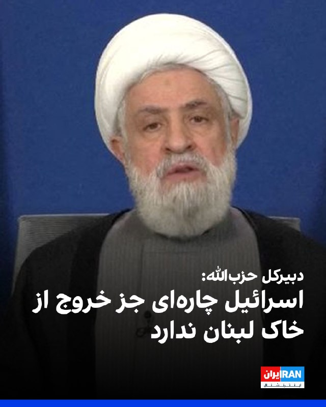

نعیم قاسم، دبیرکل حزب‌الله، گفت: «مقاومت تنها ضامن آزادی، استقلال و حاکمیت لبنان است.» او افزود اسرائیل حتی در صورت طولانی شدن درگیری‌ها نیز قادر به تحقق اهداف خود در میدان نیست.

نعیم قاسم همچنین گفت: «مشخص شده است که میان آمریکا و اسرائیل توافقی وجود دارد که بر اساس آن باید کار را تمام کنند. آمریکا ضامن قابل اعتمادی نیست.»

دبیرکل حزب‌الله تاکید کرد: «اسرائیل هیچ گزینه‌ای جز خروج از خاک لبنان ندارد.» او به دولت لبنان توصیه کرد از «قدرت مقاومت» استفاده کند و افزود حزب‌الله برای همکاری آماده است.
‌🏁 🇬🇧 IranintlTV

🤖 @VahidOOnLine

## VahidOOnLine — post 247008

  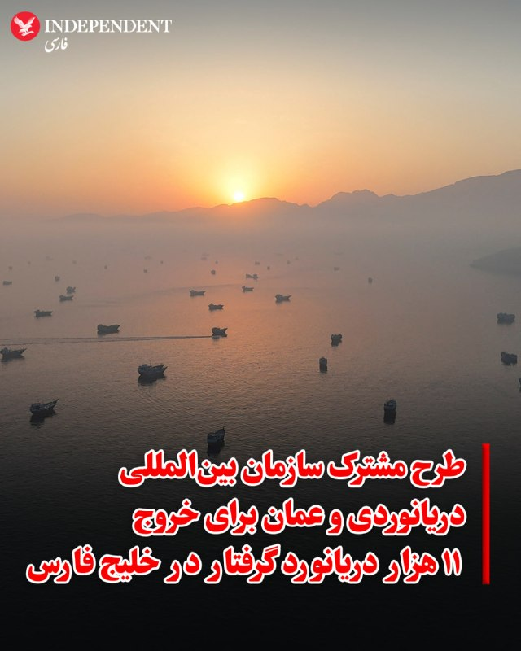

♦️ سازمان بین‌المللی دریانوردی (IMO) و دولت عمان روز سه‌شنبه دوم تیرماه اعلام کردند که طرحی را برای کمک به هدایت و خروج صدها کشتی از تنگه هرمز آغاز کرده‌اند. این شناورها با حدود ۱۱ هزار دریانورد، از ماه‌ها پیش و در پی توقف بیشتر ترددها در این تنگه به دلیل جنگ، در خلیج فارس گرفتار شده‌اند.

آرسنیو دومینگز، دبیرکل سازمان بین‌المللی دریانوردی، در بیانیه‌ای گفت: «این عملیات گسترده با همکاری نزدیک ایران، عمان، سایر کشورهای ساحلی منطقه، ایالات متحده و فعالان صنعت دریانوردی انجام خواهد شد.» او همچنین افزود: «ما تضمین‌های امنیتی لازم را دریافت کرده‌ایم.»

هم‌زمان، وزارت دفاع عمان نیز با صدور بیانیه‌ای اعلام کرد که مسیرهای امنی برای حرکت این شناورها تعیین شده است و «با تک‌تک کشتی‌ها به صورت مجزا تماس گرفته خواهد شد تا دستورالعمل‌های بعدی در اختیار آن‌ها قرار گیرد.» با این حال، در این بیانیه‌ها به مدت‌زمان مورد نیاز برای رفع کامل این گره ترافیکی و تخلیه کشتی‌ها اشاره‌ای نشده است.
‌🇸🇦 Indypersian

🤖 @VahidOOnLine

## VahidOOnLine — post 247007

  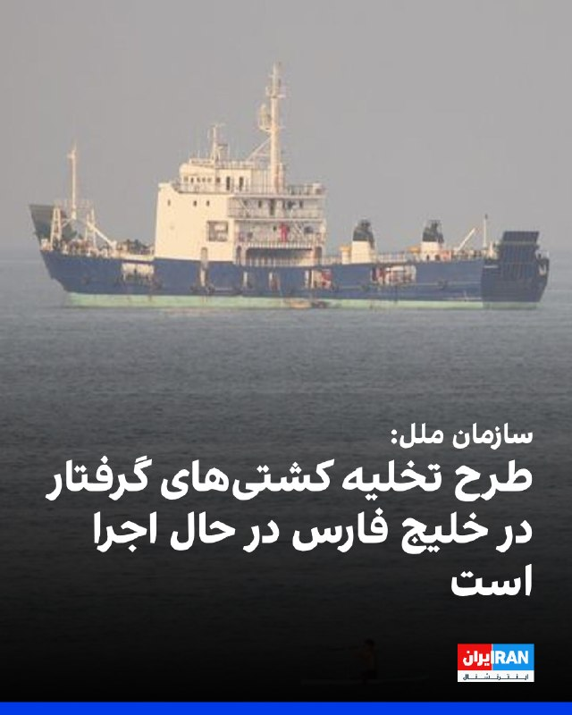

آژانس کشتیرانی سازمان ملل متحد سه‌شنبه اعلام کرد که پس از تفاهم میان ایران و ایالات متحده، طرحی برای تخلیه صدها کشتی با ۱۱ هزار دریانورد گرفتار در خلیج فارس از تنگه هرمز در حال اجرا است.

سخنگوی سازمان بین‌المللی دریانوردی سازمان ملل گفت: «ما اکنون تماس با کشتی‌ها را برای آغاز عملیات تخلیه شروع کرده‌ایم».

هنوز هیچ جدول زمانی مشخصی ارائه نشده است.
‌🏁 🇬🇧 IranintlTV

🤖 @VahidOOnLine

## VahidOOnLine — post 247006

ویدیوی رسیده به ایران‌اینترنشنال، مراسم خاک‌سپاری تقی سلیمی را نشان می‌دهد؛ شهروند ۵۷ ساله اهل آمل و از بازداشت‌شدگان اعتراضات دی‌ماه ۱۴۰۴ که ۲۱ اردیبهشت ۱۴۰۵ در زندان آمل جان باخته است.
تقی سلیمی ۳ بهمن ۱۴۰۴ بازداشت شد و به اتهام «اقدام علیه امنیت ملی» و «تخریب اموال عمومی» به ۱۰ سال حبس و جریمه نقدی محکوم شده بود.
‌🏁 🇬🇧 IranintlTV

🤖 @VahidOOnLine

## VahidOOnLine — post 247005

  <a href="telegram/content/VahidOOnLine_247005_1782234314.mp4" target="_blank">🎬 Download video</a>

♦️ دستگاه قضایی عراق روز سه‌شنبه دوم تیرماه اعلام کرد که در پرونده فساد مالی یکی از مقامات ارشد نفتی که اخیرا بازداشت شده است، بیش از ۸۵ میلیون دلار دارایی را توقیف کرده که بخشی از این پول نقد زیر زمین پنهان شده بود.

ماه گذشته، مقامات عراقی عدنان الجمیلی، معاون وزیر نفت در امور پالایش را در استان صلاح‌الدین بازداشت کردند. شورای عالی قضایی عراق اعلام کرد مجموع مبالغ کشف‌شده از زمان بازداشت او اکنون از ۹۸ میلیارد دینار (معادل ۷۴ میلیون دلار) به همراه ۱۱ میلیون دلار پول نقد فراتر رفته است. تحقیقات درباره اتلاف سرمایه در پروژه‌ها، تنها در روز سه‌شنبه به توقیف ۶۷ میلیارد دینار و یک میلیون دلار دیگر منجر شد.

بخشی از این لیره‌ها و دلارها در خانه‌ها پنهان شده و مابقی در عمق چهار متری زمین دفن شده بودند که با تجهیزات ویژه بیرون کشیده شدند. مقامات پیش‌تر ۷۰ ملک و ۲۱ خودرو را نیز در این پرونده مصادره کرده بودند. علی الزیدی، نخست‌وزیر جدید عراق، مانند اسلاف خود وعده مبارزه با فساد ساختاری در نهادهای دولتی را داده است.
‌🇸🇦 Indypersian

🤖 @VahidOOnLine

## VahidOOnLine — post 247004

♦️نفتالی بنت، نخست‌وزیر پیشین اسرائیل، سه‌شنبه دوم تیرماه اعلام کرد دولت او برنامه‌ای محرمانه برای خرید و انتقال ده‌ها هزار گیرنده اینترنت ماهواره‌ای استارلینک به ایران آغاز کرده بود تا معترضان در زمان قطع اینترنت بتوانند ارتباطات خود را حفظ کنند.

بنت در «نشست بین‌المللی سیاست‌گذاری سندیکای خبری یهودیان» در اورشلیم گفت: «هر بار که اعتراضی رخ می‌دهد، اینترنت را قطع می‌کنند و هیچ ارتباطی باقی نمی‌ماند.» او افزود دولتش فرایند خرید و انتقال مخفیانه ده‌ها هزار گیرنده استارلینک به داخل ایران را آغاز کرده بود تا امکان دسترسی به اینترنت و شبکه‌های اجتماعی حفظ شود و معترضان بتوانند فعالیت‌های خود را هماهنگ کنند.

نخست‌وزیر پیشین اسرائیل همچنین مدعی شد این طرح پس از پایان دوره مسئولیت او متوقف شده است. بنت با انتقاد از دولت بنیامین نتانیاهو گفت به همین دلیل در زمان آغاز اعتراضات، زیرساخت مورد نظر در داخل ایران وجود نداشت.

دفتر نخست‌وزیری اسرائیل و شرکت اسپیس‌ایکس، مالک شبکه استارلینک، تاکنون به این اظهارات واکنشی نشان نداده‌اند. استارلینک که متعلق به ایلان ماسک است، پیش‌تر از فعال شدن خدمات خود در ایران خبر داده بود.

نفتالی بنت، سیاستمدار راست‌گرای اسرائیلی، از خرداد ۱۴۰۰ تا تیر ۱۴۰۱ نخست‌وزیر این کشور بود. او پیش از رسیدن به مقام نخست‌وزیری، در دولت‌های مختلف اسرائیل سمت‌هایی از جمله وزارت آموزش و وزارت دفاع را بر عهده داشت.
‌🇸🇦 Indypersian

🤖 @VahidOOnLine

## VahidOOnLine — post 247003

  

کارزار «سه‌شنبه‌های نه به اعدام» در صدوبیست‌وششمین هفته خود، با پیوستن گروهی از زندانیان زندان کرمان، در ۵۷ زندان سراسر کشور ادامه یافت. این کارزار در بیانیه‌ای در واکنش به تفاهم اخیر جمهوری اسلامی و آمریکا تاکید کرد حقوق بشر مردم ایران، به‌ویژه زندانیان، قابل معامله نیست.

این کارزار در بیانیه‌ای که سه‌شنبه دوم تیر منتشر شد، به تفاهم اخیر میان جمهوری اسلامی و آمریکا اشاره کرد و نوشت در بندهای منتشر‌شده از این تفاهم، هیچ‌گونه توجهی به حقوق بشر، سرکوب و اعدام‌های وحشتناک در ایران نشده است.

در این بیانیه آمده است: «این موضوع نشان می‌دهد قدرت‌ها به فکر تغییر نیستند و مردم باید برای تغییر به خود متکی باشند و نه هیچ نیروی خارجی و قدرتی.»

زندانیان عضو کارزار تاکید کردند که طی ۱۲۶ هفته گذشته، هر سه‌شنبه با اعتصاب غذا و آنچه در توان داشته‌اند، به «اعدام‌های قرون وسطایی» اعتراض کرده‌اند.

آنها افزودند حقوق بشر مردم ایران، به‌ویژه زندانیان، قابل معامله نیست و هم‌صدا با عموم مردم ایران تا آخرین نفس و توان خود از آزادی، برابری و لغو حکم اعدام دفاع خواهند کرد.
‌🏁 🇬🇧 IranintlTV

🤖 @VahidOOnLine

## VahidOOnLine — post 247002

  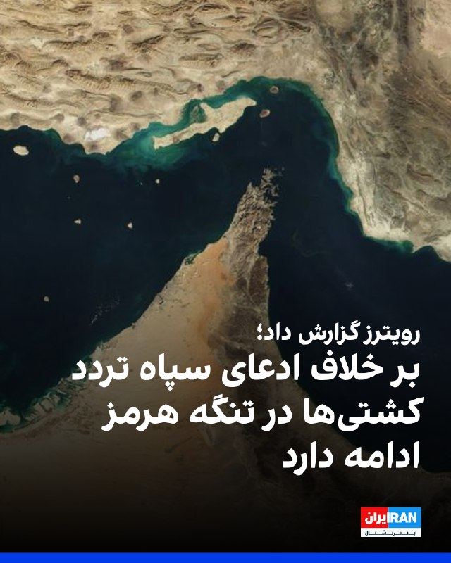

رویترز به نقل از ردیاب تردد کشتی‌ها گزارش داد با وجود اینکه سپاه پاسداران شنبه اعلام کرد تنگه هرمز بسته شده است، رفت‌وآمد کشتی‌ها در این آبراه همچنان ادامه دارد.
در همین حال، ارتش آمریکا اعلام کرده است که کشتی‌های تجاری همچنان در تنگه هرمز در حال فعالیت هستند.
‌🏁 🇬🇧 IranintlTV

🤖 @VahidOOnLine

## VahidOOnLine — post 247001

‏فرنوش فرجی، عضو تحریریه ایران‌اینترنشنال در کارزار کشف حقیقت، از جزییات کشته شدن آرمان گرجیان، میلاد لواسانی و کریم حیدری در انقلاب ملی ایرانیان گزارش می‌دهد
‌🏁 🇬🇧 IranintlTV

🤖 @VahidOOnLine

## VahidOOnLine — post 247000

  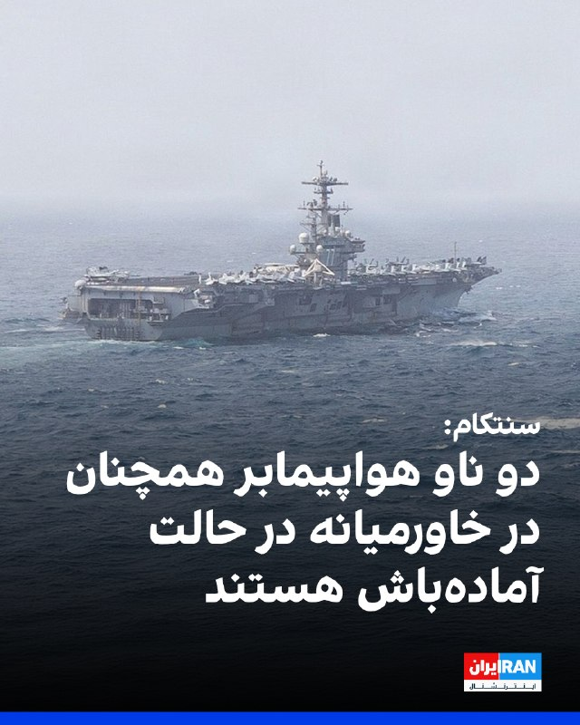

فرماندهی مرکزی ایالات متحده، سنتکام، با انتشار تصویری از ناو هواپیمابر «یواس‌اس جورج اچ. دبلیو. بوش»، در شبکه ایکس نوشت که این ناو در دریای عرب در حال فعالیت است.
سنتکام افزود دو ناو هواپیمابر آمریکا همچنان در خاورمیانه مستقر هستند و نیروهای آمریکایی حضور خود را حفظ کرده و در حالت آماده‌باش و مراقبت کامل قرار دارند.
‌🏁 🇬🇧 IranintlTV

🤖 @VahidOOnLine

## VahidOOnLine — post 246999

  

دفتر ریاست‌جمهوری لبنان اعلام کرد جوزف عون در تماس تلفنی با جی‌دی ونس، معاون رییس‌جمهور آمریکا، و مارکو روبیو، وزیر خارجه آمریکا، درباره آتش‌بس گفت‌وگو کرد.
ریاست‌جمهوری لبنان افزود ونس و روبیو طرح تشکیل سازوکار مشترک آمریکا، لبنان و جمهوری اسلامی برای نظارت بر آتش‌بس را بررسی و بر حمایت واشینگتن از حاکمیت دولت لبنان تاکید کردند.
‌🏁 🇬🇧 IranintlTV

🤖 @VahidOOnLine

## VahidOOnLine — post 246998

  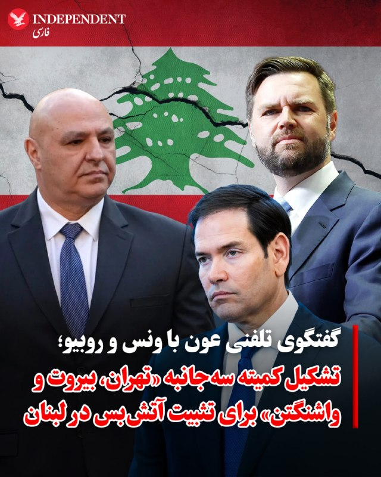

♦️ ژوزف عون، رئیس‌جمهوری لبنان، روز سه‌شنبه دوم تیرماه، تماس تلفنی مشترکی از سوی جی‌دی ونس، معاون رئیس‌جمهوری آمریکا و مارکو روبیو، وزیر امور خارجه این کشور دریافت کرد که طی آن آخرین تحولات لبنان و مرحله پس از نشست‌های سوئیس مورد بحث و بررسی قرار گرفت.

ونس و روبیو در این گفتگو بر حمایت واشنگتن از مواضع رئیس‌جمهوری و دولت لبنان برای بسط اقتدار دولت مشروع و تقویت حاکمیت ملی بر تمام اراضی این کشور، صرفا از طریق ارتش و نیروهای امنیتی، تاکید کردند. مقامات آمریکایی همچنین بر پیگیری اجرای توافقات سوئیس، از جمله تشکیل یک «کمیته مشترک سه‌جانبه» متشکل از ایالات متحده، لبنان و جمهوری اسلامی ایران جهت تثبیت آتش‌بس در لبنان و نظارت بر اجرای اقدامات مرتبط با آن تاکید کرده و یادآور شدند که ترتیبات اجرایی و نحوه ساختار این کمیته در حال بررسی است.

رئیس‌جمهور عون نیز با قدردانی از توجه ایالات متحده به پایان دادن به جنگ، تاکید کرد که دولت لبنان تنها نهاد مسئول برای حفظ حاکمیت ملی، کرامت و امنیت شهروندان است.
‌🇸🇦 Indypersian

🤖 @VahidOOnLine

## VahidOOnLine — post 246997

🗣روایت شما از روند مذاکرات توافق میان جمهوری‌اسلامی و آمریکا - سه‌شنبه ۳ تیر

🔹آقای جی‌دی ونس، یعنی هنوز شما متوجه نشدید مردم ایران دغدغه نان و گندم ندارند؟ ما برای گرسنگی اعتراض نکردیم، جوانان ما برای آزادی و رهایی از دیکتاتوری قیام کردند و پرپر شدند.

🔹آقای ترامپ و آقای جی‌دی ونس، ملت ایران گرسنه نیستند، اتفاقا خیلی هم ثروتمندند. خاک بر سر حکومتی که باعث تحقیر ملتش توسط بیگانگان می‌شود.

🔹مردم عزیز، این‌قدر نگید چرا جی‌دی ونس این‌جوری در مورد مردم ایران حرف زده. اینا همش تقصیر مذاکره‌کنندگان و مسئولین بی‌کفایت جمهوری‌اسلامیه که کرامت مردم ایران رو از بین برده‌اند.

🔹یکی به ونس بگه ایران این‌قدر ثروتمند هست که می‌تونه هنگام سونامی مردم گشنه آمریکا رو سیر کنه که دست به غارت هایپرمارکت‌ها نزنند.

🔹آقای ونس، مردم ایران نه گرسنه گندم و سویا، که تشنه آزادی و کرامت انسانی هستند. مردم ایران می‌توانند بهترین متحدان دنیای آزاد باشند. امید که ارزش آن را به‌موقع درک کنید.

🔹به آقایان ترامپ و جی‌دی ونس بگین ملت ایران این‌قدر عزت‌نفس دارن که محتاج غذای امثال شما نباشن. شما مثل اینکه خیلی فراموش‌کار هستین که چه قولی به ملت ایران دادین.

🔹آقای ونس، گرسنه شمایید که همچنان چشم طمع به منابع مردم خاورمیانه دارید و به خاطر آن، با جنایتکاران و دزدها سازش می‌کنید. مردم شریف ایران حاضرند هر سختی را تحمل کنند و به آزادی و حقوق انسانی خود برسند.

🔹آقای ونس، نگران گرسنگی ما مردم ایران نباش. به فکر اعدامی‌ها و معترضان سیاسی باش که هر روز دارن اعدام می‌شن. ما حاضریم سفره‌هامون کوچیک بشه، ولی بچه‌هامون آزاد شن. ما مردم ایران با غیرت‌تر از این هستیم که تو واسمون غلات بفرستی.

🔹خطاب به آقای ونس: مردم ایران هرگز گرسنه نبودند و نیستند. مردم ایران با تمدن ۲۵۰۰ ساله انتخاب کرده‌اند با وجود راهی دشوار و تحمل سختی‌ها، اعتراض خودشون را به وجود رژیم دیکتاتور جمهوری اسلامی نشان دهند. همان رژیمی که شما با خیانت به مردم ایران برای بقایش بهش فرصت دوباره دادید.

🔹به آقای ترامپ بگید لطفا در ازای پول‌های بلوکه‌شده ایران، به‌جای گندم و ذرت از آمریکا، دموکراسی و آزادی واسه مردم ایران بیارید.

🔹در عرض ۴ ماه، از مردم شریف ایران که قرار بود در خونه بمونن و آخر کار آزادی‌شون رو پس بگیرن، شدیم مردم گرسنه ایران.

🔹واقعا داریم شرایط سختی رو می‌گذرونیم، اما به‌خاطر جاویدنامان عزیزمان باید سر پا و قوی باشیم. ما کشورمون رو از این اشغالگرا پس می‌گیریم به‌زودی. ما مردم ایران شایسته بهترین‌ها هستیم، این رو به دنیا ثابت می‌کنیم.

🔹آقای ترامپ، شما از بچه‌های ما که کشته شدند خبر ندارید. اینکه هر روز جوان‌های ما اعدام می‌شوند و چقدر ما داریم زجر می‌کشیم. بعد با خوبی و خوشی باهاشون مذاکره می‌کنید و خودتان را به بشکه نفت می‌فروشید و برای ما ذرت و سویا می‌فرستید؟

🔹آقای جی‌دی ونس، ایران ثروتمندترین کشور از لحاظ منابع و معادن است و حاصل‌خیزترین خاک را دارد. اگر جمهوری اسلامی نباشد و کشورهای دیگر ما را چپاول نکنند، هیچ نیازی به ذرت و سویای شما نیست.
‌🏁 🇬🇧 IranintlTV

🤖 @VahidOOnLine

## WithYashar — post 15677

  <a href="telegram/content/WithYashar_15677_1782234321.mp4" target="_blank">🎬 Download video</a>

پزشکیان دکترای افتخاری از پاکستان دریافت کرد 
@withyashar

## WithYashar — post 15676

تتر 163K
@withyashar

## WithYashar — post 15675

## WithYashar — post 15674

  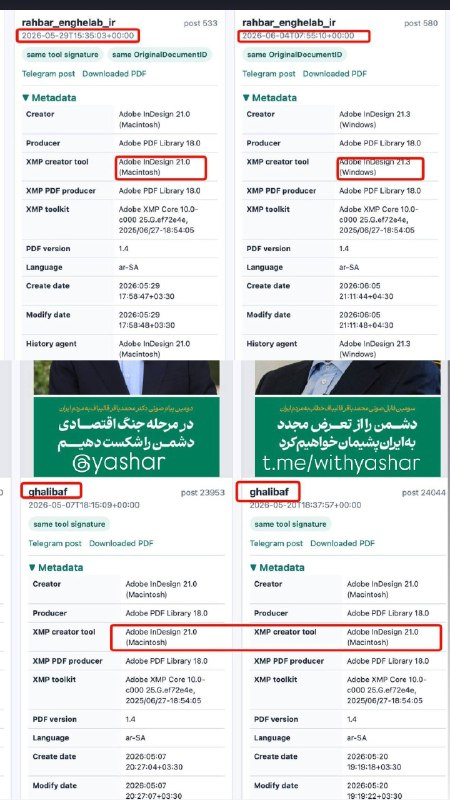

شواهد نشان میدهد مدیران دفتر انتشارات مجتبی خامنه‌ای دقیقاً امضای ابزار یکسان ، نسخه یکسان و سیستم عامل یکسان دفتر انتشارات قالیباف استفاده کرده اند.

در‌نتیجه هر دو نامه قالیباف و مجتبی خامنه ای با یک کامپیوتر نوشته شده در ابتدا و بعد از اوایل ماه ۶ میلادی، اوایل خرداد ماه، رایانه را از مک به رایانه ویندوزی تغییر داده‌اند.
@withyashar
پیشتر در ویدیو اتاق جنگ گفتم که ای آی دست ممباقر هست!

## WithYashar — post 15673

ریاست جمهوری لبنان:
ونس و وزیر خارجه آمریکا خواستار تشکیل یک کار گروه آمریکایی، لبنانی و ایرانی برای تثبیت آتش‌بس شدند

آن‌ها گفته‌اند که ترتیبات مربوط به حوزه اختیارات این کمیته و نحوه تشکیل آن، در دست بررسی است
@withyashar

## WithYashar — post 15672

هاآرتص به نقل از منابع آگاه: تل‌آویو علاقه‌مند است در مذاکرات واشنگتن راه‌حل‌هایی پیدا کند که مداخلهٔ ایران را از تحولات لبنان دور نگه دارد.
@withyashar

## WithYashar — post 15671

  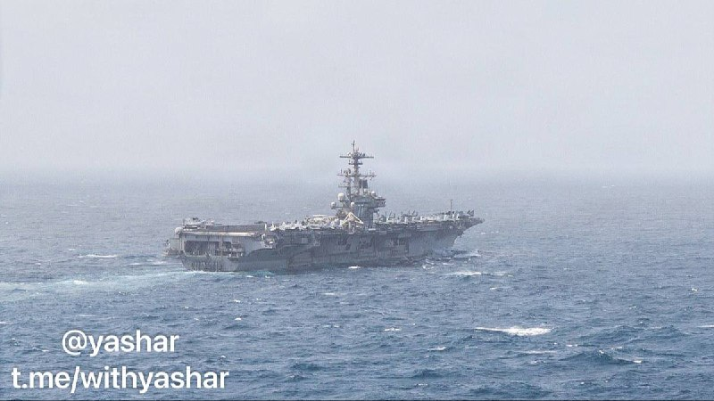

سنتکام: ما هستیم ناو ها هم هستند نگران نباشید

ناو هواپیمابر USS جورج اچ. دبلیو. بوش (CVN 77) در دریای عرب(شمال‌غرب اقیانوس هند ابتدای دریای عمان جنوب ایران ) در حال حرکت است.

دو ناو هواپیمابر به فعالیت خود در خاورمیانه ادامه می‌دهند در حالی که نیروهای آمریکایی همچنان حضور دارند و هوشیار هستند.
@withyashar

## mwarmonitor — post 11427

💢وزیر امور خارجه آمریکا، مارکو روبیو، گفته است تا زمانی که نیروهای نیابتی مورد حمایت ایران همچنان در حال شلیک موشک باشند، نمی‌توان به پایان تنش‌ها در منطقه رسید.

💢روبیو افزود که این موضوع «در زمان مناسب» مطرح خواهد شد و همچنین تأکید کرد هیچ کشوری حق ندارد برای عبور از تنگه هرمز عوارض یا هزینه دریافت کند. او این تنگه را یک آبراه بین‌المللی دانست که طبق قوانین بین‌المللی موجود تحت حفاظت قرار دارد.

@mwarmonitor

## mwarmonitor — post 11426

  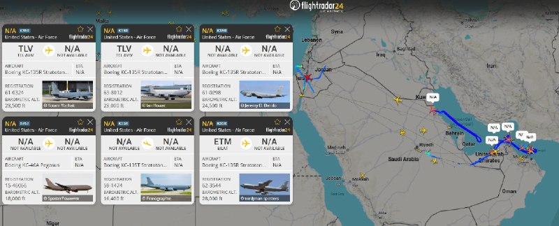

💢یک فروند هواپیمای سوخت‌رسان KC-135R نیروی هوایی آمریکا (62-3543) کد اضطراری 7700 را ارسال کرده و در حال بازگشت از عراق به فرودگاه تل‌آویو بوده است. 
💢این هواپیما در حال سوخت‌رسانی به جنگنده‌ها در نزدیکی پایگاه موقتی بوده که گفته می‌شود اسرائیل در خاک عراق…

## mwarmonitor — post 11425

  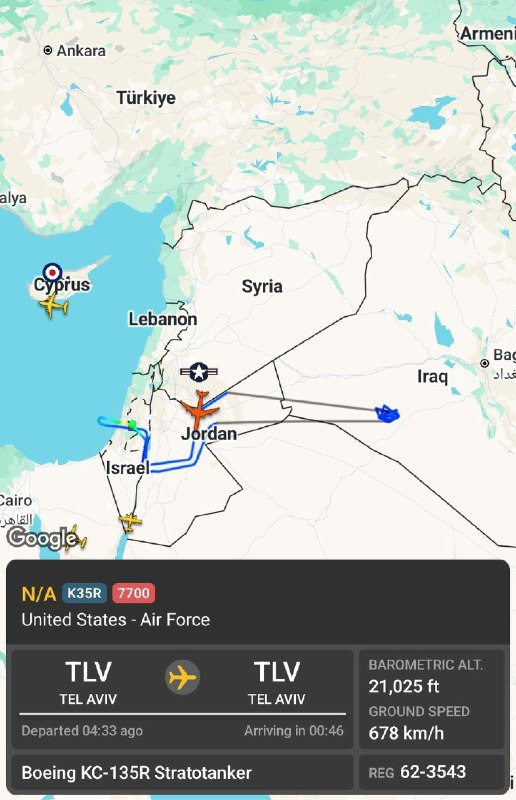

💢یک فروند هواپیمای سوخت‌رسان KC-135R نیروی هوایی آمریکا (62-3543) کد اضطراری 7700 را ارسال کرده و در حال بازگشت از عراق به فرودگاه تل‌آویو بوده است.

💢این هواپیما در حال سوخت‌رسانی به جنگنده‌ها در نزدیکی پایگاه موقتی بوده که گفته می‌شود اسرائیل در خاک عراق ایجاد کرده است.

@mwarmonitor

## mwarmonitor — post 11424

  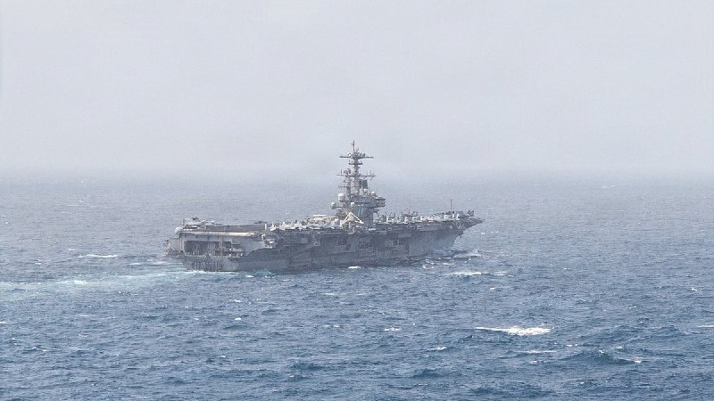

〰️ناو هواپیمابر USS George H.W. Bush (CVN-77) در دریای عرب در حال دریانوردی است. در همین حال، دو ناو هواپیمابر همچنان در خاورمیانه به عملیات خود ادامه می‌دهند و نیروهای آمریکا در منطقه در حالت حضور و آماده‌باش باقی مانده‌اند.

@mwarmonitor

## mwarmonitor — post 11423

🟠م منابع محلی ؛ جنگنده‌های آمریکایی و در ارتفاع پایین در آسمان استان دیرالزور سوریه، در نزدیکی مرز عراق در حال پرواز هستند.

@mwarmonitor

## FoxNewsTwitter — post 343298

  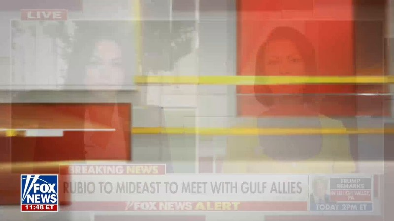

Fox News (Twitter/X)

The Trump administration is stressing the U.S. will judge Iran by its actions — not its words — when it comes to dismantling its nuclear program and allowing IAEA inspections.

VP Vance, freshly back in Washington after talks with the Iranian regime, says progress has been made toward a deal to end the war, as Secretary of State Marco Rubio is heading to the Persian Gulf to rally support among U.S. allies in the region, @aishahhasnie reports.

## FoxNewsTwitter — post 343297

  <a href="telegram/content/FoxNewsTwitter_343297_1782234328.mp4" target="_blank">🎬 Download video</a>

Fox News (Twitter/X)

WATCH: President Trump boards Air Force One with umbrella in hand en route to Reading, Pennsylvania where he's set to speak at a Mack Trucks plant in the key battleground state.

## FoxNewsTwitter — post 343296

  

Fox News (Twitter/X)

RT @AmericaNewsroom: 🇺🇸 GREAT AMERICAN CELEBRATION: U.S. Air Force pilot & F-16 Demonstration Team Commander Taylor Heister talks the upcoming flyover to begin the Great State American State Fair in Washington -- and the impact of this moment in celebrating America 250.

## FoxNewsTwitter — post 343295

  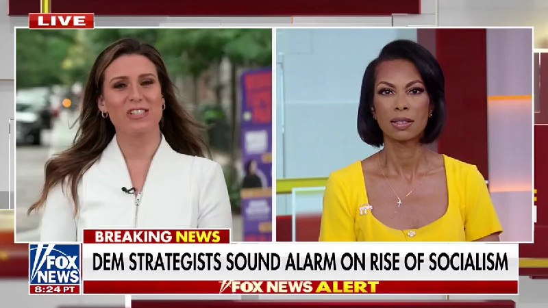

Fox News (Twitter/X)

New York’s primaries are exposing a growing divide within the Democratic Party, as New York City Mayor Zohran Mamdani is going all-in to help elect three far-left congressional candidates.

The candidates are campaigning on policies such as ending U.S. military aid to Israel, expanding access to housing, abolishing ICE, and raising taxes on wealthier Americans as they seek to beat establishment-backed Democrats.

Just six months into his term, Mamdani is directly challenging the Democratic machine, fueling speculation that a broader political realignment could be underway as New York voters head to the polls in these pivotal primaries.

## FoxNewsTwitter — post 343294

  <a href="telegram/content/FoxNewsTwitter_343294_1782234332.mp4" target="_blank">🎬 Download video</a>

Fox News (Twitter/X)

Ukraine says it struck major infrastructure targets across Russian-held Crimea.

Kyiv claims its forces hit a railway bridge, a power plant and other key sites as part of an effort to isolate the peninsula from Russian supply lines.

The attacks come as Russian authorities reportedly suspend civilian gasoline sales in parts of Crimea amid growing disruptions to fuel and electricity networks during the peak summer tourist season.

## FoxNewsTwitter — post 343293

  <a href="telegram/content/FoxNewsTwitter_343293_1782234334.mp4" target="_blank">🎬 Download video</a>

Fox News (Twitter/X)

BREAKING: HHS Sec. RFK Jr. outlines "particularly disturbing" allegations against health care fraud suspects, including instances where patients died while believing they were receiving legitimate medical care.

"Some defendants allegedly ordered medically unnecessary tests. Others prescribed products that patients did not need. Some allegedly fueled opioid addiction to increase their own revenue."

"In certain cases, patients allegedly died, all believing they were receiving legitimate Medicare medical care from providers only view them, as well as billing opportunities."

## FoxNewsTwitter — post 343292

  <a href="telegram/content/FoxNewsTwitter_343292_1782234336.mp4" target="_blank">🎬 Download video</a>

Fox News (Twitter/X)

JUST IN: Acting U.S. Attorney General Todd Blanche announces a massive federal crackdown on healthcare fraud, revealing that the DOJ has charged hundreds of defendants across the country over a multibillion-dollar scheme.

“Since June 8th, we've charged 455 defendants across 56, like I said a minute ago, U.S. attorneys offices and 45 US states and territories.”

“As alleged in the various indictments, these individuals participated in health care fraud schemes involving over $6.5 billion in false claims submitted to Medicare, Medicaid, and other health care programs.”

## FoxNewsTwitter — post 343291

  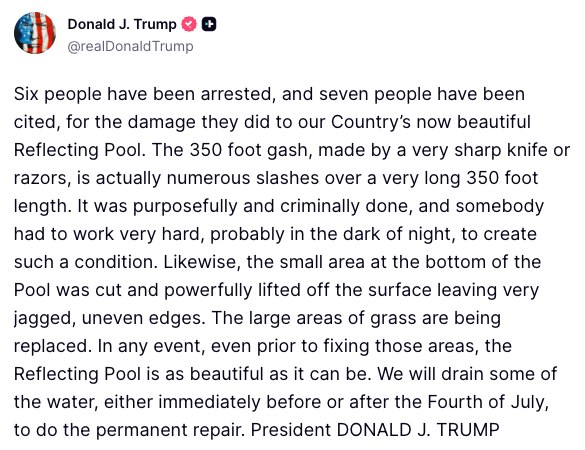

Fox News (Twitter/X)

JUST IN: President Trump reveals that six people have been arrested and seven people have been cited for damaging and vandalizing the Reflecting Pool in Washington, D.C.:

"The 350 foot gash, made by a very sharp knife or razors, is actually numerous slashes over a very long 350 foot length. It was purposefully and criminally done, and somebody had to work very hard, probably in the dark of night, to create such a condition."

## FoxNewsTwitter — post 343290

‌Fox News (Twitter/X)

https://www.foxnews.com/politics/us-sanctions-five-cuban-entities-castro-family-member-latest-pressure-campaign-rubio-says

## FoxNewsTwitter — post 343289

  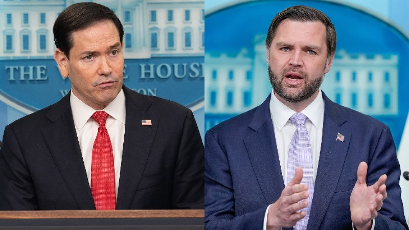

Fox News (Twitter/X)

President Trump has repeatedly praised Vice President JD Vance and Secretary of State Marco Rubio for their work in the administration, and he’s also said that a joint ticket featuring the two of them would be unbeatable in 2028.

Many voters are now asking will Rubio and Vance run for president?

Our sponsor Kalshi’s prediction market shows there’s a 60.2% chance that they do.

https://www.foxnews.com/politics/us-official-says-jd-vance-made-great-progress-iran-talks-calls-snub-reports-foreign-propaganda

## FoxNewsTwitter — post 343288

  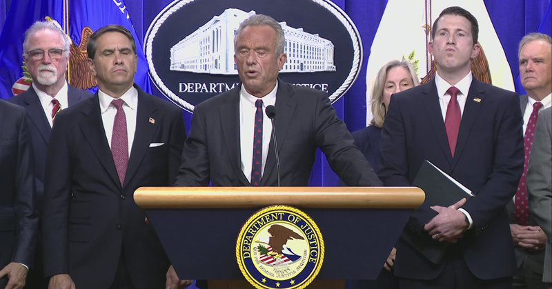

Fox News (Twitter/X)

WATCH LIVE: DOJ announces total numbers from annual healthcare fraud takedown https://twitter.com/i/broadcasts/1yJAPPNWjEzGb

## FoxNewsTwitter — post 343287

Fox News (Twitter/X)

BREAKING: US sanctions five Cuban entities, Castro family member in latest pressure campaign, Rubio says

## pm_afshaa — post 94699

  <a href="telegram/content/pm_afshaa_94699_1782234340.webm" target="_blank">🎬 Download video</a>

🔴پزشکیان: بحث موشکی در تفاهم‌نامه نیست و هیچ‌وقت وجود نخواهد داشت.

اگه موشک‌های ما نبود اسرائیل و آمریکا ایران رو هم مثل غزه شخم می‌زدن.

💧 Rainbet.com the #1 Non-KYC Crypto Casino & Sportsbook @rainbetcom

😁 @Pm_Afshaa

## pm_afshaa — post 94698

  <a href="telegram/content/pm_afshaa_94698_1782234341.webm" target="_blank">🎬 Download video</a>

🔴روبیو، وزیر خارجه آمریکا: تا وقتی نیروهای نیابتی جمهوری اسلامی موشک شلیک می‌کنن، پایان درگیری‌ ممکن نیست.

جمهوری اسلامی در هیچ توافقی حق دریافت عوارض از تنگه هرمز رو نخواهد داشت چون این کار خلاف قوانین بین‌المللیه.

💧 Rainbet.com the #1 Non-KYC Crypto Casino & Sportsbook @rainbetcom

😁 @Pm_Afshaa

## pm_afshaa — post 94697

  <a href="telegram/content/pm_afshaa_94697_1782234342.webm" target="_blank">🎬 Download video</a>

🔴مارکو روبیو، وزیر خارجه آمریکا:

اگر رهبری ایران تصمیم بگیره که به جای یک جنبش انقلابی صادرکننده ترور، کشوری باشه، فرصتی برای انجام کارهای باورنکردنی در ایران خواهد داشت. این فرصت‌ها میتونه شامل سرمایه گذاری مستقیم خارجی باشه... این پول دولت ما نخواهد بود.

💧 Rainbet.com the #1 Non-KYC Crypto Casino & Sportsbook @rainbetcom

😁 @Pm_Afshaa

## pm_afshaa — post 94696

  <a href="telegram/content/pm_afshaa_94696_1782234343.webm" target="_blank">🎬 Download video</a>

🔴شهباز شریف، نخست وزیر پاکستان:
هفته آینده به تهران میام تا در مراسم تشییع پیکر رهبر ایران شرکت کنم.

💧 Rainbet.com the #1 Non-KYC Crypto Casino & Sportsbook @rainbetcom

😁 @Pm_Afshaa

## pm_afshaa — post 94695

  <a href="telegram/content/pm_afshaa_94695_1782234343.webm" target="_blank">🎬 Download video</a>

🔴سایت بصیرت به نقل از سعید جلیلی:
به هیچ وجه منظور مجتبی خامنه‌ای از بیان جمله «بنده علی الاصول نظر دیگری داشتم»، مخالفت با اصل مذاکره نبوده.

💧 Rainbet.com the #1 Non-KYC Crypto Casino & Sportsbook @rainbetcom

😁 @Pm_Afshaa

## pm_afshaa — post 94694

بانک مرکزی :اختلال خدمات بانکی تا آخر امشب درست میشه

💧 Rainbet.com the #1 Non-KYC Crypto Casino & Sportsbook @rainbetcom

😁 @Pm_Afshaa

## pm_afshaa — post 94693

  <a href="telegram/content/pm_afshaa_94693_1782234344.webm" target="_blank">🎬 Download video</a>

🔴وزارت خارجه اسرائیل:

حزب‌الله با حمایت مالی جمهوری اسلامی طی سال‌ها(صدها میلیون دلار) شبکه گسترده‌ای از تونل‌ها، انبارهای تسلیحاتی، سایت‌های موشکی و مراکز فرماندهی در جنوب لبنان ایجاد کرده. هدف این زیرساخت‌ها حمله به اسرائیل بوده.

💧 Rainbet.com the #1 Non-KYC Crypto Casino & Sportsbook @rainbetcom

😁 @Pm_Afshaa

## pm_afshaa — post 94692

  <a href="telegram/content/pm_afshaa_94692_1782234345.webm" target="_blank">🎬 Download video</a>

🔴وزارت خارجه دانمارک اعلام کرد که بعد از بیش از سه ماه تعطیلی، سفارتش در تهران رو بازگشایی کرد.

💧 Rainbet.com the #1 Non-KYC Crypto Casino & Sportsbook @rainbetcom

😁 @Pm_Afshaa

## pm_afshaa — post 94690

  <a href="telegram/content/pm_afshaa_94690_1782234346.mp4" target="_blank">🎬 Download video</a>

امروز پاکستانی‌ها هواپیمای پزشکیان رو تا اسلام‌آباد اسکورت کردن؛ چهره غمگین و ماتم‌زده‌ پزشکیان تو این ویدیو سوژه رسانه‌ها شده :

💧 Rainbet.com the #1 Non-KYC Crypto Casino & Sportsbook @rainbetcom

😁 @Pm_Afshaa

## iaghapour — post 2700

  <a href="telegram/content/iaghapour_2700_1782234347.webm" target="_blank">🎬 Download video</a>

​«فقط بفروش، پشتیبانی رو بسپار به پارس پنل!» 
💼
〰️
​اگر به دنبال یک درآمد عالی، بی‌دردسر و مطمئن هستید، پارس پنل تمام زیرساخت‌ها را برای شما آماده کرده است. شما فقط روی فروش تمرکز کنید، بقیه کارها با ما!
​
🌟
🌟 چرا پارس پنل؟
🤔

​
🌍 پنل مولتی لوکیشن: اتصال همزمان به چندین کشور از جمله:

🇩🇪 آلمان | 
🇦🇪 دبی | 
🇹🇷 ترکیه | 
🇫🇮 فنلاند | 
🇳🇱 هلند | 
🇫🇷 فرانسه | 
🇺🇸 آمریکا | 
🇮🇹 ایتالیا | 
🇦🇿 آذربایجان | 
🇮🇳 هند | 
🇵🇱 لهستان | 
🇸🇪 سوئد | 
🇬🇧 بریتانیا
​
🎁 هدیه شروع: با استارت ربات، همین حالا 10 هزار تومان هدیه اولیه دریافت کنید!
​
⚡️ تحویل فوری: پنل اختصاصی خود را زیر ۱۰ ثانیه تحویل بگیرید.
​
💰 جشنواره شارژ: برای هر بار شارژ حساب، هدیه و بونوس ویژه بگیرید.
​
🛠 تست رایگان: اول مصرف کن، بعد پرداخت کن! (تضمین کیفیت خدمات)
​
🔥 با پارس پنل می‌توانید تفاوت را احساس کنید.

​
⬇️ همین حالا روی لینک زیر کلیک کن و پنل رایگانت رو تحویل بگیر:

🆔 panelparsbot

## iaghapour — post 2699

## iaghapour — post 2698

🚨 حمله سایبری به شبکه بانکی!

شرکت خدمات انفورماتیک با انتشار اطلاعیه‌ای، دلیل اختلالات گسترده در کارت‌های بانکی را تشریح کرد.

🔹 جزئیات این اختلال بانکی:
🔸 دلیل اصلی قطعی: وقوع حملات سایبری به سامانه‌های کارت‌محور بانک‌های ملی، صادرات و تجارت.

🔸 اقدام پیشگیرانه: این شرکت اعلام کرده برای جلوگیری از دسترسی غیرمجاز هکرها و حفظ امنیت داده‌ها و موجودی مشتریان، خدمات مبتنی بر کارت را موقتاً و به‌صورت عمدی از دسترس خارج کرده است.

🔸 گستردگی مشکل: با وجود اینکه در اطلاعیه رسمی فقط نام ۳ بانک آمده است، اما بررسی‌ها و گزارش‌های مردمی نشان می‌دهد قطعی‌ها گسترده‌تر بوده و بانک‌های دیگری مثل «ملت» هم درگیر این اختلال شده‌اند.

🔸 وضعیت فعلی: تیم‌های فنی و متخصصان امنیت سایبری در حال کار روی شبکه هستند تا این مشکل برطرف شده و خدمات بانکی به حالت عادی برگردد.

پ.ن: بابا ولش کنید‍! بعد 2 هفته اختلال این حرفا چیه میزنید؟ مثل قبل همون روند تکذیب رو جلو برید. بگید که ما هک نشدیم و قطعه سخت افزاری سوخته!

🆔 @iAghapour

## DEJradio — post 5918

🎥
🎤 روزنامه‌نگار پرنفوذ نزدیک به کاخ سفید: تفاهم با جمهوری اسلامی از جنگ آینده جلوگیری نخواهد کرد

مارک لوین، روزنامه‌نگار پرنفوذ و تاریخ‌پژوه نزدیک به جمهوری‌خواهان و کاخ سفید، در برنامه «زندگی، آزادی با لوین» ضمن هشدار نسبت به تفاهم صورت‌گرفته برای دستیابی به یک توافق با جمهوری اسلامی توسط دولت ترامپ، تاکید کرد که این تفاهم، از جنگ‌های آینده جلوگیری نخواهد کرد.
* برای مشاهده نسخه با کیفیت به حساب ایکس دژ مراجعه فرمایید
#تفاهم #مذاکرات
@DEJradio

## mamlekate — post 103757

📝 سفارت دانمارک در تهران بازگشایی شد

وزارت خارجه دانمارک اعلام کرد که پس از بیش از سه ماه تعطیلی، سفارت خود در تهران را بازگشایی کرده است. در بیانیه این وزارتخانه آمده است: «با توجه به بهبود وضعیت امنیتی در ایران، سفارت در تهران درهای خود را دوباره باز می کند.» سفارت ایتالیا نیز جمعه بازگشایی شد.

@mamlekate

## VahidOnline — post 76629

  

وزیر خارجه آمریکا می‌گوید تا زمانی که گروه‌های نیابتی مورد حمایت ایران به حملات موشکی ادامه دهند، دستیابی به صلح پایدار در منطقه غیرممکن است.
مارکو روبیو که به امارات متحده عربی سفر کرده است، روز سه‌شنبه دوم تیرماه افزود این موضوع «در زمان مناسب» مورد رسیدگی قرار خواهد گرفت.

او همچنین تأکید کرد هیچ کشوری حق ندارد بر تنگه هرمز عوارض یا هزینه‌ای تحمیل کند، چرا که این آبراه یک مسیر بین‌المللی است و بر اساس قوانین موجود بین‌المللی حفاظت می‌شود.
تنگهٔ هرمز از زمان آغاز حملات آمریکا و اسرائیل به ایران در ۹ اسفند پارسال، از سوی سپاه پاسداران مسدود شده بود و تنها هفته گذشته پس از توافق اولیه بین تهران و واشینگتن برای پایان دادن به جنگ تا حدودی بازگشایی شد.

وزیر خارجه آمریکا در مورد لبنان که برقراری آتش‌بس در این کشور بخشی از توافق بین تهران و واشینگتن است، گفت که ما قرار است مستقیماً با دولت لبنان به توافق برسیم.
روبیو تصریح کرد که «آینده لبنان را مردم لبنان تعیین می‌کنند و پرونده لبنان از هرگونه توافق با ایران جداست».
@VahidHeadline
فرماندهی مرکزی ایالات متحده، سنتکام، با انتشار تصویری از ناو هواپیمابر «یواس‌اس جورج اچ. دبلیو. بوش»، در شبکه ایکس نوشت که این ناو در دریای عرب در حال فعالیت است.
سنتکام افزود دو ناو هواپیمابر آمریکا همچنان در خاورمیانه مستقر هستند و نیروهای آمریکایی حضور خود را حفظ کرده و در حالت آماده‌باش و مراقبت کامل قرار دارند.
@VahidOOnLine

📡 @VahidOnline

## VahidOnline — post 76628

  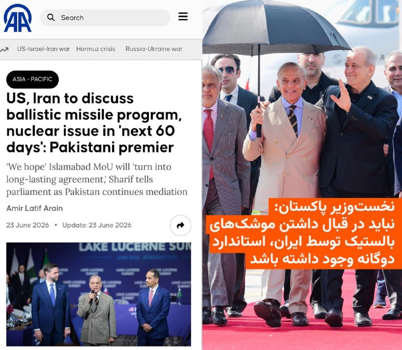

نخست‌وزیر پاکستان روز سه‌شنبه دوم تیرماه گفت که در مورد موشک‌های بالستیک نباید استاندارد دوگانه‌ای وجود داشته باشد و تأکید کرد ایران همان حقی را برای در اختیار داشتن آن‌ها دارد که سایر کشورها دارند.
شهباز شریف همچنین به خبرنگاران گفت که در تفاهم‌نامه مورد توافق میان ایران و ایالات متحده هیچ اشاره‌ای به موشک‌های بالستیک نشده، زیرا این موضوع اساساً در آن مذاکرات مطرح نبوده است.

پیشتر برخی رسانه‌ها از قول نخست‌وزیر پاکستان مدعی شده بودند که او گفته است موضوع موشک‌های بالستیک تهران از جمله محورهای مذاکره بین ایران و آمریکا است.
در واکنش به این ادعا، خبرگزاری فارس نزدیک به سپاه پاسداران نوشت که اظهارات نخست‌وزیر پاکستان، «کاملاً اشتباه و احتمالا ناشی از بی‌اطلاعی است».
به نوشته این خبرگزاری، پاکستان در حال حاضر نقش چندانی در میانجی‌گری این مذاکرات ندارد و اظهارات شهباز شریف بیشتر برای پررنگ‌نمایی نقش واسطه‌گری این کشور مطرح شده است.
@VahidHeadline

📡 @VahidOnline

## VahidOnline — post 76627

  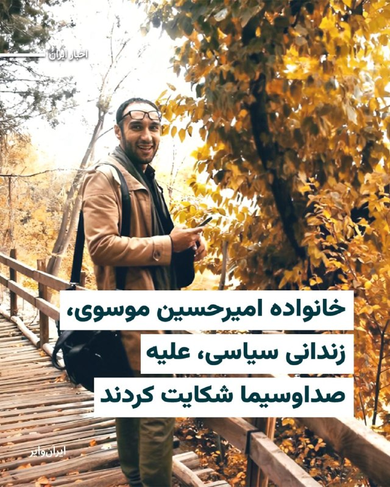

ثریا طالبی، مادر امیرحسین موسوی، فعال فضای مجازی مشهور به «جیمز بی‌دین» که از آذرماه ۱۴۰۳ در بازداشت به‌سر می‌برد، می‌گوید پس از پخش گزارش تلویزیونی از فرزندش در جریان جنگ ۱۲ روزه، اتهام «همکاری با دول متخاصم» به پرونده او افزوده شده است. مهر ۱۴۰۴ صداوسیما با پخش ویدئویی از اعترافات اجباری امیرحسین موسوی، او را به «جاسوسی و همکاری اطلاعاتی و امنیتی با اسرائیل» متهم کرد.

پس از آن امیرحسین موسوی که با نام کاربری «جیمز بی‌دین» در شبکه‌های اجتماعی فعالیت می‌کرد، با انتشار نامه‌ای سرگشاده از زندان اوین اعلام کرده که تمام اتهامات مطرح‌شده علیه او «نادرست و تحریف‌شده» است. آقای موسوی نوشته که پس از ۱۴۸ روز انفرادی، بازداشت همسرش و تهدید به تکرار شکنجه‌ها، وادار به انجام مصاحبه‌ای اجباری شده است.

ثریا طالبی، مادر امیرحسین موسوی، در گفت‌وگو با «امتداد» با اشاره به وضعیت پرونده فرزندش گفت که امیرحسین موسوی از ۲۸ آذر ۱۴۰۳ در بازداشت است و خانواده او همچنان در «بلاتکلیفی کامل» به سر می‌برند.

به گفته او، فرزندش هنگام سفر به کیش در فرودگاه مهرآباد بازداشت شد و خانواده تا مدت‌ها از محل نگهداری و نهاد بازداشت‌کننده او اطلاعی نداشتند.

مادر این فعال توییتری همچنین گفت امیرحسین موسوی حدود شش ماه در سلول انفرادی نگهداری شده و پس از انتقال به بند عمومی، از او مصاحبه تصویری گرفته شده است. او مدعی شد به فرزندش گفته بودند این ویدئو صرفاً برای آرشیو ضبط می‌شود و در صورت همکاری، طی چند روز با وثیقه آزاد خواهد شد.

به گفته طالبی، در زمان تشکیل پرونده، اتهام‌های «اجتماع و تبانی علیه امنیت کشور»، «فعالیت تبلیغی علیه نظام» و «توهین به مقدسات» علیه فرزندش مطرح شده بود.

او افزود پس از جنگ ۱۲ روزه و پخش بخشی از این مصاحبه در بخش خبری ۲۰:۳۰ صداوسیما، اتهام «همکاری با دولت متخاصم» نیز به پرونده اضافه شده است.

طالبی با انتقاد از نحوه انتشار این ویدئو گفت: «فیلم به‌صورت تقطیع‌شده پخش شد؛ به شکلی که این تصور ایجاد می‌شد که امیرحسین در زمان جنگ اطلاعاتی را در اختیار دشمن قرار داده است، در حالی که او در همان زمان در زندان بود.»

او همچنین از شکایت خانواده علیه برنامه ۲۰:۳۰ و رسانه‌هایی که این ویدئو را بازنشر کرده‌اند خبر داد و گفت این شکایت در حال رسیدگی است.

مادر امیرحسین موسوی با رد اتهام‌های مطرح‌شده علیه فرزندش تاکید کرد: «انگ وطن‌فروشی به امیرحسین نمی‌چسبد. او یک فعال توییتری بوده و اگر کسی با ادعای ارتباط با اسرائیل برایش پیام فرستاده، بلافاصله آن حساب را مسدود کرده است.»

بر اساس اعلام وکیل پرونده، جلسه رسیدگی به اتهامات امیرحسین موسوی روز ۱۳ تیرماه در شعبه ۱۵ دادگاه انقلاب به ریاست قاضی ابوالقاسم صلواتی برگزار خواهد شد.

@VahidHeadline

📡 @VahidOnline

## kianmeli1 — post 88142

  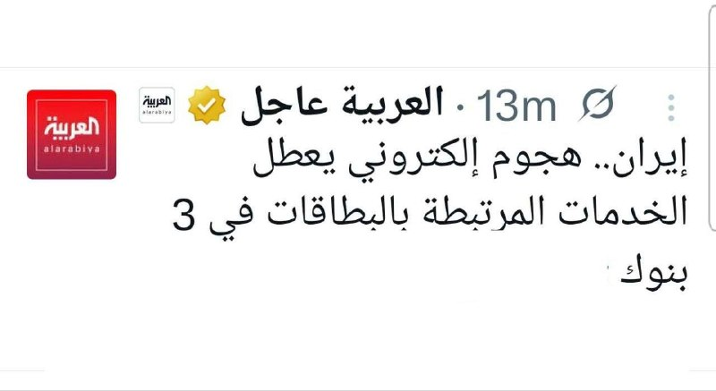

🔴العربیه

حمله سایبری خدمات مربوط به کارت را در ۳ بانک ایران مختل کرد.
https://t.me/kianmeli1

## kianmeli1 — post 88141

‏🔴سفارت دانمارک در ایران پس از یک تعطیلی موقت سه‌ماهه، فعالیت خود را از سر گرفت
https://t.me/kianmeli1

## kianmeli1 — post 88140

‏🔴بر اساس داده‌های کلپر، تعداد عبور کشتی‌ها در بازه ۲۲ تا ۲۴ خرداد، ۳۲ مورد بوده، در حالی که این رقم در بازه ۲۹ تا ۳۱ خرداد به ۹۳ مورد رسیده و افزایش ۶۱ موردی را نشان می‌دهد
https://t.me/kianmeli1

## kianmeli1 — post 88139

🔴ساعاتی پس از افشای توافق تهران و واشینگتن بر سر معامله گندم و ذرت در ازای پول‌های بلوکه‌شده، دونالد ترامپ، رییس‌جمهوری آمریکا، گفت جمهوری اسلامی با بازرسی هسته‌ای نامحدود موافقت کرده است. این دو تحول، همراه با عقب‌نشینی از دریافت عوارض در تنگه هرمز، عبور از خواسته‌های دو خامنه‌ای است.
https://t.me/kianmeli1

## kianmeli1 — post 88138

  <a href="telegram/content/kianmeli1_88138_1782234350.mp4" target="_blank">🎬 Download video</a>

🔴سید صادق شیرازی، مرجع شیعیان: در دوران پیغمبر و امیرالمومنین یک نفر کشته سیاسی هم وجود نداشت
https://t.me/kianmeli1

## kianmeli1 — post 88137

  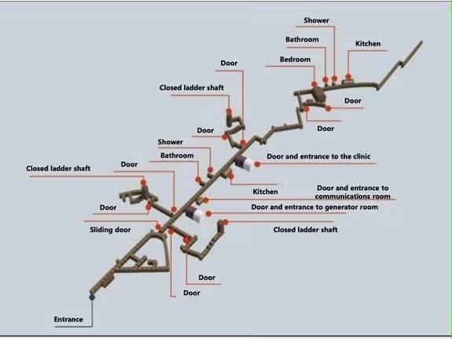

🔴وزارت خارجه اسرايیل: حزب‌الله با حمایت مالی جمهوری اسلامی طی سال‌ها(صدها میلیون دلار) شبکه گسترده‌ای از تونل‌ها، انبارهای تسلیحاتی، سایت‌های موشکی و مراکز فرماندهی در جنوب لبنان ایجاد کرده.
هدف این زیرساخت‌ها حمله به اسرائیل بوده.
https://t.me/kianmeli1

## IranIntlTV — post 343957

## IranIntlTV — post 343956

  

شرکت ردیابی دریایی کپلر گزارش داد تعداد عبور کشتی‌ها در بازه ۲۲ تا ۲۴ خرداد، ۳۲ مورد بوده، در حالی که این رقم در بازه ۲۹ تا ۳۱ خرداد به ۹۳ مورد رسیده و افزایش ۶۱ موردی را نشان می‌دهد.

این گزارش حاکی است که بیشترین افزایش تردد در شنبه ۳۱ خرداد ثبت شد؛ به‌طوری‌که تعداد عبورها نسبت به هفته قبل از سه مورد به ۴۲ مورد رسید که نشان‌دهنده رشد قابل توجه تردد در این گذرگاه راهبردی است.

https://iranintl.com/202606238210

## IranIntlTV — post 343955

  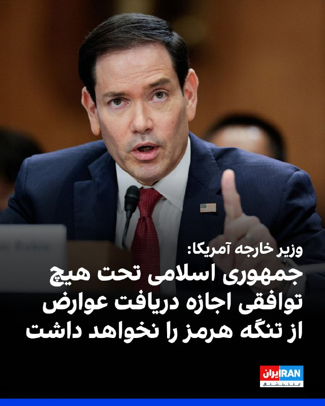

مارکو روبیو، وزیر خارجه آمریکا، گفت جمهوری اسلامی در چارچوب هیچ توافق نهایی با واشینگتن اجازه دریافت عوارض یا هزینه عبور از تنگه هرمز را نخواهد داشت.
او تاکید کرد وضع چنین هزینه‌ای در یک آبراه بین‌المللی برخلاف قوانین بین‌المللی است.
روبیو همچنین گفت: «نمی‌توان درگیری‌ها در منطقه را پایان داد، در حالی که نیروهای نیابتی جمهوری اسلامی همچنان در حال شلیک موشک هستند.»

https://iranintl.com/202606234269

## IranIntlTV — post 343954

  <a href="telegram/content/IranIntlTV_343954_1782234355.mp4" target="_blank">🎬 Download video</a>

تیتر اول با نیوشا صارمی، سه‌شنبه ۲ تیر
@iranintltv

## IranIntlTV — post 343953

  

شهباز شریف، نخست‌وزیر پاکستان، سه‌شنبه گفت نباید در مورد موشک‌های بالستیک استانداردهای دوگانه وجود داشته باشد و افزود که ایران به میزان سایر کشورها، حق داشتن موشک‌های بالستیک را دارد.

به گزارش رویترز، شریف همچنین به خبرنگاران گفت که در تفاهم‌نامه‌ای که میان ایران و ایالات متحده به دست آمده، هیچ اشاره‌ای به موشک‌های بالستیک نشده است، زیرا این موضوع هرگز در آن مذاکرات روی میز نبوده است.
https://iranintl.com/202606235873

## IranIntlTV — post 343952

  <a href="telegram/content/IranIntlTV_343952_1782234357.mp4" target="_blank">🎬 Download video</a>

یک شهروند با ارسال ویدیویی به ایران اینترنشنال از صف‌های طولانی دریافت گازوییل در شهریار انتقاد کرد. او گفت مردم برای تامین سوخت ناچارند مدت زیادی در نوبت بمانند و این وضعیت موجب اتلاف وقت و ایجاد مشکلات برای رانندگان، به‌ویژه کامیون‌داران، شده است.

## IranIntlTV — post 343951

  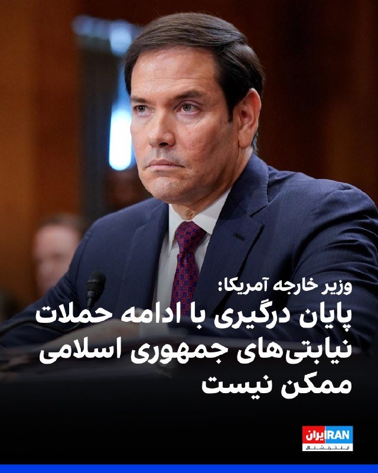

مارکو روبیو، وزیر خارجه آمریکا، گفت: «نمی‌توان درگیری‌ها در منطقه را پایان داد، در حالی که نیروهای نیابتی جمهوری اسلامی همچنان در حال شلیک موشک هستند.»

او همچنین تاکید کرد: «هیچ کشوری اجازه ندارد در یک آبراه بین‌المللی عوارض یا هزینه عبور وضع کند و این موضوع بر اساس قوانین بین‌المللی ممنوع است.»

روبیو افزود واشینگتن قصد دارد به‌طور مستقیم با دولت لبنان وارد گفت‌وگو شود.
https://iranintl.com/202606238032

## IranIntlTV — post 343950

  

نعیم قاسم، دبیرکل حزب‌الله، گفت: «مقاومت تنها ضامن آزادی، استقلال و حاکمیت لبنان است.» او افزود اسرائیل حتی در صورت طولانی شدن درگیری‌ها نیز قادر به تحقق اهداف خود در میدان نیست.

نعیم قاسم همچنین گفت: «مشخص شده است که میان آمریکا و اسرائیل توافقی وجود دارد که بر اساس آن باید کار را تمام کنند. آمریکا ضامن قابل اعتمادی نیست.»

دبیرکل حزب‌الله تاکید کرد: «اسرائیل هیچ گزینه‌ای جز خروج از خاک لبنان ندارد.» او به دولت لبنان توصیه کرد از «قدرت مقاومت» استفاده کند و افزود حزب‌الله برای همکاری آماده است.
https://iranintl.com/202606233270

## IranIntlTV — post 343949

  <a href="telegram/content/IranIntlTV_343949_1782234361.mp4" target="_blank">🎬 Download video</a>

🔻تیم ملی فوتبال عراق در دومین دیدار خود در جام جهانی با نتیجه ۳-۰ برابر فرانسه شکست خورد تا انتفادها از این تیم در رسانه‌های عراقی افزایش پیدا کند. همچنین برخی از بازیکنان عراق برای فرار از انتقادات، صفحات مجازی خود را بستند.

🔹توضیحات تروسکه صادقی، خبرنگار ایران‌اینترنشنال از پاریس

@iranintltvsport

## IranIntlTV — post 343948

  

آژانس کشتیرانی سازمان ملل متحد سه‌شنبه اعلام کرد که پس از تفاهم میان ایران و ایالات متحده، طرحی برای تخلیه صدها کشتی با ۱۱ هزار دریانورد گرفتار در خلیج فارس از تنگه هرمز در حال اجرا است.

سخنگوی سازمان بین‌المللی دریانوردی سازمان ملل گفت: «ما اکنون تماس با کشتی‌ها را برای آغاز عملیات تخلیه شروع کرده‌ایم».

هنوز هیچ جدول زمانی مشخصی ارائه نشده است.
https://iranintl.com/202606231908

## IranIntlTV — post 343947

  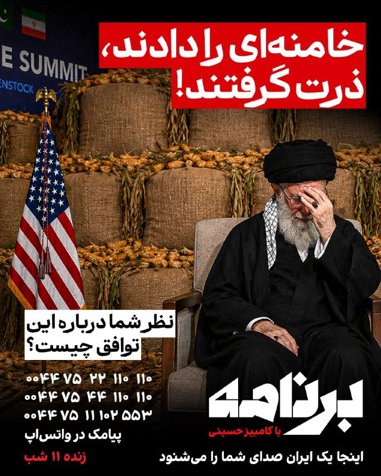

جمهوری اسلامی که سال‌ها آمریکا را «شیطان بزرگ» می‌نامید و مذاکره با آن را خیانت می‌دانست، حالا به توافقی با آمریکا رسیده که بر اساس آن، پول‌های ایران قرار است تحت نظارت آمریکا برای خرید ذرت و کالاهای دیگر از کشاورزان آمریکایی هزینه شود.
هزینه‌ای که جمهوری اسلامی برای رسیدن به این توافق پرداخته، به نظر بسیاری بسیار سنگین بوده است. آیا جمهوری اسلامی در این جنگ، خامنه‌ای را داد تا در عوض با آمریکا توافق کند و ذرت بگیرد؟
به نظر می‌رسد مسئولان نظام از این توافق و آنچه برخی «تاخت زدن خامنه‌ای با ذرت» می‌نامند، خوشحال‌اند.
نظر شما درباره این توافق چیست؟
«برنامه» صدای شماست.
ما شما را، بدون نوبت، مستقیم از ایران روی خط می‌آوریم.
بیایید و روایت خود را برای همیشه ثبت کنید.
تاریخ با صدای شما نوشته می‌شود.
برای شرکت در برنامه، همین حالا در واتس‌اپ پیام بدهید:
۰۰۴۴۷۵۲۲۱۱۰۱۱۰
۰۰۴۴۷۵۴۴۱۱۰۱۱۰
۰۰۴۴۷۵۱۱۱۰۲۵۵۳
«برنامه با کامبیز حسینی»
«یک ایران صدای شما را می‌شنود»

## IranIntlTV — post 343946

ویدیوی رسیده به ایران‌اینترنشنال، مراسم خاک‌سپاری تقی سلیمی را نشان می‌دهد؛ شهروند ۵۷ ساله اهل آمل و از بازداشت‌شدگان اعتراضات دی‌ماه ۱۴۰۴ که ۲۱ اردیبهشت ۱۴۰۵ در زندان آمل جان باخته است.
تقی سلیمی ۳ بهمن ۱۴۰۴ بازداشت شد و به اتهام «اقدام علیه امنیت ملی» و «تخریب اموال عمومی» به ۱۰ سال حبس و جریمه نقدی محکوم شده بود.

## IranIntlTV — post 343945

  <a href="telegram/content/IranIntlTV_343945_1782234365.mp4" target="_blank">🎬 Download video</a>

🔻لیونل مسی، فوق‌ستاره تیم ملی آرژانتین با دو گلی که در بازی برابر اتریش به ثمر رساند، موفق شد رکورد میروسلاو کلوزه را بشکند و به تنهایی عنوان بهترین گلزن تاریخ جام‌های جهانی را از آن خود کند.

🔹گفتگوی مزدک میرزایی با محمد تقوی و رها پوربخش در برنامه هت‌تریک

@iranintltvsport

## IranIntlTV — post 343944

  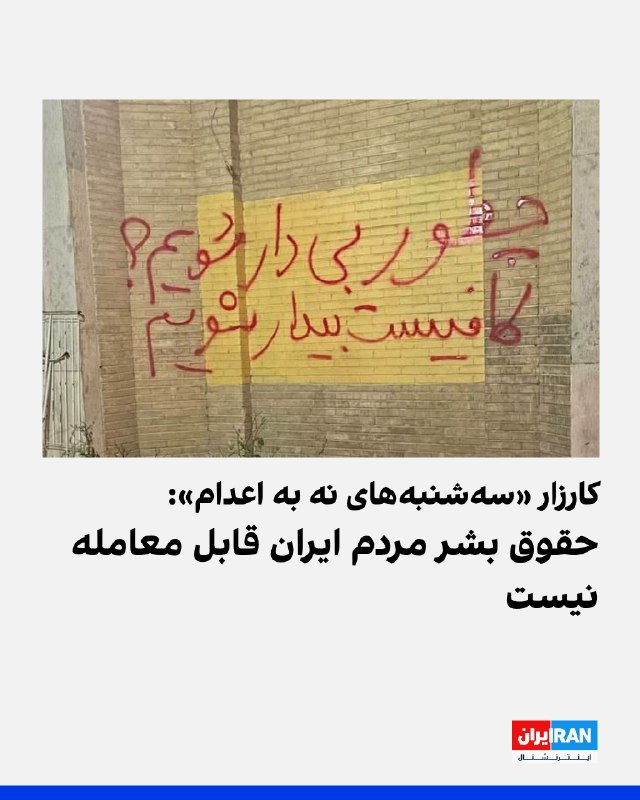

کارزار «سه‌شنبه‌های نه به اعدام» در صدوبیست‌وششمین هفته خود، با پیوستن گروهی از زندانیان زندان کرمان، در ۵۷ زندان سراسر کشور ادامه یافت. این کارزار در بیانیه‌ای در واکنش به تفاهم اخیر جمهوری اسلامی و آمریکا تاکید کرد حقوق بشر مردم ایران، به‌ویژه زندانیان، قابل معامله نیست.

این کارزار در بیانیه‌ای که سه‌شنبه دوم تیر منتشر شد، به تفاهم اخیر میان جمهوری اسلامی و آمریکا اشاره کرد و نوشت در بندهای منتشر‌شده از این تفاهم، هیچ‌گونه توجهی به حقوق بشر، سرکوب و اعدام‌های وحشتناک در ایران نشده است.

در این بیانیه آمده است: «این موضوع نشان می‌دهد قدرت‌ها به فکر تغییر نیستند و مردم باید برای تغییر به خود متکی باشند و نه هیچ نیروی خارجی و قدرتی.»

زندانیان عضو کارزار تاکید کردند که طی ۱۲۶ هفته گذشته، هر سه‌شنبه با اعتصاب غذا و آنچه در توان داشته‌اند، به «اعدام‌های قرون وسطایی» اعتراض کرده‌اند.

آنها افزودند حقوق بشر مردم ایران، به‌ویژه زندانیان، قابل معامله نیست و هم‌صدا با عموم مردم ایران تا آخرین نفس و توان خود از آزادی، برابری و لغو حکم اعدام دفاع خواهند کرد.
https://iranintl.com/202606234132

## IranIntlTV — post 343943

  

رویترز به نقل از ردیاب تردد کشتی‌ها گزارش داد با وجود اینکه سپاه پاسداران شنبه اعلام کرد تنگه هرمز بسته شده است، رفت‌وآمد کشتی‌ها در این آبراه همچنان ادامه دارد.
در همین حال، ارتش آمریکا اعلام کرده است که کشتی‌های تجاری همچنان در تنگه هرمز در حال فعالیت هستند.
https://iranintl.com/202606232458

## IranIntlTV — post 343942

‏فرنوش فرجی، عضو تحریریه ایران‌اینترنشنال در کارزار کشف حقیقت، از جزییات کشته شدن آرمان گرجیان، میلاد لواسانی و کریم حیدری در انقلاب ملی ایرانیان گزارش می‌دهد

@iranintltv

## IranIntlTV — post 343941

  

فرماندهی مرکزی ایالات متحده، سنتکام، با انتشار تصویری از ناو هواپیمابر «یواس‌اس جورج اچ. دبلیو. بوش»، در شبکه ایکس نوشت که این ناو در دریای عرب در حال فعالیت است.
سنتکام افزود دو ناو هواپیمابر آمریکا همچنان در خاورمیانه مستقر هستند و نیروهای آمریکایی حضور خود را حفظ کرده و در حالت آماده‌باش و مراقبت کامل قرار دارند.
https://iranintl.com/202606236009

## IranIntlTV — post 343940

  <a href="telegram/content/IranIntlTV_343940_1782234369.mp4" target="_blank">🎬 Download video</a>

ساعاتی پس از افشای توافق تهران و واشینگتن بر سر معامله گندم و ذرت در ازای پول‌های بلوکه‌شده، دونالد ترامپ، رییس‌جمهوری آمریکا، گفت جمهوری اسلامی با بازرسی هسته‌ای نامحدود موافقت کرده است. این دو تحول، همراه با عقب‌نشینی از دریافت عوارض در تنگه هرمز، عبور از خواسته‌های دو خامنه‌ای است.

گزارشی از مجتبا پورمحسن
@iranintltv

## IranIntlTV — post 343939

  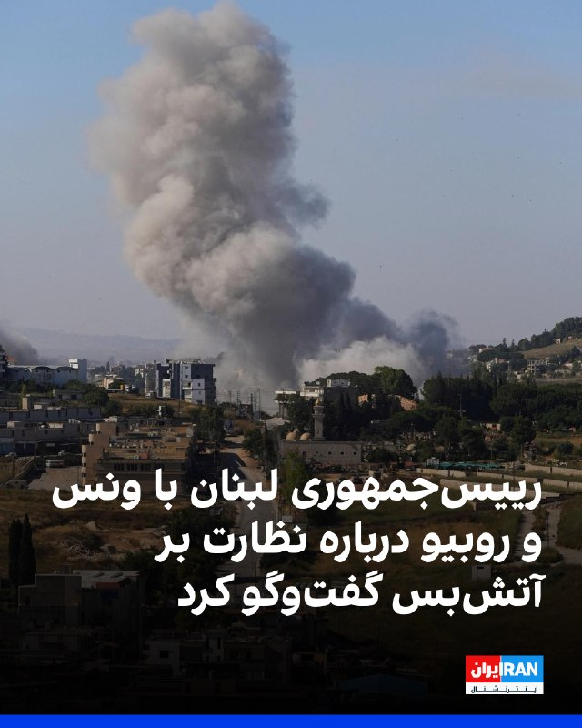

دفتر ریاست‌جمهوری لبنان اعلام کرد جوزف عون در تماس تلفنی با جی‌دی ونس، معاون رییس‌جمهور آمریکا، و مارکو روبیو، وزیر خارجه آمریکا، درباره آتش‌بس گفت‌وگو کرد.
ریاست‌جمهوری لبنان افزود ونس و روبیو طرح تشکیل سازوکار مشترک آمریکا، لبنان و جمهوری اسلامی برای نظارت بر آتش‌بس را بررسی و بر حمایت واشینگتن از حاکمیت دولت لبنان تاکید کردند.
https://iranintl.com/202606234825

## IranIntlTV — post 343938

  <a href="https://t.me/IranintlTV/343938" target="_blank">📎 Download file</a>

🎧نسخه صوتی اخبار شبانگاهی | سه‌شنبه ۲ تیر
@iranintlTV

## FarsiVOA — post 221654

🔺روبیو: رژیم ایران اجازه دریافت عوارض از کشتی‌های عبوری از هرمز را نخواهد داشت

▪️وزیر امور خارجه آمریکا می‌گوید که در چارچوب هرگونه توافق نهایی میان آمریکا و جمهوری اسلامی، حکومت ایران اجازه نخواهد داشت از کشتی‌های عبوری از تنگه هرمز عوارض دریافت کند.

⬇️ بیشتر بخوانید:

https://ir.voanews.com/a/rubio-rejects-iran-hormuz-tolls/8163957.html/?nocach=1

## FarsiVOA — post 221653

  <a href="telegram/content/FarsiVOA_221653_1782234373.mp4" target="_blank">🎬 Download video</a>

مارکو روبیو، وزیر امور خارجه آمریکا، وارد ابوظبی شد. او قرار است در دو روز پیش رو با سران امارات متحده عربی، کویت، و بحرین دیدار کند.

آقای روبیو در این سفر درباره تفاهم‌نامه میان ایالات متحده و رژیم ایران، امنیت تردد دریایی در تنگه هرمز، و ثبات منطقه با کشورهای عضو شورای همکاری خلیج فارس گفت‌وگو خواهد کرد.

## FarsiVOA — post 221652

🔺افزایش شدید قیمت نان، به عنوان پایه سبد خوراک ایرانیان، چه تاثیری بر سفره مردم ایران خواهد داشت؟

▪️اوشا ونس، بانوی دوم آمریکا، و شرکت والت دیزنی و سازمان «بلواستار» در پایگاه نیروی هوایی مک ‌دیل در فلوریدا گرد هم آمدند تا در چارچوب چالش بانوی دوم موسوم به خواندن در تابستان ۱۴۰۵، توانایی خواندنِ کودکان را تقویت کنند. سازمان «بلواستار» یک نهاد نیکوکاری است که از نظامیان آمریکایی حمایت می کند.

⬇️ بیشتر بخوانید:
https://ir.voanews.com/a/usha-vance-second-lady-of-the-united-states-book-military-family/8163954.html/?nocach=1

## FarsiVOA — post 221651

🔺رویترز: با افزایش مجدد صادرات نفت در منطقه نرخ کرایه نفتکش‌ها دو برابر شده است

▪️با افزایش صادرات نفت خاورمیانه و افزایش میزان تولید نفت توسط کشورهای تولیدکننده، نرخ کرایه نفتکش‌ها در خلیج فارس تقریباً دو برابر شده است.

⬇️ بیشتر بخوانید:
https://ir.voanews.com/a/persian-gulf-oil-tanker-rates-nearly-double/8163944.html/?nocach=1

## FarsiVOA — post 221650

در گفت‌وگو با حسن هاشمیان، به تحرکات دیپلماتیک آمریکا و ایران در منطقه خلیج فارس پرداختیم. به گفته حسن هاشمیان، سفر مارکو روبیو به امارات، کویت و به‌ویژه بحرینِ میزبان ناوگان پنجم، نشان می‌دهد برخلاف مانور تبلیغاتی جمهوری اسلامی، حضور نظامی آمریکا در منطقه پایدار است

## FarsiVOA — post 221649

  <a href="telegram/content/FarsiVOA_221649_1782234376.mp4" target="_blank">🎬 Download video</a>

اوین اینجی، نماینده پارلمان اروپا در میدان: پوشش رسانه‌ای و پرداختن به محدودیت‌های زنان کافی نیست باید صدای آنان رابشنویم واقدامات عملی انجام دهیم

## FarsiVOA — post 221648

🔺هزینه صدها میلیون دلاری حزب‌الله برای حفر شبکه عظیم تونل در دل کوه و در زیرزمین

▪️اسرائیل با انتشار تصاویری از یک شبکه عظیم تونل‌های حزب‌الله در جنوب لبنان جمهوری اسلامی را تامین‌کننده منابع مالی احداث این زیرساخت‌ها معرفی کرد.

⬇️ بیشتر بخوانید:
https://ir.voanews.com/a/hezbollah-underground-tunnel-one-hundred-million-dollars/8163923.html/?nocach=1

## FarsiVOA — post 221647

دونالد ترامپ: جمهوری اسلامی با اجازه بازرسی‌های هسته‌ای برای بازه زمانی دراز مدت موافقت کرده است

## FarsiVOA — post 221646

Farsi VOA pinned «با اعلام فیفا کاپ قهرمان جام جهانی ۲۰۲۶ توسط پرزیدنت ترامپ اهدا خواهد شد. به نظر شما کدام تیم قهرمان می‌شود؟»

## FarsiVOA — post 221645

در گفت‌وگو با رضا تقی‌زاده، به تناقض آشکار در روایت مقام‌های ایرانی درباره مذاکرات سوئیس، و تشکیل کارگروه‌ها خصوصا بازگشت بازرسان آژانس انرژی اتمی پرداختیم. به گفته تقی‌زاده، روایت‌های متضاد، بازتاب اختلافات درون حاکمیت جمهوری اسلامی است.

## FarsiVOA — post 221644

## FarsiVOA — post 221643

🔺گزارش | اعدام عامر رامش؛ از رویای تحصیل تا دو بار اعتراف اجباری جلوی دوربین

▪️عامر رامش، زندانی سیاسی، صبح روز ۶ اردیبهشت اعدام شد. او متولد سال ۱۳۸۳ در شهرستان دشتیاری استان سیستان و بلوچستان بود و هنگام بازداشت ۲۰ سال داشت.

⬇️ بیشتر بخوانید:
https://ir.voanews.com/a/iranian-political-amer-ramesh-forced-confession-execution/8163908.html/?nocach=1

## FarsiVOA — post 221642

🔺آمریکا پنج نهاد کوبایی و یکی از بستگان خانواده کاسترو را تحریم کرد

▪️مارکو روبیو، وزیر امور خارجه ایالات متحده، روز سه‌شنبه دوم تیر ۱۴۰۵ اعلام کرد دولت آمریکا پنج نهاد درآمدزای کوبایی و همسر یکی از اعضای خانواده کاسترو را تحریم کرده است.

⬇️ بیشتر بخوانید:
https://ir.voanews.com/a/us-sanctions-cuba-revenue-network/8163932.html/?nocach=1

## FarsiVOA — post 221641

🔺«سه‌شنبه‌های نه به اعدام»؛ صدایی که از زندان‌ها فراتر رفته است

▪️کارزار «سه‌شنبه‌های نه به اعدام» در یکصد و بیست‌وششمین هفته فعالیت خود، در شرایطی ادامه یافته است که گزارش‌های حقوق بشری از افزایش کم‌سابقه اجرای احکام مرگ در ایران حکایت دارند.

⬇️ بیشتر بخوانید:
https://ir.voanews.com/a/no-to-execution-every-tuesday/8163918.html/?nocach=1

## FarsiVOA — post 221640

زهرا موسوی در میدان : شلاق بعنوان نمادی از خشونت عریان همواره در نظام‌های سرکوب‌گر برای ایجاد وحشت و تحقیر بخصوص در مورد زنان بکار گرفته شده

## FarsiVOA — post 221639

  <a href="telegram/content/FarsiVOA_221639_1782234377.mp4" target="_blank">🎬 Download video</a>

به گزارش رسانه‌های ایران آتش‌سوزی در ارتفاعات منطقه «کوهمره سرخی» شیراز که از روز گذشته آغاز شده بود، پس از مهار موقت در شب گذشته، صبح امروز بار دیگر شعله‌ور شد و تلاش نیروهای امدادی برای مهار کانون‌های حریق همچنان ادامه دارد.

## FarsiVOA — post 221638

🔺نفتالی بنت: اسرائیل برای کمک به معترضان تجهیزات استارلینک به ایران فرستاده بود

▪️نفتالی بنت، نخست‌وزیر پیشین اسرائیل، می‌گوید دولت او روند خرید و انتقال مخفیانه ده‌ها هزار گیرنده اینترنت ماهواره‌ای «استارلینک» به ایران را آغاز کرده بود تا معترضان بتوانند هنگام قطع اینترنت به ارتباطات خود ادامه دهند.

⬇️ بیشتر بخوانید:
https://ir.voanews.com/a/israel-smuggled-starlink-receivers-into-iran/8163909.html/?nocach=1

## FarsiVOA — post 221637

چرا جمهوری اسلامی و آمریکا روایت‌های متفاوتی از توافق ارائه می‌کنند؟

## FarsiVOA — post 221636

  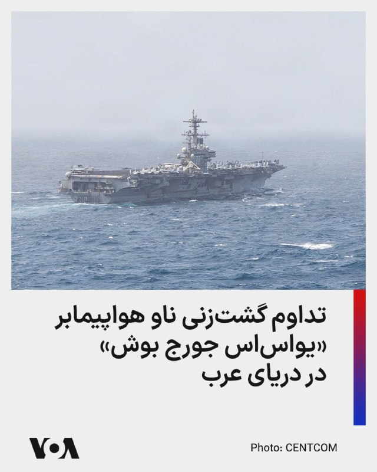

ستاد فرماندهی مرکزی آمریکا، سنتکام، با انتشار تصویری از ناو هواپیمابر «یو‌اس‌اس جورج اچ. دبلیو. بوش» که در دریای عرب در حال حرکت است، اعلام کرد دو ناو هواپیمابر ایالات متحده همچنان در خاورمیانه حضور دارند و تاکید کرد نیروهای آمریکایی در منطقه مستقر هستند و اوضاع را تحت نظر دارند.

## FarsiVOA — post 221635

🔺مسی تاریخ را فتح کرد؛ امباپه و هالند در کمین

▪️جام جهانی ۲۰۲۶ هنوز از مرحله گروهی عبور نکرده است، اما رقابتی که انتظار می‌رفت در هفته‌های پایانی شکل بگیرد، از همان دو مسابقه نخست به اوج رسیده است؛ رقابت میان بزرگ‌ترین ستاره‌های نسل‌های مختلف فوتبال برای کفش طلا، رکوردهای تاریخی، و شاید آخرین تصویر ماندگار از دوران حرفه‌ای‌شان.

⬇️ بیشتر بخوانید:

https://ir.voanews.com/a/messi-leads-mbapp%C3%A9-haaland-chase-history/8163901.html/?nocach=1

## DW_Farsi — post 126384

🔶 نتانیاهو: اسرائیل باید به استقلال در حوزه تسلیحات دست یابد
 
در حالی که میلیاردها دلار کمک نظامی آمریکا به اسرائیل قرار است در سال ۲۰۲۸ پایان یابد، بنیامین نتانیاهو، نخست‌وزیر اسرائیل مدعی شد، "این کشور باید به استقلال در حوزه تسلیحات دست یابد".
 
نتانیاهو روز سه‌شنبه ۲۳ ژوئن (۲ تیرماه) در سخنرانی برای افسران ذخیره در کرانه باختری گفت: «در حالی که عمیقا قدردان حمایتی هستم که از دوستان آمریکایی‌مان دریافت کرده‌ایم اما امروز می‌گویم، ما باید یک نظام تسلیحاتی مستقل داشته باشیم و سلاح‌های خودمان را تولید کنیم.»
 
او اضافه کرد: «برای اینکه از وابستگی رها شویم، باید هرچه بیشتر قدرت بسازیم، هرچه بیشتر فناوری را ادغام کنیم و هرچه بیشتر نسل‌هایی از فرماندهان مانند شما را آموزش دهیم زیرا در نهایت همین‌ها تعیین خواهند کرد که در چه جایگاهی قرار خواهیم داشت. با کمک خداوند و با کمک شما، ما در جایگاه خوبی خواهیم بود.»
 
نخست‌وزیر اسرائیل در سپتامبر سال گذشته نیز اذعان کرده بود، "اسرائیل با نوعی انزوا روبه‌رو است که ممکن است سال‌ها ادامه یابد" و افزوده  بود، "کشورش صنعت تسلیحاتی خود را توسعه خواهد داد."
 
بر اساس یک تفاهم‌نامه ۱۰ ساله که در سال ۲۰۱۸ امضا شد، اسرائیل سالانه ۳.۸ میلیارد دلار کمک نظامی از ایالات متحده دریافت می‌کند که بخش قابل توجهی از این کمک‌ها باید در خرید از شرکت‌های تسلیحاتی آمریکایی هزینه شود.
 
این توافق باید پیش از پایان اعتبارش در سال ۲۰۲۸ مجددا مورد مذاکره قرار گیرد اما موضوع اسرائیل در سیاست داخلی آمریکا به مسئله‌ای چالش‌انگیز تبدیل شده است.
 
حزب دموکرات آمریکا و برخی جمهوری‌خواهان جوان‌تر به‌شدت به نتانیاهو و نحوه مدیریت او در جنگ غزه و لبنان انتقاد دارند.
 
این در حالی است که اوایل ژوئن سال جاری وزارت دفاع اسرائیل اعلام کرد، مذاکرات رسمی با دولت ترامپ را برای تدوین یک چارچوب همکاری امنیتی جدید آغاز شده تا جایگزین تفاهم‌نامه ۱۰ ساله فعلی شود.
 
@dw_farsi

## DW_Farsi — post 126383

🔶 جایگاه حقوق بشر در معاملات سیاسی؛ از کامبوج تا ایران
 
🔻گزارشی از میترا شجاعی
 
پس از پایان جنگ‌های داخلی در کامبوج و انجام رفراندومی که منجر به برقراری یک دولت نسبتا باثبات شد، ایالات متحده امریکا که روابطش را با کامبوج قطع کرده بود، در سال ۱۹۹۳ توافقی برای از سرگیری روابط دیپلماتیک با این کشور آسیایی امضا کرد.
 
دولت وقت ایالات متحده به ریاست جمهوری بیل کلینتون از حزب دموکرات، شرایط سخت‌گیرانه‌ای برای کمک‌های خارجی وضع کرد. قوانین مربوط به تأمین بودجه، آمریکا را موظف می‌کرد هرگونه کمک به سازمان‌های کامبوجی را که با خمرهای سرخ همکاری می‌کردند قطع کند. همچنین ارائهٔ کمک‌های مستقیم برای توسعهٔ اقتصادی به ارزیابی‌های میدانی دربارهٔ وضعیت حقوق بشر و تلاش‌های ضد مین وابسته شده بود.
 
این توافق را شاید بتوان از معدود موارد موفق گنجاندن موضوع حقوق بشر در یک توافق سیاسی دانست. نتیجه این توافق برگزاری انتخابات آزاد در سال ۱۹۹۳ در کامبوج، تقویت جامعهٔ مدنی و رسانه‌های آزاد و نیز افزایش نظارت بین‌المللی بر وضعیت حقوق بشر در این کشور آسیایی شد.
 
در ژوئن ۲۰۲۶ دولت جمهوری‌خواه آمریکا به ریاست جمهوری دونالد ترامپ پس از دو دوره جنگ و درگیری نظامی مستقیم با ایران، توافقی را برای پایان دادن به درگیری‌ها با جمهوری اسلامی ایران امضا می‌کند. پیش‌زمینه این توافق اولیه لااقل آنطور که ترامپ مدعی بود نه تنها برنامه اتمی و موشکی جمهوری اسلامی و حمایت از گروه‌های نیابتی در منطقه بلکه نقض گسترده حقوق بشر و مشخصا کشتار معترضان در دی ماه سال گذشته بود.
 
با این پیش‌زمینه، ترامپ تفاهمی اولیه را با جمهوری اسلامی امضا کرده که در ۱۴ بند آن حتی یک بار واژه حقوق بشر ذکر نشده است و اتفاقا بند ۲ تصریح می‌کند: « ایاالت متحده آمریکا و جمهوری اسلامی ایران متعهد می‌شوند به حاکمیت و تمامیت ارضی یکدیگر احترام بگذارند و از مداخله در امور داخلی یکدیگر خودداری کنند.»
 
"مداخله در امور داخلی" کلیدواژه جمهوری اسلامی در پاسخ به اتهام نقض حقوق بشر در ایران است.
 
@dw_farsi

## DW_Farsi — post 126382

  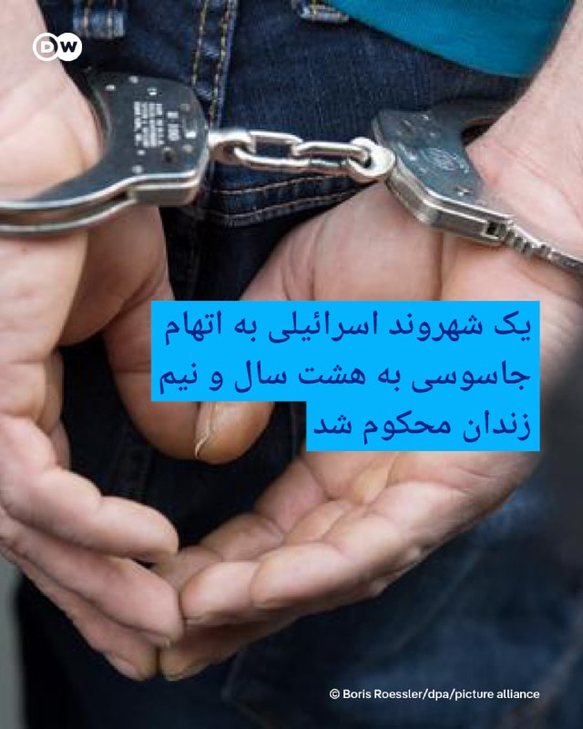

🔶 یک شهروند اسرائیلی به اتهام جاسوسی به هشت سال و نیم زندان محکوم شد
 
یک شهروند اسرائیلی از سوی دادگاه منطقه‌ای حیفا به اتهام اقدامات جاسوسی که می‌توانسته به سود ایران تمام شود به هشت سال و نیم زندان محکوم شد.
 
دیمیتری کوهن ۲۸ ساله در ماه مه سال گذشته از سوی سازمان امنیت داخلی اسرائیل بازداشت شده بود.
 
بر اساس رای قضات دادگاه که روز دوشنبه ۲۲ ژوئن (اول تیر) صادر شد، "کوهن از طریق یک عامل وابسته، تصاویر و ویدئوهایی از جاده‌ها و زیرساخت‌ها را در اختیار طرف مقابل قرار داده بود. تصاویری که دادگاه مدعی است، حکومت ایران یا گروه‌های تروریستی وابسته به آن می‌توانستند از آنها استفاده کنند.»
 
دادگاه با صدور این حکم اعلام کرد، "این موضوع مدنظر قرار گرفت که انگیزه کوهن از انجام این اقدامات، اعتقادات ایدئولوژیک یا سیاسی نبوده بلکه او با انگیزه مالی دست به این کار زده است."
 
همچنین بنا بر اعلام رسانه خبری Israelnetz کوهن در جریان محاکمه، نسبت به اقدامات خود ابراز پشیمانی کرده است.
 
به ‌گزارش منابع امنیتی اسرائیل، در سال گذشته حدود ۳۵ شهروند این کشور به اتهام جاسوسی برای ایران تحت پیگرد قرار گرفته‌اند.
 
@dw_farsi

## Persian_Trend_Official — post 17891

  <a href="telegram/content/Persian_Trend_Official_17891_1782234381.mp4" target="_blank">🎬 Download video</a>

مارکو روبیو در مورد تنگه هرمز: این یک آبراه بین‌المللی است. هیچ کشوری مجاز به دریافت عوارض یا هزینه در یک آبراه بین‌المللی نیست.

این قانون بین‌المللی موجود است. در آبراه‌های بین‌المللی در سراسر جهان اینگونه است و ما انتظار داریم که اینجا نیز اینگونه باشد.

📝 Amir

📌 @persian_trend_official
پرشین ترند | متفاوت‌ترین کانال نظامی

## Persian_Trend_Official — post 17890

  <a href="telegram/content/Persian_Trend_Official_17890_1782234383.mp4" target="_blank">🎬 Download video</a>

مارکو روبیو: تا زمانی که نیروهای نیابتی ایران از عراق موشک و پهپاد پرتاب می‌کنند و مانند حماس و حزب‌الله در تروریسم مشارکت دارند، نمی‌توان به خصومت‌ها و درگیری‌ها در منطقه پایان داد.

📝 Amir

📌 @persian_trend_official
پرشین ترند | متفاوت‌ترین کانال نظامی

## Persian_Trend_Official — post 17889

  <a href="telegram/content/Persian_Trend_Official_17889_1782234386.mp4" target="_blank">🎬 Download video</a>

مارکو روبیو: مسئله لبنان از ایران جداست زیرا لبنان یک کشور مستقل با دولت خود است.

ما قصد داریم با دولت لبنان مذاکره و تعامل کنیم. آینده لبنان متعلق به مردم لبنان از طریق دولت مستقل و منتخب آنهاست.

📝 Amir

📌 @persian_trend_official
پرشین ترند | متفاوت‌ترین کانال نظامی

## Persian_Trend_Official — post 17888

  <a href="telegram/content/Persian_Trend_Official_17888_1782234388.mp4" target="_blank">🎬 Download video</a>

مارکو روبیو: اگر رهبری ایران تصمیم بگیرد که به جای یک جنبش انقلابی که تروریسم صادر می‌کند، یک کشور باشد، فرصتی برای انجام کارهای باورنکردنی در ایران خواهد داشت.

این فرصت‌ها می‌تواند شامل سرمایه‌گذاری و سرمایه‌گذاری مستقیم خارجی باشد... این پول دولت ما نخواهد بود.

📝 Amir

📌 @persian_trend_official
پرشین ترند | متفاوت‌ترین کانال نظامی

## Persian_Trend_Official — post 17887

شهباز شریف: هفته آینده به تهران می‌آیم تا در مراسم تشییع پیکر رهبر شهید ایران شرکت کنم.

📝 Amir

📌 @persian_trend_official
پرشین ترند | متفاوت‌ترین کانال نظامی

## Persian_Trend_Official — post 17886

  <a href="telegram/content/Persian_Trend_Official_17886_1782234391.mp4" target="_blank">🎬 Download video</a>

شعرخوانی شهباز شریف به زبان فارسی در حضور مسعود پزشکیان

📝 Amir

📌 @persian_trend_official
پرشین ترند | متفاوت‌ترین کانال نظامی

## Persian_Trend_Official — post 17885

  <a href="telegram/content/Persian_Trend_Official_17885_1782234392.mp4" target="_blank">🎬 Download video</a>

شهباز شریف، نخست وزیر پاکستان: در سراسر جهان افرادی هستند که می‌خواهند این توافق صلح را خراب کنند. آنها نمی‌خواهند ملت ایران، یک ملت بزرگ، از خاکستر جنگ بیرون بیاید و به اوج شکوه و افتخار برسد.

نمی‌توان استانداردهای دوگانه‌ای داشت که در آن برخی کشورها بتوانند موشک‌های بالستیک داشته باشند و ایران نباید داشته باشد. شما نمی‌توانید این نوع دورویی را هضم کنید.

📝 Amir

📌 @persian_trend_official
پرشین ترند | متفاوت‌ترین کانال نظامی

## Persian_Trend_Official — post 17884

شهباز شریف، نخست وزیر پاکستان: این تفاهم‌نامه به موشک‌های بالستیک اشاره‌ای نمی‌کند.

این موضوع هرگز روی میز مذاکره نبود؛ هرگز در دستور کار نبود. طرف ایرانی هرگز نخواست حتی در مورد آن بحث کند.

📝 Amir

📌 @persian_trend_official
پرشین ترند | متفاوت‌ترین کانال نظامی

## Persian_Trend_Official — post 17883

💎 دوستان پرشین ترند برای خرید vpn
هم اکانت حجمی و هم اکانت نامحدود به بچه های تراست پیام بدین

خدماتشون گارانتی داره لوکیشین های مختلف هم دارن و تمام هوش مصنوعی هارو هم باز می‌کنه
🇹🇷🇺🇸🇩🇪

برای تیم ایران هم از همینجا می‌گیریم👍

@trusstvpnn_admin
@trusstvpnn_admin

## Persian_Trend_Official — post 17882

شهباز شریف، نخست وزیر پاکستان، خطاب به پزشکیان: لطفاً گرم‌ترین درودهای مرا به حضرت آیت‌الله مجتبی خامنه‌ای، رهبر معظم انقلاب، ابلاغ کنید.

به لطف رهبری ایشان، ایران توانسته است با عزت و افتخار به این تفاهم‌نامه و در نتیجه، آتش‌بس دست یابد.

📝 Amir

📌 @persian_trend_official
پرشین ترند | متفاوت‌ترین کانال نظامی

## Persian_Trend_Official — post 17881

اولین تلاش سپاه پاسداران برای ساخت موشک سوخت جامد سه مرحله ای؛ پلتفرم فتح المبین-3

0:35 اولین تست این موشک با شکست مواجه شده.

📝 Amir

📌 @persian_trend_official
پرشین ترند | متفاوت‌ترین کانال نظامی

## Persian_Trend_Official — post 17880

  <a href="telegram/content/Persian_Trend_Official_17880_1782234395.webm" target="_blank">🎬 Download video</a>

سپاه پاسداران ویدیویی شلیک موشک سری شهاب از لانچر متحرک دریایی در زمان حیات طهرانی مقدم منتشر کرد.

در آن زمان(احتمالا دهه 70 یا اوایل دهه 80) سپاه با محدودیت جدی برد موشک دست و پنجه نرم می‌کرد به ساخت موشک های سوخت جامد نیز ورود نکرده بود.

به همین دلیل قصد داشت با شلیک موشک از شناورهای تجاری به اهداف بیشتری دسترسی داشته باشد، هر چند این طرح هیچ وقت عملیاتی نشد.

📝 Amir

📌 @persian_trend_official
پرشین ترند | متفاوت‌ترین کانال نظامی

## Persian_Trend_Official — post 17879

نفتالی بنت، نخست وزیر سابق اسرائیل، در مورد جمهوری اسلامی: بگذارید خیلی واضح بگویم این یک رژیم پوسیده، قدیمی، از هم گسیخته و بی‌کفایت است و مانند اتحاد جماهیر شوروی سقوط خواهد کرد.

نمی‌دانم یک سال یا 10 سال یا 15 سال طول می‌کشد، اما سقوط خواهد کرد؛ از درون متلاشی خواهد شد زیرا دیگر کار نمی‌کند. کاری که ما باید در خاورمیانه انجام دهیم این است که برای تسریع فروپاشی این رژیم، متحد شویم.

📝 Amir

📌 @persian_trend_official
پرشین ترند | متفاوت‌ترین کانال نظامی

## Persian_Trend_Official — post 17878

وزیر امور یهودیان خارج از اسرائیل، آمیخای چیکلی، درباره لبنان: آنها تمام خط روستاهای مرزی را از دست داده‌اند، روستاهایی که به قلعه‌های وحشت تبدیل شده‌اند، روستاهایی که در هر خانه آنها مهمات و موشک وجود دارد.

اکنون ما یک منطقه حائل تمیز داریم و باید آن را بدون یونیفل یا هر نیروی خارجی دیگری که هرگز نمی‌توان به آن اعتماد کرد، بسیار قوی نگه داریم.

ما فقط به خودمان و به خدای بالا اعتماد داریم.

📝 Amir

📌 @persian_trend_official
پرشین ترند | متفاوت‌ترین کانال نظامی

## Persian_Trend_Official — post 17877

  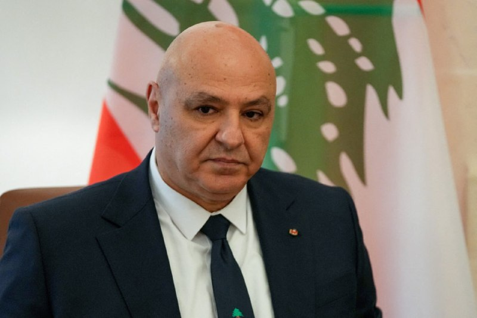

جوزف عون، رئیس جمهور لبنان، خواستار پایان دادن به اشغال اسرائیل از جنوب لبنان شد و گفت که این کشور چیزی کمتر از عقب‌نشینی کامل اسرائیل را نمی‌پذیرد.

عون در بیانیه‌ای که توسط دفترش منتشر شد، ابراز امیدواری کرد که دور فعلی مذاکرات در دستیابی به اهداف لبنان، از جمله بازگرداندن حاکمیت کامل بر تمام خاک لبنان و گسترش اقتدار دولت در سراسر کشور، تعیین‌کننده باشد.

وی افزود که تنها انتخاب لبنان، حاکمیت ملی ماست و تنها دولت لبنان باید مسئول حفاظت از همه شهروندان و صیانت از حقوق و آزادی‌های آنها باشد.

📝 Amir

📌 @persian_trend_official
پرشین ترند | متفاوت‌ترین کانال نظامی

## Persian_Trend_Official — post 17876

  <a href="telegram/content/Persian_Trend_Official_17876_1782234396.webm" target="_blank">🎬 Download video</a>

سنتکام: ناو هواپیمابر USS George H.W. Bush (CVN 77) در دریای عرب پهلو گرفت.

در حالی که نیروهای آمریکایی همچنان در منطقه حضور دارند و هوشیار هستند، دو ناو هواپیمابر همچنان در خاورمیانه به فعالیت خود ادامه می‌دهند.

📝 Amir

📌 @persian_trend_official
پرشین ترند | متفاوت‌ترین کانال نظامی

## Persian_Trend_Official — post 17874

  <a href="telegram/content/Persian_Trend_Official_17874_1782234396.mp4" target="_blank">🎬 Download video</a>

ساعاتی پیش انفجاری در یک انبار مخابرات شرکت اوگرو در بیروت رخ داد که در لحظات اول به اشتباه تصور می‌شد حمله ای هوایی توسط اسرائیل به بیروت انجام شده است.

📝 Amir

📌 @persian_trend_official
پرشین ترند | متفاوت‌ترین کانال نظامی

## Persian_Trend_Official — post 17872

انتشار تصاویری از موتور سوخت جامد فوق‌العاده سنگین سپاه پاسداران

این موتور با قطر 3.5 متر سنگین‌ترین موتور سوخت جامد ساخت ایران و همچنین یکی از سنگین‌ترین موتورهای سوخت جامد در جهان محسوب میشود.

این موتور قرار بوده به عنوان مرحله اول یک موشک سوخت جامد سنگین سپاه (قاره‌پیما یا ماهواره بر) استفاده شود که پس از انفجار در پادگان مدرس و کشته طهرانی مقدم، پدر موشکی ایران این پروژه کنسل شد.

از وضعیت حال حاضر این موتور سوخت جامد اطلاعاتی در دسترس نیست.

📝 Amir

📌 @persian_trend_official
پرشین ترند | متفاوت‌ترین کانال نظامی

## RadioFarda — post 158669

  <a href="https://t.me/radiofarda/158669" target="_blank">📎 Download file</a>

📻بشنوید: ایستگاه ۱۹ با رادیوفردا، دوم تیر ‌ماه ۱۴۰۵

@RadioFarda

## RadioFarda — post 158668

  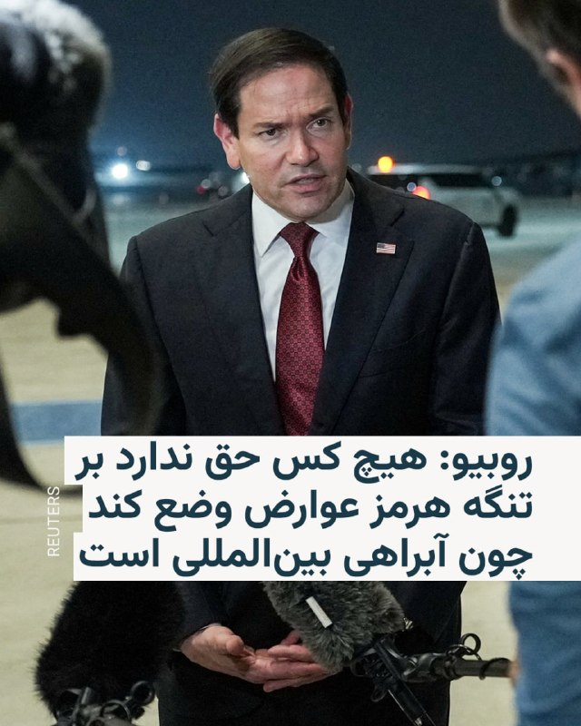

🔸وزیر خارجه آمریکا می‌گوید تا زمانی که گروه‌های نیابتی مورد حمایت ایران به حملات موشکی ادامه دهند، دستیابی به صلح پایدار در منطقه غیرممکن است.

🔸مارکو روبیو که به امارات متحده عربی سفر کرده است، روز سه‌شنبه دوم تیرماه افزود این موضوع «در زمان مناسب» مورد رسیدگی قرار خواهد گرفت.

🔸او همچنین تأکید کرد هیچ کشوری حق ندارد بر تنگه هرمز عوارض یا هزینه‌ای تحمیل کند، چرا که این آبراه یک مسیر بین‌المللی است و بر اساس قوانین موجود بین‌المللی حفاظت می‌شود.

🔸تنگهٔ هرمز از زمان آغاز حملات آمریکا و اسرائیل به ایران در ۹ اسفند پارسال، از سوی سپاه پاسداران مسدود شده بود و تنها هفته گذشته پس از توافق اولیه بین تهران و واشینگتن برای پایان دادن به جنگ تا حدودی بازگشایی شد.

🔸وزیر خارجه آمریکا در مورد لبنان که برقراری آتش‌بس در این کشور بخشی از توافق بین تهران و واشینگتن است، گفت که ما قرار است مستقیماً با دولت لبنان به توافق برسیم.

🔸روبیو تصریح کرد که «آینده لبنان را مردم لبنان تعیین می‌کنند و پرونده لبنان از هرگونه توافق با ایران جداست».

@RadioFarda

## RadioFarda — post 158667

  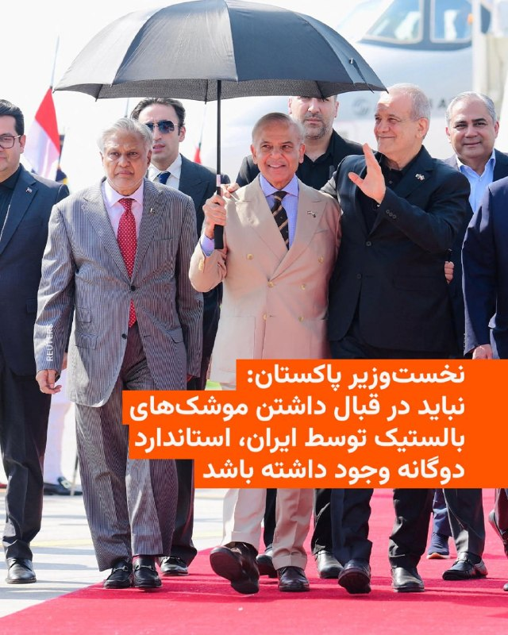

🔸نخست‌وزیر پاکستان روز سه‌شنبه دوم تیرماه گفت که در مورد موشک‌های بالستیک نباید استاندارد دوگانه‌ای وجود داشته باشد و تأکید کرد ایران همان حقی را برای در اختیار داشتن آن‌ها دارد که سایر کشورها دارند.

🔸شهباز شریف همچنین به خبرنگاران گفت که در تفاهم‌نامه مورد توافق میان ایران و ایالات متحده هیچ اشاره‌ای به موشک‌های بالستیک نشده، زیرا این موضوع اساساً در آن مذاکرات مطرح نبوده است.

🔸پیشتر برخی رسانه‌ها از قول نخست‌وزیر پاکستان مدعی شده بودند که او گفته است موضوع موشک‌های بالستیک تهران از جمله محورهای مذاکره بین ایران و آمریکا است.

🔸در واکنش به این ادعا، خبرگزاری فارس نزدیک به سپاه پاسداران نوشت که اظهارات نخست‌وزیر پاکستان، «کاملاً اشتباه و احتمالا ناشی از بی‌اطلاعی است».

🔸به نوشته این خبرگزاری، پاکستان در حال حاضر نقش چندانی در میانجی‌گری این مذاکرات ندارد و اظهارات شهباز شریف بیشتر برای پررنگ‌نمایی نقش واسطه‌گری این کشور مطرح شده است.

@RadioFarda

## RadioFarda — post 158666

چرا ژاپنی‌ها از «سامورایی آبی‌پوش لم‌داده روی کاناپه» انتقاد کردند؟

🔸تصاویر هواداران ژاپنی «تیم ملی فوتبال ژاپن»، معروف به سامورایی‌های آبی‌پوش، در حال تمیز کردن یک ورزشگاه جام جهانی فوتبال، تحسین گسترده‌ای برایشان به همراه داشته، اما در خود ژاپن با انتقادهایی همراه بوده و شهروندان گفته‌اند که مردان ژاپنی در خانه دست به سیاه و سفید نمی‌زنند.

🔸فدراسیون جهانی فوتبال (فیفا) در روزهای اخیر در شبکه اجتماعی ایکس، با اشاره به جمع‌کردن زباله‌ها در ورزشگاه از سوی تماشاگران ژاپنی پس از پایان بازی ژاپن و هلند، از آنچه «رفتار بی‌نقص» آنان خوانده، تمجید کرد. اما بلافاصله پس از آن، یک پست در شبکه‌های اجتماعی، با الهام از پوسترهای معروف متروی توکیو، صحنه تمیز کردن ورزشگاه توسط تماشاگران ژاپنی را با پیام «لطفاً در خانه هم انجام دهید» به سخره گرفت.

🔸این پوسترِ ساخته‌شده با هوش مصنوعی، یک هوادار ژاپنی با لباس تیم ملی این کشور را نشان می‌داد که روی کاناپه لم داده و زنی در حال شستن ظرف‌هاست.

🔸این پست که بیش از یک میلیون بار دیده شده، این تصویر را با عکس‌هایی از هواداران ژاپنی که در ۱۴ ژوئن پس از مسابقه فوتبال ورزشگاه را تمیز می‌کردند، کنار هم قرار داده بود.

🔸در این پست آمده بود: «مردان ژاپنی در سطح بین‌المللی جزو کسانی هستند که کمترین زمان را صرف کارهای خانه می‌کنند».

🔸داستان چیست؟ تفاوت زنان و مردان ژاپنی در زمینه کار بدون مزد تا چه اندازه است؟ و چرا با وجود انتقادهایی که به مردان ژاپنی می‌شود، آنان اکنون به‌عنوان مبدع نوعی «رفتار اجتماعی مثبت» در جام جهانی شناخته می‌شوند؟

🔸گزارش کامل را در وب‌سایت رادیوفردا بخوانید.

@RadioFarda

## IranianMinds — post 23191

  <a href="telegram/content/IranianMinds_23191_1782234400.mp4" target="_blank">🎬 Download video</a>

🔴احمد وشاح، فیلم‌بردار و خبرنگار الجزیره که در گروه تروریستی حماس بود و بر علیه اسرائیل فعالیت می‌کرد، به هلاکت رسید.

@IranianMinds

## IranianMinds — post 23190

  <a href="telegram/content/IranianMinds_23190_1782234402.mp4" target="_blank">🎬 Download video</a>

و در نهایت😂😂😂

@IranianMinds

## IranianMinds — post 23189

  <a href="telegram/content/IranianMinds_23189_1782234404.mp4" target="_blank">🎬 Download video</a>

دیدار شهباز شریف و پزشکیان

@IranianMinds

## IranianMinds — post 23188

  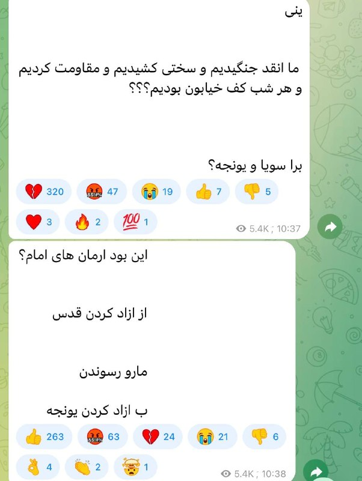

وضعیت رسانه های عرزشی

شهدای راه سویا و یونجه

@IranianMinds

## IranianMinds — post 23187

  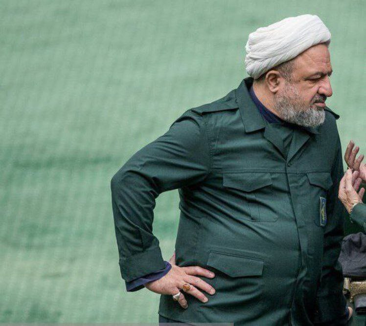

🔴 حمید رسایی و جمعی از نمایندگان مجلس :

اگه تا هفتم تیر ماه قالیباف در مجلسو باز نکنه ما میریم کنار خیابون و جلساتمون رو تشکیل میدیم !

@IranianMinds

## IranianMinds — post 23186

  

وضعیت سد کرج که پر شده دیگه تقریبا

@IranianMinds

## IranianMinds — post 23185

  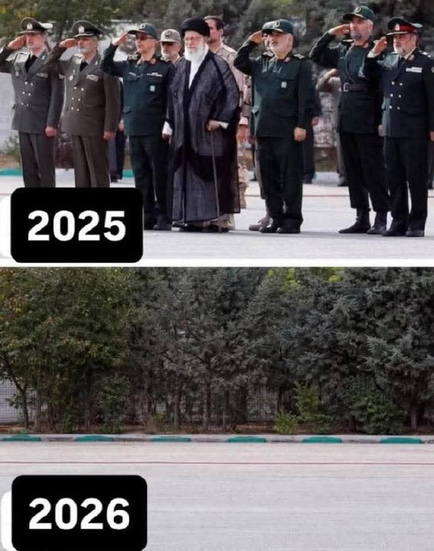

@IrananMinds

## BBCPersian — post 284849

  <a href="https://t.me/bbcpersian/284849" target="_blank">📎 Download file</a>

🔻جام ۲۶ - قسمت پنجم - تحلیل بازی اول و نگاهی به رویارویی تیم ملی ایران و بلژیک

دور دوم بازی‌های مرحله گروهی جام جهانی در حالی در جریان است که دور اول بازی‌ها، بر خلاف پیشی‌بینی‌ها هم پر گل بود و هم پر تماشاگر. ۴۸ تیم ِ حاضر در جام، در دور اول ۷۵ گل زدند و از شروع دور دوم بیش از ۱۰۰ گل. به طور میانگین سه گل در هر مسابقه.

تیم‌های آسیایی هم در دور اول نتایج بدی نگرفتند، ولی با شروع مسابقه‌های دور دوم داستان عوض شد. قطر شش تایی شد و استرالیا و کره جنوبی زورشون به دو میزبان نرسید. اما ایران در بازی اولش با نیوزيلند ۲-۲ مساوی کرد. آن هم در ورزشگاه لس‌آنجلس جایی که هزاران ایرانی برای تماشای این بازی رفته بودند.

مسابقه‌ای پر از حاشیه. هم بیرون از زمین و هم داخل زمین. هزاران نفر از مخالفان حکومت جمهوری اسلامی قبل از بازی و بیرون ورزشگاه تجمع اعتراضی برگزار کردند، در داخل ورزشگاه لس آنجلس هم طرفداران تیم ملی ایران بودند و هم مخالفان.

بعضی هم در شروع مسابقه و هنگام پخش سرود جمهوری اسلامی، آن را هو کردند ولی موقع به ثمر رسیدن هر دو گل ایران، بسیاری از ایرانیان حاضر در ورزشگاه خوشحالی کردند. مسابقه‌ای که از نگاه یک

## BBCPersian — post 284848

  <a href="telegram/content/BBCPersian_284848_1782234411.mp4" target="_blank">🎬 Download video</a>

🔻این روزها موج گرمای ۴۰ درجه‌ای بخش‌های گسترده‌ای از اروپا را فرا گرفته است. با مرگ حدود ۴۰ نفر در فرانسه بر اثر غرق‌شدگی، وضعیت قرمز در این کشور اعلام شده است و بیش از هزار مدرسه تعطیل شده‌اند.
 
به‌گزارش سازمان بهداشت جهانی در ۴ سال اخیر بیش از ۲۰۰ هزار نفر در اروپا بر اثر مشکلات ناشی از گرما جان خود را از دست داده‌اند. طبق اعلام سازمان جهانی هواشناسی، اروپا بیش از دو برابر سریع‌تر از میانگین جهانی در حال گرم شدن است. مسئله‌ای که تحمل این گرما را دشوار می‌‌کند این است که در بسیاری از کشورهای اروپایی، هنوز داشتن کولر در خانه‌ها چندان مرسوم نیست.
 
در بخش‌هایی از مرکز و جنوب انگلستان بالاترین سطح هشدار گرما صادر شده است. بنا بر اعلام هواشناسی بریتانیا «به احتمال زیاد رکورد فعلی بالاترین دمای ثبت‌شده در ماه ژوئن شکسته خواهد شد.» دمای لندن امروز پس از طوفان و رعدوبرق بامدادی ۳۳ درجه است و فردا قرار است کمی گرمتر هم بشود.
 
📸Getty Images
@BBCPersian
https://bbc.in/4oIIr7z

## Dirty_Kids — post 392925

  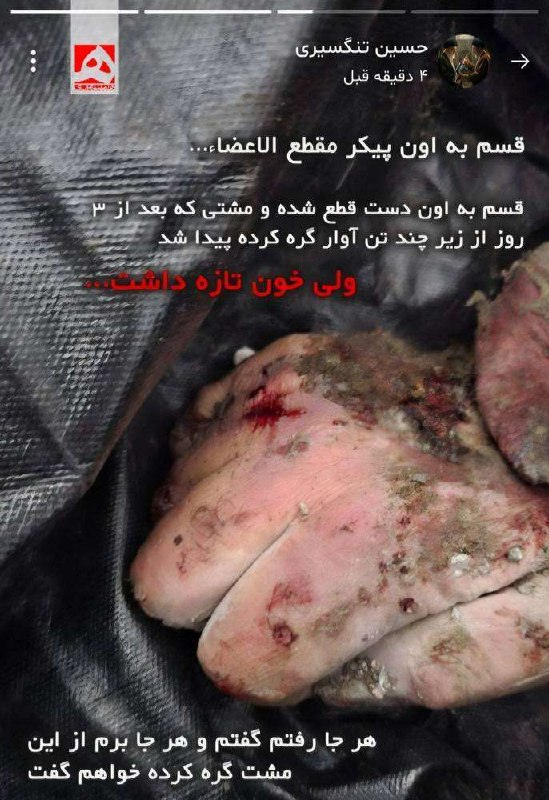

استوری پسر حرومزاده تنگسیری که نشون میده سردار تنگسیری هم مثل لاریجانی جوری کُتلتش که ازش فقط یه دست مونده: 😂😂😂😂

@Dirty_Kids 👻

## Dirty_Kids — post 392924

  <a href="telegram/content/Dirty_Kids_392924_1782234414.mp4" target="_blank">🎬 Download video</a>

این ریلز ۲۲ میلیون ویو گرفته:

@Dirty_Kids 👻

## Dirty_Kids — post 392923

  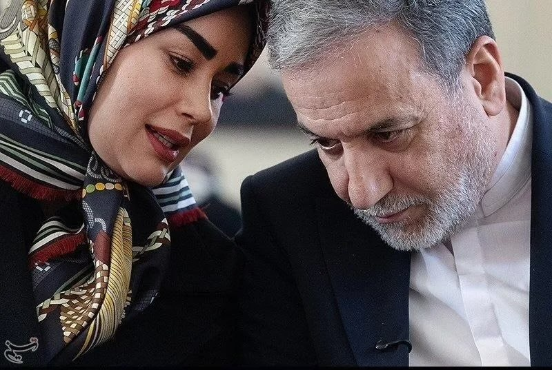

‏عباس؛ ذرت و سویامون تموم‌شده ها!

@Dirty_Kids 👻

## Dirty_Kids — post 392922

دیدم یکم آشناس...

@Dirty_Kids 👻

## Dirty_Kids — post 392920

مبادله کالا به کالا

@Dirty_Kids 👻

## Dirty_Kids — post 392919

⚡️ جام جهانی شروع شده و میدون مال توئه! 
🌟 این #جام_جهانی رو فقط باید توی #بت فیدو پیش‌بینی کنی 
💰 با ۵۰ میلیون تومان شرط روزانه ← ۴ میلیون تومان اعتبار شرط‌بندی رایگان 
📊 با ۱۰۰ میلیون تومان شرط روزانه ← ۸ میلیون تومان اعتبار شرط‌بندی رایگان میدونستی با انتخاب…

## Dirty_Kids — post 392918

  <a href="telegram/content/Dirty_Kids_392918_1782234416.webm" target="_blank">🎬 Download video</a>

⚡️ جام جهانی شروع شده و میدون مال توئه!

🌟 این #جام_جهانی رو فقط باید توی #بت فیدو پیش‌بینی کنی

💰 با ۵۰ میلیون تومان شرط روزانه ← ۴ میلیون تومان اعتبار شرط‌بندی رایگان

📊 با ۱۰۰ میلیون تومان شرط روزانه ← ۸ میلیون تومان اعتبار شرط‌بندی رایگان

میدونستی با انتخاب گل زدن کریسیانو رونالدو مقابل ازبکستان با ده میلیون بیست میلیون تومن برنده میشی؟!

💸 هرچی بزرگ‌تر بازی کنی، جایزت بزرگ‌تره!

🥅همین حالا پیش بینیتو ثبت کن
💖
https://fido874vt.click
https://fido874vt.click

👆
👆
👆
👆
👆
(ورود با وی-پی-ان غیر اروپایی)
❌
G2

📲کانال تلگرام 
👇
https://t.me/+dySI_QFj0T0xZGVk

## Dirty_Kids — post 392917

بانک ملی اختلال داره و پولامو بلوکه کرده نمیتونم پولی برداشت و انتقال بدم. میترسم فردا پیام بده بیا به جای پولت بهت ذرت و سویا بدم.

@Dirty_Kids 👻

## Dirty_Kids — post 392916

  <a href="telegram/content/Dirty_Kids_392916_1782234417.mp4" target="_blank">🎬 Download video</a>

این دیگه چه سمییی بود😂😂
حتما با چشمان باز ویدیو رو باز کنید!!
به پیرهن تنیس بازای حرفه ای حین مسابقه یه میکروفون وصل کردن که ببینن حین مسابقه چه صداهایی میدن خودشونم از صدای خودشون پاره شدن از خنده😂😂

ولوم گوشی هم پایین بیارید😂🔞

@Dirty_Kids 👻

## Dirty_Kids — post 392915

  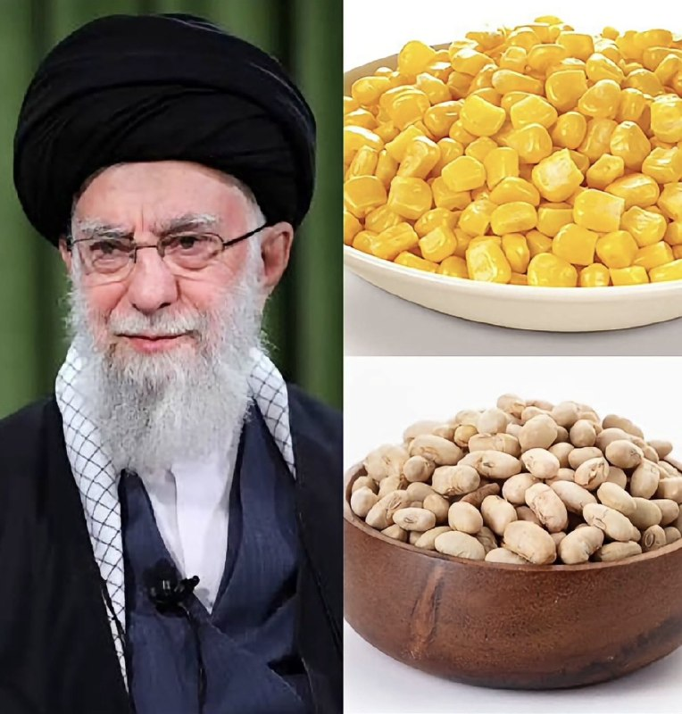

ذرت و سویا آوردیم، رهبرتون رو بردیم.

@Dirty_Kids 👻

## Dirty_Kids — post 392914

  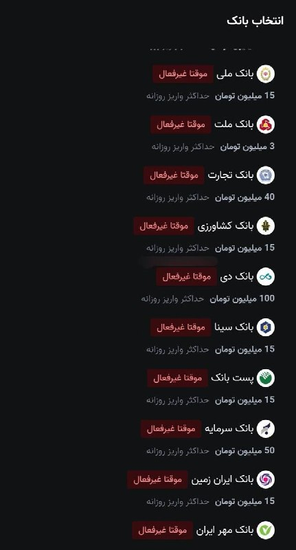

این دیگه هک نیست بنظرم😐

@Dirty_Kids 👻

## Dirty_Kids — post 392913

  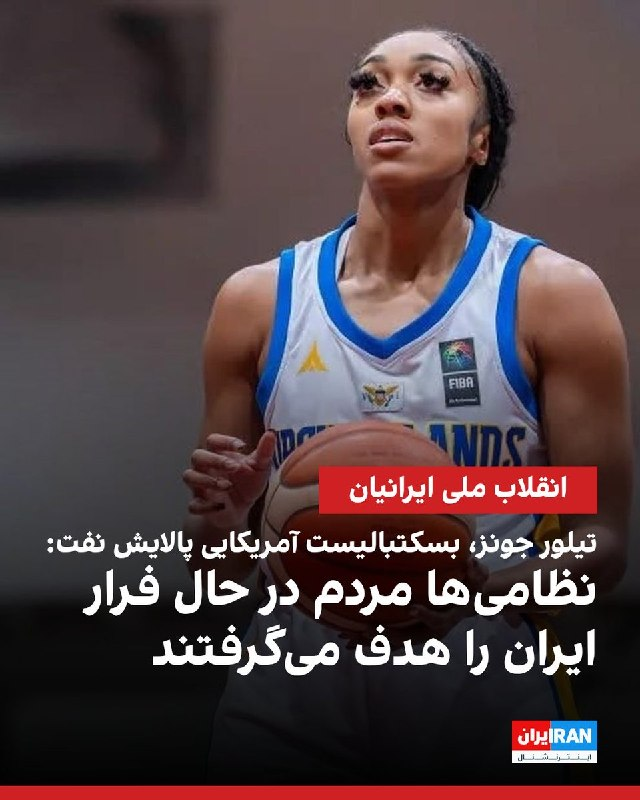

تیلور جونز، بسکتبالیست آمریکایی تیم پالایش نفت آبادان در لیگ برتر بسکتبال ایران که پس از کشتار مردم به دست جمهوری اسلامی در جریان انقلاب ملی ایرانیان، از ایران خارج شده، به ای‌بی‌سی نیوز گفت: «نظامی‌ها مردمی را که در حال دویدن و فریاد زدن بودند، هدف [گلوله] قرار می‌دادند.»

@Dirty_Kids 👻

## Dirty_Kids — post 392912

  <a href="telegram/content/Dirty_Kids_392912_1782234421.mp4" target="_blank">🎬 Download video</a>

این ژورنالیست مظلوم فلسطینی رو اسرائیل خونخوار کشته:)

@Dirty_Kids 👻

## Dirty_Kids — post 392911

  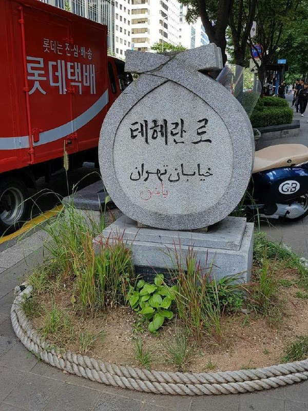

طرف از ایران پاشده رفته کره جنوبی که اسم شهرشون زیر اسم خیابون تهران بنویسه.
 دشت بی فرهنگی ما هرزه تموم علفاش!

@Dirty_Kids 👻

## Hranews — post 113810

  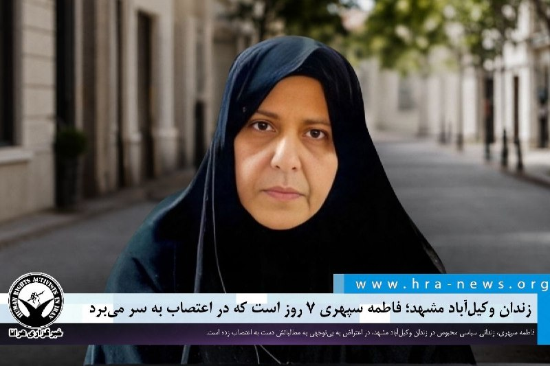

زندان وکیل‌آباد مشهد؛ فاطمه سپهری ۷ روز است که در اعتصاب به سر می‌برد

❗️
❗️
❗️
❗️
❗️– فاطمه سپهری، زندانی سیاسی محبوس در زندان وکیل‌آباد مشهد، از روز چهارشنبه ۲۷ خرداد ماه در اعتراض به بی‌توجهی به مطالباتش دست به اعتصاب زده است. خانواده وی روز جاری، پس از ملاقات با این زندانی سیاسی، نسبت به وضعیت جسمانی او ابراز نگرانی کرده‌اند.

به گزارش خبرگزاری هرانا، ارگان خبری مجموعه فعالان حقوق بشر در ایران، فاطمه سپهری، زندانی سیاسی، در هفتمین روز از اعتصاب غذای خود بسر می‌برد.

علی سپهری، برادر این زندانی سیاسی، در خصوص وضعیت وی اعلام کرد که خانم سپهری از روز چهارشنبه ۲۷ خردادماه، در اعتراض به آنچه توهین و آزار و اذیت توسط فریبا حاتم‌پور، مدیر داخلی بند زنان زندان وکیل‌آباد مشهد ذکر کرده، دست به اعتصاب غذا و دارو زده است. همچنین، در این مدت، تنها اقدام مسئولان زندان، انتقال روزانه خانم سپهری به بهداری و تزریق سرم قندی بوده است. خانواده وی در ملاقات امروز، وضعیت جسمانی فاطمه سپهری را نگران‌کننده توصیف کردند.

ادامه مطلب

#فاطمه_سپهری

↘️
@hranews_bot تماس ✉️ - @Hranews کانال هرانا 🆑

## Hranews — post 113809

منیژه خشنود با تودیع وثیقه آزاد شد

❗️
❗️
❗️
❗️
❗️– منیژه خشنود، شهروند ۵۸ ساله اهل بوکان با تودیع وثیقه آزاد شد. وی اوایل خردادماه سال جاری توسط نیروهای امنیتی بازداشت شده بود.

ادامه مطلب

#منیژه_خشنود

↘️
@hranews_bot تماس ✉️ - @Hranews کانال هرانا 🆑

## Hranews — post 113808

  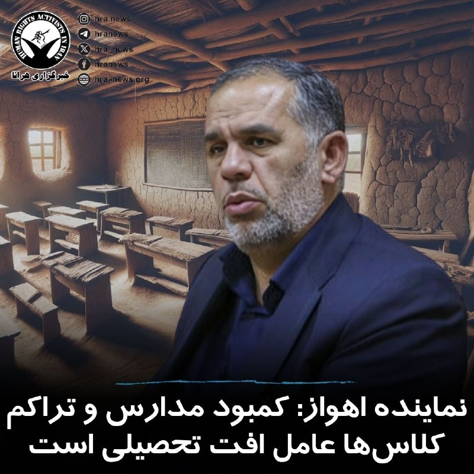

نماینده اهواز، کارون، باوی و حمیدیه در مجلس با اشاره به کمبود مدارس و تراکم بالای کلاس‌های درس در خوزستان، این مشکلات را از عوامل مؤثر بر افت تحصیلی دانش‌آموزان این استان عنوان کرد. محسن موسوی‌زاده همچنین خواستار مشارکت بیشتر صنایع و شرکت‌های بزرگ استان در ساخت و تکمیل مدارس در قالب مسئولیت‌های اجتماعی شد.
#کمبود_مدرسه

↘️
@hranews_bot تماس ✉️ - @Hranews کانال هرانا 🆑

## alonews — post 129899

  <a href="telegram/content/alonews_129899_1782234424.webm" target="_blank">🎬 Download video</a>

👈احمدی عضو کمیسیون آموزش:
تدریس هوش‌ مصنوعی از سال آینده وارد مدارس کشور می‌شود

✅ @AloNews خبر جنگ

## alonews — post 129898

  <a href="telegram/content/alonews_129898_1782234424.webm" target="_blank">🎬 Download video</a>

👈روبیو : یه سری مسائل هم خارج از اون توافق (MOU) هست؛ ولی باید روشون حرف زده بشه 
🔴 ایده «پایان کامل درگیری‌ها تو کل منطقه» از نظرشون عملاً شدنی نیست 
🔴چون می‌گن تا وقتی گروه‌های نیابتی ایران از عراق موشک و پهپاد می‌زنن و در درگیری‌ها (مثل حماس و حزب‌الله)…

## alonews — post 129897

  <a href="telegram/content/alonews_129897_1782234424.mp4" target="_blank">🎬 Download video</a>

👈پزشکیان: بحث موشکی در تفاهم‌نامه نیست و هیچ‌وقت وجود نخواهد داشت

🔴 اگر موشک‌های ما نبود اسرائیل و آمریکا ایران را مثل غزه شخم می‌زدند

✅ @AloNews خبر جنگ

## alonews — post 129896

  <a href="telegram/content/alonews_129896_1782234426.mp4" target="_blank">🎬 Download video</a>

👈پزشکیان دکترای افتخاری از پاکستان دریافت کرد 

✅ @AloNews خبر جنگ

## alonews — post 129895

  <a href="telegram/content/alonews_129895_1782234428.webm" target="_blank">🎬 Download video</a>

👈روبیو : یه سری مسائل هم خارج از اون توافق (MOU) هست؛ ولی باید روشون حرف زده بشه

🔴 ایده «پایان کامل درگیری‌ها تو کل منطقه» از نظرشون عملاً شدنی نیست

🔴چون می‌گن تا وقتی گروه‌های نیابتی ایران از عراق موشک و پهپاد می‌زنن و در درگیری‌ها (مثل حماس و حزب‌الله) نقش دارن، نمی‌شه گفت تنش تموم شده

🔴برای همین این موضوع هم داخل چارچوب مذاکرات می‌مونه و بعداً روش تصمیم می‌گیرن

✅ @AloNews خبر جنگ

## alonews — post 129894

  <a href="telegram/content/alonews_129894_1782234428.webm" target="_blank">🎬 Download video</a>

👈وزیر خارجه آمریکا، روبیو : موضوعی که همیشه مطرحه

🔴اینه که الان یه مسئله مربوط به ایران درباره لُبنان وجود داره و اون هم حمایت و پشتیبانی از حزب‌الله

🔴این موضوع هم بخشی از گفت‌وگوها با ایرانی‌ها خواهد بود

🔴اما درباره آینده لُبنان، این کشور متعلق به مردم لُبنانه و باید از طریق دولت منتخب و حاکمیت خودش تصمیم‌گیری بشه

🔴ما هم قراره با همین چارچوب جلو بریم

✅ @AloNews خبر جنگ

## alonews — post 129893

  <a href="telegram/content/alonews_129893_1782234429.mp4" target="_blank">🎬 Download video</a>

👈شعرخوانی شهباز شریف به زبان فارسی در حضور مسعود پزشکیان

✅ @AloNews خبر جنگ

## alonews — post 129892

  <a href="telegram/content/alonews_129892_1782234429.webm" target="_blank">🎬 Download video</a>

👈نخست‌وزیر پاکستان، شهباز شریف:
این تفاهم‌نامه به موشک‌های بالستیک اشاره‌ای ندارد. این موضوع هرگز در دستور کار نبوده است؛ هرگز در دستور کار قرار نگرفته است.طرف ایرانی هرگز حتی تمایلی به بحث درباره آن نداشته است

✅ @AloNews خبر جنگ

## alonews — post 129891

  <a href="telegram/content/alonews_129891_1782234430.webm" target="_blank">🎬 Download video</a>

👈نخست‌وزیر پاکستان: آیت‌الله سیدمجتبی خامنه‌ای، رهبر ایران، را تحسین می‌کنم که در این شرایط حساس ایران را رهبری کرد

✅ @AloNews خبر جنگ

## alonews — post 129890

  <a href="telegram/content/alonews_129890_1782234430.webm" target="_blank">🎬 Download video</a>

👈نخست وزیر پاکستان: کارشکنی هایی وجود دارد که می خواهند تفاهم نامه بین آمریکا و ایران را از مسیر خود خارج کنند

✅ @AloNews خبر جنگ

## alonews — post 129889

  <a href="telegram/content/alonews_129889_1782234430.webm" target="_blank">🎬 Download video</a>

👈بر اساس آخرین گزارش بانک مرکزی، رشد اقتصادی کشور در سال ۱۴۰۴ با کاهش منفی ۰.۷ درصد، منفی اعلام شد.

✅ @AloNews خبر جنگ

## alonews — post 129888

  <a href="telegram/content/alonews_129888_1782234430.webm" target="_blank">🎬 Download video</a>

👈شهباز شریف، نخست‌وزیر پاکستان: تفاهم‌نامه امضاشده میان تهران و واشنگتن ظرف شصت روز آینده به یک توافق بلندمدت تبدیل خواهد شد

✅ @AloNews خبر جنگ

## alonews — post 129887

  <a href="telegram/content/alonews_129887_1782234431.mp4" target="_blank">🎬 Download video</a>

👈ثابتی: تنگه رو مفت باز کردیم بدون اینکه هیچ عوارضی بگیریم

✅ @AloNews خبر جنگ

## alonews — post 129886

  <a href="telegram/content/alonews_129886_1782234432.webm" target="_blank">🎬 Download video</a>

👈نفتالی بنت، نخست‌وزیر سابق اسرائیل:
ما در دیپلماسی عمومی بدترین در جهان هستیم. اگر اسرائیل یک شرکت روابط عمومی بود، قطعاً ما را استخدام نمی‌کردم.

🔴با احمقانه نبودن شروع به کار کنید!

🔴بن-گور چیزهای بی‌معنی و احمقانه توییت می‌کند تا قوی به نظر برسد، و سپس من باید در یک دوجین مصاحبه در سی‌ان‌ان و بی‌بی‌سی برای پاک‌کردن این به‌هم‌ریختگی وقت بگذارم

✅ @AloNews خبر جنگ

## alonews — post 129885

  <a href="telegram/content/alonews_129885_1782234433.webm" target="_blank">🎬 Download video</a>

👈ریاست جمهوری لبنان: ونس و وزیر خارجه آمریکا تأکید کردند که آن‌ها پیگیری اجرای تفاهمات مذاکرات سوئیس، از جمله تشکیل یک کمیته مشترک متشکل از ایالات متحده، لبنان و ایران برای تثبیت آتش‌بس در لبنان و نظارت بر اجرای اقدامات مرتبط را ادامه خواهند داد

🔴آن‌ها گفته‌اند که ترتیبات مربوط به حوزه اختیارات این کمیته و نحوه تشکیل آن، در دست بررسی است

✅ @AloNews خبر جنگ

## alonews — post 129884

  <a href="telegram/content/alonews_129884_1782234433.webm" target="_blank">🎬 Download video</a>

👈رسایی: مردم نگران نباشن، یکشنبه قطعا جلسه مجلس رو برگزار میکنیم

✅ @AloNews خبر جنگ

## alonews — post 129883

  <a href="telegram/content/alonews_129883_1782234433.webm" target="_blank">🎬 Download video</a>

👈به علت گرمای هوای ۳۲ درجه ای در فرانسه 18 نفر جان باختند

✅ @AloNews خبر جنگ

## alonews — post 129882

  <a href="telegram/content/alonews_129882_1782234433.webm" target="_blank">🎬 Download video</a>

👈جلیلی: رهبری با مذاکرات مخالف نیست

✅ @AloNews خبر جنگ

## alonews — post 129881

  <a href="telegram/content/alonews_129881_1782234433.webm" target="_blank">🎬 Download video</a>

👈رئیس‌جمهور لبنان، جوزف عون، خواستار پایان «اشغال اسرائیلی» جنوب لبنان شد و گفت که کشور او «کمتر از» خروج کامل اسرائیل را نخواهد پذیرفت.

در بیانیهای که از سوی دفتر او منتشر شد، عون ابراز امیدواری کرد که دور فعلی مذاکرات در دستیابی به اهداف لبنان، از جمله بازگرداندن حاکمیت کامل بر تمام خاک لبنان و گسترش اقتدار دولتی در سراسر کشور، «تصمیم‌گیرنده» باشد.

او افزود که «تنها انتخاب ما حاکمیت ملی ماست» و دولت لبنان باید به تنهایی مسئولیت محافظت از تمام شهروندان و تضمین حقوق و آزادی‌های آنان را بر عهده بگیرد.

✅ @AloNews خبر جنگ

---
📅 بروزرسانی: 1405/04/02 18:07
---

## VahidOOnLine — post 246995

  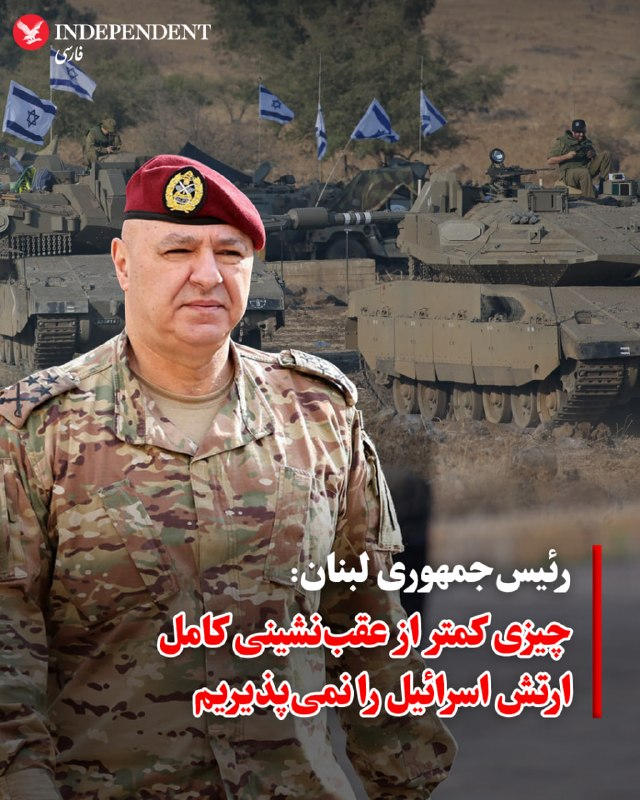

♦️ ژوزف عون، رئیس‌جمهوری لبنان، روز سه‌شنبه دوم تیرماه، پیش از آغاز مذاکرات با مقامات اسرائیلی در واشنگتن تاکید کرد که دولت او به چیزی کمتر از عقب‌نشینی کامل نیروهای اسرائیلی از جنوب این کشور راضی نخواهد شد؛ منطقه‌ای به عمق تقریبی ۶ مایل (۱۰ کیلومتر) از مرز مشترک دو کشور که در حال حاضر تحت اشغال اسرائیل است.

عون اظهار داشت: «ما تاکید می‌کنیم که به چیزی کمتر از پایان اشغالگری اسرائیل در جنوب لبنان و رفع هرگونه قیمومیت خارجی تن نخواهیم داد.» این در حالی است که مقامات اسرائیل می‌گویند نیروهایشان تا زمان رفع کامل تهدیدات حزب‌الله در این «منطقه امنیتی» باقی خواهند ماند. این تنش‌ها در حالی است که تفاهم‌نامه هفته گذشته میان آمریکا و جمهوری اسلامی ایران، خواهان «پایان دائمی عملیات نظامی در همه جبهه‌ها از جمله لبنان» است.

رئیس‌جمهوری لبنان با ابراز امیدواری نسبت به سرنوشت‌ساز بودن این دور از گفتگوها افزود: «هدف ما احیای کامل حاکمیت لبنان بر وجب به وجب خاک خود و گسترش اقتدار دولت است.» دولت عون هم‌زمان تحت فشار شدید آمریکا و اسرائیل برای خلع سلاح حزب‌الله قرار دارد.
‌🇸🇦 Indypersian

🤖 @VahidOOnLine

## VahidOOnLine — post 246994

  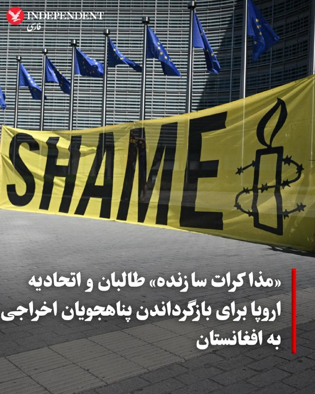

♦️خبرگزاری فرانسه به نقل از یک مقام افغان که آگاهی مستقیمی از روند گفتگوها دارد، اعلام کرد که مقامات دولت طالبان روز سه‌شنبه دوم تیرماه، «مذاکراتی سازنده» با اتحادیه اروپا در بروکسل داشته‌اند.

این مقام افغان که به دلیل حساسیت این گفتگوها خواست نامش فاش نشود، گفت: «این نشست‌ها سازنده بود و این امیدواری وجود دارد که به تحولات مثبت منجر شود.» این مذاکرات در حالی برگزار می‌شود که کشورهای عضو اتحادیه اروپا در تلاش و رایزنی برای بازگرداندن پناهجویان اخراجی (ردصلاحیت‌شده) به افغانستان هستند.

همزمان با حضور هیئت طالبان در بروکسل، کنشگران سازمان عفو بین‌الملل با حضور در مقر اتحادیه اروپا، پارچه‌نوشته‌هایی با عبارت‌های «شرم!» و «توافق با طالبان را متوقف کنید» را به نمایش در آوردند.
‌🇸🇦 Indypersian

🤖 @VahidOOnLine

## VahidOOnLine — post 246993

  

به گزارش رویترز، جوزف عون، رییس‌جمهور لبنان، اعلام کرد که این کشور به چیزی کمتر از پایان «اشغال جنوب لبنان از سوی اسرائیل» رضایت نخواهد داد.

بر اساس این گزارش، او افزود که دور جدید گفت‌وگوهای مورد حمایت آمریکا با اسرائیل می‌تواند تعیین‌کننده باشد.
‌🏁 🇬🇧 IranintlTV

🤖 @VahidOOnLine

## VahidOOnLine — post 246992

♦️خبرگزاری فارس سه‌شنبه دوم تیرماه با انتشار ویدیویی از آتش‌سوزی در ارتفاعات کوهمره سرخی شیراز خبر داد. بر اساس این گزارش، بخش‌هایی از این منطقه دچار حریق شده است.

تا زمان انتشار این گزارش، علت وقوع آتش‌سوزی و میزان خسارت‌های احتمالی اعلام نشده است.
‌🇸🇦 Indypersian

🤖 @VahidOOnLine

## VahidOOnLine — post 246991

  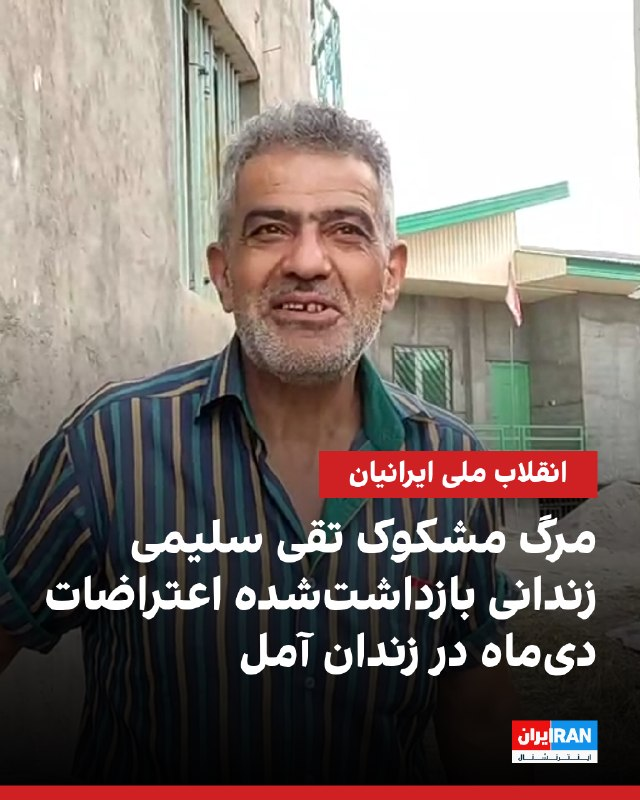

بر اساس گزارش‌های رسیده به ایران‌اینترنشنال، تقی سلیمی، شهروند ۵۷ ساله اهل آمل و از بازداشت‌شدگان اعتراض‌های دی‌ماه ۱۴۰۴، روز ۲۱ اردیبهشت ۱۴۰۵ در زندان آمل جان باخت. به گفته نزدیکان او، تاکنون توضیح شفافی از سوی مقام‌های مسئول درباره علت مرگ ارائه نشده و ابهامات جدی درباره نحوه جان‌باختن او وجود دارد.

بر اساس این گزارش، سلیمی سوم بهمن ۱۴۰۴ بازداشت شد و به اتهام «اقدام علیه امنیت ملی» «تخریب اموال عمومی» به ۱۰ سال حبس و پرداخت ۱۶۰ میلیون تومان جزای نقدی محکوم شده بود. منابع نزدیک به خانواده می‌گویند او در روند دادرسی از دسترسی به وکیل محروم بوده، دو ماه را در سلول انفرادی گذرانده و سپس به بند عمومی منتقل شده بود.

به گفته این منابع، بر اساس گواهی بیمارستان، تقی سلیمی هنگام انتقال از زندان آمل به بیمارستان «امام علی» این شهر فاقد علائم حیاتی بوده است. همچنین به گفته منابع نزدیک به خانواده، درخواست انجام کالبدگشایی پذیرفته نشده و همچنان ابهام‌هایی درباره علت دقیق مرگ او وجود دارد.

‌🏁 🇬🇧 IranintlTV

🤖 @VahidOOnLine

## VahidOOnLine — post 246990

  

نفتالی بنت، نخست‌وزیر پیشین اسرائیل و نامزد جانشینی بنیامین نتانیاهو، در نشست بین‌المللی سیاست‌گذاری «سندیکای خبری یهودیان» در اورشلیم گفت در دوران نخست‌وزیری خود برنامه‌ای را برای انتقال ده‌ها هزار گیرنده استارلینک به داخل ایران آغاز کرده بود تا در صورت قطع اینترنت، ارتباطات معترضان حفظ شود.

بنت گفت: «در دوران نخست‌وزیری‌ام برنامه‌ای برای انتقال ده‌ها هزار گیرنده استارلینک به داخل ایران آغاز کرده بودم تا در صورت قطع اینترنت ارتباطات معترضان حفظ شود، اما دولت کنونی اسرائیل این برنامه را متوقف کرد.»

او افزود نبود این زیرساخت در جریان اعتراضات ایران باعث شد معترضان پس از قطع اینترنت امکان هماهنگی و حفظ ارتباطات خود را از دست بدهند.

نخست‌وزیر پیشین اسرائیل همچنین دولت بنیامین نتانیاهو را به متوقف کردن این طرح و دیگر برنامه‌هایی که به گفته او در دولت پیشین آغاز شده بود، متهم کرد.
‌🏁 🇬🇧 IranintlTV

🤖 @VahidOOnLine

## VahidOOnLine — post 246989

  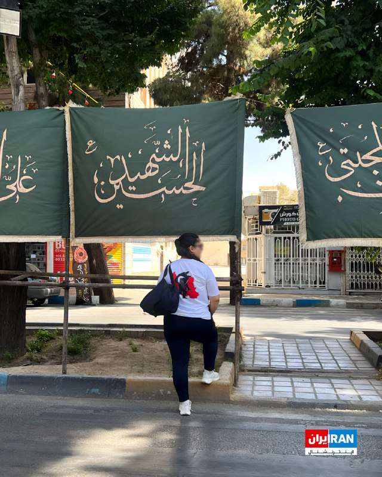

تصویر ارسال‌شده به ایران‌اینترنشنال، زنی را در شاهین‌شهر استان اصفهان نشان می‌دهد که لباسی با نقش جاویدنام حمید مهدوی به تن کرده است.
به گفته ارسال‌کننده تصویر، این عکس دقایقی بعد از درگیری این زن با حامیان حکومت به دلیل حجاب اجباری ثبت شده است.
‌🏁 🇬🇧 IranintlTV

🤖 @VahidOOnLine

## VahidOOnLine — post 246988

  <a href="telegram/content/VahidOOnLine_246988_1782225442.mp4" target="_blank">🎬 Download video</a>

♦️بنیامین نتانیاهو، نخست‌وزیر اسرائیل، روز سه‌شنبه دوم تیرماه گفت اسرائیل باید به استقلال تسلیحاتی دست یابد و توانایی تولید داخلی سلاح و تجهیزات نظامی خود را گسترش دهد.

نتانیاهو در دیدار با افسران ذخیره ارتش با قدردانی از حمایت‌های آمریکا گفت: «من خواهان استقلال تسلیحاتی هستم.» او افزود: «ما به یک سامانه مستقل تولید تسلیحات نیاز داریم. باید تسلیحات خودمان را تولید کنیم.»

نخست‌وزیر اسرائیل تاکید کرد آینده و جایگاه این کشور در دهه‌های آینده به قدرت نظامی آن وابسته است و گفت: «باید از وابستگی رها شویم، قدرت بیشتری بسازیم، فناوری‌های بیشتری وارد کنیم و نسل‌های بیشتری از فرماندهان را آموزش دهیم.»

او همچنین گفت آنچه امروز در حال انجام است، تقویت هرچه بیشتر توانمندی‌های نظامی و فناوری اسرائیل برای تضمین آینده این کشور است.
‌🇸🇦 Indypersian

🤖 @VahidOOnLine

## VahidOOnLine — post 246987

  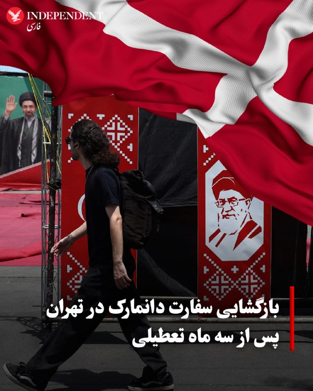

♦️ وزارت امور خارجه دانمارک روز سه‌شنبه، دوم تیرماه اعلام کرد که این کشور سفارت خود در تهران را پس از بیش از سه ماه تعطیلی به دلیل درگیری‌ها در خاورمیانه، بازگشایی کرده است.

دستگاه دیپلماسی دانمارک در بیانیه‌ای تصریح کرد: «با توجه به بهبود وضعیت امنیتی در ایران، سفارت این کشور در تهران درهای خود را بازگشایی می‌کند.» این وزارتخانه همچنین افزود که سفیر دانمارک در ایران از تاریخ ۱۹ ژوئن (۲۹ خرداد) فعالیت خود را در ساختمان سفارت آغاز کرده است.

دانمارک در اسفندماه به دلیل شرایط امنیتی منطقه، دستور تعطیلی موقت سفارت خود را صادر کرده بود. هم‌زمان، سفارت ایتالیا در تهران نیز که وضعیتی مشابه داشت و بیش از سه ماه بسته بود، روز جمعه درهای خود را به روی مراجعان باز کرد.
‌🇸🇦 Indypersian

🤖 @VahidOOnLine

## VahidOOnLine — post 246986

  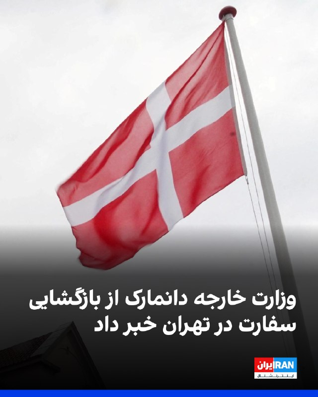

وزارت خارجه دانمارک اعلام کرد که پس از بیش از سه ماه تعطیلی، سفارت خود در تهران را بازگشایی کرده است.

در بیانیه‌ این وزارتخانه آمده است: «با توجه به بهبود وضعیت امنیتی در ایران، سفارت در تهران درهای خود را دوباره باز می‌کند.»

سفارت ایتالیا در تهران نیز که آن هم بیش از سه ماه بسته شده بود، روز جمعه بازگشایی شد.
‌🏁 🇬🇧 IranintlTV

🤖 @VahidOOnLine

## VahidOOnLine — post 246985

  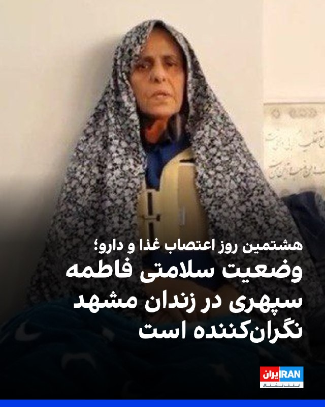

اصغر سپهری، برادر فاطمه سپهری، زندانی سیاسی محبوس در زندان وکیل‌آباد مشهد، در شبکه ایکس نوشت که خواهرش در اعتراض به رفتارهای صورت‌گرفته در زندان در هشتمین روز اعتصاب غذا و دارو به سر می‌برد.

او افزود تنها اقدام مسئولان زندان در این مدت، انتقال روزانه او به بهداری و تزریق سرم قندی بوده و خانواده روز سه‌شنبه در ملاقات، شاهد وضعیت وخیم و نگران‌کننده جسمی فاطمه سپهری بودند.

اصغر سپهری افزود: با وجود پیگیری‌های مکرر خانواده برای توقف اجرای حکم یا مرخصی درمانی، تاکنون هیچ‌یک از مسئولان پاسخ‌گو نبودند.
‌🏁 🇬🇧 IranintlTV

🤖 @VahidOOnLine

## VahidOOnLine — post 246984

  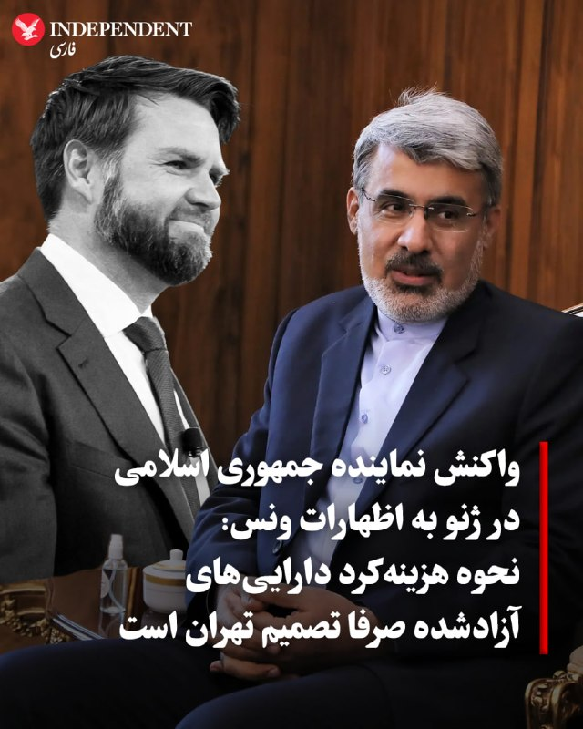

♦️ علی بحرینی، سفیر و نماینده دائم جمهوری اسلامی ایران در مقر سازمان ملل متحد در ژنو، اظهارات جی‌دی ونس، معاون رئیس‌جمهوری آمریکا، مبنی بر نقش داشتن واشنگتن و قطر در نحوه هزینه‌کرد دارایی‌های آزادشده ایران را به‌طور قاطع رد کرد.

این موضع‌گیری پس از آن اتخاذ شد که ونس گفته بود دارایی‌های بلوکه‌شده‌ای که در پی مذاکرات جاری آزاد می‌شوند، تحت نظارت و تایید آمریکا و قطر تنها برای خرید کالاهای آمریکایی مصرف خواهند شد تا صرف حمایت از تروریسم نشوند.

بحرینی با رد این اظهارات و همسو با موضع سخنگوی وزارت امور خارجه جمهوری اسلامی، در گفتگو با خبرنگاران در ژنو تاکید کرد: «ایران تنها کشوری است که درباره نحوه استفاده از دارایی‌های آزادشده خود تصمیم‌گیری خواهد کرد. من هرگونه ادعا مبنی بر نقش‌آفرینی یا اعمال نفوذ هر کشور دیگری در این تصمیم‌گیری‌ها و فرآیندها را کاملا رد می‌کنم.»
‌🇸🇦 Indypersian

🤖 @VahidOOnLine

## VahidOOnLine — post 246983

  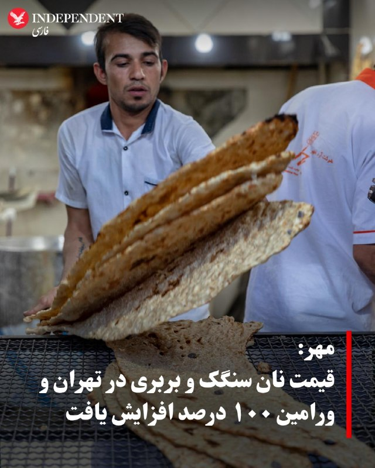

♦️خبرگزاری مهر سه‌شنبه دوم تیرماه گزارش داد قیمت انواع نان در تهران و ورامین افزایش یافته و در برخی موارد به حدود دو برابر نرخ‌های پیشین رسیده است. بر اساس این گزارش، قیمت‌های جدید از سوی استانداری ابلاغ شده و از امروز روی دستگاه‌های نانینو در نانوایی‌ها اعمال شده است.

بر اساس نرخ‌های تازه، قیمت نان لواش به دو هزار و ۷۰۰ تومان، بربری به ۱۰ هزار تومان و سنگک به ۱۵ هزار و ۵۰۰ تومان رسیده است. محمدجواد کرمی، رئیس کارگروه آرد و نان اتاق اصناف ایران، نیز افزایش قیمت نان را تایید کرده است.

در ورامین نیز رئیس اتحادیه نانوایان از افزایش ۹۰ تا ۱۰۰ درصدی قیمت نان خبر داد. بر این اساس، قیمت نان لواش از هزار و ۴۰۰ تومان به دو هزار و ۷۰۰ تومان، تافتون از دو هزار و ۳۰۰ تومان به چهار هزار و ۵۰۰ تومان، بربری از پنج هزار و ۳۰۰ تومان به ۱۰ هزار تومان و سنگک از هفت هزار و ۴۰۰ تومان به ۱۵ هزار و ۵۰۰ تومان افزایش یافته است.

مسئولان صنفی افزایش هزینه‌های تولید، از جمله دستمزد کارگران، خمیرمایه، حمل‌ونقل و اجاره‌بها را دلیل این افزایش قیمت عنوان کرده‌اند. رئیس اتحادیه نانوایان ورامین نیز گفته است اصلاح قیمت‌ها با هدف ادامه فعالیت نانوایی‌ها و حفظ روند تولید و عرضه نان انجام شده است.

این افزایش قیمت در حالی اعمال شده است که نان از مهم‌ترین کالاهای مصرفی خانوارهای ایرانی محسوب می‌شود و در برخی اقلام، نرخ‌های جدید نسبت به قیمت‌های قبلی نزدیک به دو برابر شده است.
‌🇸🇦 Indypersian

🤖 @VahidOOnLine

## VahidOOnLine — post 246982

  <a href="telegram/content/VahidOOnLine_246982_1782225446.mp4" target="_blank">🎬 Download video</a>

♦️رسانه‌های ایران سه‌شنبه دوم تیرماه تصاویری منتشر کردند که نشان می‌دهد هم‌زمان با ورود هواپیمای مسعود پزشکیان، رئیس‌جمهوری اسلامی ایران، به حریم هوایی پاکستان، جنگنده‌های این کشور آن را تا اسلام‌آباد همراهی کردند.

پزشکیان روز سه‌شنبه دوم تیرماه با استقبال آصف علی زرداری، رئیس‌جمهور پاکستان، و شهباز شریف، نخست‌وزیر این کشور، وارد فرودگاه بین‌المللی اسلام‌آباد شد. عباس عراقچی، وزیر امور خارجه جمهوری اسلامی، نیز پیش از پزشکیان و از مسقط وارد پاکستان شده بود.

این سفر در پی مذاکرات اخیر میان ایران و آمریکا در سوئیس انجام می‌شود؛ مذاکراتی که پاکستان همراه با قطر در میانجی‌گری آن نقش داشته است. حبیب‌الله عباسی، مدیرکل روابط عمومی دفتر ریاست‌جمهوری، اعلام کرد یکی از اهداف این سفر، قدردانی از شهباز شریف به دلیل نقش او در میانجی‌گری میان تهران و واشینگتن است.

شهباز شریف و ژنرال عاصم منیر، فرمانده ستاد ارتش پاکستان، از هفته‌های میانی جنگ در اسفندماه گذشته در تلاش‌های دیپلماتیک برای برقراری آتش‌بس، ازسرگیری مذاکرات و در نهایت دستیابی به تفاهم‌نامه پایان جنگ میان ایران و آمریکا نقش‌آفرینی کرده‌اند. آمریکا و شماری از رهبران جهان نیز از اسلام‌آباد به دلیل کمک به کاهش تنش‌ها در این بحران قدردانی کرده‌اند.
‌🇸🇦 Indypersian

🤖 @VahidOOnLine

## VahidOOnLine — post 246981

  <a href="telegram/content/VahidOOnLine_246981_1782225447.mp4" target="_blank">🎬 Download video</a>

ویدیوی رسیده به ایران‌اینترنشنال نشان می‌دهد گروهی از دانشجویان در تهران سه‌شنبه دوم تیر مقابل دانشگاه علوم و تحقیقات تجمع کردند و خواستار مجازی شدن امتحان‌ها شدند.
‌🏁 🇬🇧 IranintlTV

🤖 @VahidOOnLine

## WithYashar — post 15670

عمان و ایران بیانیه مشترکی منتشر کرده‌اند که در آن قصد خود برای ایجاد یک مدیریت مشترک آینده برای تنگه هرمز را تأیید می‌کنند

این بیانیه همچنین به طور ضمنی تأیید کرد که مطابق با استانداردهای بین‌المللی هزینه‌هایی برای خدمات دریایی اعمال خواهد شد
@withyashar

## WithYashar — post 15669

فایننشال‌تایمز: با وجود افزایش سطح تردد کشتی‌ها در تنگه هرمز، مالکان همچنان سردرگم هستند؛ این وضعیت در حالی شکل گرفته که ایران کشتی‌ها را تهدید به عبور از مسیر نزدیک سواحل خود کرده و آمریکا مسیر عمان را پیشنهاد می‌کند
@withyashar

## WithYashar — post 15668

هم اکنون حمله پهپادی هدفمند به خودرویی در جنوب لبنان،گزارش ها از ترور چندین عضو حزب الله.
@withyashar

## WithYashar — post 15667

شهباز شریف نخست وزیر پاکستان: مذاکرات ایران و آمریکا شامل دارایی‌های هسته‌ای، موشک‌های بالستیک و دارایی‌های مسدود شده ایران خواهد بود.
@withyashar

## mwarmonitor — post 11422

🔴 گفت‌وگوهای اسرائیل و لبنان در وزارت خارجه آمریکا در واشنگتن در جریان است تا درباره خلع سلاح حزب‌الله و عادی‌سازی روابط گفت‌وگو شود. i24 news

@mwarmonitor

## mwarmonitor — post 11421

📰(رویترز) – به گفته سازمان دفاع مدنی لبنان و وزارت بهداشت این کشور، تیراندازی نیروهای اسرائیلی روز سه‌شنبه در جنوب لبنان منجر به کشته شدن دو نفر شد؛ موضوعی که باعث شد حزب‌اللهِ مورد حمایت ایران، اسرائیل را به نقض آتش‌بسی متهم کند که از روز یکشنبه تاکنون تا حد زیادی برقرار بوده است.

💢این وقفه در درگیری‌ها طولانی‌ترین آرامش نسبی از زمان آغاز جنگ به شمار می‌رود؛ جنگی که در دوم مارس و در پی درگیری میان ایالات متحده و ایران شعله‌ور شد؛ زمانی که حزب‌الله در حمایت از تهران به سوی اسرائیل آتش گشود و در پی آن، اسرائیل دومین عملیات نظامی خود در لبنان را از سال ۲۰۲۴ تاکنون آغاز کرد.

@mwarmonitor

## FoxNewsTwitter — post 343286

  <a href="telegram/content/FoxNewsTwitter_343286_1782225449.mp4" target="_blank">🎬 Download video</a>

Fox News (Twitter/X)

The sea of red keeps rolling through MetLife Stadium.

Norway fans completely took over the stands in New Jersey, turning the World Cup atmosphere into what felt like a home match as thousands packed the venue in red.

After the team's win, supporters broke into the viral Viking rowing celebration, moving in unison as chants echoed throughout the stadium.

For a few minutes, the entire stadium seemed locked into the same rhythm. That's what makes the celebration so hard to ignore.

## FoxNewsTwitter — post 343285

  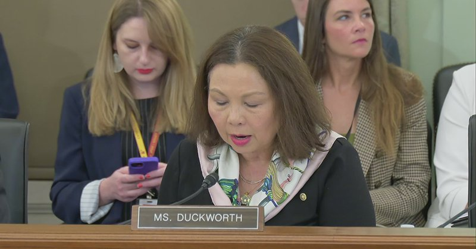

Fox News (Twitter/X)

WATCH LIVE: Senate hearing examines air travel safety across the US https://twitter.com/i/broadcasts/1dGYllRrkLQKX

## FoxNewsTwitter — post 343284

  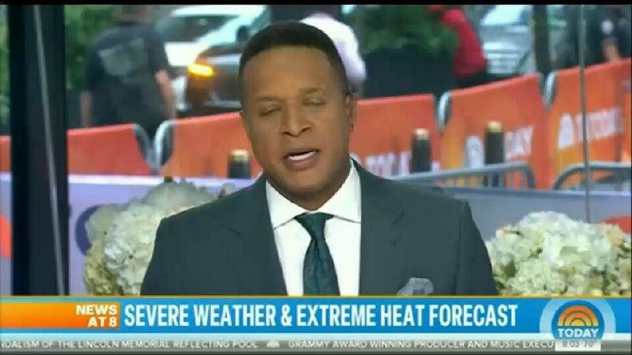

Fox News (Twitter/X)

RT @FoxTrueCrime: A ransom note sent to Savannah Guthrie's family allegedly claims her mother is dead. The 'Today' show anchor went on air Tuesday and pleaded directly for anyone with information to come forward, saying 'Somebody knows something.'

The chilling detail about the note's contents adds a dark layer to an already harrowing situation for one of morning television's most recognizable faces.

## FoxNewsTwitter — post 343283

  <a href="telegram/content/FoxNewsTwitter_343283_1782225451.mp4" target="_blank">🎬 Download video</a>

Fox News (Twitter/X)

BREAKING: "Somebody knows something. We are in agony."

Savannah Guthrie made an emotional appeal on the Today Show after new details revealed one of the ransom notes previously sent to her family claimed her mother, Nancy, was dead.

The longtime television host begged anyone with information to come forward, saying the uncertainty has haunted her family every single day.

"This is a new story today that is on your radar, but this is the life we live every day."

## pm_afshaa — post 94689

  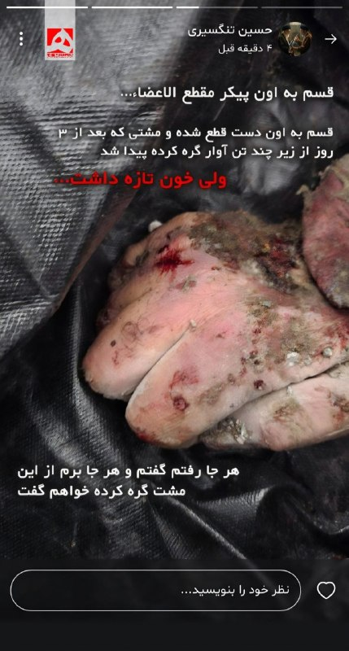

از جنازه تنگسیری فقط این دست مونده

💧 Rainbet.com the #1 Non-KYC Crypto Casino & Sportsbook @rainbetcom

😁 @Pm_Afshaa

## pm_afshaa — post 94688

  <a href="telegram/content/pm_afshaa_94688_1782225454.mp4" target="_blank">🎬 Download video</a>

جاده‌های شمال شلوغ شده و مردم رفتن عزاداری تاسوعا و عاشورا

💧 Rainbet.com the #1 Non-KYC Crypto Casino & Sportsbook @rainbetcom

😁 @Pm_Afshaa

## DEJradio — post 5917

  <a href="telegram/content/DEJradio_5917_1782225455.webm" target="_blank">🎬 Download video</a>

🔺🎤 تفاهم در سوئیس؛ آزادی دارایی‌ها در برابر نظارت آمریکا

گفت‌وگو با شهرام خلدی، پژوهشگر مطالعات خاورمیانه

#توافق #مذاکرات
@DEJradio

## DEJradio — post 5916

  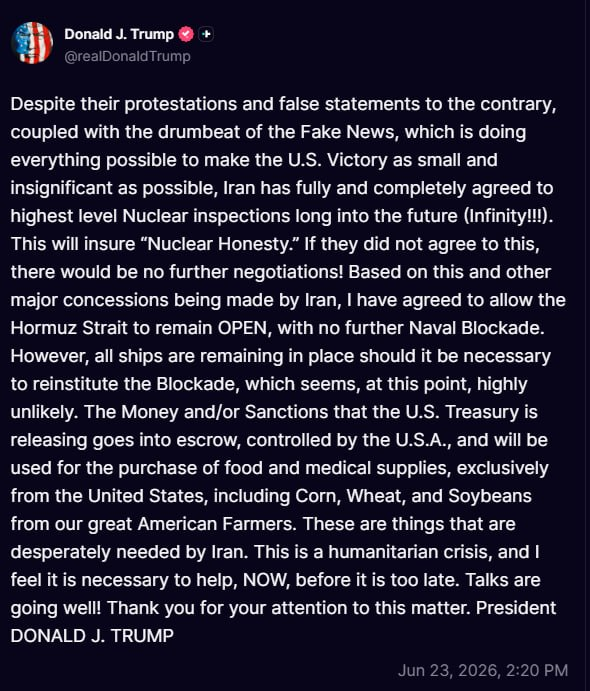

⭕️ تأکید دوبارۀ ترامپ: منابع مالی آزادشده برای رژیم، تنها برای غذا و تجهیزات پزشکی هزینه می‌شود

دونالد ترامپ، رئیس جمهوری ایالات متحده بار دیگر تأکید کرد منابع مالی و معافیت‌های تحریمی آزادشده برای جمهوری اسلامی، تحت نظارت مستقیم آمریکا مصرف می‌شود.
رئیس جمهوری آمریکا در شبکۀ تروث سوشال نوشت این منابع در حساب امانی تحت کنترل ایالات متحده نگهداری می‌شود.
به گفتۀ دونالد ترامپ، جمهوری اسلامی می‌تواند از این دارایی‌ها تنها برای «خرید مواد غذایی و تجهیزات پزشکی از آمریکا» استفاده کند.
ترامپ صراحتا گفت خرید گندم، ذرت، سویا و تجهیزات پزشکی آمریکایی، برای مصرف این دارایی‌ها، مجاز به‌شمار می‌رود.
دونالد ترامپ همچنین وضعیت اقتصادی و معیشتی در ایران را «بحران انسانی» خواند.
او افزود این کمک‌ها باید پیش از آنکه شرایط بدتر شود، در اختیار مردم ایران قرار بگیرد.
رئیس جمهوری آمریکا همچنین گفت مذاکرات میان واشینگتن و جمهوری اسلامی ادامه دارد و روند گفت‌وگوها به‌خوبی پیش می‌رود.

#ترامپ #مذاکرات #تحریم
@DEJradio

## VahidOnline — post 76626

  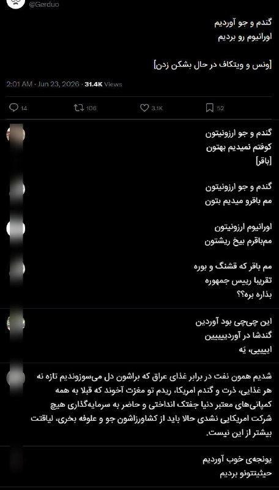

Gerduo

📡 @VahidOnline

## VahidOnline — post 76622

گزارش‌های کاربران از بروز اختلال شدید و قطعی در سامانه‌های آنلاین و پایانه‌های فروشگاهی (POS) برخی بانک‌های کشور از جمله بلوبانک، بانک کشاورزی، بانک ملت و بانک رفاه حکایت دارد. این اختلال‌ها موجب شده مشتریان در انجام تراکنش‌های مالی، خریدهای روزمره و استفاده از خدمات غیرحضوری با مشکل جدی مواجه شوند.
@VahidHeadline
گزارش‌های مختلف کاربران در شبکه‌های اجتماعی حاکی از اختلال گسترده در خدمات بانکی چند بانک بزرگ ایران در روز سه‌شنبه، دوم تیر است.

بر اساس این گزارش‌ها، پرداخت الکترونیک و انتقال وجوه در چند بانک بزرگ مانند ملی، تجارت، صادرات و ملت با اختلال همراه است.

خبرگزاری‌های فارس و تسنیم، نزدیک به سپاه پاسداران با تأیید این اختلال‌ها از احتمال حمله سایبری به مرکز خدمات پشتیبان خبر داده‌اند.

در همین رابطه شرکت خدمات انفورماتیک با انتشار بیانیه‌ای، با تأیید انجام حملات سایبری، گفته است که «شرکت خدمات انفورماتیک به‌منظور پیشگیری از هرگونه دسترسی غیرمجاز و صیانت از امنیت داده‌ها و دارایی‌های مشتریان، در حال حاضر ارائه خدمات مبتنی بر کارت را به صورت موقت از دسترس خارج کرده است.»

این برای دومین بار طی دو هفته گذشته است که خدمات بانکی در ایران دچار احتلال می‌شود.

چندین بانک ایران اواسط خردادماه هم با قطع ارتباط و خدمات روبرو شدند که به گفته مسئولان دولتی به دلیل حملات سایبری به زیر ساخت‌های خدماتی بانک‌ها بود.

تاکنون گزارشی از عامل این حملات سایبری منتشر نشده است.
@VahidHeadline

📡 @VahidOnline

## VahidOnline — post 76621

  

عمان و ایران روز سه‌شنبه دوم تیرماه توافق کردند گفت‌وگوها درباره نحوه اداره آینده کشتیرانی در تنگهٔ هرمز، از جمله خدمات دریایی در این آبراه راهبردی و هزینه‌های مرتبط با آن، را ادامه دهند.

به گزارش خبرگزاری رویترز، در بیانیه‌ مشترکی که پس از مذاکرات مسقط منتشر شد، دو کشور اعلام کردند یک کارگروه مشترک با مشارکت وزارتخانه‌های خارجه تشکیل خواهد شد تا این گفت‌وگوها را پیگیری کند و همچنین با دیگر کشورهای ساحلی و طرف‌های مرتبط رایزنی خواهند کرد.

این اقدام به نظر می‌رسد اجرای بندی از تفاهم‌نامه‌ای باشد که هفته گذشته بین ایران و آمریکا امضا شد و بر اساس آن، ایران موظف است با عمان و دیگر کشورهای ساحلی خلیج فارس درباره مدیریت آینده کشتیرانی و خدمات دریایی در این تنگه، که مسیر حیاتی برای انتقال نفت جهان است، گفت‌وگو کند.

این توافق پس از سفر محمدباقر قالیباف، رئیس مجلس شورای اسلامی، و عباس عراقچی، وزیر خارجه ایران، به عمان اعلام شد. این دو مقام ایرانی با سلطان هیثم بن طارق، پادشاه عمان، دیدار کردند و با وزیر خارجه این کشور، سید بدر البوسعیدی، نیز گفت‌وگو داشتند.
@VahidHeadline

📡 @VahidOnline

## VahidOnline — post 76619

  <a href="telegram/content/VahidOnline_76619_1782225457.mp4" target="_blank">🎬 Download video</a>

کامران غضنفری، نماینده مجلس شورای اسلامی، در شبکه اجتماعی ایکس از برنامه شماری از نمایندگان برای «تحصن» مقابل ساختمان این نهاد در اعتراض به ادامه تعطیلی آن خبر داد.
او نوشت که «چنان‌چه مجلس بسته باشد، تا باز شدن مجلس، در همان‌جا تحصن خواهیم کرد.»
شماری از نمایندگان مجلس به تعطیلی این نهاد طی ماه‌های بعد از حملات اسرائیل و آمریکا به ایران در نهم اسفند ۱۴۰۴، اعتراض دارند.

حمید رسایی، یکی دیگر از نمایندگان مجلس شورای اسلامی، یکشنبه ۳۱ خرداد با انتقاد از ادامه تعطیلی مجلس گفته بود در صورت ادامه تعطیلی، همراه برخی نمایندگان مقابل ساختمان مجلس جلسه برگزار خواهد کرد.

حسین صمصامی، دیگر نماینده مجلس شورای اسلامی، نیز در پیامی جداگانه در شبکه ایکس، نسبت به ادامه تعطیلی صحن علنی اعتراض کرده و نوشته است: «بیش از ۱۰۰ روز از تعطیلی صحن مجلس می‌گذرد و نکتۀ تاسف‌بار آن است که در سامانه قانونگذاری، امکان ثبت استیضاح وزیر و صدور بیانیه مسدود شده است.»

انتقادها در این زمینه به خصوص از سوی نمایندگان نزدیک به جبهه پایداری با پررنگ‌شدن نقش محمدباقر قالیباف در مذاکرات با آمریکا، افزایش یافته است.
@VahidHeadline

📡 @VahidOnline

## VahidOnline — post 76618

  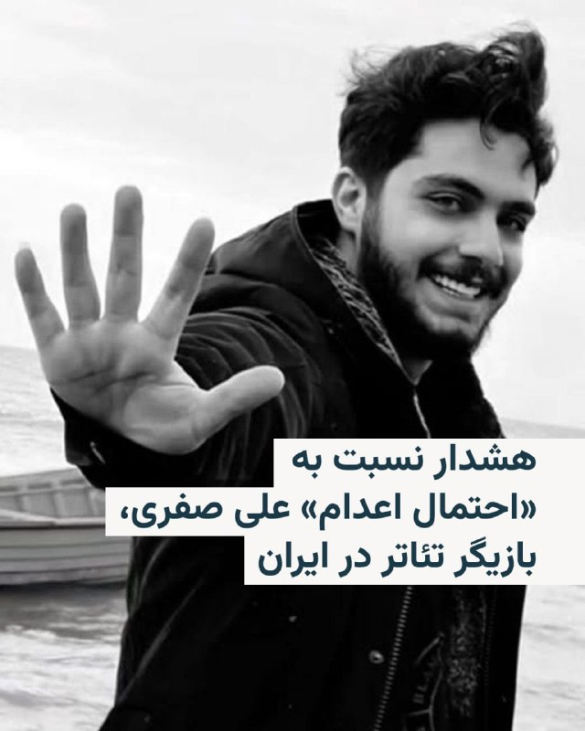

کانون فیلمسازان مستقل ایران، ایفما، در بیانیه‌ای نسبت به احتمال اعدام علی صفری، بازیگر تئاتر و دانشجوی دانشگاه فرهنگ و هنر هشدار داد.

این کانون با ابراز نگرانی از طرح اتهام «محاربه» علیه او، از مراکز سینمایی و نهادهای بین‌المللی خواست تا برای نجات این هنرمند و سایر هنرمندان در بند، «فشارها بر رژیم ایران و قوه قضائیه آن را بیشتر کنند».

به نوشته این نهاد، علی صفری، بازیگر جوان و ۲۳ ساله تئاتر و دانشجوی دانشگاه فرهنگ و هنر در جریان اعتراضات سراسری ایران در تاریخ ۱۸ دی ماه ۱۴۰۴در شهر کرج بازداشت شد و «تاکنون اطلاعات روشنی درباره‌ی روند پرونده‌ و وضعیت این بازیگر منتشر نشده است، اما اتهام «محاربه» در تاریخ ۹ بهمن ۱۴۰۴ به طور رسمی به او تفهیم شد.»
@VahidHeadline

📡 @VahidOnline

## VahidOnline — post 76616

  <a href="telegram/content/VahidOnline_76616_1782225459.mp4" target="_blank">🎬 Download video</a>

رئیس‌جمهور ایالات متحده روز سه‌شنبه دوم تیرماه بار دیگر تکرار کرد که ایران با بالاترین سطح بازرسی‌های هسته‌ای از تأسیسات خود موافقت کرده و این بازرسی‌ها «تا ابد» است.
دونالد ترامپ در پستی در شبکهٔ اجتماعی خود، تروث سوشال، نوشت که با وجود اعتراض‌ها و «ادعاهای نادرست» ایران، و «هم‌زمان با جار و جنجال رسانه‌های جعلی که هر کاری می‌کنند تا پیروزی آمریکا را تا حد ممکن کوچک و بی‌اهمیت جلوه دهند»، ایران «به‌طور کامل و تمام‌عیار با بالاترین سطح بازرسی‌های هسته‌ای برای مدت طولانی در آینده (تا ابد!!!) موافقت کرده است».
به گفتهٔ او، این امر «صداقت هسته‌ای» را تضمین خواهد کرد. «اگر با این موضوع موافقت نمی‌کردند، دیگر هیچ مذاکره‌ای ادامه پیدا نمی‌کرد!»
نخستین بار، جی‌دی ونس معاون رئیس‌جمهور آمریکا بود که روز اول تیرماه خبر داد ایران با بازرسی از تأسیسات هسته‌ایش موافقت کرده و این امر ممکن است در هفته جاری رخ دهد.
با این حال، مقام‌های جمهوری اسلامی بویژه سخنگوی وزارت خارجه ایران هرگونه بازرسی آژانس از تأسیسات هسته‌ای را رد کرده‌اند.
@VahidHeadline
پست‌های ترامپ، ترجمه ماشین:

با وجود اعتراض‌ها و اظهارات دروغین آن‌ها در خلاف این موضوع، همراه با هیاهوی مداوم اخبار جعلی، که هر کاری می‌کند تا پیروزی آمریکا را تا حد ممکن کوچک و بی‌اهمیت جلوه دهد، ایران به‌طور کامل و تمام‌وکمال با بالاترین سطح بازرسی‌های هسته‌ای برای مدت بسیار طولانی در آینده، یعنی تا ابد، موافقت کرده است!!!

این کار «صداقت هسته‌ای» را تضمین خواهد کرد. اگر آن‌ها با این موضوع موافقت نکرده بودند، هیچ مذاکره بیشتری در کار نبود!

بر اساس این موضوع و سایر امتیازهای بزرگی که ایران در حال دادن آن‌هاست، من موافقت کرده‌ام اجازه بدهم تنگه هرمز باز بماند، بدون هیچ محاصره دریاییِ دیگری. با این حال، همه کشتی‌ها در جای خود باقی می‌مانند تا اگر لازم شد، محاصره دوباره برقرار شود؛ چیزی که در حال حاضر بسیار بعید به نظر می‌رسد.

پول و/یا تحریم‌هایی که وزارت خزانه‌داری آمریکا آزاد می‌کند، به حساب امانی منتقل می‌شود که تحت کنترل ایالات متحده آمریکاست و صرفاً برای خرید غذا و تجهیزات پزشکی از ایالات متحده استفاده خواهد شد، از جمله ذرت، گندم و سویا از کشاورزان بزرگ آمریکایی ما.

این‌ها چیزهایی هستند که ایران به‌شدت به آن‌ها نیاز دارد. این یک بحران انسانی است و من احساس می‌کنم لازم است همین حالا، پیش از آنکه خیلی دیر شود، کمک کنیم.

گفت‌وگوها به‌خوبی پیش می‌رود!

از توجه شما به این موضوع سپاسگزارم.

رئیس‌جمهور دونالد جی. ترامپ
realDonaldTrump
دیروز ۱۹ میلیون بشکه نفت از تنگه هرمز عبور کرد؛ رکوردی بی‌سابقه در تمام دوران. قیمت نفت به‌شدت در حال سقوط است و جهان جای بسیار امن‌تری شده است!!!
رئیس‌جمهور دونالد جی. ترامپ
realDonaldTrump

📡 @VahidOnline

## VahidOnline — post 76615

  

خبرگزاری مهر سه‌شنبه دوم تیرماه گزارش داد قیمت انواع نان در تهران و ورامین افزایش یافته و در برخی موارد به حدود دو برابر نرخ‌های پیشین رسیده است.

بر اساس این گزارش، قیمت‌های جدید از سوی استانداری ابلاغ شده و از امروز روی دستگاه‌های نانینو در نانوایی‌ها اعمال شده است.

بر اساس نرخ‌های تازه، قیمت نان لواش به دو هزار و ۷۰۰ تومان، بربری به ۱۰ هزار تومان و سنگک به ۱۵ هزار و ۵۰۰ تومان رسیده است.
محمدجواد کرمی، رئیس کارگروه آرد و نان اتاق اصناف ایران، نیز افزایش قیمت نان را تایید کرده است.

در ورامین نیز رئیس اتحادیه نانوایان از افزایش ۹۰ تا ۱۰۰ درصدی قیمت نان خبر داد.
بر این اساس، قیمت نان لواش از هزار و ۴۰۰ تومان به دو هزار و ۷۰۰ تومان، تافتون از دو هزار و ۳۰۰ تومان به چهار هزار و ۵۰۰ تومان، بربری از پنج هزار و ۳۰۰ تومان به ۱۰ هزار تومان و سنگک از هفت هزار و ۴۰۰ تومان به ۱۵ هزار و ۵۰۰ تومان افزایش یافته است.

مسئولان صنفی افزایش هزینه‌های تولید، از جمله دستمزد کارگران، خمیرمایه، حمل‌ونقل و اجاره‌بها را دلیل این افزایش قیمت عنوان کرده‌اند.
رئیس اتحادیه نانوایان ورامین نیز گفته است اصلاح قیمت‌ها با هدف ادامه فعالیت نانوایی‌ها و حفظ روند تولید و عرضه نان انجام شده است.
این افزایش قیمت در حالی اعمال شده است که نان از مهم‌ترین کالاهای مصرفی خانوارهای ایرانی محسوب می‌شود و در برخی اقلام، نرخ‌های جدید نسبت به قیمت‌های قبلی نزدیک به دو برابر شده است.
@VahidOOnLine

📡 @VahidOnline

## VahidOnline — post 76611

  <a href="telegram/content/VahidOnline_76611_1782225459.mp4" target="_blank">🎬 Download video</a>

«امیرمحمد هموله» ۲۴ ساله، ساکن شهرک صدف شهریار، روز پنج‌شنبه ۱۸ دی‌ماه ۱۴۰۴ بر اثر اصابت گلوله به ناحیه سر به شدت مجروح شد.
او پس از تیراندازی به بیمارستان نور شهریار منتقل شد و حدود ۵۰ روز در کما تحت درمان بود، اما سرانجام در روز هشتم اسفندماه ۱۴۰۴ بر اثر شدت جراحات جان خود را از دست داد.
@VahidHeadline

📡 @VahidOnline

## kianmeli1 — post 88136

  <a href="telegram/content/kianmeli1_88136_1782225460.mp4" target="_blank">🎬 Download video</a>

🔴آزادسازی بخشی از دارایی‌های مسدودشده ایران و شرط خرید انحصاری مواد غذایی از آمریکا، واکنش‌های گسترده‌ای در شبکه‌های اجتماعی برانگیخته است. بسیاری از کاربران این روند را با سازوکار «نفت در برابر غذا» مقایسه کرده و درباره پیامدهای آن بحث کرده‌اند
https://t.me/kianmeli1

## kianmeli1 — post 88135

  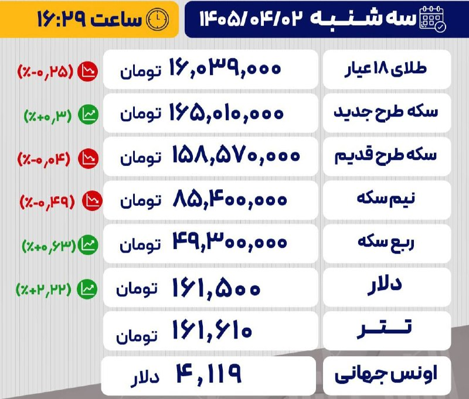

🔴آخرین قیمت‌ها در بازار طلا، سکه و ارز/ ۲ تیر ۱۴۰۵
https://t.me/kianmeli1

## kianmeli1 — post 88134

  <a href="telegram/content/kianmeli1_88134_1782225463.mp4" target="_blank">🎬 Download video</a>

🔴فرود هواپیمای پزشکیان با همراهی ۶ جنگنده ارتش پاکستان
https://t.me/kianmeli1

## kianmeli1 — post 88133

  <a href="telegram/content/kianmeli1_88133_1782225464.mp4" target="_blank">🎬 Download video</a>

🔴ثابتی: تنگه رو مفت باز کردیم بدون اینکه هیچ عوارضی بگیریم
https://t.me/kianmeli1

## IranIntlTV — post 343934

  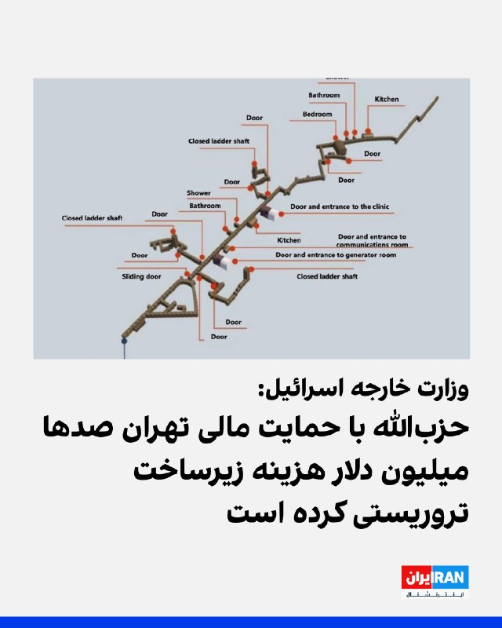

وزارت خارجه اسرائیل با انتشار تصاویری از تونل‌های حزب‌الله در شبکه ایکس نوشت این گروه با تامین مالی جمهوری اسلامی و صرف صدها میلیون دلار طی سال‌ها شبکه‌ای گسترده از تونل‌ها، انبارهای تسلیحاتی، سایت‌های پرتاب موشک و مراکز فرماندهی را در جنوب لبنان و نزدیک مرز اسرائیل ایجاد کرده است.
این وزارتخانه افزود که هدف این زیرساخت‌ها حمله به اسرائیل بوده است.
https://iranintl.com/202606231878

## IranIntlTV — post 343933

  <a href="telegram/content/IranIntlTV_343933_1782225466.mp4" target="_blank">🎬 Download video</a>

سازمان امنیت سوئد در گزارشی تازه از تداوم استفاده جمهوری اسلامی از باندهای تبهکار برای اجرای اقدامات خشونت‌آمیز علیه مخالفان حکومت در خاک این کشور خبر داد.
گزارش مهران عباسیان، خبرنگار ایران‌اینترنشنال
@iranintltv

## IranIntlTV — post 343932

  <a href="telegram/content/IranIntlTV_343932_1782225467.mp4" target="_blank">🎬 Download video</a>

نخست‌وزیر پیشین اسرائیل روز سه‌شنبه اذعان کرد که اسرائیل گیرنده‌های اینترنت ماهواره‌ای استارلینک را به ایران قاچاق کرده بود تا به معترضان ضدحکومتی کمک کند، اما گفت دولت بنیامین نتانیاهو در ادامه دادن و تکمیل این برنامه ناکام ماند.

نفتالی بنت، که بین سال‌های ۲۰۲۱ تا ۲۰۲۲ نخست‌وزیر اسرائیل بود، در نشست «سیاست‌گذاری بین‌المللی JNS» در اورشلیم (بیت‌المقدس) گفت که او روندی را برای «تهیه و قاچاق ده‌ها هزار گیرنده استارلینک به داخل ایران» آغاز کرده بود؛ گیرنده‌هایی که به گفته او می‌توانستند در زمان قطع اینترنت، تداوم دسترسی به اینترنت و شبکه‌های اجتماعی را فراهم کنند.
@iranintltv

## IranIntlTV — post 343931

همزمان با افزایش نیاز به خدمات سلامت روان در ایران، بسیاری از بیماران با کمبود داروهای اعصاب و روان و هزینه‌های سنگین درمان روبه‌رو هستند؛ وضعیتی که ادامه درمان را برای شماری از آنان دشوار کرده و نگرانی‌ها درباره سلامت روان جامعه را افزایش داده است.

آیه دریس، عضو تحریریه ایران‌اینترنشنال، در «پیوست» به بررسی ریشه‌های کمبود داروهای اعصاب و روان و پیامدهای آن برای میلیون‌ها ایرانی می‌پردازد.
@iranintltv

## IranIntlTV — post 343930

  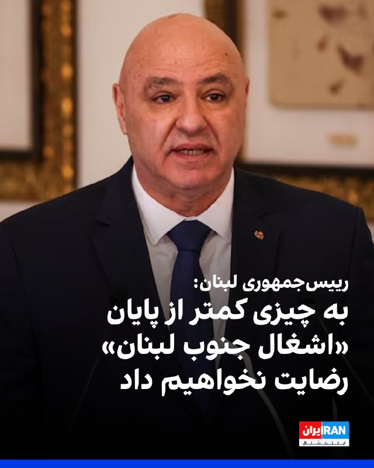

به گزارش رویترز، جوزف عون، رییس‌جمهور لبنان، اعلام کرد که این کشور به چیزی کمتر از پایان «اشغال جنوب لبنان از سوی اسرائیل» رضایت نخواهد داد.

بر اساس این گزارش، او افزود که دور جدید گفت‌وگوهای مورد حمایت آمریکا با اسرائیل می‌تواند تعیین‌کننده باشد.
https://iranintl.com/202606231739

## IranIntlTV — post 343929

  

بر اساس گزارش‌های رسیده به ایران‌اینترنشنال، تقی سلیمی، شهروند ۵۷ ساله اهل آمل و از بازداشت‌شدگان اعتراض‌های دی‌ماه ۱۴۰۴، روز ۲۱ اردیبهشت ۱۴۰۵ در زندان آمل جان باخت. به گفته نزدیکان او، تاکنون توضیح شفافی از سوی مقام‌های مسئول درباره علت مرگ ارائه نشده و ابهامات جدی درباره نحوه جان‌باختن او وجود دارد.

بر اساس این گزارش، سلیمی سوم بهمن ۱۴۰۴ بازداشت شد و به اتهام «اقدام علیه امنیت ملی» «تخریب اموال عمومی» به ۱۰ سال حبس و پرداخت ۱۶۰ میلیون تومان جزای نقدی محکوم شده بود. منابع نزدیک به خانواده می‌گویند او در روند دادرسی از دسترسی به وکیل محروم بوده، دو ماه را در سلول انفرادی گذرانده و سپس به بند عمومی منتقل شده بود.

به گفته این منابع، بر اساس گواهی بیمارستان، تقی سلیمی هنگام انتقال از زندان آمل به بیمارستان «امام علی» این شهر فاقد علائم حیاتی بوده است. همچنین به گفته منابع نزدیک به خانواده، درخواست انجام کالبدگشایی پذیرفته نشده و همچنان ابهام‌هایی درباره علت دقیق مرگ او وجود دارد.

https://iranintl.com/202606230048

## IranIntlTV — post 343928

  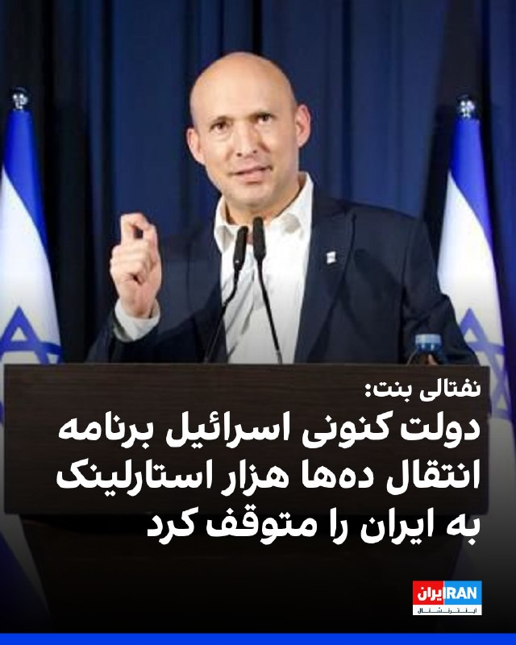

نفتالی بنت، نخست‌وزیر پیشین اسرائیل و نامزد جانشینی بنیامین نتانیاهو، در نشست بین‌المللی سیاست‌گذاری «سندیکای خبری یهودیان» در اورشلیم گفت در دوران نخست‌وزیری خود برنامه‌ای را برای انتقال ده‌ها هزار گیرنده استارلینک به داخل ایران آغاز کرده بود تا در صورت قطع اینترنت، ارتباطات معترضان حفظ شود.

بنت گفت: «در دوران نخست‌وزیری‌ام برنامه‌ای برای انتقال ده‌ها هزار گیرنده استارلینک به داخل ایران آغاز کرده بودم تا در صورت قطع اینترنت ارتباطات معترضان حفظ شود، اما دولت کنونی اسرائیل این برنامه را متوقف کرد.»

او افزود نبود این زیرساخت در جریان اعتراضات ایران باعث شد معترضان پس از قطع اینترنت امکان هماهنگی و حفظ ارتباطات خود را از دست بدهند.

نخست‌وزیر پیشین اسرائیل همچنین دولت بنیامین نتانیاهو را به متوقف کردن این طرح و دیگر برنامه‌هایی که به گفته او در دولت پیشین آغاز شده بود، متهم کرد.
https://iranintl.com/202606230704

## IranIntlTV — post 343927

  

تصویر ارسال‌شده به ایران‌اینترنشنال، زنی را در شاهین‌شهر استان اصفهان نشان می‌دهد که لباسی با نقش جاویدنام حمید مهدوی به تن کرده است.
به گفته ارسال‌کننده تصویر، این عکس دقایقی بعد از درگیری این زن با حامیان حکومت به دلیل حجاب اجباری ثبت شده است.

## IranIntlTV — post 343926

  

وزارت خارجه دانمارک اعلام کرد که پس از بیش از سه ماه تعطیلی، سفارت خود در تهران را بازگشایی کرده است.

در بیانیه‌ این وزارتخانه آمده است: «با توجه به بهبود وضعیت امنیتی در ایران، سفارت در تهران درهای خود را دوباره باز می‌کند.»

سفارت ایتالیا در تهران نیز که آن هم بیش از سه ماه بسته شده بود، روز جمعه بازگشایی شد.
https://iranintl.com/202606232199

## IranIntlTV — post 343925

  

اصغر سپهری، برادر فاطمه سپهری، زندانی سیاسی محبوس در زندان وکیل‌آباد مشهد، در شبکه ایکس نوشت که خواهرش در اعتراض به رفتارهای صورت‌گرفته در زندان در هشتمین روز اعتصاب غذا و دارو به سر می‌برد.

او افزود تنها اقدام مسئولان زندان در این مدت، انتقال روزانه او به بهداری و تزریق سرم قندی بوده و خانواده روز سه‌شنبه در ملاقات، شاهد وضعیت وخیم و نگران‌کننده جسمی فاطمه سپهری بودند.

اصغر سپهری افزود: با وجود پیگیری‌های مکرر خانواده برای توقف اجرای حکم یا مرخصی درمانی، تاکنون هیچ‌یک از مسئولان پاسخ‌گو نبودند.
https://iranintl.com/202606234726

## IranIntlTV — post 343924

  <a href="telegram/content/IranIntlTV_343924_1782225472.mp4" target="_blank">🎬 Download video</a>

سرخط خبرهای سه‌شنبه ۲ تیر
@iranintltv

## IranIntlTV — post 343923

  <a href="telegram/content/IranIntlTV_343923_1782225474.mp4" target="_blank">🎬 Download video</a>

بر اساس اطلاعات رسیده به ایران‌اینترنشنال آرمان گرجیان، دانش‌آموز ۱۹ ساله اهل روستای بابامیدان در شهرستان رستم استان فارس، شامگاه ۱۸ دی‌ماه در جریان انقلاب ملی با شلیک مستقیم گلوله جنگی کشته شد.

او در تجمع اعتراضی بابامیدان هدف شلیک نیروهای حکومتی قرار گرفت.
@iranintltv

## IranIntlTV — post 343922

  <a href="telegram/content/IranIntlTV_343922_1782225476.mp4" target="_blank">🎬 Download video</a>

مسعود پزشکیان، رئیس‌جمهور ایران، روز سه‌شنبه برای گفتگو با مقاماتی که به میانجی‌گری در مذاکرات تهران و واشنگتن جهت پایان دادن دائمی به جنگ در خاورمیانه کمک کرده‌اند، وارد پاکستان شد؛ این در حالی است که عباس عراقچی، وزیر امور خارجه، پیش از او مورد استقبال همتایان پاکستانی خود در پایگاه هوایی نورخان در راولپندی قرار گرفت.

به گفته پاکستان و قطر، این سفر پس از آن صورت می‌گیرد که ایالات متحده در پی اولین دور مذاکرات تحت یک توافق صلح نوپا، تحریم‌ها علیه ایران را به مدت ۶۰ روز تعلیق کرد و دو طرف در جریان مذاکرات خود در سوئیس، بر سر یک نقشه راه برای دستیابی به توافقی دائمی ظرف ۶۰ روز به توافق رسیدند.
@iranintltv

## IranIntlTV — post 343921

  <a href="telegram/content/IranIntlTV_343921_1782225477.mp4" target="_blank">🎬 Download video</a>

رسانه‌های داخلی و پیام‌های ارسالی مخاطبان به ایران‌اینترنشنال از بروز اختلال در سامانه‌های بانکی کشور خبر داده‌اند. شرکت خدمات انفورماتیک، وابسته به بانک مرکزی جمهوری اسلامی، اعلام کرد اختلال در «سامانه‌های کارت‌محور» بانک‌های ملی، صادرات و تجارت ناشی از حملات سایبری است.
جزییات بیشتر در گفت‌وگو با نیما اکبرپور، کارشناس فناوری
@iranintltv

## IranIntlTV — post 343919

  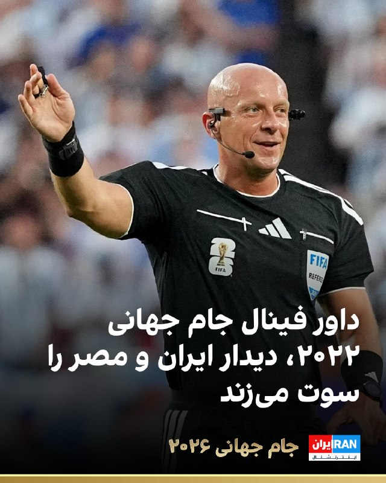

🔻تیم ملی فوتبال ایران شنبه ۶ تیر از ساعت ۶:۳۰ به وقت تهران در سومین و آخرین دیدار مرحله گروهی جام جهانی ۲۰۲۶ به مصاف مصر خواهد رفت. با اعلام فیفا، سیمون مارسینیاک، داور سرشناس لهستانی، این بازی را قضاوت خواهد کرد. داوری که سابقه قضاوت فینال جام جهانی ۲۰۲۲ میان آرژانتین و فرانسه را در کارنامه دارد.

🔹در آستانه این دیدار، مصر با چهار امتیاز در صدر جدول گروه G قرار دارد. ایران و بلژیک با دو امتیاز در رتبه‌های دوم و سوم ایستاده‌اند و نیوزیلند نیز با یک امتیاز در جایگاه چهارم قرار دارد.

@iranintltvsport

## IranIntlTV — post 343918

آزادسازی بخشی از دارایی‌های مسدودشده ایران و شرط خرید انحصاری مواد غذایی از آمریکا، واکنش‌های گسترده‌ای در شبکه‌های اجتماعی برانگیخته است. بسیاری از کاربران این روند را با سازوکار «نفت در برابر غذا» مقایسه کرده و درباره پیامدهای آن بحث کرده‌اند
@iranintltv

## IranIntlTV — post 343917

  <a href="telegram/content/IranIntlTV_343917_1782225479.mp4" target="_blank">🎬 Download video</a>

دونالد ترامپ، رییس‌جمهوری آمریکا، در تروت سوشال اعلام کرد منابع مالی و معافیت‌های تحریمی مرتبط با جمهوری اسلامی که از سوی وزارت خزانه‌داری آمریکا آزاد می‌شود، در حسابی تحت کنترل واشینگتن نگهداری خواهد شد.
جزییات بیشتر با مریم رحمتی، خبرنگار ایران‌اینترنشنال
@iranintltv

## IranIntlTV — post 343916

  <a href="telegram/content/IranIntlTV_343916_1782225481.mp4" target="_blank">🎬 Download video</a>

ویدیوی رسیده به ایران‌اینترنشنال نشان می‌دهد گروهی از دانشجویان در تهران سه‌شنبه دوم تیر مقابل دانشگاه علوم و تحقیقات تجمع کردند و خواستار مجازی شدن امتحان‌ها شدند.

## FarsiVOA — post 221634

ماندانا خزرائی می‌گوید: پس از «زن، زندگی، آزادی» نه‌تنها حکومت، بلکه مردان چاره‌ای غیر از شنیدن فریاد بلند زنان نداشتند. مینا دریس اما انگشت اتهام را فراتر از آقایان به‌ سمت قوانین تبعیض‌امیز حکومت میگیرد. سمانه سوادی هم اجرای پرستو احمدی را نمایش خلاف تمام انچه حکومت از زنان گرفته می‌خواند

## FarsiVOA — post 221633

  <a href="telegram/content/FarsiVOA_221633_1782225482.mp4" target="_blank">🎬 Download video</a>

سه‌شنبه دوم تیر، رسانه‌های جمهوری اسلامی از سفر مسعود پزشکیان، رییس دولت، به پاکستان خبر داده‌اند. پزشکیان بعد ورود به اسلام‌آباد با آصف علی زرداری، رییس‌جمهور، و شهباز شریف، نخست‌وزیر پاکستان، دیدار کرد.

به گزارش رسانه‌های دولتی ایران، این سفر که در پی مذاکرات ایران و آمریکا انجام شده به دعوت نخست‌وزیر پاکستان و با هدف «قدردانی از نقش پاکستان در هماهنگی و امضای تفاهم‌نامه با آمریکا» شکل گرفته است.

ساعاتی قبل از ورود پزشکیان، عباس عراقچی نیز وارد اسلام‌آباد شد و با رییس‌جمهور و نخست وزیر پاکستان دیدار کرد.

## DW_Farsi — post 126381

🔶 سفر هیئت طالبان به بلژیک برای گفت‌وگو با اتحادیه اروپا
 
یک منبع مطلع روز سه‌شنبه ۲۳ ژوئن در گفت‌وگو با خبرگزاری فرانسه ورود یک هیئت طالبان به بروکسل برای مذاکره با مقامات اتحادیه اروپا در مورد اخراج مهاجران افغان را تأیید کرد. طبق این گزارش مقامات طالبان به دعوت کمیسیون اروپا در قالب سفری یک روزه و در چارچوب اقدامی که از سوی اکثریت کشورهای عضو اتحادیه اروپا حمایت می‌شود، وارد پایتخت بلژیک شدند.
 
بلژیک روز دوشنبه از صدور ویزا برای هیئت طالبان خبر داده اما به دلایل امنیتی تاریخ ورود این هیئت به بروکسل را اعلام نکرده بود. سخنگوی وزارت خارجه بلژیک به خبرگزاری فرانسه گفته بود که این ویزاها فقط برای این کشور و تنها برای یک روز معتبر هستند و شامل منطقه آزاد شنگن نمی‌شوند.
 
کمیسیون اروپا از مقامات طالبان دعوت کرده بود تا در راستای تلاش برای مقابله با مهاجرت غیرقانونی و همکاری در رابطه با افزایش اخراج مهاجران افغان از اتحادیه اروپا به افغانستان، به بروکسل سفر کنند. اتحادیه اروپا دولت طالبان را به رسمیت نمی‌شناسد.
 
ارتباط اتحادیه اروپا با مقامات طالبان مخالفت شدید گروه‌های حقوق بشری را به دنبال داشت و آنها از کمیسیون اروپا خواسته بودند تا از برگزاری این نشست صرف نظر کنند.
 
@dw_farsi

## DW_Farsi — post 126380

  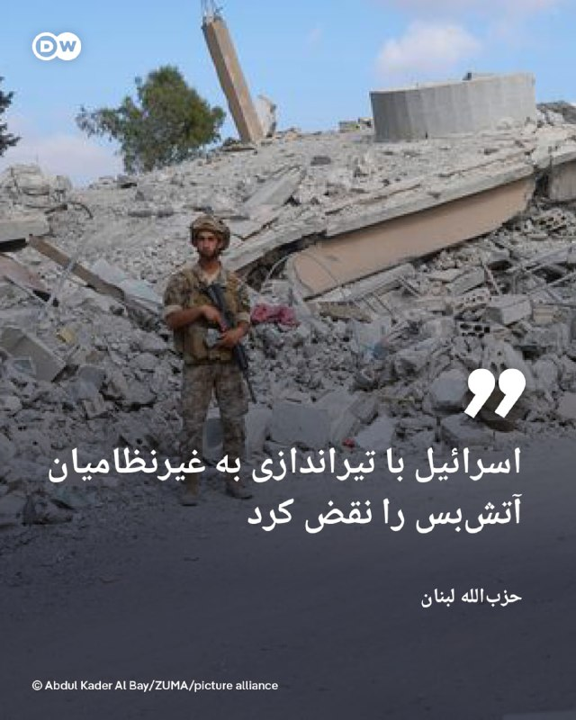

🔶 حزب‌الله: اسرائیل با تیراندازی به غیرنظامیان آتش‌بس را نقض کرد
 
حزب‌الله لبنان مدعی شد، اسرائیل با گشودن آتش به سوی گروهی از غیرنظامیان در نزدیکی شهر نبطیه در جنوب لبنان، توافق آتش‌بس را نقض کرده است.
 
در مقابل، ارتش اسرائیل با بیان اینکه برای "رفع تهدید" دست به حمله زده است، اعلام کرد، "نیروهایش گروهی از افراد مسلح وابسته به حزب‌الله را که در منطقه تپه علی الطاهر تهدیدی برای نیروهای اسرائیلی محسوب می‌شدند، هدف قرار داده‌ است".
 
حزب‌الله اما این روایت را رد کرده و مدعی شده است، "ارتش اسرائیل روز سه‌شنبه ۲۳ ژوئن (۲ تیرماه) به سوی گروهی از غیرنظامیان آتش گشوده که در حال بازگشایی جاده‌ها و بیرون آوردن اجساد از زیر آوار بودند."
 
بر اساس گزارش رسانه‌های لبنانی، در نتیجه تیراندازی اسرائیل در این منطقه، دو نفر کشته و چند نفر دیگر زخمی شده‌اند.
 
@dw_farsi

## DW_Farsi — post 126379

🔶 ترامپ: با بازشدن تنگه هرمز ۱۹ میلیون بشکه نفت صادر شده است
 
دونالد ترامپ، رئیس‌جمهور آمریکا مدعی شد، ۱۹ میلیون بشکه نفت پس از بازگشایی تنگه هرمز از این تنگه عبور کرده است که رکوردی تاریخی محسوب می‌شود.
 
آمار ارائه‌شده از سوی رئیس‌جمهور ایالات متحده البته تاکنون به‌طور مستقل تایید نشده است.
 
ترامپ در شبکه اجتماعی تروث سوشال همچنین با اعلام این خبر نوشت: «قیمت نفت در حال سقوط است و جهان به‌مراتب امن‌تر شده است!»
 
او پیش‌تر استدلال کرده بود، "ادامه جنگ با ایران می‌توانست به یک فاجعه اقتصادی منجر شود".
 
از سوی دیگر ترامپ در با انتشار پیام دیگری مدعی شده است، "ایران به‌طور کامل و بی‌قیدوشرط با انجام بازرسی‌های هسته‌ای در بالاترین سطح و برای آینده‌ای نامحدود موافقت کرده است".
 
او در این باره نیز نوشت: «این موضوع تضمین‌کننده "صداقت هسته‌ای" خواهد بود. اگر آن‌ها با این مسئله موافقت نمی‌کردند، هیچ مذاکره دیگری در کار نبود.»
 
این در حالی است که پیش‌تر، سخنگوی وزارت امور خارجه ایران اعلام کرد، "ایران نه دیداری با رافائل گروسی، مدیرکل آژانس بین‌المللی انرژی اتمی در سوئیس داشته و نه برنامه‌ای برای بازرسی آژانس از تاسیسات هسته‌ای آسیب‌دیده خود در نظر گرفته است."
 
رئیس‌جمهور آمریکا همچنین افزوده است: «بر اساس این موضوع و سایر امتیازهای مهمی که ایران در حال ارائه آن‌هاست، من موافقت کرده‌ام که تنگه هرمز باز بماند و دیگر هیچ محاصره دریایی‌ای اعمال نشود. با این حال، تمام شناورها در موقعیت خود باقی خواهند ماند تا در صورت لزوم، محاصره دوباره برقرار شود؛ هرچند در حال حاضر چنین احتمالی بسیار بعید به نظر می‌رسد.»
 
او همچنین درباره دارایی های بلوکه شده ایران گفت: «پول‌ها و یا منابع ناشی از لغو تحریم‌هایی که وزارت خزانه‌داری آمریکا آزاد می‌کند، در یک حساب امانی نگهداری خواهد شد که تحت کنترل ایالات متحده است و این منابع صرفا برای خرید مواد غذایی و تجهیزات پزشکی از آمریکا مورد استفاده قرار خواهد گرفت، از جمله ذرت، گندم و سویا که توسط کشاورزان بزرگ آمریکایی تولید می‌شود.»
 
تهران در واکنش به این اظهارات اعلام کرد، "پس از آزاد شدن دارایی‌های مسدودشده، تنها خود ایران درباره نحوه استفاده از این منابع تصمیم‌گیری خواهد کرد".
 
@dw_farsi

## DW_Farsi — post 126372

📸 موج گرما؛ تابستانی که اروپا را غافلگیر کرد

موج گرمای شدید بخش بزرگی از اروپا را دربر گرفته است. از هشدارهای قرمز در اسپانیا و فرانسه تا افزایش خطر آتش‌سوزی در آلمان و وضعیت اضطراری در ایتالیا، مقام‌ها از شهروندان خواسته‌اند از قرار گرفتن در معرض آفتاب و فعالیت‌های سنگین در فضای باز خودداری کنند. همزمان سازمان ملل هشدار داده است که تغییرات اقلیمی در حال تشدید موج‌هایی از گرمای مرگبار در سراسر جهان است.
@dw_farsi

## DW_Farsi — post 126371

🔶 آیا توافق ایران و آمریکا "شاهکار دیپلماتیک" پاکستان است؟
 
🔻 گزارشی از Haroon Janjua

توافق ایران و آمریکا که مبنای مذاکرات جاری دو طرف در سوئیس را تشکیل می‌دهد، یک دستاورد برجسته دیپلماتیک برای پاکستان به شمار می‌رود که شاید بتوان آن را مهمترین موفقیت دیپلماتیک این کشور در تاریخ معاصر آن دانست.
 
فروا عامر، مدیر ابتکارات جنوب آسیا در مؤسسه "سیاست‌گذاری انجمن آسیا" مستقر در نیویورک به دویچه وله می‌گوید: «پاکستان نه تنها توانست از روابط خود با تهران و نزدیکی روزافزون به واشنگتن بهره ببرد، بلکه از شبکه شرکای منطقه‌ای خود مانند قطر، عربستان سعودی و ترکیه نیز استفاده کرد.»
 
او می‌افزاید: «این امر به پاکستان وزن دیپلماتیک بیشتر و حمایت بین‌المللی گسترده‌‌تری برای ایفای نقش میانجی داد.»
 
اسلام‌آباد همچنین روابط نزدیکی با پکن دارد؛ دستاوردی که در قاره‌ای که روز‌به‌روز بیشتر تحت تأثیر رقابت میان واشنگتن و پکن قرار می‌گیرد، چندان آسان نیست.
 
الیزابت ترلکلد، مدیر بخش جنوب آسیا در "مرکز استیمسون" مستقر در واشنگتن به دویچه وله می‌گوید: «دیپلماسی صبورانه پاکستان در به سرانجام رساندن توافق ایران و آمریکا بسیار مهم بود، اگرچه تأثیر بلندمدت آن به دوام این توافق به پایداری این توافق در ادامه مذاکرات دشوار بستگی دارد.»
 
ترلکلد از پاکستان به خاطر ایجاد تعادل در روابط با آمریکا و ایران در عین حفظ شرکای کلیدی در خلیج فارس و چین و "کمک به یافتن فرمول‌هایی که برای همه طرف‌ها قابل قبول باشد" تمجید کرد.
@dw_farsi

## RadioFarda — post 158665

  <a href="https://t.me/radiofarda/158665" target="_blank">📎 Download file</a>

ازسرگیری بازرسی‌ تاسیسات هسته‌ای ایران در گفت‌وگو با بهروز بیات

🔸جی‌دی‌ونس، معاون رئیس‌جمهور آمریکا، روز اول تیرماه پس از مذاکرات نمایندگان ارشد ایران و ایالات متحده در بورگن‌اشتوک سوئیس اعلام کرد که ایران با دعوت از بازرسان آژانس بین‌المللی انرژی اتمی برای ازسرگیری بازرسی‌ها موافقت کرده است. اقدامی که به گفته او می‌تواند همین هفته و شاید هم امروز عملی شود. او این موضوع را یکی از مهم‌ترین دستاوردهای گفت‌وگوهای اخیر قلمداد کرد. در این زمینه با بهروز بیات، کارشناس هسته‌ای در اتریش، گفت‌وگو کرده است.

@RadioFarda

## RadioFarda — post 158664

🔸پس از صدور حکم ۷۴ ضربه شلاق برای پرستو احمدی به دلیل اجرای یک کنسرت مجازی بدون حجاب اجباری، هانا کامکار، خواننده ایرانی ساکن خارج از کشور، به رادیوفردا گفت زنان و دختران در ایران با وجود ممنوعیت تک‌خوانی، حجاب اجباری و سال‌ها فشار، همچنان به آواز خواندن ادامه می‌دهند.

🔸او معتقد است اقدام پرستو احمدی نه‌تنها صدای زنان را خاموش نخواهد کرد، بلکه توجه بیشتری را به مطالبات و مبارزات آنان جلب خواهد کرد.

@RadioFarda

## RadioFarda — post 158663

🔸عمان و ایران روز سه‌شنبه دوم تیرماه توافق کردند گفت‌وگوها درباره نحوه اداره آینده کشتیرانی در تنگهٔ هرمز، از جمله خدمات دریایی در این آبراه راهبردی و هزینه‌های مرتبط با آن، را ادامه دهند. 🔸به گزارش خبرگزاری رویترز، در بیانیه‌ مشترکی که پس از مذاکرات مسقط…

## RadioFarda — post 158662

  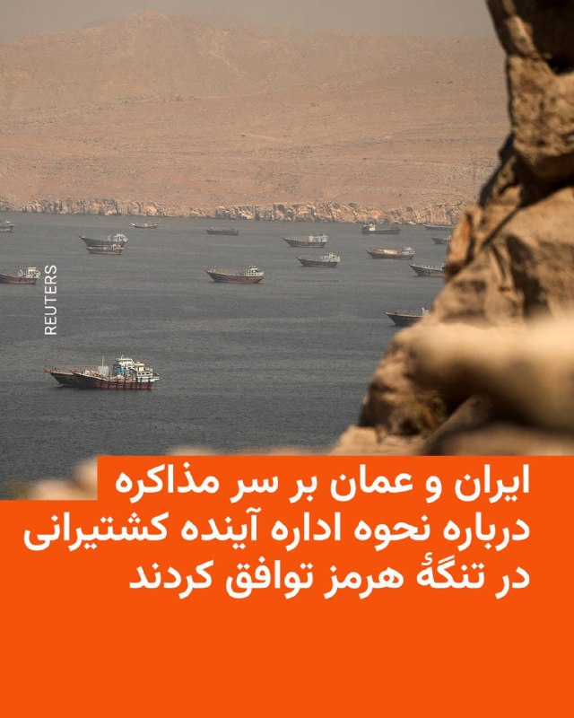

🔸عمان و ایران روز سه‌شنبه دوم تیرماه توافق کردند گفت‌وگوها درباره نحوه اداره آینده کشتیرانی در تنگهٔ هرمز، از جمله خدمات دریایی در این آبراه راهبردی و هزینه‌های مرتبط با آن، را ادامه دهند.

🔸به گزارش خبرگزاری رویترز، در بیانیه‌ مشترکی که پس از مذاکرات مسقط منتشر شد، دو کشور اعلام کردند یک کارگروه مشترک با مشارکت وزارتخانه‌های خارجه تشکیل خواهد شد تا این گفت‌وگوها را پیگیری کند و همچنین با دیگر کشورهای ساحلی و طرف‌های مرتبط رایزنی خواهند کرد.

🔸این اقدام به نظر می‌رسد اجرای بندی از تفاهم‌نامه‌ای باشد که هفته گذشته بین ایران و آمریکا امضا شد و بر اساس آن، ایران موظف است با عمان و دیگر کشورهای ساحلی خلیج فارس درباره مدیریت آینده کشتیرانی و خدمات دریایی در این تنگه، که مسیر حیاتی برای انتقال نفت جهان است، گفت‌وگو کند.

🔸این توافق پس از سفر محمدباقر قالیباف، رئیس مجلس شورای اسلامی، و عباس عراقچی، وزیر خارجه ایران، به عمان اعلام شد. این دو مقام ایرانی با سلطان هیثم بن طارق، پادشاه عمان، دیدار کردند و با وزیر خارجه این کشور، سید بدر البوسعیدی، نیز گفت‌وگو داشتند.

@RadioFarda

## RadioFarda — post 158661

🔸نخست‌وزیر پیشین اسرائیل روز سه‌شنبه دوم تیرماه اذعان کرد که اسرائیل برای کمک به معترضان ضدحکومت جمهوری اسلامی، گیرنده‌های اینترنتی استارلینک را به ایران قاچاق کرده بود. 🔸نفتالی بنت در عین حال گفت که دولت بنیامین نتانیاهو در دنبال کردن این طرح کوتاهی کرد.…

## RadioFarda — post 158660

  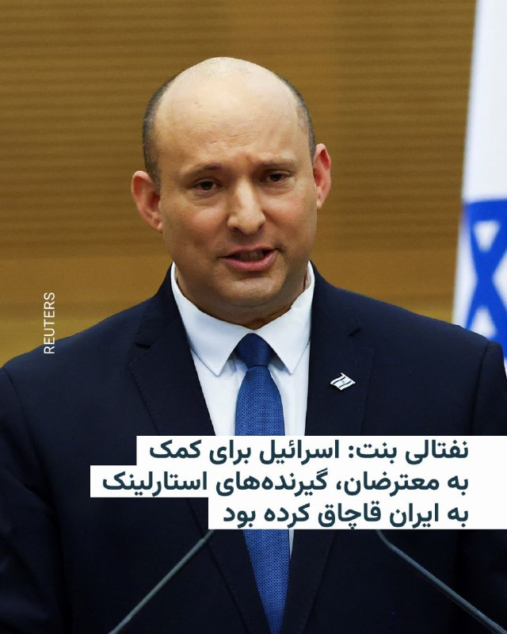

🔸نخست‌وزیر پیشین اسرائیل روز سه‌شنبه دوم تیرماه اذعان کرد که اسرائیل برای کمک به معترضان ضدحکومت جمهوری اسلامی، گیرنده‌های اینترنتی استارلینک را به ایران قاچاق کرده بود.

🔸نفتالی بنت در عین حال گفت که دولت بنیامین نتانیاهو در دنبال کردن این طرح کوتاهی کرد.

🔸او که از ۲۰۲۱ تا ۲۰۲۲ نخست‌وزیر اسرائیل بود، در نشست «سیاست‌گذاری بین‌المللی» در اورشلیم به حضار گفت که او «فرآیند تأمین و قاچاق ده‌ها هزار گیرنده استارلینک به داخل ایران را آغاز کرده بود؛ تجهیزاتی که امکان تداوم اینترنت و شبکه‌های اجتماعی را فراهم می‌کرد».

🔸استارلینک که متعلق به شرکت اسپیس‌ایکسِ ایلان ماسک است، اینترنت ماهواره‌ای ارائه می‌دهد. ایران پیش‌تر اسرائیل و ایالات متحده را به قاچاق این تجهیزات برای تضعیف امنیت خود متهم کرده بود. استارلینک مجوز فعالیت در ایران ندارد، اما ماسک قبلاً گفته بود این سرویس در آن‌جا فعال است.

🔸بنت گفت این دستگاه‌ها قرار بود به معترضان امکان هماهنگی بدهند و در نهایت به سرنگونی دولت ایران کمک کنند.

@RadioFarda

## IranianMinds — post 23183

  <a href="telegram/content/IranianMinds_23183_1782225486.mp4" target="_blank">🎬 Download video</a>

🔴 جالبه بدونید بعد بازی ایران و بلژیک رسانه های داخلی و حتی صداوسیما تا تونستن در مورد تیم ملی و بیرانوند دروغ نوشتن.

نه بوفون؛ نه مورینیو؛ نه دیبروینه و نه هیچ شخص معروف دیگه ای در مورد بیرانوند مصاحبه نکرده. حتی کامنت امباپه برای بیرانوند هم دروغ بود و اون پیج فیک بوده.

@IranianMinds

## IranianMinds — post 23182

  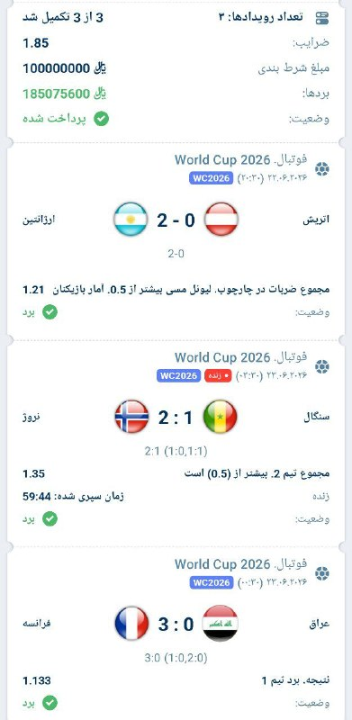

میکسمون عالی برد شد ❤️
✅
@Tabanii_Mafia

## IranianMinds — post 23181

  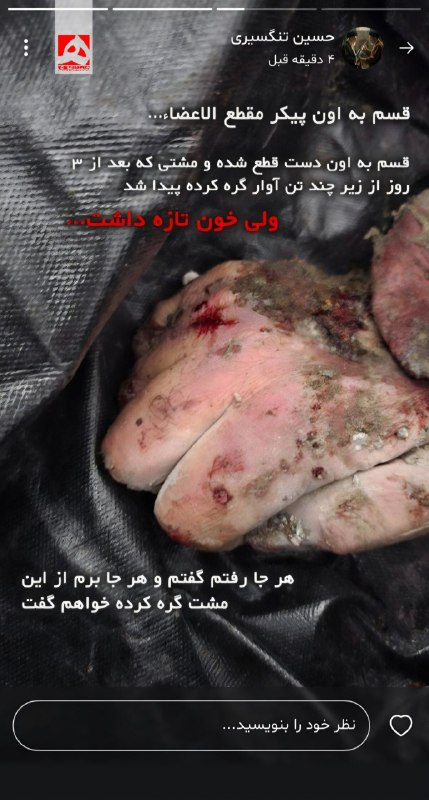

تصویری از دست قطع شده تنگسیری که ۳ روز بعد از مرگش پیدا شده بوده

استوری پسر تنگسیری

@IranianMinds

## IranianMinds — post 23180

🔴شهباز شریف، نخست‌وزیر پاکستان، امروز سه‌شنبه دوم تیر در مجلس ملی این کشور گفت: آمریکا و ایران در ۶۰ روز آینده در سطح فنی درباره موشک‌های بالستیک و دارایی‌های مسدود شده ایران گفت‌و‌گو خواهند کرد. @IranianMinds

## IranianMinds — post 23179

🔴شهباز شریف، نخست‌وزیر پاکستان، امروز سه‌شنبه دوم تیر در مجلس ملی این کشور گفت:

آمریکا و ایران در ۶۰ روز آینده در سطح فنی درباره موشک‌های بالستیک و دارایی‌های مسدود شده ایران گفت‌و‌گو خواهند کرد.

@IranianMinds

## BBCPersian — post 284847

  <a href="telegram/content/BBCPersian_284847_1782225489.mp4" target="_blank">🎬 Download video</a>

تیراندازی در مونترال کانادا در ۲۲ ژوئن (۱ تیر)، به کشته شدن یک افسر پلیس، یک شهروند و فرد مهاجم  منجر شد.
 
این تیراندازی در میانه روز و در منطقه کوت-ده-نژ مونترال صورت گرفت که محله‌ای از نظر فرهنگی متنوع است.
 
پلیس مونترال هویت مرد مظنون را اعلام نکرده، اما گفته است که گمان می‌رود او به تنهایی عمل کرده باشد. وزیر امنیت کبک اعلام کرد که انگیزه این حمله هنوز مشخص نیست.
 
پلیس هویت افسر کشته‌شده را «محمد لامین بن‌رضوان»، ۳۴ ساله اعلام کرد و از «سخت‌کوشی و تعهد به کار» او ستایش کرد.
 
مرکز امور اسرائیل و یهودیان مونترال، نام شهروند کشته‌شده را «مایکل موشه مزراحی» اعلام کرد و او را «یکی از اعضای محبوب جامعه یهودیان مونترال» توصیف کرد.
 
پلیس اعلام نکرده است که این حمله ماهیت یهودستیزانه داشته.
 
@bbcpersian

## BBCPersian — post 284846

  <a href="https://t.me/bbcpersian/284846" target="_blank">📎 Download file</a>

📻تازه‌ترین خبرهای جهان سه شنبه ۲ تیر ۱۴۰۵

@BBCPersian

## idfinfarsi — post 11909

پس از عبور به منطقه امنیتی: نیرو های ارتش اسرائیل به سوی تروریست‌های حزب‌الله که با پوشش غیرنظامی در ارتفاعات علی الطاهر فعالیت می‌کردند، تیراندازی کردند

مدتی پیش، در یک رویداد دیگر در ارتفاعات علی الطاهر در منطقه امنیتی، نیروهای ارتش اسرائیل چهار تروریست از سازمان تروریستی حزب‌الله را شناسایی کردند که سوار بر یک بولدوزر و یک موتورسیکلت بودند و پس از عبور به منطقه امنیتی، به نیروها نزدیک شدند و تهدیدی فوری ایجاد کردند.

بلافاصله پس از شناسایی، نیروها برای دور کردن آن‌ها تیراندازی کردند. پس از آن‌که تروریست‌ها به نزدیک شدن ادامه دادند و به اخطارهای نیروها پاسخ ندادند، تیراندازی دیگری با هدف رفع تهدید انجام شد و اصابت تأیید شد.

سازمان تروریستی حزب‌الله با استفاده از پوشش غیرنظامی اقدام می‌کند تا فعالیت‌های تروریستی خود را پنهان کند. این رویداد نمونه‌ای دیگر از استفاده ابزاری این سازمان از غیرنظامیان لبنان و زیرساخت‌های غیرنظامی به‌عنوان سپر برای فعالیت‌هایش است.

ارتش اسرائیل اجازه نخواهد داد سازمان تروریستی حزب‌الله به غیرنظامیان اسرائیل و نیروهای ارتش اسرائیل آسیب برساند و به فعالیت خود برای رفع تهدیدهای فوری ادامه خواهد داد.

## alonews — post 129880

  <a href="telegram/content/alonews_129880_1782225491.webm" target="_blank">🎬 Download video</a>

👈فرماندهی مرکزی ایالات متحده:
ناو هواپیمابر USS جورج اچ. دبلیو. بوش (CVN 77) در دریای عرب در حال حرکت است.

دو ناو هواپیمابر به فعالیت خود در خاورمیانه ادامه می‌دهند در حالی که نیروهای آمریکایی همچنان حضور دارند و هوشیار هستند.

✅ @AloNews خبر جنگ

## alonews — post 129879

  <a href="telegram/content/alonews_129879_1782225491.webm" target="_blank">🎬 Download video</a>

👈فایننشال‌تایمز:
با وجود افزایش سطح تردد کشتی‌ها در تنگه هرمز، مالکان همچنان سردرگم هستند؛ این وضعیت در حالی شکل گرفته که ایران کشتی‌ها را تهدید به عبور از مسیر نزدیک سواحل خود کرده و آمریکا مسیر عمان را پیشنهاد می‌کند

✅ @AloNews خبر جنگ

## alonews — post 129878

  <a href="telegram/content/alonews_129878_1782225491.mp4" target="_blank">🎬 Download video</a>

آیت الله العظمی سید صادق شیرازی، مرجع بزرگ شیعیان: در دوران پیغمبر و امیرالمومنین یک نفر کشته سیاسی هم وجود نداشت

✅ @AloNews خبر جنگ

## alonews — post 129877

  <a href="telegram/content/alonews_129877_1782225493.webm" target="_blank">🎬 Download video</a>

👈عاصم منیر به دیدار پزشکیان رفت

✅ @AloNews خبر جنگ

## alonews — post 129876

  <a href="telegram/content/alonews_129876_1782225493.webm" target="_blank">🎬 Download video</a>

👈واکنش تیم مذاکره کننده به مذاکره موشکی: خلاف است و از اساس تکذیب می‌شود

✅ @AloNews خبر جنگ

## alonews — post 129875

  <a href="telegram/content/alonews_129875_1782225493.webm" target="_blank">🎬 Download video</a>

👈آخرین قیمت‌ها در بازار طلا، سکه و ارز

✅ @AloNews خبر جنگ

## alonews — post 129874

  <a href="telegram/content/alonews_129874_1782225493.webm" target="_blank">🎬 Download video</a>

👈نیویورک پست در تازه‌ترین جلد خود، توافق ترامپ با ایران را به تمسخر گرفته است.

✅ @AloNews خبر جنگ

---
📅 بروزرسانی: 1405/04/02 16:19
---

## VahidOOnLine — post 246980

  

♦️ سلطنت عمان و جمهوری اسلامی ایران پس از رایزنی‌های دیپلماتیک هیئت بلندپایه ایرانی با سلطان هیثم بن طارق و وزیر خارجه عمان در مسقط، بیانیه‌ای مشترک صادر کردند. در این بیانیه، که روز سه‌شنبه دوم تیرماه منتشر شد، مسقط پشتیبانی خود را از یادداشت تفاهم «اسلام‌آباد» میان ایران و آمریکا اعلام کرد.

ایران و عمان به عنوان دو کشور ساحلی مشرف بر تنگه هرمز، ضمن تاکید بر التزام خود به تضمین عبور امن شناورها طبق قوانین بین‌المللی، بر حاکمیت و حقوق حاکمیتی خود بر آب‌های منطقه‌ای این آبراه پافشاری کردند.

دو کشور توافق کردند تا از طریق یک کارگروه مشترک، گفتگوها را برای دستیابی به توافقی پیرامون «مدیریت آینده ناوبری در تنگه هرمز، خدمات ارائه‌شده و هزینه‌های مرتبط با آن بر اساس معیارهای بین‌المللی» ادامه دهند. این تفاهم شامل برگزاری گفتگو با سایر کشورهای ساحلی منطقه و طرف‌های ذی‌ربط نیز خواهد بود. در پایان، هر دو کشور بر تعهد خود جهت باز و امن نگه داشتن این آبراه حیاتی برای ناوبری بین‌المللی و تقویت ثبات منطقه‌ای تاکید کردند.
‌🇸🇦 Indypersian

🤖 @VahidOOnLine

## VahidOOnLine — post 246979

  

خبرگزاری فارس، وابسته به سپاه پاسداران، در واکنش به اظهارات شهباز شریف، نخست‌وزیر پاکستان، درباره مطرح شدن برنامه موشک‌های بالستیک جمهوری اسلامی در مذاکرات، نوشت این سخنان «کاملا اشتباه و احتمالا ناشی از بی‌اطلاعی است.»

فارس همچنین نوشت پاکستان در حال حاضر «نقش چندانی در میانجی‌گری مذاکرات ندارد» و اظهارات شهباز شریف بیشتر با هدف «پررنگ‌نمایی نقش واسطه‌گری» این کشور مطرح شده است.

این خبرگزاری افزود که در شرایط کنونی، قطر موثرترین نقش را در روند میانجی‌گری میان جمهوری اسلامی و آمریکا ایفا می‌کند.

شهباز شریف، نخست‌وزیر پاکستان، سه‌شنبه دوم تیر در مجلس ملی این کشور گفته بود موضوعاتی از جمله برنامه هسته‌ای جمهوری اسلامی، موشک‌های بالستیک، کاهش تحریم‌ها و دارایی‌های مسدودشده ایران در مذاکرات سوئیس مورد بحث قرار خواهد گرفت.
‌🏁 🇬🇧 IranintlTV

🤖 @VahidOOnLine

## VahidOOnLine — post 246978

  

شهباز شریف، نخست‌وزیر پاکستان، سه‌شنبه دوم تیر در مجلس ملی این کشور گفت گفت: «آمریکا و جمهوری اسلامی در ۶۰ روز آینده در سطح فنی درباره پرونده هسته‌ای، موشک‌های بالستیک و دارایی‌های مسدودشده جمهوری اسلامی گفت‌وگو خواهند کرد.»

او افزود آمریکا و جمهوری اسلامی پس از مذاکرات سوئیس بر سر یک نقشه راه برای ادامه گفت‌وگوها توافق کرده‌اند و مذاکرات فنی برای دستیابی به توافق نهایی ادامه خواهد یافت.

نخست‌وزیر پاکستان ابراز امیدواری کرد تفاهم‌نامه اسلام‌آباد به یک توافق پایدار تبدیل شود.
‌🏁 🇬🇧 IranintlTV

🤖 @VahidOOnLine

## VahidOOnLine — post 246977

  

♦️در ادامه اختلال در شبکه بانکی ایران، سخنگوی صنف جایگاه‌های سوخت اعلام کرد احتمال موفقیت پرداخت الکترونیکی بهای سوخت در جایگاه‌ها پایین است و از شهروندان خواست تا اطلاع ثانوی برای سوخت‌گیری پول نقد همراه داشته باشند.

رضا نواز در گفتگو با ایرنا گفت مشکلات ایجادشده در سامانه‌های بانکی طی روزهای اخیر بر فعالیت جایگاه‌های سوخت نیز تاثیر گذاشته است. او افزود بخشی از این مشکلات با همکاری شرکت ملی پخش فرآورده‌های نفتی و همراهی مالکان و کارکنان جایگاه‌ها مدیریت شده، اما وضعیت از روز سه‌شنبه دوم تیرماه دشوارتر شده و نیاز به همکاری بیشتر مردم وجود دارد.

نواز با اشاره به کاهش احتمال موفقیت تراکنش‌های الکترونیکی در برخی جایگاه‌ها گفت همراه داشتن پول نقد می‌تواند از ایجاد صف‌های طولانی و اختلال بیشتر در روند سوخت‌گیری جلوگیری کند. او از مردم خواست در این شرایط با کارکنان جایگاه‌های سوخت همکاری کنند.

این اظهارات در حالی مطرح می‌شود که گزارش‌ها از اختلال در سامانه‌های بانکی و مشکلات در استفاده از کارت‌های بانکی و خدمات پرداخت الکترونیکی در نقاط مختلف ایران حکایت دارد.
‌🇸🇦 Indypersian

🤖 @VahidOOnLine

## VahidOOnLine — post 246976

  

حزب‌الله لبنان سه‌شنبه دوم تیر در بیانیه‌ای اعلام کرد اسرائیل با حمله به سوی «گروهی از غیرنظامیان» در نزدیکی نبطیه در جنوب لبنان، آتش‌بس را نقض کرده است.

در مقابل، ارتش اسرائیل اعلام کرد نیروهایش گروهی از نیروهای حزب‌الله را که در منطقه تپه علی طاهر تهدیدی برای نیروهای اسرائیلی محسوب می‌شدند، هدف قرار داده‌اند. ارتش اسرائیل همچنین تصویری را منتشر کرد که به گفته این نهاد، یکی از افراد هدف قرارگرفته را نشان می‌دهد.

حزب‌الله گفت ارتش اسرائیل به سوی «گروهی از غیرنظامیان که در حال بازگشایی جاده‌ها و بیرون آوردن پیکر کشته‌شدگان از زیر آوار بودند» آتش گشوده است.

رسانه‌های لبنانی گزارش دادند در این حادثه دو نفر بر اثر تیراندازی اسرائیل کشته و چند نفر دیگر زخمی شده‌اند.

حزب‌الله در بیانیه‌ای اعلام کرد: «آنچه دشمن انجام داده، نقض آشکار آتش‌بس است؛ آتش‌بسی که حزب‌الله تا این لحظه به آن پایبند بوده است.»
‌🏁 🇬🇧 IranintlTV

🤖 @VahidOOnLine

## VahidOOnLine — post 246975

  

♦️دونالد ترامپ، رئیس‌جمهوری آمریکا، سه‌شنبه دوم تیرماه، در پیامی در شبکه اجتماعی تروث سوشال اعلام کرد جمهوری اسلامی با بالاترین سطح بازرسی‌های هسته‌ای برای آینده‌ای طولانی موافقت کرده است و این موضوع «صداقت هسته‌ای» را تضمین می‌کند.

ترامپ نوشت برخلاف «اعتراض‌ها و اظهارات نادرست» جمهوری اسلامی و آنچه «رسانه‌های جعلی» بازتاب می‌دهند، تهران به‌طور کامل این بازرسی‌ها را پذیرفته است. او افزود اگر جمهوری اسلامی با این شرط موافقت نمی‌کرد، مذاکرات بیشتری انجام نمی‌شد.

رئیس‌جمهوری آمریکا همچنین گفت بر اساس این توافق و «امتیازهای بزرگ دیگر» از سوی جمهوری اسلامی، اجازه داده است تنگه هرمز باز بماند و محاصره دریایی بیشتری اعمال نشود. او در عین حال تاکید کرد همه کشتی‌های آمریکا در موقعیت خود باقی می‌مانند تا در صورت ضرورت، محاصره دوباره برقرار شود، هرچند این احتمال را در شرایط فعلی بسیار بعید دانست.

ترامپ در ادامه اعلام کرد پول‌ها یا معافیت‌های تحریمی که از سوی وزارت خزانه‌داری آمریکا آزاد می‌شود، در حساب امانی تحت کنترل آمریکا نگهداری خواهد شد و فقط برای خرید مواد غذایی و تجهیزات پزشکی از آمریکا، از جمله ذرت، گندم و سویا، استفاده می‌شود.

او با اشاره به وضعیت ایران، آن را یک «بحران انسانی» توصیف کرد و گفت کمک‌رسانی باید پیش از آنکه دیر شود انجام شود. ترامپ در پایان نوشت: «مذاکرات به خوبی پیش می‌رود.»
‌🇸🇦 Indypersian

🤖 @VahidOOnLine

## VahidOOnLine — post 246974

♦️جام جهانی در یک روز پرهیجان، دو دلیل برای شادی خاندان سلطنتی هلند ساخت؛ پیروزی پرگل تیم ملی هلند و نخستین امتیاز تاریخی کوراسائو در این رقابت‌ها.
هرچند میان هلند و کوراسائو، مستعمره پیشین این کشور در کارائیب، حدود ۸ هزار کیلومتر فاصله است، اما جام جهانی باعث شد ویلم الکساندر، پادشاه هلند، ملکه ماکسیما و شاهدخت آریان در یک روز هر دو تیم را از نزدیک تشویق کنند.
در روز ۳۱ خرداد آن‌ها ابتدا در هیوستون روی سکوها نشستند و پیروزی ۵ بر ۱ هلند مقابل سوئد را دیدند؛ بردی پرگل که ورزشگاه را به صحنه شادی هواداران نارنجی‌پوش تبدیل کرد. چند ساعت بعد، خانواده سلطنتی مسیری حدود هزار و ۳۰۰ کیلومتر به سمت شمال تا کانزاس‌، طی کردند تا بازی کوراسائو مقابل اکوادور را هم ببینند؛ دیداری که با نخستین امتیاز تاریخ کوراسائو در جام جهانی همراه شد.
پس از بازی، اعضای خاندان سلطنتی هلند به رختکن کوراسائو رفتند و کنار بازیکنان، در شادی و رقص آن‌ها شریک شدند.
کوراسائو با جمعیتی حدود ۱۵۸ هزار نفر، همچنان بخشی از پادشاهی هلند به شمار می‌رود.
پادشاه ویلم الکساندر در گفت‌وگو با آر‌تی‌ال گفت: «این جام جهانی برای ما بسیار ویژه است، چون هم هلند را داریم و هم کوراسائو را؛ بنابراین دو برابر تیم برای تشویق کردن داریم. فرصت خوبی است که هم آبی‌ها را تشویق کنیم و هم نارنجی‌ها را.»
‌🇸🇦 Indypersian

🤖 @VahidOOnLine

## VahidOOnLine — post 246973

  

⭕️ترامپ: دیروز ۱۹ میلیون بشکه نفت از تنگه هرمز خارج شد

♦️دونالد ترامپ، رئیس جمهوری آمریکا روز سه‌شنبه دوم تیرماه با انتشار پیامی در تروث سوشال نوشت که روز گذشته ۱۹ میلیون بشکه نفت از تنگه هرمز خارج شده است.

ترامپ در همین پیام نوشت: «قیمت نفت در حال سقوط است و جهان جای امن‌تری شده است.»
‌🇸🇦 Indypersian

🤖 @VahidOOnLine

## VahidOOnLine — post 246972

  

♦️اف‌بی‌آی روز دوشنبه اول تیرماه اعلام کرد، ابراهیم خلدون حلمی، متهم درجه اول سازماندهی یکی از بزرگترین طرح‌های کلاهبرداری بیمه خدمات درمانی آمریکا (مدیکر) در تاریخ ایالات متحده را از ترکیه تحویل گرفته است.

به گزارش رسانه‌های ترکیه، اف‌بی‌آی از همکاری نزدیک با مقام‌های آنکارا و همچنین توماس باراک، سفیر ایالات متحده در ترکیه قدردانی کرد.

ابراهیم خلدون حلمی، که در ارتباط با یک طرح ادعایی ۳.۷ میلیارد دلاری برای کلاهبرداری از مدیکر متهم شده بود، در ماه مه ۲۰۲۵ قبل از بازداشت در ترکیه، از ایالات متحده فرار کرده بود.

به گزارش ایندیپندنت ترکیه، گروه واکنش به حوادث بحرانی اف‌بی‌آی به ترکیه رفت و روز جمعه هفته گذشته، در یک عملیات استرداد مجرمان خارجی، حلمی را به ایالات متحده منتقل کرد.
‌🇸🇦 Indypersian

🤖 @VahidOOnLine

## VahidOOnLine — post 246971

  

دونالد ترامپ، رییس‌جمهوری آمریکا، سه‌شنبه دوم تیر در پیامی در تروث سوشال نوشت که جمهوری اسلامی «به‌طور کامل و تمام‌عیار» با انجام بازرسی‌های هسته‌ای در بالاترین سطح برای آینده‌ای طولانی‌مدت موافقت کرده است.

ترامپ در پیامی نوشت: «با وجود همه انکارها و اظهارات نادرستی که در خلاف این موضوع مطرح می‌شود... ایران به‌طور کامل و تمام‌عیار با انجام بازرسی‌های هسته‌ای در بالاترین سطح برای آینده‌ای طولانی‌مدت (تا ابد!!!) موافقت کرده است.»

رییس‌جمهوری آمریکا همچنین گفت که جمهوری اسلامی در جریان مذاکرات امتیازهای مهم دیگری نیز ارائه کرده است.

او افزود: «بر اساس این موضوع و دیگر امتیازهای مهمی که ایران در حال ارائه آن‌هاست، من موافقت کرده‌ام که تنگه هرمز باز بماند و دیگر هیچ محاصره دریایی اعمال نشود.»

ترامپ در عین حال گفت همه کشتی‌ها در موقعیت خود باقی خواهند ماند تا در صورت لزوم محاصره دوباره برقرار شود، هرچند به گفته او در حال حاضر چنین احتمالی «بسیار بعید» به نظر می‌رسد.
‌🏁 🇬🇧 IranintlTV

🤖 @VahidOOnLine

## VahidOOnLine — post 246970

  

مسعود پزشکیان، رییس دولت جمهوری اسلامی، سه‌شنبه دوم تیر وارد اسلام‌آباد شد.
پزشکیان در فرودگاه بین‌المللی اسلام‌آباد مورد استقبال شهباز شریف، نخست وزیر پاکستان، قرار گرفت.
عباس عراقچی، وزیر خارجه جمهوری اسلامی نیز در پروازی جداگانه از مسقط به پاکستان سفر کرد و پیش از ورود پزشکیان، در پایگاه هوایی نور خان مورد استقبال محمد اسحاق دار، وزیر خارجه پاکستان قرار گرفت.
‌🏁 🇬🇧 IranintlTV

🤖 @VahidOOnLine

## VahidOOnLine — post 246969

  <a href="telegram/content/VahidOOnLine_246969_1782218966.mp4" target="_blank">🎬 Download video</a>

♦️مسعود پزشکیان، رئیس جمهوری اسلامی ایران روز سه‌شنبه دوم تیرماه و با استقبال شهباز شریف، نخست وزیر پاکستان وارد فرودگاه بین‌المللی اسلام‌آباد شد.

عباس عراقچی، وزیر امور خارجه جمهوری اسلامی پیش از پزشکیان و از مسقط به اسلام‌آباد رسیده بود.

خبرگزاری ایرنا پیش از این گزارش کرده بود که پزشکیان برای شرکت در بزرگداشت قربانیان ایرانی جنگ آمریکا و اسرائیل به پاکستان سفر می‌کند.

شهباز شریف و عاصم منیر، فرمانده ستاد کل نیروهای مسلح پاکستان، از هفته‌های میانی جنگ در اسفندماه گذشته تلاش‌های برای آتش‌بس، از سرگیری مذاکرات و در نهایت امضای تفاهم‌نامه پایان جنگ را برعهده گرفتند.
‌🇸🇦 Indypersian

🤖 @VahidOOnLine

## VahidOOnLine — post 246968

  

بر اساس تصاویر و اطلاعات رسیده به ایران‌اینترنشنال، مردی که شامگاه ۱۸ دی در تهران هدف تیراندازی قرار گرفت، به دلیل نگرانی از بازداشت، مجبور به جراحی در خانه برای خارج کردن گلوله از محل زخم شد. این مداوای خانگی منجر به آسیب‌های جدی به پای این معترض شده است.

یک زن و همسرش که اطلاعاتشان نزد ایران‌اینترنشنال محفوظ است، ساعت ۷ شب ۱۸ دی در محدوده اشرفی اصفهانی تهران، در حالی که در میان شلوغی‌های خیابانی حضور داشتند، هدف حمله نیروهای حکومتی قرار گرفتند.

ماموران موتورسوار از دو طرف به سمت مردم گاز اشک‌آور شلیک کردند و این زوج هنگام فرار به سمت خانه، از فاصله نزدیک هدف شلیک قرار گرفتند.

همسر این زن از ناحیه پا با تیر جنگی مجروح شد.

خانواده او به دلیل نگرانی از بازداشت یا برخورد امنیتی، نتوانستند او را به بیمارستان منتقل کنند و پس از دو روز، با کمک یک مسئول اتاق عمل از یکی از بیمارستان‌های تهران، گلوله را از پای او خارج کردند.
‌🏁 🇬🇧 IranintlTV

🤖 @VahidOOnLine

## VahidOOnLine — post 246967

  

رسانه‌های ایران و پیام‌های ارسالی مخاطبان به ایران‌اینترنشنال از بروز اختلال گسترده در سامانه‌های بانکی کشور خبر دادند.

بر اساس این گزارش‌ها، برخی پایانه‌های فروشگاهی، درگاه‌های بانکی و اپلیکیشن‌های بانک‌ها از صبح سه‌شنبه دوم تیر با اختلال یا کندی در ارائه خدمات مواجه شده‌اند.

وب‌سایت دیده‌بان ایران نوشت: «بر اساس گزارش‌های کاربران، از صبح سه‌شنبه دوم تیر مجددا برخی سامانه‌ها و خدمات بانکی کشور با اختلال گسترده و کندی مواجه شده‌اند.»

این رسانه افزود بروز مشکل در انجام تراکنش‌ها، عدم دسترسی به خدمات آنلاین و اختلال در برخی درگاه‌های بانکی از جمله مشکلات گزارش‌شده از سوی کاربران است. همچنین گزارش‌هایی از اختلال در خدمات بانک ملت در استان البرز منتشر شده است.

پیام‌های ارسالی مخاطبان به ایران‌اینترنشنال نیز از بروز مشکلات مشابه در بانک‌های مختلف حکایت دارد. برخی کاربران اعلام کرده‌اند که امکان انجام نقل و انتقال بانکی را نداشته‌اند و خدمات بانک‌هایی از جمله صادرات، سپه، تجارت، رسالت، ملت، توسعه تعاون و ملی با اختلال مواجه شده است. یکی از مخاطبان گفت که «هیچ نقل و انتقالی در این بانک‌ها انجام نمی‌شود.»
‌🏁 🇬🇧 IranintlTV

🤖 @VahidOOnLine

## VahidOOnLine — post 246966

  

⭕️نتانیاهو: جنگ ما با ایران و نیروهای نیابتی‌اش هنوز پایان نیافته است

♦️بنیامین نتانیاهو، نخست‌وزیر اسرائیل، در حالی که تنش‌ها میان تل‌آویو و واشنگتن بر سر تفاهم‌نامه اخیر آمریکا و ایران و همچنین وضعیت لبنان ادامه دارد، اعلام کرد که اسرائیل ضربات سنگینی به جمهوری اسلامی ایران و نیروهای همسو با آن در منطقه وارد کرده است، اما جنگ هنوز به پایان نرسیده است.

نتانیاهو روز سه‌شنبه در دیدار با دانشجویان دوره افسران رزمی ذخیره گفت اسرائیل در نبرد با ایران و متحدانش به دستاوردهای مهمی رسیده، اما این رویارویی همچنان ادامه دارد و نباید آن را پایان‌یافته تلقی کرد.

او همچنین ضمن قدردانی از حمایت‌های آمریکا، بر ضرورت کاهش وابستگی نظامی اسرائیل به واشنگتن تاکید کرد و گفت: «از کمک‌هایی که از دوستان آمریکایی خود دریافت کرده‌ایم بسیار سپاسگزارم، اما باید نیازهای نظامی خود را به‌طور مستقل تولید کنیم و سامانه تسلیحاتی مستقلی داشته باشیم.»
‌🇸🇦 Indypersian

🤖 @VahidOOnLine

## VahidOOnLine — post 246965

  <a href="telegram/content/VahidOOnLine_246965_1782218970.mp4" target="_blank">🎬 Download video</a>

ویدیوی ارسال‌شده به ایران‌اینترنشنال نشان می‌دهد دختر جاویدنام کریم حیدری، شمع تولد پدر جان باخته‌اش را بر سر مزار او فوت می‌کند.
کریم حیدری، ۱۸ دی ۱۴۰۴ در بندر گناوه هدف شلیک مستقیم قرار گرفت و جان باخت.
‌🏁 🇬🇧 IranintlTV

🤖 @VahidOOnLine

## VahidOOnLine — post 246964

♦️هیثم بن طارق، سلطان عمان روز سه‌شنبه دوم تیر ماه در مسقط با محمدباقر قالیباف و عباس عراقچی، رئیس مجلس و وزیر امور خارجه جمهوری اسلامی ایران دیدار کرد.
عراقچی و قالیباف پس از دور نخست مذاکرات اجرای تفاهم‌نامه پایان جنگ از سوییس به عمان رفتند.
عمان که یکی از میانجیگران تاریخی میان تهران و واشنگتن در ۴۷ سال گذشته بوده است پس از جنگ اخیر و بسته شدن تنگه هرمز، بار دیگر به یکی از کلیدی‌ترین بازیکنان منطقه خاورمیانه بدل شده است.

مقام‌های جمهوری اسلامی می‌گویند تنها ایران و عمان می‌توانند بر این آبراه راهبردی بین‌المللی اعمال حاکمیت کنند.
‌🇸🇦 Indypersian

🤖 @VahidOOnLine

## VahidOOnLine — post 246963

  

بنیامین نتانیاهو، نخست‌وزیر اسرائیل، در دیدار با شرکت‌کنندگان دوره افسران رزمی ذخیره در منطقه گوش عتصیون گفت رویارویی با جمهوری اسلامی و نیروهای وابسته به آن همچنان ادامه دارد و آینده اسرائیل به میزان قدرت این کشور بستگی خواهد داشت.

نتانیاهو گفت: «اکنون در برابر جمهوری اسلامی و نیروهای وابسته به آن ایستاده‌ایم. ما به آن‌ها ضربه زدیم. این موضوع هنوز پایان نیافته است، اما به قدرت ما بستگی دارد.»

او افزود جایگاه اسرائیل در دهه‌های آینده به توانمندی و قدرت این کشور وابسته است و به همین دلیل دولت اسرائیل در حال تقویت ظرفیت‌های خود است.

نخست‌وزیر اسرائیل گفت: «اینکه ۳۰ سال دیگر در چه جایگاهی باشیم، به قدرت ما وابسته است. به همین دلیل، آنچه اکنون انجام می‌دهیم، ساختن قدرتی بیشتر است.»

نخست‌وزیر اسرائیل همچنین بر ضرورت دستیابی به استقلال تسلیحاتی تاکید کرد و گفت: «من برای حمایتی که از سوی دوستان آمریکایی‌مان دریافت کرده‌ایم ارزش بسیاری قائلم، اما باید خود را از این وابستگی رها کنیم و یک ساختار تسلیحاتی مستقل برای خودمان ایجاد کنیم.»
‌🏁 🇬🇧 IranintlTV

🤖 @VahidOOnLine

## VahidOOnLine — post 246961

## WithYashar — post 15666

  

امروز دایرکتی از طرف یکی از شما دریافت کردم که گفت از‌ کارمندان رتبه دار بانک است و این قطعی نه هک است نه چیز دیگری و به طور عمد از طرف خود رژیم انجام شده وی افزورد تقریبا با یقین میگم پایین اوردن دستوری قیمت ارز و طلا،حاکمیت و دولت با سرکردگی همتی و سیف میخواهند در قیمت های پایین فقط خودشون خریدار مطلق باشن و یک نوسان جانانه از بازار بگیرن با اختلال عمدی در سیستم(چون میدونن سرمایه دارها میدونن قیمت برگشت میکنه به بالا و پولشون رو میکشن بیرون که طلا بخرن،اما با قطع عمدی و به گردن هک شدن)
در نتیجه از دوستان هکر قدیمی دوران جوانی جوییا شدم که در امنیت سایبری بانکها کار میکنند. آنها به من گفتند که بعد از عملیات اکونومیک فیوری که آمریکا انجام داد که شامل محاصره دریایی هم میشود و تمام زیرساختهای اقتصادی رژیم را هدف‌ گرفت رژیم ضربه های مهلکی در رابطه با ارز خورده و این ادعا درسته و میخوان پول رو از جیب مردم جبران کنند دوستم گفت شعبه ها هم دسترسی به هر انتقالی را دارند ولی دستور این است که بگویند قطع هست
@withyashar 🚨🚨🚨🚨🚨🚨

## WithYashar — post 15664

  

خلبان آمریکایی جنگنده F-15 که در ماه آوریل بر فراز ایران سرنگون شد، به مقام‌های اطلاعاتی گفته است که پیش از اجکت کردن، چندین پهپاد ایرانی را دیده که به‌صورت هم‌زمان و هماهنگ در آرایشی شبیه «عروس دریایی» در حال حرکت بوده‌اند؛ به گزارش سی‌ان‌ان و به نقل از چهار منبع.

این روایت باعث بحث در جامعه اطلاعاتی آمریکا شده درباره این‌که آیا ایران توانسته قابلیت پیشرفته‌ای در زمینه پهپادها یعنی «شبکه‌سازی مش‌مانند یک‌به‌چند» (one-to-many meshed networking) را به نمایش بگذارد یا نه.
@withyashar

## WithYashar — post 15663

  

ترامپ در تروث : با وجود اعتراضات و اظهارات نادرست آنها، همراه با تبلیغات مکرر اخبار جعلی که همه تلاش خود را می‌کند تا پیروزی آمریکا را کوچک و بی‌اهمیت جلوه دهد، ایران به طور کامل و جامع با بازرسی‌های هسته‌ای در بالاترین سطح برای آینده‌ای نامحدود (بی‌نهایت!!!) موافقت کرده است. این امر «صداقت هسته‌ای» را تضمین خواهد کرد.

اگر آنها با این موضوع موافقت نمی‌کردند، مذاکرات بیشتری صورت نمی‌گرفت! بر اساس این و دیگر امتیازات عمده‌ای که ایران داده است، من موافقت کرده‌ام که تنگه هرمز باز بماند و هیچ محاصره دریایی بیشتری اعمال نشود. با این حال، همه کشتی‌ها در محل باقی می‌مانند تا در صورت لزوم محاصره دوباره برقرار شود، که در این مرحله بسیار بعید به نظر می‌رسد.
پول و یا تحریم‌هایی که خزانه‌داری آمریکا آزاد می‌کند، در حساب امانی تحت کنترل آمریکا قرار می‌گیرد و صرف خرید غذا و تجهیزات پزشکی، به طور انحصاری از ایالات متحده، از جمله ذرت، گندم و سویا از کشاورزان بزرگ آمریکایی ما خواهد شد.
این‌ها چیزهایی هستند که ایران به شدت به آنها نیاز دارد. این یک بحران انسانی است و من احساس می‌کنم لازم است که اکنون کمک کنیم، قبل از اینکه خیلی دیر شود. مذاکرات به خوبی پیش می‌رود!
@withyashar

## WithYashar — post 15662

  

پزشکیان وارد اسلام‌آباد شد
وی در بدو ورود با نخست‌وزیر پاکستان دیدار کرد.
@withyashar

## WithYashar — post 15661

  <a href="telegram/content/WithYashar_15661_1782218975.mp4" target="_blank">🎬 Download video</a>

رژیم : هک شدیم ، داریم روش کار میکنیم و مشخص نیست کی‌ درست بشه ! شرکت خدمات انفورماتیک: تیم‌های فنی و متخصصان امنیت سایبری در حال رفع اختلالات ایجادشده هستند تا امکان بهره‌برداری دوباره از خدمات فراهم شود. ضمن عرض پوزش بابت وقفه پیش‌آمده در انجام امور بانکی،…

## WithYashar — post 15660

رژیم : هک شدیم ، داریم روش کار میکنیم و مشخص نیست کی‌ درست بشه !
شرکت خدمات انفورماتیک:
تیم‌های فنی و متخصصان امنیت سایبری در حال رفع اختلالات ایجادشده هستند تا امکان بهره‌برداری دوباره از خدمات فراهم شود.
ضمن عرض پوزش بابت وقفه پیش‌آمده در انجام امور بانکی، از تمام کاربران و مشتریان محترم تقاضا می‌شود ضمن حفظ صبوری و شکیبایی، اخبار و اطلاعات تکمیلی در خصوص زمان بازگشت به وضعیت عادی را صرفاً از طریق درگاه‌های اطلاع‌ رسانی رسمی و مراجع ذی‌صلاح پیگیری کنند.
@withyashar

## WithYashar — post 15659

روزهای شنبه و یکشنبه ۱۳ و ۱۴ تیر، تهران و دوشنبه ۱۵ تیر، کل کشور تعطیل است معاون اول رئیس جمهور اعلام کرد در روز سه شنبه ۱۵ تیرماه استان قم و پنجشنبه ۱۸تیرماه استان خراسان رضوی تعطیل است. @withyashar

## WithYashar — post 15658

روزهای شنبه و یکشنبه ۱۳ و ۱۴ تیر، تهران و دوشنبه ۱۵ تیر، کل کشور تعطیل است
معاون اول رئیس جمهور اعلام کرد در روز سه شنبه ۱۵ تیرماه استان قم و پنجشنبه ۱۸تیرماه استان خراسان رضوی تعطیل است.
@withyashar

## WithYashar — post 15657

سفیر ایران در لبنان در واکنش به حمله به جنوب لبنان: هرگونه نقض تفاهم‌نامه در لبنان، چالش‌هایی را برای روند مذاکرات صلح ایجاد خواهد کرد.
@withyashar

## WithYashar — post 15656

اختلال دوباره در بانک‌ها
@withyashar 🚨

## WithYashar — post 15655

  

نقض دوباره آتش‌بس ،حمله اسرائیل به جنوب لبنان
@withyashar 🚨

## WithYashar — post 15654

نتانیاهو: حمایت دوستان آمریکایی‌مان را بسیار ارج می‌نهم، اما نیازمند رهایی از وابستگی و ساخت یک نظام تسلیحاتی مستقل هستیم @withyashar

## WithYashar — post 15653

رادیو ارتش اسرائیل: تا زمانی که حزب‌الله کاملاً منحل نشود، از منطقه الشقیف در لبنان عقب‌نشینی نمی‌کنیم
@withyashar

## WithYashar — post 15652

نتانیاهو: حمایت دوستان آمریکایی‌مان را بسیار ارج می‌نهم، اما نیازمند رهایی از وابستگی و ساخت یک نظام تسلیحاتی مستقل هستیم
@withyashar

## WithYashar — post 15651

  

همکنون ۷ سوخت رسان شامل، ۵ فروند سوخت رسان KC-135R و ۲ فروند سوخت رسان KC-46A پگاسوس نیروی هوایی آمریکا در منطقه خلیج فارس فعال هستند.
همزمان، دو فروند KC-46A با نام عملیاتی BOBBY 81/82 از پایگاه RAF Mildenhall انگلستان به پرواز درآمده و برای الحاق به یک یگان جنگنده در حال عملیات‌اند.

همچنین بر‌اساس گزارشها پرواز CUBE 31 شامل چهار فروند جنگنده F-35 تفنگداران دریایی آمریکا در حال انجام مأموریت بوده و هماهنگی‌های عملیاتی و ارتباطی لازم را در جریان پرواز برقرار کرده است.
@withyashar

## WithYashar — post 15650

پلتفرم دریانوردی کپلر: ۳۶ کشتی دیروز از تنگه هرمز عبور کردند که این بالاترین میزان تردد در این تنگه از نخست مارس تاکنون است.
@withyashar

## WithYashar — post 15649

وزیر امنیت ملی اسرائیل بن گویر:
اگر آمریکایی‌ها فکر می‌کنند ایرانی‌ها برنامه هسته‌ای خود را رها خواهند کرد، آن را لغو می‌کنند و از تمام رویاهایشان برای نابودی دولت اسرائیل دست می‌کشند، بسیار ساده‌لوح هستند.
@withyashar

## WithYashar — post 15648

ترامپ: خودروسازان آمریکایی تولید سلاح را آغاز خواهند کرد
رئیس جمهور آمریکا در کاخ سفید به خبرنگاران گفت: «آنها برنامه‌هایی برای تغییر کاربری کارخانه‌ها دارند. ما قصد داریم سلاح‌هایی از جمله موشک‌های پاتریوت، موشک‌های تاماهاک و موارد دیگر تولید کنیم.»
@withyashar

## WithYashar — post 15647

هواپیماهای سوخت‌رسان نیروی هوایی ایالات متحده پس از تخلیه از پایگاه هوایی العدید در قطر به دلیل جنگ ایران(یک روز قبل از جنگ)، به این پایگاه بازگشته‌اند. حداقل ۱۲ فروند در حال حاضر حضور دارند.
@withyashar

## WithYashar — post 15646

بقایی: توانمندی دفاعی و موشکی ایران هیچگاه موضوع مذاکره با هیچ طرفی نخواهد بود
@withyashar

## mwarmonitor — post 11420

https://x.com/i/status/2069394095831753119

## mwarmonitor — post 11419

🔴خلبان آمریکایی جنگنده F-15 که در ماه آوریل بر فراز ایران سرنگون شد، به مقام‌های اطلاعاتی گفته است که پیش از اجکت کردن، چندین پهپاد ایرانی را دیده که به‌صورت هم‌زمان و هماهنگ در آرایشی شبیه «عروس دریایی» در حال حرکت بوده‌اند؛ به گزارش سی‌ان‌ان و به نقل از چهار منبع.

این روایت باعث بحث در جامعه اطلاعاتی آمریکا شده درباره این‌که آیا ایران توانسته قابلیت پیشرفته‌ای در زمینه پهپادها یعنی «شبکه‌سازی مش‌مانند یک‌به‌چند» (one-to-many meshed networking) را به نمایش بگذارد یا نه.

@mwarmonitor

## mwarmonitor — post 11418

  

علیرغم اعتراضات و اظهارات کذب آن‌ها بر خلاف واقع، همراه با هیاهوی رسانه‌های جعلی (فیک نیوز) که تمام تلاش خود را می‌کنند تا پیروزی ایالات متحده را تا حد ممکن کوچک و ناچیز جلوه دهند، ایران کاملاً و به‌طور تمام و کمال با بالاترین سطح بازرسی‌های هسته‌ای برای آینده‌ای طولانی (تا ابد!!!) موافقت کرده است. این امر «صداقت هسته‌ای» را تضمین خواهد کرد. اگر آن‌ها با این موضوع موافقت نمی‌کردند، هیچ مذاکره دیگری در کار نبود!
بر اساس این توافق و سایر امتیازات بزرگی که از سوی ایران داده شده است، من موافقت کرده‌ام که تنگه هرمز باز بماند و محاصره دریایی دیگری در کار نباشد. با این حال، همه کشتی‌ها در موقعیت خود باقی می‌مانند تا در صورت لزوم، محاصره مجدداً برقرار شود؛ هرچند در حال حاضر این امر بسیار بعید به نظر می‌رسد.
پول و/یا تحریم‌هایی که وزارت خزانه‌داری ایالات متحده در حال آزادسازی آن‌هاست، به یک حساب امانی (تضمینی) تحت کنترل ایالات متحده واریز می‌شود و منحصراً برای خرید مواد غذایی و تجهیزات پزشکی از ایالات متحده استفاده خواهد شد؛ از جمله ذرت، گندم و دانه سویا از کشاورزان بزرگ آمریکایی ما. این‌ها اقلامی هستند که ایران شدیداً به آن‌ها نیاز دارد. این یک بحران انسانی است و من احساس می‌کنم لازم است همین حالا، پیش از آنکه خیلی دیر شود، کمک کنیم.
مذاکرات به خوبی پیش می‌رود! از توجه شما به این موضوع سپاسگزارم.

رئیس‌جمهور دونالد جی. ترامپ

@mwarmonitor

## mwarmonitor — post 11417

  

🔹«دیروز ۱۹ میلیون بشکه نفت از تنگه هرمز خارج شد که یک رکورد بی‌سابقه در تمام دوران‌هاست. قیمت نفت در حال سقوط است و جهان جای بسیار امن‌تری است!!!

رئیس‌جمهور دونالد جی. ترامپ

@mwarmonitor

## mwarmonitor — post 11416

⚠️اطلاعیه رسمی کانال ⚠️ 🔸بدین‌وسیله به اطلاع همراهان گرامی می‌رسد که کانال خبری ما در پلتفرم X (توییتر سابق) راه‌اندازی شد. 🔸از این پس نیز ، آخرین اخبار و تحلیل‌های نظامی، سیاسی و همچنین مسائل اجتماعی ایران و جهان به‌صورت منظم در آن منتشر خواهد شد. 🔸از…

## mwarmonitor — post 11414

🔴نخست‌وزیر بنیامین نتانیاهو اعلام کرد که اسرائیل باید وابستگی خود به حمایت تسلیحاتی آمریکا را کاهش دهد و به سمت توسعه تولید مستقل سلاح حرکت کند.
او گفت: «من قدردان دوستان آمریکایی‌مان هستم، اما به یک سامانه مهماتِ بومیِ خودمان نیاز داریم.»

@mwarmonitor

## mwarmonitor — post 11413

  

✈️🚨 بر اساس گزارش‌ها، ۵ فروند سوخت رسان KC-135R و ۲ فروند سوخت رسان KC-46A پگاسوس نیروی هوایی آمریکا در منطقه خلیج فارس فعال هستند.

✈️همزمان، دو فروند KC-46A با نام عملیاتی BOBBY 81/82 از پایگاه RAF Mildenhall انگلستان به پرواز درآمده و برای الحاق به یک یگان جنگنده در حال عملیات‌اند.

✈️همچنین پرواز CUBE 31 شامل چهار فروند جنگنده F-35 تفنگداران دریایی آمریکا در حال انجام مأموریت بوده و هماهنگی‌های عملیاتی و ارتباطی لازم را در جریان پرواز برقرار کرده است.

@mwarmonitor

## mwarmonitor — post 11412

🎁تخفیف‌های اپل در «پرایم دی» آمازون از همیشه جذاب‌تر شده‌اند: ایرپاد، آیپد و موارد بیشتر را با قیمت‌های ویژه بخرید. «نیویورک پست»

@mwarmonitor

## mwarmonitor — post 11411

🔹ابی فیلیپ (مجری CNN):
«...یک توافق خوب واقعاً از نظر او چگونه است. گوش کنید.»

📌دونالد ترامپ:

🔸«ما آن‌ها را از یک کشور واقعاً بسیار ضعیف، به یک کشور قوی تبدیل کردیم.»

🔸«ما تحریم‌ها را برداشتیم و در قبال آن هیچ چیزی به دست نیاوردیم.»

🔸«ما به بزرگ‌ترین دولتِ حامی تروریسم در جهان، ۱۵۰ میلیارد دلار پاداش دادیم و در مقابل مطلقاً هیچ چیز دریافت نکردیم.»

🔸«این یک معامله یک‌جانبه است که در آن داریم ۱۵۰ میلیارد دلار را به یک دولت تروریستی پس می‌دهیم؛ واقعاً دولت تروریستی شماره یک.»

🔸«من از روی استیصال توافق نمی‌کردم. من تحریم‌ها را دو و سه برابر می‌کردم و توافق بسیار بهتری می‌ساختم.»

🔹ابی فیلیپ (مجری CNN):

🔰«خیلی خب، پس فقط برای روشن شدن موضوع؛ موشک‌ها از بین نرفته‌اند. در واقع ترامپ گفت که آن‌ها برای دفاع از خود حق داشتن موشک را دارند. او به دنبال توافقی است که در نظر دارد—اول از همه، بیان او از حقایق در اینجا دقیق نیست، اما حتی اگر دقیق هم بود، توافق او دو برابر بیشتر پول ناشی از رفع تحریم‌ها را برای فرستادن به ایران در نظر می‌گرفت. رفع تحریم‌ها همین الان در حال انجام است. ایران هیچ کاری انجام نداده، جز آنچه که طبق قوانین بین‌المللی فعلی لازم است، یعنی باز نگه داشتن تنگه هرمز. بنابراین، حتی با استانداردهای خود ترامپ، من نمی‌بینم که این توافق چطور با معیارهای او جور در می‌آید.»

@mwarmonitor

## mwarmonitor — post 11410

  <a href="telegram/content/mwarmonitor_11410_1782218979.mp4" target="_blank">🎬 Download video</a>

🎬 Video

## mwarmonitor — post 11409

🔴به گزارش Reuters:

🛢قراردادهای آتی نفت خام برنت با کاهش بیش از ۱٪، به ۷۷٫۰۴ دلار برای هر بشکه رسید؛ این افت همزمان با بهبود جریان‌های عبوری از تنگه هرمز رخ داده است.

@mwarmonitor

## mwarmonitor — post 11408

بازارهای بورس در حال اوج گرفتن هستند

## mwarmonitor — post 11407

  <a href="telegram/content/mwarmonitor_11407_1782218981.mp4" target="_blank">🎬 Download video</a>

🔴صحبت‌های جی‌دی ونس (JD Vance)
«این احتمالاً همان چیزی است که ما به عنوان آمریکایی بیش از هر چیز دیگری از آن هیجان‌زده هستیم؛ ایرانی‌ها موافقت کرده‌اند که بازرسان آژانس بین‌المللی انرژی اتمی (IAEA) را مجدداً به کشور خود دعوت کنند. این یک نقطه عطف بزرگ برای مردم آمریکا و اولین قدم برای غیراتمی کردن دائمی یا... یا پایان دادن دائمی به برنامه سلاح‌های هسته‌ای در ایران است.»

🔴صحبت‌های باراک اوباما (آرشیو - اوت ۲۰۱۵)
«برای دهه‌ها، بازرسان به کل زنجیره تامین هسته‌ای ایران دسترسی خواهند داشت؛ از معادن و کارخانه‌های اورانیوم، جایی که مواد اولیه را تهیه می‌کنند، تا تاسیسات تولید سانتریفیوژ، جایی که ماشین‌های غنی‌سازی را می‌سازند. و بر اساس مفاد این توافق، بازرسان توانایی دائمی برای بازرسی از هرگونه سایت مشکوک در ایران را خواهند داشت.»

@mwarmonitor

## FoxNewsTwitter — post 343282

  <a href="telegram/content/FoxNewsTwitter_343282_1782218983.mp4" target="_blank">🎬 Download video</a>

Fox News (Twitter/X)

BREAKING: Iranian leaders pushing back on the demand for International Atomic Energy Agency inspections after VP Vance said the country agreed to allowing those inspectors into their country.

President Trump warning there would be no negotiations without international oversight, saying Iran must continue honoring the agreement and vowed to "do what needs to be done" if Tehran backs away from its commitments.

At the same time, the Strait of Hormuz is fully open again, oil shipments are increasing, and Trump is reiterating a message he's delivered for years: Iran will never be allowed to obtain a nuclear weapon.

@TreyYingst reports the latest.

## FoxNewsTwitter — post 343281

  

Fox News (Twitter/X)

NEW: President Trump is celebrating what he says was a record day for oil shipments through the Strait of Hormuz.

"19 Million Barrels of Oil flowed out of the Hormuz Strait yesterday, an all time RECORD. Oil prices are tumbling down, and the World is a much safer place!!!"

## FoxNewsTwitter — post 343280

  <a href="telegram/content/FoxNewsTwitter_343280_1782218986.mp4" target="_blank">🎬 Download video</a>

Fox News (Twitter/X)

NEW: Two more men have been arrested by the FBI in connection to the alleged plot to turn the White House UFC event into a mass-casualty attack.

The two new suspects were arrested in Missouri and Washington state, with prosecutors saying they played a supporting role in the planning of the plot, @LucasFoxNews reports.

## FoxNewsTwitter — post 343279

  

Fox News (Twitter/X)

WATCH LIVE: SpaceX launches Starfall Demo mission from Florida https://twitter.com/i/broadcasts/1jxXggdqQOLJZ

## pm_afshaa — post 94687

  <a href="telegram/content/pm_afshaa_94687_1782218989.webm" target="_blank">🎬 Download video</a>

🔴کمیسیون اقتصادی مجلس، در جلسه‌ای با ستار هاشمی وزیر ارتباطات، از عملکرد وزارت ارتباطات تو دوران جنگ اخیر تقدیر کرد.

💧 Rainbet.com the #1 Non-KYC Crypto Casino & Sportsbook @rainbetcom

😁 @Pm_Afshaa

## pm_afshaa — post 94686

  <a href="telegram/content/pm_afshaa_94686_1782218989.webm" target="_blank">🎬 Download video</a>

🔴ترامپ: دیروز 19 میلیون بشکه نفت از تنگه هرمز خارج شد که یک رکورد بی‌سابقه در تمام دوران‌هاست. قیمت‌های نفت در حال سقوط است و جهان مکان بسیار امن‌تری است!

💧 Rainbet.com the #1 Non-KYC Crypto Casino & Sportsbook @rainbetcom

😁 @Pm_Afshaa

## pm_afshaa — post 94685

  

هیچی سلامتی، خون بابامو با ذرت و سویا مبادله کردیم.

💧 Rainbet.com the #1 Non-KYC Crypto Casino & Sportsbook @rainbetcom

😁 @Pm_Afshaa

## pm_afshaa — post 94684

  <a href="telegram/content/pm_afshaa_94684_1782218990.webm" target="_blank">🎬 Download video</a>

🔴سفیر آمریکا در سازمان ملل:

جمهوری اسلامی با بازگشت بازرسان هسته‌ای به ایران موافقت کرده و این اولین گام برای توافقی گسترده‌تره.

برخلاف برجام، این بار بازرسی‌ها باید در هر زمان و هر مکان ممکن باشه.

💧 Rainbet.com the #1 Non-KYC Crypto Casino & Sportsbook @rainbetcom

😁 @Pm_Afshaa

## pm_afshaa — post 94683

  <a href="telegram/content/pm_afshaa_94683_1782218991.webm" target="_blank">🎬 Download video</a>

⚡️ تخفیف ویژه و بی‌سابقه در کانال GLITCH CONFIG 
⚡️

😉 از این به بعد دیگه نگران تموم شدن حجم و سرعت پایین نباشید 
😉

💵 بهترین و پایدارترین کانفیگ‌ها رو فقط و فقط با قیمت گیگی 
🔢 هزار تومان تهیه کنید 
💵

💸 نامحدود هم 400 هزار تومان 
💸

برای خرید همین حالا به آیدی پشتیبانی ما پیام بدید: 
👇

🔤 @Gliitch_Admin

🔤 @Gliitch_Admin

🔤 @Gliitch_Admin

## pm_afshaa — post 94682

  <a href="telegram/content/pm_afshaa_94682_1782218991.webm" target="_blank">🎬 Download video</a>

🔴ترامپ: ایران به طور کامل موافقت کرده که بازرسی‌های هسته‌ای رو برای مدت طولانی (به طور نامحدود!) در بالاترین سطح انجام بده. 
💧 Rainbet.com the #1 Non-KYC Crypto Casino & Sportsbook @rainbetcom 
😁 @Pm_Afshaa

## pm_afshaa — post 94681

  <a href="telegram/content/pm_afshaa_94681_1782218992.webm" target="_blank">🎬 Download video</a>

🔴ترامپ: ایران به طور کامل موافقت کرده که بازرسی‌های هسته‌ای رو برای مدت طولانی (به طور نامحدود!) در بالاترین سطح انجام بده. 
💧 Rainbet.com the #1 Non-KYC Crypto Casino & Sportsbook @rainbetcom 
😁 @Pm_Afshaa

## pm_afshaa — post 94680

  <a href="telegram/content/pm_afshaa_94680_1782218992.webm" target="_blank">🎬 Download video</a>

🔴ترامپ: ایران به طور کامل موافقت کرده که بازرسی‌های هسته‌ای رو برای مدت طولانی (به طور نامحدود!) در بالاترین سطح انجام بده.

💧 Rainbet.com the #1 Non-KYC Crypto Casino & Sportsbook @rainbetcom

😁 @Pm_Afshaa

## pm_afshaa — post 94679

  <a href="telegram/content/pm_afshaa_94679_1782218993.webm" target="_blank">🎬 Download video</a>

🔴معاون اول رئیس جمهور: روزهای شنبه و یکشنبه 13 و 14 تیر استان تهران و دوشنبه 15 تیر کل کشور تعطیله. در روز سه‌شنبه 16 تیر استان قم و پنجشنبه 18 تیر استان خراسان رضوی تعطیله. 
💧 Rainbet.com the #1 Non-KYC Crypto Casino & Sportsbook @rainbetcom 
😁 @Pm_Afshaa

## pm_afshaa — post 94678

  <a href="telegram/content/pm_afshaa_94678_1782218993.webm" target="_blank">🎬 Download video</a>

🔴معاون اول رئیس جمهور:
روزهای شنبه و یکشنبه 13 و 14 تیر استان تهران و دوشنبه 15 تیر کل کشور تعطیله.

در روز سه‌شنبه 16 تیر استان قم و پنجشنبه 18 تیر استان خراسان رضوی تعطیله.

💧 Rainbet.com the #1 Non-KYC Crypto Casino & Sportsbook @rainbetcom

😁 @Pm_Afshaa

## pm_afshaa — post 94677

  <a href="telegram/content/pm_afshaa_94677_1782218994.webm" target="_blank">🎬 Download video</a>

🔴شرکت خدمات انفورماتیک اعلام کرد اختلال بانک‌های ملی، صادرات و تجارت ناشی از حملات سایبری بوده.

💧 Rainbet.com the #1 Non-KYC Crypto Casino & Sportsbook @rainbetcom

😁 @Pm_Afshaa

## pm_afshaa — post 94676

  <a href="telegram/content/pm_afshaa_94676_1782218994.webm" target="_blank">🎬 Download video</a>

گزارش ها از اختلال شدید در سیستم بانک های کشور 
💧 Rainbet.com the #1 Non-KYC Crypto Casino & Sportsbook @rainbetcom 
😁 @Pm_Afshaa

## pm_afshaa — post 94675

  <a href="telegram/content/pm_afshaa_94675_1782218995.webm" target="_blank">🎬 Download video</a>

🔴بقائی، سخنگوی وزارت خارجه:
ما برنامه‌ای برای بازرسی آژانس بین‌المللی انرژی اتمی از تاسیسات هسته‌ای ایران که در نتیجه تجاوز دشمن آمریکایی آسیب دیدن، نداریم.
ما هیچ دیداری با مدیرکل آژانس بین‌المللی انرژی اتمی نداشتیم.

در خصوص دارایی‌های آزاد شده ایران، ما تصمیم‌گیری خواهیم کرد، به هر نحوی که بهترین خدمت رو به منافع کشور ارائه بده، در این زمینه هیچ محدودیتی وجود نداره.

💧 Rainbet.com the #1 Non-KYC Crypto Casino & Sportsbook @rainbetcom

😁 @Pm_Afshaa

## pm_afshaa — post 94674

  <a href="telegram/content/pm_afshaa_94674_1782218995.webm" target="_blank">🎬 Download video</a>

🔴نتانیاهو:
رویارویی با جمهوری اسلامی و نیروهای وابسته‌اش هنوز تموم نشده و آینده اسرائیل مستقیما به میزان قدرتش بستگی داره.

اسرائیل باید قدرت نظامی خودش رو بیشتر کنه و در نهایت به استقلال تسلیحاتی برسه.

💧 Rainbet.com the #1 Non-KYC Crypto Casino & Sportsbook @rainbetcom

😁 @Pm_Afshaa

## pm_afshaa — post 94673

  <a href="telegram/content/pm_afshaa_94673_1782218996.webm" target="_blank">🎬 Download video</a>

🔴غضنفری، نماینده مجلس:
قالیباف و پزشکیان علیه مجتبی خامنه‌ای کودتا کردن. ما نماینده‌های انقلابی کمر کودتاگران رو میشکنیم.

💧 Rainbet.com the #1 Non-KYC Crypto Casino & Sportsbook @rainbetcom

😁 @Pm_Afshaa

## pm_afshaa — post 94672

گزارش ها از اختلال شدید در سیستم بانک های کشور

💧 Rainbet.com the #1 Non-KYC Crypto Casino & Sportsbook @rainbetcom

😁 @Pm_Afshaa

## pm_afshaa — post 94671

🔴رادیو ارتش اسرائیل: تا زمانی که حزب‌الله کاملاً منحل نشود، از منطقه الشقیف در لبنان عقب‌نشینی نمی‌کنیم

💧 Rainbet.com the #1 Non-KYC Crypto Casino & Sportsbook @rainbetcom

😁 @Pm_Afshaa

## pm_afshaa — post 94669

سفیر جمهوری اسلامی به سازمان ملل گفت: تنگه هرمز بدون کارمزد باز است، اما آنچه پس از 60 روز اتفاق می‌افتد به مذاکرات بستگی دارد

💧 Rainbet.com the #1 Non-KYC Crypto Casino & Sportsbook @rainbetcom

😁 @Pm_Afshaa

## pm_afshaa — post 94668

نون گرون شد نون لواش دونه ای 2700

💧 Rainbet.com the #1 Non-KYC Crypto Casino & Sportsbook @rainbetcom

😁 @Pm_Afshaa

## pm_afshaa — post 94667

وزیر دفاع پاکستان: توافق ایران و آمریکا، به معنای پایان سیاسی نتانیاهو است

💧 Rainbet.com the #1 Non-KYC Crypto Casino & Sportsbook @rainbetcom

😁 @Pm_Afshaa

## DEJradio — post 5915

  <a href="telegram/content/DEJradio_5915_1782218996.webm" target="_blank">🎬 Download video</a>

⭕️
🚨 از سرنوشت ۷۰۰ میلیون دلار بودجۀ ویژۀ واردات دارو خبری دردست نیست

یک عضو کمیسیون بهداشت مجلس شورای اسلامی اعلام کرد نمایندگان مجلس از سرنوشت ۷۰۰ میلیون دلار بودجۀ تخصیص‌یافته برای واردات دارو آگاهی ندارند.
روح‌الله لک علی‌آبادی گفت پیش‌تر یک میلیارد دلار از صندوق توسعۀ ملی برای تأمین دارو اختصاص یافته بود.
به گفته او، حدود ۳۰۰ میلیون دلار از این مبلغ هزینه شده اما مشخص نیست ۷۰۰ میلیون دلار باقی‌مانده در چه مسیری مصرف شده است.
این نمایندۀ مجلس گفت قرار است مسئولان سازمان غذا و دارو در آینده توضیحات رسمی دربارۀ سرنوشت این منابع ارائه کنند.
اظهارات این مقام رسمی رژیم در حالی مطرح شده که مقام‌های جمهوری اسلامی در ماه‌های پیشین کمبود برخی داروها را به تحریم‌ها و اختلال در واردات مرتبط کرده بودند.

#اختلاس #دزدی #دارو
@DEJradio

## DEJradio — post 5914

  <a href="telegram/content/DEJradio_5914_1782218997.webm" target="_blank">🎬 Download video</a>

🔺📷 اعتراض مردم به وطن‌فروشی سپاه؛

پاسداران، حزب‌الله را به مردم ایران ترجیح می‌دهد

#حزب_الله_لبنان #IRGCterrorists
@DEJradio

## DEJradio — post 5913

⭕️ بهای نان در تهران و ورامین تا ۱۰۰ درصد افزایش یافت

با اعمال نرخ‌های تازه بر انواع نان در تهران و ورامین از عصر دوشنبه، برخی از آنها تا حدودا دو برابر گران شده است.
محمدجواد کرمی، رئیس کارگروه آرد و نان اتاق اصناف ایران، خبر افزایش شدید قیمت نان را تأیید کرد.
بر اساس نرخ‌های تازه، بهای نان لواش به ۲۷۰۰ تومان، بربری به ۱۰ هزار تومان و سنگک به ۱۵ هزار و ۵۰۰ تومان رسید.
پیش از این، نان لواش ۱۴۰۰ تومان، بربری ۵۳۰۰ تومان و سنگک ۷۴۰۰ تومان فروخته می‌شد.
افزایش رسمی بهای نان در حالی انجام می‌شود که غلامرضا نوری قزلجه، وزیر جهاد کشاورزی، دو روز پیش گفته بود افزایش قیمت نان در دستور کار دولت نیست.
این مقام کابینۀ پزشکیان ادعا کرده بود دولت به دنبال اصلاح شیوۀ پرداخت یارانۀ نان و تقویت کالابرگ است.

#نان #کالا_برگ #فقر
@DEJradio

## DEJradio — post 5912

  <a href="telegram/content/DEJradio_5912_1782218997.webm" target="_blank">🎬 Download video</a>

‌
🚨📢 بنیامین نتانیاهو: رویارویی با رژیم ایران و بازوهایش هنوز تمام نشده است بنیامین نتانیاهو نخست‌وزیر اسرائیل، در دیدار با شرکت‌کنندگان دوره افسران رزمی ذخیره در منطقه «گوش عتصیون» تأکید کرد رویارویی با جمهوری اسلامی و بازوهایش به آن همچنان ادامه دارد و…

## DEJradio — post 5911

⭕️ ارتش اسرائیل: برای رفع تهدید به نیروهای حزب‌الله حمله کردیم

ارتش اسرائیل، روز سه‌شنبه اعلام کرد نیروهای این کشور به افراد مسلح حزب‌الله در جنوب لبنان حمله کرده‌اند.
به گفتۀ ارتش اسرائیل، این افراد در نزدیکی مواضع نظامیان اسرائیلی در منطقۀ علی طاهر، در شمال «منطقۀ امنیتی» تحت کنترل اسرائیل شناسایی شده بودند.
اسرائیل تأکید کرد که حمله به این نیروها برای رفع تهدید انجام شده است.
به گزارش رسانه‌های محلی، در پی این حمله دو نفر کشته و دو نفر نیز زخمی شدند.
با وجود توافق اخیر تهران و واشینگتن و تأکید آنها بر کاهش تنش در لبنان، درگیری‌های پراکنده میان اسرائیل و حزب‌الله همچنان ادامه دارد.
اسرائیل پیش‌تر حزب‌الله را به شلیک پرتابه به شمال این کشور متهم کرده بود.
به گفتۀ مقامات اسرائیل، عملیات دفاعی این کشور برای محافظت از امنیت و جان شهروندان و نیروهای نظامی این کشور، متوقف نمی‌شود.

#اسرائیل #لبنان
@DEJradio

## DEJradio — post 5910

⭕️ اختلال گسترده در خدمات چند بانک بزرگ ایران در پی حملۀ سایبری

خدمات بانکی چند بانک بزرگ در ایران روز سه‌شنبه بار دیگر دچار اختلال گسترده شد.
بر پایۀ گواهی شماری از کاربران و گزارش رسانه‌های داخلی، خدمات پرداخت الکترونیک، انتقال وجه و برخی سرویس‌های بانکی در بانک‌های ملی، تجارت، صادرات و ملت دچار اختلال است.
خبرگزاری‌ حکومتی فارس به نقل از منابع خود از احتمال حملۀ سایبری به زیرساخت‌های پشتیبان شبکۀ بانکی گزارش داد.
شرکت خدمات انفورماتیک نیز با انتشار بیانیه‌ای اعلام کرد حملات سایبری علیه سامانه‌های این شرکت شناسایی شده است.
این نهاد مدعی شد برای «جلوگیری از دسترسی غیرمجاز و حفاظت از اطلاعات و دارایی‌های مشتریان» بخشی از خدمات مبتنی بر کارت، فعلا از دسترس خارج شده است.
این دومین اختلال گسترده در شبکۀ بانکی ایران طی درحدود دو هفتۀ اخیر به‌شمار می‌رود.
در اواسط خرداد نیز چند بانک ایرانی با اختلالات مشابه مواجه شده بودند.
تاکنون هیچ گروه یا کشوری مسئولیت این حملات را برعهده نگرفته است.

#اختلال_بانکی #حمله_سایبری
@DEJradio

## DEJradio — post 5909

⭕️ ترامپ گفت جمهوری اسلامی با بازرسی‌های هسته‌ای در بالاترین سطح موافقت کرد

دونالد ترامپ روز سه‌شنبه اعلام کرد جمهوری اسلامی با انجام بازرسی‌های هسته‌ای در «بالاترین سطح» و برای یک دورۀ طولانی‌مدت موافقت کرده است.
رئیس جمهوری آمریکا در شبکۀ تروث سوشال نوشت برخلاف اظهارات دروغین برخی مقام‌های جمهوری اسلامی و گزارش‌ رسانه‌ها، تهران با سازوکار گستردۀ بازرسی هسته‌ای موافقت کرد.
ترامپ تأکید کرد که این موضوع، یکی از پایه‌های اصلی تفاهم اخیر میان دو کشور است.
ترامپ افزود این توافق «صداقت هسته‌ای» جمهوری اسلامی را تضمین می‌کند.
به گفتۀ او اگر تهران چنین تعهدی را نمی‌پذیرفت، مذاکرات ادامه پیدا نمی‌کرد.
رئیس دولت ایالات متحده همچنین اعلام کرد در مقابل این توافق و برخی امتیازهای دیگر از سوی جمهوری اسلامی، آمریکا از اعمال محاصرۀ دریایی بیشتر خودداری کرد و اجازه داد تنگۀ هرمز باز بماند.
ترامپ تأکید کرد ناوها و نیروهای آمریکایی همچنان در منطقه حضور دارند و در صورت لزوم امکان بازگرداندن محاصرۀ دریایی نیز وجود دارد.
رئیس جمهوری آمریکا همچنین گفت دارایی‌ها یا معافیت‌های تحریمی آزادشده در حساب‌های امانی تحت نظارت آمریکا نگهداری می‌شود.
به گفتۀ دونالد ترامپ، دارایی‌هایی که برای رژیم آزاد می‌شود، تنها برای خرید مواد غذایی و دارویی از آمریکا از جمله گندم، ذرت و سویا قابل استفاده است.

#ترامپ #مذاکرات
@DEJradio

## DEJradio — post 5908

  <a href="telegram/content/DEJradio_5908_1782218998.webm" target="_blank">🎬 Download video</a>

‌
🚨📢 بنیامین نتانیاهو:
رویارویی با رژیم ایران و بازوهایش هنوز تمام نشده است

بنیامین نتانیاهو نخست‌وزیر اسرائیل، در دیدار با شرکت‌کنندگان دوره افسران رزمی ذخیره در منطقه «گوش عتصیون» تأکید کرد رویارویی با جمهوری اسلامی و بازوهایش به آن همچنان ادامه دارد و آینده اسرائیل به میزان قدرت این کشور بستگی خواهد داشت.

نتانیاهو توضیح داد: «اکنون در برابر جمهوری اسلامی و نیروهای وابسته به آن ایستاده‌ایم. ما به آن‌ها ضربه زدیم. این موضوع هنوز پایان نیافته است، اما به قدرت ما بستگی دارد.»

او افزود جایگاه اسرائیل در دهه‌های آینده به توانمندی و قدرت این کشور وابسته است و به همین دلیل دولت اسرائیل در حال تقویت ظرفیت‌های خود است.
نخست‌وزیر اسرائیل گفت: «اینکه ۳۰ سال دیگر در چه جایگاهی باشیم، به قدرت ما وابسته است. به همین دلیل، آنچه اکنون انجام می‌دهیم، ساختن قدرتی بیشتر است.»

نخست‌وزیر اسرائیل همچنین بر ضرورت دستیابی به استقلال تسلیحاتی تاکید کرد و گفت: «من برای حمایتی که از سوی دوستان آمریکایی‌مان دریافت کرده‌ایم ارزش بسیاری قائلم، اما باید خود را از این وابستگی رها کنیم و یک ساختار تسلیحاتی مستقل برای خودمان ایجاد کنیم.»

#نتانیاهو #جنگ
@DEJradio

## DEJradio — post 5906

  <a href="telegram/content/DEJradio_5906_1782218998.webm" target="_blank">🎬 Download video</a>

🔺🎥 ‌شکایت کسبه و بازارایان از اختلال در شبکه بانکی.

#بانک #بانکداری
@DEJradio

## DEJradio — post 5905

  <a href="telegram/content/DEJradio_5905_1782218999.webm" target="_blank">🎬 Download video</a>

⚽️
🔺 برنامه دژ فوتبالی

*مهدی رستم‌پور، خبرنگار ورزشی

#دژفوتبالی #جام_جهانی
@DEJradio

## DEJradio — post 5904

  <a href="telegram/content/DEJradio_5904_1782218999.mp4" target="_blank">🎬 Download video</a>

👑
🔺 ‌دانشجویان انجمن‌های شیروخورشید ایران: "ما ادامه داریم."

#شیروخورشید #انجمن_شیروخورشید
@DEJradio

## DEJradio — post 5903

  <a href="telegram/content/DEJradio_5903_1782219001.webm" target="_blank">🎬 Download video</a>

‌
🔺📢 یک منبع امنیتی به دژ می‌گوید پس از اعلام «آتش‌بس موقت»، با آغاز مذاکرات اسلام‌آباد میان جمهوری اسلامی و آمریکا با میانجیگری پاکستان، تهدیدات داخلی و خارجی علیه محمدباقر قالیباف به عنوان عضو ارشد تیم مذاکرات آغاز شد، اما همزمان با حضور او در زوریخ برای مذاکره با جی‌دی‌ ونس او و خانواده‌اش از سوی حامیان متعصب نظام و مخالفان داخلی توافق با آمریکا به مرگ تهدید شده‌اند. برهمین اساس تیم‌های محافظتی او و خانواده‌اش تقویت شده‌اند.

از نگاه بخش بزرگی از طرفداران جمهوری اسلامی، قالیباف «خائن» است زیرا بعد از قتل علی خامنه‌ای و جمعی از فرماندهان ارشد سـ.ـپاه و نیروهای میدانی، به جای انتقام پای میز مذاکره نشسته است و به دنبال تسلیم نظام در برابر آمریکاست.

#آتشبس #محمدباقر_قالیباف
@DEJradio

## DEJradio — post 5901

  <a href="telegram/content/DEJradio_5901_1782219001.webm" target="_blank">🎬 Download video</a>

‌
🔺📷 ستوان یکم عمار شریفی اهل چهارمحال و بختیاری، شهرستان لردگان که تقریبا دو سال است به نیرو زمینی سـ.ـپاه پاسداران مامور شده، این دو سال فرمانده یگان ضد شورش بوده است.

شریفی قبل از خیزش دی‌ماه ۱۴۰۴، در جریان مراسم تدفین خسرو علیکردی وکیل دادگستری که آذرماه ۱۴۰۴ برگزار شد در جریان سرکوب مردم مشهد حضور داشت.
منبع دژ می‌گوید: «او یک دیوانه است که برای پول هرکاری می‌کند.»

او در خیزش دی‌ماه از فرماندهان میدانی یگان‌های ضدشورش بود که مسلح بود و بارها به سمت مردم تیراندازی کرد. در حال حاضر به اهواز منتقل شده است و گاهی در شهر لردگان فعالیت‌های حفاظتی دارد.

#شناسایی #عمار_شریفی
@DEJradio

## mamlekate — post 103756

📝 اختلال مجدد در شبکه بانکی کشور؛ خدمات ۸ بانک مختل شد

شهروندان در ایران از بروز اختلال در خدمات‌دهی دست‌کم هشت بانک کشور خبر دادند. هفته گذشته نیز خدمات چهار بانک بزرگ کشور مختل شده بود.

📞 الو بانکا قطعه هیچ تراکنشی انجام نمیشه

📞 الو بیشتر بانکها کارت به کارت قطع شده

❗️ الو دو سری قطعی بانک، اونم در عرض یه هفته، وچنین بانک‌های بزرگ و مهمی، اصلاً نمیتونه یه مشکل فنی ساده و عادی باشه! احتمالا یه گروه هکری قدرتمند‌ پشت ماجرا باشه.

@mamlekate

## mamlekate — post 103755

📝 نان در تهران تا ۱۰۰ درصد گران شد
.
محمدجواد کرمی، رئیس کارگروه آرد و نان اتاق اصناف ایران، اعلام کرد قیمت نان لواش در تهران به دو هزار و ۷۰۰ تومان، بربری به ۱۰ هزار تومان و سنگک به ۱۵ هزار و ۵۰۰ تومان رسیده است.

📞 الو نمیدونم چرا این قیمت‌ها رو میگن. بربری هفته پیش ۱۷ هزار تومن بود الان شده ۲۰ هزار تومن و سنگگ از سی ۴۰ هزار تومن به بالا

📞 درباره این خبر گرانی نان، این قیمتایی که گفتن تخیلیه و معلوم نیست کدوم شهر باشه. توی تهران سنگک کم کنجد ماه هاست ۲۵ تومنه و کنجدی ویژه پنجاه و جاهایی هشتاد تومن هم میرسه. بربری ساده ۱۲ تومن و کنجدی تا ۲۵ تومن. تافتون هم پنج تومنه. تازه اینا فیمت نانوایی های دولتیه، آزادپزا گرونتره.

📝 اقدام عجیب دولت برای آزادسازی قیمت نان؛ افزایش ناگهانی و دو برابری قیمت نان در چند شهر

@mamlekate

## kianmeli1 — post 88132

‏🔴محمدرضا عارف، معاون اول پزشکیان، گفت که به‌دلیل تشییع جنازه خامنه‌ای و با تصویب دولت، ۱۳ و ۱۴ تیر استان تهران و ۱۵ تیر کل کشور تعطیل خواهد بود

‏معاون اول پزشکیان: استان قم در ۱۶ تیر و استان خراسان رضوی در ۱۸ تیر تعطیل خواهند بود
https://t.me/kianmeli1

## kianmeli1 — post 88131

  <a href="telegram/content/kianmeli1_88131_1782219002.mp4" target="_blank">🎬 Download video</a>

🔴دیدار عراقچی با رئیس جمهور و نخست وزیر پاکستان ساعاتی قبل از ورود پزشکیان
https://t.me/kianmeli1

## kianmeli1 — post 88130

  <a href="telegram/content/kianmeli1_88130_1782219003.mp4" target="_blank">🎬 Download video</a>

🔴بقایی: تا ۳۰ روز پس از توافق نهایی، نیروهای نظامی آمریکا باید از منطقه پیرامونی ایران خارج شوند
https://t.me/kianmeli1

## IranIntlTV — post 343915

  <a href="telegram/content/IranIntlTV_343915_1782219006.mp4" target="_blank">🎬 Download video</a>

آجیت دووال، مشاور امنیت ملی هند، روز سه‌شنبه در نشست مشاوران امنیت ملی بریکس در دهلی نو اظهار داشت که هند از تفاهم‌نامه به‌دست‌آمده میان ایالات متحده و جمهوری اسلامی استقبال می‌کند. وی بازگشایی تنگه هرمز را تحولی دانست که امنیت انرژی را تقویت، تنگناهای زنجیره تأمین را برطرف و شکوفایی اقتصادی منطقه را بهبود می‌بخشد.
@iranintltv

## IranIntlTV — post 343914

  

خبرگزاری فارس، وابسته به سپاه پاسداران، در واکنش به اظهارات شهباز شریف، نخست‌وزیر پاکستان، درباره مطرح شدن برنامه موشک‌های بالستیک جمهوری اسلامی در مذاکرات، نوشت این سخنان «کاملا اشتباه و احتمالا ناشی از بی‌اطلاعی است.»

فارس همچنین نوشت پاکستان در حال حاضر «نقش چندانی در میانجی‌گری مذاکرات ندارد» و اظهارات شهباز شریف بیشتر با هدف «پررنگ‌نمایی نقش واسطه‌گری» این کشور مطرح شده است.

این خبرگزاری افزود که در شرایط کنونی، قطر موثرترین نقش را در روند میانجی‌گری میان جمهوری اسلامی و آمریکا ایفا می‌کند.

شهباز شریف، نخست‌وزیر پاکستان، سه‌شنبه دوم تیر در مجلس ملی این کشور گفته بود موضوعاتی از جمله برنامه هسته‌ای جمهوری اسلامی، موشک‌های بالستیک، کاهش تحریم‌ها و دارایی‌های مسدودشده ایران در مذاکرات سوئیس مورد بحث قرار خواهد گرفت.
https://iranintl.com/202606232275

## IranIntlTV — post 343913

  

شهباز شریف، نخست‌وزیر پاکستان، سه‌شنبه دوم تیر در مجلس ملی این کشور گفت گفت: «آمریکا و جمهوری اسلامی در ۶۰ روز آینده در سطح فنی درباره پرونده هسته‌ای، موشک‌های بالستیک و دارایی‌های مسدودشده جمهوری اسلامی گفت‌وگو خواهند کرد.»

او افزود آمریکا و جمهوری اسلامی پس از مذاکرات سوئیس بر سر یک نقشه راه برای ادامه گفت‌وگوها توافق کرده‌اند و مذاکرات فنی برای دستیابی به توافق نهایی ادامه خواهد یافت.

نخست‌وزیر پاکستان ابراز امیدواری کرد تفاهم‌نامه اسلام‌آباد به یک توافق پایدار تبدیل شود.
https://iranintl.com/202606233021

## IranIntlTV — post 343912

  <a href="telegram/content/IranIntlTV_343912_1782219008.mp4" target="_blank">🎬 Download video</a>

بنیامین نتانیاهو، نخست‌وزیر اسرائیل، با تاکید بر ضرورت کاهش وابستگی نظامی به آمریکا، خواستار تقویت صنعت تسلیحاتی مستقل در این کشور شد.
جزییات بیشتر در گفت‌وگو با بابک اسحاقی، خبرنگار ایران‌اینترنشنال
@iranintltv

## IranIntlTV — post 343911

حزب‌الله لبنان سه‌شنبه دوم تیر در بیانیه‌ای اعلام کرد اسرائیل با حمله به سوی «گروهی از غیرنظامیان» در نزدیکی نبطیه در جنوب لبنان، آتش‌بس را نقض کرده است.

در مقابل، ارتش اسرائیل اعلام کرد نیروهایش گروهی از نیروهای حزب‌الله را که در منطقه تپه علی طاهر تهدیدی برای نیروهای اسرائیلی محسوب می‌شدند، هدف قرار داده‌اند. ارتش اسرائیل همچنین تصویری را منتشر کرد که به گفته این نهاد، یکی از افراد هدف قرارگرفته را نشان می‌دهد.

حزب‌الله گفت ارتش اسرائیل به سوی «گروهی از غیرنظامیان که در حال بازگشایی جاده‌ها و بیرون آوردن پیکر کشته‌شدگان از زیر آوار بودند» آتش گشوده است.

رسانه‌های لبنانی گزارش دادند در این حادثه دو نفر بر اثر تیراندازی اسرائیل کشته و چند نفر دیگر زخمی شده‌اند.

حزب‌الله در بیانیه‌ای اعلام کرد: «آنچه دشمن انجام داده، نقض آشکار آتش‌بس است؛ آتش‌بسی که حزب‌الله تا این لحظه به آن پایبند بوده است.»
https://iranintl.com/202606237699

## IranIntlTV — post 343910

  <a href="https://t.me/IranintlTV/343910" target="_blank">📎 Download file</a>

🎧نسخه صوتی برنامه با کامبیز حسینی؛ حرف‌های جنجالی «جی‌دی ونس» درباره مردم ایران
@iranintlTV

## IranIntlTV — post 343909

  

🔻جرمی کلارکسون، مجری مشهور برنامه «تخت گاز» و تلویزیون بریتانیا، که برای تماشای دیدار انگلیس و غنا در جام جهانی ۲۰۲۶ به آمریکا سفر کرده، با انتقاد از برخی قوانین و شرایط این تورنمنت، بار دیگر جنجال‌آفرین شد.

🔹کلارکسون در گفت‌وگو با برنامه «Proper Football Daily» ضمن حمایت از تیم ملی انگلیس و توماس توخل، به نام‌گذاری فوتبال در آمریکا، وقفه‌های نوشیدن آب در جریان مسابقات و حتی نوشیدنی‌های آمریکایی طعنه زد.

🔹او درباره وقفه‌های آب‌خوری در مسابقات گفت: «اینکه بازی را برای نوشیدن آب متوقف می‌کنند، اصلاً قابل درک نیست. درباره این موضوع اصلاً حرفی نزنید!»

🔹این چهره مشهور تلویزیونی همچنین از استفاده آمریکایی‌ها از واژه «ساکر» برای فوتبال انتقاد کرد و گفت این ورزش همان فوتبال است، نه ساکر.

🔹کلارکسون که از هواداران قدیمی چلسی محسوب می‌شود، در ادامه از عملکرد توماس توخل تمجید کرد و سرمربی آلمانی انگلیس را بهترین گزینه برای رساندن سه‌شیرها به قهرمانی دانست.

🔹جزییات بیشتر را در سایت بخوانید

@iranintltvsport

## IranIntlTV — post 343908

  

🔻در حالی که لیونل مسی با پنج گل در دو بازی برای آرژانتین می‌درخشد و کیلیان ام‌باپه و ارلینگ هالند نیز در کورس آقای گلی قرار دارند، کریستیانو رونالدو هنوز در جام جهانی ۲۰۲۶ موفق به گلزنی نشده است. حالا همه نگاه‌ها به دیدار پرتغال و ازبکستان دوخته شده؛ مسابقه‌ای که شاید سرنوشت آخرین جام جهانی فوق‌ستاره پرتغالی را تغییر دهد.

🔹مسی در دو مسابقه نخست آرژانتین پنج گل به ثمر رسانده و با عبور از رکورد میروسلاو کلوزه، به تنهایی عنوان بهترین گلزن تاریخ جام‌های جهانی را در اختیار گرفته است. ام‌باپه و هالند نیز هر کدام چهار گل به ثمر رسانده‌اند و هری کین با دو گل، خود را به جمع مدعیان آقای گلی رسانده است.

🔹در مقابل، رونالدو هنوز موفق به باز کردن دروازه حریفان نشده و همین موضوع باعث افزایش انتقادها از کاپیتان پرتغال شده است. برخی کارشناسان معتقدند او دیگر مهاجم مرگبار سال‌های اوج خود نیست و نمی‌تواند به تنهایی بار هجومی تیمش را به دوش بکشد. حتی برخی از روبرتو مارتینس خواسته‌اند وابستگی کمتری به ستاره ۴۱ ساله تیمش داشته باشد.

🔹جزییات بیشتر را در سایت بخوانید

@iranintltvsport

## IranIntlTV — post 343907

  

دونالد ترامپ، رییس‌جمهوری آمریکا، سه‌شنبه دوم تیر در پیامی در تروث سوشال نوشت که جمهوری اسلامی «به‌طور کامل و تمام‌عیار» با انجام بازرسی‌های هسته‌ای در بالاترین سطح برای آینده‌ای طولانی‌مدت موافقت کرده است.

ترامپ در پیامی نوشت: «با وجود همه انکارها و اظهارات نادرستی که در خلاف این موضوع مطرح می‌شود... ایران به‌طور کامل و تمام‌عیار با انجام بازرسی‌های هسته‌ای در بالاترین سطح برای آینده‌ای طولانی‌مدت (تا ابد!!!) موافقت کرده است.»

رییس‌جمهوری آمریکا همچنین گفت که جمهوری اسلامی در جریان مذاکرات امتیازهای مهم دیگری نیز ارائه کرده است.

او افزود: «بر اساس این موضوع و دیگر امتیازهای مهمی که ایران در حال ارائه آن‌هاست، من موافقت کرده‌ام که تنگه هرمز باز بماند و دیگر هیچ محاصره دریایی اعمال نشود.»

ترامپ در عین حال گفت همه کشتی‌ها در موقعیت خود باقی خواهند ماند تا در صورت لزوم محاصره دوباره برقرار شود، هرچند به گفته او در حال حاضر چنین احتمالی «بسیار بعید» به نظر می‌رسد.

## IranIntlTV — post 343906

  <a href="telegram/content/IranIntlTV_343906_1782219012.mp4" target="_blank">🎬 Download video</a>

مروری بر رسانه‌ها و خبرگزاری‌ها در ایران، سه‌شنبه ۲ تیر، با مجتبی هاشمی، روزنامه‌نگار
@iranintltv

## IranIntlTV — post 343905

  <a href="https://t.me/IranintlTV/343905" target="_blank">📎 Download file</a>

🎧نسخه صوتی اخبار نیم‌روزی | سه‌شنبه ۲ تیر
@iranintlTV

## IranIntlTV — post 343904

  <a href="telegram/content/IranIntlTV_343904_1782219014.mp4" target="_blank">🎬 Download video</a>

دونالد ترامپ اعلام کرد بخشی از اموال مسدودشده ایران آزاد شده و قرار است برای خرید مواد غذایی از جمله سویا و ذرت از کشاورزان آمریکایی هزینه شود.

به گفته آرش آزرمی، دبیر بخش اقتصادی ایران‌اینترنشنال، یکی از محورهای اصلی اختلاف میان طرف‌ها، نحوه مصرف این دارایی‌هاست؛ موضوعی که با توجه به اولویت‌های اعلامی جمهوری اسلامی، از جمله حوزه‌های نظامی، به یکی از چالش‌های اصلی در این پرونده تبدیل شده است.
@iranintltv

## IranIntlTV — post 343903

  

مسعود پزشکیان، رییس دولت جمهوری اسلامی، سه‌شنبه دوم تیر وارد اسلام‌آباد شد.
پزشکیان در فرودگاه بین‌المللی اسلام‌آباد مورد استقبال شهباز شریف، نخست وزیر پاکستان، قرار گرفت.
عباس عراقچی، وزیر خارجه جمهوری اسلامی نیز در پروازی جداگانه از مسقط به پاکستان سفر کرد و پیش از ورود پزشکیان، در پایگاه هوایی نور خان مورد استقبال محمد اسحاق دار، وزیر خارجه پاکستان قرار گرفت.
https://iranintl.com/202606239017

## IranIntlTV — post 343902

  

بر اساس تصاویر و اطلاعات رسیده به ایران‌اینترنشنال، مردی که شامگاه ۱۸ دی در تهران هدف تیراندازی قرار گرفت، به دلیل نگرانی از بازداشت، مجبور به جراحی در خانه برای خارج کردن گلوله از محل زخم شد. این مداوای خانگی منجر به آسیب‌های جدی به پای این معترض شده است.

یک زن و همسرش که اطلاعاتشان نزد ایران‌اینترنشنال محفوظ است، ساعت ۷ شب ۱۸ دی در محدوده اشرفی اصفهانی تهران، در حالی که در میان شلوغی‌های خیابانی حضور داشتند، هدف حمله نیروهای حکومتی قرار گرفتند.

ماموران موتورسوار از دو طرف به سمت مردم گاز اشک‌آور شلیک کردند و این زوج هنگام فرار به سمت خانه، از فاصله نزدیک هدف شلیک قرار گرفتند.

همسر این زن از ناحیه پا با تیر جنگی مجروح شد.

خانواده او به دلیل نگرانی از بازداشت یا برخورد امنیتی، نتوانستند او را به بیمارستان منتقل کنند و پس از دو روز، با کمک یک مسئول اتاق عمل از یکی از بیمارستان‌های تهران، گلوله را از پای او خارج کردند.
https://iranintl.com/202606230402

## IranIntlTV — post 343901

  <a href="telegram/content/IranIntlTV_343901_1782219018.mp4" target="_blank">🎬 Download video</a>

واکنش‌ها به استعفای کی‌یر استارمر، نخست‌وزیر بریتانیا، همچنان ادامه دارد. اورسلا فون درلاین، رییس کمیسیون اروپا، از استارمر به‌دلیل تلاش برای تقویت امنیت اروپا و اوکراین تمجید کرد.

گفت‌وگو با لی‌لی نیکفر، خبرنگار ایران‌اینترنشنال

@iranintltv

## IranIntlTV — post 343900

  <a href="telegram/content/IranIntlTV_343900_1782219019.mp4" target="_blank">🎬 Download video</a>

اسماعیل بقایی، سخنگوی وزارت خارجه جمهوری اسلامی، اعلام کرد تهران نه دیداری با رافائل گروسی در سوئیس داشته و نه برنامه‌ای برای بازدید آژانس بین‌المللی انرژی اتمی از تاسیسات هسته‌ای آسیب‌دیده در جنگ دارد.

علی شیرازی، عضو تحریریه ایران‌اینترنشنال، با ارزیابی این مواضع گفت دو احتمال مطرح است؛ یا این اظهارات برای مصرف داخلی و آرام کردن مخالفان تفاهم بیان شده است، یا جمهوری اسلامی از همان گام‌های نخست در حال فاصله گرفتن از تعهدات پیش‌بینی‌شده در تفاهم‌نامه است.
@iranintltv

## IranIntlTV — post 343899

  <a href="telegram/content/IranIntlTV_343899_1782219021.mp4" target="_blank">🎬 Download video</a>

استعفای کی‌یر استارمر از سمت نخست‌وزیری و رهبری حزب کارگر بریتانیا، واکنش‌های گسترده‌ای به‌همراه داشت.

گفت‌وگو با تاج‌الدین سروش، عضو تحریریه ایران‌اینترنشنال
@iranintltv

## IranIntlTV — post 343898

  <a href="telegram/content/IranIntlTV_343898_1782219023.mp4" target="_blank">🎬 Download video</a>

بنیامین نتانیاهو، نخست‌وزیر اسرائیل، گفت اقدامات این کشور در برابر جمهوری اسلامی و نیروهای نیابتی آن هنوز به پایان نرسیده است.

گفت‌وگو با اشکان صفایی، خبرنگار ایران‌اینترنشنال

@iranintltv

## IranIntlTV — post 343897

  

رسانه‌های ایران و پیام‌های ارسالی مخاطبان به ایران‌اینترنشنال از بروز اختلال گسترده در سامانه‌های بانکی کشور خبر دادند.

بر اساس این گزارش‌ها، برخی پایانه‌های فروشگاهی، درگاه‌های بانکی و اپلیکیشن‌های بانک‌ها از صبح سه‌شنبه دوم تیر با اختلال یا کندی در ارائه خدمات مواجه شده‌اند.

وب‌سایت دیده‌بان ایران نوشت: «بر اساس گزارش‌های کاربران، از صبح سه‌شنبه دوم تیر مجددا برخی سامانه‌ها و خدمات بانکی کشور با اختلال گسترده و کندی مواجه شده‌اند.»

این رسانه افزود بروز مشکل در انجام تراکنش‌ها، عدم دسترسی به خدمات آنلاین و اختلال در برخی درگاه‌های بانکی از جمله مشکلات گزارش‌شده از سوی کاربران است. همچنین گزارش‌هایی از اختلال در خدمات بانک ملت در استان البرز منتشر شده است.

پیام‌های ارسالی مخاطبان به ایران‌اینترنشنال نیز از بروز مشکلات مشابه در بانک‌های مختلف حکایت دارد. برخی کاربران اعلام کرده‌اند که امکان انجام نقل و انتقال بانکی را نداشته‌اند و خدمات بانک‌هایی از جمله صادرات، سپه، تجارت، رسالت، ملت، توسعه تعاون و ملی با اختلال مواجه شده است. یکی از مخاطبان گفت که «هیچ نقل و انتقالی در این بانک‌ها انجام نمی‌شود.»

## IranIntlTV — post 343896

  <a href="telegram/content/IranIntlTV_343896_1782219026.mp4" target="_blank">🎬 Download video</a>

ویدیوی ارسال‌شده به ایران‌اینترنشنال نشان می‌دهد دختر جاویدنام کریم حیدری، شمع تولد پدر جان باخته‌اش را بر سر مزار او فوت می‌کند.
کریم حیدری، ۱۸ دی ۱۴۰۴ در بندر گناوه هدف شلیک مستقیم قرار گرفت و جان باخت.

## Shin_Persian — post 7188

  

↩️ Quoted tweet: Armed Forces Update ✓ @ArmedUpdat1947 Tue, 23 Jun 2026 12:17:04 UTC #Exclusive 🇮🇷🦅🇵🇰 PAF F-16 Escorting the Iranian Plane Inside Pakistani Territory... ↩️ توییت نقل‌قول شده — برای پاسخ، پست زیر را ببینید. ترجمه خودکار فارسی #Exclusive…

## Shin_Persian — post 7187

  <a href="telegram/content/Shin_Persian_7187_1782219028.mp4" target="_blank">🎬 Download video</a>

↩️ Quoted tweet:
Armed Forces Update ✓ @ArmedUpdat1947
Tue, 23 Jun 2026 12:17:04 UTC

#Exclusive 🇮🇷🦅🇵🇰

PAF F-16 Escorting the Iranian Plane Inside Pakistani Territory...

↩️ توییت نقل‌قول شده — برای پاسخ، پست زیر را ببینید.

ترجمه خودکار فارسی

#Exclusive 🇮🇷🦅🇵🇰

اسکورت هواپیمای ایرانی توسط جنگنده‌های اف-۱۶ نیروی هوایی پاکستان (PAF) در حریم هوایی پاکستان...

𝕏 · @shin_persian

## Shin_Persian — post 7186

Shin ✓ @hey_itsmyturn
Tue, 23 Jun 2026 12:27:39 UTC

"Fuel Station Association" spokesperson urges people to use cash for payments until further notice.
POS devices, ATM machines, Internet Banking services are widely out of service in Iran.

ترجمه خودکار فارسی

سخنگوی «صنف جایگاه‌داران سوخت» از مردم درخواست کرد تا اطلاع ثانوی برای پرداخت‌ها از پول نقد استفاده کنند.
دستگاه‌های کارت‌خوان (POS)، دستگاه‌های خودپرداز (ATM) و خدمات بانکداری اینترنتی در سراسر ایران به طور گسترده از دسترس خارج شده‌اند.

𝕏 · @shin_persian

## Shin_Persian — post 7185

Shin ✓ @hey_itsmyturn
Tue, 23 Jun 2026 12:20:38 UTC

Iranian banks are under severe cyberattacks. And it's not just 3 banks!

ترجمه خودکار فارسی

بانک‌های ایران تحت حملات سایبری شدیدی قرار دارند. و این فقط ۳ بانک نیست!

𝕏 · @shin_persian

## Shin_Persian — post 7184

  

Shin ✓ @hey_itsmyturn
Tue, 23 Jun 2026 11:25:45 UTC

POTUS:
"19 Millions Barrels of Oil flowed out of the Hormuz Strait yesterday, an all time RECORD. Oil prices are tumbling down, and the World is a much safer place!!! President DONALD J. TRUMP"

ترجمه خودکار فارسی

رئیس‌جمهور ایالات متحده (POTUS):
«دیروز ۱۹ میلیون بشکه نفت از تنگه هرمز خارج شد که یک رکورد بی‌سابقه در تمام دوران‌ها است. قیمت‌های نفت در حال سقوط است و جهان مکان بسیار امن‌تری است!!! رئیس‌جمهور دونالد جی. ترامپ»

𝕏 · @shin_persian

## Shin_Persian — post 7183

  

Shin ✓ @hey_itsmyturn
Tue, 23 Jun 2026 11:25:39 UTC

Original text in comments
ترجمه خودکار فارسی در بخش نظرات

𝕏 · @shin_persian

## Shin_Persian — post 7182

Shin ✓ @hey_itsmyturn
Tue, 23 Jun 2026 11:04:27 UTC

e.g:
Ghalibaf's channel post:
https://t.me/ghalibaf/24044
Khamenei's channel post:
https://t.me/rahbar_enghelab_ir/94

Same Tool Signature
Same Version
Same OS

ترجمه خودکار فارسی

پست کانال قالیباف:
https://t.me/ghalibaf/24044
پست کانال خامنه‌ای:
https://t.me/rahbar_enghelab_ir/94

امضای ابزار مشابه
نسخه مشابه
سیستم‌عامل مشابه

𝕏 · @shin_persian

## Shin_Persian — post 7180

Shin ✓ @hey_itsmyturn
Tue, 23 Jun 2026 11:04:26 UTC

So, the admins / designers of Mojtaba Khamenei's publication office have changed their computer from a Mac to a Windows computer in early June.

And more interestingly, Adobe InDesign version id was EXACTLY same as Ghalibaf's publication office.

Tool Signature for both Ghalibaf and Khamenei's pdf files:

Adobe InDesign 21.0 (Macintosh) | Adobe PDF Library 18.0 | Adobe InDesign 21.0 (Macintosh) | Adobe PDF Library 18.0 | Adobe XMP Core 10.0-c000 25.G.ef72e4e, 2025/06/27-18:54:05 | 1.4 | ar-SA | Adobe InDesign 21.0 (Macintosh)

ترجمه خودکار فارسی در بخش نظرات

𝕏 · @shin_persian

## Shin_Persian — post 7179

Shin ✓ @hey_itsmyturn
Tue, 23 Jun 2026 10:25:22 UTC

Islamic Regime's FM, Abbas Araghchi has just arrived in Islamabad, Pakistan

ترجمه خودکار فارسی

عباس عراقچی، وزیر امور خارجه رژیم اسلامی، دقایقی پیش وارد اسلام‌آباد، پاکستان شد.

𝕏 · @shin_persian

## Shin_Persian — post 7178

🔁 Quoting above tweet:
Shin ✓ @hey_itsmyturn
Tue, 23 Jun 2026 10:24:15 UTC

Confirmed: Service disruption in Iranian Melli, Saderat and Tejarat banks due to cyberattacks.

ترجمه خودکار فارسی

تأیید شد: اختلال در خدمات بانک‌های ملی، صادرات و تجارت ایران به دلیل حملات سایبری.

𝕏 · @shin_persian

## Shin_Persian — post 7176

Shin ✓ @hey_itsmyturn
Tue, 23 Jun 2026 09:46:09 UTC

Widespread banking service disruption across Iran, ongoing for ~2 hours

ترجمه خودکار فارسی

اختلال گسترده در خدمات بانکی در سراسر ایران، که از حدود ۲ ساعت پیش تاکنون ادامه دارد.

𝕏 · @shin_persian

## Shin_Persian — post 7175

  

Shin ✓ @hey_itsmyturn
Tue, 23 Jun 2026 09:41:51 UTC

Kuwait Army General Staff announces EOD teams are disposing of shrapnel and explosives in the north of the country today until 7:00 PM.

Explosion sounds may be heard during this period.

#Kuwait 🇰🇼

ترجمه خودکار فارسی

ستاد کل ارتش کویت اعلام کرد که تیم‌های خنثی‌سازی مهمات (EOD) امروز تا ساعت ۱۹:۰۰ (۲۲:۳۰ به وقت تهران) در حال پاک‌سازی ترکش‌ها و مواد منفجره در شمال این کشور هستند.

ممکن است در این بازه زمانی صدای انفجار شنیده شود.

#Kuwait 🇰🇼

𝕏 · @shin_persian

## ManotoTV — post 106207

## ManotoTV — post 106206

  <a href="telegram/content/ManotoTV_106206_1782219031.mp4" target="_blank">🎬 Download video</a>

طرح تازه آمریکا برای دارایی‌های ایران، بحثی فراتر از غلات به راه انداخته است. مسئله مردم ایران فقط گندم و سویا نیست، بلکه بحران ساختاری اقتصادی، سرکوب و حکومتی غیرپاسخگو است.

## FarsiVOA — post 221632

  

محمدباقر قالیباف، رئیس‌ مجلس شورای اسلامی به سفر خود به مسقط پایان داد و جمهوری اسلامی و عمان در بیانیه مشترکی اعلام کردند که برای دستیابی به توافق درباره «مدیریت آینده کشتیرانی» از طریق تنگه هرمز، یک کمیته مشترک تشکیل خواهند داد.

رسانه‌های ایران گزارش دادند رئیس مجلس شورای اسلامی روز سه‌شنبه پس از دیدار با سلطان عمان، مسقط را به مقصد تهران ترک کرد.

همزمان خبرگزاری رویترز نوشت که عمان و جمهوری اسلامی بر تعهد خود به «حفظ تنگه هرمز به‌عنوان یک آبراه امن و باز برای ناوبری و کشتیرانی بین‌المللی» و همچنین بر «حقوق حاکمیتی‌شان در آب‌های سرزمینی» واقع در این تنگه تأکید کردند.

همچنین این دو کشور افزودند «تمام ترتیبات مربوط به تنگه هرمز باید به‌طور کامل به حاکمیت و حقوق حاکمیتی آن‌ها احترام بگذارد.»

این در حالی است که سلطان عمان در دیدار با رئیس مجلس شورای اسلامی، ضمن تأکید بر عبور امن و بدون مانع از تنگه هرمز، بر حمایت مسقط از روند گفت‌وگوها و امید به دستیابی به توافقی جامع و صلح‌آمیز تأکید کرد.
@FarsiVOA

## FarsiVOA — post 221631

🔺اعتراف وزیر صمت به انتقال هزینه محاصره دریایی به قیمت کالاها

▪️وزیر صنعت، معدن و تجارت گفته است که افزایش استفاده از کریدورهای زمینی در دوره اختلال مسیرهای دریایی، هزینه حمل‌ونقل را بالا برده و بر قیمت برخی کالاها اثر گذاشته است؛ اظهاراتی که نشان می‌دهد فشار ناشی از تغییر مسیر تجارت، به بازار و معیشت مردم منتقل شده است.

▪️اخلال جمهوری اسلامی در تنگه هرمز و محدود کردن مسیر اصلی تجارت دریایی، تنش در گذرگاه‌های انرژی و کالا را افزایش داد و آمریکا در پاسخ، از ۱۳ آوریل محاصره دریایی بنادر جمهوری اسلامی را آغاز کرد.

▪️نتیجه این تقابل، انتقال بخشی از بار تجارت به کریدورهای زمینی، افزایش هزینه حمل‌ونقل و فشار مستقیم بر قیمت کالاها و زندگی روزمره مردم بود.

⬇️ بیشتر بخوانید:
https://ir.voanews.com/a/8163891.html

## FarsiVOA — post 221630

  

پرزیدنت دونالد ترامپ در پیامی در شبکه اجتماعی «تروث سوشال» اعلام کرد برخلاف «اعتراض‌ها و اظهارات نادرست» جمهوری اسلامی، که رسانه‌های جعلی آن را بازتاب می‌دهد، به‌طور کامل با بازرسی‌های هسته‌ای در بالاترین سطح و برای آینده‌ای طولانی موافقت کرده است.

آقای ترامپ نوشت این توافق، به گفته او، «صداقت هسته‌ای» را تضمین می‌کند و اگر جمهوری اسلامی با آن موافقت نکرده بود، مذاکرات بیشتری انجام نمی‌شد.

رئیس جمهوری آمریکا گفت بر اساس این توافق و «امتیازهای بزرگ دیگر» از سوی جمهوری اسلامی، اجازه داده است تنگه هرمز باز بماند و محاصره دریایی بیشتری اعمال نشود؛ هرچند همه کشتی‌های آمریکا در جای خود باقی می‌مانند تا در صورت ضرورت، محاصره دوباره برقرار شود.

آقای ترامپ همچنین اعلام کرد پول یا معافیت‌های تحریمی آزادشده از سوی خزانه‌داری آمریکا در حساب امانی تحت کنترل آمریکا قرار می‌گیرد و فقط برای خرید مواد غذایی و دارویی از آمریکا، از جمله ذرت، گندم و سویا، استفاده خواهد شد.

به نوشته آقای ترامپ «مذاکرات به خوبی پیش می‌رود»

https://ir.voanews.com/a/iran-donald-trump-nuclear-energy-inspectors-strait-of-hormuz/8163893.html

## FarsiVOA — post 221629

  

ارتش اسرائیل اعلام کرد نیروهایش به افراد مسلح حزب‌الله در جنوب لبنان حمله کرده‌اند؛ رخدادی تازه که شکنندگی آتش‌بس در مرز لبنان و اسرائیل را بار دیگر نشان می‌دهد.

تایمز اسرائیل روز سه‌شنبه گزارش داد ارتش اسرائیل گفته این افراد در نزدیکی نیروهای اسرائیلی در منطقه خط‌الرأس علی طاهر، در شمال منطقه امنیتی تحت کنترل اسرائیل در جنوب لبنان، شناسایی شدند و سپس برای «رفع تهدید» هدف قرار گرفتند.

رسانه‌های لبنان گزارش دادند در این حمله دو نفر کشته و دو نفر دیگر زخمی شده‌اند.

این رخداد در حالی روی می‌دهد که پس از آتش‌بس اخیر، گزارش‌های متعددی از ادامه تنش در جنوب لبنان منتشر شده است. اسرائیل پیشتر حزب‌الله را به شلیک پرتابه به شمال اسرائیل و نقض آتش‌بس متهم کرده بود.

رویترز نیز گزارش داده بود هرچند درگیری‌ها پس از توافق کاهش یافته، اما کاملاً متوقف نشده و وضعیت مرزی همچنان شکننده است.
@FarsiVOA

## FarsiVOA — post 221628

  

شرکت خدمات انفورماتیک اعلام کرد خدمات مبتنی بر کارت در بانک‌های ملی، صادرات و تجارت به‌صورت موقت از دسترس خارج شده است؛ تصمیمی که به گفته این شرکت، پس از بروز اختلال در سامانه‌های کارت‌محور و برای جلوگیری از دسترسی غیرمجاز و حفاظت از داده‌ها و دارایی‌های مشتریان گرفته شده است.

این اطلاعیه در عمل نشان می‌دهد اختلالات ناشی از حملات سایبری هنوز به‌طور کامل مهار نشده و بخشی از خدمات حساس بانکی، با تصمیم فنی، از دسترس کاربران خارج شده است.

ساعاتی پیشتر نیز گزارش کاربران نشان می‌داد خدمات کارت‌های بانک ملی در همراه‌بانک این بانک بار دیگر با اختلال روبه‌رو شده است؛ موضوعی که باشگاه خبرنگاران جوان نیز آن را گزارش کرده بود.

این اختلال در حالی خبرساز شده که هفته گذشته، پس از حمله سایبری به بانک‌های ملی، تجارت، صادرات و توسعه صادرات، مقام‌های بانکی از بازگشت تدریجی و سپس فعال شدن بخش‌هایی از خدمات بانک ملی خبر داده بودند.
@FarsiVOA

## FarsiVOA — post 221627

  

نخست‌وزیر اسرائیل اعلام کرد که توسعه تسلیحات از سوی این کشور برای پشتیبانی از نبرد جاری با جمهوری اسلامی و نیروهای نیابتی آن ضروری است.

بنیامین نتانیاهو سه‌شنبه دوم تیرماه در جریان دیدار با نیروهای اسرائیلی در کرانه باختری گفت: «من عمیقاً از حمایتی که دریافت کرده‌ایم ــ و حمایتی که طی سال‌ها از دوستان آمریکایی‌مان برای آن تلاش کرده‌ام ــ قدردانی می‌کنم.»

او افزود: «اما امروز می‌گویم: ما به یک سامانه مستقل تولید تسلیحات نیاز داریم. ما باید سلاح‌های خودمان را تولید کنیم.»

نتانیاهو ادامه داد: «اکنون ما با ایران و نیروهای نیابتی آن روبه‌رو هستیم. ما ضربات سختی به آن‌ها وارد کرده‌ایم. این ماجرا هنوز تمام نشده است، اما به قدرت ما بستگی دارد. اینکه ۳۰ سال دیگر در چه جایگاهی خواهیم بود، به قدرت ما بستگی دارد. به همین دلیل است که آنچه اکنون انجام می‌دهیم، ساختن قدرتی حتی بیشتر است.»

نخست‌وزیر اسرائیل تأکید کرد که کشورش می‌خواهد «از توانایی مستقل تولید تسلیحات» برخوردار باشد.

⬇️ بیشتر بخوانید:
https://ir.voanews.com/a/netanyahu-israel-must-free-itself-of-dependence-on-us-arms/8163885.html

## FarsiVOA — post 221626

  

علی‌محمد سالارزهی، روحانی اهل سنت، از سوی اداره اطلاعات شهرستان خاش احضار و مورد بازجویی قرار گرفت.

براساس گزارش خبرگزاری هرانا، احضار آقای سالارزهی، روز گذشته پس از آن صورت گرفت که یکی از نزدیکان وی در رابطه با ضرب‌وجرح شماری از زنان معترض به استخراج معادن و تخریب محیط‌ زیست در منطقه تیلویی تفتان واکنش نشان داده بود.

این احضار در حالی صورت گرفته است که ۲۶ خردادماه شماری از زنان منطقه تیلویی تفتان در اعتراض به فعالیت‌های معدن طلای تفتان تجمع کردند. به گزارش منابع محلی، نیروهای نظامی جمهوری اسلامی با معترضان برخورد کرده و دست‌کم یک زن در جریان این رویداد زخمی شد.
@FarsiVOA

## FarsiVOA — post 221625

  

عضو کمیسیون بهداشت مجلس شورای اسلامی اعلام کرد که این کمیسیون نمی‌داند ۷۰۰ میلیون دلار بودجه واردات دارو چه سرنوشتی پیدا کرده است.

روح‌الله لک علی‌آبادی در سخنانی که سایت دیده‌بان ایران منتشر کرده، مدعی است که به دستور علی خامنه‌ای، رهبر پیشین جمهوری اسلامی، یک میلیارد دلار از صندوق توسعه برای دارو برداشت شد که از این میزان ۳۰۰ میلیون دلار هزینه شده است.

او افزود: معلوم نیست «۷۰۰ میلیون دلار» دیگر کجا رفته و چه سرنوشتی پیدا کرده است.

این نماینده مجلس یادآور شد که این موضوع در «یک جلسه پرتنش» با مسئولان سازمان غذا و دارو مطرح و مقرر شده در جلسه بعدی مسئولان این سازمان توضیحاتی درباره سرنوشت ۷۰۰ میلیون دلار ارائه دهند.

این اظهارات در حالی است که پیشتر مسئولان جمهوری اسلامی مدعی بودند که به دلیل اعمال تحریم‌های و محاصره دریایی آمریکا، در روند واردات دارو اخلال ایجاد شده است.
@FarsiVOA

## FarsiVOA — post 221624

  

سفیر جمهوری اسلامی در مقر سازمان ملل متحد در ژنو اعلام کرد که جمهوری اسلامی هنوز تصمیمی درباره زمان برگزاری نشست بعدی بلندپایه با حضور معاون رئیس‌جمهوری آمریکا و محمدباقر قالیباف اتخاذ نکرده، اما این نشست برگزار خواهد شد.

او روز سه‌شنبه دوم تیرماه در جمع خبرنگاران گفت: مذاکرات تیم‌های فنی حکومت ایران و آمریکا و کشورهای میانجی در سوئیس «خوب بود و دو کارگروه درباره تحریم‌ها و فعالیت‌های هسته‌ای تشکیل خواهد شد.»

سفیر و نماینده دائمی جمهوری اسلامی در ژنو افزود که «تنگه هرمز به روی کشتی‌های تجاری باز است و طی روزهای اخیر مقادیر زیادی نفت از طریق این آب‌راه منتقل شده است.»

بحرینی همچنین گفت که جمهوری اسلامی انتظار دارد شش میلیارد دلار از منابع مسدودشده‌اش به زودی آزادسازی شود.
@FarsiVOA

## FarsiVOA — post 221623

  

اقتصاددان ارشد و عضو هیئت اجرایی بانک مرکزی اروپا هشدار داد حتی اگر در خاورمیانه صلح برقرار شود، تورم در منطقه یورو ممکن است برای مدتی بالاتر از هدف دو درصدی این بانک باقی بماند.

فیلیپ لین روز سه‌شنبه در فرانکفورت گفت جنگ در خاورمیانه با بالا بردن هزینه انرژی، فشار تازه‌ای بر قیمت‌ها وارد کرده و اثر آن می‌تواند بعد از کاهش تنش‌ها هم ادامه پیدا کند.

بانک مرکزی اروپا این ماه نرخ بهره را افزایش داد تا مانع تبدیل شدن شوک انرژی به موج پایدار تورم شود. بازارهای مالی نیز احتمال می‌دهند این بانک تا پایان سال یک بار دیگر نرخ بهره را بالا ببرد.

اگرچه قیمت انرژی از اوج‌های اخیر پایین‌تر آمده، مقام‌های پولی اروپا نگرانند که اثر جنگ از بازار انرژی به قیمت کالاها، دستمزدها و انتظارات تورمی سرایت کند و مهار تورم را دشوارتر کند.
@FarsiVOA

## FarsiVOA — post 221622

  

سلطان عمان در دیدار با رئیس مجلس شورای اسلامی، ضمن تأکید بر عبور امن و بدون مانع از تنگه هرمز، بر حمایت مسقط از روند گفت‌وگوها و امید به دستیابی به توافقی جامع و صلح‌آمیز تأکید کرد.

این دیدار روز سه‌شنبه دوم تیر در مسقط و با حضور عباس عراقچی وزیر خارجه جمهوری اسلامی برگزار شد.

به گزارش خبرگزاری دولتی عمان، در این دیدار، دو طرف آخرین تحولات مربوط به مذاکرات میان جمهوری اسلامی ایران و ایالات متحده آمریکا را مورد بررسی قرار دادند و هیئت ایرانی توضیحات خود را درباره محورهای مختلف این گفت‌وگوها ارائه کرد.

بر اساس این گزارش، سلطان عمان با ابراز حمایت از روند مذاکرات، امیدواری خود را نسبت به موفقیت این گفت‌وگوها و دستیابی به یک راه‌حل صلح‌آمیز و نهایی برای تمامی مسائل حل‌نشده اعلام کرد.

او همچنین بر اهمیت رسیدن به توافقی پایدار در خصوص موضوعات کلیدی از جمله بازگشت کشتیرانی امن و بدون مانع در تنگه هرمز، پرونده هسته‌ای ایران و سایر چالش‌های مرتبط تأکید کرد.
@FarsiVOA

## FarsiVOA — post 221621

  

گزارش کاربران نشان می‌دهد خدمات کارت‌های بانک ملی در همراه‌بانک این بانک بار دیگر با اختلال روبه‌رو شده است؛ موضوعی که باشگاه خبرنگاران جوان نیز آن را گزارش کرده است.

این اختلال در حالی خبرساز شده که هفته گذشته، پس از حمله سایبری به چهار بانک ملی، تجارت، صادرات و توسعه صادرات، مقام‌های بانکی از بازگشت تدریجی و سپس فعال شدن بخش‌هایی از خدمات بانک ملی خبر داده بودند.

شورای هماهنگی بانک‌ها آن حمله را «محدود» توصیف کرده و مدعی شده بود اطلاعات مشتریان افشا نشده است. با این حال، گزارش‌های تازه کاربران نشان می‌دهد مشکلات بانکی، دست‌کم در بخش خدمات کارت و همراه‌بانک ملی، ظاهراً هنوز به طور کامل رفع نشده است.

بانک ملی ایران در آخرین روز خرداد اعلام کرده بود بخش قابل توجهی از خدمات کلیدی این بانک پس از رفع مشکلات فنی و زیرساختی، مجدداً در دسترس مشتریان قرار گرفته است.

اختلال در خدمات کارتی برای کاربران فقط یک مشکل فنی نیست؛ کارت‌به‌کارت، پرداخت‌های روزمره، خرید اینترنتی و دسترسی فوری به حساب را مختل می‌کند.
@FarsiVOA

## FarsiVOA — post 221620

  

رئیس دیوان عالی جمهوری اسلامی اعلام کرد که پرونده‌های مربوط به اعتراضات دی ماه و جنگ، خارج از نوبت و به صورت فوق‌العاده رسیدگی می‌شود.

محمدجعغر منتظری تعداد این پرونده‌ها را که مدعی شده «حساس و امنیتی» هستند، ۵۱ مورد اعلام و یادآور شد که از این تعداد به ۴۵ پرونده رسیدگی شده، در ۳۱ مورد حکم دادگاه تأیید، و مابقی جهت رفع نقص و رسیدگی مجدد به شعبه هم‌عرض ارسال شده است.

پیشتر غلامحسین محسنی اژه‌ای، رئیس دستگاه قضایی گفته بود که احکام مربوط به «مصادره اموال و اعدام» باید با سرعت صادر و رسانه‌ای شود.

پیشتر سخنگوی قوه قضائیه تعداد شهروندان بازداشت‌شده در چارچوب قانون موسوم به «تشدید مجازات همکاری با دولت‌های متخاصم»، را سه هزار و ۲۹۲ نفر اعلام کرده بود. این قانون مبنای بسیاری از برخوردهای قضایی از زمان اعتراض‌های دی‌ماه ۱۴۰۴ بود.
@FarsiVOA

## FarsiVOA — post 221619

🔺جمهوری اسلامی مدعی است بعد از سخنان ترامپ، به مذاکرات چهارجانبه برنگشته است

▪️سخنگوی وزارت خارجه جمهوری اسلامی ادعا کرد که هیئت جمهوری اسلامی بعد از توقف مذاکرات چهارجانبه در سوئیس، به دلیل آن چه او «اظهارات تهدیدآمیز مقامات آمریکایی» خواند، این هیئت تماس مستقیمی با طرف آمریکایی نداشته است.

▪️این اظهارات در حالی است که معاون رئیس‌جمهوری آمریکا، در پاسخ به ادعای جمهوری اسلامی درباره «اظهارات تهدیدآمیز» ترامپ، گفته بود: «وقتی شما حرف‌های مفت و توخالی می‌زنید، نباید انتظار داشته باشید که رئیس‌جمهور ایالات متحده به شما پاسخ ندهد و فکت‌ها و سوابق را اصلاح نکند.»

▪️ونس همچنین گفت رفتار مقام‌های جمهوری اسلامی در جریان مذاکرات گاه برای مذاکره‌کنندگان آمریکایی «گیج‌کننده» بوده است.

⬇️ بیشتر بخوانید:
https://ir.voanews.com/a/8163884.html

## FarsiVOA — post 221618

🔺رویترز: رفع تحریم‌های چنددهه‌ای جمهوری اسلامی سریع و آسان نخواهد بود

▪️مجوز موقت آمریکا برای فروش نفت و محصولات نفتی با منشأ ایران، در کوتاه‌مدت می‌تواند میلیاردها دلار درآمد در اختیار جمهوری اسلامی بگذارد، اما رویترز گزارش داد که باز کردن گره تحریم‌های چند دهه‌ای علیه حکومت ایران، نه آسان خواهد بود و نه سریع.

▪️بر اساس گزارش رویترز، وزارت خزانه‌داری آمریکا روز دوشنبه مجوزی عمومی و موقت صادر کرد که تولید، تحویل و فروش نفت خام، محصولات نفتی و پتروشیمی با منشأ ایران را تا ۲۱ اوت مجاز می‌کند.

▪️این مجوز پس از توافق موقت میان واشنگتن و جمهوری اسلامی صادر شده و بخشی از مسیر مذاکرات برای رسیدن به یک توافق نهایی توصیف شده است.

⬇️ بیشتر بخوانید:
https://ir.voanews.com/a/undoing-iran-sanctions-wont-be-easy-or-quick-reuters/8163882.html

## FarsiVOA — post 221617

🔺واشنگتن میزبان دور جدید مذاکرات لبنان و اسرائیل پس از تفاهم با جمهوری اسلامی است

▪️بلومبرگ گزارش داد صبح سه‌شنبه هفت نفتکش اعلام کردند که در تنگه هرمز هستند و کشتدور جدید مذاکرات میان لبنان و اسرائیل در واشنگتن در روز سه‌شنبه دوم تیر در حالی آغاز می‌شود که این مذاکرات تحت‌تاثیر تفاهم‌نامه میان آمریکا و جمهوری اسلامی قرار گرفته است.

▪️مقامات لبنانی تأکید کرده‌اند که مذاکرات رودررو با اسرائیل تنها راه برای پایان دادن به جنگی است که از دوم مارس آغاز شده و همچنان ادامه دارد.

▪️این جنگ از سوی گروه مسلح حزب‌الله علیه اسرائیل و در حمایت از جمهوری اسلامی آغاز شد و حملات هوایی و زمینی اسرائیل را برانگیخت که تاکنون بیش از ۴ هزار کشته برجای گذاشته است.

⬇️ بیشتر بخوانید:
https://ir.voanews.com/a/washington-to-host-new-round-of-lebanon-israel-talks-after-mou-with-iran/8163881.html

## FarsiVOA — post 221616

🔺بلومبرگ: هفت نفتکش در تنگه هرمز اعلام موقعیت کردند

▪️بلومبرگ گزارش داد صبح سه‌شنبه هفت نفتکش اعلام کردند که در تنگه هرمز هستند و کشتی‌های بیشتری آشکارا قصد خود را برای عبور از تنگه هرمز اعلام می‌کنند.

▪️این روند نشانه‌ای مهم از افزایش تدریجی رفت‌وآمد کشتی‌ها در یکی از حساس‌ترین مسیرهای انتقال انرژی، پس از هفته‌ها اختلال توسط جمهوری اسلامی است.

▪️در میان این کشتی‌ها، دو ابرنفتکش غیرایرانی با بار کامل در حال ترک خلیج فارس بودند. سه کشتی حامل فرآورده‌های نفتی نیز به سمت خارج حرکت کردند، در حالی که دو نفتکش سوئزمکس با پرچم ایران از سمت دیگر به تنگه نزدیک شدند.

▪️روند تردد نشان می‌دهد که هرمز در حال باز شدن است، اما هنوز عبور ایمن و عادی تضمین نشده است.

⬇️ بیشتر بخوانید:
https://ir.voanews.com/a/hormuz-traffic-picks-up-as-more-tankers-cross-with-open-signals/8163883.html

## FarsiVOA — post 221615

  

یک قاضی در بلژیک حکم بازداشت اروپایی برای دیمیتریس آوراموپولوس، کمیسر پیشین اتحادیه اروپا و سیاستمدار یونانی، صادر کرده است.

رویترز روز سه‌شنبه به نقل از یک مقام دولت یونان گزارش داد این حکم به پرونده فساد موسوم به «قطرگیت» مربوط است؛ پرونده‌ای که از سال ۲۰۲۲ اتحادیه اروپا را با یکی از بزرگترین رسوایی‌های سیاسی خود روبه‌رو کرد.

در این پرونده، چند مقام اروپایی متهم شده‌اند که در ازای دریافت رشوه از قطر، بر سیاست‌گذاری اتحادیه اروپا اثر گذاشته‌اند.

بازرسان بلژیکی در جریان تحقیقات، یک میلیون و ۵۰۰ هزار یورو پول نقد کشف کردند که بخشی از آن در یک چمدان بزرگ در هتلی در بروکسل بود.

آوراموپولوس هرگونه تخلف را رد کرده و گفته است هیچ دخالت مستقیم یا غیرمستقیمی در اقدام نادرست نداشته است. قطر نیز همواره هرگونه تخلف را رد کرده است.
@FarsiVOA

## FarsiVOA — post 221614

  

وزیر دارایی اسرائیل، روز سه‌شنبه گفت ارتش این کشور تا زمانی که حزب‌الله در لبنان وجود دارد، از جنوب لبنان عقب‌نشینی نخواهد کرد.

بتسالل اسموتریچ، در گفت‌وگو با رادیو ارتش اسرائیل گفت خروج از منطقه امنیتی، از جمله ارتفاعات بوفور، «به‌سادگی رخ نخواهد داد» و افزود حزب‌الله باید نه فقط خلع سلاح، بلکه «منحل» شود.

به گفته او، این گروه نباید توان نظامی یا سیاسی برای تهدید شهروندان شمال اسرائیل داشته باشد.

اسموتریچ در مورد فشار احتمالی آمریکا برای خروج نیروها مطابق با خواسته‌های جمهوری اسلامی در بحبوحه مذاکرات صلح بین واشنگتن و تهران، گفت اسرائیل این موضع را برای دولت آمریکا روشن کرده است.

پیشتر، بنیامین نتانیاهو، یسرائیل کاتز و رئیس ستاد ارتش اسرائیل نیز بر ادامه حضور و آزادی عمل ارتش در جنوب لبنان تأکید کرده بودند.

دونالد ترامپ نیز در روزهای اخیر گفته بود حکومت ایران باید فوراً نیروهای نیابتی خود در لبنان را مهار کند و در غیر این صورت آمریکا حملات علیه جمهوری اسلامی را از سر خواهد گرفت.
@FarsiVOA

## FarsiVOA — post 221613

  

دبیر سندیکای صنعت برق ایران بدهی ۶۳۸ همتی دولت به وزارت نیرو را عامل اصلی ناترازی اقتصادی صنعت برق دانست و تأکید کرد که تداوم این وضعیت، توسعه و پایداری شبکه برق را با چالش مواجه کرده است.

مهدی مسائلی با اشاره به پرداخت نشدن کامل یارانه برق از سال ۱۳۹۴ تاکنون، این موضوع را یکی از عوامل اصلی کمبود منابع مالی در صنعت برق برشمرد و یادآور شد که تداوم این روند، توسعه زیرساخت‌ها و جذب سرمایه‌گذاری را با مشکل مواجه کرده است.

علیرغم بدهی هنگفت دولت به صنعت برق، این فعال صنفی یادآور شد که یک‌سوم برق تحویلی به مشترکان عمومی، از جمله روشنایی شهری، روشنایی بین‌راهی، اماکن فرهنگی و مذهبی، مدارس دولتی، کمیته امداد و بهزیستی، توسط دولت رایگان عرضه می شود.

به گفته مسائلی، صنعت برق اکنون با حدود ۱۳۰ همت بدهی انباشته روبه‌روست؛ موضوعی که تمایل بانک‌ها و سرمایه‌گذاران برای تأمین مالی پروژه‌های این بخش را کاهش داده است.

مسائلی اعلام کرد که از اردیبهشت‌ماه تاکنون برق چاه‌های کشاورزی روزانه حدود پنج ساعت قطع می‌شود.
@FarsiVOA

## DW_Farsi — post 126370

  

🔶 دیدار مقام‌های عمان و ایران درباره نحوه "مدیریت جدید تنگه هرمز"
 
هیئت مذاکره‌کننده ایران که پس از پایان مذاکرات سوئیس، راهی عمان شده بود، درباره نحوه جدید مدیریت تنگه هرمز با مقام‌های عمانی دیدار و گفت‌وگو کردند و بیانیه مشترکی نیز در این راستا صادر شد.
 
در جریان این سفر، محمدباقر قالیباف، رئیس مجلس و عباس عراقچی وزیر امور خارجه ایران با سلطان هیثم بن طارق و بدر البوسعیدی، وزیر امور خارجه عمان در مسقط دیدار و گفت‌وگو کردند.
 
رسانه‌های داخل ایران با انتشار متن بیانیه مشترک دو کشور اعلام کردند: «سلطنت عمان بار دیگر حمایت خود از "یادداشت تفاهم اسلام‌آباد" را که میان ایالات متحده آمریکا و جمهوری اسلامی ایران به امضا رسیده است، اعلام کرد.»
 
همچنین گفته شده است، هر دو کشور مجددا بر تعهد خود نسبت به تضمین عبور ایمن از این آبراه، مطابق با مقررات مرتبط حقوق بین‌الملل تاکید کردند.
 
@dw_farsi

## DW_Farsi — post 126369

  

🔶 سفارت دانمارک در تهران پس از سه ماه فعالیت خود را از سر گرفت
 
سفارت دانمارک در تهران پس از سه ماه تعطیلی به‌دلیل تنش‌ها در خاورمیانه، دوباره بازگشایی شد. وزارت امور خارجه دانمارک اعلام کرده است: «با توجه به بهبود وضعیت امنیتی در ایران، سفارت این کشور در تهران فعالیت خود را از سر می‌گیرد.»
 
سفارت دانمارک در تهران با انتشار بیانیه‌ای گفت: «سفیر دانمارک در ایران از ۱۹ ژوئن (۲۹ خرداد) در محل سفارت مستقر شده و کار خود را آغاز کرده است.»
 
این در حالی است که سفارت ایتالیا در تهران نیز که بیش از سه ماه تعطیل بود، چند روزی است که بازگشایی شده است.
 
دانمارک ماه‌ها پیش به دنبال جنگ آمریکا و اسرائیل علیه جمهوری اسلامی ایران و شرایط امنیتی ویژه در خاورمیانه، دستور تعطیلی موقت سفارت خود در این کشور را صادر کرده بود.
 
@dw_farsi

## DW_Farsi — post 126368

  

🔶 سفیر ایران در دفتر سازمان ملل در ژنو از پیشرفت "خوب" مذاکرات خبر داد
 
سفیر ایران در دفتر سازمان ملل متحد در ژنو از پیشرفت "خوب" مذاکرات میان ایران و آمریکا در جریان گفت‌و‌گوهای صلح در سوئیس خبر داد.
 
علی بحرینی روز سه‌شنبه ۲۳ ژوئن (۲ تیرماه) گفت: «همکاران ما دیروز در سطح فنی، مذاکرات بسیار خوبی داشتند. در روزهای آینده نیز قرار است، دو گروه کاری برای بررسی رفع تحریم‌ها علیه ایران و مسائل مرتبط با فعالیت‌های هسته‌ای تشکیل شود.»
 
اسماعیل بقائی، سخنگوی وزارت امور خارجه ایران نیز در نشست خبری روز سه‌شنبه گفت: «موضوع هسته‌ای در کنار موضوع رفع تحریم‌ها، دو موضوعی است که بر اساس یادداشت تفاهم قرار است در بازه زمانی ۶۰ روزه درباره آن‌ها صحبت شود اما متن یادداشت تفاهم صراحت دارد که آغاز مذاکره درباره این دو موضوع منوط به اجرای بندهای مشخصی از یادداشت تفاهم است.»
 
گفتی است، روز گذشته دونالد ترامپ، رئیس جمهور آمریکا و جی دی ونس، معاون او از آغاز بازرسی‌های آژانس از تاسیسات هسته‌ای ایران پس از مذاکرات اخیر در سوئیس خبر داده بودند.
 
@dw_farsi

## DW_Farsi — post 126367

  

🔶 بقائی: برنامه‌ای برای بازرسی آژانس از تاسیسات اتمی آسیب‌دیده در جنگ نداریم

به گفته اسماعیل بقائی، سخنگوی وزارت خارجه جمهوری اسلامی، ایران "نه دیداری با رافائل گروسی (مدیرکل آژانس بین‌المللی انرژی اتمی) در سوئیس داشته و نه برنامه‌ای برای بازدید آژانس از سایت‌های آسیب‌دیده در جنگ دارد."

او روز سه‌شنبه ۲۳ ژوئن (۲ تیرماه) در نشستی خبری تصریح کرد: «در این خصوص هیچ شیوه‌نامه‌ای وجود ندارد. ما روال جاری را بر اساس ان‌پی‌تی ادامه خواهیم داد.»

پیشتر اخباری در رسانه‌های غربی به نقل از بقائی منتشر شده بود که ایران اجازه بازرسی از تاسیسات هسته‌ای که آسیب دیده‌اند را نمی‌دهد.

سخنگوی وزارت خارجه ایران در بخشی از اظهارات خود در این نشست خبری بر استقلال ایران در تصمیم‌گیری در مورد اموال آزادشده تأکید کرد و گفت: «ما هر طور صلاح بدانیم، برای اموال آزادشده خود تصمیم می‌گیریم و هیچ محدودیتی در این رابطه وجود ندارد. من هم ادعای رسانه‌ای درباره نحوه خرج کردن دارایی‌های مسدود شده ایران را دیدم و برای ما جالب است که فلسفه آن‌ها برای فروپاشی ایران به ثروتمند کردن کشاورزان آمریکایی تقلیل پیدا کرده است.»

@dw_farsi

## DW_Farsi — post 126366

  

🔶 تردد کشتی‌ها در تنگه هرمز "افزایش" یافته است

شبکه خبری سی‌ان‌ان بر اساس داده‌های پایگاه اطلاعاتی "مارین‌ترافیک" که به روز دوشنبه ۲۲ ژوئن (اول تیرماه) برمی‌گردد، گزارش داد که دست‌کم ۲۴ کشتی تجاری در ۲۴ ساعت گذشته از تنگه هرمز عبور کرده‌اند. "مارین‌ترافیک" تردد کشتی و ناوگان های تجاری را در سراسر جهان رهیابی می‌کند.

به این ترتیب تردد دریایی در این آبراه حیاتی در مقایسه با هفته‌های گذشته افزایش یافته است.

به گزارش سی‌ان‌ان، ۲۴ کشتی مزبور از جمله شامل هشت نفتکش و دو کشتی باری بودند که از خلیج فارس خارج شدند. همچنین هشت نفتکش و شش کشتی باری نیز در همین بازه زمانی وارد خلیج فارس شدند.

این آمار در مقایسه با سطح پایین تردد دریایی در بخش عمده دوره جنگ آمریکا و اسرائیل علیه جمهوری اسلامی که از اسفندماه آغاز شد، نمایانگر افزایشی درخور توجه است، اگر چه حجم تردد هنوز هم فاصله زیادی با شرایط پیش از جنگ دارد.

به نوشته سی‌ان‌ان، پیش از آغاز درگیری‌ها، به‌طور متوسط روزانه حدود ۱۱۰ کشتی از تنگه هرمز عبور می‌کردند؛ رقمی که با وضعیت فعلی قابل قیاس نیست و نشان می‌دهد که حجم کنونی تردد هنوز به شرایط عادی بازنگشته است.

@dw_farsi

## DW_Farsi — post 126365

🔶 جدال حقوقی بر سر هزینه حق اشتراک رسانه‌های عمومی در آلمان

دادگاه قانون اساسی فدرال آلمان مستقر در کارلسروهه قرار است روز سه‌شنبه ۲۳ ژوئن (دوم تیر) به موضوع "حق اشتراک رسانه‌های عمومی" (Rundfunkbeitrag) رسیدگی کند.

این هزینه در آلمان یک هزینه قانونی ثابت و اجباری برای تأمین مالی رسانه‌های عمومی نظیر شبکه‌های ARD و ZDF به شمار می‌رود که هر خانوار صرف‌نظر از اینکه از برنامه‌ها و تولیدات رسانه‌های عمومی استفاده کند یا خیر، موظف به پرداخت آن است. مبلغ این حق اشتراک اکنون ماهیانه ۱۸.۳۶ یورو است.

دو شبکه یاد‌شده با طرح شکایتی به عدم افزایش هزینه حق اشتراک معترض شده‌اند و استدلال کرده‌اند این مبلغ در سال ۲۰۲۵ به رغم توصیه "کمیسیون تعیین نیازهای مالی رسانه‌های عمومی" افزایش نیافت. ARD و ZDF گفته‌اند این اقدام موجب نقض آزادی رسانه‌ و زیر پا گذاشتن قانون اساسی شده است.

@dw_farsi

## DW_Farsi — post 126364

🔶 سه کشته‌ در تیراندازی در مونترال کانادا

در حمله‌ای با سلاح گرم در یک محله یهودی‌نشین شهر مونترال سه نفر کشته شدند. به گفته پلیس کشته‌شدگان این حمله که روز دوشنبه ۲۲ ژوئن (اول تیر) در این کلان‌شهر کانادایی رخ داد، یک افسر پلیس، یکی از ساکنان محل و فردی بوده‌اند که مظنون به انجام این حمله بوده است. یک مأمور پلیس زن نیز در این حادثه زخمی شده است که به گفته پلیس، جان او در خطر نیست.

در تصاویری که از این حمله در شبکه‌های اجتماعی منتشر شده، دیده می‌شود که فرد مظنون در لباسی نظامی در حالی‌که یک اسلحه در اختیار داشت، روی زمین افتاده است.

فادی داگر، رئیس پلیس مونترال، با اعلام خبر کشته شدن مظنون گفت که دیگر هیچ تهدیدی متوجه امنیت شهروندان نیست. به گفته پلیس، مأموران از طریق تماس تلفنی یک شاهد از این حادثه مطلع شدند. این شاهد گزارش داده بود که فردی با سلاح در خیابان است. با اعزام مأموران پلیس به این محله، از ساکنان خواسته شد تا در خانه‌هایشان بمانند و همچنین بزرگراهی در نزدیکی محل وقوع حادثه نیز مسدود شد.

@dw_farsi

## DW_Farsi — post 126363

  

🔶 غریب‌آبادی از پایان "مذاکرات فنی" چهار کشور خبر داد

کاظم غریب‌آبادی، معاون وزیر خارجه جمهوری اسلامی و رئیس هیأت مذاکرات فنی ایران اعلام کرد گفت‌وگوهای فنی چهار کشور به پایان رسیده و طرف‌ها بر سر ترتیبات و سازوکار مذاکرات آتی به توافق رسیده‌اند.

او پس از نشست کمیته عالی‌رتبه پیگیری اجرای یادداشت تفاهم که روزهای یکشنبه که تا دوشنبه ادامه داشت، خبر داد که "مذاکرات فنی برای تعیین سازوکارهای اجرایی این تفاهم‌نامه و بیانیه پایانی نشست نیز برگزار و تفاهمات لازم میان طرف‌ها حاصل شد".

او با اشاره به توافق‌های به‌دست‌آمده افزود که مذاکرات آتی تحت نظر کمیته عالی‌رتبه و با حضور محمدباقر قالیباف (رئیس مجلس شورای اسلامی)، عباس عراقچی (وزیر خارجه ایران)، جی‌دی‌ ونس (معاون ریاست جمهوری آمریکا) و نخست‌وزیران پاکستان و قطر برگزار خواهد شد.

@dw_farsi

## DW_Farsi — post 126362

  

🔶 "پیگیری اجرای تمام بندهای تفاهم‌نامه"، هدف سفر پزشکیان به پاکستان

مسعود پزشکیان، رئیس جمهور ایران برای دیدار با مقامات پاکستانی راهی اسلام‌آباد شده است. او روز سه‌شنبه ۲۳ ژوئن (۲ تیرماه) با انتشار پستی در شبکه ایکس (توئیتر سابق) نوشت: «پیشرفت در این مسیر با پایبندی عملی به مسئولیت‌های پذیرفته‌شده سنجیده خواهد شد. اظهارات خارج از متن توافق شده کمکی به پیشرفت مذاکرات نمی‌کند.»

به گفته پزشکیان "اثربخشی مذاکرات به پایبندی کامل به تعهدات توافق شده و اجرای دقیق آنها بستگی دارد".

رسانه‌های داخل ایران در آستانه سفر پزشکیان به پاکستان به نقل از او نوشتند، "سفری که امروز آغاز می‌شود، علاوه بر قدردانی از همراهی‌های دولت پاکستان، با هدف پیگیری ادامه مسیری انجام می‌شود که باید تمام بندهای تفاهم‌نامه در چارچوب قوانین بین‌المللی و حق و حقوق ملت ایران به مرحله اجرا برسد و آنچه به امضا رسیده است به صورت کامل عملیاتی شود".

به نوشته خبرگزاری ایسنا، پزشکیان پیش از سفر به پاکستان تصریح کرد، "در این سفر، تبادلاتی که در حوزه‌های تجاری، اقتصادی، فرهنگی، امنیتی، نظامی و همچنین صلح و امنیت دنبال می‌شود، محور گفت‌وگوها و رایزنی‌های مشترک خواهد بود".

پاکستان در کنار قطر نقش میانجی را در مذاکرات ایران و آمریکا بر عهده دارد.

@dw_farsi

## DW_Farsi — post 126361

  

📸 عکس روز: طوفان خروس‌ها علیه میهمان ناخوانده

دیدار فرانسه و عراق در جام جهانی فوتبال یک میهمان ناخوانده داشت. طوفان و رگبار شدید باعث شد تا این دیدار در شرایطی غیرعادی برگزار شود و در پی هشدارهای جوی در فیلادلفیا، نیمه دوم پس از ۱۳۰ وقفه آغاز شد. جمع‌شدن آب در بخش‌های از زمین نیز به نگرانی‌هایی درباره احتمال مصدومیت بازیکنان و ستاره‌هایی همچون کیلیان امباپه منجر شد. فرانسه در نهایت با نتیجه سه بر صفر بر عراق و البته بر طوفان غلبه کرد.

@dw_farsi

## DW_Farsi — post 126360

  

🔶 انتقاد دوباره ترامپ از ناتو به خاطر عدم همراهی علیه ایران

سرخوردگی دونالد ترامپ، رئیس جمهور آمریکا از عدم همراهی کشورهای عضو ناتو در جنگ ایالات متحده علیه جمهوری اسلامی رفع نشده و او بار دیگر در آستانه سفر دبیرکل پیمان آتلانتیک شمالی به واشنگتن، انتقادات خود از ناتو رو تکرار کرده است.

ترامپ روز دوشنبه ۲۲ ژوئن (اول تیرماه) در کاخ سفید در جمع خبرنگاران مدعی شد، آمریکا صدها میلیون دلار خرج کرد تا از کشورهای اروپایی مقابل روسیه حفاظت کند، اما هنگامی که واشنگتن خود برای جنگ علیه جمهوری اسلامی درخواست کمک کرد، مورد پشتیبانی لازم قرار نگرفت.

رئیس جمهور آمریکا در این رابطه به طور مشخص از بریتانیا، آلمان و ایتالیا نام برد و افزود: «ما این همه پول خرج کردیم و وقتی که شاید به خاطر چیزهایی کوچک تقاضای کمک می‌کنیم، می‌گویند: نه، ترجیحا کمک نمی‌کنیم.»

@dw_farsi

## DW_Farsi — post 126359

🎥 پیام تشکر تیم ملی فوتبال ایران از لس‌آنجلس و هواداران ایرانی

بازیکنان تیم ملی فوتبال ایران پس از دیدار دوم خود در جام جهانی ۲۰۲۶ پیامی برای تشکر از شهر لس‌آنجلس و همچنین قدردانی از هواداران ایرانی در رختکن استادیوم به جا گذاشتند. ملی‌پوشان ایران دو دیدار خود در لس‌آنجلس را بدون شکست به پایان رساندند.

@dw_farsi

## DW_Farsi — post 126358

  

🔶 دور تازه مذاکرات اسرائیل و لبنان در واشنگتن

نمایندگان بلندپایه اسرائیل و لبنان قصد دارند روز سه‌شنبه ۲۳ ژوئن (۲ تیرماه) دور تازه‌ای از مذاکرات میان دو کشور را آغاز کنند. یک مقام وزارت خارجه آمریکا در این رابطه به خبرگزاری فرانسه گفت: «هدف از ادامه مذاکرات میان طرفین این است که در کسب توافق صلح و امنیت میان لبنان و اسرائیل پیشرفت حاصل شود.»

این مقام آمریکایی افزود: «ما برای لبنان و اسرائیل این شرایط را فراهم می‌کنیم که به عنوان دو کشور مستقل با یکدیگر مذاکره کنند.» لبنان و اسرائیل در اصل با یکدیگر مناسبات دیپلماتیک ندارند و رسما در حالت جنگ به سر می‌برند.

این پنجمین دور مذاکرات لبنان و اسرائیل از آغاز جنگ اسرائیل علیه حزب‌الله محسوب می‌شود؛ سازمانی که این گفت‌وگوها را رد کرده و در آن حضور ندارد.

@dw_farsi

## DW_Farsi — post 126357

  

🔶 قالیباف: شرایط تنگه هرمز به قبل از جنگ برنمی‌گردد

محمدباقر قالیباف، مذاکره‌کننده ارشد ایران و رئیس مجلس شورای اسلامی ایران تصریح کرد که تنگه هرمز تحت مدیریت جمهوری اسلامی اداره خواهد شد. خبرگزاری دولتی ایرنا روز سه‌شنبه ۲۳ ژوئن (۲ تیرماه) به نقل از او نوشت: ««تنگه هرمز هرگز به شرایط پیش از جنگ بازنخواهد گشت و مطابق حقوق بین‌الملل، تحت اداره جمهوری اسلامی ایران خواهد بود.»

قالیباف با انتشار پیامی در شبکه تلگرامی خود همچنین از "دستاورهای خوب" مذاکرات انجام‌گرفته در سوئیس سخن گفت و افزود: «به نظر من، این سفر دستاوردهای خوبی داشت، به‌ویژه در موضوع تنگه هرمز، مذاکرات مربوط به لبنان، مسئله معافیت‌های نفتی و همچنین آزادسازی دارایی‌های مسدودشده.»

اظهارات مذاکره‌کننده ارشد ایران یک روز پس از پایان مذاکرات با آمریکا در سوئیس در مورد توافق نهایی برای پایان جنگ مطرح می‌شود.

تأکید قالیباف بر مدیریت تنگه هرمز توسط ایران در حالی است که بدر بوسعیدی، وزیر خارجه عمان با انتشار پیامی در شبکه ایکس در رابطه با سفر مقامات جمهوری اسلامی به کشورش از "گفت‌وگوهای سازنده‌ای درباره تفاهم‌نامه اخیر ایران و آمریکا، به‌ویژه بند مربوط به تنگه هرمز" سخن گفت و نوشت: «ما [در این گفت‌وگوها] بر پایبندی به حقوق بین‌الملل و تضمین عبور ایمن و بدون عوارض کشتی‌ها از این آبراه تاکید کردیم.»

@dw_farsi

## Persian_Trend_Official — post 17870

ولادیمیر پوتین، رئیس جمهور روسیه: کودتایی در اوکراین انجام شد. رژیمی دیوانه و ضد روسی به قدرت رسید.

آنها کسانی بودند که خصومت‌ها را در دونباس آغاز کردند. آنها از نیروی هوایی، تانک، توپخانه و غیره، عملاً علیه مردم غیرنظامی استفاده کردند.

به مدت هشت سال، ما تحمل کردیم؛ ما سعی کردیم از هر طریقی با آنها به توافق برسیم. سپس آنها اعلام کردند که از طریق مسالمت‌آمیز به توافق نخواهند رسید.

خب، ما مجبور شدیم برای حفاظت از مردمی که آنجا زندگی می‌کنند، بایستیم.

📝 Amir

📌 @persian_trend_official
پرشین ترند | متفاوت‌ترین کانال نظامی

## Persian_Trend_Official — post 17869

شهباز شریف، نخست‌وزیر پاکستان در جلسه امروز مجلس ملی کشورش گفت که مذاکرات سوییس شامل موشک های بالستیک نیز میشود. 📝 Amir 📌 @persian_trend_official پرشین ترند | متفاوت‌ترین کانال نظامی

## Persian_Trend_Official — post 17868

  

شهباز شریف، نخست‌وزیر پاکستان در جلسه امروز مجلس ملی کشورش گفت که مذاکرات سوییس شامل موشک های بالستیک نیز میشود.

📝 Amir

📌 @persian_trend_official
پرشین ترند | متفاوت‌ترین کانال نظامی

## Persian_Trend_Official — post 17867

  

بیانیه مشترک ایران و عمان درباره مدیریت ناوبری در تنگه هرمز

در بخشی از متن این بیانیه آمده: سلطنت عمان و جمهوری اسلامی ایران به‌عنوان دو کشور ساحلی مشرف بر تنگه هرمز، بر پایبندی خود به تضمین عبور ایمن از این تنگه مطابق با احکام مرتبط حقوق بین‌الملل تأکید و همزمان بر حاکمیت و حقوق حاکمیتی خود بر آب‌های سرزمینی‌شان در تنگه هرمز تأکید داشتند.

طرفین همچنین توافق کردند، رایزنی‌هایی با کشورهای ساحلی منطقه و دیگر طرف‌های ذی‌ربط انجام دهند. دو کشور تأکید کردند، تمامی ترتیبات مرتبط با تنگه هرمز باید با احترام کامل به حاکمیت و حقوق حاکمیتی دو کشور مشرف بر این تنگه انجام شود.

📝 Amir

📌 @persian_trend_official
پرشین ترند | متفاوت‌ترین کانال نظامی

## Persian_Trend_Official — post 17866

  

یک خلبان جنگنده F-15 آمریکایی که از انهدام بر فراز ایران در ماه آوریل نجات یافته بود، به مقامات اطلاعاتی گفت است که لحظاتی قبل از اجکت، مشاهده کرده است که دسته‌ای از پهپادهای ایرانی به شکلی شبیه به عروس دریایی یا میدان مین پهپادها با هم حرکت می‌کنند.

خلبان چندین پهپاد را که به هم متصل شده و به صورت یک واحد حرکت می‌کنند، توصیف کرد، پهپادهای کوچکتر مانند پاها در زیر پهپادهای بزرگتر قرار گرفته بودند. این روایت بحث‌های مهمی را در جامعه اطلاعاتی ایالات متحده برانگیخت و مقامات این سوال را مطرح کردند که آیا خلبان آنچه را که دیده است به طور دقیق تفسیر کرده است یا خیر.

در صورت تأیید، این مشاهده می‌تواند نشان‌دهنده پیشرفت بزرگی در فناوری پهپادهای ایرانی شامل شبکه‌سازی مشبک یک به چند باشد، قابلیتی که به چندین پهپاد اجازه می‌دهد در یک شبکه هماهنگ تحت کنترل یکپارچه فعالیت کنند.

برخی ارزیابی‌های اولیه بررسی کردند که آیا دسته پهپادها ممکن است در سقوط F-15 نقشی داشته باشد، اگرچه علت آن همچنان در دست بررسی است.

📝 Amir

📌 @persian_trend_official
پرشین ترند | متفاوت‌ترین کانال نظامی

## Persian_Trend_Official — post 17865

  <a href="telegram/content/Persian_Trend_Official_17865_1782219048.webm" target="_blank">🎬 Download video</a>

ترامپ در تروث سوشال: دیروز 19 میلیون بشکه نفت از تنگه هرمز خارج شد، یک رکورد در تمام دوران.

قیمت نفت در حال کاهش است و جهان مکانی بسیار امن‌تر شده است!!!

📝 Amir

📌 @persian_trend_official
پرشین ترند | متفاوت‌ترین کانال نظامی

## Persian_Trend_Official — post 17864

  <a href="telegram/content/Persian_Trend_Official_17864_1782219048.webm" target="_blank">🎬 Download video</a>

ترامپ در تروث سوشال: علیرغم اعتراضات و اظهارات دروغین آنها، همراه با طبل اخبار جعلی که تمام تلاش خود را می‌کنند تا پیروزی ایالات متحده را تا حد امکان کوچک و بی‌اهمیت جلوه دهند، ایران به طور کامل و تمام با بازرسی‌های هسته‌ای در بالاترین سطح تا آینده‌ای طولانی (بی‌نهایت!!!) موافقت کرده است. این امر "صداقت هسته‌ای" را تضمین می‌کند.

اگر آنها با این امر موافقت نمی‌کردند، مذاکرات بیشتری وجود نداشت! بر اساس این و سایر امتیازات عمده‌ای که ایران داده است، من موافقت کرده‌ام که تنگه هرمز بدون محاصره دریایی بیشتر باز بماند. با این حال، در صورت لزوم، همه کشتی‌ها در جای خود باقی می‌مانند تا محاصره را دوباره برقرار کنند، که در حال حاضر بسیار بعید به نظر می‌رسد.

پول و یا تحریم‌هایی که وزارت خزانه‌داری ایالات متحده آزاد می‌کند، به حساب امانی تحت کنترل ایالات متحده واریز می‌شود و برای خرید مواد غذایی و لوازم پزشکی، منحصراً از ایالات متحده، از جمله ذرت، گندم و سویا از کشاورزان بزرگ آمریکایی ما، استفاده خواهد شد.

اینها چیزهایی هستند که ایران به شدت به آنها نیاز دارد. این یک بحران انسانی است و من احساس می‌کنم که کمک به آنها، همین حالا، قبل از اینکه خیلی دیر شود، ضروری است. مذاکرات به خوبی پیش می‌رود!

📝 Amir

📌 @persian_trend_official
پرشین ترند | متفاوت‌ترین کانال نظامی

## Persian_Trend_Official — post 17863

  <a href="telegram/content/Persian_Trend_Official_17863_1782219049.mp4" target="_blank">🎬 Download video</a>

ویدئویی از تماشای بازی ایران و بلژیک در محل مذاکرات با آمریکا با حضور عراقچی و همتی

📝 Amir

📌 @persian_trend_official
پرشین ترند | متفاوت‌ترین کانال نظامی

## Persian_Trend_Official — post 17862

تعطیلی استان تهران و کل کشور در اواسط تیرماه

استان تهران در روزهای 13 و 14 تیرماه و سراسر کشور در روز دوشنبه 15 تیرماه تعطیل خواهد بود.

📝 Amir

📌 @persian_trend_official
پرشین ترند | متفاوت‌ترین کانال نظامی
‎

## Persian_Trend_Official — post 17861

  

پزشکیان وارد اسلام‌آباد شد

مسعود پزشکیان رئیس جمهوری اسلامی ایران دقایقی قبل با استقبال آصف علی زرداری رئیس جمهور و شهباز شریف نخست وزیر پاکستان وارد اسلام‌آباد پایتخت این کشور شد.

هیات عالی رتبه به ریاست پزشکیان در بدو ورود به فرودگاه نورخان از سوی رئیس جمهور و نخست‌وزیر پاکستان مورد استقبال قرار گرفتند.

📝 Amir

📌 @persian_trend_official
پرشین ترند | متفاوت‌ترین کانال نظامی

## Persian_Trend_Official — post 17860

اختلال گسترده در شبکه بانکی کشور بر اساس بررسی‌ها و گزارش‌های کاربران، تعدادی از بانک‌های کشور از جمله برخی از پایانه‌های فروشگاهی و اپلیکیشن‌های برخی از بانک‌ها با اختلال مواجه شده‌اند. 📝 Amir 📌 @persian_trend_official پرشین ترند | متفاوت‌ترین کانال نظامی

## Persian_Trend_Official — post 17859

اختلال گسترده در شبکه بانکی کشور

بر اساس بررسی‌ها و گزارش‌های کاربران، تعدادی از بانک‌های کشور از جمله برخی از پایانه‌های فروشگاهی و اپلیکیشن‌های برخی از بانک‌ها با اختلال مواجه شده‌اند.

📝 Amir

📌 @persian_trend_official
پرشین ترند | متفاوت‌ترین کانال نظامی

## Persian_Trend_Official — post 17858

  <a href="telegram/content/Persian_Trend_Official_17858_1782219051.mp4" target="_blank">🎬 Download video</a>

سخنگوی کاخ سفید: ترامپ هرگز توافقی را که به نفع این کشور و منافع امنیت ملی ما نباشد، امضا نخواهد کرد.

او همیشه اولویت را به آمریکا می‌دهد. این فرض که ترامپ هرگز توافقی را امضا کند که از هر نظر، شکل یا قالب، با برجام فاجعه‌باری که باراک حسین اوباما امضا کرد، قابل مقایسه باشد، مضحک است.

آنها به رژیم ایران پول نقد دادند. این توافق تضمین می‌کند که نه تنها به نفع منافع امنیت ملی آمریکا، بلکه به نفع مردم آمریکا نیز خواهد بود. ترامپ این را تضمین خواهد کرد.

📝 Amir

📌 @persian_trend_official
پرشین ترند | متفاوت‌ترین کانال نظامی

## Persian_Trend_Official — post 17857

  <a href="telegram/content/Persian_Trend_Official_17857_1782219053.mp4" target="_blank">🎬 Download video</a>

نتانیاهو: من خواهان خودکفایی دفاعی هستم.

از حمایتی که دریافت کرده‌ایم و همچنین حمایتی که در طول سال‌ها از دوستان آمریکایی‌مان دریافت کرده‌ام، بسیار سپاسگزارم. با این حال، امروز می‌گویم که ما به توانایی تسلیحاتی مستقل خود نیاز داریم.

ما برای رهایی از وابستگی، سلاح‌های خود را تولید می‌کنیم.

📝 Amir

📌 @persian_trend_official
پرشین ترند | متفاوت‌ترین کانال نظامی

## Persian_Trend_Official — post 17856

  

🇮🇱 حمله تازه اسرائیل به جنوب لبنان

دقایقی پیش جنگنده‌های اسرائیلی چند نقطه در جنوب لبنان را هدف قرار دادند. منابع محلی از شنیده‌شدن دست‌کم دو انفجار در اطراف نبطیه و مناطق نزدیک مرز خبر می‌دهند. هنوز جزئیات دقیقی از نوع اهداف یا تلفات احتمالی منتشر نشده است.

این حملات در حالی انجام می‌شود که طی روزهای اخیر تنش در مرز شمالی فلسطین اشغالی دوباره بالا رفته و ارتش اسرائیل هشدار داده بود عملیات‌های «پیش‌دستانه» را ادامه خواهد داد.

Phantom

📌 @persiantrendofficial
پرشین ترند | متفاوت‌ترین کانال نظامی

## Persian_Trend_Official — post 17855

  <a href="telegram/content/Persian_Trend_Official_17855_1782219055.mp4" target="_blank">🎬 Download video</a>

🎥 سخنگوی وزارت خارجه: قالیباف قرار است به چین سفر کند؛
زمان سفر از طریق روابط عمومی مجلس اطلاع رسانی میشود.

Phantom

📌 @persian_trend_official
پرشین ترند | متفاوت‌ترین کانال نظامی

## Persian_Trend_Official — post 17854

  

پزشکیان راهی پاکستان شد! پزشکیان قبل از سفر خود گفت: سفر به دعوت نخست وزیر پس از تلاش‌های گسترده‌ای است که‌ مجموعه دولت پاکستان برای هماهنگی و نهایی شدن تفاهم‌نامه میان ایران و آمریکا انجام دادند. شاید دغدغه مسئولان پاکستان برای به سرانجام رسیدن توافق و…

## Persian_Trend_Official — post 17853

  

دیدار قالیباف با سلطان عمان درباره مدیریت تنگه هرمز

محمدباقر قالیباف در سفر به مسقط با سلطان عمان دیدار کرده و محور اصلی گفت‌وگوها، موضوع حساس مدیریت تنگه هرمز بوده است؛ مسیری که شاهرگ انرژی منطقه و یکی از مهم‌ترین نقاط تنش‌خیز جهان به شمار می‌رود.

این دیدار در حالی انجام شده که تحولات امنیتی خلیج فارس و رفت‌وآمدهای دیپلماتیک کشورهای منطقه بار دیگر اهمیت کنترل و ثبات در این گذرگاه راهبردی را برجسته کرده است. گفت‌وگو با عمان—کشوری که معمولاً نقش میانجی و متعادل‌کننده را ایفا می‌کند—می‌تواند نشانه‌ای از تلاش تهران برای هماهنگی بیشتر در مدیریت شرایط دریایی باشد.

Phantom

📌 @persiantrendofficial
پرشین ترند | متفاوت‌ترین کانال نظامی

## Persian_Trend_Official — post 17852

## Persian_Trend_Official — post 17851

وزیر امنیت ملی اسرائیل بن گویر:

اگر آمریکایی‌ها فکر می‌کنند ایرانی‌ها برنامه هسته‌ای خود را رها خواهند کرد، آن را لغو می‌کنند و از تمام رویاهایشان برای نابودی دولت اسرائیل دست می‌کشند، بسیار ساده‌لوح هستند.

فکر می‌کنم لحظه‌ای نزدیک است که دولت اسرائیل باید بفهمد این مسئولیت بر عهده ماست. این مسئولیت متعلق به ماست.

لحظه‌ای نزدیک است که اسرائیل باید بفهمد ممکن است نیاز باشد به تنهایی علیه این تهدید هسته‌ای اقدام کند.

Phantom

📌 @persian_trend_official
پرشین ترند | متفاوت‌ترین کانال نظامی

## RadioFarda — post 158659

یک مقام دریانوردی ایران: در جریان جنگ ۴۰ روزه، ۵۴ دریانورد و کارگر بندری کشته شدند

🔸دبیرکل سندیکای دریانوردان تجاری ایران می‌گوید از آغاز جنگ تا کنون، ۵۴ نفر از دریانوردان و کارگران بندری جان خود را از دست داده‌اند.

🔸سامان رضایی روز سه‌شنبه دوم تیرماه در گفت‌وگو با «اعتماد آنلاین» افزود این آمار نشان می‌دهد که جنگ اخیر یکی از سنگین‌ترین خسارت‌ها را بر جامعه دریایی کشور تحمیل کرده است.

🔸آمریکا و اسرائیل ۹ اسفند پارسال حملات همه‌جانبهٔ هوایی به ایران را آغاز کردند که ۴۰ روز طول کشید و در جریان آن رهبر جمهوری اسلامی و شماری از فرماندهان بلندپایه آن کشته شدند.

🔸بر اساس آخرین آماری که اصغر جهانگیر، سخنگوی قوه قضائیه جمهوری اسلامی، روز اول تیرماه اعلام کرد، تعداد کشته‌های این جنگ به سه هزار و ۵۱۹ نفر رسیده است، هرچند او آمار تفکیکی از نظامیان و غیرنظامیان کشته‌شده ارائه نکرد.

🔸دبیرکل سندیکای دریانوردان تجاری ایران در بخش دیگری از گفت‌وگوی خود با اعتماد‌آنلاین، گفت که در جنگ اخیر، «۶۶ نفر» از فعالان دریایی زخمی شده‌اند؛ «هفت نفر» مفقود هستند؛ «۳۶۰ کشتی تجاری» آسیب دیده‌اند؛ «۲۵۳ کشتی» غرق یا کاملاً نابود شده‌اند و حدود ۵۰ دریانورد ایرانی در کشتی‌های مجستیک و توسکا گروگان گرفته شده بودند که با تلاش‌های انجام‌شده آزاد شده‌اند.

@RadioFarda

## RadioFarda — post 158658

  <a href="https://t.me/radiofarda/158658" target="_blank">📎 Download file</a>

🔸پادکست #شوخی_با_تاریخ ۸۱

🔸در اپیزود هشتاد و یکم به سراغ داستان پر پیچ و خم شروع احداث راه‌آهن در ایران می‌رویم و مسیر آن را تا دوران تاسیس راه‌آهن سراسری در دوران رضاشاه پهلوی پی می‌گیریم.

🔸#پادکست شوخی با تاریخ را می‌توانید در همه پادگیرها هم گوش کنید و اگر از شنیدنش لذت می‌برید آن را با دوستانتان هم به اشتراک بگذارید.

🔸شما می‌توانید نظرات و پیشنهادهای خود درباره این پادکست را برای ما به آدرس: fardapodcasts@rferl.org بفرستید یا از طریق @contactfardapodcast به ما پیام دهید.

فردا پادکست 🎧

## RadioFarda — post 158657

  

🔸رئیس‌جمهور ایالات متحده روز سه‌شنبه دوم تیرماه بار دیگر تکرار کرد که ایران با بالاترین سطح بازرسی‌های هسته‌ای از تأسیسات خود موافقت کرده و این بازرسی‌ها «تا ابد» است.

🔸دونالد ترامپ در پستی در شبکهٔ اجتماعی خود، تروث سوشال، نوشت که با وجود اعتراض‌ها و «ادعاهای نادرست» ایران، و «هم‌زمان با جار و جنجال رسانه‌های جعلی که هر کاری می‌کنند تا پیروزی آمریکا را تا حد ممکن کوچک و بی‌اهمیت جلوه دهند»، ایران «به‌طور کامل و تمام‌عیار با بالاترین سطح بازرسی‌های هسته‌ای برای مدت طولانی در آینده (تا ابد!!!) موافقت کرده است».

🔸به گفتهٔ او، این امر «صداقت هسته‌ای» را تضمین خواهد کرد. «اگر با این موضوع موافقت نمی‌کردند، دیگر هیچ مذاکره‌ای ادامه پیدا نمی‌کرد!»

🔸نخستین بار، جی‌دی ونس معاون رئیس‌جمهور آمریکا بود که روز اول تیرماه خبر داد ایران با بازرسی از تأسیسات هسته‌ایش موافقت کرده و این امر ممکن است در هفته جاری رخ دهد.

🔸با این حال، مقام‌های جمهوری اسلامی بویژه سخنگوی وزارت خارجه ایران هرگونه بازرسی آژانس از تأسیسات هسته‌ای را رد کرده‌اند.

@RadioFarda

## RadioFarda — post 158656

🔸مسعود پزشکیان، رئیس‌جمهور ایران، روز سه‌شنبه دوم تیرماه برای دیدار با رئیس‌جمهور و نخست‌وزیر پاکستان به اسلام‌آباد سفر کرد.

🔸گزارش تصویری خبرگزاری دولت نشان می‌دهد پزشکیان را در این سفر عباس عراقچی، وزیر خارجه، نیز همراهی می‌کند.

🔸آصف علی زرداری رئیس جمهور و شهباز شریف نخست وزیر پاکستان در فرودگاه اسلام‌آباد از پزشکیان و هیئت همراه، استقبال کردند.

🔸این سفر در پی مذاکرات میان ایران و ایالات متحده در سوئیس انجام می‌شود؛ مذاکراتی که اسلام‌آباد همراه با قطر در میانجی‌گری آن نقش داشته است.

🔸حبیب‌الله عباسی، مدیرکل روابط عمومی دفتر ریاست‌جمهوری، اعلام کرد که یکی از اهداف این سفر، «ابراز قدردانی از نخست‌وزیر پاکستان، شهباز شریف، به خاطر میانجی‌گری او میان ایران و ایالات متحده» است.

🔸آمریکا و چندین رهبر جهانی دیگر از اسلام‌آباد به خاطر کمک به کاهش تنش در درگیری‌ای که می‌توانست اقتصاد جهان را دچار بحران کند، قدردانی کرده‌اند.

@RadioFarda

## RadioFarda — post 158655

  <a href="https://t.me/radiofarda/158655" target="_blank">📎 Download file</a>

📻بشنوید: ساعت ۱۴ با رادیوفردا، دوم تیر‌ماه ۱۴۰۵

@RadioFarda

## RadioFarda — post 158654

  

🔸گزارش‌های مختلف کاربران در شبکه‌های اجتماعی حاکی از اختلال گسترده در خدمات بانکی چند بانک بزرگ ایران در روز سه‌شنبه، دوم تیر است.

🔸بر اساس این گزارش‌ها، پرداخت الکترونیک و انتقال وجوه در چند بانک بزرگ مانند ملی، تجارت، صادرات و ملت با اختلال همراه است.

🔸خبرگزاری‌های فارس و تسنیم، نزدیک به سپاه پاسداران با تأیید این اختلال‌ها از احتمال حمله سایبری به مرکز خدمات پشتیبان خبر داده‌اند.

🔸در همین رابطه شرکت خدمات انفورماتیک با انتشار بیانیه‌ای، با تأیید انجام حملات سایبری، گفته است که «شرکت خدمات انفورماتیک به‌منظور پیشگیری از هرگونه دسترسی غیرمجاز و صیانت از امنیت داده‌ها و دارایی‌های مشتریان، در حال حاضر ارائه خدمات مبتنی بر کارت را به صورت موقت از دسترس خارج کرده است.»

🔸این برای دومین بار طی دو هفته گذشته است که خدمات بانکی در ایران دچار احتلال می‌شود.

🔸چندین بانک ایران اواسط خردادماه هم با قطع ارتباط و خدمات روبرو شدند که به گفته مسئولان دولتی به دلیل حملات سایبری به زیر ساخت‌های خدماتی بانک‌ها بود.

🔸تاکنون گزارشی از عامل این حملات سایبری منتشر نشده است.

@RadioFarda

## RadioFarda — post 158653

  

🔸شرکت تحلیلی کپلر می‌گوید روز دوشنبه، اول تیر دست‌کم ۳۶ کشتی حامل کالا از تنگه هرمز عبور کردند. این تعداد، بالاترین میزان عبور کشتی‌ها از زمان آغاز جنگ آمریکا و اسرائیل با ایران محسوب می‌‌شود.

🔸کپلر بر مبنای داده‌های نظارت بر کشتیرانی گفته است که انتظار می‌رود رقم کل کشتی‌های عبور کرده از تنگه هرمز در روز دوشنبه با شناسایی چند مورد دیگر بیشتر شود.

🔸به گفته این شرکت ناظر بر کشتیرانی جهانی، عبور ۳۶ کشتی از تنگه هرمز به معنی بازگشت حدود یک سوم ترافیک دریایی معمول در این آبراه حیاتی است. تا پیش از جنگ حدود ۱۲۰ کشتی در روز از تنگه هرمز عبور می‌کردند.

🔸مقام‌های آمریکا از زمان امضای تفاهمنامه اخیر با ایران، بر بازگشایی تنگه هرمز و عبور بدون عوارض کشتی‌ها از آن تأکید کرده‌اند، با این همه مقام‌های جمهوری اسلامی گفته‌اند شرایط در این تنگه به پیش از جنگ اخیر باز نخواهد گشت.

🔸در همین حال وب‌سایت بلومبرگ گزارش داده که میزان صادرات نفت ایران از طریق تنگه هرمز در روزهای اخیر به بالاترین میزان از زمان شروع جنگ رسیده است.

@RadioFarda

## RadioFarda — post 158652

آیا پاکستان می‌تواند از میانجیگری میان ایران و آمریکا بهره‌برداری اقتصادی کند؟

🔸رسانه‌های دولتی در ایران از سفر مسعود پزشکیان، رئیس‌جمهور ایران به پاکستان در روز سه‌شنبه دوم تیر خبر می‌دهند.

🔸این سفر در پی مذاکرات میان ایران و ایالات متحده در سوئیس انجام می‌شود؛ مذاکراتی که اسلام‌آباد همراه با قطر در میانجی‌گری آن نقش داشته است.

🔸بر اساس گزارش خبرگزاری دولتی ایران، ایرنا، حبیب‌الله عباسی، مدیرکل روابط عمومی دفتر ریاست‌جمهوری، اعلام کرد که یکی از اهداف این سفر، «ابراز قدردانی از نخست‌وزیر پاکستان، شهباز شریف، به خاطر میانجی‌گری او میان ایران و ایالات متحده» است.

🔸نقش پاکستان در میانجی‌گری برای دستیابی به توافق صلح در جنگ ایران، تحسین گسترده دیپلماتیک را برای این کشور به همراه داشته است؛ تحسینی که به باور برخی کارشناسان می‌تواند برخی منافع اقتصادی برای اسلام‌آباد ایجاد کند. با این حال، تحلیلگران تردید دارند که چنین دستاوردهایی بتواند مشکلات ریشه‌ای اقتصاد پاکستان را حل کند.

🔸شهباز شریف، نخست‌وزیر پاکستان، و فیلد مارشال عاصم منیر، فرمانده ارتش این کشور، آخر هفته گذشته در مذاکرات میان ایران و آمریکا در شهر بورگن‌اشتوک سوئیس شرکت کردند؛ مذاکراتی که نتیجه چندین ماه نقش‌آفرینی پاکستان در یکی از مهم‌ترین مذاکرات دیپلماتیک جهان بود.

🔸آمریکا و چندین رهبر جهانی دیگر از اسلام‌آباد به خاطر کمک به کاهش تنش در درگیری‌ای که می‌توانست برای مدت طولانی تنگه هرمز را مختل کند، عرضه جهانی نفت را به خطر بیندازد و اقتصاد جهان را دچار بحران کند، قدردانی کرده‌اند.

🔸این موفقیت، جایگاه بین‌المللی پاکستان را ارتقا داده است و تحلیلگران می‌گویند کشور ۲۵۰ میلیونی پاکستان اکنون فرصت دارد این حسن نیت را به دستاوردهایی برای اقتصادی تبدیل کند که دهه‌ها با دوره‌های رونق و رکود دست‌وپنجه نرم کرده است.

🔸با این حال، آنها معتقدند که این مزایا به‌تنهایی قادر به حل مشکلات ساختاری عمیق‌تر، از جمله نابرابری‌های اجتماعی و اقتصادی، پایه محدود مالیاتی و وابستگی مکرر به بسته‌های نجات مالی صندوق بین‌المللی پول نخواهند بود.

🔸نسخه کامل این گزارش را در وب‌سایت رادیوفردا بخوانید.

@RadioFarda

## RadioFarda — post 158651

  

🔸کانون فیلمسازان مستقل ایران، ایفما، در بیانیه‌ای نسبت به احتمال اعدام علی صفری، بازیگر تئاتر و دانشجوی دانشگاه فرهنگ و هنر هشدار داد.

🔸این کانون با ابراز نگرانی از طرح اتهام «محاربه» علیه او، از مراکز سینمایی و نهادهای بین‌المللی خواست تا برای نجات این هنرمند و سایر هنرمندان در بند، «فشارها بر رژیم ایران و قوه قضائیه آن را بیشتر کنند».

🔸به نوشته این نهاد، علی صفری، بازیگر جوان و ۲۳ ساله تئاتر و دانشجوی دانشگاه فرهنگ و هنر در جریان اعتراضات سراسری ایران در تاریخ ۱۸ دی ماه ۱۴۰۴در شهر کرج بازداشت شد و «تاکنون اطلاعات روشنی درباره‌ی روند پرونده‌ و وضعیت این بازیگر منتشر نشده است، اما اتهام «محاربه» در تاریخ ۹ بهمن ۱۴۰۴ به طور رسمی به او تفهیم شد.»

🔸کانون فیلمسازان مستقل ایران، نهادی غیردولتی متشکل از سینماگران منتقد و مخالف حکومت ایران است که پس از اعتراض‌های موسوم به «زن، زندگی، آزادی» با هدف بازتاب مطالبات و شرایط هنرمندان تحت فشار و مخالفت با سانسور و محدودیت حکومتی شکل گرفت.

@RadioFarda

## RadioFarda — post 158650

🔸اسماعیل بقائی، سخنگوی وزارت خارجه جمهوری اسلامی، می‌گوید ایران برنامه‌ای برای بازرسی آژانس بین‌المللی انرژی اتمی از تأسیسات بمباران‌شده هسته‌ای ندارد.

🔸او در نشست هفتگی با خبرنگاران در پاسخ به سئوالی درباره اظهارات اخیر مقام‌های آمریکا مبنی بر آغاز بازرسی آژانس از تأسیسات ایران، با ادعای اینکه «در این خصوص هیچ شیوه‌نامه‌ای وجود ندارد»، گفت: ما روال جاری را بر اساس معاهده منع اشاعه تسلیحات هسته‌ای، موسوم به ان‌پی‌تی ادامه خواهیم داد.

🔸اسماعیل بقائی همچنین گفت در نشست سوئیس، هیئت مذاکره‌کننده ایران دیداری با رافائل گروسی، مدیر کل آژانس بین‌المللی انرژی اتمی نداشت.

🔸دونالد ترامپ، رئیس جمهور آمریکا و جی دی ونس، معاون او روز دوشنبه از آغاز بازرسی‌های آژانس از تاسیسات هسته‌ای ایران پس از مذاکرات اخیر در سوئیس خبر داده بودند.

🔸ایران از زمان حملات تابستان گذشته آمریکا و اسرائیل به تأسیسات هسته‌ای فردو، نطنز و اصفهان، همکاری‌هایش با آژانس بین‌المللی انرژی اتمی را کاهش داده و مانع از دسترسی بازرسان این نهاد به این تأسیسات شده است.

@RadioFarda

## RadioFarda — post 158649

سفر روبیو به خلیج فارس؛ تلاش آمریکا برای تثبیت توافق با ایران و کاهش نگرانی‌ها

🔸مارکو روبیو، وزیر خارجه آمریکا، این هفته در نخستین سفر رسمی خود به کشورهای حاشیه خلیج فارس از زمان آغاز جنگ ایران، به امارات متحده عربی، کویت و بحرین سفر می‌کند؛ سفری که تنها چند روز پس از امضای توافق چارچوبی میان واشینگتن و تهران با هدف برقراری صلح در منطقه انجام می‌شود.

🔸این مأموریت دیپلماتیک با هدف اطمینان‌بخشی به متحدان منطقه‌ای درباره مسیر راهبردی دولت ترامپ در قبال تهران و همچنین تقویت سازوکارهای امنیتی پیرامون تنگه پرتنش هرمز انجام خواهد شد.

🔸این سفر که از دوم تا چهارم تیر برگزار می‌شود، در مقطعی حساس برای سیاست خارجی آمریکا صورت می‌گیرد و در پی مذاکرات فشرده آخر هفته در سوئیس انجام می‌شود؛ مذاکراتی که جی‌دی ونس، معاون رئیس‌جمهور آمریکا، روز اول تیر آن را ایجاد «بنیانی مناسب برای دستیابی به یک توافق نهایی موفق» جهت پایان دادن به بحران خاورمیانه توصیف کرد.

🔸تامی پیگوت، سخنگوی وزارت امور خارجه آمریکا، تأیید کرده که روبیو درباره «اولویت‌های منطقه‌ای از جمله یادداشت تفاهم با ایران، تلاش‌ها برای تضمین عبور کامل، آزاد و ایمن از تنگه هرمز و اهمیت صلح و ثبات در منطقه» گفت‌وگو خواهد کرد.

🔸این سفرِ مهم نشان‌دهنده تلاش گسترده‌تر دولت ترامپ برای تبدیل دستاوردهای اولیه دیپلماتیک به تضمین‌های امنیتی پایدار برای شرکای خلیج فارس است؛ شرکایی که بسیاری از آنها با وجود کاهش اخیر تنش‌ها، همچنان نسبت به پایبندی بلندمدت تهران به تعهداتش تردید دارند.

🔸برنامه سفر روبیو به گونه‌ای طراحی شده که دو هدف موازی را دنبال کند: تثبیت روند دیپلماتیکِ شکل‌گرفته در مذاکرات سوئیس و در عین حال حفظ ساختار امنیتی منطقه.

🔸در جریان مذاکرات آخر هفته، معاون رئیس‌جمهور آمریکا اعلام کرد واشینگتن در حال بررسی اقداماتی برای اعتمادسازی و حفظ روند مذاکرات است.

🔸نسخه کامل این گزارش را در وب‌سایت رادیوفردا بخوانید.

@RadioFarda

## RadioFarda — post 158648

  

🔸مایک والتز، سفیر ایالات متحده در سازمان ملل متحد، روز دوشنبه اول تیرماه به فاکس‌نیوز گفت که جمهوری اسلامی در توافق برجام، کنترل بیش از اندازه‌ای بر موضوع بازرسان هسته‌ای داشت.

🔸او در این گفت‌و‌گو، با مقایسه توافق برجام و یادداشت تفاهم دونالد ترامپ با ایران، افزود: «یکی دیگر از ایرادهای توافق هسته‌ای اوباما با ایران این بود که ایران تعیین می‌کرد بازرسان به چه مکان‌هایی دسترسی داشته باشند و از چه مراکزی بازدید کنند.»

🔸سفیر ایالات متحده موافقت جمهوری اسلامی با ورود دوباره بازرسان هسته‌ای به ایران را نخستین گام یک «فرایند گسترده‌تر» دانست.

🔸والتز بدون اشاره به جزئیات این فرایند، گفت: «این آغاز یک روند است و حتی پس از دور اول [مذاکرات] اکنون ایران اجازه بازگشت بازرسان را داده است.»

🔸ایران از زمان حملهٔ آمریکا به تأسیسات هسته‌ای فردو، نطنز و اصفهان در اول تیرماه ۱۴۰۴ در زمان جنگ ۱۲ روزه، مانع از دسترسی بازرسان آژانس بین‌المللی انرژی اتمی به این تاسیسات شده است و همکاری‌اش را با این نهاد زیر نظر سازمان ملل کاهش داده است.

@RadioFarda

## RadioFarda — post 158647

  

🔸خبرگزاری‌های ایلنا و مهر از دوبرابر شدن قیمت نان در تهران و ورامین خبر می‌دهند.

🔸محمدجواد کرمی، رئیس کارگروه آرد و نان اتاق اصناف ایران نیز این افزایش قیمت را تأیید کرده است.

🔸بر اساس بررسی‌های خبرگزاری کار ایران، قیمت نان لواش دو هزار و ۷۰۰ تومان، بربری ۱۰ هزار تومان و سنگک ۱۵ هزار و ۵۰۰ تومان قیمت‌گذاری شده و از عصر دوشنبه اول تیرماه روی دستگاه‌های نانو در نانوایی‌ها قیمت‌های جدید اعمال شده است.

🔸قیمت نان لواش پیش از این افزایش رسمی قیمت، ۱۴۰۰ تومان، نان تافتون ۲۳۰۰ تومان، نان بربری ۵۳۰۰ تومان و نان سنگک ۷۴۰۰ تومان بود.

🔸خبرگزاری مهر نوشته این افزایش قیمت‌ها نشان‌دهنده رشد ۱۰۰ درصدی قیمت نان در تهران و ورامین است.

🔸موضوع افزایش قیمت نان در ایران مدت‌هاست که مطرح است و رسانه‌ها از افزایش غیررسمی این ماده خوراکی مهم در ایران در برخی استان‌ها خبر داده بودند.

🔸این در حالی است که غلامرضا نوری قزلجه، وزیر جهاد کشاورزی دو روز پیش از این اعلام کرده بود که افزایش قیمت نان در دستور کار نیست و انتقال یارانه نان از نانوا به خانوار و افزایش کالابرگ در دستور کار است.

@RadioFarda

## RadioFarda — post 158646

ادامۀ مسابقات جام جهانی فوتبال؛ شب درخشش مسی، امباپه و هالند

🔸مسابقات جام جهانی فوتبال دوشنبه شب و بامداد سه‌شنبه با انجام چهار رقابت دیگر ادامه یافت و تیم‌های آرژانتین، فرانسه و نروژ با درخشش ستاره‌هایشان و کسب پیروزی‌های پر گل مقابل رقبا صعودشان به مرحله بعدی این مسابقات را قطعی کردند.

🔸آرژانتین با درخشش دوباره لیونل مسی، با دو گل اتریش را شکست داد. هر دو گل آرژانتین را مسی به ثمر رساند تا این فوق ستاره ۳۸ ساله‌ در صدر فهرست گلزن‌های مسابقات قرار بگیرد. او همه پنج گل فعلی آرژانتین در این مسابقات را به ثمر رسانده است.

🔸در دیگر دیدار گروه جی، الجزایر با نتیجه ۲ بر یک اردن را شکست داد تا امیدهایش را برای صعود زنده نگه دارد. در این گروه دو تیم اتریش و الجزایر پس از آرژانتین با سه امتیاز در رده‌های دوم و سوم هستند و شانس بالایی برای صعود به مرحله بعدی مسابقات دارند.

🔸در گروه آی، فرانسه، به عنوان یکی از مدعیان فتح جام با نتیجه ۳ بر صفر از سد عراق گذشت. کیلیان امباپه، ستاره فرانسه در این مسابقه دو گل زد تا آمادگی‌اش را به رخ رقیبان بکشد. این مسابقه زیر بارش شدید باران در فیلادلفیا انجام شد و نیمه دوم آن به همین دلیل، با تأخیر بیش از یک ساعته همراه بود.

🔸نروژ دیگر تیم مدعی این گروه در یک مسابقه تماشایی و پر گل، با نتیجه سه بر دو سنگال را از پیش رو برداشت و با شش امتیاز صعودش را با فرانسه از این گروه قطعی کرد. این مسابقه هم با درخشش ارلینگ هالند، ستاره آماده نروژ همراه بود که دو گل تیمش را به ثمر رساند و مجموع گل‌هایش را به چهار رساند.

🔸او حالا همراه با کیلیان امباپه با چهار گل به صورت مشترک با قرار گرفتن در رده دوم در تعقیب لیونل مسی در جدول بهترین گلزنان جام هستند.

🔸نسخه کامل این گزارش را در وب‌سایت رادیوفردا بخوانید.

@RadioFarda

## RadioFarda — post 158645

  

🔸رئیس‌جمهور آمریکا روز دوشنبه اول تیرماه در گفت‌وگو با خبرنگاران در کاخ سفید در مورد آزادسازی دارایی‌های ایران که در تفاهمنامه جدید به آن اشاره شده، گفت: «پولی که آزاد می‌شود قرار است برای خرید مواد غذایی استفاده شود... آن هم صرفاً از طریق ایالات متحده و از کشاورزان ما.»

🔸دونالد ترامپ افزود: «ذرت، سویا و دیگر محصولات کشاورزی در چارچوب تازه‌ترین پیشرفت‌های دولت با ایران از کشاورزان آمریکایی خریداری خواهد شد.»

🔸رسانه‌ها و مقام‌های ایران اما این اظهارات را رد کرده‌اند. از جمله عبدالناصر همتی رئیس کل بانک مرکزی ایران، در واکنش گفته است که «براساس یادداشت‌های امضا شده هیچ الزامی برای خرید نهاده‌های کشاورزی از آمریکا نداریم».

🔸او افزود: «البته اگر نرخ و کیفیت نهاده‌های آمریکایی در مقایسه با سایر کشورها مناسب‌تر باشد، مانعی برای خرید از آن کشور نداریم و اصولاً طی سال‌های اخیر خریدهای جهاد کشاورزی از طریق شرکت‌های بزرگ امریکایی و اروپایی بوده است.»

@RadioFarda

## RadioFarda — post 158644

  

🔸رسانه‌های دولتی در ایران گزارش می‌دهند که گفت‌وگوهای فنی ایران و آمریکا در سوئیس به پایان رسید.

🔸بر اساس این گزارش‌ها، دو طرف توافق کرده‌اند کارگروه‌هایی برای رسیدگی به موضوعات هسته‌ای و تحریم‌ها تشکیل دهند.

🔸کاظم غریب‌آبادی، معاون وزیر خارجه ایران در توضیح گفت‌وگوهای فنی نمایندگان تهران و واشینگتن در روز دوشنبه گفت مذاکره‌کنندگان تصمیم گرفته‌اند چهار کارگروه تشکیل شود: «لغو تحریم‌ها»، «امور هسته‌ای»، «بازسازی و توسعه اقتصادی» و «نظارت و اجرا».

🔸به گفته غریب‌آبادی، این کارگروه‌ها مسئول پیگیری جزئیات فنی توافق‌ها و ادامه مذاکرات در حوزه‌های مختلف خواهند بود.

@RadioFarda

## RadioFarda — post 158643

🔸محمدباقر قالیباف، مذاکره‌کننده ارشد حکومت ایران در مذاکرات با آمریکا، به تلویزیون جمهوری اسلامی گفت که تهران موافقت کرده برای عبور کشتی‌ها در تنگه هرمز یک خط ارتباطی وجود داشته باشد تا از درگیری و حوادث در این آبراه جلوگیری شود.

🔸قالیباف گفته: «ممکن است مشکلاتی در تنگه هرمز پیش بیاید؛ بنابراین توافق کردیم مرکزی ایجاد و یک خط تلفنی برقرار شود تا در دوره ۳۰ روزه، اگر اشکالاتی پیش آمد، بتوانیم با سرعت بیشتری مشکلات را حل کنیم. اقتصاد منطقه رونق بگیرد.»

🔸او افزود: «این خط تماس برای مجوز نیست؛ مجوز مسیر خود را دارد. این خط صرفاً برای حل مشکلات کشتی‌ها یا حوادث احتمالی است تا روشنگری صورت بگیرد.»

🔸قالیباف در اظهارات خود اضافه کرده که راه‌اندازی این خط از آن رو است که «مدیریت تنگه با ایران است و اشکالات را ما رفع می‌کنیم».

🔸پیش از این قطر و پاکستان، میانجی‌های مذاکرات ایران و آمریکا، در بیانیه‌ای اعلام کرده بودند که تهران و واشینگتن توافق کرده‌اند که خطوط ارتباطی مستقیمی برای باز نگه‌داشتن تنگه راهبردی هرمز ایجاد کنند.

@RadioFarda

## IranianMinds — post 23178

کارزار درخواست تعویق امتحانات نهایی به بعد از اربعین و اصلاح فرجه‌ امتحانات

https://www.karzar.net/327179

@IranianMinds

## IranianMinds — post 23177

  

🔴 ترامپ:

دیروز ۱۹ میلیون بشکه نفت از تنگه هرمز خارج شد که یک رکورد بی‌سابقه در تمام دوران‌ها است. قیمت‌های نفت در حال سقوط است و جهان مکان بسیار امن‌تری است!!!

@IranianMinds

## IranianMinds — post 23176

  

تقریبا تمام بانک های ایران دچار اختلال شده @IranianMinds

## IranianMinds — post 23175

🔴مسعود پزشکیان به اسلام‌آباد رسید.

@IranianMinds

## IranianMinds — post 23174

🔴توجه توجه:

مراسم تشییع موش‌علی در خارج زودتر از ایران انجام شد.

@IranianMinds

## IranianMinds — post 23173

  

🔴ارتش اسرائیل از حمله به نیروهای تروریستی مسلحی که در نزدیکی نیروهای ارتش اسرائیل در منطقه امنیتی جنوب لبنان بودند خبر داد.

@IranianMinds

## IranianMinds — post 23172

  

🔴مسعود پزشکیان راهی اسلام‌آباد شد.

@IranianMinds

## IranianMinds — post 23171

  

🔴قالیباف:

اگر به سوئیس نمی‌رفتیم، خون بیشتری از شیعیان لبنان ریخته می‌شد.

@IranianMinds

## IranianMinds — post 23170

  

🔴تهدید کامران غضنفری به کودتا‌چیان علیه رهبری.

@IranianMinds

## IranianMinds — post 23169

🔴نتانیاهو:

رویارویی با جمهوری اسلامی و نیروهای وابسته‌اش هنوز تمام نشده است.

@IranianMinds

## IranianMinds — post 23168

  

🔴حملات ارتش اسرائیل به کفر تبنیت، جنوب لبنان.

@IranianMinds

## IranianMinds — post 23167

تقریبا تمام بانک های ایران دچار اختلال شده

@IranianMinds

## IranianMinds — post 23166

  

🔴باب توجه عرزشی‌ها که همیشه میگفتین، عمر ابن‌سعد خون حسین را با گندم ری معامله کرد😂😂😂

@IranianMinds

## IranianMinds — post 23165

  <a href="telegram/content/IranianMinds_23165_1782219067.mp4" target="_blank">🎬 Download video</a>

🔴 شهبازی مجریه بیناموسه صداوسیما :

طبق تفاهم ایران و آمریکا،از این به بعد شعار مرگ بر آمریکا و سوزوندن پرچم آمریکا ممنوعه و اگه کسی اینکارو کنه دستگیر میشه ولی آمریکا هرکاری دلش بخواد میکنه،چقدر بدبختیم ما.

@IranianMinds

## IranianMinds — post 23164

  <a href="telegram/content/IranianMinds_23164_1782219069.mp4" target="_blank">🎬 Download video</a>

بقایی:
توانمندی دفاعی و موشکی ایران هیچگاه موضوع مذاکره با هیچ طرفی نخواهد بود

@IranianMinds

## IranianMinds — post 23163

  <a href="telegram/content/IranianMinds_23163_1782219070.mp4" target="_blank">🎬 Download video</a>

بقایی :
نه دیداری با گروسی داشتیم و نه برنامه‌ای برای بازرسی آژانس از تاسیسات هسته‌ای آسیب‌دیده ایران

@IranianMinds

## IranianMinds — post 23162

ویدیوی وایرال شده از پرواز فرش‌های حرم امام رضا:

@IranianMinds

## IranianMinds — post 23161

  

🔴 پزشکیان:
اثربخشی مذاکرات به تعهد کامل به تعهدات توافق شده و اجرای دقیق آنها بستگی دارد

پیشرفت در این مسیر با پایبندی عملی به مسئولیت‌های پذیرفته شده سنجیده خواهد شد.

اظهارات خارج از متن توافق شده کمکی به پیشرفت مذاکرات نمی‌کند.

@IranianMinds

## BBCPersian — post 284845

🔻ترامپ: ایران با بازرسی‌های هسته‌ای «تا ابد» موافقت کرده، اگر نمی‌کرد مذاکره‌ای در کار نبود

دونالد ترامپ گفته است که «ایران به طور کامل و بدون قید و شرط با انجام بازرسی‌های هسته‌ای در بالاترین سطح و برای مدت بسیار طولانی در آینده (تا ابد!!!) موافقت کرده است. این امر 'صداقت هسته‌ای' را تضمین خواهد کرد.»

رئیس‌جمهور آمریکا گفته است «اگر ایران با این موضوع موافقت نمی‌کرد، هیچ مذاکره دیگری در کار نبود.»

ساعاتی پیش از این، اسماعیل بقایی، سخنگوی وزارت خارجه ایران گفته بود که ایران برنامه‌ای برای دسترسی دادن به آژانس برای بازدید از تاسیسات هسته‌ای آسیب‌دیده در جنگ ندارد. اظهاراتی که به نظر می‌رسد واکنشی به گفته‌های دیروز جی دی ونس، معاون رئیس‌جمهور آمریکا باشد که گفته بود ایران با بازگشت بازرسان آژانس بین‌المللی انرژی اتمی موافقت کرده است.

در تازه‌ترین اظهار نظر درباره بازرسی از برنامه اتمی ایران، رئیس جمهور آمریکا در پستی در تروث سوشال ضمن تکرار گفته‌های دیروز معاون خود نوشت «بر اساس این موضوع و دیگر امتیازات مهمی که ایران در حال ارائه آنهاست، من موافقت کرده‌ام که تنگه هرمز باز بماند و هیچ محاصره دریایی دیگری اعمال نشود. با این حال، همه کشتی‌ها در موقعیت خود باقی خواهند ماند تا در صورت لزوم، محاصره دوباره برقرار شود، هرچند در این مقطع چنین احتمالی بسیار بعید به نظر می‌رسد.»

آقای ترامپ گفت «پول‌ها و یا منابع ناشی از کاهش تحریم‌ها که وزارت دارایی آمریکا آزاد می‌کند، در یک حساب امانی زیرنظر ایالات متحده نگهداری خواهد شد و صرفاً برای خرید مواد غذایی و تجهیزات پزشکی، آن هم منحصرا از آمریکا مورد استفاده قرار خواهد گرفت از جمله ذرت، گندم و سویا از کشاورزان بزرگ آمریکایی ما.»

«اینها اقلامی هستند که ایران به شدت به آنها نیاز دارد. این یک بحران انسانی است و من احساس می‌کنم لازم است همین حالا، پیش از آنکه خیلی دیر شود، کمک کنیم.»

رئیس‌جمهور آمریکا گفته است که «مذاکرات به خوبی پیش می‌رود.»

@BBCPersian

## BBCPersian — post 284844

🔻نفتالی بنت: اسرائیل گیرنده‌های استارلینک را به ایران قاچاق کرد

نفتالی بنت، نخست‌وزیر پیشین اسرائیل، گفته است که در دوران نخست‌وزیری خود طرحی برای انتقال مخفیانه ده‌ها هزار گیرنده اینترنت ماهواره‌ای استارلینک به ایران آغاز کرده بود تا معترضان ایرانی بتوانند در زمان قطع اینترنت به ارتباطات خود ادامه دهند.

آقای بنت سه‌شنبه در نشستی در بیت‌المقدس گفت هدف از این طرح، فراهم کردن امکان هماهنگی معترضان و در نهایت کمک به سرنگونی حکومت ایران بوده است.

او گفت «متاسفانه دولت ناکارآمد کنونی اسرائیل این برنامه را متوقف کرد و وقتی اعتراض‌ها رخ داد، آن زیرساخت وجود نداشت.»

دفتر بنیامین نتانیاهو، نخست‌وزیر اسرائیل، تاکنون به اظهارات آقای بنت واکنشی نشان نداده است.

شرکت اسپیس‌ایکس هم در این باره اظهار نظری نکرده است.

نفتالی بنت که از چهره‌های اصلی اپوزیسیون اسرائیل و از نامزدهای احتمالی انتخابات پیش رو به شمار می‌رود، همچنین گفت در صورت بازگشت به قدرت، برای تضعیف حکومت ایران تلاش خواهد کرد

او گفت این اقدامات می‌تواند شامل ابزارهایی غیر از حمله نظامی مستقیم، از جمله «خرابکاری اقتصادی و صنعتی» باشد.

آقای بنت از ژوئن ۲۰۲۱ تا ژوئن ۲۰۲۲ در ائتلافی از احزاب راست‌گرا، چپ‌گرا و میانه‌رو که بنیامین نتانیاهو را از مقام خود کنار زد، نخست‌وزیر اسرائیل بود.

او پیش از آن، مشاور بنیامین نتانیاهو بود.

@BBCPersian

## BBCPersian — post 284843

🔻علی بحرینی، سفیر و نماینده دائم ایران در دفتر سازمان ملل در ژنو، از پیشرفت «بسیار خوب» در مذاکرات ایران و آمریکا خبر داد و اضافه کرد که گفت‌وگوهای فنی میان دو طرف ادامه دارد.

آقای بحرینی سه‌شنبه به خبرنگاران گفت که در روزهای آینده دو کارگروه برای بررسی موضوع رفع تحریم‌های ایران و مسائل مرتبط با فعالیت‌های هسته‌ای این کشور تشکیل خواهد شد.

ایران و آمریکا که در تلاش‌ هستند توافق موقت هفته گذشته را به یک توافق دائمی تبدیل کنند، در مذاکرات بورگن‌اشتوک سوئیس بر سر نقشه راهی برای دستیابی به توافق نهایی ظرف ۶۰ روز به تفاهم رسیده‌اند. پاکستان و قطر، دو کشور میانجی، این موضوع را اعلام کرده‌اند.

علی بحرینی همچنین اظهارات جی‌دی ونس، معاون رئیس‌جمهور آمریکا، درباره نحوه استفاده از دارایی‌های بلوکه‌شده ایران را رد کرد. آقای ونس گفته بود که پس از آزادسازی این دارایی‌ها، آمریکا و قطر بر نحوه مصرف آنها نظارت خواهند داشت و این منابع می‌تواند برای خرید کالاهایی مانند ذرت، سویا و گندم آمریکایی استفاده شود.

آقای بحرینی در پاسخ گفت: «تنها ایران درباره نحوه استفاده از دارایی‌های آزادشده خود تصمیم می‌گیرد.»

او افزود هرچند به دلیل مسدود شدن این دارایی‌ها از سوی آمریکا و نگهداری بخشی از آنها در قطر، ترتیبات فنی میان تهران، واشنگتن و دوحه ضروری است، اما ایران اجازه نخواهد داد هیچ کشور دیگری درباره نحوه هزینه‌کرد این منابع تصمیم‌گیری کند.

به گفته او، دارایی‌های مسدودشده ایران عمدتا شامل درآمدهای نفتی و ذخایر بانک مرکزی است که در سال‌های تحریم در خارج از کشور انباشته شده‌اند. بر اساس توافق اولیه، انتظار می‌رود حدود ۱۲ میلیارد دلار از این منابع آزاد شود.

@BBCPersian

## BBCPersian — post 284842

🔻مسعود پزشکیان وارد پاکستان شد

مسعود پزشکیان، رئیس جمهور ایران، در سفری یک روزه وارد پاکستان شد.

او به محض ورود با شهباز شریف، نخست‌وزیر پاکستان، دیدار کرد.

ساعتی قبل، در ادامه سفرهای دیپلماتیک، عباس عراقچی، وزیر خارجه ایران، از عمان به پاکستان رفت تا در این سفر به مسعود پزشکیان، رئیس جمهور ایران بپیوندد.

آقای عراقچی هم پیش از ورود مسعود پزشکیان با رئیس جمهور و نخست‌وزیر پاکستان دیدار کرد.

وزیر خارجه ایران پیش از این برای «رایزنی درباره مدیریت تنگه هرمز» همراه با هیئت ایرانی از جمله محمدباقر قالیباف از سوئیس به عمان رفته بود.

به گفته منابع ایرانی «قدردانی» از پیگیری‌های پاکستان به‌عنوان میانجی ایران و آمریکا از جمله دلایل سفر به پاکستان عنوان شده است.

@BBCPersian

## BBCPersian — post 284841

🔻دو کشته در تیراندازی اسرائیل در جنوب لبنان

سازمان دفاع مدنی لبنان و یک منبع امنیتی اعلام کرده‌اند که تیراندازی نیروهای اسرائیلی در روز سه‌شنبه در جنوب لبنان دو نفر بر جا گذاشت.

این تازه‌ترین حادثه مرگبار پس از آتش‌بسی است که هفته گذشته با میانجی‌گری آمریکا میان اسرائیل و حزب‌الله برقرار شد.

خبرگزاری دولتی لبنان گزارش داده است که سربازان اسرائیلی به سوی گروهی از افراد در نزدیکی یک بولدوزر که مشغول بازگشایی جاده‌ای در منطقه الدیر در نبطیه بودند، آتش گشودند.

@BBCPersian

## BBCPersian — post 284840

  

🔻بر اساس گزارش‌ها، قیمت رسمی نان مشمول یارانه در تهران از دیروز دوشنبه( اول تیر ماه) حدودا دو برابر شده است.

کارگروه آرد و نان هم این افزایش قیمت را تائید کرده است.

محمدجواد کرمی، یکی از اعضای این کارگروه جزئیات این افزایش قیمت را ارائه کرده است که بر اساس آن نرخ نان لواش از ۱۴۰۰ به ۲۷۰۰ تومان، بربری از ۵۳۰۰ به ۱۰۰۰۰ تومان، تافتون از ۲۳۰۰ به ۴۵۰۰ تومان و نان سنگک از ۷۴۰۰ به ۱۵۵۰۰ تومان رسیده است.

طی ماه‌های گذشته قیمت نان در بعضی از استان‌ها از جمله خراسان رضوی افزایش یافته بود.

تورم مواد اولیه از جمله بالا رفتن قیمت گندم، آرد یارانه‌ای، دستمزد، حامل‌های انرژی و اجاره‌بها از جمله عوامل موثر در افزایش قیمت نان بوده‌اند.

براساس داده‌های مرکز آمار ایران تورم مواد غذایی دراین کشور در اردیبهشت به ۱۳۰ درصد رسید.

@BBCPersian
📷 REUTERS

## BBCPersian — post 284839

🔻ادامه کاهش قیمت نفت در بازارهای جهانی

کاهش قیمت نفت در بازارهای جهانی ادامه دارد و در معاملات ابتدایی روز سه‌شنبه بیش از یک درصد دیگر هم کاهش یافت.

هر بشکه نفت برنت در معاملات ابتدایی امروز با بیش از یک دلار کاهش به ۷۶/۸۱ دلار در هر بشکه رسید و قیمت نفت خام غرب تگزاس هم با ۸۷ سنت کاهش به ۷۲/۹۹ دلار در هر بشکه رسید.

قیمت‌ها روز دوشنبه پس از آنکه ایالات متحده معافیت ۶۰ روزه تحریمی ایران را صادر کرد، بیش از ۳ درصد کاهش یافت.

@BBCPersian

## BBCPersian — post 284838

  

🔻
ایران می‌گوید که برنامه‌ای برای دسترسی دادن به آژانس برای بازدید از تاسیسات هسته‌ای آسیب‌دیده در جنگ ندارد.

اسماعیل بقایی، سخنگوی وزارت خارجه ایران، در نشستی خبری گفت: «اساسا در این زمینه هیچ شیوه نامه‌ای وجود ندارد، ما به‌عنوان عضو معاهده منع اشاعه، به عنوان کشوری که متعهد به موافقت‌نامه‌های پادمان هست روال جاری را ادامه خواهیم داد و فکر می‌کنم روال جاری هم خیلی روشن هست.»

او همچنین هر گونه دیدار با رافائل گروسی، مدیرکل آژانس بین‌المللی انرژی اتمی در سوئیس را هم رد کرد.

دیروز جی‌دی‌ ونس، معاون اول رئیس‌جمهور آمریکا گفته بود که ایران با بازگشت بازرسان آژانس بین‌المللی انرژی اتمی موافقت کرده است.

موضوع بازدید از تاسیسات هسته‌ای آسیب دیده ایران از زمان پایان جنگ دوازده روزه اسرائیل با ایران و حمله آمریکا به تاسیسات هسته‌ای ایران، مطرح بوده است.

@BBCPersian
📷 REUTERS

## BBCPersian — post 284837

🔻مسعود پزشکیان راهی پاکستان شد

مسعود پزشکیان، رئیس‌جمهور ایران برای سفری یک روزه عازم پاکستان شد.

قدردانی آقای پزشکیان از پیگیری‌های پاکستان به‌عنوان میانجی ایران و آمریکا از جمله دلایل این سفر عنوان شده است.

گسترش روابط اقتصادی از دیگر دستور کارهای این سفر است.

پاکستان میانجی اصلی مذاکرات ایران و آمریکا است و یادداشت تفاهم دو کشور هم به نام تفاهم‌نامه اسلام‌آباد شناخته می‌شود.

شهباز شریف، نخست‌وزیر و فیلد مارشال عاصم منیر، فرمانده کل قوای پاکستان در گفت‌وگوی ایران و آمریکا در سوئیس حضور داشتند.

شهباز شریف امروز گفته است که دور اول مذاکره ایران و آمریکا در سوئیس در چارچوب «یادداشت تفاهم اسلام‌آباد» در «فضایی مثبت و سازنده» به پایان رسید.

@BBCPersian

## BBCPersian — post 284836

🔻هیئت ایرانی بلافاصله پس از ترک سوئیس به عمان سفر کرد

محمدباقر قالیباف، رئيس مجلس ایران به همراه هیئت مذاکره‌کننده ایرانی بلافاصله پس از ترک سوئیس به عمان سفر کرده است. هدف از این سفر ایجاد «ترتیبات مدیریت تنگه هرمز» اعلام شده است.

عباس عراقچی، وزیر خارجه ایران هم در این سفر هیئت ایرانی را همراهی می‌کند.

صداوسیما گزارش داد بلافاصله پس از ورود هیئت ایرانی، مذاکره با هیئت عمانی بر سر «تثبیت مدیریت جدید تنگه هرمز» آغاز شد.

هیئت‌ ایرانی ابتدا با بدر بوسعیدی وزیر خارجه عمان دیدار کرد که برای استقبال از آنها به فرودگاه مسقط رفته بود.

محمدباقر قالیباف و عباس عراقچی پس از دیدار با هیئت دیپلماتیک عمان، با هیثم بن طارق، سلطان عمان دیدار کردند و در این جلسه هم درباره مدیریت تنگه هرمز گفت‌وگو شد.

در بخشی از یادداشت تفاهم ایران و آمریکا آمده است که ایران پس از امضای ‌آن، «با به کارگیری همه تلاش‌های ممکن» زمینه عبور ایمن کشتی‌های تجاری از تنگه هرمز را بدون دریافت هیچ گونه عوارض یا هزینه فراهم خواهد کرد.

بازگشایی تنگه هرمز یکی از اهداف اصلی آمریکا از زمان آغاز جنگ بوده است. بسته شدن این گذرگاه راهبردی موجب افزایش شدید قیمت جهانی نفت شد.

@BBCPersian

## BBCPersian — post 284835

  

🔻پزشکیان: اظهارات خارج از متن توافق شده کمکی به پیشرفت مذاکرات نمی‌کند

مسعود پزشکیان، رئیس‌جمهور ایران در شبکه ایکس نوشت: «پیشرفت در این مسیر با پایبندی عملی به مسئولیت‌های پذیرفته شده سنجیده خواهد شد. اظهارات خارج از متن توافق شده کمکی به پیشرفت مذاکرات نمی‌کند.»

آقای پزشکیان مشخص نکرد که منظور او اظهارنظر کدام مقام‌های آمریکا است.

مسعود پزشکیان در ادامه نوشته است «اثربخشی مذاکرات به پایبندی کامل به تعهدات توافق شده و اجرای دقیق آنها بستگی دارد.»

اظهارات جی‌دی ونس، معاون رئیس جمهور آمریکا، که ریاست هیئت مذاکره کننده آمریکا با ایران را بر عهده دارد، در رسانه‌های آمریکا مورد توجه قرار گرفته است. از جمله اظهارات او درباره ازسرگیری بازرسی‌های بین‌المللی از برنامه هسته‌ای ایران.

همزمان خبر آزادشدن ۶ میلیارد دلار از دارایی‌های مسدود شده ایران در قطر که دونالد ترامپ گفته تهران آن را صرف خرید موادغذایی از کشاورزان آمریکایی خواهد کرد، هم خبرساز شده است.

@BBCPersian
📷REUTERS

## Dirty_Kids — post 392910

‏از یک خانمی تویِ یکی از کافه های مهرشهر
خِیییلی خوشم اومد، بسیار خوش‌پوش، زیبا،
شَکیل و ناز بودن ایشون.
دوستم رفت ازشون شُمارشونو برای من گرفت
وقتی تماس گرفتم، صداشون انقدر ناز و خانمانه بود که چشام قلبی شده بود که یهو فرمودن
برای پسر خجالتیم(منو گفت)
شبی ۱۰ میلیون تومن...🚶🏻‍♂️🚬🚬

@Dirty_Kids 👻

## Dirty_Kids — post 392908

  <a href="telegram/content/Dirty_Kids_392908_1782219073.mp4" target="_blank">🎬 Download video</a>

کلیپ این عروسک سخنگو خیلی وایرال شده و با کامنتای شاهکارش میشه تا قیامت خندید🤣

@Dirty_Kids 👻

## Dirty_Kids — post 392907

  

سد کرج سه ماه بعد از مرگ علی خامنه‌ای در آستانه سر ریز شدن

@Dirty_Kids 👻

## Dirty_Kids — post 392906

  <a href="telegram/content/Dirty_Kids_392906_1782219074.mp4" target="_blank">🎬 Download video</a>

این نروژیای بامزه دارن تبدیل به تیم مورد علاقم میشن، آخه ببین😭❤️

@Dirty_Kids 👻

## Dirty_Kids — post 392905

  

تصوری که از برگشت عراقچی از مذاکرات دارم

@Dirty_Kids 👻

## Dirty_Kids — post 392903

  <a href="telegram/content/Dirty_Kids_392903_1782219076.mp4" target="_blank">🎬 Download video</a>

ترافیک سنگین تعطیلات تاسوعا عاشورا در جاده چالوس

@Dirty_Kids 👻

## Dirty_Kids — post 392902

  

جایزه بهترین کامنت سال میرسه یه این دوست عزیزمون!

@Dirty_Kids 👻

## Dirty_Kids — post 392901

  <a href="telegram/content/Dirty_Kids_392901_1782219078.mp4" target="_blank">🎬 Download video</a>

فقط بگين چطور اينو قانعش كردين چادر سرش کنه 😂

@Dirty_Kids 👻

## Dirty_Kids — post 392900

  <a href="telegram/content/Dirty_Kids_392900_1782219080.mp4" target="_blank">🎬 Download video</a>

بهترین چیزی که میتونین به اکس‌تون تقدیم کنین:

@Dirty_Kids 👻

## Dirty_Kids — post 392899

  <a href="telegram/content/Dirty_Kids_392899_1782219081.mp4" target="_blank">🎬 Download video</a>

شما یادتون نمیاد
ولی یه زمان تتلو با پویا خواننده دعواش شده بود
بعد میگفت این خواننده نیست من ازش بهتر میخونم
بعد هر روز یه آهنگش رو میخوند میذاشت

@Dirty_Kids 👻

## Dirty_Kids — post 392898

  

سلامتی، بابامو با ذرت و سویا مبادله کردیم.

@Dirty_Kids 👻

## Dirty_Kids — post 392897

  <a href="telegram/content/Dirty_Kids_392897_1782219082.mp4" target="_blank">🎬 Download video</a>

آخرین لحظات پخش تلویزیون سوریه اسد
در حالیکه درب استودیو باز میشود و مهمان تلویحا اعلام میکند که استودیو سقوط کرده
نکته جالب آنکه‌ همچنان زیرنویس تلویزیون از قول وزیر کشور میگوید که دژ امنیتی غیر قابل نفوذی حول دمشق ایجاد کرده ایم!

@Dirty_Kids 👻

## Dirty_Kids — post 392896

⚡️ جام جهانی شروع شده و میدون مال توئه! 
🌟 این #جام_جهانی رو فقط باید توی #بت فیدو پیش‌بینی کنی 
💰 با ۵۰ میلیون تومان شرط روزانه ← ۴ میلیون تومان اعتبار شرط‌بندی رایگان 
📊 با ۱۰۰ میلیون تومان شرط روزانه ← ۸ میلیون تومان اعتبار شرط‌بندی رایگان میدونستی با انتخاب…

## Dirty_Kids — post 392895

  <a href="telegram/content/Dirty_Kids_392895_1782219083.webm" target="_blank">🎬 Download video</a>

⚡️ جام جهانی شروع شده و میدون مال توئه!

🌟 این #جام_جهانی رو فقط باید توی #بت فیدو پیش‌بینی کنی

💰 با ۵۰ میلیون تومان شرط روزانه ← ۴ میلیون تومان اعتبار شرط‌بندی رایگان

📊 با ۱۰۰ میلیون تومان شرط روزانه ← ۸ میلیون تومان اعتبار شرط‌بندی رایگان

میدونستی با انتخاب گل زدن کریسیانو رونالدو مقابل ازبکستان با ده میلیون بیست میلیون تومن برنده میشی؟!

💸 هرچی بزرگ‌تر بازی کنی، جایزت بزرگ‌تره!

🥅همین حالا پیش بینیتو ثبت کن
💖
https://fido874vt.click
https://fido874vt.click

👆
👆
👆
👆
👆
(ورود با وی-پی-ان غیر اروپایی)
❌
R2

📲کانال تلگرام 
👇
https://t.me/+dySI_QFj0T0xZGVk

## Dirty_Kids — post 392894

  <a href="telegram/content/Dirty_Kids_392894_1782219084.mp4" target="_blank">🎬 Download video</a>

این روزها رسانه ها و صداوسیما تا تونستن در مورد تیم ملی ایران و بیرانوند شایعه ساختند.

نه بوفون؛ نه مورینیو؛ نه دیبروینه و نه هیچ شخص معروف دیگه ای در مورد بیرانوند مصاحبه نکرده. حتی کامنت امباپه برای بیرانوند هم دروغ بود و اون پیج فیک بوده.

@Dirty_Kids 👻

## Dirty_Kids — post 392893

  <a href="telegram/content/Dirty_Kids_392893_1782219086.mp4" target="_blank">🎬 Download video</a>

شما هم بغض دختررو دیدید یا نه؟

@Dirty_Kids 👻

## Dirty_Kids — post 392892

  <a href="telegram/content/Dirty_Kids_392892_1782219088.mp4" target="_blank">🎬 Download video</a>

توی مشهد بخاطر باد شدید، فرش های حرم به پرواز دراومدن😐😂😂

@Dirty_Kids 👻

## Dirty_Kids — post 392891

  

‏جاکش قرار بود انتقام بگیری رفتی سویا و ذرت گرفتی؟

@Dirty_Kids 👻

## Hranews — post 113807

چهارمحال و بختیاری؛ ۲ محیط‌بان بر اثر تیراندازی شکارچیان غیرمجاز زخمی شدند

❗️
❗️
❗️
❗️
❗️– دو #محیط‌بان در جریان درگیری با شکارچیان غیرمجاز در منطقه حفاظت‌شده سبزکوه در استان چهارمحال و بختیاری زخمی شدند. در این رابطه سه متخلف محیط زیستی بازداشت شدند.

ادامه مطلب

↘️
@hranews_bot تماس ✉️ - @Hranews کانال هرانا 🆑

## Hranews — post 113806

  

روز گذشته، جمعی از کارکنان مرکز بهداشت اسلام‌آباد غرب در این شهرستان تجمع اعتراضی برگزار کردند. آنان نسبت به وضعیت پرداخت‌ها در نظام بهداشت و درمان کشور انتقاد دارند و خواستار رسیدگی به مشکلات معیشتی، وضعیت حقوق دریافتی و مزایای شغلی خود هستند.
#تجمع_اعتراضی

↘️
@hranews_bot تماس ✉️ - @Hranews کانال هرانا 🆑

## Hranews — post 113805

  

دوران محکومیت محمدحسین محبی‌زاده به پایان رسید

❗️
❗️
❗️
❗️
❗️– امروز محکومیت حبس محمدحسین محبی‌زاده، زندانی سیاسی اهل شهرستان جوین به اتمام رسید. این زندانی سیاسی پیشتر به مرخصی متصل به آزادی از زندان جوین اعزام شده بود.

به گزارش خبرگزاری هرانا، ارگان خبری مجموعه فعالان حقوق بشر در ایران، دوران محکومیت محمدحسین محبی‌زاده به پایان رسید.

بر اساس اطلاعات دریافتی هرانا، امروز سه شنبه ۲ تیرماه، محکومیت آقای محبی زاده که در تاریخ ۲۱ خردادماه سال جاری به مرخصی متصل به آزادی اعزام شده بود، به پایان رسید.

ادامه مطلب

#محمدحسین_محبی‌زاده

↘️
@hranews_bot تماس ✉️ - @Hranews کانال هرانا 🆑

## Hranews — post 113804

احضار و بازجویی علی‌محمد سالارزهی، روحانی اهل سنت در خاش

❗️
❗️
❗️
❗️
❗️– علی‌محمد سالارزهی، روحانی اهل سنت، روز گذشته به اداره اطلاعات شهرستان خاش احضار شد و مورد بازجویی قرار گرفت.

ادامه مطلب

#علی‌محمد_سالارزهی

↘️
@hranews_bot تماس ✉️ - @Hranews کانال هرانا 🆑

## Hranews — post 113803

  

در پی تجمیع احکام؛ محکومیت ودود اسدی در دادگاه تجدیدنظر گیلان افزایش یافت

❗️
❗️
❗️
❗️
❗️– پس از پذیرش درخواست تجمیع احکام، دادگاه تجدیدنظر استان گیلان با لغو محکومیت‌های پیشین ودود اسدی، فعال ترک (آذربایجانی) محبوس در زندان اوین، او را در حکمی جدید به هشت سال و یک ماه حبس محکوم کرد. وی پیش‌تر در دو پرونده جداگانه، مجموعاً به شش سال و سه ماه حبس محکوم شده بود.

به گزارش خبرگزاری هرانا، ارگان خبری مجموعه فعالان حقوق بشر در ایران، پس از پذیرش درخواست تجمیع احکام، شعبه یازدهم دادگاه تجدیدنظر استان گیلان به ریاست محمدصادق ایران‌عقیده و اسماعیل رستمی طارمسری، محکومیت‌های پیشین آقای اسدی را لغو و رأی جدیدی برای او صادر کرد.

براساس رای این شعبه، آقای اسدی بابت اتهام «اجتماع و تبانی علیه امنیت کشور» به شش سال و یک ماه حبس، بابت «فعالیت تبلیغی علیه نظام به نفع گروه‌های معاند و مخالف نظام» به هشت ماه حبس و بابت «توهین به مقام رهبری» به ۱۶ ماه حبس محکوم شده است.

ادامه مطلب

#ودود_اسدی

↘️
@hranews_bot تماس ✉️ - @Hranews کانال هرانا 🆑

## Hranews — post 113802

  

اجرای حکم حبس؛ رسول کاظمی به زندان خرم آباد منتقل شد

❗️
❗️
❗️
❗️
❗️– رسول کاظمی، شهروند ساکن خرم‌‌آباد و از مجروحان جنگ ایران و عراق، در تاریخ ۲۸ خردادماه جهت تحمل دوران محکومیت حبس خود بازداشت و به زندان منتقل شد. وی پیشتر توسط مراجع قضایی به تحمل ۲۶ ماه حبس محکوم شده بود.

به گزارش خبرگزاری هرانا، ارگان خبری مجموعه فعالان حقوق بشر در ایران، محکومیت حبس رسول کاظمی اجرا شد.

بر اساس اطلاعات دریافتی هرانا، آقای کاظمی در تاریخ ۲۸ خردادماه، پس از مراجعه به شعبه پنجم اجرای احکام کیفری خرم‌آباد بازداشت و جهت تحمل دوران محکومیت حبس خود به زندان این شهرستان منتقل شده است.

ادامه مطلب

#رسول_کاظمی

↘️
@hranews_bot تماس ✉️ - @Hranews کانال هرانا 🆑

## Hranews — post 113801

  

بیماران تالاسمی در سیستان و بلوچستان با کمبود داروهای حیاتی، دشواری دسترسی به پزشک متخصص و کمبود امکانات درمانی روبه‌رو هستند. یاسمن باشنده، فعال اجتماعی و بیمار تالاسمی، می‌گوید بحران امروز تنها به کمبود خون محدود نیست و کمبود داروهای آهن‌زدا، داروهای تزریقی و تجهیزات درمانی زندگی بیماران را تهدید می‌کند. به گفته او، بسیاری از بیماران برای تهیه دارو با مشکل مواجه‌اند، برخی داروهای مورد نیاز در شهرستان‌ها یافت نمی‌شود و هزینه بالای داروهای خارجی نیز فشار مضاعفی بر خانواده‌ها وارد کرده است.

زهرا قلجاعی، مدیر انجمن تالاسمی سیستان و بلوچستان، نیز با اشاره به کمبود برخی داروهای آهن‌زدا از جمله «دفرازیروکس» و «دسفرال ۵۰۰» هشدار داد که اختلال در تأمین این داروها می‌تواند به آسیب اندام‌های حیاتی بیماران منجر شود. او از تمرکز بخش عمده داروها در زاهدان و دشواری دسترسی بیماران شهرستان‌ها به دارو خبر داد. به گفته وی، شماری از بیماران تالاسمی فاقد مدارک هویتی هستند و در دسترسی به خدمات درمانی، حمایتی و بیمه‌ای با مشکل مواجه‌اند. قلجاعی همچنین با اشاره به وضعیت معیشتی خانواده‌های کم‌برخوردار دارای بیمار تالاسمی، تأکید کرد هزینه‌های رفت‌وآمد و درمان فشار اقتصادی سنگینی بر آنان وارد کرده است.
#بیماران_تالاسمی #تالاسمی

↘️
@hranews_bot تماس ✉️ - @Hranews کانال هرانا 🆑

## Hranews — post 113800

تحت نظارت پابند الکترونیکی؛ سهیلا مطاعی از کانون اصلاح و تربیت سنندج آزاد شد

❗️
❗️
❗️
❗️
❗️– سهیلا مطاعی، شهروند ساکن دهگلان که دوران محکومیت حبس خود را در کانون اصلاح و تربیت سنندج سپری می‌کرد، روز یکشنبه تحت نظارت پابند الکترونیکی آزاد شد.

ادامه مطلب

#سهیلا_مطاعی

↘️
@hranews_bot تماس ✉️ - @Hranews کانال هرانا 🆑

## Hranews — post 113799

  

دادگستری استان تهران شعبه ۱۳۲ دادگاه صلح مستقر در مجتمع قضایی شهید کاظمی را به رسیدگی به پرونده‌های «تظاهر به امر وکالت» اختصاص داد. این اقدام با پیگیری کانون وکلای دادگستری مرکز و با هدف برخورد با افراد فاقد پروانه وکالت، از جمله اشخاصی که تحت عناوینی مانند مشاور حقوقی یا بلاگر حقوقی خدمات حقوقی غیرمجاز ارائه می‌کنند، صورت گرفته است. پیش‌تر نیز شعبه ۱۰۲۷ دادگاه کیفری دو تهران به عنوان شعبه تخصصی رسیدگی به اتهامات مرتبط با این جرم تعیین شده بود.
#وکالت #وکلا

↘️
@hranews_bot تماس ✉️ - @Hranews کانال هرانا 🆑

## manototv — post 106207

## manototv — post 106206

  <a href="telegram/content/manototv_106206_1782219091.mp4" target="_blank">🎬 Download video</a>

طرح تازه آمریکا برای دارایی‌های ایران، بحثی فراتر از غلات به راه انداخته است. مسئله مردم ایران فقط گندم و سویا نیست، بلکه بحران ساختاری اقتصادی، سرکوب و حکومتی غیرپاسخگو است.

## alonews — post 129873

  <a href="telegram/content/alonews_129873_1782219092.webm" target="_blank">🎬 Download video</a>

👈العربیه:
"سعید ایروانی، نماینده ایران در سازمان ملل‌ میگوید انتقال اورانیوم غنی‌شده ایران به خاک روسیه، یکی از گزینه‌های روی میز در مذاکرات است."

✅ @AloNews خبر جنگ

## alonews — post 129872

  <a href="telegram/content/alonews_129872_1782219092.webm" target="_blank">🎬 Download video</a>

👈مجلس از عملکرد عالی وزیر ارتباطات در ایام جنگ تقدیر کرد

✅ @AloNews خبر جنگ

## alonews — post 129871

  <a href="telegram/content/alonews_129871_1782219093.mp4" target="_blank">🎬 Download video</a>

وقتی دوتا دسته میرسن به هم

مداحاشون:

[@AloTweet]

## alonews — post 129870

  <a href="telegram/content/alonews_129870_1782219094.webm" target="_blank">🎬 Download video</a>

👈وزیر قطع ارتباطات:
تا زمان عادی‌شدن کامل شرایط بانک‌ها، خدمات مشترکان تلفن همراه و ثابت به‌دلیل پرداخت‌نشدن قبوض، قطع نخواهد شد

✅ @AloNews خبر جنگ

## alonews — post 129869

  <a href="telegram/content/alonews_129869_1782219094.webm" target="_blank">🎬 Download video</a>

👈لیست بانک‌هایی که همچنان با اختلال مواجه هستند:

ملت
تجارت
کشاورزی
ملی
صادرات
دی
بلو
کارآفرین

اختلال
❌ نفروختن دلار و طلا
✔️

✅ @AloNews خبر جنگ

## alonews — post 129868

  <a href="telegram/content/alonews_129868_1782219094.webm" target="_blank">🎬 Download video</a>

👈شهباز شریف: توافق ایران و آمریکا یک تحول خوشایند است 
🔴نخست‌وزیر پاکستان: پیشرفت مثبت بین دو طرف، نه تنها برای خاورمیانه، بلکه در سطح بین‌المللی نیز یک تحول خوشایند است. 
🔴توافق ایران و آمریکا گامی مهم در جهت تقویت امنیت و ثبات در منطقه است. 
🔴مذاکرات همچنین…

## alonews — post 129867

  <a href="telegram/content/alonews_129867_1782219095.webm" target="_blank">🎬 Download video</a>

👈زنده از ادمین ارسالی به کربلا/آزار و اذیت شش امامی‌ها توسط دوازده امامی‌ها در حرم

✅ @AloNews خبر جنگ

## alonews — post 129866

  <a href="telegram/content/alonews_129866_1782219095.webm" target="_blank">🎬 Download video</a>

👈لحظه ورود عاشقانه پزشکیان به پاکستان

✅ @AloNews خبر جنگ

## alonews — post 129865

  <a href="telegram/content/alonews_129865_1782219095.mp4" target="_blank">🎬 Download video</a>

👈ویدیوی منتشر شده از عباس عراقچی و همتی که وسط مذاکرات با آمریکا پا شدن رفتن بازی ایران و بلژیکو تماشا کردن

🔴اینجا گفته بودن مذاکرات ترک میکنیم اما رفتن فوتبال ببینن

🔴فقط اونجاش که گفت الکی الکی رفتیم سمت دروازه

✅ @AloNews خبر جنگ

## alonews — post 129864

  <a href="telegram/content/alonews_129864_1782219096.webm" target="_blank">🎬 Download video</a>

👈ترامپ: دیروز 19 میلیون بشکه نفت از تنگه هرمز عبور کرد

دونالد ترامپ در تروث سوشیال:

🔴«دیروز ۱۹ میلیون بشکه نفت از تنگه هرمز خارج شد که یک رکورد تاریخی است.

🔴قیمت نفت در حال کاهش است و جهان مکانی بسیار امن‌تر شده است!!!»

✅ @AloNews خبر جنگ

## alonews — post 129863

  <a href="telegram/content/alonews_129863_1782219097.webm" target="_blank">🎬 Download video</a>

👈زنده از کربلا/بیرون کردن شش امامی‌ها توسط دوازده امامی‌ها(اکثرا عرزشیا) 
✅ @AloNews خبر جنگ

## alonews — post 129862

  <a href="telegram/content/alonews_129862_1782219097.mp4" target="_blank">🎬 Download video</a>

👈زنده از کربلا/بیرون کردن شش امامی‌ها توسط دوازده امامی‌ها(اکثرا عرزشیا)

✅ @AloNews خبر جنگ

## alonews — post 129861

  <a href="telegram/content/alonews_129861_1782219098.webm" target="_blank">🎬 Download video</a>

👈ترامپ: با وجود اعتراضات آنها و اظهارات نادرست درباره‌ی خلاف آن، همراه با تبلیغات گسترده اخبار جعلی که تمام تلاش خود را می‌کنند تا پیروزی آمریکا را هرچه کوچک‌تر و بی‌اهمیت‌تر نشان دهند، ایران کاملاً و به طور کامل با بالاترین سطح بازرسی‌های هسته‌ای برای سال‌های طولانی آینده (بی‌نهایت!!!) موافقت کرده است. این امر «صداقت هسته‌ای» را تضمین خواهد کرد.

🔴اگر آنها با این موضوع موافقت نمی‌کردند، هیچ مذاکره‌ی بیشتری صورت نمی‌گرفت! بر اساس این و دیگر امتیازات بزرگ که ایران داده است، من موافقت کردم که تنگه هرمز باز بماند، بدون هیچ محاصره دریایی بیشتر.

🔴با این حال، همه کشتی‌ها در محل باقی می‌مانند در صورت نیاز به بازگرداندن محاصره، که در حال حاضر بسیار بعید به نظر می‌رسد. پول و/یا تحریم‌هایی که خزانه‌داری آمریکا آزاد می‌کند، به صورت سپرده مشروط تحت کنترل آمریکا قرار می‌گیرد و برای خرید مواد غذایی و کالاهای پزشکی، منحصراً از ایالات متحده، از جمله ذرت، گندم و سویا از کشاورزان بزرگ آمریکایی ما استفاده خواهد شد.

🔴این‌ها چیزهایی هستند که ایران به شدت به آنها نیاز دارد. این یک بحران انسانی است و من ضروری می‌دانم که اکنون کمک کنیم، قبل از اینکه خیلی دیر شود. مذاکرات خوب پیش می‌رود!



✅ @AloNews خبر جنگ

## alonews — post 129860

  <a href="telegram/content/alonews_129860_1782219099.webm" target="_blank">🎬 Download video</a>

👈ناآرامی در حرم امام حسین

🔴بیرون کردن شش امامی‌ها از حرم توسط دوازده امامی‌های ایرانی

✅ @AloNews خبر جنگ

## alonews — post 129859

  <a href="telegram/content/alonews_129859_1782219099.webm" target="_blank">🎬 Download video</a>

👈شهباز شریف: توافق ایران و آمریکا یک تحول خوشایند است

🔴نخست‌وزیر پاکستان: پیشرفت مثبت بین دو طرف، نه تنها برای خاورمیانه، بلکه در سطح بین‌المللی نیز یک تحول خوشایند است.

🔴توافق ایران و آمریکا گامی مهم در جهت تقویت امنیت و ثبات در منطقه است.

🔴مذاکرات همچنین شامل دارایی‌های هسته‌ای، موشک‌های بالستیک و دارایی‌های مسدود شده ایران خواهد بود.

🔴ما کاملا امیدواریم که این تفاهم‌نامه طی ۶۰ روز آینده به یک توافق بلندمدت تبدیل شود و منجر به صلح در جهان شود.

✅ @AloNews خبر جنگ

## alonews — post 129858

  <a href="telegram/content/alonews_129858_1782219099.mp4" target="_blank">🎬 Download video</a>

👈سیل هجوم ملت به شمال

✅ @AloNews خبر جنگ

## alonews — post 129857

  <a href="telegram/content/alonews_129857_1782219101.webm" target="_blank">🎬 Download video</a>

👈کل کل شش امامی‌ها و دوازده امامی‌ها به صحن حرم امام حسین کشیده شد 
✅ @AloNews خبر جنگ

## alonews — post 129856

  <a href="telegram/content/alonews_129856_1782219101.mp4" target="_blank">🎬 Download video</a>

👈کل کل شش امامی‌ها و دوازده امامی‌ها به صحن حرم امام حسین کشیده شد

✅ @AloNews خبر جنگ

## alonews — post 129855

  <a href="telegram/content/alonews_129855_1782219103.mp4" target="_blank">🎬 Download video</a>

👈دعوای 6امامی‌ها و 12امامی‌ها در کربلا

✅ @AloNews خبر جنگ

## alonews — post 129854

👈تعطیلی استان تهران در۱۳ و ۱۴ تیر؛ دوشنبه ۱۵ تیر کل کشور تعطیل شد

🔴بر اساس تصویب دولت روز‌های شنبه و یکشنبه ۱۳ و ۱۴ تیر استان تهران و دوشنبه ۱۵ تیر کل کشور تعطیل است.

✅ @AloNews خبر جنگ

<!-- MSG END -->

<!-- NAV START -->

<a href="https://github.com/Tljn/FUD/blob/main/telegram/content/archive_1.md" style="display:inline-block; padding:6px 12px; margin:0 4px; background-color:#2ea44f; color:white; text-decoration:none; border-radius:4px; font-weight:bold;">صفحه بعد</a>

<!-- NAV END -->
