# خواننده تلگرام

<!-- TOP_NAV START -->

<a href="https://github.com/Tljn/FUD/blob/main/telegram/content/archive_1.md" style="display:inline-block; padding:6px 12px; margin:0 4px; background-color:#2ea44f; color:white; text-decoration:none; border-radius:4px; font-weight:bold;">صفحه بعد</a>

<!-- TOP_NAV END -->

<!-- MSG START -->

---
📅 بروزرسانی: 1405/03/12 14:45
---

## VahidOOnLine — post 243350

  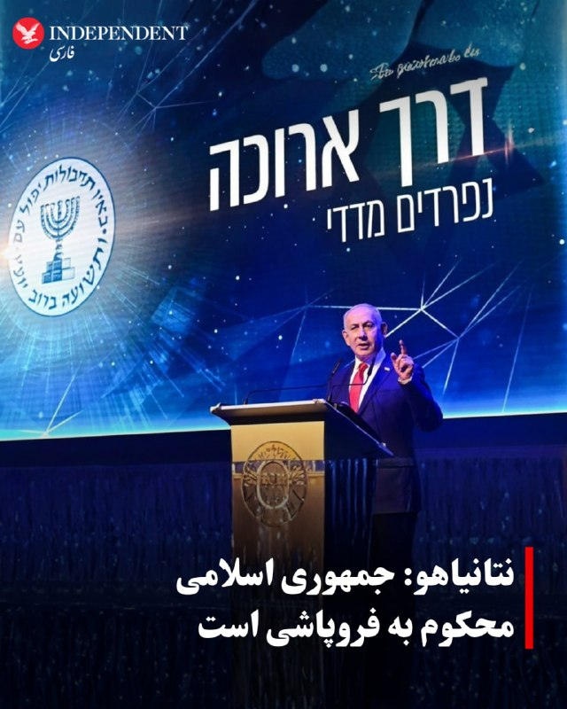

♦️بنیامین نتانیاهو، نخست وزیر اسرائیل روز سه‌شنبه ۱۲ خرداد با انتشار پیامی به‌مناسبت پایان کار دیوید بارنیا، رئیس پیشین موساد نوشت پایه‌های جمهوری اسلامی ترک خورده و «حکومت ترور در ایران» محکوم به فروپاشی است.

نتانیاهو در این پیام نوشت: «بهایی که ایران تاکنون پرداخته بسیار سنگین است. پایه‌های این حکومت ترور در ایران ترک خورده است. این حکومت هرگز به حالت سابق خود باز نخواهد گشت و من به شما می‌گویم  که محکوم به فروپاشی است.»

نتانیاهو در این پیام خطاب به بارنیا نوشت: «از طرف خودم، از طرف تمام مردم، آمده‌ام تا به ددی [دیوید بارنیا] بگویم از تو متشکرم. از تو به خاطر ۳۰ سال خدمت صادقانه در موساد و تشکر ویژه از تو به خاطر سال‌های اخیر که موفقیت‌ها و دستاوردهای چشمگیری را به نفع امنیت اسرائیل به همراه داشته است، سپاسگزارم.»

این پیام در حالی منتشر می‌شود که بارنیا روز دوشنبه در مراسم تودیع از موساد خواسته بود تا «تغییر رژیم در تهران را اولویت اصلی خود بداند».
‌🇸🇦 Indypersian

🤖 @VahidOOnLine

## VahidOOnLine — post 243349

  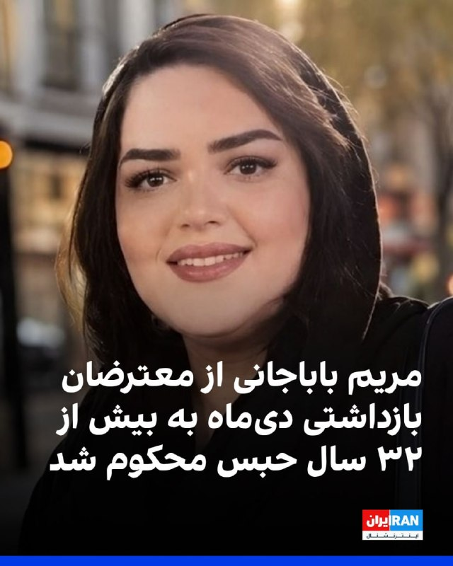

سایت هرانا گزارش داد مریم باباجانی، از بازداشت‌شدگان اعتراضات دی‌ماه ۱۴۰۴ در ایذه، از سوی شعبه اول دادگاه انقلاب اهواز، در مجموع به ۳۲ سال و شش ماه و دو روز حبس محکوم شده است.

طبق این گزارش، باباجانی بابت دو اتهام «امنیتی» به ۲۰ سال و یک روز حبس و ۱۲ سال و شش ماه و یک روز زندان محکوم شده است. در حکم صادرشده، اتهاماتی با استناد به قانون «تشدید مجازات جاسوسی» علیه او مطرح شده است.

هرانا به نقل از یک منبع مطلع نزدیک به خانواده باباجانی، نوشت پس از صدور این حکم، حسین‌علی حاتمی، وکیل مدافع او، درخواست فرجام‌خواهی نسبت به رای صادره را ثبت کرده است. مریم باباجانی اواخر دی‌ماه ۱۴۰۴ در ایذه بازداشت شد و مدتی بعد با تودیع وثیقه ۱۰ میلیارد تومانی از زندان آزاد شد.
iranintl
‌🏁 🇬🇧 IranintlTV

🤖 @VahidOOnLine

## VahidOOnLine — post 243348

  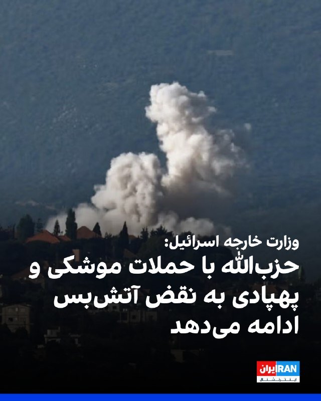

وزارت خارجه اسرائیل در شبکه ایکس اعلام کرد با وجود اعلام دوباره آتش‌بس در ۱۱ خرداد، حزب‌الله همچنان آن را نقض می‌کند.

این وزارتخانه اعلام کرد حزب‌الله که آن را گروه نیابتی جمهوری اسلامی خواند، شامگاه دوشنبه چندین حمله موشکی و پهپادی از لبنان علیه مناطق مسکونی اسرائیل انجام داده است.

وزارت خارجه اسرائیل افزود ادامه نقض آتش‌بس از سوی حزب‌الله «غیرقابل قبول» است.
‌🏁 🇬🇧 IranintlTV

🤖 @VahidOOnLine

## VahidOOnLine — post 243347

♦️سازمان زمین‌شناسی ایالات متحده با انتشار ویدیویی از فوران مواد مذاب از دهانه کیلاویا، از فعالیت دوباره این کوه آتشفشانی در جزایر هاوایی خبر داد.

به گزارش رویترز، سازمان زمین‌شناسی ایالات متحده اعلام کرد  آتشفشان کیلاویا در هاوایی، مرحله «فواره‌ای» فوران خود را از اوایل صبح دوشنبه ۱۱ خرداد آغاز کرد و گدازه‌های آتش را تا ارتفاع تقریبا ۲۰۰ متری به هوا پرتاب کرد.
کیلاویا، در «جزیره بزرگ» پارک ملی آتشفشان‌های هاوایی، یکی از فعال‌ترین مکان‌های آتشفشانی کره زمین است.
‌🇸🇦 Indypersian

🤖 @VahidOOnLine

## VahidOOnLine — post 243346

  <a href="telegram/content/VahidOOnLine_243346_1780398902.mp4" target="_blank">🎬 Download video</a>

ویدیوهای رسیده به ایران‌اینترنشنال در سه‌شنبه ۱۲ خرداد نشان می‌دهد گروهی از دانش‌آموزان معترض در تهران که مقابل دبیرخانه شورای عالی انقلاب فرهنگی تجمع کرده‌اند به ماموران انتظامی که یکی از دانش‌آموزان را بازداشت کرده‌اند فریاد «ولش کن» سرمی‌دهند.
‌🏁 🇬🇧 IranintlTV

🤖 @VahidOOnLine

## VahidOOnLine — post 243345

  

عصائب اهل الحق، گروه نزدیک به جمهوری اسلامی در عراق، اعلام کرد اجرای تصمیم «قطع ارتباط با تشکیلات حشد الشعبی» و «انحصار سلاح در دست دولت» را آغاز می‌کند و کمیته‌ای مرکزی برای ثبت نیروها و سلاح‌ها و هماهنگی با فرمانده کل نیروهای مسلح تشکیل می‌دهد.

این گروه اعلام کرد کمیته یادشده مسئول تکمیل تمامی الزامات و مراحل اجرایی این تصمیم، از جمله سرشماری و ثبت نیروها، سلاح‌ها، تجهیزات، ادوات و تمامی امکانات لجستیکی است.

بنا بر اعلام گروه عصائب اهل الحق، این کمیته همچنین موظف است در چارچوب الزامات دولت و نهادهای امنیتی، هماهنگی‌های لازم را با فرمانده کل نیروهای مسلح عراق انجام دهد.
iranintl
‌🏁 🇬🇧 IranintlTV

🤖 @VahidOOnLine

## VahidOOnLine — post 243344

  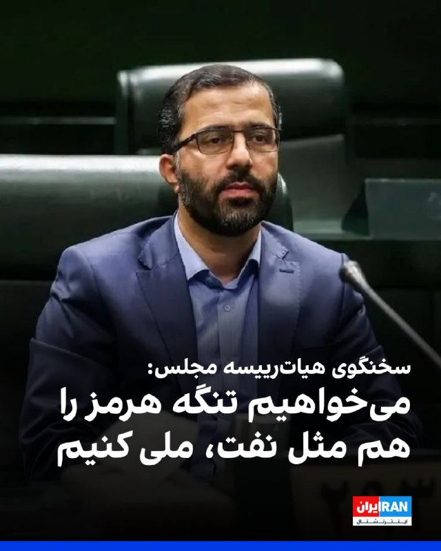

عباس گودرزی، سخنگوی هیات‌رییسه مجلس، گفت: «وقتی نفت ملی شد، تاریخ قضاوت کرد که آن تصمیم، چه تصمیم مهمی بود که در آن مقطع گرفته شد. امروز ما می‌خواهیم تنگه هرمزمان را ملی کنیم. دعوا، دعوای ملی شدن تنگه هرمز است.»

او اضافه کرد: «تنگه هرمز همه مناسبات را به هم می‌ریزد. عدد، رقم و درآمد آنجا مهم نیست. عوایدی دارد که بسیار فراتر از این چرتکه‌هایی است که گاهی اوقات انداخته می‌شود و دشمن نیز متوجه این موضوع شده است.»

گودرزی درباره عبور و مرور از تنگه هرمز ادامه داد: «اگر شناوری متعلق به کشور دوست باشد و رفتار متخاصمانه نداشته باشد، به راحتی و در قالب پروتکل‌های نیروهای مسلح عبور می‌کند. اگر بی‌طرف هم باشد، باز هم مشکلی ندارد، اما اگر کشور متخاصم باشد و قرار باشد به جای جابه‌جایی کالا، تسلیحات نظامی برای تخاصم با ملت ایران منتقل کند، جمهوری اسلامی قاطعانه در آنجا خواهد ایستاد.»
iranintl
‌🏁 🇬🇧 IranintlTV

🤖 @VahidOOnLine

## VahidOOnLine — post 243343

  <a href="telegram/content/VahidOOnLine_243343_1780398905.mp4" target="_blank">🎬 Download video</a>

ویدیوهای رسیده به ایران‌اینترنشنال نشان می‌دهد گروهی از دانش‌آموزان همدان سه‌شنبه ۱۲ خرداد در اعتراض به تاثیر معدل نهایی بر کنکور و امتحانات حضوری تجمع کردند و شعار دادند: «دانش‌آموز داد بزن، حقتو فریاد بزن»
‌🏁 🇬🇧 IranintlTV

🤖 @VahidOOnLine

## VahidOOnLine — post 243342

🗣روایت شما از بحران اقتصادی و زندگی در آتش‌بس- سه‌شنبه ۱۲ خرداد:

🔹از قرچک پیام می‌دم؛ هنوز تابستان نشده قطع برق رو شروع کردن و دو روزه که راس ساعت ۹ برق رو قطع می‌کنن، به اداره برق هم که زنگ می‌زنیم کسی پاسخگو نیست.

🔹تازه امروز ۱۲ خرداد به اینترنت وصل شدم؛ نت به شدت ضعیفه و اوضاع زندگی چندان جالب نیست. حداقل برای قشر امثال من که یک عمر درگیر فقر بوده. همه چی بدتر هم شده ولی چاره‌ای نیست جز تحمل.

🔹سیستم یا لپ‌تاپی که یه روزی می‌تونستیم با حدکاثر ۱۰۰ میلیون بخریم الان شده ۵۰۰ میلیون تومان.

🔹من یه دانش‌آموز کلاس یازدهمی‌ام واقعا نمی‌فهمم چطور با این همه تعطیلی، بی‌نظمی و افت شدید کیفیت آموزش، چطور هنوز انتظار دارند دانش‌آموزها در سطح امتحانات نهایی باشند. مطالب یا ناقص آموزش داده شده یا اصلا فرصت یادگیری درستش وجود نداشته.

🔹از گچساران: الان ۲ ماهه به کارگرهای شهرداری حقوق نداده‌اند.

🔹شرکت سایپا هنوز مزایای کسانی را که بهمن ماه سال گذشته بازنشسته شدند پرداخت نکرده‌اند. خودروها را هم با کسری قطعات به مردم تحویل می‌دهند.

🔹از شیراز خبر رسیده در اماکنی که فیبر نوری نصب کرده‌اند، مخابرات به پیمانکارها گفته سیم‌های مسی را بچینند و با پول فروشش، حقوقشان را بگیرند.

🔹امروز رفتم یک بسته نوار بهداشتی خریدم ۱۰۹ هزار تومان. همین چند هفته پیش ۶۶ هزار تومان بود.

🔹قند ۲ کیلویی شده یک میلیون تومان.

🔹من یه مغازه‌دارم در شهرستان نکا. با این روند اقتصادی کشور تا دو ماه آینده ورشکست می‌شم و باید کار و کاسبی‌ام را جمع کنم.

🔹هر ماه نزدیک به چند میلیون تومان هزینه بیمه تکمیلی می‌کنیم، هر دفعه هم که برای درمان به بیمارستان‌ها یا کلینیک‌ها می‌ریم، می‌گن بیمه البرز دانشگاه شیراز قطع است به علت بدهی بیمه‌گر و کسی هم جواب‌گوی ما نیست، نه دانشگاه شیراز نه بیمه البرز.
‌🏁 🇬🇧 IranintlTV

🤖 @VahidOOnLine

## VahidOOnLine — post 243341

  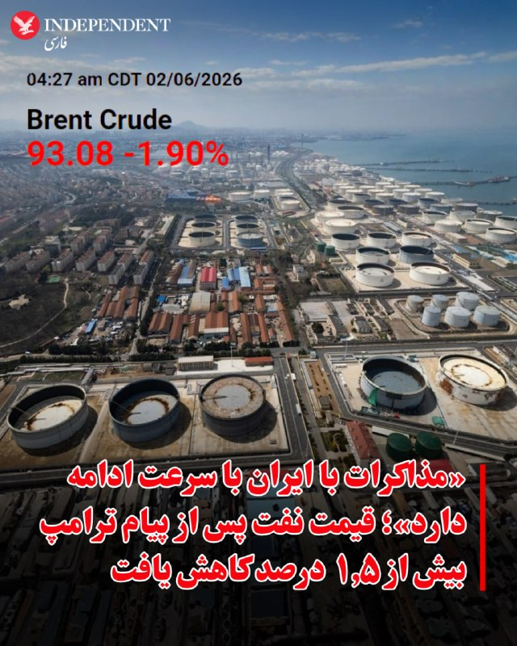

♦️قیمت نفت خام در بازارهای جهانی پس از یک جهش ۶ درصدی در شامگاه دوشنبه و همزمان با احتمال پیچیده شدن جنگ در خاورمیانه، به شدت کاهش یافت.

قیمت هر بشکه نفت خام دریای برنت، دوشنبه شب و پس از آنکه ترامپ اعلام کرد «توقف گفتگوها با ایران» برایش «هیچ اهمیتی ندارد» و همزمان با آغاز به کار بازارهای آمریکا به بیش از ۹۵ دلار رسید.

با این حال پس از تماس تلفنی دونالد ترامپ با بنیامین نتانیاهو و اعلام خبر موافقت حزب‌الله و اسرائیل با توقف حملات متقابل و به‌ویژه پس از آنکه رئیس جمهوری آمریکا با انتشار پیامی در تروث اعلام کرد: «مذاکرات با ایران با سرعت ادامه دارد»، قیمت نفت به شدت کاهش یافت.

قیمت هر بشکه نفت خام برنت دریای شمال، صبح سه‌شنبه ۱۲ خرداد با ۱.۹۰ درصد کاهش، به ۹۳.۰۸ دلار رسید.

با این حال، وضعیت مبهم توافق احتمالی میان آمریکا و جمهوری اسلامی، همچنان بر بازارهای جهانی تاثیرگذار است و بورس‌های آسیایی و اروپایی واکنش محتاطانه‌ای به تحولات تنگه هرمز و مذاکرات تهران و واشنگتن نشان می‌دهند.
‌🇸🇦 Indypersian

🤖 @VahidOOnLine

## VahidOOnLine — post 243340

  <a href="telegram/content/VahidOOnLine_243340_1780398907.mp4" target="_blank">🎬 Download video</a>

بر اساس ویدیوهای رسیده به ایران‌اینترنشنال، گروهی از دانش‌آموزان کنکوری و یازدهمی در تهران، سه‌شنبه ۱۲ خرداد در اعتراض به تاثیر معدل نهایی بر کنکور و امتحانات حضوری مقابل دبیرخانه شورای عالی انقلاب فرهنگی روی زمین نشستند.
‌🏁 🇬🇧 IranintlTV

🤖 @VahidOOnLine

## VahidOOnLine — post 243339

  <a href="telegram/content/VahidOOnLine_243339_1780398909.mp4" target="_blank">🎬 Download video</a>

بر اساس ویدیوهای رسیده به ایران‌اینترنشنال، گروهی از دانش‌آموزان کنکوری و یازدهمی در تهران، سه‌شنبه ۱۲ خرداد در اعتراض به تاثیر معدل نهایی بر کنکور و امتحانات حضوری مقابل دبیرخانه شورای عالی انقلاب فرهنگی تجمع کردند.
‌🏁 🇬🇧 IranintlTV

🤖 @VahidOOnLine

## VahidOOnLine — post 243338

  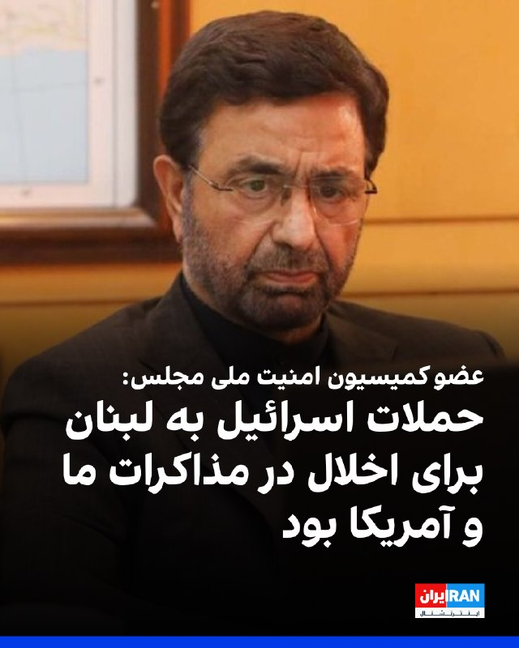

فداحسین مالکی، عضو کمیسیون امنیت ملی مجلس، گفت اسرائیل با مشاهده حرکت جمهوری اسلامی و آمریکا به سوی میز مذاکره، تلاش کرد با ایجاد تنش در منطقه، مسیر این روند را مختل کند.

این عضو کمیسیون امنیت ملی مجلس حمله اخیر اسرائیل به لبنان را ناشی از «کینه‌توزی عمیق» این کشور نسبت به «شکست‌های سخت» خود در جنگ ۴۰ روزه دانست که به گفته او به‌دست جمهوری اسلامی رقم خورده است.

او افزود زمانی که بنیامین نتانیاهو، نخست‌وزیر اسرائیل، دریافت که توجه دونالد ترامپ در ابتدای مذاکرات با خواسته‌های او همسو نیست، برای «اعمال فشار» و «جلب توجه»، حملات گسترده به جنوب لبنان را آغاز کرد، اما این اقدامات با واکنش «جدی و قاطع» مسئولان جمهوری اسلامی روبه‌رو شد.

مالکی گفت این رویکرد «بازدارنده» تهران باعث شد «دشمن» متوجه شود هرگونه پیشروی بیشتر با برخوردهای نظامی «سخت و مستقیم» نیروهای دفاعی جمهوری اسلامی مواجه خواهد شد.

او افزود مقام‌های لبنانی باید به خود بیایند و بدانند که سخن گفتن از مذاکره با اسرائیل در شرایط فعلی یک «خطای استراتژیک» است.
‌🏁 🇬🇧 IranintlTV

🤖 @VahidOOnLine

## VahidOOnLine — post 243337

  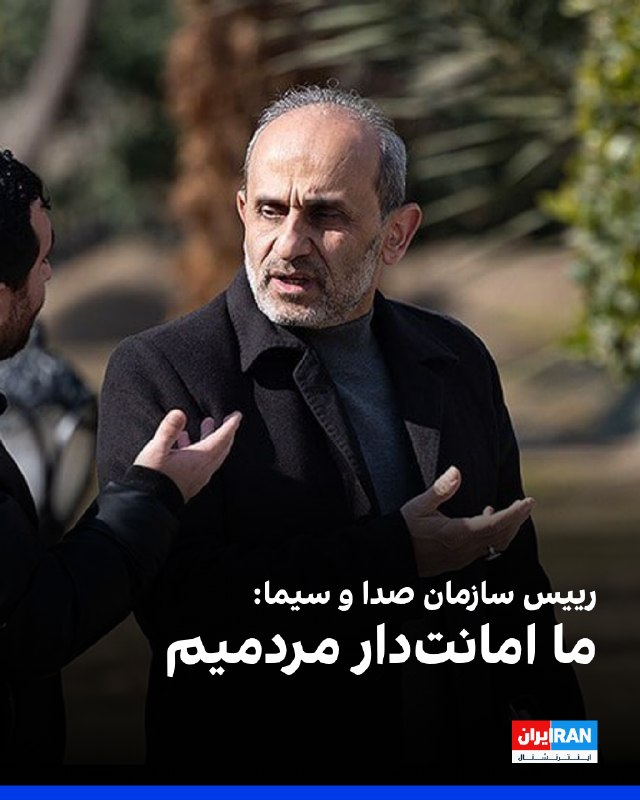

پیمان جبلی، رییس سازمان صدا و سیما، در نشستی با اعضای کمیسیون فرهنگی مجلس گفت: «دشمن در هر دو جنگ اخیر تلاش کرد با هدف قرار دادن بسترهای سیگنال‌رسانی، آنتن صدا و سیما را از کار بیندازد، اما موفق نشد.»
او افزود: «صداوسیما امانت‌دار مردم است.»

جبلی اضافه کرد: «ما خود را رسانه‌ای آماده در بحران می‌دانیم و همان‌گونه که در برابر حملات دشمن به زیرساخت‌های فنی سازمان ایستادگی کردیم، در برابر هر نوع تهاجم فکری و رسانه‌ای برای ضربه زدن به ساختار نظام جمهوری اسلامی نیز دفاع خواهیم کرد.»

سخنان جبلی در حالی است که اخیرا، مسعود پزشکیان نیز گفته بود که صداوسیما با ارائه تحلیل‌ها و روایت‌های نادرست و فاقد پشتوانه علمی، تصویر غیرواقعی از وضعیت کشور ارائه می‌دهد.
‌🏁 🇬🇧 IranintlTV

🤖 @VahidOOnLine

## VahidOOnLine — post 243336

  <a href="telegram/content/VahidOOnLine_243336_1780398911.mp4" target="_blank">🎬 Download video</a>

♦️مارکو روبیو، وزیر امور خارجه آمریکا روز سه‌شنبه ۱۲ خرداد در فرودگاه دهلی نو، بار دیگر ابراز امیدواری کرد که تهران و اشنگتن، بتوانند به توافقی قابل قبول برای پایان جنگ برسند.

روبیو به خبرنگاران گفت: «فکر می‌کردیم شاید دیشب یا حتی امروز خبرهایی داشته باشیم، اما نباید بیش از حد از این موضوع برداشت کرد. دریافت پاسخ کمی زمان می‌برد.
در حال حاضر، به نظر من پیشنهاد نسبتا محکمی روی میز قرار دارد؛ پیشنهادی که شامل توانایی آن‌ها برای بازگشایی تنگه‌ها، ازسرگیری عبور و مرور در تنگه‌ و ورود به مذاکراتی واقعی، جدی و محدود از نظر زمانی درباره مسائل هسته‌ای است. امیدوارم بتوانیم آن را به نتیجه برسانیم.»

این اظهارات در حالی مطرح می‌شود که پس از دستور نتانیاهو به بمباران ضاحیه بیروت و هشدار متقابل جمهوری اسلامی به احتمال حمله به شمال اسرائیل، دونالد ترامپ اعلام کرد حزب‌الله و اسرائیل با پایان دادن به درگیری‌ها موافقت کرده‌اند. مقام‌های جمهوری اسلامی می‌گویند خاتمه جنگ در همه جبهه‌ها ازجمله لبنان و غزه، باید در چارچوب توافق اولیه باشد.
‌🇸🇦 Indypersian

🤖 @VahidOOnLine

## VahidOOnLine — post 243335

  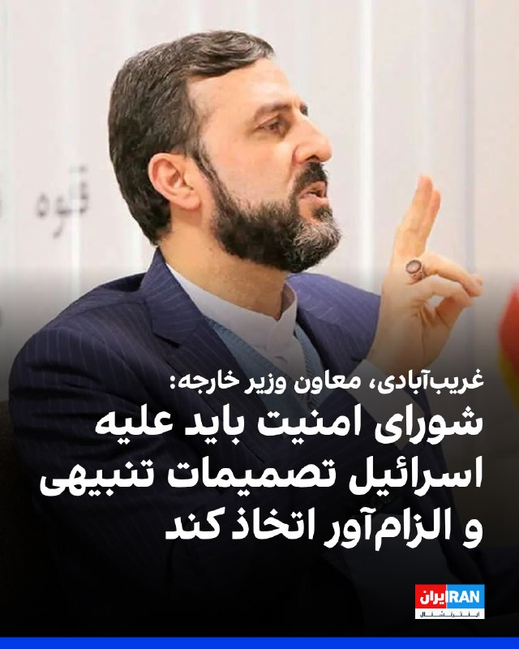

کاظم غریب‌آبادی، معاون وزیر خارجه جمهوری اسلامی، در شبکه ایکس نوشت تحولات اخیر در لبنان، سوریه و فلسطین نشان می‌دهد بحران منطقه نه حاصل «تنش‌های پراکنده»، بلکه نتیجه «جنایات و مصونیت اسرائیل» است که به گفته او حاکمیت دولت‌ها را نقض می‌کند.

او افزود شورای امنیت سازمان ملل باید از مرحله ابراز نگرانی و دعوت‌های کلی عبور کرده و «تصمیمات تنبیهی و الزام‌آور» علیه اسرائیل اتخاذ کند، زیرا به گفته او حقوق بین‌الملل با «محکومیت‌های کم‌هزینه و بی‌اثر» پاسداری نمی‌شود.

غریب‌آبادی همچنین با اشاره به اظهارات دونالد ترامپ، رییس‌جمهوری آمریکا، درباره منصرف کردن بنیامین نتانیاهو، نخست‌وزیر اسرائیل، از حمله گسترده به بیروت، گفت این اظهارات بیش از آنکه نشانه صلح‌طلبی واشینگتن باشد، موید نقش مستقیم آمریکا در مدیریت اقدامات اسرائیل است.

معاون وزیر خارجه جمهوری اسلامی نوشت: «اگر تصمیم حمله به پایتخت یک دولت مستقل با یک تماس تغییر می‌کند، پرسش اصلی این است که چرا ماه‌ها نقض آتش‌بس، تجاوز به لبنان، آوارگی مردم و تهدید حاکمیت این کشور با حمایت سیاسی و نظامی غرب ادامه یافت.»
‌🏁 🇬🇧 IranintlTV

🤖 @VahidOOnLine

## VahidOOnLine — post 243334

  <a href="telegram/content/VahidOOnLine_243334_1780398914.mp4" target="_blank">🎬 Download video</a>

♦️صدها نفر از دانش‌آموزان صبح سه‌شنبه ۱۲ خرداد با برگزاری تجمع مقابل ساختمان وزارت آموزش و پرورش در تهران، به تغییر قوانین کنکور، افزایش ۶۰ درصدی تاثیر معدل درکارنامه کنکور سراسری و همچنین تاثیر منفی جنگ بر آمادگی آن‌ها برای آزمون ورود به دانشگاه، تجمع اعتراضی برگزار کردند.

در ویدیوهای منتشر شده از این تجمع در شبکه‌های اجتماعی شعارهایی ازجمله «دانش‌آموز بیداره، از تبعیض بیزاره»، «دانش‌آموز می‌میرد، ذلت نمی‌پذیرد»، «وعده زیاد شنیدیم، عدالتو ندیدیم»، «فشار روانی کافیه، زندگی‌مونو پس بدین» شنیده می‌شود.

به گزارش خبرآنلاین  این تجمع در حالی برگزار شد که به گفته دانش‌آموزان، شرایط ناشی از جنگ و بلاتکلیفی در زمان برگزاری آزمون‌ها، امکان برنامه‌ریزی و آمادگی مناسب برای امتحانات نهایی و کنکور را از آنها گرفته است.
‌🇸🇦 Indypersian

🤖 @VahidOOnLine

## VahidOOnLine — post 243333

  <a href="telegram/content/VahidOOnLine_243333_1780398916.mp4" target="_blank">🎬 Download video</a>

بر اساس ویدیوهای رسیده به ایران‌اینترنشنال، گروهی از دانش‌آموزان کنکوری و یازدهمی در تهران، سه‌شنبه ۱۲ خرداد در اعتراض به تاثیر معدل نهایی بر کنکور و امتحانات حضوری تجمع کردند و شعار دادند: «دانش‌آموز می‌میرد، ذلت نمی‌پذیرد»
‌🏁 🇬🇧 IranintlTV

🤖 @VahidOOnLine

## VahidOOnLine — post 243332

  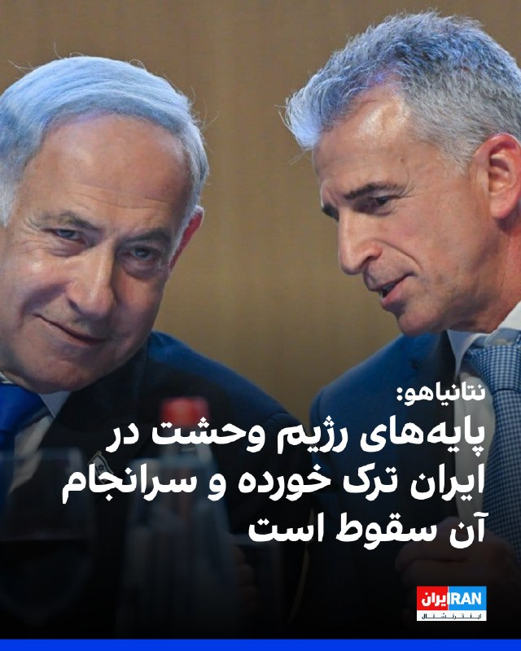

بنیامین نتانیاهو، نخست‌وزیر اسرائیل، در مراسم خداحافظی با دیوید بارنئا، رییس موساد، گفت «پایه‌های رژیم وحشت در ایران ترک خورده و دیگر به آنچه بود باز نخواهد گشت. من به شما می‌گویم سرانجامش سقوط است.»

نتانیاهو همچنین گفت: «هر کسی که بدخواهی علیه اسرائیل در سر می‌پروراند، بداند که توطئه‌هایش شکست خواهد خورد و بهایی که خواهد پرداخت بسیار سنگین خواهد بود. بهایی که جمهوری اسلامی تا همین‌جا پرداخته است، بسیار سنگین است.»

او موساد را «ابر برند» اسرائیل و نهادی پیشرو در حوزه اطلاعات و ضدتروریسم خواند و گفت هیچ سازمان اطلاعاتی و ضدتروریسمی بهتر از موساد وجود ندارد.

نتانیاهو همچنین از ۳۰ سال خدمت بارنئا در موساد قدردانی کرد و پنج سال ریاست او بر این سازمان را «از سرنوشت‌سازترین سال‌ها» در تاریخ اسرائیل خواند.

نخست‌وزیر اسرائیل افزود موساد «مناره‌ای از قدرت انسانی، پیچیدگی فناوری و جسارت عملیاتی» است و خطاب به بارنئا گفت: «در دوره ریاست تو کارهای بزرگی انجام شد.»
‌🏁 🇬🇧 IranintlTV

🤖 @VahidOOnLine

## VahidOOnLine — post 243331

  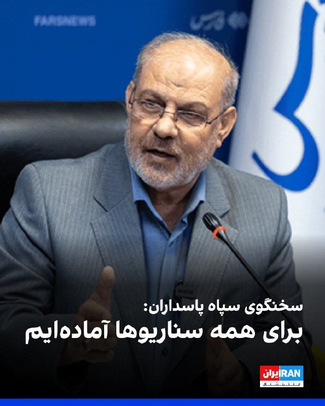

حسین محبی، سخنگوی سپاه پاسداران، در بازدید از خبرگزاری فارس، گفت: «در صورت بازگشت دشمن به عرصه نظامی، نوع عملیات، جغرافیای نبرد و حتی نوع جنگ‌افزارهای مورد استفاده متفاوت خواهد بود و سپاه پاسداران برای تمامی سناریوهای احتمالی آمادگی کامل دارد.»

محبی ادامه داد: «با وجود آمادگی در تمامی عرصه‌ها، سنگر نظامی همچنان با بالاترین سطح آمادگی حفظ خواهد شد، زیرا معتقدیم مهم‌ترین عرصه‌ای که دشمن برای تحقق اهداف خود بر آن تکیه می‌کند، عرصه نظامی است.»

سخنگوی سپاه پاسداران، گفت که در طول مدت جنگ اخیر، نه تنها چیزی از توان نظامی جمهوری اسلامی کاسته نشده، بلکه توان کشور در بخش‌های مختلف افزایش یافته است.
‌🏁 🇬🇧 IranintlTV

🤖 @VahidOOnLine

## WithYashar — post 13254

وال استریت ژورنال: ایالات متحده بیش از پیش رویکرد بی‌طرفانه عمان در قبال تهران را خصمانه تلقی می‌کند و این کشور را تحت فشار قرار داده است تا با انتخاب یک طرف، روابط دیپلماتیک خود با ایران را قطع کند.
@withyashar

## WithYashar — post 13253

## WithYashar — post 13252

زیر پست صفحه دوم شاهزاده رضا پهلوی و بانو نور پهلوی کامنت مورد نظر را گذاشتم. نیاز به همیاری شما داریم برای این مرحله از فراخوان. لطفاً کارهای اداری را انجام دهید، طبق برنامه. https://www.instagram.com/reel/DZFAJOWRays/?igsh=NmVldnV2aW1jaHE3

## WithYashar — post 13251

## WithYashar — post 13250

برادر … کامنتت پیدا نمیکنم راهی نداره سریع بشه پیداش کرد من چون فالوت ندارم اینستا اگه راهی هست تو چنل بگو

## WithYashar — post 13249

برادر …
کامنتت پیدا نمیکنم
راهی نداره سریع بشه پیداش کرد من چون فالوت ندارم اینستا
اگه راهی هست تو چنل بگو

## WithYashar — post 13248

ایسنا: اپراتورها پول کسانی که اینترنت پرو خریدند را پس نمی‌دهند و فقط می‌شود اینترنت پرو را به اینترنت عادی تغییر داد
@withyashar

## WithYashar — post 13247

متن کامنت بررسی ‌کنید جناب شاهزاده رضا پهلوی گرامی، پدر ، این پیام، جمع‌بندی دیدگاه‌ها و پیشنهادهای گروهی از ایرانیان داخل و خارج کشور با هدف تقویت انسجام ملی و ایجاد مسیر عملی برای دوران پیش از گذار است. عناوین چکیده از هزاران پیغام مردمی به‌صورت خلاصه:…

## WithYashar — post 13246

رئیس سابق موساد در مراسم خداحافظی:

اردوغان ترامپ را متقاعد کرد که عملیات نظامی به رهبری کردها را که قرار بود اولین گام در یک طرح گسترده تر علیه رژیم ایران باشد، لغو کند.
@withyashar

## WithYashar — post 13245

نتانیاهو: تا زمانی که ما هستیم، نه ایران و نه «همسایگان» آن به سلاح هسته‌ای دست نخواهند یافت.
@withyashar

## WithYashar — post 13244

ائتلاف «اوپک پلاس» در حال برنامه‌ریزی برای افزایش تولید نفت در ماه ژوئیه است.
@withyashar

## WithYashar — post 13243

اتاق جنگ با یاشار : دیوید بارنئا، رئیس پیشین موساد، پس از پایان دوره پنج‌ساله خود در ژوئن ۲۰۲۶ سمتش را ترک کرد و استعفا نداد.
پس از او، رومان گوفمن، سرلشکر ارتش اسرائیل و دبیر نظامی پیشین نتانیاهو، به ریاست موساد منصوب شد. او از نزدیکان نتانیاهو محسوب می‌شود و در دوره جنگ ایران و اسرائیل در حلقه تصمیم‌گیری‌های امنیتی حضور داشته است. گوفمن برخلاف بسیاری از رؤسای پیشین موساد، سابقه طولانی در این سازمان ندارد و بیشتر از بدنه ارتش به این سمت رسیده است. برخی گزارش‌ها می‌گویند انتخاب او پس از ناکامی برآوردهای اطلاعاتی قبلی درباره امکان سقوط سریع حکومت ایران انجام شد و ممکن است نشانه‌ای از تغییر روش باشد، نه تغییر هدف.
@withyashar

## WithYashar — post 13242

  <a href="telegram/content/WithYashar_13242_1780398919.mp4" target="_blank">🎬 Download video</a>

دموکرات‌ها نیروی نیابتی ایران هستند !

برایان مست، نماینده جمهوری‌خواه کنگره: "تهدید شماره دو ما، جدا از سپاه پاسداران، دموکرات‌های مجلس نمایندگان هستند. آنها دومین نیروی نیابتی بزرگ ایران هستند!"

@withyashar

## WithYashar — post 13241

روابط عمومی۳پا صاحب‌ الزمان استان اصفهان : احتمال شنیده شدن صدای انفجار کنترل شده در محدوده جنوب اصفهان ، بهارستان و اطراف وجود دارد.
این انفجارات امروز سه شنبه ۱۲ خرداد ماه از ساعت ۱۰ صبح تا ۱۸ بعدازظهر انجام می شود و جای هیچ نگرانی برای مردم عزیز نخواهد بود.
@withyashar

## WithYashar — post 13240

سخنگوی ۳پا : برای تمامی سناریوهای احتمالی آمادگی داریم
@withyashar

## WithYashar — post 13239

  <a href="telegram/content/WithYashar_13239_1780398920.mp4" target="_blank">🎬 Download video</a>

‏رئیس موساد بارنیا در مراسم خداحافظی و تحویل پست در حرف آخرش : «تغییر رژیم در ایران یک هدف ممکن و دست‌یافتنی است.»

‏او در مراسم خداحافظی‌اش تاکید کرد که سرنگونی جمهوری اسلامی ماموریتی عملی است که به عزم و اراده نیاز دارد و باید در صدر اولویت‌ها بماند.
‏پیام کاملاً روشن است: تضعیف این رژیم تروریستی کافی نیست. تهدید بلندمدت خاورمیانه تنها زمانی تمام میشود که رژیمی که تامین‌کننده پول، سلاح و هدایت تروریسم در منطقه است، برای همیشه سرنگون شود. ⁦
@withyashar

## WithYashar — post 13238

## WithYashar — post 13236

مدیرکل آژانس بین‌المللی انرژی اتمی:
انتقال ذخایر اورانیوم غنی‌شده ایران به خارج از کشور کاری «دشوار است اما غیرممکن نیست».

چنین عملیاتی آسان نیست، چراکه (این ماده) به شکل گاز است، بسیار آلاینده است و عملیات ساده‌ای نیست
@withyashar

## mwarmonitor — post 10024

🔴بر اساس گفته‌ی یک منبع از تیم بنیامین نتانیاهو که در این تماس حضور داشته، تماس تلفنی پرتنشی در طول شب میان بنیامین نتانیاهو و دونالد ترامپ برقرار شد که محور آن، گلایه‌های متقابل درباره پست‌های منتشرشده در شبکه‌های اجتماعی درباره گفت‌وگوی قبلی‌شان بود. 🔸ترامپ…

## mwarmonitor — post 10023

🔴بر اساس گفته‌ی یک منبع از تیم بنیامین نتانیاهو که در این تماس حضور داشته، تماس تلفنی پرتنشی در طول شب میان بنیامین نتانیاهو و دونالد ترامپ برقرار شد که محور آن، گلایه‌های متقابل درباره پست‌های منتشرشده در شبکه‌های اجتماعی درباره گفت‌وگوی قبلی‌شان بود.

🔸ترامپ استدلال کرده بود که پست نتانیاهو این‌گونه القا می‌کند که جنگ با تمام قوا ادامه دارد، به‌جز حملات در بیروت؛ در مقابل، نتانیاهو گفته بود پست ترامپ این برداشت را ایجاد می‌کند که اسرائیل آتش‌بس کامل را در همه جبهه‌ها اجرا کرده است.

🔹این منبع ادعاها مبنی بر اینکه ترامپ اظهارات شخصی درباره وضعیت حقوقی نتانیاهو مطرح کرده یا گفته باشد که نتانیاهو در سراسر جهان منفور است را رد کرد؛ اما تأیید کرد که ترامپ به نتانیاهو گفته ارائه موضع اسرائیل در سطح بین‌المللی دشوار شده و این موضوع به دامن‌زدن به نفرت علیه اسرائیل منجر می‌شود.

🔸این تماس با تفاهمی پایان یافت مبنی بر اینکه اسرائیل تا زمانی که از داخل مرزهایش مورد حمله قرار نگیرد، از حمله به ضاحیه در بیروت خودداری کند. — کانال ۱۲ اسرائیل

@mwarmonitor

## mwarmonitor — post 10022

  <a href="telegram/content/mwarmonitor_10022_1780398922.mp4" target="_blank">🎬 Download video</a>

📌جت‌برنده‌ی MrBeast، جاباری «Captain Treezy» براون، در پاراگوئه به اتهام حمل ۳.۶ میلیون دلار ماری‌جوانا بازداشت شد

🔸جاباری استیون براون، خلبانی که به‌خاطر برنده شدن یک جت خصوصی در یکی از چالش‌های MrBeast مشهور شده بود، در پاراگوئه پس از آن‌که مأموران مبارزه با مواد مخدر ۲۶۱.۶ کیلوگرم (۵۷۷ پوند) ماری‌جوانای «پرمیوم» با THC بالا را در یک جت خصوصی کشف کردند، بازداشت شد.

🔹گفته می‌شود ارزش این مواد در بازار غیرقانونی حدود ۳.۶ میلیون دلار است و مقصد نهایی آن‌ها برزیل بوده است.

🔸براون که در فضای آنلاین با نام «Captain Treezy» شناخته می‌شود، شامگاه شنبه در یک هتل در آسونسیون، پایتخت پاراگوئه ردیابی و بازداشت شد.

@mwarmonitor

## mwarmonitor — post 10021

  

📌«بنیامین نتانیاهو در مراسم خداحافظی با رئیس موساد، دیوید بارنئا، گفت: «بهایی که ایران تاکنون پرداخته بسیار سنگین بوده است. پایه‌های این رژیمِ ترور در ایران ترک برداشته است. این رژیم دیگر به وضعیت سابق خود بازنخواهد گشت و به شما می‌گویم که پایان آن، سقوط خواهد بود.»

@mwarmonitor

## pm_afshaa — post 92091

ایسنا: اپراتورها پول کسانی که اینترنت پرو خریدند را پس نمی‌دهند و فقط می‌شود اینترنت پرو را به اینترنت عادی تغییر داد

💧 Rainbet.com the #1 Non-KYC Crypto Casino & Sportsbook @rainbetcom

😁 @Pm_Afshaa

## pm_afshaa — post 92090

صداوسیما: شخصیتی که از کوروش کبیر و ایران باستان ساخته شده کاملا تخیلیه، تازگیا میان جملات بزرگان رو هم نسبت میدن به کوروش و یه بت ازش ساختن، یه آدم معمولی بوده

💧 Rainbet.com the #1 Non-KYC Crypto Casino & Sportsbook @rainbetcom

😁 @Pm_Afshaa

## pm_afshaa — post 92089

🔴ارتش اسرائیل برای ساکنان نبطیه لبنان هشدار فوری تخلیه صادر کرد

💧 Rainbet.com the #1 Non-KYC Crypto Casino & Sportsbook @rainbetcom

😁 @Pm_Afshaa

## pm_afshaa — post 92088

  <a href="telegram/content/pm_afshaa_92088_1780398924.mp4" target="_blank">🎬 Download video</a>

امروز دانش‌آموزای تهرانی در مخالفت با تاثیر قطعی معدل، جلوی وزارت آموزش و پرورش تجمع کردن

💧 Rainbet.com the #1 Non-KYC Crypto Casino & Sportsbook @rainbetcom

😁 @Pm_Afshaa

## pm_afshaa — post 92087

🔴نتانیاهو: پایه‌های حکومت در ایران دچار شکاف شده این حکومت دیگر به وضعیت گذشته بازنخواهد گشت و به شما می‌گویم که سرانجام سقوط خواهد کرد

💧 Rainbet.com the #1 Non-KYC Crypto Casino & Sportsbook @rainbetcom

😁 @Pm_Afshaa

## pm_afshaa — post 92086

تجمع ایرانیان مقابل هتل شاهدخت نور پهلوی در اسلو

💧 Rainbet.com the #1 Non-KYC Crypto Casino & Sportsbook @rainbetcom

😁 @Pm_Afshaa

## pm_afshaa — post 92085

  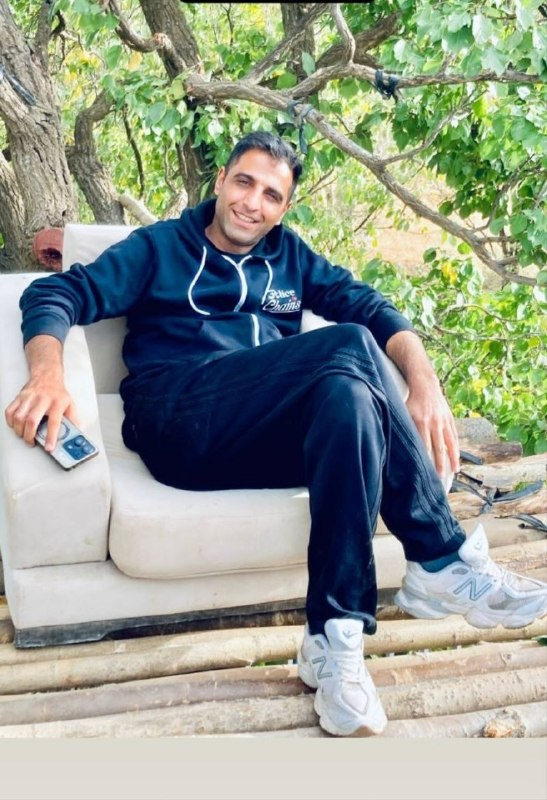

امروز فتح الله آوری از معترضین دی ماه با اذان صبح در همدان اعدام شد

💧 Rainbet.com the #1 Non-KYC Crypto Casino & Sportsbook @rainbetcom

😁 @Pm_Afshaa

## DEJradio — post 5244

  <a href="telegram/content/DEJradio_5244_1780398926.webm" target="_blank">🎬 Download video</a>

🔺📌 علی خامنه‌ای ۱۰ سال پس از اینکه گفت اسرائیل ۲۵ سال آینده را نخواهد دید، توسط اسرائیل کشته شد.

او پیش ازمرگ از سوی مردم لقب «موشعلی» گرفت. در دوران زمامداری بارها برای آمریکا، اسرائیل و غرب رجزخوانی کرد.
خامنه‌ای به عنوان فرمانده کل قوا در جنگ ۱۲ روزه به زیرزمین پناه برد. او در جنگ ۴۰ روزه در همان دقایق اول کشته شد. برای یک رهبر چنین کارنامه‌ای ننگ است.

سه ماه پس از مرگ خامنه‌ای هنوز جرات برگزاری مراسم تدفین برای او ندارند. جانشین او مجتبی خامنه‌ای هم مخفی است و نیامده لقب «رهبر مقوایی» گرفته است. حامیان نظام دلخوش به بیانیه‌هایی هستند که به نقل از او در رسانه‌ها اعلام می‌شود. این وضعیت نشان می‌دهد جمهوری اسلامی در میدان حرفی برای گفتن ندارد. مجتبی وضعیتی شبیه پدرش دارد، از ترس در سوراخ موش پنهان است.

#موشعلی #موشتبا
@DEJradio

## DEJradio — post 5243

👑
📡شاهدخت نور پهلوی: ائتلاف مخالفان جمهوری اسلامی رو به گسترش است

شاهدخت نور پهلوی در نشست انجمن آزادی اسلو گفت شاهزاده رضا پهلوی و ائتلاف رو به گسترش او، در پاسخ به خواستۀ مردم ایران برای رهبری دوران گذار آماده‌اند.
او با اشاره به نشست همبستگی ملی در مونیخ گفت نمایندگان گرایش‌های مختلف سیاسی، مذهبی و قومی برای شکل دادن به ائتلافی گسترده علیه جمهوری اسلامی گردهم آمدند.
فرزند ارشد شاهزاده رضا پهلوی، در نشست نروژ گفت هدف خانوادۀ پهلوی گذار به انتخابات آزاد و منصفانه در ایران است و آنها برای بازگرداندن پادشاهی مبارزه نمی‌کنند.
به گفتۀ شاهدخت نور پهلوی، پروژۀ شکوفایی ایران برای دوران گذار آماده است. شاهدخت گفت این پروژه یک نقشۀ راه عمومی برای بازسازی کشور پس از جمهوری اسلامی است. او افزود آیندۀ ایران به امیدواری منحصر نمی‌شود، بلکه برای آن برنامه‌ریزی شده است.
شاهدخت نور پهلوی یادآور شد که جمهوری اسلامی حکومت نیست، بلکه نیرویی اشغالگر است که از منابع و جان ایرانیان برای تثبیت قدرت خود استفاده می‌کند. او افزود که جمهوری اسلامی نمایندۀ مردم ایران نیست.
شاهدخت نور پهلوی گفت جمهوری اسلامی هیچ مشروعیتی برای سخن گفتن به نام ایران ندارد. او گفت کشته‌شدگان اعتراضات اخیر نشان دادند جمهوری اسلامی ازهیچ پشتوانۀ مردمی و حقی برای نمایندگی مردم ایران، برخوردار نیست.
شاهدخت نور پهلوی گفت بیمناک بودن از دریافت خبر اعدام افراد بیشتری در ایران، سبب شده که هر صبح با ترس اخبار را پی می‌گیرد.
شاهدخت نور پهلوی گفت که با روایت‌های مادربزرگ خود دربارۀ ایران بزرگ شده است. به گفتۀ او، شهبانو فرح پهلوی از ایرانی سخن می‌گفت با خیابان‌های پر از رنگ، زنده با موسیقی، هنر، بحث، جاه‌طلبی و سرشار از امکان.
شاهدخت نور پهلوی افزود بر اساس آموزه‌های شهبانو آن تصویری از کشور ایران در ذهنش نقش بسته است که ستون صلح، رفاه و ثبات منطقه و متحد جهان غرب بود.

#شاهدخت #نور_پهلوی #پهلوی #اسلو
@DEJradio

## DEJradio — post 5242

  <a href="telegram/content/DEJradio_5242_1780398927.mp4" target="_blank">🎬 Download video</a>

🔺🎥 اوضاع کسب و کار در بازار بزرگ تهران خراب است

یک شهروند با ارسال ویدیویی از بازار تهران، نوشت «اوضاع کاسبی خراب است و بسیاری از مغازه‌ها که سه چهار نفر از آن نان می‌خوردند تعطیل شده‌اند. وقتی علت رو از بازریان جویا شدم بم گفتن که مردم پول ندارن و مشتری نیست.»
همچنین چند کسبه از صنف پوشاک گفتن که امیدرضا شیرازی رئیس اتحادیه صنف پوشاک بیشتر به فکر منافع حکومت است و بازاریان را به حال خودشان رها کرده!»

#تورم #بازار_بزرگ_تهران
@DEJradio

## DEJradio — post 5241

  <a href="telegram/content/DEJradio_5241_1780398930.webm" target="_blank">🎬 Download video</a>

🔺📢 در پی اعلام اسرائیل برای حمله به گروه ترویستی حـ.ـزب‌الله، مسئولین نظام اسلامی به‌سرعت واکنش نشان دادند و اعلام کردند که در صورت وقوع حمله‌ای سنگین به لبنان، مذاکرات با آمریکا را تعلیق خواهند کرد. همچنین قرارگاه مرکزی خاتم‌الانبیا در بیانیه‌ای به اسرائیل هشدار داد.

عباس عراقچی، نماینده‌های مجلس و شماری از فرماندهان سـ.ـپاه گفته‌اند «دست از حمایت حـ.ـزب‌الله برنمی‌داریم.» منابع نزدیک به نهادهای امنیتی نیز در توجیه ضرورت حمایت از این گروه تروریستی مدعی شدند حـ.ـزب‌الله مانع تشکیل «اسرائیل بزرگ است.»

هرچند بر کسی پوشیده نیست که در صورت وقوع جنگ، آن‌که بیشتر آسیب می‌بیند و فرماندهانش حذف می‌شوند، جمهوری اسلامی است، اما اینکه این‌گونه به خاطر لبنان حاضر هستند جنگ را ادامه دهند، برای هزارمین بار ثابت می‌کند که سرنوشت ایران و مردم آن برای این نظام غیرایرانی و بیگانه جایگاهی ندارد.

#حزب_الله_لبنان
@DEJradio

## DEJradio — post 5240

  <a href="telegram/content/DEJradio_5240_1780398930.mp4" target="_blank">🎬 Download video</a>

👑🎥 سه‌شنبه ۱۲ خرداد ۱۴۰۵؛
اعتراض دانش‌آموزان علیه بی‌عدالتی آموزشی

گروهی از دانش‌آموزان روز سه‌شنبه ۱۲ خرداد ۱۴۰۵ مقابل وزارت آموزش و پرورش تجمع کردند و علیه سیاست‌های آموزشی حکومت شعار دادند.

دانش‌آموزان نسبت به وضعیت امتحانات، تغییرات کنکور، سوابق تحصیلی و ترمیم معدل خشمگین بودند و شعار دادند: «دانش‌آموز بیداره، از تبعیض بی‌زاره»، «دانش‌آموز می‌میرد، ذلت نمی‌پذیرد» و «فشار روانی کافیه، زندگی‌مونو پس بدین».

#فصل_امتحانات #اعتراضات_سراسری
@DEJradio

## DEJradio — post 5239

  <a href="telegram/content/DEJradio_5239_1780398932.mp4" target="_blank">🎬 Download video</a>

🔺📢 استعفای پزشکیان و نشانه‌های شکاف در قدرت

*روح‌الله رحیم‌پور، تحلیلگر سیاسی

#ریزش #مسعود_پزشکیان
@DEJradio

## DEJradio — post 5238

  <a href="telegram/content/DEJradio_5238_1780398934.mp4" target="_blank">🎬 Download video</a>

🔺🎥 ۱۸ دی ۱۴۰۴؛
تیراندازی مستقیم به معترضان در مشهد

#دی۱۴۰۴ #شلیک_مستقیم #مشهد
@DEJradio

## DEJradio — post 5237

  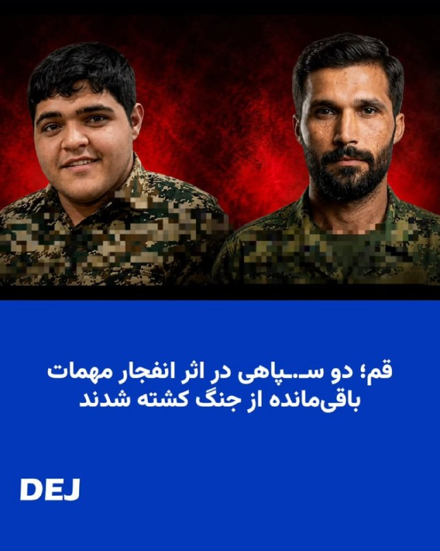

💀
🚨 روابط عمومی سـ.ـپاه «علی بن ابیطالب» قم دوشنبه ۱۱ خرداد ۱۴۰۶ اعلام کرد دو سـ.ــپاهی در جریان انفجار مهمات باقی‌مانده از جنگ ۴۰ روزه کشته شدند.

حسین رمضانیان فردویی و محمد اویسی نزدیک تاسیسات اتمی فردو کشته شدند.
شایعاتی مطرح است که این دو نه بر اثر انفجار مهمات بلکه در اثر اصابت پرتابه کشته شده‌اند.

بعد از توقف موقت جنگ، دست‌کم ۲۵ نفر از نیروهای نظامی جمهوری اسلامی در انفجار مهمات‌ برجای مانده از جنگ یا در عملیات حنثی سازی کشته و زخمی شدند.

#جنگ #حملات_هدفمند
@DEJradio

## DEJradio — post 5236

  <a href="telegram/content/DEJradio_5236_1780398937.mp4" target="_blank">🎬 Download video</a>

🔺📢 اعتراض آسیب‌دیدگان جنگ به خدمات رفاه‌کارت

حکومت میان آسیب‌دیدگان جنگ، «رفاه کارت» ۱۰ تا ۴۰ میلیون تومانی توزیع کرد، اما بر اساس گزارش شهروندان بیشتر کالاها با این کارت قابل خرید نیست!

#جنگ #رفاه_کارت
@DEJradio

## DEJradio — post 5235

🚨🎥 نزدیک به ۶۰ هواپیمای سوخت‌رسان آمریکایی در فرودگاه بن‌گوریون اسرائیل مستقر شده‌اند. شارون عیدان در پیامی در «ایکس» مدعی شد تحرکات بی‌سابقه‌ای در فرودگاه بن‌گوریون در جریان است و نیروهای آمریکایی برای یک استقرار طولانی‌مدت در این فرودگاه آماده می‌شوند.

او به نقل از یک منبع در داخل فرودگاه نوشت که طی ۳۵ سال گذشته شاهد چنین وضعیتی نبوده است. به گفته این منبع، ارتش آمریکا دست‌کم برای شش ماه آینده در فرودگاه بن‌گوریون حضور خواهد داشت.

عیدان همچنین گفت در هفته‌های آینده هزاران پرواز در مسیرهای مختلف لغو خواهد شد و بخش عمده فضای فرودگاه به یک پایگاه نظامی بزرگ اختصاص یافته است.

این ادعاها تاکنون از سوی مقام‌های اسرائیلی یا آمریکایی به‌طور رسمی تأیید نشده است. انتشار این گزارش همزمان با افزایش گمانه‌زنی‌ها درباره احتمال درگیری نظامی جدید میان اسرائیل و جمهوری اسلامی صورت گرفته است.

#جنگ
@DEJradio

## IranIntlTV — post 340189

  

سایت هرانا گزارش داد مریم باباجانی، از بازداشت‌شدگان اعتراضات دی‌ماه ۱۴۰۴ در ایذه، از سوی شعبه اول دادگاه انقلاب اهواز، در مجموع به ۳۲ سال و شش ماه و دو روز حبس محکوم شده است.

طبق این گزارش، باباجانی بابت دو اتهام «امنیتی» به ۲۰ سال و یک روز حبس و ۱۲ سال و شش ماه و یک روز زندان محکوم شده است. در حکم صادرشده، اتهاماتی با استناد به قانون «تشدید مجازات جاسوسی» علیه او مطرح شده است.

هرانا به نقل از یک منبع مطلع نزدیک به خانواده باباجانی، نوشت پس از صدور این حکم، حسین‌علی حاتمی، وکیل مدافع او، درخواست فرجام‌خواهی نسبت به رای صادره را ثبت کرده است. مریم باباجانی اواخر دی‌ماه ۱۴۰۴ در ایذه بازداشت شد و مدتی بعد با تودیع وثیقه ۱۰ میلیارد تومانی از زندان آزاد شد.
iranintl.com/202606028242

## IranIntlTV — post 340188

  

وزارت خارجه اسرائیل در شبکه ایکس اعلام کرد با وجود اعلام دوباره آتش‌بس در ۱۱ خرداد، حزب‌الله همچنان آن را نقض می‌کند.

این وزارتخانه اعلام کرد حزب‌الله که آن را گروه نیابتی جمهوری اسلامی خواند، شامگاه دوشنبه چندین حمله موشکی و پهپادی از لبنان علیه مناطق مسکونی اسرائیل انجام داده است.

وزارت خارجه اسرائیل افزود ادامه نقض آتش‌بس از سوی حزب‌الله «غیرقابل قبول» است.
https://iranintl.com/202606020197

## IranIntlTV — post 340187

  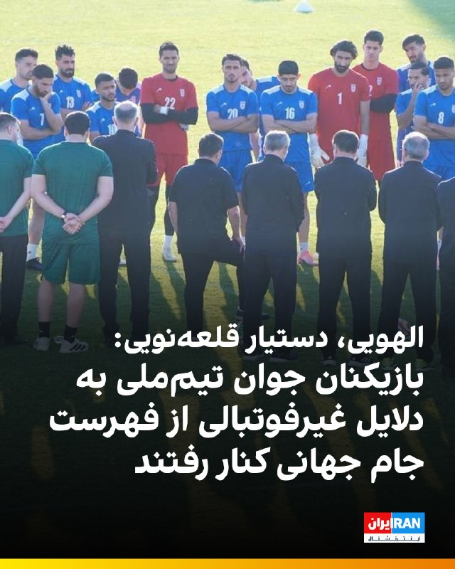

🔻سعید الهویی، دستیار امیر قلعه‌نویی، در یک گفت‌وگوی تلویزیونی دلیل خط خوردن امیرحسین محمودی، کسری طاهری و هادی حبیبی‌نژاد، سه بازیکن جوان، از فهرست نهایی تیم ملی برای جام جهانی را مسائل «غیرفوتبالی» و «شرایط غیرعادی کشور» عنوان کرد. این در حالی است که قلعه‌نویی دلیل خط زدن آنها را فنی عنوان کرده بود.

🔹الهویی در این باره گفت: «ما در شرایط خاص و ویژه‌ای قرار گرفته‌ایم. الان موضوع فقط فوتبالی و عوامل تاثیرگذار در دایره ورزش و فوتبال نیست. در حال حاضر در تیم ملی شرایط عادی وجود ندارد. شرایط داخل کشور هم عادی نیست و می‌دانیم در چه شرایطی قرار گرفته‌ایم.»

🔹الهویی ادامه داد: «شاخص‌های تاثیرگذار بر تصمیم آقای قلعه‌نویی برای انتخاب بازیکنان، به شاخص‌هایی متناسب با شرایط خاص تبدیل شده است. ما در موقعیتی به جام جهانی می‌رویم که تجربه شرایطی مشابه آنچه در جام جهانی ۲۰۲۲ رخ داد، می‌تواند تاثیر زیادی بر عملکرد بازیکنان و تیم داشته باشد. به همین خاطر بازیکنانی را که دوست داشتیم در کنار ما باشند، از دست دادیم.»

@iranintltvsport

## IranIntlTV — post 340186

  <a href="telegram/content/IranIntlTV_340186_1780398941.mp4" target="_blank">🎬 Download video</a>

سرخط خبرهای سه‌شنبه ۱۲ خرداد
@iranintltv

## IranIntlTV — post 340185

  <a href="telegram/content/IranIntlTV_340185_1780398942.mp4" target="_blank">🎬 Download video</a>

محمدجعفر اسدی، معاون بازرسی قرارگاه مرکزی خاتم‌الانبیا، با بیان اینکه مردم «سلاح برتر» جمهوری اسلامی هستند گفت نیروهای مسلح نیازی به سلاح هسته‌ای ندارند و با سنگ هم در برابر آمریکا می‌جنگند. او مدعی شد در صورت اقدام آمریکا، این کشور شکست خواهد خورد و تاکید کرد مذاکره با واشینگتن مشکلات معیشتی را حل نمی‌کند.

ارزیابی بیشتر با مرتضی کاظمیان، عضو تحریریه ایران‌اینترنشنال
@iranintltv

## IranIntlTV — post 340184

  <a href="telegram/content/IranIntlTV_340184_1780398944.mp4" target="_blank">🎬 Download video</a>

ویدیوهای رسیده به ایران‌اینترنشنال در سه‌شنبه ۱۲ خرداد نشان می‌دهد گروهی از دانش‌آموزان معترض در تهران که مقابل دبیرخانه شورای عالی انقلاب فرهنگی تجمع کرده‌اند به ماموران انتظامی که یکی از دانش‌آموزان را بازداشت کرده‌اند فریاد «ولش کن» سرمی‌دهند.

## IranIntlTV — post 340183

  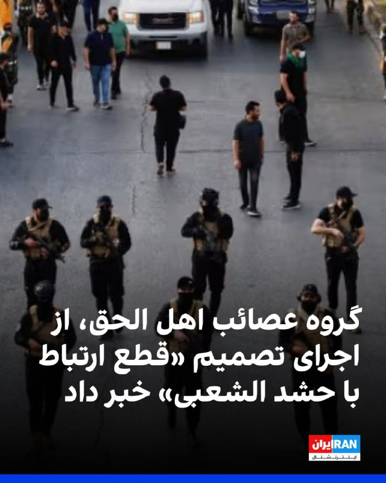

عصائب اهل الحق، گروه نزدیک به جمهوری اسلامی در عراق، اعلام کرد اجرای تصمیم «قطع ارتباط با تشکیلات حشد الشعبی» و «انحصار سلاح در دست دولت» را آغاز می‌کند و کمیته‌ای مرکزی برای ثبت نیروها و سلاح‌ها و هماهنگی با فرمانده کل نیروهای مسلح تشکیل می‌دهد.

این گروه اعلام کرد کمیته یادشده مسئول تکمیل تمامی الزامات و مراحل اجرایی این تصمیم، از جمله سرشماری و ثبت نیروها، سلاح‌ها، تجهیزات، ادوات و تمامی امکانات لجستیکی است.

بنا بر اعلام گروه عصائب اهل الحق، این کمیته همچنین موظف است در چارچوب الزامات دولت و نهادهای امنیتی، هماهنگی‌های لازم را با فرمانده کل نیروهای مسلح عراق انجام دهد.
iranintl.com/202606022104

## IranIntlTV — post 340182

  <a href="telegram/content/IranIntlTV_340182_1780398946.mp4" target="_blank">🎬 Download video</a>

بر اساس تصاویر رسیده به ایران‌اینترنشنال، دانش‌آموزان پایه‌های ۱۱ و ۱۲ در تهران و همدان در اعتراض به نحوه برگزاری امتحانات نهایی، تغییرات کنکور و تاثیر قطعی معدل تجمع کردند.
جزییات بیشتر با لیلا سعادتی، عضو تحریریه ایران‌اینترنشنال
@iranintltv

## IranIntlTV — post 340181

  

عباس گودرزی، سخنگوی هیات‌رییسه مجلس، گفت: «وقتی نفت ملی شد، تاریخ قضاوت کرد که آن تصمیم، چه تصمیم مهمی بود که در آن مقطع گرفته شد. امروز ما می‌خواهیم تنگه هرمزمان را ملی کنیم. دعوا، دعوای ملی شدن تنگه هرمز است.»

او اضافه کرد: «تنگه هرمز همه مناسبات را به هم می‌ریزد. عدد، رقم و درآمد آنجا مهم نیست. عوایدی دارد که بسیار فراتر از این چرتکه‌هایی است که گاهی اوقات انداخته می‌شود و دشمن نیز متوجه این موضوع شده است.»

گودرزی درباره عبور و مرور از تنگه هرمز ادامه داد: «اگر شناوری متعلق به کشور دوست باشد و رفتار متخاصمانه نداشته باشد، به راحتی و در قالب پروتکل‌های نیروهای مسلح عبور می‌کند. اگر بی‌طرف هم باشد، باز هم مشکلی ندارد، اما اگر کشور متخاصم باشد و قرار باشد به جای جابه‌جایی کالا، تسلیحات نظامی برای تخاصم با ملت ایران منتقل کند، جمهوری اسلامی قاطعانه در آنجا خواهد ایستاد.»
iranintl.com/202606029902

## IranIntlTV — post 340180

  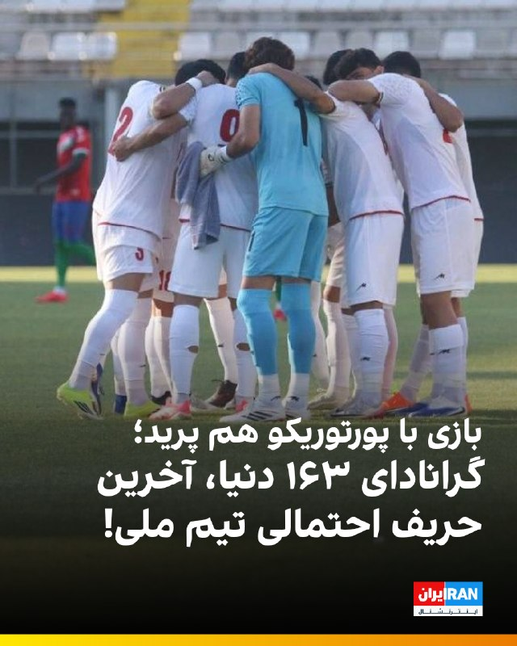

🔻ایسنا خبر داد که فدراسیون فوتبال ایران با فدراسیون گرانادا وارد مذاکره شده تا در صورت نهایی شدن توافق، پیش از آغاز جام جهانی دیداری دوستانه با این تیم برگزار کند.

🔹پیش از این قرار بود تیم ملی در آخرین بازی تدارکاتی خود پیش از جام جهانی در آمریکا به مصاف پورتوریکو برود، اما پس از انتقال کمپ تیم ملی به تیخوانا در مکزیک، این مسابقه لغو شد.

🔹بر اساس این گزارش، دیدار احتمالی ایران و گرانادا پشت درهای بسته برگزار خواهد شد. گرانادا در حال حاضر در رده ۱۶۳ رده‌بندی فیفا قرار دارد.

🔹پیش از این بازی‌های تدارکاتی تیم ملی برابر اسپانیا، مقدونیه و آنگولا به دلیل مسائل سیاسی داخل ایران لغو شده بود و تیم ملی چند بازی درون تیمی برگزار کرد.

@iranintltvsport

## IranIntlTV — post 340179

  <a href="telegram/content/IranIntlTV_340179_1780398949.mp4" target="_blank">🎬 Download video</a>

ویدیوهای رسیده به ایران‌اینترنشنال نشان می‌دهد گروهی از دانش‌آموزان همدان سه‌شنبه ۱۲ خرداد در اعتراض به تاثیر معدل نهایی بر کنکور و امتحانات حضوری تجمع کردند و شعار دادند: «دانش‌آموز داد بزن، حقتو فریاد بزن»

## IranIntlTV — post 340178

🗣روایت شما از بحران اقتصادی و زندگی در آتش‌بس- سه‌شنبه ۱۲ خرداد:

🔹از قرچک پیام می‌دم؛ هنوز تابستان نشده قطع برق رو شروع کردن و دو روزه که راس ساعت ۹ برق رو قطع می‌کنن، به اداره برق هم که زنگ می‌زنیم کسی پاسخگو نیست.

🔹تازه امروز ۱۲ خرداد به اینترنت وصل شدم؛ نت به شدت ضعیفه و اوضاع زندگی چندان جالب نیست. حداقل برای قشر امثال من که یک عمر درگیر فقر بوده. همه چی بدتر هم شده ولی چاره‌ای نیست جز تحمل.

🔹سیستم یا لپ‌تاپی که یه روزی می‌تونستیم با حدکاثر ۱۰۰ میلیون بخریم الان شده ۵۰۰ میلیون تومان.

🔹من یه دانش‌آموز کلاس یازدهمی‌ام واقعا نمی‌فهمم چطور با این همه تعطیلی، بی‌نظمی و افت شدید کیفیت آموزش، چطور هنوز انتظار دارند دانش‌آموزها در سطح امتحانات نهایی باشند. مطالب یا ناقص آموزش داده شده یا اصلا فرصت یادگیری درستش وجود نداشته.

🔹از گچساران: الان ۲ ماهه به کارگرهای شهرداری حقوق نداده‌اند.

🔹شرکت سایپا هنوز مزایای کسانی را که بهمن ماه سال گذشته بازنشسته شدند پرداخت نکرده‌اند. خودروها را هم با کسری قطعات به مردم تحویل می‌دهند.

🔹از شیراز خبر رسیده در اماکنی که فیبر نوری نصب کرده‌اند، مخابرات به پیمانکارها گفته سیم‌های مسی را بچینند و با پول فروشش، حقوقشان را بگیرند.

🔹امروز رفتم یک بسته نوار بهداشتی خریدم ۱۰۹ هزار تومان. همین چند هفته پیش ۶۶ هزار تومان بود.

🔹قند ۲ کیلویی شده یک میلیون تومان.

🔹من یه مغازه‌دارم در شهرستان نکا. با این روند اقتصادی کشور تا دو ماه آینده ورشکست می‌شم و باید کار و کاسبی‌ام را جمع کنم.

🔹هر ماه نزدیک به چند میلیون تومان هزینه بیمه تکمیلی می‌کنیم، هر دفعه هم که برای درمان به بیمارستان‌ها یا کلینیک‌ها می‌ریم، می‌گن بیمه البرز دانشگاه شیراز قطع است به علت بدهی بیمه‌گر و کسی هم جواب‌گوی ما نیست، نه دانشگاه شیراز نه بیمه البرز.

## IranIntlTV — post 340177

  <a href="telegram/content/IranIntlTV_340177_1780398950.mp4" target="_blank">🎬 Download video</a>

بر اساس ویدیوهای رسیده به ایران‌اینترنشنال، گروهی از دانش‌آموزان کنکوری و یازدهمی در تهران، سه‌شنبه ۱۲ خرداد در اعتراض به تاثیر معدل نهایی بر کنکور و امتحانات حضوری مقابل دبیرخانه شورای عالی انقلاب فرهنگی روی زمین نشستند.

## IranIntlTV — post 340176

  <a href="telegram/content/IranIntlTV_340176_1780398952.mp4" target="_blank">🎬 Download video</a>

بر اساس ویدیوهای رسیده به ایران‌اینترنشنال، گروهی از دانش‌آموزان کنکوری و یازدهمی در تهران، سه‌شنبه ۱۲ خرداد در اعتراض به تاثیر معدل نهایی بر کنکور و امتحانات حضوری مقابل دبیرخانه شورای عالی انقلاب فرهنگی تجمع کردند.

## IranIntlTV — post 340175

  <a href="telegram/content/IranIntlTV_340175_1780398954.mp4" target="_blank">🎬 Download video</a>

دومین روز نشست انجمن آزادی اسلو با سخنرانی نور پهلوی، فرزند ارشد شاهزاده رضا پهلوی، آغاز شد. او در این نشست با انتقاد از جمهوری اسلامی گفت این نظام مشروعیت ندارد و تاکيد کرد مردم ایران برای آزادی و زندگی بهتر جان داده‌اند.
@iranintltv

## IranIntlTV — post 340174

  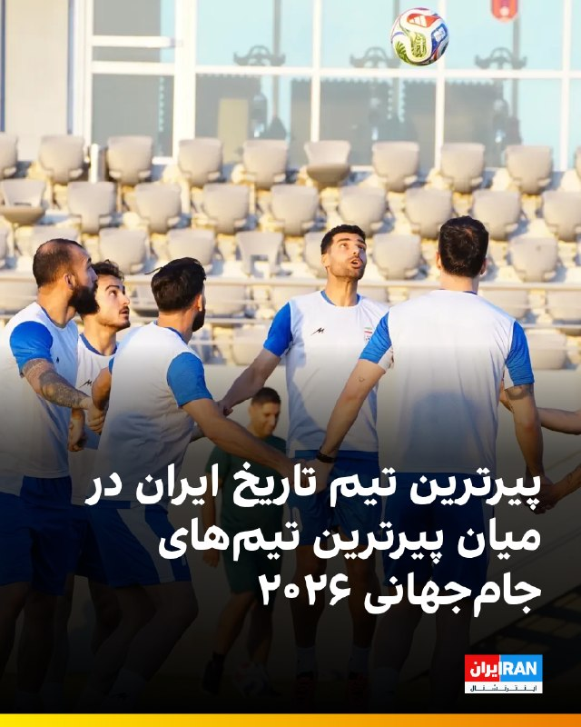

🔻با اعلام فهرست نهایی تیم‌های حاضر در جام جهانی ۲۰۲۶، بررسی آمارها نشان می‌دهد تیم ملی ایران با میانگین سنی ۲۹.۸ سال، پیرترین تیم تاریخ خود در ادوار جام جهانی را راهی این مسابقات خواهد کرد. تیم ملی ایران پس از پاناما و کلمبیا پیرترین تیم حاضر در بین ۴۸ تیم جام جهانی ۲۰۲۶ است.

🔹بر اساس گزارش سایت ترانسفرمارکت، پاناما با میانگین سنی ۳۰.۴ سال پیرترین تیم حاضر در جام جهانی ۲۰۲۶ است و پس از آن کلمبیا با ۳۰.۱ سال قرار دارد. کیپ‌ورد، برزیل و اسکاتلند نیز دیگر تیم‌های مسن این دوره از رقابت‌ها هستند.

🔹ایران نیز با میانگین سنی ۲۹.۸ سال در جمع مسن‌ترین تیم‌های جام قرار می‌گیرد؛ آماری که حتی از تیم ملی حاضر در جام جهانی ۲۰۲۲ قطر نیز بالاتر است. تیم ملی در جام جهانی قطر با میانگین سنی ۲۸.۹ سال پیرترین تیم تاریخ ایران در این رقابت‌ها محسوب می‌شد، که حالا شاگردان امیر قلعه‌نویی این رکورد را شکسته‌اند.

🔹نکته قابل توجه این است که در فهرست ۲۶ نفره ایران تنها سه بازیکن زیر ۲۵ سال حضور دارند و در مقابل، ۱۵ بازیکن ۳۰ ساله یا مسن‌تر هستند.

🔹جزییات بیشتر را در سایت بخوانید

@iranintltvsport

## IranIntlTV — post 340173

  

فداحسین مالکی، عضو کمیسیون امنیت ملی مجلس، گفت اسرائیل با مشاهده حرکت جمهوری اسلامی و آمریکا به سوی میز مذاکره، تلاش کرد با ایجاد تنش در منطقه، مسیر این روند را مختل کند.

این عضو کمیسیون امنیت ملی مجلس حمله اخیر اسرائیل به لبنان را ناشی از «کینه‌توزی عمیق» این کشور نسبت به «شکست‌های سخت» خود در جنگ ۴۰ روزه دانست که به گفته او به‌دست جمهوری اسلامی رقم خورده است.

او افزود زمانی که بنیامین نتانیاهو، نخست‌وزیر اسرائیل، دریافت که توجه دونالد ترامپ در ابتدای مذاکرات با خواسته‌های او همسو نیست، برای «اعمال فشار» و «جلب توجه»، حملات گسترده به جنوب لبنان را آغاز کرد، اما این اقدامات با واکنش «جدی و قاطع» مسئولان جمهوری اسلامی روبه‌رو شد.

مالکی گفت این رویکرد «بازدارنده» تهران باعث شد «دشمن» متوجه شود هرگونه پیشروی بیشتر با برخوردهای نظامی «سخت و مستقیم» نیروهای دفاعی جمهوری اسلامی مواجه خواهد شد.

او افزود مقام‌های لبنانی باید به خود بیایند و بدانند که سخن گفتن از مذاکره با اسرائیل در شرایط فعلی یک «خطای استراتژیک» است.
https://iranintl.com/202606025626

## IranIntlTV — post 340172

  

پیمان جبلی، رییس سازمان صدا و سیما، در نشستی با اعضای کمیسیون فرهنگی مجلس گفت: «دشمن در هر دو جنگ اخیر تلاش کرد با هدف قرار دادن بسترهای سیگنال‌رسانی، آنتن صدا و سیما را از کار بیندازد، اما موفق نشد.»
او افزود: «صداوسیما امانت‌دار مردم است.»

جبلی اضافه کرد: «ما خود را رسانه‌ای آماده در بحران می‌دانیم و همان‌گونه که در برابر حملات دشمن به زیرساخت‌های فنی سازمان ایستادگی کردیم، در برابر هر نوع تهاجم فکری و رسانه‌ای برای ضربه زدن به ساختار نظام جمهوری اسلامی نیز دفاع خواهیم کرد.»

سخنان جبلی در حالی است که اخیرا، مسعود پزشکیان نیز گفته بود که صداوسیما با ارائه تحلیل‌ها و روایت‌های نادرست و فاقد پشتوانه علمی، تصویر غیرواقعی از وضعیت کشور ارائه می‌دهد.
https://iranintl.com/202606020921

## IranIntlTV — post 340171

  

کاظم غریب‌آبادی، معاون وزیر خارجه جمهوری اسلامی، در شبکه ایکس نوشت تحولات اخیر در لبنان، سوریه و فلسطین نشان می‌دهد بحران منطقه نه حاصل «تنش‌های پراکنده»، بلکه نتیجه «جنایات و مصونیت اسرائیل» است که به گفته او حاکمیت دولت‌ها را نقض می‌کند.

او افزود شورای امنیت سازمان ملل باید از مرحله ابراز نگرانی و دعوت‌های کلی عبور کرده و «تصمیمات تنبیهی و الزام‌آور» علیه اسرائیل اتخاذ کند، زیرا به گفته او حقوق بین‌الملل با «محکومیت‌های کم‌هزینه و بی‌اثر» پاسداری نمی‌شود.

غریب‌آبادی همچنین با اشاره به اظهارات دونالد ترامپ، رییس‌جمهوری آمریکا، درباره منصرف کردن بنیامین نتانیاهو، نخست‌وزیر اسرائیل، از حمله گسترده به بیروت، گفت این اظهارات بیش از آنکه نشانه صلح‌طلبی واشینگتن باشد، موید نقش مستقیم آمریکا در مدیریت اقدامات اسرائیل است.

معاون وزیر خارجه جمهوری اسلامی نوشت: «اگر تصمیم حمله به پایتخت یک دولت مستقل با یک تماس تغییر می‌کند، پرسش اصلی این است که چرا ماه‌ها نقض آتش‌بس، تجاوز به لبنان، آوارگی مردم و تهدید حاکمیت این کشور با حمایت سیاسی و نظامی غرب ادامه یافت.»
https://iranintl.com/202606028545

## IranIntlTV — post 340170

دولت کره‌جنوبی از ساخت یک پلتفرم مشترک هوش مصنوعی دفاعی با تکیه بر فناوری داخلی خبر داده که مشابه سامانه «گاتهام» طراحی می‌شود. گاتهام یک سامانه تحلیل داده‌های نظامی و امنیتی است که برای یکپارچه‌سازی اطلاعات پراکنده و کمک به تصمیم‌گیری‌های میدانی استفاده می‌شود و در عملیات‌های نظامی آمریکا نیز به کار رفته است.
طوماج طاهباز، خبرنگار ایران‌اینترنشنال، گزارش می‌دهد
@iranintltv

## Shin_Persian — post 6401

  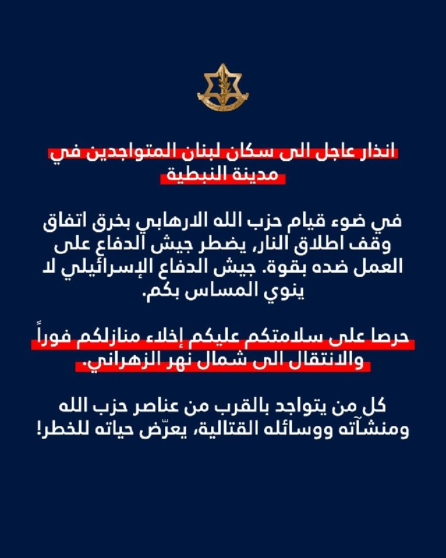

افيخاي ادرعي ✓ @AvichayAdraee Tue, 02 Jun 2026 09:24:38 UTC #عاجل ‼️نجدد انذارنا العاجل الى سكان لبنان المتواجدين في مدينة النبطية 🔸في ضوء قيام حزب الله الارهابي بخرق اتفاق وقف اطلاق النار يضطر جيش الدفاع للعمل ضده بقوة. جيش الدفاع لا ينوي المساس بكم. …

## Shin_Persian — post 6400

افيخاي ادرعي ✓ @AvichayAdraee
Tue, 02 Jun 2026 09:24:38 UTC

#عاجل ‼️نجدد انذارنا العاجل الى سكان لبنان المتواجدين في مدينة النبطية

🔸في ضوء قيام حزب الله الارهابي بخرق اتفاق وقف اطلاق النار يضطر جيش الدفاع للعمل ضده بقوة. جيش الدفاع لا ينوي المساس بكم.

🔸حرصًا على سلامتكم عليكم إخلاء منازلكم فوراً والانتقال الى شمال نهر الزهراني.

🔸كل من يتواجد بالقرب من عناصر حزب الله ومنشآته ووسائله القتالية، يعرّض حياته للخطر!

English

#Urgent ‼️ We reiterate our urgent warning to the residents of Lebanon who are present in the city of Nabatiyeh.

🔸 In light of the terrorist Hezbollah’s violation of the ceasefire agreement, the IDF (Israel Defense Forces) is compelled to act against it forcefully. The IDF does not intend to harm you.

🔸 For your safety, you must evacuate your homes immediately and move north of the Zahrani River.

🔸 Anyone present near Hezbollah members, facilities, or combat equipment is putting their life at risk!

𝕏 · @shin_persian

## Shin_Persian — post 6399

  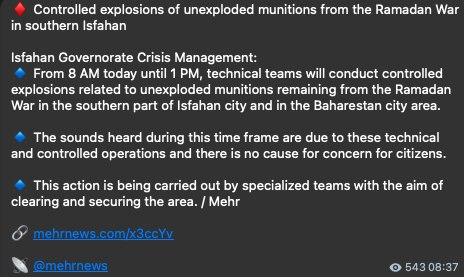

Shin ✓ @hey_itsmyturn
Tue, 02 Jun 2026 08:32:23 UTC

Earlier, State-owned Mehr News reported Explosion(s) in southern Isfahan due to EOD ops.

(Yet, source tells me that 2 regime forces were KIA: Amir Shayegan &amp; Sepehr Pour Rostam)

فارسی

پیش‌تر، خبرگزاری دولتی مهر از وقوع انفجار(هایی) در جنوب اصفهان به دلیل عملیات واحد خنثی‌سازی بمب (EOD) گزارش داد.

(با این حال، یک منبع به من می‌گوید که ۲ تن از نیروهای رژیم کشته شدند: امیر شایگان و سپهر پوررستم)

𝕏 · @shin_persian

## FarsiVOA — post 219359

  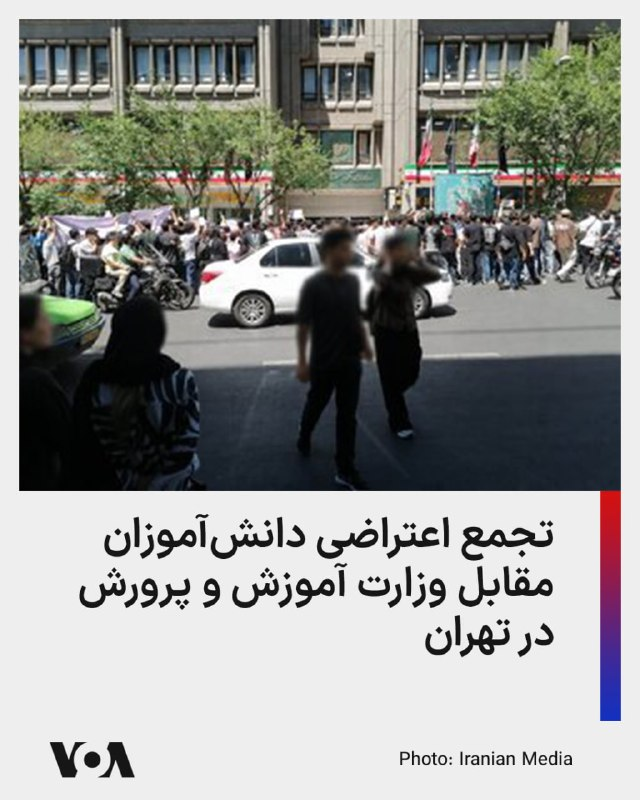

صدها دانش‌آموز روز سه‌شنبه ۱۲ خرداد با تجمع مقابل وزارت آموزش و پرورش در تهران، به تغییر قوانین کنکور، افزایش تأثیر معدل و پیامدهای جنگ بر آمادگی برای آزمون سراسری اعتراض کردند.

در ویدئوهای منتشرشده در شبکه‌های اجتماعی، شعارهایی از جمله «دانش‌آموز بیداره، از تبعیض بیزاره»، «دانش‌آموز می‌میرد، ذلت نمی‌پذیرد»، «وعده زیاد شنیدیم، عدالت و ندیدیم» و «فشار روانی کافیه، زندگی‌مونو پس بدین» شنیده می‌شود.

سیاست‌های مرتبط با کنکور از جمله افزایش تأثیر معدل و تغییر در شیوه برگزاری و زمان‌بندی آزمون‌ها، در کنار شرایط ناشی از جنگ، در ماه‌های اخیر با تغییرات و ابهام‌هایی همراه بوده که به گفته داوطلبان، موجب سردرگمی و دشواری در برنامه‌ریزی برای امتحانات نهایی و کنکور شده است.
@FarsiVOA

## FarsiVOA — post 219358

🔺آژانس بین‌المللی انرژی: ذخایر جهانی نفت ممکن است به سطحی بحرانی برسد

▪️آژانس بین‌المللی انرژی هشدار داد ذخایر جهانی نفت ممکن است به سطحی بحرانی یا از نظر تاریخی بسیار پایین برسد.

▪️این هشدار در شرایطی مطرح می‌شود که بازار جهانی نفت هم‌زمان با نگرانی از عرضه و افزایش تقاضای فصلی تابستان، با حساسیت بیشتری تحولات ذخایر را دنبال می‌کند.

▪️هشدار تازه آژانس بین‌المللی انرژی در ادامه مجموعه‌ای از اخطارهای قبلی درباره کاهش سریع ذخایر نفت مطرح شده است.

▪️بحران ذخایر فقط هشدار آژانس نیست؛ شرکت‌های نفتی، بانک‌های سرمایه‌گذاری و تولیدکنندگان هم از همان جهت هشدار داده‌اند.

⬇️ بیشتر بخوانید:
https://ir.voanews.com/a/iea-sees-possibility-of-critically-low-stockpiles-ahead-of-peak-summer-demand/8156415.html

## FarsiVOA — post 219357

  <a href="telegram/content/FarsiVOA_219357_1780398960.mp4" target="_blank">🎬 Download video</a>

ارتش اسرائیل اعلام کرد در چند روز گذشته، «پنج تروریست وابسته به حماس و جهاد اسلامی» در نوار غزه که در حال برنامه‌ریزی و پیشبرد حملات قریب‌الوقوع علیه نیروهای اسرائیلی بودند، هدف قرار گرفته و از بین رفته‌اند.

بر اساس اعلام ارتش اسرائیل، در میان افراد از بین رفته، سالم فیض حامد کریقه، از اعضای گردان شجاعیه حماس، حضور داشت که در تهیه مواد منفجره و طراحی حملات تک‌تیراندازی علیه نیروهای ارتش نقش داشت.

همچنین سعید فیض سعید شماعی، فرمانده یک تیم نخبه در حماس، و احمد علی عبدالرحیم خلاص، فرمانده گروهان تک‌تیرانداز در سازمان جهاد اسلامی، از دیگر افراد کشته‌شده در این عملیات بودند.

ارتش اسرائیل اعلام کرد دو عضو دیگر حماس نیز هنگام کار گذاشتن دستگاه‌های انفجاری برای هدف قرار دادن نیروهای ارتش از بین برده شدند. به گفته ارتش دفاعی اسرائیل، پیش از انجام حملات، اقداماتی برای کاهش آسیب به غیرنظامیان انجام شد؛ از جمله استفاده از مهمات دقیق و نظارت هوایی.
@FarsiVOA

## FarsiVOA — post 219356

  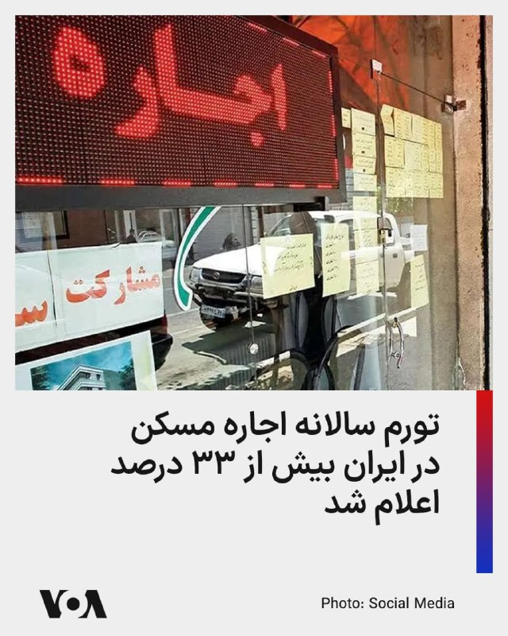

مرکز آمار ایران، تورم سالانه اجاره مسکن تا اردیبهشت ماه ۱۴۰۵ را ۳۳.۲ درصد اعلام کرد. این مرکز، تورم نقطه‌به‌نقطه اجاره مسکن را نیز ۳۰.۹ درصد دانست.

مرکز آمار ایران همچنین تورم عمومی را ۸۴ درصد اعلام کرد و مدعی شد که تورم اجاره مسکن از ۱۲ گروه اصلی کالاها و خدمات کمتر بوده است. تورم ماهانه اجاره مسکن در اردیبهشت ۱۴۰۵ معادل ۱.۹ درصد گزارش شده است.

بر اساس اعلام این مرکز، تورم ماهانه خانوارهای کشور ۸.۸ درصد، تورم نقطه‌‌به‌نقطه ۸۳.۹ درصد و تورم سالانه نیز ۵۷.۷ درصد ثبت شده است.
@FarsiVOA

## FarsiVOA — post 219355

🔺مذاکرات کره‌جنوبی با آمریکا برای دستیابی به غنی‌سازی اورانیوم آغاز شد

▪️ایالات متحده و کره‌جنوبی دور جدیدی از مذاکرات دوجانبه را آغاز کردند تا درباره اجرای توافق‌های امنیتی میان رهبران دو کشور، از جمله تلاش سئول برای دستیابی به غنی‌سازی اورانیوم و زیردریایی‌های مجهز به پیشرانه هسته‌ای و تسلیحات متعارف گفت‌وگو کنند.

▪️خبرگزاری یونهاپ گزارش داد که در نخستین روز مذاکرات، دو طرف عمدتاً بر مسائل مربوط به تلاش سئول برای ساخت زیردریایی‌های هسته‌ای متمرکز بودند.

▪️انتظار می‌رود روز چهارشنبه گفت‌وگوها بر دیگر مسائل امنیتی، از جمله توانایی کره‌جنوبی در غنی‌سازی اورانیوم و بازفرآوری سوخت مصرف‌شده هسته‌ای متمرکز شود؛ قابلیت‌هایی که برای تأمین سوخت زیردریایی‌های اتمی ضروری هستند.

⬇️ بیشتر بخوانید:
https://ir.voanews.com/a/8156414.html

## FarsiVOA — post 219354

  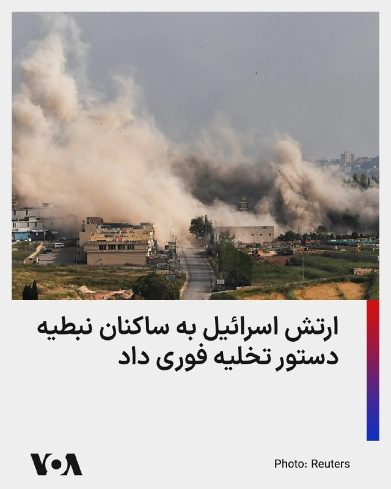

سخنگوی ارتش اسرائیل با انتشار هشداری فوری خطاب به ساکنان شهر نبطیه در جنوب لبنان، از آنها خواست فوراً منازل خود را ترک کرده و به شمال رود زهرانی منتقل شوند.

در این بیانیه، ارتش اسرائیل اعلام کرد که حزب‌الله توافق آتش‌بس را نقض کرده و به همین دلیل ارتش «ناچار است با قدرت علیه آن اقدام کند».

ارتش اسرائیل همچنین تأکید کرد که قصد هدف قرار دادن غیرنظامیان را ندارد، اما هشدار داد که حضور در نزدیکی نیروها، تأسیسات و تجهیزات نظامی حزب‌الله می‌تواند جان افراد را به خطر بیندازد.
@FarsiVOA

## FarsiVOA — post 219353

🔺بارنئا در آخرین روز ریاست موساد: رژیم ایران باید سرنگون شود

▪️داوید بارنئا، که در دوران ریاستش در موساد در تلاش برای جلوگیری از دستیابی جمهوری اسلامی به سلاح هسته‌ای بود، در آخرین روز کارش، یک بار دیگر خواستار تغییر رژیم در ایران شد.

▪️در فروردین‌ماه، جروزالم پست فاش کرد که بارنئا، پیش از آغاز عملیات مشترک اسرائیل و آمریکا در ایران، در ارزیابی خود به کابینه اسرائیل تأکید کرده بود که محتمل‌ترین سناریو برای تغییر رژیم در ایران دست‌کم یک سال به درازا می‌کشد.

▪️این ارزیابی در پی افزایش انتقادها و تضاد روایت‌ها درباره اهداف و روند جنگ، بار دیگر مورد توجه قرار گرفت.

▪️موساد سازمان اطلاعات خارجی اسرائیل است که مأموریت «خنثی‌سازی فعالیت‌ها علیه اسرائیل» را برعهده دارد.

⬇️ بیشتر بخوانید:
https://ir.voanews.com/a/8156413.html

## FarsiVOA — post 219352

🔺گزارش‌ها از بررسی گسترش استقرار هسته‌ای آمریکا در اروپا؛ تمرکز بر حفاظت از جناح شرقی ناتو

▪️فایننشال تایمز گزارش داد آمریکا در حال بررسی امکان گسترش استقرار تسلیحات هسته‌ای خود در اروپا و افزودن کشورهای بیشتری از اعضای ناتو به مأموریت هواپیماهای دو منظوره است.

▪️بر اساس این گزارش، مقام‌های آمریکایی نشانه‌هایی از آمادگی برای بررسی استقرارهای بیشتر، فراتر از شش کشور فعلی میزبان مأموریت‌های هسته‌ای ناتو، نشان داده‌اند؛ اما فایننشال تایمز تأکید کرده که دستیابی به توافقی فوری در این زمینه نزدیک نیست.

▪️رویترز نوشت نتوانسته گزارش فایننشال تایمز را به طور مستقل تأیید کند و کاخ سفید، وزارت دفاع آمریکا و ناتو نیز بلافاصله به درخواست اظهارنظر پاسخ نداده‌اند.

⬇️ بیشتر بخوانید:
https://ir.voanews.com/a/us-in-talks-to-expand-nuclear-weapons-deployments-in-europe/8156412.html

## FarsiVOA — post 219351

  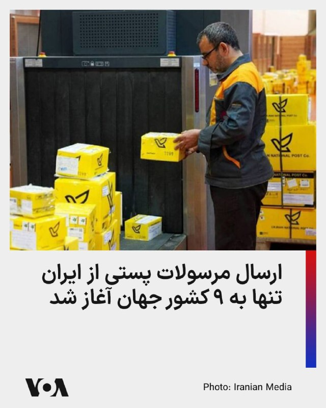

مدیرکل دفتر ارتباطات و امور بین‌الملل شرکت ملی پست از برقراری ارسال مرسولات پستی، تنها به ۹ کشور جهان پس از وقفه بیش از سه ماهه خبر داد.

ارسال مرسولات پستی از ایران با آغاز تنش‌های نظامی از نهم اسفند ۱۴۰۴ متوقف شده بود و حال تنها ارسال این مرسولات به کشورهای افغانستان، عمان، ترکیه، چین، پاکستان، روسیه، هند، عراق و تایلند ممکن شده است.

مهدی مقصودی، به خبرگزاری ایسنا گفته است که تلاش برای بازگشایی سایر مسیرها و ارسال به کشورهایی که ارتباطات پستی برقرار بوده، همچنان ادامه دارد.
@FarsiVOA

## FarsiVOA — post 219350

🔺سرگردانی خریداران اینترنت پرو؛ اپراتورها پول بسته‌ها را پس نمی‌دهند

▪️کاربرانی که در دوران قطع و اختلال شدید اینترنت، بسته‌های گران‌قیمت «پرو» خریدند، اکنون می‌پرسند اگر اینترنت عادی برگشته، تکلیف پول پرداخت‌شده چه می‌شود؟

▪️پاسخ اپراتورها، دست‌کم بر اساس پیگیری رسانه‌های داخلی، روشن اما برای کاربران قانع‌کننده نیست. «پولی برنمی‌گردد.»

▪️اینترنت پرو در جریان قطع چندماهه اینترنت و با عنوان دسترسی ویژه برای کسب‌وکارها معرفی شد؛ اما خیلی زود به نماد «اینترنت طبقاتی» تبدیل شد.

▪️گزارش‌ها می‌گویند هر گیگ این سرویس حدود ۴۰ هزار تومان فروخته شد و بسته‌های ۵۰ گیگابایتی آن حدود دو میلیون تومان قیمت داشت؛ در حالی که در بازار غیررسمی، با قیمت‌هایی چند برابر دست‌به‌دست می‌شد.

⬇️ بیشتر بخوانید:
https://ir.voanews.com/a/internet-pro-confusion/8156411.html

## FarsiVOA — post 219349

  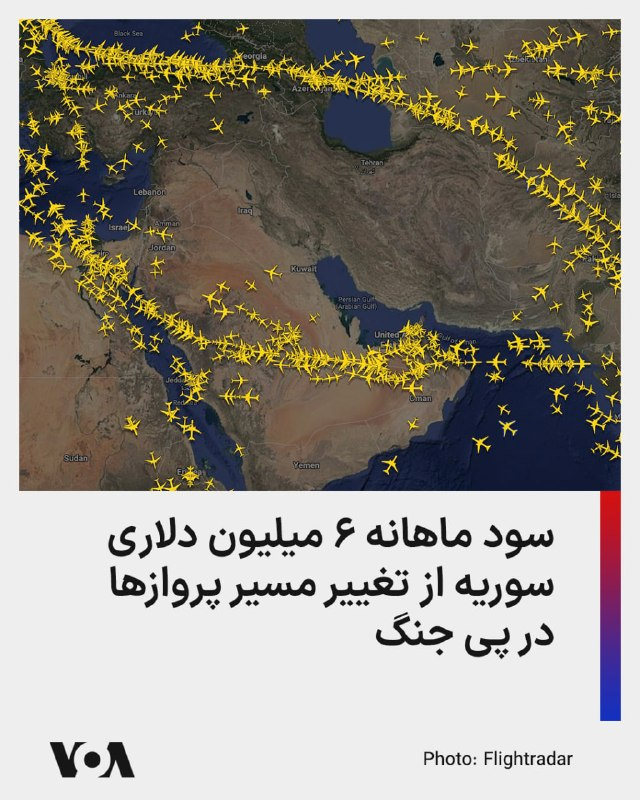

رویترز گزارش داد جنگ ایران باعث تغییر جدی در مسیر پروازهای منطقه‌ای شده و سوریه، که حریم هوایی‌اش سال‌ها به‌دلیل جنگ داخلی برای بسیاری از شرکت‌های هواپیمایی پرریسک بود، اکنون از این جابه‌جایی درآمد تازه‌ای به دست آورده است.

بر اساس آمار اداره کل هواپیمایی کشوری سوریه، در ماه مه ۱۱ هزار و ۸۰۱ پرواز از آسمان این کشور عبور کرد؛ بیش از دو برابر فوریه و حدود ۳۷۵ درصد بیشتر از ماه مشابه سال گذشته.

هرچند آتش‌بس باعث بازگشایی بخشی از حریم‌های هوایی در آوریل شد، اما بسیاری از پروازهای دوبی و دوحه به اروپا همچنان به‌جای عراق، از مرکز سوریه عبور می‌کنند.

این مسیر زمان سفر و هزینه سوخت را کاهش می‌دهد؛ موضوعی مهم در شرایطی که اختلال‌های مرتبط با جنگ ایران قیمت نفت را بالا برده است.

رویترز برآورد کرده که با تعرفه ثابت ۴۹۹ دلار برای هر پرواز، ترافیک هوایی ماه مه می‌توانسته تا ۵.۹ میلیون دلار برای سوریه درآمد ایجاد کند.

نهادهای ایمنی هوانوردی هنوز حریم هوایی سوریه را پرریسک می‌دانند و شرکت‌های اروپایی، آسیایی و آمریکای شمالی تا حد زیادی از پرواز بر فراز سوریه و بخش‌هایی از خاورمیانه پرهیز می‌کنند.
@FarsiVOA

## FarsiVOA — post 219348

🔺درگیری‌ها در جنوب لبنان میان اسرائیل و حزب‌الله ادامه دارد

▪️با وجود تلاش‌ها برای برقراری آتش‌بس در لبنان، بر اساس گزارش‌ها، اسرائیل و حزب‌الله در طول شامگاه دوشنبه و بامداد سه‌شنبه به درگیری‌های خود ادامه دادند.

▪️حزب‌الله اعلام کرد که بامداد سه‌شنبه یک حمله راکتی علیه یک تانک اسرائیلی در شهرک حداثا در جنوب لبنان انجام داده است.

▪️در مقابل، ارتش اسرائیل نیز از رهگیری دو پرتابه در ساعات اولیه سه‌شنبه که از لبنان شلیک شده بود خبر داد و اعلام کرد که این حادثه تلفات یا زخمی نداشته است.

▪️دونالد ترامپ، عصر دوشنبه اعلام کرد که از نخست‌وزیر اسرائيل خواسته تا به بیروت حمله بزرگی نکند، و از نمایندگان حزب‌الله هم خواسته است تیراندازی‌ها را متوقف کنند.

⬇️ بیشتر بخوانید:
https://ir.voanews.com/a/israel-hezbollah-fight-continues/8156410.html

## FarsiVOA — post 219347

  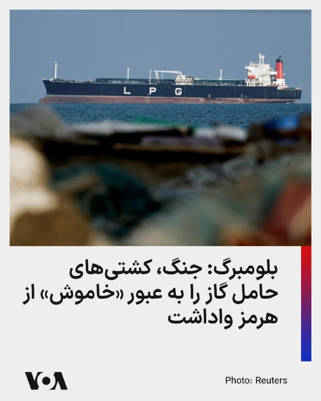

بلومبرگ گزارش داد جنگ خاورمیانه قواعد معمول تجارت جهانی گاز را بر هم زده و برخی کشتی‌های حامل گاز مایع طبیعی، ال‌ان‌جی، برای عبور از تنگه هرمز سامانه‌های شناسایی خود را خاموش می‌کنند. این اقدام پرریسک، در صنعت کشتیرانی به حرکت «خاموش» یا حرکت «در تاریکی» شناخته می‌شود.

بر اساس این گزارش، نگرانی از حمله، توقیف یا هدف قرار گرفتن کشتی‌ها در یکی از حساس‌ترین گذرگاه‌های انرژی جهان، شرکت‌های کشتیرانی و معامله‌گران گاز را وادار کرده است بخشی از قواعد معمول ایمنی، ردیابی و شفافیت دریایی را کنار بگذارند.

خاموش کردن فرستنده‌ها می‌تواند خطر برخورد، خطای ناوبری، تأخیر در تحویل محموله و افزایش هزینه بیمه را بالا ببرد.

رویترز نیز پیش‌تر گزارش داده بود دو نفتکش غول‌پیکر و یک کشتی حامل ال‌ان‌جی هنگام خروج از تنگه هرمز فرستنده‌های خود را خاموش کرده بودند و به سمت هند و چین حرکت می‌کردند.

آسوشیتدپرس هم تنگه هرمز را یکی از شریان‌های اصلی اقتصاد جهانی توصیف کرده؛ مسیری باریک که در شرایط عادی حدود یک‌پنجم نفت جهان از آن عبور می‌کند.
@FarsiVOA

## FarsiVOA — post 219346

  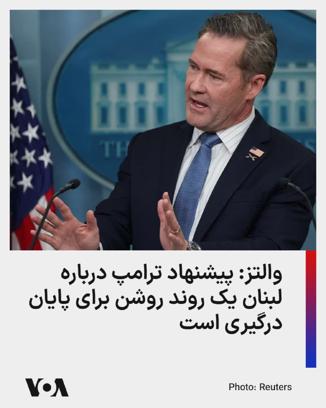

سفیر آمریکا در سازمان ملل متحد اعلام کرد که دونالد ترامپ، رئیس‌جمهوری ایالات متحده «عمیقاً و به‌طور شخصی به لبنان اهمیت می‌دهد» و پیشنهاد او شامل «یک روند روشن برای پایان دادن به درگیری» است.

مایک والتز در شورای امنیت سازمان ملل گفت: «در گام نخست، حزب‌الله که آغازگر این درگیری بوده است، باید حملات خود به اسرائیل را متوقف کند.»

او افزود که این اقدام به «کاهش تدریجی تنش‌ها» و «در نهایت، توقف خصومت‌ها» منجر خواهد شد.

والتز با تأکید بر این که حزب‌الله نیروی نیابتی جمهوری اسلامی است، گفت که این گروه غیرنظامیان اسرائیلی را هدف می‌گیرد.

سفیر آمریکا همچنین حمایت خود را از «دولت قانونی» لبنان ابراز کرد و گفت: «ما از تلاش‌های دولت لبنان برای عظمت‌بخشیدن دوباره به لبنان حمایت می‌کنیم.»
@FarsiVOA

## FarsiVOA — post 219345

🔺تورم اردیبهشت روی دور تند؛ کالاها در یک ماه ۱۰ درصد گران‌تر شدند

▪️مرکز آمار ایران تورم ماهانه خانوارهای کشور را ۸.۸ درصد، تورم نقطه‌به‌نقطه را ۸۳.۹ درصد و تورم سالانه را ۵۷.۷ درصد اعلام کرد.

▪️بانک مرکزی نیز، با تمرکز بر مناطق شهری، تورم ماهانه را ۸.۵ درصد، تورم نقطه‌به‌نقطه را ۷۷.۲ درصد و تورم سالانه را ۵۳.۹ درصد گزارش کرد.

▪️در گزارش بانک مرکزی، شاخص اختصاصی کالاها در اردیبهشت نسبت به ماه قبل ۱۰ درصد و نسبت به اردیبهشت پارسال ۱۱۳.۸ درصد افزایش داشته که فشار مستقیم بر خرید روزمره خانوارها را نشان می‌دهد.

▪️مرکز آمار کل خانوارهای شهری و روستایی را می‌سنجد، اما بانک مرکزی مناطق شهری را مبنا قرار می‌دهد و وزن کالاها، نمونه‌گیری و سال پایه نیز یکسان نیست.

⬇️ بیشتر بخوانید:
https://ir.voanews.com/a/two-pictures-of-iran-inflation/8156409.html

## FarsiVOA — post 219344

  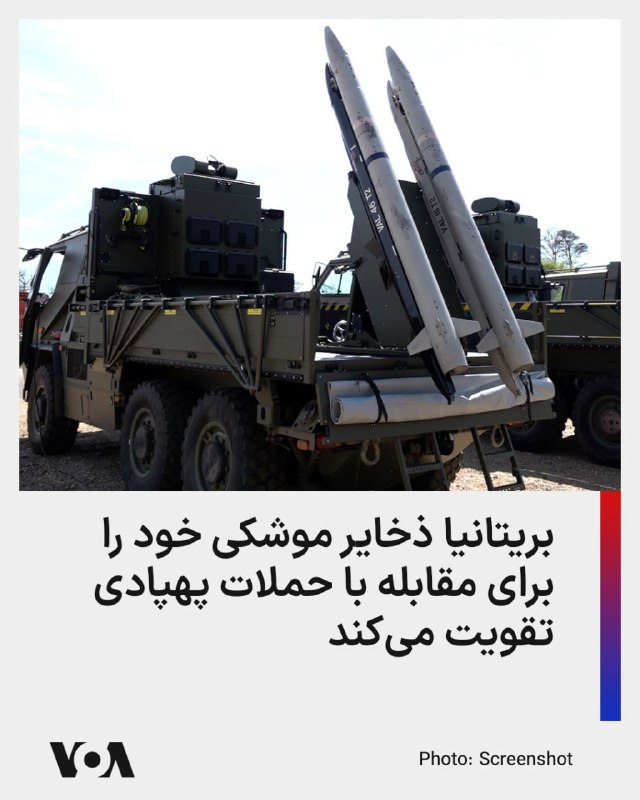

بریتانیا در بحبوحه افزایش تهدیدهای پهپادی در خاورمیانه، ذخایر موشک‌های پدافندی خود را تقویت می‌کند.

وزارت دفاع بریتانیا اعلام کرد قراردادهایی به ارزش ۳۶ میلیون پوند با شرکت تالس برای تأمین صدها فروند موشک چندمنظوره سبک امضا کرده است؛ موشک‌هایی که به گفته دولت بریتانیا در ماه‌های اخیر برای مقابله با حملات پهپادی در خاورمیانه به کار گرفته شده‌اند.

بر اساس اعلام وزارت دفاع، تحویل این موشک‌ها از ماه‌های آینده آغاز می‌شود و در طول سال ۲۰۲۶ ادامه خواهد داشت.

لندن می‌گوید این سامانه‌ها برای حفاظت از نیروهای بریتانیایی، پایگاه‌ها و متحدان این کشور در منطقه، از جمله از پایگاه‌های بریتانیا در قبرس، استفاده می‌شوند.

جان هیلی، وزیر دفاع بریتانیا، گفت این موشک‌های رهگیر «در میدان نبرد آزموده شده‌اند» و نیروهای بریتانیایی با استفاده از آنها در ماه‌های اخیر پهپادها را سرنگون کرده‌اند.
@FarsiVOA

## DW_Farsi — post 125411

  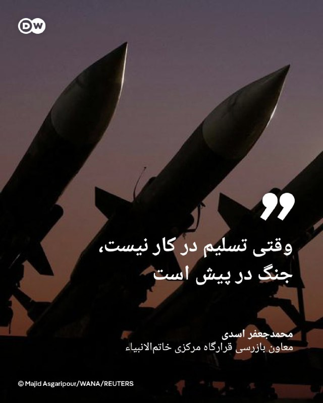

🔶 یک مقام سپاه: وقتی تسلیم در کار نیست، جنگ در پیش است

معاون بازرسی قرارگاه مرکزی خاتم‌الانبیاء با بیان این ادعا که جمهوری اسلامی "هنوز همه برگ‌های برنده خود را رو نکرده‌" گفت: «برگ‌های زیادی وجود دارد که اگر لازم شود، از آن‌ها استفاده خواهیم کرد.»
 
محمدجعفر اسدی در گفت‌وگو با خبرگزاری مهر اظهار داشت: «در طول جنگ اخیر، طبیعتا صنعت دفاعی آسیب‌هایی دیده است.» او در ادامه مدعی شد: «اما مکان‌هایی که اکنون از آن‌ها برای تولید تجهیزات نظامی و پشتیبانی از نیروهای مسلح استفاده می‌کنیم، کاملاً از دید دشمن مخفی است و آن‌ها هیچ خبری از محل آن ندارند؛ لذا وضعیت ما در زمینه تولیدات دفاعی، قابل قبول است.»
 
معاون بازرسی قرارگاه مرکزی خاتم‌الانبیاء همچنین با بیان این که "آمریکا فقط خواهان تسلیم کامل ما است" گفت که "مذاکره با آمریکا مشکلات معیشتی را حل نمی‌کند".
 
او در ادامه گفت: «وقتی تسلیم در کار نیست، جنگ در پیش است؛ بنابراین ما منتظریم و مشکلی با جنگ نداریم؛ لذا اگر ناتو هم در این عرصه حاضر شود، ما هیچ‌گونه نگرانی نداریم.»
@dw_farsi

## DW_Farsi — post 125410

🔶 توافق اروپا بر سر ایجاد مراکز اخراج مهاجران در کشورهای ثالث

به گزارش خبرنگار کانال اول تلویزیون آلمان (ARD) در بروکسل، اتحادیه اروپا قصد دارد در آینده از طریق سه مسیر اصلی، شمار اخراج پناهجویان ردشده را افزایش داده و روند آن را تسریع کند.
 
نخست، قرار است روندهای اخراج در داخل اتحادیه کارآمدتر شوند؛ به این معنا که تصمیم‌های مرتبط با رد درخواست پناهندگی در سراسر اتحادیه به رسمیت شناخته شوند و هر کشور عضو بتواند آنها را اجرا کند.
 
دوم، خدمات و مزایا برای افرادی که موظف به ترک خاک اتحادیه اروپا هستند اما همکاری نمی‌کنند، به شکل یکسان کاهش می‌یابد. همچنین قرار است مدت بازداشت احتمالی این افراد نیز با هدف اخراج افزایش یابد.
 
سوم اینکه از نظر سیاسی، راه برای ایجاد مراکز اخراج در کشورهای ثالث باز شده است. پناهجویان ردشده‌ای که اخراجشان به دلایلی مانند خودداری کشور مبدأ از پذیرش آنها با شکست روبه‌رو می‌شود، می‌توانند به این مراکز منتقل شوند. البته هنوز موافقت رسمی کشورهای عضو اتحادیه و پارلمان اروپا با این طرح باقی مانده است.
 
به این ترتیب، مقررات جدید بازگرداندن مهاجران، مکملی تعیین‌کننده برای اصلاحات نظام پناهندگی اتحادیه اروپا به شمار می‌رود؛ اصلاحاتی که از روز ۱۲ ژوئن آینده به طور کامل لازم‌الاجرا می‌شوند. زیرا در سال گذشته تنها یک نفر از هر چهار فردی که موظف به ترک اتحادیه اروپا بودند (فقط ۲۸ درصد)، واقعاً خاک این اتحادیه را ترک کرد.
 
ماگنوس برونر، کمیسر امور داخلی اتحادیه اروپا، در این باره گفت: «با مقررات جدید، سرانجام کنترل بیشتری بر اجرای منسجم بازگرداندن افراد خواهیم داشت. این همان چیزی است که شهروندان انتظار دارند و ما آن را فراهم می‌کنیم.»
@dw_farsi

## DW_Farsi — post 125409

🔶 گزارش "اکسیوس" از انتقاد تند ترامپ از نتانیاهو در تماس تلفنی

وب‌سایت خبری "اکسیوس" گزارش داده است که دونالد ترامپ، رئیس ‌جمهور ایالات متحده آمریکا، در جریان تماس تلفنی با بنیامین نتانیاهو، نخست‌وزیر اسرائیل، به شدت از او انتقاد کرده و او را "دیوانه" خوانده است.
 
طبق این گزارش، ترامپ در این تماس خواستار موافقت اسرائیل با آتش‌بس با حزب‌الله لبنان شده و هشدار داده است که اقدامات اخیر اسرائیل تلاش‌های واشنگتن برای دستیابی به تمدید آتش‌بس با ایران را به خطر انداخته است.
 
جمهوری اسلامی تمدید توافق آتش‌بس در لبنان را یکی از شروط پیشبرد مذاکرات با آمریکا عنوان کرده است.
 
در گزارش اکسیوس همچنین ادعا شده است که ترامپ به نتانیاهو یادآور شده است که زندانی نشدن‌اش در اسرائیل را "مدیون اوست".
 
نخست‌وزیر اسرائیل از مدت‌ها پیش درگیر یک پرونده طولانی‌مدت فساد در نظام قضایی این کشور است و ترامپ پیش‌تر از هرتزوگ، رئیس ‌جمهور اسرائیل، خواسته بود تا نتانیاهو را عفو کند.
 
یک مقام آمریکایی به اکسیوس گفته است که ترامپ به نتانیاهو گفت: «تو دیوانه‌ای. اگر من نبودم الان در زندان بودی. دارم از تو محافظت می‌کنم. حالا همه از تو متنفرند. همه به خاطر این وضعیت از اسرائیل متنفرند.»
 
مقام‌های آمریکایی به این سایت خبری گفته‌اند که ترامپ ضمن اذعان به حملات مکرر حزب‌الله به اسرائیل و حق این کشور برای پاسخ‌گویی، معتقد بوده است که واکنش ارتش اسرائیل در روزهای اخیر "نامتناسب" بوده است.
 
یک مقام آمریکایی به اکسیوس گفته است که ترامپ در این تماس "کاملا بر نتانیاهو مسلط شد" و نتانیاهو در پاسخ گفت: «باشه، باشه، فقط مطمئن شو همه چیز درست مدیریت می‌شود.»
 
دفتر نخست‌وزیر اسرائیل تا کنون به درخواست رسانه‌ها برای اظهارنظر درباره این گزارش پاسخی نداده است.
@dw_farsi

## DW_Farsi — post 125408

  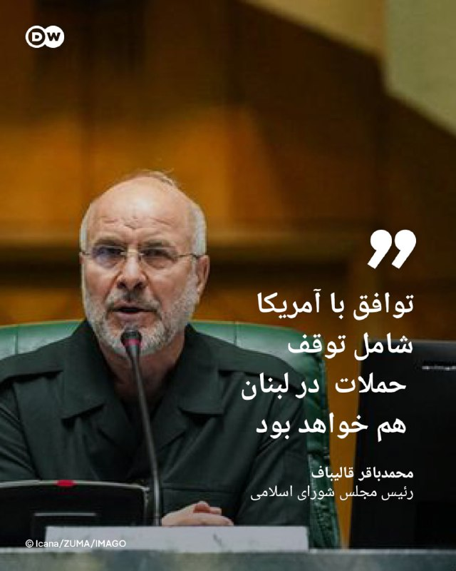

🔶 قالیباف: توافق با آمریکا شامل توقف حملات در لبنان هم خواهد بود

خبرگزاری ایسنا گزارش داده که محمدباقر قالیباف، رئیس مجلس شورای اسلامی و رئیس هیات مذاکره کننده جمهوری اسلامی در گفت‌وگو با نبیه بری، رئیس مجلس لبنان، بر حمایت از حزب‌الله تاکید کرده و گفته است: «حزب الله و امل امروز هم از سرزمین مادری‌شان و هم از امت اسلامی دفاع می‌کنند. از این جهت پیوند ایران و لبنان ناگسستنی است و جان ما و شما یکی است.»
 
قالیباف همچنین با اشاره به مذاکرات جاری جمهوری اسلامی با آمریکا گفته است: «چنانچه توافقی برای پایان جنگ بین ایران و آمریکا شکل بگیرد شامل توقف حملات در همه جبهه‌ها به ویژه لبنان خواهد بود.»
 
او با بیان این که جمهوری اسلامی "در دو روز گذشته با جدیت، توقف حملات اسرائیل را دنبال کرده‌" افزود که حکومت ایران در صورت ادامه حملات، "نه تنها روند گفت‌وگوها را متوقف می کند بلکه جلوی اسرائیل نیز خواهد ایستاد".
 
به گزارش ایسنا، قالیباف به نبیه بری، رئیس مجلس لبنان گفته است: «ما مصمم هستیم که آتش بس در همه جای لبنان و به ویژه در جنوب این کشور برقرار شود.»
@dw_farsi

## DW_Farsi — post 125407

  <a href="telegram/content/DW_Farsi_125407_1780398967.mp4" target="_blank">🎬 Download video</a>

🎥 ۱۰ سال زندان برای ثبت ویدیوی "معترض نشسته"
 
مسعود پیاهو، فردی که ویدیو معروف "معترض نشسته" در برابر نیروهای یگان ویژه در خیابان جمهوری تهران را در جریان اعتراضات سراسری دی ۱۴۰۴ ثبت کرده بود، اعلام کرده است که برای اجرای حکم ۱۰ سال حبس خود را به زندان معرفی می‌کند.
 
او در پیامی که به‌تازگی منتشر کرده، گفته است این ویدیو را بدون قصد انتشار عمومی ضبط کرده و در بازنشر آن نقشی نداشته است. به گفته وکیل او، این ویدیو از یک استوری خصوصی توسط افراد دیگری منتشر شده است.
 
پس از انتشار این خبر، کاربران شبکه‌های اجتماعی حمایت خود را از پیاهو اعلام کردند.
@dw_farsi

## DW_Farsi — post 125406

🔶 تداوم حملات مرگبار روسیه به اوکراین؛ آماده‌باش در لهستان
 
مقام‌های محلی اوکراین اعلام کردند که در جریان حملات سنگین هوایی روسیه به این کشور در شامگاه دوشنبه و بامداد سه‌شنبه دوم ژوئن (۱۲ خرداد)، چندین نفر کشته و زخمی شده‌اند.
 
ویتالی کلیچکو، شهردار کی‌یف، در پیام‌رسان تلگرام نوشت که در پایتخت اوکراین دست‌کم چهار نفر کشته و ۵۸ نفر دیگر زخمی شده‌اند. به گفته او، ۴۰ نفر از زخمی‌ها، از جمله دو کودک، در بیمارستان بستری شده‌اند.
 
در شهر دنیپرو نیز طبق اعلام مقام‌های اوکراینی، شش نفر جان خود را از دست داده و ۳۶ نفر دیگر زخمی شده‌اند. مناطق دیگر اوکراین نیز از تلفات و خسارت‌هایی خبر داده‌اند.
 
مقام‌های محلی در خارکیف نیز اعلام کرده‌اند که در این شهر هم ۱۰ نفر، از جمله یک کودک، زخمی شده‌اند.
 
ارتش لهستان، همسایه غربی اوکراین، در شبکه اجتماعی ایکس اعلام کرد که در پی حملات روسیه به اوکراین، سامانه‌های پدافند هوایی در حالت آماده‌باش قرار گرفته‌اند. همچنین هواپیماهای نظامی این کشور به پرواز درآمده‌اند.
@dw_farsi

## DW_Farsi — post 125405

  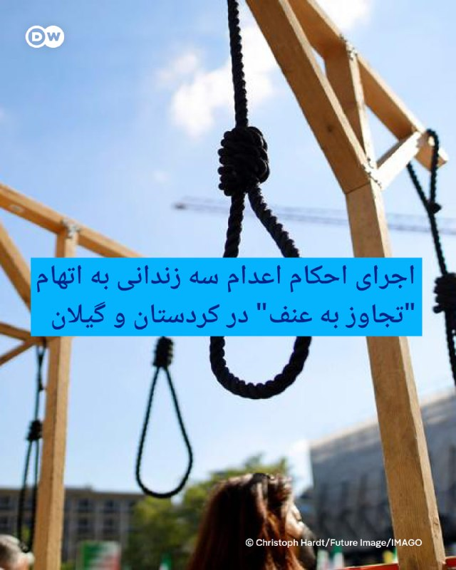

🔶 اجرای احکام اعدام سه زندانی به اتهام "تجاوز به عنف" در کردستان و گیلان
 
خبرگزاری مهر از اجرای احکام اعدام سه زندانی در دو استان کردستان و گیلان خبر داد.
 
بر اساس این خبر دو تن از این افراد به "تجاوز به عنف" به یک نوجوان ۱۴ ساله در شهرستان قروه در سال ۱۴۰۳ متهم شده بودند. طبق این گزارش، پرونده متهمان "با حضور وکلای آن‌ها در شعبه اول دادگاه کیفری یک استان به اتهام آدم‌ربایی و تجاوز به عنف مورد رسیدگی قرار گرفت" و "در جریان رسیدگی قضایی، به صراحت به ارتکاب جرم تجاوز به عنف اقرار کردند."
 
علاوه بر این، خبرگزاری مهر از اجرای حکم اعدام یک زندانی در گیلان خبر داد. او به "تجاوز به عنف" و قتل یک کودک ۱۰ ساله متهم شده بود.
 
سازمان عفو بین‌الملل در تازه‌ترین گزارش سالانه خود درباره مجازات اعدام در جهان از ثبت رکوردی بی‌سابقه در چهار دهه اخیر خبر داده و گفته بود که بخش مهمی از این جهش به ایران مربوط می‌شود.
 
عفو بین‌الملل می‌گوید جمهوری اسلامی در سال ۲۰۲۵ دست‌کم ۲۱۵۹ نفر را اعدام کرده‌؛ یعنی بیش از دو برابر سال قبل از آن. این رقم به‌تنهایی نزدیک به چهارپنجم کل اعدام‌های ثبت‌شده در جهان را شامل می‌شود.
 
@dw_farsi

## DW_Farsi — post 125404

  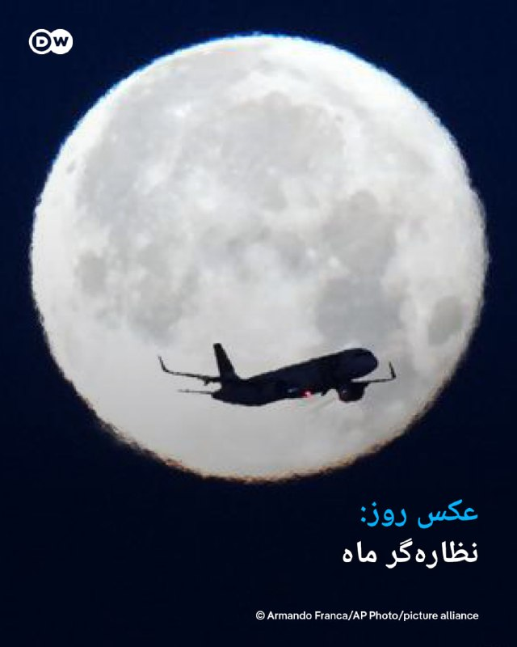

📸 عکس روز: نظاره‌گر ماه
 
یک هواپیمای خطوط هوایی "تپ" (TAP)، متعلق به پرتغال در حالی که برای فرود به فرودگاه لیسبون نزدیک می‌شود، در برابر قرص کامل ماه، لحظه‌ای چشم‌نواز و تماشایی خلق کرده است.
 
@dw_farsi

## DW_Farsi — post 125403

  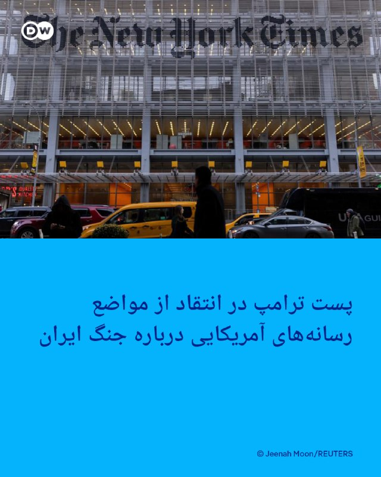

🔶 پست ترامپ در انتقاد از مواضع رسانه‌های آمریکایی درباره جنگ ایران
 
ترامپ برای سومین بار با انتشار متنی به انتقاد از مواضع رسانه‌های آمریکایی درباره جنگ ایران پرداخت.
 

ترامپ نوشته است: «اگر ایران تسلیم شود، اعتراف کند که نیروی دریایی‌اش از بین رفته و اکنون در کف دریا آرمیده است و نیروی هوایی‌اش دیگر وجود ندارد و اگر کل ارتش آن از تهران خارج شود، سلاح‌های خود را بر زمین بیندازد و دست‌هایش را بالا ببرد و هر یک فریاد بزند «تسلیم می‌شوم، تسلیم می‌شوم» و همزمان دیوانه‌وار پرچم سفیدِ نمادین را تکان دهد، و اگر تمام رهبران باقی‌مانده آن همه «اسناد تسلیم» لازم را امضا کنند و شکست خود را در برابر قدرت و نیروی عظیم ایالات متحده آمریکا بپذیرند، روزنامه نیویورک تایمزِ رو به افول، «چاینا استریت ژورنال» (وال‌استریت ژورنال!)، سی‌ان‌انِ فاسد و اکنون بی‌اهمیت، و همه دیگر اعضای رسانه‌های اخبار جعلی، تیتر خواهند زد که ایران یک پیروزی استادانه و درخشان بر ایالات متحده آمریکا به دست آورده است.»
 
ترامپ "دموکرات‌ها و رسانه‌ها" را متهم کرد که "کاملاً راه خود را گم کرده‌اند" و نوشت: «آن‌ها کاملا دیوانه شده‌اند.»
@dw_farsi

## DW_Farsi — post 125402

  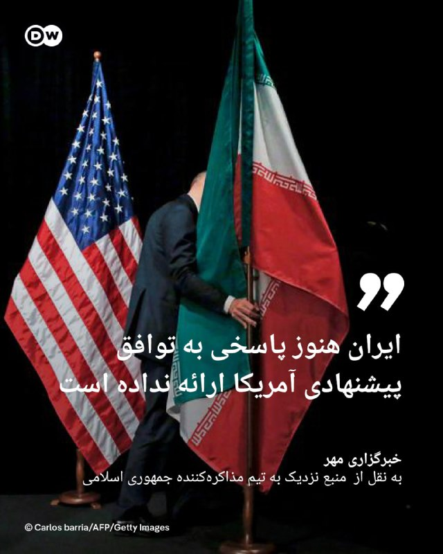

🔶 "ایران هنوز پاسخی به توافق پیشنهادی آمریکا ارائه نداده است"
 
یک منبع نزدیک به تیم مذاکره‌کننده جمهوری اسلامی روز سه‌شنبه به خبرگزاری مهر، وابسته به سازمان تبلیغات اسلامی گفته است که ایران هنوز به توافق نهایی پیشنهادی با ایالات متحده آمریکا که با هدف پایان دادن به تنش میان دو کشور ارائه شده است، پاسخ نداده و گفت‌وگوها درباره متن نهایی همچنان در تهران ادامه دارد.
 
این منبع گفت که ایران به دلیل آنچه "سابقه پایبند نبودن ایالات متحده آمریکا به تعهدات" و "بی‌اعتمادی دیرینه" می‌داند، این پیشنهاد را "سخت‌گیرانه" بررسی می‌کند.
 
این منبع همچنین به خبرگزاری مهر گفت: «بر اساس تجربه‌های پیشین، ایران به دنبال کسب انتفاع واقعی است.»
 
او افزود: «آمریکا از جنگ نگران است، ما از توافق نگرانیم؛ چون آمریکا هزینه زیادی برای جنگ کرده و توفیق نداشته است.»
 
انتشار این خبر در حالی صورت می‌گیرد که دونالد ترامپ، رئیس ‌جمهور آمریکا در گفت‌وگو با شبکه خبری "ای‌بی‌سی" گفت که فکر می‌کند "طی هفته آینده" به توافقی با ایران برای تمدید آتش‌بس و بازگشایی تنگه هرمز دست خواهد یافت.
 
@dw_farsi

## DW_Farsi — post 125401

🔶 گزارش‌ها از درگیری اسرائیل و حزب‌الله ساعاتی پس از میانجیگری ترامپ
 
ارتش اسرائیل بامداد سه‌شنبه اعلام کرد که سامانه‌های پدافند هوایی این کشور دو پرتابه شلیک‌شده از لبنان را رهگیری کرده‌اند. این رخداد تنها چند ساعت پس از آن اعلام می‌شود که دونالد ترامپ، رئیس ‌جمهور ایالات متحده آمریکا از پایان یافتن درگیری‌ها میان اسرائیل و حزب‌الله خبر داده بود.
 
ارتش اسرائیل با انتشار پیامی در تلگرام اعلام کرد: «پس از به صدا درآمدن آژیرها در ساعت ۰۱:۳۵ بامداد به وقت محلی (۲۲:۳۵ به وقت گرینویچ) در چند منطقه در شمال اسرائیل، نیروی هوایی اسرائیل دو پرتابه را که از لبنان وارد حریم اسرائیل شده بودند رهگیری کرد.»
 
خبرگزاری دولتی لبنان گزارش داد که اسرائیل چند منطقه در جنوب این کشور، از جمله روستاهای مروانیه، صدیقین، یاطر و منصوری را هدف حمله قرار داده است. این خبرگزاری همچنین اعلام کرد که "یک انفجار بسیار شدید" شهر دبین را لرزانده است.
 
این در حالی است که ترامپ پیش‌ از این اعلام کرده بود که اسرائیل و حزب‌الله را متقاعد کرده است که تنش‌ها را کاهش دهند.
 
در تازه‌ترین تحولات، ترامپ گفت که در خصوص حملات اسرائیل به لبنان، تماسی "بسیار سازنده" با بنیامین نتانیاهو، نخست‌وزیر اسرائیل داشته است. او در شبکه اجتماعی تروث‌سوشال نوشت: «هیچ نیرویی به بیروت اعزام نخواهد شد و هر نیرویی که در مسیر بوده، از قبل بازگردانده شده است.»
 
ترامپ در ادامه پیام خود افزود: «همچنین از طریق نمایندگان بلندپایه، گفت‌وگوی بسیار خوبی با حزب‌الله داشتم و آن‌ها موافقت کردند که همه تیراندازی‌ها متوقف شود؛ اسرائیل به آن‌ها حمله نخواهد کرد و آن‌ها نیز به اسرائیل حمله نخواهند کرد.»
 
این در حالی است که نتانیاهو پس از آن در پیامی نوشت که به ترامپ اطلاع داده است "اگر حزب‌الله حمله به شهرها و شهروندان ما را متوقف نکند، اسرائیل اهداف تروریستی را در بیروت هدف قرار خواهد داد".
 
حزب‌الله در اوایل ماه مارس، در واکنش به  اقدام مشترک ایالات متحده آمریکا و اسرائیل  در کشتن رهبر جمهوری اسلامی، با شلیک راکت به سوی اسرائیل، لبنان را وارد درگیری‌های خاورمیانه کرد. بنا بود برقراری یک آتش‌بس بین اسرائیل و حزب‌الله از ۱۷ آوریل به این سو به درگیری‌ها پایان دهد، اما این توافق بارها نقض شده است.
@dw_farsi

## DW_Farsi — post 125400

🔶 جام ۲۰۱۰؛ دیگو فورلان، گلزن موطلایی اروگوئه
 
🔻گزارشی از شهرام احدی

در جام جهانی ۲۰۱۰ تیم ملی فوتبال اسپانیا توانست با قدرت‌نمایی هلند را شکست دهد و برای نخستین بار قله فوتبال جهان را فتح کند.
 
داوید ویا، بازیکن جوان اسپانیا از چهره‌های درخشان آن دوره از مسابقات بود، اما ستاره‌ای که در نهایت به عنوان بازیکن برتر جام ۲۰۱۰ برگزیده شد، دیگو فورلان نام داشت. مهاجم موطلایی و کارکشته تیم ملی اروگوئه سهم به‌سزایی در موفقیت دور از انتظار تیمش داشت که در نهایت موفق شد، رتبه چهارم جهان را به خود اختصاص دهد.
 
در آن دوره از مسابقات، فورلان در کنار توماس مولر (آلمان)، وسلی اسنایدر (هلند) و داوید ویا (اسپانیا) پنج گل به ثمر رساند، اما مولر با توجه به پاس‌گل‌های بیشتری که به نام خود ثبت کرده بود، عنوان آقای گل بازی‌ها را از آن خود کرد.
 
فورلان (متولد سال ۱۹۷۹ در مونته‌ویدئو) در طول فعالیت پرفرازو‌نشیب خود به عنوان بازیکن فوتبال در خدمت باشگاه‌های متعددی بود. او پس از سه سال همکاری با باشگاه آرژانتینی "ایندپندینته" مورد توجه باشگاه‌های اروپایی قرار گرفت و در سال ۲۰۰۲ راهی انگلیس شد تا فصل تازه‌ای را با منچستر یونایتد تجربه کند.
 
این ستاره اروگوئه‌ای در طول همکاری خود با "شیاطین سرخ" بیشتر به عنوان بازیکن تعویضی در میدان حضور داشت و نتوانست آنطور که باید و شاید قابلیت‌های خود را به نمایش بگذارد. فورلان در بین سال‌های ۲۰۰۲ و ۲۰۰۴ در ۶۳ بازی برای منچستر یونایتد تنها ۱۰ گل به ثمر رساند.
 
بیشترین سال‌های فعالیت حرفه‌ای فورلان در لا لیگای اسپانیا بوده است. او در سال ۲۰۰۴ در ازای تنها ۳ میلیون یورو به باشگاه ویا رئال پیوست و در همان نخستین فصل حضورش در لیگ اسپانیا توانست با ۲۵ گل عنوان آقای گل فصل ۲۰۰۴/۲۰۰۵ را از آن خود کند.
@dw_farsi

## Persian_Trend_Official — post 15498

  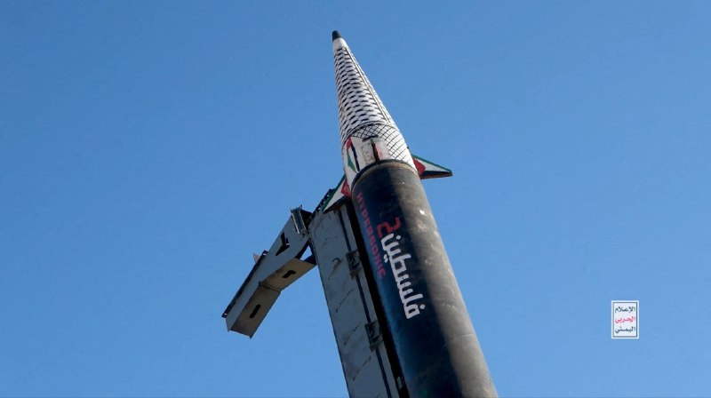

جروزالم پست: اسرائیل در بحبوحه نگرانی‌های فزاینده در مورد حملات احتمالی دوربرد از سوی حوثی‌های یمن با گسترش درگیری‌ها در منطقه، در حال تقویت پدافند هوایی خود در منطقه ایلات است.

این تقویت نظامی شامل استقرار سامانه‌های گنبد آهنین و تجهیزات دریایی اضافی در دریای سرخ است که نشان دهنده ارزیابی‌های اطلاعاتی مبنی بر تلاش انصارالله که اخیراً آمادگی خود را برای پیوستن به جنگ در کنار حزب‌الله اعلام کرده است برای حمله به عمق خاک اسرائیل است.

این اقدام پس از گزارش‌هایی مبنی بر هماهنگی مداوم بین انصارالله، حزب‌الله و سایر گروه‌های تحت حمایت ایران صورت می‌گیرد و مقامات یمنی قول می‌دهند که حزب‌الله به تنهایی در برابر اسرائیل نخواهد ایستاد. نهاد دفاعی اسرائیل علیرغم فاصله جغرافیایی، این تهدید را جدی می‌گیرد.

📝 Amir

📌 @persian_trend_official
پرشین ترند | متفاوت‌ترین کانال نظامی

## Persian_Trend_Official — post 15497

  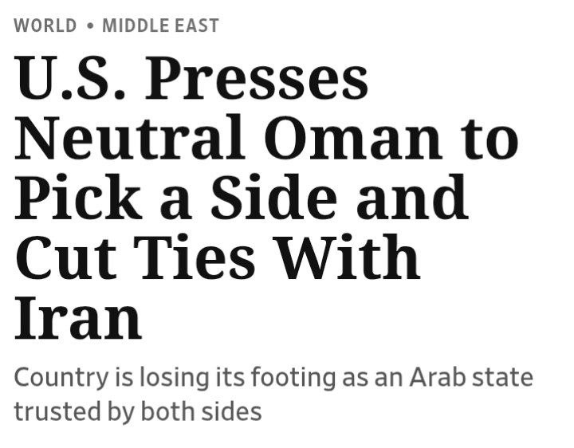

وال استریت ژورنال: ایالات متحده در حال افزایش فشار بر عمان برای فاصله گرفتن از ایران است و این امر سیاست دیرینه بی‌طرفی و میانجیگری مسقط بین واشنگتن و تهران را تحت فشار قرار می‌دهد.

بر اساس این گزارش، مقامات آمریکایی به طور فزاینده‌ای از روابط نزدیک عمان با ایران و امتناع آن از همراهی علنی با تلاش‌های منطقه‌ای با هدف منزوی کردن تهران، ناامید شده‌اند.

مقامات عمانی از رویکرد خود دفاع کرده‌اند و استدلال می‌کنند که حفظ روابط با همه طرف‌ها برای ثبات و دیپلماسی منطقه‌ای ضروری است، در حالی که اتهامات مبنی بر اینکه بی‌طرفی آنها به نفع ایران است را رد می‌کنند.

📝 Amir

📌 @persian_trend_official
پرشین ترند | متفاوت‌ترین کانال نظامی

## Persian_Trend_Official — post 15496

  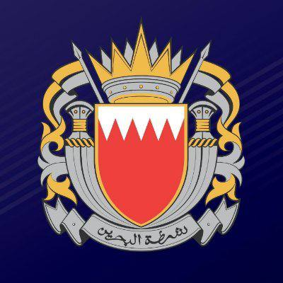

وزارت کشور بحرین اعلام کرد که به دلایل امنیتی، سفر شهروندان این کشور به ایران و عراق ممنوع است.

📝 Amir

📌 @persian_trend_official
پرشین ترند | متفاوت‌ترین کانال نظامی

## Persian_Trend_Official — post 15495

  <a href="telegram/content/Persian_Trend_Official_15495_1780398973.webm" target="_blank">🎬 Download video</a>

سخنگوی سازمان مالیاتی: فروش تا ۶۰ میلیارد تومان برای امسال معاف از مالیات درنظر گرفته شده است 📌 @persian_trend_official پرشین ترند | متفاوت‌ترین کانال نظامی

## Persian_Trend_Official — post 15494

  <a href="telegram/content/Persian_Trend_Official_15494_1780398973.mp4" target="_blank">🎬 Download video</a>

غیرعملیاتی شدن یک سامانه‌ پدافندی طبس توسط پهپادهای FPV موساد در کرج طبق تصاویر منتشر شده توسط یک چنل میلیتاری و ادعای مطرح شده، یک سامانه پدافندی طبس در دوران جنگ 40 روزه وارد شهر می‌شود و به دنبال موضع مناسب برای استقرار میگردد، در حین حرکت دو پهپاد به…

## Persian_Trend_Official — post 15492

من نمیخوام بیخود از کسی اسطوره سازی کنم
حتما رضا شاه نقاط تاریک و اشتباه در عملکرد خودش داشته !

اما چیزی که باعث شده ما احساس کنیم حقمون بیشتر از این چیزیه که داریم
یا منتظر باشم یک فرصت ایجاد بشه و از زیر سایه سنگین ارتجاع سیاه بیرون بیایم تا دوباره بتونیم اوج بگیریم
یا همین که الان تفاوت چشمگیری با افغانستان داریم !

همش بخاطر این بزرگمرد هست .
رضا شاه میتونست به رسم پادشاهان قبلی فقط به شکم و زیر شکمش اهمییت بده اما برای دوباره زنده شدن تمدن ایرانی از خودش گذشت.

روحت شاد مرد بزرگ
ارادتمند
الیاس فرخ

## Persian_Trend_Official — post 15491

  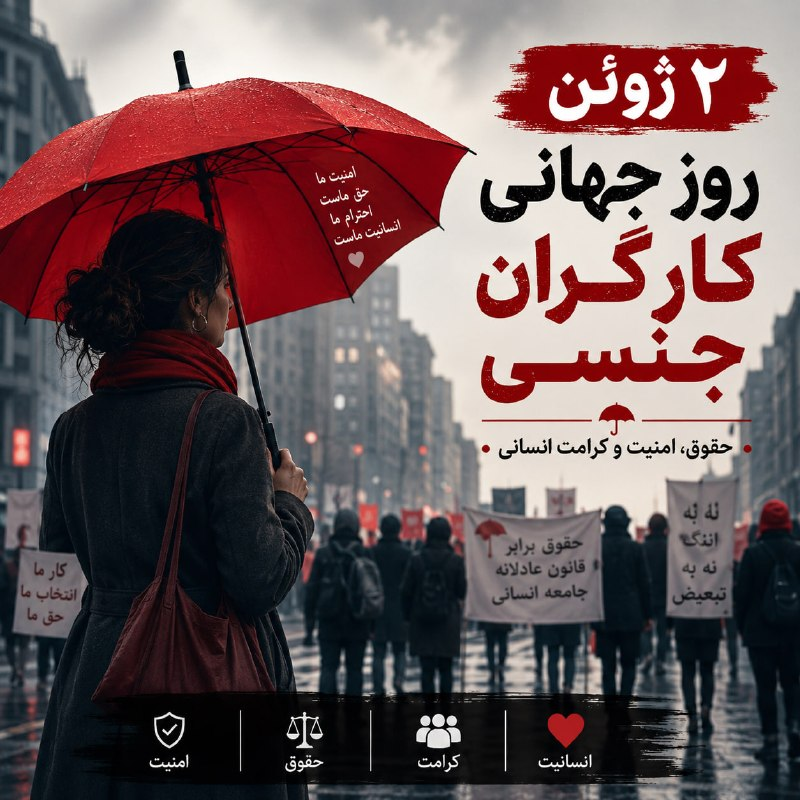

امروز ۲ ژوئن، در تقویم جهانی با عنوان روز جهانی کارگران جنسی شناخته می‌شود؛ مناسبتی که ریشه آن به سال ۱۹۷۵ در شهر لیون فرانسه برمی‌گردد، زمانی که گروهی از زنان فعال در صنعت سکس در اعتراض به خشونت، فشار پلیس، شرایط ناامن و بی‌توجهی دولت، دست به اعتراض زدند.

این روز بیش از آنکه درباره «تبلیغ» یا «عادی‌سازی» صنعت سکس باشد، درباره یک مسئله انسانی و حقوقی است:
افرادی که در این حوزه حضور دارند، حتی اگر از نگاه بسیاری از جوامع کارشان غیرقانونی، غیراخلاقی یا محل بحث باشد، نباید قربانی خشونت، تحقیر، اخاذی، قاچاق انسان، سوءاستفاده باندهای جنایی یا محرومیت از درمان و امنیت شوند.

در بحث‌های حقوق بشری، معمولاً میان چند مفهوم تفاوت گذاشته می‌شود:

کار جنسیِ مبتنی بر رضایت افراد بالغ با قاچاق انسان، اجبار، فریب و بهره‌کشی جنسی یکی نیست. دومی یک جرم سنگین و مصداق آشکار برده‌داری مدرن است؛ اما درباره اولی، کشورها و جریان‌های فکری مختلف دیدگاه‌های کاملاً متفاوتی دارند.

حامیان جرم‌زدایی می‌گویند وقتی این حوزه کاملاً زیرزمینی شود، افراد آسیب‌پذیر بیشتر در معرض خشونت، بیماری، باج‌گیری و سوءاستفاده پلیس یا شبکه‌های جنایی قرار می‌گیرند. مخالفان اما معتقدند صنعت سکس ذاتاً با فقر، استثمار، نگاه کالایی به بدن انسان و قاچاق جنسی پیوند دارد و نباید به آن مشروعیت اجتماعی داده شود.

📌 @persian_trend_official
پرشین ترند | متفاوت‌ترین کانال نظامی

## Persian_Trend_Official — post 15490

  <a href="telegram/content/Persian_Trend_Official_15490_1780398975.mp4" target="_blank">🎬 Download video</a>

⭕️ برایان مست (Brian Mast)، نماینده جمهوری‌خواه کنگره آمریکا، در یک برنامه فاکس‌نیوز درباره سیاست آمریکا در قبال ایران گفته:

دموکرات‌ها در کنگره مانع سیاست‌های رئیس‌جمهور در قبال ایران می‌شوند و به‌زعم او، در عمل به «توان ایران برای پیشبرد اهدافش» کمک می‌کنند.

او در بخشی از صحبت‌هایش از عبارت بسیار جنجالی استفاده کرده و گفته:

دموکرات‌ها «مانع اصلی» سیاست فشار علیه ایران هستند

و آن‌ها را به‌طور سیاسی به عنوان «نزدیک به منافع ایران» توصیف کرده است

📌 منبع فاکس‌نیوز این نقل‌قول را در قالب یک مصاحبه تلویزیونی منتشر کرده است.

📝 Nick

📌 @persian_trend_official
پرشین ترند | متفاوت‌ترین کانال نظامی

## Persian_Trend_Official — post 15489

  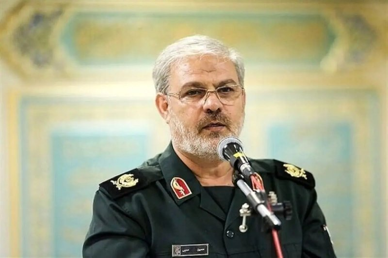

سخنگوی سپاه: توان نظامی و عملیاتی سپاه در دوره آتش‌بس افزایش داشته است.

سردار محبی، سخنگوی سپاه پاسداران: سپاه برای تمامی سناریوهای احتمالی آمادگی دارد. در صورت بازگشت دشمن به عرصه نظامی، نوع عملیات، جغرافیای نبرد و حتی نوع جنگ‌افزارهای مورد استفاده متفاوت خواهد بود.

📝 Amir

📌 @persian_trend_official
پرشین ترند | متفاوت‌ترین کانال نظامی

## Persian_Trend_Official — post 15488

  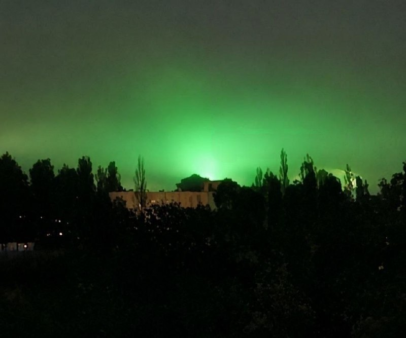

آسمان شهر زاپوریژژیا در اوکراین، امشب در جریان حمله هوایی روسیه با نور سبز روشن شد.

این روس ها معلوم نیست چی استفاده کردن ولی اگر این صحنه در قم اتفاق می افتاد تا دو سال تو کانال های انقلابی به عنوان نشانه ظهور امام زمان ازش یاد میکردن ! 😄

📌 @persian_trend_official
پرشین ترند | متفاوت‌ترین کانال نظامی

## Persian_Trend_Official — post 15487

  <a href="telegram/content/Persian_Trend_Official_15487_1780398978.mp4" target="_blank">🎬 Download video</a>

آخرین ویدیو از خلبانِ کشته شده در جنگ رمضان قبل از شروع ماموریت

خلبان جابر طاهریان در ۷ فروردین جان خود را از دست داد ...

📌 @persian_trend_official
پرشین ترند | متفاوت‌ترین کانال نظامی

## Persian_Trend_Official — post 15486

  <a href="telegram/content/Persian_Trend_Official_15486_1780398979.webm" target="_blank">🎬 Download video</a>

سردار اسدی: هنوز برگ‌های برنده را رو نکرده‌ایم

معاون بازرسی قرارگاه مرکزی خاتم‌الانبیا:
🔹بارها گفته‌ایم که هنوز همه برگ‌های برنده خود را رو نکرده‌ایم و برگ‌های زیادی وجود دارد که اگر لازم شود، از آن‌ها استفاده خواهیم کرد.

🔹آمریکا فقط خواهان تسلیم کامل ما است و ملت ایران هم هرگز تسلیم نخواهد شد.

🔹وقتی تسلیم در کار نیست، جنگ در پیش است؛ بنابراین ما منتظریم و مشکلی با جنگ نداریم؛ لذا اگر ناتو هم در این عرصه حاضر شود، ما هیچ‌گونه نگرانی نداریم.

📌 @persian_trend_official
پرشین ترند | متفاوت‌ترین کانال نظامی

## Persian_Trend_Official — post 15484

  <a href="telegram/content/Persian_Trend_Official_15484_1780398980.webm" target="_blank">🎬 Download video</a>

غیرعملیاتی شدن یک سامانه‌ پدافندی طبس توسط پهپادهای FPV موساد در کرج

طبق تصاویر منتشر شده توسط یک چنل میلیتاری و ادعای مطرح شده، یک سامانه پدافندی طبس در دوران جنگ 40 روزه وارد شهر می‌شود و به دنبال موضع مناسب برای استقرار میگردد، در حین حرکت دو پهپاد به جلوی سامانه برخورد می‌کند که باعث نابودی رادار و سیکر موشک های پدافندی می‌شود.

پس از گذشت چند دقیقه از اصابت دو پهپاد FPV، باقی مانده سامانه توسط دو بمب پرتاب شده از جنگنده‌های امریکایی/اسرائیلی به طور کامل منهدم می‌شود.

📝 Amir

📌 @persian_trend_official
پرشین ترند | متفاوت‌ترین کانال نظامی

## Persian_Trend_Official — post 15483

  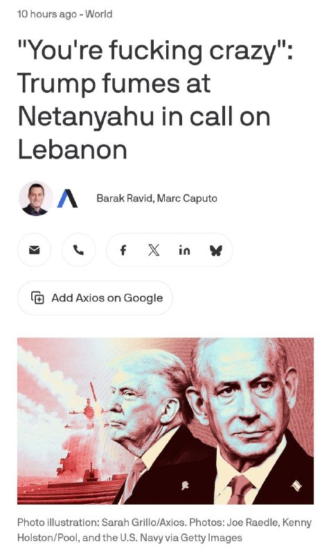

⭕️ بر اساس گزارش آکسیوس، دونالد ترامپ در تماس تلفنی روز دوشنبه با بنیامین نتانیاهو از تشدید حملات اسرائیل در لبنان به‌شدت ناراضی بوده و لحن تندی داشته است. آکسیوس به نقل از چند مقام آمریکایی نوشته ترامپ نتانیاهو را «دیوانه» خطاب کرده، از او بابت ادامه این روند انتقاد کرده و حتی برنامه اسرائیل برای حمله به بیروت را متوقف کرده است.

در این گزارش آمده ترامپ نگران بوده که حملات اسرائیل به لبنان، مذاکرات واشنگتن با ایران را به خطر بیندازد و انزوای بین‌المللی اسرائیل را بیشتر کند. پس از این تماس، ترامپ در شبکه اجتماعی خود نوشت که گفت‌وگوهای ایران «با سرعت زیاد» ادامه دارد. دفتر نتانیاهو نیز بعداً اعلام کرد که اسرائیل در صورت ادامه حملات حزب‌الله، به اهدافی در بیروت حمله خواهد کرد.

📝 Nick

📌 @persian_trend_official
پرشین ترند | متفاوت‌ترین کانال نظامی

## Persian_Trend_Official — post 15482

  <a href="telegram/content/Persian_Trend_Official_15482_1780398980.webm" target="_blank">🎬 Download video</a>

⭕️ ارتش آمریکا و وزارت دفاع بریتانیا اعلام کردند که یک سرباز آمریکایی و یک سرباز بریتانیایی در جریان یک حادثه حین تمرین نظامی در پایگاه هوایی اربیل عراق، در تاریخ ۳۱ مه جان خود را از دست داده‌اند.

مقام‌های نظامی جزئیات بیشتری درباره علت این حادثه منتشر نکرده‌اند و تحقیقات در این زمینه ادامه دارد.

این اتفاق در حالی رخ داده که در همان روز، گزارش‌هایی از حملات موشکی ایران به مواضع گروه‌های مسلح کرد مخالف جمهوری اسلامی در استان اربیل منتشر شد.

با این حال، تاکنون هیچ منبع رسمی ارتباطی میان مرگ این دو نظامی و حملات موشکی ایران اعلام نکرده است.

📝 Nick

📌 @persian_trend_official
پرشین ترند | متفاوت‌ترین کانال نظامی

## Persian_Trend_Official — post 15481

  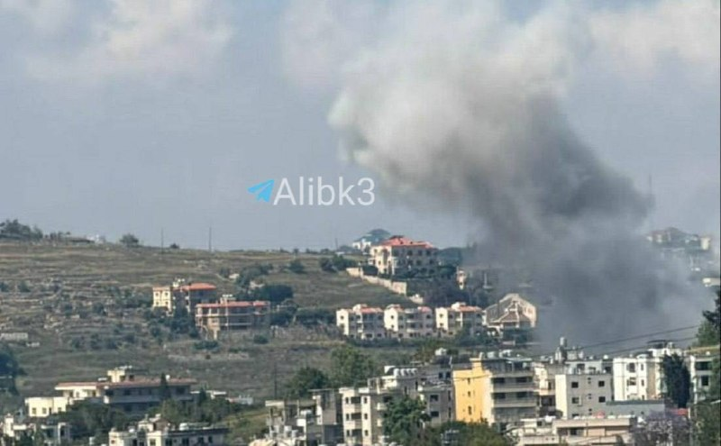

حمله هوایی اسرائیل به نبطیه !

📌 @persian_trend_official
پرشین ترند | متفاوت‌ترین کانال نظامی

## Persian_Trend_Official — post 15480

⭕️ رئیس پیشین موساد، دیوید بارنيا: «مأموریت ما در قبال ایران هنوز به پایان نرسیده است و این تعهد تنها زمانی محقق خواهد شد که حکومت کنونی ایران جایگزین شود.» 📝 Nick 📌 @persian_trend_official پرشین ترند | متفاوت‌ترین کانال نظامی

## Persian_Trend_Official — post 15479

سخنگوی سازمان مالیاتی:

فروش تا ۶۰ میلیارد تومان برای امسال معاف از مالیات درنظر گرفته شده است

📌 @persian_trend_official
پرشین ترند | متفاوت‌ترین کانال نظامی

## RadioFarda — post 157810

  <a href="telegram/content/RadioFarda_157810_1780398981.mp4" target="_blank">🎬 Download video</a>

🔸صدها دانش‌آموز روز سه‌شنبه ۱۲ خرداد در شهرهای تهران، مشهد، همدان و چندین شهر دیگر با تجمع مقابل ساختمان وزارت آموزش و پرورش به تغییر قوانین کنکور و افزایش تاثیر معدل در کارنامه کنکور سراسری باتوجه به تاثیر منفی جنگ بر آمادگی آن‌ها برای آزمون ورود به دانشگاه اعتراض کردند.

🔸در ویدیوهایی که کانال تلگرامی اعتراض مدنی بازار منتشر کرده دانش‌آموزان شعارهایی چون «دانش‌آموز می‌میرد، ذلت نمی‌پذیرد» شنیده می‌شود.

🔸 این تجمع در حالی برگزار شد که به گفته دانش‌آموزان، شرایط ناشی از جنگ و بلاتکلیفی در زمان برگزاری آزمون‌ها، امکان برنامه‌ریزی و آمادگی مناسب برای امتحانات نهایی و کنکور را از آنها گرفته است.

🔸بر اساس مصوبات رسمی شورای عالی انقلاب فرهنگی و اطلاعیه‌های سازمان سنجش، تغییراتی در کنکور سراسری سال ۱۴۰۵ اعمال شده و بر اساس آن دروس عمومی از دفترچه کنکور حذف شده و سوابق تحصیلی و امتحانات نهایی پایه‌های دهم، یازدهم و دوازدهم تاثیر قطعی در کنکور خواهند داشت.

@RadioFarda

## RadioFarda — post 157809

پاراگراف اول؛ قلیچ‌خانی و کریمی، قهرمان ملی یا چهره مشهور معترض؟

🔸پرویز قلیچ‌خانی و علی کریمی را در نگاه اول می‌توان در یک قاب کنار هم قرار داد؛ دو ستاره محبوب فوتبال، دو چهره معترض و دو سرمایهٔ نمادین در تاریخ این ورزش. اما اگر کمی عمیق‌تر شویم، تفاوت‌ها از همان نقطه‌ای آغاز می‌شود که کنش سیاسی از سطح صرفِ موضع‌گیری فراتر می‌رود.

🔸اگر از مقایسهٔ اخلاقی این دو چهرهٔ مشهور فاصله بگیریم، با دو نام مواجه می‌شویم که هر دو سرمایه‌ای مشترک را وارد میدان سیاست کرده‌اند؛ محبوبیت. اما به نظر می‌رسد نسبت هر یک از این دو با شهرت، سیاست، مردم و خطرپذیری از یک جنس نیست.

🔸پرویز قلیچ‌خانی محصول دوره‌ای از تاریخ بود که سیاست ایدئولوژیک هنوز معنای پررنگی داشت. برای او فوتبال صرفاً سکوی شهرت نبود بلکه بخشی از زیست سیاسی‌اش محسوب می‌شد.

🔸در مقابل، علی کریمی محصول عصر شبکه‌های اجتماعی است؛ عصری که در آن مرجعیت‌های کلاسیک تضعیف شده‌اند و سیاست، بیش از هر چیز، رنگی عاطفی و لحظه‌ای به خود گرفته و گاه به داوری اخلاقی نزدیک می‌شود.

🔸پرویز قلیچ‌خانی برای نسل‌هایی که دیروز را زیسته‌اند، ورزشکاری کنشگر است و امتداد سنت جهان‌پهلوان تختی؛ قهرمانی که خود او نیز از او به‌عنوان الگو یاد می‌کرد.

🔸در سوی دیگر، علی کریمی را می‌توان در زیرمجموعه چهره‌های مشهورِ منتقد در عصر رسانه‌ای جدید قرار داد؛ چهره‌ای که کنش سیاسی‌اش بیش از آن‌که در چارچوب‌های سازمان‌یافته تعریف شود، در بستر رسانه و واکنش شکل گرفته است.

🔸در پسِ شباهت ظاهری این دو چهره، دو تجربه متفاوت از دو عصر سرکوب سیاسی در ایران هم نهفته است.

🔸در برنامه رادیویی «پاراگراف اول»، مهرداد درویش‌پور، استاد جامعه‌شناسی و دانشیار مددکاری اجتماعی در دانشگاه مالاردالن سوئد، همراه با مهدی عبدالله‌زاده، دانش‌آموخته ارتباطات از دانشگاه لوگانو در سوئیس، روزنامه‌نگار و منتقد سینمایی، از فاصلهٔ میان سرمایهٔ اجتماعی، کنشگری سیاسی تا قهرمان ملی گفته‌اند.

🔸نسخه کامل این گفت‌وگو را در وب‌سایت رادیوفردا بخوانید.

@RadioFarda

## RadioFarda — post 157808

  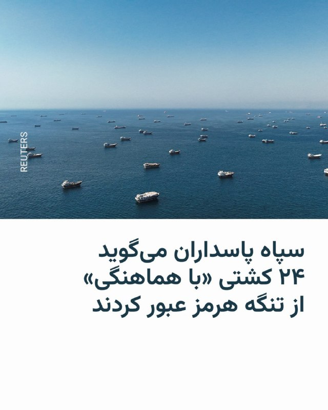

🔸روابط عمومی نیروی دریایی سپاه پاسداران روز سه‌شنبه ۱۲ خرداد بدون اشاره به جزئیات اعلام کرد که طی شبانه‌روز گذشته ۲۴ فروند کشتی پس از دریافت مجوز و «با هماهنگی» از تنگه هرمز عبور کرده‌اند.

🔸در اطلاعیه سپاه آمده است که «تردد این شناورها با هماهنگی و تامین امنیت نیروهای دریایی سپاه انجام شده است.»

🔸روزنامه اسرائیلی «اسرائیل هیوم» روز شنبه گزارش داد که ده‌ها نفتکش حامل نفت و گاز طبیعی مایع در هفتهٔ گذشته با اجازه آمریکا و پرداخت عوارض به ایران از تنگهٔ هرمز عبور کرده‌اند.

🔸این در حالی است که دولت آمریکا بارها اعلام کرده است با پرداخت عوارض به ایران برای عبور از تنگه هرمز مخالف است.

@RadioFarda

## RadioFarda — post 157807

گزارش عفو بین‌الملل از سرکوب و بازداشت‌های مرتبط با جنگ ایران در کشورهای خلیج فارس

🔸سازمان عفو بین‌الملل می‌گوید بیش از هزار نفر در کشورهای عربی خلیج فارس به‌دلیل اظهارنظر، انتشار ویدئو یا بازنشر مطالب مربوط به جنگ آمریکا و اسرائیل با ایران و حملات ایران به کشورهای خلیج فارس بازداشت شده‌اند.

🔸این سازمان حقوق بشری در بیانیه‌ای که روز سه‌شنبه ۱۲ خرداد منتشر شد، اعلام کرد که این بازداشت‌ها در کویت، بحرین، امارات متحدهٔ عربی، قطر و عربستان سعودی انجام شده و در کویت و بحرین، برخی شهروندان به‌دلیل ابراز عقیده یا فعالیت‌های مرتبط با آن از تابعیت خود نیز محروم شده‌اند.

🔸عفو بین‌الملل هفته گذشته نیز در گزارشی مرتبط با ایران اعلام کرد از نهم اسفند پارسال، جمهوری اسلامی بیش از شش هزار نفر از معترضان، روزنامه‌نگاران، وکلا، فعالان مدنی و سیاسی و اعضای اقلیت‌های قومی و مذهبی را بازداشت کرده است؛ روندی که رو به تشدید است و سازمان عفو بین‌الملل آن را بهره‌برداری از شرایط جنگی خوانده است.

🔸عفو بین‌الملل در گزارش جدید خود می‌گوید پس از آغاز جنگ، دولت‌های عضو شورای همکاری خلیج فارس، از جمله کویت، بحرین، امارات، قطر، عربستان سعودی و عمان، با استناد به نگرانی‌های امنیت ملی، هشدارهایی کلی دربارهٔ انتشار «شایعه»، «اطلاعات نادرست» یا مطالب برگرفته از «منابع ناشناس» صادر کردند و پس از آن چند کشور از بازداشت‌های گسترده خبر دادند.

🔸هبه مرایف، مدیر منطقه‌ای عفو بین‌الملل در خاورمیانه و شمال آفریقا، گفت هرچند دولت‌ها می‌توانند برای مقابله با اطلاعات نادرست و حفاظت از امنیت ملی اقدام کنند، اما هرگونه محدودیت بر آزادی بیان باید «ضروری، متناسب و منطبق با معیارهای سختگیرانهٔ حقوق بین‌الملل» باشد.

🔸او افزود که کشورهای خلیج فارس برای حفظ تصویر خود به‌عنوان «پناهگاه‌های امن»، از قوانین مبهم و گسترده در حوزهٔ جرایم سایبری، مبارزه با تروریسم و امنیت ملی برای کنترل اطلاعات استفاده کرده‌اند.

🔸نسخه کامل این گزارش را در وب‌سایت رادیوفردا بخوانید.

## RadioFarda — post 157805

آیا توافقی «که همه انتظارش را می‌کشند، بدون تصمیم‌های سخت درباره ایران» ممکن است؟

🔸بیش از سه ماه از جنگ ایران گذشته و جهان همچنان چشم‌انتظار است ببیند آیا واشینگتن و تهران به یک توافق موقت دست خواهند یافت یا منطقه به سوی تنش و رویارویی گسترده‌تری پیش خواهد رفت.

🔸در همین حال، هنوز نشانهٔ روشنی از دستیابی به یک گشایش دیپلماتیک دیده نمی‌شود. با وجود مطرح شدن احتمال آتش‌بس ۶۰ روزه و ازسرگیری گفت‌وگوها، اختلاف‌ها بر سر تحریم‌ها، برنامه هسته‌ای ایران و کنترل تنگه هرمز همچنان پابرجاست.

🔸رادیو اروپای آزاد/رادیو آزادی در گفت‌وگو با تینا فوردهَم، کارشناس مسائل ژئوپلیتیک و بنیان‌گذار شرکت «فوردهم گلوبال فورسایت»، به بررسی وضعیت مذاکرات، ارزیابی بازارها از این گفت‌وگوها و پیامدهای ژئوپلیتیکی این بن‌بست پرداخته است.

🔸نسخه کامل این گفت‌وگو را در وب‌سایت رادیوفردا بخوانید.

@RadioFarda

## RadioFarda — post 157804

  <a href="telegram/content/RadioFarda_157804_1780398984.mp4" target="_blank">🎬 Download video</a>

🔸دور تازۀ حملات روسیه به نقاط مختلف اوکراین در ساعات اولیۀ صبح سه‌شنبه ۱۲ خردادماه، دست‌کم ۴ کشته و چندین زخمی به‌جا گذاشت.

🔸در این موج از حملات روسیه، دو مجتمع آپارتمانی هم در کی‌یف پایتخت اوکراین آسیب دیدند.

🔸به گفتۀ ویتالی کلیچکو شهردار کی‌یف، برخورد یک موشک به یک ساختمان ۲۴ طبقه، باعث ریزش بخش‌هایی از ساختمان شده و احتمال دارد جمعی از ساکنان زیر آوار گیر افتاده باشند.

🔸ویتالی کلیچکو تأیید کرد که بر اساس گزارش‌های اولیه، دست‌کم ۱۴ تن در یخش‌های مختلف پایتخت مجروح شده‌اند.

🔸شهردار کی‌یف در شبکۀ تلگرام هم از آتش گرفتن یک ساختمان ۹ طبقه و چندین خودرو بر اثر سقوط بقایای موشک‌های روسیه روی آنها خبر داد. به نوشتۀ ویتالی کلیچکو، دو آتش‌سوزی هم در دو محوطۀ باز، از جمله در نزدیکی یک کودکستان رخ داده است.

🔸طی روزهای اخیر ارزیابی‌های اطلاعاتی اوکراین، از برنامه‌ریزی روسیه برای یک حملۀ سنگین حکایت داشتند.

🔸همزمان با آغاز حملات روسیه و در پی به‌صدا درآمدن آژیرهای خطر، هزاران تن از شهروندان کی‌یف به ایستگاه‌های مترو و سایر نقاط امن پناه بردند.

@RadioFarda

## RadioFarda — post 157803

  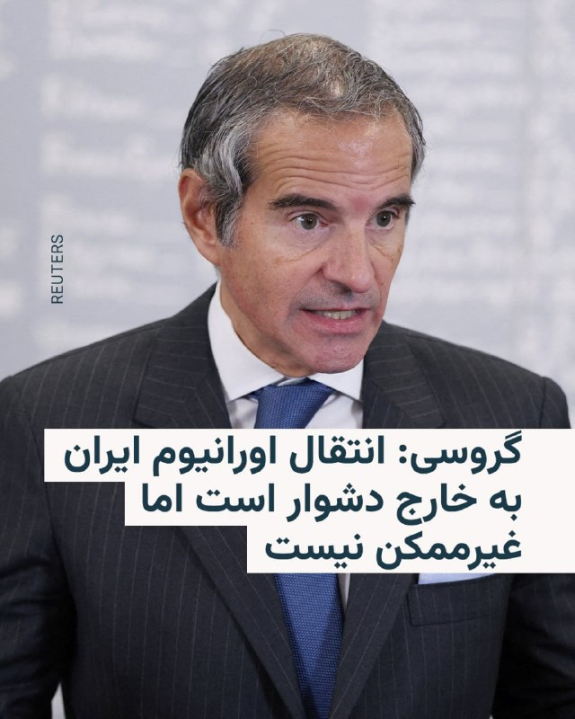

🔸رافائل گروسی، رئیس آژانس بین‌المللی انرژی اتمی، می‌گوید انتقال اورانیوم غنی‌شدهٔ ایران به خارج از کشور اگرچه دشوار است اما «غیرممکن نیست».

🔸این اظهارات در شرایطی بیان شده که سرنوشت ذخایر اورانیوم با غنای بالای ایران به موضوعی محوری در مذاکرات جاری میان تهران و واشینگتن تبدیل شده است. مقامات جمهوری اسلامی این خواستهٔ آمریکا را «زیاده‌خواهی» خوانده و می‌گویند به آن تن نمی‌دهند.

🔸برآورد می‌شود ایران حدود ۴۴۰ کیلوگرم اورانیوم با غنای حدود ۶۰ درصد در اختیار داشته باشد. گروسی پیش از این گفته بود که ذخیرهٔ اورانیوم غنی‌شدهٔ ایران پس از حملات هوایی آمریکا و اسرائیل به مراکز هسته‌ای کشور، در همان اماکن دست‌نخورده باقی مانده است.

🔸گروسی در گفت‌و‌گویی با شبکه خبری الجزیره، درباره انتقال اورانیوم باغنای بالای ایران به خارج از کشور، گفت: «چنین عملیاتی آسان نیست، زیرا این مواد به شکل گاز هستند، بسیار آلاینده‌اند و انجام این عملیات ساده نیست.»

🔸ترامپ که ذخایر اورانیوم‌ غنی‌شده ایران که در تأسیسات هسته‌ای مدفون است را «گرد و غبار هسته‌ای» می‌نامد، بارها گفته آمریکا باید این ذخایر را به دست بیاورد.

@RadioFarda

## RadioFarda — post 157802

  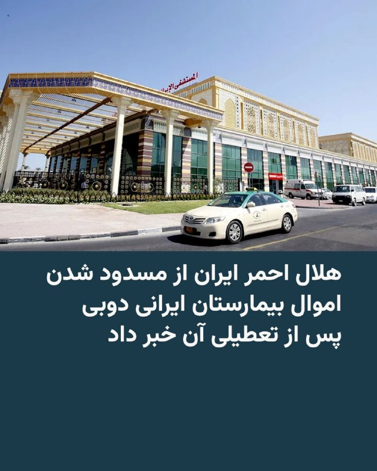

🔸هلال احمر ایران می‌گوید امارات، پس از تعطیل کردن بیمارستان ایرانی دوبی در جریان جنگ ۴۰ روزه، اموال و دارایی‌های این مرکز درمانی را نیز مسدود کرده است.

🔸مجتبی خالدی، سخنگوی جمعیت هلال احمر ایران، روز دوشنبه ۱۱ خرداد گفت که پس از توقف فعالیت بیمارستان هلال احمر در دبی، «اموال بیمارستان بلوکه شده و همه دارایی‌ها در وضعیت نامشخصی قرار دارند».

🔸به گفته او، مقام‌های اماراتی رئیس بیمارستان را نیز همچنان مکرراً احضار و درباره نحوه فعالیت این مرکز بازجویی می‌کنند.

🔸آقای خالدی با انتقاد از نحوهٔ تعطیلی بیمارستان گفت که در طول جنگ، کشور امارات درخواست تخلیه بیمارستان را به مدت دو ماه مطرح کرد، اما «در کمتر از دو هفته» بیمارستان را به تعطیلی کشاند، بخشی از کارکنان با لغو ویزای کار روبه‌رو شدند و دسترسی به سامانه‌های بیمارستان نیز قطع شد.

🔸تعطیلی بیمارستان ایرانی دوبی که حدود ۵۰ سال سابقهٔ فعالیت داشت، پس از آن رخ داد که ایران در واکنش به حملات آمریکا و اسرائیل، اهداف نظامی و غیرنظامی بسیاری را در امارات متحده عربی هدف حملات موشکی و پهپادی قرار داد.

@RadioFarda

## RadioFarda — post 157801

  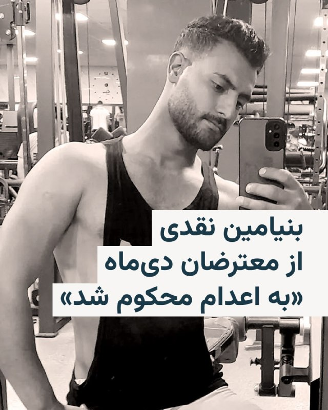

🔸بنیامین نقدی، از معترضان بازداشت‌شده در جریان اعتراضات دی‌ماه ۱۴۰۴ در شیراز، در شعبه اول دادگاه انقلاب این شهر به اعدام محکوم شد.

🔸وب‌سایت امتداد روز دوشنبه ۱۱ خرداد گزارش داد که این معترض ۲۶ ساله که در رشته‌های کیک‌بوکسینگ و هنرهای رزمی ترکیبی فعالیت می‌کند، روز ۱۳ دی‌ماه ۱۴۰۴ در جریان یک تجمع اعتراضی در شیراز بازداشت شده بود. رسانه‌های حکومتی یک روز پس از بازداشت او، اعترافات اجباری او را پخش کردند.

🔸مقام‌های قضایی جمهوری اسلامی بنیامین نقدی را متهم کرده‌اند که با استفاده از یک کپسول آتش‌نشانی به عنوان شعله‌افکن، نیروهای امنیتی سوار بر موتورسیکلت را هدف قرار داده است.

🔸مصطفی نیلی، وکیل آقای نقدی، گفته است که موکلش در ابتدا با اتهام «شروع به قتل» مواجه بوده، اما این اتهام بعداً به «محاربه» تغییر کرده است.

🔸بر اساس این گزارش، قضات دادگاه در نهایت مجموعه این اتهام‌ها را مصداق «افساد فی‌الارض» تشخیص داده و حکم اعدام را بر همین مبنا صادر کرده‌اند.

@RadioFarda

## RadioFarda — post 157800

🔸هما میرافشار، شاعر و ترانه‌سرای نامدار ایرانی، در ۸۹ سالگی در لس‌آنجلس درگذشت.

🔸مرتضی برجسته اشراقی، با نام هنری مرتضی، سه‌شنبه ۱۲ خرداد، در اینستاگرام نوشت که خانم افشار هفته گذشته چشم از جهان فروبست، اما خانوادهٔ او با تأخیر این خبر را منتشر کردند.

🔸این شاعر و ترانه‌سرا، که بر اساس گزارش‌ها، سال‌ها با بیماری آلزایمر دست‌و‌پنجه نرم می‌کرد، از پُرکارترین و محبوب‌ترین ترانه‌سرایان قبل و بعد از انقلاب ۱۳۵۷ بود.

🔸آن‌طور که مرتضی نوشته، خانم افشار بیش از ۶۰۰ ترانه ماندگار سروده است.

🔸هما افشار با بسیاری از خوانندگان برجسته ایرانی از جمله حمیرا، هایده، مهستی، ستار، ابی، داریوش، معین و عارف همکاری داشت.

🔸او در سال ۱۳۱۵ در تهران متولد شد و در جوانی با علی میرافشار، پسرعموی حمیرا، ازدواج کرد. این پیوند، دوستی نزدیکی بین هما و حمیرا ایجاد کرد که به گفته خود او، جرقهٔ تولید بسیاری از ترانه‌ها و همکاری‌های این دو با هم شد.

@RadioFarda

## RadioFarda — post 157799

چهار کشته و ده‌ها زخمی، در اثر حملات گستردۀ روسیه به گوشه‌وکنار اوکراین

🔸دور تازۀ حملات روسیه به نقاط مختلف اوکراین در ساعات اولیۀ صبح سه‌شنبه ۱۲ خردادماه، دست‌کم ۴ کشته و چندین زخمی به‌جا گذاشت.

🔸در این موج از حملات روسیه، دو مجتمع آپارتمانی هم در کی‌یف پایتخت اوکراین آسیب دیدند.

🔸به گفتۀ ویتالی کلیچکو شهردار کی‌یف، برخورد یک موشک به یک ساختمان ۲۴ طبقه، باعث ریزش بخش‌هایی از ساختمان شده و احتمال دارد جمعی از ساکنان زیر آوار گیر افتاده باشند.

🔸ویتالی کلیچکو تأیید کرد که بر اساس گزارش‌های اولیه، دست‌کم ۱۴ تن در یخش‌های مختلف پایتخت مجروح شده‌اند.

🔸شهردار کی‌یف در شبکۀ تلگرام هم از آتش گرفتن یک ساختمان ۹ طبقه و چندین خودرو بر اثر سقوط بقایای موشک‌های روسیه روی آنها خبر داد. به نوشتۀ ویتالی کلیچکو، دو آتش‌سوزی هم در دو محوطۀ باز، از جمله در نزدیکی یک کودکستان رخ داده است.

🔸طی روزهای اخیر ارزیابی‌های اطلاعاتی اوکراین، از برنامه‌ریزی روسیه برای یک حملۀ سنگین حکایت داشتند.

🔸همزمان با آغاز حملات روسیه و در پی به‌صدا درآمدن آژیرهای خطر، هزاران تن از شهروندان کی‌یف به ایستگاه‌های مترو و سایر نقاط امن پناه بردند.

🔸در نخستین ساعات سه‌شنبه به وقت محلی، بیشتر مناطق اوکراین شاهد به‌صدا درآمدن آژیرهای خطر بودند. از جمله در شهر دنیپرو که حملات روسیه ۴ کشته و ۱۶ زخمی به‌جا گذاشت.

🔸هفتۀ پیش روسیه هشدار داده بود که قصد دارد «حملاتی سازمان‌یافته» را علیه اهداف نظامی و مراکز تصمیم‌سازی در کی‌یف به اجرا بگذارد و از شهروندان خارجی خواسته بود اوکراین را ترک کنند.

🔸نسخه کامل این گزارش را در وب‌سایت رادیوفردا بخوانید.

@RadioFarda

## RadioFarda — post 157798

تداوم حملات متقابل اسرائیل و حزب‌الله لبنان؛ گزارشی از «مکالمه تند» ترامپ با نتانیاهو

🔸با وجود تأکید آمریکا بر توافق اسرائیل و حزب‌الله لبنان بر سر آتش‌بس، حملات متقابل میان دو طرف ادامه دارد.

🔸ارتش اسرائیل سه‌شنبه ۱۲ خرداد اعلام کرد که در ساعات اولیه بامداد، دو پرتابه را که از لبنان به شمال اسرائیل شلیک شده بود، رهگیری کرده است. همچنین اعلام شد یک هدف هوایی مشکوک بعداً در داخل خاک اسرائیل و در نزدیکی مرز لبنان سقوط کرده است.

🔸همزمان و در پی انتشار بیانیه‌های حزب‌الله مبنی بر حمله به نیروها و تانک‌های اسرائیلی، خبرگزاری رسمی لبنان هم از حملات تازهٔ اسرائیل به جنوب لبنان خبر داد.

🔸آمریکا حزب‌الله لبنان را که از سوی جمهوری اسلامی ایران حمایت می‌شود، یک سازمان تروریستی تعریف کرده و اتحادیه اروپا تنها شاخهٔ نظامی آن را تروریستی می‌داند.

🔸به گزارش خبرگزاری رسمی لبنان، ارتش اسرائیل چندین نقطه در جنوب، از جمله در روستاهای مروانیه، صدیقین، یعتر و منصوری را هدف قرار داده است. این گزارش همچنین از وقوع انفجاری سهمگین در شهرک «دِبّین» خبر داد.

🔸این حملات متقابل در شرایطی انجام شده که در پی انتشار خبر تماس تلفنی دونالد ترامپ با بنیامین نتانیاهو، رئیس‌جمهور آمریکا در شبکهٔ اجتماعی خود نوشت که نیروهای ارتش اسرائیل به بیروت نخواهند رفت.

🔸او افزود: «تماسی بسیار مفید با بی‌بی نتانیاهو، نخست‌وزیر اسرائیل، داشتم و دیگر نیرویی به بیروت نخواهد رفت، و هر نیرویی هم که در راه بودند بازگردانده می‌شوند.»

این در حالی است که باراک راوید، خبرنگار وب‌سایت اکسیوس، به نقل از سه منبع آگاه از جمله دو منبع آمریکایی دربارهٔ مکالمهٔ تلفنی ترامپ و نتانیاهو نوشت رئیس‌جمهور آمریکا با «الفاظ بسیار تندی» با نتانیاهو صحبت کرده است.

🔸نسخه کامل این گزارش را در وب‌سایت رادیوفردا بخوانید.

@RadioFarda

## IranianMinds — post 21239

  <a href="telegram/content/IranianMinds_21239_1780398988.mp4" target="_blank">🎬 Download video</a>

🔴 کاظمی وزیر آموزش و پرورش :‌ امتحانات نهایی از ۱۳ تیر ماه و بصورت حضوری شروع خواهد شد.

@IranianMinds

## IranianMinds — post 21238

🔴 اسرائیل کاتز وزیر دفاع اسرائیل:

در داخل لبنان آتش بس وجود ندارد و ارتش اسرائیل به فعالیت های خود علیه حزب الله ادامه می دهد.

@IranianMinds

## IranianMinds — post 21237

🔴 وزارت امور خارجه اسرائیل:

نقض آتش‌بس توسط حزب‌الله ادامه دارد و غیرقابل قبول است

@IranianMinds

## IranianMinds — post 21236

  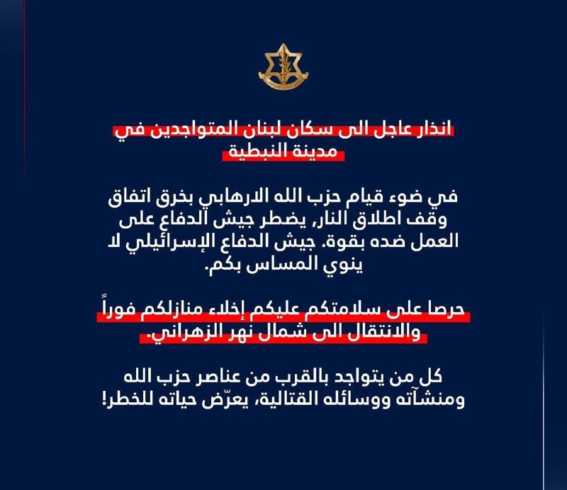

🔴هشدار فوری ارتش اسرائیل به ساکنان النبطیه برای تخلیه.

@IranianMinds

## IranianMinds — post 21235

🔴 جُک سال

قائم مقام معاون پزشکیان : ۵۶ درصد مردم حداقل یکبار در تجمعات شبانه شرکت کردن.

@IranianMinds

## IranianMinds — post 21234

  <a href="telegram/content/IranianMinds_21234_1780398990.mp4" target="_blank">🎬 Download video</a>

🔴 ‏رئیس پیشین موساد بارنیا: «تغییر رژیم در ایران یک هدف ممکن و دست‌یافتنی است.»

‏او در مراسم خداحافظی‌اش تاکید کرد که سرنگونی جمهوری اسلامی ماموریتی عملی است که به عزم و اراده نیاز دارد و باید در صدر اولویت‌ها بماند.
‏
@IranianMinds

## IranianMinds — post 21233

‼️ فرصت داره تموم میشه فقط ۵ روز وقت هست
‼️
اگر هنوز ۵۰۰ هزارتومان رو  نگرفتی همین الان عضو شو‌ و جایزتو بگیر
نیازی هم به واریز نیست

👍 تنها سایت مورد #تایید ما  با بونوس های واقعی

🌐 Winro.io

🌐 Winro.io

## IranianMinds — post 21232

  

🔴فقط 
5️⃣ روز فرصت باقی مونده
🔴

🎉 500 هزارتومن بونوس رایگان فقط با ثبت نام بدون هیچگونه واریزی!

😮 تنها سایتی که با عضویت بدون واریز 500,000 تومان شارژ بی قیدو شرط میده #وینرو هست
💰AR12

7️⃣
1️⃣ خرداد، افتتاحیه سایت با جوایز بزرگ
🔥

👑 #معتبرترین سایت ایرانی 
⬇️

🌐 Winro.io

🌐 Winro.io

📱کانال اخبار و هدایا AR12 
🎁

📱 @winro_io

## IranianMinds — post 21231

  <a href="telegram/content/IranianMinds_21231_1780398992.mp4" target="_blank">🎬 Download video</a>

🔴 تجمع اعتراضی دانش‌آموزان کنکوری و یازدهمی در تهران، در اعتراض به تاثیر معدل در کنکور مقابل ساختمان آموزش و پرورش و شورای عالی انقلاب فرهنگی با شعار: «دانش‌آموز داد بزن، حقتو فریاد بزن»

@IranianMinds

## IranianMinds — post 21230

🔴 ارتش لبنان از مجروح شدن دو نظامی این کشور در پی حمله یک پهپاد اسرائیلی در «نبطیه» خبر داد.

@IranianMinds

## IranianMinds — post 21229

🔴 برایان مست، نماینده جمهوریخواه کنگره آمریکا: دموکرات‌ها نیروی نیابتی ایرانن.

@IranianMinds

## IranianMinds — post 21228

  <a href="telegram/content/IranianMinds_21228_1780398993.mp4" target="_blank">🎬 Download video</a>

اکانت اسرائیل به فارسی:

گردابی به نام جاه‌طلبی هسته‌ای، به قیمت نابودی یک سرزمین.

@IraniaanMinds

## IranianMinds — post 21227

🔴 نتانیاهو: پایه‌های حکومت ایران ترک برداشته است

بنیامین نتانیاهو، نخست‌وزیر اسرائیل، مدعی شد: «پایه‌های این حکومت در ایران دچار شکاف شده است.»
او افزود: «این حکومت دیگر به وضعیت گذشته بازنخواهد گشت و به شما می‌گویم که سرانجام سقوط خواهد کرد.»
نتانیاهو این اظهارات را در ادامه مواضع خود درباره تحولات داخلی ایران و تنش‌های منطقه‌ای مطرح کرد.

@IranianMindsu

## BBCPersian — post 282678

🔻دولت بحرین شهروندانش را از سفر به ایران و عراق منع کرد

وزارت کشور بحرین به دلیل تنش‌های امنیتی، شهروندانش را تا اطلاع ثانوی از سفر به ایران و عراق منع کرد.

پس از شروع جنگ، بحرین از اتباعش خواسته بود فورا خاک ایران را ترک کنند. در طول جنگ ایران پایگاه نیروی دریایی آمریکا در بحرین را هدف حملات پهپادی و موشکی قرار می‌داد.

بحرین پس از شروع جنگ صدها نفر را به دلیل حمایت، همکاری، جاسوسی یا ارتباط با ایران یا سپاه پاسداران بازداشت و ده‌ها نفر را محاکمه و مجازات کرده است. برخی به حبس ابد و شماری به خلع تابعیت محکوم شده‌اند.

یک سخنگوی دولت بحرین به بی‌بی‌سی گفته بود که برای مقابله با پیامدهای «تجاوز آشکار ایران» و حفظ امنیت و ثبات این افراد بازداشت شده‌اند.

ایران و بحرین بیش از یک دهه است که روابط سیاسی و اقتصادی ندارند.

https://bbc.in/4x4rB6K
@BBCPersian

## BBCPersian — post 282668

🖌کین پی‌یری:

🔻تصاویر دراماتیک دوربین‌های نصب‌شده روی لباس که ارتش اسرائیل منتشر کرده، نشان می‌دهد این نیروها در میان ویرانه‌های یک دژ قرون‌وسطایی بر فراز تپه حرکت می‌کنند و سپس پرچم اسرائیل را بر فراز آن به اهتزاز درمی‌آورند. اسرائیل می‌گوید بار دیگر قلعه راهبردی بوفور در جنوب لبنان را تصرف کرده است.

روز یکشنبه، پس از تصرف این قلعه، نخست‌وزیر اسرائیل آن را «مرحله‌ای تعیین‌کننده و تغییری سرنوشت‌ساز در سیاست ما» توصیف کرد.

او گفت: «ما سد ترس را شکسته‌ایم. ابتکار عمل را در دست گرفته‌ایم. در همه جبهه‌ها فعال هستیم. در سوریه، در غزه و در لبنان.»

این تحولات در حالی رخ می‌دهد که نیروهای زمینی اسرائیل فراتر از خط مرزی اولیه خود در امتداد رود لیتانی، هرچه بیشتر در خاک لبنان پیشروی می‌کنند.

📸‌Getty/ Reuters/ EPA

https://bbc.in/4dJKioP
@BBCPersian

## BBCPersian — post 282667

🔻نتانیاهو: پایه‌های حکومت ایران ترک برداشته است

بنیامین نتانیاهو، نخست‌وزیر اسرائیل، گفت بهایی که ایران تاکنون پرداخته «بسیار سنگین» بوده و پیش‌بینی کرد که حکومت ایران سرانجام «سقوط خواهد کرد».

او در پیامی در شبکه ایکس نوشت: « پایه‌های این حکومت ترور در ایران ترک برداشته است. این حکومت هرگز به وضعیت سابق خود بازنخواهد گشت و من به شما می‌گویم که سرنوشت آن سقوط است.»

اسرائیل در کمتر از یک سال اخیر دو بار به ایران حمله نظامی کرد و با پاسخ متقابل ایران روبه‌رو شد.

اظهارات آقای نتانیاهو در حالی است که سومین رهبر جمهوری اسلامی هم پیش‌بینی مشابهی برای اسرائیل کرده است.

مجتبی خامنه‌ای اخیرا در پیامی که به او منسوب شده است گفت که اسرائیل ۱۵ سال آینده را نخواهد دید.

https://bbc.in/4x4rB6K
@BBCPersian

## BBCPersian — post 282666

🔻شرکت بنادر عراق اعلام کرد کشتی باری «ساریسکا»، دوشنبه ۱۱ خرداد در نزدیکی بندر ام‌قصر عراق هدف حمله قرار گرفته است.   خبرگزاری رویترز به نقل از مقام‌های عراقی گزارش داد این کشتی در ۴۰ مایل دریایی جنوب شرقی ام‌قصر هدف قرار گرفته و یکی از انفجارها احتمالا ناشی…

## BBCPersian — post 282665

  <a href="telegram/content/BBCPersian_282665_1780398994.mp4" target="_blank">🎬 Download video</a>

تعدادی از داوطلبان کنکور، از جمله دانش‌آموزان امروز، ۱۲ خرداد ۱۴۰۵ در مقابل ساختمان وزارت آموزش و پرورش و دبیرخانه شورای عالی انقلاب فرهنگی تجمع کردند و خواستار بازنگری در نحوه تاثیر سوابق تحصیلی و نمرات دو سال آخر دبیرستان در کنکور شدند.

یکی از این دانش‌آموزان معترض که امسال کنکور دارد، در تماس با بی‌بی‌سی گفت: « تاثیر معدل پایه یازدهم و دوازدهم ۶۰ درصد در امتحانات ورودی دانشگاه سهم دارد؛ به این ترتیب که ۱۷درصد سهم پایه یازدهم و ۴۳ درصد سهم پایه دوازدهم است. درخواست ما این است که معدل پایه یازدهم تنها در صورتی که تاثیر مثبت داشته باشد لحاظ شود. یعنی دانش آموزانی که نمرات خوبی گرفته‌اند این نمرات در کنکور تاثیر داده شود ولی اگر تاثیر دادن این نمرات باعث شود تراز کل پایین بیاید، آنها را لحاظ نکنند.»

او افزود: «این طرح به افرادی که چند سال پشت کنکور مانده‌اند بیشتر کمک می‌کند تا کسانی که الان پایه دوازدهم هستند. چون تعداد امتحانات آنها زیاد بوده ولی ما که هنوز دانش‌آموزیم، در پایه یازدهم شش امتحان داشتیم و بعضی‌ها حتی معدل نهایی یازدهم نداشته‌اند.»

## BBCPersian — post 282664

  <a href="telegram/content/BBCPersian_282664_1780398996.mp4" target="_blank">🎬 Download video</a>

🔻شرکت بنادر عراق اعلام کرد کشتی باری «ساریسکا»، دوشنبه ۱۱ خرداد در نزدیکی بندر ام‌قصر عراق هدف حمله قرار گرفته است.
 
خبرگزاری رویترز به نقل از مقام‌های عراقی گزارش داد این کشتی در ۴۰ مایل دریایی جنوب شرقی ام‌قصر هدف قرار گرفته و یکی از انفجارها احتمالا ناشی از حمله پهپادی بوده است.
 
سپاه پاسداران با تایید حمله «تلافی‌جویانه» به این کشتی اعلام کرد که در واکنش به حمله نیروهای آمریکایی به کشتی ایرانی «لیان استار»، کشتی «ام‌اس‌سی ساریسکا» را با موشک کروز هدف قرار داده است.
 
پیش‌تر، سازمان عملیات تجارت دریایی بریتانیا (UKMTO) اعلام کرده بود این کشتی که با پرچم پاناما در آب‌های خلیج فارس در حال حرکت بود، از سمت راست بدنه هدف یک پرتابه قرار گرفته و در پی آن انفجار بزرگی رخ داده است.
 
مقام‌های عراقی همچنین به رویترز گفتند ارزیابی اولیه نشان می‌دهد انفجار دوم هم در همان کشتی و احتمالا بر اثر حمله پهپادی رخ داده است.

https://bbc.in/4x0KdVg
@BBCPersian

## BBCPersian — post 282663

🔻چند خبر کوتاه از ایران

▪️حسین محبی، سخنگوی سپاه پاسداران: «در مقطع زمانی آتش‌بس، توان نظامی و عملیاتی ما افزایش داشته و فرصت ایجادشده صرف ارتقای توان رزمی، تقویت آمادگی‌ها و جبران آسیب‌ها شده و امروز نیروهای مسلح ما در شرایط بهتری نسبت به گذشته قرار دارند.»

▪️علیرضا کاظمی، وزیر آموزش و پرورش ایران، گفت برای برگزاری امتحانات نهایی دانش آموزان دو طرح در نظر گرفته شده است: آزمون حضوری از ۱۳ تیر با مجوز شورای عالی امنیت ملی یا برگزاری این آزمون ۱۵ روز بعد از عادی شدن شرایط در کشور.

▪️روابط عمومی نیروی دریایی سپاه پاسداران گفت در شبانه روز گذشته «۲۴ کشتی پس از کسب مجوز با هماهنگی و تامین امنیت نیروی دریایی سپاه» از تنگه هرمز عبور کرده‌اند.

https://bbc.in/4x4rB6K
@BBCPersian

## BBCPersian — post 282662

🔻سه مرد در ایران برای تجاوز به کودکان اعدام شدند

قوه قضائیه ایران می‌گوید که دو مرد را به «جرم تجاوز» به «نوجوان ۱۴ ساله» در شهرستان قروه اعدام کرده است.

به گزارش میزان، خبرگزاری قوه قضائیه، این دو به «ارتکاب جرم اعتراف» کرده بودند و حکمشان به تایید دیوان عالی رسیده بود.

میزان زمان برگزاری دادگاه این دو نفر را اعلام نکرده است.

در پرونده‌ای جداگانه، میزان گزارش داد که مرد دیگری در رشت برای تجاوز و قتل و رها کردن جسد یک کودک ۱۰ ساله در مرداد ۱۴۰۴، اعدام شده است.

به گزارش میزان، او نیز ارتکاب جرم را پذیرفت و حکم در دیوان عالی تایید شده بود.

بر اساس گزارش گروه‌های حقوق بشری، ایران پس از چین بیشترین تعداد اعدام‌ را در جهان دارد.

روند اعدام در ایران پس از شروع جنگ شدت گرفته است.

https://bbc.in/4x4rB6K
@BBCPersian

## BBCPersian — post 282661

🔻مدیرکل آژانس: اکنون به توافقی متفاوت و متناسب‌تر از برجام نیاز است

رافائل گروسی، مدیرکل آژانس بین‌المللی انرژی اتمی، گفت در مورد ایران «اکنون به توافقی متفاوت و متناسب با شرایط جدید نیاز است.»

آقای گروسی به شبکه خبری الجزیره گفت: «اگر قرار باشد توافقی شکل بگیرد، این توافق در واقع یک توافق پس از جنگ خواهد بود و باید این موضوع را در نظر داشته باشیم. در عین حال، با وجود خسارت‌های فیزیکی [به تاسیسات اتمی ایران در جریان جنگ] فناوری‌ها و توانمندی‌های این کشور پیشرفت چشمگیری کرده است. بنابراین همه پارامترهایی که در آن زمان [دوره توافق اتمی برجام] وجود داشت، تغییر کرده‌اند.»

مدیرکل آژانس گفت: «آن زمان شما تعداد مشخصی سانتریفیوژ داشتید؛ همان ماشین‌هایی که با سرعت بسیار زیاد می‌چرخند و اورانیوم را غنی‌سازی می‌کنند. اما آن فناوری قدیمی بود. اکنون ایران ماشین‌هایی پیشرفته، مدرن و بسیار سریع در اختیار دارد؛ بنابراین ممکن است برای دستیابی به همان سطح از توانایی، به تعداد بسیار کمتری سانتریفیوژ نسبت به قبل نیاز داشته باشد.»

او گفت: «برجام هرچه بود، متعلق به شرایط آن زمان بود. اکنون به توافقی متفاوت و متناسب با شرایط جدید نیاز است.»

ایران گفته است که اولویتش در مذاکرات جاری با آمریکا پایان دادن به جنگ است و مذاکرات هسته‌ای انجام نمی‌دهد.

https://bbc.in/4x4rB6K
@BBCPersian

## BBCPersian — post 282660

  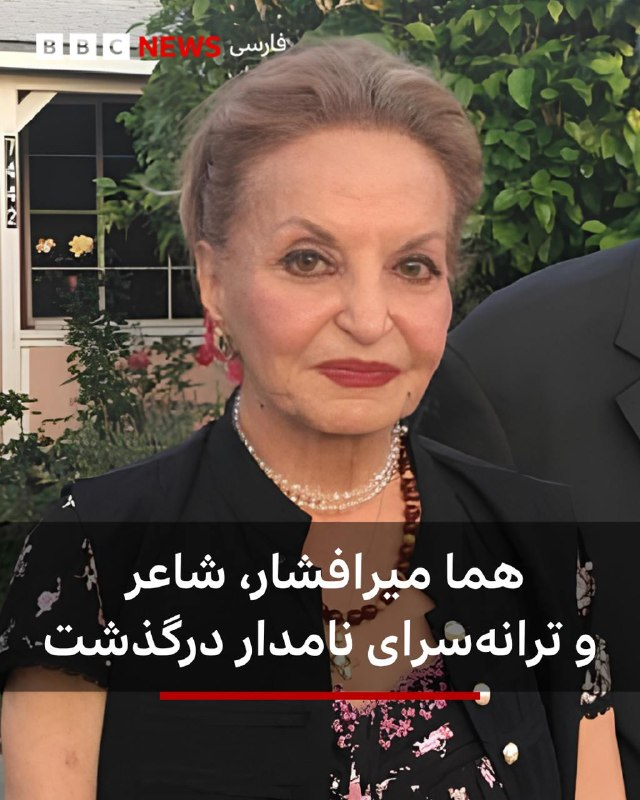

🔻هما میرافشار، شاعر و ترانه‌سرای برجسته در ۸۹ سالگی در لس‌آنجلس درگذشت.

او یکی از پرکارترین و تاثیرگذارترین ترانه‌سرایان دهه‌های اخیر بود و با بسیاری از چهره‌های سرشناس موسیقی همکاری کرده بود.

از هما میرافشار ده‌ها ترانه ماندگار که مانده است که خوانندگان مختلف مثل هایده، ابی، مهستی، داریوش، شاهرخ و شهره و شهرام صولتی خوانده بودند.

اشعار او در سه مجموعه «گلپونه‌ها» و «آلاله‌ها» و «گلپونه‌ها ۲» منتشر شده‌اند.

 📸@homa_mirafshar
@BBCPersian

## BBCPersian — post 282659

🔻وزیر خارجه فرانسه: هیچ چیز نمی‌تواند توجیهی برای ماندن نیروهای اسرائیل در خاک لبنان باشد

وزیر خارجه فرانسه روز سه‌شنبه گفت که هیچ چیز نمی‌تواند توجیهی برای ماندن نیروهای اسرائیل درعمق خاک لبنان باشد.

ژان نوئل بارو، وزیر خارجه فرانسه، در یک مصاحبه تلویزیونی گفت: «هیچ چیز نمی‌تواند ادامه عملیات نظامی و اشغال طولانی مدت اسرائیل در عمق خاک لبنان را توجیه کند.»

نیروهای اسرائیل روز یکشنبه قلعه شقیف (بوفور) را تصرف کردند.

نیروهای اسرائیلی از این قلعه، در طول دو دهه اشغال جنوب لبنان که در سال ۲۰۰۰ پایان یافت، به عنوان پایگاه نظامی استفاده می‌کردند.

ایران می‌گوید که آتش‌بس در لبنان شرط اصلی هرگونه توافق با واشنگتن برای پایان دادن به جنگ خاورمیانه است.

https://bbc.in/4x4rB6K
@BBCPersian

## idfinfarsi — post 11706

  <a href="telegram/content/idfinfarsi_11706_1780398998.mp4" target="_blank">🎬 Download video</a>

‼️تماشا مستندات و مکالمات بی‌سیم: رزمندگان ذخیره یگان دوودوان یک سلول تروریستی را که برای انجام عملیات در تیپ منشه سازماندهی شده بود، بازداشت کردند

⭕️در طول آخر هفته گذشته (جمعه)، رزمندگان ذخیره یگان دوودوان با هدایت شاباک و اطلاعات تیپ در روستای میتلون در منطقه تیپ منشه عملیاتی انجام دادند که طی آن یک سلول متشکل از سه تروریست که در مرحله آماده‌سازی برای انجام یک عملیات بودند، بازداشت شدند.

⭕️پس از بازداشت تروریست‌ها، نیروها منطقه را مورد جست‌وجو قرار داده و یک سلاح دست‌ساز از نوع «کارلو» را که در زیر زمین مخفی شده بود، شناسایی کردند.

⭕️تروریست‌ها برای ادامه رسیدگی به نیروهای امنیتی تحویل داده شدند.

## idfinfarsi — post 11705

  <a href="telegram/content/idfinfarsi_11705_1780399000.mp4" target="_blank">🎬 Download video</a>

‼️به منظور رفع یک تهدید فوری: ارتش اسرائیل در نوار غزه پنج تروریست را که در روزهای اخیر به پیشبرد طرح‌های تروریستی علیه نیروهای ارتش اسرائیل می‌پرداختند، به هلاکت رساند

⭕️نیروهای لشکر ۲۵۲ تحت فرماندهی جنوب در روزهای اخیر پنج تروریست از سازمان‌های تروریستی در نوار غزه را که در بازه زمانی فوری در حال پیشبرد طرح‌های تروریستی علیه نیروهای ما بودند، به هلاکت رساندند.

⭕️در میان تروریست‌های به هلاکت رسیده:
❌سالم فایز حامد کرکعه – تروریست در گردان شجاعیه در سازمان تروریستی حماس که در آماده‌سازی مواد منفجره و پیشبرد طرح‌های تک‌تیراندازی علیه نیروهای ارتش اسرائیل فعالیت داشت
❌سعید فایز سعید شمالی – فرمانده یک تیم نخبه در سازمان تروریستی حماس
❌احمد علی عبد الرحیم خلس – فرمانده بخش تک‌تیراندازی در سازمان تروریستی جهاد اسلامی فلسطین که طرح‌های تک‌تیراندازی علیه نیروهای ما را پیش می‌برد
دو فرمانده دیگر در سازمان تروریستی حماس که اقدام به کارگذاری مواد منفجره برای آسیب رساندن به نیروهای ارتش اسرائیل کرده بودند

⭕️نیروهای ارتش اسرائیل تحت فرماندهی جنوب مطابق با توافق در منطقه مستقر هستند و به فعالیت برای رفع هرگونه تهدید فوری ادامه خواهند داد.

## Dirty_Kids — post 390818

  <a href="telegram/content/Dirty_Kids_390818_1780399001.mp4" target="_blank">🎬 Download video</a>

🚨 فریاد خشم دانش‌آموزان علیه رژیمی که آینده ایران را نابود کرده است

دانش‌آموزان معترض امروز ۱۲ خرداد مقابل وزارت آموزش و پرورش تجمع کردند و علیه سیاست‌های ویرانگر و تحقیرآمیز آموزشی رژیم تروریستی جمهوری اسلامی به خیابان آمدند. نسلی که باید در آرامش درس بخواند و برای آینده‌اش برنامه‌ریزی کند، حالا زیر فشار روانی، تبعیض، استرس و تصمیمات فاجعه‌بار حکومتی خرد شده و مجبور است برای ابتدایی‌ترین حقوقش فریاد بزند. معترضان با شعارهایی چون «دانش‌آموز بیداره، از تبعیض بیزاره»، «دانش‌آموز می‌میرد، ذلت نمی‌پذیرد»، «وعده زیاد شنیدیم، عدالتو ندیدیم» و «فشار روانی کافیه، زندگی‌مونو پس بدین» خشم خود را علیه سیستمی فریاد زدند که آینده میلیون‌ها نوجوان ایرانی را قربانی فساد، بی‌کفایتی و مافیای آموزشی کرده است. در حالی که رژیم تروریستی جمهوری اسلامی میلیاردها دلار خرج گروه‌های تروریستی و جنگ‌های منطقه‌ای می‌کند، فرزندان ایران باید برای حق تحصیل عادلانه، آرامش روانی و آینده‌شان در خیابان...



@Dirty_Kids 👻

## Dirty_Kids — post 390816

  <a href="telegram/content/Dirty_Kids_390816_1780399002.mp4" target="_blank">🎬 Download video</a>

وضعیت این روزای تهران:

+ مثل اینکه اینا اشتراک پرومیوم ایرانو دارن.

@Dirty_Kids 👻

## Dirty_Kids — post 390815

  <a href="telegram/content/Dirty_Kids_390815_1780399004.mp4" target="_blank">🎬 Download video</a>

🔴 کارشناس صداوسیما: کوروش و ایران باستان تخیلی و ساخته ذهن مردم هستن!!!!!

@Dirty_Kids 👻

## Dirty_Kids — post 390814

  

خداروشکر
یه سری تور ها برای ۱۴،۱۵ خرداد برنامه دیدن تا دختر پسرا برن چیتگر و دارآباد و اونجا با تفنگ آبپاش آب بازی کنن 
🔫

@Dirty_Kids 👻

## Dirty_Kids — post 390813

  <a href="telegram/content/Dirty_Kids_390813_1780399006.mp4" target="_blank">🎬 Download video</a>

حداد عادل درباره دامادش مجتبی خامنه‌ای از فعل گذشته استفاده می‌کند:

ثانیه اول: مجتبی از پدرش سخت‌گیر بود
ثانیه آخر: این‌جوری بود زندگی ایشون

@Dirty_Kids 👻

## Dirty_Kids — post 390812

  <a href="telegram/content/Dirty_Kids_390812_1780399008.mp4" target="_blank">🎬 Download video</a>

اومدم بخندم بعد دیدم باید گریه‌ کنم

@Dirty_Kids 👻

## Dirty_Kids — post 390811

  <a href="telegram/content/Dirty_Kids_390811_1780399008.mp4" target="_blank">🎬 Download video</a>

ویدئویی مربوط به ۱۹ دی ماه در کرمانشاه منتشر شده که وحوش تروریست‌ رافضی مسلح به سمت مردم شجاع و شریف تیراندازی می‌کنن.

@Dirty_Kids 👻

## Dirty_Kids — post 390810

  <a href="telegram/content/Dirty_Kids_390810_1780399010.webm" target="_blank">🎬 Download video</a>

🆕 اپلیکیشن MelBet 
🔄

🎁 کد هدیه 100 دلاری: Sport100

🔵 کاملترین برنامه موبایل

🤝 اسپانسر رسمی لالیگا

☄️ صرافی معتبر

🤖 ربات راهنما

🇮🇷 برای تغییر زبان برنامه، زبان موبایل خود را تغییر دهید.

✅ ورود به اپلیکیشن بدون فیلترشکن

## Dirty_Kids — post 390809

چرا این روزها همه سایت جهانی MelBet رو انتخاب میکنن 
⁉️

🎁 شارژ هدیه 130 دلاری اولین واریز

🎁 شارژ هدیه 100 دلاری در روز های یکشنبه و چهارشنبه

🎁 و ده ها بانس ارزنده دیگر...

🥇 متنوع ترین آپشن های ورزشی

🖥 پخش زنده مسابقات

🎮 بیش از 80 نوع ورزش مجازی با پخش زنده

⭐ کاملترین کازینو آنلاین

🛡 امنیت فوق العاده بالا

💵 واریز آنی جوایز با بیش از 30 روش شارژ و برداشت، از جمله کارت بکارت

🌐 اسپانسر رسمی لالیگای اسپانیا

😀 مورد تایید سازمان Gambling Judge

✅ معرفی سایت و اپلیکیشن مل‌بت

💯 ورود به سایت مل‌بت (فیلترشکن خاموش)

## Dirty_Kids — post 390808

  

🔴 امروز 2 ژوئن، روز جهانی جنده هاست...

این روز رو به اونی که میدونید تبریک بگید

@Dirty_Kids 👻

## Dirty_Kids — post 390807

  <a href="telegram/content/Dirty_Kids_390807_1780399011.mp4" target="_blank">🎬 Download video</a>

از کلمات عربی تا جایی که میتونید استفاده نکنید

@Dirty_Kids 👻

## Dirty_Kids — post 390806

  

‏از نظر مامان بزرگم ایشون کنسله
چون بُنیه نداره.

@Dirty_Kids 👻

## Dirty_Kids — post 390805

  <a href="telegram/content/Dirty_Kids_390805_1780399013.mp4" target="_blank">🎬 Download video</a>

واکنش نتانیاهو به پیام امشب ترامپ:

@Dirty_Kids 👻

## Dirty_Kids — post 390804

  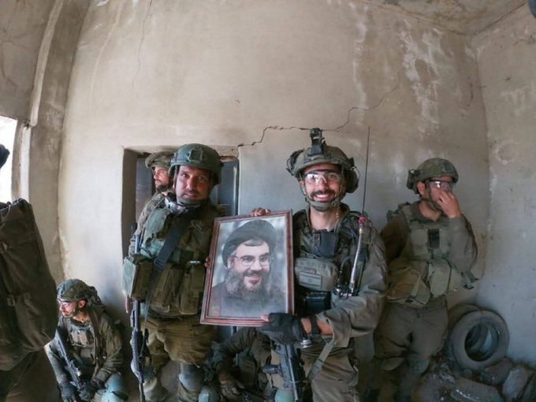

این عکس بفرستید برای عرزشیا، پاره میشن از سوزش زوزه میکشن

@Dirty_Kids 👻

## Dirty_Kids — post 390803

  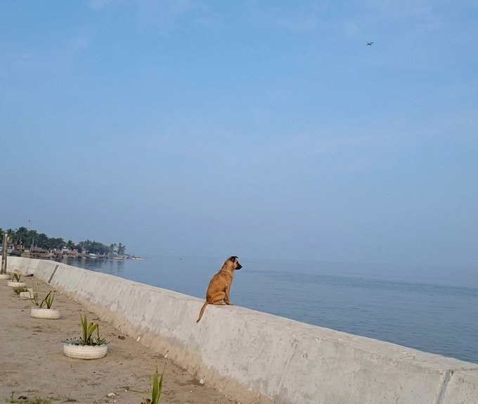

سگی در جستجوی معنا

@Dirty_Kids 👻

## Dirty_Kids — post 390802

  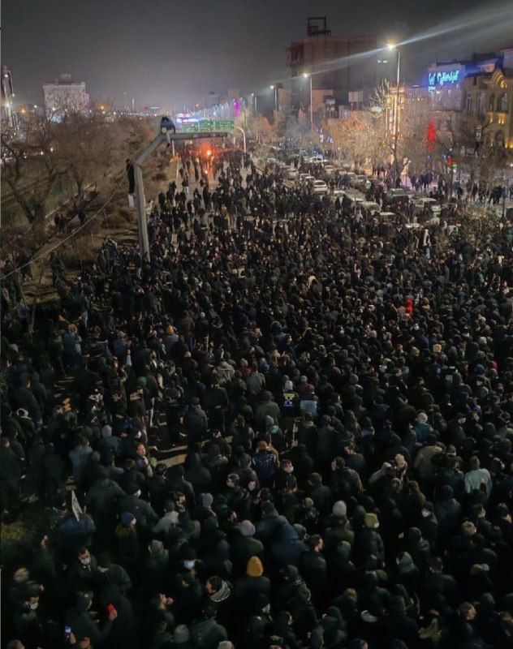

چقدر کُشتن؟!
که اون شب نبردیم!؟💔

@Dirty_Kids 👻

## Hranews — post 113326

  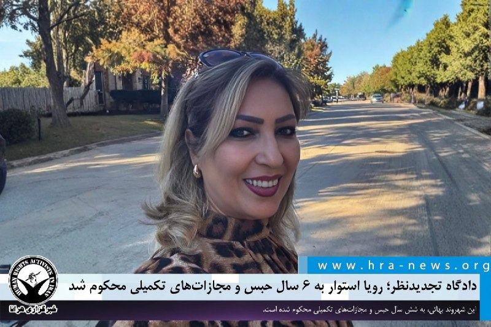

دادگاه تجدیدنظر؛ رویا استوار به ۶ سال حبس و مجازات‌های تکمیلی محکوم شد

❗️
❗️
❗️
❗️
❗️– محکومیت رویا استوار، شهروند بهائی اهل اصفهان، توسط شعبه ۴۷ دادگاه تجدیدنظر این استان عینا تایید شد. وی پیشتر توسط شعبه ۱۱ دادسرای عمومی و انقلاب اصفهان به شش سال حبس و مجازات‌های تکمیلی محکوم شده بود. جامعه جهانی بهائی نسبت به حکم صادرشده علیه این شهروند بهائی ابراز نگرانی کرده است.

به گزارش خبرگزاری هرانا، ارگان خبری مجموعه فعالان حقوق بشر در ایران، روز سه شنبه ۲۹ اردیبهشت، حکم صادره علیه رویا استوار توسط شعبه ۴۷ دادگاه تجدیدنظر استان اصفهان عینا تایید شد.

براساس رای صادره، خانم استوار، از بابت اتهام فعالیت‌های آموزشی و تبلیغی مخل شرع اسلام از طریق ایجاد و مدیریت یک گروه واتساپی مرتبط با آیین بهایی، به پنج سال حبس، پرداخت جزای نقدی و محرومیت از حقوق اجتماعی به مدت ۱۵ سال و از بابت اتهام تبلیغ علیه نظام از طریق انتشار مطالب در فضای مجازی، به یک سال حبس محکوم شده است.

جامعه جهانی بهائی با انتشار مطلبی نسبت به حکم صادرشده علیه این شهروند بهائی ابراز نگرانی کرده است.

ادامه مطلب

#رویا_استوار

↘️
@hranews_bot تماس ✉️ - @Hranews کانال هرانا 🆑

## Hranews — post 113325

  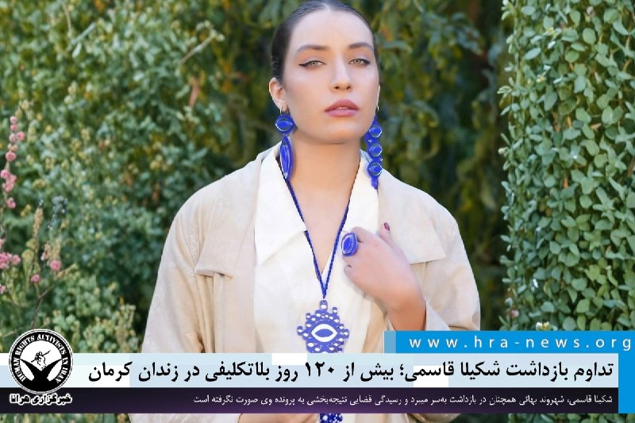

چهار ماه پس از بازداشت؛ شکیلا قاسمی، شهروند بهائی همچنان بلاتکلیف است

❗️
❗️
❗️
❗️
❗️– شکیلا قاسمی، شهروند بهائی ساکن کرمان، با گذشت ۱۲۱ روز از زمان بازداشت، کماکان به‌صورت بلاتکلیف در زندان این شهر نگهداری می‌شود. این شهروند طی این مدت، نزدیک به ۱۰۰ روز را در سلول انفرادی سپری کرده و از ۲۰ روز پیش به بند عمومی زندان کرمان منتقل شده است.

به گزارش خبرگزاری هرانا، ارگان خبری مجموعه فعالان حقوق بشر در ایران، شکیلا قاسمی همچنان در بازداشت به‌سر میبرد و رسیدگی قضایی نتیجه‌بخشی به پرونده وی صورت نگرفته است.

یک منبع مطلع نزدیک به خانواده این شهروند بهائی، ضمن تایید این موضوع به هرانا گفت: «شکیلا قاسمی از حدود ۲۰ روز پیش به بند عمومی زندان کرمان منتقل شده است. با این حال، نگهداری طولانی‌مدت او در سلول انفرادی، فشارهای روحی و جسمی قابل توجهی بر وی وارد کرده است؛ به‌طوری که در طول بازداشت چندین‌بار دچار شوک عصبی شده است.»

ادامه مطلب

#شکیلا_قاسمی

↘️
@hranews_bot تماس ✉️ - @Hranews کانال هرانا 🆑

## Hranews — post 113324

سرخس؛ ۲ شهروند توسط نیروهای امنیتی بازداشت شدند

❗️
❗️
❗️
❗️
❗️– نادر رودینی و پسرش یونس رودینی، شهروندان ساکن سرخس روز گذشته توسط نیروهای امنیتی بازداشت و به مکان نامعلومی منتقل شدند.

ادامه مطلب

#نادر_رودینی #یونس_رودینی

↘️
@hranews_bot تماس ✉️ - @Hranews کانال هرانا 🆑

## Hranews — post 113323

اسلامشهر؛ ۱۰۰ نفر به دلیل ارتباط با شبکه‌های مخالف نظام بازداشت شدند

❗️
❗️
❗️
❗️
❗️– دادستان اسلامشهر از بازداشت ۱۰۰ نفر در این شهرستان، در جریان درگیری‌های نظامی اخیر خبر داد. وی مدعی شد که #بازداشت این افراد به دلیل ارتباط با آنچه “شبکه‌های معاند” عنوان شده، صورت گرفته است و در میان بازداشت‌شدگان، افراد کم‌ سن‌وسال نیز حضور دارند.

ادامه مطلب

↘️
@hranews_bot تماس ✉️ - @Hranews کانال هرانا 🆑

## Hranews — post 113322

نیمروز؛ مرگ یک سوختبر در پی تیراندازی نیروهای نظامی

❗️
❗️
❗️
❗️
❗️– در پی تیراندازی نیروهای نظامی در منطقه مرزی شهرستان نیمروز، یک #سوختبر جان خود را از دست داد.

ادامه مطلب

↘️
@hranews_bot تماس ✉️ - @Hranews کانال هرانا 🆑

## Hranews — post 113321

  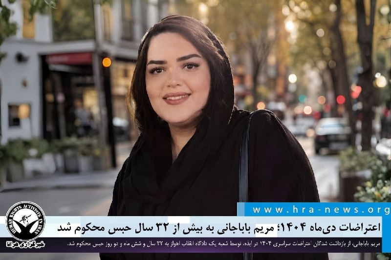

اعتراضات دی‌ماه ۱۴۰۴؛ مریم باباجانی به بیش از ۳۲ سال حبس محکوم شد

❗️
❗️
❗️
❗️
❗️– مریم باباجانی، از بازداشت شدگان اعتراضات سراسری ۱۴۰۴ در ایذه، توسط شعبه یک دادگاه انقلاب اهواز به ۳۲ سال و شش ماه و دو روز حبس محکوم شد.

به گزارش خبرگزاری هرانا، ارگان خبری مجموعه فعالان حقوق بشر در ایران، مریم باباجانی، معترض ساکن ایذه، به احکام بلند مدت حبس محکوم شد.

بر اساس اطلاعاتی که به دست هرانا رسیده است، خانم باباجانی اخیرا توسط شعبه یک دادگاه انقلاب اهواز از بابت دو اتهام امنیتی به ۲۰ سال و یک روز حبس و ۱۲ سال و شش ماه و یک روز زندان محکوم شده است. در حکم صادره، اتهاماتی با استناد به قانون تشدید مجازات جاسوسی علیه وی مطرح شده است.

یک منبع مطلع نزدیک به خانواده باباجانی، به هرانا گفت: «پس از صدور این حکم، حسین‌علی حاتمی، وکیل مدافع خانم باباجانی درخواست فرجام‌خواهی نسبت به رای صادره را ثبت کرده است.»

ادامه مطلب

#مریم_باباجانی

↘️
@hranews_bot تماس ✉️ - @Hranews کانال هرانا 🆑

## Hranews — post 113320

  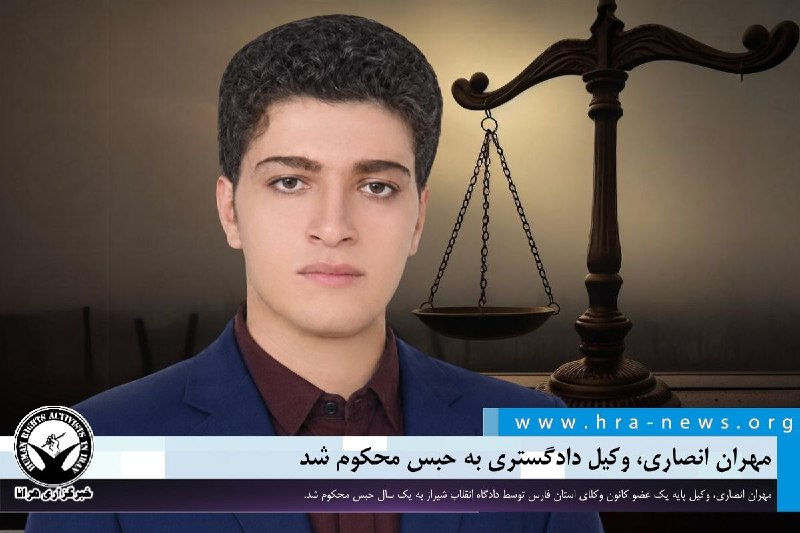

مهران انصاری، وکیل دادگستری به حبس محکوم شد

❗️
❗️
❗️
❗️
❗️– مهران انصاری، وکیل پایه یک عضو کانون وکلای استان فارس توسط دادگاه انقلاب شیراز به یک سال حبس محکوم شد.

به گزارش خبرگزاری هرانا، ارگان خبری مجموعه فعالان حقوق بشر در ایران، مهران انصاری به حبس محکوم شد.

براساس اطلاعات دریافتی هرانا، این وکیل دادگستری توسط دادگاه انقلاب شیراز از بابت اتهام تبلیغ علیه نظام به تحمل یک سال حبس محکوم شده است.

ادامه مطلب

#مهران_انصاری

↘️
@hranews_bot تماس ✉️ - @Hranews کانال هرانا 🆑

## Hranews — post 113319

یک زندانی در زندان اراک اعدام شد

❗️
❗️
❗️
❗️
❗️– حکم اعدام یک زندانی که پیشتر از بابت اتهامات مرتبط با جرائم مواد مخدر به #اعدام محکوم شده بود، روز یکشنبه ۱۰ خردادماه، در زندان اراک اجرا شد.

ادامه مطلب

#اصلان_امیری_هزاوه

↘️
@hranews_bot تماس ✉️ - @Hranews کانال هرانا 🆑

## Hranews — post 113318

  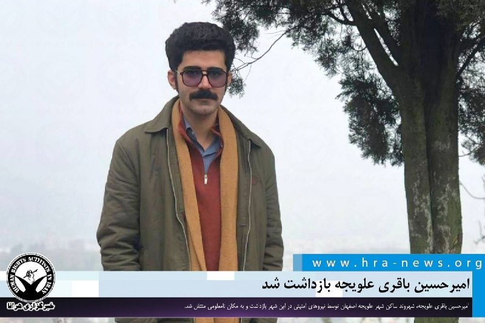

امیرحسین باقری علویجه در اصفهان بازداشت شد

❗️
❗️
❗️
❗️
❗️– امیرحسین باقری علویجه، دانشجوی دانشگاه اراک و ساکن شهر علویجه اصفهان روز دوشنبه ۱۱ خردادماه، توسط نیروهای امنیتی در این شهر بازداشت و به مکان نامعلومی منتقل شد.

به گزارش خبرگزاری هرانا، ارگان خبری مجموعه فعالان حقوق بشر در ایران، امیرحسین باقری علویجه بازداشت شد.

براساس اطلاعات دریافتی هرانا، نیروهای لباس‌شخصی با مراجعه به منزل آقای باقری در شهر علویجه اصفهان، او را با اعمال خشونت بازداشت کردند. ماموران همزمان منزل این شهروند را مورد تفتیش قرار دادند و لوازم الکترونیکی او و خانواده‌اش را ضبط کردند.

ادامه مطلب

#امیرحسین_باقری_علویجه

↘️
@hranews_bot تماس ✉️ - @Hranews کانال هرانا 🆑

## Hranews — post 113317

  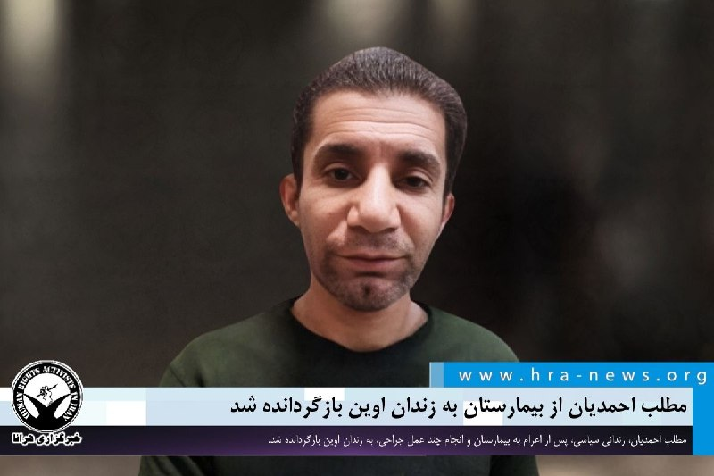

مطلب احمدیان از بیمارستان به زندان اوین بازگردانده شد

❗️
❗️
❗️
❗️
❗️– مطلب احمدیان، زندانی سیاسی که به دلیل وخامت وضعیت جسمانی به بیمارستان اعزام شده بود، پس از انجام چند عمل جراحی روز گذشته به زندان اوین بازگردانده شد.

به گزارش خبرگزاری هرانا، ارگان خبری مجموعه فعالان حقوق بشر در ایران، مطلب احمدیان به زندان اوین بازگردانده شد.

بر اساس اطلاعات دریافتی هرانا، روز دوشنبه ۱۱ خردادماه، آقای احمدیان پس از طی مراحل درمانی از بیمارستان به زندان بازگردانده شد. وی در تاریخ ۴ خردادماه از زندان به بیمارستان اعزام شده بود و در طول بستری تحت چند عمل جراحی قرار گرفت. در جریان این اقدامات درمانی، کیسه صفرای وی برداشته شد و همچنین پزشکان ناگزیر به برداشت حدود چهار سانتی‌متر از بافت کبد او شدند. افزون بر این، نخستین دوره درمان آنتی‌بیوتیکی برای مقابله با عفونت باکتریایی نیز برای او انجام شده است.

یک منبع مطلع از وضعیت جسمانی این زندانی به هرانا گفت: “تاخیر در اعزام آقای احمدیان به مراکز درمانی موجب شد توده‌ای که در ابتدا خوش‌خیم بود، به توده‌ای بدخیم تبدیل شده و به کبد و کیسه صفرا سرایت کند؛ وضعیتی که در نهایت به برداشتن کیسه صفرا و بخشی از کبد وی انجامید.”

ادامه مطلب

#مطلب_احمدیان

↘️
@hranews_bot تماس ✉️ - @Hranews کانال هرانا 🆑

## Hranews — post 113316

  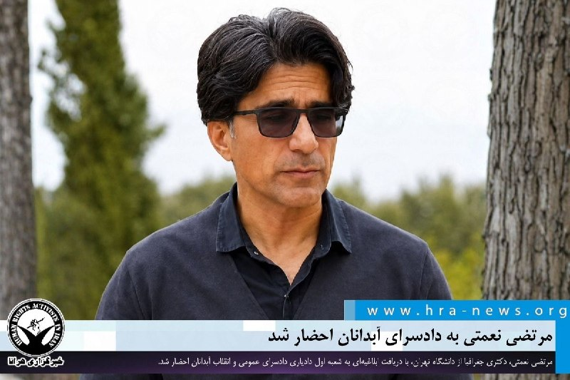

مرتضی نعمتی به دادسرای آبدانان احضار شد

❗️
❗️
❗️
❗️
❗️– مرتضی نعمتی، دکتری جغرافیا از دانشگاه تهران، با دریافت ابلاغیه‌ای به شعبه اول دادیاری دادسرای عمومی و انقلاب آبدانان احضار شد.

به گزارش خبرگزاری هرانا، ارگان خبری مجموعه فعالان حقوق بشر در ایران، مرتضی نعمتی به دادسرا #احضار شد.

در احضاریه‌ای که روز دوشنبه ۱۱ خردادماه، توسط شعبه اول دادیاری دادسرای عمومی و انقلاب شهرستان آبدانان صادر و به آقای نعمتی ابلاغ شده، از وی خواسته شده تا ظرف مدت پنج روز از زمان ابلاغ، جهت دفاع از اتهام تبلیغ علیه نظام جمهوری اسلامی، در این شعبه حاضر شود.

ادامه مطلب

#مرتضی_نعمتی

↘️
@hranews_bot تماس ✉️ - @Hranews کانال هرانا 🆑

## alonews — post 124435

  <a href="telegram/content/alonews_124435_1780399016.mp4" target="_blank">🎬 Download video</a>

👈وزیر دفاع اسرائیل ، کاتز : تو لبنان هیچ آتش‌بسی در کار نیست و ارتش اسرائیل همچنان داره علیه حزب‌الله عملیاتش رو ادامه می‌دهد

✅ @AloNews خبر جنگ

## alonews — post 124434

  <a href="telegram/content/alonews_124434_1780399018.webm" target="_blank">🎬 Download video</a>

👈کرملین: اگر زلنسکی دستور عقب‌نشینی نیروهای اوکراینی از مناطق روسیه را بدهد، جنگ «تا پایان روز» به پایان می‌رسد

✅ @AloNews خبر جنگ

## alonews — post 124433

  <a href="telegram/content/alonews_124433_1780399018.webm" target="_blank">🎬 Download video</a>

👈نبیه بری رئیس پارلمان لبنان: هیچ‌کس جز ترامپ نمی‌تواند یک آتش‌بس واقعی ایجاد کند ؛ این تنها راه است

✅ @AloNews خبر جنگ

## alonews — post 124432

  <a href="telegram/content/alonews_124432_1780399019.webm" target="_blank">🎬 Download video</a>

👈کنایه معاون عراقچی به انصراف نتانیاهو از حمله به بیروت با تماس ترامپ / اگر تصمیم حمله با یک تماس تغییر می‌کند، چرا ماه‌ها نقض آتش‌بس ادامه یافت!

✅ @AloNews خبر جنگ

## alonews — post 124431

  <a href="telegram/content/alonews_124431_1780399019.webm" target="_blank">🎬 Download video</a>

👈 جزئیات طرح رایگان شدن دائم تردد با مترو و بی آر تی در تهران؛ رای گیری به جلسه بعد شورا موکول شد

✅ @AloNews خبر جنگ

## alonews — post 124430

  <a href="telegram/content/alonews_124430_1780399019.webm" target="_blank">🎬 Download video</a>

👈واشنگتن پست: طرح بازسازی غزه با بن‌بست روبه‌رو شده است

🔴واشنگتن پست گزارش داد برنامه بازسازی گسترده غزه که تحت عنوان «هیئت صلح» دولت ترامپ مطرح شده بود، به دلیل کمبود منابع مالی، نبود حمایت سیاسی کافی و ابهام درباره آینده اداره غزه با بن‌بست مواجه شده است.

🔴بر اساس این گزارش، مذاکرات درباره خلع سلاح حماس همچنان بدون نتیجه مانده و ادامه عملیات نظامی اسرائیل نیز روند بازسازی را پیچیده‌تر کرده است.

🔴واشنگتن پست می‌نویسد با وجود وعده‌ها و اعلام پروژه‌های متعدد در ماه‌های گذشته، هنوز هیچ طرح بازسازی بزرگی به مرحله اجرا نرسیده است.

✅ @AloNews خبر جنگ

## alonews — post 124429

  <a href="telegram/content/alonews_124429_1780399019.webm" target="_blank">🎬 Download video</a>

👈سفارت آمریکا تو عراق : ترامپ از دولت عراق حمایت می‌کنه

✅ @AloNews خبر جنگ

## alonews — post 124428

  <a href="telegram/content/alonews_124428_1780399019.webm" target="_blank">🎬 Download video</a>

👈ایسنا: اپراتورها پول کسانی که اینترنت پرو خریدند را پس نمی‌دهند و فقط می‌شود اینترنت پرو را به اینترنت عادی تغییر داد!

✅ @AloNews خبر جنگ

## alonews — post 124427

  <a href="telegram/content/alonews_124427_1780399020.webm" target="_blank">🎬 Download video</a>

👈واشنگتن پست، به نقل از منابع: مقامات نظامی ایالات متحده در چندین قاره، سطح حفاظت را در انتظار بازگشت به جنگ افزایش داده‌اند

✅ @AloNews خبر جنگ

## alonews — post 124426

  <a href="telegram/content/alonews_124426_1780399020.webm" target="_blank">🎬 Download video</a>

🔴فوری / وزارت کشور بحرین: به دلیل تنش‌های امنیتی جاری، سفر شهروندان به ایران و عراق ممنوع است.

✅ @AloNews خبر جنگ

## alonews — post 124425

  <a href="telegram/content/alonews_124425_1780399020.webm" target="_blank">🎬 Download video</a>

👈اسپانیا: در هیچ اقدامی که تنش با ایران را افزایش دهد شرکت نمی‌کنیم

✅ @AloNews خبر جنگ

## alonews — post 124424

  <a href="telegram/content/alonews_124424_1780399020.webm" target="_blank">🎬 Download video</a>

👈ارتش اسرائیل به شهر میفدون تو جنوب لبنان حمله کرد

✅ @AloNews خبر جنگ

## alonews — post 124423

  <a href="telegram/content/alonews_124423_1780399020.webm" target="_blank">🎬 Download video</a>

👈 جنگنده‌های اسرائیلی لحظاتی پیش ساختمانی در شهر الشرقیه در جنوب لبنان را هدف قرار دادند.

✅ @AloNews خبر جنگ

## alonews — post 124422

  <a href="telegram/content/alonews_124422_1780399020.mp4" target="_blank">🎬 Download video</a>

👈جنگنده اف-۱۶ اوکراینی در حال سرنگونی موشک کروز روسی Kh-101 در ارتفاع پایین، احتمالاً با استفاده از موشک AIM-9 سایدوایندر

✅ @AloNews خبر جنگ

## alonews — post 124421

  <a href="telegram/content/alonews_124421_1780399022.mp4" target="_blank">🎬 Download video</a>

👈ویدیو کالا‌ف‌ دیوتی‌طور از درگیری تن به تن نیروهای ارتش اسرائیل با نیروهای حزب‌الله

✅ @AloNews خبر جنگ

## alonews — post 124420

  <a href="telegram/content/alonews_124420_1780399024.webm" target="_blank">🎬 Download video</a>

🔴فوری / سخنگوی ارتش اسرائیل برای نبطیه در جنوب لبنان اخطار تخلیه صادر کرد

✅ @AloNews خبر جنگ

## alonews — post 124419

  <a href="telegram/content/alonews_124419_1780399024.webm" target="_blank">🎬 Download video</a>

👈روابط عمومی سپاه: در پی حمله ارتش امریکا به کشتی ایرانی " لیان استار" در محدوده دریای عمان، نیروی دریایی سپاه طی یک عملیات مقابله به مثل، کشتی "msc. sariska" با مالکیت دشمن امریکایی / اسرائیلی را با موشک کروز مورد هدف قرار داد 
✅ @AloNews خبر جنگ

## alonews — post 124418

  <a href="telegram/content/alonews_124418_1780399024.webm" target="_blank">🎬 Download video</a>

👈 گروه تروریستی داعش با انتشار این پوستر، تهدید به بمب‌گذاری در مسابقات جام جهانی آمریکا و ترور پاپ کرد

✅ @AloNews خبر جنگ

## alonews — post 124417

🔥 همراه با ساب + حجم مصرفی، فقط 8T! 🚀 😍فقط گیگی 8 تومن😍 ✅ باخرید 90 گیگ 100 گیگ تحویل بگیرید 😍✅ ❌ فقط تا پایان امشب ❌ 🔥 اگه دنبال یه VPN پایدار و بدون دردسر می‌گردی، این پلن مخصوص خودته! @Netaazaadbot @NetAazaadBot ✅ همراه با ساب + حجم مصرفی ✅ 15…

## alonews — post 124416

  

🔥 همراه با ساب + حجم مصرفی، فقط 8T! 🚀

😍فقط گیگی 8 تومن😍

✅ باخرید 90 گیگ 100 گیگ تحویل بگیرید 😍✅
❌ فقط تا پایان امشب ❌

🔥 اگه دنبال یه VPN پایدار و بدون دردسر می‌گردی، این پلن مخصوص خودته!

@Netaazaadbot
@NetAazaadBot

✅ همراه با ساب + حجم مصرفی
✅ 15 سرور اختصاصی پرسرعت
✅ اتصال پایدار و بدون قطعی
✅ سرعت بالا حتی در ساعات شلوغ

@Netaazaadbot
@NetAazaadBot

📩 برای خرید و دریافت سرویس استارت رو بزن✅

<!-- MSG END -->

<!-- NAV START -->

<a href="https://github.com/Tljn/FUD/blob/main/telegram/content/archive_1.md" style="display:inline-block; padding:6px 12px; margin:0 4px; background-color:#2ea44f; color:white; text-decoration:none; border-radius:4px; font-weight:bold;">صفحه بعد</a>

<!-- NAV END -->
