# خواننده تلگرام

<!-- TOP_NAV START -->

<a href="https://github.com/Tljn/FUD/blob/main/telegram/content/archive_1.md" style="display:inline-block; padding:6px 12px; margin:0 4px; background-color:#2ea44f; color:white; text-decoration:none; border-radius:4px; font-weight:bold;">صفحه بعد</a>

<!-- TOP_NAV END -->

<!-- MSG START -->

---
📅 بروزرسانی: 1405/03/21 00:11
---

## VahidOOnLine — post 244780

  <a href="telegram/content/VahidOOnLine_244780_1781124109.mp4" target="_blank">🎬 Download video</a>

♦️رسانه‌های ایران چهارشنبه‌شب ۲۰ خرداد از وقوع آتش‌سوزی و برخاستن ستون‌های غلیظ دود در محدوده میدان قیام تهران خبر دادند. سخنگوی سازمان آتش‌نشانی تهران اعلام کرد یک انبار کالا در منطقه ۱۲ تهران دچار حریق شده است.

به گفته سازمان آتش‌نشانی تهران، این مجموعه شامل چند انبار و غرفه به مساحت حدود دو هزار متر مربع است و عملیات اطفای حریق با حضور نیروهای آتش‌نشانی در محل انجام شد.

معاون سازمان آتش‌نشانی تهران به خبرگزاری فارس گفت به انبار فرش محدوده میدان قیام که دچار حریق شد.

سازمان آتش‌نشانی تهران اعلام کرد که تا این لحظه گزارشی از تلفات یا مصدومیت جانی دریافت نشده است.
‌🇸🇦 Indypersian

🤖 @VahidOOnLine

## VahidOOnLine — post 244779

  

پیت هگست، وزیر دفاع آمریکا، گفت اگر جمهوری اسلامی برای پایان دادن به درگیری با آمریکا به توافق نرسد، ارتش ایالات متحده آن را «به‌شدت» هدف قرار خواهد داد.

او در سخنرانی برای کارکنان فرماندهی مرکزی آمریکا، سنتکام، در تامپای فلوریدا گفت: «همان‌طور که رییس‌جمهوری چهارشنبه گفت، اگر آن‌ها توافق نکنند، ما به‌شدت به آن‌ها حمله خواهیم کرد.»

هگست افزود دولت آمریکا بر دستیابی به نتیجه‌ای که دونالد ترامپ به نمایندگی از مردم آمریکا خواهان آن است متمرکز شده و در این مسیر «پیشرفت زیادی» داشته است.

او همچنین به اظهارات ترامپ اشاره کرد که گفته بود آمریکا حملات بیشتری علیه جمهوری اسلامی انجام خواهد داد و تهران برای مذاکره درباره توافق «بیش از حد وقت تلف کرده» و اکنون «باید بهای آن را بپردازد».
‌🏁 🇬🇧 IranintlTV

🤖 @VahidOOnLine

## VahidOOnLine — post 244778

  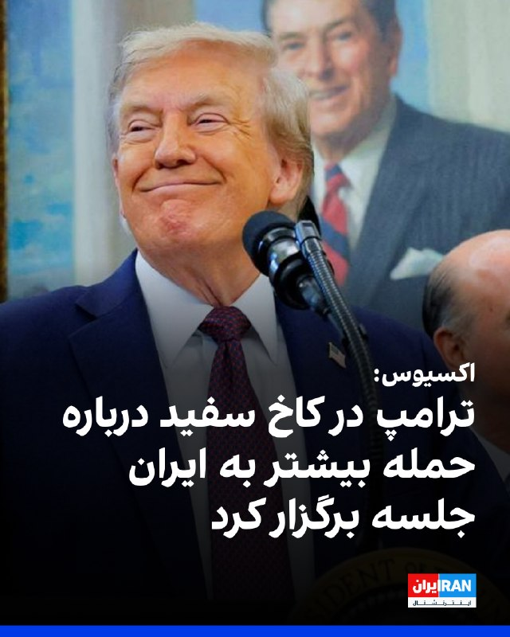

اکسیوس گزارش داد که دونالد ترامپ، رییس جمهوری ایالات متحده در کاخ سفید درباره حمله بیشتر به ایران جلسه برگزار کرده است.

بنا بر این گزارش، ترامپ عملیات گسترده و کوتاه علیه ایران را بررسی می‌کند.

پیش‌تر دونالد ترامپ گفته بود جمهوری اسلامی باید توافقی «معنادار و کارآمد» را امضا کند و افزود ما آن‌ها را بسیار سخت هدف قرار خواهیم داد و امروز دوباره ضربه محکمی به آن‌ها خواهیم زد.
‌🏁 🇬🇧 IranintlTV

🤖 @VahidOOnLine

## VahidOOnLine — post 244777

  

علیرضا پناهیان، سخنران دفتر خامنه‌ای، در تجمع حامیان حکومت در شاهرود گفت: «اکنون نبرد آخرالزمانی میان ما و تمام کفر جهانی در جریان است.»

او ادامه داد: «امروز نیز شاهد هستیم که راس کفر، یا همان استکبار جهانی، در برابر تمام اسلام ناب محمدی ایستاده است.»
‌🏁 🇬🇧 IranintlTV

🤖 @VahidOOnLine

## VahidOOnLine — post 244776

  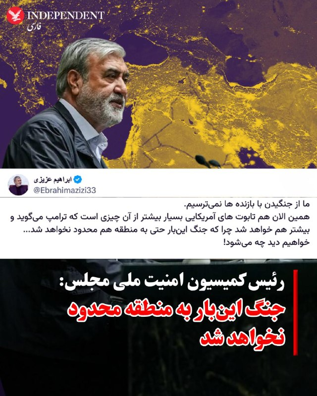

♦️ابراهیم عزیزی، رئیس کمیسیون امنیت ملی و سیاست خارجی مجلس شورای اسلامی، با انتشار پیامی در شبکه اجتماعی ایکس به تهدیدات اخیر دونالد ترامپ واکنش نشان داد و نسبت به فرامنطقه‌ای شدن هرگونه درگیری نظامی هشدار داد.

عزیزی در این پیام نوشت: «ما از جنگیدن با بازنده‌ها نمی‌ترسیم. همین الان هم تابوت‌های آمریکایی بسیار بیشتر از آن چیزی است که ترامپ می‌گوید و بیشتر هم خواهد شد؛ چرا که جنگ این‌بار حتی به منطقه هم محدود نخواهد شد... خواهیم دید چه می‌شود!»

این اظهارات پس از آن مطرح می‌شود که آمریکا در روزهای گذشته، ضمن مقصر دانستن تهران در سقوط بالگرد آپاچی در تنگه هرمز، حملات گسترده‌ای علیه مواضعی در ایران انجام داد و ترامپ نیز با اشاره به همین حادثه و تعلل تهران در مذاکرات، درباره از سرگیری حملات سنگین به زیرساخت‌های ایران هشدار داد.
‌🇸🇦 Indypersian

🤖 @VahidOOnLine

## VahidOOnLine — post 244775

  

کمال شحاده، وزیر امور مهاجرت لبنان به العربیه گفت که چهار هزار کشته در لبنان نتیجه شرط‌بندی بر سیاست‌های اشتباه بود و حزب‌الله به دستور جمهوری اسلامی امتیاز می‌دهد نه به سود لبنان.
او افزود: «سلاح نعیم قاسم هیچ سودی برای ما ندارد.»

وزیر امور مهاجرت لبنان ادامه داد: «زیر بمباران مذاکره می‌کنیم همان‌گونه که ایران زیر بمباران مذاکره می‌کند.»
‌🏁 🇬🇧 IranintlTV

🤖 @VahidOOnLine

## VahidOOnLine — post 244774

  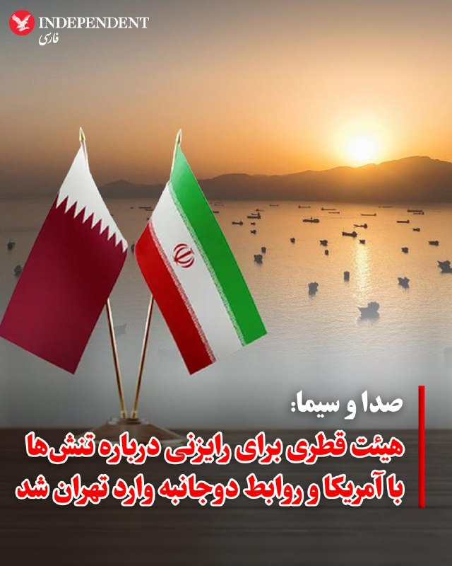

♦️به گزارش خبرگزاری صدا و سیما (IRIB)، چهارشنبه‌شب ۲۰ خرداد، یک هیئت دیپلماتیک از قطر به منظور گفتگو و رایزنی درباره روابط دوجانبه، تحولات منطقه‌ای و تلاش‌های دیپلماتیک مربوط به منازعه با ایالات متحده، وارد تهران شده است.

بر اساس این گزارش، محور گفتگوهای این سفر شامل بررسی مناسبات میان دو کشور و همچنین تبادل نظر درباره آخرین تحولات در فرآیند دیپلماتیک برای پایان دادن به جنگ است.

در این گزارش هنوز جزئیات بیشتری درباره اعضای این هیئت، مقام سرپرست آن و همچنین مدت زمان این سفر ارائه نشده است.
‌🇸🇦 Indypersian

🤖 @VahidOOnLine

## VahidOOnLine — post 244773

  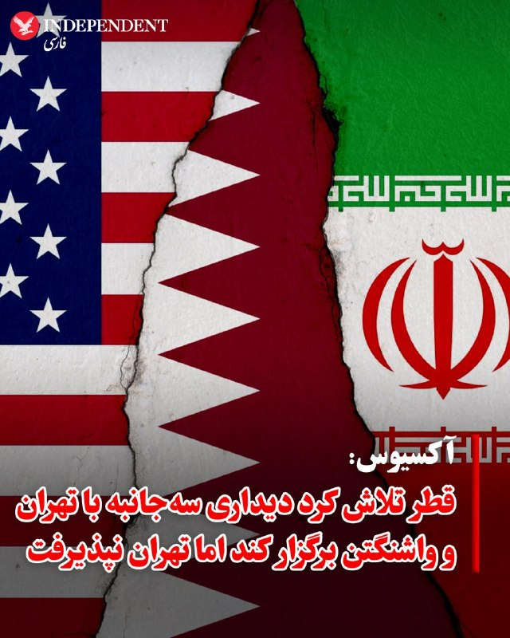

♦️آکسیوس به نقل از یک منبع منطقه‌ای، گزارش داد که مقامات جمهوری اسلامی ایران و آمریکا طی دو روز گذشته گفتگوهای موازی و غیرمستقیمی را با میانجی‌گران قطری در دوحه انجام داده‌اند. واسطه‌های قطری تلاش کردند تا برای حل اختلافات باقی‌مانده یک نشست سه‌جانبه و مذاکره مستقیم میان طرفین ترتیب دهند، اما ایران این پیشنهاد را رد کرد. در همین راستا، میانجی‌گران قطری روز چهارشنبه برای از سرگیری و به حرکت درآوردن چرخ مذاکرات، راهی تهران شدند تا با عباس عراقچی و دیگر مقامات جمهوری اسلامی گفتگو کنند.

از سوی دیگر، دو مقام آمریکایی ابراز امیدواری کردند که حملات روز سه‌شنبه و تهدیدات دونالد ترامپ، تهران را وادار به پذیرش توافق پیشنهادی کند. یک مقام دیگر نیز تاکید کرد توافق همچنان روی میز است، اما در صورت تداوم وقت‌کشی تهران، رئیس‌جمهوری آماده است تا آن‌ها را وادار به پرداخت بها کند.
‌🇸🇦 Indypersian

🤖 @VahidOOnLine

## VahidOOnLine — post 244772

  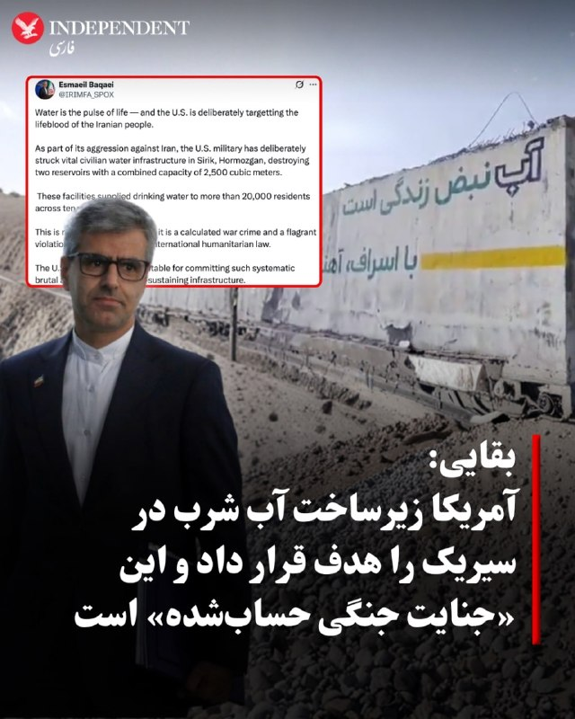

♦️اسماعیل بقایی، سخنگوی وزارت امور خارجه جمهوری اسلامی با انتشار ویدیویی در شبکه اجتماعی اکس، آمریکا را به هدف قرار دادن عمدی زیرساخت‌های آب شرب در شهرستان سیریک استان هرمزگان متهم کرد.
بقایی در این پیام نوشت: «آب، نبض زندگی است و آمریکا عامدانه شریان حیاتی مردم ایران را هدف قرار داده است.» او مدعی شد ارتش آمریکا در ادامه حملات خود علیه ایران، دو مخزن آب با ظرفیت مجموع دو هزار و ۵۰۰ متر مکعب را در سیریک هدف قرار داده و تخریب کرده است.
به گفته سخنگوی وزارت امور خارجه، این تاسیسات آب آشامیدنی بیش از ۲۰ هزار نفر از ساکنان ۱۰ روستا را تامین می‌کرده و تخریب آن‌ها موجب آسیب به زیرساخت‌های حیاتی غیرنظامی شده است.
بقایی همچنین این اقدام را «خسارت جانبی» ندانست و آن را «جنایت جنگی حساب‌شده» و «نقض آشکار حقوق بشر و حقوق بین‌الملل بشردوستانه» توصیف کرد. او در پایان خواستار پاسخگو شدن ایالات متحده در قبال آنچه «حملات نظام‌مند به زیرساخت‌های حیاتی غیرنظامیان» خواند، شد.
‌🇸🇦 Indypersian

🤖 @VahidOOnLine

## VahidOOnLine — post 244771

  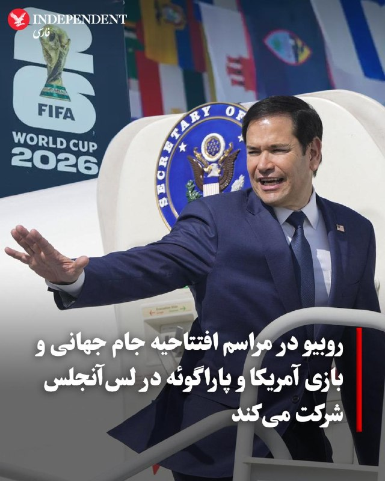

♦️وزارت امور خارجه آمریکا اعلام کرد که مارکو روبیو، وزیر امور خارجه این کشور برای شرکت در مراسم افتتاحیه بازی‌های جام جهانی ۲۰۲۶ در بخش ایالات متحده و همچنین تماشای نخستین مسابقه تیم ملی آمریکا در برابر پاراگوئه، روز جمعه به لس‌آنجلس سفر خواهد کرد.

بر اساس این بیانیه، روبیو سرپرستی هیئت آمریکایی را در این مراسم افتتاحیه بر عهده خواهد داشت و شان دافی و مارک‌وین مولین، وزرای حمل‌ونقل و امنیت میهن، او را در این سفر همراهی خواهند کرد.

روبیو علاوه بر حضور در رویدادهای جام جهانی، در لس‌آنجلس با سانتیاگو پنیا، رئیس‌جمهوری پاراگوئه نیز دیدار و گفتگو خواهد کرد.
‌🇸🇦 Indypersian

🤖 @VahidOOnLine

## VahidOOnLine — post 244770

  

مایک هاکبی، سفیر آمریکا در اسرائیل، با بازنشر گزارش فاکس‌نیوز درباره اظهارات دونالد ترامپ، رییس‌جمهوری آمریکا، مبنی بر اینکه ایالات متحده امروز دوباره «ضربه سختی» به جمهوری اسلامی خواهد زد، در شبکه ایکس نوشت: «ممکن است اوضاع در منطقه به‌زودی کمی داغ شود.»
‌🏁 🇬🇧 IranintlTV

🤖 @VahidOOnLine

## VahidOOnLine — post 244769

  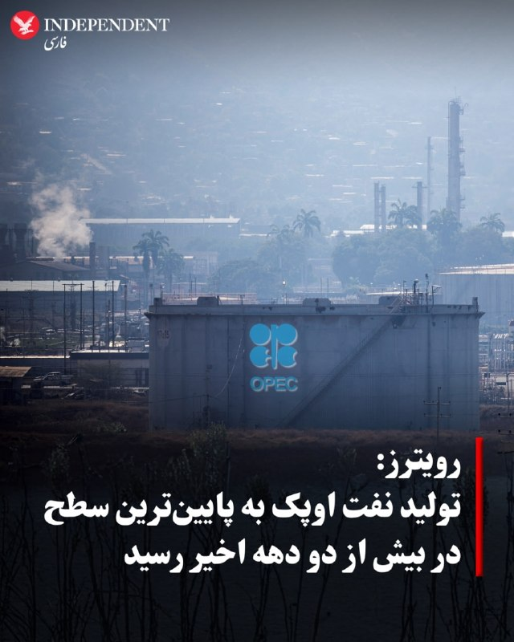

♦️خبرگزاری رویترز گزارش داد تولید نفت اعضای اوپک در ماه مه، تحت تاثیر تحولات منطقه‌ای، محاصره دریایی آمریکا علیه جمهوری اسلامی و کاهش صادرات تولیدکنندگان حوزه خلیج فارس در پی بسته شدن عملی تنگه هرمز، به پایین‌ترین سطح خود در بیش از دو دهه گذشته رسیده است.
بر اساس این گزارش، تولید ۱۱ عضو اوپک در ماه مه با کاهش روزانه یک میلیون و ۶۰ هزار بشکه نسبت به ماه قبل، به ۱۶ میلیون و ۱۳۰ هزار بشکه در روز رسید، رقمی که پایین‌ترین سطح تولید ماهانه این سازمان از دست‌کم سال ۲۰۰۰ تاکنون به شمار می‌رود.
رویترز همچنین نوشت جمهوری اسلامی بیشترین کاهش تولید را در میان اعضای اوپک تجربه کرده و صادرات نفت خام و میعانات گازی ایران به پایین‌ترین سطح خود در دست‌کم شش سال گذشته سقوط کرده است.
این گزارش اشاره می‌کند که آمار ارائه‌شده شامل امارات متحده عربی نیست؛ کشوری که از ابتدای ماه مه از اوپک خارج شده است. همچنین، اگرچه تولید عربستان سعودی کاهش یافته، عراق، ونزوئلا و نیجریه بخشی از افت تولید را با افزایش تولید خود جبران کرده‌اند.
‌🇸🇦 Indypersian

🤖 @VahidOOnLine

## VahidOOnLine — post 244768

  

ابراهیم رضایی، سخنگوی کمیسیون امنیت ملی مجلس، در شبکه ایکس نوشت: «در جنگ ۴۰ روزه وسعت آب‌های سرزمینی ایران افزایش یافت، در جنگ بعدی شاید وسعت خاک ایران افزایش یابد.»

او در مطلبی دیگر تاکید کرد جمهوری اسلامی آماده‌تر از قبل است.

او همچنین در یک برنامه تلویزیونی گفت: «دست از لبنان برنمی‌داریم و دشمن یا باید به خواسته‌های ما در میز مذاکره تن بدهد یا در میدان نبرد.»
‌🏁 🇬🇧 IranintlTV

🤖 @VahidOOnLine

## VahidOOnLine — post 244766

♦️تب بسکتبال نیویورک در آستانه بازی چهارم فینال «ان‌بی‌ای» به اوج رسیده است. از ساعات اولیه روز، فروش کلاه، تی‌شرت و محصولات هواداری نیکس در اطراف «مدیسن اسکوئر گاردن» رونق گرفته و خیابان‌های منتهی به ورزشگاه مملو از هوادارانی است که امیدوارند تیم محبوبشان یک گام دیگر به قهرمانی نزدیک شود.

نیویورک نیکس امشب در بازی چهارم فینال «ان‌بی‌ای» به مصاف سن‌آنتونیو اسپرز می‌رود؛ دیداری حساس که پس از شکست ۱۱۵ بر ۱۱۱ نیکس در بازی سوم برگزار می‌شود. با این حال، نیکس همچنان با برتری ۲ بر ۱ در مجموع سری، شرایط بهتری نسبت به حریف دارد.

در صورت پیروزی امشب، نیکس با نتیجه ۳ بر ۱ پیش خواهد افتاد و تنها یک برد تا نخستین قهرمانی خود از سال ۱۹۷۳ فاصله خواهد داشت؛ قهرمانی‌ای که می‌تواند به انتظار ۵۳ ساله هواداران این تیم پایان دهد.

همزمان، پلیس نیویورک با استقرار گسترده نیروها و اعمال محدودیت‌های ترافیکی در اطراف «مدیسن اسکوئر گاردن»، خود را برای حضور ده‌ها هزار هوادار و برگزاری یکی از مهم‌ترین شب‌های ورزشی سال در این شهر آماده کرده است.
‌🇸🇦 Indypersian

🤖 @VahidOOnLine

## VahidOOnLine — post 244765

  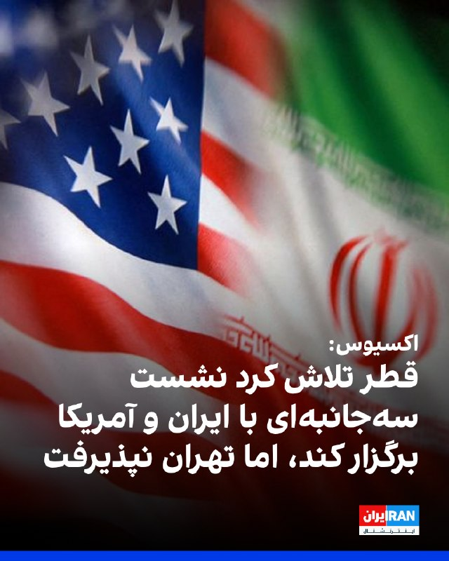

اکسیوس گزارش داد که قطر تلاش کرده نشستی سه‌جانبه برگزار کند، اما جمهوری اسلامی این پیشنهاد را نپذیرفته است.

بنا بر این گزارش با وجود تبادل آتش، مقام‌های ایرانی و آمریکایی طی دو روز گذشته، به‌طور جداگانه با میانجیگران قطری در دوحه دیدار کردند.

پیش‌تر گزارش‌هایی مبنی بر تلاش‌های قطر برای حصول توافق میان تهران و واشینگتن منتشر شده بود.
‌🏁 🇬🇧 IranintlTV

🤖 @VahidOOnLine

## VahidOOnLine — post 244764

  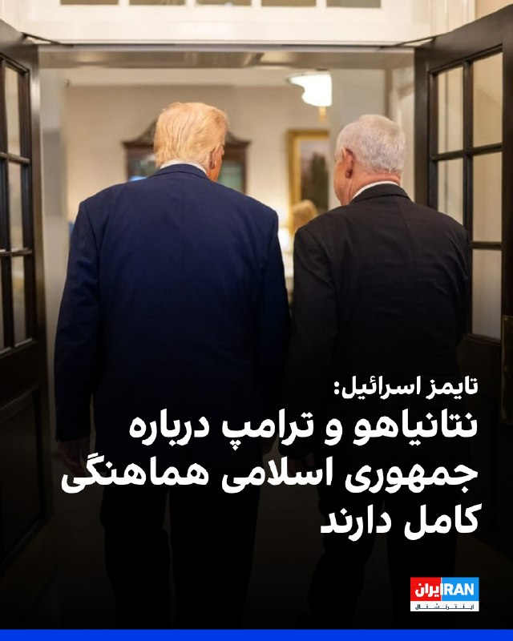

تایمز اسرائیل به نقل از یک منبع در دفتر نخست‌وزیری اسرائیل گزارش داد بنیامین نتانیاهو و دونالد ترامپ، رییس‌جمهوری آمریکا، هم‌زمان با تشدید تنش‌ها با جمهوری اسلامی و وعده ترامپ برای حملات بیشتر، «هماهنگی کامل» دارند.

این منبع گفت نخست‌وزیر اسرائیل و رییس‌جمهوری آمریکا یک روز در میان و گاهی هر روز با یکدیگر گفت‌وگو می‌کنند و «کاملا هماهنگ» هستند.

تایمز اسرائیل نوشت دو رهبر اوایل این هفته ظاهرا دچار اختلاف شده بودند؛ زمانی که ترامپ پس از حملات موشکی بالستیک جمهوری اسلامی از نتانیاهو خواست تنش را تشدید نکند، اما اسرائیل با وجود این، حملاتی انجام داد.

بر اساس این گزارش، ترامپ پس از سرنگونی یک بالگرد آمریکایی از سوی جمهوری اسلامی بر فراز تنگه هرمز، موضع سخت‌تری در برابر تهران گرفته است، هرچند تلاش برای دستیابی به توافق دیپلماتیک را کنار نگذاشته؛ توافقی که او امروز آن را «کاملا مذاکره‌شده» توصیف کرد.
‌🏁 🇬🇧 IranintlTV

🤖 @VahidOOnLine

## VahidOOnLine — post 244763

  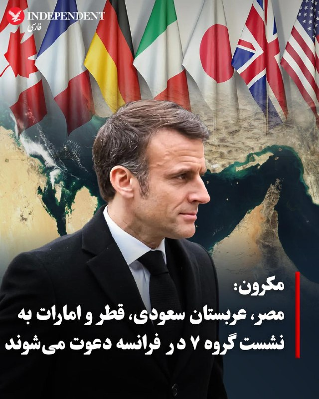

♦️امانوئل مکرون، رئیس‌جمهوری فرانسه، اعلام کرد که رهبران کشورهای مصر، عربستان سعودی، قطر و امارات متحده عربی برای شرکت در نشست هفته آینده گروه ۷ (G7) در فرانسه دعوت خواهند شد. این نشست به‌طور ویژه بر مذاکرات مربوط به پایان دادن به تنش‌ها با جمهوری اسلامی ایران و بررسی وضعیت امنیت در تنگه هرمز متمرکز خواهد بود.

به گزارش خبرگزاری فرانسه، مکرون تاکید کرد که اختلال در تردد کشتی‌ها در تنگه هرمز و به ویژه افزایش شدید قیمت سوخت ناشی از آن، «تاثیری واقعی و ملموس بر اقتصادهای ما» گذاشته است.
‌🇸🇦 Indypersian

🤖 @VahidOOnLine

## VahidOOnLine — post 244762

  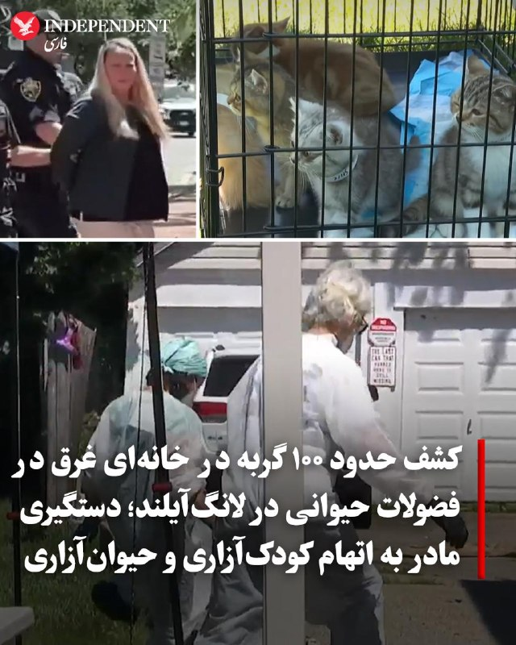

♦️پلیس لانگ‌آیلند زنی ۵۴ ساله به نام «آلینا هورباتکو» را پس از کشف نزدیک به ۱۰۰ گربه در وضعیت بسیار اسفبار در خانه‌اش بازداشت کرد. این زن که با دو دختر ۱۸ و ۱۱ ساله خود زندگی می‌کرد، روز سه‌شنبه در دادگاه حاضر شد و اتهامات خود از جمله ۶۷ مورد حیوان‌آزاری، دو مورد به خطر انداختن جان ماموران و یک مورد به خطر انداختن سلامت کودک را رد کرد.

ماموران پلیس شهر «گلن کوو» دوشنبه شب و پس از تماس دختر ۱۸ ساله خانواده که از بوی شدید و وضعیت غیرقابل تحمل خانه شکایت داشت، به محل اعزام شدند. به گفته پلیس، این دختر به دلیل بوی شدید ادرار و آمونیاک دچار مشکلات تنفسی شده بود. نیروهای امدادی و داوطلبان ناچار شدند با لباس‌های ویژه ضد مواد شیمیایی و ماسک اکسیژن وارد خانه شوند. به گزارش انجمن حمایت از حیوانات (SPCA)، تمام طبقات خانه از فضولات حیوانی پوشیده شده بود.
‌🇸🇦 Indypersian

🤖 @VahidOOnLine

## VahidOOnLine — post 244761

  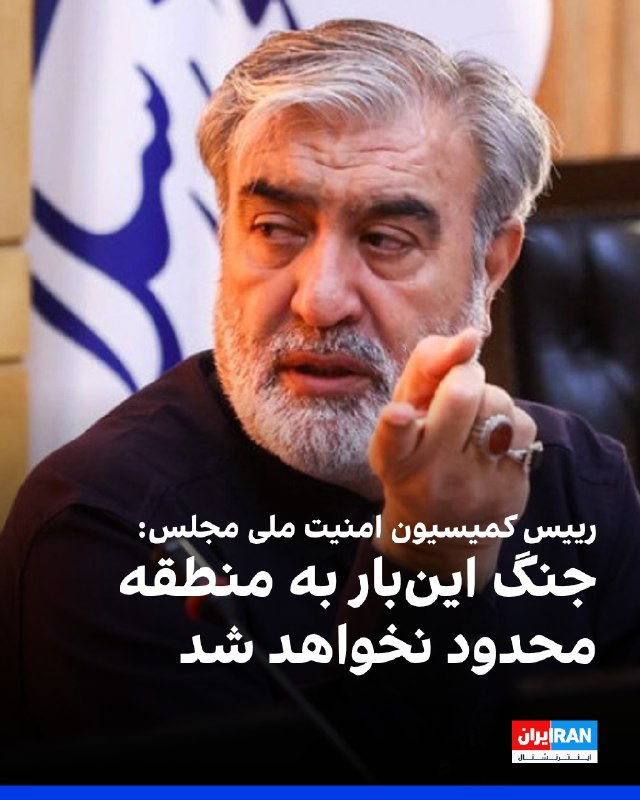

ابراهیم عزیزی، رییس کمیسیون امنیت ملی مجلس، در شبکه ایکس نوشت: «ما از جنگیدن با بازنده‌ها نمی‌ترسیم.»

او افزود: «همین الان هم تابوت‌های آمریکایی بسیار بیشتر از آن چیزی است که ترامپ می‌گوید و بیشتر هم خواهد شد چرا که جنگ این‌بار حتی به منطقه هم محدود نخواهد شد.»

رییس کمیسیون امنیت ملی مجلس، در پایان نوشت: «خواهیم دید چه می‌شود.»
‌🏁 🇬🇧 IranintlTV

🤖 @VahidOOnLine

## VahidOOnLine — post 244760

  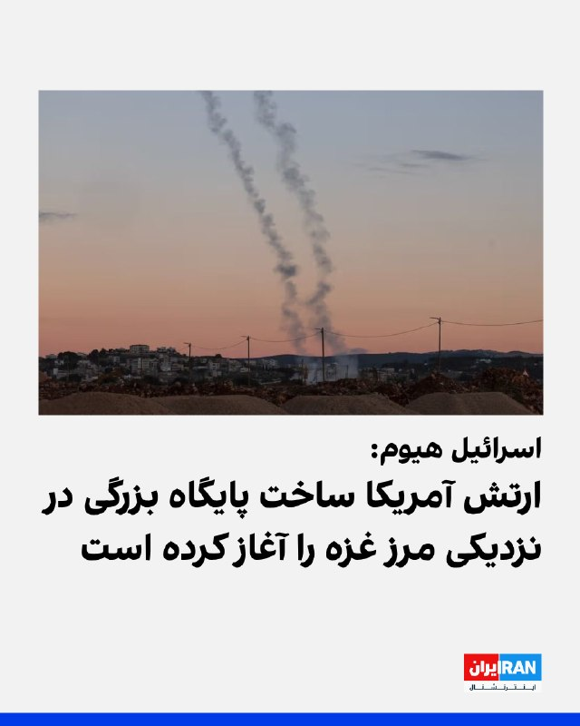

اسرائیل هیوم گزارش داد ارتش آمریکا ساخت پایگاه بزرگی در نزدیکی مرز غزه را آغاز کرده که قرار است مقر نیروهای پیشبرد طرح ترامپ باشد و جایگزین مقر چندملیتی کریات گت شود.

بر اساس این گزارش، با وجود تعلیق مشارکت اکثر کشورها به دلیل جنگ با جمهوری اسلامی، پنج کشور با اعزام نیرو موافقت کرده‌اند و ارزیابی امنیتی حاکی است احتمال ازسرگیری درگیری در غزه بیش از دستیابی به توافق سیاسی است.
‌🏁 🇬🇧 IranintlTV

🤖 @VahidOOnLine

## WithYashar — post 14382

منابع ایرانی (برای بار چهارصدم از صبح )به الجزیره گفتند: هرگونه حمله منجر به پایان مذاکرات خواهد شد
@withyashar

## WithYashar — post 14381

آکسیوس: یکی از گزینه‌های روی میز، یه عملیات نظامی گسترده اما کوتاه‌مدته هدفش هم اینه که ایران رو تحت فشار بذارن تا توی مذاکرات موضعش رو تغییر بده.
@withyashar

## WithYashar — post 14380

شبکه CNN: فرماندهان جدید ایران ریسک‌هایی رامی‌پذیرند که قبلی‌ها آنها از آن اجتناب می‌کردند
@withyashar

## WithYashar — post 14379

آکسیوس:هم اکنون ترامپ و تیم ارشد امنیت ملی خود در اتاق وضعیت کاخ سفید در حال برگزاری جلسه در مورد ایران می‌باشند.
@withyashar

## WithYashar — post 14378

ترامپ :به همه پیشنهاد میکنم امشب تلویزیون رو روشن کنن ( یک ساعت و نیم دیگه )
@withyashar

## WithYashar — post 14377

استرالیا و کانادا از همه شهروندان خود در ایران خواسته‌اند فوراً کشور را ترک کنند.
@withyashar

## WithYashar — post 14376

رسانه های اسراییل : ترامپ خبر از حمله بزرگ طی ساعات آینده به ایران داده است ٫ ارتش اسراییل اماده شده
@withyashar

## WithYashar — post 14375

گزارش صدای انفجار از نجف‌آباد اصفهان 🚨
@withyashar

## WithYashar — post 14374

24 ساعت دیگه بازی افتتاحیه جام جهانی شروع میشه
@withyashar

## WithYashar — post 14373

جواد خیابانی پس از ۳۵ سال فعالیت مستمر در سازمان صداوسیما بازنشسته شد
@withyashar

## WithYashar — post 14372

میانجیگر قطری هم تهران رو ترک کرد.
@withyashar

## WithYashar — post 14371

کانال ۱۲ اسرائیل:
طی ساعات آتی احتمال شعله‌ور شون جنگ بزرگ وجود دارد
@withyashar

## WithYashar — post 14370

باراک راوید: ممکنه مذاکرات ظرف ۲ تا ۳ ساعت آینده به فروپاشی کامل برسه!
@withyashar

## WithYashar — post 14369

امروز دو فروند هواپیمای گشت دریایی P-8A Poseidon متعلق به نیروی دریایی آمریکا از پایگاه هوایی سیگونلا (NAS Sigonella) به سمت شرق پرواز کردند؛ مسیری که احتمالاً به خاورمیانه یا شاخ آفریقا منتهی می‌شود. اگرچه این جابه‌جایی به‌خودی‌خود قابل توجه بود، اما آنچه توجه علاقه‌مندان به ردیابی پرواز را جلب کرد این بود که یکی از این هواپیماها به نظر می‌رسید کد هگز ICAO متعلق به یک بمب‌افکن B-52 نیروی هوایی آمریکا را ارسال می‌کند.
این ناهنجاری به‌سرعت باعث گمانه‌زنی‌هایی در فضای آنلاین شد مبنی بر اینکه یک B-52 استراتوفورترس از سیسیل به پرواز درآمده است. با این حال، شواهد موجود نشان می‌دهد که هیچ B-52 از سیگونلا عملیات نداشته و هواپیمای مورد نظر در واقع یک P-8A بوده است.

هواپیماهای نظامی گاهی به دلایل فنی، عملیاتی یا اداری داده‌های شناسایی غیرمعمولی ارسال می‌کنند. در برخی موارد، تنظیمات ترانسپوندر ممکن است اشتباه باشد؛ در موارد دیگر، آزمایش‌ها یا فعالیت‌های تعمیر و نگهداری می‌تواند منجر به ارسال داده‌های غیرمنتظره شود.
اما برای تحلیل‌گران متن‌باز (OSINT)، چنین ناهنجاری‌هایی می‌تواند پیامدهای قابل توجهی داشته باشد.
نمایش یک B-52 بر فراز مدیترانه مرکزی فوراً توجه‌ها را جلب می‌کند، زیرا این بمب‌افکن یکی از اصلی‌ترین پلتفرم‌های حمله دوربرد ایالات متحده است. گزارش حضور B-52 در سیسیل به‌طور طبیعی باعث گمانه‌زنی درباره عملیات احتمالی نظامی، تغییر آرایش نیروها یا آمادگی برای سناریوهای منطقه‌ای می‌شود.
@withyashar

## WithYashar — post 14368

🚨🚨🚨🚨🚨🚨🚨🚨 بمب افکن مخوف بی-۵۲ آمریکایی همکنون وارد حوزه خلیج فارس شد. قبل از رسیدن به تنگه هرمز یک هواپیمای سوخت‌رسان انتظارش را می‌کشد. خواهیم دید چه خواهد شد. @withyashar

## WithYashar — post 14367

  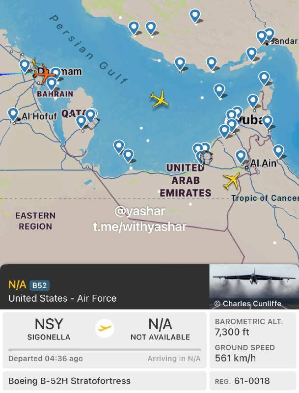

🚨🚨🚨🚨🚨🚨🚨🚨
بمب افکن مخوف بی-۵۲ آمریکایی همکنون وارد حوزه خلیج فارس شد. قبل از رسیدن به تنگه هرمز یک هواپیمای سوخت‌رسان انتظارش را می‌کشد. خواهیم دید چه خواهد شد.
@withyashar

## WithYashar — post 14366

پدافندهای کل کشور به حالت آماده باش 100 درصدی درآمد
@withyashar

## WithYashar — post 14365

منابع عبری: اسرائیل درحال آماده سازی جهت حمله به ایران است
@withyashar

## WithYashar — post 14364

آکسیوس: قطری‌ها امروز سعی کردن یک دیدار سه‌جانبه ترتیب بدن تا مستقیماً درباره شکاف‌های باقی‌مانده مذاکره کنن، اما ایرانی‌ها نپذیرفتن.
@withyashar

## mwarmonitor — post 10650

  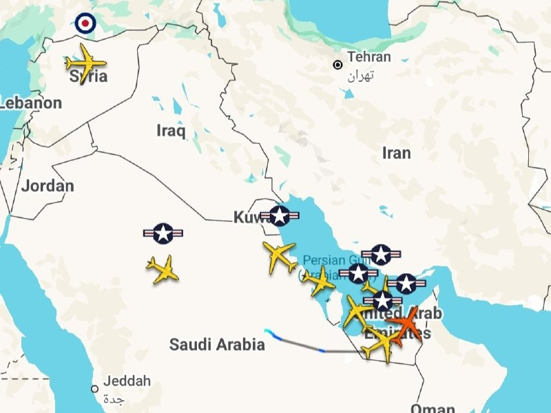

✈️گروهی از تانکرهای سوخت‌رسان نیروی هوایی آمریکا (USAF) از تل‌آویو و ریاض در حال فعالیت در اطراف تنگه هرمز و خلیج فارس هستند؛ همه آن‌ها قابل مشاهده نیستند و هواپیماهای جنگنده نیز آن‌ها را همراهی می‌کنند.

@mwarmonitor

## mwarmonitor — post 10649

⏳

## mwarmonitor — post 10648

خب تصمیم گرفته شد

## mwarmonitor — post 10647

🔴ترامپ برای بررسی گزینه‌های حمله به ایران، در «اتاق وضعیت» تشکیل جلسه داد

📝نویسنده: باراک راوید

🔰به گفته دو منبع آمریکایی، پرزیدنت ترامپ عصر روز چهارشنبه جلسه‌ای را در «اتاق وضعیت» (Situation Room) کاخ سفید برگزار کرد تا گزینه‌های حملات جدید علیه ایران را بررسی کند؛ این جلسه تنها چند ساعت پس از آن تشکیل شد که وی به خبرنگاران گفت ایالات متحده «امروز دوباره ضربه سختی به آن‌ها خواهد زد».

📌جزئیات بیشتر
منابع آگاه اعلام کردند یکی از گزینه‌هایی که ترامپ در حال بررسی آن است، راه‌اندازی عملیاتی با مقیاس بزرگ اما مدت زمان کوتاه است؛ هدفی که پشت این اقدام وجود دارد، تحت فشار قرار دادن ایران برای تغییر موضع خود در مذاکرات است. این منابع به جزئیات بیشتری اشاره نکردند.

📌آخرین وضعیت
میانجی‌های قطری روز چهارشنبه در تهران با مقامات ایرانی گفتگو کردند تا تلاش کنند جانی دوباره به توافقی ببخشند که ایالات متحده و ایران هفته‌هاست در حال مذاکره روی آن هستند.
در صورت عدم دستیابی به یک پیشرفت ملموس، حملات ایالات متحده ممکن است به‌زودی آغاز شود.
ایالات متحده شامگاه سه‌شنبه در پاسخ به سرنگونی یک هلیکوپتر آمریکایی، به سایت‌های راداری و پدافند هوایی ایران حمله کرد، اما این حملات به‌گونه‌ای تنظیم شده بودند که از تلفات جانی جلوگیری کنند تا مسیر برای دستیابی به یک توافق احتمالی باز بماند.

🔸به گفته این منابع، در جلسه اتاق وضعیت، مقامات ارشد از جمله معاون رئیس‌جمهور ونس، وزیر امور خارجه مارکو روبیو، رئیس سی‌آی‌ای (CIA) جان راتکلیف، رئیس ستاد مشترک ارتش ژنرال دن کین و فرستاده کاخ سفید استیو ویتکوف حضور داشتند.

🔸پیت هگست، وزیر دفاع، نیز از مقر فرماندهی مرکزی ایالات متحده (سنتکام) در تامپا به این جلسه پیوست. هگست در فلوریدا و در جمع سربازان، همسو با اظهارات قبلی ترامپ در روز چهارشنبه، گفت: «اگر آن‌ها حاضر به توافق نشوند، ما ضربه سختی به آن‌ها خواهیم زد.»
کاخ سفید هنوز به درخواست‌ها برای اظهار نظر در این باره پاسخی نداده است.

📌پشت صحنه
ترامپ به دلیل نزدیک به دو هفته انتظار برای دریافت پاسخ ایران به آخرین پیشنهادش، به‌شدت و به طور فزاینده‌ای کلافه و ناامید شده بود.

@mwarmonitor

## mwarmonitor — post 10646

🔸هلیکوپتر آپاچی که روز سه‌شنبه سقوط کرد، طبق گفته یک مقام ارشد آمریکایی در حال دفاع از کشتی‌ها در آن آبراه در برابر پهپادها و موشک‌های ایرانی بوده است.

🔸خلبانان توانستند پس از برخورد هواگرد با آب و آتش‌گرفتن آن، با جدا کردن باقی‌مانده شیشه/سقف کابین (کاناپی) و بیرون آمدن از آن، چند ثانیه پیش از غرق شدن، از هواگرد در حال سوختن خارج شوند. وال‌استریت ژورنال

@mwarmonitor

## mwarmonitor — post 10645

🔴وزارت خارجه آمریکا: ما از طریق «عملیات خشم اقتصادی» به مختل‌کردن شبکه‌های تأمین و تدارکاتی که از برنامه‌های نظامی ایران حمایت می‌کنند ادامه می‌دهیم.

🔴وزارت خارجه آمریکا: تحریم‌هایی علیه ۱۳ فرد و نهاد در ایران، بلاروس و چین اعمال شده است که برای خرید سلاح به نفع سپاه پاسداران انقلاب اسلامی تلاش کرده‌اند.

@mwarmonitor

## mwarmonitor — post 10644

  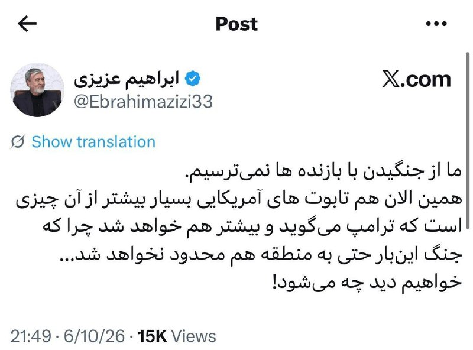

📝 ترامپ ؛ «اول از همه اینکه "خواهیم دید چه می‌شود" حق انحصاری و تکیه‌کلام شخصی منه، پس لطفاً اسکی نرو و برای خودت دکان باز نکن! دوم اینکه با این دست‌فرمان توهمی که پیش می‌روی، قول شرف می‌دهم نفر بعدی که افقی می‌شود و سینه قبرستان در آغوش خاک می‌خوابد، دقیقاً خود شخص شخیص و متوهمت باشد؛ آن‌قدرها هم از عمرت باقی نمانده و آن‌قدر جان نداری که بخواهی فانتزی‌های جنگ جهانی‌ات را حتی از تشک و تخت‌خوابت فراتر ببری، چه برسد به میدان واقعی!

@mwarmonitor

## mwarmonitor — post 10643

🔴رسانه‌های اسرائیلی: دوباره یک رویداد غیرعادی در خط مقدم رخ داده است. از ساکنان زرعیت در شمال اسرائیل خواسته شده است به پناهگاه‌ها بروند و تا اطلاع ثانوی در نزدیکی آن‌ها بمانند: «باید از تجمع‌ها و رفت‌وآمد در منطقه خودداری شود و دستورالعمل‌های نیروهای امنیتی رعایت گردد.»

@mwarmonitor

## mwarmonitor — post 10642

🔸ظاهراً این جواب به قطری ها دادن امروز ، ترامپ واکنش نشون داده @mwarmonitor

## FoxNewsTwitter — post 342824

Fox News (Twitter/X)

RT @TheStoryFNC: BREAKING NOW: Karmelo Anthony set to appeal conviction in track meet murder of Austin Metcalf

@Brooketaylortv reports

## FoxNewsTwitter — post 342823

  

Fox News (Twitter/X)

.@ChadPergram and @kevincorke report live from Nationals Park with the latest. https://twitter.com/i/broadcasts/1AJEmmbgPNvJL

## FoxNewsTwitter — post 342822

  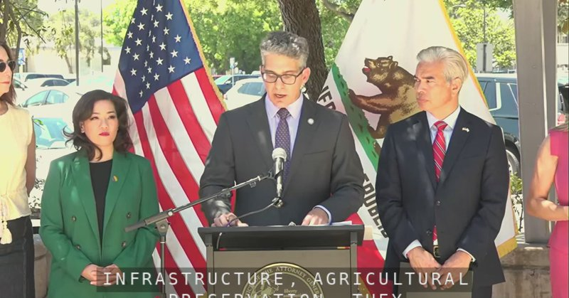

Fox News (Twitter/X)

WATCH LIVE: California AG Rob Bonta, Santa Clara officials announce legal action against Trump administration (Courtesy: CA Dept of Justice) https://twitter.com/i/broadcasts/1jGXggXXkVeKZ

## FoxNewsTwitter — post 342821

  <a href="telegram/content/FoxNewsTwitter_342821_1781124130.mp4" target="_blank">🎬 Download video</a>

Fox News (Twitter/X)

RT @AmericaRpts: 🚨🚨@SecMullinDHS has a message for sanctuary cities that REFUSE to cooperate with federal enforcement👇👇👇

“We are going to keep our men and women that are enforcing the law safe and if we have to pull them from the airport we will”

“We’re not pulling them out just because they’re sanctuary cities, we are going to pull them out because the state and the local government is refusing to do their jobs”

## FoxNewsTwitter — post 342820

  <a href="telegram/content/FoxNewsTwitter_342820_1781124132.mp4" target="_blank">🎬 Download video</a>

Fox News (Twitter/X)

Newly released dashcam video shows a homicide suspect opening fire on Missouri state troopers during a high-speed chase.

After troopers used a PIT maneuver to spin out the suspect's vehicle, investigators say Steven Swanson fired shots at a pursuing trooper, striking the patrol car.

Authorities say the chase began after Swanson allegedly killed one person and injured another in Boone County, Missouri.

After leading law enforcement on a pursuit, he stopped in the median of U.S. Highway 63, where officers later found him dead from an apparent self-inflicted gunshot wound.

## pm_afshaa — post 93379

  <a href="telegram/content/pm_afshaa_93379_1781124134.webm" target="_blank">🎬 Download video</a>

🔴منابع ایرانی به الجزیره:
حواستون باشه که هرگونه حمله منجر به پایان مذاکرات خواهد شد.

💧 Rainbet.com the #1 Non-KYC Crypto Casino & Sportsbook @rainbetcom

😁 @Pm_Afshaa

## pm_afshaa — post 93378

  <a href="telegram/content/pm_afshaa_93378_1781124135.webm" target="_blank">🎬 Download video</a>

🔴فارس به نقل از منبع اطلاعاتی: ایران کلیه تحرکات ارتش آمریکا در منطقه رو چه در زمین و چه در آسمان، با دقت کامل رصد میکنه. 
💧 Rainbet.com the #1 Non-KYC Crypto Casino & Sportsbook @rainbetcom 
😁 @Pm_Afshaa

## pm_afshaa — post 93377

  <a href="telegram/content/pm_afshaa_93377_1781124136.webm" target="_blank">🎬 Download video</a>

🔴فارس به نقل از منبع اطلاعاتی:
ایران کلیه تحرکات ارتش آمریکا در منطقه رو چه در زمین و چه در آسمان، با دقت کامل رصد میکنه.

💧 Rainbet.com the #1 Non-KYC Crypto Casino & Sportsbook @rainbetcom

😁 @Pm_Afshaa

## pm_afshaa — post 93376

  <a href="telegram/content/pm_afshaa_93376_1781124136.webm" target="_blank">🎬 Download video</a>

🔴شبکه سی‌ان‌ان:
فرماندهان جدید ایران ریسک‌هایی رو می‌پذیرن که قبلی‌ها از آن اجتناب میکردن.

💧 Rainbet.com the #1 Non-KYC Crypto Casino & Sportsbook @rainbetcom

😁 @Pm_Afshaa

## pm_afshaa — post 93375

  <a href="telegram/content/pm_afshaa_93375_1781124137.webm" target="_blank">🎬 Download video</a>

🔴وال‌استریت ژورنال:
هلیکوپتر آپاچی سقوط‌‌کرده در حال محافظت از کشتی‌ها در برابر پهپادها و موشک‌های جمهوری اسلامی بوده.

خلبانان لحظاتی قبل از غرق شدن بالگردِ در حال آتش‌سوزی، موفق شدن از کابین خارج شده و جون خودشون رو نجات بدن.

💧 Rainbet.com the #1 Non-KYC Crypto Casino & Sportsbook @rainbetcom

😁 @Pm_Afshaa

## pm_afshaa — post 93374

  <a href="telegram/content/pm_afshaa_93374_1781124138.webm" target="_blank">🎬 Download video</a>

🔴منبع پاکستانی به الحدث: ما امروز از امضای توافقنامه صلح، خیلی دور شدیم.

💧 Rainbet.com the #1 Non-KYC Crypto Casino & Sportsbook @rainbetcom

😁 @Pm_Afshaa

## pm_afshaa — post 93373

  <a href="telegram/content/pm_afshaa_93373_1781124139.webm" target="_blank">🎬 Download video</a>

🔴باراک راوید، خبرنگار اکسیوس: ترامپ امشب جلسه‌ای در اتاق وضعیت در مورد گزینه‌های حمله به ایران برگزار کرد. + هنوزم در جلسه هستن و ادامه داره. 
💧 Rainbet.com the #1 Non-KYC Crypto Casino & Sportsbook @rainbetcom 
😁 @Pm_Afshaa

## pm_afshaa — post 93372

  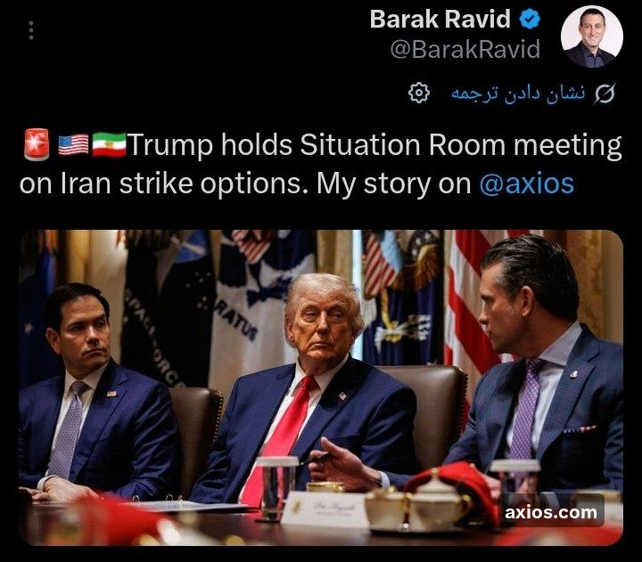

🔴باراک راوید، خبرنگار اکسیوس:
ترامپ امشب جلسه‌ای در اتاق وضعیت در مورد گزینه‌های حمله به ایران برگزار کرد.

+ هنوزم در جلسه هستن و ادامه داره.

💧 Rainbet.com the #1 Non-KYC Crypto Casino & Sportsbook @rainbetcom

😁 @Pm_Afshaa

## pm_afshaa — post 93371

  <a href="telegram/content/pm_afshaa_93371_1781124141.webm" target="_blank">🎬 Download video</a>

🔴وزارت خارجه آمریکا:
ما از طریق «عملیات خشم اقتصادی» به مختل‌کردن شبکه‌های تأمین و تدارکاتی که از برنامه‌های نظامی جمهوری اسلامی حمایت میکنن ادامه میدیم.

تحریم‌هایی علیه 13 فرد و نهاد در ایران، بلاروس و چین اعمال شده که برای خرید سلاح به نفع سپاه پاسداران تلاش کردن.

💧 Rainbet.com the #1 Non-KYC Crypto Casino & Sportsbook @rainbetcom

😁 @Pm_Afshaa

## pm_afshaa — post 93370

  <a href="telegram/content/pm_afshaa_93370_1781124141.webm" target="_blank">🎬 Download video</a>

🔴پیت هگست، وزیر دفاع آمریکا:
همانطور که ترامپ امروز گفت ایرانی‌ها معامله نخواهند کرد، پس ما به شدت به آنها ضربه خواهیم زد. سنتکام این کار رو بسیار خوب انجام میده، بهتر از هر کس دیگری در جهان.

💧 Rainbet.com the #1 Non-KYC Crypto Casino & Sportsbook @rainbetcom

😁 @Pm_Afshaa

## pm_afshaa — post 93369

  <a href="telegram/content/pm_afshaa_93369_1781124142.webm" target="_blank">🎬 Download video</a>

🔴دو ساعت تا سخنرانی ترامپ؛
ترامپ: به همه پیشنهاد میکنم امشب تلویزیون رو روشن کنن.

💧 Rainbet.com the #1 Non-KYC Crypto Casino & Sportsbook @rainbetcom

😁 @Pm_Afshaa

## pm_afshaa — post 93368

  <a href="telegram/content/pm_afshaa_93368_1781124143.webm" target="_blank">🎬 Download video</a>

🔴استرالیا و کانادا از همه شهروندان خود در ایران خواستن فوراً کشور رو ترک کنند.

💧 Rainbet.com the #1 Non-KYC Crypto Casino & Sportsbook @rainbetcom

😁 @Pm_Afshaa

## pm_afshaa — post 93367

  <a href="telegram/content/pm_afshaa_93367_1781124144.webm" target="_blank">🎬 Download video</a>

🔴الدغیر، خبرنگار الجزیره در تهران:
میانجی‌گران قطری تهران رو ترک کرد.

💧 Rainbet.com the #1 Non-KYC Crypto Casino & Sportsbook @rainbetcom

😁 @Pm_Afshaa

## pm_afshaa — post 93366

  <a href="telegram/content/pm_afshaa_93366_1781124145.webm" target="_blank">🎬 Download video</a>

🔴رضایی، سخنگوی کمیسیون امنیت ملی:
تو جنگ چهل‌روزه وسعت آب‌های سرزمینی ایران افزایش پیدا کرد، تو جنگ بعدی شاید وسعت خاک ایران افزایش پیدا کنه.

💧 Rainbet.com the #1 Non-KYC Crypto Casino & Sportsbook @rainbetcom

😁 @Pm_Afshaa

## pm_afshaa — post 93365

  <a href="telegram/content/pm_afshaa_93365_1781124145.webm" target="_blank">🎬 Download video</a>

🔴کانال 12 اسرائیل: طی ساعات آتی احتمال شعله‌ور شون جنگ بزرگ وجود داره.

💧 Rainbet.com the #1 Non-KYC Crypto Casino & Sportsbook @rainbetcom

😁 @Pm_Afshaa

## pm_afshaa — post 93364

  <a href="telegram/content/pm_afshaa_93364_1781124146.webm" target="_blank">🎬 Download video</a>

🔴باراک راوید خبرنگار آکسیوس: مذاکرات ممکنه ظرف دو سه ساعت آینده فر بریزه.

💧 Rainbet.com the #1 Non-KYC Crypto Casino & Sportsbook @rainbetcom

😁 @Pm_Afshaa

## pm_afshaa — post 93363

  <a href="telegram/content/pm_afshaa_93363_1781124147.webm" target="_blank">🎬 Download video</a>

🔴تایمز اسرائیل: نتانیاهو و ترامپ درباره جمهوری اسلامی هماهنگی کامل دارن.

💧 Rainbet.com the #1 Non-KYC Crypto Casino & Sportsbook @rainbetcom

😁 @Pm_Afshaa

## pm_afshaa — post 93361

  <a href="telegram/content/pm_afshaa_93361_1781124148.mp4" target="_blank">🎬 Download video</a>

آتش‌سوزی حوالی میدان قیام تهران :

صداوسیما: بیشترش انبار فرش هستن.

💧 Rainbet.com the #1 Non-KYC Crypto Casino & Sportsbook @rainbetcom

😁 @Pm_Afshaa

## pm_afshaa — post 93360

  <a href="telegram/content/pm_afshaa_93360_1781124148.webm" target="_blank">🎬 Download video</a>

🔴فاکس نیوز به نقل از یک دیپلمات آگاه: پس از رایزنی با ایالات متحده، مذاکره‌کنندگان قطری امروز صبح برای دیدار با ایرانی‌ها به تهران سفر کردن تا در تلاشی برای رفع اختلافات باقی‌مانده در فرآیند مذاکره باشن. 
💧 Rainbet.com the #1 Non-KYC Crypto Casino & Sportsbook…

## DEJradio — post 5561

  <a href="telegram/content/DEJradio_5561_1781124149.mp4" target="_blank">🎬 Download video</a>

🚨
🔸 خبر ۲۱
چهارشنبه ۲۰ خرداد ۱۴۰۵

#خبر۲۱
@DEJradio

## DEJradio — post 5560

  <a href="telegram/content/DEJradio_5560_1781124152.webm" target="_blank">🎬 Download video</a>

⭕️
🚨 ترامپ: حملات آمریکا به مواضع جمهوری اسلامی ادامه می‌یابد دونالد ترامپ، رئیس جمهوری آمریکا، شامگاه چهارشنبه اعلام کرد ایالات متحده بار دیگر مواضع جمهوری اسلامی را هدف می‌گیرد. او با اشاره به سرنگونی یک بالگرد آمریکایی گفت جمهوری اسلامی باید بهای این اقدام…

## mamlekate — post 103665

📝 اصرار دولت بر «مدیریت» تقاضای بنزین؛ آمارها چه می‌گویند؟

مقامات جمهوری اسلامی بارها نسبت به کسری فزاینده بنزین در کشور و «بار سنگین واردات» سوخت هشدار داده‌اند، اما آمارهای بانک مرکزی نشان می‌دهد آمار و ارقامی که دولت درباره واردات بنزین ارائه می‌کند بسیار غلوآمیز است.

@mamlekate

## mamlekate — post 103664

📝 قطعنامه پیشنهادی آمریکا علیه برنامه هسته‌ای جمهوری اسلامی در شورای حکام تصویب شد

شورای حکام آژانس بین‌المللی انرژی اتمی چهارشنبه ۲۰ خرداد قطعنامه‌ای را علیه برنامه هسته‌ای جمهوری اسلامی تصویب کرد و از تهران خواست هرچه زودتر ذخایر باقی‌مانده اورانیوم غنی‌شده خود را اعلام کند و به بازرسان اجازه دهد این مواد را راستی‌آزمایی کنند.

@mamlekate

## mamlekate — post 103663

  <a href="telegram/content/mamlekate_103663_1781124153.mp4" target="_blank">🎬 Download video</a>

دونالد ترامپ رئیس‌جمهور ایالات متحده درباره ایران: «دیروز ضربات سنگینی به آن‌ها وارد کردیم و امروز هم دوباره ضربات سنگینی وارد می‌کنیم... و خواهیم دید که در مورد توافق چه اتفاقی می‌افتد. ما به یک توافق بسیار نزدیک شده بودیم، اما آن‌ها مدام ما را معطل می‌کنند. آن‌ها همچنان ما را ساده‌لوح فرض می‌کنند، چون می‌دانید چیست؟ آن‌ها در گذشته با رؤسای‌جمهور بسیار احمقی طرف بوده‌اند.»
USABehFarsi

@mamlekate

## mamlekate — post 103658

  <a href="telegram/content/mamlekate_103658_1781124155.mp4" target="_blank">🎬 Download video</a>

📞 من الان از آتش‌سوزی میدون قیام تهران میام. هنوزم درحال سوختنه. حجم آتیش اینقدر زیاده که تا دو ساعت دیگه هم خاموش نمیشه. چندتا ساختمون و انبار هست. انبار فرش هم هست اونجا. به نظر میاد بخاطر حجم آتیش، فرش‌ها باشن.

35.67060° N, 51.43727° E

@mamlekate

## VahidOnline — post 76163

  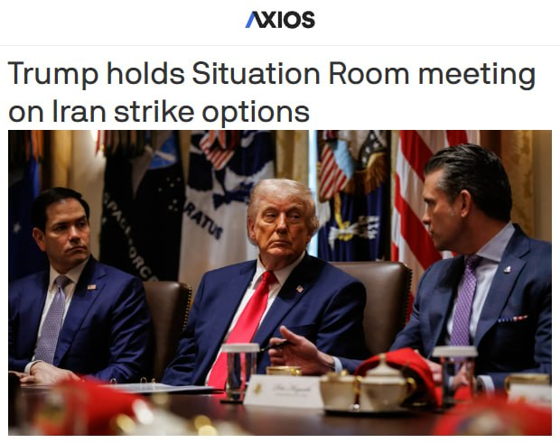

آکسیوس: ترامپ درباره گزینه‌های حمله به ایران در اتاق وضعیت جلسه برگزار کرد

ترجمه ماشین:
پرزیدنت ترامپ بعدازظهر چهارشنبه جلسه‌ای در اتاق وضعیت کاخ سفید برگزار کرد تا درباره حملات احتمالی تازه علیه ایران گفت‌وگو کند؛ این جلسه چند ساعت پس از آن برگزار شد که او به خبرنگاران گفته بود آمریکا «امروز دوباره ضربه سختی به آن‌ها خواهد زد». این را دو منبع آمریکایی اعلام کردند.

این منابع گفتند یکی از گزینه‌هایی که ترامپ در حال بررسی آن است، انجام عملیاتی است که از نظر مقیاس بزرگ اما از نظر مدت‌زمان کوتاه باشد؛ با هدف فشار آوردن به ایران برای تغییر موضعش در مذاکرات.
این منابع جزئیات بیشتری ارائه نکردند.
axios

📡 @VahidOnline

## VahidOnline — post 76162

  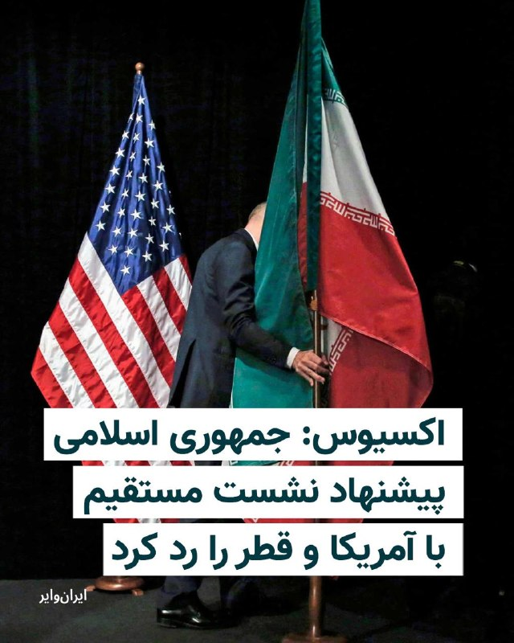

پایگاه خبری اکسیوس، روز ۲۰ خرداد ۱۴۰۵، گزارش داد جمهوری اسلامی با پیشنهاد میانجی‌های قطری برای برگزاری یک نشست سه‌جانبه با حضور نمایندگان ایران، آمریکا و قطر به منظور حل اختلافات باقی‌مانده در مذاکرات موافقت نکرده است.

بر اساس این گزارش، مقام‌های ایرانی و آمریکایی طی دو روز گذشته به صورت جداگانه با میانجی‌های قطری در دوحه در تماس بوده‌اند. با این حال، تلاش قطر برای برگزاری یک نشست مستقیم میان طرف‌ها با مخالفت تهران روبه‌رو شده است.

اکسیوس به نقل از منابع آمریکایی و منطقه‌ای نوشت که همزمان با ادامه تلاش‌های دیپلماتیک، هیئت قطری روز چهارشنبه برای گفت‌وگو با عباس عراقچی و دیگر مقام‌های جمهوری اسلامی به تهران سفر کرده تا روند مذاکرات را از بن‌بست خارج کند.

این گزارش می‌افزاید که دستور دونالد ترامپ برای حمله به اهداف نظامی ایران تنها به دلیل سرنگونی یک بالگرد آمریکایی صادر نشد، بلکه نتیجه افزایش نارضایتی او از تاخیر جمهوری اسلامی در پاسخ به آخرین پیشنهاد واشنگتن بود.

به گفته یک مقام ارشد آمریکایی، هدف از حملات محدود آمریکا در شامگاه سه‌شنبه «بازگرداندن اهرم فشار» در مذاکرات بود، بدون آنکه تلفات انسانی بر جای بگذارد یا مسیر دستیابی به توافق را مسدود کند.

دو مقام ارشد کاخ سفید نیز به اکسیوس گفته‌اند که حتی اگر سرنگونی بالگرد آمریکایی عمدی نبوده، واشنگتن برای جلوگیری از تضعیف موقعیت خود در مذاکرات ناچار به واکنش بود.
به گفته این منابع، حملات آمریکا به گونه‌ای طراحی شد که تنها سامانه‌های راداری و مراکز کنترل پهپاد ایران را هدف قرار دهد.

اکسیوس همچنین گزارش داد که کاخ سفید ساعاتی پیش از آغاز حملات، بار دیگر از تهران خواسته بود پاسخ نهایی خود را درباره پیشنهاد اخیر ترامپ ارائه کند، اما مقام‌های جمهوری اسلامی اعلام کردند هنوز تصمیم نهایی اتخاذ نشده است.

بر اساس این گزارش، ترامپ پس از نشست ۸ خرداد در اتاق وضعیت کاخ سفید، دو شرط جدید را به پیش‌نویس تفاهم میان دو کشور اضافه کرده بود.
نخست اینکه ایران ظرف ۶۰ روز ذخایر اورانیوم غنی‌شده خود را رقیق‌سازی کند و دوم اینکه از دریافت هرگونه عوارض یا هزینه از کشتی‌های عبوری در تنگه هرمز خودداری کند.
در مقابل، واشینگتن آمادگی خود را برای پذیرش انجام فرآیند رقیق‌سازی در داخل ایران و تحت نظارت آژانس بین‌المللی انرژی اتمی اعلام کرده بود.

اکسیوس به نقل از منابع آگاه نوشت عباس عراقچی به میانجی‌ها گفته بود برای ارائه پاسخ تهران به چند روز زمان نیاز دارد، اما این روند به نزدیک دو هفته انتظار تبدیل شد و موجب افزایش نارضایتی ترامپ شد.
این گزارش همچنین می‌گوید پیش از تشدید درگیری‌های اخیر میان ایران و اسراییل، دو طرف به دستیابی به توافق نزدیک شده بودند، اما تحولات نظامی روزهای گذشته روند مذاکرات را پیچیده‌تر کرده است.
با وجود حملات متقابل و افزایش تنش‌ها، مقام‌های آمریکایی به اکسیوس گفته‌اند که مذاکرات همچنان متوقف نشده و واشینگتن امیدوار است فشارهای اخیر، جمهوری اسلامی را به ارائه پاسخ نهایی درباره پیشنهاد آمریکا وادار کند.
@VahidHeadline

📡 @VahidOnline

## VahidOnline — post 76161

  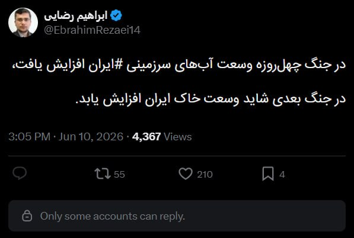

ابراهیم رضایی، سخنگوی کمیسیون امنیت ملی مجلس، در شبکه ایکس نوشت: «در جنگ ۴۰ روزه وسعت آب‌های سرزمینی ایران افزایش یافت، در جنگ بعدی شاید وسعت خاک ایران افزایش یابد.»

او در مطلبی دیگر تاکید کرد جمهوری اسلامی آماده‌تر از قبل است.

او همچنین در یک برنامه تلویزیونی گفت: «دست از لبنان برنمی‌داریم و دشمن یا باید به خواسته‌های ما در میز مذاکره تن بدهد یا در میدان نبرد.»
@VahidOOnLine

📡 @VahidOnline

## kianmeli1 — post 87880

  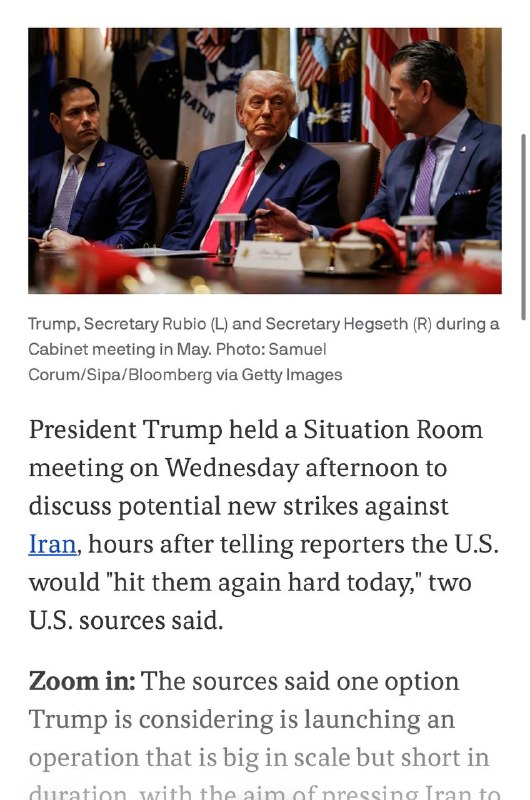

🔴فوری

ترامپ جلسه‌ای در اتاق وضعیت در مورد گزینه‌های حمله به ایران برگزار کرد.
https://t.me/kianmeli1

## kianmeli1 — post 87879

🔴رسانه های اسراییل

ترامپ خبر از حمله بزرگ طی ساعات آینده به ایران داده است ٫ ارتش اسراییل اماده شده
https://t.me/kianmeli1

## kianmeli1 — post 87878

🔴آکسیوس به نقل از یک مقام آمریکایی:

کاخ سفید به ایرانی‌ها روشن کرده است که زمان رو به اتمام است
https://t.me/kianmeli1

## kianmeli1 — post 87877

  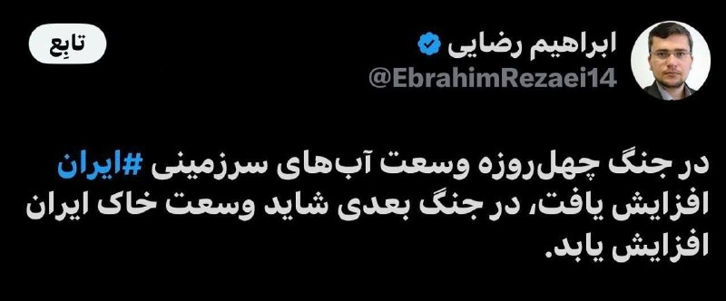

🔴رییس کمیته ملی

در جنگ بعد ممکنه کشورگشایی کنیم
https://t.me/kianmeli1

## kianmeli1 — post 87876

🔴بمب افکن های امریکا در بحرین آماده عملیات شده اند
https://t.me/kianmeli1

## kianmeli1 — post 87875

  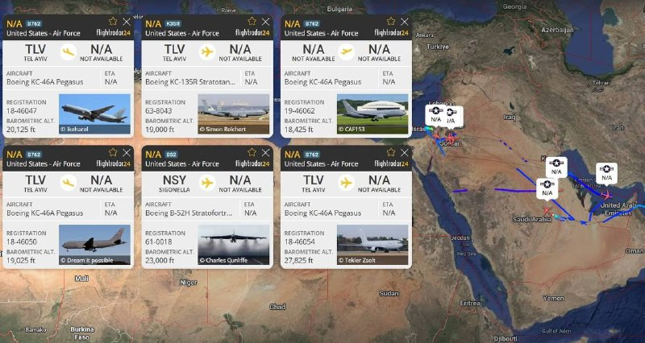

🔴پرواز شش فروند هواپیمای سوخت‌ رسان ارتش آمریکا بر فراز منطقه
https://t.me/kianmeli1

## IranIntlTV — post 341582

  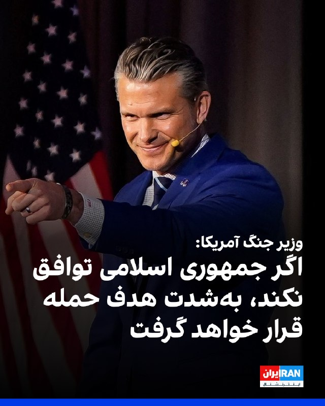

پیت هگست، وزیر دفاع آمریکا، گفت اگر جمهوری اسلامی برای پایان دادن به درگیری با آمریکا به توافق نرسد، ارتش ایالات متحده آن را «به‌شدت» هدف قرار خواهد داد.

او در سخنرانی برای کارکنان فرماندهی مرکزی آمریکا، سنتکام، در تامپای فلوریدا گفت: «همان‌طور که رییس‌جمهوری چهارشنبه گفت، اگر آن‌ها توافق نکنند، ما به‌شدت به آن‌ها حمله خواهیم کرد.»

هگست افزود دولت آمریکا بر دستیابی به نتیجه‌ای که دونالد ترامپ به نمایندگی از مردم آمریکا خواهان آن است متمرکز شده و در این مسیر «پیشرفت زیادی» داشته است.

او همچنین به اظهارات ترامپ اشاره کرد که گفته بود آمریکا حملات بیشتری علیه جمهوری اسلامی انجام خواهد داد و تهران برای مذاکره درباره توافق «بیش از حد وقت تلف کرده» و اکنون «باید بهای آن را بپردازد».
https://iranintl.com/202606104380

## IranIntlTV — post 341581

  

اکسیوس گزارش داد که دونالد ترامپ، رییس جمهوری ایالات متحده در کاخ سفید درباره حمله بیشتر به ایران جلسه برگزار کرده است.

بنا بر این گزارش، ترامپ عملیات گسترده و کوتاه علیه ایران را بررسی می‌کند.

پیش‌تر دونالد ترامپ گفته بود جمهوری اسلامی باید توافقی «معنادار و کارآمد» را امضا کند و افزود ما آن‌ها را بسیار سخت هدف قرار خواهیم داد و امروز دوباره ضربه محکمی به آن‌ها خواهیم زد.
https://iranintl.com/202606107504

## IranIntlTV — post 341580

  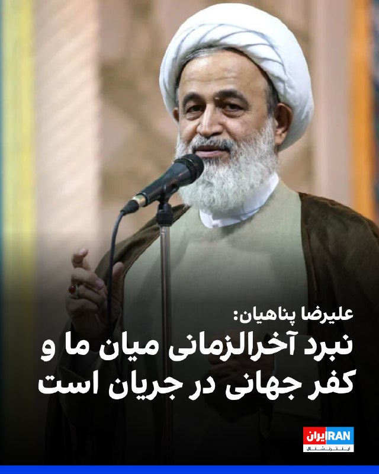

علیرضا پناهیان، سخنران دفتر خامنه‌ای، در تجمع حامیان حکومت در شاهرود گفت: «اکنون نبرد آخرالزمانی میان ما و تمام کفر جهانی در جریان است.»

او ادامه داد: «امروز نیز شاهد هستیم که راس کفر، یا همان استکبار جهانی، در برابر تمام اسلام ناب محمدی ایستاده است.»
https://iranintl.com/202606102666

## IranIntlTV — post 341579

  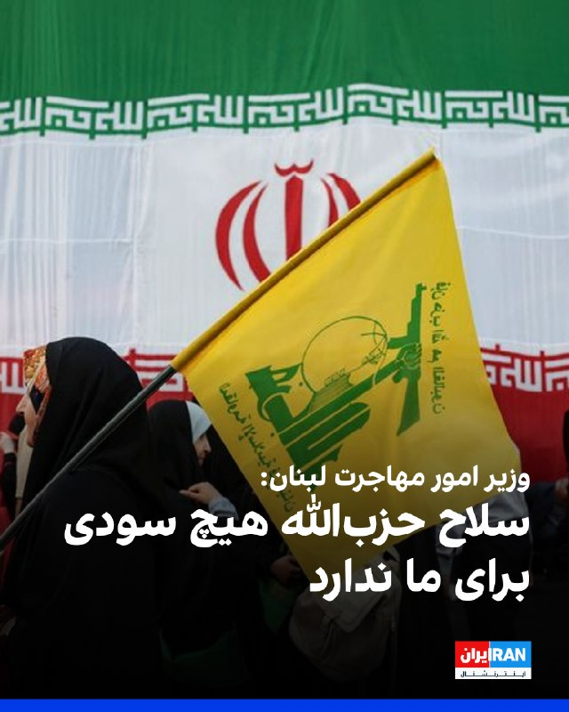

کمال شحاده، وزیر امور مهاجرت لبنان به العربیه گفت که چهار هزار کشته در لبنان نتیجه شرط‌بندی بر سیاست‌های اشتباه بود و حزب‌الله به دستور جمهوری اسلامی امتیاز می‌دهد نه به سود لبنان.
او افزود: «سلاح نعیم قاسم هیچ سودی برای ما ندارد.»

وزیر امور مهاجرت لبنان ادامه داد: «زیر بمباران مذاکره می‌کنیم همان‌گونه که ایران زیر بمباران مذاکره می‌کند.»
https://iranintl.com/202606102985

## IranIntlTV — post 341578

  <a href="telegram/content/IranIntlTV_341578_1781124164.mp4" target="_blank">🎬 Download video</a>

مارک وارنر، سناتور دموکرات، به مرضیه حسینی، خبرنگار ایران‌اینترنشنال، گفت: «به نظر نمی‌رسد این آتش‌بس چندان دوام داشته باشد. ترامپ در چند هفته گذشته دست‌کم ۳۰ بار اعلام کرده جنگ تمام شده، اما شواهد نشان می‌دهد که واقعیت با این ادعا فاصله دارد. این دقیقا نتیجه ورود به یک جنگ انتخابی بدون داشتن یک برنامه جامع برای پایان آن است.»

او افزود: «هنوز نشانه‌ای از پیشرفت جدی دیده نمی‌شود. چهار هدف اصلی مطرح شده بود: تغییر رفتار یا ساختار حکومت، خارج کردن اورانیوم غنی‌شده، از بین بردن توان موشکی ایران و بازگشایی تنگه هرمز. اما در حال حاضر به نظر می‌رسد حکومت ایران نه‌تنها عقب‌نشینی نکرده، بلکه مواضع تندتری اتخاذ کرده است.»
@iranintltv

## IranIntlTV — post 341577

  <a href="https://t.me/IranintlTV/341577" target="_blank">📎 Download file</a>

🎧نسخه صوتی ‌‌‏۲۴ با فرداد فرحزاد: ترامپ: ضربه سختی به جمهوری‌اسلامی می‌زنیم
@iranintlTV

## IranIntlTV — post 341576

  <a href="telegram/content/IranIntlTV_341576_1781124167.mp4" target="_blank">🎬 Download video</a>

در بحبوحه تنش میان تهران و واشینگتن، سناتور دموکرات کریس مورفی از نبود راهبرد روشن دولت دونالد ترامپ برای مدیریت بحران و پیامدهای اقتصادی آن انتقاد کرد. در مقابل، سناتور جمهوری‌خواه دیو مک‌کورمیک گفت اگر تهران اورانیوم غنی‌شده را واگذار و تنگه هرمز را بازگشایی کند، توافق می‌تواند دستاوردی مهم باشد.

ارزیابی شایان سمیعی، کارشناس امنیت ملی
@iranintltv

## IranIntlTV — post 341575

  <a href="telegram/content/IranIntlTV_341575_1781124169.mp4" target="_blank">🎬 Download video</a>

شاهزاده رضا پهلوی در یک پیام ویدیویی گفت مردم ایران بهای سیاست‌های جمهوری اسلامی را می‌پردازند و این حکومت کشور را به سمت جنگ، فساد، فقر و ویرانی برده است. او تاکید کرد مسیر آزادی سخت اما ممکن است و آینده ایران را مردم آن خواهند ساخت، چه با حمایت خارجی و چه بدون آن.

گفت‌وگو با نجات بهرامی، تحلیل‌گر سیاسی
@iranintltv

## IranIntlTV — post 341574

  <a href="https://t.me/IranintlTV/341574" target="_blank">📎 Download file</a>

🎧نسخه صوتی چشم‌انداز: گزینه‌های جدید حمله به ایران روی میز ترامپ
@iranintlTV

## IranIntlTV — post 341573

  <a href="telegram/content/IranIntlTV_341573_1781124172.mp4" target="_blank">🎬 Download video</a>

گزینه‌های جدید حمله به ایران روی میز ترامپ

«چشم‌انداز با مهدی مهدوی‌آزاد»

تماشای نسخه کامل برنامه در یوتیوب:

https://youtu.be/GzU-k-Yl6X8
@iranintltv

## IranIntlTV — post 341572

  <a href="telegram/content/IranIntlTV_341572_1781124175.mp4" target="_blank">🎬 Download video</a>

لرد موریس گلاسمن، عضو مجلس اعیان بریتانیا، درباره ارائه لایحه جدید «امنیت ملی» در پارلمان بریتانیا گفت: «دولت باید به ما پاسخ دهد چرا سپاه پاسداران را در فهرست گروه‌های تروریستی قرار نمی‌دهد و چرا فعالانه از مردم ایران در مبارزه آن‌ها علیه جمهوری اسلامی حمایت نمی‌کند.»
@iranintltv

## IranIntlTV — post 341571

  <a href="telegram/content/IranIntlTV_341571_1781124177.mp4" target="_blank">🎬 Download video</a>

نجات بهرامی، تحلیل‌گر سیاسی، گفت: «پیام اخیر شاهزاده بیش از هر چیز برای جلوگیری از ناامیدی جامعه بوده است. بسیاری از مردم خود را در آستانه پیروزی می‌دیدند، اما با محقق نشدن آن انتظار، خطر سرخوردگی به وجود آمد.»

او افزود: «حتی اگر تحولات اخیر یا درگیری‌های نظامی به سقوط فوری جمهوری اسلامی منجر نشود، نباید امید را از دست داد و مسیر مبارزه ممکن است طولانی و فرسایشی باشد.»
@iranintltv

## IranIntlTV — post 341570

  <a href="telegram/content/IranIntlTV_341570_1781124180.mp4" target="_blank">🎬 Download video</a>

شایان سمیعی، کارشناس امنیت ملی، گفت: «شرایط به گونه‌ای پیش رفته که ممکن است حتی اگر دونالد ترامپ تمایلی به تشدید درگیری نداشته باشد، گزینه‌های محدودی پیش روی خود ببیند و مجبور به این کار شود.»

او افزود: «از نگاه ترامپ، دیپلماسی ابزاری برای افزایش فشار اقتصادی و رسیدن به توافق است؛ اما جمهوری اسلامی از دیپلماسی بیشتر به‌عنوان ابزاری برای خرید زمان استفاده می‌کند.»
@iranintltv

## IranIntlTV — post 341569

  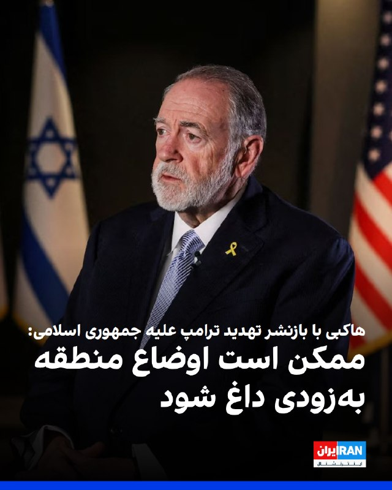

مایک هاکبی، سفیر آمریکا در اسرائیل، با بازنشر گزارش فاکس‌نیوز درباره اظهارات دونالد ترامپ، رییس‌جمهوری آمریکا، مبنی بر اینکه ایالات متحده امروز دوباره «ضربه سختی» به جمهوری اسلامی خواهد زد، در شبکه ایکس نوشت: «ممکن است اوضاع در منطقه به‌زودی کمی داغ شود.»
https://iranintl.com/202606102532

## IranIntlTV — post 341567

  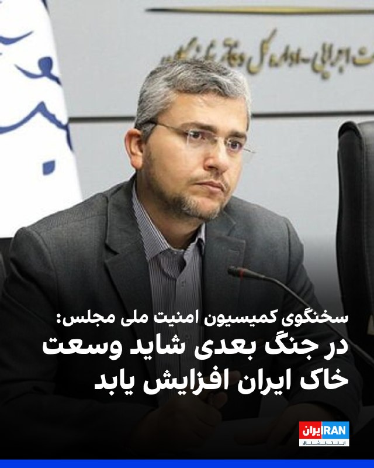

ابراهیم رضایی، سخنگوی کمیسیون امنیت ملی مجلس، در شبکه ایکس نوشت: «در جنگ ۴۰ روزه وسعت آب‌های سرزمینی ایران افزایش یافت، در جنگ بعدی شاید وسعت خاک ایران افزایش یابد.»

او در مطلبی دیگر تاکید کرد جمهوری اسلامی آماده‌تر از قبل است.

او همچنین در یک برنامه تلویزیونی گفت: «دست از لبنان برنمی‌داریم و دشمن یا باید به خواسته‌های ما در میز مذاکره تن بدهد یا در میدان نبرد.»
https://iranintl.com/202606107186

## IranIntlTV — post 341566

  <a href="telegram/content/IranIntlTV_341566_1781124184.mp4" target="_blank">🎬 Download video</a>

شاهزاده رضا پهلوی: «مردم ایران بهای سیاست‌های جمهوری اسلامی را می‌پردازند؛ حکومتی که به‌جای ساختن ایران، کشور را به جنگ، فساد، فقر و ویرانی کشانده است.»

او افزود چه با حمایت خارجی و چه بدون آن، سرنوشت ایران در دست مردم ایران است و پیروزی از آن ملت ایران خواهد بود.
@iranintltv

## IranIntlTV — post 341565

  

اکسیوس گزارش داد که قطر تلاش کرده نشستی سه‌جانبه برگزار کند، اما جمهوری اسلامی این پیشنهاد را نپذیرفته است.

بنا بر این گزارش با وجود تبادل آتش، مقام‌های ایرانی و آمریکایی طی دو روز گذشته، به‌طور جداگانه با میانجیگران قطری در دوحه دیدار کردند.

پیش‌تر گزارش‌هایی مبنی بر تلاش‌های قطر برای حصول توافق میان تهران و واشینگتن منتشر شده بود.
https://iranintl.com/202606104535

## IranIntlTV — post 341564

  <a href="telegram/content/IranIntlTV_341564_1781124187.mp4" target="_blank">🎬 Download video</a>

⁨ دونالد ترامپ، رییس‌جمهوری آمریکا، بار دیگر جمهوری اسلامی را به اقدام نظامی تهدید کرد و گفت: « تهران باید توافق را امضا کند.»⁩

@iranintltv

## IranIntlTV — post 341563

  

تایمز اسرائیل به نقل از یک منبع در دفتر نخست‌وزیری اسرائیل گزارش داد بنیامین نتانیاهو و دونالد ترامپ، رییس‌جمهوری آمریکا، هم‌زمان با تشدید تنش‌ها با جمهوری اسلامی و وعده ترامپ برای حملات بیشتر، «هماهنگی کامل» دارند.

این منبع گفت نخست‌وزیر اسرائیل و رییس‌جمهوری آمریکا یک روز در میان و گاهی هر روز با یکدیگر گفت‌وگو می‌کنند و «کاملا هماهنگ» هستند.

تایمز اسرائیل نوشت دو رهبر اوایل این هفته ظاهرا دچار اختلاف شده بودند؛ زمانی که ترامپ پس از حملات موشکی بالستیک جمهوری اسلامی از نتانیاهو خواست تنش را تشدید نکند، اما اسرائیل با وجود این، حملاتی انجام داد.

بر اساس این گزارش، ترامپ پس از سرنگونی یک بالگرد آمریکایی از سوی جمهوری اسلامی بر فراز تنگه هرمز، موضع سخت‌تری در برابر تهران گرفته است، هرچند تلاش برای دستیابی به توافق دیپلماتیک را کنار نگذاشته؛ توافقی که او امروز آن را «کاملا مذاکره‌شده» توصیف کرد.
https://iranintl.com/202606100955

## IranIntlTV — post 341562

  

ابراهیم عزیزی، رییس کمیسیون امنیت ملی مجلس، در شبکه ایکس نوشت: «ما از جنگیدن با بازنده‌ها نمی‌ترسیم.»

او افزود: «همین الان هم تابوت‌های آمریکایی بسیار بیشتر از آن چیزی است که ترامپ می‌گوید و بیشتر هم خواهد شد چرا که جنگ این‌بار حتی به منطقه هم محدود نخواهد شد.»

رییس کمیسیون امنیت ملی مجلس، در پایان نوشت: «خواهیم دید چه می‌شود.»
https://iranintl.com/202606105997

## Shin_Persian — post 6868

Shin ✓ @hey_itsmyturn
Wed, 10 Jun 2026 18:17:21 UTC

NOW @ 1817Z -
Jet activity over eastern Iraq, #Iraq 🇮🇶

ترجمه خودکار فارسی

هم‌اکنون در ۱۸۱۷ زولو (۲۱:۴۷ به وقت تهران) -
فعالیت جنگنده‌ها بر فراز شرق عراق، #Iraq 🇮🇶

𝕏 · @shin_persian

## FarsiVOA — post 220286

⚡️در حالی که مقام‌های جمهوری اسلامی از مذاکره، پاسخ نظامی و تشدید تنش‌ها سخن می‌گویند، فشارهای امنیتی در داخل ایران نیز ادامه دارد؛ از بازداشت‌ها و احکام دانشجویی تا پرونده‌ای که با هشتگ «موشعلی» همچنان خبرساز است
@FarsiVOA

## FarsiVOA — post 220285

  <a href="telegram/content/FarsiVOA_220285_1781124190.mp4" target="_blank">🎬 Download video</a>

⚡️هشدار پرزیدنت ترامپ به جمهوری اسلامی به چه معناست؛ ادامه دیپلماسی یا حملات نظامی؟ گفت‌وگو با مهدی نوربخش
@FarsiVOA

## FarsiVOA — post 220284

  <a href="telegram/content/FarsiVOA_220284_1781124192.mp4" target="_blank">🎬 Download video</a>

⚡️بررسی رویکرد چین و روسیه، دو متحد اصلی جدر قبال تنش‌ها در خاورمیانه؛ گفت‌وگو با کامران متین
@FarsiVOA

## FarsiVOA — post 220283

⚡️جمهوری اسلامی پس از بیش از صد شب تجمع حکومتی در تهران، ادامه این برنامه‌ها را به دستور مجتبی خامنه‌ای گره زده است. منتقدان می‌گویند حکومت با تکیه بر نام رهبر غایب، هم به تصمیمات خود مشروعیت می‌بخشد و هم تلاش می‌کند تصویر حمایت مردمی و انسجام درونی نظام را حفظ کند.
@FarsiVOA

## FarsiVOA — post 220282

🔺آمریکا: چین و روسیه به جمهوری اسلامی امکان داده‌‌اند قطعنامه‌های شورای امنیت را نقض کند

◾️تمی بروس، معاون نماینده آمریکا در سازمان ملل متحد، در سخنانی در شورای امنیت گفت در حالی که جمهوری اسلامی «آشکارا توافقات هسته‌ای خود را نقض می‌کند و موشک‌های بالستیک به سمت متحدان ما شلیک می‌کند» روسیه و چین در سازمان ملل از آن محافظت می‌کنند.

⬇️ بیشتر بخوانید:
https://ir.voanews.com/a/8159435.html
@FarsiVOA

## FarsiVOA — post 220281

🔺خفقان در دانشگاه‌های ایران؛‌ از اخراج پس از «آویختن عروسک موش» تا محرومیت به دلیل آتش زدن پرچم رژیم

◾️وزیر علوم جمهوری اسلامی با تایید جو خفقان در دانشگاه‌های ایران گفت دانشجویانی که در اعتراضات دانشجویی بهمن ۱۴۰۴ «پرچم متفاوت» را به دانشگاه آوردند یا اقدام به آتش زدن پرچم جمهوری اسلامی کردند، هم در دادسراها تحت تعقیب قضایی قرار دارند و هم برای آنها در دانشگاه پرونده انضباطی تشکیل شده است.

⬇️ بیشتر بخوانید:
https://ir.voanews.com/a/iran-us-university-student-repression/8159432.html
@FarsiVOA

## FarsiVOA — post 220280

🔺مارکو روبیو برای اولین بازی تیم ملی فوتبال آمریکا در جام جهانی ۲۰۲۶ به لس‌آنجلس می‌رود

◾️تامی پیگت، سخنگوی وزارت امور خارجه آمریکا، روز چهارشنبه ۲۰ خرداد اعلام کرد مارکو روبیو، وزیر امور خارجه ایالات متحده، روزهای ۲۲ و ۲۳ خرداد به لس‌آنجلس سفر خواهد کرد تا ریاست هیأت آمریکایی در نخستین دیدار تیم ملی فوتبال مردان آمریکا در جام جهانی ۲۰۲۶ برابر پاراگوئه را بر عهده بگیرد.

⬇️ بیشتر بخوانید:
https://ir.voanews.com/a/marco-rubio-traveling-for-us-first-word-cup-match/8159430.html
@FarsiVOA

## FarsiVOA — post 220279

🔺آمریکا شبکه‌های خارجی پشتیبان برنامه‌های نظامی و تسلیحاتی جمهوری اسلامی را تحریم کرد

◾️وزارت خزانه‌داری ایالات متحده روز چهارشنبه ۲۰ خرداد اعلام کرد در چارچوب کارزار «خشم اقتصادی»، شبکه‌ای از افراد و شرکت‌های مستقر در چین و هنگ‌کنگ را که در تأمین تجهیزات و تسهیل معاملات مرتبط با برنامه‌های نظامی و تسلیحاتی جمهوری اسلامی نقش داشته‌اند تحریم کرده است.

⬇️ بیشتر بخوانید:
https://ir.voanews.com/a/economic-fury-disrupts-foreign-networks-supporting-iran-military-weapons-programs/8159406.html
@FarsiVOA

## FarsiVOA — post 220278

⚡️پوشش ویژه | مراسم امضای قانون آمریکای امن توسط پرزیدنت ترامپ با ترجمه همزمان پژواک کیومرثی
@FarsiVOA

## FarsiVOA — post 220277

  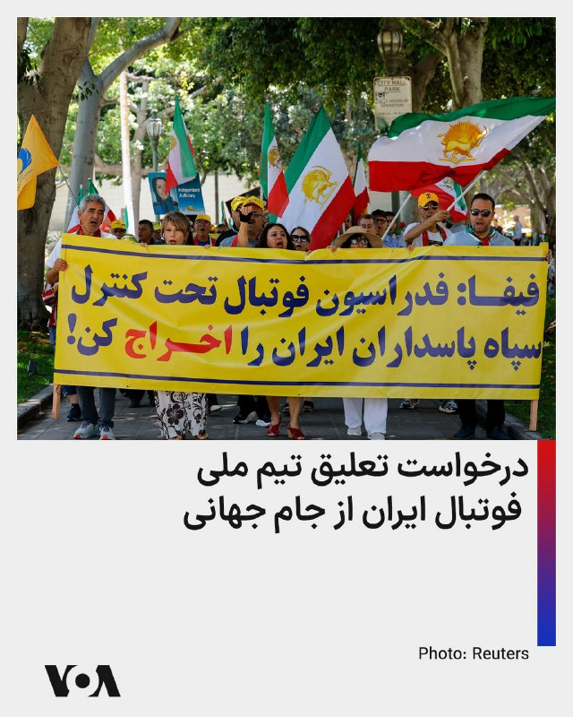

⚡️در آستانه آغاز مسابقات جام جهانی ۲۰۲۶، و تداوم حاشیه‌های مربوط به تیم ملی فوتبال ایران، روز چهارشنبه جمعی از مخالفان جمهوری اسلامی در مراسمی در لس آنجلس به همراه شماری از ورزشکاران و فعالان ایرانی ساکن آمریکا، نسبت به حضور این تیم در جام‌جهانی اعتراض کرده و از فیفا خواستار تعلیق آن شدند.
اردوی تیم ملی فوتبال ایران، که به دلیل محدودیت‌های مربوط به ویزا و ورود به ایالات متحده از آریزونا به تیخوانا در مکزیک منتقل شده است، در گروه هفتم رقابت‌ها با نیوزیلند، بلژیک، و مصر روبه‌رو خواهد شد.
در پی اعتراضات سراسری مردم ایران در سال ۱۴۰۱، موضوع تیم ملی فوتبال و رویکرد اعضای آن در قبال مردم و حاکمیت، بسیار پرحاشیه شد و برخی آن را تیم حکومت به جای تیم ملی فوتبال ایران می‌دانند. این معترضان نیز تیم ملی فعلی را تیم تحت کنترل سپاه پاسداران نامیده‌اند.
@FarsiVOA

## FarsiVOA — post 220276

محکومیت گسترده تروریسم‌ برون مرزی جمهوری اسلامی از سوی آمریکا و ۲۲ کشور غربی

## FarsiVOA — post 220275

واکنش اروپا و روسیه به دور جدید تنش‌های جمهوری اسلامی و آمریکا؛ از دیپلماسی تا اختلافات

## FarsiVOA — post 220274

حملات دوباره جمهوری اسلامی به اقلیم کردستان؛ بغداد گروه‌های مسلح را به «تروریستی» اعلام کردن تهدید کرد

## FarsiVOA — post 220273

🔺سنتکام: برای دومین روز متوالی یک نفتکش را در دریای عمان از کار انداختیم

◾️فرماندهی مرکزی ایالات متحده آمریکا، سنتکام، از شلیک به موتورخانه یک نفتکش دیگر در دریای عمان و از کار انداختن آن خبر داد.

⬇️ بیشتر بخوانید:

https://ir.voanews.com/a/naval-blockade-centcom-oil-tanker-sea-of-oman/8159371.html

## FarsiVOA — post 220272

  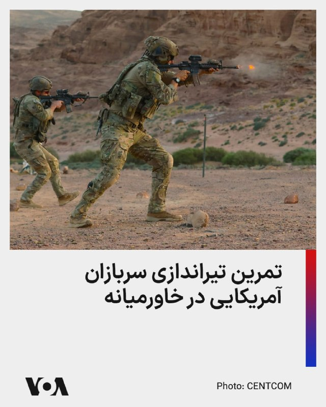

📷ستاد فرماندهی مرکزی آمریکا،‌ سنتکام، تصویری از سربازان چترباز ارتش ایالات متحده را در حال انجام تمرین تیراندازی با سلاح‌های سبک در خاورمیانه منتشر کرده است.

## FarsiVOA — post 220271

دونالد ترامپ، رئیس جمهوری آمریکا گفت که آمریکا پس از حمله به بالگرد آپاچی ضربه سختی به جمهوری اسلامی زده و امروز هم خواهد زد. پرزیدنت ترامپ تاکید کرد که توافق نهایی شده اما حکومت ایران وقت تلف می‌کند. ترجمه همزمان پژواک کیومرثی

## FarsiVOA — post 220270

🔺پرزیدنت ترامپ: در ماموریتی محرمانه بیش از ۲۰۰ نفتکش را از تنگه هرمز عبور دادیم

◾️دونالد ترامپ، رئیس جمهوری آمریکا، از اجرای موفقیت‌آمیز یک ماموریت محرمانه توسط نیروهای نظامی آمریکا برای عبور دادن بیش از ۲۰۰ نفتکش و ۱۰۰ میلیون بشکه نفت خام از تنگه هرمز خبر داد.

⬇️ بیشتر بخوانید:

https://ir.voanews.com/a/us-army-secret-mission-100-million-barrels-of-oil-iran-trump/8159401.html

## FarsiVOA — post 220269

  <a href="telegram/content/FarsiVOA_220269_1781124196.mp4" target="_blank">🎬 Download video</a>

عطا هودشتیان در میدان می‌گوید اپوزیسیونی که با مردم در داخل کشور در ارتباط نباشد از درون پوسیده می‌شود، اما آریا کنگرلو در پاسخ اپوزیسیون ایران را پرقدرت‌ترین در جهان می‌داند

## FarsiVOA — post 220268

ترامپ: ایران برای مذاکره در مورد توافقی که برایشان عالی بود، خیلی وقت تلف کرد، حالا باید هزینه بپردازد

## FarsiVOA — post 220267

  <a href="telegram/content/FarsiVOA_220267_1781124197.mp4" target="_blank">🎬 Download video</a>

چهارشنبه ۲۰ خرداد، یک انبار دو هزار متری کالا، واقع در خیابان ری، بالاتر از میدان قیام در تهران دچار آتش‌سوزی شده است. بیشترین کالایی که در این انبار دچار حریق شده فرش است. عملیات مهار آتش همچنان ادامه دارد.

## DW_Farsi — post 125791

  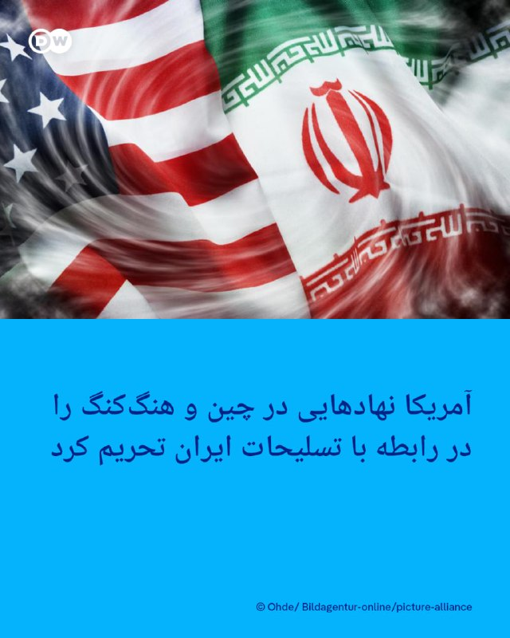

🔶 آمریکا نهادهایی در چین و هنگ‌کنگ را در رابطه با تسلیحات ایران تحریم کرد

وزارت خزانه‌داری آمریکا می‌گوید که دولت دونالد ترامپ تحریم‌های جدیدی در رابطه با ایران اعمال کرده است.

به گزارش خبرگزاری رویترز، دولت ایالات متحده روز چهارشنبه ۲۰ خرداد اعلام کرد که علیه ۱۱ فرد و نهاد، از جمله چند مورد مستقر در چین و هنگ‌کنگ، به دلیل حمایت از تأمین تسلیحات برای سپاه پاسداران انقلاب اسلامی و ارتش ایران، تحریم‌هایی اعمال کرده است.

بر اساس بیانیه دفتر کنترل دارایی‌های خارجی وزارت خزانه‌داری آمریکا (اوفک)، ۹ مورد از افراد و شرکت‌های تحریم‌شده، اشخاص و شرکت‌هایی مستقر در چین و هنگ‌کنگ هستند که در تسهیل خرید تسلیحات برای ارتش ایران نقش داشته‌اند.

همچنین یک شرکت مستقر در هنگ‌کنگ که در شبکه بانکی پنهانی ایران فعالیت می‌کرد نیز در این فهرست قرار دارد.

وزارت خزانه‌داری آمریکا همچنین اعلام کرده که وزارت خارجه این کشور، دو شرکت و چند فرد مستقر در ایران و بلاروس را هم به دلیل ارتباط با فعالیت‌های مرتبط با تسلیحات متعارف ایران، در لیست تحریم‌ها قرار داده است.
@dw_farsi

## DW_Farsi — post 125790

  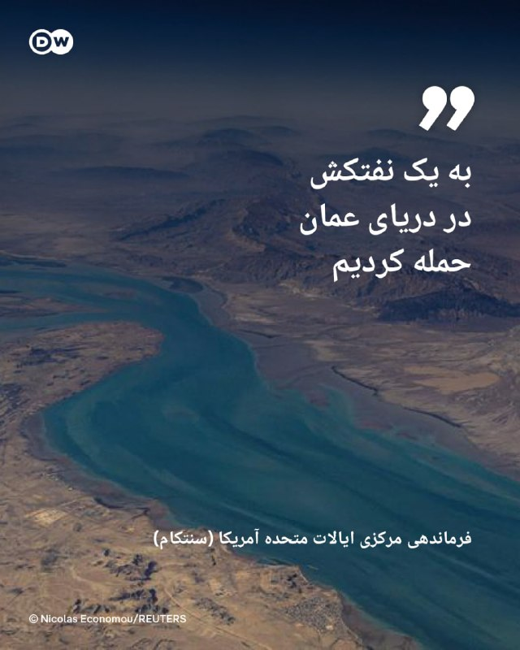

🔶 سنتکام: به یک نفتکش در دریای عمان حمله کردیم؛ هند دیپلمات آمریکا را احضار کرد

ارتش آمریکا اعلام کرد که به یک نفتکش که ظاهرا تلاش داشته نفت ایران را منتقل کند در دریای عمان حمله کرده است.

فرماندهی مرکزی ایالات متحده آمریکا (سنتکام) در پیامی در شبکه ایکس اعلام کرد که موتورخانه کشتی "سته‌بلو" (Settebello) که با پرچم کشور پالائو حرکت می‌کرد، پس از آن که خدمه آن از دستورات نیروهای نظامی سرپیچی کردند، هدف قرار گرفت.

پیش‌تر سازمان عملیات تجارت دریایی بریتانیا (UKMTO) از این سانحه و آتش‌‌سوزی در موتورخانه این کشتی و تخلیه خدمه خبر داده بود.

طبق گزارش این سازمان، دو نفر مفقود شده‌اند و یک نفر نیز "قربانی" شده اما مشخص نیست که منظور از واژه قربانی یک کشته بوده یا یک زخمی.

هند که پیش‌تر از مفقود شدن سه تبعه خود در حمله به نفتکش نامبرده در سواحل نزدیک به عمان خبر داده بود در همین رابطه یک دیپلمات ارشد سفارت آمریکا را به وزارت خارجه در دهلی نو احضار کرده است.

به گزارش خبرگزاری رویترز، وزارت خارجه هند با اعلام خبر احضار جیسون میکس افزود که "اعتراض شدید" هند به او منتقل شده است.
@dw_farsi

## DW_Farsi — post 125789

  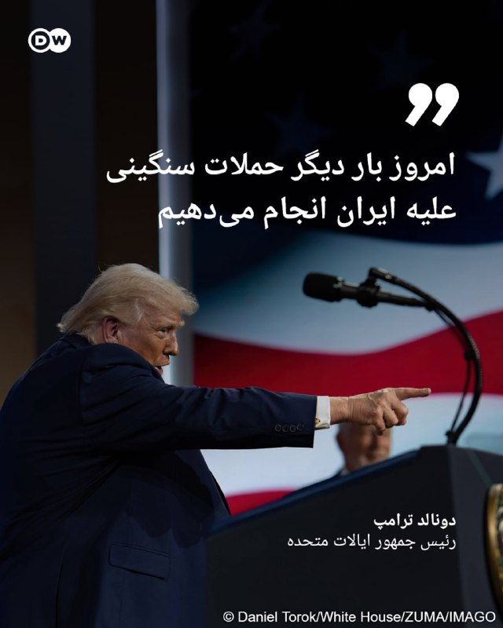

🔶 ترامپ: امروز بار دیگر حملات سنگینی علیه ایران انجام می‌دهیم

دونالد ترامپ، رئیس‌ جمهور ایالات متحده در سخنانی تازه با اشاره به حملات شب گذشته این کشور به مواضعی در ایران باز هم جمهوری اسلامی را به حملاتی تازه تهدید کرد.

به گزارش خبرگزاری آلمان، او چهارشنبه ۲۰ خرداد در کاخ سفید به خبرنگاران گفت: «ما دیروز ضربه سختی به آن‌ها زدیم و امروز هم دوباره ضربه سختی خواهیم زد.»

ترامپ شب گذشته ایران را مسئول سرنگونی یک بالگرد آمریکا در سواحل عمان دانست و گفت که کشورش پاسخ این حمله را خواهد داد. در پی این تهدید، آمریکا سامانه‌های پدافند هوایی، ایستگاه‌های کنترل زمینی و تأسیسات راداری ایران در منطقه تنگه هرمز را بمباران کرد.

به گزارش رسانه‌های داخلی ایران، تهران نیز در پی این حملات به پایگاه‌های نظامی آمریکا در کویت، اردن و بحرین حمله کرد.

ترامپ در سخنان تازه خود در کاخ سفید در مورد تلاش‌ها برای حل دیپلماتیک جنگ ایران گفت که باید دید سرنوشت "این توافق" به کجا خواهد کشید: «ما خیلی به یک توافق نزدیک شده بودیم، اما آن‌ها مدام ما را معطل می‌کنند.»
@dw_farsi

## DW_Farsi — post 125788

🔶 پشت صحنه قدرت در تهران؛ ژنرال‌ها جای ولایت فقیه را می‌گیرند؟

🔺گزارشی از الینا فرهادی

موضوع دگرگونی احتمالی در موازنه قدرت درون ساختار سیاسی جمهوری اسلامی ایران و نقش روزافزون نهادهای نظامی و امنیتی، به یکی از محورهای اصلی در تحلیل‌های کارشناسان مسائل ایران، بعد از کشته شدن علی خامنه‌ای رهبر پیشین جمهوری اسلامی در جنگ آمریکا و اسرائيل علیه ایران تبدیل شده است.

ساختار حکمرانی در ایران که پس از سال ۱۳۵۷ بر پایه نظریه ولایت فقیه بنا شد، اکنون در مواجهه با چالش‌های داخلی و تنش‌های منطقه‌ای، با پرسش‌هایی از سوی ناظران درباره احتمال جابجایی کارکردهای سنتی ارکان خود روبروست.

در سال‌های اخیر، نقش فزاینده سپاه پاسداران انقلاب اسلامی در عرصه‌های سیاسی، اقتصادی و امنیتی، توجه بسیاری از ناظران را به خود جلب کرده است. نهادی که زمانی ماموریت اصلی آن حفاظت از نظام نوپا عنوان می‌شد، اکنون در بسیاری از مهم‌ترین تصمیم‌گیری‌های کشور حضوری تعیین‌کننده دارد. هم‌زمان، شکاف میان دین و جامعه نیز عمیق‌تر از گذشته به نظر می‌رسد.

در گفت‌و‌گو با دویچه وله فارسی، فرج سرکوهی، نویسنده و روزنامه‌نگار، و شاهین مدرس، تحلیل‌گر امنیت بین‌الملل نشانه‌ها و پیامدهای احتمالی افزایش نقش نهادهای نظامی بر آینده سیاسی و اجتماعی ایران را کالبدشکافی کرده‌اند.

📌 برای دسترسی کامل به گزارش به وبسایت دویچه‌وله فارسی مراجعه کنید.
@dw_farsi

## Persian_Trend_Official — post 16534

منابع ایرانی به الجزیره گفتند: هرگونه حمله منجر به پایان مذاکرات خواهد شد. 📝 Amir 📌 @persian_trend_official پرشین ترند | متفاوت‌ترین کانال نظامی

## Persian_Trend_Official — post 16533

📰 آکسیوس: ترامپ گزینه حمله محدود به ایران را بررسی می‌کند
پایگاه خبری آکسیوس به نقل از منابع آگاه گزارش داد که یکی از گزینه‌های مورد بررسی در دولت دونالد ترامپ، اجرای یک عملیات نظامی کوتاه‌مدت اما گسترده علیه ایران است.
بر اساس این گزارش، هدف از چنین عملیاتی افزایش فشار بر تهران و وادار کردن ایران به تغییر مواضع خود در مذاکرات عنوان شده است.

👺Phantom

📌 @persian_trend_official
پرشین ترند | متفاوت‌ترین کانال نظامی

## Persian_Trend_Official — post 16532

منابع ایرانی به الجزیره گفتند: هرگونه حمله منجر به پایان مذاکرات خواهد شد.

📝 Amir

📌 @persian_trend_official
پرشین ترند | متفاوت‌ترین کانال نظامی

## Persian_Trend_Official — post 16531

  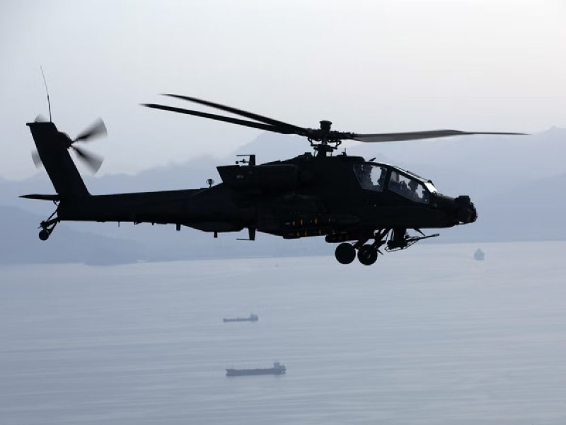

وال استریت ژورنال: هلیکوپتر آپاچی آمریکایی که روز سه‌شنبه پس از اصابت یک پهپاد ایرانی سقوط کرد، در حال دفاع از کشتی‌ها در تنگه هرمز در برابر پهپادها و موشک‌های ایرانی بود.

خلبانان با بیرون انداختن خود لحظاتی قبل از غرق شدن هلیکوپتر، از هواپیمای در حال سوختن فرار کردند.

📝 Amir

📌 @persian_trend_official
پرشین ترند | متفاوت‌ترین کانال نظامی

## Persian_Trend_Official — post 16530

باراک راوید طی توییتی اعلام کرد مذاکرات طی 2 تا 3 ساعت آینده ممکن است با فروپاشی مواجه بشود. 📝 Amir 📌 @persian_trend_official پرشین ترند | متفاوت‌ترین کانال نظامی

## Persian_Trend_Official — post 16529

  <a href="telegram/content/Persian_Trend_Official_16529_1781124203.webm" target="_blank">🎬 Download video</a>

باراک راوید طی توییتی اعلام کرد مذاکرات طی 2 تا 3 ساعت آینده ممکن است با فروپاشی مواجه بشود.

📝 Amir

📌 @persian_trend_official
پرشین ترند | متفاوت‌ترین کانال نظامی

## Persian_Trend_Official — post 16528

  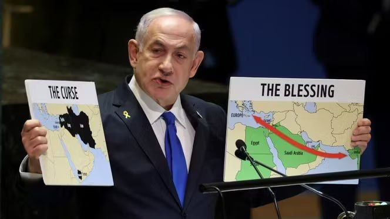

📰الجزیره: آینده مذاکرات لبنان و اسرائیل در هاله‌ای از ابهام

یک منبع دیپلماتیک لبنانی به الجزیره گفته است که اسرائیل تمایل چندانی به پیشبرد مذاکرات نشان نمی‌دهد و روند سیاسی فعلی را بیشتر یک مسیر تحمیلی می‌داند.

بر اساس این گزارش، سرنوشت دور بعدی مذاکرات که قرار است ۲۲ ژوئن برگزار شود، همچنان نامشخص است. این منبع همچنین مدعی شده بنیامین نتانیاهو تمایل دارد درگیری‌ها در جبهه لبنان تا زمان انتخابات اسرائیل ادامه پیدا کند.

🔹 به گفته این منبع، ایالات متحده ابزارهای لازم برای اعمال فشار بر اسرائیل را در اختیار دارد، اما محدودیت‌های ناشی از ساختار ائتلاف حاکم در تل‌آویو، دامنه مانور واشنگتن را کاهش داده است.

👺Phantom

📌 @persian_trend_official پرشین ترند | متفاوت‌ترین کانال نظامی :::

## Persian_Trend_Official — post 16527

  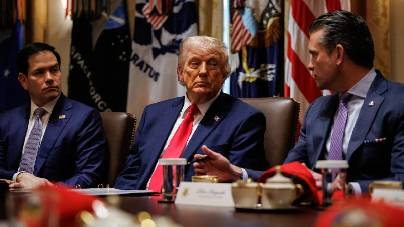

اکسیوس: ترامپ، رئیس جمهور آمریکا، روز چهارشنبه جلسه‌ای در اتاق وضعیت برگزار کرد تا در مورد حملات احتمالی جدید علیه ایران بحث کند، ساعاتی پس از آنکه به خبرنگاران گفت ایالات متحده امروز دوباره به آنها ضربه سختی خواهد زد.

گزینه‌های مورد بررسی شامل یک عملیات گسترده اما کوتاه مدت برای تحت فشار قرار دادن ایران برای تغییر موضعش در مذاکرات است.

در این جلسه ونس، معاون رئیس جمهور ایالات متحده، مارکو روبیو، وزیر امور خارجه، جان راتکلیف، مدیر سیا، ژنرال دن کین، رئیس ستاد مشترک ارتش و استیو ویتکاف، فرستاده کاخ سفید، حضور داشتند.

میانجیگران قطری روز چهارشنبه در تهران با مقامات ایرانی در تلاش برای بازگرداندن شتاب به توافق گفتگو کردند. در صورت عدم دستیابی به موفقیت، حملات ایالات متحده ممکن است در پی آن انجام شود.

📝 Amir

📌 @persian_trend_official
پرشین ترند | متفاوت‌ترین کانال نظامی

## Persian_Trend_Official — post 16526

  <a href="telegram/content/Persian_Trend_Official_16526_1781124205.mp4" target="_blank">🎬 Download video</a>

پیت هگست، وزیر جنگ خطاب به نیروهای مستقر در سنتکام: همانطور که رئیس جمهور ترامپ امروز گفت، آنها حاضر به توافق نیستند، آنگاه ما به شدت به آنها ضربه خواهیم زد. سنتکام این کار را به خوبی انجام می‌دهد، بهتر از هر کس دیگری در جهان.

📝 Amir

📌 @persian_trend_official
پرشین ترند | متفاوت‌ترین کانال نظامی

## Persian_Trend_Official — post 16525

  <a href="telegram/content/Persian_Trend_Official_16525_1781124208.mp4" target="_blank">🎬 Download video</a>

پیت هگست، وزیر جنگ امریکا خطاب به نیروهای سنتکام: من فقط می‌خواهم از طرف رئیس‌جمهور ترامپ و از طرف مردم آمریکا بگویم که چقدر به کاری که سنتکام انجام داده افتخار می‌کنیم.

بیش از 100 روز است که از عملیات‌های رزمی بزرگ گرفته تا آتش‌بس و محاصره، این کار را انجام داده‌ایم. در هر مرحله، از دریاسالار گرفته تا تک تک نیروهای سنتکام، شما رهبری مسیر را بر عهده داشته‌اید و مسیر قدرت آمریکا را ترسیم کرده‌اید.

شما باید به آنچه انجام داده‌اید، نحوه انجام آن، دشمنی که به آن خیره شده‌اید و مأموریت مهمی که انجام داده‌اید و هنوز هم انجام می‌دهید تا اطمینان حاصل کنید که ایران هرگز به سلاح هسته‌ای دست پیدا نمی‌کند، افتخار کنید، که همه اینجا می‌دانند که چرا این موضوع بسیار مهم است.

📝 Amir

📌 @persian_trend_official
پرشین ترند | متفاوت‌ترین کانال نظامی

## Persian_Trend_Official — post 16524

  <a href="telegram/content/Persian_Trend_Official_16524_1781124211.mp4" target="_blank">🎬 Download video</a>

🚨وزیر جنگ، پیت هگستث، به ستاد فرماندهی مرکزی (CENTCOM) در پایگاه نیروی هوایی مک‌دیل در تمپا، فلوریدا، رسید

🔸 او پس از فرود توسط کوپر فرمانده سنتکام استقبال شد.

## Persian_Trend_Official — post 16523

  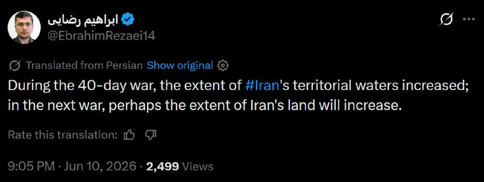

رضایی، سخنگوی کمیسیون امنیت ملی: در جنگ چهل‌ روزه وسعت آب‌های سرزمینی ایران افزایش پیدا کرد، در جنگ بعدی شاید وسعت خاک ایران افزایش پیدا کند.

📝 Amir

📌 @persian_trend_official
پرشین ترند | متفاوت‌ترین کانال نظامی

## Persian_Trend_Official — post 16522

  <a href="telegram/content/Persian_Trend_Official_16522_1781124214.webm" target="_blank">🎬 Download video</a>

طبق تصاویر ماهواره ای یک ناوشکن ارلی برک نیروی دریایی ایالات متحده در فاصله 140 کیلومتری سواحل چابهار مستقر شده است.

📝 Amir

📌 @persian_trend_official
پرشین ترند | متفاوت‌ترین کانال نظامی

## Persian_Trend_Official — post 16521

https://youtube.com/live/sMPl0e57PQY?feature=share

## Persian_Trend_Official — post 16520

تا نیم ساعت دیگه لایو رو شروع میکنیم

## Persian_Trend_Official — post 16519

  <a href="telegram/content/Persian_Trend_Official_16519_1781124214.mp4" target="_blank">🎬 Download video</a>

ایران ما، امروز بیش از هر زمان دیگری به اتحاد نیروهای ملی نیاز دارد. چه با حمایت خارجی و چه بدون آن، سرنوشت ایران در دستان خود ماست. ما از این رژیم فرسوده و درمانده نیرومندتریم. ما از مزدورانی که برای نمایش‌های تبلیغاتی به خیابان فرستاده می‌شوند، مصمم‌تر و استوارتریم.

@OfficialRezaPahlavi

## Persian_Trend_Official — post 16518

حزب‌الله لبنان ویدیویی از هدف قرار دادن تانک مرکاوا توسط پرتابه FPV خود در تاریخ 6 ژوئن منتشر کرد.

📝 Amir

📌 @persian_trend_official
پرشین ترند | متفاوت‌ترین کانال نظامی

## Persian_Trend_Official — post 16517

  <a href="telegram/content/Persian_Trend_Official_16517_1781124216.mp4" target="_blank">🎬 Download video</a>

وزیر دفاع اسرائیل، کاتز: خاورمیانه در مقابل چشمان ما در حال تغییر است.

همین حالا، ما با افتخار شاهدیم که جنگجویان قهرمان ما در عمق لبنان علیه سازمان تروریستی حزب‌الله که به نمایندگی از رژیم ایران عمل می‌کند، عملیات انجام می‌دهند و ضربات سنگینی به آن وارد می‌کنند.

ما به حمله به شبه‌نظامیان حزب‌الله در همه جا برای امنیت جوامع شمالی و کشور اسرائیل ادامه می‌دهیم و قاطعانه تهدیدات ایران و تلاش‌های آن برای پیوند دادن عرصه‌ها را رد می‌کنیم.

اگر ایران به اسرائیل حمله کند، مانند چند روز پیش، ضربه سختی متحمل خواهد شد. ارتش اسرائیل آماده است تا با قدرت زیاد به ایران حمله کند.

📝 Amir

📌 @persian_trend_official
پرشین ترند | متفاوت‌ترین کانال نظامی

## Persian_Trend_Official — post 16516

  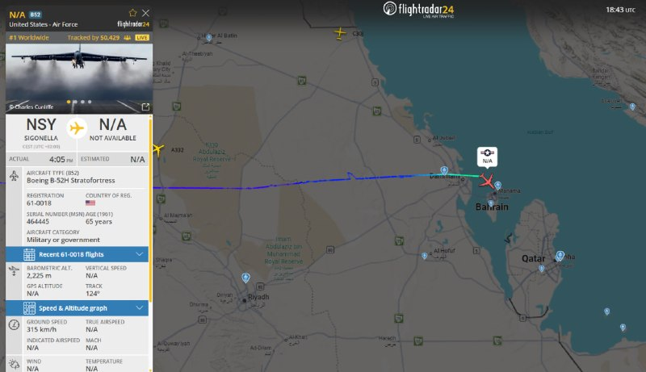

بمب افکن B-52 نیروی هوایی ایالات متحده وارد حریم هوایی عربستان شد. 📝 Amir 📌 @persian_trend_official پرشین ترند | متفاوت‌ترین کانال نظامی

## Persian_Trend_Official — post 16515

  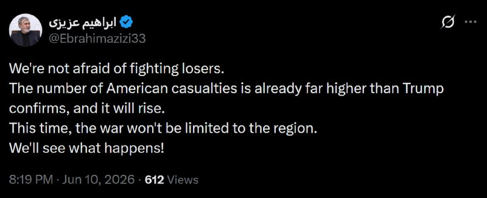

ابراهیم عزیزی رئیس کمیسیون امنیت ملی مجلس: ما از جنگیدن با بازندگان نمی‌ترسیم.

تعداد تلفات آمریکایی‌ها بسیار بیشتر از آن چیزی است که ترامپ ادعا می‌کند و افزایش خواهد یافت.

این بار، جنگ به منطقه محدود نخواهد شد. خواهیم دید چه اتفاقی می‌افتد!

📝 Amir

📌 @persian_trend_official
پرشین ترند | متفاوت‌ترین کانال نظامی

## RadioFarda — post 158158

آمریکا افراد و شرکت‌هایی در چین و هنگ‌کنگ را به اتهام تأمین سلاح برای ایران تحریم کرد

🔸دولت آمریکا روز چهارشنبه ۲۰ خرداد در ادامه کارزار فشار بر حکومت ایران، علیه ۱۱ فرد و نهاد مختلف به اتهام تهیه و تدارک سلاح برای تهران تحریم‌هایی اعمال کرد.

🔸وزارت خزانه‌داری آمریکا اعلام کرد در ادامه کارزار «خشم اقتصادی» ۹ فرد و نهاد مختلف را که در تهیه سلاح و فن‌آوری‌های مرتبط با سپاه پاسداران انقلاب اسلامی و وزارت دفاع و پشتیبانی نیروهای مسلح ایران همکاری می‌کردند، تحریم کرده است.

🔸دفتر کنترل دارایی‌های خارجی این وزارتخانه، اوفک، گفت افراد و شرکت‌های تحریم‌شده، مستقر در چین و هنگ‌کنگ هستند و در تهیه سلاح برای نیروهای مسلح ایران مشارکت داشتند.

🔸یک شرکت مستقر در هنگ‌کنگ هم که به گفته وزارت خزانه‌داری آمریکا در شبکه بانکی مخفی ایران فعالیت می‌کرد، در فهرست تحریم‌ها قرار گرفته است.

🔸چهار شهروند چینی و شرکت‌هایشان در چین و هنگ‌کنگ همراه یک تبعه ایران مقیم چین به نام منوچهر گلچین افرادی هستند که مشمول تحریم‌های جدید آمریکا شده‌اند.

🔸وزارت خزانه‌داری آمریکا گفته که آنها شبکه‌ای برای تسهیل معاملات مالی مرتبط با تهیه سلاح برای نیروهای مسلح ایران تشکیل داده بودند. یکی از شرکت‌های ثبت شده در هنگ‌کنگ به نام دوماس تریدینگ برای تسهیل پرداخت‌ها از طرف افراد تحریم‌شده ایرانی فعالیت می‌کرد و تلاش کرده است تا پرداخت‌ها برای تلاش‌های ایران در زمینه تهیه سلاح را تسهیل کند.

🔸در بیانیه وزارت خزانه‌داری آمریکا گفته شده است که این وزراتخانه به شدت در حال پیشبرد کارزار «خشم اقتصادی» است و ده‌ها میلیارد دلار درآمد را از دسترس رژیم ایران و نیروهای نیابتی‌اش به روش‌های مختلف مختل کرده است.

🔸بر اساس این اطلاعیه، وزارت خزانه‌داری همچنین با «شبکه‌های بانکداری سایه، شبکه‌های تأمین تسلیحات، مقام‌های فاسد مرتبط با فروش نفت، گروه‌های نیابتی و ناوگان‌های پنهان حمل نفت» مقابله کرده است.

🔸گزارش کامل را در وب‌سایت رادیوفردا بخوانید.

@RadioFarda

## RadioFarda — post 158157

  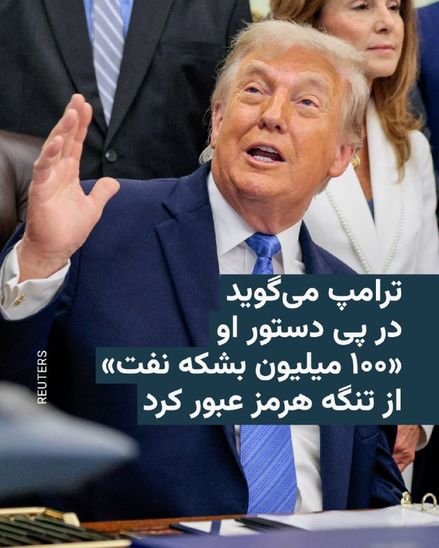

🔸دونالد ترامپ،‌ رئیس‌جمهور آمریکا، شامگاه چهارشنبه خبر داد بر اساس دستور او، بیش از ۱۰۰ میلیون بشکه نفت و ۲۰۰ کشتی تجاری از ماه گذشته از تنگه هرمز عبور کرده‌اند.

🔸این در حالی است که با آغاز جنگ آمریکا و اسرائیل علیه ایران، نیروهای نظامی جمهوری اسلامی تنگه هرمز را مسدود کردند و بعد از برقراری آتش‌بس نیز ارتش آمریکا محاصره دریایی بنادر ایران را اجرا کرد.

🔸دونالد ترامپ در شبکه اجتماعی تروث سوشال نوشت که در ماه مه به نیروهای آمریکایی یک «مأموریت محرمانه» برای حمایت از نفتکش‌ها و سایر کشتی‌های تجاری در تنگه هرمز داده است.

🔸او افزود: «امروز با خرسندی اعلام می‌کنم که نتیجه این اقدام، عبور بیش از ۱۰۰ میلیون بشکه نفت از تنگه هرمز و ورود آن به بازار جهانی بوده است. بیش از ۲۰۰ کشتی تجاری نیز با امنیت کامل از این تنگه عبور کرده‌اند.»

🔸رئیس‌جمهور آمریکا در ادامه نوشت: «این عملیات فوق‌العاده موفقیت‌آمیز به این دلیل ممکن شد که ایالات متحده آمریکا کنترل تنگه هرمز را در اختیار دارد، نه ایران.»

🔸او با اشاره به «شکست» نیروهای نظامی ایران و نابودی اقتصاد این کشور تأکید کرد: «کار ایران تمام شده است!»

@RadioFarda

## IranianMinds — post 22140

🔴 استرالیا و کانادا از شهروندان خود می‌خواهند فوراً ایران را ترک کنند.

@IranianMinds

## IranianMinds — post 22139

🔴 فوری i24news :

انتظار می‌رود ایالات متحده در ساعات آینده حملاتی علیه دامنه وسیع‌تری از اهداف ایرانی انجام دهد که فراتر از حملات شب گذشته است. این حملات به عنوان پیامی به تهران برای ارائه پاسخ فوری درباره توافق فعلی در دست بررسی است، نه به عنوان بازگشتی به جنگ تمام‌عیار.

@IranianMinds

## IranianMinds — post 22138

🔴 اکسیوس گفت مذاکرات رژیم جمهوری اسلامی و آمریکا ممکن است ظرف ۲-۳ ساعت آینده به شکست بینجامد.

@IranianMinds

## IranianMinds — post 22137

اومده سمت تنگه هرمز ببینیم کاری میکنه یا نه @IranianMinds

## IranianMinds — post 22136

🔴 بمب‌افکن هسته‌ای B-52H نیروی هوایی ایالات متحده که از ایتالیا حرکت کرده بود، در حال حاضر بر فراز عربستان سعودی می‌باشد و دقیقأ تا یک ساعت دیگر به منطقه عملیات ایران خواهد رسید. @IranianMinds

## IranianMinds — post 22135

🔴 آکسیوس:

ایرانی‌ها جلسه سه جانبه با آمریکا و قطر را رد کردند.

@IranianMinds

## IranianMinds — post 22134

  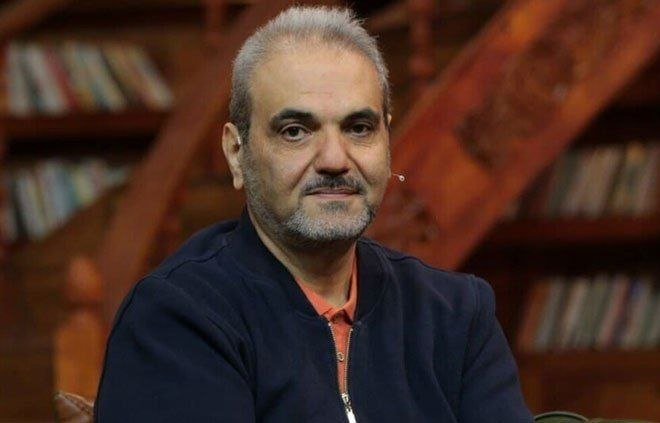

🔴 جواد خیابانی بعد از ۳۶ سال از صدا و سیما خداحافظی کرد.

@IranianMinds

## IranianMinds — post 22133

  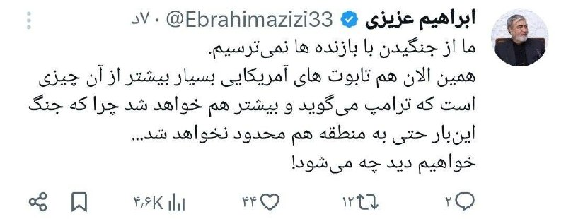

🔴 ابراهیم عزیزی رئیس کمیسیون امنیت ملی مجلس :

این بار جنگ فقط محدود به منطقه نیست !

+ مثلا چیکار میکنید خاک آمریکارو هدف قرار میدید ؟

@IranianMinds

## IranianMinds — post 22132

  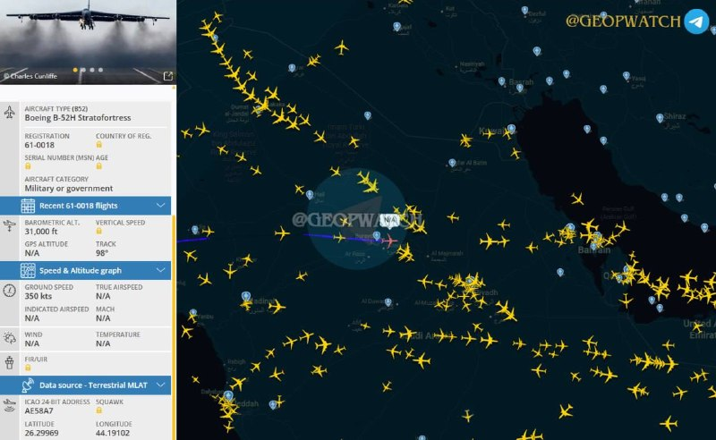

🔴 بمب‌افکن هسته‌ای B-52H نیروی هوایی ایالات متحده که از ایتالیا حرکت کرده بود، در حال حاضر بر فراز عربستان سعودی می‌باشد و دقیقأ تا یک ساعت دیگر به منطقه عملیات ایران خواهد رسید.

@IranianMinds

## IranianMinds — post 22131

🔴 فعالیت جنگنده های ارتش آمریکا در‌ جنوب عراق

@IranianMinds

## IranianMinds — post 22130

  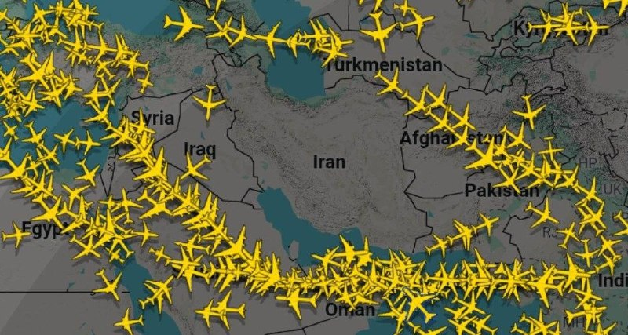

🔴 وضعیت آسمون ایران و منطقه کم کم انگار راند امشبم داره شروع میشه

@IranianMinds

## IranianMinds — post 22129

😳 هنوزم واسه کانفیگ هزینه میکنی؟ 
🍸 با داییجون رایگان وصل شو 
🎁 کاملا رایگان بدون نیاز به رفرال یا هزینه ای 
🌟 به محض استارت کردن ربات کانفیگت واست ارسال میشه 
🎁 @Daeijoonbot | استارت کن و کانفیگ رایگان بگیر 
🌟

## IranianMinds — post 22128

  

😳 هنوزم واسه کانفیگ هزینه میکنی؟

🍸 با داییجون رایگان وصل شو

🎁 کاملا رایگان بدون نیاز به رفرال یا هزینه ای

🌟 به محض استارت کردن ربات کانفیگت واست ارسال میشه

🎁 @Daeijoonbot | استارت کن و کانفیگ رایگان بگیر 
🌟

## BBCPersian — post 283365

  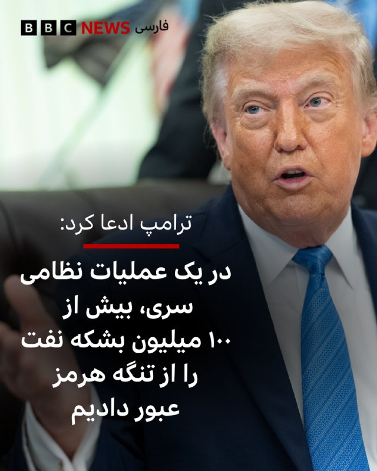

‌‌
دونالد ترامپ، رئیس جمهوری ایالات متحده، در شبکه اجتماعی‌اش، تروث سوشال، نوشت که طی ماه گذشته و به دستور او، ارتش آمریکا در یک «مأموریت مخفی برای پشتیبانی از نفتکش‌ها و سایر کشتی‌های تجاری در تنگه هرمز» موفق به عبور بیش از ۱۰۰ میلیون بشکه نفت از تنگه و ورود آن به بازار آزاد شده است.

آقای ترامپ نوشت که بیش از ۲۰۰ کشتی تجاری با آرامش از این تنگه عبور کرده‌اند اما جزییاتی از این عملیات یا کشتی‌هایی که به گفته او موفق به عبور از تنگه هرمز شده‌اند، نداد.

او همچنین بار دیگر مدعی شد که کنترل تنگه هرمز در «اختیار آمریکاست، نه ایران.»

آقای ترامپ در انتها با ادعای مجدد درباره «شکست و نابودی» ارتش ایران نوشت: «کار برای ایران تمام شده است».

این در حالی است که ارزیابی نهادهای اطلاعاتی و نظامی آمریکا در سه ماه گذشته بارها در تناقض با اظهارات کاخ سفید و آقای ترامپ بوده است.

ستاد مرکزی فرماندهی ارتش آمریکا (سنتکام) پیشتر گفته بود که یک نفتکش مرتبط با نفت ایران را در دریای عمان از کار انداخته است.
📷EPA/Shutterstock

تازه‌ترین تحولات را از صفحه زنده در سایت بی‌بی‌سی فارسی دنبال کنید.
https://bbc.in/4eeOfke
@BBCPersian

## BBCPersian — post 283364

  <a href="https://t.me/bbcpersian/283364" target="_blank">📎 Download file</a>

📻پادکست برنامه ۶۰ دقیقه چهارشنبه ۲۰ خرداد ۱۴۰۵

این نسخه رادیویی برنامه شصت دقیقه تلویزیون فارسی بی‌بی‌سی است که هرشب بعد از پخش، با حجم کم از اپلیکیشن‌های پادگیر و صفحه تلگرام بی‌بی‌سی فارسی در دسترس است.

@BBCPersian

## BBCPersian — post 283363

  <a href="telegram/content/BBCPersian_283363_1781124227.mp4" target="_blank">🎬 Download video</a>

🔻آخرین خبرهای مهم روز چهارشنبه ۲۰ خرداد ماه ۱۴۰۵ از تلویزیون بی‌بی‌سی فارسی

https://bbc.in/42XnQmy
https://bbc.in/3WtLd3k
@BBCPersian

## BBCPersian — post 283362

  <a href="telegram/content/BBCPersian_283362_1781124229.mp4" target="_blank">🎬 Download video</a>

🔻رسانه‌های ایران از آتش‌سوزی گسترده در یک انبار فرش در حوالی میدان قیام واقع در منطقه ۱۲ تهران گزارش داده‌اند.

به گزارش خبرگزاری قوه قضائيه این ساختمان یک انبار فرش بوده که در مجاورت پمپ بنزین پل ری واقع شده است.

سازمان آتش‌نشانی تهران می‌گوید این مجموعه که شامل چند انبار و غرفه است و تقریبا ۲ هزار متر مربع وسعت دارد در ساعت ۱۹:۴۴ به وقت محلی دچار حریق شد و عملیات خاموش کردن آتش با حضور هشت ایستگاه آتش‌نشانی و تانکرهای آب شهرداری تهران انجام شده است.

به گفته سازمان آتش‌نشانی تا این لحظه گزارشی از آسیب جانی گزارش نشده است.

پیشتر گزارش‌هایی از مشاهده دود غلیظ در حوالی میدان قیام تهران منتشر شده بود.
@BBCPersian

## BBCPersian — post 283361

  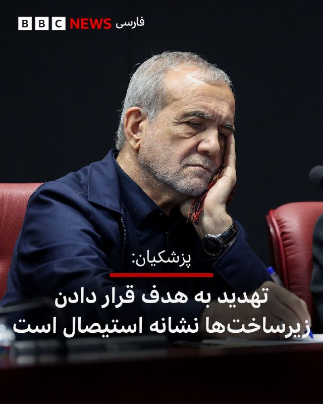

‌🔻مسعود پزشکیان می‌گوید که تهدید کردن زیرساخت‌های حیاتی یک کشور به حمله، نشانه استیصال است و نه قدرت.

رئیس‌جمهور ایران این اظهارات را کمی پس از تهدیدهای جدید دونالد ترامپ علیه ایران مطرح کرد.

آقای پزشکیان در شبکه ایکس نوشت: «زیرساخت‌های حیاتی، شریان‌های زندگی مردم‌اند. تهدید به هدف قرار دادن آنها از شبکه‌های حمل و نقل تا صنعت برق و آب نه نمایش قدرت بلکه نشانه استیصال در برابر اراده یک ملت است.»

آقای پزشکیان در ادامه تاکید کرد که «ایران با تکیه بر دانش و توان متخصصان، وحدت ملی و همبستگی، در برابر هر فشار و تهدیدی استوار خواهد ماند.»

دونالد ترامپ، رئیس‌جمهور آمریکا، پیشتر در شبکه اجتماعی خود تهدید کرد که ایران در مذاکرات بیش از حد تعلل کرده است و حالا باید بهایش را بپردازد.

او کمی پس از این اظهارات به خبرنگاران گفت: «ما دیروز ضربت سختی به آن‌ها وارد کردیم و امروز هم دوباره ضربت سختی خواهیم زد.»
📷Anadolu via Getty
@BBCPersian

## BBCPersian — post 283360

🔻ارتش آمریکا اعلام کرد که یک نفتکش را در دریای عمان از کار انداخته است

ارتش ایالات متحده می‌گوید که که یک نفتکش را در دریای عمان از کار انداخته است.

ارتش آمریکا روز چهارشنبه در پستی درشبکه اجتماعی ایکس اعلام کرد که این اقدام پس از آن صورت گرفت که خدمه این نفتکش به دستورالعمل‌های نیروهای آمریکایی عمل نکردند.

بر اساس گزارش رویترز، نیروهای آمریکایی با شلیک به سوی موتورخانه این نفتکش در دریای عمان آن را از کار انداختند.

هنوز جزییات بیشتری در مورد این نفتکش ارائه نشده است. اما آمریکا با محاصره بنادر ایران اجازه عبور نفتکش‌ها به مقصد ایران یا از مبدا ایران را نمی‌دهد.
@BBCPersian

## Dirty_Kids — post 391622

  <a href="telegram/content/Dirty_Kids_391622_1781124233.mp4" target="_blank">🎬 Download video</a>

ویدیویی از گوریل Kiyomasa در باغ‌وحش ژاپن که بعد از دعوا با همسرش در فکر فرورفته است.

بعداز استرس‌ها، زن‌ها غمگین می‌شوند ولی مردها می‌میرند. 💔

@Dirty_Kids 👻

## Dirty_Kids — post 391621

🔴 آکسیوس:

هم اکنون ترامپ و تیم ارشد امنیت ملی خود در اتاق وضعیت کاخ سفید در حال برگزاری جلسه در مورد ایران می‌باشند.

@Dirty_Kids 👻

## Dirty_Kids — post 391617

  <a href="telegram/content/Dirty_Kids_391617_1781124235.mp4" target="_blank">🎬 Download video</a>

🔴 طبق گزارش‌ها؛ چندین فروند بمب‌افکن راهبردی B-52 ایالات متحده
🇺🇸برای تقویت روند توافقات وارد منطقه خاورمیانه شدن.

@Dirty_Kids 👻

## Dirty_Kids — post 391616

🔴 فوری/ترامپ :

به همه پیشنهاد میکنم امشب تلویزیون رو روشن کنن ( یک ساعت و نیم دیگه )

@Dirty_Kids 👻

## Dirty_Kids — post 391615

  

دیشب تو بازی دوستانه آرژانتین مقابل ایسلند، دنیل گودیانسن، مهاجم ایسلند، جلوی مسی رو گرفت و گفت منو یادت میاد؟ مسی هم تعجب کرد و نشناختش، تا اینکه خودشو معرفی کرد.

مسی بعد از بازی گفت:«اول ازم پرسید منو یادت میاد؟ بعد گفت پسر گودیانسنه. واقعاً غافلگیر شدم. اون موقع فقط یه بچه کوچیک بود. یادمه بعضی وقتا با پدرش میومد تمرین، ولی چون خیلی کوچیک بود، راستش یادم نمیومد.»

ایدور گودیانسن قبلا تو بارسا هم‌تیمی مسی بود.

@Dirty_Kids 👻

## Dirty_Kids — post 391614

  <a href="telegram/content/Dirty_Kids_391614_1781124238.mp4" target="_blank">🎬 Download video</a>

هرکی هرچی جنده‌تر باشه، احتمال حکومتی بودنش بیشتره.

@Dirty_Kids 👻

## Dirty_Kids — post 391611

  <a href="telegram/content/Dirty_Kids_391611_1781124240.mp4" target="_blank">🎬 Download video</a>

نگین فضلی، جنده صادراتی هم برگشت ایران.

+ جمهوری‌اسهالی به اینا میگه نخبه😂😂

@Dirty_Kids 👻

## Dirty_Kids — post 391610

  <a href="telegram/content/Dirty_Kids_391610_1781124242.mp4" target="_blank">🎬 Download video</a>

یک اینفوئنسر کارآفرین لبنانی که این روزها کشورش #حملات_موشکی اسرائیل را تجربه می‌کند، در سواحل بیروت تاکید کرد که باکی از حملات ندارد.

@Dirty_Kids 👻

## Dirty_Kids — post 391609

  <a href="telegram/content/Dirty_Kids_391609_1781124244.mp4" target="_blank">🎬 Download video</a>

پسر پششششششششمام!
قبلاً یذره مخفی‌کاری می‌کردن! مگه داریم؟!😂 :)

@Dirty_Kids 👻

## Dirty_Kids — post 391608

  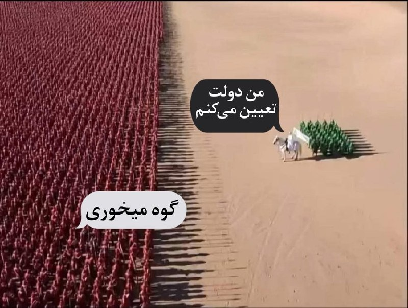

اگه خمینی الان بیاد ایران: 😊

@Dirty_Kids 👻

## Dirty_Kids — post 391606

  <a href="telegram/content/Dirty_Kids_391606_1781124246.mp4" target="_blank">🎬 Download video</a>

شما که پول سربازا و نظامیاتونو نمیتونید بدید براچی جنگ میکنید

انقد بالایی میدزدن پولی نمیمونه، وضعیت مملکت که دیگه‌ نگم تمام مشاغل خوابیده، تورم سر به فلک کشیده...

@Dirty_Kids 👻

## Dirty_Kids — post 391603

  <a href="telegram/content/Dirty_Kids_391603_1781124249.mp4" target="_blank">🎬 Download video</a>

رسوایی عجیب تیم آخوند تو اردوی ترکیه؛ دست درازی یه بازیکن به دختر 14 ساله! دیلی میل| یک فوتبالیست بین‌المللی متهم شده که در یک هتل پنج‌ستاره در ترکیه تلاش کرده یک دختر ۱۴ ساله بریتانیایی را برای «بغل کردن» به پشت یک پرچین ببرد. پدر این دختر در گفت‌وگو با…

## Dirty_Kids — post 391602

  <a href="telegram/content/Dirty_Kids_391602_1781124250.mp4" target="_blank">🎬 Download video</a>

چون شاهزاده سخنان زیبایی گفت، این ویدیو زیبا رو هم ببینید تا زیبایی‌تون تکمیل بشه

@Dirty_Kids 👻

## Dirty_Kids — post 391601

👑 پیام شاهزاده رضا پهلوی منتشر شد. ایران ما، امروز بیش از هر زمان دیگری به اتحاد نیروهای ملی نیاز دارد. چه با حمایت خارجی و چه بدون آن، سرنوشت ایران در دستان خود ماست. ما از این رژیم فرسوده و درمانده نیرومندتریم. ما از مزدورانی که برای نمایش‌های تبلیغاتی…

## Hranews — post 113530

آوات صادق‌نیا با تودیع وثیقه آزاد شد

❗️
❗️
❗️
❗️
❗️– آوات صادق‌نیا (سرگلی)، شهروند اهل شهرستان مهاباد، پس از ۸۳ روز بازداشت، با تودیع وثیقه از زندان مهاباد آزاد شد.

ادامه مطلب

#آوات_صادق‌نیا

↘️
@hranews_bot تماس ✉️ -  @Hranews  کانال هرانا 🆑

## Hranews — post 113529

قتل یک دانشجو زن توسط همسرش در دانشگاه قزوین؛ دو مامور حراست بازداشت شدند

❗️
❗️
❗️
❗️
❗️– در پی کشته شدن یک دانشجوی دختر رشته دندانپزشکی توسط همسرش در دانشگاه علوم پزشکی قزوین، دو تن از ماموران حراست این دانشگاه بازداشت شدند. ضارب با یک سلاح جنگی وارد محیط دانشگاه شده و پس از شلیک به همسر خود، اقدام به خودکشی کرده است. موضوع چگونگی ورود یک قبضه سلاح جنگی به محیط دانشگاه و احتمال قصور یا سهل‌انگاری در فرایندهای حفاظتی از محورهای مورد بررسی مراجع قضایی است.

ادامه مطلب

↘️
@hranews_bot تماس ✉️ -  @Hranews  کانال هرانا 🆑

## Hranews — post 113528

گزارشی از بازداشت و بی‌خبری از وضعیت ابوالفضل چمنی، دانشجوی دانشگاه تهران

❗️
❗️
❗️
❗️
❗️– ابوالفضل چمنی، دانشجوی دانشگاه تهران مورخ ۱۱ خردادماه، توسط نیروهای امنیتی #بازداشت شده و تاکنون از محل نگهداری وی اطلاعی حاصل نشده است.

ادامه مطلب

#ابوالفضل_چمنی

↘️
@hranews_bot تماس ✉️ -  @Hranews  کانال هرانا 🆑

## alonews — post 126970

  <a href="telegram/content/alonews_126970_1781124251.webm" target="_blank">🎬 Download video</a>

👈ادعای منبع پاکستانی به الحدث: ما امروز از امضای توافقنامه صلح، دور شده‌ایم

✅ @AloNews خبر جنگ

## alonews — post 126969

  <a href="telegram/content/alonews_126969_1781124251.mp4" target="_blank">🎬 Download video</a>

👈وزیر جنگ؛ هگِستِ : اونا قرار نیست به توافق برسن و ما هم با قدرت روشون فشار میاریم

🔴سنتکام این کار رو خیلی خوب انجام می‌ده، بهتر از هر کسی تو دنیا، و ما هم همون نتیجه‌ای رو که می‌خوایم

✅ @AloNews خبر جنگ

## alonews — post 126968

  <a href="telegram/content/alonews_126968_1781124254.mp4" target="_blank">🎬 Download video</a>

👈هگِستِ خطاب به سرباز‌های سنتکام : این به مأموریت مهمی که شروع کردین و هنوز دارین ادامه‌اش می‌دین؛

🔴 تا مطمئن شین ایران هیچ‌وقت به سلاح هسته‌ای نرسه، باید خیلی افتخار کنید به خودتون

✅ @AloNews خبر جنگ

## alonews — post 126967

  <a href="telegram/content/alonews_126967_1781124256.webm" target="_blank">🎬 Download video</a>

👈منابع ایرانی به الجزیره گفتند:
«هرگونه حمله منجر به پایان مذاکرات خواهد شد».

✅ @AloNews خبر جنگ

## alonews — post 126966

  <a href="telegram/content/alonews_126966_1781124256.webm" target="_blank">🎬 Download video</a>

👈اکسیوس: دو منبع آمریکایی گفتند: ترامپ بعدازظهر چهارشنبه جلسه‌ای در اتاق وضعیت (Situation Room) برگزار کرد تا درباره حملات احتمالی جدید علیه ایران بحث کند، این جلسه ساعاتی پس از آن برگزار شد که ترامپ به خبرنگاران گفته بود آمریکا «امروز دوباره به سختی به آنها حمله خواهد کرد».

🔴منابع گفتند یکی از گزینه‌هایی که ترامپ در نظر دارد، انجام عملیاتی با مقیاس بزرگ ولی کوتاه‌مدت است

✅ @AloNews خبر جنگ

## alonews — post 126965

  <a href="telegram/content/alonews_126965_1781124256.webm" target="_blank">🎬 Download video</a>

👈جی‌دی‌ونس در پاسخ به این سوال که آیا نتانیاهو در نحوه مدیریت رابطه خود با ایالات متحده درباره ایران اشتباهاتی داشته است یا نه گفت: «او قطعاً در برخی موارد اشتباه کرده است.»

🔴ونس از ارائه نمونه خودداری کرد و گفت این گفت‌وگوها «بهتر است در محافل خصوصی باقی بمانند.»

✅ @AloNews خبر جنگ

## alonews — post 126964

  <a href="telegram/content/alonews_126964_1781124256.webm" target="_blank">🎬 Download video</a>

👈جی‌دی ونس: منافع ایالات متحده و اسرائیل همیشه با یکدیگر همسو نیستند؛ رابطه ترامپ با نتانیاهو بر سر جنگ ایران تحت فشار قرار گرفته است.

🔴گاهی ما [و اسرائیل] در یک مسیر و هم‌نظر هستیم و گاهی نیستیم. و هر جا که این دو از هم جدا شوند، ما، باید جانب مردم آمریکا را بگیریم، و همیشه همین کار را می‌کنیم

✅ @AloNews خبر جنگ

## alonews — post 126963

  <a href="telegram/content/alonews_126963_1781124257.webm" target="_blank">🎬 Download video</a>

👈آکسیوس: ترامپ در حال بررسی انجام عملیات نظامی جامع و سریع علیه ایران است.‌

✅ @AloNews خبر جنگ

## alonews — post 126962

  <a href="telegram/content/alonews_126962_1781124257.mp4" target="_blank">🎬 Download video</a>

🔴فوری/ پیت هگست:
همانطور که رئیس‌جمهور ترامپ امروز گفت، آنها معامله نخواهند کرد، پس ما به شدت به آنها ضربه خواهیم زد. سنتکام این کار را بسیار خوب انجام می‌دهد، بهتر از هر کس دیگری در جهان.

✅ @AloNews خبر جنگ

## alonews — post 126961

  <a href="telegram/content/alonews_126961_1781124259.webm" target="_blank">🎬 Download video</a>

🔴فوری/ترامپ : به همه پیشنهاد میکنم امشب تلویزیون رو روشن کنن ( یک ساعت و نیم دیگه )

✅ @AloNews خبر جنگ

## alonews — post 126960

  <a href="telegram/content/alonews_126960_1781124260.webm" target="_blank">🎬 Download video</a>

👈رئیس جمهور صربستان: من رئیس‌جمهور کشوری هستم که یکی از معدود کشورهای اروپا است که در همکاری و همکاری با اسرائیل تردید ندارد و به طور علنی و آشکار به این موضوع افتخار می‌کند و آن را پنهان نمی‌کند.

✅ @AloNews خبر جنگ

## alonews — post 126959

  <a href="telegram/content/alonews_126959_1781124260.webm" target="_blank">🎬 Download video</a>

👈گوترش: وضعیت کنونی در خاورمیانه می‌تواند به از سرگیری کامل درگیری‌ها منجر شود

✅ @AloNews خبر جنگ

## alonews — post 126958

  <a href="telegram/content/alonews_126958_1781124260.webm" target="_blank">🎬 Download video</a>

🔴فوری / استرالیا و کانادا از همه شهروندان خود در ایران خواسته‌اند فوراً کشور را ترک کنند.

✅ @AloNews خبر جنگ

## alonews — post 126957

  <a href="telegram/content/alonews_126957_1781124261.webm" target="_blank">🎬 Download video</a>

👈وزیر ارتباطات از پیامرسان سروش پلاس تمجید و تقدیر کرد

✅ @AloNews خبر جنگ

## alonews — post 126955

  <a href="telegram/content/alonews_126955_1781124261.webm" target="_blank">🎬 Download video</a>

👈نورالدین الدغیر خبرنگار الجزیره در تهران: واسطه قطری تهران را ترک کرد

🔴به گفته ایران، سند توافق برای حل برخی اختلافات که هنوز به دلیل تغییرات آمریکا پابرجا هستند، نیاز به کار دارد.

🔴منابعی در تهران می‌گویند هرگونه حمله به ایران به معنای پایان اجرای آتش‌بس است.

🔴واسطه‌ها در حال حرکت برای جلوگیری از هر درگیری جدیدی هستند.

✅ @AloNews خبر جنگ

## alonews — post 126954

  <a href="telegram/content/alonews_126954_1781124261.mp4" target="_blank">🎬 Download video</a>

👈همسر یکی از شهدای ناو دنا: ما منتظر انتقام از آمریکاهستیم/پزشکیان: انتقام که‌فقط جنگیدن نیست انتقام ساختن ایرانه

✅ @AloNews خبر جنگ

## alonews — post 126953

  

😳هنوز داری گیگی 10...15 تومن میخری ، وقتی اینترنت کامل درست شده
😱چون داری از واسطه تهیه میکنی

😍تخفیف ویژه فقط گیگی 2t
با لینک ساب

🌟با ضمانت و بهترین سرعت و کیفیت

☑️نامحدود واقعی فقط 290t

⌛️برای 200 نفر اول این تخفیف اعمال میشه ، سریع اقدام کنید که دیگه قرار نیست هزینه زیاد بابت وی پی ان بدید
👇
👇
@tvpnshop_bot
@tvpnshop_bot

## alonews — post 126952

  <a href="telegram/content/alonews_126952_1781124265.mp4" target="_blank">🎬 Download video</a>

گدایی کنید تا فروشنده خوبی بشید :||||

دارن آموزش گدایی کردن میدن
[@AloTweet]

## alonews — post 126950

  <a href="telegram/content/alonews_126950_1781124267.webm" target="_blank">🎬 Download video</a>

🔴فوووووووووووووووووووووووووووووری

## alonews — post 126949

🔴فوووووووووووووووووووووووووووووری

<!-- MSG END -->

<!-- NAV START -->

<a href="https://github.com/Tljn/FUD/blob/main/telegram/content/archive_1.md" style="display:inline-block; padding:6px 12px; margin:0 4px; background-color:#2ea44f; color:white; text-decoration:none; border-radius:4px; font-weight:bold;">صفحه بعد</a>

<!-- NAV END -->
