# خواننده تلگرام

<!-- TOP_NAV START -->

<a href="https://github.com/Tljn/FUD/blob/main/telegram/content/archive_1.md" style="display:inline-block; padding:6px 12px; margin:0 4px; background-color:#2ea44f; color:white; text-decoration:none; border-radius:4px; font-weight:bold;">صفحه بعد</a>

<!-- TOP_NAV END -->

<!-- MSG START -->

---
📅 بروزرسانی: 1405/03/16 02:39
---

## VahidOOnLine — post 243873

  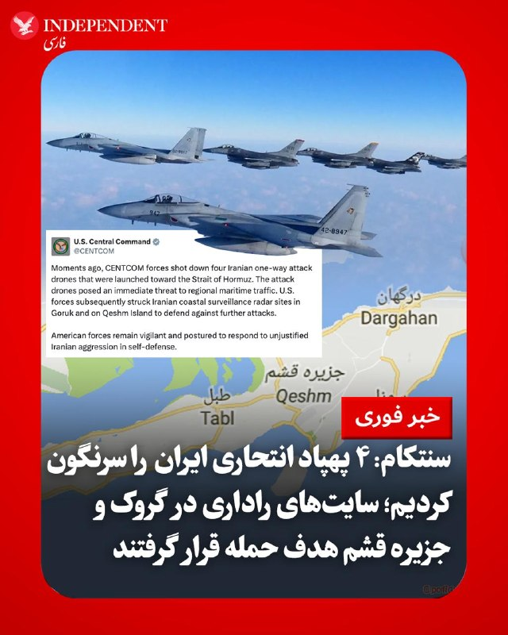

♦️فرماندهی مرکزی ایالات متحده (سنتکام)، بامداد شنبه، ۱۶ خردادماه، با انتشار بیانیه‌ای رسمی اعلام کرد که نیروهای ارتش آمریکا چهار فروند پهپاد انتحاری (یک‌طرفه) ایران را که به سمت تنگه هرمز پرتاب شده و تهدیدی فوری برای تردد دریایی منطقه به شمار می‌رفتند، سرنگون کرده‌اند. بر اساس این بیانیه، نیروهای آمریکایی متعاقب و با هدف دفاع از خود در برابر حملات بیشتر، سایت‌های راداری نظارت ساحلی ایران را در منطقه «گروک» و «جزیره قشم» هدف حمله قرار دادند. سنتکام در پایان با تاکید بر حفظ آمادگی کامل نیروهای آمریکایی افزود که واشنگتن برای دفاع از خود و پاسخ به «تجاوزات توجیه‌ناپذیر ایران»، در حالت آماده‌باش قرار دارد.
‌🇸🇦 Indypersian

🤖 @VahidOOnLine

## VahidOOnLine — post 243872

  

ترامپ در گفت‌وگو با ان‌بی‌سی گفت که حکومت ایران هنوز ۲۱ تا ۲۲ درصد از موشک‌های خود را حفظ کرده است. او گفت که رهبران حکومت ایران هنوز با آمریکا برای پایان جنگ به توافق نرسیده‌اند، زیرا آنها «قوی» و «مغرور» هستند، اما در نهایت «آنها چاره‌ای جز توافق ندارند و کمی طول می‌کشد.»
او افزود: «بیشتر کارخانه‌های پهپادسازی ‌آن‌ها از کار افتاده‌، بیشتر سکوهای پرتاب از کار افتاده‌ و بیشتر مناطق تولید موشک از کار افتاده‌اند. اما آن‌ها هنوز ظرفیت تولید دارند. آن‌ها تعدادی موشک و تعدادی پهپاد دارند. به نظر من، شاید ۲۱ تا ۲۲ درصد از موشک‌های‌شان. این تعداد زیادی موشک است، اما این میزان، آن چیزی نیست که در زمان حمله اولیه ما بود.»
ترامپ مدت زمان درگیری جاری را با جنگ ویتنام مقایسه کرد و گفت: «من خیلی سریع پیش می‌روم. سه ماه است که درگیر آن هستم. می‌دانید، ویتنام ۱۹ سال طول کشید. من در ماه سوم هستم و تنها کاری که آن‌ها می‌کنند، این است که می‌گویند کی قرار است پیروز شویم. اگر من یک دموکرات بودم، هیچ کس این‌طور صحبت نمی‌کرد، اما برای من مهم نیست. من به آن عادت کرده‌ام.»
‌🏁 🇬🇧 IranintlTV

🤖 @VahidOOnLine

## VahidOOnLine — post 243871

  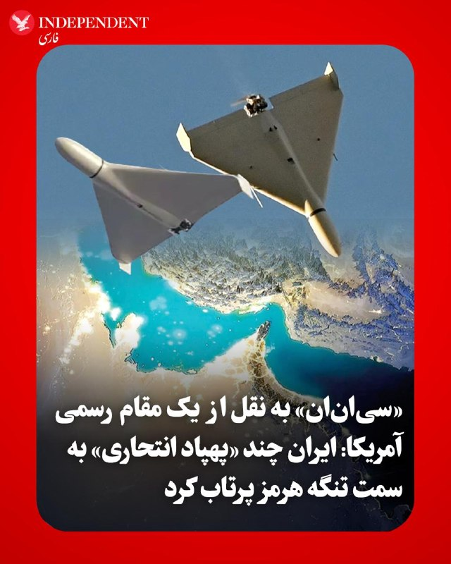

♦️«سی‌ان‌ان» به نقل از یک مقام رسمی ایالات متحده، بامداد شنبه، ۱۶ خردادماه، گزارش داد که ایران چند پهپاد را به سمت تنگه هرمز پرتاب کرده و نیروهای آمریکایی مستقر در منطقه موفق شده‌اند دست‌کم چهار پهپاد را سرنگون کنند. به گفته این مقام مسئول، واشنگتن ظن آن را دارد که این پهپادهای انتحاری با هدف حمله به کشتی‌های تجاری در حال عبور از آب‌های منطقه یا هدف قرار دادن نیروهای نظامی ایالات متحده که در آن حوالی عملیات انجام می‌دهند، به پرواز درآمده بودند.
‌🇸🇦 Indypersian

🤖 @VahidOOnLine

## VahidOOnLine — post 243870

  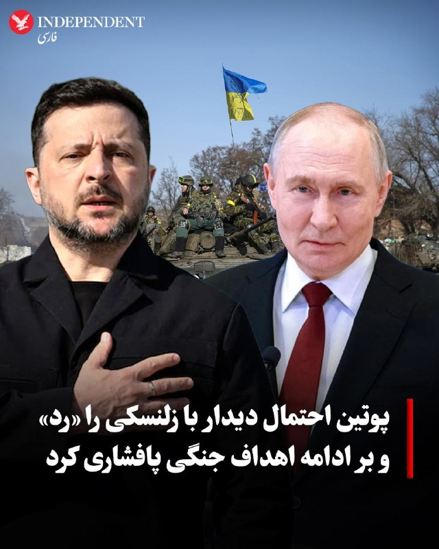

♦️ولادیمیر پوتین، رئیس‌جمهوری روسیه، در جریان سخنرانی خود در مجمع اقتصادی سن‌پترزبورگ، درخواست ولودیمیر زلنسکی برای برگزاری یک دیدار دوجانبه و فوری جهت پایان دادن به جنگ چهار ساله را رد کرد و با بی‌فایده خواندن این ملاقات پیش از دستیابی به یک توافق صلح اولیه، تاکید کرد که عملیات نظامی روسیه تا تحقق کامل تمامی اهداف تعیین‌شده از جمله کنترل کامل بر منطقه دونباس و اعمال محدودیت‌های شدید سیاسی و نظامی بر کی‌یف ادامه خواهد یافت. این موضع‌گیری تند با واکنش شدید رئیس‌جمهوری اوکراین روبرو شد، به طوری که زلنسکی پاسخ پوتین را «ضعیف» توصیف کرد و گفت که رهبر روسیه بار دیگر گزینه جنگ را انتخاب کرده است. همزمان با بن‌بست در تلاش‌های دیپلماتیک و در شرایطی که قرار است زلنسکی روز یکشنبه در لندن با رهبران غربی از جمله فریدریش مرز، صدراعظم آلمان و امانوئل مکرون، رئیس‌جمهوری فرانسه دیدار کند، حملات مرگبار میدانی روسیه به شرق اوکراین همچنان ادامه دارد و پوتین با رد گزارش‌ها درباره فروپاشی اقتصاد مسکو تحت فشارهای کمرشکن جنگ، ادعا کرد که شایعات درباره بحران اقتصادی روسیه به شدت مبالغه‌آمیز است.
‌🇸🇦 Indypersian

🤖 @VahidOOnLine

## VahidOOnLine — post 243869

  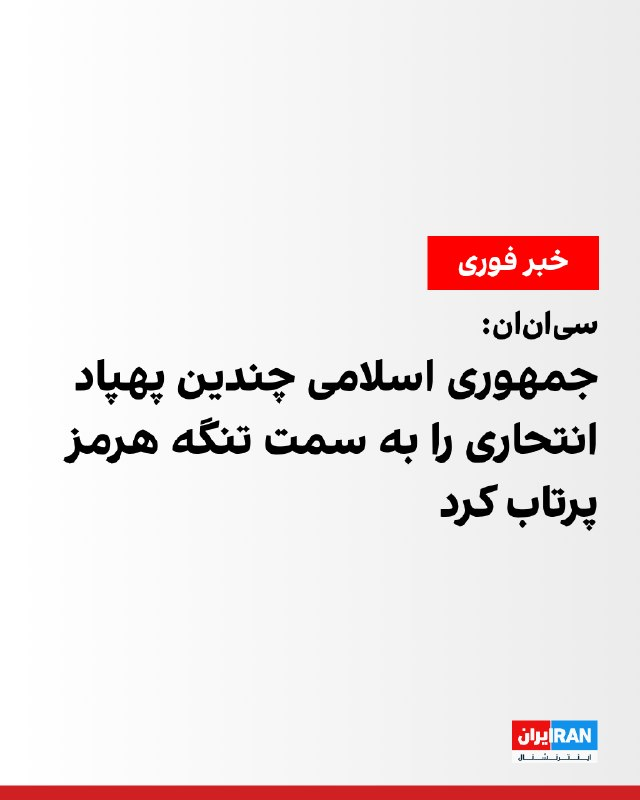

سی‌ان‌ان به نقل از یک مقام آمریکایی گزارش داد جمهوری اسلامی چندین پهپاد انتحاری را به سمت تنگه هرمز پرتاب کرد که هواپیماهای آمریکا دست‌کم چهار پهپاد را سرنگون کردند.
این مقام گفت مقام‌های آمریکایی گمان می‌کنند این پهپادها کشتی‌های تجاری در حال عبور از آب‌های منطقه یا نیروهای آمریکایی فعال در نزدیکی آن منطقه را هدف قرار داده بودند.

‌🏁 🇬🇧 IranintlTV

🤖 @VahidOOnLine

## VahidOOnLine — post 243868

  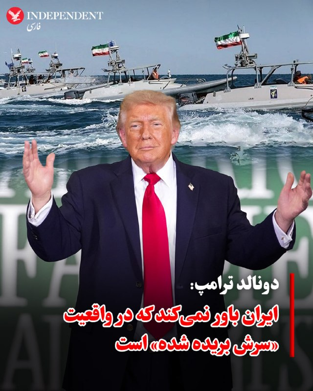

♦️دونالد ترامپ، رئیس‌جمهوری آمریکا، در گفتگو با شبکه «ان‌بی‌سی نیوز» با تاکید بر اینکه مقامات ایران به شدت به دنبال توافق هستند اما به دلیل «قوی و مغرور بودن»، پذیرش شرایط برایشان دشوار است، اعلام کرد: «آن‌ها در موقعیتی قرار گرفته‌اند که باور نمی‌کنند سرشان بریده و ارتش آن‌ها کاملا نابود شده است.» ترامپ با اشاره به اینکه تهران پیش از این دو بار در آستانه دستیابی به سلاح هسته‌ای قرار داشت، خروج خود از برجام را که آن را مسیر رسیدن ایران به بمب اتمی می‌دانست، ستود و افزود: «بسیاری از کارخانه‌های پهپادی، سکوهای پرتاب و مراکز تولید موشک ایران از بین رفته‌اند و در حال حاضر تنها حدود ۲۱ تا ۲۲ درصد از موشک‌های آن‌ها باقی مانده است؛ این میزان هنوز کم نیست، اما با آنچه در شروع حمله داشتند قابل مقایسه نیست.» او با انتقاد از فشارها برای توافق فوری، سرعت خود را با جنگ ۱۹ ساله ویتنام مقایسه کرد و گفت: «من بسیار سریع حرکت می‌کنم و تازه در ماه سوم هستم؛ این آدم‌ها ۴۷ سال است که در حال جنگ هستند و آمریکایی‌ها را کشته‌اند، اما اکنون چاره دیگری ندارند و در نهایت مجبور خواهند شد کارهایی را که هرگز فکرش را هم نمی‌کردند، انجام دهند و توافق کنند.»
‌🇸🇦 Indypersian

🤖 @VahidOOnLine

## VahidOOnLine — post 243867

  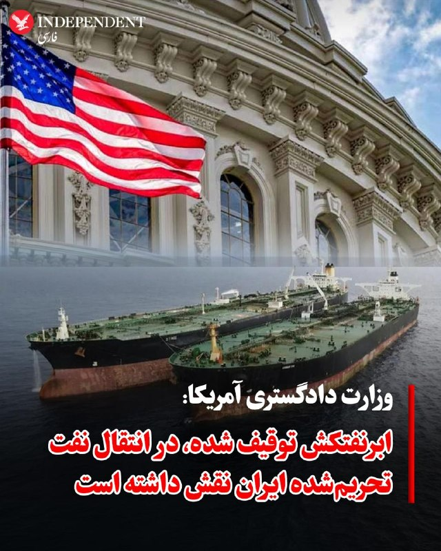

♦️وزارت دادگستری آمریکا با انتشار بیانیه‌ای رسمی اعلام کرد که نیروهای ایالات متحده طی یک عملیات شبانه، ابرنفتکش «ام/تی داوینا» (M/T Davina) معروف به «لنور» را که ظرفیت حمل تا دو میلیون بشکه نفت را دارد و در فهرست تحریم‌های وزارت خزانه‌داری آمریکا علیه بخش نفت و پتروشیمی ایران قرار گرفته است، توقیف کرده‌اند. بر اساس اعلام واشنگتن، این شناور بخشی از «ناوگان سایه» ایران به شمار می‌رود؛ شبکه‌ای از تسهیل‌کنندگان حمل‌ونقل غیرقانونی که به گفته مقامات آمریکایی، به درآمدزایی انرژی برای نظام ایران، به خطر انداختن ثبات منطقه و حمله به شرکا و متحدان ایالات متحده کمک کرده است. وزارت دادگستری آمریکا تاکید کرد که این اقدام بخشی از تلاش‌های هماهنگ با سایر نهادهای دولتی برای اختلال در شبکه قاچاق نفت و درآمدزایی‌هایی است که به سود دولت ایران و سپاه پاسداران تمام می‌شود.
‌🇸🇦 Indypersian

🤖 @VahidOOnLine

## WithYashar — post 13601

کانال ۱۴: همه امیدوار بودند که آتش بس برقرار شود، اما بازی به طور کامل در حال تغییر است. برای یک آخر هفته فوق العاده گرم در خاورمیانه آماده می شوند، زیرا ایران و آمریکا از اعتصابات تصادفی شبانه به رویارویی های روز روشن تغییر می کنند!
@withyashar

## WithYashar — post 13600

سنتکام : چند لحظه پیش، نیروهای سنتکام چهار پهپاد تهاجمی یک‌طرفهٔ ایرانی را که به سمت تنگهٔ هرمز پرتاب شده بودند، سرنگون کردند. این پهپادهای تهاجمی تهدیدی فوری برای تردد دریایی منطقه ایجاد کرده بودند. در ادامه، نیروهای آمریکا برای دفاع در برابر حملات بیشتر، سایت‌های رادار مراقبت ساحلی ایران در گورک و جزیرهٔ قشم را هدف قرار دادند.
نیروهای آمریکایی همچنان هوشیار هستند و برای پاسخ‌دادن به تجاوز بی‌دلیل ایران در چارچوب دفاع از خود، در حالت آماده‌باش قرار دارند.
🚨🚨🚨🚨🚨🚨🚨
@withyashar

## WithYashar — post 13599

🚨سنتکام از حمله به سایت های راداری قشم خبر داد!
@withyashar

## WithYashar — post 13598

چندین انفجار در سيريك
🚨🚨🚨🚨🚨🚨🚨
@withyashar

## WithYashar — post 13597

سی‌بی‌اس نیوز به نقل از یک مقام آمریکایی: نیروهای آمریکایی حداقل ۴ پهپاد را که توسط ایران به سمت تنگه هرمز پرتاب شده بود، سرنگون کرده‌اند.🚨
@withyashar بچه جنگ شده باز

## WithYashar — post 13596

⚠️ @withyashar گول نخوری !

## WithYashar — post 13595

فقط در ۴ ماه ! بسوزید عرزشی ها

## WithYashar — post 13594

💥290k عرزشی سوز ترین کانال تلگرام

## WithYashar — post 13593

گزارش هایی از قطع شدن اینترنت
@withyashar

## WithYashar — post 13592

سی ان ان : منابع می گوید ایران چندین پهپاد را به سمت تنگه هرمز پرتاب کرده است. نیروهای ایالات متحده حداقل 3 تا از آنها را رهگیری کردند
@withyashar 🚨

## WithYashar — post 13591

دوتا صدای انفجار الان ومد همین الان قشم🚨
@withyashar

## WithYashar — post 13590

مجری ان‌بی‌سی: رهبران جمهوری اسلامی معتقد نیستن که به‌طور کامل شکست خوردن.

ترامپ: ایران به دلیل تصور برخورداری از قدرت کافی، از امضای توافق خودداری کرده. ایران در نهایت گزینه‌ای جز توافق نخواهد داشت.
@withyashar

## WithYashar — post 13589

ترامپ به ان بی سی:
خیلی از مقاماتشون مغرورن، یه سری کارها هست که هیچوقت فکر نمی‌کردن مجبور بشن انجام بدن ولی الان مجبور شدن، راه دیگه‌ای ندارن و این قضیه زمان می‌بره.

داریم درباره 47 سال حرف میزنیم که هر کاری خواستن انجام دادن.
@withyashar

## mwarmonitor — post 10197

درگیری‌ های پراکنده در اطراف جزیره خارک و تنگه هرمز گزارش شده

## FoxNewsTwitter — post 342665

  <a href="telegram/content/FoxNewsTwitter_342665_1780700969.mp4" target="_blank">🎬 Download video</a>

Fox News (Twitter/X)

RT @EricShawnTV: It certainly was the most unexpected celebration of our country’s founding, the July 4th block party sponsored by John Gotti. A look back at the days of the Mafia Don in the new documentary “Gotti’s Guy,” now streaming on Fox Nation. @foxnation @FoxNews @foxnewspolitics

## pm_afshaa — post 92347

  <a href="telegram/content/pm_afshaa_92347_1780700971.webm" target="_blank">🎬 Download video</a>

🔴سی‌ان‌ان: امشب ایران پهپادهایی رو به سمت تنگه هرمز پرتاب کرده و نیروهای آمریکایی 3 فروند پهباد رو سرنگون کردن. هدف این پهپادها یا کشتی‌های تجاری عبوری از منطقه بوده یا نیروهای آمریکایی مستقر در اطراف تنگه هرمز. 
💧 Rainbet.com the #1 Non-KYC Crypto Casino…

## pm_afshaa — post 92346

  <a href="telegram/content/pm_afshaa_92346_1780700971.webm" target="_blank">🎬 Download video</a>

🔴سی‌ان‌ان: امشب ایران پهپادهایی رو به سمت تنگه هرمز پرتاب کرده و نیروهای آمریکایی 3 فروند پهباد رو سرنگون کردن.

هدف این پهپادها یا کشتی‌های تجاری عبوری از منطقه بوده یا نیروهای آمریکایی مستقر در اطراف تنگه هرمز.

💧 Rainbet.com the #1 Non-KYC Crypto Casino & Sportsbook @rainbetcom

😁 @Pm_Afshaa

## pm_afshaa — post 92345

  <a href="telegram/content/pm_afshaa_92345_1780700971.mp4" target="_blank">🎬 Download video</a>

🔴ترامپ: این دیگه خیلی جنگ حساب نمیشه؛ یه درگیری نظامیه که بیشتر شبیه تمرین می‌مونه.

💧 Rainbet.com the #1 Non-KYC Crypto Casino & Sportsbook @rainbetcom

😁 @Pm_Afshaa

## pm_afshaa — post 92344

🎙️مجری ان‌بی‌سی: رهبران جمهوری اسلامی معتقد نیستن که به‌طور کامل شکست خوردن.

ترامپ: ایران به دلیل تصور برخورداری از قدرت کافی، از امضای توافق خودداری کرده. ایران در نهایت گزینه‌ای جز توافق نخواهد داشت.

💧 Rainbet.com the #1 Non-KYC Crypto Casino & Sportsbook @rainbetcom

😁 @Pm_Afshaa

## pm_afshaa — post 92343

  <a href="telegram/content/pm_afshaa_92343_1780700972.webm" target="_blank">🎬 Download video</a>

🔴ترامپ به ان بی سی:
خیلی از مقاماتشون مغرورن، یه سری کارها هست که هیچوقت فکر نمی‌کردن مجبور بشن انجام بدن ولی الان مجبور شدن، راه دیگه‌ای ندارن و این قضیه زمان می‌بره.

داریم درباره 47 سال حرف میزنیم که هر کاری خواستن انجام دادن.

💧 Rainbet.com the #1 Non-KYC Crypto Casino & Sportsbook @rainbetcom

😁 @Pm_Afshaa

## DEJradio — post 5380

  <a href="telegram/content/DEJradio_5380_1780700973.mp4" target="_blank">🎬 Download video</a>

🤡
🔺 رزمایش حمله به هلیکوپتر پارچه‌ای
گزارش از خانم محمودی

#پدافند #لانچر
@DEJradio

## DEJradio — post 5379

  <a href="telegram/content/DEJradio_5379_1780700975.mp4" target="_blank">🎬 Download video</a>

🚨
🔸 خبر ۲۱
آدینه ۱۵ خرداد ۱۴۰۵

#خبر۲۱
@DEJradio

## DEJradio — post 5378

  <a href="telegram/content/DEJradio_5378_1780700976.mp4" target="_blank">🎬 Download video</a>

🔺🎥 #خبرنامه_امیرکبیر گزارش داد جمعی از دانشجویان دانشگاه علوم پزشکی بوشهر روز چهارشنبه ۱۳ خرداد ۱۴۰۵ در اعتراض به کیفیت نامناسب غذای سلف دانشگاه، دست به اعتصاب غذا زدند.

دانشجویان معترض نسبت به کیفیت پایین غذا، تنوع محدود وعده‌های غذایی، مشکلات بهداشتی و بی‌توجهی مسئولان به سلامت دانشجویان اعتراض کرده‌اند. آنان می‌گویند طی ماه‌های گذشته بارها این مشکلات را از مسیرهای رسمی و اداری پیگیری کرده‌اند، اما درخواست‌هایشان بدون پاسخ مؤثر باقی مانده است.

دانشجویان اعلام کرده‌اند در صورت ادامه وضعیت موجود و عدم رسیدگی به مطالبات و حقوق دانشجویان، هر روز این اعتصاب غذای خود را تکرار خواهند کرد.

#بوشهر
@DEJradio

## DEJradio — post 5377

  <a href="telegram/content/DEJradio_5377_1780700978.mp4" target="_blank">🎬 Download video</a>

🔺📢 سرهنگ پزشک علی خانی از معاونت بهداشت و درمان فراجا در ویدیویی با خطاب قرار دادن مجتبی خامنه‌ای،‌‌ از فساد و تخلف فرماندهان آن معاونت و سکوت و بی‌توجهی فرماندهان ارشد و هیات رییسه فراجا نسبت به اعتراض و شکایات پرسنل اعتراض کرد.

#فراجا
@DEJradio

## DEJradio — post 5376

  <a href="telegram/content/DEJradio_5376_1780700980.webm" target="_blank">🎬 Download video</a>

🚨📢 بر اساس گزارش‌های دریافتی، «زهرا عاطفی‌فرد» از کارکنان کلانتری ۲۱ قم، پس از مصرف تعداد زیادی قرص به زندگی خود پایان داد.

برخی منابع علت این اقدام را فشارهای روحی و روانی و مشکلات ناشی از محیط کاری عنوان کرده‌اند؛ با این حال تاکنون جزئیات رسمی و تأییدشده‌ای درباره علت این حادثه منتشر نشده است.

در صورت انتشار اطلاعات رسمی از سوی مراجع ذی‌صلاح، جزئیات تکمیلی اطلاع‌رسانی خواهد شد.

#خودکشی #نیروی_انتظامی #قم
@DEJradio

## VahidOnline — post 75957

سیریک در هرمزگان

پیام‌های دریافتی:
پایگاه نیروی دریایی سپاه بندر سیریک رو همین الان دوباره زدند. همون لوکیشن چند روز پیش.

شهرستان سیریک صدای لانچ موشک ساعت ۲:۱۴

سلام ساعت دو ده دیقه
پنج تا انفجار نیرو دریای سپاه سیرک هرمزگان

📡 @VahidOnline

## VahidOnline — post 75956

  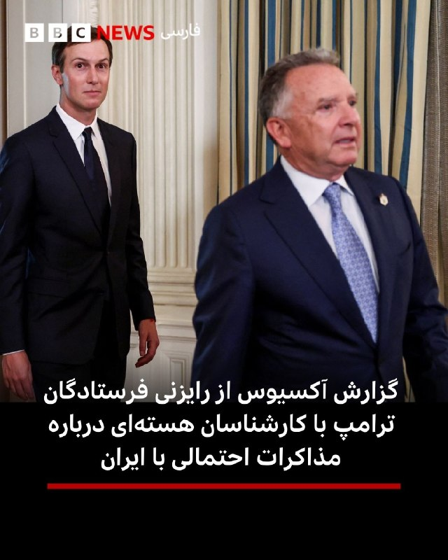

🔻وب‌سایت آکسیوس گزارش داده است که استیو ویتکاف و جرد کوشنر، فرستادگان دونالد ترامپ، روز پنجشنبه برای رایزنی با گروهی از کارشناسان فنی به آزمایشگاه ملی اوک‌ریج در ایالت تنسی سفر کردند.

به نوشته آکسیوس، کاخ سفید در تلاش است با ایران بر سر یک تفاهم‌نامه برای پایان دادن به جنگ و آغاز مذاکرات تفصیلی هسته‌ای «به توافق برسد» و می‌خواهد در صورت آغاز این مذاکرات، تیم کارشناسی لازم را آماده داشته باشد.

به گفته منابع آمریکایی و منطقه‌ای، تهران و واشنگتن همچنان بر سر برخی جزئیات این تفاهم‌نامه اختلاف دارند، اما مذاکرات وارد مراحل پایانی شده است.
@VahidHeadline

📡 @VahidOnline

## VahidOnline — post 75955

  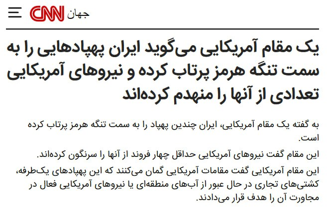

سی‌ان‌ان به نقل از یک مقام آمریکایی گزارش داد جمهوری اسلامی چندین پهپاد انتحاری را به سمت تنگه هرمز پرتاب کرد که هواپیماهای آمریکا دست‌کم چهار پهپاد را سرنگون کردند.
این مقام گفت مقام‌های آمریکایی گمان می‌کنند این پهپادها کشتی‌های تجاری در حال عبور از آب‌های منطقه یا نیروهای آمریکایی فعال در نزدیکی آن منطقه را هدف قرار داده بودند.
@VahidOOnLine
ساعتی پیش‌تر اخباری درباره خارک و بندرعباس در بعضی منابع منتشر شده بود، خبرگزاری مهر میگه صحت ندارند:
جمعه شب خبرهایی مبنی بر شنیده شدن صدای انفجار و پدافند در جزیره خارگ منتشر شده است.
پیگیری های خبرنگار مهر مستقر در جزیره خارگ نشان می دهد، چنین خبری صحت ندارد.
بامداد شنبه برخی فعالین فضای مجازی مدعی وقوع درگیری‌ها و حملاتی به شهر بندرعباس شدند که بررسی‌های خبرنگار مهر نشان می‌دهد هیچ‌گونه درگیری در این شهر اتفاق نیفتاده است.
شلیک‌هایی در این منطقه صورت گرفته که جنبه اخطار داشته و کانون تحرکات در دریا و فراتر از جزیره لارک بوده است.
📡 @VahidOnline

## IranIntlTV — post 340736

  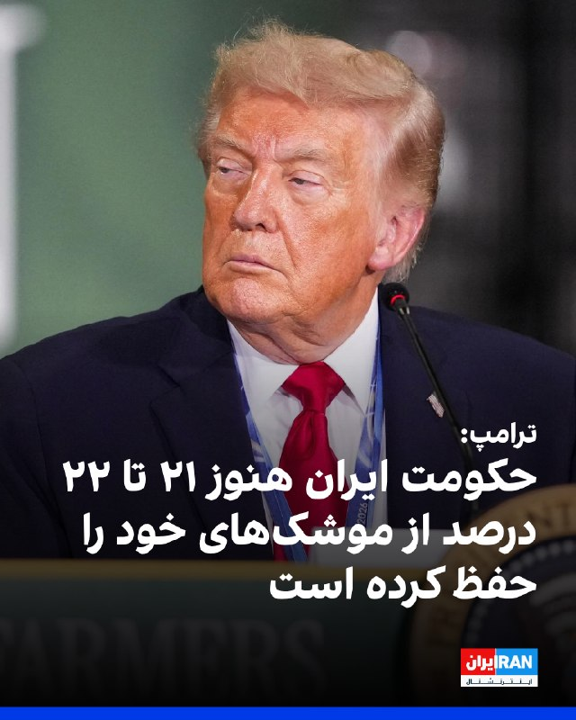

ترامپ در گفت‌وگو با ان‌بی‌سی گفت که حکومت ایران هنوز ۲۱ تا ۲۲ درصد از موشک‌های خود را حفظ کرده است. او گفت که رهبران حکومت ایران هنوز با آمریکا برای پایان جنگ به توافق نرسیده‌اند، زیرا آنها «قوی» و «مغرور» هستند، اما در نهایت «آنها چاره‌ای جز توافق ندارند و کمی طول می‌کشد.»
او افزود: «بیشتر کارخانه‌های پهپادسازی ‌آن‌ها از کار افتاده‌، بیشتر سکوهای پرتاب از کار افتاده‌ و بیشتر مناطق تولید موشک از کار افتاده‌اند. اما آن‌ها هنوز ظرفیت تولید دارند. آن‌ها تعدادی موشک و تعدادی پهپاد دارند. به نظر من، شاید ۲۱ تا ۲۲ درصد از موشک‌های‌شان. این تعداد زیادی موشک است، اما این میزان، آن چیزی نیست که در زمان حمله اولیه ما بود.»
ترامپ مدت زمان درگیری جاری را با جنگ ویتنام مقایسه کرد و گفت: «من خیلی سریع پیش می‌روم. سه ماه است که درگیر آن هستم. می‌دانید، ویتنام ۱۹ سال طول کشید. من در ماه سوم هستم و تنها کاری که آن‌ها می‌کنند، این است که می‌گویند کی قرار است پیروز شویم. اگر من یک دموکرات بودم، هیچ کس این‌طور صحبت نمی‌کرد، اما برای من مهم نیست. من به آن عادت کرده‌ام.»
https://iranintl.com/202606057759

## IranIntlTV — post 340735

  <a href="telegram/content/IranIntlTV_340735_1780700981.mp4" target="_blank">🎬 Download video</a>

🔻ساعاتی پیش از سفر تیم ملی فوتبال به مکزیک برای اقامت در کمپ اصلی تمرینی جام جهانی ۲۰۲۶، خبرگزاری رویترز گزارش داد آمریکا برای همه بازیکنان تیم ملی، ویزا صادر کرده است.

🔹در ادامه، شبکه تلویزیونی الجزیره هم به نقل از منابعی آگاه نوشت که آمریکا دست‌کم برای ۱۵ نفر از کادر فنی و اجرایی تیم ملی، ویزا صادر نکرده است.

🔹قرار است تیم فوتبال ایران در مرحله گروهی جام جهانی ۲۰۲۶ در شهرهای لس آنجلس و سیاتل با نیوزیلند، بلژیک و مصر بازی کند.

🔹رضا محدث، خبرنگار ایران اینترنشنال گزارش می‌دهد.

@iranintltvsport

## IranIntlTV — post 340734

  <a href="telegram/content/IranIntlTV_340734_1780700983.mp4" target="_blank">🎬 Download video</a>

وزارت خزانه‌داری آمریکا ۱۲ نهاد فعال در حوزه‌های کشتیرانی، نفت، گاز و پتروشیمی را در فهرست تحریم‌ها قرار داد.

همچنین شش فروند کشتی با پرچم پاناما و سنت کیتس نیز در همین چارچوب تحریم شده‌اند.

گفت‌وگو با میعاد ملکی، رییس پیشین دفتر هدف‌گذاری تحریم‌های وزارت خزانه‌داری آمریکا
@iranintltv

## IranIntlTV — post 340733

  <a href="telegram/content/IranIntlTV_340733_1780700984.mp4" target="_blank">🎬 Download video</a>

هیات منصفه دادگاه سلطنتی وولویچ دو متهم پرونده حمله به پوریا زراعتی، مجری ایران‌اینترنشنال، را به اتفاق آرا مجرم شناخت.
بر اساس این گزارش، قاضی اعلام کرد جلسه صدور حکم در ۱۲ تیر ماه برگزار خواهد شد.

علی رشید از مقابل دادگاه گزارش می‌دهد.
@iranintltv

## IranIntlTV — post 340732

  

سی‌ان‌ان به نقل از یک مقام آمریکایی گزارش داد جمهوری اسلامی چندین پهپاد انتحاری را به سمت تنگه هرمز پرتاب کرد که هواپیماهای آمریکا دست‌کم چهار پهپاد را سرنگون کردند.
این مقام گفت مقام‌های آمریکایی گمان می‌کنند این پهپادها کشتی‌های تجاری در حال عبور از آب‌های منطقه یا نیروهای آمریکایی فعال در نزدیکی آن منطقه را هدف قرار داده بودند.

https://iranintl.com/202606058431

## IranIntlTV — post 340731

  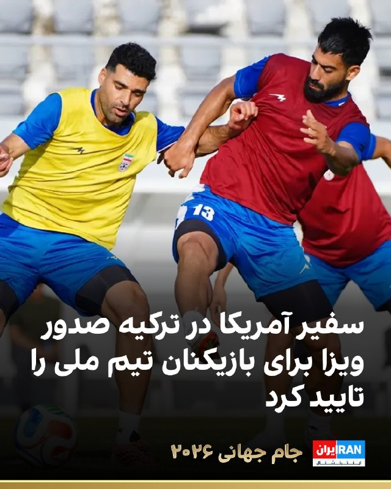

🔻تام باراک، سفیر آمریکا در ترکیه روز جمعه در پیامی در شبکه ایکس صدور ویزا برای بازیکنان تیم ملی را تأیید کرد: «به تیم فوق‌العاده‌مان در سفارت آمریکا در آنکارا افتخار می‌کنیم که برای رسیدگی به درخواست ویزای تیم فوتبال ایران در مسیر حضورشان در جام جهانی در ایالات متحده تلاش کردند.»

🔹او این مطلب را در واکنش به گزارشی منتشر کرد که اعلام کرده بود بازیکنان ایران ویزای ورود به آمریکا را دریافت کرده‌اند.

🔹رویترز روز جمعه به نقل از یک مقام کاخ سفید خبر داد بازیکنان تیم ملی برای ورود به آمریکا ویزا دریافت کرده‌اند.

🔹همچنین الجزیره به نقل از منابعی گزارش داد که دست‌کم ۱۵ نفر از اعضای کادر تیم ملی ایران با رد درخواست ویزای خود از سوی ایالات متحده برای حضور در جام جهانی ۲۰۲۶ مواجه شده‌اند. این افراد شامل برخی مربیان، اعضای کادر فنی و کارکنان اجرایی هستند.

🔹منابع این رسانه گفته‌اند که برخی از افرادی که ویزای آن‌ها رد شده، به‌طور رسمی از سوی فیفا به‌عنوان بخشی از کادر مربیگری و یا فنی تیم به رسمیت شناخته شده بودند: «بازیکنان تحت تأثیر این تصمیم قرار نگرفته‌اند.»

@iranintltvsport

## Shin_Persian — post 6553

این یارو قیصر بود رفته تهران واسه عرزشیا خونده؟ اسم اصلیش بینش بلوره :)))

## Shin_Persian — post 6551

↩️ Quoted tweet:
Tammuz Intel ✓ @Tammuz_Intel
Fri, 05 Jun 2026 22:44:56 UTC

Unknown drone was shot down over Baiji Oilfields by Iraqi security forces.

↩️ توییت نقل‌قول شده — برای پاسخ، پست زیر را ببینید.

فارسی

یک پهپاد ناشناس توسط نیروهای امنیتی عراق بر فراز میدان‌های نفتی بیجی سرنگون شد.

𝕏 · @shin_persian

## Shin_Persian — post 6550

Shin ✓ @hey_itsmyturn
Fri, 05 Jun 2026 22:51:15 UTC

Sirik Naval Base has been targeted @ 2240Z Hormozgan Province, #Iran

فارسی

پایگاه دریایی سیریک در ساعت ۲۲۴۰ زولو (۰۲:۱۰ به وقت تهران) در استان هرمزگان هدف قرار گرفته است. #Iran

𝕏 · @shin_persian

## Shin_Persian — post 6546

Shin ✓ @hey_itsmyturn
Fri, 05 Jun 2026 22:49:10 UTC

CENTCOM: U.S. forces shot down four Iranian one-way attack drones heading toward the Strait of Hormuz, then struck Iranian coastal radar sites in Goruk and Qeshm Island. The drones posed an immediate threat to maritime traffic.

فارسی

سنتکام (ستاد فرماندهی مرکزی ایالات متحده): نیروهای آمریکایی چهار پهپاد تهاجمی یک‌طرفه ایرانی را که به سمت تنگه هرمز در حرکت بودند سرنگون کردند و سپس سایت‌های راداری ساحلی ایران در گروک و جزیره قشم را مورد هدف قرار دادند. این پهپادها تهدیدی فوری برای تردد دریایی بودند.

𝕏 · @shin_persian

## Shin_Persian — post 6544

Shin ✓ @hey_itsmyturn
Fri, 05 Jun 2026 22:44:10 UTC

Numerous #USAF 🇺🇸 tankers up in the region

فارسی

تعداد زیادی تانکر سوخت‌رسان نیروی هوایی ایالات متحده (USAF) 🇺🇸 در منطقه حضور دارند #USAF

𝕏 · @shin_persian

## Shin_Persian — post 6543

Shin ✓ @hey_itsmyturn Fri, 05 Jun 2026 22:31:00 UTC State-owned Mehr regarding the clusterfuck in southern Iran: فارسی خبرگزاری دولتی مهر در رابطه با اوضاع آشفته در جنوب ایران: 𝕏 · @shin_persian

## Shin_Persian — post 6542

  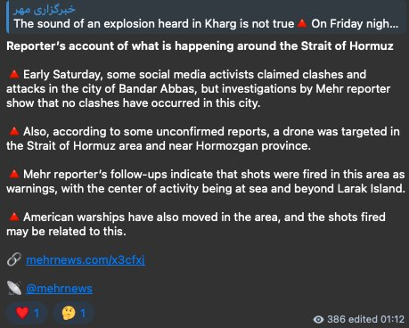

Shin ✓ @hey_itsmyturn
Fri, 05 Jun 2026 22:31:00 UTC

State-owned Mehr regarding the clusterfuck in southern Iran:

فارسی

خبرگزاری دولتی مهر در رابطه با اوضاع آشفته در جنوب ایران:

𝕏 · @shin_persian

## Shin_Persian — post 6541

یک کسشعری آماده کردم برای دوستانی که MacOS استفاده می کنن برای وی پی ان های رایج MacOS که وقتی شبکه عوض میشه (وای فای یا لن) اتوماتیک اون VPN رو ریکانکت کنه تا یک دقیقه معطل نشید تا اپ وی پی ان تشخیص قطعی و دستور وصل مجدد رو بده.
https://github.com/therealaleph/fastvpnswitcher-macos
(برای خودم نوشتم، گفتم شاید به درد بقیه هم بخوره)

## Shin_Persian — post 6540

Shin ✓ @hey_itsmyturn
Fri, 05 Jun 2026 22:21:05 UTC

🫪
(First time using this emoji)

فارسی

🫪
(اولین بار است که از این ایموجی استفاده می‌کنم)

𝕏 · @shin_persian

## Shin_Persian — post 6539

Shin ✓ @hey_itsmyturn
Fri, 05 Jun 2026 22:19:32 UTC

Initial:
#USAF 🇺🇸 airstrikes on Saladin governorate, western #Iraq 🇮🇶

فارسی

حملات هوایی نیروی هوایی ایالات متحده (USAF) 🇺🇸 به استان صلاح‌الدین در غرب #عراق 🇮🇶

𝕏 · @shin_persian

## Shin_Persian — post 6538

Shin ✓ @hey_itsmyturn
Fri, 05 Jun 2026 22:17:18 UTC

Explosions reported in Salah al-Din Province, #Iraq 🇮🇶

فارسی

گزارش‌هایی از وقوع انفجار در استان صلاح‌الدین، #Iraq 🇮🇶 منتشر شده است.

𝕏 · @shin_persian

## Shin_Persian — post 6537

  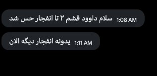

Shin ✓ @hey_itsmyturn
Fri, 05 Jun 2026 22:12:11 UTC

3 blasts in Qeshm island, Hormozgan Province, #Iran
2 @ 2208Z and one at 2211Z

فارسی

۳ انفجار در جزیره قشم، استان هرمزگان، #Iran
۲ انفجار در ۲۲۰۸ زولو (۰۱:۳۸ به وقت تهران) و یکی در ۲۲۱۱ زولو (۰۱:۴۱ به وقت تهران)

𝕏 · @shin_persian

## FarsiVOA — post 219716

🔺نیروهای آمریکایی در واکنش به حملات پهپادی جمهوری اسلامی به مواضع آن در شهر گروک و جزیره قشم حمله کردند

▪️ستاد فرماندهی مرکزی آمریکا (سنتکام) جمعه شب به وقت واشنگتن گفت: «لحظاتی پیش، نیروهای سنتکام چهار پهپاد تهاجمی یک‌طرفه [جمهوری اسلامی] ایران را که به سمت تنگه هرمز پرواز کرده بودند، سرنگون کردند.»

⬇️ بیشتر بخوانید:
https://ir.voanews.com/a/8157796.html
@FarsiVOA

## FarsiVOA — post 219715

⚡️آخرین صحبت‌های مجتبی ویسی با مأموران، پیش از قتل؛ وداع باشکوه مردم کرمانشاه با برادران ویسی
@FarsiVOA

## FarsiVOA — post 219714

⚡️شکاف عمیق میان صفوف گروه‌های مسلح تحت امر جمهوری اسلامی در عراق
@FarsiVOA

## FarsiVOA — post 219713

  <a href="telegram/content/FarsiVOA_219713_1780700987.mp4" target="_blank">🎬 Download video</a>

⚡️ترامپ: ما برای خارج کردن اورانیوم غنی‌شده مدفون در ایران نیازی به توافق با جمهوری اسلامی نداریم
@FarsiVOA

## FarsiVOA — post 219712

⚡️رضا ولی‌زاده، روزنامه‌نگار آمریکایی-ایرانی زندانی در ایران خواستار کمک واشنگتن برای رسیدگی درمانی شد
@FarsiVOA

## FarsiVOA — post 219711

⚡️حزب‌الله بهانه‌ای برای ادامه چانه‌زنی جمهوری اسلامی؛ ‌گفت‌وگو با یاسین اهوازی کارشناس خاورمیانه
@FarsiVOA

## FarsiVOA — post 219710

⚡️دست رد رئيس جمهوری لبنان به سینه جمهوری اسلامی: دخالت در امور ما وظیفه شما نیست
@FarsiVOA

## FarsiVOA — post 219709

⚡️نماینده شورای هماهنگی تشکل‌های صنفی فرهنگیان ایران، شیوا عاملی‌راد، در نشست سازمان بین‌المللی کار در ژنو، با تأکید بر ضرورت حمایت از حقوق معلمان و کارگران، خواستار موضع‌گیری روشن جامعه جهانی در دفاع از صلح و حقوق بنیادین مردم ایران شد.
@FarsiVOA

## FarsiVOA — post 219708

🔺دونالد ترامپ: رهبران جمهوری اسلامی چون «مغرور» هستند تاکنون توافق نکرده‌اند اما چاره‌ای جز توافق ندارند

▪️رئیس‌جمهوری آمریکا، دونالد ترامپ، روز جمعه در مصاحبه‌ای اختصاصی با شبکه ان‌بی‌سی نیوز گفت که رهبران جمهوری اسلامی هنوز به توافقی با آمریکا برای پایان دادن به جنگ جاری دست نیافته‌اند، زیرا «سرسخت» و «مغرور» هستند، اما در نهایت «چاره‌ای جز توافق ندارند.»

⬇️ بیشتر بخوانید:
https://ir.voanews.com/a/8157786.html
@FarsiVOA

## FarsiVOA — post 219707

  <a href="telegram/content/FarsiVOA_219707_1780700988.mp4" target="_blank">🎬 Download video</a>

⚡️امیرحسین ثابتی مذاکرات با آمریکا را «ابلهانه و سفیهانه» توصیف کرده است؛ مذاکراتی که مقام‌های جمهوری اسلامی می‌گویند با تأیید مجتبی خامنه‌ای در حال انجام است. از بستن تنگه هرمز تا اعتراض به وصل شدن اینترنت، هر جناحی در جمهوری اسلامی ساز خودش را می‌زند.
@FarsiVOA

## Persian_Trend_Official — post 15777

  <a href="telegram/content/Persian_Trend_Official_15777_1780700989.mp4" target="_blank">🎬 Download video</a>

شبتون بخیر 🌌
F-16 Falcon

📌 @persian_trend_official
پرشین ترند | متفاوت‌ترین کانال نظامی

## Persian_Trend_Official — post 15776

  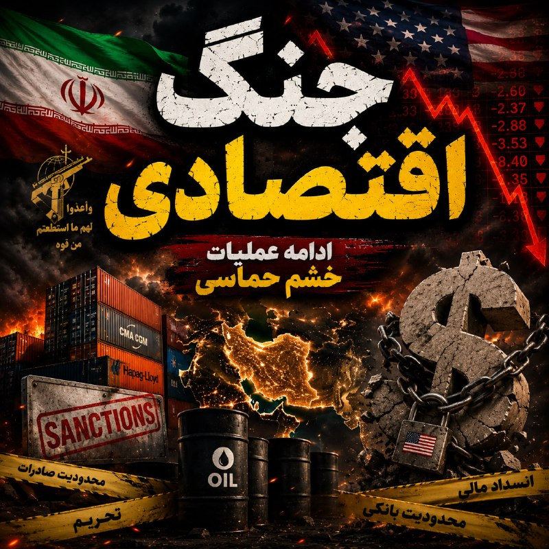

https://open.spotify.com/episode/5BWJTIpQqxOhVM8u1udJix?si=EYt0QiGDS8aPpioujmuJhw

https://castbox.fm/vi/953436770

نسخه صوتی در کست باکس و اسپاتیفای

## Persian_Trend_Official — post 15775

  <a href="telegram/content/Persian_Trend_Official_15775_1780700991.mp4" target="_blank">🎬 Download video</a>

کاش قاطعیتتون رو نشون بدید عمو ببینه 😎

## IranianMinds — post 21459

دقایقی پیش حملات آمریکا به سایت های رژیم جمهوری اسلامی

چند انفجار در پایگاه نیرو دریایی سپاه سیریک

+ نقض چیه؟؟؟ داریم توافق میکنیم

@IranianMinds

## IranianMinds — post 21458

سنت‌کام: لحظاتی پیش، نیروهای سنتکام چهار پهپاد حمله یک‌طرفه ایرانی را که به سمت تنگه هرمز پرتاب شده بودند، سرنگون کردند. این پهپادهای حمله تهدید فوری برای ترافیک دریایی منطقه بودند. نیروهای آمریکایی سپس سایت‌های رادار نظارت ساحلی ایرانی در خارک و جزیره قشم…

## IranianMinds — post 21457

  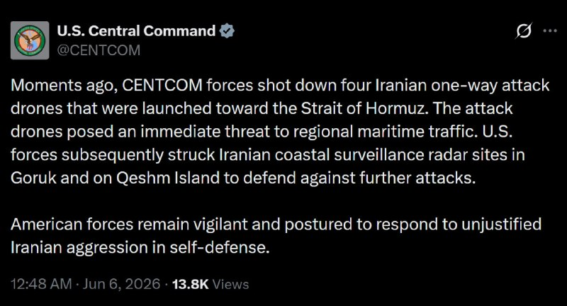

سنت‌کام:

لحظاتی پیش، نیروهای سنتکام چهار پهپاد حمله یک‌طرفه ایرانی را که به سمت تنگه هرمز پرتاب شده بودند، سرنگون کردند. این پهپادهای حمله تهدید فوری برای ترافیک دریایی منطقه بودند.

نیروهای آمریکایی سپس سایت‌های رادار نظارت ساحلی ایرانی در خارک و جزیره قشم را برای دفاع در برابر حملات بیشتر هدف قرار دادند.

@IranianMinds

## IranianMinds — post 21456

عجب جَو عجیبی شده
مخالفای جمهوری اسلامی شدن هیتر ترامپ
موافقای جمهوری اسلامی دارن میشن هیتر جمهوری اسلامی

چرا هیچی سر جاش نیست؟

@IranianMinds

## IranianMinds — post 21455

🔴سی‌ان‌ان به نقل از یک مقام آمریکایی:

ایران چندین پهپاد انتحاری را به سمت تنگه هرمز پرتاب کرد که هواپیماهای آمریکا دست‌کم چهار پهپاد را سرنگون کردند.

@IranianMinds

## BBCPersian — post 282935

  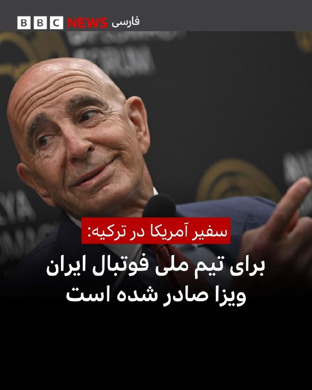

🔻تام باراک، سفیر آمریکا در ترکیه، روز جمعه در پیامی در شبکه ایکس تایید کرد که برای اعضای تیم ملی فوتبال ایران جهت شرکت در جام جهانی ویزای ورود به آمریکا صادر شده است.

او با اشاره به گزارش‌هایی درباره صدور ویزا برای بازیکنان تیم ملی ایران نوشت: «به تیم فوق‌العاده سفارت آمریکا در آنکارا برای تلاش‌هایشان در صدور ویزا برای تیم ملی فوتبال ایران در مسیر حضور در جام جهانی فوتبال در آمریکا افتخار می‌کنم.»

آقای باراک افزود: «ورزش فراتر از مرزهاست و ما مشتاق استقبال از ورزشکاران و هواداران از سراسر جهان هستیم.»

تیم ملی ایران قرار است روز شنبه از ترکیه راهی اسپانیا شود و سپس به اردوی خود در مکزیک برود. مقام‌های مکزیک نیز برای اعضای این تیم ویزا صادر کرده‌اند.

ایران در جریان مسابقات جام جهانی در مکزیک مستقر خواهد بود، اما هر سه دیدار مرحله گروهی خود را در آمریکا برگزار می‌کند.

قرار بود اردوی تیم ملی ابتدا در آمریکا برپا شود، اما به دلیل تنش‌های میان تهران و واشنگتن، محل اردو به مکزیک تغییر یافت.

@BBCPersian

## BBCPersian — post 282934

  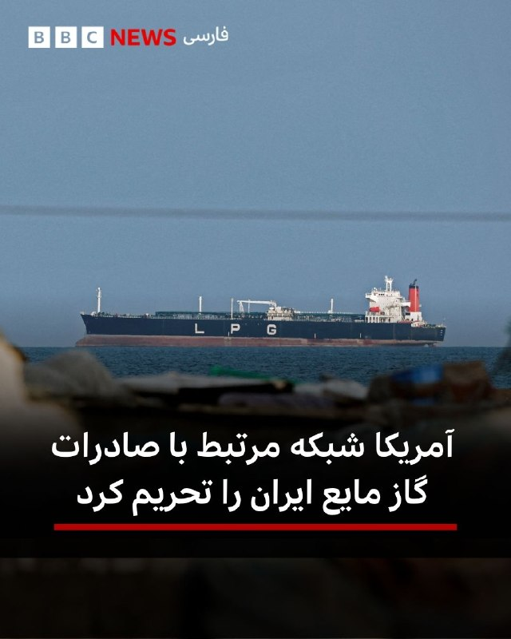

🔻وزارت دارایی آمریکا روز جمعه اعلام کرد که تحریم‌هایی را علیه یک شبکه اعمال کرده است که به گفته این وزارتخانه با صدور گاز مایع(ال‌پی‌جی) از ایران به جنوب و شرق آسیا، برای دور زدن تحریم‌ها، مبدا آن را به‌طور جعلی عمان اعلام می‌کرده است.

بر اساس بیانیه وزارت دارایی آمریکا، این شبکه از شرکت‌های صوری در امارات متحده عربی و چین و همچنین ناوگانی موسوم به «ناوگان سایه» استفاده می‌کرده است.

وزارت دارایی آمریکا می‌گوید که این سازوکار با هدف دور زدن تحریم‌های موجود آمریکا طراحی شده و محموله‌هایی به ارزش صدها میلیون دلار(ال‌پی‌جی) را جابه‌جا کرده است.

واشنگتن همچنین روز جمعه یک صرافی ایرانی و افراد مرتبط با آن را به اتهام کمک به ایران برای انجام میلیاردها دلار تراکنش مالی تحریم کرد.

تامى پیگوت، سخنگوی وزارت خارجه آمریکا، این اقدامات را بخشی از «کارزار فشار حداکثری اقتصادی» دولت دانست و گفت هدف آن محدود کردن توان ایران در تأمین مالی برنامه‌های تسلیحاتی، حمایت از گروه‌های نیابتی و اقدامات منطقه‌ای است. ادامه خبر را اینجا بخوانید
@BBCPersian

## BBCPersian — post 282933

  

🔻وب‌سایت آکسیوس گزارش داده است که استیو ویتکاف و جرد کوشنر، فرستادگان دونالد ترامپ، روز پنجشنبه برای رایزنی با گروهی از کارشناسان فنی به آزمایشگاه ملی اوک‌ریج در ایالت تنسی سفر کردند.

به نوشته آکسیوس، کاخ سفید در تلاش است با ایران بر سر یک تفاهم‌نامه برای پایان دادن به جنگ و آغاز مذاکرات تفصیلی هسته‌ای «به توافق برسد» و می‌خواهد در صورت آغاز این مذاکرات، تیم کارشناسی لازم را آماده داشته باشد.

به گفته منابع آمریکایی و منطقه‌ای، تهران و واشنگتن همچنان بر سر برخی جزئیات این تفاهم‌نامه اختلاف دارند، اما مذاکرات وارد مراحل پایانی شده است.
@BBCPersian

## Dirty_Kids — post 391104

⚽️ جام جهانی داره شروع میشه و بازار شرطبندی و پیشبینی از همیشه داغ تر هستش 
🔥 https://t.me/+lCR7HeYTU15iNjM0 https://t.me/+lCR7HeYTU15iNjM0 A15 
⚡️ اگر میخوای با آنالیز های رضا کینگ کونگ پول دربیاری توی این جام حتما عضو کانال شو ✅

## Dirty_Kids — post 391103

  

⚽️ جام جهانی داره شروع میشه و بازار شرطبندی و پیشبینی از همیشه داغ تر هستش 
🔥

https://t.me/+lCR7HeYTU15iNjM0
https://t.me/+lCR7HeYTU15iNjM0
A15

⚡️ اگر میخوای با آنالیز های رضا کینگ کونگ پول دربیاری توی این جام حتما عضو کانال شو ✅

## Dirty_Kids — post 391102

  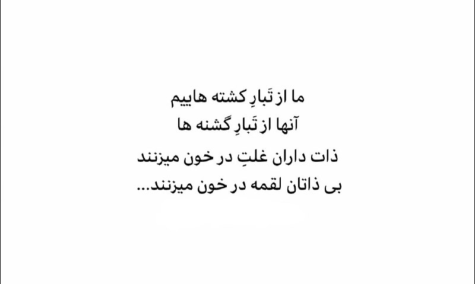

#بخوابیم

@Dirty_Kids 👻

## Dirty_Kids — post 391101

  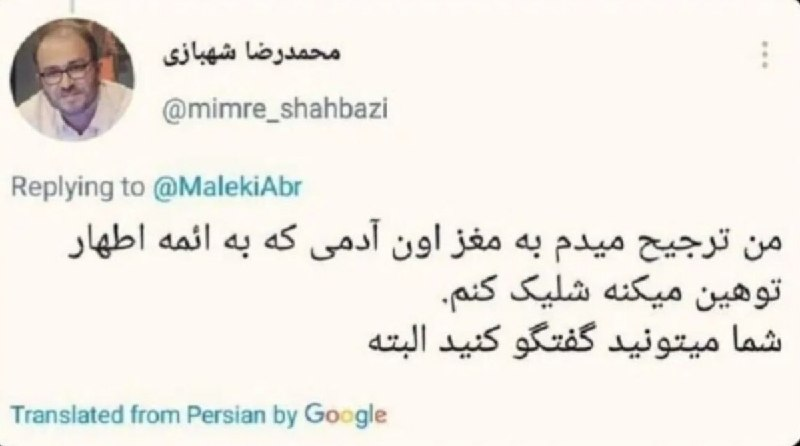

بعد میگن چرا از تجاوز بهش خوشحالی
بچ من ناراحتم که زیر بار تجاوز نمرده

@Dirty_Kids 👻

## Dirty_Kids — post 391100

  <a href="telegram/content/Dirty_Kids_391100_1780700995.mp4" target="_blank">🎬 Download video</a>

آقا این موزیک جدیدا مثل بمب ترکیده توی اینستا و وایرال شده

@Dirty_Kids 👻

## Dirty_Kids — post 391099

  <a href="telegram/content/Dirty_Kids_391099_1780700996.mp4" target="_blank">🎬 Download video</a>

عجب تبلیغی ساخته نایک، عجب ستاره‌هایی

@Dirty_Kids 👻

## Dirty_Kids — post 391098

  <a href="telegram/content/Dirty_Kids_391098_1780700998.mp4" target="_blank">🎬 Download video</a>

آهنگ میخوام از تتلو ورژن اسلامی

@Dirty_Kids 👻

## Dirty_Kids — post 391097

  <a href="telegram/content/Dirty_Kids_391097_1780700998.mp4" target="_blank">🎬 Download video</a>

🔴 دوره زمونه هم عوض شده
الان دیگه دخترا گروهی دعوا میکنند پسرا میشینن یه گوشه نگاه میگنن

@Dirty_Kids 👻

## Dirty_Kids — post 391096

  <a href="telegram/content/Dirty_Kids_391096_1780701000.mp4" target="_blank">🎬 Download video</a>

پیش بینی های درست تاریخ! یا ما خواب بودیم و سر در برف یا حریف مکار و بد حیله گر!

@Dirty_Kids 👻

## alonews — post 125425

  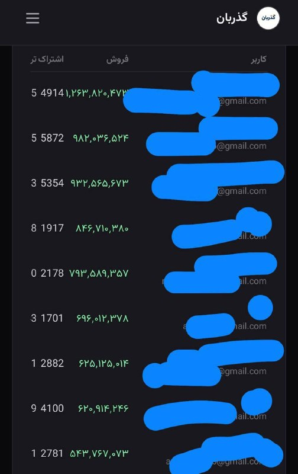

​
🔼 کسب درآمد از فروش VPN هنوزم ممکنه!

درآمد چندتا از نماینده‌ها رو ببین 
👀

پنل نمایندگی وی‌پی‌ان گذربان، سریع‌ترین و راحت‌ترین راه برای پول درآوردنه 
✔️

​
🤑 چرا پنل نمایندگی گذربان؟

🚀 سرعت و کیفیت بی‌نظیر

⚙️ پنل مدیریتی حرفه‌ای

💵 سود عالی

⭐️ بدون ریسک

​فرصت رو از دست نده و کلمه «الو» رو بفرست 
👇
@GozarBanAdmin
@GozarBanAdmin
@GozarBanAdmin

<!-- MSG END -->

<!-- NAV START -->

<a href="https://github.com/Tljn/FUD/blob/main/telegram/content/archive_1.md" style="display:inline-block; padding:6px 12px; margin:0 4px; background-color:#2ea44f; color:white; text-decoration:none; border-radius:4px; font-weight:bold;">صفحه بعد</a>

<!-- NAV END -->
