# خواننده تلگرام

<!-- TOP_NAV START -->

<a href="https://github.com/Tljn/FUD/blob/main/telegram/content/archive_1.md" style="display:inline-block; padding:6px 12px; margin:0 4px; background-color:#2ea44f; color:white; text-decoration:none; border-radius:4px; font-weight:bold;">صفحه بعد</a>

<!-- TOP_NAV END -->

<!-- MSG START -->

---
📅 بروزرسانی: 1405/03/19 13:22
---

## WithYashar — post 14108

  <a href="telegram/content/WithYashar_14108_1780998757.mp4" target="_blank">🎬 Download video</a>

انفجار و آتش سوزی پادگان سپاه کنار کوه صفه اصفهان
پیشتر رژیم اعلام کرده بود امروز اصفحان خنثی سازی مهمات عمل نکرده انجام میشود
@withyashar

## WithYashar — post 14107

یوتیوب رفع فیلتر می‌شود

مصطفی پوردهقان، نماینده مجلس:
وزیر ارتباطات در کمیسیون قول دادند که فضا را به شرایط عادی برگردانند و بعد از رفع فیلتر واتساپ، رفع فیلتر یوتیوب هم در دستور کار بود.
@withyashar

## WithYashar — post 14106

## WithYashar — post 14105

سهمیه بلیت تماشاگران ایران در جام جهانی حذف شد
@withyashar

## WithYashar — post 14104

  <a href="telegram/content/WithYashar_14104_1780998759.mp4" target="_blank">🎬 Download video</a>

حضور اتباع کشورهای مختلف در تجمعات شبانه حکومتی
@withyashar 🥴

## WithYashar — post 14103

شبکه cnn: ترامپ ۳۷ بار توافق با ایران را «قریب‌الوقوع» اعلام کرده، اما هنوز هیچ توافقی حاصل نشده!
@withyashar

## WithYashar — post 14102

وزیر ارتباطات: ترافیک اینترنت بین‌الملل قبل از ۴ خرداد با ترافیکی که از مسیر استارلینک از شبکه‌های مرزی خارج می‌شد، برابری می‌کرد
@withyashar

## WithYashar — post 14101

رسانه های رژیم : هلیکوپتر تهاجمی آپاچی AH-64، بعد از عدم توجه به هشدارها توسط نیروی دریایی سپاه پاسداران و بوسیله شلیک یکی از قایق های بسیج، ساقط شده است.
این در حالیست که با توجه به قریب‌الوقوع بودن اعلام متن تفاهم مشترک، اسقاط این هلیکوپتر به نقص فنی مرتبط شده است.
@withyashar

## WithYashar — post 14100

ترامپ درباره نتانیاهو:

به نتانیاهو حمله شد و او هم متقابلاً پاسخ داد و من نمی‌توانم او را به خاطر این موضوع سرزنش کنم، آنها را هدف قرار دادند. آنهاهم متقابلاً پاسخ دادن و حالا درگیری را تمام کرده‌اند.
بنابراین، آنها قرار است فقط برای یک هفته دیگر یا چیزی حدود آن، یکدیگر را به حال خود رها کنند.
این وضعیت خاورمیانه مدت زیادی است که ادامه دارد. اگر واقعاً بخواهید بگویید حدود ۳۰۰۰ سال اما مطمئناً ۴۷ سال است که اینگونه ادامه دارد.
@withyashar

## WithYashar — post 14099

ترامپ گفت خلبانان بالگرد آپاچی که در تنگه هرمز سقوط کرد، سالم هستند. او گفت آمریکا امروز گزارشی درباره این حادثه منتشر خواهد کرد.
@withyashar
این حادثه در دست بررسی است و هنوز مشخص نیست که آیا این بالگرد با شلیک نیروهای جمهوری اسلامی سرنگون شده، دچار نقص فنی شده یا با مشکل دیگری مواجه شده است.

## WithYashar — post 14098

حملات سنگین اسراییل به صور لبنان
رادیو ارتش اسرائیل: ما محدودیت‌هایی برای حمله به بیروت داریم اما برای عملیات در جنوب لبنان محدودیتی نداریم
@withyashar

## WithYashar — post 14097

فارس: تجهیزات هدایت و پشتیبانی جنگنده‌های اسرائیلی در جنگل‌های تنکابن(شهسوار) کشف شد
خبرگزاری فارس گزارش داد مجموعه‌ای از تجهیزات فنی و سامانه‌های زمین‌پایه که گفته می‌شود برای پشتیبانی و هدایت جنگنده‌های مهاجم مورد استفاده قرار می‌گرفته، در ارتفاعات جنگلی شهرستان تنکابن در استان مازندران کشف و جمع‌آوری شده است.

بر اساس این گزارش، این تجهیزات در یکی از مسیرهای اصلی ورود جنگنده‌ها به حریم هوایی تهران مستقر بوده‌اند.
فارس مدعی شده منطقه مورد نظر در جریان «جنگ رمضان» یکی از کریدورهای اصلی ورود جنگنده‌های اسرائیلی برای اجرای حملات علیه تهران و مناطق شمالی کشور محسوب می‌شده است.
@withyashar

## WithYashar — post 14096

حزب دمکرات کردستان ایران کمی پیش امروز سشنبه در شبکه ایکس خبر داد یکی از کمپ‌های این حزب بار دیگر هدف حمله پهپادی جمهوری اسلامی قرار گرفت.

بر اساس این گزارش در این حمله دو فروند پهپاد به سمت "کمپ آزادی" شلیک شده‌اند.
کمپ آزادی محل اسکان خانواده‌های اعضای حزب دمکرات است و از آغاز درگیری‌های اخیر تا کنون بارها هدف حملات جمهوری اسلامی قرار گرفت. این حزب تا کنون گزارشی درباره تلفات جانی یا زخمی‌ها ارائه نکرده است.
بر اساس این گزارش، جمهوری اسلامی ایران از زمان آغاز درگیری‌ها با آمریکا و اسرائیل تا کنون با شلیک بیش از ۱۳۴ فروند موشک و پهپاد، کمپ‌های حزب دمکرات کردستان ایران و همچنین مراکز درمانی و آموزشی این حزب را هدف قرار داده است.
@withyashar

## WithYashar — post 14095

  <a href="telegram/content/WithYashar_14095_1780998761.mp4" target="_blank">🎬 Download video</a>

اهواز همین الان
@withyashar
گویا دود فلر ‌نفتیه

## WithYashar — post 14094

  <a href="telegram/content/WithYashar_14094_1780998762.mp4" target="_blank">🎬 Download video</a>

ان‌بی‌سی نیوز : وقتی رئیس جمهور ترامپ در بازی سوم فینال NBA هنگام پخش سرود ملی روی جایگاه تماشاگران در مدیسون اسکوئر گاردن ظاهر شد، توسط جمعیت (BOOE) هو شد.
@withyashar

## mwarmonitor — post 10508

🔴بیانیه صادره از حزب‌الله درباره پاسخ موشکی ایران به اسرائیل:

🔸پاسخ موشکی ایران به رژیم صهیونیستی در حمایت از مردم لبنان، پیام پایبندی اخلاقی، سیاسی و میدانی جمهوری اسلامی ایران به لبنان است؛ پس از آن‌که این دشمن با پوشش کامل دولت آمریکا، در ارتکاب جنایات علیه کشور ما زیاده‌روی کرده و بار دیگر ضاحیه جنوبی را هدف قرار داده است، در چارچوب نقض‌های مداوم خود از توافق آتش‌بس، اقدامی که نشان‌دهنده بی‌اعتنایی کامل او به تمام توافق‌های بین‌المللی است.

از این رو، پاسخ ایران با هدف تأکید بر این موضوع صورت گرفت که منافع ثبات منطقه و کشورهای آن در این است که همه تلاش‌ها برای حفظ توافق‌ها به کار گرفته شود و دشمن صهیونیستی پیش از دیگران به آن‌ها پایبند باشد. این همان پیامی است که ایران به‌صورت روشن و قوی به همه طرف‌های ذی‌ربط در تلاش‌های ثبات منطقه ارسال کرده است. این اقدام همزمان با حمایت قابل تقدیر جنبش انصارالله یمن و در چارچوب اقدام مشترک برای بازدارندگی رژیم صهیونیستی انجام شد تا به دولت آمریکا فهمانده شود که حمایت آن از تجاوز اسرائیل علیه کشور ما، تمامی توافق‌هایی را که در پی آن است، با شکست مواجه خواهد کرد.

این موضوع به‌ویژه با توجه به اصرار جمهوری اسلامی ایران بر گنجاندن هرگونه توافق، بر آتش‌بس کامل در همه جبهه‌ها، به‌خصوص در لبنان، به‌عنوان مقدمه‌ای برای وادار کردن دشمن به عقب‌نشینی از خاک لبنان، بازگشت آوارگان، بازسازی و آزادی اسرا است.

این حمایت ایران از حقوق مشروع ما و تحمل هزینه‌های مادی و سیاسی آن بار دیگر تأیید می‌کند که ایران حامی لبنان است، نه برعکس؛ بر اساس اصول انسانی و روابط تاریخی عمیق میان دو ملت. ایران همواره به دنبال خیر برای لبنان بوده و در حمایت از مقاومت برای آزادسازی سرزمین و بازسازی آن نقش داشته است.

این موضع شرافتمندانه ایران در کنار لبنان، شایسته قدردانی دولت لبنان است، نه انکار یا توهین تحت فشارهای خارجی. همه اتهامات علیه نقش ایران، از جمله بیانیه‌های مشترک با دشمن و آمریکا، اقدامی خارج از عرف دیپلماتیک و در راستای منافع اسرائیل است.

ما از دولت لبنان می‌خواهیم از این فرصت استفاده کرده و روابط رسمی خود با جمهوری اسلامی ایران را در جهت منافع دو کشور اصلاح کند و از این حمایت برای تحقق اهداف ملی بهره گیرد.

در پایان، حزب‌الله به نمایندگی از مردم لبنان، خانواده شهدا، آوارگان و همه آزادگان کشور، از این موضع ایران قدردانی کرده و آن را ستایش می‌کند و بر ادامه مقاومت تا تحقق کامل حقوق خود تأکید دارد، هرچند بهای آن سنگین باشد.


@mwarmonitor

## mwarmonitor — post 10507

  <a href="telegram/content/mwarmonitor_10507_1780998764.mp4" target="_blank">🎬 Download video</a>

🔸تردد در تنگه هرمز همچنان محدود باقی مانده است.

🔹فعالیت عبور و مرور در تنگه هرمز طی بازه ۵ تا ۷ ژوئن همچنان محدود بوده و تنها هشت عبور ثبت‌شده از میان ترافیک تجاری و غیرتجاری مشاهده شده است. این عدد یک مورد کمتر از شمار ثبت‌شده در ۴ ژوئن و ۱۴ مورد کمتر از آخر هفته پیش از آن است که نشان‌دهنده فاصله گرفتن از الگوی عبورهای آخر هفته با شرایط بازتر است.

🔹 تمامی عبورها از مسیر ایرانی انجام شده و تنها دو کشتی دارای پرچم ایران و تحت تحریم عبور کرده‌اند که بیانگر مشارکت ضعیف‌تر بخش تجاری گسترده‌تر است.

🔸حمله اخیر به یک کشتی کانتینربر متعلق به شرکت MSC نیز تصویر شکننده وضعیت عملیاتی در این منطقه را تقویت کرده است. در سایه فضای دیپلماتیک پرتنش‌تر، به نظر می‌رسد تنگه هرمز تنها تحت شرایط محدود و با مدیریت سخت‌گیرانه باز باقی بماند و احتمال بازگشت به جریان‌های پایدار یا افزایشی کاهش یافته است.

@mwarmonitor

## mwarmonitor — post 10506

  <a href="telegram/content/mwarmonitor_10506_1780998765.mp4" target="_blank">🎬 Download video</a>

📌حمله هدفمند اسرائیل به یک خودرو در جاده المصیلح در جنوب لبنان

@mwarmonitor

## mwarmonitor — post 10505

📌ترامپ درباره ایران:

🔹اگر ما وارد عمل شویم و بمباران کنیم—که اگر بخواهیم می‌توانیم خیلی راحت انجامش دهیم—و دو یا سه هفته دیگر به بمباران ادامه بدهیم، دیگر هیچ چیزی برای آن‌ها باقی نخواهد ماند.

🔹اما تنگه برای ماه‌ها باز نخواهد ماند. اگر بمباران کنیم، افراد زیادی کشته خواهند شد. چه کسی چنین چیزی را می‌خواهد؟ من نمی‌خواهم.

🔹و ما یک سند امضا شده خواهیم داشت که در واقع از بمباران هم قوی‌تر است.

@mwarmonitor

## mwarmonitor — post 10504

📰 سی‌ان‌ان: ترامپ چند بار ادعا کرده توافق با ایران «در آستانه نهایی شدن» است؟

🔸دونالد ترامپ از ابتدای درگیری با ایران دست‌کم ۳۷ بار اعلام کرده که رسیدن به توافق «نزدیک است»، اما این اظهارات تا کنون به هیچ نتیجه ملموسی در عمل منجر نشده است.

🔸تحلیلگران معتقدند این رویکرد یک «استراتژی شکست‌خورده» است.

🔹به گفته آن‌ها، ترامپ با بزرگ‌نمایی و تکرار وعده‌های بدون پشتوانه عملی، به اعتبار دیپلماتیک خود آسیب زده است.

🔸همچنین او در تلاش برای حفظ تصویر «معامله‌گر بزرگ» گرفتار شده؛ با هدف آرام کردن بازارهای مالی و نشان دادن خود به عنوان یک رهبر قدرتمند، اما تکرار این وعده‌ها باعث شده ناظران بین‌المللی و افکار عمومی نسبت به اظهارات او بی‌تفاوت‌تر و بدبین‌تر شوند.

@mwarmonitor

## mwarmonitor — post 10503

  <a href="telegram/content/mwarmonitor_10503_1780998766.mp4" target="_blank">🎬 Download video</a>

📝 ​خویشتن‌داریِ عاجز یا غوغای سگ‌دوان؟
تف به روی لاف‌زن، آن انگلِ بی‌خان‌ومان!

منجمد شد مغز آن ابله ز فرط واهمی
لاف جنگی زد چهل روزه، شگفت و مبهمی!

گفت از آمریکا و اسرائیل در چهل روزِ تار
کشته شد صد دست و زخم آمد به میدان بی‌شمار!

مرتیکه‌ی دلقک ز وقاحت دهان بگشوده است
آن‌چه بافته از دروغ، اسهالِ مغزِ بوده است!

کس نبود آن‌جا زند با مشت بر فکّ و دهانش؟
تا بمیرد در گلو، آن قصه‌های بی‌پناهش!

در عراق و در تبارِ جنگ، طیّ آن نُه سال
کشته‌های کلّ آمریکا آن‌قدر نبود به حال!

چون که دیدند آن قیافه در درون آن مدیا
مُرد ارتش از فغان و خنده‌های باصدا!

توهم و کثافت‌کاری در این سیرکِ عیان
شغل این جیره‌خوران است و تمامِ طوطیان!

چو بر سیمای آن مرتیکه اندازی نظر،
ببین چگونه ریده این مگس به روی میز!

@mwarmonitor

## mwarmonitor — post 10502

🚨رادیو ارتش اسرائیل: ما در مورد حمله به بیروت محدودیت‌هایی داریم، اما در مورد عملیات در جنوب لبنان هیچ محدودیتی نداریم.

@mwarmonitor

## mwarmonitor — post 10501

  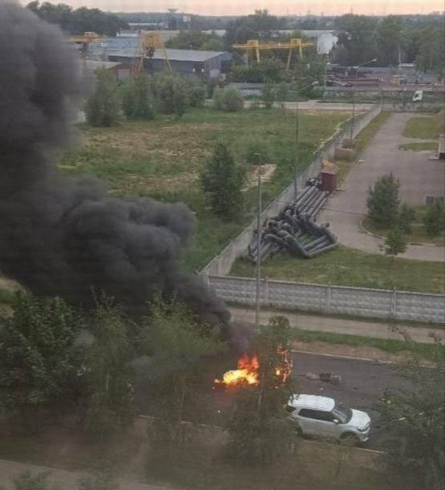

🔥 انفجار یک بمب دست‌ساز در داخل یک خودرو در نزدیکی محله بالاشیخا در اطراف مسکو.

@mwarmonitor

## pm_afshaa — post 92987

یوتیوب قراره رفع فیلتر شه

💧 Rainbet.com the #1 Non-KYC Crypto Casino & Sportsbook @rainbetcom

😁 @Pm_Afshaa

## pm_afshaa — post 92986

سهمیه بلیت تماشاگران ایران در جام جهانی حذف شد

💧 Rainbet.com the #1 Non-KYC Crypto Casino & Sportsbook @rainbetcom

😁 @Pm_Afshaa

## pm_afshaa — post 92985

🔴فیفا : دیدار ایران و مصر قطعا دیدار افتخار همجنسگرایان خواهد بود و به هیچ عنوان این رویداد لغو نخواهد شد

💧 Rainbet.com the #1 Non-KYC Crypto Casino & Sportsbook @rainbetcom

😁 @Pm_Afshaa

## pm_afshaa — post 92984

⭕️هشدار فوری تخلیه ارتش اسرائیل در لبنان: ساکنان صور و اطراف آن فوراً تخلیه کنن 
💧 Rainbet.com the #1 Non-KYC Crypto Casino & Sportsbook @rainbetcom 
😁 @Pm_Afshaa

## pm_afshaa — post 92983

⭕️هشدار فوری تخلیه ارتش اسرائیل در لبنان: ساکنان صور و اطراف آن فوراً تخلیه کنن

💧 Rainbet.com the #1 Non-KYC Crypto Casino & Sportsbook @rainbetcom

😁 @Pm_Afshaa

## pm_afshaa — post 92982

🔴رادیو ارتش اسرائیل: ما محدودیت‌هایی برای حمله به بیروت داریم اما برای عملیات در جنوب لبنان محدودیتی نداریم

💧 Rainbet.com the #1 Non-KYC Crypto Casino & Sportsbook @rainbetcom

😁 @Pm_Afshaa

## pm_afshaa — post 92981

  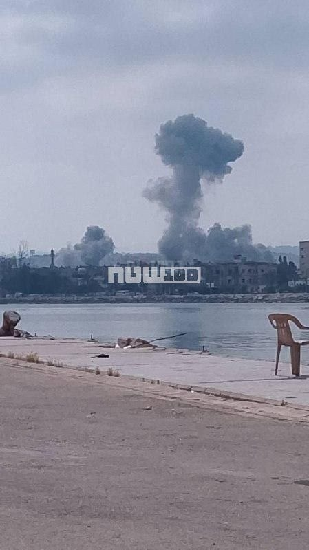

صور لبنان هم اکنون

💧 Rainbet.com the #1 Non-KYC Crypto Casino & Sportsbook @rainbetcom

😁 @Pm_Afshaa

## pm_afshaa — post 92980

  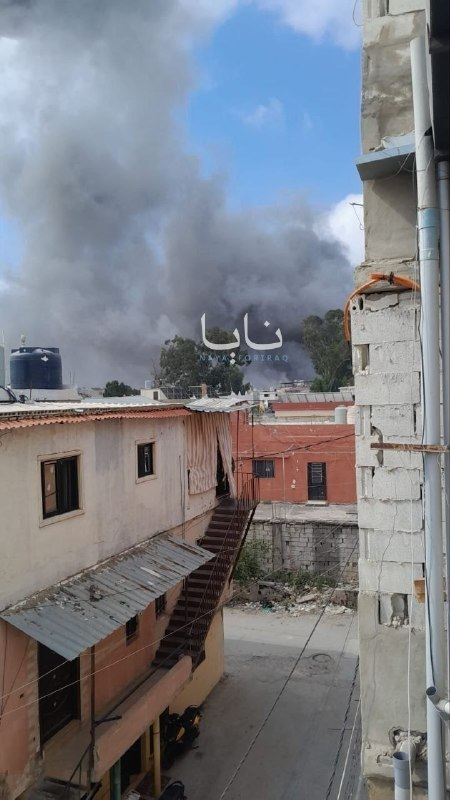

حملات سنگین اسراییل به صور لبنان

💧 Rainbet.com the #1 Non-KYC Crypto Casino & Sportsbook @rainbetcom

😁 @Pm_Afshaa

## DEJradio — post 5488

  <a href="telegram/content/DEJradio_5488_1780998769.webm" target="_blank">🎬 Download video</a>

🚨
⭕️ بر اساس اطلاعات دریافتی، عوامل امنیتی حکومت از اواخر هفته اول خردادماه ۱۴۰۵ اقدام به دپوی تجهیزات سرکوب، ون، بی‌سیم و تجهیزات شنود و مهمات در داخل «مرکز مکانیزه پست اصفهان» کرده‌اند.

بخشی از این ادوات در موتورخانه و بخشی دیگر در سالن تجزیه مرسولات پستی انبار شد.

در همین دوره شماری سواری با پلاک شخصی متعلق به اطلاعات سـ.ـپاه در این مرکز رفت و آمد دارند.
پاتوق آنها زیر زمین اداره پست در خیابان نشاط اصفهان دقیقا زیر ساختمان اصلی است و کارمندان حق ورود ندارند.

#اصفهان #سرکوب #اطلاعات
@DEJradio

## DEJradio — post 5487

  <a href="telegram/content/DEJradio_5487_1780998770.webm" target="_blank">🎬 Download video</a>

🚨📢 روزنامه «نیویورک‌تایمز» به نقل از دو منبع آگاه گزارش داد یک فروند هلیکوپتر آپاچی ارتش آمریکا دوشنبه ۱۸ خرداد ۱۴۰۵ در نزدیکی تنگه هرمز سقوط کرد. دو خدمه آن به‌طور ایمن نجات یافتند.

یکی از این افراد به نیویورک‌تایمز گفت این حادثه در دست بررسی است و هنوز مشخص نیست که آیا این آپاچی با شلیک نیروهای جمهوری اسلامی سرنگون شده، دچار نقص فنی شده یا با مشکل دیگری مواجه شده است.

ترامپ تایید کرد خلبانان هلیکوپتر سالم هستند و گفت آمریکا روز سه‌شنبه گزارشی درباره این حادثه منتشر خواهد کرد.

#تنگه_هرمز #جنگ
@DEJradio

## mamlekate — post 103652

📝 محکومیت سه وکیل دادگستری ساکن شیراز به زندان، ممنوعیت خروج از کشور و ابطال گذرنامه

این پرونده در سال ۱۳۹۹ تشکیل شد. دلیل تشکیل پرونده و صدور حکم علیه این سه وکیل: شرکت در نشست‌ها و سمینارهایی درباره حقوق کودکان و زنان، پیگیری تغییر و تصویب قوانین مرتبط با خشونت خانگی از طریق گفت‌وگو با نمایندگان مجلس، شوراها و نامزدهای انتخاباتی، مشارکت در برنامه‌های مرتبط با کارزار «۱۶ روز نارنجی مبارزه با خشونت علیه زنان»، توزیع پیکسل‌های «نه به خشونت علیه زنان» و «نه به ازدواج کودکان» و همچنین مصاحبه درباره وضعیت موکلان و موارد نقض حقوق آنان.

@mamlekate

## mamlekate — post 103651

📝 ۹۰ درصد حقوق صرف غذا می‌شود

گزارش تازه اکوایران از سبد معیشتی خانوار نشان می‌دهد هزینه تأمین حداقل نیازهای غذایی در اردیبهشت ۱۴۰۵ به سطحی رسیده که تقریباً تمام درآمد کارگران حداقل‌بگیر را درگیر می‌کند؛ وضعیتی که با افزایش قیمت اقلام بهداشتی و شوینده، فشار تازه‌ای بر بودجه روزمره خانوارها وارد کرده است.

@mamlekate

## mamlekate — post 103650

📝 ترامپ از فروردین تاکنون ۳۷ بار گفته «توافق با ایران نزدیک است»

از زمانی که دونالد ترامپ، رئیس‌جمهوری آمریکا، آتش‌بس با جمهوری اسلامی ایران را اعلام کرد و گفت که دو طرف به توافق نزدیک شده‌اند، بیش از دو ماه می‌گذرد.

📝 «آمریکا در ظرف دو هفته پیروزی کامل بر ایران را اعلام می‌کند»

دونالد ترامپ، رئیس‌جمهور آمریکا پیش‌بینی کرد که ایالات متحده می‌تواند ظرف دو هفته آینده «پیروزی کامل» بر جمهوری اسلامی را اعلام کند و گفت که مذاکره‌کنندگان ایرانی «آماده‌اند همه‌چیز را به ما بدهند».

📝 فارین پالیسی: ترامپ جنگی را آغاز کرد که نمی‌تواند آن را کنترل کند

نشریه فارین پالیسی در تحلیلی با اشاره به درگیری‌های مستقیم یک‌شنبه شب جمهوری اسلامی و اسرائیل نوشت دونالد ترامپ، رییس‌جمهوری آمریکا می‌خواهد به جنگ ایران پایان دهد، اما جمهوری اسلامی، حزب‌الله و اسرائیل ایده‌های دیگری دارند.

@mamlekate

## IranIntlTV — post 341309

🗣روایت شما از بحران اقتصادی پس از جنگ و آتش‌بس - سه‌شنبه ۱۹ خرداد

🔹امروز ۳ تا بستنی خریدم شد ۲۵۰ تومان، گرانی تا کی؟

🔹یک گوشی اقتصادی سامسونگ که خریده بودم ۷ تومان، الان شده ۳۵ تومان. دقیقا ۵ برابر.

🔹قبض‌های آب و برق و گاز انقدر زیاد شدن که دیگه توانایی پرداختشون رو نداریم. بیکاری و بی‌پولی واقعا اذیت می‌کنه.

🔹ماشین ۲۰۷‌ام رو دی‌ماه فروختم یک میلیارد تومان، الان نمی‌تونم با همون پول کوییک یا تیبا بخرم.

🔹با گذشت ۳ ماه از سال ۱۴۰۵، حقوق بازنشستگان و مستمری‌بگیران سازمان تامین اجتماعی مثل پارسال هست. ۱۶ میلیون تومان، پول ۳ کیسه برنج هندی و یک روغن می‌شه. بچه‌ها و نوه‌هامون میان خونمون، شرمنده می‌شیم.

🔹من یک نوجوان تک‌فرزند ۱۶ ساله هستم که در این وضعیت مملکت و گرونی خجالت می‌کشم پدر و مادرم برای من خرج کنن، چون کم آوردن.

🔹همسرم ۴۰ میلیون حقوق می‌گیره، اما به آخر ماه نمی‌رسه. قیمت عسل شده کیلویی یک میلیون تومان. مرغ و گوشت رو هم که اصلا نمی‌شه سراغشون رفت.

🔹من یک بلاگر با پیج شناخته‌شده در اینستاگرام هستم. انقدر اوضاع درآمد خراب شده که برای شهریه دخترم مجبور شدم گوشی خودم رو بفروشم، گوشی‌ که مدت‌ها باهاش کسب درآمد می‌کردم. پیامم به بلاگرهایی که دارن عادی‌سازی می‌کنن اینه که از دی‌ماه دیگه هیچ چیز عادی نیست.

🔹من ۱۷ سالمه و از بچگی رویای مزدا ۳ داشتم. امروز قیمت صفرش به حدود ۹ میلیارد تومان رسیده؛ خودرویی که در بسیاری از کشورها اقتصادی محسوب می‌شه. یک جوان بدون پشتوانه مالی باید چند سال کار کنه تا به چنین ماشینی برسه؟

## IranIntlTV — post 341308

  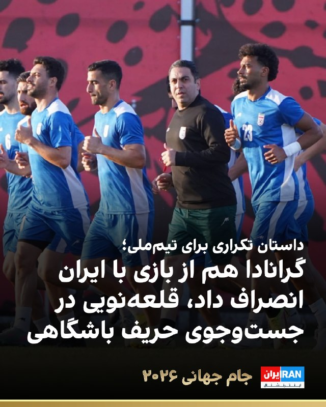

🔻تیم ملی فوتبال ایران که این روزها اردوی آماده‌سازی خود را در تیخوانای مکزیک برگزار می‌کند، بار دیگر با لغو یک دیدار تدارکاتی مواجه شد. قرار بود شاگردان امیر قلعه‌نویی در دیداری دوستانه به مصاف گرانادا بروند، اما این مسابقه به دلیل «آماده نبودن تیم حریف» برگزار نخواهد شد.

🔹این دومین دیدار تدارکاتی لغوشده تیم ملی در هفته‌های اخیر است. پیش از این نیز مسابقه برنامه‌ریزی‌شده برابر پورتوریکو پس از تغییر محل استقرار تیم ملی از آمریکا به مکزیک منتفی شده بود.

🔹در پی این اتفاق، کادر فنی تیم ملی و مسئولان فدراسیون فوتبال در تلاش هستند تا با یکی از باشگاه‌های مکزیکی دیداری تمرینی برگزار کنند. با این حال، هنوز توافقی در این زمینه حاصل نشده است.

🔹در صورتی که این تلاش‌ها نیز به نتیجه نرسد، تیم ملی ایران بدون انجام حتی یک مسابقه تدارکاتی در مکزیک، رقابت‌های جام جهانی ۲۰۲۶ را آغاز خواهد کرد.

🔹پیش از این نیز به دنبال انصراف تیم‌های ملی اسپانیا، مقدونیه و آنگولا، برنامه‌های تدارکاتی ایران دچار تغییر شد و کادر فنی ناچار شد چند دیدار درون‌تیمی را در اردوهای تهران و ترکیه برگزار کند.

@iranintltvsport

## IranIntlTV — post 341307

  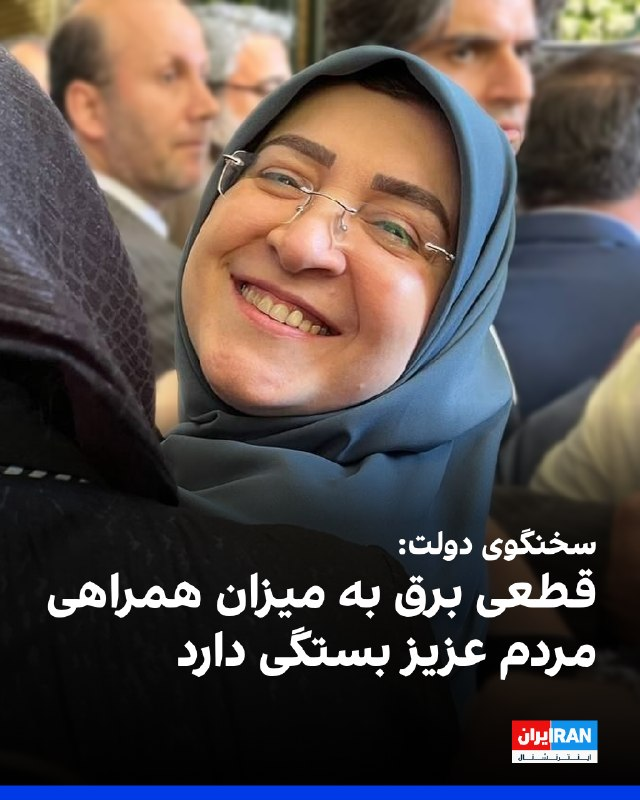

فاطمه مهاجرانی، سخنگوی دولت جمهوری اسلامی، درباره قطعی برق در کشور گفت میزان قطعی احتمالی در روزهای گرم پیش‌رو قابل پیش‌بینی دقیق نیست و «مستقیما به الگوی مصرف و همراهی مردم عزیز بستگی دارد.»

او افزود اگر ۱۰ درصد کاهش مصرف محقق شود، وضعیت انرژی و برق بهبود خواهد یافت.

مهاجرانی تاکید کرد در مدیریت مصرف با افرادی که به صورت «سودجویانه و غیرمجاز» برق مصرف می‌کنند برخورد خواهد شد.

سخنگوی دولت همچنین گفت: «برق با جانفشانی فرزندان همین مرز و بوم به دست ما می‌رسد.»
https://iranintl.com/202606099755

## IranIntlTV — post 341306

  <a href="telegram/content/IranIntlTV_341306_1780998771.mp4" target="_blank">🎬 Download video</a>

دونالد ترامپ گفت: پیروزی کامل آمریکا بر جمهوری اسلامی ظرف دو هفته آینده اعلام خواهد شد.

مرتضی کاظمیان، عضو تحریریه ایران‌اینترنشنال، با اشاره به اظهارات اخیر ترامپ گفت: «حتی در صورت دستیابی تهران و واشینگتن به توافق، موضوعاتی مانند برنامه غنی‌سازی اورانیوم، موشک‌های بالستیک و حضور نیروهای نیابتی جمهوری اسلامی در منطقه همچنان از محورهای اصلی اختلاف و نگرانی برای اسرائیل باقی خواهد ماند.»

@iranintltv

## IranIntlTV — post 341305

  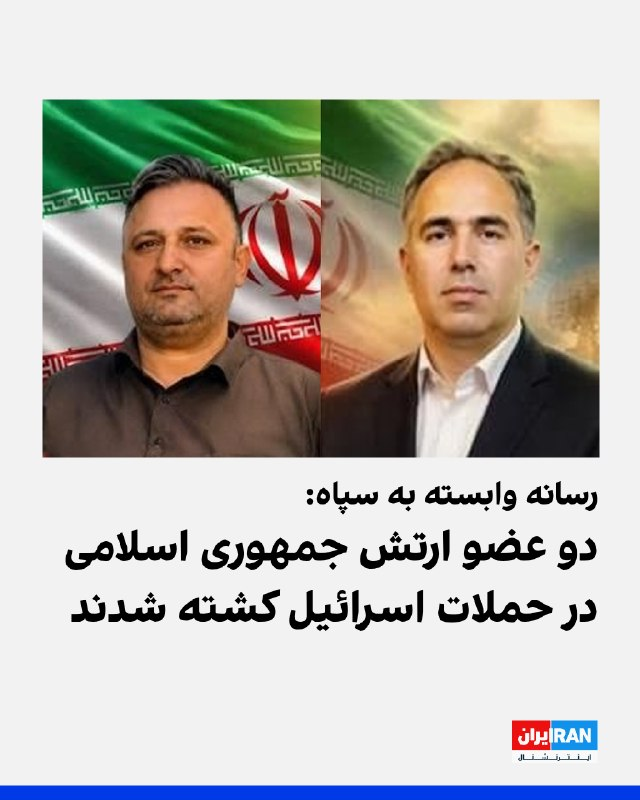

خبرگزاری تسنیم، رسانه وابسته به سپاه پاسداران، گزارش داد در حملات بامداد دوشنبه اسرائیل به اهدافی در ایران، بهمن حسینی و علیرضا عبیری، دو تن از پرسنل پدافند هوایی ارتش جمهوری اسلامی، کشته شدند.

بر اساس این گزارش، این دو نفر «در حال انجام ماموریت» جان خود را از دست دادند.

محمود نبویان، نماینده تهران در مجلس، با اشاره به کشته شدن این دو عضو ارتش نوشت: «خونخواهی این دو نفر نباید فراموش شود.»

مقام‌های جمهوری اسلامی پیش از این از کشته شدن فردی در این حملات خبر نداده بودند و این خبر همزمان با برگزاری مراسم تشییع اجساد آن‌ها منتشر شد.
https://iranintl.com/202606098564

## IranIntlTV — post 341304

  <a href="telegram/content/IranIntlTV_341304_1780998773.mp4" target="_blank">🎬 Download video</a>

شهروندان در پیام‌هایی به ایران‌اینترنشنال از کوچک‌تر شدن سفره‌های غذایی، گرانی و دشواری تامین هزینه‌های زندگی خبر می‌دهند. بسیاری از این پیام‌ها از استیصال و ناتوانی در تامین مایحتاج روزانه حکایت دارد.

جزییات بیشتر با لیلا سعادتی، عضو تحریریه ایران‌اینترنشنال
@iranintltv

## IranIntlTV — post 341303

  <a href="telegram/content/IranIntlTV_341303_1780998775.mp4" target="_blank">🎬 Download video</a>

ارتش اسرائیل با صدور دستور تخلیه از ساکنان شهر صور در جنوب لبنان و محله‌های اطراف آن خواست فورا این شهر را ترک کنند.

اشکان صفایی، خبرنگار ایران‌اینترنشنال، گزارش می‌دهد

.
@iranintltv

## IranIntlTV — post 341302

  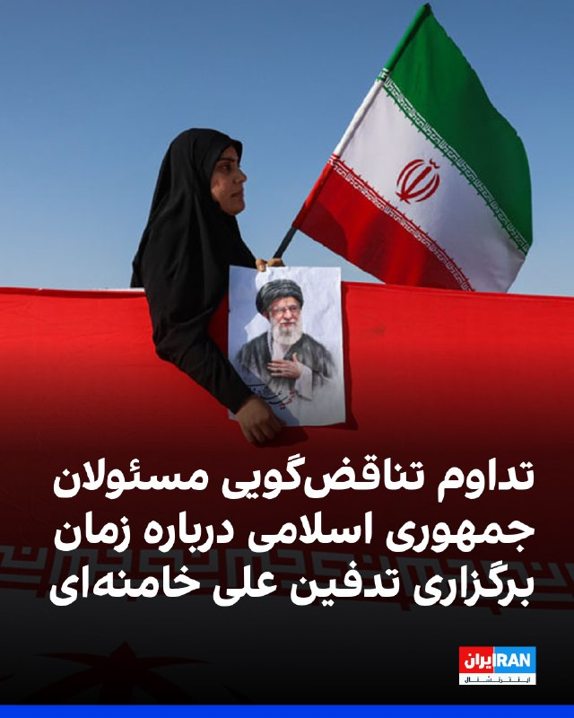

با گذشت بیش از ۱۰۰ روز از کشته شدن علی خامنه‌ای، همچنان تناقض‌گویی‌ها درباره زمان برگزاری تشییع و تدفین او ادامه دارد.

علیرضا نادعلی، سخنگوی شورای شهر تهران، گفت مجوز استفاده رایگان از مترو و اتوبوس‌های بی‌آر‌تی در پایتخت تا پایان دهه اول محرم تمدید شده است.

او دلیل این تصمیم را «همزمانی با برگزاری مراسم تشییع علی خامنه‌ای» عنوان کرد و افزود این مصوبه در شورای شهر تهران به تصویب رسیده است.

در همین حال، ستاد «بزرگداشت علی خامنه‌ای» در اطلاعیه شماره ۲ اعلام کرد مراسم وداع، تشییع و تدفین علی خامنه‌ای «پس از دهه اول محرم و بعد از تکمیل هماهنگی‌های نهایی دستگاه‌های مسئول و گروه‌های مردمی برای خدمت‌رسانی» برگزار خواهد شد.
https://iranintl.com/202606095002

## IranIntlTV — post 341301

  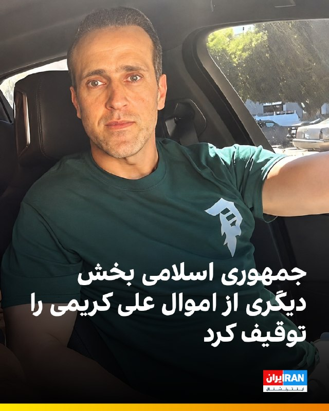

🔻رسانه قوه قضاییه جمهوری اسلامی، میزان، از توقیف بخشی دیگر از اموال علی کریمی، بازیکن پیشین تیم ملی فوتبال و پرسپولیس و از چهره‌های شناخته‌شده مخالف حکومت خبر داد.

🔹به نوشته میزان، اموال جدیدی از علی کریمی شناسایی و دستور توقیف آن‌ها صادر شده است. بر اساس این گزارش، «ملک شناسایی‌شده از این علی کریمی یک ویلای ۳ طبقه به متراژ ۱۱۵۰ متر مربع، دارای ۶۰۰ متر مربع عیانی در شهرستان لاهیجان استان گیلان است.»

🔹خبرگزاری میزان اعلام کرد که پیش‌تر، جمهوری اسلامی ۲ واحد تجاری و ۴ واحد مسکونی علی کریمی را توقیف کرده است.

🔹قوه قضاییه جمهوری اسلامی، پیش‌‌تر از توقیف اموال چندین چهره سرشناس ورزشی دیگر از جمله علی دایی، مسعود شجاعی، زهرا قنبری و علیرضا فغانی به‌دلیل مخالفت با سیاست‌های حکومت خبر داده بود.

@iranintltvsport

## IranIntlTV — post 341300

🗣روایت شما از بحران اقتصادی پس از جنگ و آتش‌بس - سه‌شنبه ۱۹ خرداد

🔹امروز ویولن دخترم رو فروختم تا قسط عقب‌افتاده وام رو پرداخت کنم، دیگه چاره‌ای نداشتم.

🔹زنده بودن مردم با مردن چه فرقی داره؟ دیگه خسته شدم از گرونی، بلاتکلیفی و بیکاری. هر روز صبح باید نون خالی با آب بخوریم، ظهر هم اگه پول باشه نون و تخم‌مرغ. این حق ما نیست.

🔹شرایط واقعا اسفناکه: قبلا واسه خرید خونه و ماشین مجبور بودیم وام بگیریم، الان واسه خرید یخچال، اجاق‌گاز، تلویزیون و حتی گوشت و مرغ و مایحتاج روزانه. از هر ایرانی یک پیکان، رسیدیم به هر ایرانی یک تلویزیون.

🔹توافق آمریکا با ایران هیچ نفعی برای مردم ایران نداره، فقط با زندگی ما بازی می‌شه. امیدتون رو از دست ندین، ماه پشت ابر نمی‌مونه.

🔹تنها خوبی جنگ این بود که جمهوری اسلامی وقت نکرد مازوت بسوزونه؛ هوا تمیز شد، ابرها تونستن ببارن و سدها پر شد.

🔹سوپرمارکت دارم و افسردگی گرفتم از بس پیر و جوون، زن و مرد و بچه میان اما نمی‌تونن خرید کنن. مردم در تامین پیش‌پاافتاده‌ترین و ضروری‌ترین نیازهاشون موندن.

🔹من یک دانش‌آموز ۱۴ ساله هستم. آرزوم اینه که بتونم از ایران برم. واقعا خسته شدم از بس همه‌چیز گرونه، یه گوشی ساده که پارسال ۱۳ میلیون پولش بود، امسال شده ۳۱ میلیون تومان.

🔹حقوق بازنشسته‌ها رو بعد سه ماه، ۶ میلیون تومان اضافه کردن. با این همه تورم و گرونی خسته شدیم. گوشت، مرغ و میوه خوردن در ایران شده آرزو.

🔹قیمت بنزین گرون نشده، ولی روغن موتور چند برابر شده نسبت به قبل از جنگ که اگه با میانگین قیمت بنزین و روغن براساس کیلومتر کارکرد حساب کنیم، عملا قیمت بنزین سه برابر شده تا الان.

## IranIntlTV — post 341299

  <a href="telegram/content/IranIntlTV_341299_1780998777.mp4" target="_blank">🎬 Download video</a>

شهباز شریف، نخست‌وزیر پاکستان، پس از حملات متقابل اخیر جمهوری اسلامی و اسرائیل، از همه طرف‌ها خواست به صلح فرصت بیشتری بدهند و برای کاهش تنش‌ها تلاش کنند.

گفت‌وگو با جواد همدانی، خبرنگار ایران‌اینترنشنال

@iranintltv

## IranIntlTV — post 341298

  <a href="telegram/content/IranIntlTV_341298_1780998778.mp4" target="_blank">🎬 Download video</a>

در آستانه آغاز رقابت‌های جام جهانی ۲۰۲۶، تیم ملی فوتبال ایران آخرین مراحل آماده‌سازی خود را در شهر تیخوانا پشت سر می‌گذارد.

رضا محدث، خبرنگار ایران‌اینترنشنال، از محل برگزاری تمرینات تیم ملی ایران در مکزیک گزارش می‌دهد

@iranintltv

## IranIntlTV — post 341297

  

🔻در آستانه شروع جام جهانی ۲۰۲۶، ایران اینترنشنال از مخاطبان خود می‌خواهد آقای گل بزرگترین تورنمنت فوتبال جهان را پیش‌بینی کنند.

🔹این نظرسنجی در دو گروه ۴ نفره به رای مخاطبان گذاشته می‌شود.

🔹برای شرکت در این نظرسنجی، به صفحه اینستاگرام ایران اینترنشنال ورزشی مراجعه کنید؛👇
https://www.instagram.com/p/DZW5YiVAo58/

@iranintltvsport

## IranIntlTV — post 341296

  <a href="telegram/content/IranIntlTV_341296_1780998780.mp4" target="_blank">🎬 Download video</a>

فایننشال‌تایمز در گزارشی اختصاصی نوشت پس از کشته شدن علی خامنه‌ای، روسیه به‌طور موقت بخشی از سامانه‌های حفاظتی ویژه ولادیمیر پوتین را غیرفعال کرده تا از بروز رخنه‌های امنیتی احتمالی مشابه جلوگیری کند.

گزارش مریم رحمتی، خبرنگار ایران‌اینترنشنال
@iranintltv

## IranIntlTV — post 341295

  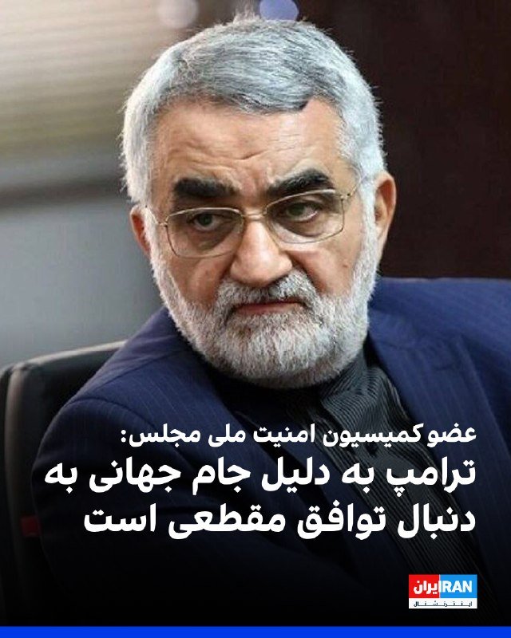

علاءالدین بروجردی، عضو کمیسیون امنیت ملی مجلس، در مصاحبه با «خانه ملت» با اشاره به حملات اخیر اسرائیل و همزمانی آن با رایزنی‌ها برای توافق با آمریکا، دو فرضیه درباره اهداف این تحولات مطرح کرد.

او گفت: «فرضیه اول این است که تمامی اقدامات اسرائیل با هماهنگی کامل ترامپ انجام می‌شود تا از مذاکرات صرفا به عنوان ابزاری برای خرید زمان و تقویت خود استفاده کنند.»

بروجردی افزود: «فرضیه دوم بر این استوار است که ترامپ به دلیل ملاحظات داخلی از جمله انتخابات پیش رو و بازی‌های جام جهانی، به دنبال یک توافق مقطعی است.»

این عضو کمیسیون امنیت ملی مجلس تاکید کرد: «جمهوری اسلامی با صراحت اعلام کرده امنیت لبنان خط قرمز ماست و اگر اسرائیل متعرض این کشور شود، ما قطعا به آن‌ها پاسخ خواهیم داد.»

او هشدار داد: «اگر اسرائیل به این بازی ادامه دهد، پاسخ ما دیگر نقطه در برابر نقطه نخواهد بود، بلکه پاسخی چندبرابری و ویرانگر دریافت خواهند کرد که آن‌ها را پشیمان می‌کند.»
https://iranintl.com/202606090008

## IranIntlTV — post 341294

  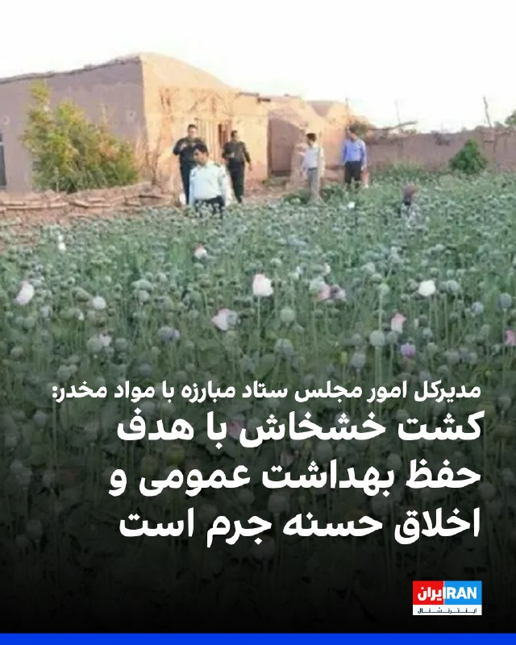

پس از انتشار گزارش‌هایی درباره افزایش کشت خشخاش، محمد ترحمی، مدیرکل حقوقی و امور مجلس ستاد مبارزه با مواد مخدر، اعلام کرد کشت خشخاش با هدف «حفظ بهداشت عمومی، اخلاق حسنه و حفظ حرث و نسل بشری از خطر انحطاط»، مطلقا ممنوع بوده و جرم محسوب می‌شود.

او افزود: «اظهارات برخی افراد درباره افزایش کشت گیاهان مخدر پایه، به دلیل فقدان اطلاعات لازم درباره میزان برخوردهای انتظامی و قضایی با مرتکبان، نحوه امحای کشت‌های انجام‌شده و اقدامات اجرایی برای پیشگیری از وقوع جرم، دقیق نیست و قابل اتکا محسوب نمی‌شود.»
https://iranintl.com/202606095964

## IranIntlTV — post 341293

  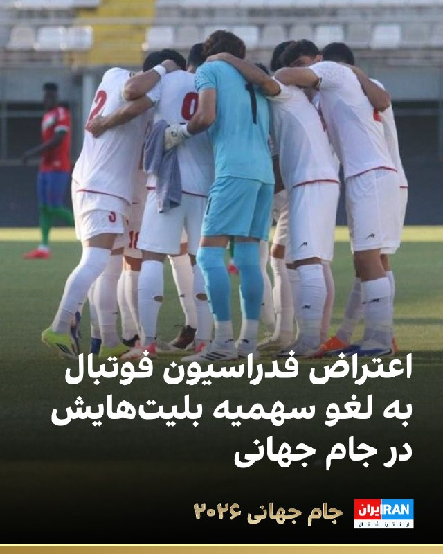

🔻فدراسیون فوتبال جمهوری اسلامی با انتشار بیانیه‌ای، به لغو سهمیه بلیت‌های این فدراسیون در جام جهانی ۲۰۲۶ اعتراض کرد. بر اساس مقررات فیفا، ۸ درصد از ظرفیت بلیت هر مسابقه به کشورهای شرکت‌کننده اختصاص می‌یابد؛ اما این سهمیه صادرشده برای دیدارهای ایران مقابل نیوزیلند، بلژیک و مصر، به‌طور کامل لغو شده است.

🔹فدراسیون فوتبال این اقدام را مغایر با اصل «برابری و روح ورزش» دانست و تأکید کرد که «محروم کردن هواداران ایرانی، شائبه دخالت ملاحظات غیرورزشی و سیاسی را در بزرگ‌ترین رویداد فوتبالی جهان تقویت می‌کند.»

🔹سلب این سهمیه قانونی را باید ضمیمه بحران‌های پیاپی فوتبال ایران در فاصله ۲ روز تا آغاز جام جهانی دانست. فدراسیون فوتبال با چالش بزرگ صدور ویزا و منع ورود به خاک آمریکا مواجه است. درخواست روادید ۱۵ نفر از فهرست ارسالی فدراسیون فوتبال رد شده است؛ فهرستی که نام مدیران ارشدی چون مهدی تاج، رئیس فدراسیون، مهدی محمدنبی، مدیر تیم ملی، هدایت ممبینی، دبیرکل فدراسیون در میان آن‌ها به چشم می‌خورد.

@iranintltvsport

## IranIntlTV — post 341292

  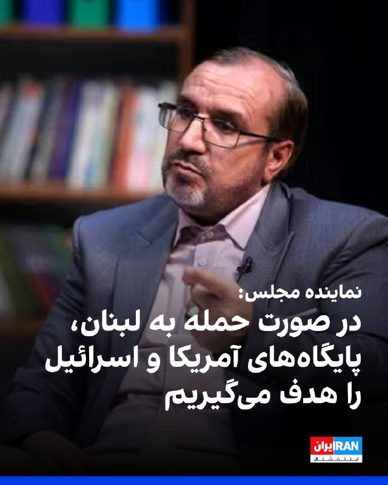

علی حدادی، عضو هیات رئیسه کمیسیون صنایع مجلس، گفت: «ما در نظم جدید نظامی و عملیات راهبردی کشورمان از چنان قدرتی برخوردار هستیم که اگر اسرائیل مجدد لبنان یا ایران را مورد تهاجم قرار دهد قطعا هم پایگاه های نظامی آمریکا و هم اسرائیل اهداف مشروع ما خواهند بود.»

حدادی افزود با وضعیتی که به گفته او از سوی اسرائیل ایجاد شده و همچنین اظهارنظرهای رییس‌جمهوری آمریکا، بخش مهمی از آتش‌بس نقض شده است. او تاکید کرد اگر مذاکرات ادامه یابد، تنها برای حل مسائل کنونی خواهد بود و «به هیچ وجه به استکبار جهانی اطمینان نخواهیم داشت.»

نماینده ساوجبلاغ در مجلس در پایان گفت: «معتقدیم در زیر آتش هم می‌توان امتیازهایی از دشمن گرفت.»
https://iranintl.com/202606090937

## IranIntlTV — post 341291

🗣روایت شما از بحران اقتصادی و زندگی در آتش‌بس- سه‌شنبه ۱۹ خرداد:

🔹ماه‌هاست به دلیل گرانی به‌جای مغازه‌ها، از دستفروش‌های هفتگی خرید می‌کنم اما حالا دیگه حتی توان خرید از دستفروش را هم نداریم فقط مایحتاج اولیه و خیلی ضروری مثل سیب‌زمینی، گوجه، پیاز، می‌خریم، آن‌هم از نوع درجه‌ ۳. میوه شده آرزو.

🔹چهارشنبه گذشته قرارداد بستن باهام برای کار در شرکت، شنبه اومدن گفتن به دلیل کمبود بودجه نمی‌تونیم حقوق بدیم و مجبور به تعدیل نیرو هستیم.

🔹یک گلخانه‌دار از تنکابن مازندرانم؛ درآمد الان ما با ۳ سال پیش از زمین تا آسمون فرق کرده. شغلم تبدیل به سرگرمی شده.

🔹جمهوری اسلامی کاری کرده که آرزوی داشتن خیلی چیزا به دلمون بمونه، برای خریدن یه موتور کلی باید بدوییم. اونم معلوم نیست بتونم بخرمش یا نه. این فقط راجع به یه موتور نیست و تو همینم خلاصه نمی‌شه...

🔹کمرمون زیر بار گرانی و بیکاری شکسته. هر شب توی محل ما دزدی می‌شه و فقر بیداد می‌کنه.

🔹یک ساندویچ کالباس، یک نوشابه، یک عدد سوسیس و یک خامه شد ۶۰۰ هزار تومان. یعنی کمترین هزینه برای یک شام و ناهار فردایش بیشتر از نیم میلیون تومان است.

🔹حکومت مردم عادی و زحمت‌کش رو گروگان گرفته. از طرفی دارن طرفدارای خودشون رو تقویت می‌کنن. این مملکت مگه برای همه نیست؟ مگه همه نباید از حقوق شهروندی یکسان برخوردار باشن، پس چی شد؟

🔹مایع دستشویی ۲۰ لیتری که امروز به قیمت ۲ میلیون و ۸۵۰ هزار تومان خریدم، دو هفته پیش یک میلیون و ۶۵۰ هزار تومان بود.

🔹تامین اجتماعی تقریبا همه‌ مزایای حقوق بازماندگان مستمری‌بگیر رو حذف کرده و کل افزایش حقوق با این شرایط ۲۰ درصد هم نمی‌شه.

🔹من یک دانش‌آموز رشته گرافیک پایه یازدهم هستم، قیمت رنگ و وسایل هنری به‌شدت گرون شده. رنگی که چندماه پیش می‌خریدم ۲۰۰ هزار تومان الان برند ایرانی بی کیفیتش شده حدود ۹۰۰ هزار تومان.

## IranIntlTV — post 341290

  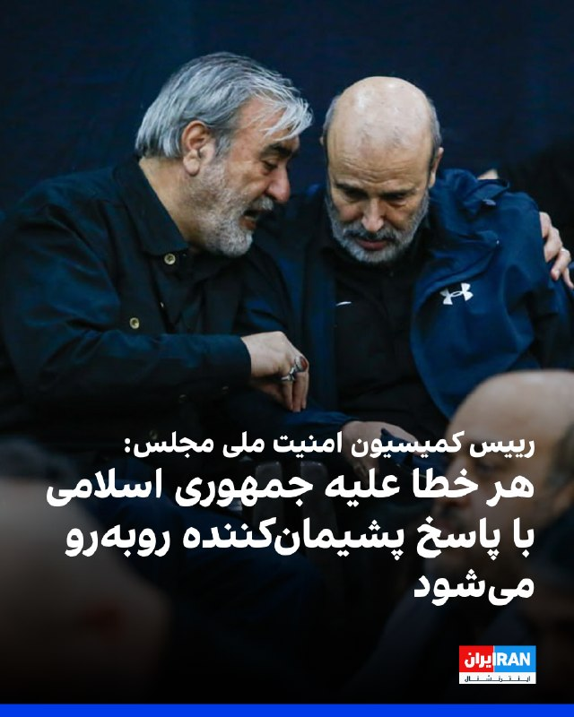

ابراهیم عزیزی، رییس کمیسیون امنیت ملی مجلس، در گفت‌وگو با باشگاه خبرنگاران جوان گفت: «هرگونه خطای محاسباتی علیه جمهوری اسلامی، با پاسخی به‌مراتب سخت‌تر و پشیمان‌کننده‌تر از عملیات‌های پیشین مواجه خواهد شد.»
ابراهیم عزیزی افزود جمهوری اسلامی با تمام قوا و همه ظرفیت‌های خود بر روی منافع و امنیت ملی ثابت‌قدم ایستاده است.
رییس کمیسیون امنیت ملی مجلس گفت جمهوری اسلامی پیروز میدان نبرد است و به اذعان جهانیان فاتح میدان جنگ است.
https://iranintl.com/202606098216

## Shin_Persian — post 6768

  <a href="telegram/content/Shin_Persian_6768_1780998784.mp4" target="_blank">🎬 Download video</a>

Emanuel (Mannie) Fabian ✓ @manniefabian
Tue, 09 Jun 2026 09:45:25 UTC

Lebanese media reports Israeli strikes in the coastal city of Tyre a short while ago.

Earlier, the IDF issued an evacuation warning for the entire city and its outskirts, including a Christian neighborhood that until now had not faced such orders.

فارسی

رسانه‌های لبنانی از حملات اسرائیل به شهر ساحلی صور در لحظاتی پیش خبر می‌دهند.

پیش از این، ارتش دفاعی اسرائیل هشدار تخلیه‌ای برای کل شهر و حومه آن صادر کرده بود، از جمله یک محله مسیحی‌نشین که تا کنون با چنین دستوراتی مواجه نشده بود.

𝕏 · @shin_persian

## Shin_Persian — post 6767

  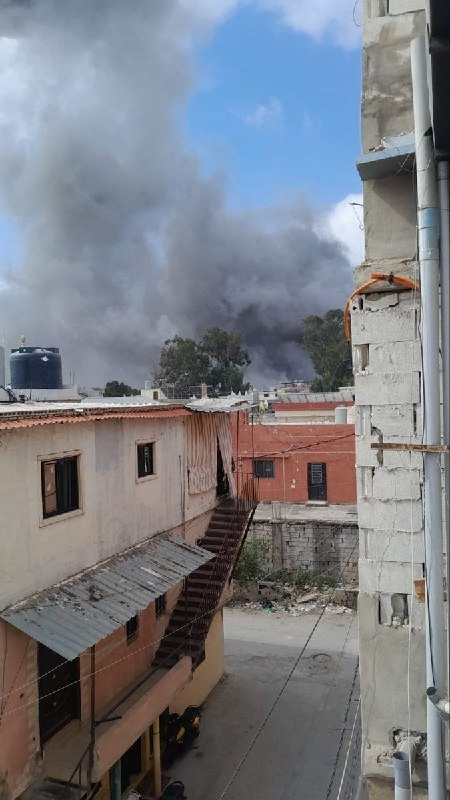

Open Source Intel ✓ @Osint613
Tue, 09 Jun 2026 06:25:12 UTC

Multiple Israeli strikes reported near Tyre in southern Lebanon.

فارسی

گزارش‌هایی از چندین حمله اسرائیل در نزدیکی صور در جنوب لبنان منتشر شده است.

𝕏 · @shin_persian

## ManotoTV — post 105977

  <a href="telegram/content/ManotoTV_105977_1780998786.mp4" target="_blank">🎬 Download video</a>

نیک وی‌آچیچ با سندرم تترا آملیا متولد شد؛ بدون دست و پا. کودکی و نوجوانی سختی را پشت سر گذاشت، اما اجازه نداد قضاوت دیگران، ترس، افسردگی یا محدودیت‌های جسمی، معنای زندگی‌اش را تعیین کند.

پیام او ساده است، اما عمیق:

همه ما در زندگی زمین می‌خوریم.

همه ما روزهای سخت داریم.

همه ما گاهی از آینده می‌ترسیم، یا نگران قضاوت دیگران می‌شویم.

## ManotoTV — post 105970

  <a href="telegram/content/ManotoTV_105970_1780998788.mp4" target="_blank">🎬 Download video</a>

بحران سیاسی ایران بیش از آنکه نیازمند مهندسی یک نظم کاملا تازه باشد، نیازمند بازسازی پیوندهای گسسته میان جامعه، قانون و دولت است. محافظه‌کاری ایرانی، در این معنا، بازگشت به گذشته نیست، بلکه تلاشی برای حفظ تداوم تاریخی و بازسازی تدریجی زمین سیاست در ایران است.

## FarsiVOA — post 220100

  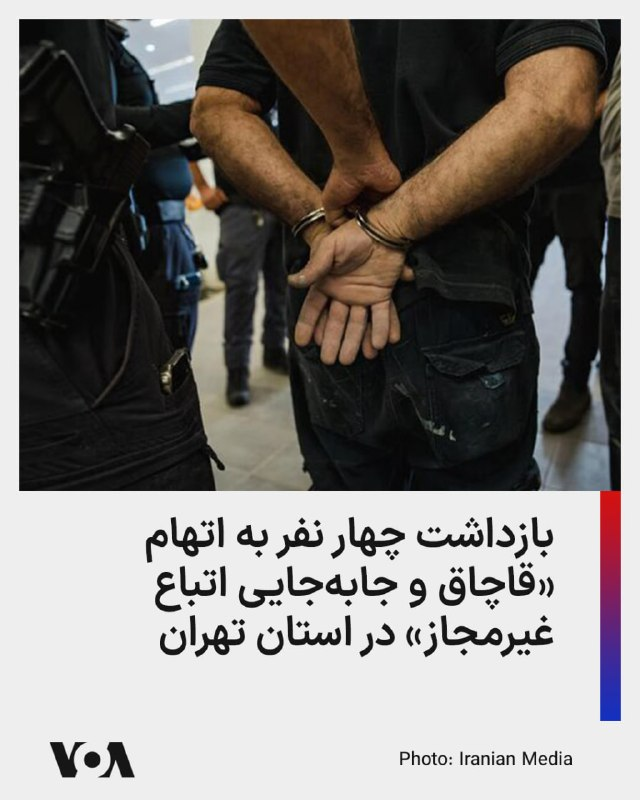

پلیس پاکدشت، در استان تهران، از بازداشت چهار نفر به اتهام «قاچاق و جابه‌جایی اتباع غیرمجاز» خبر داد و اعلام کرد این افراد «۶۶ تبعه غیرمجاز» را در یک سوله در این شهرستان نگهداری می‌کردند.

شهرام ولی‌خانی، روز سه‌شنبه ۱۹ خرداد، به صداوسیمای جمهوری اسلامی گفت بازداشت‌ها در ادامه روند تشدید کنترل و شناسایی اتباع خارجی فاقد مدرک انجام شده است.

پیشتر رئیس مرکز امور اتباع و مهاجرین خارجی وزارت کشور، ادعا کرده بود که از مجموع حدود ۶ میلیون و ۱۰۰ هزار تبعه خارجی شناسایی‌شده در کشور، بیش از ۴ میلیون نفر در «وضعیت غیرمجاز» قرار دارند. به گفته نادر یاراحمدی، پس از جنگ ۱۲ روزه دست‌کم «یک میلیون و ۲۳۵ هزار نفر از اتباع غیرمجاز» از کشور خارج شدند.

همزمان، وزارت آموزش و پرورش ایران دستورالعملی را صادر کرده که بر اساس آن، ثبت‌نام در مدارس تنها با ارائه «مدارک اقامتی معتبر، گواهی سنجش سلامت و معرفی‌نامه دفاتر خدمات اقامت و اشتغال» امکان‌پذیر خواهد بود.

سال گذشته، اخراج گروهی و گسترده اتباع افغانستان از ایران موج واکنش‌های فعالان و سازمان‌های حقوق بشری به این تصمیم مقامات جمهوری اسلامی را در پی داشت.
@FarsiVOA

## FarsiVOA — post 220099

🔺قبرس از ترکیه برای «اخلال در پرواز وزیران دفاع اروپا» شکایت می‌کند

◾️دولت قبرس اعلام کرد که پس از دریافت گزارش‌ها از ایجاد اختلال در پرواز هواپیماهای حامل وزیران دفاع کشورهای اروپایی در مسیر سفر به نیکوزیا، شکایت رسمی علیه ترکیه را به نهادهای اتحادیه اروپا ارائه خواهد کرد.

◾️این حوادث هنگام سفر وزیران دفاع یونان، فرانسه و هلند برای شرکت در نشست امنیتی غیررسمی اتحادیه اروپا رخ داد و دولت قبرس پس از دریافت توضیحات از سوی این سه وزیر، وقوع این حوادث را تأیید کرد.

◾️قبرس و یونان می‌گویند این اختلال‌ها از سوی کنترل‌کنندگان ترافیک هوایی این فرودگاه در بخش شمالی قبرس ایجاد شده است.

◾️بر این اساس، در مورد پرواز وزیر دفاع یونان، دو جنگنده اف-۱۶ ترکیه در منطقه به پرواز درآمدند.

⬇️ بیشتر بخوانید:
https://ir.voanews.com/a/8158896.html

## FarsiVOA — post 220098

🔺دیدار فرماندهان ارتش پاکستان و لبنان؛ بیروت در مرکز گفت‌وگوهای منطقه‌ای

◾️فرماندهان ارتش پاکستان و لبنان با یکدیگر دیدار کرده و درباره گسترش همکاری‌های نظامی، تحولات امنیتی منطقه و تقویت روابط دفاعی میان دو کشور گفت‌وگو کردند.

◾️این دیدار هم‌زمان با تلاش‌ها برای مهار جنگ منطقه‌ای و تعیین جایگاه لبنان در مذاکرات مرتبط با جمهوری اسلامی، آمریکا و اسرائیل انجام شد.

◾️اهمیت این سفر به خاطر این است که لبنان در هفته‌های اخیر به یکی از گره‌های اصلی بحران منطقه‌ای تبدیل شده است؛ از یک سو، اسرائیل حملات خود علیه مواضع حزب‌الله را ادامه داده و از سوی دیگر، تهران تأکید کرده هر توافق گسترده‌تر باید وضعیت لبنان و حزب‌الله را نیز در بر بگیرد.

⬇️ بیشتر بخوانید:
https://ir.voanews.com/a/8158895.html

## FarsiVOA — post 220097

  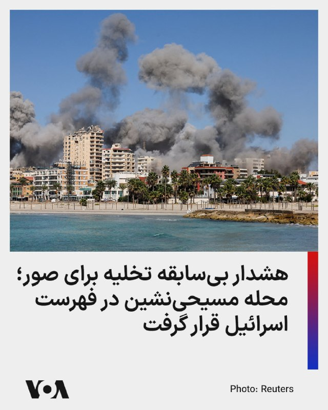

ارتش اسرائیل روز سه‌شنبه به ساکنان شهر ساحلی صور در جنوب لبنان، از جمله محله مسیحی‌نشین این شهر، دستور تخلیه داد. با این اقدام برای نخستین بار این بخش از شهر وارد محدوده هشدارهای نظامی اسرائیل شده است.

آویخای ادرعی، سخنگوی عربی‌زبان ارتش اسرائیل، در پیامی خطاب به ساکنان صور، اردوگاه‌ها و محله‌های اطراف آن، از آنان خواست «فوراً» منطقه را ترک کرده و به شمال رودخانه زهرانی بروند. او مدعی شد که نیروهای حزب‌الله در محله مسیحی‌نشین صور فعالیت دارند و هشدار داد هر ساختمانی که برای اهداف نظامی حزب‌الله استفاده شود، ممکن است هدف حمله قرار گیرد.

رویترز گزارش داد که هشدارهای قبلی ارتش اسرائیل، محله مسیحی صور را شامل نمی‌شد، اما ارتش اسرائیل این‌بار مدعی حضور نیروهای حزب‌الله در این منطقه شده است؛ ادعایی که این رسانه نوشته اسرائیل برای آن مدرکی ارائه نکرده است.

این هشدار در حالی صادر می‌شود که صور در هفته‌های اخیر زیر فشار حملات و هشدارهای مکرر اسرائیل قرار داشته است.
@FarsiVOA

## FarsiVOA — post 220096

🔺سایه قطع دوباره اینترنت؛ وزیر ارتباطات: اولویت با امنیت کشور است

◾️در حالی که داده‌های پایش شبکه از تداوم محدودیت‌ها و ناپایداری در اینترنت ایران حکایت دارد، وزیر ارتباطات دولت پزشکیان می‌گوید یکی از «تلخ‌ترین و پرتکرارترین» پرسش‌هایی که با آن روبه‌رو می‌شود این است که «اینترنت تا کی وصل خواهد ماند؟»

◾️سخنگوی دولت، نیز وجود محدودیت‌ها را تأیید کرده و موضوع اصلی را «حکمرانی فضای مجازی» دانسته و گفته است «اینترنت در حال بازگشت است» و «مشکلات فنی وجود دارد که به‌تدریج رفع می‌شود.»

◾️گزارش تازه سیتنا از داده‌های پایش شبکه نشان می‌دهد گرچه بخشی از ظرفیت ارتباطی ایران با اینترنت جهانی در روزهای اخیر بازیابی شده، اما این بهبود هنوز به معنای بازگشت کامل به وضعیت عادی نیست.

⬇️ بیشتر بخوانید:
https://ir.voanews.com/a/8158894.html

## FarsiVOA — post 220095

  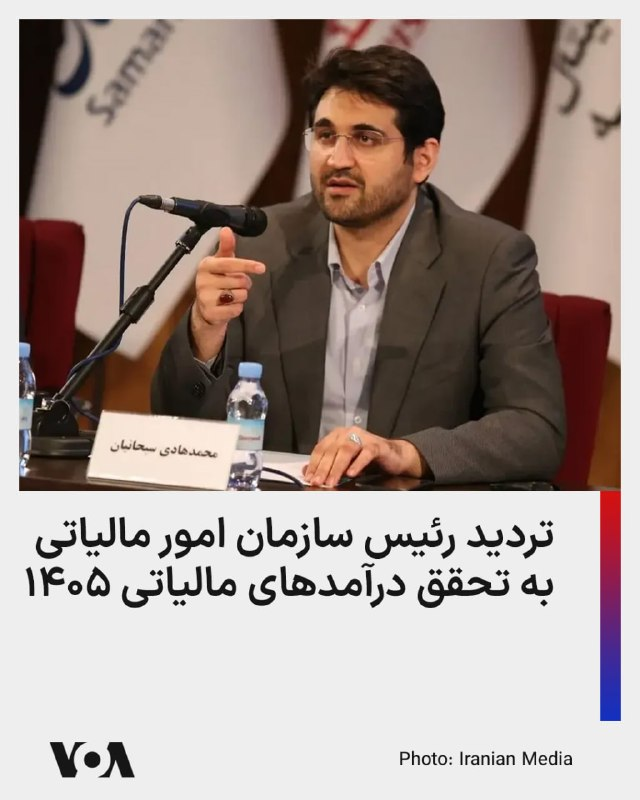

رئیس کل سازمان امور مالیاتی، با اشاره به ناتوانی صنایع و کسب‌وکارها در پرداخت مالیات تکلیفی، نسبت به تحقق درآمدهای مالیاتی سال جاری ابراز تردید کرد.

محمدهادی سبحانیان، در گفت‌وگو با ایسنا، هدف‌گذاری مالیاتی در بودجه سال جاری را دو هزار و ۹۰۰ همت اعلام و یادآور شد که برای تحقق این هدف، باید به واقعیت‌های اقتصادی کشور توجه داشت.

وی جنگ ۱۲ روزه، جنگ ۴۰ روزه و همچنین اعتراضات دی ماه را به عنوان چالش جدی کسب‌وکارها عنوان و اعلام کرد «در دولت این بحث مطرح است که شاید لازم باشد اصلاحیه‌ای نسبت به بودجه ۱۴۰۵ اتفاق بیفتد.»

سبحانیان یادآور شد که «وقتی مودی بزرگ ما در حوزه فولاد و پتروشیمی» و سایر مودیان آسیب دیده‌اند، باید اصلاح متناسب با این شرایط اتفاق بیفتد.

مطابق لایحه بودجه ۱۴۰۵، مجموع درآمدهای مالیاتی و گمرکی حدود ۲۹۶۱ هزار میلیارد تومان برآورد شده که نسبت به سال ۱۴۰۴ رشدی در حدود ۴۲ درصد داشت.
@FarsiVOA

## FarsiVOA — post 220094

🔺۹۰ درصد حقوق صرف غذا می‌شود؛ فشار شوینده‌ها بر بودجه خانوار

◾️گزارش تازه اکوایران از سبد معیشتی خانوار نشان می‌دهد هزینه تأمین حداقل نیازهای غذایی در اردیبهشت ۱۴۰۵ به سطحی رسیده که تقریباً تمام درآمد کارگران حداقل‌بگیر را درگیر می‌کند؛ وضعیتی که با افزایش قیمت اقلام بهداشتی و شوینده، فشار تازه‌ای بر بودجه روزمره خانوارها وارد کرده است.

◾️بر اساس محاسبات اکوایران، هزینه ماهانه تأمین سبد غذایی حداقلی برای هر فرد در اردیبهشت به ۷ میلیون و ۳۸۰ هزار تومان رسیده؛ رقمی که نسبت به فروردین بیش از ۷ درصد و نسبت به اردیبهشت سال گذشته ۱۲۹ درصد افزایش نشان می‌دهد.

◾️اگر بعد خانوار را سه نفر در نظر بگیریم، هزینه همین سبد غذایی حداقلی به بیش از ۲۲ میلیون تومان در ماه می‌رسد.

⬇️ بیشتر بخوانید:
https://ir.voanews.com/a/8158893.html

## FarsiVOA — post 220093

  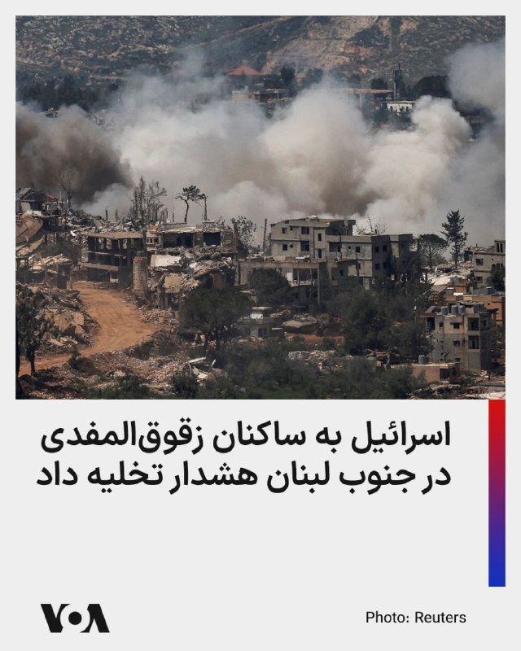

ارتش اسرائیل با انتشار نقشه‌ای، از ساکنان منطقه زقوق‌المفدی در جنوب لبنان خواست خانه‌های خود را فوراً ترک کنند و به شمال رود زهرانی بروند.

در این هشدار آمده است که به‌دلیل نقض آتش‌بس از سوی حزب‌الله لبنان و ادامه فعالیت‌های نظامی این گروه، ارتش اسرائیل آماده اقدام در این منطقه است.

ارتش اسرائیل تأکید کرده حضور در نزدیکی نیروها، تأسیسات یا تجهیزات نظامی حزب‌الله می‌تواند جان غیرنظامیان را به خطر بیندازد.

پس از اعلام تخلیه سخنگوی ارتش دفاعی اسرائیل، اکنون حملاتی در صور رخ می‌دهد.
@FarsiVOA

## FarsiVOA — post 220092

🔺نفت عقب نشست؛ بازار هنوز به توقف جنگ اعتماد ندارد

◾️قیمت نفت پس از اعلام توقف حملات جمهوری اسلامی و اسرائیل کاهش یافت و بخش عمده رشد روز قبل را از دست داد.

◾️بر اساس گزارش رویترز، بهای نفت برنت با کاهش حدود یک درصدی به ۹۳ دلار و ۳۴ سنت در هر بشکه رسید و نفت خام وست‌تگزاس اینترمدیت آمریکا نیز با افت ۱.۲ درصدی به ۹۰ دلار و ۱۷ سنت در هر بشکه معامله شد.

◾️نفت در معاملات روز قبل تا پنج درصد افزایش یافته بود؛ رشدی که پس از حملات تازه اسرائیل به جمهوری اسلامی و لبنان و کاهش امیدها به پایان سریع جنگ منطقه‌ای شکل گرفت. اما اعلام توقف عملیات نظامی از سوی دو طرف و درخواست دونالد ترامپ، رئیس‌جمهوری آمریکا، برای توقف حملات، بخشی از این افزایش را معکوس کرد.

⬇️ بیشتر بخوانید:
https://ir.voanews.com/a/8158892.html

## DW_Farsi — post 125712

  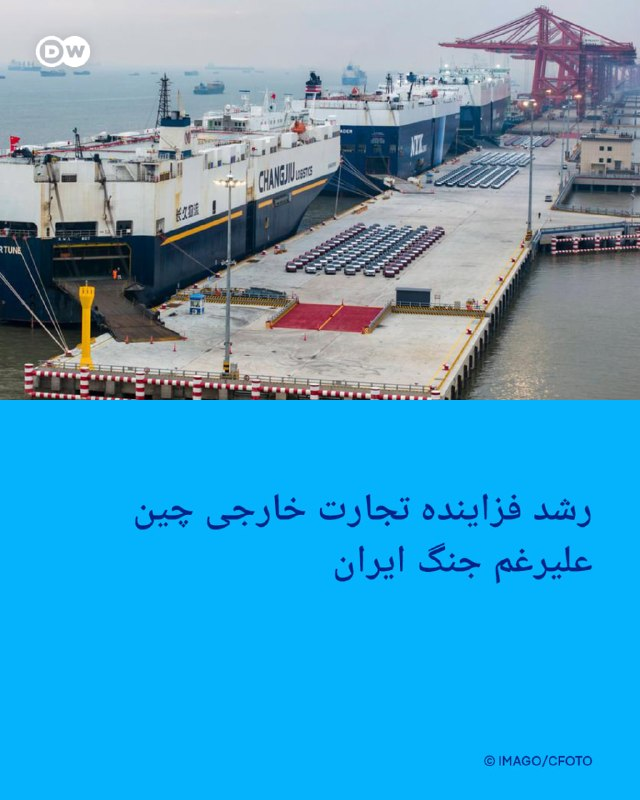

🔶 رشد فزاینده تجارت خارجی چین علیرغم جنگ ایران

تجارت خارجی چین علی‌رغم نگرانی‌های ناشی از تنش‌های ایران به‌طور قابل توجهی افزایش یافت. مقام‌های چین اعلام کردند در ماه مه با وجود بی‌ثباتی ناشی از جنگ ایران تجارت خارجی این کشور رشد کرده است.

طبق داده‌های اداره گمرک چین صادرات دومین اقتصاد بزرگ جهان در مقایسه با ماه مشابه سال قبل، بر اساس دلار آمریکا ۱۹.۴ درصد افزایش یافته و واردات نیز ۲۷.۴ درصد رشد داشته است.

مازاد تجاری چین در این دوره به ۱۰۵ میلیارد و ۴۰۰ میلیون دلار رسیده و این رشد حتی از ارقام نسبتا بالای ماه قبل نیز بیشتر بوده‌ است.

تقاضای کشورهای خارجی همچنان یکی از مهم‌ترین دلایل رشد اقتصاد چین محسوب می‌شود. جمهوری اسلامی ایران هم یکی از شرکای راهبردی چین به حساب می‌آید.

@dw_farsi

## DW_Farsi — post 125711

  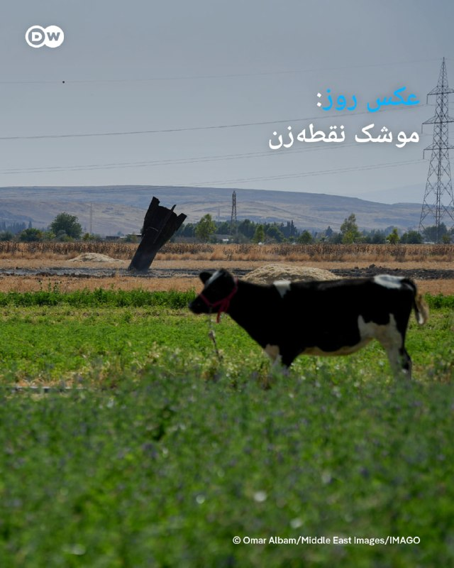

📸 عکس روز: موشک نقطه‌زن

در ادبیات تبلیغاتی جمهوری اسلامی از واژه "موشک نقطه‌زن" بسیار استفاده می‌شود. موشک‌هایی که به روایت این حکومت، دارای سیستم هدایت و ناوبری بسیار پیشرفته هستند و با کمترین میزان خطا دقیقاً به هدف از پیش تعیین‌شده برخورد می‌کند. در حملات روز ۱۸ خرداد (هشتم ژوئن) جمهوری اسلامی به اسرائیل این موشک به روستای نجها در حومه جنوبی دمشق در سوریه اصابت کرد.

@dw_farsi

## DW_Farsi — post 125710

  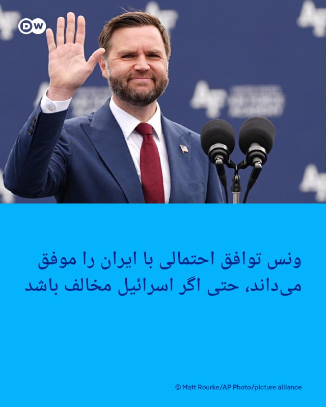

🔶 ونس توافق احتمالی با ایران را موفق می‌داند، حتی اگر اسرائیل مخالف باشد

جی‌دی ونس، معاون رئیس‌جمهور آمریکا می‌گوید ایالات متحده و اسرائیل اگرچه منافع مشترک زیادی دارند، اما در برخی موارد نیز منافعشان از یکدیگر جدا می‌شود.

ونس این اظهارات را در واکنش به پرسش‌هایی درباره نگرانی از احتمال "جاسوسی اسرائیل از آمریکا و اقدامات مستقل این کشور در لبنان" مطرح کرده است.

او بدون پاسخ مستقیم به این پرسش‌ها گفته است که هدف اصلی آمریکا در قبال ایران جلوگیری از دستیابی این کشور به سلاح هسته‌ای است و تاکید کرده است که رئیس‌جمهور آمریکا نیز این موضوع را به‌روشنی بیان کرده است.

ونس همچنین افزود در یک‌ونیم سال گذشته فضایی ایجاد شده که به باور او و رئیس‌جمهور آمریکا، امکان دستیابی به یک توافق بلندمدت درباره برنامه هسته‌ای ایران وجود دارد.

او همچنین خاطرنشان کرد که ممکن است اسرائیل از چنین توافقی رضایت داشته باشد یا نداشته باشد، اما در هر صورت دولت آمریکا آن را در راستای منافع ملی خود می‌داند.

@dw_farsi

## DW_Farsi — post 125709

  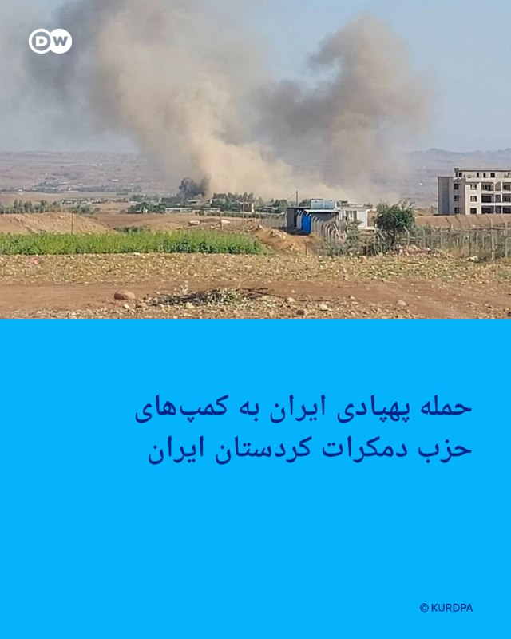

🔶 حمله پهپادی ایران به کمپ‌های حزب دمکرات کردستان ایران

حزب دمکرات کردستان ایران بامداد سه‌شنبه ۱۹ خرداد (۹ ژوئن) در شبکه ایکس خبر داد یکی از کمپ‌های این حزب بار دیگر هدف حمله پهپادی جمهوری اسلامی قرار گرفت.

بر اساس این گزارش در این حمله دو فروند پهپاد به سمت "کمپ آزادی" شلیک شده‌اند.

کمپ آزادی محل اسکان خانواده‌های اعضای حزب دمکرات است و از آغاز درگیری‌های اخیر تا کنون بارها هدف حملات جمهوری اسلامی قرار گرفت. این حزب تا کنون گزارشی درباره تلفات جانی یا زخمی‌ها ارائه نکرده است.

بر اساس این گزارش، جمهوری اسلامی ایران از زمان آغاز درگیری‌ها با آمریکا و اسرائیل تا کنون با شلیک بیش از ۱۳۴ فروند موشک و پهپاد، کمپ‌های حزب دمکرات کردستان ایران و همچنین مراکز درمانی و آموزشی این حزب را هدف قرار داده است.

تیم اقلیم کردستانِ سازمان صلح‌سازان مسیحی (CPT) در گزارشی اعلام کرده است که از ۹ اسفند ۱۴۰۴ تا ۸ خرداد ۱۴۰۵ در مجموع ۷۵۱ حمله از سوی جمهوری اسلامی به اقلیم کردستان ثبت شده است.

همچنین در بازه زمانی ۱۹ فروردین تا ۸ خرداد، ۱۰۴ حمله به اقلیم کردستان انجام شده که بنا بر این گزارش، احزاب کردستان ایران هدف اصلی این حملات بوده‌اند.

@dw_farsi

## Persian_Trend_Official — post 16252

روابط عمومی ارتش، از کشته شدن یکی از پرسنل واحد پدافندی خود به نام "سید بهمن حسینی" در حملات صبح دیروز اسرائیل خبر داد. 📌 @persian_trend_official پرشین ترند | متفاوت‌ترین کانال نظامی

## Persian_Trend_Official — post 16251

  

📹 یوتیوب رفع فیلتر می‌شود

مصطفی پوردهقان، نماینده مجلس:
وزیر ارتباطات در کمیسیون قول دادند که فضا را به شرایط عادی برگردانند و بعد از رفع فیلتر واتساپ، رفع فیلتر یوتیوب هم در دستور کار بود.

👺Phantom

📌 @persian_trend_official
پرشین ترند | متفاوت‌ترین کانال نظامی

## Persian_Trend_Official — post 16250

🔴 هشدار بی‌سابقه اسرائیل؛ تخلیه فوری جنوب لبنان

منابع خبری گزارش می‌دهند که ارتش اسرائیل دقایقی پیش هشدار تخلیه فوری برای مناطق جنوب لبنان صادر کرده است؛ اقدامی که می‌تواند نشانه ورود تنش‌ها به مرحله‌ای جدید و خطرناک باشد.

همزمان رسانه‌های لبنانی از آغاز موج جابه‌جایی غیرنظامیان از مناطق جنوبی به سمت مرکز و شمال لبنان خبر می‌دهند. تصاویر و گزارش‌های اولیه حاکی از افزایش تردد در محورهای اصلی خروج از جنوب این کشور است.

👺Phantom

📌 @persian_trend_official
پرشین ترند | متفاوت‌ترین کانال نظامی

## Persian_Trend_Official — post 16248

حمله به USS Liberty؛ ۵۹ سال پیش در چنین روزی

در ۸ ژوئن ۱۹۶۷، در جریان جنگ شش‌روزه، کشتی تحقیقاتی فنی کلاس بلمونت نیروی دریایی آمریکا، USS Liberty، که پرچم ایالات متحده را برافراشته و در آب‌های بین‌المللی مدیترانه در حرکت بود، در طول ۷۵ دقیقه توسط دو جنگنده میراژ III، دو جنگنده-بمب‌افکن سوپر میستره و دو قایق اژدرافکن اسرائیلی مورد حمله قرار گرفت. در این حمله ۳۴ نفر از خدمه کشته، ۱۷۱ نفر زخمی شدند و کشتی آسیب جدی دید؛ اما در نهایت غرق نشد. حمله تنها زمانی متوقف شد که نیروهای اسرائیلی گمان کردند کشتی دارد غرق می‌شود. قایق‌های اژدرافکن همچنین به قایق‌های نجاتی که در حال آماده‌سازی برای پرتاب بودند شلیک کردند، اقدامی که بسیاری آن را نشانه‌ای از قصد اسرائیل برای به جا نگذاشتن بازماندگان تفسیر کرده‌اند.

دولت اسرائیل این حمله را ناشی از اشتباه در شناسایی دانست. تحقیقات رسمی هر دو طرف نیز به همین نتیجه رسیدند. اما بازماندگان، افسران نظامی و پژوهشگران مستقل از همان ابتدا این روایت را رد کردند؛ استدلال آنان این است که شرایط جوی مناسب، برافراشته بودن پرچم آمریکا و الگوی عملیات، فرض «اشتباه» را باورپذیر نمی‌سازد.

ابعاد سیاسی ماجرا کمتر از خود حمله جنجالی نیست. رئیس‌جمهور جانسون و وزیر دفاع مک‌نامارا بنا بر روایت‌های موجود حقیقت ماجرا را برای حفظ روابط با اسرائیل پنهان کردند. هیچ‌یک از نیروهای اسرائیلی شرکت‌کننده در حمله مجازات نشدند. بازماندگان نیز سال‌ها در سکوت ماندند؛ نشان تقدیر واحد ریاست‌جمهوری که در ۱۹۶۸ به آن‌ها اعطا شده بود، تا سال ۱۹۹۱ به طور رسمی تسلیم نشد و رئیس‌جمهور بوش حتی در مراسم اهدا حضور نداشت.

با این حال، آنچه در میان تمام روایت‌های متضاد بی‌تردید باقی می‌ماند، مقاومت و فداکاری خدمه USS Liberty است که با تلاش خود مانع از غرق شدن کشتی شدند و جان هم‌رزمانشان را نجات دادند.

مستندات این حادثه در آرشیو ملی آمریکا (NARA) و مرکز تاریخ و میراث نیروی دریایی (NHHC) موجود است.

👺Phantom

@persian_trend_official

## Persian_Trend_Official — post 16247

مراسم وداع، تشییع و تدفین آیت الله خامنه ای بعد از دهه اول محرم برگزار خواهد شد.

اطلاعیه شماره 2 ستاد بزرگداشت خامنه ای: با توجه به برنامه‌ریزی‌های گسترده‌ی انجام شده برای برگزاری باشکوه مراسم وداع، تشییع و تدفین امام مجاهد شهید حضرت آیت‌الله‌العظمی خامنه‌ای قدس‌الله‌نفسه‌الزکیه و شهدای خانواده‌ی رهبر انقلاب اسلامی، به‌اطلاع می‌رساند گمانه‌زنی‌‌ها و شایعات منتشرشده در فضای رسانه‌ای داخل و خارج کشور درخصوص زمان و جزئیات مراسم مذکور که موجب ابهام بسیاری از علاقه‌مندانِ به حضور در این رویداد عظیم شده، فاقد اعتبار است.

🔹با عنایت به سیره‌ی رهبر شهید انقلاب اسلامی اعلی‌الله‌مقامه‌الشریف در اقامه‌ی عزای سید و سالار شهیدان حضرت اباعبدالله‌الحسین علیه‌السلام و اهمیت برپایی عزاداری‌های این ایام در اقصی‌ نقاط ایران و جهان؛ مراسم وداع، تشییع و تدفین آن یگانه‌ی دوران بعد از دهه‌ی اول محرم و هماهنگی‌های نهایی دستگاه‌های مسئول و گروه‌های مردمی برای خدمت‌رسانی شایسته به مردم عزیز عزادار برگزار خواهد شد.

🔹جزئیات این مراسم، متعاقباً در فاصله‌ی زمانی مناسب توسط این ستاد اعلام خواهد شد.

📝 Amir

📌 @persian_trend_official
پرشین ترند | متفاوت‌ترین کانال نظامی

## Persian_Trend_Official — post 16246

  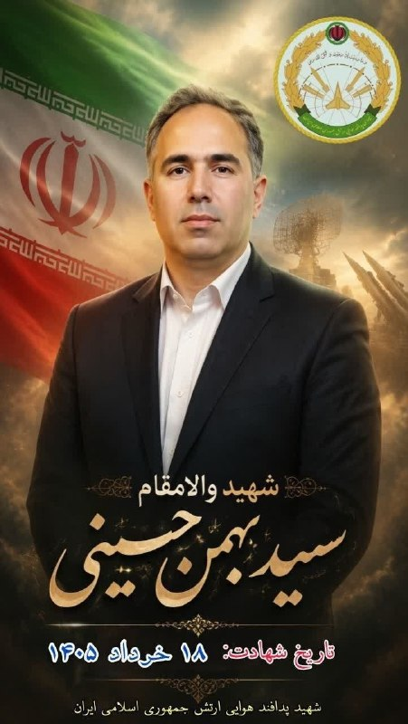

روابط عمومی ارتش، از کشته شدن یکی از پرسنل واحد پدافندی خود به نام "سید بهمن حسینی" در حملات صبح دیروز اسرائیل خبر داد.

📌 @persian_trend_official
پرشین ترند | متفاوت‌ترین کانال نظامی

## Persian_Trend_Official — post 16244

طبق گزارش نیویورک تایمز، یک بالگرد آپاچی ارتش آمریکا در نزدیکی تنگه هرمز سقوط کرد اما هر دو خدمه آن به سلامت به محل امن منتقل شدند.

اکانت های طرفدار جمهوری اسلامی ادعا کردن این هلیکوپتر توسط سپاه مورد اصابت قرار گرفته است !!!

📌 @persian_trend_official
پرشین ترند | متفاوت‌ترین کانال نظامی

## Persian_Trend_Official — post 16243

  <a href="telegram/content/Persian_Trend_Official_16243_1780998793.webm" target="_blank">🎬 Download video</a>

هشدار تخلیه کامل بندر صور و محیط اطراف از سوی ارتش اسرائیل صادر شد!

ارتش اسرائیل دقایقی پیش برای ساکنان شهر صور در جنوب لبنان هشدار تخلیه صادر کرد.

📝 Amir

📌 @persian_trend_official
پرشین ترند | متفاوت‌ترین کانال نظامی

## Persian_Trend_Official — post 16242

  <a href="telegram/content/Persian_Trend_Official_16242_1780998794.webm" target="_blank">🎬 Download video</a>

فارس: تجهیزات هدایت و پشتیبانی جنگنده‌های اسرائیلی در جنگل‌های تنکابن کشف شد

🔴خبرگزاری فارس گزارش داد مجموعه‌ای از تجهیزات فنی و سامانه‌های زمین‌پایه که گفته می‌شود برای پشتیبانی و هدایت جنگنده‌های مهاجم مورد استفاده قرار می‌گرفته، در ارتفاعات جنگلی شهرستان تنکابن در استان مازندران کشف و جمع‌آوری شده است.

🔴بر اساس این گزارش، این تجهیزات در یکی از مسیرهای اصلی ورود جنگنده‌ها به حریم هوایی تهران مستقر بوده‌اند.

🔴فارس مدعی شده منطقه مورد نظر در جریان «جنگ رمضان» یکی از کریدورهای اصلی ورود جنگنده‌های اسرائیلی برای اجرای حملات علیه تهران و مناطق شمالی کشور محسوب می‌شده است.

📌 @persian_trend_official
پرشین ترند | متفاوت‌ترین کانال نظامی

## RadioFarda — post 158088

  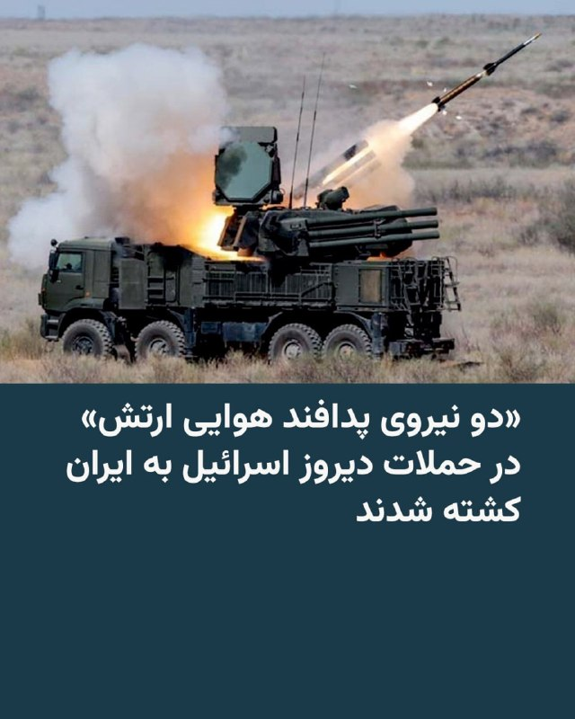

🔸 خبرگزاری تسنیم، نزدیک به سپاه پاسداران، از تشییع جنازه دو نفر از نیروهای پدافند هوایی ارتش که روز دوشنبه درحملات اسرائیل به ایران کشته شدند، خبر داد.

🔸نام این دو نفر، بهمن حسینی و علیرضا عبیری اعلام شده است.

🔸تسنیم در خبر تشییع جنازه این دو نظامی تأیید کرده که هر دو از اعضای نیروی پدافند هوایی ارتش جمهوری اسلامی ایران بودند که روز دوشنبه در حین «انجام مأموریت» کشته شدند.

🔸جمهوری اسلامی به‌طور معمول اخبار مربوط به تلفات نیروهای نظامی خود را که در جریان حملات اسرائیل یا آمریکا به ایران کشته شده‌اند، اعلام نمی‌کند.

🔸روز دوشنبه، رئیس اورژانس استان تهران اعلام کرده بود که در حملات اسرائیل به این استان کسی مصدوم نشده است.

@RadioFarda

## RadioFarda — post 158087

🔸تصاویر دوربین مداربسته لحظه حمله پهپادی روسیه به زاپوریژژیا در اوکراین در روز دوشنبه ۱۸ خرداد را نشان می‌دهد.

🔸به گفته فرماندار منطقه این حمله منجر به کشته و زخمی شدن ۲۵ نفر شده است که از میان آنها دو نفر کشته شده‌اند.

🔸کی‌یف و مسکو یکدیگر را به حمله به نیروگاه هسته‌ای زاپوریژژیا، بزرگترین نیروگاه هسته‌ای اروپا که تحت اشغال روسیه در جنوب شرقی اوکراین است، متهم کرده‌اند.

🔸ولادیمیر پوتین روز جمعه ۱۵ خرداد دیدار قریب‌الوقوع با ولودیمیر زلنسکی را رد کرد و گفت تا زمانی که بر سر چارچوب یک توافق احتمالی صلح توافقی به دست نیاید، «هیچ فایده‌ای» در چنین دیداری نمی‌بیند.

🔸مسکو خواستار کنترل بر منطقهٔ دونباس در شرق اوکراین و اعمال محدودیت‌های گسترده سیاسی و نظامی بر کی‌یف است؛ شروطی که اوکراین و متحدانش آن را در عمل به‌منزلهٔ تسلیم می‌دانند.

@RadioFarda

## RadioFarda — post 158086

کریم خان، دادستان دیوان کیفری بین‌المللی، به اتهام «سوءرفتار جنسی» تعلیق شد

🔸کریم خان، دادستان ارشد دیوان کیفری بین‌المللی، در پی تحقیقات دربارهٔ اتهام «سوءرفتار جنسی» از سمت خود تعلیق شد.

🔸نهاد ناظر بر دیوان کیفری بین‌المللی شامگاه دوشنبه ۱۸ خرداد ضمن اعلام این خبر افزود تصمیم به تعلیق کریم خان پس از آن اتخاذ شد که روند رسیدگی انضباطی به اتهام «سوءرفتار جنسی» در پروندهٔ او به مرحلهٔ نتیجه‌گیری رسید.

🔸کریم خان، وکیل برجسته بریتانیایی، بارها این اتهام‌ها را که نخستین‌بار در سال ۲۰۲۴ مطرح شد، رد کرده است.

🔸نهاد ناظر بر دیوان کیفری بین‌المللی می‌گوید کمیتهٔ اجرایی این نهاد رأی داده است پرونده خان به نشست ویژه کشورهای عضو ارجاع شود تا آن‌ها دربارهٔ آینده حرفه‌ای او تصمیم‌گیری کنند.

🔸کمیتهٔ متشکل از نمایندگان ۲۱ کشور عضو دیوان با اکثریت لازم به این نتیجه رسیده که خان در ارتباط با اتهام‌های سوءرفتار جنسی مرتکب «تخلف جدی» شده است.

🔸این اتهام‌ها از سوی زنی مطرح شده که در مقر دیوان در شهر لاهه برای خان کار می‌کرد.

🔸طرح این ادعاها در سال ۲۰۲۴ باعث آشفتگی و بحران در دورهٔ مدیریت او بر بخش دادستانی دیوان شد.

🔸تصمیم ارجاع پرونده به ۱۲۵ کشور عضو دیوان اقدامی بی‌سابقه در تاریخ این نهاد قضایی بین‌المللی محسوب می‌شود و می‌تواند در نهایت به رأی‌گیری دربارهٔ برکناری دادستان از سمتش منجر شود.

🔸نهاد حاکم بر دیوان در بیانیه‌ای تأکید کرد که تعلیق کریم خان «به معنای تعیین نتیجهٔ نهایی پرونده نیست». خان پیش‌تر نیز به‌طور موقت از مدیریت بخشی از دیوان که مسئول تحقیق و پیگرد افراد متهم به جنایات بین‌المللی است، کنار رفته بود.

🔸در این بیانیه آمده است که کمیتهٔ اجرایی تصمیم خود را بر اساس گزارش یک نهاد نظارتی سازمان ملل، نظر هیئتی از کارشناسان قضایی و همچنین لوایح کتبی ارائه‌شده از سوی خان و فرد شاکی اتخاذ کرده است.

🔸این رأی تازه‌ترین تحول در روندی است که نزدیک به دو سال دیوان کیفری بین‌المللی را درگیر کرده است.

🔸نسخه کامل این گزارش را در وب‌سایت رادیوفردا بخوانید.

@RadioFarda

## RadioFarda — post 158085

  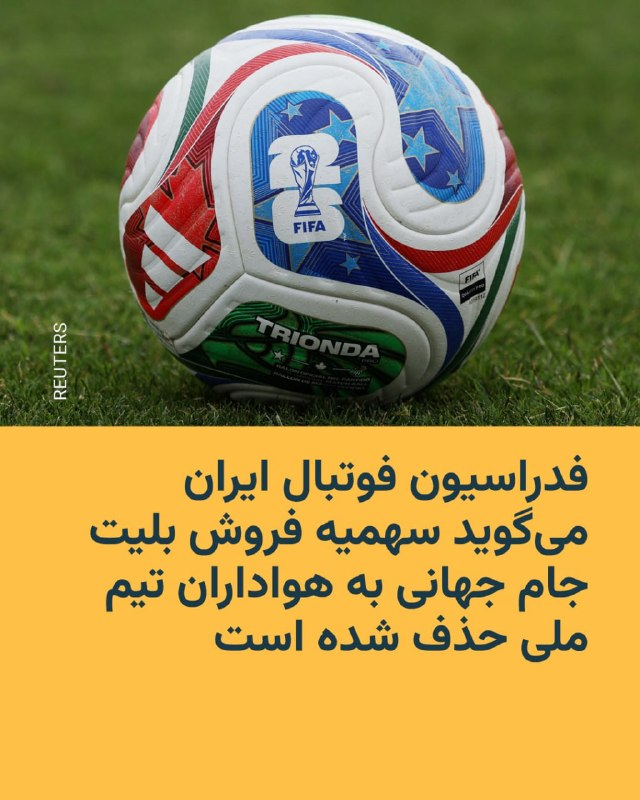

🔸فدراسیون فوتبال ایران می‌گوید تنها چند روز مانده به آغاز جام جهانی فوتبال، سهمیه بلیت‌های اختصاص‌یافته به این فدراسیون «حذف» شده است.

🔸در بیانیه‌ای که فدراسیون فوتبال ایران سه‌شنبه ۱۹ خرداد منتشر کرد، آمده است «این در حالی است که بسیاری از هواداران فوتبال ایران، با اتکا به روند رسمی اعلام‌شده، از پیش برنامه‌ریزی‌های لازم را برای حضور در مسابقات انجام داده بودند.»

🔸به‌گفتهٔ فدراسیون فوتبال ایران، «هشت درصد از ظرفیت بلیت‌های هر مسابقه به فدراسیون‌های حاضر در جام جهانی اختصاص می‌یابد» و این فدراسیون نیز «بر همین اساس از طریق سایت رسمی خود فرآیند فروش بلیت‌های دیدارهای تیم ملی مقابل نیوزیلند، بلژیک و مصر را آغاز کرد».

🔸هنوز فدراسیون جهانی فوتبال، فیفا، و برگزارکنندگان مسابقات جام جهانی ۲۰۲۶ که در آمریکا، مکزیک و کانادا برگزار می‌شود، نسبت به این خبر واکنشی نشان نداده‌اند.

@RadioFarda

## RadioFarda — post 158084

  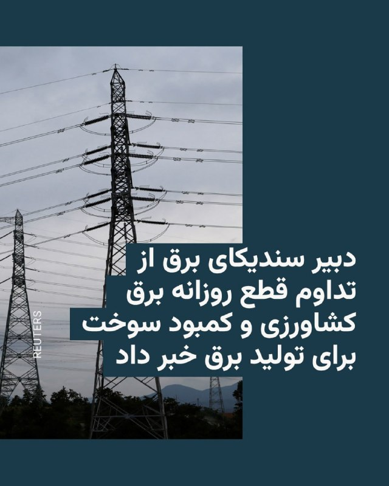

🔸دبیر سندیکای صنعت برق ایران می‌گوید برق بخش کشاورزی در بیش از یک ماه گذشته روزانه پنج ساعت قطع شده و به صنایع نیز ابلاغ شده است که هفته‌ای یک روز با قطع برق مواجه خواهند شد. او همچنین هشدار داد که کمبود سوخت نیروگاه‌ها می‌تواند به خاموشی در تابستان امسال منجر شود.

🔸مهدی مسائلی روز سه‌شنبه ۱۹ خرداد گفت در حال حاضر تأمین برق بخش‌های خانگی و صنعتی در اولویت قرار گرفته و قطع برق بخش کشاورزی به حفظ پایداری شبکه کمک کرده است.

🔸به‌گفتهٔ او، اگر در حال حاضر قطع برق در بخش خانگی و تجاری اعمال نمی‌شود و محدودیت‌های اعلام‌شده برای صنایع هم هنوز به طور کامل اجرا نشده، یکی از دلایل آن قطع برق بخش کشاورزی است.

🔸بر اساس گزارش‌های رسمی، حدود ۱۳ تا ۱۴ درصد مصرف برق ایران مربوط به بخش کشاورزی، حدود ۴۰ درصد مربوط به صنعت و ۳۵ درصد مربوط به بخش خانگی است.

🔸مسائلی همچنین با تأکید بر این‌که منشأ بی‌برقی امسال به کمبود سوخت نیروگاه‌ها مربوط است، افزود اگر مشکل تأمین گاز نیروگاه‌ها تا پاییز و زمستان برطرف نشود، ناترازی برق در ماه‌های سرد سال نیز ادامه خواهد یافت.

@RadioFarda

## RadioFarda — post 158083

هزینه تسلیحات هسته‌ای جهان ۱۹ درصد افزایش یافت؛ روزانه ۳۲۵ میلیون دلار

🔸هزینهٔ کشورهای دارای سلاح هسته‌ای برای زرادخانه‌های اتمی خود در سال ۲۰۲۵ به حدود ۱۱۹ میلیارد دلار رسید. این رقمی، به‌گفتۀ «کارزار بین‌المللی برای نابودی سلاح‌های هسته‌ای» (آیکَن)، نسبت به سال قبل ۱۹ درصد افزایش یافته و معادل بیش از سه هزار و ۷۰۰ دلار در هر ثانیه است.

🔸آیکن روز سه‌شنبه ۱۹ خرداد در گزارش سالانهٔ خود اعلام کرد که ۹ کشور دارای سلاح هسته‌ای در سال گذشتهٔ میلادی در مجموع ۱۱۸ میلیارد و ۸۰۰ میلیون دلار صرف توسعه، نگهداری و نوسازی زرادخانه‌های اتمی خود کرده‌اند.

🔸این سازمان که ائتلافی از صدها گروه مدنی و غیردولتی در سراسر جهان است و در سال ۲۰۱۷ به دلیل تلاش برای پیشبرد پیمان منع سلاح‌های هسته‌ای سازمان ملل جایزهٔ نوبل صلح را دریافت کرد، هشدار داده است که جهان با روند فزایندهٔ سرمایه‌گذاری در تسلیحات هسته‌ای روبه‌رو است.

🔸بر اساس این گزارش، ایالات متحده با ۶۹ میلیارد و ۲۰۰ میلیون دلار همچنان بزرگ‌ترین هزینه‌کنندهٔ هسته‌ای جهان است. این رقم از مجموع هزینه‌های هشت کشور دیگر دارای سلاح هسته‌ای نیز بیشتر است.

🔸گزارش می‌گوید افزایش هزینه‌های هسته‌ای تنها به دولت‌ها محدود نمی‌شود و شرکت‌های خصوصی فعال در این حوزه نیز از این روند سود می‌برند.

🔸نسخه کامل این گزارش را در وب‌سایت رادیوفردا بخوانید.

@RadioFarda

## RadioFarda — post 158082

  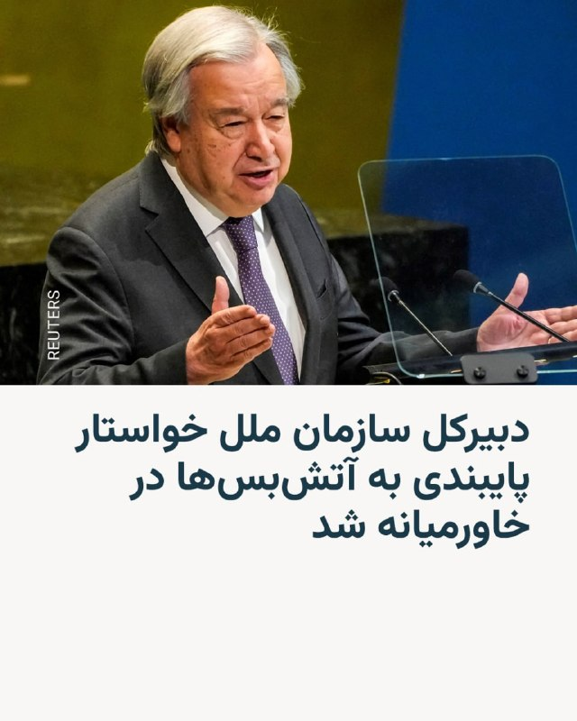

🔸 دبیرکل سازمان ملل متحد با ابراز نگرانی عمیق از تشدید دوباره تنش‌ها در خاورمیانه، از همه طرف‌های درگیر خواست فوراً حملات را متوقف کنند، نهایت خویشتنداری را به خرج دهند و از هر اقدامی که به بحرانی‌تر شدن اوضاع منجر شود، خودداری کنند.

🔸در بیانیه‌ای که شامگاه دوشنبه ۱۸ خرداد از سوی فرحان حق، معاون سخنگوی دبیرکل سازمان ملل، منتشر شد، آنتونیو گوترش از همه طرف‌ها خواست به آتش‌بس‌های موجود در لبنان، ایران و غزه به‌طور کامل پایبند بمانند و از اقداماتی که تلاش‌های دیپلماتیک جاری را تضعیف می‌کند، پرهیز کنند.

🔸دبیرکل سازمان ملل همچنین از تصمیم اسرائیل برای بستن گذرگاه‌های غزه ابراز نگرانی شدید کرد و خواستار بازگشایی فوری همه گذرگاه‌ها برای انتقال سریع، ایمن و بدون مانع کمک‌های بشردوستانه به سراسر غزه شد.

🔸او همچنین بر لزوم احترام به حقوق و آزادی‌های کشتیرانی مطابق حقوق بین‌الملل تأکید کرد و از همه طرف‌ها خواست تعهدات خود را در قبال حقوق بین‌الملل رعایت کرده و از غیرنظامیان حفاظت کنند.

@RadioFarda

## RadioFarda — post 158081

  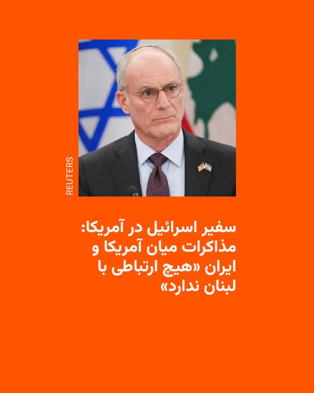

🔸یحیئل لایتر، سفیر اسرائیل در آمریکا، روز دوشنبه ۱۸ خرداد در گفت‌وگو با شبکه فاکس نیوز گفت مذاکرات میان آمریکا و ایران «هیچ ارتباطی با لبنان ندارد» و افزود که «لبنان در صورت تداوم پیوند با ایران آینده‌ای نخواهد داشت».

🔸سفیر اسرائیل در آمریکا گفت: «مسئله اصلی این است که ایران تلاش می‌کند مذاکرات با ایالات متحده را به لبنان گره بزند، در حالی که این مذاکرات هیچ ارتباطی با لبنان ندارند.»

🔸او افزود: «وقتی ما حزب‌الله را هدف قرار می‌دهیم، این موضوع هیچ ارتباطی به ایران ندارد و ایران باید از این مسئله دور بماند.»

🔸سفیر اسرائیل در آمریکا اما در همین روز در گفت‌وگویی دیگر، با شبکه سی‌ان‌ان، گفت امیدوار است جنگ با ایران ظرف دو هفته آینده پایان یابد و تأکید کرد اسرائیل نمی‌خواهد مانع تلاش‌های ترامپ برای مذاکره شود.

🔸او گفت اسرائیل و آمریکا «با هم» وارد جنگ با حکومت ایران شده‌اند و هدف این است که پایان جنگ مانع از تهدید دوباره منطقه و جهان از سوی تهران شود.

@RadioFarda

## RadioFarda — post 158080

🔸 دونالد ترامپ، رئیس‌جمهور آمریکا شامگاه دوشنبه ۱۸ خرداد در فرودگاه جان اف کندی در جمع خبرنگاران گفت که مذاکرات با ایران متوقف نشده و «خوب پیش می‌رود».

🔸ترامپ با تاکید بر اینکه مذاکرات با ایران در حال انجام است گفت: «ما می‌توانیم دست‌کم تا یک یا دو روز آینده به ایده‌ای برسیم، اما فکر می‌کنم اوضاع خوب پیش می‌رود.»

🔸او همچنین بر ادامه محاصره دریایی ایران تاکید کرد و افزود: «محاصره ۱۰۰٪ پابرجاست و هیچ چیز از محاصره ما عبور نمی‌کند.»

🔸رئیس‌جمهور آمریکا، روز دوشنبه در یک گردهمایی تلفنی انتخاباتی در حمایت از لیندزی گراهام، سناتور کارولینای جنوبی، گفت ایالات متحده طی دو هفته آینده «پیروزی کامل» بر ایران را اعلام خواهد کرد.

🔸همزمان محمدباقر قالیباف، رئیس مجلس شورای اسلامی و مشاوره کننده ارشد جمهوری اسلامی روز دوشنبه در یک پیام صوتی تازه گفت که «هدف ما پایان جنگ و ایجاد امنیت پایدار است، نه عادی‌سازی روابط با آمریکا.»

@RadioFarda

## RadioFarda — post 158079

  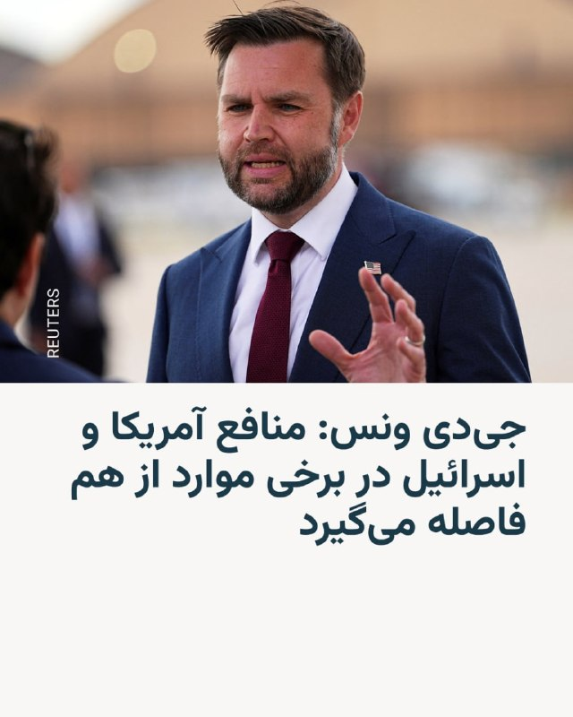

🔸جی‌دی ونس، معاون رئیس‌جمهور آمریکا، می‌گوید با آن‌که ایالات متحده و اسرائیل «منافع مشترک زیادی دارند»، اما در برخی موارد نیز منافع‌شان «از هم فاصله می‌گیرد».

🔸ونس در گفت‌و‌گو با فاکس‌نیوز گفت در حالی که اسرائیل در قبال ایران، «آشکارا اهداف خاص خود را دارد، هدف اصلی ایالات متحده در قبال ایران این است که اطمینان حاصل کند ایران به سلاح هسته‌ای دست پیدا نکند.»

🔸او همچنین افزود که آمریکا طی یک سال و نیم گذشته، «فضای لازم» برای دستیابی به یک توافق بلندمدت بر سر پروندهٔ هسته‌ای ایران را ایجاد کرده است.

🔸در یک سال و نیم گذشته، چند دور مذاکرات مستقیم و غیرمستقیم بین ایران و آمریکا شکل گرفت که دو دور آن با جنگ به بن‌بست خورد. مذاکرات جاری میان ایران و آمریکا نیز پس از جنگ ۴۰ روزه آغاز شده اما هنوز به نتیجه مشخصی نرسیده است.

🔸معاون دونالد ترامپ در این باره افزود: «اسرائیل ممکن است از این موضوع خوشش بیاید یا نیاید، اما در نهایت ما معتقدیم که این به نفع ایالات متحده آمریکاست.»

@RadioFarda

## IranianMinds — post 21899

  <a href="telegram/content/IranianMinds_21899_1780998797.mp4" target="_blank">🎬 Download video</a>

🔴از مراد ویسی پرسیدن، آیا امکان داره محسن رضایی آدم اسرائیل باشه؟

@IranianMinds

## IranianMinds — post 21898

  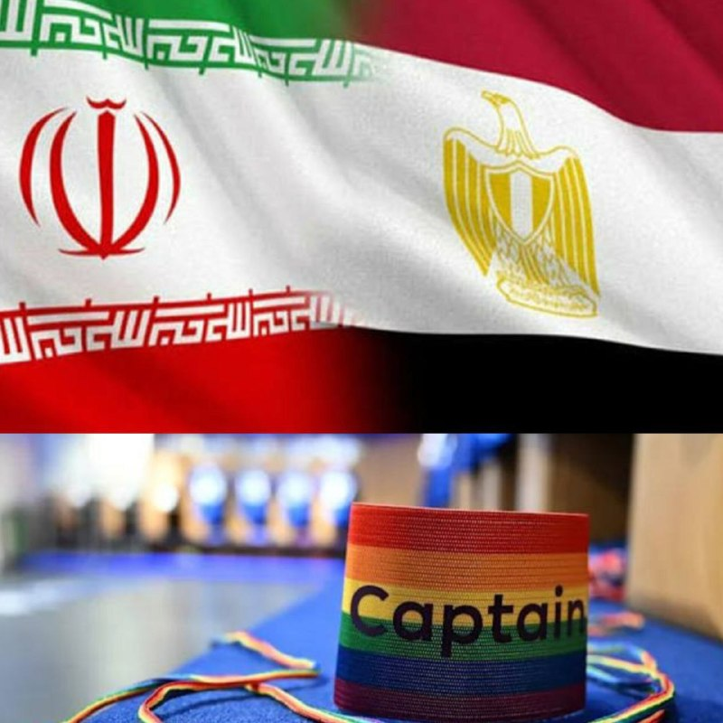

🔴 بیانیه رسمی فیفا :

دیدار ایران و مصر قطعا دیدار افتخار همجنسگرایان خواهد بود و به هیچ عنوان این رویداد لغو نخواهد شد.

کاپیتان های هردو تیم باید بازوبند رنگین کمونی🏳‍🌈 ببندن

@IranianMinds

## IranianMinds — post 21897

🔴مصطفی پوردهقان،نماینده مجلس:

وزیر ارتباطات در کمیسیون قول دادند که فضا را به شرایط عادی برگردانند و بعد از رفع فیلتر واتساپ، رفع فیلتر یوتیوب هم در دستور کار بود.

یجورایی داره میگه پسرای خوبی باشید تا براتون رفع فیلتر کنیم ☺️☺️☺️

@IranianMinds

## IranianMinds — post 21896

  <a href="telegram/content/IranianMinds_21896_1780998799.mp4" target="_blank">🎬 Download video</a>

🔴جی‌ دی ونس :
ایرانی ها نمی‌خوان این جنگ پیدا کنه چون به نفعشون نیست.

@IranianMinds

## IranianMinds — post 21895

تو خاورمیانه

وقتی بیدارمیشید ۲ حالت بیشتر نداره
یا جنگ شده
یا روز دختره

@IranianMinds

## IranianMinds — post 21894

🔴 ترامپ درباره نتانیاهو :

به نتانیاهو حمله شد و اونا هم متقابلاً پاسخ دادن. من نمیتونم اونو به خاطر این موضوع سرزنش کنم.

اونارو هدف قرار دادن و اونا هم متقابلاً پاسخ دادن و حالا درگیری تمام شده.
بنابراین، اونا قراره فقط برای یک هفته دیگه یا چیزی در اون حدود، فعلاً وضعیت رو متوقف کنن.

این وضعیت خاورمیانه مدت زیادی است که ادامه داره. اگه واقعاً بخوام بگم، حدود ۳۰۰۰ سال اما مطمئناً ۴۷ ساله که اینگونه بوده.

@IranianMinds

## IranianMinds — post 21893

دوستان کسی از آقای خرچنگ خبری داره؟

از روزای پیش که رستورانش خراب شده دیگه هیچ خبری ازش نیست
نکنه ایشون هم ۲ ۳ ماه خاک نشه؟

@IranianMinds

## BBCPersian — post 283250

  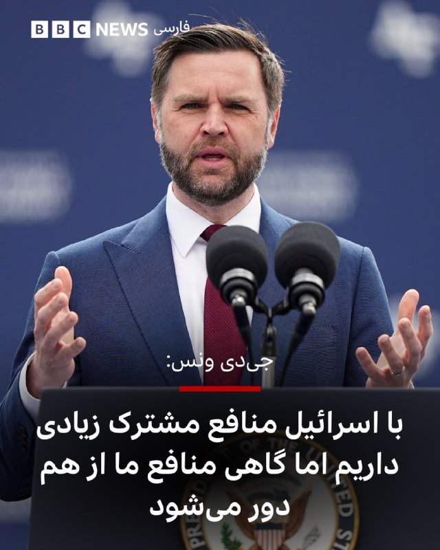

🔻جی‌دی ونس، معاون رئیس جمهور آمریکا، روز دوشنبه به شبکه خبری فاکس گفت اگرچه ایالات متحده و اسرائیل منافع مشترکی دارند، رویکرد واشنگتن درباره جمهوری اسلامی از طریق آنچه دونالد ترامپ فکر می‌کند برای ایالات متحده بهتر است، هدایت خواهد شد.

او گفت: «ما، اسرائیلی‌ها و ایالات متحده، منافع مشترک زیادی داریم.»

آقای ونس افزود: «اما ما همچنین موقعیت‌هایی داریم که منافع ما از هم دور می‌شود.»

او هدف اصلی سیاست ایالات متحده درباره ایران را حصول اطمینان از عدم دستیابی ایران به سلاح هسته‌ای خواند.

معاول رئیس‌جمهور آمریکا گفت: «در طول یک سال و نیم گذشته، ما فضای لازم را ایجاد کرده‌ایم، رئیس جمهور معتقد است- و من فکر می‌کنم حق با اوست- که می‌توانیم به یک توافق بلندمدت برای موضوع هسته‌ای ایران دست یابیم.»

او گفت: «الان، اسرائیل ممکن است این را دوست داشته باشد، یا دوست نداشته باشد، اما اساسا، ما فکر می‌کنیم که این به نفع ایالات متحده آمریکا است.»

جی‌دی ونس افزود که واشنگتن دنبال کردن این هدف را ادامه خواهد داد زیرا «رئیس جمهور ایالات متحده برای انجام آن انتخاب شده است.»

@BBCPersian
📷 REUTERS

## BBCPersian — post 283249

🔻قوه قضائیه از توقیف اموال بیشتری از علی کریمی خبر داد

قوه قضائیه می‌گوید اموال جدیدی از علی کریمی، ستاره پیشین تیم ملی فوتبال، شناسایی و دستور توقیفشان صادر شده است.

به گفته قوه قضائیه این اموال شامل یک ویلای ۳ طبقه به متراژ ۱۱۵۰ متر مربع در شهرستان لاهیجان استان گیلان است.

قوه قضائیه پیشتر گفته بود که ۲ واحد تجاری و ۴ واحد مسکونی متعلق به علی کریمی را شناسایی و توقیف کرده است. ویدئویی هم از یک ساختمان منتشر کرده و گفته بود متعلق به علی کریمی است.

علی کریمی یکی از چهره‌های معترض به‌خصوص بعد از اعتراضات سراسری زن، زندگی، آزادی است و قوه قضائیه او را به ایجاد اغتشاش و آشوب متهم می‌کند.

رسانه‌های ایران از جمله فارس پیشتر نوشته بودند که علی کریمی تمام اموالش در ایران را فروخته است.

قوه قضائیه می‌گوید این ساختمان‌ها متعلق به «فرزند علی کریمی» است.

قوه قضائیه پس از شروع جنگ اخیر با استناد به قانون «تشدید مجازات جاسوسی» صدها نفر را به اتهام «همراهی یا همکاری با دشمن» بازداشت یا اموالشان را توقیف و مصادره کرده است.

در زمان اعتراضات دی‌ماه هم اموال بعضی از چهره‌های شناخته شده در داخل ایران ضبط شد.

@BBCPersian

## BBCPersian — post 283248

🔻فدراسیون فوتبال ایران: سهمیه فروش بلیت جام جهانی به هواداران تیم ملی حذف شده است

فدراسیون فوتبال ایران می گوید که سهمیه اختصاص یافته به این فدراسیون برای فروش بلیت به هواداران تیم ملی لغو شده است.

فدارسیون فوتبال با انتشار بیانیه‌ای گفته است در حالی که کمتر از سه روز به شروع بازی‌ها باقی مانده است، آمریکا اقدام به «کارشکنی برای حضور هواداران ایرانی در ورزشگاه محل برگزاری سه بازی تیم ملی در مرحله گروهی جام بیست و سوم کرده است.»

در این بیانیه گفته شده است طبق روال فیفا، حدود ۸ درصد از ظرفیت بلیت هر مسابقه در جام جهانی به فدراسیون‌های تیم‌های حاضر اختصاص داده می شود تا هواداران بتوانند از مسیر رسمی اقدام به خرید کنند وفدراسیون فوتبال ایران هم بر همین اساس فروش بلیت بازی‌های تیم ملی را آغاز کرده بود، اما حال گزارش‌ها نشان می‌دهد این سهمیه گرفته شده و در حال حاضر امکان عرضه بلیت از طریق فدراسیون وجود ندارد.

در این بیانیه همچنین گفته شده است محروم کردن هواداران ایرانی از دسترسی به سهمیه قانونی و رسمی بلیت‌های اختصاص‌یافته، اقدامی «مغایر با روح حاکم بر رقابت‌های بین‌المللی و اصل برابری میان کشورهای شرکت‌کننده است.»
@BBCPersian

## BBCPersian — post 283241

وشنوکانت تیواری و سمیر خان
شغل,بی‌بی‌سی
در یکی از عجیب‌ترین پرونده‌های کلاهبرداری ازدواج در هند، ده‌ها مرد که با امید آغاز زندگی مشترک راهی شهر دواس در ایالت مادیا پرادش شده بودند، پس از ساعت‌ها انتظار دریافتند قربانی یک شبکه سازمان‌یافته فریب و سوءاستفاده شده‌اند.

صبح روز ۲۴ مه، فضای معبد ماتا تکری در دواس حال‌وهوای یک مراسم ازدواج بزرگ را داشت. مردانی از شهرها و روستاهای مختلف، برخی همراه خانواده و بستگان خود و برخی با خودروهای کرایه‌ای، به محل تعیین‌شده آمده بودند. بسیاری از گل مخصوص مراسم ازدواج به گردن داشتند و خود را برای یکی از مهم‌ترین روزهای زندگی‌شان آماده می‌کردند.

به آن‌ها گفته شد که ظرف ۲۴ ساعت آینده ازدواج خواهند کرد. اما صبح که گذشت، شب از راه رسید و نه خبری از عروس‌ها شد و نه مراسمی برگزار شد.
متن کامل خبر در لینک زیر:

https://bbc.in/4dVMNVg
📸Getty/ SAMEER KHAN/
@BBCPersian

## BBCPersian — post 283240

  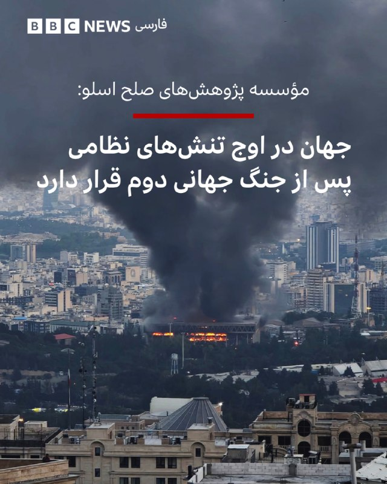

🔻نتایج یک پژوهش منتشرشده در نروژ نشان می‌دهد که جهان در سال ۲۰۲۵ بالاترین سطح درگیری‌ها از زمان پایان جنگ جهانی دوم را تجربه کرده است.

این گزارش همچنین از افزایش قابل‌توجه حملات علیه غیرنظامیان ابراز نگرانی کرده و نسبت به تشدید این روند هشدار داده است.

گزارش سالانه «روندهای درگیری» مؤسسه پژوهش‌های صلح اسلو نشان می‌دهد که شمار درگیری‌های ثبت‌شده در جهان طی سال گذشته میلادی به «۶۵مورد» رسیده است؛ درگیری‌هایی که دست‌کم یک دولت در آن‌ها نقش داشته و تعدادشان از سال ۱۹۴۶ تاکنون بی‌سابقه بوده است.

بر اساس این گزارش درگیری‌های مستقیم میان دولت‌ها هم به بالاترین سطح خود در ۸۰ سال اخیر رسیده و تعداد آن‌ها نسبت به سال قبل دو برابر شده است و به هشت مورد افزایش یافته است.

سیری آس روستاد، پژوهشگر این مؤسسه، به خبرنگاران گفت: «متأسفانه نکات مثبت زیادی برای گفتن وجود ندارد. معمولاً می‌توانم جنبه‌ای امیدوارکننده پیدا کنم، اما امسال اعداد و ارقام واقعاً شوکه‌کننده هستند.»

سال گذشته سومین سال مرگبار از زمان پایان جنگ سرد بود.

@BBCPersian
📷 Getty Images

## BBCPersian — post 283239

🔻ترامپ در واکنش به سقوط هلی‌کوپتر آپاچی در تنگه هرمز: خلبانان سالم هستند

دونالد ترامپ، رئیس‌جمهور آمریکا، روز سه‌شنبه در واکنش به سقوط یک هلی‌کوپتر آپاچی ارتش آمریکا در نزدیکی تنگه هرمز گفت «خلبانان این هلی کوپتر سالم هستند.»

آقای ترامپ که در فرودگاه بین‌المللی «جان‌اف کندی» و پیش از بازگشت به واشنگتن صحبت می‌کرد، گفت: «هیچ‌کس زخمی نشده است.»

او افزود که دولت آمریکا بعدا در روز سه‌شنبه گزارشی درباره این حادثه منتشر خواهد کرد.

روزنامه نیویورک تایمز اواخر دیروز به نقل از دو فرد آگاه به جزئیات گزارش داد که یک هلی کوپتر آپاچی ارتش آمریکا در نزدیکی تنگه هرمز سقوط کرده و دو خدمه آن نجات یافته‌اند.

در گزارش نیویورک تایمز آمده است که هنوز مشخص نیست آیا این هلی‌کوپتر بر اثر شلیک نیروهای ایرانی سرنگون شده یا دچار نقص فنی شده و یا به دلیل مشکل دیگری سقوط کرده است.

@BBCPersian

## Dirty_Kids — post 391441

‏مامور تحویل دیجی‌کالا همیشه میگفت برو بهم ۵ستاره بده و تو حقوق تاثیر داره.

شماره‌ش تو تلگرام به چشمم خورد دیدم عکس قاسم سلیمانی پروفایلشه. با حقوقت خدافظی کن.

@Dirty_Kids 👻

## Dirty_Kids — post 391440

  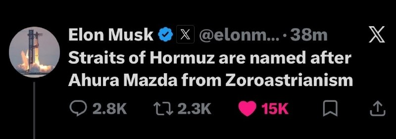

ایلان ماسک میگه تنگه هرمز از اسم اهورا مزدا گرفته شده و حسن نصرالله میگفت چیزی به نام تمدن پارسی وجود نداره،حالا شما بگید کی دوست ماست و کی دشمنمون؟

@Dirty_Kids 👻

## Dirty_Kids — post 391439

  <a href="telegram/content/Dirty_Kids_391439_1780998802.mp4" target="_blank">🎬 Download video</a>

بزن که خوب میزنی، اجرای ترکیبی چندتا داف

@Dirty_Kids 👻

## Dirty_Kids — post 391438

  <a href="telegram/content/Dirty_Kids_391438_1780998803.mp4" target="_blank">🎬 Download video</a>

دیگه کسی بتخمشم نیست تیم آخوندی مجبور شدن از پرستوها تو ژانر غیرتخصصی‌شون استفاده کنن

باور کن تو عمرش دوتا بازی ندیده این همش تو خونه عفاف صیغه میشه

@Dirty_Kids 👻

## Dirty_Kids — post 391437

‏از این «سی میلیون جانفدا»؛ سه هزار نفر نمیخوان برن لبنان؟! بکی جواب منو بده!

@Dirty_Kids 👻

## Dirty_Kids — post 391434

  <a href="telegram/content/Dirty_Kids_391434_1780998805.mp4" target="_blank">🎬 Download video</a>

🔴 کیوت‌ترین چیزی که امروز می‌تونید ببینید این ویدیوی فو بائو (Fu Bao)، پاندای چینی هست؛

پاندایی که حدود سه ماه از مراقبش (کسی که از بدو تولد کنارش بود) جدا میشه؛ بعد از این مدت، دوباره صدای مراقبش رو می‌شنوه و واکنشش به اون صدا حسابی سوژه رسانه‌ها میشه.

این تیکه از ویدیو و واکنش پاندا به یکی از پربازدیدترین ویدیوهای سال 2025 تو تیک‌تاک تبدیل میشه.

@Dirty_Kids 👻

## Dirty_Kids — post 391433

  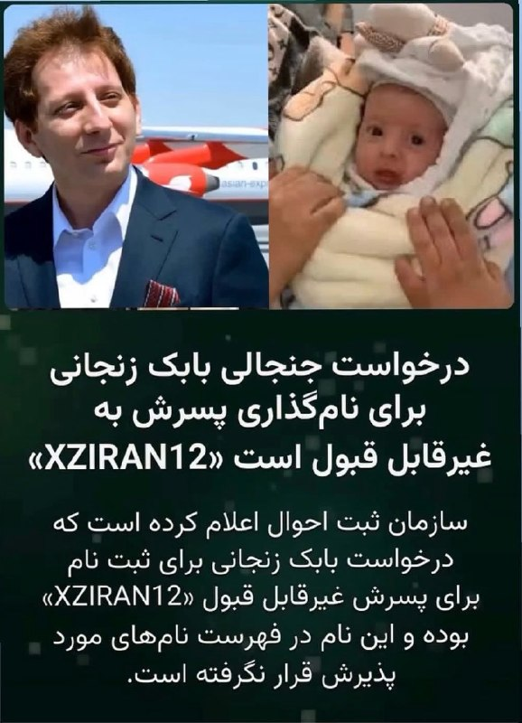

بابک زنجانی نمونه‌ی آدم متوهم، خود ایلان ماسک پندار. وقتی با رانت کلاشی بیای بالا، تو زندگیت فقط از راه دلالی کلاهبرداری شارلاتانیزم به الاف الوفی برسی همین میشه که بخوای اسم بچه ات بزاری XZIRAN12 .

@Dirty_Kids 👻

## Hranews — post 113482

اموال ۱۳ شهروند در زرین‌دشت توقیف شد

❗️
❗️
❗️
❗️
❗️– رئیس کل دادگستری استان فارس از تشکیل پرونده قضایی برای بیش از ۲۰ نفر در ارتباط با یک کانال تلگرامی در شهرستان زرین‌دشت خبر داد. به گفته وی، تاکنون اموال ۱۳ نفر از متهمان این پرونده توقیف شده است.

ادامه مطلب

#تشکیل_پرونده #توقیف_اموال

↘️
@hranews_bot تماس ✉️ - @Hranews کانال هرانا 🆑

## Hranews — post 113481

یک زن در تهران به تحمل ضربات شلاق محکوم شد

❗️
❗️
❗️
❗️
❗️– یک زن در تهران در پی رسیدگی قضایی به اتهامات مرتبط با رابطه خارج از چارچوب زناشویی، توسط شعبه هشت دادگاه کیفری یک این استان به ۱۰۰ ضربه #شلاق و انجام کار خدماتی محکوم شد.

ادامه مطلب

↘️
@hranews_bot تماس ✉️ - @Hranews کانال هرانا 🆑

## Hranews — post 113480

  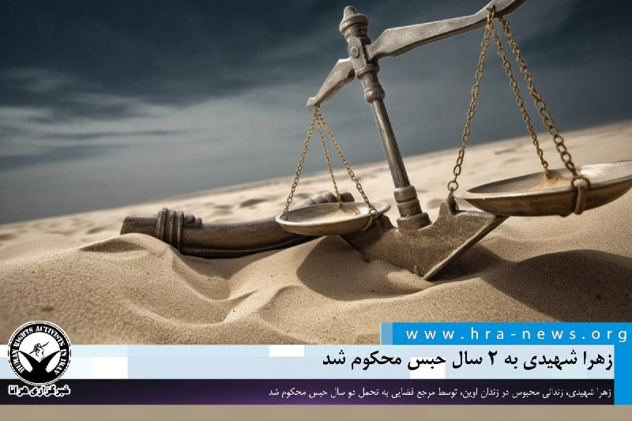

اعتراضات ۱۴۰۴؛ زهرا شهیدی به ۲ سال حبس محکوم شد

❗️
❗️
❗️
❗️
❗️– زهرا شهیدی، از بازداشت شدگان اعتراضات سراسری ۱۴۰۴، محبوس در زندان اوین، توسط مرجع قضایی به تحمل دو سال حبس محکوم شد.

به گزارش خبرگزاری هرانا، ارگان خبری مجموعه فعالان حقوق بشر در ایران، زهرا شهیدی به حبس محکوم شد.

مرجع قضایی صادر کننده این حکم، اخیرا خانم شهیدی را به تحمل دو سال زندان محکوم کرده است. این محکومیت همچنین به از دست دادن شغل وی منجر شده است.

ادامه مطلب

#زهرا_شهیدی

↘️
@hranews_bot تماس ✉️ - @Hranews کانال هرانا 🆑

## Hranews — post 113479

با حکم دادگاه انقلاب بوکان؛ رسول یادیار به حبس و مجازات تکمیلی محکوم شد

❗️
❗️
❗️
❗️
❗️– رسول یادیار، شهروند اهل بوکان توسط دادگاه انقلاب این شهرستان به ۹ سال حبس و دو سال منع خروج از کشور محکوم شد.

ادامه مطلب

#رسول_یادیار

↘️
@hranews_bot تماس ✉️ - @Hranews کانال هرانا 🆑

## Hranews — post 113478

وهاب حسین‌زاده از زندان مهاباد آزاد شد

❗️
❗️
❗️
❗️
❗️– روز گذشته، وهاب حسین‌زاده، شهروند بازداشتی اهل مهاباد، با تودیع وثیقه از زندان این شهرستان آزاد شد.

ادامه مطلب

#وهاب_حسین‌زاده

↘️
@hranews_bot تماس ✉️ - @Hranews کانال هرانا 🆑

## Hranews — post 113477

  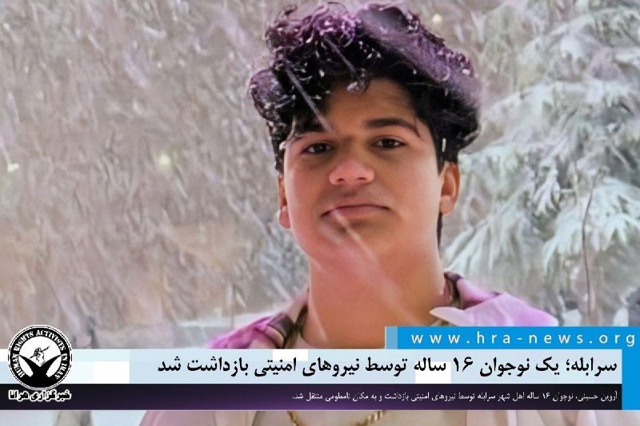

سرابله؛ یک نوجوان ۱۶ ساله توسط نیروهای امنیتی بازداشت شد

❗️
❗️
❗️
❗️
❗️– آروین حسینی، نوجوان ۱۶ ساله اهل سرابله روز گذشته، توسط نیروهای امنیتی در این شهر بازداشت و به مکان نامعلومی منتقل شد.

به گزارش خبرگزاری هرانا، ارگان خبری مجموعه فعالان حقوق بشر در ایران، یک نوجوان در سرابله #بازداشت شد.

هویت او، آروین حسینی، ۱۶ ساله و اهل شهر سرابله توسط هرانا احراز شده است.

ادامه مطلب

#آروین_حسینی

↘️
@hranews_bot تماس ✉️ - @Hranews کانال هرانا 🆑

## manototv — post 105977

  <a href="telegram/content/manototv_105977_1780998807.mp4" target="_blank">🎬 Download video</a>

نیک وی‌آچیچ با سندرم تترا آملیا متولد شد؛ بدون دست و پا. کودکی و نوجوانی سختی را پشت سر گذاشت، اما اجازه نداد قضاوت دیگران، ترس، افسردگی یا محدودیت‌های جسمی، معنای زندگی‌اش را تعیین کند.

پیام او ساده است، اما عمیق:

همه ما در زندگی زمین می‌خوریم.

همه ما روزهای سخت داریم.

همه ما گاهی از آینده می‌ترسیم، یا نگران قضاوت دیگران می‌شویم.

## manototv — post 105970

  <a href="telegram/content/manototv_105970_1780998808.mp4" target="_blank">🎬 Download video</a>

بحران سیاسی ایران بیش از آنکه نیازمند مهندسی یک نظم کاملا تازه باشد، نیازمند بازسازی پیوندهای گسسته میان جامعه، قانون و دولت است. محافظه‌کاری ایرانی، در این معنا، بازگشت به گذشته نیست، بلکه تلاشی برای حفظ تداوم تاریخی و بازسازی تدریجی زمین سیاست در ایران است.

## alonews — post 126481

  <a href="telegram/content/alonews_126481_1780998809.webm" target="_blank">🎬 Download video</a>

👈آخرین قیمت نفت ۹۲.۱۹ دلار

✅ @AloNews خبر جنگ

## alonews — post 126480

  <a href="telegram/content/alonews_126480_1780998809.webm" target="_blank">🎬 Download video</a>

👈نیروهای اسرائیلی در یک بازرسی نزدیک اورشلیم، هشت عرب از یهودیه و سامریه را که در دیوار دوجداره یک خودروی تجاری پنهان شده بودند، کشف کردند. راننده تلاش کرد فرار کند، اما پس از تعقیبی کوتاه دستگیر شد.

✅ @AloNews خبر جنگ

## alonews — post 126479

  <a href="telegram/content/alonews_126479_1780998809.webm" target="_blank">🎬 Download video</a>

👈 به گزارش تسنیم دو عضو از یگان‌های پدافند هوایی روز گذشته در حمله اسرائیل کشته شدند

✅ @AloNews خبر جنگ

## alonews — post 126478

  <a href="telegram/content/alonews_126478_1780998809.webm" target="_blank">🎬 Download video</a>

👈زلنسکی، رئیس جمهور اوکراین :
- روسیه جنگ رو نمی‌بازه، ولی هر روز داره کم‌کم ابتکار عمل رو از دست می‌ده

✅ @AloNews خبر جنگ

## alonews — post 126477

👈جهت رزرو تبلیغات فوتبالی ویژه جام جهانی و vpn در الونیوز به اینجا مراجعه کنید
⬇️

https://t.me/ads_alonews
https://t.me/ads_alonews

## alonews — post 126476

  <a href="telegram/content/alonews_126476_1780998810.webm" target="_blank">🎬 Download video</a>

👈 یک شاهد عینی اعتراضات روز سه‌شنبه در هرات به افغانستان اینترنشنال گفت که یک کشته و دست‌کم ۲۲ زخمی را از نزدیک مشاهده کرده است.

🔴منابع محلی دیگر نیز زخمی شدن شماری از شهروندان و احتمال کشته شدن یک نفر را تأیید کرده‌اند. با این حال، تاکنون آمار دقیقی از شمار قربانیان در دست نیست.

🔴اعتراضات روز سه‌شنبه در منطقه جبرئیل هرات در واکنش به موج بازداشت زنان از سوی طالبان آغاز شد. به گفته شاهدان و منابع محلی، نیروهای طا/لبان برای متفرق کردن معترضان به سوی مردم شلیک کردند و تجمعات اعتراضی را سرکوب کردند.

🔴منابع همچنین گفته‌اند که طالبان شماری از معترضان را بازداشت کرده و برای بازداشت زخمی‌ها و معترضان به شفاخانه‌ها مراجعه کرده‌اند. به گفته منابع محلی، طالبان همزمان نیروهای بیشتری را در منطقه جبرئیل مستقر کرده‌اند و فضای شهر به‌شدت امنیتی و نظامی شده است.

🔴طالبان تاکنون به‌طور رسمی درباره این رویدادها اظهار نظر نکرده است.

✅ @AloNews خبر جنگ

## alonews — post 126475

  <a href="telegram/content/alonews_126475_1780998810.webm" target="_blank">🎬 Download video</a>

👈 ترامپ به بی‌بی‌سی: اگر به نتانیاهو بگویم کاری انجام دهد، او انجام می‌دهد

✅ @AloNews خبر جنگ

## alonews — post 126474

  <a href="telegram/content/alonews_126474_1780998810.webm" target="_blank">🎬 Download video</a>

👈تنکرترکرز: نفت‌کشی که در ۱۵ مایل دریایی سواحل عمان دچار آتش‌سوزی شد، با شلیک جنگنده F-18 آمریکا از کار افتاده است؛ موضوعی که سنتکام نیز در بیانیه‌ای به آن اشاره کرده است.

✅ @AloNews خبر جنگ

## alonews — post 126473

  <a href="telegram/content/alonews_126473_1780998810.webm" target="_blank">🎬 Download video</a>

👈 سخنگوی دولت: ایران و لبنان نه نیروهای نیابتی یکدیگر هستند، نه برای هم می‌جنگند، بلکه دشمنی مشترک دارند

🔴 تیم دیپلماسی ما متشکل از افرادی است که به شدت به میدان آگاهی دارند

✅ @AloNews خبر جنگ

## alonews — post 126472

  <a href="telegram/content/alonews_126472_1780998810.webm" target="_blank">🎬 Download video</a>

👈شاخص کل بورس در پایان معاملات امروز با جهش بیش از 114 هزار واحدی به 4 میلیون و 540 هزار واحد رسید

✅ @AloNews خبر جنگ

## alonews — post 126471

  <a href="telegram/content/alonews_126471_1780998810.webm" target="_blank">🎬 Download video</a>

👈عوستاد خوش چشم: فکر نمیکنم حالا حالاها جنگ بشه

✅ @AloNews خبر جنگ

## alonews — post 126470

  <a href="telegram/content/alonews_126470_1780998810.webm" target="_blank">🎬 Download video</a>

👈وزیر ارتباطات: شبکه داخلی ما با قطعی طولانی‌مدت اینترنت، آسیب‌پذیر می‌شود

✅ @AloNews خبر جنگ

## alonews — post 126469

  <a href="telegram/content/alonews_126469_1780998811.webm" target="_blank">🎬 Download video</a>

👈یوتیوب رفع فیلتر می‌شود

🔴مصطفی پوردهقان، نماینده مجلس:
وزیر ارتباطات در کمیسیون قول دادند که فضا را به شرایط عادی برگردانند و بعد از رفع فیلتر واتساپ، رفع فیلتر یوتیوب هم در دستور کار بود.

✅ @AloNews خبر جنگ

## alonews — post 126468

  <a href="telegram/content/alonews_126468_1780998811.webm" target="_blank">🎬 Download video</a>

👈وزیر ارتباطات: خسارات وارده به وزارت ارتباطات ۶۸ همت برآورد شده است

✅ @AloNews خبر جنگ

## alonews — post 126467

  <a href="telegram/content/alonews_126467_1780998811.webm" target="_blank">🎬 Download video</a>

👈وزیر ارتباطات: دنیا دنیای هوش مصنوعی است و ما مانده‌ایم ارتباطمان برقرار باشد یا نباشد

✅ @AloNews خبر جنگ

## alonews — post 126466

  <a href="telegram/content/alonews_126466_1780998811.mp4" target="_blank">🎬 Download video</a>

👈ارسالی مخاطبان/تظاهرات در شهر هرات افغانستان ادامه دارد و طالبان در حال کشتار است

✅ @AloNews خبر جنگ

## alonews — post 126465

  <a href="telegram/content/alonews_126465_1780998815.mp4" target="_blank">🎬 Download video</a>

👈شلیک مستقیم نیروهای طالبان به معترضان در شهر هرات

🔴طالبان میگوید که اینها مردم نیستند و نیروهای تروریستی هستند

✅ @AloNews خبر جنگ

## alonews — post 126464

  <a href="telegram/content/alonews_126464_1780998819.webm" target="_blank">🎬 Download video</a>

👈 چین: مذاکرات آمریکا و ایران در مرحله‌ای مهم قرار دارد

✅ @AloNews خبر جنگ

## alonews — post 126463

  <a href="telegram/content/alonews_126463_1780998819.webm" target="_blank">🎬 Download video</a>

👈سپاه : اردن به اسرائیل تو حملات به ایران کمک کرده

✅ @AloNews خبر جنگ

## alonews — post 126462

  <a href="telegram/content/alonews_126462_1780998819.mp4" target="_blank">🎬 Download video</a>

👈حمله به یک خودرو در روستای الشارکیه در منطقه نبطیه

✅ @AloNews خبر جنگ

<!-- MSG END -->

<!-- NAV START -->

<a href="https://github.com/Tljn/FUD/blob/main/telegram/content/archive_1.md" style="display:inline-block; padding:6px 12px; margin:0 4px; background-color:#2ea44f; color:white; text-decoration:none; border-radius:4px; font-weight:bold;">صفحه بعد</a>

<!-- NAV END -->
