# خواننده تلگرام

<!-- TOP_NAV START -->

<a href="https://github.com/Tljn/FUD/blob/main/telegram/content/archive_1.md" style="display:inline-block; padding:6px 12px; margin:0 4px; background-color:#2ea44f; color:white; text-decoration:none; border-radius:4px; font-weight:bold;">صفحه بعد</a>

<!-- TOP_NAV END -->

<!-- MSG START -->

---
📅 بروزرسانی: 1405/03/17 23:34
---

## VahidOOnLine — post 244172

  <a href="telegram/content/VahidOOnLine_244172_1780862650.mp4" target="_blank">🎬 Download video</a>

ویدیویی که شامگاه یکشنبه ۱۷ خرداد به دست ایران‌اینترنشنال رسیده پرواز موشک‌های جمهوری اسلامی را از کرمانشاه به سمت اسرائیل نشان می‌دهد.
‌🏁 🇬🇧 IranintlTV

🤖 @VahidOOnLine

## VahidOOnLine — post 244171

  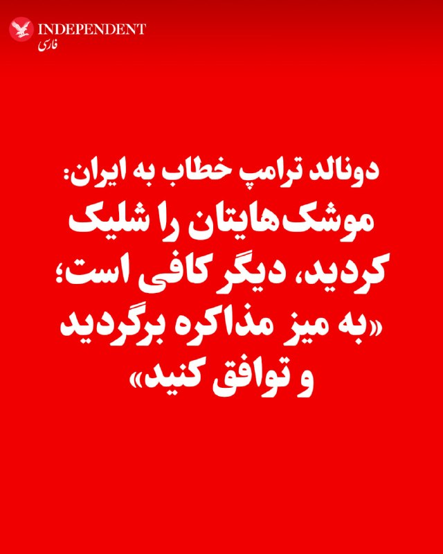

♦️دونالد ترامپ، رئیس جمهوری ایالات متحده، یکشنبه‌شب، در واکنش به حملات موشکی جمهوری اسلامی ایران به اسرائیل، در مصاحبه با «فاکس نیوز» گفت:‌ «پیشنهاد من به ایران این است؛ شما موشک‌هایتان را شلیک کردید، دیگر کافی است. به میز مذاکره برگردید و توافق کنید».
‌🇸🇦 Indypersian

🤖 @VahidOOnLine

## VahidOOnLine — post 244170

  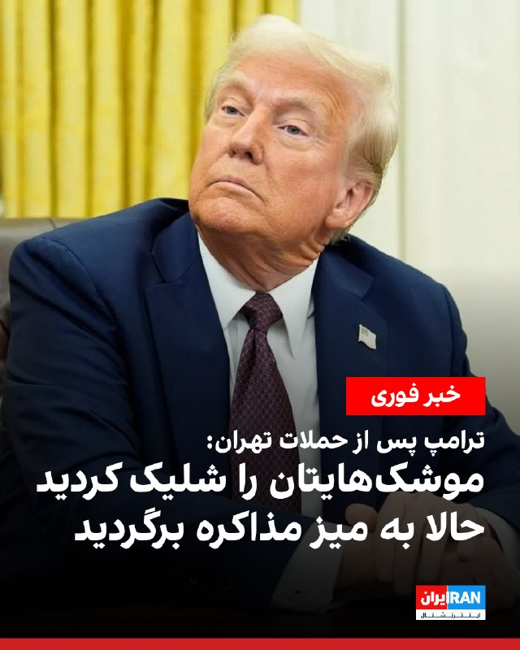

دونالد ترامپ به شبکه فاکس نیوز گفت: «پیشنهادی که به ایران دارم این است: موشک‌های خود را شلیک کرده‌اید، همین کافی است.»

او افزود: «به میز مذاکره بازگردید و توافق کنید.»
‌🏁 🇬🇧 IranintlTV

🤖 @VahidOOnLine

## VahidOOnLine — post 244169

  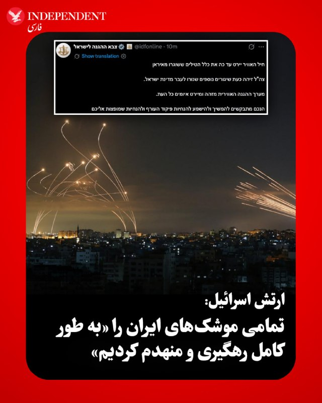

♦️ارتش اسرائیل، یکشنبه‌شب، اعلام کرد که نیروی هوایی این کشور تاکنون موفق شده است تمامی موشک‌های شلیک‌شده از سوی ایران را به طور کامل رهگیری و منهدم کند. با این حال، نیروهای دفاعی اسرائیل تاکید کردند که رادارهای پدافندی به تازگی موج جدیدی از شلیک‌ها و پرتابه‌های موشکی را شناسایی کرده‌اند که از خاک ایران به سمت اسرائیل هدف‌گیری شده‌اند.
‌🇸🇦 Indypersian

🤖 @VahidOOnLine

## VahidOOnLine — post 244168

  <a href="telegram/content/VahidOOnLine_244168_1780862654.mp4" target="_blank">🎬 Download video</a>

♦️خبرگزاری مهر، یکشنبه‌شب، ۱۷ خردادماه، تصاویری از موشک‌های شلیک شده به سمت اسرائیل را در آسمان کرمانشاه منتشر کرد. همزمان، قرارگاه خاتم‌الانبیا، با انتشار بیانیه‌ای، شلیک موشک‌های ایران به سمت مواضع اسرائیل را تحقق هشدارهای قبلی تهران خواند و اعلام کرد: «در صورت گسترش حملات اسرائیل به بیروت و یا پاسخ به اقدام ایران با ضربات کوبنده تر و پشیمان کننده روبرو و حملات ویرانگری علیه اسرائیل و حامیان آن آغاز خواهد شد».
‌🇸🇦 Indypersian

🤖 @VahidOOnLine

## VahidOOnLine — post 244167

  <a href="telegram/content/VahidOOnLine_244167_1780862655.mp4" target="_blank">🎬 Download video</a>

ویدیوی رسیده به ایران‌اینترنشنال از خرم‌‌آباد در شامگاه یکشنبه ۱۷ خرداد، نور موشک شلیک‌شده از سوی جمهوری اسلامی را به سمت اسرائیل در آسمان این شهر نشان می‌دهد.
‌🏁 🇬🇧 IranintlTV

🤖 @VahidOOnLine

## VahidOOnLine — post 244166

  

محسن رضایی، مشاور نظامی خامنه‌ای، در شبکه ایکس نوشت جمهوری اسلامی بارها اعلام کرده بود که نقض آتش‌بس و حمله به لبنان را برنمی‌تابد.
او افزود: «امشب متجاوزان پاسخ خود را دریافت کردند. این پاسخ هشداری است تا دست از شرارت بردارند؛ هر اقدام جدید با پاسخی کوبنده‌تر و هزینه‌هایی سنگین‌تر مواجه خواهد شد.»
‌🏁 🇬🇧 IranintlTV

🤖 @VahidOOnLine

## VahidOOnLine — post 244165

  <a href="telegram/content/VahidOOnLine_244165_1780862657.mp4" target="_blank">🎬 Download video</a>

ویدیوی رسیده به ایران‌اینترنشنال از تبریز در شامگاه یکشنبه ۱۷ خرداد، نور موشک شلیک‌شده از سوی جمهوری اسلامی را به سمت اسرائیل در آسمان تبریز نشان می‌دهد.
‌🏁 🇬🇧 IranintlTV

🤖 @VahidOOnLine

## VahidOOnLine — post 244164

  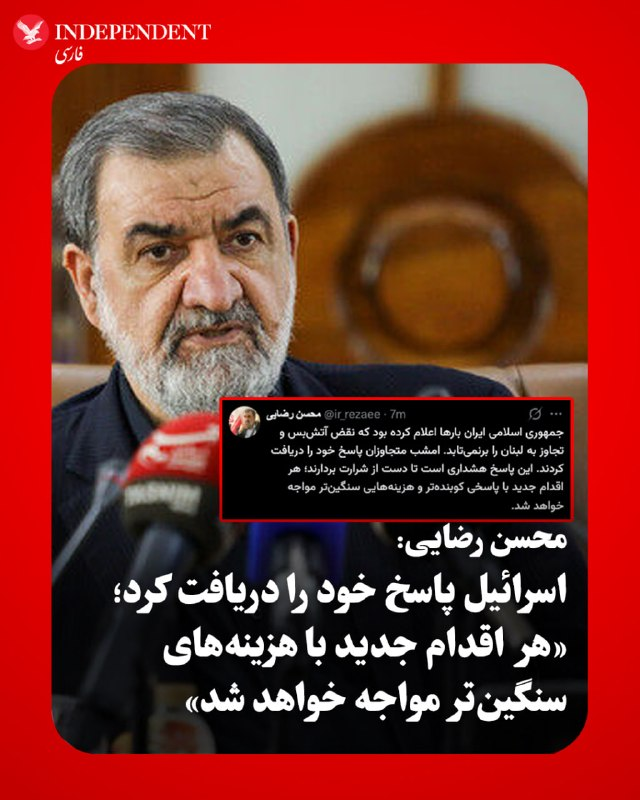

♦️محسن رضایی، فرمانده سابق سپاه و مشاور نظامی مجتبی خامنه‌ای، یکشنبه‌شب، همزمان با حملاتی موشکی ایران به اسرائیل در واکنش به حملات به ضاحیه بیروت، با انتشار پیامی در اکس نوشت: «جمهوری اسلامی بارها اعلام کرده بود که نقض آتش‌بس و تجاوز به لبنان را برنمی‌تابد. امشب متجاوزان پاسخ خود را دریافت کردند». رضایی نوشت: «این پاسخ هشداری است تا دست از شرارت بردارند. هر اقدام جدید با پاسخی کوبنده‌تر و هزینه‌هایی سنگین‌تر مواجه خواهد شد».
‌🇸🇦 Indypersian

🤖 @VahidOOnLine

## VahidOOnLine — post 244163

  <a href="telegram/content/VahidOOnLine_244163_1780862659.mp4" target="_blank">🎬 Download video</a>

ویدیوی رسیده به ایران‌اینترنشنال پرتاب موشک از سوی جمهوری اسلامی را از کرمانشاه به سمت اسرائیل در شامگاه یکشنبه ۱۷ خرداد نشان می‌دهد.
‌🏁 🇬🇧 IranintlTV

🤖 @VahidOOnLine

## VahidOOnLine — post 244162

  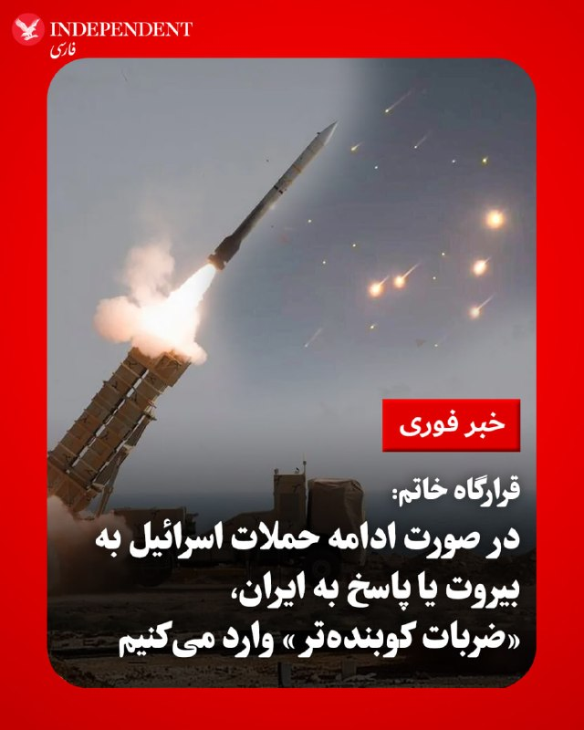

♦️به گزارش فارس، خبرگزاری وابسته به سپاه، فرمانده قرارگاه خاتم‌الانبیا، یکشنبه‌شب، ۱۷ خردادماه، با انتشار بیانیه‌ای، شلیک موشک‌های ایران به سمت مواضع اسرائیل را تحقق هشدارهای قبلی تهران خواند و اعلام کرد: «پیش از این صراحتا اخطار داده بودیم که در صورت گسترش جنایات اسرائیل در ضاحیه بیروت، اهدافی را در سرزمین‌های اشغالی مورد هجوم قرار می‌دهیم.» او با متهم کردن ارتش اسرائیل به نقض مکرر آتش‌بس و عبور از تمامی خطوط قرمز تحت حمایت‌های آمریکا، تاکید کرد که تل‌آویو باید فورا حملات خود به لبنان را متوقف کند اعلام کرد:‌ «در صورت گسترش حملات اسرائیل به بیروت و یا پاسخ به اقدام ایران با ضربات کوبنده تر و پشیمان کننده روبرو و حملات ویرانگری علیه رژیم و حامیان آن آغاز خواهد شد».
‌🇸🇦 Indypersian

🤖 @VahidOOnLine

## VahidOOnLine — post 244161

  

علی عبداللهی، فرمانده قرارگاه خاتم‌الانبیا همزمان با آغاز حملات موشکی جمهوری اسلامی به اسرائیل در پیامی گفت: ارتش اسرائیل باید حملات خود به جنوب لبنان و ضاحیه را متوقف نماید و در صورت گسترش حملات خود به آن منطقه و یا پاسخ به اقدام جمهوری اسلامی با ضربات کوبنده‌تر و پشیمان‌کننده روبرو و حملات ویرانگری علیه رژیم و حامیان آن آغاز خواهد شد.
‌🏁 🇬🇧 IranintlTV

🤖 @VahidOOnLine

## VahidOOnLine — post 244160

  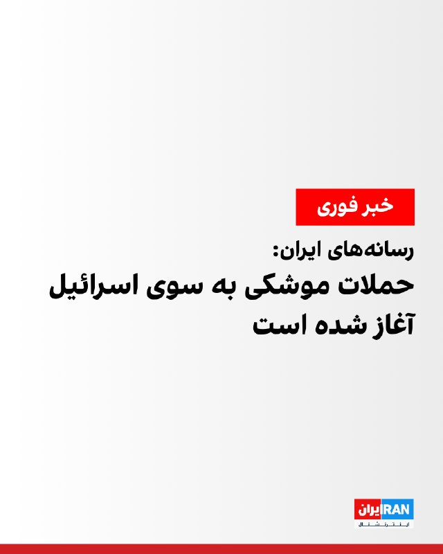

رسانه‌های ایران شامگاه یک‌شنبه از آغاز حملات موشکی به سوی اسرائیل خبر دادند.

خبرگزاری مهر نوشت دو موج حمله به سوی اسرائیل انجام شده است.

همزمان با آغاز حملات موشکی جمهوری اسلامی به لبنان، عباس عراقچی در ایکس طرحی گرافیکی از پرچم جمهوری اسلامی و لبنان در کنار هم منتشر کرد.
به گزارش اسرائیل هیوم، چهار موشک از سوی ایران به شمال اسرائیل شلیک شده است.

‌🏁 🇬🇧 IranintlTV

🤖 @VahidOOnLine

## VahidOOnLine — post 244159

  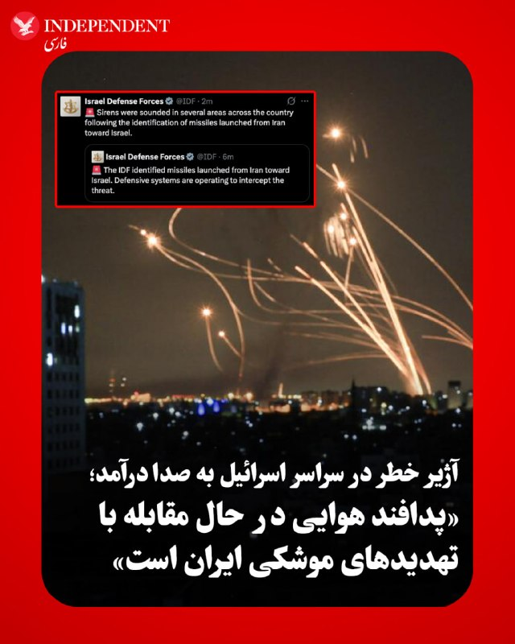

♦️ارتش اسرائیل، یکشنبه‌شب، ۱۷ خردادماه، با انتشار بیانیه‌ای در اکس اعلام کرد که در پی شناسایی موشک‌های شلیک‌شده از سوی ایران به سمت خاک اسرائیل، آژیرهای خطر در چندین منطقه در سراسر این کشور به صدا درآمده‌اند. بر اساس اعلام رسمی نیروهای دفاعی اسرائیل، سیستم‌های پدافند هوایی این کشور بلافاصله پس از ردیابی این پرتابه‌ها فعال شده و در حال مقابله برای رهگیری و انهدام تهدیدهای موشکی بر فراز آسمان منطقه هستند.
‌🇸🇦 Indypersian

🤖 @VahidOOnLine

## VahidOOnLine — post 244158

  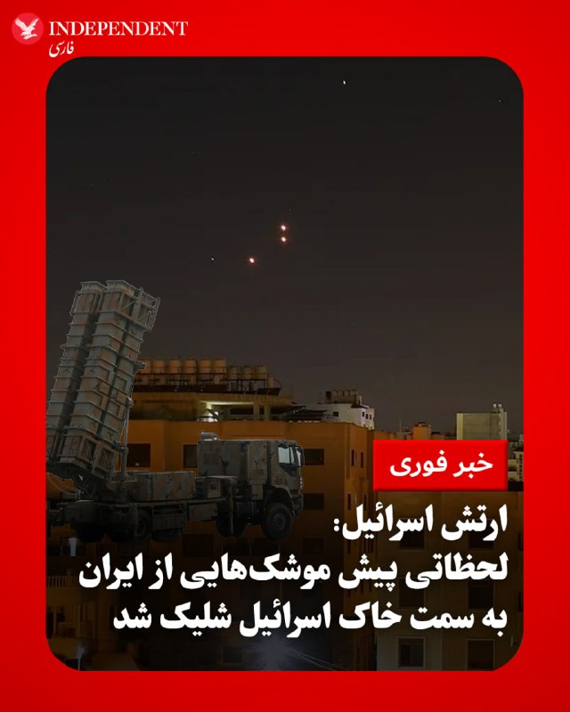

♦️ارتش اسرائیل، یکشنبه‌شب، ۱۷ خردادماه، با انتشار بیانیه‌ای اعلام کرد که رادارهای این کشور شلیک چندین موشک از سوی ایران به سمت خاک اسرائیل را شناسایی کرده‌اند. بر اساس این گزارش رسمی، در حال حاضر تمامی سیستم‌های پدافند هوایی ارتش برای رهگیری و انهدام این تهدیدها فعال شده‌اند و فرماندهی جبهه داخلی در دقیقه‌های گذشته، دستورالعمل‌های اضطراری پیش‌گیرانه‌ای را به طور مستقیم به تلفن‌های همراه ساکنان مناطق تحت خطر ارسال کرده است. مقامات نظامی اسرائیل با تاکید بر اینکه این دستورات نجات‌دهنده جان انسان‌هاست، از عموم مردم خواسته‌اند با مسئولیت‌پذیری کامل، به محض شنیدن صدای آژیر خطر فورا وارد پناهگاه‌ها و مناطق امنِ حفاظت‌شده شوند و تا زمان صدور ابلاغیه صریح و رسمی بعدی، به هیچ عنوان از پناهگاه‌های خود خارج نشوند.
‌🇸🇦 Indypersian

🤖 @VahidOOnLine

## VahidOOnLine — post 244157

  

خبرگزاری رویترز گزارش داد که نیروهای نظامی اسرائیل می‌گویند سامانه‌های دفاعی در حال عملیات برای رهگیری تهدید هستند.

بر اساس این گزارش، ارتش اسرائیل اعلام کرده است که شلیک موشک‌هایی از ایران به سمت خاک کشور اسرائیل شناسایی شده است.
‌🏁 🇬🇧 IranintlTV

🤖 @VahidOOnLine

## VahidOOnLine — post 244156

  

دو منبع نزدیک به نیروهای نظامی جمهوری اسلامی به ایران‌اینترنشنال گفتند در پی حملات یکشنبه اسرائیل به مقر فرماندهی و برنامه‌ریزی حزب‌الله در حومه جنوبی بیروت، یگان‌های موشکی سپاه پاسداران در آستانه یک رویارویی نظامی جدید، به حالت آماده‌باش کامل درآمده‌اند.

به گفته این منابع، در ساعات گذشته، فرماندهان ارشد سپاه درخواست رسمی خود برای صدور مجوز آغاز حملات موشکی به اسرائیل را به دفتر مجتبی خامنه‌ای، رهبر جدید جمهوری اسلامی، ارسال کرده‌اند.

هر دو منبع تایید کردند که با وجود این درخواست، هنوز مجتبی خامنه‌ای یا دفتر او پاسخی به این درخواست نداده‌اند و مشخص نیست که آیا با این حمله موافقت خواهد شد یا خیر.

این دو منبع به ایران‌اینترنشنال گفتند سپاه پاسداران نگران است که سکوت در برابر حملات اسرائیل به ضاحیه، این کشور را به تشدید حملات علیه حزب‌الله ترغیب کند.

ادامه این گزارش را در وبسایت ایران‌اینترنشنال بخوانید
‌🏁 🇬🇧 IranintlTV

🤖 @VahidOOnLine

## VahidOOnLine — post 244155

  

♦️در رسانه ها به نقل از منابع نزدیک به وزیر خزانه‌داری آمریکا آمده است که این کشور از تمامی ابزارها استفاده خواهد کرد تا دارایی‌های ایران جهت بازسازی خسارات ادعایی وارده به برخی متحدان منطقه‌ای آن،  در دسترس قرار گیرد.

اولا، این یک وقاحت تازه از سوی آمریکاست. اگر واشنگتن، به‌عنوان متجاوز اصلی در تجاوز نظامی علیه جمهوری اسلامی ایران، واقعاً به دنبال جبران خسارت است، آدرس را اشتباه نرود: از خود آمریکا و از رژیمی آغاز کند که عامل اصلی آتش‌افروزی، تجاوز و بی‌ثباتی در منطقه هستند. ایران متجاوزان را رها نخواهد کرد و خسارات جنگ را مطالبه و دریافت خواهد کرد.

دوما، برخی دولت‌های منطقه که قلمرو و امکانات خود را در خدمت تجاوز علیه ایران قرار داده‌اند، در جایگاه مطالبه‌گر خسارت نیستند؛ رفتار آنان مشمول مسئولیت بین‌المللی و قواعد مربوط به مشارکت در عمل متخلفانه و تجاوز قرار می گیرد و باید خسارات وارده به ایران را بطور کامل جبران کنند.

سوما، دارایی‌های ایران غنیمت جنگی واشنگتن یا صندوق پرداخت به هم‌پیمانان آن نیست.
‌🇸🇦 Indypersian

🤖 @VahidOOnLine

## VahidOOnLine — post 244154

  

اکسیوس به نقل از دو مقام آمریکایی گزارش داد اسرائیل پیش از حمله به ضاحیه در جنوب بیروت، دولت ترامپ را در جریان قرار داده بود.
یک مقام آمریکایی نیز گفت نیروهای این کشور در خاورمیانه در صورت عملی شدن تهدیدهای تهران و آغاز حملات جدید، برای دفاع آماده هستند.

اکسیوس همچنین به نقل از یک مقام آمریکایی نوشت واشینگتن از حق اسرائیل برای دفاع از خود حمایت می‌کند و حزب‌الله باید فورا حملات خود را متوقف کند تا توافق‌های موجود اجرا شوند.

این رسانه به نقل از منابع خود گزارش داد اسرائیل به دولت ترامپ اعلام کرده است حملات مداوم حزب‌الله به شمال اسرائیل نقض آتش‌بس محسوب می‌شود و تل‌آویو خود را محق به هدف قرار دادن بیروت می‌داند. منابع افزودند اسرائیل تاکید کرده در صورت تکرار حملات حزب‌الله، حملات خود علیه بیروت را ادامه خواهد داد.
‌🏁 🇬🇧 IranintlTV

🤖 @VahidOOnLine

## VahidOOnLine — post 244153

  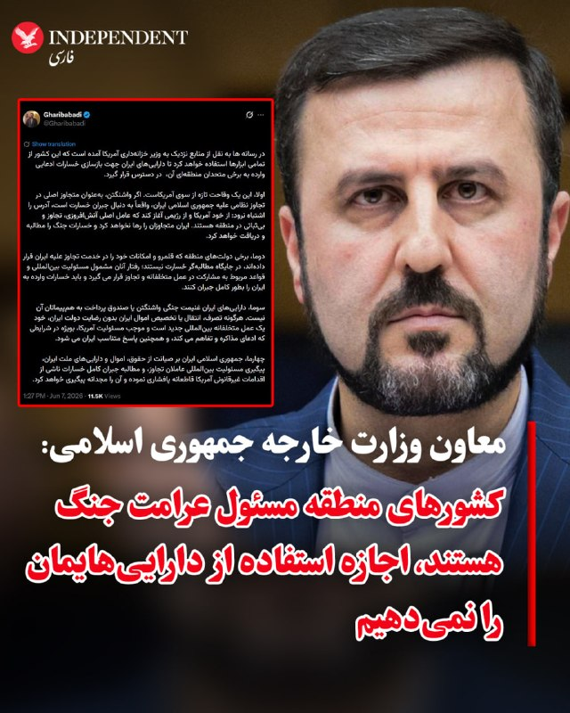

♦️در رسانه ها به نقل از منابع نزدیک به وزیر خزانه‌داری آمریکا آمده است که این کشور از تمامی ابزارها استفاده خواهد کرد تا دارایی‌های ایران جهت بازسازی خسارات ادعایی وارده به برخی متحدان منطقه‌ای آن،  در دسترس قرار گیرد.

اولا، این یک وقاحت تازه از سوی آمریکاست. اگر واشنگتن، به‌عنوان متجاوز اصلی در تجاوز نظامی علیه جمهوری اسلامی ایران، واقعاً به دنبال جبران خسارت است، آدرس را اشتباه نرود: از خود آمریکا و از رژیمی آغاز کند که عامل اصلی آتش‌افروزی، تجاوز و بی‌ثباتی در منطقه هستند. ایران متجاوزان را رها نخواهد کرد و خسارات جنگ را مطالبه و دریافت خواهد کرد.

دوما، برخی دولت‌های منطقه که قلمرو و امکانات خود را در خدمت تجاوز علیه ایران قرار داده‌اند، در جایگاه مطالبه‌گر خسارت نیستند؛
‌🇸🇦 Indypersian

🤖 @VahidOOnLine

## WithYashar — post 13774

ترامپ: قرار بود دوشنبه یا سه‌شنبه توافق صلح را امضا کنیم.
@withyashar

## WithYashar — post 13773

ارتش اسرائیل : در مجموع 12 موشک بالستیک شلیک شد که تمام آن رهگیری یا به منطقه‌ای باز اصابت کرد
@withyashar

## WithYashar — post 13772

ترامپ: توافق با ایران در دسترسه و بهش نزدیکیم.
@withyashar

## WithYashar — post 13771

حوثی ها منتظر دستور بستن تنگه باب المندب هستیم
@withyashar

## WithYashar — post 13770

ترامپ به فاکس نیوز: آنچه به ایران توصیه می‌کنم: موشک‌هایتان را پرتاب کرده‌اید، همین کافی است

@withyashar

## WithYashar — post 13769

سپاه: پایگاه هوایی رامات دیوید، هدف موشک‌های بالستیک قرار گرفت
@withyashar

## WithYashar — post 13768

فعالیت پدافند هوایی در کرماشاه و تبریز
@withyashar

## WithYashar — post 13767

صدا و سیما : سد مجید موسوی، فرمانده نیروی هوایی سپاه: الوعده وفا
@withyashar

## WithYashar — post 13766

صدای سیما شیپور جنگ را زد. آهنگ بزن که خوب میزنی در حال پخش است.
@withyashar

## WithYashar — post 13765

آژیر در شمال اسرائیل و اردن به صدا درآمد.
@withyashar

## WithYashar — post 13764

موج پنجم حملات شروع شد
@withyashar

## WithYashar — post 13763

## WithYashar — post 13762

اگه امکاناتشو دارید بهتره تهران رو ترک کنید

## WithYashar — post 13761

منابع اسراییل: حملات سنگین به ایران نزدیک است
@withyashar

## WithYashar — post 13760

سوخترسان های آمریکایی از تلآویو بلند شدند
@withyashar

## WithYashar — post 13758

قرارگاه مرکزی خاتم الانبیا : قبلا اخطار داده بودیم در صورت گسترش جنایت در ضاحیه بیروت، اهدافی را در سرزمین های اشغالی مورد هجوم قرار می دهیم!
@withyashar

## WithYashar — post 13757

رسانه عبری از منابع گزارش می‌دهد: ما به حمله ایرانی پاسخ خواهیم داد
@withyashar

## WithYashar — post 13756

از ارومیه و اصفهان هم موشک شلیک شد
@withyashar

## WithYashar — post 13755

چند موشک از تبریز و کرمانشاه شلیک شد
@withyashar

## WithYashar — post 13754

موج دوم حملات ۳پا آغاز شد
@withyashar
🚨🚨🚨🚨🚨🚨

## mwarmonitor — post 10294

📌ترامپ می‌گوید حملات اسرائیل در لبنان با ایالات متحده هماهنگ نشده بود و او از این موضوع راضی نیست.

@mwarmonitor

## mwarmonitor — post 10293

🔴 «عراق به دلایل عملیاتی یک NOTAM صادر کرده و حریم هوایی خود را بسته است.» @mwarmonitor

## mwarmonitor — post 10292

🔴 فوری | سی‌ان‌ان به نقل از دو منبع اسرائیلی: ما به شلیک موشک‌های بالستیک ایران با قدرت پاسخ خواهیم داد.

@mwarmonitor

## mwarmonitor — post 10291

🔴به نقل از یک رسانه عراقی وابسته به عربستان: سقوط یک هواپیمای مسافربری در صحرای کربلا.

@mwarmonitor

## mwarmonitor — post 10290

  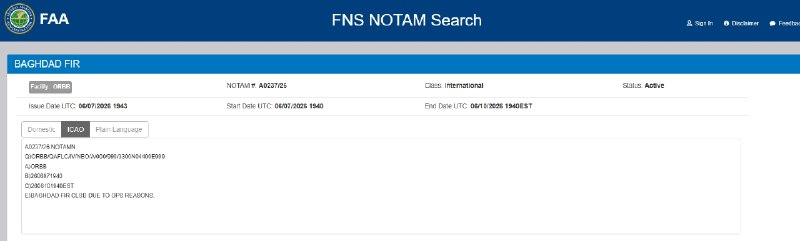

🔴 «عراق به دلایل عملیاتی یک NOTAM صادر کرده و حریم هوایی خود را بسته است.»

@mwarmonitor

## mwarmonitor — post 10289

🔴با ترامپ صحبت کردم. در چند دقیقه آینده در فاکس نیوز جزئیات بیشتری خواهیم داشت.

🔴«نصیحتی که به ایران دارم این است: شما موشک‌هایتان را شلیک کردید، این کافی است. به میز مذاکره برگردید و یک توافق انجام دهید»، رئیس‌جمهور ترامپ به فاکس نیوز گفت.

@mwarmonitor

## mwarmonitor — post 10287

🔴 «پایگاه هوایی رامات دیوید با موشک‌های بالستیک هدف قرار گرفت»

اداره روابط عمومی سپاه پاسداران اعلام کرد:

به نام خداوند درهم‌شکننده ستمگران
﴿با آنان بجنگید تا خداوند به دست شما آنان را عذاب دهد، خوارشان سازد و شما را بر آنان پیروز گرداند و سینه‌های مؤمنان را شفا بخشد﴾

در پاسخ به جنایات گسترده‌ای که رژیم صهیونیستی اشغالگر در جنوب لبنان مرتکب شد، و همچنین همراه با کشتار و آوارگی گسترده ساکنان صور، نبطیه و مناطق دیگر، از جمله ضاحیه جنوبی بیروت، موشک‌های نیروی هوافضای سپاه پاسداران، پایگاه هوایی رامات دیوید را که این حملات از آن انجام شده بود هدف قرار دادند.

پذیرش آتش‌بس در ۱۹ فروردین، مشروط به توقف درگیری‌ها در تمامی جبهه‌ها بود، اما آمریکا و رژیم صهیونیستی طبق روال معمول به تعهدات خود پایبند نماندند و حملات و جنایات در لبنان را ادامه دادند. همچنین حملات به سواحل و کشتی‌های ایرانی در تنگه هرمز، دریای عمان و اقیانوس هند را در نقض آشکار آتش‌بس تکرار کردند.

عملیات امشب یک هشدار بود و در صورت تکرار حملات، پاسخ‌ها گسترده‌تر خواهد بود و همه اهداف آمریکایی و صهیونیستی در منطقه را در بر خواهد گرفت.

﴿و پیروزی جز از سوی خداوند عزیز و حکیم نیست﴾

@mwarmonitor

## mwarmonitor — post 10286

  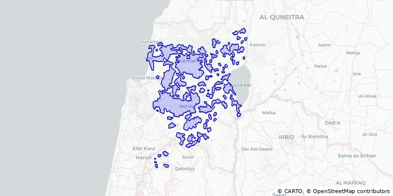

🔴 «هشدار پایان وضعیت اضطراری در شمال اسرائیل صادر شده است و ساکنان اکنون می‌توانند پناهگاه‌های خود را ترک کنند.»

@mwarmonitor

## mwarmonitor — post 10285

پدافند تهران فعال شد

## mwarmonitor — post 10284

🔴«کتائب حزب‌الله: اگر آمریکا در این درگیری دخالت کند، ما پایگاه‌ها و منافع آن را در عراق و منطقه هدف قرار خواهیم داد.»

@mwarmonitor

## mwarmonitor — post 10283

🔴«بیانیه سخنگوی ارتش اسرائیل حدود ۳۰ دقیقه دیگر منتشر خواهد شد.» شبکه کان اسرائیل

@mwarmonitor

## mwarmonitor — post 10282

🔴سخنگوی ارتش اسرائیل می‌گوید نیروی هوایی تاکنون تمام موشک‌های شلیک‌شده از سوی ایران را رهگیری کرده است. همچنین پرتاب‌های بیشتری به سمت اسرائیل شناسایی شده است. سامانه پدافند هوایی همچنان در حال شناسایی و رهگیری تهدیدها است. از اسرائیلی‌ها خواسته شده است دستورالعمل‌های فرماندهی جبهه داخلی را دنبال کنند.

@mwarmonitor

## mwarmonitor — post 10281

  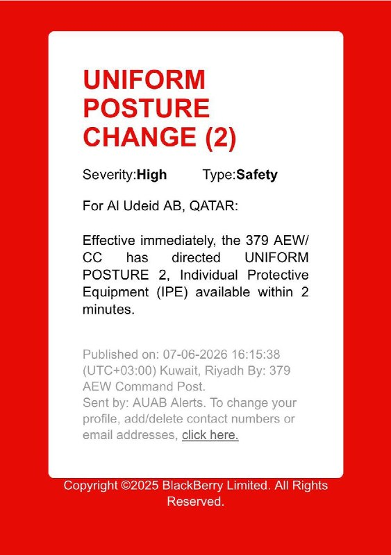

🔴تمام یگان‌های اعزامی نیروی هوایی آمریکا (USAF Air Expeditionary Wings) در سراسر اردن، امارات، قطر و کویت به وضعیت بالاتر حفاظت نیروها منتقل شده‌اند.

🔴هشدارهایی برای اسکادران ۳۷۹ در پایگاه العُدید حوالی ساعت ۱۶:۰۰ به وقت محلی ارسال شده و نیروهای هوایی را برای احتمال ازسرگیری شلیک موشک‌ها آماده می‌کند.

@mwarmonitor

## mwarmonitor — post 10280

🔴 وزارت حمل‌ونقل اسرائیل اعلام کرد که حریم هوایی اسرائیل در حال حاضر همچنان باز است.

@mwarmonitor

## mwarmonitor — post 10279

  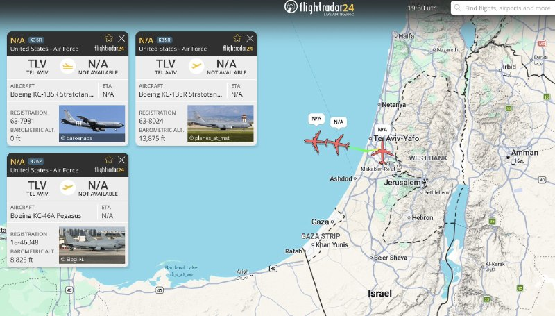

✈️نیروی هوایی آمریکا (USAF) / نیروی هوایی سلطنتی بریتانیا (RAF) - عملیات ایران هواپیمای سوخت‌رسان Boeing KC-135 Stratotanker: 1 فروند AE0369 63-8024 - شناسه تماس نامشخص هواپیمای Boeing KC-46 Pegasus: 1 فروند AE5F9B 18-46048 - شناسه تماس نامشخص هواپیمای…

## mwarmonitor — post 10278

🔴 اسرائیل به دنبال دریافت چراغ سبز از آمریکا برای حمله به تأسیسات انرژی در ایران است، به گفته یک منبع اسرائیلی، خبرگزاری Walla گزارش می‌دهد.

@mwarmonitor

## mwarmonitor — post 10277

  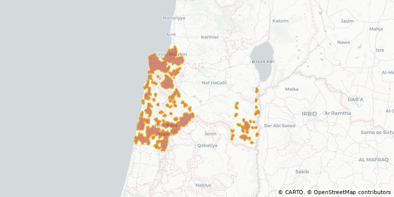

🔴 « فوری: ایران موشک‌های بیشتری به سمت اسرائیل شلیک کرده است، هشدار اولیه صادر شد.»

@mwarmonitor

## mwarmonitor — post 10276

🔴 شبکه ۱۳، آکسیوس، واللا و دیگر رسانه‌ها گزارش می‌دهند که پاسخ اسرائیل به حمله ایران در راه است.

@mwarmonitor

## mwarmonitor — post 10275

🔴رئیس‌جمهور ترامپ درباره تشدید تنش میان اسرائیل و ایران گزارش دریافت کرده است، یک مقام آمریکایی می‌گوید. باراک راوید

@mwarmonitor

## mwarmonitor — post 10274

🔴 شبکه ۱۲ اسرائیل به نقل از یک مقام اسرائیلی: ایران می‌خواست یک معادله جدید را تحمیل کند، اما ما نمی‌توانیم اجازه وقوع چنین چیزی را بدهیم.

@mwarmonitor

## pm_afshaa — post 92653

  <a href="telegram/content/pm_afshaa_92653_1780862667.webm" target="_blank">🎬 Download video</a>

🔴ترامپ: قرار بود دوشنبه یا سه‌شنبه توافق صلح رو امضا کنیم.

💧 Rainbet.com the #1 Non-KYC Crypto Casino & Sportsbook @rainbetcom

😁 @Pm_Afshaa

## pm_afshaa — post 92652

از مکان های نظامی فاصله بگیرین

💧 Rainbet.com the #1 Non-KYC Crypto Casino & Sportsbook @rainbetcom

😁 @Pm_Afshaa

## pm_afshaa — post 92651

⭕️
⭕️
⭕️
⭕️
⭕️

## pm_afshaa — post 92650

♨️
♨️
♨️
♨️
♨️
♨️

## pm_afshaa — post 92649

رعد و برقه؟

## pm_afshaa — post 92648

سی‌ان‌ان به نقل از دو منبع اسرائیلی: ما به پرتاب موشک‌های بالستیک ایران با قدرت پاسخ خواهیم داد

💧 Rainbet.com the #1 Non-KYC Crypto Casino & Sportsbook @rainbetcom

😁 @Pm_Afshaa

## pm_afshaa — post 92647

تهرانو زدن!؟

## pm_afshaa — post 92646

ورود پهپادهای به غرب کشور

💧 Rainbet.com the #1 Non-KYC Crypto Casino & Sportsbook @rainbetcom

😁 @Pm_Afshaa

## pm_afshaa — post 92645

  <a href="telegram/content/pm_afshaa_92645_1780862667.webm" target="_blank">🎬 Download video</a>

🔴رویترز به نقل از یک منبع ایرانی:
اگر اسرائیل به حملات موشکی ایران پاسخ بده، ما هم قطعاً پاسخ خواهیم داد.

💧 Rainbet.com the #1 Non-KYC Crypto Casino & Sportsbook @rainbetcom

😁 @Pm_Afshaa

## pm_afshaa — post 92644

عراق هم نوتام اعلام کرد

💧 Rainbet.com the #1 Non-KYC Crypto Casino & Sportsbook @rainbetcom

😁 @Pm_Afshaa

## pm_afshaa — post 92643

  <a href="telegram/content/pm_afshaa_92643_1780862668.webm" target="_blank">🎬 Download video</a>

🔴ارتش اسرائیل: در مجموع 12 موشک بالستیک شلیک شد که تمام آن رهگیری یا به منطقه‌ای باز اصابت کرد.

💧 Rainbet.com the #1 Non-KYC Crypto Casino & Sportsbook @rainbetcom

😁 @Pm_Afshaa

## pm_afshaa — post 92642

ترافیک سنگین در پمپ بنزین های تهران

💧 Rainbet.com the #1 Non-KYC Crypto Casino & Sportsbook @rainbetcom

😁 @Pm_Afshaa

## pm_afshaa — post 92640

پرواز جنگنده‌ها در آسمان عراق

💧 Rainbet.com the #1 Non-KYC Crypto Casino & Sportsbook @rainbetcom

😁 @Pm_Afshaa

## pm_afshaa — post 92639

♨️
♨️
♨️
♨️

## pm_afshaa — post 92638

  <a href="telegram/content/pm_afshaa_92638_1780862668.webm" target="_blank">🎬 Download video</a>

🔴ترامپ به فاکس نیوز: توصیه من به ایران اینه که شما موشک هایتان رو شلیک کردید و کافی است و به میز مذاکره برگردید و توافق کنید. 
💧 Rainbet.com the #1 Non-KYC Crypto Casino & Sportsbook @rainbetcom 
😁 @Pm_Afshaa

## pm_afshaa — post 92637

  <a href="telegram/content/pm_afshaa_92637_1780862669.webm" target="_blank">🎬 Download video</a>

🔴مقام ارشد اسرائیلی: ارتش اسرائیل در حال آماده سازی برای حمله به ایرانه.

💧 Rainbet.com the #1 Non-KYC Crypto Casino & Sportsbook @rainbetcom

😁 @Pm_Afshaa

## pm_afshaa — post 92636

🔴صداهایی که در تبریز به گوش می‌رسد مربوط به درگیری پدافند با ریز پرنده و پهپاد های احتمالی است

💧 Rainbet.com the #1 Non-KYC Crypto Casino & Sportsbook @rainbetcom

😁 @Pm_Afshaa

## pm_afshaa — post 92635

  <a href="telegram/content/pm_afshaa_92635_1780862670.webm" target="_blank">🎬 Download video</a>

🔴ترامپ به فاکس نیوز:
توصیه من به ایران اینه که شما موشک هایتان رو شلیک کردید و کافی است و به میز مذاکره برگردید و توافق کنید.

💧 Rainbet.com the #1 Non-KYC Crypto Casino & Sportsbook @rainbetcom

😁 @Pm_Afshaa

## pm_afshaa — post 92633

  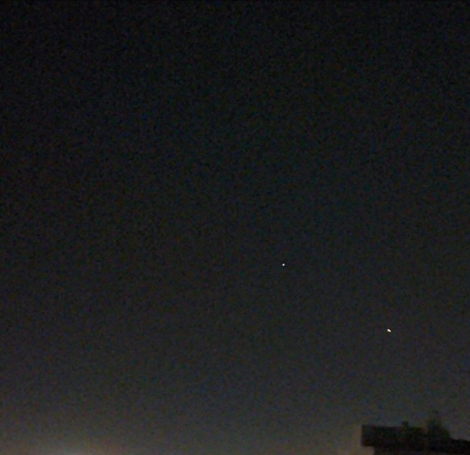

اهواز

💧 Rainbet.com the #1 Non-KYC Crypto Casino & Sportsbook @rainbetcom

😁 @Pm_Afshaa

## pm_afshaa — post 92632

  <a href="telegram/content/pm_afshaa_92632_1780862671.webm" target="_blank">🎬 Download video</a>

🔴گزارش‌ها از ورود جنگنده‌های خارجی به حریم هوایی غرب کشور

💧 Rainbet.com the #1 Non-KYC Crypto Casino & Sportsbook @rainbetcom

😁 @Pm_Afshaa

## DEJradio — post 5441

  <a href="telegram/content/DEJradio_5441_1780862671.mp4" target="_blank">🎬 Download video</a>

🚀 
⭕️ براساس گزارش منابع میدانی، یکشنبه شب ۱۷ خرداد ۱۴۰۵ دستکم هشت فروند موشک بالستیک از اصفهان به سمت اسرائیل پرتاب شد.

#حملات_موشکی #اسرائیل
@DEJradio

## DEJradio — post 5440

  <a href="telegram/content/DEJradio_5440_1780862672.webm" target="_blank">🎬 Download video</a>

🚨
⭕️ حملات موشکی جمهوری اسلامی به اسرائیل در سه موج‌ پیاپی

ارتش اسرائیل شامگاه یکشنبه اعلام کرد موشک‌هایی را که از خاک ایران به سمت اسرائیل شلیک شده بود، شناسایی کرده است.
بر اساس بیانیهٔ ارتش اسرائیل پس از شناسایی این موشک‌ها، آژیرهای هشدار در چندین منطقه به صدا درآمد و سامانه‌های پدافندی برای رهگیری فعال شد.
شلیک موشک توسط جمهوری اسلامی، ساعاتی پس از حملهٔ اسرائیل به ضاحیهٔ بیروت آغاز شد.
اسرائیل گفته بود هدف حمله به لبنان، مراکز فرماندهی حزب‌الله بوده است.
ارتش اسرائیل حمله به ضاحیه را واکنشی به شلیک‌های اخیر حزب‌الله از خاک لبنان عنوان کرده بود.
موشک‌پرانی جمهوری اسلامی به اسرائیل در حالی رخ داد که تهران و واشینگتن بر سر پایان جنگ و پرونده هسته‌ای در حال مذاکره بودند.
شلیک مستقیم از خاک جمهوری اسلامی به سمت اسرائیل، ممکن است به آتش‌بس‌ شکننده و مذاکرات آمریکا و جمهوری اسلامی پایان بدهد.

#حمله_موشکی #فوری
@DEJradio

## DEJradio — post 5439

  <a href="telegram/content/DEJradio_5439_1780862673.webm" target="_blank">🎬 Download video</a>

🚀
🚨 یکشنبه شب ۱۷ خرداد، دو موج حمله موشکی از سمت ایران به اسراییل انجام گرفت.
منابع میدانی گزارش دادند تعدادی از موشک‌ها از پایگاه سپاه در کرمانشاه پرتاب شد.

#حملات_موشکی #اسرائیل
@DEJradio

## DEJradio — post 5438

  <a href="telegram/content/DEJradio_5438_1780862673.webm" target="_blank">🎬 Download video</a>

🚨
⭕️ دولت اسرائیل برای شهروندان چند منطقه از این کشور هشدار حمله صادر کرد.

#حملات_موشکی #اسرائیل
@DEJradio

## DEJradio — post 5437

  <a href="telegram/content/DEJradio_5437_1780862673.webm" target="_blank">🎬 Download video</a>

🚨
⭕️ حملات موشکی جمهوری اسلامی به سمت اسرائیل

#حملات_موشکی #اسرائیل
@DEJradio

## DEJradio — post 5436

  <a href="telegram/content/DEJradio_5436_1780862674.mp4" target="_blank">🎬 Download video</a>

🔺🏆 
👑 آیا فیفا می‌خواهد صدای مردم ایران را سرکوب کند؟

مهدی رستم‌پور خبرنگار ورزشی می‌گوید بعد از حمله روسیه به اوکراین تیم فوتبال روسیه از حضور در مسابقات بین‌اامللی محروم شد، اما فیفا همچنان پشتیبان جمهوری اسلامی است آنهم در شرایطی که حکومت به کشورهای منطقه وشک‌پرانی کرده و مردم را سرکوب می‌کند.

#فیفا #جام_جهانی
@DEJradio

## DEJradio — post 5435

  <a href="telegram/content/DEJradio_5435_1780862676.webm" target="_blank">🎬 Download video</a>

⭕️ 
🛩️
🚨 شهروندان از چند شهر از جمله تهران، کرج، ساوه و در غرب همدان و کرمانشاه گزارش دادند که صدای پرواز هواپیمای جنگنده‌ در ارتفاع پایین را شنیده‌اند. در بعضی نقاط از جمله بیدگنه و ملارد صدای انفجار به گوش رسید. #فوری @DEJradio

## DEJradio — post 5434

  <a href="telegram/content/DEJradio_5434_1780862676.webm" target="_blank">🎬 Download video</a>

⭕️ 
🛩️
🚨 شهروندان از چند شهر از جمله تهران، کرج، ساوه و در غرب همدان و کرمانشاه گزارش دادند که صدای پرواز هواپیمای جنگنده‌ در ارتفاع پایین را شنیده‌اند. در بعضی نقاط از جمله بیدگنه و ملارد صدای انفجار به گوش رسید.

#فوری
@DEJradio

## VahidOnline — post 76000

  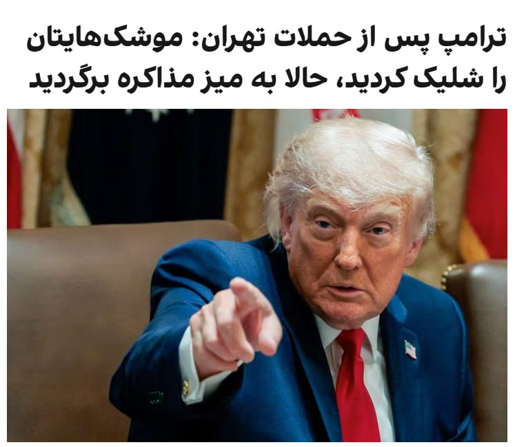

دونالد ترامپ به شبکه فاکس نیوز گفت: پیشنهادی که به ایران دارم این است: موشک‌های خود را شلیک کرده‌اید، همین کافی است.
او افزود: به میز مذاکره بازگردید و توافق کنید.
@VahidOOnLine

📡 @VahidOnline

## VahidOnline — post 75999

  

نیروی هوایی اسرائیل در بیانیه‌ای دقایقی قبل اعلام کرد که این نیرو تاکنون تمامی موشک‌های شلیک‌شده از سوی جمهوری اسلامی ایران را رهگیری و منهدم کرده است. این نیرو گفت ارتش اسرائیل اکنون پرتاب‌های بیشتری را که به سمت اسرائیل شلیک شده‌اند شناسایی کرده است.
@VahidHeadline

📡 @VahidOnline

## VahidOnline — post 75998

توییت باراک راوید، خبرنگار آکسیوس:
یک مقام اسرائیلی به من گفت که اسرائیل قصد دارد به حمله ایران تلافی کند.

📡 @VahidOnline

## VahidOnline — post 75997

  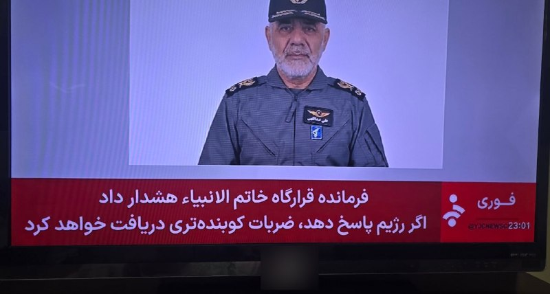

سپاه: در صورت گسترش حملات پاسخ ما کوبنده‌تر خواهد بود

به نقل از تسنیم، خبرگزاری وابسته به سپاه:

"فرمانده قرارگاه حضرت خاتم‌الانبیا(ص):
رژیم متجاوز صهیونیستی با نقض مکرر آتش‌بس شرارت های خود علیه مردم مظلوم لبنان با چراغ سبز و حمایت آمریکای جنایتکار و سکوت مجامع بین المللی را روز به روز افزایش داده و با استفاده از سلاح های ممنوعه از جمله بمب های فسفری مرتکب جنایات جنگی می گردد.

با وجود هشدارهای قبلی جمهوری اسلامی ایران، رژیم کودک کش صهیونیستی با عبور از همه خطوط قرمز و افزایش حملات در جنوب لبنان، ضاحیه بیروت را هدف قرار داده است.

قبلا اخطار داده بودیم در صورت گسترش جنایت در ضاحیه بیروت، اهدافی را در سرزمین های اشغالی مورد هجوم قرار می دهیم.

ارتش صهیونیستی باید حملات خود به جنوب لبنان و ضاحیه را متوقف نماید و در صورت گسترش حملات خود به آن منطقه و یا پاسخ به اقدام ایران با ضربات کوبنده تر و پشیمان کننده روبرو و حملات ویرانگری علیه رژیم و حامیان آن آغاز خواهد شد."

📡 @VahidOnline

## VahidOnline — post 75996

☄️ موج بعدی شلیک موشک به سمت اسرائیل
پیام‌های دریافتی:

دوباره شلیک از کرمانشاه

دوباره یکی دیگه زدن الان
یکی بود

10:44 دوباره صدای انفجار اومد کرمانشاه

صدای انفجار مجدد

بازم زدن
همین الان صدا اومد از روانسر کرمانشاه

22:47 شلیک موشک از تبریز

آذرشهر [نزدیک تبریز] صدای موشک ۳ تا

سلام وحید
ساعت ۲۲:۴۰ ۴ تا شلیک از تبریز به فاصله هر یک دقیقه
نور خیلییی زیادی داره و صدای زیاد

🔄 آپدیت:
منابع حکومتی نوشتند از اصفهان و ارومیه هم موشک شلیک شد.
📡 @VahidOnline

## VahidOnline — post 75995

☄️ 'شلیک موشک از کرمانشاه'
‌
بعضی از پیام‌های دریافتی:

سلام همین الان صدای موشک از کرمانشاه اومد

سلام صدای جنگنده در کرمانشاه

سلام وحید جان.
همین الان ساعت ده و نیم دو تا موشک از کرمانشاه شلیک شد

صدای غرش شدید ترسناک ساعت 10.31 شب کرمانشاه میاد

وحید همین الان از کرمانشاه موشک پرتاب شد

از کرمامشاه الان دوتا موشک شلیک کردن

صدای پرتاب موشک از کرمانشاه الان

سلام وحید جان
من کرمانشاهم
الان ۱۰:۳۰ یه صدایی شبیه شلیک موشک اومد
مطمئن نیستم، ولی دقیقا شبیه صدایی بود که زمان جنگ میومد.

🔄 توییت ارتش اسرائیل:
ارتش اسرائیل موشک‌هایی را که از ایران به سمت اسرائیل شلیک شده بود، شناسایی کرد. سیستم‌های دفاعی برای رهگیری این تهدید در حال فعالیت هستند.

📡 @VahidOnline

## kianmeli1 — post 87736

  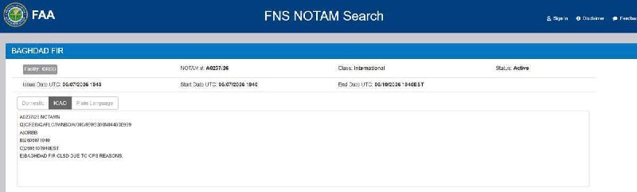

🔴فوری

عراق حریم هوایی خود را بست
https://t.me/kianmeli1

## kianmeli1 — post 87735

🔴فوری / ترامپ: نیروهای نظامی آمریکا در حالت آماده‌باش هستند
https://t.me/kianmeli1

## kianmeli1 — post 87734

🔴فوری

حوثی ها منتظر دستور بستن تنگه باب المندب هستیم
https://t.me/kianmeli1

## kianmeli1 — post 87733

  <a href="telegram/content/kianmeli1_87733_1780862678.mp4" target="_blank">🎬 Download video</a>

🛑فوری-وضعیت تجمعات تهران حین حملات موشکی به اسراییل
https://t.me/kianmeli1

## kianmeli1 — post 87732

🔴فوری-موج حملات موشکی از کرج
https://t.me/kianmeli1

## kianmeli1 — post 87731

  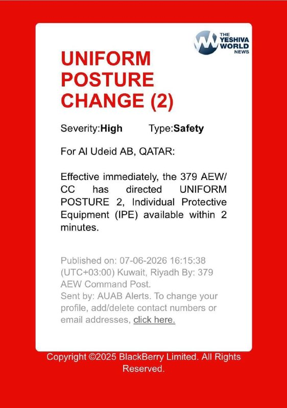

#فوری

تمام بال‌های اکتشافی نیروی هوایی ایالات متحده در اردن، امارات متحده عربی، قطر و کویت در وضعیت افزایش حفاظت نیرو قرار گرفته‌اند. اطلاعیه‌هایی به بال اکتشافی 379ام در پایگاه هوایی العدید حوالی ساعت 4:00 بعدازظهر به وقت محلی صادر شده است که پرسنل را از احتمال حملات موشکی مجدد آگاه می‌کند.
https://t.me/kianmeli1

## kianmeli1 — post 87730

  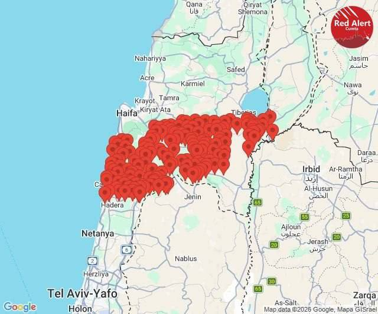

🔴روشن شدن آژیرها در ۲۴۲ نقطه از شمال اسرائیل

طبق برآوردهای جمعیتی، به دنبال سومین موج موشکی ایران، ۱ میلیون و ۵۲۶ هزار اسرائیلی باید به پناهگاه بروند.
https://t.me/kianmeli1

## kianmeli1 — post 87729

🔴فوری

فعالیت پدافندی در آسمان غرب ایران
https://t.me/kianmeli1

## kianmeli1 — post 87728

🔴فوری-به گزارش والانیوز، اسرائیل به دنبال دریافت مجوز از آمریکا برای حمله به زیرساخت‌های انرژی ایران است
https://t.me/kianmeli1

## kianmeli1 — post 87727

  <a href="telegram/content/kianmeli1_87727_1780862680.mp4" target="_blank">🎬 Download video</a>

🔴فوری-مشاهده موشک در آسمان تبریز، دست‌کم ۶ موشک از تبریز و ۳ موشک از ارومیه شلیک شد.
https://t.me/kianmeli1

## kianmeli1 — post 87726

🔴فوری

حملات جدید به ایران بزرگتر از قبل است
https://t.me/kianmeli1

## kianmeli1 — post 87725

🔴رسانه های عبری

ممکن است جام جهانی لغو شود
https://t.me/kianmeli1

## kianmeli1 — post 87724

  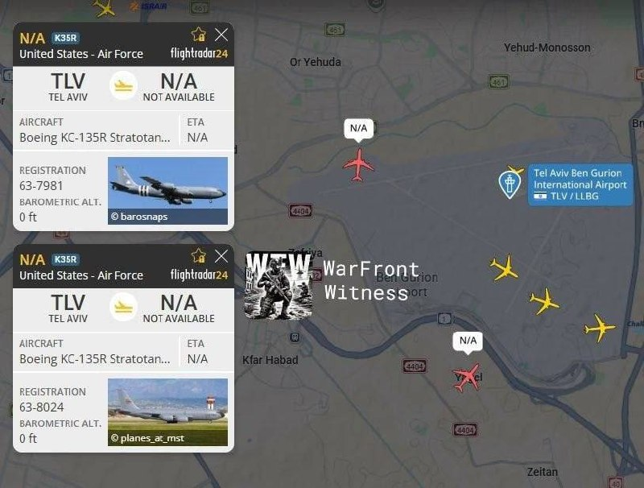

🔴فوری

سوخت رسانها به پرواز درآمدند
https://t.me/kianmeli1

## kianmeli1 — post 87723

🔴فوری

منابع اسراییل: حملات سنگین به ایران نزدیک است
https://t.me/kianmeli1

## kianmeli1 — post 87722

🔴فوری

پمپ‌بنزین های تهران مملو از خودرو شد برای خروج از شهر !!
https://t.me/kianmeli1

## kianmeli1 — post 87721

  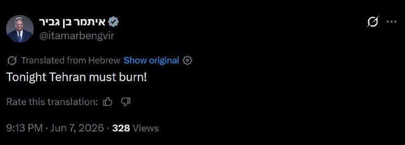

🔴بن گویر وزیر امنیت ملی اسرائیل:

امشب تهران باید بسوزد!
https://t.me/kianmeli1

## kianmeli1 — post 87720

  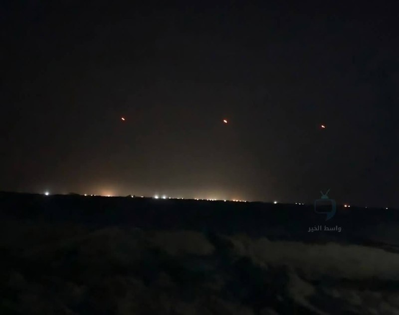

🔴فوری-موشکها در راه اسراییل
https://t.me/kianmeli1

## kianmeli1 — post 87719

🔴فوری

حمله موشکی از تبریز به اسراییل
https://t.me/kianmeli1

## kianmeli1 — post 87718

🔴فوری-ارتش اسرائیل:

آتش بس میان ایران و اسرائیل پایان یافت.
https://t.me/kianmeli1

## kianmeli1 — post 87717

  <a href="telegram/content/kianmeli1_87717_1780862683.mp4" target="_blank">🎬 Download video</a>

🔴فوری

حمله موشکی از اصفهان به اسراییل
https://t.me/kianmeli1

## IranIntlTV — post 341050

  <a href="telegram/content/IranIntlTV_341050_1780862684.mp4" target="_blank">🎬 Download video</a>

محمد قائدی، مدرس روابط بین‌الملل در دانشگاه جورج واشینگتن، گفت: «احتمالا اسرائیل در واکنش به حمله موشکی جمهوری اسلامی، حملات محدودی انجام دهد.» او افزود: «اسرائیل ممکن است همان مناطقی را در ایران هدف قرار دهد که این حملات از آنجا صورت گرفته است.»
@iranintltv

## IranIntlTV — post 341049

  <a href="telegram/content/IranIntlTV_341049_1780862686.mp4" target="_blank">🎬 Download video</a>

ویدیویی که شامگاه یکشنبه ۱۷ خرداد به دست ایران‌اینترنشنال رسیده پرواز موشک‌های جمهوری اسلامی را از کرمانشاه به سمت اسرائیل نشان می‌دهد.

## IranIntlTV — post 341048

  

دونالد ترامپ به شبکه فاکس نیوز گفت: «پیشنهادی که به ایران دارم این است: موشک‌های خود را شلیک کرده‌اید، همین کافی است.»

او افزود: «به میز مذاکره بازگردید و توافق کنید.»
https://iranintl.com/202606075645

## IranIntlTV — post 341047

  <a href="telegram/content/IranIntlTV_341047_1780862688.mp4" target="_blank">🎬 Download video</a>

ویدیوی رسیده به ایران‌اینترنشنال از خرم‌‌آباد در شامگاه یکشنبه ۱۷ خرداد، نور موشک شلیک‌شده از سوی جمهوری اسلامی را به سمت اسرائیل در آسمان این شهر نشان می‌دهد.

## IranIntlTV — post 341046

  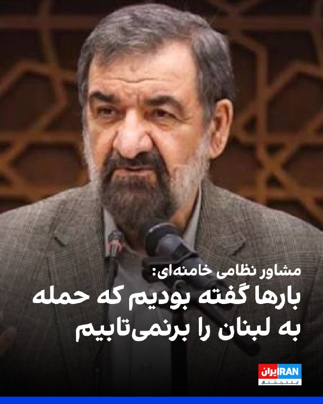

محسن رضایی، مشاور نظامی خامنه‌ای، در شبکه ایکس نوشت جمهوری اسلامی بارها اعلام کرده بود که نقض آتش‌بس و حمله به لبنان را برنمی‌تابد.
او افزود: «امشب متجاوزان پاسخ خود را دریافت کردند. این پاسخ هشداری است تا دست از شرارت بردارند؛ هر اقدام جدید با پاسخی کوبنده‌تر و هزینه‌هایی سنگین‌تر مواجه خواهد شد.»
https://iranintl.com/202606070417

## IranIntlTV — post 341045

  <a href="telegram/content/IranIntlTV_341045_1780862690.mp4" target="_blank">🎬 Download video</a>

ویدیوی رسیده به ایران‌اینترنشنال از تبریز در شامگاه یکشنبه ۱۷ خرداد، نور موشک شلیک‌شده از سوی جمهوری اسلامی را به سمت اسرائیل در آسمان تبریز نشان می‌دهد.

## IranIntlTV — post 341044

  <a href="telegram/content/IranIntlTV_341044_1780862692.mp4" target="_blank">🎬 Download video</a>

ویدیوی رسیده به ایران‌اینترنشنال پرتاب موشک از سوی جمهوری اسلامی را از کرمانشاه به سمت اسرائیل در شامگاه یکشنبه ۱۷ خرداد نشان می‌دهد.

## IranIntlTV — post 341043

  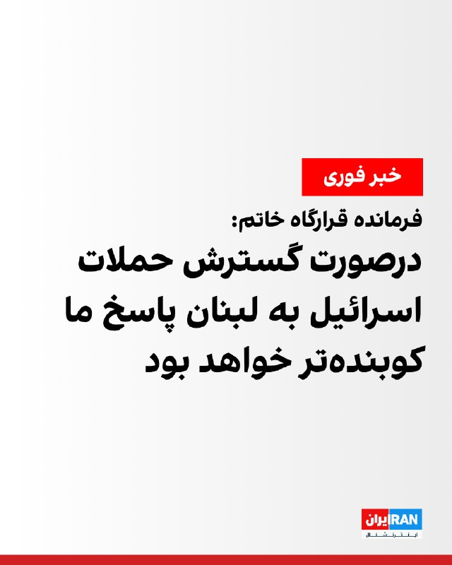

علی عبداللهی، فرمانده قرارگاه خاتم‌الانبیا همزمان با آغاز حملات موشکی جمهوری اسلامی به اسرائیل در پیامی گفت: ارتش اسرائیل باید حملات خود به جنوب لبنان و ضاحیه را متوقف نماید و در صورت گسترش حملات خود به آن منطقه و یا پاسخ به اقدام جمهوری اسلامی با ضربات کوبنده‌تر و پشیمان‌کننده روبرو و حملات ویرانگری علیه رژیم و حامیان آن آغاز خواهد شد.
https://iranintl.com/202606076050

## IranIntlTV — post 341042

  

رسانه‌های ایران شامگاه یک‌شنبه از آغاز حملات موشکی به سوی اسرائیل خبر دادند.

خبرگزاری مهر نوشت دو موج حمله به سوی اسرائیل انجام شده است.

همزمان با آغاز حملات موشکی جمهوری اسلامی به لبنان، عباس عراقچی در ایکس طرحی گرافیکی از پرچم جمهوری اسلامی و لبنان در کنار هم منتشر کرد.
به گزارش اسرائیل هیوم، چهار موشک از سوی ایران به شمال اسرائیل شلیک شده است.

https://iranintl.com/202606079687

## IranIntlTV — post 341041

  <a href="telegram/content/IranIntlTV_341041_1780862695.mp4" target="_blank">🎬 Download video</a>

ارتش اسرائیل اعلام کرد موشک‌هایی از ایران به سمت خاک این کشور شلیک شده‌اند. آژیرهای خطر در حیفا، جلیل و بلندی‌های جولان به صدا درآمده و سامانه‌های دفاعی در حال رهگیری اهداف هستند.

فرماندهی جبهه داخلی نیز از ساکنان مناطق در معرض خطر خواسته دستورالعمل‌های امنیتی را رعایت کنند.
@iranintltv

## IranIntlTV — post 341040

  <a href="telegram/content/IranIntlTV_341040_1780862696.mp4" target="_blank">🎬 Download video</a>

رویترز گزارش داد آمریکا پیش‌نویس قطعنامه‌ای را برای نشست شورای حکام آژانس توزیع کرده و خواستار ارائه فوری اطلاعات درباره مواد و تاسیسات هسته‌ای جمهوری اسلامی شده است.

گفت‌وگو با علیرضا نامور حقیقی، تحلیل‌گر سیاسی
@iranintltv

## IranIntlTV — post 341039

  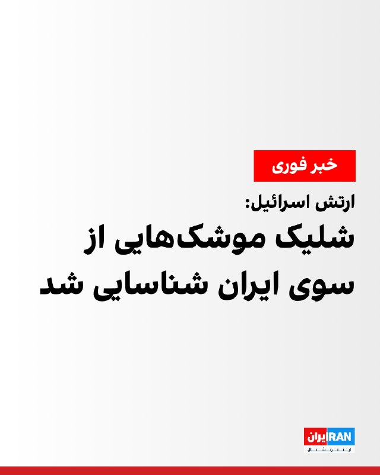

خبرگزاری رویترز گزارش داد که نیروهای نظامی اسرائیل می‌گویند سامانه‌های دفاعی در حال عملیات برای رهگیری تهدید هستند.

بر اساس این گزارش، ارتش اسرائیل اعلام کرده است که شلیک موشک‌هایی از ایران به سمت خاک کشور اسرائیل شناسایی شده است.
https://iranintl.com/202606078136

## IranIntlTV — post 341038

  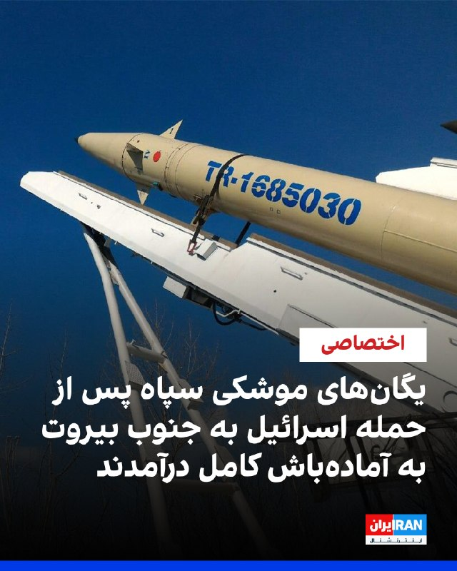

دو منبع نزدیک به نیروهای نظامی جمهوری اسلامی به ایران‌اینترنشنال گفتند در پی حملات یکشنبه اسرائیل به مقر فرماندهی و برنامه‌ریزی حزب‌الله در حومه جنوبی بیروت، یگان‌های موشکی سپاه پاسداران در آستانه یک رویارویی نظامی جدید، به حالت آماده‌باش کامل درآمده‌اند.

به گفته این منابع، در ساعات گذشته، فرماندهان ارشد سپاه درخواست رسمی خود برای صدور مجوز آغاز حملات موشکی به اسرائیل را به دفتر مجتبی خامنه‌ای، رهبر جدید جمهوری اسلامی، ارسال کرده‌اند.

هر دو منبع تایید کردند که با وجود این درخواست، هنوز مجتبی خامنه‌ای یا دفتر او پاسخی به این درخواست نداده‌اند و مشخص نیست که آیا با این حمله موافقت خواهد شد یا خیر.

این دو منبع به ایران‌اینترنشنال گفتند سپاه پاسداران نگران است که سکوت در برابر حملات اسرائیل به ضاحیه، این کشور را به تشدید حملات علیه حزب‌الله ترغیب کند.

ادامه این گزارش را در وبسایت ایران‌اینترنشنال بخوانید
https://iranintl.com/202606077819

## IranIntlTV — post 341037

  <a href="telegram/content/IranIntlTV_341037_1780862699.mp4" target="_blank">🎬 Download video</a>

مئیر جاودانفر، تحلیل‌گر مسائل اسرائیل، گفت به نظر می‌رسد جمهوری اسلامی و حزب‌الله لبنان پس از انتشار خبر گفت‌وگوی پرتنش هفته گذشته دونالد ترامپ و بنیامین نتانیاهو تصور می‌کنند می‌توانند با افزایش فشار، زمینه خروج نیروهای اسرائیلی از لبنان را فراهم کنند.
@iranintltv

## IranIntlTV — post 341036

  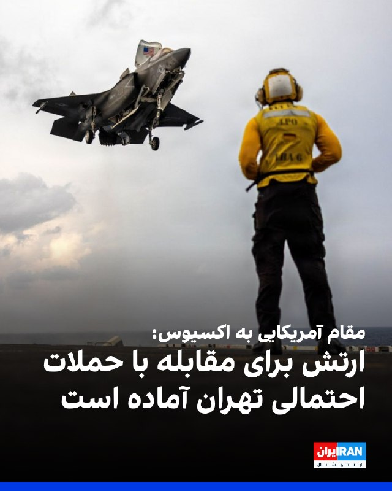

اکسیوس به نقل از دو مقام آمریکایی گزارش داد اسرائیل پیش از حمله به ضاحیه در جنوب بیروت، دولت ترامپ را در جریان قرار داده بود.
یک مقام آمریکایی نیز گفت نیروهای این کشور در خاورمیانه در صورت عملی شدن تهدیدهای تهران و آغاز حملات جدید، برای دفاع آماده هستند.

اکسیوس همچنین به نقل از یک مقام آمریکایی نوشت واشینگتن از حق اسرائیل برای دفاع از خود حمایت می‌کند و حزب‌الله باید فورا حملات خود را متوقف کند تا توافق‌های موجود اجرا شوند.

این رسانه به نقل از منابع خود گزارش داد اسرائیل به دولت ترامپ اعلام کرده است حملات مداوم حزب‌الله به شمال اسرائیل نقض آتش‌بس محسوب می‌شود و تل‌آویو خود را محق به هدف قرار دادن بیروت می‌داند. منابع افزودند اسرائیل تاکید کرده در صورت تکرار حملات حزب‌الله، حملات خود علیه بیروت را ادامه خواهد داد.
https://iranintl.com/202606071984

## IranIntlTV — post 341035

  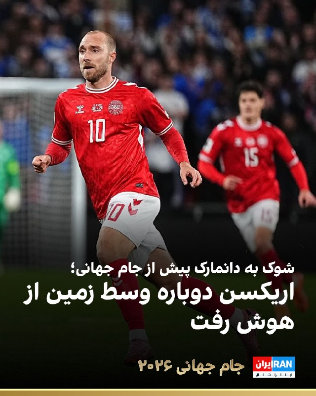

🔻کریستین اریکسن، بازیکن تیم ملی دانمارک هافبک باتجربه تیم ملی دانمارک، در میانه نیمه دوم این مسابقه روی زمین افتاد و برای لحظاتی هوشیاری خود را از دست داد. اریکسن پیشتر در یورو ۲۰۲۰ مقابل فنلاند رخ داده بود.

🔹داور مسابقه بلافاصله بازی را متوقف کرد و کادر پزشکی برای رسیدگی به وضعیت اریکسن وارد زمین شد. گزارش‌ها حاکی از آن است که این بازیکن پس از دقایقی به هوش آمد و تحت مراقبت‌های پزشکی قرار گرفت.

🔹اریکسن در نهایت با پای خود زمین مسابقه را ترک کرد و هواداران حاضر در ورزشگاه نیز او را با تشویق ایستاده بدرقه کردند و این دیدار نیمه تمام ماند.

🔹این اتفاق یادآور حادثه تلخ یورو ۲۰۲۰ است؛ جایی که اریکسن در جریان دیدار دانمارک و فنلاند دچار ایست قلبی شد و پس از احیا، به فوتبال بازگشت. او از آن زمان با دستگاه دفیبریلاتور قلبی (ICD) به فعالیت حرفه‌ای خود ادامه می‌دهد.

🔹هنوز جزئیات بیشتری درباره علت این حادثه و وضعیت جسمانی اریکسن منتشر نشده است.

🔹فدراسیون فوتبال دانمارک با انتشار بیانیه‌ای در شبکه اجتماعی ایکس اعلام کرد: «کریستین اریکسن هوشیار است و با توجه به شرایط پیش‌آمده، وضعیت خوبی دارد.»

@iranintltvsport

## IranIntlTV — post 341034

  <a href="https://t.me/IranintlTV/341034" target="_blank">📎 Download file</a>

🎧نسخه صوتی تیتراول با نیوشا صارمی: حمله اسرائیل به بیروت با دستور نتانیاهو و چراغ سبز ترامپ؛ سپاه: پاسخ می‌دهیم
@iranintlTV

## Shin_Persian — post 6648

  

Shin ✓ @hey_itsmyturn
Sun, 07 Jun 2026 20:00:41 UTC

AA activity, Khorzuq, #Isfahan Province, #Iran

فارسی

فعالیت پدافند هوایی، خورزوق، استان #اصفهان، #ایران

𝕏 · @shin_persian

## Shin_Persian — post 6647

Shin ✓ @hey_itsmyturn
Sun, 07 Jun 2026 19:54:03 UTC

IRIAF CAP over Tehran

فارسی

گشت هوایی رزمی (CAP) نیروی هوایی ارتش جمهوری اسلامی ایران (IRIAF) بر فراز تهران

𝕏 · @shin_persian

## Shin_Persian — post 6646

Shin ✓ @hey_itsmyturn
Sun, 07 Jun 2026 19:45:34 UTC

AA activity Tehran
#Tehran Province, #Iran

فارسی

فعالیت پدافند هوایی تهران
#Tehran Province, #Iran

𝕏 · @shin_persian

## Shin_Persian — post 6645

Shin ✓ @hey_itsmyturn
Sun, 07 Jun 2026 19:43:42 UTC

Explosions north of Tabriz airport,
East Azerbaijan Province, #Iran

فارسی

انفجارها در شمال فرودگاه تبریز،
استان آذربایجان شرقی، #Iran

𝕏 · @shin_persian

## Shin_Persian — post 6644

Shin ✓ @hey_itsmyturn
Sun, 07 Jun 2026 19:38:35 UTC

AA activity
Kermanshah, Kermanshah Province, #Iran

فارسی

فعالیت پدافند هوایی
کرمانشاه، استان کرمانشاه، #Iran_

𝕏 · @shin_persian

## Shin_Persian — post 6643

Shin ✓ @hey_itsmyturn
Sun, 07 Jun 2026 19:38:21 UTC

AA activity
Tabriz, East Azerbaijan Province, #Iran

فارسی

فعالیت پدافند هوایی
تبریز، استان آذربایجان شرقی، #Iran

𝕏 · @shin_persian

## Shin_Persian — post 6642

Shin ✓ @hey_itsmyturn
Sun, 07 Jun 2026 19:35:08 UTC

#IDF 🇮🇱:
"The Air Force has intercepted all missiles fired from Iran so far.

The IDF has now identified additional launches fired toward the State of Israel.

The air defense system is identifying and intercepting threats at all times.

You are requested to continue following Home Front Command instructions and the guidelines distributed to you."
#Iran

فارسی

#IDF 🇮🇱:
«نیروی هوایی تمامی موشک‌های شلیک شده از ایران تا این لحظه را رهگیری کرده است.

ارتش دفاعی اسرائیل اکنون پرتاب‌های بیشتری را که به سمت دولت اسرائیل شلیک شده، شناسایی کرده است.

سامانه پدافند هوایی در تمام لحظات در حال شناسایی و رهگیری تهدیدات است.

از شما درخواست می‌شود به پیروی از دستورالعمل‌های فرماندهی جبهه داخلی و راهنماهای توزیع شده ادامه دهید.»
#Iran_

𝕏 · @shin_persian

## Shin_Persian — post 6641

  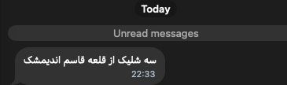

Shin ✓ @hey_itsmyturn
Sun, 07 Jun 2026 19:34:27 UTC

NOW -
3 BMs launched from Qal'e Qassem, Andimeshk, Khuzestan Province, #Iran

فارسی

هم‌اکنون - ۳ فروند موشک بالستیک (BMs) از قلعه‌قاسم، اندیمشک، استان خوزستان، #ایران شلیک شد.

𝕏 · @shin_persian

## Shin_Persian — post 6640

  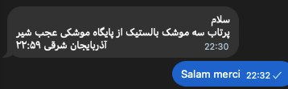

Shin ✓ @hey_itsmyturn
Sun, 07 Jun 2026 19:33:00 UTC

Ajab Shir, Eastern Azerbaijan Province, #Iran
BM launch @ 1929Z
3 missiles

فارسی

عجب‌شیر، استان آذربایجان شرقی، #Iran
شلیک موشک بالستیک در ۱۹۲۹ زولو (۲۲:۵۹ به وقت تهران)
۳ موشک

𝕏 · @shin_persian

## Shin_Persian — post 6639

  <a href="telegram/content/Shin_Persian_6639_1780862703.mp4" target="_blank">🎬 Download video</a>

Shin ✓ @hey_itsmyturn
Sun, 07 Jun 2026 19:32:32 UTC

BM visible from Karaj
#Alborz Province, #Iran

فارسی

موشک بالستیک از کرج قابل مشاهده است
#Alborz Province, #Iran

𝕏 · @shin_persian

## Shin_Persian — post 6638

Shin ✓ @hey_itsmyturn
Sun, 07 Jun 2026 19:29:26 UTC

JUST NOW
BM launch from Kashan
#Isfahan Province, #Iran

فارسی

همین حالا
شلیک موشک بالستیک از کاشان
#Isfahan Province, #Iran

𝕏 · @shin_persian

## Shin_Persian — post 6637

  <a href="telegram/content/Shin_Persian_6637_1780862705.mp4" target="_blank">🎬 Download video</a>

Shin ✓ @hey_itsmyturn
Sun, 07 Jun 2026 19:27:59 UTC

Tabriz, East Azerbaijan Province, #Iran

فارسی

تبریز، استان آذربایجان شرقی، #Iran

𝕏 · @shin_persian

## Shin_Persian — post 6636

  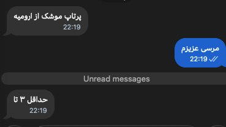

↩️ Quoted tweet: Shin ✓ @hey_itsmyturn Sun, 07 Jun 2026 19:19:22 UTC NOW BM Launch from Urmia ↩️ توییت نقل‌قول شده — برای پاسخ، پست زیر را ببینید. فارسی هم‌اکنون پرتاب موشک بالستیک (BM) از ارومیه 𝕏 · @shin_persian

## Shin_Persian — post 6635

↩️ Quoted tweet:
Shin ✓ @hey_itsmyturn
Sun, 07 Jun 2026 19:19:22 UTC

NOW
BM Launch from Urmia

↩️ توییت نقل‌قول شده — برای پاسخ، پست زیر را ببینید.

فارسی

هم‌اکنون
پرتاب موشک بالستیک (BM) از ارومیه

𝕏 · @shin_persian

## Shin_Persian — post 6634

Shin ✓ @hey_itsmyturn
Sun, 07 Jun 2026 19:19:22 UTC

NOW
BM Launch from Urmia

فارسی

هم‌اکنون
پرتاب موشک بالستیک (BM) از ارومیه

𝕏 · @shin_persian

## Shin_Persian — post 6633

  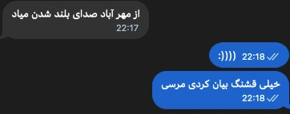

Shin ✓ @hey_itsmyturn
Sun, 07 Jun 2026 19:18:46 UTC

Jet scramble,
Mehrabad airport / Airbase
Tehran, #Tehran Province, #Iran

فارسی

تکاپوی جت‌ها (اِسکرامبل)،
فرودگاه مهرآباد / پایگاه هوایی
تهران، #Tehran Province، #Iran

𝕏 · @shin_persian

## Shin_Persian — post 6632

  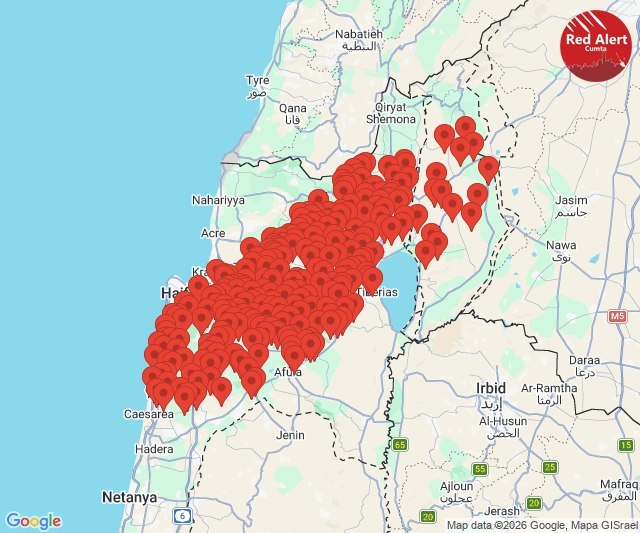

Shin ✓ @hey_itsmyturn
Sun, 07 Jun 2026 19:17:19 UTC

Again:
Tzeva Adom
Northern #Israel 🇮🇱

فارسی

وضعیت قرمز
شمال #Israel 🇮🇱

𝕏 · @shin_persian

## Shin_Persian — post 6631

  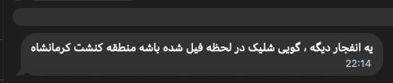

Shin ✓ @hey_itsmyturn
Sun, 07 Jun 2026 19:15:09 UTC

Another Blast in Kermanshah, Western Iran
Eyewitness believes it failed upon launch.

فارسی

انفجاری دیگر در کرمانشاه، غرب ایران
شاهد عینی معتقد است که [پرتابه] در هنگام پرتاب با شکست مواجه شده است.

𝕏 · @shin_persian

## Shin_Persian — post 6630

Shin ✓ @hey_itsmyturn
Sun, 07 Jun 2026 19:13:44 UTC

Another BM has been detected by from Iran towards #Israel 🇮🇱

فارسی

موشک بالستیک (BM) دیگری از ایران به سمت #Israel 🇮🇱 شناسایی شده است.

𝕏 · @shin_persian

## Shin_Persian — post 6629

  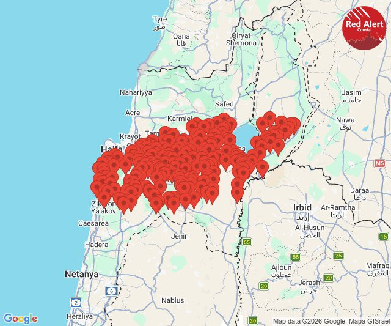

Shin ✓ @hey_itsmyturn
Sun, 07 Jun 2026 19:06:15 UTC

Tzeva Adom
Northern #Israel 🇮🇱

فارسی

تِزِوا آدوم (وضعیت قرمز)
شمال #Israel 🇮🇱

𝕏 · @shin_persian

## Iliaen — post 4450

تمنا می‌شود از اماکن نظامی فاصله بگیرید.

از آنجا که تا این لحظه، موشک‌ها از سایت‌های موشکی اشتهارد، قم، اصفهان، کرمانشاه، تبریز و ارومیه شلیک شدند، احتمال حمله به سایت‌ها و مناطق نظامی در این محدوده‌ها محتمل‌تر است و باید دقت بیشتری کرد.

@iliaen

## Iliaen — post 4449

ساعت ۲۳:۱۲ یکشنبه؛ گزارش‌ها از مشاهده پهپاد در آسمان شمال غرب کرمانشاه حکایت دارد.

@iliaen

## Iliaen — post 4448

  <a href="telegram/content/Iliaen_4448_1780862708.mp4" target="_blank">🎬 Download video</a>

مشاهده موشک در آسمان تبریز، دست‌کم ۶ موشک از تبریز و ۳ موشک از ارومیه شلیک شد.

@iliaen

## Iliaen — post 4447

  <a href="telegram/content/Iliaen_4447_1780862709.mp4" target="_blank">🎬 Download video</a>

ساعت ۲۲:۵۰ یکشنبه؛ مشاهده‌ی نور چشمک‌زن یک هواپیمای مسافربری در آسمان کرج، همزمان با شلیک موشک توسط سپاه و احتمال شروع حملات اسرائیل.

@iliaen

## Iliaen — post 4446

ساعت ۲۲:۴۴ یکشنبه؛ چند موشک دیگر از کرمانشاه به سمت اسرائیل شلیک شد. اسرائیل نیز پیش‌تر اعلام کرده بود در صورت چنین اقدامی، آماده پاسخ سریع است.

@iliaen

## Iliaen — post 4445

  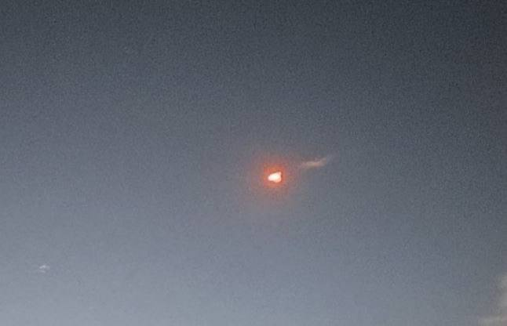

جمهوری اسلامی تعداد ۴ موشک را از کرمانشاه به سمت اسرائیل پرتاب کرد.

@iliaen

## Iliaen — post 4444

رسانه‌های نزدیک به سپاه پاسداران از احتمال حمله جمهوری اسلامی به اسرائیل در ساعات پیش‌رو خبر می‌دهند؛

همچنین ساعاتی پیش، قالیباف تهدید کرد پایگاه‌های آمریکا در منطقه، به علت نقض آتش‌بس (حمله‌ی اسرائیل به بیروت) هدف قرار خواهند گرفت.

فکر می‌کنم بهتر است اگر خارج از ایران هستید یا کسی را خارج از ایران دارید، با او تماس بگیرید؛ زیرا تجربه نشان می‌دهد ترکش اولین انفجارها با سرورهای اینترنت برخورد می‌کند و همه چیز قطع می‌شود، ممکن است چندین روز دلتنگ عزیزی بمانید…

@iliaen

## Iliaen — post 4443

  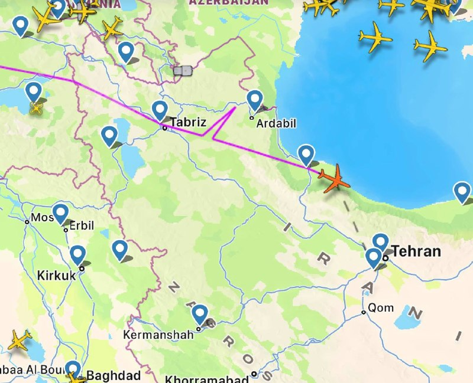

یک پرواز دیگر، اینبار از مبدا استابول به مقصد تهران، با تغییر مسیر پرواز، درحال دور زدن آسمان غرب ایران جهت ادامه‌ی مسیر (یا فرود در نخستین فرودگاه) است.

@iliaen

## FarsiVOA — post 219927

  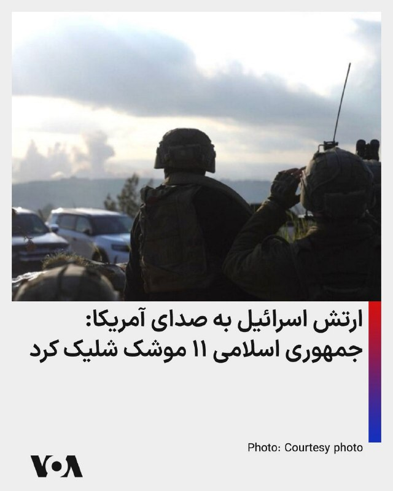

⚡️ارتش اسرائيل به صدای آمریکا گفت که جمهوری اسلامی تاکنون یازده موشک به سمت اسرائيل شلیک کرده است. پیشتر نیروی هوایی اسرائيل گفته است همه موشک‌ها منهدم شده‌اند.
@FarsiVOA

## FarsiVOA — post 219926

  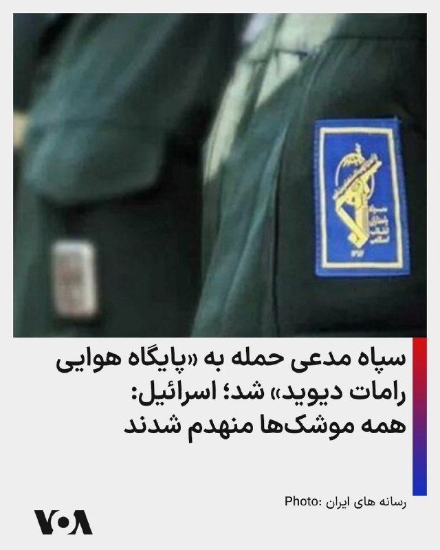

⚡️در حالی که ارتش اسرائيل اعلام کرده تاکنون همه موشک‌های شلیک‌شده از سوی جمهوری اسلامی را منهدم کرده‌است، سپاه پاسداران مدعی شد در پاسخ به حملات اسرائيل در جنوب لبنان، مناطق صور و نبطیه، و سایر نقاط از جمله ضاحیه بیروت، «پایگاه هوایی رامات دیوید» را هدف حملات موشکی بالیستیک قرار داده است.
@FarsiVOA

## FarsiVOA — post 219925

Farsi VOA pinned a photo

## FarsiVOA — post 219924

  

📸اینستاگرام صدای آمریکا را هم اکنون فالو کنید تا از آخرین خبرها مطلع بمانید:
https://www.instagram.com/voafarsi/

📡همچنین جهت اطلاع از بروزترین فرکانسهای ماهواره‌ای صدای آمریکا به لینک زیر مراجعت فرمایید:
https://ir.voanews.com/satellite

این پست را با دوستانتان به اشتراک بگذارید
@FarsiVOA

## FarsiVOA — post 219923

  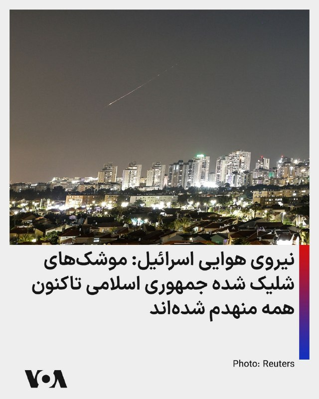

⚡️نیروی هوایی اسرائيل در بیانیه‌ای دقایقی قبل اعلام کرد که این نیرو تاکنون تمامی موشک‌های شلیک‌شده از سوی جمهوری اسلامی ایران را رهگیری و منهدم کرده است. این نیرو گفت ارتش اسرائیل اکنون پرتاب‌های بیشتری را که به سمت اسرائیل شلیک شده‌اند شناسایی کرده است.
@FarsiVOA

## FarsiVOA — post 219922

  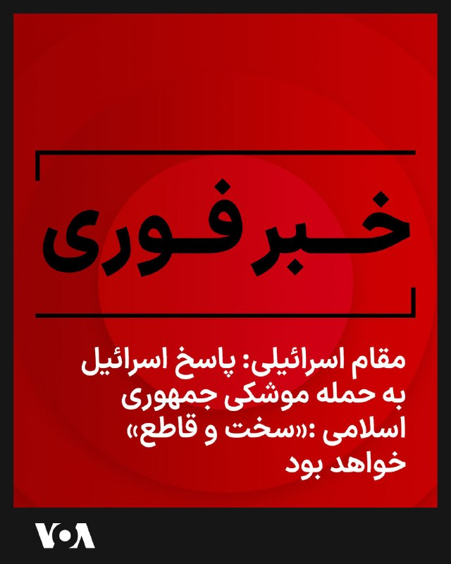

⚡️به گزارش سایت اسرائيلی وای‌نت، یک مقام اسرائیلی در واکنش به شلیک موشک از سوی جمهوری اسلامی گفت که حکومت ایران نباید تصور کند اسرائیل از این موضوع چشم‌پوشی خواهد کرد. این مقام که نامش منتشر نشده است، تأکید کرد که پاسخ اسرائیل سخت و قاطع خواهد بود و افزود که اسرائیل اجازه نخواهد داد جمهوری اسلامی «معادلات جدیدی» ایجاد کند یا حاکمیت این کشور را نقض کند.
@FarsiVOA

## FarsiVOA — post 219921

🔺ارتش اسرائيل از حمله موشکی جمهوری اسلامی خبر داد

◾️سخنگوی ارتش اسرائیل اواخر روز یکشنبه به وقت محلی گفت که این نیرو اندکی پیش، شلیک موشک‌هایی از ایران به سمت خاک اسرائیل را شناسایی کرد و سیستم‌های دفاعی برای رهگیری این تهدید در حال فعالیت هستند.

⬇️ بیشتر بخوانید:
https://ir.voanews.com/a/us-ready-to-defend-israel-against-irans-threats/8158252.html
@FarsiVOA

## FarsiVOA — post 219920

  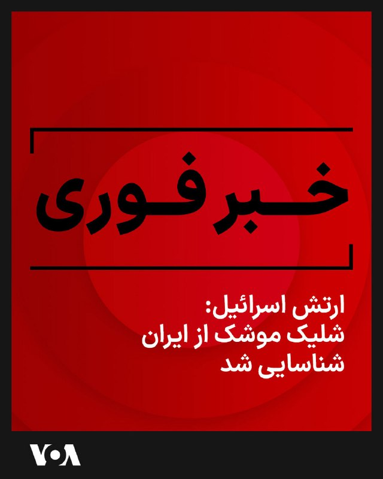

⚡️سخنگوی ارتش اسرائیل گفته است که ارتش اسرائیل شناسایی کرده است که اندکی پیش، موشک‌هایی از ایران به سمت خاک اسرائیل شلیک شده است و سیستم‌های دفاعی برای رهگیری این تهدید در حال فعالیت هستند. کانال تلگرامی وحیدآنلاین نیز گزارش‌هایی مردمی از شلیک موشک از کرمانشاه منتشر کرده است.
@FarsiVOA

## FarsiVOA — post 219919

🔺یونان یک مرد فلسطینی را به ظن ارتباط با حماس و برنامه‌ریزی برای حمله تروریستی بازداشت کرد

◾️پلیس یونان اعلام کرد یک مرد ۳۷ ساله فلسطینی را در جزیره کرت به ظن ارتباط با گروه تروریستی حماس و برنامه‌ریزی برای انجام حملات تروریستی بازداشت کرده است.

⬇️ بیشتر بخوانید:

https://ir.voanews.com/a/greece-arrests-suspected-hamas-operative/8158251.html

## FarsiVOA — post 219918

روایت تازه از بحران معیشت در ایران؛ آیا حقوق کارگران فقط برای زنده ماندن کافی است؟

## FarsiVOA — post 219914

فرماندهی مرکزی ایالات متحده، سنتکام، تصاویری از عملیات پرواز شبانه روی ناو هواپیمابر «یو‌اس‌اس جورج اچ. دبلیو. بوش» منتشر کرد.

سنتکام اعلام کرد این عملیات در حالی انجام شده که ناو هواپیمابر جورج اچ. دبلیو. بوش در حال عبور از دریای عرب است.

به گفته سنتکام، این ناو یکی از دو ناو هواپیمابری است که هم‌اکنون در خاورمیانه فعالیت می‌کنند.

@FarsiVOA

## FarsiVOA — post 219913

  <a href="telegram/content/FarsiVOA_219913_1780862713.mp4" target="_blank">🎬 Download video</a>

ویدیویی از کیان، فرزند کمیل جمشیدی، کشته‌شده در دی ماه ۱۴۰۴، واکنش کاربران اجتماعی را برانگیخته است. کیان ۱۳ ساله دل‌تنگ پدرش، لباس او را در آغوش گرفته و اشک می‌ریزد.

کمیل جمشیدی، ۳۶ ساله، ۱۸ دی با گلوله ماموران حکومتی در فردیس کرج کشته شد.

## FarsiVOA — post 219912

ایمان آقایاری در برنامه تفسیر خبر: جمهوری اسلامی از پاسخ به نیاز نسل امروز ناتوان است

## FarsiVOA — post 219911

Farsi VOA pinned a photo

## FarsiVOA — post 219910

  <a href="telegram/content/FarsiVOA_219910_1780862715.mp4" target="_blank">🎬 Download video</a>

دامون محمدی در برنامه تفسیر خبر: به محض پایان تب جنگی، اعتراضات مردمی تشدید می شود

## FarsiVOA — post 219909

  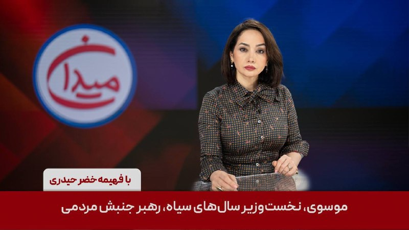

🎯این برنامخ جذاب فهیمه خضر حیدری در رابطه با میر حسین موسوی را از لینک زیر مشاهده کنید:
https://www.youtube.com/live/pEj88TjMsVs

🔴یوتیوب صدای آمریکا را هم سابسکرایب کنید
👇👇👇👇
https://youtube.com/@voafarsi

## FarsiVOA — post 219908

🔺ارتش اسرائیل از کشف شبکه تونلی حزب‌الله که با «تامین مالی» جمهوری اسلامی در ارتفاعات بوفور ساخته شده است خبر داد

◾️ارتش اسرائیل می‌گوید نیروهایش یک شبکه گسترده تونل‌های زیرزمینی متعلق به حزب‌الله لبنان را در منطقه ارتفاعات بوفور در جنوب لبنان شناسایی کرده‌اند؛ شبکه‌ای که به گفته ارتش اسرائيل، با طراحی و تأمین مالی جمهوری اسلامی ایران ساخته شده است.

⬇️ بیشتر بخوانید:

https://ir.voanews.com/a/israel-exposes-hezbollah-tunnel-network/8158237.html

## DW_Farsi — post 125659

  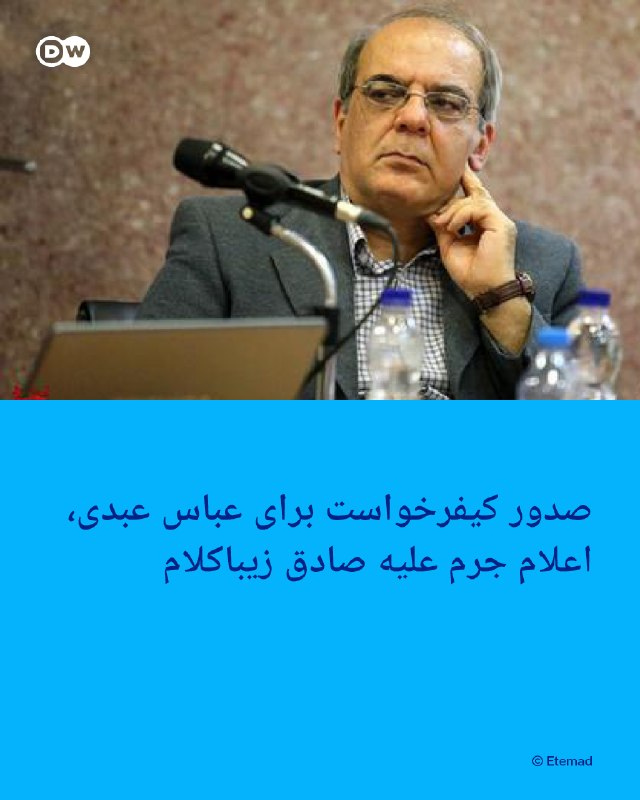

🔶صدور کیفرخواست برای عباس عبدی، اعلام جرم علیه صادق زیباکلام

خبرگزاری میزان، ارگان قوه قضاییه جمهوری اسلامی ایران اعلام کرد که علیه عباس عبدی، فعال سیاسی و روزنامه اعتماد کیفرخواستی از سوی دادستانی تهران صادر شده است.

بر اساس این خبر، در جریان تحقیقات مقدماتی در شعبه بازپرسی، علاوه بر اعلام جرم دادستانی، "حدود ۸۰۰ نفر از شهروندان و اقشار مختلف مردم، شکایتی را علیه عباس عبدی (نویسنده) و مدیران روزنامه اعتماد تقدیم دادستانی کردند".

پس از احضار عبدی اتهام "ایجاد اختلاف بین اقشار جامعه و نشر اکاذیب و مطالب خلاف واقع" به او تفهیم شد.

پیش از تشکیل دادگاه نیز "قرار نظارت قضایی" برای او صادر شده که به موجب آن عباس عبدی "به مدت سه ماه از مصاحبه‌های زنده یا ضبط‌شده با رسانه‌های داخلی و خارجی، چاپ، انتشار و بارگذاری هرگونه یادداشت، مقاله یا محتوا در روزنامه‌ها، فعالیت در شبکه‌های اجتماعی و صفحات شخصی در فضای مجازی" منع شده است.

@dw_farsi

## DW_Farsi — post 125658

  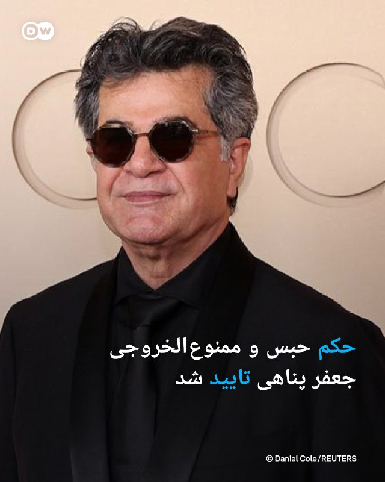

🔶حکم حبس و ممنوع‌الخروجی جعفر پناهی تایید شد

مصطفی نیلی، وکیل جعفر پناهی، فیلمساز سرشناس ایرانی به خبرگزاری دانشجویان ایران، ایسنا گفته که حکم یک سال حبس تعزیری، دو سال ممنوعیت خروج از کشور و ممنوعیت عضویت در گروه‌های سیاسی موکلش در شعبه ۲۶ دادگاه انقلاب تایید شده است.

به گفته نیلی، این شعبه دادگاه انقلاب تقاضای واخواهی را رد و حکم اولیه را عینا تایید کرده است. این حکم به صورت غیابی و بدون حضور جعفر پناهی صادر شده اما ظرف ۲۰ روز قابل تجدیدنظرخواهی است.

به نوشته کانال تلگرامی تحکیم ملت در کیفرخواست جعفر پناهی این اتهامات آمده است: «ساخت فیلم زیرزمینی و مسئله‌دار علیه حاکمیت، حمایت از برخی محکومان امنیتی، از جمله فاطمه سپهری، راحله راحمی‌پور، حسین رونقی، محمد نوری‌زاد، مهدی محمودیان، ابوالفضل قدیانی و …، حمایت از اعتراضات، حمایت از شعار زن، زندگی، آزادی، امضا و انتشار بیانیه‌ای درباره اعتصاب کامیون‌داران، سیاه‌نمایی وضعیت کشور و بازنشر کلیپی با مضمون هم‌خوانی سرود "ای ایران" در اعتراض به صدور و اجرای احکام اعدام.»

@dw_farsi

## DW_Farsi — post 125657

  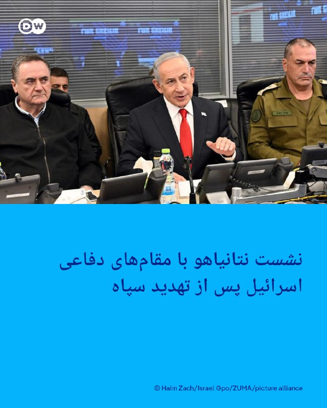

🔶نشست نتانیاهو با مقام‌های دفاعی اسرائيل پس از تهدید سپاه

به گزارش رسانه‌های اسرائيل، پس از تهدید سپاه پاسداران به پاسخ‌گویی به حملات اسرائيل به ضاحیه بیروت، بنیامین نتانیاهو، نخست‌وزیر این کشور جلسه‌ای امنیتی با یسرائیل کاتس، وزیر دفاع و شماری از روسای نهادهای دفاعی اسرائيل به منظور بررسی درگیری‌ها لبنان تشکیل داده است.

یک مقام اسرائیلی در گفت‌وگو با تایمز اسرائیل این خبر را تایید کرده است.

پس از حمله روز یک‌شنبه اسرائیل به ضاحیه بیروت، پایگاه اصلی گروه حزب‌الله لبنان قرارگاه خاتم‌الانبیای سپاه پاسداران اطلاعیه‌ای صادر کرد و گفت: «این حمله بی پاسخ نمی‌ماند.»

محمدباقر قالیباف، رئيس مجلس ایران نیز در شبکه ایکس از "نقض توافقات با لبنان" نوشت و نتیجه گرفت که این موضوع نشان داده که آن‌ها "فقط زبان قدرت را می‌فهمند."
@dw_farsi

## Persian_Trend_Official — post 15982

  <a href="telegram/content/Persian_Trend_Official_15982_1780862718.webm" target="_blank">🎬 Download video</a>

⭕️ کاهش چشم‌گیر سرعت اینترنت در ایران!

📝 Nick

📌 @persian_trend_official
پرشین ترند | متفاوت‌ترین کانال نظامی

## Persian_Trend_Official — post 15981

  <a href="telegram/content/Persian_Trend_Official_15981_1780862718.mp4" target="_blank">🎬 Download video</a>

🎬 Video

## Persian_Trend_Official — post 15980

⭕️ ترامپ: پیشنهاد من به ایران این است: موشک‌هایتان را شلیک کرده‌اید، کافی است. به میز مذاکره بازگردید و معامله‌ای انجام دهید. 📝 Nick 📌 @persian_trend_official پرشین ترند | متفاوت‌ترین کانال نظامی

## Persian_Trend_Official — post 15979

⭕️ ترامپ: پیشنهاد من به ایران این است: موشک‌هایتان را شلیک کرده‌اید، کافی است. به میز مذاکره بازگردید و معامله‌ای انجام دهید.

📝 Nick

📌 @persian_trend_official
پرشین ترند | متفاوت‌ترین کانال نظامی

## Persian_Trend_Official — post 15978

⭕️ اسرائیل به فارسی:

نیروی هوایی اسرائیل همه موشک‌های شلیک شده تا این لحظه را رهگیری کرد.

📝 Nick

📌 @persian_trend_official
پرشین ترند | متفاوت‌ترین کانال نظامی

## Persian_Trend_Official — post 15977

  <a href="telegram/content/Persian_Trend_Official_15977_1780862721.webm" target="_blank">🎬 Download video</a>

تاکنون تصویری از برخورد منتشر نشده است.

📝 Nick

📌 @persian_trend_official
پرشین ترند | متفاوت‌ترین کانال نظامی

## Persian_Trend_Official — post 15975

⭕️ جبهه داخلی اسرائیل اعلام کرد که درگیری‌ها در شمال کشور به پایان رسیده است. می‌توانید از پناهگاه‌ها خارج شوید.

📝 Nick

📌 @persian_trend_official
پرشین ترند | متفاوت‌ترین کانال نظامی

## Persian_Trend_Official — post 15974

  <a href="telegram/content/Persian_Trend_Official_15974_1780862721.mp4" target="_blank">🎬 Download video</a>

فیلمی که موشک‌های بالستیک بالای کرج، ایران را نشان می‌دهد.

## Persian_Trend_Official — post 15973

  <a href="telegram/content/Persian_Trend_Official_15973_1780862722.mp4" target="_blank">🎬 Download video</a>

شلیک موشک سپاه

## Persian_Trend_Official — post 15972

  <a href="telegram/content/Persian_Trend_Official_15972_1780862724.webm" target="_blank">🎬 Download video</a>

⭕️ شبکه خبر:

📝 Nick

📌 @persian_trend_official
پرشین ترند | متفاوت‌ترین کانال نظامی

## Persian_Trend_Official — post 15971

⭕️ کان نیوز: بیانیه ارتش اسرائیل تا نیم ساعت دیگه منتشر می‌شه.

📝 Nick

📌 @persian_trend_official
پرشین ترند | متفاوت‌ترین کانال نظامی

## Persian_Trend_Official — post 15970

  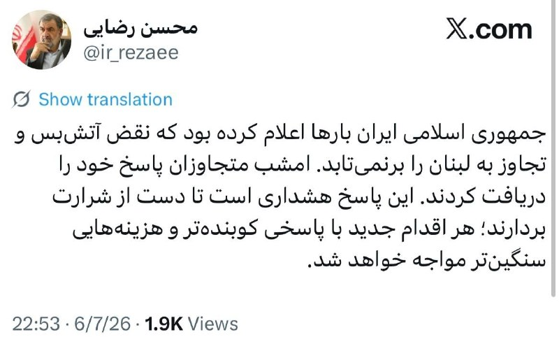

⭕️ محسن‌ رضایی: امشب متجاوزان پاسخ خود را دریافت کردند.

هر اقدام جدید پاسخ کوبنده تر و هزینه هایی سنگین تر دارد.

📝 Nick

📌 @persian_trend_official
پرشین ترند | متفاوت‌ترین کانال نظامی

## Persian_Trend_Official — post 15969

  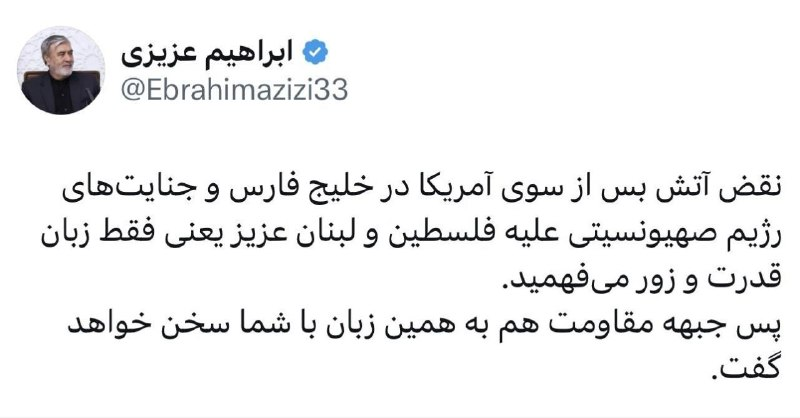

عزیزی: دشمن فقط زبان زور میفهمد

رییس کمیسیون امنیت ملی در فضای مجازی:
🔺‏نقض آتش بس از سوی آمریکا در خلیج فارس و جنایت‌های رژیم صهیونسیتی علیه فلسطین و لبنان عزیز یعنی فقط زبان قدرت و زور می‌فهمید.

🔺‏پس جبهه مقاومت هم به همین زبان با شما سخن خواهد گفت. / مهر

📝 Nick

📌 @persian_trend_official
پرشین ترند | متفاوت‌ترین کانال نظامی

## Persian_Trend_Official — post 15968

  <a href="telegram/content/Persian_Trend_Official_15968_1780862726.webm" target="_blank">🎬 Download video</a>

♨️ فعالیت پدافند هوایی در تبریز و کرمانشاه.

📝 Nick

📌 @persian_trend_official
پرشین ترند | متفاوت‌ترین کانال نظامی

## Persian_Trend_Official — post 15967

  <a href="telegram/content/Persian_Trend_Official_15967_1780862726.mp4" target="_blank">🎬 Download video</a>

اردن

## Persian_Trend_Official — post 15966

پرتاب موشک از قم و اندیمشک

## Persian_Trend_Official — post 15965

  <a href="telegram/content/Persian_Trend_Official_15965_1780862727.mp4" target="_blank">🎬 Download video</a>

استفاده مجدد ایران از موشک‌های بارشی

## Persian_Trend_Official — post 15964

  <a href="telegram/content/Persian_Trend_Official_15964_1780862728.webm" target="_blank">🎬 Download video</a>

⭕️ ارتش اسرائیل می‌گوید تاکنون تمام موشک‌های بالستیک ایرانی که امشب به سمت اسرائیل شلیک شده‌اند را رهگیری کرده است.

ارتش اسرائیل می‌گوید پدافند هوایی اکنون در تلاش است تا آخرین موشک شلیک شده از ایران را سرنگون کند.

📝 Nick

📌 @persian_trend_official
پرشین ترند | متفاوت‌ترین کانال نظامی

## Persian_Trend_Official — post 15963

پرتاب موشک از قم و اندیمشک

📝 Nick

📌 @persian_trend_official
پرشین ترند | متفاوت‌ترین کانال نظامی

## Persian_Trend_Official — post 15962

  <a href="telegram/content/Persian_Trend_Official_15962_1780862729.mp4" target="_blank">🎬 Download video</a>

اسمان اسراییل

حرکت موشک های ایرانی

## RadioFarda — post 158013

  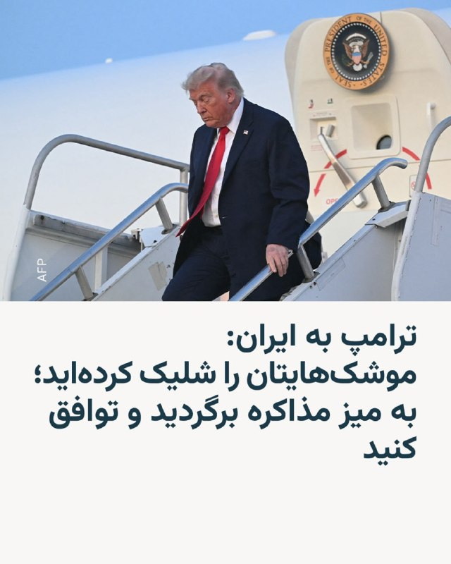

🔸دونالد ترامپ، رئیس‌جمهور آمریکا، دقایقی بعد از حملات موشکی ایران به اسرائیل خواستار توقف این حملات و بازگشت تهران به میز مذاکره شد.

🔸او شامگاه یکشنبه به شبکه خبری فاکس نیوز گفت: «پیشنهادی که به ایران دارم این است: موشک‌های خود را شلیک کرده‌اید؛ همین کافی است. به میز مذاکره بازگردید و توافقی حاصل کنید.»

@RadioFarda

## RadioFarda — post 158012

⚡️فوری- ارتش اسرائیل شامگاه یکشنبه اعلام کرد که موشک‌هایی را که از ایران به سمت خاک اسرائیل شلیک شده بودند شناسایی کرده است. ⚡️در بیانیه‌ ارتش اسرائیل آمده است: «دقایقی پیش و در پی شناسایی موشک‌هایی که از ایران به سوی اسرائیل شلیک شده بودند، آژیرهای هشدار…

## RadioFarda — post 158011

  <a href="telegram/content/RadioFarda_158011_1780862731.mp4" target="_blank">🎬 Download video</a>

⚡️فوری- ارتش اسرائیل شامگاه یکشنبه اعلام کرد که موشک‌هایی را که از ایران به سمت خاک اسرائیل شلیک شده بودند شناسایی کرده است.

⚡️در بیانیه‌ ارتش اسرائیل آمده است: «دقایقی پیش و در پی شناسایی موشک‌هایی که از ایران به سوی اسرائیل شلیک شده بودند، آژیرهای هشدار در چندین منطقه در سراسر کشور به صدا درآمد.»

⚡️این نهاد نظامی افزود که سامانه‌های پدافندی در حال فعالیت برای رهگیری و مقابله با این تهدید هستند.

⚡️این اتفاق چند ساعت بعد از آن رخ داد که ارتش اسرائیل منطقه ضاحیه در جنوب بیروت را هدف قرار داد و ایران تهدید کرد به این حمله پاسخ خواهد داد.
@RadioFarda

## IranianMinds — post 21654

طبق گفته ممبرا تهران صدای انفجار اومده @IranianMinds

## IranianMinds — post 21653

طبق گفته ممبرا
تهران صدای انفجار اومده

@IranianMinds

## IranianMinds — post 21652

🔴 فوری ترامپ به فاکس نیوز: «پیشنهادی که به ایران دارم این است: موشک‌هایتان را شلیک کرده‌اید، کافی است. به میز مذاکره برگردید و یک توافق انجام دهید.» @IranianMinds

## IranianMinds — post 21651

🔴 فوری ترامپ به فاکس نیوز:

«پیشنهادی که به ایران دارم این است: موشک‌هایتان را شلیک کرده‌اید، کافی است. به میز مذاکره برگردید و یک توافق انجام دهید.»

@IranianMinds

## IranianMinds — post 21650

🔴 حزب الله عراق :

آمریکا جرعت نداره بخواد دوباره به ایران حمله کنه بخواد کاری کنه خیلی بد پاسخشو میدیم.

@IranianMinds

## IranianMinds — post 21649

🔴 ارتش اسرائیل :

تمامی موشک های شلیک شده از سمت ایران رو منهدم کردیم و هیچ برخوردی نداشتیم.

@IranianMinds

## IranianMinds — post 21648

🔴 جبهه داخلی اسرائیل اعلام کرد که رویداد در شمال کشور به پایان رسیده است. مردم میتونن از پناهگاه خارج بشن.

@IranianMinds

## IranianMinds — post 21647

تبریز صدای انفجار اومد؟

## IranianMinds — post 21646

تبریز صدای انفجار اومد؟

## IranianMinds — post 21645

🔴روزنامه معاریو:

اسرائیل با دولت ترامپ در تماس است و منتظر چراغ سبز از وی می‌باشد تا حمله به تأسیسات انرژی ایران را دریافت کند.

@IranianMinds

## IranianMinds — post 21644

🔴 کان نیوز :

ارتش اسرائیل تا دقایقی دیگر یک بیانیه منتشر میکنه.

@IranianMinds

## IranianMinds — post 21643

  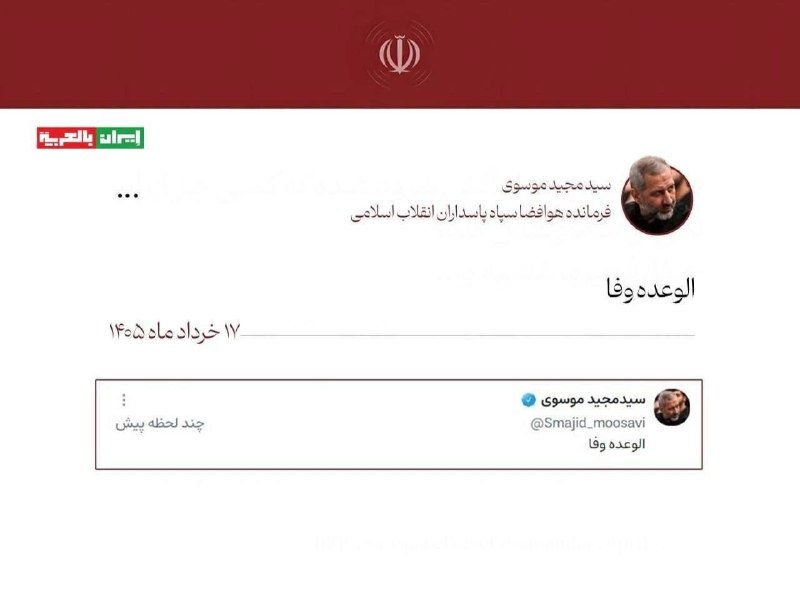

🔴 مجید موسوی فرمانده هوا فضای سپاه :

الوعده وفا

@IranianMinds

## IranianMinds — post 21642

🔴 شبکه خبری والا نیوز (Walla News) گزارش می‌دهد که اسرائیل در پی دریافت مجوز از ایالات متحده برای حمله به زیرساخت‌های انرژی ایران است. @IranianMinds

## IranianMinds — post 21641

🔴 کانال ۱۲ اسرائیل: تا کنون هیچ برخوردی گزارش نشده و موشک های شلیک شده رهگیری شدن @IranianMinds

## IranianMinds — post 21640

🔴 کانال ۱۲ اسرائیل:

تا کنون هیچ برخوردی گزارش نشده و موشک های شلیک شده رهگیری شدن

@IranianMinds

## IranianMinds — post 21639

🔴 کانال ۱۲ اسرائیل:

چهار موشک شلیک شده از سوی ایران، رهگیری و منهدم شدند.

@IranianMinds

## IranianMinds — post 21638

  <a href="telegram/content/IranianMinds_21638_1780862733.mp4" target="_blank">🎬 Download video</a>

🔴 تصویری از شمال اسرائیل

@IranianMinds

## IranianMinds — post 21637

🔴 شلیک مجدد موشک به سمت اسرائیل

@IranianMinds

## IranianMinds — post 21636

🔴 وزیر آموزش و پرورش :

تمامی مدارس و کلاس درس ها فردا تعطیل هستند.

@IranianMinds

## IranianMinds — post 21635

🔴 موشک های شلیک شده در آسمان اردن در حال رهگیری هستن

@IranianMinds

## BBCPersian — post 283090

🔻اطلاعیه قرارگاه خاتم‌الانبیا: اسرائیل در صورت گسترش حملات به بیروت، یا پاسخ به اقدام ایران با ضربات کوبنده‌تری روبرو خواهد شد

در پی اعلام اسرائیل مبنی بر حمله موشکی ایران به شمال این کشور ، قرارگاه خاتم‌الانبیا در اطلاعیه‌ای گفته است که اسرائیل در صورت گسترش حملات به بیروت، یا پاسخ به اقدام ایران با ضربات کوبنده‌تری روبرو خواهد شد.

در این اطلاعیه آمده است: قبلا اخطار داده بودیم در صورت گسترش حملات در ضاحیه بیروت، اهدافی را در اسرائیل مورد هجوم قرار می‌دهیم.

بر اساس گزارش خبرگزاری های ایران فرمانده قرارگاه خاتم‌الانبیا در این اطلاعیه گفته است که اسرائیل با نقض مکرر آتش‌بس با چراغ سبز و حمایت آمریکا و سکوت مجامع بین المللی حملات خود به لبنان را افزایش داده و با استفاده از «سلاح‌های ممنوعه از جمله بمب های فسفری مرتکب جنایات جنگی شده است.»

https://bbc.in/4eafvAI
@BBCPersian

## BBCPersian — post 283089

  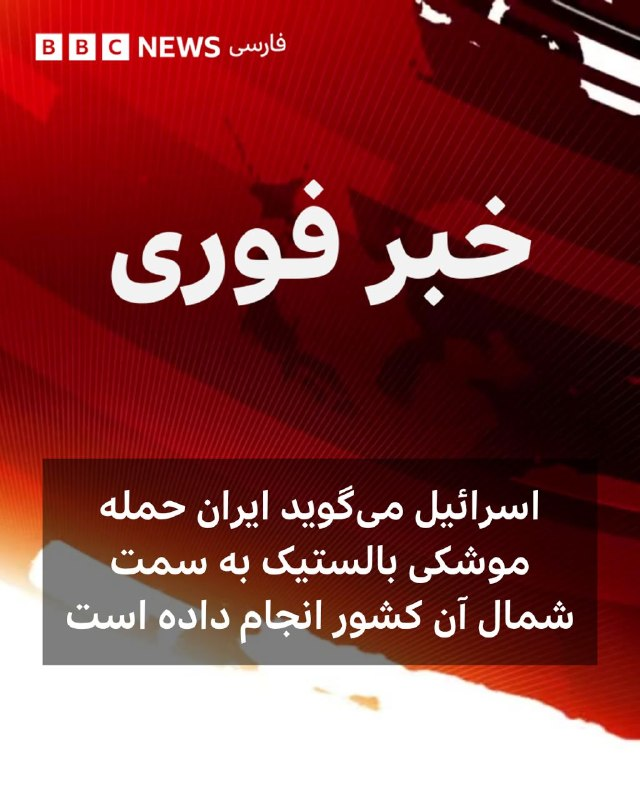

🔻ارتش اسرائیل می‌گوید ایران حمله موشکی بالستیک به سمت شمال اسرائیل انجام داده و سیستم‌های دفاعی آن در حال مقابله با این تهدید هستند.

این حملات پس از آن صورت می‌گیرد که اسرائیل حملات مرگباری را به مناطق جنوبی بیروت، پایتخت لبنان، انجام داد.

اندکی پس از انتشار خبر حمله اسرائیل به ضاحیه در جنوب بیروت، سخنگوی کمیسیون امنیت ملی مجلس ایران گفت که این حمله بی‌پاسخ نمی‌ماند.

ابراهیم رضایی در ایکس نوشت برای «پاسخ قاطع و دردآور» ما «امشب آسمان سرزمین‌های اشغالی را ببینید.»

محمد باقر قالیباف، مذاکره‌کننده ارشد ایران، هم گفته بود که محاصره دریایی آمریکا علیه کشورش و چراغ سبز آن به اسرائیل برای افزایش حملات در لبنان به این معنی است که پایگاه‌های آمریکایی در خاورمیانه اهداف مشروعی برای تهران هستند.

https://bbc.in/4eafvAI
@BBCPersian

## BBCPersian — post 283088

  <a href="https://t.me/bbcpersian/283088" target="_blank">📎 Download file</a>

پادکست برنامه شصت دقیقه شنبه ۱۷ اردیبهشت ۱۴۰۵
این نسخه رادیویی برنامه شصت دقیقه تلویزیون فارسی بی‌بی‌سی است که هرشب بعد از پخش، با حجم کم از اپلیکیشن‌های پادگیر و صفحه تلگرام بی‌بی‌سی فارسی در دسترس است.
با هشتگ BBCPersianRadio با ما در ارتباط باشید.

## BBCPersian — post 283087

🔻یک فرهنگ با فاصله دو قاره؛ معدنچی‌های بریتانیایی چگونه فوتبال را به مکزیک بردند؟

🖌هنری کولینگ, بی‌بی‌سی

هواداران در ورزشگاه ۲۵ هزار نفری ایدالگو در شرق مکزیک طرح موزاییکی بزرگی را از یک معدنچی به نمایش می‌گذارند.

https://bbc.in/4vzdR2C
@BBCPersian

## BBCPersian — post 283086

  <a href="telegram/content/BBCPersian_283086_1780862735.mp4" target="_blank">🎬 Download video</a>

آخرین خبرهای مهم روز یکشنبه ۱۷ خرداد ۱۴۰۵

@BBCPersian

## Dirty_Kids — post 391268

  <a href="https://t.me/Dirty_Kids/391268" target="_blank">📎 Download file</a>

🚨 برای اینکه درک کنید الان چقدر شرایط جنگیه :

@Dirty_Kids 👻

## Dirty_Kids — post 391267

🔴 فوریییی، ترامپ: من به ایران میگم موشک هاتون رو شلیک کردین بسه، برگردین سر میز مذاکره و معامله کنین😐😂

@Dirty_Kids 👻

## Dirty_Kids — post 391266

حمله‌ی ایران بیشتر به نت من آسیب زد تا اسرائیل.

@Dirty_Kids 👻

## Dirty_Kids — post 391265

  <a href="telegram/content/Dirty_Kids_391265_1780862737.mp4" target="_blank">🎬 Download video</a>

بزودی...

@Dirty_Kids 👻

## Dirty_Kids — post 391264

  <a href="telegram/content/Dirty_Kids_391264_1780862738.mp4" target="_blank">🎬 Download video</a>

گزارش‌ها از شلیک موشک بالستیک از منطقه کرج به سمت اسرائیل خبر می‌دهند/منابع خبری اعلام کرده‌اند یک موشک بالستیک از منطقه کرج در ایران به سمت اسرائیل شلیک شده است.
این پرتاب در ادامه موج‌های حملات موشکی رژیم تروریستی جمهوری اسلامی به اسرائیل انجام شده است.
همزمان سامانه‌های پدافندی اسرائیل در حال رهگیری اهداف ورودی هستند.

@Dirty_Kids 👻

## Dirty_Kids — post 391263

‏سریالو بذارید واسه دانلود و برید دوش بگیرید به‌نظرم!

@Dirty_Kids 👻

## Dirty_Kids — post 391262

  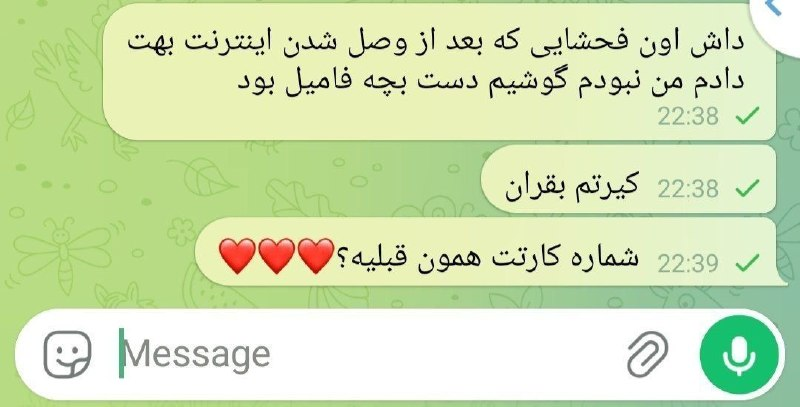

🔴 هم‌اکنون ملت درحال دلجویی از کانفیگ فروش‌‌ها :

@Dirty_Kids 👻

## Dirty_Kids — post 391261

کانفیگ فروشمو چیکار کنم اخر کاری بهش گفتم کص ننت؟

@Dirty_Kids 👻

## Dirty_Kids — post 391260

امشب ترور هدفمند داریم؟ کتلت جدید؟ مهره‌هایی که مزاحم توافق هستن حذف میشن؟

@Dirty_Kids 👻

## Dirty_Kids — post 391259

  <a href="telegram/content/Dirty_Kids_391259_1780862740.mp4" target="_blank">🎬 Download video</a>

ساعت ۲۲:۵۰ یکشنبه؛ مشاهده‌ی نور چشمک‌زن یک هواپیمای مسافربری در آسمان کرج، همزمان با شلیک موشک توسط سپاه و احتمال شروع حملات اسرائیل.

@Dirty_Kids 👻

## Dirty_Kids — post 391258

ساعت ۲۲:۴۴ یکشنبه؛ چند موشک دیگر از کرمانشاه به سمت اسرائیل شلیک شد. اسرائیل نیز پیش‌تر اعلام کرده بود در صورت چنین اقدامی، آماده پاسخ سریع است.

@Dirty_Kids 👻

## Dirty_Kids — post 391257

🔴 فوری
وزیر امنیت ملی اسرائیل:
امشب تهران باید بسوزد!!

@Dirty_Kids 👻

## Dirty_Kids — post 391256

🔴 فوری
۵ موشک دیگه به سمت اسرائیل شلیک شد

@Dirty_Kids 👻

## Dirty_Kids — post 391255

سپاه به اسراییل موشک زد نه برای ایران به خاطر حزب‌الله

مادرجنده‌هایی که ادعا میکنن طرفدار نظام نیستن اما تو جنگ پشت ملی‌گرایی جمهوری‌اسلامی در میان حرفی حدیثی؟

@Dirty_Kids 👻

## Dirty_Kids — post 391254

  

کارمندان ابرآوران هم‌اکنون:

@Dirty_Kids 👻

## Dirty_Kids — post 391253

خبری نیست دوستان
۴ تا موشک فرستادن که ابروشون نره و بگن ما پای حرفمون موندیم.

@Dirty_Kids 👻

## Dirty_Kids — post 391252

‏یه حسی بهم میگه هوا هوای برگشت به روبیکا و بله اس..

@Dirty_Kids 👻

## Dirty_Kids — post 391251

🔴 فوری

کانفیگ های v2rayng وارد کانال ۵۰۰ هزار تومان شد.

@Dirty_Kids 👻

## Dirty_Kids — post 391250

هرکی اینترنت رو قطع کنه مادر عمومیه.

@Dirty_Kids 👻

## Dirty_Kids — post 391249

  

جمهوری اسلامی تعداد ۴ موشک را از کرمانشاه به سمت اسرائیل پرتاب کرد.

@Dirty_Kids 👻

## Hranews — post 113461

  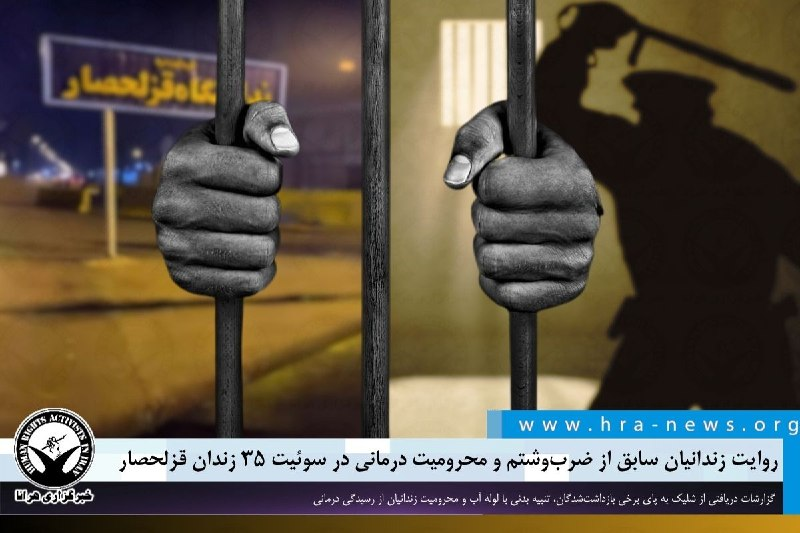

روایت زندانیان سابق از ضرب‌وشتم و محرومیت درمانی در سوئیت ۳۵ زندان قزلحصار

❗️
❗️
❗️
❗️
❗️– شماری از زندانیان سابق سوئیت ۳۵ زندان قزلحصار کرج در گفت‌وگو با هرانا از ضرب‌وشتم زندانیان، استفاده از لوله برای تنبیه بدنی، محرومیت برخی زندانیان از رسیدگی درمانی و انتقال شماری از بازداشت‌شدگان مجروح به این زندان خبر دادند. در روایت‌های مستقل این افراد، نام یکی از افسران نگهبان زندان به‌طور مکرر مطرح شده و منابع از آنچه «رفتارهای خشونت‌آمیز و تحقیرآمیز علیه زندانیان» توصیف می‌کنند، سخن گفته‌اند.

به گزارش خبرگزاری هرانا، ارگان خبری مجموعه فعالان حقوق بشر در ایران، چند زندانی سابق که طی ماه‌های اخیر در سوئیت ۳۵ زندان قزلحصار نگهداری شده و اکنون آزاد شده‌اند، جزئیاتی تازه از وضعیت این بخش و نحوه برخورد با برخی زندانیان را تشریح کرده‌اند.

به گفته این افراد، در ماه‌های اخیر شماری از بازداشت‌شدگان با جراحات جسمی، از جمله آسیب‌دیدگی از ناحیه پا، به #زندان_قزلحصار منتقل شده‌اند. پرشام پرواس، حجت نعیمی و ساسان جلیلیان از جمله افرادی هستند که منابع مطلع از انتقال آنان به این زندان در وضعیت جسمی نامناسب خبر داده‌اند.

منابع هرانا درباره منشأ دقیق این جراحات روایت‌هایی مطرح کرده‌اند، اما هرانا در حال حاضر قادر به تأیید مستقل همه جزئیات مربوط به زمان، محل و نحوه ایجاد این آسیب‌ها نیست. با این حال، چند منبع مطلع به‌طور جداگانه تأیید کرده‌اند که این افراد پس از انتقال به زندان برای مدتی با موانعی در دسترسی به رسیدگی درمانی مناسب مواجه بوده‌اند.

یکی از منابع مطلع در این خصوص گفت: «وضعیت ساسان جلیلیان از بقیه نگران‌کننده‌تر بود. او از ناحیه پا آسیب جدی ناشی از اصابت گلوله داشت و با وجود شدت جراحت، روند درمانش کامل و مناسب نبود.»

ادامه مطلب

#پرشام_پرواس #حجت_نعیمی #ساسان_جلیلیان

↘️
@hranews_bot تماس ✉️ - @Hranews کانال هرانا 🆑

## Hranews — post 113460

  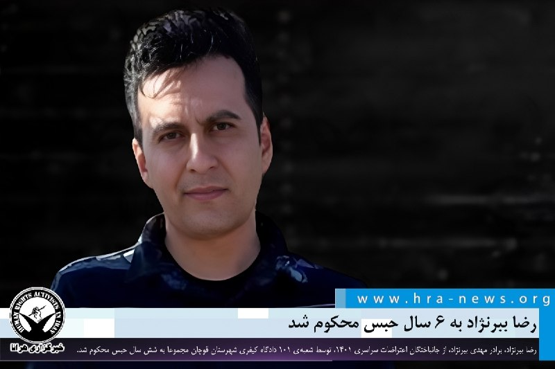

قوچان؛ رضا ببرنژاد به ۶ سال حبس محکوم شد

❗️
❗️
❗️
❗️
❗️– رضا ببرنژاد، برادر مهدی ببرنژاد، از جان‌باختگان اعتراضات سراسری ۱۴۰۱، توسط شعبه‌ی ۱۰۱ دادگاه کیفری شهرستان قوچان مجموعا به شش سال حبس محکوم شد. چهار سال و شش ماه از این میزان به حالت تعلیق در آمده است.

به گزارش خبرگزاری هرانا، ارگان خبری مجموعه فعالان حقوق بشر در ایران، رضا ببرنژاد به حبس محکوم شد.

اخیرا حکمی توسط شعبه‌ی ۱۰۱ دادگاه کیفری شهرستان قوچان به ریاست قاضی پور آریا صادر و به آقای ببرنژاد ابلاغ شده است. براساس این حکم وی از بابت اتهام عضویت در گروه‌های مخالف نظام به پنج سال و بابت اتهام تبلیغ علیه نظام به یک سال حبس محکوم شده است. با اعمال ماده ۱۳۴ قانون مجازات اسلامی، مجازات اشد یعنی پنج سال حبس در خصوص وی قابل اجرا خواهد بود. چهار سال و شش ماه از میزان حکم پنج سال حبس صادره علیه وی به حالت تعلیق درآمده است.

ادامه مطلب

#رضا_ببرنژاد

↘️
@hranews_bot تماس ✉️ - @Hranews کانال هرانا 🆑

## Hranews — post 113459

رضایت اولیای دم؛ ۲ زندانی از اعدام رهایی یافتند

❗️
❗️
❗️
❗️
❗️– دو زندانی در سنندج و استان خوزستان که پیشتر از بابت اتهام قتل به #اعدام محکوم شده بودند، با گذشت اولیای دم از مجازات مرگ رهایی یافتند.

ادامه مطلب

↘️
@hranews_bot تماس ✉️ - @Hranews کانال هرانا 🆑

## Hranews — post 113458

دستکم ۴ تجمع اعتراضی برگزار شد

❗️
❗️
❗️
❗️
❗️– امروز یکشنبه ۱۷ خردادماه، شماری از #بازنشستگان تامین اجتماعی در شهرهای شوش، رشت و تهران و جمعی از متقاضیان مسکن مهر پردیس در تهران با برگزاری تجمعات اعتراضی خواستار رسیدگی به مطالبات خود شدند.

ادامه مطلب

↘️
@hranews_bot تماس ✉️ - @Hranews کانال هرانا 🆑

## Hranews — post 113457

دادستانی تهران علیه زیباکلام اعلام جرم کرد

❗️
❗️
❗️
❗️
❗️– دادستانی تهران علیه صادق زیباکلام، تحلیل‌گر سیاسی، به دلیل انجام یک مصاحبه جدید اعلام جرم کرد و هم‌زمان قرار نظارت قضایی پیشین او مبنی بر ممنوعیت هرگونه فعالیت رسانه‌ای و تولید محتوا در شبکه‌های اجتماعی را تشدید کرد.

ادامه مطلب

#صادق_زیباکلام

↘️
@hranews_bot تماس ✉️ - @Hranews کانال هرانا 🆑

## Hranews — post 113456

  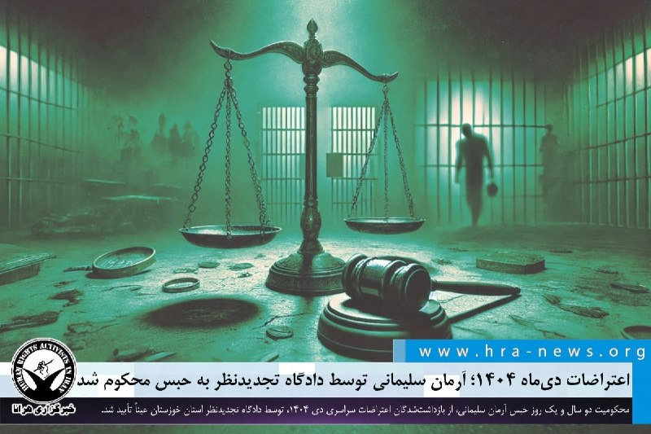

اعتراضات دی‌ماه ۱۴۰۴؛ آرمان سلیمانی توسط دادگاه تجدیدنظر به حبس محکوم شد

❗️
❗️
❗️
❗️
❗️– محکومیت آرمان سلیمانی، از بازداشت‌شدگان اعتراضات سراسری دی‌ماه ۱۴۰۴ که در زندان شیبان اهواز محبوس است، توسط دادگاه تجدیدنظر استان خوزستان عینا تایید شد. وی پیشتر توسط دادگاه انقلاب ایذه به دو سال و یک روز حبس محکوم شده بود.

به گزارش خبرگزاری هرانا، ارگان خبری مجموعه فعالان حقوق بشر در ایران، آرمان سلیمانی به حبس محکوم شد.

بر اساس رای صادره توسط دادگاه تجدیدنظر استان خوزستان، آقای سلیمانی از بابت اتهام “اخلال در نظم عمومی” با استناد به تبصره ماده ۲۶۸ قانون مجازات اسلامی به دو سال و یک روز حبس محکوم شده است.

ادامه مطلب

#آرمان_سلیمانی

↘️
@hranews_bot تماس ✉️ - @Hranews کانال هرانا 🆑

## alonews — post 125971

  <a href="telegram/content/alonews_125971_1780862743.webm" target="_blank">🎬 Download video</a>

👈ترامپ ادعا کرد که از حملات امروز اسرائیل راضی نیست

✅ @AloNews خبر جنگ

## alonews — post 125970

  <a href="telegram/content/alonews_125970_1780862743.webm" target="_blank">🎬 Download video</a>

👈پروازها در غرب کشور متوقف شد

✅ @AloNews خبر جنگ

## alonews — post 125969

  <a href="telegram/content/alonews_125969_1780862743.webm" target="_blank">🎬 Download video</a>

🔴فوری / عراق نوتام اعلام کرد و حریم هواییش رو بست

✅ @AloNews خبر جنگ

## alonews — post 125968

  <a href="telegram/content/alonews_125968_1780862744.webm" target="_blank">🎬 Download video</a>

🔴فوری / سی‌ان‌ان به نقل از دو منبع اسرائیلی: ما به پرتاب موشک‌های بالستیک ایران با قدرت پاسخ خواهیم داد.

✅ @AloNews خبر جنگ

## alonews — post 125967

  

✅با سابقه ۵ سال فعالیت مداوم

🛡حتی بدون قطعی تو دوران جنگ

🌐 با ما همراه شو و در زمان قطعی
وصل بمون 
😎

بقیه هنوز VPN حجمی میفروشن
اونم با قیمتای نجومی 
🚀

✅ از ما با کمترین قیمت ، بهترین سرویس رو بگیر 
👀
😍

💥بدون محدودیت حجم
⬇️
⬇️
⬇️
@NetAazaadBot
@NetAazaadBot

## alonews — post 125966

  <a href="telegram/content/alonews_125966_1780862744.webm" target="_blank">🎬 Download video</a>

👈یک منبع ایرانی به رویترز: اگر اسرائیل به حملات موشکی ایران پاسخ دهد، ما نیز قطعاً پاسخ خواهیم داد

✅ @AloNews خبر جنگ

## alonews — post 125965

  <a href="telegram/content/alonews_125965_1780862744.webm" target="_blank">🎬 Download video</a>

🔴فوری / ترامپ به فاکس نیوز: قرار بود بگویم که این توافق دوشنبه، سه‌شنبه یا چهارشنبه امضا می‌شود و حالا این اتفاق دارد می‌افتد

✅ @AloNews خبر جنگ

## alonews — post 125964

  

کانفیگ فروشا در راه تلگرام

[@AloTweet]

## alonews — post 125963

  <a href="telegram/content/alonews_125963_1780862745.webm" target="_blank">🎬 Download video</a>

🔴فوری / ترامپ: نیروهای نظامی آمریکا در حالت آماده‌باش هستند

✅ @AloNews خبر جنگ

## alonews — post 125962

  <a href="telegram/content/alonews_125962_1780862745.webm" target="_blank">🎬 Download video</a>

👈ارتش اسرائیل : در مجموع 12 موشک بالستیک شلیک شد که تمام آن رهگیری یا به منطقه‌ای باز اصابت کرد

✅ @AloNews خبر جنگ

## alonews — post 125961

  <a href="telegram/content/alonews_125961_1780862745.webm" target="_blank">🎬 Download video</a>

👈اسرائیل هیوم: تمام موشک‌ها رهگیری شد و یک موشک به جنگل اصابت کرد

✅ @AloNews خبر جنگ

## alonews — post 125960

  <a href="telegram/content/alonews_125960_1780862746.webm" target="_blank">🎬 Download video</a>

👈ترامپ به فاکس نیوز: به توافق نزدیک شده‌ایم

✅ @AloNews خبر جنگ

## alonews — post 125959

  <a href="telegram/content/alonews_125959_1780862746.webm" target="_blank">🎬 Download video</a>

🔴فوری / ترامپ به فاکس نیوز: به میز مذاکره برگردید و توافق کنید

✅ @AloNews خبر جنگ

## alonews — post 125958

  <a href="telegram/content/alonews_125958_1780862746.webm" target="_blank">🎬 Download video</a>

👈اصابت موشک و در پی آن آتش سوزی شدید در نزدیکی یک زمین فوتبال در کفار ساجور اسرائیل 
✅ @AloNews خبر جنگ

## alonews — post 125957

  <a href="telegram/content/alonews_125957_1780862746.mp4" target="_blank">🎬 Download video</a>

👈اصابت موشک و در پی آن آتش سوزی شدید در نزدیکی یک زمین فوتبال در کفار ساجور اسرائیل

✅ @AloNews خبر جنگ

## alonews — post 125956

  <a href="telegram/content/alonews_125956_1780862748.webm" target="_blank">🎬 Download video</a>

🔴فوری/ترامپ به فاکس نیوز: آنچه به ایران توصیه می‌کنم: موشک‌هایتان را پرتاب کرده‌اید، همین کافی است

✅ @AloNews خبر جنگ

## alonews — post 125955

  <a href="telegram/content/alonews_125955_1780862748.webm" target="_blank">🎬 Download video</a>

👈حزب‌الله: آمریکا وارد ماجرا شه پایگاه‌هاش تو عراق و سایر کشورای منطقه رو می‌زنیم

✅ @AloNews خبر جنگ

## alonews — post 125953

  <a href="telegram/content/alonews_125953_1780862748.webm" target="_blank">🎬 Download video</a>

👈سپاه : این فقط یک اخطار بود

✅ @AloNews خبر جنگ

## alonews — post 125952

  <a href="telegram/content/alonews_125952_1780862748.webm" target="_blank">🎬 Download video</a>

👈جبهه داخلی اسرائیل اعلام کرد که رویداد در شمال کشور به پایان رسیده است. می‌توانید از پناهگاه‌ها خارج شوید

✅ @AloNews خبر جنگ

## alonews — post 125951

  <a href="telegram/content/alonews_125951_1780862748.mp4" target="_blank">🎬 Download video</a>

👈 لحظه اصابت سهمگین موشک به شمال اسرائیل

✅ @AloNews خبر جنگ

<!-- MSG END -->

<!-- NAV START -->

<a href="https://github.com/Tljn/FUD/blob/main/telegram/content/archive_1.md" style="display:inline-block; padding:6px 12px; margin:0 4px; background-color:#2ea44f; color:white; text-decoration:none; border-radius:4px; font-weight:bold;">صفحه بعد</a>

<!-- NAV END -->
