# خواننده تلگرام

<!-- TOP_NAV START -->

<a href="https://github.com/Tljn/FUD/blob/main/telegram/content/archive_1.md" style="display:inline-block; padding:6px 12px; margin:0 4px; background-color:#2ea44f; color:white; text-decoration:none; border-radius:4px; font-weight:bold;">صفحه بعد</a>

<!-- TOP_NAV END -->

<!-- MSG START -->

---
📅 بروزرسانی: 1405/02/30 12:20
---

## VahidOOnLine — post 241105

♦️ولادیمیر پوتین، رئیس‌جمهوری روسیه روز چهارشنبه ۳۰ اردیبهشت ماه و در یک نشست خبری مشترک با شی‌ جین‌پینگ در پکن اعلام کرد مسکو و پکن به‌طور مشترک سیاست خارجی «مستقل و حاکمیتی (احترام با حاکمیت ملی کشورها)» را دنبال خواهند کرد.

پوتین در بخشی از سخنان خود گفت: «روابط روسیه و چین به سطحی بی‌سابقه رسیده و همچنان در حال توسعه است. روابط ما مستقل از شرایط فعلی جهان است و نمونه‌ای از الگویی است که کشورها باید امروز روابط خود را بر پایه آن بنا کنند.»

او همچنین تاکید کرد مذاکرات دو طرف «در فضایی گرم، دوستانه و سازنده» برگزار شده و همه حوزه‌های اصلی همکاری دوجانبه مورد بررسی قرار گرفته است.
‌🇸🇦 Indypersian

🤖 @VahidOOnLine

## VahidOOnLine — post 241104

♦️مراسم سنتی «پیک‌نیک کنگره» روز سه شنبه در محوطه چمن جنوبی کاخ سفید با حضور رئیس‌جمهور و بانوی اول آمریکا برگزار شد.

این مراسم سنتی به صورت سالانه در فضایی غیررسمی برگزار می‌شود و اعضای کنگره آمریکا از هر دو حزب دموکرات و جمهوری‌خواه به همراه خانواده‌هایشان در کنار رئیس‌جمهور و بانوی اول ایالات متحده در آن شرکت می‌کنند.

 در تصاویری که کاخ سفید منتشر کرده است استقبال دونالد ترامپ و ملانیا ترامپ از مهمانان در فضای باز کاخ سفید و در حال تماشای اجرای موسیقی زنده دیده می‌شوند.
‌🇸🇦 Indypersian

🤖 @VahidOOnLine

## VahidOOnLine — post 241103

  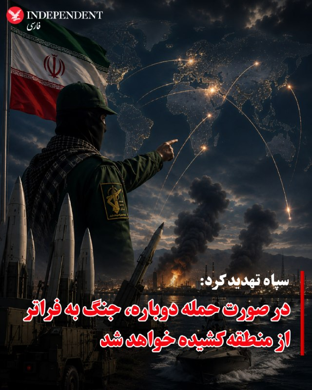

♦️سپاه پاسدران روز چهارشنبه ۳۰ اردیبهشت‌ماه با انتشار بیانیه خطاب به آمریکا و اسرائیل هشدار داد که در صورت حمله دوباره، «این بار جنگ به فراتر از منطقه کشیده خواهد شد.»

سپاه در این بیانیه مدعی تحمیل «شکست‌های بزرگ و راهبردی مکرر» به آمریکا و اسرائیل شده و نوشته است: «گرچه آنها با تمام توانایی‌های دو ارتش که پر هزینه‌ترین ارتش‌های جهان هستند به ما حمله کردند اما ما همه ظرفیت‌های انقلاب اسلامی را علیه آنان وارد عمل نکردیم، اما اینک اگر تجاوز به ایران تکرار شود جنگ منطقه‌ای که وعده داده شده بود، این‌بار به فراتر از منطقه کشیده خواهد شد و ضربات کوبنده ما در جاهایی که تصور آن را ندارید شما را به خاک سیاه خواهد نشاند.»

علی خامنه‌ای، رهبر پیشین جمهوری اسلامی که در موج اول حملات آمریکا و اسرائیل در بیت رهبری کشته شد، چند هفته پیش از آغاز حملات گفته بود «آمریکا بداند که در صورت حمله، این‌بار جنگ منطقه‌ای خواهد بود.»

سپاه در بیانیه خود بدون اشاره مستقیم به تهدیدهای رئیس جمهوری آمریکا نوشته است: «ما مرد جنگیم و قدرت ما را در میدان نبرد خواهید دید و نه در بیانیه‌های توخالی و صفحات مجازی.»

دونالد ترامپ دو روز پیش گفته بود در آستانه صدور فرمان حمله همه‌جانبه به ایران، با درخواست رهبران عربستان سعودی، قطر و امارات متحده عربی، این حمله را برای چند روز به تعویق انداخته است.
‌🇸🇦 Indypersian

🤖 @VahidOOnLine

## VahidOOnLine — post 241102

  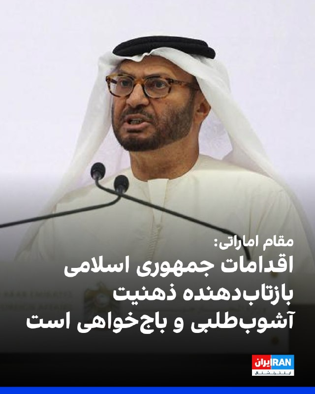

انور قرقاش، مشاور دیپلماتیک رییس امارات متحده عربی، در پیامی در شبکه اجتماعی ایکس، نیروهای نیابتی جمهوری اسلامی در عراق را مسئول حمله اخیر به نیروگاه هسته‌ای براکه معرفی کرد.

او نوشت این حمله «نشانه‌ای بسیار خطرناک از میزان تهدیدی است که منطقه با آن روبه‌روست؛ تهدیدی که از یک سو ناشی از فقدان دولت ملی و از سوی دیگر نتیجه نقض آشکار حقوق بین‌الملل است».

قرقاش افزود: «همان‌گونه که ربایش و ایجاد اختلال در تنگه هرمز تهدیدی برای اقتصاد جهانی و نظم بین‌المللی به شمار می‌رود، هدف قرار دادن براکه نیز اقدامی مجرمانه و نقض مستقیم حقوق بین‌الملل است.»

او یادآور شد: «از هرمز تا براکه، این تهدید دیگر تنها محدود به خلیج فارس نیست، بلکه کل نظام بین‌المللی را هدف قرار داده و بازتاب‌دهنده ذهنیت آشوب‌طلبی و باج‌خواهی است؛ ذهنیتی که برای امنیت ملت‌ها، حقوق بین‌الملل و ثبات اقتصاد جهانی ارزشی قائل نیست و تنها در پی بقا و تحمیل منطق تهاجمی خود است.»
‌🏁 🇬🇧 IranintlTV

🤖 @VahidOOnLine

## VahidOOnLine — post 241101

  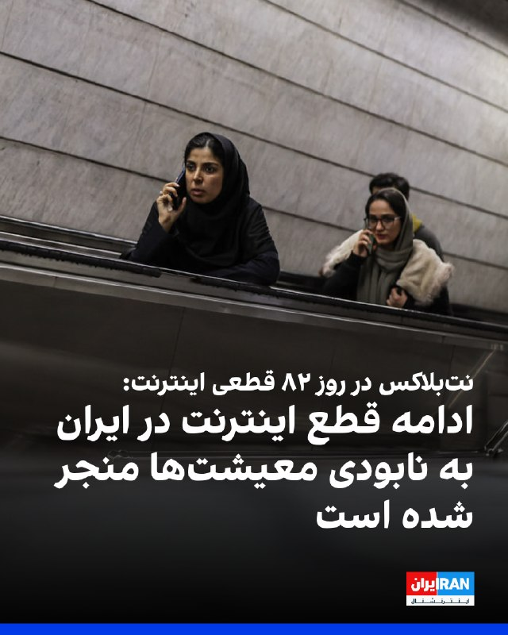

نت‌بلاکس، نهاد پایش‌کننده وضعیت اینترنت در جهان، چهارشنبه ۳۰ اردیبهشت، اعلام کرد هشتاد و دومین روز از قطع دیجیتال اینترنت در ایران سپری شده و این کشور پس از ۱۹۴۴ ساعت همچنان تا حد زیادی از اینترنت جهانی جدا مانده است.

این نهاد افزود در شرایطی که قطعی چند دقیقه‌ای اینترنت می‌تواند بحران‌زا باشد، ادامه این وضعیت در ایران به «نابودی معیشت‌ها و فرسایش حقوق شهروندان» منجر شده است.
‌🏁 🇬🇧 IranintlTV

🤖 @VahidOOnLine

## VahidOOnLine — post 241100

  <a href="telegram/content/VahidOOnLine_241100_1779267038.mp4" target="_blank">🎬 Download video</a>

بر اساس پیام‌های رسیده به ایران‌اینترنشنال، کمبود بنزین در بندرعباس و شماری از شهرهای جنوب استان کرمان باعث شکل‌گیری صف‌های طولانی در جایگاه‌های سوخت شده است.

به‌گفته شهروندان، برخی جایگاه‌ها بیش از ۱۵ لیتر بنزین عرضه نمی‌کنند و در مواردی قیمت آن در بازار آزاد به لیتری ۱۰۰ هزار تومان رسیده است. شهروندان می‌گویند ناچارند شب‌ها در صف‌های چند کیلومتری بمانند تا صبح نوبت سوخت‌گیری آنان برسد.

این وضعیت در بندرعباس، با وجود گرمای شدید و نیاز ضروری به کولر خودرو، نارضایتی گسترده‌ای ایجاد کرده است.
‌🏁 🇬🇧 IranintlTV

🤖 @VahidOOnLine

## VahidOOnLine — post 241099

  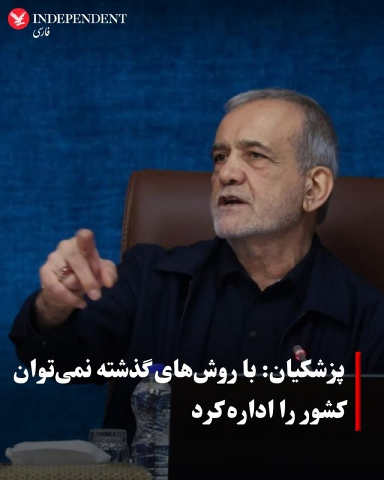

♦️مسعود پزشکیان، رئیس جمهوری اسلامی روز چهارشنبه ۳۰ اردیبهشت ماه در همایش دولتی استانداران گفت با روش‌های گذشته نمی‌توان کشور را اداره کرد و اگر شیوه‌های قبلی راه‌گشا بود، بسیاری از مشکلات تا الان «حل شده بود».

این سخنان در حالی عنوان می‌شود که پزشکیان دو روز پیش هم با انتقاد از «عادی نمایی» شرایط گفته بود که ایران پس از جنگ اخیر با آمریکا و اسرائیل، با مشکلات بسیاری در عرصه‌های مالی، انرژی و نفت و گاز مواجه است و حملات هوایی به تاسیسات نفتی و کارخانه‌های فولاد، آسیب جدی به این صنایع وارد کرده است. رئیس دولت چهاردهم خطاب به منتقدان مذاکرات با آمریکا گفته بود: «گفت‌وگو نکنیم، چه کنیم؟»
‌🇸🇦 Indypersian

🤖 @VahidOOnLine

## VahidOOnLine — post 241098

  

به گزارش خبرگزاری‌های داخلی، حکم اعدام بهمن فرزانه، قاتل الهه حسین‌نژاد، بامداد چهارشنبه اجرا شده است.
الهه حسین‌نژاد، زن ۲۴ ساله، خرداد سال گذشته هنگام بازگشت به خانه در تهران ناپدید شد و حدود ۱۰ روز بعد پیکر او با چندین ضربه چاقو در بیابان‌های اطراف تهران پیدا شد.
خبرگزاری میزان، وابسته به قوه قضاییه جمهوری اسلامی، اعلام کرده این حکم پس از طی مراحل قانونی و با درخواست اولیای دم اجرا شده است.
‌🏁 🇬🇧 ManotoTV

🤖 @VahidOOnLine

## VahidOOnLine — post 241097

  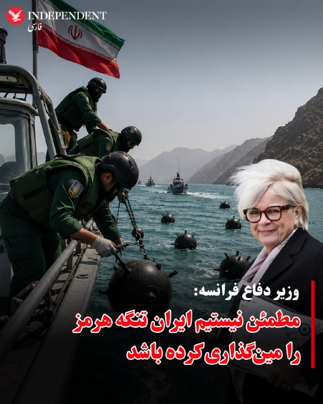

♦️کاترین ووترن، وزیر دفاع فرانسه روز چهارشنبه ۳۰ اردیبهشت ماه و پس از گزارش شبکه سی‌بس‌اس آمریکا مبنی بر شناسایی حداقل ۱۰ مین در تنگه هرمز گفت که فرانسه در حال حاضر هیچ اطمینانی ندارد که این منطقه اصلا مین‌گذاری شده باشد.

کاترین ووترن به رادیو فرانس انفو گفت: «در حال حاضر، من هیچ اطمینانی در این مورد ندارم، اما در هر صورت ما در حال آماده شدن برای لزوم پاکسازی احتمالی مین‌ها هستیم.»

وزیر دفاع فرانسه تاکید کرد «کشتی‌های مین‌روب به عنوان بخشی از یک ماموریت احتمالی به رهبری فرانسه و بریتانیا به منطقه اعزام شده‌اند و فرانسه یکی از این شناورها را در پایگاه نظامی خود در جیبوتی دارد.»

حدود ۱۰ روز پیش رسانه‌های آلمانی اعلام کرده بودند که این کشور هم کشتی‌ مین‌روب به منطقه اعزام کرده است.
‌🇸🇦 Indypersian

🤖 @VahidOOnLine

## VahidOOnLine — post 241096

♦️ولادیمیر پوتین و شی‌ جین‌پینگ، روسای جمهوری روسیه و چین، بیانیه مشترکی درباره تقویت «شراکت جامع و همکاری راهبردی» میان دو کشور امضا کردند.
این توافق که در جریان دیدار رسمی دو رهبر در پکن انجام شد و بر گسترش همکاری‌های سیاسی، اقتصادی، امنیتی و بین‌المللی میان مسکو و پکن تاکید دارد.
‌🇸🇦 Indypersian

🤖 @VahidOOnLine

## VahidOOnLine — post 241095

  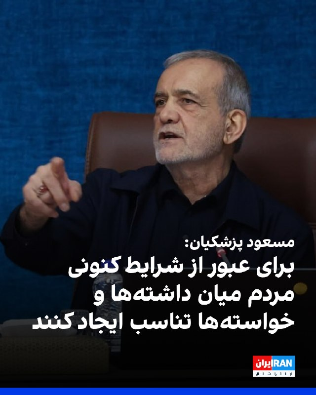

مسعود پزشکیان، رییس‌جمهور دولت جمهوری اسلامی، با اشاره به بحران اقتصادی در ایران، بار دیگر بر «صرفه‌جویی» مردم تاکید کرد و گفت: «امروز ضروری است برای مردم تبیین شود که لازمه عبور موفق از این شرایط، ایجاد تناسب میان داشته‌ها و خواسته‌هاست.»

او گفت: «با اسراف، افزایش بی‌رویه توقعات و بی‌توجهی به محدودیت‌ها نمی‌توان به اهداف بزرگ دست یافت.»
‌🏁 🇬🇧 IranintlTV

🤖 @VahidOOnLine

## VahidOOnLine — post 241094

  

زمین‌لرزه‌ای به بزرگی ۴.۷ بامداد چهارشنبه ۳۰ اردیبهشت حوالی لافت در استان هرمزگان را لرزاند. مرکز لرزه‌نگاری کشوری عمق این زلزله را ۲۰ کیلومتر اعلام کرده است. این زمین‌لرزه در بخش‌هایی از قشم، هرمز و مناطق روستایی بندرعباس نیز احساس شد. مقام‌های محلی می‌گویند تاکنون گزارشی از خسارت دریافت نشده، اما بررسی‌ها در مناطق نزدیک به کانون زلزله ادامه دارد.
‌🏁 🇬🇧 ManotoTV

🤖 @VahidOOnLine

## VahidOOnLine — post 241093

  <a href="telegram/content/VahidOOnLine_241093_1779267043.mp4" target="_blank">🎬 Download video</a>

دونالد ترامپ، رئیس‌جمهور آمریکا، بار دیگر مدعی شد که ایالات متحده جنگ با جمهوری اسلامی را «خیلی سریع» پایان خواهد داد و تهران «به‌شدت» خواهان توافق است.
ترامپ در جریان مراسم سالانه پیک‌نیک کنگره در محوطه جنوبی کاخ سفید گفت توافق با تهران «اتفاق خواهد افتاد و سریع هم اتفاق می‌افتد».
او همچنین مدعی شد با پایان این بحران، قیمت نفت «به‌شدت کاهش خواهد یافت».
این اظهارات پس از آن مطرح می‌شود که ترامپ اوایل هفته گفته بود تهران برای رسیدن به توافق «التماس» می‌کند و او تنها یک ساعت با صدور دستور حملات تازه علیه جمهوری اسلامی فاصله داشته است.
ترامپ گفت به درخواست متحدان خلیج فارس آمریکا، حملات را متوقف کرده تا به گفته او، «مذاکرات جدی» ادامه پیدا کند. با این حال، او هشدار داد اگر جمهوری اسلامی به توافق نرسد، آمریکا برای یک «حمله کامل» آماده است.
‌🏁 🇬🇧 ManotoTV

🤖 @VahidOOnLine

## VahidOOnLine — post 241092

  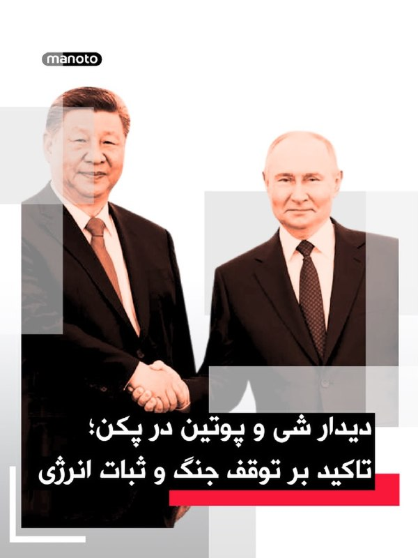

شی جین‌پینگ، رئیس‌جمهوری چین، در دیدار با ولادیمیر پوتین در پکن خواستار توقف فوری درگیری‌ها در خاورمیانه شد و گفت پایان جنگ می‌تواند به کاهش اختلال در عرضه انرژی و زنجیره‌های تجارت جهانی کمک کند.

شی جین‌پینگ روز چهارشنبه، ۲۰ مه ۲۰۲۶، در دیدار با ولادیمیر پوتین در تالار بزرگ خلق پکن گفت وضعیت خاورمیانه در مرحله‌ای حساس میان جنگ و صلح قرار دارد و توقف درگیری‌ها «فوری‌ترین ضرورت» است. او تأکید کرد بازگشت به جنگ قابل قبول نیست و مسیر مذاکره باید در اولویت قرار گیرد. به گفته رئیس‌جمهور چین، پایان زودهنگام درگیری‌ها می‌تواند از اختلال بیشتر در عرضه انرژی و عملکرد زنجیره‌های صنعتی و تجاری جلوگیری کند.

پوتین نیز در آغاز این دیدار گفت روابط روسیه و چین به سطحی «بی‌سابقه» رسیده و از شی جین‌پینگ دعوت کرد سال آینده به روسیه سفر کند. رئیس‌جمهوری روسیه همچنین همکاری دو کشور را عاملی برای «بازدارندگی و ثبات» در روابط بین‌الملل توصیف کرد.

بر اساس گزارش‌ها، دو طرف در این دیدار درباره انرژی، امنیت و روابط کلی مسکو و پکن گفت‌وگو کردند و با تمدید پیمان دوستی چین و روسیه موافقت کردند؛ پیمانی که نخستین‌ب
‌🏁 🇬🇧 ManotoTV

🤖 @VahidOOnLine

## VahidOOnLine — post 241091

  

جی‌دی ونس، معاون رئیس‌جمهور آمریکا، گفت واشینگتن در برابر جنگ با ایران دو مسیر پیش رو دارد: ادامه مذاکره یا ازسرگیری عملیات نظامی.

جی‌دی ونس در نشست خبری کاخ سفید گفت آمریکا در برابر ایران «دو مسیر» دارد.

به گفته ونس، مسیر اول مذاکره است. او گفت دونالد ترامپ از تیم خود خواسته با جمهوری اسلامی «تهاجمی» مذاکره کنند.

ونس گفت آمریکا در موضوع اصلی، یعنی جلوگیری از دستیابی ایران به سلاح هسته‌ای، پیشرفت زیادی داشته و واشینگتن فکر می‌کند تهران خواهان توافق است.

او مسیر دوم را ازسرگیری عملیات نظامی دانست و گفت: «گزینه دوم این است که کارزار نظامی را دوباره شروع کنیم تا اهداف آمریکا دنبال شود.»

ونس گفت این مسیر چیزی نیست که ترامپ بخواهد و فکر نمی‌کند جمهوری اسلامی هم خواهان آن باشد.

او در پایان گفت: «برای توافق، دو طرف لازم است.»
‌🏁 🇬🇧 ManotoTV

🤖 @VahidOOnLine

## VahidOOnLine — post 241090

  <a href="telegram/content/VahidOOnLine_241090_1779267045.mp4" target="_blank">🎬 Download video</a>

«سکوت ما همدستی با جمهوری اسلامی است»
‌🏁 🇬🇧 ManotoTV

🤖 @VahidOOnLine

## VahidOOnLine — post 241089

  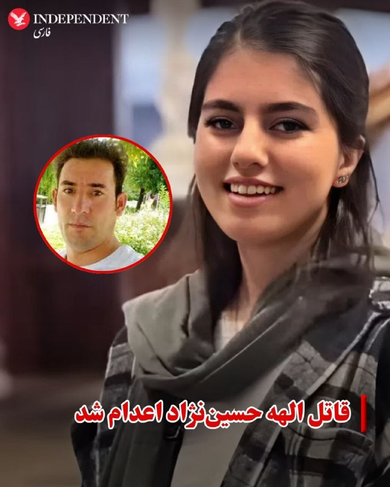

♦️میزان، خبرگزاری قوه قضائیه، از اجرای حکم اعدام قاتل الهه حسین‌نژاد، دختری که جسد او سال گذشته در بیابان‌های اطراف تهران پیدا شد، خبر داد و نوشت: «این حکم با درخواست اولیای دم و پس از طی تمامی مراحل قانونی و قضایی اجرا شد.»

 الهه حسین‌نژاد، زن ۲۴ ساله‌ در مسیر بازگشت از آرایشگاه به خانه در تهران ناپدید شد و حدود ۱۰ روز بعد پیکرش با چندین زخم چاقو در بیابان‌های اطراف تهران پیدا شد.

خانواده الهه حسین‌نژاد پیش از این اعلام کرده بود با آنکه خواستار قصاص قاتل است اما امکان پرداخت نصف دیه را ندارد.

اصغر جهانگیر، سخنگوی قوه قضائیه جمهوری اسلامی، روز سه‌شنبه نهم دی‌ماه اعلام کرد با دستور محسنی اژه‌ای، تفاصل دیه قاتل الهه حسین‌نژاد از «محلی غیر از بیت‌المال» پرداخت می‌شود تا امکان اجرای حکم قصاص او فراهم شود.

بر طبق قانون قصاص مندرج در قانون مجازات اسلامی ایران، اولیای دم (خانواده مقتول) زن، در صورت درخواست اجرای حکم قصاص قاتل مرد، باید نیمی از دیه او را بپردازند تا امکان اجرای حکم اعدام را پیدا کنند.
‌🇸🇦 Indypersian

🤖 @VahidOOnLine

## VahidOOnLine — post 241088

  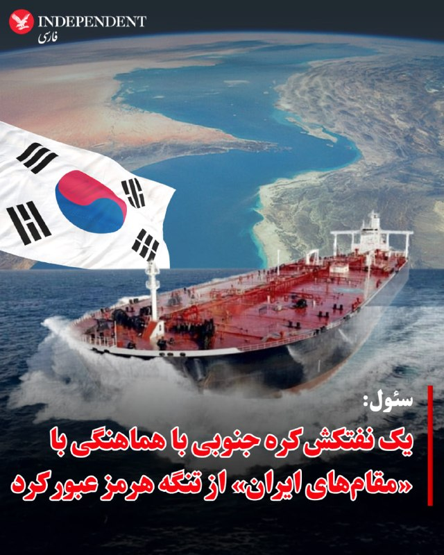

♦️چو هیون، وزیر امور خارجه کره جنوبی روز چهارشنبه ۳۰ اردیبهشت اعلام کرد یک نفتکش حامل نفت خام متعلق به این کشور «در هماهنگی با مقام‌های ایرانی در حال عبور از تنگه هرمز است.»

به گزارش خبرگزاری رویترز، وزیر امور خارجه کره جنوبی در یک جلسه استماع در مجلس این کشور با وجود اعلام ابن خبر، جزئیات بیشتری درباره نفتکش و چگونگی هماهنگی برای عبور آن نداد.

این خبر در حالی اعلام می‌شود که حدود سه هفته پیش یک کشتی باری کره جنوبی هدف یک حمله پهپادی قرار گرفت و به‌شدت آسیب دید. ریاست جمهوری کره جنوبی اعلام کرد بسیار بعید است این حمله از جایی به‌جز ایران انجام شده باشد.

پس از این «حادثه دریایی» کره جنوبی اعلام کرد مشارکت در عملیات بازگشایی تنگه هرمز به رهبری آمریکا را بررسی می‌کند.
‌🇸🇦 Indypersian

🤖 @VahidOOnLine

## VahidOOnLine — post 241087

  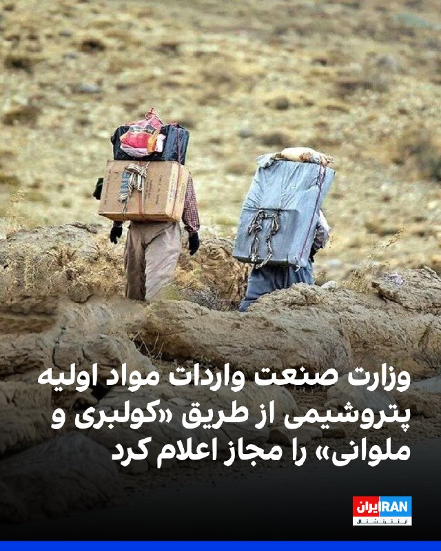

نرگس باقری زمردی، مدیرکل دفتر مقررات صادرات و واردات وزارت صنعت، معدن و تجارت، در نامه‌ای به محمدعلی بهپوری، مدیرکل واردات گمرک ایران، اعلام کرد واردات مواد اولیه مرتبط با حوزه پتروشیمی و پلیمری از طریق «رویه کولبری و ملوانی» مجاز است.

تسنیم، خبرگزاری وابسته به سپاه پاسداران، نوشت بر اساس این ابلاغیه، «واردات این اقلام صرفا در چارچوب فهرست تعیین‌شده و با رعایت ضوابط و مقررات مربوط به رویه‌های ملوانی و کولبری امکان‌پذیر خواهد بود».

این رسانه حکومتی افزود این تصمیم در شرایطی اتخاذ شد که شماری از واحدهای تولیدی صنایع پتروشیمی و پلیمری طی ماه‌‌های اخیر در تامین برخی مواد اولیه با محدودیت روبه‌رو بوده‌اند.
‌🏁 🇬🇧 IranintlTV

🤖 @VahidOOnLine

## VahidOOnLine — post 241086

  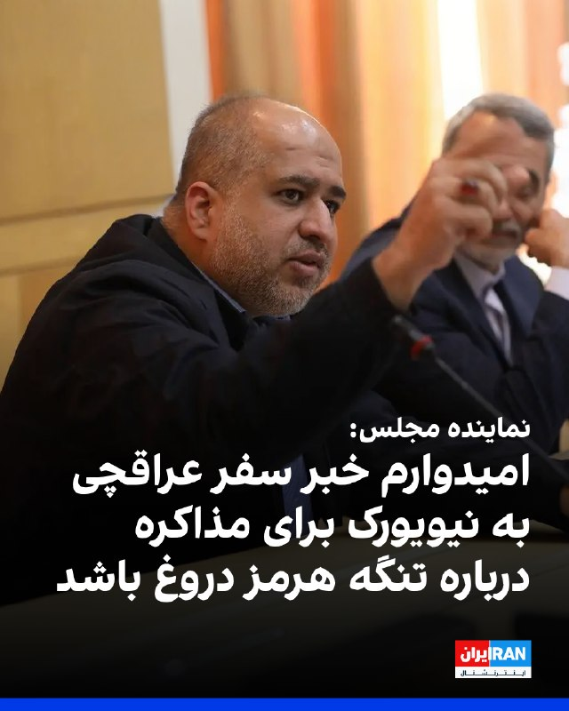

علی خضریان، عضو کمیسیون امنیت ملی مجلس، گفت مطلع شده است عباس عراقچی، وزیر خارجه جمهوری اسلامی، قرار است سفری به نیویورک داشته باشد و با کشورهای حوزه خلیج فارس درباره تنگه هرمز مذاکره کند.

او گفت: «امیدوارم این خبر دروغ باشد، چون برگزاری جلسه‌ای در نیویورک، یعنی در خاک دشمن، و کشورهای خلیج فارس نیز باید مورد بازخواست قرار بگیرند. چنین اقدامی جمهوری اسلامی را در موضع ضعف قرار می‌دهد.»
‌🏁 🇬🇧 IranintlTV

🤖 @VahidOOnLine

## WithYashar — post 11733

دو نفتکش چینی پس از دو ماه معطلی در خلیج فارس، روز چهارشنبه از تنگه هرمز عبور کردند.
@withyashar

## WithYashar — post 11732

  <a href="https://t.me/withyashar/11732" target="_blank">📎 Download file</a>

نسخه فارسی و بدون سانسور کتاب "پاسخ به تاریخ" نوشته‌ی، محمدرضا شاه پهلوی

🌐 @withyashar

🌐 instagram.com/yashar

## WithYashar — post 11731

  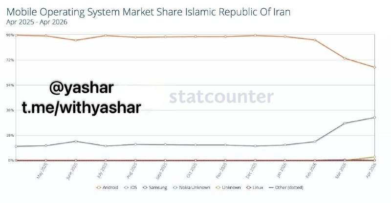

آمار نشون می‌ده در ۳ ماه گذشته یک پاکسازی طبقاتی دیجیتال در ایران رخ داده. در این مدت سهم اندروید از ترافیک اینترنت ۲۵٪ افت و آیفون ۱۸۰٪ رشد داشته. این به معنی خروج میلیون‌ها کاربر طبقه متوسط و پایین از فضای آنلاینه. اونی که آیفون داره از پس هزینه کانفیگ یا اینترنت پرو برمیاد، اونی که نداره، اونقدر دغدغه مالی مختلف داره که عطای اینترنت رو به لقاش می‌بخشه

@withyashar

## WithYashar — post 11730

وزیر نیروهای مسلح فرانسه اعلام کرد این کشور از وجود مین‌های دریایی در تنگه هرمز اطمینان ندارد.
@withyashar

## WithYashar — post 11729

مقامات کره جنوبی تأیید کردند نفتکش «یونیورسال وینر» این کشور که حامل دو میلیون بشکه نفت از کویت است، از تنگه هرمز عبور کرد.
@withyashar

## WithYashar — post 11728

وزارت خارجه روسیه اعلام کرد ایران از «پیمان منع گسترش سلاح‌های هسته‌ای» (ان‌پی‌تی) خارج نخواهد شد.
@withyashar

## WithYashar — post 11727

۳پا تروریستی : جنگ منطقه‌ای که وعده داده شده بود با تکرار تجاوز، به فراتر از منطقه کشیده خواهد شد
@withyashar

## WithYashar — post 11726

شاهزاده رضا پهلوی:

با دولت ترامپ و اعضای کنگره آمریکا در تماس هستم.

@withyashar

## WithYashar — post 11725

  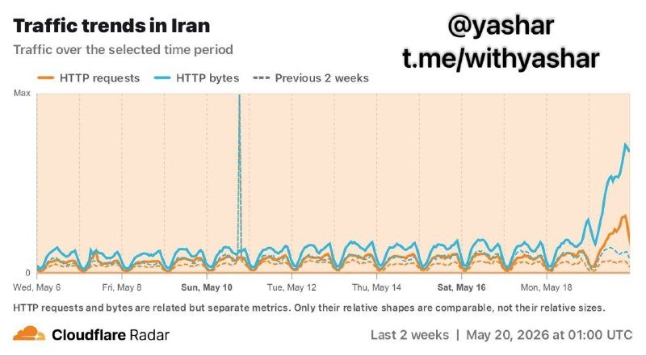

رادار کلادفلر خبر از افزایش ترافیک‌ اینترنت ایران می‌دهد؛ شروعی برای موج قوی تر فیلترینگ؟
@withyashar

## WithYashar — post 11724

فایننشال تایمز: شرکت سرمایه‌گذاری خطر پذیر ترامپ که در حوزه هوش مصنوعی، فناوری دفاعی و املاک فعالیت می‌کند، در حدود یک سال از ۲۰۰ میلیون دلار به ۳.۵ میلیارد دلار دارایی رسید؛ یعنی جهشی ۱۷ برابری
@withyashar

## WithYashar — post 11723

  <a href="telegram/content/WithYashar_11723_1779267051.mp4" target="_blank">🎬 Download video</a>

ترامپ بعد از زدن حرفهای همیشگی مانند رهبرشان مرده، نیروی نظامی ندارند و سلاح هستهی نباید داشته باشند
پس از سخنرانی ملانیا ترامپ در کاخ سفید، گفت: عجب سخنرانی فوق‌العاده‌ای بود، من هیچوقت دوس ندارم بعد از بانوی اول آمریکا صحبت کنم، چون باعث میشه خیلی خوب به نظر نرسم.
@withyashar

## WithYashar — post 11722

  <a href="telegram/content/WithYashar_11722_1779267053.mp4" target="_blank">🎬 Download video</a>

پوتین و شی بیانیۀ مشترک تعمیق روابط چین و روسیه را امضا کردند

شی: جهان به دلیل اقدامات یک‌جانبه و سلطه‌طلبانه دیگر پایدار نیست، بنابراین ما به دنبال یک نظام جهانی جدید هستیم.

پوتین: همکاری ما در امور سیاست خارجی یکی از عوامل اصلی ثبات در صحنه بین‌المللی است.
در شرایط پرتنش فعلی در صحنه بین‌المللی، هماهنگی نزدیک ما به ویژه مورد نیاز است.
@withyashar

## WithYashar — post 11721

فراخوان دادن هرکی با سیدعلی خاطره داشته بیاد تعريف کنه می‌خوایم سریال بسازیم
@withyashar 😬😂

## WithYashar — post 11720

  <a href="telegram/content/WithYashar_11720_1779267055.mp4" target="_blank">🎬 Download video</a>

ترامپ: ما در ایران کار فوق‌العاده‌ای انجام دادیم؛ فکر میکنم خیلی زود این کار تمام بشه و آنها سلاح هسته‌ای نخواهند داشت؛ امیدوارم این کار رو به روشی بسیار خوب انجام بدیم.
@withyashar

## WithYashar — post 11718

  <a href="telegram/content/WithYashar_11718_1779267057.mp4" target="_blank">🎬 Download video</a>

استقبال شی از پوتین در پکن چین
@withyashar

## WithYashar — post 11717

طبق گزارش نیویورک تایمز، آمریکا و اسرائیل پیش از جنگ با ایران درباره طرحی برای نصب محمود احمدی‌نژاد، رئیس‌جمهور سابق ایران، به عنوان رهبر جدید کشور گفتگو کردند.
گفته می‌شود احمدی‌نژاد در این طرح مشورت شده بود، اما پس از زخمی شدنش در حمله اسرائیل به منزلش در تهران در روز آغاز جنگ، این طرح از هم پاشید. مقامات آمریکایی گفتند این حمله با هدف آزاد کردن او از حصر خانگی انجام شده بود.
احمدی‌نژاد زنده ماند اما پس از آن از تلاش برای تغییر رژیم ناامید شد و از آن زمان تاکنون در انظار عمومی دیده نشده و محل اقامتش نامعلوم است.
@withyashar

## mwarmonitor — post 9334

🔴هدف اولیه جنگ، روی کار آوردن رئیس‌جمهور سابق تندرو به‌عنوان رهبر ایران بود. NYT 🔸به گفته مقام‌های آمریکایی، یک حمله اسرائیل که با هدف آزاد کردن محمود احمدی‌نژاد از حصر خانگی در تهران طراحی شده بود، بخشی از تلاشی برای ایجاد تغییر رژیم و رساندن او به قدرت…

## mwarmonitor — post 9333

  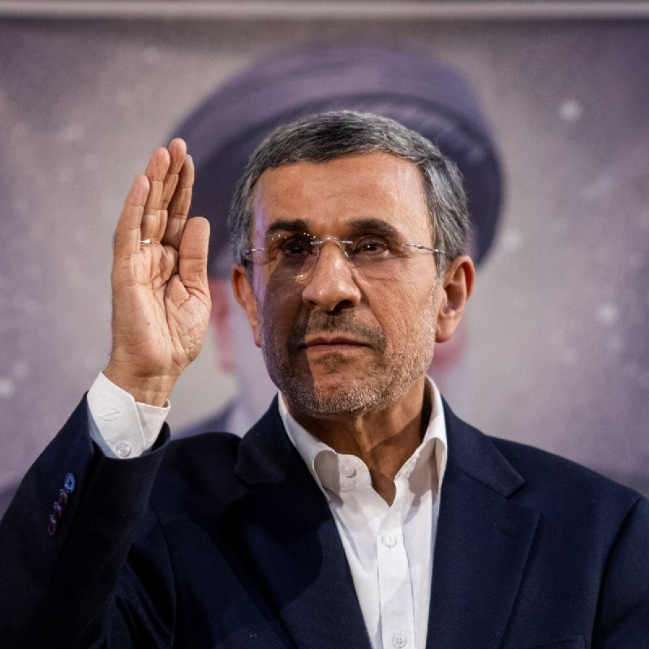

🔴هدف اولیه جنگ، روی کار آوردن رئیس‌جمهور سابق تندرو به‌عنوان رهبر ایران بود. NYT

🔸به گفته مقام‌های آمریکایی، یک حمله اسرائیل که با هدف آزاد کردن محمود احمدی‌نژاد از حصر خانگی در تهران طراحی شده بود، بخشی از تلاشی برای ایجاد تغییر رژیم و رساندن او به قدرت محسوب می‌شد.

@mwarmonitor

## mwarmonitor — post 9332

🔴اختصاصی آکسیوس: ترامپ به‌رغم تنش با متحدان، در اجلاس G7 در فرانسه شرکت می‌کند

🔰رئیس‌جمهور ترامپ ماه ژوئن برای گفتگو درباره هوش مصنوعی، تجارت و مبارزه با جرم و جنایت در نشست سران گروه ۷ (G7) در فرانسه شرکت خواهد کرد؛ اقدامی که یک مقام کاخ سفید آن را در گفتگو با اکسیوس تایید کرده است.

چرا این موضوع اهمیت دارد؟
هرچند حضور روسای جمهور آمریکا در اجلاس‌های سالانه گروه ۷ امری مرسوم و سنتی است، اما شرکت ترامپ در این نشست به دلیل خشم فزاینده او از اعضای این گروه (مانند بریتانیا، فرانسه، آلمان و ایتالیا) به خاطر همراهی نکردن با تلاش‌های جنگی او در ایران، قطعی نبود.
یک مقام کاخ سفید اعلام کرد که این نشست منجر به امضای قراردادهای رسمی نخواهد شد، بلکه هدف آن ایجاد اجماع و همسویی برای توافقات آینده است.
تولد ترامپ درست پیش از آغاز این اجلاس، در ۱۴ ژوئن (۲۴ خرداد) است و او ۸۰ ساله خواهد شد.
نگاهی دقیق‌تر به برنامه‌ها
این نشست که از ۱۵ تا ۱۷ ژوئن (۲۵ تا ۲۷ خرداد) در شهر «اویان-له-بن» (Évian-les-Bains) در جنوب شرقی فرانسه برگزار می‌شود، قطعاً موضوع ایران را در دستور کار خواهد داشت، اما ترامپ می‌خواهد روی مسائل اقتصادی و تجاری تمرکز کند:
پیوند زدن کمک‌های آمریکا با تجارت: به گفته این مقام مسئول، هدف این است که تجارت برای هر دو کشور سرمایه‌گذار و دریافت‌کننده سود متقابل داشته باشد.
توسعه هوش مصنوعی: ترویج و به‌کارگیری ابزارهای هوش مصنوعی توسعه‌یافته در آمریکا.
کاهش نفوذ چین: توافق برای کاهش سلطه چین بر زنجیره تامین مواد معدنی حیاتی.
امنیت و مهاجرت: مبارزه با قاچاق مواد مخدر و مهاجرت غیرقانونی.
انرژی و صادرات: ترویج صادرات آمریکا، کاهش موانع مقرراتی و افزایش تولید انرژی، به‌ویژه سوخت‌های فسیلی.
پشت صحنه (روابط ترامپ و ماکرون)
امانوئل ماکرون، رئیس‌جمهور فرانسه که گاهی هدف خشم و انتقادهای ترامپ قرار گرفته است، تلاش کرده با پیشنهاد یک شام مجلل پس از پایان اجلاس در کاخ ورسای (نماد شکوه و زرق‌وبرق سبک باروک فرانسوی که ترامپ شیفته آن است)، دل رئیس‌جمهور آمریکا را به دست آورد. هنوز مشخص نیست که آیا ترامپ در این ضیافت شام شرکت خواهد کرد یا خیر.
نگاه کلان: سایه جنگ ایران بر روابط متحدان
جنگ در ایران همچنان سایه سنگینی بر روابط میان ایالات متحده و تقریباً تمام متحدان اصلی‌اش در گروه ۷ و فراتر از آن انداخته است.
حتی اگر از اکنون تا اواسط ژوئن توافقی حاصل شود، احتمالاً همچنان مقداری دلخوری و تنش در فضا باقی خواهد ماند.
هیچ‌کدام از کشورهای اروپایی به آمریکا در تلاش برای تضمین عبور امن کشتی‌های تجاری از تنگه هرمز کمک نکرده‌اند؛ هرچند ترامپ گاهی گفته به کمک آن‌ها نیازی ندارد و چندین رهبر اروپایی نیز اعلام کرده‌اند که پس از پایان جنگ، مشارکت خواهند کرد.
در همین حال، روز سه‌شنبه و در جریان نشست وزرای دارایی این گروه در پاریس، اسکات بسنت (Scott Bessent)، وزیر خزانه‌داری آمریکا، از اعضای گروه ۷ خواست تا برای مبارزه با «تروریسم ایرانی» و «منابع مالی پشتیبان آن»، تحریم‌های بیشتری وضع کنند.

📌اسکات بسنت در نشست پاریس گفت:
«درهم‌شکستن تهدید تروریسم ایجاب می‌کند که همه شما قدم پیش بگذارید و به ما ملحق شوید. ما از همه متحدان خود در G7 و در واقع از تمام جهان می‌خواهیم که از رژیم تحریم‌ها پیروی کنند تا بتوانیم جریان مالی نامشروعی را که ماشین جنگی ایران را تغذیه می‌کند، متوقف کنیم و این پول را به مردم ایران بازگردانیم.»

@mwarmonitor

## pm_afshaa — post 91090

🔴کرملین:ویتکاف بارها تمایل خود را برای بازدید از مسکو ابراز کرده است، اما تاریخ آن هنوز تعیین نشده

💧 Rainbet.com the #1 Non-KYC Crypto Casino & Sportsbook @rainbetcom

😁 @Pm_Afshaa

## pm_afshaa — post 91089

سپاه:اگر حمله به ایران دوباره رخ دهد، جنگ فراتر از مرزهای منطقه گسترش خواهد یافت

💧 Rainbet.com the #1 Non-KYC Crypto Casino & Sportsbook @rainbetcom

😁 @Pm_Afshaa

## pm_afshaa — post 91088

🔴بهمن فرزانه؛ قاتل الهه حسین نژاد صبح امروز اعـدام شد

💧 Rainbet.com the #1 Non-KYC Crypto Casino & Sportsbook @rainbetcom

😁 @Pm_Afshaa

## iaghapour — post 2620

  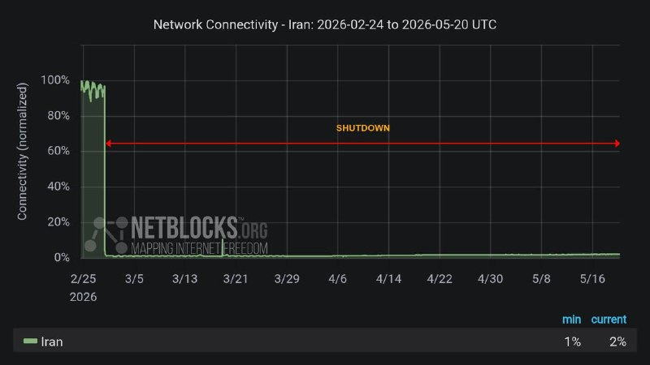

⚠️ بحران خاموشی دیجیتال؛ ضربه‌ای جبران‌ناپذیر بر پیکر اقتصاد و جامعه

🔻بیش از ۱۹۴۴ ساعت خاموشی دیجیتال، تنها قطع یک ابزار ارتباطی روزمره نیست، بلکه یک «بحران تمام‌عیار اقتصادی و اجتماعی» است. در زمانه‌ای که در سراسر جهان حتی چند دقیقه اختلال در اینترنت زیان‌های هنگفتی به بار می‌آورد، تداوم ۸۲ روزه این وضعیت در ایران، آسیبی عمیق به شریان‌های حیاتی کسب‌وکارها و زندگی عادی مردم وارد کرده است.

در واقع، تداوم این قطعی طولانی‌مدت نشان می‌دهد که حفظ حیات اقتصادی مشاغلِ وابسته به فضای مجازی و نیازهای ارتباطی جامعه، در اولویت تصمیم‌گیری‌ها قرار ندارد؛ رویکردی که پیامدی جز نابودی معیشت هزاران نفر، فرسایش سرمایه اجتماعی و آسیب جدی به بدنه نوپای اقتصاد دیجیتال کشور نخواهد داشت.

🆔 @iaghapour

## iaghapour — post 2619

  

⭕️ شگفتی گوگل در Google I/O 2026؛ معرفی جمینای ۳.۵ فلش با سرعتی باورنکردنی!

در گام نخست، مدل جمینای ۳.۵ فلش عرضه شده است؛ مدلی که با وجود طراحی شدن برای سرعت بالا و هزینه کم، در کمال شگفتی توانسته مدل‌های پرچمدار و پرو نسل‌های قبل را در بنچمارک‌های تخصصی شکست دهد.

🔹 پادشاهی در بخش ایجنت‌ها: این مدل با توانایی برنامه‌ریزی بالا، می‌تواند چندین ایجنت را به صورت موازی برای پیشبرد پروژه‌های پیچیده و کدنویسی مستقر کند.

🔸 سرعت خیره‌کننده و کاهش هزینه‌ها: ساندار پیچای اعلام کرد این مدل با سرعت پردازش ۲۸۹ توکن در ثانیه، حدود ۴ برابر سریع‌تر از رقباست.

🔹 شکست رقبای سرسخت: جمینای ۳.۵ فلش در آزمون‌های تخصصیِ مربوط به کارهای ایجنتی، امتیاز بی‌نظیر ۱۶۵۶ را کسب کرده و عملاً رقیب سرسختی مثل کلود سونیت ۴.۶ آنتروپیک را پشت سر گذاشته است.

🔸 همچنین نسخه قدرتمندتر یعنی جمینای ۳.۵ پرو در ماه ژوئن ۲۰۲۶ رسماً عرضه خواهد شد.

جمینای ۳.۵ فلش هم‌اکنون به عنوان مدل پیش‌فرض در اپلیکیشن جمینای و بخش سرچ گوگل فعال شده است.

🧠 @NovinAIplus

## DEJradio — post 4758

  <a href="telegram/content/DEJradio_4758_1779267061.webm" target="_blank">🎬 Download video</a>

🚨
🔸 "جاسوس واقعی کسی است که به خامنه‌ای اطمینان داد از لونه موش بیرون بیاد.

فریبرز کرمی‌زند، افسر پیشین پلیس.

#موشعلی #جاسوسی
@DEJradio

## DEJradio — post 4757

  <a href="telegram/content/DEJradio_4757_1779267062.webm" target="_blank">🎬 Download video</a>

🔺📢 “سـ.ـپاهی‌های با اخلاص که در تجمعات جانفدا محور تبلیغات شدن، همون سرکوبگرای قاتل هستند که با وضو آدم کشتند...

پیام دریافتی

#تجمعات_حکومتی #IRGCterrorists
@DEJradio

## DEJradio — post 4756

  <a href="telegram/content/DEJradio_4756_1779267062.mp4" target="_blank">🎬 Download video</a>

🛩️
🔺 ‏ایالات متحده در حال اعزام نیروهای نظامی به دریای عمان است؛ اقدامی که نشان می‌دهد آمریکا در حال آماده‌سازی برای ازسرگیری جنگ با ایران است.

یک فروند هواپیمای شناسایی دریایی P-8A آمریکا بر فراز دریای عرب و خلیج عمان پرواز کرده و همزمان یک تانکر سوخت‌رسان KC-46A نیز در شمال خلیج عمان برای پشتیبانی از عملیات هوایی حضور داشته است.

پیش‌تر نیز ظهور ناگهانی یک فروند هواپیمای نظارتی دریایی P-8A Poseidon نیروی دریایی آمریکا در نزدیکی سواحل پاکستان، جغرافیای راهبردی تقابل جاری میان آمریکا و ایران را از تنگه هرمز به شمال دریای عرب گسترش داده و الگوهای نظارت دریایی را وارد مرحله‌ای از تشدید بالقوه و مهم کرده است.

#آتشبس #جنگ
@DEJradio

## DEJradio — post 4755

  <a href="telegram/content/DEJradio_4755_1779267064.webm" target="_blank">🎬 Download video</a>

🚨📢 سازمان اطلاعات داخلی آلمان هشدار داده جمهوری اسلامی ممکن است پس از پایان جنگ با اسرائیل و آمریکا، دامنه عملیات‌های امنیتی و تروریستی خود در اروپا را گسترش دهد.

بر اساس گزارش اختصاصی یوراکتیو، سازمان اطلاعات داخلی آلمان (BfV) اعلام کرده تهدید علیه مراکز یهودی و اسرائیلی، مخالفان جمهوری اسلامی و افرادی که حکومت ایران آن‌ها را «خائن» می‌داند، همچنان در سطح بالایی قرار دارد.

این نهاد امنیتی گفته شماری از افراد ساکن آلمان برای آموزش نظامی یا همکاری با نهادهای حکومتی به ایران سفر کرده‌اند و برخی از آن‌ها در ویدئوهای تبلیغاتی جمهوری اسلامی و بسیج ظاهر شده‌اند.

در این گزارش همچنین به نگرانی سرویس‌های امنیتی اروپا از استفاده جمهوری اسلامی از شبکه‌های نیابتی، گروه‌های وابسته به جرایم سازمان‌یافته و نیروهای کم‌هزینه محلی برای انجام حملات اشاره شده است.

به گفته منابع امنیتی، جمهوری اسلامی از مارس ۲۰۲۶ کارزاری با نام «حرکت أصحاب الیمین الإسلامیه» (HAYI) راه‌اندازی کرده که از طریق شبکه‌های اجتماعی اقدام به جذب نیرو در میان محافل طرفدار جمهوری اسلامی و جریان‌های افراطی شیعه می‌کند.

پژوهشگران امنیتی هشدار داده‌اند این مدل عملیات، شامل حملات ساده اما پرتعداد توسط افراد محلی و بعضاً نوجوانان، می‌تواند فشار گسترده‌ای بر سرویس‌های امنیتی اروپا وارد کند؛ به‌ویژه برای حفاظت از مراکز یهودی، مدارس و مراکز اجتماعی.

سازمان اطلاعات داخلی آلمان تأکید کرده است که جمهوری اسلامی در گذشته نیز از روش‌هایی در حد «تروریسم دولتی» استفاده کرده؛ از عملیات‌های شناسایی و مراقبت گرفته تا طراحی حملات علیه مخالفان و اهداف اسرائیلی و یهودی در اروپا.

#تروریسم #آلمان
@DEJradio

## DEJradio — post 4754

  <a href="telegram/content/DEJradio_4754_1779267065.mp4" target="_blank">🎬 Download video</a>

🔺🎥 پیام یک شهروند در واکنش به آموزش استفاده از سلاح به طرفداران نظام در خیابان‌ها: "این کـ...مشنگا هر روز جمع می‌شن اینجا آموزش تفنگ می‌دن".

#تروریسم
@DEJradio

## DEJradio — post 4753

  <a href="telegram/content/DEJradio_4753_1779267067.webm" target="_blank">🎬 Download video</a>

🔺📢 سی‌بی‌اس نیوز به نقل از مقام‌های آمریکایی اعلام کرد ارزیابی اطلاعاتی جدید آمریکا نشان می‌دهد نیروهای این کشور دست‌کم ۱۰ مین دریایی را در تنگه هرمز شناسایی کرده‌اند. پیش از این گزارش شده بود که مقام‌های آمریکایی بر اساس ارزیابی‌های اطلاعاتی معتقد بودند دست‌کم ۱۲ مین زیرسطحی در تنگه هرمز وجود دارد.

مقام‌ها گفته بودند مین‌هایی که ایران در این تنگه به کار گرفته، از نوع «Maham 3» و «Maham 7 Limpet Mine» ساخت ایران هستند. با این حال، یک مقام دیگر آمریکایی گفته بود تعداد مین‌ها کمتر از ۱۲ عدد است.

#تنگه_هرمز #محاصره_دریایی
@DEJradio

## IranIntlTV — post 338052

  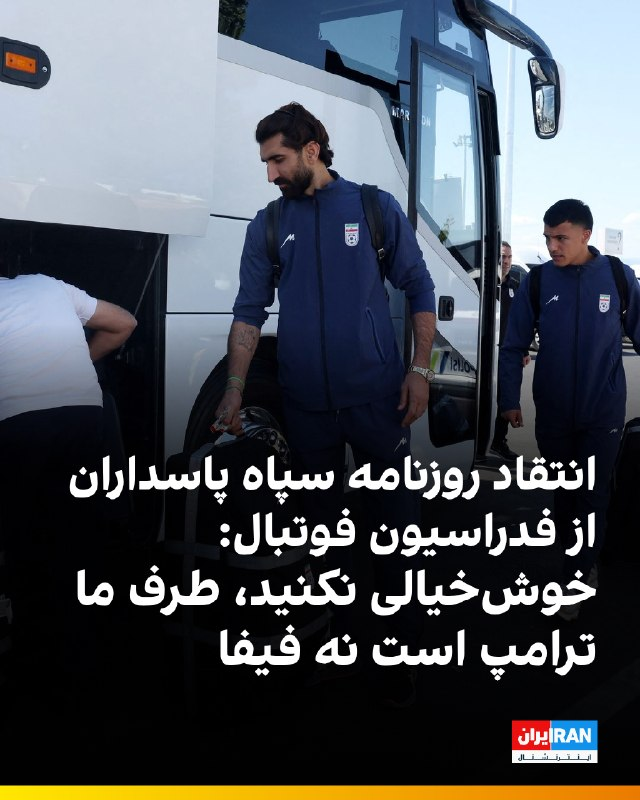

🔻روزنامه جوان، وابسته به سپاه پاسداران با انتشار یادداشتی به انتقاد از فدراسیون فوتبال پرداخت و نوشت: «داریم تیم ملی‌مان را با خوش‌خیالی به کشور متجاوز به خاک‌مان می‌فرستیم. این خوش‌خیالی می‌تواند به ضرر ما منجر شود. آقایان، طرف‌حساب ما آمریکا و ترامپ هستند، نه فیفا.»

🔹روزنامه جوان در ادامه نوشت: «داریم تیم ملی‌مان را به کشوری که دشمنی‌اش با ما عیان است و کمر به نابودی‌مان بسته می‌فرستیم؛ ولی نمی‌دانیم چرا عده‌ای نمی‌خواهند این واقعیت عیان را ببینند و بپذیرند. این خوش‌خیالی، این اعتماد بی‌جا به دشمن بسیار نگران‌کننده است.»

🔹انتقاد روزنامه جوان در حالی مطرح می‌شود که اردوی آماده‌سازی تیم ملی فوتبال ایران هم‌اکنون در کشور ترکیه در حال برگزاری است و ملی‌پوشان قرار است پس از پایان این اردو، راهی شهر توسان در ایالت آریزونای آمریکا شوند.

@iranintltvsport

## IranIntlTV — post 338051

  <a href="telegram/content/IranIntlTV_338051_1779267068.mp4" target="_blank">🎬 Download video</a>

🔻ویدیو رسیده به ایران‌اینترنشنال نشان می‌دهد یکی از هواداران ایرانی آرسنال در شب مشخص شدن قهرمانی این تیم در لیگ برتر، یاد و نام جاویدنام عارف جعفرزاده را زنده نگه‌ می‌دارد و همچنین هواداران آرسنال شادی خود را با این جاویدنام تقسیم می‌کنند.

🔹جاویدنام عارف جعفرزاده، ۳۴ ساله و اهل رشت، شامگاه ۱۸ دی ۱۴۰۴ در جریان اعتراضات مردمی هدف شلیک مستقیم نیروهای جمهوری اسلامی قرار گرفت و جان باخت. او پس از فراخوان شاهزاده رضا پهلوی، در حالی که لباس تیم آرسنال را بر تن داشت به خیابان رفت. کشته شدن این هوادار آرسنال در فضای هواداری این باشگاه در انگلستان بازتاب گسترده‌ای داشت.

@iranintltvsport

## IranIntlTV — post 338050

  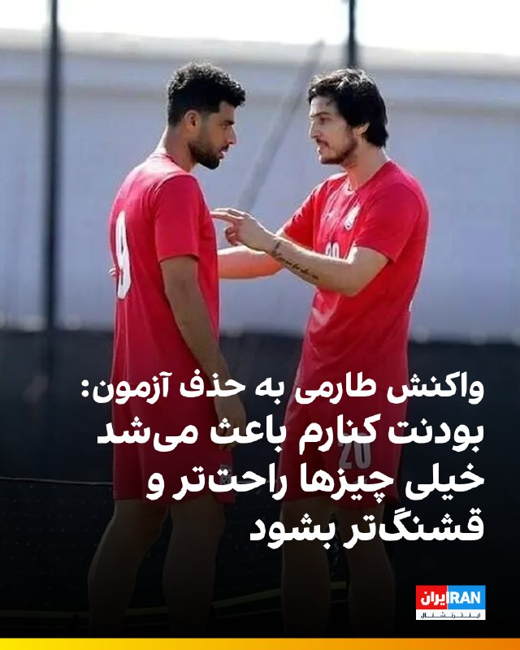

🔻مهدی طارمی، بازیکن تیم ملی، با انتشار استوری در اینستاگرام به حذف سردار آزمون از تیم ملی واکنش نشان داد و نوشت: «سردار، بودنت کنارم باعث می‌شد خیلی چیزها راحت‌تر و قشنگ‌تر بشود.»

🔹سردار آزمون پس از موضع‌گیری‌هایی در مخالفت با جمهوری اسلامی، از فهرست تیم ملی برای جام جهانی کنار گذاشته شد

🔹سردار آزمون روز گذشته با انتشار تصویری از تیم ملی پیش از سفر به ترکیه نوشت: «درست است که پیش‌تان نیستم، ولی رفیق‌های من هستید، دلیل نمی‌شود که برای شما آرزوی موفقیت نکنم. خیلی‌ها می‌خواهند خرابم کنند، ولی این حرف‌ها اصلاً درست نیست. موفق باشید بچه‌ها.»

@iranintltvsport

## IranIntlTV — post 338049

  

انور قرقاش، مشاور دیپلماتیک رییس امارات متحده عربی، در پیامی در شبکه اجتماعی ایکس، نیروهای نیابتی جمهوری اسلامی در عراق را مسئول حمله اخیر به نیروگاه هسته‌ای براکه معرفی کرد.

او نوشت این حمله «نشانه‌ای بسیار خطرناک از میزان تهدیدی است که منطقه با آن روبه‌روست؛ تهدیدی که از یک سو ناشی از فقدان دولت ملی و از سوی دیگر نتیجه نقض آشکار حقوق بین‌الملل است».

قرقاش افزود: «همان‌گونه که ربایش و ایجاد اختلال در تنگه هرمز تهدیدی برای اقتصاد جهانی و نظم بین‌المللی به شمار می‌رود، هدف قرار دادن براکه نیز اقدامی مجرمانه و نقض مستقیم حقوق بین‌الملل است.»

او یادآور شد: «از هرمز تا براکه، این تهدید دیگر تنها محدود به خلیج فارس نیست، بلکه کل نظام بین‌المللی را هدف قرار داده و بازتاب‌دهنده ذهنیت آشوب‌طلبی و باج‌خواهی است؛ ذهنیتی که برای امنیت ملت‌ها، حقوق بین‌الملل و ثبات اقتصاد جهانی ارزشی قائل نیست و تنها در پی بقا و تحمیل منطق تهاجمی خود است.»
https://iranintl.com/202605200793

## IranIntlTV — post 338048

  <a href="telegram/content/IranIntlTV_338048_1779267071.mp4" target="_blank">🎬 Download video</a>

دونالد ترامپ، رییس‌جمهوری آمریکا، اعلام کرد جنگ با جمهوری اسلامی به‌زودی پایان می‌یابد و مقام‌های تهران به‌شدت به دنبال توافق هستند. هم‌زمان جی‌دی ونس، معاون رییس‌جمهور آمریکا، هشدار داد اگر جمهوری اسلامی از فرصت مذاکره استفاده نکند، گزینه نظامی همچنان روی میز خواهد ماند.
گفت‌وگو با مرتضی کاظمیان، عضو تحریریه ایران‌اینترنشنال
@iranintltv

## IranIntlTV — post 338047

  <a href="telegram/content/IranIntlTV_338047_1779267074.mp4" target="_blank">🎬 Download video</a>

رجب طیب اردوغان، رییس‌جمهوری ترکیه، در گفت‌وگوی تلفنی با اورسولا فون درلاین، رییس کمیسیون اروپا، اعلام کرد آنکارا از حفظ آتش‌بس و برقراری صلح در منطقه حمایت می‌کند و خواستار بازگشایی فوری تنگه هرمز است.

نرگس هورخش، خبرنگار ایران‌اینترنشنال، گزارش می‌دهد
@iranintltv

## IranIntlTV — post 338046

  

نت‌بلاکس، نهاد پایش‌کننده وضعیت اینترنت در جهان، چهارشنبه ۳۰ اردیبهشت، اعلام کرد هشتاد و دومین روز از قطع دیجیتال اینترنت در ایران سپری شده و این کشور پس از ۱۹۴۴ ساعت همچنان تا حد زیادی از اینترنت جهانی جدا مانده است.

این نهاد افزود در شرایطی که قطعی چند دقیقه‌ای اینترنت می‌تواند بحران‌زا باشد، ادامه این وضعیت در ایران به «نابودی معیشت‌ها و فرسایش حقوق شهروندان» منجر شده است.
https://iranintl.com/202605207927

## IranIntlTV — post 338045

  <a href="telegram/content/IranIntlTV_338045_1779267077.mp4" target="_blank">🎬 Download video</a>

بر اساس پیام‌های رسیده به ایران‌اینترنشنال، کمبود بنزین در بندرعباس و شماری از شهرهای جنوب استان کرمان باعث شکل‌گیری صف‌های طولانی در جایگاه‌های سوخت شده است.

به‌گفته شهروندان، برخی جایگاه‌ها بیش از ۱۵ لیتر بنزین عرضه نمی‌کنند و در مواردی قیمت آن در بازار آزاد به لیتری ۱۰۰ هزار تومان رسیده است. شهروندان می‌گویند ناچارند شب‌ها در صف‌های چند کیلومتری بمانند تا صبح نوبت سوخت‌گیری آنان برسد.

این وضعیت در بندرعباس، با وجود گرمای شدید و نیاز ضروری به کولر خودرو، نارضایتی گسترده‌ای ایجاد کرده است.

## IranIntlTV — post 338044

  <a href="telegram/content/IranIntlTV_338044_1779267079.mp4" target="_blank">🎬 Download video</a>

ربات‌هایی که پیش‌تر تنها در فیلم‌های علمی‌تخیلی دیده می‌شدند، اکنون به فضای فروشگاه‌ها و زندگی روزمره مردم راه یافته‌اند. در تازه‌ترین نمونه از این تحولات، یک ربات انسان‌نما در جنوب آلمان به کار گرفته شده است.
فرزیا ثابتی، خبرنگار ایران‌اینترنشنال، گزارش می‌دهد
@iranintltv

## IranIntlTV — post 338043

  <a href="telegram/content/IranIntlTV_338043_1779267081.mp4" target="_blank">🎬 Download video</a>

محمدجواد اکبرین، عضو تحریریه ایران‌اینترنشنال، گفت واشینگتن در مذاکرات با تهران، شروطی مرتبط با منافع و مطالبات ایالات متحده مطرح می‌کند، اما شروط جمهوری اسلامی لزوما به ایران مربوط نیست. او افزود جمهوری اسلامی خواستار خروج آمریکا از منطقه و پایان جنگ در لبنان شده، در حالی که این موضوعات اساسا از سوژه مذاکرات خارج است.
@iranintltv

## IranIntlTV — post 338042

  <a href="https://t.me/IranintlTV/338042" target="_blank">📎 Download file</a>

🎧نسخه صوتی اخبار بامدادی | چهارشنبه ۳۰ اردیبهشت
@iranintlTV

## IranIntlTV — post 338041

  

مسعود پزشکیان، رییس‌جمهور دولت جمهوری اسلامی، با اشاره به بحران اقتصادی در ایران، بار دیگر بر «صرفه‌جویی» مردم تاکید کرد و گفت: «امروز ضروری است برای مردم تبیین شود که لازمه عبور موفق از این شرایط، ایجاد تناسب میان داشته‌ها و خواسته‌هاست.»

او گفت: «با اسراف، افزایش بی‌رویه توقعات و بی‌توجهی به محدودیت‌ها نمی‌توان به اهداف بزرگ دست یافت.»
https://iranintl.com/202605208827

## IranIntlTV — post 338040

  <a href="telegram/content/IranIntlTV_338040_1779267084.mp4" target="_blank">🎬 Download video</a>

شی جین‌پینگ، رییس‌جمهور چین، در دیدار با ولادیمیر پوتین، رییس‌جمهوری روسیه، تاکید کرد پایان جنگ ایران «ضرورتی فوق‌العاده» است. شی همچنین گفت پایان جنگ می‌تواند به ثبات در بازار انرژی کمک کند.

توماج طاهباز، خبرنگار ایران‌اینترنشنال، گزارش می‌دهد
@iranintltv

## IranIntlTV — post 338039

  <a href="telegram/content/IranIntlTV_338039_1779267087.mp4" target="_blank">🎬 Download video</a>

دادگاهی در ایالت کالیفرنیا دعوای ایلان ماسک علیه اوپن‌ای‌آی را رد کرد. هیئت منصفه این دادگاه اعلام کرد ماسک شکایت را دیر مطرح کرده و مهلت قانونی سه‌ ساله برای ثبت آن به پایان رسیده است.

گزارش حمید رشید، خبرنگار ایران‌اینترنشنال
@iranintltv

## IranIntlTV — post 338038

  <a href="telegram/content/IranIntlTV_338038_1779267088.mp4" target="_blank">🎬 Download video</a>

جاویدنامان انقلاب ملی ایرانیان
«حدیثه اکبرزاده» متولد ۲۳ دی‌ ۱۳۸۵، پنج روز قبل از زادروزش در اعتراضات ۱۸ دی‌ در فردیس کرج با شلیک نیروهای سرکوب خامنه‌ای به سینه‌اش کشته شد. نامش در حافظه‌ این سرزمین می‌ماند و یادش چراغ راه آزادی‌خواهان است.
@iranintltv

## IranIntlTV — post 338037

  

نرگس باقری زمردی، مدیرکل دفتر مقررات صادرات و واردات وزارت صنعت، معدن و تجارت، در نامه‌ای به محمدعلی بهپوری، مدیرکل واردات گمرک ایران، اعلام کرد واردات مواد اولیه مرتبط با حوزه پتروشیمی و پلیمری از طریق «رویه کولبری و ملوانی» مجاز است.

تسنیم، خبرگزاری وابسته به سپاه پاسداران، نوشت بر اساس این ابلاغیه، «واردات این اقلام صرفا در چارچوب فهرست تعیین‌شده و با رعایت ضوابط و مقررات مربوط به رویه‌های ملوانی و کولبری امکان‌پذیر خواهد بود».

این رسانه حکومتی افزود این تصمیم در شرایطی اتخاذ شد که شماری از واحدهای تولیدی صنایع پتروشیمی و پلیمری طی ماه‌‌های اخیر در تامین برخی مواد اولیه با محدودیت روبه‌رو بوده‌اند.
https://iranintl.com/202605209869

## IranIntlTV — post 338036

  <a href="telegram/content/IranIntlTV_338036_1779267091.mp4" target="_blank">🎬 Download video</a>

سازمان ملل متحد در گزارشی تازه هشدار داده تبعات جنگ در خاورمیانه اکنون از بازار انرژی فراتر رفته و از تورم و قیمت مواد غذایی تا رشد اقتصادی جهان را تحت تاثیر قرار داده است.

جزییات بیشتر با علیرضا محبی، خبرنگار ایران‌اینترنشنال
@iranintltv

## IranIntlTV — post 338035

  <a href="telegram/content/IranIntlTV_338035_1779267093.mp4" target="_blank">🎬 Download video</a>

شبکه ام‌تی‌وی لبنان گزارش داد حزب‌الله لبنان از جنبش‌های پیشاهنگی خود برای پرورش نسلی مطیع و آماده مرگ استفاده می‌کند. بر اساس این گزارش، این کودکان عمدتا فرزندان نیروهای حزب‌الله هستند و از برخی از آنها برای «جاسوسی» و «انتقال مهمات» استفاده می‌شود.
این گزارش همچنین تاکید کرد بخشی از این کودکان با وفاداری به روح‌الله خمینی و آرمان‌های او پرورش یافته‌اند.

گفت‌وگو با کامیار بهرنگ، عضو تحریریه ایران‌اینترنشنال
@iranintltv

## IranIntlTV — post 338034

  <a href="telegram/content/IranIntlTV_338034_1779267095.mp4" target="_blank">🎬 Download video</a>

میعاد ملکی، رییس پیشین دفتر هدف‌گذاری تحریم‌های وزارت خزانه‌داری آمریکا، گفت تحریم‌های جدید آمریکا علیه جمهوری اسلامی، انتقال درآمدهای نفتی و پتروشیمی را دشوارتر خواهد کرد. او همچنین گفت محاصره دریایی، تاثیر به‌مراتب بیشتری بر اقتصاد تهران خواهد داشت تا اقتصاد جهانی.
@iranintltv

## IranIntlTV — post 338033

  <a href="telegram/content/IranIntlTV_338033_1779267097.mp4" target="_blank">🎬 Download video</a>

دونالد ترامپ، رییس‌جمهوری آمریکا، گفت احتمال دارد ایالات متحده بار دیگر به جمهوری اسلامی حمله کند، اما هنوز تصمیم نهایی در این‌باره گرفته نشده است.

گفت‌وگو با شهرام خلدی، پژوهش‌گر تاریخ خاورمیانه و روابط بین‌الملل
@iranintltv

## ManotoTV — post 105669

  

به گزارش خبرگزاری‌های داخلی، حکم اعدام بهمن فرزانه، قاتل الهه حسین‌نژاد، بامداد چهارشنبه اجرا شده است.
الهه حسین‌نژاد، زن ۲۴ ساله، خرداد سال گذشته هنگام بازگشت به خانه در تهران ناپدید شد و حدود ۱۰ روز بعد پیکر او با چندین ضربه چاقو در بیابان‌های اطراف تهران پیدا شد.
خبرگزاری میزان، وابسته به قوه قضاییه جمهوری اسلامی، اعلام کرده این حکم پس از طی مراحل قانونی و با درخواست اولیای دم اجرا شده است.

## ManotoTV — post 105668

  

زمین‌لرزه‌ای به بزرگی ۴.۷ بامداد چهارشنبه ۳۰ اردیبهشت حوالی لافت در استان هرمزگان را لرزاند. مرکز لرزه‌نگاری کشوری عمق این زلزله را ۲۰ کیلومتر اعلام کرده است. این زمین‌لرزه در بخش‌هایی از قشم، هرمز و مناطق روستایی بندرعباس نیز احساس شد. مقام‌های محلی می‌گویند تاکنون گزارشی از خسارت دریافت نشده، اما بررسی‌ها در مناطق نزدیک به کانون زلزله ادامه دارد.

## ManotoTV — post 105667

  <a href="telegram/content/ManotoTV_105667_1779267100.mp4" target="_blank">🎬 Download video</a>

دونالد ترامپ، رئیس‌جمهور آمریکا، بار دیگر مدعی شد که ایالات متحده جنگ با جمهوری اسلامی را «خیلی سریع» پایان خواهد داد و تهران «به‌شدت» خواهان توافق است.
ترامپ در جریان مراسم سالانه پیک‌نیک کنگره در محوطه جنوبی کاخ سفید گفت توافق با تهران «اتفاق خواهد افتاد و سریع هم اتفاق می‌افتد».
او همچنین مدعی شد با پایان این بحران، قیمت نفت «به‌شدت کاهش خواهد یافت».
این اظهارات پس از آن مطرح می‌شود که ترامپ اوایل هفته گفته بود تهران برای رسیدن به توافق «التماس» می‌کند و او تنها یک ساعت با صدور دستور حملات تازه علیه جمهوری اسلامی فاصله داشته است.
ترامپ گفت به درخواست متحدان خلیج فارس آمریکا، حملات را متوقف کرده تا به گفته او، «مذاکرات جدی» ادامه پیدا کند. با این حال، او هشدار داد اگر جمهوری اسلامی به توافق نرسد، آمریکا برای یک «حمله کامل» آماده است.

## ManotoTV — post 105666

  

شی جین‌پینگ، رئیس‌جمهوری چین، در دیدار با ولادیمیر پوتین در پکن خواستار توقف فوری درگیری‌ها در خاورمیانه شد و گفت پایان جنگ می‌تواند به کاهش اختلال در عرضه انرژی و زنجیره‌های تجارت جهانی کمک کند.

شی جین‌پینگ روز چهارشنبه، ۲۰ مه ۲۰۲۶، در دیدار با ولادیمیر پوتین در تالار بزرگ خلق پکن گفت وضعیت خاورمیانه در مرحله‌ای حساس میان جنگ و صلح قرار دارد و توقف درگیری‌ها «فوری‌ترین ضرورت» است. او تأکید کرد بازگشت به جنگ قابل قبول نیست و مسیر مذاکره باید در اولویت قرار گیرد. به گفته رئیس‌جمهور چین، پایان زودهنگام درگیری‌ها می‌تواند از اختلال بیشتر در عرضه انرژی و عملکرد زنجیره‌های صنعتی و تجاری جلوگیری کند.

پوتین نیز در آغاز این دیدار گفت روابط روسیه و چین به سطحی «بی‌سابقه» رسیده و از شی جین‌پینگ دعوت کرد سال آینده به روسیه سفر کند. رئیس‌جمهوری روسیه همچنین همکاری دو کشور را عاملی برای «بازدارندگی و ثبات» در روابط بین‌الملل توصیف کرد.

بر اساس گزارش‌ها، دو طرف در این دیدار درباره انرژی، امنیت و روابط کلی مسکو و پکن گفت‌وگو کردند و با تمدید پیمان دوستی چین و روسیه موافقت کردند؛ پیمانی که نخستین‌ب

## ManotoTV — post 105665

  

جی‌دی ونس، معاون رئیس‌جمهور آمریکا، گفت واشینگتن در برابر جنگ با ایران دو مسیر پیش رو دارد: ادامه مذاکره یا ازسرگیری عملیات نظامی.

جی‌دی ونس در نشست خبری کاخ سفید گفت آمریکا در برابر ایران «دو مسیر» دارد.

به گفته ونس، مسیر اول مذاکره است. او گفت دونالد ترامپ از تیم خود خواسته با جمهوری اسلامی «تهاجمی» مذاکره کنند.

ونس گفت آمریکا در موضوع اصلی، یعنی جلوگیری از دستیابی ایران به سلاح هسته‌ای، پیشرفت زیادی داشته و واشینگتن فکر می‌کند تهران خواهان توافق است.

او مسیر دوم را ازسرگیری عملیات نظامی دانست و گفت: «گزینه دوم این است که کارزار نظامی را دوباره شروع کنیم تا اهداف آمریکا دنبال شود.»

ونس گفت این مسیر چیزی نیست که ترامپ بخواهد و فکر نمی‌کند جمهوری اسلامی هم خواهان آن باشد.

او در پایان گفت: «برای توافق، دو طرف لازم است.»

## ManotoTV — post 105664

  <a href="telegram/content/ManotoTV_105664_1779267103.mp4" target="_blank">🎬 Download video</a>

«سکوت ما همدستی با جمهوری اسلامی است»

## FarsiVOA — post 218205

  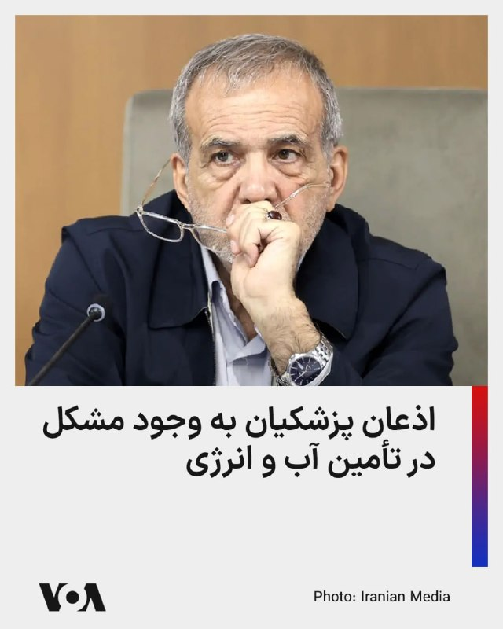

رئیس دولت جمهوری اسلامی گفت که اگر برای مدیریت مصرف آب، برق، گاز و بنزین برنامه‌ریزی دقیق نداشته باشیم، در ادامه با مشکلاتی مواجه خواهیم شد.

مسعود پزشکیان روز چهارشنبه ۳۰ اردیبهشت، در نشست سراسری با استانداران، مدعی شد که مشکلات مربوط به کمبودها، ناشی از «جنگ» است، اما همزمان بیان داشت که با «روش‌های گذشته» نمی‌توان برای امروز راه‌حلی پیدا کرد. او تصریح کرد که اگر روش‌های پیشین به‌تنهایی قادر به حل مسائل بود، بسیاری از مشکلات تاکنون برطرف شده بود.

پزشکیان از آن روی بر ضرورت کاهش مصرف انرژی به‌ویژه بنزین تاکید می‌کند که پیشتر رمضانعلی سنگدوینی، عضو کمیسیون انرژی مجلس شورای اسلامی، از «ناترازی روزانه ۲۰ میلیون لیتری بنزین» در کشور خبر داده بود.

همچنین علیرضا شریعت، دبیرکل فدراسیون صنعت آب ایران، با اشاره به تنش آبی در ایران، هشدار داده بود که در صورت عدم صرفه‌جویی در مصرف آب، کشور با بحران مهاجرت اجباری دست‌کم‌ ۱۵ میلیون نفر مواجه خواهد شد.
@FarsiVOA

## FarsiVOA — post 218204

🔺رویترز: آمریکا نیروهای در دسترس ناتو در بحران‌ها را کاهش می‌دهد

▪️رویترز به نقل از سه منبع آگاه گزارش داد دولت دونالد ترامپ قصد دارد این هفته به متحدان ناتو اعلام کند که آمریکا بخشی از توانایی‌های نظامی خود را که در بحران‌ها یا جنگ‌های بزرگ در اختیار ناتو قرار می‌داد، کاهش خواهد داد.

▪️این تصمیم در چارچوب «مدل نیروی ناتو» مطرح شده است؛ سازوکاری که بر اساس آن، کشورهای عضو مشخص می‌کنند در صورت حمله نظامی یا بحران بزرگ، چه نیروها و قابلیت‌هایی را می‌توانند در اختیار ائتلاف بگذارند.

▪️ترکیب دقیق این نیروها محرمانه است، اما پنتاگون تصمیم گرفته تعهدات خود را به شکل قابل توجهی کاهش دهد.

▪️دونالد ترامپ پیش‌تر بارها اعضای ناتو را به کم‌کاری در هزینه‌های دفاعی متهم کرده بود.

⬇️ بیشتر بخوانید:
https://ir.voanews.com/a/8151972.html

## FarsiVOA — post 218203

🔺بسنت: آمریکا عجله‌ای برای تمدید آتش‌بس تجاری با چین ندارد

▪️وزیر خزانه‌داری آمریکا می‌گوید ایالات متحده عجله‌ای برای تمدید آتش‌بس تجاری با چین ندارد، اما مذاکرات پیرامون طیفی از مسائل دوجانبه مانند کاهش تعرفه‌های تجاری، سرمایه‌گذاری و هوش مصنوعی ادامه خواهد داشت.

▪️دونالد ترامپ رئیس‌جمهور آمریکا هفته گذشته طی سفری به پکن با همتای چینی خود دیدار و نتیجه مذاکرات را «عالی» توصیف کرد.

▪️دو کشور طی سال‌های گذشته جنگ تمام عیار اقتصادی و تجاری علیه همدیگر آغاز کرده، اما پارسال توافقاتی برای تعدیل تعرفه‌های تجاری تا نوامبر امسال انجام شد.

▪️قرار است شی جین‌پینگ رئیس‌جمهور چین در ماه سپتامبر، دو ماه مانده به پایان مهلت آتش‌بس تجاری، سفری به آمریکا داشته باشد.

⬇️ بیشتر بخوانید:
https://ir.voanews.com/a/8151971.html

## FarsiVOA — post 218202

🔺بحران در تأمین مواد اولیه؛ جمهوری اسلامی بخشی از واردات پتروشیمی را به کولبری و ملوانی سپرد

▪️در میانه اختلال در مسیرهای رسمی تجارت و فشار بر زنجیره تأمین صنایع، سازمان توسعه تجارت ایران واردات برخی مواد اولیه پتروشیمی و پلیمری را از طریق رویه‌های کولبری و ملوانی مجاز اعلام کرد.

▪️این تصمیم نشان می‌دهد بحران تأمین مواد اولیه در صنایع پایین‌دستی به مرحله‌ای رسیده که جمهوری اسلامی برای جبران کمبود، به مسیرهای مرزی و غیرمتعارف متوسل شده است.

▪️کولبری در ایران سال‌ها با فقر، ناامنی مرزی و برخوردهای خشونت‌آمیز همراه بوده است.

▪️پیش‌تر نیز سازمان توسعه تجارت ایران ممنوعیت صادرات محصولات شیمیایی، پلیمری و پتروشیمی را در شرایط اضطراری به گمرک ابلاغ کرده بود؛ تصمیمی که هدف آن تأمین نیاز داخلی اعلام شد.

⬇️ بیشتر بخوانید:
https://ir.voanews.com/a/8151970.html

## FarsiVOA — post 218201

🔺رویترز: دو نفتکش چینی با چهار میلیون بشکه نفت از تنگه هرمز خارج شدند

▪️رویترز گزارش داد دو نفتکش غول‌پیکر چینی، حامل مجموعاً چهار میلیون بشکه نفت خام خاورمیانه، روز چهارشنبه از تنگه هرمز خارج شده‌اند.

▪️بر اساس داده‌های ال‌اس‌ای‌جی و کپلر، این دو نفتکش از جمله شمار محدودی از ابرنفتکش‌هایی هستند که در ماه جاری، با حمل نفت خام عراق، از مسیر عبوری خارج شده‌اند که جمهوری اسلامی کشتی‌ها را به استفاده از آن ملزم کرده است.

▪️دو نفنکش چینی حامل نفت خام عراق و قطر هستند.

▪️چین که روابط دوستانه‌ای با جمهوری اسلامی دارد، به شدت به انرژی خاورمیانه وابسته است و حدود ۴۵ درصد نفت خود را از مسیر هرمز دریافت می‌کند.

⬇️ بیشتر بخوانید:
https://ir.voanews.com/a/8151969.html

## FarsiVOA — post 218200

  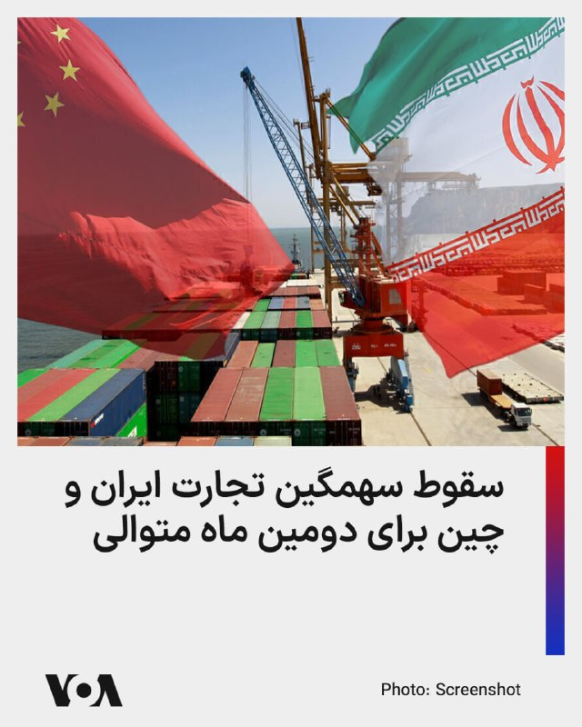

آمارهای گمرکی چین حاکی از افت ۷۰ درصدی تجارت دوجانبه با ایران بعد از آغاز عملیات مشترک نظامی آمریکا و اسرائیل علیه جمهوری اسلامی است.

طبق داده‌های گمرک چین، این کشور در ماه‌های مارس و آوریل به طور متوسط ماهانه ۲۰۰ میلیون دلار تجارت دوجانبه با ایران داشته؛ در حالی که در ماه‌های ژانویه و فوریه این رقم حدود ۷۰۰ میلیون دلار بود.

گمرک چین سال‌هاست که آمارهای خرید نفت از ایران را از داده‌های مربوط به تجارت دوجانبه خارج کرده، اما آمارهای کپلر نشان می‌دهد خرید روزانه نفت ایران توسط پالایشگاه‌های چینی نیز در ماه گذشته تنها ۱.۱۶ میلیون بشکه بوده که حدود ۳۰ درصد کمتر از ماه‌های گذشته است.

⬇️ بیشتر بخوانید:
https://ir.voanews.com/a/8151968.html

## DW_Farsi — post 124914

  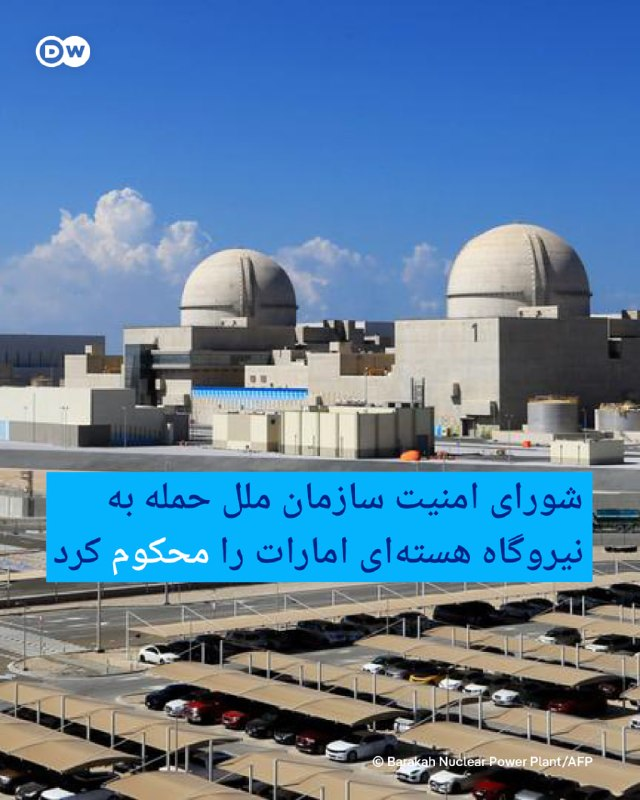

🔶 شورای امنیت سازمان ملل حمله به نیروگاه هسته‌ای امارات را محکوم کرد
 
روز سه‌شنبه اعضای شورای امنیت سازمان ملل شامل روسیه، حمله پهپادی اخیر به نیروگاه هسته‌ای "براکه" در امارات متحده عربی را محکوم کردند.
 
این حمله پهپادی که هیچ گروهی مسئولیت آن را بر عهده نگرفته است، روز یکشنبه یک ژنراتور برقی را در نزدیکی نخستین نیروگاه هسته‌ای جهان عرب در براکه در ابوظبی هدف قرار داد و باعث آتش‌سوزی شد، اما هیچ مصدومیت یا نشت مواد رادیواکتیو ایجاد نکرد.
در همین راستا واسیلی نبنزیا، سفیر روسیه در سازمان ملل متحد گفت: «حملاتی که تاسیسات هسته‌ای صلح‌آمیز در هر کشوری از جهان را هدف قرار می‌دهند، کاملا غیرقابل قبول هستند.»

او بدون نام بردن از عاملان احتمالی این حمله ادامه داد: «در این چارچوب، کشور ما [روسیه] اقدامات کسانی را که حمله علیه این نیروگاه در خاک امارات متحده عربی را انجام دادند و از این طریق خطرات تشدید تنش را ایجاد کردند، به‌طور قاطع محکوم می‌کند.»

او در عین حال مدعی شد که این حمله احتمالا اگر جنگ ایالات متحده و اسرائیل علیه جمهوری اسلامی انجام نمی‌شد، رخ نمی‌داد.

 
@dw_farsi

## DW_Farsi — post 124913

  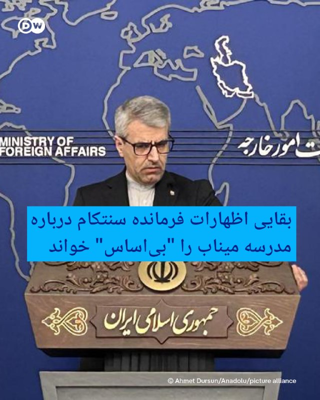

🔶 بقایی اظهارات فرمانده سنتکام درباره مدرسه میناب را "بی‌اساس" خواند
 
اسماعیل بقایی، سخنگوی وزارت خارجه جمهوری اسلامی، اظهارات برد کوپر، فرمانده نیروهای مرکزی ایالات متحده، سنتکام، در خصوص مدرسه ابتدایی شجره طیبه در میناب را "بی‌اساس و دروغی تکان‌دهنده" خواند.
 
فرمانده سنتکام روز سه‌شنبه در برابر کنگره ایالات متحده آمریکا اعلام کرده بود که تحقیقات نظامی صورت‌گرفته توسط آمریکا در خصوص انفجاردر این مدرسه "پیچیده است، چرا که این مدرسه در یک سایت فعال موشک‌های کروز ایران واقع شده بود".
 
بقایی در واکنش به این اظهارات در شبکه اجتماعی ایکس، این سخنان را " تحریف بی‌شرمانه" خواند و مدعی شد که این "تلاشی آشکار برای پنهان کردن واقعیت تلخ حملات موشکی ۲۸فوریه (نهم اسفند) است؛ حملاتی که به کشته شدن تراژیک بیش از ۱۷۰دانش‌آموز و معلمان‌شان انجامید".
 
سخنگوی وزارت خارجه جمهوری اسلامی، "هدف قرار دادن" این مدرسه را "نقض جدی حقوق بشردوستانه بین‌المللی و جنایت جنگی آشکار" توصیف کرد.
@dw_farsi

## DW_Farsi — post 124912

  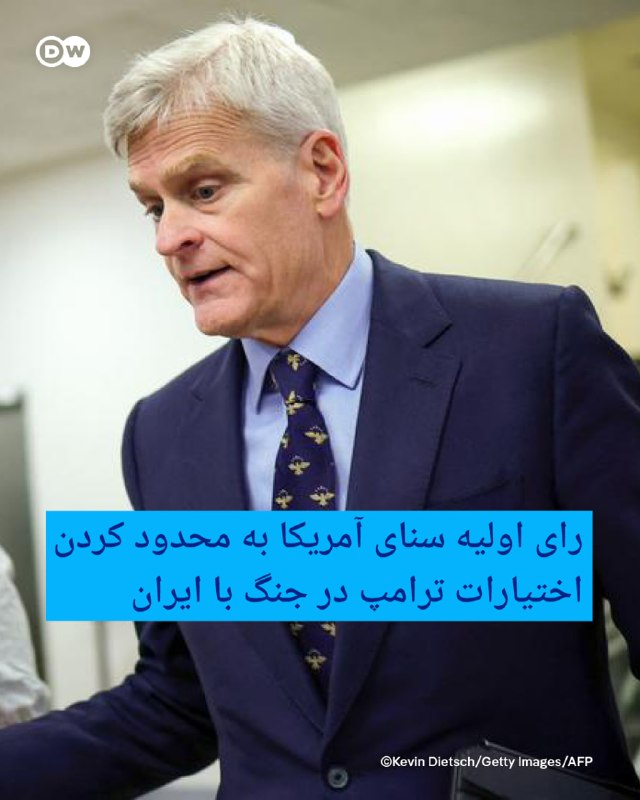

🔶 رای اولیه سنای آمریکا به محدود کردن اختیارات ترامپ در جنگ با ایران
 
برای نخستین بار، سنای آمریکا به قطعنامه‌ای رای داد که در صورت تصویب، قرار است دونالد ترامپ، رئیس جمهور آمریکا را به پایان دادن به جنگ ایران وادار کند.
 
سنای آمریکا روز سه‌شنبه به وقت محلی، با حمایت چهار نماینده جمهوری‌خواه، با ۵۰ رای موافق در برابر ۴۷ رای مخالف، به یک گام آیین‌نامه‌ای برای پیشبرد این طرح رای داد. اکنون این طرح می‌تواند در هفته‌های آینده مورد بحث قرار گیرد و به رای‌گیری نهایی گذاشته شود.
 
جمهوری‌خواهان پیش از این در سال جاری، هفت تلاش مشابه در سنا و سه مورد در مجلس نمایندگان را متوقف کرده بودند و اختیار تصمیم‌گیری درباره جنگ را در دست رئیس‌ جمهور نگه داشته بودند.
 
با این حال، این قطعنامه هنوز باید از موانع بزرگی عبور کند. حتی اگر هر دو مجلس به آن رای مثبت بدهند، ترامپ می‌تواند آن را وتو کند.
 
قطعنامه محدود کردن اختیارات ترامپ در جنگ با ایران را تیم کین، سناتور دموکرات ارائه کرده بود. او ترامپ را متهم کرده است که "پیشنهادهای صلح را نادیده می‌گیرد".
 
@dw_farsi

## DW_Farsi — post 124911

🔶 جام‌های ۱۹۵۸ و ۱۹۷۰؛ پله، مروارید سیاه برزیل و بازیکن قرن
 
اِدسون آرانتِس دو ناسیمنتو، ملقب به پله، روز ۲۳ اکتبر ۱۹۴۰ در شهری کوچک بین ریو دژانیرو و سائو پائولو در برزیل به دنیا آمد. او در سن ۱۱ سالگى توجه مربیان فوتبال را به خود جلب کرد و ۴ سال بعد به خدمت باشگاه صاحب‌نام سانتوس درآمد. پله در سال ۱۹۵۶ در حالی که ۱۶ سال بیشتر سن نداشت، اولین گل خود را براى این تیم به ثمر رساند.
 
پله خود در مورد آن روزها گفته است: «سیزده، چهارده ساله بودم و در باشگاه ‌"بائرو" بازی می‌کردم. ما برنده شدیم و جایزه‌‌ای بردیم و عکسم را در روزنامه‌ها چاپ کردند. آن موقع می‌دانستم که می‌خواهم فوتبالیست حرفه‌ای شوم.»
 
درخشش فوق‌العاده‌ پله در لیگ برزیل، زمینه‌ای بود برای دعوت از او به اردوی تیم ملی براى حضور در جام جهانى ۱۹۵۸ سوئد؛ تورنمنتی که در آن جهان با ستاره‌اى استثنایى آشنا شد.
 
قدرت دریبل‌زنى، دید وسیع و پاس‌هاى دقیق پله‌ ۱۷ ساله او را در کنار واوا و گارینشا، به یکی از سه عضو مثلث جادویی برزیل تبدیل کرد.
 
این ستا‌ره‌ نوظهور در مرحله‌ گروهی این رقابت‌ها مصدوم شد، اما به اصرار دیگر بازیکنان تیم ملی، در دیدارهاى حساس بعدى به میدان رفت.
 
پله در یک‌چهارم نهایى جام جهانی ۱۹۵۸، یک گل به وِلز زد، در دیدار نیمه‌نهایى، سه بار دروازه‌ فرانسه را گشود و در فینال هم دو گل از ۵ گل تیمش را به ثمر رساند. تیم ملی برزیل در دیدار نهایی ۵ بر ۲ سوئد میزبان مسابقات را شکست داد و بدین ترتیب پله در سن ۱۷ سالگی نخستین قهرمانی جهان را تجربه کرد.
 
@dw_farsi

## DW_Farsi — post 124910

  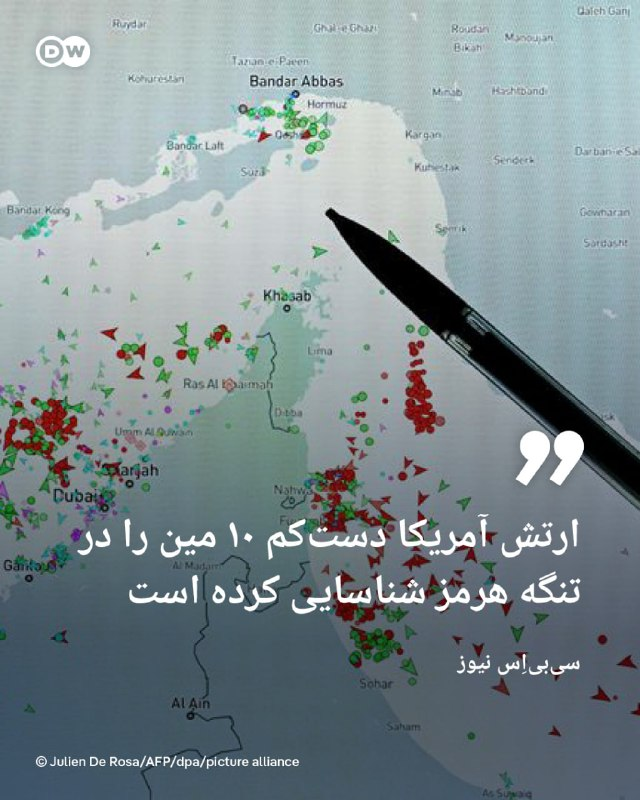

🔶 "ارتش آمریکا دست‌کم ۱۰ مین را در تنگه هرمز شناسایی کرده است"
 
سی‌بی‌اِس نیوز به نقل از مقام‌های ایالات متحده که نخواسته‌اند نام‌شان فاش شود، بر مبنای یک ارزیابی اطلاعاتی اخیر گزارش داده که نیروهای ارتش این کشور دست‌کم ۱۰ مین را در تنگه هرمز  شناسایی کرده‌اند.
 
سی‌بی‌اِس نیوز پیش‌تر در ماه مارس گزارش داده بود که بر اساس ارزیابی‌های اطلاعاتی آمریکا در آن زمان، دست‌کم ۱۲ مین زیرآبی در تنگه هرمز وجود داشته است. مقام‌های آمریکایی در ماه مارس گفته بودند مین‌هایی که اکنون جمهوری اسلامی در تنگه هرمز به کار گرفته، مین‌های چسبنده "مهام ۳" و "مهام ۷" ساخت ایران هستند. یک مقام دیگر ایالات متحده تعداد آن‌ها را کمتر از ۱۲ عدد اعلام کرده بود.
   
ایالات متحده هشدار داده است که عبور از مسیر عادی در تنگه هرمز می‌تواند به دلیل مین‌هایی که جمهوری اسلامی در تنگه هرمز کار گذاشته، "بسیار خطرناک" باشد.
 
پنتاگون پیش از این، تصویری گرافیکی منتشر کرده بود که نشان می‌داد جمهوری اسلامی در ۲۳ آوریل مین‌های جدیدی در تنگه هرمز کار گذاشته است.
 
@dw_farsi

## DW_Farsi — post 124909

🔶 ترامپ: جنگ با ایران را خیلی سریع پایان خواهیم داد
 
به گزارش خبرگزاری رویترز، دونالد ترامپ، رئیس ‌جمهور ایالات متحده، در کاخ سفید به اعضای کنگره گفته است که ایالات متحده، "جنگ با ایران را خیلی سریع" پایان خواهد داد.
 
همزمان دو مقام ایالات متحده به اکسیوس گفته‌اند که ترامپ، شامگاه دوشنبه جلسه‌ای با تیم ارشد امنیت ملی خود درباره ایران برگزار کرد که شامل ارائه گزارشی درباره گزینه‌های نظامی بود. بر اساس این گزارش، این جلسه چند ساعت پس از آن برگزار شد که ترامپ اعلام کرده بود حملات برنامه‌ریزی‌شده روز سه‌شنبه به ایران را متوقف کرده است.
 
ترامپ همچنان در تازه‌ترین اظهارنظرهای خود درباره جنگ ایران گفته است که جمهوری اسلامی تنها چند روز برای رسیدن به یک پیشرفت دیپلماتیک فرصت دارد.
 
او روز دوشنبه گفت که ضرب‌الاجل برای تعیین تکلیف این موضوع، "دو سه روز، شاید جمعه یا شنبه، یا اوایل هفته آینده" است.
 
به گفته مقام‌های ایالات متحده و منابع منطقه‌ای، تصمیم ترامپ برای خودداری از حمله تا حدی به دلیل نگرانی‌هایی بود که چند رهبر کشورهای خلیج فارس درباره حملات تلافی‌جویانه جمهوری اسلامی علیه تاسیسات نفتی و زیرساخت‌هایشان مطرح کرده بودند.
 
به گزارش اکسیوس، حاضران در جلسه با ترامپ، جی‌دی ونس، معاون او، مارکو روبیو، وزیر امور خارجه، استیو ویتکاف، فرستاده کاخ سفید، پیت هگست، وزیر دفاع، ژنرال دن کین، رئیس ستاد مشترک ارتش، جان رتکلیف، رئیس سازمان اطلاعات مرکزی آمریکا (سیا)، و دیگر مقام‌های ارشد بوده‌اند.
 
یک منبع منطقه‌ای نیز به اکسیوس گفته است که میانجی‌ها در تلاش هستند تا جمهوری اسلامی را متقاعد کنند موضعی انعطاف‌پذیرتر ارائه دهد که خواسته‌های هسته‌ای ایالات متحده را در بر بگیرد.
 
این در حالی است که ترامپ روز سه‌شنبه گفته بود: «ممکن است مجبور شویم یک ضربه بزرگ دیگر به ایران وارد کنیم. هنوز مطمئن نیستم. خیلی زود خواهید فهمید.»
 
این خبرگزاری پیش از این گزارش داده بود که ترامپ از زمان آغاز جنگ در ماه فوریه تا کنون "دست کم شش بار ضرب‌الاجل‌های اعلام‌شده را تمدید کرده و حمله‌های برنامه‌ریزی شده علیه جمهوری اسلامی را به تعویق انداخته است."
@dw_farsi

## RadioFarda — post 157374

ماجرای نزاع سیاسی امباپه و راست افراطی فرانسه چیست؟

🔸اظهارت اخیر کیلیان امباپه، فوق‌ستاره فوتبال فرانسه، دربارهٔ احتمال قدرت گرفتن حزب راست افراطی در این کشور، موجی از واکنش‌ها را برانگیخته است. این اظهارات در شرایطی مطرح شده که تنها یک سال به انتخابات ریاست‌جمهوری فرانسه باقی مانده و نامزدهای حزب راست افراطی در نظرسنجی‌ها پیشتازند.

🔸کیلیان امباپه که هرگز مخالفت خود با «اجتماع ملی»، حزب راست افراطی فرانسه، پنهان نکرده است، به تازگی در گفت‌وگویی با مجله ونتی‌فِر، اعلام کرده که نسبت به پیامدهای پیروزی احتمالی این حزب برای فرانسه نگران است.

🔸امباپه در این مصاحبه گفته است: «من می‌دانم این یعنی چه، و می‌دانم وقتی چنین افرادی قدرت را در دست بگیرند، چه پیامدهایی می‌تواند برای کشورم داشته باشد».

🔸اما هر بار که امباپه علیه حزب راست افراطی سخن گفته، رهبران این حزب، در واکنش درآمدهای زیاد ستارگان فوتبال را مطرح کرده‌اند و آنان را متهم کرده‌اند که وضعیت قشر کم‌درآمد را درک نمی‌کنند.

🔸به عنوان نمونه، ژوردن باردلا که اختلاف سنی چندانی با امباپه ندارد اما اکنون به اصلی‌ترین بخت راست افراطی فرانسه برای پیروزی در انتخابات ریاست‌جمهوری تبدیل شده، به کنایه گفته است: «باید به رأی هر فرد احترام گذاشت، مخصوصا وقتی این شانس را دارید که حقوق بسیار بسیار بالایی داشته باشید، میلیاردر یا میلیونر باشید، وقتی این امکان را دارید که با جت خصوصی رفت‌وآمد کنید».

جزئیات بیشتر در وب‌سایت رادیو فردا.

@RadioFarda

## RadioFarda — post 157373

ادعای نیویورک‌تایمز: محمود احمدی‌نژاد بخشی از طرح تغییر رژیم ایران بود

🔸روزنامه آمریکایی نیویورک‌تایمز می‌گوید در «تحقیقات خود» به این نتیجه رسیده که حملات هوایی آمریکا و اسرائیل به محل سکونت محمود احمدی‌نژاد، رئیس‌جمهور پیشین ایران، در اوایل جنگ اخیر، برای «آزادی او از حصر خانگی و بخشی از طرح تغییر رژیم» بوده است.

🔸این روزنامه در گزارشی اختصاصی که روز سه‌شنبه ۲۹ اردیبهشت منتشر شد، به‌نقل از «مقام‌های آمریکایی که در جریان این طرح قرار گرفته بودند»، نوشته است که این طرح که «احمدی‌نژاد نیز درباره آن مورد مشورت قرار گرفته بود، خیلی زود از مسیر خارج شد».

🔸به ادعای این روزنامه، بر اساس «طرح» آمریکا و اسرائیل، قرار بود احمدی‌نژاد تنها چند روز پس از آغاز جنگ علیه ایران و کشته شدن علی خامنه‌ای، رهبر پیشین جمهوری اسلامی، به قدرت برسد.

🔸نویسندگان این گزارش به اظهارات دونالد ترامپ، رئیس‌جمهور آمریکا، در روزهای ابتدایی جنگ اشاره کرده‌اند که گفته بود بهتر است «کسی از داخل» ایران ادارهٔ کشور را در دست بگیرد.

🔸نیویورک‌تایمز مدعی شده که مقامات آمریکایی به این روزنامه گفته‌اند این طرح «جسورانه» توسط اسرائیل طراحی و از سوی دولت آمریکا تأیید شده بود.

🔸این گزارش در عین حال می‌گوید مشخص نیست احمدی‌نژاد چگونه وارد این طرح شده، اما انتخاب او «غیرعادی» توصیف شده است؛ چراکه او در دوران ریاست‌جمهوری‌اش به اظهارات تند از جمله درباره «محو اسرائیل از نقشه جهان» شناخته می‌شد. او همچنین از حامیان سرسخت برنامه هسته‌ای ایران، منتقد آمریکا و حامی سرکوب اعتراضات داخلی بود.

🔸با این حال، به‌نوشتهٔ این روزنامه، این طرح به‌سرعت مختل شد به این دلیل که احمدی‌نژاد در روز نخست جنگ در اثر حمله هوایی اسرائیل به خانه‌اش در تهران زخمی شد.

🔸نیویورک تایمز همچنین گزارش داد که محل نگهداری فعلی و وضعیت احمدی‌نژاد پس از آن حمله مشخص نیست و آمریکا نیز از سرنوشت او اطلاعی ندارد.

🔸خبر حمله به محل زندگی محمود احمدی نژاد در شرق تهران در همان روزهای نخست حملات هوایی به تهران منتشر و کمی بعد تکذیب شده بود.

🔸رادیو فردا مستقلاً قادر به تأیید جزئیات این گزارش نیست. بخش قابل‌توجهی از این گزارش بر پایه نقل‌قول از «مقام‌های ناشناس» و «افراد نزدیک به احمدی‌نژاد» نوشته شده و هیچ سند رسمی یا مستقلی برای تأیید این ادعاها منتشر نشده است.

🔸کاخ سفید نیز در واکنش به این روایت، بدون اشاره مستقیم به احمدی‌نژاد، اعلام کرده هدف عملیات آمریکا صرفاً نابودی توان موشکی و هسته‌ای ایران بوده است. اسرائیل هم از اظهارنظر دربارهٔ این گزارش خودداری کرده است.

@RadioFarda

## RadioFarda — post 157372

  <a href="telegram/content/RadioFarda_157372_1779267108.mp4" target="_blank">🎬 Download video</a>

🔸ستاد فرماندهی مرکزی ایالات متحده (سنتکام) اعلام کرد از زمان اجرای محاصره دریایی جمهوری اسلامی ایران، نیروهای آمریکایی ۸۹ کشتی را وادار به تغییر مسیر کرده‌اند.

🔸سنتکام در پستی که ۲۹ اردیبهشت در شبکه ایکس منتشر شده، تأکید کرده که همچنان محاصره کامل آمریکا علیه ایران را اجرا می‌کنند و مانع جریان تجارت به بنادر ایران و از آن‌ها می‌شوند.

🔸آمریکا پس از شکست مذاکرات حضوری با ایران در پاکستان، در ۲۴ فروردین سال جاری، محاصرهٔ دریایی بنادر ایران را آغاز کرد.

@RadioFarda

## RadioFarda — post 157371

سفر پوتین به پکن؛ رئیس‌جمهور چین: ادامه درگیری‌ها در خاورمیانه «صلاح نیست»

در سفر ولادیمیر پوتین رئیس‌جمهور روسیه به پکن، رهبران دو کشور از پیشرفت روابط راهبردی میان دو طرف تمجید کردند. شی جین‌پینگ در این دیدار تأکید کرد که ادامه درگیری‌ها در خاورمیانه «صلاح نیست» و خواستار برقراری آتش‌بسی «جامع» شد.

بر اساس متن منتشرشده در خبرگزاری دولتی شینهوآ، شی جین‌پینگ،‌ رئیس‌جمهور چین، در دیدار با ولادیمیر پوتین گفت که دو کشور باید بر راهبرد بلندمدت تمرکز کرده و نظام حکمرانیِ جهانی را که به‌گفتهٔ او «عادلانه‌تر و منطقی‌تر» باشد، ترویج کنند.

شی در آغاز این دیدار در روز چهارشنبه ۳۰ اردیبهشت، گفت: «دلیل رسیدن روابط چین و روسیه به این سطح آن است که ما توانسته‌ایم اعتماد سیاسی متقابل و همکاری راهبردی را عمیق کنیم.»

او خطاب به پوتین افزود: «پایه‌های اعتماد متقابل در حال مستحکم‌تر شدن است» و «روابط چین و روسیه وارد مرحله‌ای جدید از پیشرفت بیشتر و توسعه سریع‌تر شده است.»

جزئیات بیشتر در وب‌سایت رادیوفردا.

@RadioFarda

## RadioFarda — post 157370

  <a href="telegram/content/RadioFarda_157370_1779267110.mp4" target="_blank">🎬 Download video</a>

🔸شی جین‌پینگ، رئیس‌جمهور چین، روز چهارشنبه در مراسمی رسمی در تالار بزرگ خلق در پکن، از همتای روس خود، ولادیمیر پوتین، استقبال کرد.

🔸قرار است رئیس‌جمهور روسیه در گفت‌وگو با همتای چینی‌اش مجموعه‌ای از موضوعات، از روابط متشنج دو کشور با غرب تا جنگ ایران و تأثیرش بر وضعیت جهانی انرژی را به بحث بگذارند.

🔸این دیدار درست پس از سفر رئیس‌جمهور آمریکا، به پایتخت چین انجام می‌شود.

🔸از این رو، نحوه برگزاری مراسم، و نتایج دیدار میان رهبران چین و روسیه با دقت مورد توجه و مقایسه قرار خواهد گرفت.

🔸پکن به مهمترین شریک تجاری مسکو تبدیل شده و چین حالا بزرگترین مشتری نفت و گاز روسیه به‌شمار می‌آید. با توجه به جنگ ایران، روسیه انتظار دارد میزان صادرات نفت و گازش به چین بیشتر هم بشود.

🔸بسته شدن تنگۀ هرمز انتقال حدود یک‌پنجم حامل‌های انرژی جهان را با اختلال مواجه کرده است؛ موضوعی که صنایع چین را هم تحت تأثیر قرار داده و به اهمیت توسعۀ شبکه‌های خط لولۀ سطحی به‌عنوان گزینه‌ای دیگر به موازات مسیرهای آبی و زیرآبی افزوده است.

@RadioFarda

## RadioFarda — post 157369

سفیر آمریکا در سازمان ملل: اقتصاد ایران در حال فروپاشی است

🔸مایک والتز، سفیر آمریکا در سازمان ملل، می‌گوید منابع مالی حکومت ایران «در حال تمام شدن» و اقتصاد این کشور «در وضعیت فروپاشی» است.

🔸او افزوده که با این حال جمهوری اسلامی «به‌جای روی آوردن به رویکردی تازه و صلح‌آمیز، دست به حملات مکرر و گستاخانه‌ای علیه زیرساخت‌های غیرنظامی برق زده و همچنان به راهبرد دستیابی به سلاح هسته‌ای چنگ زده که می‌تواند جهان را در تاریکی فرو ببرد.»

🔸او تأکید کرده که «ما نمی‌توانیم این را تحمل کنیم و هرگز تحمل نخواهیم کرد.»

🔸اسکات بسنت، وزیر خزانه‌داری ایالات متحده، هم روز سه‌شنبه ۲۹ اردیبهشت در یک نشست مبارزه با تأمین مالی تروریسم در پاریس، گفت که این وزارتخانه، حکومت ایران را از درآمدهایی که برای «برنامه‌های تسلیحاتی، گروه‌های نیابتی تروریستی و جاه‌طلبی‌های هسته‌ای خود استفاده می‌کرد، محروم کرده است.»

🔸او افزود که واشینگتن «ده‌ها میلیارد دلار از درآمد پیش‌بینی‌شده نفتی» جمهوری اسلامی را مختل کرده است.

@RadioFarda

## IranianMinds — post 20426

  <a href="telegram/content/IranianMinds_20426_1779267112.mp4" target="_blank">🎬 Download video</a>

🔴 احمد ایراندوست:

والا من مشروب می‌خورم، کلاب می‌رم، اون‌ور که هستم با شهناز تهرانی می‌رقصم، این ‌ور که میام دست ‌بوس حاج قاسم‌ا م، نمی‌خوره بهم؟

@IranianMinds

## IranianMinds — post 20423

  <a href="https://t.me/IranianMinds/20423" target="_blank">📎 Download file</a>

رو هر نتی دارید تست بزنید بعضی مناطق وصله

آموزش اتصال در اندروید

آموزش اتصال در آیفون

حتما شیر بدید بقیه هم متصل شن لطفا دانلود سنگین هم نزنید ❤️‍🔥

@IranianMinds

## IranianMinds — post 20422

🔴 سپاه :

اگه دوباره به ما حمله بشه ایندفه جنگ دیگه منطقه ای نیست و فرا منطقه ای میشه.

@IranianMinds

## IranianMinds — post 20421

  <a href="telegram/content/IranianMinds_20421_1779267115.mp4" target="_blank">🎬 Download video</a>

اینجا نه عراقه و نه لبنان متاسفانه ایرانه خودمونه …

@IranianMinds

## IranianMinds — post 20420

🔴 وزارت خارجه آمریکا :

رژیم ایران کاملا بی پول و ورشکست شده و تمام راه هایی که میتونست ازش کسب درآمد کنه رو بستیم و بقیه راه هارو هم داریم میبندیم

همچنین هرکسی اطلاعاتی از منابع مالی رژیم ایران بده بهمون ۱۵ میلیون دلار پاداش دریافت میکنه!

@IranianMinds

## IranianMinds — post 20419

  

🔴 طبق گفته‌ی خواهر الهه حسین‌نژاد؛ بهمن فرزانه (قاتل) امشب اعدام میشه. @IranianMinds

## IranianMinds — post 20418

  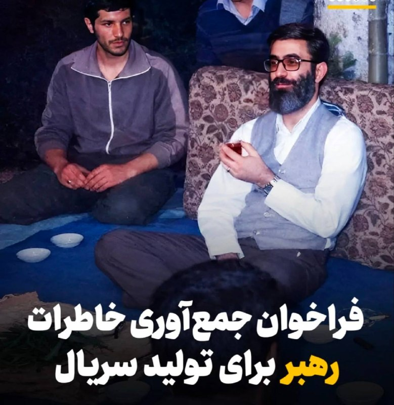

🔴 رسانه های حکومتی :

هرکی‌ با خامنه ای خاطره داره بیاد برامون تعریف کنه میخوایم سریال بسازیم ازش.

@IranianMinds

## BBCPersian — post 281590

🔻کاخ سفید شرکت ترامپ در اجلاس ماه آینده گروه هفت را تایید کرد

🔻کاخ سفید تایید کرده است که رئیس جمهور ترامپ علی‌رغم افزایش تنش با متحدانش، در اجلاس ماه آینده سران گروه هفت در فرانسه شرکت خواهد کرد.

پیش از این، تردیدهایی در مورد شرکت او در این رویداد در تفرجگاه اویان له بن در سواحل دریاچه ژنو وجود داشت.

گفته می‌شود آقای ترامپ مشتاق است که این نشست را بیش از آنچه که معمولاً گردهمایی‌های دیپلماتیک هستند، متمرکز بر تجارت کند.

میزبان او، رئیس جمهور امانوئل مکرون، پیش از این برنامه میزبانی شام پس از اجلاس در کاخ ورسای را به عنوان یک مشوق اضافی برای حضور آقای ترامپ پیشنهاد داد.

تاریخ‌های پیشنهادی این اجلاس قبلاً تغییر کرده بود تا با برنامه آقای ترامپ برای میزبانی یک مسابقه رزمی یو‌اف‌سی در کاخ سفید در هشتادمین سالگرد تولدش تداخل نداشته باشد.

https://bbc.in/3PsPDrq
@BBCPersian

## BBCPersian — post 281580

‌🖊آندره بیرناث
بی‌بی‌سی برزیل

🔻پایانی سرد، تاریک و تا حدی ملال‌آور. سرانجامی خشن و ویرانگر. یا شاید پایانی که آغازی دیگر در دل خود دارد؟

این موارد از برجسته‌ترین نظریه‌ها درباره این هستند که پایان جهان در آینده‌ای بسیار، بسیار دور ممکن است چه شکلی داشته باشد؛ البته اگر اصلا پایانی در کار باشد.

سرنوشت جهان یکی از اسرار‌آمیز‌ترین پرسش‌های علم است. حتی دانشمندان هم باور دارند که پرسش‌ها بیش از پاسخ‌هاست.

برای آنکه برخی از راه‌هایی که جهان ممکن است به پایان برسد را دریابیم ابتدا باید بفهمیم جهان چگونه آغاز شده است.

متن کامل خبر را از لینک زیر بخوانید:
https://bbc.in/4dSPuqm

📷Getty/ Fotograzia via Getty Images/ FlashMovie via GettyImages/ Arctic Images via Getty Images/ Fotograzia via Getty Images

@BBCPersian

## BBCPersian — post 281579

🔻نفتکش کره‌ جنوبی «با همکاری مقام‌های ایرانی» در حال عبور از تنگه هرمز است

🔻چو هیون، وزیر امور خارجه کره جنوبی، روز چهارشنبه گفت که یک نفتکش کره‌ای حامل نفت خام با همکاری مقام‌های ایرانی در حال عبور از تنگه هرمز است.

او در اظهارات خود در جلسه استماع پارلمان در سئول، جزئیات بیشتری در مورد این کشتی ارائه نکرد.

داده‌های کشتیرانی شرکت ال‌اس‌ای‌جی روز چهارشنبه نشان می‌دهد که ابرنفتکش یونیورسال وینر با پرچم کره جنوبی و حامل ۲ میلیون بشکه نفت خام کویت، در حال خروج از تنگه هرمز است.

عبور این نفتکش کره‌ای با همکاری مقام‌های ایران پس از آن صورت می‌گیرد که حدود دو هفته پیش (۱۴ اردیبهشت / ۴ مه) کشتی باری کره‌ای «اچ‌ام‌ام نامو» در نزدیکی تنگه هرمز هدف «دو پهپاد ناشناس» قرار گرفت.
https://bbc.in/3RwznWP
@BBCPersian

## BBCPersian — post 281571

‌🖊لوئیز آنتونیو آراخو
بی‌بی‌سی برزیل

🔻هم‌زمان با جنگ ایران، وب‌سایت «دیبریف» مصاحبه‌ای خیالی با کارل فون کلاوزویتس منتشر کرد؛ ژنرال و نظریه‌پرداز پروسی قرن نوزدهم که اندیشه‌هایش دوباره در تحلیل جنگ‌های مدرن مورد توجه قرار گرفته است.

بئاتریس هویزر، رئیس آکادمی ستاد کل نیروهای مسلح آلمان، می‌گوید کلاوزویتس نخستین متفکری بود که جنگ را نه از منظر اخلاق و الهیات، بلکه به عنوان پدیده‌ای سیاسی و اجتماعی برای فهم ماهیت آن بررسی کرد.

اندیشه‌های کلاوزویتس بر چهره‌هایی چون دوک ولینگتون و ولادیمیر لنین تاثیر گذاشت و ایده‌های او همچنان یکی از مهم‌ترین چارچوب‌های نظری برای تحلیل جنگ محسوب می‌شود.

ساندرو تیشیرا موئیتا، استاد علوم نظامی، می‌گوید ابهام درباره اهداف آمریکا در جنگ ایران نشان می‌دهد تحلیلگران همچنان از مفاهیم کلاوزویتس برای فهم استراتژی، قدرت و اهداف سیاسی در جنگ استفاده می‌کنند.

هیو استراون، استاد روابط بین‌الملل، می‌گوید مفهوم مشهور کلاوزویتس درباره «ادامه سیاست با ابزارهایی دیگر» همچنان برای فهم جنگ ایران کاربرد دارد؛

لینک خبر کامل:

https://bbc.in/49M0mUD
📷Getty Images/BBCImages

@BBCPersian

## Dirty_Kids — post 389793

  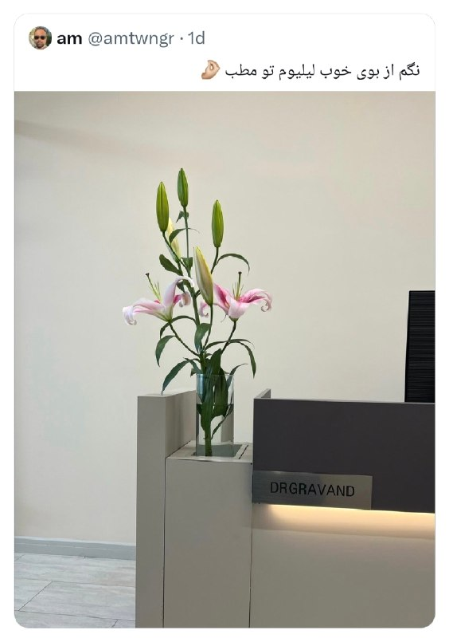

لیلیوم خارج از مطب بو گوز میده؟

@Dirty_Kids 👻

## Dirty_Kids — post 389792

  <a href="telegram/content/Dirty_Kids_389792_1779267119.mp4" target="_blank">🎬 Download video</a>

در قطر، کشور دوست و مثلا برادر سیاسی‌مذهبی‌تون، جلو تعداد محدود ایرانی هم هیچ غلطی نتونستید بکنید؛ آمریکای شمالی که دیگه جای صدها هزار ایرانیِ ملی‌گراست. ✌️👑

@Dirty_Kids 👻

## Dirty_Kids — post 389791

  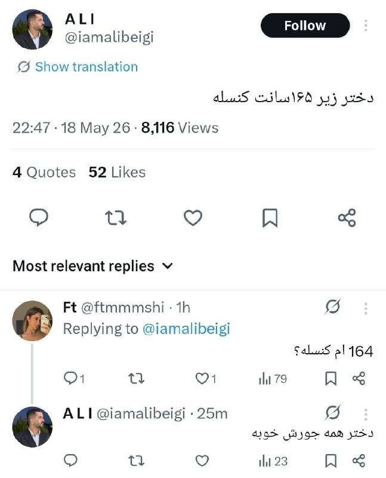

‏به این میگن عقب‌نشینی استراتژیک.

@Dirty_Kids 👻

## Dirty_Kids — post 389790

خیلی دلم میخواد تو مترو با یه دختر دوست بشم، دیت اول با ماشینم برم دنبالش پشماش بریزه اون لحظه که تیبا ۲ رو میبینه و بفهمه هرکی سوار مترو میشه فقیر نیست.

@Dirty_Kids 👻

## Dirty_Kids — post 389789

  

فرزند ایران و کشته شده در راه وطن #امیرحسین_الوند

@Dirty_Kids 👻

## Dirty_Kids — post 389788

  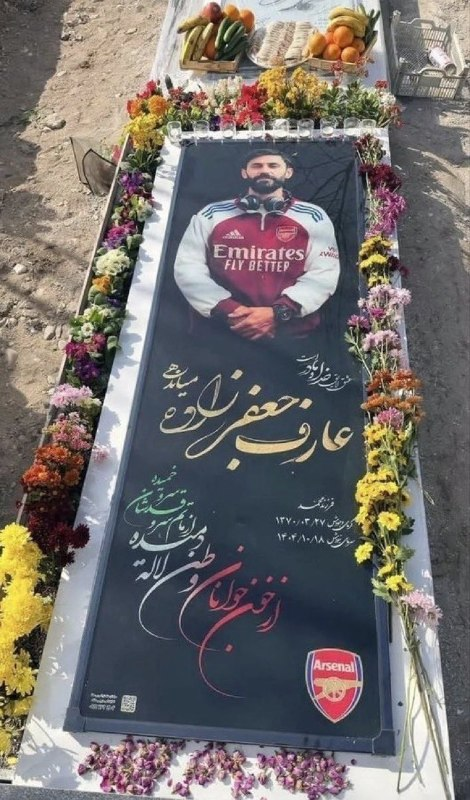

عارف‌ عزیز، آرسنال، تیم محبوبت قهرمان شد.

@Dirty_Kids 👻

## Dirty_Kids — post 389787

  

حاصل جفتگیری قالیباف و میرسلیم:

@Dirty_Kids 👻

## Hranews — post 113053

  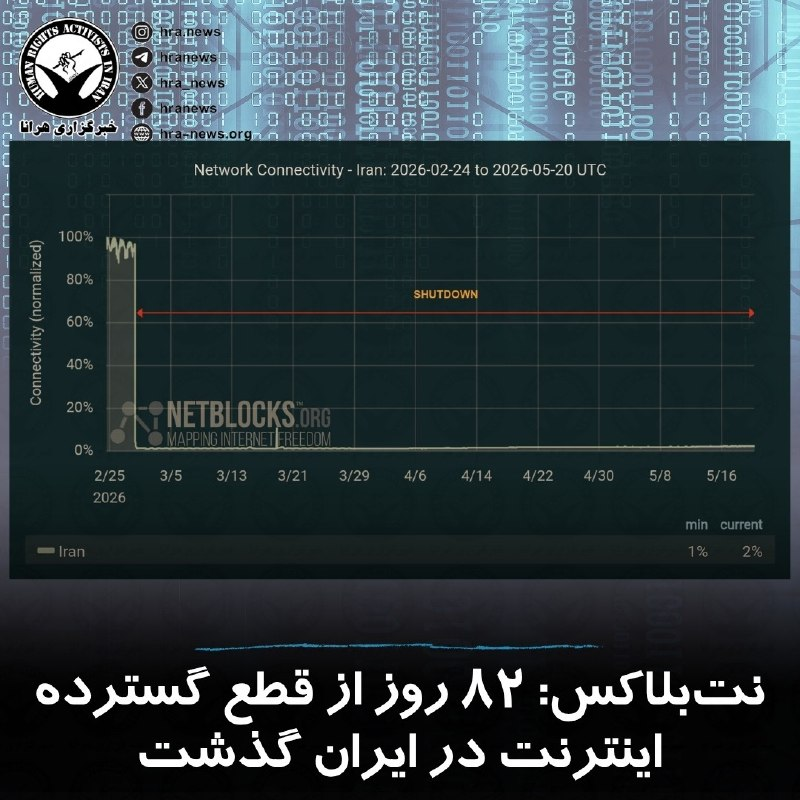

بر اساس آخرین داده‌های نت‌ بلاکس، قطع گسترده اینترنت در ایران وارد هشتاد و دومین روز خود شده و این کشور پس از بیش از ۱۹۴۴ ساعت، همچنان تا حد زیادی از دسترسی به اینترنت جهانی محروم است. این نهاد ناظر بر وضعیت دسترسی به #اینترنت در جهان اعلام کرد که در شرایطی که حتی اختلالات چند دقیقه‌ای در بسیاری از کشورها بحران تلقی می‌شود، تداوم این وضعیت در ایران رکوردهای بی‌سابقه‌ای را ثبت کرده است.

↘️
@hranews_bot تماس ✉️ - @Hranews کانال هرانا 🆑

## Hranews — post 113052

یک شهروند در شهرستان ری بازداشت شد؛ طرح ادعای ارتباط با اسرائیل

❗️
❗️
❗️
❗️
❗️– دادستان شهرستان ری از بازداشت یک شهروند در جنوب این شهرستان خبر داد. این مقام قضایی، مدعی همکاری اطلاعاتی فرد بازداشتی با سرویس جاسوسی اسرائیل شده است.

ادامه مطلب

↘️
@hranews_bot تماس ✉️ - @Hranews کانال هرانا 🆑

## Hranews — post 113051

پژمان جمشیدی به ۹۹ ضربه شلاق محکوم شد

❗️
❗️
❗️
❗️
❗️– وکیل مدافع پژمان جمشیدی، بازیگر سینما و تلویزیون، از صدور حکم ۹۹ ضربه #شلاق تعزیری توسط دادگاه کیفری تهران برای موکل خود خبر داد. به گفته وکیل، این رای از بابت اتهامی موسوم به «مادون زنا» صادر شده و اتهامات اصلی مطرح‌شده در این پرونده در دادگاه رد شده است.

#پژمان_جمشیدی

ادامه مطلب

↘️
@hranews_bot تماس ✉️ - @Hranews کانال هرانا 🆑

## Hranews — post 113050

  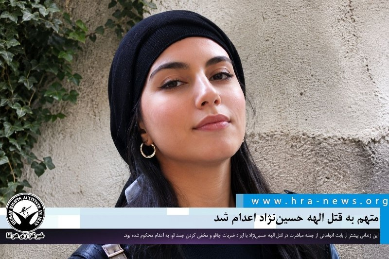

متهم به قتل الهه حسین‌نژاد اعدام شد

❗️
❗️
❗️
❗️
❗️– مرکز رسانه قوه قضاییه از اجرای حکم #اعدام متهم به قتل الهه حسین‌نژاد، خبر داد.

#الهه_حسین‌نژاد

ادامه مطلب

↘️
@hranews_bot تماس ✉️ - @Hranews کانال هرانا 🆑

## manototv — post 105669

  

به گزارش خبرگزاری‌های داخلی، حکم اعدام بهمن فرزانه، قاتل الهه حسین‌نژاد، بامداد چهارشنبه اجرا شده است.
الهه حسین‌نژاد، زن ۲۴ ساله، خرداد سال گذشته هنگام بازگشت به خانه در تهران ناپدید شد و حدود ۱۰ روز بعد پیکر او با چندین ضربه چاقو در بیابان‌های اطراف تهران پیدا شد.
خبرگزاری میزان، وابسته به قوه قضاییه جمهوری اسلامی، اعلام کرده این حکم پس از طی مراحل قانونی و با درخواست اولیای دم اجرا شده است.

## manototv — post 105668

  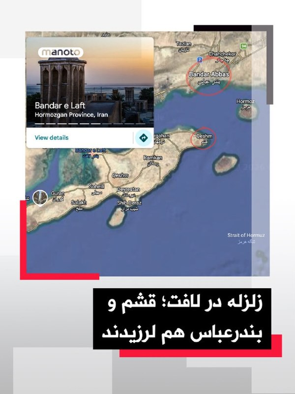

زمین‌لرزه‌ای به بزرگی ۴.۷ بامداد چهارشنبه ۳۰ اردیبهشت حوالی لافت در استان هرمزگان را لرزاند. مرکز لرزه‌نگاری کشوری عمق این زلزله را ۲۰ کیلومتر اعلام کرده است. این زمین‌لرزه در بخش‌هایی از قشم، هرمز و مناطق روستایی بندرعباس نیز احساس شد. مقام‌های محلی می‌گویند تاکنون گزارشی از خسارت دریافت نشده، اما بررسی‌ها در مناطق نزدیک به کانون زلزله ادامه دارد.

## manototv — post 105667

  <a href="telegram/content/manototv_105667_1779267132.mp4" target="_blank">🎬 Download video</a>

دونالد ترامپ، رئیس‌جمهور آمریکا، بار دیگر مدعی شد که ایالات متحده جنگ با جمهوری اسلامی را «خیلی سریع» پایان خواهد داد و تهران «به‌شدت» خواهان توافق است.
ترامپ در جریان مراسم سالانه پیک‌نیک کنگره در محوطه جنوبی کاخ سفید گفت توافق با تهران «اتفاق خواهد افتاد و سریع هم اتفاق می‌افتد».
او همچنین مدعی شد با پایان این بحران، قیمت نفت «به‌شدت کاهش خواهد یافت».
این اظهارات پس از آن مطرح می‌شود که ترامپ اوایل هفته گفته بود تهران برای رسیدن به توافق «التماس» می‌کند و او تنها یک ساعت با صدور دستور حملات تازه علیه جمهوری اسلامی فاصله داشته است.
ترامپ گفت به درخواست متحدان خلیج فارس آمریکا، حملات را متوقف کرده تا به گفته او، «مذاکرات جدی» ادامه پیدا کند. با این حال، او هشدار داد اگر جمهوری اسلامی به توافق نرسد، آمریکا برای یک «حمله کامل» آماده است.

## manototv — post 105666

  

شی جین‌پینگ، رئیس‌جمهوری چین، در دیدار با ولادیمیر پوتین در پکن خواستار توقف فوری درگیری‌ها در خاورمیانه شد و گفت پایان جنگ می‌تواند به کاهش اختلال در عرضه انرژی و زنجیره‌های تجارت جهانی کمک کند.

شی جین‌پینگ روز چهارشنبه، ۲۰ مه ۲۰۲۶، در دیدار با ولادیمیر پوتین در تالار بزرگ خلق پکن گفت وضعیت خاورمیانه در مرحله‌ای حساس میان جنگ و صلح قرار دارد و توقف درگیری‌ها «فوری‌ترین ضرورت» است. او تأکید کرد بازگشت به جنگ قابل قبول نیست و مسیر مذاکره باید در اولویت قرار گیرد. به گفته رئیس‌جمهور چین، پایان زودهنگام درگیری‌ها می‌تواند از اختلال بیشتر در عرضه انرژی و عملکرد زنجیره‌های صنعتی و تجاری جلوگیری کند.

پوتین نیز در آغاز این دیدار گفت روابط روسیه و چین به سطحی «بی‌سابقه» رسیده و از شی جین‌پینگ دعوت کرد سال آینده به روسیه سفر کند. رئیس‌جمهوری روسیه همچنین همکاری دو کشور را عاملی برای «بازدارندگی و ثبات» در روابط بین‌الملل توصیف کرد.

بر اساس گزارش‌ها، دو طرف در این دیدار درباره انرژی، امنیت و روابط کلی مسکو و پکن گفت‌وگو کردند و با تمدید پیمان دوستی چین و روسیه موافقت کردند؛ پیمانی که نخستین‌ب

## manototv — post 105665

  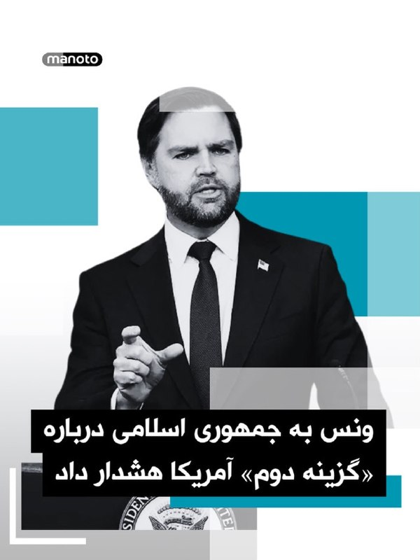

جی‌دی ونس، معاون رئیس‌جمهور آمریکا، گفت واشینگتن در برابر جنگ با ایران دو مسیر پیش رو دارد: ادامه مذاکره یا ازسرگیری عملیات نظامی.

جی‌دی ونس در نشست خبری کاخ سفید گفت آمریکا در برابر ایران «دو مسیر» دارد.

به گفته ونس، مسیر اول مذاکره است. او گفت دونالد ترامپ از تیم خود خواسته با جمهوری اسلامی «تهاجمی» مذاکره کنند.

ونس گفت آمریکا در موضوع اصلی، یعنی جلوگیری از دستیابی ایران به سلاح هسته‌ای، پیشرفت زیادی داشته و واشینگتن فکر می‌کند تهران خواهان توافق است.

او مسیر دوم را ازسرگیری عملیات نظامی دانست و گفت: «گزینه دوم این است که کارزار نظامی را دوباره شروع کنیم تا اهداف آمریکا دنبال شود.»

ونس گفت این مسیر چیزی نیست که ترامپ بخواهد و فکر نمی‌کند جمهوری اسلامی هم خواهان آن باشد.

او در پایان گفت: «برای توافق، دو طرف لازم است.»

## manototv — post 105664

  <a href="telegram/content/manototv_105664_1779267134.mp4" target="_blank">🎬 Download video</a>

«سکوت ما همدستی با جمهوری اسلامی است»

## alonews — post 121244

  <a href="telegram/content/alonews_121244_1779267135.mp4" target="_blank">🎬 Download video</a>

👈مراسم عروسی جان فداها: عروس رفته تنگه هرمز گل بچینه!

✅ @AloNews خبر جنگ

## alonews — post 121243

  <a href="telegram/content/alonews_121243_1779267136.webm" target="_blank">🎬 Download video</a>

👈حملات اسرائیل به جنوب لبنان

✅ @AloNews خبر جنگ

## alonews — post 121242

  <a href="telegram/content/alonews_121242_1779267136.webm" target="_blank">🎬 Download video</a>

👈فرمانده سنتکام دلیل خروج ناوگروه «جرالد فورد» از خاورمیانه را اعلام کرد

🔴«برد کوپر»، فرمانده ستاد فرماندهی مرکزی آمریکا (سنتکام)، علت خروج ناوگروه «جرالد فورد» از منطقه خاورمیانه را تشریح کرد.

🔴دریاسالار کوپر عنوان داشت که «نیازی به حضور همزمان سه ناوگروه حامل پرچم در خاورمیانه نبود.»

🔴وی افزود که ناوگروه‌های «جورج بوش» و «آبراهام لینکلن» همچنان در منطقه حضور دارند. کوپر گفت: «نیازی پایدار به وجود سه ناو هواپیمابر در منطقه احساس نمی‌شد.»

✅ @AloNews خبر جنگ

## alonews — post 121241

  <a href="telegram/content/alonews_121241_1779267136.webm" target="_blank">🎬 Download video</a>

👈ارتش سوریه با یک واحد اصلی در تمرین نظامی EFES-2026 ارتش ترکیه شرکت می‌کند.

🔴این اولین بار است که نیروهای سوریه از زمان تغییر حکومت در یک تمرین نظامی خارج از سوریه شرکت می‌کنند.

✅ @AloNews خبر جنگ

## alonews — post 121240

  <a href="telegram/content/alonews_121240_1779267136.mp4" target="_blank">🎬 Download video</a>

👈شی جین‌پینگ: رئیس‌جمهور پوتین قبلاً برای بیست و پنجمین بار به چین سفر کرده است

🔴این به خودی خود نشان‌دهنده سطح بالا و ماهیت خاص روابط چین و روسیه است.

✅ @AloNews خبر جنگ

## alonews — post 121239

  <a href="telegram/content/alonews_121239_1779267139.mp4" target="_blank">🎬 Download video</a>

👈تصاویری از لحظه وقوع انفجار روز گذشته در دمشق

✅ @AloNews خبر جنگ

## alonews — post 121238

  <a href="telegram/content/alonews_121238_1779267150.webm" target="_blank">🎬 Download video</a>

👈بیانیه مشترک چین و روسیه:
ما از طرف‌های درگیر در خاورمیانه می‌خواهیم که وارد مذاکره شوند.

🔴هیچ کشوری یا مردمی درجه یک نیست و سلطه به هر شکلی غیرقابل قبول است

✅ @AloNews خبر جنگ

## alonews — post 121237

  <a href="telegram/content/alonews_121237_1779267150.webm" target="_blank">🎬 Download video</a>

👈 دو نفتکش چینی پس از دو ماه معطلی در خلیج فارس، روز چهارشنبه از تنگه هرمز عبور کردند.

✅ @AloNews خبر جنگ

## alonews — post 121236

  <a href="telegram/content/alonews_121236_1779267150.webm" target="_blank">🎬 Download video</a>

👈کشت خشخاش ممنوع شد

✅ @AloNews خبر جنگ

## alonews — post 121235

  <a href="telegram/content/alonews_121235_1779267151.webm" target="_blank">🎬 Download video</a>

👈پژمان جمشیدی از اتهام آدم ربایی و تجاوز به عنف تبرئه شده و به دلیل رابطه نامشروع به ۹۹ ضربه شلاق محکوم شده

✅ @AloNews خبر جنگ

## alonews — post 121234

  <a href="telegram/content/alonews_121234_1779267151.webm" target="_blank">🎬 Download video</a>

👈علی قلهکی، فعال رسانه‌ای: چین دیگر تمایلی به حفظ وضعیت فعلی تنگه هرمز توسط ایران ندارد و بنظر می‌رسد به زودی در بحث تنگه هرمز رودروی ایران قرار گیرد؛ آنها معتقدند ایران باید زودتر تنگه را «تعیین تکلیف» کند.

✅ @AloNews خبر جنگ

## alonews — post 121233

  <a href="telegram/content/alonews_121233_1779267151.webm" target="_blank">🎬 Download video</a>

👈گویا بخشی از اموال توقیف شده علی کریمی بدون مزایده به یک شخص دیگه واگذار شده!!!!

✅ @AloNews خبر جنگ

## alonews — post 121232

  <a href="telegram/content/alonews_121232_1779267151.webm" target="_blank">🎬 Download video</a>

👈وزارت خارجه روسیه: ایران از «پیمان منع گسترش سلاح‌های هسته‌ای» (ان‌پی‌تی) خارج نخواهد شد

✅ @AloNews خبر جنگ

## alonews — post 121231

  <a href="telegram/content/alonews_121231_1779267151.webm" target="_blank">🎬 Download video</a>

👈الجزیره: پوتین در پکن همان استقبالی که از ترامپ شد را دریافت کرد

🔴 تنها تفاوت در این بود که چه کسی در فرودگاه از او استقبال کرد؛ این فرد در مورد ترامپ، معاون رئیس‌جمهور بود و برای پوتین، وزیر امور خارجه

✅ @AloNews خبر جنگ

## alonews — post 121230

  <a href="telegram/content/alonews_121230_1779267151.webm" target="_blank">🎬 Download video</a>

👈شبکه ۱۲ اسرائیل :
- اسرائیل و آمریکا برنامه ریزی کردن احمدی‌نژاد رو به‌عنوان رهبر ایران سر کار بیارن

✅ @AloNews خبر جنگ

## alonews — post 121229

  <a href="telegram/content/alonews_121229_1779267152.webm" target="_blank">🎬 Download video</a>

👈سپاه پاسداران: با تکرار تجاوز دشمن، جنگ را فرامنطقه‌ای می‌کنیم

✅ @AloNews خبر جنگ

## alonews — post 121228

  <a href="telegram/content/alonews_121228_1779267152.webm" target="_blank">🎬 Download video</a>

👈پل مرقص، وزیر اطلاع‌رسانی لبنان در مصاحبه با «العربیه» گفت: «رئیس‌جمهور لبنان خواهان تثبیت آتش‌بس جهت موفقیت روند مذاکرات است.»

🔴او افزود لبنان با هدف دستیابی به حقوق حاکمیتی خود با ایالات متحده آمریکا همکاری می‌کند.
این وزیر لبنانی در ادامه گفت نبیه بری، رئیس پارلمان لبنان، «لحظه‌به‌لحظه» در جریان مذاکرات با اسرائیل طی دو روز گذشته قرار داشته است.

🔴مرقص افزود مذاکرات با اسرائیل با هماهنگی قانونی رئیس‌جمهور و نخست‌وزیر انجام می‌شود.

✅ @AloNews خبر جنگ

## alonews — post 121227

  <a href="telegram/content/alonews_121227_1779267152.webm" target="_blank">🎬 Download video</a>

👈رادار کلادفلر خبر از افزایش ترافیک‌ اینترنت ایران می‌دهد

✅ @AloNews خبر جنگ

## alonews — post 121226

  <a href="telegram/content/alonews_121226_1779267152.webm" target="_blank">🎬 Download video</a>

👈بدون شرح

✅ @AloNews خبر جنگ

## alonews — post 121225

  <a href="telegram/content/alonews_121225_1779267152.webm" target="_blank">🎬 Download video</a>

👈 میانجی‌های منطقه‌ای و مقامات آمریکایی به WSJ می‌گویند: موضع ایران در مذاکرات با آمریکا عمدتاً بدون تغییر نسبت به پیشنهادات قبلی باقی مانده است.

🔴ایران همچنان خواستار پایان خصومت‌ها، تسهیلات مالی، غرامت برای خسارات جنگ و نقشی در نظارت بر تنگه هرمز است، در حالی که با خواسته‌های آمریکا برای تعطیلی یا تعلیق بلندمدت برنامه هسته‌ای خود در تضاد باقی مانده است.

✅ @AloNews خبر جنگ

<!-- MSG END -->

<!-- NAV START -->

<a href="https://github.com/Tljn/FUD/blob/main/telegram/content/archive_1.md" style="display:inline-block; padding:6px 12px; margin:0 4px; background-color:#2ea44f; color:white; text-decoration:none; border-radius:4px; font-weight:bold;">صفحه بعد</a>

<!-- NAV END -->
