# خواننده تلگرام

<!-- TOP_NAV START -->

<a href="https://github.com/Tljn/FUD/blob/main/telegram/content/archive_1.md" style="display:inline-block; padding:6px 12px; margin:0 4px; background-color:#2ea44f; color:white; text-decoration:none; border-radius:4px; font-weight:bold;">صفحه بعد</a>

<!-- TOP_NAV END -->

<!-- MSG START -->

---
📅 بروزرسانی: 1405/03/27 10:33
---

## VahidOOnLine — post 245971

  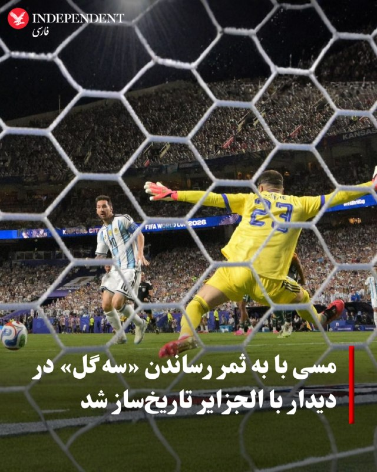

♦️لیونل مسی، مهاجم ۳۸ ساله تیم ملی آرژانتین پس از آنکه سه بار دروازه الجزایر را در نخستین دیدار جام جهانی باز کرد، رکورد بهترین گل‌ زن تاریخ جام جهانی را در کنار میروسلاو کلوزه آلمانی به دست آورد.

این اولین «هت‌تریک» (سه‌ گل در یک بازی) مسی در جام جهانی بود، شاهکاری که تنها کریستیانو رونالدو به آن دست یافته است.

جادوگر آلبی‌سلسته‌ها در دقیقه ۷۹ در میان تشویق و احترام تماشاگران تعویض شد.
‌🇸🇦 Indypersian

🤖 @VahidOOnLine

## VahidOOnLine — post 245970

  <a href="telegram/content/VahidOOnLine_245970_1781679836.mp4" target="_blank">🎬 Download video</a>

جی‌دی ونس، معاون رییس‌جمهوری آمریکا، ادعای پرداخت پول از سوی واشینگتن به تهران را رد کرد و گفت جمهوری اسلامی تا زمانی که به حمایت مالی از حزب‌الله و دیگر گروه‌های مورد حمایت خود ادامه دهد، از مزایای اقتصادی توافق بهره‌مند نخواهد شد.

گزارش مریم رحمتی، خبرنگار ایران‌اینترنشنال
‌🏁 🇬🇧 IranintlTV

🤖 @VahidOOnLine

## VahidOOnLine — post 245969

🗣روایت شما از بحران اقتصادی و زندگی بعد از توافق- چهارشنبه ۲۷ خرداد:

🔹زیر سایه این حکومت سوختیم. چشم‌مون را روی همه آرزوهامون بستیم. مثل تراکتور کار کردیم، تنها دلخوشی‌مون خانواده بود تا یک زندگی بسازیم به‌بهای برباد رفتن جوونی‌مون. حالا که بچه‌ها بزرگ شدند، دردمون هزار برابر شده با خرج‌های کمرشکن و دغدغه آینده بچه‌ها.

🔹هزینه‌های پزشکی مخصوصا ارتوپدی کمرشکن شده؛ یک صندل و کفی برای کفش شده ۹ میلیون و ۵۰۰ هزار تومان. کف پای دخترم صافه و هزینه عمل می‌شه ۲۵۰ میلیون تومان.

🔹بعد از اختلالی که در بانک تجارت پیش اومد، مبالغی که از پوز تجارت کارت کشیده شده به حسابمون برنگشته. دزدی در روز روشن؟

🔹من یه دست‌فروش خرده‌فروشم. کل سرمایه‌ام همون جنسیه که هر روز می‌فروشم. حالا که بانک تجارت پولی که مشتریام کارت کشیدن رو به حسابم واریز نمی‌کنه، چطور جنس جدید بیارم؟ سه روزه نمی‌تونم برم بازار.

🔹بیمار قلبی هستم؛ طی کمتر از یک ماه، قیمت داروهایم از ۳.۵ میلیون به ۱۴ میلیون و ۷۰۰ هزار تومان رسیده است.

🔹یک شانه تخم‌مرغ شده ۴۹۵ هزار تومان، نیم کیلو گوشت چرخ کرده مخلوط گوسفند و گوساله ۶۲۵ هزار تومان، یه رب گوجه ۴۰۰ گرمی ۱۰۰ هزار تومان.
‌🏁 🇬🇧 IranintlTV

🤖 @VahidOOnLine

## VahidOOnLine — post 245968

  <a href="telegram/content/VahidOOnLine_245968_1781679838.mp4" target="_blank">🎬 Download video</a>

♦️تصاویر «دست دادن با اکراه» دونالد ترامپ، رئیس جمهوری آمریکا با امانوئل مکرون، رئیس جمهوری فرانسه در جریان نشست سران گروه ۷ (جی ۷) خبرساز شده است.

در این ویدیو دیده می‌شود که در زمان گرفتن عکس رهبران دو کشور، مکرون پس از درخواست خبرنگاران، دستش را به سوی دونالد ترامپ دراز می‌کند اما رئیس جمهوری آمریکا، برخلاف دست دادن‌های طولانی و «پرفشار» سابق، این بار با بی‌میلی تمام با همتای فرانسوی دست می‌دهد.

خبرنگار شبکه ب‌اف‌ام فرانسه، این وضعیت را با دست دادن طولانی‌مدت و گرم ترامپ با برژیت مکرون در جریان همین اجلاس مقایسه کرد.
‌🇸🇦 Indypersian

🤖 @VahidOOnLine

## VahidOOnLine — post 245967

⭕️۱۴ بند یادداشت تفاهم تهران و واشنگتن به روایت بلومبرگ؛ تا دستیابی به توافق نهایی، ایران سطح کنونی برنامه هسته‌ای را حفظ می‌کند

📌آمریکا متعهد می‌شود با توجه به پیشرفت مذاکرات رسیدن به توافق نهایی،منابع مالی مسدود شده ایران آزاد شوند؛این منابع،چه در حساب‌های اصلی نگهداری شوند و چه منتقل شوند،برای پرداخت به هر ذی‌نفع نهایی که بانک مرکزی ایران تعیین کند، مورد استفاده قرار می‌گیرند

♦️انتظار می‌رود نمایندگان آمریکا و حکومت ایران روز جمعه یک یادداشت تفاهم امضا کنند که راه را برای ۶۰ روز مذاکره با هدف پایان دادن به جنگ و اعمال محدودیت‌های جدید بر برنامه هسته‌ای ایران هموار می‌کند.
بلومبرگ می‌گوید نسخه‌ای از این یادداشت تفاهم را مشاهده کرده و ۱۴ بند آن را به این ترتیب شرح داده است:

بیشتر بخوانید...
‌🇸🇦 Indypersian

🤖 @VahidOOnLine

## VahidOOnLine — post 245966

  <a href="telegram/content/VahidOOnLine_245966_1781679839.mp4" target="_blank">🎬 Download video</a>

سرخط خبرهای چهارشنبه ۲۷ خرداد
‌🏁 🇬🇧 IranintlTV

🤖 @VahidOOnLine

## VahidOOnLine — post 245965

  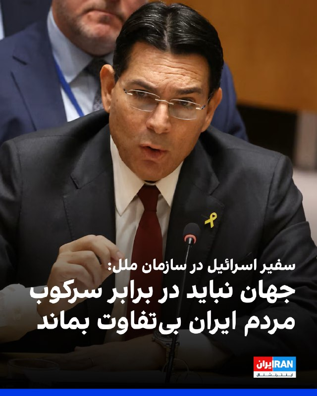

دنی دانون، سفیر اسرائیل در سازمان ملل، با بازنشر گزارشی از شبکه ۱۴ اسرائیل درباره کشتار دی‌ماه، در ایکس نوشت: «قربانیان سرکوب در ایران و خانواده‌های آن‌ها شایسته حقیقت، شفافیت و پاسخگویی هستند. جامعه بین‌المللی نباید در برابر این وضعیت بی‌تفاوت بماند.»
او گفت: «تاریخ حکومت ایران با رنج مردم خود نوشته شده است؛ اتاق‌های شکنجه، گورهای دسته‌جمعی، ناپدیدسازی اجباری و خانواده‌هایی که بدون پاسخ رها شده‌اند.»

‌🏁 🇬🇧 IranintlTV

🤖 @VahidOOnLine

## VahidOOnLine — post 245964

♦️سعید آجرلو، عضو تیم رسانه‌ای هیئت مذاکره‌کننده جمهوری اسلامی، با اشاره به منتشر نشدن متن یادداشت تفاهم با آمریکا گفت طرف آمریکایی از هدف و نیت مذاکره‌کنندگان ایرانی در به‌کار بردن برخی واژه‌ها و عبارات در متن آگاه نیست و به همین دلیل نباید این موارد علنی شود.
او با اشاره به انتقادها از برخی واژه‌های به‌کاررفته در متن گفت: «آمریکا مراد و قصد ما را از آوردن این کلمات نمی‌داند و نیتمان را نباید افشا کنیم.»
آجرلو همچنین گفت پس از روز جمعه امکان صحبت شفاف‌تر درباره متن تفاهم‌نامه وجود خواهد داشت و مدعی شد مقایسه نسخه‌های مختلف متن نشان می‌دهد آخرین نسخه تفاهم‌نامه نسبت به متن‌های اولیه، برای جمهوری اسلامی شرایط بهتری دارد.
‌🇸🇦 Indypersian

🤖 @VahidOOnLine

## VahidOOnLine — post 245963

♦️تیم ملی فوتبال نروژ در نخستین دیدار خود در جام جهانی ۲۰۲۶، موفق شد با نتیجه ۴ بر ۱ تیم ملی عراق را در ورزشگاه شهر بوستون آمریکا شکست دهد. این مسابقه از آن جهت اهمیت ویژه‌ای داشت که نروژ پس از ۲۸ سال و عراق پس از ۴ دهه انتظار بار دیگر در این تورنمنت بزرگ حضور یافته بودند.
به گزارش رویترز، ارلینگ هالند، ستاره ۲۵ ساله نروژ و آقای گل فصل گذشته لیگ برتر انگلیس که به او لقب «ترمیناتور» داده‌اند، قفل دروازه‌ها را در دقیقه ۲۸ باز کرد. اگرچه ایمن حسین، مهاجم ۳۰ ساله عراق در دقیقه ۳۹ بازی را به تساوی کشاند، اما هالند تنها سه دقیقه بعد گل دوم خود و نروژ را به ثمر رساند. در نیمه دوم نیز لئو اوستیگارد در دقیقه ۷۶ و کریستین ثورستود در وقت‌های تلف‌شده، پیروزی قاطع نروژ را کامل کردند. در دیدارهای بعدی این گروه که روز دوشنبه ۱ تیر برگزار می‌شود، عراق به مصاف فرانسه می‌رود و نروژ برابر سنگال صف‌آرایی خواهد کرد.
‌🇸🇦 Indypersian

🤖 @VahidOOnLine

## VahidOOnLine — post 245962

  

ان‌بی‌سی نیوز به نقل از یک مقام آمریکایی گزارش داد از زمان امضای یادداشت تفاهم جمهوری اسلامی و آمریکا، سپاه هر شب چندین پهپاد را به سمت کشتی‌های تجاری در تنگه هرمز پرتاب کرده، اما نیروهای آمریکا آنها را رهگیری کرده‌اند.
این مقام گفت ارتش آمریکا همچنان برای حمایت از عبور ایمن کشتی‌ها از تنگه هرمز، با شرکت‌های کشتیرانی تجاری هماهنگی می‌کند.

‌🏁 🇬🇧 IranintlTV

🤖 @VahidOOnLine

## VahidOOnLine — post 245961

  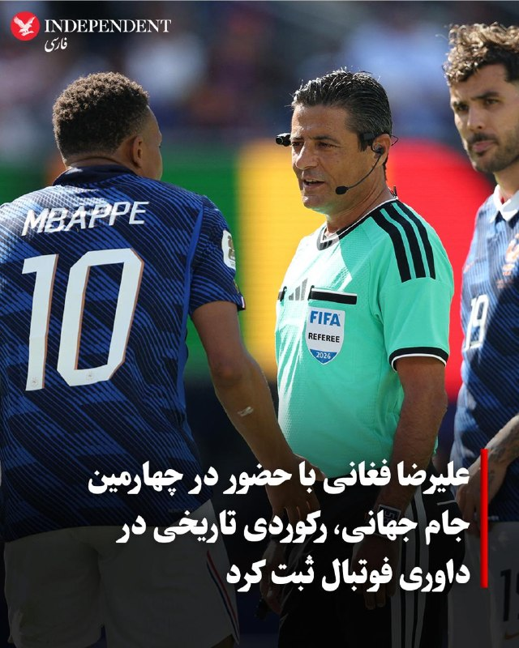

♦️علیرضا فغانی، داور بین‌المللی فوتبال، با قضاوت دیدار فرانسه و سنگال در جام جهانی ۲۰۲۶، به یکی از نخستین داوران تاریخ فوتبال مردان تبدیل شد که در چهار دوره جام جهانی حضور داشته‌اند.
این داور باسابقه که در جام‌های جهانی ۲۰۱۴، ۲۰۱۸ و ۲۰۲۲ نیز حضور داشت، در سال ۲۰۱۴ به عنوان داور چهارم و در دو دوره بعدی به عنوان داور وسط در این رقابت‌ها فعالیت کرد. فغانی این بار پس از مهاجرت به استرالیا و خروج از فهرست داوران بین‌المللی ایران، به عنوان نماینده فدراسیون فوتبال استرالیا دیدار فرانسه و سنگال را قضاوت کرد.
این رکورد تاریخی در حالی ثبت شد که قوه قضاییه جمهوری اسلامی چند ماه پیش از توقیف اموال علیرضا فغانی به دلیل مخالفت با سیاست‌های حکومت خبر داده بود.
‌🇸🇦 Indypersian

🤖 @VahidOOnLine

## VahidOOnLine — post 245960

  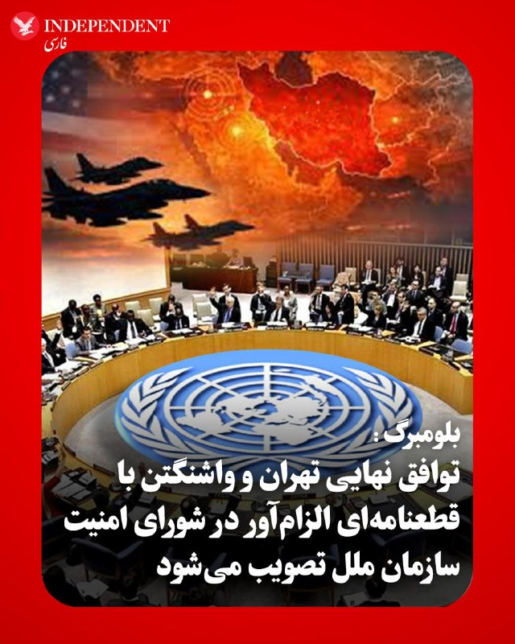

♦️خبرگزاری بلومبرگ در گزارشی اختصاصی، متن پیش‌نویس یک یادداشت تفاهم ۱۴ ماده‌ای میان ایالات متحده و ایران را منتشر کرد. بر اساس این گزارش، این تفاهم‌نامه مسیر را برای یک دوره ۶۰ روزه گفتگو با هدف پایان دادن به جنگ و اعمال محدودیت‌های جدید بر برنامه هسته‌ای ایران هموار می‌کند.
در بند چهاردهم این پیش‌نویس آمده است که ایران و آمریکا سازوکاری برای نظارت بر اجرای توافق نهایی و تعهدات آینده ایجاد خواهند کرد و توافق نهایی نیز از طریق یک قطعنامه الزام‌آور شورای امنیت سازمان ملل تایید خواهد شد.
بر اساس این سند، تهران و واشنگتن همچنین متعهد می‌شوند ظرف ۶۰ روز برای دستیابی به توافق نهایی مذاکره کنند و در این مدت وضعیت کنونی برنامه هسته‌ای ایران و تحریم‌های آمریکا حفظ شود.
‌🇸🇦 Indypersian

🤖 @VahidOOnLine

## WithYashar — post 15129

  <a href="telegram/content/WithYashar_15129_1781679843.mp4" target="_blank">🎬 Download video</a>

مایک پنس، معاون سابق ترامپ: «به نظر من بهتر است به نیروهای مسلح ایالات متحده اجازه دهیم کار را تمام کنند، تنگه را باز کنند و قابلیت‌های تهاجمی ایرانیان را از بین ببریم و به مردم ایران فرصتی واقعی برای آزادی بدهیم.»
@withyashar

## WithYashar — post 15128

چند ساعت پیش، دونالد ترامپ با استناد به قانون تولید دفاعی (یک قانون از سال ۱۹۵۰ در دوران جنگ سرد)، دستور داد تا تولید مهمات، موشک‌ها و تجهیزات دفاعی آمریکا سریع‌تر شود. این فرمان در ۱۱ ژوئن به وزیر دفاع پیته هگست ارسال شد و مشکلات سیستمی در صنعت مهمات را هدف گرفت: ظرفیت تولید محدود، زنجیره‌های تأمین ضعیف، وابستگی‌های طولانی‌مدت و گلوگاه‌های تولید.
هدف اصلی: تسریع تولید مهمات حیاتی، موشک‌ها و تجهیزات دفاعی برای دفاع ملی آمریکا.
نحوه اجرا: قانون به ترامپ اجازه می‌دهد با شرکت‌های خصوصی توافق‌های داوطلبه ایجاد کند، تولید را اولویت‌دار کند و زنجیره‌های تأمین را تقویت نماید.
توافق مهم: شرکت لاکهید مارتین اعلام کرد با دولت آمریکا برای چهار برابر کردن تولید مهمات حیاتی به توافق رسیده است.
دلیل اقدام: کاهش ذخایر تسلیحاتی آمریکا پس از جنگ با ایران و استفاده از مهمات در ایران و ونزوئلا، که باعث افزایش سفارشات مهمات شد.
@withyashar

## WithYashar — post 15127

  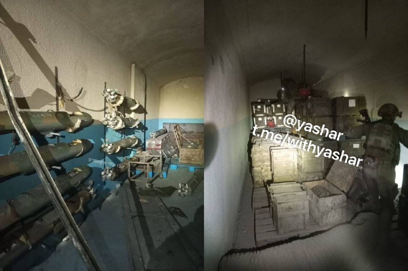

️ارتش اسرائیل اعلام کرد یک انبار تسلیحات جدید حزب‌الله حاوی ۵ تن مواد منفجره و ده‌ها پهپاد انتحاری را کشف کرده است
@withyashar

## WithYashar — post 15126

## WithYashar — post 15125

تنکر ترکرز: ۳.۸ میلیون بشکه نفت خام ایران از محاصره آمریکا عبور کرد تارنمای تنکر ترکز بامداد چهارشنبه گزارش داد، دو ابرنفتکش ایران که مجموعا حامل ۳.۸ میلیون بشکه نفت خام هستند، از محاصره آمریکا عبور کردند @withyashar

## WithYashar — post 15124

خبرنگار العربیه: جنگنده‌های اسرائیلی دو بار به شهرک‌های «انصاریه» و «المنصوره» در جنوب لبنان حمله کردند.
@withyashar

## WithYashar — post 15123

بلومبرگ: به گفته مقامات آمریکایی، معافیت فروش نفت ایران فقط شامل محموله‌های نفتی می‌شود که قبلاً بارگیری شده است و شامل مجوز گسترده‌تر برای از سرگیری فروش نفت ایران نمی‌شود @withyashar

## WithYashar — post 15122

## WithYashar — post 15121

دنی دانون، سفیر اسرائیل در سازمان ملل، با بازنشر گزارشی از شبکه 14 اسرائیل درباره کشتار دی‌ماه، در ایکس نوشت:
«قربانیان سرکوب در ایران و خانواده‌های آن‌ها شایسته حقیقت، شفافیت و پاسخگویی هستند. جامعه بین‌المللی نباید در برابر این وضعیت بی‌تفاوت بماند.»
او گفت: «تاریخ حکومت ایران با رنج مردم خود نوشته شده است؛ اتاق‌های شکنجه، گورهای دسته‌جمعی، ناپدیدسازی اجباری و خانواده‌هایی که بدون پاسخ رها شده‌اند.»
@withyashar

## WithYashar — post 15120

منابع عربی: اسرائیل حومۀ شهرک نبطیه‌الفوقا در جنوب لبنان را هدف حملات قرار داد
@withyashar

## WithYashar — post 15119

وبسایت خبری سمافور: مارکو روبیو، وزیر خارجه دولت ترامپ با انعقاد یادداشت تفاهم نامه با ایران مخالفت کرده و هیچ اظهار نظری درباره رسیدن به توافق با ایران نمی‌کند.

وزیر خارجه آمریکا امیدی به رسیدن به توافق هسته‌ای در مذاکرات با ایران پس از امضای یادداشت تفاهم نامه ندارد و تاکنون درباره امضای یادداشت تفاهم نامه با ایران کاملاً سکوت کرده است
@withyashar

## WithYashar — post 15118

  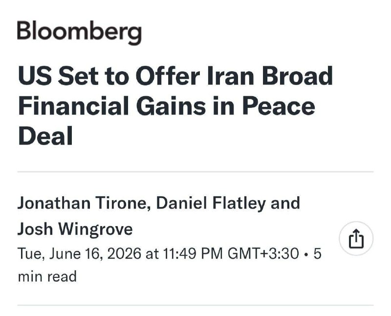

بلومبرگ: به گفته مقامات آمریکایی، معافیت فروش نفت ایران فقط شامل محموله‌های نفتی می‌شود که قبلاً بارگیری شده است و شامل مجوز گسترده‌تر برای از سرگیری فروش نفت ایران نمی‌شود
@withyashar

## WithYashar — post 15117

  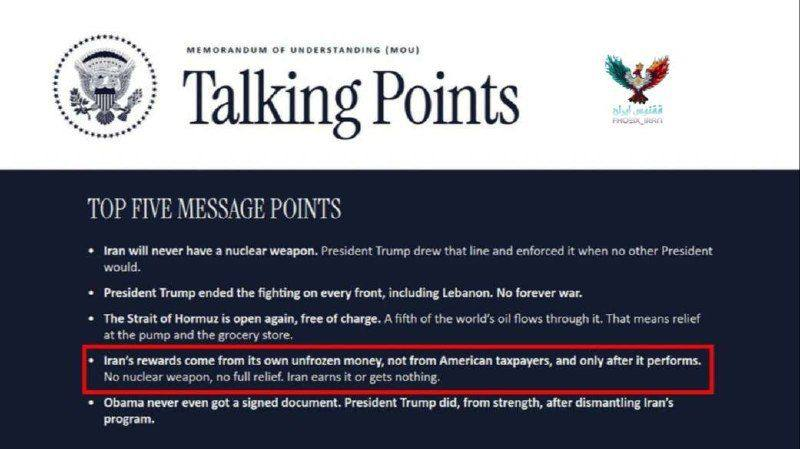

کاخ سفید:
«نه سلاح هسته‌ای، نه لغو کامل تحریم‌ها, نه پول»
@withyashar

## FoxNewsTwitter — post 343052

  <a href="telegram/content/FoxNewsTwitter_343052_1781679846.mp4" target="_blank">🎬 Download video</a>

Fox News (Twitter/X)

"If you believe that Jesus is the son of God, rose from the dead on the third day, there are a lot of progressives who will say you're a crazy person."

VP JD Vance took aim at what he called "progressive atheistic culture," arguing that many on the left dismiss traditional religious beliefs while embracing ideas he considers far less believable.

"Actually, you believe something that's far crazier and clearly a violation of nature." @Gutfeldfox

## FoxNewsTwitter — post 343051

  <a href="telegram/content/FoxNewsTwitter_343051_1781679848.mp4" target="_blank">🎬 Download video</a>

Fox News (Twitter/X)

"What really does bother me is that they don't show gratitude for the United States of America."

VP JD Vance blasted Democrats serving in public office during an appearance on @Gutfeldfox, arguing that too many spend their time criticizing the country rather than appreciating it.

Vance said he was raised to love America and be grateful for the opportunities it provides, calling patriotism a core value that shaped his upbringing.

He contrasted that outlook with what he sees from many on the left, saying a lack of appreciation for the country has become increasingly common in American politics.

## FoxNewsTwitter — post 343050

  <a href="telegram/content/FoxNewsTwitter_343050_1781679850.mp4" target="_blank">🎬 Download video</a>

Fox News (Twitter/X)

"Honestly Greg, I expected them to be absolutely vicious, and they were only a little bit vicious."

VP JD Vance is looking back on his recent appearance on The View and says it went better than he expected.

While appearing on @Gutfeldfox, Vance joked that "it wasn't as bad as I thought it was gonna be" despite sparring with the show's co-hosts over immigration, race, and his past "childless cat ladies" comments.

He even revealed what happened once the cameras stopped rolling: "Joy Behar even said during the break, not joking, she said, 'You know what, you're pretty good for a Republican.'"

## FoxNewsTwitter — post 343049

  <a href="telegram/content/FoxNewsTwitter_343049_1781679851.mp4" target="_blank">🎬 Download video</a>

Fox News (Twitter/X)

"Honestly Greg, I expected them to be absolutely vicious, and they were only a little bit vicious."

VP JD Vance is looking back on his recent appearance on The View and says it went better than he expected.

While appearing on Gutfeldfox, Vance joked that "it wasn't as bad as I thought it was gonna be" despite sparring with the show's co-hosts over immigration, race, and his past "childless cat ladies" comments.

He even revealed what happened once the cameras stopped rolling: "Joy Behar even said during the break, not joking, she said, 'You know what, you're pretty good for a Republican.'"

## FoxNewsTwitter — post 343048

  <a href="telegram/content/FoxNewsTwitter_343048_1781679853.mp4" target="_blank">🎬 Download video</a>

Fox News (Twitter/X)

"Donald Trump did exactly what he came to do."

VP JD Vance touted the administration's Iran strategy during an appearance on @Gutfeldfox, arguing that the U.S. achieved its core objectives and now holds the leverage moving forward.

"We accomplished what we set out to accomplish and now we have, as the president says, all the cards."

Vance pointed to the destruction of Iran's nuclear infrastructure and the ongoing negotiations with Tehran, saying any future economic benefits for Iran will depend entirely on whether it follows through on its commitments.

## pm_afshaa — post 94228

🔴وزیر دارایی اسرائیل، بزالئل سموتریچ:هیچ عقب‌نشینی از لبنان صورت نخواهد گرفت—نه تا جمعه و نه بعد از جمعه

💧 Rainbet.com the #1 Non-KYC Crypto Casino & Sportsbook @rainbetcom

😁 @Pm_Afshaa

## pm_afshaa — post 94227

  <a href="telegram/content/pm_afshaa_94227_1781679854.webm" target="_blank">🎬 Download video</a>

هنوز میرین گیگی 10 15 هزار تومن پول سرور میدین!؟
بیاین از اینجا سرعت بالاش رو بخرین فقط گیگی 3 هزار تومن
👇
👇
👇

⚡️ @Lex_Server

⚡️ @Lex_Server

## pm_afshaa — post 94225

🔴ارتش اسراییل: 4تروریست حزب‌الله که از حمایت ایران برخوردار بودند، در حملات جدید نیروهای دفاعی اسرائیل در جنوب لبنان کشته شدن

💧 Rainbet.com the #1 Non-KYC Crypto Casino & Sportsbook @rainbetcom

😁 @Pm_Afshaa

## VahidOnline — post 76439

  <a href="telegram/content/VahidOnline_76439_1781679855.mp4" target="_blank">🎬 Download video</a>

یک جت خصوصی تو یک اتوبان در تگزاس سقوط کرده، راننده‌ها رفتن کمک سرنشینها
J74wabx
یک نفر کشته شد؛ پنج نفر به دلیل استنشاق دود در بیمارستان بستری شدند.
AZ_Intel_

📡 @VahidOnline

## VahidOnline — post 76438

  

نخستین نفتکش‌های حامل نفت خام ایران از زمان آغاز محاصرۀ دریایی آمریکا، از تنگۀ هرمز خارج شدند. این موضوع را صبح چهارشنبه یکی از وب‌سایت‌های ردیابی کشتی‌ها اعلام کرد.

وبسایت «تنکر ترکِرز» (Tanker Trackers) که ذخیره و حمل‌ونقل محموله‌های نفتی را دنبال می‌کند، بر اساس داده‌های دیجیتال منطبق با تصاویر ماهواره‌ای، «اولین صادرات نفت خام ایران در دو ماه اخیر» را تأیید کرده است.
@VahidHeadline

📡 @VahidOnline

## IranIntlTV — post 342804

  <a href="telegram/content/IranIntlTV_342804_1781679856.mp4" target="_blank">🎬 Download video</a>

جی‌دی ونس، معاون رییس‌جمهوری آمریکا، ادعای پرداخت پول از سوی واشینگتن به تهران را رد کرد و گفت جمهوری اسلامی تا زمانی که به حمایت مالی از حزب‌الله و دیگر گروه‌های مورد حمایت خود ادامه دهد، از مزایای اقتصادی توافق بهره‌مند نخواهد شد.

گزارش مریم رحمتی، خبرنگار ایران‌اینترنشنال

## IranIntlTV — post 342803

🗣روایت شما از بحران اقتصادی و زندگی بعد از توافق- چهارشنبه ۲۷ خرداد:

🔹زیر سایه این حکومت سوختیم. چشم‌مون را روی همه آرزوهامون بستیم. مثل تراکتور کار کردیم، تنها دلخوشی‌مون خانواده بود تا یک زندگی بسازیم به‌بهای برباد رفتن جوونی‌مون. حالا که بچه‌ها بزرگ شدند، دردمون هزار برابر شده با خرج‌های کمرشکن و دغدغه آینده بچه‌ها.

🔹هزینه‌های پزشکی مخصوصا ارتوپدی کمرشکن شده؛ یک صندل و کفی برای کفش شده ۹ میلیون و ۵۰۰ هزار تومان. کف پای دخترم صافه و هزینه عمل می‌شه ۲۵۰ میلیون تومان.

🔹بعد از اختلالی که در بانک تجارت پیش اومد، مبالغی که از پوز تجارت کارت کشیده شده به حسابمون برنگشته. دزدی در روز روشن؟

🔹من یه دست‌فروش خرده‌فروشم. کل سرمایه‌ام همون جنسیه که هر روز می‌فروشم. حالا که بانک تجارت پولی که مشتریام کارت کشیدن رو به حسابم واریز نمی‌کنه، چطور جنس جدید بیارم؟ سه روزه نمی‌تونم برم بازار.

🔹بیمار قلبی هستم؛ طی کمتر از یک ماه، قیمت داروهایم از ۳.۵ میلیون به ۱۴ میلیون و ۷۰۰ هزار تومان رسیده است.

🔹یک شانه تخم‌مرغ شده ۴۹۵ هزار تومان، نیم کیلو گوشت چرخ کرده مخلوط گوسفند و گوساله ۶۲۵ هزار تومان، یه رب گوجه ۴۰۰ گرمی ۱۰۰ هزار تومان.

## IranIntlTV — post 342802

  

🔻تیم ملی فوتبال اتریش در اولین دیدار خود در جام جهانی ۲۰۲۶ از گروه J این رقابت‌ها با نتیجه ۳-۱ اردن را شکست داد.

🔹در این بازی ابتدا اشمید در دقیقه ۲۰ اتریش را پیش انداخت اما در دقیقه ۵۰ علی عولان گل تساوی را برای اردن به ثمر رساند.

🔹در ادامه همچنین علی عرب بازیکن اردن در دقیقه ۷۶ به اشتباه دروازه خودی را باز کرد. اما این پایان کار نبود و آرناتوویچ در دقیقه ۱۲+۹۰ از روی نقطه پنالتی گل سوم اتریش را وارد دروازه اردن کرد تا اتریش جام جهانی را با پیروزی قاطع آغاز کند.

@iranintltvsport

## IranIntlTV — post 342801

  <a href="telegram/content/IranIntlTV_342801_1781679857.mp4" target="_blank">🎬 Download video</a>

رویترز گزارش داد شرکت‌هایی از آمریکا، کشورهای عربی حاشیه خلیج فارس، آسیا، آفریقا و آمریکای جنوبی متعهد شده‌اند بیش از ۱۵۰ میلیارد دلار از منابع صندوق ۳۰۰ میلیارد دلاری بازسازی و توسعه ایران را تامین کنند
@iranintltv

## IranIntlTV — post 342800

  <a href="telegram/content/IranIntlTV_342800_1781679859.mp4" target="_blank">🎬 Download video</a>

جی‌دی ونس، معاون رییس‌جمهوری آمریکا، ادعای پرداخت پول از سوی واشینگتن به تهران را رد کرد و گفت جمهوری اسلامی تا زمانی که به حمایت مالی از حزب‌الله و دیگر گروه‌های مورد حمایت خود ادامه دهد، از مزایای اقتصادی توافق بهره‌مند نخواهد شد.

گزارش مریم رحمتی، خبرنگار ایران‌اینترنشنال
@iranintltv

## IranIntlTV — post 342799

  <a href="telegram/content/IranIntlTV_342799_1781679860.mp4" target="_blank">🎬 Download video</a>

سرخط خبرهای چهارشنبه ۲۷ خرداد

## IranIntlTV — post 342798

  

دنی دانون، سفیر اسرائیل در سازمان ملل، با بازنشر گزارشی از شبکه ۱۴ اسرائیل درباره کشتار دی‌ماه، در ایکس نوشت: «قربانیان سرکوب در ایران و خانواده‌های آن‌ها شایسته حقیقت، شفافیت و پاسخگویی هستند. جامعه بین‌المللی نباید در برابر این وضعیت بی‌تفاوت بماند.»
او گفت: «تاریخ حکومت ایران با رنج مردم خود نوشته شده است؛ اتاق‌های شکنجه، گورهای دسته‌جمعی، ناپدیدسازی اجباری و خانواده‌هایی که بدون پاسخ رها شده‌اند.»

https://iranintl.com/202606170389

## IranIntlTV — post 342797

  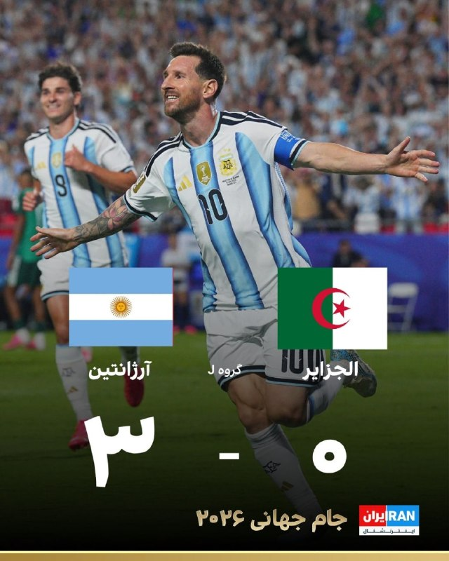

🔻تیم فوتبال آرژانتین، قهرمان دوره گذشته جام جهانی در اولین دیدار خود در جام جهانی ۲۰۲۶ با نتیجه ۳-۰ الجزایر را شکست داد.

🔹در این بازی لیونل مسی هر سه گل آلبی سلسته را به ثمر رساند و تعداد گل‌هایش در ادوار جام جهانی را به عدد ۱۶ رساند و به رکورد میروسلاو کلوزه، بهترین گلزن تاریخ جام جهانی رسید.

@iranintltvsport

## IranIntlTV — post 342796

  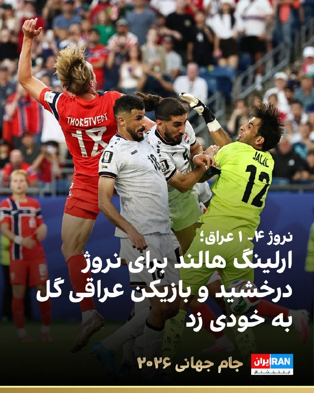

ارلینگ هالند در نخستین حضورش در جام جهانی، در دقایق ۲۹ و ۴۳ با زدن دو گل در نیمه نخست، نقش مهمی در پیروزی ۴ بر ۱ نروژ مقابل عراق در نخستین دیدار گروه I برای هر دو تیم داشت.
در این مسابقه که سه‌شنبه در فاکسبورو، ایالت ماساچوست برگزار شد، ایمن حسین در دقیقه ۳۹ برای عراق گل زد. لئو اوستیگارد از تیم نروژ که به‌عنوان بازیکن تعویضی وارد زمین شده بود، در دقیقه ۷۶ نتیجه را ۳ بر ۱ کرد. گل چهارم نروژ نیز در ششمین دقیقه وقت‌های تلف‌شده نیمه دوم با گل به خودی ایمن حسین رقم خورد.

https://iranintl.com/202606178155

## IranIntlTV — post 342795

  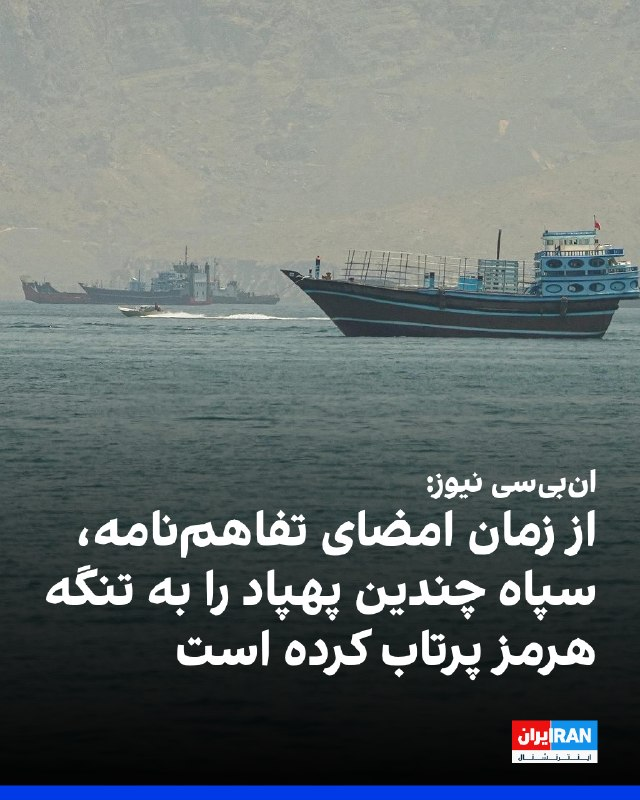

ان‌بی‌سی نیوز به نقل از یک مقام آمریکایی گزارش داد از زمان امضای یادداشت تفاهم جمهوری اسلامی و آمریکا، سپاه هر شب چندین پهپاد را به سمت کشتی‌های تجاری در تنگه هرمز پرتاب کرده، اما نیروهای آمریکا آنها را رهگیری کرده‌اند.
این مقام گفت ارتش آمریکا همچنان برای حمایت از عبور ایمن کشتی‌ها از تنگه هرمز، با شرکت‌های کشتیرانی تجاری هماهنگی می‌کند.

https://iranintl.com/202606172267

## FarsiVOA — post 220991

  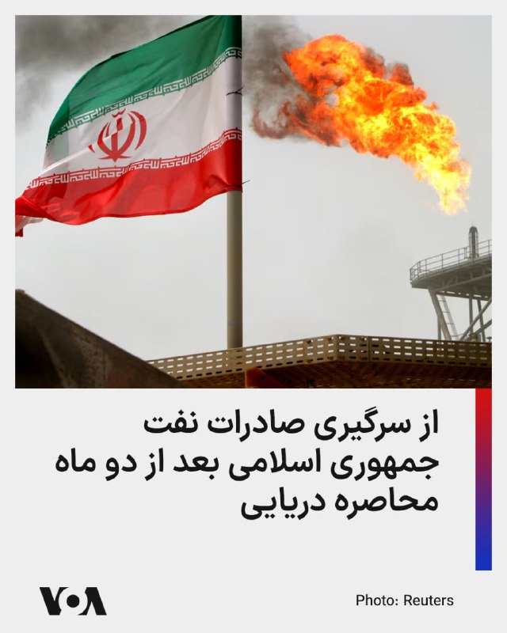

در حالی مقامات جمهوری اسلامی از کسری فزاینده گاز به خاطر آنچه «آسیب‌های جنگ به تاسیسات گازی عسلویه» خبر می‌دهند که صادرات گاز کشور به ترکیه کماکان روند صعودی چشمگیری را تجربه می‌کند.

گزارش جدید اداره تنظیم بازار انرژی ترکیه نشان می‌دهد ایران در ماه ابتدایی جنگ، مارس، ۸۲۳ میلیون متر مکعب گاز تحویل ترکیه داده که ۴۶ درصد بیشتر از ماه مشابه پارسال است. در ماه آوریل این رقم حتی به ۹۴۵ میلیون متر مکعب اوج گرفته است.

در مجموع طی چهار ماه ابتدایی ۲۰۲۶ ایران حدود ۲.۷ میلیارد متر مکعب گاز تحویل ترکیه داده که ۷۶ درصد بیشتر از دور مشابه پارسال است.

توافق ۲۵ ساله صادرات گاز ایران ترکیه در ماه آینده به پایان می‌رسد و هنوز ترکیه تصمیمی برای تمدید آن نگرفته است.
@FarsiVOA

## FarsiVOA — post 220990

  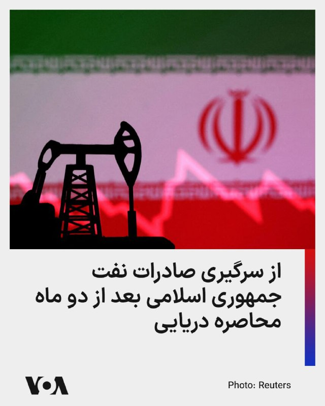

شرکت‌های ردیابی نفتکش‌ها از سرگیری صادرات نفت جمهوری اسلامی بعد از دو ماه محاصره دریایی توسط ایالات متحده خبر دادند.

تانکر ترکرز می‌گوید دست‌کم دو نفتکش متعلق به شرکت ملی نفتکش ایران با نام‌های «دیونا» و «هرو ۲» از محاصره دریایی آمریکا عبور کرده و یک نفتکش دیگر با نام «استریم» در حال نزدیک شدن به خط محاصره در نزدیکی آب‌های پاکستان است.

طبق برآورد شرکت‌های ردیابی نفتکش‌ها، از جمله کپلر، بیش از ۶۰ میلیون بشکه نفت ایران در آب‌های جنوب طی دو ماه گذشته گرفتار محاصره دریایی شده‌ است.

اخیراً دونالد ترامپ رئیس‌جمهور آمریکا در چهارچوب توافق با جمهوری اسلامی، دستور رفع محاصره دریایی علیه رژیم حاکم ایران را صادر کرد.
@FarsiVOA

## FarsiVOA — post 220989

  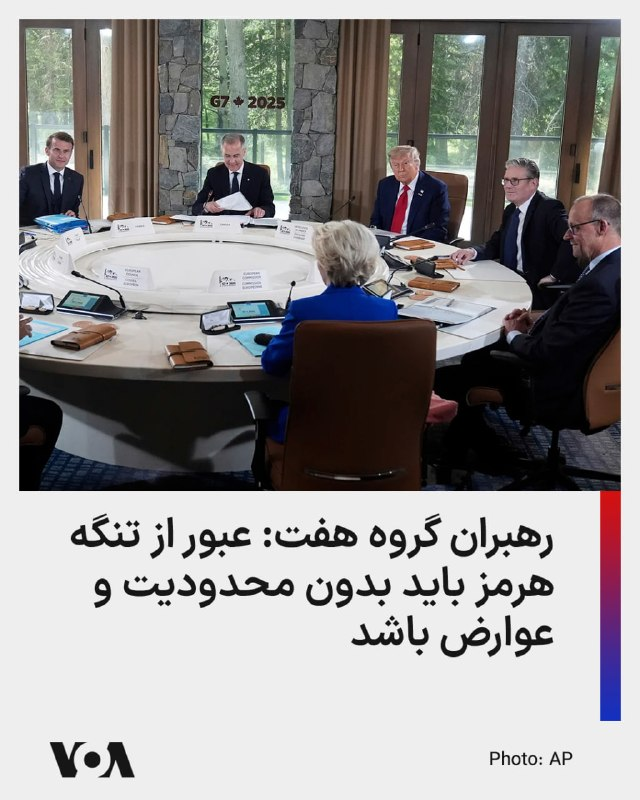

رهبران گروه هفت در بیانیه‌ای رسمی اعلام کردند حق عبور از مسیرهای دریایی، از جمله تنگه هرمز، باید بدون محدودیت و بدون دریافت عوارض باقی بماند و آن را از پایه‌های تجارت بین‌المللی دانستند.

در این بیانیه که پس از اعلام توافق آمریکا و جمهوری اسلامی منتشر شد، رهبران گروه هفت از بازگشایی تنگه هرمز حمایت کردند و گفتند آماده‌اند در اجرای این روند مشارکت کنند.

آنها همچنین از ابتکار دفاعی فرانسه و بریتانیا برای کمک به ازسرگیری تردد دریایی در هرمز پشتیبانی کردند؛ طرحی که هدف آن حفاظت از کشتی‌های تجاری، اطمینان‌بخشی به شرکت‌های کشتیرانی و کمک به راستی‌آزمایی پاک‌سازی مین‌ها عنوان شده است.

گروه هفت همچنین بر ضرورت کاهش آسیب‌پذیری جهانی در برابر اختلال در تنگه هرمز و متنوع‌سازی مسیرهای تأمین انرژی تأکید کرد.
@FarsiVOA

## FarsiVOA — post 220988

  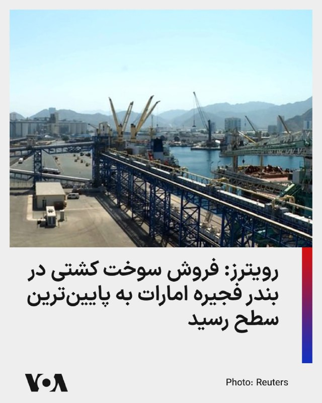

رویترز گزارش داد فروش سوخت کشتی در بندر فجیره امارات در ماه مه کاهش خود را ادامه داد و به پایین‌ترین سطح ثبت‌شده رسید.

داده‌ها نشان می‌دهد محدودیت در جایگزینی محموله‌ها پس از جنگ خاورمیانه و اختلال در ارسال سوخت از مسیر تنگه هرمز، این مرکز مهم سوخت‌رسانی دریایی را تحت فشار گذاشته است.

بر اساس داده‌های منطقه صنعتی نفت فجیره که اس‌اندپی گلوبال منتشر کرده، فروش سوخت دریایی، بدون احتساب روان‌کننده‌ها، در ماه مه به ۹۶ هزار و ۷۲۱ متر مکعب، معادل حدود ۹۵ هزار و ۸۰۰ تن، رسید.

فروش سوخت کم‌گوگرد کشتی نسبت به ماه قبل ۲۷ درصد و فروش سوخت پرگوگرد ۱۵ درصد کاهش یافت.

فجیره در ماه‌های اخیر نیز از پیامدهای امنیتی جنگ آسیب دیده بود.

رویترز پیش‌تر گزارش داده بود که مقام‌های امارات از آتش‌سوزی در منطقه صنعتی نفت فجیره پس از حمله پهپادی جمهوری اسلامی خبر داده بودند.
@FarsiVOA

## FarsiVOA — post 220987

  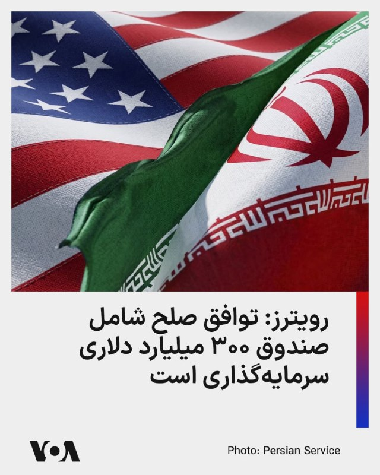

رویترز به نقل از یک منبع آگاه گزارش داد چارچوب توافق آمریکا و جمهوری اسلامی شامل ایجاد یک صندوق خصوصی ۳۰۰ میلیارد دلاری برای جذب سرمایه‌گذاری در اقتصاد ایران است و بیش از نیمی از این مبلغ تاکنون تعهد شده است.

این منبع که نامش فاش نشده، گفت صندوق یادشده با هدف ایجاد انگیزه اقتصادی برای دو طرف در مسیر رسیدن به توافق نهایی طراحی شده و شامل پول دولتی، کمک بلاعوض یا برنامه جبران خسارت جنگی نخواهد بود.

به گفته این منبع، شرکت‌هایی از آمریکا، کشورهای عربی خلیج فارس، آسیا، آمریکای جنوبی و آفریقا برای تأمین مالی پروژه‌هایی در بخش انرژی، حمل‌ونقل، تولید و زیرساخت اعلام آمادگی کرده‌اند.

رویترز نوشت این سازوکار مالی از مذاکرات جداگانه درباره رفع تحریم‌های آمریکا و آزادسازی دارایی‌های مسدودشده جمهوری اسلامی مستقل است و تنها پس از امضای توافق نهایی فعال خواهد شد.

به نوشته رویترز جمهوری اسلامی در ابتدا ۴۰۰ میلیارد دلار به عنوان غرامت خسارات جنگ از آمریکا درخواست کرده بود، اما واشنگتن با آن مخالفت کرد.
@FarsiVOA

## FarsiVOA — post 220986

  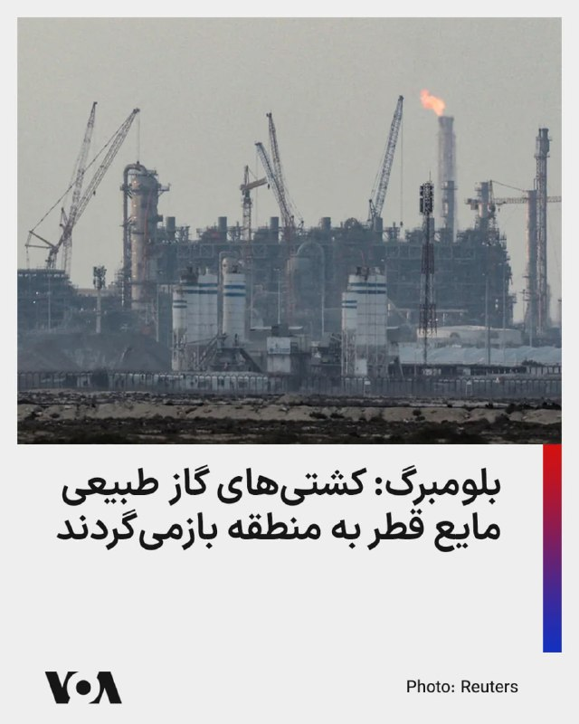

بلومبرگ گزارش داد قطر همزمان با آمادگی برای افزایش تولید و صادرات گاز طبیعی مایع پس از بازگشایی احتمالی تنگه هرمز، شماری از کشتی‌های خود را به خاورمیانه بازمی‌گرداند.

بر اساس داده‌های ردیابی کشتی‌ها، دست‌کم چهار کشتی خالی حامل گاز طبیعی مایع متعلق به قطر پس از مدتی توقف یا حرکت در مسیرهای دیگر، به سوی منطقه بازگشته‌اند و یک کشتی اجاره‌شده دیگر نیز در راه است.

همه این کشتی‌ها مجتمع راس لفان، بزرگ‌ترین مرکز صادرات گاز طبیعی مایع جهان، را به‌عنوان مقصد بعدی ثبت کرده‌اند.

این اقدام پس از گزارشی دیگر از بلومبرگ صورت می‌گیرد که بر اساس آن، قطر قصد دارد پس از بازگشت عبور ایمن از هرمز، ظرف یک ماه تولید را به حدود ۵۰ درصد ظرفیت و تا دو ماه به نزدیک ۸۰ درصد برساند.

بازگشت صادرات قطر می‌تواند بخشی از فشار کمبود جهانی عرضه را کاهش دهد، هرچند قیمت‌ها در اروپا و آسیا همچنان بالاتر از سطح پیش از جنگ مانده‌اند.
@FarsiVOA

## FarsiVOA — post 220985

🔺یادداشت رئيس‌جمهوری آمریکا تولید مهمات جنگی را سرعت می‌بخشد

▪️بر اساس یک یادداشت ریاست‌جمهوری آمریکا که روز سه‌شنبه منتشر شد، رئیس‌جمهوری ایالات متحده، دونالد ترامپ، برای رفع محدودیت‌های موجود در تولید مهمات، به «قانون تولید دفاعی» استناد کرده است.

⬇️ بیشتر بخوانید:
https://ir.voanews.com/a/8161816.html
@FarsiVOA

## FarsiVOA — post 220984

⚡️اوکراین و توافق واشنگتن با جمهوری اسلامی در کانون توجه نشست سران گروه هفت
@FarsiVOA

## FarsiVOA — post 220983

  <a href="telegram/content/FarsiVOA_220983_1781679866.mp4" target="_blank">🎬 Download video</a>

⚡️نمایشگاه سئول فود ۲۰۲۶ با حضور بیش از ۱۸۰۰ شرکت از ۴۹ کشور برگزار شد. آمریکا به‌عنوان مهمان ویژه، همزمان با ۲۵۰ سالگی استقلال خود، محصولات غذایی و کشاورزی‌اش را به نمایش گذاشت؛ رویدادی برای نمایش تنوع، نوآوری و همکاری‌های بین‌المللی.
@FarsiVOA

## FarsiVOA — post 220982

  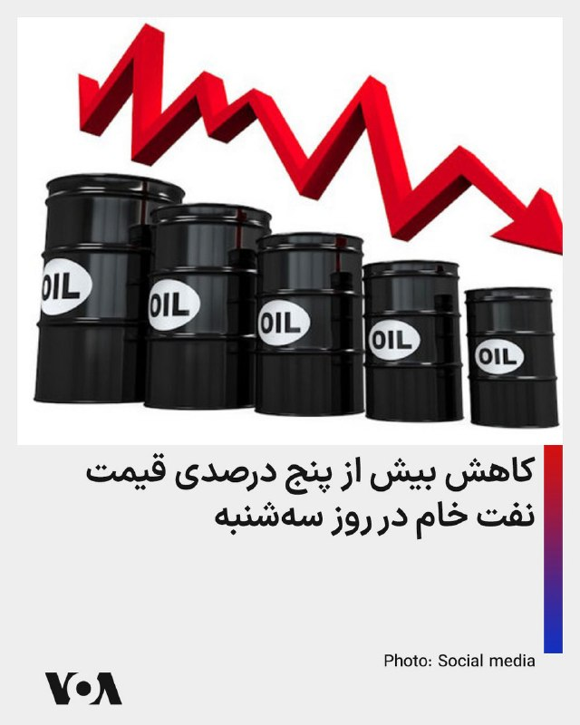

⚡️قیمت نفت خام روز سه‌شنبه بیش از ۵ درصد کاهش یافت؛ به این ترتیب کاهش قیمت‌ نفت در این هفته ادامه یافت. کاهش قیمت نفت با ادامه خوش‌بینی‌ها در مورد توافق اولیه آمریکا و جمهوری اسلامی صورت می‌گیرد. این توافق اولیه مسیر مذاکرات دشوارتر برای رسیدن به یک توافق هسته‌ای را فراهم می‌کند. رویترز گزارش داد که قیمت نفت خام برنت ۴ دلار و ۲۱ سنت (۵.۱ درصد) کاهش یافت و به قیمت ۷۸ دلار و ۹۶ سنت رسید. دونالد ترامپ، رئیس‌جمهوری آمریکا پیشتر وعده داده بود که با رسیدن به یک توافق، قیمت‌ها به سرعت پایین می‌آید.
@FarsiVOA

## FarsiVOA — post 220981

⚡️هشدار کارزار «سه‌شنبه‌های نه به اعدام» به افزایش تعداد اعدام‌ها در ایران توسط جمهوری‌ اسلامی
@FarsiVOA

## FarsiVOA — post 220980

🔺مخالفت سناتور ریک اسکات با آزادسازی منابع رژیم ایران: اگر پولی از آنها داریم باید به خاطر «خشم حماسی» و به سرعقل درآوردنشان بگیریم

▪️ریک اسکات با آزادسازی دارایی‌های مسدود شده مخالف است و می‌گوید این پول باید برای پرداخت هزینه عملیات خشم حماسی استفاده شود

⬇️ بیشتر بخوانید:
https://ir.voanews.com/a/8161815.html
@FarsiVOA

## FarsiVOA — post 220979

⚡️تمدید مأموریت یوناما؛ افغانستان میان بحران بشردوستانه و چالش‌های منطقه‌ای
@FarsiVOA

## DW_Farsi — post 126082

  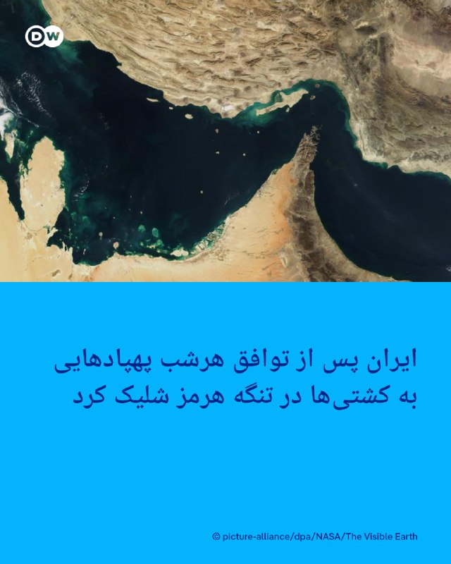

🔶 "ایران پس از توافق هرشب پهپادهایی به کشتی‌ها در تنگه هرمز شلیک کرد"

شبکه "ان‌بی‌سی‌ نیوز" روز چهارشنبه ۲۷ خرداد (۱۷ ژوئن) گزارش داد جمهوری اسلامی از زمان امضای یادداشت تفاهم میان آمریکا و ایران در روز یکشنبه ۱۴ ژوئن، "هر شب پهپادهایی را به سمت کشتی‌های تجاری در تنگه هرمز شلیک کرده است".

یک مقام آمریکایی به این رسانه گفته است که ارتش آمریکا پهپادهای شلیک‌شده توسط سپاه پاسداران را "پیش از آنکه بتوانند کشتی‌ها یا نیروهای حاضر در منطقه را تهدید کنند، سرنگون می‌کند".

این‌همه در حالی است که واشنگتن و تهران در حال آماده‌سازی برای امضای رسمی چارچوب یک توافق در روز جمعه ۱۹ ژوئن هستند. طبق گزارش‌ها و بنا بر گفته مقامات کاخ سفید، این توافق پیش‌تر به‌صورت دیجیتالی در روز یکشنبه ۱۴ ژوئن امضا شده است.

@dw_farsi

## DW_Farsi — post 126081

  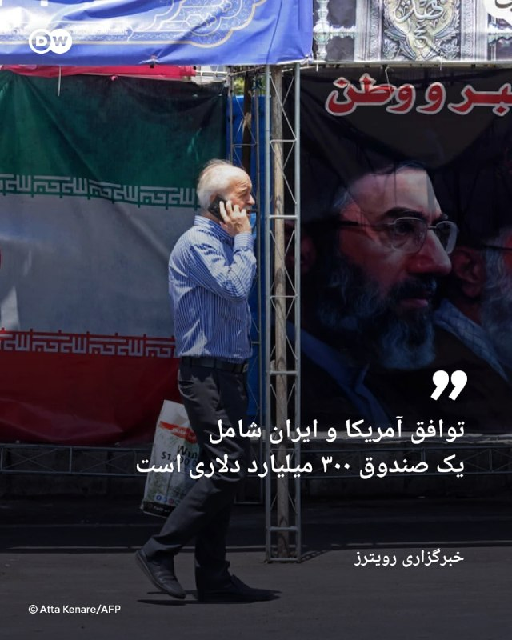

🔶 رویترز: توافق آمریکا و ایران شامل یک صندوق ۳۰۰ میلیارد دلاری است

خبرگزاری رویترز بر اساس اطلاعات منابع آگاه گزارش داده است که در چارچوب توافق برنامه‌ریزی‌شده میان آمریکا و ایران، یک صندوق سرمایه‌گذاری خصوصی به ارزش "۳۰۰ میلیارد دلار" برای بازسازی این کشور در نظر گرفته شده است.

یک منبع آگاه که نامش فاش نشده، به خبرگزاری رویترز گفت که تاکنون درباره بیش از نیمی از این مبلغ، تعهدهای لازم داده شده است. هدف از تاسیس این صندوق "ایجاد انگیزه اقتصادی برای هر دو طرف جهت نهایی‌سازی توافق" عنوان شده است.

آمریکا و ایران روز یکشنبه ۲۴ خرداد (۱۴ ژوئن) بر سر چارچوب پایان دادن به درگیری‌ای که از ماه فوریه ادامه داشته، به توافق رسیدند و اکنون برای امضای آن در روز جمعه ۱۹ ژوئن آماده می‌شوند.

طبق گزارش رویترز "صندوق بازسازی و توسعه" ابزاری برای سرمایه‌گذاری خصوصی است و "شامل هیچ‌گونه بودجه یا کمک دولتی نمی‌شود".

@dw_farsi

## DW_Farsi — post 126080

  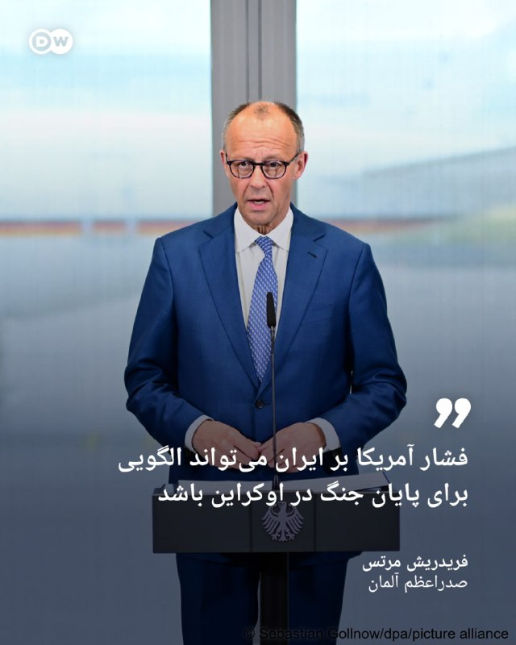

🔶 مرتس: فشار آمریکا بر ایران می‌تواند الگویی برای پایان جنگ در اوکراین باشد

فریدریش مرتس، صدراعظم آلمان، توافق میان آمریکا و ایران را به‌عنوان الگویی برای پایان جنگ در اوکراین توصیف کرد.

مرتس شامگاه سه‌شنبه ۲۶ خرداد (۱۶ ژوئن) در حاشیه نشست گروه هفت در شهر اویان فرانسه گفت این توافق "فرصتی بزرگ برای ثبات منطقه و بهبود اقتصاد جهانی" ایجاد می‌کند. او در این رابطه به کاهش قیمت نفت و رشد بازارهای سهام اشاره کرد.

صدراعظم آلمان همچنین افزود: «من مطمئن هستم که این توافق پایدار خواهد ماند.» او با اشاره به چارچوب توافق گفت: «آنچه از ایران می‌شنویم نشان می‌دهد که این کشور نیز آن را می‌پذیرد، زیرا باید بپذیرد که برتری نظامی آمریکا انتخاب دیگری باقی نگذاشته است.»

@dw_farsi

## DW_Farsi — post 126079

  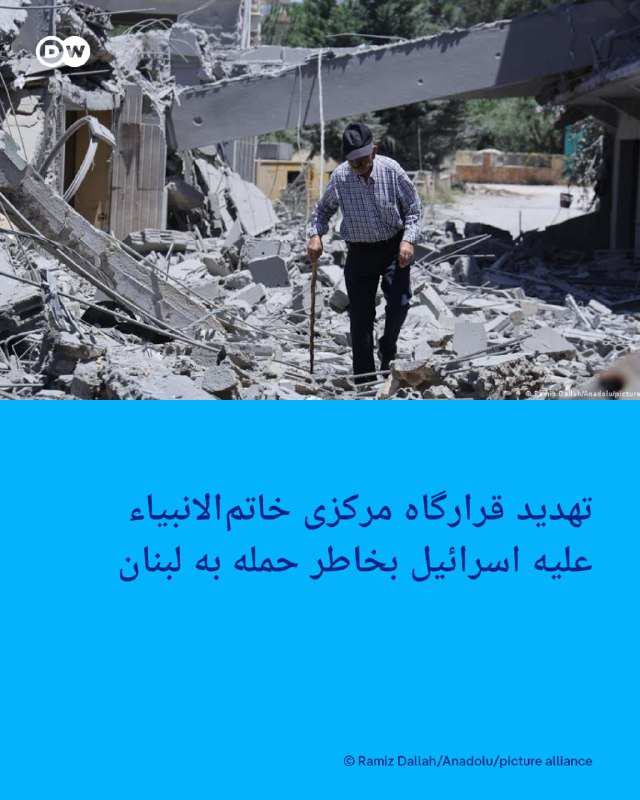

🔶 تهدید قرارگاه مرکزی خاتم‌الانبیاء علیه اسرائیل بخاطر حمله به لبنان

قرارگاه مرکزی خاتم‌الانبیاء، شامگاه سه‌شنبه ۲۶ خرداد (۱۶ ژوئن) با صدور بیانیه‌ای هشدار‌آمیز ادعا کرد که ارتش اسرائیل طی دو روز گذشته، "پس از اعلام پایان جنگ از سوی رئیس‌جمهور آمریکا، ۸۴ بار آتش‌بس در جنوب لبنان را نقض کرده است".

این قرارگاه در ادامه با لحنی تهدیدآمیز هشدار داده است که در صورت ادامه اینگونه اقدامات، اسرائیل "باید منتظر پاسخ سخت نیروهای مسلح جمهوری اسلامی ایران باشد".

مقام‌های جمهوری اسلامی می‌گویند تفاهم‌نامه ایران با آمریکا شامل لبنان هم می‌شود اما در سوی مقابل، اسرائیل ضمن رد این موضوع می‌گوید که موضوع لبنان ربطی به ایران ندارد و ارتش این کشور مواضع حزب‌الله را هدف قرار می‌دهد.

@dw_farsi

## Persian_Trend_Official — post 17323

  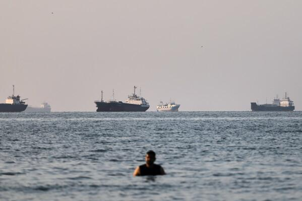

بلومبرگ: یادداشت تفاهم پیشنهادی ایالات متحده و ایران، پایان فوری و دائمی جنگ در تمام جبهه‌ها، از جمله لبنان، را ترسیم می‌کند و هر دو طرف متعهد می‌شوند که از اقدامات خصمانه خودداری کنند، به حاکمیت یکدیگر احترام بگذارند و ظرف 60 روز برای رسیدن به یک توافق نهایی مذاکره کنند.

پیش‌نویس این چارچوب خواستار لغو محاصره دریایی ایالات متحده، احیای کامل ناوبری تجاری از طریق تنگه هرمز، کاهش مرحله‌ای تحریم‌ها، معافیت از صادرات نفت ایران و آزادسازی تدریجی دارایی‌های مسدود شده ایران است. همچنین یک طرح توسعه اقتصادی 300 میلیارد دلاری برای ایران با حمایت ایالات متحده و شرکای منطقه‌ای پیشنهاد شده است.

بر اساس این سند، ایران تأکید می‌کند که هرگز سلاح هسته‌ای تولید نخواهد کرد، در حالی که هر دو طرف موافقند که مسائلی از جمله ذخایر اورانیوم غنی‌شده و ترتیبات گسترده‌تر هسته‌ای در یک توافق نهایی که از طریق یک مکانیسم اجرایی نظارت می‌شود و در نهایت توسط قطعنامه شورای امنیت سازمان ملل تأیید می‌شود، حل و فصل خواهد شد.

📝 Amir

📌 @persian_trend_official
پرشین ترند | متفاوت‌ترین کانال نظامی

## Persian_Trend_Official — post 17322

  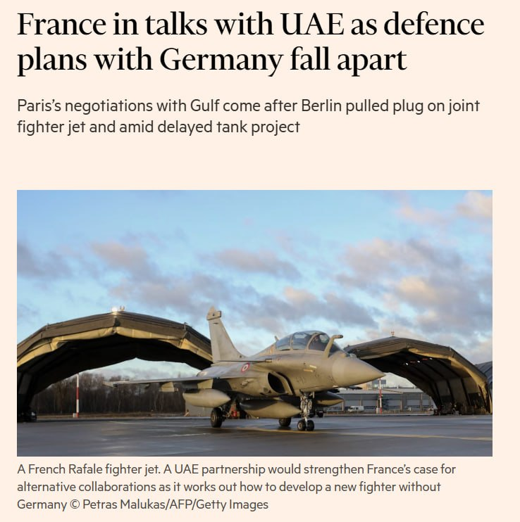

🇫🇷فرانسه درباره توسعه نسل آینده جنگنده رافال با امارات وارد مذاکره شد.

📰 روزنامه فایننشال تایمز گزارش داده است که فرانسه، در پی بروز اختلافات و کندی پیشرفت برنامه جنگنده نسل آینده اروپا (FCAS)، مذاکراتی را با امارات متحده عربی برای همکاری در توسعه و ارتقای نسل جدید جنگنده «رافال» آغاز کرده است.

⚔️این گفت‌وگوها بر بسته ارتقایی جدید رافال متمرکز است؛ نسخه‌ای که پیش‌بینی می‌شود در حدود سال ۲۰۳۰ وارد خدمت عملیاتی شود.

اگرچه نسخه آینده رافال جایگزین مستقیم پروژه FCAS نخواهد بود و از تمامی ویژگی‌های نسل ششم، از جمله قابلیت‌های پیشرفته پنهانکاری، بهره‌مند نیست، اما می‌تواند به عنوان بستری برای توسعه فناوری‌ها و جنگنده‌های آینده فرانسه در دهه ۲۰۴۰ مورد استفاده قرار گیرد.

⚔️ امارات متحده عربی، به عنوان یکی از بزرگ‌ترین کاربران خارجی جنگنده رافال، طی سال‌های اخیر قراردادهای مهمی برای خرید این هواپیما با فرانسه منعقد کرده است.

⚔️ همکاری احتمالی میان ابوظبی و پاریس می‌تواند منابع مالی، فنی و صنعتی مورد نیاز برای تداوم توسعه مستقل فناوری‌های رزمی هوایی فرانسه را تأمین کند.

⚔️این مذاکرات می‌تواند نشانه‌ای از تلاش فرانسه برای کاهش وابستگی به پروژه‌های مشترک اروپایی و حرکت به سمت همکاری‌های دوجانبه با شرکای ثروتمند خاورمیانه باشد. در صورت موفقیت، امارات ممکن است به یکی از شرکای اصلی توسعه نسل آینده توان هوایی فرانسه تبدیل شود.

👺 Phantom

📌 @persian_trend_official
پرشین ترند | متفاوت‌ترین کانال نظامی

## Persian_Trend_Official — post 17321

  <a href="telegram/content/Persian_Trend_Official_17321_1781679870.mp4" target="_blank">🎬 Download video</a>

ارتش آمریکا روز گذشته یک کشتی مظنون به قاچاق مواد مخدر را در شرق اقیانوس آرام هدف حمله پهپادی خود قرار داد.

از سه سرنشین قایق، یکی از سرنشینان کشته و دو سرنشین دیگر موفق به فرار شدند، گارد ساحلی امریکا عملیات جستجو و نجات فوری برای یافتن آن دو قاچاقچی آغاز کرده است.

📝 Amir

📌 @persian_trend_official
پرشین ترند | متفاوت‌ترین کانال نظامی

## Persian_Trend_Official — post 17320

  <a href="telegram/content/Persian_Trend_Official_17320_1781679871.mp4" target="_blank">🎬 Download video</a>

انفجار مهیب جت شخصی در تگزاس؛ کابین خلبان شکسته و ۱ نفر کشته شد.

👺Phantom

📌 @persian_trend_official
پرشین ترند | متفاوت‌ترین کانال نظامی

## Persian_Trend_Official — post 17319

  <a href="telegram/content/Persian_Trend_Official_17319_1781679873.webm" target="_blank">🎬 Download video</a>

منابع لبنانی گزارش میدهند نیروی هوایی اسرائیل چندین نقطه در منطقه کفر تبنیت در جنوب لبنان را بمباران‌ کرد.

📝 Amir

📌 @persian_trend_official
پرشین ترند | متفاوت‌ترین کانال نظامی

## Persian_Trend_Official — post 17318

  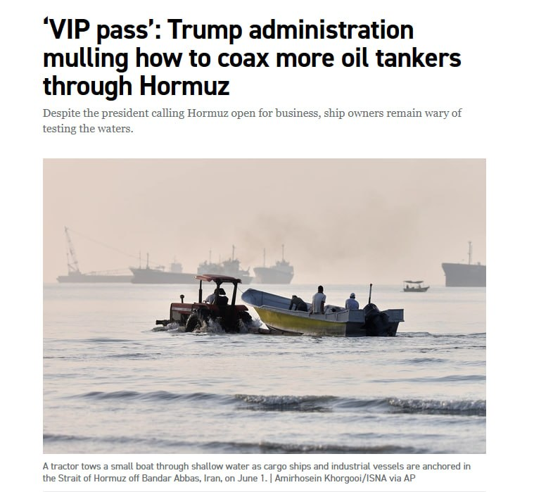

پولیتیکو: دولت ترامپ در حال بررسی اقداماتی برای احیای کامل تردد نفتکش‌ها از تنگه هرمز است، از جمله پیشنهادی که به مالکان کشتی اجازه می‌دهد هزینه عبور سریع همراه با اسکورت‌های دریایی ایالات متحده را بپردازند.

ترامپ و سوزی وایلز، رئیس دفتر کاخ سفید، به مقامات دستور داده‌اند تا همزمان با ادامه مذاکرات ایالات متحده و ایران، راه‌هایی برای تشویق شرکت‌های کشتیرانی و بیمه‌ها به از سرگیری فعالیت از طریق این آبراه پیدا کنند.

یکی از پیشنهادهای مورد بحث، ایجاد یک سیستم گذرنامه VIP مبتنی بر هزینه است که امکان ترانزیت اولویت‌دار و احتمالاً حفاظت نظامی را فراهم می‌کند. ایده دیگری که در حال بررسی است، استفاده از قانون تولید دفاعی برای الزام شرکت‌های بیمه مستقر در ایالات متحده به ارائه پوشش بیمه‌ای برای کشتی‌های فعال در منطقه است.

این پیشنهادها همچنین با هدف تشویق مشارکت بیشتر اروپایی‌ها در عملیات امنیتی دریایی در منطقه ارائه می‌شود.

📝 Amir

📌 @persian_trend_official
پرشین ترند | متفاوت‌ترین کانال نظامی

## Persian_Trend_Official — post 17317

◾️ خارگ در جنگ اخیر هدف حملات گسترده قرار گرفت: بخشدار ویژه خارگ اعلام کرد باوجود حملات مکرر به این جزیره، صادرات نفت ایران بدون وقفه ادامه یافته است.

◾️ سقوط بمب‌افکن B-52H آمریکا: یک فروند بمب‌افکن راهبردی B-52H پس از برخاستن از پایگاه ادواردز کالیفرنیا سقوط کرد و هر ۸ سرنشین آن جان باختند.

◾️ دلار وارد کانال ۱۵۰ هزار تومان شد: قیمت دلار در بازار آزاد به حدود ۱۵۶ هزار تومان رسید.

◾️ طلا در کانال ۱۵ میلیون تومان: هر گرم طلای ۱۸ عیار به حدود ۱۵ میلیون و ۹۸۶ هزار تومان افزایش یافت.

◾️ امتحانات نهایی از ۲۰ تیر آغاز می‌شود: وزارت آموزش‌وپرورش زمان برگزاری امتحانات نهایی را از ۱۳ تیر به ۲۰ تیرماه تغییر داد.

◾️ چین: مسیر توافق هنوز طولانی است: وانگ یی، وزیر خارجه چین، اعلام کرد توافق اولیه تنها نقطه آغاز است و مرحله دوم مذاکرات ایران و آمریکا به‌مراتب دشوارتر خواهد بود.

◾️ ترکیه از توافق ایران و آمریکا حمایت کرد: هاکان فیدان، وزیر خارجه ترکیه، گفت واشنگتن باوجود مخالفت‌های اسرائیل مسیر توافق با تهران را ادامه داده و این روند باید حفظ شود.

◾️ ترامپ: توافق را برای بررسی به کنگره می‌فرستم: رئیس‌جمهور آمریکا اعلام کرد توافق صلح و مذاکرات هسته‌ای با ایران جهت بررسی در اختیار کنگره قرار خواهد گرفت.

◾️ ترامپ: هیچ پولی به ایران پرداخت نمی‌شود: ترامپ گزارش‌ها درباره پرداخت مستقیم پول از سوی آمریکا به ایران را رد کرد و آن را «اخبار جعلی» خواند.

◾️ واشنگتن بخشی از تجهیزات نظامی خود را از اسرائیل خارج می‌کند: رسانه‌های اسرائیلی گزارش دادند آمریکا در حال بررسی کاهش بخشی از استقرار هواپیماهای سوخت‌رسان خود در اسرائیل پس از تفاهم اخیر با ایران است.

◾️ آلمان برای بازگشایی کامل کشتیرانی در هرمز اعلام آمادگی کرد: برلین از آمادگی خود برای مشارکت در عملیات احتمالی مین‌روبی و تأمین امنیت دریانوردی در تنگه هرمز خبر داد.

◾️ قدردانی حزب‌الله از نقش ایران در مذاکرات: شیخ نعیم قاسم، دبیرکل حزب‌الله، از تیم مذاکره‌کننده جمهوری اسلامی و حمایت ایران از لبنان و مقاومت قدردانی کرد.

◾️ گفت‌وگوی تلفنی وزرای خارجه ایران و عمان: دو طرف درباره روند اجرای تفاهم اخیر، تحولات منطقه و ادامه همکاری‌های دوجانبه رایزنی کردند.

◾️ ترامپ: نتانیاهو باید در قبال لبنان مسئولیت‌پذیرتر باشد: رئیس‌جمهور آمریکا خواستار مدیریت محتاطانه‌تر تحولات لبنان از سوی دولت اسرائیل شد.

◾️ تردد نفتکش‌ها در خلیج فارس افزایش یافت: پس از اعلام تفاهم ایران و آمریکا، گزارش‌ها از آغاز تدریجی بازگشت برخی نفتکش‌ها و کشتی‌های تجاری به مسیرهای عادی تردد حکایت دارد.

👺Phantom

📌 @persian_trend_official
پرشین ترند | متفاوت‌ترین کانال نظامی

## Persian_Trend_Official — post 17316

📍 بولتن خبری ۲۴ ساعت اخیر پرشین ترند

🗓 ۲۷ خرداد ۱۴۰۵

◾️ سوئیس میزبان امضای توافق ایران و آمریکا: وزارت خارجه سوئیس اعلام کرد مراسم امضای یادداشت تفاهم ایران و آمریکا روز جمعه در مجتمع «بورگن‌اشتوک» برگزار خواهد شد.

◾️ عراقچی: جمعه مذاکرات مرحله دوم آغاز می‌شود: وزیر امور خارجه اعلام کرد پس از امضای یادداشت تفاهم، مذاکرات ۶۰ روزه برای دستیابی به توافق نهایی درباره پرونده هسته‌ای و لغو تحریم‌ها آغاز خواهد شد.

◾️ ترامپ: متن تفاهم‌نامه را منتشر می‌کنم: رئیس‌جمهور آمریکا گفت متن توافق را به صورت عمومی منتشر کرده و برای بررسی به کنگره ارسال خواهد کرد.

◾️ ترامپ: توافق با ایران عادلانه است: ترامپ تأکید کرد توافق نهایی شده و وارد مرحله دوم خواهد شد؛ مرحله‌ای که به گفته او آسان‌تر از مرحله نخست است.

◾️ اکسیوس: برخی نهادهای اطلاعاتی آمریکا تردید دارند: اکسیوس گزارش داد جان رتکلیف، رئیس سیا، درباره میزان آمادگی ایران برای اجرای تعهدات هسته‌ای مورد نظر واشنگتن ابراز تردید کرده است.

◾️ رئیس سیا نسبت به نیت ایران ابراز تردید کرد: گزارش‌ها حاکی است ارزیابی‌های اطلاعاتی آمریکا همچنان پرسش‌هایی درباره اهداف و نیت واقعی تهران در روند مذاکرات مطرح می‌کنند.

◾️ صندوق ۳۰۰ میلیارد دلاری در دستور کار: رویترز و فایننشال تایمز گزارش دادند بیش از نیمی از سرمایه صندوق خصوصی ۳۰۰ میلیارد دلاری پیش‌بینی‌شده برای سرمایه‌گذاری و بازسازی ایران تاکنون تعهد شده است.

◾️ ونس: دسترسی ایران مشروط به پایبندی است: معاون رئیس‌جمهور آمریکا تأکید کرد استفاده ایران از منابع صندوق سرمایه‌گذاری تنها در صورت اجرای کامل تعهدات توافق امکان‌پذیر خواهد بود.

◾️ وال‌استریت ژورنال: فروش نفت ایران بلافاصله آغاز می‌شود: این رسانه گزارش داد آمریکا در چارچوب تفاهم اخیر اجازه ازسرگیری فوری صادرات نفت و سوخت ایران را خواهد داد.

◾️ عبور نفتکش‌ها از منطقه محاصره: منابع ایرانی از عبور چند نفتکش و کشتی تجاری از خطوط محاصره دریایی و ازسرگیری تردد دریایی خبر دادند.

◾️ ۳.۸ میلیون بشکه نفت ایران از محاصره عبور کرد: تانکر ترکرز گزارش داد دو ابرنفتکش ایرانی حامل مجموعاً ۳.۸ میلیون بشکه نفت خام از محاصره دریایی عبور کرده‌اند.

◾️ صنعت کشتیرانی هنوز محتاط است: سی‌ان‌ان گزارش داد باوجود اعلام بازگشایی تنگه هرمز، صدها نفتکش و شناور همچنان در انتظار کاهش ریسک‌های امنیتی منطقه هستند.

◾️ ارزیابی اطلاعاتی آمریکا درباره تنگه هرمز: به گزارش سی‌ان‌ان، نهادهای اطلاعاتی آمریکا معتقدند ایران اکنون توانایی بیشتری برای کنترل یا اختلال در تردد تنگه هرمز در اختیار دارد.

◾️ آلمان آماده مشارکت در مین‌روبی هرمز: وزیر خارجه آلمان از آمادگی برلین برای حمایت از عملیات مین‌روبی و بازگشایی کامل مسیر کشتیرانی در تنگه هرمز خبر داد.

◾️ حملات اسرائیل به جنوب لبنان ادامه دارد: توپخانه و پهپادهای اسرائیلی مناطقی در جنوب لبنان از جمله العیشیه و میفادون را هدف قرار دادند.

◾️ عراقچی: حمله به لبنان نقض تفاهم است: وزیر خارجه ایران تأکید کرد هرگونه اقدام نظامی اسرائیل علیه لبنان نقض مستقیم یادداشت تفاهم محسوب می‌شود.

◾️ فرمانده نیروی هوایی اسرائیل: یک ساعت تا حمله گسترده فاصله داشتیم: عومر تیشلر مدعی شد تمامی مقدمات حمله وسیع به اهدافی در ایران آماده شده بود اما عملیات متوقف شد.

◾️ کانال ۱۲ اسرائیل: آمریکا بخشی از هواپیماهای سوخت‌رسان را خارج می‌کند: رسانه‌های اسرائیلی از برنامه واشنگتن برای کاهش حضور ده‌ها هواپیمای سوخت‌رسان در فرودگاه بن‌گوریون خبر دادند.

◾️ اسرائیل به متن تفاهم‌نامه دسترسی نیافت: کانال ۱۲ اسرائیل گزارش داد درخواست تل‌آویو برای مشاهده متن یادداشت تفاهم ایران و آمریکا رد شده است.

◾️ ترامپ: ایران هرگز سلاح هسته‌ای نخواهد داشت: رئیس‌جمهور آمریکا مدعی شد توافق جدید تضمین می‌کند ایران به سلاح هسته‌ای دست پیدا نکند.

◾️ ترامپ: به تغییر حکومت اعتقادی ندارم: ترامپ اعلام کرد تجربه تغییر رژیم در کشورهای مختلف موفق نبوده و از چنین سیاستی حمایت نمی‌کند.

◾️ هاکان فیدان: ترامپ به مخالفت اسرائیل توجه نکرد: وزیر خارجه ترکیه گفت آمریکا باوجود اعتراضات اسرائیل مسیر توافق با ایران را ادامه داده است.

◾️ وانگ یی: مرحله دوم مذاکرات دشوارتر خواهد بود: وزیر خارجه چین هشدار داد رسیدن به توافق نهایی از مرحله نخست پیچیده‌تر و چالش‌برانگیزتر است.

◾️ بن‌گویر سفر به آمریکا را لغو کرد: رسانه‌های اسرائیلی گزارش دادند وزیر امنیت ملی اسرائیل به دلیل مشکلات صدور ویزا سفر برنامه‌ریزی‌شده خود به آمریکا را لغو کرده است.

👺Phantom

📌 @persian_trend_official
پرشین ترند | متفاوت‌ترین کانال نظامی

## Persian_Trend_Official — post 17315

قرارگاه خاتم الانبیا: اگر اسرائیل به نقض آتش بد ادامه دهد به آن پاسخ خواهیم داد. قرارگاه مرکزی خاتم‌الانبیا: ارتش تروریستی رژیم صهیونیستی طی دو روز گذشته پس از اعلام پایان جنگ توسط رئیس جمهور آمریکا، 84 بار آتش بس در جنوب لبنان را نقض نموده و همچنان به جنایات…

## Persian_Trend_Official — post 17314

  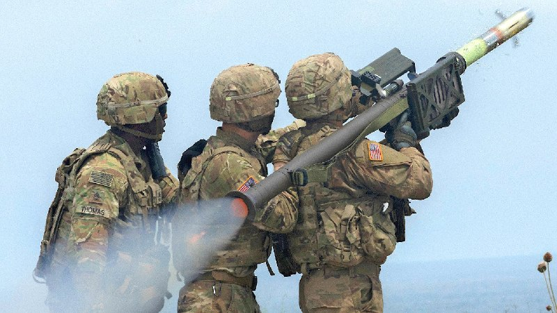

برزیل 100 موشک دوش پرتاب استینگر آمریکایی را خریداری کرد.

آمریکا با فروش احتمالی 100 فروند موشک دوش‌پرتاب پدافندی FIM-92K استینگر به برزیل به ارزش تقریبی 330 میلیون دلار موافقت کرد.

این قرارداد علاوه بر موشک‌ها، شامل سامانه‌های پرتاب، تجهیزات پشتیبانی، آموزش، خدمات فنی و پشتیبانی لجستیکی نیز خواهد بود.

این موشک‌های دوش پرتاب قرار است جایگزین موشک های دوش پرتاب ایگلا ساخت شوروی ارتش برزیل شوند.

📝 Amir

📌 @persian_trend_official
پرشین ترند | متفاوت‌ترین کانال نظامی

## Persian_Trend_Official — post 17313

  <a href="telegram/content/Persian_Trend_Official_17313_1781679874.mp4" target="_blank">🎬 Download video</a>

صبحتون بخیر 🌄
TU-160 Blackjack

📌 @persian_trend_official
پرشین ترند | متفاوت‌ترین کانال نظامی

## RadioFarda — post 158416

  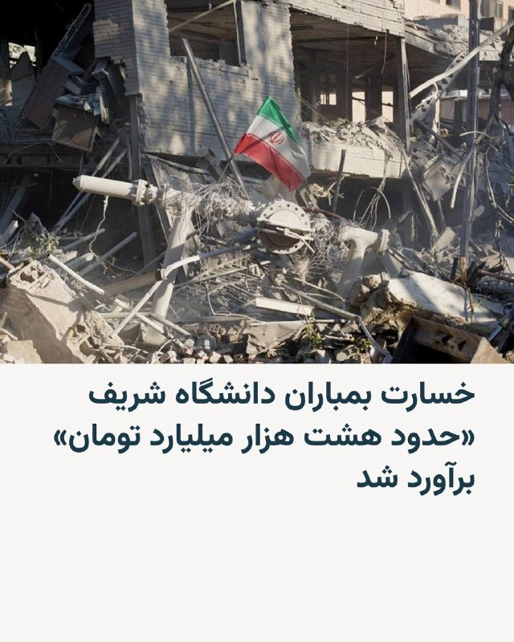

🔸رئیس دانشگاه صنعتی شریف می‌گوید در جنگ ۴۰ روزه، حدود هشت هزار میلیارد تومان به تجهیزات و زیرساخت‌های فناوری این دانشگاه خسارت وارد شده و مبلغ اختصاص‌یافته از سوی دولت برای بازسازی تنها یک‌چهارم منابع مورد نیاز این دانشگاه را پوشش می‌دهد.

🔸مسعود تجریشی روز چهارشنبه ۲۷ خرداد گفت: «بخش قابل توجهی از امکانات فناورانهٔ دانشگاه از بین رفته و در حال حاضر دانشگاه با حداقل امکانات به ارائهٔ خدمات ادامه می‌دهد، به‌گونه‌ای که برخی خدمات از جمله زیرساخت‌های هوش مصنوعی در دسترس نیست و ظرفیت محاسبات سریع نیز به حدود ۱۰ درصد کاهش یافته است.»

🔸رئیس دانشگاه شریف همچنین گفت ایستگاه اصلی گاز دانشگاه از مدار خارج شده و برآوردها نشان می‌دهد که بازسازی آن، پس از تحویل زمین و انجام سفارش‌های مورد نیاز، بیش از سه ماه زمان خواهد برد.

🔸این در حالی است که به‌گفتهٔ تجریشی، وزارت علوم تنها دو هزار و ۵۰۰ میلیارد تومان منابع مالی برای جبران خسارت به این دانشگاه اختصاص داده که فقط حدود یک‌چهارم منابع مورد نیاز دانشگاه را پوشش می‌دهد.

@RadioFarda

## RadioFarda — post 158415

  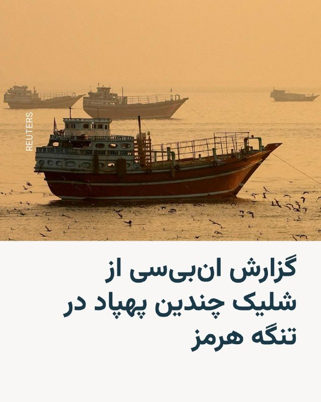

🔸شبکه خبری ان‌بی‌سی به نقل از یک مقام آمریکایی گزارش داد که حکومت ایران پس از اعلام توافق با آمریکا برای پایان جنگ، به سمت کشتی‌های تجاری در تنگه هرمز چندین پهپاد پرتاب کرده است.

🔸این مقام آمریکایی که نام و سمتش اعلام نشده، گفت که ارتش آمریکا این پهپادها را قبل از این‌که بتوانند کشتی‌های تجاری و خدمهٔ نظامی آمریکایی در منطقه را تهدید کنند، سرنگون کرده است.

🔸به‌ادعای این مقام آمریکایی، سپاه پاسداران انقلاب اسلامی از زمان امضای دیجیتالی یادداشت تفاهم در روز یکشنبه، هر شب چندین پهپاد شلیک کرده است.

🔸 بر اساس این گزارش، ارتش آمریکا همچنان در هماهنگی با شرکت‌های کشتیرانی برای پشتیبانی از کشتی‌هایی است که در تنگه هرمز رفت‌وآمد می‌کنند.

🔸حکومت ایران هنوز واکنشی به این گزارش نشان نداده است، اما در دو شب اخیر گزارش‌های پراکنده و تأییدنشده‌ای از شنیده شدن صدای انفجار در نزدیکی تنگه هرمز منتشر شده بود.

@RadioFarda

## RadioFarda — post 158414

رکوردهای بی‌نظیر مسی و فغانی در جام جهانی؛ عراق، اولین ناکام در جمع آسیایی‌ها

🔸دور اول مرحلۀ گروهی جام جهانی فوتبال با سه مسابقۀ دیگر و ثبت دو رکورد خارق‌العاده دنبال شد.

🔸سه‌شنبه‌شب در دیداری حساس از گروه ۹ مسابقات، که قضاوتش را علیرضا فغانی عهده‌دار بود، تیم‌های فرانسه و سنگال در مقابل هم قرار گرفتند.

🔸فرانسۀ پرستاره در نیمۀ اول بازی کم‌فروغ ظاهر شد و بازیکنان سنگال دو بار تا آستانۀ باز کردن دروازۀ این تیم هم پیش رفتند.

🔸نیمۀ دوم بازی هم کم و بیش پایاپای ادامه داشت، تا اینکه در دقیقه ۶۶، اِمباپه فوق ستارۀ خروس‌ها دروازۀ سنگال را گشود و جریان بازی را تغییر داد.

🔸شانزده دقیقۀ بعد، بارکولا که تنها دو دقیقۀ قبل به‌جای عثمان دمبله به میدان آمده بود، دومین گل فرانسه را به ثمر رساند تا خیال دیدیه دِشان را از ثبت نخستین پیروزی راحت کند.

🔸 گزارش کامل را در وب‌سایت رادیوفردا بخوانید.

@RadioFarda

## RadioFarda — post 158413

  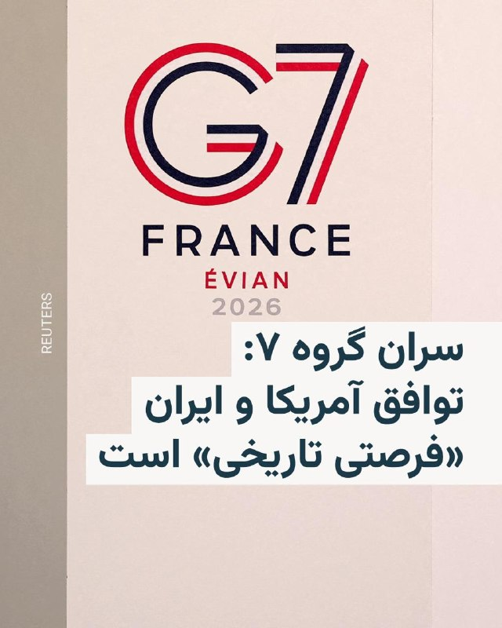

🔸رهبران گروه ۷ چارچوب توافق میان ایالات متحده و ایران را «فرصتی تاریخی» برای ممانعت از دستیابی تهران به سلاح هسته‌ای می‌بینند.

🔸این موضوع در بیانیه‌ای که از طرف اعضای گروه در نخستین ساعات بامداد چهارشنبه ۲۷ خردادماه منتشر شد،‌ آمده است.

🔸سران هفت کشور دموکراتیک صنعتی در این بیانیه می‌گویند توافق بین واشینگتن و تهران، که قرار است روز جمعه در مراسمی رسمی در سوئیس به امضای نمایندگان ارشد دو کشور برسد، می‌تواند «برای همۀ منطقه صلح و آرامش را به ارمغان بیاورد».

🔸سران این کشورها با تأکید بر حمایت‌شان از اجرای مفاد توافق،‌ از آمادگی برای کمک به تسهیل این روند خبر دادند.
در این بیانیه در مورد تنگۀ هرمز هم آمده که «حق تردد آزادانه بدون مانع و نیاز به پرداخت عوارض، زیربنای تجارت بین‌المللی است».

🔸سران این گروه در مورد درگیری میان اسرائیل و گروه حزب‌الله لبنان هم،‌ ضمن تأکید بر حمایت از تلاش‌های رهبری سیاسی لبنان برای خلع سلاح حزب‌الله از طریق «یک آتش‌بس فوری و محکم»، خواستار حفظ یکپارچگی سرزمینی لبنان «با تضمین‌های امنیتی مناسب و بین‌المللی» شدند.

@RadioFarda

## RadioFarda — post 158412

  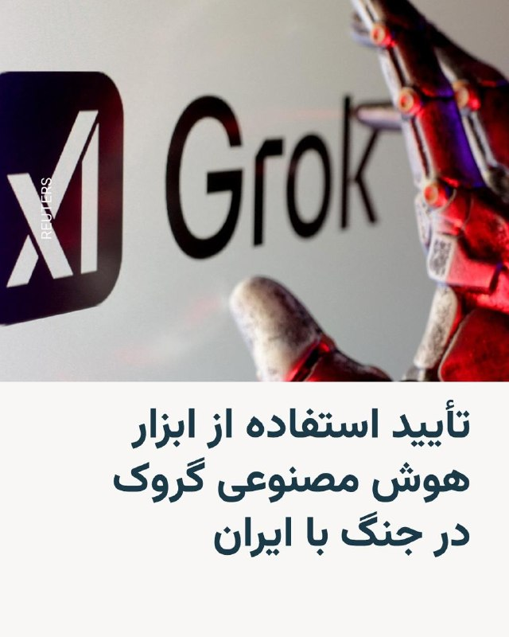

🔸دولت ایالات متحده در سندی که به رویت خبرگزاری فرانسه رسیده، تأیید کرده که در جریان حملاتش به ایران، از ابزار هوش مصنوعی ایلان ماسک، موسوم به «گروک» استفاده کرده است.

🔸در آستانۀ آغاز جنگ آمریکا و ایران، پس از آن‌که شرکت آنتروپیک حاضر نشد مجوز استفاده از ابزارهای هوش مصنوعی‌اش برای استفاده در حملات کاملاً خودکار، یا نظارت گسترده بر شهروندان آمریکا را به دولت ایالات متحده بدهد، کاخ سفید قراردادش با این شرکت را لغو کرد.

🔸پنتاگون سپس برای پیگیری برنامه‌هایش در زمینۀ استفاده از هوش مصنوعی به سراغ رقیبان آنتروپیک رفت؛ از جمله گوگل، اوپن اِی‌آی، و اِکس‌اِی‌آی.

🔸در گوگل بیش از ششصد تن از کارکنان از شرکت خواستند که ابزار هوش مصنوعی را برای عملیات طبقه‌بندی‌شده در اختیار ارتش قرار ندهد. سایر شرکت‌ها هم دربارۀ تهدیدات ناشی از استفادۀ نظامی از هوش مصنوعی ابراز نگرانی جدی کردند.

🔸حرکت ارتش آمریکا به سمت توسعۀ هوش مصنوعی اختصاصی‌اش، بیش از زمان پیش‌بینی‌شده طول کشیده و فروردین‌ماه گذشته، دولت ناچار شد اذعان کند که همچنان از ابزار «کلاود» در جنگ ایران استفاده می‌کرده است.

@RadioFarda

## RadioFarda — post 158411

  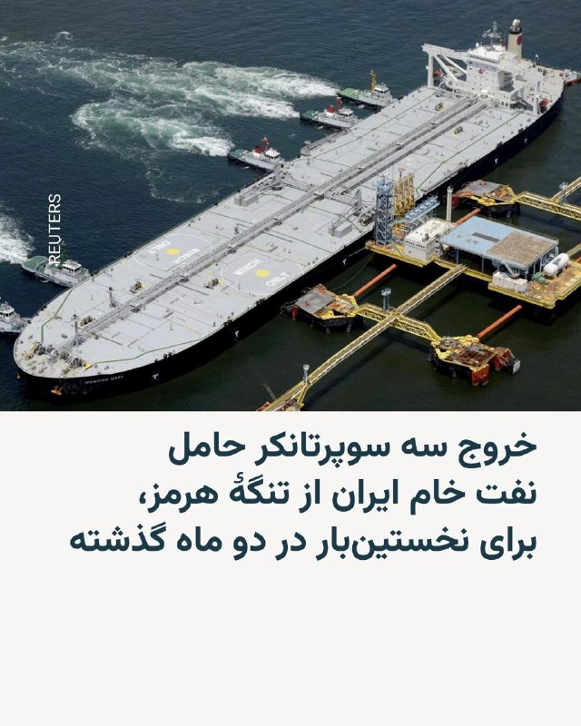

🔸نخستین نفتکش‌های حامل نفت خام ایران از زمان آغاز محاصرۀ دریایی آمریکا، از تنگۀ هرمز خارج شدند. این موضوع را صبح چهارشنبه یکی از وب‌سایت‌های ردیابی کشتی‌ها اعلام کرد.

🔸این در حالی‌است که قرار است روز جمعه، دو روز دیگر، نمایندگان ارشد ایران و آمریکا در سوئیس توافق اولیه با هدف پایان جنگ را امضا کنند.

🔸وبسایت «تنکر ترکِرز» (Tanker Trackers) که ذخیره و حمل‌ونقل محموله‌های نفتی را دنبال می‌کند، بر اساس داده‌های دیجیتال منطبق با تصاویر ماهواره‌ای، «اولین صادرات نفت خام ایران در دو ماه اخیر» را تأیید کرده است.

🔸«تنکر ترکرز» با انتشار مطلبی در شبکه ایکس نوشت: «دست‌کم دو نفتکش شرکت ملی نفتکش ایران، شامل دو سوپرتانکر بسیار بزرگ حمل نفت خام به نام‌های «دیونا» و «هیرو ۲» با عبور از منطقۀ محاصرۀ دریایی نیروی دریایی ایالات متحده، در مجموع ۳ میلیون و ۸۰۰ هزار بشکه نفت خام ایران را از پایانه‌های این کشور بارگیری کرده و به سمت مقاصد خود در حرکتند».

🔸این شرکت سپس از عبور سومین نفتکش ایرانی از محدودۀ محاصره دریایی آمریکا هم خبر داد.

@RadioFarda

## RadioFarda — post 158410

  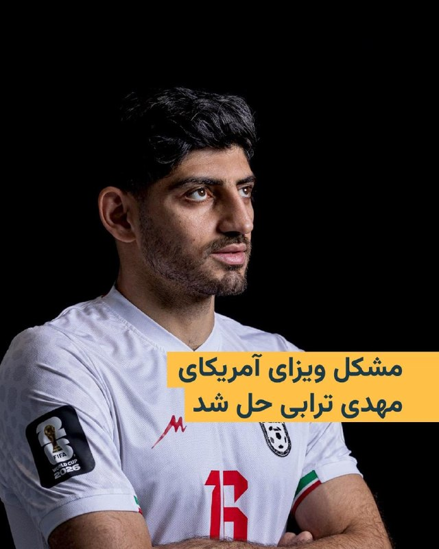

🔸فدراسیون فوتبال ایران اعلام کرد که با حل‌شدن مشکل ویزای مهدی ترابی، این بازیکن برای همراهی تیم ملی در بازی‌های بعدی در مقابل بلژیک و مصر، و احیاناً مرحله حذفی جام جهانی مشکلی نخواهد داشت.

🔸تیم ملی فوتبال ایران که اردوی خود را در شهر مرزی تیخوانای مکزیک برپا کرده، باید در آستانۀ هریک از دیدارهای مرحلۀ گروهی خود، که همگی در آمریکا برگزار می‌شوند، به این کشور سفر کرده و پس از مسابقه، به مکزیک بازگردد.

🔸ایالات متحده برای همۀ بازیکنان تیم ملی ایران بجز مهدی ترابی ویزای ورود چندگانه صادر کرده بود؛ اما این بازیکن، که به طرفداری از حکومت و داشتن ارتباطاتی با سپاه پاسداران مشهور است، ویزایی برای یک مرتبه ورود دریافت کرده بود.

🔸مهدی ترابی در مسابقۀ ایران و نیوزیلند که در لس‌آنجلس برگزار شد، ذخیره بود و به میدان نرفت؛ با وجود این در زمان بازگشت تیم یه تیخوانا به او یادآوری شد که روادیدش منقضی شده و امکان بازگشت به آمریکا را نخواهد داشت.

🔸ساعاتی بعد اما فدراسیون فوتبال جمهوری اسلامی تأیید کرد که با همراهی و مساعدت فیفا، ایالات متحده برای مهدی ترابی ویزای ورود چندگانه صادر کرده

@RadioFarda

## RadioFarda — post 158409

  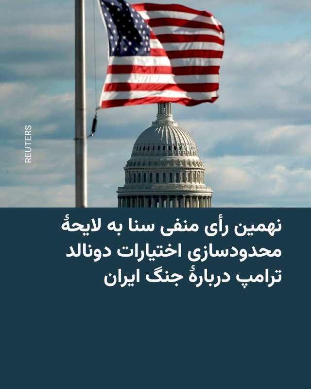

🔸سنای ایالات متحده برای نهمین بار به طرح دموکرات‌ها برای محدودکردن اختیارات دونالد ترامپ در زمینۀ جنگ رأی منفی داد.

🔸سناتورهای دموکرات از زمان آغاز جنگ اسرائیل و آمریکا با ایران در نهم اسفندماه ۱۴۰۴ با ارائۀ ۹ طرح مختلف تلاش کرده‌اند که جلوی ادامۀ مشارکت ایالات متحده در جنگ با ایران را گرفته و آن‌را به موافقت کنگره منوط کنند.

🔸در رأی‌گیری سه‌شنبه، طرحی که از سوی رافائل وارناک، سناتور جورجیا معرفی شده بود، با تنها یک‌رای اختلاف؛ ۴۸ به ۴۷ شکست خورد. در این رأی‌گیری ۵ سناتور شامل دو جمهوری‌خواه از جمله میچ مک‌کانِل، دو دموکرات و همینطور برنی سندرز، سناتور باسابقۀ مستقل شرکت نکردند.

🔸رأی‌گیری تازه در حالی انجام شد که قانون‌گذاران آمریکایی منتظر هستند که دونالد ترامپ رئیس‌جمهور ایالات متحده جزئیات طرح توافق با ایران را با آنها در میان بگذارد.

🔸به تازگی مجلس نمایندگان هم به لایحۀ مشابهی، رأی منفی داد.

🔸حزب جمهوریخواه با اختلافی اندک، اکثریت هم دو مجلس کنگره را در اختیار دارد.
@RadioFarda

## RadioFarda — post 158408

  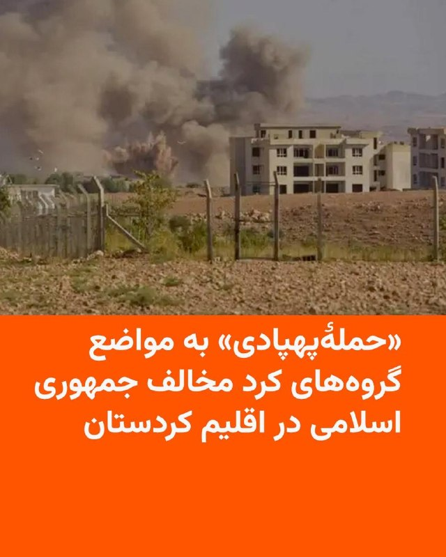

🔸برخی منابع امنیتی از وقوع یک حملۀ پهپادی به یک اردوگاه گروه‌های کرد مخالف جمهوری اسلامی در شرق اربیل در اقلیم کردستان عراق خبر می‌دهند.

🔸هنوز جزئیات بیشتری از این موضوع منتشر نشده است، اما طی هفته‌ها و ماه‌های گذشته، نیروهای مسلح جمهوری اسلامی به‌‌ویژه سپاه پاسداران بارها با پهپاد و موشک‌های بالستیک، مواضع شبه‌نظامیان کرد مخالف جمهوری اسلامی مستقر در کردستان عراق را هدف قرار داده‌اند.

@RadioFarda

## RadioFarda — post 158407

  <a href="https://t.me/radiofarda/158407" target="_blank">📎 Download file</a>

📻بشنوید: سرخط خبرها با رادیوفردا، ۲۷ خرداد ۱۴۰۵‌

@RadioFarda

## BBCPersian — post 284109

🔻تورم ماهانه بریتانیا در ماه مه، تحت تاثیر جنگ آمریکا و اسرائیل با ایران، همچنان ۲.۸ درصد باقی ماند

نرخ تورم سالانه در بریتانیا در ماه مه بدون تغییر نسبت به ماه قبل همچنان ۲.۸ درصد باقی مانده است.

بنابر این گزارش، قیمت بنزین و سوخت در بریتانیا به خاطر جنگ آمریکا و اسرائیل با ایران بالا رفته است. اما در همان زمان، قیمت مواد غذایی پایین آمده و این کاهش، اثر گرانی سوخت را تا حدی خنثی کرده است.

اداره ملی آمار بریتانیا روز چهارشنبه اعلام کرد شاخص قیمت مصرف‌کننده با رقم ثبت‌شده در ماه آوریل برابر بوده است.

این در حالی است که تحلیلگران پیش‌بینی می‌کردند این شاخص تا سطح ۳ درصد افزایش یابد.
https://bbc.in/4vZEZrP
@BBCPersian

## BBCPersian — post 284108

🔻گزارش‌ها از حملات هوایی اسرائیل به چندین نقطه در جنوب لبنان

نیروهای اسرائیلی چهارشنبه چندین نقطه در جنوب لبنان را بمباران کردند.

رسانه‌های دولتی لبنان گزارش دادند که این حملات در حالی انجام شده که توافق آتش‌بس مرتبط با جنگ خاورمیانه، لبنان را نیز در بر می‌گیرد.

خبرگزاری ملی لبنان اعلام کرد جنگنده‌های اسرائیلی در این حملات مناطقی از جمله نبطیه را هدف قرار دادند.

بر اساس گزارش این خبرگزاری، اسرائیل همچنین با استفاده از پهپاد شهر انصاریه در منطقه زهرانی را هم هدف قرار داده است.

https://bbc.in/43Bd6dr
@BBCPersian

## BBCPersian — post 284107

💢«بداهه‌سرایی پای میز مذاکره»؛ قطار دیپلماسی بدون دیپلمات به کجا می‌رسد؟
🖌مهرنوش پورضیایی، بی‌بی‌سی، واشنگتن

بیش از صد روز از آغاز جنگی که قرار بود چند روزه باشد می‌گذرد؛ جنگی که در هفته‌های اخیر با تبادل حملات میان ایران، اسرائیل و آمریکا بار دیگر نشان داد آتش‌بس بیش از آنکه پایان بحران باشد، نامی موقت بر وضعیتی ناپایدار و آماده انفجار است. با این حال، در روزهای اخیر نشانه‌هایی از پیشرفت در مذاکرات برای پایان دادن به جنگ ظاهر شده و مقام‌های ایران، آمریکا و پاکستان از نزدیک شدن یک تفاهم احتمالی سخن گفته‌اند.
ناوهای آمریکایی همچنان در خلیج فارس حضور دارند، ایران و اسرائیل یکدیگر را به نقض آتش‌بس متهم می‌کنند و فضای بی‌اعتمادی همچنان بر روابط طرف‌ها سایه انداخته است. در عین حال، گزارش‌ها از نهایی شدن متن یک تفاهم‌نامه و احتمال امضای آن در روزهای آینده حکایت دارد؛ توافقی که در صورت تحقق می‌تواند نخستین گام جدی برای پایان دادن به بحرانی باشد که بیش از سه ماه منطقه را درگیر کرده است.
دیدارها دیگر تب‌وتاب روزهای نخست را ندارند، اما کانال‌های مستقیم و غیرمستقیم مذاکره همچنان فعال‌اند. پس از ماه‌ها بن‌بست و تشدید تنش، اکنون برای نخستین بار زمزمه‌های دستیابی به توافقی پایدار بیش از گذشته شنیده می‌شود؛ هرچند با توجه به سابقه مواضع متغیر و گاه غیرقابل پیش‌بینی دونالد ترامپ، بسیاری از تحلیلگران همچنان با دیده تردید به ادعاهای مطرح‌شده درباره نزدیک بودن پایان بحران می‌نگرند.
ادامه مطلب⬇️
https://bbc.in/3Q7zfwV
@BBCPersian

## BBCPersian — post 284097

🖋بخش پادکست‌
بی‌بی‌سی روسی

ایران و آمریکا برای پایان دادن به جنگ به تفاهم رسیده‌اند. دونالد ترامپ، رئیس‌جمهور آمریکا، با اعلام این خبر گفت: «بگذارید نفت جاری شود.» مقام‌های ایرانی نیز در مقابل از پیروزی بر آمریکا سخن گفته‌اند. با این حال، هنوز اطلاعات بسیار اندکی درباره محتوای این توافق منتشر شده است. این مصالحه دقیقا چیست؟ کدام طرف از آن بیشتر سود می‌برد؟ و آیا این صلح پایدار خواهد بود؟

سوا بویکو، مجری پادکست سرویس روسی بی‌بی‌سی، این پرسش‌ها را با نیکیتا اسماگین، ایران‌شناس و صاحب کانال تلگرامی «اسلام‌گرایی از زبان یک عامل خارجی»، در میان گذاشته است. دولت روسیه آقای اسماگین را در فهرست «عوامل خارجی» ثبت کرده است.
ادامه مطلب⬇️

📸GettyImages/ Reuters/ AFP via Getty Images/ U.S. Navy via Getty Images/ NurPhoto via Getty Images
https://bbc.in/4aAHsAu
@BBCPersian

## BBCPersian — post 284096

  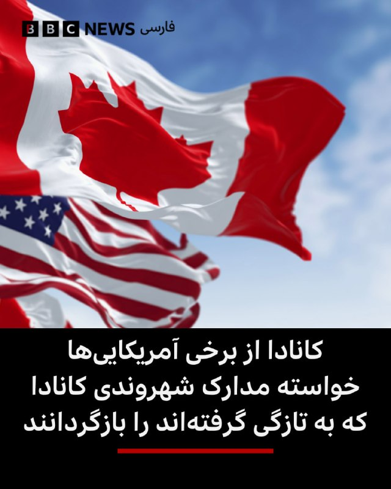

🔻شماری از شهروندان آمریکایی که به تازگی مدارک اثبات شهروندی کانادا را دریافت کرده‌اند، از سوی مقام‌های کانادایی نامه‌ای دریافت کرده‌اند مبنی بر این که تا زمان تکمیل بررسی‌های بیشتر، گواهی‌های جدید شهروندی خود را تحویل دهند؛ اقدامی که موجب سردرگمی و ناامیدی افراد مشمول و وکلای آنها شده است.

در نامه‌هایی که از سوی وزارت مهاجرت کانادا ارسال شده و نسخه‌هایی از آن در اختیار بی‌بی‌سی قرار گرفته، آمده است که دریافت‌کنندگان «ممکن است واجد شرایط دریافت گواهی شهروندی نباشند» و از آنها خواسته شده است مدارک خود را بازگردانند.

این نامه‌ها برای شمار نامعلومی از افرادی ارسال شده که بر اساس یک قانون مصوب ماه دسامبر و از طریق پیوندهای خانوادگی با کانادا، موفق به دریافت شهروندی شده بودند.

سخنگوی وزارت مهاجرت کانادا در بیانیه‌ای به بی‌بی‌سی تایید کرد که «تعداد محدودی از پرونده‌ها» در حال بازبینی هستند.
ادامه مطلب⬇️
📸GettyImages
https://bbc.in/3Swvlyd
@BBCPersian

## BBCPersian — post 284086

‌ ‌ ‌
ران بیشاپ می‌دانست که دروغ می‌گوید.

او ۱۴ ساله بود و در برابر قاضی به‌عنوان شاهد اصلی در یک محاکمه قتل ایستاده بود. این پرونده مربوط به سه نوجوان متهم به قتل بهترین دوست او، دویت داکت، در نوامبر ۱۹۸۳ بود.

آقای بیشاپ علیه آلفرد چستنات، اندرو استوارت و رنسوم واتکینز شهادت می‌داد. با شهادت سه شاهد دیگر، پرونده دادستانی مستحکم به‌ نظر می‌رسید. آقای بیشاپ می‌ترسید که اگر با آن‌ها مخالفت کند، چه اتفاقی خواهد افتاد.

او به بی‌بی‌سی گفت: «اگر حقیقت را می‌گفتم، با همه‌شان مخالفت کرده بودم. سه شاهد گفته بودند که آن سه نفر مقصرند. و من فکر می‌کردم هیئت منصفه فکر می‌کند من دروغ می‌گویم.»

دروغ‌هایی که آن روز در دادگاه بالتیمور گفته شد، به محکومیت سه نوجوان سیاه‌پوست به حبس ابد منجر شد.

https://bbc.in/4eOhxYs
📷 GettyImages/ Ron Bishop
@BBCPersian

## Dirty_Kids — post 392366

  <a href="telegram/content/Dirty_Kids_392366_1781679880.mp4" target="_blank">🎬 Download video</a>

قسط یک ماه کاوازاکی نینجا ۶۵۰ سی‌سی رو میشه با روزی ۶ ساعت کار کردن تو سوئیس دراورد!

+ مادرتو گاییدم آخوند که مردم ایران روی گنج خوابیدن ولی برای جوونا این موتور آرزوی دست نیافتنیه!

@Dirty_Kids 👻

## Dirty_Kids — post 392365

  <a href="telegram/content/Dirty_Kids_392365_1781679881.mp4" target="_blank">🎬 Download video</a>

اینوری خیلی قشنگه ولی اونوریه انقد قشنگه که به چشم نمیاد

@Dirty_Kids 👻

## alonews — post 128605

  <a href="telegram/content/alonews_128605_1781679883.webm" target="_blank">🎬 Download video</a>

👈بلومبرگ: آمریکا آماده است در توافق صلح، منافع مالی گسترده‌ای به ایران ارائه کند؛ مانند حق فروش فوری نفت، دسترسی به صندوق توسعه‌ ۳۰۰ میلیارد دلاری و دارایی‌های مسدود شده خود

✅ @AloNews خبر جنگ

## alonews — post 128604

  <a href="telegram/content/alonews_128604_1781679883.webm" target="_blank">🎬 Download video</a>

👈وزیر خارجه چین: توافق فعلی بین ایران و آمریکا آغاز راه است، نه نقطه پایان

🔴وانگ یی در گفت‌و‌گو با همتای پاکستانی خود: توافق فعلی، آغاز راه است، نه نقطه پایان؛ از این رو، تداوم صلح در خاورمیانه و منطقه خلیج فارس همچنان به تداوم تلاش‌های همه طرف‌ها نیاز دارد.

🔴چین نیز به روش خود به میانجیگری بین ایران و آمریکا پرداخته است

✅ @AloNews خبر جنگ

## alonews — post 128603

  <a href="telegram/content/alonews_128603_1781679883.mp4" target="_blank">🎬 Download video</a>

👈مایک پنس، معاون سابق ترامپ: «به نظر من بهتر است به نیروهای مسلح ایالات متحده اجازه دهیم کار را تمام کنند، تنگه را باز کنند و قابلیت‌های تهاجمی ایرانیان را از بین ببریم و به مردم ایران فرصتی واقعی برای آزادی بدهیم.»

✅ @AloNews خبر جنگ

## alonews — post 128602

  <a href="telegram/content/alonews_128602_1781679884.mp4" target="_blank">🎬 Download video</a>

👈سرقت خودپرداز بانک با لیفتراک در بریتانیا

🔴 سارقان با یک لیفتراک تلسکوپی شبانه به شعبه بانک در کمبریج‌شایر رفتند و دستگاه خودپرداز را از دیوار کندند. پلیس اعلام کرد لیفتراک هم سرقتی بوده است

✅ @AloNews خبر جنگ

## alonews — post 128601

  <a href="telegram/content/alonews_128601_1781679886.webm" target="_blank">🎬 Download video</a>

👈ونس: اگر ایران همان راهی را که عربستان سعودی رفت طی کند، ایالات متحده کمک خواهد کرد که کشوری موفق باشد.

✅ @AloNews خبر جنگ

## alonews — post 128600

  <a href="telegram/content/alonews_128600_1781679886.webm" target="_blank">🎬 Download video</a>

👈وزیر دارایی اسرائیل:توافق با ایران بد است

🔴 ترامپ از منافع کشور خودش محافظت می‌کند و ما از منافع خودمان

🔴 باید بدانیم که چگونه این بحران را مدیریت کنیم و در عین حال، بر مواضع خود بایستیم

✅ @AloNews خبر جنگ

## alonews — post 128599

  <a href="telegram/content/alonews_128599_1781679886.mp4" target="_blank">🎬 Download video</a>

👈وضعیت جوریه که حتی رهبر جمهوری خواهان سنا هم مثل من و شما از مفاد تفاهم نامه خبر نداره!

✅ @AloNews خبر جنگ

## alonews — post 128598

  <a href="telegram/content/alonews_128598_1781679888.mp4" target="_blank">🎬 Download video</a>

👈ونس درباره ایران: دلیل اینکه متن تفاهم‌نامه را منتشر نکرده‌ایم این است که برخی از میانجی‌های ما؛ پاکستانی‌ها و قطری‌ها؛ از ما خواسته‌اند که این موضوع را به ترتیب درست انجام دهیم.

🔴 حساسیت‌هایی در جهان عرب و مسلمان وجود دارد که ما در تلاشیم به آن‌ها پاسخ دهیم.

✅ @AloNews خبر جنگ

## alonews — post 128597

  <a href="telegram/content/alonews_128597_1781679890.mp4" target="_blank">🎬 Download video</a>

👈ونس درباره ایران: ایرانی‌ها در موقعیتی هستند که می‌گویند می‌خواهند تعهدات بلندمدتی به ایالات متحده و کشورهای عرب خلیج فارس بدهند تا رابطه‌شان را تغییر دهند.

✅ @AloNews خبر جنگ

## alonews — post 128596

  <a href="telegram/content/alonews_128596_1781679891.mp4" target="_blank">🎬 Download video</a>

👈هواپیمای "سسنا ۶۸۰ سایتیشن لاتیتود" هنگام ورود به تگزاس منفجر شد

🔴 تیم‌های اورژانس به سرعت به محل حادثه رفتند.

🔴 ورود به پنجره کابین خلبان

✅ @AloNews خبر جنگ

## alonews — post 128595

  <a href="telegram/content/alonews_128595_1781679892.mp4" target="_blank">🎬 Download video</a>

👈 هم‌اکنون حمله هوایی اسرائیل به النبطیه الفوقا و شلیک موشک به اطراف کفرتبنیه در جنوب لبنان

✅ @AloNews خبر جنگ

## alonews — post 128594

  <a href="telegram/content/alonews_128594_1781679893.webm" target="_blank">🎬 Download video</a>

👈شریعتمداری: درگیری ما و امریکا، ماهوی و وجودی است؛ تفاهم اخیر، اصل درگیری ما را تغییر نمی‌دهد!

✅ @AloNews خبر جنگ

## alonews — post 128593

  <a href="telegram/content/alonews_128593_1781679894.webm" target="_blank">🎬 Download video</a>

👈با فعال شدن کریدور جدید دریایی بین قشم و عمان پس از جنگ، محموله‌های خودروهای خارجی به این جزیره سرازیر شده است

✅ @AloNews خبر جنگ

## alonews — post 128592

  <a href="telegram/content/alonews_128592_1781679894.webm" target="_blank">🎬 Download video</a>

👈 ارتش اسرائیل اعلام کرد یک انبار تسلیحات جدید حزب‌الله حاوی ۵ تن مواد منفجره و ده‌ها پهپاد انتحاری را کشف کرده است

✅ @AloNews خبر جنگ

## alonews — post 128591

  <a href="telegram/content/alonews_128591_1781679894.mp4" target="_blank">🎬 Download video</a>

👈تیراندازی مرگبار در بیمارستان ویلیمینگتون ایالت دِلاوِر آمریکا، یک قربانی برجای گذاشت و عامل مسلح حادثه همچنان متواری است.

🔴پلیس اعلام کرد نیروهای امنیتی در حال انجام عملیات برای یافتن و بازداشت فرد مهاجم هستند و تحقیقات درباره جزئیات این تیراندازی ادامه دارد.

✅ @AloNews خبر جنگ

## alonews — post 128590

  <a href="telegram/content/alonews_128590_1781679895.mp4" target="_blank">🎬 Download video</a>

👈فرماندهی جنوبی ارتش آمریکا از حملۀ مرگبار به یک شناور در آب‌های شرق اقیانوس آرام خبر داد؛ اقدامی که جان یک سرنشین را گرفت

✅ @AloNews خبر جنگ

## alonews — post 128589

  <a href="telegram/content/alonews_128589_1781679896.webm" target="_blank">🎬 Download video</a>

👈تنکر ترکرز: ۳.۸ میلیون بشکه نفت خام ایران از محاصره آمریکا عبور کرد

🔴 تارنمای تنکر ترکز بامداد چهارشنبه گزارش داد، دو ابرنفتکش ایران که مجموعا حامل ۳.۸ میلیون بشکه نفت خام هستند، از محاصره آمریکا عبور کردند

✅ @AloNews خبر جنگ

## alonews — post 128588

  <a href="telegram/content/alonews_128588_1781679897.webm" target="_blank">🎬 Download video</a>

👈منابع عربی: اسرائیل حومۀ شهرک نبطیه‌الفوقا در جنوب لبنان را هدف حملات قرار داد

✅ @AloNews خبر جنگ

## alonews — post 128587

  <a href="telegram/content/alonews_128587_1781679897.webm" target="_blank">🎬 Download video</a>

👈وبسایت خبری سمافور: مارکو روبیو، وزیر خارجه دولت ترامپ با انعقاد یادداشت تفاهم نامه با ایران مخالفت کرده و هیچ اظهار نظری درباره رسیدن به توافق با ایران نمی‌کند.

🔴وزیر خارجه آمریکا امیدی به رسیدن به توافق هسته‌ای در مذاکرات با ایران پس از امضای یادداشت تفاهم نامه ندارد و تاکنون درباره امضای یادداشت تفاهم نامه با ایران کاملاً سکوت کرده است

✅ @AloNews خبر جنگ

## alonews — post 128586

  <a href="telegram/content/alonews_128586_1781679897.webm" target="_blank">🎬 Download video</a>

👈 بلومبرگ: به گفته مقامات آمریکایی، معافیت فروش نفت ایران فقط شامل محموله‌های نفتی می‌شود که قبلاً بارگیری شده است و شامل مجوز گسترده‌تر برای از سرگیری فروش نفت ایران نمی‌شود

✅ @AloNews خبر جنگ

<!-- MSG END -->

<!-- NAV START -->

<a href="https://github.com/Tljn/FUD/blob/main/telegram/content/archive_1.md" style="display:inline-block; padding:6px 12px; margin:0 4px; background-color:#2ea44f; color:white; text-decoration:none; border-radius:4px; font-weight:bold;">صفحه بعد</a>

<!-- NAV END -->
