# خواننده تلگرام

<!-- TOP_NAV START -->

<a href="https://github.com/Tljn/FUD/blob/main/telegram/content/archive_1.md" style="display:inline-block; padding:6px 12px; margin:0 4px; background-color:#2ea44f; color:white; text-decoration:none; border-radius:4px; font-weight:bold;">صفحه بعد</a>

<!-- TOP_NAV END -->

<!-- MSG START -->

---
📅 بروزرسانی: 1405/03/31 05:29
---

## VahidOOnLine — post 246606

♦️سازمان هوانوردی و فضا ایالات متحده (ناسا)، با انتشار تصاویری اعلام کرد که توپ رسمی جام جهانی ۲۰۲۶ فوتبال به فضا فرستاده شده تا فضانوردان مستقر در ایستگاه فضایی بین‌المللی (ISS)، آزمایش‌هایی را روی آن انجام دهند. مهندسان ورزشی برای اینکه توپ‌های فوتبال حرکت پیش‌بینی‌پذیری در زمین داشته باشند، مرکز جرم و تعادل آن‌ها را به دقت اندازه‌گیری و بهینه‌سازی می‌کنند؛ در همین راستا، خدمه ایستگاه فضایی یک آزمایش مربوط به سال ۲۰۱۹ را با توپ «آدیداس تریوندا ۲۰۲۶» (adidas 2026 Trionda) بازسازی کردند تا تاثیر تعادل خوب و بد را در عملکرد توپ نمایش دهند. یافته‌های حاصل از این آزمایش‌ها، درک دانشمندان را از چگونگی تاثیر فناوری‌های تعبیه‌شده داخلی، مانند حسگرهای هوشمند درون توپ، بر کارایی آن در طول بازی افزایش داده است. ناسا تأکید کرده که کمک به بهبود این بازیِ زیبا، تنها یکی از چندین روشی است که علوم فضایی در ایستگاه بین‌المللی برای بهبود کیفیت زندگی مردم روی زمین به کار می‌گیرد.
‌🇸🇦 Indypersian

🤖 @VahidOOnLine

## VahidOOnLine — post 246605

  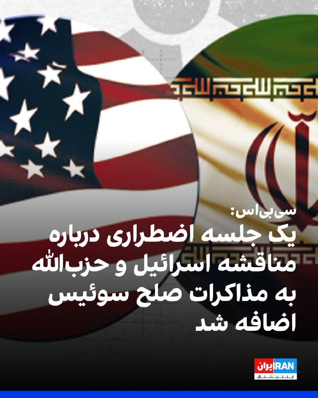

شبکه خبری سی‌بی‌اس به نقل از «یک دیپلمات حاضر در مذاکرات سوئیس» گفت که یک جلسه اضطراری برای رسیدگی به مناقشه بین اسرائیل و گروه شبه‌نظامی حزب‌الله لبنان به برنامه اولین روز مذاکرات صلح اضافه شده است.

او اشاره کرد این موضوع در اولین جلسه‌ای که هیات‌های آمریکایی و ایرانی مذاکرات خود را آغاز می‌کنند، مطرح خواهد شد.
‌🏁 🇬🇧 IranintlTV

🤖 @VahidOOnLine

## VahidOOnLine — post 246604

  

وای‌نت در یادداشتی نوشت که تفاهم دولت دونالد ترامپ با جمهوری اسلامی، ابتکار عمل را به تهران واگذار کرده و ایران توانسته است شکست نظامی خود را به یک «پیروزی راهبردی» تبدیل کند؛ تحولی که به باور نویسنده، جایگاه آمریکا و اسرائیل را تضعیف و موقعیت ایران و حزب‌الله را تقویت کرده است.

بن‌درور یمینی، نویسنده این یادداشت، با انتقاد از رویکرد ترامپ در قبال ایران، نوشت که رییس‌جمهوری آمریکا عملاً کنترل اوضاع را به تهران سپرده است. او مدعی شد [حکومت] ایران، در حالی که هنوز توافق به طور کامل اجرایی نشده، با تهدید به بستن تنگه هرمز و شلیک موشک‌های بالستیک به اسرائیل، مفاد تفاهم را نقض کرده و هم‌زمان از حزب‌الله برای افزایش فشار بر اسرائیل و ایجاد شکاف میان واشینگتن و تل‌آویو بهره می‌برد.

به نوشته وای‌نت، تهران با استفاده از حزب‌الله، اسرائیل را در برابر یک دوراهی قرار داده است؛ به گونه‌ای که پاسخ نظامی اسرائیل به حملات حزب‌الله، همان نتیجه‌ای است که [حکومت] ایران به دنبال آن است و در مقابل، خودداری از واکنش نیز می‌تواند به افزایش جسارت [حکومت] ایران و حزب‌الله منجر شود.

‌🏁 🇬🇧 IranintlTV

🤖 @VahidOOnLine

## VahidOOnLine — post 246603

  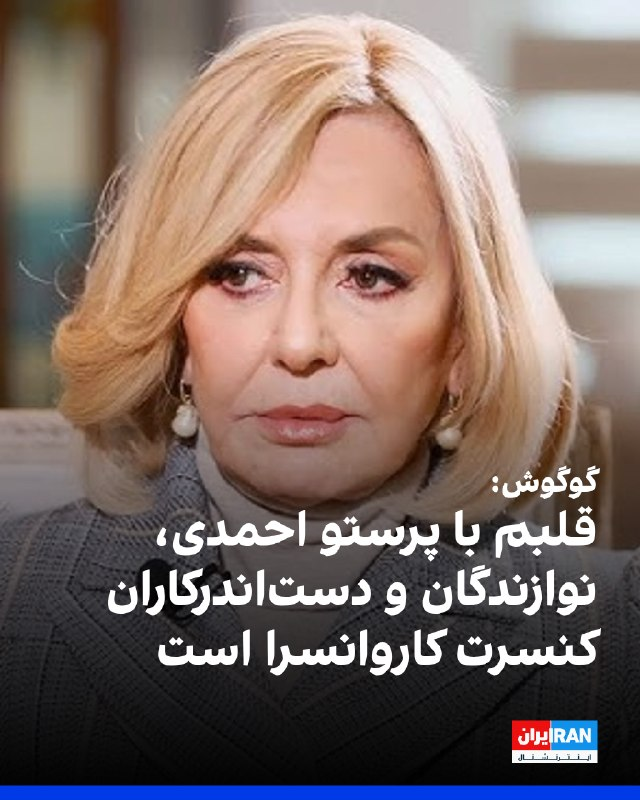

گوگوش، خواننده سرشناس ایرانی، در صفحه اینستاگرام خود از صدور حکم ۷۴ ضربه شلاق، دو سال ممنوعیت خروج از کشور و دو سال محرومیت از فعالیت هنری علیه پرستو احمدی، خواننده و هشت نفر از نوازندگان و دست‌اندرکاران «کنسرت کاروانسرا» انتقاد کرد.

او نوشت ۷۴ ضربه شلاق به‌خاطر «جرم» آواز خواندن با موی آشکار.

گوگوش اشاره کرد که قلبش با پرستو احمدی و اعضای کنسرت و تهیه‌کننده آن است و نوشت: «باشد که این روزهای تاریک به سر آید، زنان بار دیگر آزاد انتخاب شیوه زندگی و پوشش خود را باز یابند، و هنر و بیان هنری بار دیگر در میهن عزیز و گران‌قدرمان شکوفا شود.»
‌🏁 🇬🇧 IranintlTV

🤖 @VahidOOnLine

## VahidOOnLine — post 246602

  <a href="telegram/content/VahidOOnLine_246602_1782007199.mp4" target="_blank">🎬 Download video</a>

♦️حسین پوراکبریان، عکاس نجومی و عضو اصلی انجمن عکاسان ایران، با ثبت و انتشار ویدیویی خیره‌کننده از کهکشان راه شیری بر فراز قله دماوند، جلوه‌ای تماشایی از تلاقی پدیده‌های آسمانی و زمینی را به تصویر کشیده است. او با الهام از سحابی تاریک، توده‌های عظیمی از گرد و غبار که نور ستاره‌های پشت خود را مسدود کرده و سایه‌ای شبیه به یک اسب در حال دویدن را میان صور فلکی عقرب و کماندار می‌سازند، در توضیح این اثر نوشت: «چند شب پیش شاهد صعود راه‌ شیری سوار بر اسب‌ تاریک به قله دماوند بودم، شما هم ببینید.» پوراکبریان این قاب جادویی و پرابهت از بام ایران را با ابیاتی ماندگار از شعر معروف «دماوندیه» اثر ملک‌الشعرای بهار درآمیخت و نوشت: «بفکن ز پی این اساس تزویر / بگسل ز هم این نژاد و پیوند / برکن ز بن این بنا که باید / از ریشه بنای ظلم برکند / زین بیخردانِ سفله بستان / داد دل مردم خردمند.»
‌🇸🇦 Indypersian

🤖 @VahidOOnLine

## VahidOOnLine — post 246601

  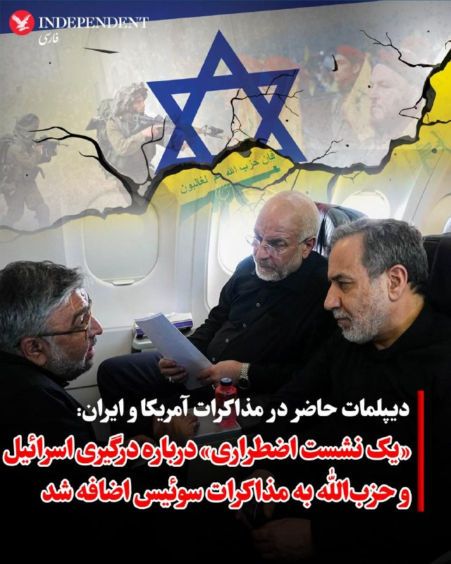

♦️یک دیپلمات حاضر در مذاکرات سوئیس در گفتگو با «سی‌بی‌اس نیوز» اعلام کرد که «یک نشست اضطراری» با محوریت مناقشه اسرائیل و حزب‌الله لبنان به برنامه روز نخست این گفتگوها اضافه شده است. بر اساس این گزارش، بررسی این بحران به عنوان اولین دستور کار هیات‌های دیپلماتیک ایالات متحده و ایران در آغاز مذاکرات فنی تعیین شده است. «سی‌بی‌اس» نوشت، این در حالی است که نه اسرائیل، نه حزب‌الله و نه دولت لبنان هیچ‌کدام در این گفتگوها حضور ندارند و موافقت واشنگتن با ورود این پرونده به میز مذاکرات از سوی ایران، نشان‌دهنده یک چرخش آشکار در استراتژی ایالات متحده است. این نشست اضطراری هم‌زمان با ورود هیئت ایرانی و پرواز جی‌دی ونس، معاون رئیس‌جمهوری آمریکا به مقصد سوئیس، با حضور میانجی‌های قطر و پاکستان، روز یکشنبه، ۳۱ خردادماه، برگزار می‌شود.
‌🇸🇦 Indypersian

🤖 @VahidOOnLine

## VahidOOnLine — post 246600

  

کانال ۱۴ اسرائیل روز شنبه گزارش داد نیروهای اسرائیلی یک مرکز فرماندهی زیرزمینی حزب‌الله در ارتفاعات علی طاهر را که جمهوری اسلامی در جنوب لبنان ساخته بود، تصرف کرده‌اند. طبق این گزارش گمان می‌رود صدها عضو حزب‌الله در داخل این مرکز گرفتار شده باشند.
‌🏁 🇬🇧 IranintlTV

🤖 @VahidOOnLine

## VahidOOnLine — post 246599

  <a href="telegram/content/VahidOOnLine_246599_1782007205.mp4" target="_blank">🎬 Download video</a>

علی خضریان، عضو کمیسیون امنیت ملی مجلس، در صداوسیما با انتقاد از سند معاونت راهبردی ریاست‌جمهوری با عنوان «جنبش خیابانی حفاظت از ایران؛ چیستی، فرصت‌ها و راهکارهای ارتقا»، گفت در این متن «تجمعات مردمی» عاملی برای «انسداد در مسیر دیپلماسی» و «مناسک هیجانی» توصیف شده است.
او گفت مردمی که زیر بمباران به خیابان آمدند، علت ماندگاری نظام‌اند.
‌🏁 🇬🇧 IranintlTV

🤖 @VahidOOnLine

## VahidOOnLine — post 246598

  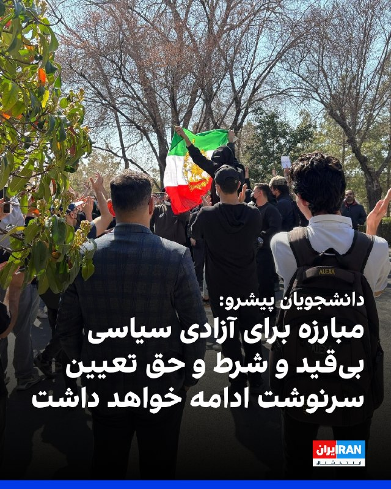

گروه دانشجویان پیشرودر بیانیه‌ای در مورد فشار حکومت بر «دانشگاه و جنبش دانشجویی» نوشت: «اعتراضات گسترده دانشجویی در دی‌ماه ۱۴۰۴ با صدور صدها بیانیه و برگزاری تجمعات اعتراضی، فضای دانشگاه‌ها و کل جامعه را دگرگون کرد. این اعتراضات حتی پس از شدیدترین سرکوب تاریخ جمهوری اسلامی نیز متوقف نشد و تا پیش از اغاز جنگ ۴۰ روزه ادامه پیدا کرد.»
این گروه دانشجویی اشاره کرد: «حکومت برای بقا، فشار بر دانشگاه و جنبش دانشجویی را افزایش داده است»، و افزود: «اما ما نیز در سال‌های گذشته آموخته‌ایم که در برابر سرکوب عقب‌نشینی نکنیم؛ بلکه شبکه‌سازی کنیم، سازماندهی کنیم و قدرت خودمان را افزایش دهیم.»
گروه دانشجویان پیشرو نوشت: «احضار، تعلیق، محرومیت از تحصیل، پرونده‌سازی، بازداشت، صدور احکام قضایی و محدود کردن دسترسی دانشجویان، ابزارهای معمول اداره محیط آموزشی هستند» و اضافه کرد: «بدل کردن آنها به ابزار سرکوب، باید افشا شود و برابر این اقدام ایستادگی صورت بگیرد.»
‌🏁 🇬🇧 IranintlTV

🤖 @VahidOOnLine

## VahidOOnLine — post 246597

♦️اداره‌کل حفاظت محیط‌زیست چهارمحال و بختیاری، روز شنبه اعلام کرد که تیم اجرایی این سازمان در جریان پایش‌های میدانی و گشت‌زنی‌های مستمر خود، موفق به مشاهده و تصویربرداری از دو خرس قهوه‌ای در زیستگاه‌های منطقه حفاظت‌شده قیصری در شهرستان کوهرنگ شده است. محسن کریمی، مدیرکل حفاظت محیط‌زیست این استان، با تاکید بر اینکه خرس قهوه‌ای به عنوان گونه‌ای شاخص در راس زنجیره غذایی قرار دارد، حضور این حیوان را نشان‌دهنده امنیت زیستگاه، پویایی زیست‌بوم و غنای تنوع زیستی منطقه دانست و افزود که این گونه ارزشمند به دلیل نیاز به قلمرو وسیع، گواهی بر سلامت و کارکرد مناسب این منطقه است. به گزارش ایرنا، منطقه حفاظت‌شده قیصری با برخورداری از منابع آبی و غذایی مطلوب، زیستگاهی کلیدی برای جانورانی چون بز وحشی، گرگ، کفتار و عقاب طلایی به شمار می‌رود و صیانت شبانه‌روزی از آن همچنان ادامه دارد.
‌🇸🇦 Indypersian

🤖 @VahidOOnLine

## VahidOOnLine — post 246596

  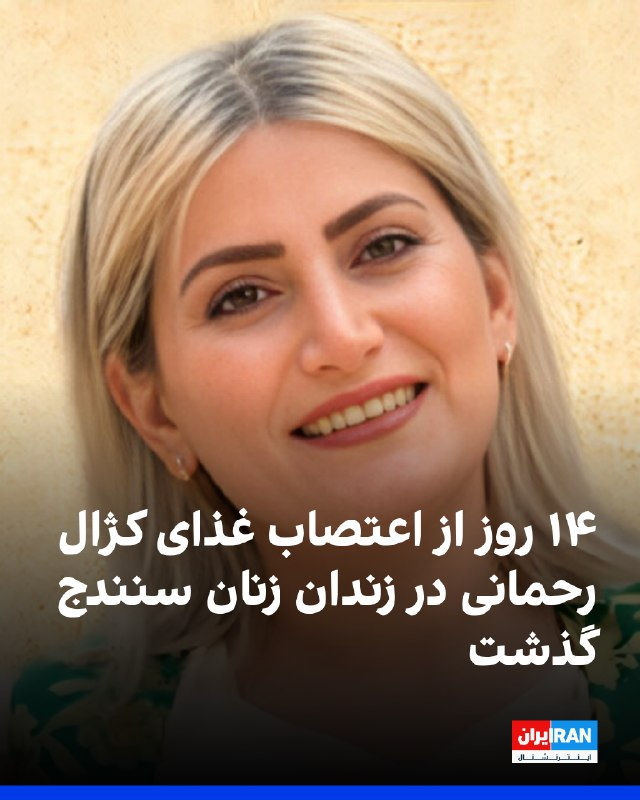

شبکه حقوق بشر کردستان گزارش داد که وضعیت جسمی کژال رحمانی، از خانواده‌های دادخواه کردستان، در چهاردهمین روز اعتصاب غذا در سلول انفرادی زندان زنان سنندج نگران‌کننده توصیف شده است.

رحمانی ۱۶ خرداد همراه با همسرش، عیسی فیضی، و برادرش، دانیال رحمانی، به دست نیروهای وزارت اطلاعات بازداشت شد.

این گزارش حاکی از آن است که او از زمان بازداشت ‌تاکنون در اعتراض به بازداشت غیرقانونی خود و دیگر اعضای خانواده‌اش و فشار بازجویان برای پرونده‌سازی علیه آنان، در اعتصاب غذا به سر می‌برد.

شبکه حقوق بشر کردستان اشاره کرد که خانواده رحمانی شنبه ۳۰ خرداد به شعبه سوم بازپرسی دادسرای عمومی و انقلاب کامیاران مراجعه کردند و خواستار تعیین تکلیف و ملاقات با او شدند.
‌🏁 🇬🇧 IranintlTV

🤖 @VahidOOnLine

## IranIntlTV — post 343479

  

شبکه خبری سی‌بی‌اس به نقل از «یک دیپلمات حاضر در مذاکرات سوئیس» گفت که یک جلسه اضطراری برای رسیدگی به مناقشه بین اسرائیل و گروه شبه‌نظامی حزب‌الله لبنان به برنامه اولین روز مذاکرات صلح اضافه شده است.

او اشاره کرد این موضوع در اولین جلسه‌ای که هیات‌های آمریکایی و ایرانی مذاکرات خود را آغاز می‌کنند، مطرح خواهد شد.
https://iranintl.com/202606211556

## IranIntlTV — post 343478

  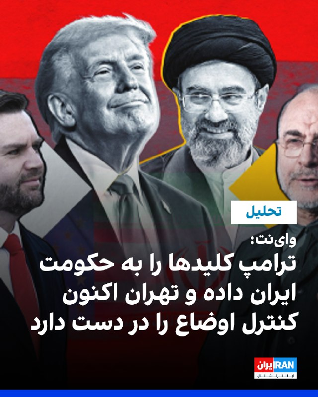

وای‌نت در یادداشتی نوشت که تفاهم دولت دونالد ترامپ با جمهوری اسلامی، ابتکار عمل را به تهران واگذار کرده و ایران توانسته است شکست نظامی خود را به یک «پیروزی راهبردی» تبدیل کند؛ تحولی که به باور نویسنده، جایگاه آمریکا و اسرائیل را تضعیف و موقعیت ایران و حزب‌الله را تقویت کرده است.

بن‌درور یمینی، نویسنده این یادداشت، با انتقاد از رویکرد ترامپ در قبال ایران، نوشت که رییس‌جمهوری آمریکا عملاً کنترل اوضاع را به تهران سپرده است. او مدعی شد [حکومت] ایران، در حالی که هنوز توافق به طور کامل اجرایی نشده، با تهدید به بستن تنگه هرمز و شلیک موشک‌های بالستیک به اسرائیل، مفاد تفاهم را نقض کرده و هم‌زمان از حزب‌الله برای افزایش فشار بر اسرائیل و ایجاد شکاف میان واشینگتن و تل‌آویو بهره می‌برد.

به نوشته وای‌نت، تهران با استفاده از حزب‌الله، اسرائیل را در برابر یک دوراهی قرار داده است؛ به گونه‌ای که پاسخ نظامی اسرائیل به حملات حزب‌الله، همان نتیجه‌ای است که [حکومت] ایران به دنبال آن است و در مقابل، خودداری از واکنش نیز می‌تواند به افزایش جسارت [حکومت] ایران و حزب‌الله منجر شود.

https://iranintl.com/202606217977

## IranIntlTV — post 343477

  

گوگوش، خواننده سرشناس ایرانی، در صفحه اینستاگرام خود از صدور حکم ۷۴ ضربه شلاق، دو سال ممنوعیت خروج از کشور و دو سال محرومیت از فعالیت هنری علیه پرستو احمدی، خواننده و هشت نفر از نوازندگان و دست‌اندرکاران «کنسرت کاروانسرا» انتقاد کرد.

او نوشت ۷۴ ضربه شلاق به‌خاطر «جرم» آواز خواندن با موی آشکار.

گوگوش اشاره کرد که قلبش با پرستو احمدی و اعضای کنسرت و تهیه‌کننده آن است و نوشت: «باشد که این روزهای تاریک به سر آید، زنان بار دیگر آزاد انتخاب شیوه زندگی و پوشش خود را باز یابند، و هنر و بیان هنری بار دیگر در میهن عزیز و گران‌قدرمان شکوفا شود.»
https://iranintl.com/202606203958

## IranIntlTV — post 343476

  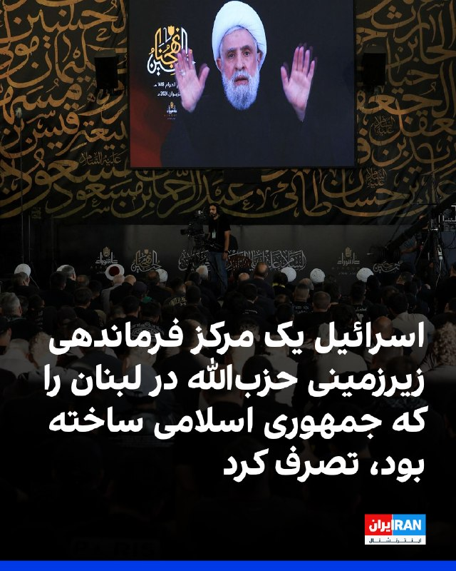

کانال ۱۴ اسرائیل روز شنبه گزارش داد نیروهای اسرائیلی یک مرکز فرماندهی زیرزمینی حزب‌الله در ارتفاعات علی طاهر را که جمهوری اسلامی در جنوب لبنان ساخته بود، تصرف کرده‌اند. طبق این گزارش گمان می‌رود صدها عضو حزب‌الله در داخل این مرکز گرفتار شده باشند.
https://iranintl.com/202606212843

## IranIntlTV — post 343475

  <a href="telegram/content/IranIntlTV_343475_1782007213.mp4" target="_blank">🎬 Download video</a>

علی خضریان، عضو کمیسیون امنیت ملی مجلس، در صداوسیما با انتقاد از سند معاونت راهبردی ریاست‌جمهوری با عنوان «جنبش خیابانی حفاظت از ایران؛ چیستی، فرصت‌ها و راهکارهای ارتقا»، گفت در این متن «تجمعات مردمی» عاملی برای «انسداد در مسیر دیپلماسی» و «مناسک هیجانی» توصیف شده است.
او گفت مردمی که زیر بمباران به خیابان آمدند، علت ماندگاری نظام‌اند.

## IranIntlTV — post 343474

  

گروه دانشجویان پیشرودر بیانیه‌ای در مورد فشار حکومت بر «دانشگاه و جنبش دانشجویی» نوشت: «اعتراضات گسترده دانشجویی در دی‌ماه ۱۴۰۴ با صدور صدها بیانیه و برگزاری تجمعات اعتراضی، فضای دانشگاه‌ها و کل جامعه را دگرگون کرد. این اعتراضات حتی پس از شدیدترین سرکوب تاریخ جمهوری اسلامی نیز متوقف نشد و تا پیش از اغاز جنگ ۴۰ روزه ادامه پیدا کرد.»
این گروه دانشجویی اشاره کرد: «حکومت برای بقا، فشار بر دانشگاه و جنبش دانشجویی را افزایش داده است»، و افزود: «اما ما نیز در سال‌های گذشته آموخته‌ایم که در برابر سرکوب عقب‌نشینی نکنیم؛ بلکه شبکه‌سازی کنیم، سازماندهی کنیم و قدرت خودمان را افزایش دهیم.»
گروه دانشجویان پیشرو نوشت: «احضار، تعلیق، محرومیت از تحصیل، پرونده‌سازی، بازداشت، صدور احکام قضایی و محدود کردن دسترسی دانشجویان، ابزارهای معمول اداره محیط آموزشی هستند» و اضافه کرد: «بدل کردن آنها به ابزار سرکوب، باید افشا شود و برابر این اقدام ایستادگی صورت بگیرد.»
https://iranintl.com/202606208550

## IranIntlTV — post 343473

  

شبکه حقوق بشر کردستان گزارش داد که وضعیت جسمی کژال رحمانی، از خانواده‌های دادخواه کردستان، در چهاردهمین روز اعتصاب غذا در سلول انفرادی زندان زنان سنندج نگران‌کننده توصیف شده است.

رحمانی ۱۶ خرداد همراه با همسرش، عیسی فیضی، و برادرش، دانیال رحمانی، به دست نیروهای وزارت اطلاعات بازداشت شد.

این گزارش حاکی از آن است که او از زمان بازداشت ‌تاکنون در اعتراض به بازداشت غیرقانونی خود و دیگر اعضای خانواده‌اش و فشار بازجویان برای پرونده‌سازی علیه آنان، در اعتصاب غذا به سر می‌برد.

شبکه حقوق بشر کردستان اشاره کرد که خانواده رحمانی شنبه ۳۰ خرداد به شعبه سوم بازپرسی دادسرای عمومی و انقلاب کامیاران مراجعه کردند و خواستار تعیین تکلیف و ملاقات با او شدند.
https://iranintl.com/202606205447

## FarsiVOA — post 221382

🔺گزارش: صادرات نفت ایران از جزیره خارک پس از حدود شش هفته وقفه از سر گرفته شد

▪️جمهوری اسلامی پس از حدود شش هفته وقفه، صادرات نفت خام ایران را از پایانه اصلی صادراتی این کشور در جزیره خارک از سر گرفت.

⬇️ بیشتر بخوانید:
https://ir.voanews.com/a/8163159.html
@FarsiVOA

## FarsiVOA — post 221381

  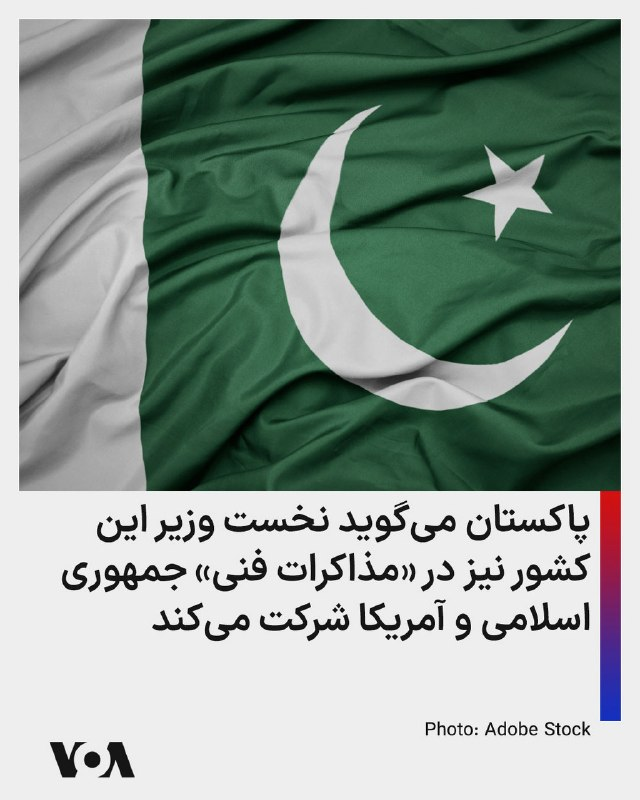

⚡️در پی سفر جی‌دی‌ ونس، معاون رئيس‌جمهوری آمریکا و محمدباقر قالیباف، رئيس مجلس شورای اسلامی به سوئیس برای آغاز مذاکرات «فنی» میان دو طرف، پاکستان نیز اعلام کرد که شهباز شریف، نخست‌وزیر این کشور به همراه عاصم منیر فرمانده ارتش پاکستان، به سوئيس می‌روند تا آن‌ها نیز در این مذاکرات شرکت داشته باشند. دونالد ترامپ، رئيس‌جمهوری آمریکا، اخیرا در مصاحبه‌ای با آکسیوس اشاره کرد که پاکستانی‌ها با شناختی که از رهبران جمهوری اسلامی داشته‌اند به واشنگتن در رسیدن به تفاهم‌نامه اخیر با جمهوری اسلامی کمک کردند.
@FarsiVOA

## FarsiVOA — post 221380

⚡️تظاهرات افغان‌ها در واشنگتن علیه محدودیت‌های طالبان بر زنان در افغانستان
@FarsiVOA

## FarsiVOA — post 221379

  <a href="telegram/content/FarsiVOA_221379_1782007217.mp4" target="_blank">🎬 Download video</a>

⚡️آیا تفاهم با جمهوری اسلامی به توافق خواهد رسید؟ گفت‌وگو با درویش رنجبر
@FarsiVOA

## FarsiVOA — post 221378

⚡️هزینه سرکوب و اعدام مردم ایران را چطور می‌توان برای جمهوری اسلامی گران کرد؟ ‌گفت‌وگو با شیوا محبوبی
@FarsiVOA

## FarsiVOA — post 221377

⚡️هشدار اندیشکده آمریکایی: شرکت‌های انرژی بدون خلع سلاح نیابتی‌های جمهوری اسلامی به عراق بازنمی‌گردند
@FarsiVOA

## FarsiVOA — post 221376

⚡️واکنش‌های جهانی به توافق آمریکا و جمهوری اسلامی؛ از استقبال اروپا تا خوش‌بینی آسیا
@FarsiVOA

## FarsiVOA — post 221375

🔺ترامپ واکنش پسرش به پیام کهنه‌سرباز آمریکایی خطاب به مخالفان تفاهم‌‌نامه با جمهوری اسلامی را بازنشر کرد

▪️دونالد ترامپ رئیس‌جمهوری آمریکا، در حساب کاربری خود در تروت سوشال، تصویری از واکنش پسرش (دونالد ترامپ جونیور) به پست یک کهنه‌سرباز آمریکایی درباره مذاکرات واشنگتن با جمهوری اسلامی را بازنشر کرد.

⬇️ بیشتر بخوانید:
https://ir.voanews.com/a/8163158.html
@FarsiVOA

## FarsiVOA — post 221374

  <a href="telegram/content/FarsiVOA_221374_1782007219.mp4" target="_blank">🎬 Download video</a>

⚡️کنفرانس روز جهانی حمایت از زندانیان سیاسی در‌گفت‌وگو با شیوا محبوبی سخنگوی کمیته برای آزادی زندانیان سیاسی
@FarsiVOA

## FarsiVOA — post 221373

  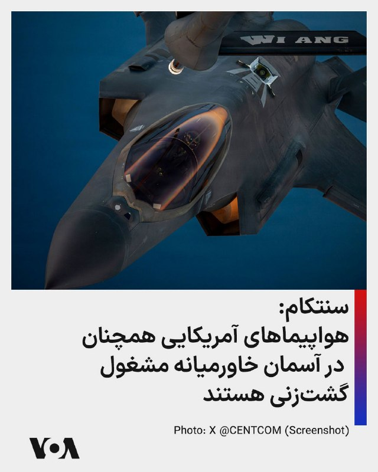

⚡️ستاد فرماندهی مرکزی آمریکا، سنتکام، روز شنبه عصر تصویری از یک جت جنگنده رادارگریز اف-۳۵ نیروی هوایی آمریکا را در حال سوخت‌گیری هوایی بر فراز خاورمیانه منتشر کرد و گفت «نیروهای آمریکایی همچنان به طور معمول در آسمان گشت‌زنی» می‌کنند. اف-۳۵ها نقش مهمی در عملیات «خشم حماسی» داشتند.
@FarsiVOA

## FarsiVOA — post 221372

  <a href="telegram/content/FarsiVOA_221372_1782007221.mp4" target="_blank">🎬 Download video</a>

⚡️بخت صعود تیم فوتبال ایران؛ گفت‌وگو با کوروش بازیار مربی و کارشناس فوتبال
@FarsiVOA

## IranianMinds — post 23041

  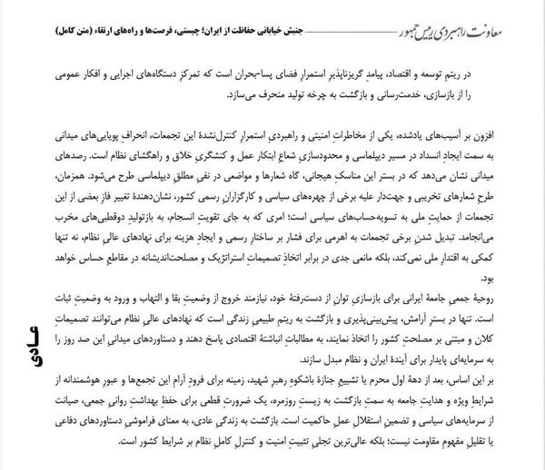

🔴 معاونت راهبردی پزشکیان برای جمع کردن تجمعات شبانه: تجمع کنندگان مخالف مصلحت اندیشی ها هستند و بهداشت روانی جامعه را برهم زدند/تجمعات باید بعد از تشییع رهبر شهید جمع شود

دولت جمهوری اسلامی: تجمعات عرزشی ها فورا باید جمع شود.

@IranianMinds

## IranianMinds — post 23040

  <a href="telegram/content/IranianMinds_23040_1782007224.webm" target="_blank">🎬 Download video</a>

📣آیسان اسلامی به تلگرام پیوست😍

⭐اگر توم از طرفدارا ایسان اسلامی هستی بیا توی کانال تلگرامش فعالیتش شرو کرده کنارش باش
🙂

ادرس عضویت کانالش
👇e30
👇
https://t.me/+QMjHLL65ocsxYzRk
https://t.me/+QMjHLL65ocsxYzRk

## IranianMinds — post 23039

  <a href="telegram/content/IranianMinds_23039_1782007224.mp4" target="_blank">🎬 Download video</a>

🔴مجری تلویزیون:

باید فرودگاه مهر‌آباد رو ببندیم که هی نرن مذاکره.

@IranianMinds

## BBCPersian — post 284542

  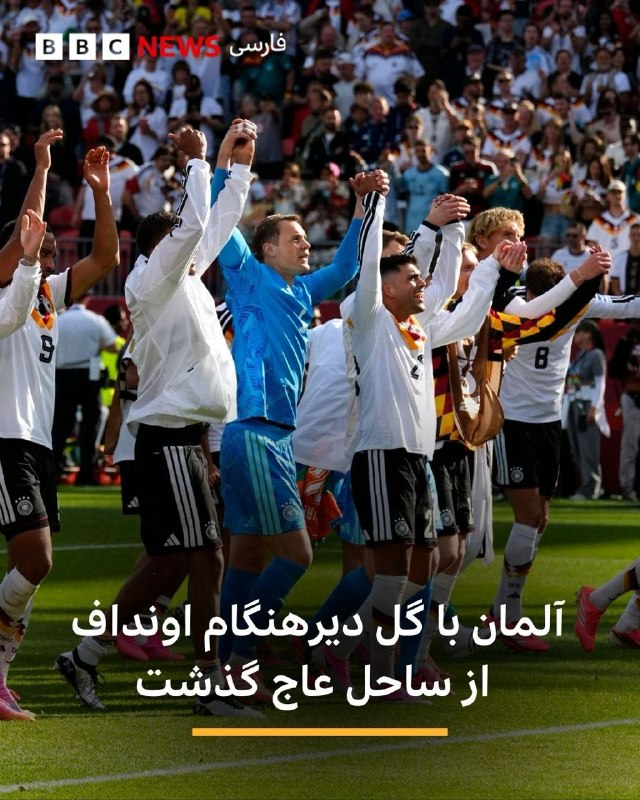

در جام جهانی فوتبال، آلمان، قهرمان چهار دوره این رقابت‌ها، با گل دقیقه دوم وقت‌های تلف‌شده از ساحل عاج با نتیجه دو بر یک گذشت.

فرانک کسیه، هافبک میانی ساحل عاج، در دقیقه ۳۰ گل نخست بازی را به ثمر رساند.

دنیز اونداف، بازیکن تعویضی آلمان، هر دو گل این تیم را زد.

پیش‌تر هلند در هیوستون سوئد را پنج بر یک شکست داد و به صدر گروه اف رفت.

در ادامه، اکوادور با کوراسائو روبه‌رو می‌شود و تونس با ژاپن بازی خواهد کرد.

📸 Reuters

@BBCPersian

## BBCPersian — post 284533

🖌ویکتوریا پریسدسکایا, بی‌بی‌سی اوکراینی

🔻برای ۱۴۹۵ روز، جهان برای سرگرد اولکساندر ایوانوف به چهار دیواریِ سرد و بتنی محدود شده بود. این تفنگدار دریایی اوکراین در جریان نبردهای ماریوپل به اسارت درآمد و در سلولی نمور و خاکستری در یک بازداشتگاه روسیه حبس شد.

او هیچ ارتباطی با جهان بیرون نداشت و راهی نداشت که بداند آیا کشورش هنوز مقاومت می‌کند یا نه، یا حتی همسر و پسر خردسالش زنده‌اند یا نه. اما در آن روزهای تاریک، چیزی یافت که به زنده نگه داشتن روحیه‌اش کمک کرد.

پیش از تهاجم تمام‌عیار روسیه به اوکراین، اولکساندر سربازی وظیفه‌شناس بود که به‌عنوان سرگرد در تیپ ۳۶ تفنگداران دریایی خدمت می‌کرد. اما بهار ۲۰۲۲ همه‌چیز را تغییر داد.

📸GettyImages/ Angelina Korba / BBC Collage/ Anadolu Agency via Getty Images/ Alexander Ivanov/ Oleksandr Ivanov/ Nelly Ivanova~

https://bbc.in/4vzc8ug
@BBCPersian

## BBCPersian — post 284532

  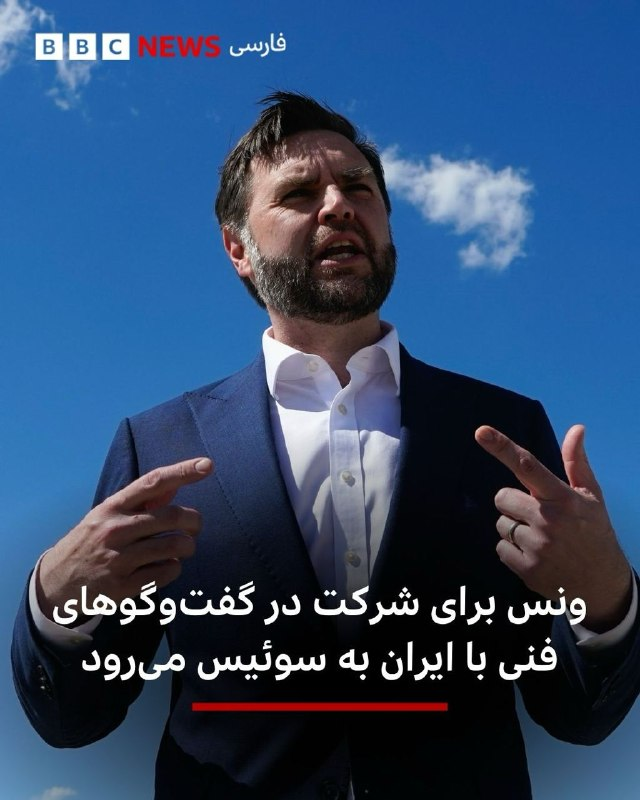

جی‌دی ونس، معاون رئیس‌جمهوری آمریکا، در راه سوئیس برای شرکت در گفت‌وگو با ایران است و ابراز امیدواری کرد که در موضوع هسته‌ای و آتش‌بس در لبنان پیشرفت حاصل شود.

آقای ونس در شبکه اجتماعی ایکس نوشت که مشتاق آغاز گفت‌وگوهای فنی با نمایندگان ایران، پاکستان و قطر است.

او گفت: «من فقط می‌توانم یک یا دو روز آنجا بمانم. امیدواریم در موضوع هسته‌ای و نیز آتش‌بس در لبنان پیشرفت کنیم. فکر می‌کنم این دو موضوع اصلی مورد تمرکز ما خواهند بود.»

او افزود: «مطمئنم ایرانی‌ها هم مسائلی دارند که مایل‌اند درباره آنها گفت‌وگو کنند.»

رویترز گزارش داده است که معاون رئیس‌جمهوری آمریکا پیش از سفر به سوئیس به خبرنگاران گفت، برخلاف تیترهای خبری، اوضاع در لبنان «در واقع رو به بهبود است» و خشونت‌ها تا حدی کاهش یافته است.

او افزود که حفظ امنیت اسرائیل و لبنان مستلزم مدیریت مستمر اوضاع خواهد بود.

📸 Getty

https://bbc.in/43NMqpW
@BBCPersian

---
📅 بروزرسانی: 1405/03/31 03:08
---

## VahidOOnLine — post 246595

  <a href="telegram/content/VahidOOnLine_246595_1781998736.mp4" target="_blank">🎬 Download video</a>

♦️دفتر نخست‌وزیری پاکستان، بامداد یکشنبه با انتشار بیانیه‌ای در اکس اعلام کرد: «به دنبال امضای تفاهم‌نامه اسلام‌آباد، گفتگوها در سطح فنی (میان ایران و آمریکا) در تاریخ یکشنبه، ۳۱ خردادماه، در منطقه بورگن‌اشتوک سوئیس برگزار خواهد شد.» این نهاد افزود: «محمد شهباز شریف، نخست‌وزیر، به همراه عاصم منیر، فرمانده ارتش و رئیس ستاد مشترک، در این گفتگوها شرکت خواهند کرد.» دفتر نخست‌وزیری پاکستان در پایان خاطرنشان کرد که شهباز شریف در راس یک هیات بلندپایه دیپلماتیک و نظامی، فرودگاه اسلام‌آباد را به مقصد سوئیس ترک کرده است. پیش از این، هیات جمهوری اسلامی ایران، شنبه‌شب، به سرپرستی محمدباقر قالیباف وارد زوریخ در سوئیس شد. جی‌دی ونس نیز ساعاتی پیش واشنگتن را به مقصد این کشور ترک کرد.
‌🇸🇦 Indypersian

🤖 @VahidOOnLine

## VahidOOnLine — post 246594

  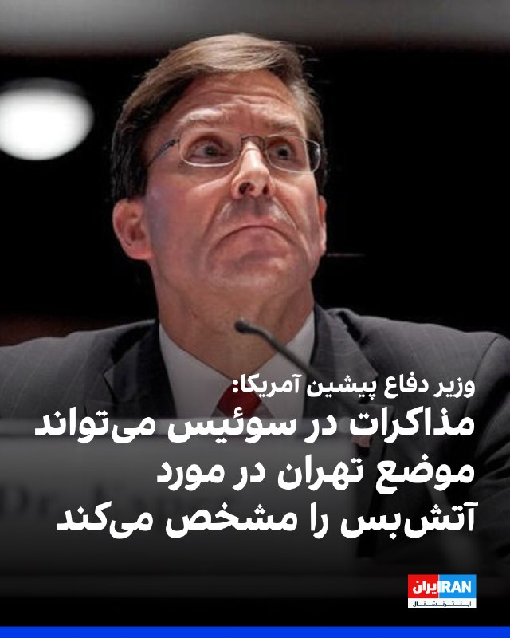

مارک اسپر، وزیر دفاع سابق آمریکا، به شبکه خبری فاکس گفت اگرچه جمهوری اسلامی تنگه هرمز را کنترل نمی‌کند، اما تهدیدهایش به تنهایی می‌تواند ترافیک کشتیرانی را از طریق این آبراه حیاتی مختل کند.

او افزود نگرانی بزرگ‌تر این است که آیا تهران به تهدید کشتیرانی تجاری ادامه می‌دهد یا خیر، که این وضعیت می‌تواند شرکت‌های بیمه‌، صاحبان کشتی، کاپیتان‌ها و خدمه کشتی‌ها را از فعالیت در این منطقه منصرف کند.

اسپر گفت: «تا زمانی که آنها تهدید و به آن عمل کنند، شرکت‌های بیمه، کاپیتان‌های کشتی، صاحبان کشتی و خدمه را فراری خواهند داد.»

او اشاره کرد که مقام‌های آمریکایی هنوز باید مین‌های دریایی را از منطقه پاک‌سازی کنند، و اضافه کرد که بهبود ترافیک تجاری ممکن است زمان ببرد.

اسپر گفت: مذاکرات در سوئیس می‌تواند نشانه واضح‌تری از این باشد که آیا ایران قصد دارد به آتش‌بس احترام بگذارد و مذاکرات را پیش ببرد یا خیر.
‌🏁 🇬🇧 IranintlTV

🤖 @VahidOOnLine

## VahidOOnLine — post 246593

  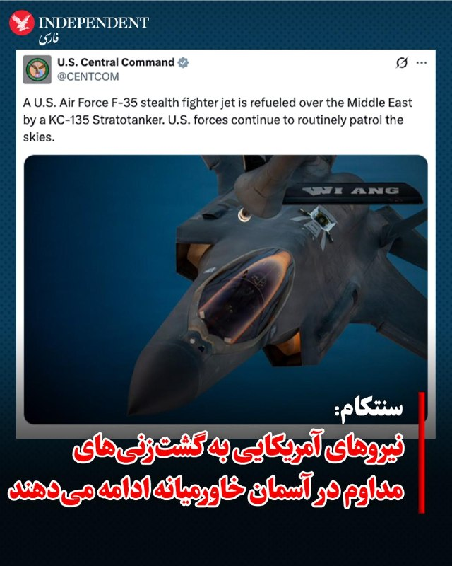

♦️فرماندهی مرکزی ایالات متحده (سنتکام) روز شنبه، با انتشار تصویری اعلام کرد که یک جنگنده پنهان‌کار F-35 نیروی هوایی آمریکا بر فراز خاورمیانه توسط یک تانکر سوخت‌رسان «کی‌سی-۱۳۵ استراتوتانکر» (KC-135 Stratotanker) سوخت‌گیری کرده است. سنتکام تاکید کرد که نیروهای آمریکایی به گشت‌زنی‌های مداوم خود در آسمان منطقه ادامه می‌دهند.
‌🇸🇦 Indypersian

🤖 @VahidOOnLine

## VahidOOnLine — post 246592

  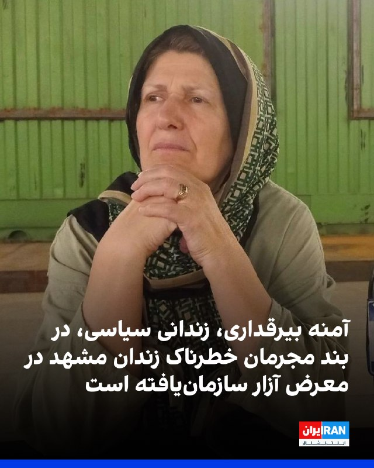

بر اساس اطلاعات رسیده به ایران‌اینترنشنال، وضعیت جسمانی آمنه بیرقداری، زندانی سیاسی ۶۱ ساله، که پیش‌تر به‌طور ناگهانی به بند مجرمان خطرناک زندان وکیل‌آباد مشهد منتقل شده بود، به شدت وخیم شده است.
بر پایه این اطلاعات، او در روزهای اخیر قربانی زورگیری در داخل زندان شده و در پی بروز فلج عصبی موقت، در بهداری این بند بستری شده است.
بر اساس این اطلاعات، آمنه بیرقداری کرهرودی، معلم بازنشسته‌ای که در جریان سرکوب اعتراضات دی‌ماه با اتهام «لیدری اعتراضات» در فریمان، شامگاه ۱۷ دی ۱۴۰۴ در منزلش در این شهر بازداشت شد، از ۲۸ خرداد، برخلاف اصل تفکیک جرائم، به بند دو زندان زنان وکیل‌آباد مشهد، محل نگهداری مجرمان خطرناک، منتقل شده است.
منبع مطلعی که درباره وضعیت او با ایران‌اینترنشنال صحبت کرد، گفت «بند ۲ محل نگهداری زندانیان جرائم خشن و سابقه‌دار است که از جمله به خاطر قتل، توزیع مواد مخدر، زورگیری و سرقت بازداشت و محکوم شده‌اند.»
‌🏁 🇬🇧 IranintlTV

🤖 @VahidOOnLine

## VahidOOnLine — post 246591

  <a href="telegram/content/VahidOOnLine_246591_1781998742.mp4" target="_blank">🎬 Download video</a>

جی‌دی ونس، معاون رییس‌جمهوری آمریکا، روز شنبه واشینگتن را به مقصد سوئیس ترک کرد تا روز یکشنبه در مذاکرات با جمهوری اسلامی شرکت کند. او به خبرنگاران گفت امیدوار است در «موضوع هسته‌ای» و «مسئله آتش‌بس لبنان» پیشرفت حاصل شود.
ونس پیش از سوار شدن به هواپیمای خود به مقصد ژنو گفت: «با وجود تیترهای خبری، اوضاع در لبنان در واقع بهتر شده و تا حدی آرام‌تر شده است.»
او افزود این مسئله باید به‌طور مداوم مدیریت شود تا «اسرائیل و لبنان هر دو امن و باثبات باشند.»
‌🏁 🇬🇧 IranintlTV

🤖 @VahidOOnLine

## VahidOOnLine — post 246590

  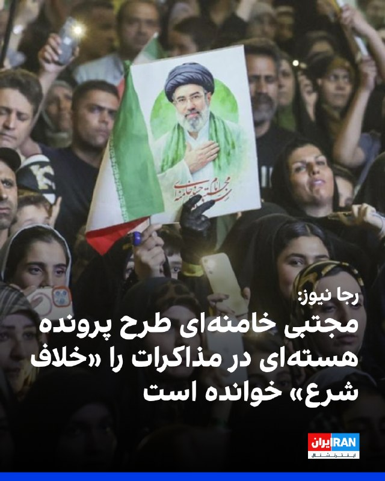

رجا نیوز، رسانه‌ نزدیک به جریان‌های محافظه‌کار، گزارش داد رهبر جدید جمهوری اسلامی در واکنش به مذاکرات اسلام‌آباد، نسبت به مطرح شدن پرونده هسته‌ای در گفت‌وگوها و رعایت نشدن شروطی که پیش‌تر تعیین شده بود، اعتراض کرده و این مذاکرات را «خلاف شرع» دانسته است.
بر اساس این گزارش، اعضای شورای عالی امنیت ملی در نامه‌ای به رهبر جمهوری اسلامی از ضرورت طرح موضوع هسته‌ای در مذاکرات دفاع کرده و نسبت به ادامه درگیری‌ها و احتمال حمله به زیرساخت‌های کشور ابراز نگرانی کرده‌اند.
رجا نیوز نوشت رهبر جمهوری اسلامی در پاسخ به این نامه تاکید کرده است مذاکرات «نه در دنیا و نه در آخرت منفعتی نخواهد داشت» و مانع حمله به زیرساخت‌های ایران نیز نخواهد شد.

‌🏁 🇬🇧 IranintlTV

🤖 @VahidOOnLine

## pm_afshaa — post 94486

  <a href="telegram/content/pm_afshaa_94486_1781998744.webm" target="_blank">🎬 Download video</a>

🔴مرندی، عضو تیم مذاکره کننده:
جمهوری اسلامی آماده‌ست تا برای لبنان از توافق چشم‌پوشی کنه، زیرا از متحدان خودش دست نمیکشه.

💧 Rainbet.com the #1 Non-KYC Crypto Casino & Sportsbook @rainbetcom

😁 @Pm_Afshaa

## pm_afshaa — post 94484

  <a href="telegram/content/pm_afshaa_94484_1781998745.mp4" target="_blank">🎬 Download video</a>

🔴چند ساعت که پیش عباس خوش قدم به زوریخِ سوئیس رسید، این شهر طوفان شدیدی شده و کلی درخت افتاده روی مردم و مصدوم و زخمی‌های زیادی داشتن.

💧 Rainbet.com the #1 Non-KYC Crypto Casino & Sportsbook @rainbetcom

😁 @Pm_Afshaa

## pm_afshaa — post 94483

  <a href="telegram/content/pm_afshaa_94483_1781998747.webm" target="_blank">🎬 Download video</a>

قیمت های ایران خودرو با 50 درصد افزایش هم قیمت بازار آزاد شد 
💧 Rainbet.com the #1 Non-KYC Crypto Casino & Sportsbook @rainbetcom 
😁 @Pm_Afshaa

## IranIntlTV — post 343472

  

مارک اسپر، وزیر دفاع سابق آمریکا، به شبکه خبری فاکس گفت اگرچه جمهوری اسلامی تنگه هرمز را کنترل نمی‌کند، اما تهدیدهایش به تنهایی می‌تواند ترافیک کشتیرانی را از طریق این آبراه حیاتی مختل کند.

او افزود نگرانی بزرگ‌تر این است که آیا تهران به تهدید کشتیرانی تجاری ادامه می‌دهد یا خیر، که این وضعیت می‌تواند شرکت‌های بیمه‌، صاحبان کشتی، کاپیتان‌ها و خدمه کشتی‌ها را از فعالیت در این منطقه منصرف کند.

اسپر گفت: «تا زمانی که آنها تهدید و به آن عمل کنند، شرکت‌های بیمه، کاپیتان‌های کشتی، صاحبان کشتی و خدمه را فراری خواهند داد.»

او اشاره کرد که مقام‌های آمریکایی هنوز باید مین‌های دریایی را از منطقه پاک‌سازی کنند، و اضافه کرد که بهبود ترافیک تجاری ممکن است زمان ببرد.

اسپر گفت: مذاکرات در سوئیس می‌تواند نشانه واضح‌تری از این باشد که آیا ایران قصد دارد به آتش‌بس احترام بگذارد و مذاکرات را پیش ببرد یا خیر.
https://iranintl.com/202606208236

## IranIntlTV — post 343471

  <a href="telegram/content/IranIntlTV_343471_1781998749.mp4" target="_blank">🎬 Download video</a>

فرهاد دریا، خواننده سرشناس افغانستانی، در حاشیه تجمع اعتراضی در واشینگتن در حمایت از زنان افغانستان و علیه آپارتاید جنسیتی، به اردوان روزبه، خبرنگار ایران‌اینترنشنال، گفت: «قدرت در همبستگی است. امروز بیش از هر زمان دیگری به اتحاد، همدلی و حمایت متقابل نیاز داریم تا صدای مردم افغانستان به گوش جهان برسد.»

او درباره سکوت دولت‌ها و نهادهای بین‌المللی در برابر نقض حقوق بشر در افغانستان افزود: «جامعه جهانی به معامله‌ای که می‌خواست دست پیدا کرد و دیگر آنچه در افغانستان می‌گذرد، برای آنها اهمیتی ندارد.»
@iranintltv

## IranIntlTV — post 343470

  

بر اساس اطلاعات رسیده به ایران‌اینترنشنال، وضعیت جسمانی آمنه بیرقداری، زندانی سیاسی ۶۱ ساله، که پیش‌تر به‌طور ناگهانی به بند مجرمان خطرناک زندان وکیل‌آباد مشهد منتقل شده بود، به شدت وخیم شده است.
بر پایه این اطلاعات، او در روزهای اخیر قربانی زورگیری در داخل زندان شده و در پی بروز فلج عصبی موقت، در بهداری این بند بستری شده است.
بر اساس این اطلاعات، آمنه بیرقداری کرهرودی، معلم بازنشسته‌ای که در جریان سرکوب اعتراضات دی‌ماه با اتهام «لیدری اعتراضات» در فریمان، شامگاه ۱۷ دی ۱۴۰۴ در منزلش در این شهر بازداشت شد، از ۲۸ خرداد، برخلاف اصل تفکیک جرائم، به بند دو زندان زنان وکیل‌آباد مشهد، محل نگهداری مجرمان خطرناک، منتقل شده است.
منبع مطلعی که درباره وضعیت او با ایران‌اینترنشنال صحبت کرد، گفت «بند ۲ محل نگهداری زندانیان جرائم خشن و سابقه‌دار است که از جمله به خاطر قتل، توزیع مواد مخدر، زورگیری و سرقت بازداشت و محکوم شده‌اند.»
https://iranintl.com/202606206385

## IranIntlTV — post 343469

  <a href="telegram/content/IranIntlTV_343469_1781998753.mp4" target="_blank">🎬 Download video</a>

جی‌دی ونس، معاون رییس‌جمهوری آمریکا، روز شنبه واشینگتن را به مقصد سوئیس ترک کرد تا روز یکشنبه در مذاکرات با جمهوری اسلامی شرکت کند. او به خبرنگاران گفت امیدوار است در «موضوع هسته‌ای» و «مسئله آتش‌بس لبنان» پیشرفت حاصل شود.
ونس پیش از سوار شدن به هواپیمای خود به مقصد ژنو گفت: «با وجود تیترهای خبری، اوضاع در لبنان در واقع بهتر شده و تا حدی آرام‌تر شده است.»
او افزود این مسئله باید به‌طور مداوم مدیریت شود تا «اسرائیل و لبنان هر دو امن و باثبات باشند.»

## IranIntlTV — post 343468

  

رجا نیوز، رسانه‌ نزدیک به جریان‌های محافظه‌کار، گزارش داد رهبر جدید جمهوری اسلامی در واکنش به مذاکرات اسلام‌آباد، نسبت به مطرح شدن پرونده هسته‌ای در گفت‌وگوها و رعایت نشدن شروطی که پیش‌تر تعیین شده بود، اعتراض کرده و این مذاکرات را «خلاف شرع» دانسته است.
بر اساس این گزارش، اعضای شورای عالی امنیت ملی در نامه‌ای به رهبر جمهوری اسلامی از ضرورت طرح موضوع هسته‌ای در مذاکرات دفاع کرده و نسبت به ادامه درگیری‌ها و احتمال حمله به زیرساخت‌های کشور ابراز نگرانی کرده‌اند.
رجا نیوز نوشت رهبر جمهوری اسلامی در پاسخ به این نامه تاکید کرده است مذاکرات «نه در دنیا و نه در آخرت منفعتی نخواهد داشت» و مانع حمله به زیرساخت‌های ایران نیز نخواهد شد.

https://iranintl.com/202606202446

## IranIntlTV — post 343467

  <a href="telegram/content/IranIntlTV_343467_1781998756.mp4" target="_blank">🎬 Download video</a>

احمد علوی، استاد دانشگاه و اقتصاددان، درباره ادامه اختلال در خدمات بانکی در ایران گفت: «چنین اختلالی فقط یک مشکل فنی نیست، بلکه مستقیما بر معیشت مردم اثر می‌گذارد.»

او افزود: « در این شرایط، دسترسی به کالاهای ضروری، خدمات درمانی و پرداخت‌های روزانه مختل می‌شود و در شرایط رکود و تورم، فشار بیشتری بر زندگی شهروندان وارد خواهد کرد.»
@iranintltv

## FarsiVOA — post 221371

  <a href="telegram/content/FarsiVOA_221371_1781998758.mp4" target="_blank">🎬 Download video</a>

⚡️دفاع پرزیدنت ترامپ از سیاست خود در قبال جمهوری اسلامی؛ واکنش‌ها در کنگره آمریکا
@FarsiVOA

## FarsiVOA — post 221370

  <a href="telegram/content/FarsiVOA_221370_1781998759.mp4" target="_blank">🎬 Download video</a>

⚡️تجمع هوادارن سازمان مجاهدین خلق در پاریس به درگیری با پلیس کشیده شد
@FarsiVOA

## FarsiVOA — post 221369

  <a href="telegram/content/FarsiVOA_221369_1781998760.mp4" target="_blank">🎬 Download video</a>

⚡️حال و هوای لس‌آنجلس پیش از بازی دوم ایران، گزارش آرمیتا آزاد
@FarsiVOA

## DW_Farsi — post 126257

🔶 جام جهانی ۲۰۲۶؛ آلمان دو − ساحل عاج یک

تیم ملی آلمان در دومین دیدار خود در گروه E جام جهانی ۲۰۲۶، با نتیجه ۲ بر ۱ ساحل عاج را شکست داد و به دومین پیروزی پیاپی خود رسید. ساحل عاج در نیمه نخست با گل فرانک کاسیه در دقیقه ۳۰ پیش افتاد. آلمان که پیش‌تر دو گل مردودشده در نیمه اول داشت، در نیمه دوم با گل دنیس اونداف در دقیقه ۶۸ بازی را مساوی کرد.
اونداف در واپسین لحظات بازی بار دیگر دروازه ساحل عاج را باز کرد تا پیروزی آلمان را رقم بزند. پیروزی مقابل ساحل عاج، آلمان را با ۶ امتیاز به صدر جدول گروه و به این ترتیب به مرحله یک‌شانزدهم نهایی رساند. ساحل عاج با ۳ امتیاز در جایگاه دوم قرار دارد و اکوادور و کوراسائو پیش از برگزاری دیدار دوم خود هنوز موفق به کسب امتیاز نشده‌اند.
@dw_farsi

## Persian_Trend_Official — post 17710

  <a href="telegram/content/Persian_Trend_Official_17710_1781998761.mp4" target="_blank">🎬 Download video</a>

شبتون بخیر 🌃
F-22 Raptor

📌 @persian_trend_official
پرشین ترند | متفاوت‌ترین کانال نظامی

## IranianMinds — post 23038

🔴شهباز شریف هم به سمت سوئیس حرکت کرد.

@IranianMinds

## IranianMinds — post 23037

  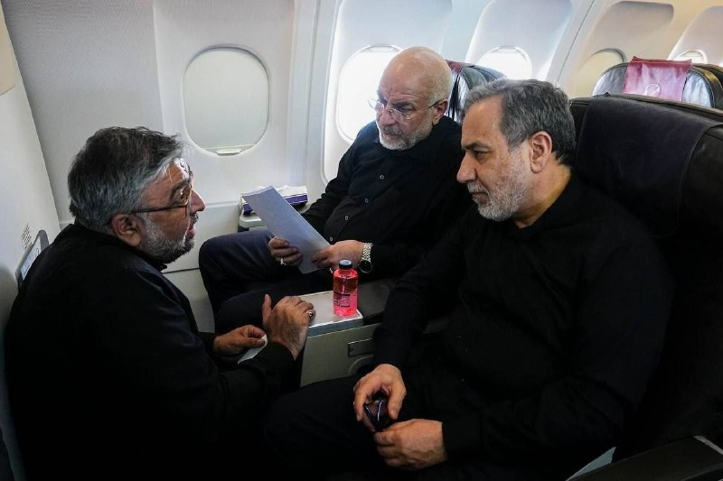

🔴خواهیم دید چه خواهد شد.

@IranianMinds

## BBCPersian — post 284530

🔻پوشش زنده مذاکرات ایران و آمریکا

برای دریافت تازه‌ترین خبرها و گزارش‌های تصویری گفت‌وگوهای فنی ایران و آمریکا در روز یکشنبه ۳۱ خرداد ۱۴۰۵ برابر با ۲۱ ژوئن ۲۰۲۶ با پوشش زنده بی‌بی‌سی فارسی همراه شوید.

https://bbc.in/43NMqpW
@BBCPersian

## BBCPersian — post 284529

🔻پایان پوشش زنده تحولات ایران و آمریکا در روز شنبه

در اینجا پوشش زنده تحولات ایران و آمریکا در روز شنبه ۳۰ خرداد/۲۰ ژوئن بی‌بی‌سی فارسی به پایان می‌رسد. از این که تا این لحظه همراه ما بودید صمیمانه سپاسگزاریم.

https://bbc.in/4uSiKmu
@BBCPersian

## BBCPersian — post 284528

  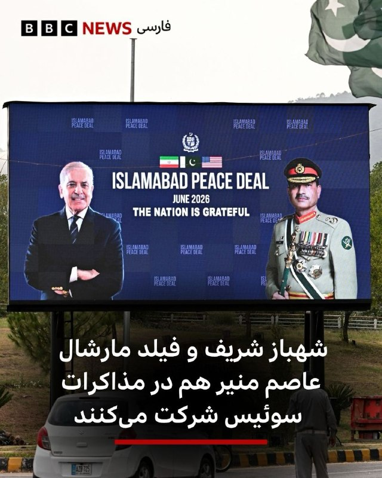

🔻شهباز شریف، نخست‌وزیر و فیلد مارشال عاصم منیر، فرمانده کل ارتش و نیروهای مسلح پاکستان در گفت‌وگوهای فنی فردا یکشنبه ۳۱ خرداد/۲۱ ژوئن در بورگن‌اشتوک سوئیس، شرکت خواهند کرد.

دفتر نخست‌وزیری پاکستان روز شنبه این خبر را اعلام کرد. وزارت خارجه پاکستان پیش‌تر گفته بود که نمایندگان آمریکا و ایران نیز همراه با میانجی‌هایی از پاکستان و قطر در این نشست حضور خواهند داشت.

رسانه‌های ایران پیشتر گزارش دادند که هیئت مذاکره‌کننده ایرانی به ریاست محمد باقر قالیباف به همراه عباس عراقچی، وزیر امور خارجه ایران عازم سوئیس شده‌اند.

📸 Getty

https://bbc.in/4uSiKmu
@BBCPersian

## Dirty_Kids — post 392713

⚡️ جام جهانی شروع شده و میدون مال توئه! 
🌟 این #جام_جهانی رو فقط باید توی #بت فیدو پیش‌بینی کنی 
💰 با ۵۰ میلیون تومان شرط روزانه ← ۴ میلیون تومان اعتبار شرط‌بندی رایگان 
📊 با ۱۰۰ میلیون تومان شرط روزانه ← ۸ میلیون تومان اعتبار شرط‌بندی رایگان میدونستی با انتخاب…

## Dirty_Kids — post 392712

  <a href="telegram/content/Dirty_Kids_392712_1781998765.webm" target="_blank">🎬 Download video</a>

⚡️ جام جهانی شروع شده و میدون مال توئه!

🌟 این #جام_جهانی رو فقط باید توی #بت فیدو پیش‌بینی کنی

💰 با ۵۰ میلیون تومان شرط روزانه ← ۴ میلیون تومان اعتبار شرط‌بندی رایگان

📊 با ۱۰۰ میلیون تومان شرط روزانه ← ۸ میلیون تومان اعتبار شرط‌بندی رایگان

میدونستی با انتخاب برد ژاپن مقابل تونس با ده میلیون شونزده میلیون تومن برنده میشی؟!
💖

💸 هرچی بزرگ‌تر بازی کنی، جایزت بزرگ‌تره!

🥅همین حالا پیش بینیتو ثبت کن
💖
https://fido874vt.click
https://fido874vt.click

👆
👆
👆
👆
👆
(ورود با وی-پی-ان غیر اروپایی)
❌
A30

📲کانال تلگرام 
👇
https://t.me/+dySI_QFj0T0xZGVk

## Dirty_Kids — post 392711

  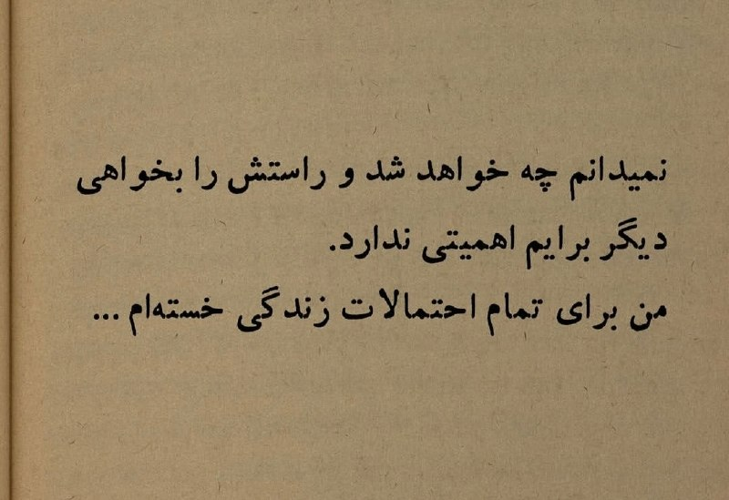

#بخوابیم

@Dirty_Kids 👻

## Dirty_Kids — post 392710

  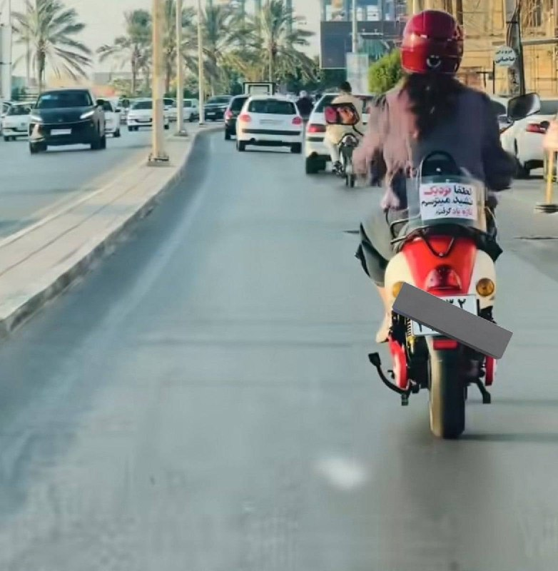

نوشته پشت موتور یک خانم: لطفا نزدیک نشید میترسم، تازه یاد گرفتم :)))

@Dirty_Kids 👻

## Dirty_Kids — post 392709

  <a href="telegram/content/Dirty_Kids_392709_1781998767.mp4" target="_blank">🎬 Download video</a>

این چه سمی بود من دیدم 🤣🤣🤣🤣

@Dirty_Kids 👻

## Dirty_Kids — post 392708

  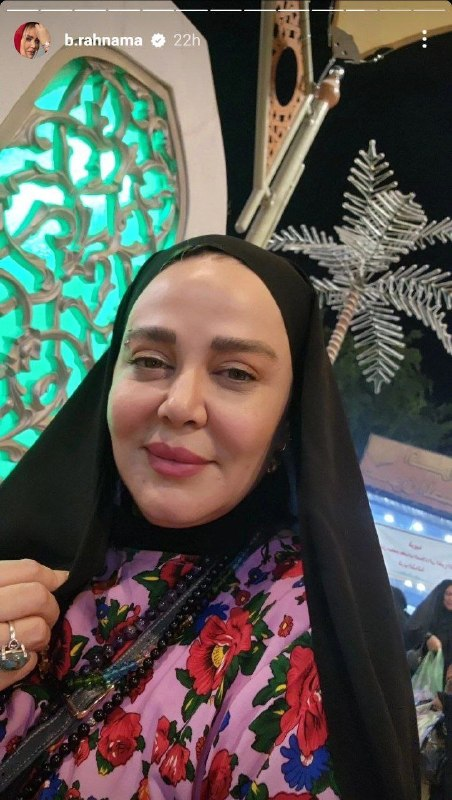

فکت:
پیمان قاسم خانی تنها کسی هست که دلش برای اکسش تنگ نمیشه

@Dirty_Kids 👻

## Dirty_Kids — post 392707

  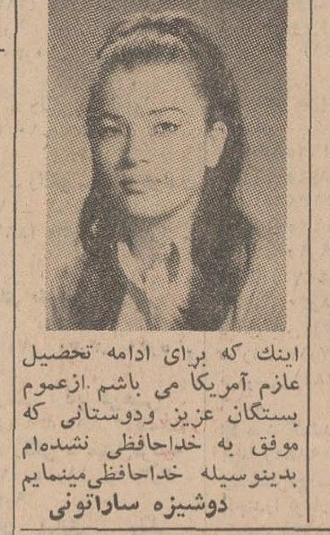

‏+کاش می‌دانستم سرنوشت دوشیزه سارا تونی چه شد...

@Dirty_Kids 👻

## Dirty_Kids — post 392705

  <a href="telegram/content/Dirty_Kids_392705_1781998770.mp4" target="_blank">🎬 Download video</a>

🔴 چند ساعت پیش عباس خوش قدم برای مذاکرات رفت سوئیس🇨🇭

حالا حدس بزنین چیشد؟ تو شهر زوریخِ سوئیس، چنان طوفانی شد که تو تاریخ سابقه نداشته.
کلی درخت کنده شد و افتاد رو مردم بدبخت و خیلیا مصدوم و کشته شدن.

@Dirty_Kids 👻

## alonews — post 129475

  <a href="telegram/content/alonews_129475_1781998771.mp4" target="_blank">🎬 Download video</a>

👈چند ساعت پیش عباس خوش قدم (سید عباس عراقچی) رسید زوریخِ سوئیس، الانم این شهر طوفان شدیدی شده و کلی درخت افتاده روی مردم و مصدوم زیاد داشته.

✅ @AloNews خبر جنگ

---
📅 بروزرسانی: 1405/03/31 01:53
---

## VahidOOnLine — post 246589

  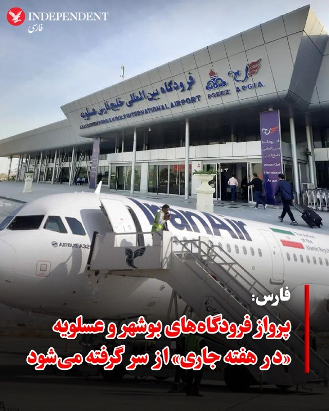

♦️فارس، خبرگزاری وابسته به سپاه، از بازگشایی فرودگاه‌های بوشهر و عسلویه خبر داد و به نقل از  مدیرکل فرودگاه‌های این استان نوشت: «پروازها در این دو فرودگاه از هفته جاری از سر گرفته خواهد شد».
‌🇸🇦 Indypersian

🤖 @VahidOOnLine

## VahidOOnLine — post 246588

♦️جی‌دی ونس، معاون رئیس‌جمهوری ایالات متحده، پیش از عزیمت به سوئیس در گفتگو با خبرنگاران اعلام کرد: «مشتاقانه منتظر آغاز گفتگوها در سطح فنی با حضور نمایندگان ایران، پاکستان و قطر هستم؛ بر اساس اطلاعات ما، هیئت ایرانی تازه به زمین نشسته است.» ونس با اشاره به ویژگی‌های محل برگزاری نشست افزود: «سوئیس جای بسیار زیبایی است، هرچند من فقط برای یک یا دو روز آنجا خواهم بود.» او در رابطه با اهداف این سفر تاکید کرد: «امیدوارم که بتوانیم در موضوع هسته‌ای و همچنین در زمینه برقراری آتش‌بس در لبنان به پیشرفت دست یابیم.» معاون ترامپ همچنین با ارزیابی مثبت از روند تحولات منطقه گفت: «برخلاف آنچه در سرخط اخبار دیده می‌شود، اوضاع در لبنان در واقع رو به بهبود است و فضا کمی آرام‌تر شده. این موضوعی است که ما باید به طور مداوم آن را مدیریت کنیم تا از امنیت کامل اسرائیل و لبنان مطمئن شویم.»
پیش از پرواز ونس، استیو ویتکاف، فرستاده ویژه آمریکا، و جرد کوشنر، داماد دونالد ترامپ، برای بررسی ابعاد فنی گفتگوها وارد خاک سوئیس شده‌اند.
‌🇸🇦 Indypersian

🤖 @VahidOOnLine

## VahidOOnLine — post 246587

♦️محمود نبویان، نایب‌رئیس کمیسیون امنیت ملی و سیاست خارجی مجلس شورای اسلامی، در گفتگویی با صداوسیما با اشاره به مواضع مجتبی خامنه‌ای، رهبر جمهوری اسلامی، گفت او در ۱۵ فروردین، ۲۹ فروردین و ۴ اردیبهشت سه بار تاکید کرده است که در موضوع هسته‌ای یا باید «به پیروزی رسید» و حق غنی‌سازی ایران به طور کامل به رسمیت شناخته شود، یا این موضوع برای همیشه از دستور کار مذاکرات خارج شود.
نبویان همچنین گفت خامنه‌ای بر «انحصار مدیریت تنگه هرمز به دست ایران» تاکید داشته و حتی مدیریت مشترک این آبراه با عمان را نیز نپذیرفته است. او گفت برخی از این موارد در تفاهم‌نامه نهایی لحاظ نشده‌اند.
این مصاحبه در جریان پخش زنده از شبکه خبر قطع شد. ساعاتی بعد، روابط عمومی معاونت سیاسی صداوسیما با انتشار اطلاعیه‌ای اعلام کرد اشاره «ناقص و مخدوش» نبویان به برخی اسناد و مکاتبات دارای طبقه‌بندی، مصداق تخلف قانونی و مستوجب پیگرد قضایی است.
‌🇸🇦 Indypersian

🤖 @VahidOOnLine

## VahidOOnLine — post 246586

  

جی‌دی ونس، معاون دونالد ترامپ، رییس‌جمهوری آمریکا، اعلام کرد برای شرکت در مذاکرات با جمهوری اسلامی که قرار است روز یکشنبه در سوئیس برگزار شود، راهی این کشور شده است.

ونس گفت ممکن است یک یا دو روز در سوئیس بماند و هدف از این سفر، پیشبرد گفت‌وگوها درباره برنامه هسته‌ای جمهوری اسلامی و همچنین آتش‌بس میان اسرائیل و حزب‌الله در لبنان است.

او اظهار داشت: «فقط یک یا دو روز می‌توانم در سوئیس باشم. امیدوارم بتوانیم در موضوعات هسته‌ای و آتش‌بس لبنان نیز به پیشرفت برسیم. این دو موضوع اصلی هستند که بر آنها تمرکز خواهیم داشت.»

معاون رییس‌جمهوری آمریکا در پاسخ به پرسشی درباره احتمال تاثیر درگیری‌های لبنان بر روند مذاکرات گفت شرایط در لبنان نسبت به روزهای گذشته بهبود یافته و بخشی از تنش‌ها کاهش پیدا کرده است.

ونس همچنین تاکید کرد: «می‌خواهیم این روند را از همان ابتدا به شکل درست آغاز کنیم.»

او افزود: «موضوعات زیادی برای گفت‌وگو وجود دارد، اما همه آنها را بررسی خواهیم کرد.»

‌🏁 🇬🇧 IranintlTV

🤖 @VahidOOnLine

## VahidOOnLine — post 246585

  <a href="telegram/content/VahidOOnLine_246585_1781994184.mp4" target="_blank">🎬 Download video</a>

محمدحسین خوشوقت، برادر همسر مصطفی خامنه‌ای، یکی از فرزندان رهبر کشته‌شده جمهوری اسلامی، درباره دلیل عدم حضور علنی مجتبی خامنه‌ای در جامعه گفت کارشناسان امنیتی به او توصیه کرده‌اند تصویر و حتی صدایش هم منتشر نشود.
او همچنین شایعات درباره کشته شدن یا وخامت وضعیت جسمی او، از جمله آسیب شدید به صورت یا از دست دادن پاها، را نادرست خواند.
‌🏁 🇬🇧 IranintlTV

🤖 @VahidOOnLine

## VahidOOnLine — post 246584

  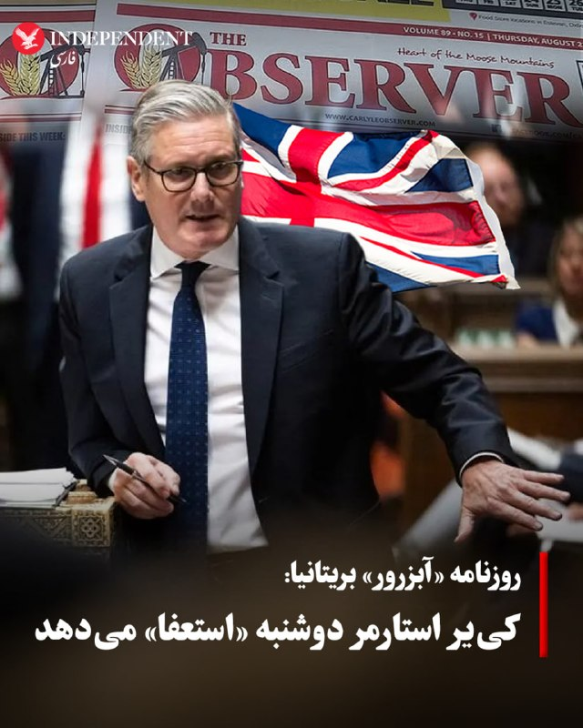

♦️روزنامه «آبزرور» روز شنبه گزارش داد که انتظار می‌رود کی‌یر استارمر، نخست‌وزیر بریتانیا، روز دوشنبه رسما از سمت خود استعفا دهد و جدول زمانی مشخصی را برای خروج منظم خود از قدرت تعیین کند. خبرگزاری رویترز با بازتاب این خبر نوشت که این تصمیم، در صورت تحقق، بریتانیا را در آستانه یک تحول سیاسی بزرگ و جابه‌جایی در رهبری دولت حزب کارگر قرار خواهد داد.
‌🇸🇦 Indypersian

🤖 @VahidOOnLine

## WithYashar — post 15467

  <a href="telegram/content/WithYashar_15467_1781994186.webm" target="_blank">🎬 Download video</a>

🔴کانالی که ترور هنیه و نصرالله رو دقیق پیشبینی کرده بود، دلار ۱۶۰ تومنی رو هم دو ماه پیش اعلام کرده بود از تاریخ و نحوه حمله ایران به اسرائیل پرده برداشت!!! 
🚨نمیدونم به کجا وصله ولی از همه چی خبر داره بیا خودت ببین
👇
👇      🔴LINK - CHANNEL🔴

## WithYashar — post 15466

  <a href="telegram/content/WithYashar_15466_1781994187.webm" target="_blank">🎬 Download video</a>

🔴کانالی که ترور هنیه و نصرالله رو دقیق پیشبینی کرده بود، دلار ۱۶۰ تومنی رو هم دو ماه پیش اعلام کرده بود از تاریخ و نحوه حمله ایران به اسرائیل پرده برداشت!!!

🚨نمیدونم به کجا وصله ولی از همه چی خبر داره بیا خودت ببین
👇
👇

     🔴LINK - CHANNEL🔴

## WithYashar — post 15465

حسین پاک، خبرنگار مستقر در لبنان: از ساعاتی قبل عملیات نظامی از سوی اسرائیل متوقف شده است.
@withyashar

## WithYashar — post 15464

بر اساس آخرین اخبار، ساعت قلعه نویی در مکزیک دزیده شد.
@withyashar

## FoxNewsTwitter — post 343216

  <a href="telegram/content/FoxNewsTwitter_343216_1781994187.mp4" target="_blank">🎬 Download video</a>

Fox News (Twitter/X)

Getting things set up in the right way.”

Vice President JD Vance says success in Switzerland starts with establishing the structure of the negotiations as U.S. and Iranian officials begin the next phase of talks.

Vance adds the focus will be on making progress on Iran’s nuclear program and the Lebanon ceasefire, while technical teams remain on the ground to work through the details.

## FoxNewsTwitter — post 343215

  <a href="telegram/content/FoxNewsTwitter_343215_1781994189.mp4" target="_blank">🎬 Download video</a>

Fox News (Twitter/X)

"We want to get this thing kicked off the right way."

Vice President JD Vance is heading to Switzerland as the Trump administration looks to build on this week’s ceasefire agreement and restart direct negotiations with Iran.

“There’s a lot to discuss, but we’re going to go through it all,” Vance said, as U.S. officials push for a broader agreement focused on Iran’s nuclear program and regional security.

## pm_afshaa — post 94482

  <a href="telegram/content/pm_afshaa_94482_1781994190.webm" target="_blank">🎬 Download video</a>

🔴دفتر نخست‌وزیر پاکستان:
شهباز شریف و عاصم منیر، در مذاکراتی که قراره فردا برگزار بشه شرکت خواهند کرد.

💧 Rainbet.com the #1 Non-KYC Crypto Casino & Sportsbook @rainbetcom

😁 @Pm_Afshaa

## IranIntlTV — post 343466

  <a href="telegram/content/IranIntlTV_343466_1781994191.mp4" target="_blank">🎬 Download video</a>

هم‌زمان با حضور جی‌دی ونس و محمدباقر قالیباف برای آغاز مذاکرات تهران و واشینگتن در سوئیس، دونالد ترامپ گفت هیچ‌گونه عوارضی در تنگه هرمز وجود نخواهد داشت مگر به نفع آمریکا.

در مقابل، نیروی دریایی سپاه پاسداران اعلام کرد تنگه هرمز بار دیگر بسته شده و شناورها نباید به این تنگه نزدیک شوند.

گفت‌وگو با امیر گیتی، عضو تحریریه ایران‌اینترنشنال
@iranintltv

## IranIntlTV — post 343465

  <a href="telegram/content/IranIntlTV_343465_1781994192.mp4" target="_blank">🎬 Download video</a>

مراد ویسی، تحلیل‌گر ارشد ایران‌اینترنشنال، گفت: «جمهوری اسلامی پیش از جنگ اخیر مدعی بود توانایی ساخت بمب اتم را دارد، اما در صورت توافق هسته‌ای این ادعا عملا بی‌اعتبار می‌شود. با آسیب دیدن تاسیسات هسته‌ای، محدود شدن فعالیت‌ها و افزایش بازرسی‌ها، بخش مهمی از اهرم هسته‌ای جمهوری اسلامی از بین خواهد رفت.»
@iranintltv

## IranIntlTV — post 343464

  <a href="https://t.me/IranintlTV/343464" target="_blank">📎 Download file</a>

🎧نسخه صوتی سیاست با مراد ویسی: دو رویی مجتبی؛ رجز در تهران، نرمش در سوئیس
@iranintlTV

## IranIntlTV — post 343463

  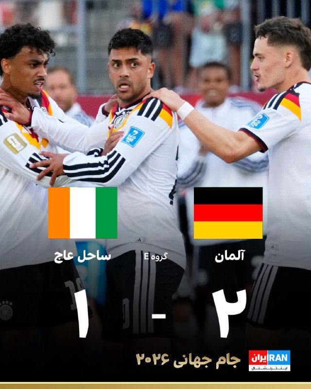

🔻تیم ملی فوتبال آلمان در دومین بازی خود در مرحله گروهی جام جهانی برابر ساحل عاج دو بر یک پیروز شد.

🔹شاگردان ناگلزمان که نیمه اول را با گل فرانک کسیه بازنده به رختکن رفته بودند، در نیمه دوم با دبل دنیز اونداف بازگشتی هیجان‌انگیز ثبت کردند و با شش امتیاز صعود خود به دور حذفی را قطعی کردند.

🔹اونداف گل پیروزی‌بخش تیمش را در دقیقه چهارم وقت‌های تلف‌شده به ثمر رساند.

@iranintltvsport

## IranIntlTV — post 343462

مراد ویسی، تحلیل‌گر ارشد ایران‌اینترنشنال، گفت: «جمهوری اسلامی اهمیت تفاهم‌نامه باآمریکا را کم‌اهمیت جلوه می‌دهد و مسئولیتش را به گردن پزشکیان می‌اندازد، چون نگران موضوع مهم‌تری در پیش رو است. طی حدود ۶۰ روز آینده، نتیجه مذاکرات با آمریکا مشخص می‌شود؛ یا توافقی حاصل می‌شود که به معنای پذیرش شکست پرهزینه‌ترین پروژه جمهوری اسلامی است، یا توافقی در کار نخواهد بود و خطر جنگ افزایش می‌یابد.»
@iranintltv

## IranIntlTV — post 343461

  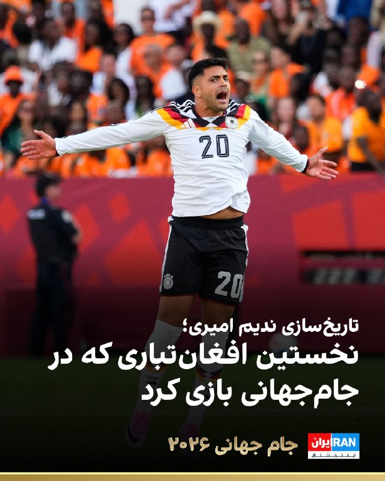

🔻ندیم امیری، بازیکن تیم ملی فوتبال آلمان، با حضور در ترکیب شاگردان ناگلزمان برابر ساحل عاج، به نخستین بازیکن افغان‌‌‌تبار تبدیل شد که در جام جهانی فوتبال به میدان می‌رود. او دقایقی بعد از حضور در زمین، پاس گل اول تیمش را ثبت کرد.

🔹ندیم امیری، هافبک ۲۹ ساله ماینتس، در خانواده‌ای افغان در لودویگسهافن در آلمان متولد شده است.

🔹ندیم امیری، بازیکن تیم ملی فوتبال آلمان، با حضور در ترکیب شاگردان ناگلزمان برابر ساحل عاج، به نخستین بازیکن افغان‌‌‌تبار تبدیل شد که در جام جهانی فوتبال به میدان می‌رود.

🔹ندیم امیری، هافبک ۲۹ ساله ماینتس، در خانواده‌ای افغان در لودویگسهافن در آلمان متولد شده است.

@iranintltvsport

## IranIntlTV — post 343460

  <a href="telegram/content/IranIntlTV_343460_1781994195.mp4" target="_blank">🎬 Download video</a>

🔻اتوبوس تیم ملی فوتبال ساعت ۱۱:۳۵ به وقت محلی وارد هتل وست‌دریفت لس‌آنجلس، محل اقامت ملی‌پوشان، شد.

🔹با توجه به فاصله کوناه بین فرود پرواز و حضور اتوبوس تیم ملی در هتل، به نظر می‌رسد سخت‌گیری پلیس نسبت به حضور اعضای این تیم در مقایسه با سفر به آمریکا برای بازی با نیوزیلند کمتر شده است.

🔹گزارش علیرضا مدیری، خبرنگار ایران اینترنشنال

@iranintltvsport

## IranIntlTV — post 343459

  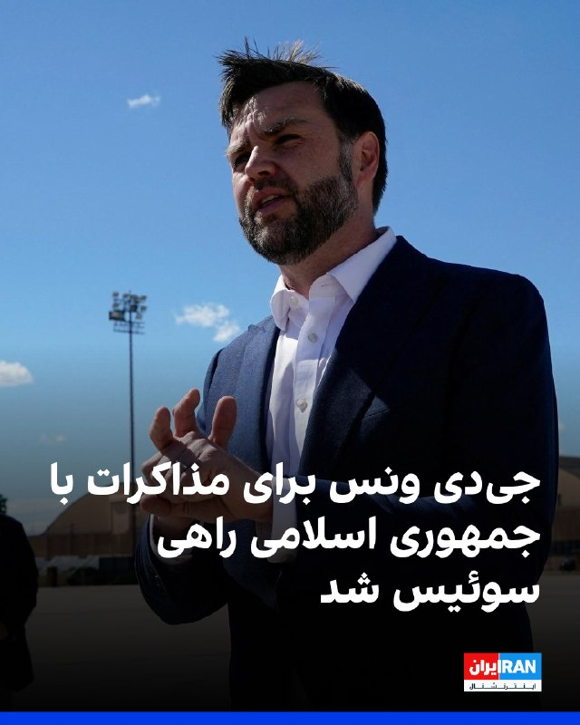

جی‌دی ونس، معاون دونالد ترامپ، رییس‌جمهوری آمریکا، اعلام کرد برای شرکت در مذاکرات با جمهوری اسلامی که قرار است روز یکشنبه در سوئیس برگزار شود، راهی این کشور شده است.

ونس گفت ممکن است یک یا دو روز در سوئیس بماند و هدف از این سفر، پیشبرد گفت‌وگوها درباره برنامه هسته‌ای جمهوری اسلامی و همچنین آتش‌بس میان اسرائیل و حزب‌الله در لبنان است.

او اظهار داشت: «فقط یک یا دو روز می‌توانم در سوئیس باشم. امیدوارم بتوانیم در موضوعات هسته‌ای و آتش‌بس لبنان نیز به پیشرفت برسیم. این دو موضوع اصلی هستند که بر آنها تمرکز خواهیم داشت.»

معاون رییس‌جمهوری آمریکا در پاسخ به پرسشی درباره احتمال تاثیر درگیری‌های لبنان بر روند مذاکرات گفت شرایط در لبنان نسبت به روزهای گذشته بهبود یافته و بخشی از تنش‌ها کاهش پیدا کرده است.

ونس همچنین تاکید کرد: «می‌خواهیم این روند را از همان ابتدا به شکل درست آغاز کنیم.»

او افزود: «موضوعات زیادی برای گفت‌وگو وجود دارد، اما همه آنها را بررسی خواهیم کرد.»

https://iranintl.com/202606204559

## IranIntlTV — post 343458

  <a href="telegram/content/IranIntlTV_343458_1781994197.mp4" target="_blank">🎬 Download video</a>

در تجمع اعتراضی در حمایت از زنان افغانستان و اعتراض به آپارتاید جنسیتی در واشینگتن، زحل صمیم، از برگزارکنندگان این تجمع، به اردوان روزبه، خبرنگار ایران‌اینترنشنال، گفت: «دولت‌ها و نهادهای بین‌المللی تا حد زیادی در برابر این خشونت‌ها سکوت کرده‌اند و خطر عادی‌سازی وضعیت موجود وجود دارد.»

او افزود: «ما تلاش می‌کنیم صدای زنان افغانستان را به جامعه جهانی برسانیم و یادآوری کنیم که میلیون‌ها زن و دختر افغان همچنان از ابتدایی‌ترین حقوق انسانی خود محروم هستند.»
@iranintltv

## IranIntlTV — post 343457

  <a href="telegram/content/IranIntlTV_343457_1781994199.mp4" target="_blank">🎬 Download video</a>

محمدحسین خوشوقت، برادر همسر مصطفی خامنه‌ای، یکی از فرزندان رهبر کشته‌شده جمهوری اسلامی، درباره دلیل عدم حضور علنی مجتبی خامنه‌ای در جامعه گفت کارشناسان امنیتی به او توصیه کرده‌اند تصویر و حتی صدایش هم منتشر نشود.
او همچنین شایعات درباره کشته شدن یا وخامت وضعیت جسمی او، از جمله آسیب شدید به صورت یا از دست دادن پاها، را نادرست خواند.

## IranIntlTV — post 343456

  <a href="telegram/content/IranIntlTV_343456_1781994200.mp4" target="_blank">🎬 Download video</a>

مراد ویسی، تحلیل‌گر ارشد ایران‌اینترنشنال، گفت: «بخشی از بدنه حاکمیت جمهوری اسلامی می‌گوید مجتبی خامنه‌ای مذاکره بر سر برنامه هسته‌ای را ممنوع کرده است، اما شورای عالی امنیت ملی در دستور سانسور به رسانه‌ها می‌گوید فقط درباره برنامه هسته‌ای مذاکره می‌کنیم. این تناقض پرسش‌برانگیز است: چرا در تهران از ادبیات رجزخوانی و مخالفت استفاده می‌شود، اما در سوئیس نشانه‌های انعطاف، آمادگی برای سازش و عقب‌نشینی دیده می‌شود؟»
@iranintltv

## IranIntlTV — post 343455

  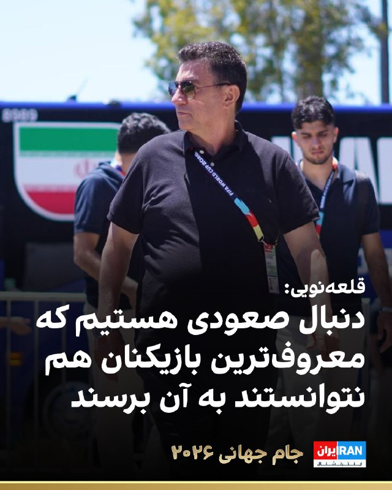

🔻ایسنا گزارش داد که امیر قلعه‌نویی، سرمربی تیم ملی فوتبال، درباره بازی با بلژیک به سایت فیفا گفته است: «ما به دنبال دستیابی به چیزی هستیم که معروف‌ترین بازیکنان گذشته نتوانستند به آن برسند. آنها البته بسیار توانمند بودند و شایسته صعود از مرحله گروهی بودند.»

🔹بر اساس این گزارش، امیر قلعه‌نویی گفته است: «چیزی که بیش از همه به آن افتخار می‌کنم این است که همه به عنوان یک تیم واحد بازی می‌کنیم. یک تیم موفق، تیمی است که هم در زمین و هم خارج از آن ارتباط قوی دارد. این وظیفه مربی است که حداقل به دو جنبه مهم (فنی و روانی) بپردازد. ما باید از نظر فنی و روانی بهترین عملکرد را داشته باشیم.»

🔹قلعه‌نویی درباره بازیکنان هم گفت: «برای برخی از آنها این دومین، سومین یا چهارمین جام جهانی است و کارهای بزرگی انجام داده‌اند. بازیکنان ما مصمم هستند که به دور بعد صعود کنند و تمرکزشان بر شادی و غرورآفرینی برای مردم ایران است. در جام جهانی جایی برای اشتباه نیست.»

@iranintltvsport

## FarsiVOA — post 221368

⚡️از دشمنی تا «رابطه ویژه»؛ داستان روابط بریتانیا و آمریکا
@FarsiVOA

## FarsiVOA — post 221367

  <a href="telegram/content/FarsiVOA_221367_1781994202.mp4" target="_blank">🎬 Download video</a>

⚡️تیم فوتبال ایران یا جمهوری اسلامی؛ پاسخ رضا تقی زاده، تحلیلگر روابط بین الملل
@FarsiVOA

## FarsiVOA — post 221366

🔺ترامپ: کسانی که بناهای ملی ما را تخریب می‌کنند سال‌‌ها زندان در انتظارشان است

▪️دونالد ترامپ، رئيس جمهوری آمریکا اعلام کرد که «نیروهای پلیس پارک‌های آمریکا چندین نفر را به دلیل تخریب حوض بازتاب ملی کشورمان بازداشت کرده‌اند.»

⬇️ بیشتر بخوانید:
https://ir.voanews.com/a/8163011.html
@FarsiVOA

## FarsiVOA — post 221365

🔺افشاگری ارتش اسرائيل علیه «خبرنگار» کشته‌شده الجزیره: «تک تیرانداز» حماس بود؛ برادرش هم تحت پوشش خبرنگار این شبکه راکت می‌ساخت

▪️ارتش اسرائيل علیه یک «خبرنگار الجزیره» که در حمله اخیر ارتش اسرائيل در غزه کشته شد، دست به «افشاگری» زد.

⬇️ بیشتر بخوانید:
https://ir.voanews.com/a/8163006.html
@FarsiVOA

## Persian_Trend_Official — post 17709

  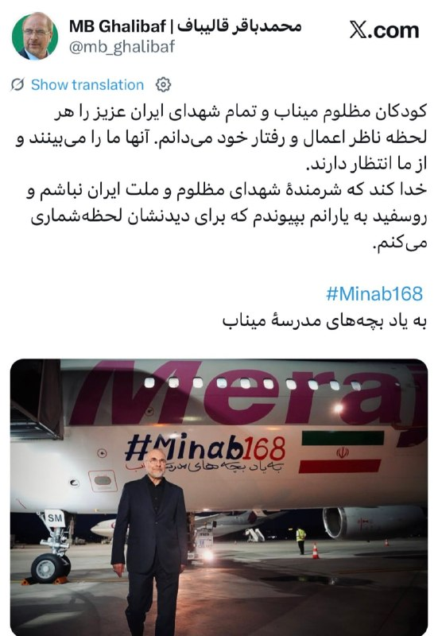

قالیباف: کودکان مظلوم میناب و تمام شهدای ایران را هر لحظه ناظر اعمال و رفتار خود می‌دانم.

قالیباف افزود: آنها ما را می‌بینند و از ما انتظار دارند. خدا کند که شرمنده شهدای مظلوم و ملت ایران نباشم و روسفید به یارانم بپیوندم که برای دیدنشان لحظه‌شماری می‌کنم.

📝 Amir

📌 @persian_trend_official
پرشین ترند | متفاوت‌ترین کانال نظامی

## Persian_Trend_Official — post 17708

  <a href="telegram/content/Persian_Trend_Official_17708_1781994203.mp4" target="_blank">🎬 Download video</a>

معاون ترامپ برای شرکت در مذاکرات با ایران راهی سوئیس شد.

ونس: راهی سوئیس می‌شوم؛ جایی که ایرانی‌ها به‌تازگی رسیده‌اند و مذاکرات دو روز ادامه خواهد داشت.

📝 Amir

📌 @persian_trend_official
پرشین ترند | متفاوت‌ترین کانال نظامی

## IranianMinds — post 23036

🔴توییت کودتاگر بعد از ورود به سوئیس:

کودکان مظلوم میناب و تمام شهدای ایران عزیز رو هر لحظه ناظر اعمال و رفتار خودم می‌دونم. اونا ما رو می‌بینن و از ما انتظار دارن.

خدا کنه که شرمندهٔ شهدای مظلوم و ملت ایران نباشم و روسفید به یارانم بپیوندم که برای دیدنشون لحظه‌شماری می‌کنم.

@IranianMinds

## BBCPersian — post 284527

  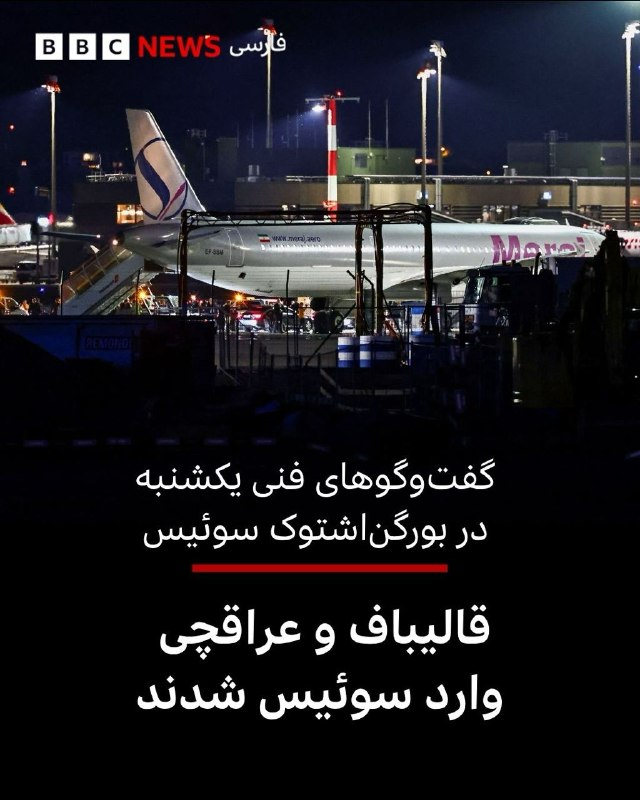

🔻وزارت خارجه سوئیس اعلام کرد که هیئتی از ایران شامگاه شنبه، پیش از گفت‌وگوها در اقامتگاه بورگن‌اشتوک، وارد این کشور شده است.

این گفت‌وگوها درباره اجرای یادداشت تفاهم اولیه میان ایران و آمریکا برای پایان دادن به جنگ در خاورمیانه برگزار می‌شود.

وزارت خارجه سوئیس در شبکه اجتماعی ایکس نوشت که از ورود هیئت ایرانی استقبال می‌کند و افزود این مذاکرات بخشی از روند اجرای یادداشت تفاهم امضاشده با آمریکا است.

خبرگزاری رسمی جمهوری اسلامی، ایرنا، نیز ورود هیئت ایران به سوئیس را تایید کرده است.

📸 Reuters

https://bbc.in/4uSiKmu
@BBCPersian

## BBCPersian — post 284526

🔻استعفای مدیر شبکه خبر پس از اظهارات نبویان درباره مذاکره با آمریکا، منتسب به مجتبی خامنه‌ای

در پی اشارات محمود نبویان، نایب‌رئیس کمیسیون امنیت ملی مجلس شورای اسلامی، در یک برنامه زنده تلویزیونی به بخشی از مکاتبات محرمانه منتسب به مجتبی خامنه‌ای و بازخوانی آنها درباره مذاکرات ایران و آمریکا، صداوسیمای جمهوری اسلامی از پیگیری قانونی این موضوع خبر داد.

https://bbc.in/4w5ExZ6
@BBCPersian

## Dirty_Kids — post 392704

یه سری از آمریکایی‌ها از همچین جایی شاهد گل دوم تیمشون مقابل استرالیا بودن.

@Dirty_Kids 👻

## Dirty_Kids — post 392703

  <a href="telegram/content/Dirty_Kids_392703_1781994206.mp4" target="_blank">🎬 Download video</a>

مگس روی گوه میشینه اتفاقا 😂

@Dirty_Kids 👻

## Dirty_Kids — post 392702

  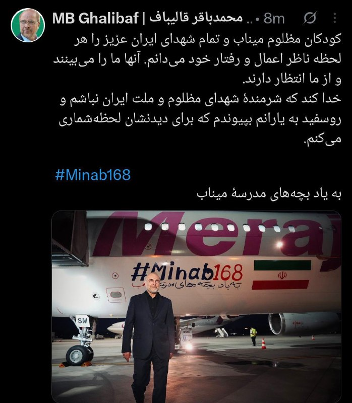

🔴 السیسی باقر کودتاگر بعد از ورود به سوئیس:

کودکان مظلوم میناب و تمام شهدای ایران عزیز رو هر لحظه ناظر اعمال و رفتار خودم می‌دونم. اونا ما رو می‌بینن و از ما انتظار دارن.

خدا کنه که شرمندهٔ شهدای مظلوم و ملت ایران نباشم و روسفید به یارانم بپیوندم که برای دیدنشون لحظه‌شماری می‌کنم.

@Dirty_Kids 👻

## Dirty_Kids — post 392701

  <a href="telegram/content/Dirty_Kids_392701_1781994207.mp4" target="_blank">🎬 Download video</a>

🔴 این روزا کلاس آنلاینای مملکت وضعیت عجیبی داره، فقط اونجا که یهو زد کانال عربی😂

+ هندزفری لازم🔞

@Dirty_Kids 👻

## alonews — post 129474

  <a href="telegram/content/alonews_129474_1781994208.mp4" target="_blank">🎬 Download video</a>

👈مجری تیلیوزیون: باید فرودگاه مهرآباد رو ببندیم تا هی نرن مذاکره کنن

✅ @AloNews خبر جنگ

## alonews — post 129473

  <a href="telegram/content/alonews_129473_1781994209.webm" target="_blank">🎬 Download video</a>

👈مراد ویسی: نباید به ترامپ دل میبستیم

✅ @AloNews خبر جنگ

## alonews — post 129471

یکی با پرچم استقلال تو استادیوم داره بازی آلمان - ساحل عاج رو نگاه میکنه!

@AloSport

## alonews — post 129470

  <a href="telegram/content/alonews_129470_1781994210.mp4" target="_blank">🎬 Download video</a>

لاشخوری عجیب ایرانخودرو

[@AloTweet]

## alonews — post 129469

  <a href="telegram/content/alonews_129469_1781994211.webm" target="_blank">🎬 Download video</a>

👈رسایی : آقای نبویان اشتباهی نکرده

✅ @AloNews خبر جنگ

## alonews — post 129468

  <a href="telegram/content/alonews_129468_1781994211.webm" target="_blank">🎬 Download video</a>

👈علی زینی‌وند ، سخنگوی وزارت کشور :
به همه کسایی که توی مراسم تشییع و تدفین علی خامنه‌ای شرکت کنن بیمه رایگان تعلق میگیره

✅ @AloNews خبر جنگ

## alonews — post 129467

  <a href="telegram/content/alonews_129467_1781994211.webm" target="_blank">🎬 Download video</a>

👈قالیباف بعد ورود به سوئیس:
کودکان مظلوم میناب و تمام شهدای ایران عزیز را هر لحظه ناظر اعمال و رفتار خود می‌دانم.

✅ @AloNews خبر جنگ

---
📅 بروزرسانی: 1405/03/31 00:44
---

## VahidOOnLine — post 246583

  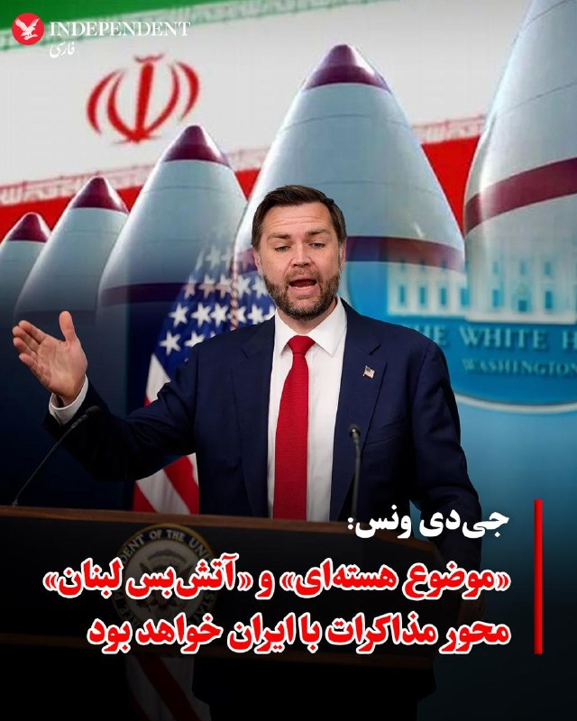

♦️جی‌دی ونس، معاون رئیس‌جمهوری ایالات متحده، در راه سفر به سوئیس برای شرکت در مذاکرات روز یکشنبه با ایران، ابراز امیدواری کرد که واشنگتن و تهران بتوانند در خصوص «مسئله هسته‌ای» و همچنین «موضوع آتش‌بس در لبنان» به پیشرفت‌هایی دست یابند. ونس پیش از ترک واشنگتن در گفتگو با خبرنگاران اظهار داشت: «برخلاف آنچه در سرخط اخبار دیده می‌شود، اوضاع در لبنان در واقع رو به بهبود است و فضا کمی آرام‌تر شده است. این موضوعی است که ما باید به طور مداوم آن را مدیریت کنیم تا از امنیت کامل اسرائیل و لبنان مطمئن شویم.»
‌🇸🇦 Indypersian

🤖 @VahidOOnLine

## VahidOOnLine — post 246582

  <a href="telegram/content/VahidOOnLine_246582_1781990094.mp4" target="_blank">🎬 Download video</a>

محمود نبویان، عضو کمیسیون امنیت ملی مجلس، با اشاره به مواضع مجتبی خامنه‌ای، رهبر جمهوری اسلامی، در ۱۵ فروردین، ۲۹ فروردین و ۴ اردیبهشت، در صداوسیما گفت او سه بار تصریح کرده است که در موضوع هسته‌ای، یا باید «به پیروزی برسیم» و طرف مقابل حق غنی‌سازی را کاملا به رسمیت بشناسد، یا این موضوع برای همیشه از دستور کار مذاکرات خارج شود.
او افزود خامنه‌ای حتی مدیریت مشترک تنگه هرمز با عمان را هم نپذیرفته بود.
این مصاحبه از سوی صداوسیما قطع شد.
‌🏁 🇬🇧 IranintlTV

🤖 @VahidOOnLine

## VahidOOnLine — post 246581

♦️فارس، خبرگزاری وابسته به سپاه با انتشار تصاویری از رسیدن کاروان تیم فوتبال ایران به هتل محل اقامت خود در لس‌آنجلس خبر داد. تیم فوتبال ایران قرار است در دومین دیدار جام‌جهانی خود، یکشنبه ساعت ۱۰:۳۰ شب (به وقت ایران) مقابل بلژیک به میدان برود. پیش از این، مهدی محمدنبی، نایب‌رییس فدراسیون فوتبال جمهوری اسلامی و سرپرست تیم ملی فوتبال اعلام کرده بود: «تمامی تیم‌های حاضر در مسابقات دو روز زودتر به محل بازی اعزام می‌شوند تا فرصت کافی برای تطبیق با شرایط محیطی و انجام تمرینات داشته باشند، اما تیم ملی ایران به دلیل مشکلات پروازی تنها یک روز زودتر راهی محل مسابقه می‌شود که این موضوع می‌تواند روی عملکرد تیم تاثیرگذار باشد. متاسفانه محدودیت‌هایی که برای تیم ملی کشورمان ایجاد شده، تنها به یکی دو مورد خلاصه نمی‌شود. از تغییر کمپ تیم ملی گرفته تا اعزام با تاخیر به محل برگزاری مسابقه، همگی شرایطی را رقم زده که به هیچ وجه با سایر تیم‌ها برابر نیست».
‌🇸🇦 Indypersian

🤖 @VahidOOnLine

## VahidOOnLine — post 246580

ویدیوی رسیده به ایران اینترنشنال نشان می‌دهد در جریان برگزاری مراسم زادروز صهبا رشتیان، شهروند معترض کشته‌شده در انقلاب ملی، مادر این جاویدنام بر سر مزارش گفت که در کشتار بزرگ دی‌ماه «صدها هزار سال» از عمر پدران و مادرانی که فرزند تربیت کرده بودند، دود شد و به فنا رفت.
‌🏁 🇬🇧 IranintlTV

🤖 @VahidOOnLine

## VahidOOnLine — post 246579

  

سخنگوی جی‌دی ونس، معاون رییس‌جمهوری آمریکا، اعلام کرد که ونس از واشینگتن به مقصد سوئیس پرواز کرده است.

همزمان رسانه‌های ایران گزارش دادند که هیات مذاکره‌کننده جمهوری اسلامی به ریاست محمدباقر قالیباف، وارد سوئیس شد.

پیش‌تر دفتر نخست‌وزیر پاکستان اعلام کرد که شهباز شریف و عاصم منیر، نخست‌وزیر و فرمانده ارتش این کشور یکشنبه در سوئیس در مذاکرات فنی آمریکا و جمهوری اسلامی شرکت خواهند کرد.
‌🏁 🇬🇧 IranintlTV

🤖 @VahidOOnLine

## VahidOOnLine — post 246578

  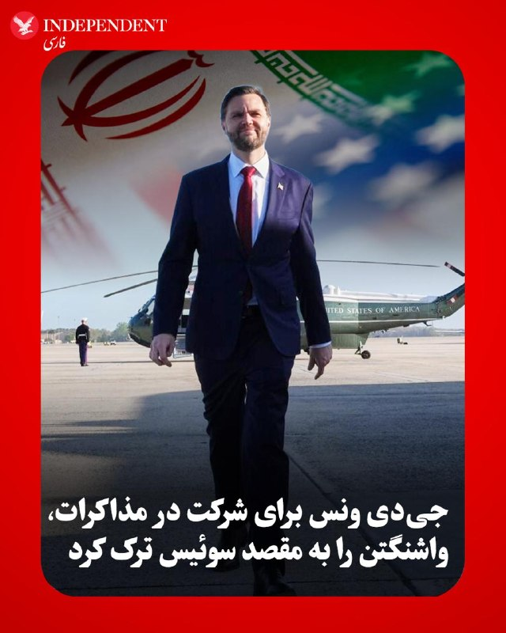

♦️جی‌دی ونس، معاون رئیس‌جمهوری ایالات متحده، اواخر بعدازظهر روز شنبه (به وقت شرق آمریکا) پایگاه مشترک «اندروز» را به مقصد «لوسرن» در سوئیس ترک کرد تا در مذاکرات جاری با ایران شرکت کند. پیش از پرواز او، استیو ویتکاف، فرستاده ویژه آمریکا، و جرد کوشنر، داماد دونالد ترامپ، برای بررسی و رسیدگی به ابعاد فنی این گفتگوها وارد خاک سوئیس شده بودند. ونس پیش از حرکت با اشاره به تغییرات پیاپی برنامه‌هایش طی هفته گذشته، هماهنگی‌های مربوط به این سفر را به یک «رقص هماهنگ ظریف» تشبیه کرد که در آن باید تمامی «سازوکارهای دیپلماتیک» به دقت در نظر گرفته شوند.
‌🇸🇦 Indypersian

🤖 @VahidOOnLine

## VahidOOnLine — post 246577

♦️تسنیم، خبرگزاری وابسته به سپاه، شنبه‌شب از ورود هیات مذاکره‌کننده جمهوری اسلامی ایران به زوریخ در سوئیس خبر داد. بر اساس این گزارش، محمدباقر قالیباف، رئیس مجلس شورای اسلامی و سرپرست تیم مذاکره‌کننده، عباس عراقچی، وزیر امور خارجه، علی باقری کنی، معاون بین‌الملل دبیرخانه شورای عالی امنیت ملی، عبدالناصر همتی، رئیس بانک مرکزی، کاظم غریب‌آبادی، معاون وزیر خارجه، اسماعیل بقایی، سخنگوی وزیر خارجه و حمید بورد، معاون وزیر نفت از اعضای اصلی این هیئت هستند. به گزارش «سی‌بی‌اس نیوز» تهران و واشنگتن قرار است روز یکشنبه در استراحتگاه مجلل «بورگن‌اشتوک» در سوئیس مذاکرات را آغاز کنند.
‌🇸🇦 Indypersian

🤖 @VahidOOnLine

## VahidOOnLine — post 246576

♦️به گزارش پایگاه اطلاع‌رسانی دولت، رئیس‌جمهوری اسلامی ایران روز شنبه در دیدار با وزیر کشور پاکستان از نقش سازنده اسلام‌آباد در حمایت از روندهای دیپلماتیک منجر به توافق پایان جنگ قدردانی کرد. مسعود پزشکیان در دیدار با محسن نقوی که در راس هیاتی به ایران سفر کرده است، بر «عزم تهران برای گسترش همکاری‌های همه‌جانبه با پاکستان» تاکید کرد.
‌🇸🇦 Indypersian

🤖 @VahidOOnLine

## VahidOOnLine — post 246575

  

یک مقام ایرانی به سی‌ان‌ان گفت که مذاکرات یکشنبه بخشی از مذاکرات رسمی پیش‌بینی‌شده در یادداشت تفاهم میان آمریکا و جمهوری اسلامی محسوب نمی‌شود، زیرا سایر مفاد هنوز اجرا نشده‌اند؛ به‌ویژه بند نخست که شامل پایان جنگ در لبنان است.

یک مقام ایرانی به سی‌ان‌ان گفت که پایان دادن به درگیری در لبنان مهم‌ترین موضوع در دستور کار هیات ایرانی در روز یکشنبه است.
‌🏁 🇬🇧 IranintlTV

🤖 @VahidOOnLine

## WithYashar — post 15463

  <a href="telegram/content/WithYashar_15463_1781990098.mp4" target="_blank">🎬 Download video</a>

️جی‌دی ونس : «من مشتاقانه منتظر شروع مذاکرات فنی با ایرانی‌ها، پاکستانی‌ها و قطری‌ها هستم...»
@withyashar

## WithYashar — post 15462

سی‌ان‌ان: «ونس» از پایگاه هوایی مشترک اندروز، برای شرکت در مذاکرات با ایران راهی سوئیس شد.
@withyashar

## WithYashar — post 15461

  <a href="telegram/content/WithYashar_15461_1781990099.mp4" target="_blank">🎬 Download video</a>

هیئت مذاکره کننده ایران، با اسم میناب ۱۶۸، وارد زوریخ سوئیس شد.

ونس معاون ترامپ برای شرکت تو مذاکرات با ایران،راهی سوئیس شد.
@withyashar

## WithYashar — post 15460

سلام یاشار جان
باور کن محرم شده میرن بیرون الواطی برای همین ری اکشنا اومده پایین😐

## WithYashar — post 15459

شیفت شبی آ فوتبال میبینن

## WithYashar — post 15458

  <a href="telegram/content/WithYashar_15458_1781990101.mp4" target="_blank">🎬 Download video</a>

دیده شدن همای سعادت در ارتفاع پنج هزار متری دماوند
@withyashar

## WithYashar — post 15457

## WithYashar — post 15456

بی‌بی‌سی‌: کیر استارمز نخست وزیر بریتانیا دوشنبه استعفا میده
@withyashar

## WithYashar — post 15455

  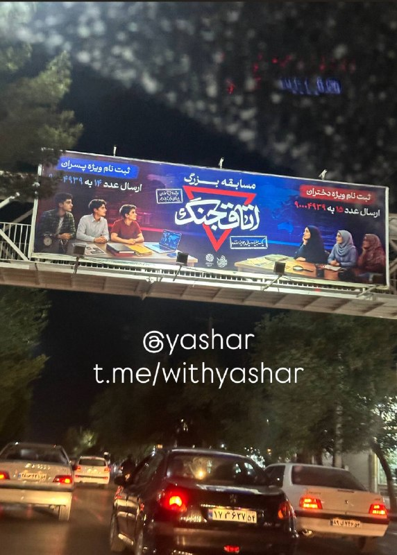

ای .. ..
@withyashar

## mwarmonitor — post 11294

  <a href="telegram/content/mwarmonitor_11294_1781990104.mp4" target="_blank">🎬 Download video</a>

📝 بالاخره کاروان عشاق به مقصد رسید و هواپیمای اختصاصی بر زمین نشست تا «مملی» به همراه «عباس» و چندتا خدنگِ جیره‌خوار و دست‌آموز، برای عرض ارادت و دم تکاندن وارد سوئیس شوند. این جماعتِ همیشه غایب در روزهای سخت، حالا با کت‌وشلوارهای اتوکشیده و لبخندهای کریه، آماده‌اند تا فردا پشت تریبون بروند و با وقاحت تمام اعلام کنند: «ما همین چند ساعت پیش با امام زمان صحبت کردیم؛ ایشان فرمودند خودشان شخصاً می‌آیند و انتقام موشعلی از شما مستکبرین می‌گیرند، شما اصلاً نگران نباشید، فقط به مذاکراتِ نان‌وآب‌دارِ خودتان ادامه دهید که حفظ نظام از اوجب واجبات است!» تماشای این خدنگ‌های بی‌خاصیت که این‌گونه برای چند روز اقامت در هتل‌های لوکس سویس به دست‌بوسیِ اربابانشان می‌روند، اوج طنز سیاه روزگار ماست؛ سیرکِ وقاحت و دلقک‌هایی که سهم مردم را جنگ و فقر کرده‌اند و سهم خودشان را سفرهای فرست‌کلاس و چای قندپهلو در ژنو.

@mwarmonitor

## mwarmonitor — post 11293

ونس واشنگتن را ترک کرد و به سمت سوئیس عازم شد.

## FoxNewsTwitter — post 343214

Fox News (Twitter/X)

"Country roads, take me home..."

USMNT fans serenaded the team with a rendition of “Take Me Home, Country Roads” after another strong World Cup performance.

Thousands celebrated the 2-0 win over Australia in Seattle as players soaked it in, fans sang every word, and for a few minutes the celebration echoed throughout the stadium.

## pm_afshaa — post 94481

  <a href="telegram/content/pm_afshaa_94481_1781990105.mov" target="_blank">🎬 Download video</a>

🔴تیم کودتا کنندگان جمهوری اسلامی هم به زوریخ سوئیس رسیدن :

💧 Rainbet.com the #1 Non-KYC Crypto Casino & Sportsbook @rainbetcom

😁 @Pm_Afshaa

## pm_afshaa — post 94480

  <a href="telegram/content/pm_afshaa_94480_1781990106.webm" target="_blank">🎬 Download video</a>

جی‌دی ونس راهی سوئیس شد. 
💧 Rainbet.com the #1 Non-KYC Crypto Casino & Sportsbook @rainbetcom 
😁 @Pm_Afshaa

## pm_afshaa — post 94479

  <a href="telegram/content/pm_afshaa_94479_1781990107.mp4" target="_blank">🎬 Download video</a>

جی‌دی ونس راهی سوئیس شد.

💧 Rainbet.com the #1 Non-KYC Crypto Casino & Sportsbook @rainbetcom

😁 @Pm_Afshaa

## pm_afshaa — post 94478

  <a href="telegram/content/pm_afshaa_94478_1781990108.webm" target="_blank">🎬 Download video</a>

🔴بی‌بی‌سی: کیر استارمر، نخست وزیر بریتانیا روز دوشنبه استعفا میده.

💧 Rainbet.com the #1 Non-KYC Crypto Casino & Sportsbook @rainbetcom

😁 @Pm_Afshaa

## mamlekate — post 103748

  <a href="telegram/content/mamlekate_103748_1781990109.mp4" target="_blank">🎬 Download video</a>

📺 فیلم کامل سخنان نبویان تا لحظه قطع آنتن

📝 محمود نبویان، عضو کمیسیون امنیت ملی مجلس، با اشاره به مواضع مجتبی خامنه‌ای، رهبر جمهوری اسلامی، در ۱۵ فروردین، ۲۹ فروردین و ۴ اردیبهشت، در صداوسیما گفت او سه بار تصریح کرده است که در موضوع هسته‌ای، یا باید «به پیروزی برسیم» و طرف مقابل حق غنی‌سازی را کاملا به رسمیت بشناسد، یا این موضوع برای همیشه از دستور کار مذاکرات خارج شود.
او افزود خامنه‌ای حتی مدیریت مشترک تنگه هرمز با عمان را هم نپذیرفته بود.
این مصاحبه از سوی صداوسیما قطع شد.
IranIntl

📝 استعفای مدیر شبکه خبر پس از اظهارات نبویان درباره مذاکره با آمریکا، منتسب به مجتبی خامنه‌ای

📝 صدا و سیما خواستار پیگرد قضایی نبویان به‌دلیل خواندن نامه‌های به‌کلی سری مجتبی خامنه‌ای شد

@mamlekate

## IranIntlTV — post 343454

  <a href="telegram/content/IranIntlTV_343454_1781990110.mp4" target="_blank">🎬 Download video</a>

محمود نبویان، عضو کمیسیون امنیت ملی مجلس، با اشاره به مواضع مجتبی خامنه‌ای، رهبر جمهوری اسلامی، در ۱۵ فروردین، ۲۹ فروردین و ۴ اردیبهشت، در صداوسیما گفت او سه بار تصریح کرده است که در موضوع هسته‌ای، یا باید «به پیروزی برسیم» و طرف مقابل حق غنی‌سازی را کاملا به رسمیت بشناسد، یا این موضوع برای همیشه از دستور کار مذاکرات خارج شود.
او افزود خامنه‌ای حتی مدیریت مشترک تنگه هرمز با عمان را هم نپذیرفته بود.
این مصاحبه از سوی صداوسیما قطع شد.

## IranIntlTV — post 343453

  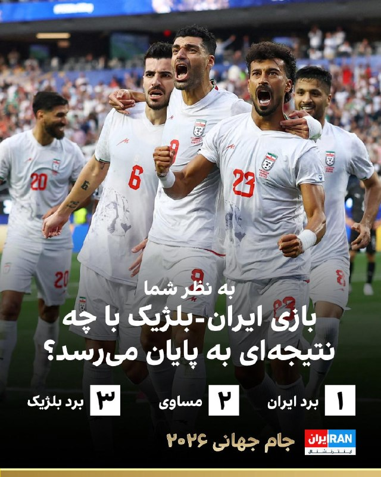

🔻تیم‌های فوتبال ایران و بلژیک در دومین بازی خود در جام جهانی ۲۰۲۶، یکشنبه ۳۱ خرداد ۱۴۰۵ در استادیوم سوفای لس‌آنجلس به مصاف یکدیگر می‌روند، به نظر شما این بازی با چه نتیجه‌ای به پایان می‌رسد؟

🔹برای شرکت در این نظرسنجی، به صفحه اینستاگرام ایران اینترنشنال ورزشی مراجعه کنید؛👇
https://www.instagram.com/p/DZyOXITghRy/

@iranintltvsport

## IranIntlTV — post 343452

ویدیوی رسیده به ایران اینترنشنال نشان می‌دهد در جریان برگزاری مراسم زادروز صهبا رشتیان، شهروند معترض کشته‌شده در انقلاب ملی، مادر این جاویدنام بر سر مزارش گفت که در کشتار بزرگ دی‌ماه «صدها هزار سال» از عمر پدران و مادرانی که فرزند تربیت کرده بودند، دود شد و به فنا رفت.

## IranIntlTV — post 343451

  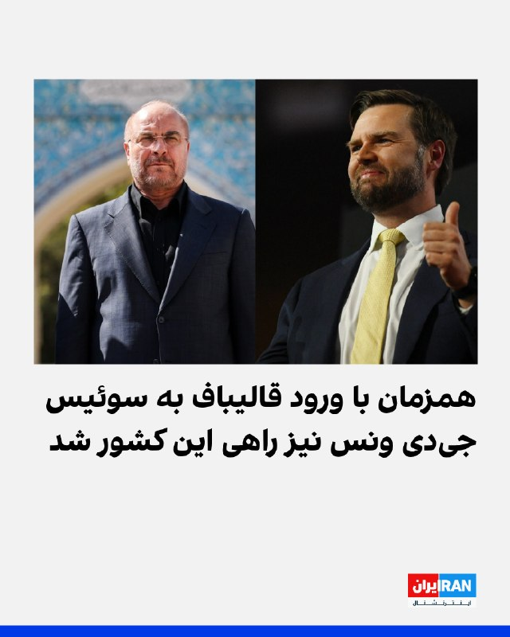

سخنگوی جی‌دی ونس، معاون رییس‌جمهوری آمریکا، اعلام کرد که ونس از واشینگتن به مقصد سوئیس پرواز کرده است.

همزمان رسانه‌های ایران گزارش دادند که هیات مذاکره‌کننده جمهوری اسلامی به ریاست محمدباقر قالیباف، وارد سوئیس شد.

پیش‌تر دفتر نخست‌وزیر پاکستان اعلام کرد که شهباز شریف و عاصم منیر، نخست‌وزیر و فرمانده ارتش این کشور یکشنبه در سوئیس در مذاکرات فنی آمریکا و جمهوری اسلامی شرکت خواهند کرد.
https://iranintl.com/202606202532

## IranIntlTV — post 343450

  <a href="telegram/content/IranIntlTV_343450_1781990113.mp4" target="_blank">🎬 Download video</a>

دسترسی به حساب‌های کاربری برخی از سازمان‌های فعال در حوزه حقوق اقلیت‌های جنسی و جنسیتی، حقوق زنان و حقوق بشر در شبکه ایکس در ترکیه محدود شده است. این محدودیت‌ها در پی درخواست دولت ترکیه و در چارچوب قوانین محلی این کشور اعمال شده‌اند.

گزارش فرزیا ثابتی، خبرنگار ایران‌اینترنشنال
@iranintltv

## IranIntlTV — post 343449

  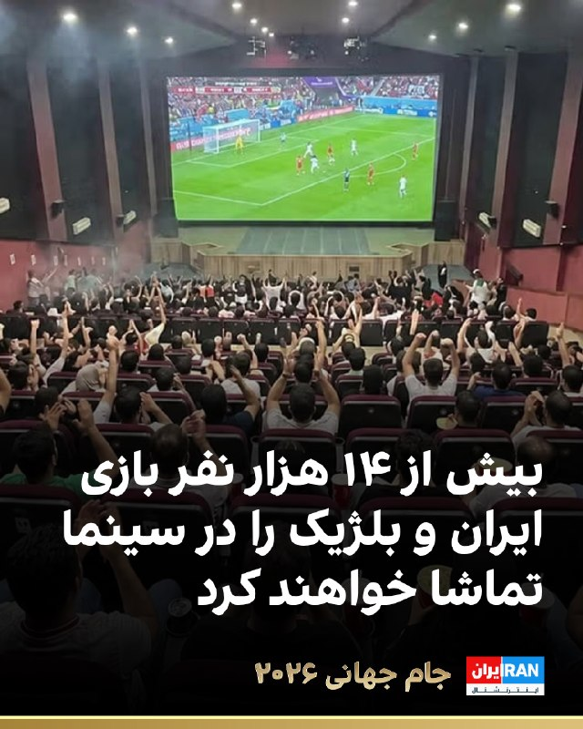

🔻ایرنا گزارش داده که تاکنون بیش از ۱۴ هزار و ۵۰۰ بلیت به مبلغ تقریبا ۲ میلیارد و ۷۰۰ میلیون تومان، برای پخش مسابقه تیم ملی فوتبال برابر بلژیک در سینماها فروخته شده است.

🔹بر اساس این گزارش، پلتفرم سینماتیکت با فروش بیش از ۱۱ هزار بلیت و ثبت تراکنش نزدیک به ۲ میلیارد و ۱۰۰ میلیون تومان، بیش از ۸۱ درصد از بازار فروش آنلاین بلیت این رویداد را به خود اختصاص داده است.

🔹آمار این سامانه نشان می‌دهد استان تهران با سهم ۵۱ درصدی از کل فروش، بیشترین میزان خرید بلیت را داشته است. خراسان رضوی با ۲۴ درصد و اصفهان با ۶ درصد در رتبه‌های بعدی قرار دارند.

🔹نکته اینکه برای بازی اول تیم ملی فوتبال برابر نیوزیلند، مجوز پخش مسابقه در سینماها صادر نشده بود.

@iranintltvsport

## IranIntlTV — post 343448

  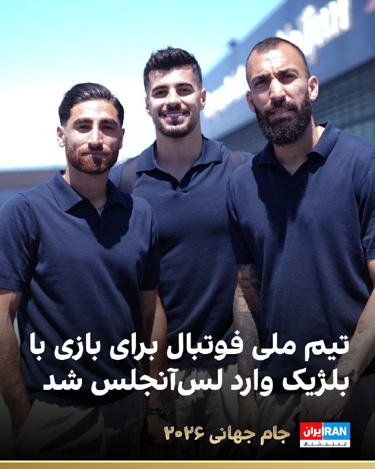

🔻هواپیمای حامل تیم ملی فوتبال ایران دقایقی پیش برای برگزاری دیدار برابر بلژیک وارد فرودگاه بین‌المللی لس‌آنجلس شد. شاگردان قلعه‌نویی بلافاصله پس از خروج از فرودگاه و حضور در هتل محل اقامت، راهی استادیوم محل برگزاری مسابقه خواهند شد تا تمرین پیش از مسابقه را برگزار کنند.

🔹همچنین امیر قلعه‌نویی و سعید عزت‌اللهی در نشست خبری پیش از این بازی حاضر خواهند بود.

🔹پیش از این سفر مهدی محمدنبی، نایب‌رییس فدراسیون و سرپرست تیم ملی فوتبال که موفق به حضور در آمریکا هم نشده، گفته بود: «تمامی تیم‌های حاضر در مسابقات دو روز زودتر به محل بازی اعزام می‌شوند تا فرصت کافی برای تطبیق با شرایط محیطی و انجام تمرینات داشته باشند، اما تیم ملی ایران به دلیل مشکلات پروازی تنها یک روز زودتر راهی محل مسابقه می‌شود که این موضوع می‌تواند روی عملکرد تیم تاثیرگذار باشد.»

🔹نبی گفته بود: «متاسفانه محدودیت‌هایی که برای تیم ملی کشورمان ایجاد شده، تنها به یکی دو مورد خلاصه نمی‌شود. از تغییر کمپ تیم ملی گرفته تا اعزام با تاخیر به محل برگزاری مسابقه، همگی شرایطی را رقم زده که به هیچ وجه با سایر تیم‌ها برابر نیست.»

@iranintltvsport

## IranIntlTV — post 343447

  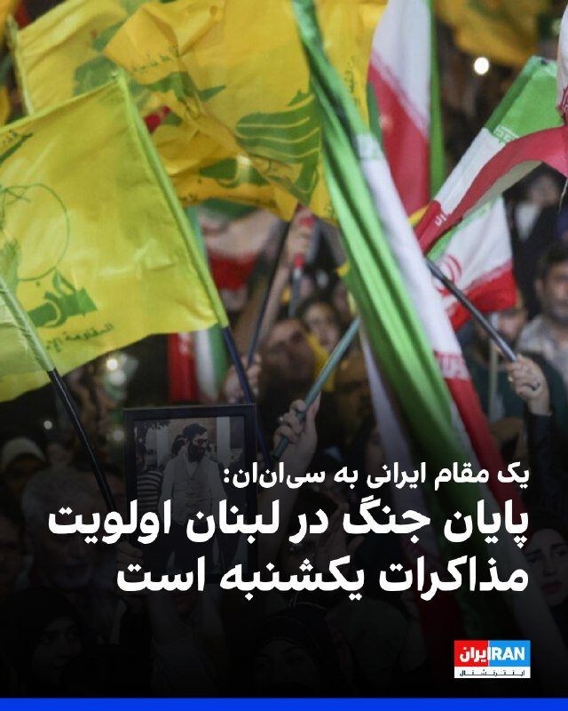

یک مقام ایرانی به سی‌ان‌ان گفت که مذاکرات یکشنبه بخشی از مذاکرات رسمی پیش‌بینی‌شده در یادداشت تفاهم میان آمریکا و جمهوری اسلامی محسوب نمی‌شود، زیرا سایر مفاد هنوز اجرا نشده‌اند؛ به‌ویژه بند نخست که شامل پایان جنگ در لبنان است.

یک مقام ایرانی به سی‌ان‌ان گفت که پایان دادن به درگیری در لبنان مهم‌ترین موضوع در دستور کار هیات ایرانی در روز یکشنبه است.
https://iranintl.com/202606202079

## IranIntlTV — post 343446

  <a href="telegram/content/IranIntlTV_343446_1781990115.mp4" target="_blank">🎬 Download video</a>

در حاشیه تجمع ایرانیان برای برافراشتن پرچم شیر و خورشید در ساختمان شهرداری شهر بری کانادا، الن بستاکیان، مشاور پروژه شکوفایی ایران، گفت: «هر ملتی برای گردهم آمدن حول یک هدف مشترک، به نمادی ملی نیاز دارد که مردم بتوانند خود را در آن بازتاب دهند.»

او افزود: «بخش بزرگی از جامعه ایران پرچم شیر و خورشید را نمادی برای هویت ملی می‌داند؛ نمادی که می‌تواند حس همبستگی و تعلق ملی ایجاد کند.»
@iranintltv

## IranIntlTV — post 343445

  <a href="telegram/content/IranIntlTV_343445_1781990117.mp4" target="_blank">🎬 Download video</a>

ده‌ها نفر از فعالان حقوق زنان و اعضای جامعه افغانستان در واشینگتن در حمایت از زنان افغانستان و در اعتراض به آپارتاید جنسیتی تجمع کردند.

برگزارکنندگان می‌گویند این راهپیمایی با هدف جلب توجه افکار عمومی به محرومیت میلیون‌ها زن و دختر افغان از حق تحصیل، کار و آزادی‌های اساسی و درخواست اقدام جدی‌تر جامعه جهانی برگزار شده است.

گزارش اردوان روزبه، خبرنگار ایران‌اینترنشنال و گفت‌وگو با زحل صمیم، یکی از برگزارکنندگان
@iranintltv

## FarsiVOA — post 221364

  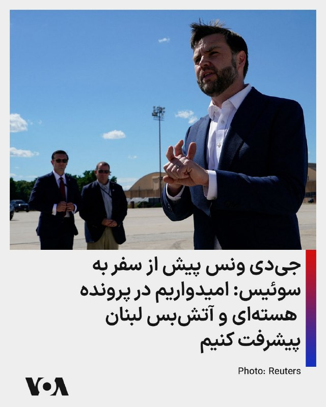

⚡️جی‌دی ونس، معاون رئيس‌جمهوری آمریکا، روز شنبه برای مذاکره با جمهوری اسلامی عازم سوئيس شد. آقای ونس پیش از سوار شدن به هواپیما،گفت: «مشتاقم مذاکرات فنی با نمایندگان [جمهوری اسلامی] ایران، پاکستان و قطر را آغاز کنیم. امیدواریم هم در مسئله هسته‌ای و هم در موضوع آتش‌بس لبنان پیشرفت کنیم. این دو محور، مهم‌ترین موضوعاتی است که به نظرم مورد توجه ما خواهند بود.»
@FarsiVOA

## FarsiVOA — post 221362

  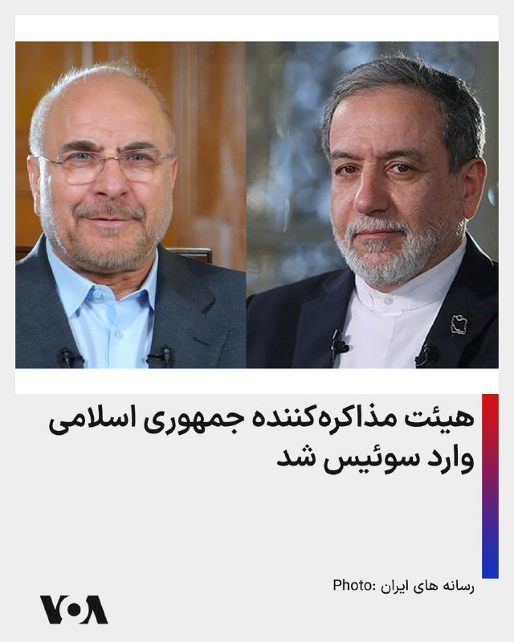

⚡️با وجود تکرار تهدیدات سپاه پاسداران علیه تنگه هرمز، رسانه‌های حکومتی در ایران خبر دادند که مذاکره‌کنندگان جمهوری اسلامی وارد شهر زوریخ در سوئیس شدند. تصاویر منتشر شده محمدباقر قالیباف، رئیس مجلس شورای اسلامی و عباس عراقچی، وزیر خارجه را در بین این هیئت نشان می‌دهد.
@FarsiVOA

## FarsiVOA — post 221361

🔺پنج سرباز اسرائیلی در دو حمله جداگانه در جنوب لبنان کشته شدند

▪️ارتش اسرائیل اعلام کرد پنج سرباز این کشور در دوحمله جداگانه در جنوب لبنان کشته شده‌اند؛ چهار تن از آنان بامداد جمعه در پی اصابت یک شیء به تانکشان کشته شدند و یک سرباز دیگر نیز در حمله‌ای منتسب به گروه حزب‌الله کشته شد.

⬇️ بیشتر بخوانید:
https://ir.voanews.com/a/fighting-kills-five-israeli-troops/8163001.html
@FarsiVOA

## DW_Farsi — post 126251

🔶 نیمه اول | جام جهانی ۲۰۲۶؛ آلمان صفر − ساحل عاج یک

در دومین دیدار گروه ای(E) جام جهانی، آلمان در پایان نیمه نخست با یک گل از ساحل عاج عقب افتاد. آلمان در دقیقه ۲۲ توپ را وارد دروازه کرد، اما گل پس از بازبینی ویدیویی به دلیل خطای پاولوویچ روی دروازه‌بان ساحل عاج مردود شد.
در دقیقه ۳۹ هم گل کای هاورتز به دلیل خطای جمال موسیالا در صحنه قبل از گل پذیرفته نشد. ساحل عاج اما در دقیقه ۳۰ با شوت زمینی فرانک کاسیه به گل رسید و نیمه اول را با برتری به پایان برد.
این دیدار در ورزشگاه ۴۵ هزار نفری تورنتو برگزار می‌شود.
@dw_farsi

## Persian_Trend_Official — post 17707

  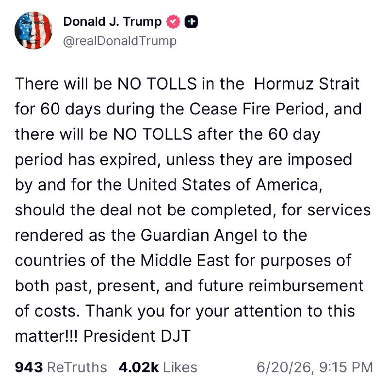

ترامپ در تروث سوشال: در طول دوره آتش بس، به مدت 60 روز هیچ عوارضی در تنگه هرمز وجود نخواهد داشت و پس از انقضای دوره 60 روزه نیز هیچ عوارضی وجود نخواهد داشت، مگر اینکه توسط ایالات متحده آمریکا و برای آن وضع شده باشد.

این توافق نباید تکمیل شود، زیرا به عنوان فرشته نگهبان به کشورهای خاورمیانه برای بازپرداخت هزینه‌ها در گذشته، حال و آینده خدمات ارائه شده است.

📝 Amir

📌 @persian_trend_official
پرشین ترند | متفاوت‌ترین کانال نظامی

## IranianMinds — post 23035

  <a href="telegram/content/IranianMinds_23035_1781990120.mp4" target="_blank">🎬 Download video</a>

سخنان زنده‌‌یاد مانوک خدابخشیان در سال ۱۳۹۸.

@IranianMinds

## IranianMinds — post 23034

  <a href="telegram/content/IranianMinds_23034_1781990121.mov" target="_blank">🎬 Download video</a>

ورود قالیباف و عراقچی به سوئیس.

@IranianMinds

## IranianMinds — post 23033

🔴هیئت مذاکره‌کننده جمهوری اسلامی وارد سوئیس شدند.

@IranianMinds

## IranianMinds — post 23032

  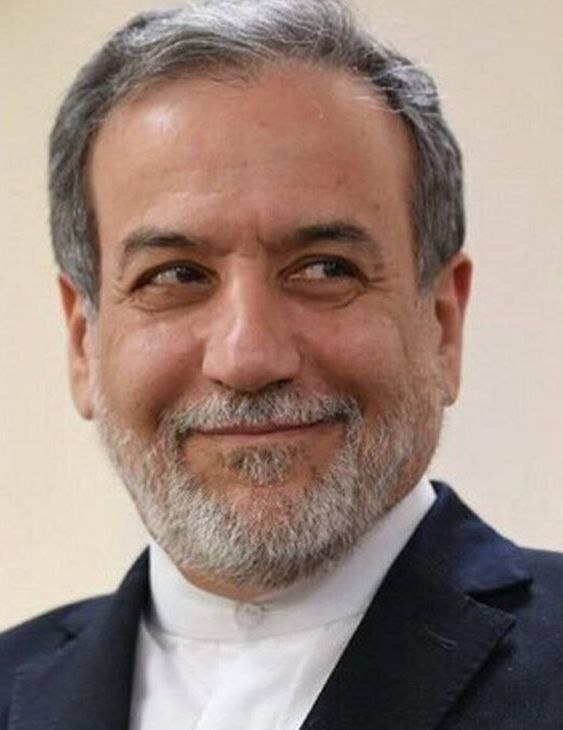

😏😏😏

@IranianMinds

## IranianMinds — post 23031

ونس هم از واشنگتن حرکت کرد به سمت سوئیس

@IranianMinds

## IranianMinds — post 23030

عراقچی در راه سوئیس @IranianMinds

## BBCPersian — post 284525

  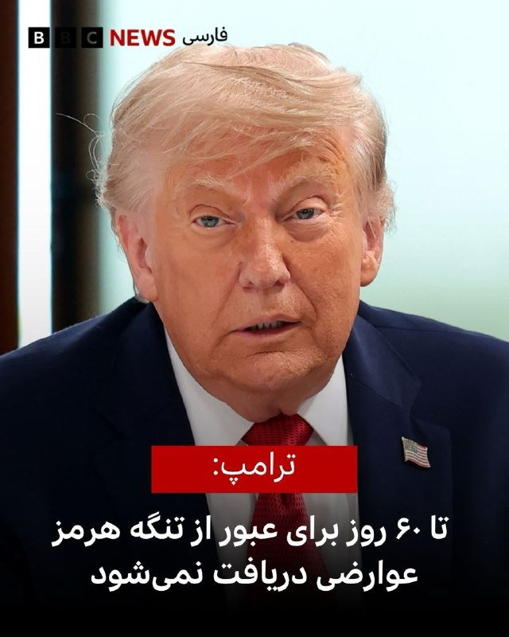

🔻دونالد ترامپ، رئیس‌جمهوری آمریکا، می‌گوید در دوره آتش‌بس، به مدت ۶۰ روز، هیچ عوارضی برای عبور از تنگه هرمز دریافت نخواهد شد.

او در شبکه اجتماعی تروث سوشال نوشت پس از پایان این دوره نیز عوارضی دریافت نمی‌شود، مگر آن‌که توافق نهایی نشود.

آقای ترامپ گفت که در این صورت، ایالات متحده ممکن است برای جبران هزینه‌های گذشته، حال و آینده خود عوارض وضع کند.

او همچنین نقش آمریکا در قبال کشورهای خاورمیانه را «فرشته نگهبان» توصیف کرد.

📸 Getty

https://bbc.in/4uSiKmu
@BBCPersian

## Dirty_Kids — post 392700

  <a href="telegram/content/Dirty_Kids_392700_1781990123.mp4" target="_blank">🎬 Download video</a>

اگه عقل این دختربچه رو عرزشیا داشتن ایران بهترین کشور برای زندگی بود

@Dirty_Kids 👻

## Dirty_Kids — post 392699

  <a href="telegram/content/Dirty_Kids_392699_1781990124.mp4" target="_blank">🎬 Download video</a>

🔴 یه دختر 140 کیلویی پرید بغل دوس پسرش و دوس پسرش له شد و مُرد.

+ دختر رو به جرم قتل دستگیر کردن.

@Dirty_Kids 👻

## Dirty_Kids — post 392698

  <a href="telegram/content/Dirty_Kids_392698_1781990125.mp4" target="_blank">🎬 Download video</a>

اینا با خودشون اینکارو میکنن ببینید با مردم چیکار میکنن!!

@Dirty_Kids 👻

## alonews — post 129466

  <a href="telegram/content/alonews_129466_1781990127.webm" target="_blank">🎬 Download video</a>

👈این وسط ساعت رولکس امیر نیوکاسل در مکزیک دزدیده شد

✅ @AloNews خبر جنگ

## alonews — post 129465

  <a href="telegram/content/alonews_129465_1781990127.mp4" target="_blank">🎬 Download video</a>

👈جی‌دی ونس :
«من مشتاقانه منتظر شروع مذاکرات فنی با ایرانی‌ها، پاکستانی‌ها و قطری‌ها هستم...»

✅ @AloNews خبر جنگ

## alonews — post 129464

  <a href="telegram/content/alonews_129464_1781990128.mp4" target="_blank">🎬 Download video</a>

👈ویدیویی از راهی شدن جی‌دی ونس به سوئیس

✅ @AloNews خبر جنگ

## alonews — post 129463

  <a href="telegram/content/alonews_129463_1781990130.webm" target="_blank">🎬 Download video</a>

👈همه رفتن سوئیس فقط آقامجتبی مونده

✅ @AloNews خبر جنگ

## alonews — post 129462

  <a href="telegram/content/alonews_129462_1781990130.webm" target="_blank">🎬 Download video</a>

👈گویا بعد از اظهارات ضد امنیت ملی توسط نبویان، تنگه وی هم اکنون درحال باز شدن است

✅ @AloNews خبر جنگ

## alonews — post 129461

  <a href="telegram/content/alonews_129461_1781990130.mp4" target="_blank">🎬 Download video</a>

👈تصاویری از ورود تیم مذاکره کننده ایرانی به سوئیس

✅ @AloNews خبر جنگ

## alonews — post 129460

  <a href="telegram/content/alonews_129460_1781990131.webm" target="_blank">🎬 Download video</a>

👈ونس هنگام عزیمت به سوئیس: امیدواریم در مسئلهٔ آتش‌بس در لبنان پیشرفت حاصل کنیم

✅ @AloNews خبر جنگ

## alonews — post 129459

  <a href="telegram/content/alonews_129459_1781990132.webm" target="_blank">🎬 Download video</a>

👈هیئت مذاکره کننده ایران وارد زوریخ سوئیس شد

✅ @AloNews خبر جنگ

## alonews — post 129458

  <a href="telegram/content/alonews_129458_1781990132.webm" target="_blank">🎬 Download video</a>

🔴فوری / جی‌دی ونس، معاون رئیس جمهور آمریکا برای پیوستن به مذاکرات بل ایران ، واشنگتن را به مقصد سوئیس ترک کرد

✅ @AloNews خبر جنگ

## alonews — post 129457

  <a href="telegram/content/alonews_129457_1781990132.webm" target="_blank">🎬 Download video</a>

🔴فوری/ بی‌بی‌سی‌: کیر استارمز نخست وزیر بریتانیا دوشنبه استعفا میده

✅ @AloNews خبر جنگ

---
📅 بروزرسانی: 1405/03/30 23:50
---

## VahidOOnLine — post 246574

  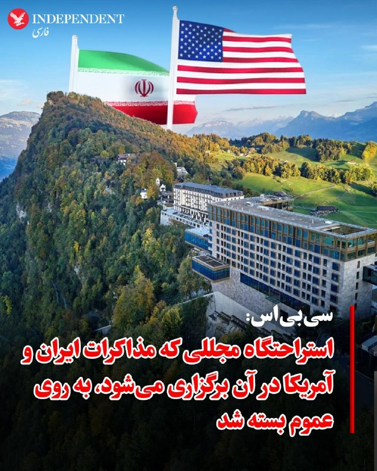

♦️به گزارش «سی‌بی‌اس»، مسئولان استراحتگاه مجلل «بورگن‌اشتوک» در سوئیس، محل برگزاری مذاکرات روز یکشنبه میان ایران و ایالات متحده، در گفتگو با «سی‌بی‌اس نیوز» اعلام کردند که این مجموعه تا روز سه‌شنبه به روی عموم بسته خواهد بود. این استراحتگاه فوق‌لوکس که مشرف به دریاچه لوسرن و کوه‌های آلپ سوئیس است، از تاریخ ۱۷ ژوئن (۲۷ خرداد) فعالیت‌های عادی خود را متوقف کرده و بر اساس برنامه‌ریزی‌های فعلی، قرار است از ظهر روز چهارشنبه پذیرش عادی مسافران و عموم مردم را از سر بگیرد. براساس این گزارش، اتخاذ این تدابیر و تعطیلی کامل مجموعه، نشان‌دهنده ابعاد امنیتی و اهمیت دیپلماتیک بالایی است که برای دور جدید گفتگوهای تهران و واشنگتن در خاک سوئیس در نظر گرفته شده است.
‌🇸🇦 Indypersian

🤖 @VahidOOnLine

## VahidOOnLine — post 246573

  <a href="telegram/content/VahidOOnLine_246573_1781986802.mp4" target="_blank">🎬 Download video</a>

پس از حملات اسرائیل به منطقه قناریت و نبطیه در جنوب لبنان در روز شنبه ۳۰ خرداد، دود غلیظی از این مناطق به هوا برخاست. این حملات ساعاتی پس از اجرایی شدن آتش‌بس میان اسرائیل و حزب‌الله انجام شد. اسرائیل اعلام کرد حملات در پاسخ به پرتابه‌های شلیک‌شده از سوی حزب‌الله صورت گرفته است.
‌🏁 🇬🇧 IranintlTV

🤖 @VahidOOnLine

## VahidOOnLine — post 246572

  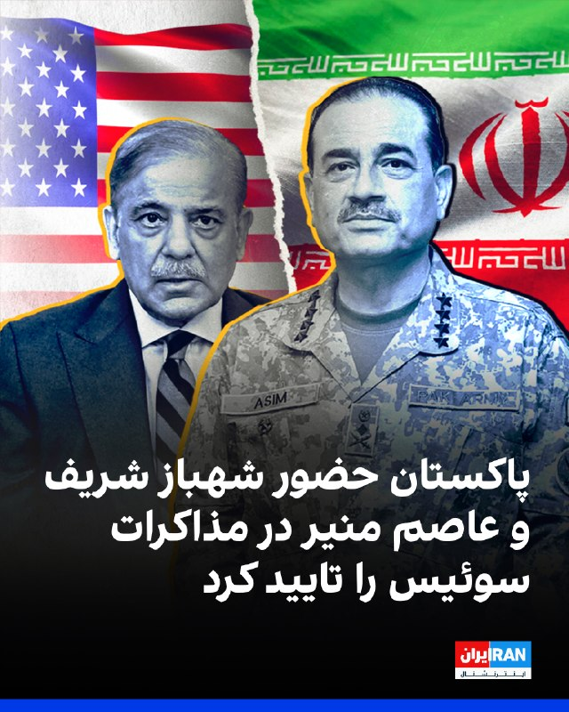

دفتر نخست‌وزیر پاکستان اعلام کرد که شهباز شریف و عاصم منیر، نخست‌وزیر و فرمانده ارتش این کشور یکشنبه در سوئیس در مذاکرات فنی آمریکا و جمهوری اسلامی شرکت خواهند کرد.

پیش‌تر الجزیره از حضور شریف و منیر در مذاکرات یکشنبه خبر داده بود.
‌🏁 🇬🇧 IranintlTV

🤖 @VahidOOnLine

## VahidOOnLine — post 246571

  <a href="telegram/content/VahidOOnLine_246571_1781986805.mp4" target="_blank">🎬 Download video</a>

یک شهروند در ویدیویی که به ایران اینترنشنال ارسال کرده خطاب به علی خامنه‌ای، دیکتاتور سابق ایران، می‌گوید که «این همه آدم کشتی و حالا خودت در یخچال داری کپک می‌زنی.»
‌🏁 🇬🇧 IranintlTV

🤖 @VahidOOnLine

## VahidOOnLine — post 246570

  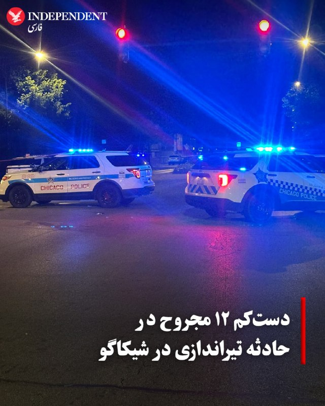

♦️ پلیس شیکاگو اعلام کرد در پی تیراندازی سرنشینان یک خودروی در حال حرکت به سمت تجمعی از مردم در محله «پرینستون پارک» واقع در جنوب این شهر، دست‌کم ۱۲ نفر مجروح شدند.

به گفته ماموران تحقیق، این حادثه اواخر وقت جمعه شب رخ داده است؛ زمانی که یک خودروی شاسی‌بلند قرمز رنگ به جمعیتی بزرگ نزدیک شده و دو تن از سرنشینان آن شروع به شلیک گلوله به سمت مردم کرده و بلافاصله از صحنه جرم گریختند.

به گزارش «ای‌بی‌سی شیکاگو» پلیس تایید کرد که در این حادثه دست‌کم ۱۲ نفر هدف گلوله قرار گرفته‌اند که توسط نیروهای امدادی یا شخصا به بیمارستان‌های محلی منتقل شده‌اند. حال یکی از مجروحان وخیم گزارش شده است. کارآگاهان منطقه دو پلیس شیکاگو تحقیقات خود را برای شناسایی عاملان این حمله و انگیزه آن‌ها آغاز کرده‌اند، اما هنوز جزئیات بیشتری از هویت مهاجمان منتشر نشده است.
‌🇸🇦 Indypersian

🤖 @VahidOOnLine

## VahidOOnLine — post 246569

  

آی‌۲۴ نیوز نوشت که بنیامین نتانیاهو، نخست‌وزیر اسرائیل، به وزرای کابینه این کشور دستور داده از حملات به دونالد ترامپ، رییس‌جمهوری آمریکا خودداری کنند، اما مقام‌های ارشد در محافل خصوصی می‌گویند واشینگتن درک درستی از ایدئولوژی جمهوری اسلامی و حزب‌الله ندارد.

یک مقام ارشد اسرائیلی گفت: «ترامپ زبان شیعه را نمی‌فهمد.»
‌🏁 🇬🇧 IranintlTV

🤖 @VahidOOnLine

## VahidOOnLine — post 246568

  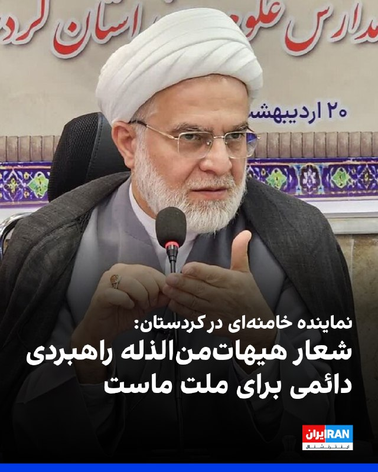

عبدالرضا پورذهبی، نماینده خامنه‌ای در کردستان، در تجمع شبانه حامیان حکومت گفت: «شعار هیهات‌من‌الذله تنها متعلق به یک مقطع تاریخی نیست، بلکه راهبردی دائمی برای ملت ایران در مقابله با زورگویی، سلطه‌پذیری و حفظ عزت و کرامت انسانی به شمار می‌رود.»

او ادامه داد: «شرایط کنونی بیش از هر زمان دیگری نیازمند همدلی و پرهیز از اختلافات است.»
‌🏁 🇬🇧 IranintlTV

🤖 @VahidOOnLine

## VahidOOnLine — post 246567

  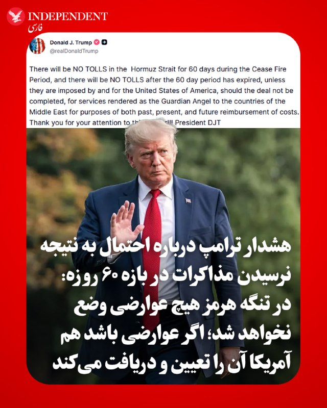

♦️ دونالد ترامپ، رئیس‌جمهوری آمریکا، شنبه‌شب، ۳۰ خرداد، با انتشار پیامی در شبکه اجتماعی «تروث سوشال» اعلام کرد که در طول بازه زمانی ۶۰ روزه آتش‌بس، هیچ‌گونه «حق عبور یا عوارضی» در تنگه هرمز وضع نخواهد شد. او تاکید کرد که پس از پایان این دوره ۶۰ روزه نیز هیچ عوارضی دریافت نمی‌شود، مگر اینکه توافق نهایی حاصل نشود؛ که در آن صورت، این تعرفه‌ها صرفا توسط ایالات متحده و برای این کشور وضع خواهد شد.

ترامپ هدف از وضع احتمالی این عوارض را دریافت هزینه‌های واشنگتن در قبال نقش‌آفرینی به عنوان «فرشته نگهبان» کشورهای خاورمیانه خواند و افزود این اقدام جهت جبران هزینه‌های گذشته، حال و آینده آمریکا در منطقه صورت می‌گیرد.

این اظهارات در حالی مطرح شد که روز شنبه سپاه پاسداران عبور و مرور شناورها از تنگه هرمز را ممنوع اعلام کرد و آن را در واکنش به نقض تعهدات از سوی آمریکا دانست. در مقابل، سنتکام با تکذیب بسته بودن تنگه هرمز، تاکید کرد که این آبراه حیاتی در اختیار نیروهای نظامی جمهوری اسلامی نیست و ترافیک دریایی ادامه دارد.
‌🇸🇦 Indypersian

🤖 @VahidOOnLine

## VahidOOnLine — post 246566

  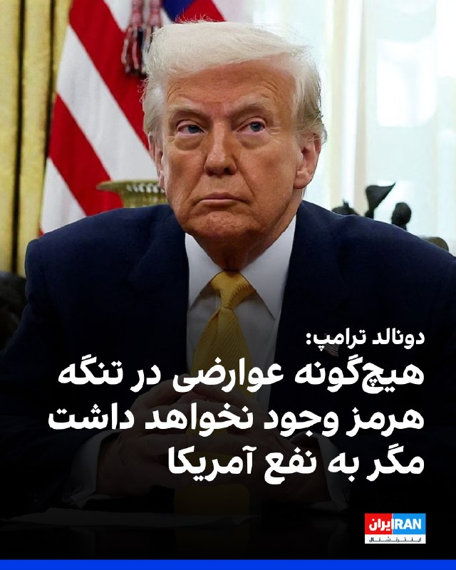

دونالد ترامپ، رییس‌جمهوری آمریکا، در تروث‌سوشال نوشت: «در طول دوره آتش‌بس، به مدت ۶۰ روز هیچ‌گونه عوارضی در تنگه هرمز وجود نخواهد داشت، و پس از پایان دوره ۶۰ روزه نیز هیچ‌گونه عوارضی وجود نخواهد داشت، مگر اینکه توسط و به نفع ایالات متحده آمریکا اعمال شوند.»

او افزود: «در صورتی که توافق نهایی نشود؛ این موضوع در چارچوب خدماتی است که به‌عنوان «فرشته نگهبان» برای کشورهای خاورمیانه ارائه شده و با هدف جبران هزینه‌ها در گذشته، حال و آینده مطرح می‌شود.»
‌🏁 🇬🇧 IranintlTV

🤖 @VahidOOnLine

## VahidOOnLine — post 246565

  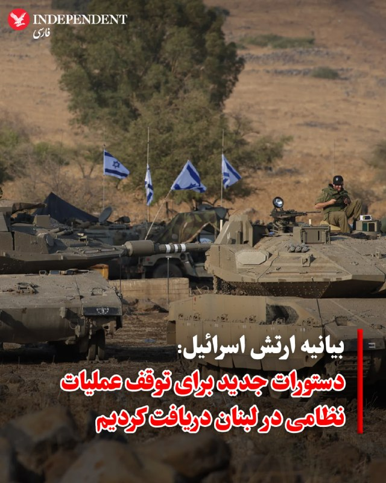

♦️ ارتش اسرائیل با صدور بیانیه‌ای اعلام کرد که «دستورالعمل‌های به‌روزشده‌ای» از سوی مقامات سیاسی این کشور مبنی بر توقف عملیات نظامی در لبنان دریافت کرده است. این بیانیه پس از دو روز تبادل آتش مرگ‌بار میان نیروهای اسرائیلی و حزب‌الله صادر شد؛ درگیری‌هایی که آتش‌بس قبلی را از بین برد و تفاهم‌نامه اولیه صلح میان ایالات متحده و جمهوری اسلامی ایران را نیز تحت فشار قرار داد. این دستور سیاسی تنها چند ساعت پس از آن صادر شد که سپاه پاسداران از انسداد مجدد تنگه هرمز خبر داده بود.

ارتش اسرائیل اعلام کرد که دیگر دست به «حملات پیش‌دستانه و تهاجمی» نخواهد زد و تنها «به صورت تدافعی در درون منطقه امنیتی» عمل خواهد کرد؛ باریکه‌ای از خاک جنوب لبنان که در کنترل نیروهای اسرائیلی است و تا عمق حدود ۶ مایلی (۱۰ کیلومتری) شمال مرزهای اسرائیل امتداد دارد. ارتش در پایان خاطرنشان کرد که در صورت پایبند نبودن حزب‌الله به آتش‌بس و هدف قرار گرفتن نظامیان یا غیرنظامیان اسرائیلی، حق پاسخ‌گویی را برای خود محفوظ می‌داند.
‌🇸🇦 Indypersian

🤖 @VahidOOnLine

## VahidOOnLine — post 246564

  

به گزارش کانال ۱۲ اسرائیل هدف اولیه آمریکا در مذاکراتی که قرار است یکشنبه در سوئیس با جمهوری اسلامی آغاز شود، دستیابی به توافقی برای اجازه دادن به بازرسان آژانس بین‌المللی انرژی اتمی جهت بازرسی از سایت‌های هسته‌ای ایران است.

در صورت موافقت تهران، بازرسی از تاسیسات اتمی ایران برای نخستین بار از زمان جنگ ۱۲ روزه خواهد بود.

بر اساس این گزارش، در ازای موافقت حکومت ایران با بازگشت بازرسان به این سایت‌ها که احتمالا شامل فردو، نطنز و اصفهان می‌شود، آمریکا آماده است چندین میلیارد دلار از دارایی‌های ایران را که در قطر نگهداری می‌شود آزاد کند.

طبق این گزارش، این منابع قرار است توسط حکومت ایران برای خرید غذا، دارو و دیگر نیازهای انسانی استفاده شود.
‌🏁 🇬🇧 IranintlTV

🤖 @VahidOOnLine

## VahidOOnLine — post 246563

  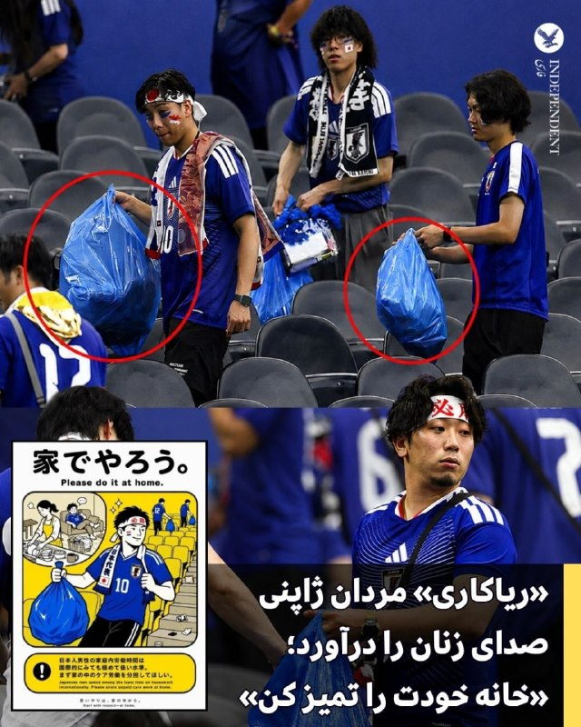

♦️ سال‌ها است که هواداران فوتبال ژاپن به دلیل جمع‌کردن زباله‌ها پس از مسابقه‌های جام جهانی تحسین می‌شوند. تصویر آن‌ها با کیسه‌های زباله در میان ردیف‌های ورزشگاه، به یکی از نمادهای نظم، مسئولیت‌پذیری و فرهنگ عمومی ژاپن تبدیل شده است؛ اما این بار، همین تصاویر در داخل ژاپن با واکنشی متفاوت روبه‌رو شده است.

شماری از کاربران ژاپنی در شبکه‌های اجتماعی این اقدام را نشانه‌ای از یک تناقض دانستند: مردانی که در فضای عمومی و در برابر دوربین‌، زباله دیگران را جمع می‌کنند، اما در خانه بخش بزرگی از کارهای روزمره خودشان را هم به همسرانشان می‌سپارند.

اندکی بعد، پوستری در ژاپن فراگیر شد که همین تضاد را نشان می‌داد. متن این پوستر از مردان ژاپنی می‌خواست «در خانه بیشتر کمک کنند» و یادآوری می‌کرد که مردان ژاپنی در میان کشورهای توسعه‌یافته، کمترین مشارکت در کار خانگی را دارند.

یکی از کاربران، با اشاره به جمله‌ای منسوب به نویسنده آمریکایی پی‌جی اورورک، نوشت: «همه می‌خواهند دنیا را نجات دهند، اما هیچ‌کس نمی‌خواهد به مادرش در شستن ظرف‌ها کمک کند.»
‌🇸🇦 Indypersian

🤖 @VahidOOnLine

## WithYashar — post 15454

  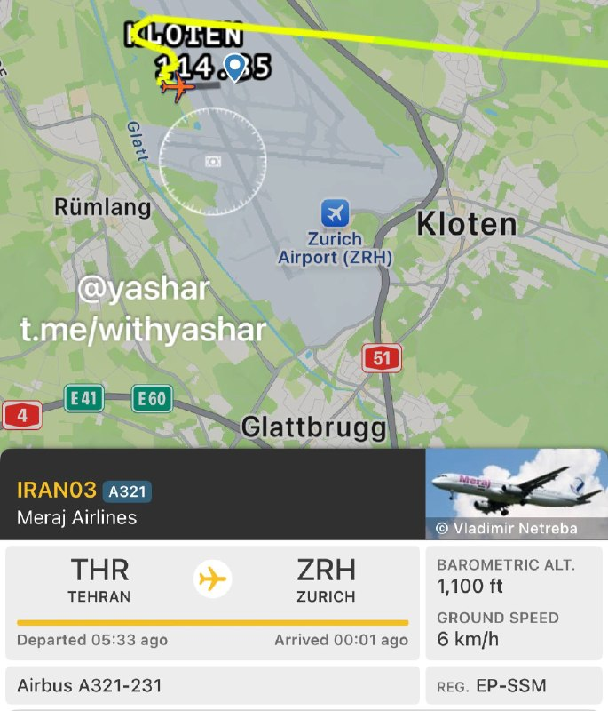

هواپیمای هیئت ایرانیش 15 دقیقه دیگر در زوریخ به زمین خواهد نشست. @withyashar

## WithYashar — post 15453

آی‌۲۴ نیوز نوشت که بنیامین نتانیاهو، نخست‌وزیر اسرائیل، به وزرای کابینه این کشور دستور داده از حملات به دونالد ترامپ، رییس‌جمهوری آمریکا خودداری کنند، اما مقام‌های ارشد در محافل خصوصی می‌گویند واشینگتن درک درستی از ایدئولوژی جمهوری اسلامی و حزب‌الله ندارد.
@withyashar

## WithYashar — post 15452

اتاق جنگ با یاشار : مشروعیت حتما تا انتها ببینید ، کلیک کنید کارای اداری یادتون نره https://www.instagram.com/reel/DZ0c0MCxXpl/?igsh=cTR0Nm90ajdrbWRh

## WithYashar — post 15451

️خبرگزاری مشرق: نبویان، نماینده مجلس، به ۲ـ۱۰ سال حبس محکوم می‌شود
@withyashar

## WithYashar — post 15450

ترامپ در‌تروث: در طول دوره آتش‌بس به مدت ۶۰ روز هیچ عوارضی در تنگه هرمز وجود نخواهد داشت و پس از پایان دوره ۶۰ روزه نیز هیچ عوارضی وجود نخواهد داشت، مگر اینکه توسط ایالات متحده آمریکا و برای ایالات متحده آمریکا، در صورت عدم تکمیل توافق، برای خدماتی که به…

## WithYashar — post 15449

نایب‌رئیس شورای سیاسی حزب‌الله لبنان: تلاش‌های آمریکا و اسرائیل برای خلع سلاح حزب‌الله با شکست مواجه شده و تسلیم سلاح غیرممکن است
@withyashat

## WithYashar — post 15448

هواپیمای هیئت ایرانیش 15 دقیقه دیگر در زوریخ به زمین خواهد نشست.
@withyashar

## WithYashar — post 15447

اتاق جنگ با یاشار : مشروعیت حتما تا انتها ببینید ، کلیک کنید کارای اداری یادتون نره https://www.instagram.com/reel/DZ0c0MCxXpl/?igsh=cTR0Nm90ajdrbWRh

## WithYashar — post 15446

کاور 🔥 @withyashar

## WithYashar — post 15445

  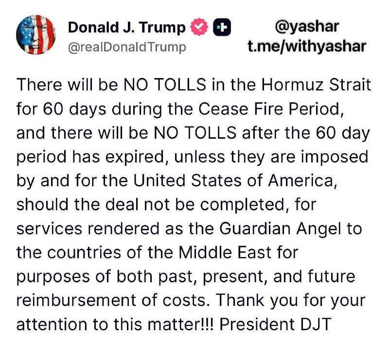

ترامپ در‌تروث:
در طول دوره آتش‌بس به مدت ۶۰ روز هیچ عوارضی در تنگه هرمز وجود نخواهد داشت و پس از پایان دوره ۶۰ روزه نیز هیچ عوارضی وجود نخواهد داشت، مگر اینکه توسط ایالات متحده آمریکا و برای ایالات متحده آمریکا، در صورت عدم تکمیل توافق، برای خدماتی که به عنوان فرشته نگهبان به کشورهای خاورمیانه ارائه شده است، به منظور بازپرداخت هزینه‌ها در گذشته، حال و آینده، اعمال شود.
از توجه شما به این موضوع متشکرم!!!
@withyashar

## WithYashar — post 15444

  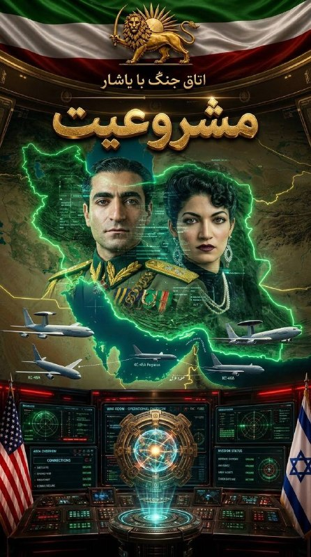

کاور 🔥
@withyashar

## WithYashar — post 15443

## WithYashar — post 15442

## WithYashar — post 15441

## mwarmonitor — post 11292

🔴شبکه ۱۲ گزارش می‌دهد که منابع ارشد در ائتلاف دولت اسرائیل در حال وارد کردن فشار به بنیامین نتانیاهو، نخست‌وزیر، هستند تا کنست را همین هفته منحل کند.

@mwarmonitor

## mwarmonitor — post 11291

  <a href="telegram/content/mwarmonitor_11291_1781986817.mp4" target="_blank">🎬 Download video</a>

📝 این ویدئو نمای بدون روتوش، عریان و متهوع‌کننده‌ای از فرقه شیعه ۱۲ امامی است؛ انگل هایی که تمام فکر و ذهن و افق زاویه دیدشان خلاصه شده به زیر کمر، و حتی در مراسمات محرم و عزاداری خودشون هم دست از طرح کثیف‌ترین مسائل جنسی برنمی‌دارند. این داستانهای تخیلی و ماورایی با تم شیعه حشری روی منبر، که در آن تاریخ خلقت انسان را تا سطح یک کمدی مبتذل از جراحی تکه گوشت اضافه با خنجر یمنی پایین می‌آورد، به خوبی نشان می‌دهد با چه موجودات حقیر و کثیف‌ترین تولیدات فکری زمین طرف هستیم؛ خیمه‌شب‌بازی مضحکی که در آن مخاطبان سیاه‌پوش وسط مجلسِ گریه، مجبورند به بهت‌برانگیزترین قصه‌های شهوانی گوش بسپارند.

@mwarmonitor

## mwarmonitor — post 11290

  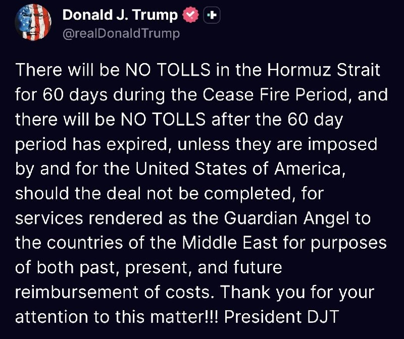

هیچ‌گونه عوارضی در تنگه هرمز به مدت ۶۰ روز در طول دوره آتش‌بس وجود نخواهد داشت، و پس از پایان این دوره ۶۰ روزه نیز هیچ‌گونه عوارضی وضع نخواهد شد؛ مگر اینکه این عوارض توسط و برای ایالات متحده آمریکا وضع شوند — در صورتی که توافق نهایی حاصل نشود — آن هم به خاطر خدماتی که به عنوان «فرشته نگهبان» برای کشورهای خاورمیانه انجام شده است، و با هدف جبران هزینه‌های گذشته، حال و آینده. از توجه شما به این موضوع سپاسگزارم!!!

رئیس‌جمهور دونالد جی ترامپ

@mwarmonitor

## mwarmonitor — post 11289

🔴آنچه در منطقه یال علی‌الطاهر (منطقه پایگاه سابق «پامکین») و ناحیه نبطیه در حال وقوع است، از اهمیت بسیار بالایی برخوردار است.

🔴ده‌ها تن از نیروهای حزب‌الله در آنجا، در یکی از مهم‌ترین زیرساخت‌های تروریستی این گروه در جنوب لبنان، گرفتار شده‌اند؛ یک مجموعه زیرزمینی مستحکم که به‌عنوان مقر «جبهه جنوبی» حزب‌الله عمل می‌کرد. از این محل، آن‌ها هم علیه ارتش اسرائیل عملیات آتش و دیده‌بانی انجام می‌دهند و—که کم‌اهمیت‌تر نیست—آتش را به‌سوی ساکنان مناطق شمالی هدایت می‌کنند. کانال ۱۲ اسرائیل

@mwarmonitor

## mwarmonitor — post 11288

  <a href="telegram/content/mwarmonitor_11288_1781986821.mp4" target="_blank">🎬 Download video</a>

🔸نمایند اسرائیل در سازمان ملل ؛ «حالا ساکت می‌شوی… تو و گزارش شرم‌آورت.»

🔸نماینده اسرائیل در سازمان ملل، دنی دانون، در جریان یک جلسه علنی به‌شدت خشمگین شد؛ پس از آن‌که مقام سازمان ملل، ونسا فریزر، سخنان او را قطع کرد و از گزارش خود که اسرائیل را به‌دلیل ادعای نقض حقوق کودکان در درگیری‌ها در فهرست سیاه قرار داده بود، دفاع کرد.

🔸دانون مقام‌های سازمان ملل متحد را به جانبداری متهم کرد و به آن‌ها گفت: «شما تسلیم وسواس دبیرکل برای هدف قرار دادن اسرائیل شده‌اید.»

🔸وقتی فریزر اعتراض کرد و از دانون خواست «حملات شخصی» را متوقف کند و گفت که «شواهد تأییدشده» در اختیار دارد، دانون در پاسخ تند گفت: «ما یک کشور عضو هستیم و تو برای سازمان ملل کار می‌کنی؛ و حالا ساکت می‌شوی.»

🔸این تنش در حالی رخ داد که هم اسرائیل و هم حماس در گزارش‌های سازمان ملل در ارتباط با ادعاهای مربوط به سوءاستفاده‌ها طی درگیری‌ها نام برده شده‌اند.

@mwarmonitor

## FoxNewsTwitter — post 343213

‌Fox News (Twitter/X)

👉 Full story here:

## FoxNewsTwitter — post 343212

‌Fox News (Twitter/X)

STOLEN LAND: Obama Presidential Center features permanent display condemning 'settler colonialism' — while sitting on public parkland transferred to the Obama Foundation for $10 under a 99-year deal.

Illinois GOP Chair Bob Grogan say the real theft was from Chicago taxpayers, not Indigenous tribes.
http://foxnews.com/politics/obama-center-embeds-indigenous-land-message-controversial-site

## pm_afshaa — post 94477

  <a href="telegram/content/pm_afshaa_94477_1781986823.webm" target="_blank">🎬 Download video</a>

🔴رسانه i24News:
نتانیاهو به وزراش دستور داده از حمله به ترامپ خودداری کنن. اما مقام‌های ارشد اسرائیل در محافل خصوصی میگن آمریکا درک درستی از ایدئولوژی جمهوری اسلامی و حزب‌الله نداره و ترامپ زبان شیعه رو نمیفهه.

💧 Rainbet.com the #1 Non-KYC Crypto Casino & Sportsbook @rainbetcom

😁 @Pm_Afshaa

## pm_afshaa — post 94476

  <a href="telegram/content/pm_afshaa_94476_1781986824.webm" target="_blank">🎬 Download video</a>

🔴کانال 12 اسرائیل:
تصمیم به آتش‌بس در لبنان بعد از فشار شدید آمریکا بر اسرائیل گرفته شد.

💧 Rainbet.com the #1 Non-KYC Crypto Casino & Sportsbook @rainbetcom

😁 @Pm_Afshaa

## pm_afshaa — post 94474

  <a href="telegram/content/pm_afshaa_94474_1781986825.webm" target="_blank">🎬 Download video</a>

🔴نبویان امروز تو شبکه خبر رسما اعلام کرد که کودتای قالیباف علیه مجتبی خامنه‌ای بوده و صداوسیما بلافاصله حرفاش رو قطع کرد و بعد از چند ساعت چنین بیانیه‌ای داد: به استحضار مخاطبان محترم شبکه خبر می‌رساند اظهارات یک نماینده مجلس دعوت شده به برنامه امروز زنده…

## pm_afshaa — post 94473

  <a href="telegram/content/pm_afshaa_94473_1781986826.webm" target="_blank">🎬 Download video</a>

🔴پست جدید ترامپ: هیچ‌ گونه عوارضی در تنگه هرمز به مدت 60 روز در طول دوره آتش‌بس وجود نخواهد داشت، و پس از پایان این دوره 60 روزه هم هیچ‌ گونه عوارضی وضع نخواهد شد. مگر اینکه این عوارض توسط و برای ایالات متحده آمریکا وضع بشه؛ در صورتی که توافق نهایی حاصل…

## pm_afshaa — post 94472

  <a href="telegram/content/pm_afshaa_94472_1781986826.webm" target="_blank">🎬 Download video</a>

🔴پست جدید ترامپ:

هیچ‌ گونه عوارضی در تنگه هرمز به مدت 60 روز در طول دوره آتش‌بس وجود نخواهد داشت، و پس از پایان این دوره 60 روزه هم هیچ‌ گونه عوارضی وضع نخواهد شد.

مگر اینکه این عوارض توسط و برای ایالات متحده آمریکا وضع بشه؛ در صورتی که توافق نهایی حاصل نشه، آن هم بخاطر خدماتی که به عنوان «فرشته نگهبان» برای کشورهای خاورمیانه انجام شده، و با هدف جبران هزینه‌های گذشته، حال و آینده.

💧 Rainbet.com the #1 Non-KYC Crypto Casino & Sportsbook @rainbetcom

😁 @Pm_Afshaa

## pm_afshaa — post 94471

  <a href="telegram/content/pm_afshaa_94471_1781986827.webm" target="_blank">🎬 Download video</a>

🔴کانال 12 اسرائیل:
هدف مذاکرات یکشنبه (فردا) توافق برای بازرسی آژانس از تاسیسات هسته‌ای ایرانه.

💧 Rainbet.com the #1 Non-KYC Crypto Casino & Sportsbook @rainbetcom

😁 @Pm_Afshaa

## pm_afshaa — post 94470

  <a href="telegram/content/pm_afshaa_94470_1781986828.webm" target="_blank">🎬 Download video</a>

🔴نبویان امروز تو شبکه خبر رسما اعلام کرد که کودتای قالیباف علیه مجتبی خامنه‌ای بوده و صداوسیما بلافاصله حرفاش رو قطع کرد و بعد از چند ساعت چنین بیانیه‌ای داد: به استحضار مخاطبان محترم شبکه خبر می‌رساند اظهارات یک نماینده مجلس دعوت شده به برنامه امروز زنده…

## iaghapour — post 2692

  

نصف فروشت رو بخاطر ۲۴ ساعته نبودن پشتیبانیت از دست میدی نصف دیگشم بخاطر دیر جواب دادن 
❗️

اما با پشتیبانی هوش مصنوعی هم پاسخگوییت در لحظه ست و هم ۲۴ ساعته.

🟠امکان اتصال به ربات تلگرام

🟠ارجاع هوشمند به پشتیبان انسانی

🟠بهینه شده برای کاربری فروش فیلترشکن

🟠کاهش حجم پیام های پشتیبانی انسانی

🟠 ساخت ربات + 100 پیام آزمایشی از سایت رایا.
https://raya-ai.net

🔸 کانال اطلاع رسانی
🔸 پشتیبانی

## DEJradio — post 5855

  <a href="telegram/content/DEJradio_5855_1781986829.webm" target="_blank">🎬 Download video</a>

⚽️
🔺 برنامه دژ فوتبالی

*مهدی رستم‌پور، خبرنگار ورزشی

#دژفوتبالی #جام_جهانی
@DEJradio

## DEJradio — post 5854

⭕️ ترامپ: جمهوری اسلامی ۴۷ سال از پاسخگویی فرار کرد تا من از راه رسیدم؛ هشدار دوبارۀ رئیس جمهوری آمریکا به تهران

دونالد ترامپ، رئیس جمهوری آمریکا روز شنبه ۳۰ خرداد با انتشار پیامی در شبکۀ تروث سوشال، از عملکرد دولت خود در جنگ با جمهوری اسلامی دفاع کرد.
ترامپ تأکید کرد که رژیم حاکم بر ایران، از نظر نظامی کاملاً شکست خورده است
رئیس جمهوری آمریکا با انتقاد از سیاست‌های باراک اوباما و جو بایدن، آن‌ها را رهبرانی ضعیف توصیف کرد.
او افزود که جمهوری اسلامی در دوران ریاست جمهوری این دو، هزینه‌ای بابت اقدامات خود نپرداخته و از اوباما پول هم دریافت کرده است.
ترامپ نوشت که جمهوری اسلامی ۴۷ سال قسر در رفت تا زمانی که او از راه رسید. به گفتۀ ترامپ، سپس همه چیز تغییر کرد.
رئیس جمهوری ایالات متحده بازهم هشدار داد اگر مذاکرات به توافق نهایی نینجامد، مقام‌های جمهوری اسلامی با پیامدهایی روبه‌رو می‌شوند که اصلا خوشایند آنها نیست.

#ترامپ
@DEJradio

## DEJradio — post 5853

  <a href="telegram/content/DEJradio_5853_1781986830.mp4" target="_blank">🎬 Download video</a>

🚨
🔸 خبر ۲۱
شنبه ۳۰ خرداد ۱۴۰۵

#خبر۲۱
@DEJradio

## VahidOnline — post 76555

  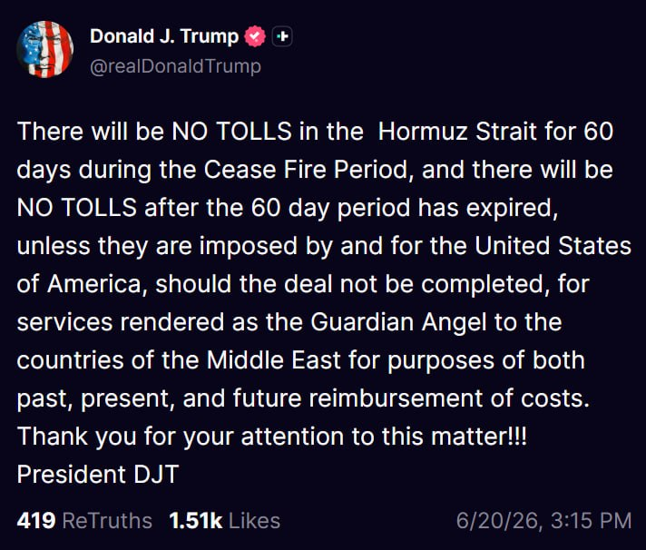

ترامپ: هیچ‌گونه عوارضی در تنگه هرمز وجود نخواهد داشت مگر به نفع آمریکا

ترجمه ماشین:
در دوره ۶۰ روزه آتش‌بس، در تنگه هرمز هیچ عوارضی در کار نخواهد بود،
و پس از پایان دوره ۶۰ روزه نیز هیچ عوارضی پرداخت نخواهد شد؛
مگر آن‌که، در صورت تکمیل نشدن توافق، این عوارض از سوی ایالات متحده و به نفع آمریکا وضع شود؛
آن هم بابت خدماتی که این کشور به عنوان «فرشته نگهبان» کشورهای خاورمیانه ارائه داده، برای جبران هزینه‌های گذشته، حال و آینده.
realDonaldTrump

📡 @VahidOnline

## kianmeli1 — post 88091

  <a href="telegram/content/kianmeli1_88091_1781986833.mp4" target="_blank">🎬 Download video</a>

🔴تنگه هرمز پس از چندساعت همچنان بسته مانده است
https://t.me/kianmeli1

## IranIntlTV — post 343444

  <a href="telegram/content/IranIntlTV_343444_1781986835.mp4" target="_blank">🎬 Download video</a>

پس از حملات اسرائیل به منطقه قناریت و نبطیه در جنوب لبنان در روز شنبه ۳۰ خرداد، دود غلیظی از این مناطق به هوا برخاست. این حملات ساعاتی پس از اجرایی شدن آتش‌بس میان اسرائیل و حزب‌الله انجام شد. اسرائیل اعلام کرد حملات در پاسخ به پرتابه‌های شلیک‌شده از سوی حزب‌الله صورت گرفته است.

## IranIntlTV — post 343443

  

دفتر نخست‌وزیر پاکستان اعلام کرد که شهباز شریف و عاصم منیر، نخست‌وزیر و فرمانده ارتش این کشور یکشنبه در سوئیس در مذاکرات فنی آمریکا و جمهوری اسلامی شرکت خواهند کرد.

پیش‌تر الجزیره از حضور شریف و منیر در مذاکرات یکشنبه خبر داده بود.
https://iranintl.com/202606208243

## IranIntlTV — post 343442

  <a href="telegram/content/IranIntlTV_343442_1781986838.mp4" target="_blank">🎬 Download video</a>

ایرانیان مقیم شهر بری در استان انتاریوی کانادا، پرچم شیر و خورشید ایران را در محل شهرداری این شهر به اهتزاز درآوردند.

این مراسم هم‌زمان با روز ملی مبارزه با تروریسم برگزار شد.

گزارش مهسا مرتضوی، خبرنگار ایران‌اینترنشنال و گفت‌وگو با الن بستاکیان، مشاور پروژه شکوفایی ایران
@iranintltv

## IranIntlTV — post 343441

  <a href="telegram/content/IranIntlTV_343441_1781986841.mp4" target="_blank">🎬 Download video</a>

یک شهروند در ویدیویی که به ایران اینترنشنال ارسال کرده خطاب به علی خامنه‌ای، دیکتاتور سابق ایران، می‌گوید که «این همه آدم کشتی و حالا خودت در یخچال داری کپک می‌زنی.»

## IranIntlTV — post 343440

  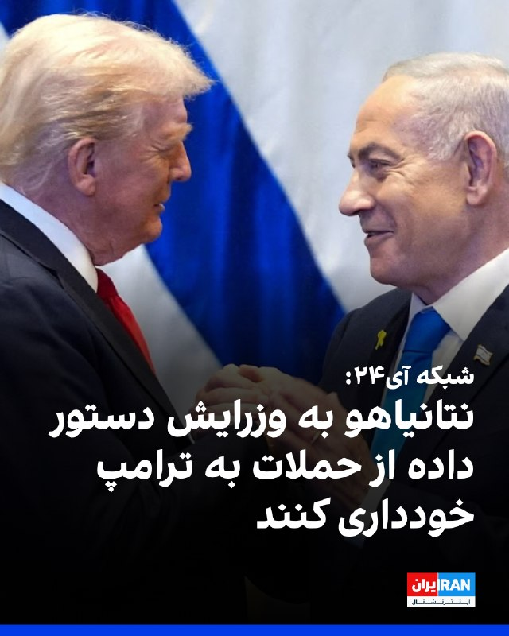

آی‌۲۴ نیوز نوشت که بنیامین نتانیاهو، نخست‌وزیر اسرائیل، به وزرای کابینه این کشور دستور داده از حملات به دونالد ترامپ، رییس‌جمهوری آمریکا خودداری کنند، اما مقام‌های ارشد در محافل خصوصی می‌گویند واشینگتن درک درستی از ایدئولوژی جمهوری اسلامی و حزب‌الله ندارد.

یک مقام ارشد اسرائیلی گفت: «ترامپ زبان شیعه را نمی‌فهمد.»
https://iranintl.com/202606202154

## IranIntlTV — post 343439

  

عبدالرضا پورذهبی، نماینده خامنه‌ای در کردستان، در تجمع شبانه حامیان حکومت گفت: «شعار هیهات‌من‌الذله تنها متعلق به یک مقطع تاریخی نیست، بلکه راهبردی دائمی برای ملت ایران در مقابله با زورگویی، سلطه‌پذیری و حفظ عزت و کرامت انسانی به شمار می‌رود.»

او ادامه داد: «شرایط کنونی بیش از هر زمان دیگری نیازمند همدلی و پرهیز از اختلافات است.»
https://iranintl.com/202606205866

## IranIntlTV — post 343438

  <a href="telegram/content/IranIntlTV_343438_1781986845.mp4" target="_blank">🎬 Download video</a>

علی دادپی، اقتصاددان، درباره تداوم بحران اقتصادی در ایران گفت: «با وجود تفاهم‌نامه با آمریکا و فضای مثبتی که درباره آن مطرح می‌شود، مردم همچنان با آینده‌ای مبهم، پرریسک و غیرقابل پیش‌بینی روبه‌رو هستند.»

او افزود: «چشم‌انداز اقتصادی روشن نیست و نهادهای اقتصادی کشور نیز به‌شدت تضعیف شده‌اند.»
@iranintltv

## IranIntlTV — post 343437

  <a href="https://t.me/IranintlTV/343437" target="_blank">📎 Download file</a>

🎧نسخه صوتی چشم‌انداز: پیام عجیب مجتبی خامنه‌ای درباره پزشکیان و توافقنامه آمریکا
@iranintlTV

## IranIntlTV — post 343436

  <a href="telegram/content/IranIntlTV_343436_1781986847.mp4" target="_blank">🎬 Download video</a>

پیام عجیب مجتبی خامنه‌ای درباره پزشکیان و توافقنامه آمریکا

چشم‌انداز با مهدی مهدوی‌آزاد

نسخه کامل این برنامه در یوتیوب:
https://youtu.be/j9iIZGADjJI
@iranintltv

## IranIntlTV — post 343435

  

دونالد ترامپ، رییس‌جمهوری آمریکا، در تروث‌سوشال نوشت: «در طول دوره آتش‌بس، به مدت ۶۰ روز هیچ‌گونه عوارضی در تنگه هرمز وجود نخواهد داشت، و پس از پایان دوره ۶۰ روزه نیز هیچ‌گونه عوارضی وجود نخواهد داشت، مگر اینکه توسط و به نفع ایالات متحده آمریکا اعمال شوند.»

او افزود: «در صورتی که توافق نهایی نشود؛ این موضوع در چارچوب خدماتی است که به‌عنوان «فرشته نگهبان» برای کشورهای خاورمیانه ارائه شده و با هدف جبران هزینه‌ها در گذشته، حال و آینده مطرح می‌شود.»
https://iranintl.com/202606203692

## IranIntlTV — post 343434

  <a href="telegram/content/IranIntlTV_343434_1781986851.mp4" target="_blank">🎬 Download video</a>

کاخ سفید در حال بررسی محدودیت‌های سفر تیم ملی فوتبال ایران به آمریکا برای جام جهانی است. همزمان گزارش شده تیم ایران برای بازی سوم مرحله گروهی تنها یک روز پیش از مسابقه وارد آمریکا می‌شود و باید بلافاصله پس از پایان بازی این کشور را ترک کند. فدراسیون فوتبال ایران نیز با اعتراض به این محدودیت‌ها، از صادر نشدن ویزا برای ۱۱ عضو مدیریتی و اجرایی کاروان تیم ملی خبر داده است.

گزارش رضا محدث، خبرنگار ایران‌اینترنشنال
@iranintltv

## IranIntlTV — post 343433

  

🔻تیم ملی فوتبال هلند در هفته دوم مرحله گروهی جام جهانی با نتیجه پنج بر یک برابر سوئد پیروز شد و با چهار امتیاز در صدر جدول گروه F قرار گرفت. برایان بروبی و کودی خاکپو هر کدام دو بار و کریسنسیو سامرویل یک گل برای شاگردان کومان به ثمر رساندند.

@iranintltvsport

## IranIntlTV — post 343432

  <a href="telegram/content/IranIntlTV_343432_1781986854.mp4" target="_blank">🎬 Download video</a>

یک روز پس از لغو مذاکرات برنامه‌ریزی‌شده میان جمهوری اسلامی و آمریکا، گزارش‌ها از آمادگی نمایندگان دو طرف برای سفر به سوئیس حکایت دارد. وب‌سایت اکسیوس خبر داده عباس عراقچی، وزیر خارجه جمهوری اسلامی، و استیو ویتکاف برای گفت‌وگو درباره توافق احتمالی هسته‌ای راهی سوئیس می‌شوند، هرچند احتمال تغییر این برنامه نیز وجود دارد. مذاکرات قبلی پس از تشدید درگیری‌ها در لبنان لغو شده بود. همزمان رسانه‌های داخلی ایران گزارش داده‌اند وزیر کشور پاکستان روز شنبه به تهران سفر خواهد کرد.

جزییات بیشتر با اردوان روزبه، خبرنگار ایران‌اینترنشنال
@iranintltv

## IranIntlTV — post 343431

  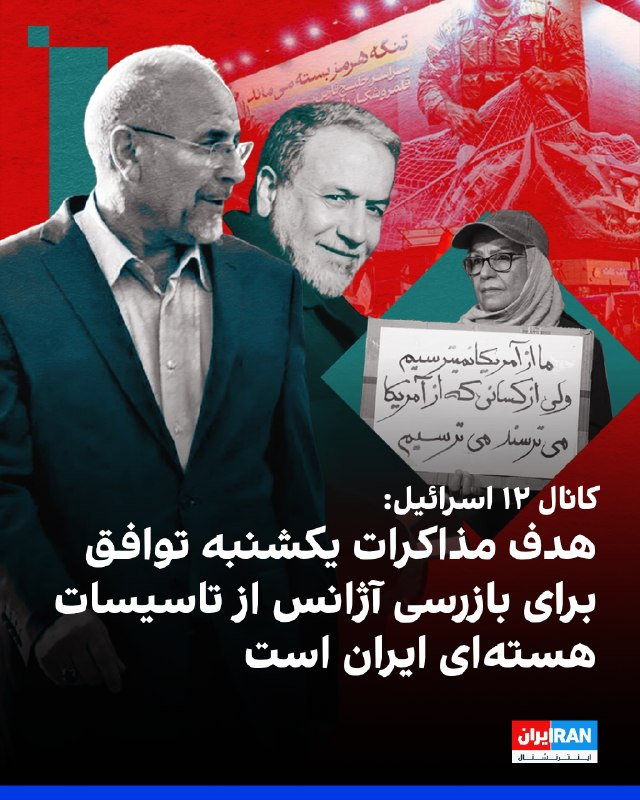

به گزارش کانال ۱۲ اسرائیل هدف اولیه آمریکا در مذاکراتی که قرار است یکشنبه در سوئیس با جمهوری اسلامی آغاز شود، دستیابی به توافقی برای اجازه دادن به بازرسان آژانس بین‌المللی انرژی اتمی جهت بازرسی از سایت‌های هسته‌ای ایران است.

در صورت موافقت تهران، بازرسی از تاسیسات اتمی ایران برای نخستین بار از زمان جنگ ۱۲ روزه خواهد بود.

بر اساس این گزارش، در ازای موافقت حکومت ایران با بازگشت بازرسان به این سایت‌ها که احتمالا شامل فردو، نطنز و اصفهان می‌شود، آمریکا آماده است چندین میلیارد دلار از دارایی‌های ایران را که در قطر نگهداری می‌شود آزاد کند.

طبق این گزارش، این منابع قرار است توسط حکومت ایران برای خرید غذا، دارو و دیگر نیازهای انسانی استفاده شود.
https://iranintl.com/202606202849

## IranIntlTV — post 343430

  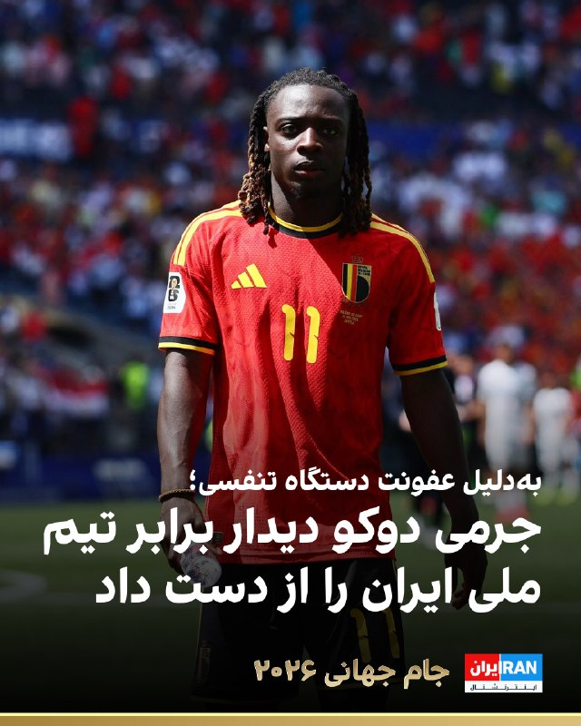

🔻اسپورزا گزارش داد که جرمی دوکو، ستاره تیم ملی فوتبال بلژیک، بار دیگر با عفونت دستگاه تنفسی مواجه شده و بنابراین به طور قطعی در دیدار فردا برابر ایران حضور نخواهد داشت.

🔹وینسنت مانارت، مدیر ورزشی فدراسیون فوتبال بلژیک در این باره گفت: «به او استراحت می‌دهیم و تلاش می‌کنیم برای بازی سوم آماده‌اش کنیم.»

🔹بر اساس این گزارش دوکو در هفته‌های اخیر نیز با مشکلات تنفسی دست‌وپنجه نرم می‌کرد. او در حالی از بلژیک راهی اردوی تیم شده بود که سرماخوردگی شدیدی داشت، اما به نظر می‌رسید روند بهبودی را طی می‌کند. نمایش خوب او در نیمه دوم بازی برابر مصر نیز این موضوع را نشان می‌داد.

@iranintltvsport

## FarsiVOA — post 221360

⚡️آمریکا بیش از یک میلیارد دلار کمک بشردوستانه جدید به یونیسف و برنامه جهانی غذا اختصاص داد. این بودجه قرار است در بیش از ۴۰ کشور صرف تأمین غذا، آب، خدمات درمانی و حمایت از کودکان و آسیب‌دیدگان بحران‌های انسانی شود.
@FarsiVOA

## FarsiVOA — post 221359

  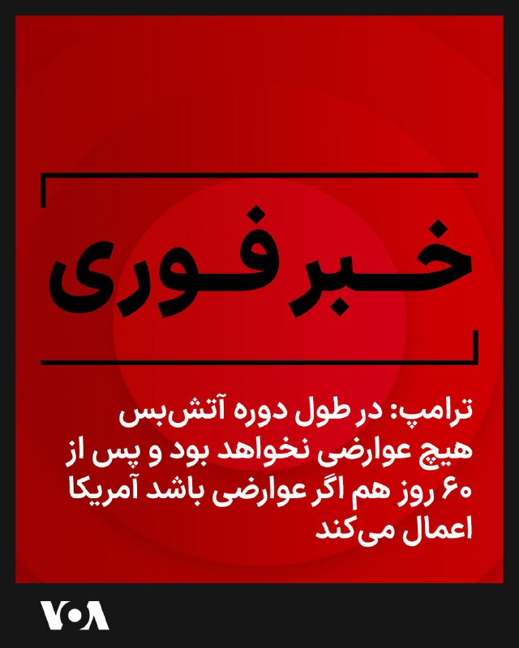

دونالد ترامپ، رئيس جمهوری آمریکا، بعدازظهر شنبه ۳۰ خرداد به وقت واشنگتن در شبکه تروت‌سوشال نوشت در طول دوره آتش‌بس به مدت ۶۰ روز با جمهوری اسلامی، «هیچ عوارضی در تنگه هرمز» نخواهد بود.

او افزود پس از انقضای دوره ۶۰ روزه نیز هیچ عوارضی نخواهد بود، مگر اینکه در صورت عدم تکمیل توافق، ایالات متحده آمریکا و «برای ایالات متحده، عوارض را به دلیل خدماتی که به عنوان فرشته نگهبان به کشورهای خاورمیانه ارائه داده است، به منظور بازپرداخت هزینه‌های گذشته، حال و آینده، اعمال کند.»

⬇️ بیشتر بخوانید:
https://ir.voanews.com/a/8162998.html
@FarsiVOA

## FarsiVOA — post 221357

گفت‌وگو با امیر چاهکی، کارشناس روابط بین‌الملل، درباره ترکیب هیأت‌های مذاکره‌کننده آمریکا و جمهوری اسلامی در سوئیس و چشم‌انداز مذاکرات

## FarsiVOA — post 221356

🔺انتقال دو شهروند دهلرانی به زندان ایلام پس از حضور در دادگستری

▪️بر اساس گزارشی که روز شنبه ۳۰ خرداد به صدای آمریکا رسیده است، مجتبی یاور و مصطفی محمدی، دو شهروند ساکن دهلران، با دستور مقام‌های قضایی این شهرستان بازداشت و به زندان ایلام منتقل شده‌اند.

⬇️ بیشتر بخوانید:
https://ir.voanews.com/a/two-iranian-dehloran-detained-ilam-prison/8162983.html/?nocach=1

## FarsiVOA — post 221355

آمریکا در مسیر قهرمانی؟ گزارش آرش آرا

## FarsiVOA — post 221354

  <a href="telegram/content/FarsiVOA_221354_1781986858.mp4" target="_blank">🎬 Download video</a>

قانون‌گذاران نروژی روز ۲۸ خرداد در یک نشست پارلمانی با اجرای حرکت معروف «پاروزنی وایکینگ‌ها» از تیم ملی فوتبال کشورشان که در جام جهانی ۲۰۲۶ در حال رقابت است، حمایت کردند.

این شیوه تشویق در هفته‌های اخیر به یکی از نمادهای حمایت هواداران نروژی از تیم ملی فوتبال کشورشان تبدیل شده است.

@FarsiVOA

## FarsiVOA — post 221353

  <a href="telegram/content/FarsiVOA_221353_1781986860.mp4" target="_blank">🎬 Download video</a>

به گزارش «حال وش»، ۲۶ خرداد ۱۴۰۵، بخشی از سقف یکی از اتاق‌های بیمارستان «امام علی»، مرکز درمانی اصلی شهر چابهار، فروریخت. به رغم اینکه در زمان حادثه چند بیمار در اتاق بستری بودند آسیبی به افراد وارد نشد. فرسودگی ساختمان این بیمارستان پیش از این نیز نگرانی شهروندان را برانگیخته بود.

## FarsiVOA — post 221352

🔺حکم سنگین دستگاه قضائی رژیم علیه جواد علی‌کردی؛ ۱۸ سال حبس و محرومیت دائم از وکالت

▪️دادگاه انقلاب مشهد، جواد علیکردی، (برادر خسرو علیکردی، وکیل جان‌باخته) را به ۱۸ سال حبس، انفصال دائم از حرفه وکالت، دو سال منع خروج از کشور، و دو سال تبعید به شهر سراوان استان سیستان‌و‌بلوچستان محکوم کرد.

⬇️ بیشتر بخوانید:
https://ir.voanews.com/a/iran-alikordi-javad-mashhad-prison-arrest-protest-lawyer/8162987.html/?nocach=1

## DW_Farsi — post 126250

  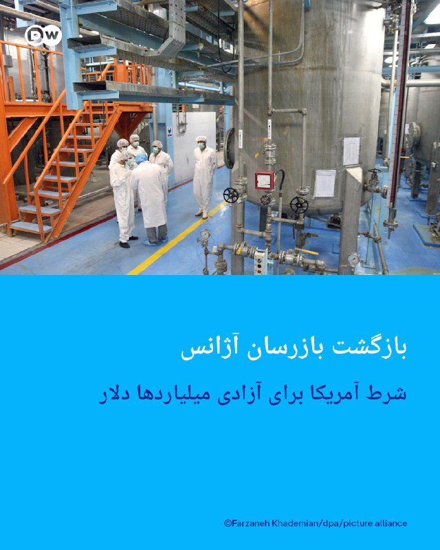

🔶بازگشت بازرسان آژانس به ایران؛ شرط آمریکا برای آزادی میلیاردها دلار

رسانه‌های اسرائیلی گزارش دادند که آمریکا در مذاکرات فنی با ایران که قرار است روز یکشنبه ۲۱ ژوئن (۳۱ خرداد) در سوئیس آغاز شود، بازگشت بازرسان آژانس بین‌المللی انرژی اتمی به تاسیسات هسته‌ای ایران را به عنوان یکی از خواسته‌های اصلی خود مطرح خواهد کرد.

در همین زمینه کانال ۱۲ اسرائیل گزارش داده که واشنگتن در مقابل موافقت تهران با ازسرگیری بازرسی‌ها، آماده است چند میلیارد دلار از دارایی‌های مسدود شده ایران در قطر را آزاد کند. بر اساس این گزارش، این منابع مالی قرار است برای خرید مواد غذایی، دارو و دیگر نیازهای بشردوستانه استفاده شود.

به نوشته این شبکه، بازرسی‌ها می‌تواند شامل تاسیسات هسته‌ای فردو، نطنز و اصفهان باشد که در جریان جنگ ۱۲ روزه سال گذشته هدف حملات آمریکا قرار گرفتند.

@dw_farsi

## Persian_Trend_Official — post 17706

https://youtube.com/live/651tNwRJsqg?feature=share

## Persian_Trend_Official — post 17705

  <a href="telegram/content/Persian_Trend_Official_17705_1781986863.webm" target="_blank">🎬 Download video</a>

لایو امشب ساعت 23 آغاز میشه

## Persian_Trend_Official — post 17704

  <a href="telegram/content/Persian_Trend_Official_17704_1781986864.webm" target="_blank">🎬 Download video</a>

لایو امشب ساعت 23 آغاز میشه

## RadioFarda — post 158558

🔸دونالد ترامپ، با یادآوری این‌که در دورهٔ ۶۰ روزه آتش‌بس کنونی عوارضی برای عبور از تنگه هرمز دریافت نخواهد شد، گفت پس از پایان این دوره نیز عوارضی اعمال نخواهد شد، مگر آن‌که توافق نهایی نشود و ایالات متحده عوارضی به سود آمریکا وضع کند. 🔸رئیس‌جمهور آمریکا…

## RadioFarda — post 158556

🔸دونالد ترامپ، با یادآوری این‌که در دورهٔ ۶۰ روزه آتش‌بس کنونی عوارضی برای عبور از تنگه هرمز دریافت نخواهد شد، گفت پس از پایان این دوره نیز عوارضی اعمال نخواهد شد، مگر آن‌که توافق نهایی نشود و ایالات متحده عوارضی به سود آمریکا وضع کند.

🔸رئیس‌جمهور آمریکا شامگاه جمعه ۳۰ خرداد در پیامی در شبکه اجتماعی تروث سوشیال نوشت: «در طول دورهٔ آتش‌بس، به مدت ۶۰ روز هیچ‌گونه عوارضی در تنگه هرمز دریافت نخواهد شد. پس از پایان این دوره ۶۰ روزه نیز هیچ عوارضی اعمال نخواهد شد، مگر آن‌که در صورت نهایی نشدن توافق، این عوارض از سوی ایالات متحده و به نفع آمریکا وضع شود؛ به عنوان جبران هزینه‌های خدمات گذشته، حال و آیندهٔ آمریکا که در نقش فرشتهٔ نگهبان کشورهای خاورمیانه ارائه کرده است.»

🔸بر اساس بند پنجم تفاهم‌نامهٔ ایران و آمریکا، جمهوری اسلامی متعهد شده با به‌کارگیری حداکثر تلاش خود، ترتیبات لازم را برای عبور ایمن کشتی‌های تجاری، بدون دریافت هیچ هزینه‌ای و صرفاً برای مدت ۶۰ روز فراهم کند.

@RadioFarda

## IranianMinds — post 23029

  <a href="telegram/content/IranianMinds_23029_1781986864.mp4" target="_blank">🎬 Download video</a>

🔴اینم میگه تنگه هرمز همچنان بسته است.

@IranianMinds

## IranianMinds — post 23028

  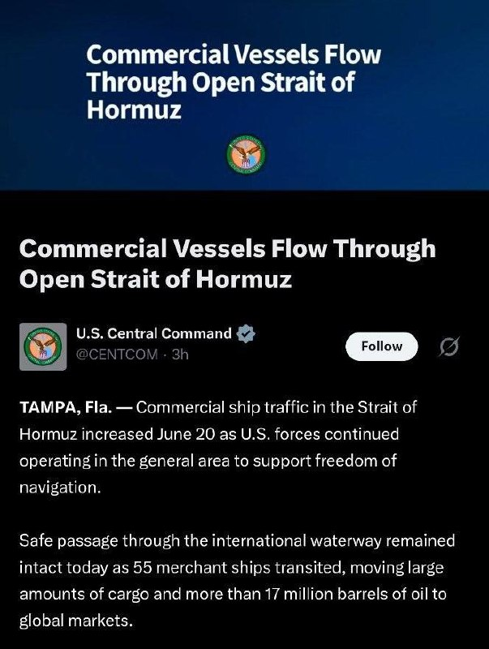

🔴بیانیه سنتکام/ فرماندهی مرکزی ایالات متحده، امروز شنبه ۳۰ خرداد اعلام کرد که تنگه هرمز باز است و تردد کشتی‌های تجاری از این آبراه ادامه دارد.

@IranianMinds

## IranianMinds — post 23027

  

ترامپ همین الان د

هیچ‌ گونه عوارضی در تنگه هرمز به مدت ۶۰ روز در طول دوره آتش‌بس وجود نخواهد داشت، و پس از پایان این دوره ۶۰ روزه هم هیچ‌ گونه عوارضی وضع نخواهد شد؛ مگر اینکه این عوارض توسط و برای ایالات متحده آمریکا وضع شوند — در صورتی که توافق نهایی حاصل نشود — آن هم به خاطر خدماتی که به عنوان «فرشته نگهبان» برای کشورهای خاورمیانه انجام شده، و با هدف جبران هزینه‌های گذشته، حال و آینده. از توجه شما به این موضوع سپاسگزارم!!!

@IranianMinds

## IranianMinds — post 23026

کانال ۱۲ اسرائیل:

هدف مذاکرات یکشنبه توافق برای بازرسی آژانس از تاسیسات هسته‌ای ایرانه.

@IranianMinds

## IranianMinds — post 23025

  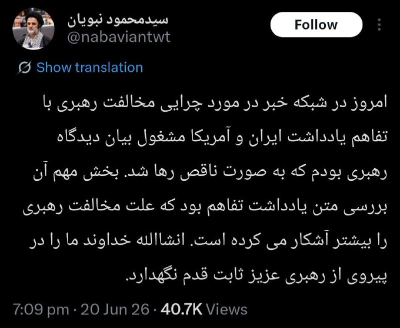

آخوند نبویان بعد از قطع شدن برنامه ی امروزش داخل صداسیما :

امروز در شبکه خبر در مورد چرایی مخالفت رهبری با تفاهم یادداشت ایران و آمریکا مشغول بیان دیدگاه رهبری بودم که به صورت ناقص رها شد. بخش مهم آن بررسی متن یادداشت تفاهم بود که علت مخالفت رهبری را بیشتر آشکار می کرده است. انشاالله خداوند ما را در پیروی از رهبری عزیز ثابت قدم نگهدارد.

@IranianMinds

## BBCPersian — post 284524

  <a href="https://t.me/bbcpersian/284524" target="_blank">📎 Download file</a>

پادکست برنامه شصت دقیقه شنبه ۳۰ خرداد ۱۴۰۵
این نسخه رادیویی برنامه شصت دقیقه تلویزیون فارسی بی‌بی‌سی است که هرشب بعد از پخش، با حجم کم از اپلیکیشن‌های پادگیر و صفحه تلگرام بی‌بی‌سی فارسی در دسترس است.
با هشتگ BBCPersianRadio با ما در ارتباط باشید.

@BBCPersian

## BBCPersian — post 284523

🔻همسر نخست‌وزیر اسپانیا به اتهام فساد محاکمه می‌شود

دادگاهی در مادرید حکم داده است که همسر پدرو سانچز، نخست‌وزیر اسپانیا، به اتهام فساد محاکمه شود.

گذرنامه‌های بگونیا گومز باطل شده و او از خروج از کشور منع شده است.

هرچند هنوز تاریخ محاکمه تعیین نشده است اما قاضی همچنین به او دستور داده است که تا زمان صدور حکم در این پرونده، ماهی دو بار با مراجمع به مقامات مسئول حضور خود را در کشور ثبت کند.

خانم گومز از جمله به اختلاس و استفاده از نفوذ خود به عنوان همسر نخست‌وزیر برای گرفتن امتیازاتی مهتم شده است اما او این اتهامات را رد می‌کند.

این پرونده ناشی از شکایتی است که ابتدا یک گروه ضد فساد مطرح کرده بود که گرایش‌های راست افراطی دارد.

آقای سانچز نیز این اتهامات را به عنوان تلاشی برای تضعیف دولت خود خوانده و آن را رد کرده است.

https://bbc.in/4uSiKmu
@BBCPersian

## BBCPersian — post 284522

  <a href="telegram/content/BBCPersian_284522_1781986870.mp4" target="_blank">🎬 Download video</a>

🔻آخرین خبرهای مهم روز شنبه ۳۰ خرداد ۱۴۰۵

@BBCPersian

## BBCPersian — post 284520

🔻نگاهی به مهمترین تحولات مرتبط با ایران

▪️ارتش آمریکا روز شنبه ادعای سپاه پاسداران درباره بستن تنگه هرمز را رد کرد و گفت این آبراه حیاتی همچنان باز است و نیروهای آمریکایی در حال نظارت بر اوضاع هستند تا از ادامه این روند اطمینان حاصل کنند.

▪️ساعاتی قبل قرارگاه خاتم‌الانبیا در اطلاعیه‌ای اعلام کرد که تنگۀ هرمز به روی شناورها «بسته خواهد شد.» نیروی دریایی سپاه پاسداران در اطلاعیه‌ای اعلام کرد که «شناورها به تنگه هرمز نزدیک نشوند.»

▪️جی‌دی ونس، معاون اول رئیس‌جمهور آمریکا، گفت که جرد کوشنر و استیو ویتکاف در حال بررسی برخی از عناصر فنی مذاکرات برنامه‌ریزی شده با ایران، در سوئیس هستند.او گفت: «برداشت من از صحبت امروز صبح با جرد و استیو این است که اوضاع خوب پیش می‌رود.»

▪️وزیر کشتیرانی هند، روز شنبه اعلام کرد که سه نفت‌کش با پرچم این کشور، با بیش از ۸۶۰ هزار تن نفت و ۹۴ خدمه، به سلامت از تنگه هرمز عبور کرده و در مسیر هند هستند.

▪️رسانه‌های ایران می‌گویند که هیئت مذاکره کننده ایران به ریاست محمدباقر قالیباف، رئیس مجلس، و با همراهی عباس عراقچی، وزیر خارجه این کشور روانه سوئیس شده است.

▪️محسن نقوی، وزیر کشور پاکستان، در ادامه رایزنی‌های مقامات پاکستان درباره مذاکرات ایران و آمریکا، ظهر امروز با عباس عراقچی، وزیر امور خارجه ایران، دیدار و گفت‌وگو کرد.

▪️وزارت خارجه سوئیس روز شنبه اعلام کرد که این کشور همچنان به ارائه «محیطی امن و قابل اعتماد» در بورگن‌اشتوک برای تسهیل مذاکرات در مورد اجرای یادداشت تفاهم بین ایالات متحده و ایران ادامه می‌دهد.

https://bbc.in/4uSiKmu
@BBCPersian

## BBCPersian — post 284519

🔻ارتش اسرائیل می‌گوید که یکی از نظامیانش روز شنبه در درگیری‌های جنوب لبنان کشته شده است.

این پنجمین نظامی کشته شده اسرائیل از زمان توافق آمریکا و ایران برای پایان دادن به جنگ است.

ارتش اسرائیل اعلام کرده است که گروهبان نیر بن آری، یک روز پس از کشته شدن چهار نیروی دیگر اسرائیلی در درگیری با نیروهای حزب‌الله، در جنوب لبنان «در نبرد کشته شد.»

این در حالیست که حملات اسرائیل در لبنان امروز (شنبه ۳۰ خرداد)، و تنها ساعاتی پس از توافق آتش‌بس با حزب‌الله، دست‌کم ۱۵ کشته بر جای گذاشت.

اسرائیل می‌گوید این حملات در پاسخ به پرتابه‌هایی است که حزب‌الله به سمت نیروهای اسرائیلی شلیک می‌کند.

@BBCPersian

## BBCPersian — post 284518

🔻ونس: اوضاع در سوئیس خوب پیش می‌رود

جی‌دی ونس، معاون اول رئیس‌جمهور آمریکا، گفت که جرد کوشنر، داماد دونالد ترامپ، و استیو ویتکاف، فرستاده ویژه کاخ سفید، در حال بررسی برخی از عناصر فنی مذاکرات برنامه‌ریزی شده با ایران، در سوئیس هستند.

آقای ونس گفت: «برداشت من از صحبت امروز صبح با جرد و استیو این است که اوضاع خوب پیش می‌رود.»

او در پاسخ به این سوال که آیا قصد دارد برای شرکت در مذاکرات به سوئیس برود، گفت که احتمالا «ظرف چند روز آینده» به آنها می‌پیوندد.

رسانه‌های ایران پیشتر گزارش دادند که هیئت مذاکره‌کننده ایرانی به ریاست محمد باقر قالیباف، عازم سوئیس شدند.

@BBCPersian

## BBCPersian — post 284517

🔻پلیس فرانسه امروز «حدود ۲۰ نفر» از کسانی را که در تجمع هواداران سازمان مجاهدین خلق در پاریس شرکت کرده بودند، دستگیر کرد.

این افراد با وجود ممنوعیت پلیس فرانسه برای برگزاری این تجمع، در گردهمایی از قبل برنامه‌ریزی شده شرکت کرده بودند.

برگزارکنندگان درخواست اضطراری برای لغو این ممنوعیت ارائه کردند، اما دادگاهی در پاریس صبح شنبه این ممنوعیت را تأیید کرد.

با وجود این ممنوعیت، چندین اتوبوس به میدان ووبان در مرکز پاریس رسیدند و خبرگزاری فرانسه گزارش داد که صدها معترض خود را به محل تجمع رسانده بودند.

یک منبع پلیس به خبرگزاری فرانسه گفت که پلیس دستور متفرق شدن جمعیت را صادر کرده بود.

افشین علوی، عضو شورای ملی مقاومت ایران ، به خبرگزاری فرانسه گفت: «آنها حدود ۲۰ نفر را بدون هیچ دلیلی دستگیر کردند.»

او افزود: «از طرف معترضان، هیچ خشونتی وجود ندارد. پلیس بسیاری از تجمع‌کنندگان را متفرق کرد و از پیوستن دیگران جلوگیری کرد.»

پلیس فرانسه دیروز اعلام کرده بود که به دلیل «احتمال درگیری» این تجمع را ممنوع کرده است. برگزار‌کنندگان گفتند که این تصمیم به دلایل «بی‌اساس» گرفته شده است.

شورای ملی مقاومت، عنوان شاخه سیاسی سازمان مجاهدین خلق، گفت که این تجمع اعتراضی قرار بود علیه «موج اعدام‌ها» در ایران برگزار شود.

پلیس در مورد لغو این تجمع گفته است: «در شرایط کنونی که وضعیت در داخل و در جهان تنش‌آلود است، خطر جدی وجود دارد که در جریان این تجمع، میان فعالانی که دیدگاه‌های مخالف دارند درگیری رخ دهد؛ درگیری‌ای که می‌تواند نظم عمومی را به‌شدت مختل کند.»

پلیس فرانسه همچنین گفته بود که محل تجمع و مسیر راهپیمایی برنامه‌ریزی‌شده از «نزدیکی چند ساختمان دولتی و نمایندگی‌های دیپلماتیک» عبور می‌کرد.

@BBCPersian

## BBCPersian — post 284516

  <a href="https://t.me/bbcpersian/284516" target="_blank">📎 Download file</a>

پادکست برنامه جام جهان‌نما شنبه ۳۰ خرداد ۱۴۰۵

این برنامه رادیویی را می‌توانید هرشب ساعت ۲۰ به وقت ایران، روی موج متوسط ۷۰۲ کیلوهرتز و موج کوتاه ۹۴۶۵ کیلوهرتز بشنوید.تکرار برنامه را هم می‌توانید ساعت ۲۱:۳۰ روی موج متوسط ۷۰۲ کیلوهرتز و موج کوتاه ۵۳۹۵ کیلوهرتز گوش کنید.

@BBCPersian

## BBCPersian — post 284515

  <a href="telegram/content/BBCPersian_284515_1781986873.mp4" target="_blank">🎬 Download video</a>

سخنان ترامپ در حاشیه اجلاس گروه ۷ درباره جنگ با ایران نکاتی توجه‌برانگیز داشت. این ویدیو گزیده‌ای از سخنرانی طولانی در کنفرانس خبری ۱۷ ژوئن، ۲۷ خرداد در اویان فرانسه است.

او در سخنرانی بیش از یک ساعته که محورش تفاهم‌نامه و جنگ با ایران بود به مواردی از جمله بی‌نتیجه بودن ادامه جنگ، اختلاف‌نظر با بنیامین نتانیاهو، نخست‌وزیر اسرائیل، شوکه شدنش از وسعت حملات تلافی‌جویانه ایران به کشورهای منطقه، مشارکت امارات در بمباران ایران، ضرورت سرمایه‌گذاری در ایران و آزادسازی پول‌های بلوکه‌شده‌اش، بی‌طرف‌ ماندن روسیه و چین در جنگ اشاره کرد و از جمله گفت: «نمی‌‌شود همه راکتور هسته‌ای داشته باشند و به ایران بگوییم تو نمی‌توانی.»

کل این سخنرانی در همان روز با ترجمه همزمان سیاوش اردلان در پوشش ویژه تلویزیون فارسی بی‌بی‌سی پخش شد.
https://bbc.in/4vYHWIV
@BBCPersian

## Dirty_Kids — post 392697

  <a href="telegram/content/Dirty_Kids_392697_1781986876.mp4" target="_blank">🎬 Download video</a>

اونجا که گفت گره وا میکنه واقعا وا کرد این اگه معجزه نیست پس چیه؟

@Dirty_Kids 👻

## Dirty_Kids — post 392696

  <a href="telegram/content/Dirty_Kids_392696_1781986879.mp4" target="_blank">🎬 Download video</a>

زندگی من اگه جمهوری اسلامی اسلامی تا آخر تابستون نره

@Dirty_Kids 👻

## Dirty_Kids — post 392693

  <a href="telegram/content/Dirty_Kids_392693_1781986881.mp4" target="_blank">🎬 Download video</a>

ایران هر روز سورپرایزت می‌کنه؛ خیلی جدی اومدن به مربیِ مرد شال دادن سرش کنه تا بتونه بیاد بالا سر خانوما وایسه تیم رو مربی‌گری کنه!! @Dirty_Kids 👻

## Dirty_Kids — post 392692

  <a href="telegram/content/Dirty_Kids_392692_1781986882.mp4" target="_blank">🎬 Download video</a>

نبویان امروز وسط پخش زنده شبکه خبر، مکالمه با تیم مذاکره کننده رو افشا کرد که وسط حرفاش یهویی پخشو قطع کردن.

آقا مجتبی در مورد مذاکرات گفته اون چیزی که رقم خورده، با چیزی که شرطِ قبولیِ مذاکره بوده، خیلی تفاوت داره.
مدیرکل پخش شبکه رو اخراج کردن و نبویان هم دیگه هیچ جا راش نمیدن و تحت پیگرد قضایی قرار گرفت.

@Dirty_Kids 👻

## Dirty_Kids — post 392691

  <a href="telegram/content/Dirty_Kids_392691_1781986883.mp4" target="_blank">🎬 Download video</a>

واکنش مجتبی وقتی بهش میگن اون گوشتو از یخچال در بیار:

@Dirty_Kids 👻

## Dirty_Kids — post 392690

  <a href="telegram/content/Dirty_Kids_392690_1781986884.mp4" target="_blank">🎬 Download video</a>

چرا عکاسی را دوست دارم ...

متیو فرگت عکاسیه که به خاطر عکس‌های خلاف جاذبه‌ش معروفه. تو کتاب جدیدش - Levitation - عکس‌های خلاقانه‌ش از ورزشکارها و رقصنده‌ها که در موزه‌های فرانسه و ایتالیا گرفته شده رو می‌تونیم ببینیم.
عالی🔥

@Dirty_Kids 👻

## Dirty_Kids — post 392689

  <a href="telegram/content/Dirty_Kids_392689_1781986886.mp4" target="_blank">🎬 Download video</a>

از محرم بگو

@Dirty_Kids 👻

## Hranews — post 113744

گزارشی از اعدام ۲ زندانی در قروه و زاهدان

❗️
❗️
❗️
❗️
❗️– حکم دو زندانی که پیشتر از بابت اتهامات مرتبط با جرائم مواد مخدر و قتل به #اعدام محکوم شده بودند، در زندان‌های قروه و زاهدان اجرا شد.

#پژمان_ساعدی #شیرمحمد_شاهوزهی

ادامه مطلب

↘️
@hranews_bot تماس ✉️ - @Hranews کانال هرانا 🆑

## alonews — post 129456

  <a href="telegram/content/alonews_129456_1781986889.webm" target="_blank">🎬 Download video</a>

👈حسین پاک، خبرنگار مستقر در لبنان: ساعاتی قبل عملیات نظامی از سوی اسرائیل متوقف شده است

✅ @AloNews خبر جنگ

## alonews — post 129455

  <a href="telegram/content/alonews_129455_1781986890.webm" target="_blank">🎬 Download video</a>

👈خبرنگار العربیه: کارشناسانی در سفر ونس به سوئیس او را همراهی می‌کنند.

✅ @AloNews خبر جنگ

## alonews — post 129454

  <a href="telegram/content/alonews_129454_1781986890.webm" target="_blank">🎬 Download video</a>

👈محمد مرندی: ایران آماده است تا برای لبنان از توافق چشم‌پوشی کند، زیرا از متحدان خود دست نمی‌کشد

✅ @AloNews خبر جنگ

## alonews — post 129453

  <a href="telegram/content/alonews_129453_1781986890.webm" target="_blank">🎬 Download video</a>

👈مرندی، عضو تیم مذاکره، خطاب به پست ترامپ : هزنیه‌ای وجود داره، این قطعیه

✅ @AloNews خبر جنگ

## alonews — post 129452

  <a href="telegram/content/alonews_129452_1781986890.webm" target="_blank">🎬 Download video</a>

👈ونس: ما به مذاکرات ایران فرصتی خواهیم داد

✅ @AloNews خبر جنگ

## alonews — post 129451

  <a href="telegram/content/alonews_129451_1781986891.webm" target="_blank">🎬 Download video</a>

👈کانال امنیتی صابرین‌نیوز: نبویان باید از کمیسیون امنیت ملی برکنار شود؛ نمی‌توان هم در کمیسیون امنیت بود هم علیه امنیت ملی اقدام کرد

✅ @AloNews خبر جنگ

## alonews — post 129450

  <a href="telegram/content/alonews_129450_1781986891.webm" target="_blank">🎬 Download video</a>

👈هواپیمایی حامل هیئت ایرانی به سوئیس رسید.

✅ @AloNews خبر جنگ

## alonews — post 129449

  <a href="telegram/content/alonews_129449_1781986891.webm" target="_blank">🎬 Download video</a>

👈کانال ۱۲ اسرائیل: تصمیم به آتش‌بس در لبنان بعد از فشار شدید آمریکا بر اسرائیل گرفته شد.

✅ @AloNews خبر جنگ

## alonews — post 129448

  <a href="telegram/content/alonews_129448_1781986892.webm" target="_blank">🎬 Download video</a>

👈لحظه‌ای که آنتن از نبویان گرفته شد 
✅ @AloNews خبر جنگ

## alonews — post 129447

  <a href="telegram/content/alonews_129447_1781986892.webm" target="_blank">🎬 Download video</a>

👈رسانه اسرائیلی آی ۲۴: پشت در‌های بسته در اورشلیم، انتقادات تندی متوجه ترامپ و تیم مذاکره‌کنندهٔ او بر سر رویکردشان به ایران و حزب‌الله شده

🔴 نگرانی در اورشلیم این است که ایران قصد دارد از هر توافقی برای بازسازی اقتصاد و توانایی‌های نظامی خود استفاده کند، در حالی که امتیازی اساسی در برنامهٔ هسته‌ای‌اش ارائه نمی‌دهد

✅ @AloNews خبر جنگ

## alonews — post 129446

  <a href="telegram/content/alonews_129446_1781986892.webm" target="_blank">🎬 Download video</a>

👈ترامپ: در تنگه هرمز در طول ۶۰ روز دوره آتش‌بس، عوارض گمرکی وجود نخواهد داشت و پس از پایان دوره ۶۰ روزه نیز عوارض گمرکی اعمال نخواهد شد، مگر اینکه توسط ایالات متحده آمریکا و برای آنها، در صورتی که معامله به پایان نرسد، به عنوان خدماتی به عنوان فرشته نگهبان برای کشورهای خاورمیانه به منظور جبران هزینه‌های گذشته، حال و آینده اعمال شود.

✅ @AloNews خبر جنگ

## alonews — post 129445

  <a href="telegram/content/alonews_129445_1781986893.webm" target="_blank">🎬 Download video</a>

👈کانال ۱۲ عبری: آمریکا در مذاکرات فردا به دنبال دستیابی به توافقی برای بازگشت بازرسان آژانس به ایران است

🔴در صورت موافقت تهران با بازرسی آژانس از سایت‌های هسته‌ای، آمریکا چند میلیارد دلار از اموال بلوکه‌شده ایران در قطر را آزاد می‌کند.

✅ @AloNews خبر جنگ

## alonews — post 129444

  <a href="telegram/content/alonews_129444_1781986893.webm" target="_blank">🎬 Download video</a>

👈الجزیره: شکاف فزاینده بین ایالات متحده و اسرائیل این هفته به اوج خود رسید.

🔴مقالاتی در نشریات مهم اسرائیلی منتشر شد که ترامپ را متهم می‌کرد که پس از امضای تفاهم‌نامه با ایران، اسرائیل را به ایران واگذار کرده است.

✅ @AloNews خبر جنگ

## alonews — post 129443

  <a href="telegram/content/alonews_129443_1781986893.webm" target="_blank">🎬 Download video</a>

👈ترامپ‌، درباره نتانیاهو : من کارت‌های ضعیفی درباره نتانیاهو دارم

🔴من تصمیم می‌گیرم که اون تو انتخابات برنده شه یا نه

✅ @AloNews خبر جنگ

## alonews — post 129442

  <a href="telegram/content/alonews_129442_1781986893.webm" target="_blank">🎬 Download video</a>

👈 توییت جدید نبویان بعد از مصاحبه ناقصش توی صداوسیما

✅ @AloNews خبر جنگ

## alonews — post 129441

  <a href="telegram/content/alonews_129441_1781986894.webm" target="_blank">🎬 Download video</a>

👈کانال ۱۳ اسرائیل به نقل از یک منبع دیپلماتیک: پیام آمریکایی‌ها به ما می‌گوید که در لبنان دست به تشدید نزاع نزنیم تا زمینه برای گفت‌وگوهای سوئیس فراهم شود

✅ @AloNews خبر جنگ

## alonews — post 129440

  <a href="telegram/content/alonews_129440_1781986894.webm" target="_blank">🎬 Download video</a>

👈بیش از ۱۰۰ نماینده خواستار استعفای کیر استارمر شدند

🔴 روزنامه تلگراف از افزایش فشارها بر استارمر، نخست‌وزیر بریتانیا، خبر داده و نوشته است که بیش از ۱۰۰ نماینده حزب کارگر خواستار کناره‌گیری او هستند.

🔴 ستارمر اما هنوز نشانه‌ای از عقب‌نشینی نشان نداده است. او روز جمعه و بلافاصله پس از اعلام نتایج انتخابات میان‌دوره‌ای، در واکنش به سوالات خبرنگاران درباره آینده رهبری خود، با لحنی قاطع اعلام کرد که در صورت بروز رقابت داخلی برای رهبری حزب، «وارد نبرد خواهد شد و از سمت خود کناره‌گیری نخواهد کرد.

✅ @AloNews خبر جنگ

## alonews — post 129439

  <a href="telegram/content/alonews_129439_1781986894.mp4" target="_blank">🎬 Download video</a>

زمانی که تیم ملی، تیم‌ِ ملی بود

@AloSport

## alonews — post 129438

  <a href="telegram/content/alonews_129438_1781986897.webm" target="_blank">🎬 Download video</a>

👈المیادین: هیئت آمریکایی پیش از اعلام رسمی ایران وارد سوئیس شده بود/ کوشنر دو روز است در زوریخ منتظر تصمیم تهران است

✅ @AloNews خبر جنگ

## alonews — post 129437

  <a href="telegram/content/alonews_129437_1781986897.webm" target="_blank">🎬 Download video</a>

👈علی الاصول، هواپیمای حامل هیئت ایرانی تا ۱ساعت دیگه به سوئیس میرسه

✅ @AloNews خبر جنگ

---
📅 بروزرسانی: 1405/03/30 21:58
---

## VahidOOnLine — post 246562

  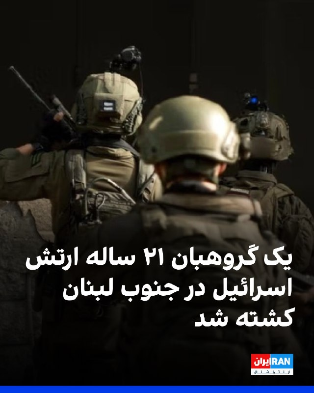

ارتش اسرائیل اعلام کرد که یک گروهبان ۲۱ ساله اسرائیلی، شامگاه جمعه در جنوب لبنان در یک حمله پهپادی کشته شده است.

بر اساس بیانیه ارتش اسرائیل، در این حمله ۱۳ سرباز دیگر زخمی شدند و از میان زخمی‌ها، حال دو نفر وخیم، یک نفر متوسط و ۱۰ نفر دیگر سطحی گزارش شده است.
‌🏁 🇬🇧 IranintlTV

🤖 @VahidOOnLine

## VahidOOnLine — post 246561

  <a href="telegram/content/VahidOOnLine_246561_1781980116.mp4" target="_blank">🎬 Download video</a>

♦️نیروی دریایی سپاه پاسداران پیام رادیویی به تمامی کشتی‌ها مخابره کرد که در پی شرایط اخیر در لبنان و آنچه «نقض تعهدات آمریکا درباره آتش‌بس» عنوان شده، تنگه هرمز بسته است.
در این پیام تأکید شده: «تنگه هرمز بسته است» و از تمامی شناورها خواسته شده از نزدیک شدن به این محدوده خودداری کنند.

جمهوری اسلامی مدعی شده با توجه به نقض آتش‌بس از سوی آمریکا تنگه هرمز را بسته است این درحالی است که سنتکام با انتشار پیامی از باز بودن تنگه هرمز خبر داد.
‌🇸🇦 Indypersian

🤖 @VahidOOnLine

## VahidOOnLine — post 246560

  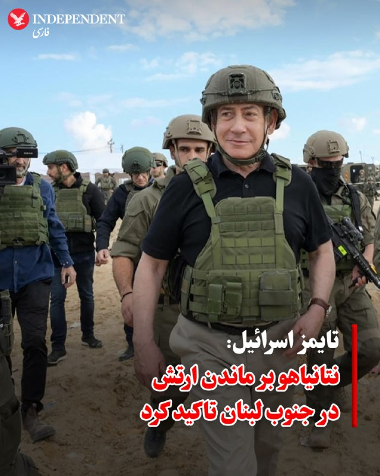

♦️ به گزارش «تایمز اسرائیل»، بنیامین نتانیاهو، نخست‌وزیر اسرائیل، تاکید کرده است که نیروهای نظامی این رژیم «تا هر زمان که برای دفاع از مرزهای شمالی لازم باشد»، در جنوب لبنان باقی خواهند ماند.

یک مقام ارشد در دفتر نخست‌وزیری اسرائیل روز شنبه ۳۰ خرداد با اعلام این موضع به رسانه‌ها افزود که نتانیاهو به ارتش دستور داده است تا «به هرگونه حمله از سوی حزب‌الله با قدرت پاسخ دهد و برای از بین بردن هرگونه تهدید علیه نیروهای اسرائیل فورا اقدام کند.»

تاکید نخست‌وزیر اسرائیل بر باقی‌ماندن نیروهای این کشور در خاک لبنان در حالی انجام می‌شود که فرستادگان جمهوری اسلامی و آمریکا قرار است روز یکشنبه در سوئیس مذاکرات خود را آغاز کنند. جمهوری اسلامی، تداوم عملیات اسرائیل در لبنان و حضور این نیروها را ناقض مفاد تفاهم‌نامه امضاشده میان تهران و واشنگتن می‌داند.
‌🇸🇦 Indypersian

🤖 @VahidOOnLine

## VahidOOnLine — post 246559

  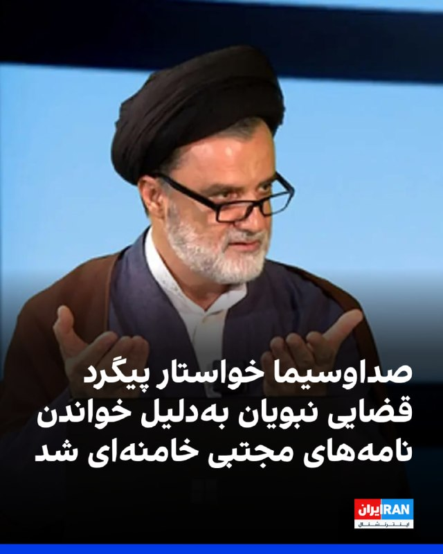

در پی سخنان محمود نبویان، عضو کمیسیون امنیت ملی مجلس در یک برنامه تلویزیونی، معاونت سیاسی صداوسیما اعلام کرد سخنان او و اشاره‌اش به برخی اسناد دارای طبقه‌بندی و مکاتبات مسئولان عالی کشور، مصداق تخلف قانونی و مستوجب پیگرد قضایی است.

سازمان صداوسیما اعلام کرد که پیگیری‌های لازم را در این خصوص در دستور کار قرار می‌دهد.

معاونت سیاسی صدا و سیما همچنین اعلام کرد در همین رابطه یک مدیرکل این سازمان استعفا کرده و «برخوردهای انضباطی لازم» در این خصوص به عمل خواهد آمد.

محمود نبویان در این برنامه تلویزیونی گفته بود مجتبی خامنه‌ای ۱۱ شرط درباره مذاکرات مشخص کرده بود که گرفتن غرامت از آمریکا، حق غنی‌سازی، رفع تحریم‌ها، آزادی اموال مسدودشده و اعمال حاکمیت در تنگه هرمز از جمله آن‌ها بوده است. او همچنین گفته که مجتبی خامنه‌ای خواسته بود اخذ عوارض از تنگه هرمز از همین حالا آغاز شود.

نبویان با خواندن متونی که نامه‌های به‌کلی سری مجتبی خامنه‌ای خوانده شده، اضافه کرد پس از مذاکرات اسلام‌آباد، مجتبی خامنه‌ای برای تیم مذاکره‌کننده نوشته است: «آنچه در مذاکرات پاکستان رقم خورده با آنچه قرار بود بشود و شرط مشروعیت مذاکرات بوده، تفاوت کلی دارد و مذاکرات باید متوقف شود.»

نبویان تاکید کرد که مجتبی خامنه‌ای گفته بود در مورد موضوع هسته‌ای مذاکره نکنید؛ یا باید به پیروزی برسید، یا اینکه مساله هسته‌ای برای همیشه از دستورکار مذاکرات خارج شود.
متن کامل را در سایت ایران‌اینترنشنال بخوانید.
‌🏁 🇬🇧 IranintlTV

🤖 @VahidOOnLine

## VahidOOnLine — post 246558

ویدیوی رسیده به ایران اینترنشنال نشان می‌دهد جاویدنام محمدرضا زارعی بخشایش، از معترضان کشته‌شده در انقلاب ملی، قبل از حضور در اعتراضات تصویری از خود ضبط کرده و گفته بود شاهزاده رضا پهلوی را بهترین شخص برای بازگشت شکوه ایران می‌دانم.
‌🏁 🇬🇧 IranintlTV

🤖 @VahidOOnLine

## VahidOOnLine — post 246557

  

سی‌بی‌اس اعلام کرد رافائل گروسی، مدیر کل آژانس بین‌المللی انرژی اتمی، در مذاکرات میان جمهوری اسلامی و آمریکا در سوئیس، شرکت خواهد کرد.

همچنین الجزیره به نقل از یک منبع دولتی پاکستان گزارش داد که شهباز شریف، نخست‌وزیر پاکستان، و عاصم منیر، فرمانده ارتش این کشور یکشنبه به سوئیس سفر خواهند کرد.
‌🏁 🇬🇧 IranintlTV

🤖 @VahidOOnLine

## VahidOOnLine — post 246556

  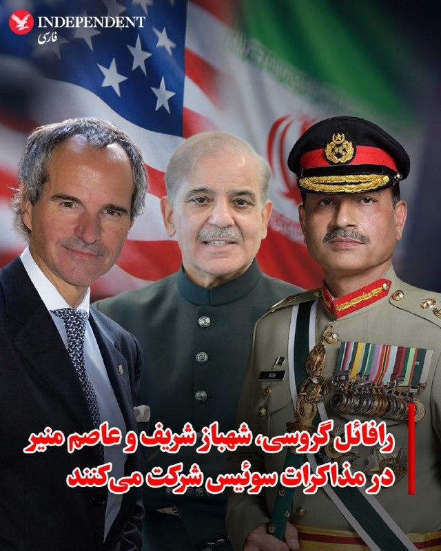

♦️ هم‌زمان با آماده‌سازی‌ها برای آغاز گفتگوهای فنی میان مذاکره‌کنندگان تهران و واشنگتن، سی‌بی‌اس به نقل از یک منبع آگاه اعلام کرد که رافائل گروسی، مدیرکل آژانس بین‌المللی انرژی اتمی، به‌منظور هدایت بخشی از مذاکرات فنی مربوط به برنامه هسته‌ای ایران وارد سوئیس شده است.

بر اساس یادداشت تفاهم ۱۴ ماده‌ای اسلام‌آباد، آژانس بین‌المللی انرژی اتمی وظیفه راستی‌آزمایی بازرسی‌ها و نظارت بر فرآیند رقیق‌سازی اورانیوم غنی‌شده ایران را بر عهده خواهد داشت. حضور گروسی در بورگن‌اشتوک نشان‌دهنده آغاز گام‌های عملی برای اجرای این بند کلیدی از تفاهم‌نامه است.

هم‌زمان گزارش‌ها حاکی از آن است که شهباز شریف، نخست‌وزیر پاکستان، به همراه فیلد مارشال عاصم منیر، فرمانده ارتش این کشور، روز یکشنبه به این مذاکرات در سوئیس خواهند پیوست تا در کنار میانجی‌گران قطری و نمایندگان ایران و آمریکا، روند حل‌وفصل ابعاد فنی و استراتژیک توافق پایان جنگ را تسریع کنند.
‌🇸🇦 Indypersian

🤖 @VahidOOnLine

## WithYashar — post 15440

## WithYashar — post 15439

یک مقام آمریکایی به الجزیره گفت که ارتش اسرائیل به سنتکام اطلاع داده است که به واحدهای خود دستور داده است که به آتش‌بس در لبنان پایبند باشند
@withyashar

## WithYashar — post 15438

  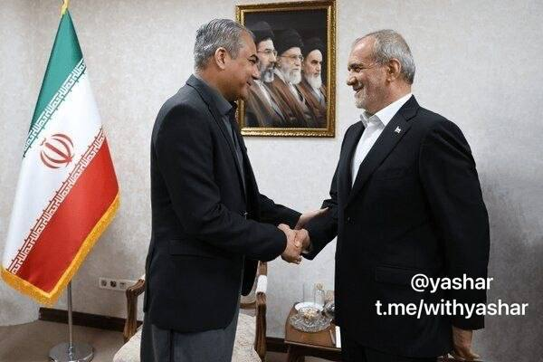

دیدار وزیر کشور پاکستان با پزشکیان
@withyashar

## WithYashar — post 15437

  <a href="telegram/content/WithYashar_15437_1781980120.mp4" target="_blank">🎬 Download video</a>

امیر قمیشی : به عمویم سیاوش قمیشی گفتم ترامپ برادرت را کشت

سیروس قمیشی برادر سیاوش قمیشی (خواننده و آهنگساز مشهور ایرانی) بود و پدر «امیر قمیشی» (از تهیه‌کنندگان و برنامه‌سازان تلویزیون رژیم) به شمار می‌رفت. وی در جریان بمباران بیمارستان گاندی تهران کشته شد و طبق گزارش‌های خبری، تنها یک روز تا زمان ترخیص و پایان درمان وی باقی مانده بود
@withyashar

## WithYashar — post 15436

نبویان، نماینده مجلس: آمریکا بعد از شهادت آقا از طریق یکی از کشورهای اروپایی، پیام داد که بیایید مثل ونزوئلا تسلیم شوید! وی‌در ادامه با دلایل بسیار گفت ماجرای مذاکرات رسما کودتای آقایان علیه رهبری بود! و صدا و سیما هم حرفاشو قطع کرد ! @withyashar 🚨

## mwarmonitor — post 11287

  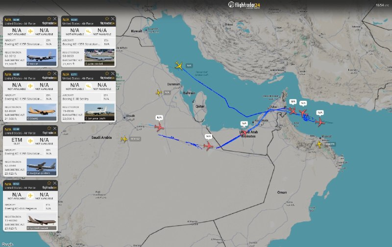

✈️🚨فعالیت‌ها بر فراز تنگه هرمز با ورود شمار بیشتری از هواپیماهای سوخت‌رسان KC-135 «استراتوتانکر» نیروی هوایی آمریکا و همچنین یک فروند هواپیمای هشدار زودهنگام و کنترل هوابرد E-3 «سِنتری» که در مسیر اعزام به منطقه خلیج فارس است، در حال افزایش است.

@mwarmonitor

## mwarmonitor — post 11286

🔴ارتش اسرائیل اعلام کرد که عملیات خود را در «منطقه امنیتی» اعلام‌شده‌اش در جنوب لبنان ادامه می‌دهد؛ از جمله در یک سامانه بزرگ تونلی حزب‌الله که ده‌ها نیروی این گروه در آن پناه گرفته‌اند، اما در سایر مناطق کشور «آتش خود را متوقف کرده است».

🔸ارتش اسرائیل می‌گوید پس از موجی از حملات هوایی علیه حزب‌الله در شب گذشته و صبح امروز ــ در پاسخ به حملات علیه نیروهایش ــ از سوی رهبری سیاسی دستور آتش‌بس دریافت کرده است.

🔸با این حال، ارتش تأکید می‌کند که همچنان به تخریب زیرساخت‌های حزب‌الله در داخل منطقه امنیتی خود ــ از جمله در ارتفاعات علی‌طاهر ــ ادامه خواهد داد و همچنین «تهدیدات فوری» خارج از این منطقه را هدف قرار می‌دهد.

🔸به ارزیابی ارتش، حزب‌الله یک تأسیسات زیرزمینی بزرگ و «راهبردی» در زیر ارتفاعات علی‌طاهر، در نزدیکی نبطیه، در اختیار دارد. به گفته ارتش، این پایگاه زیرزمینی «مرکز عصبی» یگان منطقه‌ای بدرِ حزب‌الله است.

🔸بر اساس اعلام ارتش، ده‌ها نیروی حزب‌الله همچنان در این مجموعه زیرزمینی پناه گرفته‌اند و طی روزهای اخیر درگیری‌ها هم در سطح زمین و هم در زیر زمین جریان داشته است.

🔸ارتفاعات علی‌طاهر در ابتدا جزو منطقه امنیتی ارتش در جنوب لبنان نبود. اما روز پنج‌شنبه، ارتش اسرائیل نقشه به‌روزشده «منطقه دفاع پیشرو» را منتشر کرد که اکنون علی‌طاهر و همچنین منطقه مجدل‌زون را نیز دربر می‌گیرد.

@mwarmonitor

## mwarmonitor — post 11285

🔴یدیعوت آحرونوت به نقل از منابع نظامی:
ارتش اسرائیل ده‌ها نفر از نیروهای حزب‌الله را در منطقه «علی‌الطاهر» محاصره کرده است.

@mwarmonitor

## FoxNewsTwitter — post 343211

  <a href="telegram/content/FoxNewsTwitter_343211_1781980123.mp4" target="_blank">🎬 Download video</a>

Fox News (Twitter/X)

"You will be quiet now... you and your shameful report."

Israel’s U.N. Ambassador Danny Danon erupted during a public hearing after U.N. official Vanessa Frazier interrupted him and defended her report blacklisting Israel over alleged violations against children in conflict.

Danon accused U.N. officials of bias, telling them: “You caved to the secretary-general’s obsession with targeting Israel.”

When Frazier objected and demanded Danon stop the “personal attacks,” saying she had “verified evidence,” Danon fired back: “We are a member state, and you work for the U.N., and you will be quiet now.”

The clash came as both Israel and Hamas were named in U.N. reports tied to alleged abuses during the conflict.

## FoxNewsTwitter — post 343210

  <a href="telegram/content/FoxNewsTwitter_343210_1781980125.mp4" target="_blank">🎬 Download video</a>

Fox News (Twitter/X)

NEW: U.S. officials are dismissing claims by Iran's Revolutionary Guard that it has closed the Strait of Hormuz over ongoing tensions between Israel and Lebanon.

A senior official tells FOX News that Iran can't close the Strait because "they don't control it," and points to a high volume of ships now transiting the critical waterway.

## FoxNewsTwitter — post 343208

Fox News (Twitter/X)

Ranch lovers, consider yourselves warned.

After the TSA reminded travelers that oversized bottles of ranch belong in checked bags, the internet immediately got to work offering solutions — from powdered ranch packets to DIY travel hacks.

Now Kraft is joining the conversation.

The company is teasing what it calls "Kraft TSA Compliant Ranch," a travel-friendly version designed to help visitors bring the taste of America home.

## FoxNewsTwitter — post 343207

  

Fox News (Twitter/X)

"Our taxpayers work way too hard to lose this kind of money to fraudsters... this is absolutely unacceptable."

Sen. Joni Ernst discusses "fraud-fluencers" who allegedly stole COVID-era relief funds in major fraud scam. | @SatAmericaFNC

## pm_afshaa — post 94468

  <a href="telegram/content/pm_afshaa_94468_1781980128.mp4" target="_blank">🎬 Download video</a>

🔴نبویان امروز تو شبکه خبر رسما اعلام کرد که کودتای قالیباف علیه مجتبی خامنه‌ای بوده و صداوسیما بلافاصله حرفاش رو قطع کرد و بعد از چند ساعت چنین بیانیه‌ای داد:

به استحضار مخاطبان محترم شبکه خبر می‌رساند اظهارات یک نماینده مجلس دعوت شده به برنامه امروز زنده این شبکه و اشاره ناقص و مخدوش وی به برخی اسناد دارای طبقه بندی و مکاتبات مسوولان عالی کشور، مصداق تخلف قانونی و مستوجب پیگرد قضایی است و سازمان صدا و سیما پیگیری‌های لازم را در این خصوص در دستور کار قرار می‌دهد

شبکه خبر ضمن ابراز تاسف بابت بی توجهی میهمان مذکور به قواعد اخلاقی و الزامات آنتن زنده، به اطلاع می‌رساند مدیریت این شبکه ضمن پذیرش استعفای مدیر کل مربوطه، برخوردهای انضباطی لازم را به دلیل بی توجهی به الزامات برنامه‌های زنده و سهل‌انگاری در مدیریت حرفه ای به عمل خواهد آورد.

💧Rainbet.com the #1 Non-KYC Crypto Casino & Sportsbook @rainbetcom

😁 @Pm_Afshaa

## pm_afshaa — post 94467

  <a href="telegram/content/pm_afshaa_94467_1781980129.mp4" target="_blank">🎬 Download video</a>

🔴صداوسیما: اظهارات نبویان در شبکه خبر تخلف بوده و پیگرد قضایی خواهد شد.

نبویان نماینده مجلس، امروز تمام مکالمات مجتبی خامنه‌ای با تیم مذاکره‌کننده رو فاش کرد که وسطاش برنامه رو قطع کردن.

💧Rainbet.com the #1 Non-KYC Crypto Casino & Sportsbook @rainbetcom

😁 @Pm_Afshaa

## pm_afshaa — post 94466

  <a href="telegram/content/pm_afshaa_94466_1781980130.webm" target="_blank">🎬 Download video</a>

🔴رویترز: سنتکام اعلام کرد ایران کنترل تنگه هرمز رو در اختیار نداره و تردد کشتی‌ها همچنان بدون مشکل ادامه داره.

💧 Rainbet.com the #1 Non-KYC Crypto Casino & Sportsbook @rainbetcom

😁 @Pm_Afshaa

## DEJradio — post 5852

  <a href="telegram/content/DEJradio_5852_1781980131.webm" target="_blank">🎬 Download video</a>

🔺📢 "قالیباف بی‌غیرت یادش رفته قاسم سلیمانی و خامنه‌ای و سلامی رو کی کشت، رفته سوئیس سند تسلیم امضا کنه، تقصیر هم‌ میندازن گردن مترسکی مثل عراقچی و پزشکیان

پیام دریافتی

#توافق #قالیباف #کتلت
@DEJradio

## VahidOnline — post 76554

  <a href="telegram/content/VahidOnline_76554_1781980131.mp4" target="_blank">🎬 Download video</a>

صدا و سیما: افشای مکاتبات مجتبی خامنه‌ای از سوی نبویان در شبکه خبر پیگیرد قضایی دارد

صداوسیمای جمهوری اسلامی ایران اظهارات محمود نبویان، نایب‌رئیس کمیسیون امنیت ملی مجلس، در شبکه خبر پیرامون مذاکرات پیش رو بین ایران و آمریکا را «مصداق تخلف قانونی و مستوجب پیگرد قضایی» عنوان و اعلام کرد «مدیرکل مربوطهٔ این شبکه استعفا کرده است».

محمود نبویان، که به جناح تندرو موسوم به «پایداری» تعلق دارد، روز شنبه ۳۰ خرداد با خواندن بخش‌هایی از متن‌هایی که گفت مکاتبات مجتبی خامنه‌ای با هیئت مذاکره‌کننده است، مدعی شد رهبر جمهوری اسلامی در مراحل مختلف با روند مذاکرات و بندهای متن‌های گوناگون مرتبط با مذاکرات مخالف بوده است.

این گفت‌وگو پیش از آن‌که نبویان به متن نهایی تفاهم‌نامه برسد، قطع شد و موجی از واکنش‌ها را در میان دیگر چهره‌ها و فعالان رسانه‌ای جمهوری اسلامی در پی داشت.

صداوسیما در بیانیهٔ خود اعلام کرد نبویان در اظهاراتش «اشارهٔ ناقص و مخدوش به برخی اسناد دارای طبقه‌بندی» داشته و سعید آجورلو، عضو تیم رسانه‌ای هیئت مذاکره‌کننده و از چهره‌های نزدیک محمدباقر قالیباف، نیز او را به «تحریف عمدی متون» با هدف «فرار از پاسخگویی درباره ادعاهای نادرست قبلی» متهم کرد.

محمود نبویان، ۲۳ خرداد ماه، در آستانهٔ امضای تفاهم‌نامهٔ ایران و آمریکا، در یک برنامهٔ زنده در یک خبرگزاری نزدیک به سپاه، متنی را که مدعی بود تفاهم‌نامهٔ ایران و آمریکا است، روخوانی و از برخی بندهای آن به‌شدت انتقاد کرده بود.

نبویان یکی از اعضای گروهی بود که پس از اعلام آتش‌بس جنگ ۴۰ روزه، همراه هیئت مذاکره‌کنندهٔ با آمریکا به اسلام‌آباد رفته بود.

مجتبی خامنه‌ای، که پس از اعلام رهبری هنوز هیچ صدا و تصویری از او منتشر نشده، پس از امضای تفاهم‌نامه توسط رؤسای جمهور ایران و آمریکا در پیامی مکتوب اعلام کرد «نظر دیگری» داشته اما «با تعهدی» که پزشکیان به او داده، مسئولیت آن را بر عهده مسعود پزشکیان، رئیس شورای عالی امنیت ملی، و دیگر اعضای این شورا گذاشته است.
@VahidHeadline

حمید رسایی با انتشار ویدیوی بالا نوشت:
نبویان در آنتن زنده شبکه خبر، در حال تشریح جزئیات نامه‌های رد و بدل‌شده میان رهبر معظم انقلاب و شورای عالی امنیت ملی بود که پخش برنامه به بهانه میان‌برنامه به صورت کامل متوقف شد!
ما که از یادداشت‌های آن امام شهید در این باره اطلاع پیدا نکردیم ولی گوشه‌ای از یادداشت‌های امام حاضر توسط آقای نبویان در حال پخش از سیما بود مانع آن شدند!

صدا و سیما:
🔹روابط عمومی معاونت سیاسی صداوسیما: به استحضار مخاطبان محترم شبکه خبر می‌رساند اظهارات یک نماینده مجلس دعوت‌شده به برنامه امروز زنده این شبکه و اشاره ناقص و مخدوش وی به برخی اسناد دارای طبقه‌بندی و مکاتبات مسئولان عالی کشور، مصداق تخلف قانونی و مستوجب پیگرد قضایی است و سازمان صداوسیما پیگیری‌های لازم را در این خصوص در دستور کار قرار می‌دهد.

🔹شبکه خبر ضمن ابراز تاسف بابت بی‌توجهی مهمان مذکور به قواعد اخلاقی و الزامات آنتن زنده، به اطلاع می‌رساند مدیریت این شبکه ضمن پذیرش استعفای مدیرکل مربوطه، برخوردهای انضباطی لازم را به دلیل بی‌توجهی به الزامات برنامه‌های زنده و سهل‌انگاری در مدیریت حرفه‌ای به عمل خواهد آورد.

📡 @VahidOnline

## IranIntlTV — post 343429

  <a href="https://t.me/IranintlTV/343429" target="_blank">📎 Download file</a>

🎧نسخه صوتی تیتراول با نیوشا صارمی: قالیباف و ونس در راه سوئیس، سپاه گفت تنگه هرمز بسته است، سنتکام رد کرد
@iranintlTV

## IranIntlTV — post 343428

  

ارتش اسرائیل اعلام کرد که یک گروهبان ۲۱ ساله اسرائیلی، شامگاه جمعه در جنوب لبنان در یک حمله پهپادی کشته شده است.

بر اساس بیانیه ارتش اسرائیل، در این حمله ۱۳ سرباز دیگر زخمی شدند و از میان زخمی‌ها، حال دو نفر وخیم، یک نفر متوسط و ۱۰ نفر دیگر سطحی گزارش شده است.
https://iranintl.com/202606207917

## IranIntlTV — post 343427

  

در پی سخنان محمود نبویان، عضو کمیسیون امنیت ملی مجلس در یک برنامه تلویزیونی، معاونت سیاسی صداوسیما اعلام کرد سخنان او و اشاره‌اش به برخی اسناد دارای طبقه‌بندی و مکاتبات مسئولان عالی کشور، مصداق تخلف قانونی و مستوجب پیگرد قضایی است.

سازمان صداوسیما اعلام کرد که پیگیری‌های لازم را در این خصوص در دستور کار قرار می‌دهد.

معاونت سیاسی صدا و سیما همچنین اعلام کرد در همین رابطه یک مدیرکل این سازمان استعفا کرده و «برخوردهای انضباطی لازم» در این خصوص به عمل خواهد آمد.

محمود نبویان در این برنامه تلویزیونی گفته بود مجتبی خامنه‌ای ۱۱ شرط درباره مذاکرات مشخص کرده بود که گرفتن غرامت از آمریکا، حق غنی‌سازی، رفع تحریم‌ها، آزادی اموال مسدودشده و اعمال حاکمیت در تنگه هرمز از جمله آن‌ها بوده است. او همچنین گفته که مجتبی خامنه‌ای خواسته بود اخذ عوارض از تنگه هرمز از همین حالا آغاز شود.

نبویان با خواندن متونی که نامه‌های به‌کلی سری مجتبی خامنه‌ای خوانده شده، اضافه کرد پس از مذاکرات اسلام‌آباد، مجتبی خامنه‌ای برای تیم مذاکره‌کننده نوشته است: «آنچه در مذاکرات پاکستان رقم خورده با آنچه قرار بود بشود و شرط مشروعیت مذاکرات بوده، تفاوت کلی دارد و مذاکرات باید متوقف شود.»

نبویان تاکید کرد که مجتبی خامنه‌ای گفته بود در مورد موضوع هسته‌ای مذاکره نکنید؛ یا باید به پیروزی برسید، یا اینکه مساله هسته‌ای برای همیشه از دستورکار مذاکرات خارج شود.
متن کامل را در سایت ایران‌اینترنشنال بخوانید.
https://www.iranintl.com/202606206592

## IranIntlTV — post 343426

ویدیوی رسیده به ایران اینترنشنال نشان می‌دهد جاویدنام محمدرضا زارعی بخشایش، از معترضان کشته‌شده در انقلاب ملی، قبل از حضور در اعتراضات تصویری از خود ضبط کرده و گفته بود شاهزاده رضا پهلوی را بهترین شخص برای بازگشت شکوه ایران می‌دانم.

## IranIntlTV — post 343425

  <a href="telegram/content/IranIntlTV_343425_1781980134.mp4" target="_blank">🎬 Download video</a>

مهدی مهدوی‌آزاد در برنامه «چشم‌انداز» گفت حواشی و موضع‌گیری‌های اخیر درباره تفاهم ایران و آمریکا، از جمله تهدیدهای مطرح‌شده علیه مسعود پزشکیان و ادعای دوباره بستن تنگه هرمز، بیش از آنکه نشانه تصمیم‌های قطعی باشد، بیانگر ابهام و اختلاف در ساختار قدرت جمهوری اسلامی است.
@iranintltv

## IranIntlTV — post 343424

  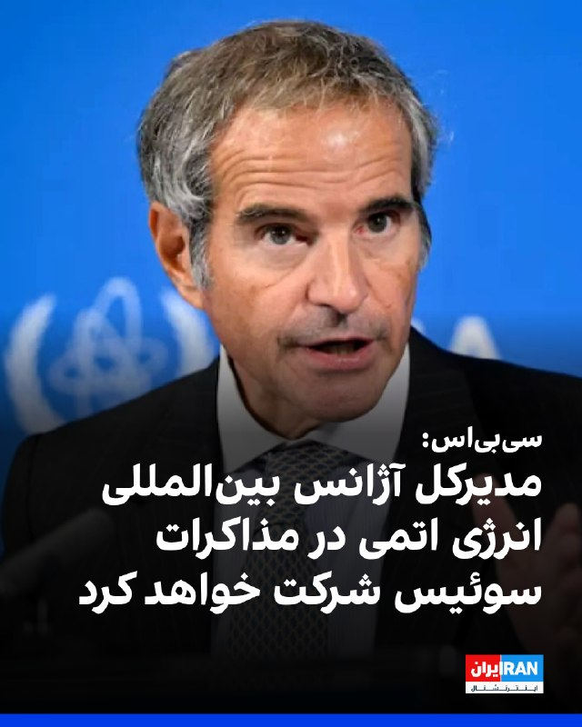

سی‌بی‌اس اعلام کرد رافائل گروسی، مدیر کل آژانس بین‌المللی انرژی اتمی، در مذاکرات میان جمهوری اسلامی و آمریکا در سوئیس، شرکت خواهد کرد.

همچنین الجزیره به نقل از یک منبع دولتی پاکستان گزارش داد که شهباز شریف، نخست‌وزیر پاکستان، و عاصم منیر، فرمانده ارتش این کشور یکشنبه به سوئیس سفر خواهند کرد.
https://iranintl.com/202606201609

## IranIntlTV — post 343423

  <a href="telegram/content/IranIntlTV_343423_1781980136.mp4" target="_blank">🎬 Download video</a>

روح‌الله رحیم‌پور، تحلیلگر سیاسی، به ایران‌اینترنشنال گفت گره خوردن پرونده جنوب لبنان با تفاهم اخیر میان آمریکا و جمهوری اسلامی، از همان ابتدا این روند را با چالش روبه‌رو کرده است. به گفته او، جمهوری اسلامی تلاش می‌کند با افزایش فشار سیاسی بر آمریکا، واشینگتن را به استفاده از اهرم‌های خود علیه اسرائیل وادار کند و هم‌زمان از تمایل دولت آمریکا برای پیشبرد تفاهم، به‌عنوان فرصتی برای افزایش مطالبات خود بهره ببرد.
@iranintltv

## IranIntlTV — post 343422

  <a href="telegram/content/IranIntlTV_343422_1781980138.mp4" target="_blank">🎬 Download video</a>

لیلا مروتی، تحلیل‌گر سیاسی، درباره افزایش تنش‌ها میان اسرائیل و حزب‌الله و تاثیر آن بر تفاهم‌نامه اسلام‌آباد گفت: «با وجود حملات و تنش‌هایی که امروز هم شاهد بودیم، هم نمایندگان جمهوری اسلامی و هم هیات آمریکایی به سوئیس رفتند.»

او افزود: «این نشان می‌دهد که هر دو طرف، هم آمریکا و هم جمهوری اسلامی، مصمم هستند مسیر گفت‌وگوها ادامه پیدا کند.»
@iranintltv

## FarsiVOA — post 221351

در گفت‌وگو با علی دادپی، اقتصاددان، از امید به گشایش اقتصادی در ایران همزمان با آغاز مذاکرات سوئیس گفتیم. به گفته علی دادپی، در شرایطی که اقتصاد ایران در محاصره نهادهای نظامی است و بانک‌ها به سوئیفت دسترسی ندارند، سخن گفتن از هرگونه گشایش اقتصادی بی‌معنا است.

## FarsiVOA — post 221350

🔺هشدار سپیده قلیان درباره شرایط فاطمه سپهری و فرزانه قره‌ حسنلو در زندان مشهد

▪️سپیده قلیان، فعال سیاسی که به تازگی از زندان مشهد رهایی یافته، روز شنبه ۳۰ خرداد با انتشار متنی در حساب کاربری خود در ایکس نسبت به وضعیت فاطمه سپهری و فرزانه قره‌حسنلو، دو زندانی سیاسی محبوس در این زندان، هشدار داد.

⬇️ بیشتر بخوانید:
https://ir.voanews.com/a/sepehri-gharahhasanlou-mashhad-gholian-prison/8162978.html/?nocach=1

## FarsiVOA — post 221349

افزایش بازداشت منتقدان و مخالفان جمهوری اسلامی در ایران به اتهام ادعایی «همکاری با دشمن» - گفت‌وگو با معین خزائلی

## FarsiVOA — post 221348

گزارش خبرگزاری رویترز درباره سود بردن سپاه پاسداران از کاهش یا لغو احتمالی تحریم‌ها - گفت‌وگو با شاهین مدرس

## FarsiVOA — post 221347

🔺گزارش «معاریو» از ابعاد پنهان زندگی حسن نصرالله: در پنت‌هاوس زندگی می‌کرد

▪️یک روزنامه اسرائیلی با انتشار گزارشی تازه درباره حسن نصرالله، رهبر کشته‌شده حزب‌الله، جنبه‌های پنهان و ناگفته‌ای از زندگی او را منتشر کرده و روایت‌های جاری و تبلیغات این حزب درباره او را زیر سوال برده است.

⬇️ بیشتر بخوانید:

https://ir.voanews.com/a/luxury-life-hezbollah-lebanon-poverty/8162956.html/?nocach=1

## FarsiVOA — post 221346

وزارت اطلاعات ۱۷ تن را در ایلام به اتهام ادعایی «نفوذی بودن» بازداشت کرد

## DW_Farsi — post 126249

  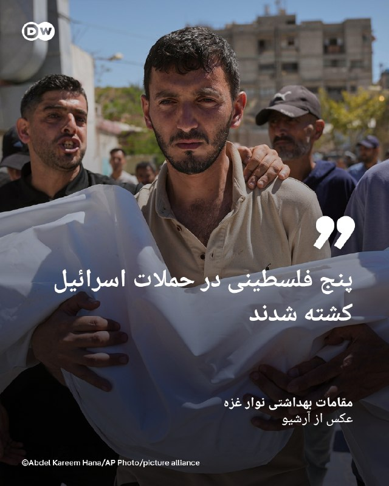

🔶مقامات بهداشتی نوار غزه: پنج فلسطینی در حملات اسرائیل کشته شدند

منابع پزشکی در نوار غزه می‌گویند، در حملات و تیراندازی نیروهای اسرائیلی در روز شنبه ۲۰ ژوئن (۳۰ خرداد) "دست‌کم پنج فلسطینی، از جمله یک کودک"، کشته شده‌اند.

به گفته این منابع، حمله هوایی اسرائیل به یک ساختمان مسکونی در محله صبرا در شهر غزه چهار نفر، شامل دو زن و یک کودک، را کشت و چندین نفر دیگر را زخمی کرد. به گفته امدادگران، این حمله یک واحد مسکونی را به طور کامل تخریب کرده است.

در حادثه‌ای جداگانه نیز یک زن در شهر بیت‌لاهیا در شمال نوار غزه بر اثر تیراندازی نیروهای اسرائیلی جان باخت.

ارتش اسرائیل تاکنون درباره این دو رویداد اظهار نظری نکرده است.

@dw_farsi

## DW_Farsi — post 126248

  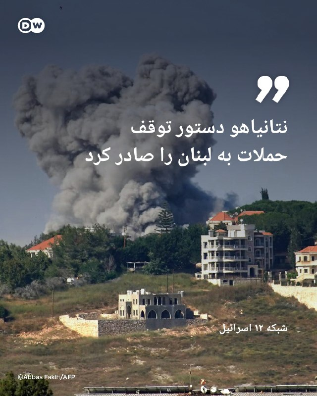

🔶شبکه ۱۲ اسرائیل: نتانیاهو دستور توقف حملات به لبنان را صادر کرد

شبکه ۱۲ اسرائیل گزارش داده است که دولت اسرائیل به ارتش این کشور دستور داده حملات خود در لبنان را متوقف کند، اما نیروهای اسرائیلی همچنان در مناطقی از جنوب لبنان که در ماه‌های اخیر در کنترل گرفته‌اند باقی خواهند ماند.

بر اساس این گزارش، این تصمیم با دستور بنیامین نتانیاهو، نخست‌وزیر اسرائیل، و اسرائیل کاتس، وزیر دفاع این کشور و پس از هماهنگی با آمریکا اتخاذ شده است.

همزمان دفتر نخست‌وزیر اسرائیل به نقل از یک "مقام ارشد" اعلام کرد که ارتش اسرائیل برای دفاع از مرزهای شمالی این کشور "تا هر زمان که لازم باشد" در جنوب لبنان حضور خواهد داشت.

این مقام همچنین هشدار داد که در صورت حملات جدید حزب‌الله، اسرائیل به آنچه "تهدیدها" خوانده شده پاسخ خواهد داد.

@dw_farsi

## DW_Farsi — post 126247

  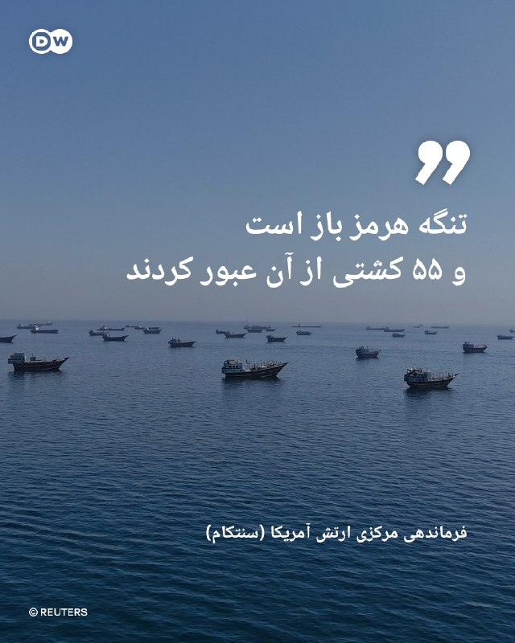

🔶آمریکا: تنگه هرمز باز است و ۵۵ کشتی از آن عبور کردند

فرماندهی مرکزی ارتش آمریکا (سنتکام) اعلام کرد که نیروهای این کشور همچنان در تنگه هرمز حضور دارند و بر اجرای توافق با ایران نظارت می‌کنند.

سنتکام همچنین اعلام کرد که در طول امروز شنبه ۳۰ خرداد، ۵۵ کشتی تجاری از این آبراه عبور کردند و بیش از ۱۷ میلیون بشکه نفت از طریق تنگه هرمز جابه‌جا شده است.

این بیانیه پس از آن منتشر شد که روابط عمومی نیروی دریایی سپاه پاسداران جمهوری اسلامی اعلام کرد که تنگه هرمز تا "اطلاع ثانوی" بر روی تمامی شناورها بسته شده است.

در بیانیه، این اقدام در واکنش به آنچه "نقض تعهدات آمریکا در برقراری آتش‌بس" عنوان شده، صورت گرفته است.

نیروی دریایی سپاه همچنین به شناورها هشدار داد از نزدیک شدن به تنگه هرمز خودداری کنند. در این بیانیه آمده است که در صورت ورود شناورها به محدوده تنگه، امنیت آن‌ها ممکن است به خطر بیفتد.

قرارگاه مرکزی خاتم‌الانبیا نیز همزمان با این بیانیه از بسته شدن تنگه هرمز خبر داده بود.

@dw_farsi

## Persian_Trend_Official — post 17703

العربیه: محسن نقوی، وزیر کشور پاکستان عصر شنبه با مسعود پزشکیان، رئیس جمهور ایران در تهران دیدار و گفت‌وگو کرد.

📝 Amir

📌 @persian_trend_official
پرشین ترند | متفاوت‌ترین کانال نظامی

## Persian_Trend_Official — post 17702

یک منبع دولتی پاکستان اعلام کرد که شهباز شریف نخست‌وزیر و عاصم منیر، فرمانده ارتش این کشور فردا به منظور شرکت در گفتگوهای ایران و آمریکا عازم سوئیس خواهند شد.

📝 Amir

📌 @persian_trend_official
پرشین ترند | متفاوت‌ترین کانال نظامی

## Persian_Trend_Official — post 17700

  <a href="telegram/content/Persian_Trend_Official_17700_1781980142.webm" target="_blank">🎬 Download video</a>

ارتش اسرائیل تصاویری از دو سرباز کشته شده خود در اثر برخورد موشک ضد زره حزب‌الله منتشر کرد.

📝 Amir

📌 @persian_trend_official
پرشین ترند | متفاوت‌ترین کانال نظامی

## Persian_Trend_Official — post 17699

قطع شدن آنتن زنده در مصاحبه نبویان با شبکه خبر؛ نبویان ادعا دارد نامه محرمانه مجتبی خامنه‌ای به تیم مذاکره‌کننده را فاش میکند! 📝 Amir 📌 @persian_trend_official پرشین ترند | متفاوت‌ترین کانال نظامی

## Persian_Trend_Official — post 17698

  <a href="telegram/content/Persian_Trend_Official_17698_1781980142.mp4" target="_blank">🎬 Download video</a>

پیام رادیویی ادعایی نیروی دریایی سپاه پاسداران در نزدیکی تنگه هرمز

نیروی دریایی سپاه: به دلیل اقدامات اسرائیل در لبنان و نقض تعهدات از سوی ایالات متحده، تنگه هرمز به روی ناوبری دریایی بسته شده است.

به تمامی شناورها دستور داده می‌شود برای حفظ ایمنی خود از این منطقه دور بمانند.

📝 Amir

📌 @persian_trend_official
پرشین ترند | متفاوت‌ترین کانال نظامی

## Persian_Trend_Official — post 17697

  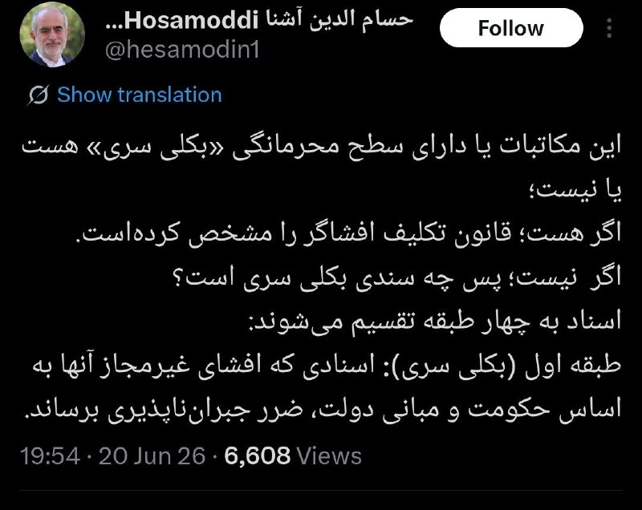

قطع شدن آنتن زنده در مصاحبه نبویان با شبکه خبر؛ نبویان ادعا دارد نامه محرمانه مجتبی خامنه‌ای به تیم مذاکره‌کننده را فاش میکند! 📝 Amir 📌 @persian_trend_official پرشین ترند | متفاوت‌ترین کانال نظامی

## Persian_Trend_Official — post 17696

  <a href="telegram/content/Persian_Trend_Official_17696_1781980143.webm" target="_blank">🎬 Download video</a>

قطع شدن آنتن زنده در مصاحبه نبویان با شبکه خبر؛ نبویان ادعا دارد نامه محرمانه مجتبی خامنه‌ای به تیم مذاکره‌کننده را فاش میکند! 📝 Amir 📌 @persian_trend_official پرشین ترند | متفاوت‌ترین کانال نظامی

## Persian_Trend_Official — post 17695

  <a href="telegram/content/Persian_Trend_Official_17695_1781980144.mp4" target="_blank">🎬 Download video</a>

قطع شدن آنتن زنده در مصاحبه نبویان با شبکه خبر؛ نبویان ادعا دارد نامه محرمانه مجتبی خامنه‌ای به تیم مذاکره‌کننده را فاش میکند!

📝 Amir

📌 @persian_trend_official
پرشین ترند | متفاوت‌ترین کانال نظامی

## RadioFarda — post 158555

🔸صداوسیمای جمهوری اسلامی ایران اظهارات محمود نبویان، نایب‌رئیس کمیسیون امنیت ملی مجلس، در شبکه خبر پیرامون مذاکرات پیش رو بین ایران و آمریکا را «مصداق تخلف قانونی و مستوجب پیگرد قضایی» عنوان و اعلام کرد «مدیرکل مربوطهٔ این شبکه استعفا کرده است». 🔸محمود نبویان،…

## RadioFarda — post 158554

  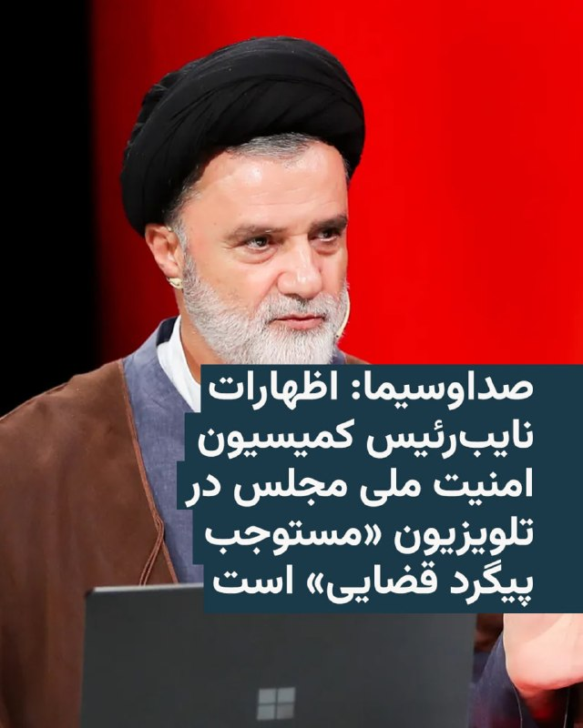

🔸صداوسیمای جمهوری اسلامی ایران اظهارات محمود نبویان، نایب‌رئیس کمیسیون امنیت ملی مجلس، در شبکه خبر پیرامون مذاکرات پیش رو بین ایران و آمریکا را «مصداق تخلف قانونی و مستوجب پیگرد قضایی» عنوان و اعلام کرد «مدیرکل مربوطهٔ این شبکه استعفا کرده است».

🔸محمود نبویان، که به جناح تندرو موسوم به «پایداری» تعلق دارد، روز شنبه ۳۰ خرداد با خواندن بخش‌هایی از متن‌هایی که گفت مکاتبات مجتبی خامنه‌ای با هیئت مذاکره‌کننده است، مدعی شد رهبر جمهوری اسلامی در مراحل مختلف با روند مذاکرات و بندهای متن‌های گوناگون مرتبط با مذاکرات مخالف بوده است.

🔸این گفت‌وگو پیش از آن‌که نبویان به متن نهایی تفاهم‌نامه برسد، قطع شد و موجی از واکنش‌ها را در میان دیگر چهره‌ها و فعالان رسانه‌ای جمهوری اسلامی در پی داشت.

🔸صداوسیما در بیانیهٔ خود اعلام کرد نبویان در اظهاراتش «اشارهٔ ناقص و مخدوش به برخی اسناد دارای طبقه‌بندی» داشته و سعید آجورلو، عضو تیم رسانه‌ای هیئت مذاکره‌کننده و از چهره‌های نزدیک محمدباقر قالیباف، نیز او را به «تحریف عمدی متون» با هدف «فرار از پاسخگویی درباره ادعاهای نادرست قبلی» متهم کرد.

@RadioFarda

## IranianMinds — post 23024

  

دیده شده در هیئت های محرم:

@IranianMinds

## IranianMinds — post 23023

  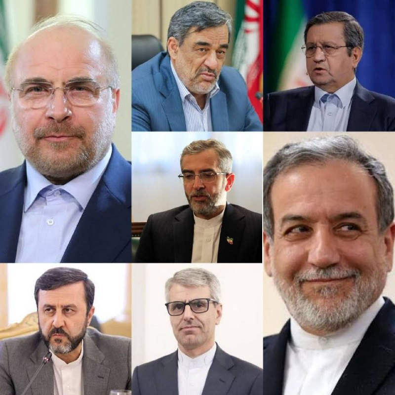

تیم مذاکره کننده جمهوری اسلامی که رفتن سوئیس

@IranianMinds

## IranianMinds — post 23022

  

🔴 سایپا هم بعد از ایران‌خودرو نامه زده و درخواست افزایش قیمت کرده.

@IranianMinds

## BBCPersian — post 284514

  <a href="telegram/content/BBCPersian_284514_1781980149.mp4" target="_blank">🎬 Download video</a>

مرسی و گودنس نخستین جفت دوقلوهای به‌هم‌چسبیده‌ای هستند که بخش‌هایی از جمجمه جدیدشان با استفاده از فناوری واقعیت ترکیبی طراحی شده است. این دو کودک دوساله اهل نیجریه با چسبیدگی از ناحیه سر به دنیا آمدند.

بی‌بی‌سی در روزهای قبل از آخرین عمل جراحی این دوقلوها، که یک جراحی پرخطر بود و در ابوظبی انجام شد، همراه جراح آن‌ها بود.

@BBCPersian

## BBCPersian — post 284513

🔻وزیر کشتیرانی هند: سه نفت‌کش هندی از تنگه هرمز عبور کردند

سارباناندا سونوال، وزیر کشتیرانی هند، روز شنبه اعلام کرد که سه نفت‌کش با پرچم این کشور، با بیش از ۸۶۰ هزار تن نفت و ۹۴ خدمه، به سلامت از تنگه هرمز عبور کرده و در مسیر هند هستند.

او گفت این سه نفت‌کش عبور از تنگه هرمز را تکمیل کرده‌اند.

پیش از عبور این سه نفتکش، ۱۳ محموله با پرچم هند در تنگه هرمز گیر افتاده بودند.

تردد کشتی‌های تجاری از تنگه هرمز روز جمعه پس از امضای توافق آتش‌بس بین ایران و آمریکا افزایش یافت.

ساعاتی پیش سپاه پاسداران اعلام کرد که در واکنش به «عهدشکنی طرف مقابل» در حمله به جنوب لبنان، تنگه هرمز را بسته است.

نیروی دریایی سپاه پاسداران اعلام کرده است که شناورها به تنگه هرمز نزدیک نشوند.

مشخص نیست که عبور این سه نفت‌کش از تنگه هرمز پیش از اعلام بسته شدن این آبراهه بوده یا بعد از آن.

@BBCPersian

## BBCPersian — post 284512

  <a href="https://t.me/bbcpersian/284512" target="_blank">📎 Download file</a>

تازه‌ترین خبرهای شنبه ۳۰ خرداد ۱۴۰۵

## BBCPersian — post 284511

🔻حملات اسرائیل در لبنان امروز (شنبه ۳۰ خرداد)، و تنها ساعاتی پس از توافق آتش‌بس با حزب‌الله، تا کنون دست‌کم ۱۵ کشته بر جای گذاشته است.

به گفته مقامات یک سرباز لبنانی هم در میان کشته‌شدگان است.

اسرائیل می‌گوید این حملات در پاسخ به پرتابه‌هایی است که حزب‌الله به سمت نیروهای اسرائیلی شلیک می‌کند.

خبرگزاری دولتی لبنان، گزارش کرده که جنگنده‌ها و پهپادهای اسرائیلی چندین مکان را در جنوب و دره بقاع هدف قرار داده‌اند.

در همین حال یک مقام نظامی اسرائیل گفت که حزب‌الله بیش از ۵۰ پرتابه به سمت نیروهای اسرائیلی در جنوب لبنان شلیک کرده است.

حزب‌الله مسئولیت این حملات را بر عهده نگرفته است. یک مقام ارشد حزب‌الله به خبرگزاری رویترز گفت که این گروه به اسرائیل اجازه «آزادی حرکت در مناطق اشغالی لبنان» را نخواهد داد و افزود که مقاومت تا زمانی که نیروهای اسرائیلی در لبنان باقی بمانند، مشروع است.

@BBCPersian

## BBCPersian — post 284510

  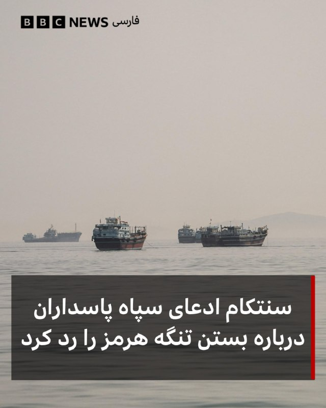

🔻ارتش آمریکا روز شنبه ادعای سپاه پاسداران درباره بستن تنگه هرمز را رد کرد و گفت این آبراه حیاتی همچنان باز است و نیروهای آمریکایی در حال نظارت بر اوضاع هستند تا از ادامه این روند اطمینان حاصل کنند.

تیم هاوکینز، سخنگوی فرماندهی مرکزی ایالات متحده، سنتکام، به رویترز گفت: «ایران تنگه هرمز را کنترل نمی‌کند.»

او گفت: ««ترافیک همچنان جریان دارد و نیروهای آمریکایی در حال نظارت بر اوضاع هستند تا از ادامه این وضعیت اطمینان حاصل کنند.»

ساعاتی پیش قرارگاه خاتم‌الانبیا اعلام کرد تنگه هرمز را بسته است و نیروی دریایی سپاه هم از شناورها خواست به این آبراه نزدیک نشوند.

@BBCPersian
📷 REUTERS

## Dirty_Kids — post 392688

  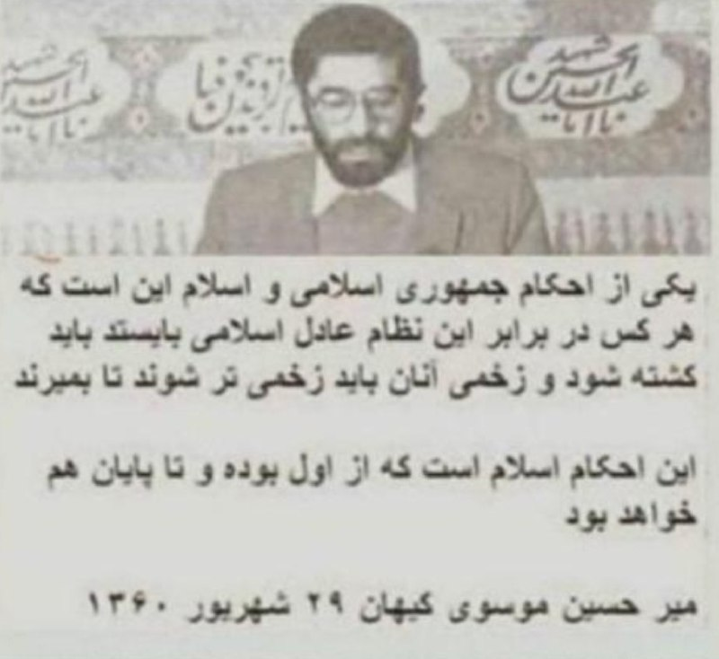

چجوری تونستن به زخمیها تو بیمارستان تیر خلاص بزنن؟

@Dirty_Kids 👻

## Dirty_Kids — post 392687

  <a href="telegram/content/Dirty_Kids_392687_1781980152.mp4" target="_blank">🎬 Download video</a>

یکی از دستاورد‌های بزرگ جمهوری‌اسلامی، آمار طلاق و ازدواج در ایران:

@Dirty_Kids 👻

## Dirty_Kids — post 392686

یه پیرمرد گوگولی گوشیشو داد گفت عصمت بگیر، رفتم تو کانتکتاش هرجوری نوشتم عصمت نبود، گفتم نیس که شمارش، گفت اگه نمیگیره تفسی بگیر پس🙂🙂🙂🙂🙂🙂🙂🙂🙂🙂🙂🙂🙂

@Dirty_Kids 👻

## Dirty_Kids — post 392685

  <a href="telegram/content/Dirty_Kids_392685_1781980153.mp4" target="_blank">🎬 Download video</a>

خداروشکر اینترنت وصل شد تا دوباره همچین محتواهای شاهکاری رو ببینیم.

@Dirty_Kids 👻

## Dirty_Kids — post 392682

اراک برا مبتدی‌ها نیست؛ یه پراید موقع رانندگی روی پشت بوم یه خونه فرود اومده!!

حتی سازنده‌های GTA پشماشون ریخته و قراره برای ساخت GTA6 ازش راهنمایی بگیرن.

@Dirty_Kids 👻

## alonews — post 129435

  <a href="telegram/content/alonews_129435_1781980155.webm" target="_blank">🎬 Download video</a>

👈خانعلی:
رهبری میگفت باید جنگ رو ادامه بدیم

✅ @AloNews خبر جنگ

## alonews — post 129434

  <a href="telegram/content/alonews_129434_1781980155.webm" target="_blank">🎬 Download video</a>

👈یک مقام آمریکایی به الجزیره گفت که ارتش اسرائیل به سنتکام اطلاع داده است که به واحدهای خود دستور داده است که به آتش‌بس در لبنان پایبند باشند

✅ @AloNews خبر جنگ

## alonews — post 129433

  <a href="telegram/content/alonews_129433_1781980155.webm" target="_blank">🎬 Download video</a>

👈چندین هواپیمای سوخت‌رسان KC-135 نیروی هوایی آمریکا وارد منطقه شدن و یک هواپیمای هشدار زودهنگام E-3 هم در مسیر خلیج فارس قرار داره

✅ @AloNews خبر جنگ

## alonews — post 129432

  <a href="telegram/content/alonews_129432_1781980155.webm" target="_blank">🎬 Download video</a>

👈هواپیمای هیئت ایرانی از آسمان ترکیه عبور کرد و تا ۲ ساعت دیگر در زوریخ فرود می‌آید

✅ @AloNews خبر جنگ

## alonews — post 129431

  <a href="telegram/content/alonews_129431_1781980155.webm" target="_blank">🎬 Download video</a>

👈نخست وزیر پاکستان و فرمانده ارتش پاکستان هم به سوئیس میرن

✅ @AloNews خبر جنگ

## alonews — post 129430

  <a href="telegram/content/alonews_129430_1781980156.webm" target="_blank">🎬 Download video</a>

👈لحظه‌ای که آنتن از نبویان گرفته شد 
✅ @AloNews خبر جنگ

## alonews — post 129429

  <a href="telegram/content/alonews_129429_1781980156.mp4" target="_blank">🎬 Download video</a>

👈لحظه‌ای که آنتن از نبویان گرفته شد

✅ @AloNews خبر جنگ

## alonews — post 129428

  <a href="telegram/content/alonews_129428_1781980157.mp4" target="_blank">🎬 Download video</a>

👈ترامپ: می‌گویند من به اندازه کافی سخت‌گیر نبودم؛ من بزرگ‌ترین پلشان را ظرف ۳ دقیقه نابود کردم فقط به‌خاطر اینکه دیر در یک جلسه حاضر شدند

✅ @AloNews خبر جنگ

## alonews — post 129427

  <a href="telegram/content/alonews_129427_1781980159.webm" target="_blank">🎬 Download video</a>

👈 دونالد ترامپ: سازمان مهاجرت و گمرک (ICE) توسط رسانه‌های جعلی در حدی بی‌سابقه مورد حمله قرار گرفته است. مأموران آن میهن‌پرستان بزرگی هستند که سخت کار می‌کنند و در محیطی بسیار خصمانه وظیفه‌شان را انجام می‌دهند. بخش زیادی از این دشمنی را دموکرات‌ها و رسانه‌های جعلی ایجاد کرده‌اند.

🔴مدتی است به این فکر می‌کنم که نام ICE را به NICE تغییر دهیم. این کار خبرنگاران و روزنامه‌نگاران فاسد و غیرمیهن‌پرست را کاملاً گیج خواهد کرد!

🔴تصور کنید مجبور شوند بگویند: "امروز از یک مرکز NICE بازدید کردیم" یا "مأموران NICE یک قاچاقچی خشن مواد مخدر را اخراج کردند." آن‌ها نمی‌توانند تحملش کنند و کاملاً دیوانه می‌شوند!

🔴فقط کافی است یک حرف N (مخفف National) به ICE (اداره مهاجرت و گمرک) اضافه شود. به نظر من اسم معتبرتری است.

🔴همه این ایده را دوست دارند، اما تام هومن به من گفته که خود مأموران به اندازه بقیه مردم از آن خوششان نمی‌آید.

🔴چه کسی موافق است که یک N اضافه کنیم و ICE را به NICE تبدیل کنیم؟

✅ @AloNews خبر جنگ

## alonews — post 129426

  <a href="telegram/content/alonews_129426_1781980159.webm" target="_blank">🎬 Download video</a>

👈ساعاتی پیش، نبویان نماینده‌ی تندرو‌ مجلس، با حضور در صداوسیما مشغول قرائت بخشی از نامه‌های «به کلی سری» مربوط به آیت الله خامنه شد. 
🔴 نبویان با انتخاب بخش‌هایی از نامه و حذف عامدانه‌ی بخش‌های دیگر که شامل چندین نامه و مکاتبه بود، نقل‌قول‌هایی ناقص و تقطیع…

## alonews — post 129425

  <a href="telegram/content/alonews_129425_1781980159.webm" target="_blank">🎬 Download video</a>

👈ساعاتی پیش، نبویان نماینده‌ی تندرو‌ مجلس، با حضور در صداوسیما مشغول قرائت بخشی از نامه‌های «به کلی سری» مربوط به آیت الله خامنه شد. 
🔴 نبویان با انتخاب بخش‌هایی از نامه و حذف عامدانه‌ی بخش‌های دیگر که شامل چندین نامه و مکاتبه بود، نقل‌قول‌هایی ناقص و تقطیع…

## alonews — post 129424

  <a href="telegram/content/alonews_129424_1781980159.webm" target="_blank">🎬 Download video</a>

👈ساعاتی پیش، نبویان نماینده‌ی تندرو‌ مجلس، با حضور در صداوسیما مشغول قرائت بخشی از نامه‌های «به کلی سری» مربوط به آیت الله خامنه شد.

🔴 نبویان با انتخاب بخش‌هایی از نامه و حذف عامدانه‌ی بخش‌های دیگر که شامل چندین نامه و مکاتبه بود، نقل‌قول‌هایی ناقص و تقطیع شده منسوب به آیت الله خامنه ای را در تلویزیون منعکس کرد.

🔴 اگرچه این برنامه‌ی سازماندهی شده در صدا و سیما یک‌باره از آنتن زنده خارج و «قطع» شد اما رسانه‌های پرتعداد منسوب به این جریان، با ضریب دادن به این اظهارات تقطیع‌شده، به تحریکات علیه تیم مذاکره‌کننده که هم‌اینک عازم ژنو شده‌اند، دامن زدند.

✅ @AloNews خبر جنگ

---
📅 بروزرسانی: 1405/03/30 20:44
---

## VahidOOnLine — post 246555

  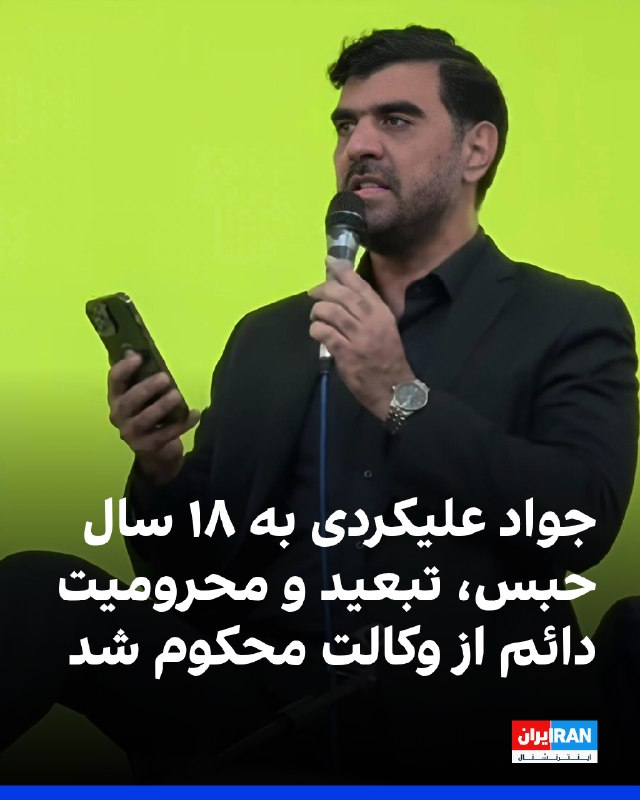

سایت هرانا گزارش داد جواد علیکردی، وکیل دادگستری و برادر خسرو علیکردی، از سوی شعبه اول دادگاه انقلاب مشهد به ۱۸ سال حبس، محرومیت دائم از وکالت، دو سال تبعید به سراوان و دو سال ممنوعیت خروج از کشور محکوم شده است.

بر اساس این گزارش، جواد علیکردی به اتهام «اجتماع و تبانی برای اقدام علیه امنیت ملی» و «فعالیت تبلیغی برخلاف امنیت ملی» محکوم شده است.
‌🏁 🇬🇧 IranintlTV

🤖 @VahidOOnLine

## VahidOOnLine — post 246554

  <a href="telegram/content/VahidOOnLine_246554_1781975642.mp4" target="_blank">🎬 Download video</a>

ویدیوی رسیده به ایران اینترنشنال نشان می‌دهد بستگان و دوستان جاویدنام صهبا رشتیان، شهروند معترض کشته‌شده در انقلاب ملی، برای او در محل مزارش مراسم تولد برگزار کردند. جاویدنام صهبا رشتیان، ۲۳ ساله در جریان انقلاب ملی ایرانیان علیه جمهوری اسلامی، در اعتراضات شهر اصفهان در روز جمعه ١٩ دی ۱۴۰۴، به دست نیروهای سرکوب، کشته و پیکر او پنجشنبە ۲۵ دی، به خاک سپرده شد.
رویای صهبا این بود که روزی در بزرگ‌ترین رویداد فوتبال جهان، جام جهانی، داوری کند؛ رویایی که هرگز فرصت تحقق نیافت.
‌🏁 🇬🇧 IranintlTV

🤖 @VahidOOnLine

## VahidOOnLine — post 246553

  

خبرگزاری رویترز به نقل از سخنگوی فرماندهی مرکزی ایالات متحده (سنتکام) گزارش داد که حکومت ایران کنترل تنگه هرمز را در اختیار ندارد.

سخنگوی سنتکام افزود که تردد در تنگه هرمز همچنان ادامه دارد و نیروهای آمریکایی برای اطمینان از تداوم این وضعیت، اوضاع را زیر نظر دارند.

پیشتر نیروی دریایی سپاه پاسداران در بیانیه‌ای با اشاره به حملات اسرائیل در لبنان و آن چه «نقض تعهدات امریکا در برقراری آتش‌بس» خواند، اعلام کرد که تنگه هرمز بر روی همه شناورها بسته شد.
‌🏁 🇬🇧 IranintlTV

🤖 @VahidOOnLine

## VahidOOnLine — post 246552

  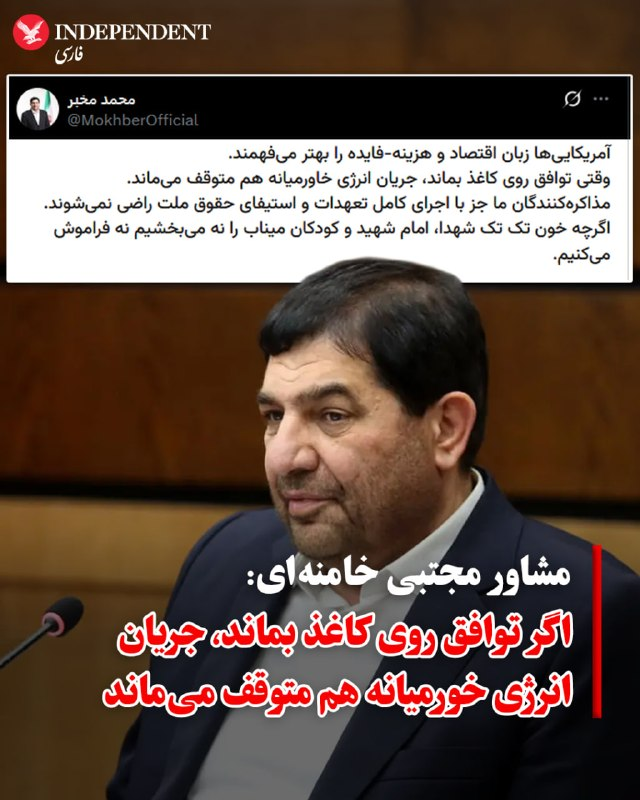

♦️ محمد مخبر، مشاور و دستیار مجتبی خامنه‌ای، رهبر جمهوری اسلامی و عضو مجمع تشخیص مصلحت نظام، روز شنبه ۳۰ خرداد، با انتشار پیامی در شبکه اجتماعی ایکس، بیانیه سپاه پاسداران و ارتش جمهوری اسلامی درباره بسته شدن تنگه هرمز را تایید کرد و نوشت: «وقتی توافق روی کاغذ بماند، جریان انرژی خاورمیانه هم متوقف می‌ماند».

مخبر در این پیام که ساعتی پس از حرکت هیئت مذاکره‌کننده جمهوری اسلامی به سمت سوئیس منتشر شد، نوشت: «آمریکایی‌ها زبان اقتصاد و هزینه-فایده را بهتر می‌فهمند. وقتی توافق روی کاغذ بماند، جریان انرژی خاورمیانه هم متوقف می‌ماند. مذاکره‌کنندگان ما جز با اجرای کامل تعهدات و استیفای حقوق ملت راضی نمی‌شوند.»

مقام‌های جمهوری اسلامی، حملات اسرائیل به لبنان را نقض مفاد تفاهم‌نامه از سوی ایالات متحده می‌دانند. ایالات متحده روز گذشته از برقراری آتش‌بس میان اسرائیل و حزب‌الله لبنان خبر داد اما گزارش‌ها حاکی از تداوم حملات در روز شنبه است.
‌🇸🇦 Indypersian

🤖 @VahidOOnLine

## VahidOOnLine — post 246551

  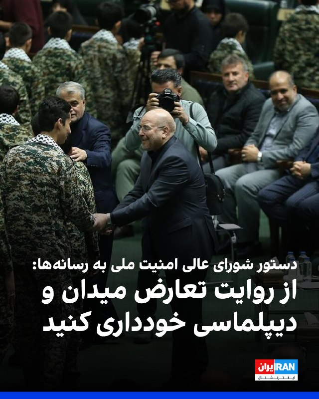

شورای عالی امنیت ملی جمهوری اسلامی در دستورالعملی خطاب به رسانه‌ها اعلام کرد در پوشش اخبار و تحلیل‌ها از القای دوگانه «میدان و دیپلماسی» و روایت اختلاف میان این دو حوزه پرهیز شود.

در این دستورالعمل آمده با توجه به مسدود شدن مجدد تنگه هرمز در واکنش به آنچه «تداوم نقض آتش‌بس در لبنان» عنوان شده و هم‌زمانی آن با حضور هیات مذاکره‌کننده جمهوری اسلامی در سوئیس، رسانه‌ها نباید میان اقدامات میدانی و مسیر دیپلماسی تقابل ایجاد کنند.

شورای عالی امنیت ملی تاکید کرده جمهوری اسلامی در چارچوب یک راهبرد واحد، هم از ابزارهای بازدارندگی و قدرت میدانی برای وادار کردن طرف مقابل به اجرای تعهدات استفاده می‌کند و هم مسیر دیپلماسی را برای پیگیری حقوق خود دنبال می‌کند.

در این دستورالعمل آمده است اقدامات میدانی «جایگزین دیپلماسی نیست» بلکه پشتوانه آن محسوب می‌شود و مذاکرات نیز «نشانه عقب‌نشینی» نیست، بلکه ابزاری برای تبدیل دستاوردهای قدرت ملی به نتایج سیاسی و حقوقی پایدار است.

این نهاد از رسانه‌ها خواسته از هرگونه روایت مبتنی بر تعارض میان میدان و دیپلماسی خودداری کرده و بر مکمل بودن این دو حوزه تاکید کنند.
iranintl.c
‌🏁 🇬🇧 IranintlTV

🤖 @VahidOOnLine

## VahidOOnLine — post 246550

♦️اسماعیل بقایی، سخنگوی وزارت امور خارجه جمهوری اسلامی، روز شنبه ۳۰ خردادماه پیش از ترک فرودگاه مهرآباد به مقصد سوئیس اعلام کرد سفربه این کشور و شرکت در مذاکرات با هدف پیگیری اجرای تعهدات طرف مقابل انجام می‌شود.
او با تأکید بر اینکه هر توافقی در مرحله اجرا سنجیده می‌شود، گفت ایران با توجه به سابقه «بدعهدی‌ها»، اجرای دقیق تعهدات را با جدیت دنبال می‌کند. بقایی افزود مهم‌ترین بند یادداشت تفاهم، «پایان جنگ در همه جبهه‌ها» از جمله لبنان بوده است.
به گفته او، در حالی که ایران به تعهدات خود پایبند بوده، طرف مقابل در وادار کردن متحدانش، به‌ویژه اسرائیل، برای توقف درگیری‌ها در لبنان ناکام مانده و این موضوع «نقض صریح تفاهم» محسوب می‌شود.
بقایی همچنین با اشاره به اجرای برخی تعهدات مانند بازگشایی تنگه هرمز، تأکید کرد این توافق یک «بسته کامل» است و عدم اجرای هر بخش، کل توافق را با مشکل مواجه می‌کند.
‌🇸🇦 Indypersian

🤖 @VahidOOnLine

## VahidOOnLine — post 246549

  

محمد مخبر، مشاور و دستیار رهبر جمهوری اسلامی، در شبکه اجتماعی ایکس نوشت: «آمریکایی‌ها زبان اقتصاد و هزینه-فایده را بهتر می‌فهمند. وقتی توافق روی کاغذ بماند، جریان انرژی خاورمیانه هم متوقف می‌ماند.»

او افزود: «مذاکره‌کنندگان ما جز با اجرای کامل تعهدات و استیفای حقوق ملت راضی نمی‌شوند.»
‌🏁 🇬🇧 IranintlTV

🤖 @VahidOOnLine

## VahidOOnLine — post 246548

  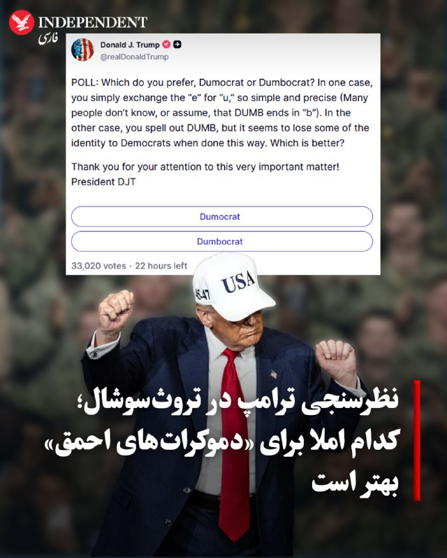

♦️ دونالد ترامپ، رئیس‌جمهوری ایالات متحده روز شنبه ۳۰ خرداد، یک نظرسنجی در حساب تروث‌سوشال خود به‌راه انداخت تا تصمیم بگیرد کدام املا برای کلمه ترکیبی‌ای که برای «دموکرات‌های احمق» ساخته، بهتر است. در کمتر از دو ساعت، بیش از ۳۳هزار نفر در این نظرسنجی شرکت کرده‌اند.
‌🇸🇦 Indypersian

🤖 @VahidOOnLine

## VahidOOnLine — post 246547

  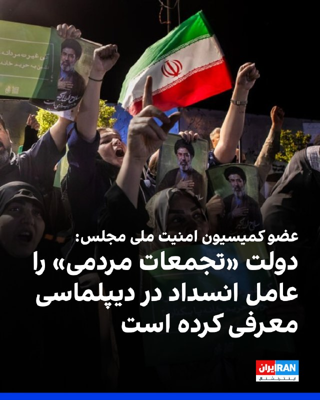

علی خضریان، عضو کمیسیون امنیت ملی مجلس، گفت نهاد معاونت راهبردی ریاست‌جمهوری در سندی با عنوان «جنبش خیابانی حفاظت از ایران» تجمعات مردمی را عامل انسداد در دیپلماسی معرفی کرده است.

خضریان گفت که در این سند از حضور مردم در خیابان‌ها با عنوان «مناسک هیجانی» یاد شده و این نگاه با دیدگاه مجتبی خامنه‌ای درباره نقش و نظارت مردم تفاوت دارد.
‌🏁 🇬🇧 IranintlTV

🤖 @VahidOOnLine

## VahidOOnLine — post 246546

  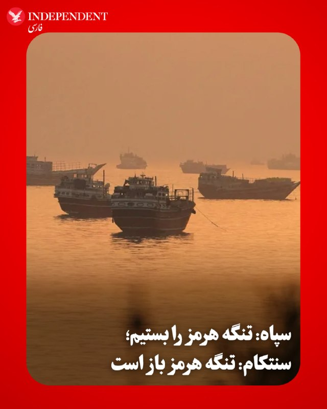

♦️ ساعاتی پس از آن‌که سپاه پاسداران و ارتش جمهوری اسلامی اعلام کردند که عبور و مرور از تنگه هرمز را متوقف می‌کنند و از تمام شناورها خواستند که از نزدیک شدن به این محدوده خودداری کنند، فرماندهی مرکزی ارتش ایالات متحده، سنتکام، اعلام کرد که این تنگه باز است و تردد شناورهای تجاری در روز شنبه ۳۰ خرداد، افزایش یافته است.

سنتکام تاکید کرد که نیروهای آمریکا در منطقه حضور دارند تا از اجرا شدن تمام مفاد تفاهم‌نامه امضاشده میان تهران و واشنگتن اطمینان حاصل کنند.

بر اساس این بیانیه، امنیت گذرگاه بین‌المللی هرمز امروز نیز برقرار بوده و ۵۵ کشتی تجاری موفق به عبور از آن شده‌اند. این شناورها حجم عظیمی از کالا و بیش از ۱۷ میلیون بشکه نفت را به بازارهای جهانی منتقل کردند.

سنتکام بدون اشاره مستقیم به بیانیه‌های سپاه و ارتش جمهوری اسلامی، بر عبور امن تمام شناورها از مسیرهای تعیین‌شده، بدون وجود هرگونه ادعا، موانع یا الزامات خودسرانه، تاکید کرد.
‌🇸🇦 Indypersian

🤖 @VahidOOnLine

## WithYashar — post 15435

@withyashar ماجرای ببر از زبان امیر تتلو حالا شد جریان عاصم منیره پاکستان

## WithYashar — post 15434

الحدث به نقل از یک منبع آگاه: نخست‌وزیر پاکستان و مارشال عاصم منیر فردا در مذاکرات سوئیس شرکت خواهند کرد.
@withyashar

## WithYashar — post 15433

لیست هیئت اعزامی ایران به سوئیس به ریاست قالیباف

محمدباقر قالیباف، رئیس مجلس شورای اسلامی و رئیس هیئت مذاکره کننده ایران

سید عباس عراقچی، وزیر خارجه

علی باقری کنی، معاون بین‌الملل دبیرخانه شورای‌عالی امنیت ملی

عبدالناصر همتی، رئیس کل بانک مرکزی

حمید بورد، معاون وزیر نفت و رئیس شرکت ملی نفت ایران

کاظم غریب‌آبادی، معاون حقوقی و بین‌الملل وزیر خارجه

اسماعیل بقائی، سخنگوی وزارت خارجه
@withyashar

## WithYashar — post 15432

نبویان، نماینده مجلس: آمریکا بعد از شهادت آقا از طریق یکی از کشورهای اروپایی، پیام داد که بیایید مثل ونزوئلا تسلیم شوید!

وی‌در ادامه با دلایل بسیار گفت ماجرای مذاکرات رسما کودتای آقایان علیه رهبری بود! و صدا و سیما هم حرفاشو قطع کرد !
@withyashar 🚨

## WithYashar — post 15431

مقام اسرائیلی: ارتش اسرائیل طی دو روز گذشته به 300 هدف حزب‌الله حمله کرد و 100 نفر از نیروهای این گروه رو کشت.
@withyashar

## WithYashar — post 15430

بلومبرگ: عراق به میادین نفتی بزرگ دستور داده است که تولید خود را به بیش از ۳ میلیون بشکه در روز افزایش دهند، زیرا صادرات از طریق تنگه هرمز به تدریج پس از توافق آمریکا و ایران بهبود می‌یابد.
@withyashar

## WithYashar — post 15429

مقامات ارشد ارتش اسرائیل به کانال 12 اسرائیل اعلام کردند: عملیات نظامی در سراسر جنوب لبنان ادامه دارد
@withyashar

## WithYashar — post 15428

سنتکام بعد از ادعای بسته شدن تنگه : نیروهای آمریکایی همچنان در منطقه حضور دارند و هوشیار هستند تا اطمینان حاصل شود که همه جنبه‌های توافق با ایران رعایت، اجرا و به طور کامل اجرا می‌شوند و همچنین مرکز مشترک اطلاعات دریایی با صدور اطلاعیه‌ای، عبور ایمن برای همه کشتی‌ها در امتداد مسیر تعیین‌شده را که عاری از هرگونه ادعا یا مانع خودسرانه است، تأیید کرد.

تردد کشتی‌های تجاری در تنگه هرمز در ۲۰ ژوئن افزایش یافت، زیرا نیروهای آمریکایی به عملیات خود در منطقه عمومی برای حمایت از آزادی ناوبری ادامه دادند.
امروز عبور ایمن از این آبراه بین‌المللی همچنان برقرار بود و ۵۵ کشتی تجاری در حال عبور بودند و مقادیر زیادی بار و بیش از ۱۷ میلیون بشکه نفت را به بازارهای جهانی منتقل می‌کردند.
@withyashar

## WithYashar — post 15427

نتانیاهو با دستور توقف جنگ گفت که این دستورالعمل‌ها شامل عقب‌نشینی از مناطق تحت کنترل نیروهای اسرائیلی در جنوب لبنان نمیشه و مناطق تصرف شده، تحت تصرف باقی میمونه.
@withyashar

## WithYashar — post 15426

محمد جواد ظریف: از مذاکرات استقبال میکنیم
@withyashar

## FoxNewsTwitter — post 343206

  <a href="telegram/content/FoxNewsTwitter_343206_1781975650.mp4" target="_blank">🎬 Download video</a>

Fox News (Twitter/X)

RT @SatAmericaFNC: 🚨BREAKING: @SenRickScott says he invited President Trump to have lunch this Wednesday to discuss the SAVE America Act.

"We've got to get this DONE."

@kayleighmcenany | @FoxNews

## FoxNewsTwitter — post 343205

  <a href="telegram/content/FoxNewsTwitter_343205_1781975652.mp4" target="_blank">🎬 Download video</a>

Fox News (Twitter/X)

"You cannot make this up."

A former federal employee allegedly used Instagram DMs to recruit people into a COVID relief fraud scheme that prosecutors say cost taxpayers more than $3.5 million.

@kayleighmcenany details the case of former SBA loan officer Attallah Williams, who allegedly promised applicants she could fast-track grants because she worked inside the agency. | @SatAmericaFNC

## FoxNewsTwitter — post 343204

Fox News (Twitter/X)

“Where was their extensive deep-dive coverage into the city's soft on crime policies?"

“And what about angel families who have lost loved ones to vicious criminal illegal aliens that the Biden administration let in.”

“Are we to believe that their stories are less important than algae in a pool that no one swims in?”

@kayleighmcenany is calling out the media after extensive reporting on algae in the Washington, D.C., Reflecting Pool. | @SatAmericaFNC

## FoxNewsTwitter — post 343203

  <a href="telegram/content/FoxNewsTwitter_343203_1781975654.mp4" target="_blank">🎬 Download video</a>

Fox News (Twitter/X)

A massive fire ripped through a popular Dominican Republic resort, forcing nearly 1,700 guests to evacuate and leaving one person dead.

Videos from the scene show towering flames engulfing sections of the Viva Wyndham Dominicus Beach Hotel as emergency crews battled the fast-moving blaze.

Officials say several people were treated for injuries, while authorities investigate what caused the fire and how it spread so quickly.

## pm_afshaa — post 94465

  <a href="telegram/content/pm_afshaa_94465_1781975657.webm" target="_blank">🎬 Download video</a>

🔴مقام اسرائیلی: ارتش اسرائیل طی دو روز گذشته به 300 هدف حزب‌الله حمله کرد و 100 نفر از نیروهای این گروه رو کشت.

💧 Rainbet.com the #1 Non-KYC Crypto Casino & Sportsbook @rainbetcom

😁 @Pm_Afshaa

## pm_afshaa — post 94464

  <a href="telegram/content/pm_afshaa_94464_1781975657.mp4" target="_blank">🎬 Download video</a>

🔴صداوسیما: درباره امضای تفاهم‌نامه با آمریکا، مجتبی خامنه‌ای گفته بود اگه بیشتر از 75 درصد از اعضای شورای عالی امنیت ملی موافق باشن، توافق امضا میشه. تقریبا تمام اعضا (حتی نظامی‌ها) موافق بودن و فقط سعید جلیلی مخالفت کرده.

لیست موافقین: «پزشکیان؛ رئیس شعام». «قالیباف؛ رئیس مجلس». «اژه ای؛ رئیس قوه قضاییه». «مومنی؛ وزیر کشور». «عراقچی؛ وزیر خارجه». «ناشناس؛ وزیر اطلاعات». «ناشناس؛ رئیس ستاد کل نیروهای مسلح». «پورمحمدی؛ رئیس سازمان برنامه و بودجه». «حاتمی؛ فرمانده کل ارتش». «وحیدی؛ فرمانده کل سپاه پاسداران». «ذوالقدر؛ دبیر شعام و نماینده رهبر».
لیست مخالفین: «سعید جلیلی»

💧Rainbet.com the #1 Non-KYC Crypto Casino & Sportsbook @rainbetcom

😁 @Pm_Afshaa

## pm_afshaa — post 94463

  <a href="telegram/content/pm_afshaa_94463_1781975659.webm" target="_blank">🎬 Download video</a>

🔴کانال 12 اسرائیل: نتانیاهو با توقف حملات ارتش اسرائیل به لبنان موافقت کرد. 
💧 Rainbet.com the #1 Non-KYC Crypto Casino & Sportsbook @rainbetcom 
😁 @Pm_Afshaa

## DEJradio — post 5851

⭕️ پادشاهی‌خواهان و بزرگداشت شیر و خورشید در خیابان‌های پاریس

شماری از فعالان پادشاهی‌خواه، از شهرهای گوناگون دنیا در یادبود مجیدرضا رهنورد و سایر قربانیان جمهوری اسلامی در خیابان‌های پاریس تظاهرات کردند.
صدها تن از دوستداران سلسلۀ پهلوی که از کشورهایی از جمله آمریکا، سوئد، آلمان، هلند، بلژیک، نروژ و بریتانیا برای شرکت در یابود شاهدخت لیلا پهلوی در پاریس حضور یافته بودند، در تظاهراتی دیگر که در پشتیبانی از شاهزاده رضا پهلوی برگزار شد نیز شرکت کردند.
در این مراسم که از میدان ویکتورهوگو تا تروکادرو برگزار شد، شرکت کنندگان ایرانی همراه با شماری از شهروندان فرانسوی و اسرائیلی، در پشتیبانی از انقلاب شیر و خورشید و علیه حکومت جمهوری اسلامی شعار سردادند.
در این مراسم همچنین در یادبود مجیدرضا رهنورد، از اعدام شدگان جنبش مهسا که زادروز او به روز شیر و خورشید نامگذاری شده، کیکی با نشان شیرو خورشید تهیه شده و برنامه‌ای ویژه‌ برایش اجرا شد.

#همبستگی #پاریس
@DEJradio

## DEJradio — post 5850

⭕️ عراق در آستانۀ صدور مجوز رسمی استارلینک؛ احتمال دسترسی برخی کاربران ایرانی فراهم می‌شود

وزارت ارتباطات عراق اعلام کرد روند صدور مجوز فعالیت اینترنت ماهواره‌ای استارلینک در مراحل پایانی قرار دارد.
مقام‌های عراقی و شرکت استارلینک دربارۀ الزامات فنی و حقوقی فعالیت این سرویس گفت‌وگو کرده‌اند.
بنا بر گزارش‌ها، درخواست این شرکت برای رسیدن به مراحل نهائی روند صدور مجوز، با هیچ مشکلی مواجه نشده است.
با رسمی شدن فعالیت استارلینک در عراق، دسترسی به اینترنت ماهواره‌ای در مرزهای غربی ایران نیز گسترش می‌یابد.
بر اساس گزارش‌ها اکنون نیز ده‌ها هزار دستگاه استارلینک به صورت غیررسمی در ایران فعال است و بخشی از تجهیزات از مسیر عراق وارد کشور می‌شود.
بر پایۀ گزارش‌ها، مقام‌های آمریکایی از تصمیم بغداد برای صدور مجوز استارلینک استقبال کردند.

#عراق #استارلینک
@DEJradio

## DEJradio — post 5849

⭕️ شهرداری پاریس، میزبان زادروز مجیدرضا رهنورد و بزرگداشت هزاران قربانی جمهوری اسلامی

شهردار و دیگر مقامات شهرداری منطقۀ شانزدهم پاریس، با اجرای مراسمی یاد مجیدرضا رهنورد، و هزاران تن دیگر از کشته‌شدگان به‌دست حکومت جمهوری اسلامی را گرامی داشتند.
در مراسمی که با حضور شماری از مقامات سیاسی و شهری پاریس برگزار شد، شهردار منطقۀ شانزدهم با اشاره به این که رژیم جمهوری اسلامی مانند حکومت «نازی‌های آلمان» علاوه بر قتل عام و اعدام شهروندان ایران، به کشورهای دیگر نیز آسیب می‌زند، تأکید کرد که در کنار مردم ایران ایستاده است.
در جریان این مراسم که با نوازندگی موسیقی سنتی ایرانی همراه شد، ویدئویی ساختۀ مژگان عرفانی، به‌نمایش درآمد که در آن تصاویر صدها تن از قربانیان جمهوری اسلامی، از افسران و وزاری شاهنشاهی تا جان‌باختگان انقلاب شیر و خورشید، به‌تصویر کشیده شده بود.

#مجیدرضا_رهنورد #همبستگی
@DEJradio

## VahidOnline — post 76552

ترامپ در تروث سوشال نوشت: محبوبیت ملونی در ایتالیا به شدت کاهش یافته، شاید به این دلیل که او و ناتو در جریان ماموریت جلوگیری از دستیابی ایران به سلاح هسته‌ای، به ایالات متحده پشت کردند.
ایتالیا حتی اجازه استفاده از باندهای پروازی خود را به ما نداد که یک مانع لوجستیکی بزرگ بود؛ آن هم در حالی که آمریکا سالانه صدها میلیارد دلار برای محافظت از ایتالیا و دیگر متحدان ناتو هزینه می‌کند.
رئیس‌جمهوری آمریکا در پایان با لحنی تحقیرآمیز تاکید کرد: اکنون که ایالات متحده ایران را از نظر نظامی شکست داده، او می‌خواهد برای بالا بردن آمار محبوبیتش دوباره با ما رفیق شود؛ اما نه، ممنون!
@VahidOOnLine
جورجیا ملونی، نخست‌وزیر ایتالیا، با انتشار بیانیه‌ای تند در صفحه اینستاگرام خود، به هجمه‌های اخیر دونالد ترامپ پاسخ داد و حملات کلامی رئیس‌جمهوری آمریکا را «بی‌دلیل و بی‌معنی» خواند.
ملونی در این پیام خطاب به ترامپ نوشت: «محبوبیت من به هیچ‌وجه به رابطه با شما بستگی ندارد و دوستی با شما نیز کمکی به آن نکرده است. محبوبیت من حاصل توانایی‌ام در دفاع از منافع ملی ایتالیاست؛ یعنی همان کاری که همواره انجام داده‌ام.»
نخست‌وزیر ایتالیا همچنین با دفاع از تصمیم خود در جریان جنگ اخیر و عدم اجازه به آمریکا برای استفاده از پایگاه‌های نظامی این کشور، افزود: «نحوه استفاده از پایگاه‌های نظامی آمریکا در خاک ما، تابع توافق‌نامه‌های متقابلی است که ما همیشه به آن‌ها احترام گذاشته‌ایم. تا زمانی که من نخست‌وزیر هستم، این توافقات نباید نقض شوند؛ چرا که ایتالیا یک کشور مستقل و دارای حق حاکمیت باقی می‌ماند.»
ملونی در پایان نوشت: «در هر صورت، میزان محبوبیت من اصلا به شما مربوط نیست. پیشنهاد می‌کنم شما روی محبوبیت خودتان تمرکز کنید.»
@VahidOOnLine

📡 @VahidOnline

## IranIntlTV — post 343421

  

سایت هرانا گزارش داد جواد علیکردی، وکیل دادگستری و برادر خسرو علیکردی، از سوی شعبه اول دادگاه انقلاب مشهد به ۱۸ سال حبس، محرومیت دائم از وکالت، دو سال تبعید به سراوان و دو سال ممنوعیت خروج از کشور محکوم شده است.

بر اساس این گزارش، جواد علیکردی به اتهام «اجتماع و تبانی برای اقدام علیه امنیت ملی» و «فعالیت تبلیغی برخلاف امنیت ملی» محکوم شده است.
https://iranintl.com/202606206216

## IranIntlTV — post 343420

  <a href="telegram/content/IranIntlTV_343420_1781975661.mp4" target="_blank">🎬 Download video</a>

ویدیوی رسیده به ایران اینترنشنال نشان می‌دهد بستگان و دوستان جاویدنام صهبا رشتیان، شهروند معترض کشته‌شده در انقلاب ملی، برای او در محل مزارش مراسم تولد برگزار کردند. جاویدنام صهبا رشتیان، ۲۳ ساله در جریان انقلاب ملی ایرانیان علیه جمهوری اسلامی، در اعتراضات شهر اصفهان در روز جمعه ١٩ دی ۱۴۰۴، به دست نیروهای سرکوب، کشته و پیکر او پنجشنبە ۲۵ دی، به خاک سپرده شد.
رویای صهبا این بود که روزی در بزرگ‌ترین رویداد فوتبال جهان، جام جهانی، داوری کند؛ رویایی که هرگز فرصت تحقق نیافت.

## IranIntlTV — post 343419

  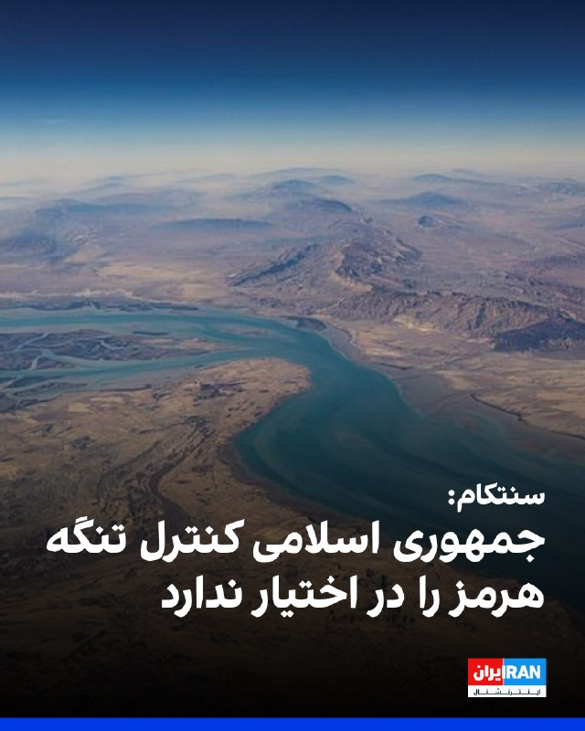

خبرگزاری رویترز به نقل از سخنگوی فرماندهی مرکزی ایالات متحده (سنتکام) گزارش داد که حکومت ایران کنترل تنگه هرمز را در اختیار ندارد.

سخنگوی سنتکام افزود که تردد در تنگه هرمز همچنان ادامه دارد و نیروهای آمریکایی برای اطمینان از تداوم این وضعیت، اوضاع را زیر نظر دارند.

پیشتر نیروی دریایی سپاه پاسداران در بیانیه‌ای با اشاره به حملات اسرائیل در لبنان و آن چه «نقض تعهدات امریکا در برقراری آتش‌بس» خواند، اعلام کرد که تنگه هرمز بر روی همه شناورها بسته شد.
https://iranintl.com/202606206807

## IranIntlTV — post 343418

  <a href="telegram/content/IranIntlTV_343418_1781975664.mp4" target="_blank">🎬 Download video</a>

تیتراول با نیوشا صارمی، شنبه ۳۰ خرداد
@iranintltv

## IranIntlTV — post 343417

  

شورای عالی امنیت ملی جمهوری اسلامی در دستورالعملی خطاب به رسانه‌ها اعلام کرد در پوشش اخبار و تحلیل‌ها از القای دوگانه «میدان و دیپلماسی» و روایت اختلاف میان این دو حوزه پرهیز شود.

در این دستورالعمل آمده با توجه به مسدود شدن مجدد تنگه هرمز در واکنش به آنچه «تداوم نقض آتش‌بس در لبنان» عنوان شده و هم‌زمانی آن با حضور هیات مذاکره‌کننده جمهوری اسلامی در سوئیس، رسانه‌ها نباید میان اقدامات میدانی و مسیر دیپلماسی تقابل ایجاد کنند.

شورای عالی امنیت ملی تاکید کرده جمهوری اسلامی در چارچوب یک راهبرد واحد، هم از ابزارهای بازدارندگی و قدرت میدانی برای وادار کردن طرف مقابل به اجرای تعهدات استفاده می‌کند و هم مسیر دیپلماسی را برای پیگیری حقوق خود دنبال می‌کند.

در این دستورالعمل آمده است اقدامات میدانی «جایگزین دیپلماسی نیست» بلکه پشتوانه آن محسوب می‌شود و مذاکرات نیز «نشانه عقب‌نشینی» نیست، بلکه ابزاری برای تبدیل دستاوردهای قدرت ملی به نتایج سیاسی و حقوقی پایدار است.

این نهاد از رسانه‌ها خواسته از هرگونه روایت مبتنی بر تعارض میان میدان و دیپلماسی خودداری کرده و بر مکمل بودن این دو حوزه تاکید کنند.
https://iranintl.c

## IranIntlTV — post 343416

  <a href="telegram/content/IranIntlTV_343416_1781975666.mp4" target="_blank">🎬 Download video</a>

🔻تصاویر رسیده به ایران اینترنشنال نشان می‌دهد گروهی از ایرانیان مقیم آمریکا بامداد امروز به فراخوان شاهزاده رضا پهلوی با پرچم شیر و خورشید و تصویری از مجیدرضا رهنورد به تماشای بازی ترکیه - پاراگوئه در استادیوم سان فرانسیسکو رفتند.

@iranintltvsport

## IranIntlTV — post 343415

  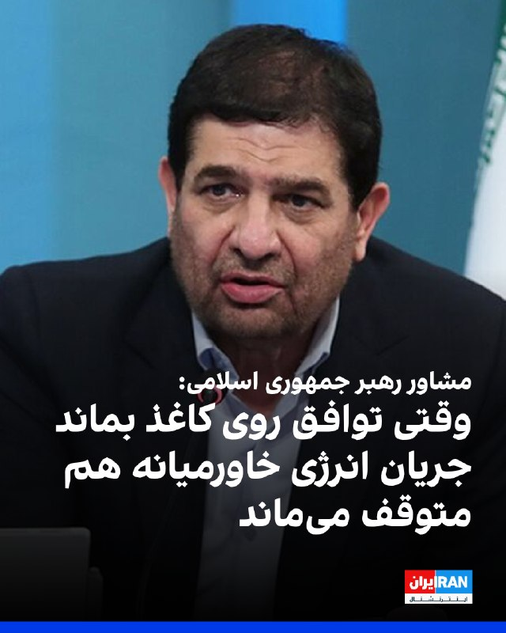

محمد مخبر، مشاور و دستیار رهبر جمهوری اسلامی، در شبکه اجتماعی ایکس نوشت: «آمریکایی‌ها زبان اقتصاد و هزینه-فایده را بهتر می‌فهمند. وقتی توافق روی کاغذ بماند، جریان انرژی خاورمیانه هم متوقف می‌ماند.»

او افزود: «مذاکره‌کنندگان ما جز با اجرای کامل تعهدات و استیفای حقوق ملت راضی نمی‌شوند.»
https://iranintl.com/202606201820

## IranIntlTV — post 343414

  <a href="telegram/content/IranIntlTV_343414_1781975669.mp4" target="_blank">🎬 Download video</a>

یک شهروند با ارسال ویدیویی به ایران اینترنشنال از قیمت بالای خرید خود گلایه می‌کند.

## IranIntlTV — post 343413

  <a href="telegram/content/IranIntlTV_343413_1781975671.mp4" target="_blank">🎬 Download video</a>

🔻با وجود گلایه‌مندی مدیران فدراسیون و سرمربی تیم ملی فوتبال از دولت آمریکا بابت محدودیت های حضور در آمریکا، فیفا فدراسیون فوتبال را از تمامی مقررات آگاه کرده بود.

🔹توضیحات رضا محدث و علیرضا مدیری، خبرنگاران ایران اینترنشنال در آمریکا

@iranintltvsport

## IranIntlTV — post 343412

  

علی خضریان، عضو کمیسیون امنیت ملی مجلس، گفت نهاد معاونت راهبردی ریاست‌جمهوری در سندی با عنوان «جنبش خیابانی حفاظت از ایران» تجمعات مردمی را عامل انسداد در دیپلماسی معرفی کرده است.

خضریان گفت که در این سند از حضور مردم در خیابان‌ها با عنوان «مناسک هیجانی» یاد شده و این نگاه با دیدگاه مجتبی خامنه‌ای درباره نقش و نظارت مردم تفاوت دارد.
https://iranintl.com/202606200697

## Shin_Persian — post 7143

Emanuel (Mannie) Fabian ✓ @manniefabian
Sat, 20 Jun 2026 15:50:04 UTC

Prime Minister Benjamin Netanyahu stresses that Israel will remain in southern Lebanon "for as long as necessary to defend its northern border," a "senior official" says in a statement sent to reporters by the Prime Minister's Office.

The "official" says that Netanyahu "instructed the IDF to respond forcefully to any Hezbollah attack and to act to remove threats against our forces."

"In response to Hezbollah's attacks over the past two days, the IDF struck 300 terror targets and eliminated approximately 100 terrorists," the statement says.

The official warns that "if Hezbollah attacks us again, we will strike it forcefully once more."

ترجمه خودکار فارسی

یک «مقام ارشد» در بیانیه‌ای که توسط دفتر نخست‌وزیری برای خبرنگاران ارسال شد، می‌گوید بنیامین نتانیاهو، نخست‌وزیر، تأکید کرد که اسرائیل در جنوب لبنان «تا زمانی که برای دفاع از مرزهای شمالی‌اش لازم باشد»، باقی خواهد ماند.

این «مقام» می‌گوید که نتانیاهو به ارتش دفاعی اسرائیل (IDF) دستور داده است که «به هرگونه حمله حزب‌الله با قدرت پاسخ دهد و برای رفع تهدیدات علیه نیروهای ما اقدام کند.»

در این بیانیه آمده است: «در پاسخ به حملات حزب‌الله در دو روز گذشته، ارتش دفاعی اسرائیل به ۳۰۰ هدف تروریستی حمله کرد و حدود ۱۰۰ تروریست را از پای درآورد.»

این مقام هشدار می‌دهد که «اگر حزب‌الله دوباره به ما حمله کند، ما بار دیگر با قدرت به آن ضربه خواهیم زد.»

𝕏 · @shin_persian

## Shin_Persian — post 7142

  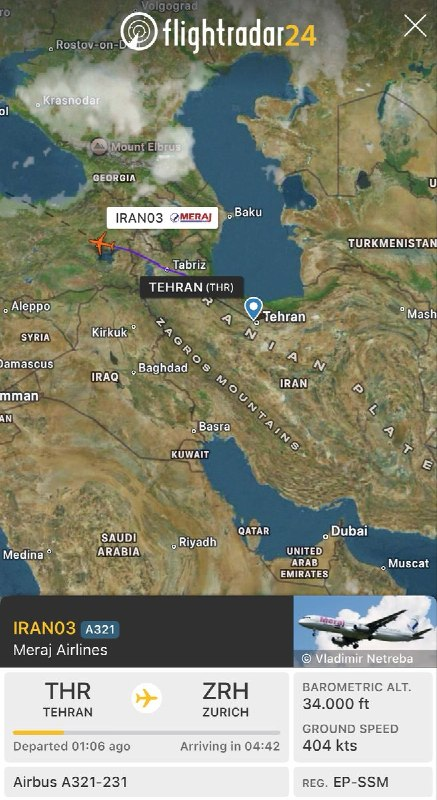

Shin ✓ @hey_itsmyturn
Sat, 20 Jun 2026 15:47:57 UTC

Islamic Regime’s FM is en route to Zurich, Switzerland 🇨🇭
EP-SSM | C/S Iran03

ترجمه خودکار فارسی

وزیر امور خارجه رژیم اسلامی در راه زوریخ، سوئیس است 🇨🇭
EP-SSM | C/S Iran03

𝕏 · @shin_persian

## Iliaen — post 4504

داستان بسته و باز شدن تنگه هرمز به زبان ساده:

حزب‌الله لبنان بزرگترین نیروی نیابتی سازماندهی شده جمهوری اسلامی برای عملیات برون‌مرزی سپاه است و در جریان جنگ اخیر بارها تبدیل به سپربلا شد.

به همین علت جمهوری اسلامی مجبور است برای حفظ این نیروی نیابتی کارآمد، در عمل نیز نشان دهد کنار آن‌ها ایستاده تا اگر مذاکرات خلاف انتظار پیش رفت، بتواند به پشتوانه‌ حزب الله، عملیات را به صورت همزمان در چند جبهه ادامه داد.

اما در سمت دیگر حزب‌الله می‌داند جمهوری اسلامی بعد از علی خامنه‌ای، اگر به سمت توافق با آمریکا حرکت کند دیگر چتر حمایتی خود را بر لبنان نگه نخواهد داشت و این به معنای پایان پایان کار حزب‌الله نیز خواهد بود.

در نتیجه حزب‌الله به سمت اسرائیل شلیک می‌کند تا اسرائیل مجبور به پاسخ شود و جمهوری اسلامی با توجه به همان بند نخست تفاهم‌نامه، مجبور باشد اقدامات ثانویه مانند بستن تنگه هرمز را اجرا کند و اینگونه است که مدام شاهد یک چرخه‌ی بی‌انتها از آتش‌بس و نقض آتش‌بس هستیم.

نکته‌ی جالب در این معادله سیاسی، اینجاست که هیچکس علاقه‌ای به انجام این توافق ندارد، حزب‌الله به یک علت، اسرائیل هم به علت دیگر، حتی در میان مخالفان و موافقان جمهوری اسلامی هم شاهد این عدم تمایل هستیم.

@iliaen

## FarsiVOA — post 221345

غنایی‌ها تورنتو را زردپوش کردند - برشی از «کامبک»، ویژه‌برنامه جام جهانی ۲۰۲۶، از صدای آمریکا

## FarsiVOA — post 221344

آغاز مذاکرات سوئیس در روزهای آینده زیر سایه تنش‌های منطقه‌ای؛ سرنوشت توافق در هاله‌ای از ابهام

## FarsiVOA — post 221343

🔺یورش شبانه نیروهای حکومتی به محله «کوت‌عبدالله» اهواز؛ ۲۹ شهروند معترض بازداشت شدند

▪️ نیروهای حکومت جمهوری اسلامی در ادامه تشدید فشارهای امنیتی در خوزستان پس از اعتراضات سراسری ۱۴۰۴، با یورش شبانه و هم‌زمان به منازل ساکنان منطقه کوت عبدالله اهواز، دست‌کم ۲۹ شهروند اهل سنت این منطقه را بازداشت و به مکان‌های نامعلوم منتقل کردند.

⬇️ بیشتر بخوانید:
https://ir.voanews.com/a/iran-arrest-protest-ahwaz-khuzestan-prison/8162963.html/?nocach=1

## FarsiVOA — post 221342

حال‌وهوای فوتبالی در گوشه‌ و کنار شهر تورنتو - برشی از «کامبک»، ویژه‌برنامه جام جهانی ۲۰۲۶، از صدای آمریکا

## FarsiVOA — post 221341

بنا بر گزارش‌ها تجمع هواداران سازمان مجاهدین خلق در پاریس، روز شنبه ۳۰ خرداد با مداخله پلیس فرانسه به خشونت کشیده شد.

## FarsiVOA — post 221340

  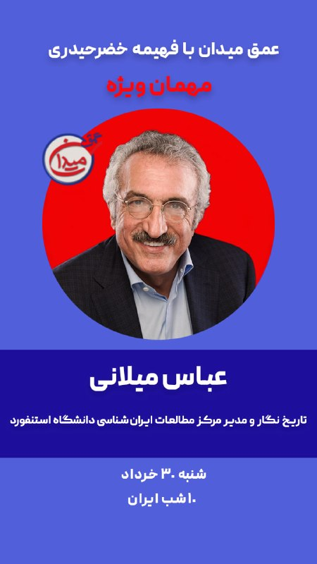

عباس میلانی، تاریخ‌نگار و مدیر مرکز مطالعات ایران‌شناسی دانشگاه استنفورد، این هفته در «عمق میدان» مهمان فهیمه خضر حیدری است. شنبه ۳۰ خرداد، ساعت ۱۰ شبِ ایران از تلویزیون صدای آمریکا.

## FarsiVOA — post 221338

  <a href="telegram/content/FarsiVOA_221338_1781975674.mp4" target="_blank">🎬 Download video</a>

ناسا با انتشار این ویدیو اعلام کرد توپ رسمی جام جهانی فوتبال ۲۰۲۶ به فضا رفته است.

این سازمان می‌گوید این اقدام با هدف الهام‌بخشی به نسل آینده و نشان دادن نقش اکتشافات فضایی در نوآوری‌های علمی، ورزشی و زندگی روزمره انجام شده است.

@FarsiVOA

## FarsiVOA — post 221337

منابع حقوق بشری از بازداشت ۲۹ شهروند عرب ایرانی اهل سنت در کوت‌عبدالله اهواز خبر دادند. جزئیات تازه‌ای نیز از کشتار مردم در منطقه قلعه چنعان منتشر شده است.

## FarsiVOA — post 221336

🔺تجمع هواداران سازمان مجاهدین خلق در پاریس

▪️بنا بر گزارش‌ها تجمع هواداران سازمان مجاهدین خلق در پاریس، روز شنبه ۳۰ خرداد با مداخله پلیس فرانسه به خشونت کشیده شد.

⬇️ بیشتر بخوانید:
https://ir.voanews.com/a/iran-mek-mojahedin-protest-paris/8162961.html/?nocach=1

## FarsiVOA — post 221335

لیلی مهدوی، مادر دادخواه سیاوش محمودی، با انتشار این ویدیو و متنی در اینستاگرام خود نوشت خانواده‌های جان‌باختگان از اندوهی که بر آن‌ها گذشته ریشه دوانده‌اند، اما صدای دادخواهی خاموش نخواهد شد.

او در بخشی از این متن تاکید کرد که خانواده‌ها خواهان عدالت و روشن شدن حقیقت هستند.

@FarsiVOA

## DW_Farsi — post 126246

  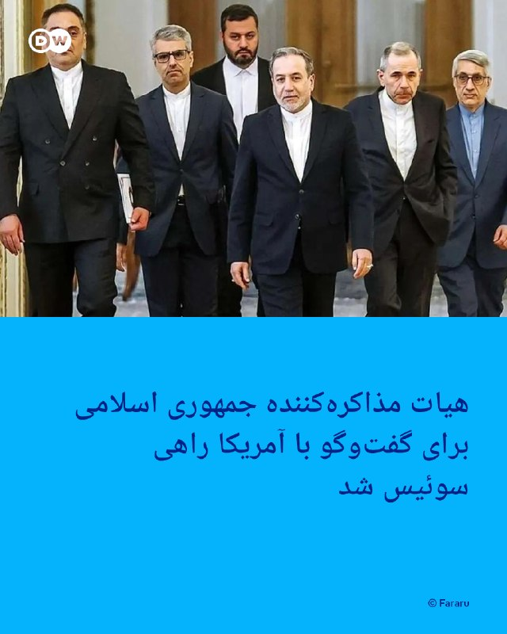

🔶هیات مذاکره‌کننده جمهوری اسلامی برای گفت‌وگو با آمریکا راهی سوئیس شد

رسانه‌های دولتی ایران گزارش دادند که هیات مذاکره‌کننده جمهوری اسلامی برای گفت‌وگو با آمریکا درباره اجرای تفاهم‌نامه پایان جنگ، عازم سوئیس شده است.

بر اساس این گزارش‌ها، محمدباقر قالیباف، رئیس مجلس شورای اسلامی و عباس عراقچی، وزیر امور خارجه در راس این هیات قرار دارند و عبدالناصر همتی، کاظم غریب‌آبادی، اسماعیل بقایی و حمید بورد نیز از دیگر اعضای هیات ایرانی هستند.

در همین زمینه خبرگزاری فارس، وابسته به سپاه پاسداران به نقل از منبعی نزدیک به تیم مذاکره‌کننده گزارش داده است که علی باقری کنی، معاون دبیر شورای‌ عالی امنیت ملی نیز در این سفر حضور دارد.

اسماعیل بقایی، سخنگوی وزارت خارجه ایران، هدف این سفر را "پیگیری اجرای تعهدات طرف مقابل" خوانده و تاکید کرده است که این مذاکرات به معنای آغاز دور تازه‌ای از گفت‌وگوها نیست.

@dw_farsi

## DW_Farsi — post 126245

  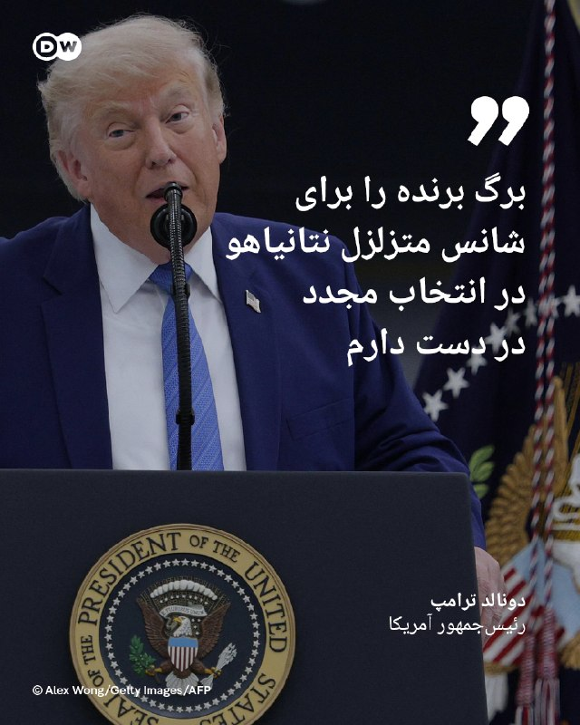

🔶ترامپ: برگ برنده را برای شانس متزلزل نتانیاهو در انتخاب مجدد در دست دارم

دونالد ترامپ، رئیس‌جمهور آمریکا، مقاله‌ای را در شبکه اجتماعی خود، تروث سوشال بازنشر کرد که در آن آمده است او "برگ‌های برنده" را در سرنوشت سیاسی بنیامین نتانیاهو، نخست‌وزیر اسرائیل، در اختیار دارد.

عنوان این مقاله به این موضوع پرداخته که ترامپ تعیین‌کننده "شانس متزلزل نتانیاهو" برای انتخاب مجدد است.

رئیس‌جمهور آمریکا این مقاله را بدون هیچ توضیحی منتشر کرده، اما این اقدام در شرایطی صورت می‌گیرد که گمانه‌زنی‌ها درباره اختلاف‌ نظرات واشنگتن و تل‌آویو بر سر نحوه مدیریت جنگ‌های منطقه‌ای افزایش یافته است.

@dw_farsi

## DW_Farsi — post 126244

🔶مخالفت مکرون با ایجاد مراکز اخراج پناهجویان در خارج از اروپا

همزمان با اجرای پیمان جدید مهاجرت و پناهندگی اتحادیه اروپا از ۱۲ ژوئن ۲۰۲۶، امانوئل مکرون، رئیس‌‌جمهور فرانسه، با ایجاد مراکزی در کشورهای خارج از اتحادیه اروپا برای انتقال پناهجویانی که درخواستشان رد شده است، مخالفت کرد؛ طرحی که آلمان و برخی دیگر از کشورهای عضو از آن حمایت می‌کنند.

او در این‌باره گفت: «در مورد فرانسه، پاسخ ما به مراکز بازگرداندن منفی است، زیرا فکر نمی‌کنم که این مراکز کارآمد باشند و باور ندارم این طرح با اصول ما سازگار باشد.»

پیمان جدید مهاجرت و پناهندگی اتحادیه اروپا که در سال ۲۰۲۴ تصویب شده بود، با هدف کنترل موثرتر مرزهای خارجی، تسریع رسیدگی به درخواست‌های پناهندگی و موثرتر کردن روند بازگرداندن افرادی که اجازه اقامت دریافت نمی‌کنند، به اجرا درآمده است.

@dw_farsi

## Persian_Trend_Official — post 17694

ارتش اسرائیل می‌گوید که به عملیات خود در منطقه امنیتی تعیین‌ شده در جنوب لبنان، از جمله در اطراف یک مجتمع تونلی بزرگ حزب‌الله که گمان می‌رود ده‌ها عملیات در آن انجام می‌شود، ادامه می‌دهد و حملات در سایر نقاط کشور را به حالت تعلیق درآورده است.

به گفته ارتش اسرائیل، پس از حملات هوایی گسترده علیه مواضع حزب‌الله در پاسخ به حملات به سربازان اسرائیلی، از رهبری سیاسی اسرائیل دستور توقف آتش‌افروزی دریافت کرده است.

ارتش می‌گوید با این وجود، به تلاش‌های خود برای از بین بردن زیرساخت‌های حزب‌الله در داخل منطقه امنیتی، از جمله در منطقه کوه علی طاهر، ادامه خواهد داد و علیه هرگونه تهدید فوری فراتر از آن اقدام خواهد کرد.

ارتش اسرائیل ارزیابی می‌کند که حزب‌الله یک تأسیسات زیرزمینی قابل توجه در زیر کوه علی طاهر در نزدیکی نبطیه دارد و آن را به عنوان مرکز فرماندهی مرکزی شاخه منطقه‌ای بدر حزب‌الله توصیف می‌کند.

مقامات نظامی می‌گویند که ده‌ها عملیات حزب‌الله همچنان در داخل شبکه زیرزمینی ادامه دارد و درگیری‌ها در روزهای اخیر هم در بالا و هم در زیر زمین در جریان است.

رشته کوه علی طاهر در اصل بخشی از منطقه امنیتی ارتش نبود. با این حال، روز پنجشنبه، ارتش اسرائیل نقشه به‌روز شده‌ای از منطقه دفاعی مقدم خود منتشر کرد و آن را گسترش داد تا علی طاهر و همچنین بخش مجدل زون را نیز شامل شود.

📝 Amir

📌 @persian_trend_official
پرشین ترند | متفاوت‌ترین کانال نظامی

## Persian_Trend_Official — post 17693

  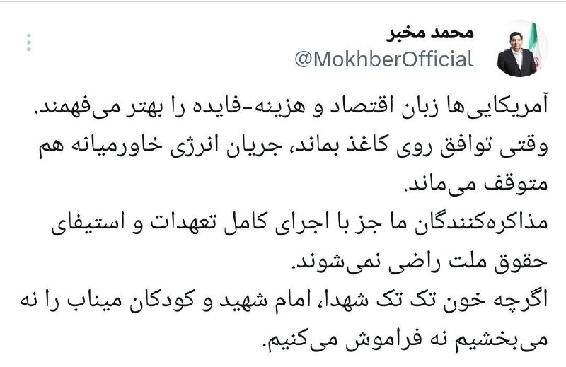

مخبر، مشاور رهبر جمهور اسلامی: وقتی توافق روی کاغذ بماند، جریان انرژی خاورمیانه هم متوقف می‌ماند.

📝 Amir

📌 @persian_trend_official
پرشین ترند | متفاوت‌ترین کانال نظامی

## Persian_Trend_Official — post 17692

  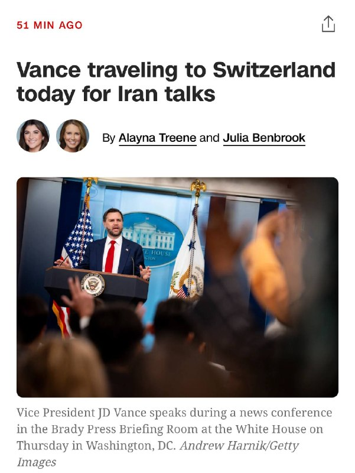

به گزارش CNN به نقل از یک مقام آمریکایی، انتظار می‌رود جی‌دی ونس، معاون رئیس‌جمهور، امروز برای مذاکرات با ایران به سوئیس سفر کند.

📝 Amir

📌 @persian_trend_official
پرشین ترند | متفاوت‌ترین کانال نظامی

## RadioFarda — post 158553

  <a href="https://t.me/radiofarda/158553" target="_blank">📎 Download file</a>

📻بشنوید: ایستگاه ۱۹ با رادیوفردا، ۳۰ خرداد ۱۴۰۵

@RadioFarda

## RadioFarda — post 158552

🔸بیش از یک هزار دانشجو و فارغ‌التحصیل دانشگاه صنعتی شریف، در نامه‌ای سرگشاده به رئیس این دانشگاه، به «تشدید فضای امنیتی» در دانشگاه اعتراض کردند و خواستار استعفای او در صورت ناتوانی در دفاع از دانشجویان و دانشگاه شدند. 🔸انجمن اسلامی دانشجویان دانشگاه صنعتی…

## RadioFarda — post 158551

  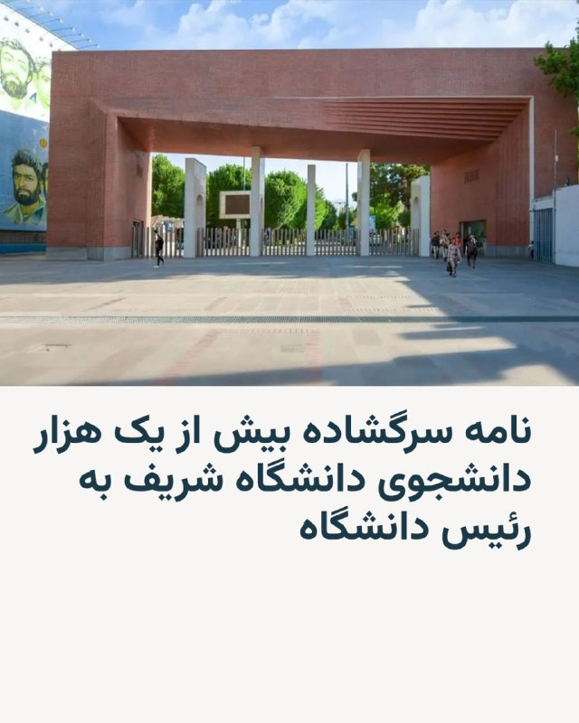

🔸بیش از یک هزار دانشجو و فارغ‌التحصیل دانشگاه صنعتی شریف، در نامه‌ای سرگشاده به رئیس این دانشگاه، به «تشدید فضای امنیتی» در دانشگاه اعتراض کردند و خواستار استعفای او در صورت ناتوانی در دفاع از دانشجویان و دانشگاه شدند.

🔸انجمن اسلامی دانشجویان دانشگاه صنعتی شریف روز شنبه ۳۰ خرداد اعلام کرد بیش از هزار نفر این نامه خطاب به محمدرضا تجریشی، رئیس دانشگاه، را امضا کرده‌اند. این نامه یک روز پس از انتشار خبر صدور احکام اخراج برای چندین دانشجوی دانشگاه شریف منتشر شده است.

🔸در این نامه آمده است که در ماه‌های اخیر دست‌کم ۳۰ پرونده در کمیتهٔ انضباطی برای دانشجویان تشکیل شده، ۱۳ دانشجو با احکام بدوی تعلیق و اخراج روبه‌رو شده‌اند و احکام سه نفر از آنان نیز در کمیتهٔ تجدیدنظر تأیید شده است.

🔸امضاکنندگان نامه نوشته‌اند که آن‌چه در دانشگاه می‌گذرد، نشان‌دهندهٔ استمرار «روندی نگران‌کننده» است که بدون واکنش مؤثر مدیریت دانشگاه هر روز ابعاد گسترده‌تری پیدا می‌کند.

@RadioFarda

## RadioFarda — post 158550

🔸عکسی از مراسم تشییع دانش‌آموزان کشته‌شده در حمله به یک مدرسه در میناب، برنده مدال طلای بخش عکس خبری جشنواره بین‌المللی عکاسی «گلدن شات ۲۰۲۶» شد. 🔸مرتضی آخوندی، عکاس هرمزگانی، این جایزه را برای عکس هوایی خود از ردیف قبرهای دانش‌آموزان مدرسه «شجره طیبه» میناب…

## RadioFarda — post 158549

  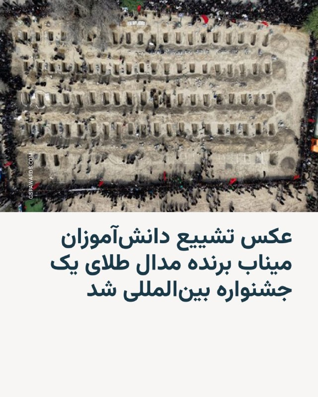

🔸عکسی از مراسم تشییع دانش‌آموزان کشته‌شده در حمله به یک مدرسه در میناب، برنده مدال طلای بخش عکس خبری جشنواره بین‌المللی عکاسی «گلدن شات ۲۰۲۶» شد.

🔸مرتضی آخوندی، عکاس هرمزگانی، این جایزه را برای عکس هوایی خود از ردیف قبرهای دانش‌آموزان مدرسه «شجره طیبه» میناب دریافت کرده است.

🔸او این عکس را با عنوان «میناب؛ ۱۶۸ دانش‌آموز» در این رقابت‌ها شرکت داده و در توضیح آن نوشته است: «آرامگاه کودکانی که تنها "گناه" آن‌ها بچگی‌شان بود؛ بی‌گناهانی که خاموششان کردند و تاریخ هرگز این جنایت را فراموش نخواهد کرد.»

🔸برگزارکنندگان جشنواره اعلام کرده‌اند مدال طلای گلدن شات به آثار برگزیده‌ای تعلق می‌گیرد که بالاترین سطح خلاقیت، کیفیت فنی و بیان هنری را به نمایش گذاشته باشند.

@RadioFarda

## RadioFarda — post 158548

  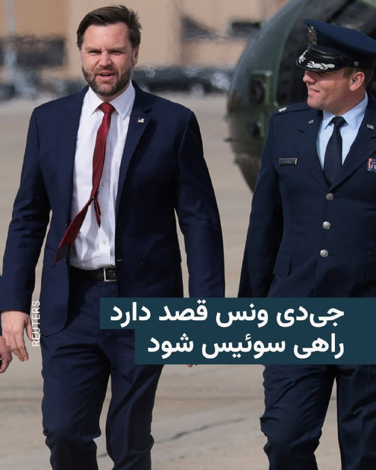

🔸خبرنگار رادیو اروپای آزاد/رادیو آزادی در زوریخ مطلع شد که جی‌دی ونس، معاون رئیس‌جمهور آمریکا، همچنان قصد دارد روز یکشنبه به زوریخ سفر کند.

🔸ونس امروز به فاکس‌نیوز گفته بود احتمالاً این یکی دو روز عازم سوئیس خواهد شد.

🔸ساعتی پیش هیئت مذاکره‌کنندهٔ جمهوری اسلامی به ریاست محمدباقر قالیباف و با حضور عباس عراقچی عازم زوریخ شد.

🔸بر اساس گزارش‌های قبلی، استیو ویتکاف نیز راهی سوئیس شده تا به جرد کوشنر و تیم آمریکایی طرف مذاکره بپیوندد.

🔸در پی امضای «تفاهم‌نامه اسلام‌آباد» بین ایران و آمریکا، قرار است مذاکرات فنی برای رسیدن به توافق نهایی ذیل مفاد این تفاهم‌نامه با میزبانی سوئیس و با میانجی‌گری قطر از روز یکشنبه ۳۱ خرداد آغاز شود.

@RadioFarda

## IranianMinds — post 23021

🔴 نتانیاهو و کاتز به ارتش اسرائیل دستور توقف حمله در لبنان صادر کردن.

البته با وجود اعلام آتش‌بس، ارتش اسرائیل اعلام کرد از مناطق تحت کنترل خود عقب‌نشینی نخواهد کرد.

@IranianMinds

## IranianMinds — post 23020

  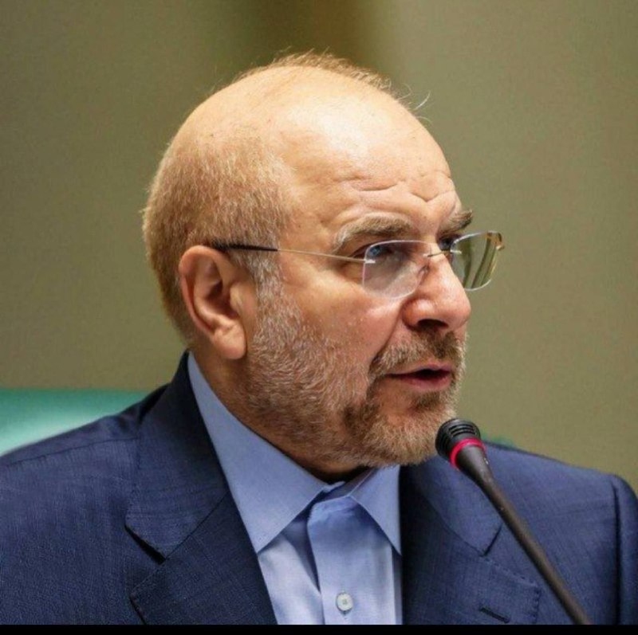

🔴 خبرگزاری فارس :

قالیباف مجلسو تعطیل کرده انگار اصلا نمیخواد بازش کنه چون بخاطر توافق همه ی نماینده ها میخوان ازش شکایت کنن

@IranianMinds

## IranianMinds — post 23019

🟢 در تورنومنت 2.5 میلیاردی رومابت شرکت کنید ، فقط کافیست شرط های جام جهانی را در رومابت ثبت کنید 
👇
👇

🇪🇺 https://trentivo6402.bar

## IranianMinds — post 23018

  

🔥 تورنومنت ۲.۵ میلیارد تومانی رومابت آغاز شد! 🔥

مسابقات جام جهانی 2026 را در رومابت پیش‌بینی کنید، امتیاز جمع کنید و برای سهمی از جایزه بزرگ ۲.۵ #میلیارد تومانی رقابت کنید 😍🏆

هر پیش‌بینی ، شما را یک قدم به صدر جدول و جوایز ویژه نزدیک‌تر می‌کند 🚀

⏳ فرصت را از دست ندهید ؛ هیجان واقعی جام جهانی را با رومابت تجربه کنید!
#میلیاردی
🆔 @RomaBet_official
┅━━━━━━━━━━━┅
🔰 لینک سایت جهت ورود eg30:
🌐 RomaBet.tournament

## IranianMinds — post 23017

  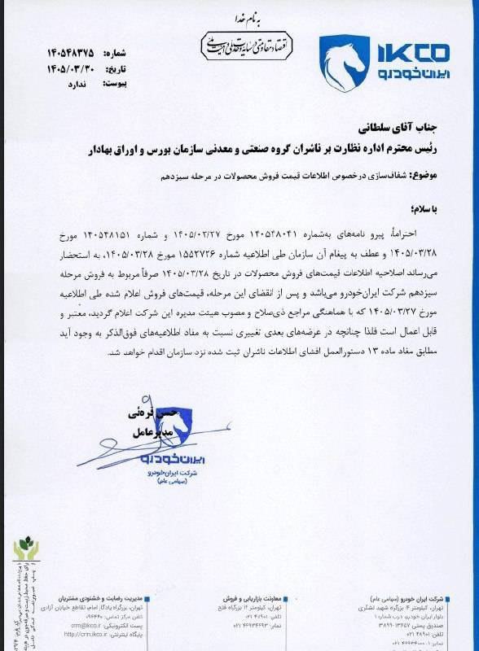

🔴 ایران خودرو اعلام کرد بازم قیمت خودروهاشو افزایش میده.

@IranianMinds

## IranianMinds — post 23016

  

عراقچی در راه سوئیس

@IranianMinds

## BBCPersian — post 284509

🔺ادامه جنجال ترامپ و ملونی بر سر یک عکس

دونالد ترامپ، رئیس‌جمهور آمریکا، بار دیگر از جورجا ملونی، نخست‌وزیر ایتالیا، انتقاد کرد و ادعای خود را تکرار کرد که خانم ملونی در جریان نشست گروه هفت که اخیرا برگزار شد، «بارها و بارها» خواستار گرفتن عکس مشترک با وی شده بود.

آقای ترامپ در پستی در شبکه اجتماعی خود، تروث سوشال، همچنین خانم ملونی را متهم کرد که از تلاش‌های آمریکا برای «جلوگیری از دستیابی یا توسعه سلاح هسته‌ای توسط ایران» حمایت نکرده است.

https://bbc.in/4oChZfI
@BBCPersian

## BBCPersian — post 284508

  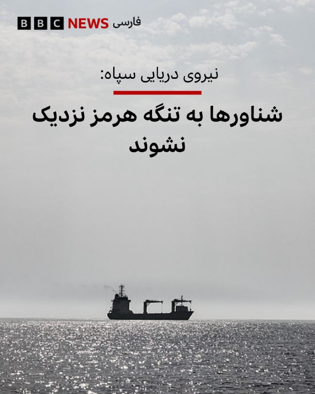

🔻روابط عمومی نیروی دریایی سپاه پاسداران در اطلاعیه‌ای اعلام کرده است که «شناورها به تنگه هرمز نزدیک نشوند.»

در اطلاعیه‌ای که رسانه‌های ایران آن را منتشر کرده‌اند آمده است که «تنگه هرمز بسته است و شناورها به تنگه هرمز نزدیک نشوند؛ در غیر این صورت امنیت آنها به مخاطره خواهد افتاد.»

ساعاتی قبل قرارگاه خاتم‌الانبیا در اطلاعیه‌ای اعلام کرد که تنگۀ هرمز به روی شناورها «بسته خواهد شد.»

دلیل این اقدام «بدعهدی‌ و پیمان‌شکنی آشکار» آمریکا در اجرای بند اول تفاهم‌نامه پایان جنگ اعلام شد.

در بند اول تفاهم‌نامه ایران و آمریکا آمده است که آمریکا، ایران و متحدان آنها «پایان فوری و دائمی» عملیات نظامی در «همه جبهه ها» از جمله لبنان را اعلام خواهند کرد.

📸GettyImages

https://bbc.in/3Qz039d
@BBCPers

## BBCPersian — post 284507

  <a href="https://t.me/bbcpersian/284507" target="_blank">📎 Download file</a>

🔻جام ۲۶ - قسمت چهارم - از شرایط تیم ملی تا عملکرد تیمهای آسیایی

تیم ملی ایران پس از تساوی ۲–۲ مقابل نیوزیلند، با یک امتیاز در گروه G هنوز برای صعود به مرحله حذفی شانس دارد.

دیدار حساس برابر بلژیک می‌تواند مسیر ایران را در این جام مشخص کند.

در میان نمایندگان آسیا، عملکردها متفاوت بوده است.

کره جنوبی با پیروزی مقابل چک و سپس شکست برابر مکزیک تا اینجا سه امتیاز کسب کرده و همچنان مدعی صعود از گروه A است.

عربستان سعودی نیز با تساوی برابر اروگوئه شروع امیدوارکننده‌ای داشت.

در مقابل، قطر هر دو بازی خود را واگذار کرد. عراق نیز مقابل نروژ باخت و دو بازی بسیار دشوار پیش رو دارد. خبرنگاران ما سام فرزانه و پوریا ژافره نگاهی کردند به عملکرد تیمها تا اینجا.

@BBCPersian

## BBCPersian — post 284506

🔺روز جهانی پناهندگان؛ سازمان ملل متحد: بازگشت به خانه برای خانواده‌های مهاجر شروع یک مبارزه‌ جدید است

دفتر هماهنگی کمک‌های بشردوستانه ملل متحد در افغانستان، اوچا، می‌گوید که بازگشت به خانه برای شمار زیادی از خانواده‌ها، آغاز یک مبارزه جدید است. این سازمان در بیانیه‌ای به مناسبت ۲۰ ژوئن روز جهانی پناهنده، گفته است که از سال ۲۰۲۳ تاکنون بیش از ۶ میلیون مهاجر افغان به کشورشان بازگشته‌اند.

این بیانیه می‌افزاید که بسیاری از آنان به جوامعی پیوسته‌اند که تحت فشار قرار دارند و بسایری از آنان از دسترسی به خدمات محروم‌ هستند.

📲ادامه مطلب را در لینک زیر بخوانید⬇️

https://bbc.in/44rp1ut
@BBCPersian

## BBCPersian — post 284505

مادر صهبا رشتیان، دختر ۲۳ ساله‌ای که در اعتراضات ۱۹ دی در اصفهان کشته شد، در روز تولد دخترش گفت: «قلب آن‌هایی که قلب ما را سوزاندند بسوزد.»

در روز تولد صهبا رشتیان که جمعه ۲۹ خرداد در باغ رضوان اصفهان برگزار شد، خانواده‌های دادخواه دیگر هم حضور داشتند.

به گفته منبع آگاه، سهبا رشتیان در ۱۹ دی در حالی که با مادر و خواهرش در نزدیکی محل زندگیشان ایستاده بود به ضرب گلوله ماموران به پهلویش کشته شد.
صهبا کمک داور فوتبال بود و آرزو داشت روزى در مسابقات جام جهانى فوتبال داورى کند.
مادر او گفت: «دختر من دیگر همیشه ۲۳ ساله می‌ماند.»

@BBCPersian

## BBCPersian — post 284504

  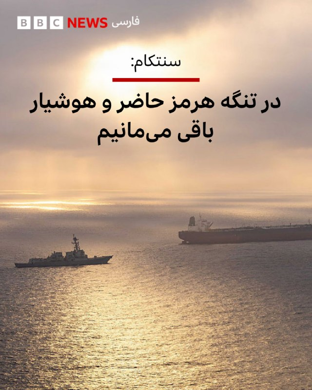

🔺در پی اعلام بسته شدن تنگه هرمز توسط سپاه پاسداران، ارتش آمریکا روز شنبه اعلام کرد که در تنگه هرمز «حاضر و هوشیار» باقی می‌ماند.

فرماندهی مرکزی ایالات متحده، سنتکام، در بیانیه‌ای اعلام کرد: «نیروهای آمریکایی همچنان(در تنگه هرمز) حضور دارند و هوشیار هستند تا اطمینان حاصل کنند که تمام ابعاد توافق با ایران رعایت و با قدرت و اثربخشی کامل اجرا می‌شود.»

ساعاتی پیش سپاه پاسداران اعلام کرد که در واکنش به آنچه «نقض بی‌وقفه و مستمر آتش‌بس» توسط اسرائیل خوانده، تنگه هرمز را بسته است.

نیروی دریایی سپاه پاسداران از شناورها خواسته است که به تنگه هرمز نزدیک نشوند.

📸U.S. Navy via Getty Images

https://bbc.in/3QqTaXH
@BBCPersian

## BBCPersian — post 284503

  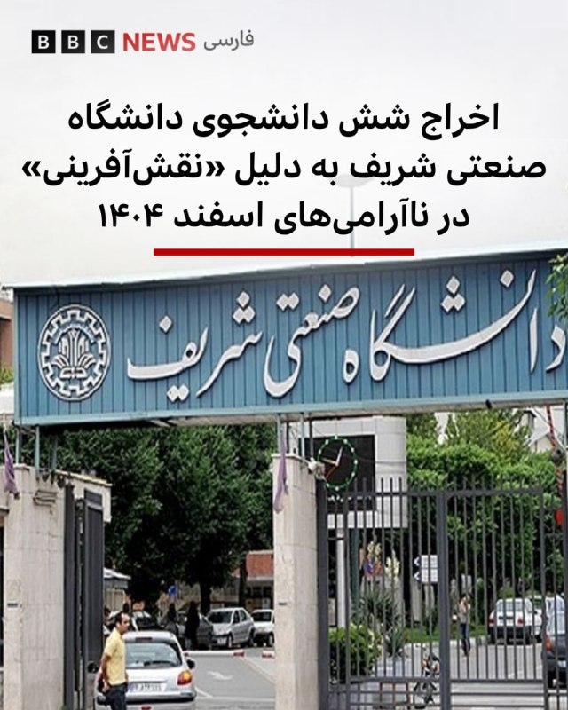

🔻کمیته انضباطی دانشگاه صنعتی شریف برای شش دانشجوی خود به دلیل «نقش‌آفرینی در ناآرامی‌های اسفندماه، برگزاری و هدایت تجمعات غیرقانونی، هتاکی و فعالیت علیه نظام» حکم اخراج از دانشگاه صادر کرده است.

رسانه‌های ایران نام‌های سپنتا سعیدی، حسین شادمان، مسیحا باقری، فاطمه خاکپور، فریبرز کهن‌زاد و پرنیان خدابخشی را در فهرست این دانشجویان منتشر کرده‌اند.

به گفته کمیته انضباطی دانشگاه شریف، این احکام بدوی بوده و به صورت جداگانه صادر شده است.

برخی از این احکام علاوه بر اخراج از دانشگاه، شامل محرومیت چندساله از ادامه تحصیل نیز می‌شود.

📸ISNA

https://bbc.in/4xLPVuS
@BBCPersian

## Dirty_Kids — post 392681

‏با یه آقایی حرف میزدم
گفت سال ۸۰ زنم به بهانه مسافرت بچه ها رو برد کانادا و دیگه برنگشت،خیلی داغون شدم،مدتها منتظرشون بودم اما دیدم بالاخره باید به زندگی برگردم و ازدواج کردم
گفتم آخی خیلی متاثر شدم،چه سالی مجددا ازدواج کردین؟
گفت ۸۱:)))))))))))
مردها همیشه آدمو سورپرایز میکنن

@Dirty_Kids 👻

## Dirty_Kids — post 392680

  <a href="telegram/content/Dirty_Kids_392680_1781975687.mp4" target="_blank">🎬 Download video</a>

پخت و پز به سبک عمو مراد🤌🏻

@Dirty_Kids 👻

## Dirty_Kids — post 392679

  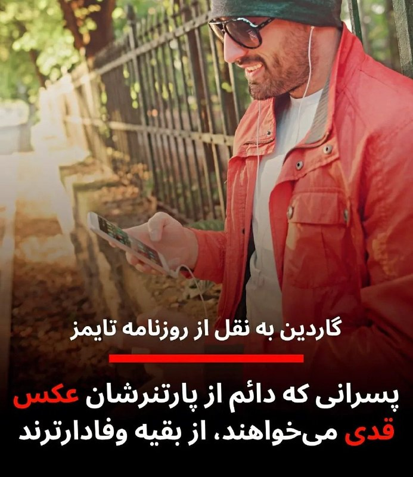

طبق تحقیقات جدید، پسرایی که دائم از پارتنرشون عکس قدی میخوان، وفادارترن.

دلیلشم اینه که به فکر پارتنرشون هستن و میخوان مطمئن بشن که از سر تا پاشون سالمه.

@Dirty_Kids 👻

## Dirty_Kids — post 392678

  <a href="telegram/content/Dirty_Kids_392678_1781975689.mp4" target="_blank">🎬 Download video</a>

بانو شهناز تهرانی هم به ستوه آمده 🤣🤣🤣

@Dirty_Kids 👻

## Dirty_Kids — post 392677

  <a href="telegram/content/Dirty_Kids_392677_1781975691.mp4" target="_blank">🎬 Download video</a>

عجب وضع کسشریه

@Dirty_Kids 👻

## Dirty_Kids — post 392676

  <a href="telegram/content/Dirty_Kids_392676_1781975693.mp4" target="_blank">🎬 Download video</a>

شیر دختر ❤️ ویدیو بعد گرفتنش قشنگ ۱۰۰۰ مرتبه عزیزترش کرد

@Dirty_Kids 👻

## Dirty_Kids — post 392675

⚡️ جام جهانی شروع شده و میدون مال توئه! 
🌟 این #جام_جهانی رو فقط باید توی #بت فیدو پیش‌بینی کنی 
💰 با ۵۰ میلیون تومان شرط روزانه ← ۴ میلیون تومان اعتبار شرط‌بندی رایگان 
📊 با ۱۰۰ میلیون تومان شرط روزانه ← ۸ میلیون تومان اعتبار شرط‌بندی رایگان میدونستی با انتخاب…

## Dirty_Kids — post 392674

  <a href="telegram/content/Dirty_Kids_392674_1781975695.webm" target="_blank">🎬 Download video</a>

⚡️ جام جهانی شروع شده و میدون مال توئه!

🌟 این #جام_جهانی رو فقط باید توی #بت فیدو پیش‌بینی کنی

💰 با ۵۰ میلیون تومان شرط روزانه ← ۴ میلیون تومان اعتبار شرط‌بندی رایگان

📊 با ۱۰۰ میلیون تومان شرط روزانه ← ۸ میلیون تومان اعتبار شرط‌بندی رایگان

میدونستی با انتخاب برد هلند مقابل سوئد با ده میلیون هفده میلیون تومن برنده میشی؟!
💖

💸 هرچی بزرگ‌تر بازی کنی، جایزت بزرگ‌تره!

🥅همین حالا پیش بینیتو ثبت کن
💖
https://fido874vt.click
https://fido874vt.click

👆
👆
👆
👆
👆
(ورود با وی-پی-ان غیر اروپایی)
❌
G30

📲کانال تلگرام 
👇
https://t.me/+dySI_QFj0T0xZGVk

## Hranews — post 113743

  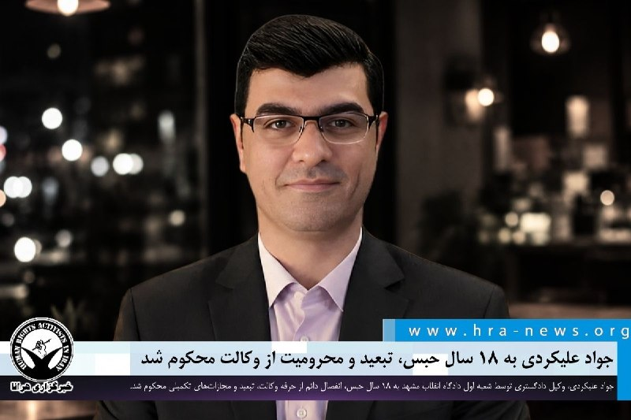

جواد علیکردی به ۱۸ سال حبس، تبعید و محرومیت دائم از وکالت محکوم شد

❗️
❗️
❗️
❗️
❗️ – جواد علیکردی، برادر خسرو علیکردی، وکیل دادگستری جانباخته، توسط شعبه اول دادگاه انقلاب مشهد به ۱۸ سال #حبس، انفصال دائم از حرفه وکالت، تبعید و مجازات‌های تکمیلی محکوم شد.

به گزارش خبرگزاری هرانا، ارگان خبری مجموعه فعالان حقوق بشر در ایران، جواد علیکردی، وکیل دادگستری محبوس در زندان وکیل آباد مشهد به حبس و مجازات‌های تکمیلی محکوم شد.

بر اساس حکمی که توسط شعبه اول دادگاه انقلاب مشهد صادر شده، این وکیل دادگستری از بابت اتهام اجتماع و تبانی برای اقدام علیه امنیت ملی به پنج سال حبس، از بابت اتهام فعالیت تبلیغی برخلاف امنیت ملی موضوع ماده ۴ قانون تشدید مجازات جاسوسی به ۱۳ سال حبس، انفصال دائم از حرفه وکالت، دو سال منع خروج از کشور و دو سال تبعید به شهر سراوان استان سیستان و بلوچستان محکوم شده است.

ادامه مطلب

#جواد_علیکردی

↘️
@hranews_bot تماس ✉️ -  @Hranews  کانال هرانا 🆑

## Hranews — post 113742

گزارشی از پلمب یک کافه‌رستوران در سیرجان در پی انتشار یک ویدیوی تبلیغاتی

❗️
❗️
❗️
❗️
❗️ – دادستان سیرجان از #پلمب یک کافه‌رستوران در این شهرستان در پی انتشار یک ویدیوی تبلیغاتی به دلایلی همچون «انتشار محتوای خلاف شئون اسلامی در فضای مجازی» و مواردی از «کشف حجاب»، خبر داد.

ادامه مطلب

↘️
@hranews_bot تماس ✉️ -  @Hranews  کانال هرانا 🆑

## alonews — post 129423

  <a href="telegram/content/alonews_129423_1781975695.webm" target="_blank">🎬 Download video</a>

👈کانال ۱۵ اسراییل: اسرائیل تلاش کرد مسیر لبنان را از مسیر ایران جدا کند اما شکست خورد.

✅ @AloNews خبر جنگ

## alonews — post 129422

  <a href="telegram/content/alonews_129422_1781975696.webm" target="_blank">🎬 Download video</a>

👈الحدث به نقل از یک منبع آگاه: نخست‌وزیر پاکستان و مارشال عاصم منیر فردا در مذاکرات سوئیس شرکت خواهند کرد.

✅ @AloNews خبر جنگ

## alonews — post 129421

  <a href="telegram/content/alonews_129421_1781975696.webm" target="_blank">🎬 Download video</a>

👈یدیعوت آحارانوت به نقل از منابع نظامی:
ارتش اسرائیل دستورالعمل آتش بس دریافت کرده است و نیروهایش از منطقه علی الطاهر عقب نشینی نخواهند کرد.

✅ @AloNews خبر جنگ

## alonews — post 129420

  <a href="telegram/content/alonews_129420_1781975696.webm" target="_blank">🎬 Download video</a>

👈 ترکیب هیئت اعزامی ایران به سوئیس به ریاست قالیباف

🔴محمدباقر قالیباف، رئیس مجلس شورای اسلامی و رئیس هیئت مذاکره کننده ایران

🔴سید عباس عراقچی، وزیر خارجه

🔴علی باقری کنی، معاون بین‌الملل دبیرخانه شورای‌عالی امنیت ملی

🔴عبدالناصر همتی، رئیس کل بانک مرکزی

🔴حمید بورد، معاون وزیر نفت و رئیس شرکت ملی نفت ایران

🔴کاظم غریب‌آبادی، معاون حقوقی و بین‌الملل وزیر خارجه

🔴اسماعیل بقائی، سخنگوی وزارت خارجه

✅ @AloNews خبر جنگ

## alonews — post 129417

  <a href="telegram/content/alonews_129417_1781975696.webm" target="_blank">🎬 Download video</a>

👈عجیب اما واقعی‼️

🔴فرود پراید در اراک روی پشت بام یک خانه!

✅ @AloNews خبر جنگ

## alonews — post 129416

  <a href="telegram/content/alonews_129416_1781975697.webm" target="_blank">🎬 Download video</a>

👈نوشته پشت موتور یک خانم: لطفا نزدیک نشید میترسم، تازه یاد گرفتم

✅ @AloNews خبر جنگ

## alonews — post 129415

  <a href="telegram/content/alonews_129415_1781975697.webm" target="_blank">🎬 Download video</a>

👈دیدار وزیر کشور پاکستان با مسعود پزشکیان

✅ @AloNews خبر جنگ

## alonews — post 129414

  <a href="telegram/content/alonews_129414_1781975697.webm" target="_blank">🎬 Download video</a>

👈بلومبرگ: عراق به میادین نفتی بزرگ دستور داده است که تولید خود را به بیش از ۳ میلیون بشکه در روز افزایش دهند، زیرا صادرات از طریق تنگه هرمز به تدریج پس از توافق آمریکا و ایران بهبود می‌یابد.

✅ @AloNews خبر جنگ

## alonews — post 129413

  <a href="telegram/content/alonews_129413_1781975697.mp4" target="_blank">🎬 Download video</a>

👈طالبان یه معلم زن رو به جرم آموزش آنلاین به دختران در ملاعام شلاق زد!

🔴 طبق باور طالبان، دختران و زنان حق تحصیل ندارند

✅ @AloNews خبر جنگ

## alonews — post 129412

  <a href="telegram/content/alonews_129412_1781975699.webm" target="_blank">🎬 Download video</a>

👈مقام اسرائیلی: ارتش اسرائیل طی دو روز گذشته به 300 هدف حزب‌الله حمله کرد و 100 نفر از نیروهای این گروه را کشت

🔴نتانیاهو به ارتش اسرائیل دستور داده است تا به هرگونه حمله از سوی حزب‌الله با قدرت و قاطعیت پاسخ دهد.

🔴ارتش تا هر زمانی که ضرورت داشته باشد، در منطقه امنیتی جنوب لبنان باقی خواهد ماند.

✅ @AloNews خبر جنگ

## alonews — post 129411

  <a href="telegram/content/alonews_129411_1781975699.webm" target="_blank">🎬 Download video</a>

👈وزیر کشور ایران: محسن نقوی، وزیر کشور پاکستان حامل پیامی به ایران بود

✅ @AloNews خبر جنگ

## alonews — post 129410

  <a href="telegram/content/alonews_129410_1781975700.webm" target="_blank">🎬 Download video</a>

👈مخبر: وقتی توافق روی کاغذ بماند، جریان انرژی خاورمیانه هم متوقف می‌ماند.

✅ @AloNews خبر جنگ

## alonews — post 129409

  <a href="telegram/content/alonews_129409_1781975700.webm" target="_blank">🎬 Download video</a>

👈خبرنگار الجزیره در تهران: تاکنون، خط اعتباری که به تهران اجازه دسترسی به دارایی‌های مسدود شده‌اش را می‌دهد، فعال نشده

✅ @AloNews خبر جنگ

## alonews — post 129408

  <a href="telegram/content/alonews_129408_1781975700.mp4" target="_blank">🎬 Download video</a>

حرف دل ملت ایران

[@AloTweet]

## alonews — post 129407

  <a href="telegram/content/alonews_129407_1781975702.webm" target="_blank">🎬 Download video</a>

👈محمد جواد ظریف: از مذاکرات استقبال میکنیم

✅ @AloNews خبر جنگ

## alonews — post 129406

  <a href="telegram/content/alonews_129406_1781975702.webm" target="_blank">🎬 Download video</a>

🔴فوری / مقامات ارشد ارتش اسرائیل به کانال 12 اسرائیل اعلام کردند: عملیات نظامی در سراسر جنوب لبنان ادامه دارد

✅ @AloNews خبر جنگ

## alonews — post 129405

  <a href="telegram/content/alonews_129405_1781975702.webm" target="_blank">🎬 Download video</a>

👈گزارش ها از اختلال در اکثر همراه بانکها

✅ @AloNews خبر جنگ

---
📅 بروزرسانی: 1405/03/30 19:12
---

## VahidOOnLine — post 246545

  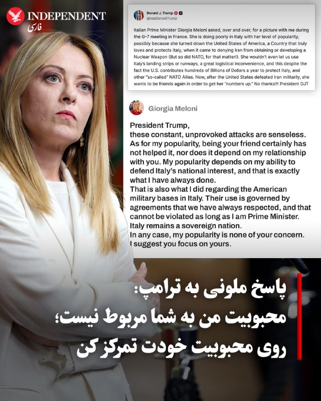

♦️ جورجیا ملونی، نخست‌وزیر ایتالیا، با انتشار بیانیه‌ای تند در صفحه اینستاگرام خود، به هجمه‌های اخیر دونالد ترامپ پاسخ داد و حملات کلامی رئیس‌جمهوری آمریکا را «بی‌دلیل و بی‌معنی» خواند.

ملونی در این پیام خطاب به ترامپ نوشت: «محبوبیت من به هیچ‌وجه به رابطه با شما بستگی ندارد و دوستی با شما نیز کمکی به آن نکرده است. محبوبیت من حاصل توانایی‌ام در دفاع از منافع ملی ایتالیاست؛ یعنی همان کاری که همواره انجام داده‌ام.»

نخست‌وزیر ایتالیا همچنین با دفاع از تصمیم خود در جریان جنگ اخیر و عدم اجازه به آمریکا برای استفاده از پایگاه‌های نظامی این کشور، افزود: «نحوه استفاده از پایگاه‌های نظامی آمریکا در خاک ما، تابع توافق‌نامه‌های متقابلی است که ما همیشه به آن‌ها احترام گذاشته‌ایم. تا زمانی که من نخست‌وزیر هستم، این توافقات نباید نقض شوند؛ چرا که ایتالیا یک کشور مستقل و دارای حق حاکمیت باقی می‌ماند.»

ملونی در پایان نوشت: «در هر صورت، میزان محبوبیت من اصلا به شما مربوط نیست. پیشنهاد می‌کنم شما روی محبوبیت خودتان تمرکز کنید.»
‌🇸🇦 Indypersian

🤖 @VahidOOnLine

## VahidOOnLine — post 246544

  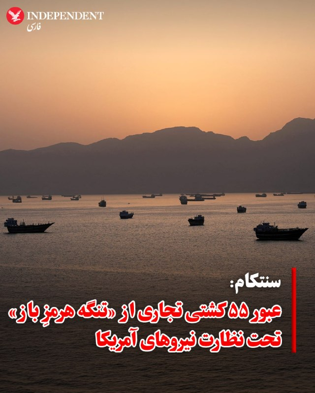

♦️ فرماندهی مرکزی آمریکا (سنتکام)، روز شنبه ۳۰ خرداد با انتشار بیانیه‌ای اعلام کرد که میزان تردد کشتی‌های تجاری در تنگه هرمز افزایش یافته است و نیروهای آمریکایی به منظور حمایت از آزادی کشتیرانی، به حضور و عملیات خود در این منطقه ادامه می‌دهند.

بر اساس این بیانیه، امنیت گذرگاه بین‌المللی هرمز امروز نیز برقرار بوده و ۵۵ کشتی تجاری موفق به عبور از آن شده‌اند. این شناورها حجم عظیمی از کالا و بیش از ۱۷ میلیون بشکه نفت را به بازارهای جهانی منتقل کردند.

سنتکام با اشاره به اطلاعیه این هفته «مرکز مشترک اطلاعات دریایی»، بر عبور امن تمام شناورها از مسیرهای تعیین‌شده—بدون وجود هرگونه ادعا، موانع یا الزامات خودسرانه—تاکید کرد. در پایان این بیانیه آمده است که نیروهای آمریکایی به منظور تضمین پایبندی کامل، رعایت و اجرای تمام مفاد تفاهم‌نامه با ایران، در منطقه حاضر و هوشیار باقی خواهند ماند.

این بیانیه ساعاتی پس از آن صادر شد که سپاه پاسداران و ارتش جمهوری اسلامی، اعلام کردند در واکنش به آن‌چه «نقض تعهدات از سوی آمریکا» خوانده شد، تنگه هرمز را مسدود کرده‌اند.
‌🇸🇦 Indypersian

🤖 @VahidOOnLine

## VahidOOnLine — post 246543

  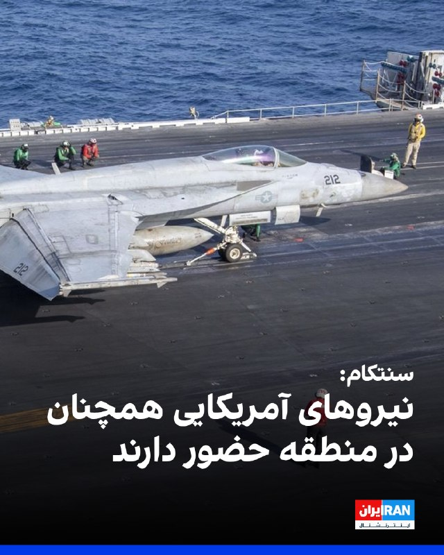

سنتکام اعلام کرد نیروهای آمریکایی همچنان در منطقه حضور دارند و با هوشیاری کامل فعالیت می‌کنند تا اطمینان حاصل شود همه مفاد توافق با جمهوری اسلامی اجرا می‌شود.

سنتکام اعلام کرد که روز شنبه عبور ایمن از تنگه هرمز برقرار بود و ۵۵ کشتی که مقادیر زیادی بار و بیش از ۱۷ میلیون بشکه نفت را به بازارهای جهانی منتقل می‌کردند، از این آبراه تردد کردند.
‌🏁 🇬🇧 IranintlTV

🤖 @VahidOOnLine

## VahidOOnLine — post 246542

  <a href="telegram/content/VahidOOnLine_246542_1781970148.mp4" target="_blank">🎬 Download video</a>

ویدیوی ارسالی یک شهروند ایرانی در بریتانیا نصب تصاویر جاویدنامان انقلاب ایران در بخش از این شهر را نشان می‌دهد. فرستند ویدیو می‌گوید یاد این جاویدنامان و خانواده‌های آن‌ها فراموش نخواهد شد.
‌🏁 🇬🇧 IranintlTV

🤖 @VahidOOnLine

## VahidOOnLine — post 246541

  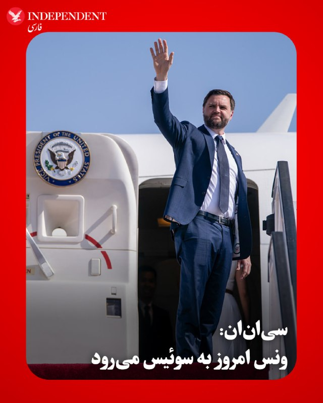

♦️ شبکه خبری سی‌ان‌ان به نقل از یک مقام آمریکایی اعلام کرد که جی‌دی ونس، معاون رئیس‌جمهوری آمریکا، امروز، شنبه ۳۰ خرداد به‌منظور آغاز مقدمات مذاکرات با جمهوری اسلامی ایران، راهی سوئیس می‌شود. این در حالی است که استیو ویتکاف، فرستاده ویژه آمریکا و جرد کوشنر، داماد ترامپ، از قبل برای حل چالش‌های فنی ناشی از درگیری‌های اخیر در لبنان، در سوئیس مستقر شده‌اند.

ونس در گفتگو با فاکس‌نیوز با «رقص هماهنگی ظریف دیپلماتیک» خواندن این سفر تاکید کرد: «به محض ورود مقامات ارشد دولت ایران و همچنین میانجی‌گران قطری و پاکستانی، برنامه اصلی گفتگوها را تنظیم می‌کنیم که احتمالا فردا (یکشنبه) آغاز خواهد شد.»

هم‌زمان، خبرگزاری «خانه ملت» گزارش داد که هیئت بلندپایه جمهوری اسلامی ایران به ریاست محمدباقر قالیباف و همراهی عباس عراقچی، عبدالناصر همتی، علی باقری‌کنی و معاونان وزرای خارجه و نفت، تهران را به مقصد سوئیس ترک کرده است. وزارت خارجه پاکستان نیز تایید کرد که هیئت‌هایی از اسلام‌آباد و دوحه، روز یکشنبه در بورگن‌اشتوک سوئیس حضور خواهند داشت.
‌🇸🇦 Indypersian

🤖 @VahidOOnLine

## VahidOOnLine — post 246540

  

رسانه‌های اسرائیل خبر دادند که بنیامین نتانیاهو، نخست وزیر این کشور، دستور اجرای آتش‌بس در لبنان را صادر کرد، اما ارتش همچنان از مناطق تصرف‌شده عقب‌نشینی نخواهد کرد.

پیش‌تر نیروی دریایی سپاه پاسداران اعلام کرده بود به دلیل تداوم حملات اسرائیل به جنوب لبنان، تنگه هرمز بسته شده است.
‌🏁 🇬🇧 IranintlTV

🤖 @VahidOOnLine

## VahidOOnLine — post 246539

  

رسانه‌های ایران گزارش دادند که هیات مذاکره‌کننده جمهوری اسلامی به ریاست محمدباقر قالیباف و با حضور عباس عراقچی، عازم سوئیس شده است.

بر اساس این گزارش، عبدالناصر همتی، رییس کل بانک مرکزی و علی باقری کنی، معاون بین‌الملل دبیرخانه شورای عالی امنیت ملی نیز در این سفر حضور خواهند داشت.

همچنین کاظم غریب‌آبادی، معاون و اسماعیل بقائی، سخنگوری وزارت خارجه و حمید بورد، معاون وزیر نفت نیز این افراد را همراهی می‌کنند.

پیش‌تر وزارت خارجه پاستان اعلام کرد که مذاکرات فنی میان جمهوری اسلامی و آمریکا، یکشنبه در سوئیس آغاز خواهد شد.
‌🏁 🇬🇧 IranintlTV

🤖 @VahidOOnLine

## VahidOOnLine — post 246538

  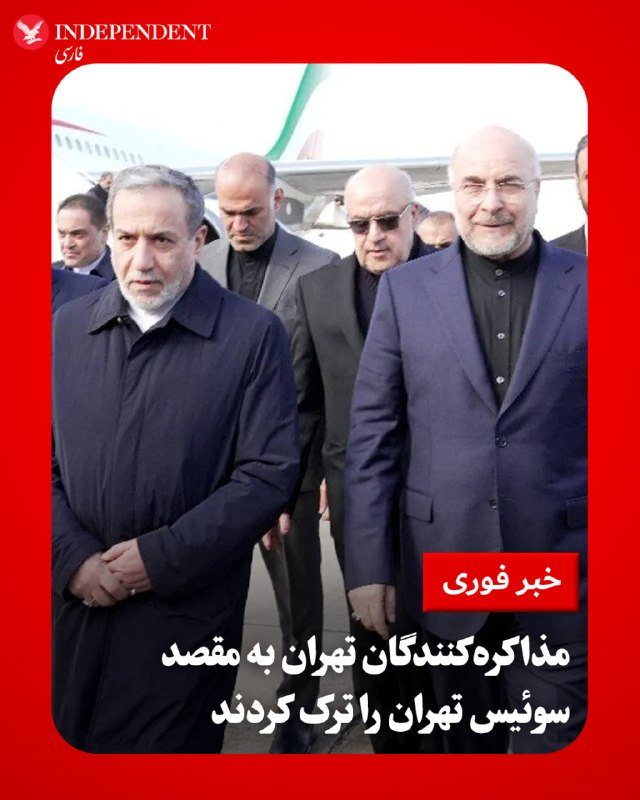

♦️ خبرگزاری رسمی مجلس شورای اسلامی، خانه ملت، روز شنبه ۳۰ خرداد گزارش داد که هیئت مذاکره‌کننده جمهوری اسلامی ایران، تهران را به مقصد سوئیس ترک کرده است. بر اساس این گزارش، محمدباقر قالیباف، رئیس مجلس شورای اسلامی، عباس عراقچی، وزیر امور خارجه، علی باقری کنی، معاون بین‌الملل دبیرخانه شورای عالی امنیت ملی، عبدالناصر همتی، رئیس بانک مرکزی، کاظم غریب‌آبادی، معاون وزیر خارجه، اسماعیل بقایی، سخنگوی وزیر خارجه و حمید بورد، معاون وزیر نفت از اعضای اصلی هیئت اعزامی هستند.
‌🇸🇦 Indypersian

🤖 @VahidOOnLine

## VahidOOnLine — post 246537

  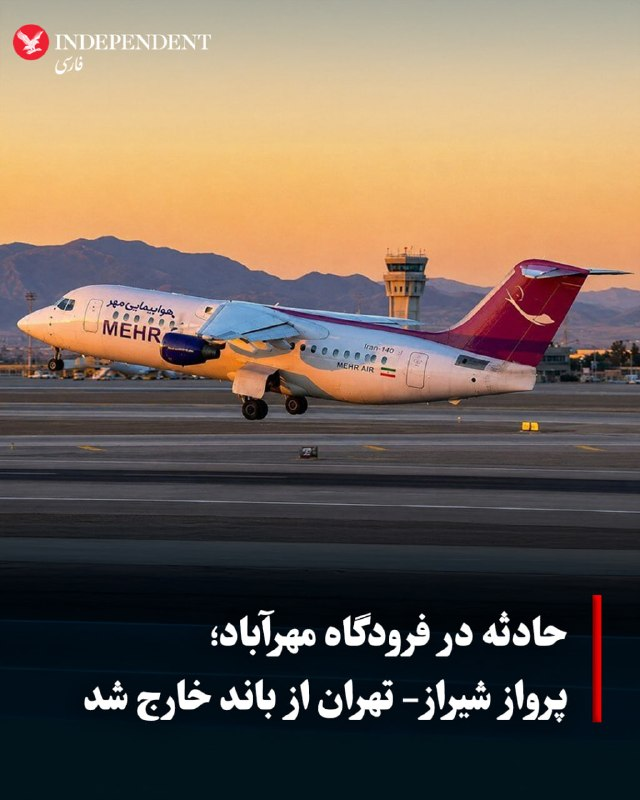

♦️یک هواپیمای شرکت هواپیمایی مهر روز شنبه ۳۰ خردادماه در مسیر شیراز به تهران، هنگام فرود در فرودگاه مهرآباد از باند خارج شد و در حاشیه باند متوقف شد.
بر اساس گزارش‌ها، این حادثه منجر به وارد شدن خسارت به هواپیما و بخشی از تأسیسات فرودگاه شده است، اما تلفات جانی یا مصدومی در پی نداشته است.
جزئیات بیشتر درباره علت وقوع این حادثه و میزان خسارت‌ها هنوز اعلام نشده است.
‌🇸🇦 Indypersian

🤖 @VahidOOnLine

## VahidOOnLine — post 246536

  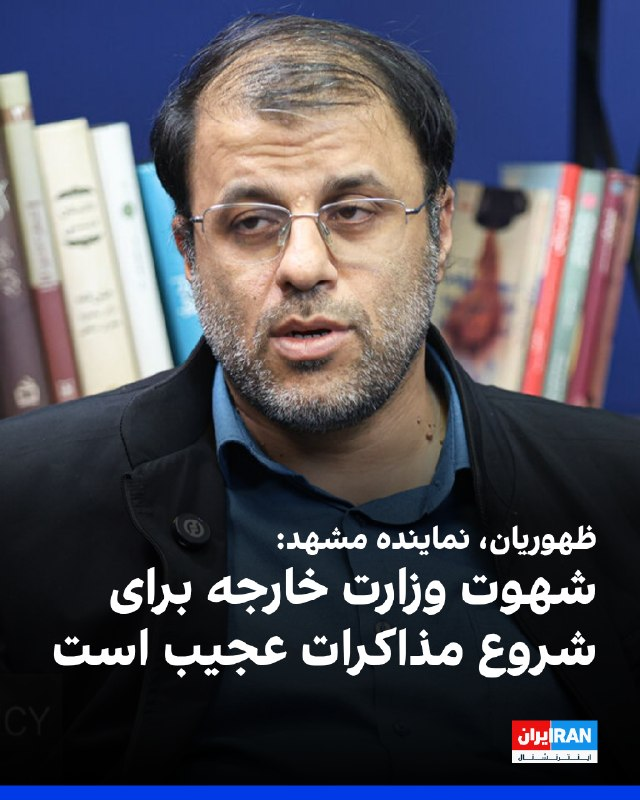

میثم ظهوریان، نماینده مشهد در مجلس، با اشاره به سفر هیات مذاکره‌کننده جمهوری اسلامی به سوئیس، در شبکه ایکس نوشت: «در حالی که بندهای ۱ و ۱۰ متن تفاهم‌نامه با آمریکا، مطلقا اجرا نشده است، شهوت وزارت خارجه برای شروع مذاکرات عجیب است.»

شایان ذکر است که بند یک تفاهم‌نامه به پایان عملیات نظامی در همه جبهه‌ها، از جمله لبنان اشاره داشته و بند ۱۰ نیز در رابطه با صدور مجوز از سوی ایالات متحده، برای صادرات نفت فرآورده‌های نفتی ایران است.
‌🏁 🇬🇧 IranintlTV

🤖 @VahidOOnLine

## VahidOOnLine — post 246535

  <a href="telegram/content/VahidOOnLine_246535_1781970156.mp4" target="_blank">🎬 Download video</a>

♦️فهد الدوسری، سفیر جدید عربستان سعودی در لبنان، وارد بندر بیروت شده تا در مراسم آغاز نخستین محموله صادراتی لبنان به مقصد بندر جده حضور پیدا کند.
این رویداد پس از لغو ممنوعیت واردات کالاهای لبنانی به عربستان انجام شده؛ محدودیتی که در سال‌های اخیر بر روابط تجاری دو کشور تأثیر گذاشته بود.
بر اساس گزارش‌ها، ارسال این محموله کانتینری به عربستان، گامی مهم در مسیر ازسرگیری روابط اقتصادی و تجاری میان بیروت و ریاض تلقی می‌شود. حضور سفیر جدید عربستان در این مراسم نیز نشانه‌ای از تلاش دو کشور برای بهبود و تقویت روابط دوجانبه عنوان شده است.
‌🇸🇦 Indypersian

🤖 @VahidOOnLine

## VahidOOnLine — post 246534

  

پاکستان اعلام کرد که نمایندگان آمریکا و جمهوری اسلامی به همراه میانجی‌گران پاکستان و قطر در گفت‌وگوهای یکشنبه در سوئیس شرکت خواهند کرد.

عصر شنبه خبرگزاری دولتی ایرنا گزارش داد که هیات مذاکره‌کننده جمهوری اسلامی عازم سوئیس شده است.

پیش‌تر اسماعیل بقائی، سخنگوی وزارت خارجه گفته بود که سفر هیات مذاکره‌کننده جمهوری اسلامی به سوئیس، به معنای آغاز مرحله دوم مذاکرات نیست و با هدف مطالبه‌گری و پیگیری اجرای تعهدات طرف مقابل انجام می‌شود.
‌🏁 🇬🇧 IranintlTV

🤖 @VahidOOnLine

## VahidOOnLine — post 246533

  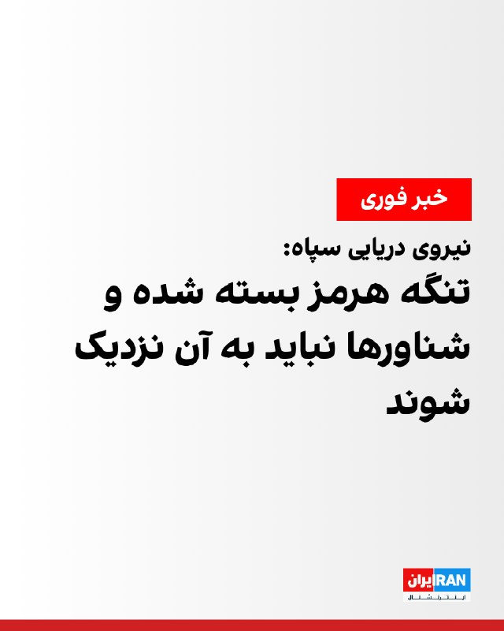

روابط عمومی نیروی دریایی سپاه پاسداران اعلام کرد تنگه هرمز در واکنش به «نقض تعهدات آمریکا در اجرای آتش‌بس» و «حملات اسرائیل در لبنان»، به روی همه شناورها بسته شده است.

نیروی دریایی سپاه همچنین از شناورها خواست به تنگه هرمز نزدیک نشوند و هشدار داد در غیر این صورت امنیت آن‌ها به خطر خواهد افتاد.
‌🏁 🇬🇧 IranintlTV

🤖 @VahidOOnLine

## VahidOOnLine — post 246532

  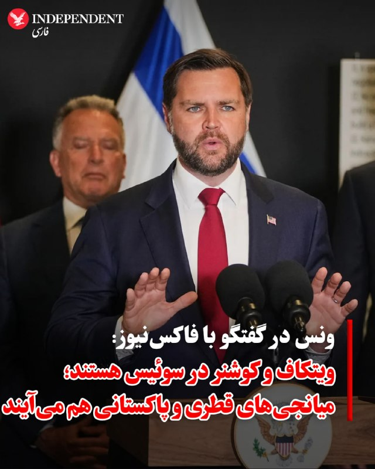

♦️ جی‌دی ونس، معاون رئیس‌جمهوری آمریکا، روز شنبه ۳۰ خرداد در گفتگو با فاکس‌نیوز اعلام کرد که استیو ویتکاف، فرستاده ویژه ترامپ و جرد کوشنر، داماد او، «چند ساعتی است» که در سوئیس حضور دارند و مشغول بررسی «برخی از ابعاد فنی این مذاکرات» با ایران هستند. به گفته ونس، کوشنر و ویتکاف در گزارش‌های خود تاکید کرده‌اند که «امور به خوبی پیش می‌رود.»

ونس همچنین از احتمال ورود میانجی‌های قطری و پاکستانی به سوئیس برای پیوستن به این گفتگوها خبر داد و افزود: «قطری‌ها و پاکستانی‌ها می‌خواهند مطمئن شوند که ما این کار را به شیوه درست انجام می‌دهیم، بنابراین من تلاش می‌کنم به این روند احترام بگذارم.»

معاون ترامپ که سفر خود به سوئیس را در اواخر پنج‌شنبه شب به تعویق انداخته بود، بار دیگر تاکید کرد که انتظار دارد طی دو روز آینده عازم این کشور شود. او با این حال خاطرنشان کرد که هماهنگی‌های این سفر «همواره یک رقص هماهنگی ظریف دیپلماتیک است.» این مذاکرات که پیش‌تر قرار بود روز جمعه برگزار شود، پس از وقفه‌ای کوتاه دوباره در آستانه ازسرگیری است.
‌🇸🇦 Indypersian

🤖 @VahidOOnLine

## VahidOOnLine — post 246531

  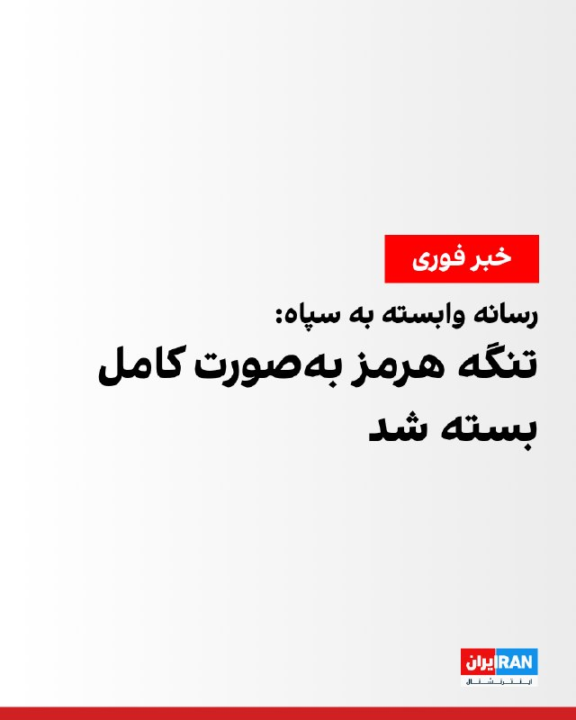

خبرگزاری فارس، وابسته به سپاه پاسداران به نقل از یک منبع نظامی در نیروی دریایی سپاه، عصر شنبه اعلام کرد که تنگه هرمز از دقایقی پیش به‌طور کامل بسته شده است.

پیش‌تر قرارگاه مرکزی خاتم‌الانبیا اعلام کرده بود که به دلیل ادامه حملات اسرائیل به جنوب لبنان، تنگه هرمز بسته خواهد شد.

این در حالی است که اسماعیل بقائی، سخنگوی وزارت خارجه جمهوری اسلامی، از سفر هیات مذاکره‌کننده به سوئیس خبر داد.
‌🏁 🇬🇧 IranintlTV

🤖 @VahidOOnLine

## VahidOOnLine — post 246530

  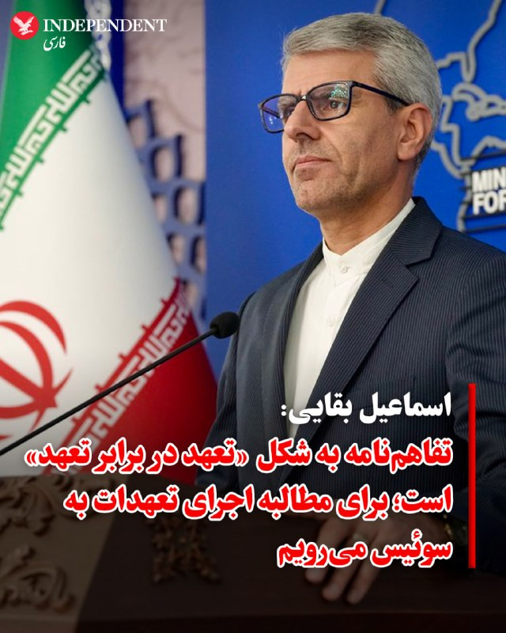

♦️ اسماعیل بقایی، سخنگوی وزارت امور خارجه جمهوری اسلامی ایران، از سفر قریب‌الوقوع هیئت دیپلماتیک به سوئیس خبر داد و تاکید کرد که هدف از این سفر، «مطالبه‌گری و مشخص شدن نحوه اجرای تعهدات طرف مقابل» است.

بقایی با اشاره به رویکرد «تعهد در برابر تعهد» هشدار داد: «اگر بخشی از تعهدات طرف مقابل اجرا نشود، کلیت تفاهم‌نامه دچار مشکل خواهد شد. ما توافقی را امضا نکرده‌ایم که اجرا نشود.» او بند اول این یادداشت تفاهم را مهم‌ترین بند آن دانست و تصریح کرد که آمریکا به تعهد خود برای وادار کردن اسرائیل به توقف حملات به لبنان عمل نکرده است.

سخنگوی وزارت خارجه هم‌چنین با تاکید بر اینکه واشنگتن باید فرآیند اجرای تعهدات خود را تسریع کند، افزود: «طرف مقابل باید هرچه سریع‌تر تدابیر لازم را به کار بگیرد؛ در غیر این صورت، این روند با مشکل جدی مواجه خواهد شد.»
‌🇸🇦 Indypersian

🤖 @VahidOOnLine

## VahidOOnLine — post 246529

  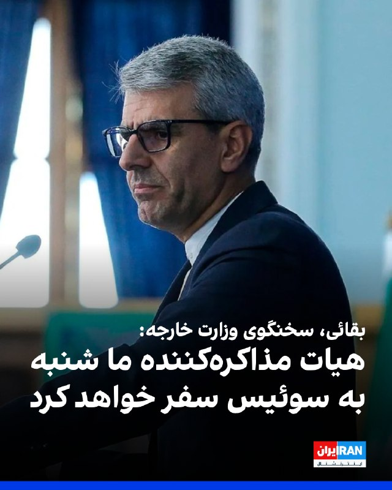

اسماعیل بقائی، سخنگوی وزارت خارجه جمهوری اسلامی، تایید کرد که هیات مذاکره‌کننده جمهوری اسلامی به سوئیس سفر خواهد کرد.

بقائی افزود: «این سفر با هدف مطالبه‌گری و پیگیری اجرای تعهدات طرف مقابل انجام می‌شود، چرا که معیار اصلی سنجش هر توافقی، مرحله اجرای آن است.»

او اضافه کرد که آمریکا موظف است اسرائیل را به توقف حمله به لبنان وادار کند و اگر آمریکا از اجرای تعهداتش سرباز بزند، با تدابیر لازم پاسخ خواهیم داد.

سخنگوی وزارت خارجه جمهوری اسلامی افزود: «اگر بخشی از تعهدات طرف مقابل اجرا نشود کلیت تفاهم دچار مشکل می‌شود.

بقائی ادامه داد: «ما تعهد را امضا نکردیم که اجرا نشود؛ رویکرد ما تعهد در برابر تعهد است.»
‌🏁 🇬🇧 IranintlTV

🤖 @VahidOOnLine

## VahidOOnLine — post 246528

  

علی زینی‌وند، سخنگوی وزارت کشور، شنبه ۳۰ خرداد در یک نشست خبری گفت کشور همچنان در «میانه جنگ» قرار دارد. او تاکید کرد: «مردم نباید تصور کنند با امضای یادداشت تفاهم میان جمهوری اسلامی و آمریکا همه مشکلات برطرف شده است.»

زینی‌وند در واکنش به انتقادها درباره بحران اقتصادی و افزایش قیمت‌ها گفت: «دولت باید پاسخگو باشد، ولی پیچ انصاف‌تان را تنظیم کنید و عملکرد دولت را از روز تحلیف تاکنون بررسی کنید.»
‌🏁 🇬🇧 IranintlTV

🤖 @VahidOOnLine

## VahidOOnLine — post 246527

  <a href="telegram/content/VahidOOnLine_246527_1781970164.mp4" target="_blank">🎬 Download video</a>

♦️یائیر لاپید، رهبر اپوزیسیون اسرائیل، روز شنبه ۳۰ خردادماه ، با انتقاد از عملکرد نتانیاهو، از آنچه «فهرست ۱۳ شکست» او خواند، سخن گفت.
لاپید گفت نتانیاهو طرحی را به آمریکا ارائه کرده که وعده سقوط حکومت ایران را می‌داد، اما به گفته او، «ریسک‌ها، پیامدهای منطقه‌ای و تأثیرات اقتصادی» آن به‌درستی برای افکار عمومی تشریح نشده بود.
او همچنین گفت نتانیاهو «نمی‌دانست چگونه این هدف را عملی کند» و پس از ناکامی در تحقق این طرح، در میانه جنگ اعتماد داخلی را از دست داده است.
لاپید با اشاره به مواضع اخیر ترامپ درباره تعویق حملات، این موضوع را نشانه‌ای از سردرگمی در تصمیم‌گیری دانست و از سیاست‌های او در قبال ایران و منطقه انتقاد کرد.
‌🇸🇦 Indypersian

🤖 @VahidOOnLine

## VahidOOnLine — post 246526

  <a href="telegram/content/VahidOOnLine_246526_1781970166.mp4" target="_blank">🎬 Download video</a>

♦️یائیر لاپید، رهبر اپوزیسیون اسرائیل، روز شنبه ۳۰ خردادماه ، با انتقاد از عملکرد نتانیاهو، از آنچه «فهرست ۱۳ شکست» او خواند، سخن گفت.
لاپید گفت نتانیاهو طرحی را به آمریکا ارائه کرده که وعده سقوط حکومت ایران را می‌داد، اما به گفته او، «ریسک‌ها، پیامدهای منطقه‌ای و تأثیرات اقتصادی» آن به‌درستی برای افکار عمومی تشریح نشده بود.
او همچنین گفت نتانیاهو «نمی‌دانست چگونه این هدف را عملی کند» و پس از ناکامی در تحقق این طرح، در میانه جنگ اعتماد داخلی را از دست داده است.
لاپید با اشاره به مواضع اخیر ترامپ درباره تعویق حملات، این موضوع را نشانه‌ای از سردرگمی در تصمیم‌گیری دانست و از سیاست‌های او در قبال ایران و منطقه انتقاد کرد.
‌🇸🇦 Indypersian

🤖 @VahidOOnLine

## WithYashar — post 15425

  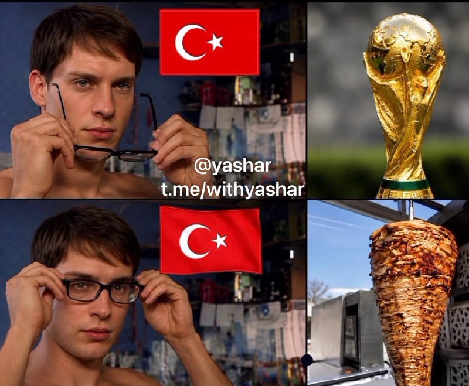

ترکیه اولین تیمی شد که از جام جهانی حذف شد.
@withyashar

## WithYashar — post 15424

هم اکنون جی دی ونس به فاکس نیوز :
ما هیچ مدرکی مبنی بر اینکه ایرانی‌ها هنوز تنگه هرمز را می‌بندند، نمی‌بینیم.
@withyashar

## WithYashar — post 15423

سخنگوی تیم مذاکره‌کننده: طبق بند ۱۳ یادداشت تفاهم، آغاز مذاکرات برای توافق نهایی مشروط به شروع و تداوم اجرای تعهدات طرف مقابل بر اساس بندهای ۱، ۴، ۵، ۱۰ و ۱۱ است.
@withyashar

## WithYashar — post 15422

بقایی: سفر به ژنو فاز دوم مذاکرات نیست و صرفا برای امضای یادداشت تفاهم به صورت حضوری است
@withyashar

## WithYashar — post 15421

فاکس نیوز به نقل از ونس، معاون ترامپ: اوضاع در مذاکرات با ایران خوب پیش میره و انتظار دارم به سوئیس سفر کنیم.
@withyashar

## WithYashar — post 15420

ایسنا: هیات مذاکره کننده ایران تا دقایقی دیگر عازم سوئیس می‌شوند
@withyashar

## WithYashar — post 15419

الحدث: عراقچی امشب همراه وزیر کشور پاکستان به سوئیس سفر می‌کند
@withyashar

## mwarmonitor — post 11284

📝کت و شلوار صلح بر تن باروت؛ دونالد، این تو بمیری از آن تو بمیری‌ها نیست!

🔰دونالد عزیز، سلام؛ شنیده‌ایم دوباره با ژست «مرد توافق‌ها» چشم دوخته‌ای به اینکه بند اول آتش‌بس لبنان به باد نرود، اما راستش را بخواهی باید بگویم زهی خیال باطل! خاورمیانه برج ترامپ نیست که با دو تا امضا جابجا شود. اینجا فرمول بیزینس فرق می‌کند؛ جمهوری اسلامی حزب‌الله را درست کرده تا دقیقاً «مو دماغ» اسرائیل باشد و امنیتش را تهدید کند. قاعده بازی هم ساده است: کارکرد در ازای پول. اگر این کار را انجام ندهند، پولی از تهران در کار نیست و پول هم نباشد، اصلاً حزب‌اللهی وجود ندارد؛ پس بقای آن‌ها به همین تنش بند است.
حالا تو چطور فکر می‌کنی اسرائیل با یک تکه کاغذ بی‌خیالِ این سایه مجهز بیخ گوشش می‌شود؟ تل‌آویو تا مطمئن نشود این تهدید ریشه‌کن شده آرام نمی‌نشیند. پس کله نارنجی ، خیلی دلت را به این توافق‌های ویترینی خوش نکن؛ تا وقتی شیرهای پول تهران می‌چرخند و لوله‌های تفنگ داغ‌اند، هیچ‌کس «معامله» تو را نقد نخواهد کرد. این تو بمیری از آن تو بمیری‌ها نیست!

@mwarmonitor

## mwarmonitor — post 11283

🔴کانال ۱۲ اسرائیل: به دستور نتانیاهو و کاتس، ارتش آتش‌بس را در لبنان متوقف می‌کند، اما از مناطق تحت کنترل خود عقب‌نشینی نخواهد کرد.

@mwarmonitor

## mwarmonitor — post 11282

🔴عبور کشتی‌های تجاری از تنگه هرمزِ باز همچنان جریان دارد

🔸فرماندهی مرکزی ایالات متحده (سنتکام)

🔰تامپا، فلوریدا — هم‌زمان با ادامه عملیات نیروهای آمریکایی در منطقه با هدف حمایت از آزادی کشتیرانی، ترافیک کشتی‌های تجاری در تنگه هرمز در تاریخ ۲۰ ژوئن افزایش یافت.

🔸عبور و مرور امن از این آبراه بین‌المللی امروز نیز پابرجا بود و ۵۵ کشتی تجاری با عبور از آن، حجم بالایی از کالا و بیش از ۱۷ میلیون بشکه نفت را به بازارهای جهانی منتقل کردند.

🔸«مرکز مشترک اطلاعات دریایی» این هفته با صدور توصیه‌نامه‌ای، بر عبور امن تمامی شناورها از یک مسیر مشخص‌شده تأکید کرد؛ مسیری که عاری از هرگونه ادعای الزامات خودسرانه یا موانع است. جزئیات مربوط به این عبور امن را می‌توانید در این آدرس مشاهده کنید

🔸نیروهای ایالات متحده همچنان در منطقه حاضر و هوشیار هستند تا تضمین کنند که تمام ابعاد توافق با ایران به طور کامل رعایت، اجرا و عملیاتی می‌شود.

@mwarmonitor

## mwarmonitor — post 11281

🔴معاون رئیس‌جمهور ونس قرار است امروز به سوئیس سفر کند تا در مذاکرات آمریکا–ایران (که برای فردا برنامه‌ریزی شده) شرکت کند.

🔸استیو ویتکاف و جرد کوشنر هم از قبل در آنجا حضور دارند. CNN

@mwarmonitor

## mwarmonitor — post 11279

  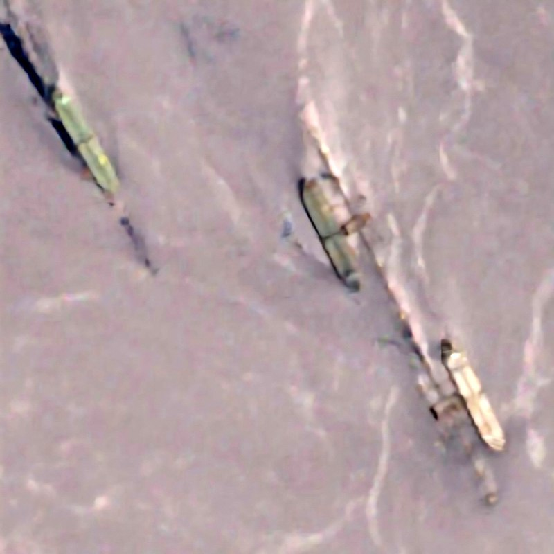

🔸«۳ نفتکش فوق‌سنگین (VLCC) ایرانی امروز در حال بارگیری نفت خام در پایانه غربی جزیره خارگ دیده شدند

@mwarmonitor

## mwarmonitor — post 11278

🔴 وزارت خارجه پاکستان: مذاکرات فنی میان آمریکا و ایران فردا در بورگنشتوک سوئیس برگزار خواهد شد.

@mwarmonitor

## mwarmonitor — post 11277

جورجیا ملونی، نخست‌وزیر ایتالیا، در طول نشست گروه ۷ در فرانسه، بارها و بارها از من خواست که با هم عکس بگیریم. او در ایتالیا از نظر میزان محبوبیت وضعیت ضعیفی دارد؛ احتمالاً به این دلیل که وقتی نوبت به جلوگیری از دستیابی یا توسعه سلاح هسته‌ای توسط ایران رسید،…

## mwarmonitor — post 11276

🔴ایران تنگه هرمز را در پی حملات اسرائیل به لبنان می‌بندد

📝نویسنده: باراک راوید AXIOS

🔸نیروهای مسلح ایران روز شنبه اعلام کردند که تنگه هرمز را — تنها سه روز پس از بازگشایی مجدد آن — مسدود خواهند کرد. ایران مدعی است که ناکامی آمریکا در مهار حملات اسرائیل به لبنان، توافق آتش‌بس جدید را نقض کرده است.

🔸چرا این موضوع اهمیت دارد؟
این نخستین بحران بزرگ میان ایالات متحده و ایران از زمان امضای تفاهم‌نامه برای پایان دادن به جنگ در اوایل این هفته است.

🔸این اتفاق در حالی رخ می‌دهد که فرستادگان رئیس‌جمهور ترامپ از قبل برای آغاز احتمالی دور اول مذاکرات هسته‌ای در سوئیس حضور دارند، اما هیئت ایرانی هنوز در این محل حاضر نشده است.

🔸آخرین وضعیت
یک مقام ارشد دفاعی ایالات متحده اظهار داشت که ارتش آمریکا هنوز هیچ‌گونه تحرک نظامی از سوی ایران روی زمین که نشان‌دهنده پتانسیل «بستن» این تنگه باشد، مشاهده نکرده است.

@mwarmonitor

## FoxNewsTwitter — post 343202

  

Fox News (Twitter/X)

A G7 photo op has turned into a full-blown international spat.

President Trump slammed Italian PM Giorgia Meloni after she publicly sounded off, rejecting his claims that she repeatedly asked for a photo with him, calling his comments "completely made up."

"There is one thing he should remember: neither I nor Italy ever beg," Meloni added.

Trump accused Meloni of wanting to be friends again after the U.S. military victory over Iran and suggesting she was trying to boost her political standing at home.

His response ended with a blunt message: "No thanks!"

## FoxNewsTwitter — post 343201

  <a href="telegram/content/FoxNewsTwitter_343201_1781970169.mp4" target="_blank">🎬 Download video</a>

Fox News (Twitter/X)

A group of children and parents were left dangling more than 50 feet in the air after an amusement park ride malfunctioned on Long Island.

The Wave Twister ride at Adventureland in Farmingdale suddenly became stuck Friday night, trapping riders in their seats reportedly for more than two hours as firefighters launched a painstaking rescue operation.

## FoxNewsTwitter — post 343197

Fox News (Twitter/X)

Not every postgame moment is about the highlights.

After securing a 2-0 win over Australia, Team USA gathered in a huddle and shared a powerful moment of prayer on the field.

## FoxNewsTwitter — post 343196

  <a href="telegram/content/FoxNewsTwitter_343196_1781970174.mp4" target="_blank">🎬 Download video</a>

Fox News (Twitter/X)

"My genuine hope was that the lesson the Democrats learned from the 2024 election is maybe we should stop being so crazy."

VP Vance warns democratic socialism is gaining influence inside the Democratic Party, arguing that its loudest voices are pulling the party farther away from the working-class voters who once defined it. | @foxandfriends

## FoxNewsTwitter — post 343195

  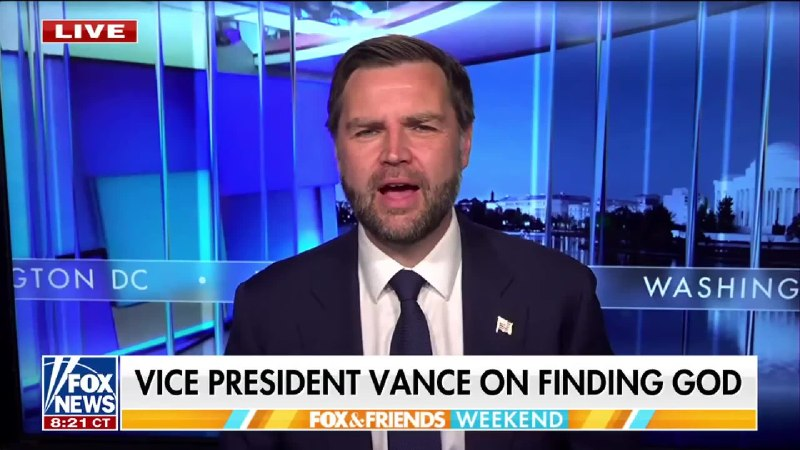

Fox News (Twitter/X)

NEW: Vice President JD Vance reflects on his deeply personal journey of losing and ultimately reclaiming his Christian faith, offering insight for parents whose children may be drifting from the church.

Vance says as an "arrogant kid," he briefly dismissed his upbringing, but his perspective radically shifted once he focused on the true responsibilities of adulthood and family.

"As I became older and cared less about how much money I made or whether I was going to the right schools, I started to care about the important things, you know, becoming a good husband, becoming a good father, and actually raising my kids with the kind of values that I was raised with."

"I realized that Christianity was not this superstition that I had dismissed as a 22-year-old kid. It was actually this very profound set of values and teachings, and those values and teachings came from a source of real truth." | @foxandfriends

## pm_afshaa — post 94462

🔴منابع عبری: عملیات ها در لبنان متوقف شد اما نیروهای ارتش اسرائیل هیچ عقب نشینی در لبنان نخواهند داشت

💧 Rainbet.com the #1 Non-KYC Crypto Casino & Sportsbook @rainbetcom

😁 @Pm_Afshaa

## pm_afshaa — post 94461

  <a href="telegram/content/pm_afshaa_94461_1781970177.webm" target="_blank">🎬 Download video</a>

🔴کانال 12 اسرائیل: نتانیاهو با توقف حملات ارتش اسرائیل به لبنان موافقت کرد.

💧 Rainbet.com the #1 Non-KYC Crypto Casino & Sportsbook @rainbetcom

😁 @Pm_Afshaa

## pm_afshaa — post 94460

  <a href="telegram/content/pm_afshaa_94460_1781970178.webm" target="_blank">🎬 Download video</a>

🔴هیئت مذاکره کننده جمهوری اسلامی دقایقی قبل راهی سوئیس شد.

محمدباقر قالیباف، عباس عراقچی، علی باقری، عبدالناصر همتی رییس بانک مرکزی، حمید بورد معاون وزیر نفت، کاظم غریب ابادی و اسماعیل بقایی معاونین وزیرخارجه و... اعضای هیئت اعزامی هستند.

💧 Rainbet.com the #1 Non-KYC Crypto Casino & Sportsbook @rainbetcom

😁 @Pm_Afshaa

## pm_afshaa — post 94459

  <a href="telegram/content/pm_afshaa_94459_1781970179.webm" target="_blank">🎬 Download video</a>

🔴بقائی، سخنگوی وزارت خارجه: هیئت ایرانی برای پیگیری و مطالبه اجرای تعهدات طرف مقابل راهی سوئیس میشه تا مشخص بشه اون‌ها دقیقاً چه برنامه‌ای برای عمل به تعهداتشون دارن. 
💧 Rainbet.com the #1 Non-KYC Crypto Casino & Sportsbook @rainbetcom 
😁 @Pm_Afshaa

## pm_afshaa — post 94458

  <a href="telegram/content/pm_afshaa_94458_1781970180.webm" target="_blank">🎬 Download video</a>

🔴پاکستان: مذاکرات فنی ایران و آمریکا فردا در سوئیس برگزار میشه.

💧 Rainbet.com the #1 Non-KYC Crypto Casino & Sportsbook @rainbetcom

😁 @Pm_Afshaa

## pm_afshaa — post 94457

  <a href="telegram/content/pm_afshaa_94457_1781970181.webm" target="_blank">🎬 Download video</a>

🔴قرارگاه خاتم الانبیا: تنگه هرمز بسته شد با توجه به اینکه آمریکا بند اول تفاهم‌نامه یعنی توقف جنگ حتی در لبنان رو رعایت نکرده، ماهم تنگه هرمز رو تا اطلاع ثانوی میبندیم. اگر عهدشکنی‌های آمریکا ادامه پیدا کنه پاسخ سنگین‌تری میدیم. 
💧 Rainbet.com the #1 Non…

## pm_afshaa — post 94456

  <a href="telegram/content/pm_afshaa_94456_1781970182.webm" target="_blank">🎬 Download video</a>

🔴فاکس نیوز به نقل از ونس، معاون ترامپ:
اوضاع در مذاکرات با ایران خوب پیش میره و انتظار دارم به سوئیس سفر کنیم.

💧 Rainbet.com the #1 Non-KYC Crypto Casino & Sportsbook @rainbetcom

😁 @Pm_Afshaa

## pm_afshaa — post 94455

  <a href="telegram/content/pm_afshaa_94455_1781970183.webm" target="_blank">🎬 Download video</a>

🔴بقائی، سخنگوی وزارت خارجه:
هیئت ایرانی برای پیگیری و مطالبه اجرای تعهدات طرف مقابل راهی سوئیس میشه تا مشخص بشه اون‌ها دقیقاً چه برنامه‌ای برای عمل به تعهداتشون دارن.

💧 Rainbet.com the #1 Non-KYC Crypto Casino & Sportsbook @rainbetcom

😁 @Pm_Afshaa

## pm_afshaa — post 94454

  <a href="telegram/content/pm_afshaa_94454_1781970183.webm" target="_blank">🎬 Download video</a>

🔴بقایی، سخنگوی وزارت خارجه:
ما به تعهداتمون پایبند بودیم حالا نوبت طرف مقابله که توضیح بده چطور می‌خواد به تعهداتش عمل کنه و جلوی ادامه حملات اسرائیل به لبنان رو بگیره.

💧 Rainbet.com the #1 Non-KYC Crypto Casino & Sportsbook @rainbetcom

😁 @Pm_Afshaa

## iaghapour — post 2691

  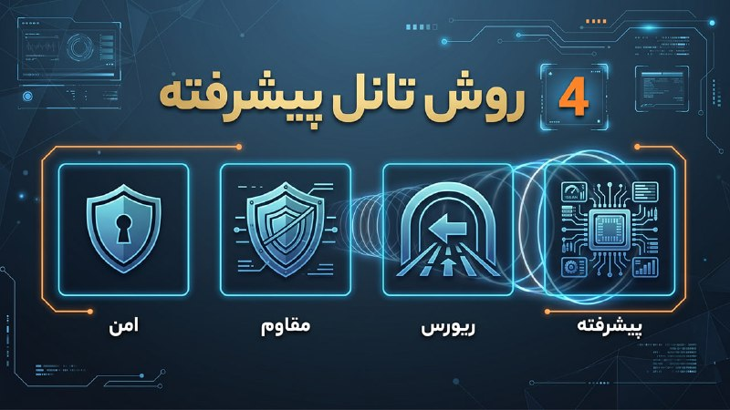

⭕️ آموزش 4 روش تانل پیشرفته و مقاوم در برابر فیلترینگ

🔹تو این ویدیو قراره با هم ۴ تا از بهترین روش‌های تانل زدن رو بررسی کنیم و یاد بگیریم چطوری تانل‌هایی بسازیم که در برابر فیلترینگ پایداری خودشون رو حفظ کنن.

🔗 تماشا ویدیو در یوتیوب

#آموزش #فیلترشکن #تانل
برای دور زدن فیلترینگ و آموزش تکنولوژی و هوش مصنوعی ما رو دنبال کنید 💚
🆔 @iaghapour

## iaghapour — post 2690

🔻دوستان عزیز، ربات «تماس با ما» چون نسخه رایگانه، به محدودیت ۵ هزار پیام در ماه رسیده و رفته رو حالت تعمیر!

اگه تنظیماتش بر اساس تایم‌زون باشه، اول ماه جدید یعنی 2 روز دیگه خودبه‌خود درست میشه؛ وگرنه به ناچار نسخه پرو رو می‌خرم تا دوباره در دسترس قرار بگیره.🥸

## DEJradio — post 5848

  <a href="telegram/content/DEJradio_5848_1781970185.webm" target="_blank">🎬 Download video</a>

🚨📢 سنتکام:
کشتی‌ها با اسکورت ناوهای آمریکا از تنگه هرمز عبور می‌کنند

ساعاتی پس از آنکه قرارگاه خاتم‌الانبیا تنگه هرمز را بست، فرماندهی مرکزی ایالات متحده آمریکا ( سنتکام) اعلام کرد تنگه هرمز مسدود نشده است، و شناورها با پشتیبانی و اسکورت ناوگان پنجم در حال عبور از تنگه هستند!

#تنگه_هرمز #توافق #آتشبس
@DEJradio

## DEJradio — post 5847

  <a href="telegram/content/DEJradio_5847_1781970186.webm" target="_blank">🎬 Download video</a>

🚨
⭕️ تنگه هرمز بسته شد؛ هشدار سپاه به کشتی‌های خارجی

در پی ادامه حملات اسرائیل به حزب‌الله لبنان، قرارگاه خاتم‌الانبیا در بیانیه‌ای که شنبه ۳۰ خرداد ۱۴۰۵ صادر شد اعلام کرد در واکنش به حملات اسراییل به حزب‌الله لبنان تنگه هرمز بسته می‌شود.

در این بیانیه آمده علت این اقدام، "بدعهدی‌ و پیمان‌شکنی آشکار آمریکا نسبت به عدم اجرای بند اول تفاهم‌نامه پایان جنگ" است.

قرارگاه خاتم الانبیا تهدید کرد "اين گام اول پاسخ به عهدشکنی دشمن است و در صورت ادامه تجاوز گام‌های بعدی برای پایبند کردن دشمن به اجرای تعهدات برنامه ریزی و اقدام خواهد شد."

نیروی دریایی سپاه پاسداران نیز هشدار داد که شناورها به تنگه هرمز نزدیک نشوند.

در بیانیه سپاه آمده، تنگه هرمز بر روی همه شناورها بسته می‌‌باشد، در غیر این صورت امنیت آنها به مخاطره خواهد افتاد.

#تنگه_هرمز #توافق #آتشبس
@DEJradio

## DEJradio — post 5846

⭕️ سپاه پاسداران عصر شنبه دوباره تنگۀ هرمز را بست

قرارگاه مرکزی خاتم‌الانبیا عصر شنبه ۳۰ خردادماه ادعا کرد در واکنش به «بدعهدی آمریکا» و ادامۀ حملات اسرائیل به حزب‌الله لبنان، تنگۀ هرمز به روی شناورها بسته شد.
قرارگاه خاتم‌الانبیا مدعی شد بسته شدن تنگۀ هرمز «گام نخست» پاسخ جمهوری اسلامی است.
بنا بر ادعای سپاه، در صورت ادامۀ وضعیت کنونی، اقدامات دیگری نیز انجام می‌شود.
نیروی دریای سپاه با انتشار پیام‌هایی از کشتی‌ها خواسته تا برای عبور به تنگۀ هرمز نزدیک نشوند وگرنه امنیت آنها به خطر می‌افتد.
ساعاتی پیش از اعلام قرارگاه خاتم‌الانبیا، خبرگزاری حکومتی تسنیم خواهان بسته شدن آبراه هرمز شده بود.

#تنگه_هرمز
@DEJradio

## DEJradio — post 5845

  <a href="telegram/content/DEJradio_5845_1781970186.webm" target="_blank">🎬 Download video</a>

🔺📢 سازمان "دانشجویان ایرانی برای دموکراسی" (ISAD) روز شنبه ۳۰ خرداد ۱۴۰۵ در شهر فرانکفورت میزبان یک کنفرانس سیاسی با محور تحولات ایران بود.

شماری از سیاستمداران آلمانی و دانشجویان ایرانی و آلمانی در این کنفرانس حضور داشتند.

به گزارش خبرنگار دژ از محل برگزاری این کنفرانس، یکی از سخنرانان دکتر تورستن لیب سیاستمدار آلمانی و عضو حزب دموکرات آزاد آلمان (FDP) بود.

او در سخنانی با اشاره به تفاهم دولت ترامپ با ملاها گفت، که معامله با این رژیم یک فاجعهٔ مطلق برای مردم ایران است.

او با انتقاد از مماشات دولت آلمان با جمهوری اسلامی افزود: "برای آلمان مایه شرمساری است که دو سال پیش وزارت امور خارجه [المان] و رژیم ایران باعث شدند که شاهزاده رضا پهلوی از کنفرانس امنیتی مونیخ کنار گذاشته شود."

او تاکید کرد حزب دموکرات آزاد آلمان (FDP)، به‌طور کامل در کنار مردم ایران ایستاده است. او همچنین افزود که "دربارهٔ آیندهٔ ایران، مردم ایران تصمیم می‌گیرند. آلمان و هیچ کشور دیگری نباید برای ایران تصمیم بگیرد، بلکه باید به تصمیم مردم ایران احترام بگذارد و از آن تبعیت کند."

#دانشجویان_ایرانی_برای_دموکراسی #ISAD #فرانکفورت
@DEJradio

## DEJradio — post 5844

  <a href="telegram/content/DEJradio_5844_1781970187.webm" target="_blank">🎬 Download video</a>

🤡
🔺 تبریز؛ حضور تکاوران مسلح سپاه در دسته سینه‌زنی!

در اقدامی نه چندان دور از انتظار، شماری از سپاهی‌های مسلح با کلاه کج دسته عزاداری محرم را اسکورت کردند.

#IRGCterrorists #عاشورا #تجمعات_حکومتی #تبریز
@DEJradio

## DEJradio — post 5843

  <a href="telegram/content/DEJradio_5843_1781970188.webm" target="_blank">🎬 Download video</a>

🚨
⭕️ العربیه:
جمهوری اسلامی تهدید به ترک مذاکره کرده است

منابعی به «العربیه» اطلاع داده‌اند هیئت ایرانی در مذاکرات این کشور و آمریکا تهدید کرده است اگر حملات اسرائیل به لبنان ادامه داشته باشد، تهران از مذاکره با واشنگتن صرف‌نظر خواهد کرد.

این منابع تاکید کردند مهم‌ترین مسئله اختلافی جمهوری اسلامی ایران و آمریکا پرونده لبنان است و محسن نقوی وزیر کشور پاکستان، در این زمینه پیام‌هایی را به تهران منتقل خواهد کرد. نقوی روز شنبه وارد مشهد شد.

#مذاکرات #آتشبس #جمهوری_اسلامی
@DEJradio

## DEJradio — post 5842

  <a href="telegram/content/DEJradio_5842_1781970189.mp4" target="_blank">🎬 Download video</a>

🔺🎥 صف کیلومتری در زاهدان برای۲۰ لیتر بنزین

بحران کمبود سوخت در ایران تشدید شده است. براساس گزارش‌های میدانی در بسیاری از استان‌ها پخش بنزین و گازوئیل کاهش یافته است و رانندگان برای پر کردن باک‌ ماشین‌ها ساعت‌ها در صف معطل می‌شوند. براساس ویدیویی که شهروندان از شهر زاهدان منتشر کردند برای دریافت ۲۰ لیر بنزین در گرمای شدید هوا صف کیلومتری تشکیل شد.

#زاهدان #گازوئیل #کمبود_سوخت #بنزین
@DEJradio

## DEJradio — post 5841

  <a href="telegram/content/DEJradio_5841_1781970191.webm" target="_blank">🎬 Download video</a>

🔺📢 سازمان "دانشجویان ایرانی برای دموکراسی" (ISAD) روز شنبه ۳۰ خرداد ۱۴۰۵ در شهر فرانکفورت میزبان یک کنفرانس سیاسی با محور تحولات ایران بود.

شماری از سیاستمداران آلمانی و دانشجویان ایرانی و آلمانی در این کنفرانس حضور داشتند.

به گزارش خبرنگار دژ از محل برگزاری این کنفرانس، یکی از سخنرانان دکتر تورستن لیب سیاستمدار آلمانی و عضو حزب دموکرات آزاد آلمان (FDP) بود.

او در سخنانی با اشاره به تفاهم دولت ترامپ با ملاها گفت، که معامله با این رژیم یک فاجعهٔ مطلق برای مردم ایران است.

او با انتقاد از مماشات دولت آلمان با جمهوری اسلامی افزود: "برای آلمان مایه شرمساری است که دو سال پیش وزارت امور خارجه [المان] و رژیم ایران باعث شدند که شاهزاده رضا پهلوی از کنفرانس امنیتی مونیخ کنار گذاشته شود."

او تاکید کرد حزب دموکرات آزاد آلمان (FDP)، به‌طور کامل در کنار مردم ایران ایستاده است. او همچنین افزود که "دربارهٔ آیندهٔ ایران، مردم ایران تصمیم می‌گیرند. آلمان و هیچ کشور دیگری نباید برای ایران تصمیم بگیرد، بلکه باید به تصمیم مردم ایران احترام بگذارد و از آن تبعیت کند."

#دانشجویان_ایرانی_برای_دموکراسی #ISAD #فرانکفورت
@DEJradio

## mamlekate — post 103746

  <a href="telegram/content/mamlekate_103746_1781970192.mp4" target="_blank">🎬 Download video</a>

ترامپ:

«ایران هرگز سلاح هسته‌ای نخواهد داشت؛ آن‌ها هیچ‌وقت به سلاح هسته‌ای دست پیدا نمی‌کنند، خب؟ این موضوع خیلی روشن و ساده است.

اما اگر من همین الان به آن‌ها حمله کنم... ببینید، وقتی حملات را متوقف کنید قضیه این‌طوری می‌شود؛ اگر قرار نباشد نیروی نظامی روی زمین پیاده کنیم (خب؟ منظورم این است که شما هم مایل نیستید نیروی پیاده اعزام بشود، درسته؟)، اگر نیروی زمینی نفرستیم، احتمالاً همان آدم‌ها می‌روند به اعماق غارها؛ آن‌ها غارهای گرانیتی دارند که بسیار محکم هستند. آن‌ها به اعماق غارها می‌روند و بعد، وقتی ما حملاتمان را متوقف کنیم، بیرون می‌آیند و احتمالاً همان رهبران سابق دوباره سر کار خواهند بود. بنابراین این کار فایده‌ای ندارد...

اما اگر بخواهیم کارشان را یک‌سره کنیم و چنان ضربه سنگینی به آن‌ها بزنیم [که نابود شوند، آن‌وقت آن‌ها هم تلافی می‌کنند]؛ در این صورت، تنگه هرمز به‌طور کامل بسته خواهد شد، همه‌جای آن مین‌گذاری می‌شود و موشک‌هایشان بر فراز کشتی‌های میلیارد دلاری به پرواز درمی‌آیند؛ به طوری که آن کشتی‌ها دیگر هرگز قادر به حرکت نخواهند بود. آن‌وقت [با این اوضاع] ما برای ماه‌ها نفت نخواهیم داشت.»

+ گزارش سی‌ان‌ان (رسانه دموکرات‌ها و مخالف ترامپ) از پشت پرده «شتاب دیوانه‌وار» ترامپ برای امضای توافق با جمهوری اسلامی

@mamlekate

## VahidOnline — post 76551

  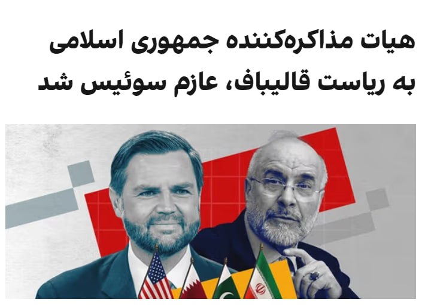

رسانه‌های ایران گزارش دادند که هیات مذاکره‌کننده جمهوری اسلامی به ریاست محمدباقر قالیباف و با حضور عباس عراقچی، عازم سوئیس شده است.

بر اساس این گزارش، عبدالناصر همتی، رییس کل بانک مرکزی و علی باقری کنی، معاون بین‌الملل دبیرخانه شورای عالی امنیت ملی نیز در این سفر حضور خواهند داشت.

همچنین کاظم غریب‌آبادی، معاون و اسماعیل بقائی، سخنگوری وزارت خارجه و حمید بورد، معاون وزیر نفت نیز این افراد را همراهی می‌کنند.

پیش‌تر وزارت خارجه پاستان اعلام کرد که مذاکرات فنی میان جمهوری اسلامی و آمریکا، یکشنبه در سوئیس آغاز خواهد شد.
@VahidOOnLine

📡 @VahidOnline

## VahidOnline — post 76550

  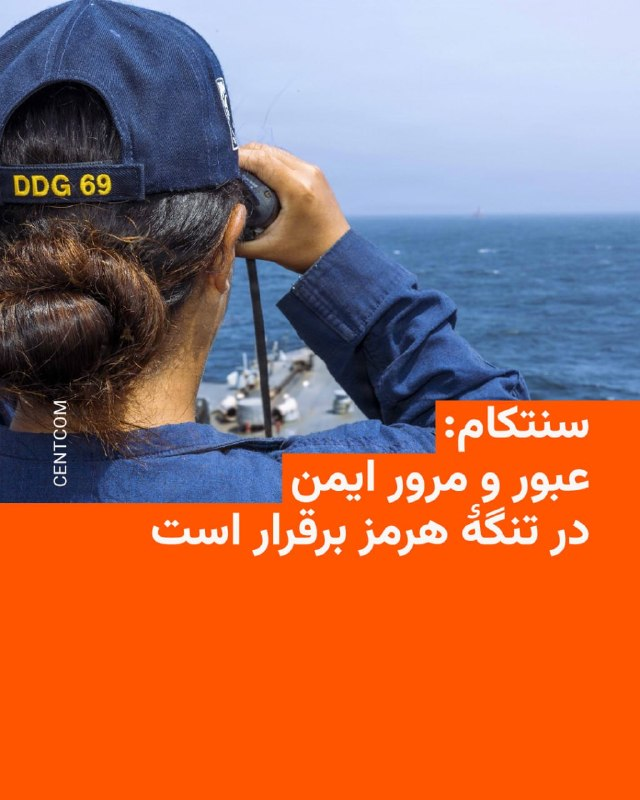

سنتکام: تنگه هرمز باز است

پست اکانت فرماندهی مرکزی ایالات متحده،
ترجمه ماشین:

عبور کشتی‌های تجاری از تنگه باز هرمز

تامپا، فلوریدا — تردد کشتی‌های تجاری در تنگه هرمز در ۲۰ ژوئن افزایش یافت؛ همزمان نیروهای آمریکایی به عملیات خود در منطقه کلی ادامه دادند تا از آزادی کشتیرانی حمایت کنند.

امروز عبور امن از این آبراه بین‌المللی همچنان برقرار بود و ۵۵ کشتی تجاری از آن عبور کردند؛ کشتی‌هایی که حجم زیادی بار و بیش از ۱۷ میلیون بشکه نفت را به بازارهای جهانی منتقل کردند.

مرکز مشترک اطلاعات دریایی این هفته اطلاعیه‌ای صادر کرد و در آن عبور امن همه کشتی‌ها را در یک مسیر تعیین‌شده تأیید کرد؛ مسیری که از ادعاهای خودسرانه درباره الزامات یا هرگونه مانع، آزاد است. جزئیات مربوط به عبور امن را می‌توان در اینجا دید:ukmto.org

نیروهای آمریکایی همچنان در منطقه حضور دارند و هوشیارند تا اطمینان حاصل کنند که همه جنبه‌های توافق با ایران رعایت، اجرا و به‌طور کامل برقرار و لازم‌الاجرا باقی می‌ماند.

CENTCOM

📡 @VahidOnline

## VahidOnline — post 76548

  <a href="telegram/content/VahidOnline_76548_1781970194.mp4" target="_blank">🎬 Download video</a>

ویدئویی در شبکه‌های اجتماعی پربازدید شده که مادر مانی صفرپور، جوان کشته‌شده در اعتراضات دی‌ماه، را در حال سوگواری برای فرزندش در کنار یک دستۀ عزاداری نشان می‌دهد.
عکس پسرش را بالای دست گرفته و می‌گوید «پسرم، پسرم».
مانی صفر‌پور، جوان ۱۸ سالۀ لاهیجانی، ۱۸ دی‌ماه ۱۴۰۴ با شلیک نیروهای حکومتی در محلۀ سلسبیل تهران کشته شد.
@VahidHeadline

📡 @VahidOnline

## VahidOnline — post 76547

  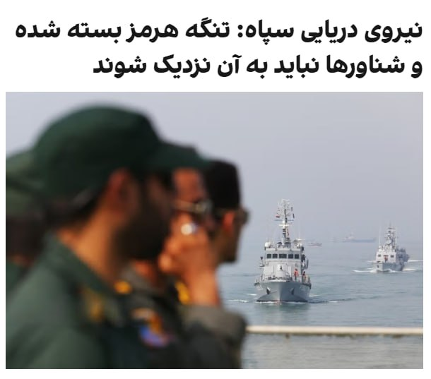

نیروی دریایی سپاه پاسداران اعلام کرد تنگه هرمز در واکنش به «نقض تعهدات امریکا در اجرای آتش‌بس» و «حملات اسرائیل در لبنان»، به روی همه شناورها بسته شد.
نیروی دریایی سپاه همچنین از شناورها خواست به تنگه هرمز نزدیک نشوند و هشدار داد در غیر این صورت، امنیت آن‌ها به خطر خواهد افتاد.

قرارگاه مرکزی خاتم‌الانبیا، واحدی از سپاه پاسداران هم اعلام کرد تنگه هرمز به‌دلیل «بدعهدی و پیمان‌شکنی» امریکا نسبت به‌عدم اجرای بند اول تفاهم‌نامه، به روی تردد کشتی‌ها بسته شده است.

قرارگاه مرکزی خاتم‌الانبیا روز شنبه اضافه کرد این گام اول «پاسخ به عهدشکنی دشمن» است و در صورت ادامه این وضعیت، گام‌های بعدی برای «پایبند کردن دشمن به اجرای تعهدات»، برنامه‌ریزی و اقدام خواهد شد.

خبرگزاری فارس، وابسته به سپاه پاسداران به نقل از یک منبع نظامی در نیروی دریایی سپاه، عصر شنبه اعلام کرد که تنگه هرمز از دقایقی پیش به‌طور کامل بسته شده است.

حملات اسرائیل به جنوب لبنان در روز شنبه دست‌کم ۱۰ کشته بر جا گذاشته است. اسرائیل اعلام کرد این حملات در واکنش به پرتاب گلوله‌هایی از سوی حزب‌الله، گروه مورد حمایت جمهوری اسلامی، انجام شد.
@VahidOOnLine

📡 @VahidOnline

## VahidOnline — post 76546

  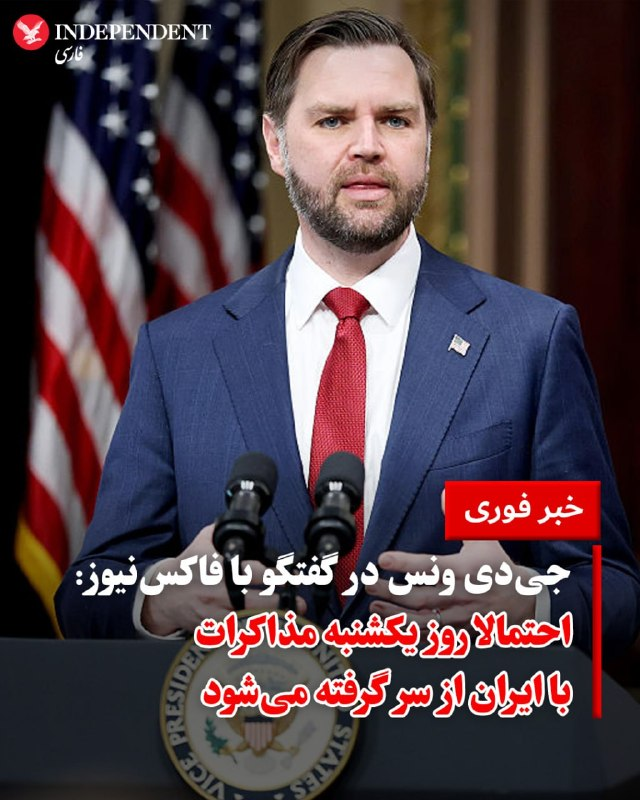

جی‌دی ونس، معاون رئیس‌جمهوری آمریکا، روز شنبه ۳۰ خرداد در گفتگو با فاکس‌نیوز اعلام کرد که استیو ویتکاف، فرستاده ویژه ترامپ و جرد کوشنر، داماد او، «چند ساعتی است» که در سوئیس حضور دارند و مشغول بررسی «برخی از ابعاد فنی این مذاکرات» با ایران هستند. به گفته ونس، کوشنر و ویتکاف در گزارش‌های خود تاکید کرده‌اند که «امور به خوبی پیش می‌رود.»

ونس همچنین از احتمال ورود میانجی‌های قطری و پاکستانی به سوئیس برای پیوستن به این گفتگوها خبر داد و افزود: «قطری‌ها و پاکستانی‌ها می‌خواهند مطمئن شوند که ما این کار را به شیوه درست انجام می‌دهیم، بنابراین من تلاش می‌کنم به این روند احترام بگذارم.»

معاون ترامپ که سفر خود به سوئیس را در اواخر پنج‌شنبه شب به تعویق انداخته بود، بار دیگر تاکید کرد که انتظار دارد طی دو روز آینده عازم این کشور شود. او با این حال خاطرنشان کرد که هماهنگی‌های این سفر «همواره یک رقص هماهنگی ظریف دیپلماتیک است.» این مذاکرات که پیش‌تر قرار بود روز جمعه برگزار شود، پس از وقفه‌ای کوتاه دوباره در آستانه ازسرگیری است.
@VahidOOnLine

📡 @VahidOnline

## VahidOnline — post 76545

  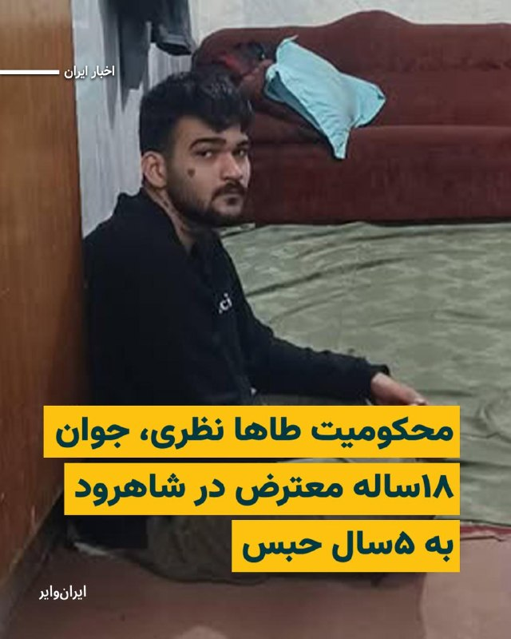

«طاها نظری» معترض ۱۸ساله که پیشتر به‌دلیل حضور در اعتراضات ۱۸ و ۱۹دی۱۴۰۴ بازداشت شده بود، پس از تشکیل جلسه رسیدگی به پرونده، به ۵سال حبس تعزیری محکوم شده است.

ماموران اطلاعات شاهرود، در فروردین ۱۴۰۵، طاها نظری را شناسایی و به صورت تلفنی احضار کردند. بعد از مراجعه به محل، این جوان ۱۸ساله به‌صورت موقت بازداشت و تحت فشار برای پذیرش اتهاماتی نظیر «ارتباط با تلویزیون‌های فارسی‌زبان و فیلم‌برداری از اعتراضات» به او نسبت داده شد.
@VahidHeadline

📡 @VahidOnline

## VahidOnline — post 76543

قیمت دلار و دیگر ارزهای خارجی که در پی نتیجه موقت مذاکرات ایران و آمریکا کاهش یافته بود بار دیگر افزایشی شد.
روز شنبه، ۳۰ خردادماه، قیمت دلار آمریکا در بازار به ۱۶۲ هزار و ۵۰۰ تومان رسید. قیمت یک یوروی اروپا نیز در این روز به ۱۸۶ هزار و ۴۰۰ تومان رسید.

این در حالی است که در طی روند کاهشی قیمت ارزهای خارجی در بازار آزاد ایران، روز چهارشنبه ۲۷ خرداد قیمت هر دلار آمریکا به حدود ۱۵۳ هزار تومان رسیده و قیمت سکه طلا هم در محدوده ۱۶۰ میلیون تومان اعلام شده بود.
روزنامه هم‌میهن روز شنبه قیمت سکه امامی را در بازار طلای ایران ۱۶۹ میلیون تومان گزارش کرد.
از زمان اعلام تفاهم‌نامه ایران و آمریکا در تلاش برای پایان جنگ، قیمت ارزهای خارجی و سکه طلا در بازار آزاد ایران شاهد کاهش قابل توجهی بود.
@VahidHeadline
حسین صمصامی، عضو کمیسیون اقتصادی مجلس شورای اسلامی، در گفت‌وگو با سایت خبری تابناک افشا کرد که در هفت سال گذشته بیش از ۱۳۰ میلیارد دلار ارز حاصل از صادرات به کشور بازنگشته است.
این در حالی است که حکومت برای بازگرداندن ۲۴ میلیارد دلار دارایی مسدودشده کشور وارد چانه‌زنی فراوان با دولت ایالات متحده شده است، امری که نشان می‌دهد تا چه حد به این پول نیاز دارد.
در این میان بیشترین میزان عدم بازگشت ارز صادرات مربوط به سال ۱۴۰۴ است.
@VahidHeadline

📡 @VahidOnline

## VahidOnline — post 76541

  <a href="telegram/content/VahidOnline_76541_1781970196.mp4" target="_blank">🎬 Download video</a>

ویدئویی که هاجر نادری، مادر متین پرویزی، در صفحۀ شخصی خود منتشر کرده است او را در کنار آرامگاه پسرش نشان می‌دهد که می‌گوید «من به پسرم فقط یاحسین و تشنگی را یاد ندادم، به او یاد دادم که جلوی حرف زور بایستد»

خانم نادری در ادامه با شرح کشته شدن فرزندش در اعتراضات ۱۸ دی‌ماه می‌گوید امسال محرم برای فرزندان میهن که «ناجوانمردانه کشته شدند» عزاداری خواهد کرد و ادامه می‌دهد که «می‌دانم امام حسین هم برای این جوانان عزاداری خواهد کرد»

متین پرویزی ۱۸ دی‌ماه سال گذشته در سبزه‌میدان زنجان با شلیک گلوله جنگی نیروهای حکومتی به سرش کشته شد.
@VahidHeadline

📡 @VahidOnline

## VahidOnline — post 76540

  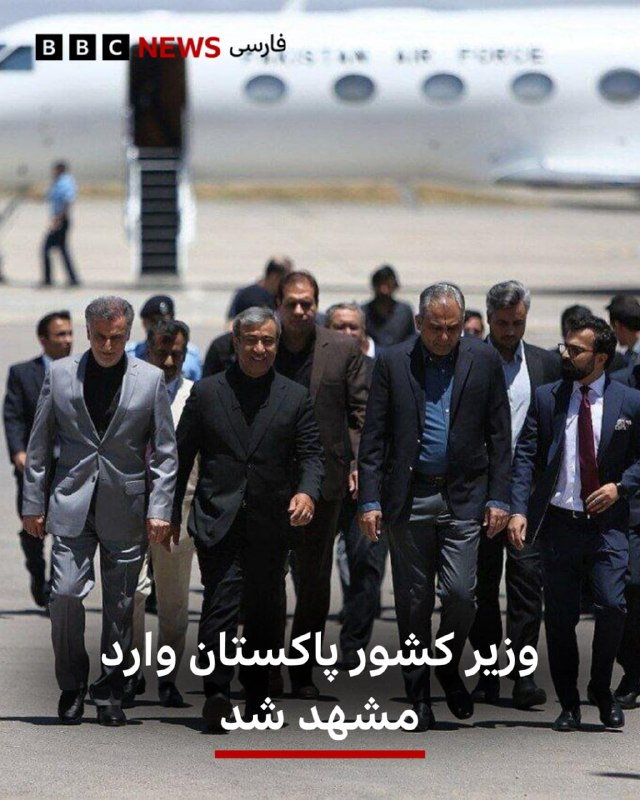

محسن نقوی، وزیر کشور پاکستان، صبح امروز وارد مشهد شد.

ایرنا به نقل از منابع خبری در استانداری خراسان رضوی گفته است که او سپس برای گفتگو با مقامات عازم تهران خواهد شد.

بر اساس گزارش‌ها وزیر کشور پاکستان قرار است در این سفر در مورد از سرگیری مذاکرات مستقیم بین آمریکا و ایران در سوئیس، با مقامات ایران گفتگو کند.
@VahidHeadline

📡 @VahidOnline

## VahidOnline — post 76539

  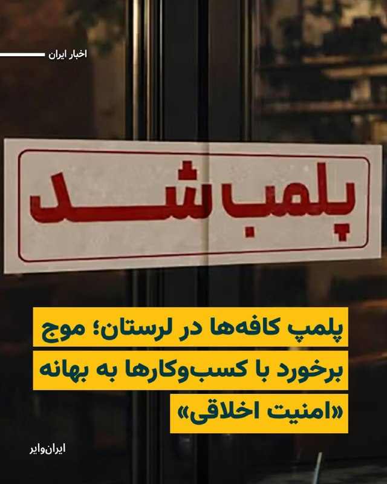

مرکز اطلاع‌رسانی پلیس استان لرستان از پلمب یک واحد صنفی و معرفی فرد متخلف به مرجع قضایی خبر داده و اعلام کرده است این اقدام پس از آن صورت گرفته که به گفته این نهاد، واحد مذکور «ضمن عدم رعایت قوانین و مقررات، اقدام به هنجارشکنی» کرده بود.

این در حالی است که تنها سه روز پیش نیز مرکز اطلاع‌رسانی پلیس لرستان از پلمپ پنج کافه‌رستوران و سفره‌خانه سنتی در سطح استان خبر داده بود. در آن گزارش، دلیل برخورد با این اماکن، اجرای طرح موسوم به «ارتقای امنیت اخلاقی و اجتماعی» و آنچه «هنجارشکنی» عنوان شده، اعلام شده بود.

در هفته‌های اخیر و هم‌زمان با فروکش کردن فضای امنیتی ناشی از تنش‌های بیرونی، گزارش‌هایی از افزایش تمرکز نهادهای انتظامی و قضایی بر حوزه‌های مرتبط با سبک زندگی شهروندان منتشر شده است؛ روندی که به نظر می‌رسد بار دیگر کسب‌وکارهایی مانند کافه‌ها، رستوران‌ها، فضاهای موسیقی، پوشش و نوع تعاملات اجتماعی را هدف قرار داده است.
@VahidHeadline

📡 @VahidOnline

## VahidOnline — post 76537

  <a href="telegram/content/VahidOnline_76537_1781970199.mp4" target="_blank">🎬 Download video</a>

تجمع‌های اعتراضی زنان به فعالیت‌های معدنی حوالی دو روستا در استان‌های کرمان و سیستان‌وبلوچستان با حضور نیروی انتظامی به خشونت کشیده شد.

بر اساس گزارش‌ها زنان روستای پشموکی از توابع فاریاب استان کرمان روز ۲۷ خرداد در ادامه اعتراضات مردمی نسبت به نحوه واگذاری و بهره‌برداری از معدن کرومیت پشموکی تجمع کرده بودند.

گفته شده که نیروی انتظامی علاوه بر ضرب‌وشتم معترضان، شماری از آن‌ها را بازداشت کرد.

هم‌چنین منابع بلوچ گزارش داده‌اند که زنان روستای سرسیاه از توابع تفتان استان سیستان‌وبلوچستان هم روز ۲۶ خرداد در اعتراض به گسترش فعالیت‌های معدن طلای تفتان و پیامدهای آن بر زندگی مردم منطقه تجمع کرده بودند.

در ویدئویی که منتشر شده شنیده می‌شود که مأموران نیروی انتظامی با خشونت، تهدید، توهین و واژه‌های تحقیرآمیز با این زنان برخورد کردند.
@VahidHeadline

📡 @VahidOnline

## IranIntlTV — post 343411

  <a href="telegram/content/IranIntlTV_343411_1781970200.mp4" target="_blank">🎬 Download video</a>

🔻اندرو جولیانی، رییس کارگروه جام جهانی کاخ سفید به روزنامه تلگراف گفت که آمریکا آمادگی دارد درباره شرایط ورود تیم فوتبال ایران به خاک این کشور مذاکره مجدد انجام دهد تا به تیم ملی اجازه دهد مدت بیشتری در آمریکا و در فاصله بین مسابقات حضور داشته باشد.

🔹توضیحات مزدک میرزایی در هت‌تریک

@iranintltvsport

## IranIntlTV — post 343410

## IranIntlTV — post 343409

  <a href="https://t.me/IranintlTV/343409" target="_blank">📎 Download file</a>

🎧نسخه صوتی اخبار شبانگاهی | شنبه ۳۰ خرداد
@iranintlTV

## IranIntlTV — post 343408

  

سنتکام اعلام کرد نیروهای آمریکایی همچنان در منطقه حضور دارند و با هوشیاری کامل فعالیت می‌کنند تا اطمینان حاصل شود همه مفاد توافق با جمهوری اسلامی اجرا می‌شود.

سنتکام اعلام کرد که روز شنبه عبور ایمن از تنگه هرمز برقرار بود و ۵۵ کشتی که مقادیر زیادی بار و بیش از ۱۷ میلیون بشکه نفت را به بازارهای جهانی منتقل می‌کردند، از این آبراه تردد کردند.
https://iranintl.com/202606204513

## IranIntlTV — post 343407

  <a href="telegram/content/IranIntlTV_343407_1781970204.mp4" target="_blank">🎬 Download video</a>

ویدیوی ارسالی یک شهروند ایرانی در بریتانیا نصب تصاویر جاویدنامان انقلاب ایران در بخش از این شهر را نشان می‌دهد. فرستند ویدیو می‌گوید یاد این جاویدنامان و خانواده‌های آن‌ها فراموش نخواهد شد.

## IranIntlTV — post 343406

  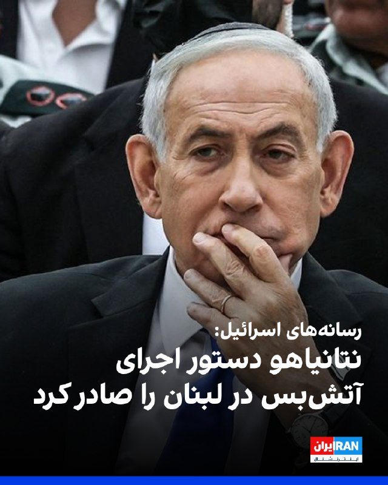

رسانه‌های اسرائیل خبر دادند که بنیامین نتانیاهو، نخست وزیر این کشور، دستور اجرای آتش‌بس در لبنان را صادر کرد، اما ارتش همچنان از مناطق تصرف‌شده عقب‌نشینی نخواهد کرد.

پیش‌تر نیروی دریایی سپاه پاسداران اعلام کرده بود به دلیل تداوم حملات اسرائیل به جنوب لبنان، تنگه هرمز بسته شده است.
https://iranintl.com/202606208153

## IranIntlTV — post 343405

  <a href="telegram/content/IranIntlTV_343405_1781970208.mp4" target="_blank">🎬 Download video</a>

پس از اعلام موضع جنجالی مجتبی خامنه‌ای درباره توافق، مخالفت‌ها با ادامه مذاکرات با آمریکا در تهران افزایش یافت و در آستانه سفر عراقچی به ژنو، سپاه پاسداران دوباره تنگه هرمز را بست. آیا با تثبیت توقف جنگ، نزاع قدرت در درون نظام، به شکست مذاکرات می‌انجامد؟

گزارشی از مجتبا پورمحسن
@iranintltv

## IranIntlTV — post 343404

  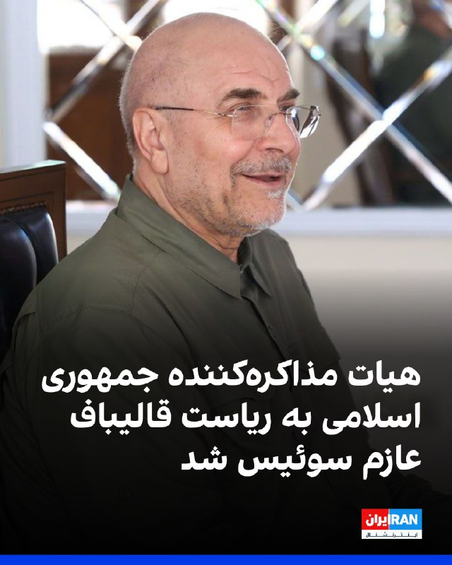

رسانه‌های ایران گزارش دادند که هیات مذاکره‌کننده جمهوری اسلامی به ریاست محمدباقر قالیباف و با حضور عباس عراقچی، عازم سوئیس شده است.

بر اساس این گزارش، عبدالناصر همتی، رییس کل بانک مرکزی و علی باقری کنی، معاون بین‌الملل دبیرخانه شورای عالی امنیت ملی نیز در این سفر حضور خواهند داشت.

همچنین کاظم غریب‌آبادی، معاون و اسماعیل بقائی، سخنگوری وزارت خارجه و حمید بورد، معاون وزیر نفت نیز این افراد را همراهی می‌کنند.

پیش‌تر وزارت خارجه پاکستان اعلام کرد که مذاکرات فنی میان جمهوری اسلامی و آمریکا، یکشنبه در سوئیس آغاز خواهد شد.
https://iranintl.com/202606207200

## IranIntlTV — post 343403

  

میثم ظهوریان، نماینده مشهد در مجلس، با اشاره به سفر هیات مذاکره‌کننده جمهوری اسلامی به سوئیس، در شبکه ایکس نوشت: «در حالی که بندهای ۱ و ۱۰ متن تفاهم‌نامه با آمریکا، مطلقا اجرا نشده است، شهوت وزارت خارجه برای شروع مذاکرات عجیب است.»

شایان ذکر است که بند یک تفاهم‌نامه به پایان عملیات نظامی در همه جبهه‌ها، از جمله لبنان اشاره داشته و بند ۱۰ نیز در رابطه با صدور مجوز از سوی ایالات متحده، برای صادرات نفت فرآورده‌های نفتی ایران است.
https://iranintl.com/202606203878

## IranIntlTV — post 343402

  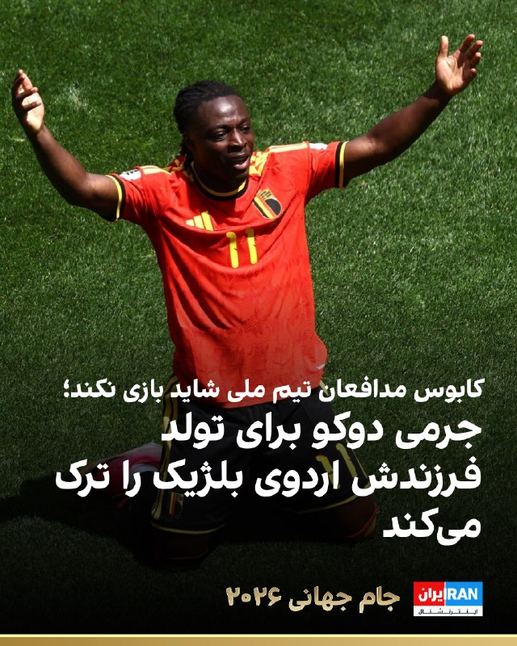

🔻جرمی دوکو، ستاره تیم ملی بلژیک و باشگاه منچسترسیتی، اعلام کرد برای حضور در زمان تولد نخستین فرزندش اردوی تیم ملی کشورش در جام جهانی ۲۰۲۶ را ترک می‌کند. به همین دلیل ممکن است بازی با ایران را از دست بدهد.

🔹دوکو پیش از آغاز جام جهانی درباره این موضوع گفته بود: «همه چیز به زمان تولد بستگی دارد، اما این نخستین فرزند من است و قطعا دوست دارم کنار خانواده‌ام باشم. هیچ‌کس نمی‌خواهد لحظه تولد اولین فرزندش را از دست بدهد.»

🔹این وینگر ۲۴ ساله در دیدار نخست بلژیک در جام جهانی مقابل مصر به میدان رفت.

🔹همین موضوع باعث شد فرانس پیرون، خبرنگار اکیپ، در اظهاراتی جنجالی در یک برنامه تلویزیونی گفت: «چطور می‌شود جام جهانی را از دست داد؟ قرار است برای بریدن بند ناف نوزاد بازی را رها کنی؟ صدها فوتبالیست آرزو دارند جای تو در جام جهانی باشند، اما تو می‌خواهی این فرصت را کنار بگذاری تا در زمان تولد فرزندت حاضر باشی.»

🔹جزییات بیشتر را در سایت بخوانید

@iranintltvsport

## IranIntlTV — post 343401

  <a href="telegram/content/IranIntlTV_343401_1781970213.mp4" target="_blank">🎬 Download video</a>

محمد تقوی، ایران‌اینترنشنال، درباره اعتراض فدراسیون فوتبال جمهوری اسلامی به محدودیت‌های اعمال‌شده برای تیم فوتبال ایران در آمریکا و جابه‌جایی تیم از تیخوانا به لس‌آنجلس گفت: «همه تیم‌ها با این شرایط روبه‌رو هستند و تیخوانا نزدیک‌ترین کمپ به لس‌آنجلس را دارد. طرح این موضوع از سوی فدراسیون فوتبال، بهانه‌ای برای توجیه شکست احتمالی است.»
@iranintltv

## IranIntlTV — post 343400

  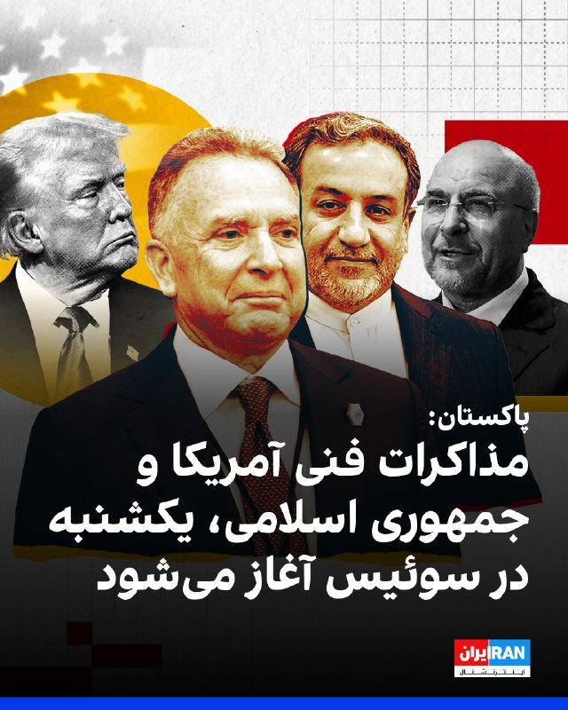

پاکستان اعلام کرد که نمایندگان آمریکا و جمهوری اسلامی به همراه میانجی‌گران پاکستان و قطر در گفت‌وگوهای یکشنبه در سوئیس شرکت خواهند کرد.

عصر شنبه خبرگزاری دولتی ایرنا گزارش داد که هیات مذاکره‌کننده جمهوری اسلامی عازم سوئیس شده است.

پیش‌تر اسماعیل بقائی، سخنگوی وزارت خارجه گفته بود که سفر هیات مذاکره‌کننده جمهوری اسلامی به سوئیس، به معنای آغاز مرحله دوم مذاکرات نیست و با هدف مطالبه‌گری و پیگیری اجرای تعهدات طرف مقابل انجام می‌شود.
https://iranintl.com/202606202976

## IranIntlTV — post 343399

  

روابط عمومی نیروی دریایی سپاه پاسداران اعلام کرد تنگه هرمز در واکنش به «نقض تعهدات آمریکا در اجرای آتش‌بس» و «حملات اسرائیل در لبنان»، به روی همه شناورها بسته شده است.

نیروی دریایی سپاه همچنین از شناورها خواست به تنگه هرمز نزدیک نشوند و هشدار داد در غیر این صورت امنیت آن‌ها به خطر خواهد افتاد.
https://iranintl.com/202606207631

## IranIntlTV — post 343398

  <a href="telegram/content/IranIntlTV_343398_1781970217.mp4" target="_blank">🎬 Download video</a>

یک شهروند با ارسال ویدیویی به ایران اینترنشنال از آزار صوتی هیات‌های عزاداری در زرند کرمان برای مردم روایت می‌کند.

## IranIntlTV — post 343397

  

خبرگزاری فارس، وابسته به سپاه پاسداران به نقل از یک منبع نظامی در نیروی دریایی سپاه، عصر شنبه اعلام کرد که تنگه هرمز از دقایقی پیش به‌طور کامل بسته شده است.

پیش‌تر قرارگاه مرکزی خاتم‌الانبیا اعلام کرده بود که به دلیل ادامه حملات اسرائیل به جنوب لبنان، تنگه هرمز بسته خواهد شد.

این در حالی است که اسماعیل بقائی، سخنگوی وزارت خارجه جمهوری اسلامی، از سفر هیات مذاکره‌کننده به سوئیس خبر داد.
https://iranintl.com/202606204968

## IranIntlTV — post 343395

  <a href="telegram/content/IranIntlTV_343395_1781970221.mp4" target="_blank">🎬 Download video</a>

قرارگاه مرکزی خاتم‌الانبیا با انتشار بیانیه‌ای اعلام کرد به دلیل حملات اسرائیل به حزب‌الله لبنان، تنگه هرمز بار دیگر بسته خواهد شد.

حسین آقایی، عضو تحریریه ایران‌اینترنشنال، گفت دولت دونالد ترامپ، با وجود کارشکنی‌های سپاه پاسداران همچنان به دنبال پیشبرد مذاکرات است. به گفته او، جمهوری اسلامی از اهرم تنگه هرمز هم برای حمایت از حزب‌الله و هم برای افزایش فشار بر واشینگتن استفاده می‌کند.
@iranintltv

## IranIntlTV — post 343394

  

اسماعیل بقائی، سخنگوی وزارت خارجه جمهوری اسلامی، تایید کرد که هیات مذاکره‌کننده جمهوری اسلامی به سوئیس سفر خواهد کرد.

بقائی افزود: «این سفر با هدف مطالبه‌گری و پیگیری اجرای تعهدات طرف مقابل انجام می‌شود، چرا که معیار اصلی سنجش هر توافقی، مرحله اجرای آن است.»

او اضافه کرد که آمریکا موظف است اسرائیل را به توقف حمله به لبنان وادار کند و اگر آمریکا از اجرای تعهداتش سرباز بزند، با تدابیر لازم پاسخ خواهیم داد.

سخنگوی وزارت خارجه جمهوری اسلامی افزود: «اگر بخشی از تعهدات طرف مقابل اجرا نشود کلیت تفاهم دچار مشکل می‌شود.

بقائی ادامه داد: «ما تعهد را امضا نکردیم که اجرا نشود؛ رویکرد ما تعهد در برابر تعهد است.»
https://iranintl.com/202606209951

## IranIntlTV — post 343393

  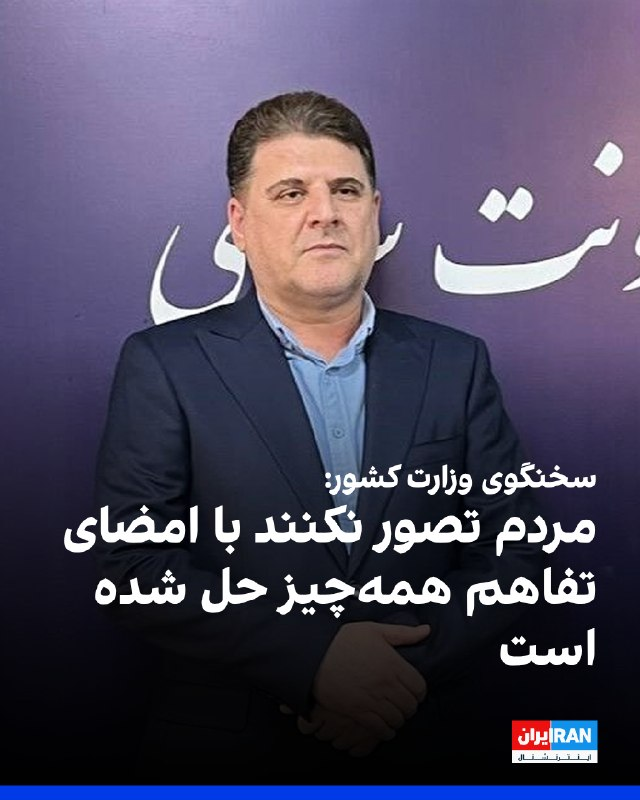

علی زینی‌وند، سخنگوی وزارت کشور، شنبه ۳۰ خرداد در یک نشست خبری گفت کشور همچنان در «میانه جنگ» قرار دارد. او تاکید کرد: «مردم نباید تصور کنند با امضای یادداشت تفاهم میان جمهوری اسلامی و آمریکا همه مشکلات برطرف شده است.»

زینی‌وند در واکنش به انتقادها درباره بحران اقتصادی و افزایش قیمت‌ها گفت: «دولت باید پاسخگو باشد، ولی پیچ انصاف‌تان را تنظیم کنید و عملکرد دولت را از روز تحلیف تاکنون بررسی کنید.»
https://iranintl.com/202606209310

## IranIntlTV — post 343384

🔻تیم ملی فوتبال برزیل در دومین دیدار خود در جام جهانی ۲۰۲۶ با نتیجه ۳-۰ هائیتی را شکست داد تا اولین پیروزی خود را در این بازی‌ها جشن بگیرد.

🔹مردم برزیل که همواره یکی از پرشورترین هواداران فوتبال محسوب می‌شوند، همزمان با بازی تیم ملی کشورشان، در داخل و بیرون استادیوم فلادلفیا اولین پیروزی سلسائو را جشن گرفتند.

@iranintltvsport

## Iliaen — post 4503

سپاه پاسداران با انتشار یک بیانیه، رسماً خبر از بسته شدن تنگه هرمز به علت حملات اسرائیل در لبنان داد.

از آنجا که اینبار بیانیه رسمی صادر شده است، بعید است دوباره وزارت خارجه موفق به اعلام تکذیبیه شود.

روز گذشته نیز سپاه پاسدارن اقدام به جلوگیری از عبور و مرور کشتی‌ها به مدت حدود ۴۰ دقیقه کرد.

@iliaen

## FarsiVOA — post 221334

در گفت‌وگو با رضا طالبی، روزنامه‌نگار و تحلیلگر سیاسی، از شکاف درون حاکمیت پس از امضای تفاهم با آمریکا و غیبت صدای موافقان عادی‌سازی روابط با آمریکا گفتیم. آقای طالبی می‌گوید در منطق جمهوری اسلامی، نه پذیرش شکست در میدان جنگ معنا دارد و نه تعامل با مردم در عرصه سیاست.

## FarsiVOA — post 221333

  <a href="telegram/content/FarsiVOA_221333_1781970225.mp4" target="_blank">🎬 Download video</a>

در گفت‌وگو با حسن هاشمیان از صدای آمریکا تناقض روایت‌ها درباره «یادداشت تفاهم» و تداوم درگیری در جنوب لبنان را بررسی کردیم. به گفته حسن هاشمیان «لبنان می‌تواند مهمترین محور پیمان ابراهیم باشد.»

## FarsiVOA — post 221332

🔺از اتهام «محاربه» یک معترض تا صدور احکام سنگین حبس علیه دو تن دیگر؛ تیغ تیز رژیم بر گردن مردم ایران

▪️قوه قضائیه جمهوری اسلامی در ادامه روند صدور احکام ظالمانه برای مخالفان خود یک جوان ۱۸ ساله را به «محاربه» متهم و به بند امنیتی زندان کرمانشاه منتقل کرد و برای یک وکیل دادگستری نیز حکم ده سال زندان برید.

⬇️ بیشتر بخوانید:
https://ir.voanews.com/a/iran-arrest-prison-protest-lawyer-azerbaijan-/8162950.html/?nocach=1

## FarsiVOA — post 221331

🔺بیانیه سنتکام پس از تهدید جمهوری اسلامی: تنگه هرمز باز است

▪️فرماندهی مرکزی ایالات متحده، سنتکام، روز شنبه ۳۰ خرداد ۱۴۰۵ اعلام کرد تنگه هرمز باز است و تردد کشتی‌های تجاری از این آبراه ادامه دارد.

⬇️ بیشتر بخوانید:

https://ir.voanews.com/a/centcom-says-strait-remains-open/8162953.html/?nocach=1

## FarsiVOA — post 221330

  <a href="telegram/content/FarsiVOA_221330_1781970226.mp4" target="_blank">🎬 Download video</a>

ویدیوی منتشر شده در شبکه‌های اجتماعی، مادر مانی صفرپور، از کشته‌شدگان دی ماه ۱۴۰۴، را نشان می‌دهد که کنار یک دسته عزاداری محرم، برای فرزندش سوگواری می‌کند.

مانی صفرپور، ۱۸ ساله و اهل لاهیجان، ۱۸ دی ۱۴۰۴، با شلیک گلوله ماموران حکومتی در سرسبیل تهران کشته شد.

## FarsiVOA — post 221329

مراسم یادبود مرجان ساتراپی در سوئد با حضور خانواده و دوستانش؛ گزارش آنا-ماریا هولمگرن

## FarsiVOA — post 221319

مروری تصویری بر بازی‌های پرهیجان جام جهانی ۲۰۲۶؛ از صعود آمریکا و نخستین برد برزیل تا دوئل‌های نفس‌گیر، گل‌های سرنوشت‌ساز، و شادی هواداران.

@FarsiVOA

## FarsiVOA — post 221307

  <a href="telegram/content/FarsiVOA_221307_1781970229.mp4" target="_blank">🎬 Download video</a>

خواهر صهبا رشتیان، از کشته‌شدگان دی ماه ۱۴۰۴، ویدیویی از گرامیداشت زادروز صهبا در ۳۰ خرداد ۱۴۰۵ بر آرامگاهش منتشر کرده است.

صهبا رشتیان، ۲۳ ساله، ۱۹ دی ۱۴۰۴، با شلیک گلوله ماموران حکومتی به پهلویش در اصفهان کشته شد.

نسخه اصلی این ویدیو با موسیقی متن منتشر شده است.

## FarsiVOA — post 221306

🔺برنامه‌ریزی برای دور آینده مذاکرات اسرائیل و لبنان به‌رغم تداوم درگیری‌ها با حزب‌الله

▪️بنا به گزارش رسانه‌های عربی در روز شنبه ۳۰ خرداد، لبنان در سه روز مانده به دور پنجم مذاکرات مستقیم با اسرائیل، شاهد افزایش تنش نظامی میان اسرائیل و حزب‌الله در جنوب کشور از یک سو، و از سوی دیگر تحرک سیاسی و دیپلماتیک برای رسیدن به یک آتش‌بس فراگیر و پایدار شدت گرفته است.

⬇️ بیشتر بخوانید:
https://ir.voanews.com/a/lebanon-israel-hezbollah-war-ceasfire-/8162941.html/?nocach=1

## FarsiVOA — post 221305

🔺جمهوری اسلامی به‌رغم «یادداشت تفاهم» تهدید کرد: هرمز بسته خواهد شد

▪️تنها چند روز پس از امضای یادداشت تفاهم میان آمریکا و رژیم ایران مبنی بر رفع محاصره و متقابلا باز شدن تنگه هرمز، قرارگاه مرکزی خاتم‌الانبیا روز شنبه ۳۰ خرداد ادعا کرد که تنگه هرمز به روی تردد شناورها «بسته خواهد شد.»

⬇️ بیشتر بخوانید:
https://ir.voanews.com/a/iran-threatens-hormuz-closure-despite-deal/8162946.html/?nocach=1

## FarsiVOA — post 221304

  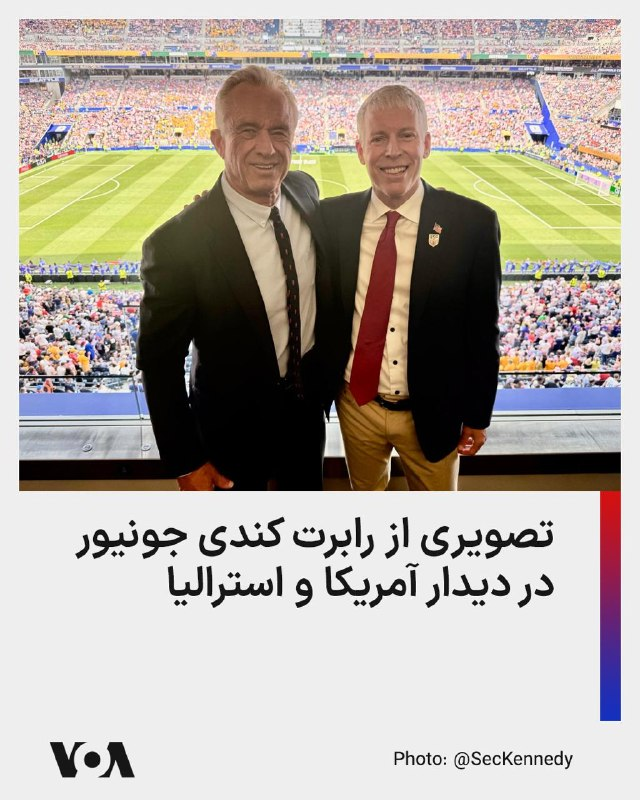

رابرت اف کندی جونیور، وزیر بهداشت و خدمات انسانی آمریکا، با انتشار این تصویر اعلام کرد به همراه لوری چاوز درمر، وزیر کار آمریکا، در دیدار تیم‌های ملی آمریکا و استرالیا در جام جهانی فوتبال در شهر سیاتل حضور داشته است.

او در پیام خود نوشت ورزش مردم را فراتر از فرهنگ‌ها و مرزها به هم نزدیک می‌کند، روحیه کار گروهی و رقابت سالم را تقویت می‌کند و به استحکام جوامع کمک می‌کند.

@FarsiVOA

## DW_Farsi — post 126243

  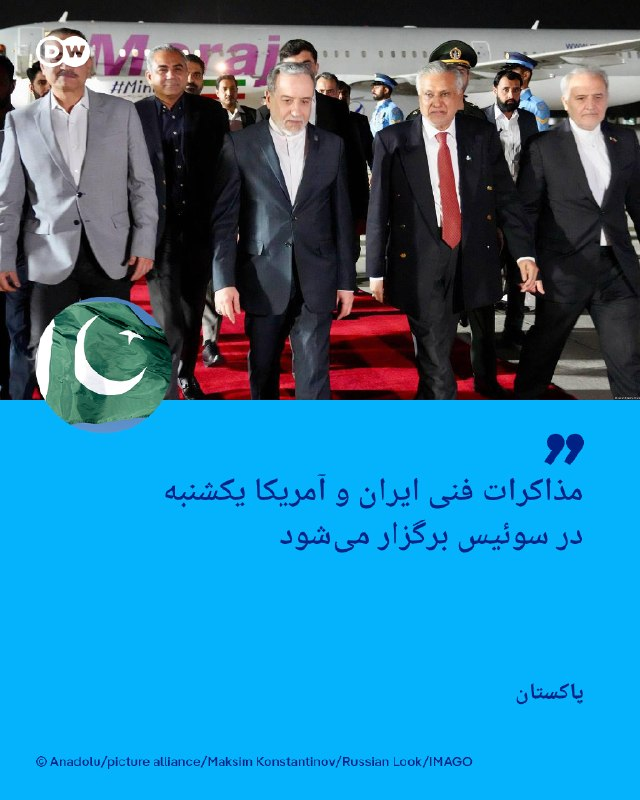

🔶پاکستان: مذاکرات فنی ایران و آمریکا یکشنبه در سوئیس برگزار می‌شود

وزارت خارجه پاکستان اعلام کرد که مذاکرات فنی برای اجرای تفاهم‌نامه ایران و آمریکا با هدف پایان دادن به جنگ منطقه‌ای، روز یکشنبه ۲۱ ژوئن (۳۱ خرداد) در بورگن‌اشتوک سوئیس برگزار خواهد شد.

به گفته مقامات اسلام‌آباد، نمایندگان ایران، آمریکا، پاکستان و قطر در این نشست حضور خواهند داشت.

این مذاکرات در ادامه تفاهم‌نامه‌ای برگزار می‌شود که پیش‌تر با میانجیگری پاکستان به امضا رسیده بود.

وزارت خارجه سوئیس نیز روز شنبه ۳۰ خرداد اعلام کرده بود که همچنان بستر "محرمانه، بی‌طرف و قابل اعتماد" مجموعه بورگن‌اشتوک را برای این گفت‌وگوها فراهم می‌کند.

وزارت خارجه سوئیس همچنین گفت، به دلیل محرمانه بودن مذاکرات، جزئیاتی درباره شرکت‌کنندگان و محتوای نشست‌ها منتشر نخواهد شد.

@dw_farsi

## DW_Farsi — post 126242

  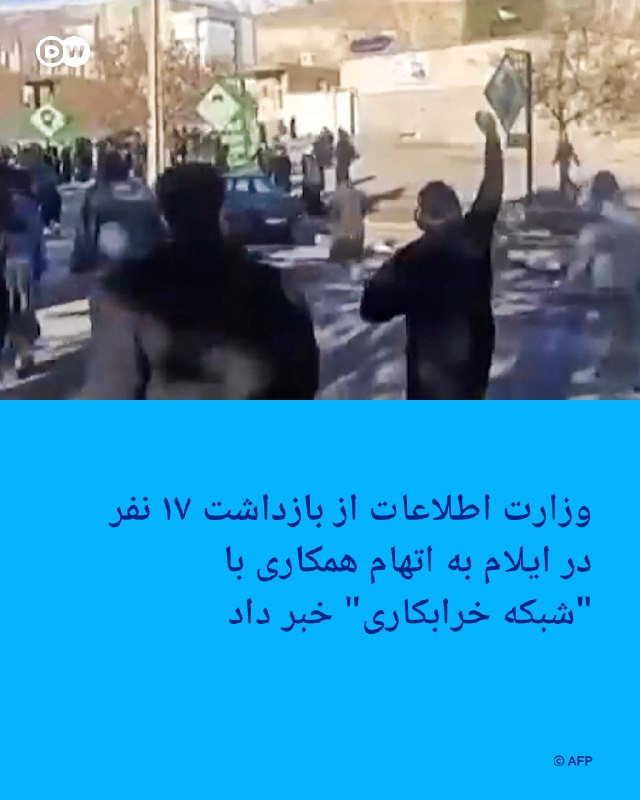

🔶وزارت اطلاعات از بازداشت ۱۷ نفر در ایلام به اتهام همکاری با "شبکه خرابکاری" خبر داد

وزارت اطلاعات جمهوری اسلامی از بازداشت "۱۷ نفر" در استان ایلام خبر داد و آن‌ها را به عضویت و همکاری با آنچه "شبکه خرابکاری خیابانی وابسته به آمریکا و اسرائیل" نامیده، متهم کرد.

در اطلاعیه این وزارتخانه آمده است که سه نفر از بازداشت‌شدگان به عنوان "لیدرهای میدانی" این شبکه شناسایی شده‌اند و ۱۴ نفر دیگر نیز به اتهام همکاری با این گروه بازداشت شده‌اند.

وزارت اطلاعات مدعی است که این افراد در اعتراضات دی ۱۴۰۴ قصد اجرای ماموریت‌هایی را در چارچوب موسوم به "جنگ تحمیلی سوم" داشته‌اند.

وزارت اطلاعات همچنین مدعی شده که از این افراد مواد منفجره، یک قبضه کلاشنیکف، یک نارنجک و تعدادی سلاح سرد کشف شده است.

تاکنون درباره هویت افراد بازداشت‌شده گزارشی منتشر نشده است.

@dw_farsi

## DW_Farsi — post 126241

  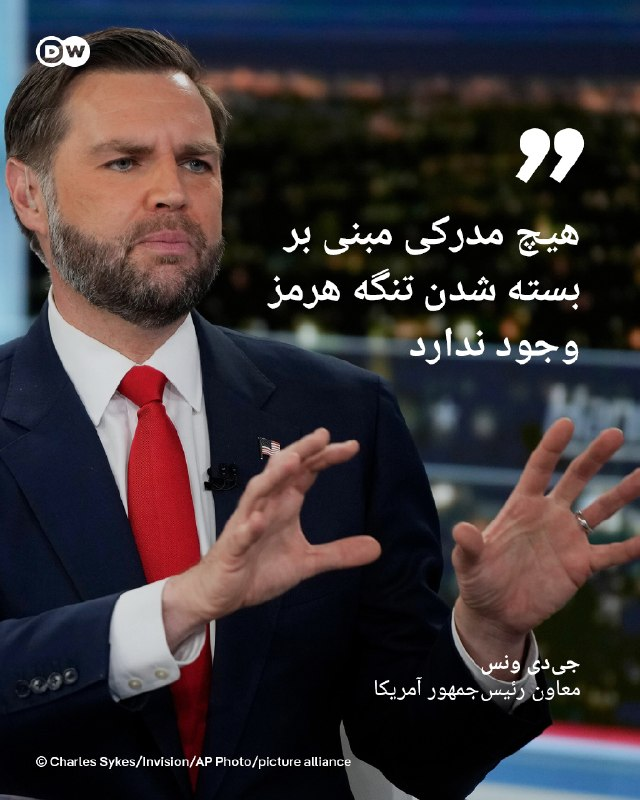

🔶جی‌دی ونس: هیچ مدرکی مبنی بر بسته شدن تنگه هرمز وجود ندارد

جی‌دی ونس، معاون رئیس‌جمهور آمریکا در گفت‌وگو با شبکه فاکس‌نیوز و در واکنش به ادعای ایران مبنی بر مسدود کردن تنگه هرمز گفت که هیچ نشانه‌ای مبنی بر بسته شدن این آبراه وجود ندارد.

قرارگاه مرکزی خاتم‌الانبیا روز شنبه، ۳۰ خرداد (۲۰ ژوئن) مدعی شد که تنگه هرمز "در واکنش به بدعهدی آمریکا در اجرای تفاهم‌نامه پایان جنگ و نقض مداوم آتش‌بس از سوی اسرائیل در جنوب لبنان"، به روی تردد شناورها بسته خواهد شد.

این نهاد نظامی همچنین نوشت: « اين گام اول پاسخ به عهدشکنی دشمن است و در صورت ادامه تجاوز گام‌های بعدی برای پایبند کردن دشمن به اجرای تعهدات برنامه ریزی و اقدام خواهد شد.»

@dw_farsi

## DW_Farsi — post 126240

🔶بیژن جیرسرایی: توافق جدید آمریکا و ایران "خطرناک" است

بیژن جیرسرایی، سیاستمدار حزب دموکرات آزاد آلمان (FDP) توافق میان آمریکا و ایران را به‌شدت مورد انتقاد قرار داده و آن را "خطرناک" توصیف کرد.

جیرسرایی در گفت‌وگو با شبکه "ان‌تی‌وی" آلمان گفت "برخلاف برخی ارزیابی‌ها، این توافق نشانه‌ای از برقراری صلح پایدار نیست" و به باور او می‌تواند به تقویت جمهوری اسلامی و افزایش نقش آن در منطقه منجر شود.

این سیاستمدار با اشاره به توافق هسته‌ای سال ۲۰۱۵ در دولت باراک اوباما، موسوم به برجام گفت دونالد ترامپ، رئيس‌جمهور آمریکا زمانی آن را "بدترین توافق تاریخ" می‌خواند، اما توافق جدید امتیازهای بیشتری به جمهوری اسلامی می‌دهد.

@dw_farsi

## DW_Farsi — post 126239

  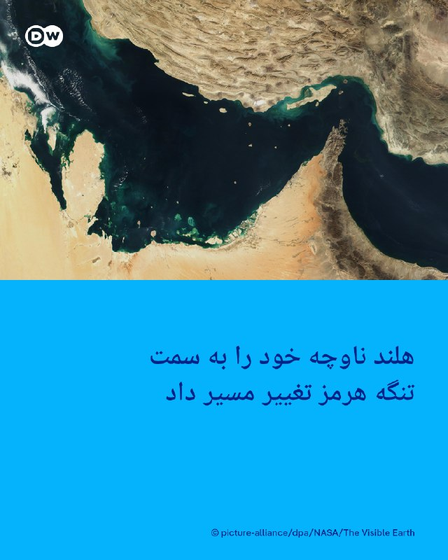

🔶هلند ناوچه خود را به سمت تنگه هرمز تغییر مسیر داد

دولت هلند اعلام کرد یک ناوچه پدافند هوایی این کشور را به سمت منطقه تنگه هرمز تغییر مسیر داده است تا در صورت تشکیل یک ماموریت بین‌المللی، امکان پیوستن به آن را داشته باشد.

به گزارش رویترز، وزیر دفاع هلند در نامه‌ای به پارلمان این کشور گفته است که این ناوچه هم‌اکنون در منطقه هند و اقیانوس آرام حضور دارد و رسیدن آن به تنگه هرمز چند هفته زمان خواهد برد.

این اقدام در حالی صورت می‌گیرد که فرانسه و بریتانیا در حال رایزنی برای تشکیل یک ماموریت چندملیتی به منظور حفاظت از کشتیرانی و مقابله با تهدیدات امنیتی در تنگه هرمز هستند. آلمان نیز پیش‌تر از اعزام دو کشتی به دریای سرخ برای آمادگی جهت مشارکت احتمالی در چنین ماموریتی خبر داده بود.

مقامات هلندی تاکید کرده‌اند که هنوز تصمیم نهایی برای مشارکت در هیچ عملیات مشخصی گرفته نشده و این اقدام با هدف حفظ آمادگی انجام شده است.

@dw_farsi

## DW_Farsi — post 126238

  <a href="telegram/content/DW_Farsi_126238_1781970236.mp4" target="_blank">🎬 Download video</a>

🎥برگزاری مراسم تولد صهبا رشتیان بر مزارش

یلدا رشتیان با انتشار ویدیویی در صفحه اینستاگرام خود زادروز خواهرش صهبا رشتیان را گرامی داشت. صهبا رشتیان یکی از جان‌باختگان اعتراضات دی‌ماه ۱۴۰۴ است که در ۲۳ سالگی با شلیک مستقیم ماموران در اصفهان کشته شد. صهبا مربی بدنسازی بود و به عنوان کمک‌داور در لیگ‌های فوتبال استانی فعالیت داشت.

@dw_farsi

## Persian_Trend_Official — post 17691

  <a href="telegram/content/Persian_Trend_Official_17691_1781970238.webm" target="_blank">🎬 Download video</a>

🌟
☣️کانال 12 اسرائیل: نتانیاهو با توقف حملات ارتش اسرائیل به لبنان موافقت کرد. این خبر هنوز بصورت رسمی از سوی ارتش اسرائیل تأیید نشده.... Phantom 📌 @persian_trend_official پرشین ترند | متفاوت‌ترین کانال نظامی

## Persian_Trend_Official — post 17690

نشست سران قوا به میزبانی پزشکیان برگزار شد.

صداوسیما: نشست سران قوا به میزبانی مسعود پزشکیان، رئیس‌جمهور و با حضور محمدباقر قالیباف، رئیس مجلس شورای اسلامی و حجت‌الاسلام والمسلمین غلامحسین محسنی اژه‌ای، رئیس قوه قضاییه برگزار شد.

در این نشست، آخرین وضعیت و تحولات جاری کشور در ابعاد مختلف سیاسی، اقتصادی و اجتماعی و بین المللی واکاوی شد و سران سه قوه ضمن ارزیابی شرایط پس از جنگ اخیر، راهکارهای تقویت تاب‌آوری ملی، ارتقای انسجام نهادی، تسریع در جبران خسارات و بازسازی ظرفیت‌های آسیب‌دیده در جنگ اخیر را بررسی کردند.

همچنین روند مذاکرات پیش‌رو، الزامات هماهنگی میان دستگاه‌های مسئول و راهبردهای صیانت از منافع ملی در چارچوب سیاست‌های کلان کشور، از دیگر محورهای مورد بحث و تبادل نظر در این نشست بود.

📝 Amir

📌 @persian_trend_official
پرشین ترند | متفاوت‌ترین کانال نظامی

## Persian_Trend_Official — post 17689

  <a href="telegram/content/Persian_Trend_Official_17689_1781970239.webm" target="_blank">🎬 Download video</a>

🌟
☣️کانال 12 اسرائیل: نتانیاهو با توقف حملات ارتش اسرائیل به لبنان موافقت کرد.
این خبر هنوز بصورت رسمی از سوی ارتش اسرائیل تأیید نشده....
Phantom

📌 @persian_trend_official
پرشین ترند | متفاوت‌ترین کانال نظامی

## Persian_Trend_Official — post 17688

  <a href="telegram/content/Persian_Trend_Official_17688_1781970239.webm" target="_blank">🎬 Download video</a>

هیئت مذاکره‌کننده ایرانی میناب 168 راهی سوئیس شد.

صداوسیما: هیئت مذاکره کننده ایرانی میناب 168 دقایقی قبل راهی زوریخ سوئیس شد. محمدباقر قالیباف رئیس مجلس و سیدعباس عراقچی وزیر خارجه، علی باقری معاون بین‌الملل دبیرخانه شورای‌عالی امنیت ملی، عبدالناصر همتی رییس بانک مرکزی، حمید بورد معاون وزیر نفت و رییس شرکت ملی نفت ایران،کاظم غریب ابادی و اسماعیل بقایی معاونین وزیرخارجه و ... اعضای هیئت اعزامی کشورمان را تشکیل می‌دهند.

بنابر اعلام بقایی سخنگوی هیئت مذاکره کننده میناب 168، این سفر جهت پیگیری اجرای تعهدات طرف مقابل است و هر توافق و تفاهمی وقتی محک می خورد که زمان اجرای آن رسیده باشد.

📝 Amir

📌 @persian_trend_official
پرشین ترند | متفاوت‌ترین کانال نظامی

## Persian_Trend_Official — post 17687

  

سنتکام ادعای بسته شدن تنگه هرمز را رد کرد.

سنتکام: ترافیک کشتی‌های تجاری در تنگه هرمز در 20 ژوئن افزایش یافت، زیرا نیروهای آمریکایی به عملیات خود در منطقه عمومی برای حمایت از آزادی دریانوردی ادامه دادند.

عبور ایمن از این آبراه بین‌المللی امروز با عبور 55 کشتی تجاری که مقادیر زیادی محموله و بیش از 17 میلیون بشکه نفت را به بازارهای جهانی منتقل می‌کردند، همچنان برقرار بود.

📝 Amir

📌 @persian_trend_official
پرشین ترند | متفاوت‌ترین کانال نظامی

## Persian_Trend_Official — post 17686

  <a href="telegram/content/Persian_Trend_Official_17686_1781970240.webm" target="_blank">🎬 Download video</a>

به اعلام قرارگاه مرکزی خاتم‌الانبیا، تنگه هرمز بطور مجدد بسته شد. 📝 Amir 📌 @persian_trend_official پرشین ترند | متفاوت‌ترین کانال نظامی

## Persian_Trend_Official — post 17685

  <a href="telegram/content/Persian_Trend_Official_17685_1781970241.webm" target="_blank">🎬 Download video</a>

سخنگوی وزارت خارجه: اگر بخشی از تعهدات طرف مقابل اجرا نشود کلیت تفاهم دچار مشکل می‌شود. طرف مقابل باید هرچه سریع‌تر تدابیر لازم را به کار بگیرد وگرنه کلیت تفاهم دچار مشکل خواهد شد. هیئت ایرانی برای پیگیری و مطالبۀ اجرای تعهدات طرف مقابل به سوئیس سفر خواهد…

## Persian_Trend_Official — post 17684

  <a href="telegram/content/Persian_Trend_Official_17684_1781970242.webm" target="_blank">🎬 Download video</a>

سخنگوی وزارت خارجه: اگر بخشی از تعهدات طرف مقابل اجرا نشود کلیت تفاهم دچار مشکل می‌شود.

طرف مقابل باید هرچه سریع‌تر تدابیر لازم را به کار بگیرد وگرنه کلیت تفاهم دچار مشکل خواهد شد.

هیئت ایرانی برای پیگیری و مطالبۀ اجرای تعهدات طرف مقابل به سوئیس سفر خواهد کرد.

📝 Amir

📌 @persian_trend_official
پرشین ترند | متفاوت‌ترین کانال نظامی

## RadioFarda — post 158547

  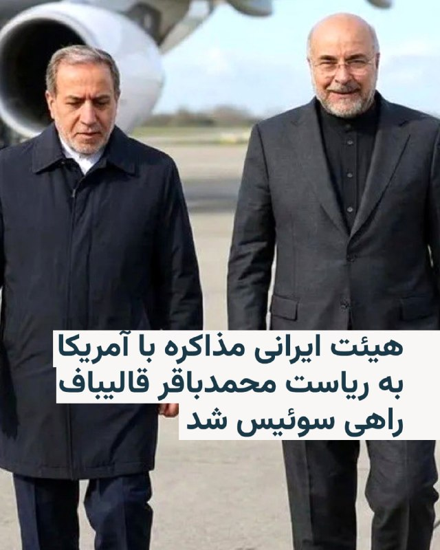

🔸رسانه‌های ایران گزارش دادند که هیئت مذاکره‌کنندهٔ جمهوری اسلامی به ریاست محمدباقر قالیباف و با حضور عباس عراقچی عازم سوئیس شده است.

🔸بر اساس این گزارش، عبدالناصر همتی، رئیس کل بانک مرکزی، و علی باقری کنی، معاون بین‌الملل دبیرخانه شورای عالی امنیت ملی، نیز در این سفر حضور خواهند داشت.

🔸کاظم غریب‌آبادی، معاون وزیر خارجه، اسماعیل بقائی، سخنگوری وزارت خارجه، و حمید بورد، معاون وزیر نفت، نیز از دیگر اعضای هیئت ایرانی هستند که عازم سوئیس شده‌اند.

🔸پیش از انتشار این گزارش، بقائی تداوم جنگ در لبنان را «نقض صریح تفاهم» امضاشده بین ایران و آمریکا خوانده و در عین حال گفته بود هیئت ایرانی برای پیگیری و مطالبهٔ تعهدات طرف مقابل عازم سوئيس خواهد شد.

🔸بر اساس گزارش‌های قبلی، استیو ویتکاف نیز راهی سوئیس شده تا به جرد کوشنر و تیم آمریکایی طرف مذاکره بپیوندد.

🔸پاکستان قبلاً اعلام کرده بود مذاکرات فنی ایران و آمریکا از روز یکشنبه ۳۱ خرداد در سوئیس آغاز خواهد شد.

@RadioFarda

## RadioFarda — post 158546

  

🔸ستاد فرماندهی مرکزی ارتش آمریکا، سنتکام، اعلام کرد تردد کشتی‌های تجاری در تنگه هرمز روز ۳۰ خرداد افزایش یافته و ۵۵ کشتی باری از این آبراه بین‌المللی عبور کرده‌اند.

🔸سنتکام در پیامی در شبکه ایکس نوشت این کشتی‌ها بیش از ۱۷ میلیون بشکه نفت و مقادیر زیادی کالا را به بازارهای جهانی منتقل کرده‌اند.

🔸به‌گفته سنتکام، عبور و مرور ایمن در تنگه هرمز همچنان برقرار است و مرکز مشترک اطلاعات دریایی نیز این هفته با انتشار اطلاعیه‌ای، ایمنی مسیر تعیین‌شده برای تردد کشتی‌ها را تأیید کرده است.

🔸بیانیۀ سنتکام ساعاتی پس از آن منتشر شد که قرارگاه مرکزی خاتم‌الانبیاء اعلام کرد که در واکنش به تداوم حملات اسرائیل به جنوب لبنان، تنگه هرمز را به روی تردد شناورها می‌بندد.

🔸سنتکام در بیانیۀ خود تأکید کرد نیروهای آمریکایی همچنان در منطقه حضور دارند و برای اطمینان از اجرای کامل توافق با ایران و حفظ آزادی کشتیرانی به فعالیت خود ادامه می‌دهند.

🔸این نهاد نظامی پیش‌تر اعلام کرده بود که در چارچوب توافق اخیر با ایران، اجرای محاصره دریایی بنادر ایران را متوقف کرده است.

@RadioFarda

## RadioFarda — post 158545

  <a href="https://t.me/radiofarda/158545" target="_blank">📎 Download file</a>

گفت‌وگو با حمیدرضا عزیزی؛ بین خطوط تفاهم‌نامه ایران و آمریکا چیست؟

🔸توافق اسلام‌آباد میان ایران و آمریکا، اگرچه هنوز نهایی نیست و بسیاری از مسائل قرار است طی ۶۰ روز آینده، یا حتی بیشتر، مورد مذاکره قرار گیرند، اما در مرحله نخست توانسته به جنگ علیه ایران پایان دهد؛ هرچند سازوگارهای اجرایی مفاد آن هنوز چندان روشن نیست. حمیدرضا عزیزی، پژوهشگر غیرمقیم در شورای خاورمیانه در امور جهانی و پژوهشگر حوزه بین‌الملل، از برلین در گفت‌وگو با برنامه خبری-تحلیلی «ایستگاه ۱۹» رادیو فردا تلاش کرده است درکی از آنچه این توافق پیش روی طرفین قرار می‌دهد، ارائه دهد.

@RadioFarda

## RadioFarda — post 158544

وزارت خارجه ایران: هیئت ایرانی عازم سوئيس می‌شود

🔸سخنگوی وزارت خارجه ایران تداوم جنگ در لبنان را «نقض صریح تفاهم» امضاشده بین ایران و آمریکا خواند و در عین حال گفت هیئت ایرانی برای پیگیری و مطالبهٔ تعهدات طرف مقابل عازم سوئيس خواهد شد.

🔸اسماعیل بقائی بعدازظهر شنبه ۳۰ خرداد گفت سفر برنامه‌ریزی‌شدهٔ عباس عراقچی به سوئیس که قرار بود روز جمعه انجام شود، پس از امضای دیجیتال یادداشت تفاهم میان رؤسای جمهور ایران و آمریکا لغو شد، زیرا به‌گفتهٔ او دیگر «فوریت اجرایی» نداشت.

🔸او افزود سفر جدید هیئت ایرانی با هدف پیگیری اجرای تعهدات آمریکا و روشن شدن نحوه پایبندی طرف مقابل به مفاد تفاهم‌نامه انجام می‌شود.

🔸آقای بقائی با اشاره به بند ۱۳ این تفاهم‌نامه گفت آغاز مذاکرات برای دستیابی به توافق نهایی، مشروط به آغاز و تداوم اجرای برخی تعهدات از سوی طرف مقابل است و این شرط هنوز محقق نشده است.

🔸سخنگوی وزارت خارجه ایران گفت بند نخست تفاهم‌نامه، یعنی «خاتمه جنگ در همه جبهه‌ها از جمله لبنان»، مهم‌ترین بخش تعهدات متقابل طرفین است. او گفت ایران و آمریکا به تعهدات خود در «خاتمه محاصره دریایی و بازگشایی تنگه هرمز» عمل کرده‌اند، اما آمریکا نتوانسته اسرائیل را به توقف عملیات نظامی در لبنان وادار کند و از این رو تفاهم‌نامه «به‌صراحت نقض شده است».

🔸دقایقی پیش از این اظهارات، قرارگاه مرکزی خاتم‌الانبیاء در بیانیه‌ای اعلام کرد که در واکنش به تداوم حملات اسرائیل به جنوب لبنان، تنگه هرمز را به روی تردد شناورها می‌بندد.

🔸حملات اسرائیل به لبنان روز شنبه، تنها چند ساعت پس از اعلام آتش‌بس میان اسرائیل و حزب‌الله، از سر گرفته شد و بنا بر گزارش‌ها بیش از ۱۰ نفر کشته شدند. اسرائیل اعلام کرده است که این حملات در پاسخ به شلیک راکت و موشک از سوی حزب‌الله انجام شده است.

🔸همزمان، وزارت خارجه سوئیس روز شنبه اعلام کرد گفت‌وگوها درباره اجرای تفاهم‌نامه میان ایران و آمریکا همچنان در بورگن‌اشتوک ادامه دارد. این وزارتخانه با اشاره به محرمانه بودن مذاکرات، از ارائه جزئیات درباره شرکت‌کنندگان و محتوای گفت‌وگوها خودداری کرد.

🔸پیشتر وب‌سایت اکسیوس گزارش داده بود که استیو ویتکاف، فرستاده ویژه دونالد ترامپ، و عباس عراقچی برای گفت‌وگو درباره اجرای تفاهم‌نامه راهی سوئیس خواهند شد. جی‌دی ونس، معاون دونالد ترامپ، نیز بعدزاظهر شنبه اعلام کرد احتمالاً «طی چند روز آینده» به سوئیس سفر خواهد کرد.

@RadioFarda

## IranianMinds — post 23015

هیات مذاکره‌کننده ایران به ریاست قالیباف راهی سوئیس شد.

@IranianMinds

## IranianMinds — post 23014

  <a href="telegram/content/IranianMinds_23014_1781970244.mp4" target="_blank">🎬 Download video</a>

بقایی:
سفر به ژنو فاز دوم مذاکرات نیست

سفر به ژنو فاز دوم مذاکرات نیست و صرفا برای امضای یادداشت تفاهم به صورت حضوری است.

@IranianMinds

## IranianMinds — post 23013

فاکس نیوز :

معاون رئیس‌جمهور آمریکا ونس: برنامه‌ ریزی ها برای بازدید از سوئیس

@IranianMinds

## IranianMinds — post 23012

  <a href="telegram/content/IranianMinds_23012_1781970246.mp4" target="_blank">🎬 Download video</a>

تظاهرات امروز ایرانیان سوئد، ۲۰ ژوئن به فرمان شاهزاده رضا پهلوی در همبستگی با مردم دلیر ایران و زندانیان در بند.

@IranianMinds

## BBCPersian — post 284502

🔻رسانه‌های ایران: هیئت ایرانی به سوئیس رفت

رسانه‌های ایران می‌گویند که هیئت مذاکره کننده ایران به ریاست محمدباقر قالیباف، رئیس مجلس، و با همراهی عباس عراقچی، وزیر خارجه این کشور روانه سوئیس شده است.

خبرگزاری‌ فارس به نقل از یک منبع نزدیک به تیم مذاکره‌کننده گزارش کرده که علی باقری کنی، معاون معاون دبیر شورای‌عالی امنیت، ملی نیز در این سفر حضور دارد.

پیشتر اسماعیل بقایی، سخنگوی وزارت خارجه، گفته بود که هدف از این سفر «پیگیری اجرای تعهدات طرف مقابل» خواهد بود و به معنای «شروع فاز دوم مذاکرات نخواهد بود».

این سفر در شرایطی است که قرارگاه مرکزی خاتم‌الانبیا اعلام کرده بود در واکنش به «عهدشکنی طرف مقابل» در حمله به جنوب لبنان، تنگه هرمز را بسته است.

@BBCPersian

## BBCPersian — post 284501

🔻سنتکام: در تنگه هرمز حاضر و هوشیار باقی می‌مانیم

در پی اعلام بسته شدن تنگه هرمز توسط سپاه پاسداران، ارتش آمریکا روز شنبه اعلام کرد که در تنگه هرمز «حاضر و هوشیار» باقی می‌ماند.

فرماندهی مرکزی ایالات متحده، سنتکام، در بیانیه‌ای اعلام کرد: «نیروهای آمریکایی همچنان(در تنگه هرمز) حضور دارند و هوشیار هستند تا اطمینان حاصل کنند که تمام ابعاد توافق با ایران رعایت و با قدرت و اثربخشی کامل اجرا می‌شود.»

ساعاتی پیش سپاه پاسداران اعلام کرد در واکنش به آنچه «نقض بی‌وقفه و مستمر آتش‌بس» توسط اسرائیل خوانده، تنگه هرمز را بسته است.

نیروی دریایی سپاه پاسداران از شناورها خواسته است که به تنگه هرمز نزدیک نشوند.

@BBCPersian

## BBCPersian — post 284500

🔻کمیته انضباطی دانشگاه صنعتی شریف برای شش دانشجوی خود به دلیل «نقش‌آفرینی در ناآرامی‌های اسفندماه، برگزاری و هدایت تجمعات غیرقانونی، هتاکی و فعالیت علیه نظام» حکم اخراج از دانشگاه صادر کرده است.

رسانه‌های ایران نام‌های سپنتا سعیدی، حسین شادمان، مسیحا باقری، فاطمه خاکپور، فریبرز کهن‌زاد و پرنیان خدابخشی را در فهرست این دانشجویان منتشر کرده‌اند.

به گفته کمیته انضباطی دانشگاه شریف، این احکام بدوی بوده و به صورت جداگانه صادر شده است.

برخی از این احکام علاوه بر اخراج از دانشگاه، شمال محرومیت چندساله از ادامه تحصیل نیز می‌شود.

@BBCPersian

## BBCPersian — post 284499

مرتضی آخوندی،‌ عکاس هرمزگانی برای عکس هوایی از ردیف قبرهای کودکان مدرسه میناب برنده مدال طلای جشنواره بین‌المللی تک‌عکس طلایی (جی‌اس‌پی اواردز) شد آقای آخوندی به‌خاطر تصویر هوایی از تشییع دانش‌آموزان میناب که با موشک تاماهاک آمریکایی کشته شدند، در بخش عکس…

## BBCPersian — post 284497

مرتضی آخوندی،‌ عکاس هرمزگانی برای عکس هوایی از ردیف قبرهای کودکان مدرسه میناب برنده مدال طلای جشنواره بین‌المللی تک‌عکس طلایی (جی‌اس‌پی اواردز) شد
آقای آخوندی به‌خاطر تصویر هوایی از تشییع دانش‌آموزان میناب که با موشک تاماهاک آمریکایی کشته شدند، در بخش عکس خبری برنده مدال طلای عکاسی گلدن شات ۲۰۲۶ شد.

مرتضی آخوندی که این عکس را با عنوان «میناب - ۱۶۸ دانش‌اموز» در این رقایت‌ها شرکت داده در توضیح این قاب نوشته است: «آرامگاه کودکانی که تنها “گناه” آنها بچگی‌شان بود… بی‌گناهانی که خاموششان کردند و تاریخ هرگز این جنایت را فراموش نخواهد کرد.»

بنابر اعلام این جشنواره مدال‌ طلای عکاسی گلدن شات به برندگان رتبه نخست هر بخش از رقابت‌ها اهدا می‌شود. این مدال‌ها به آثاری تعلق می‌گیرد که بالاترین سطح خلاقیت، برتری فنی و بیان هنری را به نمایش گذاشته‌اند.

وبسایت جایزه گلدن شات درباره جوایز عکاسی نوشته که «این مدال به عنوان نمادی ماندگار، به عکاسان برگزیده کمک می‌کند تا در سطح بین‌المللی بیشتر دیده شوند و از اعتبار گسترده‌تری برخوردار شوند.»

## BBCPersian — post 284496

  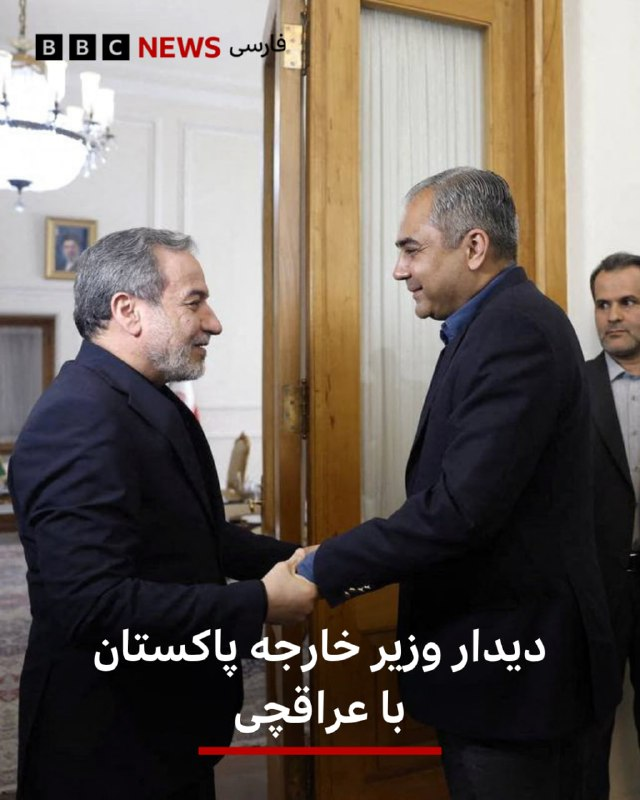

🔻محسن نقوی» وزیر کشور پاکستان، در ادامه رایزنی‌های مقامات پاکستان درباره مذاکرات ایران و آمریکا، ظهر امروز با عباس عراقچی، وزیر امور خارجه ایران، دیدار و گفت‌وگو کرد.

خبرگزار ایرنا گزارش داد آقای نقوی که بعد از زیارت حرم امام رضا به تهران سفر کرد، در دیدار با وزیر امور خارجه ایران به بررسی تازه‌ترین تصمیمات و تحولات در مورد «یادداشت تفاهم اسلام‌آباد» پرداخت. آقای نقوی صبح امروز وارد ایران شد و ابتدا به مشهد رفت.

وزیر کشور پاکستان پیش از این در ۱۷ خرداد ماه هم به تهران سفر کرد و با وزیر امور خارجه ایران گفتگو کرد. او در این دیدار حامل پیام مکتوب شهباز شریف، نخست وزیر پاکستان برای مجتبی خامنه‌ای، رهبر جمهوری اسلامی ایران، بود.

همزمان وزارت خارجه پاکستان در بیانیه‌ای گفته است که در ادامه امضای «تفاهم‌نامه اسلام‌آباد»، مذاکرات فنی در سطح کارشناسی در روز یکشنبه ۲۱ ژوئن ۲۰۲۶ در بورگن‌اشتوک در سوئیس برگزار خواهد شد.

بر اساس این بیانیه نمایندگان آمریکا و ایران به همراه میانجی‌گرانی از پاکستان و قطر در این گفت‌وگوها شرکت خواهند کرد.

📸Reuters

https://bbc.in/4w6P9a9
@BBCPersian

## BBCPersian — post 284495

  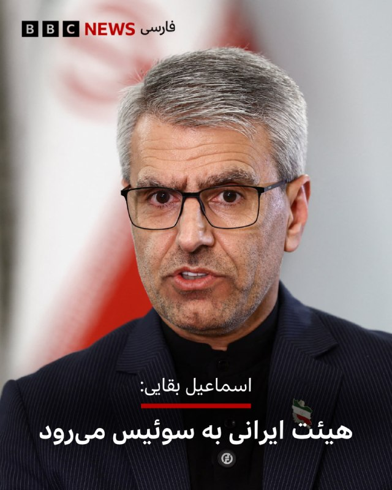

🔻اسماعیل بقایی، سخنگوی وزارت خارجه ایران، تداوم جنگ در لبنان را «نقض تفاهم‌نامه» میان ایران و آمریکا خواند و اعلام کرد هیئتی از ایران «برای پیگیری و مطالبه تعهدات طرف مقابل» به سوئیس می‌رود.

با این حال اسماعیل بقایی، زمان این سفر را اعلام نکرد.

وی در گفت‌و‌گو با تلویزیون دولتی ایران گفت هدف از این سفر «پیگیری اجرای تعهدات طرف مقابل» خواهد بود و به معنای «شروع فاز دوم مذاکرات نخواهد بود».

سخنگوی وزارت خارجه ایران با اشاره به اینکه آمریکا تعهدات مندرج در بند سیزده تفاهم‌نامه را اجرا نکرده است، گفت که «در سوئیس قرار است دربارۀ اجرای تعهدات طرف مقابل مطالبه‌گری داشته باشیم و مشخص شود آن‌ها چطور می‌خواهند به تعهداتشان عمل کنند.»

او حملات اسرائیل به لبنان را از جمله موارد نقض تفاهم‌نامه عنوان کرد.

پیشتر قرار بود که روز جمعه، ۲۹ خرداد ماه، نمایندگان ایران و آمریکا در هتل بورگن‌اشتوک مذاکرات را آغاز کنند.

📸Reuters

https://bbc.in/4xLKegu
@BBCPersian

## BBCPersian — post 284494

  <a href="telegram/content/BBCPersian_284494_1781970252.mp4" target="_blank">🎬 Download video</a>

⭕️سرخط خبرها، شنبه ۳۰ خرداد ۱۴۰۵
@BBCPersian

## BBCPersian — post 284493

  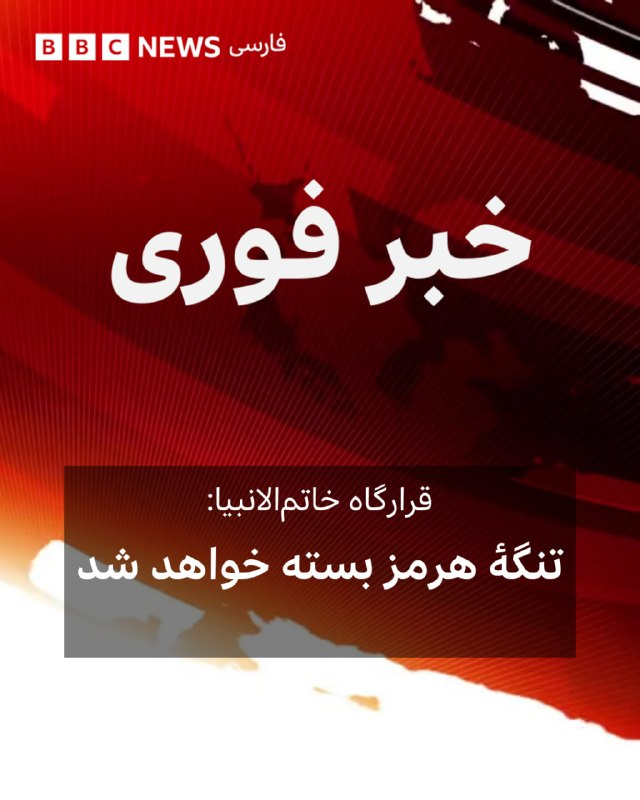

🔻قرارگاه خاتم‌الانبیا در اطلاعیه‌ای اعلام کرده است که تنگۀ هرمز به روی شناورها «بسته خواهد شد.»

در این اطلاعیه، دلیل این اقدام «بدعهدی‌ و پیمان‌شکنی آشکار» آمریکا در اجرای بند اول تفاهم‌نامه پایان جنگ، «نقض بی‌وقفه و مستمر آتش‌بس» توسط اسرائیل در جنوب لبنان و«کشتار بی‌رحمانه و آوارگی صدها هزار نفر» از شهروندان لبنانی عنوان شده است.

در بند اول تفاهم‌نامه ایران و آمریکا آمده است که آمریکا، ایران و متحدان آنها «پایان فوری و دائمی» عملیات نظامی در «همه جبهه ها» از جمله لبنان را اعلام خواهند کرد.

قرارگاه خاتم‌الانبیا «عدم عقب‌نشینی» نیروهای اسرائیلی از جنوب لبنان را از دیگر دلایل بسته شدن تنگه هرمز عنوان کرده است.

این نهاد، این اقدام را «گام اول پاسخ به عهدشکنی دشمن» برشمرده است.

@BBCPersian

## BBCPersian — post 284492

  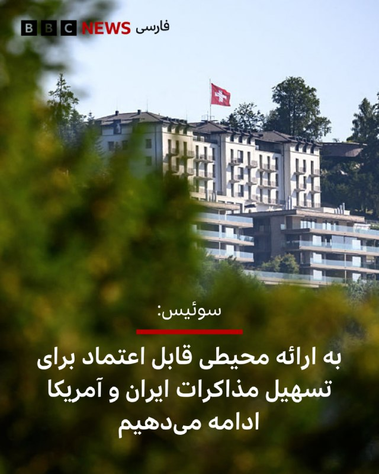

🔺وزارت خارجه سوئیس روز شنبه اعلام کرد که این کشور همچنان به ارائه «محیطی امن و قابل اعتماد» در بورگن‌استوک برای تسهیل مذاکرات در مورد اجرای یادداشت تفاهم بین ایالات متحده و ایران ادامه می‌دهد.

این وزارت‌خانه در بیانیه‌ای افزود که به دلیل محرمانه بودن، جزئیات بیشتری در مورد شرکت‌کنندگان و محتوای مذاکرات فاش نخواهد شد.

دیشب یک مقام آمریکایی به وب‌سایت خبری آکسیوس گفت که استیو ویتکاف، فرستاده کاخ سفید، در راه سوئیس است.

به گفته این مقام، جرد کوشنر، داماد و دیگر فرستاده دونالد ترامپ، هم‌اکنون در سوئیس حضور دارد.

📸AFP via Getty Images

https://bbc.in/4uPIT5t
@BBCPersian

## Dirty_Kids — post 392673

  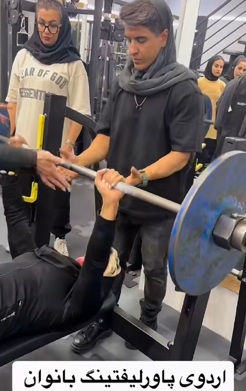

ایران هر روز سورپرایزت می‌کنه؛ خیلی جدی اومدن به مربیِ مرد شال دادن سرش کنه تا بتونه بیاد بالا سر خانوما وایسه تیم رو مربی‌گری کنه!!

@Dirty_Kids 👻

## Dirty_Kids — post 392672

  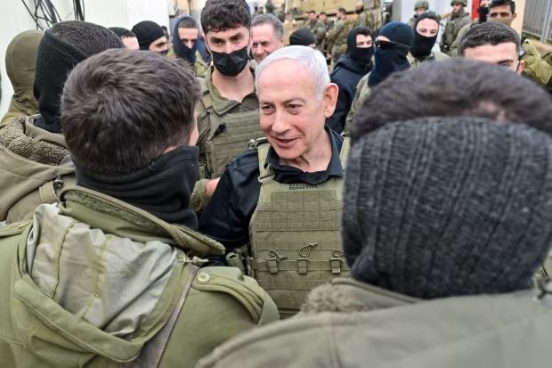

🔴طبق گزارش رسانه‌های اسرائیلی؛
بنیامین نتانیاهو دستور آتش‌بس تو لبنان رو صادر کرد ولی ارتش اسرائیل گفته‌ از مناطقی که تصرف کردیم، عقب‌نشینی نمی‌کنیم.

@Dirty_Kids 👻

## Dirty_Kids — post 392671

  <a href="telegram/content/Dirty_Kids_392671_1781970258.mp4" target="_blank">🎬 Download video</a>

۵۰۰ تا پسر افتادن دنبال یه دختر تا بلندش کنن 😂😂😂 اعتقادات انقد عمیقه که با یه جنیفر لوپز میشه همشونو یزیدی کرد

@Dirty_Kids 👻

## Dirty_Kids — post 392670

  

از طرفدارای حسین فقط تزریقی مزیریقیا موندن😂😂😂 یکیش توجیه نشده داره میرقصه @Dirty_Kids 👻

## Dirty_Kids — post 392669

  <a href="telegram/content/Dirty_Kids_392669_1781970259.mp4" target="_blank">🎬 Download video</a>

دوباره محرم و اومد و جنگ و دعوا سر نذری گرفتن😂😂۲ تا زن سن بالای تو صف به خاطر یه قیمه همدیگه رو تیکه پاره میکنن

@Dirty_Kids 👻

## Dirty_Kids — post 392668

‏واقعا دخترا خیلی وقیح و پررو شدن، قبلا نصف پیتزاشون یا حداقل نصف سیب زمینیشون میموند، الان همشو میخورن.

@Dirty_Kids 👻

## Dirty_Kids — post 392667

  <a href="telegram/content/Dirty_Kids_392667_1781970262.mp4" target="_blank">🎬 Download video</a>

یه دختر بچه وسط جمع مردونه چیکار می‌کنه؟

+ خود عرزشیا پشماشون ریخته بود

@Dirty_Kids 👻

## Dirty_Kids — post 392666

  <a href="telegram/content/Dirty_Kids_392666_1781970265.mp4" target="_blank">🎬 Download video</a>

چرا میگیم ج.ا همین الانم هم سقوط کرده!
زمانی محرم احترام خاصی بین مردم و مخصوصا مذهبیون داشت و مردم عادی هم حرمت این ماه رو نگه میداشتند الان شده سیرک جنده و جنده‌بازان هر شهر و حکومت هم توان جمع کردن این سیرک رو نداره.

@Dirty_Kids 👻

## Dirty_Kids — post 392665

دیروز اسباب‌کشی داشتیم.
یارو اول کلا ۷ تومن طی کرد. کار که تموم شد گفت ۵۰ تومن، با بحث و اینا آوردش ۲۸ تومن. با فحش و تهدید و دعوا ۱۲ تومن بهش دادیم.
مملکت در همه ابعاد و اقشار دزد پرورش میده.

@Dirty_Kids 👻

## Dirty_Kids — post 392664

  <a href="telegram/content/Dirty_Kids_392664_1781970267.mp4" target="_blank">🎬 Download video</a>

شاهین صمدپور گفته مودب باشید. چشم از این به بعد کسی خواست تو صورت بچه ۱۱ ساله گلوله خالی کنه بهش می‌گیم قربونت بشم لطفا شلیک نکن. کصمادرت شاهین صمدپور. آقای شاهین صمدپور کاش مثل همون دی ماه لال میموندی.اونموقع که سیلاب خون‌ راه انداخته بودن تو از روی ادب…

## Dirty_Kids — post 392661

شاهین صمدپور گفته مودب باشید. چشم از این به بعد کسی خواست تو صورت بچه ۱۱ ساله گلوله خالی کنه بهش می‌گیم قربونت بشم لطفا شلیک نکن.
کصمادرت شاهین صمدپور.

آقای شاهین صمدپور کاش مثل همون دی ماه لال میموندی.اونموقع که سیلاب خون‌ راه انداخته بودن تو از روی ادب سکوت کرده بودی درسته؟

@Dirty_Kids 👻

## Hranews — post 113741

  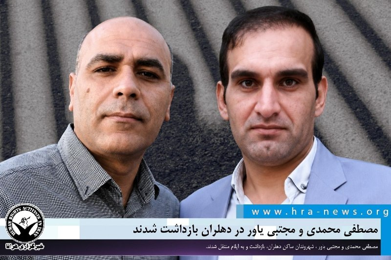

مصطفی محمدی و مجتبی یاور بازداشت و به زندان منتقل شدند

❗️
❗️
❗️
❗️
❗️ – مصطفی محمدی و مجتبی یاور، شهروندان ساکن دهلران امروز شنبه ۳۰ خردادماه، در این شهر #بازداشت و به زندان ایلام منتقل شدند.

به گزارش خبرگزاری هرانا، ارگان خبری مجموعه فعالان حقوق بشر در ایران، امروز شنبه ۳۰ خرداد ۱۴۰۵، مصطفی محمدی و مجتبی یاور بازداشت شدند.

یک منبع نزدیک به خانواده یکی از این شهروندان ضمن تایید این موضوع به هرانا گفت: امروز ماموران مصطفی محمدی را در منزل شخصی‌اش بازداشت و به ساختمان دادگستری دهلران منتقل کردند. مجتبی یاور نیز برای پیگیری وضعیت و همراهی با آقای محمدی به یکی از شعب قضایی مستقر در دادگستری مراجعه کرده بود که با دستور رئیس این شعبه بازداشت شد. این دو شهروند پس از بازداشت به زندان ایلام منتقل شدند.

ادامه مطلب

#مصطفی_محمدی
#مجتبی_یاور

↘️
@hranews_bot تماس ✉️ -  @Hranews  کانال هرانا 🆑

## Hranews — post 113740

  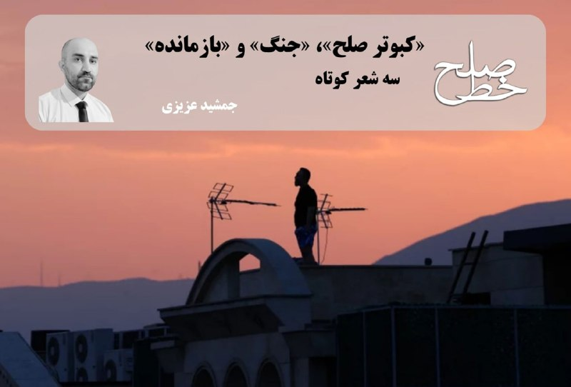

«کبوتر صلح»، «جنگ» و «بازمانده»؛ سه شعر کوتاه از جمشید عزیزی

کبوتر صلح
در سینه‌خیز شعر
بر زمینی که به‌جای خاک
بوی باروت می‌دهد
بعد از موشک‌باران آرزوها
به‌دنبال پناهگاه دستان تو هستم
ای کبوتر بی‌مرز
زمین خسته‌ی ما
دیگر تاب پوتین ندارد

جنگ
از آفتاب خون می‌تابد
که کار و بارمان
مثل همیشه لخته شده است!
و چه عجیب کودکان پرنده می‌شوند
می‌گویند: واقعیت تلخ است.
می‌گویند: چاره‌ای نداشتیم.
خبرگزاری‌ها بار دیگر می‌بافند
آدم‌بزرگ‌ها تصمیم می‌گیرند
آدم‌کوچک‌ها می‌میرند
و خون تنها شعری‌ست که جاری می‌شود
و این زخم‌ها خوب شدنی نیستند.

بازمانده
جنگ تمام شد
من اما
هنوز تنهایم
هنوز خالی‌ام
هنوز درد دارم
و هنوز می‌ترسم
مثل آپارتمانی که
موشکی را خورده است!

لینک اشعار در وبسایت خط صلح

↘️
@hranews_bot تماس ✉️ -  @Hranews  کانال هرانا 🆑

## Hranews — post 113739

یک زندانی در زندان مراغه اعدام شد

❗️
❗️
❗️
❗️
❗️ – حکم یک زندانی که پیشتر از بابت اتهام قتل به #اعدام محکوم شده بود، در زندان مراغه اجرا شد.

ادامه مطلب

#علی_آقاحسینی

↘️
@hranews_bot تماس ✉️ -  @Hranews  کانال هرانا 🆑

## alonews — post 129404

  <a href="telegram/content/alonews_129404_1781970270.webm" target="_blank">🎬 Download video</a>

👈سنتکام بسته شدن تنگه هرمز را تکذیب کرد و اعلام کرد این تنگه همچنان به روی تمام کشتی‌ها باز است

✅ @AloNews خبر جنگ

## alonews — post 129403

  <a href="telegram/content/alonews_129403_1781970270.webm" target="_blank">🎬 Download video</a>

👈معاون ترامپ: احتمالا طی ۴۸ ساعت آینده به سوئیس خواهم رفت

✅ @AloNews خبر جنگ

## alonews — post 129402

  <a href="telegram/content/alonews_129402_1781970270.webm" target="_blank">🎬 Download video</a>

👈شبکه ۱۲ اسرائیل: تصمیم نتانیاهو و کاتس برای آتش‌بس در لبنان با هماهنگی ایالات متحده اتخاذ شد.

✅ @AloNews خبر جنگ

## alonews — post 129401

  <a href="telegram/content/alonews_129401_1781970271.webm" target="_blank">🎬 Download video</a>

👈حمله اسرائیل به غرب خان یونس در غزه

✅ @AloNews خبر جنگ

## alonews — post 129400

  <a href="telegram/content/alonews_129400_1781970271.webm" target="_blank">🎬 Download video</a>

👈ایران‌خودرو: دوباره گران می‌کنیم!
‌

🔴شرکت ایران‌خودرو اعلام کرد که اصلاحیهٔ قیمت محصولات شرکت که در ۲۸ خرداد منتشر شد تنها تا پایان عرضه دورهٔ سیزدهم اولویت بندی محصولات این شرکت معتبر است.

🔴‌لذا پس از پایان این دورهٔ ثبت‌نام، قیمت‌های اعلام شده در ۲۷ خرداد ملاک قرار میگیرد.

✅ @AloNews خبر جنگ

## alonews — post 129399

  <a href="telegram/content/alonews_129399_1781970271.webm" target="_blank">🎬 Download video</a>

👈 هواپیمای هیئت مذاکره کننده ایرانی در راه زوریخ

✅ @AloNews خبر جنگ

## alonews — post 129398

  <a href="telegram/content/alonews_129398_1781970272.webm" target="_blank">🎬 Download video</a>

👈سی‌ان‌ان: ونس امروز به سوئیس می‌رود

✅ @AloNews خبر جنگ

## alonews — post 129397

  <a href="telegram/content/alonews_129397_1781970272.webm" target="_blank">🎬 Download video</a>

👈جی‌دی ونس درباره ایران: من بسیار مطمئنم که می‌توانیم این آتش‌بس را حفظ کنیم.

✅ @AloNews خبر جنگ

## alonews — post 129396

  <a href="telegram/content/alonews_129396_1781970272.webm" target="_blank">🎬 Download video</a>

🔴فوری / کانال ۱۲ عبری : نتانیاهو دستور توقف حملهِ‌ها به لُبنان رو صادر کرد.

✅ @AloNews خبر جنگ

## alonews — post 129395

  <a href="telegram/content/alonews_129395_1781970273.webm" target="_blank">🎬 Download video</a>

👈ارتش اسرائیل (IDF) انجام دهها حمله هوایی در جنوب لبنان را در طول شب و صبح امروز تایید کرد، اما هرگونه اظهارنظر درباره تهاجم به تپه «علی الطاهر» در نزدیکی «نبطیه» را به طور کامل رد کرده و به جای آن، حملات را به «نقض آتش‌بس» توسط حزب‌الله نسبت می‌دهد.

✅ @AloNews خبر جنگ

## alonews — post 129394

  <a href="telegram/content/alonews_129394_1781970273.webm" target="_blank">🎬 Download video</a>

👈بدون شرح

✅ @AloNews خبر جنگ

## alonews — post 129393

  <a href="telegram/content/alonews_129393_1781970273.webm" target="_blank">🎬 Download video</a>

👈ملونی به ترامپ پاسخ داد: رئیس‌جمهور ترامپ، این حملات مداوم و بی‌دلیل بی‌معنی است. در مورد محبوبیتم، دوستی با شما قطعاً کمکی نکرده است و همچنین به رابطه من با شما بستگی ندارد.

🔴محبوبیتم به توانایی من در دفاع از منافع ملی ایتالیا بستگی دارد، و این دقیقاً همان کاری است که همیشه انجام داده‌ام. این همچنین کاری است که در مورد پایگاه‌های نظامی آمریکا در ایتالیا انجام دادم. استفاده از آن‌ها توسط توافقاتی که همیشه به آن‌ها احترام گذاشته‌ایم، تنظیم می‌شود و تا زمانی که من نخست‌وزیر هستم، نمی‌توان آن‌ها را نقض کرد.

🔴ایتالیا همچنان یک کشور مستقل است. به هر حال، محبوبیتم به شما مربوط نیست. پیشنهاد می‌کنم روی محبوبیت خودتان تمرکز کنید.

✅ @AloNews خبر جنگ

## alonews — post 129392

  <a href="telegram/content/alonews_129392_1781970274.webm" target="_blank">🎬 Download video</a>

👈 هم اکنون تردد بدون مشکل کشتی آمریکایی در تنگه هرمز

✅ @AloNews خبر جنگ

## alonews — post 129391

  <a href="telegram/content/alonews_129391_1781970274.webm" target="_blank">🎬 Download video</a>

👈فکت:
هروقت عراقچی تنها رفته مذاکره، جنگ شده

✅ @AloNews خبر جنگ

## alonews — post 129390

  <a href="telegram/content/alonews_129390_1781970274.webm" target="_blank">🎬 Download video</a>

👈العربیه: قالیباف به ژنو نمی رود؛ عراقچی ریاست هیئت مذاکره‌کننده ایران با آمریکا را بر عهده خواهد داشت

✅ @AloNews خبر جنگ

## alonews — post 129389

  <a href="telegram/content/alonews_129389_1781970274.webm" target="_blank">🎬 Download video</a>

👈 نیروی دریایی سپاه: شناورها به تنگۀ هرمز نزدیک نشوند

✅ @AloNews خبر جنگ

## alonews — post 129388

  <a href="telegram/content/alonews_129388_1781970275.webm" target="_blank">🎬 Download video</a>

👈سخنگوی تیم مذاکره‌کننده: آغاز مذاکرات توافق نهایی، مشروط به اجرای بندهای پنج‌گانه تفاهم‌نامه است

🔴طبق بند ۱۳ یادداشت تفاهم، آغاز مذاکرات برای توافق نهایی مشروط به شروع و تداوم اجرای تعهدات طرف مقابل بر اساس بندهای ۱، ۴، ۵، ۱۰ و ۱۱ است

✅ @AloNews خبر جنگ

## alonews — post 129387

  <a href="telegram/content/alonews_129387_1781970275.webm" target="_blank">🎬 Download video</a>

👈سخنگوی تیم مذاکره‌کننده: طبق بند ۱۳ یادداشت تفاهم، آغاز مذاکرات برای توافق نهایی مشروط به شروع و تداوم اجرای تعهدات طرف مقابل بر اساس بندهای ۱، ۴، ۵، ۱۰ و ۱۱ است.

✅ @AloNews خبر جنگ

## alonews — post 129386

  <a href="telegram/content/alonews_129386_1781970275.webm" target="_blank">🎬 Download video</a>

🔴فوری / ایسنا: هیات مذاکره کننده ایران تا دقایقی دیگر عازم سوئیس می‌شوند 
✅ @AloNews خبر جنگ

## alonews — post 129385

  <a href="telegram/content/alonews_129385_1781970276.webm" target="_blank">🎬 Download video</a>

🔴فوری / ایسنا: هیات مذاکره کننده ایران تا دقایقی دیگر عازم سوئیس می‌شوند

✅ @AloNews خبر جنگ

---
📅 بروزرسانی: 1405/03/30 17:08
---

## VahidOOnLine — post 246524

  

رسانه‌های ایران گزارش دادند یک هواپیمای شرکت هواپیمایی مهر از شیراز به تهران، هنگام فرود در فرودگاه مهرآباد، از باند خارج و در حاشیه باند متوقف شد.

بر اساس این گزارش، در این حادثه به هواپیما و تاسیسات فرودگاه آسیب وارد شده، اما تا این لحظه تلفات جانی و مصدوم نداشته است.
‌🏁 🇬🇧 IranintlTV

🤖 @VahidOOnLine

## VahidOOnLine — post 246523

  

جی‌دی ونس، معاون رییس‌جمهوری آمریکا، اعلام کرد که احتمال دارد گفت‌وگوها با جمهوری اسلامی یکشنبه برگزار شود.

او در مصاحبه با فاکس‌نیوز افزود استیو ویتکاف و جرد کوشنر برای گفت‌وگوها با جمهوری اسلامی در محل حضور دارند و احتمال دارد او نیز در چند روز آینده به سوئیس سفر کند.

ونس گفت که اطمینان دارد می‌توان آتش‌بس را حفظ کرد و آمریکا قصد دارد به مذاکرات با جمهوری اسلامی فرصت دهد.

معاون ترامپ گفت که هیچ شواهدی وجود ندارد که نشان دهد جمهوری اسلامی در حال بستن تنگه هرمز است.
‌🏁 🇬🇧 IranintlTV

🤖 @VahidOOnLine

## VahidOOnLine — post 246522

  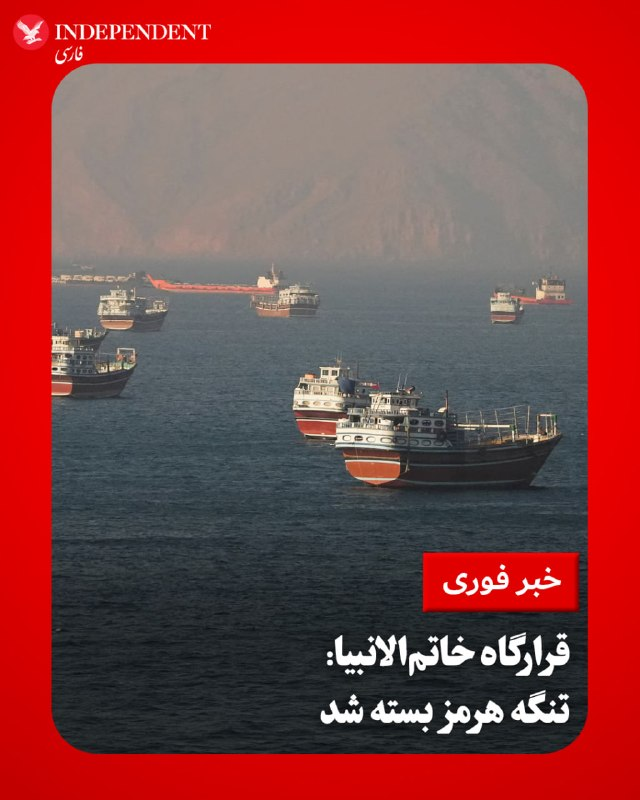

♦️ قرارگاه خاتم‌الانبیا روز شنبه ۳۰ خرداد، با صدور بیانیه‌ای رسمی اعلام کرد که به دلیل بدعهدی و پیمان‌شکنی آشکار آمریکا در اجرایی نشدن بند اول تفاهم‌نامه پایان جنگ، تنگه هرمز به روی تردد تمامی شناورها بسته خواهد شد.

در این بیانیه تاکید شده است که این تصمیم در واکنش به «نقض بی‌وقفه و مستمر آتش‌بس» توسط اسرائیل در جنوب لبنان و همچنین امتناع نیروهای این کشور از عقب‌نشینی از اراضی جنوب لبنان اتخاذ شده است.

در بیانیه قرارگاه خاتم‌الانبیا که در تسنیم منتشر شد، آمده است: «این گام، تنها مرحله اول از پاسخ به عهدشکنی‌های دشمن است. در صورت تداوم تجاوزات، مراحل بعدی جهت وادار کردن دشمن به پایبندی و اجرای کامل تعهداتش، برنامه‌ریزی و عملیاتی خواهد شد.»
‌🇸🇦 Indypersian

🤖 @VahidOOnLine

## VahidOOnLine — post 246512

  <a href="telegram/content/VahidOOnLine_246512_1781962712.mp4" target="_blank">🎬 Download video</a>

چرا اسرائیل با وجود آتش‌بس هنوز در جنوب لبنان می‌جنگد؟

پاسخ شاید در ارتفاعات علی‌الطاهر، مشرف بر نبطیه، پنهان باشد؛ نقطه‌ای راهبردی که سال‌هاست از آن به‌عنوان یکی از حساس‌ترین مناطق زیرزمینی حزب‌الله یاد می‌شود.

هیچ مقام رسمی تأیید نکرده که شبکه «عماد ۴» در دل این ارتفاعات قرار دارد، اما اگر این فرض درست باشد، نبرد علی‌الطاهر فقط جنگ بر سر یک تپه نیست؛ جنگی است برای دسترسی به مرکز فرماندهی، انبارهای تسلیحاتی و بخشی از زیرساخت موشکی حزب‌الله در جنوب لبنان.
‌🏁 🇬🇧 ManotoTV

🤖 @VahidOOnLine

## VahidOOnLine — post 246511

  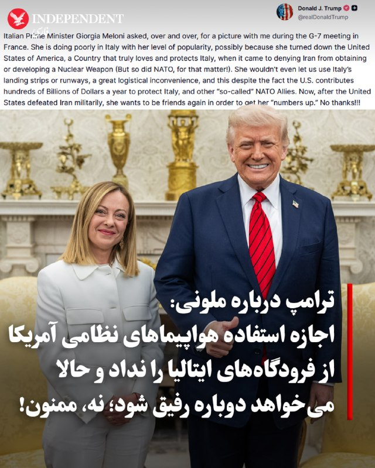

♦️ دونالد ترامپ، رئیس‌جمهوری آمریکا، روز شنبه ۳۰ خرداد، در پیامی در شبکه اجتماعی «تروث سوشال»، جورجیا ملونی، نخست‌وزیر ایتالیا را به شدت مورد انتقاد قرار داد. این اقدام پس از آن صورت گرفت که ترامپ مدعی شد ملونی در نشست جی-۷ در فرانسه بارها التماس کرده تا با او عکس بگیرد؛ ادعایی که با واکنش تند ملونی مواجه شد که این داستان را ساختگی خواند و گفت: «من و ایتالیا هرگز التماس نمی‌کنیم.»

ترامپ در واکنش نوشت: «محبوبیت ملونی در ایتالیا به شدت کاهش یافته، شاید به این دلیل که او و ناتو در جریان ماموریت جلوگیری از دستیابی ایران به سلاح هسته‌ای، به ایالات متحده پشت کردند.» ترامپ افزود: «ایتالیا حتی اجازه استفاده از باندهای پروازی خود را به ما نداد که یک مانع لوجستیکی بزرگ بود؛ آن هم در حالی که آمریکا سالانه صدها میلیارد دلار برای محافظت از ایتالیا و دیگر متحدان ناتو هزینه می‌کند.»

رئیس‌جمهوری آمریکا در پایان با لحنی تحقیرآمیز تاکید کرد: «اکنون که ایالات متحده ایران را از نظر نظامی شکست داده، او می‌خواهد برای بالا بردن آمار محبوبیتش دوباره با ما رفیق شود؛ اما نه، ممنون!»
‌🇸🇦 Indypersian

🤖 @VahidOOnLine

## VahidOOnLine — post 246510

  

قرارگاه مرکزی خاتم‌الانبیا اعلام کرد نظر به بدعهدی و پیمان‌شکنی آشکار آمریکا نسبت به‌عدم اجرای بند اول تفاهم‌نامه پایان جنگ، و در واکنش به نقض بی‌وقفه و مستمر آتش‌بس از سوی اسرائیل در جنوب لبنان و همچنین با توجه به‌عدم عقب‌نشینی ارتش این کشور از لبنان، تنگه هرمز مجددا بسته خواهد شد.

قرارگاه مرکزی خاتم‌الانبیا اضافه کرد این گام اول «پاسخ به عهدشکنی دشمن» است و در صورت ادامه این وضعیت، گام‌های بعدی برای «پایبند کردن دشمن به اجرای تعهدات»، برنامه‌ریزی و اقدام خواهد شد.
‌🏁 🇬🇧 IranintlTV

🤖 @VahidOOnLine

## VahidOOnLine — post 246509

  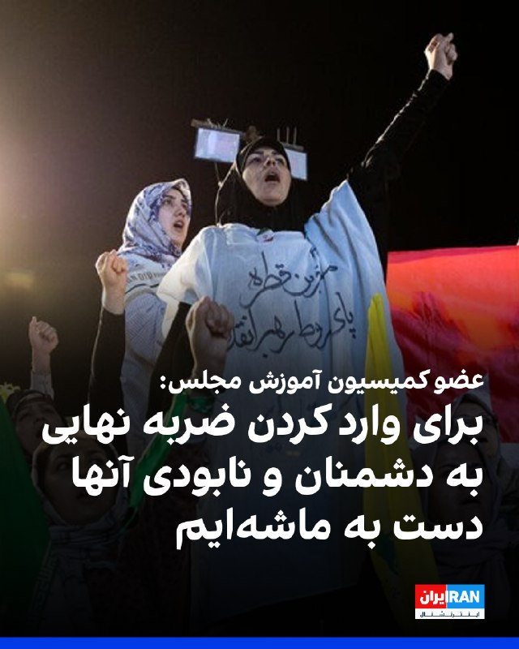

حسین امامی‌راد، عضو کمیسیون آموزش مجلس به سایت دیده‌بان ایران گفت: «یکی از شروط ما آتش‌بس در سراسر جبهه مقاومت بود. جبهه مقاومت تنها لبنان نیست؛ عراق، لبنان، یمن و سایر بخش‌ها را هم شامل می‌شود. ما هنوز در شرایط جنگی و دست به ماشه هستیم برای وارد کردن ضربه نهایی به دشمن و نابودی.»

او ادامه داد: «با تجارب گذشته ما هیچ اطمینانی به طرف مقابل نداریم و چنین مذاکره‌ای نیز نتیجه‌بخش نخواهد بود.»
‌🏁 🇬🇧 IranintlTV

🤖 @VahidOOnLine

## VahidOOnLine — post 246503

## WithYashar — post 15418

تندروها معتقدن کودتای قالیباف تکمیل شده و الان قدرت اصلی کشور دست قالیبافه. چون با اینکه رهبر‌ گفته توافق خوب نیست ولی مجری های صداوسیما میگن توافق خوبه
@withyashar

## WithYashar — post 15417

فایننشال‌تایمز: پایان عملیات نظامی اسرائیل در لبنان بعید است
@withyashar

## WithYashar — post 15416

سخنگوی وزارت خارجه:
هیئت ایرانی برای پیگیری و مطالبۀ اجرای تعهدات طرف مقابل به سوئیس سفر خواهد کرد.
در سوئیس قرار است دربارۀ اجرای تعهدات طرف مقابل مطالبه‌گری داشته باشیم و مشخص شود آن‌ها چطور می‌خواهند به تعهداتشان عمل کنند.

ما به تعهداتمان پایبند بودیم و طرف مقابل موظف است اسرائیل را به توقف حمله به لبنان وادار کند.
@withyashar

## WithYashar — post 15415

  <a href="telegram/content/WithYashar_15415_1781962716.mp4" target="_blank">🎬 Download video</a>

جنگه بابا جنگه !!!
@withyashar

## WithYashar — post 15414

تسنیم: نیازی به دیدار ویتکوف و عراقچی نیست.
@withyashar

## WithYashar — post 15413

تنگه هرمز مجددا بسته شد

قرارگاه مرکزی حضرت خاتم‌الانبیا:
وَإِنْ نَكَثُوا أَیْمَانَهُمْ مِنْ بَعْدِ عَهْدِهِمْ وَطَعَنُوا فِی دِینِكُمْ فَقَاتِلُوا أَئِمَّةَ الْكُفْرِ ۙ إِنَّهُمْ لَا أَیْمَانَ لَهُمْ لَعَلَّهُمْ یَنْتَهُونَ(۱۲ توبه)
نظر به بدعهدی‌ و پیمان‌شکنی آشکار آمریکا نسبت به عدم اجرای بند اول تفاهم‌نامهپایان جنگ، و در واکنش به نقض بی‌وقفه و مستمر آتش‌بس توسط رژیم صهیونیستی در جنوب لبنان و کشتار بی‌رحمانه و آوارگی صدها هزار نفر از مردم مظلوم این سرزمین و همچنین با توجه به عدم عقب‌نشینی نیروهای اشغالگر صهیونی از اراضی جنوب لبنان، اعلام می‌دارد تنگه هرمز به روی تردد شناورها بسته خواهد شد.
متذکر می‌گردد این گام اول پاسخ به عهدشکنی دشمن است و در صورت ادامه تجاوز گام‌های بعدی برای پایبند کردن دشمن به اجرای تعهدات برنامه ریزی و اقدام خواهد شد.
@withyashar

## WithYashar — post 15412

  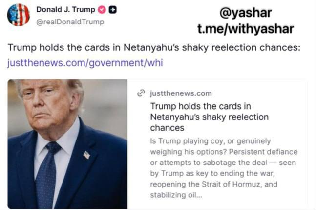

ترامپ خبری درباره تاثیر خود بر آینده سیاسی نتانیاهو را بازنشر کرد

دونالد ترامپ: «ترامپ برگ‌های برنده را در سرنوشت انتخاباتی متزلزل نتانیاهو در اختیار دارد.»
@withyashar

## WithYashar — post 15411

  <a href="telegram/content/WithYashar_15411_1781962720.mp4" target="_blank">🎬 Download video</a>

در طول ۲۴ ساعت گذشته، نزدیک به ۲۰ شناور از تنگه هرمز عبور کرده‌اند.

از این تعداد، ۵ شناور از مسیر امن تعیین‌شده توسط ایالات متحده که از آب‌های عمان عبور می‌کند، استفاده کرده‌اند.
بقیه شناورها از طرح جداسازی ترافیک ایران استفاده می‌کنند.

در حال حاضر دو مسیر اصلی برای عبور کشتی‌ها از تنگه هرمز وجود دارد
اول ، طرح ترافیکی ایران (TSS) که همان مسیر اصلی و همیشگی تنگه هرمز است که عمدتاً نزدیک سواحل و جزایر ایران قرار دارد.
مسیر دوم کریدور موقت ایجادشده توسط آمریکا در آب‌های عمان و دورتر از سواحل ایران و طراحی‌شده در زمان جنگ و موقت.
@withyashar

## WithYashar — post 15410

  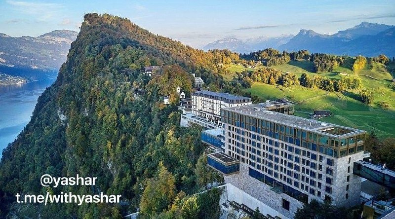

وزارت خارجه سوئیس: مذاکره آمریکا و ایران در فضایی محرمانه در بورگن‌اشتوک ادامه خواهد داشت
@withyashar

## WithYashar — post 15409

  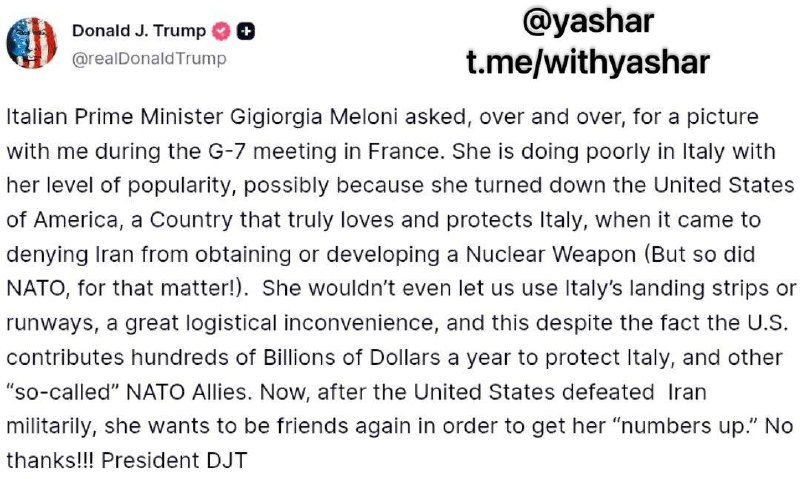

ترامپ در ‌تروث : جورجیا ملونی، نخست‌وزیر ایتالیا، در طول نشست گروه ۷ در فرانسه، بارها و بارها از من خواست که باهم عکس بگیریم. اون در ایتالیا از نظر میزان محبوبیت وضعیت ضعیفی داره؛ احتمالا به این دلیل که وقتی نوبت به جلوگیری از دستیابی یا توسعه سلاح هسته‌ای توسط ایران رسید، به ایالات متحده آمریکا—کشوری که واقعا ایتالیا رو دوست داره و از آن محافظت می‌کند—پشت کرد (البته ناتو هم در این مورد همین کار رو کرد!).
اون حتی اجازه نداد از باندهای فرود یا باندهای پرواز ایتالیا استفاده کنیم، که یک دشواری لوجستیکی بزرگ بود؛ آن هم با وجود این واقعیت که ایالات متحده سالانه صدها میلیارد دلار برای محافظت از ایتالیا و دیگر متحدان «به اصطلاح» ناتو هزینه می‌کنه. حالا، پس از اینکه ایالات متحده ایران را از نظر نظامی شکست داد، اون می‌خواد دوباره با ما دوست بشه تا «آمار محبوبیتش» رو بالا ببره. نه، خیلی ممنون!!!
@withyashar

## WithYashar — post 15408

  <a href="telegram/content/WithYashar_15408_1781962725.mp4" target="_blank">🎬 Download video</a>

هم اکنون خمین 🚨 @withyashar

## WithYashar — post 15406

  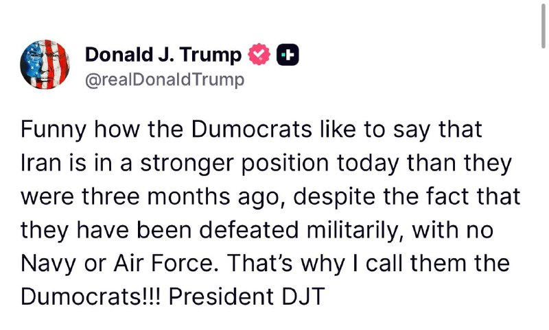

ترامپ در تروث برای بار هزارم : خنده‌داره که چطور دموکرات‌ها دوست دارن بگن ایران امروز در موقعیت قوی‌تری نسبت به سه ماه پیش قرار داره، با وجود اینکه از نظر نظامی شکست خوردن، نه نیروی دریایی دارن و نه نیروی هوایی. به همین دلیله که من بهشون میگم دموکرات!!! رئیس جمهور دی‌جی‌تی
@withyashar

## WithYashar — post 15405

فاکس‌نیوز: ویتکاف و کوشنر در سوئیس هستند

شبکه خبری فاکس‌نیوز اعلام کرد، بنا به گزارش‌ها، استیو ویتکاف، فرستاده کاخ سفید، و جرد کوشنر، امروز برای اولین دور مذاکرات در مورد توافق هسته‌ای احتمالی ایران در سوئیس هستند، در حالی که اسرائیل به اهداف حزب‌الله در لبنان حمله می‌کند.
@withyashar

## WithYashar — post 15404

خبرنگار صداسیما: شاهد یکی از شدیدترین حملات به منطقۀ نبطیه هستیم؛ نبطیه تقریبا خالی از جمعیت شده
@withyashar

## WithYashar — post 15403

## WithYashar — post 15402

@withyashar خاطرات شمال

## WithYashar — post 15401

@withyashar

## WithYashar — post 15400

## WithYashar — post 15399

ترامپ در تروث : چپ‌های افراطی و دموکرات‌های احمق دارند می‌بینند که ما در جنگ علیه ایران چقدر خوب عمل کرده‌ایم، به‌طوری که کشورشان از نظر نظامی به‌طور کامل شکست خورده است. اوباما فقط میلیاردها دلار پول نقد به آن‌ها می‌داد و هرگز از ارتشِ آن‌زمانِ تضعیف‌شده‌مان برای کاری که باید انجام می‌شد استفاده نکرد تا بزرگ‌ترین حامی تروریسم در جهان، یعنی ایران، مهار شود. آن‌ها کوچک‌ترین احترامی برای او قائل نبودند. آن‌ها فکر می‌کردند او، مثل جو خواب‌آلود بایدن، رهبری ضعیف و بی‌اثر است، و در این مورد ۱۰۰٪ درست می‌گفتند. ایران ۴۷ سال از مجازات برای “جنایت” گریخت، تا وقتی که من آمدم. بعد همه‌چیز تغییر کرد. آمریکا بازگشته است!!!
@withyashar

## WithYashar — post 15398

  <a href="telegram/content/WithYashar_15398_1781962728.mp4" target="_blank">🎬 Download video</a>

هم اکنون خمین 🚨
@withyashar

## mwarmonitor — post 11275

🔴منابع آگاه؛ عراقچی امشب به همراه وزیر کشور پاکستان به سوئیس سفر می‌کند.

@mwarmonitor

## mwarmonitor — post 11274

🔴 مارک لوین: چرا موشک‌های بالستیک در یادداشت تفاهم (MoU) ممنوع نشده‌اند و حتی به آن‌ها اشاره‌ای نشده است؟ آن‌ها قدرتمندترین سلاح متعارف در زرادخانه ایران هستند و هر موشک می‌تواند هزاران نفر را کشته و کل محله‌ها را نابود کند. همچنین برای حمل کلاهک‌های هسته‌ای نیز استفاده می‌شوند.

🔸به این دلیل که رژیم ایران حاضر نیست از آن‌ها صرف‌نظر کند و آن‌ها را به حزب‌الله نیز منتقل خواهد کرد. این موضوع دیوانه‌وار است.

@mwarmonitor

## mwarmonitor — post 11273

🔴 فاکس نیوز به نقل از معاون رئیس‌جمهور آمریکا: اوضاع در مذاکرات با ایران خوب پیش می‌رود و انتظار دارم به سوئیس سفر کنیم.

📝 ترامپ و دارودسته‌اش تو یه سیاره دیگه زندگی می‌کنند.

@mwarmonitor

## mwarmonitor — post 11272

🔴 تنگۀ هرمز بسته شد

🔹قرارگاه خاتم‌الانبیا: نظر به بدعهدی‌ و پیمان‌شکنی آشکار آمریکا نسبت به عدم اجرای بند اول تفاهم‌نامه پایان جنگ، و در واکنش به نقض بی‌وقفه و مستمر آتش‌بس توسط رژیم صهیونیستی در جنوب لبنان و کشتار بی‌رحمانه و آوارگی صدها هزار نفر از مردم مظلوم این سرزمین و همچنین با توجه به عدم عقب‌نشینی نیروهای اشغالگر صهیونی از اراضی جنوب لبنان، اعلام می‌دارد تنگه هرمز به روی تردد شناورها بسته خواهد شد.

🔹متذکر می‌گردد اين گام اول پاسخ به عهدشکنی دشمن است و در صورت ادامه تجاوز گام‌های بعدی برای پایبند کردن دشمن به اجرای تعهدات برنامه ریزی و اقدام خواهد شد.

@mwarmonitor

## mwarmonitor — post 11271

🔴وزارت امور خارجه سوئیس اعلام کرد که این کشور همچنان یک «فضای محرمانه و قابل اعتماد» را در بورگن‌شتوک فراهم می‌کند تا گفتگوها درباره اجرای یادداشت تفاهم میان ایالات متحده و ایران تسهیل شود.
این وزارتخانه در بیانیه‌ای افزود که به‌دلیل ملاحظات محرمانگی، هیچ جزئیات بیشتری درباره شرکت‌کنندگان و محتوای مذاکرات منتشر نخواهد شد.

@mwarmonitor

## mwarmonitor — post 11270

  

🔴ترامپ در سوشال تروث:

ترامپ برگ‌های برنده را در شانس متزلزل نتانیاهو برای انتخاب مجدد در دست دارد.

متن پیش‌نمایش لینک (وب‌سایت justthenews.com):
ترامپ برگ‌های برنده را در شانس متزلزل نتانیاهو برای انتخاب مجدد در دست دارد

آیا ترامپ دارد طفره می‌رود یا واقعاً گزینه‌های خود را می‌سنجد؟ نافرمانی مداوم یا تلاش برای خرابکاری در توافق — که از نظر ترامپ کلید پایان دادن به جنگ، بازگشایی تنگه هرمز و ثبات بازار نفت است...

@mwarmonitor

## mwarmonitor — post 11269

  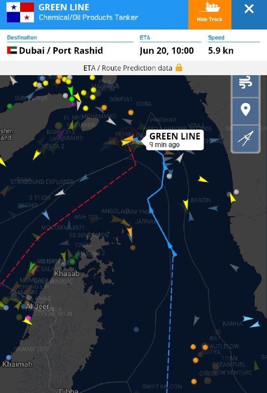

🚢نفتکش اوکراینی «GREEN LINE» مسیر خود را به کریدور کشتیرانی ایران تغییر داد؛ این کشتی در ابتدا از مسیر تحت کنترل آمریکا عبور می‌کرد.

@mwarmonitor

## mwarmonitor — post 11268

🔴 رسانه‌های سوئیسی: هیئت‌های مقدماتی ایران، ایالات متحده، پاکستان و قطر از دیروز در اقامتگاه «برگنشتوک» در حال فعالیت برای آماده‌سازی مذاکرات هستند و تاکنون هیچ نشانه‌ای از حضور رؤسای هیئت‌های تهران و واشنگتن دیده نشده است.

@mwarmonitor

## mwarmonitor — post 11267

🔴وزیر امور خارجه ایتالیا، Antonio Tajani می‌گوید که سفر برنامه‌ریزی‌شده‌اش در تاریخ ۲۱ تا ۲۲ ژوئن به واشنگتن را لغو می‌کند، پس از آن‌که Donald Trump به نخست‌وزیر ایتالیا، Giorgia Meloni توهین کرده و گفته بود او «التماس کرده» برای گرفتن عکس با او و اینکه او…

## mwarmonitor — post 11266

🚨وزارت بهداشت لبنان: در حمله هوایی اسرائیل به شهرک قناریّت در جنوب کشور، ۷ نفر کشته و ۱۳ نفر زخمی شدند که در میان آنان کودکان و زنان نیز حضور دارند.

@mwarmonitor

## mwarmonitor — post 11265

🔴 نیروی دریایی سپاه: اگر شناورها مسیر دریایی جنوب جزیرۀ لارک را رعایت نکنند، مسئولیت هر اتفاقی با خودشان است

🔹از برخورد احتمالی با مین تا تصادف‌های دریایی و حتی هدف قرار گرفتن.

@mwarmonitor

## mwarmonitor — post 11264

احمق‌های چپ رادیکال و «دموکرات‌های نادان» (Dumocrats) متوجه شده‌اند که ما در جنگ خود علیه ایران چقدر خوب عمل کرده‌ایم، به طوری که کشور آن‌ها از نظر نظامی کاملاً شکست خورده است. «اوبوما» (Obuma) فقط به دادن میلیاردها دلار پول نقد به آن‌ها ادامه داد و هرگز از…

## mwarmonitor — post 11263

احمق‌های چپ رادیکال و «دموکرات‌های نادان» (Dumocrats) متوجه شده‌اند که ما در جنگ خود علیه ایران چقدر خوب عمل کرده‌ایم، به طوری که کشور آن‌ها از نظر نظامی کاملاً شکست خورده است. «اوبوما» (Obuma) فقط به دادن میلیاردها دلار پول نقد به آن‌ها ادامه داد و هرگز از ارتشِ آن زمان تحلیل‌رفته‌ی ما برای کاری که باید جهت مهار بزرگ‌ترین حامی تروریسم در جهان، یعنی ایران، انجام می‌شد، استفاده نکرد. آن‌ها صفر درصد (هیچ) احترامی برای او قائل نبودند. آن‌ها فکر می‌کردند او هم مانند «جو بایدن خواب‌آلود»، رهبری ضعیف و بی‌کفایت است و در این مورد ۱۰۰ درصد حق داشتند. ایران به مدت ۴۷ سال از «جنایت» قسر در رفت، تا اینکه من آمدم. سپس همه چیز تغییر کرد. آمریکا بازگشته است!!!

رئیس‌جمهور دونالد جی. ترامپ

@mwarmonitor

## mwarmonitor — post 11262

🔸ان بی سی به نقل از یک مقام آمریکایی: نیروهای آمریکا به عملیات خود در منطقه برای حمایت از آزادی کشتیرانی ادامه خواهند داد و اجازه حمله به هیچ کشتی‌ای را نخواهند داد.

@mwarmonitor

## mwarmonitor — post 11261

🔸 سوئیس تصمیم گرفته تدابیر امنیتی در کشور را تا ۲۲ ژوئن تمدید کند، در حالی که منتظر موافقت طرف ایرانی برای ازسرگیری مذاکرات است.

@mwarmonitor

## mwarmonitor — post 11260

🔴 نیویورک تایمز به نقل از منابع: مقام‌های غربی از نتانیاهو خواسته‌اند حملات به لبنان را متوقف کند تا ایران خروج خود از مذاکرات را توجیه نکند.

@mwarmonitor

## FoxNewsTwitter — post 343194

  <a href="telegram/content/FoxNewsTwitter_343194_1781962733.mp4" target="_blank">🎬 Download video</a>

Fox News (Twitter/X)

JUST IN: Vice President JD Vance joined @foxandfriends to reveal President Trump's long-term strategy to neutralize Iran's nuclear ambitions, emphasizing efforts to permanently dismantle its enriched uranium stockpile through aggressive negotiations and strict verification measures.

"He's thinking about this for my kids' sake, for our grandkids' sake, to ensure that this regime never has the ability to develop a nuclear weapon."

## FoxNewsTwitter — post 343193

  <a href="telegram/content/FoxNewsTwitter_343193_1781962735.mp4" target="_blank">🎬 Download video</a>

Fox News (Twitter/X)

A massive fire devastates a luxury resort in Bayahibe, Dominican Republic. One 46-year-old Italian woman is killed, three are injured, and 1,700 tourists are evacuated.

Flammable roof materials and windy conditions helped the fire spread quickly. | @ChanleySPainter @foxandfriends

## FoxNewsTwitter — post 343192

Fox News (Twitter/X)

RT @i: RT @foxandfriends: ⚽FOX FIFA WORLD CUP: @JesseJBradley celebrates after the USMNT wins over Australia! Bradley, who was doing ministry outs...

## FoxNewsTwitter — post 343191

Fox News (Twitter/X)

RT @i: RT @FoxUSNews: WATCH: Bodycam captures the moment Karmelo Anthony is arrested after stabbing Austin Metcalf at a high school track meet in...

## FoxNewsTwitter — post 343190

  <a href="telegram/content/FoxNewsTwitter_343190_1781962738.mp4" target="_blank">🎬 Download video</a>

Fox News (Twitter/X)

RT @foxandfriends: ⚽FOX FIFA WORLD CUP: @JesseJBradley celebrates after the USMNT wins over Australia! Bradley, who was doing ministry outside the stadium, spoke about the importance of faith to the team as players gathered in prayer following the victory.

## FoxNewsTwitter — post 343189

Fox News (Twitter/X)

"I'm done talking to you."

Minnesota AG Keith Ellison storms off during an interview after facing questions about his handling of the state’s fraud scandal.

Ellison pushed back when asked about allegations tied to billions in taxpayer fraud and VP Vance’s threat to refer him to the Justice Department, disputing a widely cited $8 billion figure and arguing it has only been mentioned by those "aligned with the Trump administration."

## FoxNewsTwitter — post 343188

  <a href="telegram/content/FoxNewsTwitter_343188_1781962742.mp4" target="_blank">🎬 Download video</a>

Fox News (Twitter/X)

White House envoys Steve Witkoff and Jared Kushner will reportedly be in Switzerland today for the first round of talks on a potential Iran nuclear deal, as Israel strikes Hezbollah targets in Lebanon. | @foxandfriends @Max_Gorden

## pm_afshaa — post 94452

تندروها معتقدن کودتای قالیباف تکمیل شده و الان قدرت اصلی کشور دست قالیبافه. چون با اینکه رهبر‌ گفته توافق خوب نیست ولی مجری های صداوسیما میگن توافق خوبه

💧 Rainbet.com the #1 Non-KYC Crypto Casino & Sportsbook @rainbetcom

😁 @Pm_Afshaa

## pm_afshaa — post 94451

قرارگاه خاتم الانبیا: تنگه هرمز بسته شد

💧 Rainbet.com the #1 Non-KYC Crypto Casino & Sportsbook @rainbetcom

😁 @Pm_Afshaa

## pm_afshaa — post 94450

  <a href="telegram/content/pm_afshaa_94450_1781962745.webm" target="_blank">🎬 Download video</a>

🔴وزارت خارجه سوئیس:
مذاکره آمریکا و ایران در فضایی محرمانه در بورگن‌اشتوک ادامه داره.

💧 Rainbet.com the #1 Non-KYC Crypto Casino & Sportsbook @rainbetcom

😁 @Pm_Afshaa

## pm_afshaa — post 94449

سخنگوی وزارت کشور: کسایی که به مراسم تشییع پیکر خامنه‌ای بیان، به صورت رایگان تحت پوشش بیمه قرار میگیرن 
💧 Rainbet.com the #1 Non-KYC Crypto Casino & Sportsbook @rainbetcom 
😁 @Pm_Afshaa

## pm_afshaa — post 94448

سخنگوی وزارت کشور: کسایی که به مراسم تشییع پیکر خامنه‌ای بیان، به صورت رایگان تحت پوشش بیمه قرار میگیرن

💧 Rainbet.com the #1 Non-KYC Crypto Casino & Sportsbook @rainbetcom

😁 @Pm_Afshaa

## pm_afshaa — post 94447

  <a href="telegram/content/pm_afshaa_94447_1781962746.webm" target="_blank">🎬 Download video</a>

🔴خبرنگار العربیه: ویتکاف دقایقی پیش وارد سوئیس شد.

💧 Rainbet.com the #1 Non-KYC Crypto Casino & Sportsbook @rainbetcom

😁 @Pm_Afshaa

## pm_afshaa — post 94446

  <a href="telegram/content/pm_afshaa_94446_1781962746.webm" target="_blank">🎬 Download video</a>

🔴پست جدید ترامپ:

احمق‌های چپ رادیکال و «دموکرات‌های نادون» متوجه شدن که ما در جنگ خود علیه ایران چقدر خوب عمل کرده‌ایم، به طوری که کشور آن‌ها از نظر نظامی کاملا شکست خورده. اوباما فقط به دادن میلیاردها دلار پول نقد به آن‌ها ادامه داد و هرگز از ارتشِ آن زمان تحلیل‌رفته‌ی ما برای کاری که باید جهت مهار بزرگ‌ترین حامی تروریسم در جهان، یعنی ایران، انجام می‌شد، استفاده نکرد. آن‌ها صفر درصد (هیچ) احترامی برای او قائل نبودند. آن‌ها فکر می‌کردند او هم مانند «جو بایدن خواب‌آلود»، رهبری ضعیف و بی‌کفایته و در این مورد ۱۰۰ درصد حق داشتن. ایران به مدت ۴۷ سال از «جنایت» قسر در رفت، تا اینکه من آمدم. سپس همه چیز تغییر کرد. آمریکا بازگشته است!

💧 Rainbet.com the #1 Non-KYC Crypto Casino & Sportsbook @rainbetcom

😁 @Pm_Afshaa

## pm_afshaa — post 94445

  <a href="telegram/content/pm_afshaa_94445_1781962747.mp4" target="_blank">🎬 Download video</a>

اتش سوزی در یکی از کارخانه های خمین

💧 Rainbet.com the #1 Non-KYC Crypto Casino & Sportsbook @rainbetcom

😁 @Pm_Afshaa

## pm_afshaa — post 94444

نبویان نماینده مجلس: رهبری گفتن مذاکره نکنید به یک شرط بتونیم غرامت جنگ بگیریم در مقابل باز شدن تنگه هرمز و در مورد هسته ای نیز باید پیروز شویم ولی برعکس شد و خطوط رهبری زیر پا گذاشته شد

💧 Rainbet.com the #1 Non-KYC Crypto Casino & Sportsbook @rainbetcom

😁 @Pm_Afshaa

## pm_afshaa — post 94443

  <a href="telegram/content/pm_afshaa_94443_1781962751.webm" target="_blank">🎬 Download video</a>

🔴نبویان، نماینده مجلس در صداوسیما:
آمریکا بعد از شهادت آقا از طریق یکی از کشورهای اروپایی، پیام داد که بیاید مثل ونزوئلا تسلیم بشید.

💧 Rainbet.com the #1 Non-KYC Crypto Casino & Sportsbook @rainbetcom

😁 @Pm_Afshaa

## pm_afshaa — post 94442

  <a href="telegram/content/pm_afshaa_94442_1781962751.webm" target="_blank">🎬 Download video</a>

🔴وزیر کشور پاکستان برای دیدار با مقامات جمهوری اسلامی وارد ایران شد. 
💧 Rainbet.com the #1 Non-KYC Crypto Casino & Sportsbook @rainbetcom 
😁 @Pm_Afshaa

## pm_afshaa — post 94441

  <a href="telegram/content/pm_afshaa_94441_1781962752.webm" target="_blank">🎬 Download video</a>

🔴نیویورک تایمز به نقل از منابع:
مقام‌های غربی از نتانیاهو خواستن حملات به لبنان رو متوقف کنه تا جمهوری اسلامی خروج خودش از مذاکرات رو توجیه نکنه.

💧 Rainbet.com the #1 Non-KYC Crypto Casino & Sportsbook @rainbetcom

😁 @Pm_Afshaa

## pm_afshaa — post 94440

  <a href="telegram/content/pm_afshaa_94440_1781962753.webm" target="_blank">🎬 Download video</a>

🔴وزیر کشور پاکستان برای دیدار با مقامات جمهوری اسلامی وارد ایران شد.

💧 Rainbet.com the #1 Non-KYC Crypto Casino & Sportsbook @rainbetcom

😁 @Pm_Afshaa

## pm_afshaa — post 94437

  <a href="telegram/content/pm_afshaa_94437_1781962753.mp4" target="_blank">🎬 Download video</a>

🔴امروز دانش آموزان کنکوری و یازدهمی در سراسر کشور دست به اعتراض مسالمت‌آمیز زدن :

💧 Rainbet.com the #1 Non-KYC Crypto Casino & Sportsbook @rainbetcom

😁 @Pm_Afshaa

## iaghapour — post 2689

⭕️ آموزش تانل بین سرور ایران و خارج (۲ روش سبک و سریع) 😍 🔹تو این ویدیو قراره با هم دو تا از ساده و سبک‌ترین روش‌های تانل زدن بین سرور ایران و خارج رو یاد بگیریم. اگه برای ساخت فیلترشکن شخصی‌تون دنبال یه راه ساده و بدون دردسر برای اتصال سرورها هستید، این آموزش…

## DEJradio — post 5839

  <a href="telegram/content/DEJradio_5839_1781962754.mp4" target="_blank">🎬 Download video</a>

🔺🎥 شکایت شهروندان از گرانی‌ها؛ انبه کیلویی ۶۰۰ هزار تومان!

#گرانی #تورم
@DEJradio

## DEJradio — post 5838

  <a href="telegram/content/DEJradio_5838_1781962756.mp4" target="_blank">🎬 Download video</a>

🤡
🔺 پزشکیان تهدید شد:
پدرتو در میاریم

یک مداح در مراسم عزاداری محرم، مسعود پزشکیان را به دلیل «امضا تفاهم با ترامپ» تهدید کرد و گفت: اگر شروطی که رهبری گفته محقق نشه، ما می‌دانیم و تیغ و حلقوم شما؛ پدرت رو در میاریم.»

#موشتبا #توافق #مسعود_پزشکیان
@DEJradio

## mamlekate — post 103745

📝 عضله داور گرفت، اما با آب خیارشور به بازی برگشت

@mamlekate

## kianmeli1 — post 88090

🔴تنگه هرمز بسته شد
https://t.me/kianmeli1

## kianmeli1 — post 88089

  <a href="telegram/content/kianmeli1_88089_1781962758.mp4" target="_blank">🎬 Download video</a>

🔴خبرنگار صداسیما
چیزی به نام آتش‌بس در لبنان وجود ندارد!
شاهد یکی از شدیدترین حملات به منطقۀ نبطیه هستیم. نبطیه تقریبا خالی از جمعیت شده.
https://t.me/kianmeli1

## IranIntlTV — post 343382

  <a href="telegram/content/IranIntlTV_343382_1781962760.mp4" target="_blank">🎬 Download video</a>

سرخط خبرهای شنبه ۳۰ خرداد
@iranintltv

## IranIntlTV — post 343381

  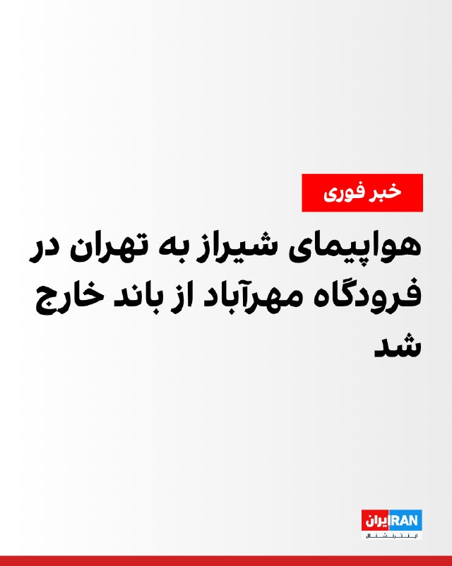

رسانه‌های ایران گزارش دادند یک هواپیمای شرکت هواپیمایی مهر از شیراز به تهران، هنگام فرود در فرودگاه مهرآباد، از باند خارج و در حاشیه باند متوقف شد.

بر اساس این گزارش، در این حادثه به هواپیما و تاسیسات فرودگاه آسیب وارد شده، اما تا این لحظه تلفات جانی و مصدوم نداشته است.
https://iranintl.com/202606202954

## IranIntlTV — post 343380

  <a href="telegram/content/IranIntlTV_343380_1781962763.mp4" target="_blank">🎬 Download video</a>

دونالد ترامپ در پیامی در شبکه اجتماعی تروت سوشال از جورجا ملونی، نخست وزیر ایتالیا، انتقاد کرد. او گفت ملونی در جریان نشست گروه هفت در فرانسه بارها درخواست ثبت عکس مشترک با او را مطرح کرده است.

جزییات بیشتر در گفت‌وگو با تاج‌الدین سروش، عضو تحریریه ایران‌اینترنشنال
@iranintltv

## IranIntlTV — post 343379

  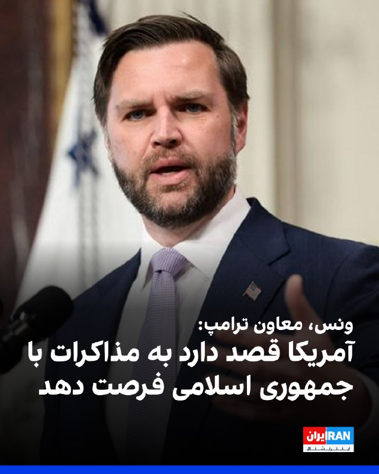

جی‌دی ونس، معاون رییس‌جمهوری آمریکا، اعلام کرد که احتمال دارد گفت‌وگوها با جمهوری اسلامی یکشنبه برگزار شود.

او در مصاحبه با فاکس‌نیوز افزود استیو ویتکاف و جرد کوشنر برای گفت‌وگوها با جمهوری اسلامی در محل حضور دارند و احتمال دارد او نیز در چند روز آینده به سوئیس سفر کند.

ونس گفت که اطمینان دارد می‌توان آتش‌بس را حفظ کرد و آمریکا قصد دارد به مذاکرات با جمهوری اسلامی فرصت دهد.

معاون ترامپ گفت که هیچ شواهدی وجود ندارد که نشان دهد جمهوری اسلامی در حال بستن تنگه هرمز است.
https://iranintl.com/202606208456

## IranIntlTV — post 343378

  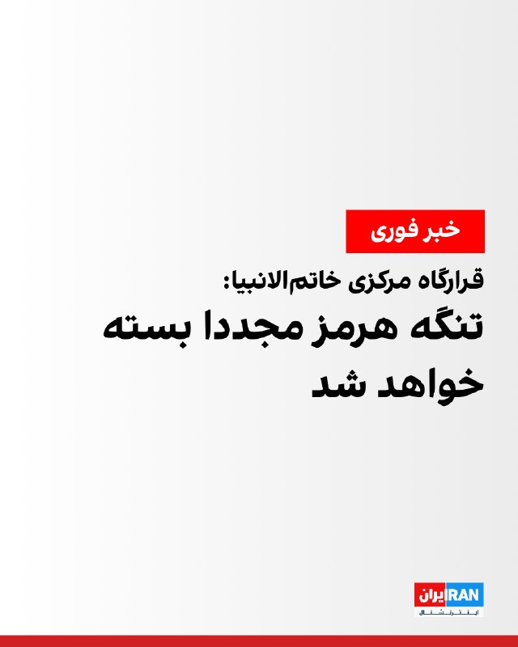

قرارگاه مرکزی خاتم‌الانبیا اعلام کرد نظر به بدعهدی و پیمان‌شکنی آشکار آمریکا نسبت به‌عدم اجرای بند اول تفاهم‌نامه پایان جنگ، و در واکنش به نقض بی‌وقفه و مستمر آتش‌بس از سوی اسرائیل در جنوب لبنان و همچنین با توجه به‌عدم عقب‌نشینی ارتش این کشور از لبنان، تنگه هرمز مجددا بسته خواهد شد.

قرارگاه مرکزی خاتم‌الانبیا اضافه کرد این گام اول «پاسخ به عهدشکنی دشمن» است و در صورت ادامه این وضعیت، گام‌های بعدی برای «پایبند کردن دشمن به اجرای تعهدات»، برنامه‌ریزی و اقدام خواهد شد.
https://iranintl.com/202606207856

## IranIntlTV — post 343377

  <a href="telegram/content/IranIntlTV_343377_1781962766.mp4" target="_blank">🎬 Download video</a>

یک عضو هیات نمایندگان اتاق بازرگانی تهران گفت آثار جنگ بر قیمت کالاها هنوز نمایان نشده و تورم ماه‌های اخیر، به‌ویژه در بخش مواد غذایی، ناشی از سیاست‌های ارزی دولت بوده است.

مهتاب قلی‌زاده، روزنامه‌نگار اقتصادی، درباره این موضوع گفت: «مانع اصلی رشد اقتصادی، ناکارآمدی جمهوری اسلامی و سیاست‌هایی است که به کسری بودجه، تورم و انواع ناترازی‌ها در اقتصاد دامن زده‌اند.»
@iranintltv

## IranIntlTV — post 343376

  

حسین امامی‌راد، عضو کمیسیون آموزش مجلس به سایت دیده‌بان ایران گفت: «یکی از شروط ما آتش‌بس در سراسر جبهه مقاومت بود. جبهه مقاومت تنها لبنان نیست؛ عراق، لبنان، یمن و سایر بخش‌ها را هم شامل می‌شود. ما هنوز در شرایط جنگی و دست به ماشه هستیم برای وارد کردن ضربه نهایی به دشمن و نابودی.»

او ادامه داد: «با تجارب گذشته ما هیچ اطمینانی به طرف مقابل نداریم و چنین مذاکره‌ای نیز نتیجه‌بخش نخواهد بود.»
https://iranintl.com/202606207540

## IranIntlTV — post 343375

  <a href="telegram/content/IranIntlTV_343375_1781962769.mp4" target="_blank">🎬 Download video</a>

یک شهروند با ارسال ویدیوی به ایران اینترنشنال از شهر هشتگرد روایت می‌کند که وزن و حجم نان سنگک که از نانوایی تهیه کرده کم شده است.

## IranIntlTV — post 343374

  <a href="telegram/content/IranIntlTV_343374_1781962772.mp4" target="_blank">🎬 Download video</a>

تفاهم‌نامه میان جمهوری اسلامی و آمریکا همچنان از موضوعات داغ شبکه‌های اجتماعی است. کاربران با انتشار مطالبی در قالب طنز، کنایه، انتقاد و ابراز نگرانی، دیدگاه‌های متفاوت خود را درباره پیامدهای این توافق و آینده روابط تهران و واشینگتن مطرح کرده‌اند.

آیه دریس، عضو تحریریه ایران‌اینترنشنال، از واکنش کاربران می‌گوید
@iranintltv

## IranIntlTV — post 343373

  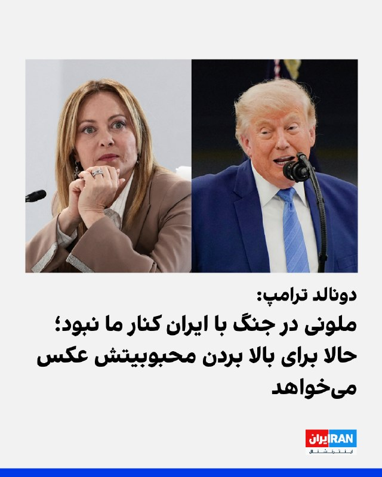

دونالد ترامپ، رییس‌جمهوری آمریکا، به ویدیوی جورجا ملونی، نخست‌وزیر ایتالیا، واکنش نشان داد و در پیامی در شبکه اجتماعی تروث سوشال نوشت پس از آن‌که آمریکا «ایران را از نظر نظامی شکست داد»، ملونی تلاش کرده روابط خود را با او بهبود بخشد تا جایگاه سیاسی‌اش در داخل ایتالیا تقویت شود.

ترامپ نوشت ملونی در جریان نشست گروه هفت در فرانسه بارها درخواست عکس مشترک با او را مطرح کرده است. او همچنین گفت محبوبیت ملونی در ایتالیا کاهش یافته است.

رییس‌جمهوری آمریکا گفت یکی از دلایل این وضعیت، مخالفت دولت ایتالیا با موضع آمریکا در زمینه جلوگیری از دستیابی یا توسعه سلاح هسته‌ای از سوی جمهوری اسلامی بوده است.

ترامپ گفته بود که ملونی در حاشیه نشست گروه هفت در فرانسه برای گرفتن عکس با او «التماس کرده» و او تنها از روی دلسوزی با این درخواست موافقت کرده است.

ملونی با انتشار ویدیویی سخنان ترامپ را «کاملا ساختگی» خواند و گفت سفر آتی خود به آمریکا را لغو می‌کند.
https://iranintl.com/202606209165

## IranIntlTV — post 343372

  <a href="telegram/content/IranIntlTV_343372_1781962775.mp4" target="_blank">🎬 Download video</a>

علی زینی‌وند، سخنگوی وزارت کشور، شنبه ۳۰ خرداد در مورد تعیین زمان مشخص برای جمع آوری تجمعات حکومتی گفت: «اینکه پایان تجمعات چه زمانی باشد در حال تدوین است. درحال حاضر ایام محرم است و سپس مراسم تشییع رهبری برگزار می‌شود، پس از آن تدوین می‌شود که چگونه این تجمعات پایان یابد.»

زینی‌وند در ادامه گفت: «این تجمعات مردمی است، هزینه‌های ان هم از طریق مردم تامین می‌شود.»
@iranintltv

## IranIntlTV — post 343371

  <a href="telegram/content/IranIntlTV_343371_1781962776.mp4" target="_blank">🎬 Download video</a>

ویدیوی رسیده به ایران اینترنشنال از ملایر نشان می‌دهد ماموران پلیس در این شهر برای متوقف کردن یک شهروند موتورسوار به او هنگام رانندگی لگد می‌زنند.

## IranIntlTV — post 343370

  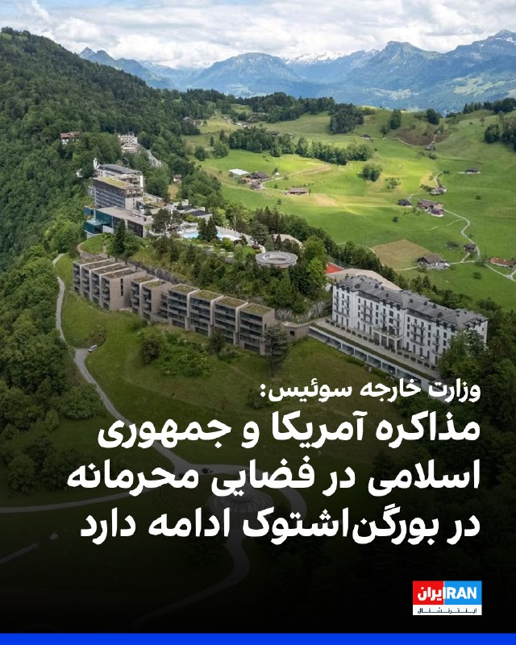

وزارت خارجه سوئیس شنبه ۳۰ خرداد در بیانیه‌ای اعلام کرد این کشور همچنان با فراهم کردن «فضایی محرمانه و قابل اعتماد» در بورگن‌اشتوک، زمینه را برای گفت‌وگوها درباره اجرای یادداشت تفاهم میان آمریکا و جمهوری اسلامی فراهم می‌کند.

این وزارتخانه در این بیانیه افزود به دلیل محرمانه بودن مذاکرات، جزئیات بیشتری درباره شرکت‌کنندگان و محتوای گفت‌وگوها منتشر نخواهد شد.
https://iranintl.com/202606204574

## IranIntlTV — post 343369

  <a href="telegram/content/IranIntlTV_343369_1781962779.mp4" target="_blank">🎬 Download video</a>

صبا آلاله، روان‌تحلیل‌گر، درباره اعتراض دانش‌آموزان به زمان‌بندی برگزاری امتحانات گفت: «کنکور نه‌تنها نماد آینده و هویت شغلی دانش‌آموزان است، بلکه بر جایگاه اجتماعی و امنیت اقتصادی آن‌ها نیز تاثیر می‌گذارد.» او افزود: «این امتحانات تصویری از آینده ترسیم می‌کند و خانواده‌ها نیز در کنار داوطلبان کنکور، نگران شکستن این تصویر هستند.»
@iranintltv

## IranIntlTV — post 343368

  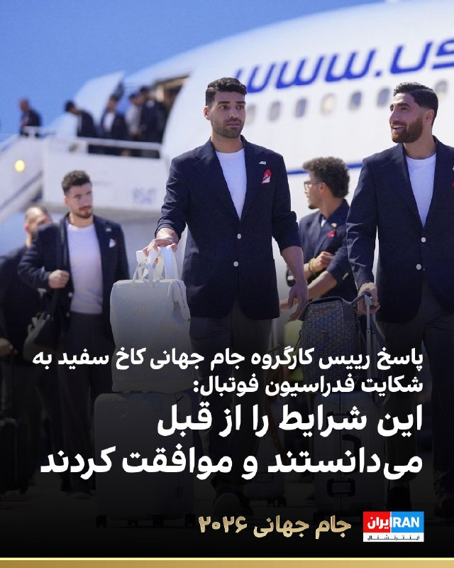

🔻اندرو جولیانی، رییس کارگروه جام جهانی کاخ سفید به روزنامه تلگراف گفت که آمریکا آمادگی دارد درباره شرایط ورود تیم فوتبال ایران به خاک این کشور مذاکره مجدد انجام دهد تا به تیم ملی اجازه دهد مدت بیشتری در آمریکا و در فاصله بین مسابقات حضور داشته باشد.

🔹او گفته که فدراسیون فوتبال از هفته‌ها قبل از این شرایط که پس از ماه‌ها گفتگو، با فیفا توافق شده، خبر داشته و با آن موافقت کرده بوده است: «هیچ چیز تغییر نکرده است.»

🔹به نوشته روزنامه تلگراف، او گفت دونالد ترامپ، رییس‌جمهوری آمریکا، مشتاق است ضمن حفظ امنیت ملی، «تعادل رقابتی» در این مسابقات برقرار باشد.

🔹اظهارات او پس از آن مطرح شد که فدراسیون فوتبال ایران اعلام کرد به دلیل ترتیبات سفر تیم ملی، که به اعتقاد این فدراسیون تیم ایران را در مقایسه با ۴۷ کشور دیگر حاضر در جام جهانی در موقعیت نامناسب‌تری قرار می‌دهد، به فیفا شکایت خواهد کرد.

🔹روایت یکی از متحدان دونالد ترامپ از شیوه حضور تیم ملی در جام جهانی را در سایت بخوانید

@iranintltvsport

## IranIntlTV — post 343367

  <a href="telegram/content/IranIntlTV_343367_1781962783.mp4" target="_blank">🎬 Download video</a>

رویترز در گزارشی نوشت امپراتوری تجاری سپاه پاسداران در صورت لغو تحریم‌ها و آزادسازی دارایی‌های مسدودشده ایران، سود قابل‌توجهی خواهد برد. فایننشال تایمز نیز گزارش داد دولت دونالد ترامپ به جمهوری اسلامی اجازه خواهد داد به ۶ میلیارد دلار از درآمدهای نفتی مسدودشده خود در قطر دسترسی پیدا کند.

آرش آزرمی، دبیر بخش اقتصادی ایران‌اینترنشنال، درباره مزایای اقتصادی توافق احتمالی میان آمریکا و جمهوری اسلامی می‌گوید

@iranintltv

## IranIntlTV — post 343366

  <a href="telegram/content/IranIntlTV_343366_1781962786.mp4" target="_blank">🎬 Download video</a>

مروری بر رسانه‌ها و خبرگزاری‌ها در ایران، شنبه ۳۰ خرداد با مجتبی هاشمی، روزنامه‌نگار

@iranintltv

## IranIntlTV — post 343365

  <a href="https://t.me/IranintlTV/343365" target="_blank">📎 Download file</a>

🎧نسخه صوتی اخبار نیمروزی | شنبه ۳۰ خرداد
@iranintlTV

## IranIntlTV — post 343364

  <a href="telegram/content/IranIntlTV_343364_1781962790.mp4" target="_blank">🎬 Download video</a>

ارتش لبنان از ادامه حملات اسرائیل به جنوب این کشور و منطقه بقاع غربی خبر داد. بر اساس گزارش‌ها، دست‌کم ۱۱ نفر، از جمله یک سرباز ارتش لبنان، در این حملات کشته شدند.

اشکان صفایی، خبرنگار ایران‌اینترنشنال، گزارش می‌دهد
@iranintltv

## IranIntlTV — post 343363

  <a href="telegram/content/IranIntlTV_343363_1781962792.mp4" target="_blank">🎬 Download video</a>

ویدیوی رسیده به ایران اینترنشنال نشان می‌دهد یک زن شعار «مر بر جمهوری اسلامی» را دیوارنویسی کرده است.

## Shin_Persian — post 7141

Shin ✓ @hey_itsmyturn
Sat, 20 Jun 2026 13:23:17 UTC

IRGC Khatam terror HQ:
Strait of Hormuz is now closed to vessels.

ترجمه خودکار فارسی

ستاد تروریستی خاتم سپاه پاسداران:
تنگه هرمز اکنون به روی شناورها بسته است.

𝕏 · @shin_persian

## Shin_Persian — post 7140

Emanuel (Mannie) Fabian ✓ @manniefabian
Sat, 20 Jun 2026 11:31:38 UTC

The IDF confirms launching airstrikes in southern Lebanon overnight and this morning, saying they came in response to "repeated violations of the ceasefire" by Hezbollah.

In several incidents overnight, Hezbollah launched some 50 projectiles at Israeli troops operating in southern Lebanon, the military says in a statement.

"These constitute repeated violations of the ceasefire agreement by the Hezbollah terror organization. The IDF will not accept harm to Israeli civilians and its forces, and will respond forcefully to any use of force against them," the statement says.

The military does not provide information on any casualties in Hezbollah's attacks, nor does it comment on claims that it attempted to advance toward the Ali Taher ridge near Nabatieh overnight.

The IDF says that in response to the "blatant violations" and to "remove threats," the IDF struck dozens of Hezbollah sites and operatives across southern Lebanon.

The targets included rocket launchers, weapon depots, and command centers, according to the military.

"The IDF is committed to the ceasefire agreement in accordance with the directives of the political echelon and will continue to act to remove any threat to the State of Israel and IDF troops," the military adds.

ترجمه خودکار فارسی

ارتش دفاعی اسرائیل (IDF) تایید کرد که دیشب و امروز صبح حملات هوایی را در جنوب لبنان انجام داده است و اعلام کرد که این حملات در پاسخ به «نقض مکرر آتش‌بس» توسط حزب‌الله صورت گرفته است.

ارتش در بیانیه‌ای اعلام کرد که در چندین حادثه طی شب گذشته، حزب‌الله حدود ۵۰ پرتابه به سمت نیروهای اسرائیلی مستقر در جنوب لبنان شلیک کرده است.

در این بیانیه آمده است: «این اقدامات به منزله نقض مکرر توافقنامه آتش‌بس توسط سازمان تروریستی حزب‌الله است. ارتش دفاعی اسرائیل آسیب به غیرنظامیان اسرائیلی و نیروهای خود را نخواهد پذیرفت و به هرگونه استفاده از زور علیه آن‌ها با قدرت پاسخ خواهد داد.»

ارتش اطلاعاتی درباره تلفات احتمالی در حملات حزب‌الله ارائه نکرد و همچنین در مورد ادعاهای مربوط به تلاش برای پیشروی به سمت رشته‌کوه علی‌طاهر در نزدیکی نبطیه در طول شب، اظهار نظری نکرد.

ارتش دفاعی اسرائیل اعلام کرد که در پاسخ به این «نقض‌های فاحش» و برای «رفع تهدیدات»، ده‌ها سایت و عوامل حزب‌الله را در سراسر جنوب لبنان مورد هدف قرار داده است.

به گفته ارتش، اهداف شامل پرتابگرهای راکت، انبارهای سلاح و مراکز فرماندهی بوده است.

ارتش افزود: «ارتش دفاعی اسرائیل مطابق با دستورالعمل‌های رده‌های سیاسی به توافق آتش‌بس متعهد است و به اقدام برای رفع هرگونه تهدید علیه دولت اسرائیل و نیروهای ارتش دفاعی اسرائیل ادامه خواهد داد.»

𝕏 · @shin_persian

## ManotoTV — post 106175

  <a href="telegram/content/ManotoTV_106175_1781962795.mp4" target="_blank">🎬 Download video</a>

چرا اسرائیل با وجود آتش‌بس هنوز در جنوب لبنان می‌جنگد؟

پاسخ شاید در ارتفاعات علی‌الطاهر، مشرف بر نبطیه، پنهان باشد؛ نقطه‌ای راهبردی که سال‌هاست از آن به‌عنوان یکی از حساس‌ترین مناطق زیرزمینی حزب‌الله یاد می‌شود.

هیچ مقام رسمی تأیید نکرده که شبکه «عماد ۴» در دل این ارتفاعات قرار دارد، اما اگر این فرض درست باشد، نبرد علی‌الطاهر فقط جنگ بر سر یک تپه نیست؛ جنگی است برای دسترسی به مرکز فرماندهی، انبارهای تسلیحاتی و بخشی از زیرساخت موشکی حزب‌الله در جنوب لبنان.

## FarsiVOA — post 221300

شرکت اسپیس‌ایکس تصاویری از پرتاب موشک فالکون ۹ با ماموریت اِن‌آر‌او‌اِل-۱۷۹ منتشر کرد.

این موشک از کالیفرنیا به مدار زمین پرتاب شد.

@FarsiVOA

## FarsiVOA — post 221299

  <a href="telegram/content/FarsiVOA_221299_1781962796.mp4" target="_blank">🎬 Download video</a>

حال‌وش ویدیویی از صف طولانی رانندگان برای دریافت بنزین در یکی از جایگاه‌های سوخت زاهدان منتشر کرده و نوشته است «شهروندان ساعات طولانی در صف انتظار مانده‌اند تا تنها ۲۰ لیتر بنزین دریافت کنند.»

## FarsiVOA — post 221298

🔺پرزیدنت ترامپ گزارشی درباره حمایت یک چهره مخالف جمهوری اسلامی و مقام پیشین آمریکایی از «یادداشت تفاهم» را بازنشر کرد

▪️دونالد ترامپ، رئیس‌جمهوری ایالات متحده، گزارشی را که در آن علیرضا جعفرزاده، از مسئولان شورای ملی مقاومت ایران، و کِی.تی. مک‌فارلند، معاون پیشین مشاور امنیت ملی آمریکا، از «یادداشت تفاهم» اخیر حمایت کرده‌اند، در شبکه اجتماعی «تروت سوشال» بازنشر کرد.

⬇️ بیشتر بخوانید:
https://ir.voanews.com/a/trump-shares-praise-for-iran-deal/8162940.html/?nocach=1

## FarsiVOA — post 221296

شنبه ۳۰ خرداد ۱۴۰۵، شماری از دانش‌آموزان در شهرهای مختلف از جمله در مشهد، شیراز، اهواز و خرم‌آباد با برگزاری تجمع خواستار تعویق امتحانات و برگزاری آن‌ها پس از اربعین شدند.

## FarsiVOA — post 221295

گزارشی از شادی طرفداران آمریکا پس از بازی با استرالیا در سیاتل

## FarsiVOA — post 221294

جام جهانی ۲۰۲۶: شکایت ایران، مصدومیت کونه و شکست کرواسی؛ گزارش آرش آرا

## FarsiVOA — post 221292

🔺پرزیدنت ترامپ: رژیم ایران ۴۷ سال از پاسخگویی گریخته بود تا من آمدم و همه چیز تغییر کرد

▪️پرزیدنت ترامپ در این پیام نوشته است: «احمق‌های چپ رادیکال و دموکرات‌های ابله می‌دانند که ما در جنگ علیه ایران چقدر خوب عمل کرده‌ایم، و آن کشور از نظر نظامی کاملاً شکست خورده است.»

⬇️ بیشتر بخوانید:
https://ir.voanews.com/a/president-trump-says-iran-got-away-with-murder-for-years-until-now/8162929.html

## FarsiVOA — post 221291

  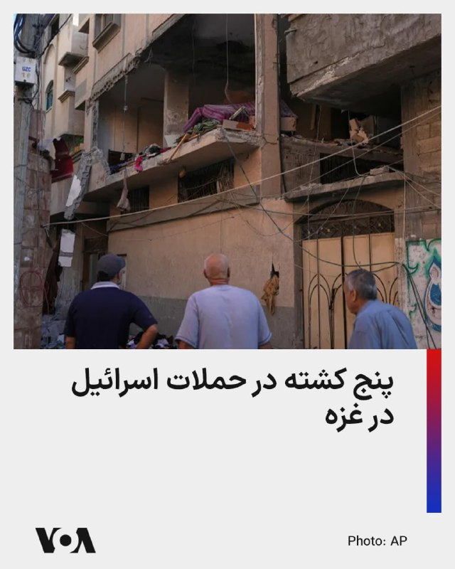

مقام‌های بهداشتی در غزه می‌گویند حملات و تیراندازی نیروهای اسرائیلی در روز شنبه دست‌کم پنج فلسطینی، از جمله یک کودک، را کشت.

رویترز گزارش داد چهار فلسطینی، از جمله دو زن و یک کودک، در حمله هوایی اسرائیل به یک ساختمان مسکونی در شهر غزه کشته شدند. امدادگران گفتند این حمله یک واحد مسکونی را ویران کرد و چند نفر دیگر را نیز زخمی کرد.

در حادثه‌ای جداگانه، امدادگران گفتند نیروهای اسرائیلی یک زن را در شمال نوار غزه، هدف گلوله قرار داده و کشتند.

ارتش اسرائیل تا زمان انتشار گزارش رویترز درباره این دو حادثه اظهار نظر نکرده بود.

این حملات در حالی انجام شده است که عملیات نظامی اسرائیل در بخش‌های مختلف نوار غزه همچنان ادامه دارد و نهادهای امدادی درباره وضعیت انسانی، کمبود غذا، درمان و پناهگاه در این منطقه هشدار می‌دهند.
@FarsiVOA

## FarsiVOA — post 221290

🔺احیای تولید نفت ایران احتمالاً کندتر از کشورهای عرب منطقه خواهد بود

▪️نشریه تخصصی «اس اند پی گلوبال» از قول چندین کارشناس و مقام ایرانی گزارش داده که احتمالاً روند احیای تولید نفت ایران کندتر از دیگر کشورهای عرب منطقه باشد.

▪️بر اساس این گزارش، آسیب‌ها به زیرساخت‌های انرژی، همچنین روند رفع تحریم‌ها باعث خواهد شد احیای تولید نفت ایران آهسته‌تر از دیگر رقبای منطقه‌ای باشد.

▪️آمارهای اوپک نشان می‌دهد تولید روزانه نفت ایران از حدود ۳.۲ میلیون بشکه در اسفند پارسال به حدود ۲.۳ میلیون بشکه در ماه گذشته سقوط کرده است.

▪️طبق تفاهم جمهوری اسلامی و آمریکا، محاصره دریایی علیه جمهوری اسلامی برداشته شده، اما هنوز مذاکرات برای رفع تدریجی تحریم‌های نفتی علیه رژیم حاکم ایران ادامه دارد.

⬇️ بیشتر بخوانید:
https://ir.voanews.com/a/iran-oil-production-recovery-likely-to-be-slower-than-regional-arab-countries/8162925.html

## FarsiVOA — post 221289

🔺حمله اسرائیل به مواضع حزب‌الله پس از شلیک بیش از ۵۰ پرتابه

▪️ارتش اسرائیل می‌گوید پس از شلیک بیش از ۵۰ پرتابه به سوی نیروهایش در جنوب لبنان، حمله به مواضع حزب‌الله را آغاز کرده است.

▪️به گزارش تایمز اسرائیل، یک مقام ارتش اسرائیل گفت حزب‌الله در طول شب به نیروهای اسرائیلی در جنوب لبنان حمله کرده و ارتش اسرائیل در پاسخ، اهداف حزب‌الله را در جنوب لبنان هدف قرار داده است.

▪️این حملات پس از روزی پرتنش در مرز لبنان و اسرائیل رخ داد.

▪️روز جمعه، پس از کشته‌شدن چهار سرباز اسرائیلی در حمله حزب‌الله، اسرائیل حملات گسترده‌ای در جنوب و شرق لبنان انجام داد.

▪️هم‌زمان، آمریکا و قطر از برقراری آتش‌بس تازه میان اسرائیل و حزب‌الله خبر دادند، اما حملات پس از آن نیز ادامه یافت.

⬇️ بیشتر بخوانید:
https://ir.voanews.com/a/idf-says-striking-hezbollah-targets-after-over-50-projectiles-fired-at-troops-in-south-lebanon-overnight/8162924.html

## FarsiVOA — post 221288

  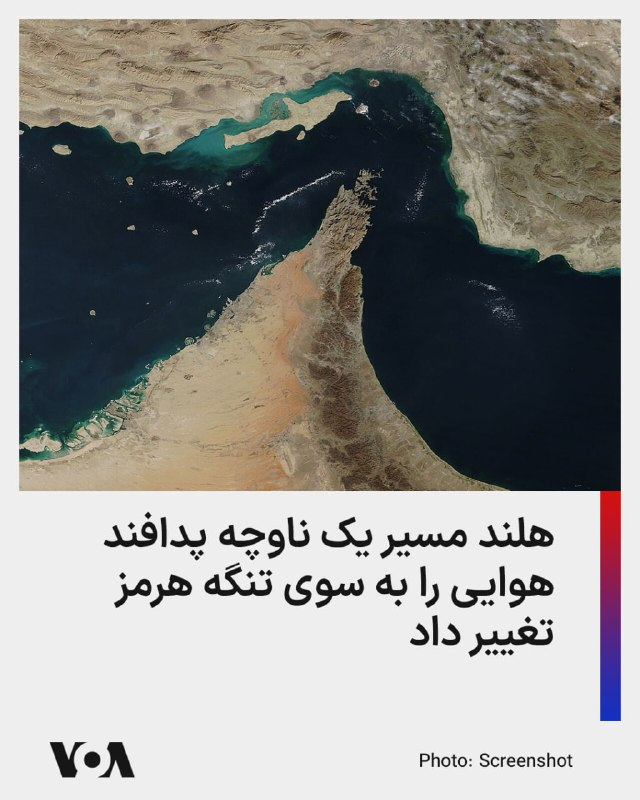

دولت هلند اعلام کرد مسیر حرکت یک ناوچه پدافند هوایی خود را به سوی تنگه هرمز تغییر داده است تا در صورت تشکیل یک مأموریت بین‌المللی احتمالی در این آبراه راهبردی، امکان مشارکت در آن را داشته باشد.

رویترز گزارش داد این ناوچه اکنون در منطقه هند - اقیانوس آرام حضور دارد و به گفته وزیر دفاع هلند، رسیدن آن به محدوده تنگه هرمز چند هفته زمان خواهد برد.

این تصمیم در حالی اعلام شده است که فرانسه و بریتانیا برای ایجاد یک مأموریت چندملیتی دریایی در تنگه هرمز تلاش می‌کنند.

آلمان نیز روز پنجشنبه اعلام کرد دو کشتی خود را برای آمادگی جهت مشارکت احتمالی در مأموریت نظامی در تنگه هرمز به دریای سرخ اعزام می‌کند.
@FarsiVOA

## FarsiVOA — post 221287

  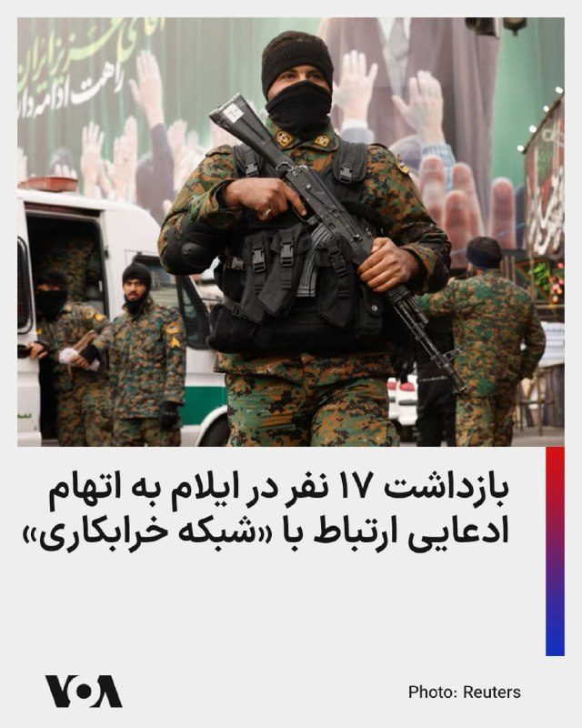

وزارت اطلاعات جمهوری اسلامی روز شنبه اعلام کرد ۱۷ نفر را در استان ایلام بازداشت کرده که به ادعای این نهاد، با یک «شبکه خرابکاری» در ارتباط بوده‌اند.

این اطلاعیه، به سه نفر به عنوان «لیدرهای میدانی» اشاره کرده که هویت آنها تنها با حروف اول نام‌شان اعلام شده است.

این نهاد سرکوب مدعی‌شده افراد بازداشت ‌شده در ناآرامی‌های دی‌ماه ۱۴۰۴ در اقداماتی از جمله تخریب اموال عمومی، آتش‌سوزی و تیراندازی نقش داشته‌اند.

وزارت اطلاعات جمهوری اسلامی همچنین از کشف سه قالب TNT، یک قبضه سلاح کلاشنیکف و تعدادی سلاح سرد در جریان این عملیات خبر داده است.

جزئیات بیشتری درباره وضعیت بازداشت‌شدگان و روند رسیدگی به پرونده آنها منتشر نشده است.
@FarsiVOA

## FarsiVOA — post 221286

  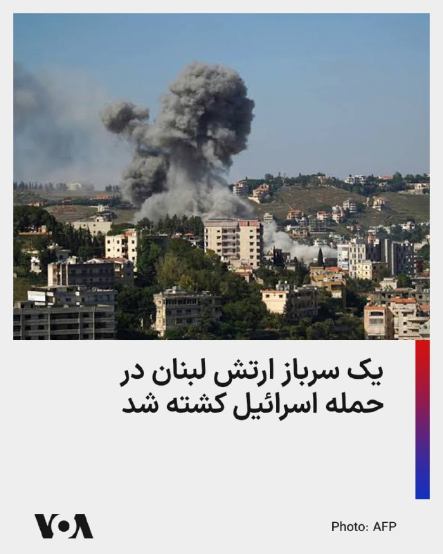

ارتش لبنان اعلام کرد یک سرباز این کشور در حمله اسرائیل در جنوب لبنان کشته شده است؛ حمله‌ای که با وجود آتش‌بس تازه میان اسرائیل و حزب‌الله انجام شد.

به گزارش تایمز اسرائیل، ارتش لبنان گفته است این سرباز در جاده کفررمان ـ نبطیه هدف حمله قرار گرفت. ارتش لبنان همچنین اسرائیل را متهم کرده است که با ادامه حملات خود، تلاش‌ها برای بازگرداندن ثبات در لبنان را مختل می‌کند.

ارتش اسرائیل هنوز درباره این خبر اظهار نظر نکرده است.

همزمان حسن فضل‌الله، نماینده مجلس حزب‌الله، گفته است این گروه حق دارد به حملات اسرائیل پاسخ دهد، چرا که اسرائیل علیرغم آتش‌بس جدید، به لبنان حمله کرد.

رویترز به نقل از رسانه دولتی لبنان گزارش داده بود حملات هوایی، پهپادی و توپخانه‌ای اسرائیل از شامگاه جمعه تا صبح شنبه در منطقه نبطیه ادامه یافت و دست‌کم پنج نفر کشته شدند.
@FarsiVOA

## DW_Farsi — post 126237

  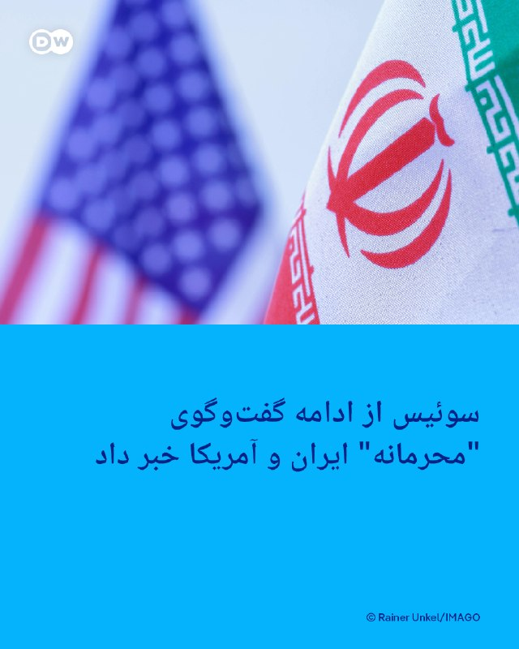

🔶سوئیس از ادامه گفت‌و‌گوی "محرمانه" ایران و آمریکا خبر داد

سوئیس اعلام کرد که همچنان بستر "محرمانه و قابل اعتماد" بورگن‌اشتوک را برای تسهیل گفت‌وگوها درباره اجرای تفاهم‌نامه میان ایران و آمریکا فراهم می‌کند.

خبرگزاری رویترز به‌نقل از وزارت خارجه سوئیس روز شنبه ۳۰ خرداد (۲۰ ژوئن) نوشت که این کشور به میزبانی مذاکرات مرتبط با اجرای تفاهم‌نامه میان تهران و واشنگتن ادامه می‌دهد و مجموعه بورگن‌اشتوک همچنان محل برگزاری این رایزنی‌ها خواهد بود.

در این بیانیه تاکید شده است که سوئیس نقش خود را در فراهم کردن فضایی "محرمانه، بی‌طرف و قابل اعتماد" برای گفت‌وگوها ایفا می‌کند، اما به دلیل ملاحظات محرمانگی، جزئیاتی درباره شرکت‌کنندگان یا محتوای مذاکرات منتشر نخواهد شد.

@dw_farsi

## DW_Farsi — post 126236

  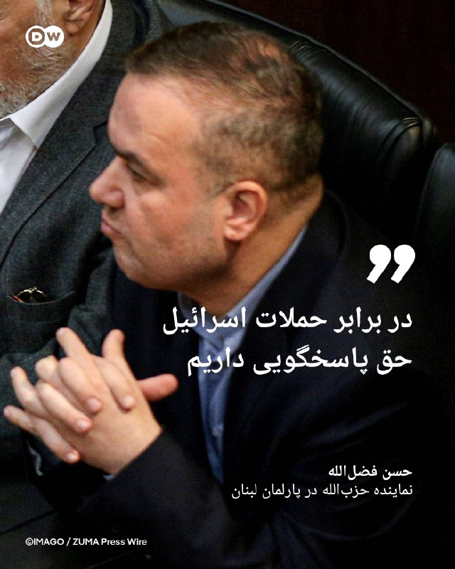

🔶حزب‌الله: در برابر حملات اسرائیل حق پاسخگویی داریم

حسن فضل‌الله، نماینده حزب‌الله در پارلمان لبنان، اعلام کرد که این گروه در صورت ادامه حملات اسرائیل حق پاسخگویی دارد. او گفت، هرگونه آتش‌بس زمانی معنا دارد که اسرائیل به طور کامل به آن پایبند بماند و دست از حمله به لبنان بردارد.

همزمان ارتش اسرائیل اعلام کرد که در واکنش به آنچه "نقض مکرر آتش‌بس" از سوی حزب‌الله خوانده، ده‌ها هدف این گروه را در جنوب لبنان هدف قرار داده است.

به گفته ارتش اسرائیل، نیروهای حزب‌الله طی شب گذشته حدود ۵۰ پرتابه به سمت نیروهای اسرائیلی شلیک کرده‌اند.

رسانه‌های لبنانی گزارش داده‌اند که در حملات اسرائیل دست‌کم ۲۴ نفر کشته شده‌اند که هفت نفر از آنها در حمله‌ای به منطقه قناریت در نزدیکی صیدا جان باخته‌اند.

@dw_farsi

## DW_Farsi — post 126235

  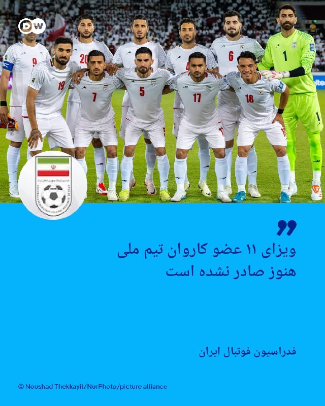

🔶فدراسیون فوتبال ایران: ویزای ۱۱ عضو کاروان تیم ملی هنوز صادر نشده است

فدراسیون فوتبال ایران می‌گوید برای دومین‌بار درخواست صدور ویزا برای ۱۱ عضو کاروان تیم ملی را به مقامات آمریکایی ارائه کرده، اما این درخواست‌ها همچنان "بی‌پاسخ" مانده است.

هدایت‌الله ممبینی، دبیرکل فدراسیون فوتبال ایران، با اشاره به رایزنی‌های انجام‌شده با فیفا و مسئولان این نهاد گفت که مقامات فوتبال جهان برای حل این مشکل "قول همکاری" داده‌اند، اما با نزدیک شدن به زمان مسابقه، هنوز مانع صدور ویزا برطرف نشده است.

او با انتقاد از شرایط ایجادشده گفت که بیش از ۱۱ عضو اصلی تیم ملی ایران در حالی موفق به دریافت ویزا نشده‌اند که افراد دارای مسئولیت‌های مشابه در دیگر تیم‌های حاضر در رقابت‌ها بدون مشکل وارد کشور میزبان شده‌اند.

ممبینی همچنین ابراز نگرانی کرد که فیفا نتواند مانند گذشته از اختیارات و نفوذ خود برای تضمین شرایط برابر برای همه تیم‌ها استفاده کند. به گفته او، محدودیت‌های اعمال‌شده علیه کاروان ایران این پرسش را ایجاد کرده که چرا تیم ملی ایران برخلاف دیگر تیم‌ها از شرایط مشابه برای حضور در مسابقات برخوردار نیست.

@dw_farsi

## DW_Farsi — post 126234

🔶آزادی خبرنگار آلمانی در سوریه؛ ابهام در سرنوشت همکار کُرد

اِوا ماریا میشلمن، خبرنگار آلمانی، پس از حدود پنج ماه بازداشت در سوریه آزاد شده و به آلمان بازگشته است.

مقام‌های سوری پیش‌تر گفته بودند میشلمن و احمد پولاد، خبرنگار کُرد اهل ترکیه که همراه او در شهر رقه بازداشت شده بود، در جریان یک عملیات نظامی در این شهر بازداشت شده‌اند و در آن هنگام مدارکی برای اثبات مأموریت خبرنگاری خود ارائه نکرده بودند.

رسانه‌های آلمانی گزارش داده‌اند که سفارت آلمان در دمشق و همچنین وزارت خارجه این کشور در ماه‌های گذشته برای آزادی میشلمن با مقام‌های سوری در تماس بوده‌اند.

@dw_farsi

## DW_Farsi — post 126233

  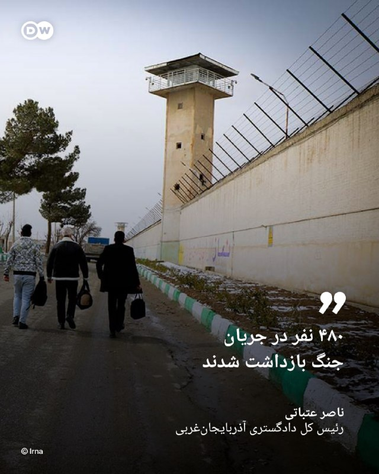

🔶 رئیس کل دادگستری آذربایجان‌غربی: ۴۸۰ نفر در جریان جنگ بازداشت شدند

ناصر عتباتی، رئیس کل دادگستری آذربایجان‌غربی از بازداشت ۴۸۰ نفر به اتهام همکاری با "عوامل دشمن" در جریانجنگ آمریکا و اسرائیل علیه جمهوری اسلامی خبر داد.

به گفته عتباتی از میان افراد بازداشت‌شده، ۱۰ نفر به عنوان "عامل و جاسوس موساد" شناسایی شده‌اند و احکام قضایی مربوط به آنان نیز صادر شده است.

این مقام قضایی روز شنبه ۳۰ خرداد (۲۰ ژوئن) در نشست خبری گفت که فعالیت دستگاه قضایی استان در طول این دوره بدون وقفه ادامه داشته و همزمان اقدامات امنیتی و قضایی گسترده‌ای در استان انجام شده است.

وی همچنین مدعی شد که در جریان ناآرامی‌های دی‌ماه سال گذشته، آذربایجان‌غربی یکی از آرام‌ترین استان‌های کشور بوده و نیروهای امنیتی و قضایی با افراد مرتبط با "دشمن" برخورد کرده‌اند.

@dw_farsi

## DW_Farsi — post 126232

  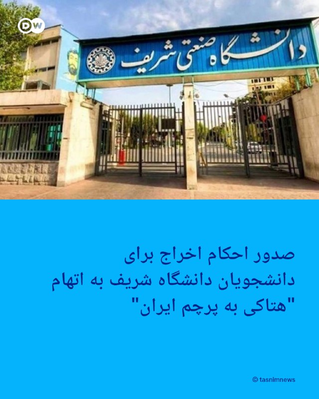

🔶 صدور احکام اخراج برای دانشجویان دانشگاه شریف به اتهام "هتاکی به پرچم ایران"

گزارش‌های منتشرشده از سوی رسانه‌های دانشجویی و خبرگزاری فارس حاکی از صدور احکام اخراج برای شماری از دانشجویان دانشگاه صنعتی شریف است؛ احکامی که به گفته منابع مختلف، با اعتراضات دی سال گذشته و فعالیت‌های دانشجویی مرتبط دانسته شده‌اند.

در همین زمینه حساب کاربری "دانشجویان متحد" اعلام کرده است که کمیته انضباطی دانشگاه شریف برای هفت دانشجو حکم بدوی اخراج صادر کرده است. بر اساس این گزارش، برخی از این دانشجویان علاوه بر اخراج، به چهار یا پنج سال محرومیت از ادامه تحصیل نیز محکوم شده‌اند.

در میان اسامی منتشرشده، نام رضا دالمن، سپنتا سعیدی، حسین شادمان، مسیحا باقری، فاطمه خاکپور، فریبرز کهن‌زاد و پرنیان خدابخشی نیز دیده می‌شود.

@dw_farsi

## DW_Farsi — post 126230

  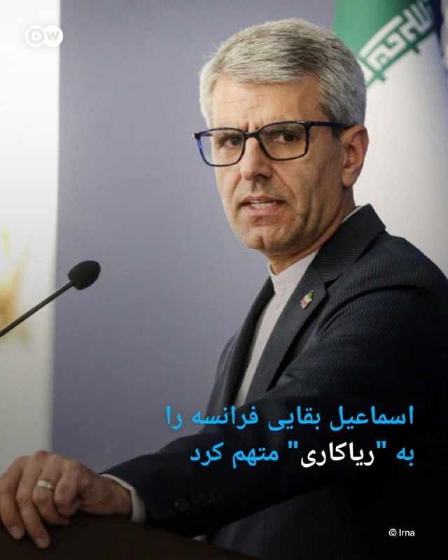

🔶 اسماعیل بقایی فرانسه را به "ریاکاری" متهم کرد

اسماعیل بقایی، سخنگوی وزارت امور خارجه جمهوری اسلامی ایران روز شنبه ۳۰ خرداد (۲۰ ژوئن) سیاست فرانسه در قبال ایران را "ریاکارانه" توصیف کرد و مقام‌های فرانسوی را به برخوردی دوگانه در موضوع حقوق بشر متهم کرد.

سخنگوی وزارت خارجه ایران "سکوت فرانسه" در جنگ آمریکا و اسرائيل با جمهوری اسلامی را "وجدان گزینشی" توصیف کرد.

بقایی در پیامی در شبکه اجتماعی ایکس با اشاره به نمایشنامه "تارتوف" اثر مولیر، نویسنده مشهور و کلاسیک فرانسوی، نوشت: «ریاکاری فضیلتی است که مد شده است.» او با استناد به این اثر ادبی، ریاکاری را یکی از ویژگی‌های فرهنگ سیاسی فرانسه توصیف کرد.

سخنگوی وزارت خارجه ایران همچنین فرانسه را متهم کرد که در زمان حملات به شهرهای ایران و کشته‌شدن شهروندان غیرنظامی سکوت کرده و حتی "همدست" این اقدامات بوده است.

بقایی همچنین افزود که مقام‌های فرانسوی اکنون و در راستای منافع سیاسی خود، درباره حقوق بشر اظهار نظر می‌کنند.

@dw_farsi

## DW_Farsi — post 126228

🔶 رئیس جمهور لهستان نشان عالی اهدایی به زلنسکی را پس گرفت

کارول ناوروتسکی، رئیس ‌جمهور لهستان در واکنش به تجلیل ولودیمیر زلنسکی از ارتش شورشی اوکراین (UPA)، عالی‌ترین نشان دولتی این کشور را از رئیس‌ جمهور اوکراین پس گرفت.

ارتش شورشی اوکراین یا "UPA " ، یک گروه ملی‌گرای فعال در دوران جنگ جهانی دوم بود که همچنان یکی از موضوعات مناقشه‌برانگیز در روابط لهستان و اوکراین به شمار می‌رود.

رئیس‌ جمهور لهستان، اعلام کرد نشان "عقاب سفید" که در سال ۲۰۲۳ به زلنسکی اعطا شده بود، از او پس گرفته می‌شود. او در یک پیام ویدیویی گفت این تصمیم با هدف "حفظ حرمت نمادهای ملی لهستان و پاسداشت یاد قربانیان لهستانی" گرفته شده است.

ناوروتسکی تأکید کرد که این اقدام علیه مردم اوکراین نیست و تغییری در حمایت لهستان از اوکراین یا همکاری دو کشور ایجاد نمی‌کند.

@dw_farsi

## DW_Farsi — post 126227

  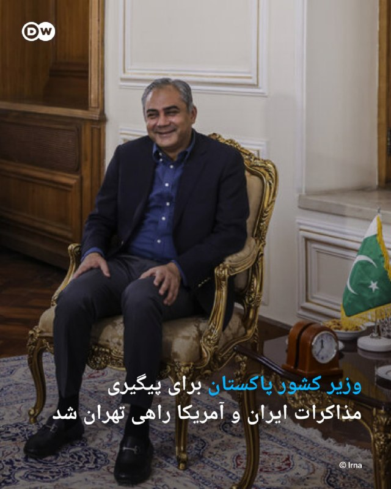

🔶 وزیر کشور پاکستان برای پیگیری مذاکرات ایران و آمریکا راهی تهران شد

یک منبع رسمی پاکستانی از سفر محسن نقوی، وزیر کشور این کشور، به ایران خبر داد. به گفته این منبع، نقوی روز شنبه ۳۰ خرداد (۲۰ ژوئن) برای دیدار با مقام‌های بلندپایه جمهوری اسلامی ایران راهی تهران شده است.

خبرگزاری دولتی ایرنا گزارش داده است که این منبع همچنین تائید کرده است که وزیر کشور پاکستان در جریان این سفر، روند پیشبرد مذاکرات میان ایران و آمریکا را پیگیری خواهد کرد.

محسن نقوی از زمان آغاز نقش‌آفرینی پاکستان در روند میانجی‌گری، چندین بار به تهران سفر کرده است. او در آخرین سفر خود در ۱۷ خرداد با عباس عراقچی، وزیر خارجه ایران و اسکندر مومنی، وزیر کشور دیدار و گفت‌وگو کرده بود.

سفر نقوی در حالی انجام می‌شود که شهباز شریف، نخست‌وزیر پاکستان، پنجشنبه گذشته در نخستین تماس رسمی خود با مسعود پزشکیان پس از امضای یادداشت تفاهم اسلام‌آباد، این توافق را تبریک گفت.

این سفر در شرایطی انجام می‌شود که دیدار برنامه‌ریزی‌شده جی‌دی ونس، معاون ترامپ در ژنو با عباس عراقچی برگزار نشده است.

هم‌زمان با این تحولات توافق اخیر آمریکا و ایران با انتقادهایی در داخل اسرائیل نیز روبه‌رو شده و برخی مقام‌های دولتی و همچنین چهره‌های اپوزیسیون این کشور مخالفت خود را با این تفاهمنامه اعلام کرده‌اند.

برنامه موشکی ایران و حمایت تهران از گروه‌های نیابتی در منطقه در این تفاهم‌نامه گنجانده نشده است.

@dw_farsi

## Persian_Trend_Official — post 17683

  <a href="telegram/content/Persian_Trend_Official_17683_1781962808.webm" target="_blank">🎬 Download video</a>

هیات ایرانی عازم سوییس می‌‌شود

ایسنا: هیات مذاکره کننده ایران تا دقایقی دیگر عازم سوئیس می‌شوند.

📝 Amir

📌 @persian_trend_official
پرشین ترند | متفاوت‌ترین کانال نظامی

## Persian_Trend_Official — post 17682

  <a href="telegram/content/Persian_Trend_Official_17682_1781962808.webm" target="_blank">🎬 Download video</a>

حادثه در فرودگاه مهرآباد؛ پرواز شیراز به تهران از باند خارج شد!

هواپیمای شرکت هواپیمایی مهر از شیراز به تهران ، هنگام فرود در فرودگاه مهرآباد، از باند خارج و در حاشیه باند متوقف شد.

در این حادثه به هواپیما و تاسیسات فرودگاه آسیب وارد شد. این حادثه تلفات جانی و مصدوم نداشت.

📝 Amir

📌 @persian_trend_official
پرشین ترند | متفاوت‌ترین کانال نظامی

## Persian_Trend_Official — post 17681

  <a href="telegram/content/Persian_Trend_Official_17681_1781962809.webm" target="_blank">🎬 Download video</a>

قرارگاه مرکزی حضرت خاتم‌الانبیا:

وَإِنْ نَكَثُوا أَيْمَانَهُمْ مِنْ بَعْدِ عَهْدِهِمْ وَطَعَنُوا فِي دِينِكُمْ فَقَاتِلُوا أَئِمَّةَ الْكُفْرِ ۙ إِنَّهُمْ لَا أَيْمَانَ لَهُمْ لَعَلَّهُمْ يَنْتَهُونَ(۱۲ توبه)

نظر به بدعهدی‌ و پیمان‌شکنی آشکار آمریکا نسبت به عدم اجرای بند اول تفاهم‌نامه پایان جنگ، و در واکنش به نقض بی‌وقفه و مستمر آتش‌بس توسط رژیم صهیونیستی در جنوب لبنان و کشتار بی‌رحمانه و آوارگی صدها هزار نفر از مردم مظلوم این سرزمین و همچنین با توجه به عدم عقب‌نشینی نیروهای اشغالگر صهیونی از اراضی جنوب لبنان، اعلام می‌دارد تنگه هرمز به روی تردد شناورها بسته خواهد شد.

متذکر می‌گردد اين گام اول پاسخ به عهدشکنی دشمن است و در صورت ادامه تجاوز گام‌های بعدی برای پایبند کردن دشمن به اجرای تعهدات برنامه ریزی و اقدام خواهد شد.

📝 Amir

📌 @persian_trend_official
پرشین ترند | متفاوت‌ترین کانال نظامی

## Persian_Trend_Official — post 17680

  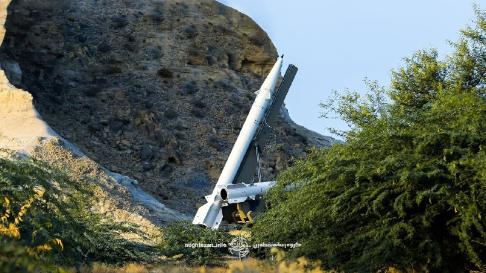

به اعلام قرارگاه مرکزی خاتم‌الانبیا، تنگه هرمز بطور مجدد بسته شد.

📝 Amir

📌 @persian_trend_official
پرشین ترند | متفاوت‌ترین کانال نظامی

## Persian_Trend_Official — post 17679

  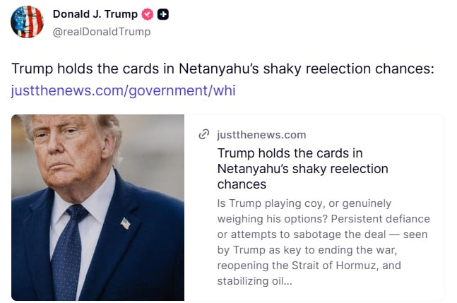

دونالد ترامپ خبری را با تیتر؛ ترامپ در شانس‌های لرزان انتخاب مجدد نتانیاهو، برگ برنده را در دست دارد در حساب تروث سوشال خود بازنشر کرد.

📝 Amir

📌 @persian_trend_official
پرشین ترند | متفاوت‌ترین کانال نظامی

## Persian_Trend_Official — post 17678

  <a href="telegram/content/Persian_Trend_Official_17678_1781962811.webm" target="_blank">🎬 Download video</a>

وزارت امور خارجه سوئیس: ما به فراهم کردن محیطی محرمانه و قابل اعتماد جهت تسهیل گفتگوها در بورگونشتوک پیرامون اجرای یادداشت تفاهم ادامه می‌دهیم.

📝 Amir

📌 @persian_trend_official
پرشین ترند | متفاوت‌ترین کانال نظامی

## Persian_Trend_Official — post 17677

  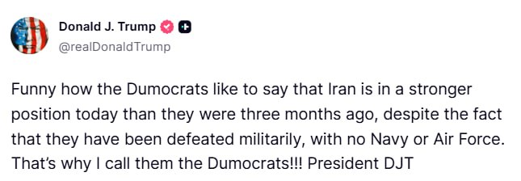

ترامپ در تروث سوشال: خنده‌ داره که چطور دموکرات‌ها دوست دارند بگویند ایران امروز در موقعیت قوی‌تری نسبت به سه ماه پیش است، با وجود اینکه از نظر نظامی شکست خورده‌اند، بدون نیروی دریایی یا هوایی.

به همین دلیل است که من آنها را دموکرات می‌نامم!!!

📝 Amir

📌 @persian_trend_official
پرشین ترند | متفاوت‌ترین کانال نظامی

## Persian_Trend_Official — post 17676

  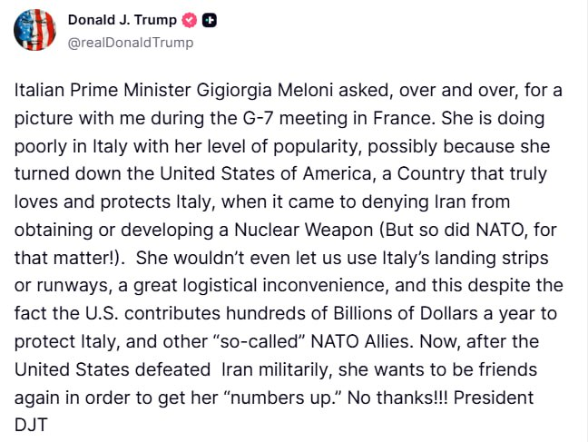

ترامپ در تروث سوشال: جورجیا ملونی، نخست وزیر ایتالیا، بارها و بارها در طول نشست گروه هفت در فرانسه از من عکس خواست.

او با این سطح از محبوبیت در ایتالیا عملکرد ضعیفی دارد، احتمالاً به این دلیل که درخواست ایالات متحده آمریکا، کشوری که واقعاً ایتالیا را دوست دارد و از آن محافظت می‌کند، را در مورد جلوگیری از دستیابی یا توسعه سلاح هسته‌ای توسط ایران رد کرد (البته ناتو هم همینطور بود!).

او حتی به ما اجازه استفاده از باندهای فرود یا فرودگاه‌های ایتالیا را هم نمی‌داد، که یک دردسر بزرگ لجستیکی است، و این در حالی است که ایالات متحده سالانه صدها میلیارد دلار برای محافظت از ایتالیا و دیگر به اصطلاح متحدان ناتو کمک می‌کند.

حالا، پس از اینکه ایالات متحده ایران را از نظر نظامی شکست داد، او می‌خواهد دوباره دوست شود تا تعداد خود را بالا ببرد. نه ممنون!!!

📝 Amir

📌 @persian_trend_official
پرشین ترند | متفاوت‌ترین کانال نظامی

## Persian_Trend_Official — post 17675

  <a href="telegram/content/Persian_Trend_Official_17675_1781962813.mp4" target="_blank">🎬 Download video</a>

یائیر لاپید، رهبر اپوزیسیون اسرائیل: نتانیاهو نتوانست کشورهای خلیج فارس را به شرکای استراتژیک اسرائیل در این جنگ تبدیل کند.

آنها بخشی از جبهه دیپلماتیک نبودند. آنها بخشی از چارچوب اقتصادی نبودند. آنها بخشی از سازوکار منطقه‌ای نبودند.

و آنها باعث نشدند که ایرانی‌ها به همراه ما هزینه مشترکی بپردازند.

📝 Amir

📌 @persian_trend_official
پرشین ترند | متفاوت‌ترین کانال نظامی

## Persian_Trend_Official — post 17674

  <a href="telegram/content/Persian_Trend_Official_17674_1781962816.mp4" target="_blank">🎬 Download video</a>

مشهد.

## Persian_Trend_Official — post 17668

  <a href="telegram/content/Persian_Trend_Official_17668_1781962819.mp4" target="_blank">🎬 Download video</a>

امروز دانش آموزان کنکوری و یازدهمی در سراسر کشور دست به اعتراض مسالمت‌آمیز زدن.

Phantom

📌 @persian_trend_official
پرشین ترند | متفاوت‌ترین کانال نظامی

## Persian_Trend_Official — post 17665

  <a href="telegram/content/Persian_Trend_Official_17665_1781962821.mp4" target="_blank">🎬 Download video</a>

🔥
🔥 آتش‌سوزی در خمین؛ گویا یک انبار دچار حریق شده است.

👺Phantom

📌 @persian_trend_official
پرشین ترند | متفاوت‌ترین کانال نظامی

## Persian_Trend_Official — post 17664

  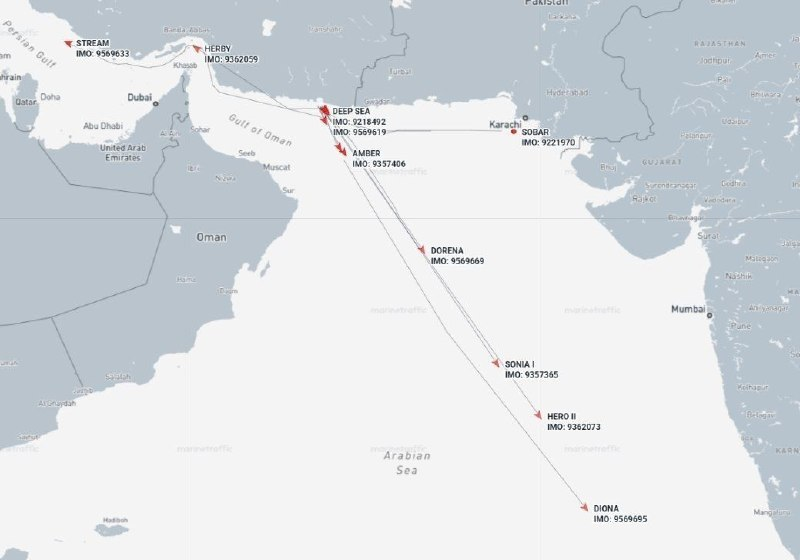

حرکت 10 نفتکش ایرانی به نام های؛ دیونا، قهرمان، سونیا، دورنا، آمبر، خندان، برف، هدی، استارلا و خشم دریا به طرف چین

👺Phantom

📌 @persian_trend_official
پرشین ترند | متفاوت‌ترین کانال نظامی

## RadioFarda — post 158543

  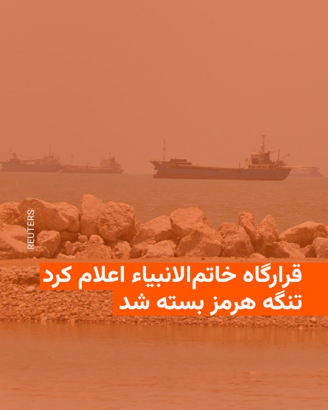

🔸قرارگاه مرکزی خاتم‌الانبیاء در بیانیه‌ای اعلام کرد که در واکنش به تداوم حملات اسرائیل به جنوب لبنان، تنگه هرمز را به روی تردد شناورها می‌بندد.

🔸بر اساس این بیانیه‌ که خبرگزاری صداوسیمای جمهوری اسلامی ایران بعد از ظهر شنبه ۳۰ خرداد آن را منتشر کرد، این تصمیم در واکنش به «بدعهدی و پیمان‌شکنی آشکار آمریکا» در اجرای بند نخست تفاهم‌نامه پایان جنگ و همچنین «نقض مستمر آتش‌بس توسط اسرائیل در جنوب لبنان» اتخاذ شده است.

🔸در این بیانیه همچنین به ادامه حضور نیروهای اسرائیلی در جنوب لبنان اشاره شده و ادعا شده است که بستن تنگه هرمز «گام اول» پاسخ ایران به آنچه «عهدشکنی دشمن» نامیده شده، محسوب می‌شود.

🔸قرارگاه خاتم‌الانبیاء همچنین تهدید کرده است که در صورت ادامه آن‌چه این قرارگاه آن را «تجاوز» خوانده، اقدامات بیشتری برای وادار کردن طرف مقابل به اجرای تعهداتش در دستور کار قرار خواهد داد.

🔸مقام‌های آمریکا و اسرائیل هنوز واکنشی به این خبر نشان نداده‌اند.

@RadioFarda

## RadioFarda — post 158542

سوئیس می‌گوید گفت‌وگوهای ایران و آمریکا ادامه دارد

🔸خبرگزاری رویترز به‌نقل از وزارت خارجه سوئیس اعلام کرد که گفت‌وگوها دربارهٔ اجرای تفاهم‌نامه میان ایران و آمریکا همچنان در بورگن‌اشتوک ادامه دارد.

🔸این وزارتخانه روز شنبه ۳۰ خرداد در بیانیه‌ای نسبتاً مبهم اعلام کرد که سوئیس همچنان «فضایی محرمانه و قابل اعتماد» برای تسهیل این گفت‌وگوها فراهم می‌کند و به دلیل محرمانه بودن مذاکرات، اطلاعات بیشتری منتشر نخواهد شد.

🔸سوئیس در این بیانیه از ارائه جزئیات دربارهٔ شرکت‌کنندگان و محتوای مذاکرات خودداری کرده است.

🔸پیشتر گزارش شده بود که تشدید درگیری‌ها میان اسرائیل و حزب‌الله در روزهای گذشته باعث لغو سفر برنامه‌ریزی‌شدهٔ جی‌دی ونس، معاون رئیس‌جمهور آمریکا، به سوئیس شده و ابهام‌هایی دربارهٔ آینده مذاکرات ایجاد کرده بود.

🔸وب‌سایت اکسیوس روز شنبه نوشت ویتکاف برای پیوستن به جرد کوشنر که هم‌اکنون در سوئیس حضور دارد، عازم این کشور شده و عباس عراقچی نیز قرار است روز شنبه وارد سوئیس شود. به نوشته اکسیوس، این تحولات می‌تواند نشانه آمادگی دو طرف برای آغاز مذاکرات فنی با هدف دستیابی به توافقی پایدارتر باشد.

🔸کاخ سفید به پرسش‌های رویترز درباره سفر آقای ویتکاف پاسخی نداده است. با این حال، یک مقام ارشد آمریکایی به این خبرگزاری گفته است که آتش‌بس میان اسرائیل و حزب‌الله با میانجی‌گری آمریکا و قطر و با کمک ایران حاصل شده است.

🔸این در حالی است که حملات اسرائیل به لبنان روز شنبه، تنها چند ساعت پس از اجرایی شدن آتش‌بس با حزب‌الله، بار دیگر آغاز شد و دست‌کم ۱۰ کشته بر جا گذاشت. اسرائیل مدعی است این حملات در پاسخ به پرتاب موشک‌ها و راکت‌هایی از سوی گروه حزب‌الله انجام شده است.

🔸خبرگزاری تسنیم، نزدیک به سپاه پاسداران، در واکنش به این گزارش‌ها یادداشتی بدون امضا را به‌عنوان تیتر یک خود منتشر کرد و خطاب به عباس عراقچی نوشت با توجه به تداوم درگیری‌ها در لبنان، «دیدار با ویتکاف توجیه ندارد؛ باید تنگه هرمز را ببندید».

@RadioFarda

## RadioFarda — post 158541

🔸تصاویری که یلدا رشتیان، خواهر صهبا رشتیان، جوان کشته‌شده در اعتراضات دی ماه، منتشر کرده است برگزاری مراسم جشن تولد ۲۴ سالگی او در روز ۳۰ خرداد ۱۴۰۵ در کنار آرامگاهش را نشان می‌دهد.

🔸در این تصاویر پدر صهبا کبوتری را به یاد او به پرواز درآورده و می‌گوید: ای کبوتر سفید! ای پیام‌آور صلح! سلام مرا به صهبا برسان. بگو تا زنده‌ام، اگر زنده ماندم، انتقام ترا خواهم گرفت.

🔸در تصاویر دیگری که از این مراسم منتشر شده اغلب شرکت‌کنندگان لباس سفید بر تن دارند و سرود «ای ایران» می‌خوانند.

🔸صهبا رشتیان، کمک‌داور ۲۳ ساله فوتبال زنان، در جریان اعتراضات روز ۱۹ دی ۱۴۰۴ در شهر اصفهان بر اثر شلیک مستقیم نیروهای حکومتی کشته شد.

@RadioFarda

## RadioFarda — post 158540

  <a href="telegram/content/RadioFarda_158540_1781962825.mp4" target="_blank">🎬 Download video</a>

🔸خبرگزاری فرانسه به نقل از آژانس دفاع مدنی لبنان از حملات مداوم اسرائیل به منطقه نبطیه در جنوب این کشور در بامداد شنبه ۳۰ خرداد خبر داد.

🔸اسرائیل اعلام کرد که این اقدام در واکنش به حملات حزب‌الله و گروه تحت حمایت ایران است که می‌گویند به اسرائیل اجازه «آزادی حرکت» در لبنان را نخواهند داد.

🔸منابع مختلف آمار متفاوتی از کشته‌شدگان و مجروحان اعلام کرده‌اند.

🔸منابع اسرائیلی و حزب‌الله روز جمعه ۲۹ خرداد خبر توافق با یکدیگر را تأیید کردند.

🔸حزب‌الله یک گروه شبه‌نظامی و در عین حال یک حزب سیاسی است. ایالات متحده حزب‌الله را یک سازمان تروریستی می‌داند، اما اتحادیه اروپا شاخهٔ نظامی آن را در فهرست سیاه قرار داده و حزب سیاسی آن را تروریستی نمی‌داند. حزب سیاسی حزب‌الله در پارلمان لبنان هم نمایندگانی دارد.

@RadioFarda

## RadioFarda — post 158539

  <a href="https://t.me/radiofarda/158539" target="_blank">📎 Download file</a>

📻بشنوید: ساعت ۱۴ با رادیوفردا، ۳۰ خرداد ۱۴۰۵‌

@RadioFarda

## RadioFarda — post 158538

  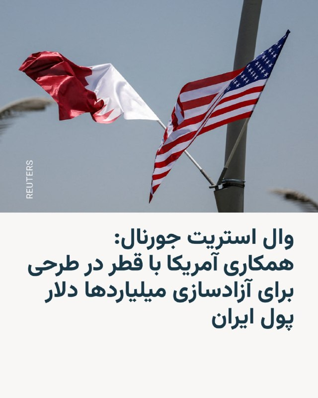

🔸روزنامه آمریکایی وال استریت جورنال در گزارشی اختصاصی که روز جمعه منتشر شد نوشت که دولت آمریکا در چارچوب مفاد تفاهم‌نامه اسلام‌آباد برای آزادسازی میلیاردها دلار پول مسدودشده ایران با حکومت قطر همکاری می‌کند.

🔸این روزنامه به نقل از افراد مطلع که به نام‌شان اشاره نکرد نوشته است که هدف از این طرح که هنوز به مرحله اجرا نرسیده دادن دسترسی به حکومت ایران به پولی است که در گوشه و کنار دنیا به دلیل تحریم‌ها مسدود شده است.

🔸تخمین زده می‌شود که کل پول مسدودشده ایران صد میلیارد دلار است که در خارج از کشور به دلیل تحریم‌ها بلوکه شده و جمهوری اسلامی به آن دسترسی ندارد.

🔸آمریکا و قطر در مرحله اول تلاش می‌کنند شش میلیارد دلاری را آزاد کنند که در زمان ریاست جمهوری جو بایدن در قطر بلوکه شده است.

🔸این شش میلیارد دلار در سال ۲۰۲۳ توسط دولت جو بایدن پس از آزادی پنج آمریکایی زندانی به قطر انتقال داده شد. ایران حدود یک میلیارد دلار هم در عمان دارد. اما هر دو مبلغ در پی حمله گروه افراطی حماس به اسرائیل در اکتبر ۲۰۲۳ «به طور غیررسمی» بار دیگر در قطر و عمان بلوکه شد.

@RadioFarda

## RadioFarda — post 158537

  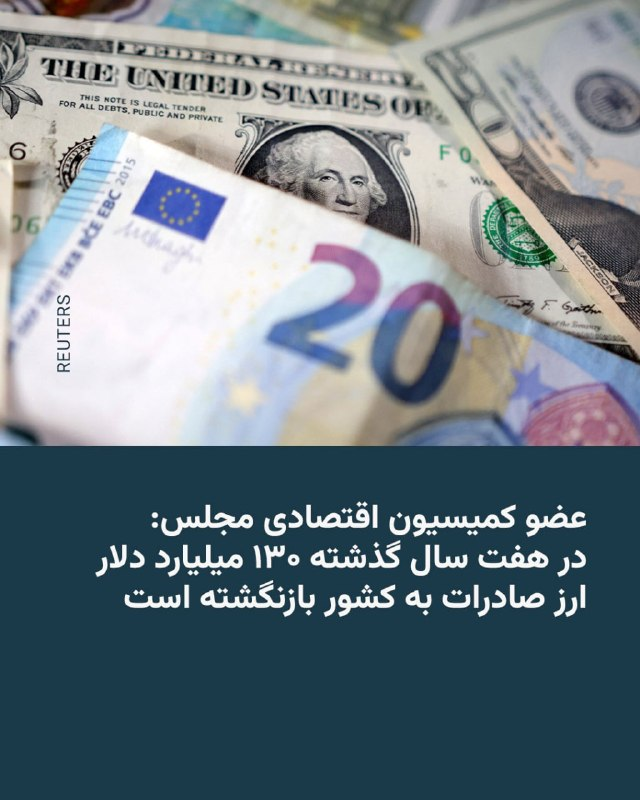

🔸حسین صمصامی، عضو کمیسیون اقتصادی مجلس شورای اسلامی، در گفت‌وگو با سایت خبری تابناک افشا کرد که در هفت سال گذشته بیش از ۱۳۰ میلیارد دلار ارز حاصل از صادرات به کشور بازنگشته است.

🔸او توضیح داد: «طبق قوانین و مقررات، صادرکنندگان موظفند ارز حاصل از صادرات خود را در بازه زمانی مشخصی به چرخه رسمی اقتصاد کشور بازگردانند.»

🔸با این حال، بر اساس آمار موجود، «از سال ۱۳۹۷ تا خرداد ۱۴۰۵ مجموع ارز صادراتی که به چرخه رسمی اقتصاد کشور بازنگشته، به بیش از ۱۳۰ میلیارد دلار رسیده است.»

🔸صمصامی گفت: «این رقم معادل حدود ۳۶ درصد از کل صادرات کشور در این بازه زمانی است.»

🔸این در حالی است که حکومت برای بازگرداندن ۲۴ میلیارد دلار دارایی مسدودشده کشور وارد چانه‌زنی فراوان با دولت ایالات متحده شده است، امری که نشان می‌دهد تا چه حد به این پول نیاز دارد.

🔸حسین صمصامی خود محاسبه کرده است که این مبلغ تنها یک‌پنجم ۱۳۰ میلیارد دلاری است که صادرکنندگان در خارج از کشور نگه داشته‌اند.

🔸در این میان بیشترین میزان عدم بازگشت ارز صادرات مربوط به سال ۱۴۰۴ است.

@RadioFarda

## RadioFarda — post 158536

  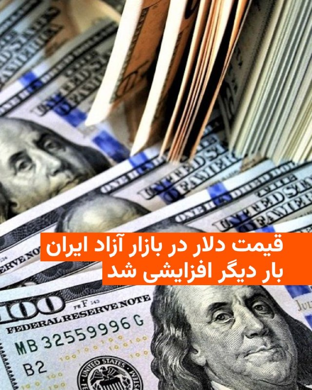

🔸قیمت دلار و دیگر ارزهای خارجی که در پی نتیجه موقت مذاکرات ایران و آمریکا کاهش یافته بود بار دیگر افزایشی شد.

🔸روز شنبه، ۳۰ خردادماه، قیمت دلار آمریکا در بازار به ۱۶۲ هزار و ۵۰۰ تومان رسید. قیمت یک یوروی اروپا نیز در این روز به ۱۸۶ هزار و ۴۰۰ تومان رسید.

🔸این در حالی است که در طی روند کاهشی قیمت ارزهای خارجی در بازار آزاد ایران، روز چهارشنبه ۲۷ خرداد قیمت هر دلار آمریکا به حدود ۱۵۳ هزار تومان رسیده و قیمت سکه طلا هم در محدوده ۱۶۰ میلیون تومان اعلام شده بود.

🔸روزنامه هم‌میهن روز شنبه قیمت سکه امامی را در بازار طلای ایران ۱۶۹ میلیون تومان گزارش کرد.

🔸از زمان اعلام تفاهم‌نامه ایران و آمریکا در تلاش برای پایان جنگ، قیمت ارزهای خارجی و سکه طلا در بازار آزاد ایران شاهد کاهش قابل توجهی بود.

@RadioFarda

## IranianMinds — post 23011

🔴 تنگۀ هرمز بسته شد

قرارگاه خاتم‌الانبیا:

نظر به بدعهدی‌ و پیمان‌شکنی آشکار آمریکا نسبت به عدم اجرای بند اول تفاهم‌نامه پایان جنگ، و در واکنش به نقض بی‌وقفه و مستمر آتش‌بس توسط رژیم صهیونیستی در جنوب لبنان و کشتار بی‌رحمانه و آوارگی صدها هزار نفر از مردم مظلوم این سرزمین و همچنین با توجه به عدم عقب‌نشینی نیروهای اشغالگر صهیونی از اراضی جنوب لبنان، اعلام می‌دارد تنگه هرمز به روی تردد شناورها بسته خواهد شد.

متذکر می‌گردد اين گام اول پاسخ به عهدشکنی دشمن است و در صورت ادامه تجاوز گام‌های بعدی برای پایبند کردن دشمن به اجرای تعهدات برنامه ریزی و اقدام خواهد شد.

@IranianMinds

## IranianMinds — post 23010

این کسخل رو کم داشتیم

🔴 مریم رجوی:

سرنگونی از طریق جنگ خارجی سراب است. این رژیم تنها به‌دست مردم و مقاومت سازمان‌یافته آن سرنگون خواهد شد.

@IranianMinds

## IranianMinds — post 23009

🔴 ترامپ : حالا که ایالات متحده جمهوری اسلامی را از نظر نظامی شکست داده است، ایتالیا و ناتو می‌خواهند دوباره دوست شوند تا «اعدادشان» را بالا ببرند. نه، ممنون!!!

@IranianMinds

## IranianMinds — post 23008

  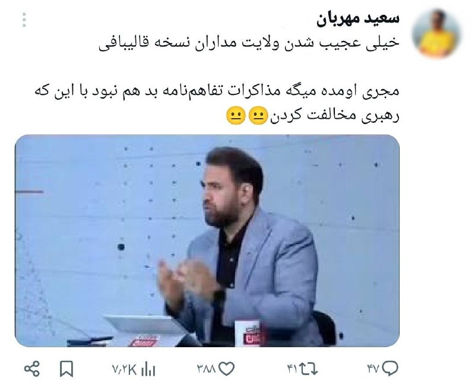

🔴 تندروها معتقدن کودتای قالیباف تکمیل شده و الان قدرت اصلی کشور دست قالیبافه. چون با اینکه رهبر‌ گفته توافق خوب نیست ولی مجری های صداوسیما میگن توافقه خوبه.

@IranianMinds

## IranianMinds — post 23007

  

🔴 ریپست جدید ترامپ :

همه ی کارت ها دست ترامپه و سرنوشت شانس انتخاب مجدد لرزان نتانیاهو کاملا به دست اونه.

@IranianMinds

## IranianMinds — post 23006

🔴 سخنگوی وزارت کشور:

هرکی که توی مراسم تشییع و تدفین خامنه‌ای شرکت کنه بهش بیمه رایگان تعلق میگیره!

@IranianMinds

## IranianMinds — post 23004

🔴 پزشکیان امروز تو جلسه دولت آستین کوتاه پوشیده بود و به بقیه هم گفت برای چی آستین کوتاه نپوشیدید؟! من که گفتم اینجا کولر نمیزنیم.

@IranianMinds

## IranianMinds — post 23003

  

📊 55 درصد از علاقه‌مندان به فوتبال، فقط 4 سال یکبار شرط میبندن!

حالا چرا جام جهانی 
❓
خیلی از نتایج تابلو و قابل حدسه 
💯

مافیا که کارش دستکاری کردن نتایجه، زورش به جام‌جهانی نمیرسه و نتایج واقعیه
👀
به دلیل تعداد زیاد بازی ها، دستت بازه و کنترل ریسک و سرمایه آسونه! 
🔽
🔼

💡 کافیه یه سایت معتبر پیدا کنی که شارژ کردنش آسون باشه و بدونی پولت امن میمونه، MelBet اسپانسر رسمی جام جهانی، همونیه که دنبالشی!

برای ورود به سایت فیلترشکن خود را خاموش کنید

🌐 MelBet1.net

🌐 MelBet1.net

## IranianMinds — post 23002

  <a href="telegram/content/IranianMinds_23002_1781962833.mp4" target="_blank">🎬 Download video</a>

🔴طالبان کثیف، یک زن معلم را به جرم آموزش آنلاین به دختران، در ملاءعام شلاق زد.

@IranianMinds

## IranianMinds — post 23001

  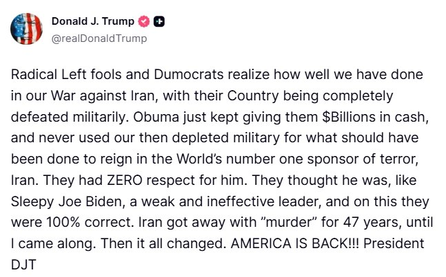

🔴 ترامپ:
چپ‌های رادیکال احمق و دموکرات‌ها می‌دانند که ما در جنگ علیه ایران چقدر خوب عمل کرده‌ایم، در حالی که کشورشان از نظر نظامی کاملاً شکست خورده است.

اوباما فقط به آنها میلیاردها دلار پول نقد می‌داد و هرگز از ارتش ضعیف ما برای آنچه که باید برای سرکوب حامی شماره یک تروریسم در جهان، ایران، انجام می‌شد، استفاده نکرد. آنها هیچ احترامی برای او قائل نبودند. آنها فکر می‌کردند که او مانند جو بایدن خواب‌آلود، یک رهبر ضعیف و ناکارآمد است و در این مورد ۱۰۰٪ درست می‌گفتند.

ایران به مدت ۴۷ سال از «قتل» قسر در رفت، تا اینکه من از راه رسیدم. سپس همه چیز تغییر کرد. آمریکا برگشته است!!!

@IranianMinds

## IranianMinds — post 23000

  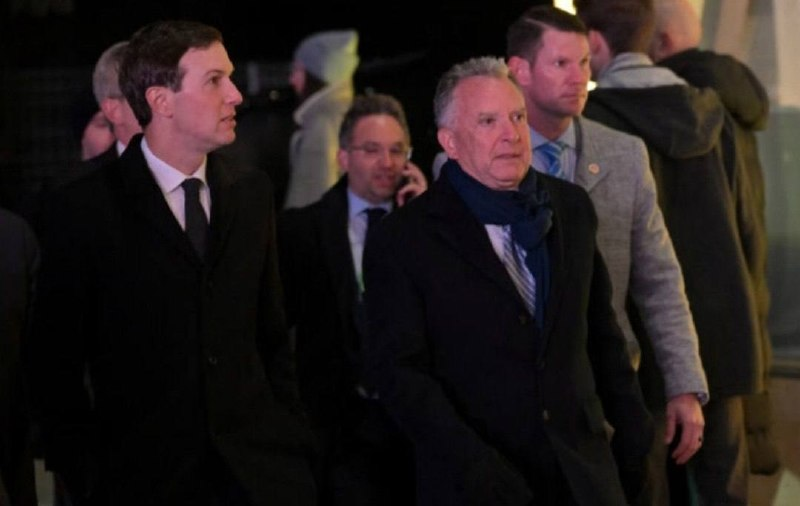

🔴ویتکاف و داماد ترامپ(کوشنر) وارد سوئیس شدند.

@IranianMinds

## IranianMinds — post 22997

  <a href="telegram/content/IranianMinds_22997_1781962836.mp4" target="_blank">🎬 Download video</a>

🔴آتش‌سوزی در خمین.

@IranianMinds

## IranianMinds — post 22996

  <a href="telegram/content/IranianMinds_22996_1781962838.mp4" target="_blank">🎬 Download video</a>

🔴نخست‌وزیر نتانیاهو:

مسیر ما از هزاران سال پیش آغاز شده و به یاری خداوند تا ابد ادامه خواهد داشت.

@IranianMinds

## IranianMinds — post 22995

🔴 نیویورک تایمز به نقل از منابع:

مقام‌های غربی از نتانیاهو خواستن حملات به لبنان رو متوقف کنه تا جمهوری اسلامی خروج خودش از مذاکرات رو توجیه نکنه.

@IranianMinds

## IranianMinds — post 22994

نبویان، نماینده مجلس در صداوسیما:

آمریکا بعد از شهادت آقا از طریق یکی از کشورهای اروپایی، پیام داد که بیاید مثل ونزوئلا تسلیم بشید.

@IranianMinds

## IranianMinds — post 22993

  <a href="telegram/content/IranianMinds_22993_1781962841.mp4" target="_blank">🎬 Download video</a>

نبویان نماینده مجلس رژیم جمهوری اسلامی:

رهبری گفتن مذاکره نکنید به یک شرط بتونیم غرامت جنگ بگیریم در مقابل باز شدن تنگه هرمز و در مورد هسته ای نیز باید پیروز شویم ولی برعکس شد و خطوط رهبری زیر پا گذاشته شد.

@IranianMinds

## IranianMinds — post 22992

🔴یک مداح، پزشکیانو تهدید کرد. @IranianMinds

## BBCPersian — post 284491

  <a href="telegram/content/BBCPersian_284491_1781962844.mp4" target="_blank">🎬 Download video</a>

مرلین، اردک خانگی خانواده‌ای در مکزیک، به «سفیر» جام جهانی فوتبال در این کشور تبدیل شده است.

انتشار ویدیوهایی از این اردک دو ساله، که در خیابان‌های مکزیکوسیتی با پیراهن تیم ملی مکزیک و جوراب‌های سفارشی به معنای واقعی کلمه اردک‌وار می‌خرامد، به مرلین اردکه شهرتی گسترده در شبکه‌های اجتماعی داده است.

هواداران مرلین و خبرنگاران رسانه‌ها به دیدار این حیوان مشهور می‌روند و با آن عکس می‌گیرند.

مکزیک یکی از کشورهای میزبان جام جهانی ۲۰۲۶ است که حال‌وهوای میزبانی و تب فوتبال در آن خیلی داغ‌تر از با آمریکا و کانادا است.

@BBCPersian
https://bbc.in/4exoEmT

## BBCPersian — post 284490

🔻سوئیس: به ارائه محیطی قابل اعتماد برای تسهیل مذاکرات ایران و آمریکا ادامه می‌دهیم

وزارت خارجه سوئیس روز شنبه اعلام کرد که این کشور همچنان به ارائه «محیطی امن و قابل اعتماد» در بورگن‌استوک برای تسهیل مذاکرات در مورد اجرای یادداشت تفاهم بین ایالات متحده و ایران ادامه می‌دهد.

این وزارت‌خانه در بیانیه‌ای افزود که به دلیل محرمانه بودن، جزئیات بیشتری در مورد شرکت‌کنندگان و محتوای مذاکرات فاش نخواهد شد.

دیشب یک مقام آمریکایی به وب‌سایت خبری آکسیوس گفت که استیو ویتکاف، فرستاده کاخ سفید، در راه سوئیس است.

به گفته این مقام، جرد کوشنر، داماد و دیگر فرستاده دونالد ترامپ، هم‌اکنون در سوئیس حضور دارد.
@BBCPersian

## BBCPersian — post 284489

  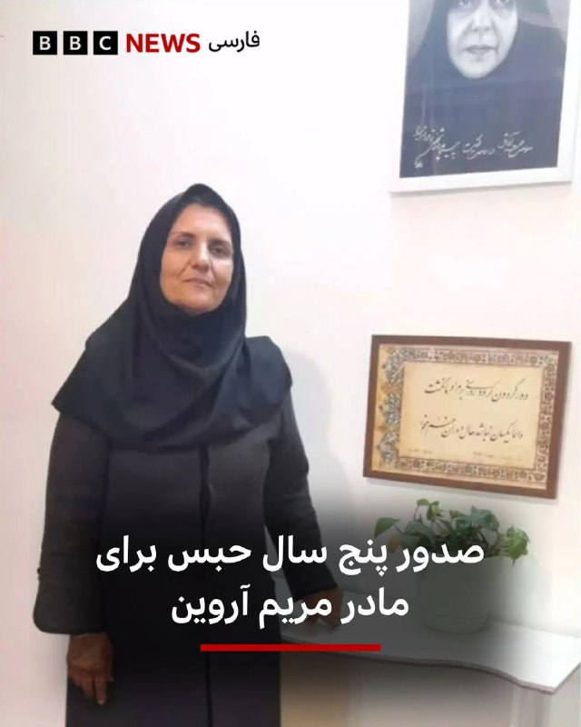

‌🔻دادگاه انقلاب مشهد طیبه نظری، مادر مریم آروین، وکیل دادگستری و از معترضان سال ۱۴۰۱ را به پنج سال حبس تعزیری محکوم کرد.

بر اساس رأی دادگاه، اتهام‌های او «اجتماع و تبانی علیه امنیت کشور» و «فعالیت تبلیغی علیه نظام» عنوان شده است.

در حکم دادگاه آمده است که خانم نظری در آذر ۱۴۰۴ در مراسم هفتم درگذشت خسرو علیکردی، وکیل دادگستری، شرکت کرده و با سفر از سیرجان به محل برگزاری مراسم، در تجمعی که مقام‌های جمهوری اسلامی آن را «اغتشاش» توصیف کرده‌اند حضور داشته و «شعارهای هنجارشکن» سر داده است.

دادگاه همچنین فعالیت‌های او در شبکه‌های اجتماعی در حمایت از جنبش «زن، زندگی، آزادی» را از مصادیق تبلیغ علیه نظام دانسته است.

خانم نظری این اتهام‌ها را رد کرده و گفته است برای ابراز همدردی با خانواده خسرو علیکردی در این مراسم شرکت کرده و تنها شعار «پاینده باد ایران» سر داده است.

مریم آروین، وکیل دادگستری اهل سیرجان، پس از بازداشت در جریان اعتراضات ۱۴۰۱ زندانی شد و حدود دو ماه پس از آزادی از زندان درگذشت.
ادامه از:
https://bbc.in/4eya6DH
📷Social Media
@BBCPersian

## BBCPersian — post 284488

  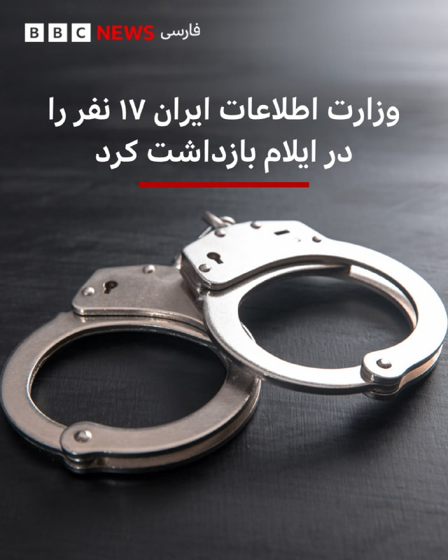

🔻وزارت اطلاعات ایران از بازداشت سه نفر در استان ایلام در ارتباط با اعتراضات دی‌ماه سال گذشته خبر داده است.

به گفته این وزارتخانه، این افراد به «لیدری»، «تخریب و تحریق اموال و اماکن عمومی» و «تیراندازی» متهم هستند.

وزارت اطلاعات همچنین اعلام کرده است که ۱۴ نفر دیگر را در همین استان بازداشت کرده که آنها را اعضای یک «شبکه خرابکاری خیابانی» معرفی کرده و گفته است در جریان جنگ «مترصد اجرای دستورات دشمن» بوده‌اند.

همزمان، ناصر عتباتی، رئیس کل دادگستری آذربایجان غربی، گفته است از زمان آغاز حملات آمریکا و اسرائیل به ایران دست‌کم ۴۸۰ نفر با اتهامات مرتبط با جنگ بازداشت شده‌اند. به گفته او، برای ۱۰ نفر نیز به اتهام «جاسوسی برای موساد» حکم صادر شده است.

این بازداشت‌ها در حالی انجام می‌شود که نهادهای حقوق بشری از تشدید برخورد با منتقدان و معترضان در ایران پس از آغاز درگیری‌های نظامی خبر داده‌اند.

سازمان عفو بین‌الملل می‌گوید از زمان شروع حملات آمریکا و اسرائیل به ایران، دست‌کم ۴۴ نفر اعدام و بیش از شش هزار نفر بازداشت شده‌اند.

📸GettyImages

https://bbc.in/3Qh6qhA
@BBCPersian

## BBCPersian — post 284487

🔻نگاهی به مهمترین خبرهای روز

▪️محسن نقوی، وزیر کشور پاکستان، صبح امروز وارد مشهد شد. ایرنا به نقل از منابع خبری در استانداری خراسان رضوی گفته است که او سپس برای گفتگو با مقامات عازم تهران خواهد شد.

▪️رسانه‌های ایران به نقل از دبیرکل فدراسیون فوتبال خبر دادند که ویزای ۱۱ عضو مدیریتی تیم ملی برای بازی با بلژیک رد شده است.

▪️اسماعیل بقایی، سخنگوی وزارت خارجه ایران، در واکنش به اظهارات وزیر خارجه فرانسه گفته است «ریاکاری» را از ویژگی‌های بارز فرهنگ سیاسی فرانسه است.وزیر خارجه فرانسه گفته بود که جهان نباید «کشتار» معترضان ایرانی در دی ماه را فراموش کند.

▪️گزارش‌ها از جنوب لبنان حاکیست که علیرغم اعلام آتش‌بس روز جمعه اسرائيل با حزب‌الله لبنان، دست‌کم پنج نفر در حملات هوایی جدید اسرائیل کشته شده‌اند.

https://bbc.in/4xEn2AD
@BBCPersian

## BBCPersian — post 284486

🔺تلاش‌ها برای ادامه مذاکرات بین ایران و آمریکا؛ وزیر کشور پاکستان در ایران، فرستادگان آمریکا «در راه سوئیس»

محسن نقوی، وزیر کشور پاکستان، صبح امروز وارد مشهد شد. همزمان براساس گزارش‌ها، استیو ویتکاف، فرستاده کاخ سفید، و جرد کوشنر، دیگر نماینده دولت امریکا، «در راه سوئیس» هستند.

از طرفی، دونالد ترامپ، رئیس‌جمهور آمریکا، گفته است که پایان جنگ با ایران، جهان را از یک رکود اقتصادی نجات داده است.

اسماعیل بقایی، سخنگوی وزارت خارجه ایران، گفته است که سفر وزیر کشور پاکستان در ادامه تلاش‌های این کشور در رابطه با مذاکرات ایران-آمریکا صورت می‌گیرد.

https://bbc.in/4fREifg
@BBCPersian

## BBCPersian — post 284484

🔻معاون اجرایی رئیس‌جمهور ایران: دارایی‌های بلوکه‌شده ایران به صورت کامل و تدریجی آزاد می‌شود

محمدجعفر قائم‌پناه، معاون اجرایی رئیس‌جمهور ایران، می‌گوید که براساس یادداشت تفاهم میان ایران و آمریکا، دارایی‌های بلوکه شده ایران به «صورت کامل اما به‌صورت تدریجی آزاد خواهد شد.»

او گفته است که مجموع دارایی‌های ایران که قرار است آزاد شود احتمالا ۲۵ میلیارد دلار خواهد بود.

آقای قائم‌پناه در گفتگو با ایرنا گفته است که سفر محمد باقر قالیباف، رئیس مجلس ایران، به همراه تیم مذاکره‌کننده ایران به قطر به منظور تعیین تکلیف این مسئله صورت گرفت که دارایی‌های ایران چگونه و به چه شکلی آزاد شود.

معاون اجرایی رئیس‌جمهور ایران با اشاره به اینکه برداشته شدن سایه جنگ از کشور بخشی از فشارهای اقتصادی بر مردم را کاهش می‌دهد، افزود: «قرار است از دارایی‌های آزاد شده ایران برای توسعه زیرساخت‌ها استفاده شود و توسعه زیرساخت‌هایی چون کریدورها و راه‌ها و فرودگاه‌ها موجبات رفاه و آسایش مردم را فراهم خواهد کرد.»

پیشتر دونالد ترامپ، رئیس‌جمهور آمریکا، بار دیگر از توافق با ایران دفاع کرد و گفت که تهران از موضع ضعف پای میز مذاکره آمده است. او دیشب در شبکه اجتماعی تروث سوشال نوشت: «ما از سر استیصال مذاکره نکردیم، ایران این کار را کرد. آن‌ها تمام شده‌اند!»

او افزود «این ۶۰ روز را طی خواهیم کرد. آن‌ها هیچ پولی دریافت نمی‌کنند؛ حتی یک سنت!»

https://bbc.in/4ewZBjU
@BBCPersian

## BBCPersian — post 284483

با آغاز دهه محرم تصاویری از عزاداری مادر مانی صفرپور و مادر متین پرویزی، دو نفر از کشته‌شدگان اعتراضات دی در شبکه‌های اجتماعی پربازدید شده است.

مادر مانی صفرپور، نوجوان ۱۸ ساله اهل لاهیجان که ۱۸ دی در اعتراضات سلسبیل در جنوب تهران کشته شد در میان دسته عزاداری که سنج و دمام می‌زنند عکس پسرش را بالای دست گرفته و می‌گوید «پسرم، پسرم».

در ویدیویی دیگر مادر متین پرویزی، دانشجوی ۲۲ ساله‌ای که ۱۸ دی در سبزه‌میدان زنجان با شلیک گلوله کشته شد، بر سر مزار بچه‌اش می‌گوید: «یزیدی‌های زمانه از پشت به پسر من شلیک کردند، در حالی که دستش در جیبش بود و چیزی برای دفاع از خود نداشت.»

او با اشاره به مفاهیم عاشورا در مذهب شیعه می‌گوید: «فقط یا حسین گفتن از تشنگی را به بچه‌هام یاد ندادم. بهش یاد دادم که مرد باشه و جلوی حرف زور وایسه و شرافتش رو به آب و نان نفروشد. بچه من گرسته و ندار نبود، اعتراض داشت.»

او گفت که محرم امسال برای کشته‌شدگان دی‌ماه و پدر و مادرهای داغ‌دار عزاداری می‌کند چون «خود امام حسین هم عزادار بچه‌های میهن من است.»

@BBCPersian

## idfinfarsi — post 11862

🔴در چند رویداد مختلف طی شب گذشته (شنبه)، سازمان تروریستی حزب‌الله بیش از ۵۰ شلیک را به سمت نیروهای ارتش اسرائیل فعال در جنوب لبنان انجام داد.

⭕️این اقدامات نقض‌های مکرر توافق آتش‌بس از سوی سازمان تروریستی حزب‌الله به شمار می‌رود. ارتش اسرائیل هیچ‌گونه آسیب به غیرنظامیان اسرائیلی و نیروهای خود را نخواهد پذیرفت و به هرگونه اقدام علیه آن‌ها با قدرت پاسخ خواهد داد.

⭕️به‌منظور رفع تهدیدها و در واکنش به نقض‌های آشکار سازمان تروریستی حزب‌الله، ارتش اسرائیل طی شب گذشته (شنبه) ده‌ها زیرساخت تروریستی و عناصر این سازمان را در جنوب لبنان هدف قرار داد.
در میان اهداف مورد حمله، مواضع پرتاب راکت، انبارهای تسلیحاتی و مقرهای فرماندهی قرار داشت.

⭕️ارتش اسرائیل متعهد به توافق آتش‌بس مطابق با دستورالعمل‌های سطح سیاسی است و به اقدام برای رفع هرگونه تهدید علیه دولت اسرائیل و نیروهای ارتش اسرائیل ادامه خواهد داد.

## Dirty_Kids — post 392660

  <a href="telegram/content/Dirty_Kids_392660_1781962848.mp4" target="_blank">🎬 Download video</a>

پخش موزیک جهت افزایش بهره دهی یک گاوداری در یمن
#قات

@Dirty_Kids 👻

## Dirty_Kids — post 392659

  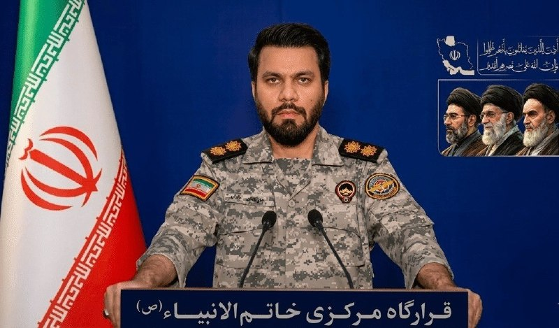

🔴 سخنگوی قرارگاه خاتم‌الانبیا: بخاطر حملات اسرائیل به لبنان، تنگه هرمز تا اطلاع ثانوی مجدد بسته شد و اگه به حملات‌شون ادامه بدن، به صورت نظامی به اسرائیل پاسخ خواهیم داد.

@Dirty_Kids 👻

## Dirty_Kids — post 392656

این دختره رو کاور آرت GTA6 پیدا شد 😂روز اول بازی احتمالا همه دنبال این میگردن😂 ولی متاسفانه این شخصیت تو بازی حضور نداره

راکستار اعلام کرد هزینه دیسک بازی GTA 6 حدود 70 تا 100 دلار تخمین زده میشه، یه چیزی بین 11 تا 16 میلیون تومن باید بدید برای این بازی...

@Dirty_Kids 👻

## Dirty_Kids — post 392655

  <a href="telegram/content/Dirty_Kids_392655_1781962850.mp4" target="_blank">🎬 Download video</a>

👑 شاهزاده رضا پهلوی:
اون 40 هزار نفری که تو ایران جونشونو از دست دادن، واسه توافق هسته‌ای یا تنگه هرمز کشته نشدن، واسه آزادی و دموکراسی جنگیدن؛

الان وقت فشار بیشتر به جمهوری اسلامیه، نه مماشات باهاش. مردم ایران هنوز دارن برای آزادی تلاش می‌کنن و روی پیوستن بخشی از نیروهای حکومتی و نظامی به این جنبش هم حساب باز کردن.
من همیشه حامی تیم ملی بودم، ولی این بار خیلی از ایرانی‌ها حس می‌کنن تیم ملی تبدیل به ابزار تبلیغاتی حکومت شده و به همین خاطر ازش حمایت نمی‌کنن.

@Dirty_Kids 👻

## Dirty_Kids — post 392654

  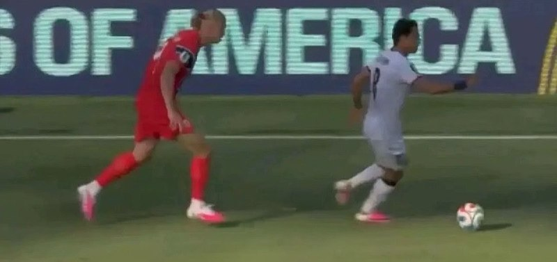

بخدا من بودم برميگشتم پشت سرم همچين چيزي ميديدم توپو ول ميكردم جيغ ميزدم دور زمين با گريه ميدوييدم

@Dirty_Kids 👻

## Dirty_Kids — post 392651

گرمای کم سابقه و بشدت فرانرمال در راه غرب اروپا، گرما دوشنبه به اوجش و تا ۴۵ درجه هم میرسه، حالا هی خبر میاد دهها نفر در اروپا در اثر گرمای شدید جان باختن

@Dirty_Kids 👻

## Dirty_Kids — post 392650

ببین چطوری مثل آب خوردن به مردم بی سلاح تیر میزنن...

@Dirty_Kids 👻

## Dirty_Kids — post 392646

این سِروال که از نژاد گربه‌سانانه، به عنوان سوپرمدل و زیباترین حیوون دنیا شناخته شد.

@Dirty_Kids 👻

## Dirty_Kids — post 392645

مجتبی خامنه‌ای توی تشییع جنازه پدرش شرکت نخواهد کرد.:))))

@Dirty_Kids 👻

## Dirty_Kids — post 392642

  <a href="telegram/content/Dirty_Kids_392642_1781962854.mp4" target="_blank">🎬 Download video</a>

حشری تر از دخترای مکزیکی وجود نداره تو این جام همه پسرا و یکی یه دور کردن و مالیدن😐😂

@Dirty_Kids 👻

## Dirty_Kids — post 392640

  <a href="telegram/content/Dirty_Kids_392640_1781962857.mp4" target="_blank">🎬 Download video</a>

🔴 مداحی که به پزشکیان رو تهدید کرده بود و گفته بود اگه شروط رهبری محقق نشه، ما می‌دانیم و تیغ و حلقوم شما، پدرت رو درمیاریم مسوت.
اومد درستش کنه گفته: والا من تهدید نکردن احساسات قلبیمو بیان کردم بی بی و اینترنشنال کور خوندید نمیتونید اتحاد ما رو بهم بزنید به زودی نابودتون میکنیم.

@Dirty_Kids 👻

## Hranews — post 113738

  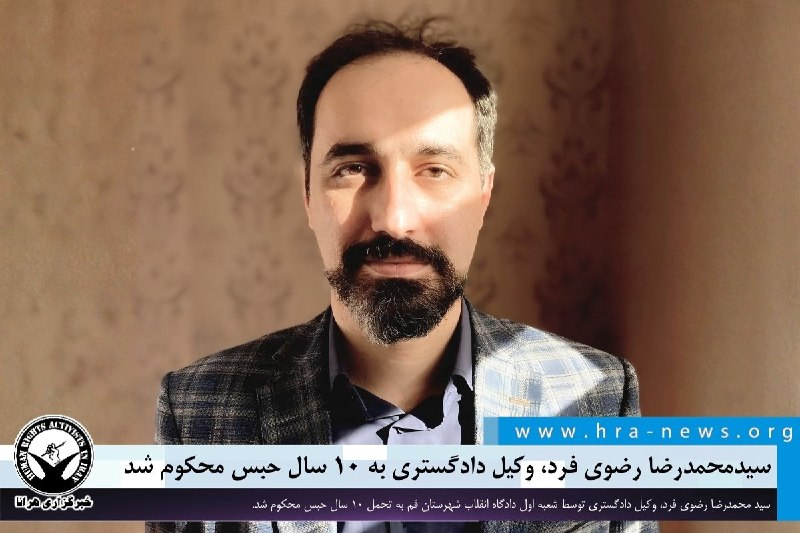

سیدمحمدرضا رضوی فرد، وکیل دادگستری به ۱۰ سال حبس محکوم شد

❗️
❗️
❗️
❗️
❗️ – سیدمحمدرضا رضوی فرد، وکیل دادگستری توسط شعبه اول دادگاه انقلاب شهرستان قم به تحمل ۱۰ سال #حبس محکوم شد.

به گزارش خبرگزاری هرانا، ارگان خبری مجموعه فعالان حقوق بشر در ایران، سیدمحمدرضا رضوی فرد به حبس محکوم شد.

بر اساس اطلاعات دریافتی هرانا، اخیرا شعبه اول دادگاه انقلاب شهرستان قم این وکیل دادگستری را از بابت اتهام فعالیت تبلیغی علیه امنیت ملی کشور موضوع ماده ۴ قانون تشدید مجازات جرایم علیه امنیت ملی، به ۱۰ سال حبس محکوم کرده است.

ادامه مطلب

#سیدمحمدرضا_رضوی_فرد

↘️
@hranews_bot تماس ✉️ -  @Hranews  کانال هرانا 🆑

## Hranews — post 113737

اعتراضات دی‌ماه ۱۴۰۴؛ گزارشی از بازداشت ۱۷ شهروند در ایلام

❗️
❗️
❗️
❗️
❗️ – وزارت اطلاعات جمهوری اسلامی ایران در اطلاعیه‌ای از #بازداشت ۱۷ شهروند در ارتباط با اعتراضات سراسری دی‌ماه در استان ایلام خبر داد و مدعی شد که این افراد به دلایلی همچون تخریب اموال عمومی، تیراندازی و ارتباط با رسانه‌های خارج از کشور و گروه‌های مخالف نظام بازداشت شده‌اند. هم‌زمان ویدئویی از اعترافات اجباری یک تن از این شهروندان منتشر شده که مشخص نیست تحت چه شرایطی ضبط شده است.

ادامه مطلب

#اعترافات_اجباری

↘️
@hranews_bot تماس ✉️ -  @Hranews  کانال هرانا 🆑

## manototv — post 106175

  <a href="telegram/content/manototv_106175_1781962860.mp4" target="_blank">🎬 Download video</a>

چرا اسرائیل با وجود آتش‌بس هنوز در جنوب لبنان می‌جنگد؟

پاسخ شاید در ارتفاعات علی‌الطاهر، مشرف بر نبطیه، پنهان باشد؛ نقطه‌ای راهبردی که سال‌هاست از آن به‌عنوان یکی از حساس‌ترین مناطق زیرزمینی حزب‌الله یاد می‌شود.

هیچ مقام رسمی تأیید نکرده که شبکه «عماد ۴» در دل این ارتفاعات قرار دارد، اما اگر این فرض درست باشد، نبرد علی‌الطاهر فقط جنگ بر سر یک تپه نیست؛ جنگی است برای دسترسی به مرکز فرماندهی، انبارهای تسلیحاتی و بخشی از زیرساخت موشکی حزب‌الله در جنوب لبنان.

## alonews — post 129384

  <a href="telegram/content/alonews_129384_1781962861.webm" target="_blank">🎬 Download video</a>

🔴فوری / الحدث: عراقچی امشب همراه وزیر کشور پاکستان به سوئیس سفر می‌کند

✅ @AloNews خبر جنگ

## alonews — post 129383

  <a href="telegram/content/alonews_129383_1781962861.webm" target="_blank">🎬 Download video</a>

🔴فوری / فایننشال‌تایمز: پایان عملیات نظامی اسرائیل در لبنان بعید است

✅ @AloNews خبر جنگ

## alonews — post 129382

  <a href="telegram/content/alonews_129382_1781962861.webm" target="_blank">🎬 Download video</a>

👈فاکس نیوز به نقل از جی دی ونس معاون رئیس جمهور آمریکا: مذاکرات با ایران فردا امکان‌پذیر است و وایومینگ و کوشنر برای انجام این مذاکرات آنجا هستند.

🔴اوضاع در مذاکرات ایران خوب پیش می‌رود و انتظار دارم به سوئیس بروم.

🔴به توانایی خود برای حفظ آتش بس اطمینان داریم.

🔴به مذاکره با ایران فرصتی خواهیم داد

✅ @AloNews خبر جنگ

## alonews — post 129381

  <a href="telegram/content/alonews_129381_1781962861.webm" target="_blank">🎬 Download video</a>

👈الاناست که عاصم منیر بیاد تهران

✅ @AloNews خبر جنگ

## alonews — post 129379

  <a href="telegram/content/alonews_129379_1781962862.webm" target="_blank">🎬 Download video</a>

👈قرارگاه خاتم: تنگه رو بستیم 
✅ @AloNews خبر جنگ

## alonews — post 129378

  <a href="telegram/content/alonews_129378_1781962862.webm" target="_blank">🎬 Download video</a>

👈قرارگاه خاتم: تنگه رو بستیم

✅ @AloNews خبر جنگ

## alonews — post 129377

  <a href="telegram/content/alonews_129377_1781962862.webm" target="_blank">🎬 Download video</a>

👈ظریف: از مذاکرات استقبال میکنیم

✅ @AloNews خبر جنگ

## alonews — post 129376

  <a href="telegram/content/alonews_129376_1781962862.webm" target="_blank">🎬 Download video</a>

👈سوئیس اعلام کرده است که به ارائه «محیطی محرمانه و قابل اعتماد» در بورگن‌اشتاک برای بحث‌ها درباره اجرای تفاهم‌نامه آمریکا و ایران ادامه می‌دهد و اضافه کرده است که به دلیل محرمانه بودن، هیچ جزئیاتی درباره شرکت‌کنندگان یا محتوای مذاکرات منتشر نخواهد شد.

✅ @AloNews خبر جنگ

## alonews — post 129375

  <a href="telegram/content/alonews_129375_1781962863.webm" target="_blank">🎬 Download video</a>

👈سیدمحسن نقوی، وزیر کشور پاکستان که امروز وارد تهران شده، با عراقچی دیدار کرد.

✅ @AloNews خبر جنگ

## alonews — post 129374

  <a href="telegram/content/alonews_129374_1781962863.webm" target="_blank">🎬 Download video</a>

👈خبرگزاری ایرنا : کشتی‌هایی که می‌خوان از تنگه هرمز رد بشن باید با سپاه هماهنگ کنند

✅ @AloNews خبر جنگ

## alonews — post 129373

  <a href="telegram/content/alonews_129373_1781962863.webm" target="_blank">🎬 Download video</a>

👈ترامپ: نخست‌وزیر ایتالیا در جنگ با ایران همراه ما نبود؛ اکنون می‌خواهد با من عکس بگیرد تا محبوبیتش بالا برود

✅ @AloNews خبر جنگ

## alonews — post 129372

  <a href="telegram/content/alonews_129372_1781962863.webm" target="_blank">🎬 Download video</a>

👈رسانه‌های سوئیسی: هیئت‌های مقدماتی ایران، ایالات متحده، پاکستان و قطر از دیروز در اقامتگاه «برگنشتوک» در حال فعالیت برای آماده‌سازی مذاکرات هستند و تاکنون هیچ نشانه‌ای از حضور رؤسای هیئت‌های تهران و واشنگتن دیده نشده است

✅ @AloNews خبر جنگ

## alonews — post 129371

  <a href="telegram/content/alonews_129371_1781962863.webm" target="_blank">🎬 Download video</a>

👈ترامپ: «ترامپ برگ‌های برنده را در سرنوشت انتخاباتی متزلزل نتانیاهو در اختیار دارد.»

✅ @AloNews خبر جنگ

## alonews — post 129370

  <a href="telegram/content/alonews_129370_1781962864.webm" target="_blank">🎬 Download video</a>

👈هم اکنون حملات سنگین به لبنان

✅ @AloNews خبر جنگ

## alonews — post 129369

  <a href="telegram/content/alonews_129369_1781962864.webm" target="_blank">🎬 Download video</a>

👈حمله پایداری‌ها به فرماندهان سپاه و ارتش

✅ @AloNews خبر جنگ

## alonews — post 129368

  <a href="telegram/content/alonews_129368_1781962864.webm" target="_blank">🎬 Download video</a>

👈راکستار: هزینه دیسک بازی GTAVI حدود 70 تا 100 دلار تخمین زده میشه، یعنی برای داشتن این دیسک باید 11 تا 16 میلیون تومن هزینه کنید!

✅ @AloNews خبر جنگ

## alonews — post 129367

  <a href="telegram/content/alonews_129367_1781962864.webm" target="_blank">🎬 Download video</a>

👈ویتکاف و کوشنر به سوئیس رسیدن

✅ @AloNews خبر جنگ

## alonews — post 129366

  <a href="telegram/content/alonews_129366_1781962865.webm" target="_blank">🎬 Download video</a>

👈سخنگوی وزارت کشور: کسایی که به مراسم تشییع پیکر امام خامنه‌ای بیان، به صورت رایگان تحت پوشش بیمه قرار میگیرن

✅ @AloNews خبر جنگ

## alonews — post 129365

  <a href="telegram/content/alonews_129365_1781962865.webm" target="_blank">🎬 Download video</a>

👈ترامپ: دموکرات‌ها می‌گویند ایران از سه ماه پیش قوی‌تر شده؛ برای همین به آنها می‌گویم «احمق‌ها»

🔴دونالد ترامپ در اظهاراتی تند علیه دموکرات‌ها گفت:
«جالب است که دموکرات‌ها مدعی هستند ایران امروز نسبت به سه ماه پیش در موقعیت قوی‌تری قرار دارد، در حالی که از نظر نظامی شکست خورده و دیگر نیروی دریایی یا نیروی هوایی مؤثری ندارد.»
او با تمسخر رقبای سیاسی خود افزود:
«به همین دلیل است که به آنها می‌گویم Dumocrats (احمق‌ها)!»

✅ @AloNews خبر جنگ

## alonews — post 129363

  <a href="telegram/content/alonews_129363_1781962865.webm" target="_blank">🎬 Download video</a>

👈ترامپ:
بعد از جنگی که ما پیروز شدیم، توی اجلاس گروه ۷، ملونی چندساعت منتظر بود تا با من عکس بگیره تا دوباره محبوب بشه اما من گفتم نه، چونکه نزاشت از باند های فرودگاهای کشورش برای عملیات استفاده کنیم

✅ @AloNews خبر جنگ

<!-- MSG END -->

<!-- NAV START -->

<a href="https://github.com/Tljn/FUD/blob/main/telegram/content/archive_1.md" style="display:inline-block; padding:6px 12px; margin:0 4px; background-color:#2ea44f; color:white; text-decoration:none; border-radius:4px; font-weight:bold;">صفحه بعد</a>

<!-- NAV END -->
