# خواننده تلگرام

<!-- TOP_NAV START -->

<a href="https://github.com/Tljn/FUD/blob/main/telegram/content/archive_1.md" style="display:inline-block; padding:6px 12px; margin:0 4px; background-color:#2ea44f; color:white; text-decoration:none; border-radius:4px; font-weight:bold;">صفحه بعد</a>

<!-- TOP_NAV END -->

<!-- MSG START -->

---
📅 بروزرسانی: 1405/03/29 18:23
---

## VahidOOnLine — post 246396

  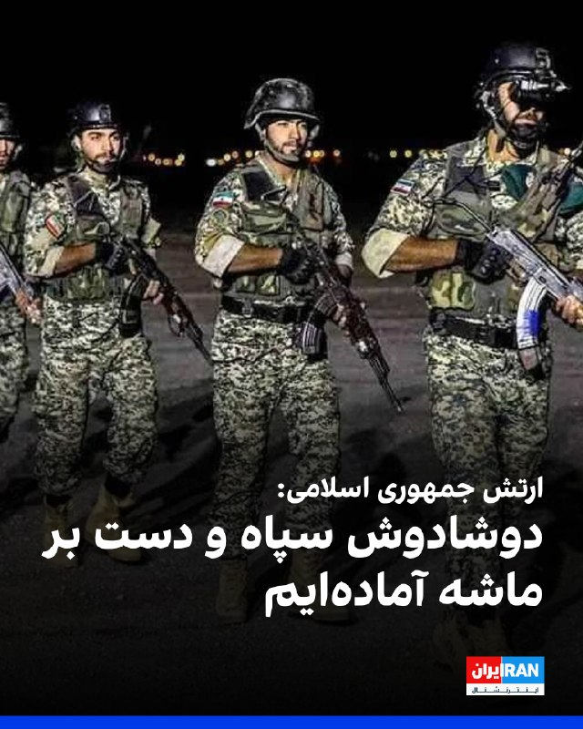

ارتش جمهوری اسلامی، جمعه، ۲۹ خرداد در بیانیه‌ای اعلام کرد: «دوشادوش سپاه پاسداران در صورت هرگونه بدعهدی از سوی دشمن، دست بر ماشه و گوش به فرمان رهبر، هر روز بر توان رزم خود افزوده و آماده دفاع از امنیت و منافع ملت هستیم.»

در بخشی از این بیانیه آمده است: «آمادگی نیروهای مسلح، دشمن را ناگزیر کرد تا مسیر آتش‌بس و تفاهم را در پیش بگیرد.»
‌🏁 🇬🇧 IranintlTV

🤖 @VahidOOnLine

## VahidOOnLine — post 246395

  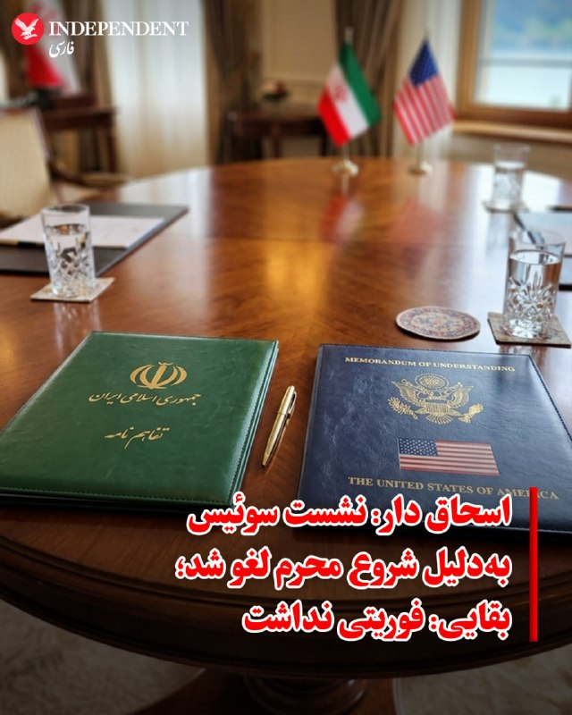

♦️ اسحاق دار، وزیر امور خارجه پاکستان که نقش میانجی را در مذاکرات میان تهران و واشنگتن بازی کرد، روز جمعه ۲۹ خرداد، علت لغو مذاکرات حضوری نمایندگان ایران و آمریکا در سوئیس را «مشغله برخی مسئولان به‌دلیل مراسم‌های ماه محرم» عنوان کرد. این توجیه در حالی مطرح شد که ماه محرم، از روز سه‌شنبه آغاز شده و در زمان تعیین روز جمعه به عنوان اولین نشست حضوری دو طرف نیز این همزمانی بدیهی بوده است.

از سوی دیگر، اسماعیل بقایی، سخنگوی وزارت خارجه جمهوری اسلامی، در توضیحاتی درباره لغو نشست سوئیس، تنها اعلام کرد که رایزنی‌های لازم از طریق میانجی‌ها ادامه دارد و در صورت «فراهم شدن شرایط لازم برای شروع مذاکرات» اطلاع‌رسانی انجام خواهد گرفت. بقایی همچنین اشاره کرد که پیش‌تر قرار بود مراسم رسمی امضای تفاهم‌نامه روز جمعه به‌صورت حضوری برگزار شود اما با توجه به امضای دیجیتال آن، برگزاری نشست در سوئیس «فوریت» نداشت.

بقایی به ضرورت اجرایی شدن بندهای تفاهم‌نامه از جمله بند اول که شامل توقف جنگ در لبنان می‌شود نیز اشاره کرد. این در حالی است که اسرائیل و حزب‌الله، روز جمعه حملات متقابل خود را ادامه داده‌اند.
‌🇸🇦 Indypersian

🤖 @VahidOOnLine

## VahidOOnLine — post 246394

  

اسماعیل بقائی، سخنگوی وزارت خارجه جمهوری اسلامی در گفت‌وگو با خبرنگاران، اخبار منتشره در برخی رسانه‌ها مبنی بر دعوت جمهوری اسلامی از آژانس بین‌المللی انرژی اتمی برای بازرسی از تاسیسات هسته‌ای را تکذیب کرد.

بقائی گفت که بر اساس بند ۹ یادداشت تفاهم، در طول دوره ۶۰ روزه، وضعیت فعلی برنامه هسته‌ای ایران حفظ خواهد شد و بر این اساس، بازرسی از تاسیساتی مانند بوشهر که تاکنون انجام می‌شد، ادامه می‌یابد اما بازرسی از تاسیساتی که دسترسی آژانس به آن‌ها به‌دلیل حملات نظامی آمریکا و اسرائیل متوقف شد، منوط به روند مذاکرات و نتیجه آن خواهد بود.
‌🏁 🇬🇧 IranintlTV

🤖 @VahidOOnLine

## VahidOOnLine — post 246393

عبدالمجید و رضا اسدی، عمو و برادرزاده بودند که شامگاه ۱۹ دی‌ماه ۱۴۰۴ در نورآباد ممسنی کشته شدند. ماموران آنها را درون خودرو هدف قرار دادند؛ از فاصله نزدیک به رضا شلیک کردند و مجید را با قنداق اسلحه به صورت پیاپی مورد ضرب و شتم قرار دادند.
‌🏁 🇬🇧 IranintlTV

🤖 @VahidOOnLine

## VahidOOnLine — post 246392

  <a href="telegram/content/VahidOOnLine_246392_1781880793.mp4" target="_blank">🎬 Download video</a>

⭕️مراسم یادبود و وداع با مرجان ساتراپی در گورستان پرلاشز پاریس برگزار شد

♦️مراسم یادبود مرجان ساتراپی، هنرمند ایرانی‌ـ‌فرانسوی، روز ۱۹ ژوئن ۲۰۲۶ در گورستان پرلاشز پاریس برگزار شد؛ مراسمی که با حضور مادر او، اعضای خانواده، دوستان، مقام‌های دولتی، چهره‌های برجسته هنری و سینمایی فرانسه، روزنامه‌نگاران و جمعی از علاقه‌مندانش همراه بود.

در تصاویر منتشرشده از این مراسم، حاضران هنگام خروج از سالن آشکارا احساساتی به نظر می‌رسیدند. برخی از آن‌ها عکس‌هایی از مرجان ساتراپی و همسرش، ماتیاس ریپا، را که سال گذشته درگذشت، در دست داشتند. مادر ساتراپی نیز هنگام ترک مراسم از حاضران برای حضور و همراهی‌شان تشکر کرد.

در میان مهمانان، چهره‌هایی از سینما، رسانه، ادبیات و سیاست فرانسه دیده می‌شدند؛ از جمله کاترین دنوو ، بازیگر سرشناس سینمای فرانسه؛ کیارا ماسترویانی، بازیگر فرانسوی‌ـ‌ایتالیایی و دختر کاترین دنوو و مارچلو ماسترویانی؛ شارلوت لوبون ، بازیگر، هنرمند و کارگردان کانادایی‌ـ‌فرانسوی؛ گلشیفته فراهانی، بازیگر ایرانی‌ـ‌فرانسوی؛ ژول (Jul)، خواننده و رپر فرانسوی؛ انورا مالاگری، مجری و چهره تلویزیونی فرانسه؛ تریستان بانون ، نویسنده و روزنامه‌نگار فرانسوی؛ سوفیا آرام بازیگر و روزنامه‌نگار ؛ و ژان‌پی‌یر لاوینیات روزنامه‌نگار سینمایی فرانسوی.

آلیس روفو ، وزیر مشاور فرانسه در امور وابسته به وزارت نیروهای مسلح و کهنه‌سربازان، نیز در این مراسم حاضر شد.

مرجان ساتراپی ۱۴ خرداد، در ۵۶ سالگی، درگذشت. نزدیکان او در بیانیه‌ای اعلام کردند که ساتراپی کمی بیش از یک سال پس از مرگ ماتیاس ریپا، همسر و «عشق زندگی‌اش»، «از اندوه» درگذشته است.
‌🇸🇦 Indypersian

🤖 @VahidOOnLine

## VahidOOnLine — post 246391

  <a href="telegram/content/VahidOOnLine_246391_1781880794.mp4" target="_blank">🎬 Download video</a>

یک شهروند در پیامی صوتی به ایران اینترنشنال، خطاب به دونالد ترامپ گفت: «زیرساخت‌ها را زدی و مردم را بدبخت کردی. اگر از بی‌بی حمایت کرده بودی، او جمهوری اسلامی را به زباله‌دان تاریخ فرستاده بود.»
‌🏁 🇬🇧 IranintlTV

🤖 @VahidOOnLine

## VahidOOnLine — post 246390

  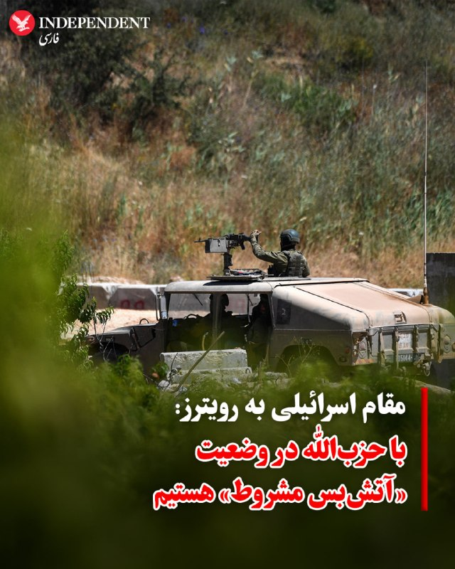

♦️ خبرگزاری «رویترز» روز جمعه ۲۹ خرداد به نقل از یک مقام ارشد اسرائیلی گزارش داد که اسرائیل و حزب‌الله در وضعیت آتش‌بس به سر می‌برند، مشروط بر اینکه حزب‌الله به اسرائیل حمله نکند. این مقام تصریح کرد: «در غیر این صورت، ما در وضعیت جنگی خواهیم بود.»

این مقام ارشد همچنین تاکید کرد که اسرائیل نیروهای خود را در جنوب لبنان، یعنی در امتداد مرزهای شمالی خود که هم‌اکنون تحت اشغال ارتش اسرائیل است، حفظ خواهد کرد.

پیش از این، یک مقام ارشد آمریکایی به رویترز اعلام کرده بود که اسرائیل و حزب‌الله بر سر یک آتش‌بس توافق کرده‌اند که قرار است از ساعت ۴ بعدازظهر روز جمعه به وقت محلی آغاز شود.
‌🇸🇦 Indypersian

🤖 @VahidOOnLine

## VahidOOnLine — post 246389

  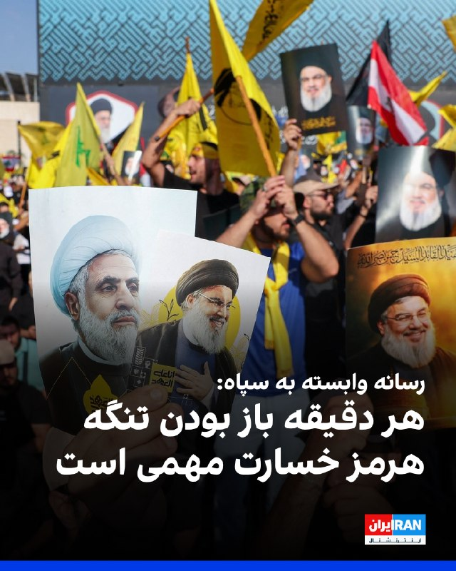

خبرگزاری تسنیم، وابسته به سپاه پاسداران، با اشاره به ادامه حملات ارتش اسرائیل به جنوب لبنان، نوشت: «هر دقیقه باز بودن تنگه هرمز خسارت مهمی است؛ اگر آمریکا فشار انرژی را از روی خود تخلیه کند، وقیح‌تر و تهاجمی‌تر هم خواهد شد.»

این رسانه وابسته به سپاه در ادامه خطاب به مقام‌های جمهوری اسلامی نوشت: «تنگه را ببندید و آمریکا را در همین گام اول مهار کنید.»

تشنیم افزود: «آیا نباید مسولان فی‌الفور به اجرای تفاهمنامه پایان دهند و تنگه هرمز را مسدود کنند؟ آیا نباید پاسخ قدرتمندی به آمریکا و اسرائیل داده شود تا محاسباتشان بیش از این به ضرر جمهوری اسلامی و مقاومت نشود؟»
‌🏁 🇬🇧 IranintlTV

🤖 @VahidOOnLine

## VahidOOnLine — post 246388

  

بانک مرکزی جمهوری اسلامی اعلام کرد که اختلال در خدمات بانک‌های ملی، صادرات، تجارت و توسعه صادرات در پی حمله سایبری به زیرساخت‌های ارتباطی این بانک‌ها رخ داده است و خدمات پایه مبتنی بر کارت با استفاده از روش‌های جایگزین دوباره در دسترس مشتریان قرار گرفته است.

بر اساس گزارش بانک مرکزی جمهوری اسلامی، هیچ آسیبی به اطلاعات مشتریان وارد نشده و سامانه‌های شتاب و شاپرک بدون اختلال فعال هستند.

این نهاد گزارش‌ها درباره ایجاد اختلال در سامانه‌های بانکی برای کنترل بازار ارز و طلا را رد کرد.
‌🏁 🇬🇧 IranintlTV

🤖 @VahidOOnLine

## VahidOOnLine — post 246387

  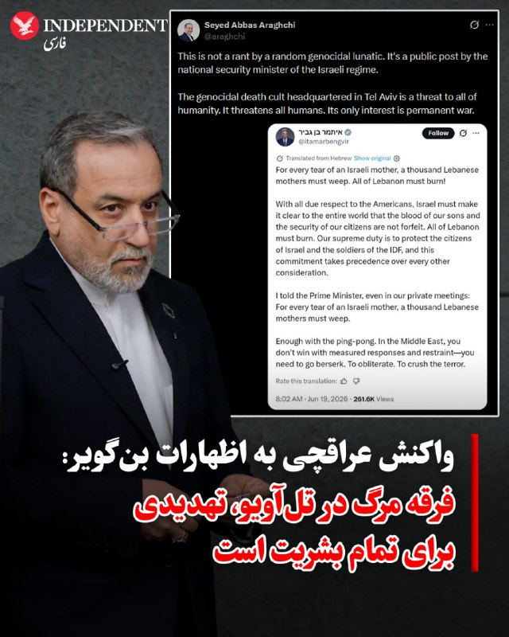

♦️ عباس عراقچی، وزیر امور خارجه جمهوری اسلامی، با بازنشر اظهارات تند ایتامار بن‌گویر، وزیر امنیت داخلی اسرائیل در شبکه اجتماعی ایکس، به مواضع او حمله کرد. عراقچی نوشت: «این‌ها رجزخوانی یک دیوانه بی‌نام‌ونشان نیست، بلکه گفته‌های علنی یک وزیر اسرائیل است. فرقه مرگ نسل‌کشی که مقر آن در تل‌آویو است، تهدیدی برای بشریت بوده و تنها هدفش جنگ دائمی است.»

این واکنش پس از آن صورت گرفت که بن‌گویر با انتقاد از رویکرد واشنگتن نوشت: «با تمام احترام برای آمریکایی‌ها، اسرائیل باید شفاف کند که خون فرزندان ما پایمال نمی‌شود؛ تمام لبنان باید بسوزد.» او با رد سیاست خویشتن‌داری افزود: «به نخست‌وزیر هم گفته‌ام که به ازای هر قطره اشک یک مادر اسرائیلی، باید هزار مادر لبنانی بگریند. در خاورمیانه با پاسخ‌های سنجیده پیروز نمی‌شوید، بلکه باید دیوانه‌وار عمل کرد، نابود کرد و ترور را در هم کوبید.»
‌🇸🇦 Indypersian

🤖 @VahidOOnLine

## VahidOOnLine — post 246386

  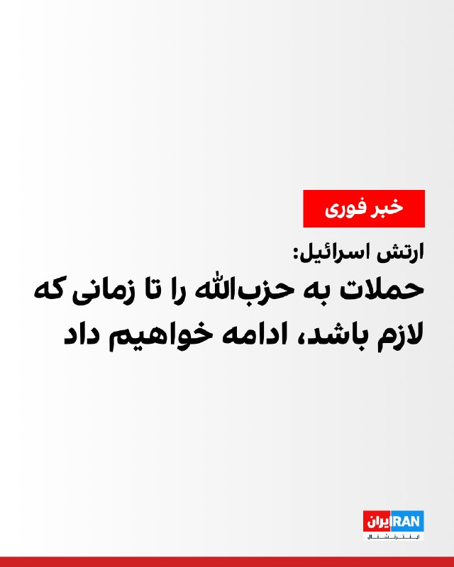

سخنگوی ارتش اسرائیل در کنفرانس خبری اعلام کرد: «از شب گذشته تاکنون به بیش از ۱۰۰ هدف حزب‌الله حمله کرده‌ایم و این حملات را تا هر زمان که لازم باشد، ادامه خواهیم داد.»

او افزود: «در منطقه بفور، یک زیرساخت راهبردی زیرزمینی وجود دارد. در هر یک از محورهایی که در آن فعالیت می‌کنیم، مقادیر زیادی سلاح و تجهیزات جنگی کشف و خارج می‌کنیم. این زیرساخت‌های مهم طی سال‌ها با کمک و هدایت جمهوری اسلامی ساخته شده‌اند.»

سخنگوی ارتش اسرائیل ادامه داد: «حزب‌الله در حال جنگ است تا مانع تکمیل روند نابودی زیرساخت‌های خود شود. این حزب‌الله بود که آتش‌بس را نقض کرد. نیروهای حاضر در میدان از آزادی عمل عملیاتی کامل برخوردار هستند. دستورالعمل‌های رییس ستاد ارتش برای جبهه شمالی تغییری نکرده است.»

او افزود: «هر آنچه مربوط به توافق‌هاست، در سطح تصمیم‌گیری سیاسی است. این موضوع در سطح رهبری سیاسی تعیین می‌شود و ما طبق دستورات عمل می‌کنیم. تا زمانی که دستورات دیگری دریافت نکنیم، طبق دستورالعمل‌هایی که رییس ستاد کل ارتش به نیروهای میدانی ابلاغ کرده، به فعالیت ادامه خواهیم داد.»
‌🏁 🇬🇧 IranintlTV

🤖 @VahidOOnLine

## VahidOOnLine — post 246385

♦️جورجیا ملونی، نخست‌وزیر ایتالیا، در واکنش به اظهارات اخیر دونالد ترامپ، رئیس‌جمهوری آمریکا، این سخنان را «کاملاً ساختگی» خواند و گفت از نحوه رفتار او با متحدان «مبهوت و شگفت‌زده» شده است.
او تاکید کرد: «نمی‌دانم چرا رئیس‌جمهور ایالات متحده این‌گونه با متحدان خود رفتار می‌کند» و افزود این نخستین‌بار نیست که چنین مواضعی از سوی ترامپ مطرح می‌شود. ملونی همچنین این رویکرد را «مایه تاسف» دانست و گفت او قاطعیتی را که در برابر دشمنان غرب نشان نمی‌دهد، در قبال برخی رهبران متحد خود به کار می‌گیرد.
نخست‌وزیر ایتالیا در پایان تأکید کرد: «یک چیز را باید به خاطر بسپارد؛ من و ایتالیا هرگز التماس نمی‌کنیم.»

در ادامه این تنش‌ها، آنتونیو تایانی، وزیر امور خارجه ایتالیا، نیز اعلام کرد سفر برنامه‌ریزی‌شده خود به آمریکا را لغو کرده و این اظهارات را «توهین به مردم ایتالیا» خواند.
‌🇸🇦 Indypersian

🤖 @VahidOOnLine

## VahidOOnLine — post 246384

  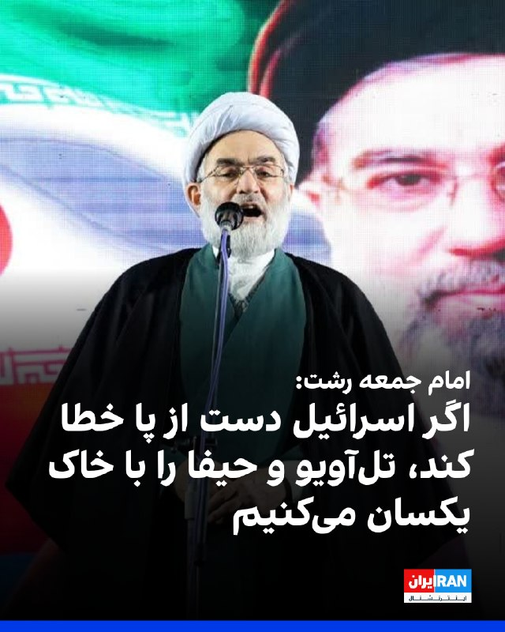

رسول فلاحتی، امام جمعه رشت در خطبه‌های نماز جمعه این شهر گفت: «اسرائیل بداند که اگر بعد از عدم حمایت آمریکا، دست از پا خطا کند، کل تل‌آویو و حیفا با خاک یکسان خواهد شد. ما از ۳۰ درصد توان نظامی خود استفاده کرده‌ایم و نیروهای مسلح ما اعم از سپاه و ارتش، از همه زمان‌های گذشته قوی‌تر شده‌اند.»

او ادامه داد: «مسعود پزشکیان تعهد کرده که حقوق ملت ایران و جبهه مقاومت حفظ شود و از حزب‌الله، انصارالله، حشد الشعبی و حماس حمایت کنیم.»
‌🏁 🇬🇧 IranintlTV

🤖 @VahidOOnLine

## VahidOOnLine — post 246383

  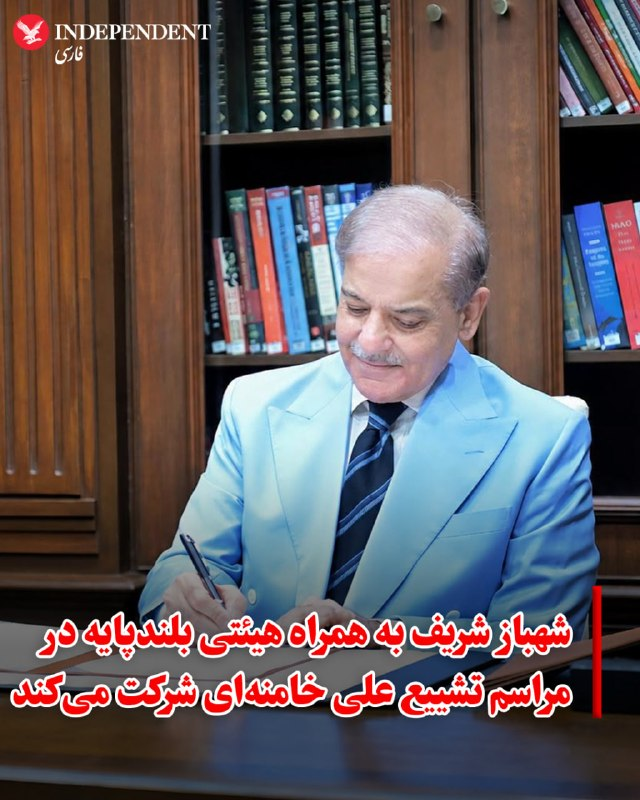

♦️ شهباز شریف، نخست‌وزیر پاکستان، روز جمعه ۲۹ خرداد در صحن مجلس این کشور اعلام کرد که در راس هیئتی بلندپایه برای شرکت در مراسم تشییع علی خامنه‌ای، رهبر پیشین جمهوری اسلامی به ایران سفر خواهد کرد.

شریف اعلام کرد که برای شرکت در این مراسم از او دعوت به‌عمل آمده است.
‌🇸🇦 Indypersian

🤖 @VahidOOnLine

## VahidOOnLine — post 246382

  

ابراهیم رضایی، سخنگوی کمیسیون امنیت ملی مجلس، در شبکه ایکس نوشت که با توجه به پیام «رهبر» که به «جبهه مقاومت» اشاره داشت، دولت باید از همین الان و از لبنان شروع کند و نگذاریم مردم مقاوم جنوب لبنان «قتل‌عام» شوند.

پیش‌تر مجتبی خامنه‌ای در پیامی مکتوب، اعلام کرد که درباره تفاهم جمهوری اسلامی و آمریکا «من نظر دیگری داشتم»، اما با «قبول مسئولیت» از سوی مسعود پزشکیان، اجازه اجرای آن را صادر کرده است.
‌🏁 🇬🇧 IranintlTV

🤖 @VahidOOnLine

## VahidOOnLine — post 246381

  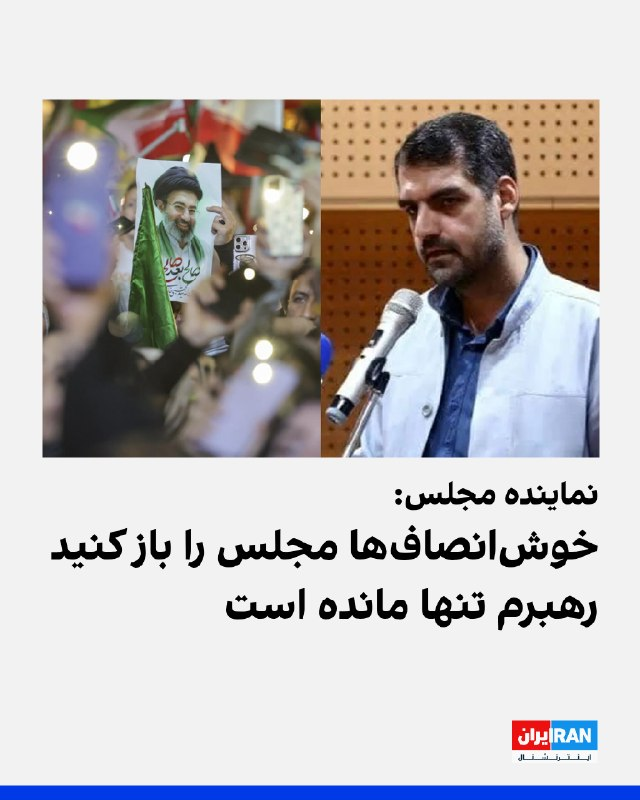

محمدمنان رییسی، نماینده مجلس جمهوری اسلامی، در واکنش به پیام مجتبی خامنه‌ای درباره یادداشت تفاهم میان جمهوری اسلامی و آمریکا، در پیامی در شبکه اجتماعی ایکس خواستار بازگشایی مجلس شد.

او نوشت: «خوش‌انصاف‌ها مجلس را باز کنید، رهبرم تنها مانده است.»

حسینعلی شهریاری، رییس کمیسیون بهداشت و درمان مجلس، نیز با اشاره به تعطیلی مجلس از روند بررسی تفاهم‌نامه انتقاد کرد.

شهریاری جمعه ۲۹ خرداد گفت: «مجلس را بستند تا هر آنچه خواستند امضا کنند.» او پیش‌تر نیز تاکید کرده بود که هرگونه توافق نهایی با آمریکا باید به تصویب مجلس برسد و نباید تجربه تصویب شتاب‌زده برجام تکرار شود.
‌🏁 🇬🇧 IranintlTV

🤖 @VahidOOnLine

## VahidOOnLine — post 246380

  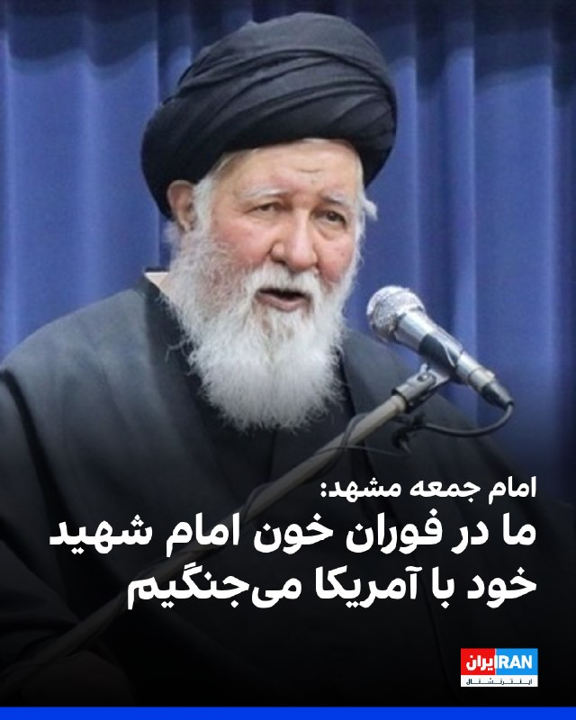

احمد علم‌الهدی، امام جمعه مشهد گفت: «ما در خط فوران خون امام شهید خود با دشمن آمریکایی می‌جنگیم و مبارزه می‌کنیم و ما به هیچ قیمت و مصلحت اندیشی شعار مرگ بر آمریکا را از زبان نخواهیم انداخت و این مبارزه ادامه دارد.»

او ادامه داد: «باید مشخص شود تکلیف خونخواهی رهبر ما چه می‌شود؟»

علم‌الهدی افزود: «اگر همه خسارت‌ها قابل جبران باشد، هیچ سرمایه‌ای بالاتر از از دست دادن امام شهید ما نیست، پس برادران و خواهران انتقام به جای خود باقی است، جنگ تمام شد اما مبارزه تمام نشده است.»
‌🏁 🇬🇧 IranintlTV

🤖 @VahidOOnLine

## VahidOOnLine — post 246379

  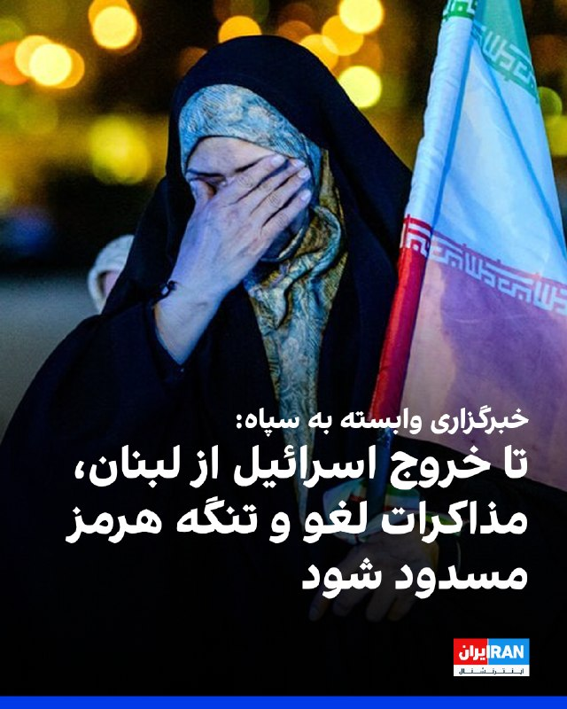

خبرگزاری تسنیم، وابسته به سپاه پاسداران، خواستار ادامه بسته ماندن تنگه هرمز تا زمان توقف حملات اسرائیل و عقب‌نشینی کامل این کشور از خاک لبنان شد.

این رسانه همچنین خواستار لغو همه مذاکرات آتی شد و نوشت ادامه حملات اسرائیل به لبنان و باقی ماندن نیروهای اسرائیلی در جنوب لبنان، به معنای نقض بند نخست تفاهم‌نامه میان جمهوری اسلامی و آمریکا است.

این خبرگزاری افزود اگر جمهوری اسلامی پیش از اجرای تعهدات آمریکا و توقف حملات اسرائیل، تنگه هرمز را باز کند، بخشی از اهرم‌های فشار خود را از دست خواهد داد.

تسنیم همچنین گزارش‌های منتشرشده درباره باز بودن تنگه هرمز را «غیرقابل قبول» خواند و نوشت این موضوع با وعده‌های مقام‌های دولتی و تیم مذاکره‌کننده جمهوری اسلامی همخوانی ندارد.
‌🏁 🇬🇧 IranintlTV

🤖 @VahidOOnLine

## VahidOOnLine — post 246378

  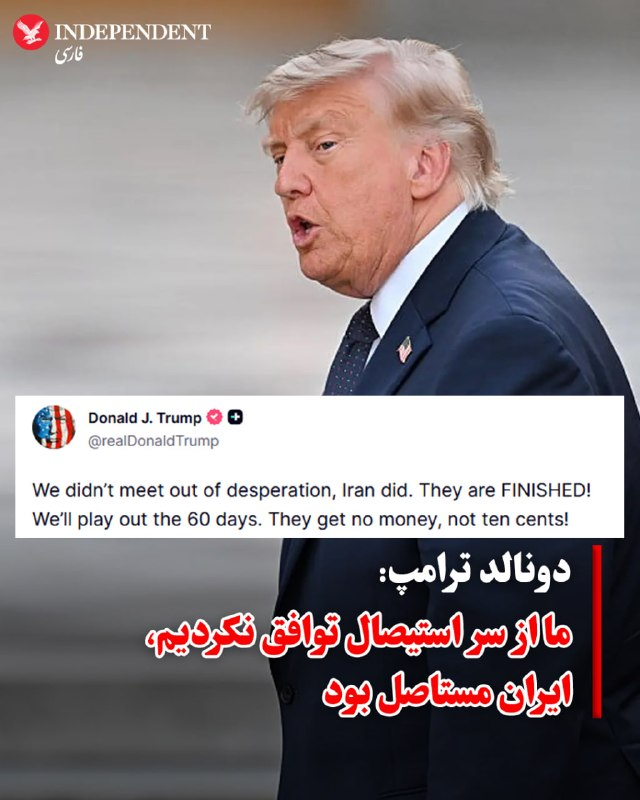

♦️ دونالد ترامپ، رئیس‌جمهوری آمریکا، روز جمعه ۲۹ خرداد در پیامی کوتاه در شبکه اجتماعی تروث سوشال نوشت: «ما از روی استیصال دیدار نکردیم، ایران کرد. کار آن‌ها تمام است! ما این ۶۰ روز را بازی خواهیم کرد [روند آن را طی می‌کنیم]. آن‌ها هیچ پولی دریافت نمی‌کنند، حتی ده سنت!»

این پیام به نظر می‌رسد واکنشی به پیام روز گذشته مجتبی خامنه‌ای، رهبر جدید جمهوری اسلامی باشد که گفته بود: «در مسیر رسیدن به این مرحله [امضای تفاهم‌نامه]، مسئولین امر، از سر دلسوزی و با حُسن نظر، تلاش‌های زیادی را به‌عمل آوردند و البته این رئیس‌جمهور آمریکا بود که از روی استیصال، از انواع اهرم‌ها برای این امر استفاده می‌کرد.»
‌🇸🇦 Indypersian

🤖 @VahidOOnLine

## VahidOOnLine — post 246377

  <a href="telegram/content/VahidOOnLine_246377_1781880803.mp4" target="_blank">🎬 Download video</a>

یک شهروند در ویدیوی ارسالی خود به ایران اینترنشنال، ضمن اشاره به گرانی مواد غذایی و مشکل بیکاری، از عملکرد دونالد ترامپ در برابر جمهوری اسلامی انتقاد کرد.
‌🏁 🇬🇧 IranintlTV

🤖 @VahidOOnLine

## WithYashar — post 15340

خبرگزاری تسنیم:
هر دقیقه باز بودن تنگه هرمز خسارت مهمیه؛ اگر آمریکا فشار انرژی رو از روی خودش تخلیه کنه، وقیح‌تر و تهاجمی‌تر هم خواهد شد.
@withyashar

## WithYashar — post 15339

حمزه صفوی، فرزند مشاور عالی رهبری افشا کرد:

یک روز در چهل سال گذشته نبوده که ایران سودای ساخت بمب اتم نداشته باشد
تمام اسناد IAEA، تورقوزآباد و آماد نشان می‌دهد که حکومت تمام تلاش خود را کرده اما همهٔ اینها در بزنگاه‌های تاریخی لو رفته‌ است.
کرهٔ شمالی وقتی در دههٔ ۱۹۹۰ با آمریکا مذاکره هسته‌ای داشت، در دو سایت دیگر خود پروژهٔ پیش‌برندهٔ بمب اتمی را داشته و لو نرفته اما دو سایت فوردو و نطنز را ما اعلام نکردیم بلکه لو رفتند.
برنامه هسته‌ای ایران، گران‌ترین برنامه هسته‌ای جهان، نه برق آورد، نه بمب، نه امنیت
@withyashar

## WithYashar — post 15338

سخنگوی وزارت خارجه: برگزاری نشست سوئیس فوریت ندارد

یکی از اهداف اصلی نشست سوئیس در روز جمعه، امضای متن تفاهم خاتمه جنگ تحمیلی بود و قرار بود در حاشیه مراسم امضا راجع به ترتیبات مربوط به مذاکرات توافق نهایی هم تبادل نظر شود.

با توجه به اینکه امضای متن یادداشت تفاهم، در بامداد ۲۸ خرداد به صورت دیجیتالی انجام شد، برگزاری نشست مزبور در سوئیس فوریت ندارد اما درحال برنامه‌ریزی برای برگزاری یک نشست طی روزهای آینده هستیم.
@withyashar

## WithYashar — post 15337

از زمان آغاز آتش‌بس، نیروی هوایی اسرائیل بیش از ۱۱ حمله هوایی در سراسر جنوب لبنان انجام داده است.
@withyashar

## WithYashar — post 15336

یک مقام ارشد در کاخ سفید به آکسیوس:
«نتانیاهو با تمدید آتش‌بس در لبنان صد درصد موافقت کرده است.»
@withyashar

## WithYashar — post 15335

حزب‌الله: هنوز هیچ اطلاعیه‌ای درباره زمان آتش‌بس دریافت نشده است
@withyashar

## WithYashar — post 15334

کانال ۱۲ به نقل از یک مقام ارشد اسرائیلی: آتش‌بس به ما این امکان را می‌دهد که به تخریب زیرساخت‌ها و اقدام علیه تهدیدها ادامه دهیم.
@withyashar

## WithYashar — post 15333

خبرنگار المیادین در جنوب لبنان: همزمان با اجرایی شدن آتش‌بس ، حملهٔ هوایی اسرائیل به النبطیه صورت گرفت.
@withyashar

## WithYashar — post 15332

باراک راوید از آکسیوس: یک مقام ارشد آمریکایی به من می‌گوید

اسرائیل و حزب‌الله بر سر آتش‌بس مجدد در لبنان از ساعت ۴ بعد از ظهر امروز به وقت محلی توافق کرده‌اند. این توافق جدید با میانجیگری آمریکا و قطر و پس از مذاکرات با اسرائیل و ایران حاصل شده است.
@withyashar

## WithYashar — post 15331

گزارش ها مبنی بر آتش‌بس بین اسرائیل و حزب‌الله هم اکنون به اجرا درآمده است
@withyashar

## WithYashar — post 15330

  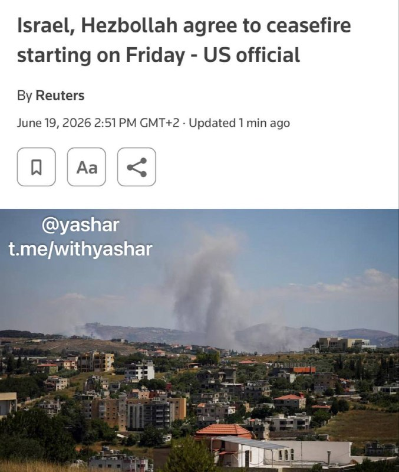

رویترز به نقل از یک مقام آمریکایی ادعا کرد:
«حزب‌الله و اسرائیل با آتش‌بس موافقت کرده‌اند» و افزود که مذاکره‌کنندگان از آمریکا و قطر با حمایت ایران به توافق کمک کردند.
@withyashar

## WithYashar — post 15329

  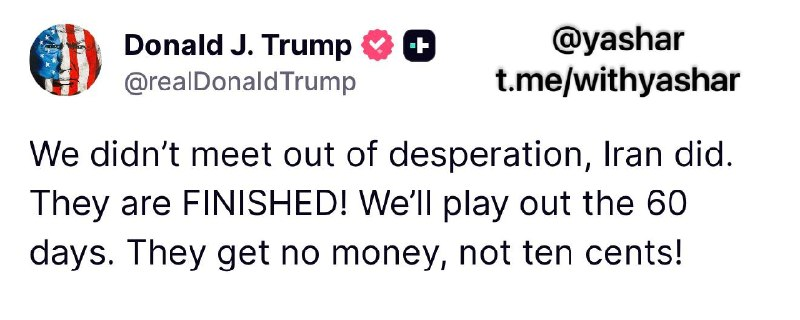

ترامپ در‌ تروث : ما از روی استیصال نرفتیم سراغ مذاکره
این ایران بود که بهش نیاز داشت، کارشون تمومه!
همون ۶۰ روزی که گفته بودیم رو جلو می‌بریم، هیچ پولی هم گیرشون نمیاد
@withyashar

## WithYashar — post 15328

  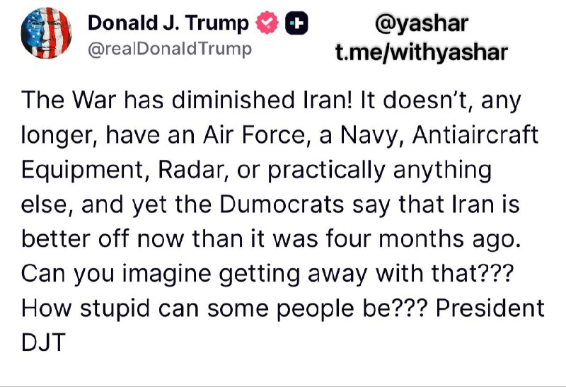

‏ترامپ در‌تروث : جنگ ایران را تضعیف کرده و دیگر نیروی هوایی، نیروی دریایی، پدافند هوایی، رادار یا تقریبا هیچ‌چیز دیگری ندارد؛ با این حال دموکرات‌ها می‌گویند ایران اکنون نسبت به چهار ماه پیش در وضعیت بهتری قرار دارد. باور می‌کنید بتوان چنین حرفی زد؟ بعضی افراد چقدر می‌توانند احمق باشند؟
@withyashar

## WithYashar — post 15327

سنتكام: جنگنده‌های اف-۱۶ به گشت‌زنی‌های خود در خاورمیانه ادامه می‌دهند و آماده مداخله هستند.🚨
@withyashar

## WithYashar — post 15326

طالبان استفاده از گوشی‌های هوشمند رو برای تمامی کارکنان نظامی و غیرنظامی خودشون ممنوع کرد!
@withyashar

## mwarmonitor — post 11220

🔴خبرنگار الجزیره: حملات هوایی اسرائیل به مناطقی در استان نبطیه در جنوب لبنان.

@mwarmonitor

## mwarmonitor — post 11219

🔴 خبرنگار الجزیره: چهارمین حمله هوایی اسرائیل در اطراف شهرک کفر تبنیت در جنوب لبنان.

@mwarmonitor

## mwarmonitor — post 11218

  <a href="telegram/content/mwarmonitor_11218_1781880807.mp4" target="_blank">🎬 Download video</a>

📌سخنگوی ارتش اسرائیل
🔸حزب‌الله آتش‌بس را نقض کرد و تلاش کرد مانع از تکمیل عملیات ما برای نابودی توانمندی‌هایی شود که طی سال‌ها ساخته است، و ما با قدرت به آن پاسخ دادیم.

🔸در ساعات شب گذشته تا این لحظه، ارتش اسرائیل بیش از ۱۰۰ هدف متعلق به حزب‌الله را در مناطق مختلف لبنان از جمله بقاع و النبطیه هدف قرار داده است. ارتش اسرائیل در این حملات ده‌ها «تروریست» را از بین برده است.

🔸نیروهای ارتش اسرائیل از آزادی کامل عملیاتی برای رفع تهدیدها در هر منطقه برخوردارند. رئیس ستاد کل دستور داده است که همه توانمندی‌ها در اختیار نیروهای میدانی قرار گیرد. ما اجازه نخواهیم داد هیچ‌کس ما را تهدید کند.

@mwarmonitor

## mwarmonitor — post 11217

🔴خبرنگار الجزیره: حمله هوایی اسرائیل به شهرک النبطیه الفوقا و گلوله‌باران توپخانه‌ای بر جبل الرفیع در منطقه اقلیم التفاح در جنوب لبنان.

@mwarmonitor

## mwarmonitor — post 11216

🔴رویترز به نقل از یک مقام آمریکایی: اسرائیل و حزب‌الله بر سر آتش‌بس از ساعت ۴ بعدازظهر به وقت محلی توافق کرده‌اند. @mwarmonitor

## mwarmonitor — post 11215

فکر کنم پنجمین آتش بس در یک ماه گذشته

## mwarmonitor — post 11214

🔴رویترز به نقل از یک مقام آمریکایی: اسرائیل و حزب‌الله بر سر آتش‌بس از ساعت ۴ بعدازظهر به وقت محلی توافق کرده‌اند. @mwarmonitor

## mwarmonitor — post 11213

  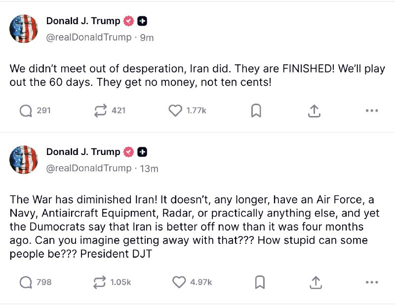

🔴ما از روی ناچاری و استیصال دیدار نکردیم، ایران این کار را کرد. کار آن‌ها تمامه! ما این ۶۰ روز را تا آخر بازی می‌کنیم . آن‌ها هیچ پولی دریافت نخواهند کرد، حتی ده سنت!

جنگ، ایران را تضعیف کرده است! آن‌ها دیگر نه نیروی هوایی دارند، نه نیروی دریایی، نه تجهیزات ضدهوایی، نه رادار و نه عملاً هیچ چیز دیگری؛ و با این حال دموکرات‌های احمق (Dumocrats) می‌گویند اوضاع ایران اکنون بهتر از چهار ماه پیش است. می‌توانید تصور کنید که چطور چنین حرف مفتی می‌زنند؟؟؟ برخی افراد چقدر می‌توانند احمق باشند؟؟؟

رئیس‌جمهور دونالد جی ترامپ

@mwarmonitor

## mwarmonitor — post 11212

🔴رویترز به نقل از یک مقام آمریکایی: اسرائیل و حزب‌الله بر سر آتش‌بس از ساعت ۴ بعدازظهر به وقت محلی توافق کرده‌اند.

@mwarmonitor

## mwarmonitor — post 11211

🔴ایتامار بن‌گویر، وزیر امنیت ملی اسرائیل، خواستار تشدید گسترده تنش‌ها در لبنان شد و گفت: «به ازای هر اشکِ یک مادر اسرائیلی، باید هزار مادر لبنانی گریه کنند. تمام لبنان باید بسوزد.» بن‌گویر از اسرائیل خواست فشارهای خارجی، از جمله فشار آمریکا، را نادیده بگیرد…

## mwarmonitor — post 11210

  <a href="telegram/content/mwarmonitor_11210_1781880810.mp4" target="_blank">🎬 Download video</a>

✈️جت‌های جنگنده F-16 نیروی هوایی آمریکا در حال دریافت سوخت‌گیری هوایی هنگام انجام گشت‌زنی بر فراز خاورمیانه هستند. نیروهای آمریکایی در منطقه همچنان حضور دارند و در حالت آماده‌باش و هوشیاری باقی مانده‌اند.

@mwarmonitor

## mwarmonitor — post 11209

🔴 خبرنگار الجزیره: حمله هوایی اسرائیل به اطراف النبطیه در جنوب لبنان

@mwarmonitor

## FoxNewsTwitter — post 343170

  <a href="telegram/content/FoxNewsTwitter_343170_1781880812.mp4" target="_blank">🎬 Download video</a>

Fox News (Twitter/X)

A ceasefire is now in effect in southern Lebanon after weeks of escalating violence and the overnight reporting of four Israeli soldiers being killed.

The agreement was reportedly brokered by Qatar, the United States, and with help from Iran.

President Trump and the White House also sending a message to Israel, warning that the country needs to moderate its response to Lebanon, @Max_Gorden reports.

## FoxNewsTwitter — post 343169

Fox News (Twitter/X)

BREAKING: Israel, Hezbollah agree to ceasefire starting on Friday, a US senior official says

## FoxNewsTwitter — post 343168

‌Fox News (Twitter/X)

Harry Styles is one of the biggest musicians in the world, and he’s slated to put on a 30-show residency in Madison Square Garden starting this summer.

Many fans are now asking who will perform at Harry Styles’ MSG residency?

Our sponsor Kalshi’s prediction market shows:

— Elton John: 22%
— Paul McCartney: 22%
— Louis Tomlinson: 16%

https://www.foxnews.com/entertainment/olivia-wilde-breaks-silence-harry-styles-fans-brutal-reaction-10-year-age-gap-romance

## FoxNewsTwitter — post 343167

  <a href="telegram/content/FoxNewsTwitter_343167_1781880814.mp4" target="_blank">🎬 Download video</a>

Fox News (Twitter/X)

“There’s no real satisfaction in getting a medal when I've lost so much.”

Major James Capers Jr. shares his complex emotions about receiving the Medal of Honor from President Trump.

He reflects on fallen comrades and personal tragedies, including the loss of his son and wife, expressing that no award can replace what he's lost. | @foxandfriends @ainsleyearhardt

## FoxNewsTwitter — post 343166

  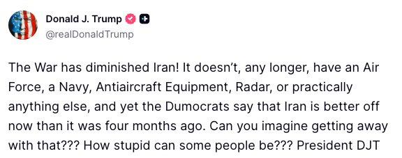

Fox News (Twitter/X)

“How stupid can some people be???”

President Trump is pushing back on Democrats for criticizing his new Iran deal and saying the Islamic Republic is better off now than it was before the war.

## FoxNewsTwitter — post 343165

  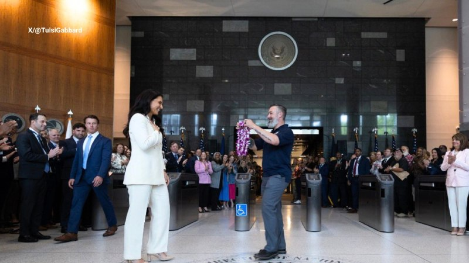

Fox News (Twitter/X)

"Thank you, President Trump."

Tulsi Gabbard says she just walked out of the Office of the Director of National Intelligence headquarters for the final time, marking her last day in the role.

"I remain grateful for the profound honor of serving the American people and our nation as the Director of National Intelligence."

After serving over a year at the helm of the intelligence community, Gabbard is closing out her tenure with a message of gratitude and thanks to President Trump.

## pm_afshaa — post 94401

  <a href="telegram/content/pm_afshaa_94401_1781880818.webm" target="_blank">🎬 Download video</a>

🔴محمدمنان رییسی، نماینده مجلس: خوش‌انصاف‌ها مجلس رو باز کنید، رهبرم تنها مونده. 
💧 Rainbet.com the #1 Non-KYC Crypto Casino & Sportsbook @rainbetcom 
😁 @Pm_Afshaa

## pm_afshaa — post 94400

  <a href="telegram/content/pm_afshaa_94400_1781880818.webm" target="_blank">🎬 Download video</a>

🔴محمدمنان رییسی، نماینده مجلس:
خوش‌انصاف‌ها مجلس رو باز کنید، رهبرم تنها مونده.

💧 Rainbet.com the #1 Non-KYC Crypto Casino & Sportsbook @rainbetcom

😁 @Pm_Afshaa

## pm_afshaa — post 94399

  <a href="telegram/content/pm_afshaa_94399_1781880819.webm" target="_blank">🎬 Download video</a>

🔴کانال 12 اسرائیل:
نتانیاهو با مسئله لبنان سعی در خراب کردن تفاهم نامه بین آمریکا و ایران داره.

💧 Rainbet.com the #1 Non-KYC Crypto Casino & Sportsbook @rainbetcom

😁 @Pm_Afshaa

## pm_afshaa — post 94398

  <a href="telegram/content/pm_afshaa_94398_1781880819.webm" target="_blank">🎬 Download video</a>

🔴خبرگزاری تسنیم:
هر دقیقه باز بودن تنگه هرمز خسارت مهمیه؛ اگر آمریکا فشار انرژی رو از روی خودش تخلیه کنه، وقیح‌تر و تهاجمی‌تر هم خواهد شد.

💧 Rainbet.com the #1 Non-KYC Crypto Casino & Sportsbook @rainbetcom

😁 @Pm_Afshaa

## pm_afshaa — post 94397

  <a href="telegram/content/pm_afshaa_94397_1781880820.webm" target="_blank">🎬 Download video</a>

🔴ارتش اسرائیل:
بیش از 150 حمله از دیشب تا الان به جنوب لبنان صورت گرفته است!

💧 Rainbet.com the #1 Non-KYC Crypto Casino & Sportsbook @rainbetcom

😁 @Pm_Afshaa

## pm_afshaa — post 94396

  <a href="telegram/content/pm_afshaa_94396_1781880820.webm" target="_blank">🎬 Download video</a>

🔴خبرنگار المیادین در جنوب لبنان:
همزمان با اجرایی شدن آتش‌بس ادعایی، حملهٔ هوایی اسرائیل به النبطیه صورت گرفت.

💧 Rainbet.com the #1 Non-KYC Crypto Casino & Sportsbook @rainbetcom

😁 @Pm_Afshaa

## pm_afshaa — post 94395

  <a href="telegram/content/pm_afshaa_94395_1781880821.webm" target="_blank">🎬 Download video</a>

🔴خبرنگار الجزیره:
چهارمین حمله هوایی اسرائیل در اطراف شهرک کفر تبنیت در جنوب لبنان.

💧 Rainbet.com the #1 Non-KYC Crypto Casino & Sportsbook @rainbetcom

😁 @Pm_Afshaa

## pm_afshaa — post 94394

  <a href="telegram/content/pm_afshaa_94394_1781880821.webm" target="_blank">🎬 Download video</a>

🔴رویترز به نقل از یک مقام آمریکایی: اسرائیل و حزب‌الله بر سر آتش‌بس از ساعت 4 بعدازظهر به وقت محلی توافق کردن. 
💧 Rainbet.com the #1 Non-KYC Crypto Casino & Sportsbook @rainbetcom 
😁 @Pm_Afshaa

## pm_afshaa — post 94393

  <a href="telegram/content/pm_afshaa_94393_1781880822.webm" target="_blank">🎬 Download video</a>

🔴رویترز به نقل از یک مقام آمریکایی:
اسرائیل و حزب‌الله بر سر آتش‌بس از ساعت 4 بعدازظهر به وقت محلی توافق کردن.

💧 Rainbet.com the #1 Non-KYC Crypto Casino & Sportsbook @rainbetcom

😁 @Pm_Afshaa

## pm_afshaa — post 94392

  <a href="telegram/content/pm_afshaa_94392_1781880822.webm" target="_blank">🎬 Download video</a>

‏
🔴دونالد ترامپ: جنگ ایران رو تضعیف کرده و دیگر نیروی هوایی، نیروی دریایی، پدافند هوایی، رادار یا تقریبا هیچ‌چیز دیگری نداره؛ با این حال دموکرات‌ها میگن ایران الان نسبت به چهار ماه پیش در وضعیت بهتری قرار داره. باور می‌کنید بتوان چنین حرفی زد؟ بعضی افراد چقدر میتونن احمق باشن؟

💧 Rainbet.com the #1 Non-KYC Crypto Casino & Sportsbook @rainbetcom

😁 @Pm_Afshaa

## pm_afshaa — post 94391

  <a href="telegram/content/pm_afshaa_94391_1781880823.webm" target="_blank">🎬 Download video</a>

🔴تسنیم: تنگه هرمز رو تا زمان پایان حملات به لبنان ببندید!

💧 Rainbet.com the #1 Non-KYC Crypto Casino & Sportsbook @rainbetcom

😁 @Pm_Afshaa

## pm_afshaa — post 94390

  <a href="telegram/content/pm_afshaa_94390_1781880823.webm" target="_blank">🎬 Download video</a>

🔴ترامپ: ما از روی ناچاری ملاقات (امضای تفاهم‌نامه) نکردیم، ایران این کار رو انجام داد. کار اونا تمومه. ما 60 روز رو بازی می‌کنیم. اونا هیچ پولی دریافت نمی‌کنن، حتی 10 سنت!

💧 Rainbet.com the #1 Non-KYC Crypto Casino & Sportsbook @rainbetcom

😁 @Pm_Afshaa

## pm_afshaa — post 94389

  <a href="telegram/content/pm_afshaa_94389_1781880824.webm" target="_blank">🎬 Download video</a>

🔴سی‌ان‌ان: آمریکا به جمهوری اسلامی پیام داده که اسرائیل پس از حملات اخیر در واکنش به حمله حزب‌الله که به کشته شدن 4 سرباز اسرائیلی منجر شد، فعلا با عدم تشدید بیشتر حملات در لبنان موافقت کرده.

این پیام در حالی منتقل شده که دولت ترامپ تلاش داره مذاکرات هسته‌ای متوقف‌شده با تهران رو دوباره به مسیر اصلی برگردونه.

💧 Rainbet.com the #1 Non-KYC Crypto Casino & Sportsbook @rainbetcom

😁 @Pm_Afshaa

## DEJradio — post 5827

  <a href="telegram/content/DEJradio_5827_1781880824.webm" target="_blank">🎬 Download video</a>

🔺📢 دونالد ترامپ: جمهوری اسلامی از سر استیصال مجبور به مذاکره شد

‏دونالد ترامپ، رییس‌جمهوری آمریکا، جمعه ۲۹ خرداد در پیامی در تروت سوشال نوشت که جمهوری اسلامی از موضع ضعف وارد مذاکره با آمریکا شده است. ترامپ نوشت: «ما از سر استیصال وارد مذاکره نشدیم؛ این ایران بود که چنین کرد. آن‌ها تمام شده‌اند.»

او همچنین با اشاره به دوره ۶۰ روزه اجرای یادداشت تفاهم میان تهران و واشینگتن افزود: «ما این دوره ۶۰ روزه را تا پایان دنبال خواهیم کرد.»

رییس‌جمهوری آمریکا در ادامه تاکید کرد: «هیچ پولی به آن‌ها داده نخواهد شد؛ حتی ۱۰ سنت.»

#مذاکرات #ترامپ
@DEJradio

## DEJradio — post 5826

  <a href="telegram/content/DEJradio_5826_1781880825.webm" target="_blank">🎬 Download video</a>

🔺📢 یک بازنشسته نیروهای مسلح با ارسال پیامک واریز حقوق ماهانه خود، نوشت با ماهی ۱۴ میلیون تومان حقوق چطور می‌توانم زندگی کنم؟
اغلب بازنشسته‌های نیروهای مسلح بعد از ۳۰ سال خدمت مستاجر هستند.

#نیروهای_مسلح #تورم
@DEJradio

## DEJradio — post 5825

  <a href="telegram/content/DEJradio_5825_1781880825.mp4" target="_blank">🎬 Download video</a>

🚨
⭕️ در پی حملات اسرائیل به حزب‌الله، سپاه پاسداران تنگه هرمز را دوباره بست. بر همین اساس از روز جمعه ۲۹ خرداد ۱۴۰۵ سـ.ـپاه در پیامی رادیویی به تمام شناورها هشدار داد نمی‌توانند از تنگه عبور کنند. این اقدام در پی خودداری اسرائیل از عقب‌نشینی از جنوب لبنان و حملات شدید به حـ.ـزب‌الله لبنان انجام شده است.

بعد از تفاهم اولیه میان جمهوری اسلامی و دولت ترامپ چند کشتی خارجی بدون پرداخت عوارض از تنگه هرمز عبور کردند.
شورای‌عالی امنیت ملی جمهوری اسلامی اعلام کرده بود متقاضیان عبور از تنگه هرمز به مدت ۶۰ روز هزینه‌ای نمی‌دهند.

#حزب_الله_لبنان #تنگه_هرمز #توافق
@DEJradio

## VahidOnline — post 76520

  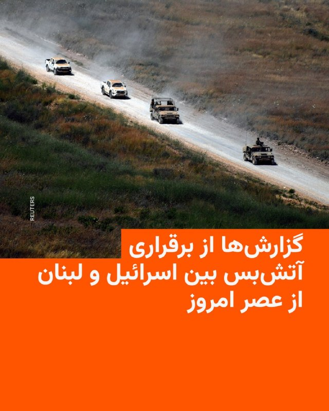

یک مقام ارشد آمریکایی به رویترز گفت که اسرائیل و حزب‌الله بر سر یک آتش‌بس توافق کرده‌اند که قرار است از ساعت چهار بعدازظهر روز جمعه به وقت محلی آغاز شود.

این مقام که نخواست نامش فاش شود، افزود که مذاکره‌کنندگان آمریکایی و قطری با کمک ایران این توافق را نهایی کرده‌اند.

این مقام همچنین گفت: «درک ما این است که پس از تبادل آتش امروز، اسرائیل و حزب‌الله اکنون در وضعیت آتش‌بس قرار دارند.»

شبکه العربیه نیز به نقل از یک مقام آمریکایی از توافق برای برقراری آتش‌بس بین اسرائیل و حزب‌الله از جمعه خبر داد.

این در حالی است که نخست‌وزیر اسرائیل ساعتی پیش اعلام کرد نیروهای نظامی این کشور تا هر زمان که لازم باشد، در خاک لبنان باقی می‌مانند.
@VahidHeadline

📡 @VahidOnline

## VahidOnline — post 76518

  <a href="telegram/content/VahidOnline_76518_1781880827.mp4" target="_blank">🎬 Download video</a>

وزیر امور خارجه ایتالیا روز جمعه اعلام کرد در واکنش به گزارش‌ها درباره اظهارات دونالد ترامپ سفر برنامه‌ریزی‌شده خود به ایالات متحده را لغو می‌کند.
آنتونیو تایانی در شبکه اکس نوشت: «سخنان شدیدا توهین‌آمیز رئیس‌جمهوری ترامپ… به همه مردم ایتالیا اهانت می‌کند.»
به گزارش شبکه ایتالیایی «لا۷» ترامپ درباره دیدار خود با ملونی در نشست گروه هفت گفته بود: «ملونی آن‌قدر می‌خواست با من عکس بگیرد که فقط از روی دلسوزی با او موافقت کردم.»
@VahidOOnLine
جورجیا ملونی، نخست‌وزیر ایتالیا، در واکنش به اظهارات اخیر دونالد ترامپ، رئیس‌جمهوری آمریکا، این سخنان را «کاملاً ساختگی» خواند و گفت از نحوه رفتار او با متحدان «مبهوت و شگفت‌زده» شده است.

او تاکید کرد: «نمی‌دانم چرا رئیس‌جمهور ایالات متحده این‌گونه با متحدان خود رفتار می‌کند» و افزود این نخستین‌بار نیست که چنین مواضعی از سوی ترامپ مطرح می‌شود.

ملونی همچنین این رویکرد را «مایه تاسف» دانست و گفت او قاطعیتی را که در برابر دشمنان غرب نشان نمی‌دهد، در قبال برخی رهبران متحد خود به کار می‌گیرد.
نخست‌وزیر ایتالیا در پایان تأکید کرد: «یک چیز را باید به خاطر بسپارد؛ من و ایتالیا هرگز التماس نمی‌کنیم.»

در ادامه این تنش‌ها، آنتونیو تایانی، وزیر امور خارجه ایتالیا، نیز اعلام کرد سفر برنامه‌ریزی‌شده خود به آمریکا را لغو کرده و این اظهارات را «توهین به مردم ایتالیا» خواند.
@VahidOOnLine

📡 @VahidOnline

## VahidOnline — post 76517

  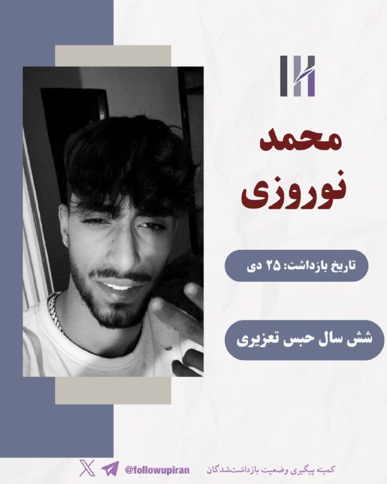

✅️#محمد_نوروزی، شهروند افغانستانی ساکن ایران، که در روز ۲۵ دی‌ماه ۱۴۰۴، در منزل مسکونی‌اش دستگیر شده بود، توسط دادگاه به شش‌سال زندان محکوم شد.

🔹️طبق گزارش رسیده به کمیته پیگیری، محمد نوروزی پس از بازداشت به آگاهی ملارد منتقل شده و پس از ۴ روز همراه با ضرب‌وشتم فیزیکی به زندان قزلحصار منتقل شد. او طی این مدت مدام تهدید می‌شد که رد مرز شده و از ایران اخراج خواهد شد.

🔹️او در نهایت با قرار وثیقه یک میلیارد تومانی از زندان آزاد شد و سپس توسط دادگاه به اتهام "اجتماع و تبانی و تبلیغ علیه نظام" به شش سال زندان محکوم شد.

این حکم هم‌اکنون در مرحله تجدیدنظر قرار دارد.

🆔️ @Followupiran

## VahidOnline — post 76516

  

بنیامین نتانیاهو، نخست‌وزیر اسرائیل، روز جمعه بار دیگر گفت که نیروهای اسرائیلی «تا هر زمان که لازم باشد» در لبنان باقی خواهند ماند و وعده داد که حزب‌اللهِ مورد حمایت ایران برای حملاتش «بهای بسیار سنگینی» خواهد پرداخت.

او روز پنجشنبه، ساعاتی بعد از امضای تفاهم‌نامه پایان دادن به جنگ توسط ایران و آمریکا، نیز بر ادامه حضور ارتش اسرائیل در مناطقی از جنوب لبنان تأکید کرده بود.

نتانیاهو در بیانیه روز جمعه که پس از اعلام کشته شدن چهار سرباز اسرائیلی در لبنان از سوی ارتش منتشر شد، گفت: «اسرائیل حمله به سربازان یا قلمرو خود را تحمل نخواهد کرد و بابت این حملات بهای بسیار سنگینی از حزب‌الله خواهد گرفت.»

او افزود: «اسرائیل تا هر زمان که برای حفاظت از جوامع شمالی لازم باشد، در منطقه امنیتی جنوب لبنان باقی خواهد ماند.»

یسرائیل کاتز، وزیر دفاع، نیز گفته بود که ارتش در لبنان خواهد ماند و افزود که به هر حمله‌ای «با نیروی قابل توجه» پاسخ خواهد داد.

لبنان اعلام کرده بر اثر حملات اسرائیل در سراسر این کشور ۱۸ نفر کشته شده‌اند.
@VahidHeadline

📡 @VahidOnline

## VahidOnline — post 76515

  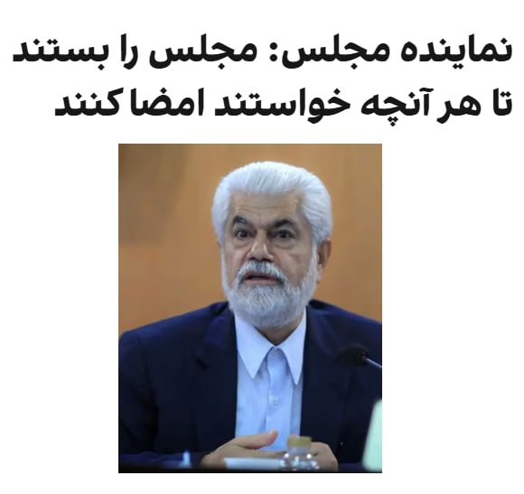

حسینعلی شهریاری، رییس کمیسیون بهداشت و درمان مجلس جمهوری اسلامی، در گفت‌وگو با دیده‌بان ایران، با اشاره به ادامه «تعطیلی مجلس» گفت: «مجلس را بستند تا هر آنچه خواستند امضا کنند.»

او با تاکید بر اینکه تفاهم‌نامه با آمریکا در نهایت باید به تصویب مجلس برسد، افزود: گذشت آن زمان که برجام را در ۲۰ دقیقه در مجلس تصویب کردند. ما یک بار از این موضوع آسیب دیده‌ایم و نباید دوباره همان اتفاق تکرار شود.

شهریاری همچنین از اظهارات عباس عراقچی، وزیر خارجه جمهوری اسلامی، درباره احتمال رقیق‌سازی اورانیوم غنی‌شده انتقاد کرد و گفت موضوع هسته‌ای نباید در مذاکرات مطرح شود، زیرا به گفته او «جزو خطوط قرمز» جمهوری اسلامی است.
@VahidOOnLine

📡 @VahidOnline

## VahidOnline — post 76514

  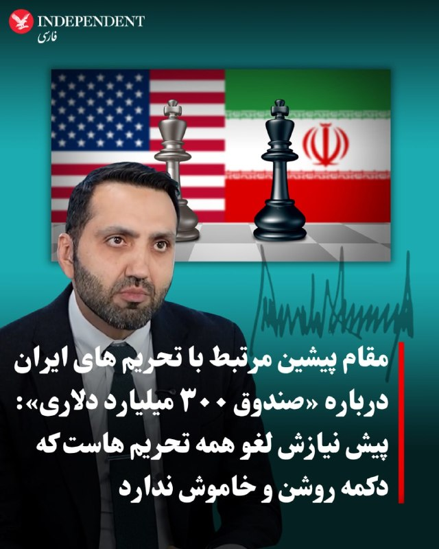

مقام پیشین مرتبط با تحریم های ایران درباره «صندوق ۳۰۰ میلیارد دلاری»: پیش نیازش لغو همه تحریم هاست که دکمه روشن و خاموش ندارد

میعاد ملکی، مدیر پیشین «دفتر هدف‌گذاری تحریم‌های خزانه‌داری آمریکا» در یادداشتی درباره موضوع «صندوق ۳۰۰ میلیارد دلاری» برای ایران که بسیاری از کارشناسان درباره آن ابراز تردید کرده‌اند، می‌نویسد: با کنار گذاشتن موضوع معافیت/مجوز نفتی و نگرانی‌های مربوط به عدم اعمال تحریم‌های جدید، باتوجه به الزامات برای اجرای واقعی بند ۶ (صندوق بازسازی ۳۰۰ میلیارد دلاری) و بند ۷ (لغو همه تحریم‌ها) به این نتیجه می‌رسیم که مذاکره‌کنندگان آمریکایی یا می‌دانستند که توافق نهایی ناممکن است، یا این یادداشت تفاهم فقط تصمیم‌گیری را به آینده موکول می‌کند.

ملکی که خود در طراحی تحریم‌ها علیه حکومت ایران نقش داشته در این یادداشت می‌نویسد: این چیزی است که «اجرای کامل» در عمل، فراتر از امتیازهای هسته‌ای، به آن نیاز دارد:
بند ۶ — صندوق ۳۰۰ میلیارد دلاری:
صدور معافیت ریاست‌جمهوری از تحریم‌های الزامی بخش ساخت‌وساز ایران طبق ماده ۱۲۴۵ قانون IFCA (معافیت‌های ۱۸۰ روزه قابل تمدید که در هر دوره نیازمند اطلاع‌رسانی به کنگره هستند).
خارج کردن سپاه از فهرست سازمان‌های تروریستی خارجی (FTO)، زیرا در غیر این صورت سرمایه‌گذاران با خطر مسئولیت کیفری به دلیل «حمایت مادی» مواجه خواهند بود و هیچ مجوزی این مشکل را برطرف نمی‌کند.
استفاده از معافیت مبتنی بر منافع ملی در قانون ISA (قانون تحریم های ایران) برای سرمایه‌گذاری در بخش انرژی و نفت.
در نتیجه، هیچ نهاد سرمایه‌گذاری حاضر نیست میلیاردها دلار سرمایه را بر پایه معافیت‌های شش‌ماهه قابل تمدید متعهد کند.

بند ۷ — لغو همه تحریم‌ها:
ماده ۱۰۴ قانون CISADA (قانون جامع تحریم‌ها، پاسخگویی و واگذاری سرمایه‌گذاری‌های مرتبط با ایران) رئیس‌جمهور اختیار معافیت ندارد؛ تحریم‌ها الزامی هستند و لغو آن‌ها مستلزم تصویب قانون جدید در کنگره است.
ماده ۱۲۴۵ قانون NDAA (قانون مجوز دفاع ملی آمریکا) معافیت‌های ۱۲۰ روزه قابل تمدید که در هر دوره نیازمند ارائه گزارش اجباری به کنگره هستند.
تعیین بخش مالی ایران به عنوان «نگرانی پول‌شویی» تحت ماده ۳۱۱ قانون پاتریوت: این موضوع نیازمند مقررات‌گذاری جداگانه از سوی شبکه مقابله با جرائم مالی وزارت خزانه‌داری آمریکا (FinCEN) است و صرفا از طریق دفتر کنترل دارایی‌های خارجی (OFAC) حل نمی‌شود.
تحریم‌های مرتبط با تروریسم، حقوق بشر و موارد همپوشان با پرونده روسیه: هر کدام مستلزم اقدامات حقوقی مستقل و جداگانه هستند.
ملکی در ادامه می‌نویسد: «لغو همه تحریم‌ها» یک دکمه روشن و خاموش نیست، بلکه پروژه‌ای چندساله در حوزه قانون‌گذاری و مقررات‌گذاری است و کنگره نیز در آن حق رای دارد. و این پرسش مطرح است که چگونه می‌توان اتحادیه اروپا را وادار کرد محدودیت‌های مرتبط با ایران را که در چارچوب پرونده‌های مربوط به روسیه وضع شده‌اند، لغو کند.
@VahidOOnLine

📡 @VahidOnline

## VahidOnline — post 76513

  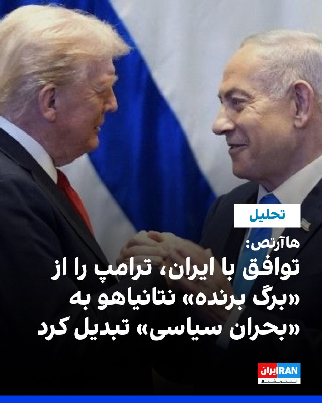

روزنامه هاآرتص در تحلیلی نوشت توافق دونالد ترامپ با جمهوری اسلامی، برخلاف انتظار بنیامین نتانیاهو، نه‌تنها به تقویت موقعیت سیاسی او منجر نشد، بلکه شکاف بی‌سابقه‌ای میان واشینگتن و تل‌آویو ایجاد کرده و نخست‌وزیر اسرائیل را در آستانه انتخابات با بحرانی تازه روبه‌رو کرده است.

روزنامه هاآرتص در تحلیلی نوشت نتانیاهو امیدوار بود سفر ترامپ به اسرائیل و حمایت علنی رییس‌جمهوری آمریکا، مهم‌ترین برگ برنده او در انتخابات پیش‌رو باشد.
به نوشته این روزنامه، نتانیاهو انتظار داشت این سفر پس از «پیروزی کامل» بر جمهوری اسلامی، سقوط حکومت ایران و انتقال ذخایر اورانیوم غنی‌شده برگزار شود، اما اکنون نه‌تنها هیچ‌یک از این اهداف محقق نشده، بلکه ترامپ تقریباً هر روز با اظهاراتی تحقیرآمیز از نخست‌وزیر اسرائیل انتقاد می‌کند.
هاآرتص افزود توافق آمریکا و جمهوری اسلامی در اسرائیل به‌طور گسترده «فاجعه‌بار» تلقی می‌شود، زیرا ترامپ برخلاف وعده‌های اولیه خود، جنگ را بدون تحقق اهداف اعلام‌شده پایان داده است.

@VahidOOnLine

📡 @VahidOnline

## VahidOnline — post 76512

  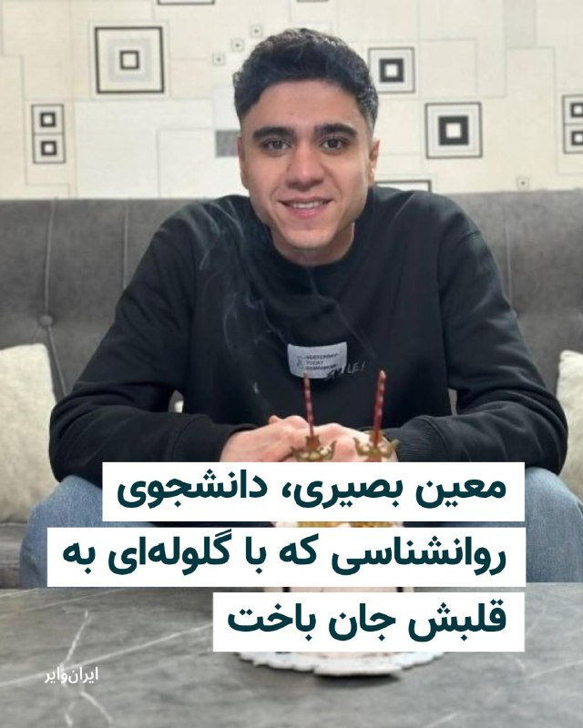

«معین بصیری» ۲۱ ساله، ساکن شهرک اندیشه تهران، روز پنج‌شنبه ۱۸ دی‌ماه ۱۴۰۴ هدف شلیک مستقیم قرار گرفت و جان خود را از دست داد.
به گفته منابع آگاه، گلوله از نقطه‌ای مرتفع و از روی پشت‌بام شلیک شده و به قلب معین اصابت کرده است.
او در پی این جراحت جان باخت و پیکرش پس از انتقال به کهریزک، به بهشت زهرا منتقل شد.
نزدیکانش می‌گویند پیکر معین بصیری را از بهشت زهرا تحویل گرفتند و مراسم خاکسپاری او روز ۲۱ دی‌ماه برگزار شد.
@VahidHeadline

📡 @VahidOnline

## VahidOnline — post 76511

  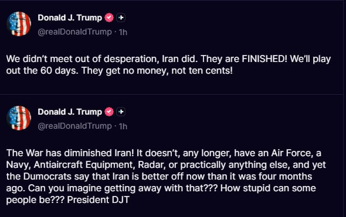

پست‌های ترامپ، ترجمه ماشین:
«جنگ، ایران را تضعیف کرده است! ایران دیگر نه نیروی هوایی دارد، نه نیروی دریایی، نه تجهیزات ضدهوایی، نه رادار، و عملاً هیچ چیز دیگری هم ندارد؛ با این حال دموکرات‌های احمق می‌گویند ایران الان از چهار ماه پیش وضع بهتری دارد. اصلاً می‌توانید تصور کنید کسی با چنین حرفی قسر در برود؟ بعضی‌ها چقدر می‌توانند احمق باشند؟؟؟
رئیس‌جمهور، دی‌جی‌تی»
realDonaldTrump
«ما از سرِ درماندگی دیدار نکردیم؛ ایران بود که از سرِ درماندگی آمد. کارشان تمام است! این ۶۰ روز را هم طی می‌کنیم. هیچ پولی گیرشان نمی‌آید، حتی ده سنت!»
realDonaldTrump

📡 @VahidOnline

## VahidOnline — post 76509

وزیر خارجه فرانسه می‌گوید پاریس تا زمانی که اطمینان حاصل نکند مذاکرات درباره برنامه هسته‌ای تهران انتظاراتش را برآورده می‌کند، با لغو تحریم‌های شورای امنیت سازمان ملل متحد علیه ایران موافقت نخواهد کرد.
ژان نوئل بارو روز جمعه ۲۹ خرداد این موضوع را اعلام کرد. فرانسه یکی از اعضای دارای حق وتوی شورای امنیت سازمان ملل است.

بارو گفت تا زمانی که مذاکرات آمریکا با ایران به ابهامات مربوط به برنامه موشک‌های بالستیک جمهوری اسلامی و حمایت تهران از نیروهای نیابتی پاسخ ندهد، ثباتی در منطقه برقرار نخواهد شد.
او افزود: «ما به یک تغییر اساسی در رویکرد ایران نیاز داریم.»
@VahidHeadline
وزیر خارجه فرانسه: کشتار معترضان دی‌ماه را فراموش نکنیم، مردم ایران بزرگ‌ترین قربانیان جنگ بودند
بارو که با تلویزیون «فرانس انفو» مصاحبه می‌کرد در پاسخ به پرسشی درباره سیاست فرانسه پس از «امضای تفاهم‌نامه پایان جنگ» ایران و آمریکا در قبال تهران گفت: «مردم ایران، بزرگ‌ترین قربانیان این جنگ بودند. آن‌ها از یک سو گرفتار سرکوبند و از سوی دیگر به رویشان بمب ریخته می‌شود. ما کشتار ژانویه (دی‌ماه) را که در آن خشونت دولتی بدون تمایز، معترضان مسالمت‌آمیز را هدف قرار داد، فراموش نمی‌کنیم.»
فرانسه حملات نظامی آمریکا و اسرائیل به جمهوری اسلامی را «غیرقانونی» توصیف و بارها اعلام کرد که در این جنگ شرکت نمی‌کند.
دونالد ترامپ تفاهم‌نامه پایان جنگ با ایران را در کاخ ورسای و در حضور امانوئل مکرون امضا کرد.
@VahidOOnLine

📡 @VahidOnline

## VahidOnline — post 76508

  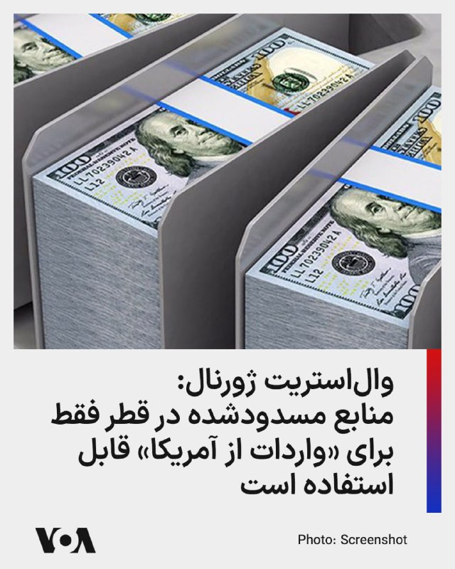

وال‌استریت ژورنال از قول منابع آگاه گزارش داده که طبق توافق پایان جنگ، ایران حق دسترسی به شش میلیارد دلار منابع مسدود شده در قطر برای واردات اقلام انسان‌دوستانه و غیرتحریمی از خود آمریکا خواهد داشت.

به گفته یک دیپلمات آگاه از جزئیات توافق، این منابع مالی به‌صورت مرحله‌ای و در بازه زمانی آتش‌بس تمدیدشده ۶۰ روزه آزاد خواهد شد و تنها برای خرید کالاهای آمریکایی قابل استفاده خواهد بود.
@VahidHeadline

📡 @VahidOnline

## VahidOnline — post 76505

🔴بيكر علی حسن‌پور را بعد از ۱۰۴ روز به خانواده
‏تحويل دادند

‏🔸⁧ #علی_حسن‌پور⁩ در ۲۵ خرداد ۱۳۸۸ در خیابان آزادی تهران بر اثر اصابت گلوله به سر کشته شد. خانواده او پس از ۱۰۴ روز سرگردانی، سرانجام پیکر وی را میان اجساد مجهول‌الهویه پزشکی قانونی کهریزک شناسایی کردند.

🔸اعتراضات خرداد ۱۳۸۸ که در اعتراض به نتایج انتخابات ریاست جمهوری سال ۱۳۸۸ شکل گرفت، جانباختگان زیادی برجای گذاشت، بنیاد برومند تا کنون ۱۳۸ نفر از این افراد را که مرتبط با این اعتراضات کشته، ناپدید یا اعدام شدند را در نقشه اعتراضات خود ثبت کرده است.

🔸علی حسن پور یکی از این افراد است. سرگذشت کامل او را در یادبود امید بخوانید:
https://www.iranrights.org/fa/memorial/story/61687/ali-hassanpur

@IranRights

## VahidOnline — post 76504

  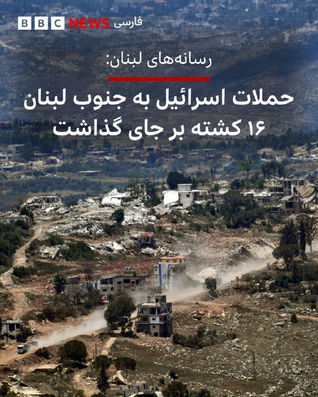

خبرگزاری ملی لبنان می‌گوید در حملات اسرائیل به شهرک‌های شرقیه، حاروف، کفررمان، کفرجوزو کفرصیر در جنوب این کشور دست‌کم ۱۶ نفر کشته شده‌اند.

به گزارش رسانه‌های محلی لبنان، از ساعات اولیه بامداد امروز، حملات توپخانه‌ای ارتش اسرائیل به شهر نبطیه و مناطق اطراف آن ادامه دارد.
@VahidHeadline

📡 @VahidOnline

## VahidOnline — post 76503

  

در پی اعلام کاخ سفید مبنی بر لغو سفر معاون دونالد ترامپ به سوئیس، وزارت خارجه این کشور اروپایی رسما خبر لغو سفر هیئت آمریکایی و لغو مذاکرات تهران و واشینگتن در روز جمعه را تأیید کرد.

لغو آغاز فوری مذاکرات بین دو کشور متخاصم تنها یک روز پس از امضا و رسمی شدن تفاهم‌نامه‌ای رخ می‌دهد که یکی از مهم‌ترین بندهای آن ۶۰ روز فرصت برای مذاکره درباره فعالیت هسته‌ای ایران است. قرار بود این ۶۰ روز بلافاصله در روز جمعه آغاز شود.

اما خبرگزاری تسنیم، نزدیک به سپاه پاسداران، روز پنج‌شنبه خبر داد که مذاکره‌کنندگان ایرانی پیش از آغاز دور بعدی گفت‌وگوهای صلح نیاز دارند نشانه‌هایی از اجرای توافق موقت از سوی آمریکا مشاهده کنند و هنوز تأییدی درباره سفر هیئت ایرانی به ژنو وجود ندارد.

در پی این انتشار این خبر بود که سخنگوی کاخ سفید هم در بیانیه‌ای که پنج‌شنبه شب منتشر شد، اعلام کرد ونس و هیئت آمریکایی آماده بودند به محض نهایی شدن برنامه مذاکرات، عازم شوند.
@VahidHeadline

📡 @VahidOnline

## VahidOnline — post 76502

  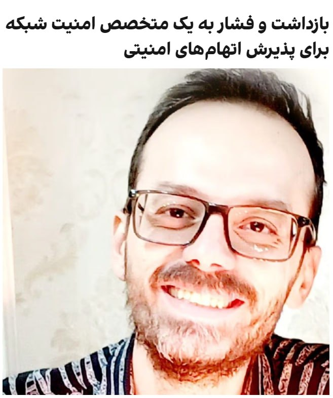

محمود قنبری‌راد، متخصص امنیت شبکه و از کارکنان یکی از شرکت‌های تهران، با اتهاماتی از جمله «اجتماع و تبانی علیه امنیت ملی»، «جمع‌آوری اطلاعات طبقه‌بندی‌شده» و «ارائه اطلاعات به اسرائیل» روبه‌رو شده است.

بر اساس گزارش‌ها، محمود قنبری‌راد، شهروندی ۴۰ ساله و متأهل، اردیبهشت‌ماه سال جاری در منزل شخصی خود بازداشت شده است.
یک منبع مطلع به دویچه‌وله گفته بود که او هیچ سابقه فعالیت سیاسی یا مدنی نداشته و به‌عنوان متخصص امنیت شبکه مشغول به کار بوده است.

گزارش‌ها حاکی است که او در تماس تلفنی از زندان، پرونده خود را «ساختگی» توصیف کرده و گفته است که برای پذیرش اتهامات تحت فشار قرار دارد. همچنین اعلام شده که وی از زمان بازداشت تاکنون از دسترسی به وکیل محروم بوده است.

بر اساس اطلاعات منتشرشده، محمود قنبری‌راد ابتدا حدود یک ماه در زندان اوین نگهداری شده و سپس به زندان فشافویه منتقل شده است.
همچنین گفته شده که او از نوعی اختلال عصبی رنج می‌برد و خانواده‌اش نسبت به وضعیت جسمی و حقوقی او ابراز نگرانی کرده‌اند.
@VahidHeadline

📡 @VahidOnline

## kianmeli1 — post 88088

‏🔴اسماعیل بقایی، سخنگوی وزارت خارجه جمهوری اسلامی: نشست برنامه‌ریزی‌شده جمعه ۲۹ خرداد در سوئیس به زمان دیگری موکول شده است
https://t.me/kianmeli1

## kianmeli1 — post 88087

  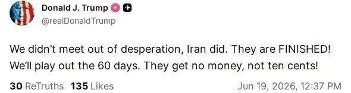

🔴ترامپ:

ما از روی ناامیدی ملاقات نکردیم، این کار ایران بود. آنها تمام شده‌اند! ما ۶۰ روز بازیابی خواهیم کرد. آنها نه پولی دریافت خواهند کرد و نه حتی یک سنت
https://t.me/kianmeli1

## kianmeli1 — post 88086

🔴باراک راوید: یک مقام ارشد آمریکایی به من می‌گوید

اسرائیل و حزب‌الله بر سر آتش‌بس مجدد در لبنان از ساعت ۴ بعد از ظهر به وقت محلی توافق کرده‌اند. این توافق جدید با میانجیگری آمریکا و قطر و پس از مذاکرات با اسرائیل و ایران حاصل شده است.
https://t.me/kianmeli1

## IranIntlTV — post 343230

  

ارتش جمهوری اسلامی، جمعه، ۲۹ خرداد در بیانیه‌ای اعلام کرد: «دوشادوش سپاه پاسداران در صورت هرگونه بدعهدی از سوی دشمن، دست بر ماشه و گوش به فرمان رهبر، هر روز بر توان رزم خود افزوده و آماده دفاع از امنیت و منافع ملت هستیم.»

در بخشی از این بیانیه آمده است: «آمادگی نیروهای مسلح، دشمن را ناگزیر کرد تا مسیر آتش‌بس و تفاهم را در پیش بگیرد.»
https://iranintl.com/202606198059

## IranIntlTV — post 343229

🔻چرا دستیابی به توافق هسته‌ای جدید دشوارتر از دوران برجام است؟

سایمون گس، سفیر سابق بریتانیا در تهران، هشدار داد دستیابی به یک توافق هسته‌ای جدید با جمهوری اسلامی در شرایط کنونی به‌مراتب دشوارتر از زمان برجام خواهد بود، زیرا سطح بی‌اعتمادی میان طرف‌های مذاکره افزایش یافته و دامنه اختلافات نیز گسترده‌تر شده است.

گس که در گفت‌وگوهای هسته‌ای سال ۲۰۱۵ به‌عنوان مذاکره‌کننده ارشد بریتانیا حضور داشت، جمعه ۲۹ خرداد در یادداشتی در روزنامه فایننشال‌تایمز، به مقایسه روند مذاکرات برجام با گفت‌وگوهای آینده در چارچوب یادداشت تفاهم اخیر میان تهران و واشینگتن پرداخت.

آمریکا و حکومت ایران ۲۵ خرداد از دستیابی به تفاهمی برای پایان جنگ خبر دادند. این یادداشت تفاهم ۲۸ خرداد به امضای دونالد ترامپ، رییس‌جمهوری آمریکا و مسعود پزشکیان، رییس دولت جمهوری اسلامی، رسید.

بر اساس این سند، یک دوره ۶۰ روزه برای گفت‌وگوهای تخصصی در نظر گرفته شده است؛ مذاکراتی که قرار است بر موضوعات حساسی همچون سرنوشت ذخایر اورانیوم غنی‌شده حکومت ایران و چگونگی رفع تحریم‌ها تمرکز داشته باشد.

گس در یادداشت خود نوشت: «۶۰ روز زمان کافی نخواهد بود. مذاکرات برجام ۲۰ ماه به طول انجامید. اکنون نیز به زمان نیاز است، زیرا مسائل مطرح‌شده فنی و پیچیده هستند و در فضایی آکنده از بی‌اعتمادی دنبال می‌شوند.»

به گفته این دیپلمات پیشین، موضوع مذاکرات صرفا به توقف غنی‌سازی یا تعیین تکلیف ذخایر اورانیوم محدود نمی‌شود، بلکه مسائلی همچون نحوه و زمان‌بندی بازرسی‌های آژانس بین‌المللی انرژی اتمی و سازوکارهای نظارتی نیز باید به‌دقت مورد توافق قرار گیرند.

رافائل گروسی، مدیرکل آژانس بین‌المللی انرژی اتمی، پیش‌تر بر لزوم نقش‌آفرینی این نهاد در هرگونه توافق احتمالی میان تهران و واشینگتن تاکید کرد و هشدار داد توافقی که فاقد سازوکار موثر راستی‌آزمایی باشد، در عمل «توهمی از توافق» خواهد بود.
جمهوری اسلامی با برچیدن برنامه هسته‌ای خود موافقت نمی‌کند

گس در ادامه یادداشت خود نوشت مذاکرات پیش‌رو تنها به چالش‌های فنی محدود نخواهد بود، بلکه با مباحث سیاسی دشواری نیز در داخل کشورهای طرف مذاکره همراه خواهد شد.

به گفته او، مذاکره‌کنندگان ناچار خواهند بود هرگونه امتیازدهی را برای افکار عمومی و نهادهای سیاسی کشور خود توجیه کنند.

این مقام سابق بریتانیایی با اشاره به تحولات داخلی جمهوری اسلامی افزود فضای سیاسی در تهران نسبت به دوران مذاکرات برجام «سخت‌تر» شده است؛ نهادهای امنیتی، به‌ویژه سپاه پاسداران، نفوذ بیشتری پیدا کرده‌اند و بسیاری از افراد وابسته به این نهاد معتقدند درگیری‌ها دیر یا زود از سر گرفته خواهد شد و مذاکرات چیزی جز ادامه همان رویارویی از مسیری متفاوت نیست.

گس تاکید کرد جمهوری اسلامی ممکن است با اعمال «محدودیت‌های معنادار و زمان‌دار» بر برنامه هسته‌ای خود موافقت کند، اما حاضر نخواهد شد به حذف کامل این برنامه تن دهد.

به گفته او، تهران همچنین تجربه کشورهایی مانند لیبی و اوکراین را که از برنامه‌ هسته‌ای خود صرف‌نظر کردند، زیر نظر داشته و این موضوع بر محاسبات جمهوری اسلامی تاثیرگذار بوده است.

۲۸ خرداد، مجتبی خامنه‌ای، رهبر جمهوری اسلامی، در پیامی مکتوب اعلام کرد با وجود آنکه «نظر دیگری» نسبت به تفاهم اخیر با ایالات متحده داشته، با تعهد پزشکیان در خصوص «پاسداشت حقوق ملت ایران و جبهه مقاومت»، با آن موافقت کرده است.
سایه بی‌اعتمادی بر مذاکرات

گس در ادامه یادداشت خود نوشت جمهوری اسلامی در موضوع رفع تحریم‌ها دیگر حاضر به پذیرش توافقی مشابه برجام نخواهد بود، زیرا از نگاه تهران، وعده لغو تحریم‌ها در چارچوب آن توافق هرگز به‌طور کامل و موثر محقق نشد.

او افزود در مذاکرات آتی، امتیازهای هسته‌ای جمهوری اسلامی تنها در صورتی قابل تحقق خواهد بود که با اقدامات «متقابل و فوری» طرف مقابل همراه شود؛ اقداماتی که از دید تهران پایدار و ملموس باشند و لغو آن‌ها برای دولت‌های آینده آمریکا دشوار باشد.

به گفته سفیر پیشین بریتانیا در تهران، یادداشت تفاهم اخیر از دقت کافی برخوردار نیست؛ به گونه‌ای که هر طرف می‌تواند آن را به نفع خود تفسیر و طرف مقابل را به سوءنیت متهم سازد.

او هشدار داد این مساله به‌ویژه در شرایطی مشکل‌ساز است که هیچ‌یک از دو طرف باور ندارد طرف مقابل بتواند به تعهدات بلندمدت خود پایبند بماند.

پیش‌تر وزارت خارجه سوئیس اعلام کرد مذاکرات تهران و واشینگتن که قرار بود ۲۹ خرداد در این کشور برگزار شود، انجام نخواهد شد.

یک سخنگوی کاخ سفید نیز از انصراف جی‌دی ونس، معاون رییس‌جمهوری آمریکا، از سفر برنامه‌ریزی‌شده خود به سوئیس برای دیدار با مذاکره‌کنندگان جمهوری اسلامی خبر داد.

دلیل این تصمیم «پیچیدگی‌های لجستیکی و هماهنگی‌های مربوط به مذاکرات» عنوان شده است.
🔗ادامه این تحلیل را اینجا بخوانید
@iranintltv

## IranIntlTV — post 343228

  <a href="telegram/content/IranIntlTV_343228_1781880834.mp4" target="_blank">🎬 Download video</a>

گزارشگر ویژه سازمان ملل در امور حقوق بشر ایران هشدار داد در تفاهم‌نامه ۱۴ ماده‌ای میان آمریکا و جمهوری اسلامی، موضوع حقوق بشر نادیده گرفته شده است. مای ساتو و جمعی از کارشناسان سازمان ملل در بیانیه‌ای مشترک تاکید کردند میلیون‌ها ایرانی خواستار تغییرات بنیادین شده‌اند و صدای آنان باید در هر مذاکره‌ای شنیده شود.

گفت‌وگو با ثمانه قدرخان، روزنامه‌نگار و عضو تحریریه ایران‌وایر
@iranintltv

## IranIntlTV — post 343225

  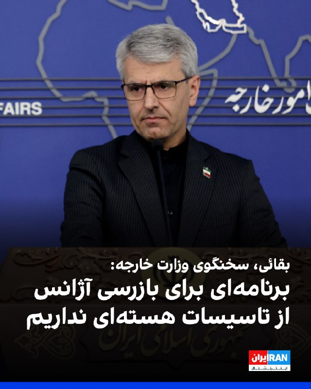

اسماعیل بقائی، سخنگوی وزارت خارجه جمهوری اسلامی در گفت‌وگو با خبرنگاران، اخبار منتشره در برخی رسانه‌ها مبنی بر دعوت جمهوری اسلامی از آژانس بین‌المللی انرژی اتمی برای بازرسی از تاسیسات هسته‌ای را تکذیب کرد.

بقائی گفت که بر اساس بند ۹ یادداشت تفاهم، در طول دوره ۶۰ روزه، وضعیت فعلی برنامه هسته‌ای ایران حفظ خواهد شد و بر این اساس، بازرسی از تاسیساتی مانند بوشهر که تاکنون انجام می‌شد، ادامه می‌یابد اما بازرسی از تاسیساتی که دسترسی آژانس به آن‌ها به‌دلیل حملات نظامی آمریکا و اسرائیل متوقف شد، منوط به روند مذاکرات و نتیجه آن خواهد بود.
https://iranintl.com/202606190021

## IranIntlTV — post 343224

  <a href="telegram/content/IranIntlTV_343224_1781880836.mp4" target="_blank">🎬 Download video</a>

خبرگزاری رویترز به نقل از منابع عراقی گزارش داد سپاه پاسداران با ایجاد هسته‌های مخفی جدید در عراق، حملات پهپادی علیه کشورهای خلیج فارس را سازماندهی کرده است. بر اساس این گزارش، این سلول‌ها که خارج از ساختار گروه‌های شبه‌نظامی شناخته‌شده فعالیت می‌کنند، بین ۳۱ فروردین تا ۲۷ اردیبهشت دست‌کم هفت حمله پهپادی به اهدافی در کویت، عربستان سعودی و امارات انجام داده‌اند.

گفت‌وگو با مهدی نخل‌احمدی، روزنامه‌نگار و فعال سیاسی
@iranintltv

## IranIntlTV — post 343223

عبدالمجید و رضا اسدی، عمو و برادرزاده بودند که شامگاه ۱۹ دی‌ماه ۱۴۰۴ در نورآباد ممسنی کشته شدند. ماموران آنها را درون خودرو هدف قرار دادند؛ از فاصله نزدیک به رضا شلیک کردند و مجید را با قنداق اسلحه به صورت پیاپی مورد ضرب و شتم قرار دادند.

## IranIntlTV — post 343222

🔻عفو بین‌الملل و کارشناسان سازمان ملل: حقوق بشر در تفاهم با جمهوری اسلامی نادیده نماند

پس از امضای یادداشت تفاهم آمریکا و جمهوری اسلامی، کارشناسان سازمان ملل هشدار دادند هر چارچوبی که به وضعیت حقوق بشر در ایران نپردازد، از اساس ناقص است. عفو بین‌الملل نیز اعلام کرد این تفاهم، در صورت نادیده گرفتن حقوق بشر و عدالت، می‌تواند پوششی برای ادامه سرکوب شود.

حقوق بشر نباید از توافق نهایی حذف شود

کارشناسان مستقل سازمان ملل جمعه ۲۹ خرداد با استقبال از امضای یادداشت تفاهم ۱۴ بندی میان آمریکا و جمهوری اسلامی هشدار دادند مردم ایران که هم از تجاوز نظامی خارجی و هم از سرکوب داخلی آسیب دیده‌اند، در این چارچوب تقریبا نادیده گرفته شده‌اند.

این بیانیه به امضای ۱۴ گزارشگر ویژه، کارشناس مستقل و سازوکار حقوق بشری سازمان ملل، از جمله مای ساتو، گزارشگر ویژه سازمان ملل در امور حقوق بشر ایران، رسیده است.

به گفته آنها، این سند عمدتا بر «خروج نظامی، بازگشایی تنگه هرمز، تعهدات هسته‌ای، کاهش تحریم‌ها و صندوق بازسازی ۳۰۰ میلیارد دلاری» متمرکز است.

این کارشناسان اعلام کردند از زمان آغاز جنگ در ۹ اسفند ۱۴۰۴، مقام‌های جمهوری اسلامی سرکوب مخالفان را تشدید کرده‌اند. هزاران نفر بازداشت شده‌اند و گزارش‌ها از شکنجه، ناپدیدسازی قهری، اعدام‌های ساختگی و اعتراف‌گیری اجباری حکایت دارد.

آنها افزودند از زمان آغاز جنگ، دست‌کم ۱۵۶ نفر اعدام شده‌اند که ۴۲ نفر از آنها با اتهام‌های سیاسی، از جمله اتهام‌های مرتبط با جاسوسی و امنیت ملی، اعدام شده‌اند.

کارشناسان سازمان ملل همچنین گفتند مقام‌های جمهوری اسلامی دارایی‌های دست‌کم هزار و ۵۰۰ شهروند، از جمله صدها ایرانی ساکن خارج از کشور را مصادره کرده‌اند و بهائیان، کردها و بلوچ‌ها بیش از دیگران در معرض خطر قرار داشته‌اند.
به گفته آنها، عفو اخیر مجتبی خامنه‌ای نیز شامل محکومان پرونده‌های سیاسی و امنیتی نشده و بسیاری از بازداشت‌شدگان اعتراضات همچنان در زندان مانده‌اند.

این کارشناسان افزودند جنگ خسارات انسانی، اقتصادی و زیست‌محیطی گسترده‌ای بر جا گذاشته است. هزاران غیرنظامی در حملات هوایی کشته و میلیون‌ها نفر آواره شده‌اند و سه ماه قطع تقریبا کامل اینترنت که یکی از طولانی‌ترین موارد ثبت‌شده تاکنون در جهان بوده، معیشت و ارتباط مردم با جهان خارج را مختل کرده است.

آنها از همه کشورها، از جمله کشورهای میانجی، خواستند هر توافق نهایی که قرار است طی ۶۰ روز آینده مذاکره شود، شامل توقف اجرای احکام اعدام، آزادی بازداشت‌شدگان خودسرانه، اعلام سرنوشت ناپدیدشدگان قهری، بازگرداندن دسترسی به اینترنت آزاد و حفاظت از فضای مدنی باشد.

کارشناسان سازمان ملل همچنین تاکید کردند صدای ایرانیان، که میلیون‌ها نفر از آنها برای مطالبه تغییرات بنیادین به خیابان‌ها آمدند، باید در هر مذاکره‌ای که مدعی تضمین آینده آن‌هاست، شنیده شود.
تفاهم نباید به پوششی برای ادامه سرکوب تبدیل شود

عفو بین‌الملل هشدار داد یادداشت تفاهم آمریکا و جمهوری اسلامی، بدون تضمین حقوق بشر و جبران خسارت قربانیان، می‌تواند به پوششی برای ادامه سرکوب و مصونیت از مجازات تبدیل شود.

این سازمان اعلام کرد جنگی که موضوع این تفاهم است، به کشورهای همسایه نیز کشیده شد، بیش از شش هزار کشته در خاورمیانه بر جا گذاشت و اقتصاد جهانی را متزلزل کرد.

عفو بین‌الملل همچنین گفت این جنگ با «حملات غیرقانونی آمریکا و اسرائیل در نقض منشور سازمان ملل» آغاز شد و سپس با اقدامات «غیرقانونی» مقام‌های جمهوری اسلامی ادامه یافت؛ روندی که به رنج گسترده غیرنظامیان و نقض حقوق بشردوستانه، از جمله جنایت‌های جنگی، انجامید.
🔗 ادامه این مطلب را اینجا بخوانید
@iranintltv

## IranIntlTV — post 343221

  <a href="telegram/content/IranIntlTV_343221_1781880838.mp4" target="_blank">🎬 Download video</a>

سنتکام، ستاد فرماندهی مرکزی آمریکا، جمعه ۲۹ خرداد ویدیویی از گشت‌زنی جنگنده‌های اف-۱۶ نیروی هوایی آمریکا بر فراز خاورمیانه منتشر کرد. سنتکام در توضیح این ویدیو نوشت: «نیروهای آمریکایی در منطقه همچنان مستقر، آماده و در حالت هوشیاری کامل هستند.»
@iranintltv

## IranIntlTV — post 343220

🔻ادامه اختلافات در اردوگاه جمهوری اسلامی بر سر پیام مجتبی خامنه‌ای و تفاهم با آمریکا

پیام مجتبی خامنه‌ای درباره تفاهم‌نامه تهران و واشینگتن نه‌تنها به اختلاف‌ها در اردوگاه جمهوری اسلامی پایان نداد، بلکه موج تازه‌ای از تسویه‌حساب سیاسی به راه انداخت؛ بخشی از اصولگرایان خواستار حمایت از تصمیم نهایی شدند و بخشی دیگر حامیان مذاکرات را به پاسخگویی فراخواندند.

مجتبی خامنه‌ای در این پیام نوشت با وجود آنکه «علی‌الاصول» نظر دیگری داشته، به‌دلیل تعهد مسعود پزشکیان و اعضای شورای عالی امنیت ملی به پذیرش مسئولیت این روند، اجازه پیشبرد تفاهم‌نامه را صادر کرده است.

همین عبارت کوتاه به دو برداشت متفاوت در اردوگاه جمهوری اسلامی منجر شد؛ گروهی بر بخش «اجازه آن را صادر کردم» تاکید کردند و آن را نشانه حمایت نهایی رهبر جمهوری اسلامی از روند طی‌شده دانستند و گروهی دیگر، عبارت «نظر دیگری داشتم» را نشانه مخالفت اولیه او تلقی کردند.

هم‌زمان، برخی منتقدان می‌گویند مجتبی خامنه‌ای نیز مانند علی خامنه‌ای، هم اجازه تصمیم را داده و هم از همان ابتدا مسئولیت پیامدهای احتمالی آن را از خود دور کرده است.

به باور آنها، تاکید او بر اینکه «نظر دیگری» داشته اما با تعهد پزشکیان اجازه داده، راه را باز می‌گذارد تا در صورت شکست تفاهم‌نامه، مسئولیت متوجه دولت، شورای عالی امنیت ملی و تیم مذاکره‌کننده شود.
مرتضی کاظمیان، عضو تحریریه ایران‌اینترنشنال، گفت پیام خامنه‌ای نشانه پذیرش ناگزیر مذاکره در هسته سخت قدرت است، اما هم‌زمان مسئولیت توافق را بر دوش دولت و شورای عالی امنیت ملی می‌گذارد.

علی شیرازی و کامیار بهرنگ، اعضای تحریریه ایران‌اینترنشنال نیز گفتند مجتبی خامنه‌ای مانند پدرش پس از برجام، مسئولیت تصمیم را از خود دور کرده است.

شیرازی گفت این مسئولیت متوجه پزشکیان و شورای عالی امنیت ملی شده و بهرنگ تاکید کرد خامنه‌ای با سخنان دوپهلو، هم مسئولیتی نپذیرفته و هم اختلافات درون حاکمیت را حفظ کرده است.

پیامی که به دو روایت متضاد در حاکمیت منجر شد

محمدمنان رییسی، محسن مقصودی و مرتضی محمودی، از چهره‌های اصولگرا، با استناد به پیام مجتبی خامنه‌ای گفتند مخالفان مذاکرات از ابتدا درباره اعتماد به آمریکا هشدار داده بودند و اکنون حامیان این روند باید درباره عملکرد خود پاسخگو باشند.

اسماعیل رمضانی، سخنران حکومتی نیز خواستار راه‌اندازی «جنبش بازگشت به نظر رهبری» شد و گفت حالا که مجتبی خامنه‌ای اعلام کرده نظرش چیز دیگری بوده، حامیان حکومت باید خواستار بازگشت از مسیر تفاهم شوند.

او پیشنهاد کرد روند ۶۰ روزه مذاکرات «یک‌جوری» متوقف شود تا تجربه بی‌اعتمادی رهبر پیشین جمهوری اسلامی به مذاکرات تکرار نشود.
محمد زعیم‌زاده، سردبیر فرهیختگان نیز نوشت «نظر رهبری پذیرش متن نبوده است» اما او به خرد جمعی احترام گذاشته و اجازه توافق را منوط به تحقق شروط کرده است.

او همچنین گفت مسئولیت پیشبرد توافق و بهبود شرایط اقتصادی با دولت است و نباید از سطح رهبری برای این تفاهم‌نامه «چک سفید» صادر شود.

مجتبی یوسفی، عضو هیات رییسه مجلس، نیز پیام مجتبی خامنه‌ای را نشانه تسلط او بر روند تصمیم‌گیری دانست، اما تاکید کرد دولت و شورای عالی امنیت ملی باید درباره تحقق شروط تعیین‌شده پاسخگو باشند و اجازه ندهند تجربه برجام تکرار شود.

تغییر مواضع محمود نبویان، عضو کمیسیون امنیت ملی مجلس نیز مورد توجه قرار گرفت. او پس از پیام مجتبی خامنه‌ای خواستار حفظ وحدت شد، اما پیش‌تر تفاهم‌نامه را «خسارت‌بار» خوانده و گفته بود آمریکا با این توافق به «پیروزی کامل» می‌رسد.
🔗 ادامه این مطلب را اینجا بخوانید
@iranintltv

## IranIntlTV — post 343219

  <a href="telegram/content/IranIntlTV_343219_1781880838.mp4" target="_blank">🎬 Download video</a>

یک شهروند در پیامی صوتی به ایران اینترنشنال، خطاب به دونالد ترامپ گفت: «زیرساخت‌ها را زدی و مردم را بدبخت کردی. اگر از بی‌بی حمایت کرده بودی، او جمهوری اسلامی را به زباله‌دان تاریخ فرستاده بود.»

## IranIntlTV — post 343218

  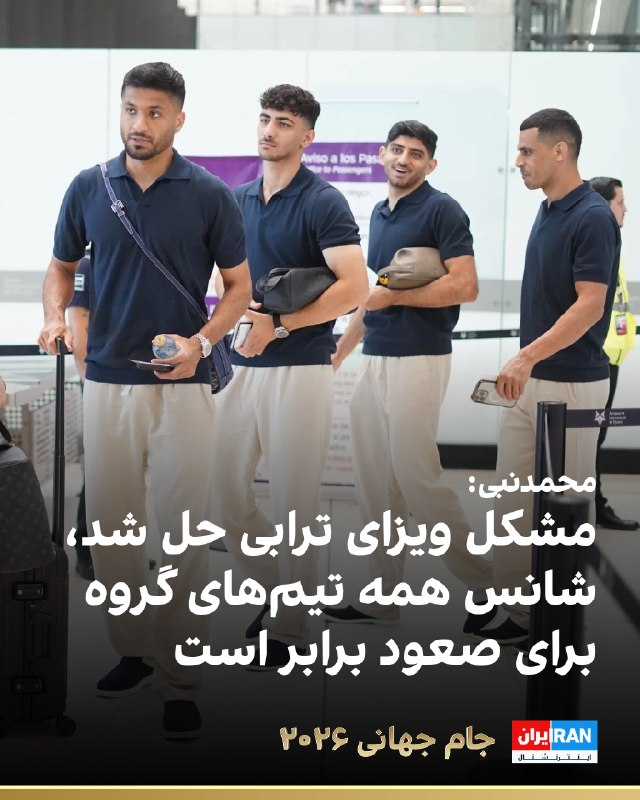

🔻مهدی محمدنبی، نایب رییس فدراسیون فوتبال، درباره آخرین وضعیت تیم ملی ایران پیش از دیدار با بلژیک گفت: «پس از تساوی هر چهار تیم گروه، شرایط جدول از نو آغاز شده و همه تیم‌ها شانس برابری برای صعود دارند.»

🔹او با اشاره به برنامه‌های تیم ملی پس از بازگشت از آمریکا به مکزیک گفت: «بازیکنان پس از رسیدن به تیخوانا استراحت کردند و یک جلسه ریکاوری نیز پشت سر گذاشتند. تمرین امروز تیم ملی در زمین اصلی کمپ تیخوانا برگزار خواهد شد.»

🔹محمدنبی درباره مشکلات ویزای اعضای تیم ملی نیز توضیح داد: «بازیکنان و کادر فنی هیچ مشکلی از نظر ویزا ندارند. تنها ویزای مهدی ترابی به صورت یک‌بار ورود صادر شده بود که این مشکل روز گذشته برطرف شد. درخواست کرده‌ایم تیم ملی دو روز زودتر در محل برگزاری مسابقه حاضر شود و در حال رایزنی برای دریافت مجوزهای لازم هستیم. در غیر این صورت، مانند دیدار نخست یک روز پیش از مسابقه راهی آمریکا خواهیم شد و پس از پایان بازی دوباره به مکزیک بازمی‌گردیم.»

🔹جزییات بیشتر را در سایت بخوانید

@iranintltvsport

## IranIntlTV — post 343217

خبرگزاری تسنیم، وابسته به سپاه پاسداران، با اشاره به ادامه حملات ارتش اسرائیل به جنوب لبنان، نوشت: «هر دقیقه باز بودن تنگه هرمز خسارت مهمی است؛ اگر آمریکا فشار انرژی را از روی خود تخلیه کند، وقیح‌تر و تهاجمی‌تر هم خواهد شد.»

این رسانه وابسته به سپاه در ادامه خطاب به مقام‌های جمهوری اسلامی نوشت: «تنگه را ببندید و آمریکا را در همین گام اول مهار کنید.»

تسنیم افزود: «آیا نباید مسولان فی‌الفور به اجرای تفاهمنامه پایان دهند و تنگه هرمز را مسدود کنند؟ آیا نباید پاسخ قدرتمندی به آمریکا و اسرائیل داده شود تا محاسباتشان بیش از این به ضرر جمهوری اسلامی و مقاومت نشود؟»
https://iranintl.com/202606195031

## IranIntlTV — post 343216

  <a href="telegram/content/IranIntlTV_343216_1781880841.mp4" target="_blank">🎬 Download video</a>

محمد انجوی‌نژاد، مداح و سخنران حکومتی، پیام مجتبی خامنه‌ای درباره تفاهم با آمریکا را «تلخ» خواند. او با اشاره به خاک‌سپاری نشدن پیکر علی خامنه‌ای پس از بیش از ۱۰۰ روز از کشته شدن او گفت: «آقا را غریب و پیر زیر آوار بمباران رها کردید، این یکی را نمی‌گذاریم.»
@iranintltv

## IranIntlTV — post 343215

  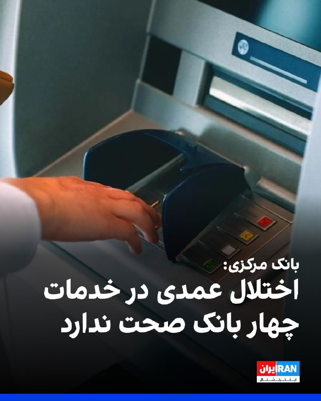

بانک مرکزی جمهوری اسلامی اعلام کرد که اختلال در خدمات بانک‌های ملی، صادرات، تجارت و توسعه صادرات در پی حمله سایبری به زیرساخت‌های ارتباطی این بانک‌ها رخ داده است و خدمات پایه مبتنی بر کارت با استفاده از روش‌های جایگزین دوباره در دسترس مشتریان قرار گرفته است.

بر اساس گزارش بانک مرکزی جمهوری اسلامی، هیچ آسیبی به اطلاعات مشتریان وارد نشده و سامانه‌های شتاب و شاپرک بدون اختلال فعال هستند.

این نهاد گزارش‌ها درباره ایجاد اختلال در سامانه‌های بانکی برای کنترل بازار ارز و طلا را رد کرد.
https://iranintl.com/202606195086

## IranIntlTV — post 343214

  <a href="telegram/content/IranIntlTV_343214_1781880843.mp4" target="_blank">🎬 Download video</a>

سرخط خبرهای جمعه ۲۹ خرداد
@iranintltv

## IranIntlTV — post 343213

  <a href="telegram/content/IranIntlTV_343213_1781880844.mp4" target="_blank">🎬 Download video</a>

صدور حکم ۷۴ ضربه شلاق تعزیری، دو سال ممنوع‌الخروجی و دو سال محرومیت از فعالیت هنری برای پرستو احمدی و هشت نفر از نوازندگان و عوامل کنسرت کاروانسرا، موجی از خشم و اندوه را در شبکه‌های اجتماعی برانگیخته است. بسیاری از کاربران این احکام را نشانه تشدید فشار بر هنرمندان و محدودیت بیشتر آزادی‌های فرهنگی در ایران توصیف کرده‌اند.

آیه دریس، عضو تحریریه ایران‌اینترنشنال، از واکنش کاربران می‌گوید
@iranintltv

## IranIntlTV — post 343212

  

سخنگوی ارتش اسرائیل در کنفرانس خبری اعلام کرد: «از شب گذشته تاکنون به بیش از ۱۰۰ هدف حزب‌الله حمله کرده‌ایم و این حملات را تا هر زمان که لازم باشد، ادامه خواهیم داد.»

او افزود: «در منطقه بفور، یک زیرساخت راهبردی زیرزمینی وجود دارد. در هر یک از محورهایی که در آن فعالیت می‌کنیم، مقادیر زیادی سلاح و تجهیزات جنگی کشف و خارج می‌کنیم. این زیرساخت‌های مهم طی سال‌ها با کمک و هدایت جمهوری اسلامی ساخته شده‌اند.»

سخنگوی ارتش اسرائیل ادامه داد: «حزب‌الله در حال جنگ است تا مانع تکمیل روند نابودی زیرساخت‌های خود شود. این حزب‌الله بود که آتش‌بس را نقض کرد. نیروهای حاضر در میدان از آزادی عمل عملیاتی کامل برخوردار هستند. دستورالعمل‌های رییس ستاد ارتش برای جبهه شمالی تغییری نکرده است.»

او افزود: «هر آنچه مربوط به توافق‌هاست، در سطح تصمیم‌گیری سیاسی است. این موضوع در سطح رهبری سیاسی تعیین می‌شود و ما طبق دستورات عمل می‌کنیم. تا زمانی که دستورات دیگری دریافت نکنیم، طبق دستورالعمل‌هایی که رییس ستاد کل ارتش به نیروهای میدانی ابلاغ کرده، به فعالیت ادامه خواهیم داد.»
https://iranintl.com/202606198362

## IranIntlTV — post 343211

  

رسول فلاحتی، امام جمعه رشت در خطبه‌های نماز جمعه این شهر گفت: «اسرائیل بداند که اگر بعد از عدم حمایت آمریکا، دست از پا خطا کند، کل تل‌آویو و حیفا با خاک یکسان خواهد شد. ما از ۳۰ درصد توان نظامی خود استفاده کرده‌ایم و نیروهای مسلح ما اعم از سپاه و ارتش، از همه زمان‌های گذشته قوی‌تر شده‌اند.»

او ادامه داد: «مسعود پزشکیان تعهد کرده که حقوق ملت ایران و جبهه مقاومت حفظ شود و از حزب‌الله، انصارالله، حشد الشعبی و حماس حمایت کنیم.»
https://iranintl.com/202606195261

## IranIntlTV — post 343210

🔻‌یلدا رشتیان، خواهر جاویدنام صهبا رشتیان، انیماتور و کمک‌داور فوتبال، با انتشار ویدیویی به مناسبت سالروز تولد خواهرش در صفحه اینستاگرام خود نوشت: «۳۰ام تولدته ،نیستی صهبا. نیستی ببینی چه شکلی شدم. ببخشید خواهر خوبی نبودم برات. ببخشید سال پیش تولدت جنگ شد نشد کاری بکنم برات. ببخشید من یه روزی از تو بزرگ تر میشم.»

🔹جاویدنام صهبا رشتیان، ۲۳ ساله در جریان انقلاب ملی ایرانیان علیه جمهوری اسلامی، در اعتراضات شهر اصفهان در روز جمعه ١٩ دی ۱۴۰۴، به دست نیروهای سرکوب، کشته و پیکر او پنجشنبە ۲۵ دی، به خاک سپرده شد.

🔹رویای صهبا این بود که روزی در بزرگ‌ترین رویداد فوتبال جهان، جام جهانی، داوری کند؛ رویایی که هرگز فرصت تحقق نیافت.

@iranintltvsport

## IranIntlTV — post 343209

  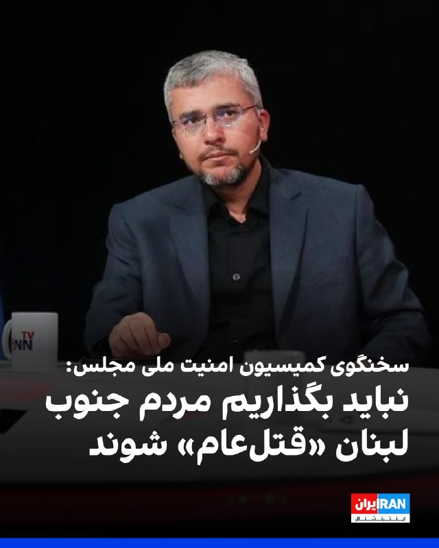

ابراهیم رضایی، سخنگوی کمیسیون امنیت ملی مجلس، در شبکه ایکس نوشت که با توجه به پیام «رهبر» که به «جبهه مقاومت» اشاره داشت، دولت باید از همین الان و از لبنان شروع کند و نگذاریم مردم مقاوم جنوب لبنان «قتل‌عام» شوند.

پیش‌تر مجتبی خامنه‌ای در پیامی مکتوب، اعلام کرد که درباره تفاهم جمهوری اسلامی و آمریکا «من نظر دیگری داشتم»، اما با «قبول مسئولیت» از سوی مسعود پزشکیان، اجازه اجرای آن را صادر کرده است.
https://iranintl.com/202606199736

## Shin_Persian — post 7133

Emanuel (Mannie) Fabian ✓ @manniefabian
Fri, 19 Jun 2026 13:21:16 UTC

The IDF says it has struck over 150 Hezbollah targets in Lebanon since midnight.

ترجمه خودکار فارسی

ارتش دفاعی اسرائیل (IDF) می‌گوید از نیمه‌شب تاکنون بیش از ۱۵۰ هدف حزب‌الله را در لبنان مورد حمله قرار داده است.

𝕏 · @shin_persian

## Shin_Persian — post 7132

Emanuel (Mannie) Fabian ✓ @manniefabian
Fri, 19 Jun 2026 13:26:07 UTC

IDF Spokesman Brig. Gen. Effie Defrin says Israeli troops have "full freedom of action" to act against any threat, amid a ceasefire with Hezbollah.

He says troops continue to operate at the Beaufort Castle area and Ali Taher ridge, to demolish major Hezbollah tunnel systems which serve as the terror group's "central command centers."

"Hezbollah is fighting a defensive battle to prevent our forces from completing the destruction of these infrastructures," Defrin says.

"Hezbollah is the one that violated the ceasefire. It is trying to defend its capabilities it built over the years," he continues.

Defrin says that troops "have full operational freedom of action, to remove threats in any area."

"There is no limit [concerning] removing threats," he adds.

ترجمه خودکار فارسی

سرتیپ افی دفرین، سخنگوی ارتش دفاعی اسرائیل می‌گوید که نیروهای اسرائیلی در میان برقراری آتش‌بس با حزب‌الله، «آزادی عمل کامل» دارند تا علیه هر تهدیدی اقدام کنند.

او می‌گوید نیروها به عملیات در منطقه قلعه شقیف (بوفورت) و ارتفاعات علی طاهر ادامه می‌دهند تا سیستم‌های تونلی مهم حزب‌الله را که به عنوان «مراکز فرماندهی مرکزی» این گروه تروریستی عمل می‌کنند، تخریب کنند.

دفرین می‌گوید: «حزب‌الله در حال نبرد دفاعی است تا مانع از تکمیل روند نابودی این زیرساخت‌ها توسط نیروهای ما شود.»

او ادامه می‌دهد: «حزب‌الله طرفی است که آتش‌بس را نقض کرده است. او سعی دارد از توانمندی‌هایی که طی سال‌ها ایجاد کرده دفاع کند.»

دفرین می‌گوید که نیروها «آزادی عمل کامل عملیاتی دارند تا تهدیدات را در هر منطقه‌ای برطرف کنند.»

وی می‌افزاید: «هیچ محدودیتی [در رابطه با] رفع تهدیدات وجود ندارد.»

𝕏 · @shin_persian

## Iliaen — post 4502

پس خبر برقراری آتش‌بس در لبنان از ساعت ۴ عصر و بازگشت دوباره تنگه هرمز به وضعیت تفاهم، سخنگوی وزارت خارجه جمهوری اسلامی، تمام تنش‌های امروز را تکذیب کرد و گفت هیچ مشکلی جهت تردد وجود ندارد.

به عبارت دیگر نه خانی آمده ، نه خانی رفته است!

این در صورتی است که براساس گزارش از یک منبع در سیریک، یک ملوان کشتی در نزدیک تنگه هرمز و اسناد مرتبط به پیام سپاه، این تنش در ساعات ۱۳:۴۰ الی ۱۴:۱۵ امروز جمعه درجهت برقراری آتش‌بس در لبنان ادامه داشت و سپس با دخالت قطر و ایالات متحده، تصمیم بر حل و فصل موضوع بدون رسانه‌ای شدن شد.

@iliaen

## Iliaen — post 4501

  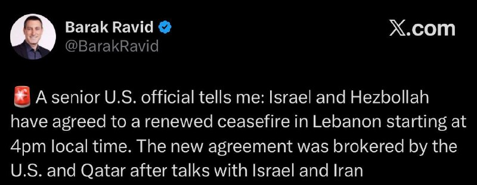

ساعت ۱۳:۴۳ جمعه، براساس گزارش مستقیم از چند کشتی در خلیج فارس، سپاه پاسداران حرکت تمام کشتی‌ها را متوقف کرد و عملاً تنگه هرمز را بست. @iliaen

## FarsiVOA — post 221195

🔺کارشناسان سازمان ملل: توافق آمریکا و جمهوری اسلامی نباید حقوق بشر را نادیده بگیرد

▪️مای ساتو، گزارشگر ویژه سازمان ملل متحد در امور حقوق بشر ایران، به همراه شماری دیگر از کارشناسان مستقل این سازمان هشدار داده است که هرگونه توافق نهایی میان ایالات متحده و جمهوری اسلامی که وضعیت حقوق بشر در ایران را نادیده بگیرد، «اساساً ناقص» خواهد بود.

⬇️ بیشتر بخوانید:
https://ir.voanews.com/a/un-experts-warn-against-rights-free-deal/8162634.html/?nocach=1

## FarsiVOA — post 221194

🔺پرزیدنت ترامپ: رژیم ایران مستاصل بود؛ جنگ آنها را ضعیف کرده است

▪️دونالد ترامپ، رئیس جمهوری آمریکا، روز جمعه ۲۹ خرداد در پیامی در شبکه «تروت سوشال» نوشت: «ما از سر ناچاری با آنها دیدار نکردیم، [بلکه این رژیم] ایران [بود که چنین] کرد.»

⬇️ بیشتر بخوانید:
https://ir.voanews.com/a/iran-us-trump-truth-social-memorandum/8162612.html/?nocach=1

## FarsiVOA — post 221193

  <a href="telegram/content/FarsiVOA_221193_1781880848.mp4" target="_blank">🎬 Download video</a>

فرماندهی مرکزی ارتش آمریکا، سنتکام، ویدیویی از سوخت‌گیری هوایی جنگنده‌های اف-۱۶ در جریان یک گشت‌زنی بر فراز خاورمیانه منتشر کرد.

سنتکام اعلام کرد نیروهای آمریکایی در منطقه همچنان به حضور و نظارت خود ادامه می‌دهند.

@FarsiVOA

## FarsiVOA — post 221192

پیام مجتبی خامنه‌ای درباره تفاهم‌نامه آمریکا و جمهوری اسلامی، ادامه راه پدرش برای ایجاد دوگانه «بیت منزه» و «دولت مقصر» است؟ گفتگو با رضا علیجانی

## FarsiVOA — post 221191

  <a href="telegram/content/FarsiVOA_221191_1781880849.mp4" target="_blank">🎬 Download video</a>

ارتش اسرائیل اعلام کرد در واکنش به آنچه «نقض‌های مکرر آتش‌بس» از سوی حزب‌الله خوانده، بیش از ۸۰ موضع و مقر این گروه را در جنوب لبنان و منطقه بقاع هدف قرار داده است.

ارتش اسرائیل همچنین گفت در این حملات ده‌ها عضو حزب‌الله کشته شده‌اند و چندین مقر فرماندهی، مواضع پرتاب راکت و زیرساخت‌های این گروه هدف قرار گرفته است.

@FarsiVOA

## FarsiVOA — post 221190

نیروهای امنیتی، زنان بلوچ معترض روستای پشموکی شهرستان فاریاب را در مقابل چشمان مردان روستا مورد ضرب و شتم شدید قرار داده‌اند. جزئیات بیشتر در گزارش حمیده آرمیده

## FarsiVOA — post 221189

  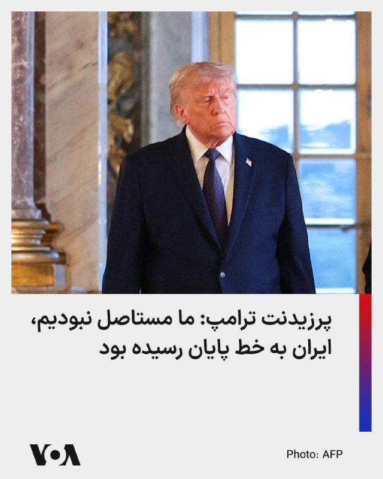

⚡️دونالد ترامپ، رئیس جمهوری آمریکا بار دیگر به انتقادها از تفاهم با جمهوری اسلامی پاسخ داد و گفت: «ما از روی استیصال ملاقات نکردیم، این ایران بود که از روی استیصال چنین کرد. آن‌ها به خط پایان رسیده‌اند.»
پرزیدنت ترامپ در شبکه اجتماعی تروت‌سوشال با اشاره به مهلت درنظر گرفته شده در تفاهم با حکومت ایران نوشت: «ما این ۶۰ روز را ادامه خواهیم داد. آن‌ها هیچ پولی دریافت نخواهند کرد، حتی ده سنت هم نخواهند گرفت!»

## FarsiVOA — post 221188

قالیباف، برای تصاحب قدرت برتر در جمهوری اسلامی چه راه‌هایی را طی کرد و چگونه عملاً نفر اول تصمیم گیرنده در ایران شد؟

## FarsiVOA — post 221187

  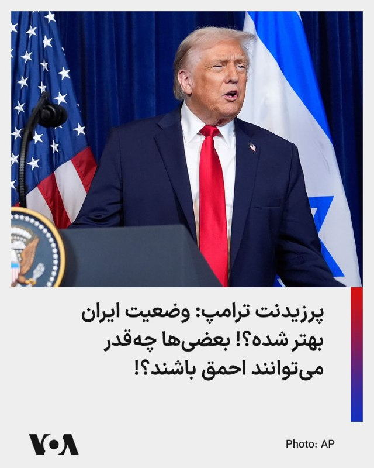

⚡️دونالد ترامپ، رئیس جمهوری آمریکا در پاسخ به انتقادها از تفاهم با جمهوری اسلامی گفت: «جنگ ایران را تضعیف کرده است! این کشور دیگر نیروی هوایی، نیروی دریایی، تجهیزات ضدهوایی، رادار یا عملاً هیچ چیز دیگری ندارد و با این حال دموکرات‌ها می‌گویند که وضعیت ایران اکنون از چهار ماه پیش بهتر است.»
پرزیدنت ترامپ در تروت‌سوشال نوشت: «می‌توانید تصور کنید که چطور چنین حرفی می‌زنند؟؟؟ برخی افراد چقدر می‌توانند احمق باشند؟؟؟»

## FarsiVOA — post 221186

از ورود بدون بلیت تا حاشیه ممنوعیت ورود مهاجم ساحل عاج در گزارش آرش آرا

## FarsiVOA — post 221185

فرماندهی مرکزی ایالات متحده «سنتکام» روز پنجشنبه ۲۸ خرداد اعلام کرد نیروهای آمریکایی به دستور رئیس جمهوری ایالات متحده محاصره دریایی جمهوری اسلامی را پایان داده‌اند.

سنتکام با انتشار بیانیه‌ای در شبکه اجتماعی ایکس اعلام کرد: «امروز نیروهای آمریکا، مطابق دستور رئیس جمهوری، محاصره همه ترددهای دریایی ورودی و خروجی به بندرها و مناطق ساحلی ایران را لغو کردند.»

بر اساس این بیانیه، نیروهای آمریکایی دیگر مانع عبور کشتی‌ها به مقصد یا از مبدأ بندرهای ایران در خلیج فارس و دریای عمان نمی‌شوند و تمامی اقدامات نظامی مرتبط با اجرای این محاصره متوقف شده است.

سنتکام با این حال تأکید کرد که ناوهای نیروی دریایی آمریکا همچنان در منطقه باقی خواهند ماند تا اطمینان حاصل شود که همه مفاد توافق به طور کامل رعایت و اجرا می‌شود.

گزارش کامل را در وب‌سایت صدای آمریکا بخوانید.

@FarsiVOA

## DW_Farsi — post 126188

🔶تمدید یک ساله تحریم‌های روسیه توسط اتحادیه اروپا

یک سخنگوی آنتونیو کوستا، رئیس شورای اروپا، اعلام کرد رهبران کشورهای عضو اتحادیه اروپا شامگاه پنج‌شنبه ۱۸ ژوئن (۲۸ خرداد) در نشستی در بروکسل بر سر تمدید یک ساله تحریم‌ها علیه روسیه موافقت کردند.

اتحادیه اروپا از زمان آغاز حمله نظامی روسیه به اوکراین در سال ۲۰۲۲، اقدامات تنبیهی گسترده‌ای را علیه مسکو اعمال کرده است. این تحریم‌ها به ویژه درآمدهای روسیه از طریق فروش جهانی نفت و سوخت‌های فسیلی، صنعت تسلیحات این کشور و مؤسسات مالی را هدف قرار می‌دهد.

بنا بر گزارش‌ها، متن قانونی تمدید یک ساله تحریم‌ها علیه روسیه در هفته‌های آینده به تصویب شورای وزیران اتحادیه اروپا برسد، هر چند این اقدام بیشتر جنبه تشریفاتی دارد. رهبران اتحادیه اروپا در بیانیه پایانی نشست خود تأکید کرده‌اند که این اتحادیه مصمم است "فشار بر روسیه را همچنان افزایش دهد و اقتصاد جنگی این کشور را بیش از پیش تضعیف کند تا روسیه به جنگ تهاجمی خود پایان داده و به طور جدی وارد مذاکرات صلح شود".

@dw_farsi

## DW_Farsi — post 126187

  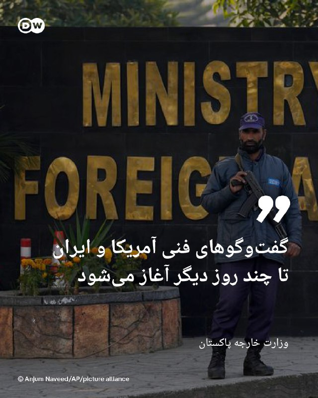

🔶پاکستان: گفت‌وگوهای فنی آمریکا و ایران تا چند روز دیگر آغاز می‌شود

وزارت خارجه پاکستان اعلام کرد گفت‌وگوهای فنی میان ایالات متحده و ایران، با وجود لغو مراسم امضای برنامه‌ریزی‌شده در سوئیس، احتمالا در روزهای آینده آغاز خواهد شد. مقام‌های این وزارتخانه گفته‌اند توافق میان واشنگتن و تهران پیش‌تر امضا شده و اکنون وارد مرحله اجرا شده است.

مقام‌های وزارت خارجه پاکستان گفته‌اند گفت‌وگوهای فنی را نمی‌توان به تعویق انداخت و این مذاکرات احتمالا ظرف چند روز آینده آغاز می‌شود.

به گفته آن‌ها، دور دوم و گسترده‌تر مذاکرات نیز قرار است پس از ماه محرم برگزار شود. این گفت‌وگوها بر اجرای توافق امضاشده و رسیدگی به مسائل فنی و جزئیات میان دو کشور متمرکز خواهد بود.

بر اساس این گزارش، قرار بود توافق در ابتدا در سوئیس به‌طور رسمی توسط جی‌دی ونس، معاون رئیس‌جمهوری آمریکا، محمدباقر قالیباف، رئیس مجلس ایران، و محمد اسحاق‌دار، معاون نخست‌وزیر و وزیر خارجه پاکستان، امضا شود.

@dw_farsi

## DW_Farsi — post 126186

  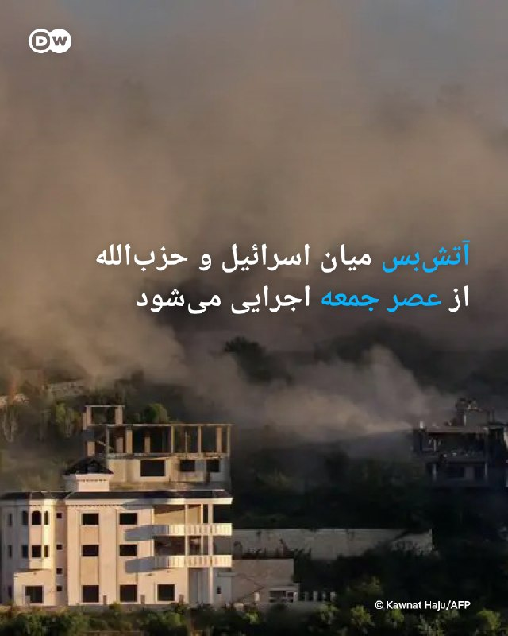

🔶آتش‌بس میان اسرائیل و حزب‌الله از عصر جمعه اجرایی می‌شود

رویترز به نقل از یک مقام ارشد دولت آمریکا گزارش داد اسرائیل و حزب‌الله لبنان بر سر آتش‌بس به توافق رسیده‌اند و قرار است این آتش‌بس از ساعت ۱۶ روز جمعه به وقت محلی آغاز شود. به گفته این مقام آمریکایی، این توافق با میانجیگری آمریکا و قطر و با حمایت ایران تدوین شده است.

این مقام آمریکایی به رویترز گفت پس از تبادل آتش در طول روز، اکنون انتظار می‌رود آتش‌بس میان اسرائیل و حزب‌الله برقرار شود.

او همچنین گفت ایران اصرار داشته است که آتش‌بس میان تهران و واشنگتن، درگیری میان اسرائیل و حزب‌الله را نیز در بر بگیرد و این موضوع بخشی از توافق چارچوبی میان دولت‌های آمریکا و ایران بوده است.

هم‌زمان، اسماعیل بقایی، سخنگوی وزارت امور خارجه جمهوری اسلامی، عملیات‌های "تجاوزکارانه و تروریستی" اسرائیل علیه مناطق مختلف لبنان را به‌شدت محکوم کرد.

@dw_farsi

## DW_Farsi — post 126185

🔶رشد سرطان در ایران به "دو برابر میانگین جهانی" خواهد رسید

دبیر کمیته ملی کنترل و پیشگیری سرطان وزارت بهداشت ایران هشدار داده است که نرخ ابتلا به سرطان تا سال ۱۴۴۰ در کشور به دو برابر میانگین جهانی افزایش خواهد یافت.

به گزارش ایرنا، علی مطلق روز پنج‌شنبه ۲۸ خرداد (۱۹ ژوئن) در مراسمی روند ابتلا به سرطان در ایران را نگران‌کننده توصیف کرده و گفت: «بر اساس پیش‌بینی‌ها، میزان بروز سرطان در ایران بین سال‌های ۲۰۲۰ تا ۲۰۴۰ با افزایش ۱۱۵ درصدی روبه‌رو خواهد شد، در حالی که این رقم در سطح جهان ۶۳ درصد برآورد شده است.»

در سال‌های اخیر کارشناسان بارها هشدار داده‌اند که ایران با یکی از وخیم‌ترین بحران‌های سلامت و معیشت در تاریخ معاصر خود روبروست و فقر مطلق، تورم سه‌رقمی و نبود زیرساخت‌های درمانی مناسب، جامعه را به فاز "بقا محور" سوق داده است. در این میان وقوع دو جنگ در بازه یک ساله و وضعیت ناشی از بحران ایجاد شده و وارد آمدن صدمات به زیرساخت‌ها، موجب شده است تا وضعیت اقتصادی، اجتماعی و بهداشتی کشور بیش از پیش شکننده شود و نگرانی‌ها درباره توان حکومت در تأمین نیازهای اولیه شهروندان و مدیریت پیامدهای انسانی این بحران‌ها افزایش یابد.

@dw_farsi

## DW_Farsi — post 126184

🔶توافق آمریکا و ایران؛ امید و تردید در کوهستان‌های سوئیس

این نخستین بار نیست که اقامتگاه کوهستانی بورگن‌شتوک در سوئیس میزبان رویدادهای تاریخی می‌شود. در طول دهه‌ها، این استراحتگاه کوهستانی پذیرای ستاره‌های موسیقی، رهبران جهان و حتی محل امضای توافق‌های صلح بوده است.

قرار بود هیئت‌های آمریکا و ایران روز جمعه در این محل دیدار کنند؛ دیداری که نقطه اوج هفته‌ای پر فراز و نشیب در عرصه دیپلماسی می‌توانست باشد. هفته‌ای که از عصر یکشنبه ۱۴ ژوئن با پیام دونالد ترامپ، رئیس‌جمهوری آمریکا، در شبکه‌های اجتماعی آغاز شد؛ پیامی که در آن از "کشتی‌های جهان" خواست «موتورهای خود را روشن کنند.»

با وجود اعلام ترامپ مبنی بر دستیابی آمریکا و ایران به یک "توافق صلح"، هیچ جزئیاتی منتشر نشد. رسانه‌های نزدیک به حکومت ایران به تدریج بخش‌هایی از یک تفاهم‌نامه را منتشر کردند و گزارش‌هایی نیز درباره امضای الکترونیکی یک توافق اولیه از سوی دو طرف منتشر شد. ترامپ گفت مراسم امضای "رسمی" روز جمعه ۱۹ ژوئن در سوئیس برگزار خواهد شد.

@dw_farsi

## DW_Farsi — post 126183

  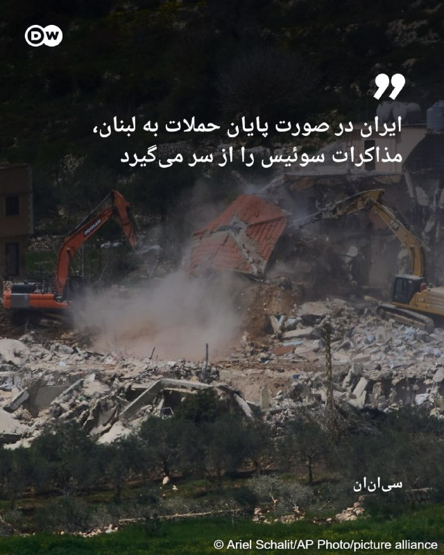

🔶 سی‌ان‌ان: ایران در صورت پایان حملات به لبنان، مذاکرات سوئیس را از سر می‌گیرد

یک دیپلمات مرتبط با موضوع مذاکرات، به سی‌ان‌ان گفته است که جمهوری اسلامی، پیش از ازسرگیری مذاکرات با ایالات متحده در سوئیس، خواستار تضمین‌هایی مبنی بر این شده است که درگیری‌ها در لبنان پایان یابند.

این دیپلمات به سی‌ان‌ان گفته است: «ایرانی‌ها خواستار تضمین‌هایی شده‌اند مبنی بر اینکه درگیری‌ها در لبنان، همان‌طور که در توافق امضاشده مشخص شده، پایان خواهند یافت.»

این منبع همچنین با اشاره به این که "میانجی‌ها در حال حاضر در حال تلاش برای حل این مسئله هستند"، گفته که مذاکرات برنامه‌ریزی‌شده "در پی حملات اسرائیل در لبنان، به طور موقت به تعویق افتاده" است.

این دیپلمات در عین حال به این موضوع اشاره‌ای نکرده است که مذاکرات احتمالا چه زمانی از سر گرفته خواهد شد.

@dw_farsi

## Persian_Trend_Official — post 17587

  <a href="telegram/content/Persian_Trend_Official_17587_1781880852.webm" target="_blank">🎬 Download video</a>

Voice message

## Persian_Trend_Official — post 17586

  <a href="telegram/content/Persian_Trend_Official_17586_1781880852.webm" target="_blank">🎬 Download video</a>

یک مقام آمریکایی به اکسیوس گفت: نتانیاهو 100% با تمدید آتش‌بس در لبنان موافقت کرد.

📝 Amir

📌 @persian_trend_official
پرشین ترند | متفاوت‌ترین کانال نظامی

## Persian_Trend_Official — post 17585

  <a href="telegram/content/Persian_Trend_Official_17585_1781880853.webm" target="_blank">🎬 Download video</a>

نشست امروز جمعه در سوئیس، به روز دیگری موکول شد.

سخنگوی وزارت امور خارجه: طبق متن یادداشت تفاهم، آغاز مذاکرات توافق نهایی منوط به شروع اجرای مفاد بندهای 1، 4، 5، 10 و 1 یادداشت تفاهم و تداوم اجرای آنها است.

یکی از اهداف اصلی نشست سوئیس در روز جمعه، امضای متن تفاهم خاتمه جنگ تحمیلی بود. با توجه به اینکه امضای متن یادداشت تفاهم، در بامداد 28 خرداد به صورت دیجیتالی انجام شد، برگزاری نشست مزبور در سوئیس فوریت ندارد.

در حال برنامه‌ریزی برای برگزاری یک نشست طی روزهای آینده هستیم.

📝 Amir

📌 @persian_trend_official
پرشین ترند | متفاوت‌ترین کانال نظامی

## Persian_Trend_Official — post 17584

  <a href="telegram/content/Persian_Trend_Official_17584_1781880853.webm" target="_blank">🎬 Download video</a>

فعال شدن آژیر حملات موشکی/پهپادی حزب‌الله لبنان به شمار اسرائیل

📝 Amir

📌 @persian_trend_official
پرشین ترند | متفاوت‌ترین کانال نظامی

## Persian_Trend_Official — post 17581

  <a href="telegram/content/Persian_Trend_Official_17581_1781880854.mp4" target="_blank">🎬 Download video</a>

بمباران جنوب لبنان با وجود برقراری آتش بس کماکان ادامه دارد.

ارتش اسرائیل با تایید آتش بس گفته است که برقراری آتش بس مانع از حذف تهدیدها و نابودی زیرساخت ها نمی‌شود.

📝 Amir

📌 @persian_trend_official
پرشین ترند | متفاوت‌ترین کانال نظامی

## Persian_Trend_Official — post 17580

سخنگوی ارتش اسرائیل: حزب‌الله در حال نبردی دفاعی است تا مانع از نابودی کامل این زیرساخت‌ها توسط نیروهای ما شود.

حزب‌الله کسی است که آتش‌بس را نقض کرده است. این گروه در تلاش است تا از قابلیت‌های خود که طی سال‌ها ایجاد کرده است، دفاع کند.

برای من مهم است که این نکته را روشن کنم: نیروهای ما آزادی عمل عملیاتی کامل برای رفع تهدیدات در هر منطقه‌ای دارند.

هیچ محدودیتی در مورد رفع تهدیدات وجود ندارد.

📝 Amir

📌 @persian_trend_official
پرشین ترند | متفاوت‌ترین کانال نظامی

## Persian_Trend_Official — post 17579

‌کانال 12 اسرائیل به نقل از یک مقام ارشد اسرائیلی: آتش‌بس به ما اجازه می‌دهد تا به تخریب زیرساخت‌ها و اقدام علیه تهدیدها ادامه دهیم.

📝 Amir

📌 @persian_trend_official
پرشین ترند | متفاوت‌ترین کانال نظامی

## Persian_Trend_Official — post 17578

ارتش اسرائیل خبر از برقراری آتش بس در جنوب لبنان داد.

بیانیه ارتش اسرائیل: منطقه امنیتی در جنوب لبنان تا 10 کیلومتر امتداد دارد و ما به تقویت نیروهای خود در آنجا ادامه خواهیم داد.

دستورالعمل‌های رئیس ستاد تغییر نکرده است و هیچ محدودیتی برای از بین بردن تهدیدها وجود ندارد. حملات تا زمانی که لازم باشد ادامه خواهد یافت. نیروهای زمینی از آزادی عملیاتی کامل برخوردارند.

ارتش اسرائیل آماده و مهیای بازگشت به عملیات رزمی فشرده در هر عرصه‌ای است. هر چیزی که مربوط به توافقات آتش‌بس باشد، مسئولیت رهبری سیاسی است.

📝 Amir

📌 @persian_trend_official
پرشین ترند | متفاوت‌ترین کانال نظامی

## Persian_Trend_Official — post 17577

  <a href="telegram/content/Persian_Trend_Official_17577_1781880855.webm" target="_blank">🎬 Download video</a>

منابع محلی گزارش میدهند که اسرائیل تنها پنج دقیقه پس از برقراری آتش‌بس هدفی را در نبطیه بمباران کرده.

📝 Amir

📌 @persian_trend_official
پرشین ترند | متفاوت‌ترین کانال نظامی

## Persian_Trend_Official — post 17576

  <a href="telegram/content/Persian_Trend_Official_17576_1781880856.webm" target="_blank">🎬 Download video</a>

تانکر ترکز: ایران در 5 روز گذشته 18 میلیون بشکه نفت به ارزش 1.4 میلیارد دلار از خلیج فارس خارج کرده.

📝 Amir

📌 @persian_trend_official
پرشین ترند | متفاوت‌ترین کانال نظامی

## Persian_Trend_Official — post 17575

یک مقام ارشد اسرائیلی در مصاحبه با کانال 13: ما در حال حاضر در آتش‌بس هستیم اگر حزب‌الله به ما حمله نکند، برای ما زمان جنگ نیست.

نیروهای ارتش اسرائیل در جنوب لبنان باقی می‌مانند و ما آزادی عمل داریم تا علیه تهدیدات نوظهور و تهدیدهایی که نیروها و قلمرو ما را تهدید می‌کند، اقدام کنیم.

📝 Amir

📌 @persian_trend_official
پرشین ترند | متفاوت‌ترین کانال نظامی

## Persian_Trend_Official — post 17574

  <a href="telegram/content/Persian_Trend_Official_17574_1781880856.webm" target="_blank">🎬 Download video</a>

آتش بس در جنوب لبنان! به گزارش رویترز، اسرائیل و حزب‌الله بر سر آتش‌بس توافق کرده‌اند که قرار است امروز از ساعت 4 بعد از ظهر به وقت محلی آغاز شود. یک مقام آمریکایی گفت: حزب‌الله و اسرائیل بر سر آتش‌بس توافق کرده‌اند و افزود که مذاکره‌کنندگانی از ایالات متحده…

## Persian_Trend_Official — post 17573

  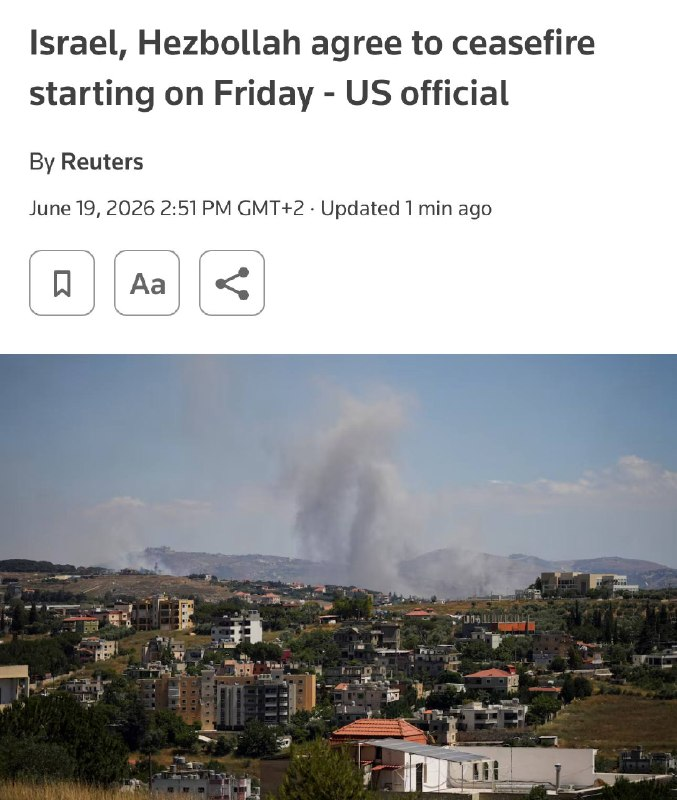

آتش بس در جنوب لبنان!

به گزارش رویترز، اسرائیل و حزب‌الله بر سر آتش‌بس توافق کرده‌اند که قرار است امروز از ساعت 4 بعد از ظهر به وقت محلی آغاز شود.

یک مقام آمریکایی گفت: حزب‌الله و اسرائیل بر سر آتش‌بس توافق کرده‌اند و افزود که مذاکره‌کنندگانی از ایالات متحده و قطر با حمایت ایران به این توافق کمک کردند.

این مقام همچنین گفت: ما می‌دانیم که پس از تبادل آتش در اوایل امروز، اسرائیل و حزب‌الله اکنون در آتش‌بس هستند.

📝 Amir

📌 @persian_trend_official
پرشین ترند | متفاوت‌ترین کانال نظامی

## Persian_Trend_Official — post 17572

  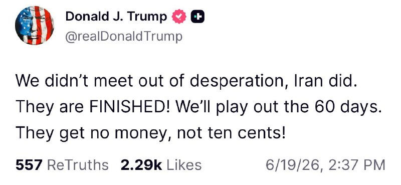

ترامپ در تروث سوشال: ما از روی ناچاری ملاقات نکردیم، ایران این کار را کرد. کار آنها تمام است!

ما این 60 روز را به پایان خواهیم رساند. آنها هیچ پولی دریافت نمی‌کنند، حتی ده سنت!

📝 Amir

📌 @persian_trend_official
پرشین ترند | متفاوت‌ترین کانال نظامی

## Persian_Trend_Official — post 17571

  <a href="telegram/content/Persian_Trend_Official_17571_1781880858.webm" target="_blank">🎬 Download video</a>

ترامپ در تروث سوشال: جنگ ایران را ضعیف کرده است!

دیگر نیروی هوایی، نیروی دریایی، تجهیزات ضد هوایی، رادار یا عملاً هر چیز دیگری ندارد، و با این حال دوموکرات ها می گویند که ایران اکنون نسبت به چهار ماه پیش وضعیت بهتری دارد. آیا می توانید تصور کنید که با آن کنار بیایید؟ بعضیا چقدر میتونن احمق باشن؟؟؟

📝 Amir

📌 @persian_trend_official
پرشین ترند | متفاوت‌ترین کانال نظامی

## Persian_Trend_Official — post 17570

  <a href="telegram/content/Persian_Trend_Official_17570_1781880858.webm" target="_blank">🎬 Download video</a>

🇱🇧 نبطیه: محور استراتژیک شکست یا حفظ مقاومت در جنوب لبنان

🪖 تشدید حملات اسرائیل به جنوب لبنان، با ۱۱۰ حمله از صبح امروز!!!!!!

این تشدید زمانی رخ می‌دهد که اسرائیل استراتژی واضحی را در پی دارد: سقوط نبطیه به‌عنوان درخت سقوط‌های سریالی.

👮‍♂️ محور استراتژیک نبطیه:
نبطیه نه فقط یک شهر نظامی است؛ این عنوان‌شهر حزب‌الله در جنوب لبنان است و نقطه‌ای تاریخی‌تر برای مقاومت. فرماندهی، شبکه‌های لجستیک، و ساختارهای فرماندهی‌مرکزی حزب‌الله در این منطقه متمرکز است. سقوط نبطیه یعنی شکستن محور‌شکن متمرکز تمام ساختار حزب‌الله در جنوب.

منابع ایرانی تأکید می‌کنند که اسرائیل این منطقه را تاکتیک‌ی انتخاب کرده است چون سقوط آن، مانند «دومینو»، باعث فروپاشی ریختبندی شهرهای دیگر — سیدا، صور، و شرق‌منطقه — خواهد شد.

✈️
💣شدت بمباران‌های امروز (۱۱۰ حمله) به‌قدری فراگیر است که کاملاً بعید نیست اسرائیل از این فرصت برای تجاوز به ضاحیه جنوبی بیروت (دایحه، پایگاه‌شهر شیعی و درسراسر ساختار حزب‌الله) استفاده کند. این تجاوز خود می‌تواند نقطه‌شکست در مذاکرات صلح ایران-آمریکا باشد.

اسرائیل درصدد است در یک حرکت استراتژیک، نه‌تنها جنوب لبنان را تسخیر کند بلکه کل ساختار حزب‌الله را به‌عنوان یک نیروی سازمان‌یافته از بین ببرد. نبطیه کلیدی است — اگر سقوط کند، زنجیره‌ای شکست‌های نظامی و سیاسی شروع‌خواهد شد. با وجود توافق ایران-آمریکا (۱۵ ژوئن)، اسرائیل هیچ نشانه‌ای از توقف ندارد. در واقع، تشدید امروز می‌تواند نشانگر تلاش اسرائیل برای به‌دست‌آوردن حداکثر مزایای نظامی پیش از هر فشار دیپلماتیک جدی باشد.

👺Phantom

📌 @persian_trend_official
پرشین ترند | متفاوت‌ترین کانال نظامی

## Persian_Trend_Official — post 17569

  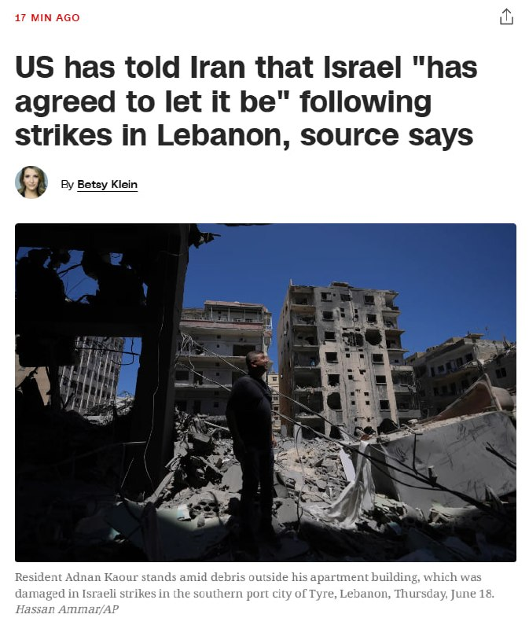

به گزارش CNN، ایالات متحده به ایران اطلاع داده است که اسرائیل حملات خود را در لبنان بیشتر تشدید نخواهد کرد.

یک منبع گفت: حزب‌الله آتش‌بس را نقض کرد. اسرائیل موافقت کرده است که آتش‌بس ادامه یابد، که این موضوع به ایرانی‌ها اطلاع داده شده است، و این به عهده حزب‌الله است که آن را متوقف کند.

📝 Amir

📌 @persian_trend_official
پرشین ترند | متفاوت‌ترین کانال نظامی

## RadioFarda — post 158510

  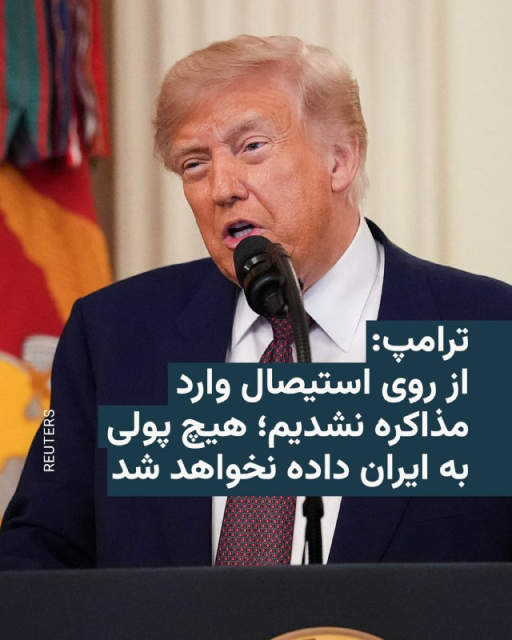

🔸دونالد ترامپ، رئیس جمهور آمریکا روز جمعه با انتشار پیامی در شبکه اجتماعی تروث‌سوشال نوشت که جمهوری اسلامی از موضع ضعف وارد مذاکره با آمریکا شد و در طول مذاکرات هیچ پولی دریافت نخواهد کرد.

🔸به نوشته آقای ترامپ، «ما از سر استیصال وارد مذاکره نشدیم؛ این ایران بود که چنین کرد. آن‌ها تمام شده‌اند.»

🔸او همچنین با اشاره به اینکه دوره ۶۰ روزه اجرای تفاهمنامه ایران و آمریکا را «تا پایان دنبال خواهیم کرد» نوشت که «هیچ پولی به آن‌ها داده نخواهد شد؛ حتی ۱۰ سنت.»

🔸رئیس جمهور آمریکا در پیام دیگری نوشت که جنگ ایران را به شدت تضعیف کرده است و اظهارات پیشین خود مبنی بر از بین رفتن نیروی هوایی، دریایی، پدافند هوایی و شبکه راداری موثر ایران را تکرار کرد.

🔸او همچنین با حمله به نمایندگان دموکرات‌ نوشت آنها با این همه می‌گویند ایران اکنون نسبت به چهار ماه پیش وضعیت بهتری دارد، او در ادامه نوشت: «برخی چقدر می‌توانند احمق باشند؟»

🔸ترامپ پیش‌تر نیز منتقدان توافق با ایران را «حسود یا احمق» خوانده بود. این در حالی است که برخی سیاستمداران حزب جمهوری‌خواه نیز از محتوای تفاهم‌نامه آمریکا و ایران انتقاد کرده‌اند.

@RadioFarda

## RadioFarda — post 158509

  

🔸یک مقام ارشد آمریکایی به رویترز گفت که اسرائیل و حزب‌الله بر سر یک آتش‌بس توافق کرده‌اند که قرار است از ساعت چهار بعدازظهر روز جمعه به وقت محلی آغاز شود.

🔸این مقام که نخواست نامش فاش شود، گفت: «حزب‌الله و اسرائیل بر سر آتش‌بس به توافق رسیده‌اند.» او افزود که مذاکره‌کنندگان آمریکایی و قطری با کمک ایران این توافق را نهایی کرده‌اند.

🔸این مقام همچنین گفت: «درک ما این است که پس از تبادل آتش امروز، اسرائیل و حزب‌الله اکنون در وضعیت آتش‌بس قرار دارند.»

🔸شبکه العربیه نیز به نقل از یک مقام آمریکایی از توافق برای برقراری آتش‌بس بین اسرائیل و حزب‌الله از جمعه خبر داد.

🔸این در حالی است که نخست‌وزیر اسرائیل ساعتی پیش اعلام کرد نیروهای نظامی این کشور تا هر زمان که لازم باشد، در خاک لبنان باقی می‌مانند.

@RadioFarda

## RadioFarda — post 158508

🔸مرضیه آدینه‌زاده، خواهر ابوالفضل آدینه‌زاده، ویدئویی از حضور پدر و مادرش کنار آرامگاه فرزندنشان به مناسبت جشن تولد ۲۱ سالگی او را در صفحۀ اینستاگرام خود منتشر کرده است.

🔸ابوالفضل آدینه‌زاده روز شنبه ۱۶ مهر ۱۴۰۱ در جریان اعتراضات مقابل دانشگاه فردوسی مشهد، در اثر شلیک مستقیم نیروهای حکومتی کشته شد.

@RadioFarda

## RadioFarda — post 158507

🔸رسانه نزدیک به سپاه در پی ادامه درگیری‌ها در لبنان خواستار «لغو کامل» مذاکرات با آمریکا شد 🔸خبرگزاری تسنیم، نزدیک به سپاه پاسداران، در پی ادامه درگیری بین ارتش اسرائیل و حزب‌الله لبنان، خواستار «لغو کامل» همه مذاکرات ایران و آمریکا و بسته شدن تنگه هرمز شد.…

## RadioFarda — post 158506

  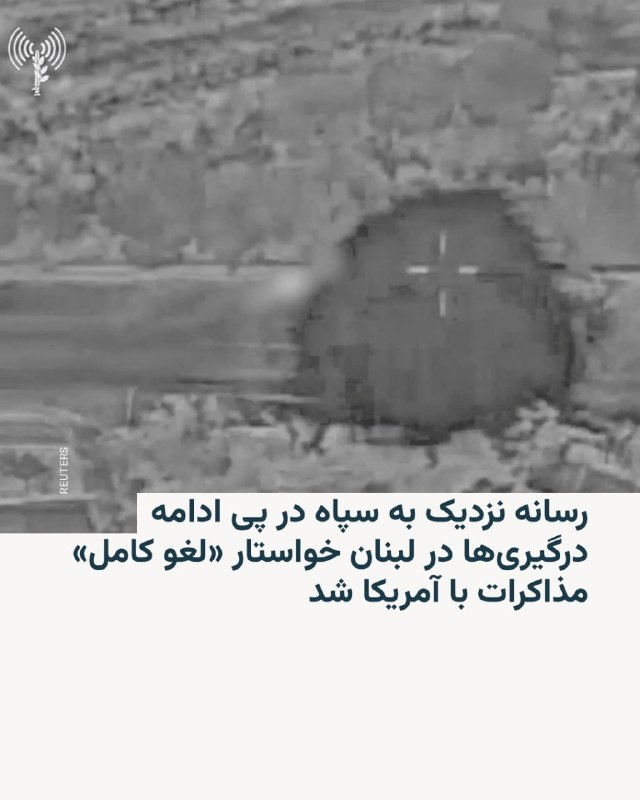

🔸رسانه نزدیک به سپاه در پی ادامه درگیری‌ها در لبنان خواستار «لغو کامل» مذاکرات با آمریکا شد

🔸خبرگزاری تسنیم، نزدیک به سپاه پاسداران، در پی ادامه درگیری بین ارتش اسرائیل و حزب‌الله لبنان، خواستار «لغو کامل» همه مذاکرات ایران و آمریکا و بسته شدن تنگه هرمز شد.

🔸این خبرگزاری روز جمعه نوشت تا زمان توقف حملات اسرائیل و عقب‌نشینی نیروهای نظامی آن از لبنان «تنگه هرمز باید بسته بماند و هر مذاکره آتی به طور کامل لغو شود».

🔸پایان حملات اسرائیل به مواضع حزب‌الله یکی از شرط‌های حمهوری اسلامی در مذاکرات با آمریکا بود و در بند اول تفاهم‌نامه طرفین نیز به «پایان فوری و دائمی عملیات نظامی در تمامی جبهه‌ها، از جمله در لبنان» اشاره شده است.

🔸این در حالی است که درگیری‌ها در لبنان روز جمعه تشدید شده و علاوه بر کشته شدن ۱۸ نفر در لبنان بر اثر حملات اسرائیل، چهار سرباز اسرائیلی نیز در حملات حزب‌الله کشته شدند.

@RadioFarda

## RadioFarda — post 158505

  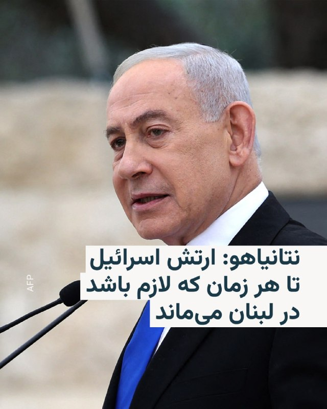

🔸بنیامین نتانیاهو، نخست‌وزیر اسرائیل، روز جمعه بار دیگر گفت که نیروهای اسرائیلی «تا هر زمان که لازم باشد» در لبنان باقی خواهند ماند و وعده داد که حزب‌اللهِ مورد حمایت ایران برای حملاتش «بهای بسیار سنگینی» خواهد پرداخت.

🔸او روز پنجشنبه، ساعاتی بعد از امضای تفاهم‌نامه پایان دادن به جنگ توسط ایران و آمریکا، نیز بر ادامه حضور ارتش اسرائیل در مناطقی از جنوب لبنان تأکید کرده بود.

🔸نتانیاهو در بیانیه روز جمعه که پس از اعلام کشته شدن چهار سرباز اسرائیلی در لبنان از سوی ارتش منتشر شد، گفت: «اسرائیل حمله به سربازان یا قلمرو خود را تحمل نخواهد کرد و بابت این حملات بهای بسیار سنگینی از حزب‌الله خواهد گرفت.»

🔸او افزود: «اسرائیل تا هر زمان که برای حفاظت از جوامع شمالی لازم باشد، در منطقه امنیتی جنوب لبنان باقی خواهد ماند.»

🔸یسرائیل کاتز، وزیر دفاع، نیز گفته بود که ارتش در لبنان خواهد ماند و افزود که به هر حمله‌ای «با نیروی قابل توجه» پاسخ خواهد داد.

🔸لبنان اعلام کرده بر اثر حملات اسرائیل در سراسر این کشور ۱۸ نفر کشته شده‌اند.

@RadioFarda

## RadioFarda — post 158504

🔸ویدئویی که هاجر نادری، مادر متین پرویزی، در صفحۀ شخصی خود منتشر کرده است او را در کنار آرامگاه پسرش نشان می‌دهد که می‌گوید «من به پسرم فقط یاحسین و تشنگی را یاد ندادم، به او یاد دادم که جلوی حرف زور بایستد»

🔸خانم نادری در ادامه با شرح کشته شدن فرزندش در اعتراضات ۱۸ دی‌ماه می‌گوید امسال محرم برای فرزندان میهن که «ناجوانمردانه کشته شدند» عزاداری خواهد کرد و ادامه می‌دهد که «می‌دانم امام حسین هم برای این جوانان عزاداری خواهد کرد»

🔸متین پرویزی ۱۸ دی‌ماه سال گذشته در سبزه‌میدان زنجان با شلیک گلوله جنگی نیروهای حکومتی به سرش کشته شد.

@RadioFarda

## IranianMinds — post 22953

  <a href="telegram/content/IranianMinds_22953_1781880861.mp4" target="_blank">🎬 Download video</a>

🔴این دیگه چیه؟ شیر هست؟ واجبی بهش زدن؟

@IranianMinds

## IranianMinds — post 22952

‏🔴 اسماعیل بقایی، سخنگوی وزارت خارجه جمهوری اسلامی: نشست برنامه‌ریزی‌شده جمعه ۲۹ خرداد در سوئیس به زمان دیگری موکول شده است

@IranianMinds

## IranianMinds — post 22951

  <a href="telegram/content/IranianMinds_22951_1781880863.mp4" target="_blank">🎬 Download video</a>

🔴 مقام ارشد آمریکایی به رویترز: اسرائیل و حزب‌الله توافق کردند که مجدد آتش‌بس از ساعت ۴ بعدازظهر روز جمعه به وقت محلی برقرار شود. @IranianMinds

## IranianMinds — post 22950

  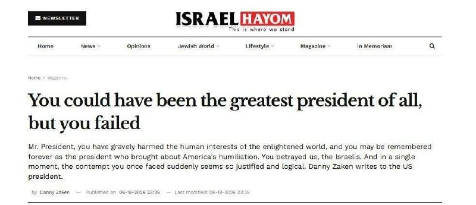

🔴 روزنامه اسرائیل هیوم به ترامپ :

آقای ترامپ میتونسی بهترین رئیس جمهور تاریخ باشی ولی خرابش کردی ، تو‌ به اسرائیل و به همه خیانت کردی.

@IranianMinds

## IranianMinds — post 22949

🔴 از همین الان مجدد به طور رسمی بین حزب الله و اسرائیل آتش بس برقرار شد. @IranianMinds

## IranianMinds — post 22948

🔴 مقام ارشد آمریکایی به رویترز: اسرائیل و حزب‌الله توافق کردند که مجدد آتش‌بس از ساعت ۴ بعدازظهر روز جمعه به وقت محلی برقرار شود. @IranianMinds

## IranianMinds — post 22947

  <a href="telegram/content/IranianMinds_22947_1781880866.mp4" target="_blank">🎬 Download video</a>

🔴پست جدید ترامپ.

@IranianMinds

## IranianMinds — post 22946

🔴 مقام ارشد آمریکایی به رویترز:

اسرائیل و حزب‌الله توافق کردند که مجدد آتش‌بس از ساعت ۴ بعدازظهر روز جمعه به وقت محلی برقرار شود.

@IranianMinds

## IranianMinds — post 22945

  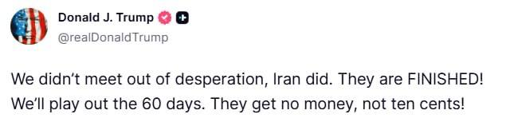

🔴 ترامپ:

ما از روی ناچاری باهم دیدار نکردیم، این کار ایران بود.

اونا تموم شدن!
ما این ۶۰ روز رو می‌گذرونیم.
اونا هیچ پولی نمی‌گیرن، حتی ده سنت هم نه!

@IranianMinds

## IranianMinds — post 22944

  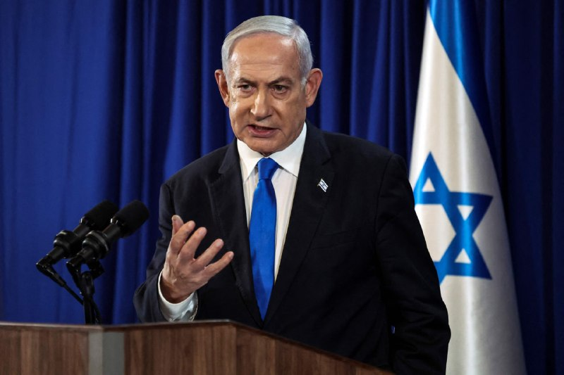

🔴 نتانیاهو:

اسرائیل هیچ حمله‌ای به سربازان یا خاک خودش رو تحمل نمی‌کنه و از حزب‌الله بابت چنین حملاتی قیمت خیلی سنگینی خواهد گرفت.

ارتش اسرائیل برای خنثی کردن هر تهدیدی علیه نیروهای ما و خاک ما اقدام خواهد کرد.

همون‌طور که قبلاً هم به طور قاطع گفتم، از جمله دیروز: اسرائیل تا هر زمان که لازم باشه در منطقه جنوب لبنان باقی خواهد ماند تا از جوامع شمال اسرائیل حفاظت کند.

@IranianMinds

## IranianMinds — post 22943

  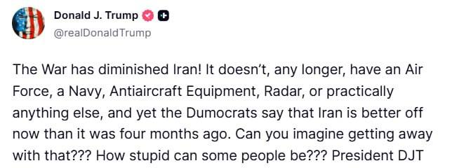

🔴 ترامپ:

جنگ ایران رو کاملاً له و لورده کرد!
دیگه نه نیروی هوایی داره، نه نیروی دریایی، نه سیستم پدافند هوایی، نه رادار، نه عملاً هیچی دیگه…

با این حال دموکرات ‌های احمق می‌گن ایران الان نسبت به چهار ماه پیش بهتر شده!

تصور میکنین بتونن این دروغ رو بگن و رد بشن؟؟

@IranianMinds

## IranianMinds — post 22942

🔴بعد از حملات ارتش اسرائیل به بیش از ۸۰ نقاط در جنوب لبنان:

ایالات متحده آمریکا به جمهوری اسلامی خبر داد که اسرائیل دیگه تنش‌هارو تشدید نمی‌کنه.

یعنی گفتیم یکمی کمتر بزنه😂

@IranianMinds

## BBCPersian — post 284402

  <a href="telegram/content/BBCPersian_284402_1781880869.mp4" target="_blank">🎬 Download video</a>

مسکو دیروز ۲۸ خرداد (۱۸ ژوئن) هدف بزرگ‌ترین حمله هوایی اوکراین، از زمان آغاز جنگ تا کنون قرار گرفت.
 بر اثر این حمله پالایشگاه نفت مسکو آتش گرفت و ستون‌های عظیم دود به آسمان بلند شد.
 
وزارت دفاع روسیه اعلام کرد که در طول ۲۴ ساعت، تقریباً هزار پهپاد و چهار موشک کروز اوکراین را در سراسر این کشور رهگیری و منهدم کرده است.
 مقامات اوکراین هم گفتند این حمله پاسخی به حمله روسیه به یک صومعه تاریخی در کی‌یف بود که ۱۵ ژوئن صورت گرفته بود.
 
ساکنان جنوب ‌شرق مسکو به بی‌بی‌سی گفتند که در پی انفجار پالایشگاه، بارانی ریز، لکه‌های «سیاه و ناخوشایند» روی لباس‌هایشان برجای گذاشته است، در صورتی که مقامات مسکو بارش هرگونه «باران نفتی» را رد کردند.
  
سرگی لاوروف وزیر خارجه روسیه در واکنش به این حمله گفت که حملات تلافی‌حویانه به اوکراین «در مقیاسی گسترده» انجام خواهد شد و افزود که «مدت‌هاست قانع شده که حرف به‌تنهایی کافی نیست».

@bbcpersian

## BBCPersian — post 284401

🔻بورگن‌اشتوک سوئیس در انتظار مذاکراتی که آغاز نشد,باران عباسی، خبرنگار اعزامی بی‌بی‌سی به سوئیس

با وجود تعویق مذاکرات ایران و آمریکا، تدابیر امنیتی همچنان در اطراف هتل بورگن‌اشتوک در مرکز سوئیس برقرار است؛ جایی که قرار بود امروز هیئت‌های دو کشور اولین دور از گفتگوها بعد از امضای تفاهم‌نامه پایان جنگ را آغاز کنند.

پلیس همچنان در ورودی‌های این اقامتگاه مجلل مستقر است و مقام‌های سوئیسی می‌گویند آمادگی خود را برای میزبانی مذاکرات حفظ کرده‌اند و مقدمات برگزاری آن همچنان ادامه دارد.

کاخ سفید علت تعویق را «مسائل تدارکاتی» عنوان کرده و در پی آن، سفر جی‌دی ونس، معاون رئیس‌جمهوری آمریکا، به سوئیس نیز لغو شد. اما هم‌زمانی این تصمیم با تشدید دوباره درگیری‌ها در لبنان، گمانه‌زنی‌هایی را درباره ارتباط این دو رویداد به وجود آورد.

بر اساس متن توافق اولیه ایران و آمریکا، آتش‌بس باید در همه جبهه‌ها، از جمله لبنان، برقرار شود و راه را برای آغاز مذاکرات درباره برنامه هسته‌ای ایران هموار کند. اما تشدید درگیری‌ها در لبنان، آینده این روند را با ابهام روبه‌رو کرده است.

حالا یک مقام آمریکایی می‌گوید اسرائیل و حزب‌الله بر سر برقراری آتش‌بس به توافق رسیده‌اند؛ موضوعی که می‌تواند زمینه را برای ازسرگیری مذاکرات فراهم کند. اما فعلاً در بورگن‌اشتوک، اتاق‌های مذاکره همچنان خالی مانده‌اند؛ نشانه‌ای دیگر از اینکه رسیدن به یک توافق نهایی در مهلت شصت‌روزه‌ای که ایران و آمریکا تعیین کرده‌اند، با توجه به پیچیدگی پرونده هسته‌ای و تنش‌های منطقه‌ای، بسیار بلندپروازانه به نظر می‌رسد.

https://bbc.in/4vgfIJP
@BBCPersian

## BBCPersian — post 284391

🔻مراسم تشییع و سوزاندن جسد مرجان ساتراپی، نویسنده، کارتونیست و کارگردان فرانسوی-ایرانی و خالق «پرسپولیس»، روز جمعه ۲۹ خرداد/۱۹ ژوئن در گورستان پرلاشز پاریس برگزار شد. به درخواست خود او، ترانه «Big Jet Plane» اثر آنگوس و جولیا استون در این مراسم پخش شد و متن آن نیز میان حاضران توزیع شد.

به درخواست خود او، ترانه «Big Jet Plane» اثر آنگوس و جولیا استون در این مراسم پخش شد و متن آن نیز میان حاضران توزیع شد.

خانواده، دوستان و شماری از چهره‌های فرهنگی و هنری در مراسم وداع با مرجان ساتراپی حضور داشتند. پدر و مادر او نیز در مراسم سوزاندن جسد دخترشان در کوره جسدسوزی گورستان پرلاشز شرکت کردند.

خانم ساتراپی در ۵۶ سالگی درگذشت.

در بیانیه‌ای که خانواده خانم ساتراپی بلافاصله پس از مرگ او به به خبرگزاری فرانسه ارسال کردند، نوشته شده بود که «مرجان کمی بیش از یک سال پس از مرگ ماتیاس ریپا، همسر و عشق زندگی‌اش، از شدت اندوه درگذشت.»

در هفته‌های گذشته، چهره‌های فرهنگی و سیاسی در فرانسه و دیگر کشورها با انتشار پیام‌هایی از نقش او در ادبیات، سینما و دفاع از آزادی بیان و حقوق زنان تجلیل کرده‌اند.

📷Getty/Reuters
@BBCPersian

## BBCPersian — post 284390

🔻پلیس فرانسه: به دلیل احتمال درگیری، تجمع اعتراضی هواداران سازمان مجاهدین خلق را لغو کردیم

همانطور که قبلا به اطلاع رساندیم پلیس فرانسه تجمعی را که قرار بود فردا توسط هواداران سازمان مجاهدین خلق برگزارشود، لغو کرد.

اکنون پلیس فرانسه گفته است که به دلیل «احتمال درگیری» این تجمع را ممنوع کرده است. این در حالی است که برگزار‌کنندگان می‌گویند که این تصمیم به دلایل «بی‌اساس» گرفته شده است.

شورای ملی مقاومت، عنوان شاخه سیاسی سازمان مجاهدین خلق، گفته است که این تجمع اعتراضی که قرار بود فردا علیه «موج اعدام‌ها» در ایران برگزار شود، دیروز پس از ساعات اداری و از سوی پلیس پاریس لغو شد.

پلیس در مورد لغو این تجمع گفته است: «در شرایط کنونی که وضعیت در داخل و در جهان تنش‌آلود است، خطر جدی وجود دارد که در جریان این تجمع، میان فعالانی که دیدگاه‌های مخالف دارند درگیری رخ دهد؛ درگیری‌ای که می‌تواند نظم عمومی را به‌شدت مختل کند.»

پلیس همچنین گفته است که محل تجمع و مسیر راهپیمایی برنامه‌ریزی‌شده از «نزدیکی چند ساختمان دولتی و نمایندگی‌های دیپلماتیک» عبور می‌کرد.

برگزارکنندگان که برای لغو این ممنوعیت شکایت اضطراری ثبت کرده‌اند، گفته‌اند این تصمیم ممکن است به تماس تلفنی میان وزیران خارجه فرانسه و ایران در چند ساعت پیش از لغو ناگهانی تجمع در شامگاه پنج‌شنبه مرتبط باشد.

با این حال، وزارت امور خارجه فرانسه اعلام کرد که ژان‌نوئل بارو، وزیر خارجه، در تماس تلفنی که با آقای عراقچی داشته است، «هیچ اشاره‌ای به این تجمع نکرده و درخواست لغو آن هم مطرح نشده است.»

شورای ملی مقاومت ایران، شاخه سیاسی سازمان مجاهدین خلق ایران است که از سوی جمهوری اسلامی ایران به عنوان گروه «تروریستی» علام شده است.

این گروه پیش‌ترهم تجمعات متعددی در پاریس برگزار کرده بود و در ماه‌های اخیر در جریان اعتراضات ضد دولتی در ایران و همچنین جنگ آمریکا و اسرائیل علیه ایران، فعالیت داشته است.

برگزارکنندگان انتظار داشتند حدود ۱۰۰ هزار نفر در این تجمع که در اعتراض به موج اعدام ها برگزار می‌شد، شرکت کنند.

گروه‌های حقوق بشری گفته‌اند که از آغاز جنگ تاکنون بیش از ۴۰ نفر در ایران اعدام شده‌اند؛ افرادی که بسیاری از آن‌ها به اعتراضات پیش از جنگ مرتبط بوده‌اند.

همچنین دست‌کم دوازده مرد اخیرا به اتهام ارتباط با گروه‌های «ممنوعه مخالف»، از جمله مجاهدین خلق و همچنین گروه‌های کرد و بلوچ سنی، اعدام شده‌اند.

@BBCPersian

## BBCPersian — post 284388

  <a href="https://t.me/bbcpersian/284388" target="_blank">📎 Download file</a>

📎 Document

## BBCPersian — post 284378

🖊جرمی بوئن, سردبیر بین‌الملل بی‌بی‌سی

یادداشت تفاهمی که دونالد ترامپ، رئیس جمهور آمریکا و مسعود پزشکیان، رئیس جمهور ایران امضا کرده‌اند، پیامدهای سیاسی، نظامی و اقتصادی تصمیم نسنجیده حمله به ایران در ۲۸ فوریه را تشریح می‌کند.

هزینه انسانی این جنگ از هم‌ اکنون روشن است. هزاران نفر که بسیاری از آنان غیرنظامی بوده‌اند، در ایران و لبنان کشته شده‌اند.

آمریکا، و در نتیجه اسرائیل، متحمل یک شکست راهبردی شده‌اند. حکومت تهران با بدترین کابوس خود روبه‌رو شد: یک عملیات نظامی مشترک برای فلج کردن یا نابودی آن به دست آمریکا، قدرتمندترین قدرت جهان، و اسرائیل، ابرقدرت خاورمیانه. این حکومت نه‌ تنها دوام آورده، بلکه قدرت بیشتری نیز پیدا کرده است.

راهبرد ایران برای بستن تنگه هرمز و در نتیجه متوقف کردن یک پنجم عرضه جهانی نفت و گاز و همچنین دیگر اجزای حیاتی اقتصاد جهانی، دونالد ترامپ را وادار کرده است با مجموعه‌ای از امتیازها موافقت کند. امتیازهایی که خشم و نگرانی تندروهای ضدایرانی آمریکا و دولت اسرائیل را برانگیخته است.

مطلب کامل🔽
https://bbc.in/4uJP7nq
📷Getty/ Reuters/ EPA
@BBCPersian

## idfinfarsi — post 11861

🔴بیش از ۱۵۰ حمله ارتش اسرائیل در لبنان از نیمه‌شب تاکنون

## Dirty_Kids — post 392581

  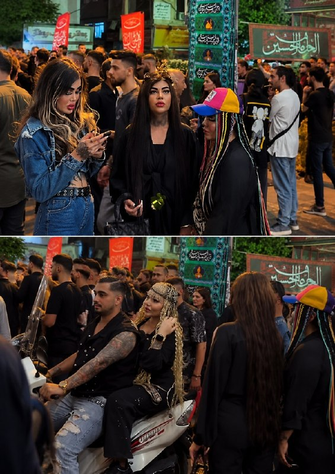

‏امام حسین همه‌ی جنـــــده‌هاشو فرا خوانده:))

قبلاً تو هیئت هاشون شیر میبردن الان پلنگ میبرن

@Dirty_Kids 👻

## Dirty_Kids — post 392580

  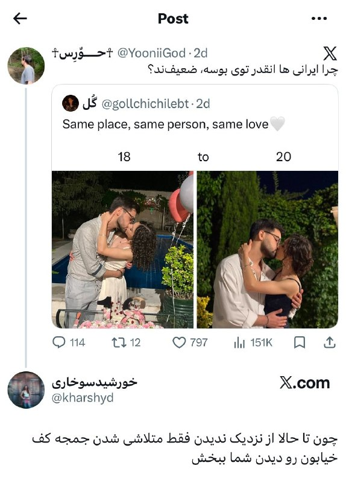

‏یه چیزی گفت که تا ابد می‌تونم بشینم گریه کنم براش.
پ.ن: اکانت حورس سایبریه.

@Dirty_Kids 👻

## Dirty_Kids — post 392579

  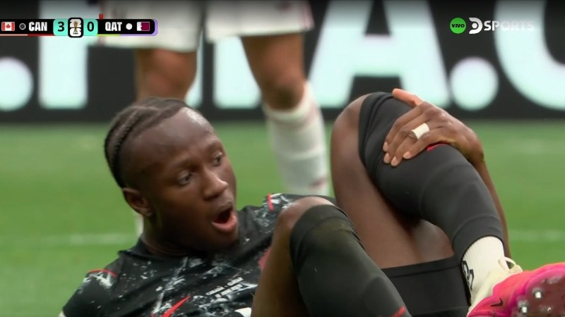

بیچاره هی پاش رو نگاه می‌کرد باورش نمی‌شد چی داره میبینه.

(بهترین بازیکن کانادا)

@Dirty_Kids 👻

## Dirty_Kids — post 392578

  

فکر کنم تا الآن هر سریالی از اپل دیدم خوب بوده!
حتماً ببینید این سریال رو، یه کمدی متفاوت و خوش‌ساخت. عااااالیه! حتی فیلمبرداریش هم فوق‌العاده‌س

@Dirty_Kids 👻

## Dirty_Kids — post 392577

‏جنگ اوکراین توی شش ماه اینده به نقطه جالبی میرسه

مرده و زنده پوتین رو اینها یکی کردند.

بخش گاز و پالایشگاهی روسیه رو به فلاکت خواهند دراورد.
زلنسکی واقعا تو کی بودی،تا الان هم ۳۵۰ هزار سرباز روس کشته!
همین کسی که ارزشیا بهش میگن دلقک!

@Dirty_Kids 👻

## Dirty_Kids — post 392576

  <a href="telegram/content/Dirty_Kids_392576_1781880873.mp4" target="_blank">🎬 Download video</a>

این کلیپ تو 2 روز، 250 میلیون بازدید خورده. خدا بیامرزتت داداش.

@Dirty_Kids 👻

## Dirty_Kids — post 392575

  <a href="telegram/content/Dirty_Kids_392575_1781880874.mp4" target="_blank">🎬 Download video</a>

چند روز پیش توی مشهد یه بارون سنگین اومد، حالا این کلیپ از وضعیت کاسبای بازار رضا خیلی وایرال شده😂

@Dirty_Kids 👻

## Dirty_Kids — post 392574

  <a href="telegram/content/Dirty_Kids_392574_1781880875.mp4" target="_blank">🎬 Download video</a>

🔴 یک با یک برابر نیست، باباهه برای تولد دختر ۱۵ سالش، سانتافه خریده...

@Dirty_Kids 👻

## Dirty_Kids — post 392573

  

کاندوم مناسب این شبا:

@Dirty_Kids 👻

## Dirty_Kids — post 392572

  <a href="telegram/content/Dirty_Kids_392572_1781880876.mp4" target="_blank">🎬 Download video</a>

کیووت ترین ویدیویی که امروز میبینی

@Dirty_Kids 👻

## Dirty_Kids — post 392571

  <a href="telegram/content/Dirty_Kids_392571_1781880877.mp4" target="_blank">🎬 Download video</a>

عزاداری❌ کارناوال بیرون ریختن کون برای دریافت شماره✅

@Dirty_Kids 👻

## Hranews — post 113724

اموال شماری از شهروندان در استان کرمان توقیف شد

❗️
❗️
❗️
❗️
❗️– رئیس کل دادگستری استان کرمان از شناسایی و توقیف اموال شماری از شهروندان در این استان به دلیل آنچه همکاری در اقدامات علیه امنیت ملی عنوان کرده است، خبر داد.

ادامه مطلب

#توقیف_اموال

↘️
@hranews_bot تماس ✉️ -  @Hranews  کانال هرانا 🆑

## Hranews — post 113723

ازدواج اجباری دختران زیر ۱۵ سال در سهرورد تحت فشار سنت و طرد اجتماعی

❗️
❗️
❗️
❗️
❗️– دختران زیر ۱۸ سال در شهر سهرورد از توابع شهرستان خدابنده در استان زنجان، بنا بر روایت ساکنان، در چارچوب یک سنت اجتماعی پایدار ناگزیر به ازدواج در سنین پایین و پیش از ۱۵ سالگی می‌شوند. این کودکان اگر در کودکی تن به ازدواج ندهند، از ازدواج در سالیان بعد در سهرورد محروم خواهند شد.

ادامه مطلب

#ازدواج_کودکان #کودک_همسری

↘️
@hranews_bot تماس ✉️ -  @Hranews  کانال هرانا 🆑

## Hranews — post 113722

سه شهروند توسط نیروهای امنیتی در زاهدان بازداشت شدند

❗️
❗️
❗️
❗️
❗️– شامگاه روز چهارشنبه ۲۷ خردادماه، سه شهروند به نام‌های فرزاد ظریف‌دل، اقبال شاهوزهی و مهدی دهمرده، در زاهدان توسط نیروهای امنیتی بازداشت و به مکان نامعلومی منتقل شده‌اند.

ادامه مطلب

#فرزاد_ظریف‌دل #اقبال_شاهوزهی #مهدی_دهمرده

↘️
@hranews_bot تماس ✉️ -  @Hranews  کانال هرانا 🆑

## Hranews — post 113721

  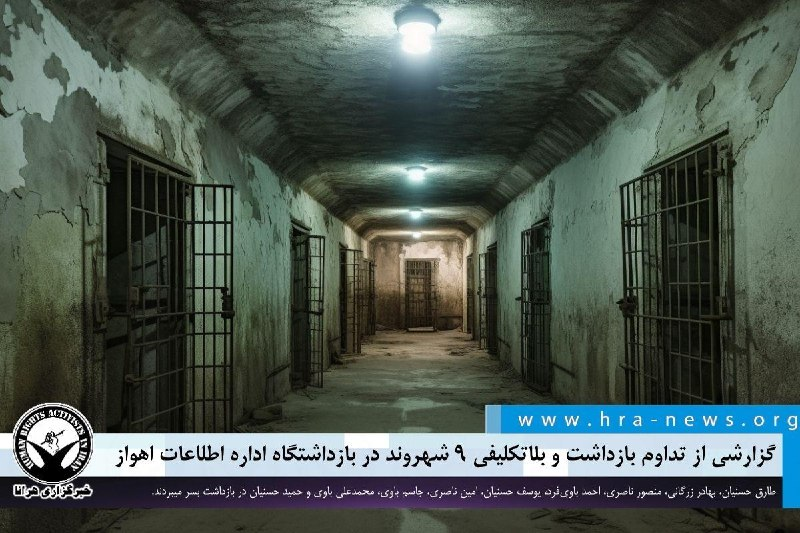

گزارشی از تداوم بازداشت و بلاتکلیفی ۹ شهروند در بازداشتگاه اداره اطلاعات اهواز

❗️
❗️
❗️
❗️
❗️– طارق حسنیان، بهادر زرگانی، منصور ناصری، احمد باوی‌فرد، یوسف حسنیان، امین ناصری، جاسم باوی، محمدعلی باوی و حمید حسنیان، شهروندان ساکن اهواز، بیش از ۱۰۰ روز است که توسط ماموران اداره اطلاعات بازداشت شده‌اند. این افراد هم‌اکنون به‌صورت بلاتکلیف در بازداشتگاه این نهاد امنیتی نگهداری می‌شوند.

به گزارش خبرگزاری هرانا، ارگان خبری مجموعه فعالان حقوق بشر در ایران، تعدادی از شهروندان ساکن اهواز در بازداشت بسر میبرند.

طارق حسنیان، بهادر زرگانی، منصور ناصری، احمد باوی‌فرد، یوسف حسنیان، امین ناصری، جاسم باوی، محمدعلی باوی و حمید حسنیان، ۱۰۳ روز است که بازداشت شدند و در بازداشتگاه اداره اطلاعات اهواز نگهداری می‌شوند. آنها از زمان بازداشت تاکنون از برقراری تماس تلفنی و ملاقات با خانواده، همچنین دسترسی به وکیل، محروم مانده‌اند.

این افراد به تیراندازی به سمت نیروهای امنیتى، انفجار لوله‌های نفت، نگهداری بمب‌های دست‌ساز، همکاری با آمریکا و اسرائیل و اخلال در نظم عمومی متهم شده‌اند. رسیدگی به اتهامات آنان در شعبه دوم دادگاه عمومی و انقلاب شهرستان کارون به ریاست قاضی منتظری انجام شد.

ادامه مطلب

#طارق_حسنیان #بهادر_زرگانی #منصور_ناصری #احمد_باوی‌فرد #یوسف_حسنیان #امین_ناصری #جاسم_باوی #محمدعلی_باوی #حمید_حسنیان

↘️
@hranews_bot تماس ✉️ -  @Hranews  کانال هرانا 🆑

## Hranews — post 113720

گزارشی از اجرای حکم اعدام ۵ زندانی در زندان‌های مختلف

❗️
❗️
❗️
❗️
❗️– حکم ۵ زندانی که پیشتر از بابت اتهامات قتل و محاربه از طریق سرقت مسلحانه به اعدام محکوم شده بودند، در زندان‌های دستگرد اصفهان، بروجرد و زاهدان به اجرا درآمد.

ادامه مطلب

#حسین_براهویی #رشید_عارفی #منصور_بختیاری #عباس‌قلی_سیف‌زاده #رحمان_بیکار

↘️
@hranews_bot تماس ✉️ -  @Hranews  کانال هرانا 🆑

## alonews — post 129161

👈محمدمنان رییسی، نماینده مجلس:
خوش‌انصاف‌ها(منظورش قالیباف) مجلس رو باز کنید، رهبرم تنها مونده.

✅ @AloNews خبر جنگ

## alonews — post 129160

👈سخنگوی کمیسیون امنیت ملی مجلس:
دولت باید همین حالا و از لبنان شروع کند و نباید اجازه دهیم مردم مقاوم جنوب لبنان مورد قتل عام قرار گیرند

✅ @AloNews خبر جنگ

## alonews — post 129159

  <a href="telegram/content/alonews_129159_1781880879.webm" target="_blank">🎬 Download video</a>

👈نتانیاهو: به دستور من ، ارتش به 150 هدف حزب الله در لبنان حمله کرد و ده ها خرابکار را کشت‌‌

✅ @AloNews خبر جنگ

## alonews — post 129158

  <a href="telegram/content/alonews_129158_1781880880.webm" target="_blank">🎬 Download video</a>

👈رسایی : تنگه رو ببندید

✅ @AloNews خبر جنگ

## alonews — post 129157

  <a href="telegram/content/alonews_129157_1781880880.webm" target="_blank">🎬 Download video</a>

👈سخنگوی وزارت خارجه: رایزنی‌های لازم از طریق میانجی‌گرها درحال انجام است و در صورت فراهم‌شدن شرایط لازم برای شروع مذاکرات، اطلاع‌رسانی خواهد شد. 
🔴طبق متن یادداشت تفاهم، آغاز مذاکرات توافق نهایی منوط به شروع اجرای مفاد بندهای ۱، ۴، ۵، ۱۰ و ۱۱ یادداشت تفاهم…

## alonews — post 129156

  <a href="telegram/content/alonews_129156_1781880880.webm" target="_blank">🎬 Download video</a>

👈سخنگوی وزارت خارجه: رایزنی‌های لازم از طریق میانجی‌گرها درحال انجام است و در صورت فراهم‌شدن شرایط لازم برای شروع مذاکرات، اطلاع‌رسانی خواهد شد.

🔴طبق متن یادداشت تفاهم، آغاز مذاکرات توافق نهایی منوط به شروع اجرای مفاد بندهای ۱، ۴، ۵، ۱۰ و ۱۱ یادداشت تفاهم و تداوم اجرای آن‌هاست.

✅ @AloNews خبر جنگ

## alonews — post 129155

  <a href="telegram/content/alonews_129155_1781880880.webm" target="_blank">🎬 Download video</a>

👈جنگنده‌های اسرائیلی جبل الرفیع، شوکین، الریحان و ادچیت در جنوب لبنان را بمباران کردند

✅ @AloNews خبر جنگ

## alonews — post 129154

  <a href="telegram/content/alonews_129154_1781880880.webm" target="_blank">🎬 Download video</a>

👈خبرنگار الجزیره:
چهارمین حمله هوایی اسرائیل در اطراف شهرک کفر تبنیت در جنوب لبنان.

✅ @AloNews خبر جنگ

## alonews — post 129153

  <a href="telegram/content/alonews_129153_1781880880.mp4" target="_blank">🎬 Download video</a>

👈با وجود اعلام اتش بس دوباره، اسرائیل همچنان درحال حملات سنگین به جنوب لبنانه

✅ @AloNews خبر جنگ

## alonews — post 129152

  <a href="telegram/content/alonews_129152_1781880882.webm" target="_blank">🎬 Download video</a>

👈آکسیوس به نقل از مقام ارشد کاخ سفید : بی‌بی (نتانیاهو) صددرصد با آتش‌بس دوباره تو لُبنان اوکیه ولی خود نتانیاهو و تیمش فعلاً نه تأییدش کردن نه تکذیب؛ کلاً سکوت گرفتن

✅ @AloNews خبر جنگ

## alonews — post 129151

  <a href="telegram/content/alonews_129151_1781880882.mp4" target="_blank">🎬 Download video</a>

👈ارتش اسرائیل: از نیمه‌شب گذشته بیش از ۱۵۰ حملهِ هوایی به لُبنان دادیم

✅ @AloNews خبر جنگ

## alonews — post 129150

  <a href="telegram/content/alonews_129150_1781880884.mp4" target="_blank">🎬 Download video</a>

👈سخنگوی ارتش اسرائیل: ارتش اسرائیل آماده و مهیای بازگشت فوری به عملیات‌های شدید رزمی در هر میدان نبرد است

✅ @AloNews خبر جنگ

## alonews — post 129149

محرم عجیبیه

حکومت هیئت‌ها رو کرده میتینگ سیاسی، خیابون‌ها رو کرده فستیوال

[@AloTweet]

## alonews — post 129148

  <a href="telegram/content/alonews_129148_1781880886.mp4" target="_blank">🎬 Download video</a>

👈حمله هوایی اسرائیل به نبطیه، جنوب لبنان

✅ @AloNews خبر جنگ

## alonews — post 129147

  <a href="telegram/content/alonews_129147_1781880887.webm" target="_blank">🎬 Download video</a>

👈آکسیوس به نقل از یک مقام آمریکایی گزارش داد: اسرائیل و حزب‌الله پس از مذاکرات با اسرائیل و ایران، با میانجیگری آمریکا و قطر بر سر آتش‌بس به توافق رسیدند.

✅ @AloNews خبر جنگ

## alonews — post 129146

  <a href="telegram/content/alonews_129146_1781880887.webm" target="_blank">🎬 Download video</a>

👈حزب‌الله: هنوز هیچ اطلاعیه‌ای درباره زمان آتش‌بس دریافت نشده است

✅ @AloNews خبر جنگ

## alonews — post 129145

  <a href="telegram/content/alonews_129145_1781880887.webm" target="_blank">🎬 Download video</a>

👈واکنش تتر به اعلام آتش‌بس بین اسراییل و حزب الله

✅ @AloNews خبر جنگ

## alonews — post 129144

  <a href="telegram/content/alonews_129144_1781880887.webm" target="_blank">🎬 Download video</a>

👈کانال ۱۳ به نقل از یک مقام اسرائیلی:
ما در حال حاضر در آتش‌بس هستیم و اگر حزب‌الله به ما حمله نکند، زمان جنگ از جانب ما نیست

✅ @AloNews خبر جنگ

## alonews — post 129143

  <a href="telegram/content/alonews_129143_1781880887.webm" target="_blank">🎬 Download video</a>

👈شبکه ۱۲ اسرائیل: آتش‌بس شروع شده اما ما توی منطقه میمونیم

✅ @AloNews خبر جنگ

## alonews — post 129142

  <a href="telegram/content/alonews_129142_1781880888.webm" target="_blank">🎬 Download video</a>

🔴فوری / خبرنگار المیادین در جنوب لبنان: همزمان با اجرایی شدن آتش‌بس ، حملهٔ هوایی اسرائیل به النبطیه صورت گرفت.

✅ @AloNews خبر جنگ

<!-- MSG END -->

<!-- NAV START -->

<a href="https://github.com/Tljn/FUD/blob/main/telegram/content/archive_1.md" style="display:inline-block; padding:6px 12px; margin:0 4px; background-color:#2ea44f; color:white; text-decoration:none; border-radius:4px; font-weight:bold;">صفحه بعد</a>

<!-- NAV END -->
