# خواننده تلگرام

<!-- TOP_NAV START -->

<a href="https://github.com/Tljn/FUD/blob/main/telegram/content/archive_1.md" style="display:inline-block; padding:6px 12px; margin:0 4px; background-color:#2ea44f; color:white; text-decoration:none; border-radius:4px; font-weight:bold;">صفحه بعد</a>

<!-- TOP_NAV END -->

<!-- MSG START -->

---
📅 بروزرسانی: 1405/03/30 03:42
---

## VahidOOnLine — post 246456

  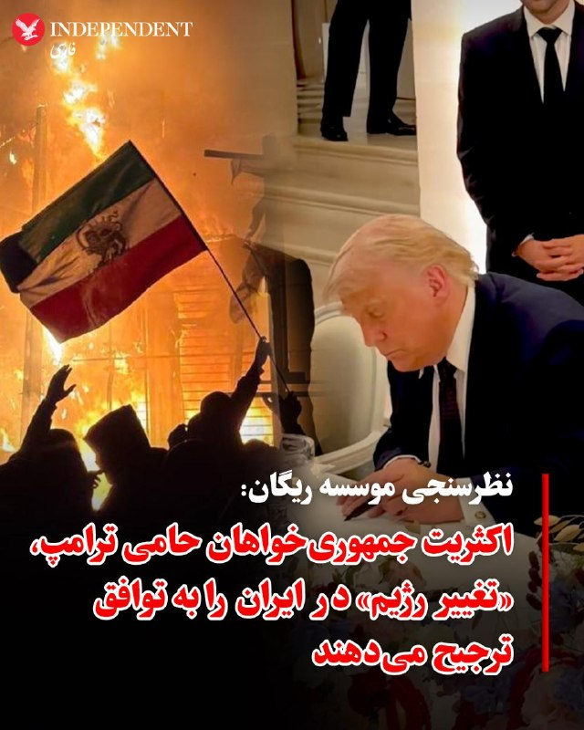

♦️براساس نظرسنجی جدید موسسه «رونالد ریگان»، دونالد ترامپ درباره تفاهم‌نامه اخیر با تهران پس از سه ماه‌ و‌ نیم عملیات نظامی، با چالش سیاسی سختی روبرو است؛ چرا که ۵۱ درصد از جمهوری‌خواهان طرفدار جنبش «آمریکا را دوباره باعظمت کنیم» (MAGA) خواستار سرنگونی نظام و تغییر رژیم در ایران هستند و در مقابل، تنها ۲۵ درصد از توافق دیپلماتیک حمایت می‌کنند. به گزارش «نیویورک پست»، این نظرسنجی که نشان‌دهنده ترجیح دو برابری گزینه تغییر رژیم نسبت به مذاکره در میان حامیان ترامپ است، دقیقا در تضاد با رویکرد دمکرات‌ها قرار دارد که ۵۲ درصد آن‌ها مسیر دیپلماتیک را برگزیده‌اند. براساس این گزارش، انتشار این آمار در حالی صورت می‌گیرد که ترامپ و مسعود پزشکیان به تازگی تفاهم‌نامه‌ای ۱۴ ماده‌ای را برای باز شدن یک پنجره ۶۰ روزه جهت دستیابی به توافق صلح و بازگشایی تنگه هرمز امضا کرده‌اند؛ سندی که ترامپ در نشست «گروه ۷» در فرانسه، هدف از امضای آن را جلوگیری از یک «فاجعه اقتصادی» توصیف کرد.
‌🇸🇦 Indypersian

🤖 @VahidOOnLine

## VahidOOnLine — post 246455

♦️تصاویر منتشر شده در حساب اینستاگرام «کوه صفه»، چهارشنبه‌شب، صحنه‌ای زیبا از همنشینی ماه و زهره و عطارد را از منظر پل مارنان زاینده رود اصفهان نشان می‌دهد. در روزهای گذشته، ماه، زهره، عطارد، مشتری و مریخ در افق غربی آسمان در یک راستا دیده می‌شدند. این پدیده یک «هم‌خطی ظاهری» و زیبا از دید ناظر زمینی است.
‌🇸🇦 Indypersian

🤖 @VahidOOnLine

## VahidOOnLine — post 246454

  

یک مقام آمریکایی به اکسیوس گفت: استیو ویتکاف، فرستاده کاخ سفید، در حال سفر به سوئیس است، جایی که انتظار می‌رود دور اول مذاکرات با ایران در مورد توافق هسته‌ای احتمالی برگزار شود.

به نوشته اکسیوس، قرار بود مذاکرات جمعه ۲۹ خرداد آغاز شود، اما به دلیل درگیری بین اسرائیل و حزب‌الله در لبنان به تعویق افتاد. هنوز مشخص نیست که آیا زمان جدیدی برای مذاکرات تعیین شده است یا اینکه سایر مقامات آمریکایی نیز در راه سوئیس هستند.
‌🏁 🇬🇧 IranintlTV

🤖 @VahidOOnLine

## VahidOOnLine — post 246453

  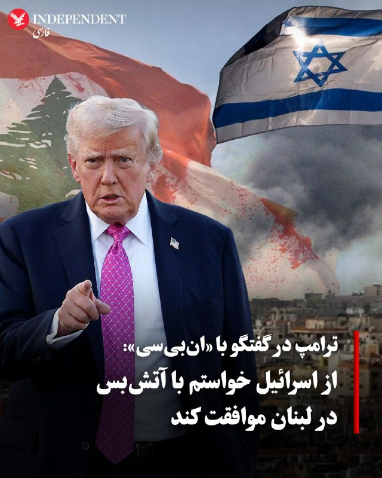

♦️به گزارش «ان‌بی‌سی نیوز»، در پی تشدید درگیری‌ها در لبنان، اسرائیل و حزب‌الله روز جمعه با یک آتش‌بس فوری موافقت کردند. دونالد ترامپ، رئیس‌جمهوری آمریکا، در گفتگوی تلفنی با «ان‌بی‌سی نیوز» تایید کرد که شخصا با مقام‌های اسرائیلی گفتگو کرده و از آن‌ها خواسته است تا با این آتش‌بس موافقت کنند. تصمیمی که ترامپ آن را «یک گام مثبت» توصیف کرد. با این حال، گزارش‌های اطلاعاتی ایالات متحده نشان می‌دهد که به دلیل اختلاف‌نظر میان نتانیاهو و واشنگتن بر سر تفاهم‌نامه ۱۴ ماده‌ای اخیر با ایران، احتمال تداوم حملات اسرائیل به مواضع حزب‌الله و به خطر افتادن مجدد این توافق مقدماتی وجود دارد؛ به ویژه آنکه نتانیاهو صراحتا اعلام کرده کشورش خود را متعهد به این یادداشت تفاهم نمی‌داند.
‌🇸🇦 Indypersian

🤖 @VahidOOnLine

## VahidOOnLine — post 246452

  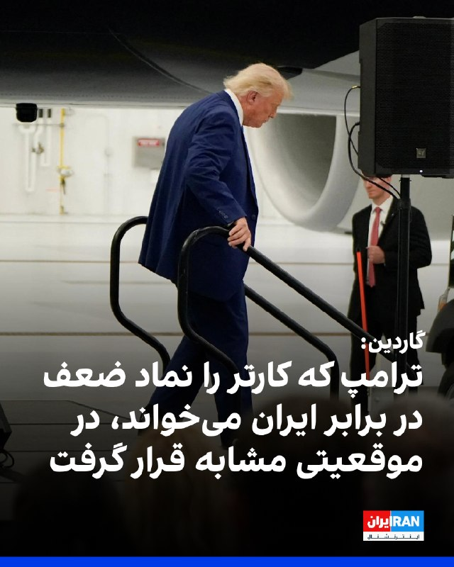

گاردین در تحلیلی نوشت ترامپ که سال‌ها جیمی کارتر را نماد ضعف در برابر ایران معرفی می‌کرد، اکنون خود در موقعیتی مشابه قرار گرفته است؛ جایی که محدودیت گزینه‌های نظامی و هزینه‌های سیاسی جنگ، آزادی عمل واشینگتن را کاهش داده است.
این تحلیل نوشت یادداشت تفاهم دونالد ترامپ با جمهوری اسلامی ممکن است میراث سیاسی او را به تصمیم‌ها و رفتارهای تهران گره بزند؛ همان‌گونه که بحران گروگان‌گیری سفارت آمریکا در تهران بر میراث سیاسی جیمی کارتر سایه انداخت.
گاردین استدلال کرد جنگ اخیر به جای تضعیف جمهوری اسلامی، به تثبیت موقعیت آن کمک کرده و توافق جدید نیز با تاکید بر احترام متقابل به حاکمیت دو کشور، به نوعی مشروعیت دوباره به جمهوری اسلامی بخشیده است.

‌🏁 🇬🇧 IranintlTV

🤖 @VahidOOnLine

## VahidOOnLine — post 246451

  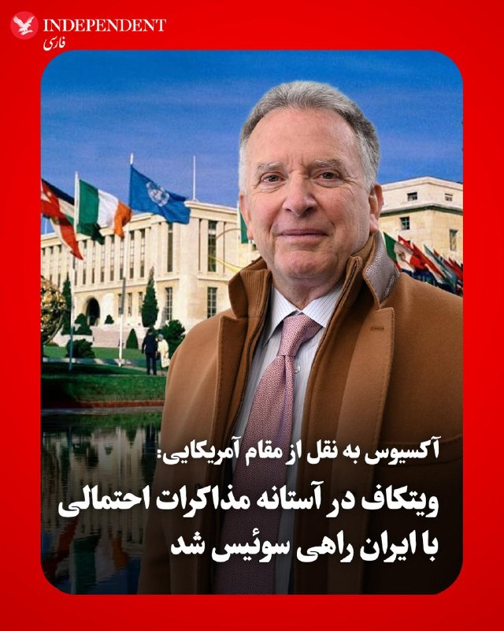

♦️یک مقام آمریکایی روز جمعه به «آکسیوس» گفت که استیو ویتکاف، فرستاده ویژه کاخ سفید، در راه سوئیس است؛ کشوری که انتظار می‌رود دور نخست مذاکرات با جمهوری اسلامی ایران درباره یک توافق هسته‌ای احتمالی در آنجا برگزار شود. براساس این گزارش، مذاکرات که قرار بود روز جمعه آغاز شود، به دلیل درگیری‌ها میان اسرائیل و حزب‌الله در لبنان به تعویق افتاد و هنوز مشخص نیست زمان جدیدی برای آن تعیین شده است یا خیر. با این حال، انتظار می‌رود جی‌دی ونس، معاون رئیس‌جمهوری آمریکا، سرپرستی این هیات را بر عهده داشته باشد و جرد کوشنر نیز در این گفتگوها شرکت کند.
‌🇸🇦 Indypersian

🤖 @VahidOOnLine

## WithYashar — post 15375

آکسیوس: ویتکاف برای اولین دور مذاکرات داره میره سوئیس.

البته فعلا تاریخ جدیدی برای مذاکرات تایید نشده؛ نخست وزیر قطر هم به عنوان میانجی اصلی الان تو سوئیسه.
@withyashar

## WithYashar — post 15374

بابک زنجانی : ‏به نظر می‌رسد یک موضوع نفوذ و خرابکاری امنیتی در کشور در حال وقوع است.
@withyashar

## mwarmonitor — post 11246

🔴فرستادگان ترامپ برای گفتگوهای احتمالی با ایران عازم سوئیس شدند

📝نویسنده: باراک راوید AXIOS

🔸یک مقام آمریکایی به اکسیوس (Axios) گفت که استیو ویتکوف، فرستاده کاخ سفید، در راه سوئیس است؛ جایی که انتظار می‌رود اولین دور گفتگوها با ایران درباره یک توافق هسته‌ای احتمالی در آنجا برگزار شود.
این مقام آمریکایی اعلام کرد که جرد کوشنر، فرستاده ترامپ، از قبل در سوئیس حضور دارد.

📌چرا این موضوع اهمیت دارد: این گفتگوها قرار بود روز جمعه آغاز شود، اما به دلیل درگیری‌ها میان اسرائیل و حزب‌الله در لبنان به تعویق افتاد. هنوز مشخص نیست که زمان جدیدی برای این گفتگوها تعیین شده است یا خیر.

📌پشت صحنه: محمد بن عبدالرحمن آل ثانی، نخست‌وزیر قطر که یکی از میانجی‌های کلیدی میان آمریکا و ایران است، اوایل روز جمعه وارد سوئیس شد.

📌نکاتی که باید زیر نظر داشت: انتظار می‌رفت که جی‌دی ونس، معاون رئیس‌جمهور، ریاست هیئت آمریکایی را بر عهده داشته باشد، اما او در آخرین لحظات پنجشنبه شب سفر خود را به تعویق انداخت. هنوز مشخص نیست که آیا او در این آخر هفته به این سفر خواهد رفت یا خیر.

@mwarmonitor

## pm_afshaa — post 94429

  <a href="telegram/content/pm_afshaa_94429_1781914348.webm" target="_blank">🎬 Download video</a>

🔴آکسیوس: ویتکاف برای اولین دور مذاکرات داره میره سوئیس. البته فعلا تاریخ جدیدی برای مذاکرات تایید نشده؛ نخست وزیر قطر هم به عنوان میانجی اصلی الان تو سوئیسه. 
💧 Rainbet.com the #1 Non-KYC Crypto Casino & Sportsbook @rainbetcom 
😁 @Pm_Afshaa

## pm_afshaa — post 94428

  <a href="telegram/content/pm_afshaa_94428_1781914349.webm" target="_blank">🎬 Download video</a>

🔴آکسیوس: ویتکاف برای اولین دور مذاکرات داره میره سوئیس.

البته فعلا تاریخ جدیدی برای مذاکرات تایید نشده؛ نخست وزیر قطر هم به عنوان میانجی اصلی الان تو سوئیسه.

💧 Rainbet.com the #1 Non-KYC Crypto Casino & Sportsbook @rainbetcom

😁 @Pm_Afshaa

## pm_afshaa — post 94427

  <a href="telegram/content/pm_afshaa_94427_1781914350.webm" target="_blank">🎬 Download video</a>

🔴بعد از بمباران سنگین تپه الطاهر در هفت روز گذشته، حالا نیروهای اسرائیلی در حال فتح این تپه هستن!

تپه الطاهر از لحاظ استراتژیک آخرین سد دفاعی شهر نبطیه است و نبطیه پایتخت حزب الله در جنوب لبنانه.

الانم درگیری‌های سنگین بین ارتش اسرائیل و حزب‌الله در نزدیکی تپه علی الطاهر وجود داره.

💧 Rainbet.com the #1 Non-KYC Crypto Casino & Sportsbook @rainbetcom

😁 @Pm_Afshaa

## IranIntlTV — post 343307

  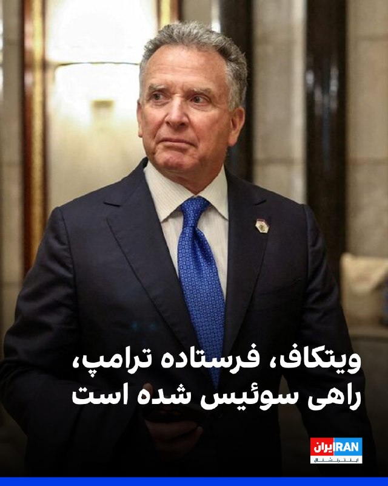

یک مقام آمریکایی به اکسیوس گفت: استیو ویتکاف، فرستاده کاخ سفید، در حال سفر به سوئیس است، جایی که انتظار می‌رود دور اول مذاکرات با ایران در مورد توافق هسته‌ای احتمالی برگزار شود.

به نوشته اکسیوس، قرار بود مذاکرات جمعه ۲۹ خرداد آغاز شود، اما به دلیل درگیری بین اسرائیل و حزب‌الله در لبنان به تعویق افتاد. هنوز مشخص نیست که آیا زمان جدیدی برای مذاکرات تعیین شده است یا اینکه سایر مقامات آمریکایی نیز در راه سوئیس هستند.
https://iranintl.com/202606190628

## IranIntlTV — post 343306

  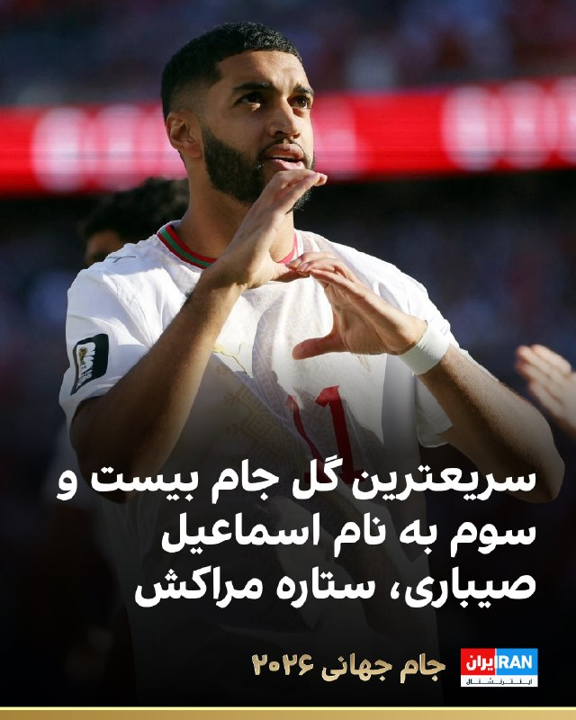

🔻اسماعیل صیباری، بازیکن تیم ملی مراکش، با گلزنی در ثانیه ۷۱ دیدار مقابل اسکاتلند در جام جهانی ۲۰۲۶ که در ورزشگاه بوستون برگزار شد، یکی از سریع‌ترین گل‌های تاریخ این رقابت‌ها را به ثمر رساند.

🔹اسماعیل صیباری همچنین با این گل رکورد سریع‌ترین گل جام جهانی ۲۰۲۶ را شکست.

🔹پیش از این مسابقه، سریع‌ترین گل جام جهانی ۲۰۲۶ متعلق به میخال سادیلک، هافبک جمهوری چک، بود که در دقیقه ۵ و ۸ ثانیه دیدار برابر آفریقای جنوبی گلزنی کرده بود.

🔹فلیکس انمچا از آلمان با گل در دقیقه ۵ و ۱۶ ثانیه مقابل کوراسائو در رتبه دوم قرار داشت و گل به خودی دامیان بوبادیا از پاراگوئه برابر آمریکا در دقیقه ۶ و ۱۲ ثانیه سومین گل سریع مسابقات بود.

🔹ستاره باشگاه آیندهوون اکنون نخستین بازیکن تاریخ است که در هر دو بازی نخست خود برای مراکش در جام جهانی موفق به گلزنی شده است.

🔹او در دیدار نخست مراکش مقابل برزیل نیز گل تیمش را در تساوی یک بر یک به ثمر رسانده بود.

🔹آماری از سریعترین گل‌های جام جهانی را در سایت بخوانید.

@iranintltvsport

## IranIntlTV — post 343305

  

گاردین در تحلیلی نوشت ترامپ که سال‌ها جیمی کارتر را نماد ضعف در برابر ایران معرفی می‌کرد، اکنون خود در موقعیتی مشابه قرار گرفته است؛ جایی که محدودیت گزینه‌های نظامی و هزینه‌های سیاسی جنگ، آزادی عمل واشینگتن را کاهش داده است.
این تحلیل نوشت یادداشت تفاهم دونالد ترامپ با جمهوری اسلامی ممکن است میراث سیاسی او را به تصمیم‌ها و رفتارهای تهران گره بزند؛ همان‌گونه که بحران گروگان‌گیری سفارت آمریکا در تهران بر میراث سیاسی جیمی کارتر سایه انداخت.
گاردین استدلال کرد جنگ اخیر به جای تضعیف جمهوری اسلامی، به تثبیت موقعیت آن کمک کرده و توافق جدید نیز با تاکید بر احترام متقابل به حاکمیت دو کشور، به نوعی مشروعیت دوباره به جمهوری اسلامی بخشیده است.

https://iranintl.com/202606197812

## FarsiVOA — post 221258

⚡️اثر جنگ خاورمیانه بر بازار خودروهای برقی اروپا
@FarsiVOA

## FarsiVOA — post 221257

⚡️تغییر تاکتیک جمهوری اسلامی؛ تشکیل هسته‌های مخفی سپاه در عراق برای حمله به کشورهای حاشیه خلیج فارس
@FarsiVOA

## FarsiVOA — post 221256

  <a href="telegram/content/FarsiVOA_221256_1781914353.mp4" target="_blank">🎬 Download video</a>

⚡️گزارشگران سازمان ملل متحد: هر توافقی با جمهوری اسلامی باید شامل حقوق بشر باشد
@FarsiVOA

## FarsiVOA — post 221255

  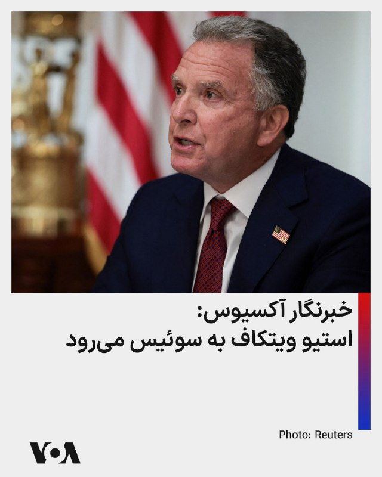

⚡️باراک راوید، خبرنگار آکسیوس به نقل از یک مقام آمریکایی می‌گوید استیو ویتکاف برای اولین دور مذاکرات احتمالی هسته‌ای با جمهوری اسلامی در مسیر رفتن به سوئیس است و جرد‌ کوشنر، داماد دونالد ترامپ هم‌اکنون در سوئیس است.
@FarsiVOA

## FarsiVOA — post 221254

⚡️سفارت ایتالیا در تهران پس از سه ماه تعطیلی دوباره بازگشایی شد. آنتونیو تایانی، وزیر امور خارجه ایتالیا بر تلاش کشورش برای صلح پایدار تأکید کرد.
@FarsiVOA

## FarsiVOA — post 221253

🔺فرانسه: اگر توافق نهایی به مسئله موشکی و نیابتی‌های جمهوری اسلامی رسیدگی نکند لغو تحریم‌ها را وتو می‌کنیم

▪️وزیر امور خارجه فرانسه، ژان-نوئل بارو، روز جمعه ۲۹ خرداد گفت کشورش می‌خواهد در مذاکرات مربوط به برنامه هسته‌ای جمهوری اسلامی نقش ایفا کند و پاریس لغو تحریم‌های سازمان ملل را تأیید نخواهد کرد، مگر اینکه از مفاد توافق نهایی راضی باشد.

⬇️ بیشتر بخوانید:
https://ir.voanews.com/a/8162763.html
@FarsiVOA

## FarsiVOA — post 221252

  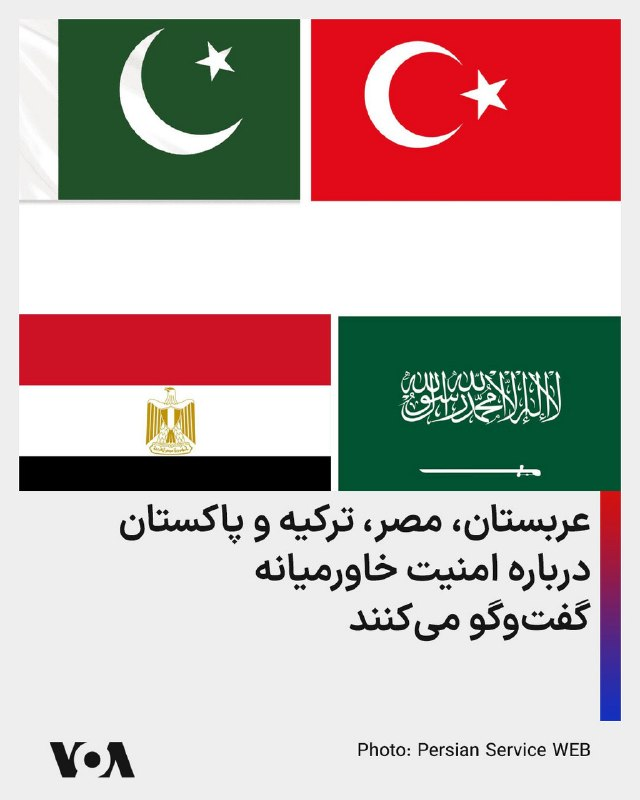

⚡️گزارش‌ها حاکی از آن است که مقامات عربستان، ترکیه، پاکستان و مصر قرار است روز یکشنبه در پایتخت مصر، قاهره، گردهم آیند و درباره تحولات دیپلماتیک و امنیتی منطقه صحبت کنند. این کشورها برای رسیدن آمریکا و جمهوری اسلامی به توافق اخیر، تلاش کرده بودند. وزیران خارجه این چهار کشور آوریل نیز در شهر آنتالیا در ترکیه دیدار و گفت‌وگو کرده بودند.
@FarsiVOA

## IranianMinds — post 22983

😂😂😂

@IranianMinds

## IranianMinds — post 22982

  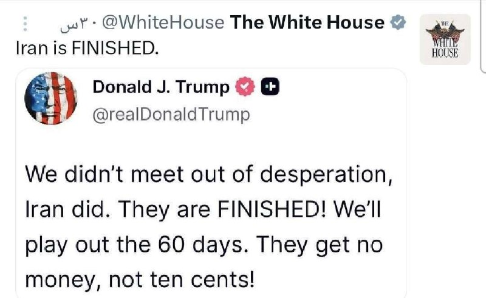

🔴اکانت کاخ سفید با ریپست کردن توئیت ترامپ نوشت:

ایران تمام شد.

@IranianMinds

## IranianMinds — post 22981

  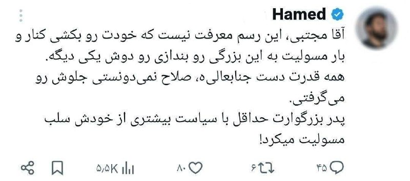

🔴عرزشی‌ها عصبانی از دست مجتبی مقوایی.

@IranianMinds

## BBCPersian — post 284434

  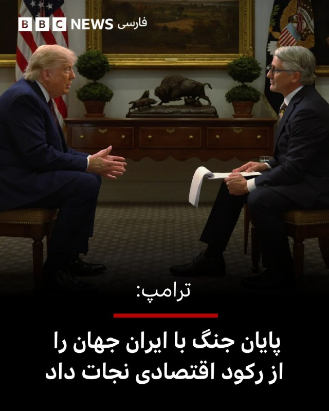

🔻دونالد ترامپ، رئیس‌جمهوری آمریکا، در گفت‌وگویی با وب‌سایت خبری آکسیوس ضمن دفاع از توافق اخیر با ایران گفت که این توافق جهان را از یک «رکود اقتصادی جهانی» نجات داده است. او همچنین در پاسخ به پرسشی درباره حدود قدرت خود پس از پایان جنگ ایران گفت: «هیچ محدودیتی وجود ندارد.»

آقای ترامپ در این مصاحبه که روز پنجشنبه انجام شد، درباره توافق با ایران گفت: «این از آن دست اتفاق‌هایی است که می‌توانست باعث یک رکود جهانی شود.» او افزود توافقی که با ایران امضا کرده مانع وقوع چنین وضعیتی شده است.

رئیس‌جمهوری آمریکا در پاسخ به پرسشی درباره حدود قدرت خود گفت: «هیچ محدودیتی وجود ندارد.» او سپس افزود که می‌داند محدودیت‌هایی وجود دارد، اما هنوز «آن درس را یاد نگرفته است.»

لینک خبر کامل:
https://bbc.in/4aHkzeI
📷Axios

@BBCPersian

---
📅 بروزرسانی: 1405/03/30 02:30
---

## VahidOOnLine — post 246450

  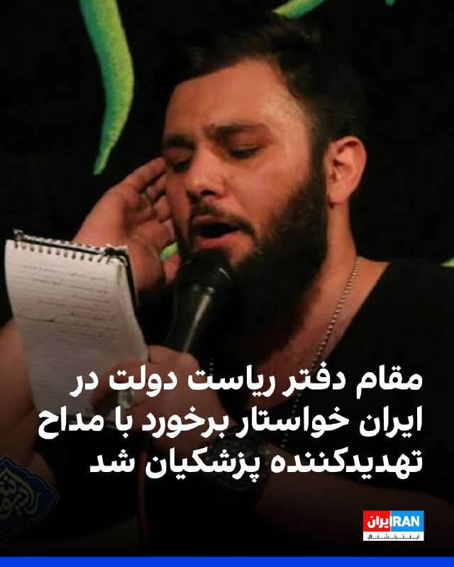

مهدی طباطبایی، معاون ارتباطات و اطلاع رسانی دفتر رییس‌جمهور، در شبکه اجتماعی ایکس به تهدید به قتل مسعود پزشکیان، رییس‌ دولت جمهوری اسلامی، از سوی یک مداح به نام محمدعلی بخشی، او را «فرد گستاخ» نامید.
او خواستار «برخورد قاطع و قانونی مسئولان ذیربط با عناصر مشکوک، خودسر و متجاسری» شد که به دومین مقام کشور «چنین بی‌پروا» اهانت می‌کنند.
بخشی در یک سخنرانی در شهرری تهران گفت: «آقای رییس‌جمهور اگر شروطی که رهبری گفتند محقق نشه، ما می‌دانیم و تیغ و حلقوم شما. پدرت رو درمی‌آریم.»

‌🏁 🇬🇧 IranintlTV

🤖 @VahidOOnLine

## VahidOOnLine — post 246449

  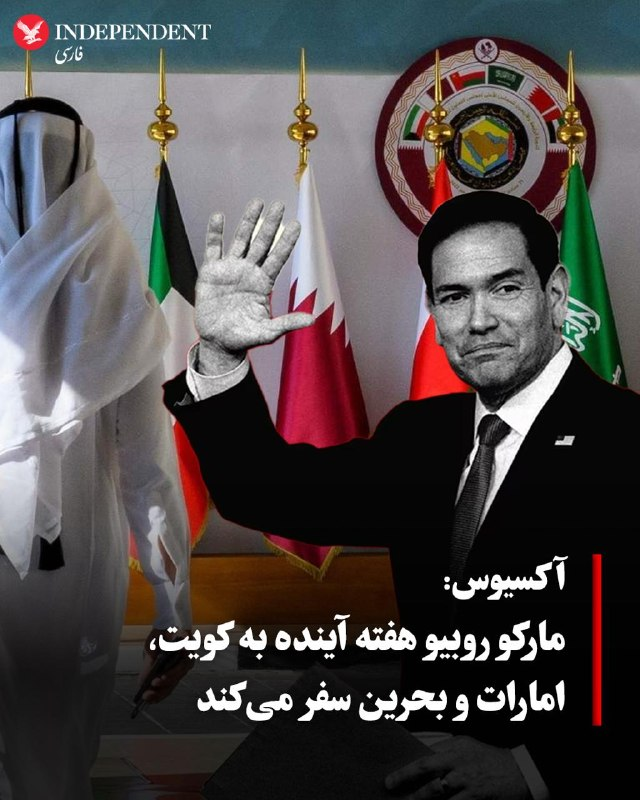

♦️خبرنگار اکسیوس، روز جمعه به نقل از منابع آگاه خبر از سفر مارکو روبیو، وزیر خارجه ایالات متحده به خاورمیانه داد. او نوشت: «روبیو در حال برنامه‌ریزی برای سفر به خاورمیانه در هفته آینده است. مقصدهای او در حال حاضر کویت، امارات متحده عربی و بحرین هستند. انتظار می‌رود روبیو نشستی را با وزرای امور خارجه شورای همکاری خلیج فارس در بحرین برگزار کند.»
‌🇸🇦 Indypersian

🤖 @VahidOOnLine

## VahidOOnLine — post 246448

  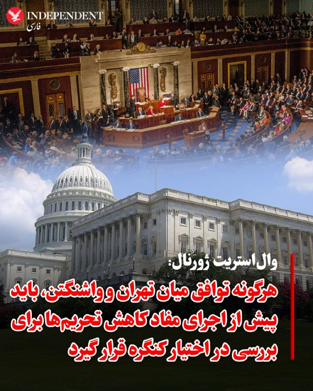

♦️روزنامه وال‌استریت ژورنال، روز جمعه، در یادداشتی تحلیلی نوشت که تفاهم‌نامه جدید دونالد ترامپ با جمهوری اسلامی ایران، هرچند با هدف حفظ صلح و بازگشایی تنگه هرمز تنظیم شده باشد، نمی‌تواند الزامات قانونی نظارت کنگره را دور بزند. بر اساس قانون نظارت بر توافق هسته‌ای ایران مصوب سال ۲۰۱۵، کاخ سفید موظف است حداکثر ظرف پنج روز متن کامل هرگونه توافق مرتبط با برنامه هسته‌ای ایران، از جمله تمامی ضمائم و ارزیابی‌های وزارت خارجه را به کنگره ارائه کند. این قانون در دوران باراک اوباما برای محدود کردن اختیارات رئیس‌جمهوری تصویب شد. براساس این سرمقاله، تغییر نام این سند ۱۴ ماده‌ای به «یادداشت تفاهم»، ماهیت قانونی آن را تغییر نمی‌دهد و تا زمان بررسی ۳۰ روزه کنگره، رئیس‌جمهوری حق کاهش یا تعلیق تحریم‌های مصوب در قانون را ندارد.
در ادامه این تحلیل تاکید شده است که تعهد متقابل واشنگتن و تهران برای رسیدن به توافق نهایی ظرف ۶۰ روز، در کنار رقیق‌سازی اورانیوم غنی‌شده ایران تحت نظارت آژانس و صدور معافیت‌های نفتی توسط وزارت خزانه‌داری آمریکا، فراتر از یک رایزنی دیپلماتیک ساده است. منتقدان و کارشناسان معتقدند نمایندگان کنگره باید فراتر از نسخه تشریفاتی ارائه شده، خواستار دسترسی به تمام جزئیات، ارتباطات خزانه‌داری و ارزیابی‌های پنهانی شوند. وال‌استریت ژورنال هشدار می‌دهد که اگر کاخ سفید پیش از پایان بررسی‌های قانونی کنگره، اقدام به اعطای معافیت‌های نفتی یا بانکی به تهران کرده باشد، قانون‌گذاران باید با تصویب قوانین اضطراری این اختیارات را متوقف کنند تا مشخص شود این توافق واقعا مانع ایران است یا صرفا فرصتی برای پر کردن خزانه این کشور فراهم می‌کند.
‌🇸🇦 Indypersian

🤖 @VahidOOnLine

## VahidOOnLine — post 246447

  <a href="telegram/content/VahidOOnLine_246447_1781910007.mp4" target="_blank">🎬 Download video</a>

♦️پس از انتشار پیامی منسوب به مجتبی خامنه‌ای مبنی بر اینکه توافق با آمریکا به اصرار مسعود پزشکیان صورت گرفته است و او «نظر دیگری» داشته، محمدعلی بخشی، مداح حکومتی در جمع حامیان جمهوری اسلامی در شهرری گفت: «آقای رئیس‌جمهور اگر شروط رهبری محقق نشود، ما می‌دانیم و تیغ و حلقوم شما. پدرت را درمی‌آوریم».
‌🇸🇦 Indypersian

🤖 @VahidOOnLine

## VahidOOnLine — post 246446

  

موسسه ریگان بر اساس نتایج یک نظرسنجی گزارش داد که تنها ۲۵ درصد از جمهوری‌خواهان حامی جنبش «ماگا» از دستیابی به یک توافق مذاکره‌شده با جمهوری اسلامی حمایت می‌کنند.
بر اساس نتایج این نظرسنجی، حامیان جنبش «ماگا» بیش از دو برابر بیشتر از گزینه توافق با جمهوری اسلامی، از تغییر حکومت در ایران حمایت می‌کنند.
این نظرسنجی نشان می‌دهد ۵۱ درصد از جمهوری‌خواهان حامی دونالد ترامپ، رییس‌جمهوری آمریکا، خواهان روی کار آمدن حکومتی جدید در ایران هستند، در حالی که تنها ۲۵ درصد از آنان از دستیابی به یک توافق مذاکره‌شده با تهران حمایت می‌کنند.
در میان همه جمهوری‌خواهان نیز ۵۰ درصد از تغییر حکومت در ایران حمایت کرده‌اند و ۲۵ درصد طرفدار راه‌حل دیپلماتیک و توافق با جمهوری اسلامی بوده‌اند.
در مقابل، ۵۲ درصد از دموکرات‌ها از مسیر دیپلماتیک و توافق حمایت کرده‌اند و ۲۵ درصد آنان از تغییر حکومت در ایران پشتیبانی کرده‌اند.
بر اساس این نظرسنجی، ۱۴ درصد از جمهوری‌خواهان حامی ماگا نیز گفته‌اند ترجیح می‌دهند جمهوری اسلامی در قدرت باقی بماند، اما توان اقتصادی و نظامی آن به شدت محدود شود.

‌🏁 🇬🇧 IranintlTV

🤖 @VahidOOnLine

## VahidOOnLine — post 246445

♦️لیلی مهدوی، مادر سیاوش محمودی، نوجوان ۱۶ ساله کشته‌شده در خیزش سراسری ۱۴۰۱، روز پنجشنبه تصاویری از حضور بر مزار محمدمهدی سیف‌الله‌پور، کشته‌شده در ۱۸ دی‌ماه ۱۴۰۴، در کنار اسماعیل شکری، پدر سپهر شکری (سپهر بابا) در اینستاگرام منتشر کرد. او نوشت: «ما خانواده‌های دادخواه، با داغی که هرگز سرد نخواهد شد و اندوهی که در جانمان ریشه دوانده است، شانه به شانه یکدیگر ایستاده‌ایم. ما ایستاده‌ایم برای فرزندانمان، برای دلیرمردان و دلیرزنانی که با رویای آزادی برخاستند و با گلوله‌های ستم بر خاک افتادند. آنان برای زندگی، کرامت و آزادی مردمشان قدم در راه گذاشتند، اما قلب و جانشان هدف سرب‌های داغ شد.
لیلی مهدوی در ادامه نوشت: «ما اینجاییم؛ نه از سر فراموشی، که از سر وفاداری. اینجاییم تا نام و یاد عزیزانمان را زنده نگه داریم، تا حقیقت را فریاد بزنیم و دادخواه خون‌های به‌ناحق ریخته‌شده باشیم. درد ما عمیق است، اما اراده ما عمیق‌تر. زخم‌های ما سنگین است، اما صدای ما خاموش‌شدنی نیست. ما تا روزی که حقیقت روشن شود و عدالت به جایگاه شایستهٔ خود بازگردد، از پای نخواهیم نشست. راه فرزندانمان ادامه دارد؛
‌🇸🇦 Indypersian

🤖 @VahidOOnLine

## WithYashar — post 15373

عفو بین‌الملل هشدار داد مقام‌های جمهوری اسلامی از پوشش شرایط جنگی برای تشدید سرکوب استفاده کرده‌اند. همزمان برخی خانواده کشته‌شدگان‌ دی هم از حذف نام آنها در سامانه «بهشت زهرا»ا خبر دادند.
@withyashar

## WithYashar — post 15372

ارتش اسرائیل (IDF) در حال پیشروی به سمت تپه علی الطاهر است.
بعد از بمباران سنگین تپه الطاهر در هفت روز گذشته، حال نیروهای اسرائیلی در حال فتح این تپه هستند.

تپه الطاهر از لحاظ استراتژیک آخرین سد دفاعی شهر نبطیه است‌.
@withyashar

## WithYashar — post 15371

  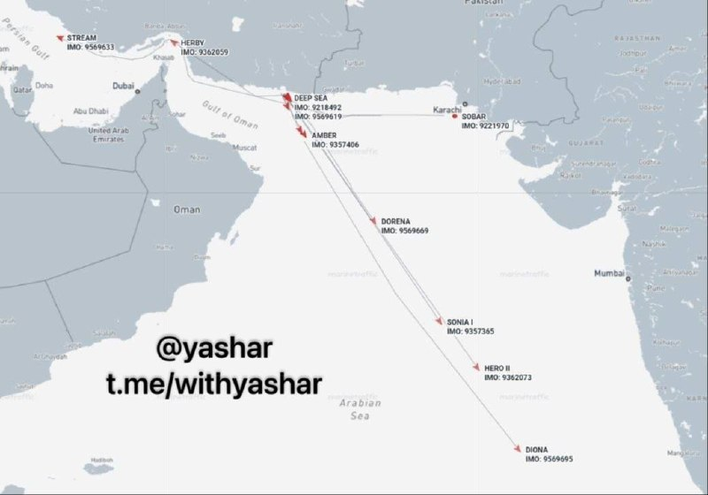

حرکت ۱۰ نفتکش ایرانی به نام های؛ دیونا، قهرمان، سونیا، دورنا، آمبر، خندان، برف، هدی، استارلا و دریا عمیق به طرف چین
@withyashar

## mwarmonitor — post 11244

استودیو خبری فاکس نیوز
🔹مجری:
«در حالی که ایالات متحده خود را برای دور جدیدی از گفتگوها با ایران آماده می‌کند، سرنوشت شش آمریکایی که همچنان توسط این رژیم در بازداشت هستند، در هاله‌ای از ابهام قرار دارد. جنیفر گریفین، خبرنگار ارشد امنیت ملی ما، آخرین اطلاعات را به‌صورت زنده از واشینگتن برای ما گزارش می‌دهد. سلام جنیفر.»

🔹جنیفر گریفین:
«سلام سندرا. خب، یک موضوع کلیدی دیگر که همان‌طور که اشاره کردی با تهران حل‌نشده باقی مانده، این است که آیا کاخ سفید برای آزادی شش آمریکایی که هنوز به‌طور ناعادلانه توسط دولت ایران بازداشت شده‌اند، فشار خواهد آورد یا خیر. حداقل دو نفر از این آمریکایی‌ها در زندان بدنام اوین به سر می‌برند.
کامران حکمتی، پدربزرگ ۶۱ ساله ایرانی-آمریکاییِ یهودی اهل لانگ آیلند؛ حکمتی بهار گذشته برای دیدار با خانواده‌اش در ایران به سر می‌برد که به دلیل سفری که ۱۳ سال پیش برای جشن بارمیتزوای پسرش به اسرائیل داشت، دستگیر شد.
و رضا ولی‌زاده، روزنامه‌نگار ۴۹ ساله که به مدت ۱۰ سال برای رادیو اروپای آزاد کار می‌کرد و در سال ۲۰۲۴ برای مراقبت از والدینش به ایران بازگشت. فاکس نیوز به این فایل صوتی از رضا از داخل زندان اوین دست یافته است.»
📌فایل صوتی رضا ولی‌زاده از زندان اوین
رضا ولی‌زاده (فایل صوتی):
«حتی اگر درمان بیماری‌های ما خواسته بزرگی باشد، حداقل می‌شد از مقامات ایرانی خواست تا نه تمام فشارهای جسمی و شکنجه‌های روحی علیه ما در دوران اسارت، بلکه حداقل بخشی از آن را کاهش دهند.»
🔹جنیفر گریفین:
«رایان فیهی، وکیل رضا، از دولت [آمریکا] می‌خواهد که آزادی تمامی آمریکایی‌های بازداشت‌شده را در اولویت قرار دهد؛ به‌ویژه از آنجا که ایالات متحده بیش از ۶۰ ملوان ایرانیِ اسیر شده را در ماه می آزاد کرد.»
🔰رایان فیهی (وکیل):
«برای من بسیار دشوار است که هضم کنم چطور ایالات متحده می‌تواند این ملوانان را بدون دریافت هیچ چیزی در مقابل آزاد کند. ما اجازه می‌دهیم یک پدربزرگ به جرمِ دیدار از اسرائیل در ۱۴ سال پیش، در بازداشت بماند؟ من فکر می‌کنم این کار ساده‌ترین و در دسترس‌ترین اقدام است و دولت باید واقعاً روی نهایی کردن این توافق تمرکز کند.»
🔹جنیفر گریفین:
«یک روز قبل از آغاز عملیات "خشم حماسی" در ماه فوریه، مارکو روبیو، وزیر امور خارجه، ایران را به عنوان یک "دولت حامی بازداشت‌های ناعادلانه" تعیین کرد. تنها کشور دیگری که این برچسب را دارد، افغانستان است.
او اعلام کرد: "رژیم ایران باید دست از گروگان‌گیری بردارد و تمام آمریکایی‌هایی را که به‌طور ناعادلانه در ایران بازداشت شده‌اند، آزاد کند."؛ گام‌هایی که می‌تواند به این نام‌گذاری و اقدامات مرتبط با آن پایان دهد.
خانواده کامران حکمتی در گریت نکِ نیویورک، در تاریخ ۹ ژوئن نامه‌ای به پرزیدنت ترامپ نوشتند و از او خواستند تا آزادی این آمریکایی‌های تحت بازداشت در ایران را در اولویت قرار دهد. آن‌ها نوشتند: "کامران نه تنها یک شهروند آمریکایی است، بلکه پدری فداکار، همسر، برادر، پسرعمو و صاحب کسب‌وکاری است که دیگران را به کار گرفته است. امروز او همچنین یک بیمار سرطانی است؛ او بدون دسترسی به مراقبت‌های پزشکی که شدیداً به آن‌ها نیاز دارد، با سرطان مثانه مبارک می‌کند. هر روزِ [باقی‌مانده] حیاتی است."
به تو برمی‌گردانم، سندرا.»
🔹مجری ساندرا:
«خدای من، ما برای همه آن آمریکایی‌ها دعا می‌کنیم. جنیفر گریفین، از تو ممنونم.»

@mwarmonitor

## mwarmonitor — post 11243

  <a href="telegram/content/mwarmonitor_11243_1781910012.mp4" target="_blank">🎬 Download video</a>

🎬 Video

## VahidOnline — post 76534

  <a href="telegram/content/VahidOnline_76534_1781910015.mp4" target="_blank">🎬 Download video</a>

دو بخش مربوط به ایران از مصاحبه امروز ترامپ

متن کامل این بخش‌ها:
https://telegra.ph/trump-06-19

بعضی از جملات همان متن:
ترامپ: و من آیت‌الله را کشتم. یک مقام سپاه هم بود. و متأسفانه به آیت‌الله دیگر هم آسیب جدی زدم. به شما بگویم، من او را ملاقات نکردم، با او صحبت نکردم، اما دیگران درباره‌اش حرف می‌زدند. او شجاعت خاصی دارد، چون به‌شدت آسیب دیده است.

با وجود همه این‌ها، نمی‌توانید بگویید بی‌خیال. من ارتششان را نابود کردم. نمی‌خواهم این را نادیده بگیرند.

برای کسانی که می‌گویند شاید من به‌اندازه کافی سخت نگرفتم، باید بگویم من ارتششان را نابود کردم. بزرگ‌ترین پلشان را زدم، چون دیر در جلسه حاضر شدند. گفتند این کار خیلی قشنگی نبود. من گفتم پل جورج واشنگتن؟ سه دقیقه‌ای نابودش کردم. خارک را زدم، همه چیز را، جز یک چیز. گفتم به لوله‌ها دست نزنید، چون نمی‌خواهم به اقتصاد جهان آسیب بزنم.

بنابراین فکر می‌کنم خیلی سخت گرفتیم. به کسانی گوش ندهید که می‌گویند می‌توانست سخت‌تر باشد. کل ارتششان از بین رفته است.

پرسشگر: چطور تغییر رژیم است وقتی هنوز خامنه‌ای جوان‌تر و خیلی از مقام‌های سپاه آنجا هستند؟

چون افراد متفاوتی هستند. خامنه‌ای جوان‌تر با پدرش فرق دارد. افرادی هستند که بسیار کمتر از دو گروه قبلی رادیکال‌اند؛ و من هر دو گروه قبلی را می‌شناختم.
اما به این فکر کنید: همه آن‌ها رفته‌اند. بعد می‌گویند چرا سخت‌تر نگرفتی؟ تنها راهی که می‌توانم سخت‌تر بگیرم این است که دو یا سه هفته دیگر وارد شوم و آن‌ها را شدیداً بمباران کنم. اما این چه چیزی برای ما به دست می‌آورد؟ تنگه هرمز باز نخواهد ماند. فرض کنید این کار را می‌کردم. فرض کنید تصمیم می‌گرفتم این کار را بکنم. الآن بازار سهام ما فوق‌العاده بالاست. قیمت نفت در حال سقوط است. قیمت نفت تقریباً همان جایی است که قبل از شروع کار من بود. تفاوت بزرگ این است که ایران هرگز سلاح هسته‌ای نخواهد داشت. آن‌ها هرگز سلاح هسته‌ای نخواهند داشت، روشن است؟ خیلی واضح و ساده است.

آیا می‌دانید در دو ماه گذشته، من کشتی‌های زیادی را از آنجا خارج می‌کردم و کسی خبر نداشت؟ می‌دانید چرا خبر نداشتند؟ چون ما رادارشان را از کار انداختیم. همه تجهیزات دفاعی‌شان را زدیم. آن‌ها قادر به دیدن نبودند. هفته گذشته، یک شب ۲۵ کشتی داشتیم، یک شب ۲۲ کشتی، یک شب ۱۹ کشتی، یک شب ۲۱ کشتی. هر شب، همه این کشتی‌ها بیرون می‌رفتند.

ایرانی‌ها مردم بسیار باهوشی‌اند. نوعی نبوغ ابتدایی دارند، اما باهوش‌اند. منظورم این است که باید جلوی آن‌ها را می‌گرفتم، چون اگر سلاح هسته‌ای داشتند، از آن استفاده می‌کردند. می‌خواستید ببینید؟ بگذارید چند شهر را در جایی منفجر کنند؟ مثلاً اسرائیل را منفجر می‌کردند.

اگر من نبودم، اسرائیل امروز وجود نداشت. چون من توافق باراک حسین اوباما، یعنی برجام را لغو کردم؛ توافقی که مسیری به سوی سلاح هسته‌ای بود. آن‌ها پنج سال پیش به آن رسیده بودند. به نظر من، در همان هفته اول از آن استفاده می‌کردند. اسرائیل دیگر با ما نبود. اگر من آن کار را نکرده بودم، اسرائیل سال‌ها پیش از بین رفته بود.

📡 @VahidOnline

## IranIntlTV — post 343304

  

مهدی طباطبایی، معاون ارتباطات و اطلاع رسانی دفتر رییس‌جمهور، در شبکه اجتماعی ایکس به تهدید به قتل مسعود پزشکیان، رییس‌ دولت جمهوری اسلامی، از سوی یک مداح به نام محمدعلی بخشی، او را «فرد گستاخ» نامید.
او خواستار «برخورد قاطع و قانونی مسئولان ذیربط با عناصر مشکوک، خودسر و متجاسری» شد که به دومین مقام کشور «چنین بی‌پروا» اهانت می‌کنند.
بخشی در یک سخنرانی در شهرری تهران گفت: «آقای رییس‌جمهور اگر شروطی که رهبری گفتند محقق نشه، ما می‌دانیم و تیغ و حلقوم شما. پدرت رو درمی‌آریم.»

https://iranintl.com/202606198879

## IranIntlTV — post 343303

  <a href="telegram/content/IranIntlTV_343303_1781910017.mp4" target="_blank">🎬 Download video</a>

سازمان‌های اطلاعاتی آمریکا به دونالد ترامپ هشدار دادند که اقدامات اسرائیل می‌تواند تلاش‌های آمریکا برای دستیابی به صلحی پایدار با ایران را متوقف کند. آرام حسامی، استاد علوم سیاسی، گفت: «اسرائیل در برخی موارد تلاش خواهد کرد تا روند اجرای تفاهم را دشوارتر کند یا بر نقاط اختلافی فشار بیشتری وارد کند.»
@iranintltv

## IranIntlTV — post 343302

  <a href="telegram/content/IranIntlTV_343302_1781910019.mp4" target="_blank">🎬 Download video</a>

سازمان‌های اطلاعاتی آمریکا به دونالد ترامپ هشدار دادند که اقدامات اسرائیل می‌تواند تلاش‌های آمریکا برای دستیابی به صلحی پایدار با ایران را متوقف کند. آرام حسامی، استاد علوم سیاسی، گفت: «اسرائیل در برخی موارد تلاش خواهد کرد تا روند اجرای تفاهم را دشوارتر کند یا بر نقاط اختلافی فشار بیشتری وارد کند.»
@iranintltv

## IranIntlTV — post 343301

  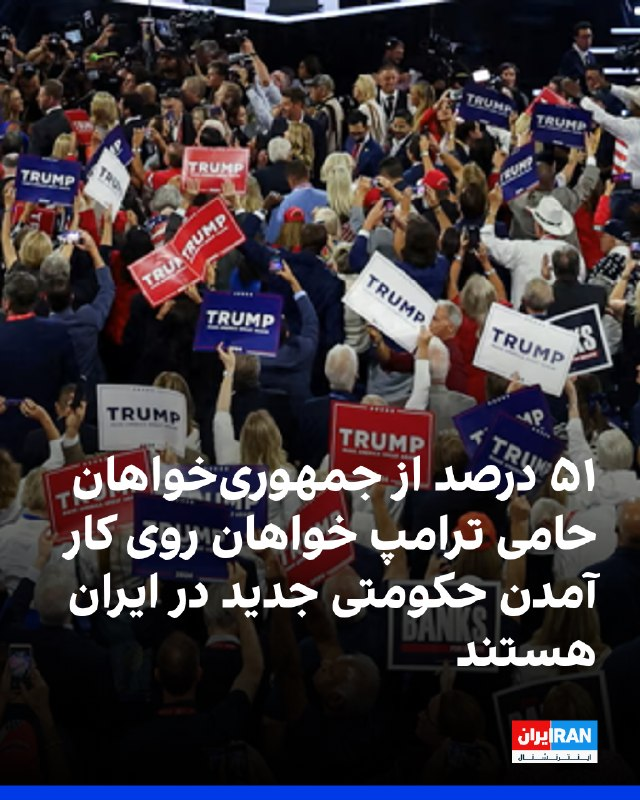

موسسه ریگان بر اساس نتایج یک نظرسنجی گزارش داد که تنها ۲۵ درصد از جمهوری‌خواهان حامی جنبش «ماگا» از دستیابی به یک توافق مذاکره‌شده با جمهوری اسلامی حمایت می‌کنند.
بر اساس نتایج این نظرسنجی، حامیان جنبش «ماگا» بیش از دو برابر بیشتر از گزینه توافق با جمهوری اسلامی، از تغییر حکومت در ایران حمایت می‌کنند.
این نظرسنجی نشان می‌دهد ۵۱ درصد از جمهوری‌خواهان حامی دونالد ترامپ، رییس‌جمهوری آمریکا، خواهان روی کار آمدن حکومتی جدید در ایران هستند، در حالی که تنها ۲۵ درصد از آنان از دستیابی به یک توافق مذاکره‌شده با تهران حمایت می‌کنند.
در میان همه جمهوری‌خواهان نیز ۵۰ درصد از تغییر حکومت در ایران حمایت کرده‌اند و ۲۵ درصد طرفدار راه‌حل دیپلماتیک و توافق با جمهوری اسلامی بوده‌اند.
در مقابل، ۵۲ درصد از دموکرات‌ها از مسیر دیپلماتیک و توافق حمایت کرده‌اند و ۲۵ درصد آنان از تغییر حکومت در ایران پشتیبانی کرده‌اند.
بر اساس این نظرسنجی، ۱۴ درصد از جمهوری‌خواهان حامی ماگا نیز گفته‌اند ترجیح می‌دهند جمهوری اسلامی در قدرت باقی بماند، اما توان اقتصادی و نظامی آن به شدت محدود شود.

https://iranintl.com/202606195282

## IranIntlTV — post 343300

  <a href="telegram/content/IranIntlTV_343300_1781910023.mp4" target="_blank">🎬 Download video</a>

تنها دو روز پس از امضای تفاهم‌نامه میان روسای جمهوری آمریکا و جمهوری اسلامی، مذاکرات برنامه‌ریزی‌شده در سوئیس لغو شد.

دونالد ترامپ هشدار داد اگر در ۶۰ روز توافقی حاصل نشود، آمریکا اقداماتی انجام خواهد داد که برای مقام‌های جمهوری اسلامی خوشایند نخواهد بود. جی‌دی ونس نیز گفت تفاهم‌نامه میان واشینگتن و تهران ارتباطی با خروج اسرائیل از جنوب لبنان ندارد.

گزارش امیر گیتی، عضو تحریریه ایران‌اینترنشنال
@iranintltv

## FarsiVOA — post 221251

⚡️پرزیدنت ترامپ روز جمعه ۲۹ خرداد در سخنانی در مراسم رونمایی از هواپیمای جدید ریاست جمهوری، «ایرفورس وان»، به موضوعات مختلف، از جمله بازگشایی تنگه هرمز و پایین آمدن قیمت نفت در جهان، اشاره کرد. صدای آمریکا مشروح این سخنرانی را با ترجمه همزمان پژواک کیومرثی پخش کرد.
@FarsiVOA

## FarsiVOA — post 221250

  <a href="telegram/content/FarsiVOA_221250_1781910025.mp4" target="_blank">🎬 Download video</a>

⚡️جابر رجبی در برنامه تفسیر خبر: این تفاهم یک ترک در دیوار حکومت انداخت
@FarsiVOA

## FarsiVOA — post 221249

  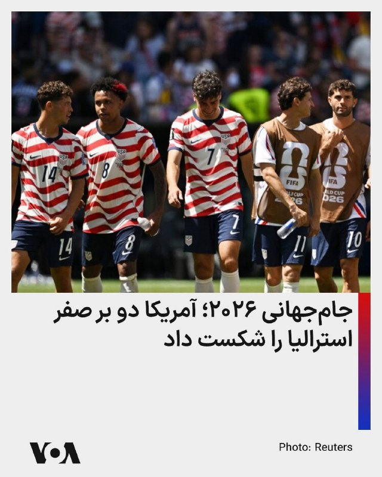

⚡️در ادامه رقابت‌های جام جهانی فوتبال ۲۰۲۰۶، تیم ملی آمریکا روز جمعه ۲۹ خرداد توانست دو بر صفر استرالیا را شکست دهد. آمریکا صدرنشین گروه D است و پیش از این نیز پاراگوئه را ۴ بر یک شکست داده بود. رقابت بعدی این تیم با ترکیه در ۴ تیر است.
@FarsiVOA

## FarsiVOA — post 221248

  <a href="telegram/content/FarsiVOA_221248_1781910026.mp4" target="_blank">🎬 Download video</a>

⚡️دور تازە تحریم‌های آمریکا علیه عوامل حزب‌الله لبنان
@FarsiVOA

## FarsiVOA — post 221247

  <a href="telegram/content/FarsiVOA_221247_1781910028.mp4" target="_blank">🎬 Download video</a>

⚡️سوت تاریخی زنان در بزرگ‌ترین صحنه فوتبال مردان؛ گفت‌وگو با محمدرضا فغانی داور بین‌المللی
@FarsiVOA

## FarsiVOA — post 221246

  <a href="telegram/content/FarsiVOA_221246_1781910029.mp4" target="_blank">🎬 Download video</a>

⚡️بازی دوم تیم‌ها در مرحله گروهی؛ گفت‌وگو با مهرداد بحری کارشناس فوتبال
@FarsiVOA

## FarsiVOA — post 221245

⚡️گزارش نرگس صبا در برنامه تفسیر خبر از دستاوردهای طرفین یادداشت تفاهم بین آمریکا و حکومت ایران
@FarsiVOA

## FarsiVOA — post 221244

  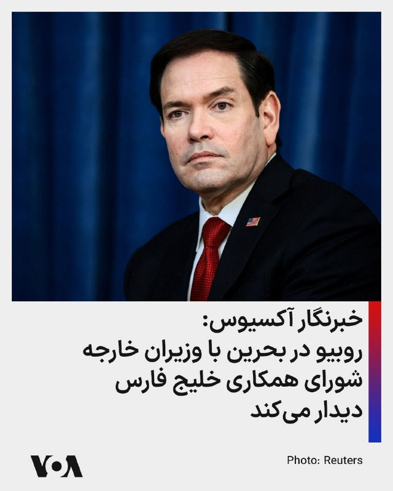

⚡️باراک راوید، خبرنگار آکسیوس به نقل از چند منبع گزارش داد که انتظار می‌رود مارکو روبیو به‌زودی در بحرین، در نشستی با وزیران امورخارجه کشورهای شورای همکاری خلیج فارس شرکت کند. راوید می‌گوید آقای روبیو علاوه بر بحرین، به کویت و امارت نیز می‌رود.
@FarsiVOA

## FarsiVOA — post 221243

  <a href="telegram/content/FarsiVOA_221243_1781910030.mp4" target="_blank">🎬 Download video</a>

⚡️حال و هوای شهر واشنگتن همزمان با بازی آمریکا و استرالیا
@FarsiVOA

## FarsiVOA — post 221242

  <a href="telegram/content/FarsiVOA_221242_1781910031.mp4" target="_blank">🎬 Download video</a>

⚡️حال و هوای شهر سیاتل همزمان با بازی آمریکا و استرالیا
@FarsiVOA

## Persian_Trend_Official — post 17626

  <a href="telegram/content/Persian_Trend_Official_17626_1781910033.mp4" target="_blank">🎬 Download video</a>

شبتون بخیر 🌃
F-18 Super Hornet

📌 @persian_trend_official
پرشین ترند | متفاوت‌ترین کانال نظامی

## Persian_Trend_Official — post 17625

  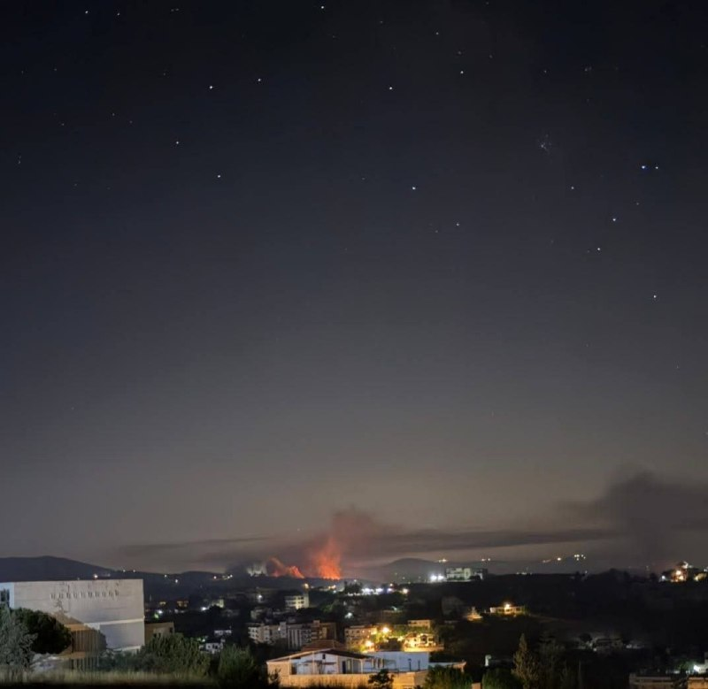

کانال های نزدیک به حزب‌الله ادعا میکنند نیروهای این گروه یک تانک مرکاوا را با موشک هدف قرار دادند که باعث آتش سوزی در تانک شده.

📝 Amir

📌 @persian_trend_official
پرشین ترند | متفاوت‌ترین کانال نظامی

## Persian_Trend_Official — post 17624

  <a href="telegram/content/Persian_Trend_Official_17624_1781910035.mp4" target="_blank">🎬 Download video</a>

ارتش اسرائیل در حال گلوله باران سنگین توپخانه ای تپه های علی الطاهر است تا راه برای گروه های زرهی باز شود تا بتواند در موقعیت مناسبی در علی الطاهر مستقر شود.

📝 Amir

📌 @persian_trend_official
پرشین ترند | متفاوت‌ترین کانال نظامی

## IranianMinds — post 22980

  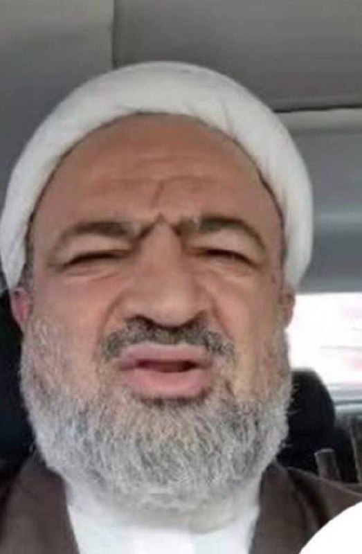

🔴رسایی:

دشمن اگه غلطی کرد باید تنگه را ببندیم.

@IranianMinds

## IranianMinds — post 22979

🔴یک کاربر خارجی که میگه تمام عباراتی که امریکا در این تفاهم‌نامه به کار برده فقط بازی با کلمات هست و در واقع فرستادن طرف به دنبال نخود سیاه هست و پزشکیانو خنگ‌ترین سیاست‌مدار معرفی کرده.

@IranianMinds

## BBCPersian — post 284433

  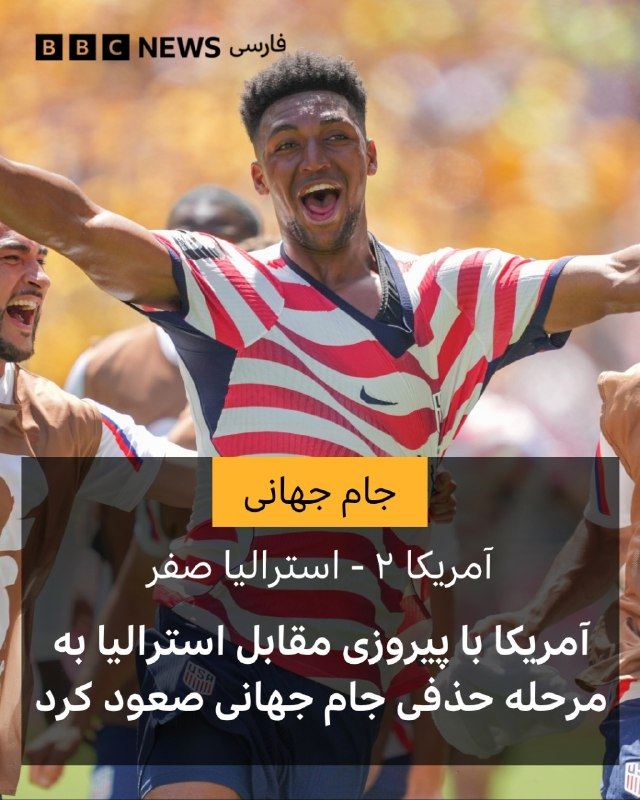

‌⚽آمریکا ۲ - استرالیا صفر

🔸تیم ملی فوتبال آمریکا، میزبان جام جهانی، با پیروزی ۲ بر صفر مقابل استرالیا در گروه D به مرحله حذفی این رقابت‌ها صعود کرد.

آمریکا در دقیقه ۱۱ با گل به خودی یکی از بازیکنان استرالیا پیش افتاد و سپس الکساندر فریمن، مدافع میانی این تیم، در دقیقه ۴۳ گل دوم را به ثمر رساند.

با این پیروزی، آمریکا یک بازی مانده به پایان مرحله گروهی، صعود خود به دور حذفی را قطعی کرد.

در دیگر مسابقات روز، اسکاتلند به مصاف مراکش، قهرمان آفریقا، می‌رود. همچنین برزیل با هائیتی دیدار خواهد کرد و ترکیه برابر پاراگوئه به میدان می‌رود.

📷ISI Photos via Getty Images
https://bbc.in/4vsxgTg

@BBCPersian

## Dirty_Kids — post 392617

  <a href="https://t.me/Dirty_Kids/392617" target="_blank">📎 Download file</a>

ریتزوبت تنها سایت بین المللی میباشد ، که به صورت هفتگی پرومو کد دریافت میکنید ✅

♦️ آموزش شارژ حساب با کریپتو
♦️ آموزش شارژ حساب ریالی در ریتزوبت

🔵ریتزوبت برندی با لایسنس معتبر در صنعت شرطبندی و #پیشبینی مسابقات ورزشی و کازینویی 👇

https://t.me/+LB508WZyIr8xNmY0

## Dirty_Kids — post 392616

  <a href="telegram/content/Dirty_Kids_392616_1781910038.webm" target="_blank">🎬 Download video</a>

چرا 
3️⃣
2️⃣
1️⃣ انتخاب درستی برای شرطبندی هست؟

🔢 امنیت و اعتبار بالا → چون ایرانی نیست، مثل خیلی از سایت‌های داخلی آینده مبهمی نداره.

🔢 سقف برداشت → در ریتزوبت سقف برداشت معنی نداره و شما میتونید بدون محدودیت شرطبندی کنید .

🔢 بونوس‌های فوق‌العاده → اولین شارژت 100% بونوس داره، و یکشنبه‌ها هم هر مقدار شارژ کنی همونقدر جایزه می‌گیری!

🔢 فعالیت بین‌المللی → در کشورهای بزرگی مثل برزیل 
🇧🇷، هند 
🇮🇳 ترکیه 
🇹🇷 و بنگلادش 
🇧🇩 فعال هست.

🔢 اپلیکیشن اختصاصی → با اپ اندروید سریع ‌تر شرط‌بندی کن بدون نیاز به فیلترشکن .

➖
➖
➖
➖
➖
➖
➖
➖
🚀 لینک و اپ رو همینجا براتون می‌ذارم . برای جام جهانی هوشمندانه انتخاب کنید 
✅
A29

⚡️اپلیکیشن اندروید ریتزوبت👇
🌐 RitzoBet App

⚡️لینک سایت معتبر ریتزوبت👇
🌐 https://RitzoBet_com

## Dirty_Kids — post 392615

  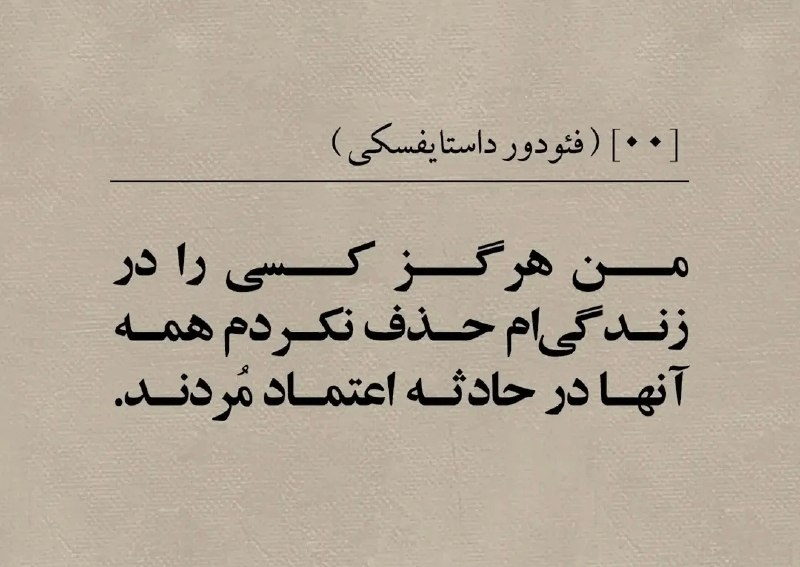

#بخوابیم

@Dirty_Kids 👻

## Dirty_Kids — post 392613

  <a href="telegram/content/Dirty_Kids_392613_1781910039.mp4" target="_blank">🎬 Download video</a>

از وقتی متن های اموزشی رو با این ویو میخونم، خیلی بهتر یادشون میگیرم :) 
🇮🇷

@Dirty_Kids 👻

## Dirty_Kids — post 392612

  <a href="telegram/content/Dirty_Kids_392612_1781910040.mp4" target="_blank">🎬 Download video</a>

مهم نیست گذشتش وقتی الانتو دیدم....
دختری که پسرا حاضرن کل زندگیشونو بهش بدن:

@Dirty_Kids 👻

## Hranews — post 113732

  

💥 دعوت به همکاری با خبرگزاری هرانا

خبرگزاری هرانا، با بیش از دو دهه سابقه در حوزه گزارشگری و مستندسازی حقوق بشر، در راستای توسعه فعالیت‌های خود از علاقه‌مندان واجد شرایط برای همکاری دعوت می‌کند.

هرانا در این مرحله بیش از آن‌که به دنبال افراد با سابقه حرفه‌ای باشد، به دنبال افرادی متعهد، دقیق و آموزش‌پذیر است؛ کسانی که دغدغه واقعی حقوق بشر دارند و مایل‌اند در یک چارچوب حرفه‌ای، مهارت‌های خود را توسعه دهند.

زمینه‌های همکاری شامل:
گزارشگری، ویراستاری، ترجمه، مدیریت شبکه‌های اجتماعی و سایر حوزه‌های مرتبط

ویژگی‌های مورد انتظار:

* تسلط کافی به زبان فارسی (خواندن و نوشتن)
* دقت، مسئولیت‌پذیری و توانایی یادگیری مستمر
* علاقه و حساسیت نسبت به موضوعات حقوق بشر
* آمادگی برای فعالیت در چارچوب‌های سازمان‌یافته و حرفه‌ای

❗️ توجه: درخواست‌ها صرفاً در صورتی بررسی خواهند شد که اطلاعات ثبت‌شده در فرم (از جمله کشور محل سکونت و سایر شرایط اعلام‌شده) با الزامات همکاری همخوانی داشته باشد.

همکاری با هرانا فرصتی است برای کسب تجربه عملی در حوزه مستندسازی و فعالیت‌های حقوق بشری در یک نهاد با سابقه و ساختار حرفه‌ای.

📎 برای ثبت درخواست همکاری، لطفا فرم زیر را تکمیل کنید:
https://hra.news/4cBjHqs

📩 در صورت بروز مشکل در تکمیل فرم، می‌توانید رزومه و اطلاعات تماس خود را به آدرس زیر ارسال نمایید:
info@hra-news.org

↘️
@hranews_bot تماس ✉️ -  @Hranews  کانال هرانا 🆑

## alonews — post 129267

  <a href="telegram/content/alonews_129267_1781910042.webm" target="_blank">🎬 Download video</a>

👈حرکت 10 نفتکش ایرانی به نام های؛ دیونا، قهرمان، سونیا، دورنا، آمبر، خندان، برف، هدی، استارلا و دریا عمیق به طرف چین

✅ @AloNews خبر جنگ

---
📅 بروزرسانی: 1405/03/30 01:29
---

## VahidOOnLine — post 246444

♦️به گزارش «ان‌بی‌سی نیوز»، دونالد ترامپ، رئیس‌جمهوری ایالات متحده، روز جمعه رسما از هواپیمای جدید و مجلل «ایر فورس وان»، هدیه دولت قطر به آمریکا رونمایی کرد؛ یک «بوئینگ ۷۴۷» به ارزش تقریبی ۴۰۰ میلیون دلار. این هواپیمای لوکس با رنگ‌آمیزی جدید قرمز، سفید و سرمه‌ای تیره، قرار است در روز ۴ ژوئیه (۲۵ خردادماه) رهبری یک پرواز نمایشی بی‌سابقه بر فراز واشنگتن را به مناسبت دویست‌و‌پنجاهمین سالگرد استقلال آمریکا بر عهده داشته باشد. ترامپ با توصیف این هواپیما به عنوان «یک کاخ سفید پرنده با سطحی بی‌سابقه از لوکس بودن»، اعلام کرد که سفر بازگشت او از نشست جی۷ در فرانسه، آخرین استفاده او از ناوگان قدیمی خواهد بود.
نیروی هوایی آمریکا در بیانیه‌ای تایید کرد که این هواپیما آماده آغاز پروازهای آزمایشی اولیه است. با وجود اینکه هواپیمای مذکور اکنون برای انجام وظایف رسمی در اختیار رئیس‌جمهوری قرار گرفته، کارشناسان هوانوردی برآورد می‌کنند که هزینه‌های ارتقای امنیتی و تجهیز آن برای دولت آمریکا ممکن است از مرز ۱ میلیارد دلار فراتر برود.
‌🇸🇦 Indypersian

🤖 @VahidOOnLine

## VahidOOnLine — post 246443

  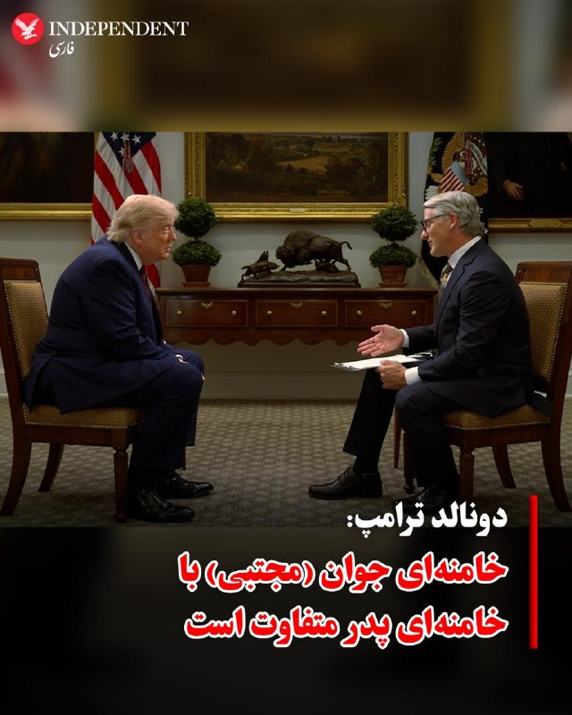

♦️دونالد ترامپ در مصاحبه با «اکسیوس» گفت که خامنه‌ای جوان (مجتبی) با خامنه‌ای پدر متفاوت است و افزود که در ایران نوعی «تغییر رژیم» رخ داده، چرا که افراد متفاوتی روی کار آمده‌اند. رئیس‌جمهوری آمریکا با اشاره به گروه جدید حاکم در ایران گفت: «ما با افرادی روبه‌رو هستیم که نسبت به دو گروه قبلی، بسیار کمتر تندرو هستند.» او در ادامه این گفتگو با دفاع از عملکرد دولتش، اعلام کرد که برخلاف باراک اوباما، او به توان پدافندی و نیروی هوایی ایران آسیب جدی وارد کرده و علاوه بر قاسم سلیمانی، رهبران ارشد دیگری را نیز هدف قرار داده است. ترامپ افزود: «من آیت‌الله را کشتم و متاسفانه به آن یکی آیت‌الله آسیب جدی زدم. من او را ندیدم و با او صحبت نکردم، اما مردم از او صحبت می‌کردند. با این حال او شجاعت خاصی دارد چون به‌شدت مجروح شده بود.»
‌🇸🇦 Indypersian

🤖 @VahidOOnLine

## VahidOOnLine — post 246442

♦️گزیده‌ای از مهم‌ترین اخبار ایران و جهان در هفته‌ای که گذشت را در «ایران و جهان در یک دقیقه» ببینید

- دونالد ترامپ و مسعود پزشکیان تفاهم‌نامه‌ پایان جنگ آمریکا و ایران را روز پنج‌شنبه ۲۸ خرداد امضا کردند. در پی این رویداد، تنگه هرمز بازگشایی و محاصره دریایی ایران برچیده شد. مجتبی خامنه‌ای رهبر جمهوری اسلامی در پیامی اعلام کرد که به دلیل اصرار پزشکیان با این تفاهم‌نامه موافقت کرده است.
-مذاکرات ۶۰ روزه برای رسیدن به توافق جامع میان دو کشور رسما آغاز شده است.
-در پی اظهارات تحقیر آمیز ترامپ درباره جورجیا ملونی، نخست وزیر ایتالیا، سفر وزیرخارجه این کشور به آمریکا لغو شد. ترامپ گفته بود که ملونی در اجلاس گروه ۷، التماس می‌کرد که با او عکس بگیرد. ملونی در پاسخی ویدیویی این روایت را رد کرد و به ترامپ گفت که من و ایتالیا هرگز التماس نمی‌کنیم.
-قیمت دلار در ایران از ۱۸۰ هزار تومان به ۱۵۵ هزار تومان سقوط کرد. قیمت نفت برنت به حدود ۷۷ دلار کاهش یافت.
-تیم ملی ایران در در جام‌جهانی ۲۰۲۶ مقابل نیوزیلند به تساوی ۲ بر ۲ رسید. دومین مسابقه ایران مقابل بلژیک در روز یکشنبه ۳۱ خرداد در لس‌آنجلس خواهد بود.
‌🇸🇦 Indypersian

🤖 @VahidOOnLine

## VahidOOnLine — post 246441

  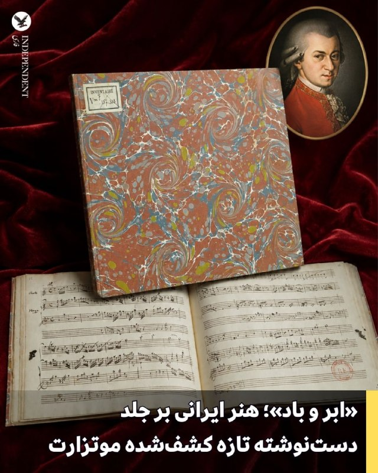

♦️در میان صفحات دست‌نویس تازه کشف‌شده‌ای از ولفگانگ آمادئوس موتزارت که در کتابخانه ملی فرانسه نگهداری می‌شود، تنها نت‌های موسیقی نیستند که توجه پژوهشگران را جلب کرده‌اند. جلد این دفتر ارزشمند با کاغذ ابروباد، یا کاغذ ابری، تزئین شده است؛ هنری که ریشه‌های آن به ایران و آسیای مرکزی بازمی‌گردد و قرن‌ها پیش از آنکه به اروپا راه پیدا کند، در کتاب‌آرایی ایرانی رواج داشت.
برخی منابع رواج این فن را به خواجه شهاب‌الدین عبدالله مروارید، متخلص به «بیانی»، از رجال فرهنگی دوره تیموری (قرن نهم هجری قمری) نسبت می‌دهند. هرچند پژوهشگران معاصر پیدایش کاغذ ابری را حاصل سنتی گسترده‌تر در حوزه فرهنگی ایران و آسیای مرکزی می‌دانند، اما در اینکه این هنر در ایران صفوی به‌خوبی شناخته شده و در کتاب‌آرایی و خوشنویسی کاربرد داشته، تردیدی وجود ندارد.
کاغذ ابروباد با شناور کردن رنگ‌ها بر سطح مایع و انتقال نقش‌های موج‌دار و ابری به کاغذ ساخته می‌شود و به دلیل آنکه هیچ دو نمونه‌ای کاملا مشابه نیستند، هر برگ اثری یگانه به شمار می‌رود. این هنر از ایران و آسیای مرکزی به عثمانی راه یافت و در آنجا به تکامل رسید و سپس از قرن هفدهم به اروپا رسید.
ابری به تدریج به یکی از محبوب‌ترین پوشش‌ها برای جلد کتاب‌، آستر بدرقه (صفحه ای که کتاب را به جلد متصل می‌کند)و نسخه‌های نفیس تبدیل شد.
‌🇸🇦 Indypersian

🤖 @VahidOOnLine

## VahidOOnLine — post 246440

  

ابراهیم رضایی، سخنگوی کمیسیون امنیت ملی مجلس، در بوشهر در گفت‌وگو با خبرنگاران رسانه‌های ایران گفت: «جنگ پایان نیافته است و به تعهدات آمریکا اعتمادی ندارم.»

او افزود: «آن‌ها دو بار در میانه مذاکرات به ما حمله کردند.»
‌🏁 🇬🇧 IranintlTV

🤖 @VahidOOnLine

## VahidOOnLine — post 246439

  <a href="telegram/content/VahidOOnLine_246439_1781906344.mp4" target="_blank">🎬 Download video</a>

♦️دونالد ترامپ با اشاره به تحولات بازار انرژی و ترافیک بی‌سابقه نفتکش‌ها در تنگه هرمز، اعلام کرد که اوضاع بسیار خوب پیش می‌رود. رئیس جمهوری آمریکا روز جمعه در مراسم رونمایی از هواپیمای «بوئینگ ۷۴۷» اهدایی قطر، با تمرکز بر این تحولات گفت: «کشتی‌ها به شکلی از تنگه هرمز سرازیر شده‌اند که در واقع هیچ‌کس تا به حال نظیرش را ندیده است. تعدادشان خیلی زیاد بود، حدود ۷۰۰ کشتی، و نفت در همه جا هست.» ترامپ در ادامه با پیش‌بینی تغییرات قیمت در بازار جهانی افزود: «شما شاهد خواهید بود که قیمت نفت آن‌قدر پایین می‌آید که امیدوارم شرکت‌ها از این بابت خوشحال باشند.»
‌🇸🇦 Indypersian

🤖 @VahidOOnLine

## WithYashar — post 15370

تیم ملی آمریکا با برد ۲ هیچ برابر استرالیا به عنوان دومین تیم پر قدرت به مرحله حذفی جام جهانی ۲۰۲۶ صعود کرد!
@withyashar

## WithYashar — post 15369

  <a href="telegram/content/WithYashar_15369_1781906346.mp4" target="_blank">🎬 Download video</a>

الان درگیری‌های سنگین بین نیروهای اسرائیل و حزب‌الله تو لُبنان
@withyashar

## WithYashar — post 15368

  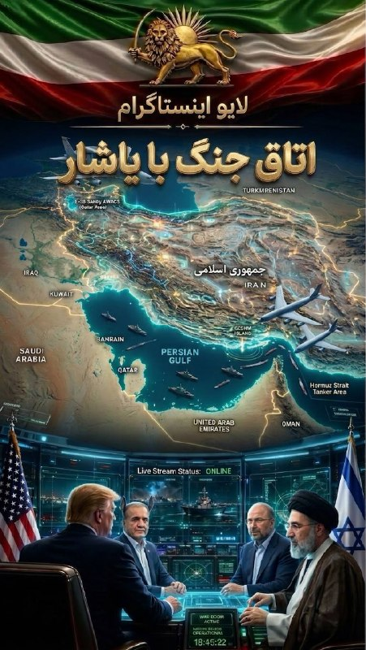

کاور لایو
@withyashar

## WithYashar — post 15367

https://www.instagram.com/reel/DZyFKZXCHfl/?igsh=anMxYmI2ZnUzdHpy

لایو سیو شد

## mwarmonitor — post 11242

🔹مجری فاکس نیوز:
«اکنون مارک لوین، مجری برنامه "زندگی، آزادی و لوین" به ما می‌پیوندد. مارک، خیلی عالیه که امروز همراه ما هستی.»
🔸مارک لوین :
«خب، واقعیت امر این است که این رژیم مرده است. مسئله این است که آیا ما اجازه می‌دهیم زنده بماند؟ آیا اجازه می‌دهیم جان دوباره‌ای به آن دمیده شود؟ و به همین دلیل است که این مذاکرات حیاتی هستند. من با تقریباً تمام صحبت‌های ژنرال کلاگ موافقم. آن‌ها مرده‌های متحرک هستند.»
«حالا، آیا ما قرار است آن‌ها را احیا کنیم یا نه؟ تا جایی که به تنگه‌ها مربوط می‌شود، آنجا آب‌های بین‌المللی است. آن‌ها حق ندارند آن را کنترل کنند. هشت کشور در خط ساحلی آن منطقه قابل کشتیرانی قرار دارند. کی گفته ایران حق دارد درباره آنچه در آنجا می‌گذرد تصمیم‌گیری کند؟»
«آن‌ها باید سر جای خودشان نشانده شوند. از نظر من—من رئیس‌جمهور نیستم، پس فقط دارم پیش‌بینی و تصویرسازی می‌کنم—من می‌گفتم: این ۱۲ بند من است، یا تسلیم می‌شوید یا یک یا دو هفته دیگر شما را خواهیم دید (با شما حساب تسویه می‌کنیم).»
«این حکومت باید برود. این یک حکومت غیرمشروع است، مردم خودش را قتل‌عام می‌کند. این حکومتی برخاسته از مردم نیست...»
🔹مجری میان حرف او می‌پرد:
«...اما در حال حاضر همان افراد سابق در رأس کار هستند، درست است؟ منظورم این است که ما شاهد تغییر رژیم نبوده‌ایم. همان آدم‌ها در رأس قدرتند، درست می‌گویم؟»
🔸مارک لوین :
«خب، برداشت من از این موضوع این است: واقعیت امر این است که ما با این رژیم وارد جنگ شدیم و این رژیم شکست خورد. ما با مردم ایران وارد جنگ نشدیم. این‌ها دو مقوله کاملاً جدا از هم هستند.»
«دقیقاً. ما به دنبال یک پروژه دموکراسی‌سازی نیستیم، مردم آمریکا پروژه دموکراسی‌سازی نمی‌خواهند. خب که چی؟ ما این رژیم را برمی‌داریم (سرنگون می‌کنیم)، یک حکومت موقت روی کار می‌آوریم و خودشان می‌توانند بفهمند که می‌خواهند چه کار کنند؛ چه دموکراسی بخواهند، چه پادشاه بخواهند، چه شاهزاده یا ملکه. می‌دانید، کل آن منطقه پر از دیکتاتورها و پادشاهان است. اگر این همان چیزی است که آن‌ها می‌خواهند، عالی است.»
«ما آن رژیم را برمی‌داریم چون دشمن ماست. ما آن رژیم را برمی‌داریم چون مردم ما را کشته است. ما آن رژیم را برمی‌داریم چون سلاح هسته‌ای می‌خواستند. و اگر این رژیم به شکلی باقی بماند، می‌دانید، مثل دستگاه علف‌زن است؛ علف‌های هرز رشد می‌کنند و مدام بالا می‌آیند. شما ممکن است در مرحله بعدی رویه آن را بزنید، اما علف‌های هرز به رشد خود ادامه می‌دهند؛ و اگر ما به ریشه این علف‌های هرز نزنیم، آن‌ها همچنان به رشد خود ادامه خواهند داد.»

@mwarmonitor

## mwarmonitor — post 11241

  <a href="telegram/content/mwarmonitor_11241_1781906348.mp4" target="_blank">🎬 Download video</a>

🎬 Video

## mwarmonitor — post 11240

  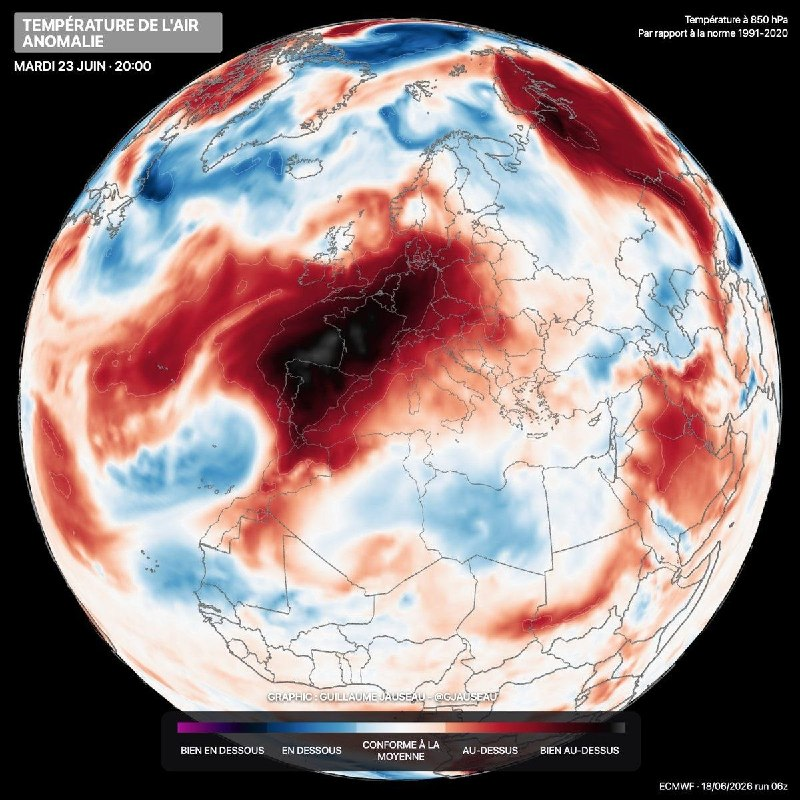

🔴هشدار هواشناسی: موج بی‌سابقه و رکوردشکن گرما در راه اروپا

هشدار به آژانس‌های هواشناسی | ۲۳ ژوئن ۲۰۲۶

🔸بررسی آخرین نقشه‌های پیش‌بینی مدل اروپایی ECMWF نشان می‌دهد که قاره اروپا در آستانه یکی از شدیدترین و بی‌سابقه‌ترین موج‌های گرمای خود قرار گرفته است.

طبق این داده‌ها، یک توده هوای به‌شدت داغ و متراکم (آنومالی مثبت دمایی) کشورهای غرب و مرکز اروپا از جمله فرانسه، اسپانیا، آلمان، بریتانیا و ایتالیا را به‌طور کامل در بر خواهد گرفت.

شاخص‌های هواشناسی در تراز ۸۵۰ هکتوپاسکال حاکی از جهش بی‌سابقه دما تا بیش از ۱۰ الی ۱۵ درجه سانتی‌گراد فراتر از میانگین بلندمدت (۱۹۹۱-۲۰۲۰) است که در سطح زمین می‌تواند رکوردهای دمایی جدیدی را ثبت کند.

هم‌زمان، بخش‌هایی از قطب شمال و خاورمیانه نیز با افزایش ملموس دما روبرو هستند. کارشناسان نسبت به پیامدهای این ابرموج گرما بر سلامت عمومی، افزایش مصرف انرژی و تشدید خطر آتش‌سوزی جنگل‌ها در روزهای آینده هشدار جدی داده‌اند.

@mwarmonitor

## mwarmonitor — post 11239

🔴روبیو قصد دارد هفته آینده به خاورمیانه سفر کند؛ این سفر شامل کویت، امارات متحده عربی و بحرین خواهد بود — اکسیوس

@mwarmonitor

## FoxNewsTwitter — post 343181

Fox News (Twitter/X)

Team USA is through to the knockout stage.

The United States secured its place in the next round of the World Cup with a 2-0 victory over Australia in Seattle on Friday, improving to 2-0 through its first two matches of the tournament.

The Americans have now clinched advancement with a game still left to play in the group stage.

It's the first time since the inaugural World Cup in 1930 that the United States has won back-to-back World Cup games.

## FoxNewsTwitter — post 343180

  <a href="telegram/content/FoxNewsTwitter_343180_1781906351.mp4" target="_blank">🎬 Download video</a>

Fox News (Twitter/X)

"This will be a flyover on July 4th I think I can say the likes of which we've never seen before."

President Trump says America's 250th anniversary celebration on July 4th will feature a massive military flyover over the U.S. Capitol and White House, led by the newly refurbished Air Force One.

Trump said the event will include F-22s, F-35s and other military aircraft, adding that military pilots are "all fighting to do it."

"We're gonna have a lot of planes flying over the Capitol and over the White House," Trump said.

## FoxNewsTwitter — post 343179

Fox News (Twitter/X)

BREAKING: U.S. men's soccer team advances to next round of the World Cup.

## pm_afshaa — post 94426

  <a href="telegram/content/pm_afshaa_94426_1781906353.mp4" target="_blank">🎬 Download video</a>

🔴ویدیویی وایرال‌شده از یک کاربر خارجی که میگه پزشکیان یکی از احمق‌ترین سیاستمدارایی‌ هست که دیده؛ تمام عباراتی که آمریکا در این تفاهم‌نامه به کار برده، صرفاً بازی با کلمات بوده و وعده‌های مطرح‌شده عملا چیزی جز دنبال نخودسیاه فرستادن طرف مقابل نیست.

💧 Rainbet.com the #1 Non-KYC Crypto Casino & Sportsbook @rainbetcom

😁 @Pm_Afshaa

## pm_afshaa — post 94425

  <a href="telegram/content/pm_afshaa_94425_1781906355.webm" target="_blank">🎬 Download video</a>

🔴ترامپ: اگه ایران در نهایت توافق نکنه، اتفاقاتی میفته که اونا رو خوشحال نمیکنه.

💧 Rainbet.com the #1 Non-KYC Crypto Casino & Sportsbook @rainbetcom

😁 @Pm_Afshaa

## IranIntlTV — post 343299

  <a href="telegram/content/IranIntlTV_343299_1781906355.mp4" target="_blank">🎬 Download video</a>

دادگاهی در قم، پرستو احمدی و هشت تن از نوازندگان و عوامل «کنسرت کاروانسرا» را هر یک به ۷۴ ضربه شلاق، دو سال ممنوعیت خروج از کشور و دو سال محرومیت از فعالیت هنری محکوم کرده است.

آرین ریسباف گزارش می‌دهد.
@iranintltv

## IranIntlTV — post 343298

  <a href="telegram/content/IranIntlTV_343298_1781906356.mp4" target="_blank">🎬 Download video</a>

دادگاهی در قم، پرستو احمدی و هشت تن از نوازندگان و عوامل «کنسرت کاروانسرا» را هر یک به ۷۴ ضربه شلاق، دو سال ممنوعیت خروج از کشور و دو سال محرومیت از فعالیت هنری محکوم کرده است.

آرین ریسباف گزارش می‌دهد.
@iranintltv

## IranIntlTV — post 343297

  <a href="telegram/content/IranIntlTV_343297_1781906358.mp4" target="_blank">🎬 Download video</a>

دونالد ترامپ گفت: «ایران ۶۰ روز فرصت دارد به یک آتش‌بس پایدار برسد. اگر به توافق نرسند، اقداماتی انجام خواهیم داد که قطعاً از آن خوششان نخواهد آمد.»

او افزود: «حتی در صورت امضای توافق، بازگشت کامل نفتکش‌ها به تنگه هرمز زمان‌بر خواهد بود، زیرا شرکت‌های کشتیرانی تا رفع خطرهای امنیتی برای عبور از این مسیر تردید خواهند داشت.»
@iranintltv

## IranIntlTV — post 343296

  <a href="telegram/content/IranIntlTV_343296_1781906359.mp4" target="_blank">🎬 Download video</a>

فدراسیون فوتبال ایران در پی محدودیت‌های اعمال‌شده برای سفر تیم ملی به آمریکا در جام جهانی ۲۰۲۶، رسما به فیفا شکایت کرد.

بر اساس این محدودیت‌ها، تیم ملی ایران تنها یک روز پیش از مسابقه اجازه ورود به آمریکا را دارد و باید بلافاصله پس از بازی خاک این کشور را ترک کند.

گزارش نیلوفر منصوری، خبرنگار ایران‌اینترنشنال
@iranintltv

## IranIntlTV — post 343295

  

🔻تیم ملی فوتبال آمریکا در دومین دیدار خود در جام جهانی ۲۰۲۶ که در استادیوم سیاتل برگزار شد، استرالیا را با نتیجه ۲ بر صفر شکست داد و با ۶ امتیاز به مرحله یک شانزدهم نهایی مسابقات صعود کرد.

🔹کمرون برجس (گل به خودی) در دقیقه ۱۱ و الکس فریمن در دقیقه ۴۳ گل‌های بازی را به ثمر رساندند.

🔹نکته اینکه نخستین گل آمریکا در این جام که به پاراگوئه زده شد هم، گل به خودی بود.

🔹آمریکا در بازی نخست خود در گروه D جام جهانی، پاراگوئه را با نتیجه ۴ بر یک شکست داده بود.

🔹ترکیه و پاراگوئه بامداد شنبه، دیگر بازی این گروه را برگزار می‌کنند.

@iranintltvsport

## IranIntlTV — post 343294

  <a href="telegram/content/IranIntlTV_343294_1781906361.mp4" target="_blank">🎬 Download video</a>

در حاشیه مراسم خاکسپاری مرجان ساتراپی، فیلمساز و هنرمند ایرانی، در گورستان پرلاشز پاریس، سرور کسمایی، نویسنده و مترجم، به ساجده شریفی، خبرنگار ایران‌اینترنشنال، گفت: «مرجان ساتراپی، مانند عباس کیارستمی، توانست با آثارش توجه جهان را به ایران جلب کند.»

او افزود: «ساتراپی با تمرکز بر زندگی و با زبانی ساده و انسانی، به قلب مخاطبان در سراسر جهان راه یافت و تصویری متفاوت از روایت جمهوری اسلامی از ایران ارائه کرد.»
@iranintltv

## IranIntlTV — post 343293

  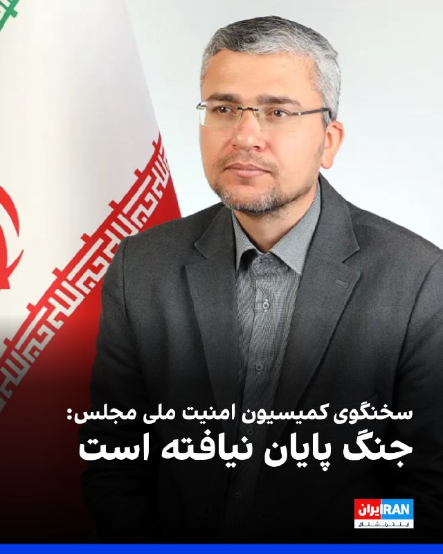

ابراهیم رضایی، سخنگوی کمیسیون امنیت ملی مجلس، در بوشهر در گفت‌وگو با خبرنگاران رسانه‌های ایران گفت: «جنگ پایان نیافته است و به تعهدات آمریکا اعتمادی ندارم.»

او افزود: «آن‌ها دو بار در میانه مذاکرات به ما حمله کردند.»
https://iranintl.com/202606194068

## Shin_Persian — post 7139

  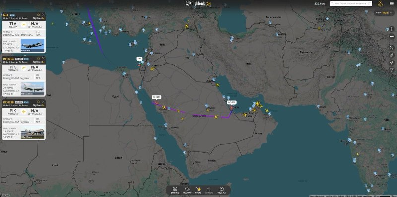

🔁 Quoting above tweet:
Canadian OSINT ✓ @Canadian_OSINT
Fri, 19 Jun 2026 20:36:17 UTC

2 more tankers spotted.. another from the UK RCH254 (20-46083) pretty sure this tail number was operating in the region last week as well..

16-46021 did not land at PSAB

57-1479 is departing Tel Aviv.

Boeing KC-46A Pegasus 2x

RCH238 - 16-46021
RCH254 - 20-46083

Boeing KC-135R Stratotanker 1x

NA - 57-1479

ترجمه خودکار فارسی

۲ تانکر سوخت‌رسان دیگر رویت شدند.. یکی دیگر از بریتانیا RCH254 (20-46083) کاملاً مطمئنم که این شماره دم هفته گذشته نیز در منطقه در حال عملیات بود..

۱۶-۴۶۰۲۱ در پایگاه هوایی شاهزاده سلطان (PSAB) فرود نیامد.

۵۷-۱۴۷۹ در حال ترک تل‌آویو است.

بوئینگ KC-46A Pegasus ۲ فروند

RCH238 - 16-46021
RCH254 - 20-46083

بوئینگ KC-135R Stratotanker ۱ فروند

NA - 57-1479

𝕏 · @shin_persian

## Shin_Persian — post 7137

↩️ Quoted tweet:
Canadian OSINT ✓ @Canadian_OSINT
Fri, 19 Jun 2026 20:13:06 UTC

10 tankers and an E-3B are operating over the ME right now. 16-46021 is landing at PSAB after a trip from Prestwick. Almost positive that tail number was in the ME before though..?

58-0059 is pictured in the 2nd photo over the UAE but not highlighted.

Boeing KC-46A Pegasus 1x

↩️ توییت نقل‌قول شده — برای پاسخ، پست زیر را ببینید.

ترجمه خودکار فارسی

در حال حاضر ۱۰ تانکر سوخت‌رسان و یک فروند E-3B در منطقه خاورمیانه در حال عملیات هستند. هواپیمای ۱۶-۴۶۰۲۱ پس از پروازی از پرستویک (Prestwick) در حال فرود در پایگاه هوایی شاهزاده سلطان (PSAB) است. تقریباً مطمئنم که این شماره دم قبلاً هم در خاورمیانه بوده است..؟

هواپیمای ۵۸-۰۰۵۹ در عکس دوم بر فراز امارات متحده عربی دیده می‌شود اما هایلایت نشده است.

Boeing KC-46A Pegasus 1x

𝕏 · @shin_persian

## FarsiVOA — post 221241

⚡️سازمان حقوق بشر ایران از اجرای حکم اعدام دست‌کم ۱۰ زندانی در زندان قزل‌حصار کرج طی روزهای ۲۳ و ۲۵ خرداد ۱۴۰۵ خبر داده است؛ احکامی که به گفته این گزارش، شامل پرونده‌های قتل و مواد مخدر و در برخی موارد بدون اطلاع قبلی خانواده‌ها اجرا شده‌اند.
@FarsiVOA

## FarsiVOA — post 221240

⚡️پرزیدنت ترامپ از بارگشایی تنگه هرمز ابراز خرسندی کرد و مخالفین تفاهمنامه را احمق خواند
@FarsiVOA

## IranianMinds — post 22978

  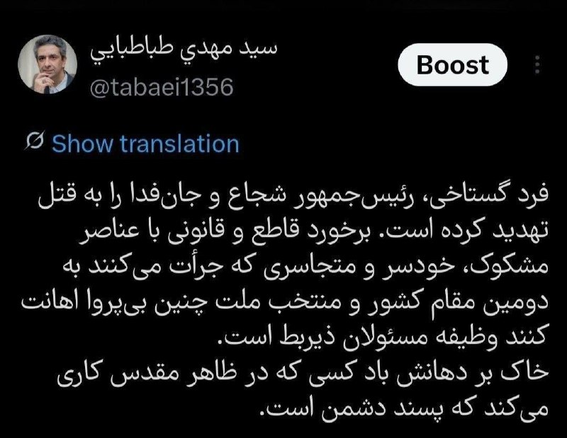

🔴یک مداح، پزشکیانو تهدید کرد. @IranianMinds

## IranianMinds — post 22977

  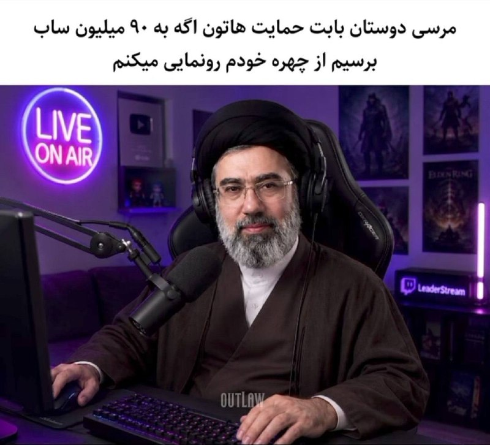

دوستان لایک کامنت ساب فراموش نشه

@IranianMinds

## IranianMinds — post 22976

  <a href="telegram/content/IranianMinds_22976_1781906365.mp4" target="_blank">🎬 Download video</a>

🔴یک مداح، پزشکیانو تهدید کرد.

@IranianMinds

## BBCPersian — post 284432

🔻واکنش‌ها به پیام منتسب به مجتبی خامنه‌ای به برخی هیئت‌های عزاداری نزدیک به جریان‌های تندرو نیز کشیده شده است.

پیشتر در این پیام رهبر جمهوری اسلامی ایران آمده بود که نظرش درباره توافق با آمریکا «چیز دیگری بوده ولی پس از آن‌که مسعود پزشکیان مسئولیت آن را پذیرفت، اجازه امضای آن را داده است.»

در این ویدئو محمدعلی بخشی، یک مداح در شهرری تهران می‌گوید: «آقای رئیس‌جمهور اگر شروط رهبری محقق نشه، ما می‌دانیم و تیغ و حلقوم شما. پدرت رو درمیاریم!»

آقای پزشکیان در باره پیام منتسب به خامنه‌ای گفت که او به عنوان رئیس جمهور و رئیس شورای امنیت ملی به همراه سایر اعضای آن شورا «خود را متعهد به توجه حداکثری نسبت به دغدغه‌های معظم‌له و حراست از حقوق ملت ایران و جبهه مقاومت» می‌دانند.

محمدباقر قالیباف، رئیس مجلس و همچنین رئیس هیئت ایران در مذاکرات با آمریکا، هم در واکنش به این پیام در شبکه اجتماعی ایکس نوشت که از سوی رهبر موظف به پیگیری تحقق شروط و بندهای تفاهم‌ شده و «گوش به فرمان» اوست.

@BBCPersian

## Dirty_Kids — post 392611

  

ایشون "رالف لینکلن" ، نسل یازدهم "آبراهام لینکلن" هست. چه شباهتی!

@Dirty_Kids 👻

## Dirty_Kids — post 392610

  <a href="telegram/content/Dirty_Kids_392610_1781906366.mp4" target="_blank">🎬 Download video</a>

آدم وقتی اینا رو می‌بینه و می‌شنوه خجالت می‌کشه به فوتبال ایران بگه «فوتبال حرفه‌ای»، واقعاً احساس مسخره‌ایه.

@Dirty_Kids 👻

## Dirty_Kids — post 392609

  

طبق گزارشات منتشر شده؛ قراره مجتبی خامنه‌ای بصورت هولوگرامی نماز میت پدرشو بخونه

@Dirty_Kids 👻

## Dirty_Kids — post 392608

  <a href="telegram/content/Dirty_Kids_392608_1781906369.mp4" target="_blank">🎬 Download video</a>

این تجمع تو نیویورک چرا همه چیش انقد عجیبه، یه نفر اون وسط جوراب یه دخترو درآورده و پاهاشو تا حلقش می‌کنه دهنش :))

@Dirty_Kids 👻

## alonews — post 129266

  <a href="telegram/content/alonews_129266_1781906369.webm" target="_blank">🎬 Download video</a>

👈رسایی :
دشمن اگه غلطی کرد باید تنگه رو ببندیم

✅ @AloNews خبر جنگ

## alonews — post 129265

  

تیم ملی آمریکا هم به عنوان دومین تیم به مرحله حذفی جام جهانی ۲۰۲۶ صعود کرد!

آمریکا 2_ استرالیا 0

@AloSport

## alonews — post 129263

  <a href="telegram/content/alonews_129263_1781906370.mp4" target="_blank">🎬 Download video</a>

👈هم اکنون درگیری‌های سنگین بین نیروهای اسرائیل و حزب‌الله تو لُبنان

✅ @AloNews خبر جنگ

## alonews — post 129262

  <a href="telegram/content/alonews_129262_1781906372.mp4" target="_blank">🎬 Download video</a>

👈یک مداح دوزاری، پزشکیان را تهدید کرد

🔴پ.ن: مداح‌های بیسواد و کودن چندسالی هست که تو تمام مسائل اعم از سیاسی، اقتصادی و اجتماعی نظر میدهند

✅ @AloNews خبر جنگ

---
📅 بروزرسانی: 1405/03/30 00:23
---

## VahidOOnLine — post 246438

  

ابراهیم عزیزی، رییس کمیسیون امنیت ملی مجلس، در شبکه ایکس نوشت: «متعهد نبودن آمریکا به بند نخست تفاهم‌نامه نشان می‌دهد اراده‌ای برای جلب اعتماد ما ندارد.»

او افزود: «ادامه وضعیت ما با آمریکا هزینه سنگینی خواهد داشت و نخستین آن، پاسخی هوشمندانه و بازدارنده به نقض تعهدات تفاهم‌نامه خواهد بود.»
‌🏁 🇬🇧 IranintlTV

🤖 @VahidOOnLine

## VahidOOnLine — post 246437

  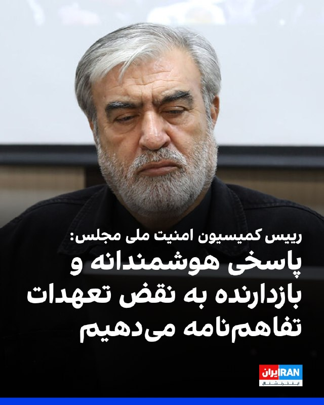

ابراهیم عزیزی، رییس کمیسیون امنیت ملی مجلس، در شبکه ایکس نوشت: «متعهد نبودن آمریکا به بند نخست تفاهم‌نامه نشان می‌دهد اراده‌ای برای جلب اعتماد ما ندارد.»

او افزود: «ادامه وضعیت ما با آمریکا هزینه سنگینی خواهد داشت و نخستین آن، پاسخی هوشمندانه و بازدارنده به نقض تعهدات تفاهم‌نامه خواهد بود.»
‌🏁 🇬🇧 IranintlTV

🤖 @VahidOOnLine

## VahidOOnLine — post 246436

  

ابراهیم عزیزی، رییس کمیسیون امنیت ملی مجلس، در شبکه ایکس نوشت: «متعهد نبودن آمریکا به بند نخست تفاهم‌نامه نشان می‌دهد اراده‌ای برای جلب اعتماد ما ندارد.»

او افزود: «ادامه وضعیت ما با آمریکا هزینه سنگینی خواهد داشت و نخستین آن، پاسخی هوشمندانه و بازدارنده به نقض تعهدات تفاهم‌نامه خواهد بود.»
‌🏁 🇬🇧 IranintlTV

🤖 @VahidOOnLine

## VahidOOnLine — post 246435

  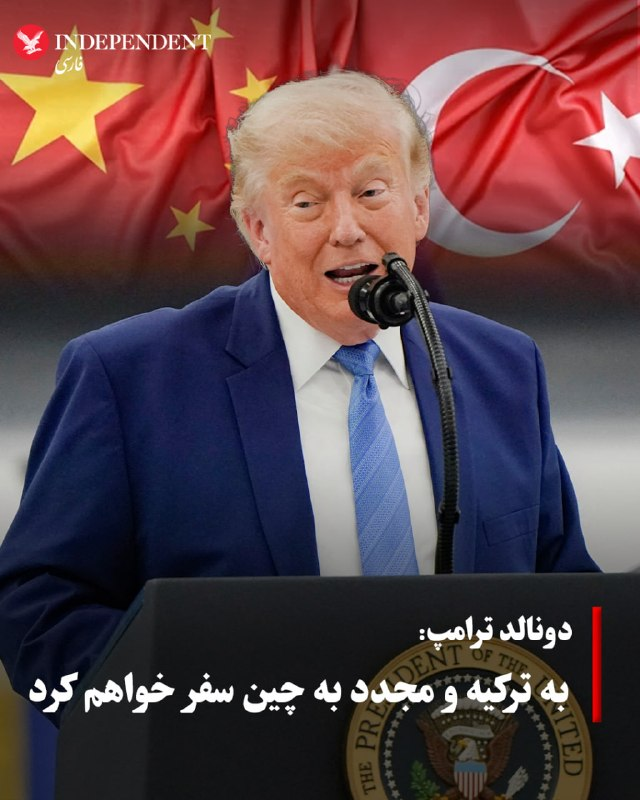

♦️دونالد ترامپ، رئیس‌جمهوری ایالات متحده، روز جمعه در جریان رونمایی از هواپیمای «بوئینگ ۷۴۷» اهدایی قطر که به ناوگان «ایر فورس وان» ملحق شده است، اعلام کرد که در سال ۲۰۲۶ برنامه‌های سفر متعددی از جمله به کشورهای ترکیه و چین دارد. ترامپ با اشاره به اینکه شی جین‌پینگ، رئیس‌جمهوری چین، در ماه سپتامبر به واشنگتن سفر خواهد کرد، افزود که او نیز شخصا برای شرکت در یک نشست بزرگ راهی چین خواهد شد؛ سفری که در کنار بازدید او از ترکیه، بخشی از برنامه‌های دیپلماتیک فشرده کاخ سفید در سال جاری میلادی به شمار می‌رود.
‌🇸🇦 Indypersian

🤖 @VahidOOnLine

## VahidOOnLine — post 246434

  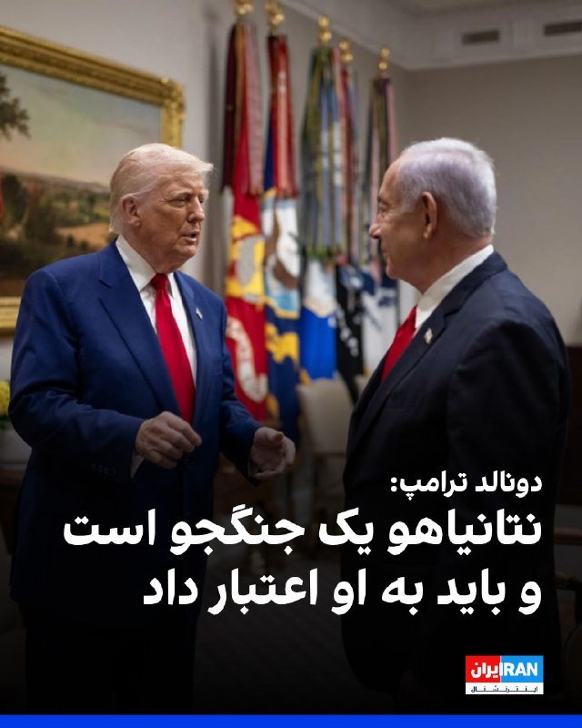

دونالد ترامپ در مراسم دیدار با نیروی هوایی این کشور، درباره روابط آمریکا و اسرائیل گفت: «روابط ما با اسرائیل بسیار قدرتمند است و بی‌بی نتانیاهو یک جنگجو است و باید به عنوان چنین فردی شناخته شود. باید به او اعتبار بدهند چون واقعا این کار را انجام داد. ما واقعا بسیار خوب در کنار اسرائیل جنگیدیم.»

او پیش‌تر به دلیل حملات اسرائیل به جنوب لبنان، انتقاداتی متوجه نتانیاهو کرده بود.
‌🏁 🇬🇧 IranintlTV

🤖 @VahidOOnLine

## VahidOOnLine — post 246433

  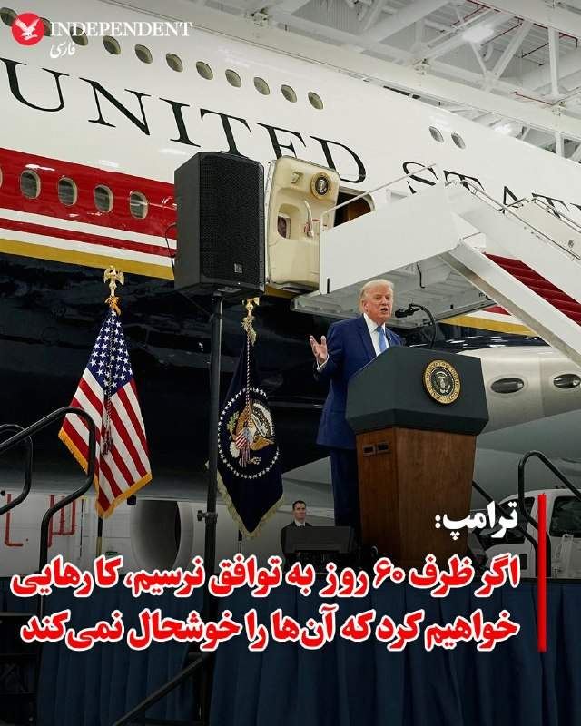

♦️دونالد ترامپ، روز جمعه ۲۹ خرداد در سخنرانی خود گفت که «ظرف ۶۰ روز باید [با جمهوری اسلامی ایران] به توافق برسیم، در غیر این صورت کارهایی خواهیم کرد که آن‌ها را خوشحال نخواهد کرد». او در ادامه افزود فکر نمی‌کند کار به آنجا بکشد.

ترامپ هنگام رونمایی از هواپیمای جدید ریاست‌جمهوری گفت: «به یاد داشته باشید، اگر ما آن کار را بکنیم، آن‌وقت ناگهان دیگر شاهد جریان داشتن نفت از تنگه هرمز نخواهید بود؛ چون کسانی که کشتی‌های میلیارد دلاری دارند، اصلا دوست ندارند موشک‌ها از بالای سرشان پرواز کنند یا دریا پر از مین باشد.»
‌🇸🇦 Indypersian

🤖 @VahidOOnLine

## VahidOOnLine — post 246432

  

دونالد ترامپ، رییس جمهوری ایالات متحده در مراسم دیدار با نیروی هوایی این کشور، با اشاره به تفاهم‌نامه با تهران گفت: «اگر توافق نهایی حاصل نشود، اتفاق‌هایی رخ خواهد داد که آن‌ها را خوشحال نکند، اما فکر نمی‌کنم کار به آنجا برسد. فکر می‌کنم همه‌چیز خیلی خوب پیش خواهد رفت.»

او ادامه داد: «یادتان باشد، اگر این کار را انجام دهیم، ناگهان دیگر نفت خیلی سریع از تنگه عبور نخواهد کرد، چون کسانی که مالک کشتی‌های میلیارد دلاری هستند، موشک‌هایی که در آسمان پرواز می‌کنند را دوست ندارند و مین‌هایی که در آب‌ها کار گذاشته شده‌اند، را هم دوست ندارند.»

ترامپ همچنین درباره جنگ روسیه و اوکراین گفت: «من هشت جنگ را پایان داده‌ام و به این موضوع افتخار می‌کنم، اما این یکی را فکر می‌کردم از همه آسان‌تر باشد، ولی کمی سخت‌تر از چیزی که تصور می‌کردم شده، با این حال ما آن را حل خواهیم کرد.»
‌🏁 🇬🇧 IranintlTV

🤖 @VahidOOnLine

## VahidOOnLine — post 246431

  <a href="telegram/content/VahidOOnLine_246431_1781902395.mp4" target="_blank">🎬 Download video</a>

ایران‌اینترنشنال در پی راه‌اندازی کارزار کشف حقیقت برای پیدا کردن ابعاد جنایت جمهوری اسلامی در نورآباد ممسنی و هویت جاویدنامان این شهر در جریان انقلاب ملی ایرانیان، به اطلاعاتی درباره مجروحان اعتراضات این شهر دست یافته است؛ کسانی که از ترس بازداشت، هنور درمان نشده‌اند.
فرنوش فرجی، عضو تحریریه ایران‌اینترنشنال گزارش می‌دهد.
‌🏁 🇬🇧 IranintlTV

🤖 @VahidOOnLine

## VahidOOnLine — post 246430

  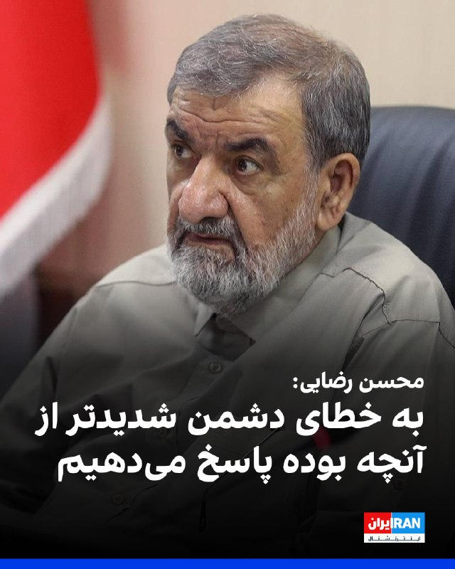

محسن رضایی، مشاور نظامی مجتبی خامنه‌ای، به صداوسیمای جمهوری اسلامی گفت که تنگه هرمز و «اقتدار» منطقه‌ای جمهوری اسلامی نباید تضعیف شود.

او افزود که آمریکا به عنوان «مجرم شکست‌خورده» در جنگ شناخته شد و «به خطای دشمن خیلی شدیدتر از آنچه بوده پاسخ می‌دهیم.»

محسن رضایی ادامه داد: «ما در نیروهای مسلح به خطای دشمن، خیلی شدیدتر از آنچه بوده پاسخ می‌دهیم.»

فرمانده اسبق سپاه پاسداران اضافه کرد: «جنگ باید به صورتی تمام شود که جمهوری اسلامی تا ۵۰ سال آینده بازدارندگی داشته باشد.»
‌🏁 🇬🇧 IranintlTV

🤖 @VahidOOnLine

## VahidOOnLine — post 246429

  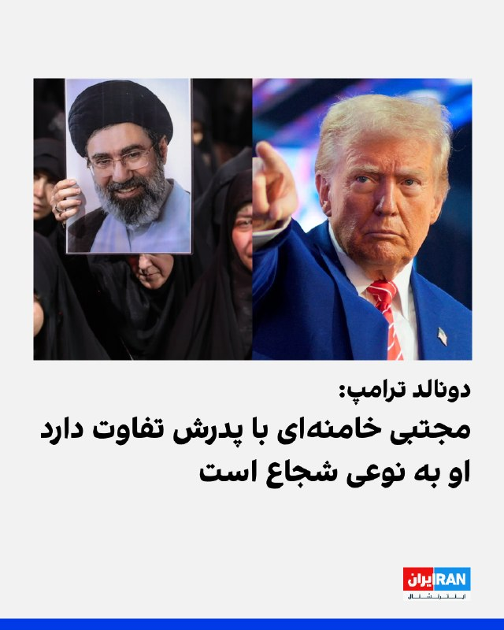

دونالد ترامپ، رییس‌جمهوری آمریکا، در گفت‌وگو با اکسیوس درباره رهبر جمهوری اسلامی گفت: «مجتبی خامنه‌ای به‌شدت آسیب دیده است. من هرگز او را ملاقات نکرده‌ام، اما او نوعی شجاعت دارد.»

ترامپ افزود: «خامنه‌ای جوان‌تر با پدرش تفاوت دارد. همچنین افرادی را می‌بینیم که در مقایسه با دو گروه قبلی، که هر دو را می‌شناختم، بسیار کمتر رادیکال هستند.»
‌🏁 🇬🇧 IranintlTV

🤖 @VahidOOnLine

## VahidOOnLine — post 246428

  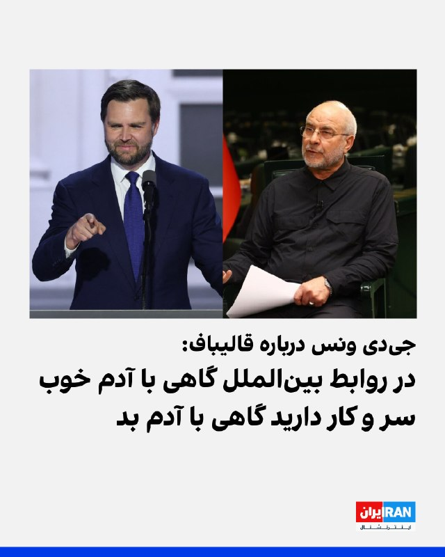

جی‌دی ونس، معاون رییس جمهوری ایالات متحده در پاسخ به سوال خبرنگاری درباره محمدباقر قالیباف، نقش او در سرکوب مردم ایران و اینکه آیا ایستادن در کنار چنین فردی ناراحت‌کننده نیست، گفت: «این اصلا ناراحت‌کننده نیست. فکر می‌کنم چیزی که رییس‌جمهور می‌گوید و من هم کاملا با آن موافقم این است که شما در روابط بین‌الملل با انواع مختلفی از افراد سروکار دارید؛ گاهی با افراد بسیار خوب و گاهی با افرادی که چندان خوب نیستند. اگر از آنچه آن‌ها انجام می‌دهند احساس راحتی نکنیم، و مهم‌تر از همه، اگر رفتارشان مطابق با وعده‌هایی که می‌دهند نباشد، در آن صورت سهم خوبی از این توافق نخواهند برد.»

ونس درباره اسرائیل نیز گفت: «در نهایت همیشه نوعی تقابل خیر و شر وجود دارد. بسیاری از افراد اسرائیل را در این موضوع طرف بد ماجرا می‌دانند، مخصوصاً جوان‌ترها؛ نه فقط ترقی‌خواهان. فکر می‌کنم مهم است گفته شود که اسرائیل در این روند یک شریک بسیار خوب بوده و ما منافع مشترک زیادی داریم.»

او افزود: «آنچه همچنین درست است این است که گاهی ایالات متحده و اسرائیل اختلاف نظر خواهند داشت.»
‌🏁 🇬🇧 IranintlTV

🤖 @VahidOOnLine

## VahidOOnLine — post 246427

  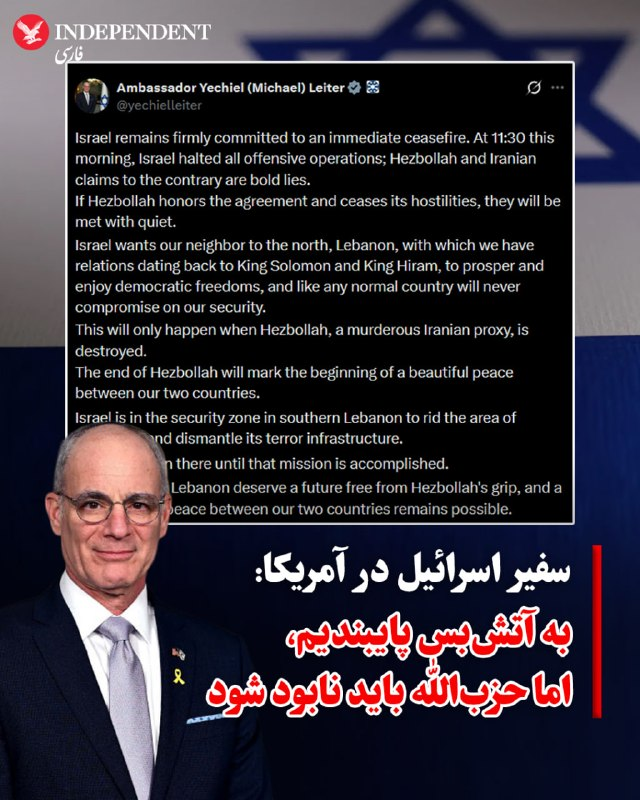

♦️ یحیئل لایتر، سفیر اسرائیل در ایالات متحده، با رد ادعاهای حزب‌الله مبنی بر نقض آتش‌بس از سوی تل‌آویو، در شبکه اجتماعی ایکس اعلام کرد که اسرائیل از ساعت ۱۱:۳۰ صبح امروز به وقت محلی، تمامی عملیات‌های تهاجمی خود را متوقف کرده و به توافق پایبند است. او تاکید کرد: «اگر حزب‌الله به توافق احترام بگذارد و حملاتش را متوقف کند، با آرامش مواجه خواهد شد.»

با این حال، لایتر افزود که برای دستیابی به آزادی و شکوفایی در لبنان، حزب‌الله به عنوان «نیابتی آدم‌کش ایران» باید کاملا نابود شود و نابودی این گروه را آغازگر صلحی زیبا میان دو کشور دانست.

سفیر اسرائیل همچنین صراحتا اعلام کرد که با وجود توقف حملات، ارتش اسرائیل هیچ برنامه‌ای برای خروج از «منطقه امنیتی» ایجادشده در جنوب لبنان ندارد؛ موضعی که مستقیما با مطالبات حزب‌الله در تضاد است. حزب‌الله پیش‌تر تاکید کرده بود که هرگونه تداوم حضور نیروهای اسرائیلی در خاک لبنان را به منزله نقض صریح یادداشت تفاهم آتش‌بس تلقی خواهد کرد.
‌🇸🇦 Indypersian

🤖 @VahidOOnLine

## VahidOOnLine — post 246426

  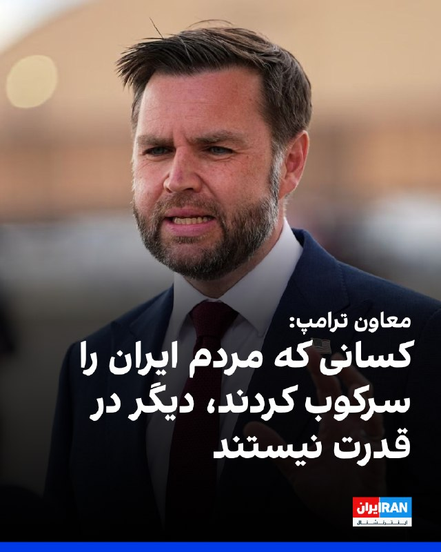

جی‌دی ونس، معاون رییس جمهوری ایالات متحده گفت: «ما می‌توانیم رهبران بیشتری از جمهوری اسلامی را از بین ببریم، اما در پایین‌تر از آن‌ها هم رهبران دیگری خواهند آمد. می‌توانیم خسارت بیشتری به اقتصادشان وارد کنیم. اما در نهایت، مگر اینکه کسانی که کشور را اداره می‌کنند رفتارشان را در بلندمدت تغییر دهند، شما همیشه با این مشکل روبه‌رو خواهید بود.»

او با اشاره به کشتار مردم ایران در جریان اعتراضات دی‌ماه از سوی مقام‌های جمهوری اسلامی گفت: «آن افراد اکنون دیگر در قدرت نیستند. اما خواهیم دید آیا رهبران جدید با مردم رفتار متفاوتی خواهند داشت یا نه. ما امیدواریم که این‌طور باشد و اگر این‌طور نباشد، می‌توانیم وقتی واقعا رفتارشان را دیدیم تصمیم بگیریم و به همین دلیل است که می‌گویم نکته خوب این تفاهم‌نامه این است که بر اساس حرف‌ها ساخته نشده، بلکه بر اساس رفتار ساخته شده است.»
‌🏁 🇬🇧 IranintlTV

🤖 @VahidOOnLine

## VahidOOnLine — post 246425

  

♦️ دونالد ترامپ، رئیس‌جمهوری آمریکا، در مصاحبه‌ای با برنامه «آکسیوس شو» با دفاع از تصمیم خود برای شروع عملیات نظامی در ایران، مقام‌های جمهوری اسلامی را «بسیار باهوش» و «نابغه‌های بدوی» توصیف کرد و هشدار داد که آن‌ها در عین حال بسیار غیرقابل‌پیش‌بینی هستند.

ترامپ با اشاره به مداخله نظامی اخیر ایالات متحده گفت: «من مجبور به اقدام شدم تا جلوی آن‌ها را بگیرم؛ چون اگر سلاح هسته‌ای داشتند، حتما از آن استفاده می‌کردند و با منفجر کردن چند شهر، از جمله در اسرائیل، هرج‌ومرجی واقعی به راه می‌انداختند.»

او با تاکید بر اینکه اگر اقدام او در لغو برجام نبود، اسرائیل سال‌ها پیش نابود شده بود، توافق دوران اوباما را مسیری هموار برای دستیابی جمهوری اسلامی ایران به بمب اتم دانست. ترامپ همچنین با ابراز شگفتی از زمان‌بندی تقابل با ایران افزود: «چیزی که مرا غافلگیر کرد این بود که آن‌ها این‌قدر منتظر ماندند. آن‌ها صبر کردند تا من به قدرت بازگردم؛ البته این کارشان عمدی نبود. هیچ‌کس، حتی با وجود سلاح‌سازی ساختار حکومتی علیه من، فکر نمی‌کرد بازگردم، اما من با خروشی بزرگ‌تر از قبل بازگشتم.»
‌🇸🇦 Indypersian

🤖 @VahidOOnLine

## WithYashar — post 15366

میرم لایو اینستاگرام 💥🚨۵ دقیقه دیگه نتیف های اینستاگرام رو روشن کنید و اگه ندارید فالو کنید instagram.com/yashar

## WithYashar — post 15365

میرم لایو اینستاگرام 💥🚨۵ دقیقه دیگه نتیف های اینستاگرام رو روشن کنید و اگه ندارید فالو کنید
instagram.com/yashar

## WithYashar — post 15364

  <a href="telegram/content/WithYashar_15364_1781902402.mp4" target="_blank">🎬 Download video</a>

ترامپ: «ما رابطه خوبی با اسرائیل داریم بی بی نتانیاهو یک نخست‌وزیر جنگجو است.
باید به همین عنوان از او قدردانی شود. باید به او اعتبار بدهند.»
@withyashar

## WithYashar — post 15363

ترامپ درباره حمله دوباره به ایران:
به یاد داشته باشید، اگر این کار را انجام دهیم، ناگهان نفت به سرعت از تنگه خارج نخواهد شد.
افرادی که مالک کشتی‌های میلیارد دلاری هستند، دوست ندارند موشک‌ها بالای سرشان پرواز کنند
@withyashar

## WithYashar — post 15362

قفلی جدید ترامپ برای هزارمین بار : ایران ۶۰ روز فرصت داره توافق کنه.
@withyashar

## WithYashar — post 15361

صدای چندین انفجار در استان ادلب سوریه شنیده شد🚨
@withyashar

## WithYashar — post 15360

ترامپ اعلام کرد: جنگنده فوق پیشرفته F47 برای ارتش آمریکا در حال ساخت است، پیشرفته ترین هواپیمای جنگی در تاریخ بشر
@withyashar

## WithYashar — post 15359

ترامپ: ما سفرهای زیادی انجام می‌دهیم. به ترکیه خواهیم رفت.

در مقطعی، برای یک کنفرانس بزرگ به چین باز خواهیم گشت

اگر با ایران به توافق نرسیم، کارهایی خواهیم کرد که آنها را خوشحال نکند، اما فکر نمی‌کنم این کار را بکنیم.

توافق هسته‌ای ۲۰۱۵ با ایران یک فاجعه بود

من با رهبر جدید ایران صحبت نکرده‌ام، اما او شجاعت خاصی دارد.

من از موضع قدرت مذاکره کردم چون نیروی دریایی و هوایی ایران نابود شده است.

کشتی‌ها به طور بی‌سابقه‌ای در حال عبور از تنگه هرمز هستند
@withyashar

## WithYashar — post 15358

  <a href="telegram/content/WithYashar_15358_1781902404.mp4" target="_blank">🎬 Download video</a>

دونالد ترامپ خبرنگاران را به پایگاه مشترک اندروز دعوت کرد تا هواپیمای جدید ریاست‌جمهوری ایالات متحده را ببینند.
@withyashar

## WithYashar — post 15357

  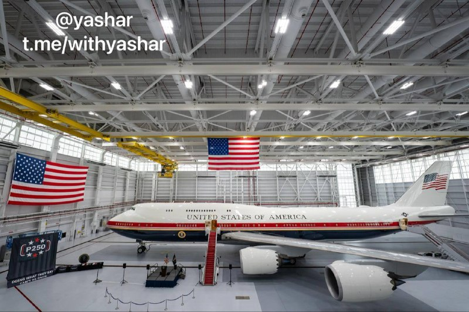

ترامپ در پایگاه نیروی هوایی اندروز از یک هواپیمای موقت جدید ریاست‌جمهوری رونمایی کرد؛ یک جت لوکس که توسط قطر اهدا و عبارت «ایالات متحده آمریکا» بر روی آن درج شده است.
@withyashar

## WithYashar — post 15356

ترامپ: حدود ۷۰۰ کشتی از تنگه هرمز عبور می‌کنند
@withyashar

## WithYashar — post 15355

جی‌دی ونس، معاون ترامپ:
کسانی که مردم ایران رو سرکوب کردن، دیگه در قدرت نیستن!
@withyashar

## WithYashar — post 15354

وزارت امور خارجه آمریکا: روبیو به جوزف عون‌ رئیس جمهور لبنان تأکید کرد که ضروری است حزب‌الله خلع سلاح شود و دولت کنترل خود را گسترش دهد
@withyashar

## WithYashar — post 15353

سناتور آمریکایی تد کروز: دادن میلیاردها دلار به حکومت ایران که شعار مرگ بر آمریکا سر می‌دهد، ایده بدی است
@withyashar

## WithYashar — post 15352

  <a href="telegram/content/WithYashar_15352_1781902408.mp4" target="_blank">🎬 Download video</a>

ترامپ : هیچکس نمی‌خواست به ایران زمینی حمله کنیم، نه؟!
حتی اگر همین الان هم بهشون حمله میکردیم، رهبران و فرمانده هاشون فرار میکردن به غار هاشون که زیر کوه های گرانیتی ساختند.
این کوه ها خیلی محکم اند و نابود کردن شون سخته.
الان از غار اومدن بیرون ولی اگه بازم حمله کنیم سریع فرار میکنن اون زیر؛
• تنها راه گرفتنشون فرستادن سرباز هامون به اونجا بود.

اگه صلح نمی‌کردیم الان تنگه بسته بود و نفت نداشتیم.
@withyashar

## WithYashar — post 15351

  <a href="telegram/content/WithYashar_15351_1781902410.mp4" target="_blank">🎬 Download video</a>

ترامپ: ما در اونجا رژیم چینج انجام دادیم. همشون از بین رفتن.

مارک کاپوتو، اکسیوس: این چه تغییر رژیمیه که‌ انجام دادید؟ شما خامنه‌ای جونیور رو همچنان در ایران دارید و مقامات بسیاری از سپاهیا زنده‌ن.

ترامپ: خامنه‌ای جونیور با پدر متفاوت است. آن‌ها افراد متفاوتی هستند.
@withyashar

## WithYashar — post 15350

همکنون حمله اسرائیل به جنوب لبنان با بمب‌های فسفری🚨
@withyashar

## WithYashar — post 15349

هم اکنون هشدار بالگرد آمریکایی به نیروی دریایی سپاه🚨
@withyashar

## WithYashar — post 15348

  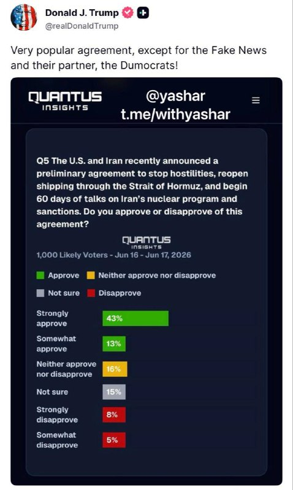

پرزیدنت ترامپ با انتشار نظرسنجی ای نوشت: توافقی بسیار محبوب، به جز برایِ فیک نیوز ها و شریک آنها، دوموکرات ها!
@withyashar

## WithYashar — post 15347

وزیر خارجه انگلیس: درخواست "به آتش کشیدن تمام لبنان" یک بیانیه وحشتناک و نفرت‌انگیز از یک وزیر اسرائیلی (بن‌گویر) است که به درستی توسط دولت بریتانیا تحریم شده
@withyashar

## mwarmonitor — post 11238

📝 سوالی دارید دایرکت جواب میدم

## mwarmonitor — post 11237

  <a href="telegram/content/mwarmonitor_11237_1781902413.mp4" target="_blank">🎬 Download video</a>

«برابر. من می‌گم برابر.
و حالا ما یک توافق داریم که دیشب امضا شد و ۶۰ روز فرصت هست تا به یک توافق نهایی برسیم، در غیر این صورت کارهایی انجام خواهیم داد که آن‌ها را خوشحال نخواهد کرد. اما من فکر نمی‌کنم کار به آنجا بکشد، فکر می‌کنم که نتیجه بسیار خوبی خواهد داشت. به یاد داشته باشید اگر ما این کار را انجام دهیم، دیگر نفت به آن سرعت از تنگه جریان پیدا نخواهد کرد، چون کسانی که کشتی‌های میلیارد دلاری دارند، دوست ندارند موشک‌ها از بالای سرشان پرواز کنند یا دریا پر از مین باشد.
و این شگفت‌انگیز خواهد بود. آنچه که اکنون در حال رخ دادن است، به خاطر این است که ما قوی‌ترین اقتصادی را داریم که تا به حال داشته‌ایم. ما ۱۹.۲ تریلیون دلار سرمایه داریم که دارد وارد کشورمان می‌شود.»

@mwarmonitor

## mwarmonitor — post 11236

  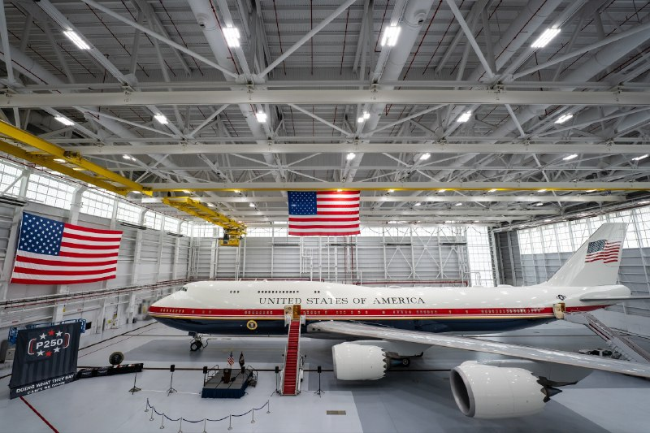

✈️The new Air Force One 🇺🇸

@mwarmonitor

## mwarmonitor — post 11235

  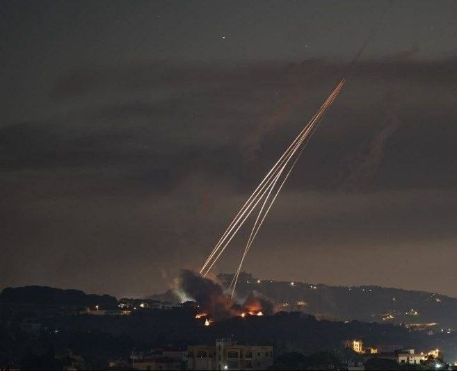

🔴گلوله‌باران با بمب‌های فسفری، شهرک النبطیه در جنوب لبنان را از سوی اسرائیل هدف قرار داد.

@mwarmonitor

## mwarmonitor — post 11234

🔴(رویترز) - توافق موقت برای پایان دادن به جنگ ایران شامل معافیت برای فروش نفت تحت تحریم‌ها خواهد بود، اما این کشور همچنان با شبکه‌ای پیچیده از محدودیت‌های بین‌المللی در فعالیت‌ها و تجارت خود مواجه است.

📌تحریم‌های سازمان ملل

تحریم‌های سازمان ملل به برنامه هسته‌ای ایران و ارزیابی نقض تعهدات این کشور تحت معاهده منع گسترش سلاح‌های هسته‌ای (NPT) مرتبط هستند.

شورای امنیت سازمان ملل در سال‌های ۲۰۰۶، ۲۰۰۷، ۲۰۰۸ و ۲۰۱۰ قطعنامه‌هایی برای اعمال تحریم‌ها تصویب کرد.

این تحریم‌ها شامل موارد زیر بود:

تحریم تسلیحاتی

ممنوعیت تأمین برخی مواد و فناوری‌های مرتبط با برنامه هسته‌ای

مسدودسازی دارایی‌های برخی شرکت‌ها و افراد

این قطعنامه‌ها همچنین ایران را از هرگونه فعالیت برای ساخت موشک‌های بالستیکی که قادر به حمل کلاهک هسته‌ای باشند، منع کردند.

در حالی که این قطعنامه‌ها دارایی‌ها و سرمایه‌های سپاه پاسداران انقلاب اسلامی و شرکت ملی کشتیرانی ایران را مسدود کردند، صادرات نفت ایران را ممنوع نکردند.

پس از دستیابی به توافق هسته‌ای برجام (JCPOA) در سال ۲۰۱۵، شورای امنیت برنامه‌ای برای لغو تحریم‌های خود علیه ایران تعیین کرد.

با این حال، رئیس‌جمهور آمریکا دونالد ترامپ در سال ۲۰۱۸ از این توافق خارج شد و ایران نیز اجرای برخی تعهدات خود را متوقف کرد. تحریم‌های سازمان ملل سال گذشته از طریق مکانیزم «اسنپ‌بک» دوباره اعمال شدند.

📌تحریم‌های ایالات متحده

واشنگتن نخستین بار در سال ۱۹۷۹ و پس از گروگان‌گیری دیپلمات‌های آمریکایی در سفارت تهران، ایران را تحریم کرد. از آن زمان تحریم‌های متعددی به دلیل حمایت ایران از گروه‌هایی که آمریکا آن‌ها را تروریستی می‌داند و همچنین برنامه هسته‌ای این کشور اعمال شده است.

یکی از پیچیدگی‌های مهم این است که سپاه پاسداران انقلاب اسلامی، که یکی از تأثیرگذارترین نهادهای کشور و در هم‌تنیده با اقتصاد ایران است، از سوی آمریکا به‌عنوان یک سازمان تروریستی تعیین شده است.

تحریم‌ها توسط وزارت خزانه‌داری آمریکا اجرا می‌شوند، اما چون تحت قوانین و سازوکارهای مختلف اعمال شده‌اند، خاموش کردن سریع و آسان همه آن‌ها وجود ندارد.

اختیار اعمال تحریم‌ها از دو قانون دهه ۱۹۷۰ (اعطای اختیارات اضطراری به رئیس‌جمهور که باید هر سال تمدید شود) و همچنین از قوانین سال‌های ۱۹۹۶ و ۲۰۱۷ که به‌طور خاص ایران و برخی کشورها را هدف قرار می‌دهند، ناشی می‌شود.

تحریم‌هایی که توسط رئیس‌جمهور و از طریق فرمان‌های اجرایی اعمال شده‌اند، می‌توانند به‌سرعت توسط رئیس‌جمهور ترامپ لغو شوند. این موارد شامل مسدودسازی میلیاردها دلار دارایی ایران، تحریم تسلیحاتی، ممنوعیت کامل تجارت و سرمایه‌گذاری با ایران و ممنوعیت خرید نفت ایران توسط دیگران است.

اما تحریم‌هایی که توسط کنگره تصویب شده‌اند، بسیار سخت‌تر قابل لغو هستند؛ به‌ویژه آن‌هایی که به موضوعاتی مانند حقوق بشر یا حمایت ایران از گروه‌هایی که آمریکا آن‌ها را تروریستی می‌داند مربوط می‌شوند.

همچنین شرکت‌ها، افراد و نهادهای زیادی به‌طور مشخص در فهرست تحریم‌ها قرار دارند و حذف همه آن‌ها ممکن است زمان زیادی ببرد.

📌تحریم‌های اتحادیه اروپا

اتحادیه اروپا در سال ۲۰۱۲ تحریم‌هایی علیه صادرات نفت ایران اعمال کرد، دارایی‌های بانک مرکزی ایران را مسدود نمود و تجارت فلزات گرانبها و پتروشیمی با ایران را متوقف کرد.

همچنین محدودیت‌هایی بر تجارت خارجی، خدمات مالی و بخش انرژی و فناوری اعمال کرد.

برخی بانک‌های ایرانی در سال ۲۰۱2 از سیستم سوئیفت برای پرداخت‌های بین‌المللی جدا شدند که بخش بزرگی از سیستم مالی ایران را از ارتباط با سایر کشورها قطع کرد.

اگرچه برخی از تحریم‌ها تحت برجام لغو شدند، اما بعداً دوباره اعمال شدند. تحریم‌های بیشتری نیز افراد و برخی قطعات مرتبط با موشک و پهپاد را هدف قرار داده‌اند.

اتحادیه اروپا همچنین سپاه پاسداران را تحریم کرده و امسال نیز تحریم‌های جدیدی در واکنش به محدودسازی تنگه هرمز توسط ایران اعمال کرده است.

دارایی‌های مسدود شده ایران کجاست؟

ایران ده‌ها میلیارد دلار پول در بانک‌های خارجی دارد (عمدتاً از صادرات نفت و گاز) که به دلیل تحریم‌ها به آن دسترسی ندارد.

کشورهایی که ایران در آن‌ها میلیاردها دلار درآمد نفتی مسدود دارد شامل کره جنوبی، چین، ژاپن، لوکزامبورگ و عراق هستند.


@mwarmonitor

## FoxNewsTwitter — post 343178

  <a href="telegram/content/FoxNewsTwitter_343178_1781902416.mp4" target="_blank">🎬 Download video</a>

Fox News (Twitter/X)

President Trump steps off the new Air Force One and is immediately greeted by service members at Joint Base Andrews.

## FoxNewsTwitter — post 343177

  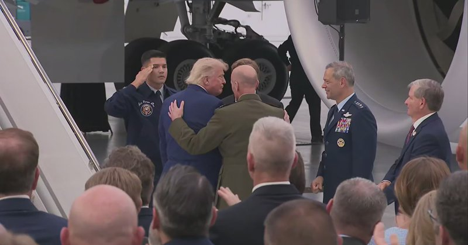

Fox News (Twitter/X)

President Trump unveils the new Air Force One alongside members of the Air Force at Joint Base Andrews https://twitter.com/i/broadcasts/1nxeLLmXgrqJX

## FoxNewsTwitter — post 343176

  <a href="telegram/content/FoxNewsTwitter_343176_1781902418.mp4" target="_blank">🎬 Download video</a>

Fox News (Twitter/X)

BREAKING: Two passenger trains have collided near Bedford, England, about an hour north of London, leaving multiple people seriously injured.

One passenger told the BBC the impact felt like a "bomb explosion" as emergency crews rushed to the scene.

Live images show a massive response with firefighters, paramedics, and police surrounding the crash site.

Authorities have not yet said what caused the collision as rescue efforts continue. | @AmericaRpts @SandraSmithFox

## pm_afshaa — post 94424

  <a href="telegram/content/pm_afshaa_94424_1781902421.webm" target="_blank">🎬 Download video</a>

🔴دونالد ترامپ:
روابط ما با اسرائیل بسیار قدرتمنده؛ بی‌بی نتانیاهو یک جنگجوست و باید به عنوان چنین فردی شناخته بشه و باید به اون اعتبار داد.

💧 Rainbet.com the #1 Non-KYC Crypto Casino & Sportsbook @rainbetcom

😁 @Pm_Afshaa

## pm_afshaa — post 94423

  <a href="telegram/content/pm_afshaa_94423_1781902422.webm" target="_blank">🎬 Download video</a>

🟢فراخوان تجمع مسالمت‌آمیز یازدهمی‌ها و دوازدهمی‌ها برای فردا :

💧 Rainbet.com the #1 Non-KYC Crypto Casino & Sportsbook @rainbetcom

😁 @Pm_Afshaa

## pm_afshaa — post 94422

  

اسرائیل شهرک النبطیه در جنوب لبنان رو با بمب‌های فسفری هدف قرار داد.

💧 Rainbet.com the #1 Non-KYC Crypto Casino & Sportsbook @rainbetcom

😁 @Pm_Afshaa

## pm_afshaa — post 94421

  <a href="telegram/content/pm_afshaa_94421_1781902423.mp4" target="_blank">🎬 Download video</a>

🔴یک مداح حکومتی: آقای رییس‌جمهور اگه شروط مجتبی خامنه‌ای محقق نشه، سرتو میبریم و پدرتو درمیاریم.

💧 Rainbet.com the #1 Non-KYC Crypto Casino & Sportsbook @rainbetcom

😁 @Pm_Afshaa

## pm_afshaa — post 94420

  <a href="telegram/content/pm_afshaa_94420_1781902425.webm" target="_blank">🎬 Download video</a>

🔴ترامپ: اگر به ایران ضربه میزدیم ولی نیروی زمینی نمی‌فرستادیم، اونا می‌رفتن داخل غارهای گرانیتی قایم میشدن و بعد از پایان عملیات دوباره بیرون میومدن.

تنگه هرمز هم کاملاً بسته میشد؛ پر از مین میشد و موشک‌ها بالای سر کشتی‌ها رد می‌شدن. آن وقت برای چند ماه نفت نداشتیم.

من آن آیت‌الله ر٫ کشتم و متأسفانه به آن یکی آیت‌الله (مجتبی) هم آسیب زدم. با او ملاقات یا صحبت نکردم، اما با وجود جراحات شدید، به‌نوعی شجاعت داره.

خامنه‌ای جونیور با پدرش فرق داره؛ این‌ها دو آدم متفاوت‌اند.

💧 Rainbet.com the #1 Non-KYC Crypto Casino & Sportsbook @rainbetcom

😁 @Pm_Afshaa

## pm_afshaa — post 94419

  <a href="telegram/content/pm_afshaa_94419_1781902425.webm" target="_blank">🎬 Download video</a>

🔴ترامپ: مجتبی خامنه‌ای با پدرش متفاوته و اون به نوعی شجاعه.

💧 Rainbet.com the #1 Non-KYC Crypto Casino & Sportsbook @rainbetcom

😁 @Pm_Afshaa

## pm_afshaa — post 94418

  <a href="telegram/content/pm_afshaa_94418_1781902426.webm" target="_blank">🎬 Download video</a>

🔴جی‌دی ونس، معاون ترامپ:
کسانی که مردم ایران رو سرکوب کردن، دیگه در قدرت نیستن!

💧 Rainbet.com the #1 Non-KYC Crypto Casino & Sportsbook @rainbetcom

😁 @Pm_Afshaa

## DEJradio — post 5831

  <a href="telegram/content/DEJradio_5831_1781902427.mp4" target="_blank">🎬 Download video</a>

🚨
🔸 خبر ۲۱
آدینه ۲۹ خرداد ۱۴۰۵

#خبر۲۱
@DEJradio

## VahidOnline — post 76533

  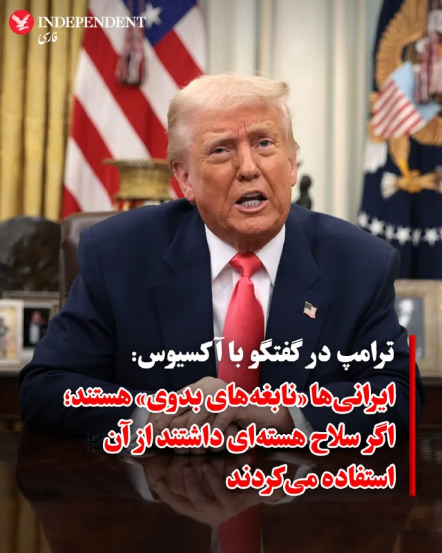

♦️ دونالد ترامپ، رئیس‌جمهوری آمریکا، در مصاحبه‌ای با برنامه «آکسیوس شو» با دفاع از تصمیم خود برای شروع عملیات نظامی در ایران، مقام‌های جمهوری اسلامی را «بسیار باهوش» و «نابغه‌های بدوی» توصیف کرد و هشدار داد که آن‌ها در عین حال بسیار غیرقابل‌پیش‌بینی هستند.

ترامپ با اشاره به مداخله نظامی اخیر ایالات متحده گفت: «من مجبور به اقدام شدم تا جلوی آن‌ها را بگیرم؛ چون اگر سلاح هسته‌ای داشتند، حتما از آن استفاده می‌کردند و با منفجر کردن چند شهر، از جمله در اسرائیل، هرج‌ومرجی واقعی به راه می‌انداختند.»

او با تاکید بر اینکه اگر اقدام او در لغو برجام نبود، اسرائیل سال‌ها پیش نابود شده بود، توافق دوران اوباما را مسیری هموار برای دستیابی جمهوری اسلامی ایران به بمب اتم دانست. ترامپ همچنین با ابراز شگفتی از زمان‌بندی تقابل با ایران افزود: «چیزی که مرا غافلگیر کرد این بود که آن‌ها این‌قدر منتظر ماندند. آن‌ها صبر کردند تا من به قدرت بازگردم؛ البته این کارشان عمدی نبود. هیچ‌کس، حتی با وجود سلاح‌سازی ساختار حکومتی علیه من، فکر نمی‌کرد بازگردم، اما من با خروشی بزرگ‌تر از قبل بازگشتم.»
@VahidOOnLine

📡 @VahidOnline

## IranIntlTV — post 343292

  <a href="telegram/content/IranIntlTV_343292_1781902430.mp4" target="_blank">🎬 Download video</a>

ان‌بی‌سی نیوز گزارش داده ترامپ از اسرائیل خواسته با آتش‌بس با حزب‌الله موافقت کند. هم‌زمان، یک مقام آمریکایی از اجرای این آتش‌بس از عصر جمعه خبر داد. در حالی که منابعی از نقش قطر، آمریکا و جمهوری اسلامی در میانجی‌گری خبر می‌دهند، اسرائیل می‌گوید تنها به توافق جداگانه خود با لبنان پایبند است.
@iranintltv

## IranIntlTV — post 343291

  <a href="https://t.me/IranintlTV/343291" target="_blank">📎 Download file</a>

🎧نسخه صوتی ۲۴ با فرداد فرحزاد: تعلیق نشست ایران و آمریکا
@iranintlTV

## IranIntlTV — post 343290

  <a href="telegram/content/IranIntlTV_343290_1781902432.mp4" target="_blank">🎬 Download video</a>

تنها دو روز پس از امضای تفاهم‌نامه میان آمریکا و ایران، نشست برنامه‌ریزی‌شده دو طرف در سوئیس لغو شد. هم‌زمان، پاکستان از برگزاری نشست میانجی‌های پرونده تهران و واشینگتن در قاهره خبر داد. سخنگوی وزارت خارجه جمهوری اسلامی گفت با امضای دیجیتالی، این نشست فوریت خود را از دست داد.
@iranintltv

## IranIntlTV — post 343287

  

ابراهیم عزیزی، رییس کمیسیون امنیت ملی مجلس، در شبکه ایکس نوشت: «متعهد نبودن آمریکا به بند نخست تفاهم‌نامه نشان می‌دهد اراده‌ای برای جلب اعتماد ما ندارد.»

او افزود: «ادامه وضعیت ما با آمریکا هزینه سنگینی خواهد داشت و نخستین آن، پاسخی هوشمندانه و بازدارنده به نقض تعهدات تفاهم‌نامه خواهد بود.»
https://iranintl.com/202606195207

## IranIntlTV — post 343286

  <a href="telegram/content/IranIntlTV_343286_1781902434.mp4" target="_blank">🎬 Download video</a>

مئیر جاودانفر، تحلیل‌گر امور اسرائیل، گفت: «همکاری نزدیک با واشینگتن ضروری است، اما وابسته کردن کامل راهبرد امنیتی اسرائیل در قبال جمهوری اسلامی به تصمیمات شخص دونالد ترامپ، ریسک بزرگی است.»

او افزود: «آثار این ریسک امروز در پرونده لبنان بیش از هر زمان دیگری دیده می‌شود.»
@iranintltv

## IranIntlTV — post 343285

  <a href="telegram/content/IranIntlTV_343285_1781902437.mp4" target="_blank">🎬 Download video</a>

شاهد علوی، عضو تحریریه ایران‌اینترنشنال، درباره بیانیه کارشناسان حقوق بشر سازمان ملل در انتقاد از نادیده گرفتن حقوق بشر در تفاهم‌نامه جمهوری اسلامی و آمریکا گفت: «طرفی که متهم به نقض حقوق بشر، اعدام‌های سیاسی و سرکوب گسترده شهروندان است، اکنون به‌عنوان یکی از امضاکنندگان این تفاهم سیاسی شناخته می‌شود.»

او افزود: «حتی اگر موضوع حقوق بشر به‌صورت لفظی در متن توافق گنجانده می‌شد، بدون سازوکارهای اجرایی و نظارتی مستقل، تاثیر چندانی نداشت.»
@iranintltv

## IranIntlTV — post 343284

  <a href="telegram/content/IranIntlTV_343284_1781902439.mp4" target="_blank">🎬 Download video</a>

منشه امیر، کارشناس خاورمیانه، گفت: «مواضع دونالد ترامپ نارضایتی قابل توجهی را در اسرائیل ایجاد کرده است. آنچه برای بسیاری در اسرائیل نگران‌کننده است این است که ترامپ پیش‌تر قطع ارتباط جمهوری اسلامی با نیروهای نیابتی‌اش را از اهداف اصلی آمریکا عنوان کرده بود.»

او افزود: «با این حال، در هفته‌های اخیر دست‌کم دو بار عملا رابطه جمهوری اسلامی و حزب‌الله را به رسمیت شناخته و برای پذیرش آتش‌بس، اسرائیل را تحت فشار قرار داده است.»
@iranintltv

## IranIntlTV — post 343283

  <a href="telegram/content/IranIntlTV_343283_1781902441.mp4" target="_blank">🎬 Download video</a>

میعاد ملکی، مقام پیشین وزارت خزانه‌داری آمریکا، درباره تعلیق نشست ایران و آمریکا گفت: «هیچ‌کدام از دو طرف انگیزه فوری برای حرکت به سمت توافق نهایی ندارند.»

او افزود: «تهران و واشینگتن در شرایط کنونی از وضعیت موقت موجود منافعی به دست آورده‌اند و احتمالا ترجیح می‌دهند مدتی از این فضای تنفس استفاده کنند.»
@iranintltv

## IranIntlTV — post 343282

  

دونالد ترامپ در مراسم دیدار با نیروی هوایی این کشور، درباره روابط آمریکا و اسرائیل گفت: «روابط ما با اسرائیل بسیار قدرتمند است و بی‌بی نتانیاهو یک جنگجو است و باید به عنوان چنین فردی شناخته شود. باید به او اعتبار بدهند چون واقعا این کار را انجام داد. ما واقعا بسیار خوب در کنار اسرائیل جنگیدیم.»

او پیش‌تر به دلیل حملات اسرائیل به جنوب لبنان، انتقاداتی متوجه نتانیاهو کرده بود.
https://iranintl.com/202606192689

## IranIntlTV — post 343281

  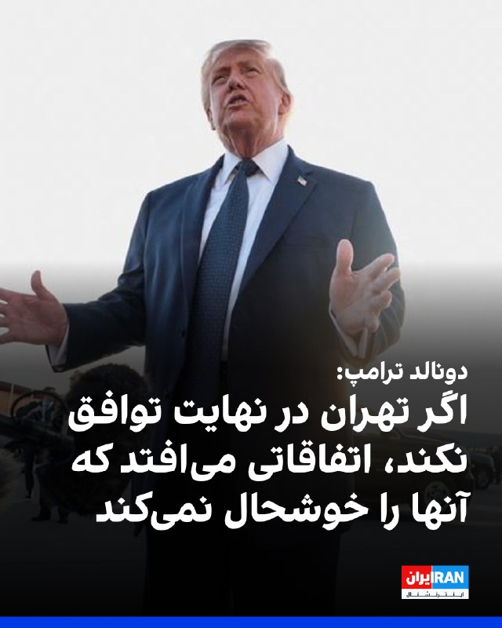

دونالد ترامپ، رییس جمهوری ایالات متحده در مراسم دیدار با نیروی هوایی این کشور، با اشاره به تفاهم‌نامه با تهران گفت: «اگر توافق نهایی حاصل نشود، اتفاق‌هایی رخ خواهد داد که آن‌ها را خوشحال نکند، اما فکر نمی‌کنم کار به آنجا برسد. فکر می‌کنم همه‌چیز خیلی خوب پیش خواهد رفت.»

او ادامه داد: «یادتان باشد، اگر این کار را انجام دهیم، ناگهان دیگر نفت خیلی سریع از تنگه عبور نخواهد کرد، چون کسانی که مالک کشتی‌های میلیارد دلاری هستند، موشک‌هایی که در آسمان پرواز می‌کنند را دوست ندارند و مین‌هایی که در آب‌ها کار گذاشته شده‌اند، را هم دوست ندارند.»

ترامپ همچنین درباره جنگ روسیه و اوکراین گفت: «من هشت جنگ را پایان داده‌ام و به این موضوع افتخار می‌کنم، اما این یکی را فکر می‌کردم از همه آسان‌تر باشد، ولی کمی سخت‌تر از چیزی که تصور می‌کردم شده، با این حال ما آن را حل خواهیم کرد.»
https://iranintl.com/202606193159

## IranIntlTV — post 343280

  <a href="telegram/content/IranIntlTV_343280_1781902445.mp4" target="_blank">🎬 Download video</a>

ایران‌اینترنشنال در پی راه‌اندازی کارزار کشف حقیقت برای پیدا کردن ابعاد جنایت جمهوری اسلامی در نورآباد ممسنی و هویت جاویدنامان این شهر در جریان انقلاب ملی ایرانیان، به اطلاعاتی درباره مجروحان اعتراضات این شهر دست یافته است؛ کسانی که از ترس بازداشت، هنور درمان نشده‌اند.
فرنوش فرجی، عضو تحریریه ایران‌اینترنشنال گزارش می‌دهد.

## IranIntlTV — post 343279

  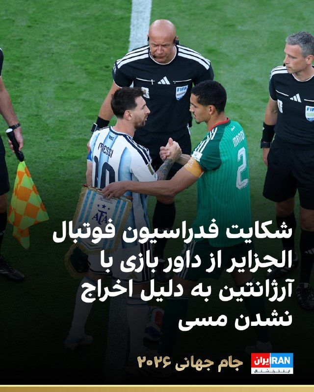

🔻فدراسیون فوتبال الجزایر به‌صورت رسمی از داوری بازی این تیم مقابل آرژانتین در جام جهانی ۲۰۲۶ به فیفا شکایت کرد.

🔹این فدراسیون مدعی شده لیونل مسی و مک‌آلیستر به‌دلیل خطای خشن با کف استوک و آرنج، باید از زمین مسابقه اخراج می‌شدند.

🔹قضاوت این بازی برعهده سیمون مارسینیاک لهستانی، داور فینال جام جهانی ۲۰۲۲ بود. الجزایر در این بازی با سه گل شکست خورد.

@iranintltvsport

## IranIntlTV — post 343278

  

محسن رضایی، مشاور نظامی مجتبی خامنه‌ای، به صداوسیمای جمهوری اسلامی گفت که تنگه هرمز و «اقتدار» منطقه‌ای جمهوری اسلامی نباید تضعیف شود.

او افزود که آمریکا به عنوان «مجرم شکست‌خورده» در جنگ شناخته شد و «به خطای دشمن خیلی شدیدتر از آنچه بوده پاسخ می‌دهیم.»

محسن رضایی ادامه داد: «ما در نیروهای مسلح به خطای دشمن، خیلی شدیدتر از آنچه بوده پاسخ می‌دهیم.»

فرمانده اسبق سپاه پاسداران اضافه کرد: «جنگ باید به صورتی تمام شود که جمهوری اسلامی تا ۵۰ سال آینده بازدارندگی داشته باشد.»
https://iranintl.com/202606195767

## IranIntlTV — post 343277

  

دونالد ترامپ، رییس‌جمهوری آمریکا، در گفت‌وگو با اکسیوس درباره رهبر جمهوری اسلامی گفت: «مجتبی خامنه‌ای به‌شدت آسیب دیده است. من هرگز او را ملاقات نکرده‌ام، اما او نوعی شجاعت دارد.»

ترامپ افزود: «خامنه‌ای جوان‌تر با پدرش تفاوت دارد. همچنین افرادی را می‌بینیم که در مقایسه با دو گروه قبلی، که هر دو را می‌شناختم، بسیار کمتر رادیکال هستند.»
https://iranintl.com/202606194599

## IranIntlTV — post 343270

شهروندان با ارسال پیام‌هایی به ایران‌اینترنشنال به توافق میان آمریکا و جمهوری اسلامی واکنش نشان داده‌اند. برخی شهروندان می‌گویند مبارزه با جمهوری اسلامی با کمک آمریکا یا بدون آنها ادامه خواهد داشت.

## Shin_Persian — post 7136

  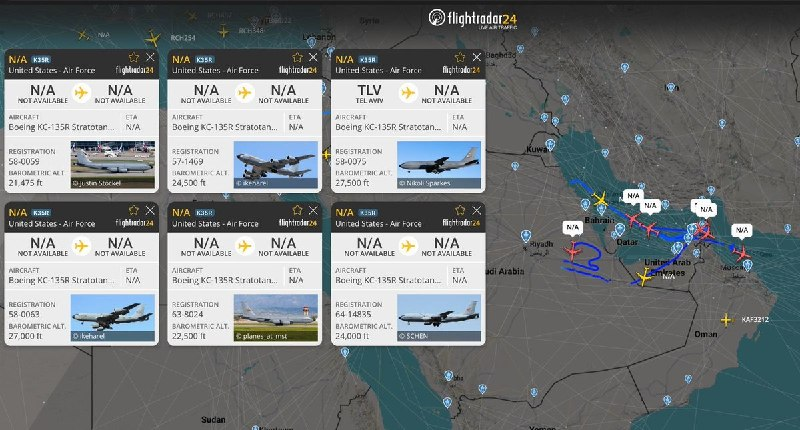

Eye OSINT ✓ @AlexiaNoel94927
Fri, 19 Jun 2026 18:34:35 UTC

🇺🇸8 United States Air Force Tanker airplanes are currently flying in the middle east.👀

ترجمه خودکار فارسی

🇺🇸 ۸ فروند هواپیمای سوخت‌رسان نیروی هوایی ایالات متحده (USAF) در حال حاضر در خاورمیانه در حال پرواز هستند.👀

𝕏 · @shin_persian

## FarsiVOA — post 221239

🔺پنتاگون حضور نظامی آمریکا در اروپا را در یک دوره شش ماه بررسی می‌کند

▪️پیت هگست، وزیر جنگ آمریکا، روز پنجشنبه ۲۸ خرداد، در جریان جلسه وزرای دفاع ناتو در مقر این سازمان در بروکسل اعلام کرد که بررسی حضور نیروهای نظامی آمریکایی در اروپا را آغاز کرده است و به شدت از متحدان آمریکا در ناتو انتقاد کرد.

⬇️ بیشتر بخوانید:
https://ir.voanews.com/a/iran-europe-us-hegseth-war-pentagon-nato-defense/8162717.html
@FarsiVOA

## FarsiVOA — post 221238

دونالد ترامپ، رئيس‌جمهوری آمریکا، در مصاحبه‌ای با آکسیوس گفت پاکستانی‌ها «ایرانی‌ها (مقامات رژیم) را می‌شناختند و به ما در رسیدن به توافق کمک کردند.»

آقای ترامپ در این مصاحبه گفت که پاکستانی‌ها از او خواهش کردند که از ادامه وارد کردن ضربات بیشتر به جمهوری اسلامی خودداری کند. آقای ترامپ گفت ما قوی‌ترین ارتش جهان را داریم و هیچ کشور دیگری نمی‌توانست مانند آمریکا محاصره دریایی علیه جمهوری اسلامی را اجرا کند.

آقای ترامپ همچنین گفت به نظر او تفاهم‌نامه امضا شده با جمهوری اسلامی مانند «تسلیم‌شدن کامل» جمهوری اسلامی است. رئیس‌جمهوری آمریکا به نابودی نیروی دریایی جمهوری اسلامی، نیروی هوایی، و پدافند هوایی و همچنین کشتن علی خامنه‌ای اشاره کرد که از او به عنوان «آیت‌الله» یاد کرد.
بیشتر بخوانید:
https://ir.voanews.com/a/trump-calls-iran-shift-regime-change/8162716.html
@FarsiVOA

## FarsiVOA — post 221236

  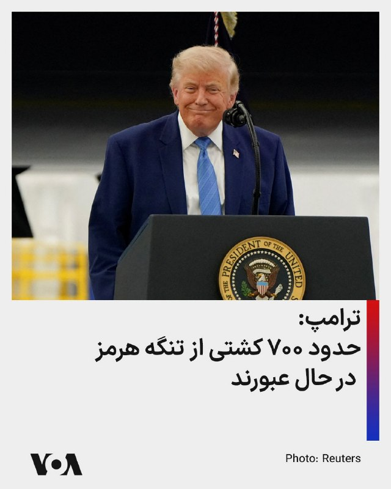

⚡️دونالد ترامپ، رئیس جمهوری آمریکا، در مراسم رونمایی از هواپیمای جدید ریاست جمهوری گفت: من تاکنون ۸ جنگ را در جهان تمام کرده‌ام. جنگ اوکراین و روسیه را هم به زودی تمام می‌کنم. او در بخش دیگری از سخناش گفت بعد از امضای تفاهم‌نامه با جمهوری اسلامی، حدود ۷۰۰ نفتکش در حال عبور از تنگه هرمز هستند.
@FarsiVOA

## FarsiVOA — post 221234

⚡️چالش‌های اتحادیه اروپا در نشست سران در بروکسل؛ اختلاف بر سر تامین مالی، اوکراین و چین
@FarsiVOA

## FarsiVOA — post 221233

🔺دیدگاه | جدال جمهوری اسلامی بر سر تنگه هرمز به کشورهای اروپایی رسید

▪️با امضای یادداشت تفاهم ایالات متحده و جمهوری اسلامی، برداشت رژیم ایران از چگونگی بازگشایی تنگه هرمز، با دیدگاه کشورهای منطقه و اتحادیه اروپا، در تعارض قرار گرفته است. جمهوری اسلامی اصرار دارد که بگوید، تفاهم به دست آمده، فقط برای ۶۰ روز، کشتیرانی آزاد بدون اخذ عوارض در تنگه هرمز کفایت می‌کند. اما بعد از آن با استناد به بند ۵ یادداشت تفاهم امضا شده، «با رایزنی با کشورهای عربی اطراف تنگه هرمز، به ویژه پادشاهی عمان، و رعایت قوانین بین‌المللی، می‌تواند تحت عنوان ارائه خدمات دریايی، بر عبور ومرور کشتی‌ها در این تنگه، عوارض ببندد.»

⬇️ بیشتر بخوانید:
https://ir.voanews.com/a/opinion-iran-s-strait-of-hormuz-dispute-reaches-europe/8162617.html
@FarsiVOA

## FarsiVOA — post 221232

🔺پرزیدنت ترامپ با بازنشر نتایج یک نظرسنجی درباره «توافق اولیه با جمهوری اسلامی»: بسیار محبوب است

▪️دونالد ترامپ، رئیس‌جمهوری آمریکا، روز جمعه ۲۹ خرداد با انتشار نتایج یک نظرسنجی در شبکه اجتماعی «تروت سوشال»، توافق مقدماتی ایالات متحده با جمهوری اسلامی را «بسیار محبوب» توصیف کرد.

⬇️ بیشتر بخوانید:
https://ir.voanews.com/a/trump-calls-iran-deal-popular/8162710.html
@FarsiVOA

## FarsiVOA — post 221231

🔺بلاتکلیفی و محرومیت از درمان یک شهروند بهائی در زندان دولت‌آباد اصفهان؛ فشار جمهوری اسلامی بر اقلیت‌ها ادامه دارد

▪️منابع حقوق بشری روز جمعه ۲۹ خرداد نسبت به وضعیت سلامت فریده عبدی‌یزدی، شهروند بهائی ۶۲ ساله اهل شاهین‌شهر و محبوس در زندان دولت‌آباد اصفهان، ابراز نگرانی کردند.

⬇️ بیشتر بخوانید:
https://ir.voanews.com/a/iran-minority-bahaie-prison-arrest/8162700.html
@FarsiVOA

## FarsiVOA — post 221230

🔺طالبان مدعی حمله به مراکز داعش در ایالت‌های بلوچستان و خیبر پختونخوا شد؛ پاکستان: تبلیغات است

▪️وزارت دفاع حکومت طالبان مدعی شده است که در یک عملیات هوایی، مراکز وابسته به گروه داعش را در ایالت‌های بلوچستان و خیبر پختونخوا در پاکستان هدف قرار داده است؛ ادعایی که پاکستان آن را «نادرست و تبلیغاتی» خوانده است.

⬇️ بیشتر بخوانید:
https://ir.voanews.com/a/taliban-claims-strikes-inside-pakistan/8162680.html
@FarsiVOA

## DW_Farsi — post 126194

  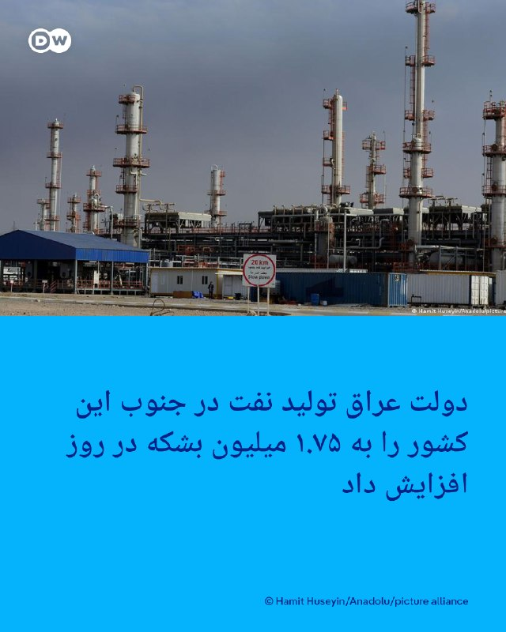

🔶دولت عراق تولید نفت در جنوب این کشور را به ۱/۷۵ میلیون بشکه در روز افزایش داد

مقام‌های نفتی عراق به خبرگزاری رویترز گفتند این کشور با افزایش بارگیری نفت توسط نفتکش‌ها از بنادر خود، تولید نفت خام از میدان‌های جنوبی را ۲۵۰ هزار بشکه در روز بالا برده و به حدود ۱/۷۵ میلیون بشکه در روز رسانده است.

مقام‌های عراقی گفته‌اند بغداد در نظر دارد طی روزهای آینده تولید خود را باز هم افزایش دهد و آن را به ۲ میلیون بشکه در روز برساند.

رویترز گزارش داد عراق، مانند دیگر تولیدکنندگان نفت در حاشیه خلیج فارس، به‌دلیل بسته شدن عملی تنگه هرمز در جریان جنگ میان آمریکا و ایران، با شدیدترین افت درآمدهای نفتی روبه‌رو شده است.

افزایش تولید در میدان‌های جنوبی عراق در چنین شرایطی تلاشی برای جبران بخشی از این فشار اقتصادی ارزیابی می‌شود.
@dw_farsi

## Persian_Trend_Official — post 17622

https://youtube.com/live/S_GCQu5zgZA?feature=share

## Persian_Trend_Official — post 17621

ترامپ در مورد ایران: اگر الان به آنها حمله می‌کردم، اگر قرار نبود نیروی نظامی وارد کنیم، احتمالاً همان افراد به اعماق غارها می‌رفتند. به آنها غارهای گرانیتی می‌گویند. آنها بسیار قدرتمند هستند.

آنها به اعماق می‌روند، و وقتی ما متوقف شویم، آنها بالا می‌آیند، و احتمالاً همان رهبران خواهند بود. ما الان تنگه هرمز را کاملاً بسته داشتیم.

همه جای آن مین‌گذاری می‌شد و موشک‌هایی بر فراز کشتی‌های میلیارد دلاری پرواز می‌کردند. آن کشتی‌ها هرگز حرکت نمی‌کردند. ما برای ماه‌ها نفت نداشتیم.

📝 Amir

📌 @persian_trend_official
پرشین ترند | متفاوت‌ترین کانال نظامی

## Persian_Trend_Official — post 17620

  <a href="telegram/content/Persian_Trend_Official_17620_1781902452.mp4" target="_blank">🎬 Download video</a>

خبرنگار: این تغییر رژیم چگونه است؟ شما خامنه‌ای پسر را در ایران دارید.

ترامپ: خامنه‌ای پسر با پدرش فرق دارد. آنها آدم‌های متفاوتی هستند.

📝 Amir

📌 @persian_trend_official
پرشین ترند | متفاوت‌ترین کانال نظامی

## Persian_Trend_Official — post 17619

  <a href="telegram/content/Persian_Trend_Official_17619_1781902454.mp4" target="_blank">🎬 Download video</a>

ترامپ درباره مجتبی خامنه‌ ای: من آیت‌الله را کشتم و متأسفانه به آیت‌الله دیگر هم آسیب رساندم.

من او را ملاقات نکردم. با او صحبت نکردم، اما مردم درباره او صحبت می‌کردند. اما او شجاعت خاصی دارد زیرا به شدت مجروح شده بود.

📝 Amir

📌 @persian_trend_official
پرشین ترند | متفاوت‌ترین کانال نظامی

## Persian_Trend_Official — post 17618

  <a href="telegram/content/Persian_Trend_Official_17618_1781902458.mp4" target="_blank">🎬 Download video</a>

ترامپ: من از رئیس‌جمهور چین خواهش کردم و گفتم واقعاً ممنون می‌شوم خودتان را درگیر ماجرای ایران نکنید.

او می‌توانست وارد این موضوع شود. او می‌توانست یک نفت‌کش بزرگ را به همراه دوازده ناوشکن به منطقه بفرستد تا ببیند آیا می‌تواند با درگیری، راه خود را از میان محاصره باز کند یا نه.

اهمیت محاصره‌ای که انجام دادیم دقیقاً به اندازهٔ تمام بمباران‌هایی بود که انجام دادیم.

من از رئیس‌جمهور شی خواهش کردم و گفتم: «واقعاً ممنون می‌شوم اگر خودتان را درگیر این ماجرا نکنید.» و او فوق‌العاده عمل کرد و وارد این قضیه نشد.

📝 Amir

📌 @persian_trend_official
پرشین ترند | متفاوت‌ترین کانال نظامی

## Persian_Trend_Official — post 17617

دقایقی دیگه لایو داریم

## Persian_Trend_Official — post 17616

باراک اوباما در مورد توافق با ایران: توافقی وجود داشت که در آن ایران موافقت کرده بود سلاح هسته‌ای تولید نکند.

این دولت از آن خارج شد که باعث شد ایران در آن زمان ظرفیت هسته‌ای بیشتری توسعه دهد. ما اکنون در یک جنگ شرکت کرده‌ایم، میلیاردها و میلیاردها دلار هزینه کرده‌ایم، فشار زیادی بر ارتش خود وارد کرده‌ایم، افراد زیادی جان خود را از دست داده‌اند و به نظر می‌رسد که به جایی که قبل از شروع جنگ بودیم برگشته‌ایم، البته شاید کمی بدتر.

📝 Amir

📌 @persian_trend_official
پرشین ترند | متفاوت‌ترین کانال نظامی

## Persian_Trend_Official — post 17615

  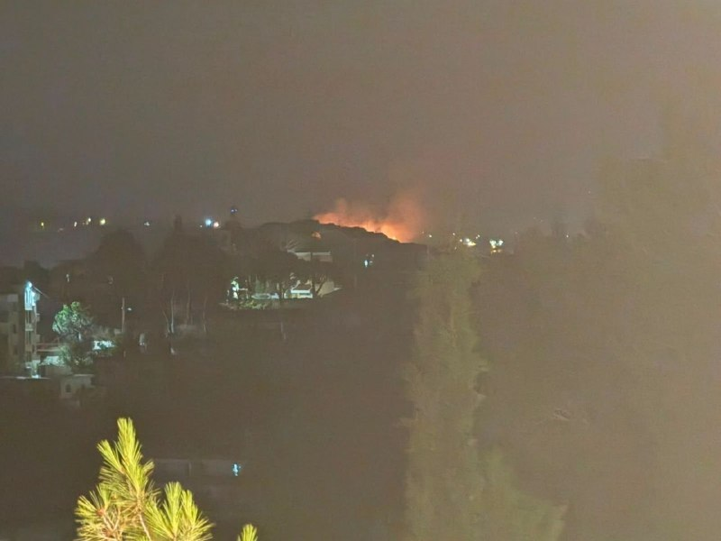

انفجار بمب کنار جاده ای علیه نیروهای اسرائیلی که تلاش داشتند به منطقه علی الطاهر نفوذ کنند. یک تانک مرکاوا و یک بولدوزر نظامی هدف قرار گرفتند.
یک خودروی زرهی دیگر هم به دلیل انفجار آتش گرفت.
سپس یک پهپاد ابابیل FPV به محل رسید و نیروهای پشتیبان را هدف قرار داد.

👺Phantom

📌 @persian_trend_official
پرشین ترند | متفاوت‌ترین کانال نظامی

## Persian_Trend_Official — post 17614

  <a href="telegram/content/Persian_Trend_Official_17614_1781902460.webm" target="_blank">🎬 Download video</a>

🎬 Video

## Persian_Trend_Official — post 17613

  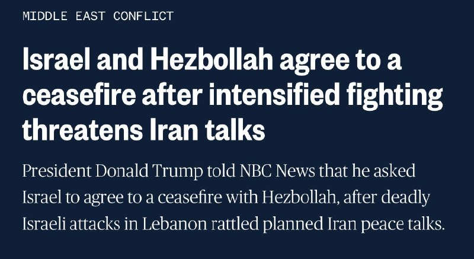

ترامپ در مصاحبه با شبکه NBC نیوز گفت که اوایل امروز با مقامات اسرائیلی صحبت کرده و از آنها خواسته است که با آتش بس با حزب الله موافقت کنند.

ترامپ در مورد این توافق گفت: این یک نکته مثبت است و افزود: این کمی شبیه تزیین کیک است.

او از پاسخ به این سوال که آیا مستقیماً با نخست وزیر اسرائیل، نتانیاهو، صحبت کرده است یا خیر، خودداری کرد.

📝 Amir

📌 @persian_trend_official
پرشین ترند | متفاوت‌ترین کانال نظامی

## Persian_Trend_Official — post 17612

به گفته منابع عبری، مارکو روبیو، وزیر امور خارجه ایالات متحده و بنیامین نتانیاهو، نخست وزیر اسرائیل به زودی تماس تلفنی خواهند داشت.

بنابر گزارش‌ها، این تماس تلفنی بر لبنان متمرکز خواهد بود.

📝 Amir

📌 @persian_trend_official
پرشین ترند | متفاوت‌ترین کانال نظامی

## Persian_Trend_Official — post 17611

  <a href="telegram/content/Persian_Trend_Official_17611_1781902462.mp4" target="_blank">🎬 Download video</a>

زلنسکی: من به الکساندر لوکاشنکو، رئیس جمهور بلاروس یک هفته فرصت می‌دهم تا تجهیزات نظامی را که برای تنظیم آتش توپخانه علیه مردم اوکراین استفاده می‌شود، از مرز اوکراین خارج کند.

زیرا در حال حاضر، غیرنظامیان ما هر روز می‌میرند، کودکان زخمی می‌شوند. اگر او این کار را نکند، ما این کار را خواهیم کرد.

📝 Amir

📌 @persian_trend_official
پرشین ترند | متفاوت‌ترین کانال نظامی

## Persian_Trend_Official — post 17610

  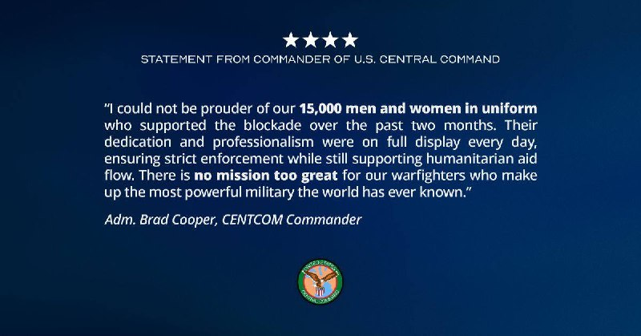

دریاسالار برد کوپر، فرمانده سنتکام: من به 15000 زن و مرد یونیفرم‌ پوشمان که در دو ماه گذشته از محاصره حمایت کردند، بسیار افتخار می‌کنم.

فداکاری و حرفه‌ای‌گری آنها هر روز به طور کامل به نمایش گذاشته شد و اجرای دقیق تحریم‌ها را تضمین کرد و در عین حال از جریان کمک‌های بشردوستانه نیز پشتیبانی نمود.

هیچ ماموریتی برای جنگجویان ما که قدرتمندترین ارتش جهان را تشکیل می‌دهند، بزرگ نیست.

📝 Amir

📌 @persian_trend_official
پرشین ترند | متفاوت‌ترین کانال نظامی

## RadioFarda — post 158524

🔸مراسم خاکسپاری مرجان ساتراپی، نویسنده، هنرمند و فیلمساز ایرانی، روز ۲۹ خرداد در پاریس برگزار شد.

🔸ساتراپی، خالق رمان گرافیکی مشهور «پرسپولیس»، در میان ادای احترام هنرمندان و دوستدارانش در گورستان پرلاشز به خاک سپرده شد.

🔸«پرسپولیس» بعدها به یک فیلم پویانمایی موفق تبدیل شد که جایزه جشنواره کن را به دست آورد.

@RadioFarda

## RadioFarda — post 158523

کارشناسان سازمان ملل: توافق تهران و واشینگتن وضعیت حقوق بشر در ایران را نادیده گرفته است

🔸بیش از ده نفر از کارشناسان کارگروه‌ها و گزارشگران ویژه سازمان ملل متحد روز جمعه در بیانیه‌ای در عین استقبال از تفاهمنامه اخیر میان ایران و آمریکا، هشدار دادند که هر توافقی که به وضعیت حقوق بشر در ایران نپردازد، ناقص خواهد بود.

🔸این کارشناسان در بیانیه خود گفتند: «این تفاهم‌نامه تقریباً به‌طور کامل بر خروج نظامی، بازگشایی تنگه هرمز، تعهدات هسته‌ای، کاهش تحریم‌ها و اختصاص ۳۰۰ میلیارد دلار بودجه بازسازی تمرکز دارد. مردم ایران که از تجاوز نظامی خارجی و سرکوب داخلی به‌شدت رنج برده‌اند، در این چارچوب به‌سختی دیده می‌شوند.»

🔸آنها گفتند که از زمان آغاز جنگ در اسفند گذشته «مقامات ایرانی به شدت علیه مخالفان اقدام کرده‌اند. هزاران نفر بازداشت شده‌اند و بنا به گزارش‌ها بسیاری از آنها شکنجه، ناپدیدسازی قهری، یا مجبور به اعتراف در مقابل دوربین شدند یا در معرض اعدام‌های ساختگی قرار گرفتند.

🔸امضاکنندگان این بیانیه با اعلام اینکه از زمان شروع جنگ، «حداقل ۱۵۶ نفر» اعدام شده‌اند، نوشتند: «دست‌کم ۴۲ نفر به اتهامات جاسوسی و مرتبط با امنیت ملی اعدام شده‌اند. بسیاری از آنها پس از مراحلی که طبق گزارش‌ها در آنها اعترافات تحت شکنجه گرفته شده و از دسترسی به وکیل محروم شده‌اند.»

🔸در این بیانیه یادآوری شده که مقام‌های جمهوری اسلامی همچنین «دارایی‌های حداقل ۱۵۰۰ شهروند، از جمله صدها ایرانی ساکن خارج از کشور، را به عنوان ابزاری برای مجازات و سرکوب فراملی توقیف کرده‌اند. بهائیان، کردها و بلوچ‌های ایرانی به ویژه در معرض خطر بوده‌اند.»

🔸مای ساتو، گزارشگر ویژه حقوق بشر در امور ایران، که یکی از امضاگنندگان این بیانیه است، همزمان در شبکه ایکس اعلام کرد که حقوق بشر در متن توافق ایران و آمریکا «نادیده گرفته شده است».

🔸گزارش کامل را در وب‌سایت رادیوفردا بخوانید.

@RadioFarda

## RadioFarda — post 158522

  <a href="telegram/content/RadioFarda_158522_1781902465.mp4" target="_blank">🎬 Download video</a>

🔸ویدئویی که در شبکه‌های اجتماعی منتشر شده و تهدادی از رسانه‌های داخلی ایران نیز آن را بازنشر کرده‌اند یک مداح را نشان می‌دهد که مسعود پزشکیان را تهدید می‌کند.

🔸این مداح رئیس‌جمهور ایران را خطاب قرار داده و می‌گوید «اگر شروط رهبری محقق نشود، ما می‌دانیم و تیغ و حلقوم شما».

🔸رسانه‌ها در ایران پنج‌شنبه شب، ۲۸ خرداد، متن پیام مکتوبی منسوب به مجتبی خامنه‌ای را منتشر کردند مبنی بر این که درباره امضای تفاهم‌نامه میان ایران و آمریکا «نظر دیگری» داشته و اکنون مسئولیت آن را بر عهده مسعود پزشکیان، رئیس شورای عالی امنیت ملی، و دیگر اعضای این شورا می‌داند.

🔸در این پیام به تفاهم‌نامه اخیر به عنوان «تفاهم‌نامه‌ای بین رئیس‌جمهوران ایران و آمریکا» اشاره و گفته شده است که رهبر جمهوری اسلامی و مردم از این لحظه «منتظر تحقق شروط گفته ‌شده» خواهند بود.

@RadioFarda

## RadioFarda — post 158521

🔸مارکو روبیو، وزیر امور خارجه آمریکا، روز جمعه در گفت‌وگوی تلفنی با جوزف عون، رئیس‌جمهور لبنان، بار دیگر بر ضرورت خلع سلاح حزب‌الله و برقراری مجدد کنترل دولت بیروت بر تمامی قلمرو این کشور تأکید کرد. 🔸وزارت خارجه آمریکا در بیانیه‌ای اعلام کرد که روبیو در این…

## RadioFarda — post 158520

  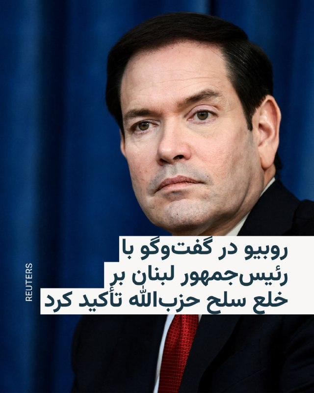

🔸مارکو روبیو، وزیر امور خارجه آمریکا، روز جمعه در گفت‌وگوی تلفنی با جوزف عون، رئیس‌جمهور لبنان، بار دیگر بر ضرورت خلع سلاح حزب‌الله و برقراری مجدد کنترل دولت بیروت بر تمامی قلمرو این کشور تأکید کرد.

🔸وزارت خارجه آمریکا در بیانیه‌ای اعلام کرد که روبیو در این تماس حمایت از تلاش‌های دولت لبنان «برای ایجاد یک کشور کاملاً مستقل و دارای حاکمیت کامل را که با تمامی همسایگان خود در صلح باشد» مورد تأکید قرار داد.

🔸دبیرکل حزب‌الله روز جمعه خلع سلاح این گروه شیعه مورد حمایت جمهوری اسلامی را رد کرد.

🔸مارکو روبیو در تماس با عون گفت که مذاکرات دوجانبه لبنان و اسرائیل «تنها مسیر عملی برای بازسازی، احیای اقتصادی و پایان دادن به چرخه‌های مکرر خشونت» است.

@RadioFarda

## RadioFarda — post 158519

  <a href="telegram/content/RadioFarda_158519_1781902468.mp4" target="_blank">🎬 Download video</a>

🔸ویدئویی در شبکه‌های اجتماعی منتشر شده که مادر مانی صفرپور، جوان کشته‌شده در اعتراضات دی‌ماه، را در حال سوگواری برای فرزندش در کنار یک دستۀ عزاداری نشان می‌دهد.

🔸مانی صفر‌پور، جوان ۱۸ سالۀ لاهیجانی، ۱۸ دی‌ماه ۱۴۰۴ با شلیک نیروهای حکومتی در محلۀ سلسبیل تهران کشته شد.

@RadioFarda

## IranianMinds — post 22975

  <a href="telegram/content/IranianMinds_22975_1781902471.mp4" target="_blank">🎬 Download video</a>

🔴 ترامپ:
می‌خوام از چین تشکر کنم. من از شی خواستم که وارد ماجرای ایران نشه؛ اونم گفت نمی‌شه و واقعاً هم نشد. حرکت خیلی خوبی بود.

@IranianMinds

## IranianMinds — post 22974

  <a href="telegram/content/IranianMinds_22974_1781902472.mp4" target="_blank">🎬 Download video</a>

🔴 ترامپ:
ایران ۶۰ روز وقت داره که به یه توافق برسه. اگه نرسه، ما یه کارایی می‌کنیم که اصلاً خوششون نمیاد. البته فکر نمی‌کنم کار به اونجا بکشه. ولی اگه بکشه، اون‌وقت دیگه نفت از اون تنگه (هرمز) راحت جریان پیدا نمی‌کنه.

@IranianMinds

## IranianMinds — post 22973

  <a href="telegram/content/IranianMinds_22973_1781902474.mp4" target="_blank">🎬 Download video</a>

🔴ترامپ درباره مجتبی خامنه‌ای:

من یه آیت الله رو کشتم و متأسفانه اون یکی آیت الله دیگر رو آزار دادم.
من اونو ندیدم ولی مردم ازش صحبت میکردن ولی اون شجاعت خاصی داره چون به شدت مجروح شده بود...

مجری اکسیوس:
ترامپ این چه تغییر رژیمیه که‌ انجام دادی . الان خامنه‌ای جونیور (جوان) اومد

ترامپ: ببین دیگه شما نمیفهمید خامنه‌ای جونیور با پدرش متفاوته اونا افراد متفاوتی هستن...

@IranianMinds

## IranianMinds — post 22972

  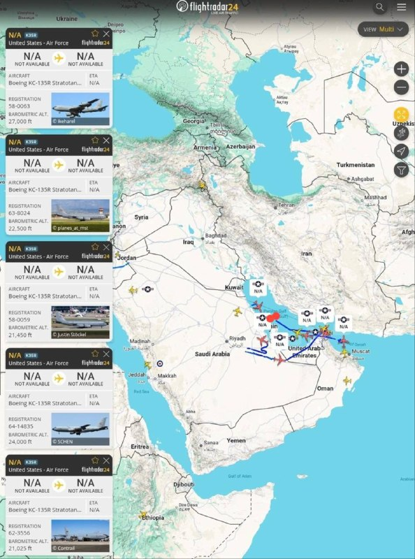

🔴۹ فروند هواپیمای سوخت‌رسان نیروی هوایی آمریکا به همراه جنگنده‌ها، در حال حاضر در منطقه خلیج‌فارس و تنگه هرمز فعال هستند.

@IranianMinds

## BBCPersian — post 284431

  <a href="telegram/content/BBCPersian_284431_1781902478.mp4" target="_blank">🎬 Download video</a>

‌🔻پس از لغو نشست هیئت‌ ایران و آمریکا در سوئیس، که قرار بود امروز (جمعه ۲۹ خرداد/۱۹ ژوئن) صورت بگیرد؛ اسماعیل بقایی، سخنگوی وزارت خارجه ایران، گفته است که «برای برگزاری یک نشست طی روزهای آینده» برنامه‌ریزی می‌شود.

اسماعیل بقایی به خبرنگاران گفت:«با توجه به اینکه امضای متن یادداشت تفاهم، در بامداد ۲۸ خرداد دیجیتالی انجام شد، برگزاری نشست در سوئیس فوریت ندارد. اما در حال برنامه‌ریزی برای برگزاری یک نشست در روزهای آینده هستیم.»

آقای بقایی گفته است: «طبق متن یادداشت تفاهم، آغاز مذاکرات توافق نهایی منوط به شروع اجرای مفاد بندهای ۱، ۴، ۵، ۱۰ و ۱۱ یادداشت تفاهم و تداوم اجرای آن‌ها است.»

این بندها به ترتیب شامل پایان درگیری در «همه جبهه‌ها»، پایان محاصره دریایی آمریکا، بازگشایی بدون عوارض تنگه هرمز، حفظ وضع موجود در برنامه هسته‌ای ایران و موضوع دارایی‌های مسدودشده ایران است.

کاخ سفید علت تعویق را «مسائل تدارکاتی» عنوان کرده و در پی آن، سفر جی‌دی ونس، معاون رئیس‌جمهوری آمریکا، به سوئیس نیز لغو شد.

متن کامل خبر در لینک:

https://bbc.in/4ejLTlA
@BBCPersian

## BBCPersian — post 284430

🔻پس از آغاز آتش‌بس دو نفر در جنوب لبنان در حملات هوایی اسرائیل کشته شدند

🔻رسانه‌های دولتی لبنان می‌گویند که دو نفر پس از اجرای توافق آتش‌بس در حمله پهپادی اسرائیل به جنوب لبنان کشته شدند.

گزارش‌ها حاکی است که اسرائیل اندکی پس از اعلام توافق آتش‌بس میان آمریکا و حزب‌الله، بیش از ۱۰ حمله هوایی به مناطق جنوب لبنان انجام داده است.

یک مقام ارشد آمریکایی تایید کرده است که دو طرف با اجرای توافق آتش‌بس موافقت کرده‌اند.

روزنامه اسرائیلی یدیعوت آحارونوت به نقل از منابعی در دولت گزارش داده است که اسرائیل اعلام کرده که این آتش‌بس تا زمانی که حزب‌الله به آن پایبند باشد، برقرار خواهد ماند. با این حال، ارتش اسرائیل همچنان در جنوب لبنان حضور نظامی خود را حفظ خواهد کرد.

https://bbc.in/4voMgBx
@BBCPersian

## BBCPersian — post 284429

🔻عون: آتش‌بس جامع شرط پیشرفت مذاکرات لبنان و اسرائیل است

🔻جوزف عون، رئیس‌جمهوری لبنان، در گفت‌وگوی تلفنی با مارکو روبیو، وزیر خارجه آمریکا، تاکید کرد که برای پیشرفت مذاکرات با اسرائیل، برقراری یک آتش‌بس جامع ضروری است.

بر اساس بیانیه ریاست‌جمهوری لبنان، آقای عون ضمن قدردانی از حمایت‌های آمریکا، بر «لزوم توقف حملات اسرائیل به خاک لبنان از طریق دستیابی به یک آتش‌بس فراگیر» تاکید کرد.

در این بیانیه آمده است که لبنان دستیابی به آتش‌بس جامع را «پایه‌ای اساسی برای پیشبرد مذاکرات لبنان، آمریکا و اسرائیل» می‌داند.

این مذاکرات قرار است هفته آینده در واشنگتن برگزار شود.

https://bbc.in/4vmsLJT
@BBCPersian

## BBCPersian — post 284428

  <a href="telegram/content/BBCPersian_284428_1781902481.mp4" target="_blank">🎬 Download video</a>

🔻آخرین خبرهای مهم روز جمعه ۲۹ خرداد ۱۴۰۵
@BBCPersian

## BBCPersian — post 284427

🔻عراقچی در تماس با همتای پاکستانی: هر گونه نقض تعهدات در توافق برعهده واشنگتن خواهد بود

🔻عباس عراقچی، وزیر خارجه ایران، در تماس تلفنی با محمد اسحاق دار، وزیر خارجه و معاون نخست‌وزیر پاکستان، درباره آخرین تحولات مرتبط با روند مذاکرات دیپلماتیک و برخی مسائل دوجانبه گفت‌وگو کرد.

آقای عراقچی در این گفت‌وگو از تلاش‌های پاکستان در پیشبرد مسیر دیپلماسی و کمک به دستیابی به «یادداشت تفاهم» قدردانی کرد.

اوهمچنین با اشاره به مسئولیت آمریکا در زمینه پایان دادن به درگیری‌ها در جبهه‌های مختلف از جمله لبنان، گفت که هرگونه «نقض تعهدات» مندرج در این توافق، برعهده واشنگتن خواهد بود و در عین حال نسبت به «پیامدها و تبعات» احتمالی چنین اقدامی هشدار داد.

محمد اسحاق دار هم ضمن استقبال از روند جاری مذاکرات، بر حمایت اسلام‌آباد از ادامه گفت‌وگوهای دیپلماتیک و تلاش‌ها برای دستیابی به نتایج «مثبت و پایدار» تأکید کرد.

https://bbc.in/4w1BiBP
@BBCPersian

## Dirty_Kids — post 392607

  

😂😂😂😂

@Dirty_Kids 👻

## Dirty_Kids — post 392606

  <a href="telegram/content/Dirty_Kids_392606_1781902484.mp4" target="_blank">🎬 Download video</a>

هیچی این شاهکار نمیشه :)))))

@Dirty_Kids 👻

## Dirty_Kids — post 392605

  <a href="telegram/content/Dirty_Kids_392605_1781902486.mp4" target="_blank">🎬 Download video</a>

فستیوال محرم تا اینجای کار:

@Dirty_Kids 👻

## Dirty_Kids — post 392604

  <a href="telegram/content/Dirty_Kids_392604_1781902488.mp4" target="_blank">🎬 Download video</a>

این نمایش کت‌شلواری زلاتان و تیری هانری(آنری) معرکه‌س.

@Dirty_Kids 👻

## Dirty_Kids — post 392603

  

قیافه نود درصد تینیجرهای نسل Z

@Dirty_Kids 👻

## Dirty_Kids — post 392602

  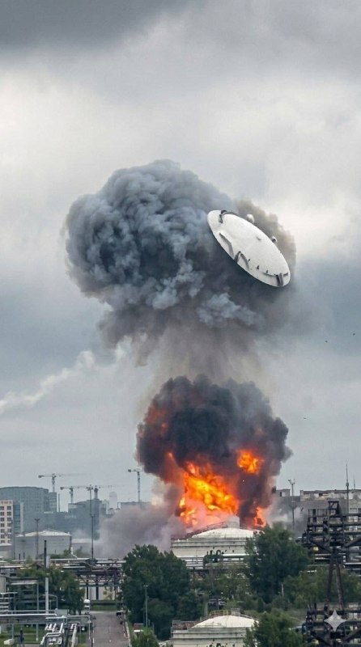

یاداشت می کنیم:
یک دلقک می تونه 4 سال با دست خالی مردونه بجنگه و خالق چنین اثر هنریی باشه؛ ولی یه تاجر با قوی ترین ارتش جهان فقط پشت چارت و کندل روزانه پنهان بشه.

@Dirty_Kids 👻

## Hranews — post 113731

  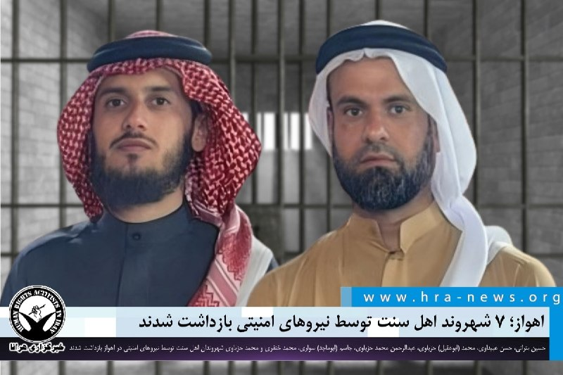

اهواز؛ ۷ شهروند اهل سنت توسط نیروهای امنیتی بازداشت شدند

❗️
❗️
❗️
❗️
❗️ – شامگاه چهارشنبه ۲۷ خردادماه، هفت شهروند اهل سنت به نام های حسین بترانی، حسن عبیداوی، محمد (ابوعقیل) حزباوی، عبدالرحمن محمد حزباوی، جاسم (ابوماجد) سواری، محمد خنفری و محمد حزباوی، توسط نیروهای امنیتی در اهواز #بازداشت و به مکان نامعلومی شدند.

به گزارش خبرگزاری هرانا، ارگان خبری مجموعه فعالان حقوق بشر در ایران، هفت شهروند اهل سنت در اهواز بازداشت شدند.

هویت این افراد، حسین بترانی، حسن عبیداوی، محمد (ابوعقیل) حزباوی، عبدالرحمن محمد حزباوی، جاسم (ابوماجد) سواری، محمد خنفری و محمد حزباوی، شهروندان ساکن منطقه کوت عبدالله اهواز، احراز شده است.

ادامه مطلب

#حسین_بترانی
#حسن_عبیداوی
#محمد_حزباوی
#ابوعقیل_حزباوی
#عبدالرحمن_محمد_حزباوی
#جاسم_سواری
#ابوماجد_سواری
#محمد_خنفری
#محمد_حزباوی

↘️
@hranews_bot تماس ✉️ -  @Hranews  کانال هرانا 🆑

## Hranews — post 113730

گزارشی از اعدام یک زندانی و صدور حکم اعدام برای یک متهم/ ۷ زندانی از مجازات مرگ رهایی یافتند

❗️
❗️
❗️
❗️
❗️ – مورخ ۱ اردیبهشت‌ماه، حکم یک زندانی که پیشتر از بابت اتهامات مرتبط با جرائم مواد مخدر به #اعدام محکوم شده بود، در زندان وکیل‌آباد مشهد اجرا شد. همچنین، هفت زندانی محکوم به اعدام در شهرهای مختلف از جمله در اردبیل و قرچک، با گذشت اولیای دم از مجازات مرگ رهایی یافتند. بنا بر خبری دیگر، یک متهم در تهران از بابت اتهام قتل با حکم دادگاه کیفری به اعدام محکوم شد.

ادامه مطلب

#عبدالغفار_شهنوازی

↘️
@hranews_bot تماس ✉️ -  @Hranews  کانال هرانا 🆑

## alonews — post 129261

  <a href="telegram/content/alonews_129261_1781902491.mp4" target="_blank">🎬 Download video</a>

👈برنی مورنو، سناتور آمریکایی: لغو تحریم نفت ایران به نفع آمریکاست چون چین پول بیشتری می‌پردازد

🔴 «ما اکنون به آنها اجازه می‌دهیم که نفت خود را بفروشند. این چه فایده‌ای دارد؟ این به نفع آمریکایی‌ها خواهد بود. این باعث کاهش قیمت نفت می‌شود.

🔴 و چین را مجبور به پرداخت هزینه بیشتر برای نفت می‌کند! و همچنین متوجه می‌شود چه کسانی نفت چین را می‌خرند. بنابراین ما را در موقعیت عالی، یک مذاکره عالی قرار می‌دهد و در نهایت، من به رئیس‌جمهور ترامپ اعتماد دارم که تصمیمات درست را می‌گیرد.»

✅ @AloNews خبر جنگ

## alonews — post 129260

  <a href="telegram/content/alonews_129260_1781902493.webm" target="_blank">🎬 Download video</a>

👈ترامپ: ما رابطهٔ بسیار خوبی با اسرائیل داریم؛ نتانیاهو یک جنگجو است

🔴 اسرائیلی‌ها باید از نتانیاهو قدردانی کنند، چون او واقعا کارش را انجام داد. ما واقعا در کنار اسرائیل به سختی مبارزه کردیم

✅ @AloNews خبر جنگ

## alonews — post 129258

  <a href="telegram/content/alonews_129258_1781902493.webm" target="_blank">🎬 Download video</a>

👈ترامپ درباره اوکراین: خیلی چیزها توسط بایدن به اوکراین داده شد. آنها باید هزینه‌اش را بپردازند، اما این در برنامه‌هایشان نبود.

🔴هیچ‌کس از آنها نخواست که پرداخت کنند. من گفتم، چرا پرداخت نکردید؟ آنها گفتند، هیچ‌کس از ما نخواست، آقا

✅ @AloNews خبر جنگ

## alonews — post 129257

  <a href="telegram/content/alonews_129257_1781902493.webm" target="_blank">🎬 Download video</a>

👈ترامپ درباره حمله دوباره به ایران:
به یاد داشته باشید، اگر این کار را انجام دهیم، ناگهان نفت به سرعت از تنگه خارج نخواهد شد.

🔴افرادی که مالک کشتی‌های میلیارد دلاری هستند، دوست ندارند موشک‌ها بالای سرشان پرواز کنند

✅ @AloNews خبر جنگ

## alonews — post 129256

  <a href="telegram/content/alonews_129256_1781902494.mp4" target="_blank">🎬 Download video</a>

👈 ترامپ: پیت هگستث یک فرد ذاتاً بااستعداد است. او نمی‌داند چگونه ببازد.

✅ @AloNews خبر جنگ

## alonews — post 129255

  <a href="telegram/content/alonews_129255_1781902496.webm" target="_blank">🎬 Download video</a>

👈رئیس کمیسیون امنیت ملی: ایران به نقض تفاهمنامه پاسخی بازدارنده خواهد داد

✅ @AloNews خبر جنگ

## alonews — post 129254

  <a href="telegram/content/alonews_129254_1781902496.webm" target="_blank">🎬 Download video</a>

👈ترامپ اعلام کرد: جنگنده فوق پیشرفته F47 برای ارتش آمریکا در حال ساخت است، پیشرفته ترین هواپیمای جنگی در تاریخ بشر

✅ @AloNews خبر جنگ

## alonews — post 129253

  <a href="telegram/content/alonews_129253_1781902496.webm" target="_blank">🎬 Download video</a>

👈صدای چندین انفجار در استان ادلب سوریه شنیده شد

✅ @AloNews خبر جنگ

## alonews — post 129252

  <a href="telegram/content/alonews_129252_1781902496.webm" target="_blank">🎬 Download video</a>

👈نیروهای زمینی ارتش دفاعی اسرائیل بار دیگر در تلاش برای پیشروی به سمت علی الطاهر، جنوب شرقی نابتیه هستند. حزب‌الله یک بمب کنار جاده‌ای را علیه نیروهای اسرائیلی که قصد نفوذ به این منطقه را داشتند، منفجر کرد

✅ @AloNews خبر جنگ

## alonews — post 129251

  <a href="telegram/content/alonews_129251_1781902497.mp4" target="_blank">🎬 Download video</a>

👈ترامپ: ما سفرهای زیادی انجام می‌دهیم. به ترکیه خواهیم رفت.

🔴در مقطعی، برای یک کنفرانس بزرگ به چین باز خواهیم گشت

✅ @AloNews خبر جنگ

## alonews — post 129250

  <a href="telegram/content/alonews_129250_1781902499.webm" target="_blank">🎬 Download video</a>

👈شورای اروپا: آماده حمایت از اجرای توافق ایران و آمریکا هستیم

✅ @AloNews خبر جنگ

## alonews — post 129249

  <a href="telegram/content/alonews_129249_1781902499.webm" target="_blank">🎬 Download video</a>

👈ترامپ: اگر با ایران به توافق نرسیم، کارهایی خواهیم کرد که آنها را خوشحال نکند، اما فکر نمی‌کنم این کار را بکنیم.

🔴 توافق هسته‌ای ۲۰۱۵ با ایران یک فاجعه بود

🔴 من با رهبر جدید ایران صحبت نکرده‌ام، اما او شجاعت خاصی دارد.

🔴 من از موضع قدرت مذاکره کردم چون نیروی دریایی و هوایی ایران نابود شده است.

🔴 کشتی‌ها به طور بی‌سابقه‌ای در حال عبور از تنگه هرمز هستند

✅ @AloNews خبر جنگ

## alonews — post 129248

  <a href="telegram/content/alonews_129248_1781902499.webm" target="_blank">🎬 Download video</a>

👈ترامپ: حدود ۷۰۰ کشتی از تنگه هرمز عبور می‌کنند

✅ @AloNews خبر جنگ

## alonews — post 129247

  <a href="telegram/content/alonews_129247_1781902500.webm" target="_blank">🎬 Download video</a>

👈 ترامپ از هدیه قطر رونمایی کرد!

🔴ترامپ در پایگاه نیروی هوایی اندروز از یک هواپیمای موقت جدید ریاست‌جمهوری رونمایی کرد؛ یک جت لوکس که توسط قطر اهدا و عبارت «ایالات متحده آمریکا» بر روی آن درج شده است.

✅ @AloNews خبر جنگ

## alonews — post 129246

  <a href="telegram/content/alonews_129246_1781902500.webm" target="_blank">🎬 Download video</a>

👈ترامپ: کشتی‌ها دارند از تنگه هرمز خارج می‌شوند و نفت صادر می‌شود

✅ @AloNews خبر جنگ

## alonews — post 129245

  <a href="telegram/content/alonews_129245_1781902500.webm" target="_blank">🎬 Download video</a>

👈رئیس اتحادیه املاک: نرخ مجاز افزایش اجاره ۲۷ درصد است

✅ @AloNews خبر جنگ

## alonews — post 129244

  <a href="telegram/content/alonews_129244_1781902500.webm" target="_blank">🎬 Download video</a>

👈سناتور آمریکایی تد کروز: دادن میلیاردها دلار به حکومت ایران که شعار مرگ بر آمریکا سر می‌دهد، ایده بدی است

✅ @AloNews خبر جنگ

## alonews — post 129243

  <a href="telegram/content/alonews_129243_1781902500.mp4" target="_blank">🎬 Download video</a>

👈لحظه ای که ترامپ وارد نشست گروه هفت شد و با شوخی خود "من رئیس هستم" جو سنگین نشست رو شکست

✅ @AloNews خبر جنگ

## alonews — post 129242

  <a href="telegram/content/alonews_129242_1781902502.mp4" target="_blank">🎬 Download video</a>

👈زلنسکی: اگر لوکاشنکو می‌گوید که نمی‌خواهد به این جنگ کشیده شود، باید حداقل با مردم خودش صادق باشد.

🔴زیرا او کسی نیست که بتواند به جنگ کشیده شود. کشوری است که او در آن زندگی می‌کند که می‌تواند توسط روسیه به جنگ کشیده شود

✅ @AloNews خبر جنگ

## alonews — post 129241

  <a href="telegram/content/alonews_129241_1781902505.webm" target="_blank">🎬 Download video</a>

👈پرزیدنت ترامپ با انتشار نظرسنجی ای نوشت: توافقی بسیار محبوب، به جز برایِ فیک نیوز ها و شریک آنها، دوموکرات ها!

✅ @AloNews خبر جنگ

---
📅 بروزرسانی: 1405/03/29 22:23
---

## VahidOOnLine — post 246424

  

جی‌دی ونس، معاون رییس‌جمهور آمریکا در گفت‌وگو با سی‌بی‌ان نیوز درباره تفاهم‌نامه واشینگتن-تهران گفت: «این تفاهم‌نامه به ما اجازه می‌دهد که بر اساس اقدامات ایران، سطح امتیازات را کم یا زیاد کنیم. در واقع هیچ تعهدی ایجاد نمی‌کند؛ اول از همه، حتی اگر آن‌ها همه کارها را انجام دهند، هیچ دلاری از مالیات‌دهندگان آمریکایی در کار نخواهد بود.»

او ادامه داد: «کاری که این تفاهم‌نامه انجام می‌دهد این است که اگر ایرانی‌ها هزینه‌اش را بپردازند، اگر حمایت از تروریسم را متوقف کنند، و اگر به یک رژیم بازرسی بلندمدت متعهد شوند که به ما اجازه دهد با اطمینان بگوییم هرگز به سلاح هسته‌ای دست پیدا نخواهند کرد، آن‌وقت ما می‌توانیم میزان تحریم‌ها را کاهش دهیم.»
‌🏁 🇬🇧 IranintlTV

🤖 @VahidOOnLine

## VahidOOnLine — post 246423

  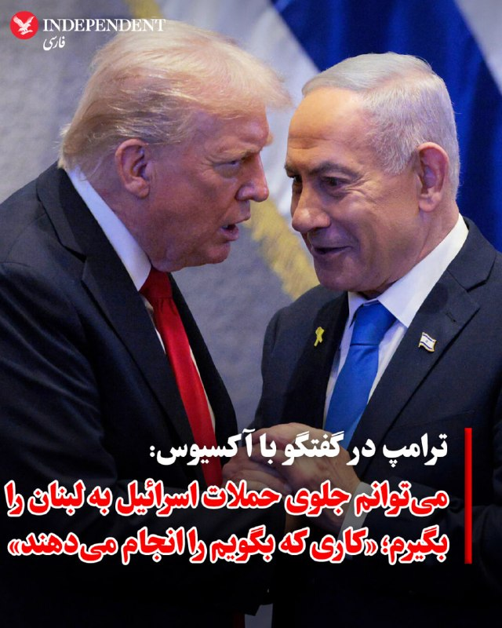

♦️ دونالد ترامپ، رئیس‌جمهوری آمریکا، در مصاحبه‌ای که روز جمعه ۲۹ خرداد منتشر شد، اعلام کرد باور دارد که می‌تواند مانع از حملات اسرائیل به لبنان شود.

ترامپ در پاسخ به سوال مارک کاپوتو، خبرنگار اکسیوس، مبنی بر اینکه آیا قادر است اسرائیل را برای خودداری از حمله به لبنان کنترل کند، گفت: «بله، خواهم توانست.» وی در ادامه افزود: «آن‌ها احترام زیادی برای من قائلند و کاری را که بگویم انجام می‌دهند.»

این اظهارات ترامپ پیش از توافق آتش‌بس میان اسرائیل و حزب‌الله مطرح شد؛ توافقی که در پی یکی از مرگ‌بارترین روزهای این درگیری حاصل شد. بر اساس اعلام دولت لبنان، حملات روز جمعه اسرائیل دست‌کم ۴۷ کشته در لبنان بر جای گذاشت که این روز را به دومین روز خونین از زمان آغاز جنگ تبدیل کرد.
‌🇸🇦 Indypersian

🤖 @VahidOOnLine

## VahidOOnLine — post 246422

  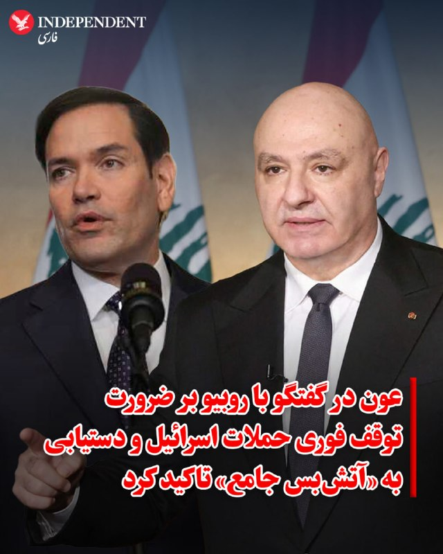

♦️ ژوزف عون، رئیس‌جمهوری لبنان، روز جمعه ۲۹ خرداد در جریان یک تماس تلفنی با مارکو روبیو، وزیر امور خارجه ایالات متحده، آخرین وضعیت بحرانی این کشور و تداوم تنش‌ها با اسرائیل را بررسی کرد.

بر اساس بیانیه دفتر ریاست‌جمهوری لبنان، عون در این گفتگو بر «ضرورت توقف فوری تجاوزات اسرائیل به خاک لبنان از طریق دستیابی به یک آتش‌بس جامع» تاکید کرد. بیروت این اقدام را «رکنی اساسی» برای پیشبرد مذاکرات آتی میان لبنان و آمریکا می‌داند که قرار است هفته آینده در واشنگتن برگزار شود.

روبیو نیز در مقابل، ضمن تاکید مجدد بر حمایت ایالات متحده از لبنان، بر «تعهد واشنگتن به برقراری امنیت و ثبات در منطقه» اشاره کرد. وزیر خارجه آمریکا خاطرنشان کرد که کشورش از گسترش حاکمیت و اقتدار دولت لبنان بر تمامی اراضی خود و همچنین حمایت از نهادهای قانونی این کشور پشتیبانی می‌کند.
‌🇸🇦 Indypersian

🤖 @VahidOOnLine

## VahidOOnLine — post 246421

  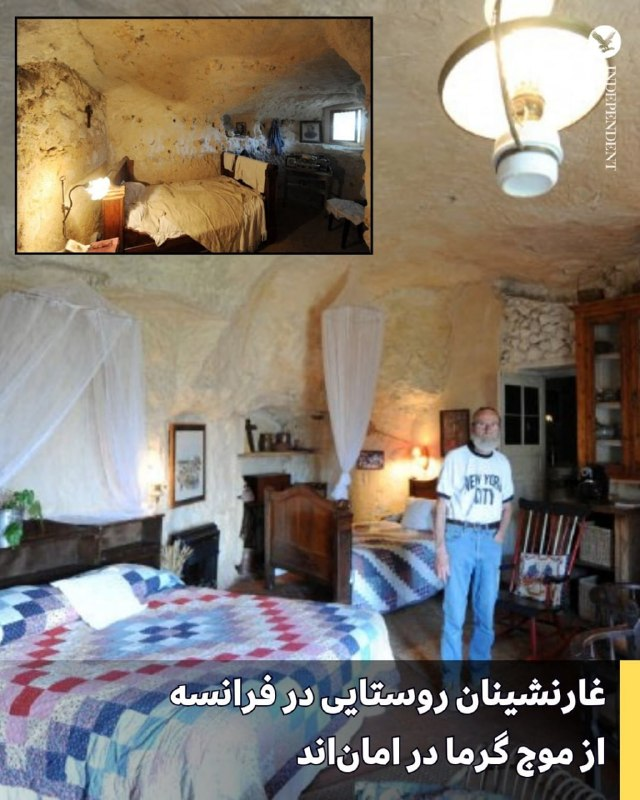

♦️ در حالی که موج‌ گرما بخش‌هایی از اروپا را فرا گرفته، برخی ساکنان و گردشگران در روستای غارنشین ترُو (Trôo) در غرب فرانسه پناهگاهی طبیعی دارند. خانه‌های کنده‌شده در سنگ آهک این روستا که دمای داخل آن‌ها در تمام سال حدود ۱۵ درجه باقی می‌ماند، قرن‌هاست بدون نیاز به تهویه مطبوع، پناهگاهی خنک در تابستان و نسبتا گرم در زمستان فراهم می‌کنند. این معماری صخره‌ای که زمانی از دل معادن سنگ و نیازهای روزمره شکل گرفت، امروز به نمونه‌ای از معماری کم‌مصرف و سازگار با اقلیم تبدیل شده است.

ترُو تنها نمونه چنین سکونتگاهی نیست. از کاپادوکیه در ترکیه و ماترا در جنوب ایتالیا گرفته تا کندوان در ایران و روستاهای صخره‌ای تونس، انسان در نقاط مختلف جهان از دل سنگ برای ساخت خانه‌هایی بهره برده که دمایی پایدار و مصرف انرژی اندکی دارند. آنچه زمانی راه‌حلی ساده برای استفاده از مصالح محلی و مقابله با شرایط آب‌وهوایی بود، امروز در عصر گرمایش زمین و افزایش مصرف انرژی، دوباره به عنوان نمونه‌ای از معماری پایدار مورد توجه قرار گرفته است.
‌🇸🇦 Indypersian

🤖 @VahidOOnLine

## VahidOOnLine — post 246420

  

یخیئل لایتر، سفیر اسرائیل در آمریکا، اعلام کرد که اسرائیل همچنان به آتش‌بس فوری در لبنان به‌طور قاطع پایبند است.

لایتر افزود: «اگر حزب‌الله به توافق پایبند بماند و اقدامات خصمانه خود را متوقف کند، با آرامش مواجه خواهد شد».

او در شبکه ایکس نوشت که اسرائیل پیش از ظهر جمعه، تمام عملیات تهاجمی را متوقف کرد؛ ادعاهای حزب‌الله و جمهوری اسلامی بر خلاف این موضوع، دروغ‌های آشکار است.
‌🏁 🇬🇧 IranintlTV

🤖 @VahidOOnLine

## VahidOOnLine — post 246419

در پی راه‌اندازی کارزار کشف حقیقت برای پیدا کردن ابعاد جنایت جمهوری اسلامی در نورآباد ممسنی و هویت جاویدنامان این شهر در جریان انقلاب ملی ایرانیان، اطلاعاتی از نحوه کشتار مردم در شامگاه ۲۰ دی‌ماه ۱۴۰۴ به دست ایران‌‌اینترنشنال رسیده است.
فرنوش فرجی، عضو تحریریه ایران اینترنشنال گزارش می‌دهد.
‌🏁 🇬🇧 IranintlTV

🤖 @VahidOOnLine

## VahidOOnLine — post 246418

  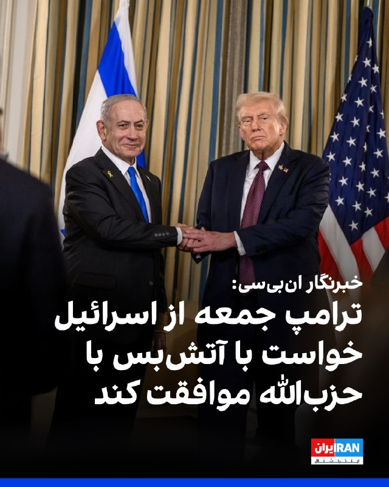

گابه گوتیرز، خبرنگار ان‌بی‌سی‌نیوز، در شبکه ایکس نوشت که دونالد ترامپ جمعه با اسرائیل گفت‌وگو کرد و از مقامات این کشور خواست با آتش‌بس با حزب‌الله موافقت کنند.

این خبرنگار اضافه کرد که ترامپ از مشخص کردن اینکه آیا مستقیما با بنیامین نتانیاهو، نخست‌وزیر اسرائیل، صحبت کرده یا نه، خودداری کرده است.

خبرنگار ان‌بی‌سی افزود که ترامپ درباره نتانیاهو گفته است: «من همیشه با بی‌بی رابطه خوبی داشته‌ام. بعضی وقت‌ها فقط باید آرام شد و از عقل استفاده کرد.»
‌🏁 🇬🇧 IranintlTV

🤖 @VahidOOnLine

## VahidOOnLine — post 246417

  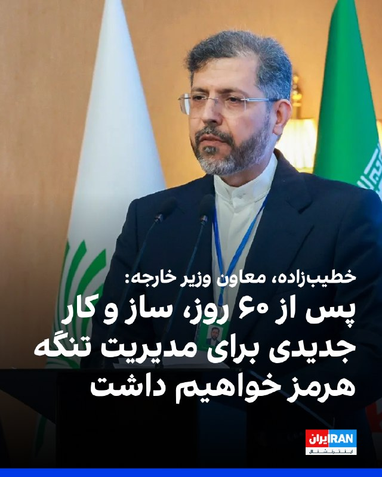

سعید خطیب‌زاده، معاون وزیر خارجه جمهوری اسلامی به الجزیره گفت: «آمریکا باید اطمینان حاصل کند که اسرائیل به مفاد تفاهم‌نامه میان تهران و واشینگتن پایبند است و ما آماده‌ایم گام‌به‌گام پیش برویم، اگر طرف مقابل نیز همین میزان جدیت را نشان دهد.»

خطیب‌زاده همچنین گفت جمهوری اسلامی به دنبال «صلح در همه جبهه‌ها از جمله غزه» است و اضافه کرد که لبنان به دلیل ارتباط مستقیم با این درگیری‌ها در این تفاهم‌نامه گنجانده شده است.

او ادامه داد: «بدون پایان اشغال و پایبندی اسرائیل به قوانین بین‌المللی، هیچ صلح و ثباتی در لبنان و منطقه وجود نخواهد داشت.»

معاون وزیر خارجه جمهوری اسلامی در خصوص تنگه هرمز نیز گفت که تهران به ارائه خدمات کشتیرانی در هماهنگی با عمان و مطابق قوانین بین‌المللی ادامه خواهد داد و تهران در دوره ۶۰ روزه توافق، هزینه عبور دریافت نخواهد کرد، اما پس از آن سازوکار جدیدی برای مدیریت این آبراه معرفی خواهد شد.
‌🏁 🇬🇧 IranintlTV

🤖 @VahidOOnLine

## VahidOOnLine — post 246416

♦️ویدیویی از دونالد ترامپ، رئیس‌جمهوری ایالات متحده، در جریان اهدای «مدال افتخار» به یک نظامی منتشر شده که نحوه بستن این مدال با واکنش‌های گسترده درشبکه‌های اجتماعی همراه شده است.
در این تصاویر، ترامپ در بستن و قرار دادن مدال دچار مشکل می‌شود و این لحظه توجه کاربران را جلب کرده است. برخی کاربران این صحنه را مورد انتقاد و تمسخر قرار داده‌اند.
مدال افتخار یکی از بالاترین نشان‌های نظامی در ایالات متحده است که به نیروهای نظامی به‌دلیل شجاعت برجسته اعطا می‌شود.
‌🇸🇦 Indypersian

🤖 @VahidOOnLine

## mwarmonitor — post 11233

  

✈️ ۹ فروند هواپیمای سوخت‌رسان نیروی هوایی آمریکا (به‌همراه جنگنده‌ها) در حال حاضر در منطقه خلیج فارس و تنگه هرمز فعال هستند.

@mwarmonitor

## mwarmonitor — post 11232

🚨خدمات اورژانس در حال حاضر در حال رسیدگی به یک برخورد شدید میان دو قطار مسافربری در جنوب شهر بدفورد، انگلستان هستند. این حادثه باعث توقف کامل خدمات ریلی بین بدفورد و لوتون شده است. مقام‌ها از بروز جراحات شدید در میان مسافران خبر داده‌اند و از مردم خواسته‌اند از نزدیک شدن به محل حادثه خودداری کنند، زیرا عملیات امداد و بررسی همچنان ادامه دارد.

@mwarmonitor

## mwarmonitor — post 11231

🔴رئیس‌جمهور ترامپ به شبکه NBC News گفت که روز جمعه با مقام‌های اسرائیلی گفت‌وگو کرده و از آن‌ها خواسته است آتش‌بس با حزب‌الله برقرار شود. او گفت: «بعضی وقت‌ها فقط باید آرام شد و از عقلتان استفاده کنید.» ترامپ از تأیید این‌که آیا مستقیماً با نخست‌وزیر بنیامین نتانیاهو صحبت کرده یا نه، خودداری کرد.

@mwarmonitor

## FoxNewsTwitter — post 343175

  <a href="telegram/content/FoxNewsTwitter_343175_1781895240.mp4" target="_blank">🎬 Download video</a>

Fox News (Twitter/X)

One in three young adults is still living at home — and for many, it’s not by choice.

A new Realtor.com study found record numbers of Americans in their late 20s and early 30s are living with their parents as homeownership drifts further out of reach.

Median home prices have climbed to roughly $430,000, while rents are up nearly 18% from a few years ago. Many of those living at home are employed and helping cover household expenses as they try to save for a place of their own. | @EmilyCompagno @OutnumberedFNC

## FoxNewsTwitter — post 343174

  <a href="telegram/content/FoxNewsTwitter_343174_1781895242.mp4" target="_blank">🎬 Download video</a>

Fox News (Twitter/X)

"There are no limits."

In his first interview after signing the memorandum of understanding at Versailles, President Trump says America's power in the region remains unlimited.

The comments come as tensions in the region flare up once again.

A Hezbollah attack in northern Israel killed four Israeli soldiers, triggering Israeli strikes inside Lebanon and raising new questions about whether the ceasefire tied to the agreement can hold, @LucasFoxNews reports.

## pm_afshaa — post 94417

🔴نخست وزیر لبنان: ایران زور اتش بس آوردن برای لبنان را ندارد. این امر فقط توسط دولت و با خلع سلاح حزب الله محقق می‌شود

💧 Rainbet.com the #1 Non-KYC Crypto Casino & Sportsbook @rainbetcom

😁 @Pm_Afshaa

## pm_afshaa — post 94416

🔴جی‌دی ونس: ایده اینکه اماراتی‌ها قرار است یک میلیارد دلار سرمایه‌گذاری کنند تا یک نیروگاه در ایران بسازند اگر ایرانی‌ها رفتارشان را تغییر نداده باشند، کاملاً مضحک است

💧 Rainbet.com the #1 Non-KYC Crypto Casino & Sportsbook @rainbetcom

😁 @Pm_Afshaa

## pm_afshaa — post 94415

  <a href="telegram/content/pm_afshaa_94415_1781895245.webm" target="_blank">🎬 Download video</a>

⚡️ تخفیف ویژه و بی‌سابقه در کانال GLITCH CONFIG 
⚡️

😉 از این به بعد دیگه نگران تموم شدن حجم و سرعت پایین نباشید 
😉

💵 بهترین و پایدارترین کانفیگ‌ها رو فقط و فقط با قیمت گیگی 
🔢 هزار تومان تهیه کنید 
💵

💸 نامحدود هم 400 هزار تومان 
💸

برای خرید همین حالا به آیدی پشتیبانی ما پیام بدید: 
👇

🔤 @Gliitch_Config

🔤 @Gliitch_Config

🔤 @Gliitch_Config

## pm_afshaa — post 94414

  <a href="telegram/content/pm_afshaa_94414_1781895245.webm" target="_blank">🎬 Download video</a>

🔴نعیم قاسم، دبیر کل حزب‌الله لبنان:
تا زمانی که توان ایستادگی داریم، چرا باید تسلیم بشیم؟ اسلحه‌ های ما برای درگیری و مبارزه با نیروهای اسرائیلیه.

💧 Rainbet.com the #1 Non-KYC Crypto Casino & Sportsbook @rainbetcom

😁 @Pm_Afshaa

## pm_afshaa — post 94413

  <a href="telegram/content/pm_afshaa_94413_1781895246.webm" target="_blank">🎬 Download video</a>

🔴سناتور تد کروز:
برای من فرقی نمیکنه 300 میلیارد دلار از کجا میاد. دادن میلیاردها دلار به حکومت ایران که شعار مرگ بر آمریکا سر میده، ایده بدیه.

در توافق با تهران، میلیاردها دلار به دیوانه‌هایی ندید که میخوان ما رو بکشن.

💧 Rainbet.com the #1 Non-KYC Crypto Casino & Sportsbook @rainbetcom

😁 @Pm_Afshaa

## pm_afshaa — post 94412

  <a href="telegram/content/pm_afshaa_94412_1781895246.webm" target="_blank">🎬 Download video</a>

🔴اوباما درباره ایران: به نقطه‌ای برگشتیم که شروع کردیم، شاید حتی بدتر.

💧 Rainbet.com the #1 Non-KYC Crypto Casino & Sportsbook @rainbetcom

😁 @Pm_Afshaa

## pm_afshaa — post 94411

  <a href="telegram/content/pm_afshaa_94411_1781895247.webm" target="_blank">🎬 Download video</a>

🔴جی‌دی ونس، معاون ترامپ:
اسرائیل یک شریک خوبه، مثل بریتانیا یا فرانسه که شرکای خوبی‌ان. اما این به آن معنا نیست که ما همیشه منافع همسو داشته باشیم.

💧 Rainbet.com the #1 Non-KYC Crypto Casino & Sportsbook @rainbetcom

😁 @Pm_Afshaa

## pm_afshaa — post 94410

  <a href="telegram/content/pm_afshaa_94410_1781895248.webm" target="_blank">🎬 Download video</a>

🔴ترامپ در تماس تلفنی با ان‌بی‌سی نیوز:
با اسرائیل صحبت کردم و از اونا خواستم با آتش‌بس موافقت کنن و نتیجه مثبت بوده.

+ ترامپ از بیان اینکه مستقیما با نتانیاهو صحبت کرده یا نه، خودداری کرد.

💧 Rainbet.com the #1 Non-KYC Crypto Casino & Sportsbook @rainbetcom

😁 @Pm_Afshaa

## VahidOnline — post 76525

⭕️صدور حکم اخراج برای هفت دانشجوی دانشگاه شریف؛ صدور حکم غیابی برای یکی از دانشجویان بازداشتی؟

🔻بر اساس گزارش‌های رسیده به دانشجویان متحد، کمیته انضباطی دانشگاه شریف، برای هفت دانشجوی این دانشگاه حکم بدوی اخراج صادر شده است. اسامی دانشجویان به شرح زیر است:

🔻 رضا دالمن، ورودی کارشناسی ارشد ۱۴۰۳ مهندسی کامپیوتر: اخراج و چهار سال محرومیت از تحصیل

🔻فاطمه خاکپور، ورودی کارشناسی ۱۴۰۳ شیمی: اخراج

🔻حسین شادمان، ورودی کارشناسی ارشد ۱۴۰۴ مهندسی صنایع: اخراج

🔻سپنتا سعیدی، ورودی کارشناسی ۱۴۰۴ مهندسی کامپیوتر: اخراج و پنج سال محرومیت از تحصیل

🔻مسیحا باقری، ورودی کارشناسی ۱۴۰۲ مهندسی کامپیوتر: اخراج

🔻فریبرز کهن‌زاد، ورودی کارشناسی ۱۴۰۰ مهندسی برق(تغییر رشته به مهندسی صنایع): اخراج و پنج سال محرومیت از تحصیل

🔻پرنیان خدابخشی، ورودی کارشناسی ۱۴۰۲ مهندسی و علم مواد: اخراج و پنج سال محرومیت از تحصیل

🔻همچنین در برخی رسانه‌ها خبر صدور حکم اخراج برای «آریانا کوچکی»، ورودی کارشناسی ۱۴۰۰ مهندسی صنایع، نیز منتشر شده است. هر چند بر اساس گزارش‌هایی که به دست ما رسیده، ایشان در حال حاضر بازداشت هستند و خبری در مورد برگزاری کمیته بدوی ایشان نداریم. هر چند صدور حکم غیابی برای دانشجویان بازداشتی در جمهوری اسلامی، پدیده تازه‌ای نیست.

🔻لازم به ذکر است از میان هفت نفر یاد شده، کمیته سه تن(سپنتا سعیدی، حسین شادمان، مسیحا باقری) با محوریت فعالیت در شبکه‌های اجتماعی و کمیته چهار تن دیگر با محوریت اعتراضات اسفندماه برگزار شده است.

ارتباط با ما:
@Public_anjmotahed

🆔 @anjmotahed

## VahidOnline — post 76524

  <a href="telegram/content/VahidOnline_76524_1781895248.mp4" target="_blank">🎬 Download video</a>

مصاحبه جی‌دی ونس با زیرنویس فارسی
گفت‌وگو با:
الی بث استاکی، مجری و مفسر محافظه‌کار مسیحی آمریکایی، میزبان پادکست Relatable در شبکه BlazeTV
برنامه‌ای که در آن از زاویه‌ای مذهبی و راست‌گرایانه به سیاست، فرهنگ، خانواده و مسائل اجتماعی آمریکا می‌پردازد.
او در میان مخاطبان اوانجلیکال و محافظه‌کار آمریکا چهره‌ای شناخته‌شده است و در این گفت‌وگو با جی‌دی ونس، معاون رئیس‌جمهور آمریکا، درباره ایمان، خانواده، سیاست داخلی، اسرائیل و توافق با ایران صحبت می‌کند.

یک ساعت درباره مسیحی زندگی کردن حرف زدند و ده دقیقه درباره نقش و نفوذ اسرائیل در سیاست آمریکا و توافق با ایران برای مخاطبی از اون نوع

اینجوری می‌پرسه: می‌خواهید یک مادر معمولی چه بداند؟
متن این دقایق:
https://telegra.ph/JDVance-06-19

📡 @VahidOnline

## VahidOnline — post 76523

  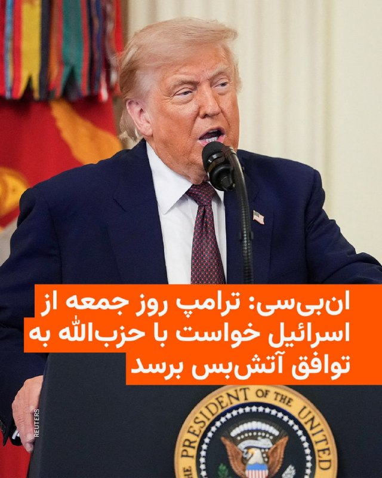

دونالد ترامپ، رئیس‌جمهور آمریکا، در یک گفت‌وگوی تلفنی با شبکه ان‌بی‌سی نیوز گفت که روز جمعه با مقام‌های اسرائیلی صحبت کرده و از آن‌ها خواسته است با گروه حزب‌الله بر سر آتش‌بس توافق کنند.

بر اساس مطلبی که خبرنگار این شبکه در شبکه ایکس منتشر کرد، ترامپ به این مقام‌ها گفته است: «بعضی وقت‌ها فقط باید آرام بگیرید و از عقلتان استفاده کنید.»

این خبرنگار همچنین افزود که ترامپ مشخص نکرد آیا مستقیماً با ‌بنیامین نتانیاهو، نخست‌وزیر اسرائیل، گفت‌وگو کرده است یا خیر.
@VahidHeadline

📡 @VahidOnline

## IranIntlTV — post 343264

  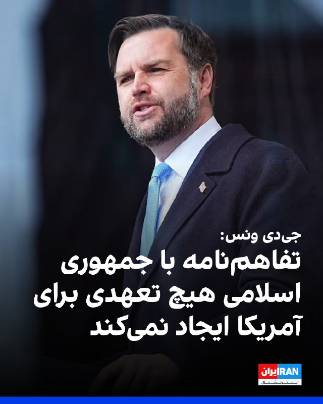

جی‌دی ونس، معاون رییس‌جمهور آمریکا در گفت‌وگو با سی‌بی‌ان نیوز درباره تفاهم‌نامه واشینگتن-تهران گفت: «این تفاهم‌نامه به ما اجازه می‌دهد که بر اساس اقدامات ایران، سطح امتیازات را کم یا زیاد کنیم. در واقع هیچ تعهدی ایجاد نمی‌کند؛ اول از همه، حتی اگر آن‌ها همه کارها را انجام دهند، هیچ دلاری از مالیات‌دهندگان آمریکایی در کار نخواهد بود.»

او ادامه داد: «کاری که این تفاهم‌نامه انجام می‌دهد این است که اگر ایرانی‌ها هزینه‌اش را بپردازند، اگر حمایت از تروریسم را متوقف کنند، و اگر به یک رژیم بازرسی بلندمدت متعهد شوند که به ما اجازه دهد با اطمینان بگوییم هرگز به سلاح هسته‌ای دست پیدا نخواهند کرد، آن‌وقت ما می‌توانیم میزان تحریم‌ها را کاهش دهیم.»
https://iranintl.com/202606197229

## IranIntlTV — post 343263

  <a href="telegram/content/IranIntlTV_343263_1781895251.mp4" target="_blank">🎬 Download video</a>

۲۴ با فرداد فرحزاد
@iranintltv

## IranIntlTV — post 343262

  <a href="telegram/content/IranIntlTV_343262_1781895252.mp4" target="_blank">🎬 Download video</a>

با توجه به امضاء تفاهم موقت، قالیباف چقدر توانایی به مقصد رساندن این تفاهم به یک توافق جامع را دارد؟
@iranintltv

## IranIntlTV — post 343261

  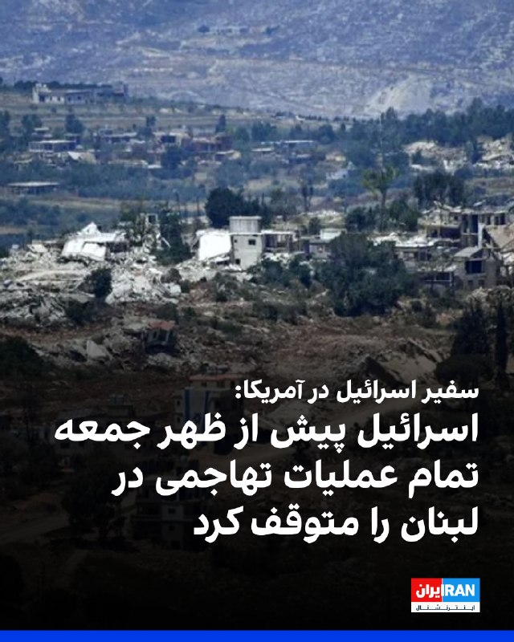

یخیئل لایتر، سفیر اسرائیل در آمریکا، اعلام کرد که اسرائیل همچنان به آتش‌بس فوری در لبنان به‌طور قاطع پایبند است.

لایتر افزود: «اگر حزب‌الله به توافق پایبند بماند و اقدامات خصمانه خود را متوقف کند، با آرامش مواجه خواهد شد».

او در شبکه ایکس نوشت که اسرائیل پیش از ظهر جمعه، تمام عملیات تهاجمی را متوقف کرد؛ ادعاهای حزب‌الله و جمهوری اسلامی بر خلاف این موضوع، دروغ‌های آشکار است.
https://iranintl.com/202606198406

## IranIntlTV — post 343260

## IranIntlTV — post 343259

در پی راه‌اندازی کارزار کشف حقیقت برای پیدا کردن ابعاد جنایت جمهوری اسلامی در نورآباد ممسنی و هویت جاویدنامان این شهر در جریان انقلاب ملی ایرانیان، اطلاعاتی از نحوه کشتار مردم در شامگاه ۲۰ دی‌ماه ۱۴۰۴ به دست ایران‌‌اینترنشنال رسیده است.
فرنوش فرجی، عضو تحریریه ایران اینترنشنال گزارش می‌دهد.

## IranIntlTV — post 343258

  

گابه گوتیرز، خبرنگار ان‌بی‌سی‌نیوز، در شبکه ایکس نوشت که دونالد ترامپ جمعه با اسرائیل گفت‌وگو کرد و از مقامات این کشور خواست با آتش‌بس با حزب‌الله موافقت کنند.

این خبرنگار اضافه کرد که ترامپ از مشخص کردن اینکه آیا مستقیما با بنیامین نتانیاهو، نخست‌وزیر اسرائیل، صحبت کرده یا نه، خودداری کرده است.

خبرنگار ان‌بی‌سی افزود که ترامپ درباره نتانیاهو گفته است: «من همیشه با بی‌بی رابطه خوبی داشته‌ام. بعضی وقت‌ها فقط باید آرام شد و از عقل استفاده کرد.»
https://iranintl.com/202606195028

## IranIntlTV — post 343257

  <a href="telegram/content/IranIntlTV_343257_1781895255.mp4" target="_blank">🎬 Download video</a>

🔻با وجود میزبانی از جام جهانی و درخشش تیم ملی فوتبال آمریکا در بازی افتتاحیه برابر پاراگوئه، فوتبال همچنان از محبوب‌ترین ورزش‌ها نیست؛ با وجود این، فوتبال‌دوستان این کشور برای بازی برابر استرالیا و رقم زدن صعود به دور حذفی لحظه‌شماری می‌کنند.

🔹گفت‌وگوی مزدک میرزایی با محمد تقوی و نیلوفر منصوری در هت‌تریک

@iranintltvsport

## IranIntlTV — post 343256

  

سعید خطیب‌زاده، معاون وزیر خارجه جمهوری اسلامی به الجزیره گفت: «آمریکا باید اطمینان حاصل کند که اسرائیل به مفاد تفاهم‌نامه میان تهران و واشینگتن پایبند است و ما آماده‌ایم گام‌به‌گام پیش برویم، اگر طرف مقابل نیز همین میزان جدیت را نشان دهد.»

خطیب‌زاده همچنین گفت جمهوری اسلامی به دنبال «صلح در همه جبهه‌ها از جمله غزه» است و اضافه کرد که لبنان به دلیل ارتباط مستقیم با این درگیری‌ها در این تفاهم‌نامه گنجانده شده است.

او ادامه داد: «بدون پایان اشغال و پایبندی اسرائیل به قوانین بین‌المللی، هیچ صلح و ثباتی در لبنان و منطقه وجود نخواهد داشت.»

معاون وزیر خارجه جمهوری اسلامی در خصوص تنگه هرمز نیز گفت که تهران به ارائه خدمات کشتیرانی در هماهنگی با عمان و مطابق قوانین بین‌المللی ادامه خواهد داد و تهران در دوره ۶۰ روزه توافق، هزینه عبور دریافت نخواهد کرد، اما پس از آن سازوکار جدیدی برای مدیریت این آبراه معرفی خواهد شد.
https://iranintl.com/202606197004

## Shin_Persian — post 7135

  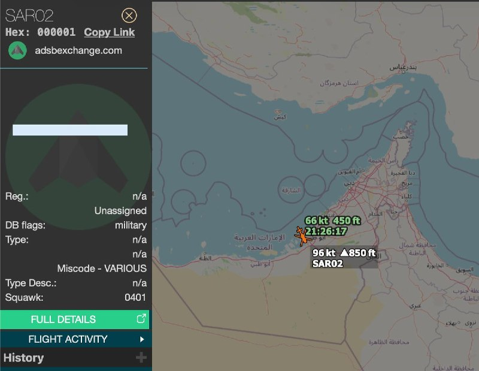

Shin ✓ @hey_itsmyturn
Fri, 19 Jun 2026 18:27:51 UTC

A mishexed aircraft with "SAR" C/S just took off from Abu Dhabi, #UAE 🇦🇪

ترجمه خودکار فارسی

یک هواپیمای دارای کد رجیستری اشتباه با شناسه فراخوان «SAR» (جستجو و نجات) دقایقی پیش از ابوظبی، #امارات 🇦🇪 برخاست.

𝕏 · @shin_persian

## FarsiVOA — post 221229

🔺عربستان سعودی با مشارکت بین‌المللی سرمایه‌گذاری در بخش صنایع نظامی را توسعه می‌دهد

▪️بنا به گزارش رسانه‌های منطقه در روز جمعه ۲۹ خرداد، عربستان سعودی با مشارکت در نمایشگاه آخرین فن‌آوری تسلیحات یوروساتوری، موفق شد قراردادهای بزرگ تسلیحاتی، با هدف بومی‌سازی صنایع نظامی از طریق سرمایه‌گذاری مشترک، را با شرکت‌های بزرگ تسلیحاتی منعقد کند.

⬇️ بیشتر بخوانید:
https://ir.voanews.com/a/military-budget-saudi-arabia-war/8162679.html/?nocach=1

## FarsiVOA — post 221224

جام جهانی ۲۰۲۶ در روزهای نخست با بردهای تاریخی، درخشش ستاره‌ها، توقف مدعیان و شگفتی‌های غیرمنتظره همراه شد؛ مجموعه‌ای از لحظه‌هایی که قاب هر عکس، روایتی متفاوت از هیجان بزرگ‌ترین تورنمنت فوتبال جهان دارد.

@FarsiVOA

## FarsiVOA — post 221223

🔺حمله هوایی اسرائیل به لبنان ساعاتی پس از اعلام آتش‌بس

▪️رسانه‌های لبنان ساعتی بعد از اجرا شدن آتش‌بس میان اسرائیل و حزب‌الله در عصر جمعه ۲۹ خرداد، گزارش کردند که یک جنگنده اسرائیلی به جبل رفیع در منطقه سجد در جنوب لبنان حمله کرد. در همین حال خبرگزاری فرانسه از حملات توپخانه‌ای به اطراف شهر نبطیه گزارش کرده است.

⬇️ بیشتر بخوانید:
https://ir.voanews.com/a/lebanon-hezbollah-iran-proxy-war/8162687.html/?nocach=1

## FarsiVOA — post 221222

آتشفشان سِمِرو در شرق جزیره جاوه اندونزی، صبح امروز فوران کرد. بر اساس گزارش‌ها، ستون خاکستر ناشی از این فوران تا ارتفاع حدود هزار متر به آسمان برخاست.

@FarsiVOA

## FarsiVOA — post 221221

🔺سناتور کروز درباره «یادداشت تفاهم»: متعصبان مذهبی دیوانه نباید پولی دریافت کنند

▪️تدکروز، سناتور ارشد جمهوری‌خواه آمریکا، در گفت‌و‌گو با پادکست «وردیکت» که بخش‌هایی از آن روز جمعه ۲۹ خرداد منتشر شد، ضمن حمایت از مواضع پرزیدنت ترامپ در قبال رژیم ایران، مخالفت خود را با هرگونه ارائه پول به رژیم ایران بیان کرد.

⬇️ بیشتر بخوانید:

https://ir.voanews.com/a/iran-us-ted-cruz-senator-negotiations-funds-/8162685.html/?nocach=1

## FarsiVOA — post 221220

  <a href="telegram/content/FarsiVOA_221220_1781895258.mp4" target="_blank">🎬 Download video</a>

علی رستمی، محیط‌بان، ویدیویی از حضور هزاران فلامینگو را در تالاب بین‌المللی میانکاله را منتشر کرده است. این تصاویر روز ۲۷ خرداد ثبت شده است.

@FarsiVOA

## FarsiVOA — post 221219

ویدیوهای منتشر شده، حملات گسترده ارتش اسرائیل به مناطق مختلف جنوب لبنان را نشان می‌دهد.

@FarsiVOA

## FarsiVOA — post 221215

ایوانکا ترامپ، دختر دونالد ترامپ، با انتشار ویدیویی از لحظات خانوادگی خود نوشت: «پایانی قدرتمند برای بهار؛ تابستان، برای آمدنت آماده‌ایم!»

این ویدیو تصاویری از دورهمی خانوادگی، جشن تولد دونالد ترامپ و آغاز فصل تابستان را به نمایش می‌گذارد.

@FarsiVOA

## FarsiVOA — post 221214

توافق دولت آمریکا و جمهوری اسلامی چه تاثیری بر وضعیت معیشت مردم ایران خواهد داشت؟ گفت‌وگو با معصومه طاهرخانی

## FarsiVOA — post 221213

آیا روند مذاکرات آمریکا و جمهوری اسلامی در گروی پایان درگیری‌ها میان حزب‌الله و اسرائیل است؟گفت‌وگو با حسن هاشمیان

## DW_Farsi — post 126193

  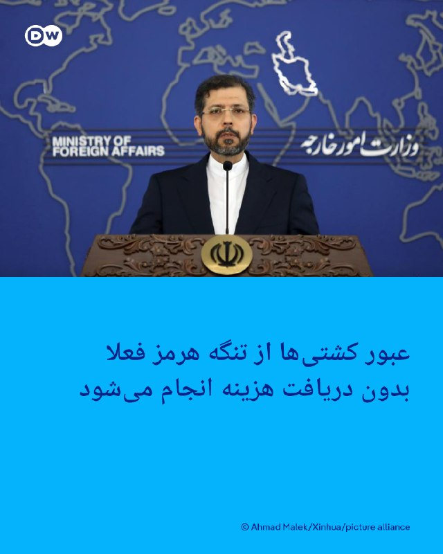

🔶عبور کشتی‌ها از تنگه هرمز فعلا بدون دریافت هزینه انجام می‌شود

نهاد مدیریت آبراه خلیج فارس اعلام کرد عبور کشتی‌هایی که درخواست عبور خود را از تنگه هرمز ارسال کنند، فعلا بدون دریافت هزینه انجام خواهد شد.
در همین حال، سعید خطیب زاده، معاون وزیر خارجه ایران گفت: «خدمات کشتیرانی و ناوبری در تنگه هرمز را با هماهنگی عمان و مطابق با حقوق بین‌الملل تأمین خواهیم کرد.»

به گفته او، ایران پس از ۶۰ روز، سازوکار جدیدی برای مدیریت تنگه اجرا خواهد کرد.

این در حالی است که روند آتش‌بس و مذاکره همچنان ادامه دارد، اما تحولات میدانی در لبنان بر زمان‌بندی تماس‌های دیپلماتیک اثر گذاشته است.

در همین حال، دونالد ترامپ با تاکید بر تعهد به صلح گفته است انتظار می‌رود آتش‌بسی کامل در تمامی جبهه‌ها برقرار شود.

@dw_farsi

## DW_Farsi — post 126192

  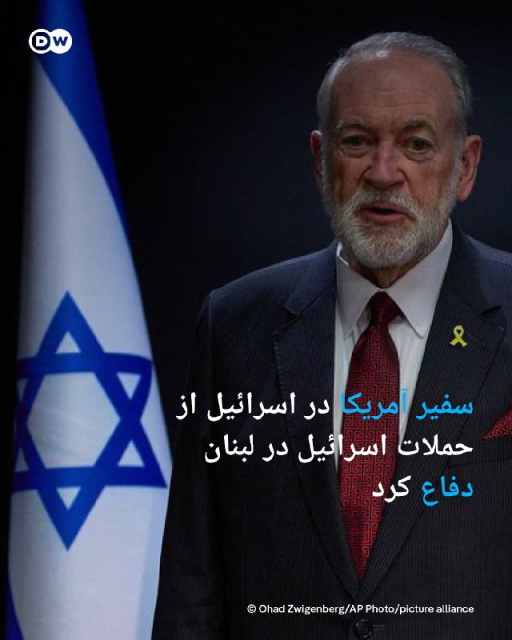

🔶سفیر آمریکا در اسرائیل از حملات اسرائیل در لبنان دفاع کرد

مایک هاکبی، سفیر آمریکا در اسرائیل، روز جمعه از حملات ارتش اسرائیل در لبنان دفاع کرد. او گفت اسرائیل در واکنش به حملات، دست به اقدام می‌زند. او در پیامی در شبکه ایکس، با اشاره به کشته شدن ۴ سرباز اسرائیلی در یک حمله پهپادی در لبنان، نوشت اسرائیل وقتی مورد حمله قرار می‌گیرد، پاسخ می‌دهد.

هاکبی در این پیام گفت آتش‌بس زمانی شکل می‌گیرد که حزب‌الله دست از شلیک و کشتن بردارد.

او به این ترتیب، مسئولیت ادامه درگیری‌ها را متوجه حزب‌الله دانست و از موضع اسرائیل در حملات اخیر دفاع کرد.

در متن ارسالی آمده است نه اسرائیل و نه حزب‌الله، طرف‌های توافق چارچوبی میان آمریکا و ایران برای پایان جنگ در خاورمیانه نیستند.

@dw_farsi

## DW_Farsi — post 126191

  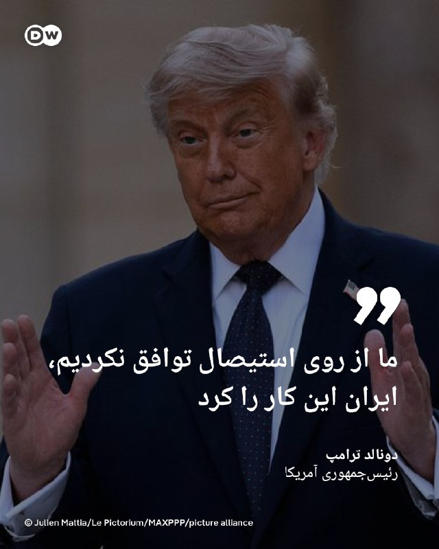

🔶ترامپ: ما از روی استیصال توافق نکردیم، ایران این کار را کرد

دونالد ترامپ، رئیس‌جمهوری آمریکا، روز جمعه در ادامه دفاع از تفاهم‌نامه میان واشنگتن و تهران برای پایان دادن به جنگ، به منتقدان این توافق حمله کرد و گفت ایران از سر استیصال وارد مذاکرات شده است. او در پیام‌هایی در تروث سوشال نوشت: "ما از روی استیصال دیدار نکردیم، ایران این کار را کرد. آنها تمام شده‌اند." ترامپ همچنین تأکید کرد در دوره ۶۰ روزه مذاکرات، ایران "هیچ پولی" دریافت نخواهد کرد.

این اظهارات یک روز پس از آن مطرح شد که جی‌دی ونس، معاون رئیس‌جمهوری آمریکا، سفر برنامه‌ریزی‌شده خود به سوئیس را برای آغاز مذاکرات درباره موضوع‌های اختلافی مندرج در تفاهم‌نامه لغو کرد.

این تأخیر، تنها یک روز پس از امضای تفاهم، درباره دوام آن تردیدهایی به‌وجود آورده؛ به‌ویژه در شرایطی که ادامه درگیری اسرائیل در لبنان می‌تواند این گشایش دیپلماتیک را از مسیر خارج کند.

@dw_farsi

## Persian_Trend_Official — post 17608

  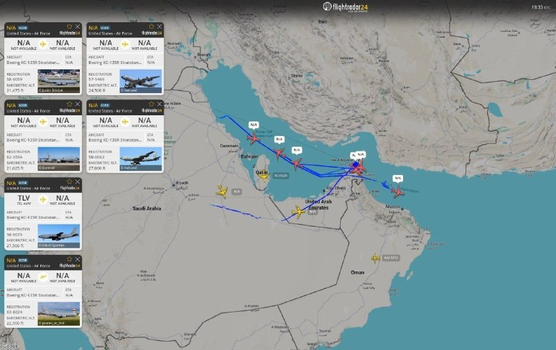

فعالیت ارتش ایالات متحده آمریکا بر فراز تنگه هرمز.

👺Phantom

📌 @persian_trend_official
پرشین ترند | متفاوت‌ترین کانال نظامی

## Persian_Trend_Official — post 17607

❤️ اگر از مخاطبان پرشین ترند هستید و تلگرام پرمیوم دارید،
با بوست کردن کانال کمک بزرگی به رشد و دیده‌شدن بیشتر پرشین ترند می‌کنید.
این بوست‌ها باعث می‌شود امکانات بیشتری برای انتشار محتوا، استوری و قابلیت‌های ویژه کانال فعال شود و در شرایط فعلی، به ادامه پوشش سریع و تحلیل‌های روزانه کمک زیادی می‌کند.
🙏 اگر مایل بودید، از طریق لینک زیر کانال را بوست کنید:
https://t.me/boost/persian_trend_official
📌 @persian_trend_official
پرشین ترند | متفاوت‌ترین کانال نظامی

## Persian_Trend_Official — post 17606

  <a href="telegram/content/Persian_Trend_Official_17606_1781895262.webm" target="_blank">🎬 Download video</a>

💠 سردار قاآنی: غزه هم طوفان دارد

فرمانده نیروی قدس سپاه:

بسم الله الرحمن الرحیم

🔹وقتی گفتیم حزب الله مرصاد دارد توجه نکردید گرفتار شدید؛ یکصد نفر تلفات را چه کسی جواب می‌دهد؟

🔹غزه هم طوفان دارد اگر به خواست سیاسیونتان حرکت کنید گرفتار طوفان می شوید. مراقب باشید.

👺Phantom

📌 @persian_trend_official
پرشین ترند | متفاوت‌ترین کانال نظامی

## Persian_Trend_Official — post 17605

  <a href="telegram/content/Persian_Trend_Official_17605_1781895262.mp4" target="_blank">🎬 Download video</a>

ترامپ: اگر ما به آنها حمله نمی‌کردیم، آنها سلاح هسته‌ای داشتند.

آنها از آن علیه اسرائیل استفاده می‌کردند. شما هم از آن در عربستان سعودی استفاده می‌کردید.

پس از آغاز جنگ تقریباً بلافاصله موشک‌ها به سمت این پنج کشور دیگر [قطر، امارات، کویت، بحرین] شلیک شدند.

من گفتم، چرا او این کار را می‌کند؟ و می‌دانید این چه نتیجه‌ای داشت؟

این باعث شد آن پنج کشور مستقیماً به دامان من بیایند.

📝 Amir

📌 @persian_trend_official
پرشین ترند | متفاوت‌ترین کانال نظامی

## Persian_Trend_Official — post 17604

  <a href="telegram/content/Persian_Trend_Official_17604_1781895264.webm" target="_blank">🎬 Download video</a>

ترامپ: ایرانی‌ها، آدم‌های خیلی باهوشی هستند. آن‌ها نوعی نابغه‌ی بدوی هستند، اما باهوشند.

آن‌ها اسرائیل را منفجر می‌کردند. اگر من نبودم، اسرائیل امروز وجود نداشت.

📝 Amir

📌 @persian_trend_official
پرشین ترند | متفاوت‌ترین کانال نظامی

## Persian_Trend_Official — post 17603

کانال رسمی پرشین ترند pinned «اقا تراست vpn روی سرور نامحدودش ۶۰ درصد تخفیف زده فقط تا ۲۴ ساعت و فقط مختص بچه های پرشین ترند البته سرویس های دیگه‌ای هم دارن👍 سرویس هاشونم گارانتی داره💎 یه پیام بهشون بدین و استعلام بگیرین @trusstvpnn_admin @trusstvpnn_admin»

## Persian_Trend_Official — post 17602

اقا تراست vpn روی سرور نامحدودش ۶۰ درصد تخفیف زده فقط تا ۲۴ ساعت و فقط مختص بچه های پرشین ترند
البته سرویس های دیگه‌ای هم دارن👍

سرویس هاشونم گارانتی داره💎

یه پیام بهشون بدین و استعلام بگیرین

@trusstvpnn_admin
@trusstvpnn_admin

## Persian_Trend_Official — post 17601

  <a href="telegram/content/Persian_Trend_Official_17601_1781895265.mp4" target="_blank">🎬 Download video</a>

🇺🇦 لحظه حمله پهپاد صیاد-۲ حزب‌الله به یکی از مواضع ارتش اسرائیل در شمال این کشور

👺Phantom

📌 @persian_trend_official
پرشین ترند | متفاوت‌ترین کانال نظامی

## Persian_Trend_Official — post 17600

  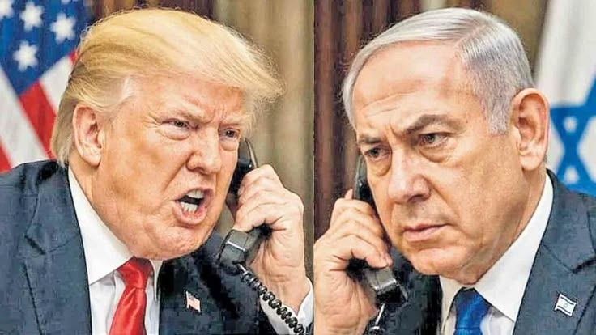

📺 ان‌بی‌سی: رئیس‌جمهور آمریکا، ترامپ، با مقامات اسرائیلی صحبت کرد و خواستارآتش‌بس با حزب‌الله شد. او گفت:
🇺🇸🇮🇱🇱🇧🇱🇧
«گاهی باید آرامش خود را حفظ کنید و از عقلتان استفاده کنید.»

ترامپ از تأیید اینکه آیا مستقیماً با نخست‌وزیر اسرائیل نتانیاهو صحبت کرده است یا خیر، خودداری کرد.

👺Phantom

📌 @persian_trend_official
پرشین ترند | متفاوت‌ترین کانال نظامی

## Persian_Trend_Official — post 17599

  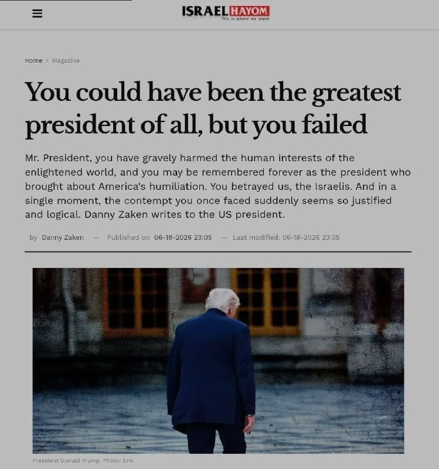

⭕️ روزنامه اسرائیل هیوم به ترامپ: می‌توانستی بزرگترین رئیس جمهور تاریخ آمریکا باشی اما رفوزه شدی.

📝 Nick

📌 @persian_trend_official
پرشین ترند | متفاوت‌ترین کانال نظامی

## RadioFarda — post 158518

چرا سوریه برای جنگ با حزب‌الله لبنان احتیاط می‌کند؟

🔸با مطرح شدن پیشنهاد دونالد ترامپ، رئیس‌جمهور آمریکا، مبنی بر سپردن مسئولیت مقابله با حزب‌الله به سوریه، موجی از واکنش‌ها در لبنان شکل گرفته است.

🔸برخی از مقام‌ها و جریان‌های سیاسی لبنانی، صرف‌نظر از مواضع‌شان نسبت به حزب‌الله، بر این نکته تأکید دارند که هرگونه تصمیم دربارهٔ خلع سلاح این گروه باید در چارچوب حاکمیت ملی لبنان و از سوی نهادهای رسمی این کشور اتخاذ شود.

🔸رئیس‌جمهور آمریکا در روزهای اخیر از بنیامین نتانیاهو، نخست‌وزیر اسرائیل، به‌دلیل حملات این کشور به لبنان به ویژه بیروت ابراز نارضایتی کرده و معتقد است که این حملات می‌تواند توافق با ایران را به خطر بیندازد.

🔸آقای ترامپ همچنین اسرائیل را به‌دلیل کشته شدن غیرنظامیان در حملات به لبنان مورد انتقاد قرار داد و در جریان نشست اخیر سران گروه هفت در فرانسه اعلام کرد که با احمد الشرع، رئیس‌جمهور سوریه، دربارهٔ مقابله با حزب‌الله در لبنان گفت‌وگو کرده است.

🔸ترامپ همچنین در دیدار با امیر قطر در حاشیهٔ اجلاس سران گروه هفت گفت: «من به اسرائیل پیشنهاد دادم که بگذارد سوریه به موضوع حزب‌الله بپردازد. چون صادقانه بگویم، فکر می‌کنم آن‌ها در انجام این کار عملکرد بهتری خواهند داشت».

🔸او افزود: «اگر اسرائیل نتواند این کار را بدون کشتن همه افراد دیگر انجام دهد، سوریه این کار را انجام خواهد داد».

🔸رئیس‌جمهور آمریکا در هفته‌های گذشته نیز از احتمال اقدام سوریه علیه حزب‌الله سخن گفته بود اما دقیقاً مشخص نیست اقدامی که واشینگتن از سوریه در این زمینه انتظار دارد شامل چه چیزی است. هنوز هیچ مقام آمریکایی در این زمینه توضیحی نداده است.

🔸گزارش کامل را در وب‌سایت رادیوفردا بخوانید.

@RadioFarda

## RadioFarda — post 158517

  <a href="https://t.me/radiofarda/158517" target="_blank">📎 Download file</a>

کیان تاج بخش: تفاهم‌نامه ایران و آمریکا نشانه تسلیم و کنار کشیدن واشینگتن است

🔸امضای تفاهم‌نامه ایالات متحده با ایران، در داخل آمریکا هم منتقدانی، حتی در میان طرفداران دونالد ترامپ دارد. به‌ویژه انتقادهای جی‌دی ونس، معاون رئیس‌جمهور آمریکا، از سیاست‌های اسرائیل در حمله نظامی به جنوب لبنان و همچنین درخواست جمهوری اسلامی برای گنجاندن لبنان در توافق پایان جنگ، بر نگرانی‌ها درباره روح حاکم بر این تفاهم‌نامه افزوده است. کیان تاج‌بخش کارشناس روابط بین‌الملل، حکمرانی جهانی و سیاست‌گذاری شهری از دانشگاه کلمبیا در این باره با ایستگاه ۱۹ رادیو فردا گفت‌وگو کرده است.

@RadioFarda

## RadioFarda — post 158516

  <a href="https://t.me/radiofarda/158516" target="_blank">📎 Download file</a>

تعلیق یا تعویق گفت‌وگوهای ایران و آمریکا در سوئیس؟

🔸نشست سوئیس میان ایالات متحده آمریکا و جمهوری اسلامی ایران به رغم این‌که برای ۲۹ خرداد برنامه‌ریزی شده بود، برگزار نشد. علی واعظ مدیر بخش ایران در گروه بین‌المللی بحران در گفت‌وگو با برنامه خبری تحلیلی ساعت ۱۴ رادیو فرد در این باره گفته است.

@RadioFarda

## RadioFarda — post 158515

روابط آمریکا و ایتالیا در پی اظهارات ترامپ درباره ملونی دچار تنش شد

🔸انتشار اظهارات دونالد ترامپ، رئیس‌جمهور آمریکا، دربارهٔ جورجیا ملونی، نخست‌وزیر ایتالیا، روز جمعه، ۲۹ خرداد باعث تنش در روابط میان این دو متحد شد و آنتونیو تایانی، وزیر خارجه ایتالیا، سفر برنامه‌ریزی شده‌اش به واشینگتن را لغو کرد.

🔸بر اساس گفت‌وگویی که شبکه ایتالیایی «La7» از دونالد ترامپ منتشر کرده، رئیس‌جمهور آمریکا گفته است که جورجیا ملونی در نشست اخیر رهبران گروه ۷ در فرانسه به ترامپ «التماس کرده» که با او عکس بگیرد. ترامپ گفته فقط به این دلیل که «دلش برایش می‌سوزد» با این درخواست موافقت کرده است.

🔸رئیس‌جمهور آمریکا همچنین گفته که جورجیا ملونی «احتمالاً خوشحال بوده که با او صحبت کرده‌ام، مجبور نبوده‌ام با او صحبت کنم.»

🔸انتشار این اظهارات با واکنش‌های گسترده در ایتالیا روبرو شد و جورجیا ملونی با انتشار ویدئویی در شبکه‌های اجتماعی، صحبت‌های ترامپ را ساختگی خواند و گفت نه او و نه ایتالیا «هرگز التماس نمی‌کنیم.»

🔸او با ابراز شگفتی از صحبت‌های دونالد ترامپ در شبکه اجتماعی ایکس گفت: «نمی‌دانم چرا رئیس‌جمهور ایالات متحده با متحدان خودش اینگونه رفتار می‌کند.»

🔸خانم ملونی افز.ود: «فقط می‌توانم بگویم حیف است که او با دشمنان غرب، دشمنان ایالات متحده، و رهبرانی که در عوض با آنها بسیار سازش‌پذیرتر است، همین قاطعیت را نشان نمی‌دهد.»

🔸در واکنشی دیگر، آنتونیو تایانی، وزیر امور خارجه ایتالیا، سخنان ترامپ را «سنگین و توهین‌آمیز» خواند و اعلام کرد که سفر برنامه‌ریزی شده‌اش به ایالات متحده را لغو می‌کند. این سفر قرار بود در روزهای یکشنبه و دوشنبه آینده، ۲۱ و ۲۲ ژوئن، انجام شود.

🔸گزارش کامل را در وب‌سایت رادیوفردا بخوانید.

@RadioFarda

## RadioFarda — post 158514

  

🔸دونالد ترامپ، رئیس‌جمهور آمریکا، در یک گفت‌وگوی تلفنی با شبکه ان‌بی‌سی نیوز گفت که روز جمعه با مقام‌های اسرائیلی صحبت کرده و از آن‌ها خواسته است با گروه حزب‌الله بر سر آتش‌بس توافق کنند.

🔸بر اساس مطلبی که خبرنگار این شبکه در شبکه ایکس منتشر کرد، ترامپ به این مقام‌ها گفته است: «بعضی وقت‌ها فقط باید آرام بگیرید و از عقلتان استفاده کنید.»

🔸این خبرنگار همچنین افزود که ترامپ مشخص نکرد آیا مستقیماً با ‌بنیامین نتانیاهو، نخست‌وزیر اسرائیل، گفت‌وگو کرده است یا خیر.

🔸ساعاتی پیش و در پی حملات شدید ارتش اسرائیل به نقاط مختلف لبنان، مقام‌های آمریکایی و کشورهای خاورمیانه به چند رسانه گفتند که آتش‌بس میان اسرائیل و حزب‌الله، گروه شیعه مورد حمایت جمهوری اسلامی، از ساعت چهار عصر روز جمعه برقرار می‌شود.

🔸این در حالی است که نخست‌وزیر اسرائیل پیش از آن گفته بود نیروهای نظامی این کشور تا هر زمان که لازم باشد، در خاک لبنان باقی می‌مانند.

🔸پایان درگیری در لبنان در تفاهم‌نامه پایان جنگ ایران و آمریکا قید شده و تهران درباره نقض آتش‌بس در این کشور هشدار داده است.

@RadioFarda

## IranianMinds — post 22971

🔴نعیم قاسم، دبیر کل حزب‌الله لبنان:

تا زمانی‌که توان ایستادگی داریم، چرا باید تسلیم شویم؟
اسلحه‌های ما برای مبارزه با اسرائیل است.

@IranianMinds

## IranianMinds — post 22970

🔴نخست‌وزیر لبنان:

ایران زور آتش‌بس آوردن برای لبنان را ندارد. این امر فقط توسط دولت و با خلع‌سلاح حزب‌الله معنی می‌دهد.

@IranianMinds

## IranianMinds — post 22969

  <a href="telegram/content/IranianMinds_22969_1781895268.mp4" target="_blank">🎬 Download video</a>

🔴جی دی ونس در مورد توافق ایران:

منتقدانی از این توافق بودند که می‌گفتند ایرانی‌ها هرگز اجازه نمی‌دهند تنگه‌ها بدون عوارض باز باشند.

🔴 در دو روز گذشته، ایرانی‌ها به هیچ کشتی شلیک نکرده‌اند.

🔴 دیروز، ما از تنگه هرمز نفت بیشتری نسبت به هر زمان دیگری از آغاز درگیری خارج کردیم. و حتی یکی از این کشتی‌ها عوارض پرداخت نکرد.

🔴 بنابراین، منتقدان این توافق در مورد برخی از آنچه می‌گویند ایرانی‌ها به دست آورده‌اند، و همچنین در مورد آنچه ایالات متحده به دست آورده است، اشتباه می‌کنند.

@IranianMinds

## IranianMinds — post 22968

  <a href="telegram/content/IranianMinds_22968_1781895270.mp4" target="_blank">🎬 Download video</a>

جی‌دی ونس درباره اسرائیل: اسرائیل شریکی خوب است، درست همان‌طور که بریتانیا یا فرانسه شرکای خوبی هستند.

این به این معنی نیست که همیشه منافع ما همسو خواهد بود.

@IranianMinds

## IranianMinds — post 22967

اوباما درباره ایران:

به نقطه‌ای برگشتیم که شروع کردیم، شاید حتی بدتر.

@IranianMinds

## BBCPersian — post 284426

  <a href="telegram/content/BBCPersian_284426_1781895272.mp4" target="_blank">🎬 Download video</a>

🔻پلیس حمل‌ونقل بریتانیا اعلام کرده است که در حال رسیدگی به گزارش‌هایی درباره برخورد دو قطار در منطقه‌ای در شمال لندن است. نیروهای امدادی و خدمات اضطراری در محل حادثه حضور دارند.

یکی از مسافران یکی از قطارها به بی‌بی‌سی گفته است که چندین نفر زخمی شده‌اند و برخی از آن‌ها به بیمارستان منتقل شده‌اند.

شرکت قطارهای تمزلینک اعلام کرده است که از حدود ساعت ۱۷:۳۰ به وقت بریتانیا، تمام خطوط بین لوتون و بدفورد (در شمال لندن) مسدود شده‌اند.

بر همین اساس و به دلیل این حادثه گزارش‌ها حاکیست که بسیاری از سرویس‌های عصر امروز با تأخیر مواجه شده‌اند و احتمالا لغو خواهند شد.

سخنگوی سرویس آمبولانس شرق انگلستان گفته است که این نهاد «تعدادی از منابع امدادی» از جمله یک هلیکوپتر امداد را به محل حادثه اعزام کرده است.

متن کامل این خبر را اینجا بخوانید.

@BBCPersian
🎥telegraph

## BBCPersian — post 284425

  <a href="https://t.me/bbcpersian/284425" target="_blank">📎 Download file</a>

پادکست برنامه رادیویی جام جهان‌نما جمعه ۲۹ خرداد ۱۴۰۵

این برنامه رادیویی را می‌توانید هر شب ساعت ۲۰ به وقت ایران، روی موج متوسط ۷۰۲ کیلوهرتز و موج کوتاه ۹۴۶۵ کیلوهرتز بشنوید.
تکرار برنامه را هم می‌توانید ساعت ۲۱:۳۰ روی موج متوسط ۷۰۲ کیلوهرتز و موج کوتاه ۵۳۹۵ کیلوهرتز گوش کنید.
@BBCPersian

## BBCPersian — post 284424

  <a href="telegram/content/BBCPersian_284424_1781895275.mp4" target="_blank">🎬 Download video</a>

تشییع و خاکسپاری مرجان ساتراپی، نویسنده، کارتونیست و کارگردان فرانسوی-ایرانی و خالق «پرسپولیس»، روز جمعه ۲۹ خرداد/۱۹ ژوئن در گورستان پرلاشز پاریس برگزار شد. به درخواست خود او، ترانه «Big Jet Plane» اثر آنگوس و جولیا استون در این مراسم پخش شد و متن آن نیز میان حاضران توزیع شد.

خانواده، دوستان و شماری از چهره‌های فرهنگی و هنری در مراسم وداع با مرجان ساتراپی حضور داشتند.⁩
@bbcpersian

## BBCPersian — post 284423

  <a href="telegram/content/BBCPersian_284423_1781895277.mp4" target="_blank">🎬 Download video</a>

جورجا ملونی نخست‌وزیر ایتالیا، اظهارات دونالد ترامپ در مورد این که او برای گرفتن عکس با رئیس‌جمهور آمریکا در نشست سران گروه هفت «التماس کرده» را به ‌شدت رد کرد و آن را «کاملا ساختگی» خواند.
 
او در یک ویدیو گفت از این ادعا «شگفت‌زده» شده و نمی‌داند چرا رییس‌جمهور آمریکا چنین رفتاری با متحدان خود دارد.
 
آقای ترامپ در مصاحبه‌ای با یک شبکه تلویزیونی ایتالیایی گفته بود که ملونی در اجلاس گروه هفت «به‌شدت خواهان گرفتن عکس با او بوده و او فقط از سر دلسوزی این کار را پذیرفته است.» گروهی از فعالان، زبان بدن ملونی در حضور ترامپ در این اجلاس را به عنوان یک رهبر زن تحسین کردند. 
 
ملونی در پاسخ تاکید کرد که «نه او و نه ایتالیا هرگز التماس نمی‌کنند» و هم‌چنین از رفتار ضدونقیض ترامپ با دوست و دشمن انتقاد کرد.
 
این تنش دیپلماتیک باعث شد تا وزیر خارجه ایتالیا سفر برنامه‌ریزی‌شده خود به آمریکا را لغو کند و در واکنش به اظهارات ترامپ، آن را توهین‌آمیز بخواند.
 
این ماجرا نشانه‌ای از تیرگی روابط میان این دو رهبر است. روابطی که تنها چند روز پیش در نشست سران گروه هفت به نظر می‌رسید بهبود یافته است. 

@bbcpersian

## BBCPersian — post 284422

  <a href="telegram/content/BBCPersian_284422_1781895279.mp4" target="_blank">🎬 Download video</a>

🔻پارلمان نروژ پنجشنبه صحنه اقدامی کم‌سابقه بود.

نمایندگان این کشور، به رهبری مسعود قره‌خانی، رئیس پارلمان، در حمایت از تیم ملی فوتبال این کشور در جام جهانی ۲۰۲۶ دیروز تشویق «پاروزنی وایکینگی» را در صحن علنی مجلس اجرا کردند.

قره‌خانی با چکش ریاست ضرب گرفت و نمایندگان با هماهنگی کامل دست‌هایشان را که مشت کرده بودند به جلو حرکت می‌دادند و کلمه «رو» (پارو) را تکرار می‌کردند. این حرکت از سنت پارو زدن در کشتی‌های وایکینگ‌ها که اجداد باستانی نروژی‌ها هستند الهام گرفته شده و به یکی از تشویق‌های پرطرفدار هواداران این کشور در رقابت‌های فوتبال جام جهانی ۲۰۲۶ تبدیل شده است.

پیروزی ۴–۱ نروژ مقابل عراق در نخستین دیدار این گروه موجی از شور و هیجان در سراسر کشور برانگیخت و ویدئوهای هواداران نروژی که حرکت پاروزنی وایکینگ‌ها را در خیابان‌های ماساچوست آمریکا، فضاهای عمومی و حتی روی پله‌برقی اجرا می‌کنند، در شبکه‌های اجتماعی دست‌به‌دست می‌شود.

📸Reuters/Brian Snyder, Icon Sportswire via Getty Images
🎥Reuters, Halvor Viste Berg, SNTV

@BBCPersian

## BBCPersian — post 284412

🔻تنها چند ماه پیش، زمانی که آمریکا و اسرائیل حملات گسترده خود علیه ایران را آغاز کردند، بسیاری از مقام‌ها، تحلیلگران و رسانه‌های اسرائیلی از «فرصتی تاریخی» سخن می‌گفتند؛ فرصتی که به باور آنها می‌توانست نه تنها برنامه هسته‌ای ایران، بلکه کل ساختار جمهوری اسلامی را متزلزل کند و توازن قدرت در خاورمیانه را برای همیشه تغییر دهد.
اما اکنون و پس از امضای یادداشت تفاهم میان تهران و واشنگتن، فضای رسانه‌ای و سیاسی اسرائیل به صحنه یک بحث گسترده تبدیل شده است؛ بحث درباره اینکه چه شد که بعد از آن جنگ و درگیری که بسیاری به آن امید بسته بودند، حالا کار به جایی رسیده که رئيس جمهور آمریکا در پنهان و نهان، نخست وزیر اسرائيل را مورد انتقاد قرار می‌دهد، امضایش در کنار امضای رئيس جمهور ایران دیده می‌شود و حتی نسبت به احتمال دیدار با رهبر جدید جمهوری اسلامی ابراز تمایل می‌کند.
اختلاف اصلی در اسرائیل بر سر یک پرسش است: هدف جنگ چه بود؟ اگر هدف صرفا تضعیف توان نظامی ایران بود، بسیاری از مقام‌های اسرائیلی از موفقیت سخن می‌گویند.
متن کامل این گزارش را اینجا بخوانید.
📸 Getty Images

## Dirty_Kids — post 392601

  <a href="telegram/content/Dirty_Kids_392601_1781895280.mp4" target="_blank">🎬 Download video</a>

مداح‌ها دارن مستقیما پزشکیان رو تهدید به مرگ میکنن!😐😂

@Dirty_Kids 👻

## Dirty_Kids — post 392600

  <a href="telegram/content/Dirty_Kids_392600_1781895281.mp4" target="_blank">🎬 Download video</a>

قطعا امسال عجیب‌ترین محرم تاریخ رو شاهد خواهیم بود: 😐😐😐😐😐

@Dirty_Kids 👻

## Dirty_Kids — post 392599

  <a href="telegram/content/Dirty_Kids_392599_1781895283.mp4" target="_blank">🎬 Download video</a>

وقتی عروس و دوماد جفتشون اطلاعاتی هستن.

@Dirty_Kids 👻

## Dirty_Kids — post 392598

  

۱۹۹۸ توسکانا/ایتالیا

@Dirty_Kids 👻

## Dirty_Kids — post 392596

فقط شیعه میتونه بچه‌شو کفن‌ بپوشونه ببره مراسم شیرخوارگان حسینی.
شیعه مذهب نیست. بیماری روانیست...

@Dirty_Kids 👻

## Dirty_Kids — post 392595

  <a href="telegram/content/Dirty_Kids_392595_1781895285.mp4" target="_blank">🎬 Download video</a>

خدایی کچلا رو اینقد اذیت نکنین
گناه دارین!

@Dirty_Kids 👻

## Dirty_Kids — post 392594

‏این همه مسجد و حسینه و امامزاده و مصلی وجود داره، چرا راه مردم رو می‌بندن و تو میدون‌ها مراسم می‌ذارن؟!

@Dirty_Kids 👻

## Hranews — post 113729

  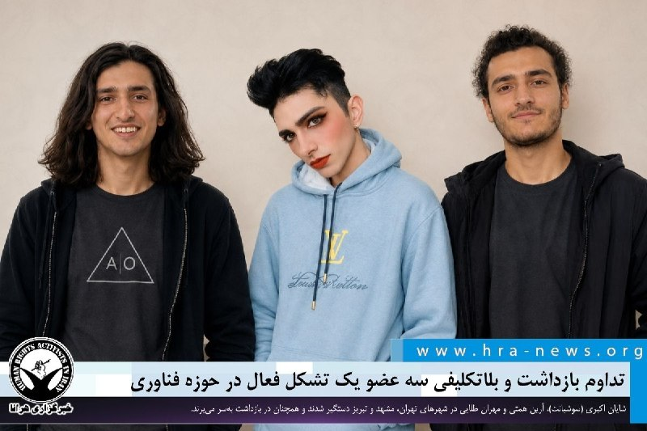

تداوم بازداشت و بلاتکلیفی سه عضو یک تشکل فعال در حوزه فناوری

❗️
❗️
❗️
❗️
❗️ – شایان اکبری (سوشیانت)، بنیانگذار «سازمان جهانشمول احرار»، به همراه آرین همتی و مهران طلایی، دو دانشجوی دانشگاه صنعتی شریف و از مدیران این مجموعه، همچنان در بازداشت و بلاتکلیفی به‌سر می‌برند. سازمان جهانشمول احرار در شبکه‌های اجتماعی خود را تشکلی فعال در حوزه‌های فناوری، مدنی و پژوهشی معرفی میکند.

به گزارش خبرگزاری هرانا، ارگان خبری مجموعه فعالان حقوق بشر در ایران، با گذشت ۲۴ روز از زمان بازداشت شایان اکبری و در حالی که آرین همتی و مهران طلایی نیز توسط نیروهای امنیتی بازداشت شده‌اند، از وضعیت این سه شهروند اطلاعات دقیقی در دست نیست.

یک منبع نزدیک به خانواده یکی از بازداشت‌شدگان به هرانا گفت: آرین همتی در تهران و مهران طلایی در تبریز توسط نیروهای امنیتی بازداشت شدند. تاکنون از محل نگهداری و سرنوشت آنان اطلاعی حاصل نشده است. این دو دانشجوی دانشگاه صنعتی شریف از مدیران سازمان جهانشمول احرار هستند. اتهامات مطرح‌شده علیه آنان مرتبط با جرایم سایبری، از جمله هکتیویسم، عنوان شده است.
هرانا همچنین دریافته است که شایان اکبری (سوشیانت)، بنیانگذار و مدیر سازمان جهانشمول احرار، که روز سه‌شنبه ۵ خردادماه توسط ماموران اطلاعات سپاه در مشهد بازداشت شد، همچنان در بلاتکلیفی به‌سر می‌برد.

ادامه مطلب

#شایان_اکبری
#شایان_سوشیانت
#آرین_همتی
#مهران_طلایی

↘️
@hranews_bot تماس ✉️ -  @Hranews  کانال هرانا 🆑

## Hranews — post 113728

  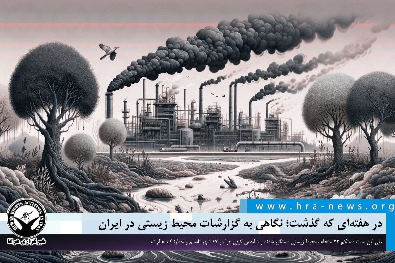

در هفته‌ای که گذشت؛ نگاهی به گزارشات محیط زیستی در ایران

❗️
❗️
❗️
❗️
❗️ – حق بر #محیط_زیست و مبانی فلسفی آن، از قواعد #حقوق_بشر و #حقوق_طبیعی نشأت گرفته شده است. ابتدایی ترین حق طبیعی انسان در این کره خاکی، «حق حیات» است. اما طی دهه‌های اخیر به دلیل استفاده بی‌رویه از منابع طبیعی، عدم نظارت و توجه به مباحث زیست محیطی و الگوهای صحیح، محیط زیست طبیعی به‌شدت آسیب دیده است. گزارش پیش رو حاصل ثبت ۶۹ واقعه محیط زیستی ایران است که در هفته اخیر منتشر و به هدف آگاه‌سازی گردآوری شده است.

به گزارش خبرگزاری هرانا، ارگان خبری مجموعه فعالان حقوق بشر در ایران، در هفته‌‌ای که گذشت، بیش از ۲۲ شکارچی غیرمجاز و قاچاقچی چوب بازداشت و به مراجع قضایی معرفی شدند. افزون بر این، بر اساس گزارشات منتشر شده، بیش از ۳۷ هکتار از منابع طبیعی دچار آتش سوزی شد. از سوی دیگر، شاخص کیفی هوا دستکم در ۱۷ شهر ناسالم و خطرناک اعلام شد. از دیگر اخبار مرتبط با محیط زیست میتوان به بحران خشکسالی، پسماندها و آلاینده‌ها در مناطق مختلف اشاره کرد؛ در گزارش پیش رو به برخی از آنها پرداخته شده است.

آسیب رسانی به جنبه های مختلف محیط زیست در ایران کماکان ادامه دارد. از طرفی شهروندانی وجود دارند که به دلیل عدم آموزش یا نیازهای مالی دست به تخریب و آسیب رسانی به محیط زیست می زنند و از سوی دیگر نهادهای متولی در تلاش هستند تا از حجم این آسیب ها بکاهند، هر چند این تلاش ها قابل تقدیر است اما به نظر نمی آید میزان آن با شرایط محیط زیستی ایران تطبیق داشته باشد.

ادامه مطلب

↘️
@hranews_bot تماس ✉️ -  @Hranews  کانال هرانا 🆑

## Hranews — post 113727

فقدان ایمنی کار؛ ۲ کارگر در گرمسار مصدوم شدند

❗️
❗️
❗️
❗️
❗️ – در سایه فقدان ایمنی محیط و شرایط نامناسب کار، دو #کارگر در شهرستان گرمسار بر اثر آتش‌سوزی در یک واحد تولیدی رنگ‌سازی دچار مصدومیت شدند.

ادامه مطلب

↘️
@hranews_bot تماس ✉️ -  @Hranews  کانال هرانا 🆑

## alonews — post 129228

  <a href="telegram/content/alonews_129228_1781895287.mp4" target="_blank">🎬 Download video</a>

👈مارک کاپوتو از اکسیوس: این چه تغییر رژیمی است که‌ انجام داده اید؟ شما خامنه‌ای جونیور (جوان) را همچنان در ایران دارید.

🔴 ترامپ: خامنه‌ای جونیور با پدرش متفاوت است. آن‌ها افراد متفاوتی هستند.

✅ @AloNews خبر جنگ

## alonews — post 129227

  <a href="telegram/content/alonews_129227_1781895289.mp4" target="_blank">🎬 Download video</a>

👈ترامپ درباره حمله به پل B1: من بزرگترین پل آن‌ها را نابود کردم چون دیر در یک جلسه حاضر شدند. آن‌ها گفتند که کار خیلی خوبی نبود.

🔴آن پل، [همانند] پل جورج واشنگتن آن‌ها بود. آن را در سه دقیقه پاک کردم

✅ @AloNews خبر جنگ

## alonews — post 129226

  <a href="telegram/content/alonews_129226_1781895291.mp4" target="_blank">🎬 Download video</a>

👈ترامپ درباره آیت‌الله مجتبی خامنه‌ای:
من آیت الله را کشتم و متأسفانه آیت الله دیگر را آزار دادم.

🔴من او را ملاقات نکردم. من با او صحبت نکردم، اما مردم از او صحبت می کردند.

🔴اما او شجاعت خاصی دارد زیرا به شدت مجروح شده بود

✅ @AloNews خبر جنگ

## alonews — post 129225

  <a href="telegram/content/alonews_129225_1781895293.webm" target="_blank">🎬 Download video</a>

👈ترامپ درباره گروه هفت: باید گروه هشت را حفظ می‌کردند.

🔴اگر این کار را می‌کردند، احتمالاً جنگی بین روسیه و اوکراین وجود نداشت، اما اوباما نمی‌خواست پوتین آنجا باشد.

🔴قبلاً گروه هشت بود. اگر آن را همان‌طور حفظ می‌کردند، بسیار بهتر می‌شد

✅ @AloNews خبر جنگ

## alonews — post 129224

  <a href="telegram/content/alonews_129224_1781895293.mp4" target="_blank">🎬 Download video</a>

👈 ترامپ درباره مکرون: مکرون کار عالی در میزبانی از گروه هفت انجام داد. واقعاً خوب. بازی‌های خوبی بود.

🔴او حدود یک هفته قبل از من دعوت کرد. گفت، «آیا می‌توانی به من لطفی کنی؟ آیا به پاریس می‌آیی؟ ما دوست داریم تو را گرامی بداریم.»

🔴من آن را به عنوان احترام به کشور در نظر گرفتم. اما او گفت، «من دوست دارم تو را گرامی بدارم.»

🔴و او برخی از بزرگترین افراد اروپا و فراتر از آن را آنجا داشت و ما در ورسای بودیم و من نوعی قصد انجام آن را نداشتم، اما او ضعف من را می‌دانست.

🔴آن‌ها شام‌هایی در ورسای برگزار می‌کنند.

🔴 ما شام فوق‌العاده‌ای داشتیم.

✅ @AloNews خبر جنگ

## alonews — post 129223

  <a href="telegram/content/alonews_129223_1781895296.mp4" target="_blank">🎬 Download video</a>

👈 ترامپ درباره پاکستان: در پاکستان، شما فرمانده کل قوا را دارید که عالی است. و نخست‌وزیر را دارید و آن‌ها با هم بسیار خوب کنار می‌آیند.

🔴مرد نظامی کاملاً به نخست‌وزیر احترام می‌گذارد.

🔴دیدن این موضوع زیباست.

✅ @AloNews خبر جنگ

## alonews — post 129222

  <a href="telegram/content/alonews_129222_1781895298.webm" target="_blank">🎬 Download video</a>

👈 وزارت امور خارجه آمریکا: روبیو به جوزف عون تأکید کرد که ضروری است حزب‌الله خلع سلاح شود و دولت کنترل خود را گسترش دهد

✅ @AloNews خبر جنگ

## alonews — post 129221

  <a href="telegram/content/alonews_129221_1781895298.mp4" target="_blank">🎬 Download video</a>

👈 ترامپ: من برزیل را تماشا کردم، رهبری که کمی او را می‌شناسم. او فردی بسیار ناپایدار است.

🔴کاپوتو: شما طرفدار لولا نیستید، اگر اشتباه نکنم.

🔴 ترامپ: فکر نمی‌کنم درباره او فکر کنم، صادقانه با شما بگویم. واقعاً درباره او فکر نمی‌کنم. برام مهم نیست.

🔴اما او اکنون نوع متفاوتی از فرد است. بسیار ناپایدار. تماشا کردم که او سخنرانی کرد. بسیار ناپایدار بود و اشکالی ندارد.

✅ @AloNews خبر جنگ

## alonews — post 129220

  <a href="telegram/content/alonews_129220_1781895300.webm" target="_blank">🎬 Download video</a>

👈ترامپ : کار فوق‌العاده‌ای کردم؛تو دوره اول ریاست‌جمهوریم

🔴ارتش رو از نو ساختم و حسابی تقویتش کردم. یه نگاهی هم به ونزوئلا بندازید؛ کل ماجرا تو ۴۸ دقیقه جمع شد

🔴روابطه‌هاشون این‌طوریه، و ما هزینه‌ی اون جنگ با ونزوئلا رو چندین و چند بار دادیم

🔴 الان هم داریم میلیون‌ها بشکه نفت ازشون درمیاریم و حتی داریم کاری می‌کنیم که بیشتر از قبل براشون پول دربیاد

✅ @AloNews خبر جنگ

## alonews — post 129219

  <a href="telegram/content/alonews_129219_1781895300.mp4" target="_blank">🎬 Download video</a>

👈 ترامپ درباره نیویورک‌تایمز : کمی پیش حقیقتی را بیان کردم. گفتم: «اگر (مقامات ایران) پرچم سفید تسلیم را بالا می‌بردند و می‌گفتند: "سپاس خداوند را، ترامپ بزرگترین رئیس‌جمهور است، ما در اینجا تسلیم می‌شویم"،» نیویورک تایمز می‌نوشت که آن‌ها جنگ را برده‌اند.

✅ @AloNews خبر جنگ

## alonews — post 129218

  <a href="telegram/content/alonews_129218_1781895302.mp4" target="_blank">🎬 Download video</a>

👈ترامپ درباره رسانه‌های داخلی جمهوری اسلامی ایران: اگر به ایران نگاه کنید، آن‌ها ۴۷ سال است که این کارها را انجام می‌دهند.

🔴آن‌ها شما و همه دیگران را تحقیر کرده‌اند، تمام رسانه‌ها و همه چیز.

🔴آن‌ها در برخورد با مطبوعات بسیار خوب عمل می‌کنند. آن‌ها رسانه‌ای جعلی(فیک) و عالی دارند.

✅ @AloNews خبر جنگ

## alonews — post 129217

  <a href="telegram/content/alonews_129217_1781895304.mp4" target="_blank">🎬 Download video</a>

👈 ترامپ به اکسیوس: اگر دونالد ترامپ نبود، اسرائیل کاملاً نابود می‌شد.

🔴ما کسانی هستیم که اسلحه‌ها را داریم. ما کسانی هستیم که کل توافق را داریم. ما کسانی هستیم که بمب‌افکن‌های بی-۲ و غیره را داریم.

🔴رابطه با نتانیاهو... خوب است، اما باید او را کمی عاقل‌تر نگه داریم.

🔴 سوال: آیا می‌توانید از حمله اسرائیل به لبنان جلوگیری کنید؟

🔴 ترامپ: بله، من می‌توانم. آن‌ها برای من احترام زیادی قائل هستند و همان‌طور که من می‌گویم عمل می‌کنند.

✅ @AloNews خبر جنگ

## alonews — post 129216

  <a href="telegram/content/alonews_129216_1781895306.mp4" target="_blank">🎬 Download video</a>

👈 ترامپ درباره شی: او مردی قوی است. او بازی نمی‌کند. او نمی‌نشیند و نمی‌گوید: «آها، چه روز زیبایی. به خورشید نگاه کنید.»

🔴هیچ‌کدام از آن چیزها وجود ندارد. همه چیز جدی و کاری است که من دوست دارم. فکر می‌کنم عالی است.

✅ @AloNews خبر جنگ

## alonews — post 129215

  <a href="telegram/content/alonews_129215_1781895308.mp4" target="_blank">🎬 Download video</a>

👈 ترامپ: اگر ما آنها را نمی زدیم، آنها یک سلاح هسته ای داشتند.

🔴آنها از آن برای اسرائیل استفاده می کردند. شما از آن در عربستان سعودی نیز استفاده می کردید.

🔴تقریباً بلافاصله موشک ها به سمت این پنج کشور دیگر (قطر، امارات، کویت، بحرین) پرواز کردند.

🔴گفتم چرا این کار را می کند؟

🔴و میدونی چیکار کرد؟

🔴این پنج کشور را به دامان من آورد

✅ @AloNews خبر جنگ

## alonews — post 129214

  <a href="telegram/content/alonews_129214_1781895310.mp4" target="_blank">🎬 Download video</a>

👈 پرزیدنت ترامپ مجدداً از شی تشکر کرد: شی در کل ماجرای ایران دخالت نکرد. می‌توانست دخالت کند. می‌توانست یک کشتی نفتی را که توسط ۱۲ ناوشکن احاطه شده بود بفرستد و ببیند آیا می‌تواند راهی برای شکستن محاصره پیدا کند یا خیر.

🔴اما رئیس‌جمهور شی، از او پرسیدم و گفتم: «واقعاً ممنون می‌شوم اگر دخالت نکنید.» و او عالی بود. دخالت نکرد.

🔴و فکر می‌کنم اگر شخص دیگری این را می‌گفت، فکر نمی‌کنم کسی حتی از او چنین درخواستی می‌کرد

✅ @AloNews خبر جنگ

## alonews — post 129213

  <a href="telegram/content/alonews_129213_1781895313.webm" target="_blank">🎬 Download video</a>

👈 ترامپ: ایرانی ها، مردم بسیار باهوشی هستند. آنها نوعی نابغه ابتدایی هستند، اما باهوش هستند.

🔴آنها اسرائیل را منفجر می کردند.

🔴اگر من نبودم، امروز اسرائیل وجود نداشت

✅ @AloNews خبر جنگ

## alonews — post 129212

  <a href="telegram/content/alonews_129212_1781895313.mp4" target="_blank">🎬 Download video</a>

👈ترامپ درباره مودی: مودی بسیار خوب است. او از جنگ‌ها دوری می‌کند که هوشمندانه است. ۱.۵ میلیارد جمعیت دارند. هند در واقع بزرگترین است. مودی رهبر بزرگی است و ما تجارت زیادی با آن‌ها داریم، اما اکنون تجارت عادلانه انجام می‌دهیم.

🔴آن‌ها قبلاً واقعاً ما را کلاهبرداری می‌کردند. من آن‌ها را به خاطر این مورد سرزنش نمی‌کنم. ما سیاستمداران احمقی داشتیم که اجازه دادند این اتفاق بیفتد.

🔴اما اکنون تجارت زیادی انجام می‌دهیم. آن‌ها از این موضوع آن‌قدرها خوشحال نیستند. آن‌ها قبلاً خیلی بهتر عمل می‌کردند. اما مودی عالی است.

✅ @AloNews خبر جنگ

## alonews — post 129211

  <a href="telegram/content/alonews_129211_1781895315.webm" target="_blank">🎬 Download video</a>

👈 سلام، نخست وزیر لبنان: ایران زور اتش بس آوردن برای لبنان را ندارد. این امر فقط توسط دولت و با خلع سلاح حزب الله محقق می‌شود

✅ @AloNews خبر جنگ

## alonews — post 129210

  <a href="telegram/content/alonews_129210_1781895315.mp4" target="_blank">🎬 Download video</a>

👈جی دی ونس در مورد توافق ایران:
منتقدانی از این توافق بودند که می‌گفتند ایرانی‌ها هرگز اجازه نمی‌دهند تنگه‌ها بدون عوارض باز باشند.

🔴 در دو روز گذشته، ایرانی‌ها به هیچ کشتی شلیک نکرده‌اند.

🔴 دیروز، ما از تنگه هرمز نفت بیشتری نسبت به هر زمان دیگری از آغاز درگیری خارج کردیم. و حتی یکی از این کشتی‌ها عوارض پرداخت نکرد.

🔴 بنابراین، منتقدان این توافق در مورد برخی از آنچه می‌گویند ایرانی‌ها به دست آورده‌اند، و همچنین در مورد آنچه ایالات متحده به دست آورده است، اشتباه می‌کنند.

✅ @AloNews خبر جنگ

## alonews — post 129209

  <a href="telegram/content/alonews_129209_1781895317.webm" target="_blank">🎬 Download video</a>

👈 اوباما در مورد توافق: توافقی در حال اجرا بود که در آن ایران توافق کرده بود که سلاح‌های هسته‌ای توسعه ندهد.

🔴این دولت — یا نسخه‌ای قبلی از این دولت — از آن خارج شد، که باعث شد ایران در آن زمان ظرفیت هسته‌ای بیشتری توسعه دهد.

🔴ما اکنون جنگیده‌ایم، میلیاردها و میلیاردها دلار هزینه کرده‌ایم، فشار عظیمی بر ارتش خود وارد کرده‌ایم، بسیاری از مردم کشته شده‌اند و به نظر می‌رسد که به جایی که قبل از شروع جنگ بودیم بازگشته‌ایم، شاید حتی کمی بدتر

✅ @AloNews خبر جنگ

---
📅 بروزرسانی: 1405/03/29 20:54
---

## VahidOOnLine — post 246415

  

واشینگتن‌پست به نقل از مقام‌های فعلی و سابق آمریکا گزارش داد که سازمان‌های اطلاعاتی ایالات متحده به دولت آمریکا هشدار داده‌اند بنیامین نتانیاهو، نخست‌وزیر اسرائیل، احتمالا اقداماتی انجام خواهد داد که می‌تواند تلاش‌های دولت آمریکا برای رسیدن به یک توافق صلح پایدار با تهران را مختل کند.

به گفته این منابع، نتانیاهو تحت فشار سیاسی قرار دارد تا عملیات نظامی در لبنان را ادامه دهد.
‌🏁 🇬🇧 IranintlTV

🤖 @VahidOOnLine

## VahidOOnLine — post 246414

  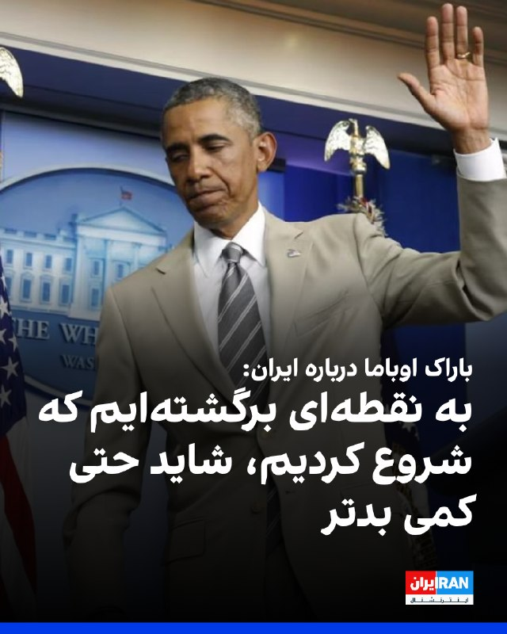

باراک اوباما، رییس‌جمهور پیشین آمریکا، در مصاحبه‌ با ان‌بی‌سی نیوز گفت با وجود اینکه از برقراری آتش‌بس «بسیار خوشحال» است، ایالات متحده ممکن است نسبت به قبل از آغاز جنگ ایران «کمی وضعیت بدتری» داشته باشد.

او گفت: «یک توافق وجود داشت که بر اساس آن جمهوری اسلامی پذیرفته بود به سمت ساخت سلاح هسته‌ای نرود، اما این دولت یا نسخه قبلی آن از این توافق خارج شد و همین باعث شد ایران ظرفیت هسته‌ای خود را افزایش دهد.»

اوباما افزود: «اکنون جنگی را پشت سر گذاشته‌ایم، میلیاردها دلار هزینه کرده‌ایم، فشار زیادی به ارتش وارد شده و افراد زیادی جان خود را از دست داده‌اند، و در نهایت به نقطه‌ای برگشته‌ایم که تقریبا همان‌جایی است که شروع کردیم، شاید حتی کمی بدتر.»
‌🏁 🇬🇧 IranintlTV

🤖 @VahidOOnLine

## VahidOOnLine — post 246413

برنامه «جغرافیای انقلاب ملی ایرانیان» از سوی ایران‌اینترنشنال برای بررسی روایت‌های انقلاب ملی در استان‌های ایران راه‌اندازی شده است. در دومین قسمت به تجمعات اعتراضی، شعارها و اعتصاب‌ها در استان آذربایجان‌غربی پرداخته‌ایم.
محسن مهیمنی، عضو تحریریه ایران‌اینترنشنال گزارش می‌دهد.
‌🏁 🇬🇧 IranintlTV

🤖 @VahidOOnLine

## VahidOOnLine — post 246412

  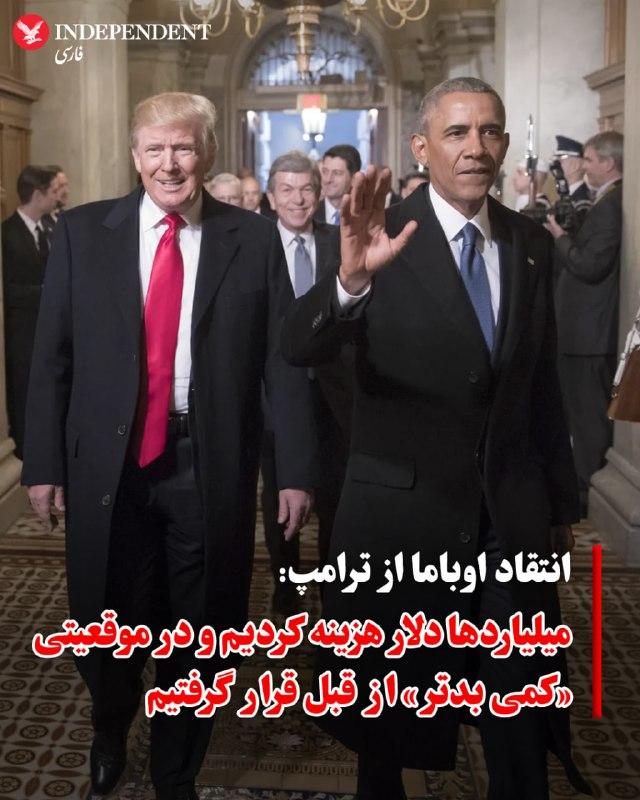

♦️ باراک اوباما، رئیس‌جمهوری پیشین آمریکا، در مصاحبه‌ای با برنامه «تودی شو» در شبکه ان‌بی‌سی نیوز، ضمن ابراز خشنودی از برقراری آتش‌بس، سیاست‌های دولت ترامپ را به شدت نقد کرد و گفت ایالات متحده پس از جنگ با جمهوری اسلامی ایران، در موقعیتی «کمی بدتر» نسبت به آغاز جنگ در ماه فوریه قرار گرفته است.

اوباما با یادآوری خروج آمریکا از برجام تاکید کرد: «ما توافقی در اختیار داشتیم که بر اساس آن ایران پذیرفته بود سلاح هسته‌ای توسعه ندهد. این دولت (یا نسخه قبلی آن) از توافق خارج شد و همین امر سبب شد ایران ظرفیت هسته‌ای بیشتری پیدا کند.»

رئیس‌جمهوری پیشین آمریکا با اشاره به هزینه‌های سنگین جنگ افزود: «ما وارد جنگ شدیم، میلیاردها میلیارد دلار هزینه کردیم و فشار فوق‌العاده‌ای به ارتش خود وارد آوردیم. افراد زیادی کشته شدند و اکنون به نظر می‌رسد دقیقا به همان جایی برگشته‌ایم که قبل از شروع جنگ بودیم؛ با این تفاوت که شاید وضعمان کمی بدتر هم شده باشد.»
‌🇸🇦 Indypersian

🤖 @VahidOOnLine

## VahidOOnLine — post 246411

  

عباس گودرزی، سخنگوی هیات رییسه مجلس، در خصوص پیام مجتبی خامنه‌ای در خصوص تفاهم‌نامه با آمریکا، گفت: «پیام رهبری نشان داد با وجودی که حضور مرسوم و معمول ندارد، تا چه میزان آگاه به امور است و مدیریت می‌کند.»
گودرزی ادامه داد: «رهبری نظرات دیگران را در اداره امور لحاظ کرده و بیان می‌کند.»
سخنگوی هیات رییسه مجلس افزود: «تیم مذاکره‌کننده باید محکم بر خطوط قرمز و منافع حیاتی ما ایستادگی کند.»
‌🏁 🇬🇧 IranintlTV

🤖 @VahidOOnLine

## VahidOOnLine — post 246410

♦️بزرگ‌ترین اثر گلابتون‌دوزی ایران، با نقش برجسته جزیره قشم و به همت بیش از ۶۰ بانوی هنرمند از روستاهای این جزیره، رونمایی شد. گلابتون‌دوزی از هنرهای تزیینی و ریشه‌دار جنوب ایران است که در آن هنرمندان با استفاده از نخ‌های طلایی یا نقره‌ای، معروف به گلابتون، نقش‌های سنتی، اسلیمی، بته‌جقه و طرح‌های هندسی را روی پارچه‌های گوناگون می‌دوزند. در قشم، این هنر بیش از هر چیز با پوشاک زنان پیوند دارد و در آراستن لباس‌های محلی، به‌ویژه شلوارهای بندری، پیراهن‌های سنتی، چادر و لیسی (شال‌های رنگی بندری) کاربرد دارد. پرکاربردترین جلوه گلابتون‌دوزی در قشم، تزیین دمپای شلوارهای بندری است؛ جایی که نقش‌های بته‌جقه، اسلیمی و هندسی با نخ‌های درخشان روی پارچه می‌نشینند.
‌🇸🇦 Indypersian

🤖 @VahidOOnLine

## VahidOOnLine — post 246409

  

تد کروز، سناتور جمهوری‌خواه، در شبکه ایکس نوشت: «برای من فرقی نمی‌کند ۳۰۰ میلیارد دلار از کجا می‌آید. دادن میلیاردها دلار به حکومت ایران که شعار مرگ بر آمریکا سر می‌دهد، ایده بدی است.»

او افزود: «در توافق با تهران، میلیاردها دلار به دیوانه‌هایی ندهید که می‌خواهند ما را بکشند.»
‌🏁 🇬🇧 IranintlTV

🤖 @VahidOOnLine

## VahidOOnLine — post 246408

  

کمیسیون امنیت ملی مجلس در بیانیه‌ای با اعلام «بی‌اعتمادی مطلق به دشمنان» نوشت یادداشت تفاهم اسلام‌آباد، نقشه‌ای جدید برای امنیت منطقه‌ای و بین‌المللی ترسیم می‌کند و این کمیسیون تحقق کامل شروط رهبر جمهوری اسلامی را تا پایان پیگیری و مطالبه خواهد کرد.

کمیسیون امنیت ملی مجلس همچنین اعلام کرد در بررسی تفاهم‌نامه اخیر، «رهنمودهای رهبر جمهوری اسلامی را فصل‌الخطاب و نصب‌العین» خود قرار داده‌ایم.
‌🏁 🇬🇧 IranintlTV

🤖 @VahidOOnLine

## VahidOOnLine — post 246407

  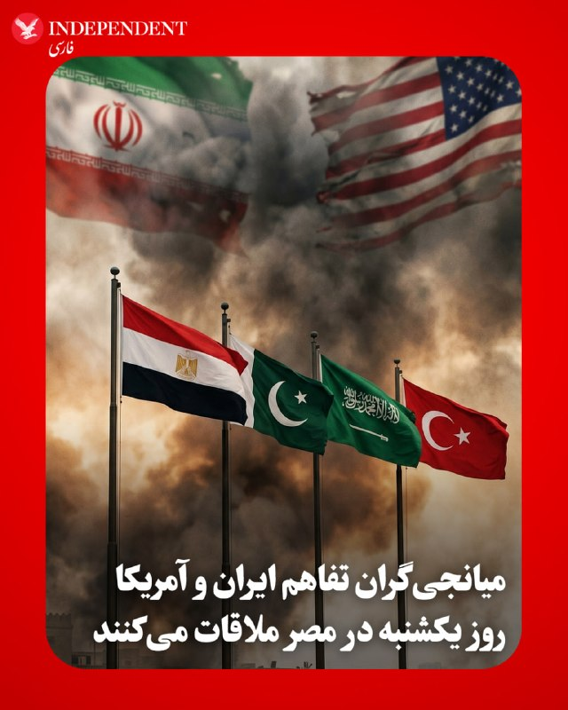

♦️ وزارتخانه‌های امور خارجه مصر و پاکستان اعلام کردند که میانجی‌گران بحران ایران و آمریکا، شامل پاکستان، عربستان سعودی و ترکیه، روز یکشنبه ۳۱ خرداد، در مصر گرد هم خواهند آمد. بر اساس بیانیه اسلام‌آباد، در این نشست چهارجانبه، وزرای خارجه این سه کشور به همراه همتای مصری خود درباره تحولات منطقه و مسائل مربوط به صلح، امنیت و ثبات گفتگو خواهند کرد.

به گزارش خبرگزاری فرانسه، قاهره نیز تایید کرد که این جلسه با مذاکرات گسترده‌تر و یک نشست خبری مشترک همراه خواهد بود. این نشست اضطراری پس از آن برنامه‌ریزی شد که مذاکرات مستقیم ایران و آمریکا در سوئیس که قرار بود روز جمعه برگزار شود، به تعویق افتاد. در همین راستا، کاخ سفید نیز لغو سفر برنامه‌ریزی‌شده جی‌دی ونس، معاون رئیس‌جمهوری آمریکا به سوئیس را تایید کرد.
‌🇸🇦 Indypersian

🤖 @VahidOOnLine

## VahidOOnLine — post 246406

  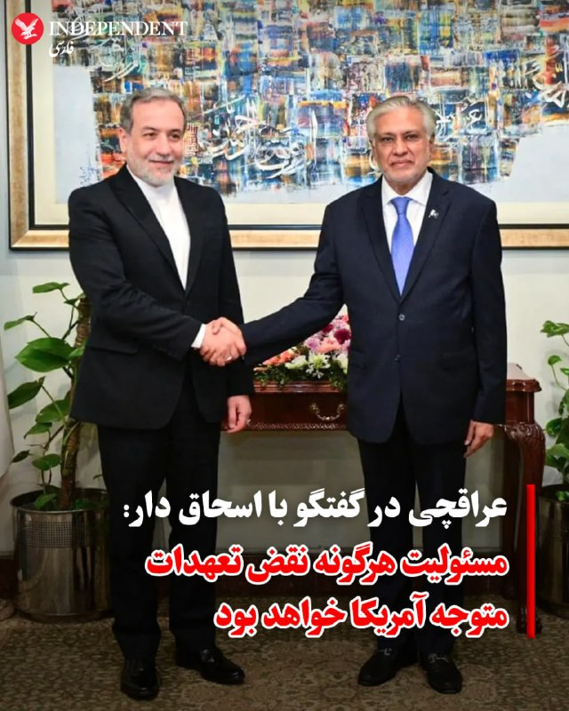

♦️ سید عباس عراقچی، وزیر امور خارجه جمهوری اسلامی، روز جمعه ۲۹ خرداد در گفتگو با محمد اسحاق دار، وزیر امور خارجه و معاون نخست‌وزیر پاکستان، آخرین تحولات دیپلماتیک پس از امضای یادداشت تفاهم اخیر را بررسی کرد.

عراقچی در این تماس تلفنی از تلاش‌های پاکستان در روند مذاکرات دیپلماتیک که منجر به شکل‌گیری این تفاهم‌نامه شد، قدردانی کرد. او در ادامه با اشاره به تعهد و مسئولیت مستقیم واشنگتن در قبال پایان دادن به جنگ در تمامی جبهه‌ها، به‌ویژه در لبنان، هشدار داد: «هرگونه نقض تعهدات مندرج در این یادداشت تفاهم متوجه آمریکا خواهد بود.»

وزیر خارجه پاکستان نیز ضمن استقبال از روند دیپلماتیک جاری، بر حمایت همه‌جانبه اسلام‌آباد از تداوم گفتگوها برای دستیابی به نتایج مثبت و پایدار تاکید و نسبت به موفقیت در مراحل آتی این روند ابراز امیدواری کرد.
‌🇸🇦 Indypersian

🤖 @VahidOOnLine

## VahidOOnLine — post 246405

  

نعیم قاسم، دبیرکل حزب‌الله لبنان، گفت: «تا زمانی که توان ایستادگی داریم، چرا باید تسلیم شویم؟.»

او تحویل سلاح‌های حزب‌الله را رد کرد و افزود این سلاح‌ها برای مقابله با اسرائیل هستند. نعیم قاسم همچنین گفت که ما تصمیمی «به سبک کربلا» گرفتیم و این تصمیم همچنان به قوت خود باقی است.

دبیرکل حزب‌الله لبنان ادامه داد: «ما وحدت نیروهای مقاومت را حفظ کرده‌ایم و وحدت جنبش امل، حزب‌الله و سایر نیروها همچنان در کنار ما برقرار است.»
‌🏁 🇬🇧 IranintlTV

🤖 @VahidOOnLine

## VahidOOnLine — post 246404

  <a href="telegram/content/VahidOOnLine_246404_1781889905.mp4" target="_blank">🎬 Download video</a>

ویدیوی رسیده به ایران اینترنشنال نشان می‌دهد دوستان و بستگان جاویدنام علی روزبهانی به یاد او به توزیع غذا بین شهروندان پرداختند. علی روزبهانی از جمله جوانانی بود که از نخستین روزهای اعتراضات دی‌ماه ۱۴۰۴ در خیابان‌ها حاضر شد و به گفته نزدیکانش، حضوری فعال در کنار دیگر شهروندان داشت. او ابتدا در بازار و چند نقطه دیگر تهران حاضر شد و سرانجام ۱۸ دی به تهرانپارس رفت و گلوله خورد.
‌🏁 🇬🇧 IranintlTV

🤖 @VahidOOnLine

## VahidOOnLine — post 246403

  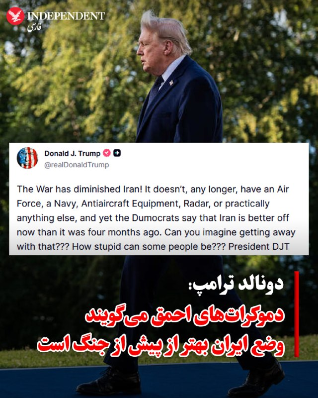

♦️ دونالد ترامپ، رئیس‌جمهوری ایالات متحده با انتشار پیامی در شبکه اجتماعی تروث‌سوشال، به انتقادهای دموکرات‌ها از توافق با جمهوری اسلامی واکنش نشان داد. ترامپ که با بازی با کلمات، یک کلمه ترکیبی برای «دموکرات‌های احمق» ساخته است، از همین عبارت ساختگی برای توصیف آنان استفاده کرد و نوشت: «جنگ، ایران را تضعیف و ناچیز کرده است! آن‌ها دیگر نیروی هوایی، نیروی دریایی، تجهیزات ضدهوایی، رادار، یا عملاً هیچ چیز دیگری ندارند؛ با این حال، دموکرات‌های احمق (Dumocrats) می‌گویند وضع ایران اکنون بهتر از چهار ماه پیش است. می‌توانید تصور کنید که چطور چنین حرفی می‌زنند و قسر در می‌روند؟؟؟ برخی از مردم چقدر می‌توانند احمق باشند؟؟؟»

این اظهارات پس از آن بیان شد که بسیاری از نمایندگان دموکرات در مجلس و سنای آمریکا، متن تفاهم‌نامه امضاشده میان تهران و واشنگتن را مورد انتقاد قرار دادند. چاک شومر، رهبر دموکرات‌ها در سنا، با کنایه به نام کتاب ترامپ (هنر معامله)، این تفاهم را نتیجه «هنر تسلیم» دانست. او در یک مصاحبه تلویزیونی، جنگ و تفاهم با جمهوری اسلامی را «یکی از بدترین فجایع سیاست خارجی آمریکا» توصیف کرد.
‌🇸🇦 Indypersian

🤖 @VahidOOnLine

## VahidOOnLine — post 246402

  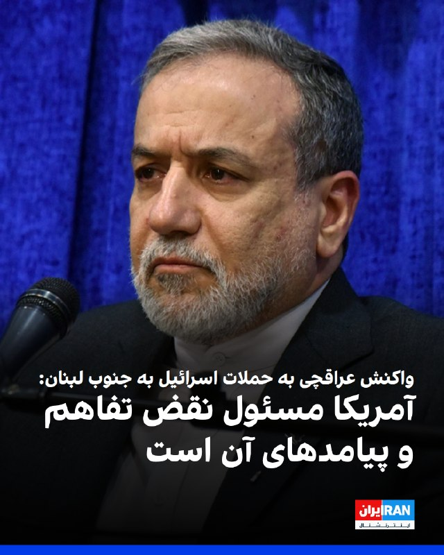

عباس عراقچی، وزیر خارجه جمهوری اسلامی، در گفت‌وگو با همتای پاکستانی خود، با اشاره به «تعهد و مسئولیت» ایالات متحده در قبال پایان دادن به جنگ در تمامی جبهه‌ها، از جمله لبنان، گفت: «مسئولیت هرگونه نقض تعهدات مندرج در یادداشت تفاهم و پیامدهای آن، متوجه ایالات متحده خواهد بود.»

عراقچی همچنین از تلاش‌های پاکستان برای میانجی‌گری بین جمهوری اسلامی و آمریکا تشکر کرد.
‌🏁 🇬🇧 IranintlTV

🤖 @VahidOOnLine

## VahidOOnLine — post 246401

  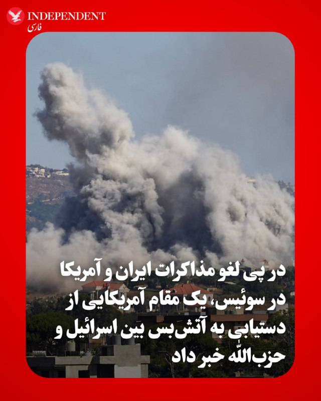

♦️ یک مقام ارشد آمریکایی روز جمعه ۲۹ خرداد اعلام کرد که در پی تشدید درگیری‌ها در لبنان، که شانس تبدیلِ تفاهم‌نامه موقت پایان جنگ با ایران به یک صلح پایدار در خاورمیانه را به خطر انداخته بود، اسرائیل و حزب‌الله بر سر برقرار آتش‌بس توافق کردند.

هم‌زمان با اوج‌گیری درگیری‌ها در لبنان، مذاکرات برنامه‌ریزی‌شده میان ایران و آمریکا که قرار بود روز جمعه در سوئیس برگزار شود، لغو شد. این رویداد ابهامات جدیدی را درباره زمان‌بندی مذاکرات حیاتیِ مربوط به بازگشایی کامل تنگه هرمز به روی کشتیرانی جهانی ایجاد کرده است.

این مقام ارشد آمریکایی اندکی پیش از ساعت ۴ بعدازظهر به وقت لبنان (۱۳:۰۰ به وقت گرینویچ) اعلام کرد که آتش‌بس از همین ساعت اجرایی می‌شود. او به شرط فاش نشدن نامش به خبرنگاران گفت: «برداشت ما این است که پس از تبادل آتش سنگین در ساعات اولیه امروز، اسرائیل و حزب‌الله اکنون در وضعیت آتش‌بس هستند.» او همچنین افزود که مذاکره‌کنندگان آمریکایی و قطری با کمک ایران این توافق را نهایی کرده‌اند.
‌🇸🇦 Indypersian

🤖 @VahidOOnLine

## VahidOOnLine — post 246399

  <a href="telegram/content/VahidOOnLine_246399_1781889910.mp4" target="_blank">🎬 Download video</a>

یک شهروند در پیامی صوتی به ایران اینترنشنال، از مردم ایران خواست که امید خود را از دست ندهند و گفت: «معترضان در دی‌ماه برای ترامپ به خیابان‌ها نیامدند و هنوز هم هرگاه لازم باشد، مردم به خاطر خودشان اعتراضات را آغاز خواهند کرد.»
‌🏁 🇬🇧 IranintlTV

🤖 @VahidOOnLine

## VahidOOnLine — post 246398

  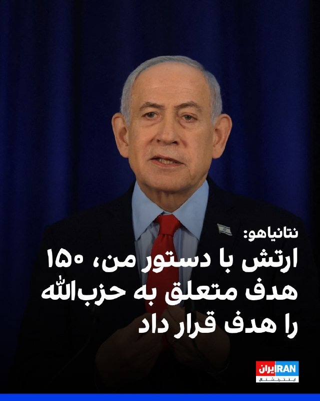

بنیامین نتانیاهو، نخست‌وزیر اسرائیل، در شبکه ایکس نوشت: «با دستور من، ارتش اسرائیل ۱۵۰ هدف متعلق به حزب‌الله در لبنان را هدف قرار داد و ده‌ها نیروی مسلح این گروه را از بین برد.»

پیش‌تر افی دفرین، سخنگوی ارتش اسرائیل در کنفرانس خبری اعلام کرده بود: «از شب گذشته تاکنون به بیش از ۱۰۰ هدف حزب‌الله حمله کرده‌ایم و این حملات را تا هر زمان که لازم باشد ادامه خواهیم داد.»
‌🏁 🇬🇧 IranintlTV

🤖 @VahidOOnLine

## VahidOOnLine — post 246397

  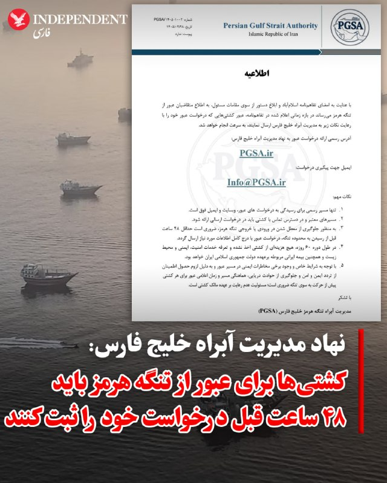

♦️ سازمان ناوبری ایران روز جمعه ۲۹ خرداد اعلام کرد علی‌رغم بازگشایی تنگه هرمز در پی توافق میان جمهوری اسلامی ایران و آمریکا برای پایان دادن به جنگ، تمامی کشتی‌هایی که خواهان عبور از این آبراه هستند باید «۴۸ ساعت قبل» درخواست تردد خود را ثبت کنند.

نهاد آبراه خلیج فارس، که در دوران آتش‌بس برای نظارت بر تنگه هرمز ایجاد شده، در حساب کاربری خود در شبکه اجتماعی ایکس نوشت: «به منظور جلوگیری از ایجاد هرگونه تأخیر در ورود یا خروج از تنگه هرمز، ضروری است که درخواست‌های تردد به همراه تمامی اطلاعات مورد نیاز، حداقل ۴۸ ساعت پیش از رسیدن به منطقه تنگه ارسال شوند.»

در این بیانیه هم‌چنین تاکید شده که مطابق مفاد تفاهم‌نامه، در بازه ۶۰ روزه مذاکرات، هیچ هزینه‌ای کشتی‌ها اخذ نشده و تعرفه‌های خدمات امنیت، محیط زیست و بیمه ایرانی مربوطه به عهده جمهوری اسلامی است.
‌🇸🇦 Indypersian

🤖 @VahidOOnLine

## WithYashar — post 15343

آسوشیتدپرس: ایران به امریکا اطلاع داده است اگر اسرائیل ادامه دهد. همه چیز متوقف می‌شود
@withyashar

## WithYashar — post 15342

محمدمنان رییسی، نماینده مجلس:
خوش‌انصاف‌ها(منظورش قالیباف) مجلس رو باز کنید، رهبرم تنها مونده.
@withyashar
قالیبافم باز نمیکنه تا جا پاش محکم بشه

## WithYashar — post 15341

کانال 12 اسرائیل: نتانیاهو با مسئله لبنان سعی در خراب کردن تفاهم نامه بین آمریکا و ایران داره.
@withyashar

## mwarmonitor — post 11230

🔴گروه ویژه اقدام مالی (FATF) بوسنی و هرزگوین و عراق را به فهرست «خاکستری» خود اضافه کرده است؛ فهرستی از کشورهایی که به دلیل وجود کاستی‌های راهبردی در نظام‌های مقابله با پول‌شویی و تأمین مالی تروریسم، تحت نظارت بیشتر قرار می‌گیرند.

@mwarmonitor

## mwarmonitor — post 11229

  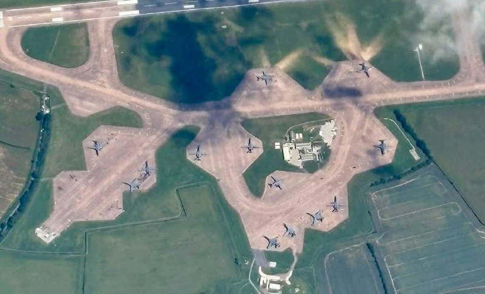

🔴 «یک ناوگان بزرگ از بمب‌افکن‌های سنگین نیروی هوایی آمریکا همچنان به‌صورت پیش‌موضعی در انگلستان مستقر است تا از عملیات احتمالی علیه ایران پشتیبانی کند. امروز ۱۳ فروند بمب‌افکن استراتژیک B-1 و ۵ فروند B-52 در پایگاه هوایی RAF Fairford پارک شده‌اند.»

@mwarmonitor

## mwarmonitor — post 11228

فرزندی که نمرده و هنوز بر سر آن جنگ است، در واقع لبنان است. یک مقام اسرائیلی پریروز برآورد کرد که هشتاد درصد گفتگوها با واشنگتن به نبرد بر سر جنگ با حزب‌الله اختصاص دارد. حزب‌الله در وضعیت ناامیدکننده‌ای قرار دارد و در آستانه درهم‌شکستن است. پیوند دادن این دو جبهه نه تنها این سازمان را نجات می‌دهد، بلکه از سر گیری مزاحمت‌ها برای ساکنان شمال، یا تقویت آن، یا هر دو را برایش آسان‌تر می‌کند. در این زمینه یک اجماع ملی در اسرائیل وجود دارد؛ اجماعی که باید توسط سران اپوزیسیون نیز بیان می‌شد، نه اینکه فقط با سکوت همراه باشد.
خیانت ترامپ به اصولی که خودش تعیین کرده بود، چنان ناگهانی و قدرتمند بود که بسیاری متقاعد شده‌اند این نیز یک فریب دیگر است که در نهایت به آتش گرفتن تهران ختم خواهد شد. اما بیداری تلخی در انتظار آن‌هاست. با این حال، داستان این هفته به پایان نرسید. ایرانی‌ها فرصت نشان دادن ترامپ به عنوان یک ظرف خالی و یک شوخی را از دست نخواهند داد. شاید در مقطعی، او دوباره آن‌ها را به نفع اسرائیل و کشورهای حوزه خلیج فارس رها کند. می‌توانید روی آیت‌الله‌ها حساب کنید که این فرصت را به او خواهند داد.

@mwarmonitor

## mwarmonitor — post 11227

📌آمیت سیگال خبرنگار و تحلیلگر سیاسی کانال ۱۲ اسرائیل

🔸شامگاه گذشته، حزب‌الله به کارزار خود علیه نیروهای ارتش اسرائیل در جنوب لبنان ادامه داد. تانک یک فرمانده هدف حمله یک پهپاد یا موشک قرار گرفت که منجر به کشته شدن چهار نفر—از جمله فرمانده گردان—شد؛ این در حالی است که در بخشی دیگر از جبهه، پنج سرباز اسرائیلی بر اثر انفجار یک پهپاد انتحاری به شدت مجروح شدند. در پاسخ، نیروی هوایی اسرائیل کارزار بمباران گسترده‌ای را در چندین روستا به راه انداخته است.

پیامدهای این اتفاق بسیار سریع آشکار شد. گفتگوهایی که قرار بود امروز در سوئیس میان ایالات متحده و ایران—به منظور اجرای توافق صلح—برگزار شود، لغو گردید و ایران دلیل آن را اقدامات ارتش اسرائیل در قلمرو خود در جنوب لبنان عنوان کرد.
این رویارویی از همان لحظه‌ای که جوهر دیجیتال روی کاغذ یادداشت تفاهم (MoU) خشک شد، اجتناب‌ناپذیر بود. نه حزب‌الله و نه اسرائیل، هیچ‌یک از امضاکنندگان این توافق‌نامه نیستند و هر دو طرف روایت‌های کاملاً متفاوتی را از آن مطرح می‌کنند. ایران به نیابتیِ خود اطمینان داده است که خروج اسرائیل از لبنان در یادداشت تفاهم میان آمریکا و ایران گنجانده شده و قرار است طی یک دوره گام‌به‌گام ۶۰ روزه اجرا شود. در همین حال، اسرائیل اعلام کرده است که مواضع خود را در جنوب لبنان تخلیه نخواهد کرد—و تاکید دارد که چنین درخواستی هم از آن نشده است—در حالی که مقامات آمریکایی گزارش داده‌اند که به اسرائیل گفته‌اند حق آن برای پاسخ به تهدیدات نقض نخواهد شد.
پرسش بزرگ‌تر—اینکه آیا اسرائیل اجازه دارد به تهدیدات «نوظهور» حمله کند یا خیر—در اینجا به طور مستقیم پاسخ داده نشده است، چرا که این اقدام یک پاسخ به حمله بود، نه واکنشی به تجمع نیروهای حزب‌الله. اما اگر دولت ترامپ نتواند تلافی اسرائیل در برابر حمله حزب‌الله را تحمل کند، قطعاً تحمل نخواهد کرد که اسرائیل یک مرکز ذخیره‌سازی موشکی در حال گسترش را در مرز خود هدف قرار دهد.
اظهارات خود ترامپ مبهم بوده است. او فراتر از تایید سبک جنگی «دقیق و بشردوستانه» احمد الشرع، رئیس‌جمهور سوریه—رهبر سابق داعش—به طور صریح به اسرائیل دستور توقف نداده است. بیشتر سخنان او بازتاب‌دهنده همان دیدگاهی است که دو روز پیش مطرح کرد: «من می‌خواهم اسرائیل بتواند از خود محافظت کند، اما می‌خواهم آن‌ها از حسن تدبیر (قضاوت درست) استفاده کنند.» آدم گمان می‌کند که منظور از «حسن تدبیر»، همان تدبیر و نظر خود ترامپ است؛ عبارتی که اخیراً برای من سخت بوده است که آن را با چنین صفت چاپلوسانه‌ای همراه کنم. تصور می‌کنم وقتی رئیس‌جمهور از خواب بیدار شود، شبکه اجتماعی «تروث سوشال» میزبان واژه‌های تند و ناسزای بیشتری درباره تصمیم‌گیری‌های بنیامین نتانیاهو باشد.
با همه این‌ها، گفتگوهای اخیر میان ترامپ و بنیامین نتانیاهو، نخست‌وزیر اسرائیل، به طرز شگفت‌آوری دوستانه بود. در ظاهر، آن‌ها—و البته کاملاً به درستی—از شکاف در روابط و انداختن اسرائیل به زیر اتوبوس گزارش دادند، اما میان راننده و کسی که زیر گرفته می‌شود، گفتگویی آرام و بی‌صدا جریان داشت. برای شنوندگان، این وضعیت یادآور داستان ملک داوود (حضرت داوود) بود که برای فرزند بیمارش روزه گرفت و دعا کرد؛ اما دقیقاً زمانی که فرزندش درگذشت، برخاست و عزاداری را کنار گذاشت و گفت: «چرا باید روزه بگیرم؟ آیا می‌توانم او را بازگردانم؟»
اگرچه ابعاد تسلیم شدن آمریکا در ابعاد خود نفس‌گیر است، اما خود این تسلیم، اورشلیم (بیت‌المقدس) را غافلگیر نکرد. ارزیابی که توسط خود نتانیاهو در گفتگوها مطرح شد این بود که آمریکایی‌ها به هر قیمتی خواهان یک توافق هستند. هفته‌های متمادی است که اسرائیل می‌داند این توافق شامل توقف تامین مالی تروریسم و برچیدن آرایه موشک‌های بالستیک نخواهد بود. اما سهولت باورنکردنی که این نابغه خودخوانده مذاکره، معادله را در آن واگذار کرد—یعنی برنامه هسته‌ای در ازای برداشتن طناب دار (فشار خفه کننده)—نشان‌دهنده شدت این فروپاشی است. انسان می‌تواند رنجیده‌خاطر شود، اما نیازی نیست که تحت تاثیر حملات به اسرائیل و نتانیاهو که با این اقدام همراه بود، قرار گیرد. این صرفاً یک توجیه لفاظانه برای حرکت اصلی است؛ یعنی جمع کردن غائله در حالی که هم‌زمان به طور کلامی، هر کسی که به عنوان مخل در نظر گرفته می‌شود را بمباران می‌کنند. ترامپ در گفتگوهای این هفته خود، مجدداً در یک تماس تلفنی به نتانیاهو یادآوری کرد که چگونه پس از انتخابات ۲۰۲۰ به بایدن تبریک گفته بود؛ اقدامی که به نظر شخصی من، بی‌عدالتی بسیار کم‌اهمیت‌تری نسبت به تلاش برای دستیابی به تسلیحات اتمی غیرقانونی و کشتن بسیاری از آمریکایی‌هاست، اما شاید من چیزی را نادیده می‌گیرم.

## mwarmonitor — post 11226

  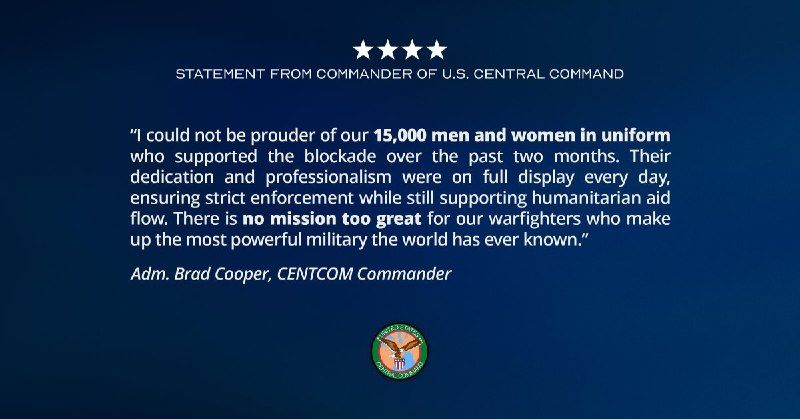

🔴بیانیه فرمانده ستاد فرماندهی مرکزی ایالات متحده (سنتکام)

«من نمی‌توانم بیش از این به ۱۵,۰۰۰ زن و مرد نظامی‌مان که در دو ماه گذشته از محاصره حمایت کردند، افتخار کنم. فداکاری و حرفه‌ای بودن آن‌ها هر روز به طور کامل مشهود بود و اجرای دقیق [قوانین محاصره] را تضمین می‌کرد، در حالی که هم‌زمان از جریان کمک‌های بشردوستانه نیز پشتیبانی می‌کردند. هیچ مأموریتی وجود ندارد که برای جنگجویان ما بسیار بزرگ [یا غیرممکن] باشد؛ کسانی که قدرتمندترین ارتش تاریخ جهان را تشکیل می‌دهند.

دریابد برد کوپر، فرمانده سنتکام

@mwarmonitor

## mwarmonitor — post 11225

🔴واشینگتن پست: نهادهای اطلاعاتی آمریکا به دولت ترامپ هشدار می‌دهند که بنیامین نتانیاهو احتمالاً اقداماتی انجام خواهد داد که می‌تواند توافق ایرانِ ترامپ را تضعیف کند؛ در حالی که رهبر اسرائیل تحت فشار شدید سیاسی برای ادامه جنگ در لبنان قرار دارد. »

@mwarmonitor

## mwarmonitor — post 11224

🔴بر اساس گزارش فایننشال تایمز، هایدی الکساندر، وزیر حمل‌ونقل بریتانیا، از کی‌یر استارمر نخست‌وزیر این کشور خواسته است تاریخ کناره‌گیری خود را تعیین کند.
الکساندر از گذار به رهبری جدید حمایت کرده، در حالی که استارمر متعهد شده در سمت خود باقی بماند و در برابر هرگونه چالش احتمالی مقاومت کند.

@mwarmonitor

## mwarmonitor — post 11223

🔴 نعیم قاسم: آن‌ها تلاش کردند با وارد کردن فشار بر سوریه، این کشور از سمت شرق وارد عمل شود تا همراه با «اسرائیل» از شمال، یک حرکت گازانبری ایجاد کنند.

🔸این طرح شامل بستن تمام گذرگاه‌ها برای جلوگیری از رسیدن سلاح، فناوری و هر چیزی است که بتواند مقاومت را تقویت کند.

🔸همچنین این طرح شامل اعمال یک محاصره مالیِ کامل و تحریک ارتش علیه مقاومت است.

🔸آن‌ها بر ایجاد فتنهٔ سنی–شیعه با عنوانِ «حفاظت از جایگاه نخست‌وزیر» و با استناد به تصمیم‌هایی که او علیه مقاومت خواهد گرفت، کار کردند.

@mwarmonitor

## mwarmonitor — post 11222

🔴وزیر امور خارجه ایتالیا، Antonio Tajani می‌گوید که سفر برنامه‌ریزی‌شده‌اش در تاریخ ۲۱ تا ۲۲ ژوئن به واشنگتن را لغو می‌کند، پس از آن‌که Donald Trump به نخست‌وزیر ایتالیا، Giorgia Meloni توهین کرده و گفته بود او «التماس کرده» برای گرفتن عکس با او و اینکه او…

## mwarmonitor — post 11221

  <a href="telegram/content/mwarmonitor_11221_1781889916.mp4" target="_blank">🎬 Download video</a>

📝 در این آشفته‌بازار که هر گوشه از نظامش را بچسبی، عده‌ای با تکیه بر شغل اجدادی و خانوادگی‌شان مشغول رانت‌خواری و چپاول هستند، ظهور پدیده‌هایی مثل ژیلا صادقی دیگر یک اتفاق نیست، بلکه یک کارکرد است؛ نوعی خدمات‌رسانی دوقابلیتی در صداوسیمای جمهوری اسلامی که در آن، هنر با وقاحت و تملق پیوند می‌خورد. این حرکات مشمئزکننده و غلت زدن در لجن‌زار چاپلوسی، چیزی جز ذات عریان کاسه‌لیسی و دستمال‌کشی او را به نمایش نمی‌گذارد. او با حقارت تمام و در اوج خفت و خواری، شرف خود را حراج می‌کند تا شاید چند صباحی بیشتر به زندگی انگل‌وارش در این ویترینِ پوسیده ادامه دهد.

@mwarmonitor

## FoxNewsTwitter — post 343173

  <a href="telegram/content/FoxNewsTwitter_343173_1781889918.mp4" target="_blank">🎬 Download video</a>

Fox News (Twitter/X)

A massive wave crashes over the rooftop of an oceanfront condo in Hawaii, ripping shingles away as water surges across the building.

The wave slammed into the Keauhou-Kona Surf and Racquet Condominium complex in Keauhou, sending debris flying through the air as residents watched the powerful swell roll through.

It's not the first time the property has taken a hit. The same complex was battered by enormous waves in 2022 during a major swell event linked to Hurricane Darby.

## FoxNewsTwitter — post 343172

Fox News (Twitter/X)

More than 250 runners are crossing the country as part of Relay for America, carrying the U.S. flag to Washington, D.C., with the goal of arriving by July 4th. Each mile of the journey is dedicated to a veteran who served our nation.

## FoxNewsTwitter — post 343171

  

Fox News (Twitter/X)

From discovering Ella Langley on the road... to meeting her backstage.

The viral German soccer fan behind one of the internet's favorite American road trips finally got his full-circle moment after weeks of sharing videos from across the country.

Millions watched as Freddy and his friends traveled across the U.S. for the World Cup, experiencing American food, culture, and unexpectedly becoming huge Ella Langley fans along the way.

Their videos caught the attention of listeners, radio stations, and eventually Langley herself.

## pm_afshaa — post 94409

  <a href="telegram/content/pm_afshaa_94409_1781889922.webm" target="_blank">🎬 Download video</a>

🔴ان‌بی‌سی: تماس تلفنی ترامپ و نتانیاهو درمورد لبنان 
💧 Rainbet.com the #1 Non-KYC Crypto Casino & Sportsbook @rainbetcom 
😁 @Pm_Afshaa

## pm_afshaa — post 94408

  <a href="telegram/content/pm_afshaa_94408_1781889922.webm" target="_blank">🎬 Download video</a>

🔴ان‌بی‌سی: تماس تلفنی ترامپ و نتانیاهو درمورد لبنان

💧 Rainbet.com the #1 Non-KYC Crypto Casino & Sportsbook @rainbetcom

😁 @Pm_Afshaa

## pm_afshaa — post 94407

🔴نعیم قاسم با آتش بس با اسرائیل مخالفت کرد

💧 Rainbet.com the #1 Non-KYC Crypto Casino & Sportsbook @rainbetcom

😁 @Pm_Afshaa

## pm_afshaa — post 94406

  <a href="telegram/content/pm_afshaa_94406_1781889923.webm" target="_blank">🎬 Download video</a>

🔴کاخ سفید: ایران تموم شده.

💧 Rainbet.com the #1 Non-KYC Crypto Casino & Sportsbook @rainbetcom

😁 @Pm_Afshaa

## pm_afshaa — post 94405

  <a href="telegram/content/pm_afshaa_94405_1781889924.webm" target="_blank">🎬 Download video</a>

🔴واشنگتن پست: سازمان‌های اطلاعاتی آمریکا به ترامپ هشدار دادن نتانیاهو سعی در به‌هم زدن توافق با ایران داره.

💧 Rainbet.com the #1 Non-KYC Crypto Casino & Sportsbook @rainbetcom

😁 @Pm_Afshaa

## pm_afshaa — post 94404

  <a href="telegram/content/pm_afshaa_94404_1781889925.webm" target="_blank">🎬 Download video</a>

🔴آخوند علم‌الهدی:
خون‌خواهی رهبرمون با کشتن یک سگ فاسق محقق نمیشه. صدها از این سگ‌ها رو بکشن، یک تار موی علی خامنه‌ای هم نمیشه.

💧 Rainbet.com the #1 Non-KYC Crypto Casino & Sportsbook @rainbetcom

😁 @Pm_Afshaa

## pm_afshaa — post 94402

  <a href="telegram/content/pm_afshaa_94402_1781889925.webm" target="_blank">🎬 Download video</a>

🔴بلومبرگ: ۱۱ نفتکش حامل حدود ۲۰ میلیون بشکه نفت ایران، طی هفته جاری بندر چابهار را ترک کرده‌اند.

💧 Rainbet.com the #1 Non-KYC Crypto Casino & Sportsbook @rainbetcom

😁 @Pm_Afshaa

## iaghapour — post 2687

🌐 مدیرعامل سروش‌پلاس: فیلترینگ و قطعی اینترنت به ضرر ماست!

امین شریفی، مدیرعامل سروش‌پلاس در نشست گزارش عملکرد سال ۱۴۰۴ اعلام کرد که قطعی اینترنت و اعمال فیلترینگ نه‌تنها به رشد پلتفرم‌های داخلی کمکی نمی‌کند، بلکه نتیجه‌ای جز عصبانیت و لج کاربران ندارد.

🔹 چکیده مهم‌ترین آمارهای گزارش سالانه سروش‌پلاس:
🔸 ریزش کاربران پس از رفع محدودیت‌ها: با آزاد شدن دسترسی به سایر پیام‌رسان‌ها، سروش‌پلاس با افت ۱۰ تا ۱۵ درصدی در تعداد کاربر و کاهش ۱۰ تا ۳۰ درصدی در شاخص‌های فعالیت مواجه شده است.

🔸 وضعیت کسب‌وکارها: آمارها نشان می‌دهد حدود ۷۰ درصد از فعالیت کانال‌های فروشگاهی، آموزشی و تولید محتوا که در دوره محدودیت‌ها ایجاد شده بودند، همچنان در این پلتفرم ادامه دارد.

🔸 رشد آمار کاربران و پیام‌ها: تعداد کل کاربران ثبت‌نامی این پیام‌رسان از مرز ۵۲ میلیون نفر عبور کرده است که از این تعداد حدود ۲۰ میلیون نفر کاربر فعال ماهانه هستند. همچنین در سال ۱۴۰۴ بیش از ۳۰ میلیارد پیام توسط کاربران جابه‌جا شده که ۷۶ درصد از آن‌ها مربوط به چت‌های شخصی بوده است.

🔸 امکانات و تغییرات جدید: رونمایی از مدل اشتراکی «حساب پرو» (با قابلیت‌هایی مثل نشان ویژه و حذف تبلیغات)، توسعه تنظیمات حریم خصوصی و همچنین افزایش جایگاه‌های تبلیغاتی پلتفرم از ۳ به ۱۳ مورد، از اقدامات مهم این سال بوده است.

🔻پ.ن: من داشتم میخوندم خندم گرفت این چطوری داشت میگفت خندش نگرفت؟

🆔 @iAghapour

## DEJradio — post 5830

  <a href="telegram/content/DEJradio_5830_1781889926.webm" target="_blank">🎬 Download video</a>

⚽️
🔺 فریاد «نه به جمهوری اسلامی» در بزرگ‌ترین صحنه فوتبال جهان

گزارش: ایمان صفتی

#فوتبال #جام_جهانی
@DEJradio

## DEJradio — post 5829

  <a href="telegram/content/DEJradio_5829_1781889927.webm" target="_blank">🎬 Download video</a>

🚨📢 ارفاق ترامپ به ملاها؛ حرکت ۱۰ نفت‌کش جمهوری اسلامی به سمت چین

بعد از تفاهم آمریکا و جمهوری اسلامی، طی ۵ روز ۱۰ نفت‌کش ۱۸ میلیون بشکه نفت به ارزش ۱.۴ میلیارد دلار از خلیج فارس خارج کرده و به سمت چین بردند.

دو نفت‌کش از این شمار با موقعیت‌یاب خاموش در طول محاصره آمریکا از خلیج فارس خارج و خط محاصره عبور کردند.

#مذاکرات #توافق
@DEJradio

## DEJradio — post 5828

  <a href="telegram/content/DEJradio_5828_1781889928.webm" target="_blank">🎬 Download video</a>

🔺📢 جمهوری اسلامی: مذاکرات با آمریکا فوریت ندارد!

پس از اعلام رسمی لغو نشست هیأت جمهوری اسلامی و هیأت آمریکایی در سوئیس، اسحاق دار، وزیر امور خارجه پاکستان، مدعی شد مشغله برخی مقام‌ها به‌دلیل مراسم ماه محرم علت لغو این نشست بوده است.

این در حالی است که هنگام تعیین زمان نشست، این تلاقی زمانی از پیش مشخص و بدیهی بود.

هم‌زمان، اسماعیل بقایی، سخنگوی وزارت خارجه جمهوری اسلامی، گفت رایزنی‌ها از طریق میانجی‌ها ادامه دارد و در صورت فراهم شدن شرایط لازم، مذاکرات از سر گرفته خواهد شد. او همچنین اعلام کرد با توجه به امضای دیجیتال تفاهم‌نامه، برگزاری نشست حضوری در سوئیس فوریت نداشته است.

بقایی بر ضرورت اجرای مفاد تفاهم‌نامه، از جمله آتش‌بس در لبنان، تأکید کرد؛ موضوعی که در حالی مطرح می‌شود که درگیری‌ها میان اسرائیل و حزب‌الله همچنان ادامه دارد.

#مذاکرات #آتشبس
@DEJradio

## VahidOnline — post 76522

  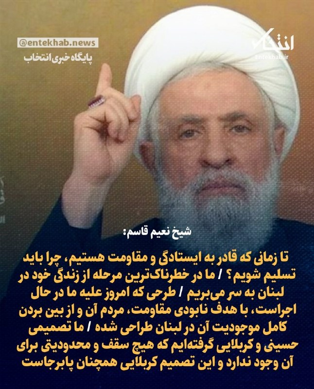

نعیم قاسم، دبیرکل حزب‌الله لبنان، گفت: «تا زمانی که توان ایستادگی داریم، چرا باید تسلیم شویم؟.»
او تحویل سلاح‌های حزب‌الله را رد کرد و افزود این سلاح‌ها برای مقابله با اسرائیل هستند.
نعیم قاسم همچنین گفت که ما تصمیمی «به سبک کربلا» گرفتیم و این تصمیم همچنان به قوت خود باقی است.
دبیرکل حزب‌الله لبنان ادامه داد: «ما وحدت نیروهای مقاومت را حفظ کرده‌ایم و وحدت جنبش امل، حزب‌الله و سایر نیروها همچنان در کنار ما برقرار است.»
@VahidOOnLine

📡 @VahidOnline

## VahidOnline — post 76521

  

اسماعیل بقائی، سخنگوی وزارت خارجه ایران، روز جمعه دعوت جمهوری اسلامی از بازرسان آژانس بین‌المللی انرژی اتمی برای حضور در ایران و انجام بازرسی از تاسیسات هسته‌ای را رد کرد.

او گفت: «بازرسی از تاسیساتی که دسترسی آژانس به آنها به‌دلیل حملات نظامی متوقف گردید، منوط به روند مذاکرات و نتیجه آن خواهد بود.»

پیشتر جی‌دی ونس، معاون رئیس جمهور آمریکا پس از اعلام توافق اخیر در گفت‌وگو با شبکه ان‌بی‌سی گفته بود که بر اساس تفاهم‌نامه میان واشینگتن و تهران، بازرسان آژانس بین‌المللی انرژی اتمی «قطعاً» به ایران بازخواهند گشت.

اسماعیل بقائی همچنین گفت در حال برنامه‌ریزی برای برگزاری یک نشست طی روزهای آینده هستیم.

نشست بین نمایندگان ایران و ایالات متحده که قرار بود جمعه در سوئیس برگزار شود، لغو شد.

سخنگوی وزارت خارجه جمهوری اسلامی اعلام کرد: «با توجه به اینکه امضای متن یادداشت تفاهم در بامداد ۲۸ خرداد به صورت دیجیتالی انجام شد، برگزاری نشست مزبور در سوئیس فوریت ندارد.»

او همچنین گزارش‌ها درباره بسته شدن تنگه هرمز را «بی‌اساس» دانست و گفت کشتیرانی در این مسیر در حال انجام است.
@VahidHeadline

📡 @VahidOnline

## IranIntlTV — post 343255

  <a href="telegram/content/IranIntlTV_343255_1781889930.mp4" target="_blank">🎬 Download video</a>

رویترز به نقل از یک مقام آمریکایی گزارش داد اسرائیل و حزب‌الله لبنان بر سر برقراری آتش‌بس به توافق رسیده‌اند. این خبر در حالی منتشر می‌شود که درگیری‌ها و حملات متقابل دو طرف در روزهای اخیر شدت گرفته است.

گزارش اردوان روزبه، خبرنگار ایران‌اینترنشنال
@iranintltv

## IranIntlTV — post 343254

  <a href="telegram/content/IranIntlTV_343254_1781889932.mp4" target="_blank">🎬 Download video</a>

دونالد ترامپ از نتایج جنگ با جمهوری اسلامی دفاع کرد و گفت این حکومت بخش عمده توان هوایی، دریایی و پدافندی خود را از دست داده است.
هم‌زمان، انتقادها در آمریکا از جنگ و توافق با ایران افزایش یافته است.

گزارش مریم رحمتی، خبرنگار ایران‌اینترنشنال
@iranintltv

## IranIntlTV — post 343253

  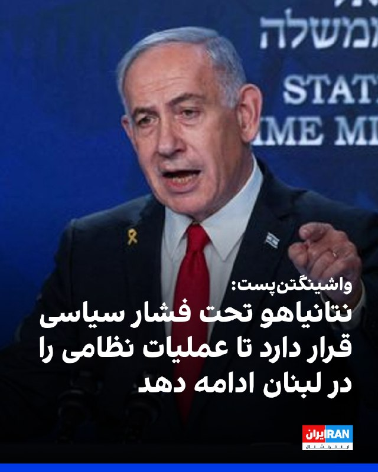

واشینگتن‌پست به نقل از مقام‌های فعلی و سابق آمریکا گزارش داد که سازمان‌های اطلاعاتی ایالات متحده به دولت آمریکا هشدار داده‌اند بنیامین نتانیاهو، نخست‌وزیر اسرائیل، احتمالا اقداماتی انجام خواهد داد که می‌تواند تلاش‌های دولت آمریکا برای رسیدن به یک توافق صلح پایدار با تهران را مختل کند.

به گفته این منابع، نتانیاهو تحت فشار سیاسی قرار دارد تا عملیات نظامی در لبنان را ادامه دهد.
https://iranintl.com/202606193192

## IranIntlTV — post 343252

  <a href="telegram/content/IranIntlTV_343252_1781889936.mp4" target="_blank">🎬 Download video</a>

🔻بلافاصله پس از نمایش ضعیف تیم ملی فوتبال برابر نیوزیلند و ناکامی در نتیجه‌گیری برابر یکی از ضعیف‌ترین تیم‌های جام، بهانه‌جویی واهی درباره ریکاوری و بازیابی آمادگی فردی بازیکنان از سوی کادر فنی تیم ملی آغاز شده است.

🔹گفت‌وگوی مزدک میرزایی با محمد تقوی، رضا محدث و علیرضا مدیری در هت‌تریک

@iranintltvsport

## IranIntlTV — post 343251

  

باراک اوباما، رییس‌جمهور پیشین آمریکا، در مصاحبه‌ با ان‌بی‌سی نیوز گفت با وجود اینکه از برقراری آتش‌بس «بسیار خوشحال» است، ایالات متحده ممکن است نسبت به قبل از آغاز جنگ ایران «کمی وضعیت بدتری» داشته باشد.

او گفت: «یک توافق وجود داشت که بر اساس آن جمهوری اسلامی پذیرفته بود به سمت ساخت سلاح هسته‌ای نرود، اما این دولت یا نسخه قبلی آن از این توافق خارج شد و همین باعث شد ایران ظرفیت هسته‌ای خود را افزایش دهد.»

اوباما افزود: «اکنون جنگی را پشت سر گذاشته‌ایم، میلیاردها دلار هزینه کرده‌ایم، فشار زیادی به ارتش وارد شده و افراد زیادی جان خود را از دست داده‌اند، و در نهایت به نقطه‌ای برگشته‌ایم که تقریبا همان‌جایی است که شروع کردیم، شاید حتی کمی بدتر.»
https://iranintl.com/202606193316

## IranIntlTV — post 343250

برنامه «جغرافیای انقلاب ملی ایرانیان» از سوی ایران‌اینترنشنال برای بررسی روایت‌های انقلاب ملی در استان‌های ایران راه‌اندازی شده است. در دومین قسمت به تجمعات اعتراضی، شعارها و اعتصاب‌ها در استان آذربایجان‌غربی پرداخته‌ایم.
محسن مهیمنی، عضو تحریریه ایران‌اینترنشنال گزارش می‌دهد.

## IranIntlTV — post 343249

  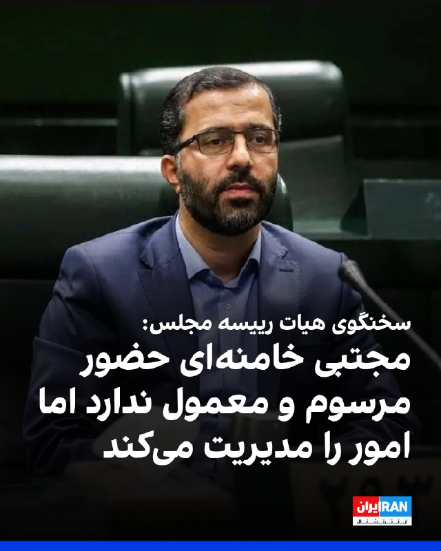

عباس گودرزی، سخنگوی هیات رییسه مجلس، در خصوص پیام مجتبی خامنه‌ای در خصوص تفاهم‌نامه با آمریکا، گفت: «پیام رهبری نشان داد با وجودی که حضور مرسوم و معمول ندارد، تا چه میزان آگاه به امور است و مدیریت می‌کند.»
گودرزی ادامه داد: «رهبری نظرات دیگران را در اداره امور لحاظ کرده و بیان می‌کند.»
سخنگوی هیات رییسه مجلس افزود: «تیم مذاکره‌کننده باید محکم بر خطوط قرمز و منافع حیاتی ما ایستادگی کند.»
https://iranintl.com/202606194833

## IranIntlTV — post 343248

  <a href="telegram/content/IranIntlTV_343248_1781889940.mp4" target="_blank">🎬 Download video</a>

🔻تیم ملی فوتبال کانادا در یک بازی یک طرفه با شش گل تیم ملی قطر را شکست داد؛ نمایشی که موجی از هیجان و شادی را در بین کانادایی‌ها به دنبال داشت.

🔹گفت‌وگوی مزدک میرزایی با محمد تقوی و مهسا مرتضوی در هت‌تریک

@iranintltvsport

## IranIntlTV — post 343247

  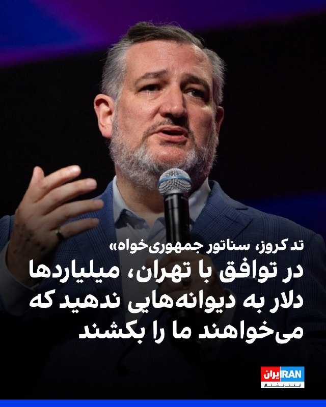

تد کروز، سناتور جمهوری‌خواه، در شبکه ایکس نوشت: «برای من فرقی نمی‌کند ۳۰۰ میلیارد دلار از کجا می‌آید. دادن میلیاردها دلار به حکومت ایران که شعار مرگ بر آمریکا سر می‌دهد، ایده بدی است.»

او افزود: «در توافق با تهران، میلیاردها دلار به دیوانه‌هایی ندهید که می‌خواهند ما را بکشند.»
https://iranintl.com/202606198306

## IranIntlTV — post 343246

  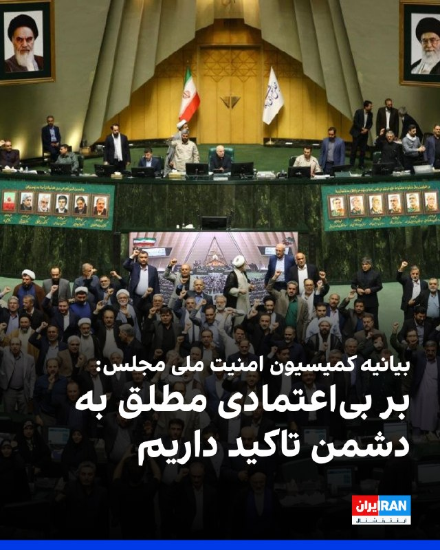

کمیسیون امنیت ملی مجلس در بیانیه‌ای با اعلام «بی‌اعتمادی مطلق به دشمنان» نوشت یادداشت تفاهم اسلام‌آباد، نقشه‌ای جدید برای امنیت منطقه‌ای و بین‌المللی ترسیم می‌کند و این کمیسیون تحقق کامل شروط رهبر جمهوری اسلامی را تا پایان پیگیری و مطالبه خواهد کرد.

کمیسیون امنیت ملی مجلس همچنین اعلام کرد در بررسی تفاهم‌نامه اخیر، «رهنمودهای رهبر جمهوری اسلامی را فصل‌الخطاب و نصب‌العین» خود قرار داده‌ایم.
https://iranintl.com/202606191291

## IranIntlTV — post 343245

  <a href="telegram/content/IranIntlTV_343245_1781889944.mp4" target="_blank">🎬 Download video</a>

🔻تیم فوتبال سوئیس در حالی در دومین مسابقه خود در جام جهانی ۲۰۲۶، بوسنی و هرزگوین را با نتیجه ۴ بر یک شکست داد که نقش ژاکا در این پیروزی پررنگ‌تر از سایر بازیکنان بود.

🔹گفت‌وگوی مزدک میرزایی با محمد تقوی در هت‌تریک

@iranintltvsport

## IranIntlTV — post 343244

  <a href="telegram/content/IranIntlTV_343244_1781889947.mp4" target="_blank">🎬 Download video</a>

دونالد ترامپ، رییس‌جمهوری آمریکا، پنجشنبه در مصاحبه با «اکسیوس شو» از امضای تفاهم‌نامه با ایران دفاع کرد. او گفت شرایط صلح با تهران «احتمالا همان تسلیم بی‌قیدوشرط است» و افزود جنگ ایران به او آموخته که قدرتش «هیچ محدودیتی» ندارد.
@iranintltv

## IranIntlTV — post 343243

🔻مرگ ۳۰ نفر در اردوگاه آوارگان کنگو نگرانی‌ها از گسترش سریع ابولا را افزایش داده است

مقام‌های یک اردوگاه آوارگان در شمال شرق جمهوری دموکراتیک کنگو اعلام کردند شمار مرگ‌ومیرها از اوایل ماه می به سطحی بی‌سابقه رسیده است. بسیاری از جان‌باختگان پیش از مرگ علائمی مانند تب، سردرد و استفراغ داشته‌اند. این موضوع نگرانی‌ها را درباره گسترش سریع ابولا افزایش داده است.

خبرگزاری رویترز جمعه ۲۹ خرداد گزارش داد دست‌کم ۳۰ نفر از اوایل ماه می تاکنون در اردوگاه کیگونزه در شهر بونیا، واقع در شمال شرق جمهوری دموکراتیک کنگو، جان باخته‌اند.

مسئولان اردوگاه اعلام کردند چنین میزان مرگ‌ومیری در این اردوگاه سابقه نداشته و با توجه به علائم گزارش شده، احتمال می‌رود ابولا با سرعت در حال گسترش باشد.

تعیین علت دقیق مرگ‌ها تاکنون ممکن نشده است، زیرا بیماران و خانواده‌های آنان تا پنج‌شنبه ۲۸ خرداد با انجام آزمایش روی افراد زنده یا جان‌باختگان مخالفت می‌کردند.

سخنگوی اردوگاه، یک پدر داغدار، منابع امدادی و یک فعال جامعه مدنی به رویترز گفتند همه قربانیان علائمی از جمله تب، سردرد و استفراغ داشته‌اند. علائمی که با ابولا همخوانی دارد.

دزیره گرودیا باپی، سخنگوی اردوگاه، به رویترز گفت: «قبلا مردم این‌گونه جان خود را از دست نمی‌دادند.»

مرگ‌های ثبت‌شده در اردوگاه کیگونزه با بیش از ۱۵ هزار ساکن، این نگرانی را ایجاد کرده که ابولا ممکن است در میان بیش از پنج میلیون آواره شرق کنگو بدون شناسایی در حال گسترش باشد، آن هم در شرایطی که کمبود امکانات بهداشتی و مقاومت برخی ساکنان در برابر آزمایش‌های پزشکی، مهار بیماری را دشوارتر کرده است.
افزایش ناگهانی شمار قربانیان

دزجو ندروتسی اتین، رییس اردوگاه، گفت تنها در همین هفته ۱۰ نفر دفن شده‌اند.

به گفته مسئولان اردوگاه، در شرایط عادی ماهانه تنها یک تا سه مورد مرگ در این محل ثبت می‌شد.

ژوستن زاناموزی، مدیر سازمان امدادی کاتولیک «کاریتاس»، گفت کارکنان این سازمان چندین جسد از جمله زنان و کودکان را مشاهده کرده‌اند و تلاش آن‌ها برای جلب رضایت خانواده‌ها به‌منظور بررسی پزشکی اجساد با مخالفت روبه‌رو شده است.

مقام‌های کنگو شیوع ابولا را ۲۵ اردیبهشت اعلام کردند اما گفتند مرگ‌ها از اوایل همان ماه آغاز شده بود.

گرودیا گفت کارکنان بهداشتی اکنون از پنج قربانی نمونه‌برداری کرده‌اند و در انتظار نتایج آزمایش‌ها هستند.

او افزود وبا نیز علائمی مشابه ابولا دارد و می‌تواند به سرعت در جوامع فقیر گسترش یابد.

یکی از ساکنان اردوگاه که دو فرزند خود را از دست داده است، به رویترز گفت: «مردم یکی پس از دیگری جان می‌بازند.»

کمبود امکانات بهداشتی و کاهش کمک‌ها

چهار امدادگر به رویترز گفتند افزایش مرگ‌ومیر نشان می‌دهد جوامع آواره اکنون بیش از گذشته در معرض بیماری‌هایی مانند ابولا قرار گرفته‌اند، زیرا بودجه برنامه‌های آب، بهداشت و

این خدمات برای مقابله با بیماری‌هایی مانند ابولا، حیاتی به شمار می‌روند.

داده‌های سازمان ملل نشان می‌دهد بودجه اختصاص‌یافته به سرویس‌های بهداشتی و ایستگاه‌های شست‌وشوی دست در کنگو، بین سال‌های ۲۰۲۴ و ۲۰۲۵ بیش از نصف شده و به حدود ۳۸ میلیون دلار رسیده است. همچنین تاکنون تنها ۲۱ درصد درخواست مالی ۸۰ میلیون دلاری امسال تامین شده است.

کنگو صدها اردوگاه برای غیرنظامیانی دارد که از جنگ گریخته‌اند و برخی از این اردوگاه‌ها تا ۱۰۰ هزار نفر جمعیت دارند.

موارد مرگ ناشی از ابولا پیش‌تر در اردوگاه دیگری در استان ایتوری نیز ثبت شده است. استانی که بیش از ۹۰ درصد از حدود ۹۰۰ مورد تاییدشده ابتلا به ابولا را در خود جای داده است.
در اردوگاه کیگونزه، خانواده‌های پرجمعیت در چادرهای پلاستیکی با فاصله‌ای بسیار کم از یکدیگر زندگی می‌کنند و کمبود سرویس‌های بهداشتی از مشکلات اصلی ساکنان است.

گرودیا گفت: «چاه‌های فاضلاب خیلی سریع پر می‌شوند و مردم مجبورند با دست خالی آن‌ها را تخلیه کنند.»

آمریکا در سال‌های گذشته بزرگ‌ترین حامی برنامه‌های آب، بهداشت و فاضلاب در کنگو بوده است.

با این حال، چهار سازمان امدادی اعلام کردند پروژه‌های مرتبط با آوارگان در مناطق درگیر با ابولا، پس از کاهش بودجه‌های آمریکا محدود یا متوقف شده‌اند.

دولت دونالد ترامپ از این کاهش بودجه دفاع کرده و گفته است منابع را بر «کمک‌های بشردوستانه نجات‌بخش با اولویت بسیار بالا» متمرکز کرده است.

واشینگتن همچنین اعلام کرده بیش از ۳۷۵ میلیون دلار کمک مستقیم برای مقابله با ابولا اختصاص داده است.

با وجود این، امدادگران هشدار می‌دهند که کاهش خدمات آب و بهداشت در اردوگاه‌های آوارگان، خطر گسترش بیماری را در یکی از آسیب‌پذیرترین مناطق کنگو افزایش داده است.
🔗ادامه این مطلب را اینجا بخوانید
@iranintltv

## IranIntlTV — post 343242

  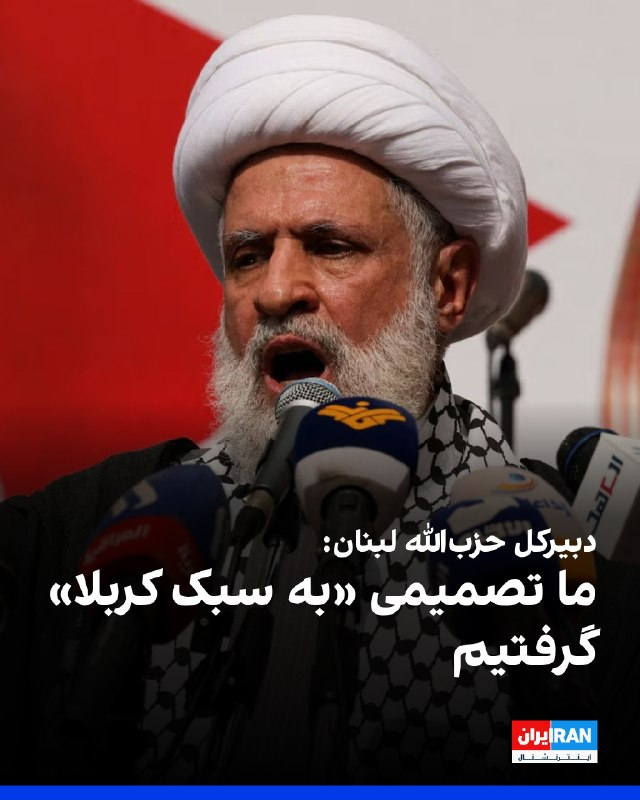

نعیم قاسم، دبیرکل حزب‌الله لبنان، گفت: «تا زمانی که توان ایستادگی داریم، چرا باید تسلیم شویم؟.»

او تحویل سلاح‌های حزب‌الله را رد کرد و افزود این سلاح‌ها برای مقابله با اسرائیل هستند. نعیم قاسم همچنین گفت که ما تصمیمی «به سبک کربلا» گرفتیم و این تصمیم همچنان به قوت خود باقی است.

دبیرکل حزب‌الله لبنان ادامه داد: «ما وحدت نیروهای مقاومت را حفظ کرده‌ایم و وحدت جنبش امل، حزب‌الله و سایر نیروها همچنان در کنار ما برقرار است.»
https://iranintl.com/202606195238

## IranIntlTV — post 343241

  <a href="telegram/content/IranIntlTV_343241_1781889949.mp4" target="_blank">🎬 Download video</a>

ویدیوی رسیده به ایران اینترنشنال نشان می‌دهد دوستان و بستگان جاویدنام علی روزبهانی به یاد او به توزیع غذا بین شهروندان پرداختند. علی روزبهانی از جمله جوانانی بود که از نخستین روزهای اعتراضات دی‌ماه ۱۴۰۴ در خیابان‌ها حاضر شد و به گفته نزدیکانش، حضوری فعال در کنار دیگر شهروندان داشت. او ابتدا در بازار و چند نقطه دیگر تهران حاضر شد و سرانجام ۱۸ دی به تهرانپارس رفت و گلوله خورد.

## IranIntlTV — post 343240

🔻تیم فوتبال سوئیس شب گذشته در دومین مسابقه خود در جام جهانی ۲۰۲۶، بوسنی و هرزگوین را با نتیجه ۴ بر یک شکست داد.

🔹گزارش علیرضا مدیری، خبرنگار ایران اینترنشنال از استادیوم سوفای لس آنجلس و گفتگو با هواداران دو تیم

@iranintltvsport

## IranIntlTV — post 343239

🔻سراب توافق با واشینگتن؛ چرا معامله با آمریکا هم اقتصاد نفتی جمهوری اسلامی را نجات نمی‌دهد؟

🖋تحلیل - مهدی مصلحی، کارشناس بازار انرژی

اکنون که با امضای یادداشت‌تفاهم بار دیگر بحث احتمال یک توافق بزرگ میان جمهوری اسلامی و ایالات متحده مطرح شده، بسیاری از تحلیلگران همچنان بر این باورند که لغو تحریم‌ها می‌تواند همانند یک شوک مثبت، اقتصاد ایران را احیا کند. این نگاه اما بیش از حد ساده‌انگارانه است.

مساله امروز جمهوری اسلامی صرفا تحریم نیست. اقتصاد نفتی ایران اکنون با مجموعه‌ای از مشکلات ساختاری، فنی، مالی و ژئوپلیتیکی مواجه است که حتی در صورت دستیابی به یک توافق سیاسی با واشینگتن نیز به سرعت قابل حل نخواهند بود.

واقعیت این است که اقتصاد نفتی جمهوری اسلامی در وضعیتی قرار گرفته که مشکل اصلی آن دیگر فروش نفت نیست؛ بلکه توانایی تولید پایدار، جذب سرمایه، دسترسی به فناوری و بازگشت به زنجیره مالی جهانی است.

فرسودگی زیرساخت‌ها؛ زخمی که طی دهه‌ها انباشته شد

بخش بزرگی از زیرساخت‌های نفت و گاز ایران به نیمه دوم عمر عملیاتی خود رسیده‌اند. سال‌ها کمبود سرمایه‌گذاری، محدودیت دسترسی به فناوری‌های روز و خروج شرکت‌های بزرگ بین‌المللی از ایران موجب شده است بسیاری از میادین با مشکلات پیچیده فنی روبه‌رو شوند.

موضوع تنها افت طبیعی تولید نیست. بسیاری از متخصصان باسابقه صنعت نفت ایران طی سال‌های اخیر نسبت به مشکلات سازندی، افت فشار، رسوب‌گذاری، آسیب به چاه‌ها و دشواری بازگرداندن آنها به تولید پایدار هشدار داده‌اند.

به گفته شماری از مدیران سابق صنعت نفت، از جمله افرادی که سال‌ها در بالاترین سطوح اجرایی این صنعت فعالیت کرده‌اند، بخش مهمی از تلاش مدیران فعلی معطوف به یافتن راه‌حل برای مشکلات فنی چاه‌ها و میادینی است که رفع آنها مستلزم تجهیزات، دانش فنی و فناوری‌هایی است که امروز در داخل کشور به سادگی در دسترس نیست.

این وضعیت در میدان گازی پارس جنوبی اهمیت دوچندان پیدا می‌کند. پارس جنوبی ستون فقرات امنیت انرژی ایران است و افت فشار طبیعی این میدان از سال‌ها پیش آغاز شده است. جبران این افت فشار نیازمند پروژه‌های چند ده میلیارد دلاری، تجهیزات پیشرفته فراساحلی و مشارکت شرکت‌هایی است که عمدتا در غرب مستقر هستند.

حتی اگر امروز موانع سیاسی برداشته شود، فرآیند مطالعه، طراحی، تامین تجهیزات و اجرای چنین پروژه‌هایی سال‌ها زمان خواهد برد؛ زمانی که اقتصاد گرفتار تورم، کسری بودجه و کمبود سرمایه ایران به سختی در اختیار دارد.

جهان دیگر منتظر نفت ایران نیست

اشتباه بزرگ بسیاری از تحلیل‌ها آن است که بازار انرژی امروز را با بازار انرژی یک دهه پیش مقایسه می‌کنند.

در دوران پیش از تحریم‌ها، بخش قابل توجهی از بازار جهانی به نفت ایران وابسته بود. اما در سال ۲۰۲۶ شرایط کاملا متفاوت است.

ایالات متحده به یکی از بزرگ‌ترین تولیدکنندگان و صادرکنندگان انرژی جهان تبدیل شده است. کانادا، برزیل و گویان ظرفیت تولید خود را افزایش داده‌اند. قطر و آمریکا بازار جهانی گاز طبیعی مایع را متحول کرده‌اند و مصرف‌کنندگان بزرگ نیز طی سال‌های گذشته زنجیره تامین خود را بازطراحی کرده‌اند.

بازگشت به بازار جهانی بسیار دشوارتر از حفظ سهم بازار است. مشتریانی که طی سال‌های تحریم جایگزین پیدا کرده‌اند، صرفا به‌دلیل رفع تحریم‌ها به سرعت به بازار ایران بازنخواهند گشت.
سایه سنگین نظام بانکی و FATF

حتی اگر فرض کنیم دولت آمریکا مجوز بازگشت شرکت‌های نفتی به ایران را صادر کند، مانع بزرگ‌تری همچنان پابرجاست: نظام بانکی بین‌المللی.

تجربه برجام در سال ۲۰۱۵ نشان داد که توافق سیاسی الزاما به معنای بازگشت سرمایه نیست. با وجود حمایت رسمی دولت‌های غربی از همکاری اقتصادی با ایران، بسیاری از بانک‌های بزرگ حاضر به پذیرش ریسک فعالیت در ایران نشدند.

عدم پیوستن به استانداردهای FATF، نبود شفافیت مالی کافی، نگرانی از پول‌شویی و نقش گسترده نهادهای نظامی در اقتصاد، همچنان از مهم‌ترین موانع ورود سرمایه خارجی محسوب می‌شوند.

اگر در سال ۲۰۱۵ ایران عمدتا به عنوان حامی گروه‌های نیابتی شناخته می‌شد، در سال ۲۰۲۶ فضای بین‌المللی نسبت به تهران به مراتب سخت‌تر و پرهزینه‌تر شده است. برای بسیاری از مؤسسات مالی جهانی، ریسک اعتباری و reputational risk همکاری با ایران همچنان بسیار بالا خواهد بود.

🔗ادامه این مطلب را اینجا بخوانید
@iranintltv

## IranIntlTV — post 343238

  

عباس عراقچی، وزیر خارجه جمهوری اسلامی، در گفت‌وگو با همتای پاکستانی خود، با اشاره به «تعهد و مسئولیت» ایالات متحده در قبال پایان دادن به جنگ در تمامی جبهه‌ها، از جمله لبنان، گفت: «مسئولیت هرگونه نقض تعهدات مندرج در یادداشت تفاهم و پیامدهای آن، متوجه ایالات متحده خواهد بود.»

عراقچی همچنین از تلاش‌های پاکستان برای میانجی‌گری بین جمهوری اسلامی و آمریکا تشکر کرد.
https://iranintl.com/202606196597

## IranIntlTV — post 343237

🔻مقایسه واشینگتن‌پست؛ تفاهم ترامپ با جمهوری اسلامی چه تفاوت‌ها و شباهت‌هایی با برجام دارد

روزنامه واشینگتن‌پست گزارش داد تفاهم تازه دونالد ترامپ، رییس‌جمهوری آمریکا، با جمهوری اسلامی با وجود انتقادهای تند او از برجام، در موضوعاتی مانند کاهش تحریم‌ها، آزادسازی دارایی‌ها و کنار گذاشتن پرونده موشکی تهران، شباهت‌هایی با توافق هسته‌ای دولت باراک اوباما دارد.

واشینگتن‌پست جمعه ۲۹ خرداد نوشت ترامپ طی سال‌های گذشته بارها از رویکرد اوباما در قبال پرونده هسته‌ای جمهوری اسلامی انتقاد کرده و برجام را «فاجعه‌بار»، «اساسا معیوب»، «یک‌طرفه»، «مسیر دستیابی ایران به سلاح هسته‌ای» و «یکی از بدترین و احمقانه‌ترین توافق‌های تاریخ آمریکا» خوانده است.

اکنون ترامپ به تفاهمی با جمهوری اسلامی دست یافته که به‌نوعی توافق مورد نظر خود او به شمار می‌رود.

به‌نوشته واشینگتن‌پست، مقایسه این تفاهم‌نامه با برجام چندان آسان نیست، زیرا برجام توافقی جامع و با جزییات روشن بود، اما توافق ترامپ همچنان در مراحل اولیه قرار دارد و بسیاری از موضوعات کلیدی و سرنوشت‌ساز آن هنوز مشخص نشده است.

همچنین شرایط کنونی با زمان انعقاد برجام تفاوت‌های اساسی دارد؛ دانش هسته‌ای تهران افزایش یافته و جمهوری اسلامی پس از ماه‌ها درگیری نظامی وارد روند مذاکرات شده؛ جنگی که به تضعیف توان نظامی حکومت ایران انجامیده و شماری از مقام‌های ارشد آن را از پا درآورده است.

آمریکا و حکومت ایران ۲۵ خرداد از دستیابی به تفاهمی برای پایان جنگ خبر دادند. این یادداشت تفاهم ۲۸ خرداد به امضای ترامپ و مسعود پزشکیان، رییس دولت جمهوری اسلامی، رسید.

بر اساس این سند، یک دوره ۶۰ روزه برای گفت‌وگوهای تخصصی در نظر گرفته شده است؛ مذاکراتی که قرار است بر موضوعات حساسی همچون سرنوشت ذخایر اورانیوم غنی‌شده حکومت ایران و چگونگی رفع تحریم‌ها تمرکز داشته باشد.
لغو تحریم‌ها و آزادی دارایی‌های بلوکه‌شده

ترامپ سال ۲۰۱۸ در شبکه‌های اجتماعی نوشت اوباما و دموکرات‌ها ۱۵۰ میلیارد دلار در اختیار جمهوری اسلامی قرار داده‌اند.

این در حالی است که مقام‌های وقت وزارت خزانه‌داری و وزارت امور خارجه آمریکا میزان واقعی منابع مالی قابل استفاده حکومت ایران را نزدیک به ۵۰ میلیارد دلار برآورد کردند.

واشینگتن‌پست نوشت تفاهم‌نامه ترامپ نیز شامل برنامه‌ای برای کاهش تحریم‌ها و آزادسازی دارایی‌های مسدودشده تهران است.

بر اساس ماده هفتم یادداشت تفاهم، ایالات متحده متعهد می‌شود تمامی انواع تحریم‌ها علیه جمهوری اسلامی، از جمله قطعنامه‌های شورای امنیت سازمان ملل، قطعنامه‌های شورای حکام آژانس بین‌المللی انرژی اتمی و تمامی تحریم‌های یک‌جانبه آمریکا اعم از اولیه و ثانویه را مطابق جدول زمانی توافق نهایی لغو کند.

یک مقام ارشد آمریکایی که به‌دلیل حساسیت موضوع نخواست نامش فاش شود، پیش‌تر گفته بود در صورت اجرای مفاد این یادداشت تفاهم از سوی رهبران جمهوری اسلامی، تهران به دارایی‌های مسدودشده خود دسترسی خواهد یافت.

روزنامه واشینگتن‌پست نوشت همانند برجام، ماده ۱۱ تفاهم‌نامه ترامپ تصریح می‌کند آمریکا دارایی‌ها و منابع مالی مسدود یا محدودشده ایران را «به‌طور کامل» در دسترس جمهوری اسلامی قرار خواهد داد.

ترامپ هنگام خروج از برجام در سال ۲۰۱۸ گفته بود: «پس از لغو تحریم‌ها، حکومت دیکتاتوری [ایران] از منابع مالی جدید خود برای توسعه موشک‌های دارای قابلیت حمل کلاهک هسته‌ای، حمایت از تروریسم و ایجاد بی‌ثباتی در خاورمیانه و فراتر از آن استفاده کرد.»

با این حال، به نظر می‌رسد مفاد یادداشت تفاهم اخیر او با مواضعی که ترامپ در زمان خروج از برجام مطرح کرده بود، همخوانی ندارد.

واشینگتن‌پست افزود اگرچه به‌دلیل نبود جزییات کامل، مقایسه ابعاد مالی دو توافق دشوار است، اما به نظر می‌رسد ترامپ نیز اکنون رویکردی مشابه برجام را در زمینه آزادسازی دارایی‌های جمهوری اسلامی دنبال می‌کند.

طبق ماده ششم یادداشت تفاهم اخیر، ایالات متحده آمریکا متعهد می‌شود همراه با شرکای منطقه‌ای خود طرحی قطعی و مورد توافق به ارزش حداقل ۳۰۰ میلیارد دلار برای بازسازی و توسعه اقتصادی جمهوری اسلامی ایران تدوین کند.

کاخ سفید تاکید کرده است این منابع از محل مالیات شهروندان آمریکایی تامین نخواهد شد.

🔗ادامه این مطلب را اینجا بخوانید
@iranintltv

## IranIntlTV — post 343236

🔻اسرائیل و حزب‌الله پس از درگیری‌های مرگبار با آتش‌بس موافقت کردند

خبرگزاری رویترز به نقل از یک مقام ارشد آمریکایی گزارش داد اسرائیل و حزب‌الله لبنان موافقت خود را با برقراری آتش‌بس اعلام کرده‌اند. این توافق در شرایطی به دست آمد که در ۲۴ ساعت گذشته، حملات مرگبار میان دو طرف شدت گرفته بود.

رویترز جمعه ۲۹ خرداد نوشت آتش‌بس میان دو طرف از ساعت ۴ عصر به وقت بیروت اجرایی شده است.

پیش‌تر شبکه خبری سی‌ان‌ان به‌نقل از یک منبع آگاه گزارش داد آمریکا به جمهوری اسلامی اطلاع داده است که اسرائیل قصد ندارد حملات خود به لبنان را بیش از این تشدید کند.

این منبع گفت: «حزب‌الله آتش‌بس را نقض کرد. اسرائیل موافقت کرده که موضوع را ادامه ندهد و این پیام به ایرانی‌ها منتقل شده است. اکنون این به حزب‌الله بستگی دارد که حملات را متوقف کند.»

یک منبع اسرائیلی نیز تایید کرد بنیامین نتانیاهو، نخست‌وزیر این کشور، در حال حاضر برنامه‌ای برای اقدامات تلافی‌جویانه بیشتر علیه حزب‌الله ندارد.

وزارت بهداشت لبنان ۲۹ خرداد اعلام کرد حملات اسرائیل به جنوب این کشور دست‌کم ۱۸ کشته و ۳۳ زخمی بر جای گذاشت.

در سوی دیگر، ارتش اسرائیل از کشته شدن چهار نیروی خود، از جمله یک فرمانده گردان، در حمله حزب‌الله خبر داد. پنج نظامی اسرائیلی دیگر نیز در حملات این گروه نیابتی جمهوری اسلامی مجروح شدند.

نتانیاهو: حزب‌الله بهای سنگینی خواهد پرداخت

نخست‌وزیر اسرائیل ۲۹ خرداد با انتشار پیامی در شبکه اجتماعی ایکس در واکنش به جان باختن چهار نظامی این کشور در جنوب لبنان هشدار داد اسرائیل حمله به نیروها یا خاک خود را تحمل نخواهد کرد و حزب‌الله بهای سنگینی برای این حملات خواهد پرداخت.

نتانیاهو تاکید کرد ارتش اسرائیل به عملیات خود برای مقابله با تهدید‌ها علیه نیروها و قلمرو اسرائیل ادامه خواهد داد و تا هر زمان که لازم باشد، در نوار امنیتی در جنوب لبنان باقی خواهد ماند.

در روزهای اخیر و پس از امضای یادداشت تفاهم میان تهران و واشینگتن برای پایان دادن به جنگ، گزارش‌ها از افزایش اختلاف‌ نظر میان کاخ سفید و دولت اسرائیل حکایت دارند.

دونالد ترامپ، رییس‌جمهوری آمریکا، ۲۹ خرداد در مصاحبه با پایگاه خبری اکسیوس، رابطه خود با نتانیاهو را «خوب» ارزیابی کرد و در عین حال گفت باید او را «سر عقل نگاه داشت».

ترامپ در پاسخ به این پرسش که آیا می‌تواند مانع ادامه حملات اسرائیل به لبنان شود، افزود: «بله. آنها احترام زیادی برای من قائل هستند و کاری را که می‌گویم انجام می‌دهند... اگر من نبودم، اسرائیل امروز وجود نداشت.»

شورای سردبیری روزنامه اورشلیم‌پست ۲۸ خرداد در سرمقاله‌ای نوشت توافق اخیر میان جمهوری اسلامی و ایالات متحده نباید شامل معامله‌ای بر سر امنیت مرزهای شمالی اسرائیل باشد، زیرا برقراری آرامش پایدار تنها در گرو خلع سلاح و حذف تهدیدهای حزب‌الله لبنان است.

واکنش مقام‌های جمهوری اسلامی

اسماعیل بقایی، سخنگوی وزارت امور خارجه جمهوری اسلامی، ۲۹ خرداد حملات اسرائیل به جنوب لبنان را محکوم کرد و آمریکا را «مسئول مستقیم» این حملات دانست.

او افزود بر اساس تفاهم‌نامه اخیر، توقف درگیری‌ها در لبنان بخش «لاینفک» توافق پایان جنگ به شمار می‌رود.

بقایی تهدید کرد جمهوری اسلامی تدابیر لازم را برای «صیانت» از متحدانش به کار خواهد گرفت.

محمود نبویان، عضو کمیسیون امنیت ملی مجلس، نیز در پیامی در ایکس خطاب به تیم مذاکره‌کننده نوشت: «اگر در مورد بند مربوط به لبنان عقب‌نشینی کنید و نقض آشکار را نادیده بگیرید و دشمن سستی شما را ببیند، قطعا نقد کردن سایر بندها مثل رفع تحریم‌ها، آزاد کردن پول‌ها و غیره غیرممکن خواهد بود.»

ابراهیم رضایی، سخنگوی کمیسیون امنیت ملی مجلس، نیز در شبکه ایکس نوشت: «با توجه به پیام رهبر که به جبهه مقاومت اشاره داشت، دولت باید از همین الان و از لبنان شروع کند و نگذاریم مردم مقاوم جنوب لبنان «قتل‌عام» شوند.»

🔗ادامه این مطلب را اینجا بخوانید
@iranintltv

## Shin_Persian — post 7134

Shin ✓ @hey_itsmyturn
Fri, 19 Jun 2026 15:42:24 UTC

Jet activity over Baghdad
#Iraq 🇮🇶

ترجمه خودکار فارسی

فعالیت جت‌ها بر فراز بغداد
#Iraq 🇮🇶

𝕏 · @shin_persian

## FarsiVOA — post 221212

🔺اختصاصی؛ بازداشت سه عضو یک خانواده در کامیاران توسط نیروهای رژیم ایران

▪️منابع صدای آمریکا می‌گویند نیروهای اطلاعاتی جمهوری اسلامی صبح ۱۶ خرداد به منزل کژال رحمانی در شهر کامیاران استان کردستان یورش برده‌اند و او را بدون هیچ توضیحی بازداشت کرده‌اند.

⬇️ بیشتر بخوانید:
https://ir.voanews.com/a/iran-arrest-three-members-of-family-kamyaran/8162642.html/?nocach=1

## FarsiVOA — post 221211

🔺محافظه‌کاری فنی و ملاحظات سیاسی؛ قلعه‌نویی در آزمون جام جهانی

▪️پس از ۲۸ سال بار دیگر یک سرمربی ایرانی در جام جهانی روی نیمکت تیم فوتبال ایران نشسته است؛ اتفاقی که در شرایطی عادی می‌توانست نشانه‌ای از رشد مربیان داخلی و افزایش اعتماد به دانش فنی فوتبال ایران تلقی شود. اما نخستین نمایش ایران در جام جهانی ۲۰۲۶ تحت هدایت امیر قلعه‌نویی، سرمربی ایرانی، به جای تقویت چنین روایتی، بار دیگر مجموعه‌ای از پرسش‌های قدیمی را درباره شیوه انتخاب سرمربی، ترکیب تیم ملی، و نفوذ ملاحظات سیاسی در فوتبال ایران زنده کرده است.

⬇️ بیشتر بخوانید:

https://ir.voanews.com/a/was-azmoun-dropped-for-politics-/8162628.html/?nocach=1

## FarsiVOA — post 221210

شادی کانادایی‌ها در جشن اولین برد تاریخ کانادا در جام جهانی

## FarsiVOA — post 221209

یک جت خصوصی شرکت نت‌جتز شامگاه چهارشنبه پس از تغییر مسیر اضطراری، در بزرگراهی نزدیک شهر لاریدو در ایالت تگزاس سقوط کرد.

در این سانحه یک نفر جان باخت و پنج نفر دیگر زخمی شدند. این حادثه هیچ تلفاتی در میان افراد حاضر در محل بر جای نگذاشته است.

@FarsiVOA

## FarsiVOA — post 221208

  <a href="telegram/content/FarsiVOA_221208_1781889953.mp4" target="_blank">🎬 Download video</a>

ماهیت ۳۰۰ میلیارد دلاری که در تفاهم‌نامه میان آمریکا و جمهوری اسلامی آمده چیست؟ گفتگو با رضا غیبی

## FarsiVOA — post 221207

در حالی که آمریکا برای جشن ۲۵۰ سالگی خود در ۴ جولای پیش رو آماده می‌شود، باغ گیاه‌شناسی ایالات متحده در واشینگتن، این مناسبت تاریخی را با نمایش گل‌آرایی خیره‌کننده‌ای که شامل گل رسمی هر ایالت و قلمرو است، گرامی می‌دارد.

## FarsiVOA — post 221206

  <a href="telegram/content/FarsiVOA_221206_1781889954.mp4" target="_blank">🎬 Download video</a>

ارتش اسرائیل اعلام کرد از بامداد امروز تاکنون بیش از ۱۵۰ موضع حزب‌الله را در لبنان هدف قرار داده است.

@FarsiVOA

## FarsiVOA — post 221205

🔺پرزیدنت ترامپ گزارشی درباره حمایت یک چهره مخالف جمهوری اسلامی و مقام پیشین آمریکایی از «یادداشت تفاهم» را بازنشر کرد

▪️دونالد ترامپ، رئیس‌جمهوری ایالات متحده، گزارشی را که در آن علیرضا جعفرزاده، از مسئولان شورای ملی مقاومت ایران، و کِی.تی. مک‌فارلند، معاون پیشین مشاور امنیت ملی آمریکا، از «یادداشت تفاهم» اخیر حمایت کرده‌اند، در شبکه اجتماعی «تروت سوشال» بازنشر کرد.

⬇️ بیشتر بخوانید:

https://ir.voanews.com/a/trump-shares-praise-for-iran-deal/8162658.html/?nocach=1

## FarsiVOA — post 221204

🔺حمایت سناتور گراهام از موضع پرزیدنت ترامپ درباره تضعیف توانایی‌های جمهوری اسلامی

▪️لیندزی گراهام، سناتور ارشد جمهوری‌خواه ایالت کارولینای جنوبی، با بازنشر مطلبی از دونالد ترامپ، رئیس‌جمهوری ایالات متحده، از ارزیابی او درباره «تضعیف گسترده» توانایی‌های نظامی و منطقه‌ای جمهوری اسلامی حمایت کرد و گفت ایران اکنون از پیش از درگیری‌ها قوی‌تر نیست.

⬇️ بیشتر بخوانید:

https://ir.voanews.com/a/graham-backs-trump-s-iran-assessment/8162641.html/?nocach=1

## FarsiVOA — post 221203

آیا بعد از جمهوری اسلامی نوبت کوبا است؟ پاسخ ونس، به سیلوا خبرنگار کاخ سفید

## FarsiVOA — post 221202

بریتانیا هشدار «خودداری از سفرهای غیرضروری» به امارات، قطر و کویت را لغو کرد

## FarsiVOA — post 221201

۷۴ ضربه شلاق برای گروه کنسرت پرستو احمدی؛ ۷۴ ضربه بر تن هنر

## FarsiVOA — post 221200

عفو بین‌الملل درباره ادامه سرکوب‌ها در سایه تفاهم جمهوری اسلامی و آمریکا هشدار داد

## FarsiVOA — post 221199

  <a href="telegram/content/FarsiVOA_221199_1781889956.mp4" target="_blank">🎬 Download video</a>

فرماندهی جنوبی ارتش آمریکا ویدیویی از حمله به یک شناور در شرق اقیانوس آرام منتشر کرد.

به گفته این فرماندهی، این شناور در یکی از مسیرهای شناخته‌شده قاچاق مواد مخدر تردد می‌کرد و در اختیار سازمان‌های تروریستی قرار داشت.

فرماندهی جنوبی آمریکا اعلام کرد در این عملیات سه نفر که آنها را «تروریست‌های مرتبط با قاچاق مواد مخدر» معرفی کرده، کشته شدند و هیچ‌یک از نیروهای آمریکایی آسیب ندیدند.

فرماندهی جنوبی آمریکا اعلام کرد در این عملیات سه نفر که آنها را «تروریست‌های مرتبط با قاچاق مواد مخدر» معرفی کرده، کشته شدند و هیچ‌یک از نیروهای آمریکایی آسیب ندیدند.

@FarsiVOA

## FarsiVOA — post 221198

  <a href="telegram/content/FarsiVOA_221198_1781889957.mp4" target="_blank">🎬 Download video</a>

ارتش اسرائیل ویدیویی از ادامه عملیات نیروی هوایی این کشور در جنوب لبنان منتشر کرد.

این ویدیو بخشی از حملات اخیر اسرائیل در این منطقه را نشان می‌دهد.

@FarsiVOA

## FarsiVOA — post 221197

🔺توافق اسرائیل و حزب‌الله برای اجرای آتش‌بس از عصر جمعه

▪️نشریه اکسیوس روز جمعه ۲۹ خرداد به نقل از دو مقام آمریکایی خبر داد که با میانجی‌گری قطر و ایالات متحده، اسرائیل و حزب‌الله موافقت کردند که از ۴ بعدازظهر به وقت محلی، آتش‌بس را به اجرا بگذارند.

⬇️ بیشتر بخوانید:
https://ir.voanews.com/a/iran-us-israel-lebanon-hezbollah-qatar-cease-fire-/8162643.html/?nocach=1

## DW_Farsi — post 126190

  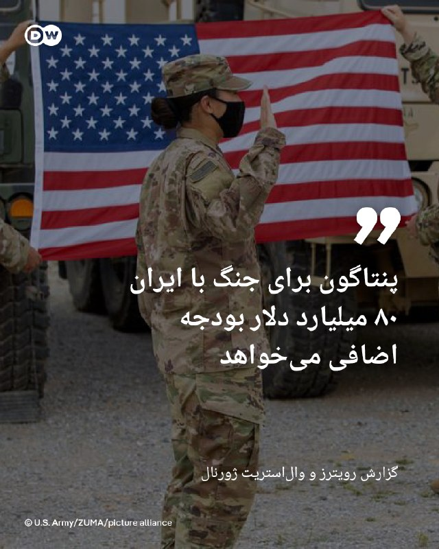

🔶رویترز: پنتاگون برای جنگ با ایران ۸۰ میلیارد دلار بودجه اضافی می‌خواهد

به گزارش رویترز و وال‌استریت ژورنال، وزارت دفاع آمریکا برای تأمین هزینه‌های جنگ با ایران و دیگر مخارج باقیمانده، به ۸۰ میلیارد دلار بودجه اضافی نیاز دارد. بر اساس این گزارش‌ها، استیون فاینبرگ، معاون وزیر دفاع آمریکا، در تماس با نمایندگان کنگره در این هفته، نیاز مالی پنتاگون را توضیح داده و احتمال دارد لایحه‌ای برای بودجه تکمیلی ظرف چند روز آینده به کنگره ارسال شود.

بر اساس گزارش رویترز، یکی از مقام‌های پنتاگون در ماه آوریل هزینه جنگ را حدود ۲۵ میلیارد دلار برآورد کرده بود. اما وال‌استریت ژورنال نوشته است این رقم تا میانه ماه مه به ۲۹ میلیارد دلار رسیده و اکنون احتمالا باز هم افزایش یافته است.

در گزارش‌ها آمده است بودجه تکمیلی احتمالی فقط به پنتاگون محدود نخواهد بود و ممکن است منابعی برای بخش کشاورزی و کمک‌های مربوط به بلایای طبیعی را نیز در بر بگیرد.

@dw_farsi

## DW_Farsi — post 126189

  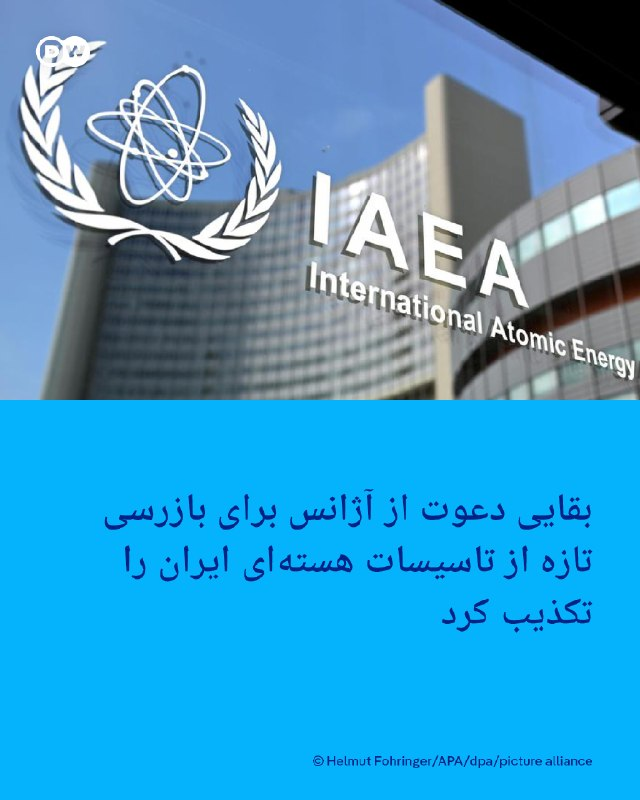

🔶بقایی دعوت از آژانس برای بازرسی تازه از تاسیسات هسته‌ای ایران را تکذیب کرد

اسماعیل بقایی، سخنگوی وزارت امور خارجه جمهوری اسلامی ایران، گزارش برخی رسانه‌ها درباره دعوت ایران از آژانس بین‌المللی انرژی اتمی برای بازرسی از تاسیسات هسته‌ای این کشور را تکذیب کرد. او با اشاره به یادداشت تفاهم خاتمه جنگ مورخ ۲۸ خرداد ۱۴۰۵ گفت بر اساس بند ۸ این سند، گفت‌وگو درباره موضوع هسته‌ای در بازه زمانی ۶۰ روزه انجام می‌شود و این روند نیز منوط به تحقق پیش‌زمینه‌های شروع مذاکرات وفق بند ۱۳ خواهد بود.

سخنگوی وزارت امور خارجه همچنین گفت بر اساس بند ۹ یادداشت تفاهم، در طول این دوره ۶۰ روزه، وضعیت فعلی برنامه هسته‌ای ایران حفظ خواهد شد.

به گفته او، بر همین اساس بازرسی از تاسیساتی مانند بوشهر که پیش‌تر نیز انجام می‌شد، ادامه پیدا می‌کند.

@dw_farsi

## Persian_Trend_Official — post 17598

  <a href="telegram/content/Persian_Trend_Official_17598_1781889961.webm" target="_blank">🎬 Download video</a>

📰 به گزارش واشنگتن پست :

👹
🫥 اطلاعات آمریکا به دولت ترامپ هشدار داده است که اسرائیل احتمالاً تلاش‌های صلح بین آمریکا و ایران را تضعیف خواهد کرد, در حالی که فشار بر دولت نتانیاهو برای ادامه تهاجم به لبنان افزایش یافته است.

👺Phantom

📌 @persian_trend_official
پرشین ترند | متفاوت‌ترین کانال نظامی

## Persian_Trend_Official — post 17597

تصاویر از حملات اوکراین به مخازن پالایشگاه نفت کاپوتنه موسکو مهار آتش از کنترل خارج شده کم‌کم‌باید منتظر اورشنیک ها باشیم. 
👺Phantom 📌 @persian_trend_official پرشین ترند | متفاوت‌ترین کانال نظامی

## Persian_Trend_Official — post 17596

  

📰۲۰ میلیون بشکه نفت ایران در یک هفته صادر شد

🔹بلومبرگ: پس از رفع محاصره دریایی آمریکا، امروز ۱۹ ژوئن، ۷ سوپرتانکر حامل حدود ۱۴ میلیون بشکه نفت خام از بندر چابهار خارج شدند.

🔹در مجموع این هفته ۱۱ تانکر حامل حدود ۲۰ میلیون بشکه نفت صادر شده که نشان‌دهنده افزایش چشمگیر عرضه ایران است.

👺Phantom

📌 @persian_trend_official
پرشین ترند | متفاوت‌ترین کانال نظامی

## Persian_Trend_Official — post 17595

  <a href="telegram/content/Persian_Trend_Official_17595_1781889962.webm" target="_blank">🎬 Download video</a>

🚨سنتکام:
بیش از ۲۰ کشتی روز گذشته با امنیت از مسیر تعیین‌شده در تنگه هرمز عبور کردند

از کشتی‌ها می‌خواهیم دستورالعمل‌های مرکز اطلاعات دریایی مشترک را رعایت کنند

## Persian_Trend_Official — post 17594

  <a href="telegram/content/Persian_Trend_Official_17594_1781889962.webm" target="_blank">🎬 Download video</a>

🚨 ارتش اسرائیل: از نیمه‌شب گذشته بیش از ۱۵۰ حملهِ هوایی به لبنان انجام دادیم

## Persian_Trend_Official — post 17593

  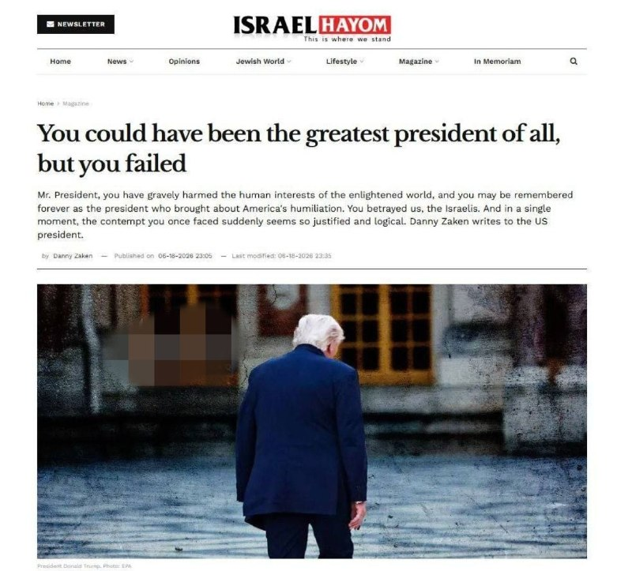

نشریه اسرائیل هیوم انتقادهای تندی علیه ترامپ مطرح کرده و او را متهم به فریب دادن اسرائیلی‌ها، آسیب زدن به منافع آمریکا و غرب و همچنین باعث تحقیر آمریکا دانسته و در ادامه گفته است که ترامپ می‌توانست بزرگ‌ترین رئیس‌جمهور تاریخ باشد اما با توافق با ایران در نهایت شکست خورد

👺Phantom

📌 @persian_trend_official
پرشین ترند | متفاوت‌ترین کانال نظامی

## Persian_Trend_Official — post 17592

  <a href="telegram/content/Persian_Trend_Official_17592_1781889964.webm" target="_blank">🎬 Download video</a>

گفتگوی تلفنی وزرای خارجه جمهوری اسلامی ایران و پاکستان

عراقچی در این تماس تلفنی از تلاش‌ها، ابتکارات و مساعی جمیله پاکستان در روند مذاکرات دیپلماتیک و رسیدن به یک یادداشت تفاهم قدردانی کرد.

عراقچی همچنین با اشاره به تعهد و مسئولیت ایالات متحده در قبال پایان دادن به جنگ در تمامی جبهه‌ها، از جمله لبنان، تأکید کرد که هرگونه نقض تعهدات مندرج در این یادداشت تفاهم متوجه آمریکا خواهد بود و نسبت به پیامدها و تبعات چنین اقدامی هشدار داد.

وزیر خارجه پاکستان نیز با استقبال از روند دیپلماتیک جاری، بر حمایت کشورش از تداوم مذاکرات و تلاش‌ها برای دستیابی به نتایج مثبت و پایدار تأکید و در خصوص موفقیت در مراحل آتی این روند ابراز امیدواری نمود.

طرفین در این گفتگو ضمن مرور و پیگیری برخی موضوعات دوجانبه، بر تداوم مشورت ها و رایزنی ها تاکید کردند.

📝 Amir

📌 @persian_trend_official
پرشین ترند | متفاوت‌ترین کانال نظامی

## Persian_Trend_Official — post 17591

منابع محلی حملات پرتعداد توپخانه‌ای ارتش اسرائیل به سمت نبطیه و روستاهای نزدیک آن را گزارش میدهند.

📝 Amir

📌 @persian_trend_official
پرشین ترند | متفاوت‌ترین کانال نظامی

## Persian_Trend_Official — post 17590

  <a href="telegram/content/Persian_Trend_Official_17590_1781889964.mp4" target="_blank">🎬 Download video</a>

خبرنگار: چه کسی در جنگ ایران پیروز شد؟

کریسترسون، نخست وزیر سوئد: هنوز برای گفتن این خیلی زود است.

📝 Amir

📌 @persian_trend_official
پرشین ترند | متفاوت‌ترین کانال نظامی

## Persian_Trend_Official — post 17589

  <a href="telegram/content/Persian_Trend_Official_17589_1781889968.webm" target="_blank">🎬 Download video</a>

به گزارش CNN، با استناد به کتاب تغییر رژیم نوشته مگی هابرمن از نیویورک تایمز و جاناتان سوان، ترامپ در ابتدا تمایلی به درگیر شدن در جنگ علیه ایران به نمایندگی از اسرائیل نداشت و در اوایل دوره دوم ریاست جمهوری خود به یکی از منتقدان اسرائیل گفته بود که نمی‌خواهد در جنگی با ایران که توسط بنیامین نتانیاهو، نخست وزیر، هدایت می‌شود، شرکت کند.

این کتاب، دیدگاه‌های ترامپ در مورد نتانیاهو را متغیر توصیف می‌کند و می‌افزاید که او به طور خصوصی رهبر اسرائیل را به یکی دیگر از مشاورانش کلاهبردار توصیف کرده است. اصطلاحی که نویسندگان آن را یکی از شدیدترین توهین‌ها در واژگان ترامپ می‌دانند.

📝 Amir

📌 @persian_trend_official
پرشین ترند | متفاوت‌ترین کانال نظامی

## Persian_Trend_Official — post 17588

وزارت بهداشت لبنان اعلام کرد که در پی حملات هوایی گسترده نیروی هوایی اسرائیل به جنوب لبنان در روز های اخیر، دست کم 47 لبنانی کشته و 97 لبنانی زخمی شده‌اند.

📝 Amir

📌 @persian_trend_official
پرشین ترند | متفاوت‌ترین کانال نظامی

## RadioFarda — post 158513

  <a href="https://t.me/radiofarda/158513" target="_blank">📎 Download file</a>

📻بشنوید: ایستگاه ۱۹ با رادیوفردا، ۲۹ خرداد ۱۴۰۵

@RadioFarda

## RadioFarda — post 158512

🔸دونالد ترامپ، رئیس‌جمهور آمریکا، در گفت‌وگو با اکسیوس گفت جنگ با ایران به او نشان داده است که «هیچ محدودیتی» برای قدرتش وجود ندارد.

🔸او در پاسخ به پرسشی درباره محدودیت‌های اختیارات رئیس‌جمهور در جریان این درگیری گفت: «هیچ محدودیتی وجود ندارد. هنوز آن درس را یاد نگرفته‌ام. می‌دانم که محدودیت‌هایی هست، اما هیچ محدودیتی وجود ندارد.»

🔸آقای ترامپ همچنین بار دیگر تکرار کرد که آمریکا ایران را «از نظر نظامی کاملاً شکست داده است.»

🔸این اظهارات در حالی مطرح می‌شود که تفاهم‌نامه اخیر میان آمریکا و ایران برای پایان دادن به جنگ، با انتقاد برخی اعضای حزب جمهوری‌خواه روبه‌رو شده است.

🔸بر اساس این گزارش، بخشی از انتقادها به گزارش‌هایی مربوط می‌شود که از احتمال آزادسازی دارایی‌های مسدودشده ایران، ایجاد یک صندوق سرمایه‌گذاری ۳۰۰ میلیارد دلاری و کاهش برخی تحریم‌ها در چارچوب این توافق خبر داده‌اند.

🔸ترامپ پیش‌تر گزارش‌ها درباره ایجاد صندوق ۳۰۰ میلیارد دلاری برای ایران را رد کرده و گفته بود ایالات متحده در چنین صندوقی سرمایه‌گذاری نخواهد کرد.

@RadioFarda

## RadioFarda — post 158511

  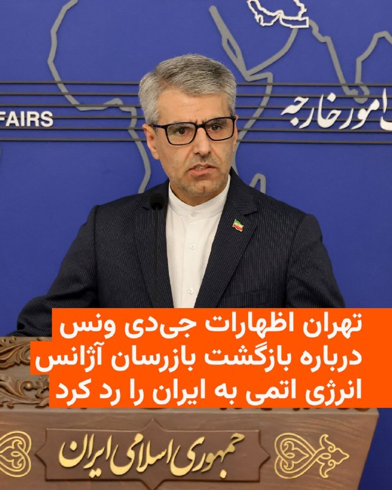

🔸اسماعیل بقائی، سخنگوی وزارت خارجه ایران، روز جمعه دعوت جمهوری اسلامی از بازرسان آژانس بین‌المللی انرژی اتمی برای حضور در ایران و انجام بازرسی از تاسیسات هسته‌ای را رد کرد.

🔸او گفت: «بازرسی از تاسیساتی که دسترسی آژانس به آنها به‌دلیل حملات نظامی متوقف گردید، منوط به روند مذاکرات و نتیجه آن خواهد بود.»

🔸پیشتر جی‌دی ونس، معاون رئیس جمهور آمریکا پس از اعلام توافق اخیر در گفت‌وگو با شبکه ان‌بی‌سی گفته بود که بر اساس تفاهم‌نامه میان واشینگتن و تهران، بازرسان آژانس بین‌المللی انرژی اتمی «قطعاً» به ایران بازخواهند گشت.

🔸اسماعیل بقائی همچنین گفت در حال برنامه‌ریزی برای برگزاری یک نشست طی روزهای آینده هستیم.

🔸نشست بین نمایندگان ایران و ایالات متحده که قرار بود جمعه در سوئیس برگزار شود، لغو شد.

🔸سخنگوی وزارت خارجه جمهوری اسلامی اعلام کرد: «با توجه به اینکه امضای متن یادداشت تفاهم در بامداد ۲۸ خرداد به صورت دیجیتالی انجام شد، برگزاری نشست مزبور در سوئیس فوریت ندارد.»

🔸او همچنین گزارش‌ها درباره بسته شدن تنگه هرمز را «بی‌اساس» دانست و گفت کشتیرانی در این مسیر در حال انجام است.

@RadioFarda

## IranianMinds — post 22966

🔴 نعیم قاسم با آتش بس با اسرائیل مخالفت کرد

@IranianMinds

## IranianMinds — post 22965

  <a href="telegram/content/IranianMinds_22965_1781889970.mp4" target="_blank">🎬 Download video</a>

🔴بدون توضیح.

@IranianMinds

## IranianMinds — post 22964

  

🔴 خبرگزاری فارس :

قالیباف مجلسو تعطیل کرده انگار اصلا نمیخواد بازش کنه چون بخاطر توافق همه ی نماینده ها میخوان ازش شکایت کنن

@IranianMinds

## IranianMinds — post 22963

  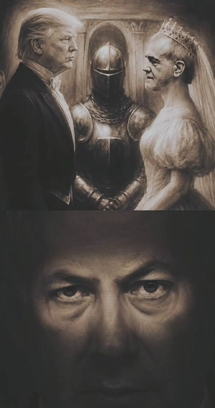

@IranianMinds

## IranianMinds — post 22962

🔴مارکو روبیو:

حکومت ایران حامی تروریست در جهان است.

@IranianMinds

## IranianMinds — post 22961

ولی چه آدمایی رفتن و چیا موندن …

## IranianMinds — post 22959

  <a href="telegram/content/IranianMinds_22959_1781889975.mp4" target="_blank">🎬 Download video</a>

آقا این هیئته یا یه چیزه دیگه ؟

@IranianMinds

## IranianMinds — post 22958

  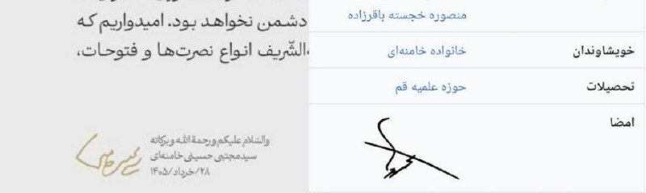

جالبه بدونید امضایی که از مجتبی خامنه ای توی برخی سایت ها ثبت شده با امضایی که روی بیانیه اش هست فرق داره.

@IranianMinds

## IranianMinds — post 22956

وضعیت هیئت های محرم :

@IranianMinds

## IranianMinds — post 22955

  <a href="telegram/content/IranianMinds_22955_1781889978.webm" target="_blank">🎬 Download video</a>

⚽ #امریکا Vs #استرالیا 
🏆
🔥

⏰ شروع ساعت  20:30

🔥20% شرط هدیه ویژه شارژ ارزهای دیجیتال

💳امکان شارژ با درگاه پرداخت

🎲 آپشن های متنوع با ضرایب بالا

🎁 10 درصد فری بت به ازای هر بار شارژ

⭐️ برداشت زیر 15 دقیقه دلاری

🔥   همراه با درگاه‌ #ریالی

1️⃣
2️⃣
3️⃣
4️⃣   
1️⃣
2️⃣
3️⃣
4️⃣

⛔در صورت فیلتر بودن از طریق VPN غیر از سرور انگلیس ( سرور 
🇺🇸 
🇩🇪 
🇨🇦
🇫🇮
🇹🇷
👇
👇 )

🇪🇺 https://trentivo6402.bar

✅کانال تلگرامی #رومابت 29
👇

🔵 @Romabet_official

## IranianMinds — post 22954

🔴 از همین الان مجدد به طور رسمی بین حزب الله و اسرائیل آتش بس برقرار شد. @IranianMinds

## BBCPersian — post 284403

🖊امیر عظیمی, سردبیر ارشد، بی‌بی‌سی فارسی

بیش از ۱۰۰ روز پس از آغاز حملات آمریکا و اسرائیل به ایران، هر دو طرف مدعی پیروزی هستند؛ نشانه‌ای از این‌که هر یک تا چه اندازه به راهی برای خروج از بحران نیاز داشتند.

تفاهمی که بین دو طرف امضا شده رسما به درگیری‌ها پایان داده است، اما مذاکرات دشوارتر تازه آغاز شده است.

هر دو طرف این توافق را در داخل کشور خود به عنوان یک پیروزی معرفی کرده‌اند، اما همان‌طور که تحلیلگران ما توضیح می‌دهند، هنوز نتوانسته‌اند افکار عمومی را به طور کامل قانع کنند و منتقدان داخلی در هر دو سو معتقدند امتیازهای بیش از اندازه‌ای داده شده است.

برای خواندن مطلب کامل 🔽
https://bbc.in/4xCXm7t
📷Iran's Presidential website/WANA via REUTERS - White House Instagram

## Dirty_Kids — post 392593

  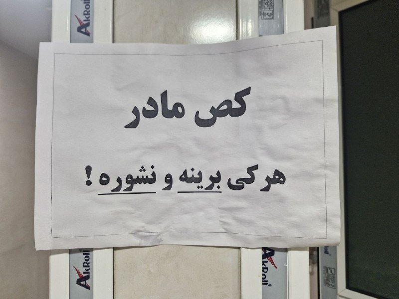

وضعیت دستشویی‌ خوابگاه علوم پزشکی اصفهان:

@Dirty_Kids 👻

## Dirty_Kids — post 392592

  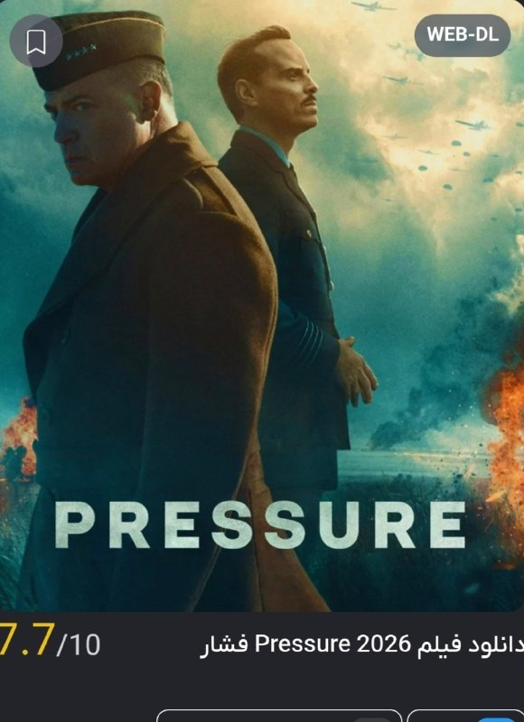

وای چ فیلمی بود😳
از زاویه به جنگ جهانی پرداخت که اصلا فکر‌
نکرده بودم
مخصوصا که بر اساس داستان واقعی هست، اصلا پشمی واسم نموند
اندرو اسکات بی نظیر بود

@Dirty_Kids 👻

## Dirty_Kids — post 392591

  <a href="telegram/content/Dirty_Kids_392591_1781889979.mp4" target="_blank">🎬 Download video</a>

🔴محمد انجوی‌نژاد، مداح حکومتی:

پیام مجتبی خامنه‌ای درباره تفاهم با آمریکا تلخ بود
آقا رو غریب و پیر زیر آوار بمباران رها کردید، این یکی رو دیگه نمی‌گذاریم...

@Dirty_Kids 👻

## Dirty_Kids — post 392590

  <a href="telegram/content/Dirty_Kids_392590_1781889982.mp4" target="_blank">🎬 Download video</a>

🔴 مملکت پر از سورپرایزه؛ 8 تا دختر اسنپ گرفتن و این شکلی خودشونو تو 206 جا دادن:

@Dirty_Kids 👻

## Dirty_Kids — post 392589

  <a href="telegram/content/Dirty_Kids_392589_1781889983.mp4" target="_blank">🎬 Download video</a>

گفتگوی شغال طرقبه و کتلت کرمان بعد از امضاء توافق با ترامپ😅

@Dirty_Kids 👻

## Dirty_Kids — post 392588

این همه بیزاری از کجا میاد؟

شما روزه اید ما نباید چیزی بخوریم
شما عزادارید ما نباید خوشحال باشیم
شما نماز می خونید ما نباید صدا بدیم
شما مسلمونید ما باید اسلام رو پاس بداریم!!!!!!

@Dirty_Kids 👻

## Dirty_Kids — post 392587

  <a href="https://t.me/Dirty_Kids/392587" target="_blank">📎 Download file</a>

ریتزوبت تنها سایت بین المللی میباشد ، که به صورت هفتگی پرومو کد دریافت میکنید ✅

♦️ آموزش شارژ حساب با کریپتو
♦️ آموزش شارژ حساب ریالی در ریتزوبت

🔵ریتزوبت برندی با لایسنس معتبر در صنعت شرطبندی و #پیشبینی مسابقات ورزشی و کازینویی 👇

https://t.me/+LB508WZyIr8xNmY0

## Dirty_Kids — post 392586

  

🔔اپلیکیشن اندروید بدون فیلتر ریتزوبت 
✅

🔹 کاملترین اپلیکیشن شرطبندی
🔹 آپشن و بونوس های متنوع
🔹 دارای مجوزهای بین‌المللی و امنیت بالا
🔹 شارژ و برداشت با روش‌های متنوع

دانلود اپلیکیشن بدون فیلتر اندروید
🎯 لینک ورود به ریتزوبت

🌐 برای تغییر زبان برنامه به فارسی
🇮🇷 ، کافی است زبان موبایل خود را روی فارسی تنظیم کنید.
G29

## Dirty_Kids — post 392585

  <a href="telegram/content/Dirty_Kids_392585_1781889987.mp4" target="_blank">🎬 Download video</a>

تو همین حین که فضاپیمای آمریکا رفت کره ماه و اومد شیر تعزیه ما واجبی زده به سر و صورتش نیو فیس شده😂

@Dirty_Kids 👻

## Dirty_Kids — post 392584

  <a href="telegram/content/Dirty_Kids_392584_1781889989.mp4" target="_blank">🎬 Download video</a>

ترامپ بعد از نشست G7 پشت سر جرجیا گفته: این زن همه ش التماس میکرد باهاش عکس بگیرم. حالا جرجیا در جوابش گفته:دروغه، شوکه شده‌‌م. نمی‌دونم چرا ترامپ با متحدانش این‌طور رفتار می‌کنه؟
ولی یک چیز رو به خاطر داشته باش: من و ایتالیا هرگز التماس نمی‌کنیم!

@Dirty_Kids 👻

## Dirty_Kids — post 392582

محرم امسال، وضعیت عجیبی داره
🍑

@Dirty_Kids 👻

## Hranews — post 113726

  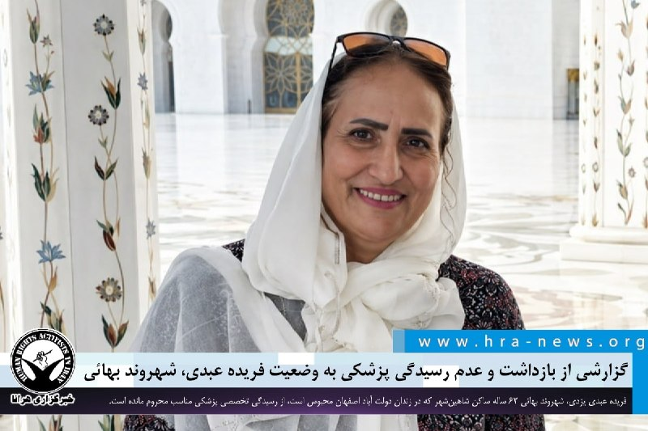

گزارشی از بازداشت و عدم رسیدگی پزشکی به وضعیت فریده عبدی، شهروند بهائی

❗️
❗️
❗️
❗️
❗️ – فریده عبدی یزدی، شهروند بهائی ۶۲ ساله ساکن شاهین‌شهر مورخ ۲۶ اردیبهشت ماه در این شهر بازداشت شده است. وی پس از بازداشت به زندان دولت آباد اصفهان منتقل شده و وضعیت پرونده او کماکان نامشخص است. همچنین این شهروند بهائی، با وجود ابتلا به بیماری‌های متعدد از جمله دیابت و کم‌کاری تیروئید از رسیدگی تخصصی پزشکی مناسب نیز محروم مانده است.

به گزارش خبرگزاری هرانا، ارگان خبری مجموعه فعالان حقوق بشر در ایران، فریده عبدی یزدی، شهروند بهائی محبوس در زندان دولت آباد اصفهان، از رسیدگی پزشکی مناسب محروم مانده است.

یک منبع مطلع نزدیک به خانواده این شهروند بهائی، ضمن تایید این خبر به هرانا گفت: فریده ۳۵ روز پیش در شاهین شهر بازداشت شده است. وی پس از بازداشت به زندان دولت آباد اصفهان منتقل شده و در این زندان نگهداری می شود. این شهروند بهائی ۶۲ ساله از بیماری‌های متعددی از جمله دیابت، کم‌کاری تیروئید و عفونت دندان رنج می‌برد. خانم عبدی نیازمند رسیدگی تخصصی پزشکی و اعزام به مراکز درمانی خارج از زندان است.
به گفته این منبع مطلع، این در حالی است که تاکنون رسیدگی مؤثر و نتیجه‌بخشی به پرونده این شهروند بهائی صورت نگرفته است. بی‌خبری از وضعیت پرونده این شهروند بازداشتی و همچنین شرایط جسمانی وی، به افزایش نگرانی‌های خانواده و بستگانش دامن زده است.

ادامه مطلب

#فریده_عبدی_یزدی

↘️
@hranews_bot تماس ✉️ -  @Hranews  کانال هرانا 🆑

## Hranews — post 113725

امروز چهارشنبه ۲۷ خردادماه، ماموران نیروی انتظامی در برخورد خشونت‌آمیز و توهین‌آمیز با شهروندان معترض ساکن روستای پشموکی از توابع شهرستان فاریاب، با استفاده از باتوم، مشت و لگد شماری از زنان را مورد ضرب‌وشتم قرار داده‌اند. در ویدیوهای منتشر شده افراد مسلح…

## alonews — post 129197

  <a href="telegram/content/alonews_129197_1781889992.webm" target="_blank">🎬 Download video</a>

👈 روزنامه اسرائیل هیوم به ترامپ: می‌توانستی بزرگترین رئیس جمهور تاریخ آمریکا باشی اما رفوزه شدی

✅ @AloNews خبر جنگ

## alonews — post 129196

  <a href="telegram/content/alonews_129196_1781889992.webm" target="_blank">🎬 Download video</a>

👈تماس تلفنی ترامپ و نتانیاهو

✅ @AloNews خبر جنگ

## alonews — post 129195

  <a href="telegram/content/alonews_129195_1781889992.webm" target="_blank">🎬 Download video</a>

👈شبکه NBC: در تماس تلفنی میان ترامپ و نتانیاهو، ترامپ بر توقف حملات اسرائیل به لبنان تاکید کرد

✅ @AloNews خبر جنگ

## alonews — post 129193

  <a href="telegram/content/alonews_129193_1781889993.webm" target="_blank">🎬 Download video</a>

👈 ان‌بی‌سی: ترامپ اوایل امروز با اسرائیل صحبت کرد و از مقامات اسرائیلی خواست که آتش‌بس با حزب‌الله را بپذیرند.

✅ @AloNews خبر جنگ

## alonews — post 129192

  <a href="telegram/content/alonews_129192_1781889993.webm" target="_blank">🎬 Download video</a>

👈حمله پهپادی نیروی هوایی اسرائیل علیه یک موتورسیکلت (حزب الله) در حال عبور از جاده‌ای بین زبدین و حروف، غرب النبطیه

✅ @AloNews خبر جنگ

## alonews — post 129189

  <a href="telegram/content/alonews_129189_1781889993.webm" target="_blank">🎬 Download video</a>

👈موج توئیتری راه افتاده که نامه دیروز مجتبی رو خودش ننوشته

✅ @AloNews خبر جنگ

## alonews — post 129188

  <a href="telegram/content/alonews_129188_1781889994.webm" target="_blank">🎬 Download video</a>

👈وزارت خارجه روسیه: با تثبیت اوضاع غرب آسیا، توصیه قبلی برای خودداری از سفر به کشورهای عرب حاشیه خلیج فارس لغو شده است

✅ @AloNews خبر جنگ

## alonews — post 129187

  <a href="telegram/content/alonews_129187_1781889994.webm" target="_blank">🎬 Download video</a>

🔴فوری/رهبر حزب الله، نعیم قاسم با آتش بس با اسرائیل مخالفت کرد 
✅ @AloNews خبر جنگ

## alonews — post 129186

  <a href="telegram/content/alonews_129186_1781889994.webm" target="_blank">🎬 Download video</a>

🔴فوری/رهبر حزب الله، نعیم قاسم با آتش بس با اسرائیل مخالفت کرد

✅ @AloNews خبر جنگ

## alonews — post 129185

  <a href="telegram/content/alonews_129185_1781889994.webm" target="_blank">🎬 Download video</a>

👈خطیب‌زاده به الجزیره گفت: بدون پایان دادن به اشغالگری و پایبندی اسرائیل به قوانین بین‌المللی، صلح و ثباتی در لبنان و منطقه برقرار نخواهد شد.

🔴 «هرگونه توافق آتی باید شامل آزادسازی تمام دارایی‌های مسدود شده ایران باشد.»

🔴 «ما پس از ۶۰ روز سازوکار جدیدی برای مدیریت تنگه هرمز اتخاذ خواهیم کرد و ابتکار ویژه‌ای را به کشورهای منطقه ارائه خواهیم داد.»

✅ @AloNews خبر جنگ

## alonews — post 129184

  <a href="telegram/content/alonews_129184_1781889995.webm" target="_blank">🎬 Download video</a>

👈خبرنگار وال استریت ژورنال: یک هواپیمای ایر فورس دو سوخت‌گیری شده در فرودگاه مریلند روی باند فرودگاه بود. میزها در یک تفرجگاه مجلل سوئیس چیده شده بودند. تدارکات آماده بود. مطبوعات در راه بودند.

🔴اما مذاکرات هسته‌ای مورد انتظار بین ایالات متحده و ایران روز جمعه برگزار نشد، که یک شکست زودهنگام برای مرحله بعدی مذاکرات هسته‌ای بود.

✅ @AloNews خبر جنگ

## alonews — post 129183

  <a href="telegram/content/alonews_129183_1781889995.webm" target="_blank">🎬 Download video</a>

👈ولادمیر زلنسکی: من به لوکاشنکو یک هفته مهلت می‌دهم تا تجهیزات نظامی را از مرز اوکراین که برای تنظیم آتش توپخانه علیه جمعیت اوکراینی استفاده می‌شود، پس بگیرد.

🔴در غیر این صورت، ما خودمان این کار را انجام خواهیم داد

✅ @AloNews خبر جنگ

## alonews — post 129182

  <a href="telegram/content/alonews_129182_1781889995.webm" target="_blank">🎬 Download video</a>

👈کیر استارمر، نخست‌وزیر بریتانیا، پس از افزایش درخواست‌ها از سوی وزرای کابینه و نمایندگان حزب کارگر برای کناره‌گیری، در حال بررسی آینده خود است، طبق گزارش تایمز.

🔴 استارمر فشارهای فزاینده را درک می‌کند و انتظار می‌رود در طول آخر هفته با همسر و خانواده‌اش گزینه‌های خود را بررسی کند و سپس تصمیم بگیرد که در سمت خود باقی بماند یا استعفا دهد

✅ @AloNews خبر جنگ

## alonews — post 129181

  <a href="telegram/content/alonews_129181_1781889996.webm" target="_blank">🎬 Download video</a>

🔴فوری / کانال ۱۲ اسرائیل: تماس بین نتانیاهو و روبیو، وزیر خارجه، به زودی، درباره لبنان

✅ @AloNews خبر جنگ

## alonews — post 129180

  <a href="telegram/content/alonews_129180_1781889996.mp4" target="_blank">🎬 Download video</a>

👈وزیر جنگ آمریکا: آنچه در هر جامعه‌ای جشن می‌گیریم، بازتابی از ارزش‌های ماست و ما زمان زیادی را صرف کلیک‌بیت و خشم‌بیت در مورد فرهنگ سلبریتی‌ها و شایعات می‌کنیم و زمان کافی را به محتوای واقعی اختصاص نمی‌دهیم

✅ @AloNews خبر جنگ

## alonews — post 129179

  <a href="telegram/content/alonews_129179_1781889999.webm" target="_blank">🎬 Download video</a>

👈نعیم قاسم، دبیرکل حزب‌الله : تلاش برای حذف حزب‌الله شکست خورده و اسرائیل بالاخره مجبور میشه از هر وجب خاکمون عقب‌نشینی کنه

✅ @AloNews خبر جنگ

## alonews — post 129178

  <a href="telegram/content/alonews_129178_1781889999.mp4" target="_blank">🎬 Download video</a>

👈 حمزه صفوی: از نگاه بین الملل در ۴۰ سال گذشته یک روز نبوده که ایران بدنبال ساخت بمب اتم نبوده باشد

🔴اگر ایران به سمت بمب اتم حرکت کند همین چین روبروی ایران خواهد ایستاد

✅ @AloNews خبر جنگ

## alonews — post 129177

  <a href="telegram/content/alonews_129177_1781890002.webm" target="_blank">🎬 Download video</a>

👈حضور هیات قطری در سوییس بدون حضور ایران و آمریکا

✅ @AloNews خبر جنگ

---
📅 بروزرسانی: 1405/03/29 18:23
---

## VahidOOnLine — post 246396

  

ارتش جمهوری اسلامی، جمعه، ۲۹ خرداد در بیانیه‌ای اعلام کرد: «دوشادوش سپاه پاسداران در صورت هرگونه بدعهدی از سوی دشمن، دست بر ماشه و گوش به فرمان رهبر، هر روز بر توان رزم خود افزوده و آماده دفاع از امنیت و منافع ملت هستیم.»

در بخشی از این بیانیه آمده است: «آمادگی نیروهای مسلح، دشمن را ناگزیر کرد تا مسیر آتش‌بس و تفاهم را در پیش بگیرد.»
‌🏁 🇬🇧 IranintlTV

🤖 @VahidOOnLine

## VahidOOnLine — post 246395

  

♦️ اسحاق دار، وزیر امور خارجه پاکستان که نقش میانجی را در مذاکرات میان تهران و واشنگتن بازی کرد، روز جمعه ۲۹ خرداد، علت لغو مذاکرات حضوری نمایندگان ایران و آمریکا در سوئیس را «مشغله برخی مسئولان به‌دلیل مراسم‌های ماه محرم» عنوان کرد. این توجیه در حالی مطرح شد که ماه محرم، از روز سه‌شنبه آغاز شده و در زمان تعیین روز جمعه به عنوان اولین نشست حضوری دو طرف نیز این همزمانی بدیهی بوده است.

از سوی دیگر، اسماعیل بقایی، سخنگوی وزارت خارجه جمهوری اسلامی، در توضیحاتی درباره لغو نشست سوئیس، تنها اعلام کرد که رایزنی‌های لازم از طریق میانجی‌ها ادامه دارد و در صورت «فراهم شدن شرایط لازم برای شروع مذاکرات» اطلاع‌رسانی انجام خواهد گرفت. بقایی همچنین اشاره کرد که پیش‌تر قرار بود مراسم رسمی امضای تفاهم‌نامه روز جمعه به‌صورت حضوری برگزار شود اما با توجه به امضای دیجیتال آن، برگزاری نشست در سوئیس «فوریت» نداشت.

بقایی به ضرورت اجرایی شدن بندهای تفاهم‌نامه از جمله بند اول که شامل توقف جنگ در لبنان می‌شود نیز اشاره کرد. این در حالی است که اسرائیل و حزب‌الله، روز جمعه حملات متقابل خود را ادامه داده‌اند.
‌🇸🇦 Indypersian

🤖 @VahidOOnLine

## VahidOOnLine — post 246394

  

اسماعیل بقائی، سخنگوی وزارت خارجه جمهوری اسلامی در گفت‌وگو با خبرنگاران، اخبار منتشره در برخی رسانه‌ها مبنی بر دعوت جمهوری اسلامی از آژانس بین‌المللی انرژی اتمی برای بازرسی از تاسیسات هسته‌ای را تکذیب کرد.

بقائی گفت که بر اساس بند ۹ یادداشت تفاهم، در طول دوره ۶۰ روزه، وضعیت فعلی برنامه هسته‌ای ایران حفظ خواهد شد و بر این اساس، بازرسی از تاسیساتی مانند بوشهر که تاکنون انجام می‌شد، ادامه می‌یابد اما بازرسی از تاسیساتی که دسترسی آژانس به آن‌ها به‌دلیل حملات نظامی آمریکا و اسرائیل متوقف شد، منوط به روند مذاکرات و نتیجه آن خواهد بود.
‌🏁 🇬🇧 IranintlTV

🤖 @VahidOOnLine

## VahidOOnLine — post 246393

عبدالمجید و رضا اسدی، عمو و برادرزاده بودند که شامگاه ۱۹ دی‌ماه ۱۴۰۴ در نورآباد ممسنی کشته شدند. ماموران آنها را درون خودرو هدف قرار دادند؛ از فاصله نزدیک به رضا شلیک کردند و مجید را با قنداق اسلحه به صورت پیاپی مورد ضرب و شتم قرار دادند.
‌🏁 🇬🇧 IranintlTV

🤖 @VahidOOnLine

## VahidOOnLine — post 246392

  <a href="telegram/content/VahidOOnLine_246392_1781880793.mp4" target="_blank">🎬 Download video</a>

⭕️مراسم یادبود و وداع با مرجان ساتراپی در گورستان پرلاشز پاریس برگزار شد

♦️مراسم یادبود مرجان ساتراپی، هنرمند ایرانی‌ـ‌فرانسوی، روز ۱۹ ژوئن ۲۰۲۶ در گورستان پرلاشز پاریس برگزار شد؛ مراسمی که با حضور مادر او، اعضای خانواده، دوستان، مقام‌های دولتی، چهره‌های برجسته هنری و سینمایی فرانسه، روزنامه‌نگاران و جمعی از علاقه‌مندانش همراه بود.

در تصاویر منتشرشده از این مراسم، حاضران هنگام خروج از سالن آشکارا احساساتی به نظر می‌رسیدند. برخی از آن‌ها عکس‌هایی از مرجان ساتراپی و همسرش، ماتیاس ریپا، را که سال گذشته درگذشت، در دست داشتند. مادر ساتراپی نیز هنگام ترک مراسم از حاضران برای حضور و همراهی‌شان تشکر کرد.

در میان مهمانان، چهره‌هایی از سینما، رسانه، ادبیات و سیاست فرانسه دیده می‌شدند؛ از جمله کاترین دنوو ، بازیگر سرشناس سینمای فرانسه؛ کیارا ماسترویانی، بازیگر فرانسوی‌ـ‌ایتالیایی و دختر کاترین دنوو و مارچلو ماسترویانی؛ شارلوت لوبون ، بازیگر، هنرمند و کارگردان کانادایی‌ـ‌فرانسوی؛ گلشیفته فراهانی، بازیگر ایرانی‌ـ‌فرانسوی؛ ژول (Jul)، خواننده و رپر فرانسوی؛ انورا مالاگری، مجری و چهره تلویزیونی فرانسه؛ تریستان بانون ، نویسنده و روزنامه‌نگار فرانسوی؛ سوفیا آرام بازیگر و روزنامه‌نگار ؛ و ژان‌پی‌یر لاوینیات روزنامه‌نگار سینمایی فرانسوی.

آلیس روفو ، وزیر مشاور فرانسه در امور وابسته به وزارت نیروهای مسلح و کهنه‌سربازان، نیز در این مراسم حاضر شد.

مرجان ساتراپی ۱۴ خرداد، در ۵۶ سالگی، درگذشت. نزدیکان او در بیانیه‌ای اعلام کردند که ساتراپی کمی بیش از یک سال پس از مرگ ماتیاس ریپا، همسر و «عشق زندگی‌اش»، «از اندوه» درگذشته است.
‌🇸🇦 Indypersian

🤖 @VahidOOnLine

## VahidOOnLine — post 246391

  <a href="telegram/content/VahidOOnLine_246391_1781880794.mp4" target="_blank">🎬 Download video</a>

یک شهروند در پیامی صوتی به ایران اینترنشنال، خطاب به دونالد ترامپ گفت: «زیرساخت‌ها را زدی و مردم را بدبخت کردی. اگر از بی‌بی حمایت کرده بودی، او جمهوری اسلامی را به زباله‌دان تاریخ فرستاده بود.»
‌🏁 🇬🇧 IranintlTV

🤖 @VahidOOnLine

## VahidOOnLine — post 246390

  

♦️ خبرگزاری «رویترز» روز جمعه ۲۹ خرداد به نقل از یک مقام ارشد اسرائیلی گزارش داد که اسرائیل و حزب‌الله در وضعیت آتش‌بس به سر می‌برند، مشروط بر اینکه حزب‌الله به اسرائیل حمله نکند. این مقام تصریح کرد: «در غیر این صورت، ما در وضعیت جنگی خواهیم بود.»

این مقام ارشد همچنین تاکید کرد که اسرائیل نیروهای خود را در جنوب لبنان، یعنی در امتداد مرزهای شمالی خود که هم‌اکنون تحت اشغال ارتش اسرائیل است، حفظ خواهد کرد.

پیش از این، یک مقام ارشد آمریکایی به رویترز اعلام کرده بود که اسرائیل و حزب‌الله بر سر یک آتش‌بس توافق کرده‌اند که قرار است از ساعت ۴ بعدازظهر روز جمعه به وقت محلی آغاز شود.
‌🇸🇦 Indypersian

🤖 @VahidOOnLine

## VahidOOnLine — post 246389

  

خبرگزاری تسنیم، وابسته به سپاه پاسداران، با اشاره به ادامه حملات ارتش اسرائیل به جنوب لبنان، نوشت: «هر دقیقه باز بودن تنگه هرمز خسارت مهمی است؛ اگر آمریکا فشار انرژی را از روی خود تخلیه کند، وقیح‌تر و تهاجمی‌تر هم خواهد شد.»

این رسانه وابسته به سپاه در ادامه خطاب به مقام‌های جمهوری اسلامی نوشت: «تنگه را ببندید و آمریکا را در همین گام اول مهار کنید.»

تشنیم افزود: «آیا نباید مسولان فی‌الفور به اجرای تفاهمنامه پایان دهند و تنگه هرمز را مسدود کنند؟ آیا نباید پاسخ قدرتمندی به آمریکا و اسرائیل داده شود تا محاسباتشان بیش از این به ضرر جمهوری اسلامی و مقاومت نشود؟»
‌🏁 🇬🇧 IranintlTV

🤖 @VahidOOnLine

## VahidOOnLine — post 246388

  

بانک مرکزی جمهوری اسلامی اعلام کرد که اختلال در خدمات بانک‌های ملی، صادرات، تجارت و توسعه صادرات در پی حمله سایبری به زیرساخت‌های ارتباطی این بانک‌ها رخ داده است و خدمات پایه مبتنی بر کارت با استفاده از روش‌های جایگزین دوباره در دسترس مشتریان قرار گرفته است.

بر اساس گزارش بانک مرکزی جمهوری اسلامی، هیچ آسیبی به اطلاعات مشتریان وارد نشده و سامانه‌های شتاب و شاپرک بدون اختلال فعال هستند.

این نهاد گزارش‌ها درباره ایجاد اختلال در سامانه‌های بانکی برای کنترل بازار ارز و طلا را رد کرد.
‌🏁 🇬🇧 IranintlTV

🤖 @VahidOOnLine

## VahidOOnLine — post 246387

  

♦️ عباس عراقچی، وزیر امور خارجه جمهوری اسلامی، با بازنشر اظهارات تند ایتامار بن‌گویر، وزیر امنیت داخلی اسرائیل در شبکه اجتماعی ایکس، به مواضع او حمله کرد. عراقچی نوشت: «این‌ها رجزخوانی یک دیوانه بی‌نام‌ونشان نیست، بلکه گفته‌های علنی یک وزیر اسرائیل است. فرقه مرگ نسل‌کشی که مقر آن در تل‌آویو است، تهدیدی برای بشریت بوده و تنها هدفش جنگ دائمی است.»

این واکنش پس از آن صورت گرفت که بن‌گویر با انتقاد از رویکرد واشنگتن نوشت: «با تمام احترام برای آمریکایی‌ها، اسرائیل باید شفاف کند که خون فرزندان ما پایمال نمی‌شود؛ تمام لبنان باید بسوزد.» او با رد سیاست خویشتن‌داری افزود: «به نخست‌وزیر هم گفته‌ام که به ازای هر قطره اشک یک مادر اسرائیلی، باید هزار مادر لبنانی بگریند. در خاورمیانه با پاسخ‌های سنجیده پیروز نمی‌شوید، بلکه باید دیوانه‌وار عمل کرد، نابود کرد و ترور را در هم کوبید.»
‌🇸🇦 Indypersian

🤖 @VahidOOnLine

## VahidOOnLine — post 246386

  

سخنگوی ارتش اسرائیل در کنفرانس خبری اعلام کرد: «از شب گذشته تاکنون به بیش از ۱۰۰ هدف حزب‌الله حمله کرده‌ایم و این حملات را تا هر زمان که لازم باشد، ادامه خواهیم داد.»

او افزود: «در منطقه بفور، یک زیرساخت راهبردی زیرزمینی وجود دارد. در هر یک از محورهایی که در آن فعالیت می‌کنیم، مقادیر زیادی سلاح و تجهیزات جنگی کشف و خارج می‌کنیم. این زیرساخت‌های مهم طی سال‌ها با کمک و هدایت جمهوری اسلامی ساخته شده‌اند.»

سخنگوی ارتش اسرائیل ادامه داد: «حزب‌الله در حال جنگ است تا مانع تکمیل روند نابودی زیرساخت‌های خود شود. این حزب‌الله بود که آتش‌بس را نقض کرد. نیروهای حاضر در میدان از آزادی عمل عملیاتی کامل برخوردار هستند. دستورالعمل‌های رییس ستاد ارتش برای جبهه شمالی تغییری نکرده است.»

او افزود: «هر آنچه مربوط به توافق‌هاست، در سطح تصمیم‌گیری سیاسی است. این موضوع در سطح رهبری سیاسی تعیین می‌شود و ما طبق دستورات عمل می‌کنیم. تا زمانی که دستورات دیگری دریافت نکنیم، طبق دستورالعمل‌هایی که رییس ستاد کل ارتش به نیروهای میدانی ابلاغ کرده، به فعالیت ادامه خواهیم داد.»
‌🏁 🇬🇧 IranintlTV

🤖 @VahidOOnLine

## VahidOOnLine — post 246385

♦️جورجیا ملونی، نخست‌وزیر ایتالیا، در واکنش به اظهارات اخیر دونالد ترامپ، رئیس‌جمهوری آمریکا، این سخنان را «کاملاً ساختگی» خواند و گفت از نحوه رفتار او با متحدان «مبهوت و شگفت‌زده» شده است.
او تاکید کرد: «نمی‌دانم چرا رئیس‌جمهور ایالات متحده این‌گونه با متحدان خود رفتار می‌کند» و افزود این نخستین‌بار نیست که چنین مواضعی از سوی ترامپ مطرح می‌شود. ملونی همچنین این رویکرد را «مایه تاسف» دانست و گفت او قاطعیتی را که در برابر دشمنان غرب نشان نمی‌دهد، در قبال برخی رهبران متحد خود به کار می‌گیرد.
نخست‌وزیر ایتالیا در پایان تأکید کرد: «یک چیز را باید به خاطر بسپارد؛ من و ایتالیا هرگز التماس نمی‌کنیم.»

در ادامه این تنش‌ها، آنتونیو تایانی، وزیر امور خارجه ایتالیا، نیز اعلام کرد سفر برنامه‌ریزی‌شده خود به آمریکا را لغو کرده و این اظهارات را «توهین به مردم ایتالیا» خواند.
‌🇸🇦 Indypersian

🤖 @VahidOOnLine

## VahidOOnLine — post 246384

  

رسول فلاحتی، امام جمعه رشت در خطبه‌های نماز جمعه این شهر گفت: «اسرائیل بداند که اگر بعد از عدم حمایت آمریکا، دست از پا خطا کند، کل تل‌آویو و حیفا با خاک یکسان خواهد شد. ما از ۳۰ درصد توان نظامی خود استفاده کرده‌ایم و نیروهای مسلح ما اعم از سپاه و ارتش، از همه زمان‌های گذشته قوی‌تر شده‌اند.»

او ادامه داد: «مسعود پزشکیان تعهد کرده که حقوق ملت ایران و جبهه مقاومت حفظ شود و از حزب‌الله، انصارالله، حشد الشعبی و حماس حمایت کنیم.»
‌🏁 🇬🇧 IranintlTV

🤖 @VahidOOnLine

## VahidOOnLine — post 246383

  

♦️ شهباز شریف، نخست‌وزیر پاکستان، روز جمعه ۲۹ خرداد در صحن مجلس این کشور اعلام کرد که در راس هیئتی بلندپایه برای شرکت در مراسم تشییع علی خامنه‌ای، رهبر پیشین جمهوری اسلامی به ایران سفر خواهد کرد.

شریف اعلام کرد که برای شرکت در این مراسم از او دعوت به‌عمل آمده است.
‌🇸🇦 Indypersian

🤖 @VahidOOnLine

## VahidOOnLine — post 246382

  

ابراهیم رضایی، سخنگوی کمیسیون امنیت ملی مجلس، در شبکه ایکس نوشت که با توجه به پیام «رهبر» که به «جبهه مقاومت» اشاره داشت، دولت باید از همین الان و از لبنان شروع کند و نگذاریم مردم مقاوم جنوب لبنان «قتل‌عام» شوند.

پیش‌تر مجتبی خامنه‌ای در پیامی مکتوب، اعلام کرد که درباره تفاهم جمهوری اسلامی و آمریکا «من نظر دیگری داشتم»، اما با «قبول مسئولیت» از سوی مسعود پزشکیان، اجازه اجرای آن را صادر کرده است.
‌🏁 🇬🇧 IranintlTV

🤖 @VahidOOnLine

## VahidOOnLine — post 246381

  

محمدمنان رییسی، نماینده مجلس جمهوری اسلامی، در واکنش به پیام مجتبی خامنه‌ای درباره یادداشت تفاهم میان جمهوری اسلامی و آمریکا، در پیامی در شبکه اجتماعی ایکس خواستار بازگشایی مجلس شد.

او نوشت: «خوش‌انصاف‌ها مجلس را باز کنید، رهبرم تنها مانده است.»

حسینعلی شهریاری، رییس کمیسیون بهداشت و درمان مجلس، نیز با اشاره به تعطیلی مجلس از روند بررسی تفاهم‌نامه انتقاد کرد.

شهریاری جمعه ۲۹ خرداد گفت: «مجلس را بستند تا هر آنچه خواستند امضا کنند.» او پیش‌تر نیز تاکید کرده بود که هرگونه توافق نهایی با آمریکا باید به تصویب مجلس برسد و نباید تجربه تصویب شتاب‌زده برجام تکرار شود.
‌🏁 🇬🇧 IranintlTV

🤖 @VahidOOnLine

## VahidOOnLine — post 246380

  

احمد علم‌الهدی، امام جمعه مشهد گفت: «ما در خط فوران خون امام شهید خود با دشمن آمریکایی می‌جنگیم و مبارزه می‌کنیم و ما به هیچ قیمت و مصلحت اندیشی شعار مرگ بر آمریکا را از زبان نخواهیم انداخت و این مبارزه ادامه دارد.»

او ادامه داد: «باید مشخص شود تکلیف خونخواهی رهبر ما چه می‌شود؟»

علم‌الهدی افزود: «اگر همه خسارت‌ها قابل جبران باشد، هیچ سرمایه‌ای بالاتر از از دست دادن امام شهید ما نیست، پس برادران و خواهران انتقام به جای خود باقی است، جنگ تمام شد اما مبارزه تمام نشده است.»
‌🏁 🇬🇧 IranintlTV

🤖 @VahidOOnLine

## VahidOOnLine — post 246379

  

خبرگزاری تسنیم، وابسته به سپاه پاسداران، خواستار ادامه بسته ماندن تنگه هرمز تا زمان توقف حملات اسرائیل و عقب‌نشینی کامل این کشور از خاک لبنان شد.

این رسانه همچنین خواستار لغو همه مذاکرات آتی شد و نوشت ادامه حملات اسرائیل به لبنان و باقی ماندن نیروهای اسرائیلی در جنوب لبنان، به معنای نقض بند نخست تفاهم‌نامه میان جمهوری اسلامی و آمریکا است.

این خبرگزاری افزود اگر جمهوری اسلامی پیش از اجرای تعهدات آمریکا و توقف حملات اسرائیل، تنگه هرمز را باز کند، بخشی از اهرم‌های فشار خود را از دست خواهد داد.

تسنیم همچنین گزارش‌های منتشرشده درباره باز بودن تنگه هرمز را «غیرقابل قبول» خواند و نوشت این موضوع با وعده‌های مقام‌های دولتی و تیم مذاکره‌کننده جمهوری اسلامی همخوانی ندارد.
‌🏁 🇬🇧 IranintlTV

🤖 @VahidOOnLine

## VahidOOnLine — post 246378

  

♦️ دونالد ترامپ، رئیس‌جمهوری آمریکا، روز جمعه ۲۹ خرداد در پیامی کوتاه در شبکه اجتماعی تروث سوشال نوشت: «ما از روی استیصال دیدار نکردیم، ایران کرد. کار آن‌ها تمام است! ما این ۶۰ روز را بازی خواهیم کرد [روند آن را طی می‌کنیم]. آن‌ها هیچ پولی دریافت نمی‌کنند، حتی ده سنت!»

این پیام به نظر می‌رسد واکنشی به پیام روز گذشته مجتبی خامنه‌ای، رهبر جدید جمهوری اسلامی باشد که گفته بود: «در مسیر رسیدن به این مرحله [امضای تفاهم‌نامه]، مسئولین امر، از سر دلسوزی و با حُسن نظر، تلاش‌های زیادی را به‌عمل آوردند و البته این رئیس‌جمهور آمریکا بود که از روی استیصال، از انواع اهرم‌ها برای این امر استفاده می‌کرد.»
‌🇸🇦 Indypersian

🤖 @VahidOOnLine

## VahidOOnLine — post 246377

  <a href="telegram/content/VahidOOnLine_246377_1781880803.mp4" target="_blank">🎬 Download video</a>

یک شهروند در ویدیوی ارسالی خود به ایران اینترنشنال، ضمن اشاره به گرانی مواد غذایی و مشکل بیکاری، از عملکرد دونالد ترامپ در برابر جمهوری اسلامی انتقاد کرد.
‌🏁 🇬🇧 IranintlTV

🤖 @VahidOOnLine

## WithYashar — post 15340

خبرگزاری تسنیم:
هر دقیقه باز بودن تنگه هرمز خسارت مهمیه؛ اگر آمریکا فشار انرژی رو از روی خودش تخلیه کنه، وقیح‌تر و تهاجمی‌تر هم خواهد شد.
@withyashar

## WithYashar — post 15339

حمزه صفوی، فرزند مشاور عالی رهبری افشا کرد:

یک روز در چهل سال گذشته نبوده که ایران سودای ساخت بمب اتم نداشته باشد
تمام اسناد IAEA، تورقوزآباد و آماد نشان می‌دهد که حکومت تمام تلاش خود را کرده اما همهٔ اینها در بزنگاه‌های تاریخی لو رفته‌ است.
کرهٔ شمالی وقتی در دههٔ ۱۹۹۰ با آمریکا مذاکره هسته‌ای داشت، در دو سایت دیگر خود پروژهٔ پیش‌برندهٔ بمب اتمی را داشته و لو نرفته اما دو سایت فوردو و نطنز را ما اعلام نکردیم بلکه لو رفتند.
برنامه هسته‌ای ایران، گران‌ترین برنامه هسته‌ای جهان، نه برق آورد، نه بمب، نه امنیت
@withyashar

## WithYashar — post 15338

سخنگوی وزارت خارجه: برگزاری نشست سوئیس فوریت ندارد

یکی از اهداف اصلی نشست سوئیس در روز جمعه، امضای متن تفاهم خاتمه جنگ تحمیلی بود و قرار بود در حاشیه مراسم امضا راجع به ترتیبات مربوط به مذاکرات توافق نهایی هم تبادل نظر شود.

با توجه به اینکه امضای متن یادداشت تفاهم، در بامداد ۲۸ خرداد به صورت دیجیتالی انجام شد، برگزاری نشست مزبور در سوئیس فوریت ندارد اما درحال برنامه‌ریزی برای برگزاری یک نشست طی روزهای آینده هستیم.
@withyashar

## WithYashar — post 15337

از زمان آغاز آتش‌بس، نیروی هوایی اسرائیل بیش از ۱۱ حمله هوایی در سراسر جنوب لبنان انجام داده است.
@withyashar

## WithYashar — post 15336

یک مقام ارشد در کاخ سفید به آکسیوس:
«نتانیاهو با تمدید آتش‌بس در لبنان صد درصد موافقت کرده است.»
@withyashar

## WithYashar — post 15335

حزب‌الله: هنوز هیچ اطلاعیه‌ای درباره زمان آتش‌بس دریافت نشده است
@withyashar

## WithYashar — post 15334

کانال ۱۲ به نقل از یک مقام ارشد اسرائیلی: آتش‌بس به ما این امکان را می‌دهد که به تخریب زیرساخت‌ها و اقدام علیه تهدیدها ادامه دهیم.
@withyashar

## WithYashar — post 15333

خبرنگار المیادین در جنوب لبنان: همزمان با اجرایی شدن آتش‌بس ، حملهٔ هوایی اسرائیل به النبطیه صورت گرفت.
@withyashar

## WithYashar — post 15332

باراک راوید از آکسیوس: یک مقام ارشد آمریکایی به من می‌گوید

اسرائیل و حزب‌الله بر سر آتش‌بس مجدد در لبنان از ساعت ۴ بعد از ظهر امروز به وقت محلی توافق کرده‌اند. این توافق جدید با میانجیگری آمریکا و قطر و پس از مذاکرات با اسرائیل و ایران حاصل شده است.
@withyashar

## WithYashar — post 15331

گزارش ها مبنی بر آتش‌بس بین اسرائیل و حزب‌الله هم اکنون به اجرا درآمده است
@withyashar

## WithYashar — post 15330

  

رویترز به نقل از یک مقام آمریکایی ادعا کرد:
«حزب‌الله و اسرائیل با آتش‌بس موافقت کرده‌اند» و افزود که مذاکره‌کنندگان از آمریکا و قطر با حمایت ایران به توافق کمک کردند.
@withyashar

## WithYashar — post 15329

  

ترامپ در‌ تروث : ما از روی استیصال نرفتیم سراغ مذاکره
این ایران بود که بهش نیاز داشت، کارشون تمومه!
همون ۶۰ روزی که گفته بودیم رو جلو می‌بریم، هیچ پولی هم گیرشون نمیاد
@withyashar

## WithYashar — post 15328

  

‏ترامپ در‌تروث : جنگ ایران را تضعیف کرده و دیگر نیروی هوایی، نیروی دریایی، پدافند هوایی، رادار یا تقریبا هیچ‌چیز دیگری ندارد؛ با این حال دموکرات‌ها می‌گویند ایران اکنون نسبت به چهار ماه پیش در وضعیت بهتری قرار دارد. باور می‌کنید بتوان چنین حرفی زد؟ بعضی افراد چقدر می‌توانند احمق باشند؟
@withyashar

## WithYashar — post 15327

سنتكام: جنگنده‌های اف-۱۶ به گشت‌زنی‌های خود در خاورمیانه ادامه می‌دهند و آماده مداخله هستند.🚨
@withyashar

## WithYashar — post 15326

طالبان استفاده از گوشی‌های هوشمند رو برای تمامی کارکنان نظامی و غیرنظامی خودشون ممنوع کرد!
@withyashar

## mwarmonitor — post 11220

🔴خبرنگار الجزیره: حملات هوایی اسرائیل به مناطقی در استان نبطیه در جنوب لبنان.

@mwarmonitor

## mwarmonitor — post 11219

🔴 خبرنگار الجزیره: چهارمین حمله هوایی اسرائیل در اطراف شهرک کفر تبنیت در جنوب لبنان.

@mwarmonitor

## mwarmonitor — post 11218

  <a href="telegram/content/mwarmonitor_11218_1781880807.mp4" target="_blank">🎬 Download video</a>

📌سخنگوی ارتش اسرائیل
🔸حزب‌الله آتش‌بس را نقض کرد و تلاش کرد مانع از تکمیل عملیات ما برای نابودی توانمندی‌هایی شود که طی سال‌ها ساخته است، و ما با قدرت به آن پاسخ دادیم.

🔸در ساعات شب گذشته تا این لحظه، ارتش اسرائیل بیش از ۱۰۰ هدف متعلق به حزب‌الله را در مناطق مختلف لبنان از جمله بقاع و النبطیه هدف قرار داده است. ارتش اسرائیل در این حملات ده‌ها «تروریست» را از بین برده است.

🔸نیروهای ارتش اسرائیل از آزادی کامل عملیاتی برای رفع تهدیدها در هر منطقه برخوردارند. رئیس ستاد کل دستور داده است که همه توانمندی‌ها در اختیار نیروهای میدانی قرار گیرد. ما اجازه نخواهیم داد هیچ‌کس ما را تهدید کند.

@mwarmonitor

## mwarmonitor — post 11217

🔴خبرنگار الجزیره: حمله هوایی اسرائیل به شهرک النبطیه الفوقا و گلوله‌باران توپخانه‌ای بر جبل الرفیع در منطقه اقلیم التفاح در جنوب لبنان.

@mwarmonitor

## mwarmonitor — post 11216

🔴رویترز به نقل از یک مقام آمریکایی: اسرائیل و حزب‌الله بر سر آتش‌بس از ساعت ۴ بعدازظهر به وقت محلی توافق کرده‌اند. @mwarmonitor

## mwarmonitor — post 11215

فکر کنم پنجمین آتش بس در یک ماه گذشته

## mwarmonitor — post 11214

🔴رویترز به نقل از یک مقام آمریکایی: اسرائیل و حزب‌الله بر سر آتش‌بس از ساعت ۴ بعدازظهر به وقت محلی توافق کرده‌اند. @mwarmonitor

## mwarmonitor — post 11213

  

🔴ما از روی ناچاری و استیصال دیدار نکردیم، ایران این کار را کرد. کار آن‌ها تمامه! ما این ۶۰ روز را تا آخر بازی می‌کنیم . آن‌ها هیچ پولی دریافت نخواهند کرد، حتی ده سنت!

جنگ، ایران را تضعیف کرده است! آن‌ها دیگر نه نیروی هوایی دارند، نه نیروی دریایی، نه تجهیزات ضدهوایی، نه رادار و نه عملاً هیچ چیز دیگری؛ و با این حال دموکرات‌های احمق (Dumocrats) می‌گویند اوضاع ایران اکنون بهتر از چهار ماه پیش است. می‌توانید تصور کنید که چطور چنین حرف مفتی می‌زنند؟؟؟ برخی افراد چقدر می‌توانند احمق باشند؟؟؟

رئیس‌جمهور دونالد جی ترامپ

@mwarmonitor

## mwarmonitor — post 11212

🔴رویترز به نقل از یک مقام آمریکایی: اسرائیل و حزب‌الله بر سر آتش‌بس از ساعت ۴ بعدازظهر به وقت محلی توافق کرده‌اند.

@mwarmonitor

## mwarmonitor — post 11211

🔴ایتامار بن‌گویر، وزیر امنیت ملی اسرائیل، خواستار تشدید گسترده تنش‌ها در لبنان شد و گفت: «به ازای هر اشکِ یک مادر اسرائیلی، باید هزار مادر لبنانی گریه کنند. تمام لبنان باید بسوزد.» بن‌گویر از اسرائیل خواست فشارهای خارجی، از جمله فشار آمریکا، را نادیده بگیرد…

## mwarmonitor — post 11210

  <a href="telegram/content/mwarmonitor_11210_1781880810.mp4" target="_blank">🎬 Download video</a>

✈️جت‌های جنگنده F-16 نیروی هوایی آمریکا در حال دریافت سوخت‌گیری هوایی هنگام انجام گشت‌زنی بر فراز خاورمیانه هستند. نیروهای آمریکایی در منطقه همچنان حضور دارند و در حالت آماده‌باش و هوشیاری باقی مانده‌اند.

@mwarmonitor

## mwarmonitor — post 11209

🔴 خبرنگار الجزیره: حمله هوایی اسرائیل به اطراف النبطیه در جنوب لبنان

@mwarmonitor

## FoxNewsTwitter — post 343170

  <a href="telegram/content/FoxNewsTwitter_343170_1781880812.mp4" target="_blank">🎬 Download video</a>

Fox News (Twitter/X)

A ceasefire is now in effect in southern Lebanon after weeks of escalating violence and the overnight reporting of four Israeli soldiers being killed.

The agreement was reportedly brokered by Qatar, the United States, and with help from Iran.

President Trump and the White House also sending a message to Israel, warning that the country needs to moderate its response to Lebanon, @Max_Gorden reports.

## FoxNewsTwitter — post 343169

Fox News (Twitter/X)

BREAKING: Israel, Hezbollah agree to ceasefire starting on Friday, a US senior official says

## FoxNewsTwitter — post 343168

‌Fox News (Twitter/X)

Harry Styles is one of the biggest musicians in the world, and he’s slated to put on a 30-show residency in Madison Square Garden starting this summer.

Many fans are now asking who will perform at Harry Styles’ MSG residency?

Our sponsor Kalshi’s prediction market shows:

— Elton John: 22%
— Paul McCartney: 22%
— Louis Tomlinson: 16%

https://www.foxnews.com/entertainment/olivia-wilde-breaks-silence-harry-styles-fans-brutal-reaction-10-year-age-gap-romance

## FoxNewsTwitter — post 343167

  <a href="telegram/content/FoxNewsTwitter_343167_1781880814.mp4" target="_blank">🎬 Download video</a>

Fox News (Twitter/X)

“There’s no real satisfaction in getting a medal when I've lost so much.”

Major James Capers Jr. shares his complex emotions about receiving the Medal of Honor from President Trump.

He reflects on fallen comrades and personal tragedies, including the loss of his son and wife, expressing that no award can replace what he's lost. | @foxandfriends @ainsleyearhardt

## FoxNewsTwitter — post 343166

  

Fox News (Twitter/X)

“How stupid can some people be???”

President Trump is pushing back on Democrats for criticizing his new Iran deal and saying the Islamic Republic is better off now than it was before the war.

## FoxNewsTwitter — post 343165

  

Fox News (Twitter/X)

"Thank you, President Trump."

Tulsi Gabbard says she just walked out of the Office of the Director of National Intelligence headquarters for the final time, marking her last day in the role.

"I remain grateful for the profound honor of serving the American people and our nation as the Director of National Intelligence."

After serving over a year at the helm of the intelligence community, Gabbard is closing out her tenure with a message of gratitude and thanks to President Trump.

## pm_afshaa — post 94401

  <a href="telegram/content/pm_afshaa_94401_1781880818.webm" target="_blank">🎬 Download video</a>

🔴محمدمنان رییسی، نماینده مجلس: خوش‌انصاف‌ها مجلس رو باز کنید، رهبرم تنها مونده. 
💧 Rainbet.com the #1 Non-KYC Crypto Casino & Sportsbook @rainbetcom 
😁 @Pm_Afshaa

## pm_afshaa — post 94400

  <a href="telegram/content/pm_afshaa_94400_1781880818.webm" target="_blank">🎬 Download video</a>

🔴محمدمنان رییسی، نماینده مجلس:
خوش‌انصاف‌ها مجلس رو باز کنید، رهبرم تنها مونده.

💧 Rainbet.com the #1 Non-KYC Crypto Casino & Sportsbook @rainbetcom

😁 @Pm_Afshaa

## pm_afshaa — post 94399

  <a href="telegram/content/pm_afshaa_94399_1781880819.webm" target="_blank">🎬 Download video</a>

🔴کانال 12 اسرائیل:
نتانیاهو با مسئله لبنان سعی در خراب کردن تفاهم نامه بین آمریکا و ایران داره.

💧 Rainbet.com the #1 Non-KYC Crypto Casino & Sportsbook @rainbetcom

😁 @Pm_Afshaa

## pm_afshaa — post 94398

  <a href="telegram/content/pm_afshaa_94398_1781880819.webm" target="_blank">🎬 Download video</a>

🔴خبرگزاری تسنیم:
هر دقیقه باز بودن تنگه هرمز خسارت مهمیه؛ اگر آمریکا فشار انرژی رو از روی خودش تخلیه کنه، وقیح‌تر و تهاجمی‌تر هم خواهد شد.

💧 Rainbet.com the #1 Non-KYC Crypto Casino & Sportsbook @rainbetcom

😁 @Pm_Afshaa

## pm_afshaa — post 94397

  <a href="telegram/content/pm_afshaa_94397_1781880820.webm" target="_blank">🎬 Download video</a>

🔴ارتش اسرائیل:
بیش از 150 حمله از دیشب تا الان به جنوب لبنان صورت گرفته است!

💧 Rainbet.com the #1 Non-KYC Crypto Casino & Sportsbook @rainbetcom

😁 @Pm_Afshaa

## pm_afshaa — post 94396

  <a href="telegram/content/pm_afshaa_94396_1781880820.webm" target="_blank">🎬 Download video</a>

🔴خبرنگار المیادین در جنوب لبنان:
همزمان با اجرایی شدن آتش‌بس ادعایی، حملهٔ هوایی اسرائیل به النبطیه صورت گرفت.

💧 Rainbet.com the #1 Non-KYC Crypto Casino & Sportsbook @rainbetcom

😁 @Pm_Afshaa

## pm_afshaa — post 94395

  <a href="telegram/content/pm_afshaa_94395_1781880821.webm" target="_blank">🎬 Download video</a>

🔴خبرنگار الجزیره:
چهارمین حمله هوایی اسرائیل در اطراف شهرک کفر تبنیت در جنوب لبنان.

💧 Rainbet.com the #1 Non-KYC Crypto Casino & Sportsbook @rainbetcom

😁 @Pm_Afshaa

## pm_afshaa — post 94394

  <a href="telegram/content/pm_afshaa_94394_1781880821.webm" target="_blank">🎬 Download video</a>

🔴رویترز به نقل از یک مقام آمریکایی: اسرائیل و حزب‌الله بر سر آتش‌بس از ساعت 4 بعدازظهر به وقت محلی توافق کردن. 
💧 Rainbet.com the #1 Non-KYC Crypto Casino & Sportsbook @rainbetcom 
😁 @Pm_Afshaa

## pm_afshaa — post 94393

  <a href="telegram/content/pm_afshaa_94393_1781880822.webm" target="_blank">🎬 Download video</a>

🔴رویترز به نقل از یک مقام آمریکایی:
اسرائیل و حزب‌الله بر سر آتش‌بس از ساعت 4 بعدازظهر به وقت محلی توافق کردن.

💧 Rainbet.com the #1 Non-KYC Crypto Casino & Sportsbook @rainbetcom

😁 @Pm_Afshaa

## pm_afshaa — post 94392

  <a href="telegram/content/pm_afshaa_94392_1781880822.webm" target="_blank">🎬 Download video</a>

‏
🔴دونالد ترامپ: جنگ ایران رو تضعیف کرده و دیگر نیروی هوایی، نیروی دریایی، پدافند هوایی، رادار یا تقریبا هیچ‌چیز دیگری نداره؛ با این حال دموکرات‌ها میگن ایران الان نسبت به چهار ماه پیش در وضعیت بهتری قرار داره. باور می‌کنید بتوان چنین حرفی زد؟ بعضی افراد چقدر میتونن احمق باشن؟

💧 Rainbet.com the #1 Non-KYC Crypto Casino & Sportsbook @rainbetcom

😁 @Pm_Afshaa

## pm_afshaa — post 94391

  <a href="telegram/content/pm_afshaa_94391_1781880823.webm" target="_blank">🎬 Download video</a>

🔴تسنیم: تنگه هرمز رو تا زمان پایان حملات به لبنان ببندید!

💧 Rainbet.com the #1 Non-KYC Crypto Casino & Sportsbook @rainbetcom

😁 @Pm_Afshaa

## pm_afshaa — post 94390

  <a href="telegram/content/pm_afshaa_94390_1781880823.webm" target="_blank">🎬 Download video</a>

🔴ترامپ: ما از روی ناچاری ملاقات (امضای تفاهم‌نامه) نکردیم، ایران این کار رو انجام داد. کار اونا تمومه. ما 60 روز رو بازی می‌کنیم. اونا هیچ پولی دریافت نمی‌کنن، حتی 10 سنت!

💧 Rainbet.com the #1 Non-KYC Crypto Casino & Sportsbook @rainbetcom

😁 @Pm_Afshaa

## pm_afshaa — post 94389

  <a href="telegram/content/pm_afshaa_94389_1781880824.webm" target="_blank">🎬 Download video</a>

🔴سی‌ان‌ان: آمریکا به جمهوری اسلامی پیام داده که اسرائیل پس از حملات اخیر در واکنش به حمله حزب‌الله که به کشته شدن 4 سرباز اسرائیلی منجر شد، فعلا با عدم تشدید بیشتر حملات در لبنان موافقت کرده.

این پیام در حالی منتقل شده که دولت ترامپ تلاش داره مذاکرات هسته‌ای متوقف‌شده با تهران رو دوباره به مسیر اصلی برگردونه.

💧 Rainbet.com the #1 Non-KYC Crypto Casino & Sportsbook @rainbetcom

😁 @Pm_Afshaa

## DEJradio — post 5827

  <a href="telegram/content/DEJradio_5827_1781880824.webm" target="_blank">🎬 Download video</a>

🔺📢 دونالد ترامپ: جمهوری اسلامی از سر استیصال مجبور به مذاکره شد

‏دونالد ترامپ، رییس‌جمهوری آمریکا، جمعه ۲۹ خرداد در پیامی در تروت سوشال نوشت که جمهوری اسلامی از موضع ضعف وارد مذاکره با آمریکا شده است. ترامپ نوشت: «ما از سر استیصال وارد مذاکره نشدیم؛ این ایران بود که چنین کرد. آن‌ها تمام شده‌اند.»

او همچنین با اشاره به دوره ۶۰ روزه اجرای یادداشت تفاهم میان تهران و واشینگتن افزود: «ما این دوره ۶۰ روزه را تا پایان دنبال خواهیم کرد.»

رییس‌جمهوری آمریکا در ادامه تاکید کرد: «هیچ پولی به آن‌ها داده نخواهد شد؛ حتی ۱۰ سنت.»

#مذاکرات #ترامپ
@DEJradio

## DEJradio — post 5826

  <a href="telegram/content/DEJradio_5826_1781880825.webm" target="_blank">🎬 Download video</a>

🔺📢 یک بازنشسته نیروهای مسلح با ارسال پیامک واریز حقوق ماهانه خود، نوشت با ماهی ۱۴ میلیون تومان حقوق چطور می‌توانم زندگی کنم؟
اغلب بازنشسته‌های نیروهای مسلح بعد از ۳۰ سال خدمت مستاجر هستند.

#نیروهای_مسلح #تورم
@DEJradio

## DEJradio — post 5825

  <a href="telegram/content/DEJradio_5825_1781880825.mp4" target="_blank">🎬 Download video</a>

🚨
⭕️ در پی حملات اسرائیل به حزب‌الله، سپاه پاسداران تنگه هرمز را دوباره بست. بر همین اساس از روز جمعه ۲۹ خرداد ۱۴۰۵ سـ.ـپاه در پیامی رادیویی به تمام شناورها هشدار داد نمی‌توانند از تنگه عبور کنند. این اقدام در پی خودداری اسرائیل از عقب‌نشینی از جنوب لبنان و حملات شدید به حـ.ـزب‌الله لبنان انجام شده است.

بعد از تفاهم اولیه میان جمهوری اسلامی و دولت ترامپ چند کشتی خارجی بدون پرداخت عوارض از تنگه هرمز عبور کردند.
شورای‌عالی امنیت ملی جمهوری اسلامی اعلام کرده بود متقاضیان عبور از تنگه هرمز به مدت ۶۰ روز هزینه‌ای نمی‌دهند.

#حزب_الله_لبنان #تنگه_هرمز #توافق
@DEJradio

## VahidOnline — post 76520

  

یک مقام ارشد آمریکایی به رویترز گفت که اسرائیل و حزب‌الله بر سر یک آتش‌بس توافق کرده‌اند که قرار است از ساعت چهار بعدازظهر روز جمعه به وقت محلی آغاز شود.

این مقام که نخواست نامش فاش شود، افزود که مذاکره‌کنندگان آمریکایی و قطری با کمک ایران این توافق را نهایی کرده‌اند.

این مقام همچنین گفت: «درک ما این است که پس از تبادل آتش امروز، اسرائیل و حزب‌الله اکنون در وضعیت آتش‌بس قرار دارند.»

شبکه العربیه نیز به نقل از یک مقام آمریکایی از توافق برای برقراری آتش‌بس بین اسرائیل و حزب‌الله از جمعه خبر داد.

این در حالی است که نخست‌وزیر اسرائیل ساعتی پیش اعلام کرد نیروهای نظامی این کشور تا هر زمان که لازم باشد، در خاک لبنان باقی می‌مانند.
@VahidHeadline

📡 @VahidOnline

## VahidOnline — post 76518

  <a href="telegram/content/VahidOnline_76518_1781880827.mp4" target="_blank">🎬 Download video</a>

وزیر امور خارجه ایتالیا روز جمعه اعلام کرد در واکنش به گزارش‌ها درباره اظهارات دونالد ترامپ سفر برنامه‌ریزی‌شده خود به ایالات متحده را لغو می‌کند.
آنتونیو تایانی در شبکه اکس نوشت: «سخنان شدیدا توهین‌آمیز رئیس‌جمهوری ترامپ… به همه مردم ایتالیا اهانت می‌کند.»
به گزارش شبکه ایتالیایی «لا۷» ترامپ درباره دیدار خود با ملونی در نشست گروه هفت گفته بود: «ملونی آن‌قدر می‌خواست با من عکس بگیرد که فقط از روی دلسوزی با او موافقت کردم.»
@VahidOOnLine
جورجیا ملونی، نخست‌وزیر ایتالیا، در واکنش به اظهارات اخیر دونالد ترامپ، رئیس‌جمهوری آمریکا، این سخنان را «کاملاً ساختگی» خواند و گفت از نحوه رفتار او با متحدان «مبهوت و شگفت‌زده» شده است.

او تاکید کرد: «نمی‌دانم چرا رئیس‌جمهور ایالات متحده این‌گونه با متحدان خود رفتار می‌کند» و افزود این نخستین‌بار نیست که چنین مواضعی از سوی ترامپ مطرح می‌شود.

ملونی همچنین این رویکرد را «مایه تاسف» دانست و گفت او قاطعیتی را که در برابر دشمنان غرب نشان نمی‌دهد، در قبال برخی رهبران متحد خود به کار می‌گیرد.
نخست‌وزیر ایتالیا در پایان تأکید کرد: «یک چیز را باید به خاطر بسپارد؛ من و ایتالیا هرگز التماس نمی‌کنیم.»

در ادامه این تنش‌ها، آنتونیو تایانی، وزیر امور خارجه ایتالیا، نیز اعلام کرد سفر برنامه‌ریزی‌شده خود به آمریکا را لغو کرده و این اظهارات را «توهین به مردم ایتالیا» خواند.
@VahidOOnLine

📡 @VahidOnline

## VahidOnline — post 76517

  

✅️#محمد_نوروزی، شهروند افغانستانی ساکن ایران، که در روز ۲۵ دی‌ماه ۱۴۰۴، در منزل مسکونی‌اش دستگیر شده بود، توسط دادگاه به شش‌سال زندان محکوم شد.

🔹️طبق گزارش رسیده به کمیته پیگیری، محمد نوروزی پس از بازداشت به آگاهی ملارد منتقل شده و پس از ۴ روز همراه با ضرب‌وشتم فیزیکی به زندان قزلحصار منتقل شد. او طی این مدت مدام تهدید می‌شد که رد مرز شده و از ایران اخراج خواهد شد.

🔹️او در نهایت با قرار وثیقه یک میلیارد تومانی از زندان آزاد شد و سپس توسط دادگاه به اتهام "اجتماع و تبانی و تبلیغ علیه نظام" به شش سال زندان محکوم شد.

این حکم هم‌اکنون در مرحله تجدیدنظر قرار دارد.

🆔️ @Followupiran

## VahidOnline — post 76516

  

بنیامین نتانیاهو، نخست‌وزیر اسرائیل، روز جمعه بار دیگر گفت که نیروهای اسرائیلی «تا هر زمان که لازم باشد» در لبنان باقی خواهند ماند و وعده داد که حزب‌اللهِ مورد حمایت ایران برای حملاتش «بهای بسیار سنگینی» خواهد پرداخت.

او روز پنجشنبه، ساعاتی بعد از امضای تفاهم‌نامه پایان دادن به جنگ توسط ایران و آمریکا، نیز بر ادامه حضور ارتش اسرائیل در مناطقی از جنوب لبنان تأکید کرده بود.

نتانیاهو در بیانیه روز جمعه که پس از اعلام کشته شدن چهار سرباز اسرائیلی در لبنان از سوی ارتش منتشر شد، گفت: «اسرائیل حمله به سربازان یا قلمرو خود را تحمل نخواهد کرد و بابت این حملات بهای بسیار سنگینی از حزب‌الله خواهد گرفت.»

او افزود: «اسرائیل تا هر زمان که برای حفاظت از جوامع شمالی لازم باشد، در منطقه امنیتی جنوب لبنان باقی خواهد ماند.»

یسرائیل کاتز، وزیر دفاع، نیز گفته بود که ارتش در لبنان خواهد ماند و افزود که به هر حمله‌ای «با نیروی قابل توجه» پاسخ خواهد داد.

لبنان اعلام کرده بر اثر حملات اسرائیل در سراسر این کشور ۱۸ نفر کشته شده‌اند.
@VahidHeadline

📡 @VahidOnline

## VahidOnline — post 76515

  

حسینعلی شهریاری، رییس کمیسیون بهداشت و درمان مجلس جمهوری اسلامی، در گفت‌وگو با دیده‌بان ایران، با اشاره به ادامه «تعطیلی مجلس» گفت: «مجلس را بستند تا هر آنچه خواستند امضا کنند.»

او با تاکید بر اینکه تفاهم‌نامه با آمریکا در نهایت باید به تصویب مجلس برسد، افزود: گذشت آن زمان که برجام را در ۲۰ دقیقه در مجلس تصویب کردند. ما یک بار از این موضوع آسیب دیده‌ایم و نباید دوباره همان اتفاق تکرار شود.

شهریاری همچنین از اظهارات عباس عراقچی، وزیر خارجه جمهوری اسلامی، درباره احتمال رقیق‌سازی اورانیوم غنی‌شده انتقاد کرد و گفت موضوع هسته‌ای نباید در مذاکرات مطرح شود، زیرا به گفته او «جزو خطوط قرمز» جمهوری اسلامی است.
@VahidOOnLine

📡 @VahidOnline

## VahidOnline — post 76514

  

مقام پیشین مرتبط با تحریم های ایران درباره «صندوق ۳۰۰ میلیارد دلاری»: پیش نیازش لغو همه تحریم هاست که دکمه روشن و خاموش ندارد

میعاد ملکی، مدیر پیشین «دفتر هدف‌گذاری تحریم‌های خزانه‌داری آمریکا» در یادداشتی درباره موضوع «صندوق ۳۰۰ میلیارد دلاری» برای ایران که بسیاری از کارشناسان درباره آن ابراز تردید کرده‌اند، می‌نویسد: با کنار گذاشتن موضوع معافیت/مجوز نفتی و نگرانی‌های مربوط به عدم اعمال تحریم‌های جدید، باتوجه به الزامات برای اجرای واقعی بند ۶ (صندوق بازسازی ۳۰۰ میلیارد دلاری) و بند ۷ (لغو همه تحریم‌ها) به این نتیجه می‌رسیم که مذاکره‌کنندگان آمریکایی یا می‌دانستند که توافق نهایی ناممکن است، یا این یادداشت تفاهم فقط تصمیم‌گیری را به آینده موکول می‌کند.

ملکی که خود در طراحی تحریم‌ها علیه حکومت ایران نقش داشته در این یادداشت می‌نویسد: این چیزی است که «اجرای کامل» در عمل، فراتر از امتیازهای هسته‌ای، به آن نیاز دارد:
بند ۶ — صندوق ۳۰۰ میلیارد دلاری:
صدور معافیت ریاست‌جمهوری از تحریم‌های الزامی بخش ساخت‌وساز ایران طبق ماده ۱۲۴۵ قانون IFCA (معافیت‌های ۱۸۰ روزه قابل تمدید که در هر دوره نیازمند اطلاع‌رسانی به کنگره هستند).
خارج کردن سپاه از فهرست سازمان‌های تروریستی خارجی (FTO)، زیرا در غیر این صورت سرمایه‌گذاران با خطر مسئولیت کیفری به دلیل «حمایت مادی» مواجه خواهند بود و هیچ مجوزی این مشکل را برطرف نمی‌کند.
استفاده از معافیت مبتنی بر منافع ملی در قانون ISA (قانون تحریم های ایران) برای سرمایه‌گذاری در بخش انرژی و نفت.
در نتیجه، هیچ نهاد سرمایه‌گذاری حاضر نیست میلیاردها دلار سرمایه را بر پایه معافیت‌های شش‌ماهه قابل تمدید متعهد کند.

بند ۷ — لغو همه تحریم‌ها:
ماده ۱۰۴ قانون CISADA (قانون جامع تحریم‌ها، پاسخگویی و واگذاری سرمایه‌گذاری‌های مرتبط با ایران) رئیس‌جمهور اختیار معافیت ندارد؛ تحریم‌ها الزامی هستند و لغو آن‌ها مستلزم تصویب قانون جدید در کنگره است.
ماده ۱۲۴۵ قانون NDAA (قانون مجوز دفاع ملی آمریکا) معافیت‌های ۱۲۰ روزه قابل تمدید که در هر دوره نیازمند ارائه گزارش اجباری به کنگره هستند.
تعیین بخش مالی ایران به عنوان «نگرانی پول‌شویی» تحت ماده ۳۱۱ قانون پاتریوت: این موضوع نیازمند مقررات‌گذاری جداگانه از سوی شبکه مقابله با جرائم مالی وزارت خزانه‌داری آمریکا (FinCEN) است و صرفا از طریق دفتر کنترل دارایی‌های خارجی (OFAC) حل نمی‌شود.
تحریم‌های مرتبط با تروریسم، حقوق بشر و موارد همپوشان با پرونده روسیه: هر کدام مستلزم اقدامات حقوقی مستقل و جداگانه هستند.
ملکی در ادامه می‌نویسد: «لغو همه تحریم‌ها» یک دکمه روشن و خاموش نیست، بلکه پروژه‌ای چندساله در حوزه قانون‌گذاری و مقررات‌گذاری است و کنگره نیز در آن حق رای دارد. و این پرسش مطرح است که چگونه می‌توان اتحادیه اروپا را وادار کرد محدودیت‌های مرتبط با ایران را که در چارچوب پرونده‌های مربوط به روسیه وضع شده‌اند، لغو کند.
@VahidOOnLine

📡 @VahidOnline

## VahidOnline — post 76513

  

روزنامه هاآرتص در تحلیلی نوشت توافق دونالد ترامپ با جمهوری اسلامی، برخلاف انتظار بنیامین نتانیاهو، نه‌تنها به تقویت موقعیت سیاسی او منجر نشد، بلکه شکاف بی‌سابقه‌ای میان واشینگتن و تل‌آویو ایجاد کرده و نخست‌وزیر اسرائیل را در آستانه انتخابات با بحرانی تازه روبه‌رو کرده است.

روزنامه هاآرتص در تحلیلی نوشت نتانیاهو امیدوار بود سفر ترامپ به اسرائیل و حمایت علنی رییس‌جمهوری آمریکا، مهم‌ترین برگ برنده او در انتخابات پیش‌رو باشد.
به نوشته این روزنامه، نتانیاهو انتظار داشت این سفر پس از «پیروزی کامل» بر جمهوری اسلامی، سقوط حکومت ایران و انتقال ذخایر اورانیوم غنی‌شده برگزار شود، اما اکنون نه‌تنها هیچ‌یک از این اهداف محقق نشده، بلکه ترامپ تقریباً هر روز با اظهاراتی تحقیرآمیز از نخست‌وزیر اسرائیل انتقاد می‌کند.
هاآرتص افزود توافق آمریکا و جمهوری اسلامی در اسرائیل به‌طور گسترده «فاجعه‌بار» تلقی می‌شود، زیرا ترامپ برخلاف وعده‌های اولیه خود، جنگ را بدون تحقق اهداف اعلام‌شده پایان داده است.

@VahidOOnLine

📡 @VahidOnline

## VahidOnline — post 76512

  

«معین بصیری» ۲۱ ساله، ساکن شهرک اندیشه تهران، روز پنج‌شنبه ۱۸ دی‌ماه ۱۴۰۴ هدف شلیک مستقیم قرار گرفت و جان خود را از دست داد.
به گفته منابع آگاه، گلوله از نقطه‌ای مرتفع و از روی پشت‌بام شلیک شده و به قلب معین اصابت کرده است.
او در پی این جراحت جان باخت و پیکرش پس از انتقال به کهریزک، به بهشت زهرا منتقل شد.
نزدیکانش می‌گویند پیکر معین بصیری را از بهشت زهرا تحویل گرفتند و مراسم خاکسپاری او روز ۲۱ دی‌ماه برگزار شد.
@VahidHeadline

📡 @VahidOnline

## VahidOnline — post 76511

  

پست‌های ترامپ، ترجمه ماشین:
«جنگ، ایران را تضعیف کرده است! ایران دیگر نه نیروی هوایی دارد، نه نیروی دریایی، نه تجهیزات ضدهوایی، نه رادار، و عملاً هیچ چیز دیگری هم ندارد؛ با این حال دموکرات‌های احمق می‌گویند ایران الان از چهار ماه پیش وضع بهتری دارد. اصلاً می‌توانید تصور کنید کسی با چنین حرفی قسر در برود؟ بعضی‌ها چقدر می‌توانند احمق باشند؟؟؟
رئیس‌جمهور، دی‌جی‌تی»
realDonaldTrump
«ما از سرِ درماندگی دیدار نکردیم؛ ایران بود که از سرِ درماندگی آمد. کارشان تمام است! این ۶۰ روز را هم طی می‌کنیم. هیچ پولی گیرشان نمی‌آید، حتی ده سنت!»
realDonaldTrump

📡 @VahidOnline

## VahidOnline — post 76509

وزیر خارجه فرانسه می‌گوید پاریس تا زمانی که اطمینان حاصل نکند مذاکرات درباره برنامه هسته‌ای تهران انتظاراتش را برآورده می‌کند، با لغو تحریم‌های شورای امنیت سازمان ملل متحد علیه ایران موافقت نخواهد کرد.
ژان نوئل بارو روز جمعه ۲۹ خرداد این موضوع را اعلام کرد. فرانسه یکی از اعضای دارای حق وتوی شورای امنیت سازمان ملل است.

بارو گفت تا زمانی که مذاکرات آمریکا با ایران به ابهامات مربوط به برنامه موشک‌های بالستیک جمهوری اسلامی و حمایت تهران از نیروهای نیابتی پاسخ ندهد، ثباتی در منطقه برقرار نخواهد شد.
او افزود: «ما به یک تغییر اساسی در رویکرد ایران نیاز داریم.»
@VahidHeadline
وزیر خارجه فرانسه: کشتار معترضان دی‌ماه را فراموش نکنیم، مردم ایران بزرگ‌ترین قربانیان جنگ بودند
بارو که با تلویزیون «فرانس انفو» مصاحبه می‌کرد در پاسخ به پرسشی درباره سیاست فرانسه پس از «امضای تفاهم‌نامه پایان جنگ» ایران و آمریکا در قبال تهران گفت: «مردم ایران، بزرگ‌ترین قربانیان این جنگ بودند. آن‌ها از یک سو گرفتار سرکوبند و از سوی دیگر به رویشان بمب ریخته می‌شود. ما کشتار ژانویه (دی‌ماه) را که در آن خشونت دولتی بدون تمایز، معترضان مسالمت‌آمیز را هدف قرار داد، فراموش نمی‌کنیم.»
فرانسه حملات نظامی آمریکا و اسرائیل به جمهوری اسلامی را «غیرقانونی» توصیف و بارها اعلام کرد که در این جنگ شرکت نمی‌کند.
دونالد ترامپ تفاهم‌نامه پایان جنگ با ایران را در کاخ ورسای و در حضور امانوئل مکرون امضا کرد.
@VahidOOnLine

📡 @VahidOnline

## VahidOnline — post 76508

  

وال‌استریت ژورنال از قول منابع آگاه گزارش داده که طبق توافق پایان جنگ، ایران حق دسترسی به شش میلیارد دلار منابع مسدود شده در قطر برای واردات اقلام انسان‌دوستانه و غیرتحریمی از خود آمریکا خواهد داشت.

به گفته یک دیپلمات آگاه از جزئیات توافق، این منابع مالی به‌صورت مرحله‌ای و در بازه زمانی آتش‌بس تمدیدشده ۶۰ روزه آزاد خواهد شد و تنها برای خرید کالاهای آمریکایی قابل استفاده خواهد بود.
@VahidHeadline

📡 @VahidOnline

## VahidOnline — post 76505

🔴بيكر علی حسن‌پور را بعد از ۱۰۴ روز به خانواده
‏تحويل دادند

‏🔸⁧ #علی_حسن‌پور⁩ در ۲۵ خرداد ۱۳۸۸ در خیابان آزادی تهران بر اثر اصابت گلوله به سر کشته شد. خانواده او پس از ۱۰۴ روز سرگردانی، سرانجام پیکر وی را میان اجساد مجهول‌الهویه پزشکی قانونی کهریزک شناسایی کردند.

🔸اعتراضات خرداد ۱۳۸۸ که در اعتراض به نتایج انتخابات ریاست جمهوری سال ۱۳۸۸ شکل گرفت، جانباختگان زیادی برجای گذاشت، بنیاد برومند تا کنون ۱۳۸ نفر از این افراد را که مرتبط با این اعتراضات کشته، ناپدید یا اعدام شدند را در نقشه اعتراضات خود ثبت کرده است.

🔸علی حسن پور یکی از این افراد است. سرگذشت کامل او را در یادبود امید بخوانید:
https://www.iranrights.org/fa/memorial/story/61687/ali-hassanpur

@IranRights

## VahidOnline — post 76504

  

خبرگزاری ملی لبنان می‌گوید در حملات اسرائیل به شهرک‌های شرقیه، حاروف، کفررمان، کفرجوزو کفرصیر در جنوب این کشور دست‌کم ۱۶ نفر کشته شده‌اند.

به گزارش رسانه‌های محلی لبنان، از ساعات اولیه بامداد امروز، حملات توپخانه‌ای ارتش اسرائیل به شهر نبطیه و مناطق اطراف آن ادامه دارد.
@VahidHeadline

📡 @VahidOnline

## VahidOnline — post 76503

  

در پی اعلام کاخ سفید مبنی بر لغو سفر معاون دونالد ترامپ به سوئیس، وزارت خارجه این کشور اروپایی رسما خبر لغو سفر هیئت آمریکایی و لغو مذاکرات تهران و واشینگتن در روز جمعه را تأیید کرد.

لغو آغاز فوری مذاکرات بین دو کشور متخاصم تنها یک روز پس از امضا و رسمی شدن تفاهم‌نامه‌ای رخ می‌دهد که یکی از مهم‌ترین بندهای آن ۶۰ روز فرصت برای مذاکره درباره فعالیت هسته‌ای ایران است. قرار بود این ۶۰ روز بلافاصله در روز جمعه آغاز شود.

اما خبرگزاری تسنیم، نزدیک به سپاه پاسداران، روز پنج‌شنبه خبر داد که مذاکره‌کنندگان ایرانی پیش از آغاز دور بعدی گفت‌وگوهای صلح نیاز دارند نشانه‌هایی از اجرای توافق موقت از سوی آمریکا مشاهده کنند و هنوز تأییدی درباره سفر هیئت ایرانی به ژنو وجود ندارد.

در پی این انتشار این خبر بود که سخنگوی کاخ سفید هم در بیانیه‌ای که پنج‌شنبه شب منتشر شد، اعلام کرد ونس و هیئت آمریکایی آماده بودند به محض نهایی شدن برنامه مذاکرات، عازم شوند.
@VahidHeadline

📡 @VahidOnline

## VahidOnline — post 76502

  

محمود قنبری‌راد، متخصص امنیت شبکه و از کارکنان یکی از شرکت‌های تهران، با اتهاماتی از جمله «اجتماع و تبانی علیه امنیت ملی»، «جمع‌آوری اطلاعات طبقه‌بندی‌شده» و «ارائه اطلاعات به اسرائیل» روبه‌رو شده است.

بر اساس گزارش‌ها، محمود قنبری‌راد، شهروندی ۴۰ ساله و متأهل، اردیبهشت‌ماه سال جاری در منزل شخصی خود بازداشت شده است.
یک منبع مطلع به دویچه‌وله گفته بود که او هیچ سابقه فعالیت سیاسی یا مدنی نداشته و به‌عنوان متخصص امنیت شبکه مشغول به کار بوده است.

گزارش‌ها حاکی است که او در تماس تلفنی از زندان، پرونده خود را «ساختگی» توصیف کرده و گفته است که برای پذیرش اتهامات تحت فشار قرار دارد. همچنین اعلام شده که وی از زمان بازداشت تاکنون از دسترسی به وکیل محروم بوده است.

بر اساس اطلاعات منتشرشده، محمود قنبری‌راد ابتدا حدود یک ماه در زندان اوین نگهداری شده و سپس به زندان فشافویه منتقل شده است.
همچنین گفته شده که او از نوعی اختلال عصبی رنج می‌برد و خانواده‌اش نسبت به وضعیت جسمی و حقوقی او ابراز نگرانی کرده‌اند.
@VahidHeadline

📡 @VahidOnline

## kianmeli1 — post 88088

‏🔴اسماعیل بقایی، سخنگوی وزارت خارجه جمهوری اسلامی: نشست برنامه‌ریزی‌شده جمعه ۲۹ خرداد در سوئیس به زمان دیگری موکول شده است
https://t.me/kianmeli1

## kianmeli1 — post 88087

  

🔴ترامپ:

ما از روی ناامیدی ملاقات نکردیم، این کار ایران بود. آنها تمام شده‌اند! ما ۶۰ روز بازیابی خواهیم کرد. آنها نه پولی دریافت خواهند کرد و نه حتی یک سنت
https://t.me/kianmeli1

## kianmeli1 — post 88086

🔴باراک راوید: یک مقام ارشد آمریکایی به من می‌گوید

اسرائیل و حزب‌الله بر سر آتش‌بس مجدد در لبنان از ساعت ۴ بعد از ظهر به وقت محلی توافق کرده‌اند. این توافق جدید با میانجیگری آمریکا و قطر و پس از مذاکرات با اسرائیل و ایران حاصل شده است.
https://t.me/kianmeli1

## IranIntlTV — post 343230

  

ارتش جمهوری اسلامی، جمعه، ۲۹ خرداد در بیانیه‌ای اعلام کرد: «دوشادوش سپاه پاسداران در صورت هرگونه بدعهدی از سوی دشمن، دست بر ماشه و گوش به فرمان رهبر، هر روز بر توان رزم خود افزوده و آماده دفاع از امنیت و منافع ملت هستیم.»

در بخشی از این بیانیه آمده است: «آمادگی نیروهای مسلح، دشمن را ناگزیر کرد تا مسیر آتش‌بس و تفاهم را در پیش بگیرد.»
https://iranintl.com/202606198059

## IranIntlTV — post 343229

🔻چرا دستیابی به توافق هسته‌ای جدید دشوارتر از دوران برجام است؟

سایمون گس، سفیر سابق بریتانیا در تهران، هشدار داد دستیابی به یک توافق هسته‌ای جدید با جمهوری اسلامی در شرایط کنونی به‌مراتب دشوارتر از زمان برجام خواهد بود، زیرا سطح بی‌اعتمادی میان طرف‌های مذاکره افزایش یافته و دامنه اختلافات نیز گسترده‌تر شده است.

گس که در گفت‌وگوهای هسته‌ای سال ۲۰۱۵ به‌عنوان مذاکره‌کننده ارشد بریتانیا حضور داشت، جمعه ۲۹ خرداد در یادداشتی در روزنامه فایننشال‌تایمز، به مقایسه روند مذاکرات برجام با گفت‌وگوهای آینده در چارچوب یادداشت تفاهم اخیر میان تهران و واشینگتن پرداخت.

آمریکا و حکومت ایران ۲۵ خرداد از دستیابی به تفاهمی برای پایان جنگ خبر دادند. این یادداشت تفاهم ۲۸ خرداد به امضای دونالد ترامپ، رییس‌جمهوری آمریکا و مسعود پزشکیان، رییس دولت جمهوری اسلامی، رسید.

بر اساس این سند، یک دوره ۶۰ روزه برای گفت‌وگوهای تخصصی در نظر گرفته شده است؛ مذاکراتی که قرار است بر موضوعات حساسی همچون سرنوشت ذخایر اورانیوم غنی‌شده حکومت ایران و چگونگی رفع تحریم‌ها تمرکز داشته باشد.

گس در یادداشت خود نوشت: «۶۰ روز زمان کافی نخواهد بود. مذاکرات برجام ۲۰ ماه به طول انجامید. اکنون نیز به زمان نیاز است، زیرا مسائل مطرح‌شده فنی و پیچیده هستند و در فضایی آکنده از بی‌اعتمادی دنبال می‌شوند.»

به گفته این دیپلمات پیشین، موضوع مذاکرات صرفا به توقف غنی‌سازی یا تعیین تکلیف ذخایر اورانیوم محدود نمی‌شود، بلکه مسائلی همچون نحوه و زمان‌بندی بازرسی‌های آژانس بین‌المللی انرژی اتمی و سازوکارهای نظارتی نیز باید به‌دقت مورد توافق قرار گیرند.

رافائل گروسی، مدیرکل آژانس بین‌المللی انرژی اتمی، پیش‌تر بر لزوم نقش‌آفرینی این نهاد در هرگونه توافق احتمالی میان تهران و واشینگتن تاکید کرد و هشدار داد توافقی که فاقد سازوکار موثر راستی‌آزمایی باشد، در عمل «توهمی از توافق» خواهد بود.
جمهوری اسلامی با برچیدن برنامه هسته‌ای خود موافقت نمی‌کند

گس در ادامه یادداشت خود نوشت مذاکرات پیش‌رو تنها به چالش‌های فنی محدود نخواهد بود، بلکه با مباحث سیاسی دشواری نیز در داخل کشورهای طرف مذاکره همراه خواهد شد.

به گفته او، مذاکره‌کنندگان ناچار خواهند بود هرگونه امتیازدهی را برای افکار عمومی و نهادهای سیاسی کشور خود توجیه کنند.

این مقام سابق بریتانیایی با اشاره به تحولات داخلی جمهوری اسلامی افزود فضای سیاسی در تهران نسبت به دوران مذاکرات برجام «سخت‌تر» شده است؛ نهادهای امنیتی، به‌ویژه سپاه پاسداران، نفوذ بیشتری پیدا کرده‌اند و بسیاری از افراد وابسته به این نهاد معتقدند درگیری‌ها دیر یا زود از سر گرفته خواهد شد و مذاکرات چیزی جز ادامه همان رویارویی از مسیری متفاوت نیست.

گس تاکید کرد جمهوری اسلامی ممکن است با اعمال «محدودیت‌های معنادار و زمان‌دار» بر برنامه هسته‌ای خود موافقت کند، اما حاضر نخواهد شد به حذف کامل این برنامه تن دهد.

به گفته او، تهران همچنین تجربه کشورهایی مانند لیبی و اوکراین را که از برنامه‌ هسته‌ای خود صرف‌نظر کردند، زیر نظر داشته و این موضوع بر محاسبات جمهوری اسلامی تاثیرگذار بوده است.

۲۸ خرداد، مجتبی خامنه‌ای، رهبر جمهوری اسلامی، در پیامی مکتوب اعلام کرد با وجود آنکه «نظر دیگری» نسبت به تفاهم اخیر با ایالات متحده داشته، با تعهد پزشکیان در خصوص «پاسداشت حقوق ملت ایران و جبهه مقاومت»، با آن موافقت کرده است.
سایه بی‌اعتمادی بر مذاکرات

گس در ادامه یادداشت خود نوشت جمهوری اسلامی در موضوع رفع تحریم‌ها دیگر حاضر به پذیرش توافقی مشابه برجام نخواهد بود، زیرا از نگاه تهران، وعده لغو تحریم‌ها در چارچوب آن توافق هرگز به‌طور کامل و موثر محقق نشد.

او افزود در مذاکرات آتی، امتیازهای هسته‌ای جمهوری اسلامی تنها در صورتی قابل تحقق خواهد بود که با اقدامات «متقابل و فوری» طرف مقابل همراه شود؛ اقداماتی که از دید تهران پایدار و ملموس باشند و لغو آن‌ها برای دولت‌های آینده آمریکا دشوار باشد.

به گفته سفیر پیشین بریتانیا در تهران، یادداشت تفاهم اخیر از دقت کافی برخوردار نیست؛ به گونه‌ای که هر طرف می‌تواند آن را به نفع خود تفسیر و طرف مقابل را به سوءنیت متهم سازد.

او هشدار داد این مساله به‌ویژه در شرایطی مشکل‌ساز است که هیچ‌یک از دو طرف باور ندارد طرف مقابل بتواند به تعهدات بلندمدت خود پایبند بماند.

پیش‌تر وزارت خارجه سوئیس اعلام کرد مذاکرات تهران و واشینگتن که قرار بود ۲۹ خرداد در این کشور برگزار شود، انجام نخواهد شد.

یک سخنگوی کاخ سفید نیز از انصراف جی‌دی ونس، معاون رییس‌جمهوری آمریکا، از سفر برنامه‌ریزی‌شده خود به سوئیس برای دیدار با مذاکره‌کنندگان جمهوری اسلامی خبر داد.

دلیل این تصمیم «پیچیدگی‌های لجستیکی و هماهنگی‌های مربوط به مذاکرات» عنوان شده است.
🔗ادامه این تحلیل را اینجا بخوانید
@iranintltv

## IranIntlTV — post 343228

  <a href="telegram/content/IranIntlTV_343228_1781880834.mp4" target="_blank">🎬 Download video</a>

گزارشگر ویژه سازمان ملل در امور حقوق بشر ایران هشدار داد در تفاهم‌نامه ۱۴ ماده‌ای میان آمریکا و جمهوری اسلامی، موضوع حقوق بشر نادیده گرفته شده است. مای ساتو و جمعی از کارشناسان سازمان ملل در بیانیه‌ای مشترک تاکید کردند میلیون‌ها ایرانی خواستار تغییرات بنیادین شده‌اند و صدای آنان باید در هر مذاکره‌ای شنیده شود.

گفت‌وگو با ثمانه قدرخان، روزنامه‌نگار و عضو تحریریه ایران‌وایر
@iranintltv

## IranIntlTV — post 343225

  

اسماعیل بقائی، سخنگوی وزارت خارجه جمهوری اسلامی در گفت‌وگو با خبرنگاران، اخبار منتشره در برخی رسانه‌ها مبنی بر دعوت جمهوری اسلامی از آژانس بین‌المللی انرژی اتمی برای بازرسی از تاسیسات هسته‌ای را تکذیب کرد.

بقائی گفت که بر اساس بند ۹ یادداشت تفاهم، در طول دوره ۶۰ روزه، وضعیت فعلی برنامه هسته‌ای ایران حفظ خواهد شد و بر این اساس، بازرسی از تاسیساتی مانند بوشهر که تاکنون انجام می‌شد، ادامه می‌یابد اما بازرسی از تاسیساتی که دسترسی آژانس به آن‌ها به‌دلیل حملات نظامی آمریکا و اسرائیل متوقف شد، منوط به روند مذاکرات و نتیجه آن خواهد بود.
https://iranintl.com/202606190021

## IranIntlTV — post 343224

  <a href="telegram/content/IranIntlTV_343224_1781880836.mp4" target="_blank">🎬 Download video</a>

خبرگزاری رویترز به نقل از منابع عراقی گزارش داد سپاه پاسداران با ایجاد هسته‌های مخفی جدید در عراق، حملات پهپادی علیه کشورهای خلیج فارس را سازماندهی کرده است. بر اساس این گزارش، این سلول‌ها که خارج از ساختار گروه‌های شبه‌نظامی شناخته‌شده فعالیت می‌کنند، بین ۳۱ فروردین تا ۲۷ اردیبهشت دست‌کم هفت حمله پهپادی به اهدافی در کویت، عربستان سعودی و امارات انجام داده‌اند.

گفت‌وگو با مهدی نخل‌احمدی، روزنامه‌نگار و فعال سیاسی
@iranintltv

## IranIntlTV — post 343223

عبدالمجید و رضا اسدی، عمو و برادرزاده بودند که شامگاه ۱۹ دی‌ماه ۱۴۰۴ در نورآباد ممسنی کشته شدند. ماموران آنها را درون خودرو هدف قرار دادند؛ از فاصله نزدیک به رضا شلیک کردند و مجید را با قنداق اسلحه به صورت پیاپی مورد ضرب و شتم قرار دادند.

## IranIntlTV — post 343222

🔻عفو بین‌الملل و کارشناسان سازمان ملل: حقوق بشر در تفاهم با جمهوری اسلامی نادیده نماند

پس از امضای یادداشت تفاهم آمریکا و جمهوری اسلامی، کارشناسان سازمان ملل هشدار دادند هر چارچوبی که به وضعیت حقوق بشر در ایران نپردازد، از اساس ناقص است. عفو بین‌الملل نیز اعلام کرد این تفاهم، در صورت نادیده گرفتن حقوق بشر و عدالت، می‌تواند پوششی برای ادامه سرکوب شود.

حقوق بشر نباید از توافق نهایی حذف شود

کارشناسان مستقل سازمان ملل جمعه ۲۹ خرداد با استقبال از امضای یادداشت تفاهم ۱۴ بندی میان آمریکا و جمهوری اسلامی هشدار دادند مردم ایران که هم از تجاوز نظامی خارجی و هم از سرکوب داخلی آسیب دیده‌اند، در این چارچوب تقریبا نادیده گرفته شده‌اند.

این بیانیه به امضای ۱۴ گزارشگر ویژه، کارشناس مستقل و سازوکار حقوق بشری سازمان ملل، از جمله مای ساتو، گزارشگر ویژه سازمان ملل در امور حقوق بشر ایران، رسیده است.

به گفته آنها، این سند عمدتا بر «خروج نظامی، بازگشایی تنگه هرمز، تعهدات هسته‌ای، کاهش تحریم‌ها و صندوق بازسازی ۳۰۰ میلیارد دلاری» متمرکز است.

این کارشناسان اعلام کردند از زمان آغاز جنگ در ۹ اسفند ۱۴۰۴، مقام‌های جمهوری اسلامی سرکوب مخالفان را تشدید کرده‌اند. هزاران نفر بازداشت شده‌اند و گزارش‌ها از شکنجه، ناپدیدسازی قهری، اعدام‌های ساختگی و اعتراف‌گیری اجباری حکایت دارد.

آنها افزودند از زمان آغاز جنگ، دست‌کم ۱۵۶ نفر اعدام شده‌اند که ۴۲ نفر از آنها با اتهام‌های سیاسی، از جمله اتهام‌های مرتبط با جاسوسی و امنیت ملی، اعدام شده‌اند.

کارشناسان سازمان ملل همچنین گفتند مقام‌های جمهوری اسلامی دارایی‌های دست‌کم هزار و ۵۰۰ شهروند، از جمله صدها ایرانی ساکن خارج از کشور را مصادره کرده‌اند و بهائیان، کردها و بلوچ‌ها بیش از دیگران در معرض خطر قرار داشته‌اند.
به گفته آنها، عفو اخیر مجتبی خامنه‌ای نیز شامل محکومان پرونده‌های سیاسی و امنیتی نشده و بسیاری از بازداشت‌شدگان اعتراضات همچنان در زندان مانده‌اند.

این کارشناسان افزودند جنگ خسارات انسانی، اقتصادی و زیست‌محیطی گسترده‌ای بر جا گذاشته است. هزاران غیرنظامی در حملات هوایی کشته و میلیون‌ها نفر آواره شده‌اند و سه ماه قطع تقریبا کامل اینترنت که یکی از طولانی‌ترین موارد ثبت‌شده تاکنون در جهان بوده، معیشت و ارتباط مردم با جهان خارج را مختل کرده است.

آنها از همه کشورها، از جمله کشورهای میانجی، خواستند هر توافق نهایی که قرار است طی ۶۰ روز آینده مذاکره شود، شامل توقف اجرای احکام اعدام، آزادی بازداشت‌شدگان خودسرانه، اعلام سرنوشت ناپدیدشدگان قهری، بازگرداندن دسترسی به اینترنت آزاد و حفاظت از فضای مدنی باشد.

کارشناسان سازمان ملل همچنین تاکید کردند صدای ایرانیان، که میلیون‌ها نفر از آنها برای مطالبه تغییرات بنیادین به خیابان‌ها آمدند، باید در هر مذاکره‌ای که مدعی تضمین آینده آن‌هاست، شنیده شود.
تفاهم نباید به پوششی برای ادامه سرکوب تبدیل شود

عفو بین‌الملل هشدار داد یادداشت تفاهم آمریکا و جمهوری اسلامی، بدون تضمین حقوق بشر و جبران خسارت قربانیان، می‌تواند به پوششی برای ادامه سرکوب و مصونیت از مجازات تبدیل شود.

این سازمان اعلام کرد جنگی که موضوع این تفاهم است، به کشورهای همسایه نیز کشیده شد، بیش از شش هزار کشته در خاورمیانه بر جا گذاشت و اقتصاد جهانی را متزلزل کرد.

عفو بین‌الملل همچنین گفت این جنگ با «حملات غیرقانونی آمریکا و اسرائیل در نقض منشور سازمان ملل» آغاز شد و سپس با اقدامات «غیرقانونی» مقام‌های جمهوری اسلامی ادامه یافت؛ روندی که به رنج گسترده غیرنظامیان و نقض حقوق بشردوستانه، از جمله جنایت‌های جنگی، انجامید.
🔗 ادامه این مطلب را اینجا بخوانید
@iranintltv

## IranIntlTV — post 343221

  <a href="telegram/content/IranIntlTV_343221_1781880838.mp4" target="_blank">🎬 Download video</a>

سنتکام، ستاد فرماندهی مرکزی آمریکا، جمعه ۲۹ خرداد ویدیویی از گشت‌زنی جنگنده‌های اف-۱۶ نیروی هوایی آمریکا بر فراز خاورمیانه منتشر کرد. سنتکام در توضیح این ویدیو نوشت: «نیروهای آمریکایی در منطقه همچنان مستقر، آماده و در حالت هوشیاری کامل هستند.»
@iranintltv

## IranIntlTV — post 343220

🔻ادامه اختلافات در اردوگاه جمهوری اسلامی بر سر پیام مجتبی خامنه‌ای و تفاهم با آمریکا

پیام مجتبی خامنه‌ای درباره تفاهم‌نامه تهران و واشینگتن نه‌تنها به اختلاف‌ها در اردوگاه جمهوری اسلامی پایان نداد، بلکه موج تازه‌ای از تسویه‌حساب سیاسی به راه انداخت؛ بخشی از اصولگرایان خواستار حمایت از تصمیم نهایی شدند و بخشی دیگر حامیان مذاکرات را به پاسخگویی فراخواندند.

مجتبی خامنه‌ای در این پیام نوشت با وجود آنکه «علی‌الاصول» نظر دیگری داشته، به‌دلیل تعهد مسعود پزشکیان و اعضای شورای عالی امنیت ملی به پذیرش مسئولیت این روند، اجازه پیشبرد تفاهم‌نامه را صادر کرده است.

همین عبارت کوتاه به دو برداشت متفاوت در اردوگاه جمهوری اسلامی منجر شد؛ گروهی بر بخش «اجازه آن را صادر کردم» تاکید کردند و آن را نشانه حمایت نهایی رهبر جمهوری اسلامی از روند طی‌شده دانستند و گروهی دیگر، عبارت «نظر دیگری داشتم» را نشانه مخالفت اولیه او تلقی کردند.

هم‌زمان، برخی منتقدان می‌گویند مجتبی خامنه‌ای نیز مانند علی خامنه‌ای، هم اجازه تصمیم را داده و هم از همان ابتدا مسئولیت پیامدهای احتمالی آن را از خود دور کرده است.

به باور آنها، تاکید او بر اینکه «نظر دیگری» داشته اما با تعهد پزشکیان اجازه داده، راه را باز می‌گذارد تا در صورت شکست تفاهم‌نامه، مسئولیت متوجه دولت، شورای عالی امنیت ملی و تیم مذاکره‌کننده شود.
مرتضی کاظمیان، عضو تحریریه ایران‌اینترنشنال، گفت پیام خامنه‌ای نشانه پذیرش ناگزیر مذاکره در هسته سخت قدرت است، اما هم‌زمان مسئولیت توافق را بر دوش دولت و شورای عالی امنیت ملی می‌گذارد.

علی شیرازی و کامیار بهرنگ، اعضای تحریریه ایران‌اینترنشنال نیز گفتند مجتبی خامنه‌ای مانند پدرش پس از برجام، مسئولیت تصمیم را از خود دور کرده است.

شیرازی گفت این مسئولیت متوجه پزشکیان و شورای عالی امنیت ملی شده و بهرنگ تاکید کرد خامنه‌ای با سخنان دوپهلو، هم مسئولیتی نپذیرفته و هم اختلافات درون حاکمیت را حفظ کرده است.

پیامی که به دو روایت متضاد در حاکمیت منجر شد

محمدمنان رییسی، محسن مقصودی و مرتضی محمودی، از چهره‌های اصولگرا، با استناد به پیام مجتبی خامنه‌ای گفتند مخالفان مذاکرات از ابتدا درباره اعتماد به آمریکا هشدار داده بودند و اکنون حامیان این روند باید درباره عملکرد خود پاسخگو باشند.

اسماعیل رمضانی، سخنران حکومتی نیز خواستار راه‌اندازی «جنبش بازگشت به نظر رهبری» شد و گفت حالا که مجتبی خامنه‌ای اعلام کرده نظرش چیز دیگری بوده، حامیان حکومت باید خواستار بازگشت از مسیر تفاهم شوند.

او پیشنهاد کرد روند ۶۰ روزه مذاکرات «یک‌جوری» متوقف شود تا تجربه بی‌اعتمادی رهبر پیشین جمهوری اسلامی به مذاکرات تکرار نشود.
محمد زعیم‌زاده، سردبیر فرهیختگان نیز نوشت «نظر رهبری پذیرش متن نبوده است» اما او به خرد جمعی احترام گذاشته و اجازه توافق را منوط به تحقق شروط کرده است.

او همچنین گفت مسئولیت پیشبرد توافق و بهبود شرایط اقتصادی با دولت است و نباید از سطح رهبری برای این تفاهم‌نامه «چک سفید» صادر شود.

مجتبی یوسفی، عضو هیات رییسه مجلس، نیز پیام مجتبی خامنه‌ای را نشانه تسلط او بر روند تصمیم‌گیری دانست، اما تاکید کرد دولت و شورای عالی امنیت ملی باید درباره تحقق شروط تعیین‌شده پاسخگو باشند و اجازه ندهند تجربه برجام تکرار شود.

تغییر مواضع محمود نبویان، عضو کمیسیون امنیت ملی مجلس نیز مورد توجه قرار گرفت. او پس از پیام مجتبی خامنه‌ای خواستار حفظ وحدت شد، اما پیش‌تر تفاهم‌نامه را «خسارت‌بار» خوانده و گفته بود آمریکا با این توافق به «پیروزی کامل» می‌رسد.
🔗 ادامه این مطلب را اینجا بخوانید
@iranintltv

## IranIntlTV — post 343219

  <a href="telegram/content/IranIntlTV_343219_1781880838.mp4" target="_blank">🎬 Download video</a>

یک شهروند در پیامی صوتی به ایران اینترنشنال، خطاب به دونالد ترامپ گفت: «زیرساخت‌ها را زدی و مردم را بدبخت کردی. اگر از بی‌بی حمایت کرده بودی، او جمهوری اسلامی را به زباله‌دان تاریخ فرستاده بود.»

## IranIntlTV — post 343218

  

🔻مهدی محمدنبی، نایب رییس فدراسیون فوتبال، درباره آخرین وضعیت تیم ملی ایران پیش از دیدار با بلژیک گفت: «پس از تساوی هر چهار تیم گروه، شرایط جدول از نو آغاز شده و همه تیم‌ها شانس برابری برای صعود دارند.»

🔹او با اشاره به برنامه‌های تیم ملی پس از بازگشت از آمریکا به مکزیک گفت: «بازیکنان پس از رسیدن به تیخوانا استراحت کردند و یک جلسه ریکاوری نیز پشت سر گذاشتند. تمرین امروز تیم ملی در زمین اصلی کمپ تیخوانا برگزار خواهد شد.»

🔹محمدنبی درباره مشکلات ویزای اعضای تیم ملی نیز توضیح داد: «بازیکنان و کادر فنی هیچ مشکلی از نظر ویزا ندارند. تنها ویزای مهدی ترابی به صورت یک‌بار ورود صادر شده بود که این مشکل روز گذشته برطرف شد. درخواست کرده‌ایم تیم ملی دو روز زودتر در محل برگزاری مسابقه حاضر شود و در حال رایزنی برای دریافت مجوزهای لازم هستیم. در غیر این صورت، مانند دیدار نخست یک روز پیش از مسابقه راهی آمریکا خواهیم شد و پس از پایان بازی دوباره به مکزیک بازمی‌گردیم.»

🔹جزییات بیشتر را در سایت بخوانید

@iranintltvsport

## IranIntlTV — post 343217

خبرگزاری تسنیم، وابسته به سپاه پاسداران، با اشاره به ادامه حملات ارتش اسرائیل به جنوب لبنان، نوشت: «هر دقیقه باز بودن تنگه هرمز خسارت مهمی است؛ اگر آمریکا فشار انرژی را از روی خود تخلیه کند، وقیح‌تر و تهاجمی‌تر هم خواهد شد.»

این رسانه وابسته به سپاه در ادامه خطاب به مقام‌های جمهوری اسلامی نوشت: «تنگه را ببندید و آمریکا را در همین گام اول مهار کنید.»

تسنیم افزود: «آیا نباید مسولان فی‌الفور به اجرای تفاهمنامه پایان دهند و تنگه هرمز را مسدود کنند؟ آیا نباید پاسخ قدرتمندی به آمریکا و اسرائیل داده شود تا محاسباتشان بیش از این به ضرر جمهوری اسلامی و مقاومت نشود؟»
https://iranintl.com/202606195031

## IranIntlTV — post 343216

  <a href="telegram/content/IranIntlTV_343216_1781880841.mp4" target="_blank">🎬 Download video</a>

محمد انجوی‌نژاد، مداح و سخنران حکومتی، پیام مجتبی خامنه‌ای درباره تفاهم با آمریکا را «تلخ» خواند. او با اشاره به خاک‌سپاری نشدن پیکر علی خامنه‌ای پس از بیش از ۱۰۰ روز از کشته شدن او گفت: «آقا را غریب و پیر زیر آوار بمباران رها کردید، این یکی را نمی‌گذاریم.»
@iranintltv

## IranIntlTV — post 343215

  

بانک مرکزی جمهوری اسلامی اعلام کرد که اختلال در خدمات بانک‌های ملی، صادرات، تجارت و توسعه صادرات در پی حمله سایبری به زیرساخت‌های ارتباطی این بانک‌ها رخ داده است و خدمات پایه مبتنی بر کارت با استفاده از روش‌های جایگزین دوباره در دسترس مشتریان قرار گرفته است.

بر اساس گزارش بانک مرکزی جمهوری اسلامی، هیچ آسیبی به اطلاعات مشتریان وارد نشده و سامانه‌های شتاب و شاپرک بدون اختلال فعال هستند.

این نهاد گزارش‌ها درباره ایجاد اختلال در سامانه‌های بانکی برای کنترل بازار ارز و طلا را رد کرد.
https://iranintl.com/202606195086

## IranIntlTV — post 343214

  <a href="telegram/content/IranIntlTV_343214_1781880843.mp4" target="_blank">🎬 Download video</a>

سرخط خبرهای جمعه ۲۹ خرداد
@iranintltv

## IranIntlTV — post 343213

  <a href="telegram/content/IranIntlTV_343213_1781880844.mp4" target="_blank">🎬 Download video</a>

صدور حکم ۷۴ ضربه شلاق تعزیری، دو سال ممنوع‌الخروجی و دو سال محرومیت از فعالیت هنری برای پرستو احمدی و هشت نفر از نوازندگان و عوامل کنسرت کاروانسرا، موجی از خشم و اندوه را در شبکه‌های اجتماعی برانگیخته است. بسیاری از کاربران این احکام را نشانه تشدید فشار بر هنرمندان و محدودیت بیشتر آزادی‌های فرهنگی در ایران توصیف کرده‌اند.

آیه دریس، عضو تحریریه ایران‌اینترنشنال، از واکنش کاربران می‌گوید
@iranintltv

## IranIntlTV — post 343212

  

سخنگوی ارتش اسرائیل در کنفرانس خبری اعلام کرد: «از شب گذشته تاکنون به بیش از ۱۰۰ هدف حزب‌الله حمله کرده‌ایم و این حملات را تا هر زمان که لازم باشد، ادامه خواهیم داد.»

او افزود: «در منطقه بفور، یک زیرساخت راهبردی زیرزمینی وجود دارد. در هر یک از محورهایی که در آن فعالیت می‌کنیم، مقادیر زیادی سلاح و تجهیزات جنگی کشف و خارج می‌کنیم. این زیرساخت‌های مهم طی سال‌ها با کمک و هدایت جمهوری اسلامی ساخته شده‌اند.»

سخنگوی ارتش اسرائیل ادامه داد: «حزب‌الله در حال جنگ است تا مانع تکمیل روند نابودی زیرساخت‌های خود شود. این حزب‌الله بود که آتش‌بس را نقض کرد. نیروهای حاضر در میدان از آزادی عمل عملیاتی کامل برخوردار هستند. دستورالعمل‌های رییس ستاد ارتش برای جبهه شمالی تغییری نکرده است.»

او افزود: «هر آنچه مربوط به توافق‌هاست، در سطح تصمیم‌گیری سیاسی است. این موضوع در سطح رهبری سیاسی تعیین می‌شود و ما طبق دستورات عمل می‌کنیم. تا زمانی که دستورات دیگری دریافت نکنیم، طبق دستورالعمل‌هایی که رییس ستاد کل ارتش به نیروهای میدانی ابلاغ کرده، به فعالیت ادامه خواهیم داد.»
https://iranintl.com/202606198362

## IranIntlTV — post 343211

  

رسول فلاحتی، امام جمعه رشت در خطبه‌های نماز جمعه این شهر گفت: «اسرائیل بداند که اگر بعد از عدم حمایت آمریکا، دست از پا خطا کند، کل تل‌آویو و حیفا با خاک یکسان خواهد شد. ما از ۳۰ درصد توان نظامی خود استفاده کرده‌ایم و نیروهای مسلح ما اعم از سپاه و ارتش، از همه زمان‌های گذشته قوی‌تر شده‌اند.»

او ادامه داد: «مسعود پزشکیان تعهد کرده که حقوق ملت ایران و جبهه مقاومت حفظ شود و از حزب‌الله، انصارالله، حشد الشعبی و حماس حمایت کنیم.»
https://iranintl.com/202606195261

## IranIntlTV — post 343210

🔻‌یلدا رشتیان، خواهر جاویدنام صهبا رشتیان، انیماتور و کمک‌داور فوتبال، با انتشار ویدیویی به مناسبت سالروز تولد خواهرش در صفحه اینستاگرام خود نوشت: «۳۰ام تولدته ،نیستی صهبا. نیستی ببینی چه شکلی شدم. ببخشید خواهر خوبی نبودم برات. ببخشید سال پیش تولدت جنگ شد نشد کاری بکنم برات. ببخشید من یه روزی از تو بزرگ تر میشم.»

🔹جاویدنام صهبا رشتیان، ۲۳ ساله در جریان انقلاب ملی ایرانیان علیه جمهوری اسلامی، در اعتراضات شهر اصفهان در روز جمعه ١٩ دی ۱۴۰۴، به دست نیروهای سرکوب، کشته و پیکر او پنجشنبە ۲۵ دی، به خاک سپرده شد.

🔹رویای صهبا این بود که روزی در بزرگ‌ترین رویداد فوتبال جهان، جام جهانی، داوری کند؛ رویایی که هرگز فرصت تحقق نیافت.

@iranintltvsport

## IranIntlTV — post 343209

  

ابراهیم رضایی، سخنگوی کمیسیون امنیت ملی مجلس، در شبکه ایکس نوشت که با توجه به پیام «رهبر» که به «جبهه مقاومت» اشاره داشت، دولت باید از همین الان و از لبنان شروع کند و نگذاریم مردم مقاوم جنوب لبنان «قتل‌عام» شوند.

پیش‌تر مجتبی خامنه‌ای در پیامی مکتوب، اعلام کرد که درباره تفاهم جمهوری اسلامی و آمریکا «من نظر دیگری داشتم»، اما با «قبول مسئولیت» از سوی مسعود پزشکیان، اجازه اجرای آن را صادر کرده است.
https://iranintl.com/202606199736

## Shin_Persian — post 7133

Emanuel (Mannie) Fabian ✓ @manniefabian
Fri, 19 Jun 2026 13:21:16 UTC

The IDF says it has struck over 150 Hezbollah targets in Lebanon since midnight.

ترجمه خودکار فارسی

ارتش دفاعی اسرائیل (IDF) می‌گوید از نیمه‌شب تاکنون بیش از ۱۵۰ هدف حزب‌الله را در لبنان مورد حمله قرار داده است.

𝕏 · @shin_persian

## Shin_Persian — post 7132

Emanuel (Mannie) Fabian ✓ @manniefabian
Fri, 19 Jun 2026 13:26:07 UTC

IDF Spokesman Brig. Gen. Effie Defrin says Israeli troops have "full freedom of action" to act against any threat, amid a ceasefire with Hezbollah.

He says troops continue to operate at the Beaufort Castle area and Ali Taher ridge, to demolish major Hezbollah tunnel systems which serve as the terror group's "central command centers."

"Hezbollah is fighting a defensive battle to prevent our forces from completing the destruction of these infrastructures," Defrin says.

"Hezbollah is the one that violated the ceasefire. It is trying to defend its capabilities it built over the years," he continues.

Defrin says that troops "have full operational freedom of action, to remove threats in any area."

"There is no limit [concerning] removing threats," he adds.

ترجمه خودکار فارسی

سرتیپ افی دفرین، سخنگوی ارتش دفاعی اسرائیل می‌گوید که نیروهای اسرائیلی در میان برقراری آتش‌بس با حزب‌الله، «آزادی عمل کامل» دارند تا علیه هر تهدیدی اقدام کنند.

او می‌گوید نیروها به عملیات در منطقه قلعه شقیف (بوفورت) و ارتفاعات علی طاهر ادامه می‌دهند تا سیستم‌های تونلی مهم حزب‌الله را که به عنوان «مراکز فرماندهی مرکزی» این گروه تروریستی عمل می‌کنند، تخریب کنند.

دفرین می‌گوید: «حزب‌الله در حال نبرد دفاعی است تا مانع از تکمیل روند نابودی این زیرساخت‌ها توسط نیروهای ما شود.»

او ادامه می‌دهد: «حزب‌الله طرفی است که آتش‌بس را نقض کرده است. او سعی دارد از توانمندی‌هایی که طی سال‌ها ایجاد کرده دفاع کند.»

دفرین می‌گوید که نیروها «آزادی عمل کامل عملیاتی دارند تا تهدیدات را در هر منطقه‌ای برطرف کنند.»

وی می‌افزاید: «هیچ محدودیتی [در رابطه با] رفع تهدیدات وجود ندارد.»

𝕏 · @shin_persian

## Iliaen — post 4502

پس خبر برقراری آتش‌بس در لبنان از ساعت ۴ عصر و بازگشت دوباره تنگه هرمز به وضعیت تفاهم، سخنگوی وزارت خارجه جمهوری اسلامی، تمام تنش‌های امروز را تکذیب کرد و گفت هیچ مشکلی جهت تردد وجود ندارد.

به عبارت دیگر نه خانی آمده ، نه خانی رفته است!

این در صورتی است که براساس گزارش از یک منبع در سیریک، یک ملوان کشتی در نزدیک تنگه هرمز و اسناد مرتبط به پیام سپاه، این تنش در ساعات ۱۳:۴۰ الی ۱۴:۱۵ امروز جمعه درجهت برقراری آتش‌بس در لبنان ادامه داشت و سپس با دخالت قطر و ایالات متحده، تصمیم بر حل و فصل موضوع بدون رسانه‌ای شدن شد.

@iliaen

## Iliaen — post 4501

  

ساعت ۱۳:۴۳ جمعه، براساس گزارش مستقیم از چند کشتی در خلیج فارس، سپاه پاسداران حرکت تمام کشتی‌ها را متوقف کرد و عملاً تنگه هرمز را بست. @iliaen

## FarsiVOA — post 221195

🔺کارشناسان سازمان ملل: توافق آمریکا و جمهوری اسلامی نباید حقوق بشر را نادیده بگیرد

▪️مای ساتو، گزارشگر ویژه سازمان ملل متحد در امور حقوق بشر ایران، به همراه شماری دیگر از کارشناسان مستقل این سازمان هشدار داده است که هرگونه توافق نهایی میان ایالات متحده و جمهوری اسلامی که وضعیت حقوق بشر در ایران را نادیده بگیرد، «اساساً ناقص» خواهد بود.

⬇️ بیشتر بخوانید:
https://ir.voanews.com/a/un-experts-warn-against-rights-free-deal/8162634.html/?nocach=1

## FarsiVOA — post 221194

🔺پرزیدنت ترامپ: رژیم ایران مستاصل بود؛ جنگ آنها را ضعیف کرده است

▪️دونالد ترامپ، رئیس جمهوری آمریکا، روز جمعه ۲۹ خرداد در پیامی در شبکه «تروت سوشال» نوشت: «ما از سر ناچاری با آنها دیدار نکردیم، [بلکه این رژیم] ایران [بود که چنین] کرد.»

⬇️ بیشتر بخوانید:
https://ir.voanews.com/a/iran-us-trump-truth-social-memorandum/8162612.html/?nocach=1

## FarsiVOA — post 221193

  <a href="telegram/content/FarsiVOA_221193_1781880848.mp4" target="_blank">🎬 Download video</a>

فرماندهی مرکزی ارتش آمریکا، سنتکام، ویدیویی از سوخت‌گیری هوایی جنگنده‌های اف-۱۶ در جریان یک گشت‌زنی بر فراز خاورمیانه منتشر کرد.

سنتکام اعلام کرد نیروهای آمریکایی در منطقه همچنان به حضور و نظارت خود ادامه می‌دهند.

@FarsiVOA

## FarsiVOA — post 221192

پیام مجتبی خامنه‌ای درباره تفاهم‌نامه آمریکا و جمهوری اسلامی، ادامه راه پدرش برای ایجاد دوگانه «بیت منزه» و «دولت مقصر» است؟ گفتگو با رضا علیجانی

## FarsiVOA — post 221191

  <a href="telegram/content/FarsiVOA_221191_1781880849.mp4" target="_blank">🎬 Download video</a>

ارتش اسرائیل اعلام کرد در واکنش به آنچه «نقض‌های مکرر آتش‌بس» از سوی حزب‌الله خوانده، بیش از ۸۰ موضع و مقر این گروه را در جنوب لبنان و منطقه بقاع هدف قرار داده است.

ارتش اسرائیل همچنین گفت در این حملات ده‌ها عضو حزب‌الله کشته شده‌اند و چندین مقر فرماندهی، مواضع پرتاب راکت و زیرساخت‌های این گروه هدف قرار گرفته است.

@FarsiVOA

## FarsiVOA — post 221190

نیروهای امنیتی، زنان بلوچ معترض روستای پشموکی شهرستان فاریاب را در مقابل چشمان مردان روستا مورد ضرب و شتم شدید قرار داده‌اند. جزئیات بیشتر در گزارش حمیده آرمیده

## FarsiVOA — post 221189

  

⚡️دونالد ترامپ، رئیس جمهوری آمریکا بار دیگر به انتقادها از تفاهم با جمهوری اسلامی پاسخ داد و گفت: «ما از روی استیصال ملاقات نکردیم، این ایران بود که از روی استیصال چنین کرد. آن‌ها به خط پایان رسیده‌اند.»
پرزیدنت ترامپ در شبکه اجتماعی تروت‌سوشال با اشاره به مهلت درنظر گرفته شده در تفاهم با حکومت ایران نوشت: «ما این ۶۰ روز را ادامه خواهیم داد. آن‌ها هیچ پولی دریافت نخواهند کرد، حتی ده سنت هم نخواهند گرفت!»

## FarsiVOA — post 221188

قالیباف، برای تصاحب قدرت برتر در جمهوری اسلامی چه راه‌هایی را طی کرد و چگونه عملاً نفر اول تصمیم گیرنده در ایران شد؟

## FarsiVOA — post 221187

  

⚡️دونالد ترامپ، رئیس جمهوری آمریکا در پاسخ به انتقادها از تفاهم با جمهوری اسلامی گفت: «جنگ ایران را تضعیف کرده است! این کشور دیگر نیروی هوایی، نیروی دریایی، تجهیزات ضدهوایی، رادار یا عملاً هیچ چیز دیگری ندارد و با این حال دموکرات‌ها می‌گویند که وضعیت ایران اکنون از چهار ماه پیش بهتر است.»
پرزیدنت ترامپ در تروت‌سوشال نوشت: «می‌توانید تصور کنید که چطور چنین حرفی می‌زنند؟؟؟ برخی افراد چقدر می‌توانند احمق باشند؟؟؟»

## FarsiVOA — post 221186

از ورود بدون بلیت تا حاشیه ممنوعیت ورود مهاجم ساحل عاج در گزارش آرش آرا

## FarsiVOA — post 221185

فرماندهی مرکزی ایالات متحده «سنتکام» روز پنجشنبه ۲۸ خرداد اعلام کرد نیروهای آمریکایی به دستور رئیس جمهوری ایالات متحده محاصره دریایی جمهوری اسلامی را پایان داده‌اند.

سنتکام با انتشار بیانیه‌ای در شبکه اجتماعی ایکس اعلام کرد: «امروز نیروهای آمریکا، مطابق دستور رئیس جمهوری، محاصره همه ترددهای دریایی ورودی و خروجی به بندرها و مناطق ساحلی ایران را لغو کردند.»

بر اساس این بیانیه، نیروهای آمریکایی دیگر مانع عبور کشتی‌ها به مقصد یا از مبدأ بندرهای ایران در خلیج فارس و دریای عمان نمی‌شوند و تمامی اقدامات نظامی مرتبط با اجرای این محاصره متوقف شده است.

سنتکام با این حال تأکید کرد که ناوهای نیروی دریایی آمریکا همچنان در منطقه باقی خواهند ماند تا اطمینان حاصل شود که همه مفاد توافق به طور کامل رعایت و اجرا می‌شود.

گزارش کامل را در وب‌سایت صدای آمریکا بخوانید.

@FarsiVOA

## DW_Farsi — post 126188

🔶تمدید یک ساله تحریم‌های روسیه توسط اتحادیه اروپا

یک سخنگوی آنتونیو کوستا، رئیس شورای اروپا، اعلام کرد رهبران کشورهای عضو اتحادیه اروپا شامگاه پنج‌شنبه ۱۸ ژوئن (۲۸ خرداد) در نشستی در بروکسل بر سر تمدید یک ساله تحریم‌ها علیه روسیه موافقت کردند.

اتحادیه اروپا از زمان آغاز حمله نظامی روسیه به اوکراین در سال ۲۰۲۲، اقدامات تنبیهی گسترده‌ای را علیه مسکو اعمال کرده است. این تحریم‌ها به ویژه درآمدهای روسیه از طریق فروش جهانی نفت و سوخت‌های فسیلی، صنعت تسلیحات این کشور و مؤسسات مالی را هدف قرار می‌دهد.

بنا بر گزارش‌ها، متن قانونی تمدید یک ساله تحریم‌ها علیه روسیه در هفته‌های آینده به تصویب شورای وزیران اتحادیه اروپا برسد، هر چند این اقدام بیشتر جنبه تشریفاتی دارد. رهبران اتحادیه اروپا در بیانیه پایانی نشست خود تأکید کرده‌اند که این اتحادیه مصمم است "فشار بر روسیه را همچنان افزایش دهد و اقتصاد جنگی این کشور را بیش از پیش تضعیف کند تا روسیه به جنگ تهاجمی خود پایان داده و به طور جدی وارد مذاکرات صلح شود".

@dw_farsi

## DW_Farsi — post 126187

  

🔶پاکستان: گفت‌وگوهای فنی آمریکا و ایران تا چند روز دیگر آغاز می‌شود

وزارت خارجه پاکستان اعلام کرد گفت‌وگوهای فنی میان ایالات متحده و ایران، با وجود لغو مراسم امضای برنامه‌ریزی‌شده در سوئیس، احتمالا در روزهای آینده آغاز خواهد شد. مقام‌های این وزارتخانه گفته‌اند توافق میان واشنگتن و تهران پیش‌تر امضا شده و اکنون وارد مرحله اجرا شده است.

مقام‌های وزارت خارجه پاکستان گفته‌اند گفت‌وگوهای فنی را نمی‌توان به تعویق انداخت و این مذاکرات احتمالا ظرف چند روز آینده آغاز می‌شود.

به گفته آن‌ها، دور دوم و گسترده‌تر مذاکرات نیز قرار است پس از ماه محرم برگزار شود. این گفت‌وگوها بر اجرای توافق امضاشده و رسیدگی به مسائل فنی و جزئیات میان دو کشور متمرکز خواهد بود.

بر اساس این گزارش، قرار بود توافق در ابتدا در سوئیس به‌طور رسمی توسط جی‌دی ونس، معاون رئیس‌جمهوری آمریکا، محمدباقر قالیباف، رئیس مجلس ایران، و محمد اسحاق‌دار، معاون نخست‌وزیر و وزیر خارجه پاکستان، امضا شود.

@dw_farsi

## DW_Farsi — post 126186

  

🔶آتش‌بس میان اسرائیل و حزب‌الله از عصر جمعه اجرایی می‌شود

رویترز به نقل از یک مقام ارشد دولت آمریکا گزارش داد اسرائیل و حزب‌الله لبنان بر سر آتش‌بس به توافق رسیده‌اند و قرار است این آتش‌بس از ساعت ۱۶ روز جمعه به وقت محلی آغاز شود. به گفته این مقام آمریکایی، این توافق با میانجیگری آمریکا و قطر و با حمایت ایران تدوین شده است.

این مقام آمریکایی به رویترز گفت پس از تبادل آتش در طول روز، اکنون انتظار می‌رود آتش‌بس میان اسرائیل و حزب‌الله برقرار شود.

او همچنین گفت ایران اصرار داشته است که آتش‌بس میان تهران و واشنگتن، درگیری میان اسرائیل و حزب‌الله را نیز در بر بگیرد و این موضوع بخشی از توافق چارچوبی میان دولت‌های آمریکا و ایران بوده است.

هم‌زمان، اسماعیل بقایی، سخنگوی وزارت امور خارجه جمهوری اسلامی، عملیات‌های "تجاوزکارانه و تروریستی" اسرائیل علیه مناطق مختلف لبنان را به‌شدت محکوم کرد.

@dw_farsi

## DW_Farsi — post 126185

🔶رشد سرطان در ایران به "دو برابر میانگین جهانی" خواهد رسید

دبیر کمیته ملی کنترل و پیشگیری سرطان وزارت بهداشت ایران هشدار داده است که نرخ ابتلا به سرطان تا سال ۱۴۴۰ در کشور به دو برابر میانگین جهانی افزایش خواهد یافت.

به گزارش ایرنا، علی مطلق روز پنج‌شنبه ۲۸ خرداد (۱۹ ژوئن) در مراسمی روند ابتلا به سرطان در ایران را نگران‌کننده توصیف کرده و گفت: «بر اساس پیش‌بینی‌ها، میزان بروز سرطان در ایران بین سال‌های ۲۰۲۰ تا ۲۰۴۰ با افزایش ۱۱۵ درصدی روبه‌رو خواهد شد، در حالی که این رقم در سطح جهان ۶۳ درصد برآورد شده است.»

در سال‌های اخیر کارشناسان بارها هشدار داده‌اند که ایران با یکی از وخیم‌ترین بحران‌های سلامت و معیشت در تاریخ معاصر خود روبروست و فقر مطلق، تورم سه‌رقمی و نبود زیرساخت‌های درمانی مناسب، جامعه را به فاز "بقا محور" سوق داده است. در این میان وقوع دو جنگ در بازه یک ساله و وضعیت ناشی از بحران ایجاد شده و وارد آمدن صدمات به زیرساخت‌ها، موجب شده است تا وضعیت اقتصادی، اجتماعی و بهداشتی کشور بیش از پیش شکننده شود و نگرانی‌ها درباره توان حکومت در تأمین نیازهای اولیه شهروندان و مدیریت پیامدهای انسانی این بحران‌ها افزایش یابد.

@dw_farsi

## DW_Farsi — post 126184

🔶توافق آمریکا و ایران؛ امید و تردید در کوهستان‌های سوئیس

این نخستین بار نیست که اقامتگاه کوهستانی بورگن‌شتوک در سوئیس میزبان رویدادهای تاریخی می‌شود. در طول دهه‌ها، این استراحتگاه کوهستانی پذیرای ستاره‌های موسیقی، رهبران جهان و حتی محل امضای توافق‌های صلح بوده است.

قرار بود هیئت‌های آمریکا و ایران روز جمعه در این محل دیدار کنند؛ دیداری که نقطه اوج هفته‌ای پر فراز و نشیب در عرصه دیپلماسی می‌توانست باشد. هفته‌ای که از عصر یکشنبه ۱۴ ژوئن با پیام دونالد ترامپ، رئیس‌جمهوری آمریکا، در شبکه‌های اجتماعی آغاز شد؛ پیامی که در آن از "کشتی‌های جهان" خواست «موتورهای خود را روشن کنند.»

با وجود اعلام ترامپ مبنی بر دستیابی آمریکا و ایران به یک "توافق صلح"، هیچ جزئیاتی منتشر نشد. رسانه‌های نزدیک به حکومت ایران به تدریج بخش‌هایی از یک تفاهم‌نامه را منتشر کردند و گزارش‌هایی نیز درباره امضای الکترونیکی یک توافق اولیه از سوی دو طرف منتشر شد. ترامپ گفت مراسم امضای "رسمی" روز جمعه ۱۹ ژوئن در سوئیس برگزار خواهد شد.

@dw_farsi

## DW_Farsi — post 126183

  

🔶 سی‌ان‌ان: ایران در صورت پایان حملات به لبنان، مذاکرات سوئیس را از سر می‌گیرد

یک دیپلمات مرتبط با موضوع مذاکرات، به سی‌ان‌ان گفته است که جمهوری اسلامی، پیش از ازسرگیری مذاکرات با ایالات متحده در سوئیس، خواستار تضمین‌هایی مبنی بر این شده است که درگیری‌ها در لبنان پایان یابند.

این دیپلمات به سی‌ان‌ان گفته است: «ایرانی‌ها خواستار تضمین‌هایی شده‌اند مبنی بر اینکه درگیری‌ها در لبنان، همان‌طور که در توافق امضاشده مشخص شده، پایان خواهند یافت.»

این منبع همچنین با اشاره به این که "میانجی‌ها در حال حاضر در حال تلاش برای حل این مسئله هستند"، گفته که مذاکرات برنامه‌ریزی‌شده "در پی حملات اسرائیل در لبنان، به طور موقت به تعویق افتاده" است.

این دیپلمات در عین حال به این موضوع اشاره‌ای نکرده است که مذاکرات احتمالا چه زمانی از سر گرفته خواهد شد.

@dw_farsi

## Persian_Trend_Official — post 17587

  <a href="telegram/content/Persian_Trend_Official_17587_1781880852.webm" target="_blank">🎬 Download video</a>

Voice message

## Persian_Trend_Official — post 17586

  <a href="telegram/content/Persian_Trend_Official_17586_1781880852.webm" target="_blank">🎬 Download video</a>

یک مقام آمریکایی به اکسیوس گفت: نتانیاهو 100% با تمدید آتش‌بس در لبنان موافقت کرد.

📝 Amir

📌 @persian_trend_official
پرشین ترند | متفاوت‌ترین کانال نظامی

## Persian_Trend_Official — post 17585

  <a href="telegram/content/Persian_Trend_Official_17585_1781880853.webm" target="_blank">🎬 Download video</a>

نشست امروز جمعه در سوئیس، به روز دیگری موکول شد.

سخنگوی وزارت امور خارجه: طبق متن یادداشت تفاهم، آغاز مذاکرات توافق نهایی منوط به شروع اجرای مفاد بندهای 1، 4، 5، 10 و 1 یادداشت تفاهم و تداوم اجرای آنها است.

یکی از اهداف اصلی نشست سوئیس در روز جمعه، امضای متن تفاهم خاتمه جنگ تحمیلی بود. با توجه به اینکه امضای متن یادداشت تفاهم، در بامداد 28 خرداد به صورت دیجیتالی انجام شد، برگزاری نشست مزبور در سوئیس فوریت ندارد.

در حال برنامه‌ریزی برای برگزاری یک نشست طی روزهای آینده هستیم.

📝 Amir

📌 @persian_trend_official
پرشین ترند | متفاوت‌ترین کانال نظامی

## Persian_Trend_Official — post 17584

  <a href="telegram/content/Persian_Trend_Official_17584_1781880853.webm" target="_blank">🎬 Download video</a>

فعال شدن آژیر حملات موشکی/پهپادی حزب‌الله لبنان به شمار اسرائیل

📝 Amir

📌 @persian_trend_official
پرشین ترند | متفاوت‌ترین کانال نظامی

## Persian_Trend_Official — post 17581

  <a href="telegram/content/Persian_Trend_Official_17581_1781880854.mp4" target="_blank">🎬 Download video</a>

بمباران جنوب لبنان با وجود برقراری آتش بس کماکان ادامه دارد.

ارتش اسرائیل با تایید آتش بس گفته است که برقراری آتش بس مانع از حذف تهدیدها و نابودی زیرساخت ها نمی‌شود.

📝 Amir

📌 @persian_trend_official
پرشین ترند | متفاوت‌ترین کانال نظامی

## Persian_Trend_Official — post 17580

سخنگوی ارتش اسرائیل: حزب‌الله در حال نبردی دفاعی است تا مانع از نابودی کامل این زیرساخت‌ها توسط نیروهای ما شود.

حزب‌الله کسی است که آتش‌بس را نقض کرده است. این گروه در تلاش است تا از قابلیت‌های خود که طی سال‌ها ایجاد کرده است، دفاع کند.

برای من مهم است که این نکته را روشن کنم: نیروهای ما آزادی عمل عملیاتی کامل برای رفع تهدیدات در هر منطقه‌ای دارند.

هیچ محدودیتی در مورد رفع تهدیدات وجود ندارد.

📝 Amir

📌 @persian_trend_official
پرشین ترند | متفاوت‌ترین کانال نظامی

## Persian_Trend_Official — post 17579

‌کانال 12 اسرائیل به نقل از یک مقام ارشد اسرائیلی: آتش‌بس به ما اجازه می‌دهد تا به تخریب زیرساخت‌ها و اقدام علیه تهدیدها ادامه دهیم.

📝 Amir

📌 @persian_trend_official
پرشین ترند | متفاوت‌ترین کانال نظامی

## Persian_Trend_Official — post 17578

ارتش اسرائیل خبر از برقراری آتش بس در جنوب لبنان داد.

بیانیه ارتش اسرائیل: منطقه امنیتی در جنوب لبنان تا 10 کیلومتر امتداد دارد و ما به تقویت نیروهای خود در آنجا ادامه خواهیم داد.

دستورالعمل‌های رئیس ستاد تغییر نکرده است و هیچ محدودیتی برای از بین بردن تهدیدها وجود ندارد. حملات تا زمانی که لازم باشد ادامه خواهد یافت. نیروهای زمینی از آزادی عملیاتی کامل برخوردارند.

ارتش اسرائیل آماده و مهیای بازگشت به عملیات رزمی فشرده در هر عرصه‌ای است. هر چیزی که مربوط به توافقات آتش‌بس باشد، مسئولیت رهبری سیاسی است.

📝 Amir

📌 @persian_trend_official
پرشین ترند | متفاوت‌ترین کانال نظامی

## Persian_Trend_Official — post 17577

  <a href="telegram/content/Persian_Trend_Official_17577_1781880855.webm" target="_blank">🎬 Download video</a>

منابع محلی گزارش میدهند که اسرائیل تنها پنج دقیقه پس از برقراری آتش‌بس هدفی را در نبطیه بمباران کرده.

📝 Amir

📌 @persian_trend_official
پرشین ترند | متفاوت‌ترین کانال نظامی

## Persian_Trend_Official — post 17576

  <a href="telegram/content/Persian_Trend_Official_17576_1781880856.webm" target="_blank">🎬 Download video</a>

تانکر ترکز: ایران در 5 روز گذشته 18 میلیون بشکه نفت به ارزش 1.4 میلیارد دلار از خلیج فارس خارج کرده.

📝 Amir

📌 @persian_trend_official
پرشین ترند | متفاوت‌ترین کانال نظامی

## Persian_Trend_Official — post 17575

یک مقام ارشد اسرائیلی در مصاحبه با کانال 13: ما در حال حاضر در آتش‌بس هستیم اگر حزب‌الله به ما حمله نکند، برای ما زمان جنگ نیست.

نیروهای ارتش اسرائیل در جنوب لبنان باقی می‌مانند و ما آزادی عمل داریم تا علیه تهدیدات نوظهور و تهدیدهایی که نیروها و قلمرو ما را تهدید می‌کند، اقدام کنیم.

📝 Amir

📌 @persian_trend_official
پرشین ترند | متفاوت‌ترین کانال نظامی

## Persian_Trend_Official — post 17574

  <a href="telegram/content/Persian_Trend_Official_17574_1781880856.webm" target="_blank">🎬 Download video</a>

آتش بس در جنوب لبنان! به گزارش رویترز، اسرائیل و حزب‌الله بر سر آتش‌بس توافق کرده‌اند که قرار است امروز از ساعت 4 بعد از ظهر به وقت محلی آغاز شود. یک مقام آمریکایی گفت: حزب‌الله و اسرائیل بر سر آتش‌بس توافق کرده‌اند و افزود که مذاکره‌کنندگانی از ایالات متحده…

## Persian_Trend_Official — post 17573

  

آتش بس در جنوب لبنان!

به گزارش رویترز، اسرائیل و حزب‌الله بر سر آتش‌بس توافق کرده‌اند که قرار است امروز از ساعت 4 بعد از ظهر به وقت محلی آغاز شود.

یک مقام آمریکایی گفت: حزب‌الله و اسرائیل بر سر آتش‌بس توافق کرده‌اند و افزود که مذاکره‌کنندگانی از ایالات متحده و قطر با حمایت ایران به این توافق کمک کردند.

این مقام همچنین گفت: ما می‌دانیم که پس از تبادل آتش در اوایل امروز، اسرائیل و حزب‌الله اکنون در آتش‌بس هستند.

📝 Amir

📌 @persian_trend_official
پرشین ترند | متفاوت‌ترین کانال نظامی

## Persian_Trend_Official — post 17572

  

ترامپ در تروث سوشال: ما از روی ناچاری ملاقات نکردیم، ایران این کار را کرد. کار آنها تمام است!

ما این 60 روز را به پایان خواهیم رساند. آنها هیچ پولی دریافت نمی‌کنند، حتی ده سنت!

📝 Amir

📌 @persian_trend_official
پرشین ترند | متفاوت‌ترین کانال نظامی

## Persian_Trend_Official — post 17571

  <a href="telegram/content/Persian_Trend_Official_17571_1781880858.webm" target="_blank">🎬 Download video</a>

ترامپ در تروث سوشال: جنگ ایران را ضعیف کرده است!

دیگر نیروی هوایی، نیروی دریایی، تجهیزات ضد هوایی، رادار یا عملاً هر چیز دیگری ندارد، و با این حال دوموکرات ها می گویند که ایران اکنون نسبت به چهار ماه پیش وضعیت بهتری دارد. آیا می توانید تصور کنید که با آن کنار بیایید؟ بعضیا چقدر میتونن احمق باشن؟؟؟

📝 Amir

📌 @persian_trend_official
پرشین ترند | متفاوت‌ترین کانال نظامی

## Persian_Trend_Official — post 17570

  <a href="telegram/content/Persian_Trend_Official_17570_1781880858.webm" target="_blank">🎬 Download video</a>

🇱🇧 نبطیه: محور استراتژیک شکست یا حفظ مقاومت در جنوب لبنان

🪖 تشدید حملات اسرائیل به جنوب لبنان، با ۱۱۰ حمله از صبح امروز!!!!!!

این تشدید زمانی رخ می‌دهد که اسرائیل استراتژی واضحی را در پی دارد: سقوط نبطیه به‌عنوان درخت سقوط‌های سریالی.

👮‍♂️ محور استراتژیک نبطیه:
نبطیه نه فقط یک شهر نظامی است؛ این عنوان‌شهر حزب‌الله در جنوب لبنان است و نقطه‌ای تاریخی‌تر برای مقاومت. فرماندهی، شبکه‌های لجستیک، و ساختارهای فرماندهی‌مرکزی حزب‌الله در این منطقه متمرکز است. سقوط نبطیه یعنی شکستن محور‌شکن متمرکز تمام ساختار حزب‌الله در جنوب.

منابع ایرانی تأکید می‌کنند که اسرائیل این منطقه را تاکتیک‌ی انتخاب کرده است چون سقوط آن، مانند «دومینو»، باعث فروپاشی ریختبندی شهرهای دیگر — سیدا، صور، و شرق‌منطقه — خواهد شد.

✈️
💣شدت بمباران‌های امروز (۱۱۰ حمله) به‌قدری فراگیر است که کاملاً بعید نیست اسرائیل از این فرصت برای تجاوز به ضاحیه جنوبی بیروت (دایحه، پایگاه‌شهر شیعی و درسراسر ساختار حزب‌الله) استفاده کند. این تجاوز خود می‌تواند نقطه‌شکست در مذاکرات صلح ایران-آمریکا باشد.

اسرائیل درصدد است در یک حرکت استراتژیک، نه‌تنها جنوب لبنان را تسخیر کند بلکه کل ساختار حزب‌الله را به‌عنوان یک نیروی سازمان‌یافته از بین ببرد. نبطیه کلیدی است — اگر سقوط کند، زنجیره‌ای شکست‌های نظامی و سیاسی شروع‌خواهد شد. با وجود توافق ایران-آمریکا (۱۵ ژوئن)، اسرائیل هیچ نشانه‌ای از توقف ندارد. در واقع، تشدید امروز می‌تواند نشانگر تلاش اسرائیل برای به‌دست‌آوردن حداکثر مزایای نظامی پیش از هر فشار دیپلماتیک جدی باشد.

👺Phantom

📌 @persian_trend_official
پرشین ترند | متفاوت‌ترین کانال نظامی

## Persian_Trend_Official — post 17569

  

به گزارش CNN، ایالات متحده به ایران اطلاع داده است که اسرائیل حملات خود را در لبنان بیشتر تشدید نخواهد کرد.

یک منبع گفت: حزب‌الله آتش‌بس را نقض کرد. اسرائیل موافقت کرده است که آتش‌بس ادامه یابد، که این موضوع به ایرانی‌ها اطلاع داده شده است، و این به عهده حزب‌الله است که آن را متوقف کند.

📝 Amir

📌 @persian_trend_official
پرشین ترند | متفاوت‌ترین کانال نظامی

## RadioFarda — post 158510

  

🔸دونالد ترامپ، رئیس جمهور آمریکا روز جمعه با انتشار پیامی در شبکه اجتماعی تروث‌سوشال نوشت که جمهوری اسلامی از موضع ضعف وارد مذاکره با آمریکا شد و در طول مذاکرات هیچ پولی دریافت نخواهد کرد.

🔸به نوشته آقای ترامپ، «ما از سر استیصال وارد مذاکره نشدیم؛ این ایران بود که چنین کرد. آن‌ها تمام شده‌اند.»

🔸او همچنین با اشاره به اینکه دوره ۶۰ روزه اجرای تفاهمنامه ایران و آمریکا را «تا پایان دنبال خواهیم کرد» نوشت که «هیچ پولی به آن‌ها داده نخواهد شد؛ حتی ۱۰ سنت.»

🔸رئیس جمهور آمریکا در پیام دیگری نوشت که جنگ ایران را به شدت تضعیف کرده است و اظهارات پیشین خود مبنی بر از بین رفتن نیروی هوایی، دریایی، پدافند هوایی و شبکه راداری موثر ایران را تکرار کرد.

🔸او همچنین با حمله به نمایندگان دموکرات‌ نوشت آنها با این همه می‌گویند ایران اکنون نسبت به چهار ماه پیش وضعیت بهتری دارد، او در ادامه نوشت: «برخی چقدر می‌توانند احمق باشند؟»

🔸ترامپ پیش‌تر نیز منتقدان توافق با ایران را «حسود یا احمق» خوانده بود. این در حالی است که برخی سیاستمداران حزب جمهوری‌خواه نیز از محتوای تفاهم‌نامه آمریکا و ایران انتقاد کرده‌اند.

@RadioFarda

## RadioFarda — post 158509

  

🔸یک مقام ارشد آمریکایی به رویترز گفت که اسرائیل و حزب‌الله بر سر یک آتش‌بس توافق کرده‌اند که قرار است از ساعت چهار بعدازظهر روز جمعه به وقت محلی آغاز شود.

🔸این مقام که نخواست نامش فاش شود، گفت: «حزب‌الله و اسرائیل بر سر آتش‌بس به توافق رسیده‌اند.» او افزود که مذاکره‌کنندگان آمریکایی و قطری با کمک ایران این توافق را نهایی کرده‌اند.

🔸این مقام همچنین گفت: «درک ما این است که پس از تبادل آتش امروز، اسرائیل و حزب‌الله اکنون در وضعیت آتش‌بس قرار دارند.»

🔸شبکه العربیه نیز به نقل از یک مقام آمریکایی از توافق برای برقراری آتش‌بس بین اسرائیل و حزب‌الله از جمعه خبر داد.

🔸این در حالی است که نخست‌وزیر اسرائیل ساعتی پیش اعلام کرد نیروهای نظامی این کشور تا هر زمان که لازم باشد، در خاک لبنان باقی می‌مانند.

@RadioFarda

## RadioFarda — post 158508

🔸مرضیه آدینه‌زاده، خواهر ابوالفضل آدینه‌زاده، ویدئویی از حضور پدر و مادرش کنار آرامگاه فرزندنشان به مناسبت جشن تولد ۲۱ سالگی او را در صفحۀ اینستاگرام خود منتشر کرده است.

🔸ابوالفضل آدینه‌زاده روز شنبه ۱۶ مهر ۱۴۰۱ در جریان اعتراضات مقابل دانشگاه فردوسی مشهد، در اثر شلیک مستقیم نیروهای حکومتی کشته شد.

@RadioFarda

## RadioFarda — post 158507

🔸رسانه نزدیک به سپاه در پی ادامه درگیری‌ها در لبنان خواستار «لغو کامل» مذاکرات با آمریکا شد 🔸خبرگزاری تسنیم، نزدیک به سپاه پاسداران، در پی ادامه درگیری بین ارتش اسرائیل و حزب‌الله لبنان، خواستار «لغو کامل» همه مذاکرات ایران و آمریکا و بسته شدن تنگه هرمز شد.…

## RadioFarda — post 158506

  

🔸رسانه نزدیک به سپاه در پی ادامه درگیری‌ها در لبنان خواستار «لغو کامل» مذاکرات با آمریکا شد

🔸خبرگزاری تسنیم، نزدیک به سپاه پاسداران، در پی ادامه درگیری بین ارتش اسرائیل و حزب‌الله لبنان، خواستار «لغو کامل» همه مذاکرات ایران و آمریکا و بسته شدن تنگه هرمز شد.

🔸این خبرگزاری روز جمعه نوشت تا زمان توقف حملات اسرائیل و عقب‌نشینی نیروهای نظامی آن از لبنان «تنگه هرمز باید بسته بماند و هر مذاکره آتی به طور کامل لغو شود».

🔸پایان حملات اسرائیل به مواضع حزب‌الله یکی از شرط‌های حمهوری اسلامی در مذاکرات با آمریکا بود و در بند اول تفاهم‌نامه طرفین نیز به «پایان فوری و دائمی عملیات نظامی در تمامی جبهه‌ها، از جمله در لبنان» اشاره شده است.

🔸این در حالی است که درگیری‌ها در لبنان روز جمعه تشدید شده و علاوه بر کشته شدن ۱۸ نفر در لبنان بر اثر حملات اسرائیل، چهار سرباز اسرائیلی نیز در حملات حزب‌الله کشته شدند.

@RadioFarda

## RadioFarda — post 158505

  

🔸بنیامین نتانیاهو، نخست‌وزیر اسرائیل، روز جمعه بار دیگر گفت که نیروهای اسرائیلی «تا هر زمان که لازم باشد» در لبنان باقی خواهند ماند و وعده داد که حزب‌اللهِ مورد حمایت ایران برای حملاتش «بهای بسیار سنگینی» خواهد پرداخت.

🔸او روز پنجشنبه، ساعاتی بعد از امضای تفاهم‌نامه پایان دادن به جنگ توسط ایران و آمریکا، نیز بر ادامه حضور ارتش اسرائیل در مناطقی از جنوب لبنان تأکید کرده بود.

🔸نتانیاهو در بیانیه روز جمعه که پس از اعلام کشته شدن چهار سرباز اسرائیلی در لبنان از سوی ارتش منتشر شد، گفت: «اسرائیل حمله به سربازان یا قلمرو خود را تحمل نخواهد کرد و بابت این حملات بهای بسیار سنگینی از حزب‌الله خواهد گرفت.»

🔸او افزود: «اسرائیل تا هر زمان که برای حفاظت از جوامع شمالی لازم باشد، در منطقه امنیتی جنوب لبنان باقی خواهد ماند.»

🔸یسرائیل کاتز، وزیر دفاع، نیز گفته بود که ارتش در لبنان خواهد ماند و افزود که به هر حمله‌ای «با نیروی قابل توجه» پاسخ خواهد داد.

🔸لبنان اعلام کرده بر اثر حملات اسرائیل در سراسر این کشور ۱۸ نفر کشته شده‌اند.

@RadioFarda

## RadioFarda — post 158504

🔸ویدئویی که هاجر نادری، مادر متین پرویزی، در صفحۀ شخصی خود منتشر کرده است او را در کنار آرامگاه پسرش نشان می‌دهد که می‌گوید «من به پسرم فقط یاحسین و تشنگی را یاد ندادم، به او یاد دادم که جلوی حرف زور بایستد»

🔸خانم نادری در ادامه با شرح کشته شدن فرزندش در اعتراضات ۱۸ دی‌ماه می‌گوید امسال محرم برای فرزندان میهن که «ناجوانمردانه کشته شدند» عزاداری خواهد کرد و ادامه می‌دهد که «می‌دانم امام حسین هم برای این جوانان عزاداری خواهد کرد»

🔸متین پرویزی ۱۸ دی‌ماه سال گذشته در سبزه‌میدان زنجان با شلیک گلوله جنگی نیروهای حکومتی به سرش کشته شد.

@RadioFarda

## IranianMinds — post 22953

  <a href="telegram/content/IranianMinds_22953_1781880861.mp4" target="_blank">🎬 Download video</a>

🔴این دیگه چیه؟ شیر هست؟ واجبی بهش زدن؟

@IranianMinds

## IranianMinds — post 22952

‏🔴 اسماعیل بقایی، سخنگوی وزارت خارجه جمهوری اسلامی: نشست برنامه‌ریزی‌شده جمعه ۲۹ خرداد در سوئیس به زمان دیگری موکول شده است

@IranianMinds

## IranianMinds — post 22951

  <a href="telegram/content/IranianMinds_22951_1781880863.mp4" target="_blank">🎬 Download video</a>

🔴 مقام ارشد آمریکایی به رویترز: اسرائیل و حزب‌الله توافق کردند که مجدد آتش‌بس از ساعت ۴ بعدازظهر روز جمعه به وقت محلی برقرار شود. @IranianMinds

## IranianMinds — post 22950

  

🔴 روزنامه اسرائیل هیوم به ترامپ :

آقای ترامپ میتونسی بهترین رئیس جمهور تاریخ باشی ولی خرابش کردی ، تو‌ به اسرائیل و به همه خیانت کردی.

@IranianMinds

## IranianMinds — post 22949

🔴 از همین الان مجدد به طور رسمی بین حزب الله و اسرائیل آتش بس برقرار شد. @IranianMinds

## IranianMinds — post 22948

🔴 مقام ارشد آمریکایی به رویترز: اسرائیل و حزب‌الله توافق کردند که مجدد آتش‌بس از ساعت ۴ بعدازظهر روز جمعه به وقت محلی برقرار شود. @IranianMinds

## IranianMinds — post 22947

  <a href="telegram/content/IranianMinds_22947_1781880866.mp4" target="_blank">🎬 Download video</a>

🔴پست جدید ترامپ.

@IranianMinds

## IranianMinds — post 22946

🔴 مقام ارشد آمریکایی به رویترز:

اسرائیل و حزب‌الله توافق کردند که مجدد آتش‌بس از ساعت ۴ بعدازظهر روز جمعه به وقت محلی برقرار شود.

@IranianMinds

## IranianMinds — post 22945

  

🔴 ترامپ:

ما از روی ناچاری باهم دیدار نکردیم، این کار ایران بود.

اونا تموم شدن!
ما این ۶۰ روز رو می‌گذرونیم.
اونا هیچ پولی نمی‌گیرن، حتی ده سنت هم نه!

@IranianMinds

## IranianMinds — post 22944

  

🔴 نتانیاهو:

اسرائیل هیچ حمله‌ای به سربازان یا خاک خودش رو تحمل نمی‌کنه و از حزب‌الله بابت چنین حملاتی قیمت خیلی سنگینی خواهد گرفت.

ارتش اسرائیل برای خنثی کردن هر تهدیدی علیه نیروهای ما و خاک ما اقدام خواهد کرد.

همون‌طور که قبلاً هم به طور قاطع گفتم، از جمله دیروز: اسرائیل تا هر زمان که لازم باشه در منطقه جنوب لبنان باقی خواهد ماند تا از جوامع شمال اسرائیل حفاظت کند.

@IranianMinds

## IranianMinds — post 22943

  

🔴 ترامپ:

جنگ ایران رو کاملاً له و لورده کرد!
دیگه نه نیروی هوایی داره، نه نیروی دریایی، نه سیستم پدافند هوایی، نه رادار، نه عملاً هیچی دیگه…

با این حال دموکرات ‌های احمق می‌گن ایران الان نسبت به چهار ماه پیش بهتر شده!

تصور میکنین بتونن این دروغ رو بگن و رد بشن؟؟

@IranianMinds

## IranianMinds — post 22942

🔴بعد از حملات ارتش اسرائیل به بیش از ۸۰ نقاط در جنوب لبنان:

ایالات متحده آمریکا به جمهوری اسلامی خبر داد که اسرائیل دیگه تنش‌هارو تشدید نمی‌کنه.

یعنی گفتیم یکمی کمتر بزنه😂

@IranianMinds

## BBCPersian — post 284402

  <a href="telegram/content/BBCPersian_284402_1781880869.mp4" target="_blank">🎬 Download video</a>

مسکو دیروز ۲۸ خرداد (۱۸ ژوئن) هدف بزرگ‌ترین حمله هوایی اوکراین، از زمان آغاز جنگ تا کنون قرار گرفت.
 بر اثر این حمله پالایشگاه نفت مسکو آتش گرفت و ستون‌های عظیم دود به آسمان بلند شد.
 
وزارت دفاع روسیه اعلام کرد که در طول ۲۴ ساعت، تقریباً هزار پهپاد و چهار موشک کروز اوکراین را در سراسر این کشور رهگیری و منهدم کرده است.
 مقامات اوکراین هم گفتند این حمله پاسخی به حمله روسیه به یک صومعه تاریخی در کی‌یف بود که ۱۵ ژوئن صورت گرفته بود.
 
ساکنان جنوب ‌شرق مسکو به بی‌بی‌سی گفتند که در پی انفجار پالایشگاه، بارانی ریز، لکه‌های «سیاه و ناخوشایند» روی لباس‌هایشان برجای گذاشته است، در صورتی که مقامات مسکو بارش هرگونه «باران نفتی» را رد کردند.
  
سرگی لاوروف وزیر خارجه روسیه در واکنش به این حمله گفت که حملات تلافی‌حویانه به اوکراین «در مقیاسی گسترده» انجام خواهد شد و افزود که «مدت‌هاست قانع شده که حرف به‌تنهایی کافی نیست».

@bbcpersian

## BBCPersian — post 284401

🔻بورگن‌اشتوک سوئیس در انتظار مذاکراتی که آغاز نشد,باران عباسی، خبرنگار اعزامی بی‌بی‌سی به سوئیس

با وجود تعویق مذاکرات ایران و آمریکا، تدابیر امنیتی همچنان در اطراف هتل بورگن‌اشتوک در مرکز سوئیس برقرار است؛ جایی که قرار بود امروز هیئت‌های دو کشور اولین دور از گفتگوها بعد از امضای تفاهم‌نامه پایان جنگ را آغاز کنند.

پلیس همچنان در ورودی‌های این اقامتگاه مجلل مستقر است و مقام‌های سوئیسی می‌گویند آمادگی خود را برای میزبانی مذاکرات حفظ کرده‌اند و مقدمات برگزاری آن همچنان ادامه دارد.

کاخ سفید علت تعویق را «مسائل تدارکاتی» عنوان کرده و در پی آن، سفر جی‌دی ونس، معاون رئیس‌جمهوری آمریکا، به سوئیس نیز لغو شد. اما هم‌زمانی این تصمیم با تشدید دوباره درگیری‌ها در لبنان، گمانه‌زنی‌هایی را درباره ارتباط این دو رویداد به وجود آورد.

بر اساس متن توافق اولیه ایران و آمریکا، آتش‌بس باید در همه جبهه‌ها، از جمله لبنان، برقرار شود و راه را برای آغاز مذاکرات درباره برنامه هسته‌ای ایران هموار کند. اما تشدید درگیری‌ها در لبنان، آینده این روند را با ابهام روبه‌رو کرده است.

حالا یک مقام آمریکایی می‌گوید اسرائیل و حزب‌الله بر سر برقراری آتش‌بس به توافق رسیده‌اند؛ موضوعی که می‌تواند زمینه را برای ازسرگیری مذاکرات فراهم کند. اما فعلاً در بورگن‌اشتوک، اتاق‌های مذاکره همچنان خالی مانده‌اند؛ نشانه‌ای دیگر از اینکه رسیدن به یک توافق نهایی در مهلت شصت‌روزه‌ای که ایران و آمریکا تعیین کرده‌اند، با توجه به پیچیدگی پرونده هسته‌ای و تنش‌های منطقه‌ای، بسیار بلندپروازانه به نظر می‌رسد.

https://bbc.in/4vgfIJP
@BBCPersian

## BBCPersian — post 284391

🔻مراسم تشییع و سوزاندن جسد مرجان ساتراپی، نویسنده، کارتونیست و کارگردان فرانسوی-ایرانی و خالق «پرسپولیس»، روز جمعه ۲۹ خرداد/۱۹ ژوئن در گورستان پرلاشز پاریس برگزار شد. به درخواست خود او، ترانه «Big Jet Plane» اثر آنگوس و جولیا استون در این مراسم پخش شد و متن آن نیز میان حاضران توزیع شد.

به درخواست خود او، ترانه «Big Jet Plane» اثر آنگوس و جولیا استون در این مراسم پخش شد و متن آن نیز میان حاضران توزیع شد.

خانواده، دوستان و شماری از چهره‌های فرهنگی و هنری در مراسم وداع با مرجان ساتراپی حضور داشتند. پدر و مادر او نیز در مراسم سوزاندن جسد دخترشان در کوره جسدسوزی گورستان پرلاشز شرکت کردند.

خانم ساتراپی در ۵۶ سالگی درگذشت.

در بیانیه‌ای که خانواده خانم ساتراپی بلافاصله پس از مرگ او به به خبرگزاری فرانسه ارسال کردند، نوشته شده بود که «مرجان کمی بیش از یک سال پس از مرگ ماتیاس ریپا، همسر و عشق زندگی‌اش، از شدت اندوه درگذشت.»

در هفته‌های گذشته، چهره‌های فرهنگی و سیاسی در فرانسه و دیگر کشورها با انتشار پیام‌هایی از نقش او در ادبیات، سینما و دفاع از آزادی بیان و حقوق زنان تجلیل کرده‌اند.

📷Getty/Reuters
@BBCPersian

## BBCPersian — post 284390

🔻پلیس فرانسه: به دلیل احتمال درگیری، تجمع اعتراضی هواداران سازمان مجاهدین خلق را لغو کردیم

همانطور که قبلا به اطلاع رساندیم پلیس فرانسه تجمعی را که قرار بود فردا توسط هواداران سازمان مجاهدین خلق برگزارشود، لغو کرد.

اکنون پلیس فرانسه گفته است که به دلیل «احتمال درگیری» این تجمع را ممنوع کرده است. این در حالی است که برگزار‌کنندگان می‌گویند که این تصمیم به دلایل «بی‌اساس» گرفته شده است.

شورای ملی مقاومت، عنوان شاخه سیاسی سازمان مجاهدین خلق، گفته است که این تجمع اعتراضی که قرار بود فردا علیه «موج اعدام‌ها» در ایران برگزار شود، دیروز پس از ساعات اداری و از سوی پلیس پاریس لغو شد.

پلیس در مورد لغو این تجمع گفته است: «در شرایط کنونی که وضعیت در داخل و در جهان تنش‌آلود است، خطر جدی وجود دارد که در جریان این تجمع، میان فعالانی که دیدگاه‌های مخالف دارند درگیری رخ دهد؛ درگیری‌ای که می‌تواند نظم عمومی را به‌شدت مختل کند.»

پلیس همچنین گفته است که محل تجمع و مسیر راهپیمایی برنامه‌ریزی‌شده از «نزدیکی چند ساختمان دولتی و نمایندگی‌های دیپلماتیک» عبور می‌کرد.

برگزارکنندگان که برای لغو این ممنوعیت شکایت اضطراری ثبت کرده‌اند، گفته‌اند این تصمیم ممکن است به تماس تلفنی میان وزیران خارجه فرانسه و ایران در چند ساعت پیش از لغو ناگهانی تجمع در شامگاه پنج‌شنبه مرتبط باشد.

با این حال، وزارت امور خارجه فرانسه اعلام کرد که ژان‌نوئل بارو، وزیر خارجه، در تماس تلفنی که با آقای عراقچی داشته است، «هیچ اشاره‌ای به این تجمع نکرده و درخواست لغو آن هم مطرح نشده است.»

شورای ملی مقاومت ایران، شاخه سیاسی سازمان مجاهدین خلق ایران است که از سوی جمهوری اسلامی ایران به عنوان گروه «تروریستی» علام شده است.

این گروه پیش‌ترهم تجمعات متعددی در پاریس برگزار کرده بود و در ماه‌های اخیر در جریان اعتراضات ضد دولتی در ایران و همچنین جنگ آمریکا و اسرائیل علیه ایران، فعالیت داشته است.

برگزارکنندگان انتظار داشتند حدود ۱۰۰ هزار نفر در این تجمع که در اعتراض به موج اعدام ها برگزار می‌شد، شرکت کنند.

گروه‌های حقوق بشری گفته‌اند که از آغاز جنگ تاکنون بیش از ۴۰ نفر در ایران اعدام شده‌اند؛ افرادی که بسیاری از آن‌ها به اعتراضات پیش از جنگ مرتبط بوده‌اند.

همچنین دست‌کم دوازده مرد اخیرا به اتهام ارتباط با گروه‌های «ممنوعه مخالف»، از جمله مجاهدین خلق و همچنین گروه‌های کرد و بلوچ سنی، اعدام شده‌اند.

@BBCPersian

## BBCPersian — post 284388

  <a href="https://t.me/bbcpersian/284388" target="_blank">📎 Download file</a>

📎 Document

## BBCPersian — post 284378

🖊جرمی بوئن, سردبیر بین‌الملل بی‌بی‌سی

یادداشت تفاهمی که دونالد ترامپ، رئیس جمهور آمریکا و مسعود پزشکیان، رئیس جمهور ایران امضا کرده‌اند، پیامدهای سیاسی، نظامی و اقتصادی تصمیم نسنجیده حمله به ایران در ۲۸ فوریه را تشریح می‌کند.

هزینه انسانی این جنگ از هم‌ اکنون روشن است. هزاران نفر که بسیاری از آنان غیرنظامی بوده‌اند، در ایران و لبنان کشته شده‌اند.

آمریکا، و در نتیجه اسرائیل، متحمل یک شکست راهبردی شده‌اند. حکومت تهران با بدترین کابوس خود روبه‌رو شد: یک عملیات نظامی مشترک برای فلج کردن یا نابودی آن به دست آمریکا، قدرتمندترین قدرت جهان، و اسرائیل، ابرقدرت خاورمیانه. این حکومت نه‌ تنها دوام آورده، بلکه قدرت بیشتری نیز پیدا کرده است.

راهبرد ایران برای بستن تنگه هرمز و در نتیجه متوقف کردن یک پنجم عرضه جهانی نفت و گاز و همچنین دیگر اجزای حیاتی اقتصاد جهانی، دونالد ترامپ را وادار کرده است با مجموعه‌ای از امتیازها موافقت کند. امتیازهایی که خشم و نگرانی تندروهای ضدایرانی آمریکا و دولت اسرائیل را برانگیخته است.

مطلب کامل🔽
https://bbc.in/4uJP7nq
📷Getty/ Reuters/ EPA
@BBCPersian

## idfinfarsi — post 11861

🔴بیش از ۱۵۰ حمله ارتش اسرائیل در لبنان از نیمه‌شب تاکنون

## Dirty_Kids — post 392581

  

‏امام حسین همه‌ی جنـــــده‌هاشو فرا خوانده:))

قبلاً تو هیئت هاشون شیر میبردن الان پلنگ میبرن

@Dirty_Kids 👻

## Dirty_Kids — post 392580

  

‏یه چیزی گفت که تا ابد می‌تونم بشینم گریه کنم براش.
پ.ن: اکانت حورس سایبریه.

@Dirty_Kids 👻

## Dirty_Kids — post 392579

  

بیچاره هی پاش رو نگاه می‌کرد باورش نمی‌شد چی داره میبینه.

(بهترین بازیکن کانادا)

@Dirty_Kids 👻

## Dirty_Kids — post 392578

  

فکر کنم تا الآن هر سریالی از اپل دیدم خوب بوده!
حتماً ببینید این سریال رو، یه کمدی متفاوت و خوش‌ساخت. عااااالیه! حتی فیلمبرداریش هم فوق‌العاده‌س

@Dirty_Kids 👻

## Dirty_Kids — post 392577

‏جنگ اوکراین توی شش ماه اینده به نقطه جالبی میرسه

مرده و زنده پوتین رو اینها یکی کردند.

بخش گاز و پالایشگاهی روسیه رو به فلاکت خواهند دراورد.
زلنسکی واقعا تو کی بودی،تا الان هم ۳۵۰ هزار سرباز روس کشته!
همین کسی که ارزشیا بهش میگن دلقک!

@Dirty_Kids 👻

## Dirty_Kids — post 392576

  <a href="telegram/content/Dirty_Kids_392576_1781880873.mp4" target="_blank">🎬 Download video</a>

این کلیپ تو 2 روز، 250 میلیون بازدید خورده. خدا بیامرزتت داداش.

@Dirty_Kids 👻

## Dirty_Kids — post 392575

  <a href="telegram/content/Dirty_Kids_392575_1781880874.mp4" target="_blank">🎬 Download video</a>

چند روز پیش توی مشهد یه بارون سنگین اومد، حالا این کلیپ از وضعیت کاسبای بازار رضا خیلی وایرال شده😂

@Dirty_Kids 👻

## Dirty_Kids — post 392574

  <a href="telegram/content/Dirty_Kids_392574_1781880875.mp4" target="_blank">🎬 Download video</a>

🔴 یک با یک برابر نیست، باباهه برای تولد دختر ۱۵ سالش، سانتافه خریده...

@Dirty_Kids 👻

## Dirty_Kids — post 392573

  

کاندوم مناسب این شبا:

@Dirty_Kids 👻

## Dirty_Kids — post 392572

  <a href="telegram/content/Dirty_Kids_392572_1781880876.mp4" target="_blank">🎬 Download video</a>

کیووت ترین ویدیویی که امروز میبینی

@Dirty_Kids 👻

## Dirty_Kids — post 392571

  <a href="telegram/content/Dirty_Kids_392571_1781880877.mp4" target="_blank">🎬 Download video</a>

عزاداری❌ کارناوال بیرون ریختن کون برای دریافت شماره✅

@Dirty_Kids 👻

## Hranews — post 113724

اموال شماری از شهروندان در استان کرمان توقیف شد

❗️
❗️
❗️
❗️
❗️– رئیس کل دادگستری استان کرمان از شناسایی و توقیف اموال شماری از شهروندان در این استان به دلیل آنچه همکاری در اقدامات علیه امنیت ملی عنوان کرده است، خبر داد.

ادامه مطلب

#توقیف_اموال

↘️
@hranews_bot تماس ✉️ -  @Hranews  کانال هرانا 🆑

## Hranews — post 113723

ازدواج اجباری دختران زیر ۱۵ سال در سهرورد تحت فشار سنت و طرد اجتماعی

❗️
❗️
❗️
❗️
❗️– دختران زیر ۱۸ سال در شهر سهرورد از توابع شهرستان خدابنده در استان زنجان، بنا بر روایت ساکنان، در چارچوب یک سنت اجتماعی پایدار ناگزیر به ازدواج در سنین پایین و پیش از ۱۵ سالگی می‌شوند. این کودکان اگر در کودکی تن به ازدواج ندهند، از ازدواج در سالیان بعد در سهرورد محروم خواهند شد.

ادامه مطلب

#ازدواج_کودکان #کودک_همسری

↘️
@hranews_bot تماس ✉️ -  @Hranews  کانال هرانا 🆑

## Hranews — post 113722

سه شهروند توسط نیروهای امنیتی در زاهدان بازداشت شدند

❗️
❗️
❗️
❗️
❗️– شامگاه روز چهارشنبه ۲۷ خردادماه، سه شهروند به نام‌های فرزاد ظریف‌دل، اقبال شاهوزهی و مهدی دهمرده، در زاهدان توسط نیروهای امنیتی بازداشت و به مکان نامعلومی منتقل شده‌اند.

ادامه مطلب

#فرزاد_ظریف‌دل #اقبال_شاهوزهی #مهدی_دهمرده

↘️
@hranews_bot تماس ✉️ -  @Hranews  کانال هرانا 🆑

## Hranews — post 113721

  

گزارشی از تداوم بازداشت و بلاتکلیفی ۹ شهروند در بازداشتگاه اداره اطلاعات اهواز

❗️
❗️
❗️
❗️
❗️– طارق حسنیان، بهادر زرگانی، منصور ناصری، احمد باوی‌فرد، یوسف حسنیان، امین ناصری، جاسم باوی، محمدعلی باوی و حمید حسنیان، شهروندان ساکن اهواز، بیش از ۱۰۰ روز است که توسط ماموران اداره اطلاعات بازداشت شده‌اند. این افراد هم‌اکنون به‌صورت بلاتکلیف در بازداشتگاه این نهاد امنیتی نگهداری می‌شوند.

به گزارش خبرگزاری هرانا، ارگان خبری مجموعه فعالان حقوق بشر در ایران، تعدادی از شهروندان ساکن اهواز در بازداشت بسر میبرند.

طارق حسنیان، بهادر زرگانی، منصور ناصری، احمد باوی‌فرد، یوسف حسنیان، امین ناصری، جاسم باوی، محمدعلی باوی و حمید حسنیان، ۱۰۳ روز است که بازداشت شدند و در بازداشتگاه اداره اطلاعات اهواز نگهداری می‌شوند. آنها از زمان بازداشت تاکنون از برقراری تماس تلفنی و ملاقات با خانواده، همچنین دسترسی به وکیل، محروم مانده‌اند.

این افراد به تیراندازی به سمت نیروهای امنیتى، انفجار لوله‌های نفت، نگهداری بمب‌های دست‌ساز، همکاری با آمریکا و اسرائیل و اخلال در نظم عمومی متهم شده‌اند. رسیدگی به اتهامات آنان در شعبه دوم دادگاه عمومی و انقلاب شهرستان کارون به ریاست قاضی منتظری انجام شد.

ادامه مطلب

#طارق_حسنیان #بهادر_زرگانی #منصور_ناصری #احمد_باوی‌فرد #یوسف_حسنیان #امین_ناصری #جاسم_باوی #محمدعلی_باوی #حمید_حسنیان

↘️
@hranews_bot تماس ✉️ -  @Hranews  کانال هرانا 🆑

## Hranews — post 113720

گزارشی از اجرای حکم اعدام ۵ زندانی در زندان‌های مختلف

❗️
❗️
❗️
❗️
❗️– حکم ۵ زندانی که پیشتر از بابت اتهامات قتل و محاربه از طریق سرقت مسلحانه به اعدام محکوم شده بودند، در زندان‌های دستگرد اصفهان، بروجرد و زاهدان به اجرا درآمد.

ادامه مطلب

#حسین_براهویی #رشید_عارفی #منصور_بختیاری #عباس‌قلی_سیف‌زاده #رحمان_بیکار

↘️
@hranews_bot تماس ✉️ -  @Hranews  کانال هرانا 🆑

## alonews — post 129161

👈محمدمنان رییسی، نماینده مجلس:
خوش‌انصاف‌ها(منظورش قالیباف) مجلس رو باز کنید، رهبرم تنها مونده.

✅ @AloNews خبر جنگ

## alonews — post 129160

👈سخنگوی کمیسیون امنیت ملی مجلس:
دولت باید همین حالا و از لبنان شروع کند و نباید اجازه دهیم مردم مقاوم جنوب لبنان مورد قتل عام قرار گیرند

✅ @AloNews خبر جنگ

## alonews — post 129159

  <a href="telegram/content/alonews_129159_1781880879.webm" target="_blank">🎬 Download video</a>

👈نتانیاهو: به دستور من ، ارتش به 150 هدف حزب الله در لبنان حمله کرد و ده ها خرابکار را کشت‌‌

✅ @AloNews خبر جنگ

## alonews — post 129158

  <a href="telegram/content/alonews_129158_1781880880.webm" target="_blank">🎬 Download video</a>

👈رسایی : تنگه رو ببندید

✅ @AloNews خبر جنگ

## alonews — post 129157

  <a href="telegram/content/alonews_129157_1781880880.webm" target="_blank">🎬 Download video</a>

👈سخنگوی وزارت خارجه: رایزنی‌های لازم از طریق میانجی‌گرها درحال انجام است و در صورت فراهم‌شدن شرایط لازم برای شروع مذاکرات، اطلاع‌رسانی خواهد شد. 
🔴طبق متن یادداشت تفاهم، آغاز مذاکرات توافق نهایی منوط به شروع اجرای مفاد بندهای ۱، ۴، ۵، ۱۰ و ۱۱ یادداشت تفاهم…

## alonews — post 129156

  <a href="telegram/content/alonews_129156_1781880880.webm" target="_blank">🎬 Download video</a>

👈سخنگوی وزارت خارجه: رایزنی‌های لازم از طریق میانجی‌گرها درحال انجام است و در صورت فراهم‌شدن شرایط لازم برای شروع مذاکرات، اطلاع‌رسانی خواهد شد.

🔴طبق متن یادداشت تفاهم، آغاز مذاکرات توافق نهایی منوط به شروع اجرای مفاد بندهای ۱، ۴، ۵، ۱۰ و ۱۱ یادداشت تفاهم و تداوم اجرای آن‌هاست.

✅ @AloNews خبر جنگ

## alonews — post 129155

  <a href="telegram/content/alonews_129155_1781880880.webm" target="_blank">🎬 Download video</a>

👈جنگنده‌های اسرائیلی جبل الرفیع، شوکین، الریحان و ادچیت در جنوب لبنان را بمباران کردند

✅ @AloNews خبر جنگ

## alonews — post 129154

  <a href="telegram/content/alonews_129154_1781880880.webm" target="_blank">🎬 Download video</a>

👈خبرنگار الجزیره:
چهارمین حمله هوایی اسرائیل در اطراف شهرک کفر تبنیت در جنوب لبنان.

✅ @AloNews خبر جنگ

## alonews — post 129153

  <a href="telegram/content/alonews_129153_1781880880.mp4" target="_blank">🎬 Download video</a>

👈با وجود اعلام اتش بس دوباره، اسرائیل همچنان درحال حملات سنگین به جنوب لبنانه

✅ @AloNews خبر جنگ

## alonews — post 129152

  <a href="telegram/content/alonews_129152_1781880882.webm" target="_blank">🎬 Download video</a>

👈آکسیوس به نقل از مقام ارشد کاخ سفید : بی‌بی (نتانیاهو) صددرصد با آتش‌بس دوباره تو لُبنان اوکیه ولی خود نتانیاهو و تیمش فعلاً نه تأییدش کردن نه تکذیب؛ کلاً سکوت گرفتن

✅ @AloNews خبر جنگ

## alonews — post 129151

  <a href="telegram/content/alonews_129151_1781880882.mp4" target="_blank">🎬 Download video</a>

👈ارتش اسرائیل: از نیمه‌شب گذشته بیش از ۱۵۰ حملهِ هوایی به لُبنان دادیم

✅ @AloNews خبر جنگ

## alonews — post 129150

  <a href="telegram/content/alonews_129150_1781880884.mp4" target="_blank">🎬 Download video</a>

👈سخنگوی ارتش اسرائیل: ارتش اسرائیل آماده و مهیای بازگشت فوری به عملیات‌های شدید رزمی در هر میدان نبرد است

✅ @AloNews خبر جنگ

## alonews — post 129149

محرم عجیبیه

حکومت هیئت‌ها رو کرده میتینگ سیاسی، خیابون‌ها رو کرده فستیوال

[@AloTweet]

## alonews — post 129148

  <a href="telegram/content/alonews_129148_1781880886.mp4" target="_blank">🎬 Download video</a>

👈حمله هوایی اسرائیل به نبطیه، جنوب لبنان

✅ @AloNews خبر جنگ

## alonews — post 129147

  <a href="telegram/content/alonews_129147_1781880887.webm" target="_blank">🎬 Download video</a>

👈آکسیوس به نقل از یک مقام آمریکایی گزارش داد: اسرائیل و حزب‌الله پس از مذاکرات با اسرائیل و ایران، با میانجیگری آمریکا و قطر بر سر آتش‌بس به توافق رسیدند.

✅ @AloNews خبر جنگ

## alonews — post 129146

  <a href="telegram/content/alonews_129146_1781880887.webm" target="_blank">🎬 Download video</a>

👈حزب‌الله: هنوز هیچ اطلاعیه‌ای درباره زمان آتش‌بس دریافت نشده است

✅ @AloNews خبر جنگ

## alonews — post 129145

  <a href="telegram/content/alonews_129145_1781880887.webm" target="_blank">🎬 Download video</a>

👈واکنش تتر به اعلام آتش‌بس بین اسراییل و حزب الله

✅ @AloNews خبر جنگ

## alonews — post 129144

  <a href="telegram/content/alonews_129144_1781880887.webm" target="_blank">🎬 Download video</a>

👈کانال ۱۳ به نقل از یک مقام اسرائیلی:
ما در حال حاضر در آتش‌بس هستیم و اگر حزب‌الله به ما حمله نکند، زمان جنگ از جانب ما نیست

✅ @AloNews خبر جنگ

## alonews — post 129143

  <a href="telegram/content/alonews_129143_1781880887.webm" target="_blank">🎬 Download video</a>

👈شبکه ۱۲ اسرائیل: آتش‌بس شروع شده اما ما توی منطقه میمونیم

✅ @AloNews خبر جنگ

## alonews — post 129142

  <a href="telegram/content/alonews_129142_1781880888.webm" target="_blank">🎬 Download video</a>

🔴فوری / خبرنگار المیادین در جنوب لبنان: همزمان با اجرایی شدن آتش‌بس ، حملهٔ هوایی اسرائیل به النبطیه صورت گرفت.

✅ @AloNews خبر جنگ

<!-- MSG END -->

<!-- NAV START -->

<a href="https://github.com/Tljn/FUD/blob/main/telegram/content/archive_1.md" style="display:inline-block; padding:6px 12px; margin:0 4px; background-color:#2ea44f; color:white; text-decoration:none; border-radius:4px; font-weight:bold;">صفحه بعد</a>

<!-- NAV END -->
