# خواننده تلگرام

<!-- TOP_NAV START -->

<a href="https://github.com/Tljn/FUD/blob/main/telegram/content/archive_1.md" style="display:inline-block; padding:6px 12px; margin:0 4px; background-color:#2ea44f; color:white; text-decoration:none; border-radius:4px; font-weight:bold;">صفحه بعد</a>

<!-- TOP_NAV END -->

<!-- MSG START -->

---
📅 بروزرسانی: 1405/04/03 20:01
---

## VahidOOnLine — post 247169

  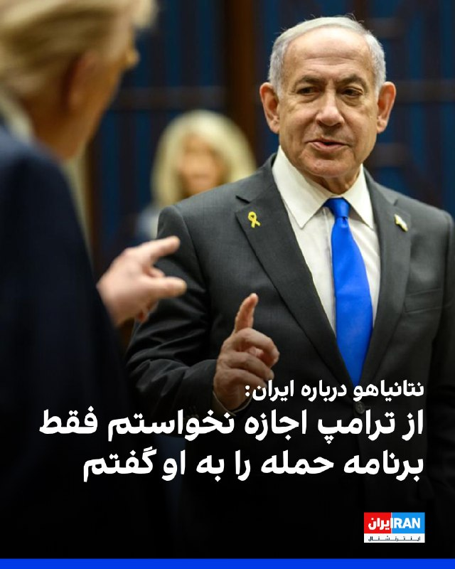

بنیامین نتانیاهو، نخست‌وزیر اسرائیل، گفت پیش از حمله به جمهوری اسلامی، دونالد ترامپ را در جریان تصمیم خود قرار داده بود، اما برای اجرای عملیات از او مجوز نگرفت. او افزود این حمله مانع دستیابی جمهوری اسلامی به سلاح هسته‌ای شده است.

نتانیاهو گفت: «وقتی نزد دونالد ترامپ رفتم و طرح را ارائه کردم، به او گفتم که به سمت ایران می‌رویم. من منتظر نمی‌مانم دشمنانی که آشکارا از نابودی ما سخن می‌گویند، به ما ضربه بزنند. از او اجازه نخواستم؛ فقط برنامه‌مان را اعلام کردم. خوشبختانه او نیز در نهایت به اقدامی بسیار مهم پیوست.»
‌🏁 🇬🇧 IranintlTV

🤖 @VahidOOnLine

## VahidOOnLine — post 247168

  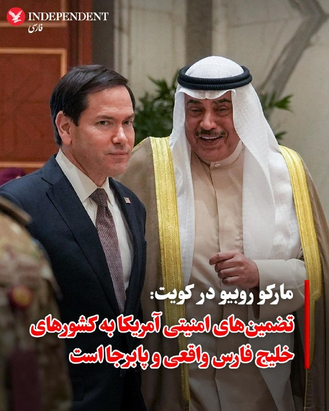

♦️مارکو روبیو، وزیر امور خارجه ایالات متحده، روز چهارشنبه سوم تیر، در جریان یک نشست خبری در کویت تاکید کرد که تضمین‌های امنیتی واشنگتن به متحدان خود در حاشیه خلیج فارس کاملا واقعی و ملموس است. او در پاسخ به خبرنگاران گفت: «من هیچ تردیدی درباره تضمین‌های امنیتی خود حس نکردم، زیرا این‌ها فراتر از وعده و وعید بوده و در عمل وجود دارند.»

روبیو با اشاره به روند مذاکرات با جمهوری اسلامی ایران تصریح کرد که دولت ترامپ در تمامی مراحل کاملا همسو با شرکای خود در خلیج فارس عمل خواهد کرد. او افزود: «هدف از این سفرها و دیدارهای پیش‌رو، علاوه بر قدردانی از حمایت‌های فوق‌العاده این کشورها، مشارکت دادن و گفتگو با آن‌ها درباره تک‌تک تصمیماتی است که در این مذاکرات اتخاذ می‌شود.» وزیر خارجه آمریکا در پایان به متحدان منطقه‌ای واشنگتن اطمینان داد که ایالات متحده دست به هیچ اقدامی نخواهد زد که امنیت شرکای دیرینه‌اش در منطقه را به مخاطره بیندازد.

روبیو روز سه‌شنبه سفرهای منطقه‌ای خود را با امارات متحده عربی شروع کرد و روز چهارشنبه به کویت رفت. او قرار است در ادامه از قطر نیز بازدید کند.
‌🇸🇦 Indypersian

🤖 @VahidOOnLine

## VahidOOnLine — post 247167

  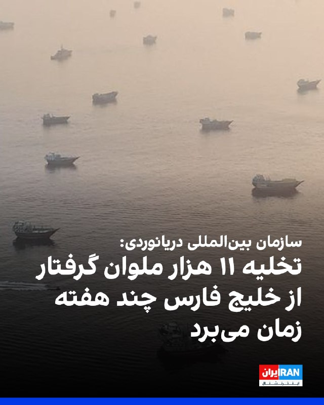

خبرگزاری فرانسه گزارش داد آرسنیو دومینگز، دبیرکل سازمان بین‌المللی دریانوردی، اعلام کرد تخلیه بیش از ۱۱ هزار ملوان که در پی جنگ آمریکا و جمهوری اسلامی در خلیج فارس گرفتار شده‌اند، «چند هفته» زمان خواهد برد.

او در گفت‌وگو با خبرگزاری فرانسه گفت: «چند هفته طول خواهد کشید تا بتوانیم روند تخلیه را تکمیل کنیم.»

به گفته دومینگز، حدود ۶۰۰ کشتی از زمان آغاز درگیری‌ها در منطقه متوقف شده‌اند.
‌🏁 🇬🇧 IranintlTV

🤖 @VahidOOnLine

## VahidOOnLine — post 247166

  

به گزارش سی‌بی‌اس نیوز، پس از اعلام سازمان بین‌المللی دریانوردی و عمان درباره ایجاد یک گذرگاه موقت برای تخلیه کشتی‌ها و دریانوردان گرفتار در خلیج فارس، ده‌ها کشتی تجاری چهارشنبه از این مسیر عبور کردند یا در حال حرکت به سوی آن بودند.

بر اساس داده‌های رهگیری، دست‌کم ۲۴ شناور چهارشنبه با سیستم‌های موقعیت‌یاب روشن از مسیر عمان عبور کرده یا در حال حرکت به سمت آن بوده‌اند. همچنین ۱۵ کشتی دیگر از گذرگاه شمالی در نزدیکی سواحل ایران استفاده کرده‌اند که احتمالا با مقام‌های جمهوری اسلامی هماهنگ شده‌اند.
‌🏁 🇬🇧 IranintlTV

🤖 @VahidOOnLine

## VahidOOnLine — post 247165

  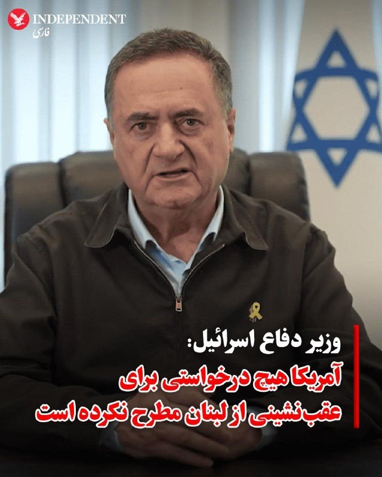

♦️یسرائیل کاتز، وزیر دفاع اسرائیل، اعلام کرد که واشنگتن هیچ‌گونه درخواستی مبنی بر عقب‌نشینی نیروهای اسرائیلی از جنوب لبنان مطرح نکرده است.

کاتز روز چهارشنبه سوم تیر در مصاحبه‌ای در همایش مقامات محلی در تل‌آویو گفت: «ما اعلام کرده‌ایم که در هر صورت عقب‌نشینی نخواهیم کرد و تا این لحظه—که خود یک دستاورد دیپلماتیک به شمار می‌رود—هیچ درخواستی از سوی آمریکا برای عقب‌نشینی اسرائیل از لبنان وجود ندارد.»

وزیر دفاع اسرائیل در پاسخ به این سوال که آیا در صورت وصول چنین درخواستی از سوی آمریکا، ارتش به آن تن خواهد داد یا خیر، گفت او این موضوع را به پیت هگست، وزیر جنگ آمریکا، و بنیامین نتانیاهو نیز آن را به دونالد ترامپ اعلام کرده‌اند که «ما برای محافظت از ساکنان شمال [اسرائیل] در آنجا حضور داریم.»
‌🇸🇦 Indypersian

🤖 @VahidOOnLine

## VahidOOnLine — post 247164

  <a href="telegram/content/VahidOOnLine_247164_1782318700.mp4" target="_blank">🎬 Download video</a>

یک شهروند ویدیویی از خیمه محرم حسینیه کربلایی‌ها در حوالی بازار تهران را برای ایران‌اینترنشنال ارسال کرده و نقش‌های شیر و خورشید روی این خیمه توجه او را جلب کرده است.
‌🏁 🇬🇧 IranintlTV

🤖 @VahidOOnLine

## VahidOOnLine — post 247163

♦️نارین، دختر ۱۵ ساله سنندجی که پس از هفته‌ها تحمل خشونت شدید خانوادگی و جراحات سنگین در بیمارستان بستری شد، حالا در ویدیویی تازه از روند درمان خود صحبت می‌کند؛ ویدیویی که در آن از پزشکان و پرستارانش قدردانی می‌کند، از آرزوی معلم شدن می‌گوید و شعری کودکانه می‌خواند.

نارین در این ویدیو با تشکر از کادر درمان، به‌ویژه دکتر شاه‌غیبی، در پاسخ به سوال خبرنگاری درباره آینده‌اش می‌گوید دوست دارد معلم شود و وقتی از او پرسیده می‌شود به دانش‌آموزانش چه چیزی آموزش خواهد داد، پاسخ می‌دهد: «احترام بزرگترهاشون رو نگه بدارند.»

او سپس شعری را می‌خواند که با وجود تمام روزهای تلخی که پشت سر گذاشته، تصویری از امید و بازگشت به زندگی عادی را به نمایش می‌گذارد.
‌🇸🇦 Indypersian

🤖 @VahidOOnLine

## VahidOOnLine — post 247162

  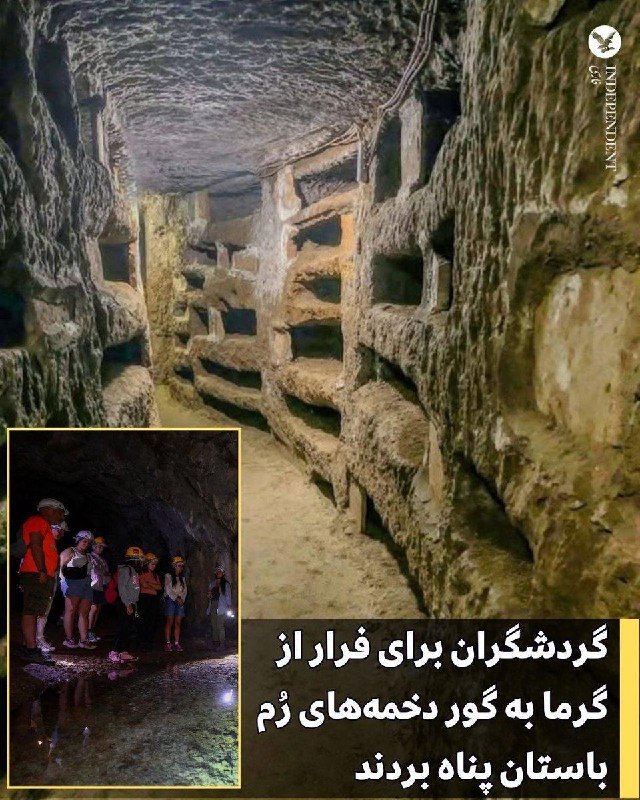

♦️با شدت گرفتن موج گرما در رم، گردشگران برای فرار از آفتاب سوزان و دمای نزدیک به ۴۰ درجه سانتی‌گراد، راهی زیرزمین شدند؛ از دخمه‌های باستانی مسیحیان اولیه گرفته تا سردابه‌ها و مسیرهای تاریخی زیر شهر.
این روزها دمای هوا در رم به ۳۰ درجه سانتی‌گراد رسیده است اما گور دخمه‌های سن کالیستوس با دمای حدود ۱۵ درجه سانتی‌گراد، به پناهگاهی موقت برای گردشگران تبدیل شده است.

دخمه‌های رم، شبکه‌ای از راهروها، گورها و اتاق‌های زیرزمینی‌اند که بخشی از تاریخ پنهان شهر را در خود نگه داشته‌اند. این فضاها، به‌ویژه در دوره مسیحیان اولیه، برای دفن مردگان و برگزاری آیین‌های مذهبی به کار می‌رفتند. بسیاری از آن‌ها در دل سنگ‌های نرم آتشفشانی حفر شده‌اند و به دلیل قرار گرفتن در عمق زمین، دمایی خنک‌تر از سطح شهر دارند.

همین ویژگی تاریخی، این روزها آن‌ها را به پناهگاه ناخواسته گردشگران گرمازده تبدیل کرده است.
‌🇸🇦 Indypersian

🤖 @VahidOOnLine

## VahidOOnLine — post 247161

  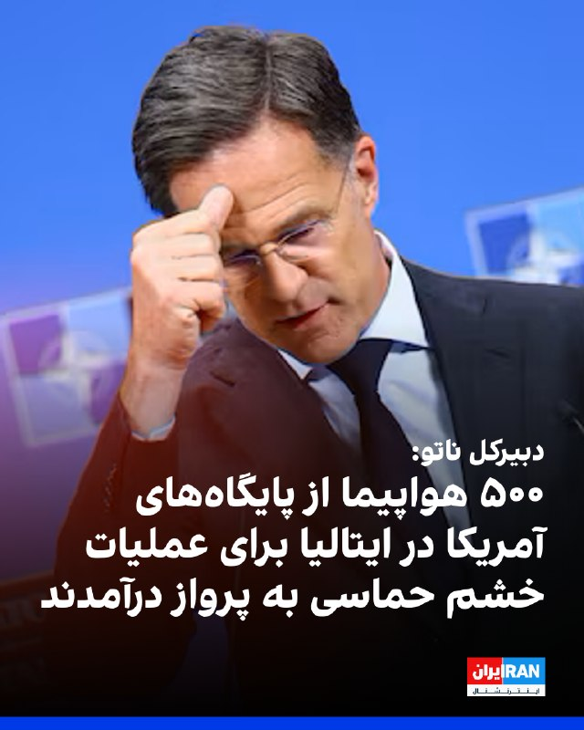

مارک روته، دبیرکل ناتو، در گفت‌وگو با شبکه فاکس‌نیوز گفت: «۵۰۰ هواپیمای آمریکایی از پایگاه‌های آمریکا در ایتالیا برای پشتیبانی از عملیات «خشم حماسی» به پرواز درآمدند. این موضوع بسیار قابل توجه است.»
ایتالیا از اظهارات مارک روته درباره استفاده از پایگاه‌های این کشور برای پشتیبانی از عملیات نظامی آمریکا علیه جمهوری اسلامی را رد کرد و اعلام کرد تنها پروازهای فنی و لجستیکی را مجاز دانسته و مجوزی برای عملیات نظامی صادر نکرده است.
روته در واکنش به انتقاد دونالد ترامپ از متحدان ناتو به‌دلیل حمایت نکردن از آمریکا گفته بود اروپا در واقع «سکوی نمایش قدرت آمریکا» بوده است.
‌🏁 🇬🇧 IranintlTV

🤖 @VahidOOnLine

## VahidOOnLine — post 247160

  <a href="telegram/content/VahidOOnLine_247160_1782318705.mp4" target="_blank">🎬 Download video</a>

♦️واکنش اردوغان به «ترک سیگار» ملونی؛ «کاش بتوانم مردم خودمان را هم ترک بدهم»

رجب طیب اردوغان، رئیس‌جمهوری ترکیه در یک گفتگوی کوتاه با خبرنگاری در آنکارا، از تصمیم جورجیا ملونی، نخست‌وزیر ایتالیا برای کنار گذاشتن سیگار استقبال کرد. او که پیش‌تر در این‌باره با ملونی گپ زده بود، گفت: «کاش بتوانم مردم خودمان را هم ترک بدهم».

صحبت صمیمانه اردوغان و ملونی در سال ۲۰۲۵ در مصر درباره عادت سیگار کشیدن نخست‌وزیر ایتالیا در رسانه‌ها بازتاب پیدا کرده بود. اردوغان در آن زمان با تمجید از ظاهر ملونی گفت: «خیلی شیک و زیبا به‌نظر می‌رسید، کاش سیگار را هم ترک کنید». ملونی در پاسخ، به‌شوخی گفت: «می‌ترسم اگر سیگار را ترک کنم، خیلی خوش‌اخلاق نباشم، نمی‌خواهم کسی را بکشم!»

جورجیا ملونی، اخیرا اعلام کرده که از ابتدای ماه مه سیگار کشیدن را کنار گذاشته است.
‌🇸🇦 Indypersian

🤖 @VahidOOnLine

## VahidOOnLine — post 247155

در این تصاویر، محمدرضا شاه پهلوی به همراه نیک‌پی، شهردار وقت تهران و دیگر مقامات در مراسم افتتاح پارک نیاوران حضور دارند. پروژه‌ای که بخشی از برنامه گسترده توسعه فضاهای عمومی، پارک‌ها و زیرساخت‌های شهری پایتخت در دهه ۱۳۴۰ بود.

تهران در آن سال‌ها با سرعتی بی‌سابقه در حال گسترش بود و مدیریت شهری تلاش می‌کرد همگام با رشد جمعیت، فضاهای سبز و امکانات عمومی را توسعه دهد. پارک نیاوران یکی از نمادهای همین نگاه بود. فضایی که برای استفاده شهروندان، تفریح خانواده‌ها و ارتقای کیفیت زندگی شهری طراحی شد.
‌🏁 🇬🇧 ManotoTV

🤖 @VahidOOnLine

## VahidOOnLine — post 247154

  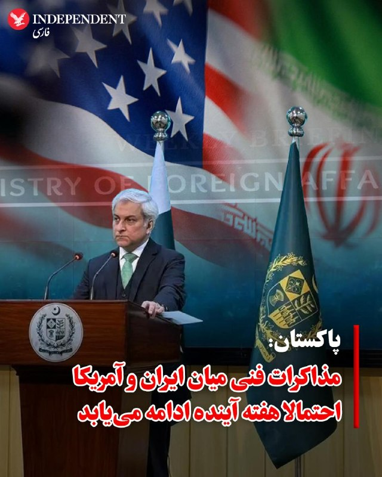

♦️سخنگوی وزارت امور خارجه پاکستان روز چهارشنبه سوم تیر، اعلام کرد که مذاکرات میان ایالات متحده و جمهوری اسلامی ایران احتمالا هفته آینده از سر گرفته خواهد شد.

طاهر اندرابی در گفتگو با خبرنگاران در اسلام‌آباد با اشاره به اینکه وقفه کنونی در مذاکرات یک «شکاف موقت» است و به معنای توقف روند نیست، گفت: «مذاکرات ادامه دارد. من معتقدم که این گفتگوها هفته آینده، احتمالا در روز سه‌شنبه، از سر گرفته می‌شود. همین که مذاکرات ادامه دارد و طرفین پای میز هستند، یک دستاورد مثبت و بزرگ است و ما قطعا با نگاهی بسیار مثبت به آن می‌نگریم.»
‌🇸🇦 Indypersian

🤖 @VahidOOnLine

## VahidOOnLine — post 247153

  

بنیامین نتانیاهو، نخست‌وزیر اسرائیل، در جریان کنفرانس استانداران و فرمانداران محلی درباره گفت‌وگوهای آمریکا و جمهوری اسلامی و همچنین تحولات لبنان، اعلام کرد: «اگر با عملیات‌ خود علیه جمهوری اسلامی اقدام نکرده بودیم، این حکومت همین حالا بمب‌های اتمی برای نابودی کامل ما در اختیار داشت.»

او افزود: «ما این تهدید را دور کردیم. ما تهدید فوری را عقب راندیم. همچنین تهدید فوری هزاران و هزاران موشک بالستیک را از میان برداشتیم.»
‌🏁 🇬🇧 IranintlTV

🤖 @VahidOOnLine

## VahidOOnLine — post 247152

  

بنیامین نتانیاهو، نخست‌وزیر اسرائیل، در جریان کنفرانس استانداران و فرمانداران محلی درباره گفت‌وگوهای آمریکا و ایران و همچنین تحولات لبنان گفت: «سیاست من و همکارانم در دولت بر دو پایه استوار است: امنیت و شکوفایی.»

او افزود: «امنیت کشور بر هر چیز دیگری مقدم است. امنیت را نمی‌توان با کلمات یا با بیانیه‌ها به دست آورد. امنیت را با قدرت، با قاطعیت، و بر اساس یک اصل به دست می‌آورند. می‌دانید آن اصل چیست؟ نیاکان ما آن را می‌شناختند: "اگر کسی برای کشتنت برخاست، پیش‌دستی کن و او را بکش".»

نتانیاهو افزود: «گفتم که ما چهره خاورمیانه را تغییر خواهیم داد؛ تغییر داده‌ایم و باز هم تغییر خواهیم داد. اما مهم‌ترین کاری که انجام دادیم، این بود که سد ترس را شکستیم. ما خودمان را تغییر دادیم و این کار آسان نبود.»

‌🏁 🇬🇧 IranintlTV

🤖 @VahidOOnLine

## VahidOOnLine — post 247151

فرزانه برزه‌کار، مادر عرفان رضایی، معترض کشته‌شده در جنبش انقلابی ۱۴۰۱، با انتشار ویدیویی از کارت ملی پسرش می‌گوید: «صدای عزاداری‌تان برای محرم تا خانه ما می‌رسد. بدانید که برای من تنها عزایی که تمامی ندارد، نبودن پسرم است.»
‌🏁 🇬🇧 IranintlTV

🤖 @VahidOOnLine

## VahidOOnLine — post 247150

  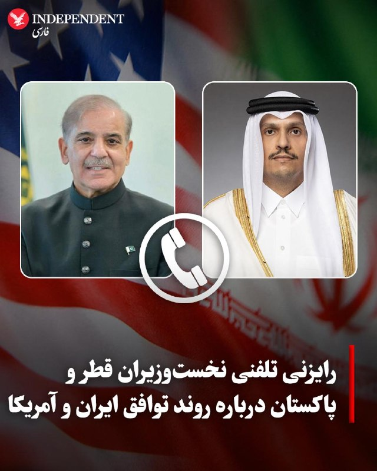

♦️دفتر نخست‌وزیری پاکستان اعلام کرد که شهباز شریف روز چهارشنبه سوم تیر، تماس تلفنی از سوی شیخ محمد بن عبدالرحمن بن جاسم آل ثانی، نخست‌وزیر و وزیر امور خارجه قطر، دریافت کرده است.

بر اساس بیانیه منتشرشده توسط اسلام‌آباد، دو طرف در این گفتگو درباره «تلاش‌های دیپلماتیک موفقی که منجر به امضای تاریخی یادداشت تفاهم اسلام‌آباد میان ایالات متحده و جمهوری اسلامی ایران شد»، تبادل نظر کردند.

در این بیانیه آمده است: «هر دو رهبر از برگزاری دور اول گفتگوها در سطح فنی که در بورگن‌اشتوک برگزار شد، ابراز خرسندی کردند و اظهار داشتند که این روند مثبت باید ادامه یابد تا مذاکرات به موفقیت نهایی برسد.»
‌🇸🇦 Indypersian

🤖 @VahidOOnLine

## WithYashar — post 15734

  <a href="telegram/content/WithYashar_15734_1782318710.mp4" target="_blank">🎬 Download video</a>

نتانیاهو : من بیشتر دوران بزرگسالی‌ام را به جلوگیری از دستیابی ایران به سلاح‌های هسته‌ای اختصاص دادم.
آماده نبودم اجازه دهم زنجیره‌ای از هزاران سال تاریخ یهودی به خاطر دستیابی این آیات‌الله‌ها به سلاح‌های هسته‌ای شکسته شود.
به همین دلیل بیشتر دوران بزرگسالی‌ام را به این هدف اختصاص دادم همچنین به عنوان نخست‌وزیر
@withyashar

## WithYashar — post 15733

ارتش اسرائیل: یکی دیگر از تروریست‌های حماس که در قتل عام ۷ اکتبر به اسرائیل نفوذ کرده بود، از بین رفت.
@withyashar

## WithYashar — post 15732

کانال 13 اسرائیل:
نتانیاهو امشب یک جلسه امنیتی درباره لبنان و سوریه برگزار خواهد کرد.
@withyashar

## WithYashar — post 15731

نتانیاهو: از ترامپ اجازه‌ای برای حمله به ایران درخواست نکرده‌ام بلکه تنها آن را به او ابلاغ کردم.
ماموریت ما در لبنان هنوز پایان نیافته است.
@withyashar

## WithYashar — post 15730

  <a href="telegram/content/WithYashar_15730_1782318713.mp4" target="_blank">🎬 Download video</a>

وزیر خزانه‌داری آمریکا، بسنت : سلطه دلار خیلی مهمه
همه کارهایی که ترامپ داره انجام می‌ده، دلار رو دوباره محور تجارت جهانی می‌کنه
تو ونزوئلا و حتی مذاکرات با ایران هم می‌بینیم که معاملات قراره با دلار انجام بشه
درکل، همه این اقدامات جایگاه دلار رو دوباره تقویت می‌کنه
@withyashar

## mwarmonitor — post 11461

🔴تردد در تنگه هرمز همچنان فعال است، اما روند بازگشت به شرایط عادی با احتیاط ادامه دارد. 
✅بر اساس داده‌های تأییدشده، عبور و مرور کشتی‌ها از تنگه هرمز در ۲۳ ژوئن پایدار بوده و ۳۱ عبور ثبت‌شده مربوط به کشتی‌های تجاری و مرتبط با انرژی گزارش شده است. طبق داده‌های…

## mwarmonitor — post 11460

🔴یکی از مسافران لحظه فرود اضطراری هواپیما را پس از آن ثبت کرده است؛ این فرود اضطراری زمانی رخ داد که خلبان به‌دلیل از دست رفتن قدرت موتور، مجبور به فرود اجباری در رشته‌کوه بروکس در آلاسکا شد.

🔴بر اساس اعلام کلینت جانسون، رئیس دفتر آلاسکا در هیئت ملی ایمنی حمل‌ونقل آمریکا (NTSB)، در پرواز شرکت Wright Air Service بین کولدفوت و آناک تووِک پس هیچ‌گونه مجروحی گزارش نشده است.

🔴دو اپراتور هلیکوپتر به منطقه اعزام شدند، خلبان و مسافران را نجات دادند و سپس آن‌ها را به کولدفوت منتقل کردند؛ قرار است از آنجا به فیرنکس منتقل شوند.

🔴شرکت Wright Air سالانه بیش از ۴۰ هزار مسافر را در پروازهای برنامه‌ریزی‌شده به چندین شهر در مناطق داخلی و شمال داخلی آلاسکا جابه‌جا می‌کند.

@mwarmonitor

## mwarmonitor — post 11459

💢کانال ۱۳ اسرائیل: نتانیاهو امشب یک جلسه امنیتی درباره لبنان و سوریه برگزار خواهد کرد.

@mwarmonitor

## mwarmonitor — post 11458

  <a href="telegram/content/mwarmonitor_11458_1782318716.mp4" target="_blank">🎬 Download video</a>

🔴تردد در تنگه هرمز همچنان فعال است، اما روند بازگشت به شرایط عادی با احتیاط ادامه دارد.

✅بر اساس داده‌های تأییدشده، عبور و مرور کشتی‌ها از تنگه هرمز در ۲۳ ژوئن پایدار بوده و ۳۱ عبور ثبت‌شده مربوط به کشتی‌های تجاری و مرتبط با انرژی گزارش شده است. طبق داده‌های MarineTraffic، حرکت‌ها عمدتاً در مسیر غرب به شرق بوده و کشتی‌ها همچنان از ترکیبی از مسیرهای ایران، عمان و مسیرهای سازمان بین‌المللی دریانوردی (IMO) در این گذرگاه استفاده کرده‌اند.

🟢به نظر می‌رسد تنگه هرمز همچنان تحت چارچوب تفاهم‌نامه آمریکا و ایران عملیاتی باقی مانده است، اما ادامه فعالیت‌های «مسیرهای خاموش» (dark routes) و وجود عدم قطعیت فراتر از بازه ۶۰ روزه فعلی نشان می‌دهد که اپراتورها هنوز با احتیاط عمل می‌کنند و بازگشت کامل به وضعیت عادی هنوز اتفاق نیفتاده است.

@mwarmonitor

## mwarmonitor — post 11457

📰 چندین سرباز آمریکایی که در حمله پهپادی ایران به یک پایگاه نظامی آمریکا در بندر الشعیبه کویت در تاریخ ۱ مارس زخمی شده بودند، در صحت ادعای پنتاگون درباره این‌که بیشتر مجروحان فقط جراحات سطحی داشته و به‌سرعت به خدمت بازگشته‌اند، تردید کرده‌اند.

📰در ماه مارس، وزیر جنگ پیت هگست اعلام کرده بود که «حدود ۹۰ درصد» از نزدیک به ۴۰۰ سرباز آمریکایی که در جریان جنگ با ایران زخمی شده‌اند، جراحات خفیف داشته و به خدمت بازگشته‌اند. اما برخی از مجروحان و خانواده‌هایشان گفته‌اند که آسیب‌ها بسیار شدیدتر از آن چیزی بوده که در طبقه‌بندی رسمی نظامی ذکر شده است.

📰از جمله این افراد، «رودنی بیرمن» است که در اثر برخورد ترکش هنگام حمله پهپادی دچار جراحات گسترده شد. بر اساس سوابق پزشکی، او دچار ضربه مغزی، کاهش شنوایی و بینایی، آسیب ریوی و جراحات متعدد ناشی از ترکش شده، اما ارتش او را «غیرمصدوم به‌طور جدی» طبقه‌بندی کرده است.

📰همسر او، ایمی بیرمن، این طبقه‌بندی را «غیرقابل قبول» توصیف کرده و گفته ابتدا به او اعلام شده بود که همسرش به خدمت بازخواهد گشت.

📰همچنین گروهبان «کوری هیکس» نیز به شدت بر اثر ترکش زخمی شده و چندین عمل جراحی اورژانسی در بیمارستانی در کویت انجام داده و اکنون در حال بهبودی از آسیب مغزی تروماتیک است. او گفته خانواده‌اش ابتدا تصور می‌کردند جراحاتش سطحی است.

📰بر اساس این گزارش، حمله به بندر الشعیبه کویت منجر به کشته شدن ۶ نظامی آمریکایی و زخمی شدن بیش از ۲۰ نفر دیگر شد. بازماندگان و خانواده‌ها معتقدند ارتش شدت تلفات را کم‌اهمیت جلوه داده، اما ارتش این ادعا را رد کرده و می‌گوید طبقه‌بندی «مجروح شدید» فقط برای افرادی است که در ۷۲ ساعت در خطر مرگ قرار دارند و لزوماً وضعیت بلندمدت پزشکی را نشان نمی‌دهد. CBS

@mwarmonitor

## mwarmonitor — post 11456

💢حمله هوایی اسرائیل به «النبطیه الفوقا» و گلوله‌باران توپخانه‌ای به شهرک «یاطر» در جنوب لبنان. @mwarmonitor

## mwarmonitor — post 11455

  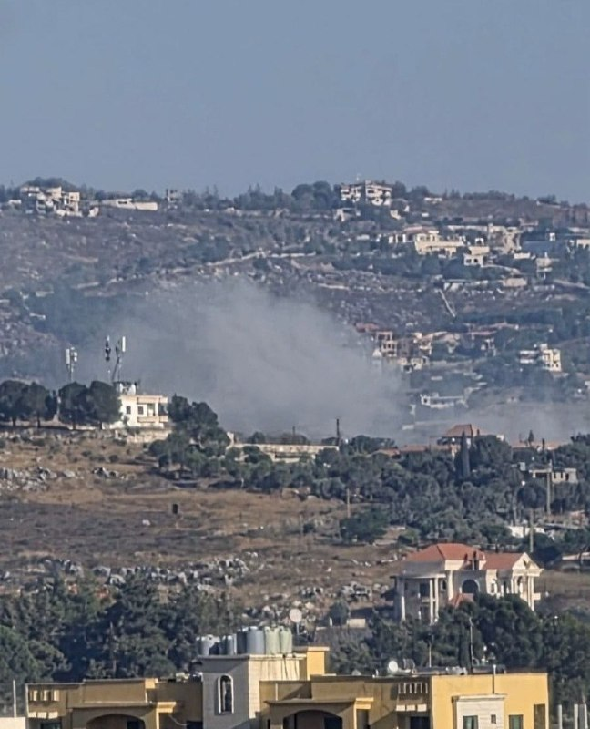

💢حمله هوایی اسرائیل به «النبطیه الفوقا» و گلوله‌باران توپخانه‌ای به شهرک «یاطر» در جنوب لبنان.

@mwarmonitor

## mwarmonitor — post 11454

  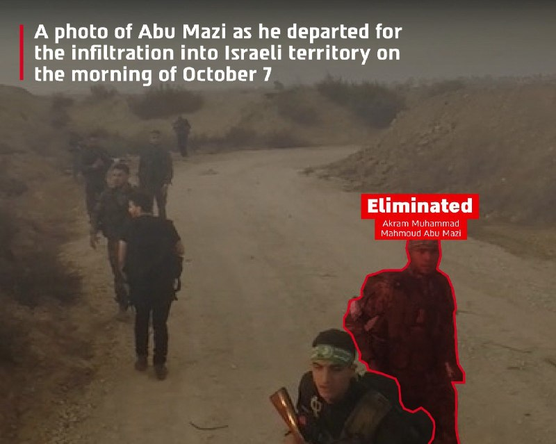

🔴 حذف‌شده: اکرم محمد محمود ابو مازی، یکی از تروریست‌های شاخه نظامی حماس که در جریان حمله ۷ اکتبر وارد اسرائیل شده بود.

❌ابو مازی در تلاش برای بازسازی توانمندی‌های حماس و پیشبرد حملات تروریستی علیه نیروهای ارتش اسرائیل (IDF) و غیرنظامیان اسرائیلی فعالیت می‌کرد.

@mwarmonitor

## mwarmonitor — post 11453

📰(رویترز) - سفارت آمریکا در کویت فعالیت‌های خود را که پس از حملات ماه مارس از سوی ایران به حالت تعلیق درآمده بود، از سر گرفته است؛ این موضوع را یک سخنگوی وزارت خارجه آمریکا روز چهارشنبه اعلام کرد.

🔴این سخنگو گفت که سفارت بلافاصله خدمات اضطراری برای شهروندان آمریکایی را از سر می‌گیرد و سایر خدمات نیز به‌تدریج دوباره برقرار خواهند شد.

@mwarmonitor

## mwarmonitor — post 11452

  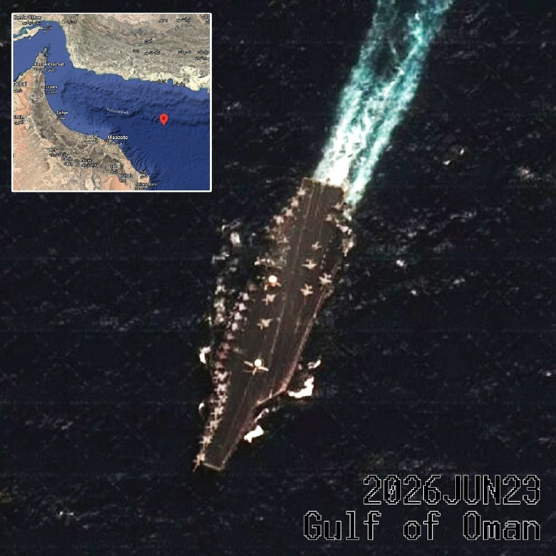

🔴ناو هواپیمابر USS Abraham Lincoln دیروز ۲۳ ژوئن ۲۰۲۶ در خلیج عمان، حدود ۸۸ مایل دور از ساحل بندر چابهار ایران مشاهده شد.

@mwarmonitor

## FoxNewsTwitter — post 343353

  

Fox News (Twitter/X)

Maj. Taylor Hiester, commander of the F-16 Demonstration Team participating in the flyover at the Great American State Fair in Washington, D.C. to celebrate America's 250th birthday, shares how a childhood dream led him to the skies above our nation's capital.

## FoxNewsTwitter — post 343352

  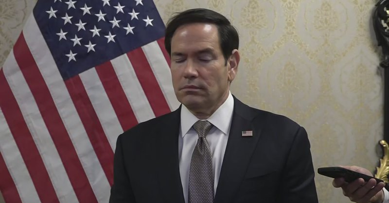

Fox News (Twitter/X)

WATCH LIVE: Secretary of State Marco Rubio talks to reporters after meeting with Middle East leaders https://twitter.com/i/broadcasts/1pKdRRYawWpJW

## FoxNewsTwitter — post 343351

  

Fox News (Twitter/X)

WATCH: Protests unfolded outside a Brooklyn coffee shop that banned Rep. Dan Goldman and refunded his coffee order, singling out the Jewish pro-Israel congressman online after his visit, declaring it doesn't serve “genocide enablers.”

Its post quickly spread across social media, drawing fierce reactions and significant backlash from critics as demonstrators gathered outside, leading to tense confrontations between opposing groups.

The incident is the latest dispute over Israel and Gaza to spill into New York City's political scene.

## FoxNewsTwitter — post 343350

  <a href="telegram/content/FoxNewsTwitter_343350_1782318723.mp4" target="_blank">🎬 Download video</a>

Fox News (Twitter/X)

Country star Kenny Chesney is currently in the middle of a Las Vegas Sphere residency, which has many music fans asking who will perform at the iconic Vegas venue next year?

Our sponsor Kalshi’s prediction market shows:

—Coldplay: 39%
— Beyoncé: 27%
— Spice Girls: 27%

@foxandfriends

## FoxNewsTwitter — post 343349

  <a href="telegram/content/FoxNewsTwitter_343349_1782318726.mp4" target="_blank">🎬 Download video</a>

Fox News (Twitter/X)

BREAKING: Speaker Mike Johnson is sounding the alarm over what he says is the Democratic Party’s radical new direction.

The House Speaker pointed to a string of Democratic primary winners and candidates across the country, arguing their views on immigration, policing, religion, race, and patriotism are far outside the political mainstream.

## FoxNewsTwitter — post 343348

  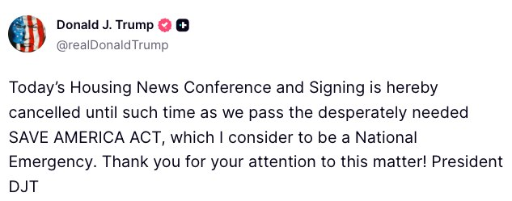

Fox News (Twitter/X)

BREAKING: President Trump cancels his housing news conference and signing event scheduled for today "until such time as we pass the desperately needed SAVE AMERICA ACT," which the president says he considers a national emergency.

## FoxNewsTwitter — post 343347

  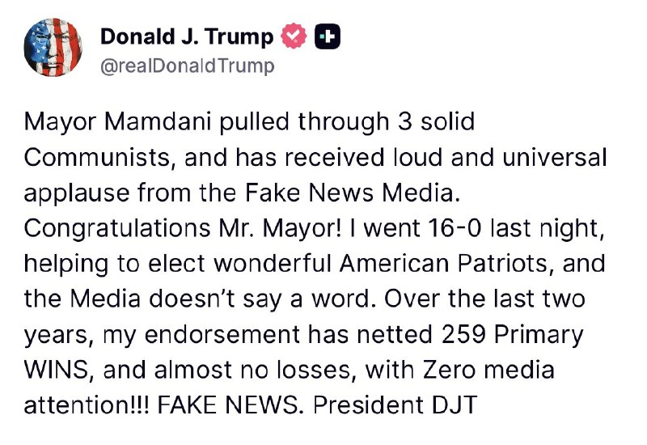

Fox News (Twitter/X)

“Mayor Mamdani pulled through 3 solid Communists.”

President Trump is taking a victory lap after a night of primary wins while also blasting NYC Mayor Zohran Mamdani.

Trump mocked what he called the media’s praise for Mamdani, writing, “Congratulations Mr. Mayor!” before turning the focus to his own record.

“I went 16-0 last night,” Trump said, adding that his endorsements have produced 259 primary victories over the past two years with “almost no losses” — saying the media has given it “Zero” attention.

## pm_afshaa — post 94743

  <a href="telegram/content/pm_afshaa_94743_1782318730.webm" target="_blank">🎬 Download video</a>

🔴کانال 13 اسرائیل:
نتانیاهو امشب یک جلسه امنیتی درباره لبنان و سوریه برگزار خواهد کرد.

💧 Rainbet.com the #1 Non-KYC Crypto Casino & Sportsbook @rainbetcom

😁 @Pm_Afshaa

## pm_afshaa — post 94742

ترامپ در مصاحبه با فاکس نیوز: ایران به عنوان بخش اولیه توافق، تاکنون 500 میلیون دلار کالای آمریکایی خریداری کرده

💧 Rainbet.com the #1 Non-KYC Crypto Casino & Sportsbook @rainbetcom

😁 @Pm_Afshaa

## pm_afshaa — post 94741

  <a href="telegram/content/pm_afshaa_94741_1782318730.webm" target="_blank">🎬 Download video</a>

🔴نتانیاهو: لحظاتی وجود داره که باید بلد باشی حتی به رئیس‌جمهور آمریکا هم «نه» بگی. 
💧 Rainbet.com the #1 Non-KYC Crypto Casino & Sportsbook @rainbetcom 
😁 @Pm_Afshaa

## pm_afshaa — post 94740

  <a href="telegram/content/pm_afshaa_94740_1782318731.webm" target="_blank">🎬 Download video</a>

🔴نتانیاهو:
لحظاتی وجود داره که باید بلد باشی حتی به رئیس‌جمهور آمریکا هم «نه» بگی.

💧 Rainbet.com the #1 Non-KYC Crypto Casino & Sportsbook @rainbetcom

😁 @Pm_Afshaa

## pm_afshaa — post 94739

🔴نتانیاهو : هنوز کلی کار تو غزه، لُبنان و ایران مونده، تا وقتی من نخست‌وزیرم، تو منطقه امنیتی جنوب لُبنان می‌مونیم

💧 Rainbet.com the #1 Non-KYC Crypto Casino & Sportsbook @rainbetcom

😁 @Pm_Afshaa

## pm_afshaa — post 94738

قیمت هر بشکه نفت به 69 دلار رسید

💧 Rainbet.com the #1 Non-KYC Crypto Casino & Sportsbook @rainbetcom

😁 @Pm_Afshaa

## DEJradio — post 5945

⭕️ ادعای معاون عراقچی: دسترسی به تأسیسات هسته‌ای به توافق نهایی بستگی دارد؛ ترامپ و آژانس می‌گویند بازرس‌ها به‌زودی راهی می‌شوند

کاظم غریب‌آبادی، معاون وزیر امور خارجۀ دولت جمهوری اسلامی، اعلام کرد دسترسی بازرسان به تأسیسات هسته‌ای آسیب‌دیده و همچنین مواد هسته‌ای در ایران، تنها در چارچوب توافق نهایی با آمریکا امکان‌پذیر می‌شود.
غریب‌آبادی در شبکۀ ایکس نوشت نمایندگان جمهوری اسلامی در سوئیس، هیچ دیداری را با رافائل گروسی، مدیرکل آژانس بین‌المللی انرژی اتمی، برگزار نکرده‌اند.
او ادعا کرد در حال حاضر هیچ برنامه‌ای برای دسترسی به تأسیسات یا مواد هسته‌ای وجود ندارد.
معاون وزیر خارجه جمهوری اسلامی مدعی شد موضوع دسترسی بازرسان و سرنوشت مواد هسته‌ای تنها پس از لغو کامل تحریم‌ها و در قالب توافق نهایی میان تهران و واشینگتن بررسی می‌شود.
این در حالی است که مقامات آمریکا از جمله ترامپ و ونس و همچنین رافائل گروسی، مدیرکل آژانس جهانی انرژی اتمی به‌صراحت اعلام کرده‌اند بازرسان هسته‌ای به‌زودی وارد خاک ایران می‌شوند.

#برنامه_هسته‌ای #توافق
@DEJradio

## DEJradio — post 5944

⭕️ بهای نفت برنت برای نخستین بار پس از آغاز جنگ چهل روزه به زیر ۷۵ دلار رسید

بهای جهانی نفت روز چهارشنبه سوم تیرماه همچنان در شیب نزولی قرار داشت.
بهای نفت خام برنت برای نخستین بار از زمان آغاز جنگ جمهوری اسلامی و آمریکا به کمتر از ۷۵ دلار در هر بشکه کاهش یافت.
همزمان نفت وست‌تگزاس اینترمدیت آمریکا نیز به زیر ۷۰ دلار در هر بشکه رسید.
کاهش قیمت‌ها در شرایطی رخ داده که تردد کشتی‌ها از تنگۀ هرمز در حال افزایش است.
بنا بر گزارش نهادهای اقتصادی، بازارها نسبت به باز ماندن آبراه راهبردی هرمز، خوش‌بین‌تر شده‌اند.
بر اساس تفاهمنامۀ اخیر تهران و واشینگتن، جمهوری اسلامی متعهد شده است که دستکم برای ۶۰ روز عبور آزاد کشتی‌ها از تنگۀ هرمز را تضمین کند.
بر پایۀ گزارش شرکت ردیابی کپلر، حجم تردد در تنگۀ هرمز به درحدود یک‌سوم از سطح عادی پیش از جنگ رسیده است.
با وجود کاهش قیمت‌ها، تحلیلگران می‌گویند معامله‌گران همچنان با احتیاط عمل می‌کنند.

#نفت #تفاهم #ترامپ
@DEJradio

## DEJradio — post 5943

⭕️ وزیر دفاع اسرائیل گفت ارتش حتا با فشار آمریکا از جنوب لبنان خارج نمی‌شود

یسرائیل کاتز، وزیر دفاع اسرائیل اعلام کرد کشورش حتا در صورت درخواست ایالات متحده، هیچ برنامه‌ای برای عقب‌نشینی از جنوب لبنان ندارد.
کاتز روز چهارشنبه سوم تیرماه در نشست با مقام‌های محلی شمال اسرائیل گفت حضور ارتش در جنوب لبنان و همچنین بخش‌هایی از جنوب سوریه بخشی از دکترین تازۀ امنیتی اسرائیل است.
یسرائیل کاتز تأکید کرد ارتش اسرائیل باید در خاک دشمن حضور داشته باشد و امنیت شهروندان اسرائیلی را از آنجا تأمین کند.
به گفتۀ وزیر دفاع اسرائیل، بازگشت ده‌ها هزار شهروند اسرائیلی به مناطق شمالی تنها در زمانی ممکن است که ارتش همچنان در مناطق مرزی و عمق خاک لبنان حضور داشته باشد.
او از سویی اعلام کرد که بخش‌هایی گسترده از زیرساخت‌های شبه‌نظامیان حزب‌الله در مناطق مرزی لبنان طی ماه‌های گذشته تخریب شده است.
به گفتۀ کاتز، اسرائیل دیگر به وضعیت پیش از جنگ باز نمی‌گردد.
موضوع آتش‌بس در منطقه از جمله در لبنان، در نخستین بند تفاهمنامۀ جمهوری اسلامی و آمریکا مطرح شده است.
جمهوری اسلامی برای محافظت از شبه‌نظامیان حزب‌الله که در سیاهۀ تروریستی آمریکا و اروپا قرار دارند، پافشاری می‌کند که هر توافق پایدار با آمریکا باید شامل خروج اسرائیل از لبنان باشد.
مقام‌های اسرائیلی تأکید می‌کنند حفظ «منطقۀ امنیتی» در جنوب لبنان برای امنیت اسرائیل و شهروندان آن ضروری است.

#اسرائیل #لبنان
@DEJradio

## DEJradio — post 5942

⭕️ وزیر خزانه‌داری آمریکا: بر مصرف دارایی‌های آزادشدۀ ایران توسط رژیم، نظارت می‌کنیم

اسکات بسنت، وزیر خزانه‌داری آمریکا، روز دوشنبه سوم تیرماه اعلام کرد واشینگتن برای نظارت بر چگونگی مصرف دارایی‌های آزادشده توسط جمهوری اسلامی، سازوکاری ویژه را در قطر ایجاد کرده است.
بسنت در گفت‌وگو با شبکۀ سی‌ان‌بی‌سی، گفت بخشی بزرگ از منابع مالی آزادشونده برای خرید مواد غذایی و دارویی از آمریکا مصرف می‌شود.
اسکات بسنت تأکید کرد حتی اگر مقام‌های جمهوری اسلامی مدعی شده باشند که خود درمورد شیوۀ مصرف این منابع تصمیم می‌گیرند، این ایالات متحده است که بر روند عملکرد آنها نظارت می‌کند.
وزیر خزانه‌داری دولت ترامپ، جزئیاتی دربارۀ سازوکار ایجاد شده ارائه نکرد. او اما گفت یک دفتر ویژه در دوحۀ قطر، مسئولیت پیگیری نحوۀ مصرف دارایی‌های آزادشده را برعهده دارد.
اظهارات او در ادامۀ مواضع دونالد ترامپ و جی‌دی ونس مطرح می‌شود که گفته‌اند منابع آزادشده باید صرف نیازهای مردم ایران شود و نه فعالیت‌های منطقه‌ای جمهوری اسلامی.

#پولهای_آزاد_شده #آمریکا
@DEJradio

## kianmeli1 — post 88147

  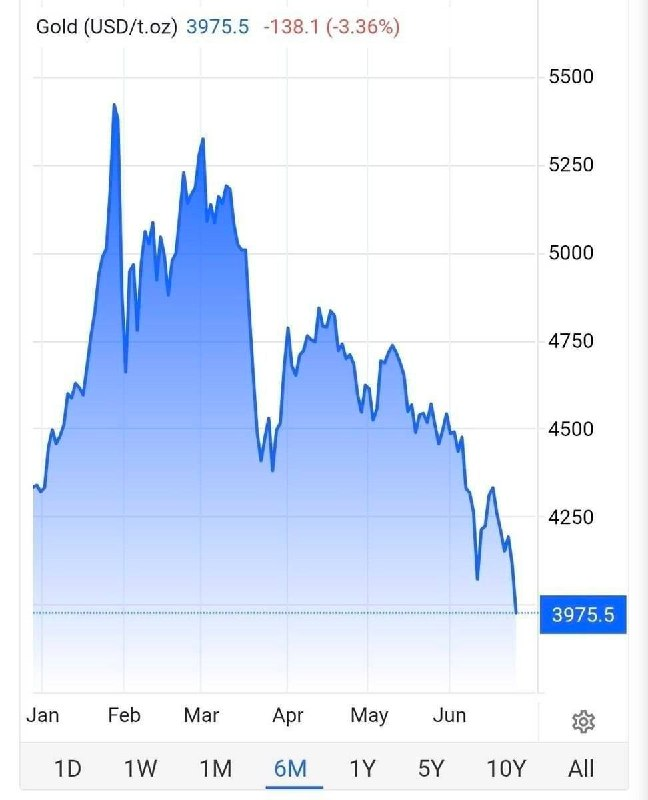

🔴قیمت جهانی طلا با سقوط ۳۰ درصدی از سقف تاریخی هر انس طلا ۵۶۰۰ دلار به ۳۹۰۰ دلار رسید.
https://t.me/kianmeli1

## kianmeli1 — post 88146

‏🔴ارتش اسرائیل در شبکه ایکس اعلام کرد که یک‌شنبه در جنوب غزه، اکرم محمد محمود ابوماضی، از اعضای شاخه نظامی حماس را که به گفته این ارتش در حمله هفتم اکتبر نقش داشته، کشته است
https://t.me/kianmeli1

## kianmeli1 — post 88145

🔴 ترامپ در مصاحبه با فاکس نیوز: ایران به عنوان بخش اولیه توافق، تاکنون ۵۰۰ میلیون دلار کالای آمریکایی خریداری کرده است.
https://t.me/kianmeli1

## kianmeli1 — post 88144

  <a href="telegram/content/kianmeli1_88144_1782318733.mp4" target="_blank">🎬 Download video</a>

🔴مارک روته، دبیرکل ناتو، در گفت‌وگو با فاکس‌نیوز: اوکراین در میدان نبرد عملکرد خوبی دارد.

آن‌ها هر ماه حدود ۳۰ تا ۳۵ هزار نیروی روسی را کشته یا به‌شدت زخمی می‌کنند.
این اعداد واقعاً شگفت‌انگیز هستند.
https://t.me/kianmeli1

## IranIntlTV — post 344165

  

بنیامین نتانیاهو، نخست‌وزیر اسرائیل، گفت پیش از حمله به جمهوری اسلامی، دونالد ترامپ را در جریان تصمیم خود قرار داده بود، اما برای اجرای عملیات از او مجوز نگرفت. او افزود این حمله مانع دستیابی جمهوری اسلامی به سلاح هسته‌ای شده است.

نتانیاهو گفت: «وقتی نزد دونالد ترامپ رفتم و طرح را ارائه کردم، به او گفتم که به سمت ایران می‌رویم. من منتظر نمی‌مانم دشمنانی که آشکارا از نابودی ما سخن می‌گویند، به ما ضربه بزنند. از او اجازه نخواستم؛ فقط برنامه‌مان را اعلام کردم. خوشبختانه او نیز در نهایت به اقدامی بسیار مهم پیوست.»
https://iranintl.com/202606240716

## IranIntlTV — post 344163

  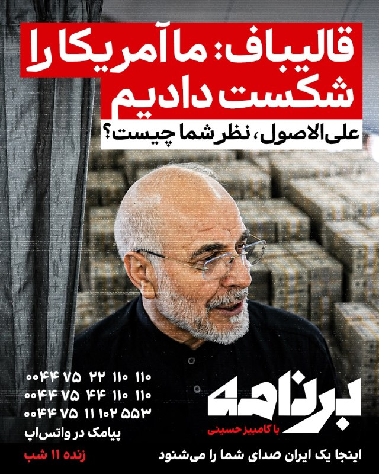

محمدباقر قالیباف، رئیس مجلس، در باکو گفت: «تفاهم اسلام‌آباد نه نتیجه فشار و اجبار، بلکه حاصل مقاومت ایران بود و این تفاهم‌نامه به اعلامیه شکست آمریکا تبدیل شد.»
نظر شما درباره این ادعای آقای قالیباف چیست؟
آیا جمهوری اسلامی موفق شد آمریکا را شکست دهد؟
آیا جنگ با آمریکا تا این لحظه اساساً برنده‌ای داشته است؟
«برنامه» صدای شماست.
ما شما را، بدون نوبت، مستقیم از ایران روی خط می‌آوریم.
بیایید و روایت خود را برای همیشه ثبت کنید.
برای شرکت در برنامه، همین حالا در واتس‌اپ پیام بدهید:
۰۰۴۴۷۵۲۲۱۱۰۱۱۰
۰۰۴۴۷۵۴۴۱۱۰۱۱۰
۰۰۴۴۷۵۱۱۱۰۲۵۵۳
«برنامه با کامبیز حسینی»
«یک ایران صدای شما را می‌شنود»

## IranIntlTV — post 344162

  <a href="https://t.me/IranintlTV/344162" target="_blank">📎 Download file</a>

🎧نسخه صوتی اخبار شبانگاهی | چهارشنبه ۳ تیر
@iranintlTV

## IranIntlTV — post 344161

  

خبرگزاری فرانسه گزارش داد آرسنیو دومینگز، دبیرکل سازمان بین‌المللی دریانوردی، اعلام کرد تخلیه بیش از ۱۱ هزار ملوان که در پی جنگ آمریکا و جمهوری اسلامی در خلیج فارس گرفتار شده‌اند، «چند هفته» زمان خواهد برد.

او در گفت‌وگو با خبرگزاری فرانسه گفت: «چند هفته طول خواهد کشید تا بتوانیم روند تخلیه را تکمیل کنیم.»

به گفته دومینگز، حدود ۶۰۰ کشتی از زمان آغاز درگیری‌ها در منطقه متوقف شده‌اند.
https://iranintl.com/202606249636

## IranIntlTV — post 344160

  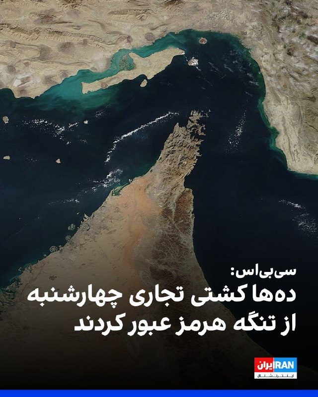

به گزارش سی‌بی‌اس نیوز، پس از اعلام سازمان بین‌المللی دریانوردی و عمان درباره ایجاد یک گذرگاه موقت برای تخلیه کشتی‌ها و دریانوردان گرفتار در خلیج فارس، ده‌ها کشتی تجاری چهارشنبه از این مسیر عبور کردند یا در حال حرکت به سوی آن بودند.

بر اساس داده‌های رهگیری، دست‌کم ۲۴ شناور چهارشنبه با سیستم‌های موقعیت‌یاب روشن از مسیر عمان عبور کرده یا در حال حرکت به سمت آن بوده‌اند. همچنین ۱۵ کشتی دیگر از گذرگاه شمالی در نزدیکی سواحل ایران استفاده کرده‌اند که احتمالا با مقام‌های جمهوری اسلامی هماهنگ شده‌اند.
https://iranintl.com/202606246470

## IranIntlTV — post 344159

  <a href="telegram/content/IranIntlTV_344159_1782318739.mp4" target="_blank">🎬 Download video</a>

🔻دیدار ایران و مصر در جام جهانی ۲۰۲۶ که باید صبح شنبه ۶ تیر به میزبانی سیاتل در استادیوم لومن فیلد برگزار شود، یک «مسابقه افتخار» تاریخی در حمایت از گروه‌های هم‌جنس‌گرا و +LGBTQ خواهد بود.

🔹گفتگوی مزدک میرزایی با رها پوربخش در هت‌تریک

@iranintltvsport

## IranIntlTV — post 344158

  <a href="telegram/content/IranIntlTV_344158_1782318742.mp4" target="_blank">🎬 Download video</a>

یک شهروند ویدیویی از خیمه محرم حسینیه کربلایی‌ها در حوالی بازار تهران را برای ایران‌اینترنشنال ارسال کرده و نقش‌های شیر و خورشید روی این خیمه توجه او را جلب کرده است.

## IranIntlTV — post 344157

  <a href="telegram/content/IranIntlTV_344157_1782318744.mp4" target="_blank">🎬 Download video</a>

ایران اینترنشنال به اطلاعاتی اختصاصی از یک مخفیگاه زیرزمینی علی خامنه‌ای دست یافته که نشان می‌دهد سپاه پاسداران‌، مجموعه‌ای مجهز و مخفی در کوچه مفید تهران برای محافظت از جان او ساخته بود که دو پناهگاه در عمق ۳۰ و ۳۵ متری زمین مجهز به اتاق ضدانفجار داشت.

گزارشی از مجتبا پورمحسن
@iranintltv

## IranIntlTV — post 344156

  

مارک روته، دبیرکل ناتو، در گفت‌وگو با شبکه فاکس‌نیوز گفت: «۵۰۰ هواپیمای آمریکایی از پایگاه‌های آمریکا در ایتالیا برای پشتیبانی از عملیات «خشم حماسی» به پرواز درآمدند. این موضوع بسیار قابل توجه است.»
ایتالیا از اظهارات مارک روته درباره استفاده از پایگاه‌های این کشور برای پشتیبانی از عملیات نظامی آمریکا علیه جمهوری اسلامی را رد کرد و اعلام کرد تنها پروازهای فنی و لجستیکی را مجاز دانسته و مجوزی برای عملیات نظامی صادر نکرده است.
روته در واکنش به انتقاد دونالد ترامپ از متحدان ناتو به‌دلیل حمایت نکردن از آمریکا گفته بود اروپا در واقع «سکوی نمایش قدرت آمریکا» بوده است.
https://iranintl.com/202606247251

## IranIntlTV — post 344155

🔻لیونل مسی، کاپیتان و فوق‌ستاره تیم ملی آرژانتین، ویدیویی از تمرینات خود در اینستاگرام منتشر کرده که نشان می‌دهد در ۳۹ سالگی همچنان از آمادگی بدنی بالایی برخوردار است.

🔹مسی که امروز ۳ تیر ۱۴۰۵، ۳۹ ساله شد، با به ثمر رساندن پنج گل در دو بازی نخست آرژانتین در جام جهانی ۲۰۲۶، تعداد گل‌های خود در تاریخ این رقابت‌ها را به ۱۸ رساند و با عبور از رکورد میروسلاو کلوزه، به بهترین گلزن تاریخ جام جهانی تبدیل شد.

@iranintltvsport

## IranIntlTV — post 344154

  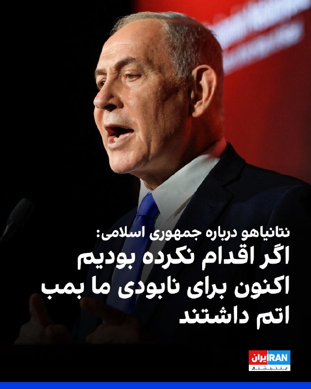

بنیامین نتانیاهو، نخست‌وزیر اسرائیل، در جریان کنفرانس استانداران و فرمانداران محلی درباره گفت‌وگوهای آمریکا و جمهوری اسلامی و همچنین تحولات لبنان، اعلام کرد: «اگر با عملیات‌ خود علیه جمهوری اسلامی اقدام نکرده بودیم، این حکومت همین حالا بمب‌های اتمی برای نابودی کامل ما در اختیار داشت.»

او افزود: «ما این تهدید را دور کردیم. ما تهدید فوری را عقب راندیم. همچنین تهدید فوری هزاران و هزاران موشک بالستیک را از میان برداشتیم.»
https://iranintl.com/202606247066

## IranIntlTV — post 344153

  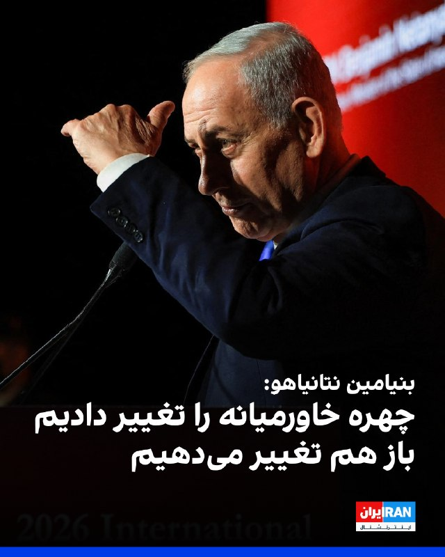

بنیامین نتانیاهو، نخست‌وزیر اسرائیل، در جریان کنفرانس استانداران و فرمانداران محلی درباره گفت‌وگوهای آمریکا و ایران و همچنین تحولات لبنان گفت: «سیاست من و همکارانم در دولت بر دو پایه استوار است: امنیت و شکوفایی.»

او افزود: «امنیت کشور بر هر چیز دیگری مقدم است. امنیت را نمی‌توان با کلمات یا با بیانیه‌ها به دست آورد. امنیت را با قدرت، با قاطعیت، و بر اساس یک اصل به دست می‌آورند. می‌دانید آن اصل چیست؟ نیاکان ما آن را می‌شناختند: "اگر کسی برای کشتنت برخاست، پیش‌دستی کن و او را بکش".»

نتانیاهو افزود: «گفتم که ما چهره خاورمیانه را تغییر خواهیم داد؛ تغییر داده‌ایم و باز هم تغییر خواهیم داد. اما مهم‌ترین کاری که انجام دادیم، این بود که سد ترس را شکستیم. ما خودمان را تغییر دادیم و این کار آسان نبود.»

https://iranintl.com/202606244564

## IranIntlTV — post 344152

فرزانه برزه‌کار، مادر عرفان رضایی، معترض کشته‌شده در جنبش انقلابی ۱۴۰۱، با انتشار ویدیویی از کارت ملی پسرش می‌گوید: «صدای عزاداری‌تان برای محرم تا خانه ما می‌رسد. بدانید که برای من تنها عزایی که تمامی ندارد، نبودن پسرم است.»

## ManotoTV — post 106228

در این تصاویر، محمدرضا شاه پهلوی به همراه نیک‌پی، شهردار وقت تهران و دیگر مقامات در مراسم افتتاح پارک نیاوران حضور دارند. پروژه‌ای که بخشی از برنامه گسترده توسعه فضاهای عمومی، پارک‌ها و زیرساخت‌های شهری پایتخت در دهه ۱۳۴۰ بود.

تهران در آن سال‌ها با سرعتی بی‌سابقه در حال گسترش بود و مدیریت شهری تلاش می‌کرد همگام با رشد جمعیت، فضاهای سبز و امکانات عمومی را توسعه دهد. پارک نیاوران یکی از نمادهای همین نگاه بود. فضایی که برای استفاده شهروندان، تفریح خانواده‌ها و ارتقای کیفیت زندگی شهری طراحی شد.

## FarsiVOA — post 221755

در گفت‌وگو با حسن هاشمیان، از طرح واگذاری جنوب لبنان به ارتش این کشور و آینده گروه‌های نیابتی جمهوری اسلامی گفتیم. هاشمیان معتقد است اگر جمهوری اسلامی فرآیند آمریکاستیزی را کنار بگذارد، گروه‌های نیابتی دیگر جایگاهی در معادله منطقه‌ای نخواهند داشت.

## FarsiVOA — post 221754

دیدگاه مهمانان برنامه میدان در مورد میزان قدرت مداحان در جهت‌دهی جریان حاکم در جمهوری اسلامی

## FarsiVOA — post 221753

در گفت‌وگو با بهرام غیاثی، کارشناس حقوق بین‌الملل هسته‌ای، از اختلاف آشکار حکومت ایران با آژانس و آمریکا بر سر اصل بازرسی‌ها گفتیم. غیاثی تأکید می‌کند در نهایت جمهوری اسلامی ناچار به عقب‌نشینی و صدور مجوز بازرسی از تأسیسات هسته‌ای آسیب‌دیده خواهد بود.

## FarsiVOA — post 221752

🔺پرزیدنت ترامپ در کاخ سفید میزبان دبیرکل ناتو است

▪️دونالد ترامپ، رئیس ‌جمهوری آمریکا، روز چهارشنبه ۳ تیر میزبان مارک روته، دبیرکل پیمان آتلانتیک شمالی «ناتو»، در کاخ‌ سفید است.

⬇️ بیشتر بخوانید:

https://ir.voanews.com/a/president-trump-hosts-nato-chief-rutte/8164342.html/?nocach=1

## FarsiVOA — post 221751

  <a href="telegram/content/FarsiVOA_221751_1782318749.mp4" target="_blank">🎬 Download video</a>

برادر پژمان نوروزرجبی، از کشته‌شدگان دی ماه ۱۴۰۴، با انتشار ویدیویی از سوگواری خانواده‌اش بر آرامگاه پژمان نوشته است: «تاسوعا و عاشورای من هر روزی است که مادرم با خاطرات، یاد و نام پژمان گریه می‌کند و پرپر می‌شود. تاسوعا و عاشورای من روزی است که مادران جاویدنامان سرزمینم بر آرامگاه فرزندانشان اشک می‌ریزند… تاسوعا و عاشورای من ۱۸ و ۱۹ دی….»

پژمان نوروزرجبی، ۲۷ ساله، ۱۸ دی ۱۴۰۴، با شلیک گلوله ماموران حکومتی در بلوار شیرودی شهسوار کشته شد.

## FarsiVOA — post 221750

پس از کناره‌گیری کی‌یر استارمر، ارزش پوند در برابر دلار کاهش یافت و سرمایه‌گذاران با دقت روند انتقال قدرت در لندن را دنبال می‌کنند. تحلیلگران می‌گویند بازارها بیش از هر چیز نگران ابهام درباره سیاست‌های اقتصادی دولت بعدی هستند.

## FarsiVOA — post 221749

آخرین اخطار واشنگتن به بغداد؛ سرنوشت ۱۲ پایگاه گروه‌های مسلح، موضوع اصلی دیدار الزیدی و ترامپ

## DW_Farsi — post 126423

🔶 سفر نخست‌وزیر قطر به عمان؛ زمینه‌سازی برای مذاکرات تنگه هرمز
 
یک منبع آگاه دیپلماتیک به خبرگزاری رویترز گفت که شیخ محمد بن عبدالرحمان آل ثانی، نخست‌وزیر قطر، روز چهارشنبه ۲۴ ژوئن (۳ تیر) با هدف رایزنی درباره آغاز مذاکرات چندجانبه میان ایران، عراق و کشورهای عرب حوزه خلیج فارس در خصوص آینده مدیریت تنگه هرمز، وارد مسقط، پایتخت عمان شد.
 
به گفته این دیپلمات، این گفتگوها کاملا مجزا از مذاکرات صلح جاری میان ایالات متحده و ایران و همچنین توافقات مربوط به مین‌روبی این آبراه بین‌المللی است. انتظار می‌رود کشورهای حوزه خلیج فارس در این مذاکرات بر عدم پرداخت هرگونه حق عبور یا عوارض ترانزیت پافشاری کنند.
 
این در حالیست که احتمال می‌رود ایران پیشنهادهایی را برای دریافت هزینه‌های مرتبط با خدمات زیست‌محیطی، ناوبری و امنیت دریایی مطرح کند. گزارش‌ها حاکی از آن است که پاکستان به عنوان میانجی پیشنهادی برای این مذاکرات در نظر گرفته شده است.
 
گام جدید دیپلماتیک قطر و عمان در راستای اجرای مفاد تفاهم‌نامه‌ای است که هفته گذشته میان آمریکا و ایران امضا شد. این تفاهم‌نامه ایران را ملزم به گفتگو با عمان، عراق و دیگر کشورهای خلیج فارس درباره مدیریت آینده خدمات ناوبری و دریانوردی در این تنگه می‌کند.
 
به طور هم‌زمان، این منبع دیپلماتیک تایید کرد که طرح‌های جداگانه‌ای نیز برای برگزاری یک نشست بزرگ آشتی منطقه‌ای میان ایران، کشورهای عربی خلیج فارس و احتمالا دیگر همسایگان، به میزبانی ریاض در جریان است.
 
پیش از این سفر و در بامداد روز چهارشنبه، عمان با هماهنگی سازمان بین‌المللی دریانوردی (IMO)، از ایجاد دو مسیر دریایی موقت در شمال و جنوب کانال کشتیرانی فعلی در تنگه هرمز خبر داد تا خروج امن کشتی‌ها از منطقه تسهیل شود.
 
بر اساس این طرح مرحله‌بندی شده، کشتی‌ها گروه‌بندی شده و دستورالعمل‌های اختصاصی درباره زمان حرکت و مسیر تعبیه‌شده را دریافت خواهند کرد. با این حال، عمان تاکید کرده است که مالکان و کاپیتان‌های کشتی‌ها همچنان مسئول ارزیابی مستقل خطرات پیش از سفر هستند. همچنین به کشتی‌ها دستور داده شده است که سیستم شناسایی خودکار (AIS)  خود را در طول مسیر روشن نگه دارند و هرگونه خطر ناوبری را به مرکز امنیت دریایی عمان گزارش کنند.
 
در بیانیه رسمی دولت عمان به صراحت ذکر شده است که همسو با نتایج مذاکرات اخیر میان ایالات متحده و ایران، هیچ‌گونه عوارض یا حق عبوری از کشتی‌های عبوری از تنگه هرمز دریافت نخواهد شد. مقامات ایران و عمان از روز سه‌شنبه ۲۳ ژوئن، گفتگوهای دوجانبه خود را درباره اداره آینده ناوبری و خدمات دریایی در این آبراه راهبردی آغاز کرده‌اند.
@dw_farsi

## DW_Farsi — post 126422

  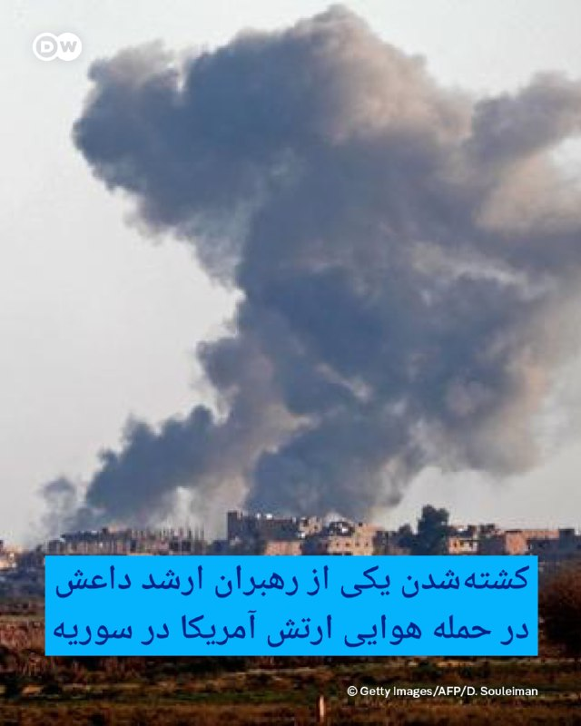

🔶 کشته‌شدن یکی از رهبران ارشد داعش در حمله هوایی ارتش آمریکا در سوریه
 
فرماندهی مرکزی ایالات متحده (سنتکام) اعلام کرد که نیروهای این فرماندهی در یک حمله هوایی دقیق در شمال غربی سوریه، یکی از رهبران ارشد گروه تروریستی داعش را از پای درآورده‌اند.
 
بر اساس بیانیه رسمی سنتکام، این حمله هوایی که در تاریخ ۱۹ ژوئن انجام شد، به کشته شدن علی حسین العلیوی، از مهره‌های کلیدی داعش، منجر شده است. ارتش آمریکا تاکید کرده است که این عملیات دقیق، بخشی از تلاش‌های مستمر واشنگتن برای فلج کردن و نابودی تروریست‌هایی است که به دنبال حمله به شهروندان آمریکایی در خارج از کشور یا هدف قرار دادن خاک ایالات متحده هستند.
 
در همین رابطه، برد کوپر، فرمانده سنتکام، با تاکید بر ادامه همکاری ارتش آمریکا با شرکای منطقه‌ای گفت: «سنتکام و شرکای ما همچنان به ریشه‌کن کردن بقایای داعش برای تضمین شکست دائمی این گروه متعهد هستند.»
 
وی افزود: «ما به دفاع از خاک ایالات متحده، نیروهای نظامی خود و همچنین متحدان و شرکایمان در سراسر منطقه ادامه خواهیم داد.»
 
@dw_farsi

## DW_Farsi — post 126421

  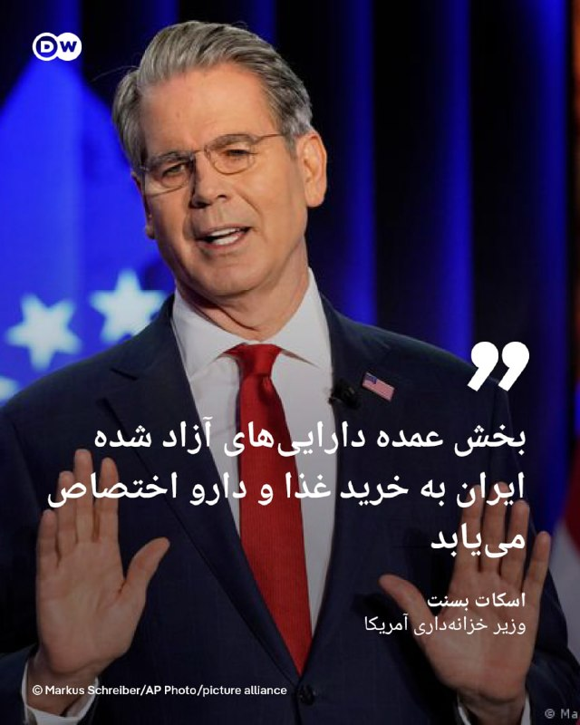

🔶 بسنت: بخش عمده دارایی‌های آزاد شده ایران به خرید غذا و دارو اختصاص می‌یابد
 
اسکات بسنت، وزیر خزانه‌داری آمریکا در تایید اظهارات دونالد ترامپ تاکید کرد که بخش عمده‌ای از دارایی‌های آزادشده ایران در جریان توافق، صرف خرید مواد غذایی و دارو از آمریکا خواهد شد.
 
اسکات بسنت در گفتگو با شبکه خبری "سی‌ان‌بی‌سی" اعلام کرد که وزارت خزانه‌داری آمریکا برای کنترل و نظارت مستقیم بر نحوه هزینه‌کرد این دارایی‌ها، یک دفتر عملیاتی ویژه در دوحه، پایتخت قطر راه‌اندازی خواهد کرد.
 
این اظهارات در حالی مطرح می‌شود که پیش‌تر مقامات جمهوری اسلامی اعلام کرده بودند کنترل کامل دارایی‌های آزادشده خود را در اختیار دارند و درباره نحوه مصرف آن شخصا تصمیم‌گیری خواهند کرد.
 
در مقابل، دولت ترامپ پافشاری می‌کند که این اموال کاملا تحت مدیریت واشنگتن باقی مانده و به طور انحصاری برای خرید محصولات کشاورزی و پزشکی از داخل خاک ایالات متحده کانالیزه می‌شود.
@dw_farsi

## DW_Farsi — post 126420

🎥 سوزان هورمان تنها پزشک زن در جام جهانی
 
کوراسائو در نخستین حضور خود در جام جهانی، هم در داخل زمین و هم خارج از آن تاریخ‌ساز شده است. در ترکیب این تیم، تنها پزشک زن حاضر در این رقابت‌ها نیز حضور دارد.
 
 @dw_farsi

## DW_Farsi — post 126419

🔶 ارزش سهام اسپیس‌ایکس باز هم کاهش یافت
 
به گزارش خبرگزاری فرانسه ارزش سهام اسپیس‌ایکس در سومین روز پیاپی تنزل یافته و با کاهشی ده درصدی به ۱۶۵.۵۱ دلار در ازای هر سهم رسیده است. سهام این شرکت پس از آغاز عرضه در بازارهای بورس سخت مورد استقبال سهامداران و سرمایه‌گذاران قرار گرفته و ارزش آن در پی شروع فعالیت حدود ۲۲ درصد افزایش یافته بود.
 
شرکت اسپیس‌ایکس با ورود خود به بازارهای بورس رکوردی تازه در بازارهای مالی به پا کرد و صاحب آن، ایلان ماسک را به نخستین تریلیونر جهان بدل ساخت. نشریه فوربس گزارش داده بود که دارایی‌ماسک با عرضه سهام اسپیس‌ایکس در بازارهای بورس از مرز یک‌ تریلیون دلار  گذشته است.
 
ایلان ماسک در شرکت اسپیس ایکس، رئیس هیأت مدیره، مدیر فنی و همچنین رئیس شورای اداری آن است و به نوشته خبرگزاری فرانسه با عرضه سهام اسپیس‌ایکس در بازارهای بورس می‌کوشد نفوذ خود در این شرکت را گسترش دهد.
 
طبق داده‌های بازارهای بورس ماسک در حال حاضر حدود ۸۵ درصد از حق رأی سهامداران را در دست دارد و همچنین ۴۲ درصد از سرمایه سهام در اختیار اوست؛ رقمی که در مقایسه با دیگر شرکت‌های فعال در بازارهای بورس به مراتب بالاتر است.
 
منتقدان بر این باورند، اینکه این میزان از دارایی و نفوذ در اختیار یک فرد است، تهدیدی برای دموکراسی محسوب می‌شود.
 
خبرگزاری فرانسه در گزارش خود به نقل از یک سخنگوی آنتونیو گوترش، دبیرکل سازمان ملل نوشت که ورود اسپیس‌ایکس به بازار بورس "معضل نابرابری" را برجسته می‌کند. او افزود: «کسانی که از آن بهره می‌برند، باید نهایت تلاش خود را در راه کمک و پشتیبانی از دیگران انجام دهند.»
 
@dw_farsi

## Persian_Trend_Official — post 17944

  <a href="telegram/content/Persian_Trend_Official_17944_1782318753.mp4" target="_blank">🎬 Download video</a>

خبرنگار: برخی از عناصر اطلاعاتی ایالات متحده ارزیابی کرده‌اند که اسرائیل علاقه‌مند به تضعیف تفاهم‌نامه فعلی است.

روبیو: من نمی‌دانم در مورد چه اطلاعاتی صحبت می‌کنید. من نمی‌دانم این اطلاعات را از کجا می‌آورید.

📝 Amir

📌 @persian_trend_official
پرشین ترند | متفاوت‌ترین کانال نظامی

## Persian_Trend_Official — post 17943

  <a href="telegram/content/Persian_Trend_Official_17943_1782318756.mp4" target="_blank">🎬 Download video</a>

مارکو روبیو درباره لبنان: تنها دلیل حضور اسرائیل در لبنان این است که حزب‌الله موشک‌ها و پهپادهایش را از آنجا پرتاب می‌کند. آنها این را به روشنی بیان کردند.

هرچه ارتش لبنان زمین‌های بیشتری را در اختیار بگیرد، اسرائیل کمتر در لبنان خواهد بود.

📝 Amir

📌 @persian_trend_official
پرشین ترند | متفاوت‌ترین کانال نظامی

## Persian_Trend_Official — post 17942

  <a href="telegram/content/Persian_Trend_Official_17942_1782318759.mp4" target="_blank">🎬 Download video</a>

نتانیاهو: تا زمانی که من نخست وزیر هستم، ما منطقه امنیتی در جنوب لبنان را حفظ خواهیم کرد.

📝 Amir

📌 @persian_trend_official
پرشین ترند | متفاوت‌ترین کانال نظامی

## Persian_Trend_Official — post 17941

  <a href="telegram/content/Persian_Trend_Official_17941_1782318762.mp4" target="_blank">🎬 Download video</a>

نتانیاهو: من بیشتر زندگی بزرگسالی‌ام را وقف جلوگیری از دستیابی ایران به سلاح هسته‌ای کردم.

من آماده نبودم که اجازه دهم زنجیره‌ای از هزاران سال تاریخ یهود به دلیل دستیابی این آیت‌الله‌ها به سلاح هسته‌ای پاره شود.

به همین دلیل است که من بیشتر زندگی بزرگسالی‌ام را و همچنین به عنوان نخست‌وزیر به این هدف اختصاص دادم.

📝 Amir

📌 @persian_trend_official
پرشین ترند | متفاوت‌ترین کانال نظامی

## Persian_Trend_Official — post 17940

  <a href="telegram/content/Persian_Trend_Official_17940_1782318765.mp4" target="_blank">🎬 Download video</a>

نتانیاهو: به طور خاص یک چالش وجود دارد چیزی که من آن را پروژه منهتن می‌نامم.

ما اولین کسی در جهان خواهیم بود که مشکل پهپادهای انفجاری (FPV) را حل می‌کند. این یک مشکل جهانی است. اما ما آن را حل خواهیم کرد.

📝 Amir

📌 @persian_trend_official
پرشین ترند | متفاوت‌ترین کانال نظامی

## Persian_Trend_Official — post 17939

  <a href="telegram/content/Persian_Trend_Official_17939_1782318767.mp4" target="_blank">🎬 Download video</a>

نتانیاهو: وقتی پیش رئیس جمهور ترامپ رفتم، به او گفتم ما داریم وارد ایران می‌شویم.

اجازه نگرفتم بلکه فقط او را از برنامه‌مان مطلع کردم!

📝 Amir

📌 @persian_trend_official
پرشین ترند | متفاوت‌ترین کانال نظامی

## Persian_Trend_Official — post 17938

  <a href="telegram/content/Persian_Trend_Official_17938_1782318770.mp4" target="_blank">🎬 Download video</a>

نتانیاهو: امروز، ما تقریباً در 70 درصد از نوار غزه هستیم. ما حماس را خفه می‌کنیم. ما یکی از آخرین رهبران ارشد آن را حذف کردیم.

و آیا می‌دانید بعد از حذف او چه اتفاقی افتاد؟ هیچ. نه یک راکت. نه یک موشک. نه یک گلوله.

بله، حماس هنوز آنجاست. و ما با آن هم مقابله خواهیم کرد.

📝 Amir

📌 @persian_trend_official
پرشین ترند | متفاوت‌ترین کانال نظامی

## Persian_Trend_Official — post 17937

  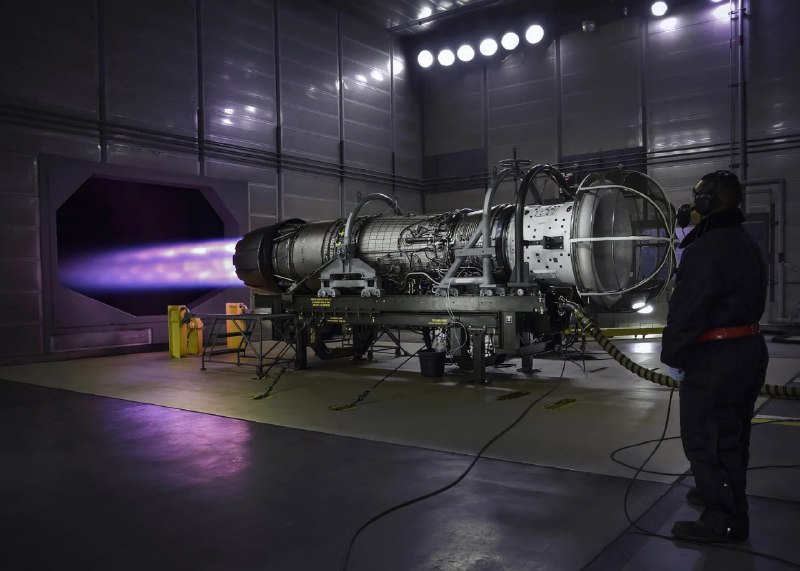

رویترز: دولت ترامپ در حال پیشبرد فروش بیش از 700 میلیون دلار موتورهای جت جنرال الکتریک برای جنگنده نسل 5 KAAN ترکیه است.

انتظار می‌رود این قرارداد در روزهای آینده و پیش از اجلاس ماه آینده ناتو در ترکیه نهایی شود.

📝 Amir

📌 @persian_trend_official
پرشین ترند | متفاوت‌ترین کانال نظامی

## Persian_Trend_Official — post 17936

  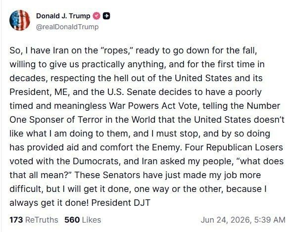

«بنابراین، من ایران را در دست خو دارم،آماده فروپاشی، مایل به دادن تقریباً همه چیز به ما و برای اولین بار در دهه‌ها، با احترام فراوان به امریکا و رئیس جمهورش، من و سنای امریکا تصمیم گرفتیم یک رأی‌گیری بدموقع و بی‌معنی در مورد قانون اختیارات جنگی داشته باشیم و به حامی اصلی تروریسم در جهان بگوییم که ایالات متحده از کاری که من با آنها می‌کنم قدردانی نمی‌کند، و من باید متوقف شوم، و با انجام این کار، به دشمن کمک و تسلی داده است. چهار بازنده جمهوری‌خواه به دموکرات‌ها رأی دادند، و ایران از مردم من پرسید: "همه اینها به چه معناست؟" این سناتورها فقط کار من را سخت‌تر کردند، اما من به هر حال این کار را انجام خواهم داد، به هر طریقی، چون همیشه این کار را می‌کنم!»

📌 @persian_trend_official
پرشین ترند | متفاوت‌ترین کانال نظامی

## Persian_Trend_Official — post 17935

  <a href="telegram/content/Persian_Trend_Official_17935_1782318774.mp4" target="_blank">🎬 Download video</a>

✈️مارک روته: ۵۰۰ هواپیمای آمریکایی در عملیات «Epic Fury» مشارکت داشتند.

🚩 «مارک روته» دبیرکل ناتو در گفت‌وگو با شبکه فاکس‌نیوز اعلام کرد حدود ۵۰۰ هواپیمای آمریکایی از پایگاه‌های مختلف برای پشتیبانی از عملیات موسوم به «Epic Fury» به پرواز درآمدند.

🔹 وی این عملیات را «بسیار گسترده» توصیف کرد و گفت حجم نیروها و تجهیزات به‌کار گرفته‌شده نشان‌دهنده ابعاد بزرگ این مأموریت بوده است.

🔹 روته همچنین با حمایت از سیاست‌های دولت آمریکا در قبال ایران اظهار داشت:

💬 «فکر می‌کنم دونالد ترامپ دقیقاً کاری را انجام می‌دهد که لازم است؛ تضعیف توان هسته‌ای ایران.»

🔹 دبیرکل ناتو مدعی شد دستیابی ایران به سلاح هسته‌ای می‌تواند پیامدهای گسترده‌ای برای امنیت منطقه و جهان به همراه داشته باشد.

اظهارات دبیرکل ناتو از یک سو ابعاد عملیات نظامی اخیر آمریکا را برجسته می‌کند و از سوی دیگر نشان‌دهنده همسویی بخشی از رهبران غربی با سیاست فشار بر برنامه هسته‌ای ایران است. اشاره به مشارکت صدها هواپیما در یک عملیات واحد، تصویری از سطح بسیج و توان لجستیکی آمریکا در این مأموریت ارائه می‌دهد.

 Phantom

📌 @persian_trend_official
پرشین ترند | متفاوت‌ترین کانال نظامی

## Persian_Trend_Official — post 17934

  <a href="telegram/content/Persian_Trend_Official_17934_1782318777.webm" target="_blank">🎬 Download video</a>

🪖
✈️ تشدید تحرکات نظامی اسرائیل در جنوب لبنان

منابع لبنانی گزارش دادند یک حمله پهپادی اسرائیل خودرویی را در شهرک «کفر رمان» در جنوب لبنان هدف قرار داده که در پی آن دو نفر کشته شدند.

🔹 همزمان فعالیت گسترده پهپادهای اسرائیلی در ارتفاع پایین بر فراز بیروت و حومه پایتخت لبنان گزارش شده است؛ موضوعی که پس از یک روز نسبتاً آرام در این مناطق رخ داده است.

🔹 همچنین منابع محلی از حمله پهپادی دیگری به منطقه «نبطیه الفوقا» در جنوب لبنان خبر داده‌اند.

🔹 در محور مرزی نیز حملات توپخانه‌ای اسرائیل شهرک «یاتر» را هدف قرار داده و عملیات تخریب در شهرک «عیترون» ادامه دارد.

🔹 خبرگزاری ملی لبنان (NNA) اعلام کرد یک تانک اسرائیلی مستقر در منطقه «الطیری» نیز شهرک «حداثا» را با چندین گلوله هدف قرار داده است.

ادامه حملات هوایی، توپخانه‌ای و فعالیت پهپادهای شناسایی نشان می‌دهد با وجود تلاش‌های دیپلماتیک برای کاهش تنش، جبهه جنوب لبنان همچنان یکی از نقاط بحرانی منطقه باقی مانده است. افزایش این تحرکات می‌تواند بر روند مذاکرات و وضعیت امنیتی مرزهای لبنان و اسرائیل تأثیرگذار باشد.

 Phantom

📌 @persian_trend_official
پرشین ترند | متفاوت‌ترین کانال نظامی

## Persian_Trend_Official — post 17933

  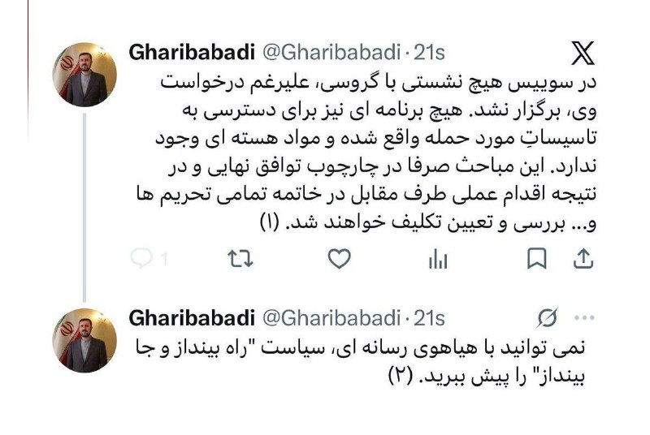

غریب آبادی معاون وزارت خارجه:

در سوییس هیچ نشستی با گروسی، علیرغم درخواست وی، برگزار نشد. هیچ برنامه‌ای نیز برای دسترسی به تاسیساتِ مورد حمله واقع شده و مواد هسته ای وجود ندارد.
این مباحث صرفا در چارچوب توافق نهایی و در نتیجه اقدام عملی طرف مقابل در خاتمه تمامی تحریم ها و... بررسی و تعیین تکلیف خواهند شد. نمی‌توانید با هیاهوی رسانه ای، سیاست «راه بینداز و جا بینداز» را پیش ببرید.

پ.ن : برای ثبت در تاریخ !

📌 @persian_trend_official
پرشین ترند | متفاوت‌ترین کانال نظامی

## Persian_Trend_Official — post 17932

  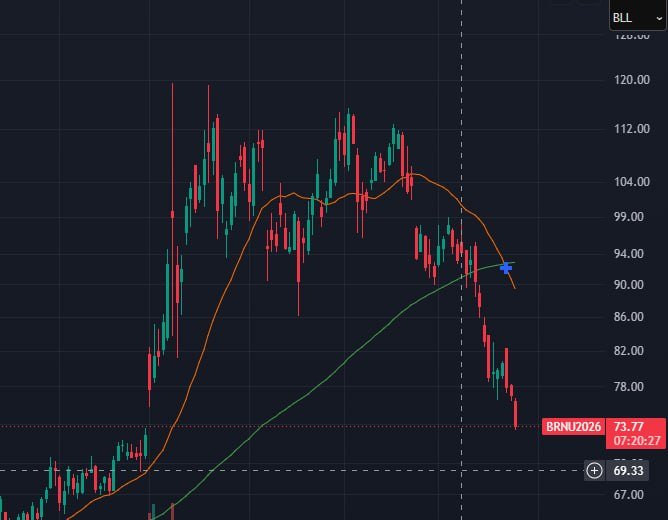

نفت برنت در کانال 73 دلار

📌 @persian_trend_official
پرشین ترند | متفاوت‌ترین کانال نظامی

## Persian_Trend_Official — post 17931

  <a href="telegram/content/Persian_Trend_Official_17931_1782318779.webm" target="_blank">🎬 Download video</a>

قیمت طلا روی مرز 4000 دلار !!!

📌 @persian_trend_official
پرشین ترند | متفاوت‌ترین کانال نظامی

## Persian_Trend_Official — post 17930

  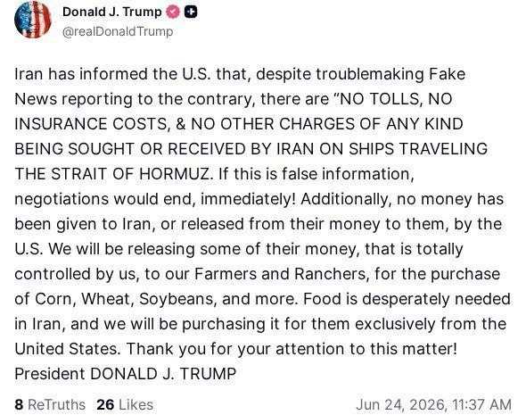

پرزیدنت دونالد ترامپ:

ایران به ایالات متحده اطلاع داده است که برخلاف گزارش‌های جنجال‌آفرینِ فیک نیوز، هیچ‌گونه «حق عبور، هزینه بیمه، و هیچ هزینه دیگری از هیچ نوع» از کشتی‌هایی که در تنگه هرمز تردد می‌کنند، توسط ایران مطالبه یا دریافت نمی‌شود. اگر این اطلاعات نادرست باشد، مذاکرات فوراً پایان خواهد یافت!
علاوه بر این، هیچ پولی از سوی ایالات متحده به ایران داده نشده و هیچ بخشی از پول‌های خودشان نیز به آن‌ها آزاد نشده است. ما بخشی از پول آن‌ها را که کاملاً تحت کنترل ماست، برای خرید ذرت، گندم، سویا و اقلام دیگر، به کشاورزان و دامداران خودمان اختصاص خواهیم داد. ایران شدیداً به مواد غذایی نیاز دارد و ما این اقلام را منحصراً از ایالات متحده برای آن‌ها خریداری خواهیم کرد. از توجه شما به این موضوع سپاسگزارم!

📌 @persian_trend_official
پرشین ترند | متفاوت‌ترین کانال نظامی

## RadioFarda — post 158719

اتحادیه اروپا: گوشی‌ها باید طوری طراحی شود که کاربران بتوانند باتری آن را عوض کنند

🔸قانونی که قرار است از سال ۲۰۲۷ به اجرا در آید شرکت‌های سازنده تلفن‌های همراه و تبلت‌ها را ملزم می‌کند که محصولات خود را بر اساس مقررات جدید اتحادیه اروپا طراحی و تولید کنند.

🔸بر اساس این قانون، تلفن‌ها باید طوری طراحی شوند که کاربران بتوانند به‌راحتی باتری آن را تعویض کنند.

🔸مرحله اول قوانین و مقررات مربوط به تغییر در طراحی و تولید تلفن‌های همراه در سال ۲۰۲۵ آغاز شد.

🔸در این مرحله، سازندگان تلفن‌های همراه ملزم شدند طول عمر باتری تلفن‌هایی را که در اتحادیه اروپا به‌فروش می‌رسند افزایش دهند تا این باتری‌ها بتوانند دست‌کم ۸۰ درصد از انرژی خود را پس از ۸۰۰ بار شارژ کردن حفظ کنند.

🔸سازندگان تلفن‌های همراه همچنین باید دسترسی به قطعات یدکی برای تعمیر تلفن‌ها را تا ده سال برای کاربران و مراکز تعمیر مستقل تضمین کنند.

🔸اما بر اساس قانونی که از سال ۲۰۲۷ به اجرا گذاشته خواهد شد، سازندگان تلفن‌های همراه و تبلت باید این دستگاه‌ها را طوری طراحی کنند که یک کاربر عادی بتواند با استفاده از کمترین ابزار، باتری تلفن و یا تبلت خود را تعویض کند.

🔸با این کار هم طول عمر تلفن و تبلت بیشتر می‌شود و هم پسماندهای الکتریکی آلوده‌کنندهٔ محیط زیست کمتر خواهد شد.

🔸گزارش کامل را در وب‌سایت رادیوفردا بخوانید.

@RadioFarda

## RadioFarda — post 158718

  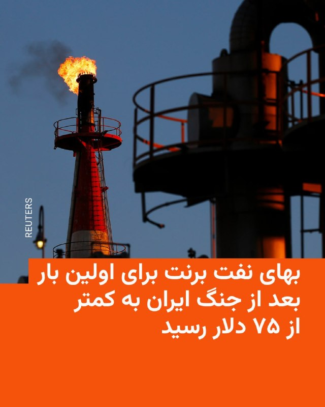

🔸روند کاهشی قیمت جهانی نفت با افزایش عبور کشتیرانی از تنگه هرمز در روز چهارشنبه ادامه یافت و قیمت نفت خام برنت برای اولین بار از زمان آغاز جنگ به زیر ۷۵ دلار در هر بشکه رسید.

🔸قیمت نفت وست تگزاس اینترمدیت آمریکا هم به زیر ۷۰ دلار در هر بشکه رسید که آن هم برای اولین بار از زمان آغاز جنگ خاورمیانه رخ می‌داد.

🔸مطابق تفاهمنامه اخیر ایران و آمریکا، تهران ملزم به بازگشایی آزادانه تنگه هرمز برای مدت ۶۰ روز شده است. در روزهای اخیر گزارش‌های مختلفی از افزایش تعداد کشتی‌های عبوری از تنگه هرمز منتشر شده است. روز سه‌شنبه شرکت کپلر گفته بود داده‌های کشتیرانی نشان دهنده رسیدن ترافیک عبوری در تنگه هرمز به میزان یک سوم روند معمول پیش از جنگ است.

🔸کارشناسان بازارهای مالی در گفت‌وگو با خبرگزاری‌های مختلف در عین حال از وجود رویکرد احتیاطی در میان معامله‌گران خبر دادند و گفتند کاهش ذخایر استراتژیک کشورها باعث افزایش تقاضا برای نفت شده است.

@RadioFarda

## RadioFarda — post 158717

  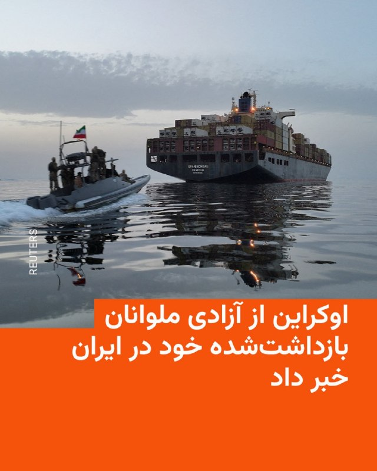

🔸سخنگوی وزارت خارجه اوکراین روز چهارشنبه از آزادی چهار ملوان بازداشتی این کشور در ایران خبر داد و گفت آنها به اوکراین بازگشتند.

🔸گئورگی تیخی گفت این ملوان‌ها خدمه کشتی کانتینری «اپامینوداس» بودند که ماه آوریل از سوی ایران در تنگه هرمز توقیف شد.

🔸کشتی یونانی اپامینوداس یکی از چند شناوری بود که سپاه پاسداران در واکنش به محاصره دریایی ایران از سوی آمریکا توقیف شده بود. آن زمان رسانه‌های نزدیک به سپاه از جمله خبرگزاری تسنیم این کشتی را به داشتن «مالک اسرائیلی» و «تردد مخفیانه در تنگه هرمز» متهم کرده بودند.

🔸سخنگوی وزارت خارجه اوکراین گفته است که سفارت این کشور در یونان با «مالک کشتی یونانی و سایر طرف‌های ذیربط تماس برقرار کردند تا از دریانوردان محافظت کرده و راه‌هایی برای بازگرداندن آنها به خانه پیدا کنند.»

🔸او افزود که ملوانان در سلامت کامل هستند.

@RadioFarda

## RadioFarda — post 158716

🔸یسرائیل کاتز، وزیر دفاع اسرائیل، اعلام کرد کشورش حتی در صورت درخواست آمریکا نیز از مناطق تحت کنترل خود در جنوب لبنان عقب‌نشینی نخواهد کرد. 🔸آقای کاتز روز چهارشنبه سوم تیرماه در یک نشست عمومی در تل‌آویو گفت در حال حاضر هیچ درخواستی از سوی واشینگتن برای خروج…

## RadioFarda — post 158715

🔸یسرائیل کاتز، وزیر دفاع اسرائیل، اعلام کرد کشورش حتی در صورت درخواست آمریکا نیز از مناطق تحت کنترل خود در جنوب لبنان عقب‌نشینی نخواهد کرد.

🔸آقای کاتز روز چهارشنبه سوم تیرماه در یک نشست عمومی در تل‌آویو گفت در حال حاضر هیچ درخواستی از سوی واشینگتن برای خروج نیروهای اسرائیلی از لبنان مطرح نشده و این موضوع را یک «دستاورد سیاسی» برای اسرائیل توصیف کرد.

🔸او افزود: «در هر صورت عقب‌نشینی نخواهیم کرد» و گفت حضور نیروهای اسرائیلی در جنوب لبنان برای حفاظت از ساکنان شمال اسرائیل در برابر حملات حزب‌الله ضروری است.

🔸این اظهارات در حالی مطرح می‌شود که مقام‌های اسرائیلی و لبنانی در حال بررسی طرحی با حمایت آمریکا هستند که بر اساس آن، نیروهای اسرائیلی از بخشی از مناطق تصرف‌شده در جنوب لبنان خارج شوند و کنترل این مناطق به ارتش لبنان واگذار شود.

🔸به گفته مقام‌های دو طرف، این پیشنهاد در جریان گفت‌وگوهای جاری در واشینگتن بررسی می‌شود.

@RadioFarda

## RadioFarda — post 158714

  <a href="https://t.me/radiofarda/158714" target="_blank">📎 Download file</a>

پاراگراف اول؛ جامعه مدنی بعد از جنگ، آمیخته‌ای از «فرسایش و تداوم»

🔸بیش از سه سال پس از اعتراض‌های «زن، زندگی، آزادی»، جامعهٔ مدنی ایران همچنان در معرض پرسش‌های مهمی قرار دارد؛ از میزان تاب‌آوری و توان سازمان‌یابی آن گرفته تا تأثیر سرکوب‌های فزاینده، فشارهای اقتصادی و تغییر انتظارات اجتماعی. در این میان، برخی از فرسایش سرمایه اجتماعی می‌گویند و برخی دیگر بر تداوم و بازتولید اشکال تازه‌ای از کنش مدنی تأکید دارند.

🔸در برنامهٔ رادیویی «پاراگراف اول» مهرداد میردامادی از دبیران اتاق خبر رادیو فردا همراه با هوشیار انصاری‌فر، نویسنده، شاعر و روزنامه نگار ساکن ایران، و زهرا رحیمی خامنه مدیر عامل جمعیت امداد دانشجویی-مردمی «امام علی» که با حکم قوه قضائیه جمهوری اسلامی منحل شد و اکنون ساکن آمریکا است، شرایط عینی ظهور دوبارهٔ جامعهٔ مدنی ایران از غبار جنگ خارجی و سرکوب داخلی را به بحث گذاشته‌اند.

🔸متن این گفت‌وگو را در وب‌سایت رادیوفردا بخوانید یا به فایل صوتی آن گوش دهید.

@RadioFarda

## RadioFarda — post 158713

خروج کشتی‌های گرفتار در تنگه هرمز براساس طرح جدید سازمان بین‌المللی دریانوردی آغاز شد

🔸سازمان بین‌المللی دریانوردی، وابسته به سازمان ملل، روز چهارشنبه سوم تیر اعلام کرد کشتی‌ها تحت طرح جدید این سازمان برای تخلیه شناورهایی که به دلیل درگیری‌ها در تنگه هرمز گرفتار شده بودند، عبور از این آبراه را آغاز کرده‌اند.

🔸سازمان بین‌المللی دریانوردی (آی‌ام‌او) روز سه‌شنبه اعلام کرده بود که این ابتکار، که نهایی شدن آن ماه‌ها زمان برده است، به صدها کشتی و حدود ۱۱ هزار دریانورد گرفتار در خلیج فارس امکان خواهد داد از تنگه هرمز عبور کنند.

🔸یک سخنگوی این سازمان روز چهارشنبه گفت: «کشتی‌ها هم‌اکنون عبور بر اساس این طرح را آغاز کرده‌اند.»

🔸او از ارائه جزئیات دربارهٔ شناورهایی که تاکنون عبور کرده‌اند خودداری کرد.

🔸این کشتی‌ها در پی آغاز جنگ آمریکا و اسرائیل علیه ایران در اسفند سال گذشته و اقدام ایران به بستن تنگه هرمز در بخش غربی این آبراه گرفتار شده بودند.

🔸خبرگزاری رویترز بر اساس داده‌های ردیابی کشتی‌ها، ال‌اس‌ای‌جی، اعلام کرد در روز چهارشنبه دست‌کم دو کشتی فله‌بر خشک و یک کشتی باری در ۱۲ ساعت گذشته تحت این طرح از تنگه هرمز عبور کرده‌اند.

🔸داده‌های کشتیرانی همچنین نشان داد که سه نفتکش گرفتار در منطقه که در مجموع پنج میلیون بشکه نفت خام حمل می‌کردند نیز در حال خروج از تنگه هرمز بوده‌اند که دو فروند از آن‌ها به سمت آسیا حرکت می‌کردند. مشخص نبود که آیا این کشتی‌ها نیز در چارچوب طرح سازمان بین‌المللی دریانوردی حرکت کرده‌اند یا خیر.

🔸بر اساس داده‌های ردیابی کشتی‌ها و تحلیل رویترز از جابه‌جایی شناورها، دست‌کم ۳۵ کشتی کوچک‌تر که عمدتاً کشتی‌های فله‌بر، باری و کانتینربر هستند، به همراه پنج نفتکش و چند یدک‌کش در حال آماده شدن برای عبور از تنگه بودند.

🔸گزارش کامل را در وب‌سایت رادیوفردا بخوانید.

@RadioFarda

## IranianMinds — post 23235

  <a href="telegram/content/IranianMinds_23235_1782318782.mp4" target="_blank">🎬 Download video</a>

@IranianMinds

## IranianMinds — post 23234

  <a href="telegram/content/IranianMinds_23234_1782318784.mp4" target="_blank">🎬 Download video</a>

🔴 بنیامین نتانیاهو:

وقتی پیش رئیس‌جمهور ترامپ رفتم، بهش گفتم:

«ما داریم وارد ایران می‌شیم.»

من هیچ اجازه ای نخواستم. فقط برنامه‌مون رو به اطلاعش رسوندم.

@IranianMinds

## IranianMinds — post 23233

  <a href="telegram/content/IranianMinds_23233_1782318786.mp4" target="_blank">🎬 Download video</a>

🔴 بنیامین نتانیاهو:

امنیت با حرف و شعار به دست نمیاد، امنیت فقط با قدرت و اراده به دست میاد

طبق یک قانون ساده:

«اگر کسی آمد تو را بکشد، بلند شو و اول او را بکش.»

@IranianMinds

## IranianMinds — post 23232

  <a href="telegram/content/IranianMinds_23232_1782318789.mp4" target="_blank">🎬 Download video</a>

یکی از غمگین ترین چیزهایی که میتونید ببینید

سرباز روسی که توسط پهپادهای اوکراینی محاصره شدن و یکی از سرباز ها رو به یکی از پهپاد ها درخواست میکنه که اول رفیقشو‌ بزنه تا بتونه آخرین سیگارشو هم قبل از مرگ بکشه …

اپراتور اوکراینی هم قبول میکنه و اول رفیقشو میزنه و بعد خودش رو :)

@IranianMinds

## IranianMinds — post 23230

  <a href="telegram/content/IranianMinds_23230_1782318792.mp4" target="_blank">🎬 Download video</a>

🔴 دیشب صداوسیما در حمایت از تیم ملی این آهنگ رو که متنش توسط هوش مصنوعی نوشته شده بودو پخش کرد

بعد دیدن خیلی کسشره سریع زدن دیلیتش کردن از آرشیو هاشونم‌‌ دیلیت کردن حتی :))

@IranianMinds

## BBCPersian — post 284921

  <a href="telegram/content/BBCPersian_284921_1782318794.mp4" target="_blank">🎬 Download video</a>

تحقیقات علمی کدام روغن را سالم‌ترین روغن برای پخت‌وپز می‌دانند و سراغ کدام روغن اصلا نباید برویم؟

پاسخ در گفتگوی پروفسور نیتا فروهی و نازنین معتمدی تهیه‌کننده برنامه#۳۷درجه

@BBCPersian

## BBCPersian — post 284920

  <a href="telegram/content/BBCPersian_284920_1782318797.mp4" target="_blank">🎬 Download video</a>

🔻پیش از بازی چهارشنبه شب اسکاتلند مقابل برزیل، یک ربات دامن‌پوش اسکاتلندی با کلاهی به شکل مخروط ترافیکی در خیابان‌های میامی، ، در کنار هواداران رقصید.

هواداران اسکاتلندی خود را برای بازی آخر و حساس گروه C جام جهانی مقابل برزیل آماده می‌کنند.

شکست اسکاتلند در این بازی‌ آنها را فوراً به خانه نمی‌فرستد، اما باید با اضطراب منتظر نتایج سایر گروه‌ها در طول هفته باشند تا ببینند آیا می‌توانند به عنوان تیم سوم به دور بعدی صعود کنند یا خیر.

@BBCPersian

## BBCPersian — post 284919

  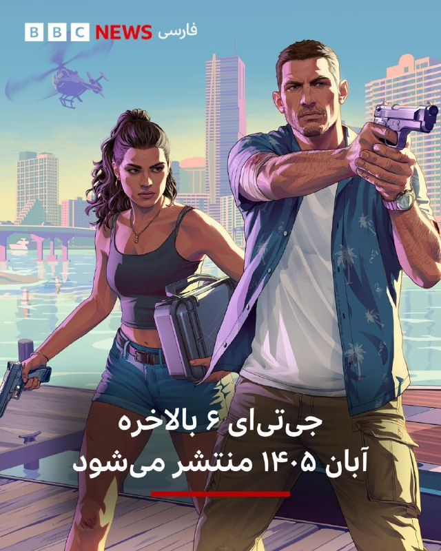

‌🎮بازی جی‌تی‌ای ۶، جدیدترین محصول شرکت راک‌استار، اعلام کرد که این بازی پس از ما‌ه‌ها تاخیر ۱۹ نوامبر ۲۰۲۶ ( ۲۸ آبان ۱۴۰۵) منتشر خواهد شد.

این شرکت اعلام کرد که این بازی ۸۰ دلار و نسخه پیشرفته (پریمیوم) ۱۰۰ دلار قیمت خواهد داشت.

راک‌استار گفت که نسخه‌های بازی به جای دیسک، رمز دانلود دیجیتال در داخل جعبه خواهند داشت.

جی‌تی‌ای ۶ که یکی از داغ‌ترین بازی‌های سال به شمار می‌آید، از نیمه‌شب ۲۵ ژوئن (۴ تیر) قابل پیش‌خرید خواهد بود.

به باور برخی تحلیلگران و فعالان صنعت بازی‌های ویدئویی، این محصول شرکت راک‌استار می‌تواند پرهزینه‌ترین بازی تولید شده باشد.

راک‌استار اعلام کرده که جی‌تی‌ای ۶ برای پلتفرم‌های پلی‌استیشن ۵ و ایکس‌باکس سری ایکس و اس منتشر خواهد شد.
📷RockStar
@BBCPersian

## idfinfarsi — post 11911

بیانیه مشترک سخنگوی ارتش اسرائیل و سخنگوی شاباک:

در جریان عملیات ویژه ارتش اسرائیل و شاباک در تیپ منشه: نیروهای دوودوان تروریستی را که در فعالیت‌های تروریستی و قاچاق سلاح نقش داشت، به هلاکت رساندند

امروز (چهارشنبه)، در جریان یک عملیات مشترک در منطقه یامون واقع در تیپ منشه، نیروهای یگان دوودوان و شاباک، تروریست محمد زاید را به هلاکت رساندند.

این تروریست در چندین خانه در منطقه روستا پنهان شده بود و بر اساس ارزیابی‌ها به سلاح دسترسی داشت. در جریان تلاش برای بازداشت، این تروریست اقدام به فرار کرد و تهدیدی برای امنیت نیروها ایجاد نمود.

زاید که ساکن روستای یامون بود، به‌عنوان قاچاقچی سلاح فعالیت داشت و همچنین سلاحی را به تروریستی منتقل کرده بود که در سال ۲۰۲۵ به دو نیروی ارتش اسرائیل شلیک کرده و آن‌ها را به‌شدت مجروح کرده بود.

ارتش اسرائیل و شاباک در دوره اخیر برای بازداشت محمد زاید تلاش کردند که او برای مدت طولانی فراری بود. وی، در جریان تلاش برای بازداشت، اقدام به حمله به نیروها کرد و در محل به هلاکت رسید.

نیروهای ارتش اسرائیل و شاباک به فعالیت خود برای خنثی‌سازی ترور در سراسر لشکر یهودا و سامره ادامه خواهند داد، از جمله علیه قاچاقچیان سلاح که زمینه اجرای عملیات‌های تروریستی علیه شهروندان اسرائیل را فراهم می‌کنند.

## idfinfarsi — post 11910

  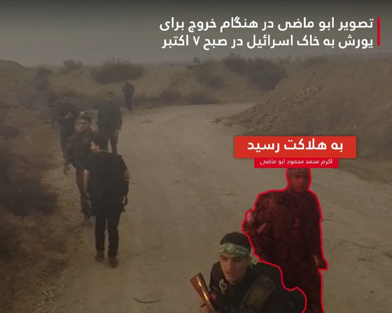

پس از تلاش برای بازسازی سازمان تروریستی حماس: ارتش اسرائیل تروریستی را که در یورش ۷ اکتبر به خاک اسرائیل شرکت داشت، به هلاکت رساند

ارتش اسرائیل اوایل این هفته (یکشنبه) در جنوب نوار غزه حمله کرد و اکرم محمد محمود ابو ماضی، تروریست وابسته به شاخه نظامی سازمان تروریستی حماس را به هلاکت رساند.

ابو ماضی در جریان کشتار ۷ اکتبر به داخل خاک اسرائیل نفوذ کرده بود.

در دوره اخیر، این تروریست تلاش داشت برای بازسازی توانمندی‌های سازمان و پیشبرد طرح‌های تروریستی علیه نیروهای ارتش اسرائیل و غیرنظامیان اسرائیل اقدام کند.

نیروهای ارتش اسرائیل تحت فرماندهی جنوب در منطقه مستقر هستند و مطابق با توافق به فعالیت خود برای رفع هرگونه تهدید ادامه خواهند داد.

## Dirty_Kids — post 392993

  <a href="telegram/content/Dirty_Kids_392993_1782318802.mp4" target="_blank">🎬 Download video</a>

اگر اون پرچمای انگلیس نبود فکر میکردم تهرانه…
ولی اینجا لندنه روز تاسوعا، انگلیسا کصشعری که خلق کردن دامن خودشون رو میگیره

@Dirty_Kids 👻

## Dirty_Kids — post 392992

  <a href="telegram/content/Dirty_Kids_392992_1782318805.mp4" target="_blank">🎬 Download video</a>

ذرت و سویا که به درد اینا نمیخوره؛
آشغال گوشت وارد کنید لطفا!
#محرم

@Dirty_Kids 👻

## Dirty_Kids — post 392991

  <a href="telegram/content/Dirty_Kids_392991_1782318806.mp4" target="_blank">🎬 Download video</a>

شیره مصرف کردی درسته؟

@Dirty_Kids 👻

## Dirty_Kids — post 392990

  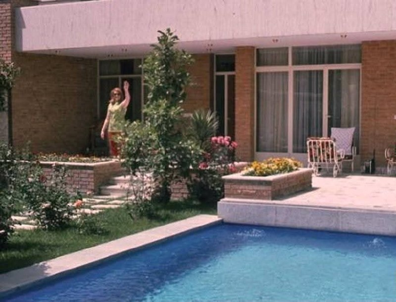

ایران
تهران
یک قاب از یک خانه تماشایی
تابستان ۱۳۵۴ خورشیدی
از صفحه اکبر منتظری

@Dirty_Kids 👻

## Dirty_Kids — post 392989

  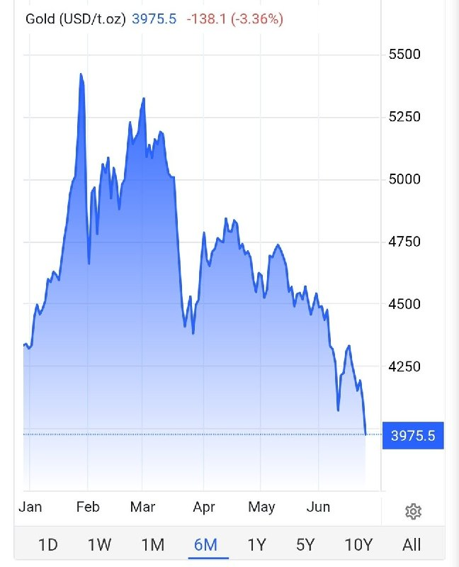

قیمت جهانی طلا با سقوط ۳۰ درصدی از سقف تاریخی هر انس طلا ۵۶۰۰ دلار به ۳۹۰۰ دلار رسید

@Dirty_Kids 👻

## Dirty_Kids — post 392988

  <a href="telegram/content/Dirty_Kids_392988_1782318810.mp4" target="_blank">🎬 Download video</a>

غیر منتظره ترین چیزی که امروز میبینید:

@Dirty_Kids 👻

## manototv — post 106228

در این تصاویر، محمدرضا شاه پهلوی به همراه نیک‌پی، شهردار وقت تهران و دیگر مقامات در مراسم افتتاح پارک نیاوران حضور دارند. پروژه‌ای که بخشی از برنامه گسترده توسعه فضاهای عمومی، پارک‌ها و زیرساخت‌های شهری پایتخت در دهه ۱۳۴۰ بود.

تهران در آن سال‌ها با سرعتی بی‌سابقه در حال گسترش بود و مدیریت شهری تلاش می‌کرد همگام با رشد جمعیت، فضاهای سبز و امکانات عمومی را توسعه دهد. پارک نیاوران یکی از نمادهای همین نگاه بود. فضایی که برای استفاده شهروندان، تفریح خانواده‌ها و ارتقای کیفیت زندگی شهری طراحی شد.

## alonews — post 130059

  <a href="telegram/content/alonews_130059_1782318811.webm" target="_blank">🎬 Download video</a>

👈در سال ۱۹۹۰ میلادی، اسرائیل و ایران تقریباً سرانه تولید ناخالص داخلی یکسانی داشتند. امروز، سرانه تولید ناخالص داخلی اسرائیل تقریباً ۲۰ برابر بیشتر است

✅ @AloNews خبر جنگ

## alonews — post 130058

👈روبیو: ما گزینه‌های زیادی داریم، از جمله اعمال تحریم علیه ایران در صورت عدم پایبندی به توافق

✅ @AloNews خبر جنگ

## alonews — post 130057

  <a href="telegram/content/alonews_130057_1782318812.webm" target="_blank">🎬 Download video</a>

👈یه حمله پهپادی اسرائیل به النبطیه الفوقا، لُبنان انجام شد

✅ @AloNews خبر جنگ

## alonews — post 130056

  <a href="telegram/content/alonews_130056_1782318812.webm" target="_blank">🎬 Download video</a>

👈 کانال ۱۳ اسرائیل: نتانیاهو امشب جلسه امنیتی در مورد لبنان و سوریه برگزار خواهد کرد

✅ @AloNews خبر جنگ

## alonews — post 130055

  <a href="telegram/content/alonews_130055_1782318813.webm" target="_blank">🎬 Download video</a>

👈دونالد ترامپ جونیور: قیمت‌های آتی نفت اکنون به زیر ۷۰ دلار رسیده است به دلیل توافق صلح رئیس‌جمهور ترامپ برای پایان دادن به جنگ در ایران.

🔴قیمت‌های پایین‌تر بنزین در راه است برای آمریکایی‌ها

✅ @AloNews خبر جنگ

## alonews — post 130054

  <a href="telegram/content/alonews_130054_1782318813.webm" target="_blank">🎬 Download video</a>

👈ابراهیم رضایی: تنگه هرمز را با مذاکره فتح نکردیم که با مذاکره واگذار کنیم

🔴تنگه هرمز تا ابد ایرانی است، ما این تنگه را با مذاکره فتح نکرده‌ایم که اکنون با مذاکره واگذار کنیم، والسلام

✅ @AloNews خبر جنگ

## alonews — post 130053

  <a href="telegram/content/alonews_130053_1782318813.webm" target="_blank">🎬 Download video</a>

👈وزیر اقتصاد: در جنگ میدان پیروز شدیم اما جنگ اقتصادی تازه شروع شده

✅ @AloNews خبر جنگ

## alonews — post 130052

  <a href="telegram/content/alonews_130052_1782318813.webm" target="_blank">🎬 Download video</a>

👈غریب آبادی: برنامه‌ای برای دسترسی به تاسیسات هسته‌ای مورد حمله قرار گرفته نداریم

🔴معاون وزارت خارجه نوشت: هیچ نشستی با گروسی در سوئیس برگزار نشد.

✅ @AloNews خبر جنگ

## alonews — post 130051

  <a href="telegram/content/alonews_130051_1782318814.mp4" target="_blank">🎬 Download video</a>

👈نخست‌وزیر اسرائیل، بنیامین نتانیاهو:
یک چالش خاص وجود دارد—آنچه من «پروژه منهتن» می‌نامم.

ما اولین کسانی خواهیم بود که مشکل پهپادهای انفجاری (FPV) را در جهان حل می‌کنیم. این یک مشکل جهانی است.

اما ما آن را حل خواهیم کرد.

✅ @AloNews خبر جنگ

## alonews — post 130050

  <a href="telegram/content/alonews_130050_1782318817.mp4" target="_blank">🎬 Download video</a>

👈نخست‌وزیر اسرائیل، بنیامین نتانیاهو:
امروز ما در تقریباً ۷۰٪ از نوار غزه حضور داریم. ما حماس را خفه کرده‌ایم. یکی از آخرین رهبران ارشد آن، عزالدین الحدّاد را از بین بردیم. او دیگر نیست.

و می‌دانید بعد از اینکه او را از بین بردیم چه اتفاقی افتاد؟ هیچ چیز.

نه راکتی، نه موشکی، نه حتی یک شلیک.

بله، حماس هنوز آنجاست. و ما با آن هم برخورد خواهیم کرد.

✅ @AloNews خبر جنگ

## alonews — post 130049

  <a href="telegram/content/alonews_130049_1782318820.webm" target="_blank">🎬 Download video</a>

👈قیمت هر اونس طلا که در آبان 1404 به 5300 دلار رسیده بود، امروز با افت شدید به کمتر از 4000 دلار رسید

✅ @AloNews خبر جنگ

## alonews — post 130048

  <a href="telegram/content/alonews_130048_1782318820.webm" target="_blank">🎬 Download video</a>

👈الجزیره از حمله پهپادی اسرائیل به خودرویی در نزدیکی شهرک کفر رومان در جنوب لبنان خبر داد.

✅ @AloNews خبر جنگ

## alonews — post 130047

  <a href="telegram/content/alonews_130047_1782318820.webm" target="_blank">🎬 Download video</a>

👈وزارت خارجه پاکستان:
مذاکرات بین آمریکا و ایران هفته آینده از سر گرفته می شود

✅ @AloNews خبر جنگ

## alonews — post 130046

  <a href="telegram/content/alonews_130046_1782318821.webm" target="_blank">🎬 Download video</a>

👈نیویورک تایمز: داماد ترامپ به جمع میلیاردرها پیوست

🔴منبع اصلی این ثروت افسانه‌ای، همانطور که در گزارش فوربس آمده، شرکت سرمایه‌گذاری "افینیتی پارتنرز" (Affinity Partners) است که کوشنر در ژانویه ۲۰۲۱، یعنی درست پس از پایان دوره اول ریاست جمهوری ترامپ، تأسیس کرد.

✅ @AloNews خبر جنگ

## alonews — post 130045

  <a href="telegram/content/alonews_130045_1782318821.webm" target="_blank">🎬 Download video</a>

👈نتانیاهو : عملیات تو لُبنان تموم نشه 
🔴بی‌وقفه و خستگی‌ناپذیر برای این نبرد تلاش می‌کنیم 
✅ @AloNews خبر جنگ

## alonews — post 130044

  <a href="telegram/content/alonews_130044_1782318821.webm" target="_blank">🎬 Download video</a>

👈سخنگوی کمیسیون امنیت ملی مجلس:
تنگه هرمز رو با مذاکره فتح نکردیم که با مذاکره واگذار کنیم.

✅ @AloNews خبر جنگ

## alonews — post 130043

  <a href="telegram/content/alonews_130043_1782318821.webm" target="_blank">🎬 Download video</a>

👈نتانیاهو : عملیات تو لُبنان تموم نشه 
🔴بی‌وقفه و خستگی‌ناپذیر برای این نبرد تلاش می‌کنیم 
✅ @AloNews خبر جنگ

## alonews — post 130042

  <a href="telegram/content/alonews_130042_1782318822.webm" target="_blank">🎬 Download video</a>

👈نتانیاهو : عملیات تو لُبنان تموم نشه 
🔴بی‌وقفه و خستگی‌ناپذیر برای این نبرد تلاش می‌کنیم 
✅ @AloNews خبر جنگ

## alonews — post 130041

  <a href="telegram/content/alonews_130041_1782318822.webm" target="_blank">🎬 Download video</a>

👈نتانیاهو : عملیات تو لُبنان تموم نشه 
🔴بی‌وقفه و خستگی‌ناپذیر برای این نبرد تلاش می‌کنیم 
✅ @AloNews خبر جنگ

## alonews — post 130040

  <a href="telegram/content/alonews_130040_1782318822.webm" target="_blank">🎬 Download video</a>

👈نتانیاهو : عملیات تو لُبنان تموم نشه 
🔴بی‌وقفه و خستگی‌ناپذیر برای این نبرد تلاش می‌کنیم 
✅ @AloNews خبر جنگ

---
📅 بروزرسانی: 1405/04/03 18:10
---

## VahidOOnLine — post 247149

⭕️ «لشکر اجنه» در تعزیه؛
چهره‌پردازی‌های عجیب در مراسم محرم استان اصفهان

♦️همزمان با برگزاری آیین‌های محرم، ویدیوهایی از برخی مجالس تعزیه در استان اصفهان، به‌ویژه در شهرستان‌های خمینی‌شهر و کاشان، در شبکه‌های اجتماعی مورد توجه گسترده کاربران قرار گرفته است.
آنچه این اجراها را خبرساز کرده، چهره‌پردازی متفاوت و اغراق‌آمیز برخی نقش‌ها، به‌ویژه شخصیت‌های منفی و آنچه در برخی اجراها «لشکر اجنه» نامیده می‌شود، است. گریم‌هایی با شاخ، چهره‌های تیره، دندان‌های مصنوعی و طراحی‌های فانتزی که برای برخی کاربران یادآور آثار سینمایی و حتی جشن هالووین بوده است.
تعزیه یکی از مهم‌ترین آیین‌های نمایشی مذهبی ایران به شمار می‌رود و هر سال در نقاط مختلف کشور با شیوه‌ها و روایت‌های گوناگون اجرا می‌شود.
‌🇸🇦 Indypersian

🤖 @VahidOOnLine

## VahidOOnLine — post 247148

  

♦️شماری از مناطق گردشگری در فرانسه در سال‌های اخیر به گردشگران هشدار می‌دهند که اگر با بالاتنه برهنه در خیابان‌، میدان‌ یا مناطق تاریخی شهر دیده شوند، ممکن است تا ۱۵۰ یورو جریمه شوند.

این سخت‌گیری‌ها بیش از همه متوجه مردانی است که پس از ترک ساحل، همچنان بدون پیراهن در مرکز شهرها رفت‌وآمد می‌کنند. در فرانسه قانونی سراسری برای ممنوعیت برهنه بودن بالاتنه در ساحل وجود ندارد، اما شوراهای محلی در بسیاری از شهرهای ساحلی برای محدوده‌های شهری، مقررات جداگانه‌ای تعیین کرده‌اند.

ناربون، در ساحل جنوبی فرانسه، از جمله شهرهایی است که چنین ممنوعیتی را تا پایان سپتامبر اجرا می‌کند. مقام‌های این شهر گفته‌اند هدف از این تصمیم «حفظ آرامش عمومی، احترام به محیط زندگی و جذابیت مرکز شهر در فصل تابستان» است. به گفته آن‌ها، برخی پوشش‌ها که برای ساحل و محدوده‌های شنا مناسب‌اند، لزوما برای خیابان‌ مناسب نیستند.

افرادی که این مقررات را نقض کنند، ممکن است تا ۱۵۰ یورو، جریمه شوند و پلیس مسئول اجرای این قانون است.
‌🇸🇦 Indypersian

🤖 @VahidOOnLine

## VahidOOnLine — post 247147

  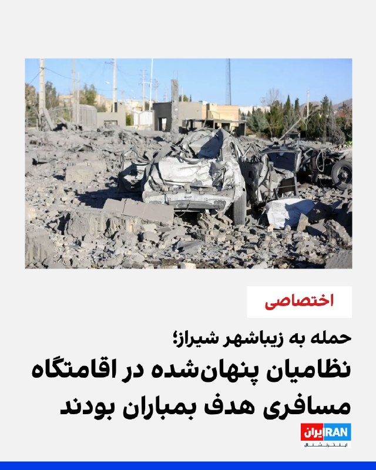

شامگاه ۱۴ اسفند ۱۴۰۴، ساختمانی بزرگ در اقامتگاه مسافری زیباشهر شیراز هدف موشک قرار گرفت و کاملا ویران شد؛ جایی که شماری از نیروهای سپاه از جمله نیروی هوافضایش، پنهان شده بودند. موج دوم این حمله، موجب کشته‌شدن ۹ غیرنظامی از جمله کارکنان پایگاه اورژانس ۱۱۵ مجاور این اقامتگاه شد.

بررسی تصاویر محل، داده‌های منبع‌باز، گزارش‌های رسانه‌های داخلی، ارزیابی یک مقام پیشین هدف‌گیری در نیروی هوایی آمریکا و روایت‌های شاهدان نشان می‌دهد آن‌چه در حمله به زیباشهر رخ داد، نه خطای ساده مهمات، بلکه هدف‌گرفتن ساختمانی مشخص در اقامتگاه اضطراری مسافری بود؛ ساختمانی که بر اساس شواهد موجود، محل پنهان‌شدن نیروهای سپاهی بود که از ترس بمباران مراکز نظامی، آن‌جا مخفی شده بودند.

اما همین هدف، در دل یک مجموعه با کاربری غیرنظامی، اقامتی، تفریحی و امدادی قرار داشت: اقامتگاه اضطراری مسافران زیباشهر، در کنار پایگاه اورژانس ۱۱۵، در مجاورت خانه‌های مسکونی و در فاصله کوتاهی از ساختمان‌هایی با کاربری خدماتی و عمومی.

ادامه این گزارش را در وب‌سایت ایران‌اینترنشنال بخوانید
‌🏁 🇬🇧 IranintlTV

🤖 @VahidOOnLine

## VahidOOnLine — post 247146

  

هادی و فضل‌الله نیک‌بخت، دو زندانی سیاسی در اصفهان، از سوی دادگاه انقلاب گلپایگان به اعدام محکوم شده‌اند و محمد نیک‌بخت، برادر دیگرشان، با اتهام‌هایی روبه‌روست که می‌تواند به صدور حکم اعدام منجر شود.

سازمان حقوق بشر ایران گزارش داد هادی و فضل‌الله حدود دو هفته پیش به اتهام «افساد فی‌الارض» به اعدام محکوم شدند. مصادیق دقیق این اتهام مشخص نیست، اما در پرونده آمده است آن‌ها برای اعتراض علیه حکومت، جوانان را سازماندهی کرده‌اند.

خانواده نیک‌بخت پس از صدور حکم، وکیلی را برای پیگیری پرونده انتخاب کرده‌اند، اما مشخص نیست این وکیل به پرونده دسترسی پیدا کرده باشد. هادی و فضل‌الله ۲۰ روز فرصت دارند به حکم اعتراض کنند.

این دو برادر دوم آبان ۱۴۰۴، پس از تلاش برای جلوگیری از تصرف زمین کشاورزی، در منزلشان در گلپایگان بازداشت و پس از دو ماه بی‌خبری مطلق به زندان دستگرد اصفهان منتقل شدند.

محمد نیک‌بخت، نوکیش مسیحی و عضو دیگر این خانواده نیز اسفندماه ۱۴۰۴ با خشونت بازداشت شد و دو ماه را در بی‌خبری مطلق گذراند. او اکنون در زندان دستگرد نگهداری می‌شود و با اتهام‌هایی روبه‌روست که می‌تواند به صدور حکم اعدام منجر شود.
https:/
‌🏁 🇬🇧 IranintlTV

🤖 @VahidOOnLine

## VahidOOnLine — post 247145

  

علی مدنی‌زاده، وزیر اقتصاد جمهوری اسلامی، با اشاره به جنگ اخیر گفت این مسیر در نهایت به پیروزی جمهوری اسلامی منجر شد و میدان و خیابان، در کنار دولت، این پیروزی را رقم زدند.
او افزود: «پس از این جنگ، اعتماد ملی، سرمایه اجتماعی و غرور ملی در میان مردم شکل گرفته است.»
وزیر اقتصاد گفت: «جنگ میدان به پایان رسیده اما جنگ اقتصادی آغاز شده و اکنون باید وارد جهاد اقتصادی شویم.»
‌🏁 🇬🇧 IranintlTV

🤖 @VahidOOnLine

## VahidOOnLine — post 247144

  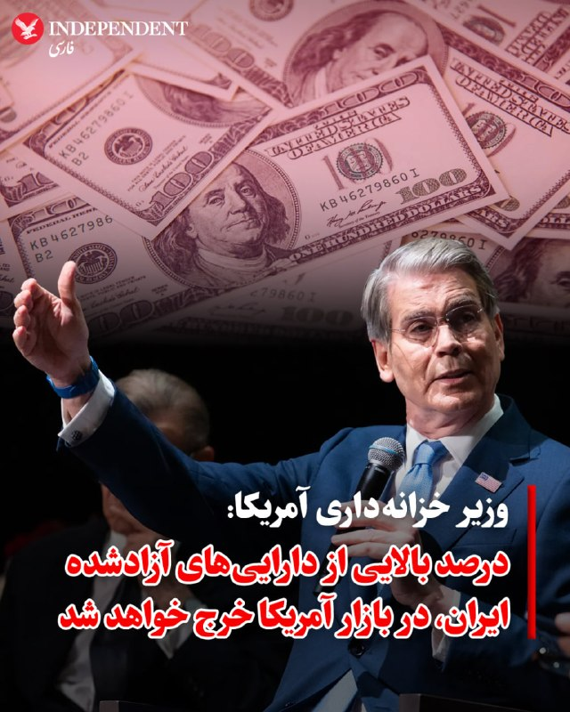

♦️ اسکات بسنت، وزیر خزانه‌داری ایالات متحده، تاکید کرده است که بخش عمده‌ای از دارایی‌های آزادشده ایران صرف خرید مواد غذایی و داروی آمریکایی خواهد شد؛ این در حالی است که مقامات جمهوری اسلامی می‌گویند چنین تعهدی نداده‌اند.

بسنت روز چهارشنبه سوم تیرماه، در گفتگو با شبکه سی‌ان‌بی‌سی (CNBC) گفت: «هر پولی که ایرانی‌ها به دست آورند، در وهله اول برای منافع مردم ایران استفاده خواهد شد.»

او در ادامه افزود که وزارت خزانه‌داری آمریکا مستقیما بر نحوه تخصیص این مبالغ—که احتمالا از طریق قطر توزیع می‌شود—نظارت خواهد کرد. وزیر خزانه‌داری آمریکا تصریح کرد: «درصد بسیار بالایی از این پول صرف خرید مواد غذایی و داروهای آمریکایی خواهد شد؛ بنابراین، ما این مبالغ را دوباره به چرخه خرید کالاهای آمریکایی بازمی‌گردانیم.»
‌🇸🇦 Indypersian

🤖 @VahidOOnLine

## VahidOOnLine — post 247143

  <a href="telegram/content/VahidOOnLine_247143_1782312056.mp4" target="_blank">🎬 Download video</a>

ویدیوی ارسال‌شده به ایران‌اینترنشنال نشان می‌دهد گروهی از مردم در دستگرد اصفهان در سوگ جاویدنام محسن چیت‌ساز سنج و دمام می‌زنند.
محسن چیت‌ساز، ۲۴ ساله‌، ۱۹ دی در شهر دستگرد استان اصفهان با شلیک گلوله جنگی کشته شد.
‌🏁 🇬🇧 IranintlTV

🤖 @VahidOOnLine

## VahidOOnLine — post 247142

  <a href="telegram/content/VahidOOnLine_247142_1782312058.mp4" target="_blank">🎬 Download video</a>

⭕️ سفر منطقه‌ای وزیر امور خارجه آمریکا؛
روبیو پس از ترک امارات وارد کویت شد

♦️مارکو روبیو، وزیر امور خارجه ایالات متحده، پس از پایان دیدارها و رایزنی‌های خود در امارات متحده عربی، وارد کویت شد و دومین ایستگاه از سفر منطقه‌ای خود در خلیج فارس را آغاز کرد. این سفر در حالی انجام می‌شود که پرونده ایران، امنیت منطقه و اجرای تفاهم‌نامه اخیر میان تهران و واشنگتن در کانون گفتگوهای آمریکا با کشورهای عربی قرار دارد.
روبیو در ابوظبی با شیخ محمد بن زاید آل نهیان دیدار و درباره مفاد تفاهم‌نامه میان ایران و آمریکا، امنیت تنگه هرمز و حفظ ثبات منطقه رایزنی کرد. او همچنین تاکید کرد که آینده این توافق و روند صلح در خاورمیانه، به نحوه اجرای تعهدات از سوی جمهوری اسلامی ایران بستگی دارد.
‌🇸🇦 Indypersian

🤖 @VahidOOnLine

## VahidOOnLine — post 247141

  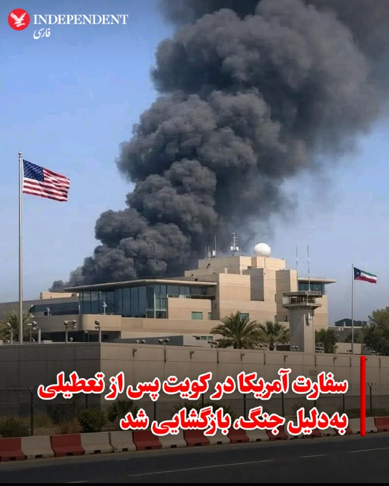

♦️ سفارت ایالات متحده آمریکا در کویت که در زمان جنگ در خاورمیانه، هدف قرار گرفته و تعطیل شده بود، فعالیت خود را از سر گرفته است. سخنگوی وزارت خارجه آمریکا، روز چهارشنبه سوم تیرماه، همزمان با سفر مارکو روبیو به این کشور، خبر بازگشایی سفارت را اعلام کرد.
‌🇸🇦 Indypersian

🤖 @VahidOOnLine

## VahidOOnLine — post 247140

  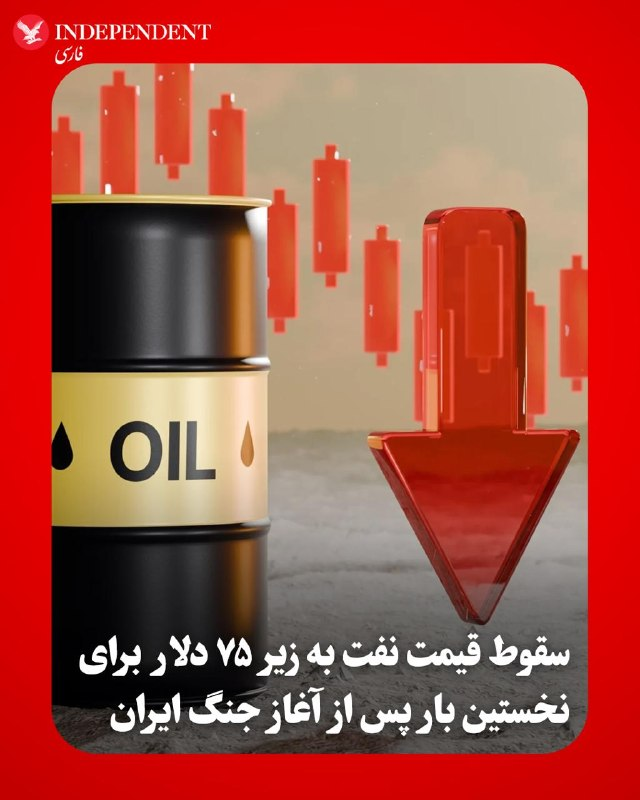

♦️قیمت نفت خام برنت دریای شمال، به عنوان شاخص بین‌المللی بازار نفت، روز چهارشنبه سوم تیرماه به روند نزولی خود ادامه داد و برای اولین بار از زمان آغاز جنگ در خاورمیانه، به زیر ۷۵ دلار در هر بشکه رسید.

برنت با تجربه یک افت ۳.۱ درصدی به ۷۴.۷۳ دلار کاهش یافت؛ این کاهش قیمت در ادامه روند نزولی نفت از هفته گذشته و پس از امضای یادداشت تفاهم میان ایالات متحده و جمهوری اسلامی ایران و آغاز فرآیند بازگشایی تنگه هرمز رخ داده است.
‌🇸🇦 Indypersian

🤖 @VahidOOnLine

## VahidOOnLine — post 247139

  

خبرگزاری دولتی لبنان گزارش داد یک پهپاد اسرائیلی خودرویی را در نزدیکی شهرک کفررمان در جنوب لبنان هدف قرار داد.
به گزارش الحدث در حمله اسرائیل به کفررمان دو نفر کشته شدند.
پیش‌تر نیز سخنگوی ارتش اسرائیل اعلام کرد نیروهای ارتش دو عضو مسلح حزب‌الله را که تهدیدی برای نیروهای اسرائیلی در منطقه علی‌الطاهر در جنوب لبنان بودند، هدف قرار دادند.
‌🏁 🇬🇧 IranintlTV

🤖 @VahidOOnLine

## VahidOOnLine — post 247138

  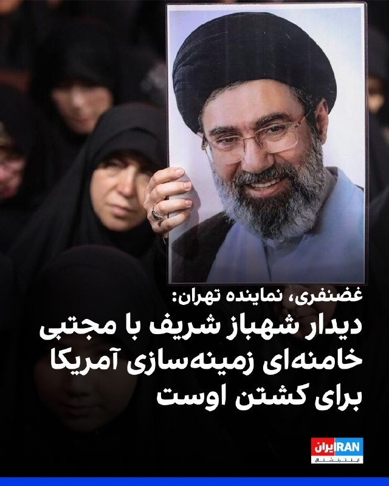

کامران غضنفری، نماینده مجلس، در پی اظهار تمایل شهباز شریف، نخست‌وزیر پاکستان، برای دیدار با مجتبی خامنه‌ای، در ایتا نوشت دیدار شریف با رهبر جمهوری اسلامی، بخشی از برنامه آمریکا و اسرائیل برای زمینه‌سازی «شهادت» او است.

غضنفری نوشت واسطه‌های اجرای برنامه آمریکا و اسرائیل برای هدف قرار دادن مجتبی خامنه‌ای، «مهره‌های داخلی آمریکا» هستند.
‌🏁 🇬🇧 IranintlTV

🤖 @VahidOOnLine

## VahidOOnLine — post 247137

  <a href="telegram/content/VahidOOnLine_247137_1782312062.mp4" target="_blank">🎬 Download video</a>

⭕️ پزشکیان در پاکستان:
اگر موشک نداشتیم، اسرائیل و آمریکا، ایران را مثل غزه شخم می‌زدند

♦️مسعود پزشکیان، رئیس‌جمهوری اسلامی در نشست خبری مشترک با شهباز شریف، نخست‌وزیر پاکستان، تاکید کرد که برنامه موشکی جمهوری اسلامی نه بخشی از توافق‌های اخیر بوده و نه در آینده موضوع مذاکره خواهد بود.
پزشکیان با اشاره به نقش توان دفاعی ایران در بازدارندگی گفت: «اگر موشک‌هایمان را که برای دفاع مشروع ماست نداشتیم، اسرائیل و آمریکا همان‌طور که غزه را با خاک یکسان کردند، ایران را هم شخم می‌زدند و به پیر و جوان رحم نمی‌کردند.»
رئیس‌جمهوری اسلامی همچنین گفت: «حقوق بشر، دروغ بزرگی است که آنها از آن دم می‌زنند.»
محدود کردن توانمندی‌های موشکی جمهوری اسلامی یکی از نگرانی‌های اصلی اسرائیل است و این موضوع از اهدافی بود که مقامات دولت ترامپ در اوایل جنگ تعیین کرده بودند. با این حال، جی‌دی ونس، معاون رئیس‌جمهوری آمریکا، در پاسخ به سوالی درباره این مسئله گفت که غیرممکن است به کشوری بگوییم حق ندارد از خود دفاع کند.
‌🇸🇦 Indypersian

🤖 @VahidOOnLine

## VahidOOnLine — post 247136

  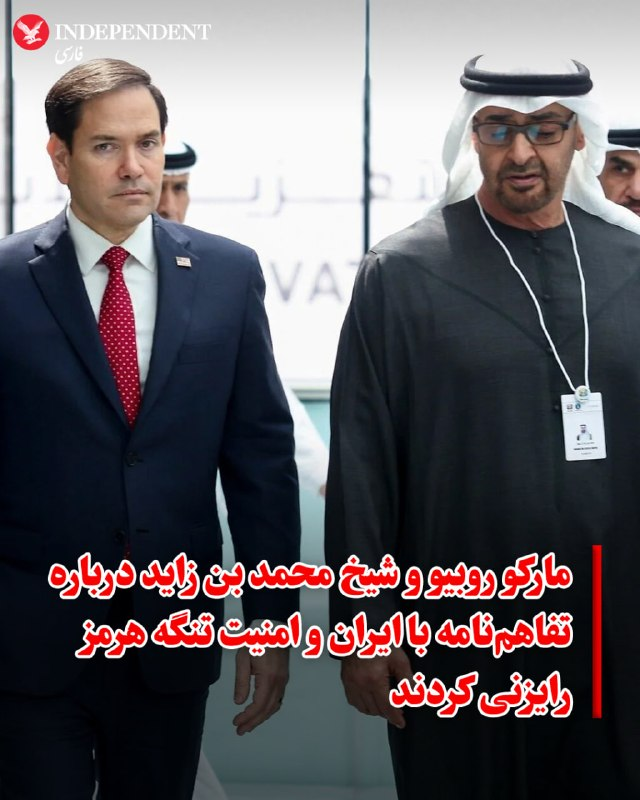

♦️ وزارت امور خارجه ایالات متحده روز چهارشنبه سوم تیرماه اعلام کرد که مارکو روبیو، وزیر امور خارجه این کشور، در دیدار با شیخ محمد بن زاید آل نهیان، رئیس دولت امارات متحده عربی، درباره یادداشت تفاهم با جمهوری اسلامی ایران گفتگو کرده است.

بر اساس بیانیه این وزارتخانه، دو طرف در این نشست علاوه بر بررسی مفاد این تفاهم‌نامه، در خصوص تضمین تردد ایمن و آزاد شناورها از تنگه هرمز و همچنین اهمیت حیاتی برقراری و حفظ صلح و ثبات در منطقه خاورمیانه به بحث و تبادل نظر پرداختند.
‌🇸🇦 Indypersian

🤖 @VahidOOnLine

## VahidOOnLine — post 247135

  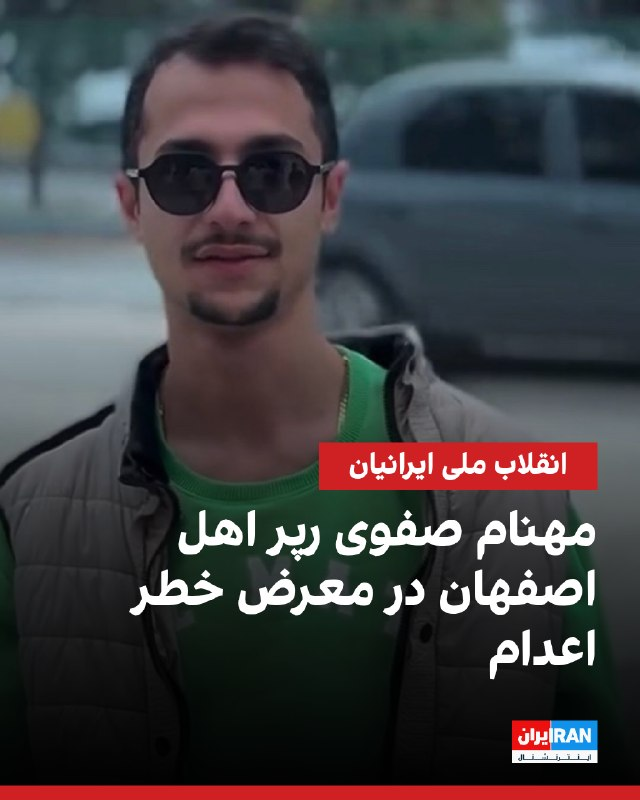

بر اساس گزارش‌های رسیده به ایران اینترنشنال، مهنام صفوی، رپر ۲۲ ساله اهل اصفهان که ۲۳ دی‌ماه ۱۴۰۴ در پی انتشار مطالبی در حمایت از اعتراضات، در محل کار خود در اصفهان بازداشت شد با خطر اعدام روبروست.

بر پایه این گزارش‌ها، او از زمان بازداشت در زندان دستگرد اصفهان نگهداری می‌شود و پس از اخذ اعترافات اجباری و از سوی قاضی همتی‌نژاد به اعدام محکوم شده است. نزدیکان این رپر معترض گفته‌اند که دادگاه او به صورت غیرحضوری برگزار شده است.
‌🏁 🇬🇧 IranintlTV

🤖 @VahidOOnLine

## VahidOOnLine — post 247134

  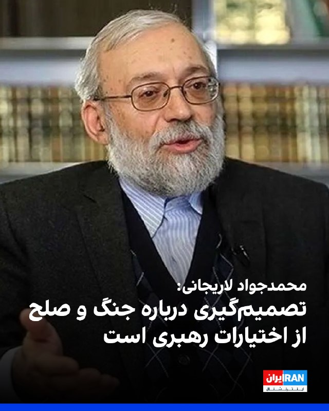

محمدجواد لاریجانی، رییس پژوهشگاه دانش‌های بنیادی، در صدا و سیمای جمهوری اسلامی گفت: «تصمیم‌گیری درباره جنگ و صلح از اختیارات رهبر جمهوری اسلامی است و دولت باید بر اساس رهنمودهای او، برای پایان جنگ نقشه عملیاتی تدوین کند.»
او افزود اگر بخواهیم در چارچوب ساختار قانونی حرکت کنیم، باید نظرات مجتبی خامنه‌ای را مبنا قرار دهیم.
لاریجانی گفت: «اصرار بر اجرای طرحی که با نظر رهبر جمهوری اسلامی همخوانی نداشته باشد یا واکنش‌هایی مانند ترک مسئولیت در برابر نظر او، با قانون و مسیر اداره کشور سازگار نیست.»
‌🏁 🇬🇧 IranintlTV

🤖 @VahidOOnLine

## VahidOOnLine — post 247133

  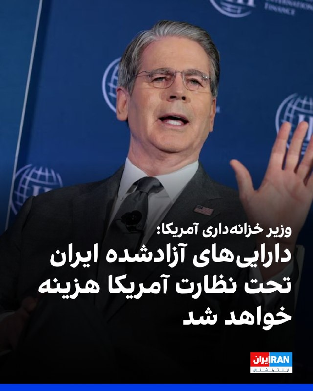

اسکات بسنت، وزیر خزانه‌داری آمریکا، به سی‌ان‌بی‌سی گفت وزارت خزانه‌داری بر دارایی‌های مسدودشده جمهوری اسلامی پس از آزادسازی آن‌ها نظارت خواهد کرد.

بسنت افزود نخستین بخش از دارایی‌های آزادشده جمهوری اسلامی احتمالا از طریق قطر در دسترس قرار می‌گیرد و مقام‌های آمریکایی در دوحه بر نحوه تخصیص آن نظارت خواهند داشت.

وزیر خزانه‌داری آمریکا، گفت منابع آزادشده جمهوری اسلامی برای خرید محصولاتی مانند ذرت، گندم، سویا و دارو از آمریکا به کار گرفته خواهد شد.
‌🏁 🇬🇧 IranintlTV

🤖 @VahidOOnLine

## VahidOOnLine — post 247132

  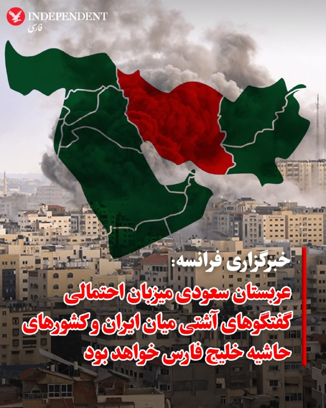

♦️ خبرگزاری فرانسه (AFP) روز چهارشنبه سوم تیرماه به نقل از یک منبع دیپلماتیک گزارش داد که انتظار می‌رود گفتگوها با هدف آشتی و بهبود روابط میان کشورهای حاشیه خلیج فارس و جمهوری اسلامی ایران در عربستان سعودی برگزار شود.

به گفته این دیپلمات، برگزاری یک نشست سران با هدف ترمیم و بازسازی روابط میان کشورهای حاشیه خلیج فارس، ایران و احتمالا دیگر همسایگان منطقه‌ای در دوران پس از جنگ خاورمیانه در ریاض پیش‌بینی شده است؛ با این حال، او به تاریخ دقیق برگزاری این نشست اشاره‌ای نکرد.

این دیپلمات در پایان افزود که این جلسات و گفتگوهای منطقه‌ای، کاملا مستقل از مذاکرات جاری میان ایالات متحده آمریکا و ایران پیش خواهد رفت.
‌🇸🇦 Indypersian

🤖 @VahidOOnLine

## VahidOOnLine — post 247131

♦️نخست‌وزیر پاکستان در نشست خبری مشترک با مسعود پزشکیان، رئیس‌جمهوری اسلامی ضمن تمجید از نقش تهران در تحولات منطقه، با خواندن ابیاتی از مولانا بر پیوندهای عمیق فرهنگی و تاریخی میان ایران و پاکستان تاکید کرد.
«یار آن باشد که در وقتِ بلا
دست گیرد از رفیقِ مبتلا
ورنه در وقتِ خوشی و خرمی
یار بسیار است و یاری کم‌کمی»

نخست‌وزیر پاکستان با استناد به این شعر فارسی، روابط تهران و اسلام‌آباد را فراتر از مناسبات سیاسی توصیف کرد و بر ضرورت همراهی و همکاری دو کشور در شرایط حساس منطقه تاکید داشت.
شهباز شریف همچنین از پزشکیان به عنوان «رهبر دوراندیش و موفق» یاد کرد و سفر او به اسلام‌آباد را «لحظه‌ای تاریخی» در روابط دو کشور خواند.
او با اشاره به توافق اخیر اسلام‌آباد و تلاش‌های دیپلماتیک انجام‌شده، تاکید کرد که پایان جنگ و جلوگیری از گسترش بحران در منطقه، حاصل رهبری خردمندانه و رویکرد مسئولانه طرف‌های درگیر بوده است.
‌🇸🇦 Indypersian

🤖 @VahidOOnLine

## VahidOOnLine — post 247130

  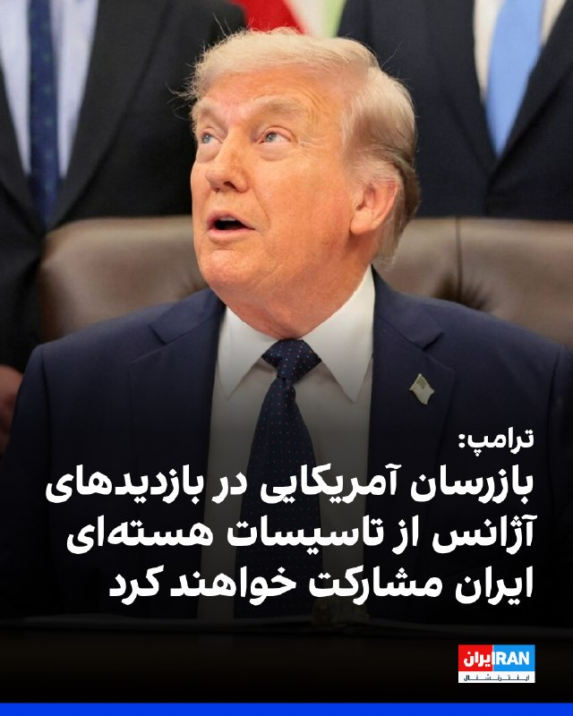

دونالد ترامپ، رییس‌جمهوری آمریکا، به فاکس‌نیوز گفت بازرسان آمریکایی در کنار بازرسان آژانس بین‌المللی انرژی اتمی از تاسیسات هسته‌ای جمهوری اسلامی بازدید خواهند کرد.

او اضافه کرد: «جمهوری اسلامی با حضور بازرسان و انجام بازرسی از تاسیسات هسته‌ای خود موافقت کرده است.»

او ادامه داد: «برای اعزام بازرسان به تاسیسات هسته‌ای جمهوری اسلامی عجله‌ای وجود ندارد.»
‌🏁 🇬🇧 IranintlTV

🤖 @VahidOOnLine

## WithYashar — post 15729

ترامپ به فاکس‌نیوز اعلام کرد که قرار است به بازرسان اجازه داده شود تا مکان‌هایی که اورانیوم ایران در آنجا نگهداری می‌شود، بازدید کنند. از سوی دیگر، ایران قصد دارد در اولویت اول، کالاهای آمریکایی به ارزش حدود ۵۰۰ میلیون دلار خریداری نماید. هیچ عجله‌ای برای ورود بازرسان وجود ندارد و تیم آمریکایی قرار است همراه با بازرسان آژانس برای یافتن اورانیوم غنی‌شده اعزام شوند.
@withyashar

## WithYashar — post 15728

ترامپ: بازرسان آمریکایی برای بازرسی سایت های هسته ای ایران به آژانس بین المللی انرژی اتمی می پیوندند‌‌

ترامپ: هیچ عجله‌ای برای دسترسی به این مواد وجود ندارد، زیرا پس از عملیات «چکش نیمه‌شب» در زیر زمین دفن شده‌اند
@withyashar

## WithYashar — post 15727

ترامپ در تروث : شهردار ممدانی با حمایت سه کمونیست تمام‌عیار به پیروزی رسید و رسانه‌های جعلی هم با سروصدای زیاد و به‌صورت یکپارچه برایش کف زدند. تبریک آقای شهردار!
من دیشب ۱۶ برد از ۱۶ داشتم و به انتخاب میهن‌پرستان فوق‌العاده آمریکایی کمک کردم، اما رسانه‌ها حتی یک کلمه هم درباره‌اش نمی‌گویند.
در دو سال گذشته، حمایت و تأیید من باعث ۲۵۹ پیروزی در انتخابات مقدماتی شده و تقریباً هیچ شکستی نداشته است، با این حال هیچ توجهی از سوی رسانه‌ها دریافت نکرده‌ام!
@withyashar

## WithYashar — post 15726

  <a href="telegram/content/WithYashar_15726_1782312067.mp4" target="_blank">🎬 Download video</a>

رشد دارایی ونس و هگس در طی سالها
@withyashar

## WithYashar — post 15725

  <a href="telegram/content/WithYashar_15725_1782312069.mp4" target="_blank">🎬 Download video</a>

خبرگزاری دولتی لبنان گزارش داد: یک پهپاد اسرائیلی خودرویی را در نزدیکی شهرک کفررمان در جنوب لبنان هدف قرار داد و دو نفر کشته شدند.
پیش‌تر نیز سخنگوی ارتش اسرائیل اعلام کرد نیروهای ارتش دو عضو مسلح حزب‌الله را که تهدیدی برای نیروهای اسرائیلی در منطقه علی‌الطاهر در جنوب لبنان بودند، هدف قرار دادند.
@withyashar

## WithYashar — post 15724

قیمت اونس طلا به زیر ۴ هزار دلار رسید؛ آیا سقوط ۱۵۰۰ دلاری از اوج تاریخی ادامه خواهد داشت؟
قیمت نقدی طلا روز چهارشنبه ۲۴ ژوئن (سوم تیر ۱۴۰۵) تحت تاثیر رشد ارزش دلار آمریکا و افزایش انتظارات مبنی بر تداوم بالا ماندن نرخ‌های بهره در این کشور، برای نخستین بار از ماه نوامبر ۲۰۲۵ میلادی، از مرز روانی ۴ هزار دلار در هر اونس پایین‌تر آمد.
تقویت ارزش دلار آمریکا باعث شد تا خرید شمش طلا که بر مبنای دلار قیمت‌گذاری می‌شود، برای دارندگان سایر ارزها گران‌تر تمام شود.
@withyashar

## WithYashar — post 15723

  <a href="telegram/content/WithYashar_15723_1782312070.mp4" target="_blank">🎬 Download video</a>

مارکو روبیو، وزیر امور خارجه، برای دومین مرحله از تور خاورمیانه خود به کویت رسیده است.
@withyashar

## WithYashar — post 15722

سنتکام: «نیروهای فرماندهی مرکزی ایالات متحده در تاریخ ۱۹ ژوئن یک حمله هوایی در شمال‌غرب سوریه انجام دادند که به کشته شدن یکی از رهبران ارشد داعش منجر شد.
در این حمله دقیق، علی حسین العلوی کشته شد. این عملیات بخشی از تلاش‌های مستمر آمریکا برای مختل کردن و از بین بردن عناصر تروریستی است که در پی حمله به شهروندان آمریکایی در خارج از کشور یا خاک ایالات متحده هستند.
نیروهای سنتکام همچنان در همکاری با شرکای منطقه‌ای به عملیات خود ادامه می‌دهند.»
@withyashar

## WithYashar — post 15721

بسنت وزیر خزانه‌داری آمریکا به سی‌ان‌بی‌سی:
هر پولی که رژیم تهران دریافت کند، متعلق به ایرانی‌هاست.
نسبت بسیار زیادی از پول برای خرید غذا و داروی آمریکایی استفاده خواهد شد
@withyashar

## WithYashar — post 15720

فاکس‌نیوز گزارش میدهد : پرزیدنت ترامپ روز شلوغی را در واشنگتن دی سی آغاز می‌کند و آماده می‌شود تا به کنگره برود، جایی که طبق گزارش‌ها قرار است با جمهوری‌خواهان سنا در مورد قانون متوقف شده «نجات آمریکا» ملاقات کند.
در طول اقامتش در کنگره، قرار است قانون «جاده قرن بیست و یکم به سوی مسکن» را نیز امضا کند.
همه این اتفاقات پیش از جلسه کاخ سفید بین ترامپ و مارک روته، دبیرکل ناتو، در اواخر امروز رخ می‌دهد.
@withyashar

## mwarmonitor — post 11451

  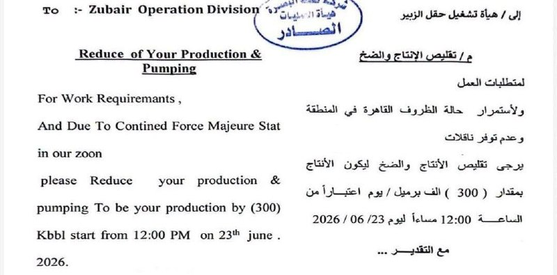

💢شرکت نفت بصره به میدان الزبیر دستور داد:

🔴 به دلیل نیازهای کاری و ادامه وضعیت فورس ماژور در منطقه و عدم وجود تانکرها، لطفاً تولید و پمپاژ را کاهش دهید تا تولید به میزان سیصد هزار بشکه در روز از ساعت 12:00 شب روز 2026/06/23 باشد.

@mwarmonitor

## mwarmonitor — post 11450

🔴رهبر اکثریت سنای آمریکا، John Thune، به Semafor گفت که قصد دارد با وجود تشدید اختلافات سیاستی با ترامپ، در ماه ژانویه برای باقی‌ماندن در مقام عالی‌ترین جمهوری‌خواه سنا بار دیگر نامزد شود.

🔴تون پیش از ناهار روز چهارشنبه با ترامپ، خواسته‌های رئیس‌جمهور برای لغو «فیلیباستر» قانون‌گذاری و تصویب لایحه متوقف‌شده الزام کارت شناسایی رأی‌دهندگان را رد کرد و گفت با توجه به اکثریت بسیار شکننده جمهوری‌خواهان، «هیچ راه واقع‌بینانه‌ای» برای تحقق هیچ‌یک از این دو وجود ندارد.

@mwarmonitor

## mwarmonitor — post 11449

  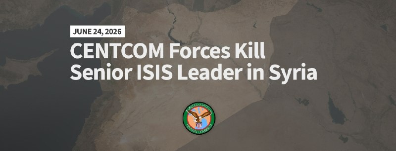

📰 نیروهای آمریکا یک رهبر ارشد داعش را در سوریه کشته‌اند. @mwarmonitor

## mwarmonitor — post 11448

📰 نیروهای آمریکا یک رهبر ارشد داعش را در سوریه کشته‌اند.

@mwarmonitor

## mwarmonitor — post 11447

  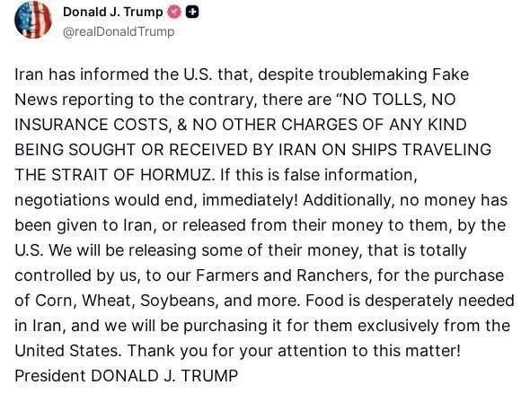

🔴ایران به ایالات متحده اطلاع داده است که برخلاف گزارش‌های تفرقه‌افکنانه «اخبار جعلی» (فیک نیوز)، «هیچ‌گونه عوارض، هزینه بیمه و هیچ هزینه دیگری از هیچ نوع» از سوی ایران برای کشتی‌هایی که در تنگه هرمز تردد می‌کنند، درخواست یا دریافت نشده است. اگر این اطلاعات نادرست باشد، مذاکرات فوراً پایان خواهد یافت! علاوه‌بر این، هیچ پولی از سوی ایالات متحده به ایران داده نشده یا از اموال خودشان به آن‌ها آزاد نشده است. ما بخشی از پول آن‌ها را که کاملاً تحت کنترل ماست، آزاد خواهیم کرد و در اختیار کشاورزان و دامداران خودمان قرار خواهیم داد تا برای خرید ذرت، گندم، سویا و موارد دیگر استفاده شود. ایران به شدت به مواد غذایی نیاز دارد و ما این مواد را منحصراً از ایالات متحده برای آن‌ها خریداری خواهیم کرد. از توجه شما به این موضوع سپاسگزارم!

رئیس‌جمهور دونالد جی. ترامپ

@mwarmonitor

## FoxNewsTwitter — post 343346

Fox News (Twitter/X)

A JPMorgan DEI executive emptied a full trash can into the street during the Knicks championship parade. Now she’s out of a job.

The woman seen in the now-viral video dumping a Knicks-colored trash can along New York City’s parade route has been identified as Angie Baez, a financial industry executive.

After the New York Post contacted JPMorgan Chase about the incident, the company confirmed she is no longer employed there.

Baez wasn’t the only one causing chaos in the city, fans climbed cars, trucks, and anything else they could find to celebrate.

## FoxNewsTwitter — post 343345

  

Fox News (Twitter/X)

The fringe of the Democratic Party is starting to move front and center.

The results of New York’s primary elections are the latest warning sign for establishment Democrats, as the state saw a socialist sweep of Mamdani-backed picks.

All three candidates endorsed by NYC's mayor won despite their radical platforms, signaling a potential shift in the party’s direction and raising new questions about its future.

@AlexisMcAdamsTV explains the fallout from New York’s primary elections and how this new playbook could impact November.

## FoxNewsTwitter — post 343344

  

Fox News (Twitter/X)

WATCH LIVE: Protesters rally outside Brooklyn coffee shop after dispute involving Jewish congressman https://twitter.com/i/broadcasts/1qJVmmLvNXLGB

## FoxNewsTwitter — post 343343

Fox News (Twitter/X)

BREAKING: US forces kill senior ISIS leader in Syria

## FoxNewsTwitter — post 343342

Fox News (Twitter/X)

RT @TreyYingst: President Trump told Fox News that U.S. inspectors will join the IAEA in inspecting Iranian nuclear sites.

The President said there is no rush in getting to the material since it's buried underground in the aftermath of Operation Midnight Hammer.

"They've agreed to it, they've agreed to the inspectors," the President said.

IAEA Director General Rafael Grossi, during a press conference earlier today, echoed the U.S. position that inspections will take place .

"This is going to happen," Grossi said.

## FoxNewsTwitter — post 343341

  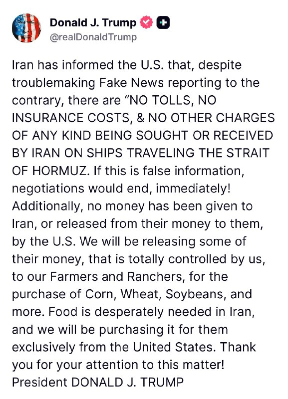

Fox News (Twitter/X)

BREAKING: President Trump calls out the "Fake News" reporting around Iran negotiations and announces there are "NO TOLLS" & "NO OTHER CHARGES OF ANY KIND" being collected by the regime in the Strait of Hormuz.

## FoxNewsTwitter — post 343340

Fox News (Twitter/X)

RT @foxandfriends: MEET THE SOCIALISTS!

Claire Valdez, Brad Lander, and Darializa Avila Chevalier just cleared the board in the NYC primaries, taking down powerful establishment favorites and incumbents with the full backing of Mayor Zohran Mamdani.

Here are the new faces of New York politics.

## pm_afshaa — post 94737

  <a href="telegram/content/pm_afshaa_94737_1782312075.webm" target="_blank">🎬 Download video</a>

🔴محمدجواد لاریجانی: تصمیم‌گیری درباره جنگ و صلح از اختیارات مجتبی خامنه‌ایه.

💧 Rainbet.com the #1 Non-KYC Crypto Casino & Sportsbook @rainbetcom

😁 @Pm_Afshaa

## pm_afshaa — post 94736

  <a href="telegram/content/pm_afshaa_94736_1782312075.webm" target="_blank">🎬 Download video</a>

🔴کامران غضنفری، نماینده مجلس:
دیدار شهباز شریف با مجتبی خامنه‌ای زمینه‌سازی آمریکا برای کشتن اونه.

💧 Rainbet.com the #1 Non-KYC Crypto Casino & Sportsbook @rainbetcom

😁 @Pm_Afshaa

## pm_afshaa — post 94735

  <a href="telegram/content/pm_afshaa_94735_1782312076.webm" target="_blank">🎬 Download video</a>

🔴دادگاه نتانیاهو امروز بالاخره بعد از 98 جلسه پایان یافت.

💧 Rainbet.com the #1 Non-KYC Crypto Casino & Sportsbook @rainbetcom

😁 @Pm_Afshaa

## pm_afshaa — post 94734

  <a href="telegram/content/pm_afshaa_94734_1782312076.webm" target="_blank">🎬 Download video</a>

🔴ترامپ به فاکس نیوز:
بازرسان آمریکایی برای بازرسی از سایت‌های هسته‌ای ایران به آژانس بین‌المللی انرژی اتمی ملحق خواهند شد.

💧 Rainbet.com the #1 Non-KYC Crypto Casino & Sportsbook @rainbetcom

😁 @Pm_Afshaa

## pm_afshaa — post 94733

  <a href="telegram/content/pm_afshaa_94733_1782312077.webm" target="_blank">🎬 Download video</a>

🔴پست جدید ترامپ:

ایران به ما اطلاع داده که برخلاف خبرسازی رسانه‌های جعلی، هیچ عوارضی، هزینه بیمه‌ای یا هیچ مبلغ اضافه‌ای از کشتی‌هایی که از تنگه هرمز عبور می‌کنن، نمی‌گیره؛ اگه این حرف درست نباشه، مذاکرات همون لحظه تموم میشه.

همچنین هیچ پولی از طرف آمریکا به ایران داده نشده و هیچ پولی هم آزاد نشده. فقط قراره بخشی از پول‌های خود ایران که کاملاً تحت کنترل ماست، صرف خرید ذرت، گندم، سویا و مواد غذایی از کشاورزهای آمریکایی بشه. ایران شدیداً به غذا نیاز داره و ما این مواد غذایی رو فقط از آمریکا براشون می‌خریم.

💧 Rainbet.com the #1 Non-KYC Crypto Casino & Sportsbook @rainbetcom

😁 @Pm_Afshaa

## DEJradio — post 5941

  <a href="telegram/content/DEJradio_5941_1782312077.webm" target="_blank">🎬 Download video</a>

🔺📢 محرم و مزاحمت‌های خیابانی؛ تکرار یک سیاست حکومتی

*پژمان گلچین، پژوهشگر فلسفه

#محرم #عاشورا
@DEJradio

## DEJradio — post 5940

  <a href="telegram/content/DEJradio_5940_1782312078.mp4" target="_blank">🎬 Download video</a>

🔺📢 اعتراض مردم به وطن‌فروشی سـ.ـپاه؛
اولویت با حـ.ـزب‌الله است نه ملت

#حزب_الله_لبنان #IRGCterrorists
@DEJradio

## VahidOnline — post 76653

  <a href="telegram/content/VahidOnline_76653_1782312079.mp4" target="_blank">🎬 Download video</a>

به پزشکیان دوباره بیل دادند، اگه شهباز شریف جلوش رو نمی‌گرفت فکر کنم تمام اسلام‌آباد رو درخت می‌کاشت.
NR2OH
مسعود پزشکیان، رئیس‌جمهوری اسلامی ایران، در جریان سفر خود به اسلام‌آباد به همراه شهباز شریف، نخست‌وزیر پاکستان، در مراسم نمادین کاشت نهال دوستی ایران و پاکستان شرکت کرد.
ویدیوی منتشرشده از این مراسم نشان می‌دهد پزشکیان پس از قرار دادن نهال در محل کاشت، همچنان به بیل زدن و ریختن خاک اطراف آن ادامه می‌دهد؛ در حالی که شهباز شریف چندین بار با اشاره دست تلاش می‌کند پایان مراسم را اعلام کند.
در این میان، لبخندهای شهباز شریف و ادامه بیل زدن پزشکیان توجه کاربران شبکه‌های اجتماعی را جلب کرده است.
@VahidOOnLine

📡 @VahidOnline

## VahidOnline — post 76652

  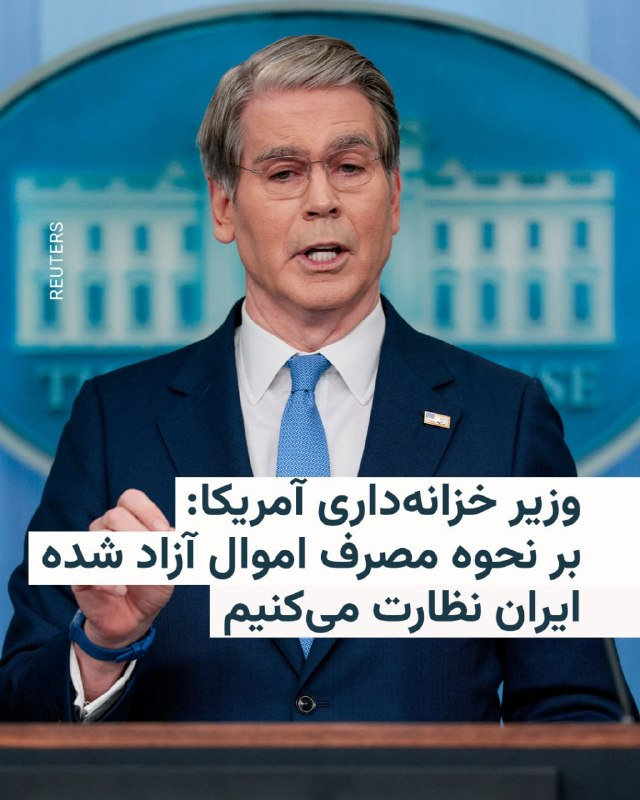

وزیر خزانه‌داری ایالات متحده روز چهارشنبه گفت واشینگتن بر نحوه مصرف دارایی‌های آزاد شده ایران نظارت خواهد کرد و به همین منظور دفتری در دوحه، پایتخت قطر، برای نظارت بر این وجوه تشکیل خواهد شد.

اسکات بسنت در گفت‌وگویی با شبکه خبری سی‌ان‌بی‌سی، تأکید کرد که درصد زیادی از دارایی‌های آزاد شده ایران برای خرید مواد غذایی و دارویی از آمریکا استفاده خواهد شد، حتی اگر ایران گفته باشد که نحوه مصرف این منابع را خودش تعیین خواهد کرد.

او بدون ارائه جزئیات درباره سازوکار نظارت بر مصرف این منابع گفت این وجوه توسط وزارت خزانه‌داری آمریکا در خاورمیانه نظارت خواهد شد.

مفام‌های جمهوری اسلامی در روزهای اخیر با رد اظهارات مسئولان آمریکایی گفته‌اند نحوه استفاده از منابع آزاد شده در اختیار تهران است.
@VahidHeadline

📡 @VahidOnline

## VahidOnline — post 76651

  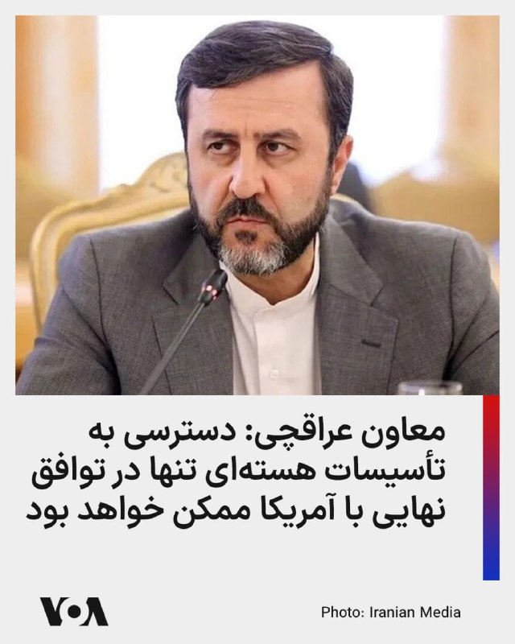

معاون وزیر خارجه جمهوری اسلامی اعلام کرد که دسترسی به تاسیسات مورد حمله واقع شده و مواد هسته‌ای صرفا در چارچوب توافق نهایی با آمریکا ممکن خواهد بود.

کاظم غریب‌آبادی روز چهارشنبه در شبکه اجتماعی ایکس با اعلام این که در سوییس هیچ نشستی با رافائل گروسی، مدیرکل آژانس بین‌المللی انرژی اتمی «علیرغم درخواست او»، برگزار نشد، نوشت: «هیچ برنامه‌ای نیز برای دسترسی به تاسیساتِ مورد حمله واقع شده و مواد هسته‌ای وجود ندارد.»

او افزود: «این مباحث صرفا در چارچوب توافق نهایی و در نتیجه اقدام عملی طرف مقابل در خاتمه تمامی تحریم‌ها و... بررسی و تعیین تکلیف خواهند شد.»

پیشتر گروسی اعلام کرده بود که سایت‌های غنی‌سازی هسته‌ای جمهوری اسلامی توسط بازرسان آژانس مورد بازدید قرار خواهند گرفت.
@VahidHeadline

📡 @VahidOnline

## VahidOnline — post 76650

  

مارکو روبیو، وزیر امور خارجه آمریکا، روز چهارشنبه در دیدار با رئیس امارات متحده عربی در ابوظبی درباره تفاهم‌نامه ایالات متحده با ایران گفت‌وگو کرد.

در بیانیه سخنگوی وزات خارجه آمریکا آمده که روبیو در دیدار با محمد بن زاند آل نهیان و دیگر مقام‌های ارشد اماراتی «درباره یادداشت تفاهم رئیس‌جمهور ترامپ با ایران، تلاش‌ها برای تضمین عبور کامل و ایمن کشتی‌ها از ‌تنگه هرمز و اهمیت صلح و ثبات در منطقه» گفت‌وگو کرد.
@VahidHeadline

📡 @VahidOnline

## VahidOnline — post 76649

  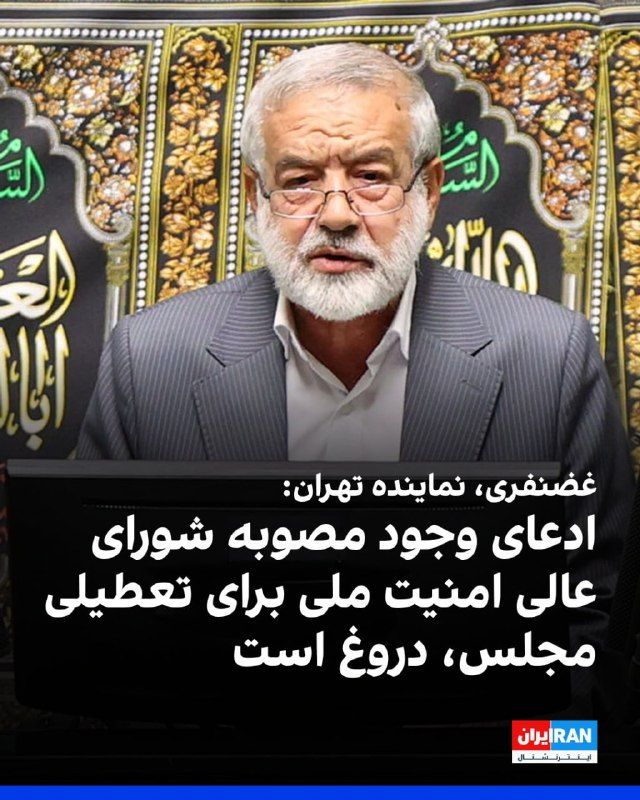

کامران غضنفری، نماینده تهران در مجلس، ضمن انتقاد از تداوم تعطیلی صحن علنی، به خبرگزاری ایلنا گفت که قالیباف طی چهار ماه گذشته بدون هیچ مبنای قانونی از برگزاری جلسات علنی جلوگیری کرده است.

این نماینده مجلس، وجود مصوبه شورای عالی امنیت ملی برای تعطیلی مجلس را «دروغ» خواند و گفت تعطیلی صحن با هدف جلوگیری از مخالفت نمایندگان با روند مذاکرات و پذیرش آتش‌بس صورت گرفته است.

او ادامه داد: «نمایندگان هم از یکی دو ماه پیش از قالیباف خواسته‌اند که اگر چنین مصوبه‌ای وجود دارد، آن را به ما نشان دهید، اما او هیچ چیزی نشان نداده است. بنابراین، این ادعا کاملا کذب و دروغ است.»

@VahidOOnLine

📡 @VahidOnline

## VahidOnline — post 76648

  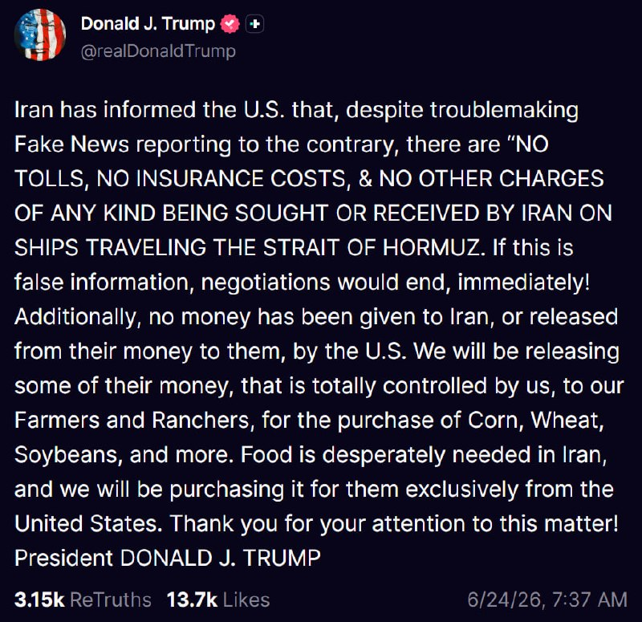

پست ترامپ، ترجمه ماشین:
ایران به آمریکا اطلاع داده است که، برخلاف گزارش‌های دردسرساز فیک‌نیوز، «هیچ عوارضی، هیچ هزینه بیمه‌ای، و هیچ نوع هزینه دیگری از هیچ‌گونه‌ای از سوی ایران برای کشتی‌هایی که از تنگه هرمز عبور می‌کنند مطالبه یا دریافت نمی‌شود.

اگر این اطلاعات نادرست باشد، مذاکرات فوراً پایان خواهد یافت!

علاوه بر این، هیچ پولی از سوی آمریکا به ایران داده نشده، یا از پول‌های خودشان برایشان آزاد نشده است.

ما بخشی از پول آن‌ها را، که کاملاً تحت کنترل ماست، برای خرید ذرت، گندم، سویا، و چیزهای دیگر، در اختیار کشاورزان و دامداران خودمان قرار خواهیم داد.

غذا در ایران به‌شدت مورد نیاز است، و ما آن را منحصراً از ایالات متحده برایشان خریداری خواهیم کرد.

از توجه شما به این موضوع سپاسگزارم!
رئیس‌جمهور دونالد جی ترامپ
realDonaldTrump

📡 @VahidOnline

## VahidOnline — post 76638

‏🔴مرور قربانیان اعتراضات خرداد ۱۳۸۸
‏اعتراضات خرداد ۱۳۸۸ که در اعتراض به نتایج انتخابات ریاست جمهوری سال ۱۳۸۸ شکل گرفت، جانباختگان زیادی برجای گذاشت، بنیاد برومند تا کنون ۱۳۸ نفر از این افراد را که مرتبط با این اعتراضات کشته، ناپدید یا اعدام شدند را در نقشه اعتراضات خود ثبت کرده است. برای اطلاعات بیشتر در مورد این قربانیان به سایت بنیاد برومند مراجعه کنید.

اگر شما هم اطلاعاتی در مورد قربانیان اعتراضات دارید با ما در میان بگذارید.

‏لینک نقشه تعاملی اعتراضات:
https://www.iranrights.org/projects/protestmap/fa/

@IranRights

## IranIntlTV — post 344151

  <a href="telegram/content/IranIntlTV_344151_1782312082.mp4" target="_blank">🎬 Download video</a>

همزمان با دهمین سالگرد ازدواج لیندزی و کریگ فورمن، زوج بریتانیایی زندانی در ایران، خانواده آن‌ها با انتشار بیانیه اعلام کردند این دو نفر در اعتراض به شرایط بازداشت همچنان در اعتصاب غذا به سر می‌برند.
جزیيات بیشتر در گفت‌وگو با علی رشید، عضو تحریریه ایران‌اینترنشنال
@iranintltv

## IranIntlTV — post 344150

  <a href="https://t.me/IranintlTV/344150" target="_blank">📎 Download file</a>

🎧نسخه صوتی اخبار نیم‌روزی | چهارشنبه ۳ تیر
@iranintlTV

## IranIntlTV — post 344149

  <a href="telegram/content/IranIntlTV_344149_1782312084.mp4" target="_blank">🎬 Download video</a>

اگر بخشی از دارایی‌های بلوکه‌شده ایران آزاد شود، این پول قرار است صرف چه چیزی شود؟
کمک به مردم ایران؟ یا ایجاد بازاری تازه برای کشاورزان آمریکایی؟ دونالد ترامپ و جی‌دی ونس از طرحی حرف زدند که بر اساس آن، بخشی از این پول می‌تواند صرف خرید گندم، ذرت و سویای آمریکایی شود.

اما این طرح دقیقا چیست و چه کسانی از آن سود می‌برند؟

مهدی بیگی، عضو تحریریه ایران‌اینترنشنال، در «پیوست» به بررسی این موضوع می‌پردازد
@iranintltv

## IranIntlTV — post 344148

  

شامگاه ۱۴ اسفند ۱۴۰۴، ساختمانی بزرگ در اقامتگاه مسافری زیباشهر شیراز هدف موشک قرار گرفت و کاملا ویران شد؛ جایی که شماری از نیروهای سپاه از جمله نیروی هوافضایش، پنهان شده بودند. موج دوم این حمله، موجب کشته‌شدن ۹ غیرنظامی از جمله کارکنان پایگاه اورژانس ۱۱۵ مجاور این اقامتگاه شد.

بررسی تصاویر محل، داده‌های منبع‌باز، گزارش‌های رسانه‌های داخلی، ارزیابی یک مقام پیشین هدف‌گیری در نیروی هوایی آمریکا و روایت‌های شاهدان نشان می‌دهد آن‌چه در حمله به زیباشهر رخ داد، نه خطای ساده مهمات، بلکه هدف‌گرفتن ساختمانی مشخص در اقامتگاه اضطراری مسافری بود؛ ساختمانی که بر اساس شواهد موجود، محل پنهان‌شدن نیروهای سپاهی بود که از ترس بمباران مراکز نظامی، آن‌جا مخفی شده بودند.

اما همین هدف، در دل یک مجموعه با کاربری غیرنظامی، اقامتی، تفریحی و امدادی قرار داشت: اقامتگاه اضطراری مسافران زیباشهر، در کنار پایگاه اورژانس ۱۱۵، در مجاورت خانه‌های مسکونی و در فاصله کوتاهی از ساختمان‌هایی با کاربری خدماتی و عمومی.

ادامه این گزارش را در وب‌سایت ایران‌اینترنشنال بخوانید
https://iranintl.com/202606149027

## IranIntlTV — post 344147

  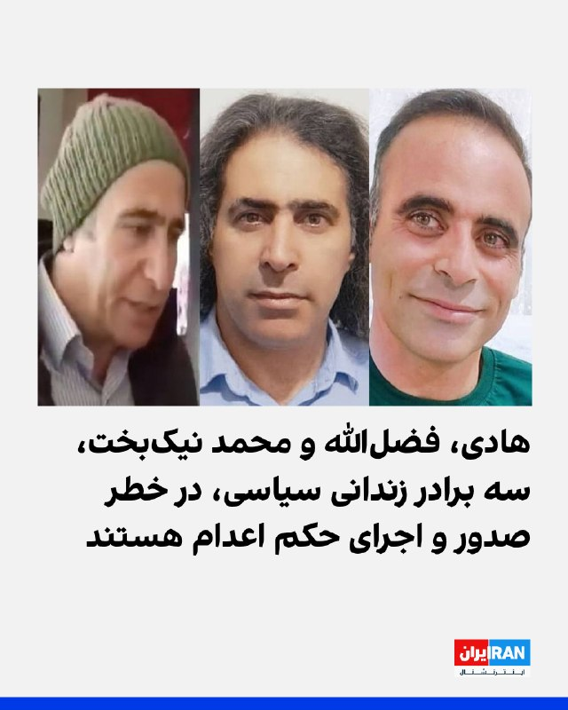

هادی و فضل‌الله نیک‌بخت، دو زندانی سیاسی در اصفهان، از سوی دادگاه انقلاب گلپایگان به اعدام محکوم شده‌اند و محمد نیک‌بخت، برادر دیگرشان، با اتهام‌هایی روبه‌روست که می‌تواند به صدور حکم اعدام منجر شود.

سازمان حقوق بشر ایران گزارش داد هادی و فضل‌الله حدود دو هفته پیش به اتهام «افساد فی‌الارض» به اعدام محکوم شدند. مصادیق دقیق این اتهام مشخص نیست، اما در پرونده آمده است آن‌ها برای اعتراض علیه حکومت، جوانان را سازماندهی کرده‌اند.

خانواده نیک‌بخت پس از صدور حکم، وکیلی را برای پیگیری پرونده انتخاب کرده‌اند، اما مشخص نیست این وکیل به پرونده دسترسی پیدا کرده باشد. هادی و فضل‌الله ۲۰ روز فرصت دارند به حکم اعتراض کنند.

این دو برادر دوم آبان ۱۴۰۴، پس از تلاش برای جلوگیری از تصرف زمین کشاورزی، در منزلشان در گلپایگان بازداشت و پس از دو ماه بی‌خبری مطلق به زندان دستگرد اصفهان منتقل شدند.

محمد نیک‌بخت، نوکیش مسیحی و عضو دیگر این خانواده نیز اسفندماه ۱۴۰۴ با خشونت بازداشت شد و دو ماه را در بی‌خبری مطلق گذراند. او اکنون در زندان دستگرد نگهداری می‌شود و با اتهام‌هایی روبه‌روست که می‌تواند به صدور حکم اعدام منجر شود.
https:/

## IranIntlTV — post 344146

  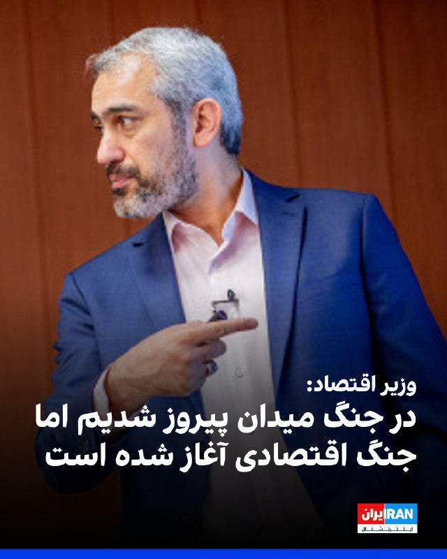

علی مدنی‌زاده، وزیر اقتصاد جمهوری اسلامی، با اشاره به جنگ اخیر گفت این مسیر در نهایت به پیروزی جمهوری اسلامی منجر شد و میدان و خیابان، در کنار دولت، این پیروزی را رقم زدند.
او افزود: «پس از این جنگ، اعتماد ملی، سرمایه اجتماعی و غرور ملی در میان مردم شکل گرفته است.»
وزیر اقتصاد گفت: «جنگ میدان به پایان رسیده اما جنگ اقتصادی آغاز شده و اکنون باید وارد جهاد اقتصادی شویم.»
https://iranintl.com/202606245248

## IranIntlTV — post 344145

  <a href="telegram/content/IranIntlTV_344145_1782312087.mp4" target="_blank">🎬 Download video</a>

ویدیوی ارسال‌شده به ایران‌اینترنشنال نشان می‌دهد گروهی از مردم در دستگرد اصفهان در سوگ جاویدنام محسن چیت‌ساز سنج و دمام می‌زنند.
محسن چیت‌ساز، ۲۴ ساله‌، ۱۹ دی در شهر دستگرد استان اصفهان با شلیک گلوله جنگی کشته شد.

## IranIntlTV — post 344144

  <a href="telegram/content/IranIntlTV_344144_1782312089.mp4" target="_blank">🎬 Download video</a>

دونالد ترامپ اعلام کرد جمهوری اسلامی به آمریکا اطلاع داده است که هیچ‌گونه عوارض، هزینه بیمه یا هزینه اضافی از کشتی‌های عبوری از تنگه هرمز دریافت نخواهد شد. او تاکید کرد در صورت نادرست بودن این گزارش‌ها، روند مذاکرات دوجانبه متوقف خواهد شد.

جزییات بیشتر با سمیرا قرایی، خبرنگار ایران‌اینترنشنال
@iranintltv

## IranIntlTV — post 344143

  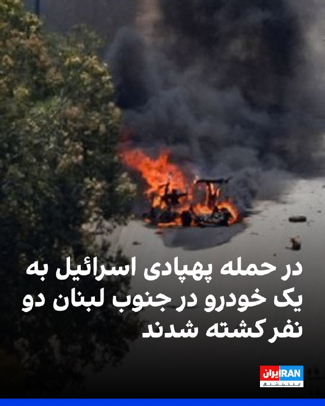

خبرگزاری دولتی لبنان گزارش داد یک پهپاد اسرائیلی خودرویی را در نزدیکی شهرک کفررمان در جنوب لبنان هدف قرار داد.
به گزارش الحدث در حمله اسرائیل به کفررمان دو نفر کشته شدند.
پیش‌تر نیز سخنگوی ارتش اسرائیل اعلام کرد نیروهای ارتش دو عضو مسلح حزب‌الله را که تهدیدی برای نیروهای اسرائیلی در منطقه علی‌الطاهر در جنوب لبنان بودند، هدف قرار دادند.
https://iranintl.com/202606247827

## IranIntlTV — post 344142

  <a href="telegram/content/IranIntlTV_344142_1782312091.mp4" target="_blank">🎬 Download video</a>

اسرائیل کاتز، وزیر دفاع اسرائیل، بر ادامه حضور نیروهای این کشور در جنوب لبنان تاکید کرد و خروج از این منطقه را منتفی دانست. این موضع در حالی مطرح می‌شود که لبنان خواستار خروج کامل نیروهای اسرائیلی است و فشارهای بین‌المللی برای پایان حضور نظامی اسرائیل در جنوب لبنان ادامه دارد.

گزارش بابک اسحاقی، خبرنگار ایران‌اینترنشنال
@iranintltv

## IranIntlTV — post 344141

  <a href="telegram/content/IranIntlTV_344141_1782312092.mp4" target="_blank">🎬 Download video</a>

اختلال در خدمات بانکی در روزهای گذشته به یکی از موضوعات پربازتاب در شبکه‌های اجتماعی تبدیل شده است. در حالی که مقام‌ها از بازگشت تدریجی خدمات خبر می‌دهند، کاربران همچنان از مشکلاتی مانند اختلال در کارت‌به‌کارت، خرید اینترنتی و دسترسی به حساب‌های بانکی خود انتقاد می‌کنند و از تاثیر این وضعیت بر زندگی روزمره و کسب‌وکارها می‌گویند.

آیه دریس، عضو تحریریه ایران‌اینترنشنال، از واکنش کاربران می‌گوید
@iranintltv

## IranIntlTV — post 344140

  

کامران غضنفری، نماینده مجلس، در پی اظهار تمایل شهباز شریف، نخست‌وزیر پاکستان، برای دیدار با مجتبی خامنه‌ای، در ایتا نوشت دیدار شریف با رهبر جمهوری اسلامی، بخشی از برنامه آمریکا و اسرائیل برای زمینه‌سازی «شهادت» او است.

غضنفری نوشت واسطه‌های اجرای برنامه آمریکا و اسرائیل برای هدف قرار دادن مجتبی خامنه‌ای، «مهره‌های داخلی آمریکا» هستند.
https://iranintl.com/202606249372

## IranIntlTV — post 344139

  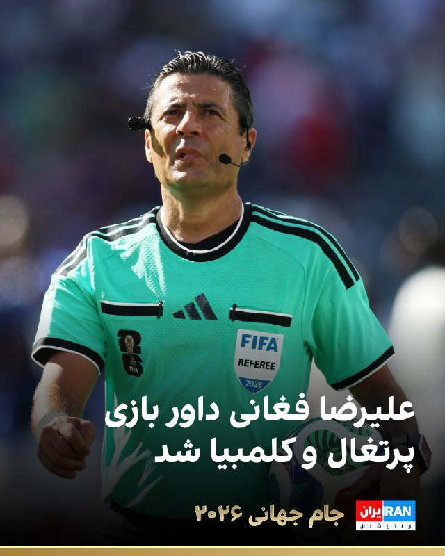

🔻با اعلام فیفا، علیرضا فغانی به عنوان داور بازی پرتغال - کلمبیا در هفته سوم مرحله گروهی جام جهانی انتخاب شد.

🔹این دومین قضاوت فغانی در مرحله گروهی پس از بازی فرانسه - سنگال است.

🔹پرتغال و کلمبیا ساعت ۰۳:۰۰ بامداد یکشنبه ۷ تیر به مصاف هم می‌روند.

@iranintltvsport

## IranIntlTV — post 344138

  <a href="telegram/content/IranIntlTV_344138_1782312095.mp4" target="_blank">🎬 Download video</a>

سرخط خبرهای چهارشنبه ۳ تیر
@iranintltv

## IranIntlTV — post 344137

  

بر اساس گزارش‌های رسیده به ایران اینترنشنال، مهنام صفوی، رپر ۲۲ ساله اهل اصفهان که ۲۳ دی‌ماه ۱۴۰۴ در پی انتشار مطالبی در حمایت از اعتراضات، در محل کار خود در اصفهان بازداشت شد با خطر اعدام روبروست.

بر پایه این گزارش‌ها، او از زمان بازداشت در زندان دستگرد اصفهان نگهداری می‌شود و پس از اخذ اعترافات اجباری و از سوی قاضی همتی‌نژاد به اعدام محکوم شده است. نزدیکان این رپر معترض گفته‌اند که دادگاه او به صورت غیرحضوری برگزار شده است.
https://iranintl.com/202606241535

## IranIntlTV — post 344136

  

محمدجواد لاریجانی، رییس پژوهشگاه دانش‌های بنیادی، در صدا و سیمای جمهوری اسلامی گفت: «تصمیم‌گیری درباره جنگ و صلح از اختیارات رهبر جمهوری اسلامی است و دولت باید بر اساس رهنمودهای او، برای پایان جنگ نقشه عملیاتی تدوین کند.»
او افزود اگر بخواهیم در چارچوب ساختار قانونی حرکت کنیم، باید نظرات مجتبی خامنه‌ای را مبنا قرار دهیم.
لاریجانی گفت: «اصرار بر اجرای طرحی که با نظر رهبر جمهوری اسلامی همخوانی نداشته باشد یا واکنش‌هایی مانند ترک مسئولیت در برابر نظر او، با قانون و مسیر اداره کشور سازگار نیست.»
https://iranintl.com/202606240749

## IranIntlTV — post 344135

  <a href="telegram/content/IranIntlTV_344135_1782312097.mp4" target="_blank">🎬 Download video</a>

دونالد ترامپ، رییس‌جمهوری آمریکا، با انتشار پیامی در تروت سوشال اعلام کرد که برخلاف برخی گزارش‌ها، هیچ پولی از منابع مالی مسدودشده ایران به جمهوری اسلامی پرداخت نشده است. او تاکید کرد بخشی از این منابع که همچنان تحت کنترل آمریکا قرار دارند، صرف خرید محصولاتی مانند ذرت، گندم و سویا از کشاورزان و دامداران آمریکایی خواهد شد.

جزییات بیشتر با احمد صمدی و مریم رحمتی، خبرنگاران ایران‌اینترنشنال
@iranintltv

## IranIntlTV — post 344134

  <a href="telegram/content/IranIntlTV_344134_1782312098.mp4" target="_blank">🎬 Download video</a>

رافائل گروسی، مدیرکل آژانس بین‌المللی انرژی اتمی، روز چهارشنبه اعلام کرد که در پی توافق صلح موقت میان ایالات متحده و جمهوری اسلامی این آژانس به‌زودی بازرسی‌هایی را در ایران انجام خواهد داد، اما جزئیات اجرایی هنوز نهایی نشده است.

در یادداشت تفاهم ۱۴ ماده‌ای که هفته گذشته به امضای دو طرف رسید، به برخی توافقات کلیِ اصولی برای پایان دادن به جنگ اشاره شده است. این توافق موقت، راه را برای گفتگوهای ۶۰ روزه با هدف حل و فصل جزئیات پیچیده‌تر، از جمله مسائل مربوط به برنامه هسته‌ای جمهوری اسلامی، هموار کرد.

رافائل گروسی، مدیرکل آژانس بین‌المللی انرژی اتمی، در یک کنفرانس خبری در ژاپن گفت: «بازرسی‌ها قطعاً انجام خواهند شد.»

ایران از زمانی که ایالات متحده و اسرائیل در ژوئن سال گذشته سایت‌های هسته‌ای حساس این کشور را بمباران کردند، به آژانس بین‌المللی انرژی اتمی اجازه بازگشت به این سایت‌ها را نداده است.

آژانس از آن زمان سایت‌های دیگر را بازرسی کرده بود، اما پس از آغاز موج جدید حملات در ۲۸ فوریه، بازرسی‌های خود را به حالت تعلیق درآورد.
@iranintltv

## IranIntlTV — post 344132

  

اسکات بسنت، وزیر خزانه‌داری آمریکا، به سی‌ان‌بی‌سی گفت وزارت خزانه‌داری بر دارایی‌های مسدودشده جمهوری اسلامی پس از آزادسازی آن‌ها نظارت خواهد کرد.

بسنت افزود نخستین بخش از دارایی‌های آزادشده جمهوری اسلامی احتمالا از طریق قطر در دسترس قرار می‌گیرد و مقام‌های آمریکایی در دوحه بر نحوه تخصیص آن نظارت خواهند داشت.

وزیر خزانه‌داری آمریکا، گفت منابع آزادشده جمهوری اسلامی برای خرید محصولاتی مانند ذرت، گندم، سویا و دارو از آمریکا به کار گرفته خواهد شد.
https://iranintl.com/202606244231

## IranIntlTV — post 344131

  <a href="telegram/content/IranIntlTV_344131_1782312100.mp4" target="_blank">🎬 Download video</a>

ایران‌اینترنشنال در یک هفته گذشته هزاران پیام از مخاطبان درباره توافق آمریکا و جمهوری اسلامی دریافت کرده است؛ پیام‌هایی که بخش قابل توجهی از آن‌ها حاکی از خشم، ناامیدی و نارضایتی نسبت به این توافق است. اظهارات جی‌دی ونس، معاون رییس‌جمهوری آمریکا، درباره وضعیت معیشتی مردم ایران نیز واکنش‌های گسترده‌ای را در میان کاربران برانگیخته و بر دامنه این انتقادها افزوده است.

جزییات بیشتر در گفت‌وگو با فرزاد فتاحی، عضو تحریریه ایران‌اینترنشنال
@iranintltv

## Shin_Persian — post 7192

Shin ✓ @hey_itsmyturn
Wed, 24 Jun 2026 12:09:21 UTC

Gharibabadi (Deputy FM):
“No plan exists for access to attacked facilities and nuclear materials.”

ترجمه خودکار فارسی

غریب‌آبادی (معاون وزیر امور خارجه):
«هیچ برنامه‌ای برای دسترسی به تاسیسات مورد حمله قرار گرفته و مواد هسته‌ای وجود ندارد.»

𝕏 · @shin_persian

## FarsiVOA — post 221748

🔺شلیک مستقیم طالبان به معترضان بازداشت زنان در هرات

▪️موج جدید بازداشت زنان در افغانستان به بهانه «بدحجابی»، یکی از نادرترین اعتراضات خیابانی را در شهر هرات در پی داشته؛ امری که با واکنش مسلحانه و خونین نیروهای طالبان مواجه شده است.

⬇️ بیشتر بخوانید:
https://ir.voanews.com/a/taliban-shoot-afghan-female-protesters/8164312.html/?nocach=1

## FarsiVOA — post 221747

🔺اسکات بسنت: هرگونه دارایی مسدودشده ایران پس از آزادسازی تحت نظارت وزارت خزانه‌داری آمریکا خواهد بود

▪️اسکات بسنت، وزیر خزانه‌داری ایالات متحده، اعلام کرد این وزارتخانه در صورت آزادسازی دارایی‌های مسدودشده ایران، بر چگونگی استفاده جمهوری اسلامی از آنها نظارت خواهد کرد.

⬇️ بیشتر بخوانید:
https://ir.voanews.com/a/us-treasury-oversees-frozen-iranian-funds-when-released/8164311.html/?nocach=1

## FarsiVOA — post 221746

  <a href="telegram/content/FarsiVOA_221746_1782312101.mp4" target="_blank">🎬 Download video</a>

ویدیوی اصرار پزشکیان بر خاک‌ریزی دقیق پای یک نهال در شبکه‌های اجتماعی پربازدید شده است. مسعود پزشکیان، رییس دولت جمهوری اسلامی، سه‌شنبه، در جریان سفر به پاکستان، به نشانه دوستی یک درخت در اسلام‌آباد کاشت. اما اصرار او بر خاک‌ریزی پای نهال، به جای حرکتی نمادین و به‌رغم اشاره‌های شهباز شریف، واکنش کاربران را در شبکه‌های اجتماعی برانگیخته است.

این ویدیو بی‌صدا است.

## FarsiVOA — post 221745

حال و هوای بریتانیا پیش از بازی با مقابل غنا؛ گزارش با مژده یزدانی

## FarsiVOA — post 221744

🔺مارکو روبیو: در امارات درباره «یادداشت تفاهم» با جمهوری اسلامی و ثبات منطقه‌ای گفت‌و‌گو کردیم

▪️مارکو روبیو، وزیر امور خارجه آمریکا، روز چهارشنبه ۳ تیر، با انتشار پیامی در شبکه اجتماعی ایکس، به همراه تصویری از دیدار خود با محمد بن زاید، رئیس حکومت امارات متحده عربی، اعلام کرد که در ابوظبی درباره تفاهم‌نامه آمریکا با جمهوری اسلامی، امنیت تردد در تنگه هرمز، و ثبات منطقه گفت‌وگو کرده است.

⬇️ بیشتر بخوانید:
https://ir.voanews.com/a/sec-rubio-uae-iran-mou-regional-stability/8164314.html/?nocach=1

## FarsiVOA — post 221743

  <a href="telegram/content/FarsiVOA_221743_1782312103.mp4" target="_blank">🎬 Download video</a>

وزیر خارجه ایالات متحده در دومین مرحله از سفر به منطقه خلیج فارس، روز چهارشنبه ابوظبی را ترک کرد و راهی کویت شد.

مارکو روبیو در این سفر با رهبران کشورهای عربی منطقه خلیج فارس درباره تفاهم موقت میان ایالات متحده و جمهوری اسلامی گفت‌وگو می‌کند.

آقای روبیو پس از کویت به بحرین نیز سفر خواهد کرد و در آنجا با اعضای شورای همکاری خلیج فارس دیدار می‌کند.

امنیت تردد دریایی در تنگه هرمز و ثبات منطقه از دیگر موضوعات گفت‌وگوهای وزیر خارجه آمریکا در این سفر است.

## FarsiVOA — post 221742

  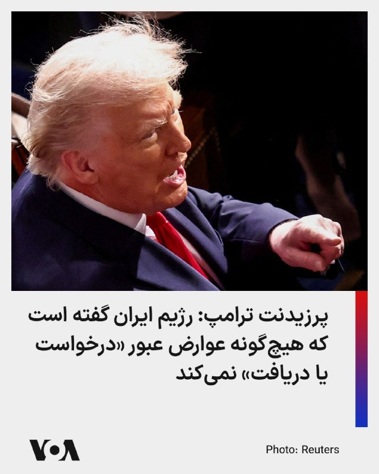

🔺پرزیدنت ترامپ: رژیم ایران گفته است هیچ‌گونه عوارض عبور «درخواست یا دریافت» نمی‌کند

▪️رئیس جمهوری آمریکا با رد برخی گزارش‌های رسانه‌ای تاکید کرد که جمهوری اسلامی هیچ‌گونه عوارض عبور از تنگه هرمز درخواست و دریافت نمی‌کند و هیچ پولی توسط آمریکا به ایران پرداخت نشده است.

⬇️ بیشتر بخوانید:

https://ir.voanews.com/a/trump-iran-hormuz/8164310.html/?nocach=1

## FarsiVOA — post 221740

  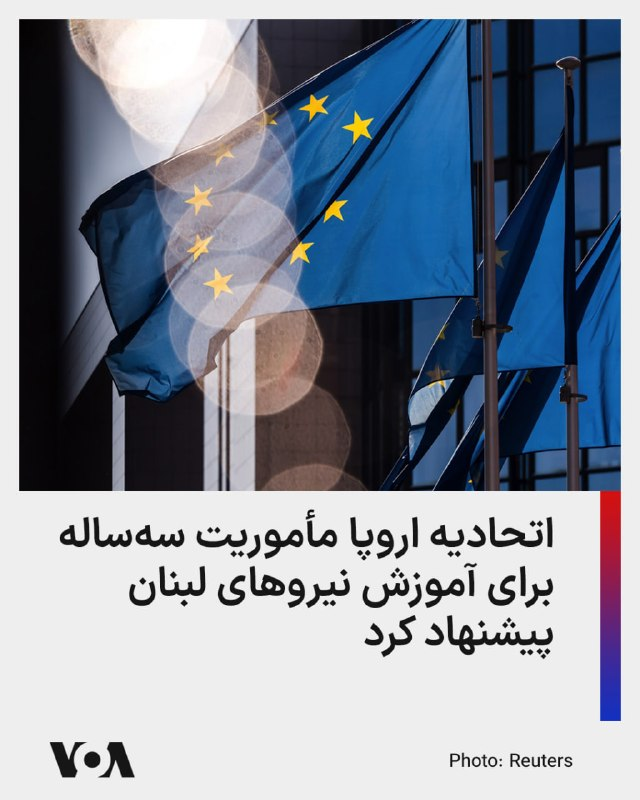

سرویس دیپلماتیک اتحادیه اروپا پیشنهاد ایجاد مأموریتی سه‌ساله برای آموزش و مشاوره به ارتش و نیروهای امنیت داخلی لبنان مطرح کرده است.

رویترز روز چهارشنبه گزارش داد این مأموریت با هدف تقویت کنترل سرزمینی و امنیت مرزهای لبنان طراحی شده و هنوز به تصویب ۲۷ کشور عضو اتحادیه اروپا نرسیده است.

بر اساس این سند، مأموریت پیشنهادی بر تقویت هنگ‌های مرزی، واحدهای متحرک، ژاندارمری منطقه‌ای، توانایی‌های اطلاعاتی و شناسایی، و امنیت دریایی، از جمله مدیریت امنیت مرزها و بنادر، تمرکز خواهد داشت.

این طرح همزمان با تلاش‌های بین‌المللی برای تقویت اقتدار دولت لبنان مطرح شده است.
@FarsiVOA

## DW_Farsi — post 126418

  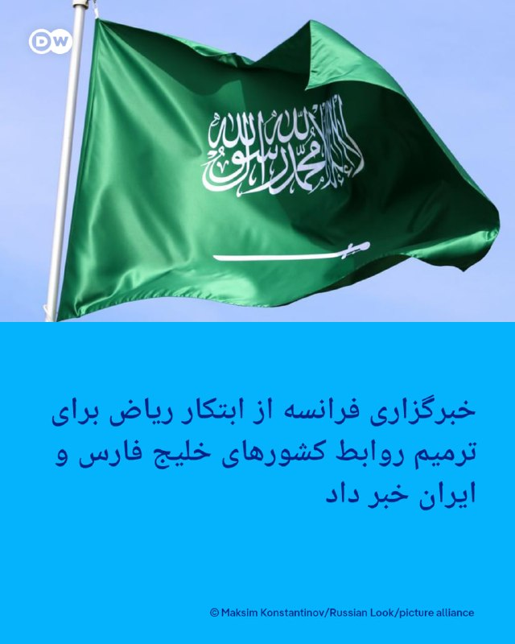

🔶 خبرگزاری فرانسه از ابتکار ریاض برای ترمیم روابط کشورهای خلیج فارس و ایران خبر داد
 
یک منبع دیپلماتیک با اشاره به تدارک مقدمات برای برگزاری نشست‌های منطقه‌ای خاورمیانه، به خبرگزاری فرانسه (AFP) گفت که انتظار می‌رود گفتگوها با هدف آشتی میان کشورهای حوزه خلیج فارس و ایران، به میزبانی عربستان سعودی برگزار شود.
 
به گفته این مقام دیپلماتیک که نامش فاش نشده، ریاض میزبان این نشست سران خواهد بود؛ نشستی که پس از پایان جنگ آمریکا و اسرائيل علیه ایران، با هدف ترمیم و بهبود روابط میان کشورهای خلیج فارس، ایران و احتمالا دیگر همسایگان منطقه شکل خواهد گرفت.
 
این دیپلمات به تاریخ دقیق برگزاری این اجلاس اشاره‌ای نکرده است.
@dw_farsi

## DW_Farsi — post 126417

  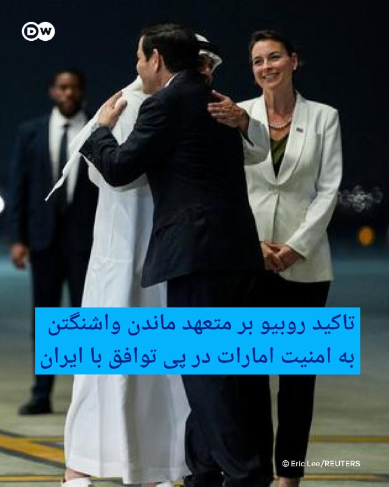

🔶 تاکید روبیو بر متعهد ماندن واشنگتن به امنیت امارات در پی توافق با ایران
 
مارکو روبیو، وزیر امور خارجه ایالات متحده، در نخستین مرحله از سفر دوره‌ای خود به کشورهای حوزه خلیج فارس، روز چهارشنبه ۲۴ ژوئن (۳ تیر) در ابوظبی با شیخ محمد بن زاید، رئیس دولت امارات متحده عربی دیدار و گفتگو کرد. روبیو در این دیدار بر تعهد قاطع و مجدد واشنگتن به امنیت امارات تاکید کرد.
 
به گزارش خبرگزاری فرانسه، سفر روبیو به منطقه با هدف اطمینان ‌خاطر دادن به متحدان نزدیک واشنگتن صورت می‌گیرد. این کشورها در طول جنگ، آسیب‌های شدیدی را از سوی جمهوری اسلامی متحمل شده‌اند و اکنون نسبت به تفاهم‌نامه اخیر دولت دونالد ترامپ، رئيس‌ جمهور آمریکا با تهران نگرانند؛ توافقی که به برخی از نگرانی‌های دیرینه کشورهای خلیج فارس درباره برنامه موشکی و گروه‌های نیابتی ایران نپرداخته است.
 
وزیر امور خارجه آمریکا پس از انجام گفتگوهای پشت درهای بسته با مقامات اماراتی، این کشور را به مقصد کویت ترک کرد. روبیو در ادامه سفر خود راهی بحرین خواهد شد تا روز پنجشنبه در نشست شورای همکاری خلیج فارس (GCC) حضور یابد.
 
@dw_farsi

## DW_Farsi — post 126416

  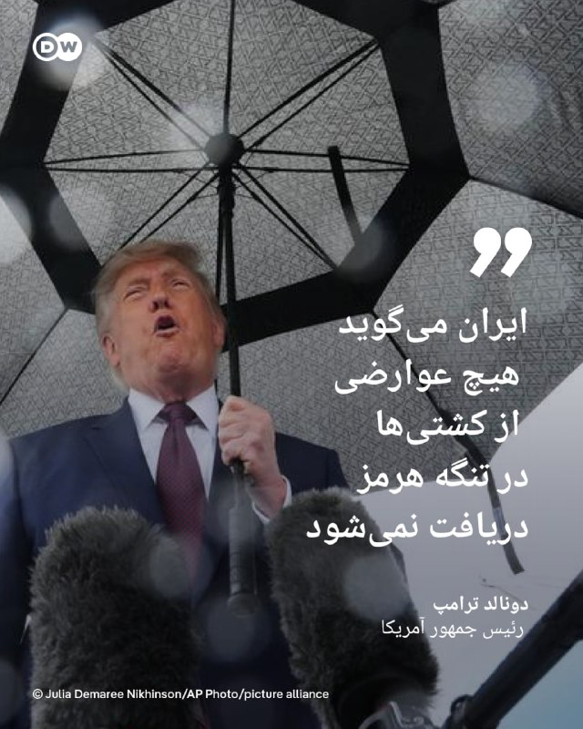

🔶 ترامپ: ایران می‌گوید هیچ عوارضی از کشتی‌ها در تنگه هرمز دریافت نمی‌شود
 
دونالد ترامپ، رئیس‌ جمهور آمریکا روز چهارشنبه ۲۴ ژوئن (۳ تیر) اعلام کرد که ایران به آمریکا اطمینان داده است که هیچ‌گونه عوارضی از کشتی‌های عبوری از تنگه هرمز مطالبه نمی‌شود.
 
ترامپ در پستی در شبکه‌های اجتماعی نوشت: «ایران به ایالات متحده اطلاع داده است که برخلاف گزارش‌های تفرقه‌افکنانه رسانه‌های جعلی، هیچ‌گونه عوارض، هزینه بیمه یا هیچ مبالغ دیگری برای کشتی‌های عبوری از تنگه هرمز مطالبه یا دریافت نمی‌کند.»
 
ترامپ همچنین تصریح کرد که اگر این اطلاعات نادرست باشد، مذاکرات فورا متوقف خواهد شد.
 
ترامپ همچنین با اشاره به این که هیچ پولی از سوی ایالات متحده به ایران داده نشده، افزود: «هیچ بخشی از دارایی‌های آن‌ها به خودشان واگذار نشده است. ما بخشی از پول آن‌ها را که کاملا تحت کنترل‌مان است، آزاد خواهیم کرد تا به کشاورزان و دامداران خودمان برای خرید ذرت، گندم، سویا و محصولات دیگر پرداخت شود.»
@dw_farsi

## DW_Farsi — post 126415

🔶 انتقاد از قالیباف به خاطر تعطیلی "غیرقانونی" صحن علنی مجلس
 
به گفته کامران غضنفری، نماینده تهران مجلس شورای اسلامی، محمدباقر قالیباف در طی چهار ماه گذشته "بدون هیچ مبانی قانونی از انجام جلسات علنی جلوگیری کرده است".
 
به گزارش خبرگزاری ایلنا که چهارشنبه ۲۴ ژوئن (۳ تیرماه) منتشر شد، غضنفری وجود مصوبه شورای عالی امنیت ملی برای تعطیلی مجلس را "دروغ" خوانده است.
 
محمدباقر قالیباف که ریاست مجلس شورای اسلامی را بر عهده دارد، مذاکره‌کننده ارشد جمهوری اسلامی در گفت‌وگوهای تهران و واشنگتن است.
 
بنا بر اظهارات غضنفری تعطیلی صحن علنی مجلس "با هدف جلوگیری از مخالفت نمایندگان با روند مذاکرات و پذیرش آتش‌بس صورت گرفته است". او افزود: «نمایندگان هم از یکی دو ماه پیش از قالیباف خواسته‌اند که اگر چنین مصوبه‌ای وجود دارد، آن را به ما نشان دهید، اما او هیچ چیزی نشان نداده است. بنابراین، این ادعا کاملا کذب و دروغ است.»
 
این نماینده تهران در مجلس رفتار و عملکرد قالیباف را "استبداد رأی" خواند و در این رابطه اضافه کرد: «یک نفر می‌خواهد به جای ۲۹۰ نماینده نظر بدهد. یک نفر می‌خواهد به جای ۲۹۰ نماینده مسائل را تأیید و تصویب کند و تصمیم‌گیری کند. آیا  استبداد معنایی غیر از این دارد؟ یک نفر می‌خواهد اراده خود را بر سایر نمایندگان حاکم کند و آن هم کاملاً برخلاف قانون است. هیچ قانونی چنین اجازه‌ای به او نمی‌دهد؛ نه قانون اساسی و نه آیین‌نامه داخلی مجلس.»
 
غضنفری در گفت‌وگو با ایلنا مدعی شد که قالیباف مجلس را تعطیل کرده تا "اولاً یک آتش‌بس با آمریکا و اسرائیل را بپذیرد و ثانیاً مذاکرات با آمریکا را شروع کند و هیچ مانعی هم سر راهش نباشد و نمایندگان اعلام مخالفت نکنند تا ایشان بتواند هر کاری را که می‌خواهد انجام دهد".
 
@dw_farsi

## DW_Farsi — post 126414

🔶 طالبان؛ تشدید سرکوب زنان و اعتراضات، محدودیت بر تلفن‌ هوشمند
 
🔻گزارشی از Waslat Hasrat-Nazimi
علیرغم سانسورهای شدید از سوی طالبان، اخباری که از افغانستان به خارج می‌رسند، نگران‌کننده است. حکومت طالبان در اوایل ماه ژوئن سال جاری میلادی دست‌کم ۳۰ زن را در هرات (واقع در غرب افغانستان) به اتهام "نقض قوانین حجاب و پوشش" بازداشت کرد. این خبر را سازمان اوناما (UNAMA)، وابسته به سازمان ملل متحد منتشر کرد.
 
این اقدام بروز اعتراضاتی را در منطقه انجیل به دنبال داشت؛ منطقه‌ای در هرات که اکثر ساکنان آن شیعه هستند و مورد تبعیض و سرکوب حکومت سنی طالبان قرار دارند. به گفته سازمان اوناما و همچنین دیگر نهادهای حقوق بشری، طالبان به این اعتراضات با خشونت واکنش داده و به تظاهرکنندگان معترض تیراندازی کردند؛ در پی آن دو نفر از جمله یک کودک کشته و بیش از ۲۰ نفر زخمی شدند.
 
حکومت طالبان گزارش‌ها در مورد بازداشت ده‌ها زن در هرات را بی‌اساس خوانده بودند، اما این خبر به ویژه انزجار و انتقاد فعالان حقوق زنان را برانگیخت و همچنین نگرانی دوباره آنا‌ن از تشدید نظارت و کنترل زنان در فضای عمومی توسط رژیم طالبان را در پی داشت.
 
دو تن از زنان عضو "شبکه جنبش زنان افغان" که به دلایل امنیتی نخواسته‌اند نامشان فاش شود، بازداشت‌ها را بخشی از فشار گسترده‌ای می‌دانند که از سوی دستگاه سرکوب‌گرایانه حکومت طالبان صورت می‌گیرد.
 
یکی از این اعضا در گفت‌وگو با دویچه وله می‌گویند: «هر یک از زنان بازداشتی در هرات نماد درد و رنج میلیون‌ها زن افغان است که تحت آپارتید جنسیتی زندگی می‌کنند. برخورداری از آزادی حق زنان است و باید به طالبان "نه" گفت.»
 
یکی دیگر از اعضای این شبکه توضیح می‌دهد که طالبان اساسی‌ترین حقوق زنان برای تصمیم‌گیری را جرم‌ می‌دانند. او در گفت‌وگو با دویچه وله می‌افزاید: «حکومت طالبان زنان را بازداشت می‌کنند، چون خود در مورد چگونگی پوشش تصمیم‌می‌گیرند. این برخورد نه مذهبی است و نه انسانی. این فقط به معنی سرکوب زنان و نقض فاحش کرامت انسانی است.»
 
از این رو، اعتراضات در هرات تنها واکنشی به بازداشت زنان نبوده بلکه نشان می‌دهد که بخشی از جامعه افغانستان علیرغم خطرات موجود حاضر است که حکومت طالبان را زیر سوأل ببرد.
@dw_farsi

## DW_Farsi — post 126413

🔶 هشدار سازمان اطلاعات استرالیا درباره تهدیدهای تروریستی ایران
 
رئیس سازمان امنیت و اطلاعات داخلی استرالیا (ASIO) روز چهارشنبه ۲۴ ژوئن (۳ تیرماه) اعلام کرد که یک شهروند استرالیایی مقیم ایران که از اعضای ارشد نیروی قدس سپاه پاسداران است، یک حمله بزرگ با بمب آتش‌زا علیه اهداف یهودی در سیدنی را سازماندهی کرده است.
 
مایک برگس در جریان ارائه گزارش سالانه ارزیابی تهدیدهای این کشور، همچنین ابراز نگرانی کرد که یک گروه ایرانی فعال در اروپا ممکن است حملات بیشتر یا ترورهایی را در خاک استرالیا انجام دهد.
 
سازمان امنیت و اطلاعات داخلی استرالیا پس از کشته‌شدن ۱۵ نفر در یک تیراندازی جمعی یهودستیزانه در ساحل باندی در ماه دسامبر ۲۰۲۵، به شدت تحت نظارت و انتقاد قرار گرفته است؛ به‌طوری که یک کمیته تحقیق مستقل در زمینه یهودستیزی، به کاهش سهم بودجه اختصاص‌یافته برای این سازمان، با هدف تحقیقات ضد تروریستی اشاره کرده است.
 
برگس ضمن دفاع از عملکرد این آژانس در مواجهه با "تهدیدهای همزمان، زنجیره‌ای و فزاینده"، جزئیاتی از تحقیقات مربوط به دو حمله با بمب آتش‌زا علیه اهداف یهودی را فاش کرد که ردپای آن‌ها به ایران می‌رسد.
 
او اعلام کرد که یک شهروند استرالیایی مستقر در ایران، حمله‌ای با بمب آتش‌زا را در سال ۲۰۲۴ به رستوران "لوئیس کانتیننتال کیچن" در منطقه بوندی هدایت کرده است. این حادثه به عنوان اولین حمله بزرگ یهودستیزانه در استرالیا ثبت شد.
 
برگس گفت: «این فرد یکی از ماموران ارشد نیروی قدس سپاه پاسداران است و شبکه‌های آن را در سراسر جهان اداره می‌کند.»
 
نیروی قدس شاخه عملیات برون‌مرزی سپاه پاسداران است.
 
رئیس سازمان امنیت و اطلاعات داخلی استرالیا افزود که یک ساکن سابق استرالیا نیز که در عراق زندگی می‌کند اما برای جمهوری اسلامی کار می‌کرده، حمله بزرگ دیگری را با بمب آتش‌زا به "کنیسه آداس اسرائیل" در ملبورن هدایت کرده است. استرالیا سال گذشته در پی این حمله، سفیر جمهوری اسلامی را اخراج کرد.
 
@dw_farsi

## DW_Farsi — post 126412

  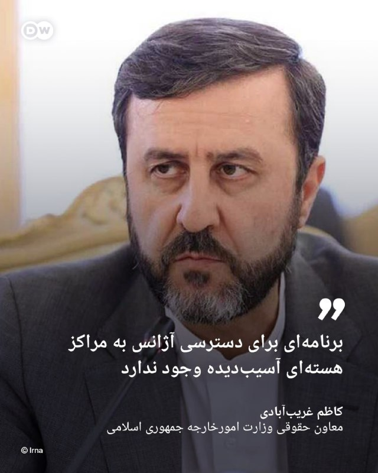

🔶 غریب‌آبادی: برنامه‌ای برای دسترسی آژانس به مراکز هسته‌ای آسیب‌دیده وجود ندارد

معاون حقوقی وزارت امورخارجه جمهوری اسلامی و عضو هیات مذاکره‌کننده ایران در واکنش به سخنان رافائل گروسی، روز چهارشنبه ۲۴ ژوئن در ایکس نوشت: «در سوئیس هیچ نشستی با گروسی، علیرغم درخواست وی، برگزار نشد. هیچ برنامه‌ای نیز برای دسترسی به تاسیساتِ مورد حمله واقع شده و مواد هسته ای وجود ندارد.»

کاظم غریب‌آبادی‌ افزود که "این مباحث صرفا در چارچوب توافق نهایی و در نتیجه اقدام عملی طرف مقابل در خاتمه تمامی تحریم ها و ... بررسی و تعیین تکلیف خواهند شد".

پیشتر نیز اسماعیل بقایی، سخنگوی وزارت خارجه در موضعی مشابه گفته که نه در متن تفاهم‌نامه و نه در مذاکرات دو طرفه گفت‌وگویی در مورد برنامه اتمی و اورانیوم غنی‌شده ایران صورت نگرفته است. بقائی در نشست خبری روز سه‌شنبه ۲ تیرماه هرگونه برنامه برای حضور بازرسان آژانس بین‌المللی انرژی اتمی در تاسیسات هسته‌ای آسیب‌دیده ایران را رد کرد.

او نیز مانند غریب‌آبادی گفته بود: «ما نه دیداری با گروسی داشتیم و نه برنامه‌ای برای بازدید آژانس از سایت‌های آسیب‌دیده ناشی از جنگ تحمیلی داریم.»

@dw_farsi

## RadioFarda — post 158712

🔸سفارت آمریکا در کویت پس از چند ماه تعلیق، فعالیت خود را از سر گرفت.

🔸یک سخنگوی وزارت خارجه آمریکا روز چهارشنبه چهارم تیرماه اعلام کرد این سفارت از بامداد ۲۴ ژوئن بار دیگر بازگشایی شده و ارائه خدمات اضطراری به شهروندان آمریکایی را بلافاصله از سر گرفته است. به گفته او، سایر خدمات نیز به‌تدریج از سر گرفته خواهد شد.

🔸همزمان، مارکو روبیو، وزیر خارجه آمریکا، در مراسم برافراشته شدن پرچم ایالات متحده در سفارت این کشور در کویت حضور یافت.

🔸وزارت خارجه آمریکا پیش‌تر پس از حملات پهپادی ایران به نمایندگی‌های دیپلماتیک آمریکا در کویت و عربستان سعودی، فعالیت این سفارت‌ها را متوقف کرده بود. این حملات در پی حملات آمریکا و اسرائیل به ایران انجام شده بود.

🔸روبیو در جریان سفر منطقه‌ای خود به کشورهای حاشیه خلیج فارس، پس از دیدار با مقام‌های امارات متحده عربی وارد کویت شده است و در ادامه به بحرین نیز سفر خواهد کرد.

@RadioFarda

## RadioFarda — post 158711

  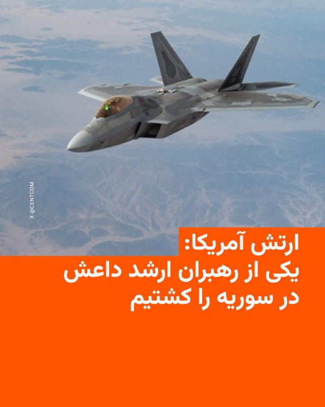

🔸ستاد فرماندهی مرکزی ارتش آمریکا، سنتکام، اعلام کرد در حمله هوایی نیروهای این کشور در شمال‌غرب سوریه، یکی از رهبران ارشد گروه داعش کشته شده است.

🔸سنتکام روز چهارشنبه سوم تیرماه در شبکه ایکس نوشت که این حمله در ۲۹ خرداد انجام شده و در جریان آن، علی حسین العلیوی، از رهبران ارشد داعش، کشته شده است.

🔸به گفته سنتکام، این حمله بخشی از تلاش‌های آمریکا برای مختل کردن و از بین بردن گروه‌های تروریستی است که به دنبال حمله به شهروندان آمریکایی یا خاک ایالات متحده هستند.

🔸براد کوپر، فرمانده سنتکام، در این باره گفت نیروهای آمریکایی و شرکای منطقه‌ای آن‌ها همچنان به مقابله با بقایای داعش ادامه خواهند داد تا از شکست پایدار این گروه اطمینان حاصل شود.

🔸او افزود آمریکا به دفاع از خاک خود، نیروهای نظامی‌اش و متحدانش در منطقه ادامه خواهد داد.

@RadioFarda

## RadioFarda — post 158710

  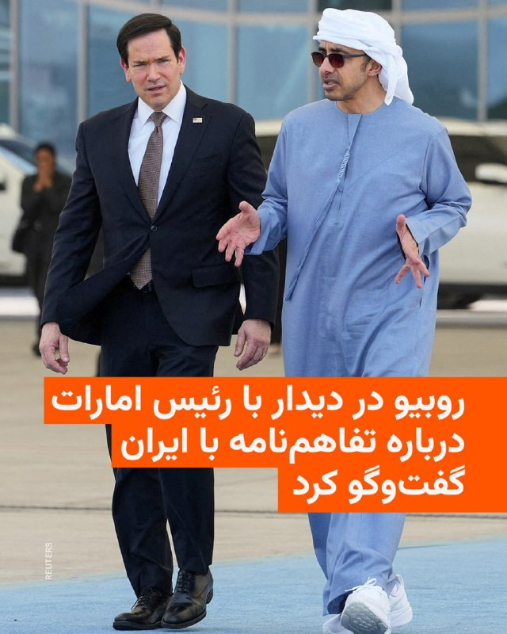

🔸مارکو روبیو، وزیر امور خارجه آمریکا، روز چهارشنبه در دیدار با رئیس امارات متحده عربی در ابوظبی درباره تفاهم‌نامه ایالات متحده با ایران گفت‌وگو کرد.

🔸در بیانیه سخنگوی وزات خارجه آمریکا آمده که روبیو در دیدار با محمد بن زاند آل نهیان و دیگر مقام‌های ارشد اماراتی «درباره یادداشت تفاهم رئیس‌جمهور ترامپ با ایران، تلاش‌ها برای تضمین عبور کامل و ایمن کشتی‌ها از ‌تنگه هرمز و اهمیت صلح و ثبات در منطقه» گفت‌وگو کرد.

🔸بر اساس این بیانیه، وزیر خارجه آمریکا همچنین در دیدارهای خود با رئیس امارات متحده عربی درباره روابط دوجانبه و «ادامه همکاری‌های دو کشور در حوزه‌های دفاعی و تجاری» تبادل نظر کردند.

🔸آقای روبیو که روز دوم تیر وارد ابوظبی شد، در بدو ورود اعلام کرد هدفش بیشتر «شنیدن» نظرات متحدان عرب دربارهٔ توافق تهران و واشینگتن و «لحاظ کردن» دیدگاه‌های آن‌ها در تصمیمات ایالات متحده است.

@RadioFarda

## RadioFarda — post 158709

  

🔸وزیر خزانه‌داری ایالات متحده روز چهارشنبه گفت واشینگتن بر نحوه مصرف دارایی‌های آزاد شده ایران نظارت خواهد کرد و به همین منظور دفتری در دوحه، پایتخت قطر، برای نظارت بر این وجوه تشکیل خواهد شد.

🔸اسکات بسنت در گفت‌وگویی با شبکه خبری سی‌ان‌بی‌سی، تأکید کرد که درصد زیادی از دارایی‌های آزاد شده ایران برای خرید مواد غذایی و دارویی از آمریکا استفاده خواهد شد، حتی اگر ایران گفته باشد که نحوه مصرف این منابع را خودش تعیین خواهد کرد.

🔸او بدون ارائه جزئیات درباره سازوکار نظارت بر مصرف این منابع گفت این وجوه توسط وزارت خزانه‌داری آمریکا در خاورمیانه نظارت خواهد شد.

🔸مفام‌های جمهوری اسلامی در روزهای اخیر با رد اظهارات مسئولان آمریکایی گفته‌اند نحوه استفاده از منابع آزاد شده در اختیار تهران است.

@RadioFarda

## RadioFarda — post 158708

  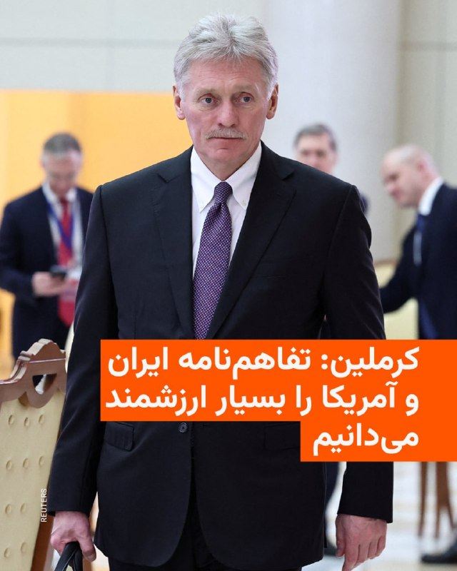

🔸دیمیتری پسکوف، سخنگوی کرملین، می‌گوید روسیه یادداشت تفاهم امضاشده میان ایران و ایالات متحده را بسیار ارزشمند می‌داند و آن را گامی مثبت برای بازگشایی تنگه هرمز و کاهش خطر درگیری نظامی ارزیابی می‌کند.

🔸پسکوف روز چهارشنبه سوم تیر گفت که هنوز توافقی نهایی میان تهران و واشینگتن حاصل نشده، اما یادداشت تفاهم امضاشده میان دو طرف از اهمیت زیادی برخوردار است.

🔸سخنگوی رئیس‌جمهور روسیه افزود مسکو از تلاش‌های میانجی‌ها و کشورهایی که در این مذاکرات مشارکت داشته‌اند قدردانی می‌کند، زیرا این روند می‌تواند دست‌کم در آیندهٔ قابل پیش‌بینی احتمال اقدام نظامی را کاهش دهد.

🔸او همچنین این تحول را برای منطقه و جهان «مثبت» توصیف کرد و گفت بازگشایی تنگه هرمز می‌تواند به ترمیم آسیب‌هایی که در جریان این درگیری به اقتصاد جهانی وارد شده است، کمک کند.

@RadioFarda

## RadioFarda — post 158707

  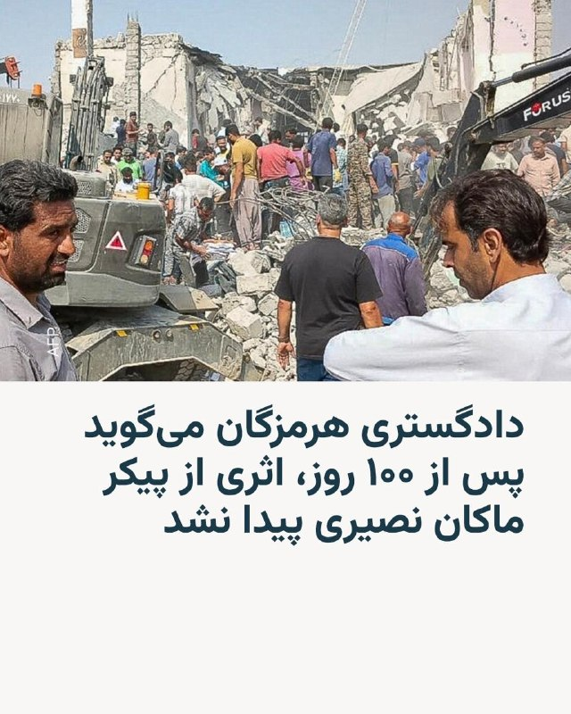

🔸رئیس کل دادگستری هرمزگان اعلام کرد با گذشت بیش از ۱۰۰ روز از «حمله موشکی» به دبستان شجره طیبه میناب، هنوز هیچ اثری از پیکر ماکان نصیری، دانش‌آموز ۸ ساله‌ای که در این حمله جان باخت، پیدا نشده است.

🔸مجتبی قهرمانی گفت تاکنون بیش از ۱۰۰ نمونه دی‌ان‌ای از بستگان و افراد مرتبط اخذ شده و عملیات گسترده جست‌وجو نیز انجام گرفته، اما این تلاش‌ها به نتیجه نرسیده است. به ادعای او، کارشناسان بر این باورند که «موشک به‌طور مستقیم به بدن این کودک اصابت کرده است؛ به‌گونه‌ای که از او تنها یک لنگه کفش و کیفی پاره‌شده به دست آمده است.»

🔸دبستان شجره طیبه میناب صبح نهم اسفند، ساعاتی پس از آغاز حملات آمریکا و اسرائیل به ایران، هدف حمله موشکی قرار گرفت. بر اساس اعلام مقام‌های ایرانی، در این حمله ۱۵۶ نفر، از جمله ۱۲۰ دانش‌آموز و ۲۶ معلم، جان خود را از دست دادند.

🔸پیت هگست، وزیر دفاع آمریکا، گفته است که تحقیقات درباره این حادثه همچنان ادامه دارد. او همچنین تأکید کرده است که ارتش آمریکا در درگیری‌ها غیرنظامیان را هدف قرار نمی‌دهد.

@RadioFarda

## RadioFarda — post 158706

🔸رئیس‌جمهور آمریکا می‌گوید ایران به ایالات متحده اطلاع داده که، برخلاف گزارش‌های «رسانه‌های جعلی و دردسرساز»، «هیچ عوارضی، هیچ هزینه بیمه‌ای و هیچ‌ هزینه دیگری از کشتی‌هایی که از تنگهٔ هرمز عبور می‌کنند، درخواست یا دریافت نمی‌کند». 🔸دونالد ترامپ روز چهارشنبه…

## RadioFarda — post 158705

  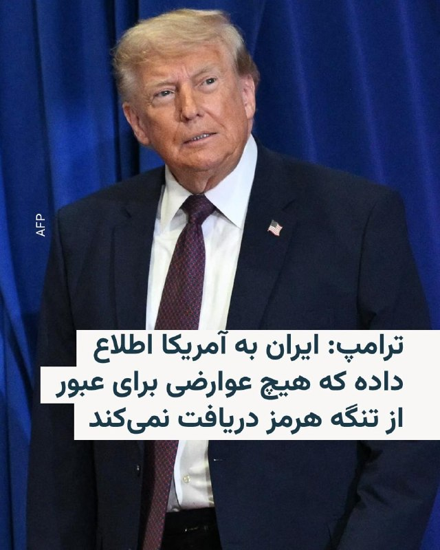

🔸رئیس‌جمهور آمریکا می‌گوید ایران به ایالات متحده اطلاع داده که، برخلاف گزارش‌های «رسانه‌های جعلی و دردسرساز»، «هیچ عوارضی، هیچ هزینه بیمه‌ای و هیچ‌ هزینه دیگری از کشتی‌هایی که از تنگهٔ هرمز عبور می‌کنند، درخواست یا دریافت نمی‌کند».

🔸دونالد ترامپ روز چهارشنبه سوم تیرماه در پستی در شبکهٔ اجتماعی خود، تروث سوشال، نوشت: «اگر این اطلاعات نادرست باشد، مذاکرات فوراً پایان خواهد یافت!»

🔸بر اساس بند پنجم تفاهم‌نامه‌ای که ایران و آمریکا امضا کرده‌اند، جمهوری اسلامی ایران متعهد شده است که «با به‌کارگیری حداکثر تلاش خود، ترتیبات لازم را برای عبور ایمن کشتی‌های تجاری، بدون دریافت هیچ هزینه‌ای و صرفاً برای مدت ۶۰ روز، از خلیج فارس به دریای عمان و بالعکس فراهم خواهد کرد».

🔸او افزود: «علاوه بر این، آمریکا هیچ پولی به ایران نداده و هیچ مبلغی از دارایی‌های ایران را آزاد نکرده است».
رئیس‌جمهور آمریکا تأکید کرد: «ما بخشی از پول‌های آن‌ها را که کاملاً تحت کنترل ماست، برای کمک به کشاورزان و دامداران خودمان آزاد خواهیم کرد تا برای خرید ذرت، گندم، سویا و موارد دیگر استفاده شود».

@RadioFarda

## IranianMinds — post 23229

  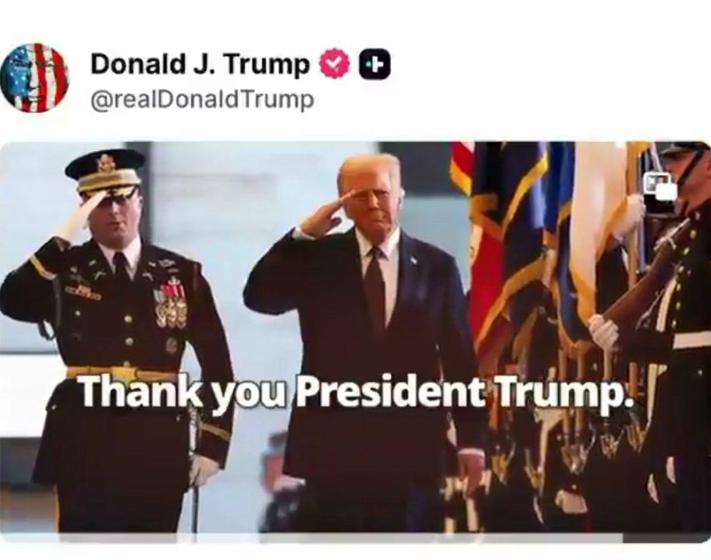

پست جدید ترامپ که داره از خودش تشکر‌ میکنه.

@IranianMinds

## IranianMinds — post 23228

  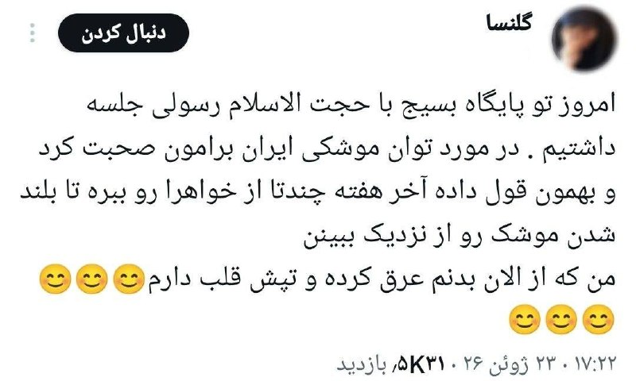

بپا حاج آقا جای دیگه نبرنتون

@IranianMinds

## IranianMinds — post 23226

مراسم‌ تاسوعای امسال که عکس خامنه ای رو گذاشتن جایی که همیشه مینشست …

@IranianMinds

## IranianMinds — post 23225

  <a href="telegram/content/IranianMinds_23225_1782312111.webm" target="_blank">🎬 Download video</a>

❌دیگه بازنده مطلق نباش
🅰️

🤩 
🤩 
🅰️ بابت هر شارژ موجوی اضافی بگیر

🤩 
🤩 
🅰️ کش بک بابت هر باخت

✅این بونوس ها بدون #قیدو شرط و نامحدود هست.

💵با بت اینجا همیشه به سمت سود حرکت کن
🔼

⌛ پشتیبانی 24 ساعته

🌐 betinja.bet

🌐 betinja.bet
کانال بونوس های رایگان r3
@betinjabet

## IranianMinds — post 23222

  

وضعیت

@IranianMinds

## IranianMinds — post 23221

  <a href="telegram/content/IranianMinds_23221_1782312111.mp4" target="_blank">🎬 Download video</a>

🔴ابراهیم رئیسی هم قبل از اینکه خرس‌ها بوخورنش، مدرک دکترای افتخاری گرفته بود😂

@IranianMinds

## IranianMinds — post 23220

  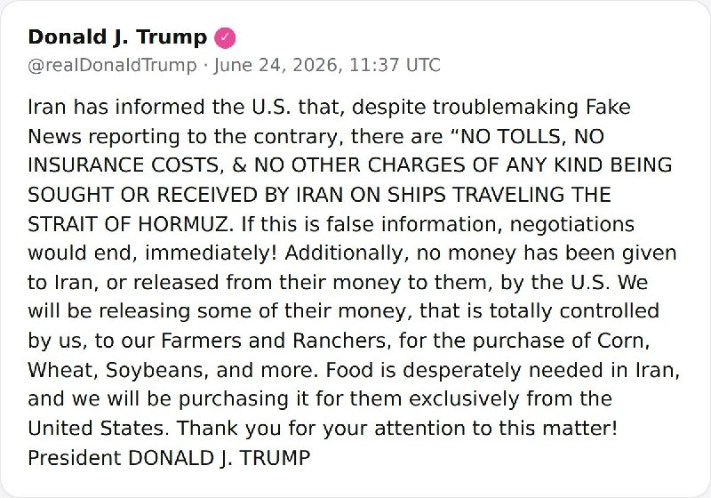

🔴 ترامپ:
ایران به ایالات متحده اطلاع داده است که علی‌رغم گزارش‌های دردسرسازِ اخبار جعلی (Fake News) که خلاف این را می‌گویند، "هیچ عوارض، هیچ هزینه بیمه، و هیچ هزینه دیگری از هیچ نوع توسط ایران برای کشتی‌هایی که از تنگه هرمز عبور می‌کنند، مطالبه یا دریافت نمی‌شود." اگر این اطلاعات نادرست باشد، مذاکرات بلافاصله پایان خواهد یافت! علاوه بر این، هیچ پولی توسط ایالات متحده به ایران داده نشده یا از پول‌های خودشان به آن‌ها آزاد نشده است. ما بخشی از پول آن‌ها را، که کاملاً تحت کنترل ماست، برای خرید ذرت، گندم، سویا و موارد دیگر، به کشاورزان و دامداران خودمان اختصاص خواهیم داد. ایران به شدت به مواد غذایی نیاز دارد و ما این مواد را منحصراً از ایالات متحده برای آن‌ها خریداری خواهیم کرد.

@IranianMinds

## BBCPersian — post 284918

🔻روبیو وارد کویت شد، بازگشایی سفارت آمریکا

مارکو روبیو، وزیر خارجه آمریکا، از امارات به کویت رفت.

او در ابوظبی با رئیس دولت امارات و دیگر مقام‌های ارشد درباره یادداشت تفاهم با ایران، عبور و مرور از تنگه هرمز و صلح منطقه‌ای گفت‌وگو کرده است.

همزمان با ورود وزیر خارجه آمریکا به کویت، سفارت آمریکا هم فعالیتش را از سر گفت که پس از جنگ ایران متوقف شد.

به گفته سخنگوی وزارت امور خارجه آمریکا خدمات اضطراری به شهروندان آمریکایی از سر گرفته شد و سایر خدمات نیز به‌تدریج بازمی‌گردند.

آقای روبیو بعد به بحرین سفر می‌کند.

او عالی‌ترین مقام دولت آمریکا است که پس از تفاهم با ایران به منطقه سفر کرده است.
@BBCPersian

## BBCPersian — post 284917

🔻بیرون بردن هزاران ملوان گرفتار در خلیج فارس و دریای عمان «آغاز» می‌شود

سازمان بین‌المللی دریانوردی وابسته به سازمان ملل متحد در حال آماده‌سازی برای بیرون بردن بیش از ۱۱ هزار دریانورد است که به دلیل جنگ ایران در خلیج فارس گیر کرده‌اند.

دبیرکل این سازمان اعلام کرد این «عملیات گسترده» با همکاری ایران، عمان، آمریکا و دیگر کشورهای ساحلی منطقه انجام خواهد شد:

«تضمین‌های لازم برای ایمنی را دریافت کرده‌ایم و شرایط لازم برای ناوبری ایمن به‌منظور پشتیبانی از این عملیات را به‌دقت بررسی کرده‌ایم.»

به گفته این سازمان، اجرای این عملیات منوط به باز ماندن تنگه هرمز است.

این سازمان تاکید کرد توافقی که برای کمک به این دریانوردان شده، «گامی حیاتی برای بازگرداندن امنیت دریایی و پایان دادن به حملات غیرقابل‌قبول به کشتیرانی غیرنظامی» است.
@BBCPersian

## BBCPersian — post 284916

🔻روسیه می‌گوید فرستادگان آمریکا در موضوع اوکراین اکنون درگیر موضوع ایرانند

روسیه گفت دو نماینده دونالد ترامپ برای مذاکره درباره جنگ اوکراین در حال حاضر مشغول موضوعات دیگری هستند.

استیو ویتکاف و جرد کوشنر نمایندگان دونالد ترامپ برای مذاکره با ایران و مذاکره با روسیه درباره جنگ اوکراین هستند.

دیمیتری پسکوف، سخنگوی کرملین، در پاسخ به پرسشی درباره احتمال استفاده از نمایندگان دیگری برای گفت‌وگوهای مربوط به اوکراین گفت:

«می‌دانیم که تماس‌ها ادامه خواهد یافت. طبیعتا آنها اکنون مشغول موضوعات دیگری هستند اما زمانی دیگر در دسترس خواهند بود و ما به ادامه کار امیدواریم.»
@BBCPersian

## BBCPersian — post 284915

  <a href="telegram/content/BBCPersian_284915_1782312113.mp4" target="_blank">🎬 Download video</a>

مسعود پزشکیان، رئیس‌جمهور ایران، سه‌شنبه ۲ تیر در یک سفر یک‌روزه به پاکستان، با شهباز شریف، نخست‌وزیر، آصف‌علی زرداری، رئیس‌جمهور و فیلد مارشال عاصم منیر، فرمانده کل ارتش پاکستان دیدار کرد.

قدردانی آقای پزشکیان از پیگیری‌های پاکستان به‌عنوان میانجی ایران و آمریکا از جمله دلایل این سفر عنوان شده بود.

در جریان این سفر آقای پزشکیان «دکترای افتخاری جراحی قلب» دریافت کرد.

این سفر با حواشی دیگری هم همراه بود که در این ویدیو می‌بینید.

@BBCPersian

## BBCPersian — post 284914

  <a href="telegram/content/BBCPersian_284914_1782312115.mp4" target="_blank">🎬 Download video</a>

🔻سرخط خبرها، چهارشنبه ۳ تیر ۱۴۰۵
@BBCPersian

## BBCPersian — post 284913

  <a href="https://t.me/bbcpersian/284913" target="_blank">📎 Download file</a>

تازه‌ترین خبرهای جهان چهارشنبه ۳ تیر ۱۴۰۵ از رادیو بی‌بی‌سی در لندن

## BBCPersian — post 284912

  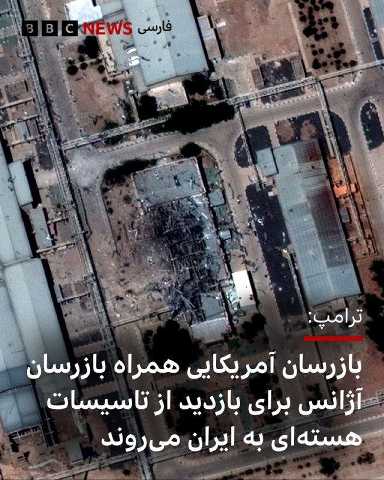

🔻دونالد ترامپ گفت بازرسان آمریکایی همراه با بازرسان آژانس بین‌المللی انرژی اتمی از تاسیسات هسته‌ای ایران بازدید خواهند کرد.

رئیس‌جمهور آمریکا به فاکس نیوز گفت: «توافق می‌کنند، آن را مکتوب می‌کنند و بعد می‌روند که درست نیست.»

او تاکید کرد که ایران با بازرسی آژانس موافقت کرده است.

رئیس‌جمهور آمریکا همچنین گفت که برای اعزام بازرسان عجله‌ای وجود ندارد.

رافائل گروسی، مدیر کل آژانس، امروز بدون اشاره به زمان گفته بود بازرسان بالاخره برای بازدید از تاسیسات هسته‌ای به ایران خواهند رفت.

ایران توافق برای بازرسی آژانس را تکذیب می‌کند. معاون وزیر خارجه ایران ساعاتی پیش در ایکس نوشت: «هیچ برنامه‌ای نیز برای دسترسی به تاسیسات مورد حمله واقع شده و مواد هسته‌ای وجود ندارد.»

محمد اسلامی، رئیس سازمان انرژی اتمی ایران، هفتم خرداد ۱۴۰۴ گفته بود: «کشورهایی که با ما تخاصم داشتند یا رفتار غیراصولی انجام دادند در طول این سال‌ها، سعی کردیم از آن کشورها بازرس نپذیریم. آن‌ها هم رفتار متقابل می‌کنند و بازرس ایرانی نمی‌پذیرند.»

📷MAXAR
@BBCPersian

## BBCPersian — post 284911

  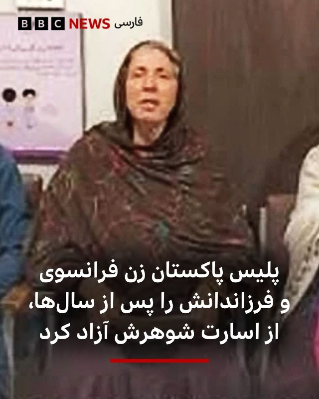

🔻پلیس پاکستان مردی را دستگیر کرده که همسر و فرزندانش را بیش از یک دهه در خانه زندانی و آزار و اذیت کرده است.

این زن که شهروند فرانسه است و به گفته بی‌بی‌سی اردو نامش سیلوی یاسمینا است، گفت که این مرد «بسیار خشن» به خانواده‌اش «هر روز» حمله فیزیکی و روانی می‌کرد.

یک پسر این زوج از خانه فرار کرد و پلیس پس از اطلاع به این خانه یورش برد.

به گزارش بی‌بی‌سی اردو این خانه در شهری دورافتاده در ایالت کوهستانی خیبرپختونخوا است.

پلیس یاسمینا و پنج فرزندش را در یک اتاق تنگ و «بسیار مخروبه» با کبودی‌هایی روی بدنشان پیدا کرد.

یاسمینا و فرزندانش به یک پناهگاه زنان در پیشاور منتقل شده‌اند.
ادامه از:
https://bbc.in/4eBaTnb
📷Khyber Pakhtunkhwa Police
@BBCPersian

## BBCPersian — post 284910

🔻وزیر دارایی آمریکا: نهادی در قطر برای نظارت بر پول‌های ایران تشکیل می‌شود

وزیر دارایی آمریکا با تکرار سخنان دونالد ترامپ تاکید کرد که «درصد زیادی» از دارایی‌های مسدود شده ایران برای خرید مواد غذایی و دارویی از آمریکا استفاده خواهد شد، حتی اگرمقام‌های این کشور بگویند که خودشان محل مصرف هزینه‌ها را تعیین خواهد کرد.

اسکات بسنت به شبکه سی‌ان‌بی‌سی گفت که وزارت دارایی ایالات متحده، نهادی عملیاتی در دوحه برای نظارت بر این وجوه خواهد داشت.

دونالد ترامپ گفته است بخشی از پول‌های ایران «برای خرید ذرت، گندم، سویا و سایر محصولات از کشاورزان و دامداران خودمان آزاد خواهیم کرد.»به گفته آقای ترامپ: «ایران به‌شدت به مواد غذایی نیاز دارد و ما این مواد غذایی را منحصرا از ایالات متحده برایشان خواهیم خرید.»

ایران خرید محصولات کشاورزی و دارویی از آمریکا را تکذیب کرده است.
@BBCPersian

## BBCPersian — post 284909

  <a href="https://t.me/bbcpersian/284909" target="_blank">📎 Download file</a>

در این برنامه:
در حالی که اظهارات متناقض مقام‌های ایران، آمریکا و کشورهای منطقه همچنان بر ابهام‌ها درباره آینده تفاهم‌نامه تهران و واشنگتن افزوده، نخست‌وزیر پاکستان سخنانش درباره برنامه موشکی ایران را پس گرفته و مسعود پزشکیان تأکید کرده که توان موشکی جمهوری اسلامی قابل مذاکره نیست. از یک تحلیلگر نزدیک به جمهوری‌خواهان می‌پرسیم این اختلاف‌ها چه تأثیری بر آینده توافق خواهد داشت.

همچنین نگاهی داریم به تحریم‌های ایران و این پرسش که با تفاهم‌نامه فعلی، کدام تحریم‌ها ممکن است برداشته شوند و رفع کامل آن‌ها تا چه اندازه امکان‌پذیر است.

در ادامه، از افزایش فشار تندروها بر مخالفان توافق در ایران، واکنش حکومت به این جریان، و همچنین دو برابر شدن قیمت نان و تأثیر آن بر معیشت خانواده‌های ایرانی خواهیم گفت.
و در پایان، به جام جهانی فوتبال می‌رویم و گفت‌وگوی اختصاصی بی‌بی‌سی فارسی با حسین کلانی که معتقد است تیم ملی باید از سیاست دور بماند.
@bbcpersian

## BBCPersian — post 284908

  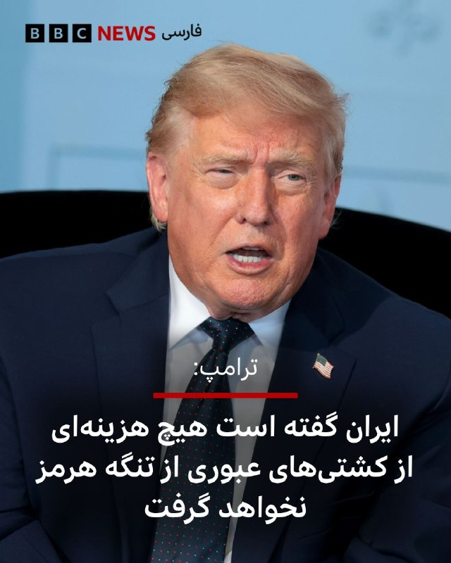

🔻دونالد ترامپ می‌گوید ایران به آمریکا گفته است که «هیچ نوع» هزینه‌ای از کشتی‌هایی که از تنگه هرمز عبور می‌کنند نخواهد گرفت.

رئیس‌جمهور آمریکا همچنین در تروث سوشال نوشت: «ایران به ایالات متحده اطلاع داده است که، برخلاف گزارش‌های دردسرساز رسانه‌های جعلی، «هیچ‌گونه عوارض، هزینه بیمه یا هیچ نوع هزینه دیگری از کشتی‌هایی که از تنگه هرمز عبور می‌کنند، مطالبه یا دریافت نمی‌شود. اگر این اطلاعات کذب باشد، مذاکرات فوراً پایان خواهد یافت.»

به نوشته آقای ترامپ، «آمریکا هیچ پولی به ایران نداده و دارایی‌های ایران را آزاد نکرده است. ما بخشی از پول‌های ایران را که کاملاً در کنترل ماست، برای خرید ذرت، گندم، سویا و سایر محصولات از کشاورزان و دامداران خودمان آزاد خواهیم کرد.»

به گفته آقای ترامپ: «ایران به‌شدت به مواد غذایی نیاز دارد و ما این مواد غذایی را منحصرا از ایالات متحده برایشان خواهیم خرید.»
ادامه از:
https://bbc.in/3ShJuzo
📷Getty
@BBCPersian

## BBCPersian — post 284907

  <a href="telegram/content/BBCPersian_284907_1782312119.mp4" target="_blank">🎬 Download video</a>

🔻کارلوس کی‌روش، مربی پرتغالی تیم ملی فوتبال غنا، در کنفرانس خبری پس از تساوی بدون گل این تیم مقابل انگلیس، با شکایت از کمک داور ویدیویی گفت که یک «پنالتی واضح» برای تیم غنا گرفته نشده است.

آقای کی‌روش در جمله‌‌هایی طعنه‌آمیز گفت: «ظاهرا کمک داور ویدیویی رفته بود قهوه بخورد.»

با وجود شکایت کارلوس کی‌روش از داوری، هواداران غنا در پی گرفتن تک‌امتیاز بازی از انگلیس جشن و پایکوبی کردند؛ هم در محدوده هواداران در بوستون آمریکا و هم در آکرا، پایتخت غنا.

علاوه بر سرمربی غنا، کارشناسان بی‌بی‌سی هم که بازی را گزارش می‌کردند، عمدتاً متفق‌القول بودند که ری کونسا مدافع و تیم انگلیس خوش‌شانس بودند که با کارت قرمز و پنالتی جریمه نشدند.

از جمله وین رونی، مهاجم پیشین تیم ملی انگلیس و منچستر یونایتد گفت: «فکر می‌کنم این یک پنالتی بود.»

در صحنه مشکوک به پنالتی پرینس آدو، ملی‌پوش غنا در پی توپ‌ربایی هم‌تیمی‌اش، جلوتر از دو مدافع انگلیس صاحب توپ شد اما کونسا پایش را از پشت جلوی او انداخت و آدو را سرنگون کرد.

@BBCPersian

## Dirty_Kids — post 392987

  

10 فیلم پربیننده سال 2026 (تا کنون) از نظر Letterboxd

10) 28 Years Later: The Bone Temple
9) Hoppers
8) Send Help
7) People We Meet On Vacation
6) The Devil Wears Prada 2
5) Wuthering Heights
4) Michael
3) Backrooms
2) The Drama
1) Project Hail Mary

@Dirty_Kids 👻

## Dirty_Kids — post 392986

  <a href="telegram/content/Dirty_Kids_392986_1782312121.mp4" target="_blank">🎬 Download video</a>

یک سرباز روسی که با پهپاد اوکراینی روبه‌رو شده بود، از اپراتور درخواست کرد که اول دوست کنارش رو بزنه تا بتونه سیگارشو قبل مرگ تموم کنه

اپراتور پهپاد درخواستش رو قبول میکنه، اول سرباز دیگه رو میزنه و بعد سربازی که درخواست کرده بود رو هم میزنه.​​​​​​​​​​​​​​​​​​​​​​​​​​​​​​​​​​​​​​​​​​​​​​​​​​

@Dirty_Kids 👻

## Dirty_Kids — post 392985

  <a href="telegram/content/Dirty_Kids_392985_1782312123.mp4" target="_blank">🎬 Download video</a>

وقتی میگم امسال قطعا عجیب ترین محرم تاریخ خواهد بود الکی نگفتم:

@Dirty_Kids 👻

## Dirty_Kids — post 392984

جدی نمیفهمم ملت چرا پیاده میرن کربلا؟

خود حسین با اسب میرفت

@Dirty_Kids 👻

## Dirty_Kids — post 392983

  

مذاکره حلال شد، خامنه‌ای بلال شد! 🌽

@Dirty_Kids 👻

## Dirty_Kids — post 392982

‏دو کس رنج بیهوده بردند و سعی بی‌فایده کردند.
یکی آنکه اندوخت و نخورد. دوم آنکه ۱۰۰ شب رفت تو خیابون گفت انتقام و تهش یونجه گیرش اومد.

@Dirty_Kids 👻

## Dirty_Kids — post 392981

  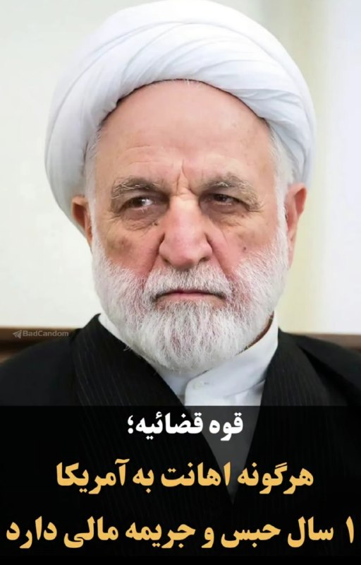

🔴 قوه قضائیه: ازین به بعد هر کس علیه آمریکا شعار بده یا حرف بزنه، ۱ سال حبس یا جریمه مالی میشه.

@Dirty_Kids 👻

## Dirty_Kids — post 392979

  <a href="telegram/content/Dirty_Kids_392979_1782312125.mp4" target="_blank">🎬 Download video</a>

🔴 چند روز پیش تو کرج، پلیسا یه جوون بدبخت به اسم علی خیراندیش رو، بخاطر موتور سنگین، بهش تیر میزنن و به قتل میرسوننش.
مردمم می‌ریزن سر پلیسا تا پدرشونو در بیارن، اما فرار میکنن.

@Dirty_Kids 👻

## Dirty_Kids — post 392978

  <a href="telegram/content/Dirty_Kids_392978_1782312125.mp4" target="_blank">🎬 Download video</a>

قالیباف بعد از اینکه سر همه سران جمهوری اسلامی را زیر آب کرد و خودش رهبر شد

@Dirty_Kids 👻

## Dirty_Kids — post 392977

  <a href="telegram/content/Dirty_Kids_392977_1782312126.mp4" target="_blank">🎬 Download video</a>

عشوه در مذاکرات

@Dirty_Kids 👻

## Dirty_Kids — post 392976

‏این حسین کیست که هرچی دزد و قاتل و پدرسوخته و کلاه‌بردار و نزول‌خور و تجاوزگره، شیعه حسینه؟

@Dirty_Kids 👻

## Hranews — post 113827

  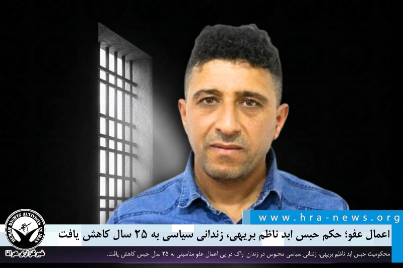

حکم حبس ابد ناظم بریهی، زندانی سیاسی به ۲۵ سال کاهش یافت

❗️
❗️
❗️
❗️
❗️– محکومیت حبس ابد ناظم بریهی، زندانی سیاسی محبوس در زندان اراک در پی اعمال عفو مناسبتی به ۲۵ سال حبس کاهش یافت. این زندانی بیش از دو دهه است که در زندان بسر میبرد.

به گزارش خبرگزاری هرانا، ارگان خبری مجموعه فعالان حقوق بشر در ایران، محکومیت حبس ابد ناظم بریهی به ۲۵ سال حبس کاهش یافت.

براساس اطلاعات دریافتی هرانا، در پی اعمال عفو مناسبتی، محکومیت حبس ابد آقای بریهی به ۲۵ سال حبس تبدیل شده است.

#ناظم_بریهی

ادامه مطلب

↘️
@hranews_bot تماس ✉️ - @Hranews کانال هرانا 🆑

## Hranews — post 113826

  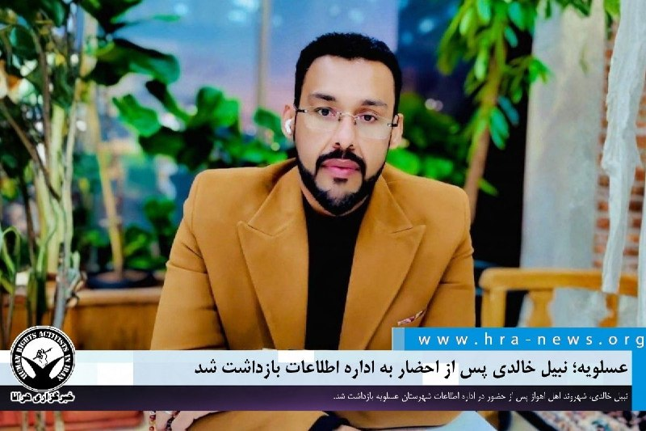

عسلویه؛ نبیل خالدی پس از احضار به اداره اطلاعات بازداشت شد

❗️
❗️
❗️
❗️
❗️– نبیل خالدی، شهروند اهل اهواز روز دوشنبه ۲ تیرماه، پس از حضور در اداره اطلاعات شهرستان عسلویه بازداشت شد.

به گزارش خبرگزاری هرانا، ارگان خبری مجموعه فعالان حقوق بشر در ایران، نبیل خالدی بازداشت شد.

آقای خالدی که پیش‌تر به اداره اطلاعات شهرستان عسلویه احضار شده بود، روز دوشنبه ۲ تیرماه پس از مراجعه به این نهاد امنیتی بازداشت شد.

#نبیل_خالدی

ادامه مطلب

↘️
@hranews_bot تماس ✉️ - @Hranews کانال هرانا 🆑

## Hranews — post 113825

  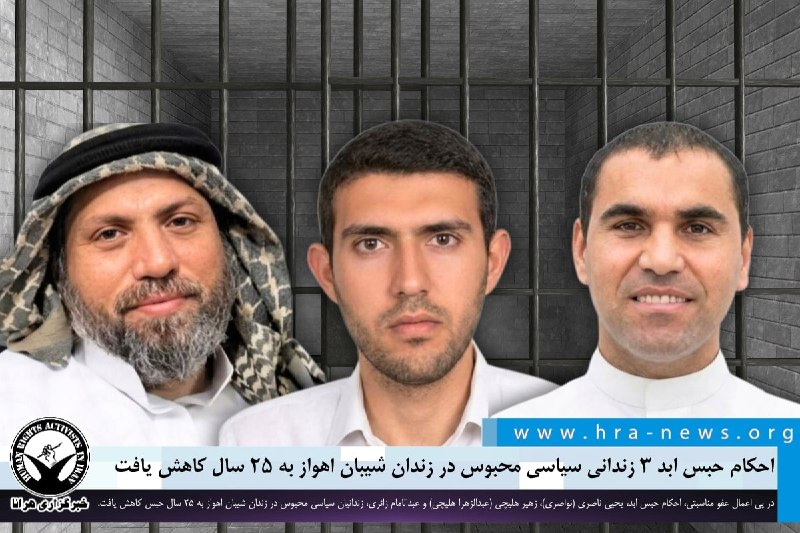

احکام حبس ابد ۳ زندانی سیاسی محبوس در زندان‌ شیبان اهواز به ۲۵ سال کاهش یافت

❗️
❗️
❗️
❗️
❗️– در پی اعمال عفو مناسبتی، احکام حبس ابد، یحیی ناصری (نواصری)، زهیر هلیچی (عبدالزهرا هلیچی) و عبدالامام زائری، زندانیان سیاسی محبوس در زندان‌ شیبان اهواز به ۲۵ سال حبس کاهش یافت. این زندانیان بیش از دو دهه است که در زندان محبوس هستند.

به گزارش خبرگزاری هرانا، ارگان خبری مجموعه فعالان حقوق بشر در ایران، احکام ۳ زندانی سیاسی به ۲۵ سال حبس تقلیل یافت.

براساس اطلاعات دریافتی هرانا، احکام حبس ابد آقایان ناصری، هلیچی و زائری در پی اعمال عفو مناسبتی به ۲۵ سال حبس تبدیل شده است.

#یحیی_ناصری #عبدالزهرا_هلیچی #عبدالامام_زائری

ادامه مطلب

↘️
@hranews_bot تماس ✉️ - @Hranews کانال هرانا 🆑

## alonews — post 130034

  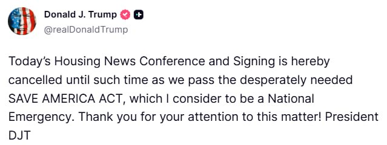

👈دونالد ترامپ: کنفرانس خبری و مراسم امضای مربوط به مسکن که قرار بود امروز برگزار شود، تا زمانی که قانون بسیار ضروری SAVE AMERICA ACT تصویب نشود، لغو می‌شود.

من این موضوع را یک وضعیت اضطراری ملی می‌دانم.
از توجه شما به این موضوع متشکرم!

✅ @AloNews خبر جنگ

## alonews — post 130033

  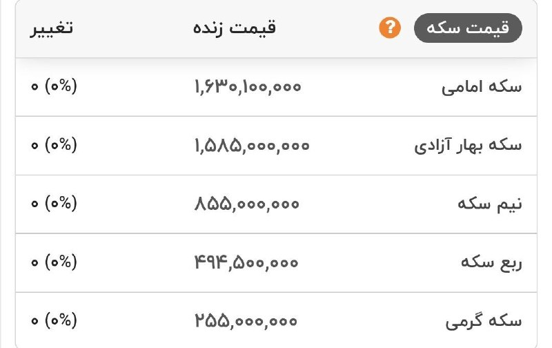

👈قیمت انواع سکه

✅ @AloNews خبر جنگ

## alonews — post 130032

  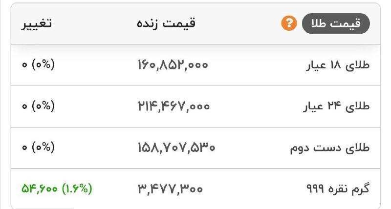

👈قیمت طلا و نقره

✅ @AloNews خبر جنگ

## alonews — post 130031

  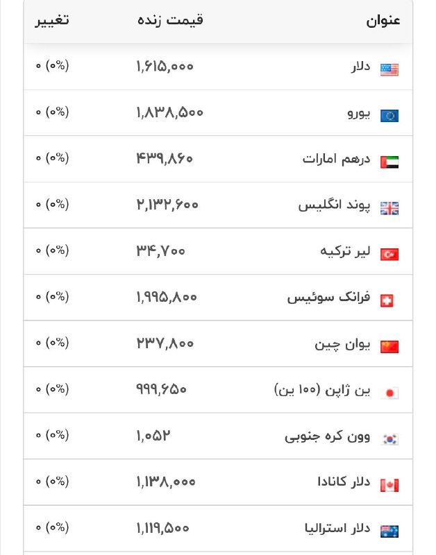

👈قیمت انواع ارزها

✅ @AloNews خبر جنگ

## alonews — post 130030

👈جاده عین عرب به الوزانی در جنوب لبنان توسط نیروهای ارتش اسرائیل مسدود شد

✅ @AloNews خبر جنگ

## alonews — post 130029

  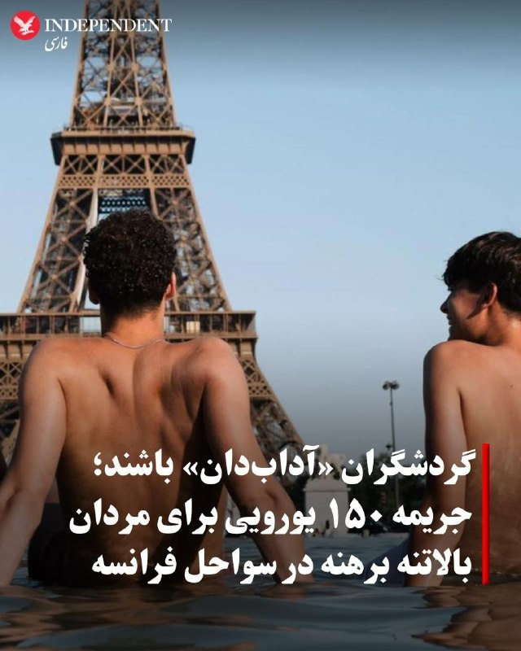

👈شماری از مناطق گردشگری در فرانسه در سال‌های اخیر به گردشگران هشدار می‌دهند که اگر با بالاتنه برهنه در خیابان‌، میدان‌ یا مناطق تاریخی شهر دیده شوند، ممکن است تا ۱۵۰ یورو جریمه شوند.

✅ @AloNews خبر جنگ

## alonews — post 130028

  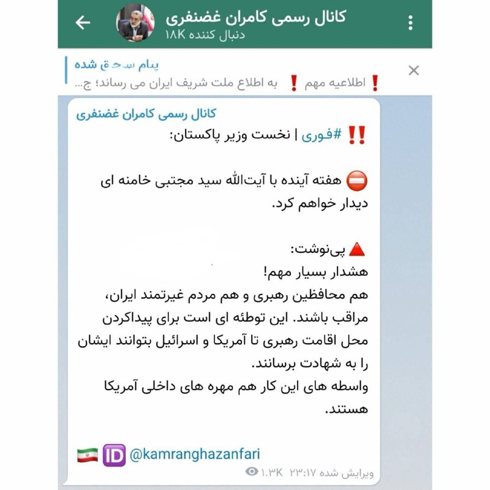

👈کامران غضنفری، نماینده مجلس:
دیدار نخست‌وزیر پاکستان با رهبری، برنامه آمریکا و اسرائیل برای زمینه‌سازی شهادت ایشان است

✅ @AloNews خبر جنگ

## alonews — post 130027

  

👈ترامپ: برای دسترسی به مواد هسته‌ای عجله‌ای وجود ندارد، زیرا در پی عملیات «چکش نیمه‌شب» در زیر زمین دفن شده‌اند

✅ @AloNews خبر جنگ

## alonews — post 130026

  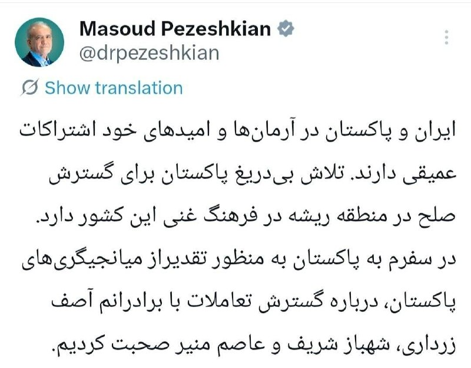

👈پزشکیان: ایران و پاکستان در آرمان‌ها و امیدهای خود اشتراکات عمیقی دارند؛ تلاش بی‌دریغ پاکستان برای گسترش صلح در منطقه ریشه در فرهنگ غنی این کشور دارد

🔴در سفرم به پاکستان به منظور تقدیر از میانجیگری‌های پاکستان، درباره گسترش تعاملات با برادرانم آصف زرداری، شهباز شریف و عاصم منیر صحبت کردیم.

✅ @AloNews خبر جنگ

## alonews — post 130025

  

👈ترامپ:
رای های من اکنون به بالاترین حد خود رسیده

✅ @AloNews خبر جنگ

## alonews — post 130024

  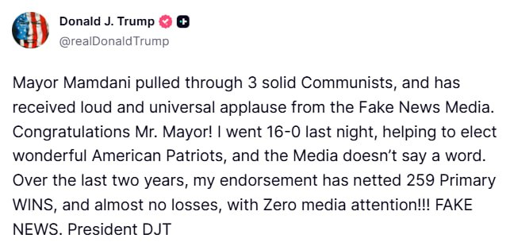

👈پرزیدنت ترامپ:

شهردار ممدانی با حمایت سه کمونیست تمام‌عیار به پیروزی رسید و رسانه‌های جعلی هم با سروصدای زیاد و به‌صورت یکپارچه برایش کف زدند. تبریک آقای شهردار!
من دیشب ۱۶ برد از ۱۶ داشتم و به انتخاب میهن‌پرستان فوق‌العاده آمریکایی کمک کردم، اما رسانه‌ها حتی یک کلمه هم درباره‌اش نمی‌گویند.
در دو سال گذشته، حمایت و تأیید من باعث ۲۵۹ پیروزی در انتخابات مقدماتی شده و تقریباً هیچ شکستی نداشته است، با این حال هیچ توجهی از سوی رسانه‌ها دریافت نکرده‌ام!!!

✅ @AloNews خبر جنگ

## alonews — post 130023

👈مدودف: اختیارات زلنسکی مدت‌ها پیش منقضی شده است و این واقعیت او را از هرگونه مصونیتی محروم می‌کند.

✅ @AloNews خبر جنگ

## alonews — post 130022

  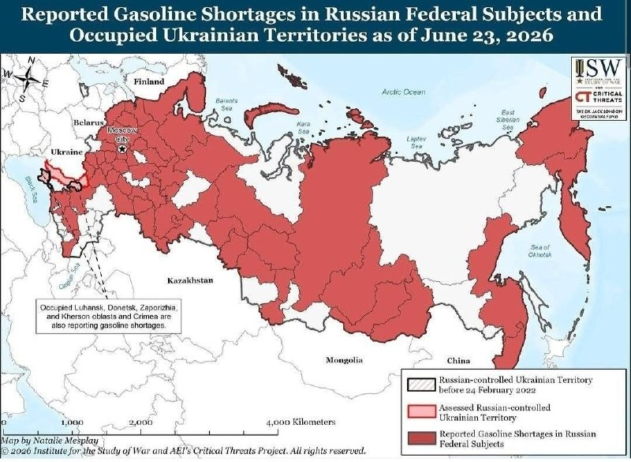

👈اوکراین تو این مدت جوری پالایشگاه‌های روسیه رو زده که نصف روسیه درگیر کمبود بنزین و گازوئیل شده

✅ @AloNews خبر جنگ

## alonews — post 130021

  

👈وزارت امور خارجه ایالات متحده روز چهارشنبه سوم تیرماه اعلام کرد که مارکو روبیو، وزیر امور خارجه این کشور، در دیدار با شیخ محمد بن زاید آل نهیان، رئیس دولت امارات متحده عربی، درباره یادداشت تفاهم با جمهوری اسلامی ایران گفتگو کرده است.

🔴بر اساس بیانیه این وزارتخانه، دو طرف در این نشست علاوه بر بررسی مفاد این تفاهم‌نامه، در خصوص تضمین تردد ایمن و آزاد شناورها از تنگه هرمز و همچنین اهمیت حیاتی برقراری و حفظ صلح و ثبات در منطقه خاورمیانه به بحث و تبادل نظر پرداختند.

✅ @AloNews خبر جنگ

## alonews — post 130020

  

👈سقوط عجیب طلای جهانی/طلا به زیر 4 هزار دلار رفت!

✅ @AloNews خبر جنگ

## alonews — post 130019

  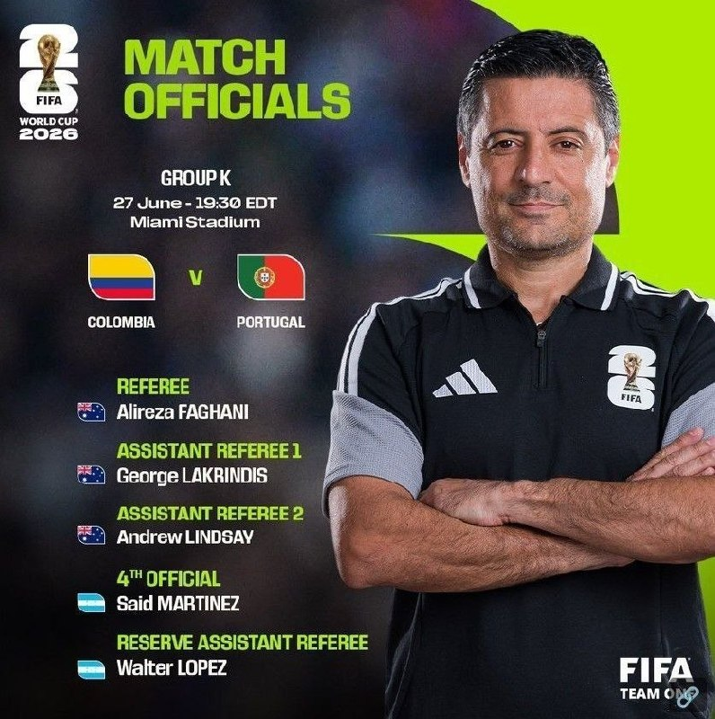

قضاوت جنگ صدرنشینی گروه K به فغانی و تیم داوریش سپرده شد

@AloSport

## alonews — post 130018

  <a href="telegram/content/alonews_130018_1782312136.mp4" target="_blank">🎬 Download video</a>

👈ویدئویی از حجم بسیار زیاد آب رودخانه سیمره در شهرستان دره‌شهر ایلام

🔴نیروهای امداد و نجات هم از پس سیمره برنمی‌آمدند

✅ @AloNews خبر جنگ

## alonews — post 130017

  <a href="telegram/content/alonews_130017_1782312138.mp4" target="_blank">🎬 Download video</a>

👈وزیر خزانه‌داری آمریکا، بسنت : سلطه دلار خیلی مهمه

🔴همه کارهایی که ترامپ داره انجام می‌ده، دلار رو دوباره محور تجارت جهانی می‌کنه

🔴تو ونزوئلا و حتی مذاکرات با ایران هم می‌بینیم که معاملات قراره با دلار انجام بشه

🔴در کل، همه این اقدامات جایگاه دلار رو دوباره تقویت می‌کنه

✅ @AloNews خبر جنگ

## alonews — post 130016

  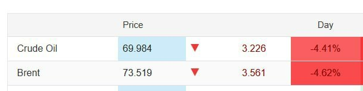

👈قیمت نفت آمریکا به زیر 70 دلار رسید

✅ @AloNews خبر جنگ

## alonews — post 130015

👈یک دیپلمات آگاه به خبرگزاری AFP می‌گوید که مذاکرات آشتی کشورهای حاشیهٔ خلیج‌فارس و ایران در عربستان سعودی برگزار شود.

🔴این دیپلمات می‌گوید که پیش‌بینی می‌شود نشانی سطح بالا با هدف ترمیم روابط میان کشورهای خلیج‌فارس، ایران و احتمالاً سایر همسایگان منطقه‌ای در پی جنگ، در ریاض برگزار شود، اما تاریخ دقیقی مشخص نکرده است.

🔴او می‌افزاید که این نشست‌ها مستقل از مذاکرات جاری بین ایالات متحده و ایران خواهد بود.

✅ @AloNews خبر جنگ

---
📅 بروزرسانی: 1405/04/03 15:25
---

## VahidOOnLine — post 247120

  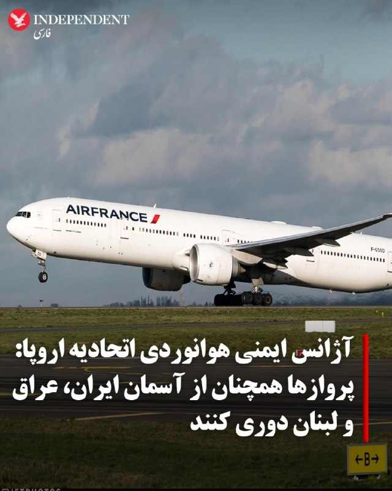

♦️آژانس ایمنی هوانوردی اتحادیه اروپا (EASA) روز چهارشنبه سوم تیرماه اعلام کرد که خطوط هوایی باید همچنان از حریم هوایی ایران، عراق و لبنان دوری کنند و با وجود تفاهم‌نامه پایان جنگ میان واشنگتن و تهران، در سراسر منطقه محتاط باشند، زیرا «نقض توافق» همچنان محتمل است.

نهاد نظارت بر هوانوردی اتحادیه اروپا اعلام کرد که هشدار منطقه درگیری خود در خاورمیانه را تا اول ژوئیه/۱۰ تیرماه تمدید می‌کند.

این آژانس اعلام کرد که نقض کوتاه‌مدت آتش‌بس بین ایالات متحده و ایران به‌ویژه در منطقه تنگه هرمز همچنان محتمل است.

آژانس ایمنی هوانوردی اتحادیه اروپا با صدور بیانیه‌ای اعلام کرد که همه شرکت‌های هواپیمایی باید هنگام فعالیت در حریم هوایی بحرین، کویت، اسرائیل، اردن، قطر، عمان، امارات متحده عربی و عربستان سعودی احتیاط کنند و خطرات احتمالی را در نظر بگیرند.
‌🇸🇦 Indypersian

🤖 @VahidOOnLine

## VahidOOnLine — post 247119

  

غلامحسین محسنی اژه‌ای، رییس قوه قضاییه جمهوری اسلامی، در نشست با جمعی از مقامات دستگاه قضا و روسای کل دادگستری استان‌ها گفت: «آمریکا و اسرائیل باید برای جبران خسارت، پرداخت غرامت و ارتکاب جنایات جنگی، در مراجع بین‌المللی تحت پیگرد قرار گیرند.»

او افزود ما گریبان متجاوزان را رها نخواهیم کرد و آنان را تحت تعقیب قرار می‌دهیم.

اژه‌ای گفت: «احکام برخی پرونده‌های مربوط به دشمن نیز به‌صورت قطعی صادر شده است.»
‌🏁 🇬🇧 IranintlTV

🤖 @VahidOOnLine

## VahidOOnLine — post 247118

  

یسرائیل کاتز، وزیر دفاع اسرائیل، در یک کنفرانس گفت: «حتی در صورت درخواست آمریکا نیز از جنوب لبنان عقب‌نشینی نخواهیم کرد.»

او ادامه داد: «سربازان ما در داخل این مناطق و ساکنان در خارج خواهند بود. زیرساخت‌ها در آنجا ویران و خانه‌های تهدیدآمیز نیز تخریب شده‌اند و ما عقب‌نشینی نخواهیم کرد.»

او افزود: «۲۰۰ هزار نفر از ساکنان باز نخواهند گشت. هیچ ساکنی وجود ندارد و هیچ تروریستی هم وجود ندارد. در گذشته، در مناطق امنیتی که جمعیت غیرنظامی نیز در آن حضور داشت، مواد منفجره کار گذاشته می‌شد و علیه سربازان حمله صورت می‌گرفت و ما اجازه تکرار آن را نخواهیم داد.»
iranintl
‌🏁 🇬🇧 IranintlTV

🤖 @VahidOOnLine

## VahidOOnLine — post 247117

  

اسماعیل احمدی‌مقدم، فرمانده پیشین نیروی انتظامی و عضو تیم مذاکره‌کننده جمهوری اسلامی در اسلام‌آباد، در صدا و سیما گفت: «در دوره پساجنگ، مهم‌ترین مساله تقویت توان نظامی و جبهه داخلی برای احتمال از سرگیری جنگ است.»

او افزود بی‌ثباتی در داخل و کاهش سرمایه اجتماعی برای جمهوری اسلامی مشکل ایجاد کرده است.

احمدی‌مقدم گفت: «یکی دیگر از اقدامات، باید تسریع در اصلاحات داخلی و امیدآفرینی در جامعه باشد.»

فرمانده پیشین نیروی انتظامی اضافه کرد: «باید با افزایش انسجام و وحدت ملی در صحنه سیاسی و اجتماعی، از دادن سیگنال به دشمن خودداری کنیم و حتی اگر انتقادی وجود دارد، جای بیان آن در تریبون‌ها نیست.»

احمدی‌مقدم درباره ارتباط با کشورهای همسایه افزود باید «فرصت‌محوری» را جایگزین «تهدیدمحوری» کرد و تعامل را به جای تقابل در پیش گرفت.
iranintl
‌🏁 🇬🇧 IranintlTV

🤖 @VahidOOnLine

## VahidOOnLine — post 247116

  <a href="telegram/content/VahidOOnLine_247116_1782302114.mp4" target="_blank">🎬 Download video</a>

⭕️گزارش‌ها از حملات پهپادی اوکراین به صنایع نفت در شبه‌جزیره کریمه

♦️رسانه‌های اوکراینی و کانال‌های تلگرامی روسیه روز چهارشنبه سوم تیرماه از حملات سنگین پهپادی اوکراین به تاسیسات نفت و گاز در مناطق مختلف روسیه و ازجمله شبه‌جزیره کریمه خبر دادند.
ویدیوهای منتشر شده در شبکه‌های اجتماعی ستون‌های عظیم دود برخاسته از یکی از پالایشگاه‌های نفتی این منطقه در مرز دو کشور را نشان می‌دهد.
روسیه در سال ۲۰۱۴ با برگزاری یک همه‌پرسی کریمه را از اوکراین جدا کرد.
جامعه جهانی این «تغییر اراضی» را به رسمیت نمی‌شناسد.
‌🇸🇦 Indypersian

🤖 @VahidOOnLine

## VahidOOnLine — post 247115

  

کاظم غریب‌آبادی، معاون وزیر خارجه جمهوری اسلامی، در شبکه ایکس نوشت: «با وجود درخواست رافائل گروسی، مدیرکل آژانس بین‌المللی انرژی اتمی، هیچ نشستی با او در سوئیس برگزار نکردیم.»

غریب‌آبادی اضافه کرد: «هیچ برنامه‌ای برای دسترسی به تاسیسات هدف حمله قرار گرفته و مواد هسته‌ای وجود ندارد و این موضوع تنها در چارچوب توافق نهایی و پس از پایان همه تحریم‌ها بررسی خواهد شد.»

او در ادامه خطاب به طرف آمریکایی نوشت: «نمی توانید با هیاهوی رسانه‌ای، سیاست راه بینداز و جا بینداز را پیش ببرید.»
‌🏁 🇬🇧 IranintlTV

🤖 @VahidOOnLine

## VahidOOnLine — post 247105

  <a href="telegram/content/VahidOOnLine_247105_1782302117.mp4" target="_blank">🎬 Download video</a>

روایت راه‌آهن سراسری، از رویای تجددخواهان تا پروژه‌ای که با کوشش رضاشاه، ایران را به هم پیوند زد.
‌🏁 🇬🇧 ManotoTV

🤖 @VahidOOnLine

## VahidOOnLine — post 247104

  

آژانس ایمنی هوانوردی اتحادیه اروپا، از شرکت‌های هواپیمایی خواست با وجود توافق میان آمریکا و جمهوری اسلامی، همچنان از عبور از حریم هوایی ایران، عراق و لبنان اجتناب کنند.

این آژانس اعلام کرد احتمال نقض کوتاه‌مدت آتش‌بس میان آمریکا و جمهوری اسلامی، به‌ویژه در تنگه هرمز، همچنان وجود دارد.

آژانس ایمنی هوانوردی اتحادیه اروپا همچنین نسبت به تاثیر آتش‌بس شکننده میان اسرائیل و حزب‌الله بر حریم هوایی لبنان هشدار داد.
‌🏁 🇬🇧 IranintlTV

🤖 @VahidOOnLine

## VahidOOnLine — post 247103

  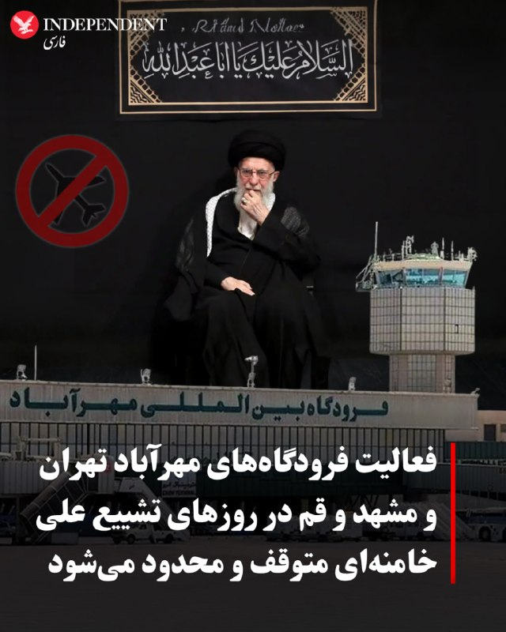

♦️روابط عمومی شرکت فرودگاه‌ها و ناوبری هوایی ایران روز چهارشنبه سوم تیرماه از اعمال محدودیت‌های پروازی همزمان با مراسم تشییع رهبر پیشین جمهوری اسلامی خبر داد.

در اطلاعیه این شرکت آمده است که به دنبال اجرای برنامه مدیریت ترافیک هوایی از سوی سازمان هواپیمایی کشوری، فعالیت برخی فرودگاه‌ها با محدودیت مواجه خواهد شد و پروازهای فرودگاه مهرآباد در روزهای ۱۲ و ۱۵ تیر کاملا متوقف می‌شود و در روزهای ۱۳، ۱۴، ۱۶ و ۱۷ تیرماه محدود خواهد بود.

براساس همین اطلاعیه، فعالیت‌های فرودگاه مشهد روز ۱۷ تیرماه با محدودیت و روز ۱۸ تیر کاملا متوقف خواهد بود.

سازمان ناوبری هوایی ایران همچنین اعلام کرد که در روزهای ۱۶ و ۱۷ تیرماه، محدودیت‌های پروازی در آسمان استان قم برقرار خواهد شد.
‌🇸🇦 Indypersian

🤖 @VahidOOnLine

## VahidOOnLine — post 247102

  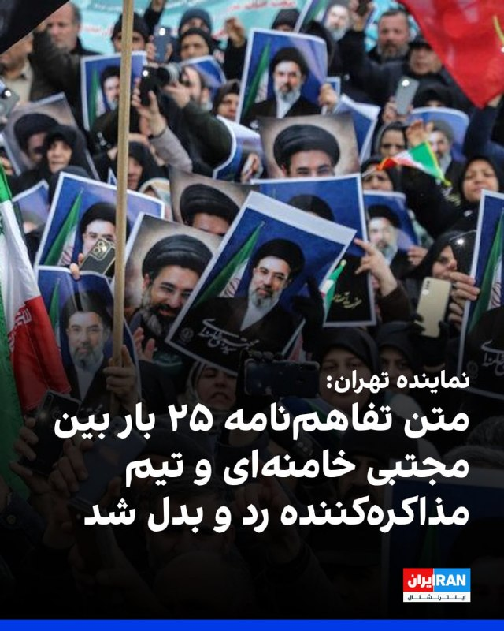

عبدالحسین روح‌الامینی، نماینده تهران در مجلس، به باشگاه خبرنگاران جوان گفت: «متن تفاهم‌نامه میان جمهوری اسلامی و آمریکا، ۲۵ بار بین مجتبی خامنه‌ای و تیم مذاکره‌کننده رفت‌و‌برگشت داشته است.»

او افزود به دلیل محرمانگی در بخشی از متن تفاهم‌نامه، هر فرد بخشی از این اطلاعات را در اختیار داشته و متن در هر بار رفت‌و‌برگشت میان تیم مذاکره‌کننده که به موضوعات اشراف داشته‌اند، در حال تحول بوده است.
iranintl
‌🏁 🇬🇧 IranintlTV

🤖 @VahidOOnLine

## WithYashar — post 15719

  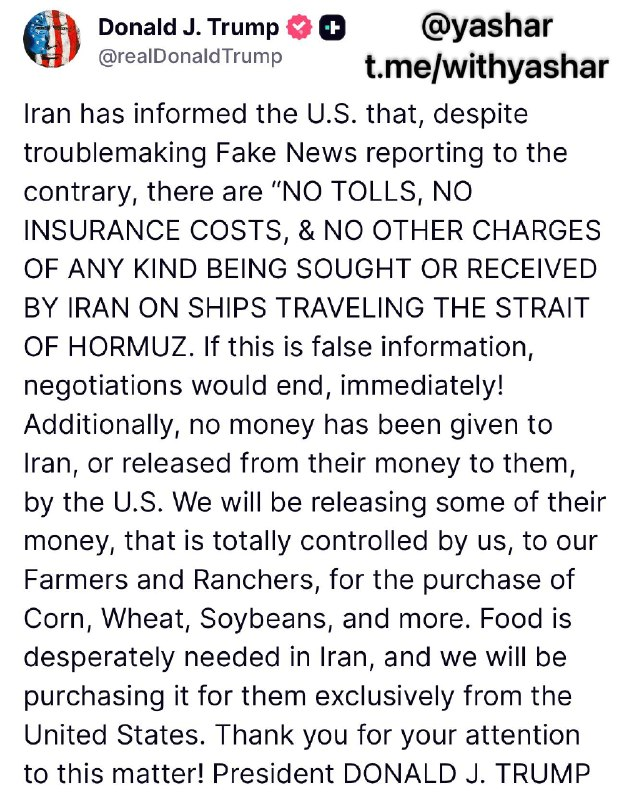

ترامپ در ‌تروث : «ایران به ایالات متحده اطلاع داده است که برخلاف گزارش‌های دردسرساز رسانه‌های جعلی، هیچ‌گونه عوارض، هزینه بیمه یا هیچ نوع هزینه دیگری از کشتی‌هایی که از تنگه هرمز عبور می‌کنند مطالبه یا دریافت نمی‌کند. اگر این اطلاعات نادرست باشد، مذاکرات فوراً پایان خواهد یافت.

همچنین، هیچ پولی از سوی آمریکا به ایران پرداخت نشده و هیچ بخشی از دارایی‌های ایران نیز مستقیماً در اختیار این کشور قرار نگرفته است. ما بخشی از دارایی‌های ایران را که همچنان کاملاً تحت کنترل ماست، برای پرداخت به کشاورزان و دامداران آمریکایی آزاد خواهیم کرد تا از آن برای خرید ذرت، گندم، سویا و سایر محصولات استفاده شود.

ایران به‌شدت به مواد غذایی نیاز دارد و ما این اقلام را منحصراً از ایالات متحده برای آن‌ها تأمین خواهیم کرد.
از توجه شما به این موضوع سپاسگزارم.»
@withyashar

## WithYashar — post 15718

  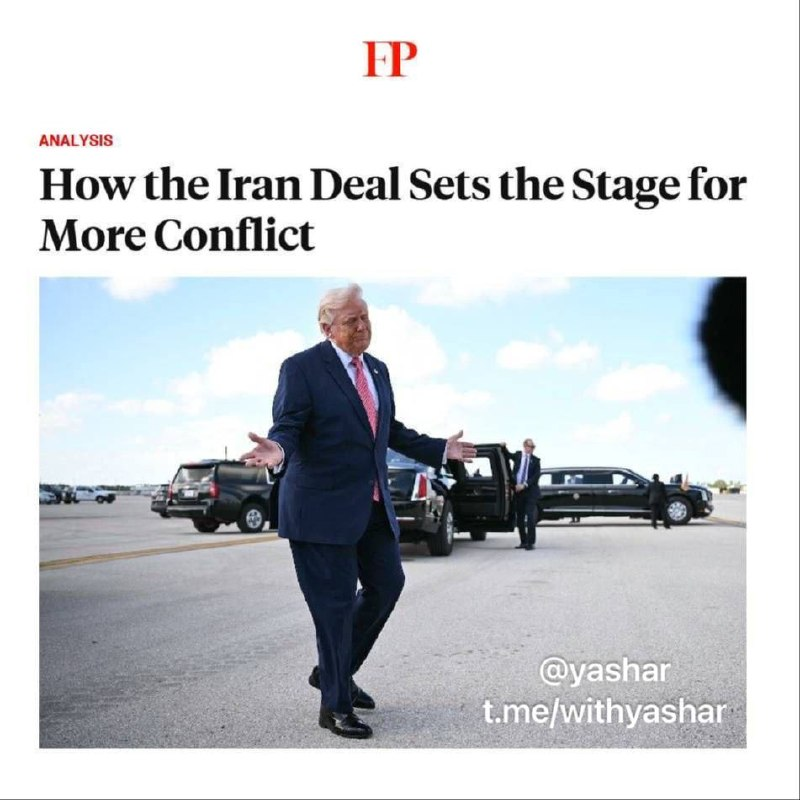

فارن پالیسی: توافق ایران زمینه درگیری‌های بیشتری را فراهم می‌کند!
@withyashar

## WithYashar — post 15717

با اعلام راکستار،قیمت بازی GTA6 مشخص شد.

نسخه Standard:
80 دلار، معادل 12 میلیون تومن.
نسخه Ultimate Edition:
100 دلار، معادل 16 میلیون تومن.
@withyashar

## WithYashar — post 15716

حسین پاک، خبرنگار مستقر در لبنان: در نقض آتش‌بس دیروز اسرائیل در لبنان، ۳ شهید داشته‌ایم
دشمن درحال برنامه‌ریزی بلندمت جهت اشغال منطقه طیبه است.
@withyashar

## WithYashar — post 15715

قالیباف در باکو: تفاهم‌نامه امضاشده برای پایان جنگ «اعلام شکست آمریکا» است
او در بیستمین کنفرانس اتحادیه مجالس کشورهای عضو سازمان همکاری اسلامی (PUIC) در باکو گفت: «تفاهم‌نامه ‌اسلام‌آباد نه نتیجه فشارو اجبار، بلکه حاصل مقاومت و اقتدار ملت شجاع ایران بود... یادداشت تفاهم اسلام‌آباد تبدیل به اعلامیه شکست آمریکا شد.»
@withyashar

## WithYashar — post 15714

غضنفری، نماینده تهران : امیدواریم قالیباف سر عقل بیاد و مجلس رو باز کنه.
@withyashar

## WithYashar — post 15713

معاون وزیرخارجه خطاب به ترامپ:
نمی توانید با هیاهوی رسانه ای، سیاست "راه بینداز و جا بینداز" را پیش ببرید.
@withyashar

## WithYashar — post 15712

  <a href="telegram/content/WithYashar_15712_1782302124.mp4" target="_blank">🎬 Download video</a>

ترافیک سنگین در‌ جاده شمال
@withyashar

## WithYashar — post 15711

وزیر خارجه پاکستان: برای عبور از تنگه هرمز، هزینه یا عوارض یا اجازه یا کسب مجوز وجود ندارد
@withyashar

## WithYashar — post 15710

پایان شهادت نتانیاهو در پرونده فساد مالی
بنیامین نتانیاهو پس از ۹۸ جلسه استماع در ۱۸ ماه گذشته، دفاعیات خود را در پرونده اتهامات فساد و رشوه به پایان رساند و با اشاره به شرایط سال‌های اخیر، گفت که «۱۰ سال جهنمی» را تحمل کرده است.
@withyashar

## WithYashar — post 15709

وقوع تیراندازی درپایتخت ترکیه،آنکارا رسانه‌ها از وقوع حادثه تیراندازی در آنکارا خبر می‌دهند. @withyashar

## WithYashar — post 15708

وقوع تیراندازی درپایتخت ترکیه،آنکارا
رسانه‌ها از وقوع حادثه تیراندازی در آنکارا خبر می‌دهند.
@withyashar

## WithYashar — post 15707

اختلال بانک‌های کشور برطرف شد

با اعلام شرکت خدمات انفورماتیک، اختلال خدمات کارت محور بانک‌های کشور برطرف شد.
@withyashar

## mwarmonitor — post 11445

💢 وزیر دفاع اسرائیل : اسرائیل حتی اگر آمریکا چنین درخواستی داشته باشد، از جنوب لبنان عقب‌نشینی نخواهد کرد. i24 news

@mwarmonitor

## mwarmonitor — post 11444

  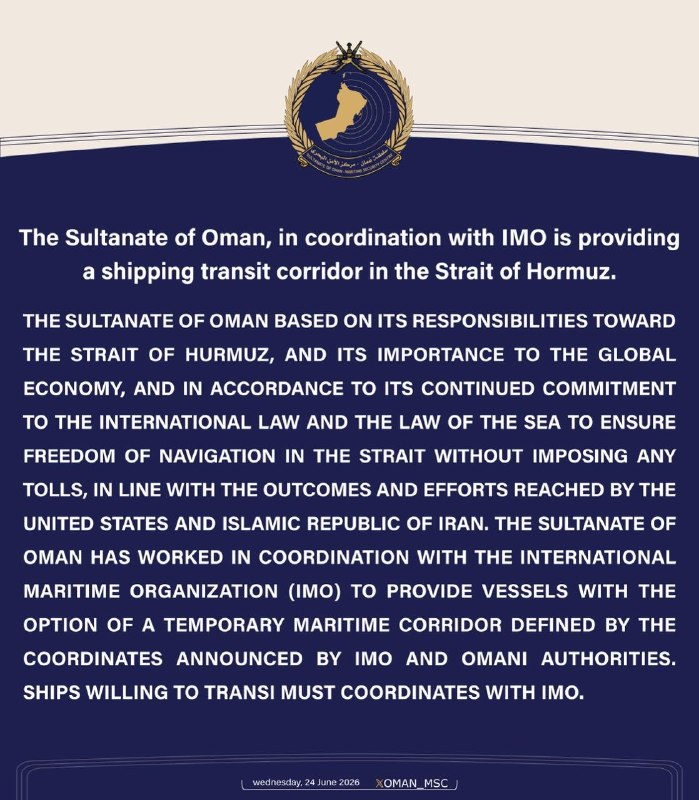

🔴سلطنت عمان با هماهنگی سازمان بین‌المللی دریانوردی (IMO)، یک کریدور ترانزیت کشتیرانی در تنگه هرمز ایجاد می‌کند.

🟢سلطنت عمان بر اساس مسئولیت‌های خود در قبال تنگه هرمز و اهمیت آن برای اقتصاد جهانی، و در راستای تعهد مستمر خود به قوانین بین‌المللی و حقوق دریاها جهت تضمین آزادی کشتیرانی در این تنگه بدون وضع هرگونه عوارض، و همچنین همسو با نتایج و تلاش‌های حاصل‌شده توسط ایالات متحده آمریکا و جمهوری اسلامی ایران، با هماهنگی سازمان بین‌المللی دریانوردی (IMO) اقدام کرده است تا گزینه‌ای را برای یک کریدور دریایی موقت در اختیار شناورها قرار دهد؛ کریدوری که بر اساس مختصات اعلام‌شده توسط IMO و مقامات عمانی تعریف شده است.

🔵کشتی‌هایی که مایل به عبور (ترانزیت) هستند، باید با IMO هماهنگ نمایند.

@mwarmonitor

## mwarmonitor — post 11443

📰خبرگزاری AFP به نقل از رسانه‌های ترکیه گزارش داد که پلیس ترکیه در یک عملیات یورش در نزدیکی آنکارا، یک مظنون وابسته به داعش را به هلاکت رسانده است.

@mwarmonitor

## mwarmonitor — post 11442

  <a href="telegram/content/mwarmonitor_11442_1782302128.mp4" target="_blank">🎬 Download video</a>

📝 این فستیوالِ سوررئال که داری می بینید، ترکیب برنده‌ای از یک دسته بیل ارتقایافته و نیروی ماوراییه! اون چوب با نیروی غیبی خودش تصمیم می‌گیره به کدوم طرف شلیک بشه و اون بنده‌خدایی هم که باهاش روی خاک و خل غلت می‌خوره، نقش سنسور انسانی رو بازی می‌کنه تا تعادل جهان بهم نخوره. بقیه هم دورش دارن با ریتم انرژی مثبت می‌فرستن تا چوب عصبانی نشه. خلاصه ما تو این جغرافیا از هیچ‌چیز شانس نیاوردیم؛ نه از دشمن، نه همسایه، نه دین و نه حکومت! اینجا قوانین فیزیک و نیوتن رسماً شرمنده‌ی ما میشن و این فقط یک روز معمولی در لوپ بی‌پایانِ منطقِ ماست.

@mwarmonitor

## FoxNewsTwitter — post 343339

  <a href="telegram/content/FoxNewsTwitter_343339_1782302131.mp4" target="_blank">🎬 Download video</a>

Fox News (Twitter/X)

President Trump is kicking off a busy day in D.C. as he gets ready to head to Capitol Hill where he’ll reportedly meet with Senate Republicans about the stalled SAVE America Act.

While on the Hill, Trump is also set to sign the 21st Century ROAD to Housing Act into law.

All of this happening ahead of a White House meeting between Trump and NATO Secretary General Mark Rutte later in the day, @JacquiHeinrich reports.

## FoxNewsTwitter — post 343338

  <a href="telegram/content/FoxNewsTwitter_343338_1782302134.mp4" target="_blank">🎬 Download video</a>

Fox News (Twitter/X)

RT @foxandfriends: SOCIALIST SWEEP: A political earthquake in New York as a socialist wave topples powerful, long-term Democratic incumbents, including Trump-impeachment prosecutor Dan Goldman.

Backed by far-left Mayor Mamdani, these newly elected candidates are demanding a total overhaul: abolishing ICE, government-controlled housing, and a complete pivot on Israel policy.

@madeleinerivera

## FoxNewsTwitter — post 343337

  

Fox News (Twitter/X)

Happy Birthday to Lionel Messi — one of the greatest players to ever step onto a soccer field.

As if his resumé wasn't already unmatched, Messi is marking his 39th birthday after making more World Cup history this week, becoming the tournament's all-time leading goal scorer with 18 goals and breaking the record previously held by Germany legend Miroslav Klose.

The Argentina captain scored twice against Austria to set the new mark, adding yet another milestone to a career filled with them.

From World Cup champion to record-breaker, Messi's legacy continues to grow.

## pm_afshaa — post 94730

  <a href="telegram/content/pm_afshaa_94730_1782302138.webm" target="_blank">🎬 Download video</a>

🔴از امشب ساعت 12 به بعد، پیش فروش بازی آغاز میشه و 28 آبان بالاخره بازی منتشر خواهد شد.

قیمت بازی GTA6 مشخص شد :

نسخه Standard:
80 دلار، معادل 12 میلیون تومن.
نسخه Ultimate Edition:
100 دلار، معادل 16 میلیون تومن.

💧Rainbet.com the #1 Non-KYC Crypto Casino & Sportsbook @rainbetcom

😁 @Pm_Afshaa

## pm_afshaa — post 94729

  <a href="telegram/content/pm_afshaa_94729_1782302139.webm" target="_blank">🎬 Download video</a>

🔴اژه‌ای، رییس قوه قضاییه: آمریکا و اسرائیل رو تحت پیگیرد بین‌المللی قرار خواهیم گرفت.

💧 Rainbet.com the #1 Non-KYC Crypto Casino & Sportsbook @rainbetcom

😁 @Pm_Afshaa

## pm_afshaa — post 94728

  <a href="telegram/content/pm_afshaa_94728_1782302139.webm" target="_blank">🎬 Download video</a>

🔴کاتز، وزیر دفاع اسرائیل:
حتی در صورت درخواست آمریکا، از جنوب لبنان عقب‌نشینی نخواهیم کرد.

💧 Rainbet.com the #1 Non-KYC Crypto Casino & Sportsbook @rainbetcom

😁 @Pm_Afshaa

## pm_afshaa — post 94727

  <a href="telegram/content/pm_afshaa_94727_1782302140.webm" target="_blank">🎬 Download video</a>

🔴غضنفری، نماینده تهران: امیدواریم قالیباف سر عقل بیاد و مجلس رو باز کنه.

💧 Rainbet.com the #1 Non-KYC Crypto Casino & Sportsbook @rainbetcom

😁 @Pm_Afshaa

## pm_afshaa — post 94726

  <a href="telegram/content/pm_afshaa_94726_1782302141.webm" target="_blank">🎬 Download video</a>

🔴روح‌الامینی، نماینده تهران:
متن تفاهم‌نامه میان جمهوری اسلامی و آمریکا، 25 بار بین مجتبی خامنه‌ای و تیم مذاکره‌کننده رفت‌و‌برگشت داشته.

💧 Rainbet.com the #1 Non-KYC Crypto Casino & Sportsbook @rainbetcom

😁 @Pm_Afshaa

## pm_afshaa — post 94725

ایسنا: اختلال خدمات کارت محور بانک‌های کشور برطرف شد

💧 Rainbet.com the #1 Non-KYC Crypto Casino & Sportsbook @rainbetcom

😁 @Pm_Afshaa

## pm_afshaa — post 94724

با این که توافق شده دیگه مرگ بر امریکا نگن صدا و سیما داره مرگ بر امریکا پخش میکنه

## pm_afshaa — post 94723

  <a href="telegram/content/pm_afshaa_94723_1782302142.mp4" target="_blank">🎬 Download video</a>

محرمی که باید تو ایران عادی سازی شه
🖤

💧 Rainbet.com the #1 Non-KYC Crypto Casino & Sportsbook @rainbetcom

😁 @Pm_Afshaa

## DEJradio — post 5937

  <a href="telegram/content/DEJradio_5937_1782302145.webm" target="_blank">🎬 Download video</a>

🤡
🔺 مراسم عزاداری «تاسوعا» سه‌شنبه شب دوم تیرماه ۱۴۰۵ دوم تیرماه ۱۴۰۵ در کنار بیت علی خامنه‌ای که در جنگ ۴۰ روزه بمباران شد، برگزار گردید.
به‌جای علی خامنه‌ای یک قاب عکس روی صندلی قرار گرفته بود و کنارش مخبر [معاون رئیسی] محمدرضا عارف معاون پزشکیان و محسن رضایی ماتم‌زده نشسته بودند.

گزارش شد که این مراسم از طرف مجتبی خامنه‌ای برگزار شده است.

#موشعلی #موشتبا #عاشورا #تاسوعا
@DEJradio

## DEJradio — post 5936

  <a href="telegram/content/DEJradio_5936_1782302146.webm" target="_blank">🎬 Download video</a>

🔺🎥 سرکوبگران با باتوم در صف عزاداران حسین

#سرکوبگران #سرکوب #عاشورا
@DEJradio

## mamlekate — post 103760

📝 ترامپ: به‌رغم ادعای نادرست، ایران با بالاترین سطح بازرسی‌ها و تا ابد موافقت کرده است

📝 گروسی: بازرسی از مراکز هسته‌ای ایران به‌زودی آغاز می‌شود

مدیرکل آژانس بین‌المللی انرژی اتمی می‌گوید که بازرسی از تاسیسات هسته‌ای در ایران به‌زودی آغاز می‌شود و اولویت اصلی، تایید محل نگهداری اورانیوم با غنای بالا است. رافائل گروسی گفت که فرصت زیادی برای از دست دادن وجود ندارد.

📝 مجری فاکس‌نیوز: پول فروش نفت از ایران وارد حساب امانی وزارت خزانه‌داری آمریکا می‌شود

📝 روبیو: رژیم ایران اجازه دریافت عوارض از کشتی‌های عبوری از هرمز را نخواهد داشت

مارکو روبیو، وزیر امور خارجه ایالات متحده، روز سه‌شنبه دوم تیر، پس از ورود به ابوظبی در آغاز سفرش به کشورهای عرب حوزه خلیج فارس گفت: «هیچ کشوری اجازه ندارد برای عبور از یک آبراه بین‌المللی عوارض یا هزینه دریافت کند. این یک قانون بین‌المللی است.»

📝 سنای آمریکا به محدود کردن قدرت ترامپ برای ادامه جنگ رأی مثبت داد؛ ترامپ: بی‌معنی است

این مصوبه برای امضا به دونالد ترامپ ارائه نخواهد شد و به همین دلیل از نظر قدرت قانونی، محل بحث بوده و عمدتاً جنبۀ نمادین دارد.

📝 چاک شومر: جهان عملکرد ترامپ در قبال ایران را به تمسخر گرفته است

چاک شومر، سناتور دموکرات آمریکا، گفت دونالد ترامپ در برابر رهبری جمهوری اسلامی «فریب خورده است». او افزود تنگه هرمز بیش از گذشته تحت نفوذ ایران قرار گرفته، سرنوشت اورانیوم‌های غنی‌شده مشخص نیست و عملکرد ترامپ در این پرونده با انتقاد و تمسخر جهان روبه‌رو شده است.

@mamlekate

## IranIntlTV — post 344119

  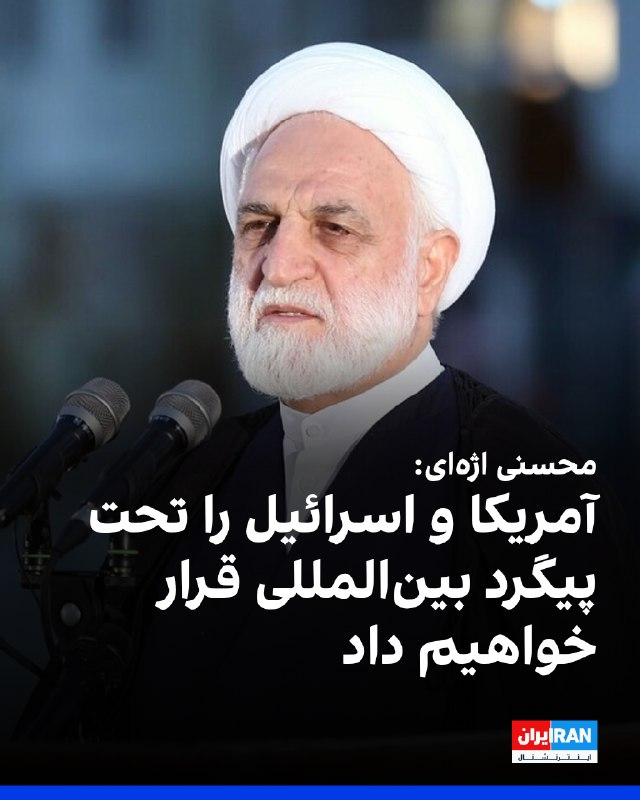

غلامحسین محسنی اژه‌ای، رییس قوه قضاییه جمهوری اسلامی، در نشست با جمعی از مقامات دستگاه قضا و روسای کل دادگستری استان‌ها گفت: «آمریکا و اسرائیل باید برای جبران خسارت، پرداخت غرامت و ارتکاب جنایات جنگی، در مراجع بین‌المللی تحت پیگرد قرار گیرند.»

او افزود ما گریبان متجاوزان را رها نخواهیم کرد و آنان را تحت تعقیب قرار می‌دهیم.

اژه‌ای گفت: «احکام برخی پرونده‌های مربوط به دشمن نیز به‌صورت قطعی صادر شده است.»
https://iranintl.com/202606246005

## IranIntlTV — post 344118

  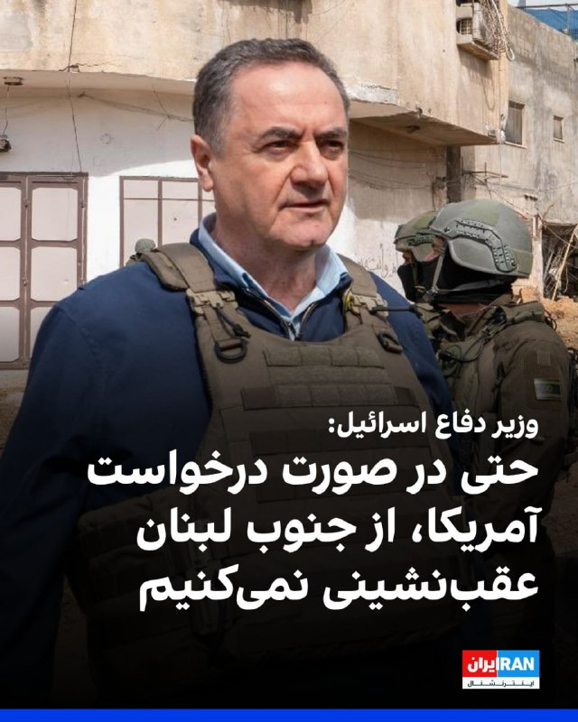

یسرائیل کاتز، وزیر دفاع اسرائیل، در یک کنفرانس گفت: «حتی در صورت درخواست آمریکا نیز از جنوب لبنان عقب‌نشینی نخواهیم کرد.»

او ادامه داد: «سربازان ما در داخل این مناطق و ساکنان در خارج خواهند بود. زیرساخت‌ها در آنجا ویران و خانه‌های تهدیدآمیز نیز تخریب شده‌اند و ما عقب‌نشینی نخواهیم کرد.»

او افزود: «۲۰۰ هزار نفر از ساکنان باز نخواهند گشت. هیچ ساکنی وجود ندارد و هیچ تروریستی هم وجود ندارد. در گذشته، در مناطق امنیتی که جمعیت غیرنظامی نیز در آن حضور داشت، مواد منفجره کار گذاشته می‌شد و علیه سربازان حمله صورت می‌گرفت و ما اجازه تکرار آن را نخواهیم داد.»
iranintl.com/202606249869

## IranIntlTV — post 344117

  <a href="telegram/content/IranIntlTV_344117_1782302148.mp4" target="_blank">🎬 Download video</a>

روزنامه «شرق‌الاوسط» گزارش داد حتی در صورت دستیابی تهران و واشینگتن به توافق و لغو بخشی از تحریم‌ها، بازگشت شرکت‌های خارجی به بازار ایران روندی کند خواهد داشت. همزمان «ارم‌نیوز» به نقل از منابع آگاه اعلام کرد آمریکا با درخواست تهران برای تعلیق برخی تحریم‌های دائمی مخالفت کرده است؛ به‌ویژه تحریم‌هایی که نهادها و شرکت‌های مرتبط با برنامه‌های موشکی و صنایع دفاعی ایران را هدف قرار می‌دهد.

گزارش تروسکه صادقی، خبرنگار ایران‌اینترنشنال
@iranintltv

## IranIntlTV — post 344110

🔻جام جهانی ۲۰۲۶ تنها صحنه رقابت بزرگ‌ترین ستاره‌های فوتبال جهان نیست؛ این تورنمنت به یک گردهمایی خانوادگی هم تبدیل شده است. برای نخستین بار در تاریخ جام‌های جهانی، هفت جفت برادر در این رقابت‌ها حضور دارند؛ اتفاقی کم‌سابقه که جذابیت ویژه‌ای به مسابقات بخشیده است.

🔹نکته جالب اینکه از میان این هفت جفت برادر، تنها سه زوج برای یک تیم ملی بازی می‌کنند و چهار جفت دیگر پیراهن تیم‌های ملی متفاوتی را بر تن دارند؛ موضوعی که حتی می‌تواند آنها را مقابل یکدیگر قرار دهد.

🔹جزییات بیشتر را در سایت بخوانید

@iranintltvsport

## IranIntlTV — post 344109

  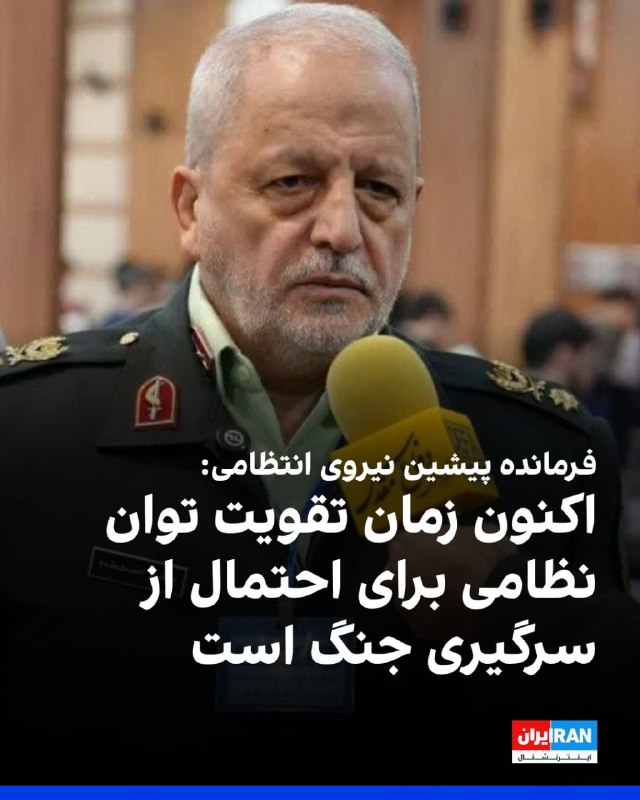

اسماعیل احمدی‌مقدم، فرمانده پیشین نیروی انتظامی و عضو تیم مذاکره‌کننده جمهوری اسلامی در اسلام‌آباد، در صدا و سیما گفت: «در دوره پساجنگ، مهم‌ترین مساله تقویت توان نظامی و جبهه داخلی برای احتمال از سرگیری جنگ است.»

او افزود بی‌ثباتی در داخل و کاهش سرمایه اجتماعی برای جمهوری اسلامی مشکل ایجاد کرده است.

احمدی‌مقدم گفت: «یکی دیگر از اقدامات، باید تسریع در اصلاحات داخلی و امیدآفرینی در جامعه باشد.»

فرمانده پیشین نیروی انتظامی اضافه کرد: «باید با افزایش انسجام و وحدت ملی در صحنه سیاسی و اجتماعی، از دادن سیگنال به دشمن خودداری کنیم و حتی اگر انتقادی وجود دارد، جای بیان آن در تریبون‌ها نیست.»

احمدی‌مقدم درباره ارتباط با کشورهای همسایه افزود باید «فرصت‌محوری» را جایگزین «تهدیدمحوری» کرد و تعامل را به جای تقابل در پیش گرفت.
iranintl.com/202606241968

## IranIntlTV — post 344108

  <a href="telegram/content/IranIntlTV_344108_1782302152.mp4" target="_blank">🎬 Download video</a>

سرخط خبرهای چهارشنبه ۳ تیر
@iranintltv

## IranIntlTV — post 344107

  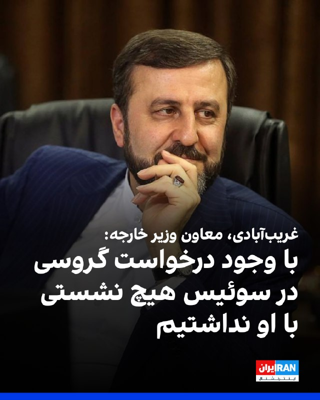

کاظم غریب‌آبادی، معاون وزیر خارجه جمهوری اسلامی، در شبکه ایکس نوشت: «با وجود درخواست رافائل گروسی، مدیرکل آژانس بین‌المللی انرژی اتمی، هیچ نشستی با او در سوئیس برگزار نکردیم.»

غریب‌آبادی اضافه کرد: «هیچ برنامه‌ای برای دسترسی به تاسیسات هدف حمله قرار گرفته و مواد هسته‌ای وجود ندارد و این موضوع تنها در چارچوب توافق نهایی و پس از پایان همه تحریم‌ها بررسی خواهد شد.»

او در ادامه خطاب به طرف آمریکایی نوشت: «نمی توانید با هیاهوی رسانه‌ای، سیاست راه بینداز و جا بینداز را پیش ببرید.»
https://iranintl.com/202606240157

## IranIntlTV — post 344106

  <a href="telegram/content/IranIntlTV_344106_1782302154.mp4" target="_blank">🎬 Download video</a>

وزارت امنیت داخلی آمریکا اعلام کرد تیم فوتبال ایران می‌تواند دو روز پیش از آخرین بازی خود در مرحله گروهی وارد خاک آمریکا شود، اما همچنان موظف است بلافاصله پس از پایان مسابقه این کشور را ترک کند.

جزییات بیشتر در گفت‌وگو با مزدک میرزایی، عضو تحریریه ورزشی ایران‌اینترنشنال
@iranintltv

## IranIntlTV — post 344105

  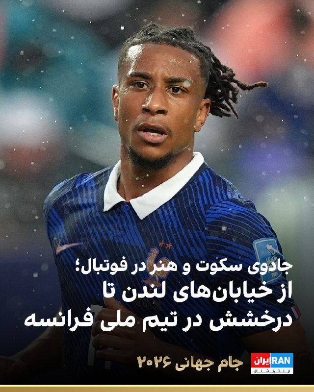

🔻مایکل اولیسه، ستاره این روزهای بایرن مونیخ و تیم ملی فرانسه، همان‌قدر که درون زمین مهارناپذیر و چشم‌نواز است، در بیرون از مستطیل سبز به گوشه‌گیری و فرار از مصاحبه شهرت دارد. با این حال، روزنامه فرانسوی اکیپ موفق شد در کمپ کلیرفونتن گفت‌وگوی متفاوتی را با او ترتیب دهد.

🔹اولیسه که فصل فوق‌العاده‌ای را با آمار خیره‌کننده ۲۲ گل و ۲۹ پاس گل در باشگاهش پشت سر گذاشته، ترجیح می‌دهد به جای واژه‌ها، با پاهایش صحبت کند. او با وجود نمایش‌های هنرمندانه در زمین، خودش را یک «هنرمند» نمی‌داند، بلکه خود را صرفا فردی «خلاق» معرفی می‌کند. با این حال، او عمیقا باور دارد که فوتبال باید از نظر بصری زیبا و برای تماشاگران لذت‌بخش باشد.

🔹از نظر اولیسه، این زیبایی تنها محدود به حرکات هجومی نیست و حتی یک تکل درست از سوی یک مدافع نیز می‌تواند مانند یک اثر هنری، زیبا و چشم‌نواز باشد. به عقیده این ستاره ملی‌پوش، ریشه سبک بازی روان و آزادش به دوران کودکی و فوتبال خیابانی در لندن برمی‌گردد؛ جایی که ساعت‌ها به همراه برادرش بدون پیچیدگی‌های تاکتیکی و فقط برای لذت بردن بازی می‌کرد.

🔹جزییات بیشتر را در سایت بخوانید

@iranintltvsport

## IranIntlTV — post 344104

  <a href="telegram/content/IranIntlTV_344104_1782302158.mp4" target="_blank">🎬 Download video</a>

محمدباقر قالیباف با تاکید بر ترجیح «منطق بر زور» گفت جمهوری اسلامی آینده منطقه را در تعامل می‌بیند، نه در تقابل.

محمدجواد اکبرین، عضو تحریریه ایران‌اینترنشنال، با اشاره به این اظهارات می‌گوید رویکردی که اکنون از سوی مقام‌های جمهوری اسلامی مطرح می‌شود، تفاوتی آشکار با سیاست‌های دوران علی خامنه‌ای دارد؛ رویکردی که به گفته او بر تقابل منطقه‌ای استوار بود، در حالی که اکنون از تعامل و همکاری سخن گفته می‌شود.
@iranintltv

## IranIntlTV — post 344103

  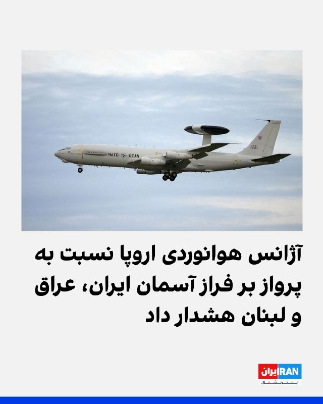

آژانس ایمنی هوانوردی اتحادیه اروپا، از شرکت‌های هواپیمایی خواست با وجود توافق میان آمریکا و جمهوری اسلامی، همچنان از عبور از حریم هوایی ایران، عراق و لبنان اجتناب کنند.

این آژانس اعلام کرد احتمال نقض کوتاه‌مدت آتش‌بس میان آمریکا و جمهوری اسلامی، به‌ویژه در تنگه هرمز، همچنان وجود دارد.

آژانس ایمنی هوانوردی اتحادیه اروپا همچنین نسبت به تاثیر آتش‌بس شکننده میان اسرائیل و حزب‌الله بر حریم هوایی لبنان هشدار داد.
https://iranintl.com/202606241543

## IranIntlTV — post 344102

  <a href="telegram/content/IranIntlTV_344102_1782302161.mp4" target="_blank">🎬 Download video</a>

با وجود اعلام شرکت خدمات انفورماتیک مبنی بر بازگشت خدمات بانکی به حالت عادی، گزارش‌های میدانی و پیام‌های ارسالی به ایران‌اینترنشنال از ادامه اختلال در بخشی از خدمات غیرحضوری بانک‌ها حکایت دارد. کاربران از مشکلاتی در خرید اینترنتی، کارت‌به‌کارت و دسترسی به برخی خدمات بانکی خبر می‌دهند.

جزییات بیشتر در گفت‌وگو با لیلا سعادتی، عضو تحریریه ایران‌اینترنشنال
@iranintltv

## IranIntlTV — post 344101

  

عبدالحسین روح‌الامینی، نماینده تهران در مجلس، به باشگاه خبرنگاران جوان گفت: «متن تفاهم‌نامه میان جمهوری اسلامی و آمریکا، ۲۵ بار بین مجتبی خامنه‌ای و تیم مذاکره‌کننده رفت‌و‌برگشت داشته است.»

او افزود به دلیل محرمانگی در بخشی از متن تفاهم‌نامه، هر فرد بخشی از این اطلاعات را در اختیار داشته و متن در هر بار رفت‌و‌برگشت میان تیم مذاکره‌کننده که به موضوعات اشراف داشته‌اند، در حال تحول بوده است.
iranintl.com/202606243368

## IranIntlTV — post 344100

  <a href="telegram/content/IranIntlTV_344100_1782302164.mp4" target="_blank">🎬 Download video</a>

مرتضی کاظمیان، عضو تحریریه ایران‌اینترنشنال، با اشاره به صحبت‌های اخیر وزیر خارجه آمریکا، مبنی بر بازرسی بازرسان آژانس بین‌المللی انرژی اتمی از تاسیسات هسته‌ای ایران، گفت سخنان روبیو در امتداد مواضع اخیر دونالد ترامپ، رییس‌جمهوری آمریکا، قرار دارد و نشان می‌دهد دولت آمریکا اظهارات متناقض در داخل جمهوری اسلامی را ناشی از رقابت‌ها و ملاحظات داخلی می‌داند، نه نشانه‌ای از تغییر در تعهدات توافق‌شده.
@iranintltv

## Shin_Persian — post 7191

  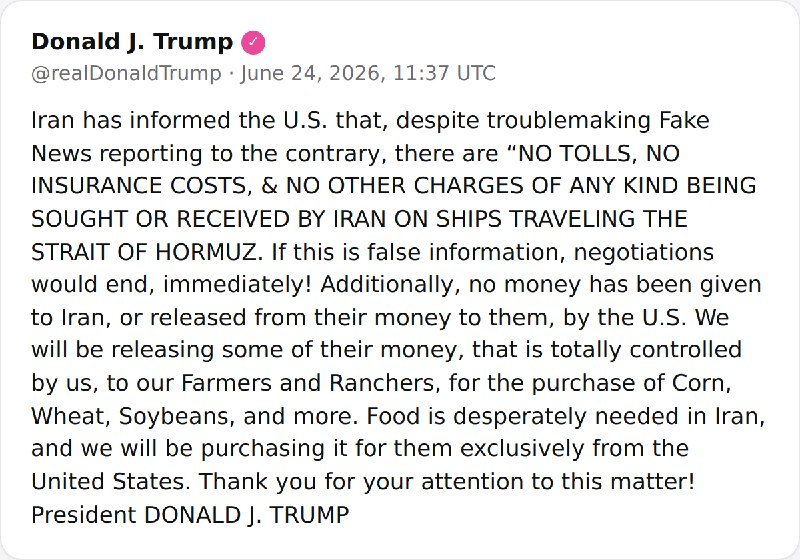

Shin ✓ @hey_itsmyturn
Wed, 24 Jun 2026 11:40:50 UTC

POTUS:
"Iran has informed the U.S. that, despite troublemaking Fake News reporting to the contrary, there are “NO TOLLS, NO INSURANCE COSTS, & NO OTHER CHARGES OF ANY KIND BEING SOUGHT OR RECEIVED BY IRAN ON SHIPS TRAVELING THE STRAIT OF HORMUZ. If this is false information, negotiations would end, immediately! Additionally, no money has been given to Iran, or released from their money to them, by the U.S. We will be releasing some of their money, that is totally controlled by us, to our Farmers and Ranchers, for the purchase of Corn, Wheat, Soybeans, and more. Food is desperately needed in Iran, and we will be purchasing it for them exclusively from the United States. Thank you for your attention to this matter! President DONALD J. TRUMP"

ترجمه خودکار فارسی در بخش نظرات

𝕏 · @shin_persian

## Shin_Persian — post 7190

Shin ✓ @hey_itsmyturn
Wed, 24 Jun 2026 09:30:43 UTC

Ghalibaf, Regime Parliament's spox at PUIC summit in Baku:
"Islamabad MOU became declaration of America's defeat."

ترجمه خودکار فارسی

قالیباف، سخنگوی مجلس رژیم در اجلاس PUIC (اتحادیه بین‌المجالس کشورهای عضو سازمان همکاری اسلامی) در باکو:
«تفاهم‌نامه اسلام‌آباد به بیانیه شکست آمریکا تبدیل شد.»

𝕏 · @shin_persian

## Iliaen — post 4505

در جریان کشتار دِی‌ماه، صدها انسان با اسامی “حسین” و “ابوالفضل” در اثر شلیک مستقیم بسیج و سپاه در خیابان، یا با تیرخلاص در بیمارستان‌ها کشته و جاویدنام شدند.

تمام آن‌ها غیرمسلح، مظلوم و آزادی‌خواه بودند.

@iliaen

## ManotoTV — post 106218

  <a href="telegram/content/ManotoTV_106218_1782302168.mp4" target="_blank">🎬 Download video</a>

روایت راه‌آهن سراسری، از رویای تجددخواهان تا پروژه‌ای که با کوشش رضاشاه، ایران را به هم پیوند زد.

## FarsiVOA — post 221739

  

معاون وزیر خارجه جمهوری اسلامی اعلام کرد که دسترسی به تاسیسات مورد حمله واقع شده و مواد هسته‌ای صرفا در چارچوب توافق نهایی با آمریکا ممکن خواهد بود.

کاظم غریب‌آبادی روز چهارشنبه در شبکه اجتماعی ایکس با اعلام این که در سوییس هیچ نشستی با رافائل گروسی، مدیرکل آژانس بین‌المللی انرژی اتمی «علیرغم درخواست او»، برگزار نشد، نوشت: «هیچ برنامه‌ای نیز برای دسترسی به تاسیساتِ مورد حمله واقع شده و مواد هسته‌ای وجود ندارد.»

او افزود: «این مباحث صرفا در چارچوب توافق نهایی و در نتیجه اقدام عملی طرف مقابل در خاتمه تمامی تحریم‌ها و... بررسی و تعیین تکلیف خواهند شد.»

پیشتر گروسی اعلام کرده بود که سایت‌های غنی‌سازی هسته‌ای جمهوری اسلامی توسط بازرسان آژانس مورد بازدید قرار خواهند گرفت.

از زمان جنگ ۱۲ روزه سال گذشته، آژانس بین‌المللی انرژی اتمی از سوی جمهوری اسلامی از دسترسی به سایت‌های غنی‌سازی محروم شده است؛ سایت‌هایی که گمان می‌رود جمهوری اسلامی در آن‌ها به اندازه‌ای اورانیوم با غنای بالا ذخیره کرده باشد که در صورت تصمیم به حرکت سریع به سوی ساخت بمب اتمی، برای تولید حداکثر ۱۰ سلاح هسته‌ای کافی باشد.
@FarsiVOA

## FarsiVOA — post 221738

  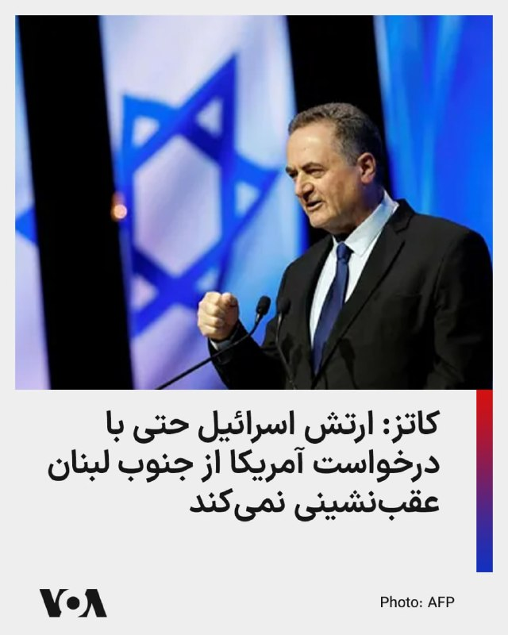

وزیر دفاع اسرائیل، گفت ارتش این کشور از «منطقه امنیتی» در جنوب لبنان عقب‌نشینی نخواهد کرد، حتی اگر چنین درخواستی از سوی آمریکا مطرح شود.

یسرائیل کاتز، روز چهارشنبه در یک کنفرانس در تل‌آویو گفت حدود ۲۰۰ هزار ساکن لبنانی به مناطقی که تخلیه کرده‌اند بازنخواهند گشت.

کاتز افزود تجربه گذشته در مناطق امنیتی، وقتی جمعیت غیرنظامی هم حضور داشت، به بمب‌گذاری کنار جاده و حمله علیه سربازان منجر شد و اسرائیل اجازه تکرار آن را نمی‌دهد.

این اظهارات در حالی مطرح می‌شود که مذاکراتی با حمایت آمریکا درباره ترتیبات امنیتی جنوب لبنان در واشنگتن دنبال می‌شود.
@FarsiVOA

## FarsiVOA — post 221737

  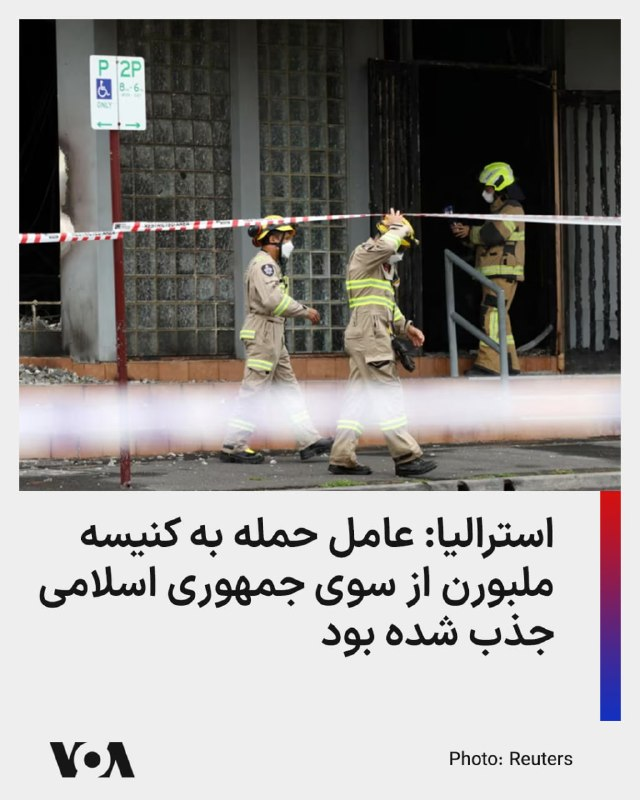

رئیس سازمان اطلاعات امنیتی استرالیا گفت فردی که پیشتر در استرالیا زندگی می‌کرد و اکنون در عراق است، حمله به کنیسه «آداس اسرائیل» در ملبورن در دسامبر ۲۰۲۴ را هدایت کرده بود.

مایک برگس در ارزیابی سالانه تهدیدها گفت جمهوری اسلامی پشت این حمله بوده و این فرد را از طریق «شبکه‌ای پیچیده» از گروه‌های شبه‌نظامی مستقر در عراق جذب کرده است.

او افزود سپاه پاسداران از این فرد به دلیل ثروت و ارتباطات مجرمانه‌اش حمایت می‌کرد، اما پس از افشای نقش جمهوری اسلامی، حامیان او عقب‌نشینی کردند و او در عراق زندانی شد.
@FarsiVOA

## FarsiVOA — post 221736

  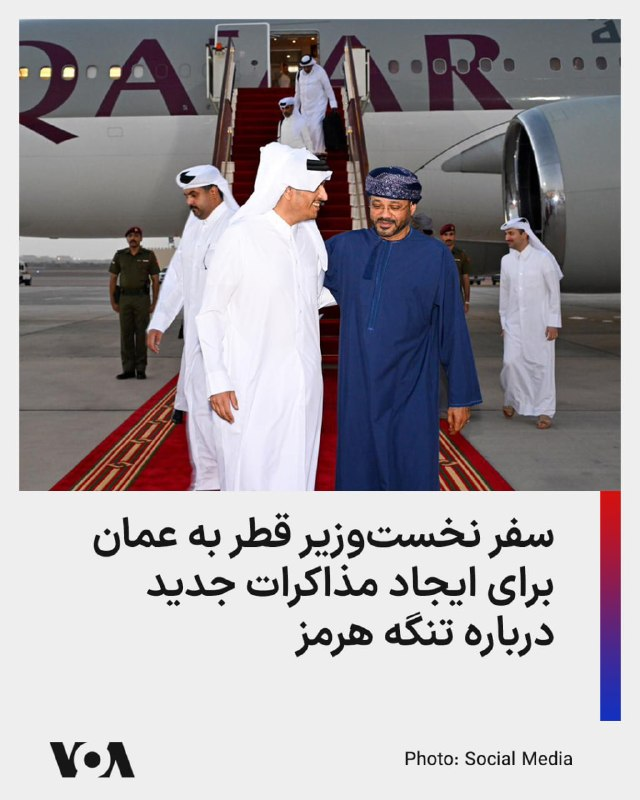

خبرگزاری رویترز گزارش داد که نخست‌وزیر قطر روز چهارشنبه به مسقط سفر کرد تا با عمان درباره ایجاد مذاکراتی با مشارکت جمهوری اسلامی، عراق و کشورهای عربی حاشیه خلیج فارس درباره بازگشایی و نحوه بهره‌برداری دوباره از تنگه هرمز گفت‌وگو کند.

یک دیپلمات مطلع که نامش فاش نشده به رویترز گفت که این مذاکرات جدا از گفت‌وگوهای صلح میان ایالات متحده و جمهوری اسلامی و همچنین ترتیبات مربوط به مین‌روبی است.

او افزود که انتظار می‌رود کشورهای حاشیه خلیج فارس بر عدم دریافت هزینه عبور تأکید کنند، هر چند ممکن است جمهوری اسلامی در تلاش برای اخذ هزینه‌هایی در زمینه محیط زیست، ناوبری و امنیت باشد.

به گفته این دیپلمات، برنامه‌هایی برای برگزاری گفت‌وگوهای جداگانه آشتی و مصالحه منطقه‌ای میان جمهوری اسلامی و کشورهای حاشیه خلیج فارس در ریاض در دست انجام است.
@FarsiVOA

## FarsiVOA — post 221735

  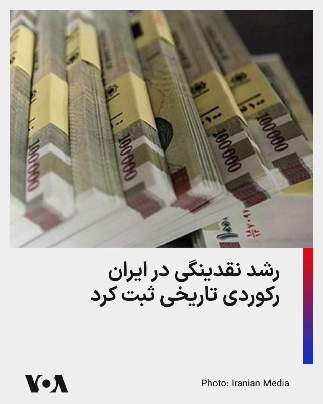

به رغم وعده‌های انتخاباتی مسعود پزشکیان رئیس‌جمهور ایران برای مهار نقدینگی و استقراض دولت، آمارهای جدید بانک مرکزی از ثبت یک رکورد تاریخی در رشد نقدینگی خبر می‌دهد.

بر اساس داده‌های بانک مرکزی، نقدینگی در سال گذشته با جهشی بالای ۵۳ درصدی به نزدیک ۱۶ هزار تریلیون تومان اوج گرفته است.

نقدینگی حاصل چاپ بی‌رویه اسکناس توسط بانک مرکزی برای پوشش بدهی‌های دولتی است که نقش اصلی را در تورم افسارگسیخته دارد.

طبق داده‌های مرکز آمار ایران، تورم اردیبهشت‌ماه نیز یک رکورد ۸۰ ساله را شکسته بود.

داده‌های بانک مرکزی نشان می‌دهد بدهی دولت و شرکت‌های دولتی به بانک‌های کشور در سال گذشته تقریبا ۴۲ درصد جهش کرده و به بالای ۲۸۰۰ تریلیون تومان اوج گرفته که بیش از ۹۰ درصد آن بدهی خود دولت و حدود ۱۰ درصد بدهی مؤسسات و شرکت‌های دولتی است.
@FarsiVOA

## FarsiVOA — post 221734

  <a href="telegram/content/FarsiVOA_221734_1782302174.mp4" target="_blank">🎬 Download video</a>

ارتش اسرائیل چهار سکوی آماده شلیک را در نوار غزه منهدم کرد؛

ارتش اسرائیل اعلام کرد بامداد چهارشنبه چهار موضع پرتاب راکت را در چند نقطه از نوار غزه هدف قرار داده و نابود کرده است.

بر اساس اعلام ارتش اسرائیل، این مواضع پس از آغاز آتش‌بس از سوی گروه‌های تروریستی در غزه ایجاد شده بودند و برای شلیک به سمت نیروهای ارتش اسرائیل و شهروندان اسرائیلی آماده‌سازی شده بودند.

ارتش اسرائیل این مواضع را «تهدید فوری» توصیف کرده و گفته نیروهایش در فرماندهی جنوب، در چارچوب توافق، به فعالیت برای رفع تهدیدهای فوری ادامه خواهند داد.
@FarsiVOA

## FarsiVOA — post 221733

  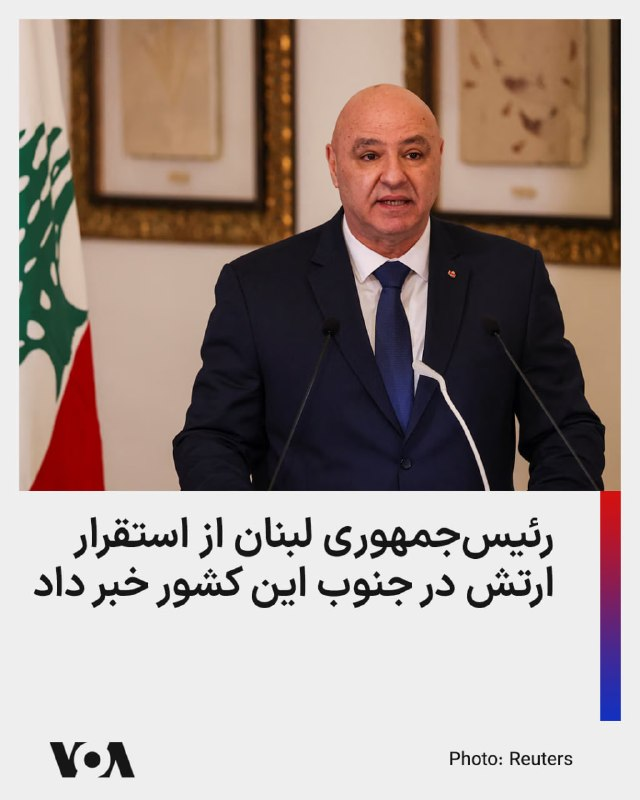

رئیس‌جمهوری لبنان روز چهارشنبه در دیدار با هیئتی از نمایندگان پارلمان بریتانیا اعلام کرد که روند تثبیت آتش‌بس در جنوب این کشور در حال انجام است و پس از آن، عقب‌نشینی نیروهای اسرائیلی و استقرار ارتش لبنان آغاز می‌شود.

جوزف عون با اشاره به رایزنی‌ها درباره تعیین «مناطق نمونه» در جنوب لبنان اعلام کرد که این موضوع همچنان در دست بررسی و اعلام موافقت اسرائیل است.

او یادآور شد که مذاکرات فعلی سه‌جانبه آمریکا، لبنان و اسرائیل، همچنان در واشنگتن در حال پیگیری است و این مذاکرات جدای از گفت‌وگوهای جمهوری اسلامی و آمریکا است.

پیشتر نخست‌وزیر، وزیر دفاع و رئيس ستاد ارتش اسرائيل با صدور بیانه‌ای اعلام کردند که منطقه امنیتی در جنوب لبنان را حفظ، و به نابودی زیرساخت‌های تروریستی حزب‌الله در این منطقه ادامه خواهند داد.

بنیامین نتانیاهو نیز چندی پیش درباره احتمال عقب‌نشینی نیروهای اسرائیلی از جنوب لبنان تاکید کرد که در دستورالعمل‌های صادره برای ارتش این کشور تغییری ایجاد نشده است.
@FarsiVOA

## FarsiVOA — post 221732

🔺استقراض گسترده دولت عراق به خاطر انسداد تنگه هرمز

▪️رسانه‌های عراقی از اجبار دولت عراق به استقراض گسترده به خاطر سقوط درآمدهای نفتی در پی انسداد تنگه هرمز توسط جمهوری اسلامی خبر می‌دهند.

▪️نهاد «نظارت اقتصادی عراق» می‌گوید این کشور به خاطر انسداد تنگه هرمز از حدود ۳۷.۷ میلیارد دلار درآمد نفتی محروم شده است. از زمان انسداد تنگه هرمز، عراق از صادرات ۳۵۰ میلیون بشکه نفت محروم شده و دولت با کسری شدید بودجه مواجه است.

▪️بیش از ۹۰ درصد از صادرات عراق به درآمدهای نفتی متکی است. درآمد ماهانه عراق از صادرات نفت از حدود ۶.۸ میلیارد دلار در دوران قبل از انسداد تنگه هرمز به ۱.۱ میلیارد دلار در دو ماه ابتدایی جنگ کاهش یافت و بعد از آن حتی افت بیشتری را تجربه کرد.

⬇️ بیشتر بخوانید:
https://ir.voanews.com/a/iraq-forced-to-borrow-as-oil-revenues-dwindle/8164302.html

## FarsiVOA — post 221731

  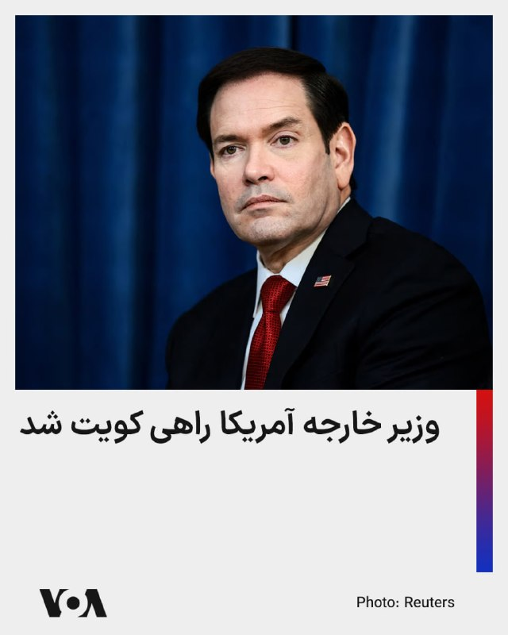

وزیر خارجه ایالات متحده در دومین مرحله از سفر به منطقه خلیج فارس، روز چهارشنبه ابوظبی را ترک کرد و راهی کویت شد.

مارکو روبیو در این سفر با رهبران کشورهای عربی منطقه خلیج فارس درباره تفاهم موقت میان ایالات متحده و جمهوری اسلامی گفت‌وگو می‌کند.

آقای روبیو پس از کویت به بحرین نیز سفر خواهد کرد و در آنجا با اعضای شورای همکاری خلیج فارس دیدار می‌کند.

امنیت تردد دریایی در تنگه هرمز و ثبات منطقه از دیگر موضوعات گفت‌وگوهای وزیر خارجه آمریکا در این سفر است.
@FarsiVOA

## FarsiVOA — post 221730

🔺در آستانه نشست ناتو؛ پلیس ترکیه یک عضو داعش را در آنکارا کشت

▪️در آستانه نشست سران ناتو در آنکارا، رسانه‌های ترکیه گزارش دادند یک عضو داعش در درگیری با نیروهای ویژه پلیس در پایتخت ترکیه کشته شد.

▪️بر اساس این گزارش‌ها، عملیات روز سه‌شنبه در شهرستان حیمنه آنکارا انجام شد. نیروهای عملیات ویژه پلیس به آدرسی که یک مرد و همسرش، هر دو مظنون به عضویت در داعش، در آن حضور داشتند یورش بردند.

▪️رسانه‌های ترکیه نوشتند این دو نفر هنگام عملیات به سوی نیروهای امنیتی تیراندازی کردند. در جریان درگیری، مرد مظنون کشته و همسر او زخمی و بازداشت شد.

▪️نشست سران ناتو قرار است روزهای هفت و هشت ژوئیه در آنکارا برگزار شود.

⬇️ بیشتر بخوانید:
https://ir.voanews.com/a/8164301.html

## FarsiVOA — post 221729

  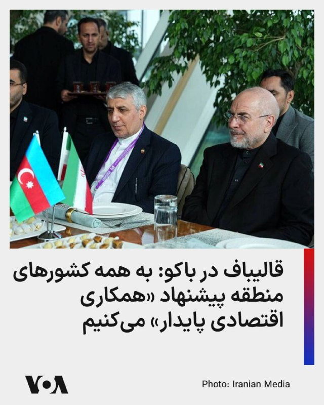

رئیس مجلس شورای اسلامی ایران در اجلاس پارلمانی کشورهای عضو سازمان همکاری اسلامی باکو مدعی شد جمهوری اسلامی به همه کشورهای منطقه پیشنهاد «همکاری اقتصادی پایدار» می‌کند.

حضور محمدباقر قالیباف در بیستمین اجلاس رهبران پارلمان‌های کشورهای مسلمان با میزبانی جمهوری آذربایجان در حالی است که جمهوری اسلامی طی ماه‌های گذشته حملات گسترده‌ای به کشورهای عرب خاورمیانه و حتی در مواردی به جمهوری آذربایجان و ترکیه به عنوان اعضای سازمان همکاری اسلامی داشته است.

قالیباف بدون اشاره به این حملات گسترده جمهوری اسلامی، شرکت خود در اجلاس سازمان همکاری اسلامی را «فرصتی برای تبیین اتفاقات جنگ و تاثیرات منطقه‌ای آن» عنوان کرد و گفت شرایط منطقه متفاوت شده و باید با نگاه دیگری به آن نگاه کرد.

او در سخنرانی روز چهارشنبه در اجلاس پارلمانی کشورهای عضو سازمان همکاری اسلامی مدعی شد «ایران به تمامی کشورهای اسلامی، به ویژه کشورهای منطقه و کشورهای حوضه خلیج فارس، علاوه بر توافقات امنیتی، همکاری اقتصادی پایدار پیشنهاد می‌کند».
@FarsiVOA

## FarsiVOA — post 221728

  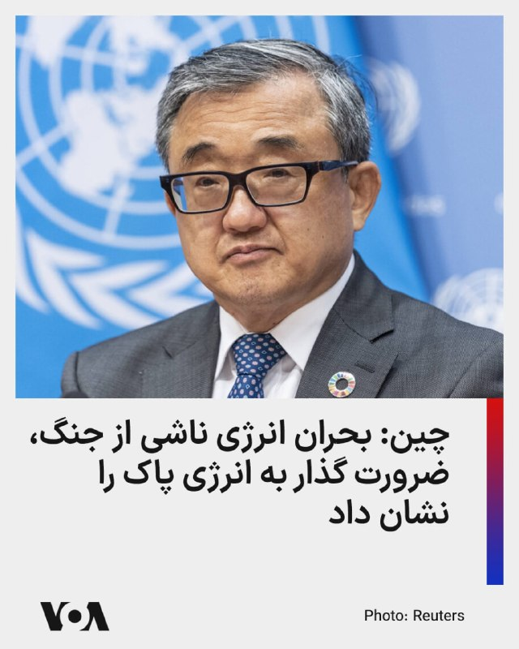

فرستاده ویژه چین در امور اقلیمی گفت کمبود نفت و گاز ناشی از جنگ آمریکا با جمهوری اسلامی باید برای کشورها درسی باشد تا گذار به انرژی‌های پاک را سرعت دهند.

لیو ژنمین روز چهارشنبه در نشستی در چارچوب مجمع جهانی اقتصاد در دالیان گفت بازگشت برخی کشورها به زغال‌سنگ تنها راه‌حلی موقت است و کشورها در بلندمدت باید برای تضمین امنیت پایدار انرژی، وابستگی خود به نفت و گاز را کاهش دهند.

او چین را نمونه‌ای موفق دانست و گفت این کشور با توسعه نیروگاه‌های بادی و خورشیدی، خودروهای برقی و سامانه‌های ذخیره باتری، در برابر شوک ناشی از اختلال در تنگه هرمز مقاوم‌تر از بسیاری از کشورهای آسیایی بوده است.

لیو گفت چین، با وجود جایگاهش به عنوان بزرگترین واردکننده نفت و گاز جهان، توانست مصرف‌کنندگان خود را از کمبود گسترده محافظت کند؛ در حالی که هند با کمبود سوخت و فشار اجتماعی روبه‌رو شد.
@FarsiVOA

## FarsiVOA — post 221727

🔺پاکستان: دور دوم مذاکرات فنی آمریکا و جمهوری اسلامی هفته آینده برگزار می‌شود

▪️سخنگوی وزارت امور خارجه پاکستان گفت دور تازه مذاکرات فنی آمریکا و جمهوری اسلامی هفته آینده، پس از یک وقفه موقت، از سر گرفته خواهد شد.

▪️او گفت مذاکرات فنی ادامه دارد و تیم‌های میانجی‌ پاکستان و قطر در هفته‌های آینده با طرف‌های آمریکایی و جمهوری اسلامی برای اجرای تفاهم‌نامه اسلام‌آباد همکاری خواهند کرد.

▪️او افزود هدف از این مذاکرات پیشبرد اجرای تفاهمی است که بر اساس آن دو طرف باید در یک بازه ۶۰ روزه برای رسیدن به توافق نهایی تلاش کنند.

▪️پاکستان پیشتر اعلام کرده بود نمایندگان آمریکا و جمهوری اسلامی، همراه با میانجی‌گران پاکستان و قطر، در مذاکرات فنی مربوط به اجرای تفاهم‌نامه اسلام‌آباد شرکت می‌کنند.

⬇️ بیشتر بخوانید:
https://ir.voanews.com/a/8164299.html

## FarsiVOA — post 221726

  <a href="telegram/content/FarsiVOA_221726_1782302180.mp4" target="_blank">🎬 Download video</a>

شلیک مستقیم طالبان به معترضان بازداشت زنان در هرات؛

موج جدید بازداشت زنان در افغانستان به بهانه «بدحجابی»، یکی از نادرترین اعتراضات خیابانی را در شهر هرات در پی داشت که با پاسخ مسلحانه و خونین نیروهای طالبان مواجه شد.

به گزارش نهادهای حقوق بشری و سازمان ملل، پلیس امر به معروف طالبان در روزهای گذشته دست‌کم ۳۰ زن را در مناطق مختلف هرات بازداشت کرده است.

در پی این بازداشت‌ها که با واکنش شدید خانواده‌ها همراه شد، جمعیتی حدود ۱۰۰ تا ۱۵۰ نفر از مردان و زنان در محله «جبرئیل» هرات به خیابان آمدند.

نیروهای امنیتی طالبان ابتدا برای متفرق کردن جمعیت اقدام به شلیک هوایی کردند، اما بلافاصله اسلحه‌ها را به سمت معترضان، از جمله زنان و کودکان فراری، گرفته و شلیک مستقیم کردند.

بر اساس گزارش سازمان ملل و سازمان دیده‌بان حقوق بشر، در این تیراندازی حداقل ۲ نفر، شامل یک کودک ۱۱ ساله و یک زن، کشته شدند و بیش از ۲۰ تن دیگر مورد ضرب و شتم قرار گرفتند.

کارشناسان حقوق بشر معتقدند حضور مجدد مردان در کنار زنان در این تجمعات، نشان‌دهنده لبریز شدن صبر مردم افغانستان از سیاست‌های سختگیرانه جنسیتی طالبان است.
@FarsiVOA

## FarsiVOA — post 221725

🔺آژانس اروپایی هشدار پرواز بر فراز ایران، عراق و لبنان را تمدید کرد

▪️آژانس ایمنی هوانوردی اتحادیه اروپا با وجود اشاره به کاهش نسبی سطح خطر در خاورمیانه، توصیه خود به شرکت‌های هواپیمایی برای پرهیز از پرواز در آسمان ایران، عراق و لبنان را تمدید کرد.

▪️این آژانس در نسخه تازه بولتن مربوط به فضای هوایی خاورمیانه و خلیج فارس، که روز چهارشنبه سوم تیر منتشر شد، اعلام کرد اعتبار هشدار تا دهم تیرماه تمدید شده و توضیحات آن برای بازتاب تحولات اخیر به‌روز شده است؛ اما توصیه‌های عملیاتی تغییری نکرده است.

▪️بر اساس این بولتن، اپراتورهای هوایی اروپایی و شرکت‌های ثالث دارای مجوز این آژانس نباید در هیچ ارتفاعی وارد فضای هوایی ایران، عراق و لبنان شوند.

⬇️ بیشتر بخوانید:
https://ir.voanews.com/a/european-agency-extends-flight-warning-over-iran-iraq-and-lebanon/8164300.html

## FarsiVOA — post 221724

  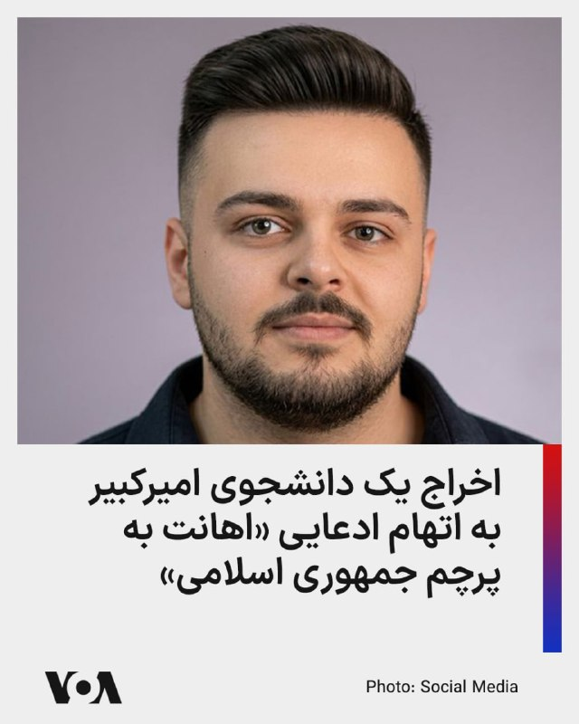

کمیته انضباطی دانشگاه صنعتی امیرکبیر امیرمحمد سورمه، دانشجوی ورودی ۱۴۰۴ مقطع کارشناسی ارشد رشته مدیریت کسب‌وکار را به اتهام ادعایی «اهانت به پرچم جمهوری اسلامی» با حکم بدوی اخراج کرده است.

براساس گزارش خبرنامه امیرکبیر در ماه‌های گذشته نیز گزارش‌هایی درباره صدور احکام انضباطی مشابه برای شماری از دانشجویان دانشگاه‌های ایران منتشر شده بود.

در همین ارتباط، پیشتر دو دانشجوی دانشگاه تهران نیز با اتهام ادعایی مشابهی با حکم بدوی اخراج روبه‌رو شده بودند.
@FarsiVOA

## FarsiVOA — post 221723

  <a href="telegram/content/FarsiVOA_221723_1782302184.mp4" target="_blank">🎬 Download video</a>

ویدیوی منتسب به حمله هوایی ارتش اسرائیل به مواضع حماس در شمال غزه؛

ارتش اسرائیل در شبانه روز گذشته در یک عملیات جدید، مواضع و اهداف متعلق به گروه تروریستی حماس را که مورد حمایت جمهوری اسلامی است، در منطقه «بیت لاهیا» واقع در شمال نوار غزه هدف حمله هوایی قرار داد.

همزمان، این گروه از تماس تلفنی باسم نعیم، معاون رئیس دفتر روابط عربی و اسلامی خود با عباس عراقچی، وزیر خارجه جمهوری اسلامی، درباره «آخرین تحولات مذاکرات جمهوری اسلامی و آمریکا و نیز پرونده فلسطین» خبر داد.

بر اساس این گزارش، عراقچی در این تماس گفت که موضوع تداوم عملیات نظامی اسرائیل در نوار غزه را در مذاکرات جاری با میانجی‌ها و طرف آمریکایی مطرح می‌کند.
@FarsiVOA

## FarsiVOA — post 221722

🔺نخست‌وزیر قطر: هدف بعدی، چارچوب امنیتی تازه میان جمهوری اسلامی و منطقه است

▪️نخست‌وزیر و وزیر خارجه قطر گفت هدف منطقه‌ای پس از توافق اولیه آمریکا و جمهوری اسلامی، ساختن چارچوب امنیتی تازه‌ای میان کشورهای منطقه و جمهوری اسلامی است؛ اظهاراتی که نشان می‌دهد دوحه توافق اخیر را آغاز بازطراحی امنیت خلیج فارس معرفی می‌کند.

▪️محمد بن عبدالرحمن آل ثانی در گفت‌وگو با فایننشال تایمز گفت ایجاد خط ارتباطی مستقیم میان آمریکا و جمهوری اسلامی برای باز ماندن تنگه هرمز ضروری است او این خط باید مانع آن شود که بازیگران سرکش یا پیام‌های جعلی، عبور کشتی‌ها از هرمز را مختل کنند.

▪️او همچنین گفت قطر انتظار دارد تولید عادی گاز طبیعی مایع، ال‌ان‌جی، را ظرف چند هفته از سر بگیرد.

⬇️ بیشتر بخوانید:
https://ir.voanews.com/a/qatari-pm-next-goal-new-security-framework-between-iran-region/8164291.html

## FarsiVOA — post 221721

🔺ملونی: اروپا نمی‌تواند اجازه دهد جمهوری اسلامی به سلاح هسته‌ای دست یابد

▪️نخست‌وزیر ایتالیا هشدار داد که اروپا نمی‌تواند اجازه دهد جمهوری اسلامی، در حالی که توان موشکی دوربرد خود را نشان داده است، به سلاح هسته‌ای دست یابد.

▪️جورجیا ملونی روز سه‌شنبه، در گفت‌وگو با روزنامه «لاوریتا»، توافق آمریکا و جمهوری اسلامی را «بسیار پیچیده» دانست و تأکید کرد که سه موضوع باید در مرکز آن قرار گیرد: برنامه هسته‌ای جمهوری اسلامی، امنیت کشورهای منطقه، و آزادی کشتیرانی.

▪️او گفت نخستین مسئله، سرنوشت برنامه هسته‌ای جمهوری اسلامی است و افزود اروپا نمی‌تواند اجازه دهد «رژیم آیت‌الله‌ها»، در حالی که موشک‌های دوربرد دارد و به گفته او این توان را نشان داده است، به کلاهک هسته‌ای دست یابد.

⬇️ بیشتر بخوانید:
https://ir.voanews.com/a/meloni-eu-cannot-allow-iran-to-obtain-nuclear-weapons/8164298.html

## FarsiVOA — post 221720

  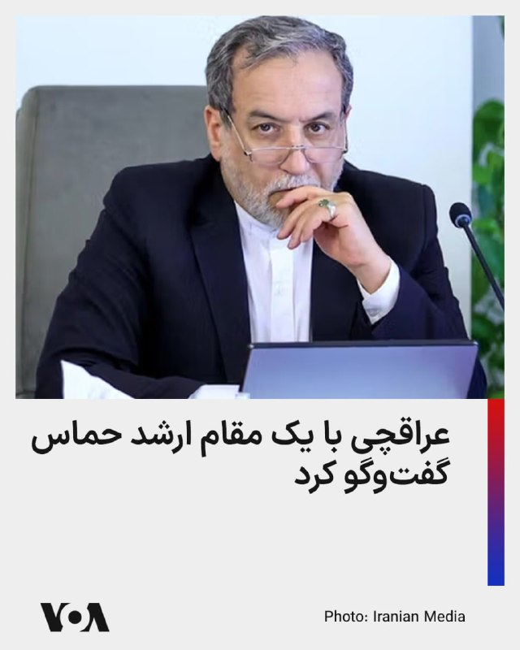

گروه تروریستی حماس از تماس تلفنی باسم نعیم، معاون رئیس دفتر روابط عربی و اسلامی این گروه با عباس عراقچی، وزیر خارجه جمهوری اسلامی، درباره «آخرین تحولات مذاکرات جمهوری اسلامی و آمریکا و نیز پرونده فلسطین» خبر داد.

بر اساس این گزارش، عراقچی در این تماس گفت که موضوع تداوم عملیات نظامی اسرائیل در نوار غزه را در مذاکرات جاری با میانجی‌ها و طرف آمریکایی مطرح می‌کند.
@FarsiVOA

## DW_Farsi — post 126411

  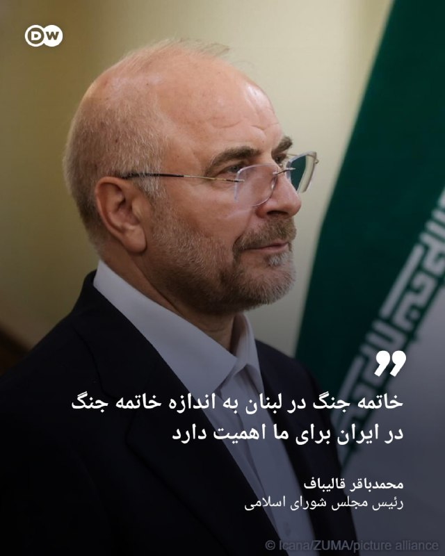

🔶 قالیباف: خاتمه جنگ در لبنان به اندازه خاتمه جنگ در ایران برای ما اهمیت دارد

رئیس مجلس شورای اسلامی روز چهارشنبه ۲۴ ژوئن (۳ تیرماه) طی سخنانی در بیستمین نشست اجلاس کنفرانس اتحادیه مجالس کشورهای عضو سازمان همکاری اسلامی در باکو گفت که جنگ "۴۰ روزه" علیه جمهوری اسلامی "اقدامی جنایکارانه" بوده است.

محمدباقر قالیباف با بیان اینکه "ما در سخت‌ترین وپیچیده‌ترین شرایط، دوستان و شرکای راهبردی خود را تنها نگذاشته‌ایم"، ادامه داد: «برای ما، آتش‌بس در لبنان به اندازه آتش‌بس در ایران و در ادامه، خاتمه جنگ در لبنان به اندازه خاتمه جنگ در ایران اهمیت داشته و دارد.»

به ادعای قالیباف در این جنگ "بیش از ۳ هزار شهروند غیرنظامی" و شماری از مقامات عالی‌رتبه ایران کشته شدند. دویچه وله فارسی نمی‌تواند آمارهای ارائه‌شده از سوی مقامات جمهوری اسلامی درباره تلفات ناشی از جنگ را مستقلا راستی‌آزمایی کند.

@dw_farsi

## DW_Farsi — post 126410

  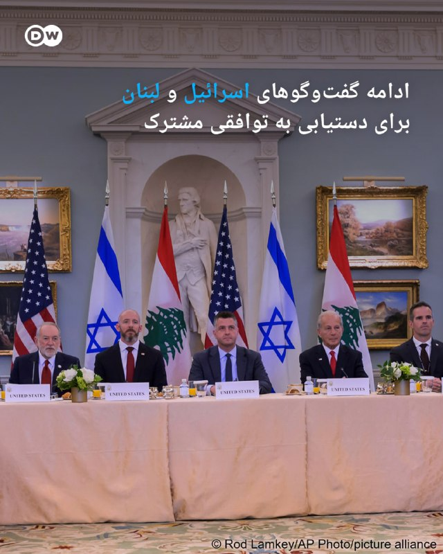

🔶 ادامه گفت‌وگوهای اسرائیل و لبنان برای دستیابی به توافقی مشترک

به گفته سه مقام اسرائیلی، این کشور و لبنان در حال بررسی یک طرح آزمایشی مورد حمایت آمریکا هستند که بر اساس آن، نیروهای اسرائیلی کنترل بخشی از مناطق جنوب لبنان را به نیروهای مسلح لبنان واگذار خواهند کرد.

به گزارش خبرگزاری رویترز، این مقامات روز چهارشنبه ۲۴ ژوئن گفتند نیروهای لبنانی که در این طرح مشارکت خواهند داشت، از سوی آمریکا "تحت آموزش و بررسی‌های امنیتی قرار می‌گیرند تا اطمینان حاصل شود که هیچ ارتباطی با حزب‌الله ندارند".

با این حال، اسرائیل همچنان حضور نظامی خود را در منطقه حائل حفظ خواهد کرد.

در روز سه‌شنبه ۲۳ ژوئن نخستین روز از پنجمین دور مذاکرات مستقیم میان اسرائیل و لبنان پس از هشت ساعت گفت‌وگو در واشنگتن به پایان رسید.

@dw_farsi

## DW_Farsi — post 126409

  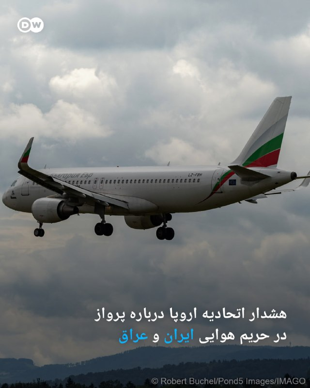

🔶 هشدار اتحادیه اروپا درباره پرواز در حریم هوایی ایران و عراق

آژانس ایمنی هوانوردی اتحادیه اروپا (EASA) روز چهارشنبه ۲۴ ژوئن (۳ تیرماه) اعلام کرد که شرکت‌های هواپیمایی باید همچنان از پرواز در حریم هوایی ایران، عراق و لبنان خودداری کنند و با وجود پذیرش تفاهم اولیه میان واشنگتن و تهران، در سراسر منطقه با احتیاط عمل کنند، زیرا همچنان احتمال نقض توافق‌ها وجود دارد.

این نهاد همچنین اعلام کرد که هشدار مربوط به مناطق درگیر در این منطقه را تا اول ژوئیه (۱۰ تیرماه) تمدید کرده است.

این آژانس گفت که احتمال نقض کوتاه‌مدت آتش‌بس میان آمریکا و ایران همچنان وجود دارد، "به‌ویژه در تنگه هرمز و حریم هوایی مناطق مجاور آن".

همچنین آژانس هوانوردی به آتش‌بس شکننده میان اسرائیل و حزب‌الله اشاره کرده و هشدار داد که این وضعیت "می‌تواند به فعالیت‌های نظامی منجر شود که بر حریم هوایی لبنان تأثیر بگذارد".

این نهاد افزود که تمامی شرکت‌های هواپیمایی و اپراتورهای پروازی باید هنگام فعالیت در حریم هوایی بحرین، کویت، اسرائیل، اردن، قطر، عمان، امارات متحده عربی و عربستان سعودی با احتیاط عمل کنند و خطرات احتمالی را در نظر بگیرند.

@dw_farsi

## DW_Farsi — post 126408

  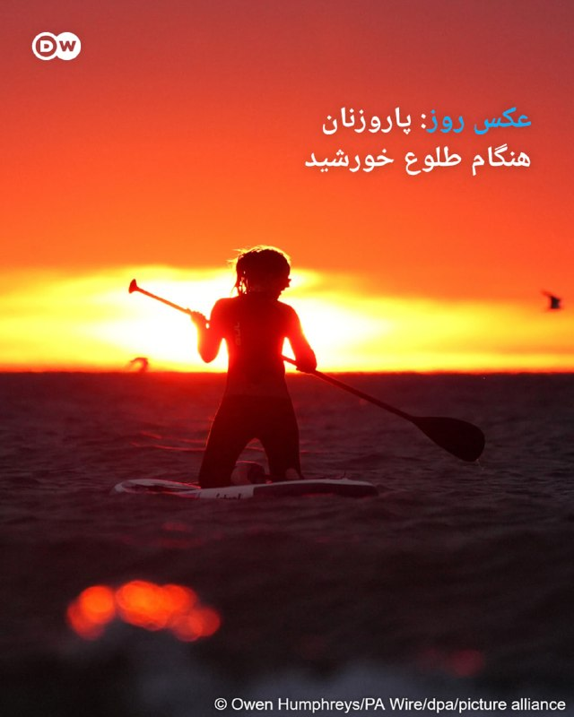

📸 عکس روز: پاروزنان هنگام طلوع خورشید

طلوع و غروب خورشید از جمله همیشگی‌ترین قاب‌ها برای هنرمندان به‌ویژه عکاسان و نقاشان است؛ با منظره‌هایی که انگار هرگز تکراری و خسته‌کننده نمی‌‌شوند. در این تصویر یک نفر هنگام طلوع خورشید، سوار بر یک تخته در حال پارو زدن در مقابل ساحل تاین‌ماوث واقع در شمال‌شرقی انگلستان دیده می‌شود.

@dw_farsi

## DW_Farsi — post 126407

  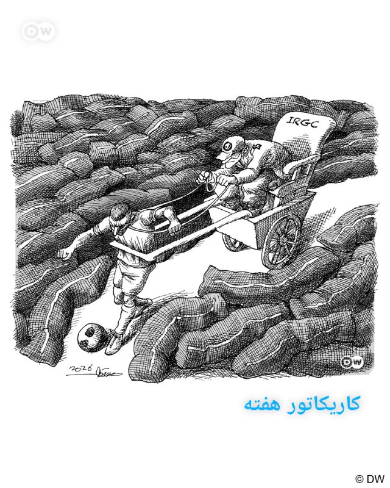

📸 کاریکاتور هفته

حکومت‌های اقتدارگرا در زمان بحران، اغلب به جای پاسخگویی درباره ریشه‌های مشکلات و جنایت‌های خود، می‌کوشند با بهره‌برداری از رویدادهای ملی و احساسات جمعی، حافظه عمومی را به مسیر دیگری هدایت کنند.

فوتبال و تیم ملی نیز از این قاعده مستثنا نیستند. هنگامی که بازیکنان، خواسته یا ناخواسته، به حاملان روایت رسمی حکومت تبدیل می‌شوند، ورزش از عرصه‌ای برای رقابت و همبستگی ملی به ابزاری برای مشروعیت‌بخشی سیاسی بدل می‌شود؛ ابزاری که قرار است توجه افکار عمومی را از پرسش‌های بی‌پاسخ، زخم‌های التیام‌نیافته و مسئولیت‌های فراموش‌نشده منحرف کند.

همین موضوع دستمایه مانا نیستانی در طراحی کاریکاتور هفته برای دویچه وله فارسی قرار گرفته است.

@dw_farsi

## DW_Farsi — post 126405

  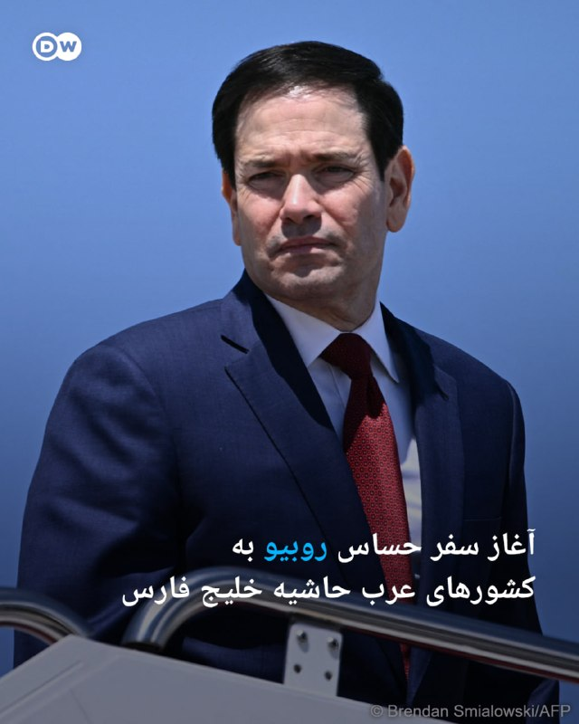

🔶 آغاز سفر حساس روبیو به کشورهای عرب حاشیه خلیج‌ فارس

مارکو روبیو، وزیر خارجه ایالات متحده آمریکا شامگاه روز سه‌شنبه ۲۳ ژوئن سفر خود به خاورمیانه را آغاز کرد. روبیو در این سفر می‌کوشد تا متحدان آمریکا در حاشیه خلیج فارس را در مورد پیامدهای مالی تفاهم با ایران متقاعد کند.

کشورهای عرب حاشیه خلیج فارس که در زمان جنگ آمریکا و اسرائیل علیه ایران به شدت از حملات جمهوری اسلامی آسیب دیده‌اند، امتیازهای مالی مندرج در  تفاهم‌نامه از جمله پیشنهاد یک صندوق ۳۰۰ میلیارد دلاری را "بیش از حد سخاوتمندانه نسبت به یک دشمن منطقه‌ای" می‌دانند.

روبیو  شامگاه سه‌شنبه برای یک سفر سه‌روزه به خلیج فارس وارد ابوظبی شد. نخستین مأموریت این دیپلمات  ارشد آمریکا در ارتباط با توافقی انجام می‌‌گیرد که هفته گذشته برای پایان دادن به جنگ آمریکا و اسرائیل علیه جمهوری اسلامی حاصل شد.

@dw_farsi

## DW_Farsi — post 126403

  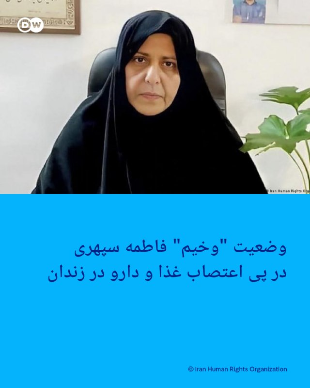

🔶 وضعیت "وخیم" فاطمه سپهری در پی اعتصاب غذا و دارو در زندان

بر اساس گزارش سازمان حقوق‌بشری هه‌نگاو، وضعیت فاطمه سپهری در پی اعتصاب غذا و دارو "به شدت وخیم" است.

فاطمه سهپری، زندانی سیاسی ۶۲ ساله محبوس در بند زنان زندان وکیل‌آباد مشهد، در هشتمین روز اعتصاب غذا و داروی اعتراضی به سر می‌برد. او در اعتراض به شرایط غیرانسانی حاکم بر زندان، عدم رسیدگی به وضعیت درمانی و محرومیت سیستماتیک از دسترسی به داروهای حیاتی، دست به اعتصاب هم‌زمان غذا و دارو زده است.

فاطمه سپهری پیش از این تحت عمل جراحی قلب باز قرار گرفته و در حال حاضر با نارسایی شدید قلبی، دردهای طاقت‌فرسا در ناحیه دست‌ها و شانه‌ها، بروز توده‌های دردناک در قفسه سینه و مشکلات مزمن گوارشی دست‌وپنجه نرم می‌کند. ممانعت مقامات زندان و نهادهای امنیتی از دسترسی او به داروهای حیاتی روزانه و خودداری از اعزام او به مراکز تخصصی خارج از زندان، عامل اصلی سوق دادن این زندانی سیاسی به این اعتصاب خطرناک بوده است.

@dw_farsi

## DW_Farsi — post 126402

🔶 عفو بین‌الملل خواستار لغو احکام علیه پرستو احمدی و گروهش شد

سازمان عفو بین‌الملل روز سه‌شنبه ۲۳ ژوئن (۲ تیر ماه) با انتشار پستی در شبکه ایکس (توییتر سابق) از مقامات جمهوری اسلامی خواست که فورا احکام محکومیت پرستو احمدی، خواننده، و هشت نوازنده دیگر در اجرای کنسرت "کاروانسرا" را لغو کنند. این اجرا به "کنسرت فرضی" نیز شهرت دارد.

آنان از سوی دادگاه کیفری استان قم، هر یک به ۷۴ ضربه شلاق، دو سال ممنوعیت خروج از ایران و دو سال محرومیت از فعالیت‌های هنری محکوم شده‌اند . این حکم بدوی و در مهلت قانونی قابل تجدیدنظرخواهی است.

دادگاه مزبور پرستو احمدی و هشت نوازه "کنسرت کاروانسرا" را به "جریحه‌دار کردن عفت عمومی از طریق تولید و انتشار محتوای مبتذل و خلاف اخلاق در بستر فضای مجازی" متهم کرد.

به گزارش مرکز مشاوره و آموزش حقوقی "دادبان"، محمد شیری، رئیس شعبه رسیدگی‌کننده، دفاعیات متهمان را وارد ندانسته و حکم محکومیت آنان را صادر کرد.

@dw_farsi

## DW_Farsi — post 126401

🔶 آذر عظیما، خواننده نخستین برنامه "یک شاخه گل" درگذشت

آذرمیدخت عظیما سراج‌پور که بیشتر با نام آذر عظیما شناخته می‌شد، از خوانندگان قدیمی ایران روز دوم تیر ۱۴۰۵ در ۹۹ سالگی در اصفهان درگذشت.

او که از نخستین خوانندگان برنامه‌های گل‌ها بود، اولین برنامه "یک شاخه گل" را با اثری از ابوالحسن صبا، شعری از ابوالحسن ورزی و سنتور فرامرز پایور اجرا کرد.
@dw_farsi

## Persian_Trend_Official — post 17929

  <a href="telegram/content/Persian_Trend_Official_17929_1782302192.mp4" target="_blank">🎬 Download video</a>

🚨🎥 ثابتی در مناظره با رضازاده:

🔴 امریکا میخواهد به‌ جای آزاد کردن پولهای بلوکه شده ایران، به ایران کالابرگ بدهد و بگوید فلان مقدار جنس را از فلان کشوری که من میگویم باید بخری!

🔴 اگر طبق بند ۱۱ تفاهم‌نامه با امریکا ۲۴ میلیارد دلار پول بلوکه شده ایران آزاد شد، تمام حرفهای دیگر من غلط است

Phantom

📌 @persian_trend_official
پرشین ترند | متفاوت‌ترین کانال نظامی

## Persian_Trend_Official — post 17928

کانال رسمی پرشین ترند pinned «بولتن خبری ۲۴ ساعت اخیر ۱۴۰۵/۴/۳ آرشیو پرشین ترند ━━━━━━━━━━━━━━ ━━━━━━━━━━━━━━ ◾️ مذاکرات فنی ایران و آمریکا در بورگن‌اشتوک سوئیس پس از نشست سطح‌عالی به کار خود ادامه می‌دهد؛ قالیباف و ونس پس از ۳۶ ساعت گفت‌وگوی فشرده روی «نقشه راه ۶۰ روزه» به‌سوی توافق…»

## Persian_Trend_Official — post 17927

  <a href="telegram/content/Persian_Trend_Official_17927_1782302195.mp4" target="_blank">🎬 Download video</a>

پست ترامپ راجب ایران

Phantom

📌 @persian_trend_official
پرشین ترند | متفاوت‌ترین کانال نظامی

## Persian_Trend_Official — post 17926

  <a href="telegram/content/Persian_Trend_Official_17926_1782302197.mp4" target="_blank">🎬 Download video</a>

اگر ۴۰۰ کیلو اورانیوم بازدارندگی دارد، پس چرا جنگ شد؟

ایزدی: آمریکایی‌ها می‌خواهند در جنگ سوم با بمب اتمی تاکتیکی به شهرهای موشکی ایران حمله کنند، زیرا با بمب‌های متعارف این سایت‌ها آسیب نمی‌بینند.

ابتدا باید با رقیق کردن #اورانیوم ایران، خیالشان از پاسخ ایران راحت شود

Phantom

📌 @persian_trend_official
پرشین ترند | متفاوت‌ترین کانال نظامی

## Persian_Trend_Official — post 17925

فیلم جدیدی از آزمایش موشک کروز مافوق‌صوت براهموس منتشر شده؛

اماراتی‌ها مذاکراتی رو با هندی‌ها برای خرید سامانه فرماندهی پدافندی آکاشتیر و موشک‌های کروز مافوق صوت براهموس رو دارن انجام میدن تا بتونن بخشی از ضعف‌های خودشون رو رفع کنن

- ارتش کشور امارات متحده عربی در زمان جنگ رمضان در برابر چندین عامل از جمله فرماندهی جنگ، حملات پهپادهای انتحاری و مقابله با موشک‌های بالستیک ضعف‌هایی نشون داد و نداشتن موشک‌های کروز تهاجمی موثر هم در زرادخانه نیروی هوایی اون‌ها رویت شد

- در واقع ضعف اصلی سامانه‌های پدافندی امارات، در نبود یکپارچه‌سازی و جنگ شبکه‌محور بود؛ امارات متحده عربی از کاربران سامانه‌های پاتریوت و تاد آمریکایی محسوب میشه اما نمیتونست به صورت شبکه یکپارچه پدافندی از این 2سامانه استفاده کنه لذا گویا برای رفع همین موضوع خرید سامانه فرماندهی آکاشیر هندی اقدام کرده

سامانه آکاشیر دقیقاً برای رفع همین مشکل طراحی شده؛ یک شبکه فرماندهی خودکار که اطلاعات رادارها و سامانه‌های مختلف را در یک تصویر عملیاتی واحد به هم متصل می‌کند تا واکنش در برابر تهدیدات هوایی را به حداقل برساند. در کنار آن، موشک براهموس با سرعت مافوق‌صوت، نیاز امارات به یک موشک کروز تهاجمی مؤثر را پوشش می‌دهد.

Phantom

📌 @persian_trend_official
پرشین ترند | متفاوت‌ترین کانال نظامی

## RadioFarda — post 158704

  <a href="https://t.me/radiofarda/158704" target="_blank">📎 Download file</a>

📻بشنوید: ساعت ۱۴ با رادیوفردا، سوم تیر‌ماه ۱۴۰۵

@RadioFarda

## RadioFarda — post 158703

🔸کاظم غریب‌آبادی، معاون وزیر خارجه ایران، می‌گوید برنامه‌ای برای بازرسی از تأسیسات هسته‌ای آسیب‌دیده جمهوری اسلامی و مواد هسته‌ای داخل آنها «وجود ندارد». 🔸او در شبکه ایکس نوشته: «این مباحث صرفاً در چارچوب توافق نهایی و در نتیجه اقدام عملی طرف مقابل در خاتمه…

## RadioFarda — post 158702

  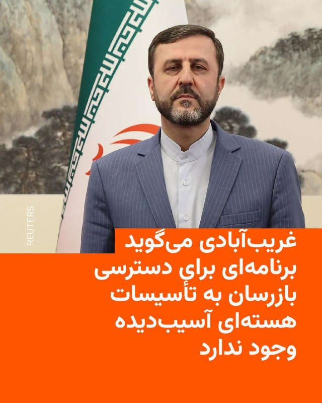

🔸کاظم غریب‌آبادی، معاون وزیر خارجه ایران، می‌گوید برنامه‌ای برای بازرسی از تأسیسات هسته‌ای آسیب‌دیده جمهوری اسلامی و مواد هسته‌ای داخل آنها «وجود ندارد».

🔸او در شبکه ایکس نوشته: «این مباحث صرفاً در چارچوب توافق نهایی و در نتیجه اقدام عملی طرف مقابل در خاتمه تمامی تحریم‌ها و... بررسی و تعیین تکلیف خواهند شد.»

🔸غریب‌آبادی که ریاست هیئت‌ ایران در جریان مذاکرات فنی با طرف آمریکایی را بر عهده داشت، اضافه کرده که «هیچ برنامه‌ای برای دسترسی به تاسیساتِ مورد حمله واقع شده و مواد هسته‌ای وجود ندارد.»

🔸او در واکنش به اظهارات روز چهارشنبه مدیرکل آژانس بین‌المللی انرژی اتمی مبنی بر اینکه بازرسان این نهاد از سایت‌های غنی‌سازی هسته‌ای ایران بازدید خواهند کرد، گفت: «در سوییس هیچ نشستی با گروسی، علیرغم درخواست وی، برگزار نشد.»

🔸غریب‌آبادی بدون اشاره به فرد یا کشور خاصی، افزوده که «نمی توانید با هیاهوی رسانه‌ای، سیاست "راه بینداز و جا بینداز" را پیش ببرید.»

@RadioFarda

## RadioFarda — post 158701

یک دنباله‌دار بین‌ستاره‌ای در منظومهٔ شمسی تا ۱۲ میلیارد سال قدمت دارد

🔸دانشمندانی که دنباله‌دار «۳آی/اطلس» را بررسی می‌کنند، به این نتیجه رسیده‌اند که این مهمان بین‌ستاره‌ای به‌شدت باستانی است، به‌طوری که حدود ۱۰ تا ۱۲ میلیارد سال پیش در یک سامانهٔ سیاره‌ای اولیه شکل گرفته و ترکیبی دارد که با هیچ‌یک از مواد موجود در منظومهٔ شمسی ما مشابه نیست.

🔸به گفتهٔ پژوهشگران، بررسی ترکیب شیمیایی این دنباله‌دار که تنها سومین جرم بین‌ستاره‌ای مشاهده‌شده در منظومهٔ شمسی است، اطلاعاتی درباره شرایط فیزیکی و شیمیایی سامانه‌ای که این جرم در آن شکل گرفته، ارائه می‌دهد.

🔸این دنباله‌دار که قطری حدود ۱.۶ مایل [۲.۶ کیلومتر] دارد، به گفتهٔ مارتین کوردینر، دانشمند علوم سیاره‌ای و اخترشیمی‌دان در مرکز پروازهای فضایی گادرد ناسا در مریلند و نویسندهٔ اصلی این پژوهش که روز اول تیرماه در مجله «نیچر» منتشر شد، احتمالاً قدیمی‌ترین جرمی است که تاکنون وارد منظومهٔ شمسی شده است.

🔸پژوهشگران می‌گویند «۳آی/اطلس» ظاهراً در محیطی بسیار سردتر، حدود منفی ۴۰۵ درجه فارنهایت [منفی ۲۴۳ درجه سانتی‌گراد]، نسبت به محیطی که زمین و دیگر اجرام منظومه شمسی حدود ۴.۵ میلیارد سال پیش در آن شکل گرفتند، به وجود آمده است.

🔸آن‌ها می‌گویند این جرم پس از آن‌که به‌نوعی از سامانه سیاره‌ای خود بیرون رانده شد، مسافتی بسیار طولانی را طی کرده است.

🔸کوردینر گفت: ما تاکنون هرگز جرمی مانند «۳آی/اطلس» ندیده‌ایم.

🔸پژوهشگران با استفاده از تلسکوپ فضایی جیمز وب، نسبت ایزوتوپ‌ها [گونه‌های مختلف یک عنصر شیمیایی مانند هیدروژن و کربن] را در این دنباله‌دار اندازه‌گیری کردند.

🔸 گزارش کامل را در وب‌سایت رادیوفردا بخوانید.

@RadioFarda

## RadioFarda — post 158700

اسرائیل و لبنان درباره طرح آزمایشی مورد حمایت آمریکا برای جنوب لبنان مذاکره می‌کنند

🔸مقام‌های اسرائیلی و لبنانی می‌گویند دو طرف در حال بررسی طرحی با حمایت آمریکا هستند با این چارچوب که ارتش اسرائیل از بخشی از مناطق اشغال‌شده در جنگ با حزب‌الله عقب‌نشینی کند و کنترل این مناطق را به ارتش لبنان بسپارد.

🔸خبرگزاری رویترز روز چهارشنبه ۳ تیر با اعلام این خبر به نقل از مقام‌های دو کشور افزود بر اساس این پیشنهاد، نیروهای ارتش لبنان که در این مناطق مستقر خواهند شد، تحت ارزیابی آمریکا قرار می‌گیرند تا اطمینان حاصل شود با حزب‌الله ارتباطی ندارند.

🔸این مقام‌ها گفتند که این طرح «آزمایشی» در تازه‌ترین دور مذاکرات اسرائیل و لبنان در واشینگتن در حال بررسی است.
این مذاکرات در حالی ادامه دارد که از یک سو حزب‌الله اعلام کرده با آن مخالف است و از سوی دیگر حکومت ایران در مذاکرات خود با آمریکا موضوع لبنان را به یکی از محورهای اصلی تبدیل کرده است.

🔸محمدباقر قالیباف، رئیس مجلس شورای اسلامی، روز چهارشنبه در اجلاس اتحادیهٔ مجالس کشورهای عضو سازمان همکاری اسلامی در باکو بار دیگر تأکید کرد که برای جمهوری اسلامی، «آتش‌بس در لبنان به اندازهٔ آتش‌بس در ایران و در ادامه، خاتمهٔ جنگ در لبنان به اندازهٔ خاتمهٔ جنگ در ایران اهمیت داشته و دارد.»

🔸این در حالی است که وزیر خارجه آمریکا روز دوشنبه گفت تا زمانی که گروه‌های نیابتی مورد حمایت ایران به حملات موشکی ادامه دهند، دستیابی به صلح پایدار در منطقه غیرممکن است.

🔸مارکو روبیو همچنین با اعلام این‌که «ما قرار است مستقیماً با دولت لبنان به توافق برسیم»، تأکید کرد که «آیندهٔ لبنان را مردم لبنان تعیین می‌کنند و پروندهٔ لبنان از هرگونه توافق با ایران جداست.»

🔸ارتش اسرائیل در جریان جنگی که پس از حملات حزب‌الله به اسرائیل در حمایت از جمهوری اسلامی ایران آغاز شد، بخش‌هایی از جنوب لبنان را تصرف کرده‌ است. این جنگ که قرار بود پس از امضای تفاهم‌نامه ایران و آمریکا متوقف شود، نهایتاً از روز یکشنبه با آتش‌بسی شکننده و نسبی برقرار شده است.

🔸 گزارش کامل را در وب‌سایت رادیوفردا بخوانید.

@RadioFarda

## RadioFarda — post 158699

  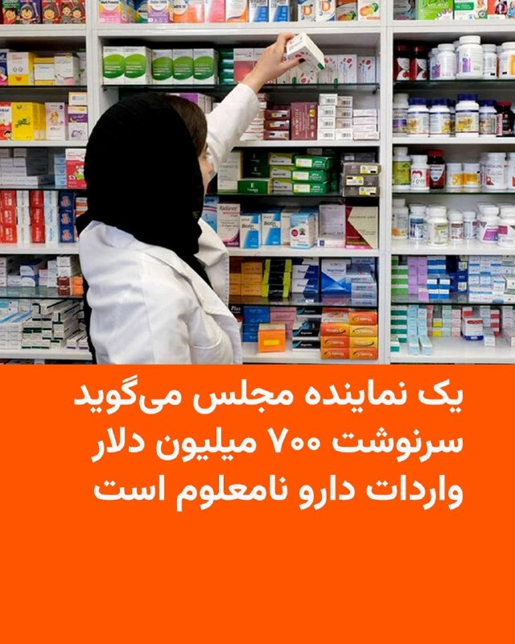

🔸یک عضو کمیسیون بهداشت مجلس شورای اسلامی می‌گوید سرنوشت ۷۰۰ میلیون دلار از یک میلیارد دلاری که پیش از جنگ ۴۰ روزه از صندوق توسعه ملی برای تأمین دارو و تجهیزات پزشکی برداشته شده بود، نامعلوم است.

🔸روح‌الله لک علی‌آبادی روز سه‌شنبه دوم تیرماه به پایگاه خبری دیده‌بان گفت این یک میلیارد دلار با دستور رهبر وقت جمهوری اسلامی برای تأمین دارو و تجهیزات اختصاص یافت و «معلوم نیست ۷۰۰ میلیون دلار دیگر کجا رفته و چه سرنوشتی پیدا کرده است».

🔸این عضو کمیسیون بهداشت همچنین از تشکیل جلسه‌ای «بسیار پرتنش» با سازمان غذا و دارو در این باره خبر داد و گفت: «سازمان غذا و دارو توضیحاتی دادند که کمیسیون بهداشت و درمان مجلس قانع نشد و مقرر شد در جلسه بعدی این موضوع مجدداً بررسی شود.»

🔸مقامات دولتی هنوز در مورد این موضوع اظهارنظر نکرده‌اند، اما مرداد سال گذشته، محمدرضا ظفرقندی، وزیر بهداشت، اعلام کرده بود که «۳۰۰ میلیون دلار از این مبلغ برای پرداخت بدهی‌های وزارت بهداشت از جمله بدهی‌های پرسنلی بوده که توزیع و تمام شده است. ۷۰۰ میلیون دلار نیز بابت ذخیرهٔ استراتژیک دارو و تجهیزات پزشکی در نظر گرفته شده است».

@RadioFarda

## RadioFarda — post 158698

🔸مسعود پزشکیان، رئیس‌جمهور ایران در جریان سفر روز سه‌شنبه به پاکستان به نشان دوستی یک درخت در اسلام‌آباد کاشت.

🔸تصاویر اصرار پزشکیان بر کاشت کامل نهال در پاکستان در شبکه‌های اجتماعی بازتاب پیدا کرده است .

@RadioFarda

## RadioFarda — post 158697

مارکو روبیو در امارات: آمده‌ام تا نظرات متحدان‌مان را درباره تفاهم با ایران بشنویم

🔸وزیر خارجه ایالات متحده آمریکا که راهی کشورهای حوزه خلیج فارس شده، در بدو ورود به ابوظبی گفت هدفش بیشتر «شنیدن» نظرات متحدان عرب دربارهٔ توافق تهران و واشینگتن و «لحاظ کردن» دیدگاه‌های آن‌ها در تصمیمات ایالات متحده است.

🔸مارکو روبیو در سفر مهم خود به منطقهٔ خلیح فارس، دوم تیرماه وارد ابوظبی، پایتخت امارات متحده عربی، شد. او قرار است طی دو روز با رهبران کویت، امارات و بحرین دیدار کند.
وزیر خارجه آمریکا هنگام ورود به ابوظبی در فرودگاه «البطین» به خبرنگاران گفت تمرکز اصلی واشینگتن بیشتر بر شنیدن دیدگاه‌های متحدان است تا متقاعد کردن آن‌ها.

🔸او گفت: «ما روابط و شراکت‌های دیرینه‌ای با سه کشوری داریم که به آن‌ها سفر می‌کنم.»

🔸وزیر خارجه آمریکا در ادامۀ اظهاراتش به امارات اشاره کرد و افزود: «در واقع بیش از آن‌که برای صحبت کردن آمده باشیم، برای شنیدن آمده‌ایم. می‌خواهیم نظرات آن‌ها را بشنویم و مطمئن شویم دیدگاه‌هایشان در هر تصمیمی که می‌گیریم، لحاظ می‌شود.»

🔸این اظهارات ظاهراً با هدف کاهش نگرانی متحدان عرب مطرح شده است؛ نگرانی‌هایی مبنی بر این‌که چارچوب آتش‌بس میان آمریکا و ایران ممکن است در نهایت به تقویت موقعیت تهران منجر شود یا مسائل مهمی مانند برنامه موشک‌های بالستیک، گروه‌های نیابتی و امنیت دریایی را حل‌نشده باقی بگذارد.

🔸روبیو تأکید کرد که اگرچه اکنون یک «چارچوب دیپلماتیک» وجود دارد، اما هنوز کامل نشده است. او گفت: «این مسئله ۴۷ سال است که ادامه دارد؛ هیچ‌کس ادعا نکرده که قرار است در یک یا دو روز حل شود.»

🔸 گزارش کامل را در وب‌سایت رادیوفردا بخوانید.

@RadioFarda

## RadioFarda — post 158696

🔸مدیرکل آژانس بین‌المللی انرژی اتمی اعلام کرد که بازرسان این نهاد از سایت‌های غنی‌سازی هسته‌ای ایران بازدید خواهند کرد. 🔸رافائل گروسی روز چهارشنبه سوم تیر در یک نشست خبری در نیروگاه هسته‌ای «دای‌ایچی» در فوکوشیمای ژاپن این موضوع را اعلام کرد. 🔸گروسی گفت:…

## RadioFarda — post 158695

  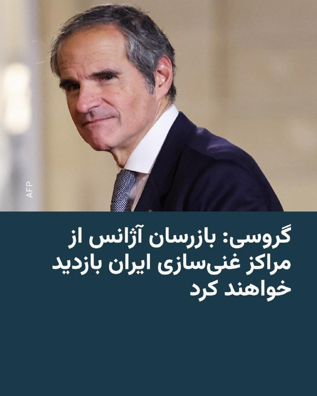

🔸مدیرکل آژانس بین‌المللی انرژی اتمی اعلام کرد که بازرسان این نهاد از سایت‌های غنی‌سازی هسته‌ای ایران بازدید خواهند کرد.

🔸رافائل گروسی روز چهارشنبه سوم تیر در یک نشست خبری در نیروگاه هسته‌ای «دای‌ایچی» در فوکوشیمای ژاپن این موضوع را اعلام کرد.

🔸گروسی گفت: «من اظهارات سیاسی را درک می‌کنم، این‌ها بخشی از واقعیت هستند؛ اما نکتهٔ اساسی که می‌خواهم یادآوری کنم این است که یک یادداشت تفاهم وجود دارد که به امضای رؤسای جمهور دو کشور [ایران و آمریکا] رسیده است.»

🔸او افزود: «در این توافق به صراحت آمده است که فعالیت‌های هسته‌ای مربوط به مواد و تأسیسات هسته‌ای تحت نظارت آژانس بین‌المللی انرژی اتمی انجام خواهد شد؛ کاملاً روشن و بدون ابهام.»

🔸گروسی همچنین تأکید کرد: «بدیهی است که برای انجام این کار باید بازرسی صورت گیرد. این‌که این بازرسی پس‌فردا انجام شود، یک هفته دیگر یا ۱۰ روز دیگر، مهم است اما تعیین‌کننده نیست. این اتفاق خواهد افتاد.»

@RadioFarda

## IranianMinds — post 23219

  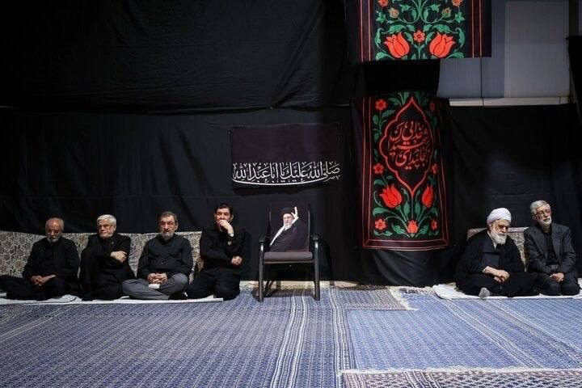

🔴مراسم عزاداری تاسوعا در حسینیه خمینی.

@IranianMinds

## IranianMinds — post 23218

  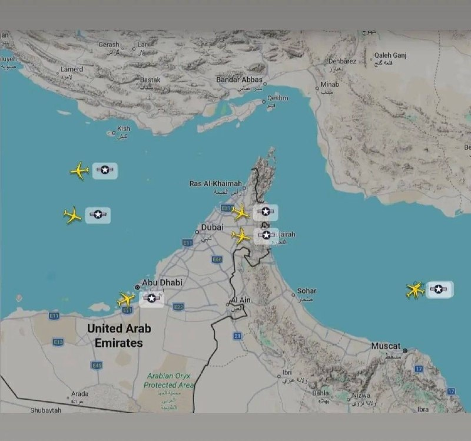

🔴افزایش فعالیت سوخت‌رسان‌های آمریکایی در خلیج‌فارس.

@IranianMinds

## IranianMinds — post 23217

🔴فارس:

اختلال سیستم همه‌ی بانک‌ها برطرف شد.

@IranianMinds

## IranianMinds — post 23216

  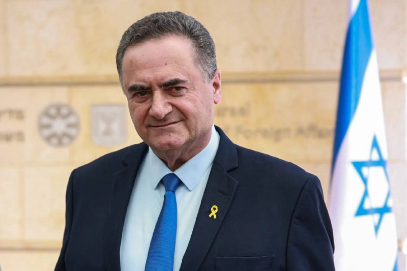

🔴کاتز، وزیر دفاع اسرائیل:

حتی اگر آمریکا از ما بخواهد، ماجنوب لبنان را ترک نخواهیم کرد.

@IranianMinds

## IranianMinds — post 23215

  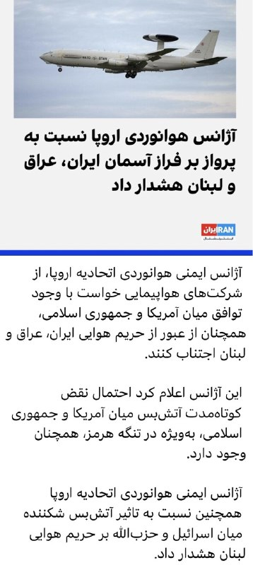

@IranianMinds

## IranianMinds — post 23214

  <a href="telegram/content/IranianMinds_23214_1782302206.mp4" target="_blank">🎬 Download video</a>

🔴شعار مرگ بر آمریکا در حسینیه اعظم زنجان.

بند دوم تفاهم‌نامه نقض شد.

@IranianMinds

## IranianMinds — post 23213

  <a href="telegram/content/IranianMinds_23213_1782302209.mp4" target="_blank">🎬 Download video</a>

🔴پست جدید ترامپ.

@IranianMinds

## IranianMinds — post 23212

  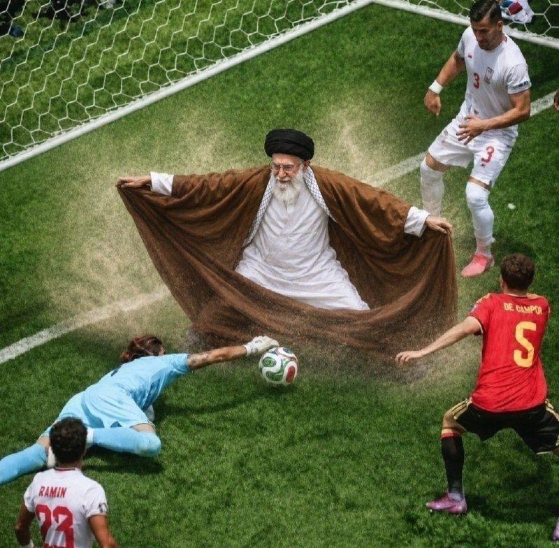

یکی اون متنه رو کامنت کنه لطفا که میگه اینقدر خندیدم از کادر خارج شدم

@IranianMinds

## IranianMinds — post 23211

حملات اوکراین به مناطقی از کریمه

اوکراین بخش‌هایی از شبه جزیره کریمه را بمباران کرد.

@IranianMinds

## BBCPersian — post 284906

🔻پاکستان: مذاکرات فنی ایران و آمریکا از هفته آینده از سرگرفته می‌شود

وزارت خارجه پاکستان اعلام کرد مذاکرات فنی آمریکا و ایران از هفته آینده از سر گرفته می‌شود، «احتمالا سه‌شنبه.»

محل این گفت‌وگوها اعلام نشده است.

با پایان مذاکرات سطح بالا در روز یکشنبه، مقام‌های عالیرتبه ایران و آمریکا سوئیس را ترک کردند اما هیئت‌های فنی مذاکرات را در روز دوشنبه ادامه دادند.

کاظم غریب‌آبادی، معاون وزیر امور خارجه ایران، سه‌شنبه با اعلام پایان دور اول مذاکرات فنی گزارش داد که مذاکره‌کنندگان تصمیم گرفته‌اند چهار کارگروه تشکیل شود برای «لغو تحریم‌ها»، «امور هسته‌ای»، «بازسازی و توسعه اقتصادی» و «نظارت و اجرا.»

کارگروه‌های فنی قرار است مسئول پیگیری جزئیات فنی تفاهم ایران و آمریکا است.

@BBCPersian

## BBCPersian — post 284905

  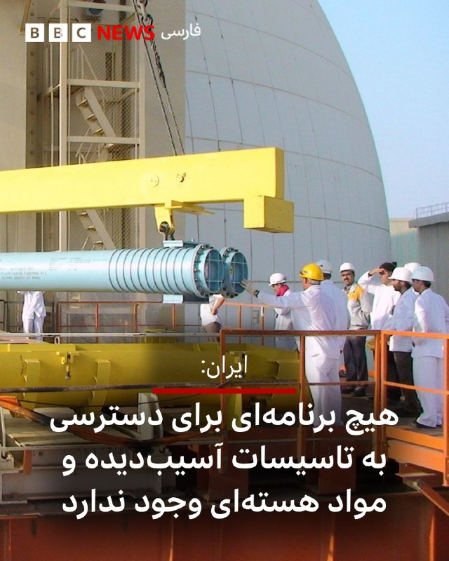

‌🔻کاظم غریب‌آبادی، معاون وزیر خارجه ایران، بار دیگر تکذیب کرد که با بازرسی آژانس از تاسیسات هسته‌ای آسیب‌دیده و مواد هسته‌ای موافقت کرده است.

آقای غریب‌آبادی در ایکس نوشت: «در سوئیس هیچ نشستی با رافائل گروسی، علیرغم درخواست وی، برگزار نشد. هیچ برنامه‌ای نیز برای دسترسی به تاسیسات مورد حمله واقع شده و مواد هسته‌ای وجود ندارد.»

او در واکنش به سخنان روزهای اخیر دونالد ترامپ و معاونش جی دی ونس نوشت: «نمی‌توانید با هیاهوی رسانه‌ای، سیاست "راه بینداز و جا بینداز" را پیش ببرید.»

ساعتی پیش از پست آقای غریب‌آبادی، رئیس آژانس بین‌المللی انرژی اتمی گفته بود که قرار است بازرسی از تاسیسات هسته‌ای ایران از سر گرفته شود اما جدول زمانی ارائه نکرد.

رافائل گروسی در ژاپن به خبرنگاران گفت که تفاهم آمریکا و ایران «به‌صراحت» بیان می‌کند که فعالیت‌های هسته‌ای «تحت نظارت آژانس بین‌المللی انرژی اتمی خواهد بود»

او گفت «چه این اتفاق امروز و چه پس‌فردا بیفتد، چه یک هفته یا ده روز دیگر، مهم است» اما مهم‌تر این است که «این اتفاق خواهد افتاد.»
ادامه از:
https://bbc.in/4uOJ8h3
📷IIPA via Getty
@BBCPersian

## BBCPersian — post 284904

🔻گروسی: بازرسی از تاسیسات هسته‌ای ایران بالاخره انجام می‌شود

رئیس آژانس بین‌المللی انرژی اتمی گفت که قرار است بازرسی از تاسیسات هسته‌ای ایران از سر گرفته شود اما جدول زمانی ارائه نکرد.

رافائل گروسی در ژاپن به خبرنگاران گفت که تفاهم آمریکا و ایران «به‌صراحت» بیان می‌کند که فعالیت‌های هسته‌ای «تحت نظارت آژانس بین‌المللی انرژی اتمی خواهد بود»

او گفت: «بدیهی است که برای انجام این کار، باید بازرسی کنیم.»

آقای گروسی گفت که درباره تاریخ و محل بازرسی بحث است و به‌زودی «با همکاری و مشارکت دولت ایران» تصمیمی گرفته خواهد شد.

او گفت «چه این اتفاق امروز و چه پس‌فردا بیفتد، چه یک هفته یا ده روز دیگر، مهم است» اما مهم‌تر این است که «این اتفاق خواهد افتاد.»

دیروز اسماعیل بقایی، سخنگوی وزارت خارجه ایران، گفت: «برنامه‌ای برای بازرسی آژانس از تاسیسات آسیب دیده ایران در جریان تجاوزات نظامی آمریکا و رژیم صهیونیستی نداریم و اساساً در این زمینه شیوه نامه‌ای وجود ندارد.»

دونالد ترامپ دیروز در شبکه اجتماعی‌اش نوشت: «ایران تمام و کمال با عالی‌ترین سطح بازرسی هسته‌ای تا آینده درازمدت موافقت کرده است. این ضامن "صداقت هسته‌ای" است.»

دو روز پیش جی‌دی‌ ونس، معاون اول رئیس‌جمهور آمریکا، هم پس از مداکره با ایران در سوئیس گفته بود که تهران با بازگشت بازرسان آژانس بین‌المللی انرژی اتمی موافقت کرده است.

موضوع بازدید از تاسیسات هسته‌ای آسیب دیده ایران از زمان پایان جنگ دوازده روزه اسرائیل با ایران و حمله آمریکا به تاسیسات هسته‌ای ایران، مطرح بوده است.

@BBCPersian

## BBCPersian — post 284903

🔻روبیو در امارات؛ اولین سفر یک مقام آمریکایی به منطقه پس از تفاهم ایران و آمریکا

مارکو روبیو با محمد بن زاید آل نهیان، رئیس دولت امارات دیدار کرد.

مارکو روبیو شامگاه سه‌شنبه وارد ابوظبی شد.

او پس از سفر به امارات به کویت و بحرین خواهد رفت و روز پنجشنبه در بحرین در نشست شورای همکاری خلیج فارس هم شرکت خواهد کرد.

این سفر به عنوان نشانه‌ای از همبستگی با سه کشوری تلقی می‌شود که ایران در جریان جنگ با به اهدافی در آنها حمله کرد. ایران می‌گوید صرفا پایگاه‌های آمریکا را در این کشورها هدف قرار داده است.

اخیرا دونالد ترامپ هم گفته بود امارات مناطقی در ایران را هدف قرار داده است.

آقای روبیو سه‌شنبه گفت قصد دارد درباره تفاهم آمریکا و ایران با رهبران کشورهای خلیج فارس گفت‌وگو کند.

او هنگام ورود به امارات هم گفت «این یک آبراه بین‌المللی است. هیچ کشوری اجازه ندارد بر آبراه بین‌المللی عوارض یا هزینه وضع کند. این بخشی از حقوق بین‌الملل موجود است.»

ایران می‌گوید تنگه هرمز آبراه بین‌المللی نیست و آب‌های سرزمینی ایران و عمان است.

این نخستین سفر یک مقام ارشد آمریکایی به خاورمیانه پس تفاهم ایران و آمریکا در هفته گذشته است.

@BBCPersian

## Dirty_Kids — post 392975

  <a href="telegram/content/Dirty_Kids_392975_1782302213.mp4" target="_blank">🎬 Download video</a>

اون زمان درجه خريت زياد بود و آگاهى نداشتن، اما حالا ماهيت اصلى اسلام را فهميدن.

@Dirty_Kids 👻

## Dirty_Kids — post 392971

  <a href="telegram/content/Dirty_Kids_392971_1782302216.mp4" target="_blank">🎬 Download video</a>

چندساعت تا پیش‌فروش محبوب‌ترین بازی جهان نمونده و حالا راکستار
🤟 اومده 68 شات جدید از کات‌سین‌ها و گیم‌پلی این بازی رو منتشر کرده :

+هنوز راک‌استار به‌صورت رسمی قیمت بازی رو اعلام نکرده و قیمت‌هایی که این روزها تو فضای مجازی دست‌به‌دست می‌شن، اعدادی هستن که بعضی فروشگاه‌ها و سایت‌ها به‌صورت خودسرانه ازخودشون منتشر کردن.

@Dirty_Kids 👻

## Dirty_Kids — post 392970

  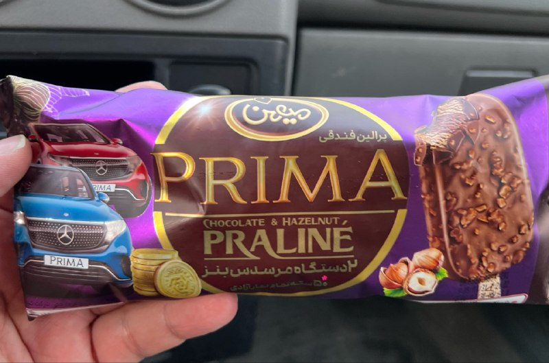

هر بار میرم از سوپر این بستنی رو می گیرم ، خانم صندوق دار تایید دو مرحله ای میگیره و ازم میپرسه : این ۲۵۰ تومنه ، اوکیه؟

@Dirty_Kids 👻

## Dirty_Kids — post 392969

  <a href="telegram/content/Dirty_Kids_392969_1782302219.mp4" target="_blank">🎬 Download video</a>

فرق ماشین بچه‌ها با مردها 😂

@Dirty_Kids 👻

## Dirty_Kids — post 392968

یه بُتی ازش ساخته بودن که

واااای، امروز انگشتر جنگ دستش کرد!
وااای امروز ایستاده سخنرانی کرد!
وااای امروز کلاش دستش گرفت!
وااای امروز پرده پشتش قهوه‌ای بود!

آخرسر انتقامشو با یه مشت یونجه عوض کردن !

@Dirty_Kids 👻

## Dirty_Kids — post 392967

  <a href="telegram/content/Dirty_Kids_392967_1782302220.mp4" target="_blank">🎬 Download video</a>

دهنت سرویس انگار اون ادای اینو در میاره😂

@Dirty_Kids 👻

## Dirty_Kids — post 392966

  

عکسی که عرزشیا بعد از سیو بیرانوند جلوی بلژیک درست کردن.

میگن این روح رهبرمون بود که اون توپو سیو کرد.

@Dirty_Kids 👻

## Dirty_Kids — post 392965

  

🔴 شرکت تسلا اعلام کرده بزودی از ربات‌هایی رونمایی می‌کنه که با خانمای مجرد رابطه جنسی برقرار کنن.

به گفته تسلا، این ربات ها به قدری کارشونو خوب انجام میدن، که خانما معتادش میشن.

با رونمایی از این رباتا، تخمین زده شده که فقط ۲۰ درصد از مردای جامعه که از همه جهت خفنن، میتونن پارتنر پیدا کنن.

@Dirty_Kids 👻

## Dirty_Kids — post 392964

  <a href="telegram/content/Dirty_Kids_392964_1782302223.mp4" target="_blank">🎬 Download video</a>

از سوال دوم گفت جانم؟😂
حاج‌آقا داشت برنامه میچید برا شب جمعه 😂

@Dirty_Kids 👻

## Dirty_Kids — post 392963

  <a href="telegram/content/Dirty_Kids_392963_1782302226.mp4" target="_blank">🎬 Download video</a>

مراد ویسی: با توجه به تضمین آمریکا، که گفته در جریان مذاکرات ۶۰ روزه مقامات رو ترور نمیکنیم، احتمالا تا ده روز آینده از مجتبی رونمایی بشه.

مجتبی قراره احتمال زیاد تو مراسم تشییع باباش شرکت کنه.
اگرم پیداش نشد، یه جای کار میلنگه و مجتبی حالا حالاها پیداش نمیشه.

@Dirty_Kids 👻

## Dirty_Kids — post 392962

  <a href="https://t.me/Dirty_Kids/392962" target="_blank">📎 Download file</a>

✈️ اپلیکیشن MelBet 
🥇

🎁 کد هدیه 100 دلاری: Sport100

🔒 برای تعیین رمز ورود حداقل از 8 کاراکتر و حروف بزرگ و کوچک انگلیسی و اعداد انگلیسی استفاده کنید، مانند Hamid120

🇮🇷 برای تغییر زبان برنامه، زبان موبایل خود را تغییر دهید.

✅ ورود به اپلیکیشن بدون فیلترشکن

## Dirty_Kids — post 392961

چرا این روزها همه سایت جهانی MelBet رو انتخاب میکنن 
⁉️

🎁 شارژ هدیه 130 دلاری اولین واریز

🎁 شارژ هدیه 100 دلاری در روز های یکشنبه و چهارشنبه

🎁 و ده ها بانس ارزنده دیگر...

🥇 متنوع ترین آپشن های ورزشی

🖥 پخش زنده مسابقات

🎮 بیش از 80 نوع ورزش مجازی با پخش زنده

⭐ کاملترین کازینو آنلاین

🛡 امنیت فوق العاده بالا

🌐 اسپانسر رسمی جام جهانی

💵 واریز آنی جوایز با بیش از 30 روش شارژ و برداشت، از جمله کارت بکارت

🎁 کد هدیه 100 دلاری: Sport100

✅ معرفی سایت و اپلیکیشن مل‌بت

💯 ورود به سایت مل‌بت (فیلترشکن خاموش)

## Dirty_Kids — post 392960

  

امروز 24 June، روزِ جهانی پری‌هاست 🧜‍♀

تو فرهنگ اروپایی، از پری‌ها به عنوان موجوداتی افسانه‌ای با بال‌های کوچیک و ظاهری زیبا یاد شده؛
ولی تو افسانه‌ها و داستان‌های کهنِ ایرانی، از پری به‌عنوان موجودی زیبا، لطیف و خوش‌یُمن یاد شده که حضورش می‌تونه خیر، برکت و زیبایی رو وارد زندگیت کنه.

+این روز رو به اون فرشته‌ی خوشگلی که با وارد شدن به زندگیت باعث خیر و برکت و قشنگی زندگیت شده، تبریک بگو.

@Dirty_Kids 👻

## Hranews — post 113824

گزارشی از قتل یک زن جوان در شهر ری

❗️
❗️
❗️
❗️
❗️– یک زن در مقابل محل کار خود در شهر ری، توسط نامزد سابقش به قتل رسید. متهم توسط نیروی انتظامی بازداشت شده است.

ادامه مطلب

↘️
@hranews_bot تماس ✉️ - @Hranews کانال هرانا 🆑

## Hranews — post 113823

  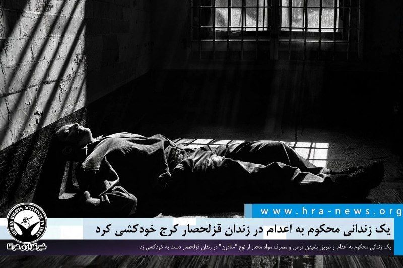

یک زندانی محکوم به اعدام در زندان قزلحصار کرج خودکشی کرد

❗️
❗️
❗️
❗️
❗️– روز دوشنبه ۱ تیرماه، یک زندانی محکوم به اعدام از طریق بلعیدن قرص و مصرف مواد مخدر در زندان قزلحصار دست به #خودکشی زد و جان خود را از دست داد.

به گزارش خبرگزاری هرانا، ارگان خبری مجموعه فعالان حقوق بشر در ایران، یک زندانی در زندان قزلحصار کرج به زندگی خود پایان داد.

هویت این زندانی، مصطفی نظامی، ساکن تهران، مجرد و حدودا ۳۳ ساله توسط هرانا احراز شده است.

#مصطفی_نظامی

ادامه مطلب

↘️
@hranews_bot تماس ✉️ - @Hranews کانال هرانا 🆑

## manototv — post 106218

  <a href="telegram/content/manototv_106218_1782302229.mp4" target="_blank">🎬 Download video</a>

روایت راه‌آهن سراسری، از رویای تجددخواهان تا پروژه‌ای که با کوشش رضاشاه، ایران را به هم پیوند زد.

## alonews — post 129998

  <a href="telegram/content/alonews_129998_1782302231.webm" target="_blank">🎬 Download video</a>

👈ترامپ: ایران به آمریکا اطلاع داده است که برخلاف گزارش‌های دروغین اخبار جعلی، «هیچ عوارض گمرکی، هیچ حق بیمه و هیچ پرداخت دیگری از هر نوعی توسط ایران برای عبور کشتی‌ها از تنگه هرمز درخواست یا دریافت نمی‌شود»

🔴اگر این اطلاعات نادرست باشد، مذاکرات فوراً متوقف خواهد شد! علاوه بر این، هیچ پولی به ایران منتقل نشده و هیچ منابعی از صندوق‌های آنها توسط آمریکا آزاد نشده است

🔴ما بخشی از پول آنها را که کاملاً تحت کنترل ماست، به کشاورزان و دامداران خود اختصاص خواهیم داد تا ذرت، گندم، سویا و سایر مواد غذایی را خریداری کنند

🔴ایران به شدت به غذا نیاز دارد و ما آن را صرفاً از ایالات متحده برای آنها خریداری خواهیم کرد.

✅ @AloNews خبر جنگ

## alonews — post 129997

  <a href="telegram/content/alonews_129997_1782302231.webm" target="_blank">🎬 Download video</a>

👈مصاحبه وزیر میراث فرهنگی با خبرنگار اسپانیایی

✅ @AloNews خبر جنگ

## alonews — post 129996

  <a href="telegram/content/alonews_129996_1782302231.mp4" target="_blank">🎬 Download video</a>

دیشب صداوسیما یه نماهنگِ سرطان پخش کرد؛
بعدش دیدن خیلی کسشر و آبرو بره، کلا گرفتن از آرشیو شبکه سه هم حذفش کردن😂😂😂

علی بیرو تو دروازه یا نیازمند ، کنارش شجاع و کنعانی میشن پدافند
تنگه هرمز ما تو دستای سعیده
شوت‌های قدوس و رامین مثل خیبرشکن، مستقیم به قلب دروازه‌ی دشمن میرن
ترابی دریبل‌زنه، نعمتی هم حامیشه، مثل هایپرسونیک از لای دفاع رد میشه
یه طرف میلاد و ازون طرف جهانبخش، پهباد شاهد رو روی دروازه میکنن پخش
حاج صفی ، حردانی و یوسفی مثل شیرن
توپ‌های علی علیپور از پاتریوت هم در میرن...

@AloSport

## alonews — post 129995

  <a href="telegram/content/alonews_129995_1782302234.webm" target="_blank">🎬 Download video</a>

👈فارن پالیسی: توافق ایران زمینه درگیری‌های بیشتری را فراهم می‌کند!

✅ @AloNews خبر جنگ

## alonews — post 129994

  <a href="telegram/content/alonews_129994_1782302234.webm" target="_blank">🎬 Download video</a>

👈گویا ایران ۱۰ فروند هواپیمای مسافربری بوئینگ ۷۷۷ به صورت دسته دوم از عربستان خریداری کرده

🔴تصویر ماهواره‌ای ادعایی از اولین فروند تحویلی است

✅ @AloNews خبر جنگ

## alonews — post 129993

  <a href="telegram/content/alonews_129993_1782302235.webm" target="_blank">🎬 Download video</a>

👈وزیر جنگ اسرائیل:
حتی اگر واشنگتن از ما بخواهد، از جنوب لبنان عقب‌نشینی نخواهیم کرد

✅ @AloNews خبر جنگ

## alonews — post 129992

  <a href="telegram/content/alonews_129992_1782302235.webm" target="_blank">🎬 Download video</a>

👈غریب آبادی: برنامه‌ای برای دسترسی به تاسیساتِ مورد حمله واقع شده و مواد هسته‌ای وجود ندارد‏

معاون وزارت امور خارجه:

🔴در سوییس هیچ نشستی با گروسی، علیرغم درخواست وی، برگزار نشد.

🔴هیچ برنامه ای نیز برای دسترسی به تاسیساتِ مورد حمله واقع شده و مواد هسته ای وجود ندارد.

🔴این مباحث صرفا در چارچوب توافق نهایی و در نتیجه اقدام عملی طرف مقابل در خاتمه تمامی تحریم ها و... بررسی و تعیین تکلیف خواهند شد.

🔴نمی توانید با هیاهوی رسانه ای، سیاست "راه بینداز و جا بینداز" را پیش ببرید.

✅ @AloNews خبر جنگ

## alonews — post 129991

  <a href="telegram/content/alonews_129991_1782302235.webm" target="_blank">🎬 Download video</a>

👈دلار با افزایش قیمت به ۱۶۵۰۰۰ تومن رسید

✅ @AloNews خبر جنگ

## alonews — post 129990

  <a href="telegram/content/alonews_129990_1782302235.webm" target="_blank">🎬 Download video</a>

👈سخنگوی پوتین: سلاح‌های هسته‌ای تنها چیزی هستند که از جهان در برابر یک جنگ جهانی محافظت می‌کنند

✅ @AloNews خبر جنگ

## alonews — post 129989

  <a href="telegram/content/alonews_129989_1782302236.webm" target="_blank">🎬 Download video</a>

👈وقوع تیراندازی در آنکارا

🔴رسانه‌ها از وقوع حادثه تیراندازی در آنکارا خبر می‌دهند

✅ @AloNews خبر جنگ

## alonews — post 129988

  <a href="telegram/content/alonews_129988_1782302236.webm" target="_blank">🎬 Download video</a>

👈ایسنا: اختلال خدمات کارت محور بانک‌های کشور برطرف شد

✅ @AloNews خبر جنگ

## alonews — post 129987

  <a href="telegram/content/alonews_129987_1782302236.webm" target="_blank">🎬 Download video</a>

👈تایید 4 سال زندان برای دو ورزشکار ایرانی در کره جنوبی به دلیل تجاوز

🔴دادگاه عالی شهر دائگو در کره جنوبی با رد درخواست تجدیدنظر، حکم چهار سال حبس دو عضو کاروان دوومیدانی ایران را که پیش‌تر در پرونده تعرض جنسی محکوم شده بودند، تأیید کرد و به این ترتیب، رأی صادرشده جنبه قطعی پیدا کرد.

✅ @AloNews خبر جنگ

## alonews — post 129986

  <a href="telegram/content/alonews_129986_1782302237.webm" target="_blank">🎬 Download video</a>

👈رسایی: تاسوعا رو تسلیت عرض میکنم

✅ @AloNews خبر جنگ

## alonews — post 129985

  <a href="telegram/content/alonews_129985_1782302237.mp4" target="_blank">🎬 Download video</a>

👈سرباز روسی که با پهپاد اوکراینی روبه‌رو شده بود، از اپراتور درخواست کرد که اول دوست کنارش رو بزنه تا بتونه سیگارشو قبل مرگ تموم کنه

🔴 اپراتور پهپاد درخواستش رو قبول میکنه، اول سرباز دیگه رو میزنه و بعد سربازی که درخواست کرده بود رو میزنه

✅ @AloNews خبر جنگ

## alonews — post 129984

  <a href="telegram/content/alonews_129984_1782302239.webm" target="_blank">🎬 Download video</a>

👈بعضیا هیئت عزاداری سیدالشهدا رو به میتینگ سیاسی تبدیل کردن تا به امیال خودشون برسن

تف

✅ @AloNews خبر جنگ

## alonews — post 129983

  <a href="telegram/content/alonews_129983_1782302240.mp4" target="_blank">🎬 Download video</a>

👈بند دوم تفاهم‌نامه نقض شد

🔴شعار مرگ بر آمریکا در حسینه زنجان

✅ @AloNews خبر جنگ

## alonews — post 129982

  <a href="telegram/content/alonews_129982_1782302242.webm" target="_blank">🎬 Download video</a>

👈اینم یه عزاداری زیبای دیگه

از خون جوانان وطن لاله دمیده🥀

✅ @AloNews

---
📅 بروزرسانی: 1405/04/03 12:31
---

## VahidOOnLine — post 247101

  <a href="telegram/content/VahidOOnLine_247101_1782291660.mp4" target="_blank">🎬 Download video</a>

⭕️قالیباف: خاتمه جنگ در لبنان به اندازه خاتمه جنگ در ایران برای ما اهمیت دارد

♦️محمدباقر قالیباف، رئیس مجلس و مذاکره کننده ارشد جمهوری اسلامی روز چهارشنبه سوم تیرماه در نشست اتحادیه مجالس کشورهای اسلامی گفت آتش‌بس و خاتمه جنگ در لبنان به‌اندازه آتش‌بس و خاتمه جنگ در ایران برای ما مهم است.
پیش از این، عباس عراقچی قبل از امضای تفاهم‌نامه پایان جنگ و در پاسخ به انتقادهای دولت و رئیس جمهوری لبنان به دخالت تهران در جنگ حزب‌الله با اسرائیل گفته بود اگر ما قرار بود کاری به لبنان نداشته باشیم، خیلی قبل‌تر از این با آمریکا به تفاهم می‌رسیدیم.
‌🇸🇦 Indypersian

🤖 @VahidOOnLine

## VahidOOnLine — post 247100

  

کامران غضنفری، نماینده تهران در مجلس، به سایت دیده‌بان ایران گفت: «قالیباف به صورت خودسرانه اقدام به تعطیلی صحن علنی مجلس کرده و امیدواریم قبل از اینکه نمایندگان متحصن شوند، سر عقل بیاید و مجلس را باز کند.»

غضنفری در پاسخ به این سوال که چند نماینده در تحصن مقابل مجلس شرکت می‌کنند، گفت: «فعلا تقریبا ۴۰ نفر از نمایندگان بیانیه تحصن را امضا کرده‌اند و احتمالا امضاهای این بیانیه بیشتر خواهد شد.»
iranintl
‌🏁 🇬🇧 IranintlTV

🤖 @VahidOOnLine

## VahidOOnLine — post 247099

  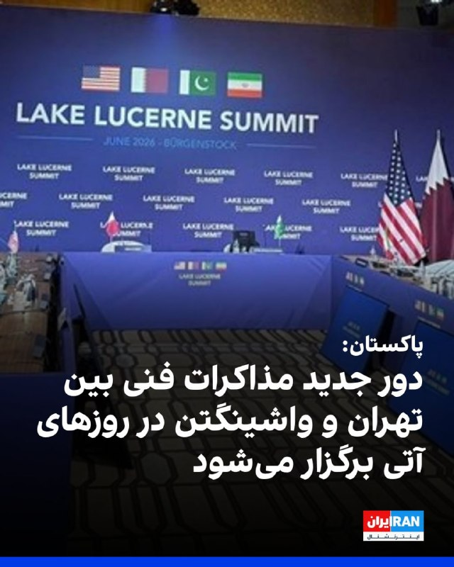

سخنگوی وزارت خارجه پاکستان، اعلام کرد مذاکره‌کنندگان ارشد ایران و آمریکا به‌طور منظم به کمیته عالی‌رتبه گزارش خواهند داد و کارگروه‌های تخصصی را هدایت خواهند کرد.

او افزود طرف‌ها درباره ایجاد سازوکار کاهش تنش توافق کرده‌اند و دولت لبنان و میانجی‌ها اجرای آن را تسهیل خواهند کرد.

سخنگوی وزارت خارجه پاکستان گفت: «دور جدید مذاکرات فنی بین تهران و واشینگتن در روزهای آتی برگزار می‌شود.»
iranintl
‌🏁 🇬🇧 IranintlTV

🤖 @VahidOOnLine

## VahidOOnLine — post 247098

  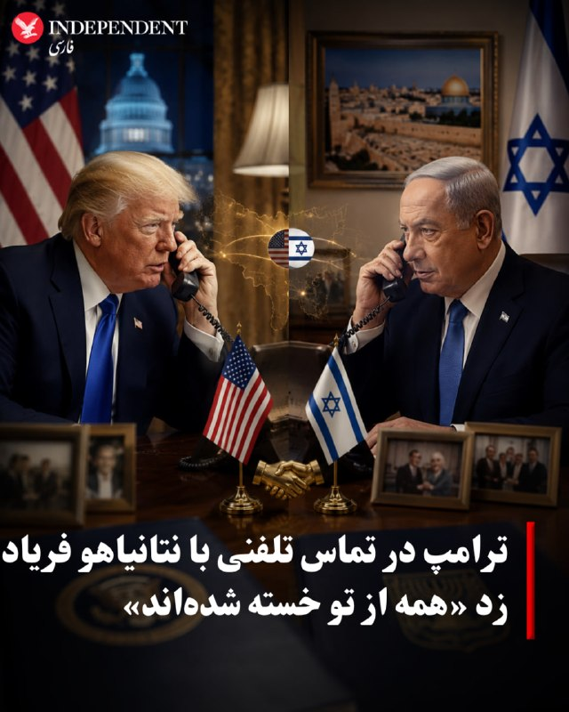

♦️جزئیات تازه‌ای از تنش‌های پنهان میان دونالد ترامپ، رئیس‌جمهوری آمریکا، و بنیامین نتانیاهو، نخست‌وزیر اسرائیل، در کتابی جدید منتشر شده که از یک تماس تلفنی پرتنش میان دو رهبر پرده برمی‌دارد.
بر اساس کتاب «تغییر حکومت» (Regime Change) نوشته مگی هابرمن و جاناتان سوان، این تماس در سال گذشته و تنها چند روز پیش از اعلام توافق آتش‌بس در غزه و تبادل گروگان‌ها انجام شده بود. نویسندگان کتاب می‌گویند ترامپ در این مکالمه با لحنی تند نتانیاهو را مورد سرزنش قرار داد و حتی به او توهین کرد.
به نوشته این کتاب، ترامپ در حضور جرد کوشنر، داماد و مشاور سابق خود، و استیو ویتکاف، فرستاده ویژه کاخ سفید، خطاب به نتانیاهو گفت: «همه از تو خسته شده‌اند، بی‌بی. همه یهودیان از تو خسته شده‌اند؛ حتی همین دو یهودی حاضر در تماس هم از تو خسته شده‌اند».

این افشاگری در شرایطی منتشر می‌شود که روابط میان ترامپ و نتانیاهو بار دیگر بر سر تفاهم‌نامه اخیر آمریکا و ایران و همچنین اختلافات مربوط به جنگ لبنان دچار تنش شده است.
‌🇸🇦 Indypersian

🤖 @VahidOOnLine

## VahidOOnLine — post 247097

♦️رافائل گروسی، مدیرکل آژانس بین‌المللی انرژی اتمی روز چهارشنبه سوم تیر اعلام کرد براساس تفاهم‌نامه پایان جنگ میان جمهوری اسلامی و آمریکا، بازرسان آژانس به زودی از تاسیسات هسته‌ای ایران بازدید خواهند کرد.

گروسی که به ژاپن سفر کرده به تلویزیون دولتی این کشور گفت: «ما به‌زودی درباره جزئیات اجرایی، از جمله زمان‌بندی‌ها، رویه‌ها و محل‌های بازرسی کار خواهیم کرد و این بازرسی‌ها قطعا انجام خواهند شد.
البته این روند در همکاری و هماهنگی کامل با دولت ایران انجام می‌شود و هیچ تردیدی ندارم که قادر خواهیم بود آن را عملی کنیم.»
‌🇸🇦 Indypersian

🤖 @VahidOOnLine

## VahidOOnLine — post 247096

🗣روایت شما از بحران اقتصادی و زندگی بعد از توافق- چهارشنبه ۳ تیر:

🔹من مریض روماتیسم مفصلی هستم. ۲۵ میلیون تومان هزینه داروهایم شده است. کارگری هستم که ۱۵ میلیون تومان حقوق می‌گیرم و اجاره‌خانه و باقی خرج‌ها را هم باید بدهم. چطور باید ادامه بدهم؟ مثل من بسیار هست. فقط خدا به داد ما برسد.

🔹از قزوین پیام می‌دهم؛ اوضاع ما واقعا خوب نیست. گرانی شدید و ترسناک است. دلم برای آینده تباهی که در پیش داریم، می‌سوزد. واقعا زندگی در ایران طاقت فرساست.

🔹در کلاردشت مازندران قیمت یک نان سنگک آزادپز شده ۸۰ هزار تومان و سفارشی را با قیمت ۱۶۰ هزار تومان می‌پزند.

🔹سازمان تامین اجتماعی افزایش حقوق مستمری‌بگیران را ۶۰ درصد اعلام کرده بود، ولی از تمام مستمری‌بگیرانی که سرپرست خانواده فوت کرده است مبلغ ۲ میلیون و ۵۰۰ هزار تومان تحت عنوان حق عائله‌مندی کم کرده، یا در واقع دزدیده است.

🔹من نیروی شرکتی بانک رفاه کارگران هستم. از ابتدای سال ۱۴۰۵ تا الان که وارد تیر شدیم، معوقات ما را نداده‌اند، هیچ‌کس هم پاسخگو نیست.

🔹در کتاب‌های دینی می‌گویند امام علی زندگیِ ساده‌ای داشت و بیشتر شیر و خرما می‌خورد؛ امروز قیمت یک پاکت شیر با ۵ عدد خرما می‌شود ۵۳۰ هزار تومان؛ ۴ بار همین چرخه را تکرار کنی باید ۲ میلیون تومان برای این خوراک «ساده» هزینه کنی.

🔹در جنوب چه امکاناتی وجود دارد؟ نه آب کافی هست و نه برق؛ در این گرمای شدید روزی چند ساعت برق را قطع می‌کنند. بنزین هم به‌سختی پیدا می‌شود، در حالی که بخش بزرگی از سوخت کشور از همین بنادر تامین می‌شود.

🔹با آغاز تابستان و ثبت دمای بالای ۵۰ درجه در خوزستان، قطعی‌های برنامه‌ریزی‌شده برق هم آغاز شده و برق استانی که ۲ برابر نیاز خودش را تولید می‌کند، هر روز قطع می‌شود. این هم از زیرساخت انرژی که سنگش را برخی به سینه می‌زدند.
‌🏁 🇬🇧 IranintlTV

🤖 @VahidOOnLine

## VahidOOnLine — post 247095

  

محمدباقر قالیباف، رییس مجلس، در سخنرانی خود در اجلاس اتحادیه مجالس کشورهای عضو سازمان همکاری اسلامی در باکو گفت: «تفاهم اسلام‌آباد نه نتیجه فشار و اجبار، بلکه حاصل مقاومت ایران بود و این تفاهم‌نامه تبدیل به اعلامیه شکست آمریکا شد.»

رییس مجلس افزود امنیت منطقه باید به دست خود کشورهای منطقه تامین شود و اقتصاد و توسعه باید برای همه ملت‌های منطقه باشد.

قالیباف گفت: «جمهوری اسلامی دست برادری و همکاری به سوی همه کشورهای منطقه دراز می‌کند و در میانه جنگ اخیر هم اعلام کردیم آماده برقراری توافقات امنیتی با همه کشورهای منطقه هستیم.»
‌🏁 🇬🇧 IranintlTV

🤖 @VahidOOnLine

## VahidOOnLine — post 247094

  

محمدباقر قالیباف، رییس مجلس، در اجلاس اتحادیه مجالس کشورهای عضو سازمان همکاری اسلامی در باکو گفت: «مقاومت ملت ایران نشان داد که دوران تحمیل اراده بر ملت‌های مستقل پایان یافته است.»

قالیباف افزود تفاهم اسلام‌آباد تبدیل به اعلامیه شکست آمریکا شد و تفاهم اسلام‌آباد نه نتیجه فشار و اجبار، بلکه حاصل مقاومت ایران بود.

قالیباف درباره مسئله لبنان گفت: «آتش‌بس و پایان جنگ در لبنان، به اندازه آتش‌بس و پایان جنگ در ایران برای ما مهم است.»

او همچنین افزود فلسطین صرفا یک مسئله سیاسی و دیپلماتیک نیست و نمی‌توان از کنار آن به سادگی گذشت.
‌🏁 🇬🇧 IranintlTV

🤖 @VahidOOnLine

## VahidOOnLine — post 247093

  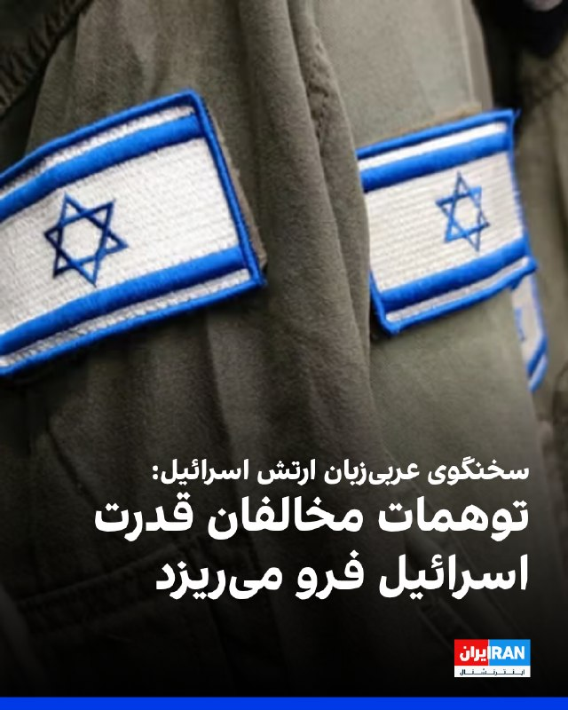

آویخای ادرعی، سخنگوی عربی‌زبان ارتش اسرائیل، در واکنش به اظهارات نعیم قاسم، دبیرکل حزب‌الله لبنان درباره عدم توان اسرائیل در میدان، با انتشار پستی در شبکه ایکس نوشت: «اسرائیل شکست نمی‌خورد و همه توهمات مخالفانش درباره قدرت این کشور فرو می‌ریزد.»

او خطاب به نعیم قاسم افزود شما از توان نظامی، اطلاعاتی و فناوری اسرائیل آگاه بودید، اما با دستورهای جمهوری اسلامی خود را به این ورطه انداختید.

آویخای ادرعی در ادامه نوشت توهم «خانه سست» از بین رفته و اسرائیل به از بین بردن این توهمات ادامه می‌دهد.
‌🏁 🇬🇧 IranintlTV

🤖 @VahidOOnLine

## VahidOOnLine — post 247092

  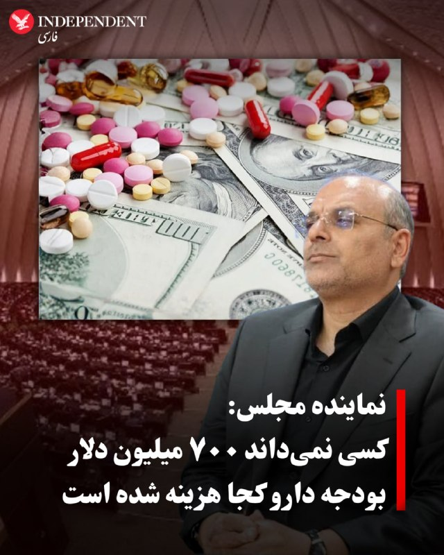

⭕️نماینده مجلس: کسی نمی‌داند ۷۰۰ میلیون دلار بودجه دارو کجا هزینه شده است

♦️روح‌الله لک‌علی‌آبادی، عضو کمیسیون بهداشت و درمان مجلس، صبح چهارشنبه از نامشخص بودن سرنوشت ۷۰۰ میلیون دلار از منابع اختصاص‌یافته برای تامین دارو و تجهیزات پزشکی خبر داد و گفت «توضیحات ارائه‌شده از سوی سازمان غذا و دارو نتوانسته نمایندگان را قانع کند».

به گفته او، یک میلیارد دلار از صندوق توسعه ملی برای تامین نیازهای دارویی و پزشکی کشور اختصاص یافته بود، اما مسئولان تنها درباره نحوه مصرف حدود ۳۰۰ میلیون دلار توضیح داده‌اند و هنوز گزارشی روشن درباره ۷۰۰ میلیون دلار باقی‌مانده ارائه نشده است.

لک‌علی‌آبادی جلسه اخیر کمیسیون بهداشت با مدیران سازمان غذا و دارو را «پرتنش و چالشی» توصیف کرد و گفت: «نمایندگان خواستار ارائه گزارش دقیق از نحوه هزینه‌کرد این منابع شده‌اند».

 او افزود: قرار است مسئولان این سازمان در جلسه‌ای دیگر برای ارائه توضیحات تکمیلی در مجلس حاضر شوند.

این نماینده مجلس در حالی از ابهام در سرنوشت منابع دارویی سخن می‌گوید که همزمان گزارش‌هایی از افزایش شدید هزینه‌های درمان، کمبود برخی داروهای حیاتی و کاهش پوشش بیمه‌ای در نقاط مختلف ایران منتشر شده است.
به گفته او، کمبود داروهایی مانند انسولین و برخی داروهای سرطان به یکی از نگرانی‌های جدی بیماران تبدیل شده است.

لک‌علی‌آبادی در ادامه تاکید کرد، موضوع دارو مستقیما با سلامت و جان مردم در ارتباط است و نمی‌توان با وعده و توضیحات کلی از کنار آن عبور کرد. در صورت اثبات هرگونه قصور یا تخلف در این پرونده، کمیسیون بهداشت مجلس موضوع را تا روشن شدن ابعاد آن پیگیری خواهد کرد.
‌🇸🇦 Indypersian

🤖 @VahidOOnLine

## VahidOOnLine — post 247091

  <a href="telegram/content/VahidOOnLine_247091_1782291670.mp4" target="_blank">🎬 Download video</a>

بعد از کشتار ۱۸ و ۱۹ دی، بسیاری از ایرانیان با یک سؤال دردناک روبه‌رو هستند: اگر رژیمی حاضر است برای ماندن، مردم را در خیابان بکشد، مردم چگونه می‌توانند با آن مقابله کنند؟
‌🏁 🇬🇧 ManotoTV

🤖 @VahidOOnLine

## VahidOOnLine — post 247090

  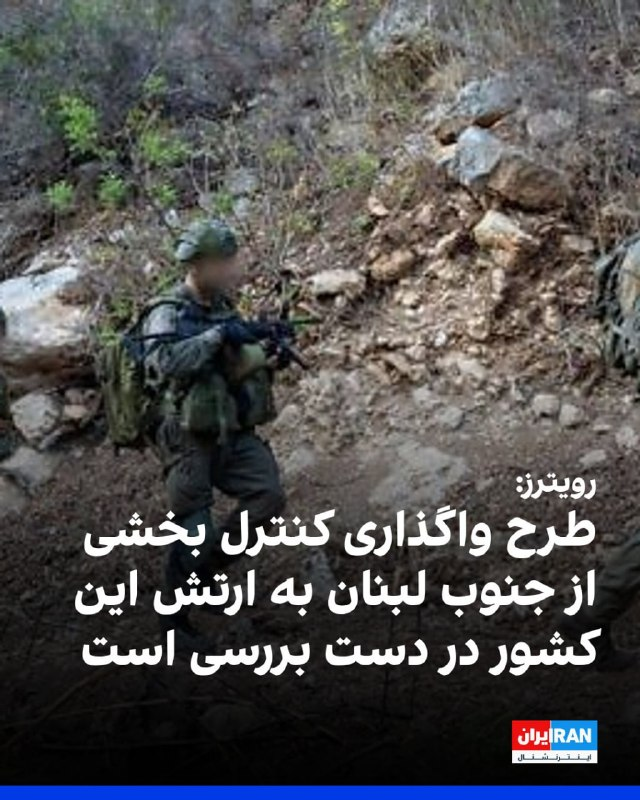

به گزارش رویترز، اسرائیل و لبنان در حال بررسی یک طرح آزمایشی با حمایت آمریکا هستند که بر اساس آن، کنترل بخشی از مناطق جنوب لبنان از نیروهای اسرائیلی به ارتش لبنان واگذار می‌شود.

سه مقام اسرائیلی گفتند: «نیروهای لبنانی مشارکت‌کننده در این طرح، تحت آموزش و ارزیابی آمریکا قرار می‌گیرند تا ارتباطی با حزب‌الله نداشته باشند.»

در این گزارش آمده است که اسرائیل در چارچوب طرح مورد بحث با لبنان، حضور نظامی خود را در منطقه حائل جنوب لبنان حفظ خواهد کرد.
iranintl
‌🏁 🇬🇧 IranintlTV

🤖 @VahidOOnLine

## VahidOOnLine — post 247089

⭕️«بچه‌ها دانه دانه به زمین می‌افتادند»؛ روایت ضبط‌کننده ویدیوهای کشتار وکیل‌آباد مشهد

📌یکی از دردناک‌ترین مشاهدات او از زنی است که شامگاه ۱۸ دی در محدوده بلوار سجاد و نزدیکی برج آرمیتاژ هدف گلوله قرار گرفت

♦️بیش از پنج ماه پس از اعتراضات ملی دی‌ماه ۱۴۰۴، محمد شریف، کافه‌دار ۴۷ ساله اهل مشهد که ویدیوهای ارسالی او برای ایندیپندنت فارسی از تجمع‌های مردمی گسترده و تیراندازی مستقیم نیروهای حکومتی در روزهای ۱۸ و ۱۹ دی بازتابی جهانی داشت، پس از خروج از ایران و رسیدن به آلمان، در گفتگو با ایندیپندنت فارسی مشاهداتش را از شب‌های خونین مشهد، بازداشت و روزهای پس از آن شرح داده است.

بیشتر بخوانید...

امیرحسین میراسماعیلی
‌🇸🇦 Indypersian

🤖 @VahidOOnLine

## VahidOOnLine — post 247088

  

کامران غضنفری، نماینده تهران در مجلس، ضمن انتقاد از تداوم تعطیلی صحن علنی، به خبرگزاری ایلنا گفت که قالیباف طی چهار ماه گذشته بدون هیچ مبنای قانونی از برگزاری جلسات علنی جلوگیری کرده است.

این نماینده مجلس، وجود مصوبه شورای عالی امنیت ملی برای تعطیلی مجلس را «دروغ» خواند و گفت تعطیلی صحن با هدف جلوگیری از مخالفت نمایندگان با روند مذاکرات و پذیرش آتش‌بس صورت گرفته است.

او ادامه داد: «نمایندگان هم از یکی دو ماه پیش از قالیباف خواسته‌اند که اگر چنین مصوبه‌ای وجود دارد، آن را به ما نشان دهید، اما او هیچ چیزی نشان نداده است. بنابراین، این ادعا کاملا کذب و دروغ است.»
iranintl
‌🏁 🇬🇧 IranintlTV

🤖 @VahidOOnLine

## VahidOOnLine — post 247087

  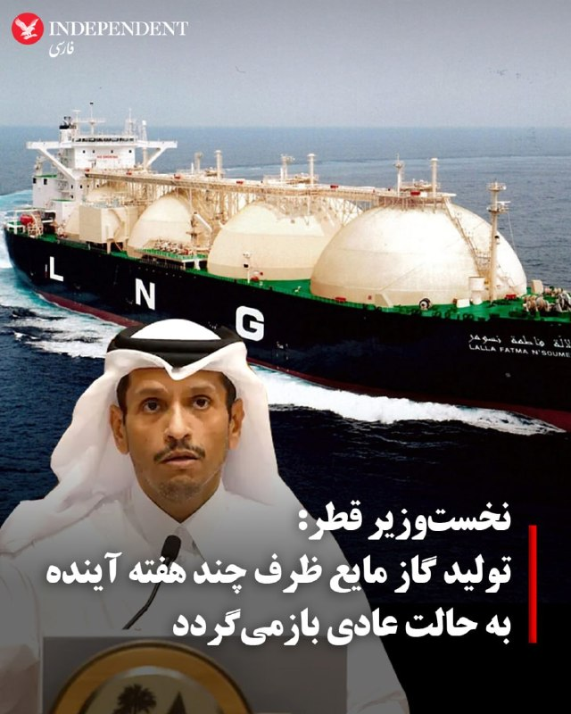

♦️محمد بن عبدالرحمن آل‌ثانی، نخست‌وزیر قطر روز چهارشنبه سوم تیرماه اعلام کرد که تولید گاز طبیعی مایع این کشور ظرف چند هفته آینده به وضعیت عادی بازخواهد گشت.

او در گفتگو با روزنامه فایننشال تایمز همچنین گفت: «ایجاد یک خط ارتباطی مستقیم میان آمریکا و جمهوری اسلامی ایران برای بازگشایی تنگه هرمز ضروری است.»

»قطرانرژی» شرکت اصلی تولید گاز طبیعی مایع قطر پس از آغاز جنگ آمریکا و اسرائیل با جمهوری اسلامی ایران و در پی حملات پهپادی به مجتمع گازی «رأس لفان» در ۲۸ اسفند، تولید گاز طبیعی مایع را متوقف کرده بود. ارتش و سپاه پاسداران جمهوری اسلامی پس از بمباران مجتمع پتروشیمی پارس جنوبی، با موشک و پهپاد مجتمع راس لفان را هدف قرار دادند.
‌🇸🇦 Indypersian

🤖 @VahidOOnLine

## VahidOOnLine — post 247086

⭕️«بچه‌ها دانه دانه به زمین می‌افتادند»؛ روایت ضبط‌کننده ویدیوهای کشتار وکیل‌آباد مشهد

📌یکی از دردناک‌ترین مشاهدات او از زنی است که شامگاه ۱۸ دی در محدوده بلوار سجاد و نزدیکی برج آرمیتاژ هدف گلوله قرار گرفت

♦️بیش از پنج ماه پس از اعتراضات ملی دی‌ماه ۱۴۰۴، محمد شریف، کافه‌دار ۴۷ ساله اهل مشهد که ویدیوهای ارسالی او برای ایندیپندنت فارسی از تجمع‌های مردمی گسترده و تیراندازی مستقیم نیروهای حکومتی در روزهای ۱۸ و ۱۹ دی بازتابی جهانی داشت، پس از خروج از ایران و رسیدن به آلمان، در گفتگو با ایندیپندنت فارسی مشاهداتش را از شب‌های خونین مشهد، بازداشت و روزهای پس از آن شرح داده است.

بیشتر بخوانید...

امیرحسین میراسماعیلی
‌🇸🇦 Indypersian

🤖 @VahidOOnLine

## VahidOOnLine — post 247085

  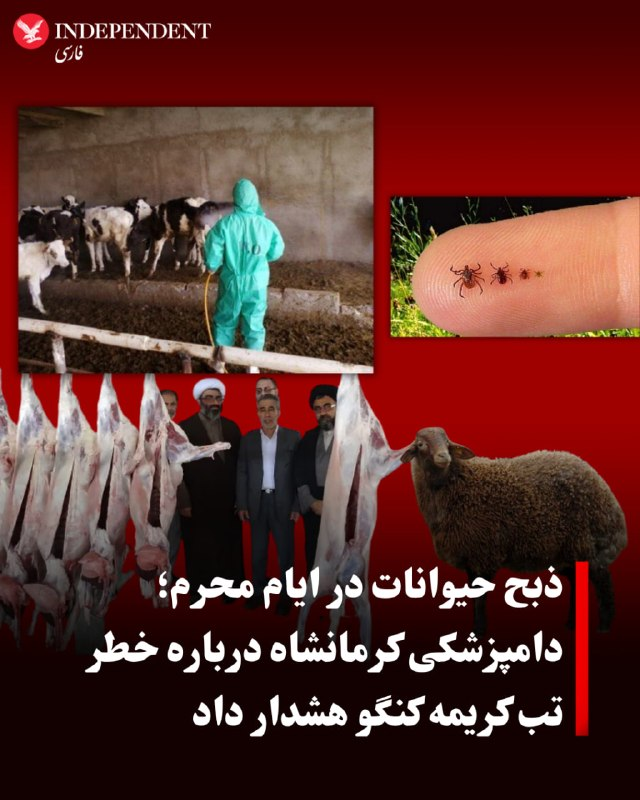

⭕️ذبح حیوانات در ایام محرم؛ دامپزشکی کرمانشاه درباره خطر تب کریمه کنگو هشدار داد

♦️رامین سمیعیان، مدیرکل دامپزشکی استان کرمانشاه روز سه‌شنبه دوم تیرماه و همزمان با افزایش ذبح دام در ایام تاسوعا و عاشورا، نسبت به خطر شیوع تب منجر به خونریزی‌ کریمه کنگو هشدار داد و از شهروندان خواست اصول بهداشتی را در خرید، نگهداری و ذبح دام رعایت کنند.

سمیعیان گفت: «تب کریمه کنگو یک بیماری ویروسی مشترک بین انسان و دام است که عمدتا از طریق کنه‌های آلوده به دام منتقل می‌شود».
به گفته او، انسان نیز ممکن است در اثر تماس با خون، ترشحات یا بافت دام آلوده به این بیماری مبتلا شود.

او تاکید کرد، برای کاهش خطر انتقال بیماری، ذبح دام باید در کشتارگاه‌های مجاز و تحت نظارت دامپزشکی انجام شود و شهروندان از خرید دام از مراکز غیرمجاز خودداری کنند.
‌🇸🇦 Indypersian

🤖 @VahidOOnLine

## VahidOOnLine — post 247084

  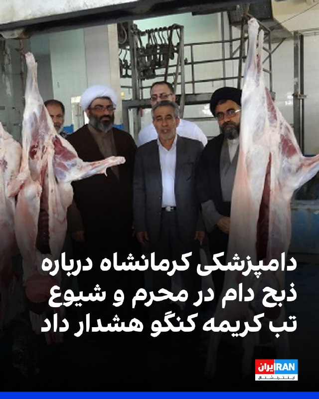

مدیرکل دامپزشکی استان کرمانشاه با اشاره به افزایش ذبح دام در محرم، نسبت به خطر انتقال بیماری تب خونریزی‌دهنده کریمه کنگو هشدار داد و بر رعایت اصول بهداشتی در خرید، نگهداری و ذبح دام تاکید کرد.

رامین سمیعیان در گفت‌وگو با ایسنا، همزمان با فرارسیدن تاسوعا و عاشورا، گفت که رعایت نکات بهداشتی در فرآیند خرید و ذبح دام برای پیشگیری از انتقال بیماری‌های مشترک بین انسان و دام، به‌ویژه تب کریمه کنگو، ضروری است.

او افزود تب کریمه کنگو یک بیماری ویروسی مشترک بین انسان و دام است که عمدتا از طریق کنه‌های آلوده به دام منتقل می‌شود و انسان نیز ممکن است در اثر تماس با خون، ترشحات یا بافت دام آلوده به این بیماری مبتلا شود.
‌🏁 🇬🇧 IranintlTV

🤖 @VahidOOnLine

## WithYashar — post 15706

آژانس ایمنی هوانوردی اروپا به شرکت‌های هواپیمایی توصیه کرد همچنان از پرواز در حریم هوایی ایران خودداری کنند.
@withyashar

## WithYashar — post 15705

رویترز: قراردادهای آتی نفت خام برنت به ۷۵.۷۴ دلار کاهش یافت که پایین‌ترین سطح آن از ۲۷ فوریه گذشته است
@withyashar

## WithYashar — post 15704

  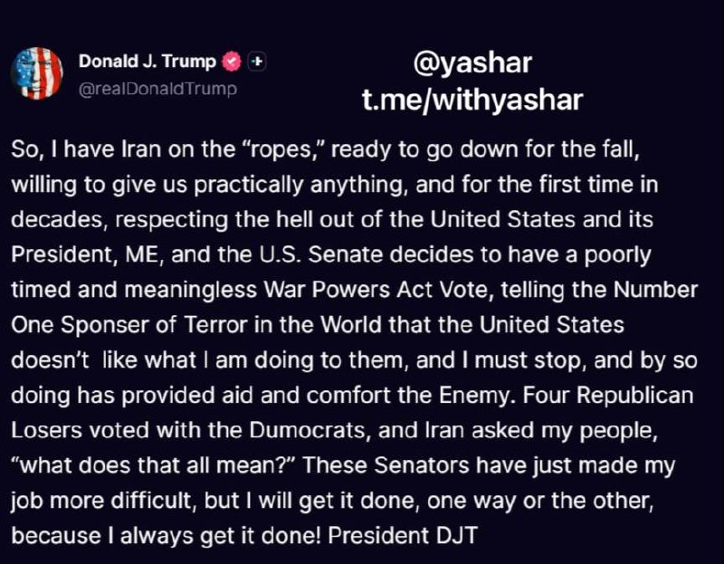

ترامپ‌ در تروث ‌: ایران رو کاملاً تحت فشار گذاشته بودم؛ در آستانه عقب‌نشینی بود، حاضر بود تقریباً هر چیزی که ما می‌خواستیم رو قبول کنه و واسه اولین بار تو چند دهه گذشته، احترام فوق‌العاده‌ای برای آمریکا و رئیس‌جمهورش، یعنی من، قائل شده بود.
ولی سنای آمریکا تصمیم گرفت تو بدترین زمان ممکن، یه رأی‌گیری بی‌معنی درباره قانون اختیارات جنگی (War Powers Act) برگزار کنه؛ رأی‌گیری‌ای که به بزرگ‌ترین حامی تروریسم تو جهان این پیام رو میده که آمریکا از کاری که من با اونا می‌کنم، راضی نیست و باید متوقفش کنم.
با این کار، عملاً به دشمن کمک کردن و دلگرمی دادن.
این سناتورها فقط کار من رو سخت‌تر کردن، ولی به هر شکلی که شده، کار رو به سرانجام می‌رسونم؛ چون من همیشه کارها رو به نتیجه می‌رسونم!
@withyashar

## WithYashar — post 15703

هم اکنون دلار در تهران به صورت ناگهانی از 165هزار تومان عبور کرد.
@withyashar 🚨

## WithYashar — post 15702

  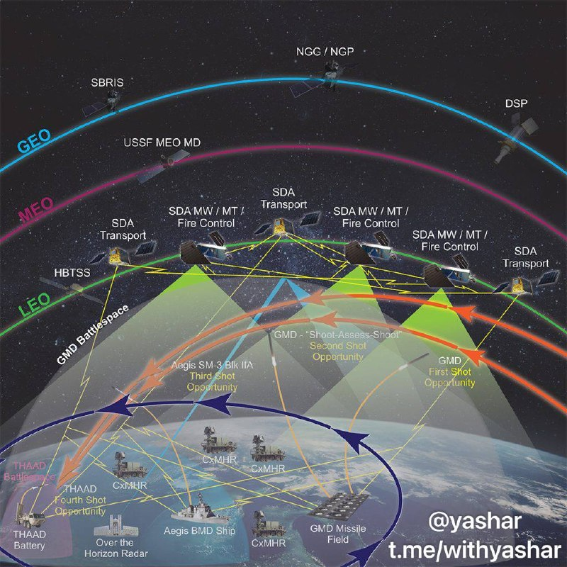

هگست: اولین آزمایش سامانه پدافندی جدید «گنبد طلایی»، با موفقیت انجام شد @withyashar

## WithYashar — post 15701

هگست: اولین آزمایش سامانه پدافندی جدید «گنبد طلایی»، با موفقیت انجام شد
@withyashar

## WithYashar — post 15700

پاکستان: مذاکرات فنی میان آمریکا و ایران هفته آینده از سر گرفته خواهد شد.
@withyashar

## WithYashar — post 15699

  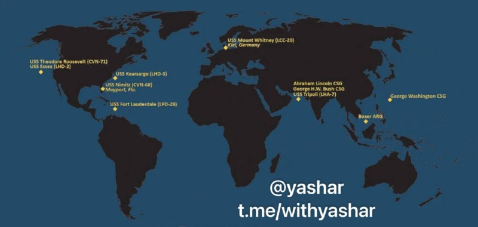

آخرین بروزرسانی از استقرار ناوهای نیروی دریایی آمریکا:
در منطقه سنتکام، دو ناوگروه لینکلن و بوش به همراه ناو آبی‌ـ‌خاکی تریپولی همچنان در منطقه حضور دارند و بخش عمده توان رزمی دریایی آمریکا را تشکیل می‌دهند.
دست‌کم ۱۷ فروند ناوشکن از کلاس آرلی برک نیز در دریای عرب، دریای سرخ و شرق مدیترانه حضور دارند که توان قابل توجهی در اختیار نیروی دریایی آمریکا قرار می‌دهند.
در غرب اقیانوس آرام، ناو هواپیمابر واشینگتن نخستین گشت عملیاتی خود در سال ۲۰۲۶ را در دریای فیلیپین آغاز کرده و ناو آبی‌ـ‌خاکی باکسر نیز در دریای چین جنوبی مشغول فعالیت است.
@withyashar

## WithYashar — post 15698

رافائل گروسی، مدیرکل آژانس بین‌المللی انرژی اتمی: از تأسیسات هسته‌ای ایران بازرسی خواهیم کرد
ما معتقدیم که بازرسی از تأسیسات هسته‌ای ایران در اسرع وقت بهترین گزینه است
اولویت اصلی ما مشخص کردن محل ذخایر اورانیوم غنی‌شده با خلوص بالای ایران است.
ما از محل اورانیوم غنی‌شده با خلوص بالا اطلاع داریم، اما مهم است که ایران ما را از آن مطلع کند.
به زودی با ایران برای تعیین تاریخ بازرسی‌ها و جزئیات مربوطه مذاکره خواهیم کرد
آژانس ما بازرسی را انجام خواهد داد و این به تهران بستگی دارد که واشنگتن یا ناظران دیگر را دعوت کند.
@withyashar

## WithYashar — post 15697

WarRoom with YASHAR pinned «دوستان، زیر چنل تبلیغاتی از افرادی می‌آید که در بازارهای مالی شرکت دارند. اینها از طرف خود تلگرام است. حتی اگر من هم تبلیغی بگذارم، دلیل برای این که شما جایی پولی پرداخت کنید و تایید من باشد نیست. به هیچ وجه این کار را در هیچ شرایطی در هیچ کجای اینترنت انجام…»

## WithYashar — post 15696

  <a href="telegram/content/WithYashar_15696_1782291681.mp4" target="_blank">🎬 Download video</a>

پست جدید ترامپ که توی پیجش قرار داده و مضمونش بر اینه که هیچوقت نمیزارم جمهوری اسلامی به سلاح هسته‌ای دست پیدا کنه
@withyashar

## mwarmonitor — post 11441

  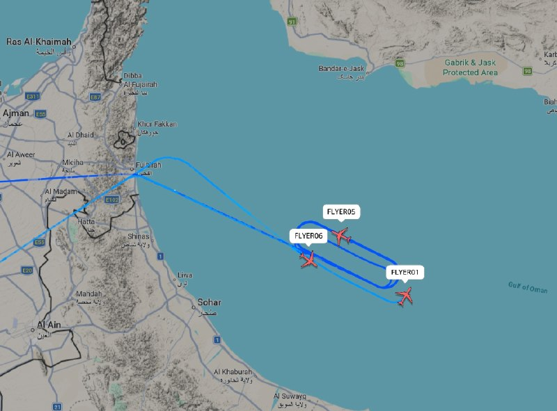

✈️رصد ۳ فروند تانکر سوخت‌رسان KC-46A Pegasus ارتش آمریکا در دریای عمان

🔵طبق تصویر رادار پروازی سه فروند هواپیمای سوخت‌رسان Boeing KC-46A Pegasus متعلق به نیروی هوایی ایالات متحده با کال‌ساین‌های FLYER01، FLYER05 و FLYER06 در حال انجام عملیات گشت‌زنی و پرواز دایره‌ای (Holding Pattern) در حریم هوایی بین‌المللی دریای عمان مشاهده شده‌اند.

🟡این تانکرهای استراتژیک پس از برخاستن از پایگاهی در امارات متحده عربی ، در موقعیتی مابین سواحل جاسک ایران و صحار عمان مستقر شده‌اند. حضور هم‌زمان سه فروند از این سوخت‌رسان‌های نسل جدید در یک الگو، نشان‌دهنده پشتیبانی هوایی سنگین و مداوم از جنگنده‌ها یا گشت‌های دریایی ارتش آمریکا در منطقه است.

@mwarmonitor

## mwarmonitor — post 11440

💢 آژانس ایمنی هوانوردی اتحادیه اروپا (EASA) اعلام کرد با وجود توافق چارچوبی میان واشنگتن و تهران، خطوط هوایی باید همچنان از حریم هوایی ایران، عراق و لبنان اجتناب کنند و در سراسر منطقه احتیاط داشته باشند، زیرا احتمال نقض‌های امنیتی همچنان وجود دارد.

@mwarmonitor

## mwarmonitor — post 11439

🔴رئیس ستاد کل ارتش اسرائیل، «زَمیر»، دیروز با خاخام‌های جریان صهیونیسم دینی دیدار کرد و هشدار داد که ارتش اسرائیل با کمبود هزاران نیروی رزمی مواجه است و خواستار مشارکت گسترده‌تر همه اقشار جامعه در خدمت نظامی شد.

🔴در این دیدار، رئیس ستاد کل گفت که گسترش حضور زنان در یگان‌های رزمی اهمیت عملیاتی بسیار بالایی دارد، اما تأکید کرد که این روند کاملاً مطابق با دستورالعمل خدمت مشترک اجرا خواهد شد و به حفظ احترام سربازان مذهبی نیز توجه می‌شود.

🔴در مقابل، خاخام‌ها نیز مشکلات سربازان مذهبی را با او در میان گذاشتند و خواستار این شدند که امکان خدمت برای آن‌ها مطابق با نظام ارزشی و اعتقاداتشان فراهم شود.

@mwarmonitor

## mwarmonitor — post 11438

📰 به گزارش رویترز به نقل از سه مقام اسرائیلی، اسرائیل و لبنان در حال گفت‌وگو درباره یک طرح «آزمایشی» با حمایت ایالات متحده هستند که بر اساس آن، نیروهای اسرائیلی بخشی از اراضی جنوب لبنان را به ارتش لبنان تحویل می‌دهند.

📰 به گفته این مقامات، نیروهای ارتش لبنان که در این طرح مشارکت خواهند داشت، تحت آموزش و راستی‌آزمایی (غربالگری امنیتی) آمریکا قرار می‌گیرند.

@mwarmonitor

## FoxNewsTwitter — post 343336

  <a href="telegram/content/FoxNewsTwitter_343336_1782291684.mp4" target="_blank">🎬 Download video</a>

Fox News (Twitter/X)

Dramatic highway surveillance video from southern India shows a truck losing control after slamming into the back of a tractor.

The truck crosses the highway median, crashes into an SUV traveling in the opposite direction, and then overturns in a huge cloud of dust and debris.

Officials say all three drivers survived and were taken to the hospital with injuries. Police are investigating what caused the crash.

## FoxNewsTwitter — post 343335

  <a href="telegram/content/FoxNewsTwitter_343335_1782291686.mp4" target="_blank">🎬 Download video</a>

Fox News (Twitter/X)

Strong winds send a massive metal cabana frame crashing into a crowded Florida resort pool.

Several guests were injured when the structure was lifted and thrown into a pool area at the Seminole Hard Rock Hotel & Casino.

The impact sparked a chaotic response as bystanders, hotel staff, and first responders rushed to assist those hurt.

## pm_afshaa — post 94722

قالیباف:برای ما، آتش‌بس در لبنان به اندازه آتش‌بس در ایران مهم بوده است و به همین ترتیب، پایان جنگ در لبنان به اندازه پایان جنگ در ایران اهمیت داشته

💧 Rainbet.com the #1 Non-KYC Crypto Casino & Sportsbook @rainbetcom

😁 @Pm_Afshaa

## pm_afshaa — post 94721

سخنگوی وزارت خارجه پاکستان: در حال برقراری ارتباط با دو طرف آمریکایی و ایرانی برای اجرای مؤثر تفاهم‌نامه هستیم

💧 Rainbet.com the #1 Non-KYC Crypto Casino & Sportsbook @rainbetcom

😁 @Pm_Afshaa

## DEJradio — post 5935

  <a href="telegram/content/DEJradio_5935_1782291689.webm" target="_blank">🎬 Download video</a>

🔺📢 “خامنه‌ای و اهل و عیال، لاریجانی، شمخانی و وزرای اطلاعات و دفاع و صدتا جک و جانور دیگه رو دادن که ذرت آمریکایی بگیرن؟ حالا بسـ.ـیجی و سـ.ـپاهی برو شربت شهادت بنوش، مردم رو سرکوب کن به خاطر چی؟

پیام دریافتی

#موشعلی #جنگ #توافق
@DEJradio

## DEJradio — post 5933

  <a href="telegram/content/DEJradio_5933_1782291690.mp4" target="_blank">🎬 Download video</a>

🔺📢 قیمت موادغذایی سرسام‌آور است

یکی از مخاطبان دژ با ارسال ویدیویی از نرخ جوجه و جگر و سایر مواد خوراکی از این دست، می‌گوید گرانی سرسام‌آور مواد غذایی مردم را حیرت زده کرده است و طبقه متوسط را هم حتی از قدرت خرید ساده‌ترین چیزها محروم کرده است.

#تورم #اقتصاد_ایران #گرانی
@DEJradio

## DEJradio — post 5932

  <a href="telegram/content/DEJradio_5932_1782291693.webm" target="_blank">🎬 Download video</a>

🤡
🔺 ارتشی‌های دست‌پروده جمهوری اسلامی؛
خاموش در برابر قتل‌عام ملت، عزادار مظلومیت حسین!

#ارتش #عزاداری_محرم #عاشورا
@DEJradio

## DEJradio — post 5931

  <a href="telegram/content/DEJradio_5931_1782291694.webm" target="_blank">🎬 Download video</a>

🔺📢 بانک‌ها سر مردم شیره می‌مالند...

#بانک #سیستم_بانکی
@DEJradio

## DEJradio — post 5930

  <a href="telegram/content/DEJradio_5930_1782291695.webm" target="_blank">🎬 Download video</a>

⚽️
🔺 تشویق وایکینگی نروژی‌ها

تیم ملی نروژ در مسابقات جام جهانی ۲۰۲۶ با حساب سه بر دو تیم سنگال را شکست داد. تشویق خاص تماشاگران این تیم که به ROW «پارو زدن وایکینگی» مشهور است، بازتاب گسترده‌ای در رسانه‎ها داشته است.

#نروژ #جام_جهانی
@DEJradio

## DEJradio — post 5929

  <a href="telegram/content/DEJradio_5929_1782291696.webm" target="_blank">🎬 Download video</a>

🔺📢 پس از نزدیک به دو هفته اختلال در شبکه بانکی کشور، اکنون با تشدید حملات سایبری به زیرساخت‌های فنی بانک‌ها، بخش بزرگی از اپلیکیشن‌های بانکداری اینترنتی و دستگاه‌های کارت خوان در سراسر ایران از دسترس خارج شده‌اند. این وضعیت عملا فعالیت‌های بازاری و تجاری و دادوستدهای روزانه را متوقف کرده است.

حکومت نگران از واکنش عمومی کمتر درباره منشاء این اختلال اطلاع رسانی می‌کند و صرفاً با وعده و وعید قول برطرف شدن مشکل داده می‌شود. بسیاری از کارشناسان در مورد از بین رفتن دارایی‌های مردم هشدار داده‌اند.

#بانکداری #سیستم_بانکی
@DEJradio

## DEJradio — post 5928

  <a href="telegram/content/DEJradio_5928_1782291697.webm" target="_blank">🎬 Download video</a>

🔺📢 پس از مذاکرات زوریخ میان جمهوری اسلامی و آمریکا، که در آن محمدباقر قالیباف نماینده ارشد جمهوری اسلامی بود، تنگه هرمز باز شد. ترامپ می‌گوید ایران با پذیرفته که اورانیوم‌ها رقیق‌سازی شود، بازرسان آژانس از تمام تاسیسات اتمی بازدید کنند و درباره موشک‌ها و پشتیبانی از نیابتی‌ها نیز گفتگو شده است.

این در حالی است که دوست نزدیک قالیباف، یعنی «قاسم سـ.ـلیمانی» بارها نسبت به سه ضلعی برجام هشدار داده بود. سلیمانی باور داشت آمریکا با یک سه ضلعی «هسته‌ای»، «موشکی و منطقه‌ای» و «ارزشی و ساختاری» به دنبال فروپاشی نظام است.
اکنون قالیباف به شدت از سوی بخشی از طرفداران نظام زیر انتقاد قرار دارد و به او لقب «خائن» داده‌اند و تهدید به مرگ شده است.

#کارتون #شغال_طرقبه
@DEJradio

## DEJradio — post 5927

  <a href="telegram/content/DEJradio_5927_1782291697.webm" target="_blank">🎬 Download video</a>

🔺🎥 کنفرانس ایرانی- اروپایی ۲۰۲۶ توسط سازمان "دانشجویان ایرانی برای دموکراسی #ایساد روز شنبه ۳۰ خرداد ۱۴۰۵ در شهر فرانکفورت برگزار شد.

در این کنفرانس علاوه بر دانشجویان ایرانی، شماری از فعالان سیاسی از جمله دکتر تورستن لیب عضو حزب دموکرات آزاد آلمان و نماینده پیشین پارلمان، مصطفى العمار عضو شبکه امنیت ملی حزب دموکرات مسیحی آلمان و دانیال ایلخانی نماینده ایالتی هامبورگ حضور داشتند.

برگزار کنندگان این کنفرانس دانشجویانی بودند که دور از کشور نگران ایران و مردم هستند اما امیدوارند با رهبری شاهزاده رضا پهلوی در دوران گذار و اتحاد جریان‌های مختلف سیاسی با «تغییر رژیم» شرایط با بازسازی دوباره ایران فراهم شود. تلاش این دانشجویان تاثیر گذاری در سیاست‌های دولت و احزاب آلمان بر مبنای منابع ملی ایرانیان آزادیخواه است.

#فرانکفورت #ISAD
@DEJradio

## DEJradio — post 5926

  <a href="telegram/content/DEJradio_5926_1782291698.webm" target="_blank">🎬 Download video</a>

🔺📷 دستگاه قضایی عراق روز سه‌شنبه دوم تیرماه اعلام کرد که در پرونده فساد مالی یکی از مقامات ارشد نفتی که اخیرا بازداشت شده است، بیش از ۸۵ میلیون دلار دارایی را توقیف کرده که بخشی از این پول نقد زیر زمین پنهان شده بود.

ماه گذشته، مقامات عراقی عدنان الجمیلی، معاون وزیر نفت در امور پالایش را در استان صلاح‌الدین بازداشت کردند. شورای عالی قضایی عراق اعلام کرد مجموع مبالغ کشف‌شده از زمان بازداشت او اکنون از ۹۸ میلیارد دینار (معادل ۷۴ میلیون دلار) به همراه ۱۱ میلیون دلار پول نقد فراتر رفته است. تحقیقات درباره اتلاف سرمایه در پروژه‌ها، تنها در روز سه‌شنبه به توقیف ۶۷ میلیارد دینار و یک میلیون دلار دیگر منجر شد.

بخشی از این لیره‌ها و دلارها در خانه‌ها پنهان شده و مابقی در عمق چهار متری زمین دفن شده بودند که با تجهیزات ویژه بیرون کشیده شدند. مقامات پیش‌تر ۷۰ ملک و ۲۱ خودرو را نیز در این پرونده مصادره کرده بودند. علی الزیدی، نخست‌وزیر جدید عراق، مانند اسلاف خود وعده مبارزه با فساد ساختاری در نهادهای دولتی را داده است.

#فساد #عراق
@DEJradio

## DEJradio — post 5925

  <a href="telegram/content/DEJradio_5925_1782291699.mp4" target="_blank">🎬 Download video</a>

🔺🎥 یکی از مخاطبان دژ با ارسال ویدیویی از عزاداری ماه محرم در خیابان‌های منچستر می‌نویسد: "وضعیت شهرهای اروپایی در ماه محرم آشکار می‌کند اوضاع‌شان چطور است... نوش جان غرب، دیر یا زود خواهند فهمید به چه مصیبتی گرفتار شده‌اند، بلایی که به جان ایران ما افتاد."

#عزاداری_محرم #منچستر
@DEJradio

## mamlekate — post 103759

📝 نماینده مجلس: سرنوشت ۷۰۰ میلیون دلار بودجه تامین دارویی نامشخص است

روح‌اله لک‌علی‌آبادی، عضو کمیسیون بهداشت و درمان مجلس، گفت سرنوشت ۷۰۰ میلیون دلار از یک میلیارد دلار برداشت‌شده از صندوق توسعه ملی برای تامین دارو و تجهیزات پزشکی مشخص نیست و اعضای کمیسیون از توضیحات سازمان غذا و دارو قانع نشده‌اند.

@mamlekate

## mamlekate — post 103758

📝 ۱۶۰۰ کارگر گروه ماشین‌سازی تبریز در اعتراض به پرداخت نشدن دو ماه دستمزد اعتصاب کردند

۱۶۰۰ کارگر گروه ماشین‌سازی تبریز در اعتراض به پرداخت نشدن دو ماه دستمزد خود اعتصاب کردند.

@mamlekate

## IranIntlTV — post 344099

  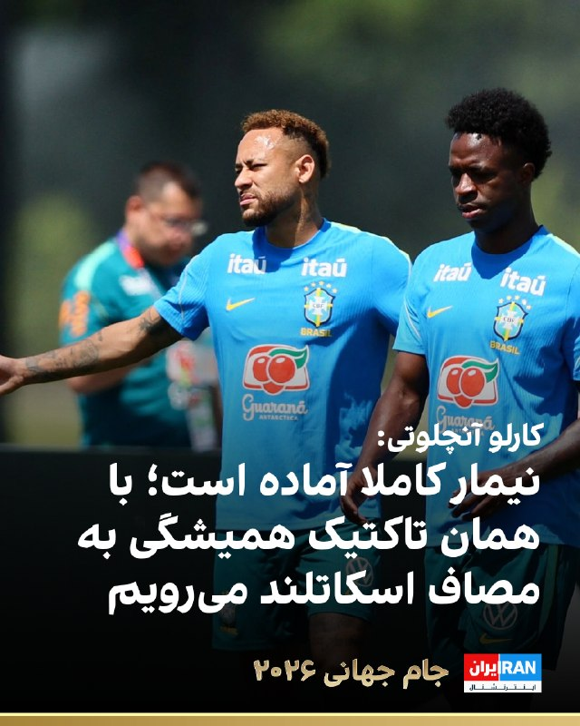

🔻کارلو آنچلوتی، سرمربی تیم ملی برزیل، در آستانه دیدار حساس با اسکاتلند در جام جهانی، از آمادگی کامل نیمار برای بازگشت به میدان خبر داد.آنچلوتی با تمجید از روحیه تیمی ستاره پیشین پی‌اس‌جی گفت: «نیمار خیلی خوب تمرین کرده، در فرم ایده‌آلی است و آمادگی بازی دارد.»

🔹او افزود این ستاره توانایی بازی برای یک نیمه یا تمام مسابقه را دارد و حضورش تجربه و کیفیت بالایی به تیم تزریق می‌کند. سرمربی سلسائو با اشاره به سبک بازی فیزیکی و سازمان‌یافته اسکاتلند با سیستم ۲-۴-۴، این مسابقه را چالشی دشوار خواند و گفت: «تغییری در سیستم ایجاد نمی‌کنیم. ما با همان تاکتیک همیشگی و با هدف حفظ مالکیت و کنترل توپ بازی خواهیم کرد.»

🔹او همچنین با مقایسه وینیسیوس جونیور با فوق‌ستاره‌هایی چون امباپه و هالند گفت: «او می‌تواند مانند مسی، هالند و امباپه سرنوشت یک بازی را رقم بزند.» این دیدار ساعت ۰۱:۳۰ بامداد پنج‌شنبه در میامی برگزار می‌شود.

@iranintltvsport

## IranIntlTV — post 344098

  <a href="telegram/content/IranIntlTV_344098_1782291703.mp4" target="_blank">🎬 Download video</a>

یک شهروند با ارسال ویدیویی به ایران اینترنشنال گفت که ساکنان شهر بومهن بیش از ۶ روز است با قطعی آب روبه‌رو شده‌اند. به گفته او میزان آبی که اکنون از رودهن و پردیس با تانکر به این شهر منقل می‌شود برای شستشوی لباس، ظرف‌ها و استحمام کافی نیست. ساکنان بومهن همچنین از دشواری شرایط برای خانواده‌های دارای کودک و افراد بیمار خبر می‌دهند.

## IranIntlTV — post 344097

  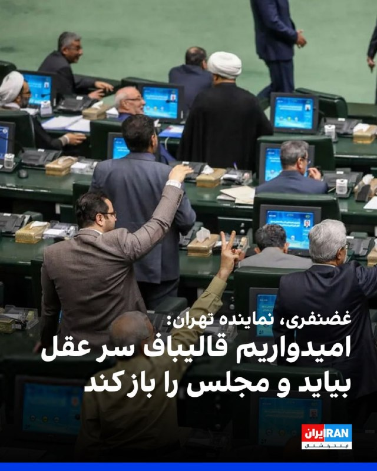

کامران غضنفری، نماینده تهران در مجلس، به سایت دیده‌بان ایران گفت: «قالیباف به صورت خودسرانه اقدام به تعطیلی صحن علنی مجلس کرده و امیدواریم قبل از اینکه نمایندگان متحصن شوند، سر عقل بیاید و مجلس را باز کند.»

غضنفری در پاسخ به این سوال که چند نماینده در تحصن مقابل مجلس شرکت می‌کنند، گفت: «فعلا تقریبا ۴۰ نفر از نمایندگان بیانیه تحصن را امضا کرده‌اند و احتمالا امضاهای این بیانیه بیشتر خواهد شد.»
iranintl.com/202606245277

## IranIntlTV — post 344096

  

سخنگوی وزارت خارجه پاکستان، اعلام کرد مذاکره‌کنندگان ارشد ایران و آمریکا به‌طور منظم به کمیته عالی‌رتبه گزارش خواهند داد و کارگروه‌های تخصصی را هدایت خواهند کرد.

او افزود طرف‌ها درباره ایجاد سازوکار کاهش تنش توافق کرده‌اند و دولت لبنان و میانجی‌ها اجرای آن را تسهیل خواهند کرد.

سخنگوی وزارت خارجه پاکستان گفت: «دور جدید مذاکرات فنی بین تهران و واشینگتن در روزهای آتی برگزار می‌شود.»
iranintl.com/202606249462

## IranIntlTV — post 344095

  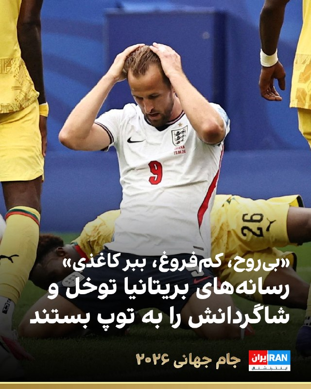

🔻تساوی بدون گل تیم ملی انگلیس مقابل غنا، موجی از انتقادات تند را در رسانه‌های بریتانیا به راه انداخته است. شاگردان توماس توخل که پس از پیروزی ۴ بر ۲ مقابل کرواسی غرق در تمجید بودند، این بار با واکنش‌های بسیار سختی روبه‌رو شده‌اند.

🔹کارشناسانی چون آلن شیرر و جیمی کرگر، نمایش تیم ملی انگلیس را یک «بازگشت تلخ به واقعیت» نامیدند. اما اوج خشم را می‌توان در صفحات مطبوعات دید. دیلی‌میل مالکیت ۷۸.۸ درصدی و بی‌ثمر انگلیس را به «پارس کردن یک سگ شیواوا بدون هیچ خطری» تشبیه کرد و سان آن را یک «افتضاح بی‌روح، کم‌هوش و رنگ‌پریده» خواند.

🔹دیلی تلگراف نیز با تیتر «ببرهای کاغذی توخل» نوشت: «پیروزی قبلی یک توهم بود؛ انگلیس دیشب هیچ ایده و شجاعتی برای نفوذ نداشت.» همچنین گاردین این نمایش را یادآور بدترین نسخه‌های تاریخ انگلیس در تورنمنت‌های بزرگ دانست و اکسپرس خطاب به سرمربی آلمانی نوشت: «آقای توخل، با این تیم بی‌فروغ که هوادارانش برای دیدن اولین شوت در چارچوب یک ساعت خمیازه کشیدند، جام به خانه برنمی‌گردد!»
@iranintltvsport

## IranIntlTV — post 344094

🗣روایت شما از بحران اقتصادی و زندگی بعد از توافق- چهارشنبه ۳ تیر:

🔹من مریض روماتیسم مفصلی هستم. ۲۵ میلیون تومان هزینه داروهایم شده است. کارگری هستم که ۱۵ میلیون تومان حقوق می‌گیرم و اجاره‌خانه و باقی خرج‌ها را هم باید بدهم. چطور باید ادامه بدهم؟ مثل من بسیار هست. فقط خدا به داد ما برسد.

🔹از قزوین پیام می‌دهم؛ اوضاع ما واقعا خوب نیست. گرانی شدید و ترسناک است. دلم برای آینده تباهی که در پیش داریم، می‌سوزد. واقعا زندگی در ایران طاقت فرساست.

🔹در کلاردشت مازندران قیمت یک نان سنگک آزادپز شده ۸۰ هزار تومان و سفارشی را با قیمت ۱۶۰ هزار تومان می‌پزند.

🔹سازمان تامین اجتماعی افزایش حقوق مستمری‌بگیران را ۶۰ درصد اعلام کرده بود، ولی از تمام مستمری‌بگیرانی که سرپرست خانواده فوت کرده است مبلغ ۲ میلیون و ۵۰۰ هزار تومان تحت عنوان حق عائله‌مندی کم کرده، یا در واقع دزدیده است.

🔹من نیروی شرکتی بانک رفاه کارگران هستم. از ابتدای سال ۱۴۰۵ تا الان که وارد تیر شدیم، معوقات ما را نداده‌اند، هیچ‌کس هم پاسخگو نیست.

🔹در کتاب‌های دینی می‌گویند امام علی زندگیِ ساده‌ای داشت و بیشتر شیر و خرما می‌خورد؛ امروز قیمت یک پاکت شیر با ۵ عدد خرما می‌شود ۵۳۰ هزار تومان؛ ۴ بار همین چرخه را تکرار کنی باید ۲ میلیون تومان برای این خوراک «ساده» هزینه کنی.

🔹در جنوب چه امکاناتی وجود دارد؟ نه آب کافی هست و نه برق؛ در این گرمای شدید روزی چند ساعت برق را قطع می‌کنند. بنزین هم به‌سختی پیدا می‌شود، در حالی که بخش بزرگی از سوخت کشور از همین بنادر تامین می‌شود.

🔹با آغاز تابستان و ثبت دمای بالای ۵۰ درجه در خوزستان، قطعی‌های برنامه‌ریزی‌شده برق هم آغاز شده و برق استانی که ۲ برابر نیاز خودش را تولید می‌کند، هر روز قطع می‌شود. این هم از زیرساخت انرژی که سنگش را برخی به سینه می‌زدند.

## IranIntlTV — post 344093

  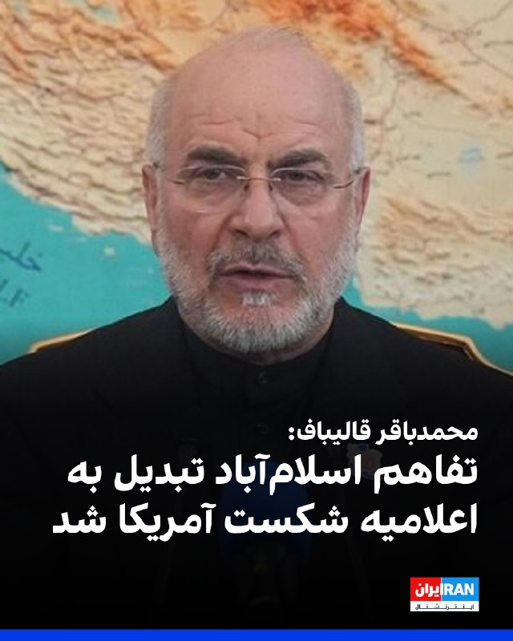

محمدباقر قالیباف، رییس مجلس، در سخنرانی خود در اجلاس اتحادیه مجالس کشورهای عضو سازمان همکاری اسلامی در باکو گفت: «تفاهم اسلام‌آباد نه نتیجه فشار و اجبار، بلکه حاصل مقاومت ایران بود و این تفاهم‌نامه تبدیل به اعلامیه شکست آمریکا شد.»

رییس مجلس افزود امنیت منطقه باید به دست خود کشورهای منطقه تامین شود و اقتصاد و توسعه باید برای همه ملت‌های منطقه باشد.

قالیباف گفت: «جمهوری اسلامی دست برادری و همکاری به سوی همه کشورهای منطقه دراز می‌کند و در میانه جنگ اخیر هم اعلام کردیم آماده برقراری توافقات امنیتی با همه کشورهای منطقه هستیم.»
https://iranintl.com/202606246252

## IranIntlTV — post 344092

  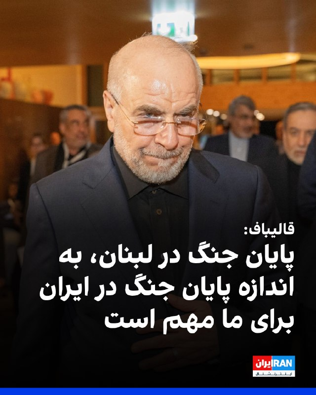

محمدباقر قالیباف، رییس مجلس، در اجلاس اتحادیه مجالس کشورهای عضو سازمان همکاری اسلامی در باکو گفت: «مقاومت ملت ایران نشان داد که دوران تحمیل اراده بر ملت‌های مستقل پایان یافته است.»

قالیباف افزود تفاهم اسلام‌آباد تبدیل به اعلامیه شکست آمریکا شد و تفاهم اسلام‌آباد نه نتیجه فشار و اجبار، بلکه حاصل مقاومت ایران بود.

قالیباف درباره مسئله لبنان گفت: «آتش‌بس و پایان جنگ در لبنان، به اندازه آتش‌بس و پایان جنگ در ایران برای ما مهم است.»

او همچنین افزود فلسطین صرفا یک مسئله سیاسی و دیپلماتیک نیست و نمی‌توان از کنار آن به سادگی گذشت.
https://iranintl.com/202606247722

## IranIntlTV — post 344091

  <a href="telegram/content/IranIntlTV_344091_1782291710.mp4" target="_blank">🎬 Download video</a>

رافائل گروسی، مدیرکل آژانس بین‌المللی انرژی اتمی، از آغاز قریب‌الوقوع بازرسی‌ها از تاسیسات هسته‌ای جمهوری اسلامی خبر داد. او تایید محل نگهداری اورانیوم با غنای بالا را اولویت اصلی آژانس دانست و با اشاره به مهلت ۶۰ روزه پیش‌بینی‌شده در تفاهم تهران و واشینگتن، بر ضرورت انجام هرچه سریع‌تر این بازرسی‌ها تاکید کرد.

گزارش احمد صمدی، خبرنگار ایران‌اینترنشنال
@iranintltv

## IranIntlTV — post 344090

  

آویخای ادرعی، سخنگوی عربی‌زبان ارتش اسرائیل، در واکنش به اظهارات نعیم قاسم، دبیرکل حزب‌الله لبنان درباره عدم توان اسرائیل در میدان، با انتشار پستی در شبکه ایکس نوشت: «اسرائیل شکست نمی‌خورد و همه توهمات مخالفانش درباره قدرت این کشور فرو می‌ریزد.»

او خطاب به نعیم قاسم افزود شما از توان نظامی، اطلاعاتی و فناوری اسرائیل آگاه بودید، اما با دستورهای جمهوری اسلامی خود را به این ورطه انداختید.

آویخای ادرعی در ادامه نوشت توهم «خانه سست» از بین رفته و اسرائیل به از بین بردن این توهمات ادامه می‌دهد.
https://iranintl.com/202606240282

## IranIntlTV — post 344089

  <a href="https://t.me/IranintlTV/344089" target="_blank">📎 Download file</a>

🎧نسخه صوتی اخبار بامدادی | چهارشنبه ۳ تیر
@iranintlTV

## IranIntlTV — post 344083

🔻برنامه هفته سوم جام جهانی ۲۰۲۶

🔹ساعت‌ها به وقت ایران

@iranintltvsport

## IranIntlTV — post 344082

  <a href="telegram/content/IranIntlTV_344082_1782291714.mp4" target="_blank">🎬 Download video</a>

یک شهروند با ارسال ویدیویی به ایران اینترنشنال، از آلودگی صوتی ناشی از برگزاری مراسم عزاداری محرم در یکی از محله‌های شهر رشت انتقاد کرد. به گفته او حدود ساعت ۱ بامداد سوم تیر، صدای بلند نوحه و طبل موجب سلب آرامش ساکنان محله شد.

## IranIntlTV — post 344081

  <a href="telegram/content/IranIntlTV_344081_1782291716.mp4" target="_blank">🎬 Download video</a>

رهبران پاکستان و جمهوری اسلامی گزارش‌ها درباره مطرح شدن برنامه موشک‌های بالستیک در مذاکرات با آمریکا را رد کردند. این در حالی است که شهباز شریف پیش‌تر گفته بود مذاکرات جمهوری اسلامی و آمریکا برنامه موشکی را نیز در بر می‌گیرد

گفت‌وگو با جواد همدانی، خبرنگار ایران‌اینترنشنال
@iranintltv

## IranIntlTV — post 344080

  <a href="telegram/content/IranIntlTV_344080_1782291719.mp4" target="_blank">🎬 Download video</a>

نظام‌الدین میثاقی، پزشک و استادیار دانشگاه آریزونا، به ایران‌اینترنشنال گفت توقف روند اضافه شدن واکسن اچ‌پی‌وی به برنامه ملی واکسیناسیون در ایران می‌تواند به افزایش موارد سرطان دهانه رحم در زنان و سرطان دهان، گلو و دستگاه تناسلی در مردان منجر شود
@iranintltv

## ManotoTV — post 106217

  <a href="telegram/content/ManotoTV_106217_1782291722.mp4" target="_blank">🎬 Download video</a>

بعد از کشتار ۱۸ و ۱۹ دی، بسیاری از ایرانیان با یک سؤال دردناک روبه‌رو هستند: اگر رژیمی حاضر است برای ماندن، مردم را در خیابان بکشد، مردم چگونه می‌توانند با آن مقابله کنند؟

## FarsiVOA — post 221719

  <a href="telegram/content/FarsiVOA_221719_1782291725.mp4" target="_blank">🎬 Download video</a>

رقص ویژه پرزیدنت ترامپ با آهنگ محبوبش در میان کارگران در پنسیلوانیا؛

پرزیدنت ترامپ که روز سه‌شنبه به ایالت کلیدی و رقابتی پنسیلوانیا سفر کرده بود، از تاسیسات مونتاژ شرکت کامیون‌سازی معروف «مک» بازدید کرد.

آقای ترامپ در این بازدید که با هدف تمرکز بر موضوعات اقتصادی، کنترل قیمت سوخت و حمایت از تولید داخلی انجام شد، در میان کارگران این کارخانه به سخنرانی پرداخت.
@FarsiVOA

## FarsiVOA — post 221718

🔺اعلام بازگشت خدمات بانکی کارت‌محور همزمان با هشدار درباره پیامدهای حمله سایبری

▪️در حالی که شرکت خدمات انفورماتیک از رفع اختلال در خدمات کارت‌محور برخی بانک‌های ایران خبر داده، اظهارات یک نماینده مجلس و گزارش‌های رسانه‌های داخلی نشان می‌دهد پیامدهای حمله سایبری به زیرساخت بانکی هنوز به طور کامل پایان نیافته است.

▪️ایرنا روز چهارشنبه گزارش داد اختلال مقطعی ایجادشده در برخی بانک‌ها برطرف شده و خدمات بانکی به وضعیت عادی بازگشته است.

▪️ایرنا به اعلام شرکت خدمات انفورماتیک استناد کرد که مدعی است روند ارائه خدمات از جمله خدمات کارت‌محور به روال عادی بازگشته است.

▪️این شرکت گفته است محدودیت ایجادشده در بخشی از خدمات با هدف جلوگیری از دسترسی غیرمجاز و حفاظت از امنیت مشتریان اعمال شده بود.

⬇️ بیشتر بخوانید:
https://ir.voanews.com/a/8164295.html

## FarsiVOA — post 221717

🔺«گنبد طلایی برای آمریکا» با موفقیت آزمایش شد

▪️وزیر جنگ آمریکا اعلام کرد که نخستین آزمایش «گنبد طلایی برای آمریکا» با موفقیت کامل به پایان رسید.

▪️پیت هگست در شبکه اجتماعی ایکس نوشت: «فناوری پیشرفته انرژی هدایت‌شده به کار گرفته شد و سامانه "انهدام خودکار پویای دفاعی" به شکلی بی‌نقص و خودکار، مجموعه‌ای از تهدیدهای ورودی را شناسایی، هدف‌گیری و منهدم کرد. این آزمایش طبق برنامه اجرا شد و به‌صورت پویا هر تهدیدی را شکست داد.»

▪️آقای هگست این آزمایش را یک «نقطه‌عطف تاریخی» خواند و تأکید کرد که پرزیدنت ترامپ در حال تبدیل چشم‌انداز «ابتکار دفاع راهبردی» رئیس‌جمهور ریگان به واقعیت است.

⬇️ بیشتر بخوانید:
https://ir.voanews.com/a/hegseth-says-golden-dome-aces-first-live-intercept-test/8164297.html

## FarsiVOA — post 221716

  <a href="telegram/content/FarsiVOA_221716_1782291728.mp4" target="_blank">🎬 Download video</a>

سفر دونالد ترامپ به پنسیلوانیا؛ سخنرانی اقتصادی در کارخانه «مک»؛

دونالد ترامپ در نخستین رویداد عمومی بزرگ خود خارج از واشنگتن پس از امضای توافق‌نامه موقت برای پایان دادن به عملیات نظامی در ایران، روز سه‌شنبه به ایالت کلیدی و رقابتی پنسیلوانیا سفر و از تاسیسات مونتاژ شرکت کامیون‌سازی معروف «مک» بازدید کرد.

پرزیدنت ترامپ در این بازدید که با هدف تمرکز بر موضوعات اقتصادی، کنترل قیمت سوخت و حمایت از تولید داخلی انجام شد، در میان کارگران این کارخانه به سخنرانی پرداخت.

او در صحبت‌های خود بر استراتژی‌های تجاری، کاهش وابستگی‌های صنعتی و همچنین حمایت از نامزدهای حزب جمهوری‌خواه در انتخابات میان‌دوره ای پیش‌رو تأکید کرد.

این مرکز صنعتی که حدود دو هزار و هشتصد کارگر دارد، پیش از این نیز هدف تدارکات دفاعی ارتش آمریکا برای ساخت کامیون‌های سنگین نظامی بوده است.
@FarsiVOA

## FarsiVOA — post 221715

  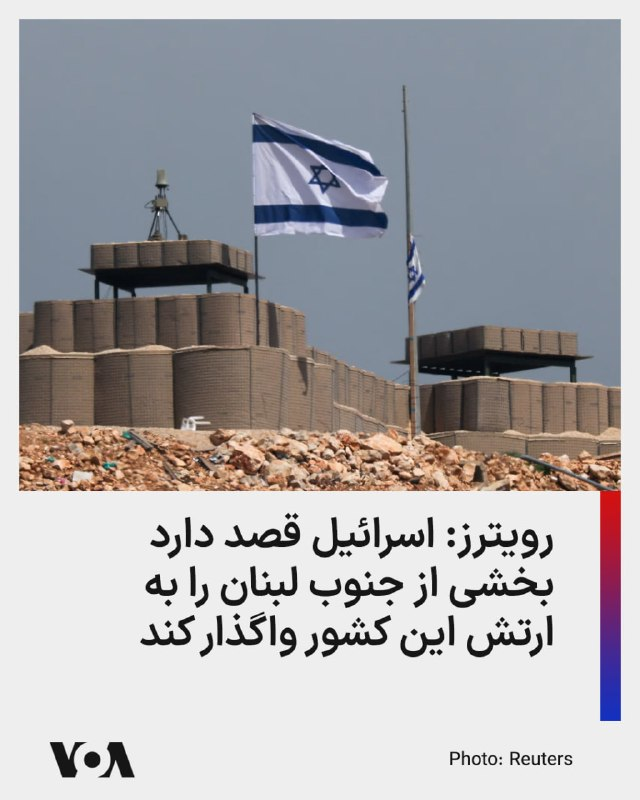

خبرگزاری رویترز گزارش داد که اسرائیل و لبنان در حال گفت‌وگو درباره یک طرح آزمایشی هستند که بر اساس آن نیروهای اسرائیلی کنترل بخشی از اراضی جنوب لبنان را به نیروهای مسلح این کشور واگذار خواهند کرد.

رویترز نوشت که این طرح از حمایت ایالات متحده برخودار است.

سه مقام اسرائیلی که نامشان فاش نشده، به این خبرگزاری گفتند نیروهای لبنانی که در این طرح مشارکت خواهند داشت، تحت آموزش و ارزیابی ایالات متحده قرار می‌گیرند تا اطمینان حاصل شود که با حزب‌الله ارتباطی ندارند.

همچنین بر اساس این گزارش، اسرائیل حضور نظامی خود را در منطقه حائل حفظ خواهد کرد.
@FarsiVOA

## FarsiVOA — post 221714

🔺ادامه گرفتاری صدها کشتی در خلیج فارس با وجود تسریع تردد از تنگه هرمز

▪️آمارهای ردیابی کشتی‌ها حاکی از افزایش قابل توجه تردد دریایی از تنگه هرمز است، اما همچنان صدها شناور در آب‌های خلیج فارس منتظر عبور امن هستند.

▪️همزمان دونالد ترامپ در شبکه تروت‌سوشال بخشی از گزارش فاکس‌نیوز را منتشر کرد که به عبور قابل توجه نفت از تنگه هرمز پس از توافق موقت اشاره دارد.

▪️طبق این گزارش‌، در روزهای اخیر حجم عبور نفت به سه برابر هفته گذشته رسیده و بیش از ۱۰ برابر دوران پیش از توافق آتش‌بس است. این رقم کماکان با سطح قبل از جنگ فاصله چشمگیری دارد.

▪️در شرایط عادی، روزانه حدود ۲۰ میلیون بشکه نفت و فرآورده‌های نفتی از تنگه هرمز عبور می‌کرد که حدود ۲۰ درصد از مصرف جهانی نفت را تشکیل می‌داد.

⬇️ بیشتر بخوانید:
https://ir.voanews.com/a/8164293.html

## FarsiVOA — post 221713

🔺عمان از ایجاد مسیر موقت برای عبور کشتی‌ها از تنگه هرمز خبر داد

▪️عمان اعلام کرد با هماهنگی سازمان بین‌المللی دریانوردی، مسیر دریایی موقتی را برای عبور کشتی‌ها از تنگه هرمز فراهم می‌کند.

▪️این مسیر برای همه کشتی‌ها و بر اساس مختصات مشخص در نظر گرفته شده است و کشتی‌هایی که قصد عبور از آن را دارند باید با سازمان بین‌المللی دریانوردی هماهنگ کنند.

▪️عمان اعلام کرده که این اقدام در چارچوب مسئولیت این کشور در قبال تنگه هرمز، اهمیت این آبراه برای اقتصاد جهانی، و پایبندی به قوانین بین‌المللی و حقوق دریاها انجام می‌شود.

▪️عمان همچنین تأکید کرده آزادی کشتیرانی در تنگه هرمز باید بدون اعمال هزینه عبور تضمین شود و این اقدام با تفاهم‌های اخیر میان آمریکا و جمهوری اسلامی همسو است.

⬇️ بیشتر بخوانید:
https://ir.voanews.com/a/oman-to-set-temporary-route-for-ships-to-pass-through-hormuz/8164292.html

## FarsiVOA — post 221712

🔺دبیرکل ناتو: ترامپ در برابر جمهوری اسلامی کاری را انجام می‌دهد که لازم است

▪️دبیرکل ناتو از راهبرد دونالد ترامپ در برابر جمهوری اسلامی دفاع کرد و گفت رئیس جمهوری آمریکا در تضعیف توان هسته‌ای جمهوری اسلامی «دقیقاً همان کاری را انجام می‌دهد که لازم است.»

▪️مارک روته روز سه‌شنبه در گفت‌وگو با فاکس‌نیوز گفت: «تصور کنید اگر جمهوری اسلامی به سلاح هسته‌ای دست پیدا کند؟ این کشور صادرکننده آشوب است. صادرکننده تروریسم است. این برای منطقه ویرانگر خواهد بود. برای کل جهان ویرانگر خواهد بود.»

▪️این اظهارات در حالی مطرح شد که ترامپ بارها از برخی متحدان ناتو به دلیل آنچه نبود حمایت کافی از آمریکا خواند، انتقاد کرده بود.

⬇️ بیشتر بخوانید:
https://ir.voanews.com/a/nato-secretary-mark-rutte-praises-trump-iran-strategy/8164290.html

## FarsiVOA — post 221711

  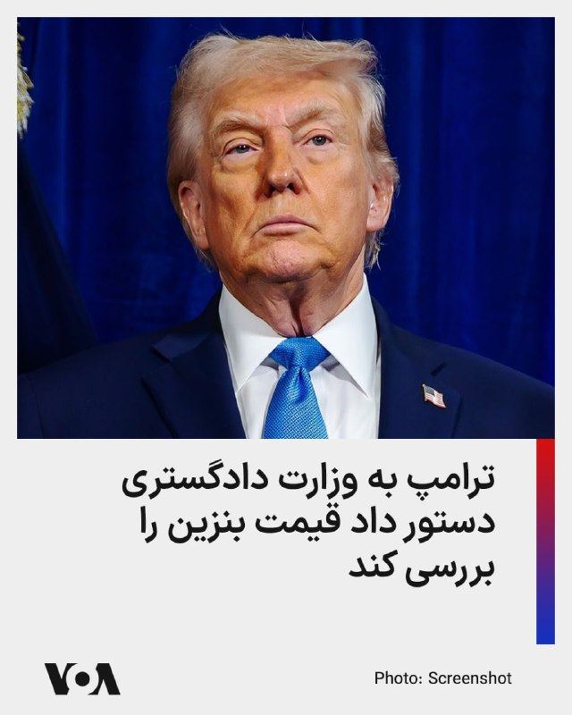

پرزیدنت دونالد ترامپ اعلام کرد به وزارت دادگستری آمریکا دستور داد فوراً موضوع قیمت بنزین شرکت‌های بزرگ نفتی را بررسی کند.

آقای ترامپ روز چهارشنبه در پیامی در شبکه اجتماعی تروث سوشال نوشت: «شرکت‌های بزرگ نفتی قیمت خود را در پمپ بنزین، متناسب با قیمت‌های بسیار پایین‌تری که برای نفت می‌پردازند، کاهش نمی‌دهند. آن قیمت‌ها مثل سنگ در حال سقوط است!»

او افزود: «به عبارت دیگر، به مشتریان گران‌فروشی می‌شود. من به وزارت دادگستری دستور داده‌ام فوراً بررسی این موضوع را آغاز کند.»

رئیس‌جمهوری آمریکا در ادامه هشدار داد: «بهتر است قیمت بنزین خیلی سریع‌تر از آنچه من می‌بینم، شروع به پایین آمدن کند!»
@FarsiVOA

## FarsiVOA — post 221710

  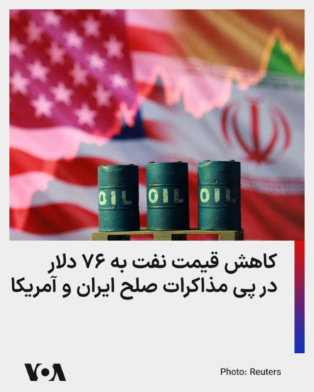

قیمت نفت شاخص برنت روز چهارشنبه ۷۶ دلار و ۵۰ سنت معامله شد که نزدیک به کمترین میزان از زمان آغاز انسداد تنگه هرمز توسط جمهوری اسلامی در اسفند پارسال است.

با انتشار گزارش‌های مثبت فزاینده‌ای از مذاکرات رو به جلو ایران و آمریکا برای رسیدن به توافق جامع، همچنین افزایش چشمگیر تردد کشتی‌ها در تنگه هرمز، نفت برنت روند نزولی قیمت را ادامه می‌دهد.

هم‌کنون قیمت نفت برنت تنها حدود ۹ درصد بیشتر از دوران پیش از جنگ خاورمیانه است؛ در حالی که این رقم طی ماه‌های گذشته تا ۱۲۰ دلار هم اوج گرفته بود.

آژانس بین‌المللی انرژی می‌گوید اواخر سال جاری دوباره حجم چشمگیری از عرضه مازاد نفت در بازارهای جهانی اتفاق خواهد افتاد؛ موضوعی که می‌تواند یکی از دلایل افت چشمگیر قیمت نفت بعد از توافق پایان جنگ ایران و آمریکا باشد.
@FarsiVOA

## FarsiVOA — post 221709

  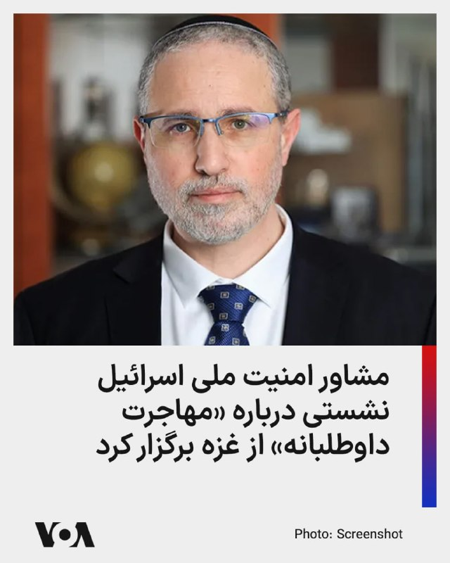

روزنامه هاآرتص گزارش داد که شموئل بن‌عزرا، مشاور جدید امنیت ملی نخست‌وزیر اسرائیل، روز سه‌شنبه نشستی فوری درباره «تشویق به مهاجرت داوطلبانه» فلسطینیان از نوار غزه برگزار کرد.

بر اساس این گزارش، نمایندگان موساد در جریان این نشست اعلام کردند که هیچ کشوری را نیافته‌اند که حاضر باشد ساکنان غزه را بپذیرد و همچنین در این زمینه هیچ تحول تازه‌ای رخ نداده است.

یک منبع امنیتی به این روزنامه گفته است: «ما از وجود هیچ کشوری در جهان که آماده پذیرش فلسطینیانی باشد که تصمیم بگیرند نوار غزه را ترک کنند، اطلاعی نداریم.»

پیشتر یسرائیل کاتز، وزیر دفاع اسرائیل، به ارتش این کشور دستور داده بود برنامه‌ای برای تسهیل «خروج داوطلبانه فلسطینی‌ها» از نوار غزه تدوین کند.

کاتز به طور خاص به کشورهایی مانند اسپانیا، ایرلند، نروژ و سایر کشورهایی اشاره کرد که به گفته او، در مورد جنگ اسرائیل علیه حماس در غزه «اتهامات نادرستی» مطرح کرده‌اند. او افزود که اگر این کشورها حاضر به پذیرش فلسطینی‌ها نشوند، «ریاکاری آن‌ها آشکار خواهد شد.»
@FarsiVOA

## DW_Farsi — post 126397

  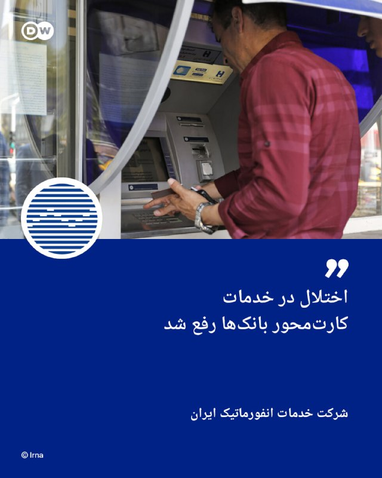

🔶 شرکت خدمات انفورماتیک: اختلال در خدمات کارت‌محور بانک‌ها رفع شد

شرکت خدمات انفورماتیک ایران روز چهارشنبه ۳ تیرماه اعلام کرد که استفاده از خدمات کارت‌محور بار دیگر میسر شده و مشتریان می‌توانند از روال عادی این خدمات بهره بگیرند.

در پی حملات سایبری به سامانه‌های کارت‌محور شبکه بانکی کشور، اختلالاتی در ارائه بخشی از خدمات بانکی ایجاد شده بود که به نوشته رسانه‌های حکومتی در ایران، با "تلاش تیم‌های فنی، متخصصان فناوری اطلاعات و کارشناسان امنیت سایبری، مشکلات به‌وجود آمده برطرف" و امکان بهره‌برداری مجدد مشتریان از خدمات بانکی فراهم شده است.

بانک ملی ایران ضمن پوزش از مشتریان گفته که "هیچ‌گونه خدشه‌ای به اصل سپرده‌ها، اطلاعات مالی و محرمانه مشتریان وارد نشده و تمامی تراکنش‌ها در بستری امن و با پشتیبانی کامل انجام می‌شود".

مقامات مسئول در توضیح اختلالات در روزهای گذشته گفته‌اند که "این اختلالات با هدف جلوگیری از دسترسی غیرمجاز و حفاظت از امنیت اطلاعات و دارایی‌های مشتریان اعمال شده بود".

@dw_farsi

## DW_Farsi — post 126396

  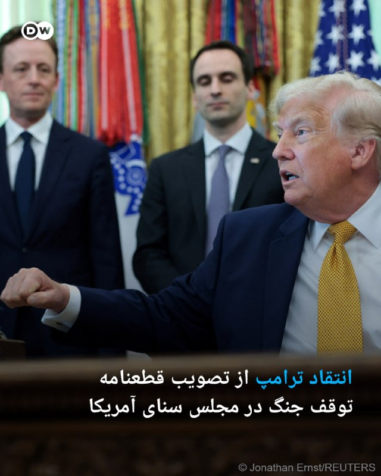

🔶 انتقاد ترامپ از تصویب قطعنامه توقف جنگ در مجلس سنای آمریکا

دونالد ترامپ، رئیس‌ جمهور آمریکا، روز سه‌شنبه ۲۳ ژوئن (۲ تیرماه) از تصویب قطعنامه‌ای در کنگره که خواستار پایان جنگ با ایران است انتقاد کرد و آن را "بی‌موقع و بی‌معنا" خواند. این قطعنامه عمدتاً جنبه نمادین دارد.

ترامپ پس از تصویب این قطعنامه با رأی ۵۰ موافق در برابر ۴۸ مخالف در سنای آمریکا، در شبکه اجتماعی "تروث سوشال" نوشت: «در حالی که من ایران را کاملاً تحت فشار قرار داده بودم، آن‌ها آماده بودند عملاً هر چیزی بدهند و برای اولین بار در دهه‌های اخیر، احترام شدیدی برای ایالات متحده و رئیس‌ جمهور آن قائل شده بودند؛ سنای آمریکا تصمیم گرفت رأی‌گیری درباره قانون اختیارات جنگی را در زمانی نامناسب و بی‌معنا برگزار کند.»

رئیس جمهور آمریکا ادامه داد که این رأی‌گیری‌ای "به بزرگ‌ترین حامی تروریسم در جهان می‌گوید ایالات متحده از کاری که من با آن‌ها انجام می‌دهم خوشش نمی‌آید و باید آن را متوقف کنم؛ و با این کار، عملاً به دشمن کمک و دلگرمی داده است".

او به‌طور ویژه از چهار سناتور جمهوری‌خواه انتقاد کرد که همراه با دموکرات‌ها به تصویب این طرح کمک کردند.

@dw_farsi

## DW_Farsi — post 126395

  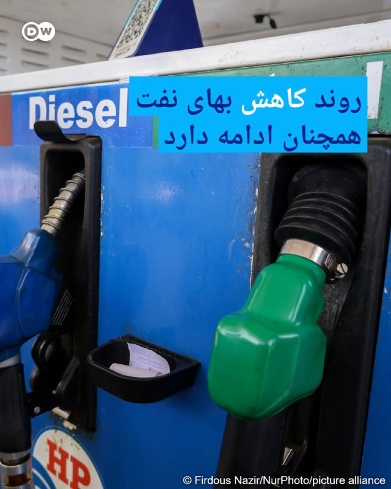

🔶 روند کاهش بهای نفت همچنان ادامه دارد

قیمت نفت در روز چهارشنبه ۲۴ ژوئن در معاملات آسیایی همچنان کاهش یافت. دلیل کاهش بهای نفت رفع گرانی‌ها درباره اختلال احتمالی در عرضه نفت است. در همین حال، شرکت‌های بزرگ همچنان تحولات مربوط به تنگه هرمز را زیر نظر دارند.

قیمت قراردادهای آتی نفت برنت برای تحویل در ماه اوت با کاهش ۰٫۹۱ درصدی به ۷۶٫۳۸ دلار در هر بشکه رسید.

همچنین قیمت قراردادهای آتی نفت وست تگزاس اینترمدیت (WTI) آمریکا برای تحویل در ماه اوت با افت ۰٫۹۴ درصدی به ۷۲٫۵۲ دلار در هر بشکه کاهش یافت.

دونالد ترامپ، رئیس‌ جمهور آمریکا روز چهارشنبه ۲۴ ژوئن از شرکت‌های بزرگ نفتی انتقاد کرد و گفت آن‌ها قیمت بنزین را متناسب با کاهش اخیر قیمت نفت خام پایین نیاورده‌اند.

@dw_farsi

## DW_Farsi — post 126394

  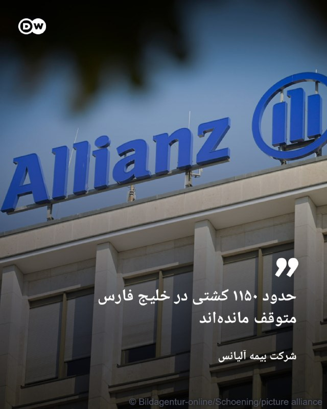

🔶 شرکت بیمه آلیانس: حدود ۱۱۵۰ کشتی در خلیج فارس متوقف مانده‌اند

بر اساس یک گزارش تحلیلی از شرکت بیمه آلیانس در آلمان، با وجود توافق چارچوبی برای پایان دادن به جنگ ایران، "همچنان حدود ۱۱۵۰ کشتی در خلیج فارس متوقف مانده‌اند".

بزرگ‌ترین شرکت بیمه آلمان، ارزش کشتی‌های متوقف‌شده و محموله‌های آن‌ها را "حدود ۱۲۵ میلیارد دلار" برآورد کرده است. طبق این ارزیابی، حتی اگر شرایط به حالت عادی بازگردد، رفع کامل این ازدحام و ترافیک دریایی "چندین هفته زمان خواهد برد".

یوستوس هاینریش، از کارشناسان ارشد بیمه دریایی در شرکت وابسته به "آلیانس کامرشال"، گفت: «حمل‌ونقل دریایی به گروگان این درگیری تبدیل شده است.»

او افزود: «سازمان بین‌المللی دریانوردی (IMO) و همچنین انجمن مالکان کشتی آلمان (VDR) می‌گویند که هنوز نمی‌توانند میزان خطر برای خدمه و کشتی‌ها را به‌درستی ارزیابی کنند. تا زمانی که این وضعیت ادامه داشته باشد، کشتی‌ها نیز حرکت نخواهند کرد.»

بر اساس گزارشی از رسانه‌های غربی، از ۱۸ ژوئن، یعنی یک روز پس از امضای تفاهم‌نامه میان ایران و آمریکا، تنها ۱۷۰ کشتی از تنگه هرمز عبور کرده‌اند. این در حالی است که پیش از آغاز جنگ، به طور متوسط حدود ۱۴۰ کشتی در روز از این آبراه بین‌المللی عبور می‌کردند.

@dw_farsi

## DW_Farsi — post 126393

  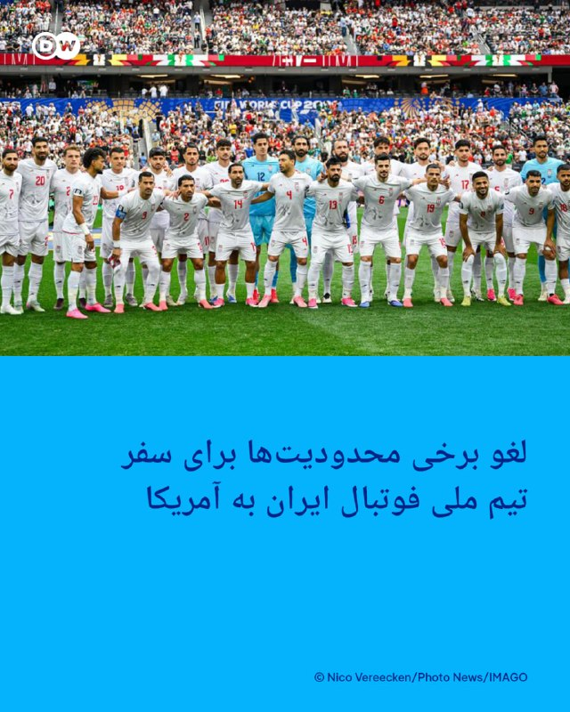

🔶 لغو برخی محدودیت‌ها برای سفر تیم ملی فوتبال ایران به آمریکا

تیم ملی فوتبال ایران برای رویارویی مقابل مصر در مسابقات جام جهانی، زودتر از بازی‌های قبلی اجازه ورود به آمریکا را خواهد داشت.

وزارت امنیت داخلی آمریکا (DHS) در بیانیه‌ای اعلام کرد که مقام‌های مهاجرتی این کشور به تیم ملی فوتبال ایران اجازه خواهند داد دو روز پیش از دیدار روز جمعه مقابل مصر وارد ایالات متحده شود؛ اقدامی که نسبت به محدودیت‌های قبلی تا حدی تسهیلی برای ورود تیم ملی ایران به آمریکا محسوب می‌شود.

پیش از این، به تیم ملی ایران که در مکزیک اردو زده بود، اجازه داده می‌شد تنها یک روز پیش از هر مسابقه از مکزیک وارد آمریکا شود.

با این حال، این تیم همچنان موظف است در شامگاه روز مسابقه خاک آمریکا را ترک کند. بازیکنان ایران پس از نخستین دیدار خود برابر نیوزیلند از این موضوع گلایه کرده بودند که بلافاصله پس از پایان بازی، از آن‌ها خواسته شده بود هرچه سریع‌تر رختکن و خاک ایالات متحده را ترک کنند.

تیم ملی ایران در دو بازی نخست خود به دو تساوی دست یافته است و پیروزی مقابل مصر صعود این تیم به مرحله حذفی را قطعی خواهد کرد.

وزارت امنیت داخلی آمریکا در بیانیه خود تأکید کرد: «تدابیر و پروتکل‌های کلی امنیتی تغییری نکرده است. ما همچنان متعهد هستیم که امن‌ترین شرایط ممکن را برای بازیکنان، اعضای کادر فنی و هواداران این رقابت‌ها فراهم کنیم.»

@dw_farsi

## DW_Farsi — post 126392

  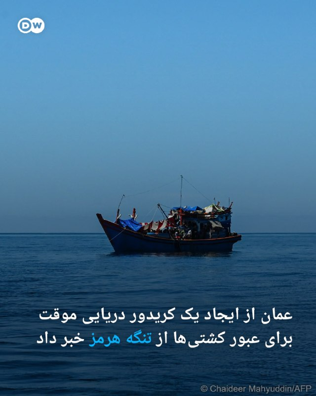

🔶 عمان از ایجاد یک کریدور دریایی موقت برای عبور کشتی‌ها از تنگه هرمز خبر داد

عمان اعلام کرد که با سازمان بین‌المللی دریانوردی (IMO) برای ایجاد یک کریدور دریایی موقت جهت عبور کشتی‌هایی که قصد تردد از تنگه هرمز را دارند، هماهنگی کرده است. این خبر را خبرگزاری رسمی عمان منتشر کرده است.

بر اساس این گزارش، کشتی‌هایی که مایل به استفاده از این مسیر موقت هستند باید پس از هماهنگی با سازمان بین‌المللی دریانوردی، مطابق مختصات و مسیرهایی که از سوی این سازمان و مقام‌های عمانی اعلام می‌شود، حرکت کنند.

هدف از این اقدام، تضمین آزادی کشتیرانی در این آبراه راهبردی و حساس، مطابق با قوانین بین‌المللی و حقوق دریاها عنوان شده است؛ قوانینی که بر اصل آزادی عبور و مرور دریایی تأکید دارند و دریافت عوارض یا هزینه برای عبور از این مسیر را مجاز نمی‌دانند.

از سوی دیگر آرسنیو دومینگز، دبیرکل سازمان بین‌المللی دریانوردی، اعلام کرد این "عملیات گسترده" با همکاری ایران، عمان، ایالات متحده، سایر کشورهای ساحلی منطقه و همچنین صنعت کشتیرانی انجام خواهد شد.

او افزود: «ما تضمین‌های امنیتی لازم را دریافت کرده‌ایم و شرایط لازم برای ناوبری ایمن را به‌طور کامل بررسی و تأیید کرده‌ایم تا از این عملیات پشتیبانی شود.»

@dw_farsi

## DW_Farsi — post 126391

  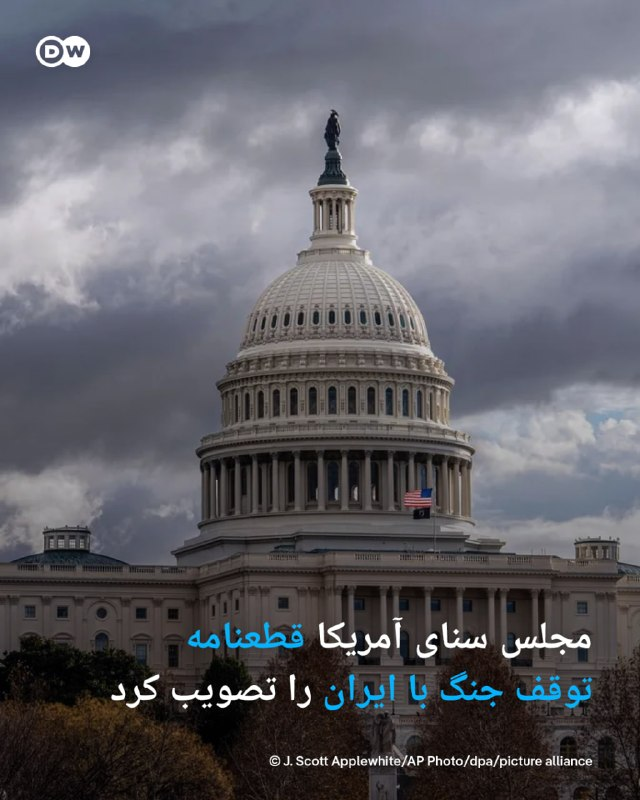

🔶 مجلس سنای آمریکا قطعنامه توقف جنگ با ایران را تصویب کرد

مجلس سنای آمریکا روز سه‌شنبه ۲۳ ژوئن (۲ تیرماه) قطعنامه‌ای را که پیش‌تر در مجلس نمایندگان تصویب شده بود و هدف آن محدود کردن اختیارات رئیس‌ جمهور ترامپ در قبال ایران است، تصویب کرد. این نخستین بار است که چنین طرحی از هر دو مجلس کنگره عبور می‌کند و به‌عنوان یک انتقاد از نحوه مدیریت این درگیری توسط رئیس‌ جمهور تلقی می‌شود.

این قطعنامه با ۵۰ رأی موافق در برابر ۴۸ رأی مخالف به تصویب رسید. چهار سناتور جمهوری‌خواه به همراه اکثر سناتورهای دموکرات از این طرح حمایت کردند. در مقابل، جان فترمن، سناتور دموکرات از پنسیلوانیا، به آن رأی مخالف داد. دو جمهوری‌خواه دیگر، میچ مک‌کانل و دیو مک‌کورمیک نیز در رأی‌گیری شرکت نکردند.

این قطعنامه رئیس‌ جمهور را موظف می‌کند که "نیروهای مسلح ایالات متحده را از هرگونه درگیری با جمهوری اسلامی ایران خارج کند"، مگر آنکه کنگره رسماً اعلام جنگ  کرده یا استفاده از نیروی نظامی را مجاز دانسته باشد. این طرح از نوع قطعنامه‌های به اصطلاح "هم‌زمان یا فوری" است و بنابراین برای اجرایی شدن به امضای رئیس‌ جمهور نیاز ندارد. طبق "قانون اختیارات جنگی" مصوب سال ۱۹۷۳، رئیس‌ جمهور باید نیروهای نظامی را از درگیری‌ها خارج کند "مگر کنگره از طریق یک قطعنامه هم‌زمان چنین دستوری را صادر کند".

@dw_farsi

## Persian_Trend_Official — post 17924

  <a href="telegram/content/Persian_Trend_Official_17924_1782291740.mp4" target="_blank">🎬 Download video</a>

🌎 یه سرباز روسی که با پهپاد اوکراینی روبه‌رو شده بود، از اپراتور درخواست کرد که اول دوست کنارش رو بزنه تا بتونه سیگارشو قبل مرگ تموم کنه

اپراتور پهپاد درخواستش رو قبول میکنه، اول سرباز دیگه رو میزنه و بعد سربازی که درخواست کرده بود رو میزنه.

📌 @persian_trend_official
پرشین ترند | متفاوت‌ترین کانال نظامی

## Persian_Trend_Official — post 17919

  <a href="telegram/content/Persian_Trend_Official_17919_1782291743.webm" target="_blank">🎬 Download video</a>

کیم جونگ‌اون در مراسم الحاق ناوشکن «چوئه هیون» به نیروی دریایی کره شمالی، از پیشرفت برنامه هسته‌ای‌سازی این نیرو خبر داد. او تأکید کرد که این استراتژی مطابق برنامه در حال اجراست و به پیونگ‌یانگ امکان می‌دهد تا از سلاح هسته‌ای خود به‌شکل چندوجهی و مؤثر استفاده کند .

ناوشکن ۵۰۰۰ تنی «چوئه هیون» که در بندر نامپو به آب انداخته شد، به موشک‌های کروز با قابلیت حمل کلاهک هسته‌ای مجهز است . کیم همچنین از برنامه‌های بلندپروازانه‌تر برای ساخت ناوشکن‌های ۱۰ هزار تنی و الحاق سالانه دو فروند کشتی جنگی جدید به ناوگان خبر داد .

این اقدام در ادامه سیاست اعلام‌شده کره شمالی برای تبدیل شدن به یک «دولت هسته‌ای غیرقابل‌بازگشت» و در واکنش به آنچه تشدید تنش از سوی آمریکا و کره جنوبی خوانده می‌شود، صورت می‌گیرد . کارشناسان معتقدند هدف اصلی، افزایش هزینه‌های بازدارندگی برای ائتلاف سئول-واشنگتن و مختل کردن مداخله نظامی احتمالی آمریکا در شبه‌جزیره است .

Phantom
📌 @persian_trend_official
پرشین ترند | متفاوت‌ترین کانال نظامی

## Persian_Trend_Official — post 17918

  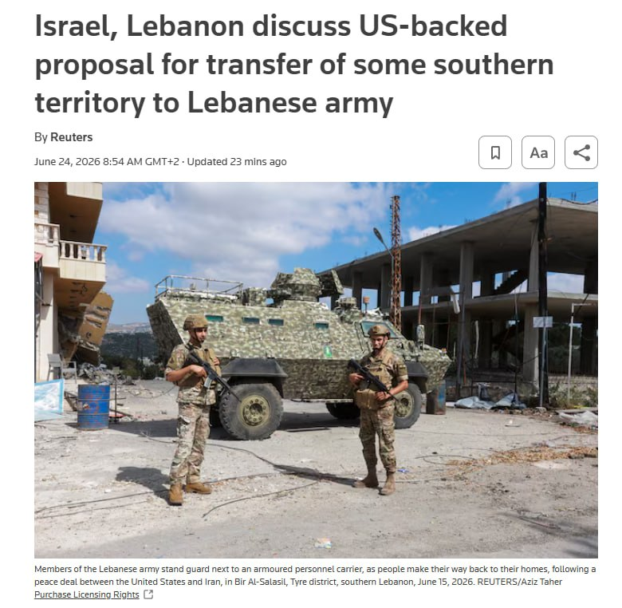

به گزارش رویترز، مذاکرات بین اسرائیل و لبنان بر روی پیشنهادی مورد حمایت ایالات متحده متمرکز است که بر اساس آن نیروهای اسرائیلی بخش‌هایی از سرزمین‌های تصرف شده در طول جنگ با حزب‌الله را به ارتش لبنان تحویل می‌دهند.

نیروهای لبنانی مستقر در آن مناطق تحت آموزش و بررسی ایالات متحده قرار خواهند گرفت تا اطمینان حاصل شود که آنها با حزب‌الله مرتبط نیستند، در حالی که اسرائیل حضور نظامی خود را در یک منطقه حائل مرزی حفظ خواهد کرد. این پیشنهاد به عنوان یک پروژه "آزمایشی" در آخرین دور مذاکرات در واشنگتن مورد بحث قرار گرفته است.

یک مقام ارشد امنیتی لبنان تأیید کرد که مذاکرات در حال انجام است و گفت که مذاکرات نظامی بر جدول زمانی خروج متمرکز خواهد بود. انتظار می‌رود هرگونه توافق نهایی پس از پایان مذاکرات در روز پنجشنبه بررسی شود.

📝 Amir

📌 @persian_trend_official
پرشین ترند | متفاوت‌ترین کانال نظامی

## Persian_Trend_Official — post 17917

  <a href="telegram/content/Persian_Trend_Official_17917_1782291745.mp4" target="_blank">🎬 Download video</a>

قالیباف: تفاهم اسلام آباد حاصل مقاومت و اقتدار ملت شجاع ایران بود، این یادداشت تبدیل به اعلامیه شکست آمریکا شد!

رئیس مجلس شورای اسلامی در نشست اتحادیه مجالس کشورهای اسلامی: ایران با وجود همه خسارات جنگ اخیر بر یک قاعده اساسی اصرار دارد و آن ترجیح منطق بر زور و ترجیح مقاومت بر تسلیم است

تجربه نشان داده است که دیپلماسی زمانی پایدارخواهد بود که بر مبنای احترام و برابری و به رسمیت شناختن حاکمیت کشورها باشد.

📝 Amir

📌 @persian_trend_official
پرشین ترند | متفاوت‌ترین کانال نظامی

## Persian_Trend_Official — post 17916

  <a href="telegram/content/Persian_Trend_Official_17916_1782291747.mp4" target="_blank">🎬 Download video</a>

قالیباف: ایران دست برادری و همکاری را به سمت همه کشورهای منطقه دراز می‌کند

رئیس مجلس شورای اسلامی در نشست اتحادیه مجالس کشورهای اسلامی: در میانه جنگ اخیر بر اساس نظر مقام معظم رهبری اعلام کردیم ایران با همه کشورهای منطقه آماده برقراری توافقات امنیتی است.

فلسطین صرفا یک مسئله سیاسی و دیپلماتیک نیست. صلحی که بر بی عدالتی بنا شود ناامنی فراگیر خواهد داشت.

📝 Amir

📌 @persian_trend_official
پرشین ترند | متفاوت‌ترین کانال نظامی

## Persian_Trend_Official — post 17915

  <a href="telegram/content/Persian_Trend_Official_17915_1782291749.webm" target="_blank">🎬 Download video</a>

◾️ روبیو: اگر ایران تصمیم بگیرد به‌جای یک جنبش انقلابی، یک کشور باشد، فرصت‌های سرمایه‌گذاری عظیمی پیش رو خواهد داشت؛ تنگه هرمز یک آبراه بین‌المللی است و هیچ کشوری مجاز به دریافت عوارض از آن نیست.

◾️ روبیو همچنین گفت تا زمانی که نیروهای نیابتی ایران از عراق موشک و پهپاد پرتاب می‌کنند، پایان دادن به خصومت‌های منطقه‌ای ممکن نخواهد بود.

◾️ شهباز شریف اعلام کرد هفته آینده برای شرکت در مراسم تشییع رهبر ایران وارد تهران خواهد شد.

◾️ مارکو روبیو: مسئله لبنان از ایران جداست؛ آینده لبنان متعلق به مردم لبنان از طریق دولت مستقل و منتخب آنهاست.

◾️ منابع روسی از ادامه حملات پهپادی گسترده در جبهه اوکراین خبر می‌دهند؛ پوتین از خود روایت آغاز جنگ ارائه داد.

📌 @persian_trend_official
پرشین ترند | متفاوت‌ترین کانال نظامی

## Persian_Trend_Official — post 17914

بولتن خبری ۲۴ ساعت اخیر
۱۴۰۵/۴/۳
آرشیو پرشین ترند
━━━━━━━━━━━━━━
━━━━━━━━━━━━━━

◾️ مذاکرات فنی ایران و آمریکا در بورگن‌اشتوک سوئیس پس از نشست سطح‌عالی به کار خود ادامه می‌دهد؛ قالیباف و ونس پس از ۳۶ ساعت گفت‌وگوی فشرده روی «نقشه راه ۶۰ روزه» به‌سوی توافق نهایی توافق کردند.

◾️ پزشکیان وارد اسلام‌آباد شد و با شهباز شریف دیدار کرد؛ رئیس‌جمهور تأکید کرد رهبری با چارچوب توافق با آمریکا موافق است و ایران به تعهداتش پایبند خواهد ماند.

◾️ پزشکیان در مسیر بازگشت از پاکستان وارد مشهد شد.

◾️ رئیس‌کل بانک مرکزی اعلام کرد ۱۲ میلیارد دلار از دارایی‌های مسدودشده ایران در ابتدای کار آزاد می‌شود و مابقی در جریان مذاکرات؛ دسترسی مرحله‌ای است و منوط به راستی‌آزمایی.

◾️ همتی صراحتاً اعلام کرد در صورت مناسب بودن قیمت و کیفیت، هیچ مانعی برای خرید نهاده‌های کشاورزی از شرکت‌های آمریکایی وجود ندارد.

◾️ شرکت خدمات انفورماتیک اعلام کرد حملات سایبری زیرساخت مشترک بانک‌های ملی، صادرات و تجارت را هدف قرار داده و خدمات کارت‌محور موقتاً معلق شده‌اند؛ تیم‌های فنی در حال رفع اختلال هستند. هیچ دسترسی غیرمجازی به داده‌های مشتریان گزارش نشده است.

◾️ جلیلی در دیدار با نماینده ولی فقیه در سپاه گفت منظور رهبری از «علی الاصول نظر دیگری داشتم» مخالفت با اصل مذاکره نبوده، بلکه ناظر به شیوه مذاکره و برخی بندهای تفاهم‌نامه بوده است.

◾️ امیر پوردستان، رئیس مرکز تحقیقات راهبردی ارتش، اعلام کرد دکترین نظامی ایران شامل عملیات پیش‌دستانه نیز می‌شود و بخش مهمی از توانمندی‌های نظامی ایران هنوز به‌کار گرفته نشده است.

◾️ شریعتمداری در یادداشتی از تیم مذاکره‌کننده خواست درباره اظهارات ونس و بسنت درباره تنگه هرمز و بازرسان آژانس توضیح دهد یا آن را تکذیب کند.

◾️ اعلام تعطیلی‌های مراسم تشییع: استان تهران ۱۳ و ۱۴ تیر، سراسر کشور ۱۵ تیر؛ محدودیت‌های گسترده هوایی و ترافیکی در تهران، قم و مشهد اعمال می‌شود.

◾️ خانواده میرحسین موسوی از وخامت وضعیت جسمی او و زهرا رهنورد خبر دادند.

◾️ ونس اعلام کرد ایران پذیرفته بازرسان آژانس بین‌المللی انرژی اتمی را به کشور دعوت کند؛ تهران هرگونه تعهد رسمی در این زمینه را رد کرد. ترامپ گفت اگر ایران این موضع داشت، مذاکرات را فوراً لغو می‌کرد.

◾️ جنگنده‌های اسرائیلی مناطقی در جنوب لبنان از جمله اطراف نبطیه را هدف قرار دادند؛ سخنگوی سازمان ملل اعلام کرد روز یکشنبه برای نخستین بار از اوایل مارس، نیروهای یونیفل هیچ پرتابه یا رهگیری هوایی در جنوب لبنان ثبت نکردند.

◾️ نتانیاهو تأکید کرد نیروهای اسرائیلی تا هر زمان که لازم باشد در منطقه امنیتی جنوب لبنان باقی می‌مانند و از ایجاد ظرفیت تسلیحاتی مستقل سخن گفت.

◾️ بن‌گویر: لحظه‌ای نزدیک است که اسرائیل باید بپذیرد شاید ناگزیر به تنهایی علیه تهدید هسته‌ای ایران اقدام کند.

◾️ رئیس‌جمهور لبنان جوزف عون خواستار عقب‌نشینی کامل اسرائیل از جنوب لبنان شد و اعلام کرد لبنان هیچ گزینه‌ای کمتر از بازگشت حاکمیت کامل را نمی‌پذیرد.

◾️ انفجار در انبار مخابرات شرکت اوگرو در بیروت؛ در ابتدا به اشتباه حمله هوایی اسرائیل تصور شد.

◾️ اکونومیست: نتانیاهو در نهایت مجبور است با توافق تهران-واشنگتن کنار بیاید.

◾️ خلبان F-15 آمریکایی که در آوریل بر فراز ایران اجکت کرد، گزارش داد پیش از سقوط هواپیما، دسته‌ای از پهپادهای ایرانی را مشاهده کرد که به شکل هماهنگ و به‌صورت یک واحد در حال حرکت بودند؛ مقامات اطلاعاتی آمریکا در حال بررسی احتمال پیشرفت ایران در فناوری شبکه‌سازی پهپادی هستند.

◾️ بیانیه مشترک ایران و عمان: دو کشور بر تضمین عبور ایمن از تنگه هرمز مطابق حقوق بین‌الملل تأکید کردند و توافق کردند برای مدیریت آینده کشتیرانی کمیته مشترک تشکیل دهند.

◾️ قالیباف در مسقط با سلطان عمان دیدار کرد؛ محور گفت‌وگو مدیریت تنگه هرمز بود.

◾️ ناو هواپیمابر USS George H.W. Bush در دریای عرب پهلو گرفت؛ سنتکام تأکید کرد دو ناو هواپیمابر در منطقه خاورمیانه حضور دارند.

◾️ عمان اعلام کرد با همکاری سازمان بین‌المللی دریانوردی، کریدور دریایی موقت برای عبور کشتی‌ها از تنگه هرمز در حال راه‌اندازی است.

◾️ ترامپ ادعا کرد دیروز ۱۹ میلیون بشکه نفت از تنگه هرمز خارج شد.

◾️ سنای آمریکا با ۵۰ رأی موافق در برابر ۴۸ رأی مخالف «قطعنامه اختیارات جنگی درباره ایران» را تصویب کرد؛ این قطعنامه هرگونه اقدام نظامی علیه ایران را بدون مجوز کنگره ممنوع می‌کند.

◾️ شهباز شریف اعلام کرد تفاهم‌نامه ایران و آمریکا ظرف ۶۰ روز به توافق بلندمدت تبدیل خواهد شد؛ همچنین تصریح کرد موضوع موشک‌های بالستیک هرگز روی میز مذاکره نبوده است.

## RadioFarda — post 158694

🔸مادر امیرحسین موسوی، کاربر فعال در شبکه‌های اجتماعی که از آذر ۱۴۰۳ در بازداشت به سر می‌برد، گفته است پخش اعترافات اجباری فرزندش از صداوسیما باعث تشدید اتهامات او شده و اتهام «همکاری با دولت‌های متخاصم» نیز به پروندهٔ او افزوده شده است. 🔸ثریا طالبی در گفت‌گو…

## RadioFarda — post 158693

  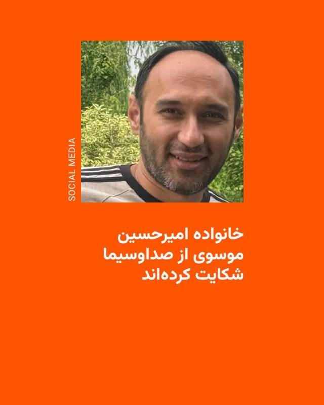

🔸مادر امیرحسین موسوی، کاربر فعال در شبکه‌های اجتماعی که از آذر ۱۴۰۳ در بازداشت به سر می‌برد، گفته است پخش اعترافات اجباری فرزندش از صداوسیما باعث تشدید اتهامات او شده و اتهام «همکاری با دولت‌های متخاصم» نیز به پروندهٔ او افزوده شده است.

🔸ثریا طالبی در گفت‌گو با و‌ب‌سایت امتداد گفت که ویدئوی منتشرشده از فرزندش در یکی از برنامه‌های خبری تلویزیون ایران تقطیع شده بوده و به‌گونه‌ای منتشر شده که «انگار امیرحسین در جریان جنگ ۱۲روزه اطلاعات یک سری از اماکن و نقاط را به دشمن داده و بعد هم فیلم آن را برای آن‌ها فرستاده است درحالی‌که امیرحسین در زمان وقوع جنگ در زندان بوده است.

🔸امیرحسین موسوی که با نام کاربری «جیمز بی‌دین» در شبکه‌های اجتماعی فعالیت می‌کرد، با انتشار نامه‌ای سرگشاده از زندان اوین اعلام کرد که تمام اتهامات مطرح‌شده علیه او «نادرست و تحریف‌شده» است. آقای موسوی نوشته بود که پس از ۱۴۸ روز انفرادی، بازداشت همسرش و تهدید به تکرار شکنجه‌ها، وادار به انجام مصاحبه‌ای اجباری شده است.

@RadioFarda

## RadioFarda — post 158692

  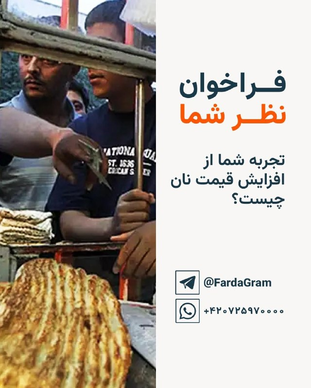

🔸 قیمت نان در تهران و ورامین تا ۱۰۰ درصد گران شد

🔸 خبرگزاری‌های ایلنا و مهر از دوبرابر شدن قیمت نان در تهران و ورامین خبر می‌دهند.

🔸 بر اساس بررسی‌های خبرگزاری کار ایران، قیمت نان لواش دو هزار و ۷۰۰ تومان، بربری ۱۰ هزار تومان و سنگک ۱۵ هزار و ۵۰۰ تومان قیمت‌گذاری شده و از عصر دوشنبه اول تیرماه روی دستگاه‌های نانو در نانوایی‌ها قیمت‌های جدید اعمال شده است.

🔸 قیمت نان لواش پیش از این افزایش رسمی قیمت، ۱۴۰۰ تومان، نان تافتون ۲۳۰۰ تومان، نان بربری ۵۳۰۰ تومان و نان سنگک ۷۴۰۰ تومان بود.
خبرگزاری مهر نوشته این افزایش قیمت‌ها نشان‌دهنده رشد ۱۰۰ درصدی قیمت نان در تهران و ورامین است.

🔸 افزایش قیمت نان چه تاثیری بر زندگی شما گذاشته است؟

🔸نظرات خود را می‌توانید در قالب پیام‌های صوتی و متن به نشانی‌های زیر ارسال کنید:

Telegram: @fardagram

WhatsApp: +420 725 970 000

@RadioFarda

## RadioFarda — post 158691

🔸مقام‌های اسرائیلی و لبنانی می‌گویند دو طرف در حال بررسی طرحی با حمایت آمریکا هستند که بر اساس آن اسرائیل بخشی از مناطق جنوب لبنان را که در جریان جنگ با حزب‌الله اشغال کرده است، به ارتش لبنان واگذار کند. 🔸خبرگزاری رویترز روز چهارشنبه ۳ تیر با اعلام این خبر…

## RadioFarda — post 158690

  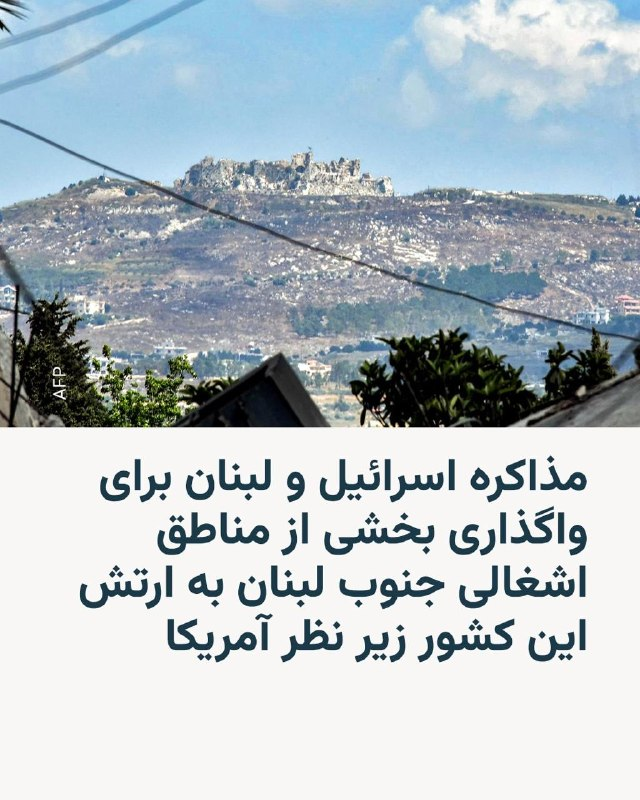

🔸مقام‌های اسرائیلی و لبنانی می‌گویند دو طرف در حال بررسی طرحی با حمایت آمریکا هستند که بر اساس آن اسرائیل بخشی از مناطق جنوب لبنان را که در جریان جنگ با حزب‌الله اشغال کرده است، به ارتش لبنان واگذار کند.

🔸خبرگزاری رویترز روز چهارشنبه ۳ تیر با اعلام این خبر به نقل از مقام‌های دو کشور افزود بر اساس این پیشنهاد، نیروهای ارتش لبنان که در این مناطق مستقر خواهند شد، تحت آموزش و ارزیابی آمریکا قرار می‌گیرند تا اطمینان حاصل شود با حزب‌الله، گروه مورد حمایت جمهوری اسلامی ایران که آمریکا آن را یک سازمان تروریستی می‌داند، ارتباطی ندارند.

🔸بر اساس این گزارش، در مقابل، اسرائیل حضور نظامی خود را در یک منطقه حائل در امتداد مرز حفظ خواهد کرد.

🔸به‌گفتهٔ این مقام‌ها، این طرح آزمایشی در جریان تازه‌ترین دور مذاکرات میان مقام‌های لبنانی و اسرائیلی که از روز سه‌شنبه در واشینگتن آغاز شده، مورد بررسی قرار گرفته است.

@RadioFarda

## RadioFarda — post 158689

مقامات اتحادیه اروپا، به‌رغم اعتراض‌ها، برای اولین بار با طالبان دیدار کردند

🔸اتحادیه اروپا، برای نخستین بار از زمان بازگشت طالبان به قدرت، در بروکسل میزبان هیئتی از این گروه بود تا دربارهٔ بازگرداندن شهروندان افغانستان فاقد حق اقامت در کشورهای اروپایی مذاکره کند. این دیدار با انتقاد شدید فعالان حقوق بشر روبه‌رو شده است.

🔸کمیسیون اروپا روز سه‌شنبه دوم تیرماه اعلام کرد که این مذاکرات با یک هیئت پنج نفره به ریاست عبدالقهار بلخی، سخنگوی وزارت خارجه طالبان، برگزار شده و بر موضوع بازگرداندن و پذیرش مجدد شهروندان افغان متمرکز بوده است.

🔸این نخستین دیدار رسمی مقام‌های اتحادیه اروپا با هیئتی از طالبان از زمان بازگشت این گروه به قدرت در افغانستان در سال ۱۴۰۰ به شمار می‌رود.

🔸خبرگزاری فرانسه به نقل از یک مقام طالبان گزارش داد که گفت‌وگوها «سازنده» بوده و دو طرف امیدوارند نتایج مثبتی از آن حاصل شود.

🔸کمیسیون اروپا ماه گذشته پس از درخواست ۲۰ کشور عضو اتحادیه برای گفت‌وگو با طالبان دربارهٔ بازگرداندن مهاجران افغان، از مقام‌های این گروه برای حضور در بروکسل دعوت کرد.

🔸مارکوس لامرت، سخنگوی کمیسیون اروپا، پیش از آغاز نشست‌ها گفته بود تمرکز کشورهای عضو بر بازگرداندن افرادی است که به دلیل ارتکاب جرایم جدی یا ملاحظات امنیتی امکان ادامه اقامت در اروپا را ندارند.

🔸این سفر با واکنش تند مدافعان حقوق بشر روبه‌رو شده است. منتقدان می‌گویند گفت‌وگو با طالبان در شرایطی انجام می‌شود که این گروه همچنان به نقض گسترده حقوق زنان و دختران ادامه می‌دهد.

🔸ملاله یوسف‌زی، برنده جایزه صلح نوبل، در واکنش به این دیدار گفت طالبان زنان و دختران را از زندگی عمومی حذف کرده‌اند و دعوت این گروه به بروکسل او را «بسیار نگران و شوکه» کرده است.

🔸فرشته عباسی، پژوهشگر افغانستان در سازمان دیده‌بان حقوق بشر، نیز گفت کشورهای اروپایی با محکوم کردن نقض حقوق بشر توسط طالبان از یک سو و همکاری با این گروه برای بازگرداندن اجباری افغان‌ها از سوی دیگر، اعتبار خود را تضعیف می‌کنند.

🔸پس از بازگشت طالبان به قدرت در مرداد ۱۴۰۰، کشورهای اروپایی سفارت‌های خود را در کابل تعطیل کردند. با این حال، در برخی کشورها از جمله آلمان و هلند، دیپلمات‌های منصوب طالبان در نمایندگی‌های افغانستان خدمات کنسولی ارائه می‌کنند.

🔸 گزارش کامل را در وب‌سایت رادیوفردا بخوانید.

@RadioFarda

## RadioFarda — post 158688

سنای آمریکا به محدود کردن قدرت ترامپ برای ادامه جنگ رأی مثبت داد؛ ترامپ: بی‌معنی است

🔸چند روز پس از امضای یادداشت تفاهم میان آمریکا و جمهوری اسلامی، سنای ایالات متحده در یک رأی‌گیری تازه به مشروط‌شدن ادامۀ جنگ با ایران رأی داد.

🔸بر اساس رأی مثبت ۵۰ سناتور در مقابل ۴۸ رأی مخالف، این جنگ باید متوقف شود و رئیس‌جمهور ایالات متحده برای از سر گرفتن آن به مجوز کنگره نیاز خواهد داشت؛ هرچند این مصوبه برای امضا به دونالد ترامپ ارائه نخواهد شد و عمدتاً جنبۀ نمادین دارد.

🔸این طرح که ابتدا در مجلس نمایندگان تصویب شده بود، دونالد ترامپ را ملزم می‌کند که نیروهای ایالات متحده را از درگیری با ایران خارج کند، مگر آن‌که کنگره به‌طور مشخص مجوز این اقدام را صادر کند.

🔸در رأی‌گیری سنا، ۵۰ سناتور از جمله چهار سناتور جمهوریخواه به این لایحه رأی مثبت دادند. از سوی دیگر، یک سناتور دموکرات به آن رأی منفی داد.

🔸رئیس‌جمهور ایالات متحده به‌تندی از کنگره به‌دلیل تصویب لایحۀ عمدتاً نمادین «اختیارات جنگ»، که با هدف پایان‌دادن به جنگ ایران تهیه شده، انتقاد و این اقدام کنگره را «به‌شدت بی‌موقع و بی‌معنی» توصیف کرد.

🔸رئیس‌جمهور ایالات متحده با انتشار مطلبی در شبکۀ اجتماعی خود، تروث سوشال، نوشت: «درحالی‌که ایران را در وضعیت اسفناکی در آستانۀ سقوط کامل قرار داده‌ام، کنگرۀ ایالات متحده تصمیم می‌گیرد در مورد لایحۀ اختیارات جنگ، یک رأی‌گیری به‌شدت بی‌موقع و بی‌معنی برگزار کند.»

🔸 گزارش کامل را در وب‌سایت رادیوفردا بخوانید.

@RadioFarda

## RadioFarda — post 158687

  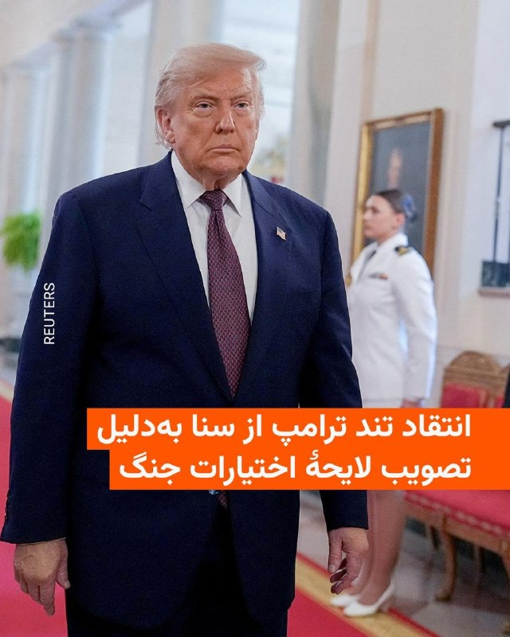

🔸رئیس‌جمهور ایالات متحده به تندی از سنا به‌دلیل تصویب لایحۀ عمدتاً نمادین «اختیارات جنگ»، که با هدف پایان‌دادن به جنگ ایران تهیه شده، انتقاد کرد.

🔸دونالد ترامپ این اقدام را «به‌شدت بی‌موقع و بی‌معنی» توصیف کرد.

🔸رئیس‌جمهور ایالات متحده با انتشار مطلبی در شبکۀ اجتماعی «تروث سوشال» نوشت: «در حالی‌که ایران را در وضعیت اسفناکی در آستانۀ سقوط کامل قرار داده‌ام، سنای ایالات متحده تصمیم می‌گیرد در مورد لایحۀ اختیارات جنگ، یک رأی‌گیری به‌شدت بی‌موقع و بی‌معنی برگزار کند».

🔸دونالد ترامپ در ادامه نوشت: «سناتورها کار من را سخت‌تر کردند؛ اما من کارم را هر طور که شده به پایان می‌برم، چون این کاری است که همیشه انجام می‌دهم».

🔸در رأی‌گیری سنا، ۵۰ سناتور از جمله ۴ سناتور جمهوریخواه به این لایحه رأی مثبت دادند. از سوی دیگر، یک سناتور دموکرات به آن رأی منفی داد.

@RadioFarda

## RadioFarda — post 158685

  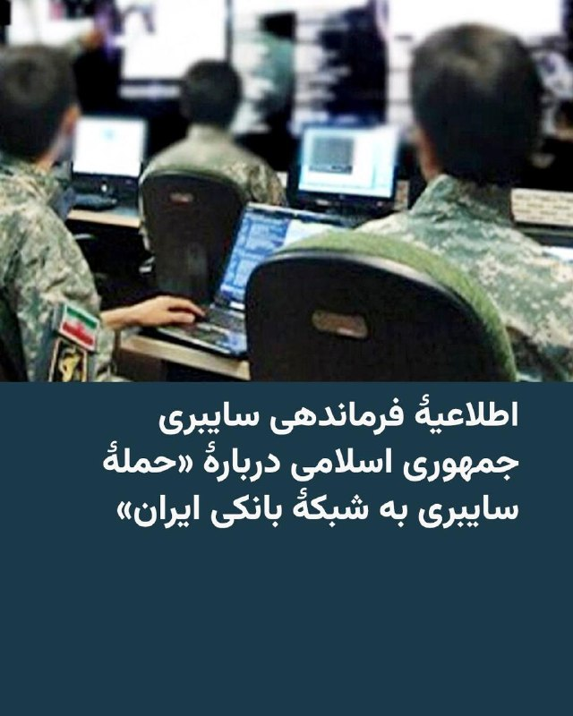

🔸فرماندهی سایبری ایران، با انتشار اطلاعیه‌ای، اختلال در دسترسی کاربران به خدمات چند بانک را ناشی از «یک حملۀ سایبری به زیرساخت‌های بانکی» اعلام کرد.

🔸این نهاد جمهوری اسلامی ادعا کرده که با شناسایی سریع این حمله، آن‌را خنثی کرده؛ اما «برای حفظ امنیت داده‌ها و جلوگیری از سوء استفاده‌های احتمالی»، برخی خدمات مرتبط با کارت‌های بانکی، به طور موقت از دسترس خارج شده‌اند.

🔸در این اطلاعیه به منشاء حملۀ سایبری اشاره نشده است.
روز سه‌شنبه گزارش‌هایی از اختلال در دسترسی کاربران به خدمات بانک‌های ملی، صادرات و تجارت منتشر شده بود.

🔸همچنین برخی شهروندان هم از بروز اختلال در شبکۀ پرداخت یکپارچۀ جایگاه‌های سوخت خبر داده و گفته بودند که برای دریافت سوخت، ناچار به پرداخت نقدی شده‌اند.

@RadioFarda

## RadioFarda — post 158684

  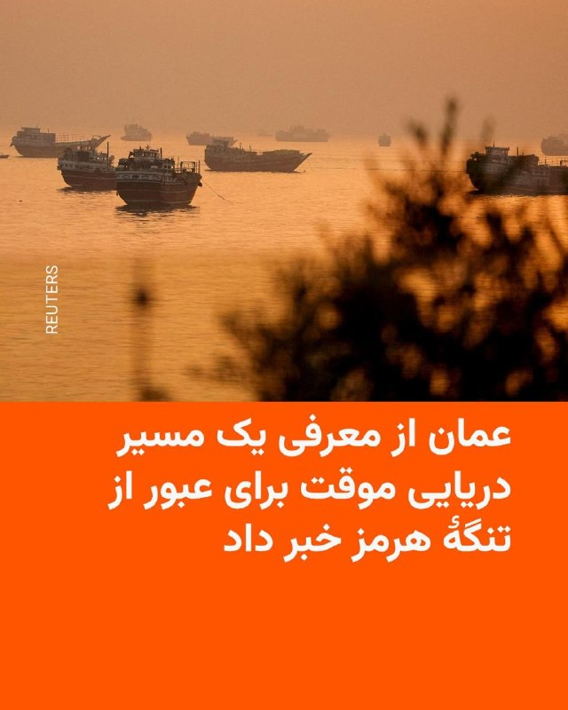

🔸عمان از معرفی یک مسیر دریایی موقت برای عبور از تنگۀ هرمز و با هماهنگی با سازمان بین‌المللی دریانوردی خبر داد.
به گزارش خبرگزاری دولتی عمان، این اقدام برای تسهیل عبور شناورهایی که قصد عبور از این آبراه مهم را دارند، در نظر گرفته شده است.

🔸بر اساس این اطلاعیه، کشتی‌هایی که قصد استفاده از این مسیر موقت را دارند، باید پس از هماهنگی با سازمان بین‌المللی دریانوردی و بر اساس مختصاتی که از سوی این نهاد بین‌المللی و مقام‌های عمانی اعلام شده، حرکت کنند.

🔸این اطلاعیه تأکید می‌کند که این تصمیم با هدف تضمین آزادی کشتی‌رانی در این آبراه راهبردی در راستای قوانین بین‌المللی و قانون دریاها اتخاذ شده تا از آزادی کشتی‌رانی بدون نیاز به پرداخت عوارض اطمینان حاصل شود.

🔸پیشتر مقام‌های ایرانی که پس از سوییس به عمان سفر کرده بودند، از توافقی برای برنامه‌ریزی و تدوین سازوکاری مشترک با عمان برای دریافت کارمزد ارائۀ خدمات دریایی به کشتی‌های عبوری از تنگۀ هرمز خبر داده بودند. مقام‌های ایرانی البته تأکید کرده بودند که این به معنای دریافت عوارض عبور نخواهد بود و کارمزد، صرفاً در مقابل ارائۀ خدمات دریافت خواهد شد.

@RadioFarda

## BBCPersian — post 284902

🔻آژانس هوانوردی اروپا از شرکت‌های هواپیمایی خواست همچنان در حریم هوایی خاورمیانه احتیاط کنند

آژانس ایمنی هوانوردی اروپا هشدار احتیاط در پرواز بر آسمان کشورهای خاورمیانه را تا اول ژوئیه (چهارشنبه آینده) تمدید کرد.

بنابر اعلام این نهاد، با وجود تفاهم ایران و آمریکا مادامی که احتمال نقض آتش‌بس وجود دارد، باید در سراسر منطقه با احتیاط پرواز کرد.

آژانس ایمنی هوانوردی اروپا به‌ویژه درباره احتمال نقض‌ کوتاه‌مدت آتش‌بس در منطقه تنگه هرمز و حریم هوایی آن هشدار داد. این نهاد ایمنی هوایی تاکید کرد همین وضعیت هشدار در لبنان هم وجود دارد.

این نهاد از همه اپراتورها خواست هنگام پرواز در حریم هوایی کشورهای بحرین، کویت، اسرائیل، اردن، قطر، عمان، امارات متحده عربی و عربستان سعودی، امنیت‌سنجی کنند.

از زمان آغاز جنگ ایران اختلال گسترده‌ای در پروازهای منطقه به وجود آمده است.

@BBCPersian

## BBCPersian — post 284901

🔻قالیباف: پایان جنگ در لبنان به اندازه پایان جنگ در ایران مهم است

محمدباقر قالیباف در یک سخنرانی‌ گفت پایان جنگ در لبنان به اندازه پایان جنگ در ایران برای تهران اهمیت دارد.

رئیس مجلس ایران در اجلاس کنفرانس اتحادیه مجالس کشورهای عضو سازمان همکاری اسلامی در باکو سخنرانی کرد.

او گفت ایران آماده است روابطش را با تمام کشورهای اسلامی بر اساس احترام متقابل و عدم دخالت در امور داخلی یکدیگر توسعه دهد.

@BBCPersian

## BBCPersian — post 284900

🔻«طرح آزمایشی» آمریکا و اسرائیل برای انتقال کنترل جنوب لبنان به ارتش این کشور

خبرگزاری رویترز گزارش داد که اسرائیل و لبنان در حال بررسی یک پروژه آزمایشی با حمایت آمریکا است که نیروهای اسرائیلی کنترل بخشی از مناطق جنوب لبنان را به ارتش لبنان واگذار کنند.

رویترز به نقل از سه مقام ارشد اسرائیلی نوشت نیروهای لبنانیِ درگیر در این طرح تحت آموزش و بررسی‌های امنیتی آمریکا قرار می‌گیرند تا اطمینان حاصل شود ارتباطی با حزب‌الله ندارند.

به گفته این منابع، تا زمان واگذاری امنیت مناطقی از جنوب لبنان به نیروهای لبنانی، اسرائیل در منطقه خواهد ماند.

آمریکا و اسرائیل هنوز به طور رسمی این موضوع را تایید نکرده‌اند.

گفته می‌شود دور تازه مذاکرات اسرائیل و لبنان امروز آغاز خواهد شد.

موضوع عقب‌نشینی و توقف جنگ در تمام جبهه‌ها از جمله لبنان، بند نخست تفاهمنامه آمریکا و ایران با هدف خاتمه جنگ است.

@BBCPersian

## BBCPersian — post 284899

🔻گزارش رسانه‌های ایران از «رفع اختلال» در خدمات بعضی بانک‌های ایران

رسانه‌های ایران به نقل از شرکت خدمات انفورماتیک از رفع اختلال در خدمات کارت محور بعضی بانک‌های ایرانی خبر داده‌اند و گفته‌اند که «خدمات بانکی به وضعیت عادی بازگشته است.»

بر اساس این گزارش‌ها، هدف از این اختلال، «جلوگیری از دسترسی غیرمجاز و حفاظت از امنیت اطلاعات و دارایی‌های مشتریان» اعمال شده بود.

دیروز بعضی رسانه‌های ایران بر اساس گزارش‌های مردمی گفته بودند خدمات بانکی چندین بانک بزرگ ایران دچار اختلال شده است.

شرکت خدمات انفورماتیک حملات سایبری به بانک‌ها را تائید کرده بود.

این اختلال باعث شده بود که در بعضی موارد، حتی انجام عملیات خرید با کارت‌های بانکی هم امکان‌پذیر نباشد.

@BBCPersian

## BBCPersian — post 284898

🔻چرا ایران حاضر نیست حزب‌الله لبنان را از توافق با آمریکا جدا کند؟

سعید جعفری، روزنامه‌نگار

اگر روزهای ابتدایی اسفند کسی پیش‌بینی می‌کرد که حمله اسرائيل و آمریکا به ایران در نهایت به توافق آتش‌بسی منجر می‌شود که در آن مقام‌های ایرانی، باز کردن تنگه هرمز را به پایان حملات اسرائيل به لبنان هم پیوند می‌زنند، احتمالا کمتر کسی آن‌‌را باور می‌کرد.

اما بعد از انتشار جزئیات تفاهم تهران و واشنگتن مشخص شد که لبنان در متن و حاشیه این معامله نقش پررنگی دارد.

در ظاهر، موضوع اصلی تفاهم، پایان دادن به جنگ ایران و آمریکا، بازگشایی مسیرهای کشتیرانی، مهار بحران اقتصادی ناشی از بسته شدن تنگه هرمز و باز کردن مسیر مذاکرات هسته‌ای بود. اما ایران اصرار داشت که لبنان و جبهه حزب‌الله نیز از این چارچوب بیرون نماند.

اصراری که به حرکت بر لبه یک تیغ می‌ماند؛ از یک سو می‌تواند ایران را در موضع قدرت قرار دهد و از طرف دیگر ممکن است به قیمت بر باد رفتن این توافق و بازگشت آتش به کل منطقه بینجامد.

اما چرا جمهوری اسلامی حاضر نیست حزب‌الله لبنان را از توافق با آمریکا جدا کند؟

به نظر می‌رسد حزب‌الله برای ایران فقط یک نیروی نظامی در مرز اسرائیل نیست. این گروه همزمان بخشی از اهرم چانه‌زنی تهران، نمادی از اعتبار منطقه‌ای جمهوری اسلامی و عنصری مهم در نگاه حامیان ایدئولوژیک حکومت به سیاست خارجی ایران محسوب می‌شود.

https://bbc.in/4oJQrFx
@BBCPersian

## BBCPersian — post 284890

🔻پستی که ترکی آل شیخ، رئیس اداره کل سرگرمی عربستان سعودی، در شبکه اجتماعی ایکس منتشر کرد و در آن از مسلمان شدن جیانکارلو اسپوزیتو، بازیگر آمریکایی سریال برکینگ بد، خبر داد، با واکنش گسترده کاربران شبکه‌های اجتماعی در جهان عرب همراه شد.

آقای آل شیخ ویدیویی منتشر کرد که به گفته او، این بازیگر آمریکایی را در حال اقامه نماز در یکی از مساجد عربستان نشان می‌دهد. او در توضیح این ویدیو نوشت: «جیانکارلو اسپوزیتو، ستاره فیلم '۷ سگ' و سریال 'برکینگ بد'، شهادتین را بر زبان آورد و همراه گروه تولید فیلم در مسجد نماز خواند. او پس از تجربه مثبت تعامل با مسلمانان هنگام فیلمبرداری در عربستان سعودی، این تصمیم را گرفت. این ویدیو نیز مربوط به دیروز و در کنار کارکنان شرکت صله است... الحمدلله.»
ادامه مطلب⬇️

📸Europa Press via Getty Images/ Gamma-Rapho via Getty Images)/ NurPhoto via Getty Images/ Anadolu via Getty
@BBCPersian

## Dirty_Kids — post 392959

  <a href="telegram/content/Dirty_Kids_392959_1782291755.mp4" target="_blank">🎬 Download video</a>

💰🤑 پول تراپی

@Dirty_Kids 👻

## Dirty_Kids — post 392958

  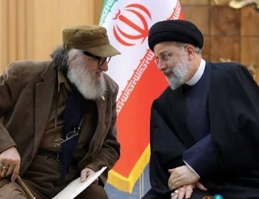

‏به شما یونجه دادن؟

@Dirty_Kids 👻

## Dirty_Kids — post 392957

  <a href="telegram/content/Dirty_Kids_392957_1782291758.mp4" target="_blank">🎬 Download video</a>

من که جرأت ندارم
شما دارین بگین😂🖐️

@Dirty_Kids 👻

## Dirty_Kids — post 392956

  <a href="telegram/content/Dirty_Kids_392956_1782291759.mp4" target="_blank">🎬 Download video</a>

امروز سنای آمریکا با ۵۰رای موافق در برابر ۴۸رای مخالف، قطعنامه اختیارات جنگی را تصویب کرد.این قطعنامه منجر به محدود شدن اختیارات ترامپ و ملزم شدن او به پایان حمله نظامی علیه ایران می‌شود.

این طرح در هر دو مجلس تصویب شده و برای امضا به ترامپ ارسال نمیشود‌

@Dirty_Kids 👻

## Dirty_Kids — post 392955

  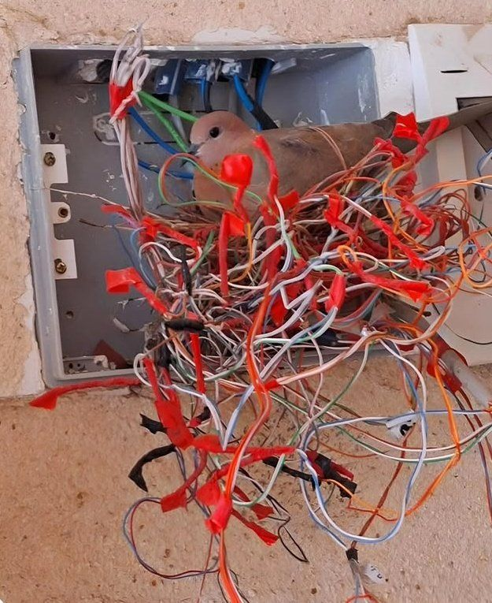

‏یاکریم با این ضریب هوشی نباید تاحالا از چرخه طبیعت حذف شده بود؟

@Dirty_Kids 👻

## Dirty_Kids — post 392954

‏اگر سریعتر عمل کنن تا تیم فوتبال جمهوری اسلامی آمریکاست میتونن تو بار زدن یونجه‌ها کمک کنن.

@Dirty_Kids 👻

## Dirty_Kids — post 392953

  <a href="telegram/content/Dirty_Kids_392953_1782291762.mp4" target="_blank">🎬 Download video</a>

وقتی یه ابر ☁️ گم میشه و تو پیداش میکنی

@Dirty_Kids 👻

## Dirty_Kids — post 392952

  <a href="telegram/content/Dirty_Kids_392952_1782291765.mp4" target="_blank">🎬 Download video</a>

دوستان کربلا چه خبره؟🫪

@Dirty_Kids 👻

## Hranews — post 113822

تربت حیدریه؛ تداوم بازداشت و بی خبری از وضعیت الیاس قدارنجو

❗️
❗️
❗️
❗️
❗️– الیاس قدارنجو (رودینی)، طلبه اهل سنت، روز چهارشنبه ۲۸ خردادماه توسط ماموران اداره اطلاعات در شهرستان تربت حیدریه بازداشت شده‌ و کماکان از محل نگهداری وی اطلاعی حاصل نشده است. بی‌خبری از سرنوشت این شهروند، افزایش نگرانی‌های خانواده و بستگان او را در پی داشته است.

#الیاس_قدارنجو #الیاس_رودینی

ادامه مطلب

↘️
@hranews_bot تماس ✉️ - @Hranews کانال هرانا 🆑

## Hranews — post 113821

  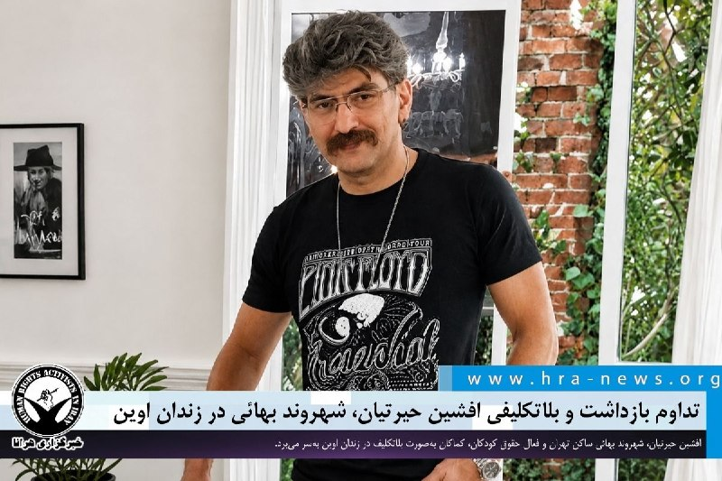

تداوم بازداشت و بلاتکلیفی افشین حیرتیان، شهروند بهائی در زندان اوین

❗️
❗️
❗️
❗️
❗️– افشین حیرتیان، شهروند #بهائی ساکن تهران و فعال حقوق کودکان علیرغم گذشت بیش از هفت ماه از زمان بازداشت، کماکان به‌صورت بلاتکلیف در زندان اوین به‌سر می‌برد.

به گزارش خبرگزاری هرانا، ارگان خبری مجموعه فعالان حقوق بشر در ایران، افشین حیرتیان کماکان در بازداشت به‌سر می‌برد.

بر اساس اطلاعات دریافتی هرانا، آقای حیرتیان با وجود گذشت ۲۲۶ روز از زمان بازداشت، کماکان به‌صورت بلاتکلیف در سالن یک بند هفت زندان اوین نگهداری می‌شود. همچنین پرونده وی در شعبه ۲۶ دادگاه انقلاب تهران در حال رسیدگی است. با این حال، او از دسترسی به وکیل محروم مانده و امکان آزادی موقت وی با تودیع وثیقه نیز فراهم نشده است.

#افشین_حیرتیان

ادامه مطلب

↘️
@hranews_bot تماس ✉️ - @Hranews کانال هرانا 🆑

## Hranews — post 113820

امیرمحمد سورمه، دانشجوی دانشگاه صنعتی امیرکبیر اخراج شد

❗️
❗️
❗️
❗️
❗️– امیرمحمد سورمه، دانشجوی دانشگاه صنعتی امیرکبیر توسط کمیته انضباطی بدوی این دانشگاه اخراج شد.

#امیرمحمد_سورمه

ادامه مطلب

↘️
@hranews_bot تماس ✉️ - @Hranews کانال هرانا 🆑

## Hranews — post 113819

جاسک؛ گزارشی از بازداشت یک طلبه اهل سنت و برادرش

❗️
❗️
❗️
❗️
❗️– حمزه ترابی، طلبه اهل سنت و برادرش طالب ترابی، شهروندان اهل جاسک در بازداشت به سر می‌برند. حمزه در تاریخ ۳۱ خردادماه، پس از احضار به اداره اطلاعات جاسک بازداشت و به بندرعباس منتقل شده است. برادر او نیز حدود یک ماه پیش بازداشت و از سرنوشت او اطلاعی در دست نیست.

#حمزه_ترابی #طالب_ترابی

ادامه مطلب

↘️
@hranews_bot تماس ✉️ - @Hranews کانال هرانا 🆑

## Hranews — post 113818

تحت نظارت پابند الکترونیکی؛ گلاله وطن‌ دوست از زندان سنندج آزاد شد

❗️
❗️
❗️
❗️
❗️– گلاله وطن‌ دوست، وکیل دادگستری تحت نظارت پابند الکترونیکی از زندان سنندج آزاد شد. وی باقیمانده دوران محکومیت خود را در خارج از زندان و با محدودیت تردد سپری خواهد کرد.

#گلاله_وطن‌_دوست

ادامه مطلب

↘️
@hranews_bot تماس ✉️ - @Hranews کانال هرانا 🆑

## manototv — post 106217

  <a href="telegram/content/manototv_106217_1782291768.mp4" target="_blank">🎬 Download video</a>

بعد از کشتار ۱۸ و ۱۹ دی، بسیاری از ایرانیان با یک سؤال دردناک روبه‌رو هستند: اگر رژیمی حاضر است برای ماندن، مردم را در خیابان بکشد، مردم چگونه می‌توانند با آن مقابله کنند؟

## alonews — post 129981

  <a href="telegram/content/alonews_129981_1782291771.mp4" target="_blank">🎬 Download video</a>

👈زیباترین عزاداری این روزها

✅ @AloNews خبر جنگ

## alonews — post 129980

  <a href="telegram/content/alonews_129980_1782291773.webm" target="_blank">🎬 Download video</a>

👈آژانس ایمنی هوانوردی اروپا به شرکت‌های هواپیمایی توصیه کرد همچنان از پرواز در حریم هوایی ایران خودداری کنند

✅ @AloNews خبر جنگ

## alonews — post 129979

  <a href="telegram/content/alonews_129979_1782291774.webm" target="_blank">🎬 Download video</a>

👈رئیس جمهور لبنان: مذاکرات اسرائیل و لبنان در واشنگتن در حال انجام است و جدا از آنچه در جلسات سوئیس بین ایالات متحده و ایران منتشر شد، می‌باشد.

🔴تلاش برای تثبیت آتش‌بس در جنوب در حال انجام است و پس از آن نیروهای اسرائیلی عقب‌نشینی خواهند کرد

✅ @AloNews خبر جنگ

## alonews — post 129978

  <a href="telegram/content/alonews_129978_1782291774.webm" target="_blank">🎬 Download video</a>

👈رویترز: قراردادهای آتی نفت خام برنت به ۷۵.۷۴ دلار کاهش یافت که پایین‌ترین سطح آن از ۲۷ فوریه گذشته است

✅ @AloNews خبر جنگ

## alonews — post 129977

  <a href="telegram/content/alonews_129977_1782291774.webm" target="_blank">🎬 Download video</a>

👈الجزیره: برای شبی دیگر در لبنان، خبر چندانی از تبادل درگیری‌های نظامی وجود نداشته

🔴 به نظر می‌رسد که آتش‌بس همچنان برقرار است

✅ @AloNews خبر جنگ

## alonews — post 129976

  <a href="telegram/content/alonews_129976_1782291775.webm" target="_blank">🎬 Download video</a>

👈مخابره کد اضطراری توسط سوخت‌رسان آمریکایی در آسمان امارات

🔴یک فروند هواپیمای سوخت‌رسان KC-135R ارتش آمریکا که از فرودگاه بن‌گوریون در اراضی اشغالی برخاسته بود،، در حین پرواز بر فراز امارات و تنگه هرمز، کد اضطراری ۷۷۰۰ را مخابره کرد. این سوخت‌رسان سپس تغییر مسیر داده و به تل‌آویو بازگشت.

🔴ارسال این کد به معنای وجود یک وضعیت اضطراری و فوری است که نیاز به فرود دارد

✅ @AloNews خبر جنگ

## alonews — post 129975

  <a href="telegram/content/alonews_129975_1782291775.mp4" target="_blank">🎬 Download video</a>

👈قالیباف: تفاهم اسلام آباد حاصل مقاومت و اقتدار ملت شجاع ایران بود

🔴 این یادداشت تبدیل به اعلامیه شکست آمریکا شد

✅ @AloNews خبر جنگ

## alonews — post 129974

  <a href="telegram/content/alonews_129974_1782291777.webm" target="_blank">🎬 Download video</a>

👈قالیباف: همسایگی صرفاً یک واقعیت جغرافیایی نیست؛ بلکه یک مسئولیت هم هست.

🔴 هیچ سیاستی که بر پایه حذف، تضعیف یا بی‌ثبات‌سازی همسایگان طراحی شود، در نهایت به ثبات پایدار برای هیچ طرفی منجر نخواهد شد.

🔴 درمیانه جنگ اخیر نیز بر اساس نظر رهبر معظم انقلاب اعلام کرده بودم ایران با نهایت علاقمندی به همه کشورهای اسلامی خصوصا کشورهای‌منطقه، بویژه کشورهای ‌حاشیه ‌خلیج‌ فارس اعلام می‌کند که آماده توافق های امنیتی است که با همکاری های اقتصادی پایدار شود و سرزمین های اسلامی برای تمام سرمایه گذاران، امن شده و دربرابر دشمنان مشترک خود ایمن شود.

🔴جمهوری اسلامی ایران دست برادری و همکاری خود را به سوی همه کشورهای اسلامی دراز می‌کند

✅ @AloNews خبر جنگ

## alonews — post 129973

  <a href="telegram/content/alonews_129973_1782291777.webm" target="_blank">🎬 Download video</a>

👈قالیباف: امنیت منطقه باید توسط کشورهای منطقه تامین شود / هیچ کشوری امنیت خود را در ناامنی دیگران نخواهد یافت

✅ @AloNews خبر جنگ

## alonews — post 129972

  <a href="telegram/content/alonews_129972_1782291778.webm" target="_blank">🎬 Download video</a>

👈قالیباف: ایران از صلح استقبال می‌کند؛ صلحی که بر پایه حقوق ملت‌ها، احترام متقابل، تعهدات متوازن و منافع مشروع باشد.

🔴بر همین مبنا معتقدیم دفاع مقتدرانه، انسجام ملی و دیپلماسی، سه رکن مکمل یکدیگرند و تلفیق هوشمندانه آن‌ها، تضمین‌کننده امنیت و ثبات است.

✅ @AloNews خبر جنگ

## alonews — post 129971

  <a href="telegram/content/alonews_129971_1782291778.webm" target="_blank">🎬 Download video</a>

👈قالیباف: ایران آمادگی دارد با همه کشورهای اسلامی، بر اساس اصول احترام متقابل، عدم مداخله در امور داخلی، حسن همجواری و منافع مشترک، همکاری‌های خود را گسترش دهد.

🔴ایران از هر ابتکار عملی برای شکل‌گیری سازوکارهای مشترک اقتصادی، تجاری، مالی، علمی و امنیتی جمعی حمایت کامل می‌کند.

🔴ما در سخت‌ترین وپیچیده‌ترین شرایط، دوستان و شرکای راهبردی خود را تنها نگذاشته‌ایم.

🔴 برای ما، آتش‌بس در لبنان به اندازه آتش‌بس در ایران و در ادامه، خاتمه جنگ در لبنان به اندازه خاتمه جنگ در ایران اهمیت داشته و دارد و باور داریم که ثبات واقتدار در هر نقطه ازجهان اسلام، به تقویت عاملیت، عزت و ثبات در کل امت اسلامی منجر خواهد شد.

✅ @AloNews خبر جنگ

## alonews — post 129970

  <a href="telegram/content/alonews_129970_1782291778.webm" target="_blank">🎬 Download video</a>

👈وزارت خارجه پاکستان: مذاکرات فنی در سطح کارشناسی هفته آینده با میانجیگری پاکستان و قطر از سر گرفته خواهد شد

✅ @AloNews خبر جنگ

## alonews — post 129969

  <a href="telegram/content/alonews_129969_1782291779.webm" target="_blank">🎬 Download video</a>

👈سخنگوی وزارت خارجه پاکستان: در حال برقراری ارتباط با دو طرف آمریکایی و ایرانی برای اجرای مؤثر تفاهم‌نامه هستیم

✅ @AloNews خبر جنگ

## alonews — post 129968

  <a href="telegram/content/alonews_129968_1782291779.webm" target="_blank">🎬 Download video</a>

👈معاون وزیر ارتباطات: نسبت دادن اختلالات اخیر بانکی به بازگشایی اینترنت بین‌الملل ادعایی غیرکارشناسانه است

✅ @AloNews خبر جنگ

## alonews — post 129967

  <a href="telegram/content/alonews_129967_1782291779.webm" target="_blank">🎬 Download video</a>

👈 رافائل گروسی، مدیرکل آژانس بین‌المللی انرژی اتمی: از تأسیسات هسته‌ای ایران بازرسی خواهیم کرد

🔴ما معتقدیم که بازرسی از تأسیسات هسته‌ای ایران در اسرع وقت بهترین گزینه است

🔴اولویت اصلی ما مشخص کردن محل ذخایر اورانیوم غنی‌شده با خلوص بالای ایران است.

🔴ما از محل اورانیوم غنی‌شده با خلوص بالا اطلاع داریم، اما مهم است که ایران ما را از آن مطلع کند.

🔴به زودی با ایران برای تعیین تاریخ بازرسی‌ها و جزئیات مربوطه مذاکره خواهیم کرد

🔴آژانس ما بازرسی را انجام خواهد داد و این به تهران بستگی دارد که واشنگتن یا ناظران دیگر را دعوت کند.

✅ @AloNews خبر جنگ

## alonews — post 129966

  <a href="telegram/content/alonews_129966_1782291780.webm" target="_blank">🎬 Download video</a>

👈ترامپ: آمریکای زیبا هرگز یک کشور کمونیستی نخواهد شد!!!

✅ @AloNews خبر جنگ

## alonews — post 129965

  <a href="telegram/content/alonews_129965_1782291780.webm" target="_blank">🎬 Download video</a>

👈ترامپ: همه از نتانیاهو خسته شده‌اند

✅ @AloNews خبر جنگ

## alonews — post 129964

  <a href="telegram/content/alonews_129964_1782291780.mp4" target="_blank">🎬 Download video</a>

👈پست جدید ترامپ که توی پیجش قرار داده و مضمونش بر اینه که هیچوقت نمیزارم جمهوری اسلامی به سلاح هسته‌ای دست پیدا کنه

✅ @AloNews خبر جنگ

## alonews — post 129963

  <a href="telegram/content/alonews_129963_1782291782.webm" target="_blank">🎬 Download video</a>

👈وال استریت ژورنال : اسرائیل با فشارهای آمریکا برای خروج نیروهایش از جنوب لبنان روبه‌رو است

✅ @AloNews خبر جنگ

## alonews — post 129962

  <a href="telegram/content/alonews_129962_1782291783.webm" target="_blank">🎬 Download video</a>

👈قالیباف: بعد از جنگ اخیر، شرایط منطقه متفاوت شده و باید با نگاه دیگری آن را دید

🔴 در گذشته برداشت برخی کشور‌ها این بود که نیرو‌ها و کشور‌هایی که از هزاران کیلومتر دورتر وارد شده‌اند، می‌توانند امنیت منطقه را برقرار کنند، اما بعد از جنگ اخیر مشخص شد که نمی‌توانند و خود از عوامل ضد امنیتی هستند

🔴 باید از این نگاه جدید در منطقه استفاده کنیم

✅ @AloNews خبر جنگ

<!-- MSG END -->

<!-- NAV START -->

<a href="https://github.com/Tljn/FUD/blob/main/telegram/content/archive_1.md" style="display:inline-block; padding:6px 12px; margin:0 4px; background-color:#2ea44f; color:white; text-decoration:none; border-radius:4px; font-weight:bold;">صفحه بعد</a>

<!-- NAV END -->
