# خواننده تلگرام

<!-- TOP_NAV START -->

<a href="https://github.com/Tljn/FUD/blob/main/telegram/content/archive_1.md" style="display:inline-block; padding:6px 12px; margin:0 4px; background-color:#2ea44f; color:white; text-decoration:none; border-radius:4px; font-weight:bold;">صفحه بعد</a>

<!-- TOP_NAV END -->

<!-- MSG START -->

---
📅 بروزرسانی: 1405/03/02 14:24
---

## VahidOOnLine — post 241694

  <a href="telegram/content/VahidOOnLine_241694_1779533668.mp4" target="_blank">🎬 Download video</a>

دولت آمریکا اعلام کرد بیشتر مهاجرانی که قصد دریافت گرین‌کارت دارند، باید خاک این کشور را ترک کرده و درخواست خود را از طریق سفارت‌خانه‌ها یا کنسولگری‌های آمریکا در خارج ثبت کنند.
اداره خدمات شهروندی و مهاجرت آمریکا اعلام کرد از این پس دارندگان ویزای موقت، دانشجویی یا توریستی تنها در «شرایط استثنایی» می‌توانند داخل آمریکا وضعیت اقامت خود را تغییر دهند.
این تصمیم بخشی از سیاست‌های مهاجرتی دولت ترامپ برای محدود کردن مهاجرت غیرقانونی عنوان شده و راهی را می‌بندد که پیش‌تر به برخی مهاجران اجازه می‌داد هنگام حضور در آمریکا برای گرین‌کارت اقدام کنند.
منتقدان می‌گویند این تغییر می‌تواند باعث جدایی خانواده‌ها و ایجاد بلاتکلیفی برای صدها هزار مهاجر قانونی شود. همچنین برخی متقاضیان ممکن است پس از خروج از آمریکا دیگر اجازه بازگشت دریافت نکنند.
دولت آمریکا می‌گوید این سیاست باعث «عادلانه‌تر و کارآمدتر» شدن سیستم مهاجرتی خواهد شد.
‌🏁 🇬🇧 ManotoTV

🤖 @VahidOOnLine

## VahidOOnLine — post 241693

  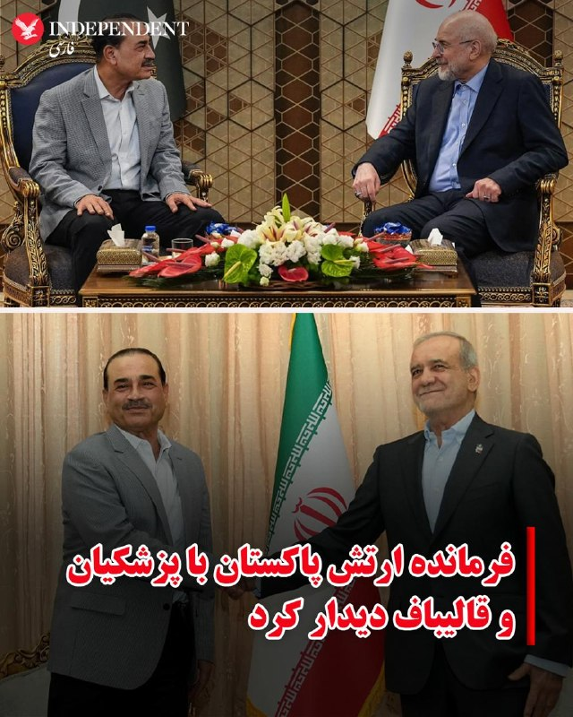

♦️بر اساس تصاویر منتشر شده در رسانه‌های رسمی ایران، فیلد مارشال عاصم منیر، روز شنبه دوم خرداد ماه در تهران با مسعود پزشکیان و محمدباقر قالیباف دیدار کرده است.
در حالی که از جزئیات این دیدارها اطلاعاتی منتشر نشده، رسانه‌ها در از دومین دیدار میان فرمانده ارتش پاکستان و عباس عراقچی، وزیر امور خارجه ایران طی ۲۴ ساعت گذشته خبر داده‌اند.
پیشتر شبکه خبری العربیه گزارش کرده بود، واشنگتن از طریق عاصم منیر به تهران هشدار داده است، در صورت شکست مذاکرات جنگ از سرگرفته خواهد شد.
‌🇸🇦 Indypersian

🤖 @VahidOOnLine

## VahidOOnLine — post 241692

🔻اسرائیل‌هیوم: واشینگتن و تل‌آویو درباره حذف مجتبی خامنه‌ای اختلاف دارند

به گزارش اسرائیل‌هیوم، آمریکا و اسرائیل در حال بررسی این پرسش هستند که حذف مجتبی خامنه‌ای می‌تواند حکومت ایران را بی‌ثبات کند یا برعکس، به شکل‌گیری ساختاری رادیکال‌تر و توافقی شکننده مشابه برجام منجر شود.

به نوشته روزنامه اسرائیل‌هیوم در حالی که آمریکا و اسرائیل پس از ترور علی خامنه‌ای درباره آینده ایران ارزیابی‌های متفاوتی دارند، اکنون بحثی تازه در محافل سیاسی و امنیتی دو کشور شکل گرفته است: آیا حذف مجتبی خامنه‌ای می‌تواند به بی‌ثباتی بیشتر حکومت ایران و دستیابی به توافقی مطلوب‌تر منجر شود یا برعکس، خطر تکرار توافق‌های گذشته و ظهور ساختاری رادیکال‌تر را افزایش خواهد داد.

به گزارش این روزنامه اسرائیلی، واشینگتن و اورشلیم بار دیگر با پرسشی راهبردی روبه‌رو شده‌اند که پیش‌تر درباره علی خامنه‌ای مطرح بود، اما اکنون به مجتبی خامنه‌ای، جانشین جدید رهبری حکومت ایران، مربوط می‌شود: آیا حذف او به سود اهداف غرب و اسرائیل خواهد بود یا باقی ماندن او - هرچند ضعیف و آسیب‌پذیر - ثباتی نسبی ایجاد می‌کند که برای مدیریت بحران مفیدتر است؟

این گزارش می‌گوید ترور علی خامنه‌ای، که با هماهنگی آمریکا و اسرائیل انجام شد، اقدامی بی‌سابقه بود؛ زیرا برای نخستین بار اسرائیل رهبر یک کشور دشمن را هدف قرار داد. هدف از این اقدام، به نوشته اسرائیل‌هیوم، تضعیف بنیادهای حکومت ایران بود.

به باور نویسنده، این هدف تنها تا حدی محقق شد. از یک سو، ساختار قدرت متمرکز در ایران آسیب دید و نشانه‌هایی از اختلافات داخلی و تنش در روند تصمیم‌گیری آشکار شد. حملات جمهوری اسلامی به کشورهای خلیج فارس نیز، به ادعای این گزارش، در برخی موارد با مواضع رسمی سیاسی تهران همخوانی نداشته است. همچنین مجتبی خامنه‌ای به عنوان رهبری «ضعیف، آسیب‌دیده و فاقد اقتدار کامل» توصیف می‌شود. فردی که مشخص نیست کنترل واقعی اوضاع را در دست دارد یا صرفاً در جریان تحولات قرار گرفته است.

اما از سوی دیگر، اسرائیل‌هیوم می‌نویسد حکومت ایران همچنان دارای ساختار فرماندهی و مرکز تصمیم‌گیری است و تا زمانی که فردی از خاندان خامنه‌ای در راس قدرت قرار دارد، جمهوری اسلامی می‌تواند تصویر یک حکومت باثبات را حفظ کند.

به نوشته این روزنامه، مسعود پزشکیان و عباس عراقچی اکنون در برخی موضوعات، از جمله پرونده هسته‌ای، انعطاف بیشتری نسبت به دوران علی خامنه‌ای نشان می‌دهند؛ موضوعی که پیش‌تر امکان‌پذیر نبود، هرچند فاصله گرفتن آن‌ها از خطوط اصلی سیاست نظام همچنان محدود است.

معضل راهبردی: حذف مجتبی خامنه‌ای یا حفظ ساختار موجود؟
اسرائیل‌هیوم می‌نویسد موافقان حذف مجتبی خامنه‌ای معتقدند ترور او می‌تواند حکومت ایران را وارد بحران جانشینی و آشفتگی سیاسی کند؛ وضعیتی که شاید به جناح‌های عملگراتر فرصت دهد توافقی با غرب شکل دهند.

این گزارش برای توضیح این رویکرد به حمله اسرائیل به دوحه در سپتامبر گذشته اشاره می‌کند؛ حمله‌ای که هدف آن، به ادعای نویسنده، تضعیف جناحی از حماس بود که مانع توافق درباره گروگان‌ها شده بود.

اما مخالفان این دیدگاه هشدار می‌دهند در ایران «میانه‌روهای واقعی» آماده جانشینی وجود ندارند و حذف خامنه‌ای ممکن است صرفاً به توافقی مشابه توافق هسته‌ای دوران اوباما منجر شود؛ توافقی که از نگاه اسرائیل، محدودیت‌های زمانی داشته و تهدیدهای بلندمدت را برطرف نکرده بود.

اسرائیل‌هیوم با اشاره به هشدارهای پیشین دادی بارنئا، رییس موساد، می‌نویسد مقام‌های اسرائیلی سال‌ها نسبت به محدودیت زمانی توافق‌های هسته‌ای هشدار داده‌اند. به گفته نویسنده، حتی اگر حکومت ایران با توقف ۱۵ ساله برنامه هسته‌ای موافقت کند، در نهایت محدودیت‌ها پایان می‌یابد و مساله دوباره بازمی‌گردد.

🔗ادامه گزارش را اینجا بخوانید
‌🏁 🇬🇧 IranintlTV

🤖 @VahidOOnLine

## VahidOOnLine — post 241691

  <a href="telegram/content/VahidOOnLine_241691_1779533670.mp4" target="_blank">🎬 Download video</a>

ویدیوی رسیده به ایران اینترنشنال نشان می‌دهد روز شنبه دوم خرداد تعدادی از دانش‌آموزان مدارس در خرم‌آباد برای اعتراض به شیوه امتحانات خود و اظهارات مسئولان برای حضوری کردن امتحانات مقابل ساختمان آموزش و پرورش تجمع کردند. هفته گذشته نیز در شهرکرد دانش‌آموزان تجمع اعتراضی برگزار کردند.
‌🏁 🇬🇧 IranintlTV

🤖 @VahidOOnLine

## VahidOOnLine — post 241690

  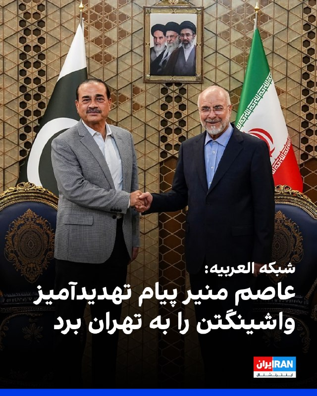

شبکه العربیه به نقل از منابع آگاه گزارش داد عاصم منیر، رییس ستاد کل ارتش پاکستان، پیام‌های آمریکا را به تهران منتقل کرده است و بخشی از این پیام حاوی تهدید به ازسرگیری جنگ بوده است.

در این پیام‌ها همچنین تاکید شده در صورت موافقت جمهوری اسلامی با توافق، حل مسائل اختلافی در مرحله بعدی انجام خواهد شد.

به گفته این منابع، آمریکا در پیام‌های خود تصریح کرده است تهران باید اکنون با توافق موافقت کند یا با پیامدهای منفی روبه‌رو شود.
‌🏁 🇬🇧 IranintlTV

🤖 @VahidOOnLine

## VahidOOnLine — post 241689

  <a href="telegram/content/VahidOOnLine_241689_1779533673.mp4" target="_blank">🎬 Download video</a>

ویدیوی رسیده به ایران اینترنشنال نشان می‌دهد روز شنبه دوم خرداد تعدادی از دانش‌آموزان مدارس در خرم‌آباد برای اعتراض به شیوه امتحانات خود و اظهارات مسئولان برای حضوری کردن امتحانات مقابل ساختمان آموزش و پرورش تجمع کردند. آن‌ها شعار «مجازی مجازی»‌ سر داده و خواستار غیرحضوری شدن امتحانات شدند.
‌🏁 🇬🇧 IranintlTV

🤖 @VahidOOnLine

## VahidOOnLine — post 241688

  <a href="telegram/content/VahidOOnLine_241688_1779533675.mp4" target="_blank">🎬 Download video</a>

وزیر خارجه قطر در تماس تلفنی با عباس عراقچی، وزیر خارجه جمهوری اسلامی، خواستار کاهش تنش‌ها و حمایت از تلاش‌های دیپلماتیک برای پایان دادن به بحران شد. وزارت خارجه قطر اعلام کرد دوحه از مذاکرات برای رسیدن به توافقی جامع و برقراری ثبات پایدار در منطقه حمایت کامل می‌کند.
وزیر خارجه قطر همچنین هشدار داد بستن تنگه هرمز یا استفاده از آن به‌عنوان ابزار فشار، بحران را تشدید کرده و منافع کشورهای منطقه را به خطر می‌اندازد. او تأکید کرد آزادی کشتیرانی یک اصل اساسی و غیرقابل مذاکره است و همه طرف‌ها باید به قوانین بین‌المللی و اصول حسن همجواری پایبند باشند.
هم‌زمان، وزرای خارجه اردن و قطر نیز درباره تلاش‌های میانجی‌گرانه پاکستان میان تهران و واشنگتن گفت‌وگو کردند و بر ضرورت همکاری برای رسیدن به راه‌حلی پایدار و جلوگیری از تشدید دوباره تنش‌ها تأکید کردند.
‌🏁 🇬🇧 ManotoTV

🤖 @VahidOOnLine

## VahidOOnLine — post 241687

  <a href="telegram/content/VahidOOnLine_241687_1779533675.mp4" target="_blank">🎬 Download video</a>

«منوتو بخشی از زندگی ما بود»
‌🏁 🇬🇧 ManotoTV

🤖 @VahidOOnLine

## VahidOOnLine — post 241686

  <a href="telegram/content/VahidOOnLine_241686_1779533677.mp4" target="_blank">🎬 Download video</a>

سازمان هواپیمایی کشوری صدور هرگونه نوتام جدید برای ممنوعیت پرواز در غرب حریم هوایی ایران را تکذیب کرد. حمیدرضا صانعی، معاون هوانوردی و امور بین‌الملل این سازمان، شایعات منتشرشده در فضای مجازی درباره بسته شدن حریم هوایی تا صبح دوشنبه را «شیطنت رسانه‌ای» خواند و گفت هیچ اطلاعیه جدیدی صادر نشده است.
او همچنین اعلام کرد برنامه‌ریزی‌ها برای انجام پروازهای اربعین در حال انجام است.
‌🏁 🇬🇧 ManotoTV

🤖 @VahidOOnLine

## VahidOOnLine — post 241685

  <a href="telegram/content/VahidOOnLine_241685_1779533678.mp4" target="_blank">🎬 Download video</a>

ویدیوی رسیده به ایران اینترنشنال نشان می‌دهد روز شنبه دوم خرداد تعدادی از دانش‌آموزان مدارس در خرم‌آباد برای اعتراض به شیوه امتحانات خود و اظهارات مسئولان برای حضوری کردن امتحانات مقابل ساختمان آموزش و پرورش تجمع کردند. آن‌ها شعار «لرستان می‌میرد، ذلت نمی‌پذیرد» سر دادند..
‌🏁 🇬🇧 IranintlTV

🤖 @VahidOOnLine

## VahidOOnLine — post 241684

  <a href="telegram/content/VahidOOnLine_241684_1779533679.mp4" target="_blank">🎬 Download video</a>

ویدیوی رسیده به ایران اینترنشنال نشان می‌دهد روز شنبه دوم خرداد تعدادی از دانش‌آموزان مدارس در خرم‌آباد برای اعتراض به شیوه امتحانات خود و اظهارات مسئولان برای حضوری کردن امتحانات مقابل ساختمان آموزش و پرورش تجمع کردند. آن‌ها شعار «مرگ بر مسئول بی‌لیافت»‌ سر دادند.
‌🏁 🇬🇧 IranintlTV

🤖 @VahidOOnLine

## VahidOOnLine — post 241683

  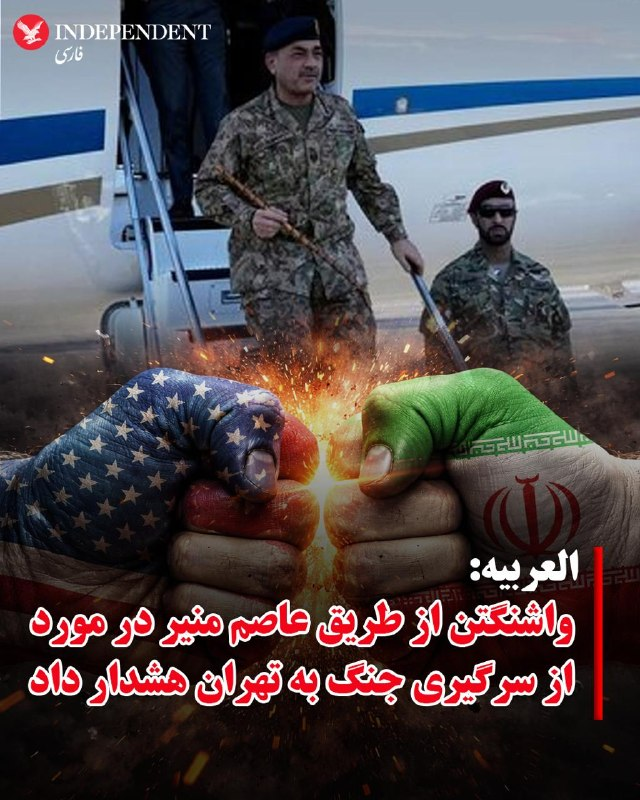

♦️شبکه خبری العربیه، روز شنبه به نقل از منابع خود گزارش داد فرمانده ارتش پاکستان پیام‌هایی از سوی آمریکا را به تهران منتقل کرده که در آن نسبت به ازسرگیری جنگ هشدار داده شده است.
بر اساس این گزارش، پیام‌های آمریکا به ایران حاوی تهدید به ازسرگیری درگیری‌ها در صورت شکست مذاکرات بوده است.
منابع العربیه همچنین گفتند واشنگتن در این پیام‌ها تاکید کرده در صورت موافقت تهران با توافق در شرایط کنونی، موضوعات اختلافی می‌تواند در مراحل بعدی حل‌وفصل شود.
به گفته این منابع، آمریکا در پیام‌های خود به ایران اعلام کرده است: «اکنون با توافق موافقت کنید یا با پیامدهای منفی روبه‌رو شوید.»
فیلد مارشال عاصم منیر، فرمانده ارتش پاکستان روز جمعه وارد تهران شد در مورد مذاکرات میان آمریکا و ایران با مسئولان جمهوری اسلامی رایزنی کند.
‌🇸🇦 Indypersian

🤖 @VahidOOnLine

## VahidOOnLine — post 241682

  

محمدحسن نامی، دستیار ویژه وزیر کشور، خواستار تشکیل «ناتوی اسلامی» در منطقه و جهان اسلام با محوریت جمهوری اسلامی شد. او گفت کشورهای اسلامی از ظرفیت‌های گسترده اقتصادی و موقعیت جغرافیایی، از جمله تنگه هرمز و باب‌المندب، برخوردارند که این دو مورد قدرت‌آفرین هستند.

او گفت: «چرا نباید یک ناتوی اسلامی در همین منطقه خودمان و در جهان اسلام داشته باشیم؟ از حدود ۵۷ کشور اسلامی، بیشترین ظرفیت اقتصادی و جغرافیایی جهان به‌دست می‌آید که قدرت‌آفرین است.»

نامی افزود: «در صورت تحقق این اتحاد، هیچ قدرتی نمی‌تواند به جهان اسلام زور بگوید؛ نمونه آن فلسطین است که تاکنون ۷۳ هزار شهید تقدیم کرده است.»
‌🏁 🇬🇧 IranintlTV

🤖 @VahidOOnLine

## VahidOOnLine — post 241681

  

محمدحسن نامی، دستیار ویژه وزیر کشور، خواستار تشکیل «ناتوی اسلامی» در منطقه و جهان اسلام با محوریت جمهوری اسلامی شد. او گفت کشورهای اسلامی از ظرفیت‌های گسترده اقتصادی و موقعیت جغرافیایی، از جمله تنگه هرمز و باب‌المندب، برخوردارند که این دو مورد قدرت‌آفرین هستند.

او گفت: «چرا نباید یک ناتوی اسلامی در همین منطقه خودمان و در جهان اسلام داشته باشیم؟ از حدود ۵۷ کشور اسلامی، بیشترین ظرفیت اقتصادی و جغرافیایی جهان به‌دست می‌آید که قدرت‌آفرین است.»

نامی افزود: «در صورت تحقق این اتحاد، هیچ قدرتی نمی‌تواند به جهان اسلام زور بگوید؛ نمونه آن فلسطین است که تاکنون ۷۳ هزار شهید تقدیم کرده است.»
‌🏁 🇬🇧 IranintlTV

🤖 @VahidOOnLine

## VahidOOnLine — post 241680

ایرانیان ساکن بریزبن استرالیا روز شنبه دوم خرداد با اشاره به کارزار ایران اینترنشنال برای شناسایی جاویدنامان بیمارستان الغدیر تهران پرفورمنس هنری اجرا کردند. سخنران این تجمع به انبود پیکر معترضان در این بیمارستان اشاره کرد.
‌🏁 🇬🇧 IranintlTV

🤖 @VahidOOnLine

## VahidOOnLine — post 241679

  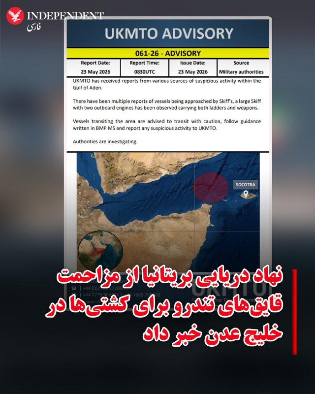

♦️سازمان عملیات تجارت دریایی بریتانیا (UKMTO) روز شنبه دوم خرداد ماه اعلام کرد گزارش‌هایی از منابع مختلف درباره فعالیت‌های مشکوک در خلیج عدن دریافت کرده است.
به گزارش این نهاد دریایی، چند گزارش درباره نزدیک شدن قایق‌های کوچک تندرو به کشتی‌ها دریافت شده است.
بر اساس اعلام سازمان عملیات تجارت دریایی بریتانیا، یک قایق بزرگ تندرو با دو موتور بیرونی نیز مشاهده شده که نردبان و سلاح حمل می‌کرده است.
جزئیات بیشتری درباره هویت افراد حاضر در این قایق‌ها یا ارتباط احتمالی آن‌ها با گروه‌های مسلح منتشر نشده است.
سازمان عملیات نجات دریایی بریتانیا، صبح شنبه نیز از نزدیک شدن یک قایق تندرو به نفت‌کشی در نزدیکی یمن خبر داده بود.
‌🇸🇦 Indypersian

🤖 @VahidOOnLine

## VahidOOnLine — post 241678

  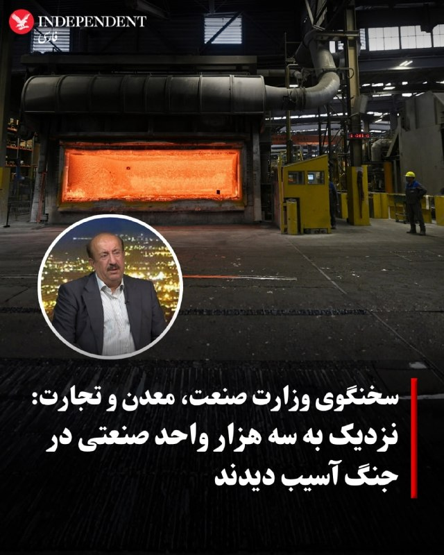

⭕️ سخنگوی وزارت صنعت، معدن و تجارت:
نزدیک به سه هزار واحد صنعتی در جنگ آسیب دیدند

♦️سخنگوی وزارت صنعت، معدن و تجارت (صمت) اعلام کرد نزدیک به سه هزار واحد صنعتی در جریان جنگ اخیر آسیب دیده‌اند.
عزت‌الله زارعی گفت آمار نهایی خسارت‌ها هنوز به‌طور کامل مشخص نشده، زیرا روند ارزیابی در برخی استان‌ها ادامه دارد، اما بر اساس برآوردهای اولیه، حدود سه هزار واحد صنعتی در مقیاس‌های کوچک، متوسط و بزرگ دچار خسارت شده‌اند.
او با اشاره به اولویت بازسازی صنایع راهبردی افزود کارخانه‌هایی مانند فولاد مبارکه و فولاد خوزستان به دلیل اهمیت در زنجیره تولید کشور، در اولویت بازگشت به مدار تولید قرار گرفته‌اند.
سخنگوی وزارت صمت همچنین تاکید کرد جنگ، زنجیره تامین صنایع را با اختلال جدی مواجه کرده و واردات مواد اولیه دیگر به سهولت گذشته انجام نمی‌شود، موضوعی که می‌تواند روند بازسازی و تولید را با چالش‌های بیشتری روبه‌رو کند.
‌🇸🇦 Indypersian

🤖 @VahidOOnLine

## VahidOOnLine — post 241677

  <a href="telegram/content/VahidOOnLine_241677_1779533686.mp4" target="_blank">🎬 Download video</a>

با ادامه محاصره دریایی آمریکا بر تنگه هرمز علیه جمهوری اسلامی، یک شهروند تصویری از سواحل اسکله رجایی بندرعباس ارسال کرده و می‌گوید که کشتی‌ها در این منطقه به دلیل توقف تردد متوقف شده‌اند. بنا بر اعلام سنتکام از زمان آغاز محاصره بیش از ۱۰۰ کشتی مجبور به تغییر مسیر شده‌اند و چندین کشتی نیز از کار انداخته شده‌اند.
‌🏁 🇬🇧 IranintlTV

🤖 @VahidOOnLine

## VahidOOnLine — post 241676

  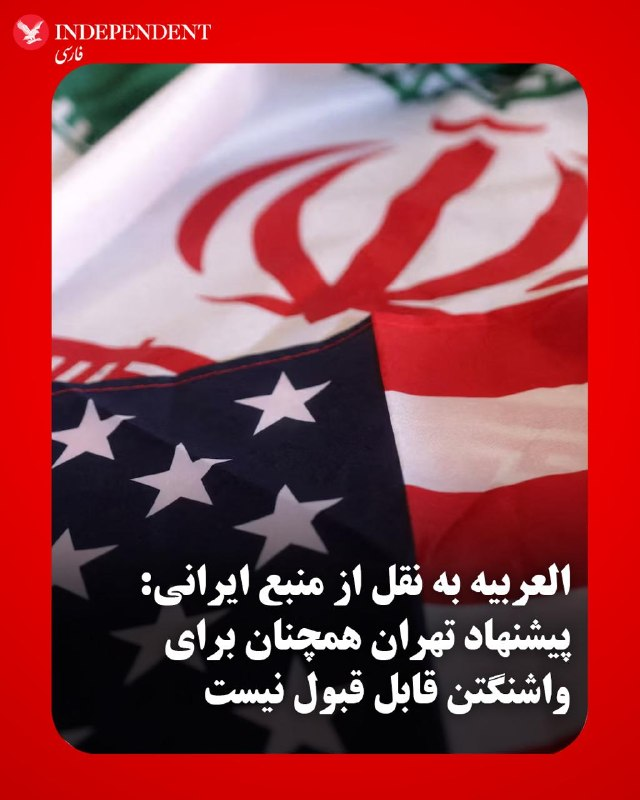

♦️شبکه العربیه، روز شنبه دوم خرداد ماه، به نقل از «یک منبع بلندپایه ایرانی» گزارش داد پیشنهاد ارائه‌شده از سوی تهران تاکنون نتوانسته رضایت آمریکا را جلب کند و همچنان از دید واشنگتن «غیرقابل قبول» تلقی می‌شود.
این منبع ایرانی جزئیات بیشتری درباره موارد اختلاف یا بخش‌های مورد اعتراض آمریکا به العربیه ارائه نکرد، اما تاکید کرد مذاکرات همچنان ادامه دارد و رایزنی‌ها برای کاهش اختلافات متوقف نشده است.
این گزارش در شرایطی منتشر می‌شود که طی روزهای اخیر پیام‌های متناقضی درباره روند مذاکرات، سرنوشت ذخایر اورانیوم غنی‌شده ایران و احتمال دستیابی به توافق میان تهران و واشنگتن منتشر شده است.
‌🇸🇦 Indypersian

🤖 @VahidOOnLine

## VahidOOnLine — post 241675

  <a href="telegram/content/VahidOOnLine_241675_1779533689.mp4" target="_blank">🎬 Download video</a>

⭕️ شلیک هوایی عروس حامی جمهوری اسلامی در میان تشویق حاضران

♦️در ادامه تجمعات شبانه حامیان جمهوری اسلامی در میادین شهری و اشغال فضای عمومی، ویدیوهای متعددی از مراسم‌ها و برنامه‌های خیابانی منتشر شده است.
در یکی از ویدیوهای منتشرشده، همزمان با برگزاری مراسم عروسی یک زوج در فضایی که تصاویر روح‌الله، بنیانگذار جمهوری اسلامی و مجتبی خامنه‌ای، رهبر فعلی جمهوری اسلامی در آن دیده می‌شود، یک فرد نظامی سلاحی را به دست عروس می‌دهد و از او می‌خواهد به نشانه آغاز زندگی مشترک و عزم او برای حمایت از جمهوری اسلامی، گلوله‌ای به سمت هوا شلیک کند.
عروس که به نظر می‌رسد تجربه‌ای در استفاده از اسلحه ندارد، در میان تشویق و کف‌زدن حاضران، تیر هوایی شلیک می‌کند و مراسم ادامه پیدا می‌کند.
‌🇸🇦 Indypersian

🤖 @VahidOOnLine

## WithYashar — post 12135

الحدث : آمریکا به تهران پیام داده اگه توافقو رد کنه، عواقب بدی در انتظارشه
@withyashar

## WithYashar — post 12134

  <a href="telegram/content/WithYashar_12134_1779533691.mp4" target="_blank">🎬 Download video</a>

پنتاگون اسناد جدیدی از ufoها منتشر کرده که مانند یک انسان پرنده است و بسیار شبیه شخصیت “مشعل” در چهار شگفت‌انگیز در کمیک معروف هست.
@withyashar

## WithYashar — post 12133

  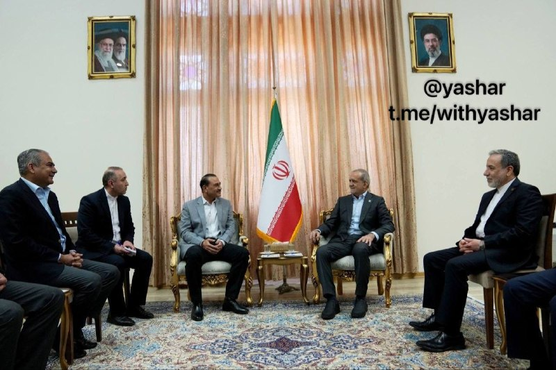

عاصم منیر، فرمانده ارتش پاکستان با زرشکیان دیدار کرد
@withyashar

## WithYashar — post 12132

  <a href="telegram/content/WithYashar_12132_1779533694.mp4" target="_blank">🎬 Download video</a>

جمهوری اسلامی و پاکستان در نهایت… 😂🙌🏾
@withyashar

## WithYashar — post 12131

یک مقام دیگر پاکستانی به تهران می‌رود.😒 یا دیشب اگه رفتن دارن بر میگردن جت نیروی هوایی پاکستان GLF IV SP reg J-755 @withyashar

## WithYashar — post 12130

  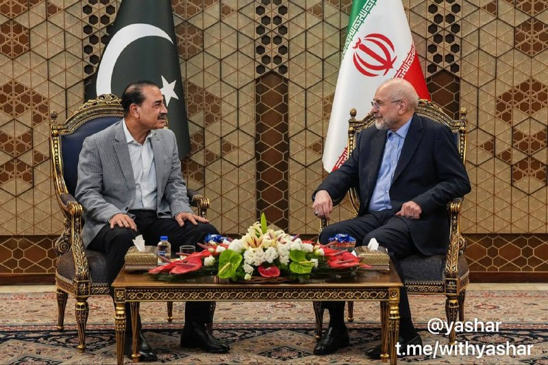

عاصم منیر، رییس ستاد کل ارتش پاکستان با محمدباقر قالیباف در تهران دیدار کرد
@withyashar

## WithYashar — post 12129

نورالدین الدغیر خبرنگار الجزیره در تهران: وساطت‌ها بین تهران و واشنگتن به مرحله‌ای رسیده که یکی از سران منطقه‌ای به طور مستقیم برای پر کردن شکاف‌ها وارد عمل شده.

ظهور قطر در این لحظه حساس به طور مستقیم و بر اساس اطلاعات و منابع موجود، نه صرفاً به عنوان نقش کمکی برای پاکستان، بلکه به عنوان نقش محوری است.
منبعی می‌گوید که احتمال دارد یکی از میانجی‌ها به واشنگتن سفر کند.
@withyashar

## WithYashar — post 12128

@withyashar

## WithYashar — post 12127

@withyashar به در میگم دیوار بشنوه

## WithYashar — post 12126

یاشار جان درود و خسته نباشید.
به این رفیقمون بگو جمله ی سر سفره ی پدر و مادر بزرگ شدن یک استعاره از تربیت و پرورش درست و اخلاقیه ، ربطی به حضور یا عدم حضور خانواده نداره
انقد همه چیز رو فلسفی نکنن
این عادت چپ ها و گلوبالیست ها هستش

## WithYashar — post 12125

  <a href="https://t.me/withyashar/12125" target="_blank">📎 Download file</a>

🌐 instagram.com/yashar

🌐 t.me/withyashar

## WithYashar — post 12124

## WithYashar — post 12122

## WithYashar — post 12121

درود و وقت بخیر
سر سفره پدر و مادر بزرگ شدن یکی از جملاتیه که باید از بین ببریمش اگه ممکنه کم کم دیگه تکرار نکنید چون الان الگوی خیلیامون قرار گرفتین🌹
شخصی که بچه طلاقه یا بی سرپرست می‌تونه خیلی بهتر از اونی باشه که کنار پدر و مادرش بزرگ شده🤍

## WithYashar — post 12120

منبع ارشد ایرانی به الحدث: آنچه تاکنون مطرح کرده‌ایم برای ایالات متحده قابل قبول نیست
@withyashar

## WithYashar — post 12119

شهباز شریف نخست وزیر پاکستان امروز شنبه وارد شهر هانگ‌جو واقع در شرق چین شد و دیدار رسمی چهار روزه خود از چین را آغاز کرد.
@withyashar

## FoxNewsTwitter — post 342154

Fox News (Twitter/X)

Secretary of State Marco Rubio has begun a multi-day visit to India ahead of next week’s meetings with key Indo-Pacific allies.

Rubio is expected to meet with Prime Minister Narendra Modi to discuss trade, defense, and regional security cooperation.

## pm_afshaa — post 91255

🔴الحدث : آمریکا به تهران پیام داده اگه توافقو رد کنه، عواقب بدی در انتظارشه

💧 Rainbet.com the #1 Non-KYC Crypto Casino & Sportsbook @rainbetcom

😁 @Pm_Afshaa

## pm_afshaa — post 91254

🔴عاصم منیر، رییس ستاد کل ارتش پاکستان با محمدباقر قالیباف در تهران دیدار کرد

💧 Rainbet.com the #1 Non-KYC Crypto Casino & Sportsbook @rainbetcom

😁 @Pm_Afshaa

## pm_afshaa — post 91253

🔴نورالدین الدغیر خبرنگار الجزیره: وساطت‌ها بین تهران و واشنگتن به مرحله‌ای رسیده که یکی از سران منطقه‌ای به طور مستقیم برای پر کردن شکاف‌ها وارد عمل شده

💧 Rainbet.com the #1 Non-KYC Crypto Casino & Sportsbook @rainbetcom

😁 @Pm_Afshaa

## pm_afshaa — post 91252

🔴یک منبع ارشد ایرانی به الحدث: آنچه تاکنون مطرح کرده‌ایم برای ایالات متحده قابل قبول نیست

💧 Rainbet.com the #1 Non-KYC Crypto Casino & Sportsbook @rainbetcom

😁 @Pm_Afshaa

## pm_afshaa — post 91250

شاهزاده رضا پهلوی در ادامه دیدارهای خود با چند تن از نمایندگان کنگره آمریکا دیدار و درباره حمایت از مردم ایران و آینده «ایران آزاد» گفت‌وگو کرد.

نمایندگان کنگره ضمن محکوم کردن عملکرد جمهوری اسلامی، بر حمایت از مبارزه مردم ایران برای آزادی، صلح و پایان دادن به تهدیدهای رژیم علیه ایران، آمریکا و جهان تأکید کردن

💧 Rainbet.com the #1 Non-KYC Crypto Casino & Sportsbook @rainbetcom

😁 @Pm_Afshaa

## pm_afshaa — post 91248

👩‍💻کانفیگ اضطراری موجود شد!

🛍 series Basic

• 1G 140 
💵
• 2G 280
💵
• 3G 420
💵
• 4G 560
💵
• 5G 700
💵
• 10G 1400
💵
• 20G 2800 
💵
• 30G 4200
💵

📌مناسب استفاده روزمره و اقتصادی

📌سرعت مناسب برای استفاده عادی

📌پینگ 140تا350

📌مناسب تلگرام.وب گردی . اینستاگرام

✔️ بدونه محدودیت زمان و کاربر هستن

✔️ساب لینک جهت دیدن حجم

✔️بدونه حتی ۱ درصد ضریب تمامی سرور ها

⚠️همه سرویس ضمانت بازگشت وجه دارند

@n9neebot

چنل و رضایتشون
@n9nehub

## DEJradio — post 4866

⭕️ عضو ارشد کتائب حزب‌الله قصد داشت ایوانکا ترامپ را ترور کند

نیویورک پست گزارش داد یک تبعۀ عراق که به‌تازگی برای محاکمه به آمریکا تحویل داده شد، قصد داشت ایوانکا ترامپ، دختر رئیس‌ جمهوری آمریکا را ترور کند.
این روزنامۀ آمریکایی به نقل از منابعی نوشت محمدباقر سعد داوود السعدی، ۳۲ ساله، قصد داشت با ترور ایوانکا، از کشته شدن قاسم سلیمانی، فرمانده پیشین نیروی قدس سپاه توسط آمریکا، انتقام بگیرد.
اف‌بی‌آی هفته گذشته اعلام کرده بود یک عضو ارشد گروه کتائب حزب‌الله عراق در ترکیه بازداشت و برای محاکمه به آمریکا منتقل شده است.
دادستانی ایالت نیویورک با انتشار تصویری از محمدباقر سعد داوود السعدی در کنار قاسم سلیمانی، اعلام کرد که او خود را «محمدباقر سلیمانی» معرفی می‌کرد.
بر اساس گزارش‌ها، این عضو کتائب حزب‌الله قصد داشت از ترکیه به مقصد روسیه پرواز کند.

#ترور #سپاه_قدس
@DEJradio

## DEJradio — post 4865

⭕️ دولت ترامپ برای حملات تازه علیه جمهوری اسلامی آماده می‌شود

شبکۀ سی‌بی‌اس بامداد شنبه گزارش داد دولت دونالد ترامپ برای انجام دوری تازه‌ از حملات علیه جمهوری اسلامی آماده می‌شود.
سی‌بی‌اس به نقل از منابع آگاه نوشت تدارکات و آمادگی‌های لازم برای حملات تازه، انجام شده است.
این شبکه گزارش داد تا بامداد شنبه به وقت ایران، هنوز تصمیم پایانی برای حمله گرفته نشده بود.
از سویی یک خبرنگار وال‌استریت ژورنال گزارش داد دونالد ترامپ شامگاه آدینه با مشاوران امنیت ملی خود نشستی برگزار کرد، اما تصمیم قطعی در این جلسه گرفته نشد.
بنا بر این گزارش، ترامپ در این نشست گفت دیپلماسی به زمان بیشتری نیاز دارد، اما گزینۀ بازگشت به جنگ همچنان روی میز است.
پیش‌تر اسماعیل بقائی، سخنگوی هیئت مذاکره‌کنندۀ جمهوری اسلامی، گفته بود اختلاف‌ها میان تهران و واشینگتن آن‌قدر «عمیق و گسترده است که نمی‌توان انتظار داشت مذاکرات در مدتی کوتاه به نتیجه برسد.

#مذاکرات
@DEJradio

## DEJradio — post 4863

  <a href="telegram/content/DEJradio_4863_1779533696.webm" target="_blank">🎬 Download video</a>

🔺📷 جمهوری اسلامی ایران خود را پیروز جنگ ۴۰ روزه می‌داند، از آن جهت که با وجود بمباران گسترده و کشته‌شدن علی خامنه‌ای و لشکری از فرماندهان و نیروهای نظامی و سرکوبگر هنوز بقا می‌کند، اما واقعیت آن است که بخش عمده زیرساخت‌های امنیتی و نظامی ارتش، سـ.ـپاه پاسداران و انتظامی از بین رفته است و زیرساخت‌های اطلاعات سپاه و وزارت اطلاعات به شدت آسیب دیده است.

منابع غیررسمی تصویری از لاشه یک سامانه شنود الکترونیکی Avtobaza-M را منتشر کرده‌اند. این سامانه در جنگ الکترونیک محلی به کار می‌رود.
این سامانه شناسایی روسی است که برای کشف و رهگیری امواج راداری هواپیماها، پهپادها و سامانه‌های راداری استفاده می‌شود در جنگ ۴۰ روزه هدف راحتی برای جنگنده‌ها و پهپادهای آمریکایی و اسرائیلی بود.
قبلا رسانه‌های حکومتی تبلیغ می‌کردند که با این سیستم می‌توانند هواپیماهای پنهانکار را شناسایی و رهگیری کنند.

#جنگ۴۰روزه #جنگ
@DEJradio

## kianmeli1 — post 87577

  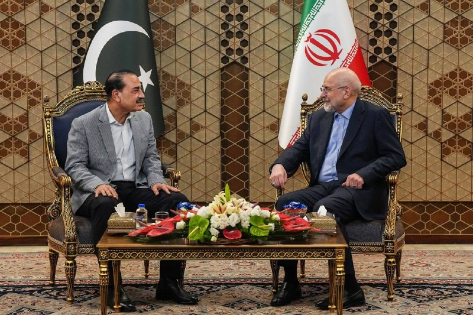

‏🔴عاصم منیر، رییس ستاد کل ارتش پاکستان با محمدباقر قالیباف در تهران دیدار کرد
https://t.me/kianmeli1

## kianmeli1 — post 87576

🔴بر اساس مشاهدات میدانی، شدت آتش و میزان فلرینگ در پتروپالایش کنگان و فازهای ۱۲ و ۱۴ نسبت به روزهای گذشته به‌طور محسوسی افزایش یافته است. همچنین فرآیند تخلیه مخازن با سرعت و شدت بیشتری در حال انجام است.

با توجه به برخی تحرکات و پیام‌های منتقل‌شده از سوی پاکستان و قطر، این شرایط می‌تواند نشانه‌ای از احتمال وقوع یک حمله در آینده نزدیک تلقی شود
https://t.me/kianmeli1

## kianmeli1 — post 87575

  <a href="telegram/content/kianmeli1_87575_1779533697.mp4" target="_blank">🎬 Download video</a>

🔴کیومرث يزدان‌پناه، استاد ژئوپلیتیک دانشگاه تهران:

دست از سر ایران بر نمی‌دارند تا متعهد شویم که قصد نابودی اسرائیل را نداریم
ممکن است دوباره حمله کنند و بخواهند باقی اهداف نظامی را بزنند.
https://t.me/kianmeli1

## kianmeli1 — post 87574

‏🔴فرماندهی کل ارتش بحرین تاکید کرد که یگان‌ها در بالاترین سطح آماده‌باش دفاعی قرار دارند
https://t.me/kianmeli1

## kianmeli1 — post 87573

‏🔴سازمان دریانوردی تجاری بریتانیا خبر داد که گزارش‌های متعددی درباره نزدیک شدن قایق‌های کوچک به کشتی‌ها در خلیج عدن دریافت کرده است
https://t.me/kianmeli1

## kianmeli1 — post 87572

  <a href="telegram/content/kianmeli1_87572_1779533700.mp4" target="_blank">🎬 Download video</a>

🔴رضا تقی‌پور، نماینده مجلس: شبکه حیاتی کابل‌های فیبر نوری جهان از تنگه هرمز و باب‌المندب عبور می‌کند و ایران می‌تواند این کابل‌ها را قطع کند
https://t.me/kianmeli1

## kianmeli1 — post 87571

🔴برخی افراد با نفوذ در کاخ سفید گفتند بمب ها در راه ایران است

باید صبر کرد و دید چقدر واقعیت است
https://t.me/kianmeli1

## IranIntlTV — post 338565

  <a href="telegram/content/IranIntlTV_338565_1779533702.mp4" target="_blank">🎬 Download video</a>

سرخط خبرهای شنبه ۲ خرداد
@iranintltv

## IranIntlTV — post 338564

🔻اسرائیل‌هیوم: واشینگتن و تل‌آویو درباره حذف مجتبی خامنه‌ای اختلاف دارند

به گزارش اسرائیل‌هیوم، آمریکا و اسرائیل در حال بررسی این پرسش هستند که حذف مجتبی خامنه‌ای می‌تواند حکومت ایران را بی‌ثبات کند یا برعکس، به شکل‌گیری ساختاری رادیکال‌تر و توافقی شکننده مشابه برجام منجر شود.

به نوشته روزنامه اسرائیل‌هیوم در حالی که آمریکا و اسرائیل پس از ترور علی خامنه‌ای درباره آینده ایران ارزیابی‌های متفاوتی دارند، اکنون بحثی تازه در محافل سیاسی و امنیتی دو کشور شکل گرفته است: آیا حذف مجتبی خامنه‌ای می‌تواند به بی‌ثباتی بیشتر حکومت ایران و دستیابی به توافقی مطلوب‌تر منجر شود یا برعکس، خطر تکرار توافق‌های گذشته و ظهور ساختاری رادیکال‌تر را افزایش خواهد داد.

به گزارش این روزنامه اسرائیلی، واشینگتن و اورشلیم بار دیگر با پرسشی راهبردی روبه‌رو شده‌اند که پیش‌تر درباره علی خامنه‌ای مطرح بود، اما اکنون به مجتبی خامنه‌ای، جانشین جدید رهبری حکومت ایران، مربوط می‌شود: آیا حذف او به سود اهداف غرب و اسرائیل خواهد بود یا باقی ماندن او - هرچند ضعیف و آسیب‌پذیر - ثباتی نسبی ایجاد می‌کند که برای مدیریت بحران مفیدتر است؟

این گزارش می‌گوید ترور علی خامنه‌ای، که با هماهنگی آمریکا و اسرائیل انجام شد، اقدامی بی‌سابقه بود؛ زیرا برای نخستین بار اسرائیل رهبر یک کشور دشمن را هدف قرار داد. هدف از این اقدام، به نوشته اسرائیل‌هیوم، تضعیف بنیادهای حکومت ایران بود.

به باور نویسنده، این هدف تنها تا حدی محقق شد. از یک سو، ساختار قدرت متمرکز در ایران آسیب دید و نشانه‌هایی از اختلافات داخلی و تنش در روند تصمیم‌گیری آشکار شد. حملات جمهوری اسلامی به کشورهای خلیج فارس نیز، به ادعای این گزارش، در برخی موارد با مواضع رسمی سیاسی تهران همخوانی نداشته است. همچنین مجتبی خامنه‌ای به عنوان رهبری «ضعیف، آسیب‌دیده و فاقد اقتدار کامل» توصیف می‌شود. فردی که مشخص نیست کنترل واقعی اوضاع را در دست دارد یا صرفاً در جریان تحولات قرار گرفته است.

اما از سوی دیگر، اسرائیل‌هیوم می‌نویسد حکومت ایران همچنان دارای ساختار فرماندهی و مرکز تصمیم‌گیری است و تا زمانی که فردی از خاندان خامنه‌ای در راس قدرت قرار دارد، جمهوری اسلامی می‌تواند تصویر یک حکومت باثبات را حفظ کند.

به نوشته این روزنامه، مسعود پزشکیان و عباس عراقچی اکنون در برخی موضوعات، از جمله پرونده هسته‌ای، انعطاف بیشتری نسبت به دوران علی خامنه‌ای نشان می‌دهند؛ موضوعی که پیش‌تر امکان‌پذیر نبود، هرچند فاصله گرفتن آن‌ها از خطوط اصلی سیاست نظام همچنان محدود است.

معضل راهبردی: حذف مجتبی خامنه‌ای یا حفظ ساختار موجود؟
اسرائیل‌هیوم می‌نویسد موافقان حذف مجتبی خامنه‌ای معتقدند ترور او می‌تواند حکومت ایران را وارد بحران جانشینی و آشفتگی سیاسی کند؛ وضعیتی که شاید به جناح‌های عملگراتر فرصت دهد توافقی با غرب شکل دهند.

این گزارش برای توضیح این رویکرد به حمله اسرائیل به دوحه در سپتامبر گذشته اشاره می‌کند؛ حمله‌ای که هدف آن، به ادعای نویسنده، تضعیف جناحی از حماس بود که مانع توافق درباره گروگان‌ها شده بود.

اما مخالفان این دیدگاه هشدار می‌دهند در ایران «میانه‌روهای واقعی» آماده جانشینی وجود ندارند و حذف خامنه‌ای ممکن است صرفاً به توافقی مشابه توافق هسته‌ای دوران اوباما منجر شود؛ توافقی که از نگاه اسرائیل، محدودیت‌های زمانی داشته و تهدیدهای بلندمدت را برطرف نکرده بود.

اسرائیل‌هیوم با اشاره به هشدارهای پیشین دادی بارنئا، رییس موساد، می‌نویسد مقام‌های اسرائیلی سال‌ها نسبت به محدودیت زمانی توافق‌های هسته‌ای هشدار داده‌اند. به گفته نویسنده، حتی اگر حکومت ایران با توقف ۱۵ ساله برنامه هسته‌ای موافقت کند، در نهایت محدودیت‌ها پایان می‌یابد و مساله دوباره بازمی‌گردد.

🔗ادامه گزارش را اینجا بخوانید

## IranIntlTV — post 338563

  <a href="telegram/content/IranIntlTV_338563_1779533704.mp4" target="_blank">🎬 Download video</a>

ویدیوی رسیده به ایران اینترنشنال نشان می‌دهد روز شنبه دوم خرداد تعدادی از دانش‌آموزان مدارس در خرم‌آباد برای اعتراض به شیوه امتحانات خود و اظهارات مسئولان برای حضوری کردن امتحانات مقابل ساختمان آموزش و پرورش تجمع کردند. هفته گذشته نیز در شهرکرد دانش‌آموزان تجمع اعتراضی برگزار کردند.

## IranIntlTV — post 338562

  

شبکه العربیه به نقل از منابع آگاه گزارش داد عاصم منیر، رییس ستاد کل ارتش پاکستان، پیام‌های آمریکا را به تهران منتقل کرده است و بخشی از این پیام حاوی تهدید به ازسرگیری جنگ بوده است.

در این پیام‌ها همچنین تاکید شده در صورت موافقت جمهوری اسلامی با توافق، حل مسائل اختلافی در مرحله بعدی انجام خواهد شد.

به گفته این منابع، آمریکا در پیام‌های خود تصریح کرده است تهران باید اکنون با توافق موافقت کند یا با پیامدهای منفی روبه‌رو شود.
https://iranintl.com/202605236089

## IranIntlTV — post 338561

  <a href="telegram/content/IranIntlTV_338561_1779533706.mp4" target="_blank">🎬 Download video</a>

ویدیوی رسیده به ایران اینترنشنال نشان می‌دهد روز شنبه دوم خرداد تعدادی از دانش‌آموزان مدارس در خرم‌آباد برای اعتراض به شیوه امتحانات خود و اظهارات مسئولان برای حضوری کردن امتحانات مقابل ساختمان آموزش و پرورش تجمع کردند. آن‌ها شعار «مجازی مجازی»‌ سر داده و خواستار غیرحضوری شدن امتحانات شدند.

## IranIntlTV — post 338560

  <a href="telegram/content/IranIntlTV_338560_1779533708.mp4" target="_blank">🎬 Download video</a>

فدراسیون فوتبال ایران اخبار مربوط به رد ویزای آمریکا برای شماری از ملی‌پوشان جهت حضور در جام جهانی ۲۰۲۶ را تکذیب کرد و اعلام کرد روند اخذ ویزا طبق روال در حال انجام است.

جزییات بیشتر در گفت‌وگو با علیرضا مدیری، عضو تحریریه ایران‌اینترنشنال
@iranintltv

## IranIntlTV — post 338559

  <a href="telegram/content/IranIntlTV_338559_1779533710.mp4" target="_blank">🎬 Download video</a>

رییس مرکز ملی اقلیم و مدیریت بحران خشکسالی سازمان هواشناسی اعلام کرد با وجود بارندگی‌های اخیر، تهران ششمین سال کم‌بارشی را تجربه می‌کند. سخنگوی شرکت آب و فاضلاب تهران هم هشدار داد عبور از بحران آب بدون صرفه‌جویی ممکن نیست.

گفت‌وگو با احسان دانشور، پژوهشگر ارشد محیط زیست و انرژی
@iranintltv

## IranIntlTV — post 338558

  <a href="telegram/content/IranIntlTV_338558_1779533712.mp4" target="_blank">🎬 Download video</a>

ویدیوی رسیده به ایران اینترنشنال نشان می‌دهد روز شنبه دوم خرداد تعدادی از دانش‌آموزان مدارس در خرم‌آباد برای اعتراض به شیوه امتحانات خود و اظهارات مسئولان برای حضوری کردن امتحانات مقابل ساختمان آموزش و پرورش تجمع کردند. آن‌ها شعار «لرستان می‌میرد، ذلت نمی‌پذیرد» سر دادند..

## IranIntlTV — post 338557

  <a href="telegram/content/IranIntlTV_338557_1779533714.mp4" target="_blank">🎬 Download video</a>

پگاه آهنگرانی، بازیگر و فیلمساز ایرانی، شنبه ۲۶ اردیبهشت برای نمایش فیلم تازه خود «تمرین‌هایی برای یک انقلاب» در جشنواره کن حاضر شد. او این فیلم را به مادرانی تقدیم کرد که فرزندانشان را در مسیر مبارزه برای آزادی از دست داده‌اند. آهنگرانی که همراه عوامل فیلم روی صحنه رفت، گفت خوشحال است که این اثر توانسته بخشی از مبارزه مردم برای آزادی و دموکراسی را به تصویر بکشد و افزود مردم این روزها با قطعی اینترنت، خبرهای روزانه اعدام‌ها توسط جمهوری اسلامی و سایه جنگ روبه‌رو هستند.
@iranintltv

## IranIntlTV — post 338556

  <a href="telegram/content/IranIntlTV_338556_1779533716.mp4" target="_blank">🎬 Download video</a>

ویدیوی رسیده به ایران اینترنشنال نشان می‌دهد روز شنبه دوم خرداد تعدادی از دانش‌آموزان مدارس در خرم‌آباد برای اعتراض به شیوه امتحانات خود و اظهارات مسئولان برای حضوری کردن امتحانات مقابل ساختمان آموزش و پرورش تجمع کردند. آن‌ها شعار «مرگ بر مسئول بی‌لیافت»‌ سر دادند.

## IranIntlTV — post 338555

  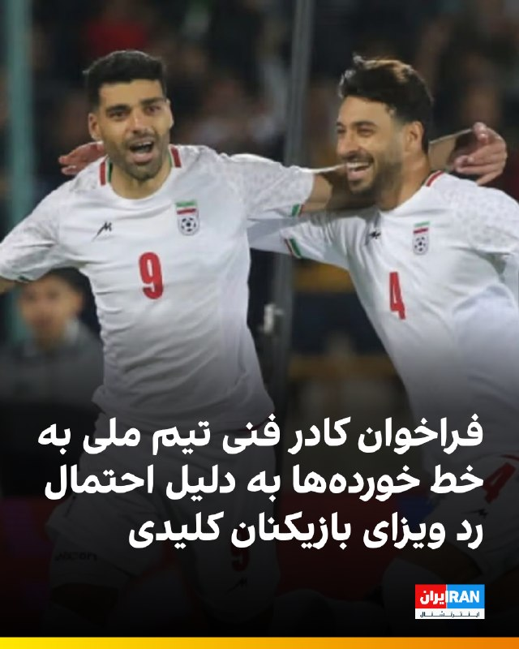

🔻روزنامه ایران ورزشی مدعی شده بازیکنان خط‌ خورده از اردوی تیم ملی در آماده‌باش قرار گرفته‌اند تا در صورت بروز مشکل ویزا برای برخی نفرات، جایگزین شوند. عصر ایران هم، با بازنشر این گزارش، اضافه کرده شایعاتی درباره رد ویزای شجاع خلیل‌زاده، مهدی طارمی و احسان حاج‌صفی مطرح شده است.

🔹مسعود محبی، دانیال اسماعیلی‌فر، حسین ابرقویی، عارف آقاسی، مهدی هاشم‌نژاد، محمدمهدی محبی، عارف حاجی‌عیدی، پوریا شهرآبادی و احسان محروقی در آخرین اردوی تیم ملی در تهران حضور داشتند، اما امیر قلعه‌نویی آن‌ها را از فهرست ۳۰ نفره نهایی کنار گذاشت.

🔹ایران ورزشی نوشته است که کادر فنی به آن‌ها پیام داده: «تمریناتتان را ادامه دهید.»

🔹به نوشته این رسانه، «آن‌ها باید خود را برای جایگزینی احتمالی بازیکنانی که با مشکل ویزا مواجه شده‌اند آماده کنند.»

🔹اما ساعتی پیش فدراسیون فوتبال، بدون اشاره به پاسخی از سفارت آمریکا در آنکارا و با استناد به انجام شدن روند اداری از سوی فدراسیون، رد شدن ویزا برای طارمی، خلیل‌زاده و حاج‌صفی را تکذیب کرد.

🔹جزییات بیشتر را در سایت بخوانید.

@iranintltvsport

## IranIntlTV — post 338554

  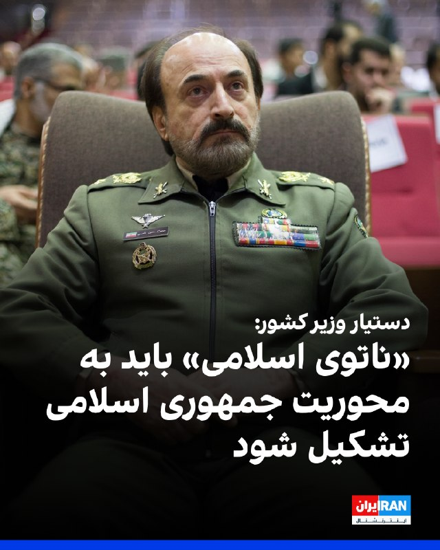

محمدحسن نامی، دستیار ویژه وزیر کشور، خواستار تشکیل «ناتوی اسلامی» در منطقه و جهان اسلام با محوریت جمهوری اسلامی شد. او گفت کشورهای اسلامی از ظرفیت‌های گسترده اقتصادی و موقعیت جغرافیایی، از جمله تنگه هرمز و باب‌المندب، برخوردارند که این دو مورد قدرت‌آفرین هستند.

او گفت: «چرا نباید یک ناتوی اسلامی در همین منطقه خودمان و در جهان اسلام داشته باشیم؟ از حدود ۵۷ کشور اسلامی، بیشترین ظرفیت اقتصادی و جغرافیایی جهان به‌دست می‌آید که قدرت‌آفرین است.»

نامی افزود: «در صورت تحقق این اتحاد، هیچ قدرتی نمی‌تواند به جهان اسلام زور بگوید؛ نمونه آن فلسطین است که تاکنون ۷۳ هزار شهید تقدیم کرده است.»
https://iranintl.com/202605238332

## IranIntlTV — post 338553

  

محمدحسن نامی، دستیار ویژه وزیر کشور، خواستار تشکیل «ناتوی اسلامی» در منطقه و جهان اسلام با محوریت جمهوری اسلامی شد. او گفت کشورهای اسلامی از ظرفیت‌های گسترده اقتصادی و موقعیت جغرافیایی، از جمله تنگه هرمز و باب‌المندب، برخوردارند که این دو مورد قدرت‌آفرین هستند.

او گفت: «چرا نباید یک ناتوی اسلامی در همین منطقه خودمان و در جهان اسلام داشته باشیم؟ از حدود ۵۷ کشور اسلامی، بیشترین ظرفیت اقتصادی و جغرافیایی جهان به‌دست می‌آید که قدرت‌آفرین است.»

نامی افزود: «در صورت تحقق این اتحاد، هیچ قدرتی نمی‌تواند به جهان اسلام زور بگوید؛ نمونه آن فلسطین است که تاکنون ۷۳ هزار شهید تقدیم کرده است.»
https://iranintl.com/202605238332

## IranIntlTV — post 338552

ایرانیان ساکن بریزبن استرالیا روز شنبه دوم خرداد با اشاره به کارزار ایران اینترنشنال برای شناسایی جاویدنامان بیمارستان الغدیر تهران پرفورمنس هنری اجرا کردند. سخنران این تجمع به انبود پیکر معترضان در این بیمارستان اشاره کرد.

## IranIntlTV — post 338551

  <a href="telegram/content/IranIntlTV_338551_1779533720.mp4" target="_blank">🎬 Download video</a>

ویدیوی رسیده به ایران‌اینترنشنال نشان می‌دهد دانش‌آموزان شنبه در خرم‌آباد در اعتراض به بلاتکلیفی و ابهام درباره نحوه برگزاری امتحانات و اظهارات مسئولان درباره حضوری کردن امتحانات تجمع کردند.

گفت‌وگو با محسن مهیمنی، عضو تحریریه ایران‌اینترنشنال
@iranintltv

## IranIntlTV — post 338550

  <a href="telegram/content/IranIntlTV_338550_1779533722.mp4" target="_blank">🎬 Download video</a>

با ادامه محاصره دریایی آمریکا بر تنگه هرمز علیه جمهوری اسلامی، یک شهروند تصویری از سواحل اسکله رجایی بندرعباس ارسال کرده و می‌گوید که کشتی‌ها در این منطقه به دلیل توقف تردد متوقف شده‌اند. بنا بر اعلام سنتکام از زمان آغاز محاصره بیش از ۱۰۰ کشتی مجبور به تغییر مسیر شده‌اند و چندین کشتی نیز از کار انداخته شده‌اند.

## IranIntlTV — post 338549

روایت شما از زندگی در آتش‌بس- شنبه ۲ خرداد ۱۴۰۵

🔹 مردم ایران، با مذاکره ناامید نشوید. ما عهدی داریم با جاویدنام‌های این چند سال اخیر که همه جوان بودند و امیدوار. پس پرچم مبارزه آن‌ها را زمین نخواهیم گذاشت. در تاریخ، همه حکومت‌های قاتل محکوم به نابودی هستند. نه می‌بخشیم و نه فراموش می‌کنیم.
🔹 تهران، وضعیت اقتصادی وحشتناک است. همه دارن از جیب می‌خورن، اغلب تعدیل نیرو شدیم، مشاغل هنری کلاً کنسل شده، همه‌چیز ده‌ها برابر گران شده و هیچ کاری نمی‌شود کرد. خسته شدیم به خدا از این همه سگ‌دو زدن.
🔹 این یک گیگ اینترنتی که ما می‌خریم در واقع یک گیگ نیست. سه‌سوته تموم میشه. الکی اسم یک گیگ روش گذاشتن که با قیمت بالاتری بفروشنش.
🔹 شنبه ۲ خرداد ساعت ۹:۵۵ سمت کهریزک یه صدای انفجار با موجش اومد، عین زمان جنگ بود.
🔹 دو ماه از سال جدید گذشته است. چرا همچنان حقوق بازنشسته‌های تأمین اجتماعی مطابق مبلغ سال قبل واریز می‌شود؟
🔹 از تهران: من نقاشم و عمده درآمدم از پیجم بوده. از آغاز جنگ و قطع اینترنت درآمدی نداشتم و موجودی حسابم الآن ۴ هزار تومنه. آموزشگاه‌ها به خاطر شرایط جنگ بلاتکلیف هستند و مدرس استخدام نمی‌کنن. به خدا خسته شدیم دیگه.
🔹 این روزها داریم وسط کتاب تاریخ زندگی می‌کنیم؛ هر صفحه‌اش جلوی چشم‌مون نوشته می‌شود. اگر می‌خواهیم این تاریخ فردا با افتخار خوانده شود، باید کنار هم باشیم و ناامید نشویم.
🔹 امروز دوم خرداد است و هنوز نتونستن حقوق نصف بیشتر بازنشستگان تأمین اجتماعی را پرداخت کنند.

## ManotoTV — post 105756

  <a href="telegram/content/ManotoTV_105756_1779533725.mp4" target="_blank">🎬 Download video</a>

دولت آمریکا اعلام کرد بیشتر مهاجرانی که قصد دریافت گرین‌کارت دارند، باید خاک این کشور را ترک کرده و درخواست خود را از طریق سفارت‌خانه‌ها یا کنسولگری‌های آمریکا در خارج ثبت کنند.
اداره خدمات شهروندی و مهاجرت آمریکا اعلام کرد از این پس دارندگان ویزای موقت، دانشجویی یا توریستی تنها در «شرایط استثنایی» می‌توانند داخل آمریکا وضعیت اقامت خود را تغییر دهند.
این تصمیم بخشی از سیاست‌های مهاجرتی دولت ترامپ برای محدود کردن مهاجرت غیرقانونی عنوان شده و راهی را می‌بندد که پیش‌تر به برخی مهاجران اجازه می‌داد هنگام حضور در آمریکا برای گرین‌کارت اقدام کنند.
منتقدان می‌گویند این تغییر می‌تواند باعث جدایی خانواده‌ها و ایجاد بلاتکلیفی برای صدها هزار مهاجر قانونی شود. همچنین برخی متقاضیان ممکن است پس از خروج از آمریکا دیگر اجازه بازگشت دریافت نکنند.
دولت آمریکا می‌گوید این سیاست باعث «عادلانه‌تر و کارآمدتر» شدن سیستم مهاجرتی خواهد شد.

## ManotoTV — post 105755

  <a href="telegram/content/ManotoTV_105755_1779533725.mp4" target="_blank">🎬 Download video</a>

وزیر خارجه قطر در تماس تلفنی با عباس عراقچی، وزیر خارجه جمهوری اسلامی، خواستار کاهش تنش‌ها و حمایت از تلاش‌های دیپلماتیک برای پایان دادن به بحران شد. وزارت خارجه قطر اعلام کرد دوحه از مذاکرات برای رسیدن به توافقی جامع و برقراری ثبات پایدار در منطقه حمایت کامل می‌کند.
وزیر خارجه قطر همچنین هشدار داد بستن تنگه هرمز یا استفاده از آن به‌عنوان ابزار فشار، بحران را تشدید کرده و منافع کشورهای منطقه را به خطر می‌اندازد. او تأکید کرد آزادی کشتیرانی یک اصل اساسی و غیرقابل مذاکره است و همه طرف‌ها باید به قوانین بین‌المللی و اصول حسن همجواری پایبند باشند.
هم‌زمان، وزرای خارجه اردن و قطر نیز درباره تلاش‌های میانجی‌گرانه پاکستان میان تهران و واشنگتن گفت‌وگو کردند و بر ضرورت همکاری برای رسیدن به راه‌حلی پایدار و جلوگیری از تشدید دوباره تنش‌ها تأکید کردند.

## ManotoTV — post 105754

  <a href="telegram/content/ManotoTV_105754_1779533726.mp4" target="_blank">🎬 Download video</a>

«منوتو بخشی از زندگی ما بود»

## ManotoTV — post 105753

  <a href="telegram/content/ManotoTV_105753_1779533728.mp4" target="_blank">🎬 Download video</a>

سازمان هواپیمایی کشوری صدور هرگونه نوتام جدید برای ممنوعیت پرواز در غرب حریم هوایی ایران را تکذیب کرد. حمیدرضا صانعی، معاون هوانوردی و امور بین‌الملل این سازمان، شایعات منتشرشده در فضای مجازی درباره بسته شدن حریم هوایی تا صبح دوشنبه را «شیطنت رسانه‌ای» خواند و گفت هیچ اطلاعیه جدیدی صادر نشده است.
او همچنین اعلام کرد برنامه‌ریزی‌ها برای انجام پروازهای اربعین در حال انجام است.

## FarsiVOA — post 218423

  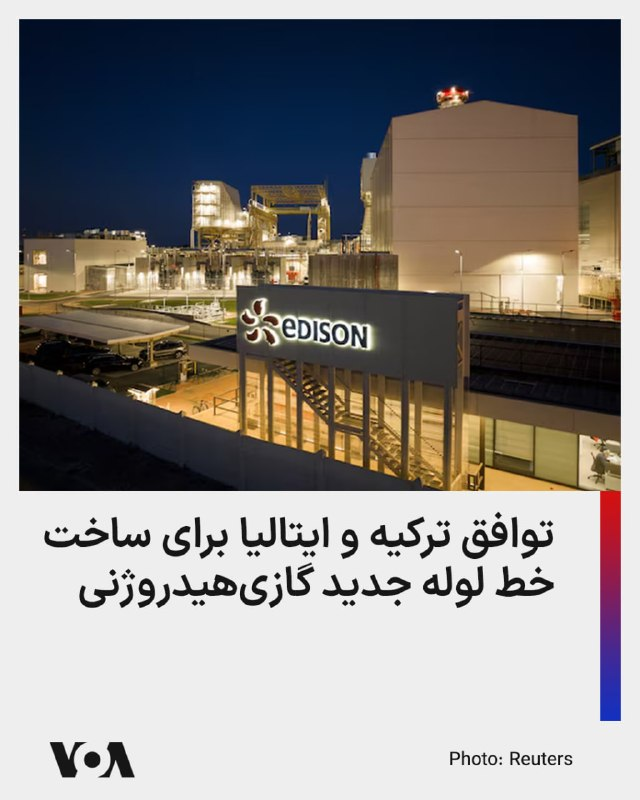

در میانه بحران جهانی نفت و گاز، شرکت‌های بوتاش ترکیه و ادیسون ایتالیا توفقنامه‌ای برای بررسی ساخت یک خط لوله با قابلیت انتقال گاز طبیعی و سوخت هیدروژن امضا کردند.

شرکت انتقال و بازاریابی نفت و گاز ترکیه‌، بوتاش، این توافق را «همکاری راهبردی» توصیف کرده است.

ساخت چنین خط لوله‌ای نه تنها صادرات گاز دریای خزر و خاورمیانه به اروپا را افزایش خواهد داد، بلکه زیرساخت‌های صادرات سوخت پاک هیدروژن به بازارهای اروپایی را نیز توسعه خواهد داد و به تنوع سبد انرژی اروپا کمک خواهد کرد.

هم‌اکنون سالانه حدود ۱۳ میلیارد متر مکعب گاز جمهوری آذربایجانی از طریق ترکیه به اروپا صادر می‌شود که بخش اعظم آن راهی ایتالیا می‌شود.

تولید سوخت هیدروژن در جهان پارسال از مرز ۱۰۰ میلیون تن عبور کرد و در میان کشورهای منطقه، خود ترکیه، آذربایجان، یونان، قبرس، مصر و اسرائیل پروژه‌هایی برای تولید این سوخت پاک در دست بررسی یا توسعه دارند.
@FarsiVOA

## FarsiVOA — post 218422

  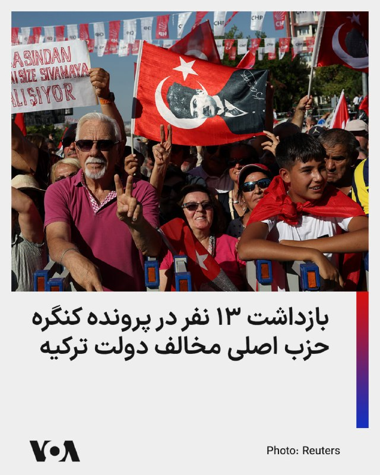

پلیس ترکیه ۱۳ نفر را در چارچوب تحقیق درباره کنگره سال ۲۰۲۳ حزب جمهوری‌خواه خلق، اصلی‌ترین حزب مخالف دولت، بازداشت کرد؛ کنگره‌ای که در آن اوغور اوزل به رهبری حزب رسید.

این بازداشت‌ها چند روز پس از آن انجام شد که دادگاهی در ترکیه نتیجه آن کنگره را به دلیل آنچه «بی‌نظمی» خوانده، باطل کرد و کمال قلیچداراوغلو، رهبر پیشین حزب، را به جای اوزل بازگرداند.

به گزارش رویترز، بازداشت‌شدگان با اتهام‌هایی از جمله نقض قانون احزاب سیاسی، دریافت رشوه و پول‌شویی روبه‌رو هستند. حزب جمهوری‌خواه خلق این تصمیم قضایی را «کودتای قضایی» خوانده است.

این پرونده در ادامه فشارهای قضایی سال‌های اخیر بر مخالفان رجب طیب اردوغان مطرح می‌شود. از اواخر ۲۰۲۴، صدها عضو و مقام محلی این حزب بازداشت شده‌اند و اکرم امام‌اوغلو، شهردار استانبول و رقیب مهم اردوغان، نیز در ۲۰۲۵ زندانی شد؛ اتهام‌هایی که مخالفان سیاسی می‌دانند و دولت آن را رد می‌کند.
@FarsiVOA

## FarsiVOA — post 218421

  <a href="telegram/content/FarsiVOA_218421_1779533730.mp4" target="_blank">🎬 Download video</a>

حمله گسترده پهپادی اوکراین به بندر راهبردی نووروسیسک روسیه؛

بر اساس گزارش منابع رسمی و خبرگزاری‌های بین‌المللی، اوکراین یک حمله پهپادی گسترده و هماهنگ را علیه شهر بندری نووروسیسک روسیه، در ساحل دریای سیاه انجام داده است.

در این حمله که بامداد شنبه دوم خرداد انجام شد، ترمینال نفتی بندر و تأسیسات این شهر که از شریان‌های اقتصادی و نظامی حیاتی روسیه در دریای سیاه محسوب می‌شوند، هدف قرار گرفتند.

مقامات محلی روسیه با تایید این حمله گسترده، از فعال شدن سیستم‌های پدافند هوایی خبر داده‌اند. بر اساس گزارش‌ها، انفجارهای متعددی در منطقه رخ داده و محدودیت‌های ترافیکی موقت در نزدیکی تاسیسات نفتی اعمال شده است.

بندر نووروسیسک یکی از بزرگ‌ترین بنادر تجاری و نظامی روسیه در دریای سیاه است و این حمله نشان‌دهنده تداوم استراتژی اوکراین برای فلج کردن زیرساخت‌های صادرات نفت و تدارکات ارتش روسیه است.
@FarsiVOA

## FarsiVOA — post 218420

  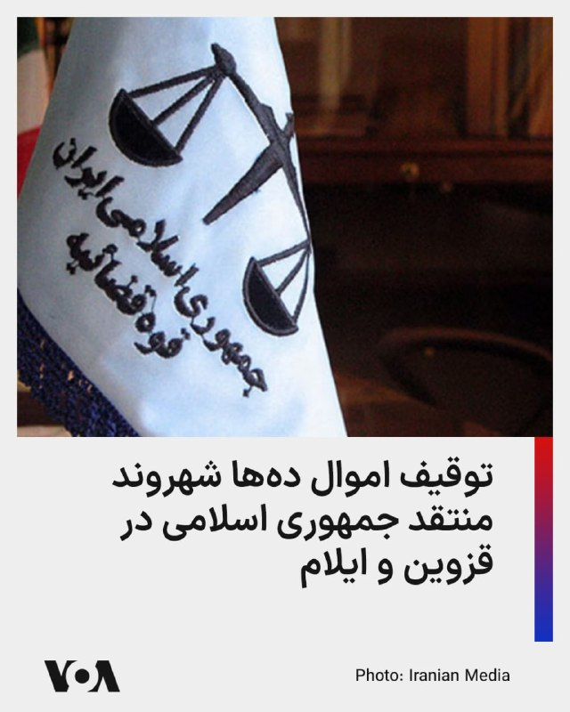

مقام‌های قضایی جمهوری اسلامی از توقیف اموال ده‌ها نفر به برچسب اتهامی جاسوسی، همکاری اطلاعاتی و آنچه «همکاری با رژیم صهیونیستی» خوانده‌اند خبر دادند.

دادستان عمومی قزوین اعلام کرد اموال ۹۶ نفر از «مزدوران خارج‌نشین و داخل کشور» توقیف شده است. به گفته او برای سه نفر به اتهام جاسوسی و برای شش نفر دیگر به اتهام انجام اقدام اطلاعاتی کیفرخواست صادر شده است.

همزمان، رئیس‌کل دادگستری استان ایلام نیز از رصد، شناسایی و توقیف اموال هفت نفر در یکی از شهرستان‌های این استان خبر داد. او گفت این اقدام در چارچوب قانون تشدید مجازات جاسوسی و قانون اجرای اصل ۴۹ قانون اساسی انجام شده است.

به گفته مقام‌های قضایی اموال توقیف‌شده شامل مسکن، خودرو، دارایی‌های بانکی و سایر اموال بوده است.

در ماه‌های اخیر قوه قضاییه اجرای گسترده‌تری از توقیف اموال شهروندان با اتهام ادعایی همکاری اطلاعاتی، جاسوسی یا ارتباط با اسرائیل را آغاز کرده است.

توقیف معمولاً اقدامی موقت در جریان رسیدگی قضایی است، اما مصادره نیازمند حکم نهایی دادگاه است. اصل ۴۹ قانون اساسی نیز بازپس‌گیری اموال نامشروع را منوط به رسیدگی، تحقیق و اثبات قضایی می‌داند.
@FarsiVOA

## FarsiVOA — post 218419

🔺هشدار اقتصاددانان درباره فقر ۴۰ میلیونی؛ بدون جنگ هم تورم کاهش نمی‌یابد

◾️اقتصاددانان ایرانی تصویری نگران‌کننده از اقتصاد ایران پس از جنگ ترسیم می‌کنند.

◾️مسعود نیلی، با اشاره به تورم ۱۰۰ درصدی کالاها به روایت مرکز آمار، هشدار داده حتی اگر جنگ هم پایان یابد، شرایط تورمی ایران به‌سادگی به وضعیت نرمال بازنخواهد گشت.

◾️حجت میرزایی هم پیش‌بینی کرده رشد اقتصادی ایران در سال ۱۴۰۵ بین منفی ۸.۸ تا منفی ۱۰ درصد باشد و گفته است که حتی رشد منفی ۱۰ درصدی نیز، با توجه به کاهش صادرات نفت، ممکن است خوش‌بینانه باشد.

◾️او هشدار داده که در صورت ادامه آثار جنگ، بین ۳.۵ تا ۴.۵ میلیون نفر دیگر به جمعیت فقیر ایران افزوده می‌شوند و شمار افراد زیر خط فقر به بیش از ۴۰ میلیون نفر خواهد رسید.

⬇️ بیشتر بخوانید:
https://ir.voanews.com/a/8153018.html

## DW_Farsi — post 125039

🔶 پگاه آهنگرانی جایزه بهترین مستند جشنواره کن را از آن خود کرد

مستند "تمرین‌هایی برای یک انقلاب" ساخته پگاه آهنگرانی، فیلمساز ایرانی موفق شد جایزه "چشم طلایی" (L’Œil d’or)، مهم‌ترین جایزه بخش مستند جشنواره فیلم کن ۲۰۲۶ را دریافت کند.

این مستند در بخش "نمایش‌های ویژه" هفتادونهمین دوره جشنواره فیلم کن به نمایش درآمد و از میان ۲۱ مستند حاضر در بخش‌های رسمی و جنبی جشنواره، به عنوان اثر برگزیده انتخاب شد.

"تمرین‌هایی برای یک انقلاب" نخستین فیلم بلند مستند پگاه آهنگرانی است و به روایت مقاطع مهمی از تاریخ معاصر ایران می‌پردازد؛ دوره‌هایی که به گفته سازندگان فیلم، جامعه ایران در آن‌ها به تغییر اجتماعی امیدوار شده، اما این امیدها بارها سرکوب شده‌اند.

فیلم با استفاده از آرشیوهای خانوادگی، ویدئوهای خانگی، تصاویر اعتراضات، روزنامه‌ها، ویدیوهای یوتیوب، انیمیشن و صداهای آرشیوی، بیش از چهار دهه از تاریخ معاصر ایران را مرور می‌کند.
@dw_farsi

## DW_Farsi — post 125038

  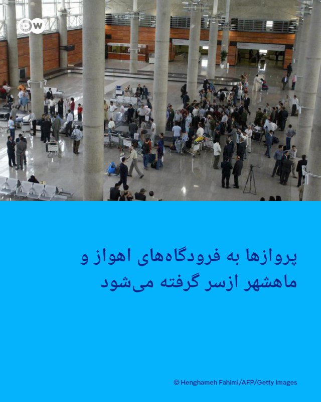

🔶 پروازها به فرودگاه‌های اهواز و ماهشهر ازسر گرفته می‌شود

سازمان هواپیمایی کشوری ایران در اطلاعیه‌ای اعلام کرد، با تکمیل موفقیت‌آمیز فرآیند ارزیابی‌های امنیتی و ایمنی، دو فرودگاه اهواز و ماهشهر از روز شنبه ۲ خرداد (۲۳ مه) به چرخه عملیاتی کشور بازگشته‌اند.

سازمان هواپیمایی کشوری گفته است که فرودگاه‌های اهواز و ماهشهر با بهبود وضعیت زیرساخت‌ها، دوباره بازگشایی شده‌اند و تمامی شرکت‌های هواپیمایی می‌توانند پروازهای عادی خود را در این مسیرها از سر بگیرند.

سازمان هواپیمایی کشوری در اطلاعیه خود خبر داده است که سایر فرودگاه‌ها نیز پس از ارزیابی‌های امنیتی و ایمنی به‌تدریج بازگشایی خواهند شد.

پس از حملە ائتلاف آمریکا و اسرائیل بە جمهوری اسلامی به دلیل شرایط خاص امنیتی و ایمنی فعالیت بسیاری از فرودگاه‌ها متوقف شد. برخی از فرودگاه‌ها نیز هدف حمله قرار گرفتند.

@dw_farsi

## DW_Farsi — post 125036

  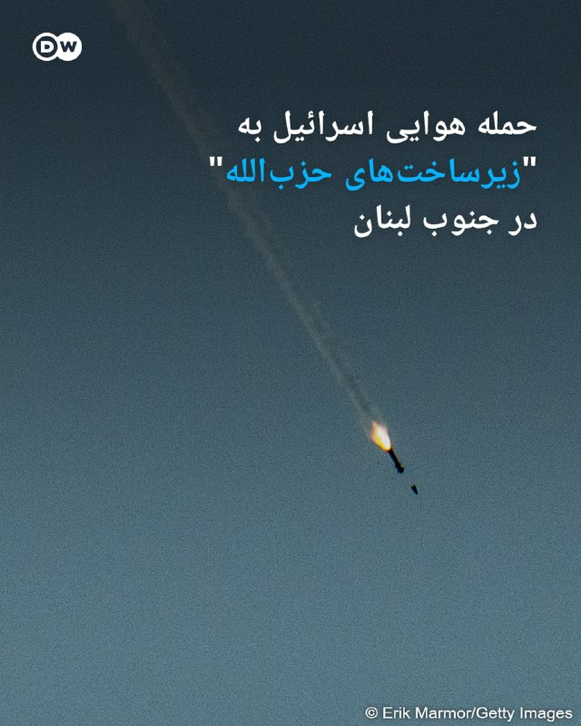

🔶 حمله هوایی اسرائیل به "زیرساخت‌های حزب‌الله" در جنوب لبنان

وزارت بهداشت لبنان روز شنبه ۲ خرداد (۲۳ مه) اعلام کرد، در حملات اسرائیل به جنوب لبنان طی ۲۴ ساعت گذشته شش امدادگر کشته شده‌اند. وزارت بهداشت لبنان این حملات را نقض قوانین بین‌المللی دانسته است.

ارتش اسرائیل اعلام کرد، در یکی از این موارد، زیرساخت‌های مرتبط با حزب‌الله، گروه مورد حمایت ایران، هدف قرار گرفته و آسیب‌دیدن غیرنظامیان در این حمله بررسی خواهد شد.

هم‌زمان خبرگزاری فرانسه گزارش داده است که دو ساختمان در منطقه صور در جنوب لبنان پس از هشدار تخلیه هدف قرار گرفته‌اند. شاهدان از وقوع دو انفجار و بلندشدن دود از محل خبر داده‌اند.

در حادثه‌ای دیگر نیز پنج حمله هوایی اسرائیل در شرق لبنان و در نزدیکی مرز سوریه انجام شده است. بر اساس گزارش خبرگزاری رسمی لبنان، این حملات مناطق اطراف شهر بریتال لبنان را هدف قرار داده‌اند؛ منطقه‌ای که از آتش‌بس ۱۷ آوریل تاکنون کمتر مورد حمله قرار گرفته بود.

@dw_farsi

## RadioFarda — post 157477

  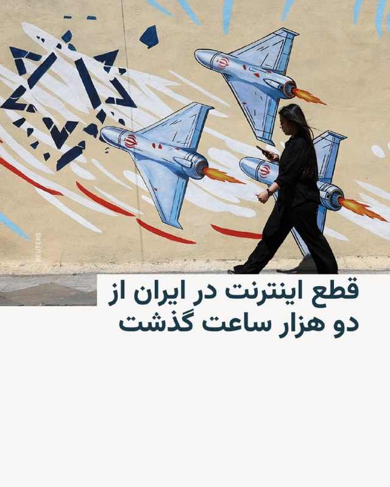

🔸نت‌بلاکس، نهاد پایش وضعیت اینترنت در جهان، در تازه‌ترین پیام خود در روز جمعه خبر داد که قطع اینترنت در ایران اکنون از ۲۰۰۰ ساعت گذشته است.

🔸در همین حال، روزنامهٔ اعتماد روز شنبه نوشت که مسعود پزشکیان، رئیس‌جمهور، «از مسیرهای قانونی»، پیگیر فراهم کردن دسترسی عمومی‌تر به اینترنت است. بر اساس این گزارش، تشکیل «ستاد راهبری و ساماندهی فضای مجازی» و قرار گرفتن محمدرضا عارف در رأس آن، نشانهٔ جدی بودن دولت در این زمینه دانسته شده است.

🔸روزنامهٔ اعتماد در گزارش خود این‌طور ابراز امیدواری کرده است که «به احتمال زیاد در هفتهٔ جاری موضوع رفع انسداد اینترنت به تصویب می‌رسد.»

🔸مسعود پزشکیان در حالی ستاد تازه‌ای برای «ساماندهی» فضای مجازی تشکیل داده که روزنامهٔ شرق آن را ساختاری مبهم و امنیتی با حضور نهادهایی چون وزارت اطلاعات، اطلاعات سپاه، شورای عالی امنیت ملی و قوهٔ قضائیه توصیف کرده و منتقدان می‌گویند دولت به‌جای رفع مستقیم محدودیت‌های اینترنت، بر مسیرهای پرابهام و امنیتی تکیه کرده است.

@RadioFarda

## RadioFarda — post 157476

  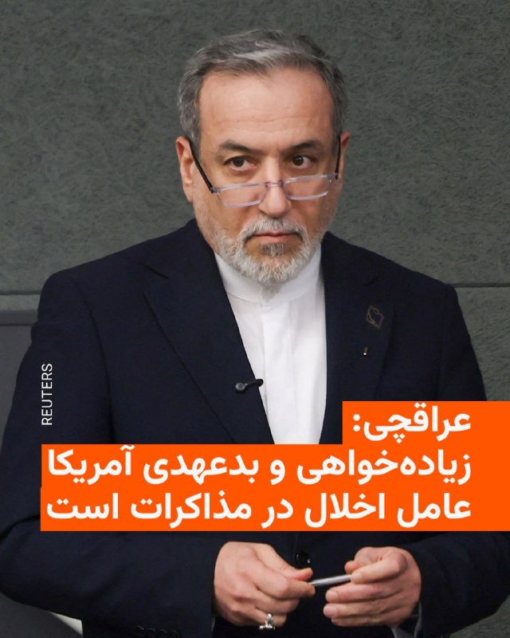

🔸هم‌زمان با انتشار گزارش‌هایی مبنی بر تدارک آمریکا برای دور تازه حمله به ایران، وزیر امور خارجه ایران «زیاده‌خواهی و بدعهدی آمریکا» را «عامل اخلال» در مذاکرات جاری با پاکستان عنوان کرد.

🔸شبکه سی‌بی‌اس در آمریکا بامداد شنبه، دوم خردادماه، خبر داد که دولت دونالد ترامپ برای انجام دور تازه‌ای از حملات علیه ایران آماده می‌شود.

🔸به نوشته این خبرنگار از کاخ سفید، ترامپ در جلسه موافق بوده است که دیپلماسی نیاز به زمان بیشتری دارد، و در عین حال مسئله بازگشت به جنگ نیز هم‌چنان روی میز است.

🔸همزمان رسانه‌های حکومتی در ایران روز جمعه خبر تماس تلفنی وزیر خارجه جمهوری اسلامی با دبیرکل سازمان ملل را منتشر کردند که در آن آمریکا را مسئول نرسیدن به توافق معرفی کرده است.

🔸به نوشته خبرگزاری تسنیم به نقل از عباس عراقچی، او «بدعهدی آمریکا خصوصاً خیانت‌های مکرر به دیپلماسی و تجاوز نظامی علیه ایران به‌ همراه موضع‌گیری‌های ضدونقیض و زیاده‌خواهی‌های مکرر» را «عامل اخلال» در مذاکراتی دانسته است که با میانجی‌گری پاکستان در حال انجام است.

@RadioFarda

## RadioFarda — post 157475

  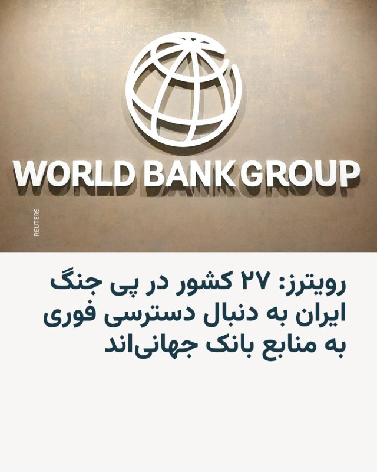

🔸یک سند داخلی بانک جهانی که رویترز آن را دیده، نشان می‌دهد از زمان آغاز جنگ ایران در اسفندماه پارسال، ۲۷ کشور برای فعال کردن ابزارهای مالی اضطراری اقدام کرده‌اند تا در صورت نیاز بتوانند به‌سرعت از منابع موجود در برنامه‌های بانک جهانی استفاده کنند.

🔸این سند نام کشورها و میزان کل منابع مالی احتمالی را مشخص نکرده و بانک جهانی نیز از اظهارنظر در این باره خودداری کرده است. بر پایه این سند، سه کشور از زمان آغاز درگیری در خاورمیانه، ابزارهای جدید مالی را تصویب کرده‌اند و سایر کشورها هنوز در حال تکمیل روند آن هستند.

🔸جنگ ایران و اختلال در بازار جهانی انرژی باعث افزایش قیمت سوخت، فشار بر زنجیره‌های تأمین و مشکل در ارسال کودهای شیمیایی به کشورهای در حال توسعه شده است.

🔸مقام‌های عراق و کنیا تأیید کرده‌اند که برای مقابله با پیامدهای جنگ، از جمله افت درآمد نفتی عراق و افزایش بهای سوخت در کنیا، به دنبال دریافت کمک سریع از بانک جهانی هستند.

@RadioFarda

## IranianMinds — post 20599

  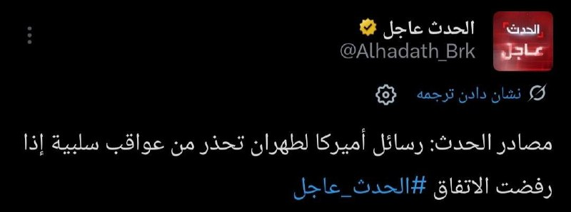

🔴منابع الحدث:

آمریکا به تهران پیام داده است که اگر توافق را رد کند، عواقب بدی در انتظارش می‌باشد.

@IranianMinds

## IranianMinds — post 20598

  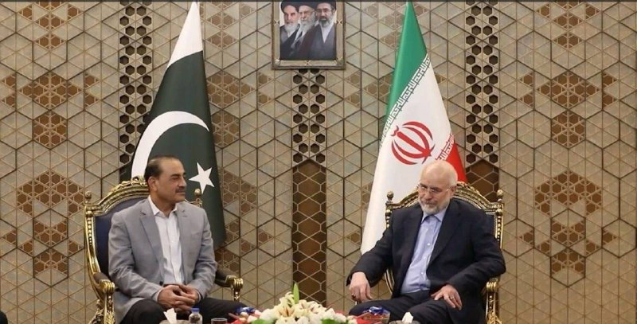

🔴عاصم منیر با قالیباف دیدار کرد.

@IranianMinds

## BBCPersian — post 281866

🔻سپاه پاسداران: ۲۵ کشتی در شبانه‌روز گذشته با هماهنگی از تنگه هرمز عبور کردند

سپاه پاسداران می‌گوید «طی شبانه روز گذشته ۲۵ فروند کشتی اعم از نفتکش، کانتینربر و سایر کشتی‌های تجاری» از تنگه هرمز عبور کرده‌اند.

روابط عمومی سپاه پاسداران گفت که عبور این کشتی‌ها از تنگه هرمز پس از هماهنگی و گرفتن مجوز صورت گرفته است.

دو روز پیش نهاد مدیریت آبراه خلیج‌فارس که به‌تازگی ایجاد شده با انتشار نقشه‌ای «محدوده نظارتی مدیریت تنگه هرمز» را اعلام کرد.

طبق این نقشه، از «خط اتصال کوه مبارک در ایران و جنوب فجیره در امارات در شرق تنگه» تا «خط اتصال انتهای جزیره قشم در ایران و ام‌القیوین در امارات در غرب تنگه» محدوده نظارت نیروی دریایی سپاه تعریف شده است.

https://bbc.in/4uvRtqK
@BBCPersian

## BBCPersian — post 281865

🔻«۲۶ و ۲۷ سال زندان» برای دو زن در ایران به‌عنوان همکاری با رسانه‌های مخالف

رئیس کل دادگستری استان سمنان از بازداشت «لیلا رمضانی» و «فاطمه ملک‌احمدی» خبر داد و گفت این دو در «جریان اقدامات امنیتی مربوط به مقابله با عوامل داخلیِ مرتبط با دشمن» دستگیر شده‌اند.

محمدصادق اکبری گفت: «آنها با برقراری ارتباط با رسانه‌ها و شبکه‌های مخالف جمهوری اسلامی، در انتقال اطلاعات برای هدایت اقدامات خرابکارانه علیه ایران نقش داشته‌اند.»

به گفته رئیس دادگستری سمنان، برای این دو نفر علاوه بر صدور «احکام سنگین قضایی ۲۶ و ۲۷ سال»، مجازات‌های تکمیلی از جمله «محرومیت از خدمات دولتی، ممنوعیت خروج از کشور و منع فعالیت در احزاب و گروه‌های سیاسی و اجتماعی» در نظر گرفته شده است.

پس از جنگ اخیر، قوه قضائیه ایران شمار زیادی را با عنوان «همکاری» یا «همراهی» یا ارتباط با رسانه‌های «معاند» بازداشت و با روندهای دادرسی نامشخص، آنها را به زندان اندخته است یا از حقوق محروم و اموالشان را توقیف و مصادره کرده است.

https://bbc.in/42RIvrz
@BBCPersian

## BBCPersian — post 281864

  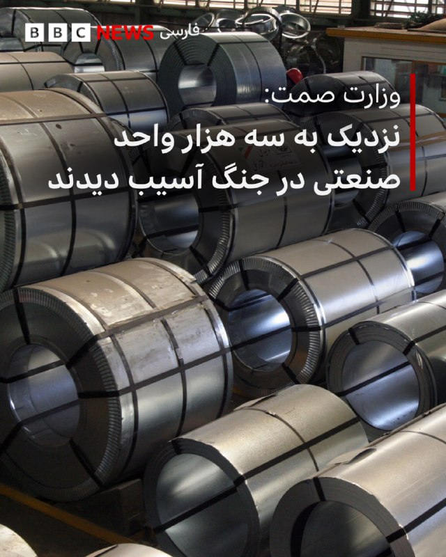

🔻سخنگوی وزارت صنعت، معدن و تجارت (صمت) گفت نزدیک به «سه هزار واحد صنعتی» در جنگ آسیب دیده‌اند.

عزت‌الله زارعی گفت هنوز آمار نهایی خسارت به دلیل تکمیل نشدن روند ارزیابی در برخی استان‌ها مشخص نیست اما بر اساس بررسی‌های اولیه، نزدیک به «سه هزار واحد صنعتی در مقیاس‌های بزرگ، متوسط و کوچک دچار آسیب شده‌اند.»

به گفته او صنایعی نظیر فولاد مبارکه و فولاد خوزستان به دلیل اهمیت در اولویت بازسازی قرار گرفته‌اند تا هرچه سریع‌تر به مدار تولید بازگردند.

سخنگوی وزارت صمت اضافه کرد که جنگ آثار منفی بر زنجیره تأمین گذاشته و واردات مواد اولیه دیگر به سهولت گذشته نیست.

📸Corbis via Getty Images
https://bbc.in/3RpdMQk
@BBCPersian

## Dirty_Kids — post 390010

  <a href="telegram/content/Dirty_Kids_390010_1779533739.mp4" target="_blank">🎬 Download video</a>

پست جدید اینستاگرام ترامپ😂
مجری cbs رو میندازه تو سطل زباله

@Dirty_Kids 👻

## Dirty_Kids — post 390009

  <a href="telegram/content/Dirty_Kids_390009_1779533741.mp4" target="_blank">🎬 Download video</a>

رژیم تروریست شیعیان رافضی می‌خواد بزنه خوار کابل‌های فیبر نوری جهان که از تنگه‌ی هرمز و باب‌المندب عبور می‌کنن رو بگاد،

و با این اقدامات کسمغزان رافضی، کشورهای قرمساق منطقه طعم قطع شدن اینترنت مردم ایران رو با کون و جون‌شون خواهند چشید.

@Dirty_Kids 👻

## Dirty_Kids — post 390008

  <a href="telegram/content/Dirty_Kids_390008_1779533742.mp4" target="_blank">🎬 Download video</a>

خوار رژیمی که قصد ترور شیر خدا و دختر شیر خدا و یحتمل سایر اعضای خونواده‌ی شیر خدا رو داشته، یقیناً گاییده‌ست.

اورانیوم مورانیوم بهونه‌ست،
بحث گاییدن رژیم شیعه‌سانان رافضی یه بحث شخصیه.

یه تروریست می‌خواست ایوانکا ترامپ رو ترور کنه، اونم با نقشه خونه‌ش!
محمد الساعدی که آموزش‌دیده سپاه جمهوری اسلامی بوده، ظاهراً برای انتقام قاسم سلیمانی نقشه قتل ایوانکا ترامپ رو کشیده بود، حتی نقشه خونه‌ش تو فلوریدا رو هم داشته.

@Dirty_Kids 👻

## Dirty_Kids — post 390007

  <a href="https://t.me/Dirty_Kids/390007" target="_blank">📎 Download file</a>

📱 اپلیکیشن اندروید بدون فیلتر ریتزوبت

➖➖➖➖➖

🔹 ثبت نام آسان 
✅
🔹 رابط کاربری بسیار راحت و سریع 
✅
🔹 درگاه پرداخت کارت به کارت 
✅
🔹 درگاه پرداخت دلاری سریع 
✅
🔹 بونوس ۱۰۰ درصدی اولین واریز 
✅
🔹 بونوس ۱۰۰ درصدی واریز یکشنبه ها 
✅

➖➖➖➖➖
🌐 https://RitzoBet.com

⚡️ @RitzoBet_ir

## Dirty_Kids — post 390006

  <a href="telegram/content/Dirty_Kids_390006_1779533745.webm" target="_blank">🎬 Download video</a>

⚠️ برای #شرطبندی های فوتبال از سایت معتبر و بین المللی استفاده کنید ✅

🇪🇸 رئال مادرید 
🔢
🔢 
🇪🇸 اتلتیک بیلبائو

سایت #ریتزوبت ، چهار سال هستش داخل ایران فعالیت میکنه 
✅

لایسنس بین المللی داره ، روش های شارژ و برداشت متنوع داره و بونوس 100% ورزشی و کش بک های جذاب
💎

⏪ اپلیکیشن بدون فیلتر ریتزوبت 
📱
⏩
R2

✅ لینک بدون‌ فیلتر ریتزوبت
🤣

🆔 @RitzoBet_ir 
🇮🇷

## Dirty_Kids — post 390004

عروس با اسلحه تیر هوایی میزنه میخندن.

بخدا انقدر که شما بسیجیا ریدین به مرگ خامنه‌ای و خندیدین ما نریدیم.

@Dirty_Kids 👻

## Dirty_Kids — post 390002

استوری‌های علی کریمی

هرجور نگاه میکنم، حس خوبی نمیگیرم

@Dirty_Kids 👻

## Dirty_Kids — post 390001

  <a href="telegram/content/Dirty_Kids_390001_1779533745.mp4" target="_blank">🎬 Download video</a>

کامران غضنفری، نماینده مجلس خطاب به پزشکیان:

چرا بدون اجازه رهبر آتش‌بس را پذیرفتید!
چرا ۲۹ فروردین تهدید به استعفا کردید
چرا مانع از اجرای دستور حمله نظامی رهبر به اسرائیل شدید!
چرا گفتید اگه ناو‌های آمریکایی هدف قرار بگیرد، استعفا می‌دهید
عباس عراقچی سینگال ترور رهبر شهید را داد

@Dirty_Kids 👻

## Dirty_Kids — post 390000

  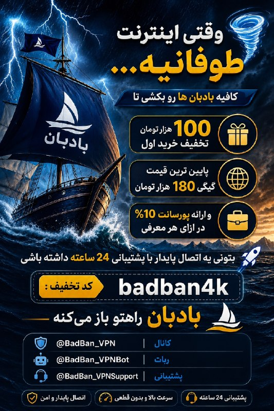

🌪وقتی اینترنت طوفانیه فقط کافیه بادبان ها رو بکشی

⚫️100 هزار تومان تخفیف خرید اول 
🎁

⚫️پایین ترین قیمت گیگی 180 هزار تومان
🌐 

⚫️پورسانت %10 دائمی برای هر معرفی
💼

با بادبان، میتونی یه اتصال سریع، پایدار و امن
همراه با پشتیبانی ۲۴ ساعته داشته باشی
🚀

🛒کد تخفیف: badban4k

بادبان راهتو باز می‌کنه
⛵️
R2

🛡@BadBan_VPN | کانال 

🤖@BadBan_VPNBot | ربات 

📞@BadBan_VPNSupport | پشتیبانی

## Hranews — post 113107

اموال ۹۶ نفر در استان قزوین توقیف شد

❗️
❗️
❗️
❗️
❗️– دادستان عمومی و انقلاب مرکز استان قزوین از توقیف اموال ۹۶ نفر در این استان خبر داد. به گفته وی، برای ۹ نفر از این افراد نیز کیفرخواست با اتهامات “جاسوسی و انجام اقدام اطلاعاتی” صادر شده است.

ادامه مطلب

#توقیف_اموال

↘️
@hranews_bot تماس ✉️ - @Hranews کانال هرانا 🆑

## manototv — post 105756

  <a href="telegram/content/manototv_105756_1779533749.mp4" target="_blank">🎬 Download video</a>

دولت آمریکا اعلام کرد بیشتر مهاجرانی که قصد دریافت گرین‌کارت دارند، باید خاک این کشور را ترک کرده و درخواست خود را از طریق سفارت‌خانه‌ها یا کنسولگری‌های آمریکا در خارج ثبت کنند.
اداره خدمات شهروندی و مهاجرت آمریکا اعلام کرد از این پس دارندگان ویزای موقت، دانشجویی یا توریستی تنها در «شرایط استثنایی» می‌توانند داخل آمریکا وضعیت اقامت خود را تغییر دهند.
این تصمیم بخشی از سیاست‌های مهاجرتی دولت ترامپ برای محدود کردن مهاجرت غیرقانونی عنوان شده و راهی را می‌بندد که پیش‌تر به برخی مهاجران اجازه می‌داد هنگام حضور در آمریکا برای گرین‌کارت اقدام کنند.
منتقدان می‌گویند این تغییر می‌تواند باعث جدایی خانواده‌ها و ایجاد بلاتکلیفی برای صدها هزار مهاجر قانونی شود. همچنین برخی متقاضیان ممکن است پس از خروج از آمریکا دیگر اجازه بازگشت دریافت نکنند.
دولت آمریکا می‌گوید این سیاست باعث «عادلانه‌تر و کارآمدتر» شدن سیستم مهاجرتی خواهد شد.

## manototv — post 105755

  <a href="telegram/content/manototv_105755_1779533749.mp4" target="_blank">🎬 Download video</a>

وزیر خارجه قطر در تماس تلفنی با عباس عراقچی، وزیر خارجه جمهوری اسلامی، خواستار کاهش تنش‌ها و حمایت از تلاش‌های دیپلماتیک برای پایان دادن به بحران شد. وزارت خارجه قطر اعلام کرد دوحه از مذاکرات برای رسیدن به توافقی جامع و برقراری ثبات پایدار در منطقه حمایت کامل می‌کند.
وزیر خارجه قطر همچنین هشدار داد بستن تنگه هرمز یا استفاده از آن به‌عنوان ابزار فشار، بحران را تشدید کرده و منافع کشورهای منطقه را به خطر می‌اندازد. او تأکید کرد آزادی کشتیرانی یک اصل اساسی و غیرقابل مذاکره است و همه طرف‌ها باید به قوانین بین‌المللی و اصول حسن همجواری پایبند باشند.
هم‌زمان، وزرای خارجه اردن و قطر نیز درباره تلاش‌های میانجی‌گرانه پاکستان میان تهران و واشنگتن گفت‌وگو کردند و بر ضرورت همکاری برای رسیدن به راه‌حلی پایدار و جلوگیری از تشدید دوباره تنش‌ها تأکید کردند.

## manototv — post 105754

  <a href="telegram/content/manototv_105754_1779533750.mp4" target="_blank">🎬 Download video</a>

«منوتو بخشی از زندگی ما بود»

## manototv — post 105753

  <a href="telegram/content/manototv_105753_1779533752.mp4" target="_blank">🎬 Download video</a>

سازمان هواپیمایی کشوری صدور هرگونه نوتام جدید برای ممنوعیت پرواز در غرب حریم هوایی ایران را تکذیب کرد. حمیدرضا صانعی، معاون هوانوردی و امور بین‌الملل این سازمان، شایعات منتشرشده در فضای مجازی درباره بسته شدن حریم هوایی تا صبح دوشنبه را «شیطنت رسانه‌ای» خواند و گفت هیچ اطلاعیه جدیدی صادر نشده است.
او همچنین اعلام کرد برنامه‌ریزی‌ها برای انجام پروازهای اربعین در حال انجام است.

## alonews — post 122000

  <a href="telegram/content/alonews_122000_1779533752.webm" target="_blank">🎬 Download video</a>

👈امتحانات دانش‌آموزان کهگیلویه و بویراحمدی غیرحضوری شد

✅ @AloNews خبر جنگ

## alonews — post 121999

  <a href="telegram/content/alonews_121999_1779533753.webm" target="_blank">🎬 Download video</a>

👈 ‏روزنامه نیویورک تایمز به نقل از دو مقام نظامی اسرائیلی : تل‌آویو در جریان گفت‌وگوهای اخیر میان واشنگتن و تهران عمدتا از مسیرهای غیرمستقیم از روند تحولات مطلع می‌شود

✅ @AloNews خبر جنگ

## alonews — post 121998

  <a href="telegram/content/alonews_121998_1779533753.webm" target="_blank">🎬 Download video</a>

👈قطر: بستن تنگه هرمز تنها منجر به عمیق‌تر شدن بحران می‌شود

✅ @AloNews خبر جنگ

## alonews — post 121997

  <a href="telegram/content/alonews_121997_1779533753.webm" target="_blank">🎬 Download video</a>

👈منابع الحدث : آمریکا به تهران پیام داده اگه توافقو رد کنه، عواقب بدی در انتظارشه

✅ @AloNews خبر جنگ

## alonews — post 121996

  <a href="telegram/content/alonews_121996_1779533753.webm" target="_blank">🎬 Download video</a>

👈سازمان ملل خواستار توقف اخراج افغان‌ها از کشورهای میزبان آنها شد

✅ @AloNews خبر جنگ

## alonews — post 121995

  <a href="telegram/content/alonews_121995_1779533754.webm" target="_blank">🎬 Download video</a>

👈دیدار مجدد عاصم منیر با عراقچی

✅ @AloNews خبر جنگ

## alonews — post 121994

  <a href="telegram/content/alonews_121994_1779533754.webm" target="_blank">🎬 Download video</a>

👈عاصم منیر، فرمانده ارتش پاکستان با پزشکیان دیدار کرد

✅ @AloNews خبر جنگ

## alonews — post 121993

  <a href="telegram/content/alonews_121993_1779533754.webm" target="_blank">🎬 Download video</a>

👈عاصم منیر، فرمانده ارتش پاکستان با قالیباف، رئیس مجلس دیدار کرد

✅ @AloNews خبر جنگ

## alonews — post 121992

  <a href="telegram/content/alonews_121992_1779533754.webm" target="_blank">🎬 Download video</a>

👈منابع خبری از حمله هوایی اسرائیل به شهرک «مجدل سلم» در شهرستان «بنت جبیل» در جنوب لبنان خبر دادند.

✅ @AloNews خبر جنگ

## alonews — post 121991

  <a href="telegram/content/alonews_121991_1779533755.webm" target="_blank">🎬 Download video</a>

👈نورالدین الدغیر خبرنگار الجزیره در تهران: وساطت‌ها بین تهران و واشنگتن به مرحله‌ای رسیده که یکی از سران منطقه‌ای به طور مستقیم برای پر کردن شکاف‌ها وارد عمل شده.

🔴ظهور قطر در این لحظه حساس به طور مستقیم و بر اساس اطلاعات و منابع موجود، نه صرفاً به عنوان نقش کمکی برای پاکستان، بلکه به عنوان نقش محوری است.

🔴منبعی می‌گوید که احتمال دارد یکی از میانجی‌ها به واشنگتن سفر کند.

✅ @AloNews خبر جنگ

## alonews — post 121990

  <a href="telegram/content/alonews_121990_1779533755.webm" target="_blank">🎬 Download video</a>

👈فروش متری خانه در تهران آغاز شد

🔴مدیرعامل سازمان سرمایه‌گذاری شهر تهران: عرضهٔ آزمایشی خانه‌ریز در تهران آغاز شده و از این ماه کار به‌صورت گسترده از طریق سامانۀ شهرزاد شروع می‌شود.

🔴قیمت خانه‌ریز معادل میانگین کل آن ملک است و افراد می‌توانند از چند متر تا کل واحد را خریداری کنند.

🔴قیمت‌گذاری برای این املاک توسط کارشناس رسمی و در روز تحویل ملک انجام شده و به مزایده گذاشته می‌شود.

✅ @AloNews خبر جنگ

## alonews — post 121989

🚀 فروش کانفیگ استارلینک و VIP با سرعت بالا و اتصال پایدار 💎 پلن‌های VIP 📍 1 گیگ — 200 هزار تومان 📍 3 گیگ — 600 هزار تومان ⭐️ پلن‌های Starlink 🔸 5 گیگ — 1.500 میلیون تومان 🔸 10 گیگ — 2.900 میلیون تومان ✅️ آی‌پی ثابت ✅️ پشتیبانی ۲۴ ساعته ✅️ کیفیت تضمینی…

## alonews — post 121988

  

🚀 فروش کانفیگ استارلینک و VIP با سرعت بالا و اتصال پایدار

💎 پلن‌های VIP
📍 1 گیگ — 200 هزار تومان
📍 3 گیگ — 600 هزار تومان

⭐️ پلن‌های Starlink
🔸 5 گیگ — 1.500 میلیون تومان
🔸 10 گیگ — 2.900 میلیون تومان

✅️ آی‌پی ثابت
✅️ پشتیبانی ۲۴ ساعته
✅️ کیفیت تضمینی
✅️ دارای ساب باقیمانده لحظه ای
✅️ متصل در تمامی دستگاه ها و اپراتور ها
🛫 خرید و پشتیبانی:

🏠 @expressuport
🤖 ربات خرید:

💻 @vpn_express_sup_bot

## alonews — post 121987

  <a href="telegram/content/alonews_121987_1779533756.webm" target="_blank">🎬 Download video</a>

👈ادعای العربیه: یک هیئت فنی و حقوقی پاکستانی عازم تهران است.

✅ @AloNews خبر جنگ

## alonews — post 121986

  <a href="telegram/content/alonews_121986_1779533756.webm" target="_blank">🎬 Download video</a>

👈ادعای الحدث: پیام‌های آمریکا که به تهران منتقل شده، حاکی از آن است که اگر ایران با توافق موافقت کند، حل باقی مسائل به زمان بعد موکول خواهد شد.

✅ @AloNews خبر جنگ

## alonews — post 121985

  <a href="telegram/content/alonews_121985_1779533756.webm" target="_blank">🎬 Download video</a>

👈وزارت بهداشت: مورد مثبتی از ویروس‌های جدید در ایران گزارش نشده است

✅ @AloNews خبر جنگ

## alonews — post 121984

  <a href="telegram/content/alonews_121984_1779533757.webm" target="_blank">🎬 Download video</a>

👈خنثی‌سازی مهمات اسرائیلی ـ آمریکایی در خرم‌آباد

✅ @AloNews خبر جنگ

## alonews — post 121983

  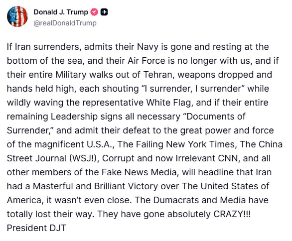

جنگ ترامپ با دموکرات‌ها در تروث سوشال

اگر ایران تسلیم شود و بپذیرد که نیروی دریایی‌اش رفته و در قعر دریا آرمیده است و نیروی هوایی‌اش دیگر با ما نیست و اگر تمام ارتشش از تهران خارج شود و سلاح‌هایش را زمین بگذارد و دست‌هایش را بالا بگیرد و هر کدام فریاد بزند «تسلیم می‌شویم» در حالی که پرچم سفید نماینده‌اش را تکان می‌دهد، و اگر تمام رهبران باقی‌مانده‌اش تمام «اسناد تسلیم» لازم را امضا کنند و شکست خود را در برابر قدرت و نیروی عظیم ایالات متحده باشکوه بپذیرند،
نیویورک تایمزِ شکست‌خورده، چاینا استریت ژورنال (کنایه از وال استریت ژورنال)، سی‌ان‌انِ فاسد و تمام اعضای دیگر رسانه‌های خبریِ جعلی، تیتر خواهند زد که ایران پیروزی استادانه و درخشانی بر ایالات متحده آمریکا داشته است.
دموکرات‌ها و رسانه‌هایشان کاملاً راه خود را گم کرده‌اند. آنها کاملاً دیوانه شده‌اند!!!

@AloNews خبر جنگ

## alonews — post 121982

  <a href="telegram/content/alonews_121982_1779533757.webm" target="_blank">🎬 Download video</a>

👈الحدث به نقل از منبع ایرانی: آنچه تهران می‌خواهد، توافق بر سر چارچوب است که مشخص کند جنگ چگونه پایان خواهد یافت. 
✅ @AloNews خبر جنگ

## alonews — post 121981

  <a href="telegram/content/alonews_121981_1779533757.webm" target="_blank">🎬 Download video</a>

👈الحدث به نقل از منبع ایرانی: آنچه تهران می‌خواهد، توافق بر سر چارچوب است که مشخص کند جنگ چگونه پایان خواهد یافت.

✅ @AloNews خبر جنگ

---
📅 بروزرسانی: 1405/03/02 12:53
---

## VahidOOnLine — post 241672

  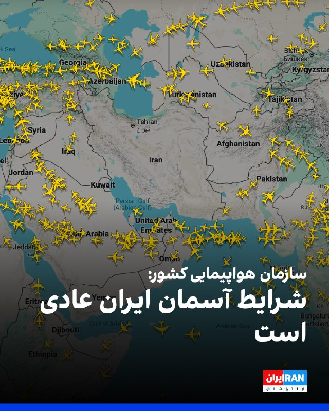

سخنگوی سازمان هواپیمایی ایران اعلام کرد این سازمان هیچ اطلاعیه رسمی هوانوردی جدیدی درباره اعمال محدودیت در آسمان کشور صادر نکرده است و شرایط پروازی عادی است.

او با تاکید بر تداوم وضعیت عادی پروازها گفت: «شرایط آسمان کشور همچنان مانند روال گذشته است و پروازها طبق برنامه انجام می‌شود.»

سخنگوی سازمان هواپیمایی بدون اشاره به جزئیات اطلاعیه هوانوردی (نوتام)، افزود: «نوتامی که اخیرا در فضای مجازی منتشر شده، تکذیب می‌شود.»

سازمان هواپیمایی کشوری ایران روز جمعه یکم خرداد در اطلاعیه‌ای اعلام کرده بود فعالیت فرودگاه‌های واقع در بخش غربی محدوده پروازی ایران، موسوم به «FIR تهران»، تا دوشنبه متوقف شده و تنها شمار محدودی از فرودگاه‌ها مجاز به فعالیت هستند.

بر اساس آن اطلاعیه، فرودگاه‌های ارومیه، کرمان، آبادان، شیراز، یزد، کرمانشاه، رشت و اهواز از این محدودیت مستثنی شده‌اند و فعالیت آنها نیز فقط از طلوع تا غروب آفتاب مجاز اعلام شده بود.
‌🏁 🇬🇧 IranintlTV

🤖 @VahidOOnLine

## VahidOOnLine — post 241671

  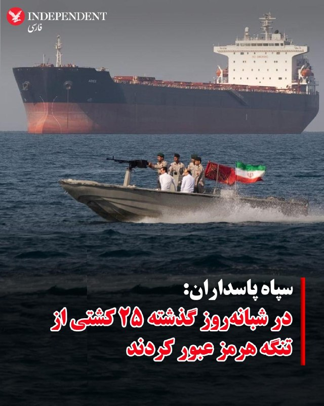

♦️روابط عمومی نیروی دریایی سپاه پاسداران انقلاب اسلامی، روز شنبه دوم خرداد ماه با انتشار بیانیه‌ای ادعا کرد، طی شبانه روز گذشته ۲۵ کشتی نفتکش، باربر و تجاری پس از «کسب مجوز با هماهنگی و تامین امنیت نیروی دریایی سپاه» از تنگه هرمز عبور کردند.
به سپاه پاسداران با اعلام این خبر افزود «کنترل هوشمند تنگه هرمز» توسط نیروی دریایی سپاه «با قوت» در حال انجام است.
در این بیانیه که در رسانه‌های حکومتی ایران منتشر شده، از کشورهای منبع و مقصد این کشتی‌ها و همچنین مواردی چون دریافت عوارض کشتی‌رانی اطلاعاتی ارائه نشده است.
‌🇸🇦 Indypersian

🤖 @VahidOOnLine

## VahidOOnLine — post 241670

  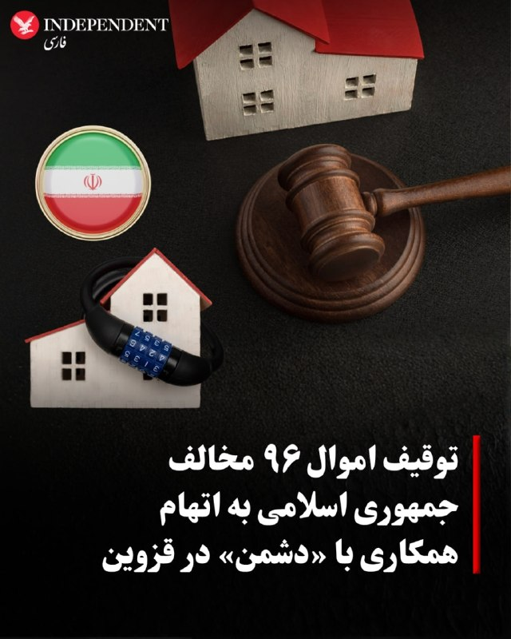

⭕️ توقیف اموال ۹۶ مخالف جمهوری اسلامی به اتهام به همکاری با «دشمن» در قزوین

♦️دادستان عمومی و انقلاب قزوین از توقیف اموال ۹۶ مخالف جمهوری اسلامی به همکاری با «دشمن» خبر داد و اعلام کرد این افراد شامل «مزدوران خارج‌نشین» و برخی عناصر داخلی هستند.
به گفته مقام قضایی قزوین، همچنین برای ۳ نفر با اتهام «جاسوسی» و برای ۶ نفر به اتهام «انجام اقدامات اطلاعاتی» کیفرخواست صادر شده است.
این اقدام در ادامه موج برخوردهای امنیتی و قضایی پس از جنگ ۴۰ روزه میان جمهوری اسلامی با آمریکا و اسرائیل انجام می‌شود؛ دوره‌ای که طی آن، مقام‌های جمهوری اسلامی از توقیف اموال، مسدودسازی دارایی‌ها و تشکیل پرونده قضایی برای ده‌ها هنرمند، فعال سیاسی، رسانه‌ای و چهره‌های شناخته‌شده و تاثیرگذار خبر داده بودند.
‌🇸🇦 Indypersian

🤖 @VahidOOnLine

## VahidOOnLine — post 241669

ویدیوی رسیده به ایران اینترنشنال نشان می‌دهد روز شنبه دوم خرداد تعدادی از دانش‌آموزان مدارس در خرم‌آباد برای اعتراض به بلاتکلیفی و ابهام درباره شیوه امتحانات خود و اظهارات مسئولان برای حضوری کردن امتحانات تجمع کردند. هفته گذشته نیز در شهرکرد دانش‌آموزان تجمع اعتراضی برگزار کردند.
‌🏁 🇬🇧 IranintlTV

🤖 @VahidOOnLine

## VahidOOnLine — post 241668

  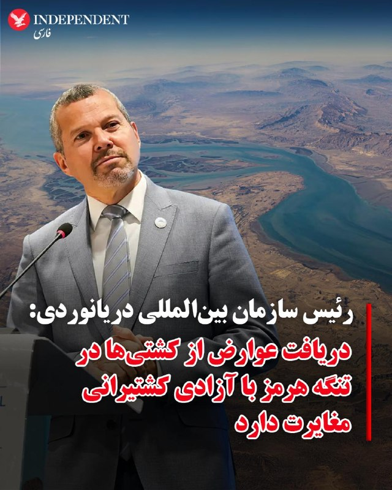

♦️رئیس سازمان بین‌المللی دریانوردی (IMO) اعلام کرد هرگونه طرح برای دریافت عوارض اجباری از کشتی‌های عبوری در تنگه هرمز با اصول آزادی ناوبری بین‌المللی سازگار نیست.
آرسنیو دومینگز، رئیس این نهاد وابسته به سازمان ملل، روز شنبه دوم خرداد ماه در گفتگو با نیویورک‌تایمز گفت وارد بحث‌هایی درباره دریافت عوارضی که فراتر از حق عبور آزاد و «عبور بی‌ضرر» باشد، نخواهد شد.
این اظهارات پس از آن مطرح شد که گزارش‌هایی درباره گفتگوهای ایران و عمان برای ایجاد سازوکاری جهت دریافت هزینه عبور از کشتی‌ها در تنگه هرمز منتشر شد. ایران این طرح را در قالب هزینه خدمات، عوارض عبور یا هزینه‌های زیست‌محیطی مطرح کرده است.
‌🇸🇦 Indypersian

🤖 @VahidOOnLine

## VahidOOnLine — post 241667

  <a href="telegram/content/VahidOOnLine_241667_1779528214.mp4" target="_blank">🎬 Download video</a>

یک شهروند در پیامی به ایران اینترنشنال با اشاره به کشتار دی‌ماه از مذاکره با جمهوری اسلامی انتقاد کرده و می‌گوید مطالبه مردم در خیابان شاهزاده رضا پهلوی بوده است. پیام او با هوش مصنوعی خوانده شده است.
‌🏁 🇬🇧 IranintlTV

🤖 @VahidOOnLine

## VahidOOnLine — post 241666

  

علاالدین بروجردی، عضو کمیسیون امنیت ملی و سیاست خارجی مجلس، وضعیت فعلی کشور را «شکننده» خواند و گفت در شرایط «نه جنگ و نه صلح»، همه سناریوها محتمل است و باید برای بدترین گزینه‌ها آمادگی داشت.

او تاکید کرد: «ما باید همواره برای بدترین گزینه‌ها آمادگی لازم را داشته باشیم تا دشمنان اشتباهات گذشته خود را تکرار نکنند.»

بروجردی همچنین هشدار داد جمهوری اسلامی در برابر هرگونه اقدام «ماجراجویانه» پاسخ «قاطع و بدون ملاحظه» خواهد داد.

این عضو کمیسیون امنیت ملی و سیاست خارجی مجلس با اشاره به روند مذاکرات گفت: «مذاکرات صحنه کارزار سیاسی است. در آن صحنه نیز قالیباف در حال جنگ است و به همراه وزیر امور خارجه کشور با پشتوانه مردم و نیروهای مسلح از موضوع قدرت صحبت می‌کند.»
‌🏁 🇬🇧 IranintlTV

🤖 @VahidOOnLine

## VahidOOnLine — post 241665

  <a href="telegram/content/VahidOOnLine_241665_1779528217.mp4" target="_blank">🎬 Download video</a>

یک شهروند با ارسال پیامی درباره گرانی و کمبود دارو می‌گوید مایفورتیک که از داروهای مورد نیاز در پیوند کلیه است به حدود ۱۲۰ میلیون تومان رسیده است. پیام او با هوش مصنوعی خوانده شده است.
‌🏁 🇬🇧 IranintlTV

🤖 @VahidOOnLine

## VahidOOnLine — post 241664

♦️در پی نشت یک مخزن بزرگ مواد شیمیایی در ایالت کالیفرنیا، مقام‌های محلی روز جمعه دستور تخلیه گسترده مناطق اطراف را صادر کردند. به گزارش خبرگزاری فرانسه، نشست مواد این مخزن باعث انتشار بخارهای سمی بر فراز منطقه‌ای پرجمعیت شده و خطر انفجار را به همراه دارد.
این مخزن حاوی حدود ۷ هزار گالن، معادل ۲۶ هزار لیتر، ماده «متیل متاکریلات» بود. مایعی فرار و قابل اشتعال که در تولید پلاستیک استفاده می‌شود. آتش‌نشانان وضعیت را «بسیار جدی» توصیف کردند.
کریگ کاوی، فرمانده عملیات، گفت: «عملا فقط دو سناریو باقی مانده است؛ یا مخزن دچار شکستگی می‌شود و حدود ۶ تا ۷ هزار گالن مواد شیمیایی خطرناک وارد محوطه می‌شود، یا وارد مرحله انفجار حرارتی شده و منفجر می‌شود و مخازن اطراف را نیز درگیر می‌کند.»
این حادثه در منطقه گاردن گروو در اورنج کانتی، در جنوب‌شرقی لس‌آنجلس، رخ داده است. رئیس پلیس گاردن گروو گفت حدود ۴۰ هزار نفر تحت تأثیر دستور تخلیه قرار گرفته‌اند، هرچند چند هزار نفر همچنان از ترک خانه‌های خود خودداری کرده‌اند.
تصاویر هوایی منتشرشده از تلویزیون‌های محلی نشان می‌دهد نیروهای امدادی برای خنک نگه داشتن مخزن، حجم زیادی آب روی آن می‌ریزند. مقام‌های امدادی بعدا اعلام کردند عملیات خنک‌سازی موفق بوده و دمای مخزن کاهش یافته است.
تا شامگاه جمعه گزارشی از مصدومیت منتشر نشده و علت نشت نیز هنوز مشخص نیست. مقام‌های بهداشتی هشدار داده‌اند استنشاق بخار این ماده می‌تواند موجب آسیب‌های تنفسی و علائم عصبی شود.
‌🇸🇦 Indypersian

🤖 @VahidOOnLine

## VahidOOnLine — post 241663

⭕️ شکوه طبیعت بهاری؛
باران، جان تازه‌ای به دشت‌های گلستان بخشید

♦️بارش‌های مستمر و فراتر از حد نرمال در دو ماه گذشته، جلوه‌ای تازه به طبیعت سرسبز استان گلستان بخشیده و جان دوباره‌ای به زمین‌های کشاورزی این استان داده است. دشت‌های وسیع، مراتع سبز و مزارع چشم‌نواز گلستان این روزها در اوج طراوت بهاری قرار دارند، استانی که به‌دلیل تنوع اقلیمی کم‌نظیر، از کوهستان و جنگل تا دشت و ساحل را در خود جای داده و یکی از قطب‌های مهم کشاورزی ایران به شمار می‌رود.
رونق دوباره کشت‌های دیم پس از بارندگی‌های اخیر، امید تازه‌ای در میان کشاورزان گلستان ایجاد کرده است. این استان با حدود ۶۵۰ هزار هکتار زمین کشاورزی، در تولید ۱۵ محصول راهبردی کشور جزو استان‌های پیشتاز محسوب می‌شود و طبیعت زنده و حاصلخیز آن، هر ساله نقش مهمی در تامین امنیت غذایی ایران ایفا می‌کند.
تصاویر منتشرشده، گوشه‌ای از زیبایی طبیعت بهاری گلستان و زندگی جاری در دل مزارع و دشت‌های این استان را به تصویر می‌کشد.
این مجموعه عکس را محمد عطایی ثبت کرده و در خبرگزاری ایرنا منتشر کرده است.
‌🇸🇦 Indypersian

🤖 @VahidOOnLine

## VahidOOnLine — post 241662

  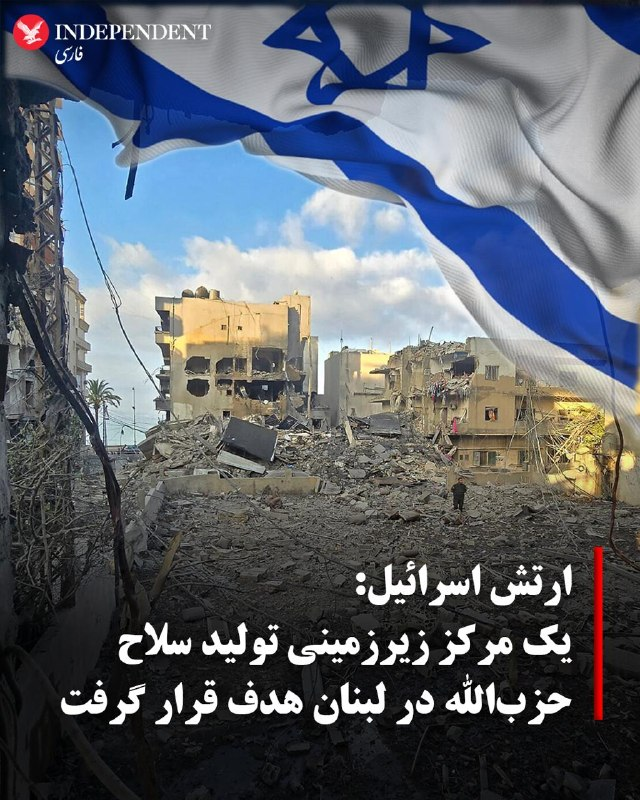

♦️ارتش اسرائیل، روز شنبه دوم خرداد ماه اعلام کرد حملات شبانه این کشور در منطقه بقاع لبنان یک مرکز زیرزمینی تولید سلاح متعلق به حزب‌الله را هدف قرار داده است.
نیروهای دفاعی اسرائیل (IDF) همچنین گفتند زیرساخت‌های دیگری وابسته به حزب‌الله در منطقه صور نیز در این حملات هدف قرار گرفته‌اند.
ارتش اسرائیل پیش از آغاز حملات، برای ساکنان دره بقاع لبنان هشدارهای تخلیه صادر کرده بود. به گفته ارتش، در این عملیات از مهمات دقیق و همچنین تجهیزات نظارتی استفاده شده است.
‌🇸🇦 Indypersian

🤖 @VahidOOnLine

## VahidOOnLine — post 241661

  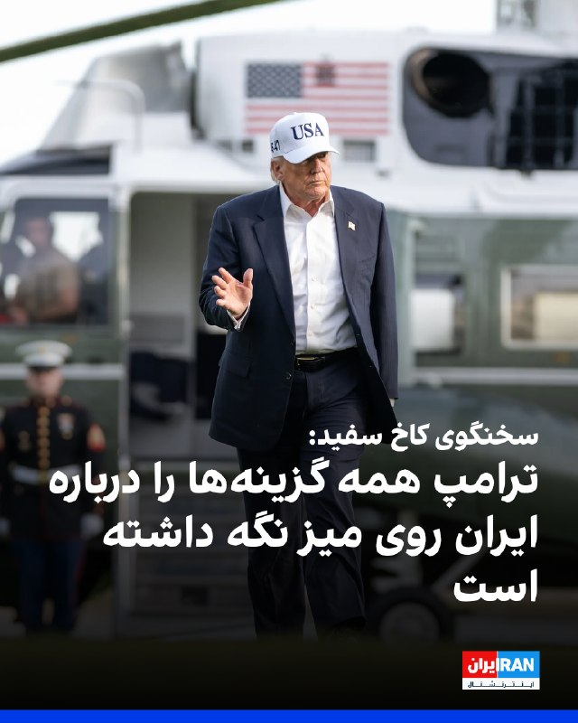

اولیویا والز، سخنگوی کاخ سفید، با اشاره به حملات آمریکا و اسرائیل علیه جمهوری اسلامی گفت ایالات متحده «به تمام اهداف نظامی خود در «عملیات خشم حماسی» دست یافته یا از آنها پیشی گرفته است.»

او افزود: «ترامپ همه کارت‌ها را در دست دارد و عاقلانه همه گزینه‌ها را روی میز نگه می‌دارد.»
‌🏁 🇬🇧 IranintlTV

🤖 @VahidOOnLine

## VahidOOnLine — post 241660

  

مشاهدات و تجربه شما از مشکلات حوزه نان، گرانی، کمبود یا شلوغی صفوف نانوایی چیست؟

روی لینک زیر کلیک کنید و پیام‌های خود را از طریق مدیا‌بات برای ما بفرستید.

t.me

پیام‌های شما به صورت زیر‌نویس در تلویزیون و همچنین در بخش‌های مختلف‌ خبری منتشر خواهد شد
‌🏁 🇬🇧 IranintlTV

🤖 @VahidOOnLine

## WithYashar — post 12118

منابعی به اسکای نیوز عربی گفتن که میانجی پاکستانی موفق شده بر مانع پرونده هسته‌ای ایران غلبه کنه
@withyashar

## WithYashar — post 12117

علی کریمی : ببینیم کی قبلا چیکاره بوده و الان چیکارتست و دنبال چی هست؟!
ببینیم که چند چندیم؟!
بببینیم کی برای پول و صندلی مبارزه کرده، کی برای آزادی ایران؟!
این گوی و این میدان
@withyashar

## WithYashar — post 12116

  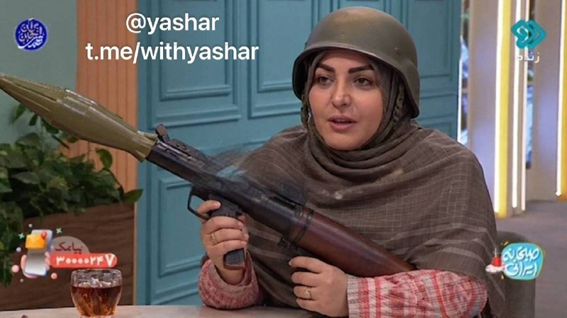

المیرا شریفی مقدم: آماده رفتن به جنگ هستم
@withyashar

## WithYashar — post 12115

گزارشهای تایید نشده : ویزای شجاع خلیل زاده احسان حاج‌صفی و مهدی طارمی به دلیل حمایت از سپاه تروریستی پاسداران رد شدن @withyashar

## WithYashar — post 12113

حمله ارتش اسرائیل به یک مجتمع بزرگ زیرزمینی حزب‌الله در اعماق لبنان و جنوب این کشور
@withyashar

## WithYashar — post 12112

  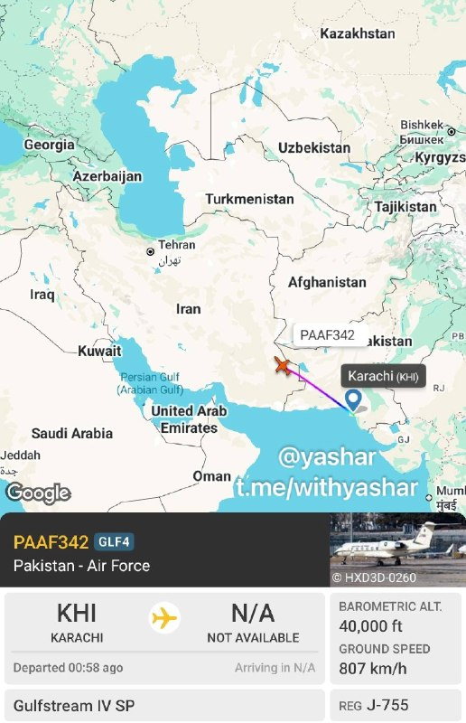

یک مقام دیگر پاکستانی به تهران می‌رود.😒
یا دیشب اگه رفتن دارن بر میگردن
جت نیروی هوایی پاکستان GLF IV SP reg J-755
@withyashar

## WithYashar — post 12111

ادعای کانال ۱۳ عبری به نقل از نیویورک‌تایمز: ترامپ اسرائیل را از مذاکرات با ایران کنار گذاشته است.
@withyashar

## WithYashar — post 12110

سناتور راجر ویکر: «الان تو مقطعی هستیم که می‌تونه میراث سیاسی ترامپ رو مشخص کنه. غریزه ترامپ این بوده که کاری رو که تو ایران شروع کرده، کامل تموم کنه؛ اما بهش توصیه‌های اشتباه می‌شه تا دنبال توافقی بره که حتی ارزش کاغذی که روش نوشته شده رو هم نداره. فرمانده کل نیروهای آمریکا باید اجازه بده ارتش حرفه‌ای آمریکا نابودی توان نظامی متعارف ایران رو کامل کنه و تنگه رو دوباره باز کنه. ادامه تلاش برای توافق با حکومت ایران ممکنه نشونه ضعف تلقی بشه. باید کاری رو که شروع کردیم، تموم کنیم. وقت اقدام گذشته.» @withyashar

## WithYashar — post 12109

گزارشهای تایید نشده : ویزای شجاع خلیل زاده احسان حاج‌صفی و مهدی طارمی به دلیل حمایت از سپاه تروریستی پاسداران رد شدن
@withyashar

## mwarmonitor — post 9521

📝از اخبار موثق تا سناریوی هالیوودی؛ سقوط آزاد نیویورک‌تایمز در باتلاق اراجیف 🔰این سناریوی نیویورک‌تایمز واقعاً بیشتر شبیه به یکی از قسمت‌های تخیلی و آخرالزمانی ترمیناتور جیمز کامرون است تا یک گزارش خبری موثق، و نشان می‌دهد که کار این رسانه رسماً از نوشتن…

## mwarmonitor — post 9520

🔸یک مقام دیگر پاکستانی در حال سفر به تهران است. 🛩 هواپیمای Gulfstream IV-SP نیروی هوایی پاکستان با رجیستر J-755 @mwarmonitor

## mwarmonitor — post 9519

  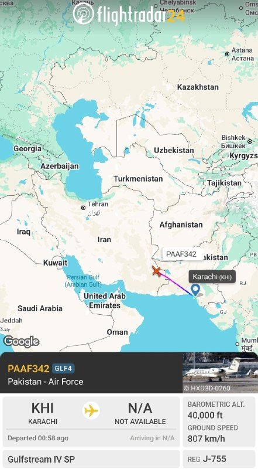

🔸یک مقام دیگر پاکستانی در حال سفر به تهران است.

🛩 هواپیمای Gulfstream IV-SP نیروی هوایی پاکستان با رجیستر J-755

@mwarmonitor

## mwarmonitor — post 9518

🔴مذاکرات آمریکا و ایران برای پایان دادن به جنگ شدت گرفته است، اما گزارش شده که دونالد ترامپ، رئیس‌جمهور آمریکا، در صورت عدم دستیابی به توافق، به‌طور جدی در حال بررسی حملات جدید علیه ایران است — رویترز

@mwarmonitor

## pm_afshaa — post 91247

🔴منابعی به اسکای نیوز عربی گفتن که میانجی پاکستانی موفق شده بر مانع پرونده هسته‌ای ایران غلبه کنه

💧 Rainbet.com the #1 Non-KYC Crypto Casino & Sportsbook @rainbetcom

😁 @Pm_Afshaa

## pm_afshaa — post 91246

🔴لارا لومر از معتمد ترین افراد نزدیک ترامپ خبر آماده شدن آمریکا برای حملات دوباره به ایران رو توییت کرده

💧 Rainbet.com the #1 Non-KYC Crypto Casino & Sportsbook @rainbetcom

😁 @Pm_Afshaa

## pm_afshaa — post 91245

🔴حملات آخرالزمانی اسرائیل به تأسیسات زیرزمینی حزب الله در منطقه البقاع در شرق لبنان

💧 Rainbet.com the #1 Non-KYC Crypto Casino & Sportsbook @rainbetcom

😁 @Pm_Afshaa

## pm_afshaa — post 91244

🔴کانال 13 اسراییل: ترامپ اسرائیل را از مذاکرات با ایران کنار گذاشته

💧 Rainbet.com the #1 Non-KYC Crypto Casino & Sportsbook @rainbetcom

😁 @Pm_Afshaa

## pm_afshaa — post 91243

نماینده ج.ا در سازمان ملل: دولت‌های خلیج فارس موظف به جبران کامل خسارات علیه ایران هستن

💧 Rainbet.com the #1 Non-KYC Crypto Casino & Sportsbook @rainbetcom

😁 @Pm_Afshaa

## pm_afshaa — post 91242

مهاجری، عضو شورای اطلاع‌رسانی دولت، خطاب به حمید رسایی: تصمیم‌ جنگ یا صلح ربطی به نمایندگان کم سواد نداره

💧 Rainbet.com the #1 Non-KYC Crypto Casino & Sportsbook @rainbetcom

😁 @Pm_Afshaa

## pm_afshaa — post 91241

🔴ویزای شجاع خلیل زاده احسان حاج‌صفی و مهدی طارمی به دلیل حمایت از سپاه تروریستی پاسداران رد شدن

💧 Rainbet.com the #1 Non-KYC Crypto Casino & Sportsbook @rainbetcom

😁 @Pm_Afshaa

## DEJradio — post 4862

  <a href="telegram/content/DEJradio_4862_1779528224.mp4" target="_blank">🎬 Download video</a>

🤡
🔺 «شب ازدواجشون چه شود»؛ تَق!

#تجمعات_حکومتی #شب_زفاف
@DEJradio

## DEJradio — post 4861

  <a href="telegram/content/DEJradio_4861_1779528226.webm" target="_blank">🎬 Download video</a>

🚨📢 سازمان هواپیمایی کشوری با صدور نوتام تازه، برای پروازها و فعالیت فرودگاه‌های غرب ایران تا صبح دوشنبه محدودیت اعلام کرد.

بر اساس این نوتام، تمامی فرودگاه‌های غرب ایران بسته اعلام شده‌اند و تنها هشت فرودگاه شامل تبریز، کرمان، آبادان، کرمانشاه، یزد، رشت و اهواز اجازه فعالیت دارند. فعالیت این فرودگاه‌ها نیز صرفاً از طلوع تا غروب آفتاب مجاز است.

در متن اطلاعیه همچنین تأکید شده که تمامی مجوزهای پیشین پرواز برای اپراتورها و شرکت‌های هواپیمایی تعلیق شده و انجام هر پرواز مسافری منوط به دریافت مجوز تازه از سازمان هواپیمایی کشوری خواهد بود.

این محدودیت‌ها بر اساس زمان درج‌شده در نوتام تا ساعت ۸:۳۰ صبح روز دوشنبه ادامه دارد؛ هرچند امکان تمدید یا اصلاح آن با توجه به شرایط عملیاتی و امنیتی وجود خواهد داشت.

سازمان هواپیمایی کشوری از مسافران خواسته است آخرین وضعیت پروازها را اتنها از مسیر شرکت‌های هواپیمایی، فرودگاه‌ها و اطلاعیه‌های رسمی پیگیری کنند.

#سازمان_هواپیمایی_کشوری
@DEJradio

## DEJradio — post 4860

  <a href="telegram/content/DEJradio_4860_1779528226.webm" target="_blank">🎬 Download video</a>

🚨
⭕️ همزمان با آخرین تلاش‌های دیپلماتیک برای وادار کردن جمهوری اسلامی به توافق با آمریکا، سی‌بی‌اس‌نیوز به نقل از منابع آگاه گزارش داد دولت ترامپ برای دور تازه‌ای از حملات نظامی علیه جمهوری اسلامی ایران آماده می‌شود.

به گفته منابع مطلع، برخی اعضای ارتش و نهادهای اطلاعاتی آمریکا برنامه‌های تعطیلات خود را لغو کرده‌اند و مقام‌های دفاعی و اطلاعاتی در حال به‌روزرسانی فهرست‌های فراخوان نیروها در پایگاه‌های آمریکا در خارج از کشور هستند.

ترامپ اعلام کرد به دلیل «شرایط مربوط به امور دولت» در مراسم ازدواج پسرش شرکت نخواهد کرد و به‌جای گذراندن تعطیلات روز یادبود در نیوجرسی، به کاخ سفید بازمی‌گردد.

همچنین «آکسیوس» گزارش داد ترامپ به طور جدی در حال بررسی انجام حملات جدید علیه ایران است تا در صورت عدم حصول پیشرفت لحظه آخری در مذاکرات آن را عملی کند.

#توافق #مذاکرات #جنگ
@DEJradio

## mamlekate — post 103570

📝 گزارش سی‌بی‌اس از تحرکات تازه جامعه نظامی و اطلاعاتی آمریکا با محوریت ایران؛ برخی اعضای ارتش مرخصی‌های خود را لغو کردند

شبکه آمریکایی سی‌بی‌اس به نقل از منابع مطلع گزارش داد که دولت دونالد ترامپ، رئیس‌جمهوری آمریکا، روز جمعه ۱ خرداد و هم‌زمان با ادامه تلاش‌های دیپلماتیک، خود را برای دور تازه‌ای از حملات نظامی به جمهوری اسلامی ایران آماده می‌کرد.

@mamlekate

## mamlekate — post 103569

📝 قفل دبی بر بازار دیجیتال ایران؛ هشدار درباره موج تازه گرانی موبایل و لپ‌تاپ

بازار دیجیتال ایران پس از جنگ به وضعیت عادی بازنگشته و فعالان بازار از کمبود کالا، قیمت‌های شناور و مسیرهای نامطمئن واردات می‌گویند. وابستگی طولانی‌مدت بازار موبایل، لپ‌تاپ و قطعات کامپیوتری به مسیر امارات، اکنون به نقطه آسیب‌پذیری تبدیل شده و در کوتاه‌مدت جایگزین روشنی برای آن دیده نمی‌شود.

@mamlekate

## IranIntlTV — post 338548

  

سخنگوی سازمان هواپیمایی ایران اعلام کرد این سازمان هیچ اطلاعیه رسمی هوانوردی جدیدی درباره اعمال محدودیت در آسمان کشور صادر نکرده است و شرایط پروازی عادی است.

او با تاکید بر تداوم وضعیت عادی پروازها گفت: «شرایط آسمان کشور همچنان مانند روال گذشته است و پروازها طبق برنامه انجام می‌شود.»

سخنگوی سازمان هواپیمایی بدون اشاره به جزئیات اطلاعیه هوانوردی (نوتام)، افزود: «نوتامی که اخیرا در فضای مجازی منتشر شده، تکذیب می‌شود.»

سازمان هواپیمایی کشوری ایران روز جمعه یکم خرداد در اطلاعیه‌ای اعلام کرده بود فعالیت فرودگاه‌های واقع در بخش غربی محدوده پروازی ایران، موسوم به «FIR تهران»، تا دوشنبه متوقف شده و تنها شمار محدودی از فرودگاه‌ها مجاز به فعالیت هستند.

بر اساس آن اطلاعیه، فرودگاه‌های ارومیه، کرمان، آبادان، شیراز، یزد، کرمانشاه، رشت و اهواز از این محدودیت مستثنی شده‌اند و فعالیت آنها نیز فقط از طلوع تا غروب آفتاب مجاز اعلام شده بود.
https://iranintl.com/202605236955

## IranIntlTV — post 338547

ویدیوی رسیده به ایران اینترنشنال نشان می‌دهد روز شنبه دوم خرداد تعدادی از دانش‌آموزان مدارس در خرم‌آباد برای اعتراض به بلاتکلیفی و ابهام درباره شیوه امتحانات خود و اظهارات مسئولان برای حضوری کردن امتحانات تجمع کردند. هفته گذشته نیز در شهرکرد دانش‌آموزان تجمع اعتراضی برگزار کردند.

## IranIntlTV — post 338546

  <a href="telegram/content/IranIntlTV_338546_1779528228.mp4" target="_blank">🎬 Download video</a>

همزمان با لغو امتحانات مقطع ابتدایی و غیرحضوری شدن آزمون‌های بسیاری از پایه‌های متوسطه، نگرانی‌ها درباره پیامدهای آموزش مجازی در ایران افزایش یافته است.

گفت‌وگو با منصوره حسینی‌یگانه، عضو تحریریه ایران‌اینترنشنال
@iranintltv

## IranIntlTV — post 338545

  <a href="telegram/content/IranIntlTV_338545_1779528230.mp4" target="_blank">🎬 Download video</a>

یک شهروند در پیامی به ایران اینترنشنال با اشاره به کشتار دی‌ماه از مذاکره با جمهوری اسلامی انتقاد کرده و می‌گوید مطالبه مردم در خیابان شاهزاده رضا پهلوی بوده است. پیام او با هوش مصنوعی خوانده شده است.

## IranIntlTV — post 338544

  <a href="telegram/content/IranIntlTV_338544_1779528232.mp4" target="_blank">🎬 Download video</a>

دونالد ترامپ، رییس‌جمهوری آمریکا، در شبکه اجتماعی تروث سوشال نوشت در شرایط کنونی، ترجیح می‌دهد در کاخ سفید بماند و در مراسم ازدواج پسرش حضور نخواهد داشت.

سمیرا قرایی، خبرنگار ایران‌اینترنشنال، گزارش می‌دهد
@iranintltv

## IranIntlTV — post 338543

  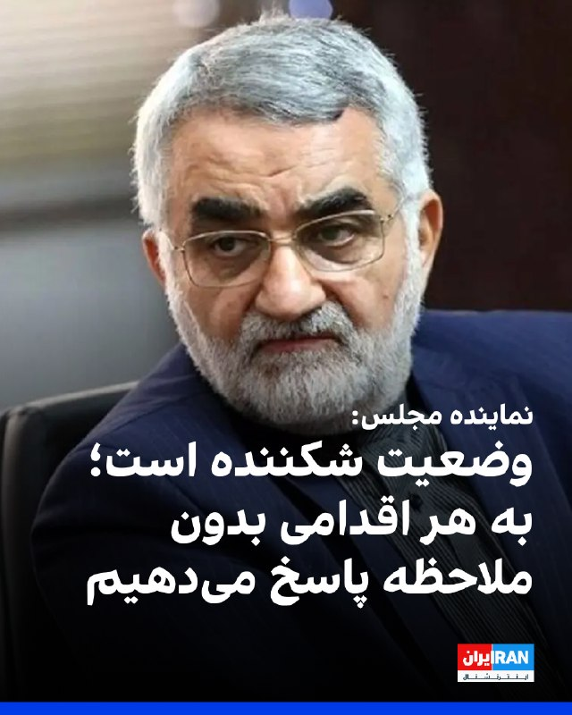

علاالدین بروجردی، عضو کمیسیون امنیت ملی و سیاست خارجی مجلس، وضعیت فعلی کشور را «شکننده» خواند و گفت در شرایط «نه جنگ و نه صلح»، همه سناریوها محتمل است و باید برای بدترین گزینه‌ها آمادگی داشت.

او تاکید کرد: «ما باید همواره برای بدترین گزینه‌ها آمادگی لازم را داشته باشیم تا دشمنان اشتباهات گذشته خود را تکرار نکنند.»

بروجردی همچنین هشدار داد جمهوری اسلامی در برابر هرگونه اقدام «ماجراجویانه» پاسخ «قاطع و بدون ملاحظه» خواهد داد.

این عضو کمیسیون امنیت ملی و سیاست خارجی مجلس با اشاره به روند مذاکرات گفت: «مذاکرات صحنه کارزار سیاسی است. در آن صحنه نیز قالیباف در حال جنگ است و به همراه وزیر امور خارجه کشور با پشتوانه مردم و نیروهای مسلح از موضوع قدرت صحبت می‌کند.»
https://iranintl.com/202605231626

## IranIntlTV — post 338542

  <a href="telegram/content/IranIntlTV_338542_1779528234.mp4" target="_blank">🎬 Download video</a>

کانال ۱۱ گزارش داد اسرائیل هرگونه توافق با جمهوری اسلامی را به خروج اورانیوم غنی‌شده از ایران و نظارت دقیق بر برنامه هسته‌ای تهران مشروط می‌داند. بر اساس این گزارش اسرائیل از احتمال تعویق مذاکرات اتمی، حتی برای چند روز، نگران است.

گزارش اشکان صفایی، خبرنگار ایران‌اینترنشنال
@iranintltv

## IranIntlTV — post 338541

  <a href="telegram/content/IranIntlTV_338541_1779528236.mp4" target="_blank">🎬 Download video</a>

یک شهروند با ارسال پیامی درباره گرانی و کمبود دارو می‌گوید مایفورتیک که از داروهای مورد نیاز در پیوند کلیه است به حدود ۱۲۰ میلیون تومان رسیده است. پیام او با هوش مصنوعی خوانده شده است.

## IranIntlTV — post 338540

  <a href="telegram/content/IranIntlTV_338540_1779528238.mp4" target="_blank">🎬 Download video</a>

حسین آقایی، عضو تحریریه ایران‌اینترنشنال، گفت: «حتی اگر دولت ترامپ ده‌ها دور دیگر مذاکره با جمهوری اسلامی برگزار کند، تهران همچنان با همان اهرم‌های محدود فشار پای میز خواهد آمد و آن‌گونه که دولت ترامپ می‌خواهد تسلیم نخواهد شد.» او افزود: «اگر آمریکا بخواهد جمهوری اسلامی را وادار به تسلیم کند، باید کارت‌های بازی‌اش را بگیرد.» آقایی تاکید کرد: «گرفتن این اهرم‌ها از طریق حملات نظامی ممکن است، نه دادن زمان بیشتر به جمهوری اسلامی.»
@iranintltv

## IranIntlTV — post 338539

  <a href="telegram/content/IranIntlTV_338539_1779528240.mp4" target="_blank">🎬 Download video</a>

جاویدنامان انقلاب ملی ایرانیان
«پریماه نیک‌پرور» ۱۸ ساله، در اعتراضات ۱۸ دی‌ماه در بندرعباس مورد اصابت گلوله نیروهای سرکوب جمهوری اسلامی قرار گرفت و بعد از سوار شدن به آمبولانس به دلیل عدم رسیدگی به موقع و خون‌ریزی شدید کشته شد. نامش در حافظه‌ این سرزمین می‌ماند و یادش چراغ راه آزادی‌خواهان است.
@iranintltv

## IranIntlTV — post 338538

  

اولیویا والز، سخنگوی کاخ سفید، با اشاره به حملات آمریکا و اسرائیل علیه جمهوری اسلامی گفت ایالات متحده «به تمام اهداف نظامی خود در «عملیات خشم حماسی» دست یافته یا از آنها پیشی گرفته است.»

او افزود: «ترامپ همه کارت‌ها را در دست دارد و عاقلانه همه گزینه‌ها را روی میز نگه می‌دارد.»
https://iranintl.com/202605235460

## IranIntlTV — post 338537

  

مشاهدات و تجربه شما از مشکلات حوزه نان، گرانی، کمبود یا شلوغی صفوف نانوایی چیست؟

روی لینک زیر کلیک کنید و پیام‌های خود را از طریق مدیا‌بات برای ما بفرستید.

https://t.me/intlmedia_bot

پیام‌های شما به صورت زیر‌نویس در تلویزیون و همچنین در بخش‌های مختلف‌ خبری منتشر خواهد شد

## FarsiVOA — post 218418

  <a href="telegram/content/FarsiVOA_218418_1779528244.mp4" target="_blank">🎬 Download video</a>

ورود اولین جنگنده‌های اِف-۳۵ به لهستان؛ تقویت بی‌سابقه ارتش در مرزهای شرقی ناتو؛

ووادیسواف کوشینیاک-کامیش، معاون نخست‌وزیر لهستان، روز جمعه با انتشار ویدیویی از پرواز همزمان سه فروند جنگنده نسل پنجم اِف-۳۵ در کنار اِف-۱۶های این کشور خبر داد و اعلام کرد این هواپیماها پس از برخاستن از پایگاهی در مجمع‌الجزایر آزور، در مسیر نهایی ورود به خدمت در لهستان هستند.

این جنگنده‌ها، اولین هواپیماهای نسل پنجم در جناح شرقی ناتو هستند که به دلیل فناوری رادارگریزی پیشرفته، توانایی شناسایی تهدیدات را پیش از دیده‌ شدن خود دارا می‌باشند.

معاون نخست‌وزیر لهستان تأکید کرد که الحاق اِف-۳۵ها صرفاً خرید تجهیزات جدید نیست، بلکه ورود رسمی نیروی هوایی لهستان به سطح اول و برتر ارتش‌های مدرن جهان است.

پیشتر رئیس‌جمهور آمریکا اعلام کرده بود که پنج هزار نظامی دیگر آمریکایی را به لهستان اعزام می‌کند.

رئیس‌جمهور لهستان با تشکر از دونالد ترامپ برای این تصمیم، در ایکس نوشت: «ائتلاف‌های خوب آن‌هایی هستند که بر پایه همکاری، احترام متقابل و تعهد به امنیت مشترک ما بنا شده‌اند.»
@FarsiVOA

## FarsiVOA — post 218417

  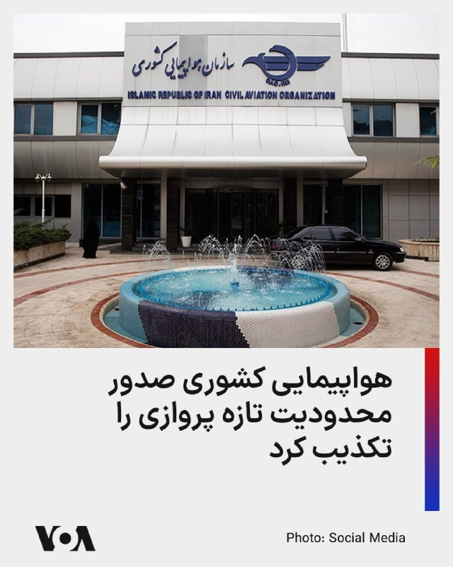

سخنگوی سازمان هواپیمایی صدور نوتام تازه درباره محدودیت پروازی را تکذیب کرد و گفت پروازها طبق برنامه انجام می‌شود.

این تکذیب در حالی منتشر شده که پس از خبر قبلی درباره نوتام و تصاویر منتشر شده از رصد پروازها در آسمان ایران، عراق و سوریه، ابهام درباره وضعیت واقعی ترافیک هوایی منطقه همچنان باقی است.
@FarsiVOA

## FarsiVOA — post 218416

🔺ثبت رکورد دو هزار ساعت قطع اینترنت در هشتادوپنجمین روز حصر دیجیتال

◾️در حالی که محدودیت گسترده اینترنت بین‌الملل در ایران وارد هشتاد و پنجمین روز شده، داده‌های نت‌بلاکس نشان می‌دهد میزان «انزوای دیجیتال» ایران از جهان از مرز ۲۰۱۶ ساعت گذشته است.

◾️بر اساس اعلام این نهاد ناظر بر اینترنت، قطع یا محدودیت شدید دسترسی به اینترنت جهانی اکنون وارد هفته سیزدهم شده و زندگی روزمره، کار، آموزش، ارتباطات و دسترسی به اطلاعات را برای میلیون‌ها شهروند ایرانی مختل کرده است.

◾️مقام‌های جمهوری اسلامی همچنان زمان روشنی برای بازگشایی اینترنت اعلام نکرده‌اند.

⬇️ بیشتر بخوانید:
https://ir.voanews.com/a/8153017.html

## FarsiVOA — post 218415

  <a href="telegram/content/FarsiVOA_218415_1779528247.mp4" target="_blank">🎬 Download video</a>

ارتش اسرائیل از حمله به تأسیسات زیرزمینی تولید سلاح حزب‌الله خبر داد؛

ارتش اسرائیل اعلام کرد در حملات شبانه به لبنان، یک تأسیسات زیرزمینی تولید سلاح متعلق به حزب‌الله در دره بقاع هدف قرار گرفته است.

به گزارش تایمز اسرائیل، ارتش اسرائیل همچنین گفته است زیرساخت‌های دیگری از حزب‌الله در منطقه صور در جنوب لبنان نیز در این حملات هدف حمله قرار گرفتند. ارتش اسرائیل مدعی شده پیش از انجام حملات، هشدارهای تخلیه صادر شده بود تا خطر آسیب به غیرنظامیان کاهش یابد و در عملیات از مهمات دقیق و ابزارهای نظارتی استفاده شده است.

این حملات در ادامه افزایش تنش‌ها در مرز اسرائیل و لبنان انجام می‌شود؛ جایی که از آغاز جنگ، تبادل آتش میان اسرائیل و حزب‌الله بارها به حملات گسترده‌تر در خاک لبنان منجر شده است.

با وجود اعلام آتش‌بس در جبهه لبنان، حملات اسرائیل و حزب‌الله در هفته‌های اخیر ادامه یافته است. اسرائیل می‌گوید مواضع حزب‌الله را برای جلوگیری از بازسازی توان نظامی این گروه هدف می‌گیرد، اما حزب‌الله و دولت لبنان این حملات را نقض آتش‌بس می‌دانند.
@FarsiVOA

## FarsiVOA — post 218414

  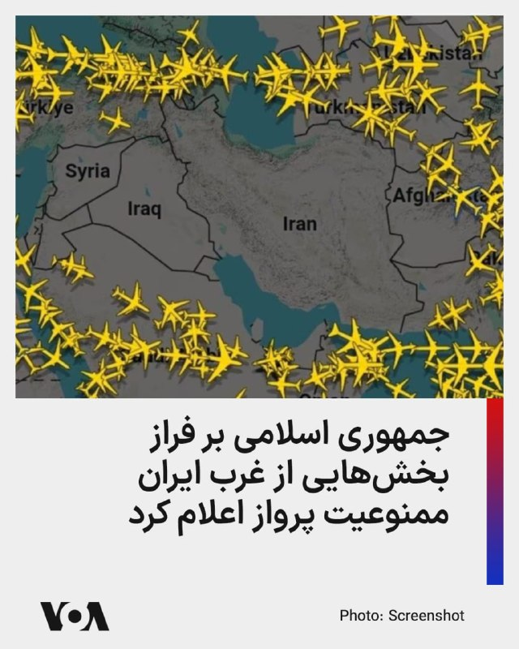

بر اساس داده‌های منتشرشده از مسیرهای هوایی، یک اطلاعیه هوانوردی برای ممنوعیت یا محدودیت پرواز بر فراز بخش‌هایی از غرب کشور صادر شده است.

این محدودیت پروازی تا روز دوشنبه چهارم خرداد ادامه خواهد داشت.

این نوع اطلاعیه که در هوانوردی با عنوان «نوتام» شناخته می‌شود، برای آگاه‌کردن خلبانان و شرکت‌های هواپیمایی از خطرات احتمالی، محدودیت‌های مسیر، بسته‌شدن آسمان یا شرایطی صادر می‌شود که می‌تواند ایمنی پرواز را تحت تأثیر قرار دهد.

در تصاویر منتشرشده، حجم بالای پروازها در اطراف آسمان ایران و عبور مسیرها از مناطق پیرامونی دیده می‌شود؛ موضوعی که می‌تواند نشانه تغییر مسیر پروازها و احتیاط شرکت‌های هواپیمایی در منطقه باشد.
@FarsiVOA

## DW_Farsi — post 125035

📸 جام ۱۹۷۴؛ یوهان کرویف، سلطانی که در حسرت قهرمانی جهان ماند

🔻 گزارشی از شهرام احدی

یوهان کرویف در روز ۲۵ آوریل ۱۹۴۷ در آمسترادام به دنیا آمد. خانه‌ی پدری او در نزدیکى ورزشگاه اختصاصی تیم "آژاکس"، باشگاه پرآوازه‌ی آمستردام قرار داشت. یوهان در کودکی پدرش را از دست داد و مادرش مجبور شد براى گذران زندگی به‌عنوان نظافتچى، از جمله در باشگاه آژاکس کار کند. همین رخدادها بودند که سرنوشت یوهان کرویف را رقم زدند.

به عقیده کارل هاینس هوبا، یکى از روزنامه‌نگاران معروف ورزشى در آلمان، "کرویف از معدود بازیکنان اىست که با فوتبال بزرگ شده؛ همان طور که فرزند یک کشاورز از کودکی کشاورزى را می‌آموزد یا فرزند یک ماهیگیر که تمام روز با پدرش مشغول ماهیگیرى است".

کرویف در ۱۳ سالگى ترک تحصیل کرد تا تمام وقت و توانش را صرف فوتبال کند. رینوس میشل، مربى معروف هلندى که در آن زمان سرمربی آژاکس بود، به نبوغ و استعداد وی پى برد و در ۱۵ نوامبر ۱۹۶۴ کرویف ۱۷ ساله را برای نخستین بار در ترکیب تیمش قرار داد. کرویف در همان بازی اولین گل خود در لیگ دسته‌ی برتر هلند را به ثمر رساند.

@dw_farsi

## DW_Farsi — post 125034

  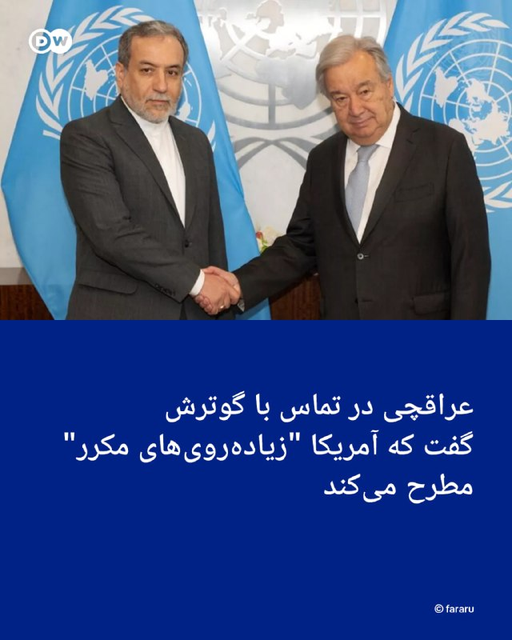

🔶 عراقچی در تماس با گوترش: آمریکا زیاده‌روی‌های مکرر مطرح می‌کند

عباس عراقچی، وزیر امور خارجه ایران شامگاه جمعه ۱ خرداد (۲۲ مه) در تماسی تلفنی با آنتونیو گوترش، دبیرکل سازمان ملل درباره آخرین تحولات منطقه‌ و روند دیپلماسی میان ایران و آمریکا با میانجی‌گری پاکستان گفت‌وگو کرد.

عراقچی همچنین اعلام کرد که جمهوری اسلامی با وجود "بدعهدی‌های مکرر" طرف مقابل در دیپلماسی و اقدامات نظامی علیه ایران همچنان در روند دیپلماتیک مشارکت دارد، اما به گفته او، آمریکا "زیاده‌خواهی‌های مکرر" مطرح می‌کند.

هم‌زمان با تشدید تنش میان آمریکا و ایران عاصم منیر، فرمانده ارتش پاکستان هم با هدف میانجی‌گری به تهران سفر کرد.

دونالد ترامپ، رئیس‌جمهور آمریکا مذاکرات با جمهوری اسلامی را در "مرز میان توافق و تشدید درگیری" توصیف کرده است؛ درگیری‌ای که با حملات مشترک آمریکا و اسرائیل به ایران در ۲۸ فوریه آغاز شد و به تنش‌های گسترده در تنگه هرمز انجامید.

در همین حال، رسانه‌های آمریکایی از جمله "آکسیوس" و "سی‌بی‌اس" به نقل از منابعی گزارش داده‌اند که کاخ سفید احتمال حملات جدید به ایران را بررسی می‌کند، اما تصمیم نهایی و قطعی هنوز گرفته نشده است.

@dw_farsi

## DW_Farsi — post 125032

  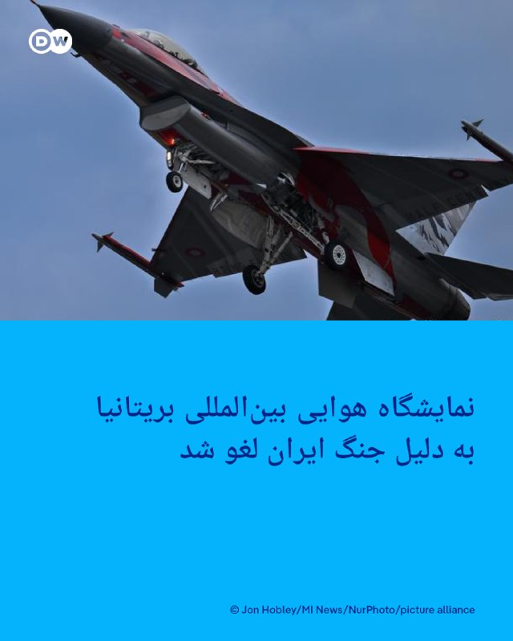

🔶 نمایشگاه هوایی بین‌المللی بریتانیا به دلیل جنگ ایران لغو شد

نمایشگاه هوایی "رویال اینترنشنال ایر تاتو" (RIAT) که از بزرگ‌ترین نمایشگاه‌های دفاعی جهان است روز جمعه ۲۲ مه اعلام کرد که به دلیل تنش‌های نظامی مرتبط با جنگ ایران برنامه خود را لغو کرده است.

این نمایشگاه هوایی که در پایگاه نیروی هوایی سلطنتی فیرفورد بریتانیا در گلاسترشر، واقع در جنوب‌غربی انگلستان برگزار می‌شود بیش از ۵۰ سال قدمت دارد و می‌تواند سالانه بیش از ۱۷۰ هزار بازدیدکننده را جذب کند؛ پایگاهی که توسط نیروی هوایی سلطنتی بریتانیا و نیروی هوایی ایالات متحده به صورت مشترک استفاده می‌شود.

برگزارکنندگان اعلام کره‌اند که لغو این رویداد "تصمیمی آسان نبوده" و این تصمیم پس از گفت‌وگو با نیروی هوایی ایالات متحده، به دلیل عدم اطمینان از دسترسی به این پایگاه در رابطه با وضعیت جاری در ایران اتخاذ شده است. 

این نمایشگاه توسط یک موسسه خیریه وابسته به نیروی هوایی سلطنتی سازمان‌دهی می‌شود و آماده‌سازی آن معمولا برای هفته‌ها بخشی از فعالیت‌های پایگاه فیرفورد را که توسط نیروی هوایی آمریکا اجاره شده، تحت تاثیر قرار می‌دهد.

فرانسیس توسـا، تحلیلگر دفاعی مستقر در بریتانیا می‌گوید، این وضعیت نشان می‌دهد که هیچ تضمینی وجود ندارد که خطر تشدید درگیری با ایران تا ماه ژوئیه کاهش یابد.

استفاده از پایگاه‌های نظامی بریتانیا توسط نیروهای آمریکایی در چارچوب جنگ ایران، به موضوع اختلاف‌برانگیز میان کی‌یر استارمر، نخست‌وزیر بریتانیا و دونالد ترامپ، رئیس‌جمهور آمریکا تبدیل شده است.

کی‌یر استارمر پیش‌تر اعلام کرده بود که بریتانیا اجازه استفاده محدود از پایگاه‌های خود را خواهد داد، اما در حملات تهاجمی علیه ایران مشارکت نخواهد کرد.

@dw_farsi

## RadioFarda — post 157474

  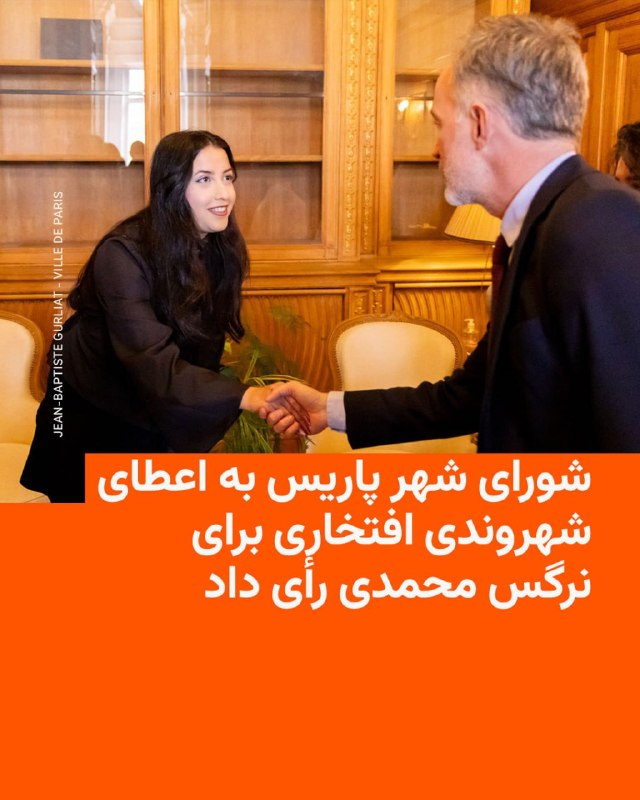

🔸شرح عکس: کیانا، دختر نرگس محمدی در دیدار با شهردار پاریس

🔸اعضای شورای شهر پاریس،‌ پایتخت فرانسه، به اعطای شهروندی افتخاری به نرگس محمدی، برنده ایرانی جایزه نوبل صلح، رأی دادند.

🔸خبر این تصمیم تازه را شهردار پاریس روز چهارشنبه، ۳۰ اردیبهشت، در شبکه ایکس اعلام کرد.

🔸امانوئل گرگوآر،‌ شهردار پاریس، در پیام خود در این باره نوشت: «پاریس باید گوش شنوا داشته باشد. داستان ما داستان شهری است که هر کس که تحت رنج و ظلم قرار می‌گیرد به آن پناه می‌آورد.»

🔸پیام گرگوآر همراه است با عکس‌هایی از حضور همسر و دختر خانم محمدی در جلسه رأی‌گیری شورای شهر پاریس.

🔸بنیاد نرگس محمدی هفته گذشته خبر داد که این برنده جایزه صلح نوبل از بیمارستان مرخص شده است.

🔸خانم محمدی از یازدهم تا بیستم اردیبهشت در بخش مراقبت‌های ویژه بیمارستان موسوی زنجان و از بیستم تا ۲۷ اردیبهشت در همین بخش در بیمارستان پارس تهران بستری بود.

@RadioFarda

## RadioFarda — post 157473

دولت ترامپ روند درخواست گرین‌کارت از داخل آمریکا را محدود کرد

🔸دولت دونالد ترامپ اعلام کرد که از این پس، بیشتر خارجی‌هایی که خواهان دریافت گرین کارت، مجوز اقامت دائم در آمریکا، هستند باید درخواست خود را از کشور زادگاه یا کشور مبدأ خود ثبت کنند.

🔸زَک کالر، سخنگوی اداره خدمات شهروندی و مهاجرت ایالات متحده، روز جمعه یکم خرداد در بیانیه‌ای گفت: «از این پس، فرد خارجی که به‌طور موقت در آمریکا حضور دارد و خواهان گرین کارت است، جز در شرایط فوق‌العاده، باید برای ارائه درخواست به کشور خود بازگردد.»

🔸او افزود که دارندگان روادیدهای غیرمهاجرتی، از جمله دانشجویان، کارگران موقت یا گردشگران، برای مدت کوتاه و با هدفی مشخص وارد آمریکا می‌شوند و «حضور آن‌ها نباید به نخستین گام در روند دریافت گرین کارت تبدیل شود.»

🔸به گزارش واشینگتن‌پست، آمریکا هر سال بیش از یک میلیون گرین کارت صادر می‌کند و تاکنون بیش از نیمی از متقاضیان هنگام ارائه درخواست در داخل خاک آمریکا حضور داشته‌اند.

🔸بر اساس آمار موجود، در حال حاضر هم بیش از یک میلیون نفر در خاک آمریکا در انتظار دریافت گرین کارت خود هستند. مشخص نیست که تأثیر سیاست تازه بر پرونده‌های این افراد چه خواهد بود.

🔸در بیش از ۶۰ سال گذشته این نخستین بار است که تغییری چنین عمده در روند درخواست گرین کارت آمریکا اعمال می‌شود.

🔸به گفته سخنگوی اداره خدمات شهروندی و مهاجرت آمریکا، بررسی درخواست‌ها از طریق وزارت خارجه و در نمایندگی‌های کنسولی آمریکا در خارج انجام خواهد شد.

🔸نسخه کامل این گزارش را در وب‌سایت رادیوفردا بخوانید.

@RadioFarda

## IranianMinds — post 20597

  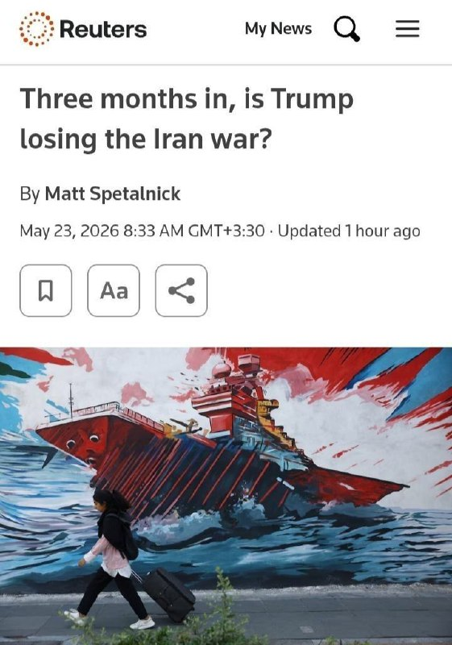

🔴 رویترز :

سه ماه پس از جنگی که قرار بود ظرف شش هفته با یک پیروزی قاطع تمام شود، ترامپ در «باتلاق ایران» گیر افتاده و نه راه آبرومندانه‌ای برای خروج دارد و نه می‌تواند حملات را گسترش دهد.

با وجود حملات آمریکا، ایران سقوط نکرده است

کنترل تنگه هرمز همچنان مهم‌ترین اهرم فشار تهران باقی مانده

تحلیلگران می‌گویند این بحران می‌تواند بیش از هر درگیری چند دهه اخیر، به جایگاه جهانی آمریکا آسیب بزند.

@IranianMinds

## IranianMinds — post 20596

  <a href="telegram/content/IranianMinds_20596_1779528253.mp4" target="_blank">🎬 Download video</a>

🔴 ترامپ تفریحات آخر هفته ی خودشو لغو کرد و به کاخ سفید برگشت.

@IranianMinds

## IranianMinds — post 20591

  <a href="telegram/content/IranianMinds_20591_1779528255.mp4" target="_blank">🎬 Download video</a>

حملات اسرائیل به لبنان

@IranianMinds

## IranianMinds — post 20590

اگر هنوز ۵۰۰ هزارتومان رو نگرفتی همین الان عضو شو‌ و جایزتو بگیر
نیازی هم به واریز نیست
تنها سایت مورد #تایید ما با بونوس های واقعی

🌐 Winro.io

## IranianMinds — post 20589

  <a href="telegram/content/IranianMinds_20589_1779528257.webm" target="_blank">🎬 Download video</a>

⚠️ امشب #شانست رو امتحان کن:

⚠️ همین الان عضو شو و 500 هزارتومان جایزه بگیر و بازی های l اروپایی رو #رایگان پیشبینی کن(بدون نیاز به واریز
🤩)

😮 تنها سایتی که با عضویت بدون واریز 500,000 تومان شارژ بی قیدو شرط میده #وینرو هست
💰

👑 #معتبرترین سایت ایرانی 
⬇️

🌐 Winro.io

🌐 Winro.io

📱کانال اخبار و هدایا a2 
🎁

📱 @winro_io

## IranianMinds — post 20588

🔴 غضنفری نماینده مجلس خطاب به پزشکیان:

جناب پزشکیان! چرا بدون اجازه رهبری آتش بس را پذیرفتید؟

برخلاف ادعای شما اکثریت مردم با مذاکره با شیطان مخالفند.
‌
چرا جلوی دستور حمله به اسرائیل را گرفتید؟ شما اسرائیل را از نابودی نجات دادید
‌
چرا حتی یک بار ترامپ و سایر مقامات آمریکا را تهدید به ترور نکردید؟
‌
آیا جز این است که در پشت پرده از حسن روحانی و جواد ظریف مشورت می‌گیرید؟

@IranianMinds

## IranianMinds — post 20587

  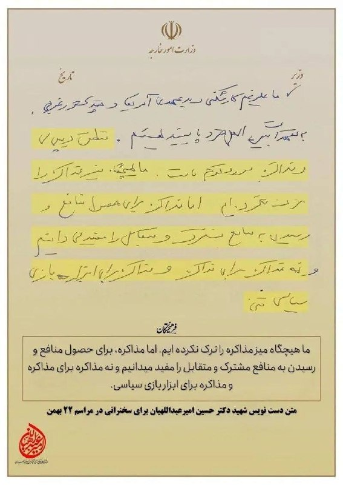

این دست خط پسر دایی ۶ ساله من نیست ، دست خط امیر عبداللهیان وزیر امور خارجه سابق جمهوری اسلامیه !

@IranianMinds

## BBCPersian — post 281857

🖋زویا متین
در دهلی

فضای سیاسی هند نماد عجیب و غریبی پیدا کرده است: سوسک.

این نماد نه نیلوفر حزب حاکم هند (بی‌جی‌پی) است و نه علامت دست حزب مخالف کنگره، بلکه «سوسک» است، موجودی سمج، منفور و به‌باور بسیاری نابودنشدنی که به‌تازگی به نمادی سیاسی، غیرمنتظره اما قابل‌همذات‌پنداری برای جوانان هندی در فضای آنلاین تبدیل شده است.

این حشره هفته گذشته پس از اظهارات بحث‌برانگیز سوریا کانت، رئیس دیوان عالی هند ناگهان مورد توجه همگانی قرار گرفت. گفته می‌شود در یک جلسه، او جوانان بیکاری را که جذب خبرنگاری و کنشگری می‌شوند، به سوسک‌ و انگل تشبیه کرده بود.

او بعدا توضیح داد که منظور او به طور مشخص افرادی با «مدرک‌های جعلی و بی‌اعتبار» بوده است و اشاره کلی به همه جوانان هند نکرده است.
ادامه مطلب⬇️

📸GettyImages/ Hindustan Times via Getty Images/ NurPhoto via Getty Images/ AFP via Getty Images/ AI-generated image/Cockroach Janta Party/ Screengrab from Cockroach Janta Party's website/ Abhijeet Dipke/X/ Bloomberg via Getty Images
https://bbc.in/43u1g4s
@BBCPersian

## idfinfarsi — post 11627

  <a href="telegram/content/idfinfarsi_11627_1779528258.mp4" target="_blank">🎬 Download video</a>

‼️در دو رویداد جداگانه در روز گذشته (جمعه)، نیروهای تیم رزمی تیپ چتربازان که در جنوب نوار غزه فعالیت می‌کنند، تعدادی تروریست را شناسایی کردند که از خط زرد عبور کرده و به‌گونه‌ای به سمت نیروها نزدیک شدند که تهدیدی فوری محسوب می‌شدند.

❌همچنین، نیروهای تیم رزمی تیپ «همخنص» (۱۴) که در شمال نوار غزه فعالیت می‌کنند، روز گذشته (جمعه) یک تروریست را شناسایی کردند که از خط زرد عبور کرده و به سمت نیروها نزدیک شد به‌گونه‌ای که تهدیدی فوری به‌شمار می‌رفت.

⭕️بلافاصله پس از شناسایی‌ها، نیروها تروریست‌ها را مورد حمله قرار داده و به هلاکت رساندند تا تهدید برطرف شود.

⭕️نیروهای ارتش اسرائیل تحت فرماندهی جنوب، مطابق با توافق در منطقه مستقر هستند و به فعالیت خود برای رفع هرگونه تهدید فوری ادامه خواهند داد.

## idfinfarsi — post 11626

  <a href="telegram/content/idfinfarsi_11626_1779528259.mp4" target="_blank">🎬 Download video</a>

‏‼️سایت زیرزمینی تولید تسلیحات در بقاع و زیرساخت‌های تروریستی در صور: حملات ارتش اسرائیل طی شب

‏⭕️شب گذشته (شنبه)، ارتش اسرائیل در منطقه بقاع یک سایت زیرزمینی متعلق به سازمان تروریستی حزب‌الله را هدف قرار داد که مورد استفاده تروریست های این سازمان برای تولید تسلیحاتی بود که برای هدف قرار دادن غیرنظامیان اسرائیلی و نیروهای ارتش اسرائیل در جنوب لبنان در نظر گرفته شده بود.

‏⭕️همچنین، زیرساخت‌های سازمان تروریستی حزب‌الله در منطقه شهر صور هدف حمله قرار گرفتند؛ مکان‌هایی که تروریست های این سازمان از آن‌ها برای برنامه‌ریزی و اجرای طرح‌های تروریستی علیه نیروهای ارتش اسرائیل استفاده می‌کردند.

‏⭕️پیش از حمله، اقداماتی برای کاهش آسیب به غیرنظامیان انجام شد، از جمله ارائه هشدارهای پیشگیرانه به ساکنان، استفاده از مهمات دقیق و رصد هوایی.

‏🔻ارتش اسرائیل به فعالیت خود برای مقابله با تهدیدها علیه شهروندان اسرائیل و نیروهایش، طبق دستورالعمل‌های سطح سیاسی، ادامه خواهد داد

## Dirty_Kids — post 389999

  <a href="telegram/content/Dirty_Kids_389999_1779528261.mp4" target="_blank">🎬 Download video</a>

یه ساعت دارم به این میخندم 😂😂

حمایت آیسان اسلامی از گی‌ها 🏳‍🌈

@Dirty_Kids 👻

## Dirty_Kids — post 389998

  <a href="telegram/content/Dirty_Kids_389998_1779528264.mp4" target="_blank">🎬 Download video</a>

سر کار هم به فکر آقاییشه
چقدر این دختر مسئولیت پذیره

@Dirty_Kids 👻

## Dirty_Kids — post 389997

بچها جدی جدی ذاتِ بد رو چهره تاثیر میذاره.

@Dirty_Kids 👻ه‍

## Dirty_Kids — post 389996

  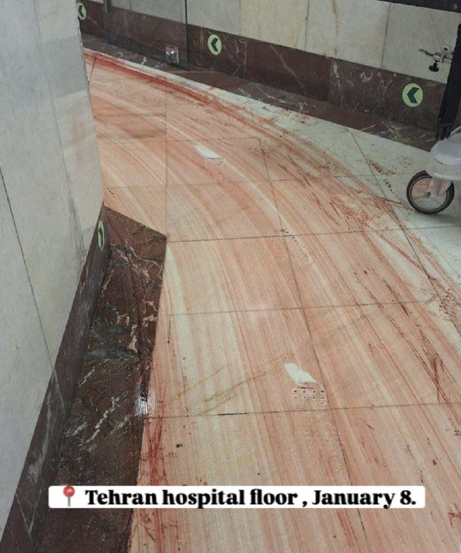

نمیذارم یادتون بره

رو تخت بیمارستان تیر خلاص میزدن.

@Dirty_Kids 👻

## Dirty_Kids — post 389995

  

چقدر کارنامه‌ی یک انسان میتونه پاک باشه که تنها انتقاد جدی‌ ازش این باشه:
چرا با تانک از رو مخالفات رد نشدی؟

@Dirty_Kids 👻

## Hranews — post 113106

تداوم بازداشت و بلاتکلیفی میثاق رحمت‌زاده در زندان زاهدان ادامه دارد

❗️
❗️
❗️
❗️
❗️– میثاق رحمت‌زاده (خارکوهی)، شهروند اهل زاهدان بیش از شش ماه است که به صورت بلاتکلیف در زندان زاهدان نگهداری می‌شود. اخیرا جلسه دادگاه رسیدگی به اتهام این شهروند در دادگاه انقلاب زاهدان برگزار شده است.

#میثاق_رحمت‌_زاده
#میثاق_خارکوهی

ادامه مطلب

↘️
@hranews_bot تماس ✉️ - @Hranews کانال هرانا 🆑

## Hranews — post 113105

  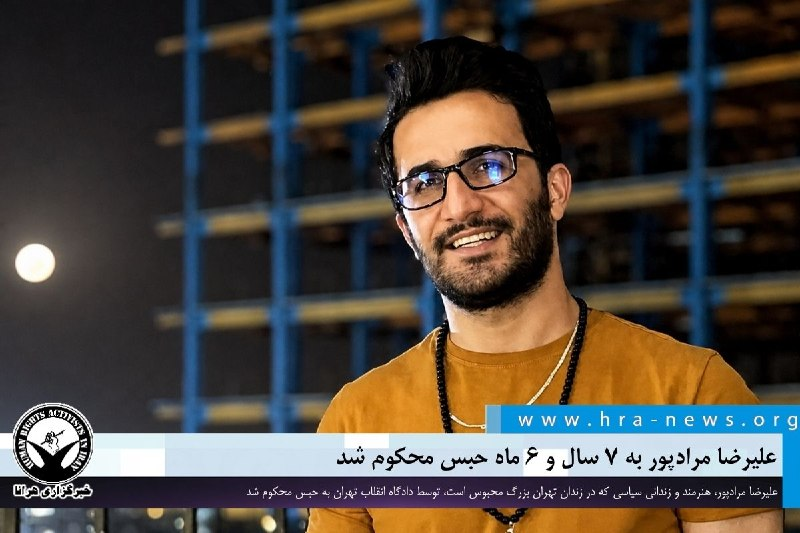

علیرضا مرادپور به ۷ سال و ۶ ماه حبس محکوم شد

❗️
❗️
❗️
❗️
❗️– علیرضا مرادپور، هنرمند و زندانی سیاسی که در زندان تهران بزرگ محبوس است، توسط دادگاه انقلاب تهران به هفت سال و شش ماه حبس محکوم شد.

به گزارش خبرگزاری هرانا، ارگان خبری مجموعه فعالان حقوق بشر در ایران، علیرضا مرادپور به حبس محکوم شد.

بر اساس حکمی که توسط دادگاه انقلاب تهران صادر و به این شهروند ابلاغ شده، آقای مرادپور از بابت اتهام توهین به مقدسات به چهار سال حبس و از بابت اتهام اجتماع و تبانی برای ارتکاب جرم علیه امنیت کشور به سه سال و شش ماه زندان محکوم شده است.

#علیرضا_مرادپور

ادامه مطلب

↘️
@hranews_bot تماس ✉️ - @Hranews کانال هرانا 🆑

## Hranews — post 113104

  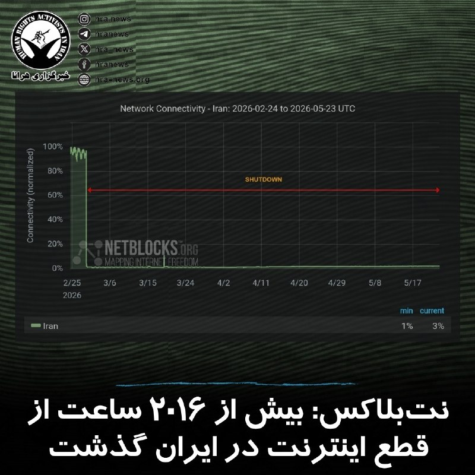

بر اساس آخرین داده‌های نت‌بلاکس، معیارهای پایش نشان می‌دهد که قطع اینترنت در ایران اکنون وارد سیزدهمین هفته خود شده و دسترسی به شبکه‌های بین‌المللی برای بیش از ۲۰۱۶ ساعت به‌طور گسترده محدود یا مسدود مانده است. این نهاد ناظر بر وضعیت اینترنت در جهان تاکید می‌کند که تداوم این وضعیت، زندگی روزمره شهروندان را تحت تاثیر قرار داده و آنان را از دسترسی به فرصت‌ها و اطلاعاتی که در سایر نقاط جهان به‌سرعت در دسترس است، محروم کرده است.

#اینترنت
#قطع_اینترنت

↘️
@hranews_bot تماس ✉️ - @Hranews کانال هرانا 🆑

## Hranews — post 113103

  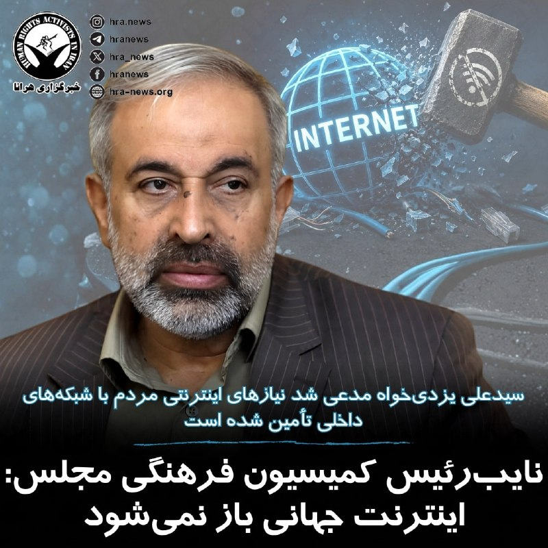

نایب‌رئیس کمیسیون فرهنگی مجلس با تاکید بر تداوم محدودیت اینترنت جهانی، اعلام کرد که در شرایط فعلی برنامه‌ای برای بازگشایی عمومی وجود ندارد و این تصمیم با «ملاحظات امنیتی» اتخاذ شده است. سیدعلی یزدی‌خواه در عین حال مدعی شد که «بخش عمده نیازهای مردم از طریق شبکه‌های داخلی تامین می‌شود و اختلال جدی در زندگی و کسب‌وکارها ایجاد نشده است.»

وی همچنین از برقراری دسترسی محدود به اینترنت بین‌الملل برای برخی گروه‌های «دارای نیاز» خبر داد؛ موضوعی که عملا به ایجاد نوعی دسترسی گزینشی و طبقاتی منجر شده است. به گفته او، افراد و نهادهایی که نیاز خود را اثبات کنند می‌توانند از این دسترسی برخوردار شوند، در حالی که همچنان امکان استفاده آزاد و برابر از اینترنت جهانی برای عموم شهروندان فراهم نیست.

#اینترنت

↘️
@hranews_bot تماس ✉️ - @Hranews کانال هرانا 🆑

## Hranews — post 113102

گزارشی از بازداشت علی اسکندری در ایلام

❗️
❗️
❗️
❗️
❗️– علی اسکندری، شهروند اهل ایلام روز پنجشنبه ۳۱ اردیبهشت ماه، توسط نیروهای امنیتی بازداشت و به مکان نامعلومی منتقل شد.

#علی_اسکندری

ادامه مطلب

↘️
@hranews_bot تماس ✉️ - @Hranews کانال هرانا 🆑

## alonews — post 121977

  <a href="telegram/content/alonews_121977_1779528269.webm" target="_blank">🎬 Download video</a>

👈نیروی دریایی سپاه اعلام کرد در شبانه‌روز گذشته ۲۵ کشتی اعم از نفتکش، کانتینربر و سایر کشتی‌های تجاری پس از کسب مجوز با هماهنگی و تامین امنیت نیروی دریایی سپاه از تنگهٔ هرمز عبور کردند

✅ @AloNews خبر جنگ

## alonews — post 121976

  <a href="telegram/content/alonews_121976_1779528269.webm" target="_blank">🎬 Download video</a>

👈تایوان : چین بیش از ۱۰۰ کشتی جنگی رو تو آب‌های سرزمینی مستقر کرده

✅ @AloNews خبر جنگ

## alonews — post 121975

  <a href="telegram/content/alonews_121975_1779528269.mp4" target="_blank">🎬 Download video</a>

👈واکنش تند وزیر ارتباطات به مخالفین اتصال مجدد اینترنت: این نگاه قیم معابانه به مردم چیست؟ کی گفته اینترنت را باید خلاصه در دو پیام‌رسان بدانیم؟

🔴ستار هاشمی وزیر ارتباطات: صحبت هایی که در رابطه با نقد دسترسی مردم به اینترنت آزاد می شود، نگاه قوه عاقله کشور نیست.

🔴ان‌شالله اینترنت برای آحاد مردم و به صورت عادلانه برقرار می شود.

✅ @AloNews خبر جنگ

## alonews — post 121973

  <a href="telegram/content/alonews_121973_1779528272.mp4" target="_blank">🎬 Download video</a>

👈امروز جنوب لبنانِ تحت حمله‌ شدید اسرائیل بود

✅ @AloNews خبر جنگ

## alonews — post 121972

  <a href="telegram/content/alonews_121972_1779528273.webm" target="_blank">🎬 Download video</a>

👈بلومبرگ: هند برای سومین بار در هشت روز، قیمت گازوئیل و بنزین را افزایش داد

✅ @AloNews خبر جنگ

## alonews — post 121971

  <a href="telegram/content/alonews_121971_1779528273.webm" target="_blank">🎬 Download video</a>

👈بلومبرگ: وقتی کانال سوئز در سال ۱۹۶۷، پس از آغاز جنگ میان مصر و اسرائیل، بسته شد، ۱۵ کشتی در داخل این آبراه گرفتار شدند. آن‌ها لنگر انداختند تا منتظر پایان درگیری‌ها بمانند. جنگ خیلی زود تمام شد. نام آن، به‌درستی، «جنگ شش‌روزه» بود؛ اما کانال به مدت هشت سال بسته ماند. زمانی که سرانجام در سال ۱۹۷۵ اجازه خروج به کشتی‌ها داده شد، فقط دو فروند هنوز قابلیت دریانوردی داشتند. بقیه آن‌قدر زنگ زده بودند که به «ناوگان زرد» معروف شدند.

✅ @AloNews خبر جنگ

## alonews — post 121970

  <a href="telegram/content/alonews_121970_1779528274.webm" target="_blank">🎬 Download video</a>

👈هزینه دریافت گواهینامه رانندگی با ۵۶ درصد افزایش به ۱۵ میلیون تومان رسید ...

✅ @AloNews خبر جنگ

## alonews — post 121969

  <a href="telegram/content/alonews_121969_1779528274.mp4" target="_blank">🎬 Download video</a>

👈حزب‌الله ویدیو منتشر کرده که توش یه نفربر زرهی نامر اسرائیل رو تو جنوب لبنان با پهپاد FPV زده

✅ @AloNews خبر جنگ

## alonews — post 121968

  <a href="telegram/content/alonews_121968_1779528277.webm" target="_blank">🎬 Download video</a>

👈وزیر خارجه قطر در تماس با عراقچی:
ما از تلاش‌ها برای رسیدن به توافقی جامع که بحران را پایان دهد حمایت می‌کنیم

✅ @AloNews خبر جنگ

## alonews — post 121967

  <a href="telegram/content/alonews_121967_1779528277.webm" target="_blank">🎬 Download video</a>

🔴فوری/منابع به اسکای نیوز عربی گفتند که میانجی پاکستانی موفق شد بر مانع پرونده هسته‌ای ایران غلبه کند.

✅ @AloNews خبر جنگ

## alonews — post 121966

  <a href="telegram/content/alonews_121966_1779528277.webm" target="_blank">🎬 Download video</a>

👈سخنگوی سازمان هواپیمایی: سازمان هواپیمایی نوتام جدیدی صادر نکرده است.

🔴نوتامی که اخیرا در فضای مجازی منتشر شده، تکذیب می‌شود.

🔴شرایط آسمان کشور همچنان مانند روال گذشته است و پروازها طبق برنامه انجام می‌شود

✅ @AloNews خبر جنگ

## alonews — post 121965

  <a href="telegram/content/alonews_121965_1779528277.webm" target="_blank">🎬 Download video</a>

👈نیویورک تایمز: ترامپ اسرائیل را آن‌چنان از روند‌ها کنار گذاشته که رهبران این کشور تقریباً به‌طور کامل از مذاکرات آتش‌بس میان ایالات متحده و ایران بی‌اطلاع ماندند

🔴اسرائیلی‌ها که از دریافت اطلاعات از نزدیک‌ترین متحد خود محروم شده‌اند، مجبور شدند اطلاعات رفت‌وآمدهای دیپلماتیک میان واشنگتن و تهران را از طریق ارتباطاتشان با رهبران و دیپلمات‌های منطقه به دست آورند

✅ @AloNews خبر جنگ

## alonews — post 121964

  <a href="telegram/content/alonews_121964_1779528277.mp4" target="_blank">🎬 Download video</a>

👈تیراندازی عروس جان فدا با کلاشینکف در تجمعات شبانه

✅ @AloNews خبر جنگ

## alonews — post 121963

  <a href="telegram/content/alonews_121963_1779528278.mp4" target="_blank">🎬 Download video</a>

👈پست جدید ترامپ توی توییتر که با هوش مصنوعی یه مجری که مخالفش هستو میندازه توی سطل آشغال :))

🔴تو ۸ ساعت بیش از ۵۰ میلیون ویو خورده

✅ @AloNews خبر جنگ

## alonews — post 121962

  <a href="telegram/content/alonews_121962_1779528280.webm" target="_blank">🎬 Download video</a>

👈نیویورک تایمز: تنزل جایگاه نتانیاهو، از حضور در کابین خلبان، به نشستن به عنوان مسافر، می‌تواند پیامدهای مهمی برای اسرائیل و به‌ویژه برای نخست‌وزیر آن داشته باشد؛ کسی که امسال با نبردی دشوار برای انتخاب مجدد روبه‌رو است.

✅ @AloNews خبر جنگ

## alonews — post 121961

  <a href="telegram/content/alonews_121961_1779528280.webm" target="_blank">🎬 Download video</a>

👈رویترز: سه ماه پس از جنگی که قرار بود در شش هفته با پیروزی قاطع به پایان برسد، ترامپ در باتلاق ایران گیر کرده است و قادر به یافتن راه خروجی برای حفظ آبرو یا گسترش حملات نیست.

✅ @AloNews خبر جنگ

## alonews — post 121960

  <a href="telegram/content/alonews_121960_1779528281.webm" target="_blank">🎬 Download video</a>

👈رسانه‌های دولتی چین خبر دادند که در نتیجه انفجار در معدن زغال سنگ شهرستان «چینیوان»، حداقل ۸۲ نفر جان باختند. 
🔴به گفته مقامات چین، با توجه به شدت بالای انفجار در این معدن زغال سنگ، احتمال افزایش تلفات وجود دارد. 
✅ @AloNews خبر جنگ

## alonews — post 121959

  <a href="telegram/content/alonews_121959_1779528281.mp4" target="_blank">🎬 Download video</a>

👈رسانه‌های دولتی چین خبر دادند که در نتیجه انفجار در معدن زغال سنگ شهرستان «چینیوان»، حداقل ۸۲ نفر جان باختند.

🔴به گفته مقامات چین، با توجه به شدت بالای انفجار در این معدن زغال سنگ، احتمال افزایش تلفات وجود دارد.

✅ @AloNews خبر جنگ

## alonews — post 121958

  <a href="telegram/content/alonews_121958_1779528282.mp4" target="_blank">🎬 Download video</a>

از سیلوستر استوانه در تجمعات شبانه رونمایی شد

[@AloTweet]

---
📅 بروزرسانی: 1405/03/02 11:00
---

## VahidOOnLine — post 241659

  <a href="telegram/content/VahidOOnLine_241659_1779521420.mp4" target="_blank">🎬 Download video</a>

ایرانیان ساکن استرالیا روز شنبه دوم خرداد در بریزبن تجمع کرده و در حمایت از انقلاب ملی و جاویدنامان آن شعار دادند. یکی از سخنرانان این تجمع مبارزه ایرانیان با جمهوری اسلامی را نجات تمدن انسانی خواند.
‌🏁 🇬🇧 IranintlTV

🤖 @VahidOOnLine

## VahidOOnLine — post 241658

  <a href="telegram/content/VahidOOnLine_241658_1779521421.mp4" target="_blank">🎬 Download video</a>

فرانسه اعلام کرد پیش‌نویس قطعنامه‌ای را برای ارائه به شورای امنیت سازمان ملل تهیه کرده که هدف آن تشکیل یک مأموریت بین‌المللی به‌منظور بازگرداندن آزادی تردد در تنگه هرمز است. وزارت خارجه فرانسه گفته این طرح در صورت فراهم شدن شرایط می‌تواند مطرح شود.
هم‌زمان، پیش‌نویس قطعنامه مشترک آمریکا و بحرین درباره تنگه هرمز همچنان در شورای امنیت در حال بررسی است. این قطعنامه از ایران می‌خواهد حملات و مین‌گذاری در این آبراه را متوقف کند، اما رأی‌گیری درباره آن به دلیل احتمال وتوی روسیه و چین چندین بار به تعویق افتاده است.
مقام‌های فرانسوی اعلام کردند پاریس در هماهنگی با بریتانیا در حال بررسی ایجاد یک مأموریت بین‌المللی برای تضمین آزادی ناوبری در تنگه هرمز است. در همین حال، گزارش‌ها حاکی از آن است که آمریکا تلاش کرده حمایت ده‌ها کشور را برای پیشبرد قطعنا خود جلب کند
‌🏁 🇬🇧 ManotoTV

🤖 @VahidOOnLine

## VahidOOnLine — post 241657

  <a href="telegram/content/VahidOOnLine_241657_1779521422.mp4" target="_blank">🎬 Download video</a>

سازمان عملیات تجارت دریایی بریتانیا اعلام کرد یک قایق کوچک به یک نفتکش حامل فرآورده‌های نفتی در نزدیکی سواحل یمن نزدیک شده است.
بر اساس این گزارش، نفتکش در فاصله حدود ۲۰۰ مایل دریایی در غرب جزیره سقطری یمن قرار داشت و قایق نزدیک‌شونده پنج سرنشین داشته است.
این سازمان افزود پس از استقرار تیم امنیتی مسلح نفتکش، قایق مسیر خود را تغییر داد و از کشتی فاصله گرفت.
‌🏁 🇬🇧 ManotoTV

🤖 @VahidOOnLine

## VahidOOnLine — post 241656

  

رسانه دولتی سی‌سی‌تی‌وی گزارش داد شمار جان‌باختگان انفجار گاز در یک معدن زغال‌سنگ در استان شانشی در شمال چین به ۹۰ نفر رسیده است. عملیات جست‌وجو و نجات همچنان ادامه دارد و علت حادثه در دست بررسی است. به گفته مقام‌های محلی، تلاش‌ها برای یافتن احتمالی مفقودان ادامه دارد.

چین از اوایل دهه ۲۰۰۰ با اجرای مقررات سخت‌گیرانه‌تر و ارتقای استانداردهای ایمنی، تلفات معادن زغال‌سنگ را که اغلب بر اثر انفجار گاز یا سیلاب رخ می‌داد، کاهش داده است. با این حال، حادثه لیوشنیو از مرگبارترین حوادث معدنی گزارش‌شده در این کشور در دهه گذشته به شمار می‌رود.

خبرگزاری شینهوا اعلام کرد مدیران شرکت مسئول این معدن بازداشت شده‌اند.
‌🏁 🇬🇧 IranintlTV

🤖 @VahidOOnLine

## VahidOOnLine — post 241655

  

رضا طلایی‌نیک، سخنگوی وزارت دفاع جمهوری اسلامی، گفت دونالد ترامپ، رییس‌جمهوری آمریکا «هیچ چاره‌ای» جز پذیرفتن مطالبات تهران و به رسمیت شناختن «حقوق» جمهوری اسلامی ندارد.

طلایی‌نیک گفت «تمکین نکردن» آمریکا به مطالبات جمهوری اسلامی، به «تحمیل» هزینه‌های بیشتر و «شکست‌های پیاپی» بعدی برای دونالد ترامپ و اسرائیل منجر خواهد شد.

او افزود ترامپ باید ضمن پذیرش پیشنهادهای جمهوری اسلامی، به فکر جلوگیری از «خسارت‌ها و هزینه‌های بیشتر» ادامه جنگ برای مردم آمریکا و جامعه جهانی باشد.

سخنگوی وزارت دفاع جمهوری اسلامی همچنین گفت «بی‌توجهی» ترامپ به منافع ملی آمریکا، «تبعیت از اسرائیل» و رفتارهای «مغرورانه» او، باعث فرو رفتن بیشتر آمریکا در «باتلاق» جنگ خواهد شد.
‌🏁 🇬🇧 IranintlTV

🤖 @VahidOOnLine

## VahidOOnLine — post 241654

  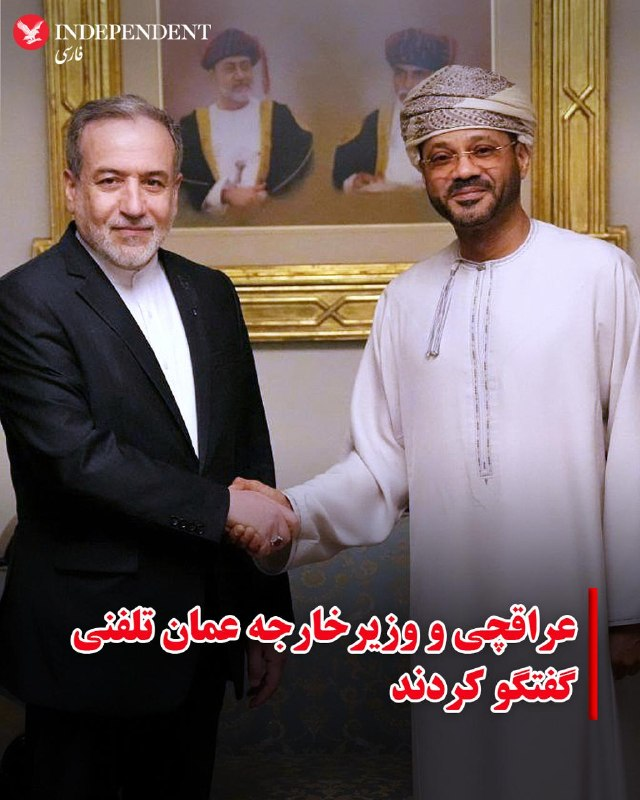

♦️عباس عراقچی، وزیر امور خارجه جمهوری اسلامی ایران، صبح شنبه دوم خرداد ماه با بدر البوسعیدی، وزیر امور خارجه عمان تلفنی گفتگو کرد.
رسانه‌های داخلی ایران در بحبوحه تحرکات دیپلماتیک منطقه‌ای برای پایان دادن به بحران خاورمیانه، موضوع این گفتگو را «تبادل نظر درباره تلاش‌های دیپلماتیک برای جلوگیری از تشدید تنش و خاتمه جنگ» توصیف کردند.
عراقچی شامگاه جمعه نیز با عاصم منیر، فرمانده ارتش پاکستان که به تهران سفر کرده است، دیداری داشت که «تا پاسی از شب» طول کشید.
‌🇸🇦 Indypersian

🤖 @VahidOOnLine

## VahidOOnLine — post 241653

♦️رسانه‌های دولتی چین روز شنبه گزارش دادند در پی انفجار گاز در یک معدن زغال‌سنگ در استان شانشی در شمال این کشور، دست‌کم ۸۲ نفر کشته شده‌اند و ۹ نفر دیگر همچنان مفقود هستند. بر اساس این گزارش‌ها، تاکنون ۲۳ کارگر از معدن نجات یافته‌اند.
این انفجار شامگاه جمعه در معدن زغال‌سنگ «لیوشنیو» در شهرستان چین‌یوان رخ داد. در زمان حادثه ۲۴۷ کارگر در زیر زمین حضور داشتند که تا صبح شنبه ۲۰۱ نفر از آن‌ها به سطح زمین منتقل شدند.
مقام‌های محلی مدیریت بحران اعلام کردند علت حادثه همچنان در دست بررسی است.
به گزارش رویترز، چین از اوایل دهه ۲۰۰۰ با اجرای مقررات سختگیرانه‌تر و بهبود استانداردهای ایمنی، میزان تلفات در معادن زغال‌سنگ را به‌طور قابل توجهی کاهش داده است، اما انفجار معدن «لیوشنیو» یکی از مرگبارترین حوادث معدنی گزارش‌شده در این کشور طی یک دهه گذشته به شمار می‌رود.
‌🇸🇦 Indypersian

🤖 @VahidOOnLine

## VahidOOnLine — post 241652

  <a href="telegram/content/VahidOOnLine_241652_1779521424.mp4" target="_blank">🎬 Download video</a>

روزنامه نیویورک پست گزارش داد محمد باقر سعد داوود السعدی، تبعه ۳۲ ساله عراقی که گفته می‌شود آموزش‌های مرتبط با سپاه پاسداران دیده است، متهم به طراحی طرحی برای ترور ایوانکا ترامپ، دختر دونالد ترامپ، رئیس‌جمهوری آمریکا، شده است. طبق این گزارش، انگیزه این اقدام انتقام‌گیری از کشته شدن قاسم سلیمانی عنوان شده است.
بر اساس این گزارش، السعدی متهم است که پس از کشته‌شدن قاسم سلیمانی، فرمانده پیشین نیروی قدس سپاه، خانواده ترامپ را هدف قرار داده و حتی نقشه محل اقامت ایوانکا ترامپ در فلوریدا را در اختیار داشته است. منابع می‌گویند او پیش‌تر نیز تهدیدهایی در این رابطه مطرح کرده بود.
نیویورک پست به نقل از انتفاض قنبر، معاون پیشین وابسته نظامی سفارت عراق در واشینگتن، نوشت السعدی به اطرافیانش گفته بود: «باید ایوانکا را بکشیم تا خانه ترامپ را همان‌طور به آتش بکشیم که او خانه ما را به آتش کشید.» همچنین گفته می‌شود او در شبکه اجتماعی ایکس پیام‌هایی با محتوای تهدیدآمیز منتشر کرده بود.
السعدی روز ۱۵ مه در ترکیه بازداشت و به آمریکا منتقل شد. وزارت دادگستری آمریکا او را از چهره‌های مرتبط با شبکه‌های تروریستی عراق و جمهوری اسلامی معرفی کرده و اعلام کرده است که او با اتهام دست داشتن در ۱۸ حمله و اقدام به حمله در اروپا و آمریکا روبه‌رو است.
‌🏁 🇬🇧 ManotoTV

🤖 @VahidOOnLine

## VahidOOnLine — post 241651

  <a href="telegram/content/VahidOOnLine_241651_1779521425.mp4" target="_blank">🎬 Download video</a>

روزنامه وال‌استریت ژورنال به نقل از مقام‌های آمریکایی گزارش داد دونالد ترامپ، رئیس‌جمهوری آمریکا، در حال حاضر گزینه اقدام نظامی علیه جمهوری اسلامی را به‌طور کامل کنار نگذاشته و در صورت شکست مذاکرات، احتمال صدور دستور حملات نظامی علیه جمهوری اسلامی همچنان وجود دارد.
بر اساس این گزارش، ترامپ روز جمعه در دیداری با کارکنان خود گفته است که با ادامه مذاکرات با ایران، ترجیح می‌دهد به مسیر دیپلماسی زمان بیشتری داده شود. به گفته مقام‌های آمریکایی، او با وجود ادامه تنش‌ها همچنان به دستیابی به راه‌حلی از مسیر مذاکره علاقه‌مند است.
این گزارش می‌افزاید رئیس‌جمهوری آمریکا هنوز تصمیم نهایی خود را نگرفته، اما در حال حاضر بیشتر به ادامه تلاش‌های دیپلماتیک تمایل دارد، در حالی که گزینه‌های نظامی همچنان روی میز باقی مانده‌اند.
‌🏁 🇬🇧 ManotoTV

🤖 @VahidOOnLine

## VahidOOnLine — post 241650

  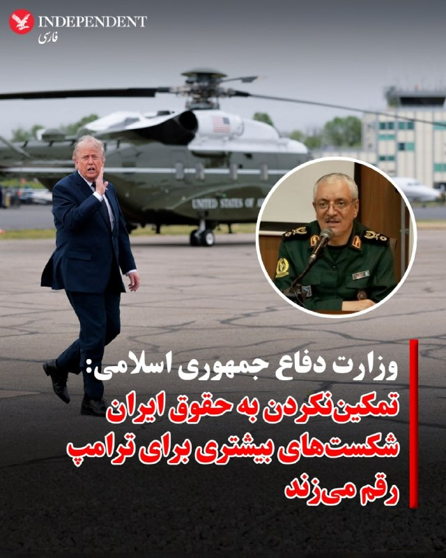

⭕️ وزارت دفاع جمهوری اسلامی:
تمکین‌نکردن به حقوق ایران شکست‌های بیشتری برای ترامپ رقم می‌زند

♦️رضا طلایی‌نیک، سخنگوی وزارت دفاع جمهوری اسلامی با تاکید بر اینکه واشنگتن راهی جز پذیرش حقوق و مطالبات ملت ایران ندارد، اعلام کرد ادامه بی‌توجهی آمریکا به خواسته‌های تهران، شکست‌های بیشتری برای دونالد ترامپ به همراه خواهد داشت.
سخنگوی وزارت دفاع جمهوری اسلامی گفت: «ترامپ هیچ چاره‌ای جز پذیرفتن مطالبات ملت ایران و به‌رسمیت‌شناختن حقوق کشورمان ندارد.»
او همچنین تاکید کرد در هر دو عرصه «رزم و دیپلماسی»، تحقق مطالبات به‌حق ملت ایران تنها راه خروج آمریکا و اسرائیل از «جنگ تحمیلی سوم» است و رئیس‌جمهوری آمریکا باید با پذیرش پیشنهاد ایران، مانع افزایش خسارت‌ها و هزینه‌های جنگ برای مردم آمریکا و جامعه جهانی شود.
‌🇸🇦 Indypersian

🤖 @VahidOOnLine

## VahidOOnLine — post 241649

  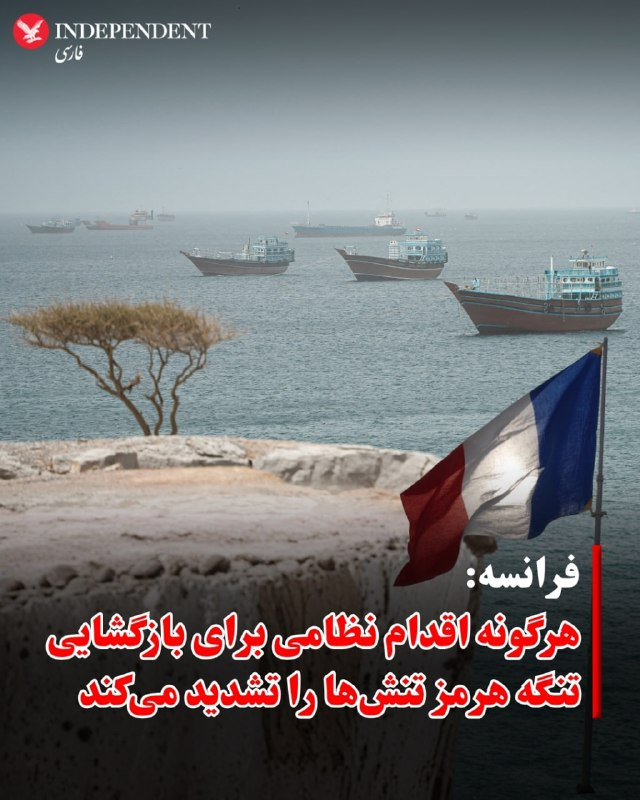

⭕️ فرانسه: هرگونه اقدام نظامی برای بازگشایی تنگه هرمز تنش‌ها را تشدید می‌کند

♦️فرانسه با هشدار نسبت به هرگونه اقدام نظامی برای بازگشایی تنگه هرمز اعلام کرد استفاده از زور تنها به تشدید تنش‌ها در منطقه منجر خواهد شد. وزارت خارجه فرانسه در گفتگو با «العربیه» بستن تنگه هرمز را «سابقه‌ای خطرناک» توصیف کرد، اقدامی که می‌تواند امنیت آبراه‌های راهبردی جهان، تجارت بین‌المللی و بازار انرژی را با تهدیدی جدی روبه‌رو کند.
پاریس همزمان از آماده‌سازی یک ابتکار دیپلماتیک در شورای امنیت سازمان ملل خبر داده، طرحی که هدف آن تشکیل چارچوبی بین‌المللی برای تضمین آزادی دریانوردی و بازگشایی مسالمت‌آمیز تنگه هرمز است.
در همین حال، عبور ناو هواپیمابر فرانسوی «شارل دوگل» از کانال سوئز، از سوی وزارت خارجه فرانسه «پیامی سیاسی بسیار قوی» توصیف شده است، اقدامی که در اوج تنش‌های منطقه‌ای، حامل هشدار و نمایش آمادگی نظامی پاریس و متحدان غربی ارزیابی می‌شود. این ناو قرار است در دریای سرخ و خلیج عدن مستقر شود تا در چارچوب ابتکار مشترک فرانسه و بریتانیا برای حفاظت از آزادی کشتیرانی در منطقه ایفای نقش کند.
‌🇸🇦 Indypersian

🤖 @VahidOOnLine

## WithYashar — post 12108

روبیو وارد هند شد
وزیر امور خارجه آمریکا امروز با هدف تقویت همکاری‌ها با هند وارد این کشور آسیایی شد.
@withyashar

## WithYashar — post 12107

کانال ۱۲ اسرائیل: درنهایت برآورد اسرائیل اینه که هیچ توافقی انجام نخواهد شد و ارتش دفاعی اسرائیل برای شروع موج جدیدی از حملات به ایران طی روزای آینده آماده می‌شه
@withyashar

## WithYashar — post 12106

شبکه CBS به نقل از چند منبع آگاه از برنامه‌ریزی‌های نظامی اعلام کرد که دولت ترامپ در حال آماده شدن برای دور جدیدی از حملات علیه ایران است، هرچند هنوز به تصمیم نهایی نرسیده‌اند
@withyashar

## WithYashar — post 12105

سخنگوی وزارت دفاع ایران: ترامپ چاره‌ای جز پذیرش خواسته‌های ایران ندارد، در غیر این صورت متحمل شکست‌های بیشتری خواهد شد.
@withyashar

## mwarmonitor — post 9517

  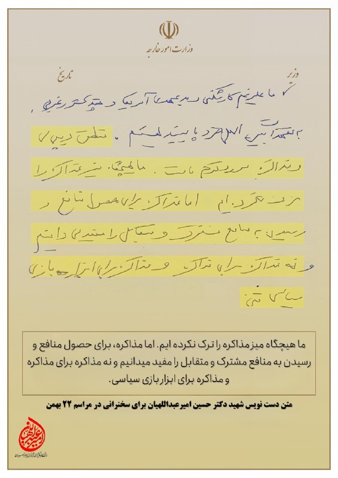

📝 وقتی یک دلقک بی‌سواد و مایه سرافکندگی دیپلماسی، نه تنها در مجامع بین‌المللی با آن انگلیسیِ الکن و فضاحت‌بارش اسباب خنده و تفریح دنیا را فراهم می‌کرد، بلکه در نگارش زبان مادری‌اش هم این‌طور درمانده و عاجز بود، عمق طویله‌ی مدیریت در جمهوری اسلامی آشکار می‌شود. در هیچ کجای دنیا سابقه ندارد یادداشتِ ابلهانه‌ی یک مقام ارشد را به زبان رسمی کشورش منتشر کنند و بعد مجبور شوند مثل خطوط میخی عهد بوق یا نسخه‌های خرچنگ‌قورباغه‌ی داروفروشان، زیرش مترجم و رمزگشای چاپی بگذارند تا مردم بفهمند این بیشعورِ گوساله اصلاً چه غلطی روی کاغذ واژگون کرده است! این دست‌خطِ فاجعه‌بار و شبیه به جای پای مرغ، سندی زنده است که نشان می‌دهد این جماعتِ احمق و اراذل، یکی از یکی نفهم‌تر و بی‌کفایت‌تر هستند. امیرعبداللهیانِ گوربه‌گور شده رفت، اما این اثر مضحک و مایه شرمساری به عنوان نمادِ مجسمِ حماقت و شایسته‌سالاری در این رژیم نکبت‌بار باقی ماند تا بعد از مرگش هم مایه تف و لعنت و سوژه‌ی خنده‌ی دائمی ملت باشد.

@mwarmonitor

## mwarmonitor — post 9516

  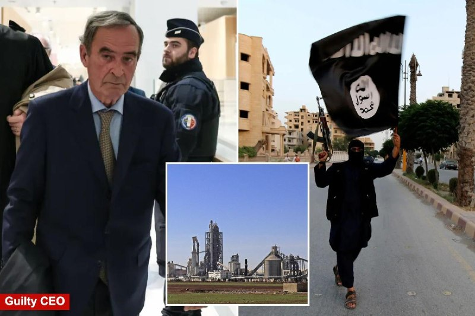

🔸خانواده‌های نظامیان خواستار آن هستند که وزارت دادگستری ایالات متحده نزدیک به ۸۰۰ میلیون دلار از وجوه یک شرکت سیمان فرانسوی را—که به رشوه‌دهی به داعش محکوم شده—میان آن‌ها توزیع کند. نیویورک پست

@mwarmonitor

## mwarmonitor — post 9515

🔴ارتش دفاعی اسرائیل (IDF) از سطح سیاسی می‌خواهد هرچه سریع‌تر تصمیم نهایی بگیرد:

🔸یا دستیابی به توافق در لبنان،
یا دادن اختیار کامل برای اقدام نظامی؛
زیرا وضعیت فعلی که در آن دست‌های ارتش بسته است نمی‌تواند ادامه پیدا کند.— کانال ۱۲ (N12)

@mwarmonitor

## mwarmonitor — post 9514

📝 سوال، انتقاد ، پیشنهاد ، دایرکت به گوشم

## mwarmonitor — post 9513

  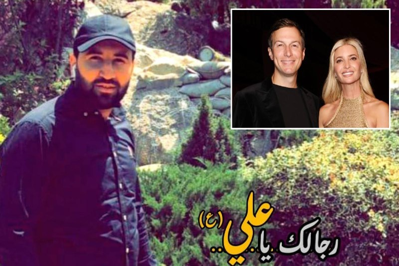

🚨نیویورک پست: ادعا می‌شود محمدباقر السعدی، مظنون عراقیِ مرتبط با سپاه پاسداران انقلاب اسلامی، در تلافی کشته‌شدن قاسم سلیمانی در سال ۲۰۲۰، قصد ترور ایوانکا ترامپ را داشته است.
مقام‌ها می‌گویند او نقشه‌هایی از محل سکونت او در فلوریدا در اختیار داشته و خانواده ترامپ را به‌صورت آنلاین تهدید کرده است.

@mwarmonitor

## mwarmonitor — post 9512

🔴اسرائیل برآورد می‌کند که در نهایت هیچ توافقی با ایران حاصل نخواهد شد و بر همین اساس، ارتش دفاعی اسرائیل (IDF) اکنون خود را طوری آماده می‌کند که گویی حمله‌ای قرار است در روزهای آینده انجام شود.— کانال ۱۲ اسرائیل

@mwarmonitor

## pm_afshaa — post 91240

  <a href="telegram/content/pm_afshaa_91240_1779521428.mp4" target="_blank">🎬 Download video</a>

ترامپ در تازه‌ترین پست خود فیلمی ساخته شده توسط هوش مصنوعی رو منتشر کرده که در آن استفان کولبرت، مجری و کمدین مشهور آمریکایی را به دلیل انتقادهایش به ترامپ به سطل زباله می‌اندازه

💧 Rainbet.com the #1 Non-KYC Crypto Casino & Sportsbook @rainbetcom

😁 @Pm_Afshaa

## pm_afshaa — post 91239

  

نیویورک پست:محمد باقر السعدی، از فرماندهان کتائب حزب‌الله عراق که اخیراً در آمریکا دستگیر و متهم شده، طرح ترور ایوانکا ترامپ، دختر رئیس‌جمهور آمریکا، را داشته ، هدف او انتقام از قتل قاسم سلیمانی بوده و مدارکی‌ وجود دارد که احتمال داده میشه سپاه پاسداران هم در این موضوع نقش داشته

💧 Rainbet.com the #1 Non-KYC Crypto Casino & Sportsbook @rainbetcom

😁 @Pm_Afshaa

## pm_afshaa — post 91238

وضعیت این روزای کیش: اصلا انگار یه کشور دیگه رفتین 
💧 Rainbet.com the #1 Non-KYC Crypto Casino & Sportsbook @rainbetcom 
😁 @Pm_Afshaa

## pm_afshaa — post 91237

🟠جمهوری اسلامی:با صدور اطلاعیه‌ای، پرواز در بخش غربی حریم هوایی خود را تا صبح دوشنبه ممنوع اعلام کرد

💧 Rainbet.com the #1 Non-KYC Crypto Casino & Sportsbook @rainbetcom

😁 @Pm_Afshaa

## pm_afshaa — post 91236

🔴ترامپ:مقدار زیادی نفت از ونزوئلا استخراج کرده‌ایم، و هزینه جنگ را بیش از 25 بار پرداخت کرده‌ایم

💧 Rainbet.com the #1 Non-KYC Crypto Casino & Sportsbook @rainbetcom

😁 @Pm_Afshaa

## pm_afshaa — post 91235

🔴کانال 12 اسرائیل: درنهایت برآورد اسرائیل اینه که هیچ توافقی انجام نخواهد شد و ارتش دفاعی اسرائیل برای شروع موج جدیدی از حملات به ایران طی روزای آینده آماده میشه

💧 Rainbet.com the #1 Non-KYC Crypto Casino & Sportsbook @rainbetcom

😁 @Pm_Afshaa

## pm_afshaa — post 91233

  <a href="telegram/content/pm_afshaa_91233_1779521430.mp4" target="_blank">🎬 Download video</a>

دن اسکاوینو، رئیس دفتر کاخ سفید و دستیار ارشد ترامپ، ویدیو سمت راست رو از بمب‌افکن‌های B-2 منتشر کرده؛ آخرین باری که اینکار رو کرده بود یک روز قبل از حمله‌ی 9 اسفند بود (ویدیو سمت چپ)

💧 Rainbet.com the #1 Non-KYC Crypto Casino & Sportsbook @rainbetcom

😁 @Pm_Afshaa

## VahidOnline — post 75633

  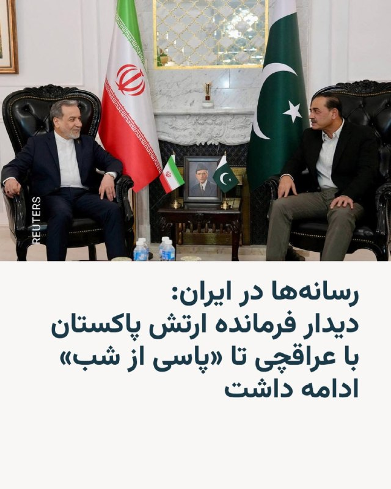

رسانه‌ها در ایران از دیدار فیلد مارشال عاصم منیر، فرمانده ارتش پاکستان با عباس عراقچی، وزیر امور خارجه ایران در شامگاه جمعه یکم خرداد خبر دادند.

بر اساس این خبر، دیدار این دو مقام تا پاسی از شب ادامه یافته و محور گفت‌وگوها «تلاش‌ها برای جلوگیری از تشدید تنش و خاتمه جنگ» و «راهکارهای تقویت صلح، ثبات و امنیت در منطقه غرب آسیا» بوده است.

جزئیات بیشتری از این دیدار منتشر نشده است.
@VahidHeadline

📡 @VahidOnline

## IranIntlTV — post 338536

  <a href="telegram/content/IranIntlTV_338536_1779521431.mp4" target="_blank">🎬 Download video</a>

ایرانیان ساکن استرالیا روز شنبه دوم خرداد در بریزبن تجمع کرده و در حمایت از انقلاب ملی و جاویدنامان آن شعار دادند. یکی از سخنرانان این تجمع مبارزه ایرانیان با جمهوری اسلامی را نجات تمدن انسانی خواند.

## IranIntlTV — post 338535

  <a href="https://t.me/IranintlTV/338535" target="_blank">📎 Download file</a>

🎧نسخه صوتی اخبار بامدادی | شنبه ۲ خرداد
@iranintlTV

## IranIntlTV — post 338534

  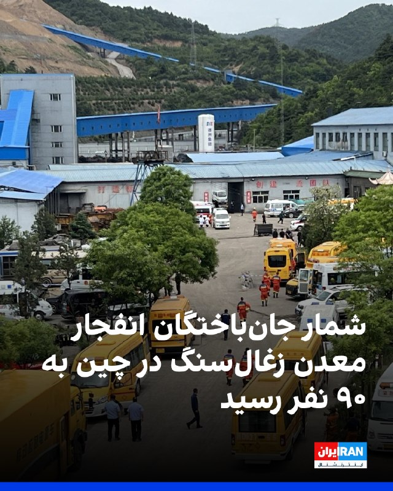

رسانه دولتی سی‌سی‌تی‌وی گزارش داد شمار جان‌باختگان انفجار گاز در یک معدن زغال‌سنگ در استان شانشی در شمال چین به ۹۰ نفر رسیده است. عملیات جست‌وجو و نجات همچنان ادامه دارد و علت حادثه در دست بررسی است. به گفته مقام‌های محلی، تلاش‌ها برای یافتن احتمالی مفقودان ادامه دارد.

چین از اوایل دهه ۲۰۰۰ با اجرای مقررات سخت‌گیرانه‌تر و ارتقای استانداردهای ایمنی، تلفات معادن زغال‌سنگ را که اغلب بر اثر انفجار گاز یا سیلاب رخ می‌داد، کاهش داده است. با این حال، حادثه لیوشنیو از مرگبارترین حوادث معدنی گزارش‌شده در این کشور در دهه گذشته به شمار می‌رود.

خبرگزاری شینهوا اعلام کرد مدیران شرکت مسئول این معدن بازداشت شده‌اند.
https://iranintl.com/202605238441

## IranIntlTV — post 338533

  <a href="telegram/content/IranIntlTV_338533_1779521434.mp4" target="_blank">🎬 Download video</a>

علی شیرازی، عضو تحریریه ایران‌اینترنشنال، گفت جمهوری اسلامی در حال حاضر دو ابزار برای مقابله در اختیار دارد؛ تنگه هرمز و اورانیوم غنی‌شده‌ای که در اختیارش است. او افزود: «اگر جمهوری اسلامی این دو اهرم را از دست بدهد، عملا همان تسلیم بی‌قید و شرطی رخ خواهد داد که دونالد ترامپ از آن سخن گفته بود.»
@iranintltv

## IranIntlTV — post 338532

  <a href="telegram/content/IranIntlTV_338532_1779521435.mp4" target="_blank">🎬 Download video</a>

یک شهروند با ارسال پیامی به ایران اینترنشنال از افزایش قیمت‌ها و لغو شدن مشاغل هنری خبر می‌دهد. پیام او با هوش مصنوعی خوانده شده است.

## IranIntlTV — post 338531

  <a href="telegram/content/IranIntlTV_338531_1779521437.mp4" target="_blank">🎬 Download video</a>

یک شهروند با ارسال پیامی به ایران‌اینترنشنال می‌گوید در این شرایط سخت معیشتی، پیامک زده‌اند و فرزندآوری را تشویق می‌کنند.
پیام این شهروند با هوش مصنوعی بازخوانی شده است.

## IranIntlTV — post 338530

  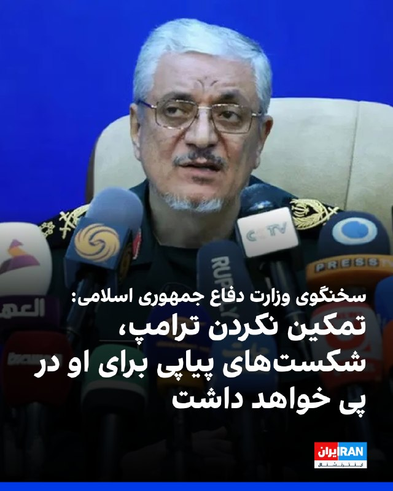

رضا طلایی‌نیک، سخنگوی وزارت دفاع جمهوری اسلامی، گفت دونالد ترامپ، رییس‌جمهوری آمریکا «هیچ چاره‌ای» جز پذیرفتن مطالبات تهران و به رسمیت شناختن «حقوق» جمهوری اسلامی ندارد.

طلایی‌نیک گفت «تمکین نکردن» آمریکا به مطالبات جمهوری اسلامی، به «تحمیل» هزینه‌های بیشتر و «شکست‌های پیاپی» بعدی برای دونالد ترامپ و اسرائیل منجر خواهد شد.

او افزود ترامپ باید ضمن پذیرش پیشنهادهای جمهوری اسلامی، به فکر جلوگیری از «خسارت‌ها و هزینه‌های بیشتر» ادامه جنگ برای مردم آمریکا و جامعه جهانی باشد.

سخنگوی وزارت دفاع جمهوری اسلامی همچنین گفت «بی‌توجهی» ترامپ به منافع ملی آمریکا، «تبعیت از اسرائیل» و رفتارهای «مغرورانه» او، باعث فرو رفتن بیشتر آمریکا در «باتلاق» جنگ خواهد شد.
https://iranintl.com/202605234414

## IranIntlTV — post 338529

  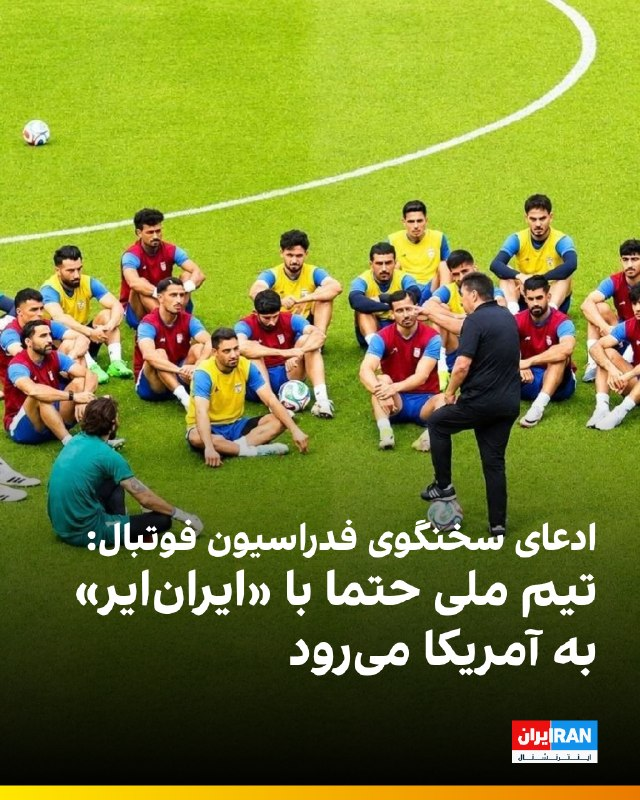

🔻امیرمهدی علوی، سخنگوی فدراسیون فوتبال، امشب در یک برنامه تلویزیونی مدعی شد که با هماهنگی فیفا سفر تیم ملی فوتبال به آمریکا با پرواز اختصاصی «ایران‌ایر» نهایی شده است: «نشستن هواپیمای اختصاصی ایران‌ایر در محل برگزاری جام جهانی نهایی شده است.»

🔹این در حالی است که ایران‌ایر سال‌هاست از سوی ایالات متحده تحریم شده و هیچ هواپیما یا پروازی متعلق به این شرکت امکان پرواز به آمریکا را ندارد.

🔹ایران‌ایر همچنین از سوی بسیاری از کشورهای اروپایی محروم شده و فدراسیون فوتبال برای سفرهای اروپایی نیز ناچار به استفاده از پروازهای خارجی است.

🔹با این حال، به نظر می‌رسد تلاش مهدی تاج و فدراسیون فوتبال برای استفاده از پرواز ایرانی بیشتر در سفر به آمریکا به مشکلات مالی فدراسیون مرتبط باشد؛ طبق برخی برآوردها، تنها پرواز کاروان تیم ملی به آمریکا بیش از نیم‌میلیون دلار هزینه خواهد داشت.

@iranintltvsport

## IranIntlTV — post 338528

  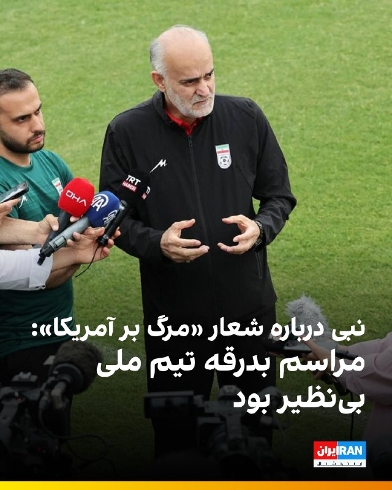

🔻مهدی محمدنبی، سرپرست تیم ملی فوتبال، در حاشیه تمرین تیم ملی در پاسخ به یک رسانه بریتانیایی درباره شعار «مرگ بر آمریکا» هواداران حکومت در تجمعات شبانه و همزمان با حضور تیم در این تجمع گفت: «بدرقه بی‌نظیری بود؛ سابقه ندارد برای هیچ تیم ملی مردم جمع شوند و این بدرقه را انجام دهند.»

🔹اعضای تیم ملی فوتبال هفته گذشته، در حالی که هیچ‌کدام ویزای آمریکا را برای شرکت در جام جهانی ۲۰۲۶ نداشتند، در یک مراسم شبانه حکومتی حاضر شدند و پس از آن به ترکیه رفتند تا اردوی آماده‌سازی پیش از مسابقات را برگزار کنند.

🔹سرپرست تیم ملی روز جمعه در گفت‌وگو با آی‌تی‌وی درباره ویزای اعضای تیم ملی گفت: «مطمئنیم که ویزاها صادر می‌شود. در جلساتی که با فیفا داشتیم، این اطمینان را به ما دادند که با توجه به تضمین‌هایی که کشور میزبان برای این مسابقات داده، قطعا ویزای تیم را پس از طی شدن فرایند اداری صادر خواهد کرد.»

🔹تیم ملی روز پنجشنبه برای دریافت ویزا به سفارت‌های آمریکا و کانادا در آنکارا مراجعه کرد.

@iranintltvsport

## IranIntlTV — post 338527

  <a href="telegram/content/IranIntlTV_338527_1779521440.mp4" target="_blank">🎬 Download video</a>

نیویورک‌پست گزارش داد یک شهروند عراقی، از فرماندهان کتائب حزب‌الله عراق، گروه‌ تحت حمایت جمهوری اسلامی، قصد داشت ایوانکا ترامپ، دختر رییس‌جمهوری ایالات متحده، را ترور کند.

گفت‌وگو با امید معماریان، تحلیل‌گر سیاسی در موسسه دان
@iranintltv

## IranIntlTV — post 338526

  <a href="telegram/content/IranIntlTV_338526_1779521441.mp4" target="_blank">🎬 Download video</a>

یک شهروند با ارسال پیام به ایران‌اینترنشنال می‌گوید: «من تمام کار و زندگی‌ام موسیقی است، اما از شروع جنگ تا الان بیشتر کنسرت‌ها و فعالیت‌های مرتبط با آن تعطیل شده. برای آموزش هم کسی مراجعه نمی‌کند و در این چند ماه هیچ درآمدی نداشتم.»

## IranIntlTV — post 338525

  <a href="telegram/content/IranIntlTV_338525_1779521443.mp4" target="_blank">🎬 Download video</a>

جو ویلسون، عضو جمهوری‌خواه مجلس نمایندگان آمریکا، گفت حزب حاکم گرجستان با در اختیار گذاشتن حریم هوایی خود برای پروازهای ترابری راهبردی روسیه، مسیر انتقال تجهیزات نظامی به ایران را هموار کرده است. او افزود این اقدام به معنای «کمک مستقیم به تهران» در جنگ است.

گفت‌وگو با روح‌الله رحیم‌پور، روزنامه‌نگار و تحلیل‌گر سیاسی
@iranintltv

## IranIntlTV — post 338524

  <a href="telegram/content/IranIntlTV_338524_1779521444.mp4" target="_blank">🎬 Download video</a>

یک دریاچه نمکی در عربستان سعودی پس از بارش‌های بهاری بار دیگر پرآب شده و اکنون به یکی از پربازدیدترین مناظر طبیعی این کشور تبدیل شده است.

گزارش فرزیا ثابتی، خبرنگار ایران‌اینترنشنال
@iranintltv

## IranIntlTV — post 338523

  <a href="telegram/content/IranIntlTV_338523_1779521445.mp4" target="_blank">🎬 Download video</a>

دیوان بین‌المللی دادگستری در یک رای مشورتی تایید کرد حق اعتصاب کارگران تحت پوشش و حمایت مقاوله‌نامه شماره ۸۷ سازمان بین‌المللی کار درباره آزادی انجمن و حمایت از حق تشکل‌یابی قرار دارد.
روزبه بوالهری، عضو تحریریه ایران‌اینترنشنال، گفت این رای می‌تواند شرایطی فراهم کند تا تشکل‌های کارگری حامی کارگران ایران، از طریق نهادهای بین‌المللی، جمهوری اسلامی را درباره حق تشکل‌یابی کارگران تحت فشار قرار دهند و علیه آن شکایت کنند.
@iranintltv

## IranIntlTV — post 338522

  <a href="telegram/content/IranIntlTV_338522_1779521447.mp4" target="_blank">🎬 Download video</a>

محمد قائدی، مدرس روابط بین‌الملل، گفت در صورت ازسرگیری حملات آمریکا، این بار بسیار گسترده‌تر و جدی‌تر خواهد بود و نقاطی در تنگه هرمز نیز هدف قرار خواهند گرفت. او درباره اهداف احتمالی اسرائیل در ایران نیز گفت زیرساخت‌هایی مانند صنایع پتروشیمی و چاه‌های نفتی می‌توانند در فهرست اهداف این کشور باشند.
@iranintltv

## IranIntlTV — post 338521

  <a href="telegram/content/IranIntlTV_338521_1779521448.mp4" target="_blank">🎬 Download video</a>

حکم دادگاه تجدیدنظر، کنگره سال ۲۰۲۳ حزب جمهوری‌خواه خلق، بزرگ‌ترین حزب مخالف دولت در ترکیه را باطل و اوزگور اوزل، رهبر این حزب را از سمتش برکنار کرد.
@iranintltv

## IranIntlTV — post 338520

  <a href="telegram/content/IranIntlTV_338520_1779521450.mp4" target="_blank">🎬 Download video</a>

سرخط خبرهای شنبه ۲ خرداد
@iranintltv

## ManotoTV — post 105752

  <a href="telegram/content/ManotoTV_105752_1779521451.mp4" target="_blank">🎬 Download video</a>

فرانسه اعلام کرد پیش‌نویس قطعنامه‌ای را برای ارائه به شورای امنیت سازمان ملل تهیه کرده که هدف آن تشکیل یک مأموریت بین‌المللی به‌منظور بازگرداندن آزادی تردد در تنگه هرمز است. وزارت خارجه فرانسه گفته این طرح در صورت فراهم شدن شرایط می‌تواند مطرح شود.
هم‌زمان، پیش‌نویس قطعنامه مشترک آمریکا و بحرین درباره تنگه هرمز همچنان در شورای امنیت در حال بررسی است. این قطعنامه از ایران می‌خواهد حملات و مین‌گذاری در این آبراه را متوقف کند، اما رأی‌گیری درباره آن به دلیل احتمال وتوی روسیه و چین چندین بار به تعویق افتاده است.
مقام‌های فرانسوی اعلام کردند پاریس در هماهنگی با بریتانیا در حال بررسی ایجاد یک مأموریت بین‌المللی برای تضمین آزادی ناوبری در تنگه هرمز است. در همین حال، گزارش‌ها حاکی از آن است که آمریکا تلاش کرده حمایت ده‌ها کشور را برای پیشبرد قطعنا خود جلب کند

## ManotoTV — post 105751

  <a href="telegram/content/ManotoTV_105751_1779521451.mp4" target="_blank">🎬 Download video</a>

سازمان عملیات تجارت دریایی بریتانیا اعلام کرد یک قایق کوچک به یک نفتکش حامل فرآورده‌های نفتی در نزدیکی سواحل یمن نزدیک شده است.
بر اساس این گزارش، نفتکش در فاصله حدود ۲۰۰ مایل دریایی در غرب جزیره سقطری یمن قرار داشت و قایق نزدیک‌شونده پنج سرنشین داشته است.
این سازمان افزود پس از استقرار تیم امنیتی مسلح نفتکش، قایق مسیر خود را تغییر داد و از کشتی فاصله گرفت.

## ManotoTV — post 105750

  <a href="telegram/content/ManotoTV_105750_1779521452.mp4" target="_blank">🎬 Download video</a>

روزنامه نیویورک پست گزارش داد محمد باقر سعد داوود السعدی، تبعه ۳۲ ساله عراقی که گفته می‌شود آموزش‌های مرتبط با سپاه پاسداران دیده است، متهم به طراحی طرحی برای ترور ایوانکا ترامپ، دختر دونالد ترامپ، رئیس‌جمهوری آمریکا، شده است. طبق این گزارش، انگیزه این اقدام انتقام‌گیری از کشته شدن قاسم سلیمانی عنوان شده است.
بر اساس این گزارش، السعدی متهم است که پس از کشته‌شدن قاسم سلیمانی، فرمانده پیشین نیروی قدس سپاه، خانواده ترامپ را هدف قرار داده و حتی نقشه محل اقامت ایوانکا ترامپ در فلوریدا را در اختیار داشته است. منابع می‌گویند او پیش‌تر نیز تهدیدهایی در این رابطه مطرح کرده بود.
نیویورک پست به نقل از انتفاض قنبر، معاون پیشین وابسته نظامی سفارت عراق در واشینگتن، نوشت السعدی به اطرافیانش گفته بود: «باید ایوانکا را بکشیم تا خانه ترامپ را همان‌طور به آتش بکشیم که او خانه ما را به آتش کشید.» همچنین گفته می‌شود او در شبکه اجتماعی ایکس پیام‌هایی با محتوای تهدیدآمیز منتشر کرده بود.
السعدی روز ۱۵ مه در ترکیه بازداشت و به آمریکا منتقل شد. وزارت دادگستری آمریکا او را از چهره‌های مرتبط با شبکه‌های تروریستی عراق و جمهوری اسلامی معرفی کرده و اعلام کرده است که او با اتهام دست داشتن در ۱۸ حمله و اقدام به حمله در اروپا و آمریکا روبه‌رو است.

## ManotoTV — post 105749

  <a href="telegram/content/ManotoTV_105749_1779521453.mp4" target="_blank">🎬 Download video</a>

روزنامه وال‌استریت ژورنال به نقل از مقام‌های آمریکایی گزارش داد دونالد ترامپ، رئیس‌جمهوری آمریکا، در حال حاضر گزینه اقدام نظامی علیه جمهوری اسلامی را به‌طور کامل کنار نگذاشته و در صورت شکست مذاکرات، احتمال صدور دستور حملات نظامی علیه جمهوری اسلامی همچنان وجود دارد.
بر اساس این گزارش، ترامپ روز جمعه در دیداری با کارکنان خود گفته است که با ادامه مذاکرات با ایران، ترجیح می‌دهد به مسیر دیپلماسی زمان بیشتری داده شود. به گفته مقام‌های آمریکایی، او با وجود ادامه تنش‌ها همچنان به دستیابی به راه‌حلی از مسیر مذاکره علاقه‌مند است.
این گزارش می‌افزاید رئیس‌جمهوری آمریکا هنوز تصمیم نهایی خود را نگرفته، اما در حال حاضر بیشتر به ادامه تلاش‌های دیپلماتیک تمایل دارد، در حالی که گزینه‌های نظامی همچنان روی میز باقی مانده‌اند.

## FarsiVOA — post 218413

🔺قفل دبی بر بازار دیجیتال ایران؛ هشدار درباره موج تازه گرانی موبایل و لپ‌تاپ

◾️اقتصادنیوز گزارش داد بازار دیجیتال ایران پس از جنگ به وضعیت عادی بازنگشته و فعالان بازار از کمبود کالا، قیمت‌های شناور و مسیرهای نامطمئن واردات می‌گویند.

◾️بر اساس این گزارش، وابستگی طولانی‌مدت بازار موبایل، لپ‌تاپ و قطعات کامپیوتری به مسیر امارات، اکنون به نقطه آسیب‌پذیری تبدیل شده و در کوتاه‌مدت جایگزین روشنی برای آن دیده نمی‌شود.

◾️نزدیک به ۹۰ درصد واردات فناوری اطلاعات ایران در سال‌های اخیر از مسیر امارات انجام شده و سهم این کشور در بازار موبایل به حدود ۹۹ درصد رسیده است.

◾️امارت سال‌ها شریان اصلی خرید واسطه‌ای، پرداخت، حمل و انتقال موبایل، لپ‌تاپ و قطعات کامپیوتری به ایران بوده است.

⬇️ بیشتر بخوانید:
https://ir.voanews.com/a/8153016.html

## FarsiVOA — post 218412

  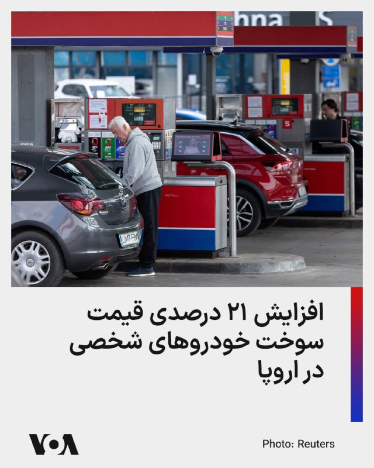

در پی اوج‌گیری قیمت نفت به خاطر انسداد تنگه هرمز توسط جمهوری اسلامی، قیمت سوخت و روان‌کننده‌های نفتی مورد استفاده در خودروهای شخصی در اتحادیه اروپا در ماه گذشته نزدیک ۲۱ درصد نسبت به آوریل پارسال جهش کرده است.

طبق داده‌های مرکز آمار اتحادیه اروپا، یوروستت، برخی از کشورها مانند لوکزامبورگ، فرانسه و سوئد شاهد رشد ۲۹ درصدی تا ۳۴ درصدی سوخت خودرو نیز بوده‌اند.

رشد قیمت گازوئیل - سوخت غالب حوزه حمل و نقل اتحادیه اروپا - بسیار بالاتر از بنزین بوده است؛ به طوری که ۳۳.۷ درصد جهش کرده، اما قیمت بنزین کمتر از ۱۴ درصد نسبت به آوریل پارسال رشد داشته است.
@FarsiVOA

## FarsiVOA — post 218411

  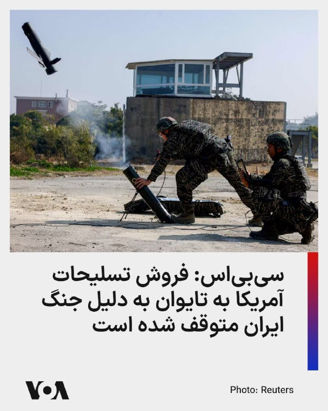

شبکه سی‌بی‌اس گزارش داد سرپرست وزارت نیروی دریایی آمریکا گفته فروش ۱۴ میلیارد دلاری تسلیحات به تایوان، به دلیل نیاز ارتش آمریکا به مهمات برای عملیات مرتبط با جنگ علیه جمهوری اسلامی، موقتاً متوقف شده است.

هانگ کائو در جلسه‌ای در کنگره گفت این توقف برای اطمینان از کافی بودن ذخایر مهمات آمریکا انجام شده و فروش‌های نظامی خارجی پس از تصمیم دولت ادامه خواهد یافت.

این موضوع در حالی مطرح می‌شود که فروش تسلیحات به تایوان برای سال‌ها یکی از محورهای تنش میان واشنگتن و پکن بوده است. آمریکا تنها دولت پکن را به رسمیت می‌شناسد، اما بر اساس قوانین داخلی خود باید تجهیزات دفاعی لازم را در اختیار تایوان بگذارد. چین تایوان را بخشی از خاک خود می‌داند و استفاده از زور را رد نکرده است.

سی‌بی‌اس همچنین نوشت ترامپ در ۱۵ مه، پس از ترک پکن، تأیید کرد که شی جین‌پینگ موضوع فروش تسلیحات آمریکایی به تایوان را با او مطرح کرده است.
@FarsiVOA

## FarsiVOA — post 218410

  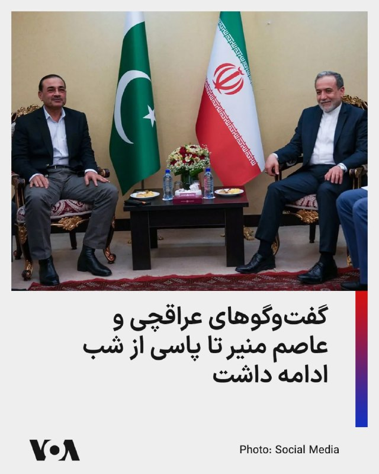

عباس عراقچی، وزیر امور خارجه جمهوری اسلامی، در ادامه رایزنی‌های فشرده دیپلماتیک درباره جنگ و گفت‌وگوهای تهران و واشنگتن، با عاصم منیر، فرمانده ارتش پاکستان، در تهران دیدار کرد.

رسانه‌های ایران گزارش دادند گفت‌وگوهای دو طرف تا پاسی از شب ادامه یافت و محور آن تلاش برای جلوگیری از تشدید تنش، پایان جنگ و تقویت ثبات منطقه‌ای بود.

این دیدار پس از آن انجام شد که محسن نقوی، وزیر کشور پاکستان، نیز بار دیگر با عراقچی درباره پیشنهادهای مطرح‌شده برای کاهش اختلافات تهران و واشنگتن گفت‌وگو کرد. برخی گزارش‌های غربی می‌گویند اسلام‌آباد، در کنار قطر، نقش میانجی فعال‌تری در تماس‌های اخیر گرفته و نقوی حامل تازه‌ترین پیام‌های واشنگتن بوده است.

عراقچی همچنین در تماس‌هایی جداگانه با آنتونیو گوترش، دبیرکل سازمان ملل، و وزیران خارجه ترکیه، قطر و عراق، آخرین وضعیت تلاش‌های دیپلماتیک و تحولات منطقه‌ای را بررسی کرد.
@FarsiVOA

## FarsiVOA — post 218409

🔺درخواست ۲۷ کشور برای دسترسی به منابع مالی اضطراری بانک جهانی

◾️یک سند بانک جهانی که به رویت رویترز رسیده، نشان می‌دهد ۲۷ کشور در حال اقدام برای دسترسی سریع به منابع مالی اضطراری این نهاد بین‌المللی هستند تا تبعات بحران انرژی ناشی از اخلال جمهوری اسلامی در تنگه هرمز را کاهش دهند.

◾️رویترز از قول منابعی گزارش داده که کنیا و عراق در میان درخواست‌کنندگان هستند؛ اولی به خاطر جهش قیمت سوخت و دیگری به خاطر افت چشمگیر صادرات نفت.

◾️آمارهای اوپک نشان می‌دهد تولید روزانه نفت عراق از بالای ۴.۱ میلیون بشکه در ماه قبل از انسداد تنگه هرمز به زیر ۱.۵ میلیون بشکه در ماه گذشته رسیده است.

◾️کنیا نیز طی روزهای گذشته به خاطر افزایش ۲۴ درصدی قیمت سوخت شاهد اعتراضات گسترده مردمی بود.

⬇️ بیشتر بخوانید:
https://ir.voanews.com/a/world-bank-document-shows-27-countries-seeking-to-ensure-access-to-crisis-funds/8153015.html

## FarsiVOA — post 218407

  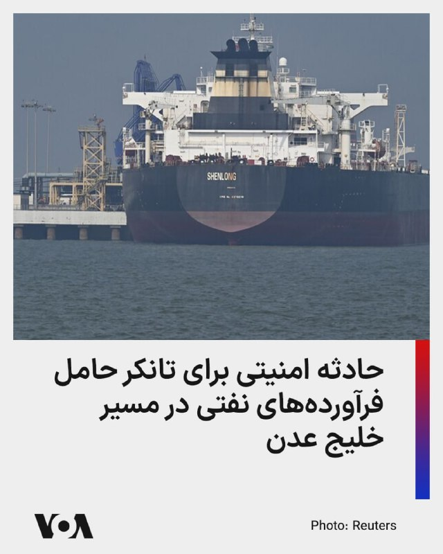

سازمان عملیات تجارت دریایی بریتانیا اعلام کرد گزارشی تازه درباره «فعالیت مشکوک» علیه یک تانکر حامل فرآورده‌های نفتی در کریدور بین‌المللی کشتیرانی در مسیر خلیج عدن دریافت کرده است.

بر اساس این گزارش کاپیتان کشتی اعلام کرده یک قایق کوچک با پنج سرنشین به این تانکر نزدیک شده و فاصله آن در نزدیک‌ترین نقطه به حدود ۱۰۰ متر رسیده است.

به گفته این نهاد، تیم امنیتی مسلح کشتی مستقر شد و قایق پس از آن مسیر خود را تغییر داد و از شناور فاصله گرفت.

این دومین گزارش مشابه در دو روز اخیر در آب‌های نزدیک یمن است و در شرایطی منتشر می‌شود که ناامنی مسیرهای کشتیرانی اطراف خلیج عدن و دریای سرخ همچنان نگرانی شرکت‌های حمل‌ونقل را افزایش داده است.
@FarsiVOA

## FarsiVOA — post 218406

  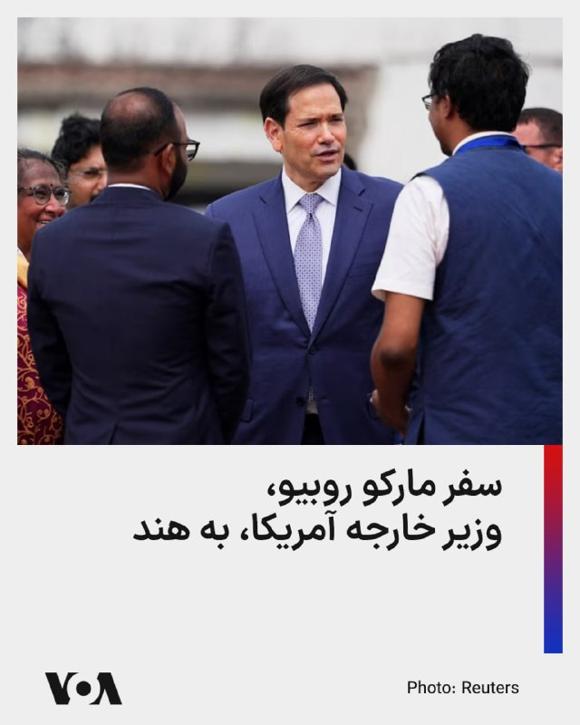

مارکو روبیو، وزیر خارجه آمریکا، روز شنبه در آغاز سفری چهارروزه وارد هند شد؛ سفری که به گزارش رویترز، نشانه تلاش واشنگتن برای ترمیم روابط با دهلی‌نو پس از ماه‌ها تنش تجاری و دیپلماتیک است.

بر اساس این گزارش، تعرفه‌های دولت دونالد ترامپ، نبود توافق تجاری جامع و هم‌زمانی تلاش آمریکا برای نزدیکی به پاکستان و چین، روابط واشنگتن و دهلی‌نو را تحت فشار قرار داده است.

روبیو قرار است در جریان این سفر به کلکته، آگرا، جیپور و دهلی‌نو برود و درباره تجارت، انرژی و همکاری‌های دفاعی گفت‌وگو کند.

رویترز می‌نویسد آمریکا سال‌هاست هند را وزنه‌ای مهم در برابر نفوذ چین و روسیه در منطقه هند-اقیانوس آرام می‌داند، اما اختلاف‌های اخیر این مسیر را پیچیده‌تر کرده است.

دهلی نو خواستار سفر ترامپ به هند همزمان با اجلاس گروه چهار شامل ایالات متحده، هند، ژاپن و استرالیا شده است، اما تحلیلگران می‌گویند این سفر به دلیل تنش‌های تجاری و عوامل دیگر از جمله جنگ ایالات متحده و اسرائیل با جمهوری اسلامی، به تعویق افتاده است.
@FarsiVOA

## DW_Farsi — post 125031

  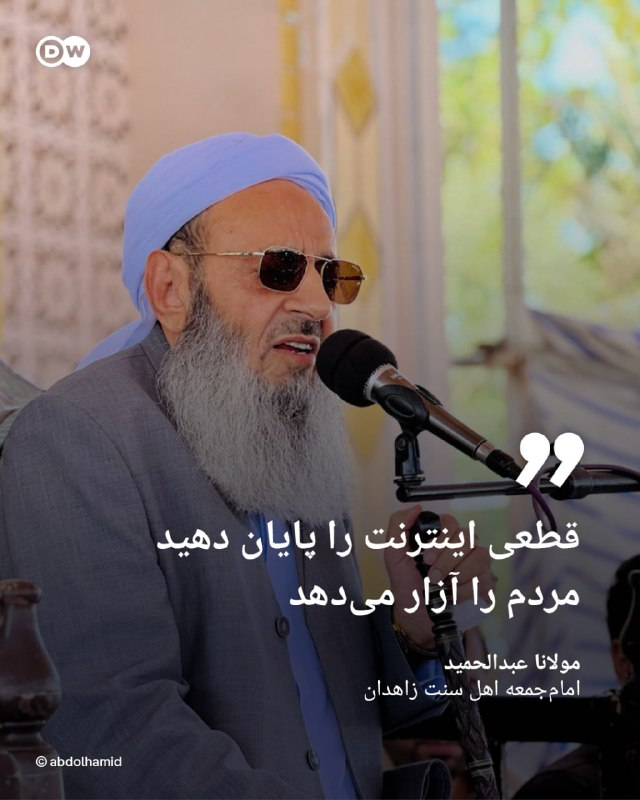

🔶 عبدالحمید: قطعی اینترنت را پایان دهید مردم را آزار می‌دهد

مولانا عبدالحمید، امام‌‌جمعه اهل سنت زاهدان در خطبه‌ نماز جمعه ۱ خرداد (۲۲ مه) در این شهر با انتقاد از وضعیت معیشتی و گرانی‌ها گفت، مردم ایران در شرایط سختی قرار دارند و حتی با گرسنگی دست‌وپنجه نرم می‌کنند.

عبدالحمید با اشاره به قطعی اینترنت در کشور تاکید کرد که اینترنت امروز بخش جدایی‌ناپذیر زندگی مردم است و قطع آن باعث آزار عمومی شده است و باید به این روند پایان داده شود.

این روحانی برجسته سنی کشور همچنین از مسئولان خواست، مشکلات اقتصادی و معیشتی مردم را جدی بگیرند و نسبت به رنج‌های جامعه پاسخگو باشند.

امام‌جمعه زاهدان از "محدود بودن اختیارات دولت" انتقاد کرد و افزود، به گفته مردم، دولتی انتخاب شده که اختیارات لازم را ندارد.

عبدالحمید تاکید کرد، در حالی که در بسیاری از کشورها تصمیم‌گیری‌های سیاست داخلی و خارجی بر عهده دولت است، در ایران دولت عملا تنها نقش اجرایی دارد و در این حوزه‌ها تاثیرگذاری موثری ندارد.

@dw_farsi

## DW_Farsi — post 125030

  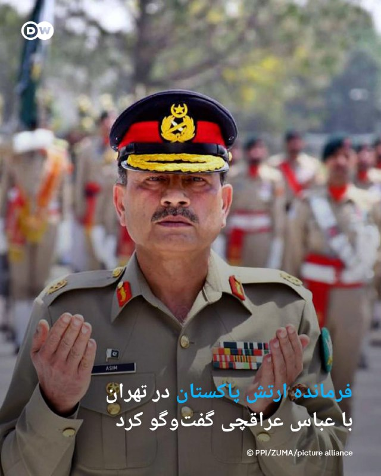

🔶 فرمانده ارتش پاکستان در تهران با عباس عراقچی گفت‌وگو کرد

رسانه‌های دولتی ایران روز شنبه ۲ خرداد (۲۳ مه) گزارش دادند که عاصم منیر، فرمانده ارتش پاکستان در تهران با عباس عراقچی، وزیر امور خارجه ایران، دیدار و گفت‌وگو کرده است.

دو طرف در این دیدار که تا پاسی از شامگاه جمعه ادامه داشت، درباره آخرین ابتکارات دیپلماتیک با هدف جلوگیری از تشدید تنش‌ها و پایان دادن به جنگ ایران تبادل نظر کرده‌اند. این دیدار به بررسی راه‌های کاهش تنش‌ها اختصاص داشته است.

پاکستان در روزهای اخیر تلاش‌های دیپلماتیک خود را برای میانجی‌گری میان ایران و ایالات متحده افزایش داده است.

طبق گزارش رسانه‌های ایران، محسن نقوی، وزیر کشور پاکستان، نیز هم‌زمان با این سفر در تهران حضور دارد و برای سومین روز متوالی در ایران به‌سر می‌برد.

عاصم منیر پیش‌تر نیز در اواخر فروردین‌ماه در قالب یک دیدار سه‌روزه به تهران رفته بود.

پاکستان نقش میانجی‌گرانه مهمی میان آمریکا و ایران ایفا می‌کند و با هر دو کشور روابط دوستانه دارد. اما با وجود تلاش‌های این کشور، دور نخست مذاکرات ایران و آمریکا بدون نتیجه پایان یافت.

مارکو روبیو، وزیر خارجه آمریکا، در نشست وزرای کشورهای عضو ناتو در سوئد اعلام کرده است که واشنگتن در انتظار پاسخ تهران به آخرین شروط دولت ترامپ، رئیس‌جمهور ایالات متحده برای یک توافق احتمالی است.

روبیو همچنین گفته است که تا کنون پیشرفت اندکی در مذاکرات با جمهوری اسلامی حاصل شده است.

@dw_farsi

## DW_Farsi — post 125029

  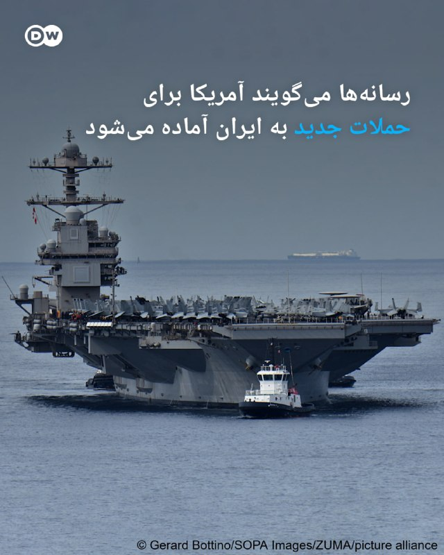

🔶 رسانه‌ها: آمریکا برای حملات جدید به ایران آماده می‌شود

پایگاه‌ خبری "آکسیوس" و شبکه "سی‌بی‌اس" گزارش داده‌اند که دونالد ترامپ، رئیس‌جمهور آمریکا، روز جمعه ۱ خرداد (۲۲ مه) نشستی با نزدیک‌ترین مشاوران خود در دفتر بیضی کاخ سفید برگزار کرده است.

آکسیوس به نقل از منابعی که به‌طور مستقیم" با ترامپ در ارتباط بوده‌اند، نوشته است که او "به‌طور جدی در حال بررسی حملات جدید علیه ایران است، مگر اینکه در لحظات آخر پیشرفتی در مذاکرات حاصل شود."

بر اساس این گزارش، ترامپ در این جلسه در جریان وضعیت مذاکرات و سناریوهای احتمالی در صورت شکست گفت‌وگوها قرار گرفته است.

سی‌بی‌اس هم به نقل از چند منبع گزارش داده است که برخی از اعضای ارتش و جامعه اطلاعاتی آمریکا برنامه‌های تعطیلات خود را لغو کرده‌اند؛ اقدامی که احتمالا با حملات جدید مرتبط بوده است.

به گفته این منابع، مقام‌های دفاعی و اطلاعاتی آمریکا در حال به‌روزرسانی فهرست نیروهای آماده‌‌باش در پایگاه‌های خارج از کشور هستند.

ترامپ در شبکه اجتماعی تروث سوشال اعلام کرده بود که به دلیل "شرایطی" احتمالا نمی‌تواند در مراسم ازدواج پسرش، دونالد ترامپ جونیور، شرکت کند.

ترامپ گفت، تلاش خواهد کرد در این مراسم خصوصی حضور یابد، اما زمان‌بندی برایش دشوار است و درگیر مسائل متعدد از جمله "پرونده ایران" است.

ترامپ در دفتر بیضی کاخ سفید درباره مراسم ازدواج پسرش به خبرنگاران گفت: «پسرم دوست دارد که من در مراسم باشم، این یک مراسم کوچک و خصوصی است و من سعی می‌کنم خودم را برسانم.»

آکسیوس همچنین به نقل از یک منبع امنیتی پاکستان گزارش داده است که سفر عاصم منیر به تهران در چارچوب تلاش‌ها برای دستیابی به توافقی میان ایران و آمریکا و توقف درگیری‌ها و آغاز مذاکرات گسترده‌تر انجام شده است.

@dw_farsi

## Persian_Trend_Official — post 14721

  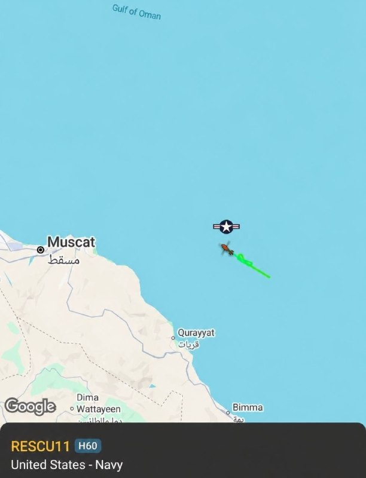

❗️ یک فروند بالگرد MH-60S متعلق به نیروی دریایی آمریکا با کال‌ساین «RESCU11» در آسمان خلیج عمان رصد شد.
برخی منابع احتمال می‌دهند این پرواز در ارتباط با یک مأموریت جستجو و نجات انجام شده باشد.
گفته می‌شود این بالگرد از یکی از ناوهای جنگی مستقر در دریای عمان به پرواز درآمده است.

👩‍💻@PhantomDirective

🆔@persian_trend_official
پرشین ترند | متفاوت‌ترین کانال نظامی

## Persian_Trend_Official — post 14720

  <a href="telegram/content/Persian_Trend_Official_14720_1779521458.webm" target="_blank">🎬 Download video</a>

🔸 دولت سنگال منحل شد.

🔹رئیس جمهور سنگال در شرایط پرتنش این کشور و در پی بالا گرفتن اختلافات با دولت، نخست وزیر متحد و حامی سابق خود را برکنار و دولت را منحل کرد.

👩‍💻@PhantomDirective

🆔@persian_trend_official
پرشین ترند | متفاوت‌ترین کانال نظامی

## Persian_Trend_Official — post 14719

  <a href="telegram/content/Persian_Trend_Official_14719_1779521458.mp4" target="_blank">🎬 Download video</a>

سرتیپ نامی: ناتوی اسلامی باید به محوریت ایران تشکیل شود.

از حدود ۵۷ کشور اسلامی، بیشترین ظرفیت اقتصادی و جغرافیایی جهان به‌دست می‌آید که قدرت‌آفرین است.

🔹در صورت تحقق این اتحاد، هیچ قدرتی نمی‌تواند به جهان اسلام زور بگوید؛ نمونۀ آن فلسطین است که تاکنون ۷۳ هزار شهید تقدیم کرده است.

👩‍💻@PhantomDirective

🆔@persian_trend_official
پرشین ترند | متفاوت‌ترین کانال نظامی

## Persian_Trend_Official — post 14718

  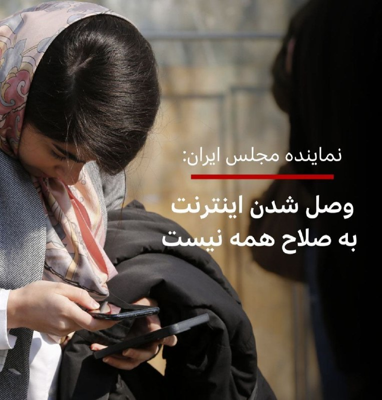

🔻نایب رئیس کمیسیون فرهنگی مجلس ایران می‌گوید که «مسئولان به این نتیجه رسیده‌اند که وصل کردن اینترنت به صلاح همه نیست و اینترنت بین‌المللی در حال حاضر بازگشایی نخواهد شد.»

علی یزدی‌خواه با اشاره به این که قطع اینترنت از دستورات و اختیارات شورای عالی امنیت ملی است، گفت که «به لحاظ مسائل امنیتی، امنیت کشور»، اینترنت جهانی قطع شده است.

او گفت که با وجود قطع اینترنت، «کسب‌وکارها از طریق ارتباطات بانکی، خرید و فروش و سایر خدمات آنلاین همچنان فعال هستند و مردم با مشکل عمده‌ای مواجه نیستند.»

به گفته این نماینده مجلس برخی افرادی که از نظر مسئولان نیاز به دسترسی به اینترنت بین‌الملل داشتند، این امکان به‌صورت محدود برای آن‌ها فراهم شده است.

آقای یزدی خواه افزوده «تقریبا بیش از ۹۰ درصد نیازها و احتیاجات مردم در فضای فعلی برآورده می‌شود و اگر اقشاری هستند که دچار مشکل‌ هستند، قابلیت پیگیری وجود دارد.»

این در حالی است که کارشناسان اقتصادی نسبت به خسارات وارد شده به کسب و کارها در نتیجه قطع اینترنت هشدار داده‌اند.

👩‍💻@PhantomDirective

🆔@persian_trend_official
پرشین ترند | متفاوت‌ترین کانال نظامی

## Persian_Trend_Official — post 14716

  <a href="telegram/content/Persian_Trend_Official_14716_1779521460.mp4" target="_blank">🎬 Download video</a>

دن اسکاوینو معاون رئیس دفتر کاخ سفید و دستیار ترامپ،ویدیویی از بمب‌افکن‌های مخفی‌کار B-2 را بدون هیچ زمینه‌ای منتشر کرد،

فکت مهم:
آخرین باری که او این پست را منتشر کرد،
چند ساعت بعد آمریکا و اسرائیل به ایران حمله کردند.

👩‍💻@PhantomDirective

🆔@persian_trend_official
پرشین ترند | متفاوت‌ترین کانال نظامی

## Persian_Trend_Official — post 14715

  <a href="telegram/content/Persian_Trend_Official_14715_1779521461.webm" target="_blank">🎬 Download video</a>

بولتن خبری۲۴ ساعت گذشته
آرشیو تحریریه پرشین ترند.

۲ خرداد ۱۴۰۵

🇮🇷ایران

◾️ فرمانده ارتش پاکستان، ژنرال عاصم منیر، وارد تهران شد و با عراقچی وزیر خارجه ایران تا پاسی از شب دیدار و گفتگو کرد

◾️ وزیر کشور پاکستان نیز برای سومین روز متوالی در تهران حضور داشت و پیش از ورود فرمانده ارتش، پایتخت را ترک کرد

◾️ سخنگوی وزارت خارجه: تمرکز مذاکرات بر خاتمه جنگ در همه جبهه‌هاست؛ مباحث هسته‌ای در این مرحله مورد بحث نیست

◾️ سخنگوی وزارت خارجه: اختلاف‌نظرها بین ایران و آمریکا آن‌قدر عمیق است که نمی‌توان گفت ظرف چند هفته باید به نتیجه رسید

◾️ سخنگوی هیئت مذاکره‌کننده: میانجی اصلی مذاکرات پاکستان است؛ هیئت قطری نیز برای رایزنی به تهران آمد و سپس پایتخت را ترک کرد

◾️ منبع نزدیک به تیم مذاکره‌کننده: پیشرفت‌هایی در برخی موضوعات حاصل شده اما تا جمع‌بندی همه موضوعات توافقی رخ نخواهد داد

◾️ ایران پیشنهاد جدید آمریکا را دریافت کرده و در حال بررسی آن است؛ ایران تأکید کرد چندین دور ارتباط بر اساس چارچوب ۱۴ ماده‌ای ایران انجام شده

◾️ ایران بخشی از حریم هوایی غرب کشور را برای پروازهای شبانه تا روز دوشنبه بست

◾️ نیروی دریایی سپاه: ۳۵ فروند کشتی تجاری در شبانه‌روز گذشته با هماهنگی و مجوز سپاه از تنگه هرمز عبور کردند

◾️ اختلالات گسترده GPS در تنگه هرمز، سواحل جنوبی ایران، امارات، قطر و کویت گزارش شده است

◾️ نیروهای مسلح جمهوری اسلامی در بالاترین سطح آماده‌باش قرار گرفته‌اند؛ فعالیت بالای جنگنده‌ها بر فراز کردستان عراق و غرب ایران ثبت شده

◾️ حمید رسایی مدعی شد مجلس توسط دبیر شورای امنیت ملی عملاً پلمب شده و جلسات صحن علنی برگزار نمی‌شود

🇮🇱 اسرائیل و خاورمیانه

◾️ العربیه: توافق احتمالی ایران و آمریکا «بیانیه اسلام‌آباد» نامگذاری خواهد شد و شامل آغاز مذاکرات درباره مسائل حل‌نشده ظرف ۷ روز و لغو تدریجی تحریم‌ها خواهد بود

◾️ بلومبرگ: امارات، عربستان و قطر از ترامپ خواسته‌اند به جای اقدام نظامی، به دیپلماسی با ایران فرصت دهد

◾️ امارات ظرفیت خط لوله انتقال نفت به بندر فجیره برای دور زدن تنگه هرمز را تا ۲۰۲۷ دو برابر می‌کند

◾️ مدیر اجرایی آژانس بین‌المللی انرژی هشدار داد بازار نفت تا تابستان با کاهش ذخایر وارد «منطقه قرمز» می‌شود؛ قیمت نفت برنت در حال حاضر حدود ۱۰۷ دلار در هر بشکه معامله می‌شود

◾️ FBI رهبر حزب‌الله عراق، محمدباقر السعدی، را به اتهام هماهنگی حداقل ۲۰ حمله تروریستی در اروپا و کانادا بازداشت کرد

◾️ اسرائیل از تلاش‌های ترامپ برای امضای توافق با ایران خشمگین است؛ تماس تلفنی «دراماتیک» میان ترامپ و نتانیاهو گزارش شده

◾️ تحلیلگران از احتمال بستن تنگه باب‌المندب توسط انصارالله و حملات به زیرساخت‌های انرژی عربستان در صورت بازگشت جنگ هشدار دادند

◾️ گزارش‌هایی از وقوع انفجار در ابوظبی منتشر شد؛ جزئیات تأیید نشده است

🇺🇸
🗺آمریکا و جهان

◾️ ترامپ: مذاکرات در «مراحل نهایی» است اما اگر توافق نشود «اوضاع می‌تواند کمی ناخوشایند شود»؛ آمریکا حاضر است چند روز بیشتر منتظر «پاسخ‌های درست» از تهران بماند

◾️ روبیو: پیشرفت‌هایی در مذاکرات با ایران حاصل شده؛ موضوع غنی‌سازی اورانیوم و تنگه هرمز همچنان محل اختلاف است

◾️ آکسیوس: ترامپ با مشاوران ارشد امنیت ملی برای بررسی احتمال حملات نظامی جدید علیه ایران دیدار کرده؛ تصمیم نهایی اتخاذ نشده؛ ترامپ اواخر هفته گذشته یک حمله برنامه‌ریزی‌شده را پس از درخواست قطر، عربستان و امارات متوقف کرد

◾️ سی بی اس: چندین عضو ارتش و جامعه اطلاعاتی آمریکا تعطیلات Memorial Da. را لغو کرده‌اند

◾️ وال‌استریت ژورنال: واسطه‌ها در تلاش برای یک توافق موقت هستند؛ هدف تمدید آتش‌بس و ادامه مذاکرات گسترده‌تر است؛ در صورت شکست مذاکرات آمریکا و اسرائیل احتمالاً زیرساخت‌های انرژی ایران را هدف قرار می‌دهند

◾️ سی‌ان‌ان: آمریکا پیشنهاد اقتصادی بزرگی شامل لغو تمام تحریم‌ها و طرح بازسازی اقتصادی به ایران ارائه داده؛ مسائل دشوار به مذاکرات بعدی موکول می‌شود

◾️ گاردین: پاکستان در تلاش است چین را به عنوان ضامن هرگونه توافق وارد کند؛ نخست‌وزیر شریف راهی پکن می‌شود

◾️ تولسی گابارد، مدیر اطلاعات ملی آمریکا که از مخالفان جنگ با ایران بود، استعفای خود را از ۳۰ ژوئن اعلام کرد

◾️ بلومبرگ: ایران بیش از ۲۴ پهپاد MQ-9 آمریکا به ارزش نزدیک به یک میلیارد دلار را از ابتدای جنگ منهدم کرده؛ این رقم حدود ۲۰ درصد از موجودی پیش از جنگ پنتاگون است

◾️ ناتو: دبیرکل مارک روته اعلام کرد ناتو می‌تواند به آمریکا در بازگشایی تنگه هرمز کمک کند.

👩‍💻@PhantomDirective

🆔 @persian_trend_official
پرشین ترند | متفاوت‌ترین کانال نظامی

## Persian_Trend_Official — post 14714

🔴مدیرکل فرودگاه‌های خوزستان: پروازهای فرودگاه‌های اهواز و ماهشهر از سر گرفته شد

🔹اولین پرواز مسیر تهران به اهواز، امروز در فرودگاه اهواز به زمین نشست. برنامۀ پروازی به‌تدریج افزایش خواهد یافت.

🫆:Tony

📌 @persian_trend_official
پرشین ترند | متفاوت‌ترین کانال نظامی

## Persian_Trend_Official — post 14713

  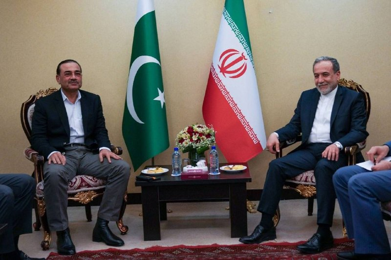

🔴دیدار و گفتگوی فرمانده ارتش پاکستان با عراقچی در تهران

💢فیلد مارشال عاصم منیر که به‌منظور رایزنی و تبادل نظر با مقام‌های جمهوری اسلامی به تهران سفر کرده است، روز گذشته با عراقچی دیدار و گفتگو کرد.

💢در این دیدار که تا پاسی از شب ادامه داشت، طرفین درباره آخرین تلاش‌ها و ابتکارات دیپلماتیک برای جلوگیری از تشدید تنش و خاتمه جنگ آمریکا و اسرائیل علیه جمهوری اسلامی و همچنین راهکارهای تقویت صلح، ثبات و امنیت در منطقه غرب آسیا تبادل نظر کردند.
🫆:Tony

📌 @persian_trend_official
پرشین ترند | متفاوت‌ترین کانال نظامی

## RadioFarda — post 157472

🔸مولوی عبدالحمید اسماعیل‌زهی، امام جمعه اهل سنت زاهدان، در نماز جمعه روز یکم خرداد بار دیگر از فشارهای اقتصادی بر مردم انتقاد کرد.

🔸او در بخشی از سخنان خود با اشاره به «گرانی‌های بی‌حدومرز» در کشورگفت: «ملت ایران صاحبان اصلی این کشور و ثروت‌های کلان آن هستند، اما در شرایط بسیار سختی قرار دارند و گرسنگی تحمل می‌کنند.»

🔸آقای عبدالحمید هم‌چنین گفت که «مردم ایران حرف‌ها و گلایه‌های زیادی دارند که سرمایه‌های مادی‌شان را از دست داده‌اند و بسیاری نیز دیانت‌شان در این کشمکش‌های سیاسی ضربه خورده و نسبت به دین بدبین شده‌اند.»

🔸امام جمعه زاهدان در بخش دیگری از سخنرانی خود قطع اینترنت در کشور را «آزاردهنده» خواند و از مسئولان کشور خواست تا به این روند پایان دهند.

🔸او هم‌چنین با انتقاد از عملکرد دولت گفت: «مردم می‌گویند دولتی انتخاب کرده‌ایم که اختیارات ندارد. در جاهای دیگر تصمیم‌گیری در رابطه با سیاست‌های داخلی و خارجی در دست دولت است، اما متأسفانه در کشور ما دولت به‌جز اجرا، نقش مؤثری در سیاست‌های داخلی و خارجی ندارد.»

@RadioFarda

## RadioFarda — post 157470

🔸روزنامه نیویورک پست روز جمعه در گزارشی نوشت که یک تبعهٔ عراق که به‌تازگی برای محاکمه به آمریکا تحویل داده شده قصد ترور ایوانکا ترامپ، دختر رئیس جمهور آمریکا، را داشته است.

🔸این روزنامه به نقل از منابعی نوشته است که محمدباقر سعد داوود السعدی، ۳۲ ساله، قصد داشته این اقدام را برای انتقام ترور قاسم سلیمانی، فرمانده پیشین نیروی قدس سپاه، توسط ارتش آمریکا انجام دهد.

🔸اف‌بی‌آی، اداره پلیس فدرال آمریکا، هفته گذشته خبر داد که یک عضو ارشد گروه عراقی کتائب حزب‌الله، از گروه‌های نیابتی اصلی جمهوری اسلامی، به نام محمدباقر سعد داوود السعدی، بازداشت و برای محاکمه به ایالات متحده منتقل شده است.

🔸دادستانی ایالت نیویورک در حساب شبکه ایکس خود عکسی از این عضو کتائب در کنار قاسم سلیمانی، فرمانده سابق سپاه قدس، منتشر کرده است که در حمله آمریکا در دوره اول ریاست جمهوری دونالد ترامپ کشته شد. در گزارش‌ها آمده است که او خود را محمدباقر سلیمانی معرفی می‌کرده است.

🔸گفته می‌شود که او در پی سفر به خارج از عراق، در ترکیه دستگیر شده است.

@RadioFarda

## RadioFarda — post 157469

  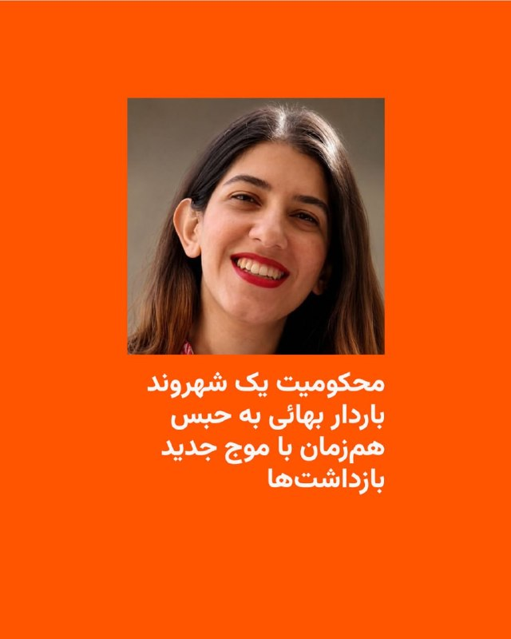

🔸جامعه جهانی بهائی می‌گوید بشری مصطفوی، شهروند بهائی اهل رفسنجان که باردار است، در میان ده‌ها بهائی قرار دارد که در ماه‌های اخیر و همزمان با تشدید فشارهای جمهوری اسلامی بر این اقلیت دینی، بازداشت یا زندانی شده‌اند. بر اساس اعلام این نهاد، از زمان آغاز درگیری‌های اخیر در اواخر بهمن، حدود ۸۰ شهروند بهائی بازداشت، دستگیر یا زندانی شده‌اند و بیش از ۴۰۰ مورد نقض حقوق بشر علیه بهائیان در نقاط مختلف ایران گزارش شده است.

🔸بشری مصطفوی پیشتر در پرونده‌ای تبرئه شده بود، اما با اعتراض دادستانی، دادگاه تجدیدنظر در پنجم اردیبهشت حکم تبرئه او را نقض کرد و اکنون او باید چهار ماه حبس خود را در زندان کرمان بگذراند. در متن منتشرشده از سوی جامعه جهانی بهائی آمده است که درخواست‌های او برای مرخصی، از جمله برای رسیدگی پزشکی و انجام آزمایش ضروری دوران بارداری، رد شده است.

🔸این نهاد همچنین از وضعیت شماری دیگر از بازداشت‌شدگان بهائی، از جمله شکیلا قاسمی، پیوند نعیمی و برنا نعیمی ابراز نگرانی کرده است. د

@RadioFarda

## RadioFarda — post 157468

🔸ویدئویی در رسانه‌های اجتماعی به اشتراک گذاشته شده که لحظه‌ حمله هوایی اسرائیل به امدادگران و یک آمبولانس را در دیر قانون‌ النهر در جنوب لبنان در روز جمعه یکم خرداد نشان می‌دهد.

🔸این حمله زمانی واقع شده که این امدادگران در حال بررسی اجساد قربانیان حمله هوایی قبل اسرائیل در منطقه بودند.

🔸خبرگزاری ملی لبنان اعلام کرد که شش نفر ازجمله دو امدادگر که در حال انتقال مجروحان بودند، در حمله هوایی اسرائیل به دیر قانون کشته شده‌اند.

@RadioFarda

## RadioFarda — post 157467

  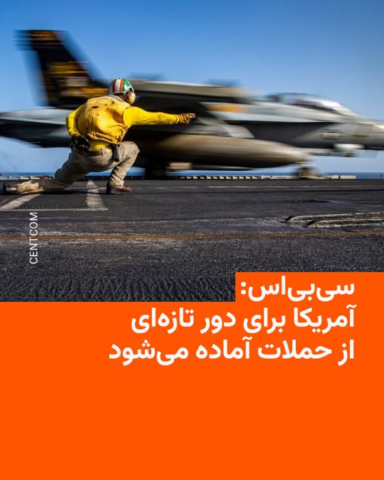

🔸شبکه سی‌بی‌اس در آمریکا بامداد شنبه دوم خرداد خبر داد که دولت دونالد ترامپ برای انجام دور تازه‌ای از حملات علیه ایران آماده می‌شود.

🔸این شبکه خبری به نقل از منابعی که به نام‌شان اشاره نکرد نوشت که تدارکات و آمادگی برای انجام حملات تازه روز جمعه انجام شده است.

🔸با این حال در این خبر آمده است که تا بعدازظهر روز جمعه به وقت آمریکا برای انجام قطعی حمله دوباره به خاک ایران تصمیمی گرفته نشده است.

🔸همزمان یک خبرنگار روزنامه آمریکایی وال استریت جورنال در گزارشی نوشت که رئیس جمهور آمریکا به همراه مشاورانش در زمینه امنیت ملی در ساعات پایانی روز جمعه جلسه‌ای داشته، اما تصمیمی قطعی در این جلسه گرفته نشده است.

🔸به نوشته این خبرنگار از کاخ سفید، ترامپ در جلسه موافق بوده است که دیپلماسی نیاز به زمان بیشتری دارد، و در عین حال مسئله بازگشت به جنگ نیز هم‌چنان روی میز است.

🔸پیشتر اسماعیل بقایی همین نکته را گفته بود: «اختلاف‌نظرها بین ایران و آمریکا آن‌قدر عمیق و زیاد است که نمی‌شود گفت با چندبار رفت‌وآمد یا مذاکرات ظرف چند هفته ما باید حتماً به نتیجه برسیم.»

@RadioFarda

## IranianMinds — post 20586

  

🔴 به گزارش نیویورک پست محمد باقر السعدی، از فرماندهان کتائب حزب‌الله عراق که اخیراً در آمریکا دستگیر و متهم شده، طرح ترور ایوانکا ترامپ، دختر رئیس‌ جمهور آمریکا، را داشته است.

هدف او انتقام از قتل قاسم سلیمانی در سال ۲۰۲۰ بود ، و مدارکی‌ وجود دارد که احتمال میدهد سپاه پاسداران هم در این موضوع نقش داشته !

السعدی نقشه خانه فلوریدای ایوانکا و همسرش، جرد کوشنر، را داشت.

@IranianMinds

## IranianMinds — post 20585

  <a href="telegram/content/IranianMinds_20585_1779521464.mp4" target="_blank">🎬 Download video</a>

🔴 وضعیت این روزای ترامپ:

@IranianMinds

## IranianMinds — post 20584

  <a href="telegram/content/IranianMinds_20584_1779521465.mp4" target="_blank">🎬 Download video</a>

🔴 ترامپ: اخراج استیون کولبرت از CBS «آغاز پایان» مجریان تلویزیون شبانه بی‌استعداد، بدجنس، پول‌پرست، خنده‌دار نبودن و با رتبه پایین است. بقیه کم‌استعدادها هم به زودی دنبال می‌شوند. روح همه‌شان شاد! @IranianMinds

## IranianMinds — post 20583

  

🔴 پست جدید ترامپ :

سلام گرینلند!

@IranianMinds

## BBCPersian — post 281856

  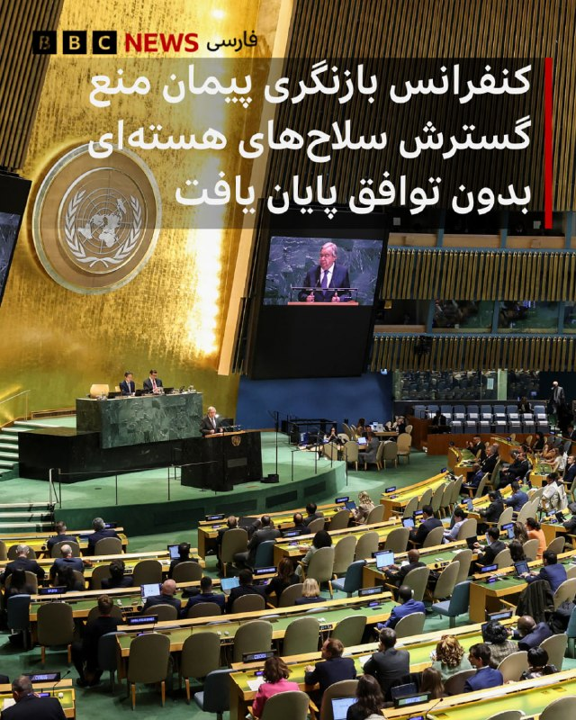

🔻رئیس کنفرانس بازبینی معاهده منع معاهده منع گسترش سلاح‌های هسته‌ای (ان‌پی‌تی)، گفته است که گفت‌وگوهای مربوط به تأکید دوباره بر اهداف منع گسترش سلاح‌های هسته‌ای، پس از چهار هفته به نتیجه‌ای نرسید. این در حالی است که از ابتدا هم امید کمی به موفقیت این مذاکرات وجود داشت.

دو هونگ ویت از ویتنام که ریاست این کنفرانس را برعهده داشت، گفت: «با وجود تمام تلاش‌های ما، برداشت من این است که این کنفرانس در موقعیتی نیست که بتواند درباره موضوعات اصلی به توافق برسد.»

او افزود: «قصد ندارم این سند را برای تصویب ارائه کنم.»

مذاکره‌کنندگان در بحبوحه نگرانی‌ها از آغاز دوباره رقابت تسلیحاتی، در حال بازبینی پیمان منع گسترش سلاح‌های هسته‌ای (ان‌پی‌تی)، سنگ‌بنای کنترل تسلیحات هسته‌ای، بودند.

این کنفرانس دیروز در مقر سازمان ملل در نیویورک به پایان رسید.

بازبینی‌های پیشین این پیمان در سال‌های ۲۰۱۵ و ۲۰۲۲ هم بی‌نتیجه مانده بود.
ادامه مطلب⬇️

📸AFP via Getty Images
https://bbc.in/3Pxbfmv
@BBCPersian

## BBCPersian — post 281846

🖋تیم ویول و یاکوب پوهل
بی‌بی‌سی

در جریان نخستین دوره بازداشت جفری اپستین، که شامل محکومیت ۱۳ ماهه به اتهام درخواست رابطه جنسی از یک دختر زیر سن قانونی بود، اسناد زندان نشان می‌دهد که دست‌کم یک زن ۶۷ بار به ملاقات او رفته است.

آن زن نادیا مارچینکو بود. او به‌مدت هفت سال شریک اصلی زندگی اپستین به‌شمار می‌رفت، مهم‌ترین فرد در زندگی او پس از گیلین مکسول و در سال‌های بعد به‌عنوان کمک‌خلبان در هواپیمای شخصی او نیز فعالیت می‌کرد.

نادیا مارچینکو در مقایسه با دیگر افراد مرتبط با این پرونده، برای افکار عمومی نسبتا ناشناخته است، اما ممکن است او به‌ زودی در کانون توجه قرار گیرد.
ادامه مطلب⬇️

📸GettyImages/ Reuters/ NurPhoto via Getty Images/ AFP via Getty Images/ Patrick McMullan via Getty Images
https://bbc.in/4umVuO0
@BBCPersian

## BBCPersian — post 281845

  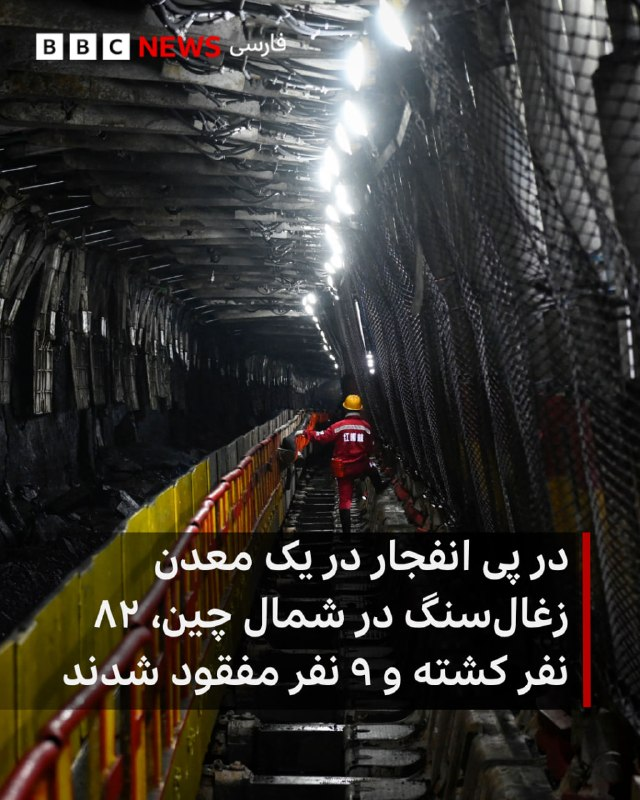

🔻به گزارش رسانه ‌دولتی چین، در پی انفجار در یک معدن زغال‌سنگ در شمال آن کشور دست‌کم ۸۲ نفر جان خود را از دست داده‌اند.

خبرگزاری دولتی شینهوا گفته است: «خبرنگاران از محل انفجار گاز در معدن زغال‌سنگ لیوشنیو متعلق به گروه تونگژو در استان شانشی مطلع شدند که این حادثه تاکنون ۸۲ کشته برجای گذاشته است.»

۹ معدنچی هنوز مفقود هستند. گفته می شود که احتمالا آن‌ها در شرایط وخیمی قرار دارند.

این انفجار دیروز در این معدن رخ داد.

گزارش‌ها حاکی است در زمان وقوع حادثه ۲۴۷ کارگر در محل مشغول به کار بودند.
عملیات امداد و نجات در محل همچنان ادامه دارد.

مقامات هماهنگ‌کننده عملیات می‌گویند که مدیران معدن توسط پلیس بازداشت شده‌اند.

شی جین‌پینگ، رئیس جمهور چین، خواستار تحقیقات کامل برای تعیین علت حادثه شد.

📸AFP via Getty Images عکس تزیینی
@BBCPersian

## BBCPersian — post 281844

🔻سازمان هواپیمایی ایران: فرودگاه‌های اهواز و ماهشهر از امروز بازگشایی می‌شود

سازمان هواپیمایی ایران اعلام‌کرد که فرودگاه‌های اهواز و ماهشهر از امروز شنبه، ۲ خرداد بازگشایی می‌شوند.

روابط عمومی این سازمان می‌گوید که با «تکمیل موفقیت‌آمیز فرآیند ارزیابی‌ها، این دو فرودگاه به چرخه عملیاتی کشور بازخواهند گشت و تمامی شرکت‌های هواپیمایی می‌توانند پروازهای عادی خود را در این مسیرها از سر بگیرند.»

دو روز پیش حمدرضا موالی‌زاده استاندار خوزستان گفته بود که مجوز نهایی برای عملیاتی شدن مجدد فرودگاه بین‌المللی اهواز، صادر شده است.

آقای موالی‌زاده همچنین گفت که با تلاش مدیریت فرودگاه‌های استان و تیم‌های فنی، تمامی آسیب‌های ناشی از حملات هوایی آمریکا و اسرائیل «به سرعت بازسازی، تعمیر و ایمن‌سازی شده است.»

این سازمان ابراز امیدواری کرده است که «پس از ارزیابی امنیتی و ایمنی به تدریج سایر فرودگاه‌های ایران نیز به چرخه عملیاتی» اضافه شوند.

https://bbc.in/4tP59vG
@BBCPersian

## BBCPersian — post 281843

  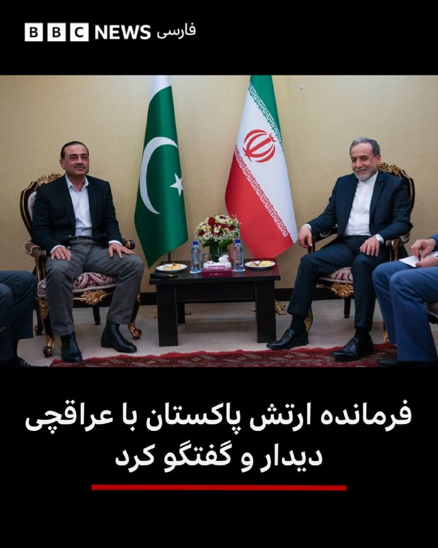

🔻فیلد مارشال عاصم منیر، فرمانده ارتش پاکستان که به تهران سفر کرده با عباس عراقچی، وزیر خارجه ایران دیدار و گفتگو کرده است.

به گزارش منابع خبری در ایران در این گفت‌‌گوها که تا پاسی از شب گذشته ادامه داشت، دو طرف درباره آخرین تلاش‌های دیپلماتیک برای خاتمه جنگ و همچنین درباره راه‌های تقویت صلح و امنیت در منطقه غرب آسیا گفت‌و‌گو کردند.

این دومین سفر آقای منیر در چند هفته گذشته به ایران است.

وزیر کشور پاکستان هم برای دومین بار در چند روز گذشته به تهران رفته و در حال گفت‌وگو با مقامات ایرانی است.

📸TASNIM
https://bbc.in/4fCcg7e
@BBCPersian

## Dirty_Kids — post 389994

لطفا تو پیام کتبی بعدی بگو از روی وویس چجوری لوکیشن لو میره.

@Dirty_Kids 👻

## Dirty_Kids — post 389993

  <a href="telegram/content/Dirty_Kids_389993_1779521469.mp4" target="_blank">🎬 Download video</a>

"رقصیدن ماده بوفالوی ولائی"

@Dirty_Kids 👻

## Dirty_Kids — post 389992

  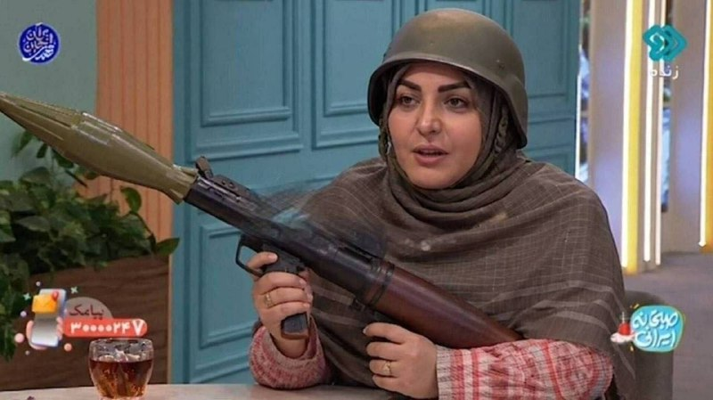

المیرا کصو

@Dirty_Kids 👻

## Dirty_Kids — post 389988

  <a href="telegram/content/Dirty_Kids_389988_1779521470.mp4" target="_blank">🎬 Download video</a>

یه چالش دیگه‌ای که جدیدا مد شده ولی در راستای همون چالش قبلی روسی یعنی «Booty transition» قرار داره؛

اینطوریه که مردم با آهنگ «Set me free» میان از خودشون فیلم میگیرن و یهو دوربین رو میبرن سمت باسن🍑 مبارکشون و ادامه ماجرا…

@Dirty_Kids 👻

## Hranews — post 113101

  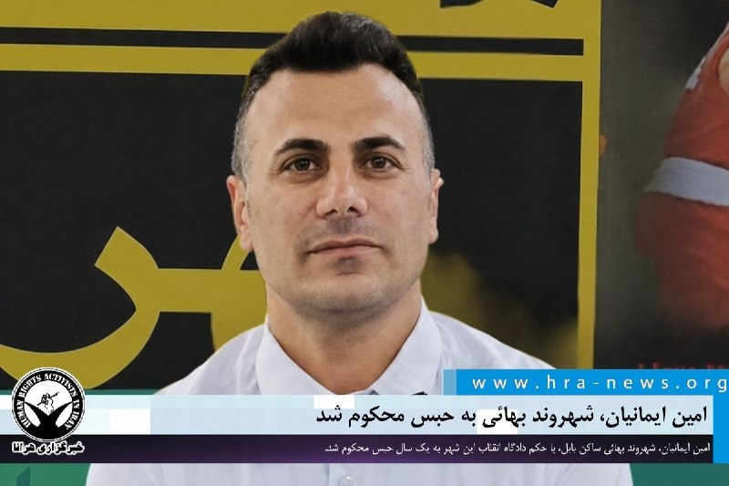

امین ایمانیان، شهروند بهائی به حبس محکوم شد

❗️
❗️
❗️
❗️
❗️– امین ایمانیان، شهروند بهائی ساکن بابل، با حکم دادگاه انقلاب این شهر به یک سال حبس محکوم شد.

به گزارش خبرگزاری هرانا، ارگان خبری مجموعه فعالان حقوق بشر در ایران، دادگاه انقلاب بابل یک شهروند بهائی را به حبس محکوم کرد.

بر اساس این حکم، امین ایمانیان توسط دادگاه مذکور از بابت اتهام تبلیغ علیه نظام به یک سال حبس محکوم شده است.

#امین_ایمانیان

ادامه مطلب

↘️
@hranews_bot تماس ✉️ - @Hranews کانال هرانا 🆑

## manototv — post 105752

  <a href="telegram/content/manototv_105752_1779521472.mp4" target="_blank">🎬 Download video</a>

فرانسه اعلام کرد پیش‌نویس قطعنامه‌ای را برای ارائه به شورای امنیت سازمان ملل تهیه کرده که هدف آن تشکیل یک مأموریت بین‌المللی به‌منظور بازگرداندن آزادی تردد در تنگه هرمز است. وزارت خارجه فرانسه گفته این طرح در صورت فراهم شدن شرایط می‌تواند مطرح شود.
هم‌زمان، پیش‌نویس قطعنامه مشترک آمریکا و بحرین درباره تنگه هرمز همچنان در شورای امنیت در حال بررسی است. این قطعنامه از ایران می‌خواهد حملات و مین‌گذاری در این آبراه را متوقف کند، اما رأی‌گیری درباره آن به دلیل احتمال وتوی روسیه و چین چندین بار به تعویق افتاده است.
مقام‌های فرانسوی اعلام کردند پاریس در هماهنگی با بریتانیا در حال بررسی ایجاد یک مأموریت بین‌المللی برای تضمین آزادی ناوبری در تنگه هرمز است. در همین حال، گزارش‌ها حاکی از آن است که آمریکا تلاش کرده حمایت ده‌ها کشور را برای پیشبرد قطعنا خود جلب کند

## manototv — post 105751

  <a href="telegram/content/manototv_105751_1779521472.mp4" target="_blank">🎬 Download video</a>

سازمان عملیات تجارت دریایی بریتانیا اعلام کرد یک قایق کوچک به یک نفتکش حامل فرآورده‌های نفتی در نزدیکی سواحل یمن نزدیک شده است.
بر اساس این گزارش، نفتکش در فاصله حدود ۲۰۰ مایل دریایی در غرب جزیره سقطری یمن قرار داشت و قایق نزدیک‌شونده پنج سرنشین داشته است.
این سازمان افزود پس از استقرار تیم امنیتی مسلح نفتکش، قایق مسیر خود را تغییر داد و از کشتی فاصله گرفت.

## manototv — post 105750

  <a href="telegram/content/manototv_105750_1779521473.mp4" target="_blank">🎬 Download video</a>

روزنامه نیویورک پست گزارش داد محمد باقر سعد داوود السعدی، تبعه ۳۲ ساله عراقی که گفته می‌شود آموزش‌های مرتبط با سپاه پاسداران دیده است، متهم به طراحی طرحی برای ترور ایوانکا ترامپ، دختر دونالد ترامپ، رئیس‌جمهوری آمریکا، شده است. طبق این گزارش، انگیزه این اقدام انتقام‌گیری از کشته شدن قاسم سلیمانی عنوان شده است.
بر اساس این گزارش، السعدی متهم است که پس از کشته‌شدن قاسم سلیمانی، فرمانده پیشین نیروی قدس سپاه، خانواده ترامپ را هدف قرار داده و حتی نقشه محل اقامت ایوانکا ترامپ در فلوریدا را در اختیار داشته است. منابع می‌گویند او پیش‌تر نیز تهدیدهایی در این رابطه مطرح کرده بود.
نیویورک پست به نقل از انتفاض قنبر، معاون پیشین وابسته نظامی سفارت عراق در واشینگتن، نوشت السعدی به اطرافیانش گفته بود: «باید ایوانکا را بکشیم تا خانه ترامپ را همان‌طور به آتش بکشیم که او خانه ما را به آتش کشید.» همچنین گفته می‌شود او در شبکه اجتماعی ایکس پیام‌هایی با محتوای تهدیدآمیز منتشر کرده بود.
السعدی روز ۱۵ مه در ترکیه بازداشت و به آمریکا منتقل شد. وزارت دادگستری آمریکا او را از چهره‌های مرتبط با شبکه‌های تروریستی عراق و جمهوری اسلامی معرفی کرده و اعلام کرده است که او با اتهام دست داشتن در ۱۸ حمله و اقدام به حمله در اروپا و آمریکا روبه‌رو است.

## manototv — post 105749

  <a href="telegram/content/manototv_105749_1779521473.mp4" target="_blank">🎬 Download video</a>

روزنامه وال‌استریت ژورنال به نقل از مقام‌های آمریکایی گزارش داد دونالد ترامپ، رئیس‌جمهوری آمریکا، در حال حاضر گزینه اقدام نظامی علیه جمهوری اسلامی را به‌طور کامل کنار نگذاشته و در صورت شکست مذاکرات، احتمال صدور دستور حملات نظامی علیه جمهوری اسلامی همچنان وجود دارد.
بر اساس این گزارش، ترامپ روز جمعه در دیداری با کارکنان خود گفته است که با ادامه مذاکرات با ایران، ترجیح می‌دهد به مسیر دیپلماسی زمان بیشتری داده شود. به گفته مقام‌های آمریکایی، او با وجود ادامه تنش‌ها همچنان به دستیابی به راه‌حلی از مسیر مذاکره علاقه‌مند است.
این گزارش می‌افزاید رئیس‌جمهوری آمریکا هنوز تصمیم نهایی خود را نگرفته، اما در حال حاضر بیشتر به ادامه تلاش‌های دیپلماتیک تمایل دارد، در حالی که گزینه‌های نظامی همچنان روی میز باقی مانده‌اند.

## alonews — post 121940

برخی شایعات حاکی از آن است که سفارت آمریکا درخواست ویزای شجاع خلیل‌زاده، مهدی طارمی و احسان حاج‌صفی را رد کرده است

@AloSport

## alonews — post 121939

  <a href="telegram/content/alonews_121939_1779521474.webm" target="_blank">🎬 Download video</a>

👈چهار عضو کابینه ترامپ که در سه ماه گذشته از سمت خود کناره‌گیری کرده‌اند، همگی زن هستند:

🔴تولسی گابارد، مدیر اطلاعات ملی آمریکا

🔴کریستی نوم، وزیر امنیت داخلی

🔴پم باندی، وزیر دادگستری

🔴لوری چاوز-درمر، وزیر کار

✅ @AloNews خبر جنگ

## alonews — post 121938

  <a href="telegram/content/alonews_121938_1779521474.webm" target="_blank">🎬 Download video</a>

👈پست جدید ترامپ در تروث سوشال

✅ @AloNews خبر جنگ

## alonews — post 121937

  <a href="telegram/content/alonews_121937_1779521474.webm" target="_blank">🎬 Download video</a>

👈سردار طلایی‌نیک: تنها راه خروج از جنگ، تأمین مطالبات ایران است و تمکین نکردن، شکست‌های بیشتری برای آمریکا رقم می‌زند

✅ @AloNews خبر جنگ

## alonews — post 121936

  <a href="telegram/content/alonews_121936_1779521474.webm" target="_blank">🎬 Download video</a>

👈دولت سنگال منحل شد

🔴رئیس جمهور سنگال در شرایط پرتنش این کشور و در پی بالا گرفتن اختلافات با دولت، نخست وزیر متحد و حامی سابق خود را برکنار و دولت را منحل کرد.

✅ @AloNews خبر جنگ

## alonews — post 121935

  <a href="telegram/content/alonews_121935_1779521475.webm" target="_blank">🎬 Download video</a>

👈کانال ۱۲ اسرائیل: درنهایت برآورد اسرائیل اینه که هیچ توافقی انجام نخواهد شد و ارتش دفاعی اسرائیل برای شروع موج جدیدی از حملات به ایران طی روزای آینده آماده می‌شه

✅ @AloNews خبر جنگ

## alonews — post 121934

  <a href="telegram/content/alonews_121934_1779521475.webm" target="_blank">🎬 Download video</a>

👈الجزیره: اولین نفتکش تحت مدیریت ژاپن که از تنگه هرمز عبور کرده، به‌ زودی در این کشور پهلو می‌گیرد

🔴 این نفتکش با پرچم پاناما به نام «ایدهمیتسو مارو» قرار است روز دوشنبه به یک پالایشگاه در استان آیچی ژاپن برسد. به گزارش اناچکی، این کشتی حامل حدود دو میلیون بشکه نفت خام عربستان سعودی است.

✅ @AloNews خبر جنگ

## alonews — post 121933

  <a href="telegram/content/alonews_121933_1779521475.webm" target="_blank">🎬 Download video</a>

👈گزارش الجزیره از معادله جدید در تنگه هرمز

🔴عبور کشتی‌ها منوط به هماهنگی با تهران؛ بهای خدمات به بیت‌کوین!

✅ @AloNews خبر جنگ

## alonews — post 121932

  <a href="telegram/content/alonews_121932_1779521475.webm" target="_blank">🎬 Download video</a>

👈 معاریو:‌ حزب‌الله در حال تکرار تاکتیک‌های قدیمی است؛ نیرویی از دو واحد ویژه این هفته در نزدیکی رودخانه لیتانی عملیات انجام داد.

🔴آنها با نیروهای ما جنگیدند، آنها را زیر نظر داشتند، مسیر حرکت آنها را به درستی تحلیل کردند و یک وسیله انفجاری را جاسازی و هنگام مشاهده نیروها آن را منفجر کردند. چهار سرباز زخمی شدند.

🔴کپی برابر اصل از جنگ چریکی که حزب‌الله علیه ارتش اسرائیل در جنوب لبنان در دوره منطقه امنیتی ۱۹۸۵ - ۲۰۰۰، انجام داد.

✅ @AloNews خبر جنگ

## alonews — post 121929

  <a href="telegram/content/alonews_121929_1779521475.webm" target="_blank">🎬 Download video</a>

👈یک هلیکوپتر مدل MH-60S نیروی دریایی آمریکا با فراخوان RESCU11 بر فراز خلیج عمان مشاهده شد. ‏ممکن است ماموریت نجات باشد. (این هلیکوپتر متعلق به یکی از کشتی‌های جنگی مستقر در دریای عمان است)

✅ @AloNews خبر جنگ

## alonews — post 121928

  <a href="telegram/content/alonews_121928_1779521475.webm" target="_blank">🎬 Download video</a>

👈تماس تلفنی وزرای خارجه ایران و عمان

✅ @AloNews خبر جنگ

## alonews — post 121927

  <a href="telegram/content/alonews_121927_1779521476.mp4" target="_blank">🎬 Download video</a>

👈شبکه CBS به نقل از چند منبع آگاه از برنامه‌ریزی‌های نظامی اعلام کرد که دولت ترامپ در حال آماده شدن برای دور جدیدی از حملات علیه ایران است، هرچند هنوز به تصمیم نهایی نرسیده‌اند

✅ @AloNews خبر جنگ

## alonews — post 121926

  <a href="telegram/content/alonews_121926_1779521477.webm" target="_blank">🎬 Download video</a>

👈دیوید تیلور، نماینده پارلمان بریتانیا با اشاره به تأثیرگذاری شبکه پرس‌تی‌وی در بریتانیا، خواستار اعمال تحریم‌های مالی علیه شبکه‎‌های پرس‌تی‌‌وی و هیسپن‌تی‌وی شد.

✅ @AloNews خبر جنگ

## alonews — post 121925

  <a href="telegram/content/alonews_121925_1779521477.webm" target="_blank">🎬 Download video</a>

👈یزدی خواه، نماینده مجلس اعلام کرده که فعلاً اینترنت بازگشایی نمی‌شود و بیش از ۹۰ درصد نیازهای مردم در فضای فعلی برآورده می‌شود؛ دسترسی به اینترنت بین‌الملل فقط برای گروه‌های خاص مانند شرکت‌های صادراتی، موسسات علمی و پژوهشی باز شده است.

✅ @AloNews خبر جنگ

## alonews — post 121924

  <a href="telegram/content/alonews_121924_1779521478.mp4" target="_blank">🎬 Download video</a>

👈معاون رئیس دفتر کاخ سفید و دستیار ترامپ، دن اسکاوینو، ویدیویی از بمب‌افکن‌های مخفی‌کار B-2 را بدون هیچ زمینه‌ای منتشر کرد.

✅ @AloNews خبر جنگ

## alonews — post 121923

  <a href="telegram/content/alonews_121923_1779521479.webm" target="_blank">🎬 Download video</a>

👈فعال شدن آژیرها در کریات شمونا

✅ @AloNews خبر جنگ

## alonews — post 121922

  <a href="telegram/content/alonews_121922_1779521479.webm" target="_blank">🎬 Download video</a>

👈روبیو وارد هند شد

✅ @AloNews خبر جنگ

## alonews — post 121920

  <a href="telegram/content/alonews_121920_1779521479.webm" target="_blank">🎬 Download video</a>

👈محمدباقر السعدی، فرمانده ارشد گردان‌های حزب‌الله عراق، قصد داشت به ایوانکا ترامپ، دختر رئیس‌جمهور آمریکا برای انتقام ترور قاسم سلیمانی حمله کند. او نقشه خانه ایوانکا در فلوریدا را در اختیار داشت. السعدی اخیراً در ترکیه بازداشت شده و در آمریکا علیه او کیفرخواست صادر شده است

✅ @AloNews خبر جنگ

---
📅 بروزرسانی: 1405/03/02 08:31
---

## VahidOOnLine — post 241648

  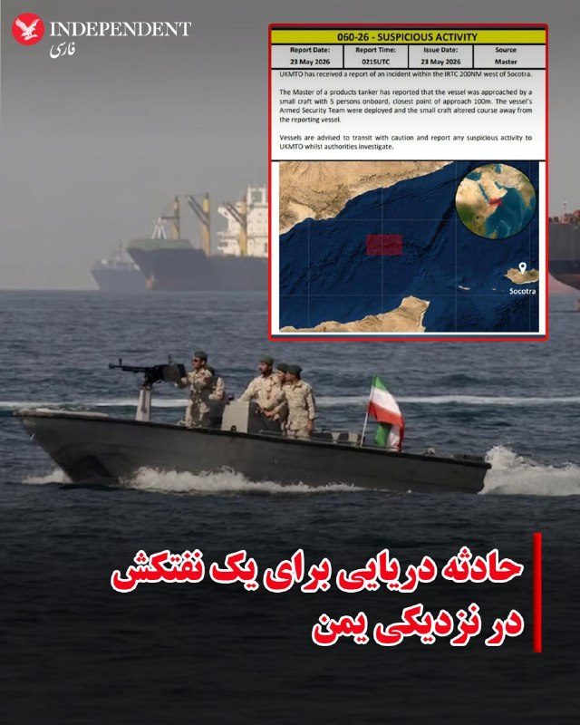

♦️سازمان عملیات تجارت دریایی بریتانیا (UKMTO) اعلام کرد یک قایق کوچک حامل پنج سرنشین به یک نفتکش حامل فرآورده‌های نفتی در غرب جزیره سقطری یمن نزدیک شده است.
بر اساس اعلام این نهاد، این نفتکش در فاصله حدود ۳۷۰ کیلومتری در غرب جزیره سقطری در حال حرکت بود که قایق مذکور به آن نزدیک شد.
سازمان عملیات تجارت دریایی بریتانیا افزود تیم امنیتی مسلح مستقر روی نفتکش وارد عمل شد و در پی آن، قایق مسیر خود را تغییر داد و از نفتکش دور شد.
جزئیات بیشتری درباره هویت افراد حاضر در قایق یا انگیزه نزدیک شدن آن‌ها منتشر نشده است.
‌🇸🇦 Indypersian

🤖 @VahidOOnLine

## VahidOOnLine — post 241647

  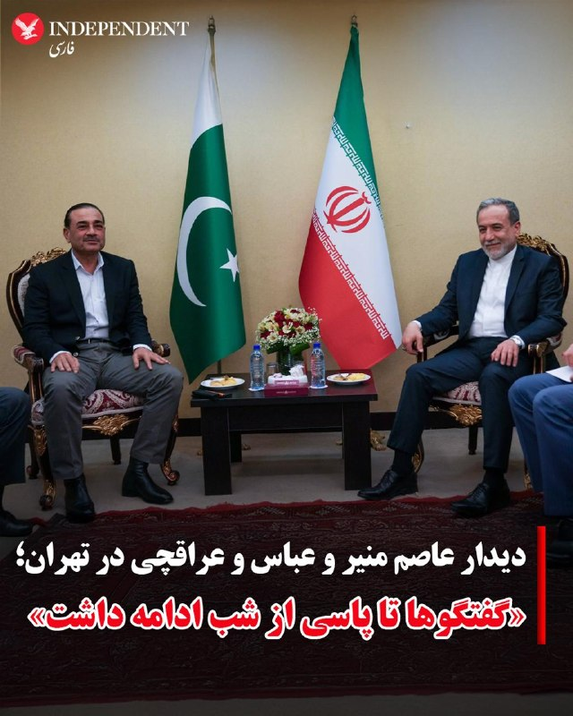

♦️فیلد مارشال عاصم منیر، فرمانده ارتش پاکستان که برای رایزنی با مقام‌های جمهوری اسلامی ایران به تهران سفر کرده است، روز جمعه یکم خرداد ماه با عباس عراقچی دیدار کرد.

به گزارش کانال اطلاع‌رسانی وزارت امور خارجه در تلگرام، در این دیدار که «تا پاسی از شب ادامه داشت، طرفین درباره آخرین تلاشها و ابتکارات دیپلماتیک برای جلوگیری از تشدید تنش و خاتمه جنگ و همچنین راهکارهای تقویت صلح، ثبات و امنیت در منطقه غرب آسیا تبادل نظر کردند.»
فرمانده ارتش پاکستان، روز جمعه در جریان تلاش‌های اسلام‌آباد برای جلوگیری از جنگ و برقراری توافق میان تهران و واشگتن، وارد ایران شده است.
‌🇸🇦 Indypersian

🤖 @VahidOOnLine

## VahidOOnLine — post 241646

  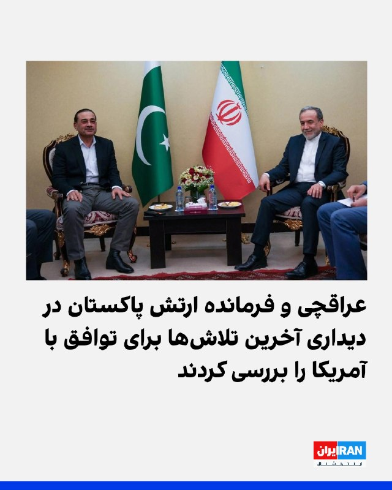

عراقچی و عاصم منیر، فرمانده ارتش پاکستان، در دیداری در تهران درباره آخرین تلاش‌های دیپلماتیک برای پایان جنگ ایران و مسائل امنیتی غرب آسیا گفت‌وگو کردند. منیر جمعه در چارچوب تلاش‌ها برای دستیابی به توافقی میان جمهوری اسلامی و آمریکا وارد تهران شد.
‌🏁 🇬🇧 IranintlTV

🤖 @VahidOOnLine

## VahidOOnLine — post 241645

  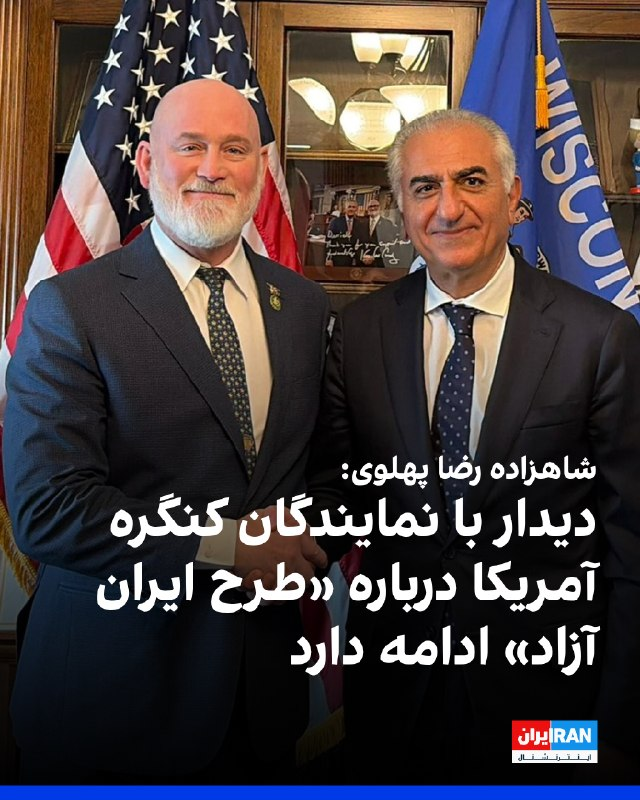

شاهزاده رضا پهلوی در پیامی در ایکس با اشاره به دیدارش با دریک ون اوردن، عضو جمهوری‌خواه مجلس نمایندگان آمریکا، در کنگره، بر عزم خود برای ادامه رایزنی‌هایش در کنگره آمریکا درباره «طرح ایران آزاد» تاکید کرد.
شاهزاده پهلوی تاکید کرد «طرح ایران آزاد» می‌تواند پیامدهای مثبتی برای آمریکا و جهان داشته باشد.
او با انتشار تصاویری از دیدار خود با دریک ون اوردن گفت این قانون‌گذار آمریکایی از نزدیک با «رفتارهای جمهوری اسلامی علیه ایرانیان و آمریکایی‌ها» آشناست.

‌🏁 🇬🇧 IranintlTV

🤖 @VahidOOnLine

## VahidOOnLine — post 241644

♦️به گزارش رویترز، جمعه‌شب، اول خردادماه، بیست‌وسومین دوره جشنواره سالانه «ویوید سیدنی» آغاز شد و به‌رغم بارش شدید باران، سالن اپرای سیدنی و دیگر بناهای نمادین این شهر را غرق در رنگ و نور کرد. در شب افتتاحیه این رویداد، بادبان‌های اپرای سیدنی میزبان اثر گرافیکی هنرمند فرانسوی با الهام از حیات وحش بودند و هم‌زمان، نمای موزه هنرهای معاصر و ساختمان گمرک نیز با طرح‌های هندسی و الگوهای برگرفته از طبیعت سراسر جهان نورباران شدند. این جشنواره بزرگ هنر و فناوری که پایتخت ساحلی استرالیا را دگرگون کرده است، به مدت ۲۳ روز ادامه دارد و در ۲۳ خرداد (۱۳ ژوئن) به کار خود پایان می‌دهد.
‌🇸🇦 Indypersian

🤖 @VahidOOnLine

## VahidOOnLine — post 241643

  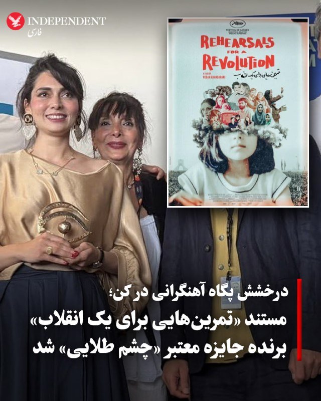

♦️فیلم «تمرین‌هایی برای یک انقلاب» به کارگردانی پگاه آهنگرانی، بازیگر و فیلم‌ساز ایرانی، جایزه معتبر «چشم طلایی» (L'Oeil d'or) را به عنوان بهترین مستند هفتادونهمین دوره جشنواره فیلم کن از آن خود کرد. این مستند که به بررسی چندین دهه سرکوب سیاسی در ایران در قالب شش فصل از زندگی کارگردان می‌پردازد، توسط هیئت داورانی به ریاست مستیسلاف چرنوف، کارگردان برنده اسکار، از میان ۲۱ اثر انتخاب شد؛ هیئت داوران در بیانیه خود ساختار شاعرانه، فیلم‌نامه استادانه و روایت زنده و فوری فیلم از امواج خروشان تاریخ را ستودند. پگاه آهنگرانی هنگام دریافت این جایزه پنج هزار یورویی در حضور تیری فرمو، دبیر جشنواره، جایزه خود را به مردم ایران تقدیم کرد و در گفتگو با رسانه‌ها ابراز امیدواری کرد که این دستاورد بزرگ بتواند به دیده شدن هرچه بیشتر مبارزات مردم ایران برای آزادی و دموکراسی کمک کند.
‌🇸🇦 Indypersian

🤖 @VahidOOnLine

## VahidOOnLine — post 241642

♦️وزیر امور خارجه ایالات متحده روز شنبه، دوم خردادماه، در آغاز سفری رسمی وارد هند شد. مارکو روبیو که به همراه همسرش، جنت دوسدبس روبیو، مستقیم از سوئد و پس از شرکت در نشست وزرای ناتو در هلسینگبوری عازم هند شد، در فرودگاه مورد استقبال سرجیو گور، سفیر ایالات متحده در دهلی‌نو، قرار گرفت. به گزارش رویترز، بر اساس برنامه اعلام‌شده از سوی وزارت امور خارجه آمریکا، روبیو در ادامه این سفر چهار روزه عازم دهلی‌نو خواهد شد تا با نارندرا مودی، نخست‌وزیر هند، دیدار و گفتگو کند؛ ماموریتی کلیدی که هدف اصلی آن ترمیم روابط دوجانبه‌ای است که به دلیل سیاست‌های تعرفه‌ای دولت ترامپ و نزدیکی مجدد واشنگتن به رقبای دهلی‌نو یعنی پاکستان و چین، با چالشی جدی روبه‌رو شده است.
‌🇸🇦 Indypersian

🤖 @VahidOOnLine

## VahidOOnLine — post 241641

  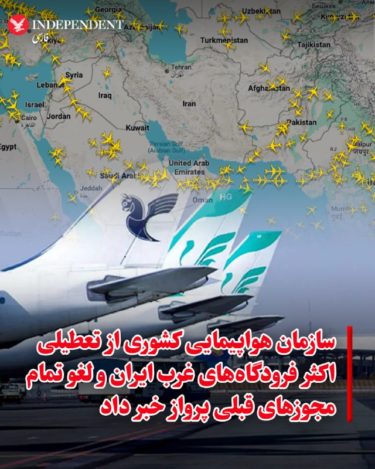

♦️سازمان هواپیمایی کشوری روز جمعه، با صدور اطلاعیه هوانوردی برای حریم هوایی ایران، اعلام کرد تمامی مجوزهای قبلی پروازهای مسافری در فرودگاه‌های بخش غربی منطقه اطلاعات پروازی تهران، از اول خرداد تا دوشنبه، چهارم خرداد‌، لغو شده و تنها هشت فرودگاه از جمله مهرآباد، خمینی، اصفهان و یزد مجاز به فعالیت هستند. براساس این تصمیم، این فرودگاه‌ها فقط از طلوع تا غروب آفتاب پذیرای پروازهای تجاری هستند و شرکت‌های هواپیمایی برای هرگونه پرواز باید مجوز جدید دریافت کنند.
‌🇸🇦 Indypersian

🤖 @VahidOOnLine

## VahidOOnLine — post 241640

♦️یک گاومیش «آلبینو» در بنگلادش به دلیل فرم خاص موهای طلایی، مورد توجه عمومی قرار گرفته و تصاویر آن در شبکه‌های اجتماعی بازتاب گسترده‌ای داشته است. به گزارش خبرگزاری فرانسه، مردم برای مشاهده این حیوان ۴ ساله به مزرعه‌ای در شهر «نارایان‌گانج» مراجعه می‌کنند. ضیاءالدین مریدا، مالک این گاومیش ۷۰۰ کیلویی، می‌گوید به دلیل شباهت مدل موی این گاومیش با رئیس‌جمهوری آمریکا، نام «دونالد ترامپ» برایش انتخاب شده است.
بر اساس این گزارش مالک این گاومیش اعلام کرد که هجوم بازدیدکنندگان و ازدحام جمعیت باعث شده است این حیوان دچار استرس شده و وزن کم کند؛ از این رو محدودیت‌هایی برای بازدید عمومی اعمال شده است. این گاومیش در روزهای آتی و همزمان با عید قربان ذبح خواهد شد.
‌🇸🇦 Indypersian

🤖 @VahidOOnLine

## VahidOOnLine — post 241639

  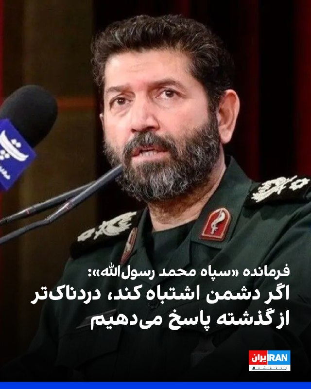

حسن حسن‌زاده، فرمانده سپاه «محمد رسول‌الله» تهران بزرگ، از نهادهای اصلی مسئول سرکوب اعتراضات در پایتخت، در یک مصاحبه تلویزیونی گفت: «اگر احیانا دشمن اشتباه کند، نیروهای مسلح سخت‌تر از گذشته، دردناک‌تر از گذشته و سهمگین‌تر از گذشته پاسخ سخت و پشیمان‌کننده و تمام‌کننده می‌دهند.»
‌🏁 🇬🇧 IranintlTV

🤖 @VahidOOnLine

## VahidOOnLine — post 241638

  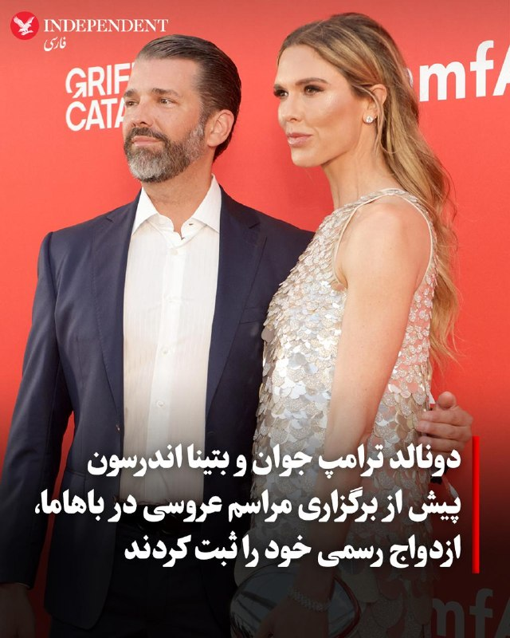

♦️به گزارش نیویورک پست، دونالد ترامپ جوان و بتینا اندرسون پیش از برگزاری مراسم عروسی در باهاما، ازدواج رسمی خود را ثبت کردند.
این زوج ۴۸ و ۳۹ ساله با ثبت سند رسمی ازدواج خود در «پالم بیچ» فلوریدا، پیوندشان را قانونی کردند. طبق گزارش‌ها، آن‌ها قصد دارند در تعطیلات آخر هفته، مراسمی خصوصی را در جزیره‌ای اختصاصی در باهاما برگزار کنند.
دونالد ترامپ، رئیس‌جمهور آمریکا، درباره احتمال حضورش در این مراسم کوچک گفته است که به دلیل جنگ در ایران، زمان مناسبی نیست، اما تلاش می‌کند در آن شرکت کند. او به شوخی گفته است: «اگر شرکت کنم کشته می‌شوم، اگر شرکت نکنم هم کشته می‌شوم.»
‌🇸🇦 Indypersian

🤖 @VahidOOnLine

## WithYashar — post 12104

بزرگترین نمایشگاه هوایی نظامی بریتانیا لغو شد، زیرا گزارش شده است که از این فرودگاه برای ماموریت‌های مرتبط(احتمالا حمله) با ایران استفاده می‌شود.
@withyashar

## WithYashar — post 12103

از دیشب تا الان نخوابیدم سربازم الانم دارم میرم سر شیفتم جنگ قبلی ام توی شیفتم شروع شد اموزشیمم جنگ 12 روزه بود دعا کنین زنده برگردم 🥲💔😂

## WithYashar — post 12102

از دیشب تا الان نخوابیدم سربازم الانم دارم میرم سر شیفتم جنگ قبلی ام توی شیفتم شروع شد اموزشیمم جنگ 12 روزه بود دعا کنین زنده برگردم 🥲💔😂

## WithYashar — post 12101

  <a href="telegram/content/WithYashar_12101_1779512485.mp4" target="_blank">🎬 Download video</a>

ویدیو مربوطه … 😬
@withyashar

## WithYashar — post 12100

لارا لومر از معتمد ترین افراد نزد ترامپ ، خبر آماده شدن آمریکا برای حملات دوباره رو ریتوییت کرده.
@withyashar

## WithYashar — post 12099

پست دن اسکاوینو از مشاوران ترامپ در شبکه اجتماعی X @withyashar

## WithYashar — post 12098

  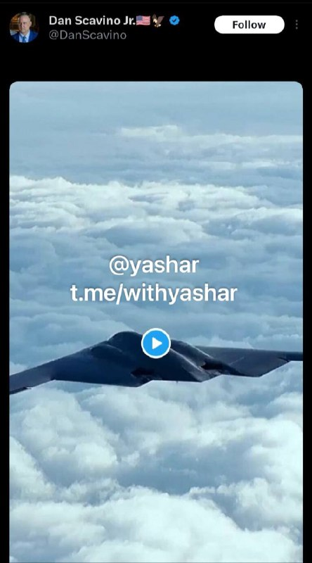

پست دن اسکاوینو از مشاوران ترامپ در شبکه اجتماعی X
@withyashar

## WithYashar — post 12097

تمام کنفرانس های خبری کاخ سفید لغو شد
@withyashar

## WithYashar — post 12096

خوب تا ۵ ایران نزد میریم برای ۹ صبح به بعد ، حالا خوابمم نمیبره 🥴🤣

## FoxNewsTwitter — post 342153

  <a href="telegram/content/FoxNewsTwitter_342153_1779512488.mp4" target="_blank">🎬 Download video</a>

Fox News (Twitter/X)

NEW VIDEO: Surveillance footage shows the moment a school bus carrying children crashes into a car at a busy Massachusetts intersection.

Officials say 11 children were on board the bus when the collision happened.

Nine children were taken to nearby hospitals for observation, but authorities say none of the injuries were serious.

The cause of the crash is under investigation.

## VahidOnline — post 75632

  

دولت دونالد ترامپ اعلام کرد که سیاست‌های مهاجرت به آمریکا تغییر می‌کند.

در یک تغییر اساسی در سیاست‌های مهاجرتی آمریکا، دولت این کشور اعلام کرد خارجی‌هایی که قصد دریافت اقامت دائم یا همان گرین کارت را دارند، باید خاک ایالات متحده را ترک و از طریق کنسولگری یا سفارت آمریکا اقدام نمایند.

زک کالر، سخنگوی دفتر مهاجرت دولت آمریکا، گفت که این سیاست «نیاز به یافتن و اخراج» کسانی را کاهش می‌دهد که درخواست اقامتشان رد شده است.

از سوی دیگر وکلای مهاجرت و گروه‌های امدادی می‌گویند که این تغییر احتمالا به «جدایی بیش‌ازپیش خانواده‌ها» منجر خواهد شد و قربانیان قاچاق انسان هم مجبور خواهند شد «به کشورهای خطرناکی بازگردند که از آن گریخته‌اند.»

این تغییر سیاست تازه‌ترین اقدام آقای ترامپ در محدود کرد مهاجرت به آمریکا است.
@VahidHeadline

📡 @VahidOnline

## IranIntlTV — post 338519

  

عراقچی و عاصم منیر، فرمانده ارتش پاکستان، در دیداری در تهران درباره آخرین تلاش‌های دیپلماتیک برای پایان جنگ ایران و مسائل امنیتی غرب آسیا گفت‌وگو کردند. منیر جمعه در چارچوب تلاش‌ها برای دستیابی به توافقی میان جمهوری اسلامی و آمریکا وارد تهران شد.
https://iranintl.com/202605235118

## IranIntlTV — post 338518

  

شاهزاده رضا پهلوی در پیامی در ایکس با اشاره به دیدارش با دریک ون اوردن، عضو جمهوری‌خواه مجلس نمایندگان آمریکا، در کنگره، بر عزم خود برای ادامه رایزنی‌هایش در کنگره آمریکا درباره «طرح ایران آزاد» تاکید کرد.
شاهزاده پهلوی تاکید کرد «طرح ایران آزاد» می‌تواند پیامدهای مثبتی برای آمریکا و جهان داشته باشد.
او با انتشار تصاویری از دیدار خود با دریک ون اوردن گفت این قانون‌گذار آمریکایی از نزدیک با «رفتارهای جمهوری اسلامی علیه ایرانیان و آمریکایی‌ها» آشناست.

https://iranintl.com/202605235387

## IranIntlTV — post 338517

  

حسن حسن‌زاده، فرمانده سپاه «محمد رسول‌الله» تهران بزرگ، از نهادهای اصلی مسئول سرکوب اعتراضات در پایتخت، در یک مصاحبه تلویزیونی گفت: «اگر احیانا دشمن اشتباه کند، نیروهای مسلح سخت‌تر از گذشته، دردناک‌تر از گذشته و سهمگین‌تر از گذشته پاسخ سخت و پشیمان‌کننده و تمام‌کننده می‌دهند.»
https://iranintl.com/202605235001

## FarsiVOA — post 218405

🔺گزارش نیویورک تایمز از اهداف احتمالی در صورت آغاز دوباره کارزار نظامی آمریکا علیه جمهوری اسلامی

◾️نیویورک تایمز جمعه شب در گزارشی نوشت که دونالد ترامپ، رئیس‌جمهوری آمریکا، صبح این روز (۱ خرداد) به همراه وزیر جنگ خود، پیت هگست، در دفتر بیضی کاخ سفید حضور داشت.

⬇️ بیشتر بخوانید:
https://ir.voanews.com/a/8153014.html
@FarsiVOA

## Persian_Trend_Official — post 14712

  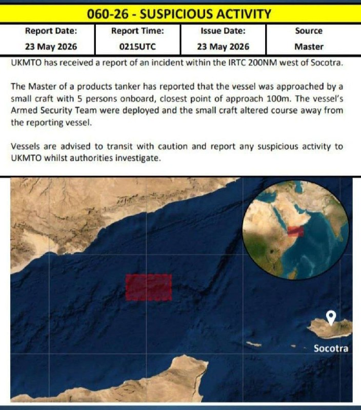

💢وقوع حادثه برای یک نفتکش نزدیک یمن

💢سازمان عملیات دریایی انگلیس امروز از دریافت گزارش‌هایی درباره حادثه امنیتی برای یک فروند نفتکش در آب‌های نزدیک جزیره «سقطری» خبر داد.

💢ناخدا یک نفتکش گزارش داده که کشتی توسط یک قایق کوچک حامل ۵ نفر در فاصله ۲۰۰ مایل دریایی غرب سوکوترا مورد قرار گرفته است. نزدیک‌ترین فاصله ۱۰۰ متر بوده.

💢تیم امنیت مسلح کشتی مستقر شد و قایق کوچک مسیر خود را تغییر داد و دور شد.

🫆:Tony

📌 @persian_trend_official
پرشین ترند | متفاوت‌ترین کانال نظامی

## Persian_Trend_Official — post 14711

  <a href="telegram/content/Persian_Trend_Official_14711_1779512492.webm" target="_blank">🎬 Download video</a>

تولسی گابارد رئیس اطلاعات ملی ايالات متحده آمریکا که دیروز استعفا داد. 📌 @persian_trend_official پرشین ترند | متفاوت‌ترین کانال نظامی

## Persian_Trend_Official — post 14710

  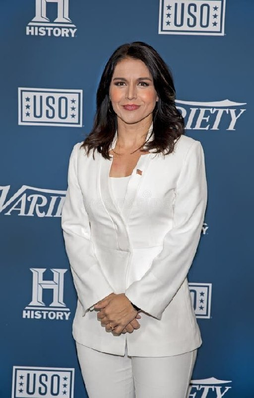

تولسی گابارد رئیس اطلاعات ملی ايالات متحده آمریکا که دیروز استعفا داد.

📌 @persian_trend_official
پرشین ترند | متفاوت‌ترین کانال نظامی

## Persian_Trend_Official — post 14709

  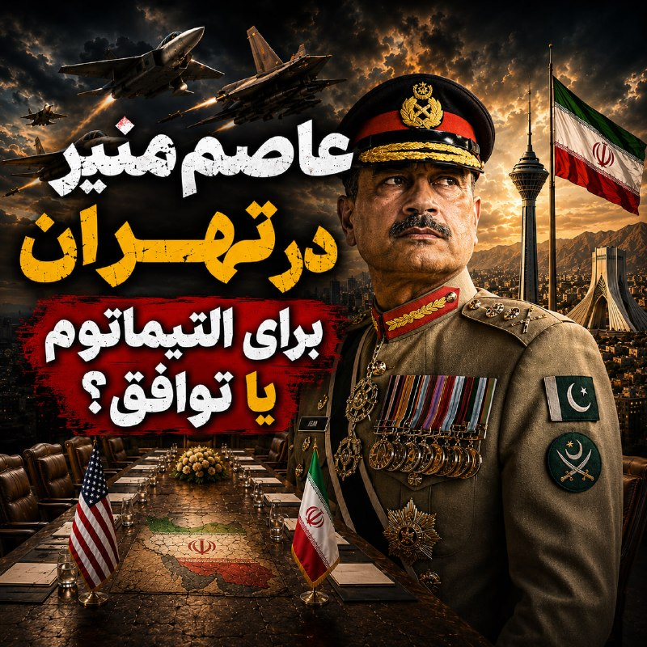

نسخه اسپاتیفای لایو دیشب :
https://open.spotify.com/episode/70QUNKnopM1uSLbBaXBi39?si=HwP7TUp5R22jaAYdynjUtw

## Persian_Trend_Official — post 14707

  <a href="telegram/content/Persian_Trend_Official_14707_1779512494.mp4" target="_blank">🎬 Download video</a>

🤑
🚀 انفجار مگاروکت اسپیس‌ایکس هنگام فرود
❌

دلیل اینکه این انفجارها زیاد دیده می‌شوند این است که اسپیس‌ایکس برخلاف روش سنتی ناسا، موشک‌ها را سریع آزمایش می‌کند، حتی اگر احتمال شکست بالا باشد؛ چون هدفش این است که با هر انفجار، داده جمع کند و طراحی را بهتر کند.

👩‍💻:@PhantomDirective

🆔:@persian_trend_official
پرشین ترند | متفاوت‌ترین کانال نظامی

## Persian_Trend_Official — post 14706

  

🔴نیویورک پست

♦️تبعه عراقی آموزش‌دیده سپاه می‌خواست ایوانکا ترامپ را به تلافی کشته‌شدن قاسم سلیمانی ترور کند

💢روزنامه «نیویورک‌پست» به نقل از منابع آگاه افشا کرد که ایوانکا ترامپ، دختر ۴۴ ساله دونالد ترامپ، هدف یک طرح ترور پیچیده از سوی یک تروریست تحت آموزش سپاه پاسداران انقلاب اسلامی قرار گرفته که با انگیزه انتقام‌جویی از کشته شدن قاسم سلیمانی طراحی شده بود.

💢بر اساس این گزارش، متهم که یک تبعه عراقی ۳۲ ساله به نام «محمد باقر سعد داوود الساعدی» است و به تازگی دستگیر شده، عهد کرده بود برای «به آتش کشیدن خانه ترامپ»، دختر رئیس‌جمهوری آمریکا را به قتل برساند.

🫆:Tony

📌 @persian_trend_official
پرشین ترند | متفاوت‌ترین کانال نظامی

## Persian_Trend_Official — post 14705

  <a href="telegram/content/Persian_Trend_Official_14705_1779512499.mp4" target="_blank">🎬 Download video</a>

صبحتون‌ بخیر ☕️🔥

📝 Nick
📌 @persian_trend_official
پرشین ترند | متفاوت‌ترین کانال نظامی

## Persian_Trend_Official — post 14704

  

🔴ترامپ تصویری از خود با گرینلند منتشر کرد

💢 رئیس جمهوری آمریکا در اقدامی جنجالی دیگر تصویری از خود را در فضای مجازی منتشر کرده که  دست وی را روی گرینلند نشان می دهد.

🫆:Tony

📌 @persian_trend_official
پرشین ترند | متفاوت‌ترین کانال نظامی

## Persian_Trend_Official — post 14703

💢نیروهای مسلح جمهوری اسلامی در بالاترین سطح آماده‌باش قرار گرفته‌اند.

▪️همزمان، فعالیت بالای جنگنده‌ها بر فراز کردستان عراق و همچنین فعالیت جنگنده‌های ایرانی در غرب ایران ثبت شده است. همچنین سطح بالایی از اختلال در سیستم GPS در امارات، قطر، کویت و ایران گزارش شده است.

🫆:Tony

📌 @persian_trend_official
پرشین ترند | متفاوت‌ترین کانال نظامی

## RadioFarda — post 157466

  

🔸رسانه‌ها در ایران از دیدار فیلد مارشال عاصم منیر، فرمانده ارتش پاکستان با عباس عراقچی، وزیر امور خارجه ایران در شامگاه شنبه یکم خرداد خبر دادند.

🔸بر اساس این خبر، دیدار این دو مقام تا پاسی از شب ادامه یافته و محور گفت‌وگوها «تلاش‌ها برای جلوگیری از تشدید تنش و خاتمه جنگ» و «راهکارهای تقویت صلح، ثبات و امنیت در منطقه غرب آسیا» بوده است.

🔸جزئیات بیشتری از این دیدار منتشر نشده است.

🔸برخی رسانه‌ها پیش از این، سفر عاصم منیر به تهران را نشانه «پیشرفت» مذاکرات دانسته بودند. در همین حال وزیر خارجه آمریکا نیز از برخی پیشرفت‌ها در گفت‌وگوهای آمریکا و ایران خبر داده و در عین حال افزوده بود که هنوز توافق نهایی نشده است.

🔸پاکستان از زمان برقراری آتش‌بس بعد از ۴۰ روز جنگ آمریکا و اسرائیل با ایران، در نقش میانجی ظاهر شده است.

@RadioFarda

## RadioFarda — post 157465

  <a href="https://t.me/radiofarda/157465" target="_blank">📎 Download file</a>

📻بشنوید: سرخط خبرها با رادیوفردا، دوم خرداد ۱۴۰۵‌

@RadioFarda

## IranianMinds — post 20582

  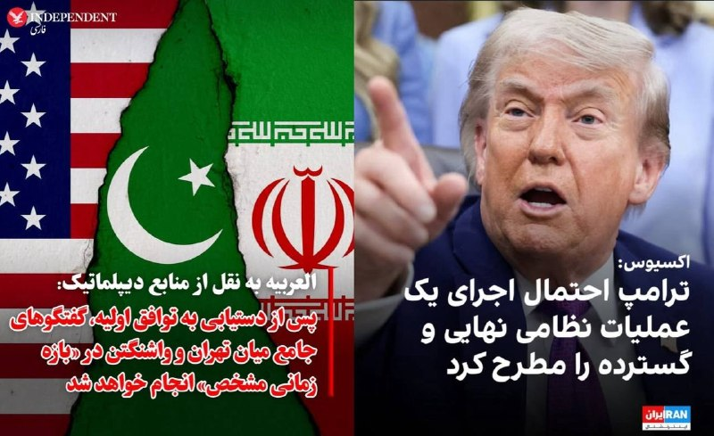

وضعیت رسانه ها :

@IranianMinds

## BBCPersian — post 281842

🔻بر اساس سندی داخلی که رویترز مشاهده کرده، از زمان آغاز جنگ ایران، ۲۷ کشور اقدام‌هایی را برای دسترسی سریع به منابع مالی موجود در برنامه‌های بانک جهانی آغاز کرده‌اند تا بتوانند با پیامدهای بحران مقابله کنند.

این سند نام کشورها یا میزان دقیق منابع مالی درخواستی را ذکر نکرده و بانک جهانی نیز از اظهارنظر در این باره خودداری کرده است.

بر اساس این گزارش، سه کشور از زمان آغاز درگیری‌ها در ۲۸ فوریه ابزارهای جدید مالی را تصویب کرده‌اند و بقیه کشورها همچنان در حال تکمیل روند اداری هستند.

جنگ و اختلال ناشی از آن در بازار جهانی انرژی، زنجیره‌های تامین را تحت فشار قرار داده و مانع ارسال محموله‌های حیاتی کود شیمیایی به کشورهای در حال توسعه شده است.

مقام‌های کنیا و عراق تایید کرده‌اند که برای مقابله با پیامدهای جنگ، از جمله افزایش شدید قیمت سوخت در کنیا و کاهش گسترده درآمدهای نفتی عراق، به دنبال دریافت حمایت مالی فوری از بانک جهانی هستند.

این ۲۷ کشور بخشی از ۱۰۱ کشوری هستند که به نوعی از سازوکارهای تامین مالی اضطراری بانک جهانی دسترسی دارند؛ از جمله ۵۴ کشوری که به برنامه «واکنش سریع» پیوسته‌اند و می‌توانند تا ۱۰ درصد منابع مالی تخصیص‌نیافته خود را در شرایط بحران استفاده کنند.

آجی بانگا، رئیس بانک جهانی، ماه گذشته گفته بود ابزارهای بحران این نهاد امکان دسترسی کشورها به حدود ۲۰ تا ۲۵ میلیارد دلار منابع مالی را فراهم می‌کند.

او افزود که بانک جهانی می‌تواند با تغییر اولویت بخشی از پروژه‌های خود، این رقم را طی شش ماه به ۶۰ میلیارد دلار و در بلندمدت به حدود ۱۰۰ میلیارد دلار برساند.

در همان زمان، کریستالینا جورجیوا، رئیس صندوق بین‌المللی پول، گفته بود که انتظار دارد تا حدود ۱۲ کشور برای دریافت ۲۰ تا ۵۰ میلیارد دلار کمک فوری درخواست بدهند، اما به گفته سه منبع آگاه، تاکنون درخواست‌های اندکی ثبت شده است.

https://bbc.in/4dAln5O
@BBCPersian

## BBCPersian — post 281841

🔻مارکو روبیو، وزیر خارجه آمریکا، امروز برای سفری چهارروزه وارد هند می‌شود؛ سفری که در بحبوحه بحران جهانی انرژی ناشی از جنگ ایران انجام می‌شود.

انتقال انرژی از طریق تنگه هرمز تقریبا متوقف شده است، آبراه باریکی که پس از حملات اسرائیل و آمریکا به ایران به کانون تنش تبدیل شده است.

ایران از بسته شدن این تنگه به‌عنوان اهرم فشار در مذاکرات شکننده صلح با آمریکا استفاده کرده است.

هند که بیش از ۸۰ درصد نیاز انرژی خود را وارد می‌کند، از جمله کشورهایی است که بیشترین آسیب را دیده‌اند؛ زیرا زندگی روزمره جمعیت بیش از یک میلیارد و ۴۰۰ میلیون نفری آن به واردات سوخت، از جمله گاز مایع و فرآورده‌های نفتی، وابسته است.

پیشتر آقای روبیو به چالش‌های پیش‌روی سومین اقتصاد بزرگ آسیا اشاره کرد و گفت: «ما می‌خواهیم هر میزان انرژی که هند مایل به خرید آن باشد، به آن کشور بفروشیم. همان‌طور که می‌بینید، تولید و صادرات انرژی آمریکا در سطوح تاریخی قرار دارد.»

در دهلی‌نو نیز تمایل برای افزایش واردات انرژی از آمریکا وجود دارد چراکه این موضوع می‌تواند به کاهش مازاد تجاری هند با آمریکا کمک کند، مسئله‌ای که همواره موجب نارضایتی دونالد ترامپ بوده است.

کسری تجاری آمریکا با هند در سال ۲۰۲۵ به ۵۸ میلیارد و ۲۰۰ میلیون دلار رسید که نسبت به سال قبل ۲۷/۱ درصد افزایش نشان می‌دهد.

با این حال، کارشناسان می‌گویند که جایگزینی کمبود فعلی انرژی هند با واردات از آمریکا راه‌حل ساده‌ای نیست چون که انتقال انرژی از آمریکا به هند طولانی‌تر و پرهزینه‌تر است و از نظر اقتصادی نیز چندان منطقی به نظر نمی‌رسد.

https://bbc.in/4dAln5O
@BBCPersian

## BBCPersian — post 281839

  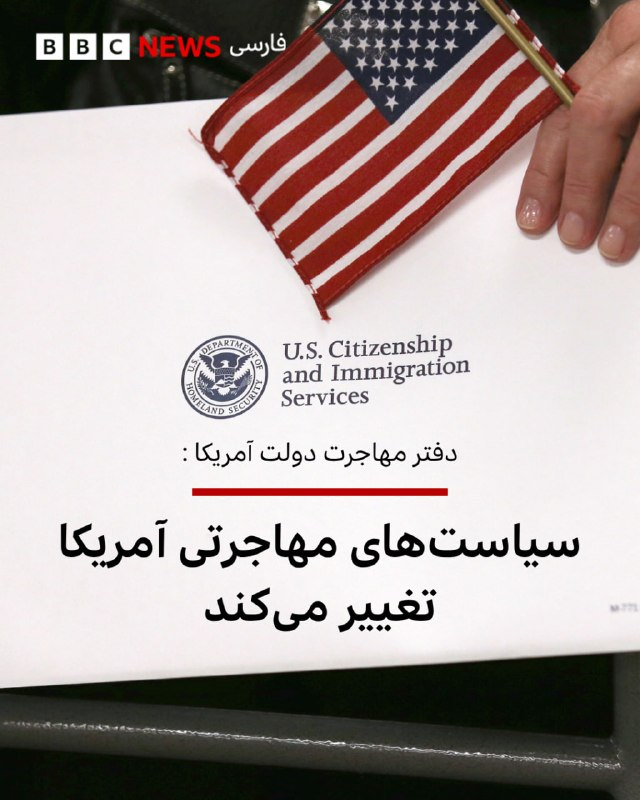

🔻دولت دونالد ترامپ اعلام کرد که سیاست‌های مهاجرت به آمریکا تغییر می‌کند.

در یک تغییر اساسی در سیاست‌های مهاجرتی آمریکا، دولت این کشور اعلام کرد خارجی‌هایی که قصد دریافت اقامت دائم یا همان گرین کارت را دارند، باید خاک ایالات متحده را ترک و از طریق کنسولگری یا سفارت آمریکا اقدام نمایند.

زک کالر، سخنگوی دفتر مهاجرت دولت آمریکا، گفت که این سیاست «نیاز به یافتن و اخراج» کسانی را کاهش می‌دهد که درخواست اقامتشان رد شده است.

از سوی دیگر وکلای مهاجرت و گروه‌های امدادی می‌گویند که این تغییر احتمالا به «جدایی بیش‌ازپیش خانواده‌ها» منجر خواهد شد و قربانیان قاچاق انسان هم مجبور خواهند شد «به کشورهای خطرناکی بازگردند که از آن گریخته‌اند.»

این تغییر سیاست تازه‌ترین اقدام آقای ترامپ در محدود کرد مهاجرت به آمریکا است.

📷Getty Images
@BBCPersian

## BBCPersian — post 281838

  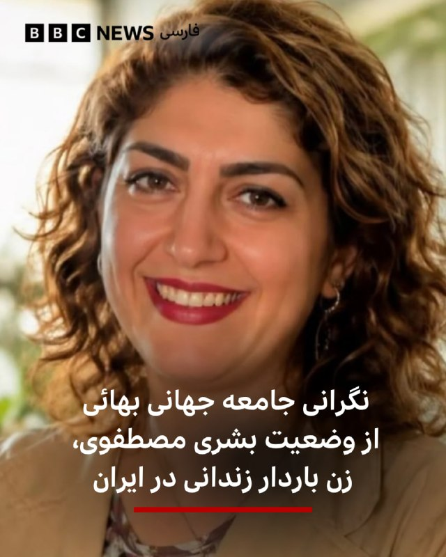

🔻جامعه جهانی بهائی در اطلاعیه‌ای از وضعیت سلامت بشری مصطفوی، زن باردار بهائی از شهر رفسنجان که «از زمان آغاز اعتراضات دی‌‎ماه» دستگیر و زندانی شد، ابراز نگرانی کرده است.

گفته می‌شود که مقام‌های قضایی ایران با درخواست‌های او برای دسترسی به مراقبت‌های پزشکی ضروری، از جمله آزمایش‌های حیاتی دوران بارداری، مخالفت کرده‌اند.

در اطلاعیه جامعه جهانی بهائی از جمله آمده است که خانم مصطفوی «یکی از حدود ۸۰ بهائی است که طی ماه‌های اخیر، همزمان با تشدید کارزار بی‌رحمانه جمهوری اسلامی برای آزار و سرکوب این اقلیت دینی، بازداشت و زندانی شده‌اند.»

جامعه جهانی بهائی می‌گوید که تاکنون بیش از ۴۰۰ مورد نقض حقوق بشر با حمایت حکومت ایران علیه بهائیان در سراسر آن کشور را گزارش کرده است؛ «مواردی از قبیل دستگیری‌ها و بازداشت‌ها، یورش‌های خشونت‌آمیز به منازل، مصادره غیرقانونی اموال و ممانعت از اجرای عدالت از سوی مقامات قضائی ایران.»

📷 BahaiDE
https://bbc.in/4dsL61e
@BBCPersian

## BBCPersian — post 281828

🖋برند دبوسمن جونیور
خبرنگار کاخ سفید

آمریکا، رائول کاسترو، رئیس‌جمهور سابق ۹۴ ساله کوبا را به قتل متهم کرده است؛ اقدامی که گمانه‌زنی‌ها را درباره این ‌که آیا هاوانا مقصد بعدی فهرست تغییر رژیم واشنگتن خواهد بود یا نه، افزایش داده است.

در بحبوحه کارزار «فشار حداکثری» که شدیدترین کمبودهای سوخت و انرژی کوبا در چند دهه اخیر را رقم زده است، شماری از مقام‌های آمریکایی به شکل مداوم خواستار پایان دادن به حکومت کمونیستی ۶۶ ساله این جزیره شده‌اند.

در حالی که دونالد ترامپ، رئیس‌جمهور آمریکا، گفته است معتقد است نیازی به «تشدید تنش» نخواهد بود، کاخ سفید نیز تاکید کرده که وجود یک «دولت سرکش» در نزدیکی سواحل آمریکا را تحمل نخواهد کرد.

این ‌که در ادامه چه رخ خواهد داد، برای هیچ ‌کس روشن نیست؛ فروپاشی اقتصادی، آشوب داخلی یا مداخله نظامی آمریکا. در ادامه سه سناریوی احتمالی بررسی می‌شود.

آلبوم را ورق بزنید و ادامه مطلب را از لینک زیر در وبسایت بی‌بی‌سی فارسی بخوانید.

📸GettyImages/ Reuters/ Anadolu via Getty Images/ EPA/Shutterstock/ AFP via Getty Images/ Bloomberg via Getty Images
https://bbc.in/43oAVVv
@BBCPersian

## BBCPersian — post 281827

🔻ولادیمیر پوتین، رئیس‌جمهور روسیه، از ارتش خواست تا برای «گزینه‌های تلافی‌جویانه» علیه اوکراین آماده شود. او این دستور را پس از حمله پهپادی کی‌یف به یک خوابگاه دانشجویی در منطقه شرقی تحت اشغال روسیه در اوکراین، صادر کرد. روسیه می‌گوید که در این حمله شش…

## BBCPersian — post 281826

  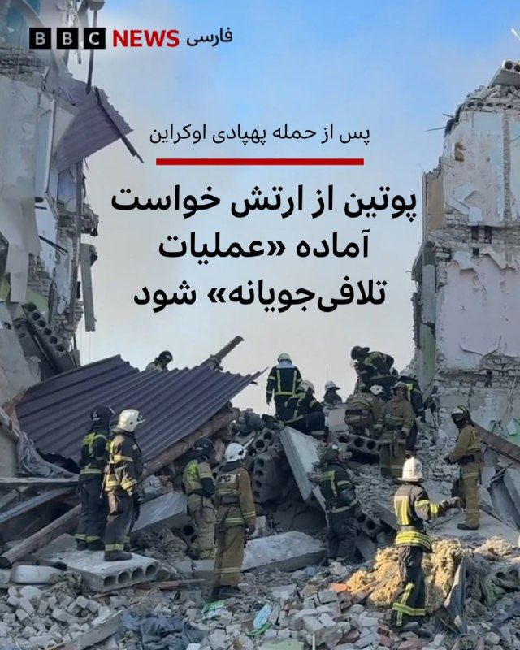

🔻ولادیمیر پوتین، رئیس‌جمهور روسیه، از ارتش خواست تا برای «گزینه‌های تلافی‌جویانه» علیه اوکراین آماده شود.

او این دستور را پس از حمله پهپادی کی‌یف به یک خوابگاه دانشجویی در منطقه شرقی تحت اشغال روسیه در اوکراین، صادر کرد.

روسیه می‌گوید که در این حمله شش دانشجو کشته شدند.

رئیس‌جمهور روسیه ضمن متهم کردن اوکراین به «تروریسم» گفت که بیانیه وزارت خارجه مسکو کافی نبوده و به ارتش دستور داده تا «طرح‌ حملات» متقابل را ارائه کنند.

از سوی دیگر اوکراین می‌گوید که ساختمان هدف حمله، «مقر فرماندهی پهپادی ارتش روسیه» بود.

خبرگزاری رویترز هم از قول مقام‌های محلی تحت امر روسیه نوشت که این ساختمان، «دانشکده تربیت معلم دانشگاه لوهانسک» بود.

با وجود انتشار تصاویر عملیات امداد گروه‌های نجات روسی از رسانه‌ دولتی روسیه، هنوز مشخص نیست چه کسانی در این حمله کشته شده‌اند.

📷 Reuters
@BBCPersian

---
📅 بروزرسانی: 1405/03/02 05:01
---

## VahidOOnLine — post 241637

♦️اول خردادماه، مصادف با زادروز استاد بی‌بدیل و نوازنده بی‌تکرار تار، جلیل شهناز است؛ نابغه‌ای که در سال ۱۳۰۰ در خانواده‌ای هنردوست در اصفهان چشم به جهان گشود و تحت آموزش‌های برادرش، علی شهناز، قدم در راه موسیقی گذاشت. او با خلاقیت منحصر‌به‌فرد، جمله‌بندی‌های بدیع و جواب‌آوازهای جادویی‌اش، به یکی از برجسته‌ترین و تاثیرگذارترین چهره‌های موسیقی سنتی ایران تبدیل شد و در طول چندین دهه فعالیت درخشان، در برنامه‌های ماندگاری چون «گل‌ها» به نواختن پرداخت و در کنار بزرگانی چون محمدرضا شجریان، حسن کسایی و فرامرز پایور، آثاری جاودانه را در تاریخ فرهنگ ایران ثبت کرد؛ به طوری که استاد شجریان به پاس تکنوازی‌های کم‌نظیرش، لقب «خداوندگار تار» را به او اعطا کرد. سرانجام این شهسوار موسیقی ایران، پس از یک عمر بی‌انتهای هنری و تربیت شاگردان پرشمار، در ۲۷ خرداد ۱۳۹۲ در سن ۹۲ سالگی در تهران دار فانی را وداع گفت و در قطعه هنرمندان بهشت زهرا به خاک سپرده شد، اما طنین مضراب‌های جادویی‌اش برای همیشه در حافظه جمعی ایران زنده خواهد ماند.
‌🇸🇦 Indypersian

🤖 @VahidOOnLine

## VahidOOnLine — post 241636

  

سی‌بی‌اس‌نیوز به نقل از منابع آگاه گزارش داد دولت ترامپ روز جمعه در حال آماده‌سازی برای دور تازه‌ای از حملات نظامی علیه ایران بوده است، اما هم‌زمان دیپلماسی ادامه دارد و تا عصر جمعه تصمیم نهایی درباره انجام حملات اتخاذ نشده بود.
به گفته منابع مطلع، برخی اعضای ارتش و جامعه اطلاعاتی آمریکا برنامه‌های تعطیلات خود را لغو کرده‌اند و مقام‌های دفاعی و اطلاعاتی در حال به‌روزرسانی فهرست‌های فراخوان نیروها در پایگاه‌های آمریکا در خارج از کشور هستند.
هم‌زمان ترامپ اعلام کرد به دلیل «شرایط مربوط به امور دولت» در مراسم ازدواج پسرش شرکت نخواهد کرد و به‌جای گذراندن تعطیلات روز یادبود در نیوجرسی، به کاخ سفید بازمی‌گردد.
این تحرکات در حالی صورت می‌گیرد که بخشی از نیروهای آمریکایی در خاورمیانه در حال گشت‌زنی هستند و نگرانی از احتمال تلافی از سوی جمهوری اسلامی وجود دارد.

‌🏁 🇬🇧 IranintlTV

🤖 @VahidOOnLine

## VahidOOnLine — post 241635

  

تام کاتن، سناتور جمهوری‌خواه، از اسکات بسنت، وزیر خزانه‌داری آمریکا، خواست نهادهای مسئول دریافت هزینه عبور از تنگه هرمز برای جمهوری اسلامی، از جمله «نهاد مدیریت آبراه خلیج فارس» مرتبط با سپاه پاسداران را تحریم کند.
کاتن همچنین خواستار تحریم هر شرکت خارجی شد که این هزینه‌ها را به جمهوری اسلامی پرداخت می‌کند یا در پردازش و تسهیل آن نقش دارد. او تاکید کرد آمریکا باید همه بازیگرانی را که جمهوری اسلامی را توانمند می‌کنند، پاسخگو کند.
او گفت در حال آماده‌سازی طرحی قانونی برای حمایت از این اقدامات است و از استفاده از اختیارات فعلی برای اعمال تحریم علیه این نهاد، مدیران آن و هر طرف خارجی دخیل در پرداخت عوارض عبور از تنگه هرمز حمایت می‌کند.

‌🏁 🇬🇧 IranintlTV

🤖 @VahidOOnLine

## VahidOOnLine — post 241634

  

♦️روزنامه «نیویورک‌پست» به نقل از منابع آگاه افشا کرد که ایوانکا ترامپ، دختر ۴۴ ساله دونالد ترامپ، هدف یک طرح ترور پیچیده از سوی یک تروریست تحت آموزش سپاه پاسداران انقلاب اسلامی قرار گرفته که با انگیزه انتقام‌جویی از کشته شدن قاسم سلیمانی طراحی شده بود. بر اساس این گزارش، متهم که یک تبعه عراقی ۳۲ ساله به نام «محمد باقر سعد داوود الساعدی» است و به تازگی دستگیر شده، عهد کرده بود برای «به آتش کشیدن خانه ترامپ»، دختر رئیس‌جمهوری آمریکا را به قتل برساند. منابع اطلاعاتی اعلام کرده‌اند که الساعدی حتی نقشه و جزئیات معماری عمارت ۲۴ میلیون دلاری ایوانکا ترامپ و همسرش جارد کوشنر در فلوریدا را در اختیار داشته و پیش از این با انتشار تصویری از موقعیت این خانه در شبکه اجتماعی اکس (توییتر سابق)، به زبان عربی تهدید کرده بود که «نه کاخ‌ها و نه سرویس مخفی آمریکا» نمی‌توانند از آن‌ها محافظت کنند و انتقام تنها مسئله زمان است.
وزارت دادگستری ایالات متحده اعلام کرده است که الساعدی از مهره‌های بلندپایه در حلقه‌های تروریستی وابسته به ایران و کتائب حزب‌الله عراق به شمار می‌رود که در تاریخ ۱۵ مه در ترکیه بازداشت و به آمریکا مسترد شد. او در ایالات متحده با اتهاماتی سنگین پیرامون هدایت و اجرای ۱۸ حمله و تلاش برای ترور در سراسر اروپا و آمریکا مواجه است؛ پرونده‌ای که شامل بمب‌گذاری در یک بانک در آمستردام، حمله با چاقو به دو شهروند یهودی در لندن، تیراندازی به ساختمان کنسولگری آمریکا در تورنتو و آتش‌سوزی عمدی در معابد یهودیان در بلژیک و هلند می‌شود. این متهم که به دلیل وابستگی به قاسم سلیمانی او را مانند پدر خود می‌دانست، پس از کشته شدن سلیمانی در حمله پهپادی شش سال پیش آمریکا در بغداد، تحت آموزش‌های نظامی و اطلاعاتی ویژه سپاه پاسداران در تهران قرار گرفت و ارتباط نزدیکی نیز با جانشین او، سردار اسماعیل قاآنی، برای تامین مالی شبکه‌های تروریستی خود داشته است.
اطلاعات فاش‌شده نشان می‌دهد الساعدی با وجود نقش برجسته‌اش در شبکه‌های تروریستی، حضور بسیار فعالی در شبکه‌های اجتماعی نظیر «اسنپ‌چت» و «اکس» داشته و تصاویری از رایزنی‌های نظامی خود با قاسم سلیمانی را نیز به اشتراک گذاشته بود. او با تاسیس یک آژانس مسافرتی مذهبی و با سوءاستفاده از یک «گذرنامه خدمت عراقی» که سفر بدون تشریفات امنیتی و اخذ آسان ویزا را برای او ممکن می‌ساخت، به راحتی به کشورهای مختلف سفر کرده و با گروه‌های تروریستی ارتباط می‌گرفت. الیزابت تسورکوف، پژوهشگر انستیتو «نیولینز» که خود ۹۰۳ روز در اسارت کتائب حزب‌الله بود، تایید کرده که روابط الساعدی با سلیمانی و قاآنی فرصت بزرگی برای گروه‌های شبه‌نظامی عراقی ایجاد کرده بود. الساعدی که در زمان دستگیری در ترکیه در حال سفر به روسیه بود، هم‌اکنون در سلول انفرادی بازداشتگاه متروپولیتن بروکلین، در کنار دیگر زندانیان سرشناس نگهداری می‌شود.
‌🇸🇦 Indypersian

🤖 @VahidOOnLine

## VahidOOnLine — post 241633

♦️به گزارش خبرگزاری فرانسه، فضاپیمای غول‌پیکر «استارشیپ» متعلق به شرکت «اسپیس‌اکس»، روز جمعه پس از انجام یک پرواز آزمایشی با جدیدترین نسخه این راکت پهن‌پیکر، طبق برنامه بر سطح آب‌های اقیانوس هند فرود آمد (Splashdown) و لحظاتی بعد منفجر شد. از آنجا که این فضاپیما سامانه بازیابی برای فرود سالم روی آب ندارد، وقوع این انفجار پس از برخورد با سطح دریا کاملا پیش‌بینی‌شده و بخشی از ماهیت این آزمایش مهندسی بود؛ به همین دلیل، موفقیت استارشیپ در عبور از لایه‌های جو و فرود در نقطه تعیین‌شده، تشویق و شادی گسترده کارکنان اسپیس‌اکس را در پخش زنده اینترنتی به همراه داشت. این آزمایش موفق در مقطع زمانی بسیار حساسی برای شرکت ایلان ماسک رقم خورد؛ چرا که این کمپانی خود را برای یک عرضه اولیه سهام (IPO) تاریخی و احتمالا رکوردشکن در بازار بورس آماده می‌کند و دستاورد امروز استارشیپ، برگ برنده بزرگی برای جلب اعتماد سرمایه‌گذاران خواهد بود.
‌🇸🇦 Indypersian

🤖 @VahidOOnLine

## VahidOOnLine — post 241632

  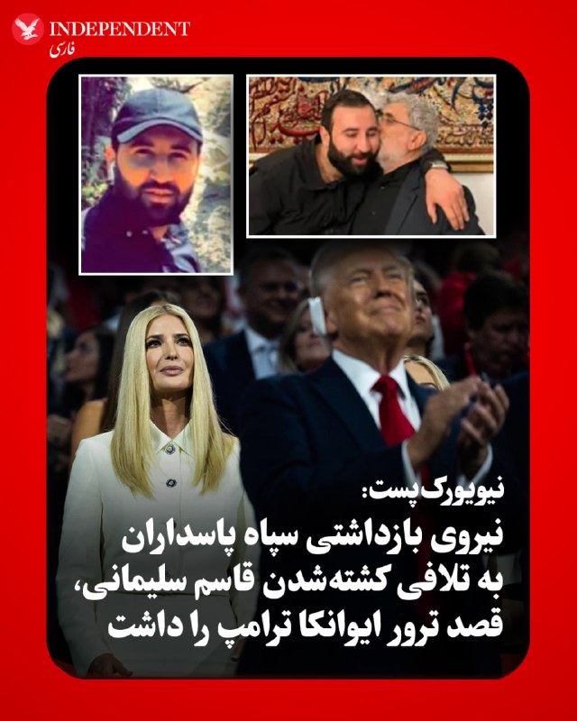

♦️روزنامه «نیویورک‌پست» به نقل از منابع آگاه افشا کرد که ایوانکا ترامپ، دختر ۴۴ ساله دونالد ترامپ، هدف یک طرح ترور پیچیده از سوی یک تروریست تحت آموزش سپاه پاسداران انقلاب اسلامی قرار گرفته که با انگیزه انتقام‌جویی از کشته شدن قاسم سلیمانی طراحی شده بود. بر اساس این گزارش، متهم که یک تبعه عراقی ۳۲ ساله به نام «محمد باقر سعد داوود الساعدی» است و به تازگی دستگیر شده، عهد کرده بود برای «به آتش کشیدن خانه ترامپ»، دختر رئیس‌جمهوری آمریکا را به قتل برساند. منابع اطلاعاتی اعلام کرده‌اند که الساعدی حتی نقشه و جزئیات معماری عمارت ۲۴ میلیون دلاری ایوانکا ترامپ و همسرش جارد کوشنر در فلوریدا را در اختیار داشته و پیش از این با انتشار تصویری از موقعیت این خانه در شبکه اجتماعی اکس (توییتر سابق)، به زبان عربی تهدید کرده بود که «نه کاخ‌ها و نه سرویس مخفی آمریکا» نمی‌توانند از آن‌ها محافظت کنند و انتقام تنها مسئله زمان است.
وزارت دادگستری ایالات متحده اعلام کرده است که الساعدی از مهره‌های بلندپایه در حلقه‌های تروریستی وابسته به ایران و کتائب حزب‌الله عراق به شمار می‌رود که در تاریخ ۱۵ مه در ترکیه بازداشت و به آمریکا مسترد شد. او در ایالات متحده با اتهاماتی سنگین پیرامون هدایت و اجرای ۱۸ حمله و تلاش برای ترور در سراسر اروپا و آمریکا مواجه است؛ پرونده‌ای که شامل بمب‌گذاری در یک بانک در آمستردام، حمله با چاقو به دو شهروند یهودی در لندن، تیراندازی به ساختمان کنسولگری آمریکا در تورنتو و آتش‌سوزی عمدی در معابد یهودیان در بلژیک و هلند می‌شود. این متهم که به دلیل وابستگی به قاسم سلیمانی او را مانند پدر خود می‌دانست، پس از کشته شدن سلیمانی در حمله پهپادی شش سال پیش آمریکا در بغداد، تحت آموزش‌های نظامی و اطلاعاتی ویژه سپاه پاسداران در تهران قرار گرفت و ارتباط نزدیکی نیز با جانشین او، سردار اسماعیل قاانی، برای تامین مالی شبکه‌های تروریستی خود داشته است.
اطلاعات فاش‌شده نشان می‌دهد الساعدی با وجود نقش برجسته‌اش در شبکه‌های تروریستی، حضور بسیار فعالی در شبکه‌های اجتماعی نظیر «اسنپ‌چت» و «اکس» داشته و تصاویری از رایزنی‌های نظامی خود با قاسم سلیمانی را نیز به اشتراک گذاشته بود. او با تاسیس یک آژانس مسافرتی مذهبی و با سوءاستفاده از یک «گذرنامه خدمت عراقی» که سفر بدون تشریفات امنیتی و اخذ آسان ویزا را برای او ممکن می‌ساخت، به راحتی به کشورهای مختلف سفر کرده و با گروه‌های تروریستی ارتباط می‌گرفت. الیزابت تسورکوف، پژوهشگر انستیتو «نیولینز» که خود ۹۰۳ روز در اسارت کتائب حزب‌الله بود، تایید کرده که روابط الساعدی با سلیمانی و قاانی فرصت بزرگی برای گروه‌های شبه‌نظامی عراقی ایجاد کرده بود. الساعدی که در زمان دستگیری در ترکیه در حال سفر به روسیه بود، هم‌اکنون در سلول انفرادی بازداشتگاه متروپولیتن بروکلین، در کنار دیگر زندانیان سرشناس نگهداری می‌شود.
‌🇸🇦 Indypersian

🤖 @VahidOOnLine

## VahidOOnLine — post 241631

  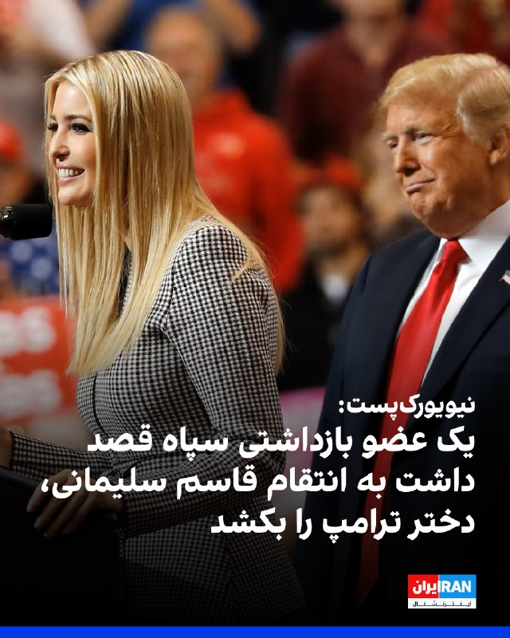

روزنامه نیویورک‌پست به نقل از منابع آگاه گزارش داد یک فرد عراقی عضو سپاه و کتائب حزب‌الله که به تازگی بازداشت شده است، قصد داشت به انتقام قاسم سلیمانی برای کشتن ایوانکا ترامپ، دختر بزرگ ترامپ، اقدام کند و حتی نقشه خانه ایوانکا و همسرش جرد کوشنر در فلوریدا را در اختیار داشت.
این تبعه عراقی ۳۲ ساله که محمد باقر سعد داوود الساعدی نام دارد، ۲۵ اردیبهشت در ترکیه بازداشت و به آمریکا مسترد شد و بنابر اعلام وزارت دادگستری آمریکا، به انجام ۱۸ حمله در سراسر اروپا و آمریکا متهم شده است.
انتیفاض قنبر، معاون پیشین وابسته نظامی سفارت عراق در واشینگتن، به نیویورک‌پست گفت: «پس از کشته شدن قاسم سلیمانی، الساعدی به دیگران می‌گفت باید ایوانکا را بکشیم تا خانه ترامپ را همان‌گونه که او خانه ما را سوزاند، بسوزانیم.»
بر اساس اعلام وزارت دادگستری آمریکا، او در حمله به اهداف آمریکایی و یهودی، از جمله پرتاب بمب آتش‌زا به ساختمان بانک نیویورک ملون در آمستردام در ماه مارس، حمله با چاقو به دو قربانی یهودی در لندن در آوریل و تیراندازی به ساختمان کنسولگری آمریکا در تورنتو در ماه مارس دست داشته است.
‌🏁 🇬🇧 IranintlTV

🤖 @VahidOOnLine

## VahidOOnLine — post 241630

♦️به‌دنبال تشدید تنش‌ها در خاورمیانه و مهلت چندروزه واشنگتن به تهران برای پذیرش «پیشنهاد نهایی»، دونالد ترامپ با لغو برنامه‌های آخر هفته خود در نیوجرسی، به کاخ سفید بازگشت. هم‌زمان، «سی‌بی‌اس نیوز» گزارش داد که مقامات ارشد اطلاعاتی و نظامی ایالات متحده نیز مرخصی‌های روز یادبود (Memorial Day) خود را لغو کرده و در وضعیت آماده‌باش کامل قرار گرفته‌اند. تحرکات منطقه‌ای و نیز امنیتی در واشنگتن، در کنار گزارش‌های اخیر مبنی بر آماده‌سازی پنتاگون برای دور جدیدی از حملات به اهداف نظامی ایران و هشدار متقابل سپاه پاسداران درباره گسترش جنگ به خارج از منطقه، گمانه‌زنی‌ها درباره قریب‌الوقوع بودن یک رویارویی نظامی یا تحول بزرگ دیپلماتیک را به اوج خود رسانده است.
‌🇸🇦 Indypersian

🤖 @VahidOOnLine

## VahidOOnLine — post 241621

جاویدنامان انقلاب ملی ایرانیان؛ هشت جوان دیگر، هشت زندگی ناتمامی که هرکدام می‌توانستند بخشی از آینده این سرزمین باشند، اما جمهوری سرکوب و خشونت، زندگی را از آنان گرفت.
حیدر کریمی، عباس برزوخانی، مجتبی رضوانی میشامندی، محمدابراهیم داداشی، عرفان خضریان، محمد شاکرمی چگنی، امیرحسین حیدر دوست و فرهاد امین؛ هشت نام از میان ده‌ها هزار زندگی ناتمام.
این روایت‌های کوتاه‌ برای ثبت حقیقت و برای زنده نگه داشتن نام‌هایی که با گلوله، شکنجه و سرکوب از مردم ایران گرفته شدند، اما از حافظه جمعی پاک نخواهند شد.
#جاویدنامان_انقلاب_ملی_ایرانیان
‌🏁 🇬🇧 IranintlTV

🤖 @VahidOOnLine

## VahidOOnLine — post 241620

  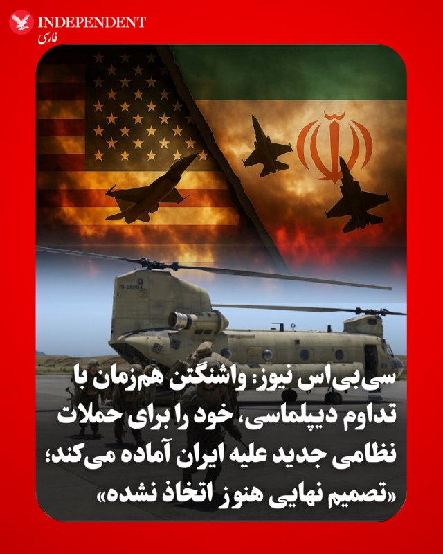

♦️«سی‌بی‌اس نیوز» به نقل از منابع آگاه گزارش داد که دولت ترامپ به‌رغم تداوم رایزنی‌های دیپلماتیک، در حال آماده‌سازی مقدمات دور جدیدی از حملات نظامی علیه ایران است؛ هرچند تا بعدازظهر جمعه تصمیم نهایی در این زمینه اتخاذ نشده است. دونالد ترامپ با انتشار پیامی در شبکه‌های اجتماعی اعلام کرد که به دلیل «شرایط مربوط به دولت» از شرکت در مراسم عروسی پسرش، دونالد ترامپ جونیور، خودداری کرده و با لغو برنامه تفریحی خود در نیوجرسی به کاخ سفید بازمی‌گردد. در همین راستا، گزارش‌ها از لغو مرخصی آخر هفته برخی از اعضای ارتش و جامعه اطلاعاتی آمریکا حکایت دارد و مقامات دفاعی در حال به‌روزرسانی لیست آماده‌باش پایگاه‌های خارجی خود هستند. آنا کلی، سخنگوی کاخ سفید، با تأکید بر اینکه ترامپ خطوط قرمز خود را مبنی بر عدم دست‌یابی ایران به سلاح هسته‌ای و غنی‌سازی اورانیوم صراحتاً روشن کرده است، به سی‌بی‌اس گفت: «رئیس‌جمهوری همواره تمام گزینه‌ها را روی میز نگه می‌دارد و وظیفه پنتاگون آمادگی برای اجرای هرگونه تصمیم فرمانده کل قواست؛ ترامپ درباره عواقب عدم دستیابی به توافق کاملاً شفاف بوده است.»
این تحرکات نظامی در شرایطی صورت می‌گیرد که تهران در حال بررسی آخرین پیشنهاد ایالات متحده برای پایان دادن به جنگ سه‌ماهه اخیر است؛ پیشنهادی که روز چهارشنبه به همراه یک هشدار جدی به ایران ابلاغ شد مبنی بر اینکه رد این «پیشنهاد نهایی» به معنای ازسرگیری حملات نظامی خواهد بود. دونالد ترامپ روز جمعه با بیان اینکه «ایران برای رسیدن به توافق دست‌وپا می‌زند و باید دید چه رخ خواهد داد»، ضرب‌الاجلی چند روزه برای پاسخ تهران تعیین کرد؛ پاسخی که انتظار می‌رود به زودی از طریق پاکستان به عنوان میانجی منتقل شود. در همین حال، مارکو روبیو، وزیر امور خارجه آمریکا، با اشاره به پیشرفت‌های دیپلماتیک اعلام کرد که ترامپ دیپلماسی را به حمله ترجیح می‌دهد، اما هم‌زمان به گفتگوهای خود با اعضای ناتو در سوئد برای بازگشایی اجباری تنگه هرمز تحت عنوان «نقشه ب» اشاره کرد. این در حالی است که سپاه پاسداران نیز پیش از این هشدار داده بود که هرگونه حمله جدید از سوی آمریکا یا اسرائیل می‌تواند جنگ را به خارج از خاورمیانه بکشاند و با «ضربات کوبنده در مکان‌هایی که حتی فکرش را نمی‌کنید» همراه خواهد بود.
‌🇸🇦 Indypersian

🤖 @VahidOOnLine

## VahidOOnLine — post 241619

  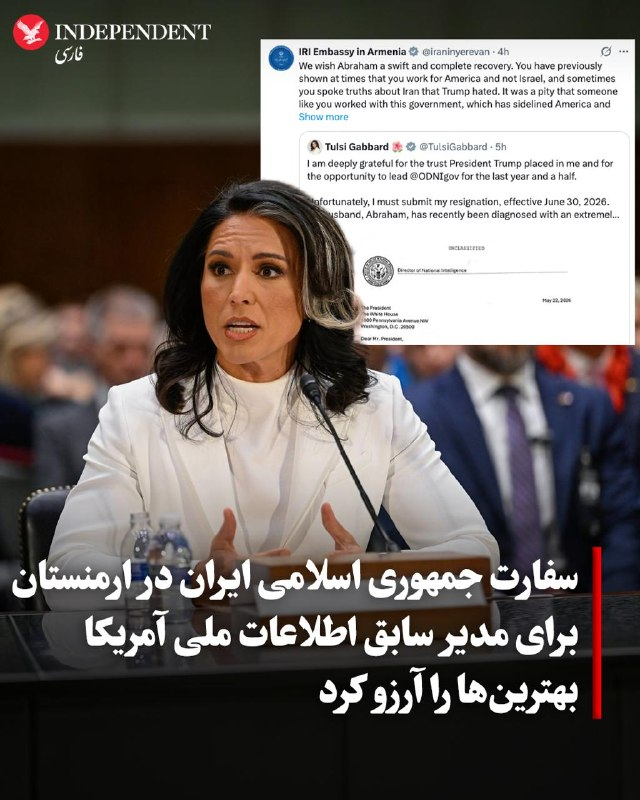

♦️سفارت جمهوری اسلامی ایران در ارمنستان با بازنشر نامه کناره‌گیری «تولسی گابارد» از سمت مدیریت اطلاعات ملی ایالات متحده، واکنش متفاوتی به این رویداد نشان داد و برای او آرزوی موفقیت و بهبودی کرد.
در بخشی از این نامه که توسط سفارت بازنشر شده، آمده است: «ما برای آبراهام (همسر گابارد) آرزوی بهبودی سریع و کامل داریم. شما پیش از این نشان داده‌اید که گاهی برای منافع آمریکا کار می‌کنید و نه برای اسرائیل، و حقایقی را درباره ایران بیان کردید که ترامپ از آن متنفر بود. جای تاسف است که فردی مثل شما با این دولت همکاری کرد؛ دولتی که آمریکا را به حاشیه رانده و به نیابت از اسرائیل عمل می‌کند.»
پیش‌تر نیز تولسی گابارد در نامه استعفای خود خطاب به دونالد ترامپ اعلام کرده بود به دلیل شرایط خانوادگی از سمتش کناره‌گیری می‌کند. او نوشته بود همسرش، آبراهام، به نوعی بسیار نادر از سرطان استخوان مبتلا شده و به همین دلیل تصمیم گرفته است برای همراهی و حمایت از او، از مسئولیت خود در مدیریت اطلاعات ملی آمریکا کنار برود.
‌🇸🇦 Indypersian

🤖 @VahidOOnLine

## WithYashar — post 12095

## WithYashar — post 12094

## WithYashar — post 12093

## WithYashar — post 12092

## WithYashar — post 12091

  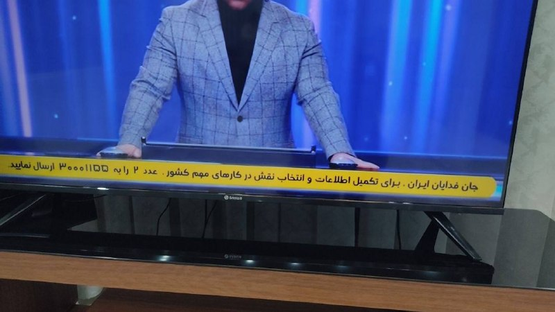

📷 Photo

## WithYashar — post 12090

## WithYashar — post 12089

## WithYashar — post 12088

درود داداش شما میدونی چه اتفاقی افتاده این همه تفرقه تو پادشاهی خواها افتاده؟
چمونه اینا الان ۹۰روزه اتحاد دارن هر شب میان راه پیمایی پس ماهایی که هدفمون نابودی ایناست چرا اینقدر اختلاف داریم...

## WithYashar — post 12087

## WithYashar — post 12086

شبکه الحدث به نقل از منابع مطلع گزارش داد فضای مذاکرات میان تهران و واشینگتن «مثبت» ارزیابی می‌شود، اما دو طرف هنوز به توافق نهایی نرسیده‌اند.
@withyashar

## WithYashar — post 12085

نیروی دریایی اسرائیل در حال ارسال پیام های رادیویی است.
@withyashar

## WithYashar — post 12084

ارتباطات رادیویی ارتش روسیه از کار افتاده است.
@withyashar

## WithYashar — post 12083

ایوانکا ترامپ، دختر اول، هدف ترور توسط یک تروریست آموزش‌دیده سپاه پاسداران انقلاب اسلامی (IRGC) قرار گرفت، در یک نقشه پیچیده برای انتقام‌گیری از رئیس‌جمهور به خاطر حذف مربی‌اش

نیویورک پست : محمد باقر سعد داوود السعدی، ۳۲ ساله، که اخیراً دستگیر شده است، «تعهد» کرده بود که ایوانکا را بکشد و حتی نقشه خانه‌اش در فلوریدا را داشت.
این شهروند عراقی ظاهراً خانواده رئیس‌جمهور دونالد ترامپ را هدف قرار داده بود در پاسخ به کشته شدن فرمانده نظامی ایرانی، قاسم سلیمانی، در حمله پهپادی آمریکا در بغداد شش سال پیش.»
@withyashar

## WithYashar — post 12082

## WithYashar — post 12081

دوستانی که فوحش خاستن تست کردن و خوردن و بلاک کردم 😃 دیکتاتور خشن یاشار

## WithYashar — post 12080

دایرکت بی مورد ندید مخوصوصا کسی بپرسه امشب میزنه یا بپرسه بخوابم یا نه …. خستم و با شدیدترین پاسخ ممکن جواب میدم !

## WithYashar — post 12079

## WithYashar — post 12078

منابع دولتی گزارش می‌دهند که ارتش جمهوری اسلامی به بالاترین سطح هشدار رسیده است.
@withyashar

## FoxNewsTwitter — post 342152

  <a href="telegram/content/FoxNewsTwitter_342152_1779499917.mp4" target="_blank">🎬 Download video</a>

Fox News (Twitter/X)

A fire and explosion injured more than 30 people and killed one person at a Staten Island shipyard, officials said Friday.

The explosion happened after first responders arrived to battle a fire in the basement of a 150-by-150-foot metal building near the shipping docks.

The injured include civilians and first responders. One fire marshal is in critical condition, Mayor Mamdani said.

## FoxNewsTwitter — post 342151

  <a href="telegram/content/FoxNewsTwitter_342151_1779499919.mp4" target="_blank">🎬 Download video</a>

Fox News (Twitter/X)

FOX NEWS REPORT: Tulsi Gabbard announced Friday she’s stepping down as Director of National Intelligence after her husband was diagnosed with an extremely rare form of bone cancer. Her last day is expected to be June 30.

@BillMelugin_ has the latest.

## FoxNewsTwitter — post 342150

  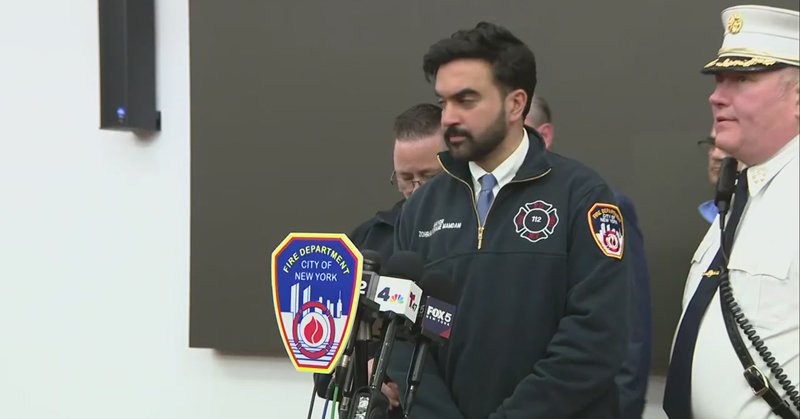

Fox News (Twitter/X)

WATCH LIVE: Press conference after massive explosion injures 16, including firefighters https://twitter.com/i/broadcasts/1jxXggegoRLJZ

## VahidOnline — post 75631

  

روزنامه «نیویورک‌پست» به نقل از منابع آگاه افشا کرد که ایوانکا ترامپ، دختر ۴۴ ساله دونالد ترامپ، هدف یک طرح ترور پیچیده از سوی یک تروریست تحت آموزش سپاه پاسداران انقلاب اسلامی قرار گرفته که با انگیزه انتقام‌جویی از کشته شدن قاسم سلیمانی طراحی شده بود.

بر اساس این گزارش، متهم که یک تبعه عراقی ۳۲ ساله به نام «محمد باقر سعد داوود الساعدی» است و به تازگی دستگیر شده، عهد کرده بود برای «به آتش کشیدن خانه ترامپ»، دختر رئیس‌جمهوری آمریکا را به قتل برساند.

منابع اطلاعاتی اعلام کرده‌اند که الساعدی حتی نقشه و جزئیات معماری عمارت ۲۴ میلیون دلاری ایوانکا ترامپ و همسرش جارد کوشنر در فلوریدا را در اختیار داشته و پیش از این با انتشار تصویری از موقعیت این خانه در شبکه اجتماعی اکس (توییتر سابق)، به زبان عربی تهدید کرده بود که «نه کاخ‌ها و نه سرویس مخفی آمریکا» نمی‌توانند از آن‌ها محافظت کنند و انتقام تنها مسئله زمان است.

وزارت دادگستری ایالات متحده اعلام کرده است که الساعدی از مهره‌های بلندپایه در حلقه‌های تروریستی وابسته به ایران و کتائب حزب‌الله عراق به شمار می‌رود که در تاریخ ۱۵ مه در ترکیه بازداشت و به آمریکا مسترد شد. او در ایالات متحده با اتهاماتی سنگین پیرامون هدایت و اجرای ۱۸ حمله و تلاش برای ترور در سراسر اروپا و آمریکا مواجه است؛ پرونده‌ای که شامل بمب‌گذاری در یک بانک در آمستردام، حمله با چاقو به دو شهروند یهودی در لندن، تیراندازی به ساختمان کنسولگری آمریکا در تورنتو و آتش‌سوزی عمدی در معابد یهودیان در بلژیک و هلند می‌شود.

این متهم که به دلیل وابستگی به قاسم سلیمانی او را مانند پدر خود می‌دانست، پس از کشته شدن سلیمانی در حمله پهپادی شش سال پیش آمریکا در بغداد، تحت آموزش‌های نظامی و اطلاعاتی ویژه سپاه پاسداران در تهران قرار گرفت و ارتباط نزدیکی نیز با جانشین او، سردار اسماعیل قاانی، برای تامین مالی شبکه‌های تروریستی خود داشته است.

اطلاعات فاش‌شده نشان می‌دهد الساعدی با وجود نقش برجسته‌اش در شبکه‌های تروریستی، حضور بسیار فعالی در شبکه‌های اجتماعی نظیر «اسنپ‌چت» و «اکس» داشته و تصاویری از رایزنی‌های نظامی خود با قاسم سلیمانی را نیز به اشتراک گذاشته بود.

او با تاسیس یک آژانس مسافرتی مذهبی و با سوءاستفاده از یک «گذرنامه خدمت عراقی» که سفر بدون تشریفات امنیتی و اخذ آسان ویزا را برای او ممکن می‌ساخت، به راحتی به کشورهای مختلف سفر کرده و با گروه‌های تروریستی ارتباط می‌گرفت.

الیزابت تسورکوف، پژوهشگر انستیتو «نیولینز» که خود ۹۰۳ روز در اسارت کتائب حزب‌الله بود، تایید کرده که روابط الساعدی با سلیمانی و قاانی فرصت بزرگی برای گروه‌های شبه‌نظامی عراقی ایجاد کرده بود. الساعدی که در زمان دستگیری در ترکیه در حال سفر به روسیه بود، هم‌اکنون در سلول انفرادی بازداشتگاه متروپولیتن بروکلین، در کنار دیگر زندانیان سرشناس نگهداری می‌شود.

@VahidOOnLine

📡 @VahidOnline

## VahidOnline — post 75630

  

سی‌بی‌اس گزارش داد که آمریکا در حالی خود را برای دور تازه‌ای از حملات نظامی علیه ایران آماده می‌کند که تلاش‌های دیپلماتیک همچنان ادامه دارد.

به گزارش سی‌بی‌اس نیوز، منابعی که مستقیم در جریان برنامه‌ریزی‌ها قرار دارند می‌گویند که دولت ترامپ روز جمعه در حال آماده‌سازی برای حملات تازه بود هرچند تا عصر جمعه تصمیم نهایی گرفته نشد.

آقای ترامپ در پیامی در شبکه‌های اجتماعی اعلام کرد که «مسائل مربوط به دولت» مانع از حضور او در مراسم ازدواج پسرش، دونالد ترامپ جونیور در روز شنبه خواهد شد.
او قرار بود تعطیلات آخر هفته را در مجموعه گلف خود در ایالت نیوجرسی بگذراند، اما اکنون به کاخ سفید بازمی‌گردد.

چند منبع نیز گفته‌اند که برخی اعضای ارتش و جامعه اطلاعاتی آمریکا برنامه‌های تعطیلات خود را لغو کرده‌اند؛ اقدامی که در انتظار احتمال حملات تازه انجام شده است.

به گفته این منابع، مقام‌های دفاعی و اطلاعاتی آمریکا در حال به‌روزرسانی فهرست نیروهای آماده‌باش در پایگاه‌های خارج از کشور هستند؛ همزمان با خروج بخشی از نیروهای مستقر در خاورمیانه، در چارچوب تلاش برای کاهش حضور نظامی آمریکا در منطقه و نگرانی از واکنش احتمالی ایران.
@VahidHeadline

📡 @VahidOnline

## IranIntlTV — post 338516

  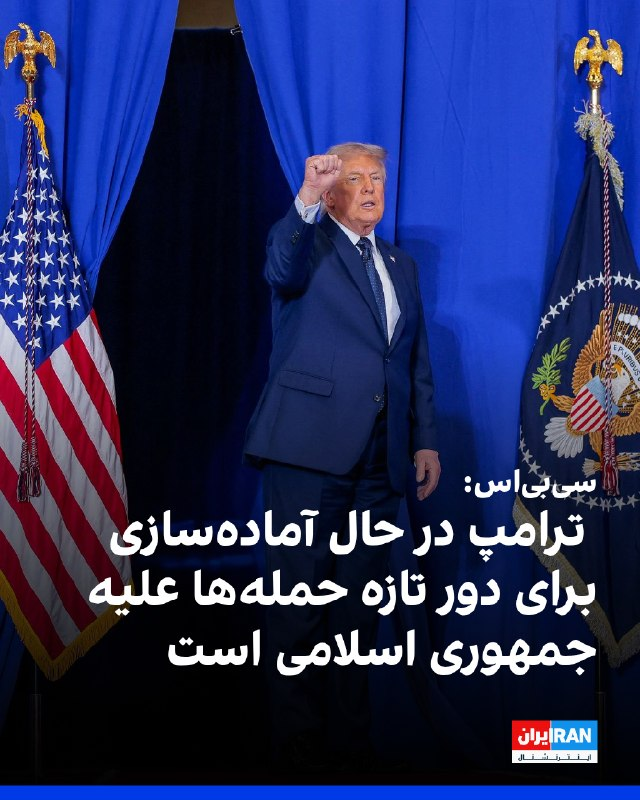

سی‌بی‌اس‌نیوز به نقل از منابع آگاه گزارش داد دولت ترامپ روز جمعه در حال آماده‌سازی برای دور تازه‌ای از حملات نظامی علیه ایران بوده است، اما هم‌زمان دیپلماسی ادامه دارد و تا عصر جمعه تصمیم نهایی درباره انجام حملات اتخاذ نشده بود.
به گفته منابع مطلع، برخی اعضای ارتش و جامعه اطلاعاتی آمریکا برنامه‌های تعطیلات خود را لغو کرده‌اند و مقام‌های دفاعی و اطلاعاتی در حال به‌روزرسانی فهرست‌های فراخوان نیروها در پایگاه‌های آمریکا در خارج از کشور هستند.
هم‌زمان ترامپ اعلام کرد به دلیل «شرایط مربوط به امور دولت» در مراسم ازدواج پسرش شرکت نخواهد کرد و به‌جای گذراندن تعطیلات روز یادبود در نیوجرسی، به کاخ سفید بازمی‌گردد.
این تحرکات در حالی صورت می‌گیرد که بخشی از نیروهای آمریکایی در خاورمیانه در حال گشت‌زنی هستند و نگرانی از احتمال تلافی از سوی جمهوری اسلامی وجود دارد.

https://iranintl.com/202605236613

## IranIntlTV — post 338515

  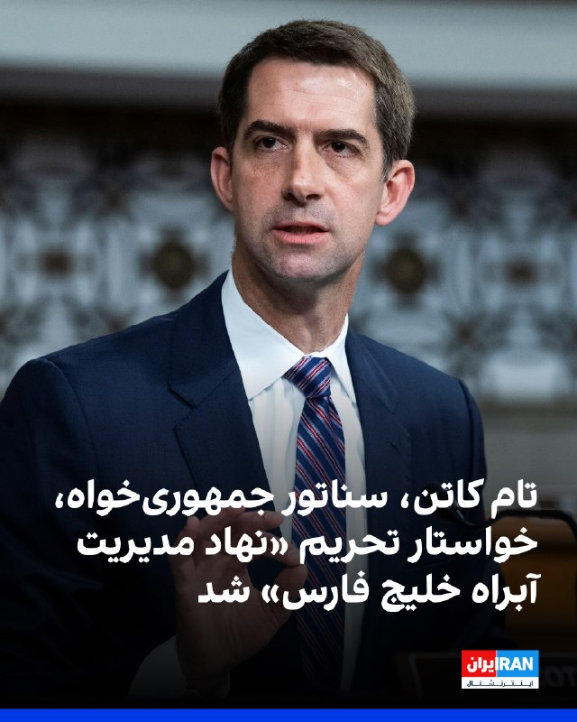

تام کاتن، سناتور جمهوری‌خواه، از اسکات بسنت، وزیر خزانه‌داری آمریکا، خواست نهادهای مسئول دریافت هزینه عبور از تنگه هرمز برای جمهوری اسلامی، از جمله «نهاد مدیریت آبراه خلیج فارس» مرتبط با سپاه پاسداران را تحریم کند.
کاتن همچنین خواستار تحریم هر شرکت خارجی شد که این هزینه‌ها را به جمهوری اسلامی پرداخت می‌کند یا در پردازش و تسهیل آن نقش دارد. او تاکید کرد آمریکا باید همه بازیگرانی را که جمهوری اسلامی را توانمند می‌کنند، پاسخگو کند.
او گفت در حال آماده‌سازی طرحی قانونی برای حمایت از این اقدامات است و از استفاده از اختیارات فعلی برای اعمال تحریم علیه این نهاد، مدیران آن و هر طرف خارجی دخیل در پرداخت عوارض عبور از تنگه هرمز حمایت می‌کند.

https://iranintl.com/202605233320

## IranIntlTV — post 338514

  

روزنامه نیویورک‌پست به نقل از منابع آگاه گزارش داد یک فرد عراقی عضو سپاه و کتائب حزب‌الله که به تازگی بازداشت شده است، قصد داشت به انتقام قاسم سلیمانی برای کشتن ایوانکا ترامپ، دختر بزرگ ترامپ، اقدام کند و حتی نقشه خانه ایوانکا و همسرش جرد کوشنر در فلوریدا را در اختیار داشت.
این تبعه عراقی ۳۲ ساله که محمد باقر سعد داوود الساعدی نام دارد، ۲۵ اردیبهشت در ترکیه بازداشت و به آمریکا مسترد شد و بنابر اعلام وزارت دادگستری آمریکا، به انجام ۱۸ حمله در سراسر اروپا و آمریکا متهم شده است.
انتیفاض قنبر، معاون پیشین وابسته نظامی سفارت عراق در واشینگتن، به نیویورک‌پست گفت: «پس از کشته شدن قاسم سلیمانی، الساعدی به دیگران می‌گفت باید ایوانکا را بکشیم تا خانه ترامپ را همان‌گونه که او خانه ما را سوزاند، بسوزانیم.»
بر اساس اعلام وزارت دادگستری آمریکا، او در حمله به اهداف آمریکایی و یهودی، از جمله پرتاب بمب آتش‌زا به ساختمان بانک نیویورک ملون در آمستردام در ماه مارس، حمله با چاقو به دو قربانی یهودی در لندن در آوریل و تیراندازی به ساختمان کنسولگری آمریکا در تورنتو در ماه مارس دست داشته است.
https://iranintl.com/202605236458

## IranIntlTV — post 338505

جاویدنامان انقلاب ملی ایرانیان؛ هشت جوان دیگر، هشت زندگی ناتمامی که هرکدام می‌توانستند بخشی از آینده این سرزمین باشند، اما جمهوری سرکوب و خشونت، زندگی را از آنان گرفت.
حیدر کریمی، عباس برزوخانی، مجتبی رضوانی میشامندی، محمدابراهیم داداشی، عرفان خضریان، محمد شاکرمی چگنی، امیرحسین حیدر دوست و فرهاد امین؛ هشت نام از میان ده‌ها هزار زندگی ناتمام.
این روایت‌های کوتاه‌ برای ثبت حقیقت و برای زنده نگه داشتن نام‌هایی که با گلوله، شکنجه و سرکوب از مردم ایران گرفته شدند، اما از حافظه جمعی پاک نخواهند شد.
#جاویدنامان_انقلاب_ملی_ایرانیان

## FarsiVOA — post 218404

🔺نیویورک پست به نقل از چند منبع: تبعه عراقی آموزش‌دیده سپاه می‌خواست ایوانکا ترامپ را به تلافی کشته‌شدن قاسم سلیمانی ترور کند

◾️روزنامه نیویورک پست روز جمعه ۱ خرداد گزارش داد که ایوانکا ترامپ، دختر دونالد ترامپ رئیس جمهوری آمریکا، هدف طرح ترور فردی قرار گرفته بود که گفته می‌شود سپاه پاسداران او را آموزش داده بود.

⬇️ بیشتر بخوانید:
https://ir.voanews.com/a/8153013.html
@FarsiVOA

## FarsiVOA — post 218403

🔺گزارش سی‌بی‌اس از تحرکات تازه جامعه نظامی و اطلاعاتی آمریکا با محوریت ایران؛ برخی اعضای ارتش مرخصی‌های خود را لغو کردند

◾️شبکه آمریکایی سی‌بی‌اس به نقل از منابع مطلع گزارش داد که دولت دونالد ترامپ، رئیس‌جمهوری آمریکا، روز جمعه ۱ خرداد و هم‌زمان با ادامه تلاش‌های دیپلماتیک، خود را برای دور تازه‌ای از حملات نظامی به جمهوری اسلامی ایران آماده می‌کرد.

⬇️ بیشتر بخوانید:
https://ir.voanews.com/a/8152870.html
@FarsiVOA

## Persian_Trend_Official — post 14702

  <a href="telegram/content/Persian_Trend_Official_14702_1779499924.webm" target="_blank">🎬 Download video</a>

🔴 الحدث: فضای مذاکرات ایران و آمریکا مثبت است اما توافق نهایی حاصل نشده

💢شبکه الحدث به نقل از منابع مطلع گزارش داد فضای مذاکرات میان تهران و واشینگتن «مثبت» ارزیابی می‌شود، اما دو طرف هنوز به توافق نهایی نرسیده‌اند.

💢بر اساس این گزارش:
▪️ پیش‌نویس یک توافق آماده شده و اکنون نیازمند تأیید نهایی دو طرف است

▪️ مذاکرات فعلی بر روی نهایی‌کردن متن و حل اختلافات باقی‌مانده متمرکز شده

▪️ طرف‌های میانجی منطقه‌ای همچنان در تلاش برای نزدیک‌کردن مواضع تهران و واشینگتن هستند
💢همزمان گزارش‌ها حاکی است:
▪️ هنوز اختلافاتی بر سر برنامه هسته‌ای، تحریم‌ها و نحوه اجرای توافق وجود دارد

▪️ برخی منابع ایرانی ادعای رسیدن به «پیش‌نویس نهایی» را رد کرده‌اند

▪️باوجودفضاینسبتاًمثبت،خطربازگشتتنشنظامیهمچنانپابرجاست

🫆:Tony

📌 @persian_trend_official
پرشین ترند | متفاوت‌ترین کانال نظامی

## IranianMinds — post 20580

🔴 اکسیوس: ترامپ بیش از پیش به اقدام نظامی علیه ایران متمایل شده است

اکسیوس به نقل از منابع آگاه گزارش داد دونالد ترامپ طی شش هفته گذشته چند بار تا آستانه ازسرگیری اقدام نظامی علیه ایران پیش رفته، اما در نهایت عقب‌نشینی کرده است.

طبق این گزارش، افرادی که از روند تصمیم‌گیری ترامپ اطلاع دارند میگویند او اکنون بیش از قبل به اجرای حمله نظامی متمایل شده؛ مگر اینکه مذاکرات به شکل غیرمنتظره‌ای به پیشرفت جدی برسد.

منابع آمریکایی همچنین گفته‌اند فضای مذاکرات همچنان پیچیده و فرسایشی است و متن‌های پیشنهادی به طور مداوم میان دو طرف رد و بدل میشود، اما پیشرفت ملموسی حاصل نشده است.

این گزارش در حالی منتشر میشود که همزمان تلاش‌های دیپلماتیک قطر، پاکستان و برخی کشورهای منطقه برای جلوگیری از تشدید درگیری ادامه دارد.

@IranianMinds

## IranianMinds — post 20579

💯 اگر هنوز ۵۰۰ هزارتومان رو نگرفتی همین الان عضو شو‌ و جایزتو بگیر
نیازی هم به واریز نیست

👍 تنها سایت مورد #تایید ما با بونوس های واقعی

🌐 Winro.io

## IranianMinds — post 20578

  <a href="telegram/content/IranianMinds_20578_1779499925.webm" target="_blank">🎬 Download video</a>

💩 
⚠️ دیگه #فریب بونوس های الکی سایت های سودجو رو نخورید
❌

💲بیا توی سایت مورد تایید ما یعنی #وینرو و با عضویت 500 هزار تومان اعتبار بی قیدو شرط بگیر
👏

🤩با عضویت 
🤩 
🤩 
🤩 هزار تومان اعتبار رایگان بگیر!

⌛ پشتیبانی 24 ساعته

🌐 Winro.io

🌐 Winro.io
کانال بونوس های رایگان a1

📱 @winro_io

## IranianMinds — post 20577

  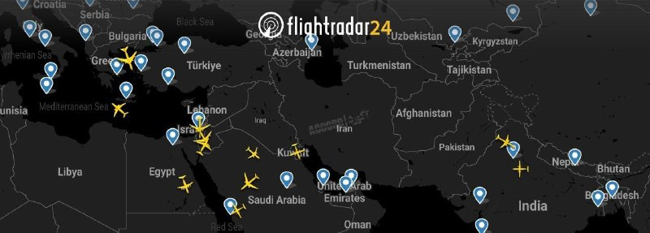

🔴وضعیت پروازهای نظامی در منطقه.

@IranianMinds

## BBCPersian — post 281825

🔻سی‌بی‌اس شریک خبری بی‌بی‌سی گزارش داد که آمریکا در حالی خود را برای دور تازه‌ای از حملات نظامی علیه ایران آماده می‌کند که تلاش‌های دیپلماتیک همچنان ادامه دارد. به گزارش سی‌بی‌اس نیوز، منابعی که مستقیم در جریان برنامه‌ریزی‌ها قرار دارند می‌گویند که دولت ترامپ…

## BBCPersian — post 281824

  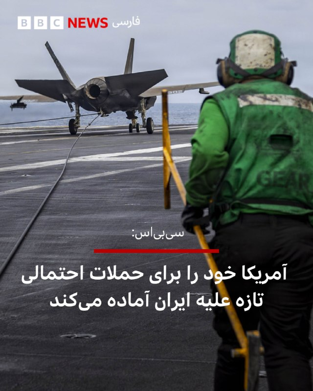

🔻سی‌بی‌اس شریک خبری بی‌بی‌سی گزارش داد که آمریکا در حالی خود را برای دور تازه‌ای از حملات نظامی علیه ایران آماده می‌کند که تلاش‌های دیپلماتیک همچنان ادامه دارد.

به گزارش سی‌بی‌اس نیوز، منابعی که مستقیم در جریان برنامه‌ریزی‌ها قرار دارند می‌گویند که دولت ترامپ روز جمعه در حال آماده‌سازی برای حملات تازه بود هرچند تا عصر جمعه تصمیم نهایی گرفته نشد.

آقای ترامپ در پیامی در شبکه‌های اجتماعی اعلام کرد که «مسائل مربوط به دولت» مانع از حضور او در مراسم ازدواج پسرش، دونالد ترامپ جونیور در روز شنبه خواهد شد.

او قرار بود تعطیلات آخر هفته را در مجموعه گلف خود در ایالت نیوجرسی بگذراند، اما اکنون به کاخ سفید بازمی‌گردد.

چند منبع نیز گفته‌اند که برخی اعضای ارتش و جامعه اطلاعاتی آمریکا برنامه‌های تعطیلات خود را لغو کرده‌اند؛ اقدامی که در انتظار احتمال حملات تازه انجام شده است.

📷EPA
https://bbc.in/4tNcI6h
@BBCPersian

## BBCPersian — post 281823

🔻دو مقام آمریکایی به شبکه خبری اکسیوس گفتند که دونالد ترامپ، نشستی را با اعضای ارشد تیم امنیت ملی خود درباره جنگ با ایران برگزار کرده است. این گزارش حاکیست که رئیس جمهور آمریکا در صورت شکست مذاکرات در آخرین لحظات، به‌طور جدی در حال بررسی انجام حملات تازه…

## BBCPersian — post 281822

  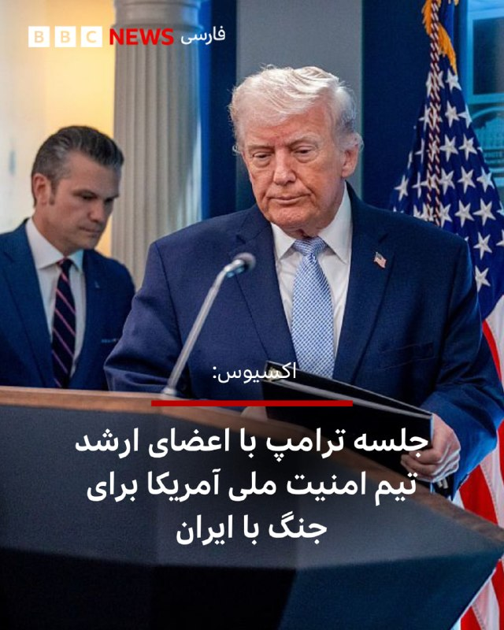

🔻دو مقام آمریکایی به شبکه خبری اکسیوس گفتند که دونالد ترامپ، نشستی را با اعضای ارشد تیم امنیت ملی خود درباره جنگ با ایران برگزار کرده است.

این گزارش حاکیست که رئیس جمهور آمریکا در صورت شکست مذاکرات در آخرین لحظات، به‌طور جدی در حال بررسی انجام حملات تازه علیه ایران است.

گفته می‌شود که این نشست همزمان با سفر عاصم منیر، فرمانده ارتش پاکستان، به تهران برگزار شده است، سفری که ظاهرا آخرین تلاش‌ها برای کاهش اختلاف‌ها و جلوگیری از شروع دوباره جنگ به شمار می‌رود.

همزمان یک هیئت از قطر هم با «هماهنگی آمریکا» در تهران به‌سر می‌برد.

برپایه گزارش آکسیوس همچنین در این جلسه، جی‌دی ونس، معاون رئیس‌جمهور، پیت هگست، وزیر دفاع، جان رتکلیف، رئیس سازمان سیا، سوزی وایلز، رئیس دفتر کاخ سفید، و شماری دیگر از مقام‌ها در کنار دونالد ترامپ حضور داشتند.

گفته شده که مارکو روبیو، وزیر خارجه آمریکا، و ژنرال دن کین، رئیس ستاد مشترک ارتش، در جلسه حضور نداشتند؛ زیرا اولی در اروپا بود و دومی در مراسم فارغ‌التحصیلی آکادمی نیروی دریایی شرکت داشت.

📷 Bloomberg via Getty Image
https://bbc.in/4f2mcqz
@BBCPersian

---
📅 بروزرسانی: 1405/03/02 03:19
---

## VahidOOnLine — post 241618

  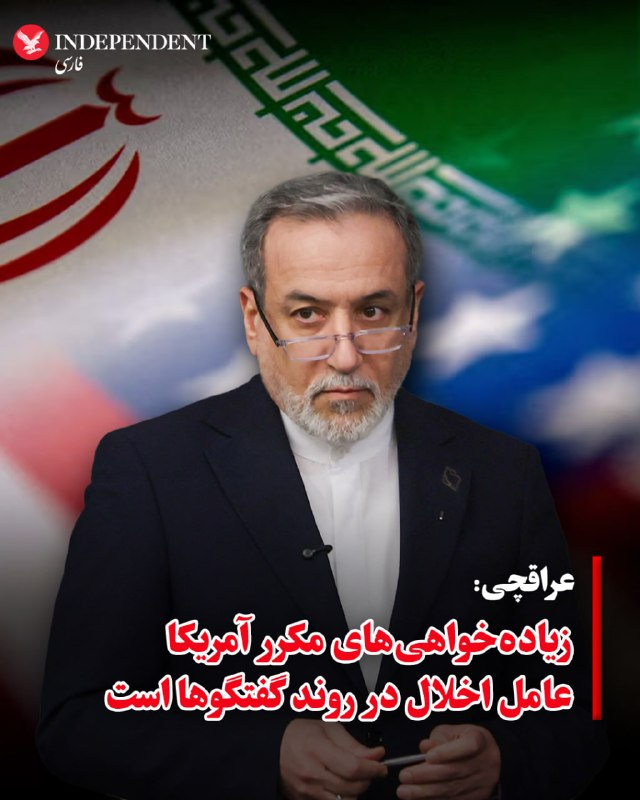

♦️همزمان با افزایش تنش‌ها میان تهران و واشنگتن، عباس عراقچی، وزیر امور خارجه جمهوری اسلامی ایران در گفتگوی تلفنی با آنتونیو گوترش، دبیرکل سازمان ملل متحد، درباره تحولات منطقه به‌ویژه وضعیت خلیج فارس و دریای عمان، با انتقاد شدید از سیاست‌های واشنگتن تصریح کرد: «سوابق بدعهدی آمریکا، خصوصا خیانت‌های مکرر به دیپلماسی، تجاوز نظامی علیه ایران، موضع‌گیری‌های ضد و نقیض و زیاده‌خواهی‌های مکرر، عامل اصلی اخلال در روند گفتگوها به میانجی‌گری پاکستان است.» او با تاکید بر اینکه «جمهوری اسلامی به‌رغم سوءظن شدید به آمریکا، با رویکردی مسئولانه و با جدیت تمام وارد این روند دیپلماتیک شده و برای رسیدن به نتیجه معقول و عادلانه تلاش می‌کند»، تحرکات واشنگتن را مانع صلح دانست. در مقابل، دبیرکل سازمان ملل متحد نیز در این تبادل نظر بر «ضرورت پایبندی به اصول منشور ملل متحد و استفاده از راه‌های دیپلماتیک به منظور برقراری صلح و ثبات در منطقه» تاکید کرد.
‌🇸🇦 Indypersian

🤖 @VahidOOnLine

## VahidOOnLine — post 241617

  

امیر سعید ایروانی، نماینده جمهوری اسلامی در سازمان ملل، در نامه‌ای به شورای امنیت با اشاره به مشارکت قطر، بحرین، کویت، عربستان سعودی، امارات متحده عربی و اردن در حملات آمریکا و اسرائیل علیه جمهوری اسلامی، خواستار جبران کامل خسارات شد.
او گفت در اختیار گذاشتن پایگاه‌ها، پشتیبانی لجستیکی، اطلاعات و هماهنگی پدافند هوایی، این کشورها را از نظر حقوق بین‌الملل مسئول می‌کند.
ایروانی افزود با وجود آن‌که شورای امنیت این کشورها را پاسخگو نکرده است، دولت‌های یادشده موظف‌اند تمامی خسارات مادی و معنوی ناشی از «اقدامات غیرقانونی» خود را به‌طور کامل به جمهوری اسلامی جبران کنند.

‌🏁 🇬🇧 IranintlTV

🤖 @VahidOOnLine

## VahidOOnLine — post 241616

  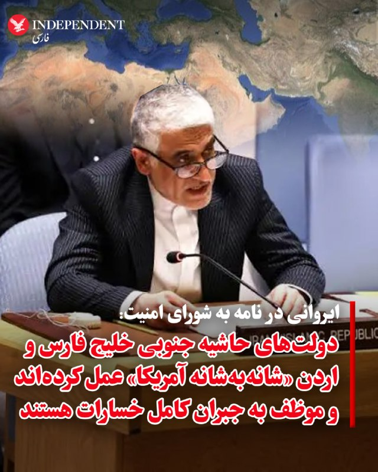

♦️امیرسعید ایروانی، نماینده دایم جمهوری اسلامی در سازمان ملل، روز جمعه در نامه‌ای به شورای امنیت، ضمن متهم کردن همسایگان جنوبی خلیج فارس و اردن  به داشتن نقش فعال در حمله آمریکا علیه ایران، گفت: «این کشورها عملا شانه‌به‌شانه آمریکا عمل کرده‌اند و با در اختیار گذاشتن پایگاه‌ها و تاسیسات نظامی، حمایت‌های لجستیکی و عملیاتی، تبادل اطلاعات، هماهنگی پدافند هوایی، اعطای دسترسی به حریم هوایی و مشارکت در فعالیت‌های نظامی علیه سرزمین و منافع ایران مسئول هستند». ایروانی در ادامه گفت با وجود آن‌که شورای امنیت این کشورها را پاسخگو نکرده، دولت‌های قطر، بحرین، کویت، عربستان سعودی، امارات متحده عربی و اردن موظف‌اند تمامی خسارات مادی و معنوی ناشی از «اقدامات غیرقانونی» خود را به‌طور کامل به جمهوری اسلامی ایران جبران کنند.
‌🇸🇦 Indypersian

🤖 @VahidOOnLine

## VahidOOnLine — post 241615

♦️فیلم سینمایی «طهران ۵۷» به کارگردانی ایمان یزدی، سال ۱۴۰۴ پس از اکران در سینماها، طی روزهای گذشته با اعمال «حذفیات» وارد شبکه نمایش خانگی شده و مورد توجه کاربران شبکه‌های اجتماعی قرار گرفته است. این فیلم طنز با بازی احمد مهران‌فر، حامد آهنگی و پژمان جمشیدی، داستان خیالیِ ورود دونالد ترامپ در دوران جوانی‌اش به همراه دو ستاره هالیوود یعنی جک نیکلسون و وارن بیتی به ایران در اوایل سال ۱۳۵۷ را روایت می‌کند که قصد تاسیس یک کازینو در شمال کشور را دارند. یکی از سکانس‌های این فیلم که در فضای مجازی دست‌به‌دست می‌شود، رقص معروف «وای‌ام‌سی‌ای» (YMCA) ترامپ با ترانه قدیمی «بعد از تو» از حسن شماعی‌زاده است؛ سوژه‌ای که ریشه در یک شایعه قدیمی و جنجالی در فضای مجازی ایران دارد.
پایه و اساس داستان این فیلم، یک ادعای نادرست است که سال‌هاست هم‌زمان با مناسبت‌های سیاسی آمریکا در شبکه‌های اجتماعی فارسی، انگلیسی و عربی مورد توجه قرار می‌گیرد. در این شایعه، با انتشار یک عکس، ادعا می‌شود ترامپ در ۳۷ سالگی برای خرید «هتل قدیم رامسر» و راه‌اندازی کازینو به تهران آمده بود؛ ادعایی که حتی یک‌بار توسط یک توریست آلمانی در بازدید از رامسر نیز تکرار شد. با این حال، بررسی‌های دقیق نشان می‌دهد این عکس دستکاری‌شده نیست، بلکه ده سال بعد از انقلاب ایران (۲۷ ژوئن ۱۹۸۸) توسط «ران گاللا» در جریان مسابقه بوکس مایک تایسون در هتل برج ترامپ در آتلانتیک سیتی ثبت شده و هیچ سند، گزارش یا فکتی مبنی بر سفر دونالد ترامپ به ایران در قبل یا بعد از انقلاب وجود ندارد.
‌🇸🇦 Indypersian

🤖 @VahidOOnLine

## VahidOOnLine — post 241614

  

سفارت جمهوری اسلامی در ارمنستان با بازنشر نامه کناره‌گیری تولسی گبرد از مدیریت اطلاعات ملی آمریکا به دلیل ابتلای همسرش به سرطان، برای همسر گبرد سلامتی و برای این مقام آمریکایی «بهترین‌ها» را آرزو کرد و مواضع او را درباره مواردی همچون اسرائیل و جمهوری اسلامی مورد تحسین قرار داد.
این سفارت‌خانه خطاب به گبرد در ایکس نوشت: «تو پیش‌تر در مقاطعی نشان دادی که برای آمریکا کار می‌کنی نه اسرائیل، و گاهی درباره ایران واقعیت‌هایی را بیان کردی که ترامپ از آن‌ها خوشش نمی‌آمد. تاسف‌آور بود که فردی مانند تو با این دولت همکاری کرد؛ دولتی که آمریکا را به حاشیه رانده و به نیابت از اسرائیل عمل می‌کند.»

‌🏁 🇬🇧 IranintlTV

🤖 @VahidOOnLine

## VahidOOnLine — post 241613

  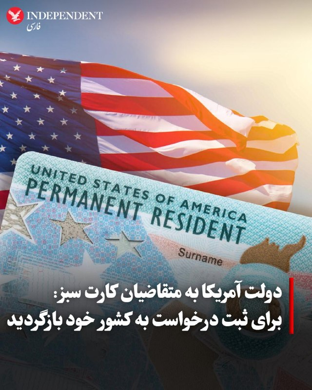

♦️به گزارش رویترز، سازمان خدمات شهروندی و مهاجرت ایالات متحده در دستورالعملی جدید اعلام کرد متقاضیانی که در خاک آمریکا حضور دارند و به دنبال تغییر وضعیت مهاجرتی خود برای دریافت «کارت سبز» (گرین‌کارت) هستند، دیگر نمی‌توانند این فرایند را از داخل آمریکا پیگیری کنند. طبق این سیاست، متقاضیان ملزم هستند برای تکمیل مراحل قانونی، به کشور مبدا بازگشته و از طریق وزارت امور خارجه اقدام کنند.
وزارت امنیت داخلی آمریکا هدف از این تصمیم را جلوگیری از سوءاستفاده از خلأهای قانونی و اصلاح عملکرد سیستم مهاجرتی طبق قانون اعلام کرده است. بر اساس این گزارش سازمان‌های حقوق بشری و حامیان پناهجویان به شدت به این تصمیم اعتراض کرده‌اند.  به گزارش رویترز، این سیاست، قربانیان قاچاق انسان و کودکان آسیب‌دیده‌ای را که از شرایط خطرناک کشورهای خود گریخته‌اند، مجبور می‌کند برای دریافت اقامت دائم، دوباره به همان محیط‌های ناامن بازگردند.
‌🇸🇦 Indypersian

🤖 @VahidOOnLine

## VahidOOnLine — post 241612

  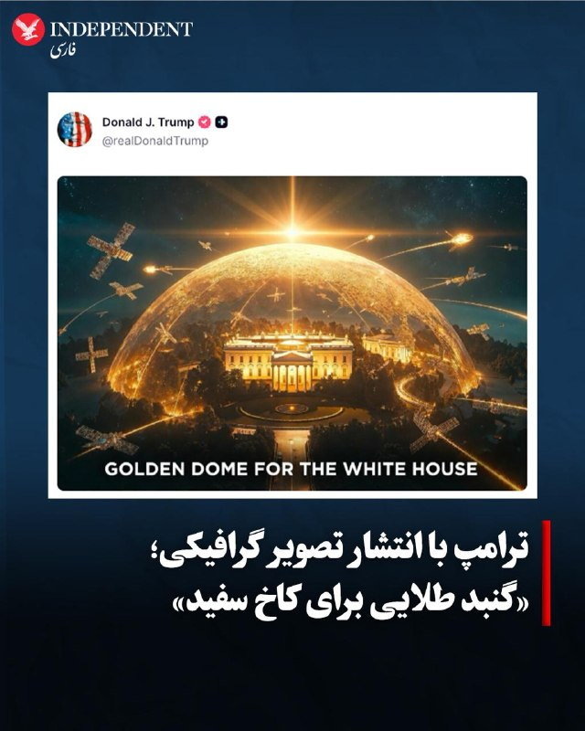

♦️دونالد ترامپ، رئیس‌جمهوری آمریکا، با انتشار تصویری گرافیکی با عبارت «گنبد طلایی برای کاخ سفید» در شبکه اجتماعی «تروث سوشال»، بار دیگر بر ایده خود مبنی بر ایجاد یک سپر دفاع موشکی همه‌جانبه تاکید کرد. ترامپ که از زمان مبارزات انتخاباتی خود بارها بر لزوم ساخت یک چتر پدافندی بزرگ برای کل خاک آمریکا (مشابه گنبد آهنین اسرائیل اما بسیار پیشرفته‌تر) تاکید کرده، در این تصویر مفهومی، کاخ سفید را زیر یک پوشش حفاظتی درخشان مجهز به سیستم‌های راداری و ماهواره‌های مداری به تصویر کشیده است. به گزارش منابع آگاه، پروژه ۱۸۵ میلیارد دلاری «گنبد طلایی» به عنوان یک سپر فضامحور با تکیه بر هوش‌مصنوعی برای رهگیری موشک‌های بالستیک، کروز و هایپرسونیک طراحی شده و صدها شرکت برای مشارکت در آن رقابت می‌کنند. بر اساس گزارش‌ها، غول‌های فناوری نظامی مانند «اندوریل» و «پالانتیر» در حال همکاری برای ارتقای نرم‌افزاری این سامانه هستند و پیش از این نیز در بخش‌هایی از پروژه با شرکت «اسپیس‌اکس» متعلق به ایلان ماسک مشارکت داشته‌اند.
‌🇸🇦 Indypersian

🤖 @VahidOOnLine

## WithYashar — post 12077

  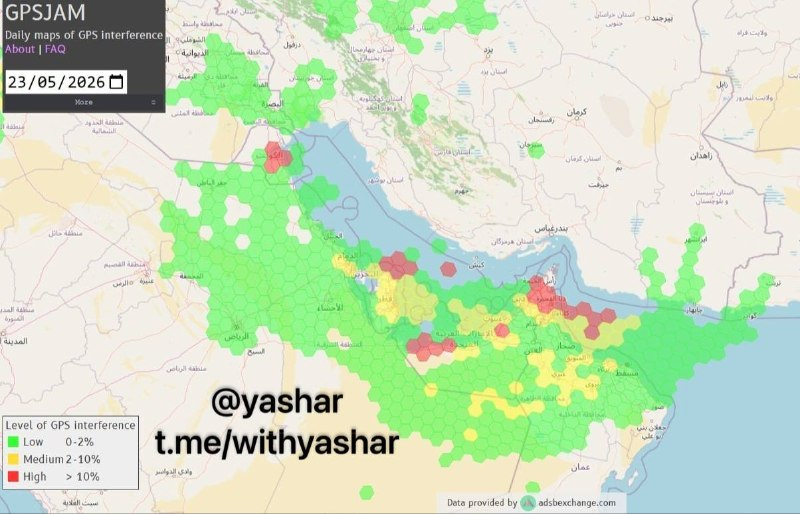

نقشه فعلی اختلالات مداوم GPS در خلیج فارس

GPS Jamming
یعنی فرستادن پارازیت روی سیگنال ماهواره‌ای تا پهپاد، موشک، هواپیما یا موبایل نتواند موقعیت دقیقش را پیدا کند.
این کار را معمولاً اطراف مناطق حساس نظامی انجام می‌دهند تا سلاح‌ها و پهپادهای دشمن دقتشان کم شود یا مسیر را گم کنند.
نوع پیشرفته‌ترش «Spoofing» است که موقعیت جعلی نشان می‌دهد و هدف را به مسیر اشتباه می‌برد.
@withyashar

## WithYashar — post 12076

  <a href="telegram/content/WithYashar_12076_1779493744.mp4" target="_blank">🎬 Download video</a>

ترامپ به کاخ سفید رسیده است و به تیم خبری رسماً اطلاع داده شده که ترامپ در بقیه روز هیچ حضور عمومی، بیانیه یا فرصت عکسبرداری نخواهد داشت.
@withyashar

## WithYashar — post 12075

طبق گزارش CBS نیوز: دولت ترامپ در حال آماده‌سازی برای دور جدیدی از حملات علیه ایران است، علی‌رغم تلاش‌های دیپلماتیک در جریان، در حالی که چندین مقام نظامی و اطلاعاتی ایالات متحده برنامه‌های آخر هفته روز یادبود خود را لغو کرده‌اند با انتظار اینکه اقدام نظامی ممکن است دستور داده شود.

@withyashar

## WithYashar — post 12074

## WithYashar — post 12073

  <a href="telegram/content/WithYashar_12073_1779493746.mp4" target="_blank">🎬 Download video</a>

پست جدید ترامپ 🤣
@withyashar

## WithYashar — post 12072

تعطیلی مراسم یادبود آخر هفته(دوشنبه) برای برخی از نیروهای نظامی آمریکایی لغو شد.
@withyashar

## WithYashar — post 12071

  <a href="telegram/content/WithYashar_12071_1779493747.mp4" target="_blank">🎬 Download video</a>

🎬 Video

## WithYashar — post 12070

مهدی طارمی نمیدونم کیه ولی میگن به اردوی آنتالیا تیم‌ملی اضافه شد
@withyashar

## WithYashar — post 12069

## WithYashar — post 12068

جت های جنگی اسرائیلی به صورت گسترده در حال پرواز به سمت آسمان عراق و عربستان مشاهده شدند.
@withyashar

## WithYashar — post 12067

توجه کنید این خبر فعلا فقط توسط رسانه های اسرائیل گفته شده هنوز تایید نشده

## WithYashar — post 12066

گزارشها حاکی از این است که هیئت پاکستانی با عجله تهران را ترک کردند. @withyashar

## WithYashar — post 12065

کلاً یه دونه تانکر سوخت رسان تو آسمون اسرائیله. من نمیدونم چرا یه خبر فیک میزنن همه هم همونو کپی میکنن همه جا پخش میکنن.

## WithYashar — post 12064

کلاً یه دونه تانکر سوخت رسان تو آسمون اسرائیله. من نمیدونم چرا یه خبر فیک میزنن همه هم همونو کپی میکنن همه جا پخش میکنن.

## WithYashar — post 12063

یه هم زبون افغان نیست اینجا ؟😃

## WithYashar — post 12062

گزارشها حاکی از این است که هیئت پاکستانی با عجله تهران را ترک کردند.
@withyashar

## WithYashar — post 12061

خبر‌ فورررریییییییی 🚨🚨🚨🚨🚨

## WithYashar — post 12060

## WithYashar — post 12059

یاشار حاجی استیکر حامله رو چیکار کنیم آزاد کنی؟😂

## WithYashar — post 12058

## mwarmonitor — post 9511

  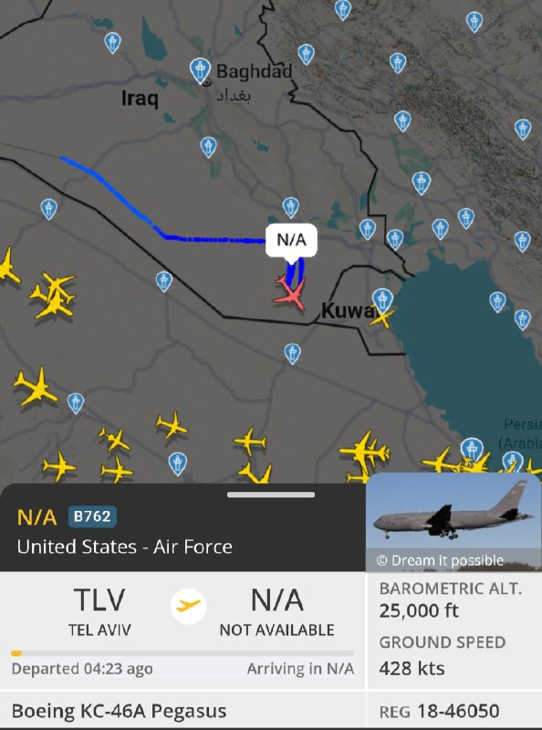

✈️نیروهای آمریکایی در آسمان بیابان سماوه در جنوب عراق فعال شده‌اند و با استقرار هواپیماهای سوخت‌رسان هوایی فعالیت می‌کنند؛ موضوعی که نشان می‌دهد پروازهای جنگی دیگری نیز در آسمان عراق حضور دارند.

@mwarmonitor

## mwarmonitor — post 9510

  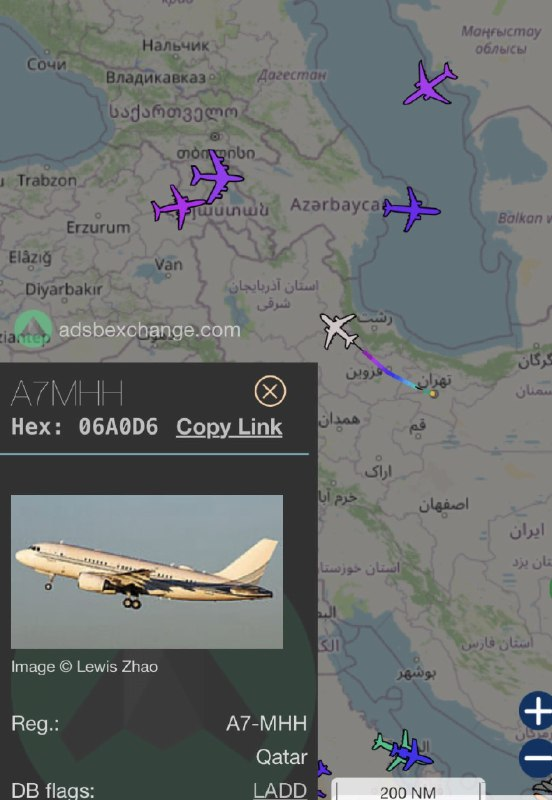

🔴در میان گزارش‌هایی مبنی بر اینکه ایران با صدور اطلاعیه هوانوردان (NOTAM) حریم هوایی خود را تا روز دوشنبه بسته است، یک هواپیمای قطری که به‌عنوان هواپیمای تشریفاتی (VIP) دولت قطر شناخته می‌شود، در حال ترک تهران مشاهده شده است.

🔸این پرواز پس از سفر هیأت قطری به تهران برای تسهیل دستیابی به توافقی میان آمریکا و ایران انجام می‌شود.

🔹در حالی که Asim Munir، تصمیم‌گیرنده اصلی پاکستان، قرار است فردا با همتایان ایرانی خود دیدار کند.

@mwarmonitor

## DEJradio — post 4858

  <a href="telegram/content/DEJradio_4858_1779493749.webm" target="_blank">🎬 Download video</a>

👑
🔺 شاهزاده رضا پهلوی روز آدینه ابتدای خرداد، در کنگره آمریکا، با دریک ون اوردن و دن میوزر، دو نفر از نمایندگان مجلس ایالات متحده دیدار کرد.

دریک ون اوردن با انتشار تصاویری از این دیدار در ایکس، بر حمایت از مبارزه مردم ایران برای آزادی تاکید کرد و نوشت: «آن‌ها به پایان دادن به جنگی که ملایان رادیکال ۴۷سال پیش علیه آمریکا و جهان آزاد آغاز کردند، کمک می‌کنند.» دن میوزر نیز با قدردانی از ایستادگی شاهزاده رضا پهلوی در برابر رژیم حاکم، پایداری او در دفاع از هموطنانش را که نزدیک به ۵۰سال تحت ستم بوده‌اند، ستود.

شاهزاده رضا پهلوی نیز در ایکس نوشت، «خوشحالم که دن مویزر دیدار کردم. از حمایت او از مردم ایران در مبارزه برای بازپس‌گیری کشورمان از رژیم اشغالگر و بازگرداندن ایران به صلح، رفاه و جامعه جهانی سپاسگزارم».

#شاهزاده_رضا_پهلوی
@DEJradio

## IranIntlTV — post 338504

  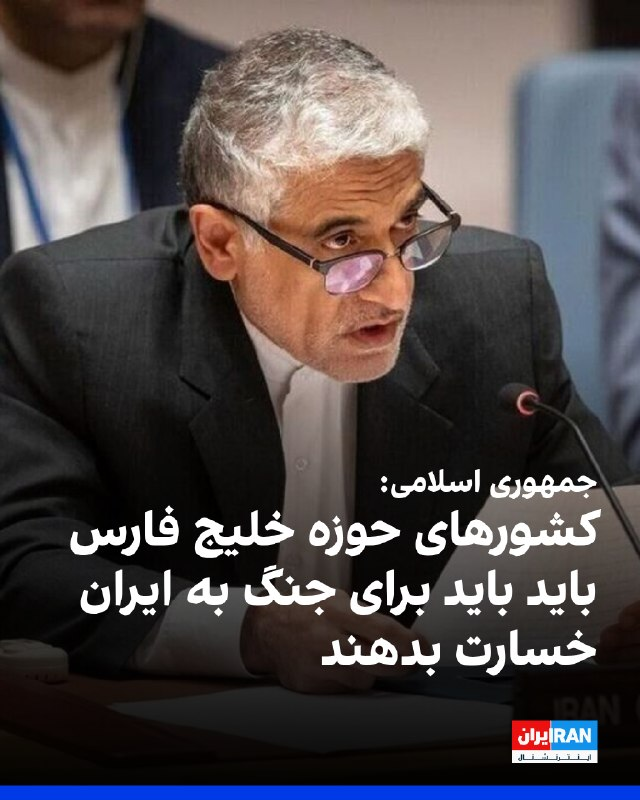

امیر سعید ایروانی، نماینده جمهوری اسلامی در سازمان ملل، در نامه‌ای به شورای امنیت با اشاره به مشارکت قطر، بحرین، کویت، عربستان سعودی، امارات متحده عربی و اردن در حملات آمریکا و اسرائیل علیه جمهوری اسلامی، خواستار جبران کامل خسارات شد.
او گفت در اختیار گذاشتن پایگاه‌ها، پشتیبانی لجستیکی، اطلاعات و هماهنگی پدافند هوایی، این کشورها را از نظر حقوق بین‌الملل مسئول می‌کند.
ایروانی افزود با وجود آن‌که شورای امنیت این کشورها را پاسخگو نکرده است، دولت‌های یادشده موظف‌اند تمامی خسارات مادی و معنوی ناشی از «اقدامات غیرقانونی» خود را به‌طور کامل به جمهوری اسلامی جبران کنند.

https://iranintl.com/202605227902

## IranIntlTV — post 338503

  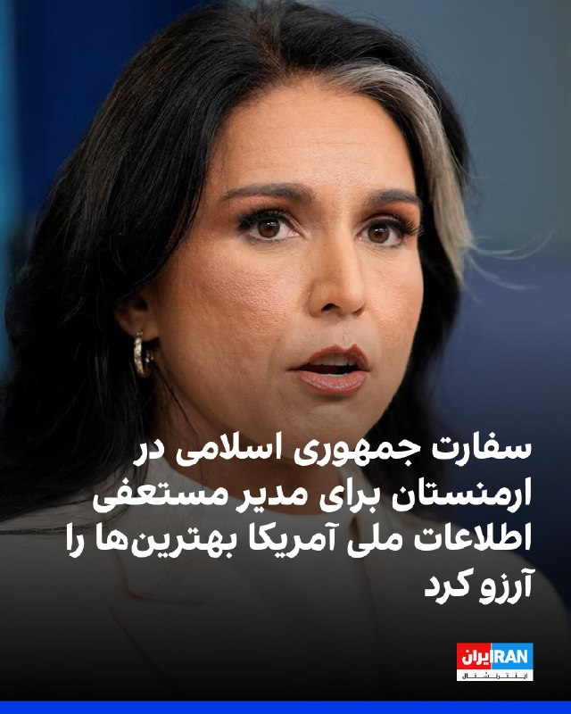

سفارت جمهوری اسلامی در ارمنستان با بازنشر نامه کناره‌گیری تولسی گبرد از مدیریت اطلاعات ملی آمریکا به دلیل ابتلای همسرش به سرطان، برای همسر گبرد سلامتی و برای این مقام آمریکایی «بهترین‌ها» را آرزو کرد و مواضع او را درباره مواردی همچون اسرائیل و جمهوری اسلامی مورد تحسین قرار داد.
این سفارت‌خانه خطاب به گبرد در ایکس نوشت: «تو پیش‌تر در مقاطعی نشان دادی که برای آمریکا کار می‌کنی نه اسرائیل، و گاهی درباره ایران واقعیت‌هایی را بیان کردی که ترامپ از آن‌ها خوشش نمی‌آمد. تاسف‌آور بود که فردی مانند تو با این دولت همکاری کرد؛ دولتی که آمریکا را به حاشیه رانده و به نیابت از اسرائیل عمل می‌کند.»

https://iranintl.com/202605227176

## FarsiVOA — post 218402

⚡️پشت پرده سفر پنج روزه ژنرال پترائوس به بغداد؛ قطع نفوذ جمهوری اسلامی شرط واشنگتن برای عراق
@FarsiVOA

## FarsiVOA — post 218401

  <a href="telegram/content/FarsiVOA_218401_1779493751.mp4" target="_blank">🎬 Download video</a>

⚡️مخالفت جمهوری‌خواهان با تلاش دموکرات‌ها برای محدود کردن اختیارات جنگی رئیس جمهوری آمریکا
@FarsiVOA

## FarsiVOA — post 218400

⚡️اعزام ۵ هزار نیروی آمریکا به لهستان؛ تقویت حضور نظامی در جناح شرقی ناتو
@FarsiVOA

## FarsiVOA — post 218399

  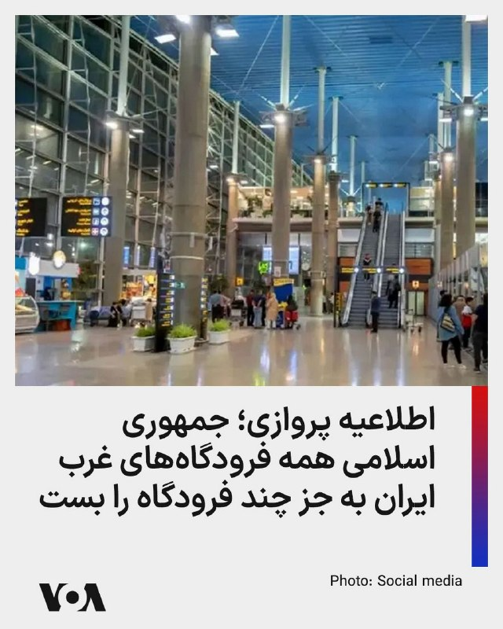

⚡️به گزارش‌ سایت نوتیافی، سازمان هواپیمایی کشوری جمهوری اسلامی با صدور اطلاعیه هوانوردی برای حریم هوایی ایران، اعلام کرد که همه فرودگاه‌های بخش غربی منطقه اطلاعات پروازی تهران به‌جز چند فرودگاه، از (جمعه) ۲۲ مه تا ۲۵ مه بسته خواهند بود و فرودگاه‌های باز در آن محدوده نیز فقط از طلوع تا غروب آفتاب پذیرای پروازهای تجاری هستند.
@FarsiVOA

## Persian_Trend_Official — post 14701

  <a href="telegram/content/Persian_Trend_Official_14701_1779493752.webm" target="_blank">🎬 Download video</a>

🔴 نقشه اختلالات GPS در خلیج فارس

💢گزارش‌ها و داده‌های ناوبری نشان می‌دهد اختلالات گسترده GPS همچنان در بخش‌های مختلف خلیج فارس ادامه دارد.

▪️ بیشترین اختلال‌ها در اطراف تنگه هرمز، سواحل جنوبی ایران و مسیرهای کشتیرانی بین‌المللی ثبت شده است
▪️ این اختلالات می‌تواند بر ناوبری کشتی‌ها، پهپادها و برخی پروازهای عبوری تأثیر بگذارد
▪️ طی هفته‌های اخیر بارها گزارش‌هایی از «اسپوفینگ» و اخلال الکترونیکی در منطقه منتشر شده است

🫆:Tony

📌 @persian_trend_official
پرشین ترند | متفاوت‌ترین کانال نظامی

## Persian_Trend_Official — post 14699

⭕️ ساعتی پیش، تولسی گابارد، از سمت خود به‌عنوان مدیر اطلاعات ملی کابینه دونالد ترامپ، استعفا داد.
در نامه استعفای خود، گابارد گفته است که همسرش، آبراهام، اخیراً به «نوعی بسیار نادر از سرطان استخوان» مبتلا شده و او برای حمایت از همسرش در این مبارزه، تصمیم گرفته از خدمت عمومی کناره‌گیری کند. استعفای او از ۳۰ ژوئن اجرایی می‌شود.

گابارد از جمله کسانی بود که مانند معاونش، جو، با جنگ با ایران مخالف بود.

📝 Nick

📌 @persian_trend_official
پرشین ترند | متفاوت‌ترین کانال نظامی

## Persian_Trend_Official — post 14698

  <a href="telegram/content/Persian_Trend_Official_14698_1779493753.mp4" target="_blank">🎬 Download video</a>

💢متبرک کردن سربند با پهپاد شاهد ۱۳۶ ...

🫆:Tony

📌 @persian_trend_official
پرشین ترند | متفاوت‌ترین کانال نظامی

## IranianMinds — post 20576

🔴با تعطیلی ۹۰ ساعت آینده بورس آمریکا ، وارد حساس‌ترین فاز زمانی شدیم.

@IranianMinds

## IranianMinds — post 20575

🔴سی‌بی‌اس نیوز:

دولت ترامپ برای دور جدیدی از حملات علیه ایران آماده شده است.
چندین عضو ارتش و جامعه اطلاعاتی ایالات متحده، برنامه‌های روز یادبود خود را به دلیل پیش‌بینی حملات احتمالی لغو کرده‌اند.

@IranianMinds

## BBCPersian — post 281815

🖋سوچیرا مگوایر و رها کانسارا
واحد جهانی مقابله با اطلاعات نادرست، بی‌بی‌سی

داخل یک دکه کوچک بامبویی در میانمار، مین مشغول آماده کردن مغازه‌اش برای آغاز روز است.

کابل‌های درهم‌پیچیده، سامانه برق خورشیدی و مستقل از شبکه برق را به چند پریز متصل کرده‌اند. چند صندلی پلاستیکی برای مشتریان چیده شده و روی منوی دست‌نویس، نام خوراکی‌هایی نوشته شده است.

مین، که به دلایل نگرانی‌های امنیتی نامش را تغییر داده‌ایم، می‌داند مشتری‌ها قرار است مدت زیادی اینجا بمانند. آن‌ها فقط برای یک چیز به این کافه می‌آیند: اینترنت.

او می‌گوید هر روز حدود ۳۰ نفر به کافه‌اش مراجعه می‌کنند. زمانی که بیش از دو سال پیش کارش را آغاز کرد، چنین کافه‌هایی کمیاب بودند و روزانه بین ۳۰۰ تا ۴۰۰ نفر به آنجا می‌آمدند. او می‌گوید: «تقاضا سرسام‌آور بود.»

آلبوم را ورق بزنید و ادامه مطلب را از لینک زیر در وبسایت بی‌بی‌سی فارسی بخوانید.

📸BBC/ GettyImages/ LightRocket via Getty Images/ AFP via Getty Images/ Future Publishing via Getty Images/ NurPhoto via Getty Images
https://bbc.in/4ulh4m2
@BBCPersian

## BBCPersian — post 281814

  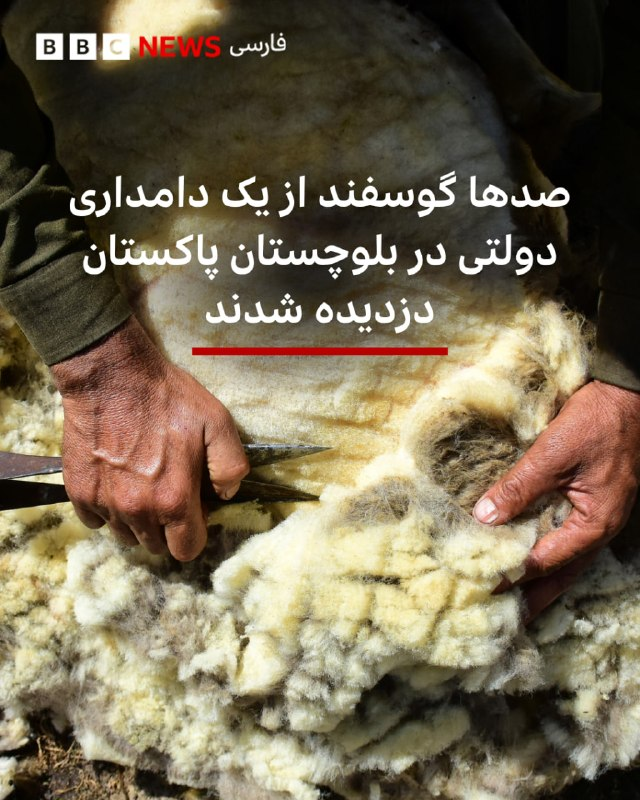

🔻مقامات ایالت بلوچستان پاکستان در حال تحقیق درباره دزدیده شدن بیش از ۴۰۰ گوسفند ممتاز از یک دامداری تحت نظارت دولت هستند.

کارکنان این دامداری می‌گویند که گروهی از مردان مسلح سوار بر موتورسیکلت این گوسفندها را که از نژاد قره‌قل هستند، دزدیدند.

پشم گوسفند قره‌قل که به گوسفند پرشین یا ایرانی هم معروف است، ضخیم، چین‌دار، مخملی، درخشنده و بسیار قیمتی است.

این گونه از پشم لوکس محسوب می‌شود و تجارت آن سودآور است. پشم قره‌قل در صنایع مختلفی از جمله منسوجات و فرشبافی استفاده دارد. نخ حاصل از این پشم در لباس‌های ضخیم زمستانی با دوام بالا استفاده می‌شود و به‌علت تاب‌آوری بالا، پشم قره‌قل از مواد با دوام بافت قالی در پاکستان، افغانسان و ایران است.

مقامات محلی بلوچستان پاکستان می‌گویند که گوسفندها برای تحقیقات و بره‌کشی در آن مرکز نگهداری می‌شدند. آن‌ها می‌گویند که سرقتی در این ابعاد از یک مرکز دولتی کم‌سابقه است.

📷 NurPhoto via Getty Images
@BBCPersian

---
📅 بروزرسانی: 1405/03/02 02:07
---

## VahidOOnLine — post 241611

  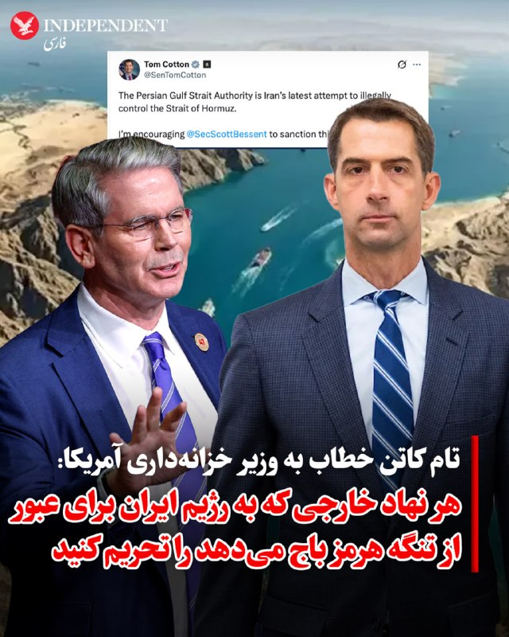

♦️تام کاتن، سناتور جمهوری‌خواه، در نامه‌ای رسمی به اسکات بسنت، وزیر خزانه‌داری ایالات متحده، ضمن هشدار درباره راه‌اندازی «عوارضی تهران» توسط سپاه پاسداران خواستار اعمال تحریم‌های تنبیهی فوری علیه حامیان این طرح شد. کاتن با مواضع تند خود علیه اقدام غیرقانونی ایران در ایجاد «سازمان تنگه خلیج فارس» (PGSA) نوشت: «این سازمان که مستقیما زیر نظر سپاه پاسداران (به عنوان یک سازمان تروریستی) فعالیت می‌کند، حق حاکمیت برای تنظیم تردد و دریافت عوارض تا سقف ۲ میلیون دلار برای هر کشتی را ادعا کرده است؛ بنابراین هر دلار جمع‌آوری‌شده، مستقیما برای تأمین مالی تروریسم هزینه می‌شود.» این سناتور آمریکایی با تأکید بر اینکه این اقدام آزادی کشتیرانی بین‌المللی را به خطر می‌اندازد، صراحتا اعلام کرد: «این سازمان بدون رضایت سایر کشورها نمی‌تواند فعالیت کند و ایالات متحده باید اطمینان حاصل کند که هر بازیگری که به رژیم تروریستی ایران کمک می‌کند، پاسخگو خواهد شد؛ به همین دلیل من از به کارگیری اختیارات موجود برای اعمال تحریم بر این سازمان، مقامات آن و هر نهاد خارجی که این باج‌ها را به ایران پرداخت، پردازش یا تسهیل می‌کند، کاملا حمایت می‌کنم.»
‌🇸🇦 Indypersian

🤖 @VahidOOnLine

## VahidOOnLine — post 241610

  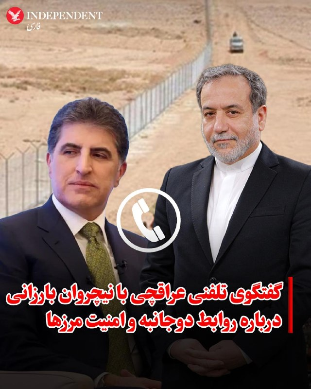

♦️به گزارش فارس، خبرگزاری وابسته به سپاه پاسداران، عباس عراقچی، وزیر امور خارجه جمهوری اسلامی روز جمعه در تماس تلفنی با نیچروان بارزانی، رئیس اقلیم کردستان عراق، درباره روابط دوجانبه ایران و عراق و آخرین تحولات منطقه گفتگو کرد. براساس این گزارش، محورهای اصلی و مهم این تبادل نظر بر مناسباتی از جمله توسعه مراودات اقتصادی-تجاری، تقویت هماهنگی‌ها برای حفظ امنیت مرزهای مشترک و مقابله با تروریسم متمرکز بود. فارس نوشت، دو طرف همچنین در خصوص تحولات منطقه‌ای رایزنی کرده و بر اهمیت اهتمام و هم‌گرایی کشورهای منطقه جهت تقویت امنیت درون‌زا تأکید کردند.
‌🇸🇦 Indypersian

🤖 @VahidOOnLine

## VahidOOnLine — post 241609

  <a href="telegram/content/VahidOOnLine_241609_1779489442.mp4" target="_blank">🎬 Download video</a>

⭕️«صبحانه زنان»؛ بنیاد زنان نیویورک ۱۵۰۰ زن تاثیرگذار را در نیویورک گرد هم آورد

📌یکی از نمادهای مشهور این مراسم اهدای جایزه «عصای راه‌پیمایی» است؛ تندیسی نمادین که مفاهیمی چون قدرت، خرد و حرکت روبه‌جلو را نمایندگی می‌کند

♦️برگزارکنندگان این مراسم تاکید کردند این بنیاد طی سال‌ها توانسته است زنان آمریکایی را، فارغ از وابستگی‌های حزبی و تفاوت‌های سیاسی، کنار یکدیگر گرد آورد و از طریق فعالیت‌های مدنی، آموزشی و اقتصادی، بر جامعه آمریکا تاثیر بگذارد.

یکی از نمادهای این مراسم «عصای راه‌پیمایی» (Walking Stick Award) است؛ هدیه‌ای نمادین و دست‌ساز که با الهام از هنرهای بومی، مختص به هر فرد ساخته و تزیین و به زنان تاثیرگذار، فعالان اجتماعی و رهبران مدنی اهدا می‌شود و مفاهیمی چون قدرت، خرد و حرکت روبه‌جلو را نمایندگی می‌کند.
ایده ساخت و اهدای این عصای تزیین‌شده که گوناگونی و جمعیت رنگارنگ آمریکا را به تصویر می‌کشد، یکی از سازمان‌های تحت‌حمایت بنیاد که در حوزه توانمند سازی زنان فعالیت می‌کند، مطرح و اجرا کرد.

بیشتر بخوانید...
‌🇸🇦 Indypersian

🤖 @VahidOOnLine

## VahidOOnLine — post 241608

  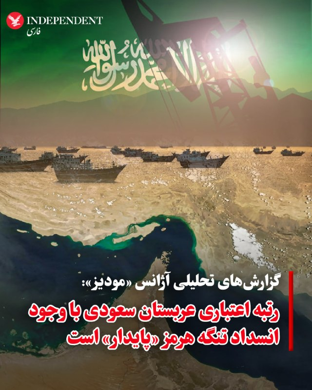

♦️بر اساس گزارش‌های تحلیلی آژانس رتبه‌بندی مودیز (Moody's)، رتبه اعتباری بلندمدت عربستان سعودی با وجود انسداد تنگه هرمز، همچنان «پایدار» است. مودیز در گزارش روز جمعه خود اعلام کرد که این تصمیم بازتاب‌دهنده اقتصاد بزرگ، ثروتمند و جایگاه رقابتی بالا و هزینه پایین تولید هیدروکربن در این کشور، در کنار بهبود اثربخشی سیاست‌ها و پیشرفت در چارچوب چشم‌انداز ۲۰۳۰ است. این آژانس تایید کرد که رشد بخش خصوصی غیرنفتی عربستان سعودی با نرخ پیش‌بینی‌شده ۴ تا ۵ درصد پس از فروکش کردن تنش‌ها، از قوی‌ترین‌ها در میان کشورهای شورای همکاری خلیج فارس خواهد بود. اگرچه اقتصاد پادشاهی سعودی به دلیل درگیری‌های جاری در خاورمیانه و انسداد عملی تنگه هرمز از اوایل ماه مارس، با کاهش ۱۰ درصدی تولید هیدروکربن و انقباض ۱.۷ درصدی کلِ جی‌دی‌پی (GDP) در سال ۲۰۲۶ مواجه است، اما مودیز پیش‌بینی می‌کند که در سال ۲۰۲۷ و با عادی‌سازی جریان تجارت، رشد اقتصادی عربستان سعودی جهش چشمگیر ۸ درصدی را تجربه کند.
طبق تحلیل سناریوی مرکزی این آژانس رتبه‌بندی، ساختار اعتباری عربستان سعودی در برابر اختلالات طولانی‌مدت و انسداد تنگه هرمز تا پایان سال ۲۰۲۶ تاب‌آور خواهد بود. این ثبات و انعطاف‌پذیری به دلیل توانایی ریاض در تغییر مسیر بخش عمده‌ای از صادرات نفت خود از طریق خط لوله شرق به غرب به سمت پایانه‌های دریای سرخ است؛ به‌طوری‌که این بنادر اکنون قادر به بارگیری تا ۵ میلیون بشکه در روز معادل نفت (دو‌سوم سطوح پیش از نزاع منطقه) هستند. علاوه بر این، جهش قیمت نفت به محدوده ۹۰ تا ۱۱۰ دلار در هر بشکه در سال ۲۰۲۶ و وجود دارایی‌های مالی قدرتمند دولت (معادل ۱۸ درصد جی‌دی‌پی در سال ۲۰۲۵)، ظرفیت بالایی را برای جذب نوسانات ایجاد کرده و درآمدها را فراتر از پیش‌بینی‌های قبل از جنگ برده است.
‌🇸🇦 Indypersian

🤖 @VahidOOnLine

## WithYashar — post 12054

کسایی که بلاک میشن بیان محترمانه عذرخواهی کنند بدون حرف اضافی آنبلاک میکنم
قوربان شوما دیکتاتور مهربون یاشار 🤣❤️‍🩹🙌🏾

## WithYashar — post 12053

بیتکوین شلوار خودشو خیس کرد داره میریزه🥴
@withyashar

## WithYashar — post 12052

  <a href="telegram/content/WithYashar_12052_1779489447.mp4" target="_blank">🎬 Download video</a>

ترامپ خیلی فوری‌ نیویورک رو ترک و مستقیم برگشت کاخ‌سفید.
او پیشتر خبر از کنسل کردن تعطیلات اخر هفته خود و رفتن به عروسی پسر ارشدش رو به علت مسائل ایران داده بود..
@withyashar

## WithYashar — post 12051

لطفا از ‌دایرکت بی مورد پرهیز کنید در زمان شلوغی … دایرکته محل کامنت و احساسات شما نیست ، هواپیمای هیئت قطری هم میره ترکیه ! قبل از ارسال خبر ببینید که در چنل نیسن بعد بفرستید ، دایرکت فقط یک پیغام ارسال کنید هر چند خط شد … ممنون از توجه شما به این موضوع

## WithYashar — post 12050

  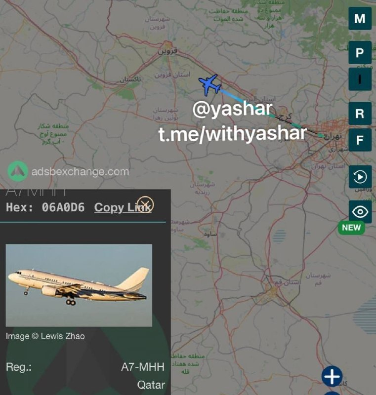

جنگندههای ایرانی که از مهرآباد بلند شدند برای اسکورت هواپیمای مقامات قطری بودند.
@withyashar

## WithYashar — post 12049

  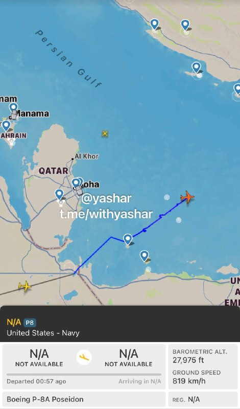

همکنون هواپیمای گشت دریایی چندمنظوره (بویینگ P-8 پوزایدن) و یک پهپاد ناشناس بدون شک آمریکایی بر فراز خلیج فارس !
@withyashar

## WithYashar — post 12048

هیئت قطری تهران را ترک کرد

گزارش‌ها حاکی است هیئت قطری پس از رایزنی‌های دیپلماتیک، تهران را ترک کرده است.

این سفر در حالی انجام شد که قطر در کنار پاکستان و چند کشور منطقه، در تلاش برای میانجیگری میان ایران و آمریکا جهت دستیابی به توافقی برای پایان جنگ و ادامه مذاکرات هسته‌ای بود.
@withyashar

## WithYashar — post 12047

گزارش‌های متعددی درباره برخاستن اضطراری (اسکرامبل) جنگنده‌ها از فرودگاه مهرآباد، تهران دریافت شده است.
@withyashar
جنگنده های خود رژیمن از ترسه …. شانه کسکم

## WithYashar — post 12046

کردان سمت هشتگرد صدای جنگنده میاد

## WithYashar — post 12045

یاشار جان کرج صدای جنگنده میاد
ساعت 01:06

## WithYashar — post 12044

  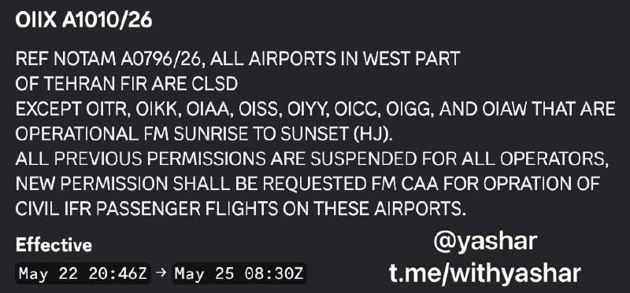

فضای هوایی غرب ایران طبق یک NOTAM جدید تا صبح روز دوشنبه بسته شده است، به‌جز پروازهای روزانه (در ساعات روشنایی روز)
@withyashar

## WithYashar — post 12043

۸۹ ساعت و ۳۰ دقیقه دقیقا الان خوبه ؟
چون ویس و حتی تکست ها رو که بالا هست نمیری ‌نگاه کنی …🤬۵۰ بار گفتم

## WithYashar — post 12042

چرا ۹۰ساعت؟

## WithYashar — post 12041

دقایقی پیش بازار بورس آمریکا برای حدود ۹۰ ساعت آینده بسته شد.
@withyashar
رفتیم تو وضعیت قرمز 💥

## mwarmonitor — post 9509

🔴 یک منبع آمریکایی به Al Jazeera گفت:

🔸رئیس ستاد مشترک ارتش آمریکا در نشست شورای امنیت ملی شرکت کرده و گزینه‌هایی را در صورت شکست مذاکرات با ایران به رئیس‌جمهور ارائه داده است.

@mwarmonitor

## mwarmonitor — post 9508

🔴بر اساس گزارش CBS News به نقل از چند منبع، برخی از مقامات نظامی و اطلاعاتی آمریکا برنامه‌های آخر هفته تعطیلات روز یادبود (Memorial Day) را لغو کرده‌اند؛ این اقدام در پی انتظار برای احتمال حملات علیه ایران صورت گرفته است.

🔸دولت ترامپ در حال آماده‌سازی برای دور تازه‌ای از حملات نظامی است، هرچند تا بعدازظهر جمعه هیچ تصمیم نهایی در این‌باره اتخاذ نشده بود.

@mwarmonitor

## mwarmonitor — post 9507

ترامپ حرکت جدید به رقص معروف خودش اضافه کرد 🏌 @mwarmonitor

## mwarmonitor — post 9506

  <a href="telegram/content/mwarmonitor_9506_1779489452.mp4" target="_blank">🎬 Download video</a>

ترامپ حرکت جدید به رقص معروف خودش اضافه کرد 🏌

@mwarmonitor

## mwarmonitor — post 9505

  

🔴فضای هوایی غرب ایران طبق یک NOTAM جدید تا صبح روز دوشنبه بسته شده است، به‌جز پروازهای روزانه (در ساعات روشنایی روز).

@mwarmonitor

## FoxNewsTwitter — post 342149

  

Fox News (Twitter/X)

BREAKING: President Trump announces that 9/11 hero Welles Crowther will posthumously receive the Presidential Medal of Freedom.

Known as “The Man in the Red Bandana,” Crowther repeatedly ran back into the South Tower on 9/11 to help others escape, saving as many as 18 lives before losing his own.

Allison Crowther said her son’s legacy continues to endure nearly 25 years later: “Welles’ light still shines brightly.”

## FoxNewsTwitter — post 342148

  <a href="telegram/content/FoxNewsTwitter_342148_1779489457.mp4" target="_blank">🎬 Download video</a>

Fox News (Twitter/X)

WATCH: President Trump breaks out his staple 'YMCA' dance moves — with a bonus golf swing — as he wraps up a midterm campaign event in upstate New York.

## FoxNewsTwitter — post 342147

  <a href="telegram/content/FoxNewsTwitter_342147_1779489459.mp4" target="_blank">🎬 Download video</a>

Fox News (Twitter/X)

NEW: Tom Gorman, father of slain Sheridan Gorman, shared the devastating reality his family faces following his daughter’s murder at the hands of an illegal immigrant.

Gorman addressed the agonizing grief he and his wife endure, describing a heartbreaking moment on Mother’s Day that underscores the human cost of the border crisis.

“I am a husband who had to hold his wife on Mother’s Day when she asked the question no mother should ever have to ask. Through tears, Jess looked at Maddy and me and asked, ‘Am I still the mother of two?’ There’s no answer big enough for that pain.”

“All I could do was hold her and tell her the truth: ‘Yes, Jess. You’re still the mother of two because Sheridan will always be our daughter.’”

## FoxNewsTwitter — post 342146

  <a href="telegram/content/FoxNewsTwitter_342146_1779489462.mp4" target="_blank">🎬 Download video</a>

Fox News (Twitter/X)

BREAKING: President Trump blasts Democrats as “bulls**** artists” for trying to blame his admin for rising costs just days after he took office:

“The Democrats are the ones that caused all the costs.”

“They would constantly come out with the word ‘affordability.’ I said they’re the ones that caused the problem.”

“I’m in office two days, and the costs have gone through the roof under four years of Sleepy Joe or Crooked Joe — or both — Biden.”

“They’re the greatest ‘bulls**** artists.’”

## kianmeli1 — post 87570

  <a href="telegram/content/kianmeli1_87570_1779489465.mp4" target="_blank">🎬 Download video</a>

🔴ترامپ سوار هواپیمای نیروی هوایی در نیویورک شد، اقامت آخر هفته خود در نیوجرسی را لغو کرد و به کاخ سفید بازگشت.
https://t.me/kianmeli1

## kianmeli1 — post 87569

  

🔴هیئت قطر تهران را ترک کرد.
https://t.me/kianmeli1

## kianmeli1 — post 87568

🔴جمهوری اسلامی تهدیدات حمله را کاملا جدی گرفته است و تمام پایگاه ها آماده باش کامل است

باید دید آیا برنامه ترامپ حمله است یا خیر
https://t.me/kianmeli1

## kianmeli1 — post 87567

  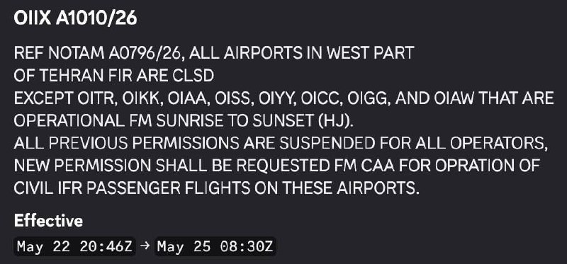

🔴امشب ایران آماده جنگ احتمالی شد

فضای هوایی غرب ایران طبق یک NOTAM جدید تا صبح روز دوشنبه بسته شده است، به‌جز پروازهای روزانه (در ساعات روشنایی روز).
https://t.me/kianmeli1

## IranIntlTV — post 338502

  <a href="telegram/content/IranIntlTV_338502_1779489469.mp4" target="_blank">🎬 Download video</a>

وال‌استریت ژورنال گزارش داد پر شدن مخازن نفت و فشارهای آمریکا، جمهوری اسلامی را با بحران نفتی روبه‌رو کرده است. کارشناسان هشدار داده‌اند تهران ممکن است ناچار به تعطیلی برخی چاه‌های نفت شود؛ اقدامی که می‌تواند به صنعت نفت ایران آسیب بزند.

گفت‌وگو با مهدی مصلحی، کارشناس بازار نفت
@iranintltv

## IranIntlTV — post 338501

  <a href="telegram/content/IranIntlTV_338501_1779489471.mp4" target="_blank">🎬 Download video</a>

مشاور رییس دولت امارات متحده عربی گفت حملات جمهوری اسلامی باعث تغییر نگاه امنیتی کشورهای منطقه شده و برخی دولت‌های عربی اکنون تهران را تهدیدی بزرگ‌تر از اسرائیل می‌دانند.

گفت‌وگو با امیرحسین میراسماعیلی، روزنامه‌نگار
@iranintltv

## IranIntlTV — post 338500

  <a href="telegram/content/IranIntlTV_338500_1779489474.mp4" target="_blank">🎬 Download video</a>

همزمان با سفر فرمانده ارتش پاکستان به ایران، رویترز از اعزام تیم مذاکره‌کننده قطری به تهران با هماهنگی آمریکا خبر داد. رسانه‌های عربی نیز گزارش دادند پیش‌نویس توافق اولیه شامل آتش‌بس، توقف حملات و آغاز مذاکرات در هفت روز آینده است.

گفت‌وگو با جمشید برزگر، روزنامه‌نگار
@iranintltv

## IranIntlTV — post 338499

  <a href="telegram/content/IranIntlTV_338499_1779489477.mp4" target="_blank">🎬 Download video</a>

همزمان با تشدید تنش‌ها میان تهران و واشینگتن و گمانه‌زنی‌ها درباره احتمال توافق، ترامپ گفت آمریکا رفتاری مشابه آنچه در ونزوئلا رخ داد، با جمهوری اسلامی انجام می‌دهد. او گفت ایران بی‌صبرانه به‌دنبال رسیدن به توافق با آمریکا است.

گفت‌وگو با امیر گیتی، عضو تحریریه ایران‌اینترنشنال
@iranintltv

## Shin_Persian — post 6162

  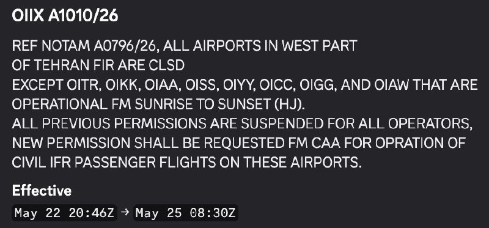

Faytuks Network ✓ @FaytuksNetwork
Fri, 22 May 2026 21:32:12 UTC

Details of the NOTAM

فارسی

جزئیات نوتام (NOTAM):

𝕏 · @shin_persian

## Shin_Persian — post 6161

  

Shin ✓ @hey_itsmyturn
Fri, 22 May 2026 21:37:46 UTC

Jet activity over Karaj, Alborz Province, #Iran

فارسی

فعالیت جنگنده‌ها بر فراز کرج، استان البرز، #Iran

𝕏 · @shin_persian

## Shin_Persian — post 6160

  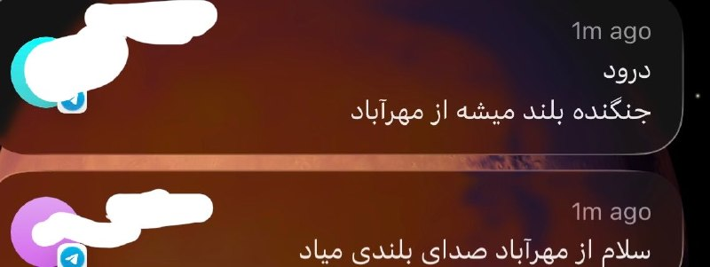

Shin ✓ @hey_itsmyturn
Fri, 22 May 2026 21:33:16 UTC

Received multiple reports regarding jet scramble from Mehrabad airport, Tehran
Tehran Province, #Iran

فارسی

گزارش‌های متعددی درباره برخاستن اضطراری (اسکرامبل) جنگنده‌ها از فرودگاه مهرآباد، تهران دریافت شده است.
استان تهران، #Iran

𝕏 · @shin_persian

## FarsiVOA — post 218398

🔺هواپیماهای ای-۱۰ آمریکا در خاورمیانه مجهز به سامانه جدید سوخت‌گیری شدند

◾️بر اساس تصاویر تازه‌منتشرشده، نیروی هوایی آمریکا هواپیماهای تهاجمی «ای-۱۰ تاندر بولت ۲» را با یک سامانه جدید سوخت‌گیری هوایی که پیشتر آزمایش‌شده است به خاورمیانه اعزام کرده است.

⬇️ بیشتر بخوانید:
https://ir.voanews.com/a/8152863.html
@FarsiVOA

## FarsiVOA — post 218397

🔺سناتور آمریکایی به‌دنبال تحریم کشورهای همکار با طرح عوارض‌گیری جمهوری اسلامی در تنگه هرمز

◾️به گزارش «واشنگتن فری‌بیکن»، تام کاتن، سناتور جمهوری‌خواه آمریکا، در حال تهیه طرحی قانونی است که بر اساس آن هر کشوری که به جمهوری اسلامی برای اجرای طرح دریافت عوارض در تنگه هرمز کمک کند، به‌سرعت تحریم خواهد شد.

⬇️ بیشتر بخوانید:
https://ir.voanews.com/a/8152861.html
@FarsiVOA

## FarsiVOA — post 218396

⚡️قتل شهروند مازندرانی با شلیک مستقیم مامور نیروی انتظامی؛ دو هزار ساعت خاموشی دیجیتال در ایران
@FarsiVOA

## FarsiVOA — post 218395

⚡️جزئیات ناپدید شدن مشکوک ٣ خدمه عراقی کشتی «بریج ۱ و ۲» در حوالی جزیره کیش
@FarsiVOA

## Persian_Trend_Official — post 14696

🔴 سی‌بی‌اس: دولت ترامپ در حال آماده‌سازی برای حملات جدید به ایران است

💢شبکه CBS News گزارش داد دولت ترامپ امروز در حال آماده‌سازی برای دور جدیدی از حملات نظامی علیه ایران بوده است، هرچند تاکنون تصمیم نهایی اتخاذ نشده است.

بر اساس این گزارش‌ها:

▪️ چندین عضو ارتش و جامعه اطلاعاتی آمریکا برنامه‌های تعطیلات Memorial Day خود را لغو کرده‌اند

▪️ این اقدام در پی احتمال انجام حملات جدید علیه ایران صورت گرفته است

▪️ ترامپ همزمان جلسات فشرده‌ای با مشاوران امنیت ملی و فرماندهان نظامی برگزار کرده است

همچنین گزارش شده:

▪️ کاخ سفید همچنان در حال بررسی گزینه‌های نظامی و پیامدهای احتمالی تشدید درگیری است
▪️ مذاکرات غیرمستقیم با ایران هنوز ادامه دارد اما پیشرفت قابل‌توجهی حاصل نشده
▪️ برخی منابع آمریکایی می‌گویند در صورت شکست دیپلماسی، گزینه نظامی دوباره فعال خواهد شد

🫆:Tony

📌 @persian_trend_official
پرشین ترند | متفاوت‌ترین کانال نظامی

## Persian_Trend_Official — post 14694

🔴 آکسیوس: ترامپ در حال بررسی حملات نظامی جدید علیه ایران است

💢آکسیوس به نقل از مقام‌های آمریکایی گزارش داد دونالد ترامپ روز جمعه با مشاوران ارشد امنیت ملی خود دیدار کرده تا درباره احتمال انجام حملات نظامی جدید علیه ایران گفت‌وگو کند.

💢بر اساس این گزارش:

▪️ ترامپ به‌شدت در حال بررسی ازسرگیری حملات در صورت شکست مذاکرات است

▪️ جلسه با حضور مقام‌های ارشد امنیتی و اطلاعاتی آمریکا برگزار شده

▪️ همزمان تلاش‌های میانجیگرانه پاکستان و قطر برای جلوگیری از بازگشت جنگ ادامه دارد

💢آکسیوس همچنین نوشته:

▪️ ترامپ طی روزهای اخیر از روند مذاکرات با ایران ناراضی‌تر شده است

▪️ هنوز تصمیم نهایی برای حمله اتخاذ نشده

▪️ برخی منابع معتقدند در صورت عدم پیشرفت ناگهانی در مذاکرات، گزینه نظامی دوباره فعال خواهد شد

🫆:Tony

📌 @persian_trend_official
پرشین ترند | متفاوت‌ترین کانال نظامی

## Persian_Trend_Official — post 14693

  <a href="telegram/content/Persian_Trend_Official_14693_1779489482.webm" target="_blank">🎬 Download video</a>

🔴 هیئت قطری تهران را ترک کرد

💢گزارش‌ها حاکی است هیئت قطری پس از رایزنی‌های دیپلماتیک، تهران را ترک کرده است.

💢این سفر در حالی انجام شد که قطر در کنار پاکستان و چند کشور منطقه، در تلاش برای میانجیگری میان ایران و آمریکا جهت دستیابی به توافقی برای پایان جنگ و ادامه مذاکرات هسته‌ای بود.

🫆:Tony

📌 @persian_trend_official
پرشین ترند | متفاوت‌ترین کانال نظامی

## Persian_Trend_Official — post 14692

  <a href="telegram/content/Persian_Trend_Official_14692_1779489482.mp4" target="_blank">🎬 Download video</a>

💢 ترامپ

💢باور کنید من توانستم این معادله را حل‌ کنم
!
‌‌(203 × 9 ÷2+ 1324 − 1292) × 19

🫆:Tony

📌 @persian_trend_official
پرشین ترند | متفاوت‌ترین کانال نظامی

## Persian_Trend_Official — post 14691

  <a href="telegram/content/Persian_Trend_Official_14691_1779489485.webm" target="_blank">🎬 Download video</a>

🔴 ایران بخشی از حریم هوایی غرب کشور را تا دوشنبه بست

💢گزارش‌ها حاکی است ایران بخشی از حریم هوایی غرب کشور را برای پروازهای شبانه از غروب تا طلوع خورشید تا روز دوشنبه بسته است.

🫆:Tony

📌 @persian_trend_official
پرشین ترند | متفاوت‌ترین کانال نظامی

## Persian_Trend_Official — post 14689

  <a href="telegram/content/Persian_Trend_Official_14689_1779489485.mp4" target="_blank">🎬 Download video</a>

🔥هم اکنون بندر نووروسییسک، روسیه مورد حمله موشکی پهپادی اوکراینی ها قرارگرفت،

👩‍💻☆Phantom☆

🆔 @persian_trend_official
پرشین ترند | متفاوت‌ترین کانال نظامی

## IranianMinds — post 20574

  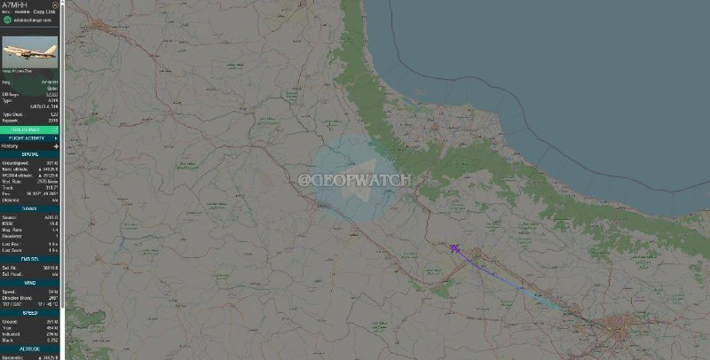

🔴هیئت ارسالی قطر که برای ارسال پیام و میانجی به تهران آمده بودند، تهران را ترک کردند.

@IranianMinds

## IranianMinds — post 20573

  

🔴فضای هوایی غرب ایران طبق یک NOTAMجدید تا صبح روز دوشنبه بسته شده است.

@IranianMinds

## BBCPersian — post 281813

  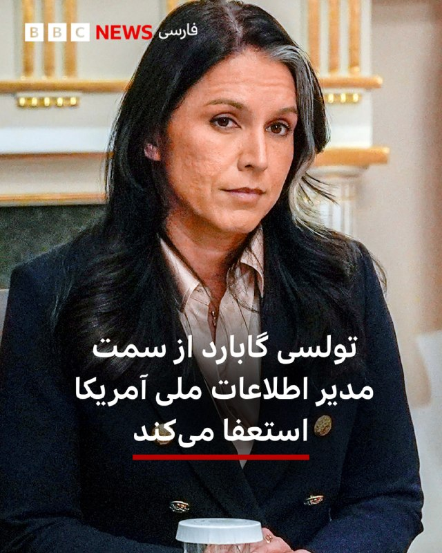

🔻تولسی گابارد اعلام کرد که از سمت خود به‌عنوان مدیر اطلاعات ملی ایالات متحده آمریکا در دولت دونالد ترامپ کناره‌گیری خواهد کرد. او دلیل این تصمیم را تشخیص سرطان استخوان همسرش عنوان کرده است.

خانم گابارد در نامه استعفای خود که به دست شبکه سی‌بی‌اس نیوز رسیده، نوشته است: «قدرت و عشق او در همه چالش‌ها پشتیبان من بوده است. نمی‌توانم با وجدان آسوده از او بخواهم این مبارزه را به تنهایی پشت سر بگذارد، در حالی که من همچنان در این مسئولیت دشوار و پرمشغله باقی بمانم.»

دونالد ترامپ، رئیس جمهور آمریکا نیز در پیامی در شبکه‌های اجتماعی نوشت که گابارد «کار فوق‌العاده‌ای انجام داده و دلتنگش خواهیم شد.»

استعفای او از ۳۰ ژوئن، ۹ تیر ۱۴۰۵، اجرایی می‌شود و به گفته آقای ترامپ، آرون لوکاس، معاون اصلی مدیر اطلاعات ملی، به‌طور موقت این سمت را برعهده خواهد گرفت.

ادامه خبر را از لینک زیر در وبسایت بی‌بی‌سی فارسی بخوانید.

📷 Bloomberg via Getty Images
https://bbc.in/4dqxAv9
‌@BBCPersian

## Dirty_Kids — post 389987

  <a href="telegram/content/Dirty_Kids_389987_1779489491.webm" target="_blank">🎬 Download video</a>

☢️خفن ترین و‌ قدیمی ترین  انالیزور  ایران ینی دکتر بت 
👍 
🔴هیچ سایت بتی دوست نداره شما کانال دکتر بت رو پیدا کنین چون خیلی سود میکنید🤷‍♂ رایگان بهترین شرط هارو براتون میذاره حتی هزار تومن هم دریافت نمیکنه روزانه میتونی از پیش بینی فوتبال باهاش پول در بیاری…

## Dirty_Kids — post 389986

  <a href="telegram/content/Dirty_Kids_389986_1779489492.webm" target="_blank">🎬 Download video</a>

☢️خفن ترین و‌ قدیمی ترین  انالیزور  ایران ینی دکتر بت 
👍

🔴هیچ سایت بتی دوست نداره شما کانال دکتر بت رو پیدا کنین چون خیلی سود میکنید🤷‍♂

رایگان بهترین شرط هارو براتون میذاره
حتی هزار تومن هم دریافت نمیکنه
روزانه میتونی از پیش بینی فوتبال باهاش پول در بیاری 👌
A1
اگ اهل پیش بینی فوتبالی این کانال اصلا از دست ندین👇

✅https://t.me/+4_ADqwB9e-QwYjlk

✅https://t.me/+4_ADqwB9e-QwYjlk

## Dirty_Kids — post 389985

  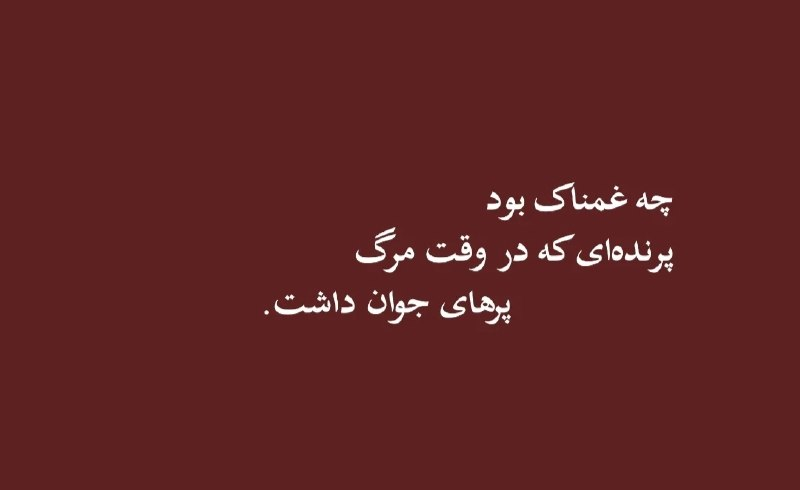

#بخوابیم

@Dirty_Kids 👻

## Dirty_Kids — post 389984

  

سریال (Rooster) با میانگین بیننده ۶.۵ میلیون نفر برای هر قسمت، موفق ترین سریال شبکه HBO در ۱۵ سال اخیر شده! یعنی خییییلی خفنه

این سریال در فصل اولش به یکی از ۳ سریال کمدی پربیننده تاریخ این شبکه تبدیل شده. موفقیتی خارق‌العاده به لطف استیو کارل عزیز.

@Dirty_Kids 👻

## Dirty_Kids — post 389983

  

ببخشین این سایز بزرگتر نداره؟
مثلا اندازه یه دختر ۲۳ ساله؟؟؟؟؟

@Dirty_Kids 👻

## Dirty_Kids — post 389982

به فرزندان خود راهنما زدن، دنگ دادن، حرمت نون و نمک نگه داشتن، با دهن بسته غذا خوردن و متعهد بودن رو بیاموزید.

@Dirty_Kids 👻

## Dirty_Kids — post 389981

‏جمهوری اسلامی هم مملکتمو ازم گرفت، هم زندگیمو، هم آینده‌مو، هم سلامت روانمو و هم عفّت کلاممو.

@Dirty_Kids 👻

## Dirty_Kids — post 389980

  <a href="telegram/content/Dirty_Kids_389980_1779489494.mp4" target="_blank">🎬 Download video</a>

🔴 پشماتون بریزه؛ این صحبتای مراد ویسی مربوط به ۴ سال پیشه که مو به مو اتفاقات فعلی رو پیش بینی کرده بود!

به محض اینکه ایران بره سمت بمب اتم، اسرائیل بهش حمله می‌کنه. آمریکا چه بخواد چه نخواد مجبور میشه پشت دست اسرائیل بازی کنه.
اگه جنگ بشه، آسیبی که ایران می‌بینه خیلی بیشتر از جنگ ایران و عراقه. زیرساخت های کشور نابود و ایران تقریبا ویران میشه!
متاسفانه توی جنگ چه بخواین چه نخواین، مردم عادی و غیر نظامیام کشته میشن...

@Dirty_Kids 👻

## Dirty_Kids — post 389979

  <a href="telegram/content/Dirty_Kids_389979_1779489497.mp4" target="_blank">🎬 Download video</a>

🔴 همه منتظرن ترامپ در مورد حمله به ایران صحبت کنه، ترامپ تو سخنرانی امشبش:

باور کنین من یه نابغه‌م، من تونستم این معادله رو حل کنم.
(203 × 9 ÷ 2 + 1324 − 1292) × 19‌‌

@Dirty_Kids 👻

## alonews — post 121911

  <a href="telegram/content/alonews_121911_1779489498.webm" target="_blank">🎬 Download video</a>

👈حمله هوایی اسرائیل به ساختمانی در صور در جنوب لبنان

✅ @AloNews خبر جنگ

## alonews — post 121910

  <a href="telegram/content/alonews_121910_1779489498.webm" target="_blank">🎬 Download video</a>

👈عراقچی هم اکنون:
زیاده‌خواهی آمریکا مانع اصلی در روند گفتگوها است

✅ @AloNews خبر جنگ

## alonews — post 121909

  <a href="telegram/content/alonews_121909_1779489499.mp4" target="_blank">🎬 Download video</a>

👈ترامپ به سمت کاخ سفید رفت

✅ @AloNews خبر جنگ

## alonews — post 121908

  <a href="telegram/content/alonews_121908_1779489501.webm" target="_blank">🎬 Download video</a>

👈فضای هوایی غرب ایران طبق یک NOTAM جدید تا صبح روز دوشنبه بسته شده است، به‌جز پروازهای روزانه (در ساعات روشنایی روز).

✅ @AloNews خبر جنگ

## alonews — post 121907

  <a href="telegram/content/alonews_121907_1779489501.webm" target="_blank">🎬 Download video</a>

👈دقایقی پیش بازار بورس آمریکا برای حدود ۹۰ ساعت آینده بسته شد.

اگر قرار است ترامپ فرمانی صادر کند امشب یا فرداشب صادر میشود

✅ @AloNews خبر جنگ

---
📅 بروزرسانی: 1405/03/02 01:02
---

## VahidOOnLine — post 241607

  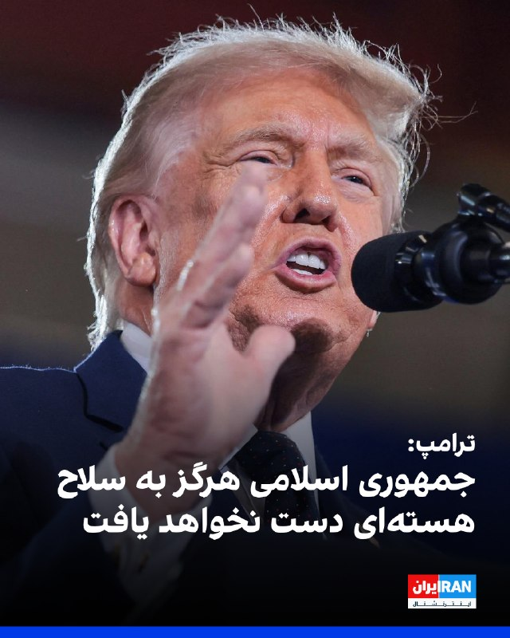

ترامپ در یک سخنرانی در سوفرن نیویورک گفت: «با عملیات خشم حماسی، رزمندگان ما اطمینان حاصل خواهند کرد که جمهوری اسلامی به عنوان بزرگ‌ترین حامی «تروریسم» دولتی در جهان، هرگز به سلاح هسته‌ای دست نخواهد یافت و خودشان هم این را می‌دانند.»
ترامپ گفت: حکومت ایران به عنوان بزرگ‌ترین حامی تروریسم دولتی، به سراسر جهان پول می‌فرستد تا مشکل ایجاد کند.

‌🏁 🇬🇧 IranintlTV

🤖 @VahidOOnLine

## VahidOOnLine — post 241606

  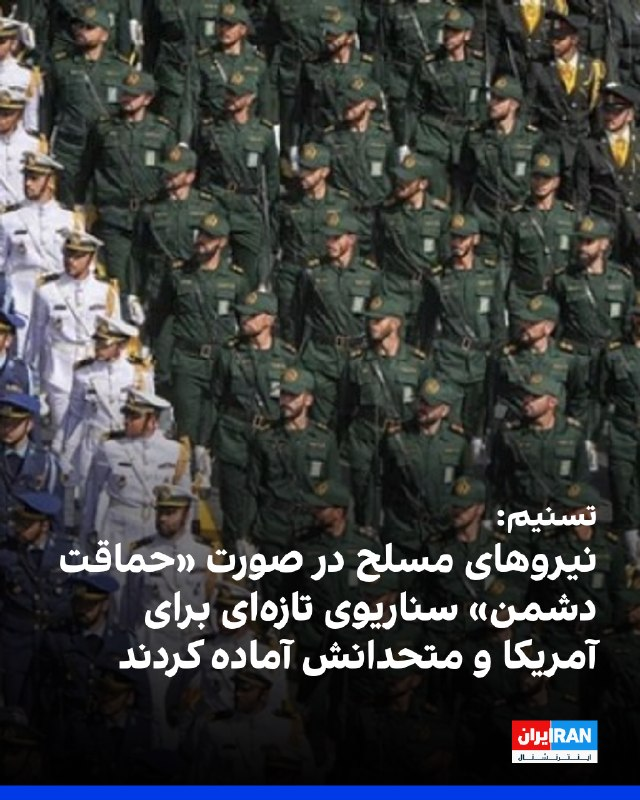

خبرگزاری تسنیم، وابسته به سپاه پاسداران، به نقل از یک منبع نظامی گزارش داد نیروهای مسلح جمهوری اسلامی «به‌طور کامل» تحولات را زیر نظر دارند و در صورت آنچه «حماقت دشمن» و هرگونه بهانه‌جویی از سوی آمریکا و متحدانش خوانده شده، سناریوهای تازه‌ای آماده کرده‌اند.

به گفته این منبع، در صورت اقدام نظامی احتمالی آمریکا، «نسخه سوم مبارزه جمهوری اسلامی» اجرا خواهد شد؛ نسخه‌ای که به ادعای او در حوزه تجهیزات جدید، اهداف نوین، تاکتیک‌ها و راهبردهای جنگی نمود خواهد داشت و حتی می‌تواند جبهه‌های جدیدی در سطح فرامنطقه‌ای ایجاد کند.

این منبع نظامی همچنین مدعی شد آمریکا در صورت «زیاده‌خواهی و اقدام نظامی»، «تنبیه بزرگ سوم» را در کمتر از یک سال تجربه خواهد کرد؛ تنبیهی که به گفته او «به شکلی خاص‌تر و جدیدتر» خواهد بود.
‌🏁 🇬🇧 IranintlTV

🤖 @VahidOOnLine

## VahidOOnLine — post 241605

  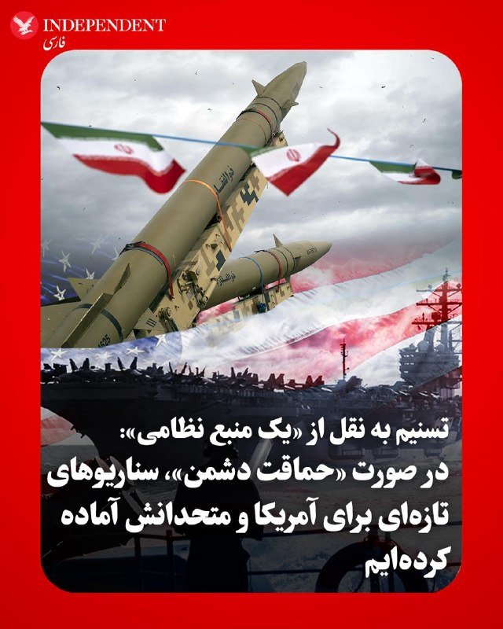

♦️تسنیم، خبرگزاری وابسته به سپاه پاسداران، روز جمعه به نقل از «یک منبع نظامی» نوشت: «نیروهای مسلح جمهوری اسلامی کاملا اوضاع را زیر نظر دارند و در صورت حماقت دشمن با هرگونه بهانه جویی، سناریوهای تازه‌ای برای آمریکا و متحدانش آماده کرده‌اند. این منبع نظامی در گفتگو با تسنیم ضمن اشاره به اینکه اگر دشمن حماقت کند، «نسخه سوم مبارزه ایران» را مشاهده خواهد کرد مدعی شد: «این نسخه سوم هم در حوزه تجهیزات جدید و هم در حوزه اهداف نوین و نیز در حوزه تاکتیک‌ها و استراتژی جنگ نمایان خواهد شد. به نحوی که جبهه‌های جدید فرامنطقه‌ای نیز آنها را پشیمان‌تر خواهد کرد. آمریکا در صورت زیاده‌خواهی و بهانه‌جویی و اقدام نظامی احتمالی، تنبیه بزرگ سوم خود را در کمتر از یکسال تجربه خواهد کرد؛ این بار به شکل خاص‌تر و جدیدتر».
‌🇸🇦 Indypersian

🤖 @VahidOOnLine

## VahidOOnLine — post 241604

  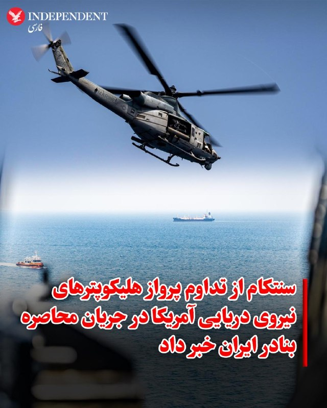

♦️فرماندهی مرکزی آمریکا، سنتکام، با انتشار تصاویری از یک  هلیکوپتر «یو‌اچ-۱‌وای ونوم» (UH-1Y Venom) متعلق به نیروی دریایی آمریکا، جزئیاتی از عملیات‌های اخیر در چارچوب محاصره بنادر جمهوری اسلامی را به نمایش گذاشت.
سنتکام اعلام کرد این هلیکوپتر در جریان عملیات محاصره دریایی علیه بنادر جمهوری اسلامی به کار گرفته شده و توانایی اجرای ماموریت‌های مختلف از جمله رهگیری دریایی، شناسایی و پشتیبانی نزدیک رزمی را دارد.
‌🇸🇦 Indypersian

🤖 @VahidOOnLine

## VahidOOnLine — post 241603

  <a href="telegram/content/VahidOOnLine_241603_1779485564.mp4" target="_blank">🎬 Download video</a>

یک شهروند در پیامی صوتی به ایران اینترنشنال از فشار شدید در ایران و بلاتکلیفی و استرس به دلیل اظهارات دونالد ترامپ درباره امکان پایان جنگ و آتش‌بس می‌گوید. صدای او برای حفظ امنیتش با هوش مصنوعی بازخوانی شده است.
‌🏁 🇬🇧 IranintlTV

🤖 @VahidOOnLine

## VahidOOnLine — post 241602

  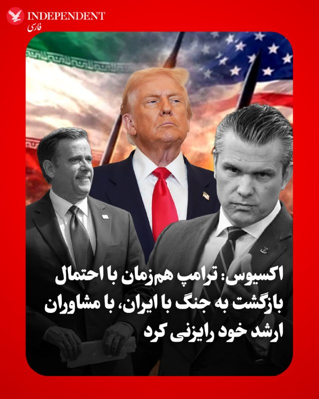

♦️به گزارش اکسیوس، دونالد ترامپ، رئیس‌جمهوری آمریکا، روز جمعه با تیم ارشد امنیت ملی خود در کاخ سفید دیدار کرد تا سناریوهای مختلف در صورت شکست مذاکرات و احتمال آغاز حملات جدید علیه ایران را بررسی کند. در این نشست حساس که با حضور مقامات کلیدی از جمله جِی‌دی ونس، معاون رئیس‌جمهوری، پیت هگست، وزیر جنگ و جان راتکلیف، رئیس سی‌آی‌ای، برگزار شد، ترامپ در جریان آخرین وضعیت دیپلماسی قرار گرفت. نشانه‌های جدی از تغییر برنامه آخر هفته رئیس‌جمهوری، از جمله لغو سفر به باشگاه گلف بدمینستر، بازگشت به واشنگتن و حتی عدم شرکت در مراسم عروسی پسرش، دونالد ترامپ جوان، نشان‌دهنده وضعیت اضطراری در کاخ سفید است. منابع نزدیک به ترامپ می‌گویند او از روند کند مذاکرات ناامید شده و به سمت گزینه نظامی متمایل شده است، هرچند هنوز تصمیم قطعی برای از سرگیری جنگ اتخاذ نشده است.
در همین حال، تهران به کانون تلاش‌های دیپلماتیک «لحظه آخری» برای جلوگیری از شعله‌ور شدن دوباره جنگ تبدیل شده است. عاصم منیر، فرمانده کل ارتش پاکستان، به عنوان میانجی اصلی، در سفری حساس وارد تهران شده و قرار است با احمد وحیدی، از فرماندهان کلیدی سپاه پاسداران دیدار کند. هم‌زمان، یک هیئت قطری نیز برای پشتیبانی از این میانجی‌گری وارد پایتخت ایران شده است. با این حال، یک مقام آمریکایی روند تبادل پیش‌نویس‌ها میان طرفین را «زجرآور» و بدون پیشرفت ملموس توصیف کرده است؛ امری که نشان می‌دهد شکاف‌های موجود میان دو طرف چقدر عمیق است.
در طرف مقابل، وزارت امور خارجه ایران و رسانه‌های نزدیک به سپاه پاسداران تایید کرده‌اند که گفتگوها در جریان است اما هنوز هیچ نتیجه نهایی حاصل نشده و توافق نزدیکی در کار نیست. مقامات ایرانی تاکید دارند که تمرکز فعلی مذاکرات صرفا بر «پایان دادن به جنگ» است و تا زمانی که این هدف محقق نشود، درباره هیچ موضوع دیگری گفتگو نخواهد شد. ناظران معتقدند با وجود اینکه ترامپ در هفته‌های گذشته چندین بار تا آستانه از سرگیری جنگ پیش رفته و عقب‌نشینی کرده، اما ساعات پیش رو و احتمال رخ دادن یک گشایش ناگهانی در ۲۴ ساعت آینده، تعیین‌کننده مسیر نهایی (جنگ یا دیپلماسی) خواهد بود.
‌🇸🇦 Indypersian

🤖 @VahidOOnLine

## VahidOOnLine — post 241601

  

دونالد ترامپ، رییس جمهوری ایالات متحده، در سخنرانی خود در نیویورک درباره جنگ ایران اعلام کرد: «این ماجرا به‌زودی پایان خواهد یافت.»

او همچنین گفت که ما جمهوری اسلامی را متوقف کرده‌ایم؛ آن‌ها هرگز به سلاح هسته‌ای دست نخواهند یافت.
‌🏁 🇬🇧 IranintlTV

🤖 @VahidOOnLine

## VahidOOnLine — post 241600

  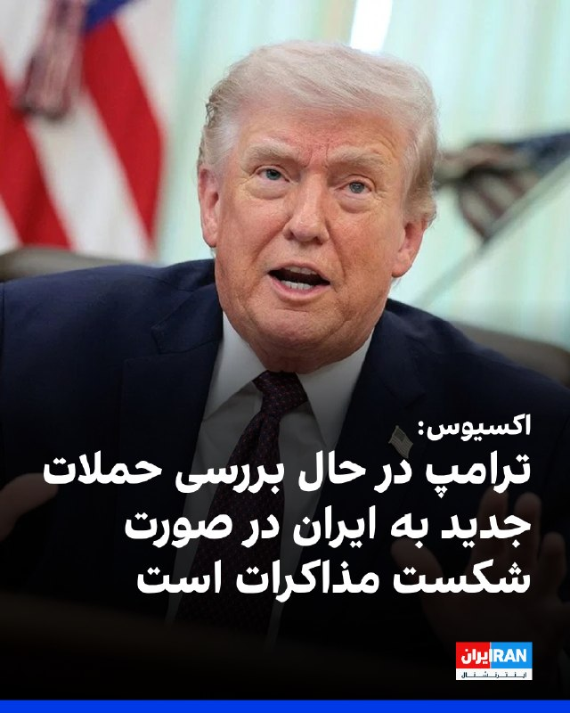

اکسیوس به نقل از دو مقام آمریکایی اعلام کرد که ترامپ صبح جمعه نشستی با اعضای ارشد تیم امنیت ملی خود درباره جنگ ایران برگزار کرد.
اکسیوس نوشت به گفته منابعی که مستقیما با ترامپ گفت‌وگو کردند، او در حال بررسی حملات جدید است، مگر اینکه پیشرفتی در مذاکرات در آخرین لحظه حاصل شود.
‌🏁 🇬🇧 IranintlTV

🤖 @VahidOOnLine

## VahidOOnLine — post 241599

  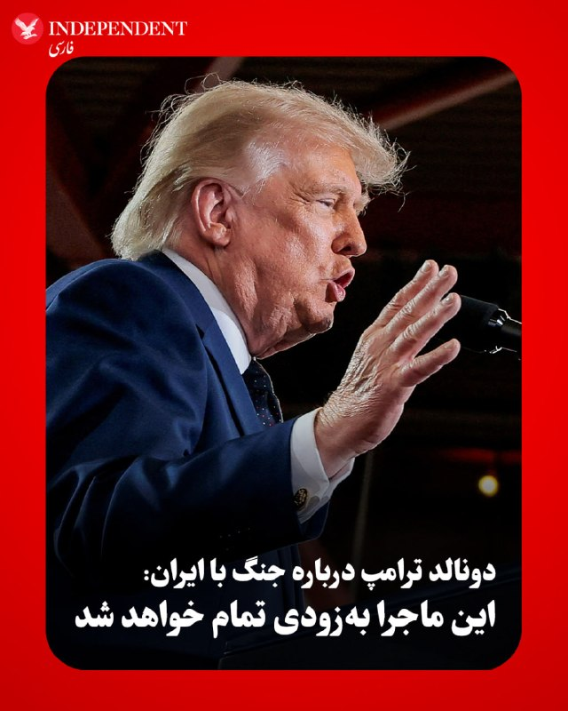

♦️دونالد ترامپ روز جمعه، اول خردادماه، طی سخنرانی در نیویورک درباره جنگ با ایران گفت که «این ماجرا به‌زودی تمام خواهد شد». رئیس‌جمهوری آمریکا گفت: «اگر جلوی ایران را نگیریم، آنها به سلاح هسته‌ای دست پیدا می‌کنند. مجبوریم این کار را بکنیم، و ما جلوی آنها را گرفتیم. آنها هرگز به سلاح هسته‌ای دست پیدا نخواهند کرد».
‌🇸🇦 Indypersian

🤖 @VahidOOnLine

## VahidOOnLine — post 241598

  

آسوشیتدپرس به نقل از یک مقام آمریکایی اعلام کرد ارتش آمریکا تاکنون هیچ مین انفجاری در تنگه هرمز کشف یا خنثی نکرده است.
این مقام آمریکایی افزود عملیات جست‌وجو در این گذرگاه حیاتی نفتی همچنان ادامه دارد، اما تاکنون هیچ مین دریایی پیدا نشده است.

این در حالی است که محاصره دریایی بنادر جنوب ایران همچنان ادامه دارد.
‌🏁 🇬🇧 IranintlTV

🤖 @VahidOOnLine

## VahidOOnLine — post 241597

♦️ویدیوی منتشرشده در شبکه‌های اجتماعی، جشن تولد خانواده امیرمحمد خیاط بر سر مزار او را نشان می‌دهد؛ جایی که پدر این قهرمان تکواندو با چهره‌ای اندوهگین و بغض‌آلود، بر مزار فرزندش رقصی سوگوارانه انجام می‌دهد.
امیرمحمد خیاط ۱۸ دی‌ماه ۱۴۰۴ در اطراف میدان خیام نیشابور با شلیک نیروهای سرکوب جمهوری اسلامی کشته شد.
او متولد ۲۶ اردیبهشت ۱۳۸۲ بود و از نوجوانی در رشته تکواندو فعالیت می‌کرد. امیرمحمد طی سال‌های اخیر بیش از ۲۰ عنوان قهرمانی، نایب‌قهرمانی و مقام سوم رقابت‌های استانی و باشگاهی را به دست آورده بود.
‌🇸🇦 Indypersian

🤖 @VahidOOnLine

## VahidOOnLine — post 241596

  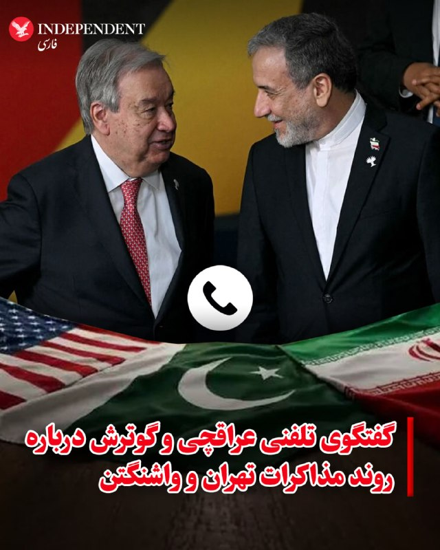

♦️عباس عراقچی، وزیر خارجه جمهوری اسلامی روز جمعه با آنتونیو گوترش، دبیرکل سازمان ملل متحد، تلفنی گفتگو کرد. به گزارش ایرنا، در این گفتگو، علاوه بر بررسی آخرین وضعیت منطقه‌، دو طرف روند تحولات مرتبط با دیپلماسی میان تهران و واشنگتن با میانجی‌گری اسلام‌آباد را بررسی کردند.
هم‌زمان با این گفتگو، عاصم منیر، فرمانده کل ارتش پاکستان و محسن نقوی، وزیر کشور این کشور در سفری از پیش اعلام‌نشده وارد تهران شدند؛ سفری که هدف اصلی آن، حل اختلافات میان تهران و واشنگتن برای امضای تفاهم‌نامه اولیه شروع مذاکرات عنوان شده است. همچنین سخنگوی وزارت خارجه ایران از حضور یک هیئت قطری در تهران در چارچوب «مساعی جمیله» برای کاهش تنش‌ها خبر داد، هرچند تاکید کرد که پاکستان همچنان میانجی رسمی این گفتگوهاست. با وجود این تحرکات، اسماعیل بقایی با «عمیق و جدی» خواندن شکاف‌های میان ایران و آمریکا اعلام کرد که تمرکز فعلی مذاکرات بر پایان دادن به جنگ است، مسئله هسته‌ای هنوز در دستور کار نیست و نمی‌توان گفت که توافق در هفته‌ها یا ماه‌های آینده نزدیک خواهد بود.
‌🇸🇦 Indypersian

🤖 @VahidOOnLine

## WithYashar — post 12040

  <a href="telegram/content/WithYashar_12040_1779485570.mp4" target="_blank">🎬 Download video</a>

یاد این سکانس افتادم 😔
@withyashar

## WithYashar — post 12039

این دوتا غذا آخری که گفتی چی هست اصن🥲🙁

## WithYashar — post 12038

## WithYashar — post 12037

ترامپ: «مسئله‌ی ایران خیلی زود تمام می‌شود و همه‌چیز به‌‌ سرعت به حالت عادی بازمی‌گردد.»
@withyashar

## WithYashar — post 12036

اتاق جنگ با شما : تهران/ولنجک صدای رد شدن پهباد میاد سمت ۰۰:۳۰
@withyashar

## WithYashar — post 12035

اتاق جنگ با شما : پدافند مشهد جای فرودگاه فعال شده
@withyashar

## WithYashar — post 12034

اکسیوس: منابع نزدیک به مذاکرات میگن توی ۲۴ ساعت آینده امکان پیشرفت وجود داره ترامپ ساعاتی پیش جلسه‌ای با تیم ارشد امنیت ملی درباره‌ی جنگ با ایران تشکیل داده بود
@withyashar

## WithYashar — post 12033

اتاق جنگ با شما : سلام داداشم پدافند اصفهان چند دقیقس فعاله
@withyashar

## WithYashar — post 12032

## WithYashar — post 12031

سلام داداش یاشار
بنظرت الان ک مقامات پاکستان تو ایرانن
بازم ممکنه امشب بزنه یا اصلا فردا؟
امکانش هست؟

## WithYashar — post 12030

پرزیدنت ترامپ:

من از ناهار خوردن با کسی که واقعاً واقعاً موفق است متنفرم، زیرا او مدام در مورد اینکه چقدر عالی هستند لاف می زند و این باعث می شود در مورد اینکه رئیس جمهور شدم صحبت نکنم.

ترامپ : ما جلوی ایران رو گرفتیم اونها هرگز نباید سلاح هسته ای داشته باشن
@withyashar

## WithYashar — post 12029

## WithYashar — post 12028

## WithYashar — post 12027

  <a href="https://t.me/withyashar/12027" target="_blank">📎 Download file</a>

کتابی از دونالد ترامپ یکی از بحث برانگیز ترین شخصیت های سیاسی جهان.
رئیس جمهور آمریکا دونالد جی ترامپ ، جهان بینی حرفه ای و شخصی خود را در این کتاب جذاب و خواندنی بیان می کند، روایتی دست اول از ظهور مهمترین معامله گر آمریکا.

دونالد ترامپ : هنر معامله گری

🌐 @withyashar

🌐 instagram.com/yashar

## WithYashar — post 12026

  <a href="telegram/content/WithYashar_12026_1779485572.mp4" target="_blank">🎬 Download video</a>

من باهوش‌ترین آدمی هستم که تا حالا باهاش روبه‌رو می‌شید✌🏾
@withyashar
یاشار : چقدر بجا و به موقع این حرف رو زد !!!

## WithYashar — post 12025

@withyashar حسود هرگز نیاسود

## WithYashar — post 12024

  <a href="telegram/content/WithYashar_12024_1779485573.mp4" target="_blank">🎬 Download video</a>

ترامپ : اعتراض کردن تو تجمع‌های من خطرناکه من چیزای خطرناک دوست ندارم دوست ندارم ببینم کسی کتک می‌خوره پس این کارو نکنید
@withyashar

## mwarmonitor — post 9504

🔴اکسیوس: ترامپ در بحبوحه بررسی احتمال بازگشت به جنگ، با مشاوران ارشد خود درباره ایران تشکیل جلسه داد

📝نویسنده: باراک راوید

🔰به گفته دو مقام آمریکایی به «اکسیوس»، پرزیدنت ترامپ صبح روز جمعه جلسه‌ای را با تیم امنیت ملی ارشد خود درباره جنگ با ایران برگزار کرد.

📌چرا این موضوع اهمیت دارد؟
منابعی که مستقیماً با رئیس‌جمهور گفتگو کرده‌اند می‌گویند ترامپ در صورت عدم دستیابی به یک گشایش ناگهانی و دقیقه‌نودی در مذاکرات، به‌طور جدی در حال بررسی آغاز حملات جدید علیه ایران است.

نمای دوقاب (تحولات هم‌زمان):
نشست ترامپ درباره ایران در حالی برگزار شد که رئیس ارتش پاکستان، فیلد مارشال عاصم منیر، در تلاشی آشکار و دقیقه‌نودی برای پر کردن شکاف‌ها و جلوگیری از سرگیری جنگ، به تهران سفر کرده است.
یک هیئت قطری نیز روز جمعه برای حمایت از تلاش‌های میانجی‌گرانه وارد تهران شد.
انتظار می‌رود عاصم منیر روز شنبه با سردار احمد وحیدی، از فرماندهان سپاه پاسداران و مهره‌ای کلیدی در فرآیند تصمیم‌گیری ایران، دیدار کند.
یک مقام آمریکایی که در جریان تلاش‌های دیپلماتیک قرار گرفته است، روند مذاکرات را «طاقت‌فرسا» توصیف کرد. این مقام آمریکایی گفت که پیش‌نویس‌ها «هر روز بین طرفین رد و بدل می‌شوند» اما پیشرفت چندانی حاصل نشده است.
حاضران در اتاق جلسه:
به گفته منابع آگاه، در این نشست علاوه بر ترامپ، جی‌دی ونس (معاون رئیس‌جمهور)، پیت هگست (وزیر دفاع)، جان راتکلیف (رئیس سی‌آی‌ای)، سوزی وایلز (رئیس کارکنان کاخ سفید) و دیگر مقامات حضور داشتند.
مارکو روبیو (وزیر امور خارجه) و ژنرال دن کین (رئیس ستاد مشترک ارتش) در این جلسه حضور نداشتند؛ چرا که روبیو در اروپا بود و ژنرال کین در مراسم فارغ‌التحصیلی آکادمی نیروی دریایی حضور داشت.
در طول این جلسه، گزارشی از آخرین وضعیت مذاکرات و سناریوهای مختلف در صورت فروپاشی گفتگوها به ترامپ ارائه شد.
نکات جالب و پشت‌پرده:
چند ساعت پس از این دیدار، کاخ سفید از تغییر در برنامه آخر هفته ترامپ خبر داد.
او پس از سخنرانی برنامه‌ریزی‌شده خود در غروب جمعه در نیویورک، به جای اقامت در باشگاه گلف خود در بد مینستر، به واشنگتن بازخواهد گشت.
ترامپ همچنین در حساب کاربری خود در شبکه اجتماعی «تروث سوشال» نوشت که به دلیل «مسائل مربوط به دولت و عشق به ایالات متحده آمریکا» در مراسم عروسی پسرش، دان جونیور، در این آخر هفته شرکت نخواهد کرد.
او نوشت: «احساس می‌کنم برای من مهم است که در این بازه زمانی حساس، در واشنگتن دی‌سی و در کاخ سفید بمانم.»
در پشت صحنه چه می‌گذرد؟
یک منبع نزدیک به ترامپ و منبع دوم دیگری که از شرایط آگاهی دارد به اکسیوس گفتند که ترامپ طی چند روز گذشته به شدت از روند مذاکرات با ایران ناامید و کلافه شده است.
به گفته این دو منبع، او روز سه‌شنبه به بنیامین نتانیاهو، نخست‌وزیر اسرائیل گفت که می‌خواهد شانس دیگری به دیپلماسی بدهد، اما تا پنجشنبه‌شب، نظرش بیشتر به سمت صدور فرمان حمله متمایل شده بود.
یک منبع نزدیک به ترامپ گفت رئیس‌جمهور احتمال یک عملیات نظامی بزرگ و «تعیین‌کننده» نهایی را مطرح کرده است تا پس از آن بتواند اعلام پیروزی کند و به جنگ پایان دهد.
با این حال، هنوز هیچ نشانه‌ای مبنی بر اینکه ترامپ تصمیم قطعی برای سرگیری جنگ گرفته باشد، وجود ندارد.
موضع طرف مقابل:
وزارت امور خارجه ایران روز جمعه اعلام کرد که گفتگوها در جریان است اما توافق نزدیکی در کار نیست.
خبرگزاری نیمه‌رسمی تسنیم، وابسته به سپاه پاسداران، روز جمعه به نقل از یک منبع نزدیک به تیم مذاکره‌کننده ایران نوشت: «گفتگوها پیرامون موضوعات مورد اختلاف همچنان ادامه دارد و هنوز نتیجه نهایی حاصل نشده است.»
🔹این منبع مدعی شد که تمرکز فعلی بر «پایان دادن به جنگ» است و تا زمانی که این هدف محقق نشود، در مورد هیچ موضوع دیگری مذاکره نخواهد شد.

🔸تحلیل واقعیتِ میان خطوط:
ترامپ طی شش هفته گذشته چندین بار تا آستانه سرگیری جنگ پیش رفته اما در نهایت از آن صرف‌نظر کرده است.
برخی منابع نزدیک به مذاکرات همچنان بر این باورند که در ۲۴ ساعت آینده فرصتی برای نوعی گشایش وجود دارد.
با این حال، دو منبع آگاه از طرز تفکر ترامپ می‌گویند او تمایل دارد اقدام نظامی را پیش ببرد، مگر اینکه اتفاق غیرمنتظره‌ای در گفتگوها رخ دهد.

@mwarmonitor

## FoxNewsTwitter — post 342145

Fox News (Twitter/X)

BREAKING: Jessica Gorman, the mother of slain Sheridan Gorman, delivers a powerful rebuke of far-left sanctuary policies, saying that her daughter’s life was stolen by an illegal migrant who should have never been released into the community:

“No mother should ever have to wonder if her child called out for her in her final moments.”

“No mother should ever have to imagine her baby lying alone and bleeding on the cold pavement.”

“No family should ever have to bury a child because public officials failed to put innocent American lives first.”

“Please, please support leaders and policies that protect your child and mine. Because a city, a state, or a country that does not protect its children has lost its way. And together, we must be brave enough to demand that it find its way back.”

## FoxNewsTwitter — post 342144

Fox News (Twitter/X)

BREAKING: The mother of Welles Crowther — the 9/11 hero known for the red bandana he wore as he repeatedly ran back into the South Tower to save as many as 18 lives — joins President Trump on stage as he announces that Welles will posthumously receive the Presidential Medal of Freedom.

TRUMP: “I just want to congratulate his great mother on doing a phenomenal job raising that young man. Boy, what bravery. He saved those people and became a legend, in a sense. Nobody else would have done what he did.”

ALLISON CROWTHER: “It’s such a beautiful thing that even 25 years later, Welles’ light still shines brightly.”

## FoxNewsTwitter — post 342143

  <a href="telegram/content/FoxNewsTwitter_342143_1779485575.mp4" target="_blank">🎬 Download video</a>

Fox News (Twitter/X)

JUST IN: President Trump rips the Biden admin’s electric vehicle mandate, warning that the power grid cannot support a forced transition to EVs:

“We ended Joe Biden’s insane electric vehicle mandate. That’s where they wanted everybody to buy an electric car.”

“If we would build the charging booths, right? It would cost the country $4 trillion. No country can afford that.”

“We love electric cars. I have to say that because of Elon.”

“Not everybody wants to have an electric car. And I ended that whole nonsense. By 2030, you’re all going to have electric cars? I don’t think so.”

## FoxNewsTwitter — post 342142

  <a href="telegram/content/FoxNewsTwitter_342142_1779485577.mp4" target="_blank">🎬 Download video</a>

Fox News (Twitter/X)

NEW: President Trump praises his admin's move to bring automotive manufacturing jobs back to the U.S. from overseas.

“They were all made in Germany and other countries. Now they're making them here because if they don't, they have to pay a big penalty."

"They're stamping them at my instruction 'Made in the USA.'"

## FoxNewsTwitter — post 342141

  <a href="telegram/content/FoxNewsTwitter_342141_1779485579.mp4" target="_blank">🎬 Download video</a>

Fox News (Twitter/X)

NEW: President Trump slams Democrats for spending millions on a political “autopsy” before asking a roaring crowd which nickname for Joe Biden they like best:

“They spent $10 million for the autopsy. It was called an autopsy. And they had typos. They had typos in every other sentence. They had misspelled words. They had commas in the wrong locations.”

“I could have given them the autopsy without any charge at all.”

“I said you had one candidate named Sleepy Joe Biden.”

## FoxNewsTwitter — post 342140

  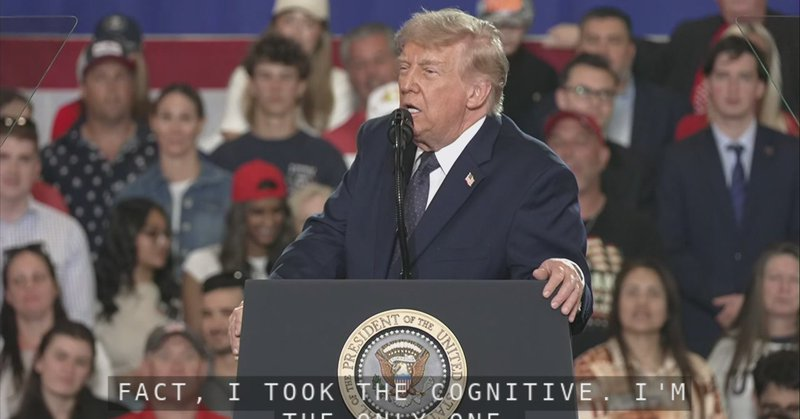

Fox News (Twitter/X)

WATCH LIVE: President Trump lands in New York to deliver remarks https://twitter.com/i/broadcasts/1wGWjjaaqyZKQ

## FoxNewsTwitter — post 342139

  <a href="telegram/content/FoxNewsTwitter_342139_1779485581.mp4" target="_blank">🎬 Download video</a>

Fox News (Twitter/X)

NOW: Crowd erupts with “USA” chants as a protester is kicked out for interrupting President Trump’s midterm campaign event in upstate New York.

“Take him home to mommy.”

## FoxNewsTwitter — post 342138

  <a href="telegram/content/FoxNewsTwitter_342138_1779485583.mp4" target="_blank">🎬 Download video</a>

Fox News (Twitter/X)

NEW: President Trump torches Democrats’ progressive agenda, slamming open borders, sanctuary cities, and gender policies targeting minors:

“We don’t want open borders where prisoners pour in from other countries all over the world.”

“We don’t want sanctuary cities where you have sanctuary for criminals. We don’t want it.”

“We don’t want transgender mutilation of your children, if that’s okay. We don’t want it.”

## FoxNewsTwitter — post 342137

  <a href="telegram/content/FoxNewsTwitter_342137_1779485584.mp4" target="_blank">🎬 Download video</a>

Fox News (Twitter/X)

NOW: New York crowd chants "4 more years" for President Trump.

"We have a hat. The hat says '4 more years.' It drives the radical left lunatics crazy."

## VahidOnline — post 75629

  

به گزارش اکسیوس، دونالد ترامپ، رئیس‌جمهوری آمریکا، روز جمعه با تیم ارشد امنیت ملی خود در کاخ سفید دیدار کرد تا سناریوهای مختلف در صورت شکست مذاکرات و احتمال آغاز حملات جدید علیه ایران را بررسی کند.

در این نشست حساس که با حضور مقامات کلیدی از جمله جِی‌دی ونس، معاون رئیس‌جمهوری، پیت هگست، وزیر جنگ و جان راتکلیف، رئیس سی‌آی‌ای، برگزار شد، ترامپ در جریان آخرین وضعیت دیپلماسی قرار گرفت.

نشانه‌های جدی از تغییر برنامه آخر هفته رئیس‌جمهوری، از جمله لغو سفر به باشگاه گلف بدمینستر، بازگشت به واشنگتن و حتی عدم شرکت در مراسم عروسی پسرش، دونالد ترامپ جوان، نشان‌دهنده وضعیت اضطراری در کاخ سفید است.
منابع نزدیک به ترامپ می‌گویند او از روند کند مذاکرات ناامید شده و به سمت گزینه نظامی متمایل شده است، هرچند هنوز تصمیم قطعی برای از سرگیری جنگ اتخاذ نشده است.

در همین حال، تهران به کانون تلاش‌های دیپلماتیک «لحظه آخری» برای جلوگیری از شعله‌ور شدن دوباره جنگ تبدیل شده است.
عاصم منیر، فرمانده کل ارتش پاکستان، به عنوان میانجی اصلی، در سفری حساس وارد تهران شده و قرار است با احمد وحیدی، از فرماندهان کلیدی سپاه پاسداران دیدار کند.
@VahidOOnLine

📡 @VahidOnline

## kianmeli1 — post 87566

🔴دقایقی پیش بازار بورس آمریکا برای حدود ۹۰ ساعت آینده بسته شد.

اگر قرار است ترامپ فرمان حمله صادر کند امشب یا فرداشب صادر میشود
https://t.me/kianmeli1

## kianmeli1 — post 87565

🔴خبرگزاری تسنیم، وابسته به سپاه پاسداران، به نقل از یک منبع نظامی می‌گوید نیروهای مسلح ایران در حال آماده شدن برای از سرگیری احتمالی جنگ با آمریکا هستند و طرح جدیدی برای «مبارزه سوم» آماده کرده‌اند که آمریکا و متحدان آمریکا را به شیوه‌ای «جدید و خاص» هدف قرار خواهد داد.
https://t.me/kianmeli1

## kianmeli1 — post 87564

🔴طرفداران نظام در میدان انقلاب خطاب به ترامپ

حمله امشب چی شد منتظریم
https://t.me/kianmeli1

## kianmeli1 — post 87563

‏🔴اکسیوس به نقل از دو مقام آمریکایی اعلام کرد که دونالد ترامپ صبح جمعه نشستی با اعضای ارشد تیم امنیت ملی خود درباره جنگ ایران برگزار کرد
https://t.me/kianmeli1

## kianmeli1 — post 87562

  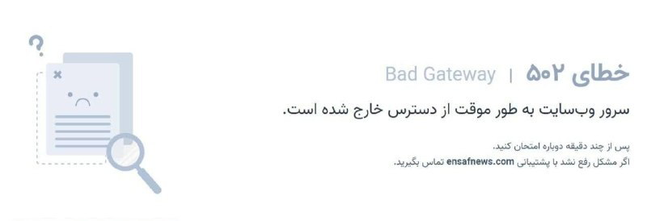

🔴سایت انصاف‌نیوز از دسترس خارج شد.

این سایت روز گذشته نوشته بود:
« شنیده‌ی انصاف نیوز حاکی است که سعید جلیلی مدتی است در جلسات شعام شرکت نمی‌کند.»
https://t.me/kianmeli1

## kianmeli1 — post 87561

🔴ترامپ درباره تست شناختی : بایدن حتی سوال اول رو هم نمی‌تونست جواب بده

فکر نمی‌کنم بتونه بگیره اینا رو
کدوم خرسه کدوم اسبه
https://t.me/kianmeli1

## kianmeli1 — post 87560

  <a href="telegram/content/kianmeli1_87560_1779485587.mp4" target="_blank">🎬 Download video</a>

🔴ترامپ:من باهوش‌ترین آدمی هستم که شما ممکن است ببینید
https://t.me/kianmeli1

## kianmeli1 — post 87559

  <a href="telegram/content/kianmeli1_87559_1779485588.mp4" target="_blank">🎬 Download video</a>

🔴ترامپ: ما اینقدر نفت از ونزوئلا استخراج کرده‌ایم(چاپیدیم) که هزینه جنگ را حدود ۲۵ برابر پرداخت کرده‌ایم.
https://t.me/kianmeli1

## kianmeli1 — post 87558

  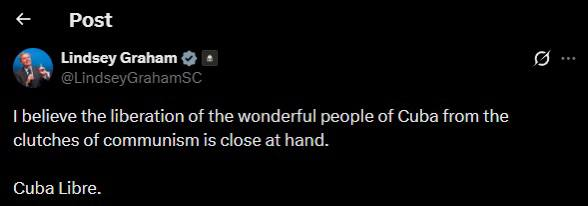

🔴سناتور گراهام:

من معتقدم آزادی مردم شگفت‌انگیز کوبا از چنگال کمونیسم نزدیک است.

(ایران رو آباد کردن رفتن سراغ کوبا)
https://t.me/kianmeli1

## kianmeli1 — post 87557

  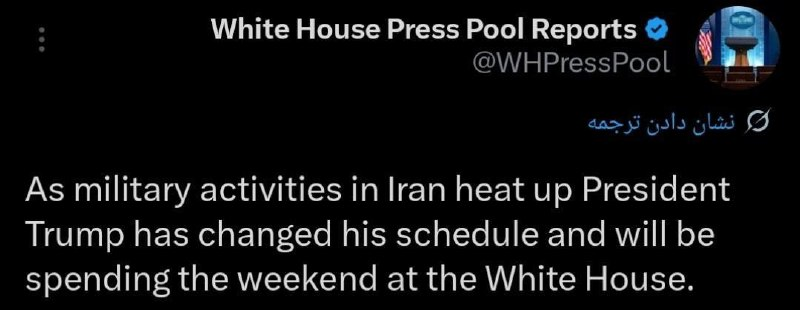

🔴منبع نزدیک به کاخ سفید :
با داغ‌تر شدن درگیری‌های نظامی با رژیم ملاها، پرزیدنت ترامپ برنامه‌هایش را عوض کرده و قرار است آخر هفته را در کاخ سفید بماند
https://t.me/kianmeli1

## IranIntlTV — post 338498

  

ترامپ در یک سخنرانی در سوفرن نیویورک گفت: «با عملیات خشم حماسی، رزمندگان ما اطمینان حاصل خواهند کرد که جمهوری اسلامی به عنوان بزرگ‌ترین حامی «تروریسم» دولتی در جهان، هرگز به سلاح هسته‌ای دست نخواهد یافت و خودشان هم این را می‌دانند.»
ترامپ گفت: حکومت ایران به عنوان بزرگ‌ترین حامی تروریسم دولتی، به سراسر جهان پول می‌فرستد تا مشکل ایجاد کند.

https://iranintl.com/202605221757

## IranIntlTV — post 338497

  

خبرگزاری تسنیم، وابسته به سپاه پاسداران، به نقل از یک منبع نظامی گزارش داد نیروهای مسلح جمهوری اسلامی «به‌طور کامل» تحولات را زیر نظر دارند و در صورت آنچه «حماقت دشمن» و هرگونه بهانه‌جویی از سوی آمریکا و متحدانش خوانده شده، سناریوهای تازه‌ای آماده کرده‌اند.

به گفته این منبع، در صورت اقدام نظامی احتمالی آمریکا، «نسخه سوم مبارزه جمهوری اسلامی» اجرا خواهد شد؛ نسخه‌ای که به ادعای او در حوزه تجهیزات جدید، اهداف نوین، تاکتیک‌ها و راهبردهای جنگی نمود خواهد داشت و حتی می‌تواند جبهه‌های جدیدی در سطح فرامنطقه‌ای ایجاد کند.

این منبع نظامی همچنین مدعی شد آمریکا در صورت «زیاده‌خواهی و اقدام نظامی»، «تنبیه بزرگ سوم» را در کمتر از یک سال تجربه خواهد کرد؛ تنبیهی که به گفته او «به شکلی خاص‌تر و جدیدتر» خواهد بود.
https://iranintl.com/202605226156

## IranIntlTV — post 338496

  <a href="telegram/content/IranIntlTV_338496_1779485592.mp4" target="_blank">🎬 Download video</a>

یک شهروند در پیامی صوتی به ایران اینترنشنال از فشار شدید در ایران و بلاتکلیفی و استرس به دلیل اظهارات دونالد ترامپ درباره امکان پایان جنگ و آتش‌بس می‌گوید. صدای او برای حفظ امنیتش با هوش مصنوعی بازخوانی شده است.

## IranIntlTV — post 338495

  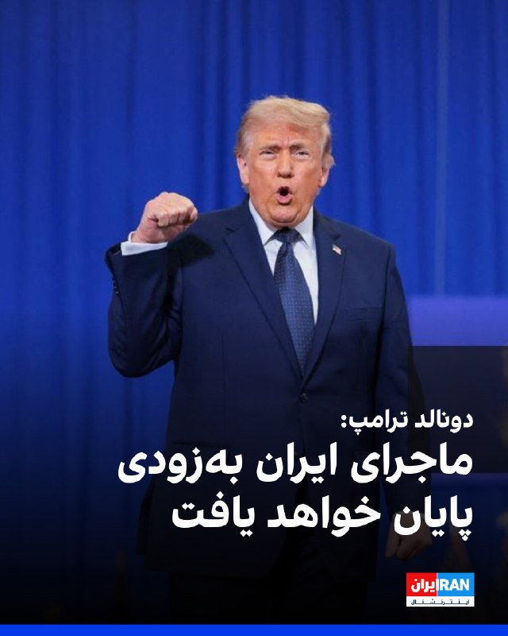

دونالد ترامپ، رییس جمهوری ایالات متحده، در سخنرانی خود در نیویورک درباره جنگ ایران اعلام کرد: «این ماجرا به‌زودی پایان خواهد یافت.»

او همچنین گفت که ما جمهوری اسلامی را متوقف کرده‌ایم؛ آن‌ها هرگز به سلاح هسته‌ای دست نخواهند یافت.
https://iranintl.com/202605220706

## IranIntlTV — post 338494

  

اکسیوس به نقل از دو مقام آمریکایی اعلام کرد که ترامپ صبح جمعه نشستی با اعضای ارشد تیم امنیت ملی خود درباره جنگ ایران برگزار کرد.
اکسیوس نوشت به گفته منابعی که مستقیما با ترامپ گفت‌وگو کردند، او در حال بررسی حملات جدید است، مگر اینکه پیشرفتی در مذاکرات در آخرین لحظه حاصل شود.
https://iranintl.com/202605229907

## IranIntlTV — post 338493

  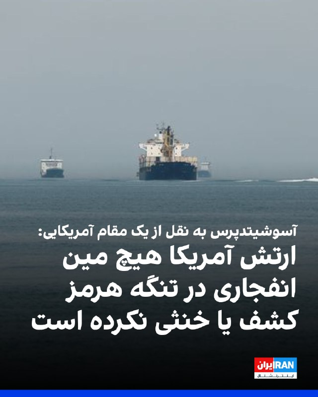

آسوشیتدپرس به نقل از یک مقام آمریکایی اعلام کرد ارتش آمریکا تاکنون هیچ مین انفجاری در تنگه هرمز کشف یا خنثی نکرده است.
این مقام آمریکایی افزود عملیات جست‌وجو در این گذرگاه حیاتی نفتی همچنان ادامه دارد، اما تاکنون هیچ مین دریایی پیدا نشده است.

این در حالی است که محاصره دریایی بنادر جنوب ایران همچنان ادامه دارد.
https://iranintl.com/202605224264

## IranIntlTV — post 338492

  <a href="telegram/content/IranIntlTV_338492_1779485596.mp4" target="_blank">🎬 Download video</a>

مشاور رییس دولت امارات متحده عربی گفت برخی کشورهای عربی اکنون جمهوری اسلامی را تهدیدی بزرگ‌تر از اسرائیل می‌بینند.

به گفته او، حملات جمهوری اسلامی نگاه امنیتی منطقه را تغییر داده و باعث شده همکاری برخی دولت‌های عربی با اسرائیل اهمیت بیشتری پیدا کند.
@iranintltv

## IranIntlTV — post 338491

  <a href="telegram/content/IranIntlTV_338491_1779485598.mp4" target="_blank">🎬 Download video</a>

پیام‌های رسیده به ایران‌اینترنشنال نشان می‌دهد مشکلات در تامین برخی کالاهای ضروری و اساسی در ایران همچنان ادامه دارد.

شهروندان در شهرهای مختلف همچنین از کمبود بنزین خبر می‌دهند.

گفت‌وگو با معصومه طاهرخانی، تحلیل‌گر اقتصادی
@iranintltv

## IranIntlTV — post 338490

  <a href="telegram/content/IranIntlTV_338490_1779485599.mp4" target="_blank">🎬 Download video</a>

همزمان با سفر هیاتی از پاکستان به ریاست فرمانده ارتش و رییس اطلاعات این کشور به تهران برای پیشبرد مذاکرات، قطر نیز در هماهنگی با آمریکا تیمی مذاکره‌کننده به تهران اعزام کرد.

رییس‌جمهوری آمریکا در تروث سوشال نوشت به‌دلیل شرایط حساس فعلی، ترجیح داده در کاخ سفید و واشینگتن بماند. ترامپ همچنین گفت ایران بی‌صبرانه به‌دنبال دستیابی به توافق با آمریکا است.
@iranintltv

## IranIntlTV — post 338489

  <a href="telegram/content/IranIntlTV_338489_1779485601.mp4" target="_blank">🎬 Download video</a>

سخنگوی وزارت خارجه جمهوری اسلامی گفت با درخواست آمریکا برای تحویل اورانیوم با غنای بالا، مذاکرات به نتیجه نمی‌رسد.

همزمان، گزارش‌ها از اعزام تیم مذاکره‌کننده قطر به تهران و سفر فرمانده ارتش و رییس اطلاعات پاکستان به ایران خبر می‌دهند.

دونالد ترامپ نیز گفت به‌دلیل شرایط حساس کنونی در واشینگتن مانده است.

گفت‌وگو با امید معماریان، تحلیل‌گر سیاسی در موسسه دان، و حسین علیزاده، دیپلمات پیشین
@iranintltv

## IranIntlTV — post 338488

  <a href="telegram/content/IranIntlTV_338488_1779485603.mp4" target="_blank">🎬 Download video</a>

سخنگوی وزارت خارجه جمهوری اسلامی گفت با درخواست آمریکا برای تحویل اورانیوم با غنای بالا، مذاکرات به نتیجه نمی‌رسد.

همزمان، گزارش‌ها از اعزام تیم مذاکره‌کننده قطر به تهران و سفر فرمانده ارتش و رییس اطلاعات پاکستان به ایران خبر می‌دهند.

دونالد ترامپ نیز گفت به‌دلیل شرایط حساس کنونی در واشینگتن مانده است.

گفت‌وگو با امید معماریان، تحلیل‌گر سیاسی در موسسه دان، و حسین علیزاده، دیپلمات پیشین
@iranintltv

## IranIntlTV — post 338487

سخنگوی وزارت خارجه جمهوری اسلامی: نمی‌توانیم بگوییم توافق نزدیک است

اسماعیل بقایی، سخنگوی وزارت امور خارجه جمهوری اسلامی، اختلافات میان تهران و واشینگتن را «عمیق» خواند و تاکید کرد نمی‌توان انتظار داشت روند مذاکرات تنها با «چند بار رفت‌وآمد» به نتیجه نهایی و حل‌وفصل چالش‌ها منجر شود.

بقایی شامگاه جمعه اول خرداد در مصاحبه با صداوسیمای جمهوری اسلامی، با اشاره به سفر مقام‌های ارشد پاکستان به ایران گفت: «نمی‌توانیم بگوییم که به جایی رسیدیم که توافق نزدیک است. ضرورتا خیر، این‌طور نیست. روند ادامه‌دار است.»

او اضافه کرد: «اختلاف‌نظرها بین ایران و آمریکا آن‌قدر عمیق و زیاد است، به‌ویژه بعد از جنایاتی که در دو سه ماه اخیر مرتکب شده‌اند، که نمی‌توان گفت با چند بار رفت‌و‌آمد یا مذاکرات ظرف چند هفته یا چند ماه حتما به نتیجه خواهیم رسید. دیپلماسی زمان‌بر است.»

اظهارات بقایی در حالی مطرح می‌شوند که عاصم منیر، فرمانده ارتش پاکستان، برای گفت‌وگو با مقام‌های جمهوری اسلامی به تهران سفر کرده است.

پیش‌تر نیز شبکه العربیه از سفر عاصم مالک، رییس سازمان اطلاعات پاکستان، به ایران خبر داده بود.

تایید سفر هیات قطری به تهران
سخنگوی وزارت امور خارجه جمهوری اسلامی گزارش خبرگزاری رویترز درباره سفر هیات قطری به تهران را تایید کرد و گفت نمایندگان دوحه اول خرداد با عباس عراقچی دیدار و گفت‌وگو کردند.

بقایی ادامه داد: «بسیاری از کشورها، چه کشورهای منطقه و چه کشورهای خارج از منطقه، تلاش می‌کنند تا به پایان جنگ و جلوگیری از تشدید تنش‌ها کمک کنند. این تلاش‌ها از نظر ما ارزشمند است.»

او در عین حال خاطرنشان کرد اسلام‌آباد همچنان «میانجی رسمی» مذاکرات میان تهران و واشینگتن محسوب می‌شود.

رویترز پیش‌تر از سفر یک هیات مذاکره‌کننده قطری به تهران خبر داد و نوشت هدف از این سفر که با هماهنگی واشینگتن انجام گرفت، کمک به تلاش‌ها برای دستیابی به توافقی جهت خاتمه جنگ ایران است.

بقایی: در این مرحله وارد «جزییات» پرونده هسته‌ای نخواهیم شد
سخنگوی وزارت خارجه جمهوری اسلامی اعلام کرد مذاکرات جاری با واشینگتن بر پایان جنگ متمرکز است و «جزییات» پرونده هسته‌ای در این مرحله وارد دستور کار گفت‌وگوها نخواهد شد.

بقایی گفت خاتمه جنگ در همه جبهه‌ها، از جمله لبنان، وضعیت تنگه هرمز و محاصره دریایی آمریکا، از محورهای اصلی گفت‌وگوهای حکومت ایران و ایالات متحده به شمار می‌روند.

او ادامه داد: «دلیل اینکه در مورد جزییات مباحث مرتبط با موضوع [هسته‌ای] صحبت نمی‌کنیم، مشخص است. ما دو بار این کار را کردیم و زیاده‌خواهی طرف مقابل باعث شد وارد جنگ شویم.»

بقایی افزود ورود به «سایر موضوعات» در مذاکرات با آمریکا تنها پس از پایان جنگ و رفع «نگرانی‌های» تهران امکان‌‎پذیر خواهد بود.

خبرگزاری رویترز ۳۱ اردیبهشت به نقل از مقام‌های اسرائیلی نوشت دونالد ترامپ، رییس‌جمهوری آمریکا، به اورشلیم اطمینان داده که ذخایر اورانیوم با غنای بالا از ایران خارج خواهد شد و این موضوع بخشی از هرگونه توافق احتمالی صلح خواهد بود.

بنیامین نتانیاهو، نخست‌وزیر اسرائیل، بارها تاکید کرده که پایان جنگ منوط به خروج اورانیوم غنی‌شده از ایران، توقف حمایت تهران از گروه‌های نیابتی و برچیده شدن توان موشکی جمهوری اسلامی است.

کانال ۱۱ اسرائیل ۳۱ اردیبهشت گزارش داد در پی ارزیابی‌های اطلاعاتی جدید، ارتش و نهادهای امنیتی این کشور مجموعه‌ای از اقدامات مهم را برای احتمال جدی ازسرگیری نبرد با جمهوری اسلامی آغاز کرده‌‌اند و آمادگی خود را به بالاترین سطح افزایش داده‌اند.
 
🔗وب‌سایت ایران‌اینترنشنال
@iranintltv

## Shin_Persian — post 6158

افيخاي ادرعي ✓ @AvichayAdraee Fri, 22 May 2026 19:40:50 UTC #عاجل ‼️ إنذار عاجل إلى سكان لبنان وتحديدًا سكان منطقتيْ صور وزقوق المفدي 🔸في ضوء قيام حزب الله الارهابي بخرق اتفاق وقف اطلاق النار يضطر جيش الدفاع للعمل ضده بقوة. جيش الدفاع لا ينوي المساس بكم.…

## Shin_Persian — post 6157

افيخاي ادرعي ✓ @AvichayAdraee
Fri, 22 May 2026 19:40:50 UTC

#عاجل ‼️ إنذار عاجل إلى سكان لبنان وتحديدًا سكان منطقتيْ صور وزقوق المفدي

🔸في ضوء قيام حزب الله الارهابي بخرق اتفاق وقف اطلاق النار يضطر جيش الدفاع للعمل ضده بقوة. جيش الدفاع لا ينوي المساس بكم.

🔸نحث سكان المبنييْن المحدديْن بالأحمر في الخريطتيْن المرفقتيْن والمباني المجاورة لهما: أنتم تتواجدون بالقرب من مبنييْن يستخدمهما حزب الله الإرهابي فحرصًا على سلامتكم عليكم اخلائها فورًا والابتعاد عنها لمسافة لا تقل عن 500 متر

🔸البقاء في منطقة المباني المحددة يعرضكم للخطر

English

#Urgent ‼️ Urgent warning to the residents of Lebanon, specifically the residents of the Tyre (Sour) and Zghoq al-Mafdi areas.

🔸In light of the terrorist Hezbollah's violation of the ceasefire agreement, the IDF (Israel Defense Forces) is compelled to act against it forcefully. The IDF does not intend to harm you.

🔸We urge the residents of the two buildings marked in red on the attached maps and the buildings adjacent to them: You are located near two buildings used by the terrorist Hezbollah. For your safety, you must evacuate them immediately and move at least 500 meters away from them.

🔸Remaining in the vicinity of the designated buildings puts you in danger.

𝕏 · @shin_persian

## FarsiVOA — post 218394

  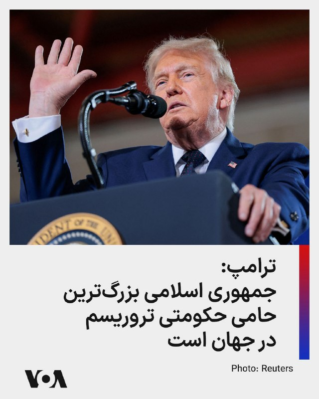

⚡️دونالد ترامپ، رئیس‌جمهوری آمریکا، روز جمعه ۱ خرداد در یک سخنرانی در شهر سافرن ایالت نیویورک، با اشاره به اینکه آمریکا «بهترین و قدرتمندترین ارتش جهان» را دارد گفت «با عملیات خشم حماسی، نیروهای ما دارند اطمینان حاصل می‌کنند که [جمهوری اسلامی] ایران، بزرگ‌ترین حامی حکومتی تروریسم در جهان» و حکومت حامی تروریسم «شماره یک» در جهان دیگر هرگز موفق نشود.

او گفت جمهوری اسلامی «پولش را به سراسر دنیا می‌فرستد تا مشکل‌تراشی کند.»

آقای ترامپ گفت: «آن‌ها هرگز به سلاح هسته‌ای دست پیدا نخواهند کرد، و خودشان هم این را می‌دانند. می‌دانند. و آمریکا دوباره در حال پیروزی است.»
@FarsiVOA

## FarsiVOA — post 218393

🔺دونالد ترامپ: جمهوری اسلامی به‌شدت خواهان توافق است؛رهبرانشان از بین رفته‌اند

◾️دونالد ترامپ، رئیس‌جمهوری آمریکا، روز جمعه ۱ خرداد در یک سخنرانی در شهر سافرن ایالت نیویورک، با اشاره به جنبش حامیانش گفت «این جنبش بر پایه عقل سلیم شکل گرفته؛ ما مرزهای قدرتمند می‌خواهیم، آموزش خوب می‌خواهیم، مالیات پایین می‌خواهیم، و یک ارتش قدرتمند می‌خواهیم.»

⬇️ بیشتر بخوانید:
https://ir.voanews.com/a/8152854.html
@FarsiVOA

## Persian_Trend_Official — post 14687

  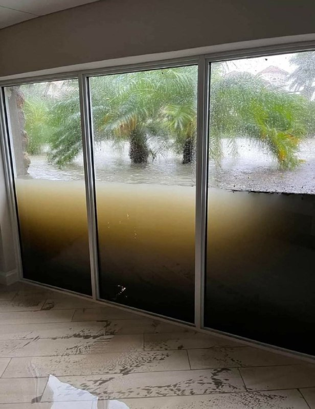

شبتون بخیر 🔥❤️

توضیح عکس:
یک مرد آمریکایی موقع طوفان فلوریدا از داخلش خونه‌ش این عکس رو گرفته، چند تن فشار رو این درب و شیشه‌ها تحمل کردن!!!

این یعنی کارخانه شیشه، قاب، گسکت، نصاب، استراکچر، ریل و... همه کارشون رو به نحو احسن انجام دادند.

📝 Nick
📌 @persian_trend_official
پرشین ترند | متفاوت‌ترین کانال نظامی

## Persian_Trend_Official — post 14686

https://youtube.com/live/D0LvFYIUbgw?feature=share

## Persian_Trend_Official — post 14685

  <a href="https://t.me/persian_trend_official/14685" target="_blank">📎 Download file</a>

فایل صوتی لایو اول
نسخه کم حجم - 5.94 مگابایت

اتاق جنگ جمعه 1 خرداد | عاصم منیر در تهران برای التیماتوم یا توافق؟

📝 Nick

📌 @persian_trend_official
پرشین ترند | متفاوت‌ترین کانال نظامی

## RadioFarda — post 157464

  <a href="https://t.me/radiofarda/157464" target="_blank">📎 Download file</a>

📻بشنوید: خبرهای ساعت ۲۱ با رادیوفردا، اول خرداد ۱۴۰۵‌

@RadioFarda

## IranianMinds — post 20572

🔴 ترامپ :

من این محاسبه را درست انجام دادم

(203 × 9 ÷ 2 + 1324 − 1292) × 19

@IranianMinds

## BBCPersian — post 281812

🔻مارکو روبیو، وزیر خارجه آمریکا درحاشیه نشست وزرای خارجه کشورهای عضو ناتو با هاکان فیدان، وزیر خارجه ترکیه گفت‌وگو کرد.

آقای روبیو با اشاره به این دیدار در شبکه ایکس نوشت: «در دیدار با هاکان فیدان درباره ضرورت پایبندی همه متحدان به تعهدات دفاعی و همچنین برنامه‌های مربوط به نشست آینده ناتو در ترکیه گفت‌و‌گو کردیم.»

او همچنین گفت که در این دیدار درباره بازگشایی تنگه هرمز و تلاش برای دستیابی به ثبات در منطقه با آقای فیدان مذاکره کرده است.

نشست وزرای خارجه عضو ناتو امروز در سوئد برگزار شده است.

https://bbc.in/4nNPWtx
@BBCPersian

## BBCPersian — post 281811

  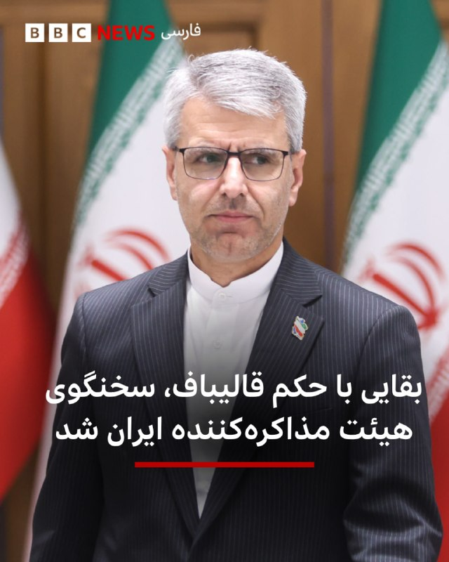

🔻ایرنا، خبرگزاری رسمی ایران می‌گوید که محمدباقر قالیباف،‌ رئیس هیئت مذاکره کننده ایرانی،‌ اسماعیل بقایی،‌ سخنگوی وزارت خارجه را به عنوان سخنگوی «هیئت میناب ۱۶۸» منصوب کرده است.

پیشتر در سفرهیئت ایرانی به پاکستان گفته شده بود که نام هیئت مذاکره کننده ایران به یادبود کشته شدگان مدرسه میناب «هیئت میناب ۱۶۸» نام دارد.

آقای قالیباف در حکمی که ایرنا آن را منتشر کرد نوشت: «امیدوارم با دقت و مسئولیت‌پذیری که از شما سراغ دارم، در این سنگر مبارزه بتوانید در روشنگری و تبین مواضع جمهوری اسلامی ایران در جهان» موفق باشید.

جزئیاتی از مذاکرات منتشر نشده است اما در حال حاضر وزیر کشور و فرمانده ارتش پاکستان و یک هیئت قطری در تهران به سر می‌برند.

پیشتر مقامات آمریکایی گفته بودند که مذاکرات در جریان است.

همچنین اقای بقایی عصر امروز گفت که این مرحله از مذاکرات بر خاتمه جنگ تمرکز دارد و جزئیات مباحث مرتبط با موضوع هسته‌ای قرار نیست مورد بحث قرار گیرد.

این در حالی است که آقای ترامپ بارها تاکید کرده است که اولویتش پرونده هسته‌ای ایران است.

📷 AFP via Getty Images
https://bbc.in/4tKarbL
@BBCPersian

## Dirty_Kids — post 389978

  <a href="telegram/content/Dirty_Kids_389978_1779485607.mp4" target="_blank">🎬 Download video</a>

پرزیدنت ترامپ خطاب به شخصی که داشت در سخنرانیش شلوغ میکرد گفت “برو خونه پیش مامانت!”

@Dirty_Kids 👻

## Dirty_Kids — post 389977

  <a href="telegram/content/Dirty_Kids_389977_1779485608.mp4" target="_blank">🎬 Download video</a>

این شما و این دلقک بازی جدید ترامپ، رئیس جمهور ایالات متحده:

@Dirty_Kids 👻

## Dirty_Kids — post 389976

  <a href="telegram/content/Dirty_Kids_389976_1779485610.mp4" target="_blank">🎬 Download video</a>

ترامپ از حضار خواستن با تشویق هاشون نشون بدن لقب “اسلیپی جو بایدن” رو بیشتر دوس دارن یا “کروکد جو بایدن”…

@Dirty_Kids 👻

## alonews — post 121906

  <a href="telegram/content/alonews_121906_1779485611.webm" target="_blank">🎬 Download video</a>

👈منبعی عالی‌رتبه به العربیه: فضای مذاکرات مثبت است، اما تاکنون به توافق نهایی نرسیده‌اند.

🔴«پیش‌نویس توافق آماده است که نیاز به موافقت تهران و واشنگتن دارد.»

🔴«تهران خواستار تضمین‌های روشن در مورد آزادی دارایی‌های مسدودشده و تحریم‌های نفتی است.»

🔴کار برای کاهش فاصله بین خواسته‌های مشروع ما و خواسته‌های واشنگتن در جریان است

✅ @AloNews خبر جنگ

## alonews — post 121905

  <a href="telegram/content/alonews_121905_1779485611.mp4" target="_blank">🎬 Download video</a>

👈کسشرهای ترامپ تموم؛ آخرش هم یه رقص معروفشو زد قمار باز

‎
✅ @AloNews خبر جنگ

## alonews — post 121904

  <a href="telegram/content/alonews_121904_1779485613.webm" target="_blank">🎬 Download video</a>

👈 ترامپ: «مسئله‌ی ایران خیلی زود تمام می‌شود و همه‌چیز به‌‌ سرعت به حالت عادی بازمی‌گردد.»

✅ @AloNews خبر جنگ

## alonews — post 121903

  <a href="telegram/content/alonews_121903_1779485613.webm" target="_blank">🎬 Download video</a>

👈یک مقام ایرانی به المانیتور گفت که «برخی ایده‌ها و متون جدید بین دو طرف مبادله شده است.»

🔴این مقام افزود: «این فقط می‌تواند مبنایی برای گفتگو بین ایران و ایالات متحده باشد. به معنای توافقی نیست که بتوان آن را اعلام کرد.»

✅ @AloNews خبر جنگ

## alonews — post 121902

  <a href="telegram/content/alonews_121902_1779485613.webm" target="_blank">🎬 Download video</a>

🔴فوری / اکسیوس: ترامپ امروز با افسران ارشد جلسه داشت به شدت درحال بررسی بازگشت به جنگه! 
✅ @AloNews خبر جنگ

## alonews — post 121901

  <a href="telegram/content/alonews_121901_1779485614.webm" target="_blank">🎬 Download video</a>

👈اکسیوس:برخی منابع نزدیک به مذاکرات همچنان بر این باورند که طی ۲۴ ساعت آینده فرصتی برای نوعی پیشرفت وجود دارد

✅ @AloNews خبر جنگ

## alonews — post 121900

  <a href="telegram/content/alonews_121900_1779485614.webm" target="_blank">🎬 Download video</a>

🔴فوری / اکسیوس: ترامپ امروز با افسران ارشد جلسه داشت به شدت درحال بررسی بازگشت به جنگه!

✅ @AloNews خبر جنگ

## alonews — post 121899

  <a href="telegram/content/alonews_121899_1779485614.mp4" target="_blank">🎬 Download video</a>

👈ترامپ : ما جلوی ایران رو گرفتیم اونها هرگز نباید سلاح هسته ای داشته باشن

✅ @AloNews خبر جنگ

## alonews — post 121898

  <a href="telegram/content/alonews_121898_1779485615.mp4" target="_blank">🎬 Download video</a>

👈 ترامپ می‌گوید این محاسبه را درست انجام داده است:(203 × 9 ÷ 2 + 1324 − 1292) × 19

✅ @AloNews خبر جنگ

## alonews — post 121897

  <a href="telegram/content/alonews_121897_1779485617.mp4" target="_blank">🎬 Download video</a>

👈ترامپ درباره تست شناختی : بایدن حتی سوال اول رو هم نمی‌تونست جواب بده

🔴 فکر نمی‌کنم بتونه بگیره اینا رو کدوم خرسه کدوم اسبه

✅ @AloNews خبر جنگ

## alonews — post 121896

  <a href="telegram/content/alonews_121896_1779485619.webm" target="_blank">🎬 Download video</a>

👈ترامپ: «از ناهار خوردن با کسی که واقعاً، واقعاً موفق است متنفرم، چون او مدام درباره‌ی عالی بودن خودش لاف میزند و این مانع از این می‌شود که من درباره‌ی این حرف بزنم که رئیس‌جمهور شدم.»

✅ @AloNews خبر جنگ

## alonews — post 121895

  <a href="telegram/content/alonews_121895_1779485619.mp4" target="_blank">🎬 Download video</a>

👈 ترامپ: من مشکلی ندارم که به من بگویند یک دیکتاتور درخشان و تمام عیار، اما نمی‌خواهم احمق خطاب شوم.

✅ @AloNews خبر جنگ

## alonews — post 121894

  <a href="telegram/content/alonews_121894_1779485621.mp4" target="_blank">🎬 Download video</a>

👈ترامپ : ما عاشق ماشین‌های برقی هستیم باید اینو بگم به خاطر "ایلان ماسکه"

✅ @AloNews خبر جنگ

## alonews — post 121893

  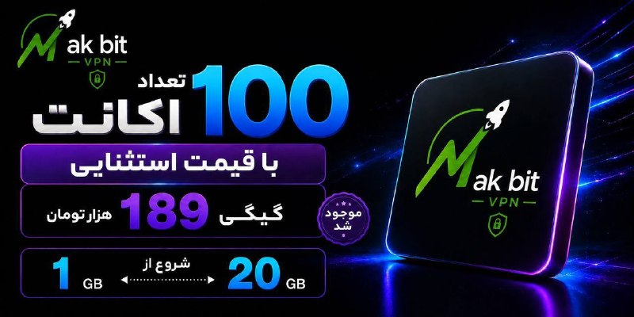

قیمت استثنایی گیگی
9️⃣
8️⃣
1️⃣

تحویل زیر یک دقیقه
✅
دارای لینک سابسکریشن جهت دیدن حجم و کنترل مصرف
✅
بدون قطعی 
✅
بدون محدودیت کاربر و زمان
✅
جمینایو چت جی بی تی و... کامل اوکیه با سرورامون
✅

🏪پشتیبانی کامل
✅
شروع فعالیت از سال 2022 
✅
پرداخت ریالی
✅

ضریب و این چیزا ندارن و تا آخرین مگابایت برای پشتیبانیش درختمتیم
🥂

💤این تخفیف فقط تا ۱۲ شب فعاله
💤

⭐️ @Napsternetiran_bot
〰️〰️〰️〰️〰️〰️〰️

🔶 @Napsternetvirani

## alonews — post 121892

  <a href="telegram/content/alonews_121892_1779485623.mp4" target="_blank">🎬 Download video</a>

👈 ترامپ: ما اینقدر نفت از ونزوئلا استخراج کرده‌ایم که هزینه جنگ را حدود ۲۵ برابر پرداخت کرده‌ایم.

✅ @AloNews خبر جنگ

## alonews — post 121891

  <a href="telegram/content/alonews_121891_1779485625.mp4" target="_blank">🎬 Download video</a>

👈 پرزیدنت ترامپ: من باهوش‌ترین فردی هستم که تا به حال ملاقات کردید.

✅ @AloNews خبر جنگ

## alonews — post 121889

  <a href="telegram/content/alonews_121889_1779485627.webm" target="_blank">🎬 Download video</a>

👈 سناتور گراهام: من معتقدم که آزادی مردم شگفت‌انگیز کوبا از چنگال کمونیسم نزدیک است.

✅ @AloNews خبر جنگ

## alonews — post 121888

  <a href="telegram/content/alonews_121888_1779485627.webm" target="_blank">🎬 Download video</a>

👈منبع نزدیک به تیم مذاکره کننده به تسنیم گفت: گفتگوها و رایزنی‌ها بر سر موارد اختلافی همچنان ادامه دارد و هنوز نتیجه نهایی حاصل نشده است.

🔴وی تاکید کرد: پیشرفتهایی نسبت به قبل در برخی موضوعات حاصل شده

✅ @AloNews خبر جنگ

---
📅 بروزرسانی: 1405/03/01 23:47
---

## VahidOOnLine — post 241595

  

خبرگزاری تسنیم، رسانه‌ها وابسته به سپاه، به نقل از یک منبع نزدیک به هیات مذاکره‌کننده، نوشت: «گفت‌وگوها و رایزنی‌ها بر سر موارد اختلافی همچنان ادامه دارد و هنوز نتیجه نهایی حاصل نشده است.»

این رسانه وابسته به سپاه افزود: «میانجی پاکستانی همچنان در حال رد و بدل موضوعات است.»

تسنیم ادامه داد تمرکز در حال حاضر بر سر مسئله «پایان جنگ» است و تا وقتی این موضوع نهایی نشود، هیچ مساله دیگری مذاکره نخواهد شد.
‌🏁 🇬🇧 IranintlTV

🤖 @VahidOOnLine

## VahidOOnLine — post 241594

  <a href="telegram/content/VahidOOnLine_241594_1779481048.mp4" target="_blank">🎬 Download video</a>

یک شهروند در پیامی به ایران اینترنشنال از اوضاع اقتصادی در کشور روایت می‌کند و می‌گوید به دلیل کمبود آرد نانوایی‌ها با اختلال در فعالیت و صف‌های طولانی مواجه‌اند. پیام او با هوش مصنوعی خوانده شده است.
‌🏁 🇬🇧 IranintlTV

🤖 @VahidOOnLine

## VahidOOnLine — post 241593

  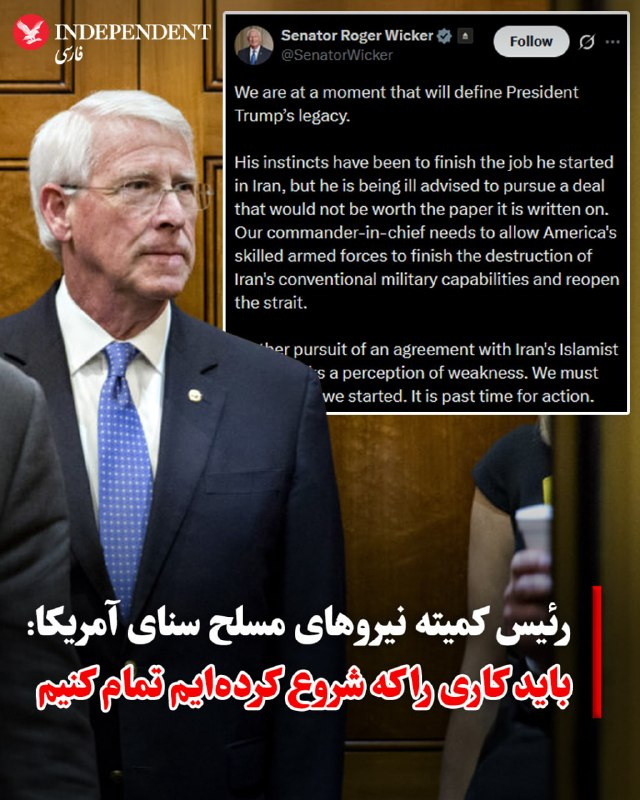

♦️ راجر ویکر از ایالت می‌سی‌سی‌پی، سناتور جمهوری‌خواه، روز جمعه اول خرداد پیشنهاد کرد که ایالات متحده نباید به دنبال توافق با جمهوری اسلامی باشد، بلکه باید اقدامات نظامی خود را از سر بگیرد. او افزود: «ما باید کاری را که شروع کرده‌ایم تمام کنیم.»

ویکر که ریاست کمیته نیروهای مسلح سنای آمریکا را بر عهده دارد، در شبکه اجتماعی ایکس نوشت که به دونالد ترامپ «مشاوره‌های غلطی داده می‌شود تا به دنبال توافقی برود که ارزش کاغذی که روی آن نوشته می‌شود را هم نخواهد داشت.»

او در ادامه نوشت: «فرمانده کل قوای ما باید به نیروهای مسلح ماهر آمریکا اجازه دهد تا نابودی توانمندی‌های نظامی متعارف ایران را کامل کرده و تنگه [هرمز] را بازگشایی کنند.»

ویکر همچنین هشدار داد: «تلاش بیشتر برای دستیابی به توافق با رژیم اسلام‌گرای ایران، خطر برداشتِ ضعف [از سوی آمریکا] را به همراه دارد. ما باید کاری را که آغاز کرده‌ایم به پایان برسانیم. زمان عمل فرارسیده است.»
‌🇸🇦 Indypersian

🤖 @VahidOOnLine

## VahidOOnLine — post 241592

  <a href="telegram/content/VahidOOnLine_241592_1779481051.mp4" target="_blank">🎬 Download video</a>

♦️دونالد ترامپ، رئیس‌جمهوری ایالات متحده، روز جمعه اول خردادماه با ورود به نیویورک برای حضور در یک رویداد اقتصادی در کالج راکلند راهی نیوجرسی دراین ایالت شد.
در ویدیوی منتشرشده، ترامپ از داخل خودرو رئیس جمهوری به خبرنگاران دت تکان می دهد.
بر اساس برنامه اعلام‌شده، ترامپ قرار است به‌زودی در این مرکز آموزشی درباره وضعیت اقتصاد آمریکا سخنرانی کند.
‌🇸🇦 Indypersian

🤖 @VahidOOnLine

## VahidOOnLine — post 241591

  

قاسم رضایی، جانشین فرمانده کل انتظامی جمهوری اسلامی گفت: «دیگر تمرکز صرف بر فعالیت‌های پلیسی نیست و نظام دفاعی و آمادگی برای مواجهه با جنگ نامتقارن در اولویت قرار گرفته است.»

او افزود: «نیروها باید آموزش عملی ببینند و تمرینات میدانی داشته باشند. پلیس راه و راهور علاوه بر وظایف ترافیکی، آموزش دفاعی و آمادگی عملی می‌بیند.»

او افزود: «تمرین در خیابان و شرایط واقعی باعث افزایش توانمندی نیروها می‌شود.»
‌🏁 🇬🇧 IranintlTV

🤖 @VahidOOnLine

## VahidOOnLine — post 241590

  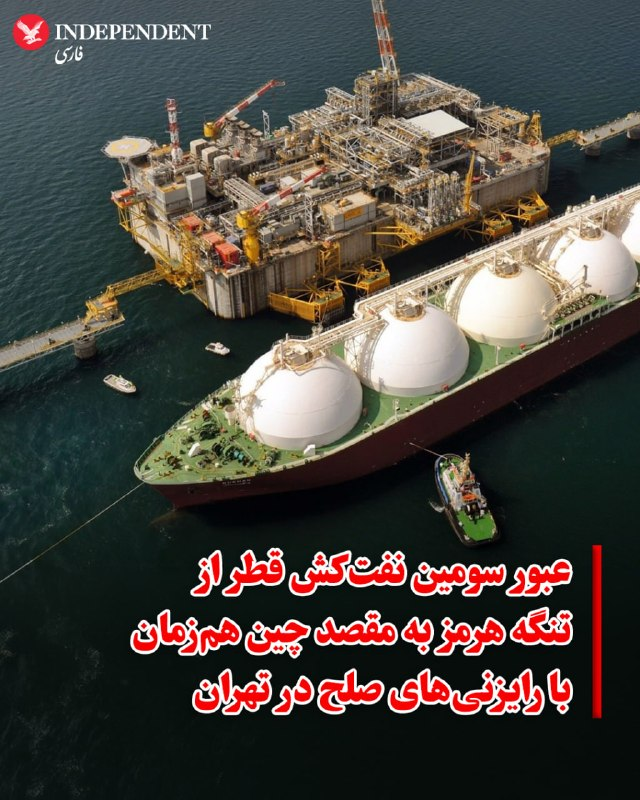

♦️ الجزیره با استناد به داده‌های ردیابی کشتی‌ها روز جمعه اول خرداد، گزارش داد که سومین نفتکش حامل گاز طبیعی مایع (LNG) قطر در حال عبور از تنگه هرمز به مقصد چین است. این رویداد در حالی رخ می‌دهد که یک تیم مذاکره‌کننده قطری برای کمک به دستیابی به توافقی جهت پایان دادن به جنگ با جمهوری اسلامی، در تهران به سر می‌برد.

این کشتی به نام «السهله» با ظرفیت بیش از ۲۱۱ هزار مترمکعب، بندر رأس لفان قطر را ترک کرده و انتظار می‌رود در ۱۴ ژوئن (۲۴ خرداد) به پایانه ال‌ان‌جی تیانجین در چین برسد. عبور این کشتی نزدیک به دو هفته پس از آن صورت می‌گیرد که محموله‌های قبلی تحت یک توافق میان جمهوری اسلامی و پاکستان از این شاهراه حیاتی عبور کردند.

به گزارش خبرگزاری رویترز، دو نفتکش قطری قبلی که از زمان آغاز حملات هوایی آمریکا و اسرائیل در اواخر فوریه موفق به عبور از تنگه هرمز شدند، توسط قطر به پاکستان فروخته شده بودند. منابع آگاه اعلام کردند که جمهوری اسلامی عبور این نفتکش را با هدف اعتمادسازی میان قطر و پاکستان (که نقش میانجی را در گفتگوهای صلح ایفا می‌کند) تایید کرده است.
‌🇸🇦 Indypersian

🤖 @VahidOOnLine

## VahidOOnLine — post 241589

  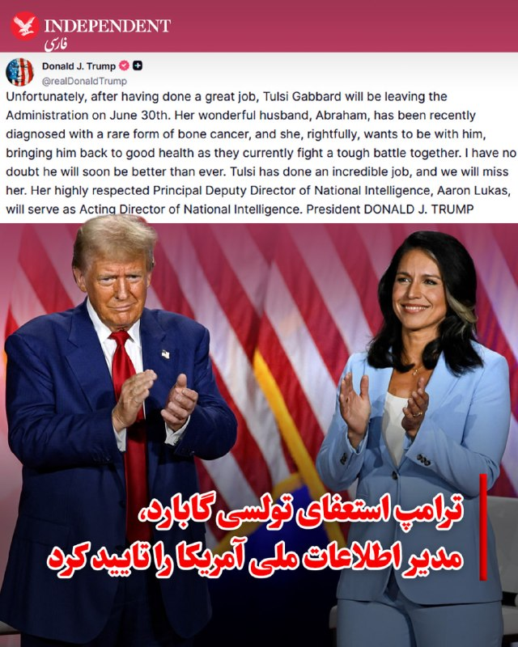

♦️ دونالد ترامپ، رئیس‌جمهور آمریکا، با انتشار پیامی در شبکه اجتماعی «تروث سوشال»، خبر استعفای تولسی گابارد از سمت مدیریت اطلاعات ملی (DNI) را تایید و اعلام کرد که او در تاریخ ۳۰ ژوئن (نهم تیر) دولت را ترک می‌کند.

ترامپ دلیل این تصمیم را ابتلای همسر گابارد به نوع نادری از سرطان استخوان عنوان کرد و گفت که او تمایل دارد برای همراهی و نبرد با بیماری همسرش در کنار او باشد. رئیس‌جمهور آمریکا ضمن آرزوی سلامتی برای همسر گابارد، از عملکرد او قدردانی کرد.

ترامپ همچنین اعلام کرد که آرون لوکاس، معاون اول گابارد، تا زمان تعیین مدیر جدید، به عنوان سرپرست مدیریت اطلاعات ملی آمریکا خدمت خواهد کرد.

در ماه‌های اخیر گزارش‌های تاییدنشده‌ای مبنی بر تمایل ترامپ به اخراج گابارد مطرح شده بود. گابارد در یکی از جلسات استماع کنگره، خطر دستیابی جمهوری اسلامی به سلاح هسته‌ای را «قریب‌الوقوع» ندانسته بود.
‌🇸🇦 Indypersian

🤖 @VahidOOnLine

## VahidOOnLine — post 241588

  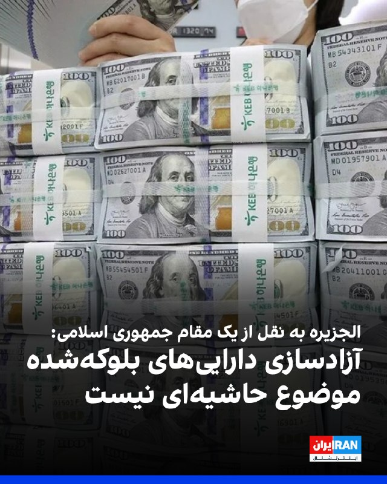

الجزیره به نقل از یک مقام جمهوری اسلامی گزارش داد که نقش قطر در حمایت از میانجی‌گری پاکستان بسیار کلیدی است.

این مقام حکومت ایران افزود: «آزادسازی دارایی‌های بلوکه‌شده و لغو تحریم‌های صادرات نفت برای جمهوری اسلامی موضوعی حاشیه‌ای نیست.»
‌🏁 🇬🇧 IranintlTV

🤖 @VahidOOnLine

## VahidOOnLine — post 241587

  <a href="telegram/content/VahidOOnLine_241587_1779481054.mp4" target="_blank">🎬 Download video</a>

یک شهروند در پیامی به ایران اینترنشنال از اوضاع وخیم اقامتگاه‌ها و هتل‌های مشهد در پی بحران اقتصادی روایت می‌کند. پیام او با هوش مصنوعی خوانده شده است.
‌🏁 🇬🇧 IranintlTV

🤖 @VahidOOnLine

## VahidOOnLine — post 241586

  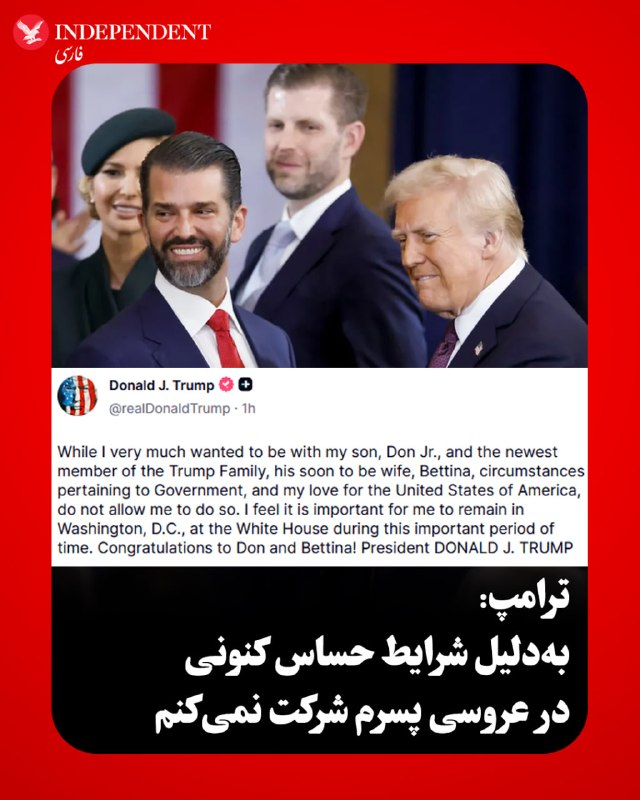

♦️ دونالد ترامپ، رئیس‌جمهوری ایالات متحده آمریکا روز جمعه اول خرداد اعلام کرد که «در این بازه زمانی مهم» ضروری است که در کاخ سفید باقی بماند و به‌همین دلیل امکان شرکت در مراسم عروسی پسرش، دونالد ترامپ جوان، با بتینا اندرسون را ندارد.

ترامپ ضمن آرزوی خوشبختی برای پسر ارشدش در شبکه اجتماعی تروث‌سوشال نوشت: «در حالی که بسیار مشتاق بودم در کنار پسرم، دان جونیور (دونالد ترامپ جونیور) و جدیدترین عضو خانواده ترامپ، یعنی همسر آینده‌اش، بتینا باشم، اما شرایط مربوط به دولت و عشق من به ایالات متحده آمریکا این اجازه را به من نمی‌دهد. احساس می‌کنم در این برهه زمانی مهم، حضور من در واشنگتن دی‌سی و در کاخ سفید اهمیت بالایی دارد.»

عروسی پسر ترامپ که قرار است این آخر هفته برگزار شود، با شدت گرفتن تلاش‌ها برای امضای تفاهم‌نامه میان تهران و واشنگتن همزمان شده است. در همین راستا، روز جمعه، عاصم منیر، فرمانده کل ارتش پاکستان که نقش میانجی میان تهران و واشنگتن را بازی می‌کند به ایران سفر کرد و محسن نقوی، وزیر کشور پاکستان نیز در تهران حضور دارد.
‌🇸🇦 Indypersian

🤖 @VahidOOnLine

## VahidOOnLine — post 241585

  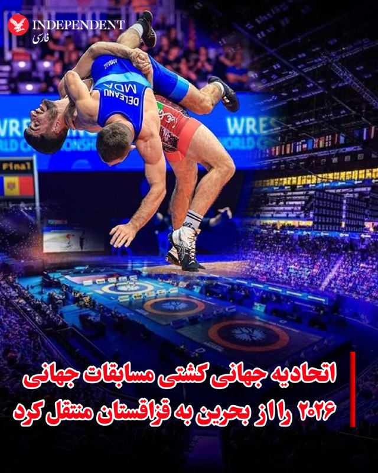

♦️اتحادیه جهانی کشتی اعلام کرد به‌دلیل «وضعیت ژئوپلیتیک کنونی» و ادامه ابهام‌ها به‌ویژه در حوزه سفرهای بین‌المللی، میزبانی مسابقات جهانی ۲۰۲۶ از منامه بحرین به شهر آستانه قزاقستان منتقل شده است.
میزبانی این رقابت‌ها پیش‌تر در نشست سال گذشته در زاگرب به بحرین واگذار شده بود، اما تحولات اخیر منطقه باعث تغییر این تصمیم شد. بر اساس برنامه جدید، مسابقات جهانی کشتی از ۲ تا ۱۰ آبان ۱۴۰۵ در آستانه برگزار خواهد شد؛ شهری که پیش‌تر در سال ۲۰۱۹ نیز میزبان این رقابت‌ها بوده است.
در ماه‌های اخیر، جنگ ایران که از نهم اسفند ۱۴۰۴ آغاز شده، موجب لغو یا جابه‌جایی بسیاری از رویدادهای بین‌المللی ورزشی در منطقه شده است.
‌🇸🇦 Indypersian

🤖 @VahidOOnLine

## VahidOOnLine — post 241584

  

اکسیوس به نقل از یک منبع نزدیک به ترامپ نوشت که رییس‌جمهوری آمریکا در روزهای اخیر به‌طور فزاینده‌ای کلافه شده و احتمال انجام یک عملیات نظامی نهایی و گسترده را مطرح کرده است؛ عملیاتی که پس از آن بتواند اعلام پیروزی کرده و به جنگ پایان دهد.

اکسیوس همچنین به نقل از یک منبع امنیتی پاکستان اعلام کرد که عاصم منیر، فرمانده ارتش پاکستان، جمعه در چارچوب تلاش‌ها برای دستیابی به توافقی میان جمهوری اسلامی و آمریکا وارد تهران شد؛ توافقی که بر اساس آن دو طرف جنگ را متوقف کرده و مذاکراتی گسترده‌تر را آغاز کنند.
‌🏁 🇬🇧 IranintlTV

🤖 @VahidOOnLine

## VahidOOnLine — post 241583

  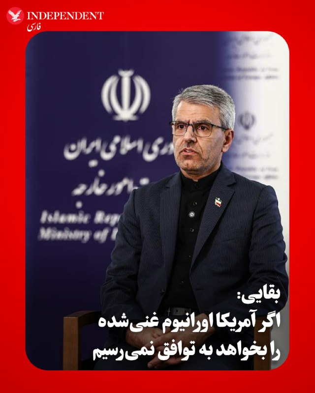

♦️ اسماعیل بقایی، سخنگوی وزارت خارجه جمهوری اسلامی، روز جمعه اول خرداد در گفتگو با صداوسیما، خواسته آمریکا برای خروج اورانیوم با غنای بالا از خاک ایران را «خواسته نامعقول» خواند و گفت: «موضع ما در قبال مباحث مرتبط با اورانیوم غنی‌شده مشخص است. اگر در این مرحله به جزئیات این موضوع بپردازیم، به نتیجه نخواهیم رسید.»

جمهوری اسلامی همچنین بر حاکمیت کامل بر تنگه هرمز و نظارت بر تردد شناورها پافشاری می‌کند.

این اظهارات در حالی مطرح می‌شود که دونالد ترامپ، رئیس‌جمهوری آمریکا تاکید کرده است که باقی ماندن اورانیوم با غنای بالا در خاک ایران، برای او یک خط قرمز است و به‌هیچ وجه آن را نخواهد پذیرفت. همچنین مارکو روبیو، وزیر امور خارجه آمریکا در گفتگو با خبرنگاران با تاکید بر موضع آمریکا در قبال تنگه هرمز، گفت در صورت تعیین هرگونه سازوکار عوارض‌گیری از سوی جمهوری اسلامی، امکان دستیابی به توافق از بین می‌رود.
‌🇸🇦 Indypersian

🤖 @VahidOOnLine

## VahidOOnLine — post 241582

هم‌زمان با ادامه کارزار جاویدنامان بیمارستان الغدیر، جزییات تازه‌ای از هویت و چگونگی کشته‌ شدن شماری از جان‌باختگان اعتراضات ۱۸ و ۱۹ دی‌ماه به دست ایران‌اینترنشنال رسیده است.
در این ویدیو نحوه قتل حکومتی ستاره رفیعی و حمیدرضا حق‌پرست و انتقال پیکر آن‌ها به بیمارستان را می‌‌‌شنوید.
فرنوش فرجی، عضو تحریریه ایران‌اینترنشنال گزارش می‌دهد.
‌🏁 🇬🇧 IranintlTV

🤖 @VahidOOnLine

## VahidOOnLine — post 241581

  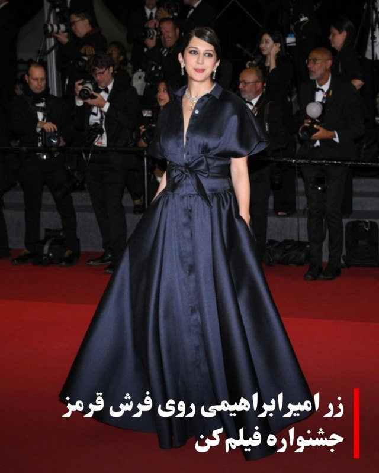

♦️زر امیرابراهیمی، شامگاه ۳۱ اردیبهشت در فرش قرمز نمایش فیلم «بزدل» در هفتادونهمین دوره جشنواره فیلم کن در جنوب فرانسه حاضر شد؛ جشنواره‌ای که نام او از سال ۲۰۲۲ جایگاه ویژه‌ای در تاریخ آن پیدا کرده است.
امیرابراهیمی در جشنواره کن ۲۰۲۲ با بازی در فیلم «عنکبوت مقدس» موفق شد جایزه بهترین بازیگر زن را دریافت کند و به یکی از معدود بازیگران ایرانی تبدیل شود که این جایزه مهم را از کن به دست آورده‌اند.
فیلم بزدل ساخته لوکاس دونت، کارگردان بلژیکی فیلمی درباره سربازان جوان در میدان نبرد جنگ جهانی اول است.
‌🇸🇦 Indypersian

🤖 @VahidOOnLine

## VahidOOnLine — post 241580

  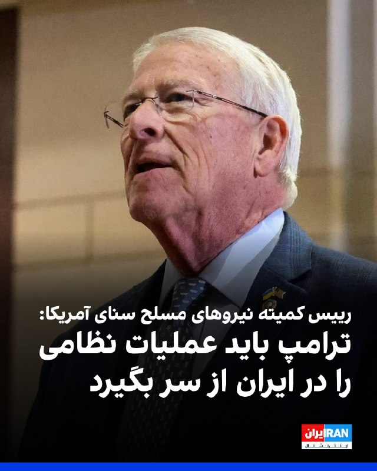

راجر ویکر، رییس کمیته نیروهای مسلح سنای آمریکا در شبکه ایکس نوشت: «باید کاری را که آغاز کرده‌ایم، به پایان برسانیم. آمریکا نباید به‌دنبال توافق با جمهوری اسلامی باشد و در عوض باید عملیات نظامی را از سر بگیرد.»
او افزود: «به دونالد ترامپ توصیه اشتباهی می‌شود تا توافقی را دنبال کند که ارزش نوشته شدن روی کاغذ را هم ندارد.»

ویکر ادامه داد: «فرمانده کل قوا باید به نیروهای مسلح حرفه‌ای آمریکا اجازه دهد نابودی توان نظامی متعارف تهران را تکمیل کرده و تنگه هرمز را بازگشایی کنند.»
‌🏁 🇬🇧 IranintlTV

🤖 @VahidOOnLine

## VahidOOnLine — post 241579

  <a href="telegram/content/VahidOOnLine_241579_1779481059.mp4" target="_blank">🎬 Download video</a>

♦️اسماعیل بقایی، سخنگوی وزارت امور خارجه جمهوری اسلامی، روز جمعه اول خردادماه اعلام کرد هیئتی از قطر در تهران حضور داشته و با عباس عراقچی، وزیر امور خارجه، درباره تحولات اخیر و کاهش تنش‌ها گفتگو کرده است.
او با اشاره به تلاش کشورهای مختلف برای ایفای نقش در روند دیپلماتیک گفت در روزهای اخیر، برخی کشورهای منطقه و خارج از منطقه در قالب «مساعی جمیله» به‌دنبال کمک به پایان درگیری‌ها هستند و این تلاش‌ها از نظر ایران قابل توجه است.
بقایی در عین حال تاکید کرد که با وجود این رایزنی‌ها، میانجی رسمی مذاکرات همچنان پاکستان است و مسیر اصلی گفتگوها از این کانال دنبال می‌شود.
‌🇸🇦 Indypersian

🤖 @VahidOOnLine

## WithYashar — post 12023

  <a href="telegram/content/WithYashar_12023_1779481059.mp4" target="_blank">🎬 Download video</a>

ترامپ شاکی شد 😬 از اونی که اومد فحش داد
@withyashar

## WithYashar — post 12022

  <a href="telegram/content/WithYashar_12022_1779481060.mp4" target="_blank">🎬 Download video</a>

ترامپ به یک معترض:

برو خونه، پیش ننت
@withyashar

## WithYashar — post 12021

  <a href="telegram/content/WithYashar_12021_1779481062.mp4" target="_blank">🎬 Download video</a>

دونالد ترامپ در‌ نیویورک:

من ۹۹٪ رأی نیروهای اجرای قانون را گرفتم می‌توانید باور کنید؟
هنوز داریم تلاش می‌کنیم بفهمیم آن ۱٪ چه کسی بوده است.
@withyashar

## WithYashar — post 12020

داداشی میشه جریان علی کریمی رو یکم باز کنی الا از شاهزاده حمایت نمیکنه ؟

## WithYashar — post 12019

داداشی میشه جریان علی کریمی رو یکم باز کنی
الا از شاهزاده حمایت نمیکنه ؟

## WithYashar — post 12018

@withyashar

## WithYashar — post 12017

پنتاگون ویدئویی از بشقاب پرنده انتشار داده که چند سال پیش با فاصله ای بسیار نزدیک از کنار قایقهای تندروی سپاه عبور میکند … @withyashar یاشار : این سپاهی ها آدم فضایی هم دیدند ولی اون دوستمون این جمعه هم نیامد😬

## WithYashar — post 12016

آدم فضایی دیدیم ولی موشتبی رو ندیدیم

## WithYashar — post 12015

بذار تریاکامو بفروشم ۱۰۰دلار برات میزنم

## WithYashar — post 12014

بذار تریاکامو بفروشم ۱۰۰دلار برات میزنم

## WithYashar — post 12013

## WithYashar — post 12012

## WithYashar — post 12011

آکسیوس، به نقل از یک منبع نزدیک به ترامپ: رئیس جمهور احتمال آغاز یک عملیات نظامی بزرگ دیگر، اعلام پیروزی و پایان دادن به جنگ را مطرح کرد
@withyashar

## WithYashar — post 12010

  <a href="telegram/content/WithYashar_12010_1779481063.mp4" target="_blank">🎬 Download video</a>

پنتاگون ویدئویی از بشقاب پرنده انتشار داده که چند سال پیش با فاصله ای بسیار نزدیک از کنار قایقهای تندروی سپاه عبور میکند …
@withyashar
یاشار : این سپاهی ها آدم فضایی هم دیدند ولی اون دوستمون این جمعه هم نیامد😬

## WithYashar — post 12009

حریت ترکیه : صاحب مجموعه تفریحی معروف «کلاب روبی» در منطقه اورتاکوی استانبول، پس از تذکر دادن به گروهی از افراد مزاحم، در محل کسب خود با شلیک گلوله مجروح شد.

بنا بر گزارش‌های دریافتی، حدود ساعت ۳:۴۵ بامداد شب گذشته، گروهی از افراد با پوشش نامناسب و ایجاد مزاحمت قصد ورود به این کلاب معروف را داشتند که با ممانعت و هشدار علی اونال، صاحب این مجموعه، مواجه شدند. در پی بالا گرفتن مشاجره لفظی، فردی با هویت اختصاری «اِس.کی» با سلاح گرم به سمت اونال شلیک کرد. مالک این مجموعه تفریحی بلافاصله جهت مداوا به بیمارستان منتقل شد.

پس از وقوع این حادثه، نیروهای پلیس استانبول تحقیقات گسترده‌ای را آغاز کردند و ضارب را که با اسلحه از صحنه متواری شده و در مخفیگاهی در منطقه سنجاق‌تپه پنهان شده بود، شناسایی و دستگیر کردند
@withyashar

## WithYashar — post 12008

خبر ویژه رسانه های اسرائیل : در یک ساعت گذشته چندین شرکت تحویل کالا و شرکت‌های حمل‌ونقل بار شروع به لغو پروازهای باری به اسرائیل کرده‌اند. یکی از این شرکت‌ها آی‌هرب است
@withyashar

## WithYashar — post 12007

اکسیوس : ترامپ عصر امروز (به تایم امریکا)پس از یک سخنرانی برنامه‌ریزی شده در نیویورک به کاخ سفید باز خواهد گشت و آخره هفته در کاخ سفید میماند
@withyashar

## WithYashar — post 12006

مقام آمریکایی به اکسیوس:
مذاکرات بسیار دست و پا گیر است و پیش نویس‌ها هر روز بدون پیشرفت زیادی به این سو و آن سو می‌روند.
@withyashar

## WithYashar — post 12005

## WithYashar — post 12004

## mwarmonitor — post 9503

🔴وال‌استریت ژورنال:

🔸میانجی‌ها به‌شدت در تلاش هستند تا به یک توافق موقت میان ایران و ایالات متحده دست پیدا کنند تا از انجام حملات جدید آمریکا–اسرائیل جلوگیری شود؛ حملاتی که مقام‌ها هشدار داده‌اند ممکن است ظرف چند روز آینده رخ دهند.

🔹پاکستان، قطر و دیگر بازیگران منطقه‌ای در حال تلاش برای پر کردن شکاف‌ها درباره برنامه هسته‌ای ایران، کاهش تحریم‌ها و امنیت منطقه‌ای هستند.

🔸هدف، رسیدن به یک توافق کامل نیست، بلکه ایجاد یک چارچوب موقت است که آتش‌بس را تمدید کند و اجازه دهد مذاکرات گسترده‌تر ادامه پیدا کند.

@mwarmonitor

## mwarmonitor — post 9502

  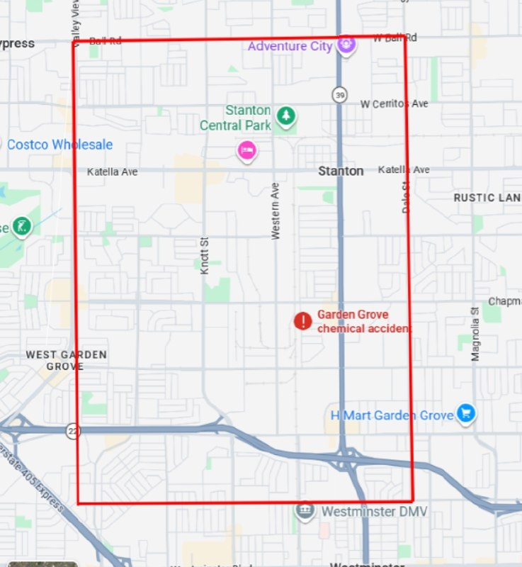

🔴پس از یک حادثه شیمیایی در گاردن گروو، کالیفرنیا، اداره آتش‌نشانی اورنج کانتی (OCFA) اعلام کرده است که تنها دو سناریوی باقی‌مانده برای یک مخزن ۶۰۰۰ تا ۷۰۰۰ گالنی حاوی «متیل متاکریلات» این است که «یا از کار می‌افتد یا منفجر می‌شود».

🔸نقشه زیر محدوده فعلی دستور تخلیه را نشان می‌دهد.

@mwarmonitor

## mwarmonitor — post 9501

🔴« یک منبع ایرانی مسئول به الجزیره: توقف جنگ در تمامی جبهه‌ها پیش‌شرط و راه ورود اصلی برای صحبت درباره هرگونه مذاکره آینده است.»

🔸«هنوز هیچ توافق نهایی‌ای وجود ندارد و تلاش‌ها برای کاهش اختلافات میان تهران و واشنگتن ادامه دارد.»

🔹« فضای مثبت همراه با تحرکات دیپلماتیک مهم است، اما برای رسیدن به یک توافق واقعی کافی نیست.»

@mwarmonitor

## mwarmonitor — post 9500

🔴«مقام آمریکایی به آکسیوس: مذاکرات بسیار فرسایشی و خسته‌کننده است و پیش‌نویس‌ها به‌طور روزانه رفت و برگشت می‌شوند، بدون اینکه پیشرفت قابل توجهی حاصل شود.

🔸رئیس‌جمهور آمریکا طی چند روز گذشته احساس نارضایتی و ناامیدی فزاینده‌ای داشته است.

🔹رئیس‌جمهور احتمال اجرای یک عملیات نظامی بزرگ و نهایی را مطرح کرده و سپس اعلام پیروزی و پایان دادن به جنگ را در نظر دارد.»

@mwarmonitor

## mwarmonitor — post 9498

🔸«ایران ایده اینکه توافق “نزدیک” است را رد می‌کند و تهدیدهای آمریکا برای حمله در صورت عدم دستیابی به توافق در این آخر هفته را نادیده می‌گیرد.

🔹“ما نمی‌توانیم بگوییم که حتماً طی چند هفته یا چند ماه و با چند سفر یا مذاکره به نتیجه خواهیم رسید.” – رسانه دولتی ایران IRNA»

@mwarmonitor

## FoxNewsTwitter — post 342136

  <a href="telegram/content/FoxNewsTwitter_342136_1779481065.mp4" target="_blank">🎬 Download video</a>

Fox News (Twitter/X)

BREAKING: President Trump tells a New York crowd that he's working to bring his home state back to greatness:

“I was born and raised in New York State. My heart has always been here. I love this place, and we’ve got to straighten it out.”

“From the beginning, this was a symbol of American excellence and American grit — and really, the American Dream.”

“Unfortunately, in recent years, the state’s been held back by bad policies, bad politicians, and foolish radical left idiocy."

## FoxNewsTwitter — post 342135

  <a href="telegram/content/FoxNewsTwitter_342135_1779481067.mp4" target="_blank">🎬 Download video</a>

Fox News (Twitter/X)

NOW: New York Giants quarterback Jaxson Dart introduces President Trump before his speech in New York.

## FoxNewsTwitter — post 342134

  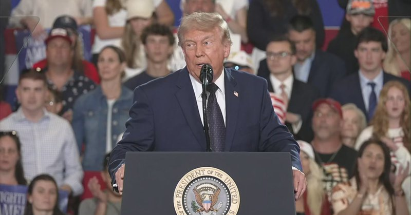

Fox News (Twitter/X)

WATCH LIVE: President Trump lands in New York to deliver remarks https://twitter.com/i/broadcasts/1aJbdbjjmbqKX

## FoxNewsTwitter — post 342133

  <a href="telegram/content/FoxNewsTwitter_342133_1779481070.mp4" target="_blank">🎬 Download video</a>

Fox News (Twitter/X)

Combat vet and Purple Heart recipient Ted Daniels ripping Democrat Maine Senate candidate Graham Platner over a resurfaced post in which Platner said Daniels should have died after nearly being killed by the Taliban.

"Graham, you're a coward... I think you’re a scumbag... People like this don't say stuff like this to my face."

## FoxNewsTwitter — post 342132

  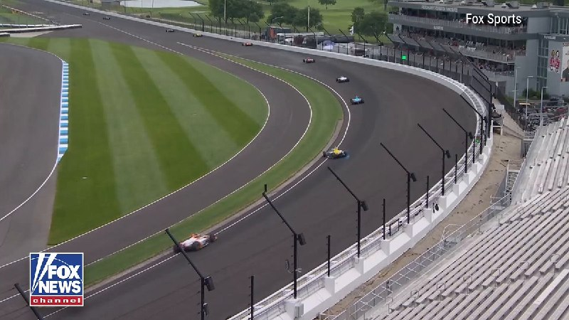

Fox News (Twitter/X)

NEW: Indy 500 drivers are already getting banged up in practice after a series of ugly crashes ahead of race day.

Romain Grosjean, Pato O’Ward, and Alexander Rossi were among the drivers caught up in a major multi-car wreck during Practice 7 for the 2026 Indianapolis 500.

The 110th Running of the Indianapolis 500 takes place on Sunday, May 24, and you can catch all the action live on FOX.

## FoxNewsTwitter — post 342131

  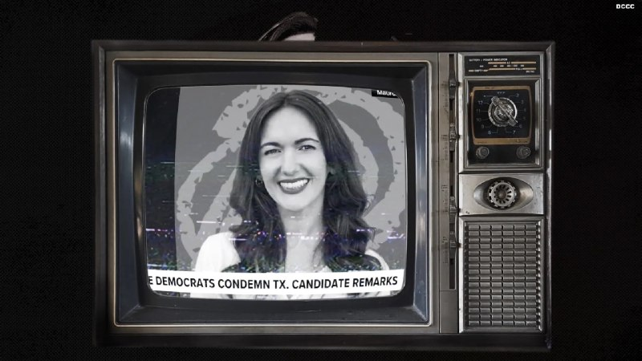

Fox News (Twitter/X)

NEW: Democrats are turning on their own congressional candidate in Texas.

The DCCC is now running ads against Maureen Galindo after backlash exploded over comments she made suggesting “American Zionists” should be sent to detention facilities.

Party leaders are increasingly distancing themselves from Galindo and condemning her comments despite her finishing first in the Democratic primary earlier this year.

Now national Democrats are spending money to stop her before the upcoming runoff election.

## pm_afshaa — post 91231

  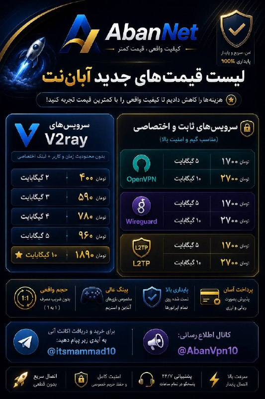

🚀 آبان‌نت؛ سرعت بی‌مرز، بدون تاریخ انقضا!

⚡دنبال کیفیتی می‌گردی که حجمت رو بی‌دلیل تموم نکنه؟

💎 ویژگی‌های طلایی:
• 
✅ بدون محدودیت زمان و کاربر: تا آخرین کیلوبایت حجمت معتبره!
• 
✅ مصرف واقعی (۱ به ۱): بدون ضریب مصرف و دزدی حجم.
• 
✅ پینگ عالی: مخصوص گیمرهای حرفه‌ای و یوتیوب.
• 
☄️ تنوع سرویس: V2ray، OpenVPN،L2tp و Wireguard.

💳 پرداخت راحت بصورت ریالی و ارزی

💰 قیمت‌های ما را مقایسه کنید!
برای استعلام قیمت استثنایی و مشاوره به آیدی زیر پیام دهید:

🆔 @itsmammad10
🔗 کانال اصلی ما:

🆔 @AbanVpn10

## pm_afshaa — post 91230

  <a href="telegram/content/pm_afshaa_91230_1779481073.webm" target="_blank">🎬 Download video</a>

🔴تمام امتحانات سال جاری دانشگاه پیام نور در سراسر کشور مجازی شد.

💧 Rainbet.com the #1 Non-KYC Crypto Casino & Sportsbook @rainbetcom

😁 @Pm_Afshaa

## pm_afshaa — post 91229

  <a href="telegram/content/pm_afshaa_91229_1779481074.mp4" target="_blank">🎬 Download video</a>

🔴ترامپ: من ۹۹٪ رأی نیروهای اجرای قانون رو گرفتم میتونید باور کنید؟ هنوز داریم تلاش می‌کنیم بفهمیم آن ۱٪ چه کسی بوده.

💧 Rainbet.com the #1 Non-KYC Crypto Casino & Sportsbook @rainbetcom

😁 @Pm_Afshaa

## pm_afshaa — post 91228

  <a href="telegram/content/pm_afshaa_91228_1779481076.webm" target="_blank">🎬 Download video</a>

🔴منابع نزدیک به کاخ سفید:
با داغ‌تر شدن درگیری‌های نظامی تو ایران، ترامپ برنامه‌هاشو عوض کرده و قراره آخر هفته رو تو کاخ سفید بمونه.

💧 Rainbet.com the #1 Non-KYC Crypto Casino & Sportsbook @rainbetcom

😁 @Pm_Afshaa

## pm_afshaa — post 91227

  <a href="telegram/content/pm_afshaa_91227_1779481076.webm" target="_blank">🎬 Download video</a>

🔴اکسیوس به نقل از یک منبع نزدیک به ترامپ: ترامپ احتمال اجرای یک عملیات نهایی و گسترده رو مطرح کرده؛ عملیاتی که بعدش بتونه اعلام پیروزی کنه و بگه جنگ تموم شده. 
💧 Rainbet.com the #1 Non-KYC Crypto Casino & Sportsbook @rainbetcom 
😁 @Pm_Afshaa

## pm_afshaa — post 91226

  <a href="telegram/content/pm_afshaa_91226_1779481076.webm" target="_blank">🎬 Download video</a>

🔴اکسیوس به نقل از یک منبع نزدیک به ترامپ: ترامپ احتمال اجرای یک عملیات نهایی و گسترده رو مطرح کرده؛ عملیاتی که بعدش بتونه اعلام پیروزی کنه و بگه جنگ تموم شده.

💧 Rainbet.com the #1 Non-KYC Crypto Casino & Sportsbook @rainbetcom

😁 @Pm_Afshaa

## pm_afshaa — post 91225

  <a href="telegram/content/pm_afshaa_91225_1779481077.webm" target="_blank">🎬 Download video</a>

ترامپ: با اینکه خیلی میخواهم در کنار پسرم برای مراسم عروسی باشم اما حس میکنم که مهم است در واشنگتن و کاخ سفید در طی زمان مهم پیش رو در روز شنبه و یکشنبه بمانم 
💧 Rainbet.com the #1 Non-KYC Crypto Casino & Sportsbook @rainbetcom 
😁 @Pm_Afshaa

## pm_afshaa — post 91224

  <a href="telegram/content/pm_afshaa_91224_1779481077.webm" target="_blank">🎬 Download video</a>

🔴الجزیره نقل از مقام ایرانی:
میانجی‌ها در تلاشند فاصله بین ایران و امریکا رو کم کنند ولی فقط فضای مثبت و اقدامات میانجی ها کافی نیست!

💧 Rainbet.com the #1 Non-KYC Crypto Casino & Sportsbook @rainbetcom

😁 @Pm_Afshaa

## pm_afshaa — post 91223

  <a href="telegram/content/pm_afshaa_91223_1779481078.webm" target="_blank">🎬 Download video</a>

🔴مقام آمریکایی به اکسیوس:
مذاکرات بسیار دست و پا گیر است و پیش نویس‌ها هر روز بدون پیشرفت زیادی به این سو و آن سو می‌روند.

💧 Rainbet.com the #1 Non-KYC Crypto Casino & Sportsbook @rainbetcom

😁 @Pm_Afshaa

## pm_afshaa — post 91222

  <a href="telegram/content/pm_afshaa_91222_1779481079.webm" target="_blank">🎬 Download video</a>

🔴سخنگوی وزارت خارجه ایران:
اختلافات میان ایران و آمریکا انقدر عمیق و فراوان است که نمی‌توان با چند سفر یا چند هفته مذاکره به راه‌حلی رسید.

💧 Rainbet.com the #1 Non-KYC Crypto Casino & Sportsbook @rainbetcom

😁 @Pm_Afshaa

## DEJradio — post 4857

  <a href="telegram/content/DEJradio_4857_1779481079.webm" target="_blank">🎬 Download video</a>

🚨
🔸 خبر ۲۱
آدینه ۱ اردیبهشت ۱۴۰۵

#خبر۲۱
@DEJradio

## DEJradio — post 4856

  <a href="telegram/content/DEJradio_4856_1779481079.webm" target="_blank">🎬 Download video</a>

🔺📢 منابع داخلی گزارش دادند از نیمه دوم اردیبهشت ۱۴۰۵ خروج اموال و اسناد با ارزش از صندوق امانات چند بانک از جمله ملی، تجارت و مسکن افزایش یافته است.

کاربران این صندوق‌ها نگران‌اند با توجه به احتمال جنگ مجدد و وضعیت بحرانی نظام، سرمایه آنها از بین برود یا دیگر صاحب آن نباشند.

در جریان جنگ ۴۰ روزه یکی از شعب بانک سپه در تهران که گفته شد «دیتا سنتر» آنجا قرار داشت هدف قرار گفت.
صندوق امانات، محفظه‌ای امن در خزانه‌ بانک‌هاست که برای نگهداری اسناد، طلا و اشیای ارزشمند اجاره داده می‌شود.

بانک‌ها تضمین نکرده‌اند که در صورت وقوع جنگ یا انقلاب اموال و دارایی مشتریان کامل به آنها پرداخت می‌شود.

#جنگ #جنگ۴۰روزه
@DEJradio

## DEJradio — post 4855

  <a href="telegram/content/DEJradio_4855_1779481080.webm" target="_blank">🎬 Download video</a>

🚨📢 مارک روته دبیرکل ناتو اعلام کرد که آمریکا می‌تواند در عملیات‌های نظامی خود علیه جمهوری اسلامی از پایگاه‌های این سازمان در اروپا استفاده کند.

روته روز آدینه ابتدای خرداد در جریان نشست اعضای این سازمان که در سوئد برگزار شد گفت، به عنوان یک اتحاد غربی-اروپایی، ما می‌توانیم به ایالات متحده آمریکا در تلاش‌هایش برای بازگرداندن آزادی دریانوردی در تنگه هرمز کمک کنیم.

روته افزود، چندین کشور اروپایی تمایل خود را برای مشارکت در تلاش‌ها برای بازگشایی تنگه هرمز و تضمین آزادی دریانوردی ابراز کرده‌اند.

او ادامه داد: «این نه تنها برای متوازن کردن هزینه‌هایی است که با ایالات متحده انجام می‌دهیم، بلکه برای اطمینان یافتن آنچه برای دفاع قاطعانه در برابر دشمنانمان نیاز داریم، لازم است.»

#جنگ
@DEJradio

## VahidOnline — post 75628

  

اکسیوس به نقل از یک منبع نزدیک به ترامپ نوشت که رییس‌جمهوری آمریکا در روزهای اخیر به‌طور فزاینده‌ای کلافه شده و احتمال انجام یک عملیات نظامی نهایی و گسترده را مطرح کرده است؛ عملیاتی که پس از آن بتواند اعلام پیروزی کرده و به جنگ پایان دهد.
@VahidOOnLine

📡 @VahidOnline

## VahidOnline — post 75627

  

سخنگوی هیئت مذاکره‌کننده ایران با آمریکا روز جمعه گفت که موضوع پرونده هسته‌ای ایران در این مرحله مورد مذاکره نیست و از اختلاف نظر عمیق با آمریکا خبر داد.

اسماعیل بقائی گفت: «اختلاف‌نظرها بین ایران و آمریکا آن‌قدر عمیق و زیاد است که نمی‌شود گفت با چندبار رفت‌وآمد یا مذاکرات ظرف چند هفته ما باید حتماً به نتیجه برسیم.»

او گزارش‌ها درباره قریب‌الوقوع بودن توافق با آمریکا را رد کرد و اعلام کرد: «نمی‌توانیم بگوییم ضرورتاً به جایی رسیده‌ایم که توافق نزدیک است.»

بقائی بار دیگر موضع جمهوری اسلامی درباره برنامه هسته‌ای و اورانیوم غنی‌شده را تکرار کرد و گفت مواضع ایران قبلاً اعلام شده است.
@VahidHeadline
سخنگوی وزارت خارجه ایران حضور هیئتی از قطر را در تهران تایید کرد
اسماعیل بقایی،‌ سخنگوی وزارت خارجه ایران تایید کرد که یک هیئت از قطر روز جمعه در تهران بودند و با عباس عراقچی وزیر خارجه ایران گفت‌وگو کردند.
او بدون ارائه جزئیات گفت که کشورهای مختلفی طی روزهای اخیر با وزیر خارجه گفتوگو کردند اما تاکید کرد که میانجی اصلی میان ایران و آمریکا همان کشور پاکستان است.
پیشتر رویترز به نقل از یک منبع آگاه گزارش داد که هیئتی از قطر در هماهنگی با آمریکا وارد تهران شده است.
قطر و امارات و عربستان سعودی سه کشوری بودند که آقای ترامپ روز دوشنبه گفت که به درخواست آنها فعلا حمله مجدد به ایران را متوقف کرده است.
@VahidHeadline

📡 @VahidOnline

## VahidOnline — post 75626

  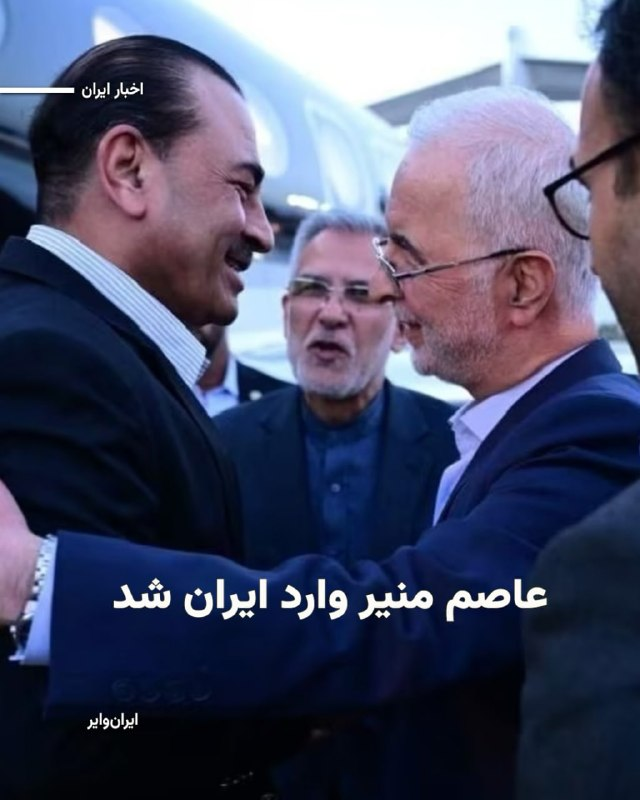

تصویری از عاصم منیر، فرمانده ارتش پاکستان که امروز جمعه یکم خرداد۱۴۰۵ وارد تهران شد و مورد استقبال اسکندر مومنی وزیر کشور قرار گرفت. خبرگزاری آسوشیتدپرس پاکستان نیز به نقل از منابع امنیتی اعلام کرده‌اند که عاصم منیر در طول این سفر رسمی، درباره «مذاکرات جاری ایران و آمریکا و صلح و ثبات منطقه‌ و منافع دوجانبه دیگر» با مقام‌های ایران گفت‌و‌گو خواهد کرد.
@VahidHeadline

📡 @VahidOnline

## kianmeli1 — post 87556

🔴تولسی گابارد مدیرکا اطلاعات ملی آمریکا استعفا داد.

ترامپ: دلیل استعفای گابارد بیماری همسرش به سرطان استخوان بوده است.

-رویترز: بر خلاف گفته ترامپ، کاخ سفید برای استعفا به گابارد فشار آورد و مجبور به اینکار کرد.
https://t.me/kianmeli1

## IranIntlTV — post 338486

بنزین در زاهدان، کرمان و بندرعباس تا لیتری ۲۰۰ هزار تومان فروخته می‌شود

🖋سبا حیدرخانی

گزارش‌های رسیده به ایران‌اینترنشنال از شهرهای مختلف ایران، از تشدید بحران تامین بنزین، محدودیت‌ در عرضه سوخت، صف‌های طولانی در جایگاه‌ها و افزایش شدید قیمت بنزین حتی تا لیتری ۲۰۰ هزار تومان در بازار غیررسمی حکایت دارد.

بیشترین روایت‌ها مربوط به استان‌های هرمزگان، سیستان و بلوچستان، کرمان، بوشهر، خراسان جنوبی، اصفهان و خراسان رضوی است.

بر اساس پیام‌های مردمی، وضعیت عرضه سوخت در جیرفت، عنبرآباد و شهرهای جنوبی استان کرمان بحرانی شده است.

به گفته یک شهروند، در این مناطق قیمت بنزین در بازار آزاد به لیتری ۱۰۰ هزار تومان رسیده است.

او افزود: «اکنون دغدغه ما بنزین شده است. پمپ‌بنزین‌ها بیشتر از ۱۵ لیتر نمی‌دهند و شب‌ها باید در صف‌های کیلومتری بایستیم تا صبح نوبتمان شود. واقعا کلافه شده‌ایم.»

در بیرجند نیز سوخت جیره‌بندی و سهمیه کارت‌ها نصف شده و بنزین آزاد تنها در دو جایگاه، از ساعت شش صبح تا شش عصر و فقط به مقدار ۱۰ لیتر عرضه می‌شود.

در بوشهر هم به گفته یک مخاطب، ‌بنزین تقریبا «نایاب» شده است؛ دکه‌های کنار جاده، سوخت را در دبه‌های ۵ لیتری و با قیمت هر لیتر ۱۰ هزار تومان می‌‌فروشند.

شهروند دیگری از کرمان با اشاره به شکل‌گیری بازار سیاه سوخت گفت بنزین را لیتری ۸۰ هزار تومان خریده است.

او افزود مردم شب‌ها تا صبح در صف می‌ایستند و نوبت می‌گیرند تا صبح که جایگاه باز شد، اگر خوش‌شانس بودند، بتوانند سوخت گیر بیاورند.

جیره‌بندی عرضه رسمی سوخت و گسترش بازار غیررسمی
پیام‌های رسیده از بندرعباس حاکی از شرایط «فاجعه‌بار» جایگاه‌های سوخت در این شهر است.

یکی از مخاطبان ایران‌اینترنشنال گفت: «صف‌های چندکیلومتری بنزین مردم را کلافه کرده است، آن‌هم در گرمایی که کولر خودرو ضرورت است نه انتخاب. شهری که بخش بزرگی از بنزین کشور را تولید می‌کند، سهمش شده آلودگی، بیماری و ساعت‌ها تحقیر در صف سوخت، بدون کوچک‌ترین پاسخ‌گویی مسئولان.»

شهروند دیگری از بندرعباس گفت از ساعت ۸:۵۵ شب در صف پمپ‌بنزین ترنج منتظر بوده‌، اما ساعت ۱۰:۱۰ به خودروها اعلام شده که سوخت تمام شده است.

رمضان‌علی سنگدوینی، عضو کمیسیون انرژی مجلس، پیش‌تر گفته بود بحث تغییر سهمیه‌بندی بنزین «صرفا در حد طرح شخصی» بوده و هیچ تصمیم رسمی درباره آن اتخاذ نشده است.

این موضوع اما با روایت‌های گسترده شهروندان از محدودیت‌های عملی در عرضه سوخت، تناقض دارد.

شهروندان در مشهد از طولانی‌تر شدن صف‌ها و افزایش مداوم قیمت‌ها خبر دادند.

مخاطبی در همین زمینه گفت برای پر کردن یک باک باید ساعت‌ها در صف جایگاه سوخت منتظر ماند: «قبلا هر چند ماه یک‌بار افزایش قیمت داشتیم، اما اکنون هر روز گران‌تر می‌شود.»

شهروند دیگری نیز در پیامی کوتاه نوشت: «امروز سه لیتر بنزین زدم شد ۲۰۰ هزار تومان.»

این گزارش‌ها در حالی منتشر می‌شود که مسعود پزشکیان، رییس دولت جمهوری اسلامی، ۳۰ اردیبهشت با تایید آسیب دیدن بخشی از زیرساخت‌های انرژی در جنگ اخیر، از ناتوانی دولت در تامین و واردات بنزین خبر داد.

او گفت در پی «محاصره دریایی آمریکا»، صادرات نفت ایران متوقف شده و کشور روزانه با کمبود ۵۰ میلیون لیتر بنزین روبه‌رو است، اما «دلاری برای واردات آن وجود ندارد».
ساعاتی پس از انتشار این سخنان، رسانه‌های دولتی از جمله ایرنا بخش‌هایی از اظهارات پزشکیان را حذف کردند.

فساد و رانت در جایگاه‌ها
در کنار بحران کمبود سوخت و توزیع نامناسب آن، برخی مخاطبان از افزایش فساد و رانت در برخی جایگاه‌ها و ناکارآمدی کارت‌های سوخت خبر دادند.

شهروندی از اصفهان با اشاره به ناکارآمدی حکومت در مدیریت بحران سوخت گفت کارت‌ها بدون دلیل خطا می‌دهند و باید سه هفته در انتظار کارت جدید ماند.

مخاطب دیگری از اصفهان از تشدید بی‌نظمی در جایگاه‌ها خبر داد و گفت: «علاوه بر اینکه صف‌های جایگاه سوخت کیلومتری شده و سهمیه بنزین بعضی‌ها را سوزانده‌اند، تعدادی از نیروهای بسیجی هم با اسلحه می‌آیند و بدون نوبت بنزین می‌زنند؛ آن هم نه یک یا دو لیتر، بلکه ۱۵ لیتر بنزین داخل موتورهایشان می‌زنند و می‌روند.»

یک شهروند از استان هرمزگان با انتقاد از «رانت و تبعیض در توزیع سوخت» گفت مردم ساعت‌ها در صف می‌مانند اما ماشین‌های سپاه با گالن‌های ۷۰ لیتری، شبانه از ساعت ۱۸ تا ۴ صبح نزدیک به ۱۰ بار سوخت‌گیری می‌کنند و آن را برای فروش به کاروان‌ها یا قاچاقچیان سوخت می‌برند.

به گفته او، هر گالن ۷۰ لیتری تا پنج میلیون تومان فروخته می‌شود.
 
🔗متن کامل گزارش را اینجا بخوانید
@iranintltv

## IranIntlTV — post 338485

  <a href="https://t.me/IranintlTV/338485" target="_blank">📎 Download file</a>

🎧نسخه صوتی ۲۴ با فرداد فرحزاد:ترامپ: تهران بی‌صبرانه به‌دنبال توافق است
@iranintlTV

## IranIntlTV — post 338483

  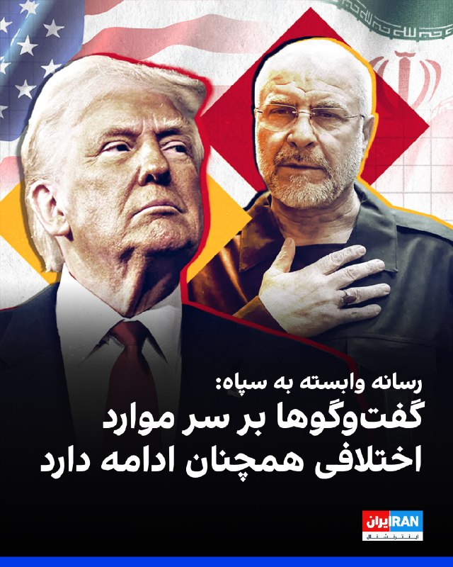

خبرگزاری تسنیم، رسانه‌ها وابسته به سپاه، به نقل از یک منبع نزدیک به هیات مذاکره‌کننده، نوشت: «گفت‌وگوها و رایزنی‌ها بر سر موارد اختلافی همچنان ادامه دارد و هنوز نتیجه نهایی حاصل نشده است.»

این رسانه وابسته به سپاه افزود: «میانجی پاکستانی همچنان در حال رد و بدل موضوعات است.»

تسنیم ادامه داد تمرکز در حال حاضر بر سر مسئله «پایان جنگ» است و تا وقتی این موضوع نهایی نشود، هیچ مساله دیگری مذاکره نخواهد شد.
https://iranintl.com/202605227080

## IranIntlTV — post 338482

  <a href="telegram/content/IranIntlTV_338482_1779481083.mp4" target="_blank">🎬 Download video</a>

یک شهروند در پیامی به ایران اینترنشنال از اوضاع اقتصادی در کشور روایت می‌کند و می‌گوید به دلیل کمبود آرد نانوایی‌ها با اختلال در فعالیت و صف‌های طولانی مواجه‌اند. پیام او با هوش مصنوعی خوانده شده است.

## IranIntlTV — post 338481

  <a href="telegram/content/IranIntlTV_338481_1779481084.mp4" target="_blank">🎬 Download video</a>

فداحسین مالکی، عضو کمیسیون امنیت ملی مجلس، در صداوسیما گفت جمهوری اسلامی در صورت لزوم می‌تواند آتش‌بس را نقض کند. هم‌زمان برخی امامان جمعه نیز هشدار دادند اگر «تعرض‌ها» ادامه پیدا کند، تهران جنگ را بین‌المللی خواهد کرد.

ارزیابی نجات بهرامی، تحلیل‌گر سیاسی
@iranintltv

## IranIntlTV — post 338480

  <a href="telegram/content/IranIntlTV_338480_1779481086.mp4" target="_blank">🎬 Download video</a>

وال‌استریت ژورنال گزارش داد جمهوری اسلامی با پر شدن مخازن نفت و افزایش فشارهای آمریکا، با بحرانی جدی در صنعت نفت روبه‌رو شده است. بر اساس این گزارش، تهران برای جلوگیری از توقف کامل صنعت نفت، ناچار شده از نفتکش‌های شناور و حتی مخازن فرسوده استفاده کند.

گفت‌وگو با همایون فلک‌شاهی، کارشناس نفت و انرژی در موسسه کپلر
@iranintltv

## IranIntlTV — post 338479

  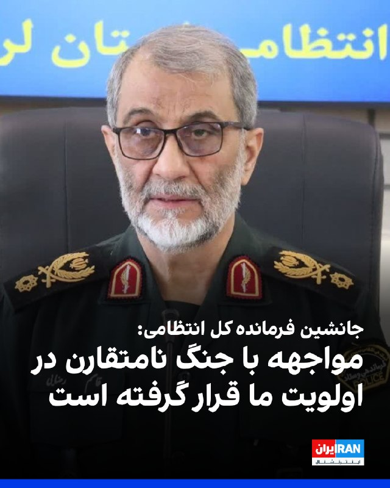

قاسم رضایی، جانشین فرمانده کل انتظامی جمهوری اسلامی گفت: «دیگر تمرکز صرف بر فعالیت‌های پلیسی نیست و نظام دفاعی و آمادگی برای مواجهه با جنگ نامتقارن در اولویت قرار گرفته است.»

او افزود: «نیروها باید آموزش عملی ببینند و تمرینات میدانی داشته باشند. پلیس راه و راهور علاوه بر وظایف ترافیکی، آموزش دفاعی و آمادگی عملی می‌بیند.»

او افزود: «تمرین در خیابان و شرایط واقعی باعث افزایش توانمندی نیروها می‌شود.»
https://iranintl.com/202605222099

## IranIntlTV — post 338478

  

الجزیره به نقل از یک مقام جمهوری اسلامی گزارش داد که نقش قطر در حمایت از میانجی‌گری پاکستان بسیار کلیدی است.

این مقام حکومت ایران افزود: «آزادسازی دارایی‌های بلوکه‌شده و لغو تحریم‌های صادرات نفت برای جمهوری اسلامی موضوعی حاشیه‌ای نیست.»
https://iranintl.com/202605224072

## IranIntlTV — post 338477

  <a href="telegram/content/IranIntlTV_338477_1779481090.mp4" target="_blank">🎬 Download video</a>

یک شهروند در پیامی به ایران اینترنشنال از اوضاع وخیم اقامتگاه‌ها و هتل‌های مشهد در پی بحران اقتصادی روایت می‌کند. پیام او با هوش مصنوعی خوانده شده است.

## IranIntlTV — post 338476

  <a href="https://t.me/IranintlTV/338476" target="_blank">📎 Download file</a>

🎧نسخه صوتی حرف آخر با پوریا زراعتی - عملیات موساد برای حذف فیزیکی مجتبی
@iranintlTV

## IranIntlTV — post 338475

  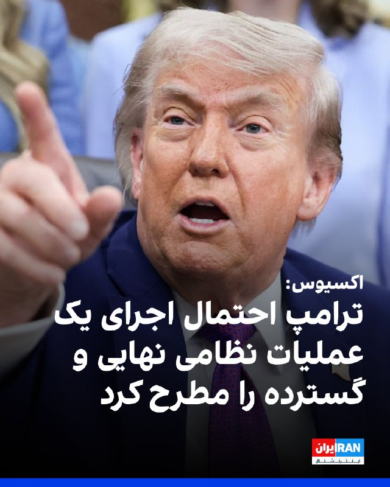

اکسیوس به نقل از یک منبع نزدیک به ترامپ نوشت که رییس‌جمهوری آمریکا در روزهای اخیر به‌طور فزاینده‌ای کلافه شده و احتمال انجام یک عملیات نظامی نهایی و گسترده را مطرح کرده است؛ عملیاتی که پس از آن بتواند اعلام پیروزی کرده و به جنگ پایان دهد.

اکسیوس همچنین به نقل از یک منبع امنیتی پاکستان اعلام کرد که عاصم منیر، فرمانده ارتش پاکستان، جمعه در چارچوب تلاش‌ها برای دستیابی به توافقی میان جمهوری اسلامی و آمریکا وارد تهران شد؛ توافقی که بر اساس آن دو طرف جنگ را متوقف کرده و مذاکراتی گسترده‌تر را آغاز کنند.
https://iranintl.com/202605221158

## IranIntlTV — post 338474

  <a href="telegram/content/IranIntlTV_338474_1779481092.mp4" target="_blank">🎬 Download video</a>

۲۴ با فرداد فرحزاد، جمعه یک خرداد
@iranintltv

## IranIntlTV — post 338473

  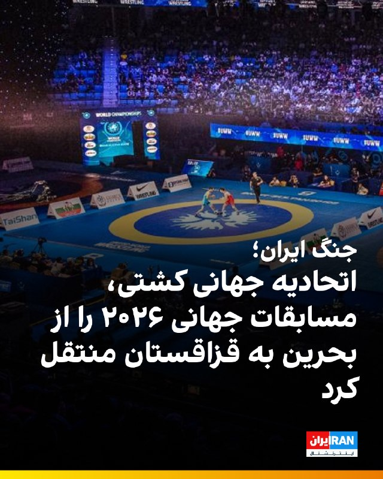

🔻اتحادیه جهانی کشتی اعلام کرد به دلیل «وضعیت ژئوپلیتیک کنونی، به‌ویژه تداوم ابهام‌ها و تاثیر آن بر سفرهای بین‌المللی» تصمیم گرفته است میزبانی مسابقات جهانی ۲۰۲۶ را از منامه بحرین به شهر آستانه قزاقستان منتقل کند.

🔹میزبانی مسابقات جهانی ۲۰۲۶، سال گذشته در نشست زاگرب به بحرین واگذار شده بود.

🔹مسابقات جهانی کشتی امسال از ۲ تا ۱۰ آبان ۱۴۰۵ برگزار می‌شود. آستانه در سال ۲۰۱۹ هم میزبان این رقابت‌ها بود.

🔹جنگ ایران از نهم اسفند ۱۴۰۴ تاکنون، باعث لغو بسیاری از مسابقات بین‌المللی ورزشی در منطقه شده است.

@iranintltvsport

## IranIntlTV — post 338471

هم‌زمان با ادامه کارزار جاویدنامان بیمارستان الغدیر، جزییات تازه‌ای از هویت و چگونگی کشته‌ شدن شماری از جان‌باختگان اعتراضات ۱۸ و ۱۹ دی‌ماه به دست ایران‌اینترنشنال رسیده است.
در این ویدیو نحوه قتل حکومتی ستاره رفیعی و حمیدرضا حق‌پرست و انتقال پیکر آن‌ها به بیمارستان را می‌‌‌شنوید.
فرنوش فرجی، عضو تحریریه ایران‌اینترنشنال گزارش می‌دهد.

## IranIntlTV — post 338470

  

راجر ویکر، رییس کمیته نیروهای مسلح سنای آمریکا در شبکه ایکس نوشت: «باید کاری را که آغاز کرده‌ایم، به پایان برسانیم. آمریکا نباید به‌دنبال توافق با جمهوری اسلامی باشد و در عوض باید عملیات نظامی را از سر بگیرد.»
او افزود: «به دونالد ترامپ توصیه اشتباهی می‌شود تا توافقی را دنبال کند که ارزش نوشته شدن روی کاغذ را هم ندارد.»

ویکر ادامه داد: «فرمانده کل قوا باید به نیروهای مسلح حرفه‌ای آمریکا اجازه دهد نابودی توان نظامی متعارف تهران را تکمیل کرده و تنگه هرمز را بازگشایی کنند.»
https://iranintl.com/202605226738

## IranIntlTV — post 338469

  <a href="telegram/content/IranIntlTV_338469_1779481094.mp4" target="_blank">🎬 Download video</a>

آیا توافق بین تهران و واشینگتن با شرایط فعلی امکان‌پذیر است؟
@iranintltv

## Shin_Persian — post 6156

🔁 Quoting above tweet:
Shin ✓ @hey_itsmyturn
Fri, 22 May 2026 20:14:51 UTC

#UAE 🇦🇪 was smart enough to learn it quickly: UAVs matter! UCAVs even more!

فارسی

#امارات 🇦🇪 به اندازه کافی هوشمند بود که این را به سرعت بیاموزد: پهپادها (UAV) مهم هستند! پهپادهای رزمی (UCAV) حتی بیشتر!

𝕏 · @shin_persian

## Shin_Persian — post 6155

  

↩️ Quoted tweet: De Faakto MENA ✓ @DeFaakto Wed, 20 May 2026 19:30:01 UTC 🧵 من يملك المسيرات يتحكم في حرب المستقبل تحليل OSINT 🔴 سؤال بسيط يعيد تعريف الحرب.. 🔴تخيل أنك تدفع مليون دولار لتُسقط طائرة كلفت صانعها عشرين ألفا فقط..؟ 🔴تخسر 50 ضعفا في كل اشتباك…

## Shin_Persian — post 6154

↩️ Quoted tweet:
De Faakto MENA ✓ @DeFaakto
Wed, 20 May 2026 19:30:01 UTC

🧵 من يملك المسيرات يتحكم في حرب المستقبل
تحليل OSINT

🔴 سؤال بسيط يعيد تعريف الحرب..

🔴تخيل أنك تدفع مليون دولار لتُسقط طائرة كلفت صانعها عشرين ألفا فقط..؟

🔴تخسر 50 ضعفا في كل اشتباك - وتسمي ذلك "نجاحاً دفاعيا"..
هذه ليست مفارقة نظرية، هذه هي حرب اليوم.

🟥في أبريل 2024،

↩️ Quoted tweet — see the post below for the reply.

English

🧵 Whoever owns the drones controls the war of the future
OSINT (Open-Source Intelligence) Analysis

🔴 A simple question that redefines warfare..

🔴 Imagine paying a million dollars to shoot down an aircraft that cost its maker only twenty thousand..?

🔴 You lose 50 times the cost in every engagement — and you call that a "defensive success"..
This is not a theoretical paradox; this is the war of today.

🟥 In April 2024,

𝕏 · @shin_persian

## Shin_Persian — post 6153

  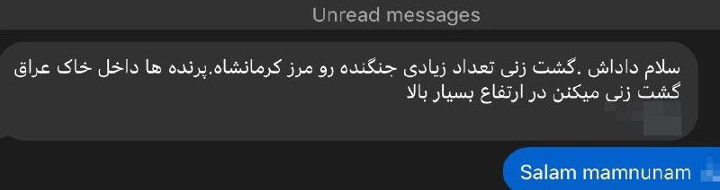

Shin ✓ @hey_itsmyturn
Fri, 22 May 2026 19:46:10 UTC

Intense jet activity over Eastern Iraq, near Iranian western borders.
#Iraq 🇮🇶

فارسی

فعالیت شدید جت‌های جنگنده برفراز شرق عراق، در نزدیکی مرزهای غربی ایران.
#Iraq 🇮🇶

𝕏 · @shin_persian

## FarsiVOA — post 218392

⚡️تشدید سرکوب شهروندان ایران و نگرانی از اعدام‌های بیشتر؛ گفت‌وگو با شیوا محبوبی
@FarsiVOA

## FarsiVOA — post 218391

  <a href="telegram/content/FarsiVOA_218391_1779481096.mp4" target="_blank">🎬 Download video</a>

⚡️محمد قائدی در برنامه تفسیر خبر: روسیه جرئت نمی‌کند به کشورهای عضو ناتو حمله کند
@FarsiVOA

## FarsiVOA — post 218390

⚡️جایزه انجمن جهانی جمهوری خواهان به مردم ایران؛ گفتگو با سردار پاشایی قهرمان و مربی پیشین کشتی ایران
@FarsiVOA

## FarsiVOA — post 218389

⚡️آیا جمهوری اسلامی شروط آمریکا را خواهد پذیرفت؟ گفت‌وگو با درویش رنجبر

@FarsiVOA

## FarsiVOA — post 218388

⚡️گفت‌و‌گو با محمود فرهمند، عضو پارلمان نروژ از حزب محافظه‌کار، درباره قطع‌نامه پارلمان اروپا در محکومیت جمهوری اسلامی به دلیل نقض حقوق بشر
@FarsiVOA

## FarsiVOA — post 218387

  <a href="telegram/content/FarsiVOA_218387_1779481097.mp4" target="_blank">🎬 Download video</a>

⚡️نیک‌آهنگ کوثر در برنامه تفسیر خبر: جمهوری اسلامی از ابتدا یک ساختار گروگانگیر بوده
@FarsiVOA

## FarsiVOA — post 218386

⚡️فیلم «دادگاه تاریخ»؛ روایت محکمه‌ای برای رسیدگی به جنایات جمهوری اسلامی گفت‌وگو با سعید دهقان
@FarsiVOA

## FarsiVOA — post 218385

  <a href="telegram/content/FarsiVOA_218385_1779481098.mp4" target="_blank">🎬 Download video</a>

⚡️پرونده ترور رهبران یهودی در آلمان؛ رد پای شبکه‌های برون‌مرزی جمهوری اسلامی
@FarsiVOA

## FarsiVOA — post 218384

  <a href="telegram/content/FarsiVOA_218384_1779481098.mp4" target="_blank">🎬 Download video</a>

⚡️لیلا مروتی در برنامه تفسیر خبر: جمهوری اسلامی مجبور به تسلیم خواهد شد
@FarsiVOA

## FarsiVOA — post 218383

⚡️گفت‌وگو با جمشید اسدی، اقتصاددان، پیرامون موضوع فرافکنی رژیم جمهوری اسلامی درباره علل و ریشه‌های مصائب اقتصادی ایران
@FarsiVOA

## FarsiVOA — post 218382

⚡️کمبود و گرانی سرسام‌آور داروهای اعصاب و روان در ایران؛ عواقب فردی و اجتماعی این بحران
@FarsiVOA

## FarsiVOA — post 218381

⚡️گفت‌و‌گو با یاسین اهوازی، کارشناس مسائل خاورمیانه، درباره گزارش‌ها درباره تلاش جمهوری اسلامی برای بازسازی توان موشکی و پهپادی‌ خود در دوران آتش‌بس
@FarsiVOA

## FarsiVOA — post 218380

🔺کناره‌‌گیری مدیر اطلاعات ملی آمریکا؛ تقدیر پرزیدنت ترامپ از عملکرد تولسی گابارد

◾️دونالد ترامپ، رئیس جمهوری آمریکا، روز جمعه ۱ خرداد با انتشار پیامی در شبکه اجتماعی تروت سوشال اعلام کرد که تولسی گابارد به دلیل بیماری همسرش و به منظور کمک به او در روند بهبودی، از سمت خود کناره‌گیری می‌کند.

⬇️ بیشتر بخوانید:

https://ir.voanews.com/a/president-trump-white-house-meeting-iran/8152838.html

## FarsiVOA — post 218379

واکنش‌ها به مصائب کسب‌و‌کارها در ایران در سایه خفقان دیجیتال؛ سرکوب اقلیت‌ها ادامه دارد

## FarsiVOA — post 218378

🔺تداوم بلاتکلیفی یک شهروند بهائی در زندان مشهد؛ سرکوب اقلیت‌های مذهبی توسط رژیم در ایران ادامه دارد

◾️گزارش‌های رسیده به صدای آمریکا حاکی از آن است که وفا کاشفی، شهروند بهائی ساکن مشهد، با گذشت یک‌ ماه از بازداشتش، کماکان در زندان وکیل‌آباد این شهر در وضعیت بلاتکلیف به‌سر می‌برد.

⬇️ بیشتر بخوانید:

https://ir.voanews.com/a/vafa-kashefi-iran-bahaaie-religious-repression-prison/8152834.html

## DW_Farsi — post 125028

  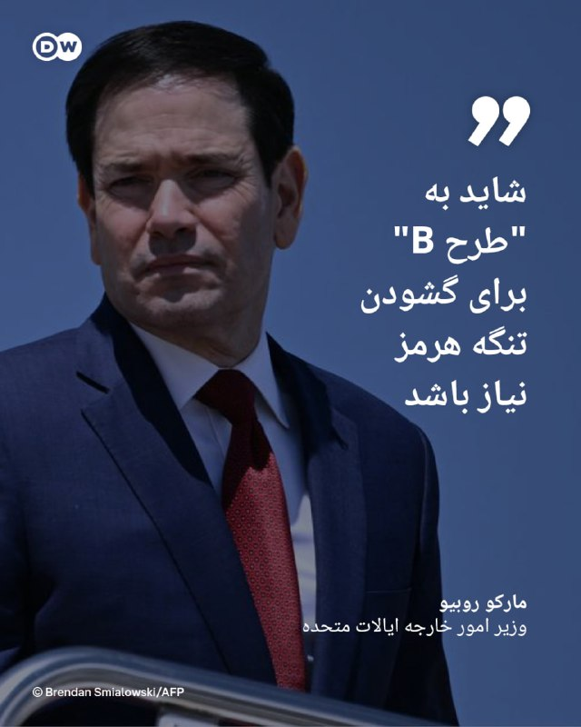

🔶 مارکو روبیو: شاید به "طرح B" برای گشودن تنگه هرمز نیاز باشد

تنگه هرمز همچنان یکی از کانون‌های اصلی تنش در منازعه با ایران است. اکنون مارکو روبیو، وزیر امور خارجه ایالات متحده، به صراحت از یک "طرح B" (نقشه دوم) سخن می‌گوید؛ این طرح دوم برای زمانی است که این آبراه حیاتی همچنان مسدود بماند یا بار دیگر هدف حمله قرار گیرد.

مارکو روبیو در جریان نشست وزرای امور خارجه ناتو در سوئد، خواستار بررسی یک "طرح B" برای بازگشایی تنگه هرمز شد. روبیو در شهر هلسینگبوری اظهار داشت که همگان از توافقی با ایران که شامل بازگشایی این تنگه، به عنوان شاهراهی حیاتی برای بازار جهانی نفت و گاز، باشد، استقبال می‌کنند. اما اگر ایران از بازگشایی این آبراه امتناع کند و تصمیم بگیرد کنترل آن را حفظ کرده و برای عبور و مرور عوارض دریافت کند، به یک "طرح B" نیاز خواهد بود.

روبیو در ادامه افزود: «من امروز این موضوع را مطرح کردم و با موافقت‌های زیادی روبه‌رو شدم، (...) اما امروز خبر یا بیانیه رسمی برای اعلام به شما (خبرنگاران) ندارم.»
@edw_farsi

## DW_Farsi — post 125027

  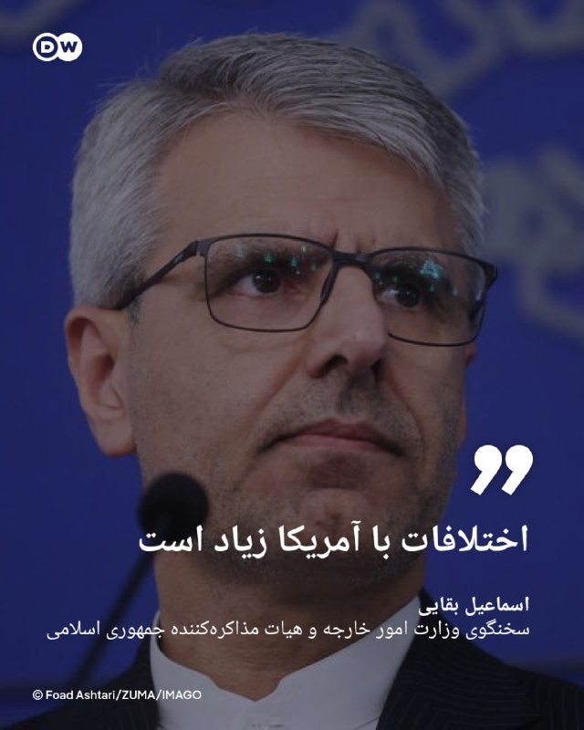

🔶 ورود عاصم منیر به تهران؛ بقایی: اختلافات با آمریکا زیاد است

محمدباقر قالیباف، رئیس هیات مذاکره‌کننده جمهوری اسلامی با آمریکا، اسماعیل بقایی سخنگوی وزارت امور خارجه را به عنوان سخنگوی این هیات منصوب کرد.

در حکم انتصاب بقایی آمده است: «بدین وسیله جنابعالی را که یکی از نیروهای انقلابی و متخصص در حقوق بین الملل هستید و تجربیات مناسب در حوزه دیپلماسی داشته و مسئولیت سخنگویی وزارت امور خارجه را هم برعهده دارید، به عنوان سخنگوی هیات مذاکراتی میناب ۱۶۸ منصوب می‌کنم.»

همزمان با اعلام بقایی به عنوان سخنگوی هیات مذاکره‌کننده ایران، او در مصاحبه‌ای از آخرین جزئیات مربوط به تلاش‌های پاکستان برای نزدیک‌کردن دیدگاه‌های تهران و واشنگتن خبر داد.

در حالی که در تداوم حضور وزیر کشور پاکستان در تهران برای پیشبرد هر چه فشرده مذاکرات عصر پنجشنبه ۱ خرداد، عاصم منیر، فرمانده ارتش این کشور نیز وارد تهران شد، اما به گفته بقایی "اختلاف‌نظرها بین ایران و آمریکا آن‌قدر عمیق و زیاد است که نمی‌شود گفت با چندبار رفت‌وآمد یا مذاکرات ظرف چند هفته ما باید حتماً به نتیجه برسیم".
@dw_farsi

## DW_Farsi — post 125026

  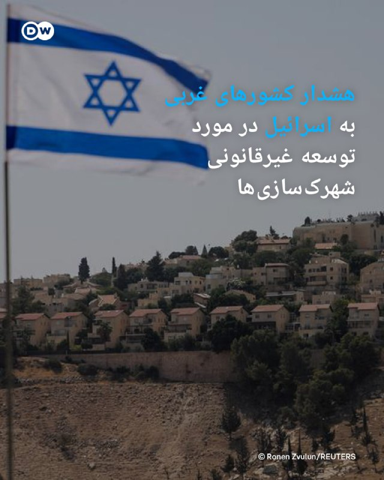

🔶 هشدار کشورهای غربی به اسرائیل در مورد توسعه غیرقانونی شهرک‌سازی‌ها و خشونت‌ها

۹ کشور غربی در بیانیه‌ای مشترک، ضمن محکوم کردن خشونت‌های شهرک‌نشینان و هشدار به شرکت‌های ساخت‌وساز در خصوص عدم شرکت در مناقصه‌ها، از اسرائیل خواستند تا توسعه شهرک‌های خود را در کرانه باختری اشغالی متوقف کند.

در این بیانیه مشترک که روز جمعه ۲۲ مه، منتشر شد، رهبران کشورهای بریتانیا، فرانسه، آلمان، ایتالیا، کانادا، استرالیا، نیوزیلند، نروژ و هلند تأکید کردند که این شهرک‌سازی‌ها ناقض قوانین بین‌المللی است.

در بخش از این بیانیه آمده است: «طی چند ماه گذشته، وضعیت در کرانه باختری به شکل چشمگیری وخیم‌تر شده است. خشونت شهرک‌نشینان به سطحی بی‌سابقه رسیده است. سیاست‌ها و اقدامات دولت اسرائیل، از جمله تحکیم هرچه بیشتر کنترل خود بر این مناطق، در حال تضعیف ثبات و چشم‌اندازهای دستیابی به راه‌حل دو کشوری است.»

گروه‌های حقوق بشری می‌گویند مقامات اسرائیلی به شهرک‌نشینان اجازه داده‌اند تا در حملات خود علیه فلسطینیان، از مصونیت کامل از مجازات برخوردار باشند.
@dw_farsi

## DW_Farsi — post 125025

  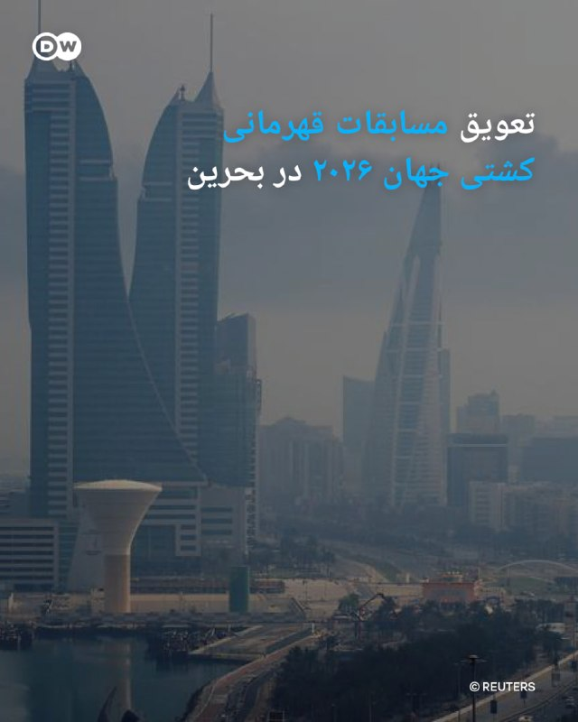

🔶 تعویق مسابقات قهرمانی کشتی جهان ۲۰۲۶ در بحرین

اتحادیه جهانی کشتی (UWW) با صدور بیانیه‌ای اعلام کرد که در هماهنگی نزدیک با کمیته المپیک بحرین و فدراسیون کشتی این کشور، مسابقات قهرمانی جهان ۲۰۲۶ را که در ابتدا قرار بود از ۲۴ اکتبر تا ۱ نوامبر در بحرین برگزار شود به زمانی دیگر موکول می‌شود.

بنا بر این بیانیه، تصمیم تعویط جام جهانی کشتی "پس از بررسی دقیق و مسئولانه شرایط ژئوپلیتیک کنونی منطقه، به ویژه بلاتکلیفی‌های جاری پیرامون مناقشات در حال وقوع در حوزه خلیج [فارس] و تأثیرات گسترده‌تر آن بر ثبات منطقه و سفرهای بین‌المللی اتخاذ شده است".

در ادامه بیانیه آمده است: «ورزش کشتی همواره فراتر از یک رقابت صرف بوده است؛ کشتی پلی میان ملت‌ها، فرهنگ‌ها و مردم است. در روزگاری که جهان با بلاتکلیفی و تفرقه روبروست، به ما یادآوری می‌شود که ورزش همچنان زبان مشترک صلح، احترام و اتحاد است. با همین رویکرد و روحیه است که اتحادیه جهانی کشتی، کمیته المپیک بحرین و فدراسیون کشتی بحرین این بیانیه مشترک را صادر می‌کنند.»
@dw_farsi

## DW_Farsi — post 125024

🎥 ۲۷ خواهر و برادر ناتنی؛ جست‌وجو برای پدر بیولوژیکی

در اروپا، همزمان با افزایش اهدای اسپرم، بحث بر سر حق فرزندان برای شناخت هویت بیولوژیکی‌شان جدی‌تر شده؛ آیا کودکانی که از طریق اهدای اسپرم متولد می‌شوند، باید حق شناخت پدر بیولوژیکی‌شان را داشته باشند؟ لئونتین از سوئد، ۲۷ خواهر و برادر ناتنی پیدا کرد، اما هنوز یک سؤال بی‌پاسخ مانده؛ پدر واقعی‌اش کیست؟
@dw_farsi

## DW_Farsi — post 125023

🔶 اختلاف ترامپ و نتانیاهو درباره ایران؛ جنگ یا دیپلماسی؟

🔻 گزارشی از مراد رحمتی

مقام‌های اسرائیلی می‌گویند دونالد ترامپ، رئیس جمهور آمریکا به نتانیاهو اطمینان داده هرگونه توافق احتمالی با تهران شامل خروج ذخایر اورانیوم غنی‌شده ایران خواهد بود؛ موضوعی که اسرائیل آن را خط قرمز امنیتی خود می‌داند.

در مقابل، نتانیاهو بارها تاکید کرده است که پایان جنگ تنها زمانی معنا خواهد داشت که علاوه بر توقف برنامه هسته‌ای، حمایت جمهوری اسلامی از نیروهای نیابتی منطقه‌ای و توان موشک‌های بالستیک ایران نیز از میان برود.

اکنون این پرسش مطرح است که در نهایت آیا دیپلماسی دست بالا را خواهد داشت یا تقابل نظامی ادامه پیدا می‌کند؟ و اگر آمریکا بدون توجه به اولویت‌های اسرائیل با جمهوری اسلامی به توافق برسد، آیا اسرائیل آن را می‌پذیرد یا دوباره به اقدام نظامی مستقیم روی خواهد آورد؟ این‌ها محور گفت‌وگوی دویچه وله با دو کارشناس است.
@dw_farsi

## RadioFarda — post 157463

  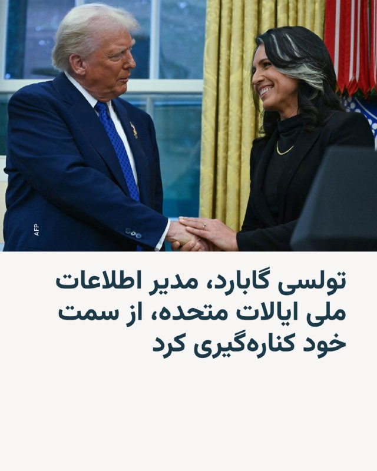

🔸مدیر اطلاعات ملی ایالات متحده روز جمعه اول خردادماه از تصمیمش برای کناره‌گیری خبر داد.

🔸تولسی گابارد این موضوع را با انتشار مطلبی در شبکۀ ایکس اعلام کرد. خانم گابارد در نامه‌اش خطاب به دونالد ترامپ، دلیل تصمیمش را، مراقبت از همسرش که اخیراً مبتلا به «نوعی بسیار نادر از سرطان استخوان» تشخیص داده شده، عنوان کرده است.

🔸از سوی دیگر رویترز به نقل از یک منبع آگاه از موضوع، نوشته که او ادعا کرده کاخ سفید خانم گابارد را برای کناره‌گیری «تحت فشار» قرار داده بود.

🔸پیشتر اختلاف دیدگاه‌هایی بین رئیس‌جمهور ایالات متحده و مدیر امنیت ملی‌اش، بخصوص در قبال ایران بروز کرده بود. دونالد ترامپ در فروردین‌ماه هم اشاره کرده بود که از نظر او، تولسی گابارد در قبال برچیده‌شدن بلندپروازی‌های هسته‌ای ایران، «موضع نرم‌تری» دارد.

🔸خانم گابارد بیش از یک سال پیش، پنجم فروردین‌ماه ۱۴۰۴ به کنگره گفته بود که ایران در حال ساخت سلاح هسته‌ای نیست.

@RadioFarda

## RadioFarda — post 157462

🔸قوه قضائیه جمهوری اسلامی از تشکیل پرونده برای دست‌اندرکاران فیلم «تهران کنارت» خبر داده است.

🔸این اقدام پس از اعتراض خبرگزاری فارس و راه‌اندازی کارزاری برای توقف اکران فیلم انجام شد.

🔸خبرگزاری فارس، صحنه‌هایی از تیزر این فیلم را «منافی با عفت عمومی» دانست.

🔸موضوعی که با واکنش تند حسین فرح بخش کارگردان مواجه شد.

🔸«تهران کنارت»، دومین فیلم علی بهراد، تصویری لوکس و فانتزی از پایتخت ایران نشان می‌دهد. تصویری با شخصیت‌هایی که با همه ناملایمات اجتماعی، اقتصادی و سیاسی، با سبک زندگی خاصی برای خود ساخته‌اند تا دوام بیاورند.

🔸در ادامه اعلام شده این فیلم پس از «اصلاح» برخی سکانس‌ها و تیزر تبلیغاتی، دوباره اکران خواهد شد.

@RadioFarda

## RadioFarda — post 157461

  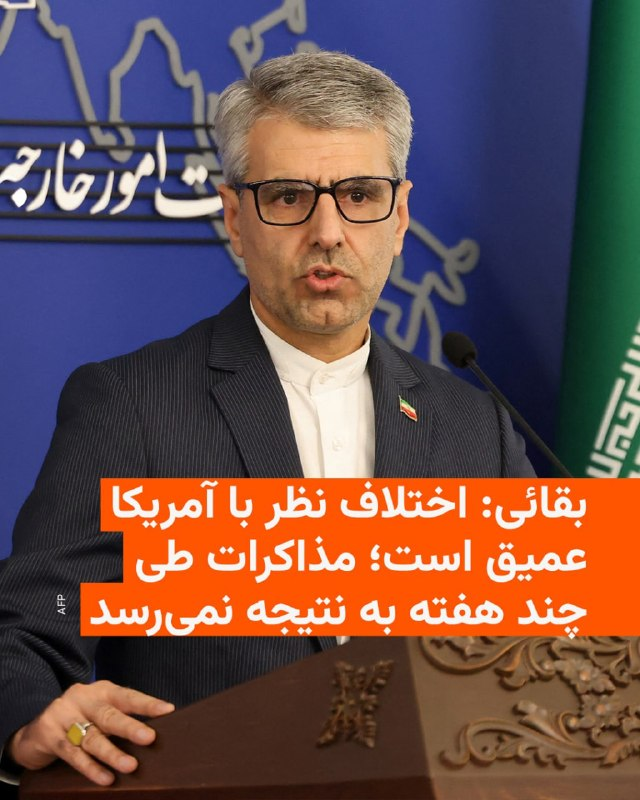

🔸سخنگوی هیئت مذاکره‌کننده ایران با آمریکا روز جمعه گفت که موضوع پرونده هسته‌ای ایران در این مرحله مورد مذاکره نیست و از اختلاف نظر عمیق با آمریکا خبر داد.

🔸اسماعیل بقائی گفت: «اختلاف‌نظرها بین ایران و آمریکا آن‌قدر عمیق و زیاد است که نمی‌شود گفت با چندبار رفت‌وآمد یا مذاکرات ظرف چند هفته ما باید حتماً به نتیجه برسیم.»

🔸او گزارش‌ها درباره قریب‌الوقوع بودن توافق با آمریکا را رد کرد و اعلام کرد: «نمی‌توانیم بگوییم ضرورتاً به جایی رسیده‌ایم که توافق نزدیک است.»

🔸بقائی بار دیگر موضع جمهوری اسلامی درباره برنامه هسته‌ای و اورانیوم غنی‌شده را تکرار کرد و گفت مواضع ایران قبلاً اعلام شده است.

🔸این در حالی است که ساعتی قبل، مارکو روبیو، وزیر خارجه آمریکا اعلام کرد که موضوع آینده غنی‌سازی اورانیوم در ایران باید در دستور کار مذاکرات باشد.

🔸دونالد ترامپ، رئیس‌جمهور ایالات متحده، نیز بارها تأکید کرده که ایران نباید به سلاح هسته‌ای دست یابد.

@RadioFarda

## RadioFarda — post 157460

🔸چهارمین برنامه «موزیک تک» با محوریت «صداهای جنوب» در موزه هنرهای معاصر تهران برگزار شد.

🔸در بخشی از این برنامه، گروهی از زنان نیز قطعه‌ای را اجرا کردند که با استقبال حاضران روبه‌رو شد.

🔸زنان در جمهوری اسلامی طی چهار دهه گذشته اجازه تک‌خوانی در برابر مخاطبان مرد را نداشته‌اند و فعالیت خوانندگان زن همواره با محدودیت‌های گسترده روبه‌رو بوده است.

@RadioFarda

## IranianMinds — post 20571

🔴اکسیوس به نقل از یک منبع نزدیک به ترامپ نوشت:

رئیس جمهوری آمریکا در روزهای اخیر بسیار خسته شده و احتمال انجام یک عملیات نظامی نهایی و گسترده را اعلام کرده است.
عملیاتی که پس از آن بتواند اعلام پیروزی کرده و به جنگ پایان بدهد.

@IranianMinds

## IranianMinds — post 20570

🔴الجزیره به نقل از یک مقام ایرانی:
آزاد‌سازی دارایی‌های بلوکه شده و لغو تحریم‌های صادرات نفت برای ایران موضوع حاشیه‌ای نیست.

@IranianMinds

## IranianMinds — post 20569

🔴 ادعای اکسیوس: یک مقام آمریکایی، مذاکرات را «طاقت‌فرسا» توصیف کرد

این مقام آمریکایی گفت که پیش‌نویس‌ها «هر روز در حال رفت و برگشت هستند» بدون آنکه پیشرفت چشمگیری حاصل شود

@IranianMinds

## IranianMinds — post 20568

🔴 الجزیره نقل از مقام ایرانی:
میانجی‌ها در تلاشند فاصله بین ایران و امریکا رو کم کنند ولی فقط فضای مثبت و اقدامات میانجی ها کافی نیست!

@IranianMinds

## IranianMinds — post 20567

🔴 اکسیوس نقل از مقام آمریکایی: مذاکرات بسیار دست و پا گیر است و پیش نویس ها هر روز بدون پیشرفت زیادی به این سو و آن سو می روند.

@IranianMinds

## IranianMinds — post 20566

  

@Daeijoonbot
@Daeijoonbot
@Daeijoonbot
کانفیگ رایگان میده به کل ایران👆

## IranianMinds — post 20565

🔴 کانال ۱۲ اسرائیل:

تفاهمات بین اسرائیل و آمریکا بر این اساس است که اورانیوم غنی‌شده یا امکان غنی‌سازی در اختیار ایران باقی نماند!

@IranianMinds

## BBCPersian — post 281810

  <a href="telegram/content/BBCPersian_281810_1779481102.mp4" target="_blank">🎬 Download video</a>

🔻آخرین خبرهای مهم جمعه ۱ خرداد ۱۴۰۵
@BBCPersian

## BBCPersian — post 281809

🔻وزیر کشور ایران از فرمانده ارتش پاکستان در تهران استقبال کرد

فیلد مارشال عاصم منیر، فرمانده ارتش پاکستان و هیات همراهش شامگاه جمعه وارد تهران شدند.

به گزارش ایرنا اسکندر مؤمنی وزیر کشور جمهوری اسلامی از او استقبال کرد.

بر اساس گزارش ایرنا محسن نقوی وزیر کشور پاکستان هم که از چهارشنبه در تهران به سر می‌برد در مراسم استقبال حضور داشت.

ارتش پاکستان در یک بیانیه کوتاه هدف سفر عاصم منیر را «بخشی از تلاش‌های میانجیگری میان ایران و آمریکا» توصیف کرد.

https://bbc.in/4v3pH4G
@BBCPersian

## BBCPersian — post 281808

🔻سخنگوی وزارت خارجه ایران حضور هیئتی از قطر را در تهران تایید کرد

اسماعیل بقایی،‌ سخنگوی وزارت خارجه ایران تایید کرد که یک هیئت از قطر روز جمعه در تهران بودند و با عباس عراقچی وزیر خارجه ایران گفت‌وگو کردند.

او بدون ارائه جزئیات گفت که کشورهای مختلفی طی روزهای اخیر با وزیر خارجه گفتوگو کردند اما تاکید کرد که میانجی اصلی میان ایران و آمریکا همان کشور پاکستان است.

پیشتر رویترز به نقل از یک منبع آگاه گزارش داد که هیئتی از قطر در هماهنگی با آمریکا وارد تهران شده است.

قطر و امارات و عربستان سعودی سه کشوری بودند که آقای ترامپ روز دوشنبه گفت که به درخواست آنها فعلا حمله مجدد به ایران را متوقف کرده است.

https://bbc.in/4v3pH4G
@BBCPersian

## BBCPersian — post 281807

  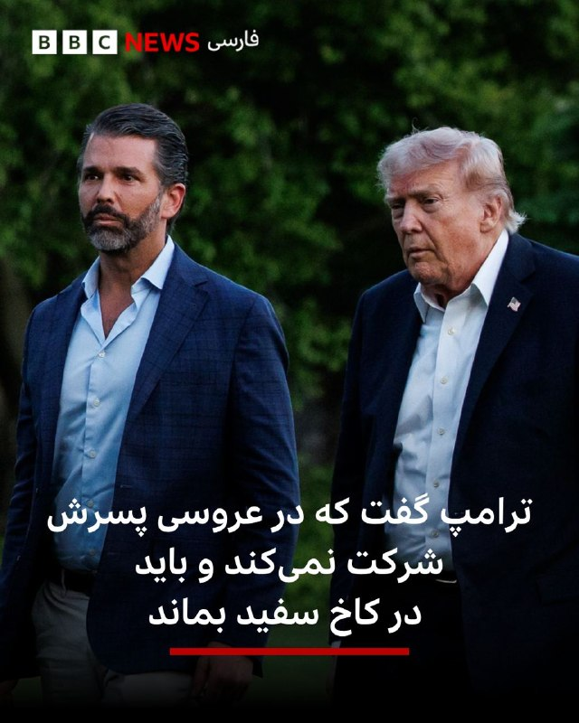

🔻دونالد ترامپ،‌ رئیس جمهور آمریکا می‌گوید که برخلاف میلش،‌ در مراسم عروسی دونالد ترامپ جونیور، پسر بزرگش شرکت نمی‌کند، چون باید در واشنگتن و کاخ سفید بماند.

رسانه‌های آمریکایی پیشتر گزارش داده بودند که قرار است در تعطیلات آخر هفته، مراسم عروسی پسر بزرگ آقای ترامپ با بتینا اندرسون در جزیره‌ای در باهاما برگزار شود.

آقای ترامپ در پستی در تروث سوشال،‌ شبکه اجتماعی خودش نوشت: «در حالیکه خیلی دوست داشتم با پسرم دان جونیور و بتینا،‌ جدیدترین عضو خانواده ترامپ و همسر آینده‌اش باشم،‌ شرایط کارهای مربوط به دولت و عشق من به ایالات متحده به من اجازه این‌کار را نمی‌دهد.»

او در ادامه افزود: «حس می‌کنم مهم است که در این برهه زمانی مهم در واشنگتن دی‌سی،‌ در کاخ سفید بمانم.»

آقای ترامپ،‌ دیروز پنجشنبه هم در یک مصاحبه گفته بود که سعی دارد در مراسم عروسی پسرش شرکت کند اما زمان این مراسم برای او مناسبت نیست چون درگیر مسائلی از جمله ایران است.

📸 EPA

https://bbc.in/4v3pH4G
@BBCPersian

## Dirty_Kids — post 389975

  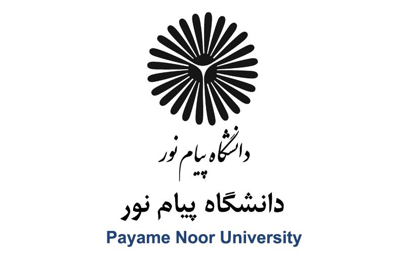

همه‌ی امتحانات نیم‌سال جاری دانشگاه پیام‌نور، غیرحضوری و مجازی شد.

@Dirty_Kids 👻

## Dirty_Kids — post 389974

  <a href="telegram/content/Dirty_Kids_389974_1779481106.mp4" target="_blank">🎬 Download video</a>

توی انگلیس دو تا مسلمون جلوى چشم عموم، داخل اتوبوس دو طبقه شهرى رابطه جنسی برقرار میکنن!

@Dirty_Kids 👻

## Dirty_Kids — post 389973

  <a href="telegram/content/Dirty_Kids_389973_1779481106.mp4" target="_blank">🎬 Download video</a>

سوشا مکانی میگه تو جام‌جهانی نرید استادیوم پول بیلط‌ها میره تو جیب جمهوری اسلامی!!!!!!!!!!!!! 😐

این نظر منه فقط، نسخه برا کسی نیست 👇

آقای مکانی اجازه بده قانع نشیم، چص مثقال پول بلیط تخم ج.ا نیست، ضمن اینکه درآمد اصلی از حضور تو بازی‌هاس و تیم‌ها هرچی برن بالاتر پول بیشتری میگیرن
و فیفا پول‌های ج.ا رو بلوکه میکنه

جمهوری اسلامی میلیارد دلاری داره خرج پرپاگانداش میکنه تا چهره خوبی بسازه برای رسانه‌ها لَنگِ چص‌تومن پول بلیطه!

از ترس کونش ۲سال استادیوم آزادی بسته مردم نرن شعار بدن
۱ساله بازی‌هاشو بدون تماشاچی کرده بعد الان تو قلب امریکا فرصت استثنایی پیدا شده تا خارشو گایید جلوی دوربین‌های تمام کشورها میایی میگی نرید!!

نرن مردم تمام پرستوها و مزدوراش از سراسر دنیا جمع میشن میرن امریکا با پاسپورت اروپایی پرچم خرچنگ نشون میدن عشق میکنن

البته من نظرمو گفتم اگه تصمیم به نرفتن باشه خود شاهزاده میگه بایکوت کنید وقتی نگفته تیپیکال باید برن مردم شما هم با این حرفا فقط دو دسته میکنید و کمتر میرن مردم، مثل فراخوان‌های ۴۰۱ یکی میگفت برید یکی میگفت نرید

@Dirty_Kids 👻

## Dirty_Kids — post 389972

  

‏دیوانه خانه‌ست رسما

@Dirty_Kids 👻

## Dirty_Kids — post 389971

  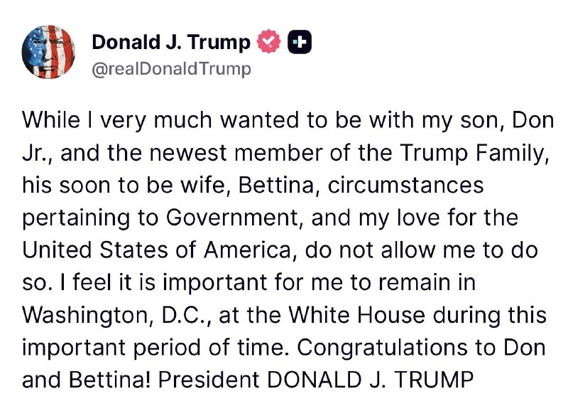

شیر مبهم و میهن‌پرست خدا در پستی عجیب در تروث‌سوشال گفته عروسی پسرش نمی‌ره. این در حالیه که دو روز پیش گفته بود می‌رم:

«خیلی دلم می‌خواست در کنار پسرم دان جونیور و جدیدترین عضو خونواده‌ی مشنگ شیر خدا یعنی همسر آینده‌اش بتینا باشم،

اما مسائل مربوط به دولت آمریکا و عشقم به ایالات متحده آمریکا این اجازه رو به من نمی‌ده. [با روافض گلاویزز ملاویز می‌خوای بشی شیر خدا؟]

احساس می‌کنم در این برهه‌ی زمانی حساس حضورم در واشنگتن دی‌سی و در خاک‌سفید ضروریه. [ای شیر کلک خدا، دعوا می‌خوای بگیری؟]

پیوند دان و بتینا را تبریک می‌گم [آره بابا کار خوبی کردی نرفتی، ما هم تبریک می‌گیم].

رئیس‌جمهور، دونالد جی. ترامپ، یل نامعلوم خاک‌سفید»

@Dirty_Kids 👻

## Dirty_Kids — post 389969

عقل نداری که مردک عرزشی، دفعه بعد تمیزتر دربیار هوش مصنوعی‌رو
پیرسینگو خوب نساخته نصفه‌س. مرسی که کوله‌قرمز میذارین کنار اسمتون از دور چراغ میدین

@Dirty_Kids 👻

## Hranews — post 113100

  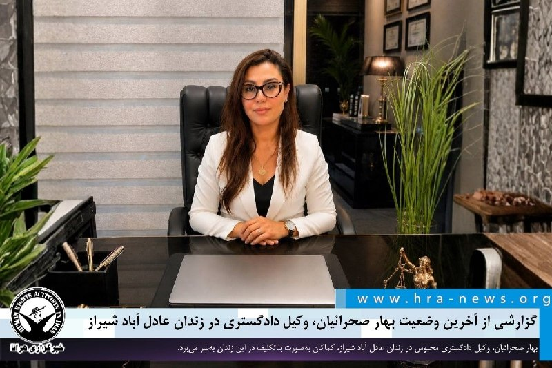

گزارشی از آخرین وضعیت بهار صحرائیان، وکیل دادگستری در زندان عادل آباد شیراز

❗️
❗️
❗️
❗️
❗️ – بهار صحرائیان، وکیل دادگستری محبوس در زندان عادل آباد شیراز، کماکان به‌صورت بلاتکلیف در این زندان در بازداشت موقت به‌سر می‌برد و از ملاقات با خانواده محروم است.

به گزارش خبرگزاری هرانا، ارگان خبری مجموعه فعالان حقوق بشر در ایران، بهار صحرائیان همچنان به‌صورت بلاتکلیف قضایی در زندان عادل آباد شیراز نگهداری می‌شود.

یک منبع مطلع و نزدیک به خانواده این وکیل دادگستری ضمن تایید این خبر به هرانا گفت: با وجود پیگیری خانواده وی برای تعیین قرار وثیقه و آزادی موقت، مسئولین قضایی با این امر مخالفت کرده‌اند. همچنین خانم صحرائیان از زمان بازداشت تاکنون از ملاقات با خانواده محروم مانده است.

ادامه مطلب

#بهار_صحرائیان

↘️
@hranews_bot تماس ✉️ -  @Hranews  کانال هرانا 🆑

## alonews — post 121887

  <a href="telegram/content/alonews_121887_1779481108.mp4" target="_blank">🎬 Download video</a>

👈حرکات عجیب ترامپ در سخنرانی امشب

✅ @AloNews خبر جنگ

## alonews — post 121886

  <a href="telegram/content/alonews_121886_1779481110.mp4" target="_blank">🎬 Download video</a>

👈ترامپ : اعتراض کردن تو تجمع‌های من خطرناکه من چیزای خطرناک دوست ندارم دوست ندارم ببینم کسی کتک می‌خوره پس این کارو نکنید

✅ @AloNews خبر جنگ

## alonews — post 121885

  <a href="telegram/content/alonews_121885_1779481111.mp4" target="_blank">🎬 Download video</a>

👈یه معترض که علیه ترامپ شعار داد، تو تجمع انداختنش بیرون

✅ @AloNews خبر جنگ

## alonews — post 121884

  <a href="telegram/content/alonews_121884_1779481113.mp4" target="_blank">🎬 Download video</a>

👈ترامپ : ۲۵ تا از بدترین شهرها دست دموکرات‌هاست آبی یعنی داموکرات احمق

✅ @AloNews خبر جنگ

## alonews — post 121883

  <a href="telegram/content/alonews_121883_1779481115.mp4" target="_blank">🎬 Download video</a>

👈ترامپ : دارم به جکسون نگاه میکنم به اون پاهاش نگاه کن این پسر خوشتیپه پاهاش مثل تنه درخته این اصلا برای زنا چیز خوبی نیست

✅ @AloNews خبر جنگ

## alonews — post 121882

  <a href="telegram/content/alonews_121882_1779481117.mp4" target="_blank">🎬 Download video</a>

👈ترامپ : «من رای ۹۹ درصد نیروهای پلیس را به دست آوردم. باورتان می‌شود؟ هنوز داریم تلاش کنیم بفهمیم آن یک درصد چه کسانی هستند؟

✅ @AloNews خبر جنگ

## alonews — post 121881

  <a href="telegram/content/alonews_121881_1779481118.mp4" target="_blank">🎬 Download video</a>

👈ترامپ : «من رای ۹۹ درصد نیروهای پلیس را به دست آوردم. باورتان می‌شود؟ هنوز داریم تلاش کنیم بفهمیم آن یک درصد چه کسانی هستند؟

✅ @AloNews خبر جنگ

## alonews — post 121880

  <a href="telegram/content/alonews_121880_1779481120.webm" target="_blank">🎬 Download video</a>

👈گفت‌وگوی تلفنی وزیر امور خارجه با دبیر کل سازمان ملل متحد

✅ @AloNews خبر جنگ

## alonews — post 121879

  <a href="telegram/content/alonews_121879_1779481120.webm" target="_blank">🎬 Download video</a>

👈انور قرقاش، مشاور دیپلماتیک رئیس امارات به رادیو اروپای آزاد گفت: ما با ایران همسایه هستیم و پیوندهای بسیاری داریم.

🔴موضع ما این است که راه‌حل خاتمه جنگ بین ایران و آمریکا یک راه‌حل سیاسی است. راه‌حل‌های نظامی عوارض زیادی ایجاد خواهند کرد.

🔴فکر نمی‌کنم آمریکا یا ایران خواهان از سرگیری خصومت‌ها باشند. منطقه و امارات نیز خواهان از سرگیری خصومت‌ها نیستند.

✅ @AloNews خبر جنگ

## alonews — post 121878

  <a href="telegram/content/alonews_121878_1779481120.webm" target="_blank">🎬 Download video</a>

👈وال‌استریت ژورنال:واسطه‌ها در تلاش هستند تا یک توافق موقت بین ایران و ایالات متحده به دست آورند

✅ @AloNews خبر جنگ

## alonews — post 121877

  <a href="telegram/content/alonews_121877_1779481120.webm" target="_blank">🎬 Download video</a>

👈انفجارهای کنترل‌شده، صبح فردا در کهریزک

✅ @AloNews خبر جنگ

## alonews — post 121876

  <a href="telegram/content/alonews_121876_1779481121.webm" target="_blank">🎬 Download video</a>

👈کانال ۱۳ اسراییل: پیش‌بینی می‌شود پیش‌نویس توافق با ایران شامل حذف اورانیوم غنی‌شده و همچنین توقف پروژه هسته‌ای یا موشک‌های بالستیک نباشد

✅ @AloNews خبر جنگ

## alonews — post 121875

  <a href="telegram/content/alonews_121875_1779481121.webm" target="_blank">🎬 Download video</a>

👈حمله پهپادی اوکراین به سمت روسیه

✅ @AloNews خبر جنگ

## alonews — post 121874

  <a href="telegram/content/alonews_121874_1779481121.webm" target="_blank">🎬 Download video</a>

👈الجزیره: یک مقام مسئول ایرانی امروز به ما گفته که هنوز هیچ توافق نهایی بین ایران و آمریکا وجود ندارد و تلاش‌ها برای کاهش اختلافات بین تهران و واشنگتن ادامه دارد.

🔴 این مقام به الجزیره گفت تحرکات دیپلماتیک ادامه دارد اما فضا  برای یک توافق واقعی کافی نیست.

🔴این مقام ایرانی هشدار داد که نیروهای مسلح ایران با نیت‌ها سروکار ندارند و اقدامات خود را بر اساس بدترین سناریو برنامه‌ریزی می‌کنند.

✅ @AloNews خبر جنگ

## alonews — post 121873

  <a href="telegram/content/alonews_121873_1779481121.webm" target="_blank">🎬 Download video</a>

👈امکان دسترسی دانشجویان ساکن در تهران به اینترنت!

🔴معاون آموزشی دانشگاه علامه طباطبائی با اشاره به مشکلات دسترسی دانشجویان به اینترنت گفت: در حال حاضر دانشجویانی که در تهران حضور دارند، می‌توانند از اینترنت این دانشگاه استفاده کنند؛ حتی دانشجویان سایر دانشگاه‌ها نیز در صورت حضور در تهران امکان استفاده از خدمات اینترنتی دانشگاه علامه را دارند.

✅ @AloNews خبر جنگ

## alonews — post 121872

  <a href="telegram/content/alonews_121872_1779481121.webm" target="_blank">🎬 Download video</a>

👈سخنگوی وزارت صمت: بسته‌ی حمایتی ۷۰۰ هزار میلیارد تومانی برای ۱۲ هزار واحد تولیدی تصویب شده که پیگیر ارائه کامل آن هستیم

✅ @AloNews خبر جنگ

## alonews — post 121871

  <a href="telegram/content/alonews_121871_1779481121.webm" target="_blank">🎬 Download video</a>

👈وزیر نفت: در طول جنگ ۴۰ روزه بخشی از تاسیسات گاز، مخازن ذخیره‌سازی و تامین سوخت را در استان تهران مورد هدف قرار گرفت و اگرچه همکارانمان با استفاده از دیگر ظرفیت‌های موجود، بخش عمده‌ای از آنچه را که از دست داده بودیم، بسیار سریع به مدار برگرداندند، با این حال در ادامه بی‌شک نیازمند همراهی مردم در مصرف بهینه سوخت هستیم.

✅ @AloNews خبر جنگ

## alonews — post 121870

  <a href="telegram/content/alonews_121870_1779481121.webm" target="_blank">🎬 Download video</a>

👈منابع عربی: تماس تلفنی وزیرخارجه قطر با همتای سعودی

✅ @AloNews خبر جنگ

## alonews — post 121869

⭕️
⭕️اپلیکیشن‌ها را فقط از Google Play یا App Store نصب کنید. 
🔴فایل‌هایی که در تلگرام، کانال‌ها، گروه‌ها یا از طریق لینک مستقیم دانلود منتشر می‌شوند، اگر از منبع معتبر نباشند می‌توانند خطرناک باشند. 
🔴نصب این فایل‌ها ممکن است باعث شود اطلاعات شخصی شما، رمزها،…

## alonews — post 121868

  <a href="telegram/content/alonews_121868_1779481122.webm" target="_blank">🎬 Download video</a>

👈 خضریان، نماینده مجلس: ترامپ لات کوچه خلوته

✅ @AloNews خبر جنگ

---
📅 بروزرسانی: 1405/03/01 21:53
---

## VahidOOnLine — post 241578

  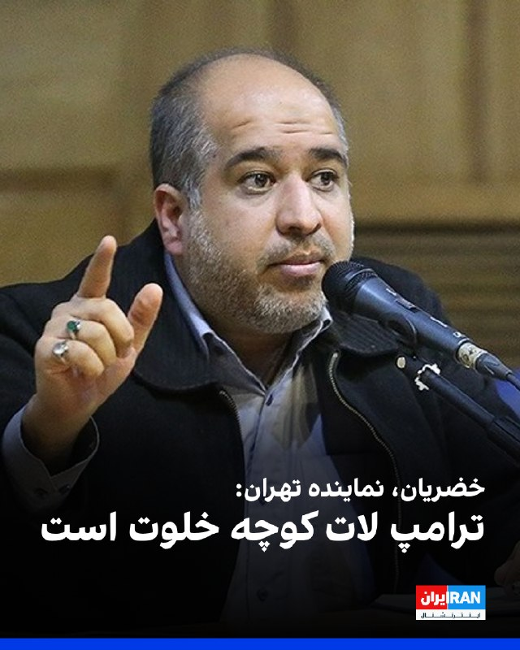

علی خضریان، نماینده تهران در مجلس گفت: «ترامپ بارها می‌گوید جمهوری اسلامی برای رسیدن به توافق زمان ندارد. در این اظهارات رییس جمهور آمریکا فرامتن و اعترافی وجود دارد که اتفاقا زمان علیه آمریکاست. برای همین این لات کوچه خلوت فضای مجازی داد می‌زند که بگوید ایران است که زمان ندارد.»

او ادامه داد: «در سه حوزه کلیدی مدیریت تنگه هرمز، حمایت از جبهه مقاومت وعدم خروج مواد هسته‌ای از خاک کشور به هیچ عنوان مصالحه نخواهد کرد.»

او افزود: «فکر نمی‌کنم درباره متنی بتوانیم صحبت کنیم که روی آن به توافق نزدیک شده باشیم.»
‌🏁 🇬🇧 IranintlTV

🤖 @VahidOOnLine

## VahidOOnLine — post 241577

  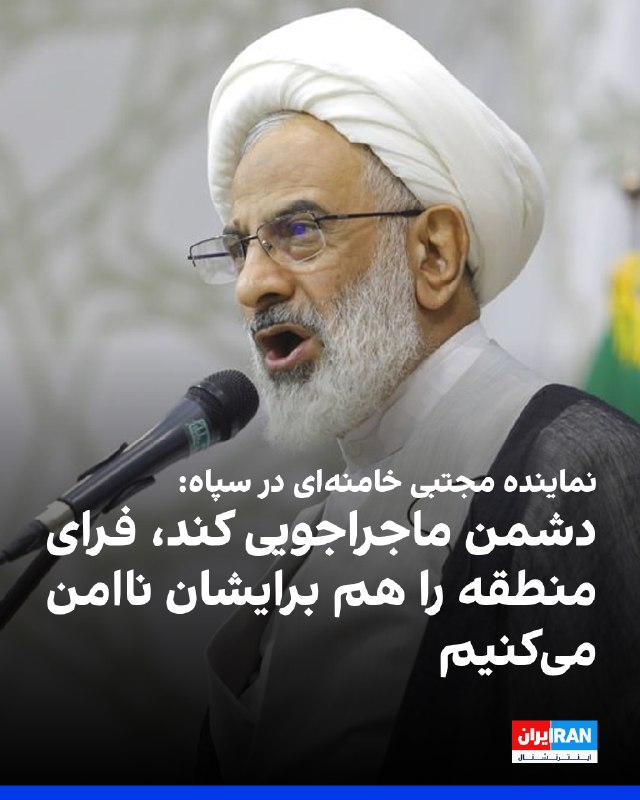

عبدالله حاجی‌صادقی، نماینده مجتبی خامنه‌ای در سپاه پاسداران گفت: «استکبار باید بداند که خلیج فارس و تنگه هرمز تحت کنترل کامل و هوشیارانه نیروی دریایی ماست. اگر دشمن نخواهد این واقعیت را بپذیرد و دست به ماجراجویی بزند، ما نه فقط در منطقه، بلکه فرای منطقه را هم برای آن‌ها ناامن و تنگ خواهیم کرد.»

او افزود: «اگر دشمن مرتکب کوچک‌ترین خطای محاسباتی شود، روزهایی به مراتب سخت‌تر از گذشته را تجربه خواهد کرد. سپاه پاسداران و نیروی دریایی مقتدر، پاسخی به آن‌ها خواهند داد که از نظر وسعت و شدت، فراتر از عملیات‌های ظفرمند وعده صادق خواهد بود.»
‌🏁 🇬🇧 IranintlTV

🤖 @VahidOOnLine

## VahidOOnLine — post 241576

  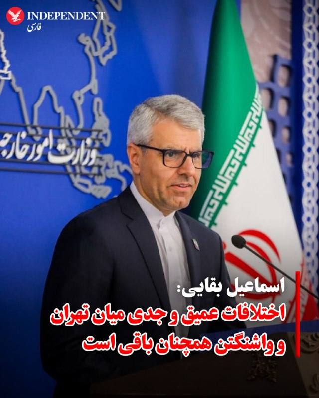

♦️ سخنگوی وزارت امور خارجه جمهوری اسلامی، جمعه‌شب، اول خرداد، اعلام کرد که مذاکرات صلح با ایالات متحده به مرحله «توافق نزدیک» نرسیده و دشوار است که بگوییم آیا توافقی «طی چند هفته یا چند ماه آینده» حاصل خواهد شد یا خیر.

بقایی در گفتگو با صداوسیما تاکید کرد که شکاف‌های موجود میان تهران و واشنگتن «عمیق و جدی» است.

او در این باره گفت: «لزوما نمی‌توانیم بگوییم به نقطه‌ای رسیده‌ایم که توافق نزدیک باشد. تمرکز اصلی این مذاکرات بر پایان دادن به جنگ است و در این مرحله، جزئیات مربوط به مسئله هسته‌ای مورد بحث قرار نمی‌گیرد.»
‌🇸🇦 Indypersian

🤖 @VahidOOnLine

## VahidOOnLine — post 241575

  <a href="telegram/content/VahidOOnLine_241575_1779474186.mp4" target="_blank">🎬 Download video</a>

دو شهروند در پیام‌هایی که با هوش مصنوعی خوانده شده، به ایران اینترنشنال گفتند که قیمت یک پرس قرمه‌سبزی در رستوران‌ها به حدود ۸۰۰ هزار تومان و یک عدد پیتزای دو نفره به بالای دو میلیون تومان رسیده است.
‌🏁 🇬🇧 IranintlTV

🤖 @VahidOOnLine

## VahidOOnLine — post 241574

  <a href="telegram/content/VahidOOnLine_241574_1779474188.mp4" target="_blank">🎬 Download video</a>

دو شهروند در پیام‌هایی که با هوش مصنوعی خوانده شده، به ایران اینترنشنال گفتند که قیمت یک پرس قرمه‌سبزی در رستوران‌ها به حدود ۸۰۰ هزار تومان و یک عدد پیتزای دو نفره به بالای دو میلیون تومان رسیده است.
‌🏁 🇬🇧 IranintlTV

🤖 @VahidOOnLine

## VahidOOnLine — post 241573

  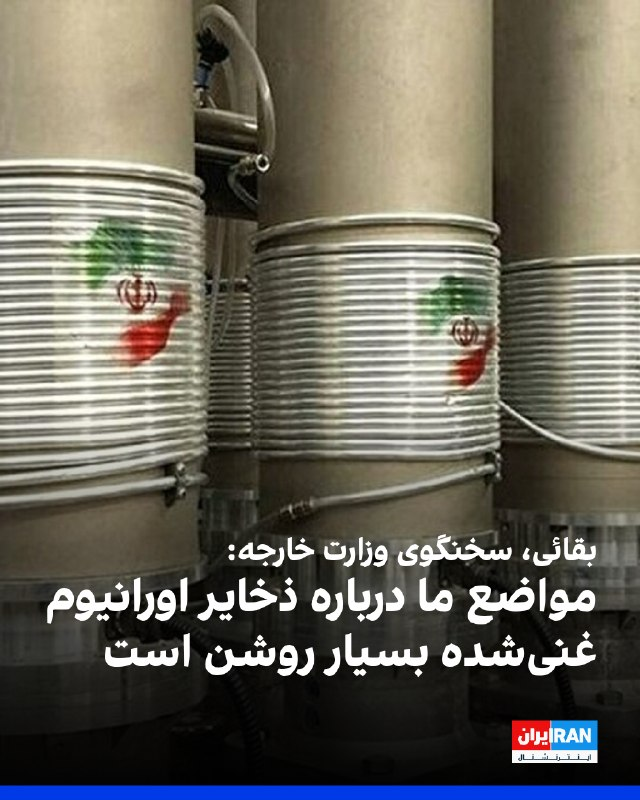

اسماعیل بقائی، سخنگوی وزارت خارجه جمهوری اسلامی گفت: «در مورد اورانیوم غنی‌شده با درجه بالا، مواضع‌مان را خیلی روشن بیان کرده‌ایم؛ در این مرحله اگر بخواهیم در این مباحث گفت‌وگو کنیم، قاعدتا به نتیجه نمی‌رسیم.»

او افزود: «ما قبلا این مسیر را رفتیم و اختلاف‌نظرها آن‌قدر زیاد بود که نتوانستیم به نتیجه برسیم و طرف مقابل به‌خاطر خواسته‌های نامعقولش میز مذاکرات را از بین برد و حمله کرد.»
‌🏁 🇬🇧 IranintlTV

🤖 @VahidOOnLine

## VahidOOnLine — post 241572

♦️علی خضریان، عضو کمیسیون امنیت ملی و سیاست خارجی مجلس، روز جمعه اول خردادماه در صداوسیما تأکید کرد جمهوری اسلامی ایران در موضوعاتی مانند تنگه هرمز، جبهه مقاومت و خروج مواد هسته‌ای «کوتاه نخواهد آمد» و هیچ مصالحه‌ای را نمی‌پذیرد.
او با انتقاد از سیاست‌های آمریکا گفت واشینگتن با «زیاده‌خواهی» و استفاده از جنگ روانی در فضای رسانه‌ای، به‌دنبال تحمیل شروط خود به ایران است.
خضریان در ادامه با اشاره به فاصله جدی میان مواضع دو طرف، تاکید کرد شرایط فعلی نشان می‌دهد امکان دستیابی به توافق در کوتاه‌مدت وجود ندارد و دو کشور در مسیرهای متفاوتی حرکت می‌کنند.
‌🇸🇦 Indypersian

🤖 @VahidOOnLine

## VahidOOnLine — post 241571

  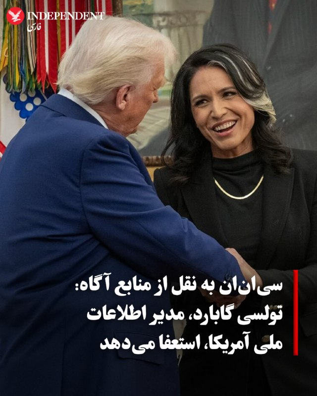

♦️ خبرگزاری سی‌ان‌ان به نقل از سه منبع آگاه گزارش داد که تولسی گابارد، مدیر اطلاعات ملی ایالات متحده (DNI)، از سمت خود استعفا می‌دهد.

این منابع اعلام کردند که گابارد به همکارانش اطلاع داده است که علت این تصمیم، مبارزه همسرش با بیماری سرطان است.

به گفته یکی از این منابع، گابارد تصمیم خود را به اطلاع رئیس‌جمهوری دونالد ترامپ رسانده است. با این حال، کاخ سفید و دفتر گابارد هنوز به درخواست‌ها برای اظهار نظر در این باره پاسخی نداده‌اند.
‌🇸🇦 Indypersian

🤖 @VahidOOnLine

## VahidOOnLine — post 241570

  

اسماعیل بقائی، سخنگوی وزارت خارجه جمهوری اسلامی گفت: «اختلاف‌نظر ما با آمریکا آن‌قدر عمیق و زیاد است که نمی‌شود گفت با چندبار رفت‌وآمد یا مذاکرات ظرف چند هفته ما باید حتما به نتیجه برسیم.»

او افزود: «نمی‌توانیم بگوییم ضرورتا به جایی رسیده‌ایم که توافق نزدیک است. تمرکز مذاکرات بر خاتمه جنگ است.»

او در واکنش به سفر عاصم منیر به تهران گفت: «این رفت‌وآمدها باوجود اینکه پرترافیک‌تر شده، تداوم همان روند دیپلماتیک است.»

بقائی ادامه داد: «یک هیئتی از قطر درحال مذاکره با وزیر خارجه کشورمان هستند اما میانجی مذاکرات همچنان طرف پاکستانی است.»
‌🏁 🇬🇧 IranintlTV

🤖 @VahidOOnLine

## VahidOOnLine — post 241569

  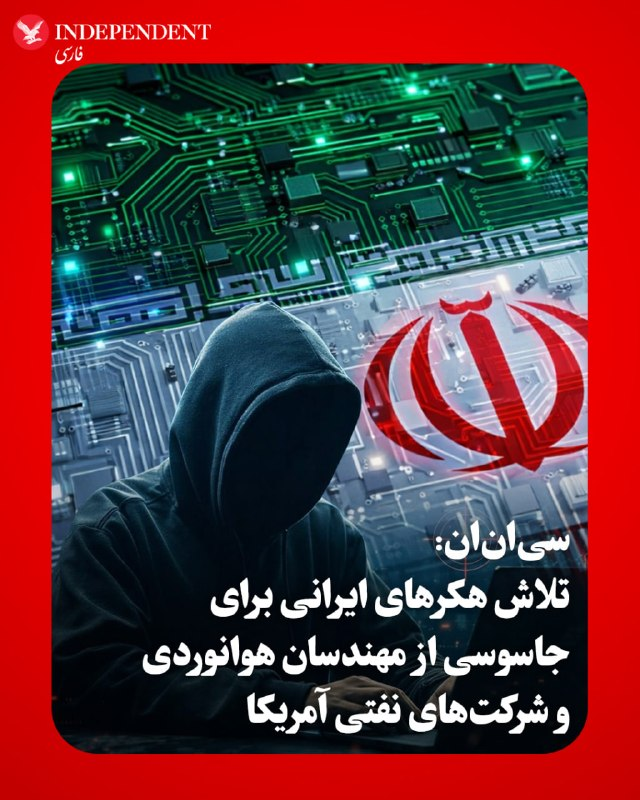

♦️ محققان امنیت سایبری روز جمعه اول خرداد به سی‌ان‌ان گفتند که هکرهای ایرانی در جریان جنگ با آمریکا و اسرائیل، در قالب کارشناسان جذب نیرو (اصطلاحا هد هانتر)، مهندسان نرم‌افزار بخش هوانوردی را در یک طرح جاسوسی پیچیده هدف قرار داده‌اند.

بر اساس گزارش واحد ۴۲ شرکت امنیت سایبری «پالو آلتو نتورکس»، این ماموران سایبری علاوه بر بخش هوانوردی، یک شرکت نفت و گاز آمریکایی و سازمان‌هایی را در اسرائیل و امارات هدف قرار داده‌اند. مقامات اطلاعاتی آمریکا پیش از این درباره این دست تهدیدات نامتقارن پس از حملات اواخر فوریه هشدار داده بودند؛ چرا که نفوذ به این بخش‌ها می‌تواند به جمهوری اسلامی امکان ردیابی فهرست پروازها به خاورمیانه یا درک بهتر وضعیت بازار متلاطم نفت را بدهد.

این شبکه جاسوسی با استفاده از آگهی‌های شغلی جعلی و نرم‌افزارهای جلسات ویدیویی آلوده به کدهای مخرب اجرا شده و در یک مورد، هکرها خود را به جای یک شرکت هواپیمایی آمریکایی جا زده‌اند. با این حال، محققان تاکید کردند که بر اساس داده‌های موجود، هکرها در نفوذ به شرکت‌های نفتی، گازی و هوانوردی آمریکایی مورد هدف موفق نبوده‌اند.
‌🇸🇦 Indypersian

🤖 @VahidOOnLine

## VahidOOnLine — post 241568

  <a href="telegram/content/VahidOOnLine_241568_1779474193.mp4" target="_blank">🎬 Download video</a>

«دلم براتون تنگ میشه اما امید دارم برگردید»
‌🏁 🇬🇧 ManotoTV

🤖 @VahidOOnLine

## VahidOOnLine — post 241567

  

فاکس‌نیوز گزارش داد که تولسی گبرد، مدیر اطلاعات ملی آمریکا از سمت خود استعفا داده است.
او پیش‌تر گفته بود گفت که اهداف تعیین‌شده از سوی ترامپ درباره جنگ با جمهوری اسلامی، با اهداف اسرائیل متفاوت است.

گبرد همچنین گفته بود که حکومت ایران برقرار به نظر می‌رسد، اما در نتیجه عملیات نظامی آمریکا به‌طور گسترده تضعیف شده است.
‌🏁 🇬🇧 IranintlTV

🤖 @VahidOOnLine

## VahidOOnLine — post 241566

  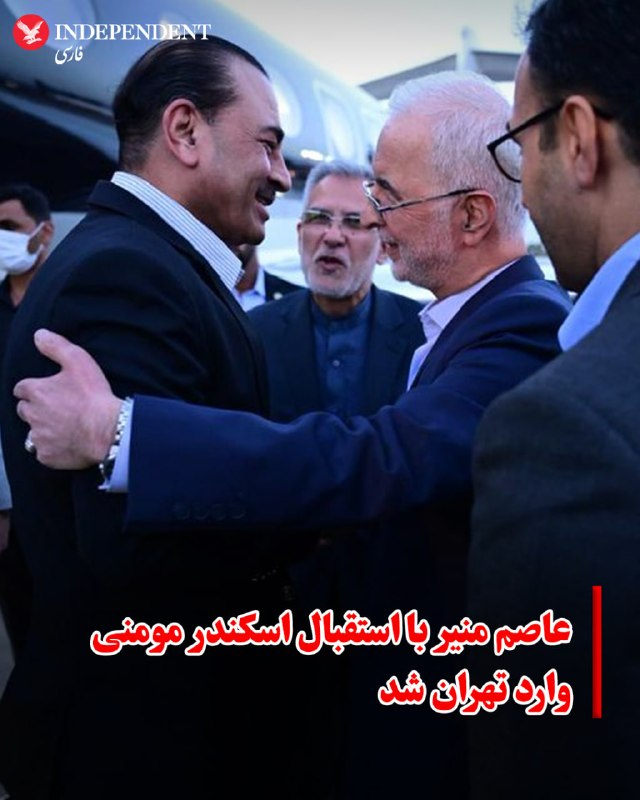

♦️ عاصم منیر، فرمانده کل ارتش پاکستان، عصر جمعه اول خرداد، به تهران وارد شد و از سوی اسکندر مومنی، وزیر کشور، مورد استقبال قرار گرفت. این سفر از پیش از سوی منابع دیپلماتیک اعلام شده بود اما پاکستان تا پیش از رسیدن منیر به تهران، حرکت او را تایید نکرده بود.

همزمان با منیر، محسن نقوی، وزیر کشور پاکستان نیز در تهران حضور دارد و انتظار می‌رود اختلافات میان تهران و واشنگتن برای امضای تفاهم‌نامه اولیه برای شروع مذاکرات، موضوع اصلی گفتگوهای منیر با مقام‌های جمهوری اسلامی باشد.
‌🇸🇦 Indypersian

🤖 @VahidOOnLine

## VahidOOnLine — post 241565

  <a href="telegram/content/VahidOOnLine_241565_1779474197.mp4" target="_blank">🎬 Download video</a>

رییس اورژانس پیش‌بیمارستانی و مدیریت حوادث دانشگاه علوم پزشکی البرز اعلام کرد بر اثر تصادف زنجیره‌ای در آزادراه کرج قزوین، سه نفر جان باختند و چهار نفر دیگر مجروح شدند.
به گزارش رسانه‌های داخلی، در این سانحه دو مرد و یک زن کشته شدند و سه مرد و یک زن دیگر نیز مجروح شدند.
مصدومان توسط نیروهای اورژانس به بیمارستان امام جعفر صادق نظرآباد منتقل شدند.
‌🏁 🇬🇧 ManotoTV

🤖 @VahidOOnLine

## VahidOOnLine — post 241564

  <a href="telegram/content/VahidOOnLine_241564_1779474197.mp4" target="_blank">🎬 Download video</a>

در پی کارزار مردمی ایران‌اینترنشنال برای شناسایی جاویدنامان بیمارستان الغدیر تهران، شاهدان با ارسال پیام‌هایی می‌گویند کادر درمان این بیمارستان در ۱۸ و ۱۹ دی ۱۴۰۴، با وجود فشار شدید ماموران و ممانعت آنها، معترضان را رها نکردند و برای بهبود آنها تلاش کردند.
فرنوش فرجی، عضو تحریریه ایران‌اینترنشنال گزارش می‌دهد.
‌🏁 🇬🇧 IranintlTV

🤖 @VahidOOnLine

## VahidOOnLine — post 241563

  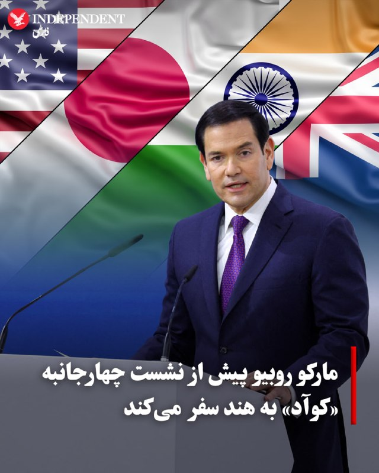

♦️ وزارت امور خارجه آمریکا اعلام کرد مارکو روبیو، وزیر امور خارجه این کشور، روز شنبه دوم خرداد، برای سفری سه‌روزه عازم هند خواهد شد. تامی پیگات، سخنگوی وزارت خارجه آمریکا، در بیانیه‌ای تایید کرد که روبیو در این سفر از شهرهای کلکته، آگرا، جیپور و دهلی‌نو بازدید خواهد کرد.

هدف اصلی این سفر، گفتگو با مقامات ارشد هندی درباره موضوعات حیاتی نظیر امنیت انرژی، تجارت و همکاری‌های دفاعی اعلام شده است.

همچنین، رایزنی‌های روبیو در هند درست پیش از نشست ۶ خرداد وزرای خارجه گروه «کوآد» (منطقه گفتگوهای امنیتی چهارجانبه) در دهلی‌نو انجام می‌شود. این ائتلاف غیررسمی که از کشورهای آمریکا، ژاپن، استرالیا و هند تشکیل شده و به عنوان «نسخه آسیایی ناتو» نیز شناخته می‌شود، در پاسخ به افزایش قدرت چین شکل گرفته و تاکنون رزمایش‌های نظامی و دریایی مشترکی را در منطقه هند-آرام برگزار کرده است.
‌🇸🇦 Indypersian

🤖 @VahidOOnLine

## VahidOOnLine — post 241562

  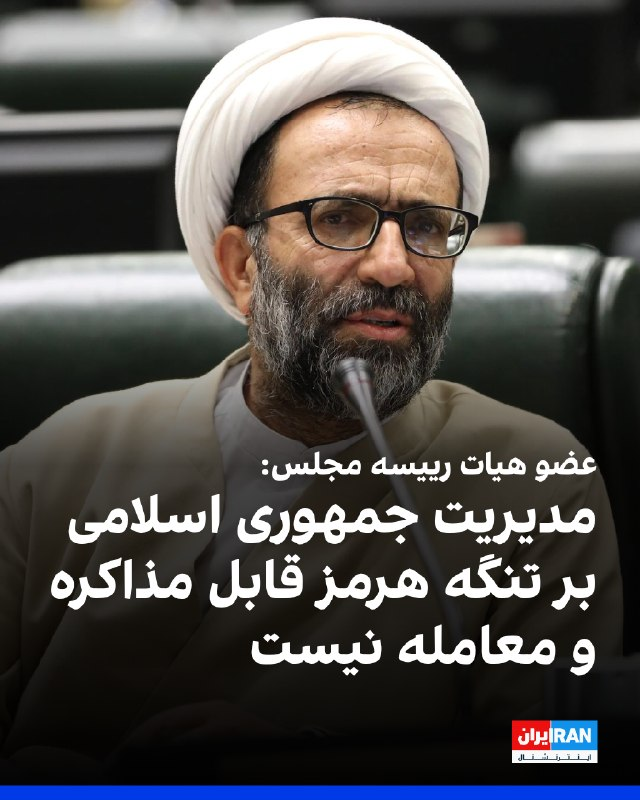

علیرضا سلیمی، عضو هیات رییسه مجلس گفت: «یکی از دستاوردهای جنگ اخیر، مدیریت جمهوری اسلامی بر تنگه هرمز است که هرگز قابل مذاکره و معامله نیست و رژیم حقوقی جدیدی بر این تنگه حاکم خواهد شد که قواعد آن را تنها ما تعریف و اعمال می‌کنیم.»

او افزود: «شرایط عبور و مرور همچنین نرخ عوارض بر تنگه هرمز را جمهوری اسلامی مشخص می‌کند و با توییت نمی‌توانند اوضاع تنگه را تغییر دهند.»
‌🏁 🇬🇧 IranintlTV

🤖 @VahidOOnLine

## VahidOOnLine — post 241561

♦️دونالد ترامپ، رئیس‌جمهوری ایالات متحده، روز جمعه اول خردادماه در مراسم سوگند رئیس جدید بانک مرکزی آمریکا در کاخ سفید گفت اقدام علیه ایران اجتناب‌ناپذیر بوده است.
او با تأکید بر اینکه ایران نباید به سلاح هسته‌ای دست پیدا کند، گفت آمریکا «چاره‌ای جز اقدام» نداشته و این سیاست همچنان ادامه خواهد داشت. ترامپ همچنین با اشاره به توان نظامی ایالات متحده، بار دیگر از در اختیار داشتن «بزرگ‌ترین ارتش جهان» سخن گفت.
رئیس‌جمهوری آمریکا در ادامه گفت که ایران اکنون به‌شدت به‌دنبال توافق است و این موضوع را نتیجه فشارهای واردشده از سوی واشنگتن دانست.
‌🇸🇦 Indypersian

🤖 @VahidOOnLine

## VahidOOnLine — post 241560

  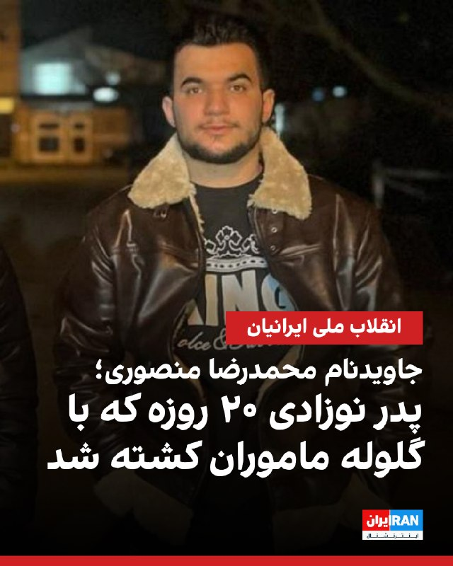

بر اساس گزارش‌های رسیده به ایران‌اینترنشنال، محمدرضا منصوری، جوان ۲۴ ساله و پدر یک نوزاد ۲۰ روزه بود که با تیراندازی نیروهای حکومتی در جریان اعتراضات شهر رشت جان خود را از دست داد. او به دلیل جراحات ناشی از شلیک گلوله، حدود یک ماه بستری و تحت درمان بود.

بر اساس گزارش‌ها، محمدرضا ۱۸ دی‌ماه در منطقه یخسازی رشت هدف شلیک نیروهای حکومتی قرار گرفت و بر اثر اصابت گلوله به نخاع و کتف به شدت زخمی شد.

او ۱۳ بهمن‌ماه بر اثر شدت جراحات وارده در جریان اعتراضات جان باخت.

به گفته منابع محلی، محمدرضا تنها فرزند خانواده بود و پیش از حضور در فراخوان، گفته بود: «برای آینده دخترم در اعتراض شرکت می‌کنم.»
‌🏁 🇬🇧 IranintlTV

🤖 @VahidOOnLine

## WithYashar — post 11997

رویترز: کاخ سفید گابارد را مجبور به استعفا کرد

درحالی‌که ترامپ استعفای تولسی گابارد از سمت مدیر اطلاعات ملی آمریکا را به بیماری همسرش مرتبط کرده، خبرگزاری رویترز به نقل از منابعی نوشته کاخ سفید او را مجبور به استعفا کرده است.

گابارد در سمت مدیر اطلاعات ملی نظارت بر ۱۷ دستگاه اطلاعاتی آمریکا را برعهده داشت.
او چندی پیش هنگام ارائهٔ گزارش ارزیابی سالانهٔ تهدیدها علیه آمریکا نظراتی دربارهٔ ایران داشت که به مذاق ترامپ خوش نیامده بود.
محورهای اصلی اختلاف‌نظر گابارد با ترامپ دربارهٔ ایران چه بود
گابارد در کنگره صراحتاً اعلام کرد که ایران پس از حملات پیشین، تلاشی برای بازسازی برنامهٔ هسته‌ای خود نکرده است.
او همچنین از تایید اینکه ایران یک تهدید نظامی فوری علیه خاک آمریکاست خودداری کرد.
@withyashar

## WithYashar — post 11996

## WithYashar — post 11995

## WithYashar — post 11994

تحلیلت دست مریزاد داره واقعا❤️🔥 حتی اگه در آخر اینطوری نشه باتوجه به داده های موجود تحلیل واقعا عالی بوده

## WithYashar — post 11993

تحلیلت دست مریزاد داره واقعا❤️🔥
حتی اگه در آخر اینطوری نشه
باتوجه به داده های موجود
تحلیل واقعا عالی بوده

## WithYashar — post 11992

ولی اگه بخواهیم عقلانی بررسی کنیم این هفته احتمال حمله ۲۰٪ هست در صورتی که هفته دیگه ۸۰٪ ولی ترامپ هم اهل این حرف ها نیست و همیشه وسط مذاکره لحظه ای که همه فکر میکنن توافق شکل گرفته میزنه !
@withyashar

## WithYashar — post 11991

ترامپ دیدن رسما دقایقی پیش گفت که عروسی پسر ارشدش هم نمیره و برای‌ مسئله ایران کاخ سفید میمونه دست به ماشه ! دوشنبه امریکا تعطیل رسمی هست و این آخر هفته مارکت ۱ روز‌ بیشتر تعطیله و خیلی خاصش کرده !
@withyashar

## WithYashar — post 11990

پس رو کاغذ نشانه ها این رو نشون میدن حمله هفته دیگه انجام میشه و اینا یه پیش نویسی از مذاکره حتی شاید بنویسن ! ولی این چیزی‌ از عرزش های امشب ‌کم نمیکنه ! امشب بسیار روز مناسبی هست برای ترامپ ! و قانونی هم آتش بس تمام شده !
@withyashar

## WithYashar — post 11989

الان این ۹ مورد که میگن اینه ! خود سپاه این هفته آماد‌ه باش نیست و خیالش راحته خیلی هم مطمعن!
حالا هم آب و هوا هست هم وحیدی و هم حج !!! آمریکا داره یک تیر و چند نشان میزنه !
@withyashar

## WithYashar — post 11988

ادعای العربیه درمورد پیش‌نویس نهایی توافق مورد انتظار بین آمریکا و ایران که طی ساعات آینده برای توقف جنگ در همه جبهه‌ها تنظیم می‌شود: ۱. توقف کامل، فوری و بی‌قیدوشرط آتش‌بس در همه جبهه‌ها (زمینی، دریایی و هوایی). ۲. تعهد دو طرف به عدم هدف‌گیری هرگونه تأسیسات…

## WithYashar — post 11987

ادعای العربیه درمورد پیش‌نویس نهایی توافق مورد انتظار بین آمریکا و ایران که طی ساعات آینده برای توقف جنگ در همه جبهه‌ها تنظیم می‌شود:

۱. توقف کامل، فوری و بی‌قیدوشرط آتش‌بس در همه جبهه‌ها (زمینی، دریایی و هوایی).

۲. تعهد دو طرف به عدم هدف‌گیری هرگونه تأسیسات نظامی، غیرنظامی یا اقتصادی طرف دیگر.

۳. توقف کلیه عملیات نظامی، فعالیت‌ها و جنگ تحریک‌آمیز رسانه‌ای.

۴. احترام به حاکمیت کشورها، تمامیت ارضی آنها و عدم دخالت در امور داخلی.

۵. تضمین آزادی دریانوردی در خلیج فارس، تنگه هرمز و دریای عمان.

۶. تشکیل کمیته مشترک برای نظارت بر اجرای توافق و حل و فصل اختلافات.

۷. آغاز مذاکرات درباره موضوعات حل‌نشده حداکثر ظرف مدت ۷ روز.

۸. لغو تدریجی تحریم‌های آمریکا علیه ایران در مقابل پایبندی ایران به مفاد توافق.

۹. دو طرف تأکید می‌کنند که این توافق در چارچوب احترام به حقوق بین‌الملل و منشور ملل متحد است.

این توافق از لحظه اعلام رسمی آن توسط دو طرف، لازم‌الاجرا خواهد بود.
@withyashar

## WithYashar — post 11986

حالا امشب چی‌میشه …

## WithYashar — post 11985

از اول کسی گردن نگرفت ولی خبر درست درز پیدا کرده بود… آتش بس ۴۵ روزه بود و امشب تموم میشه !
@withyashar

## WithYashar — post 11984

آکسیوس: ایران برای آتش‌بس ۴۵ روزه، برگ برندۀ خود را رها نمی‌کند وبگاه آکسیوس به‌نقل از منابع آگاه گزارش کرد، درحالی که برخی میانجیگران منطقه‌ای ترامپ، به‌دنبال آتش‌بس [تنفس]  ۴۵ روزه هستند، [باید بدانند] ایران از برگ برنده‌های خود دست نمی‌کشد. @withyashar

## WithYashar — post 11983

ترامپ: چه کسی از ۴۵ روز صحبت می‌کند؟ تنها کسی که قرار است آتش‌بس برقرار کند، من هستم. من هیچ آتش‌بس قطعی‌ای تعیین نکرده‌ام. @withyashar

## WithYashar — post 11982

یک مقام ارشد کاخ سفید به ان‌بی‌سی نیوز گفت پیشنهاد آتش‌بس ۴۵ روزه با ایران «یکی از موارد متعددی است که مورد بحث قرار گرفته است». این مقام گفت که پرزیدنت ترامپ این ایده را امضا نکرد. @withyashar

## WithYashar — post 11981

مسج هاتون رو میبینم ! حتی اگه بخونه باز هم باید بیاد ، اره در باسن هست ، جلو بره پاره میشه عقب هم بره پاره میشه … آخرش چی ؟ مقامات پاکستان برای‌ همین اومدن ! قطر اومده ! همه فقط توافق با اون رو قبول دارن ! قشنگی‌ این بازی کثیف‌ همین جاست 😂
@withyashar

## WithYashar — post 11980

وحیدی الان فرد شماره یک و زننده حرف آخر در تمامی تصمیمات هست برای‌ همین مذاکرات به نظر خیلی به توافق نزدیک نشون داده میشه ! تا اون بیاد بیرون و حرف آخر رو بزنه ! آخرش باید این کار رو بکنه و همون جاست که دم به تله میده !
@withyashar

## WithYashar — post 11979

همه در انتظار بیرون اومدن یا نشانه ای از موقعیت وحیدی هستند … شک نکنید

## WithYashar — post 11978

من میرم میخوابم میدونم امشب من بخوابم میزنه 😂♥️شب بخیر

## mwarmonitor — post 9497

🔴«آلکس مارکوارت، خبرنگار ارشد امنیت ملی سابق CNN می‌گوید جزئیاتی از پیشنهاد آمریکا به ایران را به دست آورده است:

🔸یک یادداشت تفاهم که شامل حجم زیادی از کمک‌های مالی و تسهیلات اقتصادی برای ایران است، در ازای توافق برای آغاز مذاکرات.»

@mwarmonitor

## mwarmonitor — post 9496

🔴سناتور راجر ویکر (جمهوری‌خواه از می‌سی‌سی‌پی)، رئیس کمیته نیروهای مسلح سنا، روز جمعه از رئیس‌جمهور دونالد ترامپ خواست حملات علیه ایران را از سر بگیرد تا «کاری را که شروع کرده‌ایم تمام کنیم» — و مدعی شد که به رئیس‌جمهور «مشاوره نادرست» داده شده است تا به دنبال…

## mwarmonitor — post 9495

🚨« یک حادثه امنیتی در پایگاه هوایی-دریایی پنساکولا در ایالت فلوریدای آمریکا رخ داده است.»

@mwarmonitor

## mwarmonitor — post 9494

  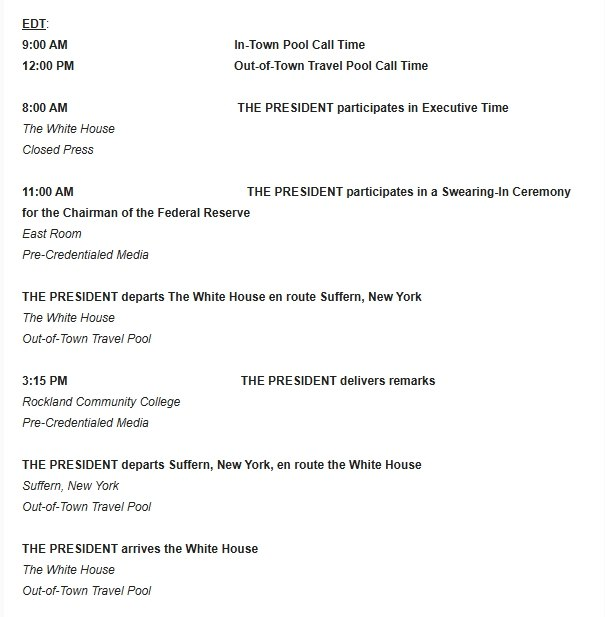

🗒بر اساس برنامه به‌روزشده، دونالد ترامپ سفر خود به باشگاه گلف «ترامپ نشنال گلف کلاب بدمینستر» را لغو کرده و در عوض آخر هفته را در کاخ سفید سپری خواهد کرد.

@mwarmonitor

## mwarmonitor — post 9493

🔴سناتور راجر ویکر (جمهوری‌خواه از می‌سی‌سی‌پی)، رئیس کمیته نیروهای مسلح سنا، روز جمعه از رئیس‌جمهور دونالد ترامپ خواست حملات علیه ایران را از سر بگیرد تا «کاری را که شروع کرده‌ایم تمام کنیم» — و مدعی شد که به رئیس‌جمهور «مشاوره نادرست» داده شده است تا به دنبال توافقی برای پایان دادن به جنگ برود. نیویورک پست

@mwarmonitor

## mwarmonitor — post 9492

🔸بقایی: تمرکز مذاکرات بر خاتمه جنگ است

سخنگوی وزارت خارجه:
🔹نمی‌توانیم بگوییم ضرورتا به جایی رسیده‌ایم که توافق نزدیک است.

🔹تمرکز مذاکرات بر خاتمه جنگ است.

@mwarmonitor

## mwarmonitor — post 9491

  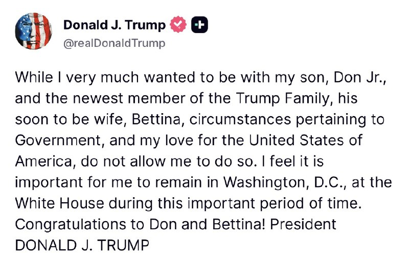

در حالی که بسیار مشتاق بودم در کنار پسرم، دان جونیور، و جدیدترین عضو خانواده ترامپ، یعنی همسر آینده‌اش، بتینا باشم، اما شرایط مربوط به دولت و عشق من به ایالات متحده آمریکا، این اجازه را به من نمی‌دهد. احساس می‌کنم لازم است در این بازه زمانی مهم، در واشنگتن دی.سی. و در کاخ سفید بمانم.
تبریک به دان و بتینا!

رئیس‌جمهور دونالد جی. ترامپ

@mwarmonitor

## mwarmonitor — post 9490

🔴 یک گزارش پاکستانی به نقل از منبعی در وزارت امور خارجه این کشور مدعی است که آمریکا و ایران در مسائل کلیدی انعطاف نشان نمی‌دهند و سفر فرمانده ارتش پاکستان به ایران، تلاشی «در آخرین لحظه» برای جلوگیری از آغاز دوباره جنگ است.» i24

@mwarmonitor

## mwarmonitor — post 9489

🚨«فوری | [Fox News] تولسی گبرد، مدیر اطلاعات ملی ایالات متحده آمریکا، استعفا داد.»

@mwarmonitor

## mwarmonitor — post 9488

🔴«فرمانده کل ارتش پاکستان، عاصم منیر، در چارچوب تلاش‌های میانجی‌گری برای دستیابی به توافقی جهت پایان دادن به جنگ میان ایالات متحده آمریکا و ایران، وارد تهران شد.» @mwarmonitor

## mwarmonitor — post 9487

  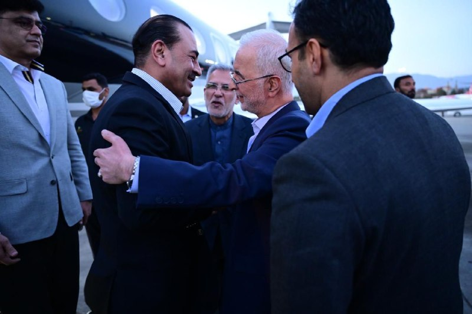

✈️بله تایید میشود @mwarmonitor

## FoxNewsTwitter — post 342130

  <a href="telegram/content/FoxNewsTwitter_342130_1779474205.mp4" target="_blank">🎬 Download video</a>

Fox News (Twitter/X)

BREAKING: 911 audio reveals Kyle Busch was overheating and coughing up blood before his death.

According to the audio, Busch was lying on a bathroom floor struggling to breathe and telling others he felt like he was going to pass out.

“I’ve got an individual that’s shortness of breath, very hot, thinks he’s going to pass out and is producing a little bit of blood — coughing up some blood,” the caller told dispatchers. | @SandraSmithFox @AmericaRpts

## FoxNewsTwitter — post 342129

  <a href="telegram/content/FoxNewsTwitter_342129_1779474207.mp4" target="_blank">🎬 Download video</a>

Fox News (Twitter/X)

A Georgia handyman swapped his car for a pink Barbie toy car to beat rising gas prices.

Mali Hightower pulled a broken Power Wheels Dream Camper out of the trash and installed a small gas engine from a power washer to give him an alternative to speed around town in instead of his usual mode of transportation.

His 1996 Mercedes-Benz convertible typically costs about $90 to fill.

The tiny pink vehicle tops out around 35 mph and is now turning heads everywhere he goes as Americans search for cheaper ways to get around.

## FoxNewsTwitter — post 342128

  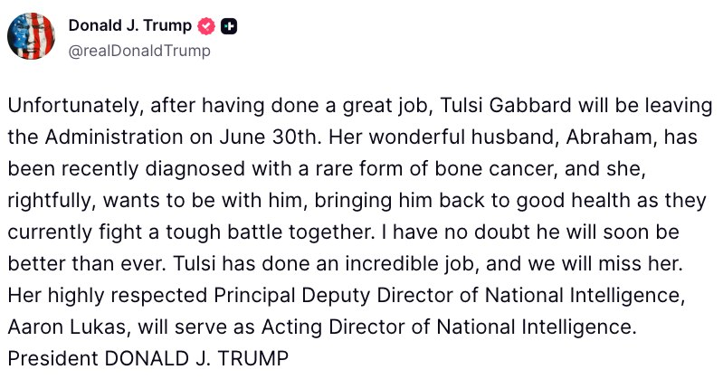

Fox News (Twitter/X)

BREAKING: President Trump says Principal Deputy Director of National Intelligence, Aaron Lukas, will serve as Acting Director of National Intelligence after Tulsi Gabbard's resignation.

## FoxNewsTwitter — post 342127

  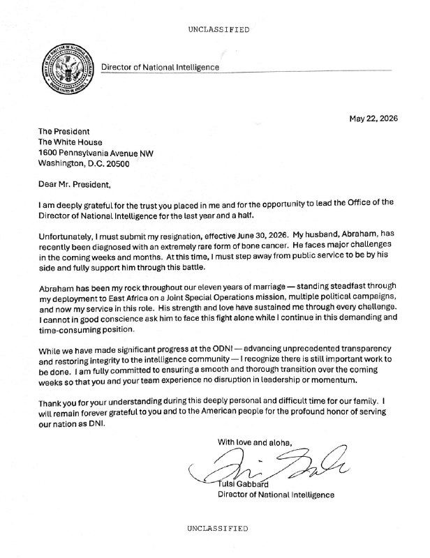

Fox News (Twitter/X)

READ IT: Director of National Intelligence Tulsi Gabbard submits her formal letter of resignation to President Trump, announcing she will be stepping down from her post after a year and a half leading the nation's intelligence community.

Gabbard informed the President of her decision during an Oval Office meeting on Friday, revealing that her husband has been diagnosed with an aggressive health battle.

Her final day leading the Office of the DNI will be June 30, 2026.

## FoxNewsTwitter — post 342126

  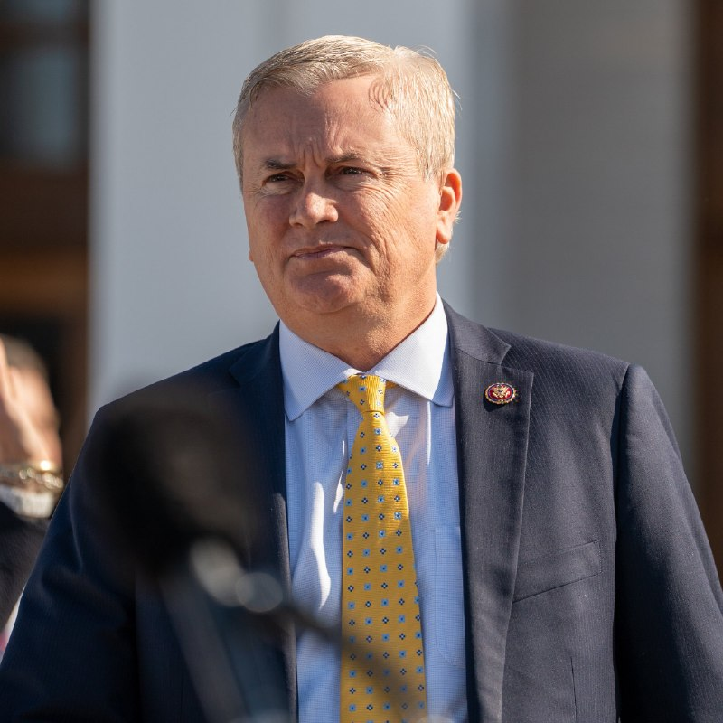

Fox News (Twitter/X)

NEW: House Oversight Chairman James Comer is opening an investigation into whether users on Polymarket and Kalshi used nonpublic information to profit from prediction markets.

In letters sent to Polymarket CEO Shayne Coplan and Kalshi CEO Tarek Mansour, Comer says the Committee is examining potential insider trading tied to online betting platforms and whether users may have bypassed U.S. regulations through offshore access.

“Internal records held by prediction market platforms are the only means by which bad actors can be identified,” Comer wrote while demanding documents on user verification, geographic restrictions, and suspicious trading activity.

## FoxNewsTwitter — post 342125

  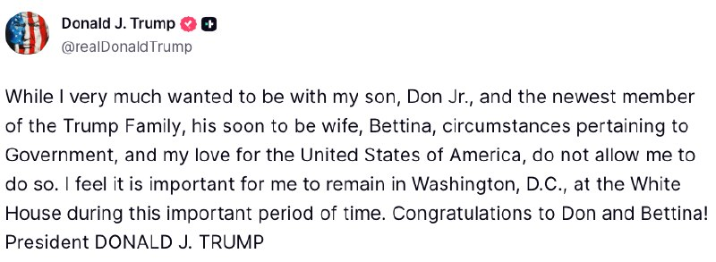

Fox News (Twitter/X)

BREAKING: President Trump announces he will NOT attend his son Don Jr.'s wedding, saying government matters and his "love for the United States of America" are too important for him to leave the White House during this "important period of time."

"While I very much wanted to be with my son, Don Jr., and the newest member of the Trump Family, his soon to be wife, Bettina, circumstances pertaining to Government, and my love for the United States of America, do not allow me to do so."

## FoxNewsTwitter — post 342124

Fox News (Twitter/X)

Gabbard is resigning to support her husband through his battle with "an extremely rare form of bone cancer," Fox News Digital learned. She notified President Donald Trump during a meeting in the Oval Office Friday.

## FoxNewsTwitter — post 342123

  <a href="telegram/content/FoxNewsTwitter_342123_1779474213.mp4" target="_blank">🎬 Download video</a>

Fox News (Twitter/X)

BREAKING: Tulsi Gabbard has notified President Trump that she is resigning from her post as Director of National Intelligence.

Gabbard says she is leaving the administration to support her husband through his battle with “an extremely rare form of bone cancer,” Fox News Digital has exclusively learned.

Her final day in the post will be June 30, 2026. | @davidspunt

## FoxNewsTwitter — post 342122

‌Fox News (Twitter/X)

Read more about her departure from Trump's Cabinet:

## FoxNewsTwitter — post 342121

  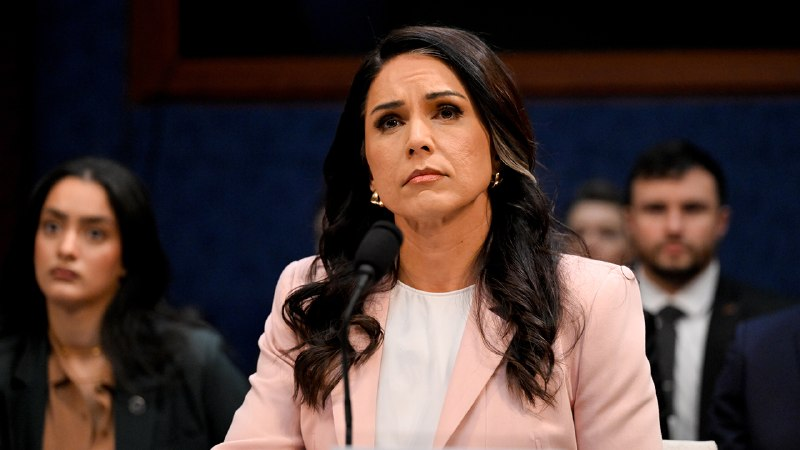

Fox News (Twitter/X)

BREAKING NEWS: Tulsi Gabbard is resigning as director of national intelligence

## pm_afshaa — post 91221

  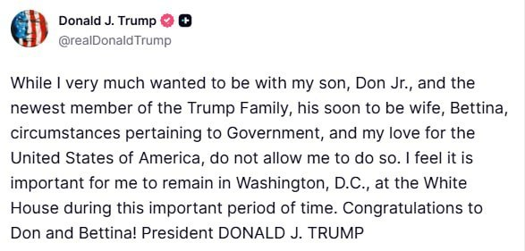

ترامپ: با اینکه خیلی میخواهم در کنار پسرم برای مراسم عروسی باشم اما حس میکنم که مهم است در واشنگتن و کاخ سفید در طی زمان مهم پیش رو در روز شنبه و یکشنبه بمانم

💧 Rainbet.com the #1 Non-KYC Crypto Casino & Sportsbook @rainbetcom

😁 @Pm_Afshaa

## pm_afshaa — post 91220

من که میدونم همه اینا برا کشیدن وحیدی بیرونه😁

## pm_afshaa — post 91219

من که میدونم همه اینا برا کشیدن وحیدی بیرونه😁

## pm_afshaa — post 91218

🔴تولسی گبرد، مدیر اطلاعات ملی ایالات متحده آمریکا، استعفا داد

💧 Rainbet.com the #1 Non-KYC Crypto Casino & Sportsbook @rainbetcom

😁 @Pm_Afshaa

## pm_afshaa — post 91217

🔴رئیس کمیته نیروهای مسلح سنای آمریکا: ترامپ باید به ارتش اجازه دهد تا انهدام توانمندی‌های نظامی ایران را تکمیل کند

💧 Rainbet.com the #1 Non-KYC Crypto Casino & Sportsbook @rainbetcom

😁 @Pm_Afshaa

## pm_afshaa — post 91216

  <a href="telegram/content/pm_afshaa_91216_1779474216.webm" target="_blank">🎬 Download video</a>

🔴العربیه الجدید به نقل از منبعی در وزارت خارجه پاکستان: واشنگتن و تهران انعطاف کافی در پرونده‌های اصلی از خود نشان نمیده.

سفر فرمانده ارتش پاکستان به تهران ممکنه آخرین تلاش برای جلوگیری از بازگشت منطقه به جنگ باشه.

💧 Rainbet.com the #1 Non-KYC Crypto Casino & Sportsbook @rainbetcom

😁 @Pm_Afshaa

## iaghapour — post 2626

اکانت‌های هوش مصنوعی رو با یک‌دهم قیمت بخر 
🛍

🏳️‍🌈 Gemini Pro:
(گزینه‌ی اقتصادی)

- پلن مشابه GPT Plus از شرکت گوگل
- پشتیبانی از Antigravity
- ساخت عکس و ویدیوی فارسی
- تجزیه‌ و تحلیل و تحقیق عمیق
- فعال‌سازی روی ایمیل شما (اتوماتیک)
- کاملا اختصاصی (فمیلی نیست)

🌐 Kiro.dev Pro
(جایگزین اقتصادی Claude)

- ایجنت برنامه‌نویسی شرکت آمازون
- پشتیبانی از تمامی مدل‌های Claude
- ارزان، اقتصادی و باکیفیت
- مناسب فقط برنامه‌نویسان

خرید و توضیحات بیشتر از ربات:

🤖 @ChatGPT_StoreBOT

* اکانت هتزنر هم داخل ربات موجوده

## iaghapour — post 2625

  

⭕️ معرفی پروژه XPlex؛ راه‌حل هوشمندانه برای جلوگیری از قطعی و پکت‌لاس کانفیگ

اگر از کانفیگ‌های v2ray استفاده می‌کنید و پایداری اینترنت در کارهای حساسی مثل آزمون‌های آنلاین، جلسات ویدیویی یا ریموت‌ورک برای شما حیاتی است، پروژه جدید XPlex یک راه‌حل فنی و کاربردی برای شما دارد.

منطق این اسکریپت ساده اما بسیار کارآمد است و به شما کمک می‌کند تا یک اتصال بدون قطعی را تجربه کنید:

🔹 استفاده هم‌زمان از چند کانفیگ: منطق کلیدی این پروژه این است که اگر چند کانفیگ v2ray داشته باشید، اسکریپت به صورت هم‌زمان از آن‌ها استفاده می‌کند و ترافیک شما را روی کانفیگی می‌اندازد که کمترین پینگ ممکن را دارد.

🔸 خداحافظی با پکت‌لاس و تایم‌اوت: این ابزار برای افرادی که کارهای حساسی دارند و ثانیه‌ها برایشان مهم است طراحی شده؛ مثل شرکت‌کنندگان در آزمون‌های آیلتس آنلاین، جلسات کاری با خارج از کشور و...

🔹 هزینه مصرف حجم: باید توجه داشته باشید که به دلیل ماهیت کارکرد این ابزار، مصرف ترافیک و حجم v2ray شما تقریباً دو برابر خواهد شد که بهای به دست آوردن یک اینترنت کاملاً پایدار است.

🔗 اطلاعات بیشتر در گیت‌هاب پروژه

🆔 @iaghapour

## DEJradio — post 4854

⭕️ روبیو گفت اولویت ترامپ دیپلماسی است، اما باید برای گزینه‌های دیگر هم آماده بود

مارکو روبیو، وزیر امور خارجۀ ایالات متحده روز آدینه گفت دونالد ترامپ همچنان مسیر دیپلماسی را ترجیح می‌دهد، اما آمریکا باید برای گزینه‌های دیگر نیز آماده باشد.
به گفتۀ روبیو، جلوگیری از دستیابی جمهوری اسلامی به سلاح هسته‌ای، تحویل همۀ ذخایر اورانیوم غنی‌شده و بازگشایی تنگۀ هرمز، از اصول خلل‌ناپذیر واشینگتن در مذاکره با تهران است.

#مارکو_روبیو
@DEJradio

## DEJradio — post 4853

⭕️ موضوع ایران نمی‌گذارد ترامپ به مراسم ازدواج پسرش برود

دونالد ترامپ گفت درگیری با موضوع جمهوری اسلامی برنامه‌هایش را پیچیده کرده و نمی‌گذارد در مراسم ازدواج پسرش شرکت کند.
رئیس‌ جمهوری آمریکا در دفتر بیضی کاخ سفید به خبرنگاران گفت: پسرم دوست دارد من در مراسم باشم… اما الان درگیر ایران و مسائل دیگر هستم.
مراسم ازدواج ترامپ جونیور قرار است در پایان این هفته در باهاما برگزار شود.

#ترامپ
@DEJradio

## DEJradio — post 4852

⭕️ رویترز: یک هیئت قطری با هماهنگی آمریکا وارد تهران شد

خبرگزاری رویترز به نقل از یک منبع آگاه گزارش داد یک تیم مذاکره‌کنندۀ قطری روز آدینه با هماهنگی ایالات متحده وارد تهران شد.
بر اساس این گزارش، هدف از این سفر کمک به دستیابی به توافقی برای پایان جنگ و حل مسائل باقی‌مانده میان جمهوری اسلامی و آمریکا عنوان شده است.
قطر پیش از نیز در کنار ترکیه و مصر، برای دستیابی به توافق و ممانعت از حملۀ آمریکا به جمهوری اسلامی، تلاش کرده بود.

#قطر #مذاکرات
@DEJradio

## DEJradio — post 4851

⭕️ اسماعیل بقائی سخنگوی هیئت مذاکره‌کنندۀ تهران با واشینگتن شد

محمدباقر قالیباف، رئیس هیئت مذاکره‌کنندۀ جمهوری اسلامی با آمریکا، اسماعیل بقائی، سخنگوی وزارت خارجه را به عنوان سخنگوی این هیئت منصوب کرد.
این انتصاب در حالی انجام شده که طی روزهای اخیر با میانجی‌گری پاکستان، گفت‌وگوهایی فشرده‌ میان تهران و واشینگتن در جریان بود.

#مذاکرات
@DEJradio

## DEJradio — post 4850

⭕️ اتحادیۀ اروپا روند تحریم جمهوری اسلامی با موضوع تنگۀ هرمز را سرگرفت

اتحادیه اروپا اعلام کرد کشورهای عضو این نهاد روز آدینه روند اعمال تحریم علیه مقام‌های جمهوری اسلامی و دیگر افراد مرتبط با بستن تنگۀ هرمز را سرگرفته‌اند.
شورای اتحادیۀ اروپا افزود از این پس، این اتحادیه می‌تواند در واکنش به اقداماتی که آزادی کشتیرانی در تنگۀ هرمز را مختل می‌کند، تحریم‌ و محدودیت‌ بیشتری را علیه جمهوری اسلامی اعمال کند.

#تنگه_هرمز #اتحادیه_اروپا #تحریم
@DEJradio

## VahidOnline — post 75625

  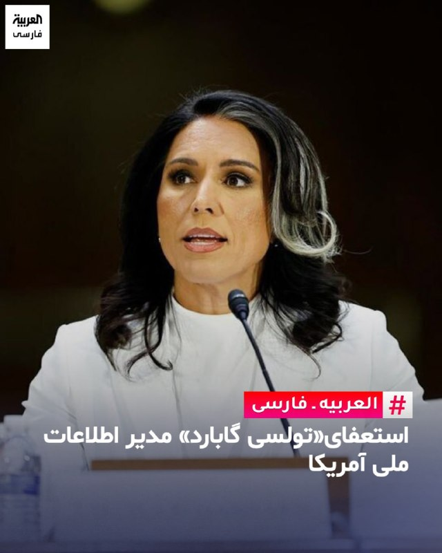

«فاکس نیوز»: تولسی گابارد از پست خود به عنوان مدیر اطلاعات ملی آمریکا استعفا کرد.
AlArabiya_Fa
پست ترامپ، ترجمه ماشین:
متأسفانه تولسی گبرد، پس از آنکه عملکردی بسیار خوب داشت، روز ۳۰ ژوئن دولت را ترک خواهد کرد. همسر فوق‌العاده او، آبراهام، به‌تازگی به نوعی نادر از سرطان استخوان مبتلا شده و او، به‌درستی، می‌خواهد در کنار همسرش باشد و در حالی که این نبرد دشوار را با هم پشت سر می‌گذارند، به بازگشت او به سلامتی کمک کند. تردیدی ندارم که او به‌زودی بهتر از همیشه خواهد شد.

تولسی کار فوق‌العاده‌ای انجام داده و دلمان برای او تنگ خواهد شد. معاون اصلی و بسیار محترم او در دفتر مدیر اطلاعات ملی، آرون لوکاس، به‌عنوان سرپرست مدیر اطلاعات ملی خدمت خواهد کرد.

رئیس‌جمهور دونالد جی. ترامپ
realDonaldTrump
متن استعفانامه، ترجمه ماشین:

آقای رئیس‌جمهور عزیز،

از اعتمادی که به من کردید و از فرصتی که برای رهبری دفتر مدیر اطلاعات ملی در یک سال و نیم گذشته در اختیارم گذاشتید، عمیقاً سپاسگزارم.

متأسفانه باید استعفای خود را، با اثرگذاری از ۳۰ ژوئن ۲۰۲۶، تقدیم کنم. همسرم، آبراهام، به‌تازگی به نوعی بسیار نادر از سرطان استخوان مبتلا شده است. او در هفته‌ها و ماه‌های پیش رو با چالش‌های بزرگی روبه‌رو خواهد بود. در این مقطع، باید از خدمت عمومی کناره‌گیری کنم تا در کنارش باشم و در این نبرد به‌طور کامل از او حمایت کنم.

آبراهام در تمام یازده سال زندگی مشترکمان تکیه‌گاه من بوده است؛ از مأموریتم در شرق آفریقا در یک عملیات مشترک نیروهای ویژه، تا چندین کارزار سیاسی، و اکنون نیز در دوران خدمتم در این جایگاه، استوار کنارم ایستاده است. قدرت و عشق او مرا در هر چالشی سرپا نگه داشته است. وجدانم اجازه نمی‌دهد از او بخواهم در حالی که من همچنان در این سمت دشوار و وقت‌گیر هستم، این مبارزه را به‌تنهایی پشت سر بگذارد.

هرچند ما در دفتر مدیر اطلاعات ملی پیشرفت‌های چشمگیری داشته‌ایم — از جمله پیشبرد شفافیتی بی‌سابقه و بازگرداندن یکپارچگی و درستکاری به جامعه اطلاعاتی — اما اذعان دارم که هنوز کارهای مهمی برای انجام دادن باقی مانده است. من کاملاً متعهد هستم که در هفته‌های پیش رو انتقالی روان و کامل را تضمین کنم تا شما و تیم‌تان هیچ اختلالی در رهبری یا روند کار تجربه نکنید.

از درک شما در این مقطع عمیقاً شخصی و دشوار برای خانواده‌مان سپاسگزارم. تا همیشه از شما و مردم آمریکا به‌خاطر افتخار بزرگی که خدمت به کشورمان در مقام مدیر اطلاعات ملی برایم داشت، سپاسگزار خواهم بود.

خبر یک ماه و نیم پیش:
ترامپ قصد داشت گابارد را اخراج کند

به گزارش وب‌سایت آکسیوس، دونالد ترامپ تا آستانه اخراج تولسی گابارد، مدیر اطلاعات ملی آمریکا، پیش رفته بود، اما مداخله لحظه آخری راجر استون، مشاور قدیمی و نزدیک او، مانع از این اتفاق شد.
دلیل خشم ترامپ به شهادت اخیر گابارد در کنگره بازمی‌گردد؛ جایی که او برخلاف انتظار، از جنگ با ایران حمایت تمام‌عیار نکرد.
طبق گفته منابع آگاه، ترامپ از اینکه گابارد در اظهاراتش اعلام کرده بود برنامه هسته‌ای ایران پیش از آغاز جنگ «منهدم» شده بود (موضعی که توجیهات ترامپ برای حمله را تضعیف می‌کرد)، به شدت ناراضی بود.
همچنین استعفای اعتراضی جو کنت، دستیار گابارد که جنگ را غیرضروری خوانده بود، بر آتش خشم ترامپ افزود.
در حالی که ترامپ در حال نظرسنجی از مشاورانش برای جایگزینی گابارد بود و وفاداری او را زیر سؤال می‌برد، راجر استون در تماسی تلفنی از او دفاع کرد. یک منبع نزدیک به آکسیوس گفت: «راجر معامله را جوش داد و تولسی را نجات داد.»
استون نیز بعدا در شبکه اجتماعی ایکس تایید کرد: «خوشبختانه به موقع اقدام کردم.» با این میانجی‌گری، گبرد فعلا در سمت خود ابقا شده است.
@VahidOOnLine

📡 @VahidOnline

## VahidOnline — post 75624

  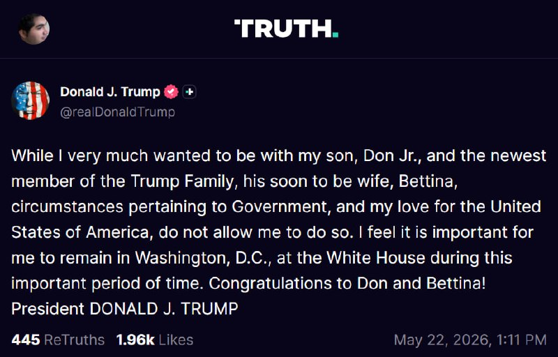

پست ترامپ درباره شرکت نکردن در مراسم ازدواج پسرش

ترجمه ماشین:
با اینکه بسیار دوست داشتم کنار پسرم، دان جونیور، و جدیدترین عضو خانواده ترامپ، همسر آینده‌اش بتینا باشم، شرایط مربوط به دولت و عشق من به ایالات متحده آمریکا اجازه چنین کاری را به من نمی‌دهد.

احساس می‌کنم مهم است که در این دوره مهم زمانی، در واشینگتن دی‌سی و در کاخ سفید بمانم.
به دان و بتینا تبریک می‌گویم!

رئیس‌جمهور دونالد جی. ترامپ
realDonaldTrump
دیروز:
ترامپ با اشاره به مشغله‌های شدید خود گفت: «به پسرم گفتم الآن زمان‌بندی خوبی برای من نیست؛ موضوعی به نام ایران و مسائل دیگر را در دست دارم. این از آن مواردی است که اگر در عروسی شرکت کنم، توسط رسانه‌های اخبار جعلی سلاخی می‌شوم و اگر شرکت نکنم هم باز من را می‌کشند!»
@VahidOOnLine
رسانه‌های امریکایی نوشته‌اند که دونالد ترامپ جونیور، ۴۸ ساله، قرار است در پایان هفته جاری با بتینا اندرسون، مدل و چهره اجتماعی ۳۹ ساله در یک جزیره خصوصی در باهاما ازدواج کند.
بر اساس گزارش‌ها، این زوج در ابتدا به برگزاری مراسم عروسی در کاخ سفید فکر کرده بودند، اما بعداً تصمیم گرفتند مراسم کوچک‌تری برگزار کنند. دلیل این تغییر، نگرانی از واکنش عمومی به برگزاری یک مراسم پرزرق‌وبرق در زمانی خوانده شده که امریکا با تنش‌های مربوط به ایران روبه‌رو است.
afintl

📡 @VahidOnline

## kianmeli1 — post 87555

  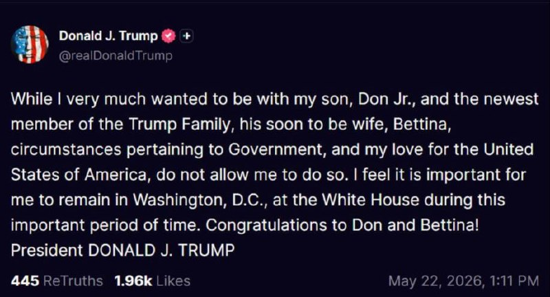

🔴ترامپ در مراسم ازدواج پسرش شرکت نکرد ٫ آیا امشب حمله میکنند؟

پست ترامپ:
با اینکه بسیار دوست داشتم کنار پسرم، دان جونیور، و جدیدترین عضو خانواده ترامپ، همسر آینده‌اش بتینا باشم، شرایط مربوط به دولت و عشق من به ایالات متحده آمریکا اجازه چنین کاری را به من نمی‌دهد.
احساس می‌کنم مهم است که در این دوره مهم زمانی، در واشینگتن دی‌سی و در کاخ سفید بمانم.
به دان و بتینا تبریک می‌گویم!
رئیس‌جمهور دونالد جی. ترامپ
https://t.me/kianmeli1

## IranIntlTV — post 338467

  

علی خضریان، نماینده تهران در مجلس گفت: «ترامپ بارها می‌گوید جمهوری اسلامی برای رسیدن به توافق زمان ندارد. در این اظهارات رییس جمهور آمریکا فرامتن و اعترافی وجود دارد که اتفاقا زمان علیه آمریکاست. برای همین این لات کوچه خلوت فضای مجازی داد می‌زند که بگوید ایران است که زمان ندارد.»

او ادامه داد: «در سه حوزه کلیدی مدیریت تنگه هرمز، حمایت از جبهه مقاومت وعدم خروج مواد هسته‌ای از خاک کشور به هیچ عنوان مصالحه نخواهد کرد.»

او افزود: «فکر نمی‌کنم درباره متنی بتوانیم صحبت کنیم که روی آن به توافق نزدیک شده باشیم.»
https://iranintl.com/202605220298

## IranIntlTV — post 338466

  

عبدالله حاجی‌صادقی، نماینده مجتبی خامنه‌ای در سپاه پاسداران گفت: «استکبار باید بداند که خلیج فارس و تنگه هرمز تحت کنترل کامل و هوشیارانه نیروی دریایی ماست. اگر دشمن نخواهد این واقعیت را بپذیرد و دست به ماجراجویی بزند، ما نه فقط در منطقه، بلکه فرای منطقه را هم برای آن‌ها ناامن و تنگ خواهیم کرد.»

او افزود: «اگر دشمن مرتکب کوچک‌ترین خطای محاسباتی شود، روزهایی به مراتب سخت‌تر از گذشته را تجربه خواهد کرد. سپاه پاسداران و نیروی دریایی مقتدر، پاسخی به آن‌ها خواهند داد که از نظر وسعت و شدت، فراتر از عملیات‌های ظفرمند وعده صادق خواهد بود.»
https://iranintl.com/202605223982

## IranIntlTV — post 338465

بحران انسانی در تنگه هرمز؛ هزاران دریانورد میان جنگ و بلاتکلیفی گرفتار شده‌اند

ادامه اقدامات تنش‌آفرین جمهوری اسلامی در تنگه هرمز، به نگرانی‌ها درباره تشدید بحران انسانی برای هزاران دریانورد گرفتار در خلیج فارس دامن زده است.

خبرگزاری رویترز جمعه اول خرداد گزارش داد بیش از ۲۰ هزار ملوان در حدود دو هزار کشتی در آب‌های خلیج فارس سرگردان مانده‌اند؛ بسیاری از آن‌ها امکان ترک شناورهای خود را ندارند و با کمبود غذا، آب آشامیدنی و عدم اطمینان نسبت به آینده دست و پنجه نرم می‌کنند.

دریانوردانی که در هفته‌های اخیر با رویترز مصاحبه کرده‌اند، از چالش‌ها و اضطراب مداوم خود در اوضاع جنگی منطقه سخن گفته‌اند.

سلمان صدیقی، ملوان هندی که در یکی از کشتی‌های گرفتار حضور دارد، در تماسی تلفنی به رویترز گفت: «تنها کاری که اینجا انجام می‌دهیم، این است که برای گذراندن شب برنامه‌ریزی کنیم و دعا کنیم در جریان حملات هدف قرار نگیریم.»

تنگه هرمز گذرگاه باریکی میان ایران و عمان است که حدود یک‌پنجم نفت خام و گاز طبیعی مایع جهان از آن عبور می‌کند.

از زمان آغاز مناقشه کنونی در ۹ اسفند ۱۴۰۴، اختلال در تردد شناورها در این آبراه موجب برهم خوردن جریان انرژی جهانی و افزایش قیمت نفت شده است.

انزوای دریانوردان در منطقه جنگی
در حالی که بحران در خلیج فارس ادامه دارد، خبرنگاران رویترز به‌تازگی با یک قایق امدادرسانی به سوی کشتی‌های پهلوگرفته در سواحل عربستان سعودی رفتند.

در این زمان، ملوانان یک نفتکش با تجمع کنار نرده‌های شناور، برای خبرنگاران دست تکان دادند. رویترز این رویداد را «لحظه‌ای نادر از تماس آن‌ها با جهان خارج» توصیف کرد.

بر اساس این گزارش، دریانوردان گرفتار در خلیج فارس نزدیک به سه ماه است در شرایطی منزوی و پراضطراب به سر می‌برند. آن‌ها در فضایی محدود، میان کابین‌های کوچک، سالن‌های غذاخوری مشترک و عرشه‌های داغ کشتی‌ها روزگار می‌گذرانند و تنها با شمار اندکی از همکاران خود در تماس هستند.

محمد اراشدی، هماهنگ‌کننده شبکه جهان عرب و ایران در فدراسیون بین‌المللی کارکنان حمل‌ونقل (ITF)، هشدار داد وضعیت جنگی منطقه آسیب‌پذیری دریانوردان را به‌طور چشمگیری افزایش داده است.

به گفته او، بسیاری از ملوانان با مشکلاتی همچون تاخیر در پرداخت دستمزد، مخالفت با بازگرداندن آن‌ها به کشورهایشان، کمبود آذوقه و نگرانی از حملات موشکی و پهپادی مواجه‌اند.

اراشدی افزود برخی از دریانوردان در تماس‌های تلفنی با او گریه کرده‌اند.

گرفتار میان حقوق‌های معوقه و هراس جنگ
موهیت کوهلی، کاپیتان یک کشتی باری که پس از آغاز جنگ در خلیج فارس گرفتار شده بود، گفت در ابتدا حتی تصور بسته ‌شدن تنگه هرمز هم برای او امکان‌پذیر نبود.

کشتی تحت فرمان او که متعلق به شرکتی آلمانی بود، توانست در منطقه‌ای امن در نزدیکی بندر دمام عربستان سعودی لنگر بیندازد، اما تنها چند روز پس از آغاز درگیری‌ها، خدمه کشتی شاهد عبور موشک‌ها و پهپادهایی بودند که حکومت ایران به سوی کشورهای حاشیه خلیج فارس شلیک می‌کرد.

کوهلی در گفت‌وگو با رویترز پس از بازگشت به هند، با اشاره به فضای حاکم بر کشتی گفت: «خدمه‌ای که همیشه پرجنب‌وجوش و پرسر‌وصدا بودند، ناگهان ساکت شدند. زمان غذا خوردن کوتاه‌تر شد و همه با احتیاط بیشتری صحبت می‌کردند.»

او افزود مالکان کشتی برای اعزام نیروهای جایگزین با خدمه همکاری کردند.

با این حال، مقام فدراسیون بین‌المللی کارکنان حمل‌ونقل خاطرنشان کرد تمامی دریانوردان گرفتار در تنگه هرمز وضعیت مشابهی ندارند و بسیاری از آن‌ها با چالش‌ها و فشارهای به‌مراتب شدیدتری روبه‌رو هستند.

اراشدی گفت در برخی پرونده‌های در دست بررسی، حقوق ناچیز ۱۰۰ تا ۲۰۰ دلاری ملوانان از سال گذشته پرداخت نشده و برخی مالکان کشتی نیز از فراهم کردن امکان بازگشت آن‌ها به کشورشان خودداری می‌کنند یا این کار را مشروط به صرف‌نظر کردن ملوانان از مطالبات معوقه‌شان دانسته‌اند.

تلاش برای تسهیل خروج ملوانان از برزخ
رویترز در ادامه نوشت کشورهای حاشیه خلیج فارس اقداماتی را برای کمک‌رسانی به خدمه کشتی‌های گرفتار آغاز کرده‌اند؛ از جمله تسهیل روند تامین تدارکات و جابه‌جایی نیروها.

سلیمان المزروعی، رییس سازمان بنادر عربستان سعودی، گفت مهم‌ترین مساله برای دریانوردان گرفتار این است که بدانند ساحلی امن «به روی آن‌ها باز است».

به گفته او، سازمان بنادر عربستان سعودی تاکنون به صدها کشتی در تامین مواد غذایی، آب آشامیدنی، سوخت و دارو کمک کرده و امکان انتقال بیش از ۵۰۰ ملوان را فراهم آورده است.
 
🔗متن کامل گزارش را اینجا بخوانید
@iranintltv

## IranIntlTV — post 338464

  <a href="telegram/content/IranIntlTV_338464_1779474220.mp4" target="_blank">🎬 Download video</a>

دو شهروند در پیام‌هایی که با هوش مصنوعی خوانده شده، به ایران اینترنشنال گفتند که قیمت یک پرس قرمه‌سبزی در رستوران‌ها به حدود ۸۰۰ هزار تومان و یک عدد پیتزای دو نفره به بالای دو میلیون تومان رسیده است.

## IranIntlTV — post 338463

  <a href="telegram/content/IranIntlTV_338463_1779474223.mp4" target="_blank">🎬 Download video</a>

دو شهروند در پیام‌هایی که با هوش مصنوعی خوانده شده، به ایران اینترنشنال گفتند که قیمت یک پرس قرمه‌سبزی در رستوران‌ها به حدود ۸۰۰ هزار تومان و یک عدد پیتزای دو نفره به بالای دو میلیون تومان رسیده است.

## IranIntlTV — post 338462

  

اسماعیل بقائی، سخنگوی وزارت خارجه جمهوری اسلامی گفت: «در مورد اورانیوم غنی‌شده با درجه بالا، مواضع‌مان را خیلی روشن بیان کرده‌ایم؛ در این مرحله اگر بخواهیم در این مباحث گفت‌وگو کنیم، قاعدتا به نتیجه نمی‌رسیم.»

او افزود: «ما قبلا این مسیر را رفتیم و اختلاف‌نظرها آن‌قدر زیاد بود که نتوانستیم به نتیجه برسیم و طرف مقابل به‌خاطر خواسته‌های نامعقولش میز مذاکرات را از بین برد و حمله کرد.»
https://iranintl.com/202605226137

## IranIntlTV — post 338461

  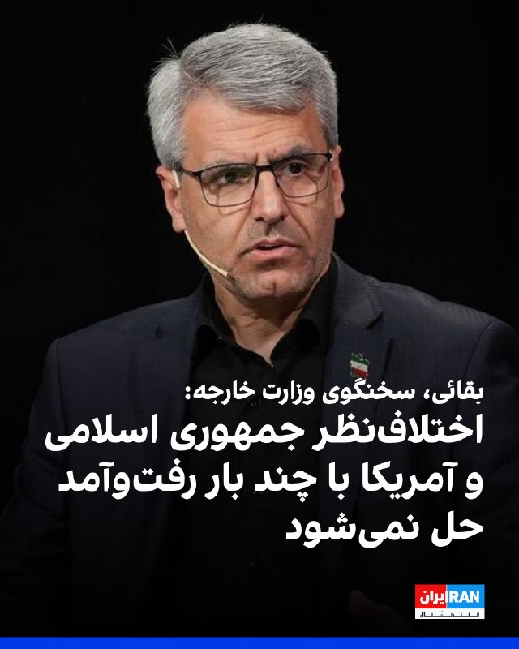

اسماعیل بقائی، سخنگوی وزارت خارجه جمهوری اسلامی گفت: «اختلاف‌نظر ما با آمریکا آن‌قدر عمیق و زیاد است که نمی‌شود گفت با چندبار رفت‌وآمد یا مذاکرات ظرف چند هفته ما باید حتما به نتیجه برسیم.»

او افزود: «نمی‌توانیم بگوییم ضرورتا به جایی رسیده‌ایم که توافق نزدیک است. تمرکز مذاکرات بر خاتمه جنگ است.»

او در واکنش به سفر عاصم منیر به تهران گفت: «این رفت‌وآمدها باوجود اینکه پرترافیک‌تر شده، تداوم همان روند دیپلماتیک است.»

بقائی ادامه داد: «یک هیئتی از قطر درحال مذاکره با وزیر خارجه کشورمان هستند اما میانجی مذاکرات همچنان طرف پاکستانی است.»
https://iranintl.com/202605224547

## IranIntlTV — post 338460

  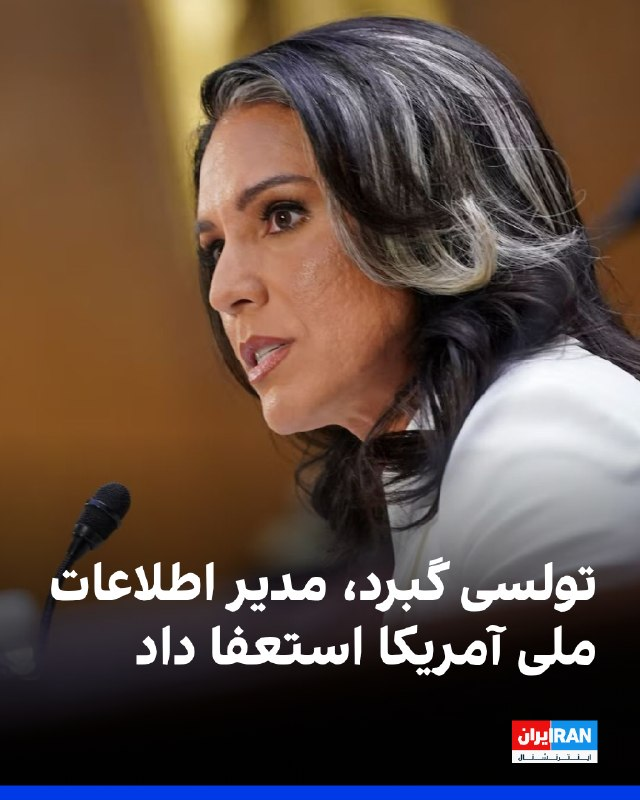

فاکس‌نیوز گزارش داد که تولسی گبرد، مدیر اطلاعات ملی آمریکا از سمت خود استعفا داده است.
او پیش‌تر گفته بود گفت که اهداف تعیین‌شده از سوی ترامپ درباره جنگ با جمهوری اسلامی، با اهداف اسرائیل متفاوت است.

گبرد همچنین گفته بود که حکومت ایران برقرار به نظر می‌رسد، اما در نتیجه عملیات نظامی آمریکا به‌طور گسترده تضعیف شده است.
https://iranintl.com/202605228014

## IranIntlTV — post 338459

  <a href="telegram/content/IranIntlTV_338459_1779474227.mp4" target="_blank">🎬 Download video</a>

در پی کارزار مردمی ایران‌اینترنشنال برای شناسایی جاویدنامان بیمارستان الغدیر تهران، شاهدان با ارسال پیام‌هایی می‌گویند کادر درمان این بیمارستان در ۱۸ و ۱۹ دی ۱۴۰۴، با وجود فشار شدید ماموران و ممانعت آنها، معترضان را رها نکردند و برای بهبود آنها تلاش کردند.
فرنوش فرجی، عضو تحریریه ایران‌اینترنشنال گزارش می‌دهد.

## IranIntlTV — post 338458

  

علیرضا سلیمی، عضو هیات رییسه مجلس گفت: «یکی از دستاوردهای جنگ اخیر، مدیریت جمهوری اسلامی بر تنگه هرمز است که هرگز قابل مذاکره و معامله نیست و رژیم حقوقی جدیدی بر این تنگه حاکم خواهد شد که قواعد آن را تنها ما تعریف و اعمال می‌کنیم.»

او افزود: «شرایط عبور و مرور همچنین نرخ عوارض بر تنگه هرمز را جمهوری اسلامی مشخص می‌کند و با توییت نمی‌توانند اوضاع تنگه را تغییر دهند.»
https://iranintl.com/202605225037

## IranIntlTV — post 338457

  <a href="https://t.me/IranintlTV/338457" target="_blank">📎 Download file</a>

🎧نسخه صوتی اخبار شبانگاهی | جمعه یک خرداد
@iranintlTV

## Shin_Persian — post 6152

  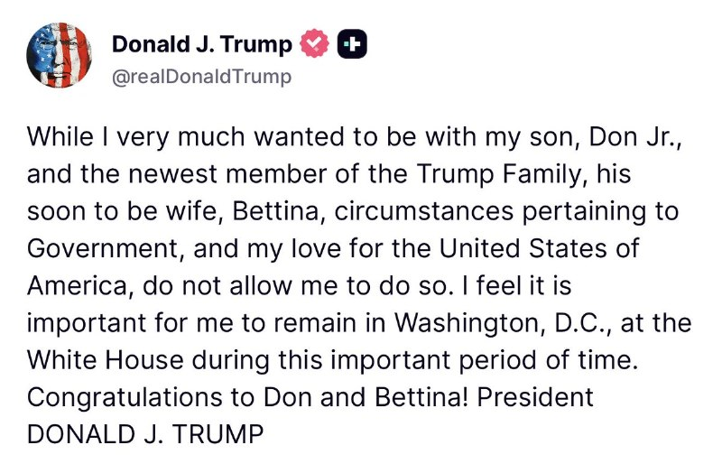

Rapid Response 47 ✓ @RapidResponse47
Fri, 22 May 2026 17:13:05 UTC

𝕏 · @shin_persian

## Shin_Persian — post 6151

  <a href="telegram/content/Shin_Persian_6151_1779474232.mp4" target="_blank">🎬 Download video</a>

Iran International English ✓ @IranIntl_En Fri, 22 May 2026 15:37:34 UTC The Pentagon on Friday released a video allegedly showing unidentified anomalous phenomena (UAP) near Iran, saying the footage was likely captured by an infrared sensor aboard a US military…

## Shin_Persian — post 6150

Iran International English ✓ @IranIntl_En
Fri, 22 May 2026 15:37:34 UTC

The Pentagon on Friday released a video allegedly showing unidentified anomalous phenomena (UAP) near Iran, saying the footage was likely captured by an infrared sensor aboard a US military platform operating in the CENTCOM area in 2022, while cautioning that the material lacks a substantiated chain of custody.

The All-domain Anomaly Resolution Office (AARO) said the 20-second clip, titled “4 UAP Formation Iran 26 Aug 2022 over water [CALLSIGN],” was uploaded to a classified network in June 2024 and surfaced as part of a review of potentially UAP-related records requested by eight members of the US House of Representatives.

فارسی

پنتاگون روز جمعه ویدئویی را منتشر کرد که مدعی است «پدیده‌های ناهنجار ناشناخته» (UAP) را در نزدیکی ایران نشان می‌دهد. پنتاگون اعلام کرد این فیلم احتمالاً توسط یک حسگر فروسرخ در یک پلتفرم نظامی ایالات متحده که در سال ۲۰۲۲ در منطقه سنتکام (فرماندهی مرکزی ایالات متحده) فعالیت می‌کرده، ضبط شده است؛ در عین حال هشدار داد که این محتوا فاقد سلسله‌مراتب نظارتی و استنادی تأیید شده است.

دفتر حل‌وفصل ناهنجاری‌های تمام‌محیطی (AARO) اعلام کرد این کلیپ ۲۰ ثانیه‌ای با عنوان «تشکیل ۴ UAP ایران ۲۶ اوت ۲۰۲۲ بر فراز آب [شناسه رادیویی]»، در ژوئن ۲۰۲۴ در یک شبکه طبقه‌بندی شده بارگذاری شده و در جریان بازبینی پرونده‌های احتمالی مرتبط با UAP که توسط هشت عضو مجلس نمایندگان ایالات متحده درخواست شده بود، ظاهر شده است.

𝕏 · @shin_persian

## ManotoTV — post 105748

  <a href="telegram/content/ManotoTV_105748_1779474234.mp4" target="_blank">🎬 Download video</a>

«دلم براتون تنگ میشه اما امید دارم برگردید»

## ManotoTV — post 105747

  <a href="telegram/content/ManotoTV_105747_1779474236.mp4" target="_blank">🎬 Download video</a>

رییس اورژانس پیش‌بیمارستانی و مدیریت حوادث دانشگاه علوم پزشکی البرز اعلام کرد بر اثر تصادف زنجیره‌ای در آزادراه کرج قزوین، سه نفر جان باختند و چهار نفر دیگر مجروح شدند.
به گزارش رسانه‌های داخلی، در این سانحه دو مرد و یک زن کشته شدند و سه مرد و یک زن دیگر نیز مجروح شدند.
مصدومان توسط نیروهای اورژانس به بیمارستان امام جعفر صادق نظرآباد منتقل شدند.

## FarsiVOA — post 218377

علی جوانمردی: گزینەهای آمریکا در مقابل ایران، دیپلماسی توام با فشار روزافزون

## FarsiVOA — post 218376

تحریم‌های تازه اتحادیه اروپا علیه جمهوری اسلامی همزمان با افزایش نگرانی‌ها از شوک نفتی

## FarsiVOA — post 218375

🔺تشدید کارزار جمهوری اسلامی برای آزار و سرکوب اقلیت‌های دینی در ایران

▪️جمهوری اسلامی در تشدید کارزار آزار و سرکوب اقلیت‌های دینی ایران، با درخواست‌های مکرر یک زن باردار بهائی برای آزادی از زندان و مراجعه به پزشک و انجام آزمایش‌های ضروری بارداری، مخالفت کرده است. همزمان رسانه‌های حقوق بشری از بلاتکلیفی یک زوج بهائی در زندان شیراز و محکومیت یک زن نوکیش مسیحی به بیش از ۹ سال زندان خبر داده‌اند.

⬇️ بیشتر بخوانید:

https://ir.voanews.com/a/iran-bahaaie-prison-minority-religous-execution/8152804.html/?nocach=1

## FarsiVOA — post 218374

ویدویی از پرفورمنس یک هنرمند ایرانی در خیابان در شبکه‌های اجتماعی مورد توجه قرار گرفته است.

او در این اجرا، هم‌زمان با فروش و رنده کردن پیاز، از رهگذران می‌خواهد «بر وضعیتی که در آن زندگی می‌کنیم، اشک بریزند.»

@FarsiVOA

## DW_Farsi — post 125022

  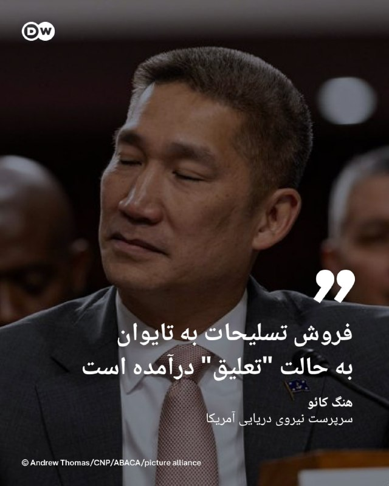

🔶 تعلیق فروش ۱۴ میلیارد دلاری سلاح آمریکا به تایوان به دلیل جنگ ایران

سرپرست نیروی دریایی ایالات متحده روز پنجشنبه، ۲۲ مه، اعلام کرد که فروش تسلیحات به تایوان به حالت "تعلیق" درآمده است تا اطمینان حاصل شود ارتش آمریکا مهمات کافی برای عملیات‌های خود در قبال ایران را در اختیار دارد.

هنگ کائو، سرپرست نیروی دریایی آمریکا، در یک جلسه استماع در کنگره و در پاسخ به سؤالی درباره خرید تسلیحاتی معطل‌مانده و ۱۴ میلیارد دلاری تایوان گفت: «در حال حاضر ما یک وقفه (تعلیق) ایجاد کرده‌ایم تا مطمئن شویم مهمات مورد نیاز برای عملیات "خشم حماسی" (Epic Fury) را در اختیار داریم، که البته مقدار زیادی هم داریم.»

او افزود: «اما ما فقط می‌خواهیم اطمینان حاصل کنیم که همه‌چیز را در اختیار داریم؛ پس از آن، هر زمان که دولت صلاح بداند، فروش نظامی به کشورهای خارجی از سر گرفته خواهد شد.»

وزارت امور خارجه و پنتاگون (وزارت دفاع آمریکا) بلافاصله به درخواست‌ها برای اظهار نظر درباره سخنان کائو پاسخ ندادند.
@-dw_farsi

## DW_Farsi — post 125021

  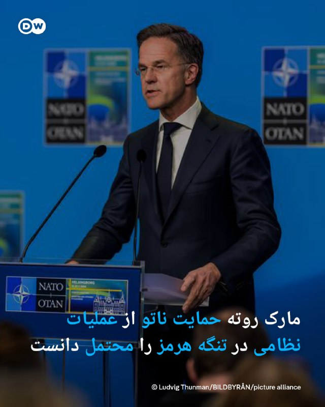

🔶 مارک روته حمایت ناتو از عملیات نظامی در تنگه هرمز را محتمل دانست

یوهان واده‌فول، وزیر امور خارجه آلمان، در تازه‌ترین اظهارنظر خود، محتاطانه در مورد مأموریت احتمالی ناتو در آزادسازی تنگه هرمز سخن گفت.

او اعلام کرد که آلمان همیشه آماده است تا امنیت تردد آزاد در آنجا را تضمین کند و تحت رهبری بریتانیا و فرانسه در حال آماده‌سازی برای این عملیات‌ است.

این سیاستمدار حزب دموکرات مسیحی که در جریان نشست وزرای امور خارجه ناتو در شهر بندری هلسینگبوری سوئد سخن می‌گفت، در عین حال افزود: «اما من هیچ مأموریت فوری ناتو به معنای کلاسیک آن را در تنگه هرمز پیش‌بینی نمی‌کنم.»

روته نیز در ادامه سخنان خود گفت که تلاش‌هایی در جریان است تا متحدان اروپایی بتوانند در مرحله بعدی، بیشترین کمک ممکن را ارائه دهند.

به گفته دیپلمات‌ها، در این مسیر مشارکت دادن ناتو نیز می‌تواند منطقی باشد؛ به‌ویژه از این جهت که دونالد ترامپ، رئیس‌جمهور آمریکا، اخیراً چندین بار ارزش افزوده و فایده ناتو را برای کشورش زیر سؤال برده است.
@dw_farsi

## DW_Farsi — post 125020

  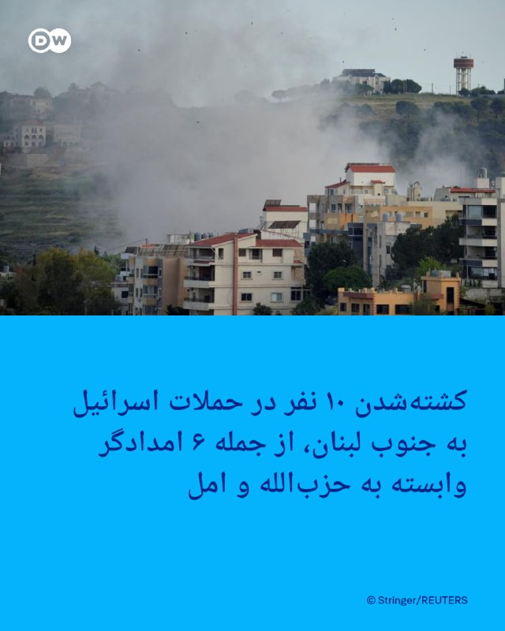

🔶 " کشته‌شدن ۱۰ نفر در حملات اسرائیل به جنوب لبنان، از جمله ۶ امدادگر وابسته به حزب‌الله و امل"

حملات متقابل میان اسرائیل و حزب‌الله در لبنان با وجود برقراری آتش‌بس همچنان ادامه دارد.

بنا بر اعلام مقامات رسمی، در پی حملات هوایی اسرائیل به جنوب لبنان از شب گذشته تاکنون، دست‌کم ده نفر کشته شده‌اند.

وزارت بهداشت در بیروت گزارش داد که در میان کشته‌شدگان، شش امدادگر (پزشکیار) و یک کودک وجود دارند. همچنین تعداد دیگری از شهروندان و امدادگران در این حملات زخمی شده‌اند. ارتش اسرائیل هنوز واکنشی به این حملات نشان نداده است.

مراکز درمانی و امدادی هدف‌قرارگرفته،متعلق به حزب‌الله و جنبش متحد آن، "امل" هستند. اسرائیل بارها مراکز بهداشتی و تیم‌های پزشکی را در لبنان هدف قرار داده و حزب‌اللهِ تحت حمایت ایران را متهم می‌کند که از این مراکز به عنوان پوششی برای پنهان کردن سلاح‌ها و جنگجویان خود استفاده می‌کند.

از آنجا که حزب‌الله به‌ویژه در جنوب لبنان مانند "دولتی در دولت" عمل می‌کند، شاخه غیرنظامی آن مسئولیت تأمین خدمات پزشکی و درمانی را در این مناطق بر عهده دارد.
@dw_farsi

## DW_Farsi — post 125019

  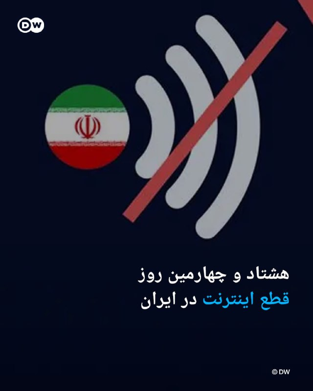

🔶 هشتاد و چهارمین روز قطع اینترنت در ایران

نت‌بلاکس اعلام کرده است که بلک‌اوت (قطع کامل) اینترنت در ایران وارد هشتاد و چهارمین روز خود شده و شبکه‌های بین‌المللی برای بیش از ۱۹۹۲ ساعت به طور گسترده قطع شده‌اند.

این سازمان غیردولتی و بین‌المللی که بر امنیت سایبری و حکمرانی اینترنت نظارت می‌کند، افزوده است که با گذشت هر ساعت، شکاف‌های اجتماعی و اقتصادی عمیق‌تر می‌شوند؛ چرا که هرگونه ارتباط با جهان خارج، اکنون در انحصار موقعیت اجتماعی، میزان همسویی با مواضع رسمی حکومت و برخورداری از امتیازات ویژه قرار گرفته است.

قطعی کنونی اینترنت در ایران بی‌سابقه‌ترین خاموشی ارتباطات دیجیتال یک کشور با جهان خارج است.
@dw_farsi

## DW_Farsi — post 125018

🔶 بخشی از پلکان برج ایفل در حراجی ۴۵۰ هزار یورو فروخته شد

خبرگزاری رویترز گزارش داد یک کلکسیونر فرانسوی روز پنج‌شنبه ۲۱ مه بخش ۱۴ پله‌ای از پلکان مارپیچ اصلی برج ایفل را در حراجی "آرکیوریال" در پاریس به قیمت ۴۵۰ هزار و ۱۶۰ یورو خریدهاست.

این قطعه نزدیک به ۳ متر ارتفاع و حدود ۱/۴ تن وزن دارد و بسیار بالاتر از برآورد اولیه ۱۲۰ تا ۱۵۰ هزار یورویی فروخته شده است.
@dw_farsi

## Persian_Trend_Official — post 14684

  <a href="telegram/content/Persian_Trend_Official_14684_1779474240.webm" target="_blank">🎬 Download video</a>

https://youtube.com/live/D0LvFYIUbgw?feature=share

## Persian_Trend_Official — post 14683

تا دقایقی دیگه لایو امشب آغاز میشه

## Persian_Trend_Official — post 14682

سخنگوی وزارت خارجه: 💢مباحث هسته‌ای در این مرحله قرار نیست صحبت شود. 💢خاتمه جنگ در همه جبهه به شمول لبنان خودش ظرایف خاصی دارد. همین طور محاصره دریایی ایران موضوع مهمی است که مورد بحث است. 💢درباره هسته‌ای تکلیف روشن است. ما عضو ان پی تی هستیم و حق داریم…

## Persian_Trend_Official — post 14681

🔴سخنگوی وزارت خارجه: 💢نمی‌توانیم بگوییم ضرورتا به جایی رسیده‌ایم که توافق نزدیک است. تمرکز مذاکرات بر خاتمه جنگ است. 🫆:Tony 📌 @persian_trend_official پرشین ترند | متفاوت‌ترین کانال نظامی

## Persian_Trend_Official — post 14680

🔴سخنگوی وزارت خارجه: 💢نمی‌توانیم بگوییم ضرورتا به جایی رسیده‌ایم که توافق نزدیک است. تمرکز مذاکرات بر خاتمه جنگ است. 🫆:Tony 📌 @persian_trend_official پرشین ترند | متفاوت‌ترین کانال نظامی

## Persian_Trend_Official — post 14679

🔴سخنگوی وزارت خارجه:

💢نمی‌توانیم بگوییم ضرورتا به جایی رسیده‌ایم که توافق نزدیک است.

تمرکز مذاکرات بر خاتمه جنگ است.

🫆:Tony

📌 @persian_trend_official
پرشین ترند | متفاوت‌ترین کانال نظامی

## Persian_Trend_Official — post 14678

  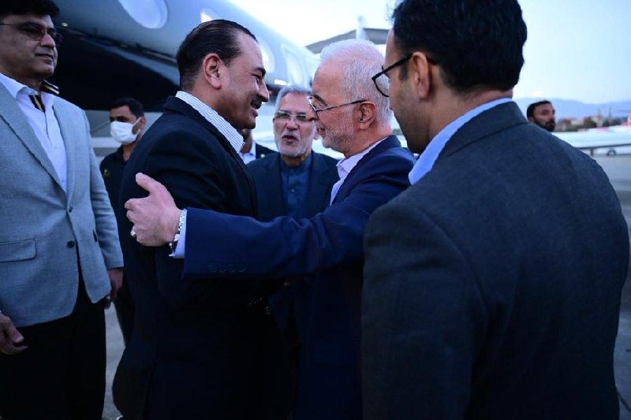

استقبال رسمی سردار اسکندر مؤمنی وزیرکشور از فرمانده ارتش پاکستان فیلد مارشال عاصم منیر.

👩‍💻:PhantomDirective

🆔@persian_trend_official
پرشین ترند | متفاوت‌ترین کانال نظامی

## RadioFarda — post 157459

  <a href="https://t.me/radiofarda/157459" target="_blank">📎 Download file</a>

📻بشنوید: ایستگاه ۱۹ با رادیوفردا، اول خرداد ۱۴۰۵

@RadioFarda

## IranianMinds — post 20564

  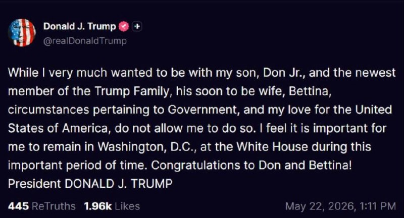

پست ترامپ:

با اینکه بسیار دوست داشتم کنار پسرم دان جونیور و جدید‌ترین عضو خانواده ترامپ، همسر آینده‌اش بتینا باشم، شرایط مربوط به دولت و عشق من به ایالات متحده آمریکا، اجازه چنین کاری را به من نمی‌دهد.
احساس می‌کنم مهم است که در این دوره مهم زمانی، در واشینگتن دی‌سی و در کاخ سفید بمانم. به دان و بتینا تبریک می‌گویم!
رئیس‌جمهور دونالد جی، ترامپ

@IranianMinds

## IranianMinds — post 20563

عزیزان اخبار رو از چنل مردمی و‌ خوب فایتر رادار هم میتونید دنبال کنید سریع براتون پوشش میدن و موضوعش کاملا شبیه چنل خودمونه جوین باشید حتما:

https://t.me/+9C1ENi5qn6hhZjk0

https://t.me/+9C1ENi5qn6hhZjk0

## BBCPersian — post 281806

🔻همزمان با تشدید تلاش‌های دیپلماتیک؛ ترامپ باردیگر گفت که ایران مشتاق رسیدن به توافق است

دونالد ترامپ، رئیس‌جمهور آمریکا روز جمعه در کاخ سفید باردیگر گفت که کاری کرده است که «ایران مشتاق رسیدن به توافق است.»

آقای ترامپ گفت: «می‌بینید ما با ایران چه کرده‌ایم؟ ایران مشتاق رسیدن به توافق است. خواهیم دید چه می‌شود. اما ما به آنها ضربه سختی زدیم و چاره دیگری هم نداشتیم چون ایران نباید سلاح هسته‌ای داشته باشد. آنها نمی‌توانند آن را داشته باشند.»

این اظهارات آقای ترامپ در حالی مطرح شده است که به نظر می‌رسد تحرکات دیپلماتیک برای کمک به رفع اختلافات ایران و آمریکا و حصول نوعی توافق صلح شتاب بیشتری گرفته است. فیلد مارشال عاصم منیر،‌ فرمانده ارتش پاکستان، شامگاه جمعه وارد تهران شد.

محسن نقوی، وزیر کشور پاکستان هم در تهران با عباس عراقچی، وزیر خارجه ایران برای دومین بار طی دو روز گذشته دیدار کرد.

رویترز هم می‌گوید که هیئتی از قطر به تهران سفر کردند.

https://bbc.in/4v3pH4G
@BBCPersian

## BBCPersian — post 281805

  <a href="https://t.me/bbcpersian/281805" target="_blank">📎 Download file</a>

پادکست برنامه جام جهان‌نما جمعه ۱ خرداد ۱۴۰۵
این برنامه رادیویی را می‌توانید هر شب ساعت ۲۰ به وقت ایران، روی موج متوسط ۷۰۲ کیلوهرتز و موج کوتاه ۹۴۶۵ کیلوهرتز بشنوید.

تکرار برنامه را هم می‌توانید ساعت ۲۱:۳۰ روی موج متوسط ۷۰۲ کیلوهرتز و موج کوتاه ۵۳۹۵ کیلوهرتز گوش کنید.
@BBCPersian

## BBCPersian — post 281804

🔻حزب اصلی مخالف ترکیه می‌گوید حکم دادگاه برکناری رهبرانش را به چالش می‌کشد

🖌پل کربی, سردبیر بخش دیجیتال اروپا. بی‌بی‌سی

اوزگور اوزال،‌ رهبر حزب اصلی مخالف در ترکیه قول داد که با حکم دادگاهی که او و دیگر رهبران حزب جمهوری‌خواه خلق را برکنار کرده است،‌ مبارزه کند. حکمی که دیروز صادر شد،‌ تازه‌ترین اقدام حقوقی است که می‌تواند به تحکیم پایه‌های قدرت رجب طیب اردوغان،‌ رئیس‌جمهور کمک کند.

https://bbc.in/3PCHRLq
@BBCPersian

## BBCPersian — post 281803

🔻اتحادیه اروپا اعلام کرد زمینه تحریم ایران بر سر انسداد تنگه هرمز را فراهم کرد

اتحادیه اروپا می‌گوید چارچوب مقررات اعمال تحریم‌های خود را به‌گونه‌ای اصلاح کرده است که افرادی را هدف قرار دهد که به گفته این اتحادیه، به ایران در «تهدید آزادی کشتیرانی در خاورمیانه» کمک کرده‌اند.

این محدودیت‌ها در ابتدا برای مقابله با حمایت تهران از تهاجم گسترده روسیه به اوکراین وضع شده بود اما با تغییراتی که شورای اتحادیه اروپا اعمال کرده، قابل تسری به موضوع تنگه هرمز است.

شورای اروپا اعلام کرد: «اتحادیه اروپا اکنون قادر خواهد بود در واکنش به اقدامات ایران در تضعیف آزادی کشتیرانی در تنگه هرمز، تدابیر محدودکننده بیشتری اعمال کند.» این تدابیر شامل ممنوعیت سفر و توقیف دارایی افراد خواهد بود.

تنگه هرمز عملاً از زمان آغاز جنگ آمریکا و اسرائیل علیه ایران بسته شده است.

https://bbc.in/4v3pH4G
@BBCPersian

## BBCPersian — post 281802

  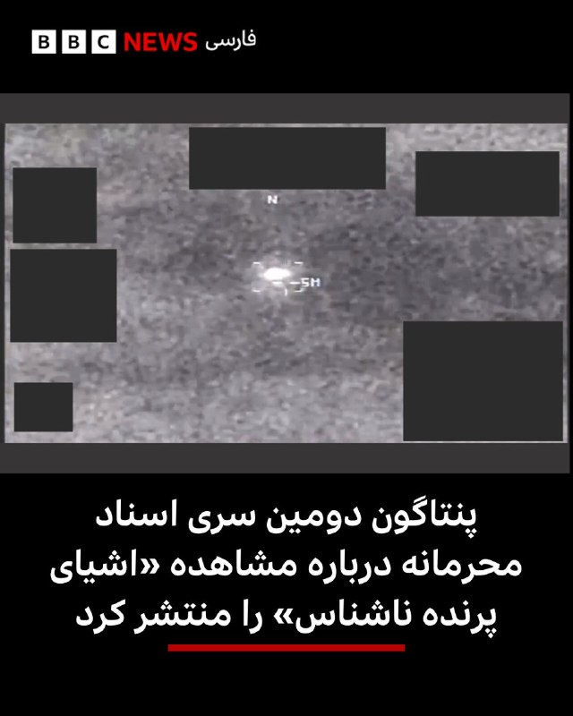

🔻وزارت دفاع آمریکا روز جمعه دومین مجموعه از اسناد محرمانه سابق درباره مشاهده اشیای ناشناس پرنده را منتشر کرد؛ اسنادی که شامل گزارش‌هایی درباره مشاهده «گوی‌های سبز، بشقاپ پرنده‌ها و گوی‌های آتشین ناشناخته» می‌شود.

اولین مجموعه از این اسناد به دستور دونالد ترامپ در ۸ مه (۱۹ فروردین) منتشر شده بود. او جدیدترین رئیس‌جمهور آمریکاست که گزارش‌های دولتی مربوط به اشیای پرنده ناشناس را علنی می‌کند؛ روندی که از اواخر دهه ۱۹۷۰ آغاز شده است.

پیت هگست، وزیر دفاع آمریکا، گفت که این اسناد، تصاویر و ویدئوها که عنوان رسمی‌شان «پدیده‌های ناشناس غیرعادی» است، سال‌ها موضوع گمانه‌زنی و بحث بوده است.

او در بیانیه‌ای گفت: «وقت آن رسیده که مردم آمریکا خودشان این موارد را ببینند.»
یکی از ۲۲۲ پرونده‌ای که روز جمعه منتشر شد، شامل ۱۱۶ صفحه سند درباره مجموعه‌ای از گزارش‌های مشاهدات و تحقیقات انجام‌شده در یک مرکز فوق‌محرمانه در «ساندیا» واقع در ایالت نیومکزیکو بین سال‌های ۱۹۴۸ تا ۱۹۵۰ است.

📸 U.S. Department

@BBCPersian

## BBCPersian — post 281801

  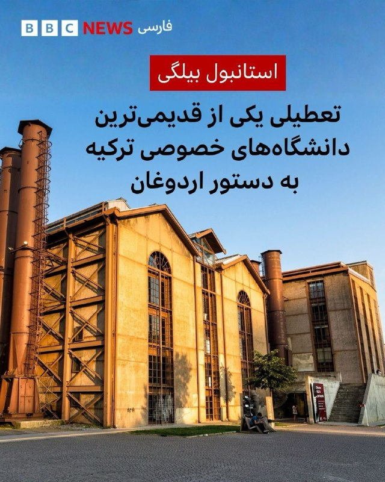

🔻یکی از قدیمی‌ترین دانشگاه‌های خصوصی ترکیه با حکم رجب طیب اردوغان، رئیس‌جمهور این کشور، تعطیل شد.

دانشگاه «استانبول بیلگی» که به داشتن گرایش‌های سیاسی لیبرال شناخته می‌شود، در هشت ماه گذشته در اداره دولت بوده است.

شرکت «جان هولدینگ»، مالک دانشگاه، به اتهام پول‌شویی و فرار مالیاتی تحت تحقیق قرار داشت.

این شرکت همچنین مالک شبکه‌های عمده تلویزیونی و چندین مدرسه در ترکیه است.

حالا سرنوشت بیش از ۲۰ هزار دانشجوی دانشگاه بیلگی همچنان نامشخص است.
دانشجویان می‌گویند که محوطه دانشگاه همچنان باز است و امروز (جمعه) تجمع اعتراضی برگزار می‌کنند.

شرح عکس: یک نیروگاه قدیمی استانبول که به یک مرکز فرهنگی تبدیل شده و اکنون بخشی از محوطه دانشگاه بیلگی است.

📸 Getty

@BBCPersian

## Dirty_Kids — post 389968

  <a href="telegram/content/Dirty_Kids_389968_1779474244.mp4" target="_blank">🎬 Download video</a>

کاری به تحریک آمیز بودن رقص این فلسطین‌به‌کون‌های سپاهی ندارم

اینا میان به وطن‌پرستا میگن شما دنبال رقصیدنید

@Dirty_Kids 👻

## Dirty_Kids — post 389967

‏برو کیرم دهن another life شد.
این زندگی چی‌ بود که باز بخواد بعدیش باشه

@Dirty_Kids 👻

## Dirty_Kids — post 389966

  

طرفو با یه 206 عهد بوق، عرق یکو نیمی و چیپس بردن باغ ویلا بعد ب بقیه داره میگه ارزون 😂😂

@Dirty_Kids 👻

## Dirty_Kids — post 389965

  

تنها فیلدمارشال کهکشان راه شیری با استقبال اسکندر مومنی وزیر کشور ایران وارد تهران شد.

@Dirty_Kids 👻

## Dirty_Kids — post 389964

  <a href="telegram/content/Dirty_Kids_389964_1779474246.mp4" target="_blank">🎬 Download video</a>

این روزا در کافه‌های مملکت چه میگذرد:

@Dirty_Kids 👻

## Dirty_Kids — post 389963

  <a href="telegram/content/Dirty_Kids_389963_1779474248.mp4" target="_blank">🎬 Download video</a>

آنلاین‌شاپا دارن برای جام‌جهانی آماده میشن

یکی بهشون بگه رئال تو جام‌جهانی نیست

@Dirty_Kids 👻

## Dirty_Kids — post 389962

خیلی رفتار‌هایی که در جامعه می‌بینید عادی سازی نیست فرار از واقعیته دوستان

@Dirty_Kids 👻

## Hranews — post 113099

  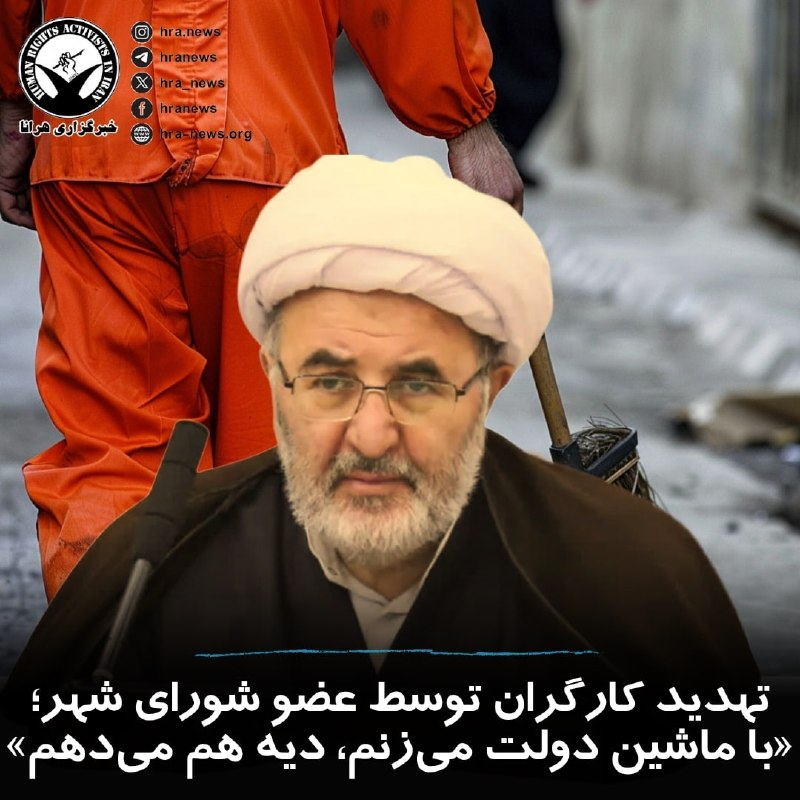

طی روزهای اخیر اعتراض صنفی شماری از کارگران شهرداری زنجان نسبت به وضعیت معیشتی و مطالبات شغلی، منجر به بروز تنش میان کارگران معترض و محمدکاظم مجتهدی عضو شورای شهر زنجان و نایب رئیس شورا این شهر شده است. رویداد ۲۴ با انتشار گزارشی و بر اساس روایت کارگران اعلام کرد، در پی وقوع این تجمع اعتراضی محمدکاظم مجتهدی هنگام خروج از محل تجمع در پاسخ به مطالبات کارگران گفته است: «می‌روید کنار یا نه؟ با ماشین دولت می‌زنم، دیه هم می‌دهم.»

مهدی محمدیان، #کارگر آسیب دیده در خصوص جزئیات این حادثه گفت: آقای مجتهدی "ماشین را روشن کرد و همان‌طور که حرکت کرد به من زد. من زمین خوردم و تا نصف بدن ماشین روی من آمد. او میگفت می‌زنم، خون‌بهایت را می‌دهم." در مقابل، محمدکاظم مجتهدی این روایت را رد کرده و مدعی شده کارگر معترض «خود را به زمین انداخته» و ماجرا با فضاسازی مخالفان شورا همراه شده است.

چندی پیش در این راستا خبرگزاری ایلنا با انتشار خبری اعلام کرد، ده‌ها نفر از کارگران شهرداری زنجان که به تصمیم شورای شهر و شهرداری مبنی بر حذف اضافه کارها و عدم افزایش حقوق کارکنان شهرداری طبق وعده‌های قبلی شکایت داشتند، در مقابل دفتر شهرداری این شهر تجمع مسالمت‌آمیزی داشتند. این تجمع با برخورد نادرست یکی از اعضای شورای شهر مواجه شده بود. همچنین علی اصغر نجاری، دبیر اجرایی خانه کارگر استان زنجان نیز در این خصوص اظهار کرده که در پی وقوع این رویداد «پای کارگر مذکور به شدت آسیب دیده است».

↘️
@hranews_bot تماس ✉️ - @Hranews کانال هرانا 🆑

## Hranews — post 113098

  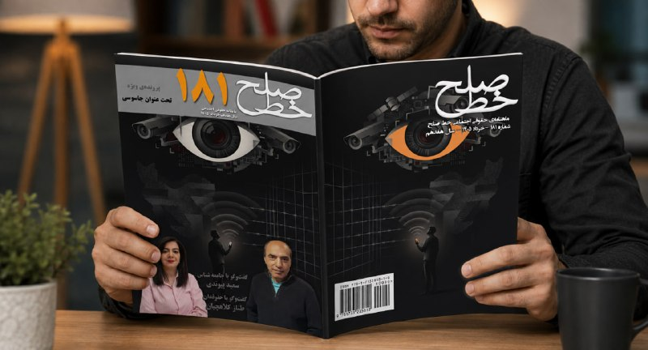

صدوهشتادویکمین شماره‌ از ماهنامه‌ی خط صلح منتشر شد 
📡
📡
📡
📡
📡– صدوهشتادویکمین شماره از #ماهنامه_خط_صلح به کوشش مدافعان حقوق بشر و جمعی از کنشگران مدنی منتشر شد. قانون «تشدید مجازات #جاسوسی و همکاری با رژیم صهیونیستی و کشورهای متخاصم علیه امنیت و منافع ملی» در…

## Hranews — post 113097

  <a href="https://t.me/hranews/113097" target="_blank">📎 Download file</a>

صدوهشتادویکمین شماره‌ از ماهنامه‌ی خط صلح منتشر شد 
📡
📡
📡
📡
📡– صدوهشتادویکمین شماره از #ماهنامه_خط_صلح به کوشش مدافعان حقوق بشر و جمعی از کنشگران مدنی منتشر شد. قانون «تشدید مجازات #جاسوسی و همکاری با رژیم صهیونیستی و کشورهای متخاصم علیه امنیت و منافع ملی» در…

## Hranews — post 113096

صدوهشتادویکمین شماره‌ از ماهنامه‌ی خط صلح منتشر شد

📡
📡
📡
📡
📡– صدوهشتادویکمین شماره از #ماهنامه_خط_صلح به کوشش مدافعان حقوق بشر و جمعی از کنشگران مدنی منتشر شد.

قانون «تشدید مجازات #جاسوسی و همکاری با رژیم صهیونیستی و کشورهای متخاصم علیه امنیت و منافع ملی» در مهرماه ۱۴۰۴ نهایی و ابلاغ شد. قانونی که پس از جنگ ۱۲روزه در سال ۱۴۰۴ و در پی تشدید تنش‌های منطقه‌ای، منازعات امنیتی و افزایش #اعتراضات_مردمی تدوین شد. این تصویب، مفهوم جاسوسی در ایران را از درک و تعریف پیشین، به مفهومی سیال و موسّع در حوزه‌ی سیاسی و امنیتی بدل کرد. قانونی که با استناد به آن، شهروندان بسیاری در خطر مجازات‌های سنگین از جمله #مجازات_غیرانسانی اعدام قرار گرفته‌اند و تعدادی نیز اعدام شده‌اند.

بر مبنای این قانون، نه‌فقط انتقال #اطلاعات_محرمانه، بلکه برخی همکاری‌های رسانه‌ای، فعالیت‌ها در شبکه‌های اجتماعی، استفاده از ابزارهای ارتباطی و اینترنت ماهواره‌ای مانند #استارلینک، و تعامل با نهادها و دولت‌هایی که شعام (شورای عالی امنیت ملی) آن‌ها را متخاصم تشخیص می‌دهد نیز می‌توانند ذیل #جرائم_امنیتی و جاسوسی تفسیر شوند.

ماهنامه‌ی خط صلح در این شماره، در پرونده‌ی ویژه‌ای با عنوان «تحت عنوان جاسوسی»، به بحث و بررسی ابعاد مختلف این قانون می‌پردازد.

خط صلح در این راستا به سراغ «#طناز_کلاهچیان»، وکیل دادگستری، رفت تا درباره‌ی ابعاد حقوقی و سیاسی این قانون با او به گفتگو بنشیند. خانم کلاهچیان نیز ضمن پاسخ به پرسش‌های این ماهنامه، به خط صلح گفت: «مسئله این‌جاست که جمهوری اسلامی می‌گوید که من می‌دانم تعریف جرم جاسوسی چیست. می‌دانم هیچ‌کدام‌تان جاسوس نیستید. می‌دانم که این جرم محقق نشده است. ولی برای بقای خودم و ایجاد ترس، وحشت و جلوگیری از اختلال در نظمی که برای خودم چیده‌ام، از این قانون استفاده می‌کنم. دلیل تصویب این قانون با این سرعت همین بود».

ماهنامه‌ی خط صلح هم‌چنین در گفتگویی دیگر به سراغ «#سعید_پیوندی»، جامعه‌شناس، رفت تا به بررسی ابعاد جامعه‌شناختی این قانون، تأثیر آن بر آزادی‌های مدنی، اعتماد اجتماعی، خودسانسوری و امنیتی‌سازی جامعه بپردازد. این استاد دانشگاه نیز با ذکر این نکته که «ما با دستگاه معیوبی سروکار داریم که در دوران جنگ، تبدیل به هیولایی می‌شود و به ابزاری در دست دولت برای سرکوب و محدود کردن جامعه بدل می‌شود»، گفت: «حکومتی هم که در برقراری امنیت ملی شکست خورده، می‌خواهد شکست خود را با انتقام گرفتن از شهروندان، محدود کردن آنان و اعمال نظارت فراگیر امنیتی بر آن‌ها جبران کند».

این شماره هم‌چنین همراه است با مطالب و اظهارنظراتی از: مجید شیعه‌علی، موسی برزین، سینا یوسفی، مینا جوانی، اِلدار خیاوی، مصطفی داننده، جمشید عزیزی، سارا قریشی، مریم عابدی، ایمان سلیمانی، علی کلائی، امیر آقایی، شبنم معینی‌پور، نفیسه مطلق، مرتضی هامونیان، پردیس پارسا، هرمینه هورداد و جمعی دیگر از فعالان حقوق بشر.

لینک دانلود مستقیم فایل پی.دی.اف ماهنامه‌ی خط صلح

وبسایت خط صلح

در این شماره می‌خوانید:
🔸طناز کلاهچیان: در قانون جدید تشدید جاسوسی، هر شهروندی می‌تواند متهم به جاسوسی شود/ علی کلائی
🔸سعید پیوندی: قانون تشدید مجازات جاسوسی، دشمنی میان جامعه و حکومت را بیش‌تر می‌کند/ نفیسه شرف‌الدینی
🔸مقایسه‌ی قانون جدید تشدید مجازات جاسوسی با قوانین قبلی/ سینا یوسفی
🔸بررسی ابهام و گسترش جرم جاسوسی در حقوق کیفری ایران/ موسی برزین
🔸از جرم «جاسوسی» تا جرم‌انگاری «قصد همکاری»/ مریم عابدی
🔸بررسی تطبیقی تعارضات قانون جدید تشدید مجازات جاسوسی با حقوق اساسی مردم/ ایمان سلیمانی
🔸توسعه امنیتی‌سازی کنشگری در قانون جدید تشدید مجازات جاسوسی/ سارا قریشی
🔸مقایسه‌ی تطبیقی جاسوس و جاسوسی در حقوق ایران و سایر کشورها/ اِلدار خیاوی
🔸همکاری رسانه‌ای با خارج؛ مرز اطلاع‌رسانی و جاسوسی کجاست؟/ مصطفی داننده
🔸امنیتی‌سازی جامعه با اتهام جاسوسی/ هرمینه هورداد
🔸قانون جدید تشدید مجازات جاسوسی و مرز مبهم
تراکنش‌های مالی/ شبنم معینی‌پور
🔸سرکوب و اعدام با اتهام نابخشودنیِِ جاسوسی/ مرتضی هامونیان
🔸اعدام به نام امنیت؛ تشدید برخورد با اتهام جاسوسی در ایران/ نفیسه مطلق
🔸امنیت ملی با اعدام و سرکوب؟/ مجید شیعه‌علی
🔸نمایشِ جنگ و تولید ملت: مطالعه‌ای بر مدیریت دیداری قدرت در خیابان/ مینا جوانی
🔸تجربه‌ی زیسته‌ی ایرانیان در دوران جنگ/ پردیس پارسا
🔸از فیلتر تلگرام تا «اینترنت پرو»/ امیر آقایی
🔸«کبوتر صلح»، «جنگ» و «بازمانده»؛ سه شعر کوتاه از جمشید عزیزی

↘️
@hranews_bot تماس ✉️ - @Hranews کانال هرانا 🆑

## manototv — post 105748

  <a href="telegram/content/manototv_105748_1779474251.mp4" target="_blank">🎬 Download video</a>

«دلم براتون تنگ میشه اما امید دارم برگردید»

## manototv — post 105747

رییس اورژانس پیش‌بیمارستانی و مدیریت حوادث دانشگاه علوم پزشکی البرز اعلام کرد بر اثر تصادف زنجیره‌ای در آزادراه کرج قزوین، سه نفر جان باختند و چهار نفر دیگر مجروح شدند.
به گزارش رسانه‌های داخلی، در این سانحه دو مرد و یک زن کشته شدند و سه مرد و یک زن دیگر نیز مجروح شدند.
مصدومان توسط نیروهای اورژانس به بیمارستان امام جعفر صادق نظرآباد منتقل شدند.

## alonews — post 121851

  <a href="telegram/content/alonews_121851_1779474253.webm" target="_blank">🎬 Download video</a>

👈آخرین قیمت نفت ۱۰۲.۳۰ دلار

✅ @AloNews خبر جنگ

## alonews — post 121850

  <a href="telegram/content/alonews_121850_1779474254.webm" target="_blank">🎬 Download video</a>

👈گفته رویترز، تولسی گابارد توسط کاخ سفید مجبور به کناره‌گیری شد

✅ @AloNews خبر جنگ

## alonews — post 121849

  <a href="telegram/content/alonews_121849_1779474254.webm" target="_blank">🎬 Download video</a>

👈ترامپ سفر خود به باشگاه گلف ملی ترامپ بدمینستر را لغو کرده و در عوض در طول آخر هفته در کاخ سفید خواهد ماند

✅ @AloNews خبر جنگ

## alonews — post 121848

  <a href="telegram/content/alonews_121848_1779474254.webm" target="_blank">🎬 Download video</a>

👈 ترامپ در تروث سوشال: متأسفانه، تولسی گبرد پس از انجام کاری عالی، در تاریخ ۳۰ ژوئن دولت را ترک خواهد کرد.

🔴همسر فوق‌العاده او، ابراهام گبرد، اخیراً به نوع نادری از سرطان استخوان مبتلا شده و او به‌درستی می‌خواهد کنار همسرش باشد و به بازگشت او به سلامتی کمک کند؛ زیرا اکنون هر دو در حال گذر از یک نبرد سخت هستند.

🔴من هیچ شکی ندارم که او به‌زودی بهتر از همیشه خواهد شد. تولسی کار فوق‌العاده‌ای انجام داده و دلمان برایش تنگ خواهد شد.

🔴معاون اصلی و مورد احترام او در سمت معاون مدیر اطلاعات ملی، آرون لوکاس، به‌عنوان سرپرست مدیر اطلاعات ملی فعالیت خواهد کرد.

✅ @AloNews خبر جنگ

## alonews — post 121847

  <a href="telegram/content/alonews_121847_1779474254.webm" target="_blank">🎬 Download video</a>

👈کانال ۱۲ رژیم اسرائیل به نقل از مقامات اسرائیل : تفاهمات بین اسرائیل و آمریکا بر این اساس است که اورانیوم غنی‌شده یا امکان غنی‌سازی در اختیار ایران باقی نماند.

🔴طی روز گذشته، پیشرفت‌هایی در مذاکرات بین آمریکا و ایران حاصل شد. در اسرائیل نگرانی‌هایی در مورد به تعویق افتادن مذاکرات در مورد برنامه هسته‌ای ایران و خروج اورانیوم غنی‌شده از ایران وجود دارد.

✅ @AloNews خبر جنگ

## alonews — post 121846

  <a href="telegram/content/alonews_121846_1779474254.webm" target="_blank">🎬 Download video</a>

👈سخنگوی هیئت مذاکره کننده ایرانی:
یک هیئتی از قطر درحال مذاکره وزیر خارجه کشورمان هستند اما میانجی مذاکرات همچنان طرف پاکستانی است

🔴 سخنگوی وزارت خارجه: ‌اختلاف‌نظرها بین ایران و آمریکا آن‌قدر عمیق و زیاد است که نمی‌شود گفت با چندبار رفت‌وآمد یا مذاکرات ظرف چند هفته ما باید حتماً به نتیجه برسیم

✅ @AloNews خبر جنگ

## alonews — post 121845

  <a href="telegram/content/alonews_121845_1779474255.mp4" target="_blank">🎬 Download video</a>

👈فیلم دوربین مدار بسته لحظه‌ای را ثبت کرد که حملات هوایی اسرائیل امروز زودتر جویّا در جنوب لبنان را هدف قرار داد

✅ @AloNews خبر جنگ

## alonews — post 121844

  <a href="telegram/content/alonews_121844_1779474257.webm" target="_blank">🎬 Download video</a>

👈سخنگوی وزارت خارجه: مباحث هسته‌ای در این مرحله قرار نیست صحبت شود

✅ @AloNews خبر جنگ

## alonews — post 121843

  <a href="telegram/content/alonews_121843_1779474257.webm" target="_blank">🎬 Download video</a>

👈 سخنگوی وزارت خارجه: نمی‌توانیم بگوییم ضرورتا به جایی رسیده‌ایم که توافق نزدیک است.

🔴 تمرکز مذاکرات بر خاتمه جنگ است.

🔴یک هیئتی از قطر درحال مذاکره وزیر خارجه کشورمان هستند اما میانجی مذاکرات همچنان طرف پاکستانی است

🔴رفت و آمدها به تهران تداوم همان روند دیپلماتیک است

✅ @AloNews خبر جنگ

## alonews — post 121842

  <a href="telegram/content/alonews_121842_1779474258.webm" target="_blank">🎬 Download video</a>

👈ترامپ: با اینکه خیلی میخواهم در کنار پسرم برای مراسم عروسی باشم اما حس میکنم که مهم است در واشنگتن و کاخ سفید در طی زمان مهم پیش رو در روز شنبه و یکشنبه بمانم.

✅ @AloNews خبر جنگ

## alonews — post 121841

  <a href="telegram/content/alonews_121841_1779474258.webm" target="_blank">🎬 Download video</a>

👈سخنگوی وزارت خارجه : هنوز به توافق نزدیک نشدیم و اختلاف‌ها باقیه

✅ @AloNews خبر جنگ

## alonews — post 121840

  <a href="telegram/content/alonews_121840_1779474258.webm" target="_blank">🎬 Download video</a>

👈فاکس نیوز: تولسی گبرد، مدیر اطلاعات ملی ایالات متحده آمریکا، استعفا داد

✅ @AloNews خبر جنگ

## alonews — post 121839

  <a href="telegram/content/alonews_121839_1779474258.webm" target="_blank">🎬 Download video</a>

👈آسوشیتدپرس: اسرائیل از تلاش‌های ترامپ برای امضای توافق با ایران خشمگین است

🔴یک مقام که نخواست نامش فاش شود، به خبرگزاری آسوشیتدپرس گفت که دونالد ترامپ، رئیس‌جمهور آمریکا، و بنیامین نتانیاهو، نخست‌وزیر اسرائیل، روز سه‌شنبه گذشته درباره وضعیت مذاکرات با ایران، یک تماس تلفنی «دراماتیک» داشته‌اند و اسرائیل از تلاش‌های ترامپ برای امضای توافق با ایران خشمگین است.

🔴به گفته این خبرگزاری، کاخ سفید از اظهار نظر درباره محتوا یا لحن این تماس خودداری کرده است. ترامپ پس از این مکالمه به خبرنگاران گفت که نتانیاهو «هر کاری را که من از او بخواهم، انجام خواهد داد».

🔴این اظهارات یکی از اولین نشانه‌های علنیِ وجود فاصله میان مواضع ترامپ و نتانیاهو از زمانی است که آنها تصمیم به جنگ با ایران گرفتند

✅ @AloNews خبر جنگ

## alonews — post 121838

  <a href="telegram/content/alonews_121838_1779474259.webm" target="_blank">🎬 Download video</a>

👈رئیس کمیته نیروهای مسلح سنای آمریکا: ترامپ باید به ارتش اجازه دهد تا انهدام توانمندی‌های نظامی ایران را تکمیل کند.

✅ @AloNews خبر جنگ

## alonews — post 121837

  <a href="telegram/content/alonews_121837_1779474259.webm" target="_blank">🎬 Download video</a>

👈فرانسه هرگونه مداخله ناتو در تنگه هرمز را رد کرد

✅ @AloNews خبر جنگ

## alonews — post 121836

  <a href="telegram/content/alonews_121836_1779474259.mp4" target="_blank">🎬 Download video</a>

وضعیت

[@AloTweet]

## alonews — post 121834

  <a href="telegram/content/alonews_121834_1779474262.mp4" target="_blank">🎬 Download video</a>

👈لهستان اعلام کرد که سه فروند نخست هواپیماهای جنگنده لاکهید مارتین F-35 لایتنینگ II ساخت آمریکا در پایگاه هوایی لاسک وارد شده‌اند و تحویل‌های بعدی تا سال ۲۰۲۹ برنامه‌ریزی شده است.

🔴ورشو در سال ۲۰۲۰ و در دوره اول ریاست جمهوری ترامپ، ۳۲ فروند جنگنده F-35A را از لاکهید مارتین سفارش داد که ارزش این قرارداد ۴.۶ میلیارد دلار بود و خلبانان لهستانی هم‌اکنون در آمریکا در حال آموزش هستند.

✅ @AloNews خبر جنگ

## alonews — post 121833

  <a href="telegram/content/alonews_121833_1779474263.webm" target="_blank">🎬 Download video</a>

👈وزیرکشور پاکستان که هم اکنون در تهران بسر می برد با همتای عربستانی خود گفت وگوی تلفنی انجام داد

✅ @AloNews خبر جنگ

## alonews — post 121832

  

قیمت استثنایی گیگی
9️⃣
8️⃣
1️⃣

تحویل زیر یک دقیقه
✅
دارای لینک سابسکریشن جهت دیدن حجم و کنترل مصرف
✅
بدون قطعی 
✅
بدون محدودیت کاربر و زمان
✅
جمینایو چت جی بی تی و... کامل اوکیه با سرورامون
✅

🏪پشتیبانی کامل
✅
شروع فعالیت از سال 2022 
✅
پرداخت ریالی
✅

ضریب و این چیزا ندارن و تا آخرین مگابایت برای پشتیبانیش درختمتیم
🥂

💤این تخفیف فقط تا ۱۲ شب فعاله
💤

⭐️ @Napsternetiran_bot
〰️〰️〰️〰️〰️〰️〰️

🔶 @Napsternetvirani

---
📅 بروزرسانی: 1405/03/01 20:07
---

## VahidOOnLine — post 241559

  

خبرگزاری ایسنا اعلام کرد که عاصم منیر، رییس ستاد کل ارتش پاکستان، عصر جمعه وارد تهران شده است.
پیش‌تر برخی رسانه‌ها از سفر او به تهران، برای تلاش در خصوص نزدیک کردن خواسته‌ها و انتظارات مقام‌های جمهوری اسلامی و ایالات متحده، برای رسیدن به توافق خبر داده بودند.
‌🏁 🇬🇧 IranintlTV

🤖 @VahidOOnLine

## VahidOOnLine — post 241558

  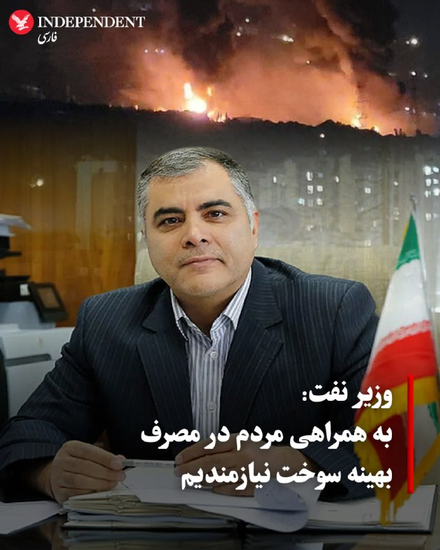

♦️ محسن پاک‌نژاد، وزیر نفت جمهوری اسلامی، روز جمعه اول خرداد هشدار داد که با توجه به آسیب‌های وارد شده به مخازن سوخت و زیرساخت‌های انرژی در دوران جنگ، لازم است که مردم در مصرف بهینه سوخت همراهی کنند.

پاک‌نژاد گفت: «بخش عمده‌ای از آنچه در جنگ روزه از دست داده بودیم را به‌سرعت به مدار بازگرداندیم اما با این وجود به همراهی مردم در مصرف بهینه سوخت نیاز داریم.»

پاک‌نژاد تاکید کرد که تلاش‌ها برای بازسازی سایر واحدهای آسیب‌دیده ادامه دارد.
‌🇸🇦 Indypersian

🤖 @VahidOOnLine

## VahidOOnLine — post 241557

بندر خَصَب، راه فرار جمهوری اسلامی از محاصره دریایی؟
فرناز داوری- در میانه آتش‌بس شکننده و محاصره دریایی در تنگه هرمز، بندر خَصَب در عمان به یکی از مسیرهای حیاتی برای رساندن کالا به ایران تبدیل شده است. بندری که با قایق‌های «شوتی»، ماهیگیران و گردشگران شناخته می‌شد، حالا گذرگاهی پرهزینه اما مهم برای دور زدن محاصره بنادر جنوبی ایران شده است.
تا پیش از آغاز جنگ آمریکا و اسرائیل علیه جمهوری اسلامی، بخشی از رفت‌وآمدهای دریایی میان خصب و سواحل جنوبی ایران، به قایق‌های تندرو اختصاص داشت. قایق‌هایی که در ادبیات محلی به «شوتی» معروف‌ هستند و سال‌ها در مسیرهای غیررسمی میان عمان و جنوب ایران، رفت‌وآمد کرده‌اند.
این قایق‌ها معمولا به صورت گروهی حرکت می‌کردند و در زمانی کوتاه خود را از آب‌های عمان به قشم یا دیگر نقاط ساحلی ایران می‌رساندند.
این مسیر پیش از این بیشتر برای دادوستدهای غیررسمی و قاچاق خرد شناخته می‌شد. سیگار ایرانی، مشروبات الکلی و حشیش، از ایران به عمان منتقل می‌شد و در مسیر بازگشت، کالاهای مصرفی، لوازم خانگی و اجناس لوکس، از عمان به ایران می‌رسید.
حضور قایق‌های ماهیگیری ایرانی نیز در اطراف خصب همیشه بخشی از تصویر معمول این منطقه بود.

ادامه گزارش را در اینجا بخوانید:
iranintl
‌🏁 🇬🇧 IranintlTV

🤖 @VahidOOnLine

## VahidOOnLine — post 241556

  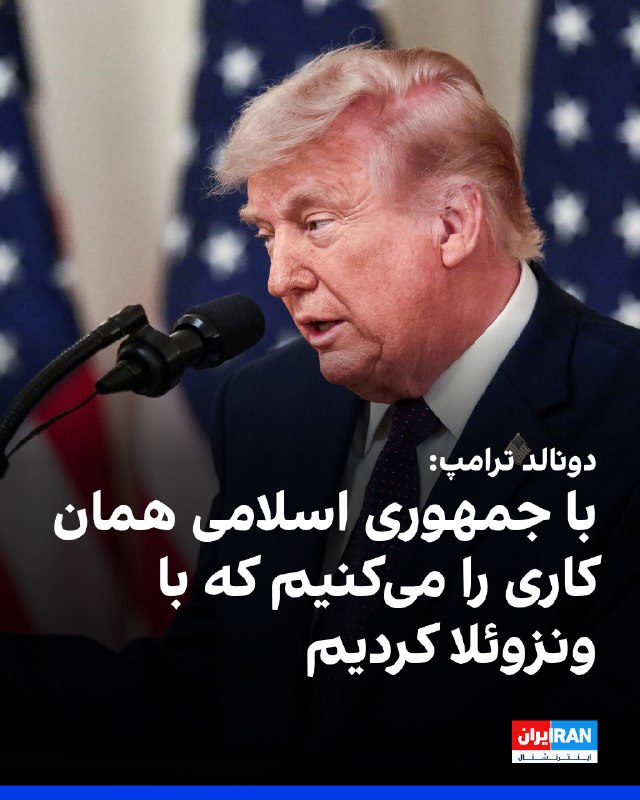

دونالد ترامپ در کاخ سفید درباره مذاکرات با جمهوری اسلامی گفت: «خواهیم دید چه خواهد شد. ما ضربه سختی به ‌آنها زدیم. چاره‌ای نداشتیم. ایران نمی‌تواند سلاح هسته‌ای داشته باشد.»

ترامپ ادامه داد: «آمریکا با جمهوری اسلامی همان رفتاری را انجام می‌دهد که با ونزوئلا انجام داده است.»

ترامپ تاکید کرد جمهوری اسلامی بی‌صبرانه به دنبال رسیدن به توافق است.
‌🏁 🇬🇧 IranintlTV

🤖 @VahidOOnLine

## VahidOOnLine — post 241555

رجزخوانی نظام؛ مغازه کوچک وحشت‌فروشی
حسین ذوقی-جمهوری اسلامی در حالی که تقریبا در آستانه شکست در همه زمینه‌های داخلی و خارجی قرار دارد، تاکتیکش را بر یک سنت فقهی استوار کرده است: رجزخوانی.
سخنان تند مداحان در تجمعات شبانه، سخنان تلویزیونی مسئولان میان‌رده تا گفته‌های رسمی مسئولین بلندپایه در مذاکرات، رسانه‌های اجتماعی و در نهایت، پیام‌های مکتوب رهبر نادیده نظام، بر همین سنت استوار شده است.
ماجرای «آتیش زدم به مالم» را حتما شنیده‌اید: بزازی در بازار، در کسادی وضعیتش و وقتی که اجناسش روی دستش مانده بود و راهی برای فروش نداشت، شاگردش را با یک حلب نفت به میانه بازار می‌فرستد تا فریاد بزند که: «اوستایم عقلش را از دست داده، می‌خواهد همه جا را به آتش بکشد!»
مردم هم که ترسیده‌اند به طمع جنس مفت، سمت دکان بزاز هجوم می‌برند. اوستای بزاز پارچه‌هایش را میان دکان می‌اندازد و رجز می‌خواند که «آتش می‌زنم ...»
خلاصه که انبار بزاز خالی می‌شود و جنس‌هایش را با قیمت بالاتر می‌فروشد!
حالا جمهوری اسلامی هم انگار می‌خواهد با تهدید و رجزخوانی به آتش زدن دنیا، ایده‌هایش را به منطقه و جهان بفروشد.
مداحان از منبر، منتقدان داخلی را به مرگ تهدید می‌کنند. محمود نبویان، نایب‌رییس کمیسیون امنیت ملی مجلس شورای اسلامی، پادشاهان کشورهای عربی را تهدید می‌کند که «هیچ یک از کاخ‌هایشان سالم نخواهد ماند».
عباس عراقچی، وزیر امور خارجه جمهوری اسلامی، در شبکه‌های اجتماعی از «پاسخ طولانی و دردناک» سخن می‌گوید.
اسماعیل بقایی، سخنگوی وزارت امور خارجه، حتی در نشست‌های دیپلماتیک، با لحنی رجزآلود حرف می‌زند.
غلامحسین محسنی اژه‌ای، رییس قوه قضاییه، از «تحمیل ناپذیری» می‌گوید؛ و حسین کنعانی‌مقدم، فرمانده پیشین سپاه پاسداران، اعتراف می‌کند که «رجزخوانی یکی از روش‌های مقابله با دشمن است».
لایه‌ها‌ی متفاوت نظام به یک زبان مشترک رسیده‌اند. این روش تصادفی نیست، شیوه جدید حکمرانی در جمهوری اسلامی است.

ادامه این تحلیل را اینجا بخوانید:
‌🏁 🇬🇧 IranintlTV

🤖 @VahidOOnLine

## VahidOOnLine — post 241554

  <a href="telegram/content/VahidOOnLine_241554_1779467858.mp4" target="_blank">🎬 Download video</a>

⭕️«بنما آفتاب را بی‌ابر»؛ روایتی از عشق و تحصیل ممنوعه بهائیان در ایران

📌گزارش ایندیپندنت فارسی از نخستین نمایش خصوصی فیلم در نیویورک

♦️فیلم «بنما آفتاب را بی‌ابر» (Cast Aside the Clouds)، ساخته مری دارلینگ، کارگردان و تهیه‌کننده کانادایی، در ظاهر بر رابطه عاطفی دو جوان تمرکز دارد، اما در لایه‌های زیرین به موضوعاتی مانند هویت دینی، محرومیت از تحصیل، فشارهای اجتماعی و حق زیستن بر اساس باور شخصی می‌پردازد؛ یک داستان عاشقانه در خیابان‌های تهران که آرام‌آرام به روایتی درباره تبعیض، ایمان، حق آموزش و آزادی انتخاب تبدیل می‌شود.

ایندیپندنت فارسی در نخستین نمایش خصوصی این فیلم در نیویورک حضور داشت و پس از آن، در گفتگوی خبری با حضور عوامل فیلم شرکت کرد. فضای این گفتگو به‌ویژه به‌دلیل حضور بازیگر نقش پدر لیلا، (آنتونی عزیزی) که بهائی هستند، و بیان تجربه های شخصی از حال‌ و روز خانواده ایشان در اوائل انقلاب تجاربی ملموس را به واقعیت دشواری زندگی بهائیان در ایران پیوند می‌زد.

بیشتر بخوانید...
‌🇸🇦 Indypersian

🤖 @VahidOOnLine

## VahidOOnLine — post 241553

  <a href="telegram/content/VahidOOnLine_241553_1779467859.mp4" target="_blank">🎬 Download video</a>

یک شهروند در پیامی به ایران اینترنشنال با اشاره به پوشش چادر خود می‌گوید که نه در تجمعات حکومتی شرکت می‌کند و نه از نظام جمهوری اسلامی حمایت می‌کند. پیام او با هوش مصنوعی خوانده شده است.
‌🏁 🇬🇧 IranintlTV

🤖 @VahidOOnLine

## VahidOOnLine — post 241552

  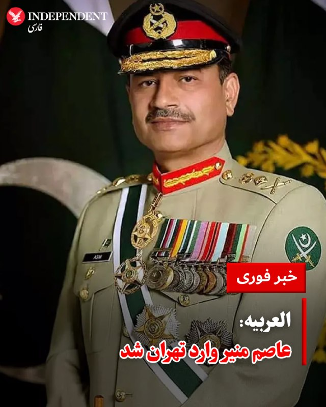

♦️ خبرگزاری العربیه به نقل از منابع خود اعلام کرد که عاصم منیر، فرمانده کل ارتش پاکستان عصر جمعه، اول خرداد وارد تهران شده است. پیش از این خبرگزاری فرانسه و العربیه از حرکت منیر به سمت تهران خبر داده بودند.

بر اساس گزارش‌ها، این سفر که همزمان با حضور وزیر کشور پاکستان در ایران انجام شده، در راستای کاهش شکاف‌ها میان تهران و واشنگتن است. مارکو روبیو، وزیر امور خارجه ایالات متحده نیز با اشاره به این سفر، اعلام کرد که گام‌های مثبتی در راستای دستیابی به توافق انجام شده با این‌وجود تاکید کرد که نمی‌خواهد «بیش از حد» مثبت‌اندیش باشد و باید دید که تلاش‌ها به چه شکل پیش می‌رود.
‌🇸🇦 Indypersian

🤖 @VahidOOnLine

## VahidOOnLine — post 241551

♦️روز پنجشنبه ۳۱ اردیبهشت در مراسمی در موزه هنرهای معاصر تهران، محسن شریفیان به همراه گروهی از نوازندگان، با اجرای ساز شوفار، بخشی از روایت موسیقی معاصر جنوب ایران را به نمایش گذاشتند؛ اجرایی متفاوت که با تلفیق عناصر آیینی و موسیقایی، توجه مخاطبان را به خود جلب کرد.

 در روایتی از موسیقی معاصر جنوب ایران، صدای ساز «شوفار» به‌عنوان یکی از کهن‌ترین ابزارهای صوتی، در موزه هنرهای معاصر تهران طنین‌انداز شد؛ سازی ساخته‌شده از شاخ قوچ که ریشه‌ای آیینی و مذهبی دارد.
شوفار در سنت یهودیان نواخته می‌شود و بیش از همه در مراسم‌های مهمی مانند «روش هشانا» (سال نو یهودی) و «یوم کیپور» (روز آمرزش) کاربرد دارد؛ صدایی نمادین که برای بیداری، تأمل و بازگشت به درون نواخته می‌شود.
‌🇸🇦 Indypersian

🤖 @VahidOOnLine

## VahidOOnLine — post 241550

  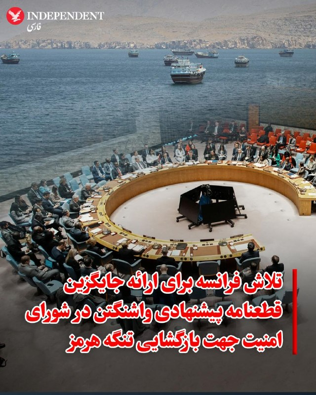

♦️وزارت امور خارجه فرانسه روز جمعه اول خرداد، اعلام کرد که این کشور پیش‌نویس قطعنامه‌ای را در شورای امنیت سازمان ملل برای تشکیل یک هیئت بین‌المللی با هدف احیای کشتیرانی آزاد در تنگه هرمز آماده کرده است. این اقدام در حالی صورت می‌گیرد که واشنگتن برای به رای گذاشتن متن پیشنهادی خود با دشواری روبرو است.

کنترل این آبراه حیاتی، مانع اصلی در مذاکرات پایان دادن به جنگ سه‌ماهه میان تهران و واشنگتن است. در حال حاضر، قطعنامه پیشنهادی آمریکا و بحرین که خواستار توقف حملات و مین‌گذاری جمهوری اسلامی در تنگه است، به دلیل احتمال وتوی چین و روسیه بیش از دو هفته به تعویق افتاده است. پکن و مسکو پیش از این در ماه آوریل، متن مشابهی را به دلیل موضع‌گیری علیه تهران وتو کرده بودند.
‌🇸🇦 Indypersian

🤖 @VahidOOnLine

## VahidOOnLine — post 241549

  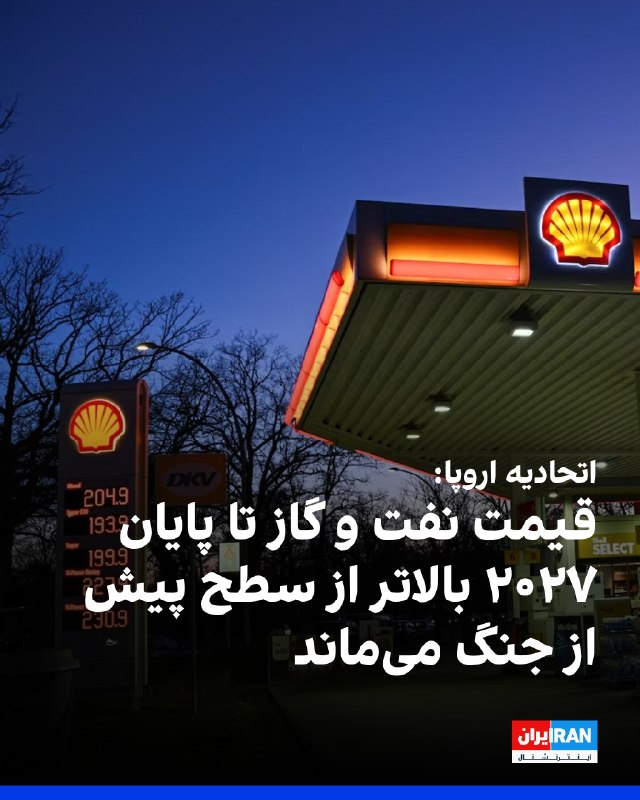

مقام‌های اتحادیه اروپا جمعه اعلام کردند اروپایی‌ها باید انتظار داشته باشند قیمت نفت و گاز دست‌کم تا پایان سال ۲۰۲۷ بالاتر از سطح پیش از جنگ باقی بماند و قیمت سایر کالاها نیز روندی افزایشی داشته باشد.

کمیسر اقتصادی اتحادیه اروپا، گفت افزایش قیمت انرژی عامل اصلی رشد تورم است؛ به‌طوری‌که نرخ تورم برای امسال ۳.۱ درصد و برای سال ۲۰۲۷ حدود ۲.۴ درصد پیش‌بینی می‌شود. این رقم به‌مراتب بالاتر از پیش‌بینی قبلی ۱.۹ درصدی برای سالجاری میلادی است.
‌🏁 🇬🇧 IranintlTV

🤖 @VahidOOnLine

## VahidOOnLine — post 241546

  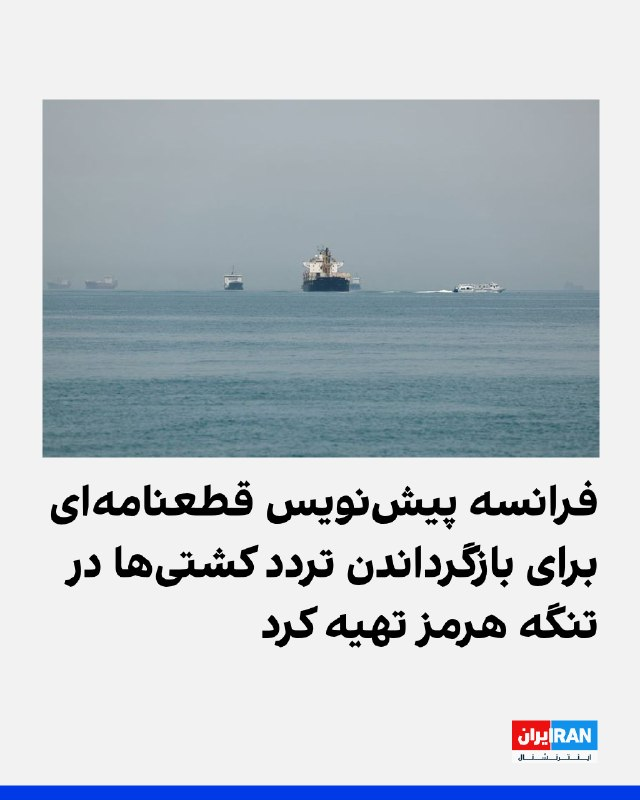

وزارت خارجه فرانسه اعلام کرد این کشور پیش‌نویس قطعنامه‌ای را برای شورای امنیت سازمان ملل تهیه کرده که هدف آن تشکیل یک ماموریت بین‌المللی جهت بازگرداندن رفت‌وآمد کشتی‌ها در تنگه هرمز است و در صورت فراهم بودن شرایط، ممکن است آن را ارائه کند.

قطعنامه پیشنهادی آمریکا و بحرین درباره تنگه هرمز بیش از دو هفته است که در حال بررسی است، اما رای‌گیری درباره آن بارها به تعویق افتاده؛ زیرا چین و روسیه اعلام کرده‌اند ممکن است آن را وتو کنند.
‌🏁 🇬🇧 IranintlTV

🤖 @VahidOOnLine

## VahidOOnLine — post 241545

  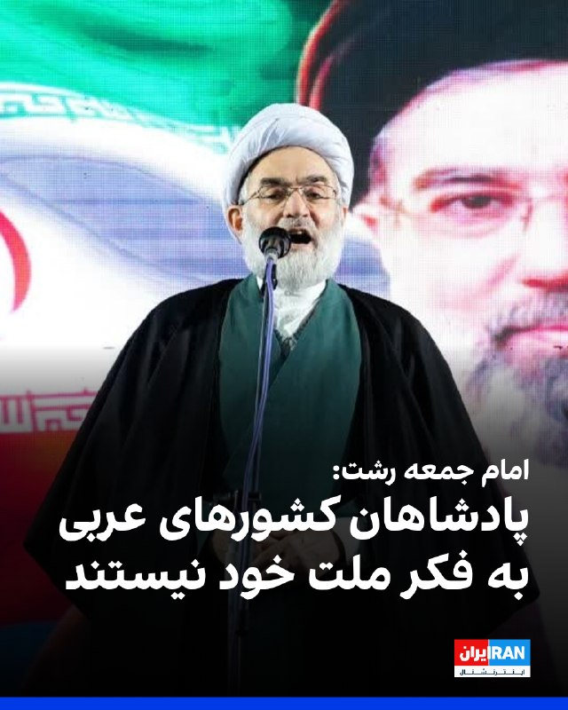

رسول فلاحتی، امام جمعه رشت گفت: «کشورهای عربی منطقه به درگیری دوباره آمریکا با جمهوری اسلامی علاقه‌مندند و پادشاهان این کشورها به فکر ملت خود نیستند.»

او افزود: «اگر موشک هایمان را علیه دشمنان به کار بگیریم، روزگارشان سیاه خواهد شد؛ همانگونه که اسرائیل را شخم زدیم.»

او ادامه داد: «آمریکا سوخت خود را از عربستان و امارات تامین می کند و اگر این زیرساخت ها آسیب ببیند، آمریکا دچار مشکل می شود.»
‌🏁 🇬🇧 IranintlTV

🤖 @VahidOOnLine

## VahidOOnLine — post 241544

  

دادستانی بریتانیا اعلام کرد مردی به دلیل مجموعه‌ای از تهدیدهای یهودستیزانه علیه اعضای جامعه یهودیان در شمال لندن، به پنج‌سال زندان محکوم شده است.

پیش‌تر بریتانیا سطح تهدید تروریسم در این کشور را از «قابل توجه» به «شدید» افزایش داده است.

کی‌یر استارمر، نخست‌وزیر بریتانیا، گفته است که یهودیان این کشور در ترس زندگی می‌کنند و وعده داد اقدامات برای حفاظت از آنان تقویت شود.
‌🏁 🇬🇧 IranintlTV

🤖 @VahidOOnLine

## VahidOOnLine — post 241543

  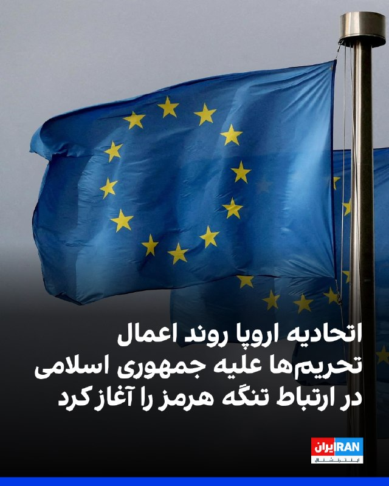

اتحادیه اروپا اعلام کرد کشورهای عضو این اتحادیه جمعه روند اعمال تحریم علیه مقام‌های جمهوری اسلامی و دیگر افراد مرتبط با بستن تنگه هرمز را آغاز کردند.

شورای اتحادیه اروپا افزود که این اتحادیه از این پس می‌تواند در واکنش به اقداماتی که آزادی کشتیرانی در تنگه هرمز را مختل می‌کند، تحریم‌ها و محدودیت‌های بیشتری علیه جمهوری اسلامی اعمال کند.
‌🏁 🇬🇧 IranintlTV

🤖 @VahidOOnLine

## VahidOOnLine — post 241542

  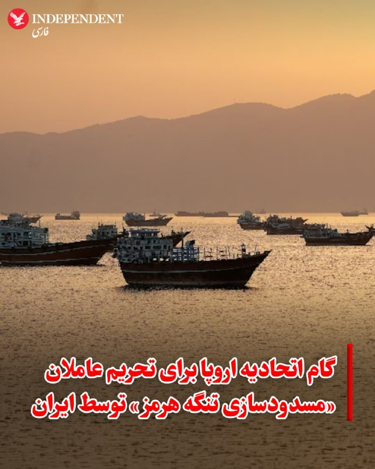

♦️ اتحادیه اروپا روز جمعه اول خرداد، اعلام کرد که کشورهای عضو این اتحادیه در حال حرکت به سمت اعمال تحریم علیه مقامات جمهوری اسلامی و سایر افرادی هستند که مسئول مسدود کردن تنگه هرمز شناخته می‌شوند.

دولت‌های اروپایی با «مغایر با قوانین بین‌المللی» دانستن این اقدام، گامی فنی برای گسترش دامنه رژیم تحریم‌های موجود علیه جمهوری اسلامی برداشته‌اند تا افراد بیشتری هدف قرار گیرند. شورای اروپا در این باره اعلام کرد: «اتحادیه اروپا اکنون قادر خواهد بود اقدامات تنبیهی بیشتری را در پاسخ به اقدامات ایران که آزادی کشتیرانی در تنگه هرمز را مخدوش می‌کند، اعمال کند.»

بسته شدن تنگه هرمز که به طور معمول یک‌پنجم تولید نفت جهان از آن عبور می‌کند، به همراه جنگ جاری، شوک شدیدی به اقتصاد جهانی وارد کرده و قیمت انرژی را به شدت افزایش داده است. تحریم‌های جدید که شامل ممنوعیت سفر و مسدود کردن دارایی‌ها خواهد بود، فراتر از تحریم‌های پیشین اتحادیه اروپا در زمینه‌های حقوق بشر و حمایت نظامی ایران از روسیه و گروه‌های منطقه‌ای است. هنوز نام افراد یا نهادهای هدف در این بسته تحریمی اعلام نشده است.
‌🇸🇦 Indypersian

🤖 @VahidOOnLine

## VahidOOnLine — post 241541

اجمین مسیحی، جوان ۲۷ ساله ارمنی، شامگاه ۱۸ دی ۱۴۰۴ در میدان هفت‌حوض تهران هدف شلیک مستقیم گلوله جنگی قرار گرفت و کشته شد. پیکر او در بیمارستان الغدیر رها شد که در پی کارزار ایران‌اینترنشنال برای شناسایی جاویدنامان این بیمارستان، اطلاعات و تصاویری از او به دست ما رسیده است.
‌🏁 🇬🇧 IranintlTV

🤖 @VahidOOnLine

## VahidOOnLine — post 241540

  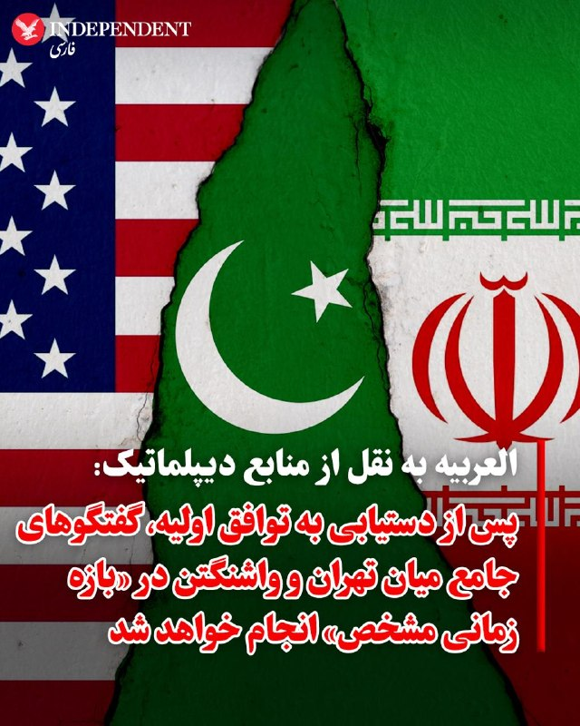

♦️.منابع عالی‌رتبه دیپلماتیک در گفتگو با شبکه العربیه اعلام کردند در صورت دستیابی به توافق میان واشنگتن و تهران، گفتگوهای جامع و همه‌جانبه میان دو کشور در آینده و در یک بازه زمانی مشخص و تعیین‌شده برگزار می‌شود.

به گفته این منابع، سند توافق احتمالی که ممکن است میان دو طرف حاصل شود، یک متن یک‌صفحه‌ای خواهد بود که احتمالا «اعلامیه اسلام‌آباد» نام می‌گیرد و زمینه را برای مذاکرات تفصیلی بعدی فراهم می‌کند.

همزمان با اعلام این خبر از سوی العربیه، خبرگزاری فرانسه نیز به نقل از منابع خود تایید کرد که عاصم منیر، فرمانده کل ارتش پاکستان برای پیشبرد این گفتگوها به تهران سفر کرده است.
‌🇸🇦 Indypersian

🤖 @VahidOOnLine

## VahidOOnLine — post 241539

  <a href="telegram/content/VahidOOnLine_241539_1779467871.mp4" target="_blank">🎬 Download video</a>

♦️مراسم رژه نیروهای امنیتی حج برای سال ۱۴۰۵ (۱۴۴۷ هجری قمری) برگزار شد؛ رویدادی که با حضور مقامات ارشد عربستان از جمله وزیر کشور و رئیس کمیته عالی حج همراه بود.
در این مراسم تاکید شد که نیروهای امنیتی از سطح بالایی از آمادگی برخوردارند و در قالب یک منظومه امنیتی یکپارچه، ماموریت حفظ امنیت و سلامت زائران و تسهیل انجام مناسک حج را بر عهده دارند.
بر اساس برنامه‌ریزی‌ها، زائران روز سه‌شنبه آینده در عرفات وقوف خواهند داشت و آغاز عید قربان نیز روز چهارشنبه پیش‌بینی شده است.
‌🇸🇦 Indypersian

🤖 @VahidOOnLine

## VahidOOnLine — post 241538

  <a href="telegram/content/VahidOOnLine_241538_1779467873.mp4" target="_blank">🎬 Download video</a>

یک شهروند در پیامی به ایران اینترنشنال می‌پرسد که جوانان ایران چه گناهی کردند که باید تاوان «نسل ۵۷» در انقلاب را بدهند. پیام او با هوش مصنوعی خوانده شده است.
‌🏁 🇬🇧 IranintlTV

🤖 @VahidOOnLine

## WithYashar — post 11964

ایسنا: برخی مقامات تاکید کردند که حضور عاصم منیر فرمانده ارتش پاکستان لزوما به معنای قطعی بودن تفاهم بر سر چارچوب اولیه نیست.
@withyashar

## WithYashar — post 11963

العربی الجدید به نقل از منبعی در وزارت خارجه پاکستان: واشنگتن و تهران انعطاف کافی در پرونده‌های اصلی از خود نشان نمی‌دهند
@withyashar

## WithYashar — post 11962

ایسنا: عاصم منیر وارد تهران شد
@withyashar

## WithYashar — post 11961

  <a href="telegram/content/WithYashar_11961_1779467876.mp4" target="_blank">🎬 Download video</a>

کوین وارش رسماً به عنوان رئیس فدرال رزرو سوگند یاد کرد.
@withyashar

## WithYashar — post 11960

  <a href="telegram/content/WithYashar_11960_1779467879.mp4" target="_blank">🎬 Download video</a>

ترامپ درباره ایران:

«ایران داره جون میده برای توافق.
ما حسابی زدیمشون؛ چاره‌ای هم نداشتیم، چون ایران نباید سلاح هسته‌ای داشته باشه.»
@withyashar

## mwarmonitor — post 9486

  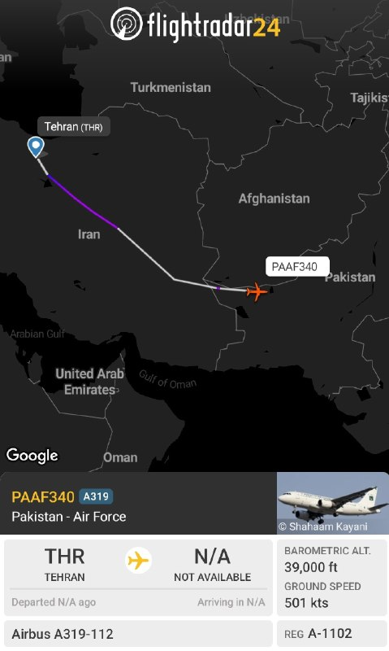

✈️بله تایید میشود @mwarmonitor

## mwarmonitor — post 9485

  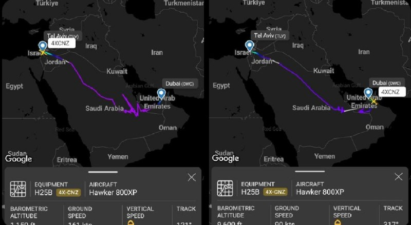

✈️یک جت شخصی اسرائیلی از نوع Hawker 800 که توسط شرکت Arrow Aviation اداره می‌شود (شماره ثبت: 4X-CNZ)، دیروز از فرودگاه بن گوریون در تل‌آویو به سمت دبی پرواز کرد، حدود ۴۰ دقیقه روی زمین ماند و سپس دوباره به سمت اسرائیل پرواز کرد.

@mwarmonitor

## mwarmonitor — post 9484

  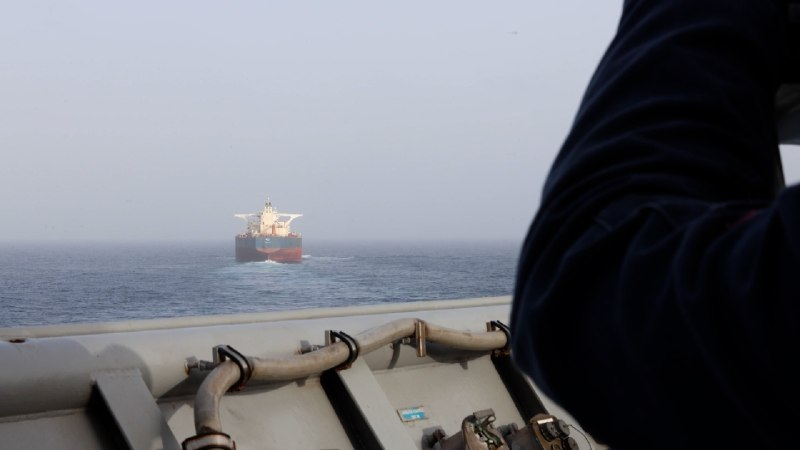

🔰یک ملوان نیروی دریایی آمریکا در ناو USS Comstock (LSD 45) یک کشتی تجاری را در حالی مشاهده می‌کند که در حال اجرای محاصره آمریکا علیه ایران است، ۲۱ مه. نیروهای آمریکایی از زمان آغاز این محاصره، ۹۷ کشتی تجاری را تغییر مسیر داده و ۴ کشتی را از کار انداخته‌اند.

@mwarmonitor

## mwarmonitor — post 9483

  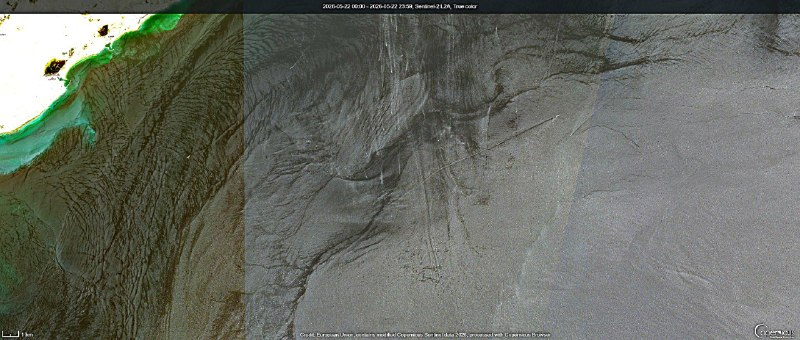

🔹تنگه هرمز خالی است، به‌جز قایق‌های تندرو سپاه پاسداران که از ایران به سمت تنگه در حال عبور هستند.

🔸این نشان می‌دهد ایران درباره تعداد کشتی‌هایی که امروز عبور کرده‌اند آمارسازی می‌کند. ۴ شناور بزرگ در حال عبور از مسیر «عوارض ایران» قابل مشاهده هستند. این عدد بسیار کمتر از ۳۰+ مورد اعلام‌شده است.

@mwarmonitor

## mwarmonitor — post 9482

🔴مارشال ارتش پاکستان برای نهایی کردن توافق میان آمریکا و ایران راهی تهران می‌شود

📝نویسنده: باراک راوید AXIOS

🔰یک منبع امنیتی پاکستانی به اکسیوس (Axios) گفت که ژنرال عاصم منیر، عالی‌رتبه‌ترین فرمانده نظامی پاکستان، روز جمعه در تلاش برای دستیابی به توافقی که بر اساس آن آمریکا و ایران با پایان دادن به جنگ و آغاز مذاکرات برای یک توافق گسترده‌تر موافقت کنند، به تهران سفر می‌کند.

🔸چرا این موضوع اهمیت دارد؟
ژنرال منیر از زمان آغاز جنگ، میانجی اصلی میان آمریکا و ایران بوده است. این واقعیت که او پس از چند روز گفت‌وگو در سطوح پایین‌تر راهی تهران می‌شود، می‌تواند نشان‌دهنده تلاش نهایی پاکستان برای دستیابی به یک توافق باشد.

🔹پشت صحنه خبر
میانجی‌ها در تلاش هستند تا یک «نامه‌ اعلام آمادگی» (Letter of Intent) را نهایی کنند؛ این سند شامل توافقی برای پایان دادن به جنگ و اصول پایه‌ای برای ۳۰ روز مذاکرات بیشتر درباره یک توافق گسترده‌تر است که برنامه هسته‌ای ایران را نیز در بر می‌گیرد.
کشورهای میانجی: کشورهای پاکستان، قطر، عربستان سعودی، مصر و ترکیه همگی در این میانجی‌گری مشارکت داشته‌اند.

🔸ابهام در موضع ایران: هنوز مشخص نیست که آیا ایران تمایلی به امضای چنین سندی دارد یا خیر، به‌ویژه در شرایطی که به نظر می‌رسد برخی در تهران بر این باورند که برگ برنده و اهرم فشار در دست آن‌هاست.

🔹اظهار نظر مقامات
«پیشرفت‌های اندکی حاصل شده است. نمی‌خواهم بزرگ‌نمایی کنم، اما تحرکات کوچکی صورت گرفته که این خوب است.»
— مارکو روبیو، وزیر امور خارجه آمریکا (روز جمعه)
وی در ادامه افزود که خواسته بنیادین این است که «ایران هرگز نباید به سلاح هسته‌ای دست یابد. این امر مطلقاً ممکن نیست.»
روبیو همچنین اشاره کرد که هرگونه توافقی باید به موضوع ذخایر اورانیوم با غنای بالای ایران و سیاست غنی‌سازی این کشور در آینده بپردازد. وی در پایان به این نکته اشاره کرد که پس از تاکید مجدد ایران در روز پنج‌شنبه بر قصد خود برای ایجاد سیستمی جهت دریافت عوارض در تنگه هرمز، به ایران اجازه داده نخواهد شد تا در این آبراه «ایستگاه‌های دریافت عوارض» ایجاد کند.

@mwarmonitor

## mwarmonitor — post 9481

📰 وال‌استریت ژورنال بر اساس داده‌ها: صادرات نفت ایران که از طریق دریا حمل می‌شود، به‌دلیل محاصره به سطحی نزدیک به صفر کاهش یافته است.

@mwarmonitor

## mwarmonitor — post 9480

  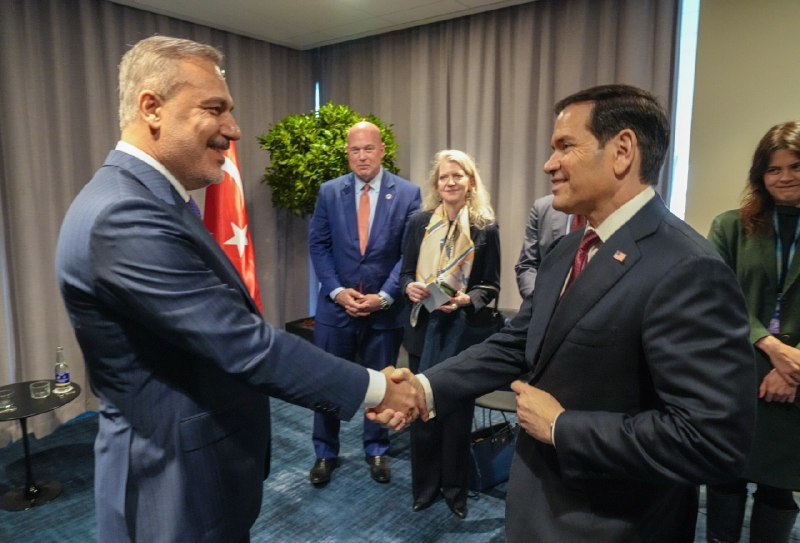

🔸امروز با وزیر خارجه ترکیه، Hakan Fidan، دیدار کردم تا درباره ضرورت راهبردی ادامه‌دارِ پایبندی همه متحدان به تعهدات دفاعی خود و همچنین برنامه‌های مربوط به نشست آینده ناتو در ترکیه گفتگو کنیم. همچنین درباره بازگشایی تنگه هرمز و تلاش برای دستیابی به ثبات بیشتر منطقه‌ای صحبت کردیم.

@mwarmonitor

## FoxNewsTwitter — post 342117

Fox News (Twitter/X)

BREAKING: Kevin Warsh has officially been sworn in as the new Chairman of the Federal Reserve by Supreme Court Justice Clarence Thomas.

Warsh marked the moment by signaling the pressure and expectations now facing the central bank.

“After we leave this stage, the real work begins. So let’s begin that work."

## FoxNewsTwitter — post 342116

  <a href="telegram/content/FoxNewsTwitter_342116_1779467886.mp4" target="_blank">🎬 Download video</a>

Fox News (Twitter/X)

BREAKING: "Our mandate at the Fed is to promote price stability and maximum employment."

"When we pursue those aims with wisdom and clarity, independence and resolve, inflation can be lower, growth stronger, real-take home pay higher, and America, can be more prosperous. And no less important, America's place in the world more secure."

"These duties are now mine, Mr. President, because of the trust you have placed in me."

## FoxNewsTwitter — post 342115

  <a href="telegram/content/FoxNewsTwitter_342115_1779467889.mp4" target="_blank">🎬 Download video</a>

Fox News (Twitter/X)

JUST IN: President Trump shares a lighthearted moment during the swearing-in ceremony of Fed Chairman Kevin Warsh, joking that he would rather be a Supreme Court justice than lead the Fed.

“I'm not sure. I think I'd rather be a justice between you and I. It might be easier. You're going to find out. You'll be saying, well, that's a very easy job."

## FoxNewsTwitter — post 342114

  <a href="telegram/content/FoxNewsTwitter_342114_1779467891.mp4" target="_blank">🎬 Download video</a>

Fox News (Twitter/X)

BREAKING: Kevin Warsh is sworn in by Supreme Court Justice Clarence Thomas as the new chairman of the Federal Reserve.

## FoxNewsTwitter — post 342113

  <a href="telegram/content/FoxNewsTwitter_342113_1779467894.mp4" target="_blank">🎬 Download video</a>

Fox News (Twitter/X)

NEW: President Trump jokes “they must like you!” after the stock market jumped 600 points on the day Kevin Warsh was sworn in as Fed chair.

“Stock market’s up 600 points. That means they like you. If they didn’t like you...” Trump said while making a downward hand motion.

“I think it can only go up. I think with you, it’s only going to go up.”

## FoxNewsTwitter — post 342112

  <a href="telegram/content/FoxNewsTwitter_342112_1779467896.mp4" target="_blank">🎬 Download video</a>

Fox News (Twitter/X)

BREAKING: President Trump tears into the Federal Reserve for "losing its way" over the last few years as he prepares to swear in Kevin Warsh as the new chair.

"Unfortunately, in the eyes of many, the Fed lost its way in recent years. It became distracted by concerns far removed from its core mission and mandate, drifting into matters such as climate policy and DEI initiatives."

"With the Fed straying from its mandate, while the last administration blew out the deficit. Americans suffered the worst inflation that we had in history."

## FoxNewsTwitter — post 342111

  <a href="telegram/content/FoxNewsTwitter_342111_1779467899.mp4" target="_blank">🎬 Download video</a>

Fox News (Twitter/X)

HAPPENING NOW: President Trump says "no one in America" is better prepared to lead the Federal Reserve than new chair Kevin Warsh.

"The Federal Reserve is a pillar of the world financial system, and the most important central bank anywhere in the world."

"Honestly, I really mean this... I want Kevin to be totally independent. I want him to be independent and just do a great job."

## FoxNewsTwitter — post 342110

  <a href="telegram/content/FoxNewsTwitter_342110_1779467902.mp4" target="_blank">🎬 Download video</a>

Fox News (Twitter/X)

BREAKING: New Federal Reserve Chair Kevin Warsh gets a roaring applause from the White House crowd as President Trump introduces him at his swearing in ceremony:

"I expect he will go down as one of the truly great chairmen of the Federal Reserve that we've ever had. I really believe that."

## FoxNewsTwitter — post 342109

  <a href="telegram/content/FoxNewsTwitter_342109_1779467904.mp4" target="_blank">🎬 Download video</a>

Fox News (Twitter/X)

NOW: The White House crowd bursts out laughing after President Trump cracks a joke during Kevin Warsh's swearing-in ceremony as the new Federal Reserve Chairman.

"Oh, I thought that was for me. I was very unhappy. I looked around and I saw they were all looking at you. I was not happy about that."

## FoxNewsTwitter — post 342108

  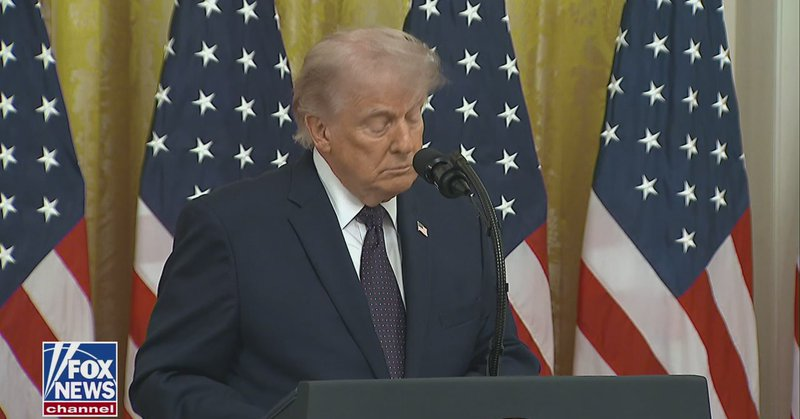

Fox News (Twitter/X)

WATCH LIVE: President Trump swears in Kevin Warsh as new Fed chair https://twitter.com/i/broadcasts/1rxmqoBMWAnxy

## FoxNewsTwitter — post 342107

Fox News (Twitter/X)

A growing number of politicians are being accused of antisemitism.

Democrat Graham Platner faced backlash over his Nazi-linked tattoo and is now coming under fire for resurfaced Reddit posts, while fellow Democrat Maureen Galindo said that she wants to lock up “American Zionists” in an ICE detention facility.

@BillMelugin_ reports on the hatred creeping into politics as examples of it grow more and more egregious. | @HARRISFAULKNER @FaulknerFocus

## FoxNewsTwitter — post 342106

Fox News (Twitter/X)

RT @TreyYingst: UPDATE: A Qatari negotiation team is in Tehran on Friday and Saturday to support the U.S. to reach a final deal that would end the war and address outstanding issues with Iran, an official with knowledge of the visit told Fox News.

## FoxNewsTwitter — post 342105

Fox News (Twitter/X)

A new batch of UFO files have just been released to the public.

The Department of War publishing a second wave of documents tied to PURSUE, a program releasing records connected to unidentified aerial incidents observed during military missions.

This latest batch adds another wave of unexplained reports and operational blurbs as public interest surrounding government UFO disclosures continues to grow.

## FoxNewsTwitter — post 342104

  

Fox News (Twitter/X)

Hooters says it’s going family-friendly.

CEO Neil Kiefer says the restaurant chain wants to return to its roots as a “beach-themed” neighborhood spot that families, couples, and regulars feel comfortable walking into, he told People magazine.

Kiefer blamed years of private equity ownership for pushing the brand “further and further away” from what it originally stood for — including uniforms he says became overly sexualized.

Now, after buying the brand back out of bankruptcy, the original owners say they’re trying to “re-Hooterize” Hooters.

“There’s nothing wrong with a pair of shorts if fitted properly... But I think in a dining place, there is something wrong [if] they’re in a thong-type uniform.”

📸: Hooters

## FoxNewsTwitter — post 342103

  <a href="telegram/content/FoxNewsTwitter_342103_1779467908.mp4" target="_blank">🎬 Download video</a>

Fox News (Twitter/X)

This Memorial Day weekend is expected to set a travel record despite more expensive tickets for Americans who plan to fly.

AAA projects around 3.7 million Americans will fly this weekend, as travelers are seemingly undeterred by higher ticket prices from increased jet fuel costs.

@Grady_Trimble spoke to travelers who are noticing those higher prices but are accepting the cost to still make their trips.

## FoxNewsTwitter — post 342102

  

Fox News (Twitter/X)

Spotify is trying something concert fans have been begging for for years: keeping tickets out of scammers’ hands and getting them directly to real fans.

The streaming giant just launched a new program called “Reserved,” giving an artist’s most engaged listeners access to two reserved seats at select shows before tickets disappear into resale sites.

For fans used to watching prices skyrocket seconds after a tour goes live, Spotify says this is designed to reward the people actually streaming the music, not bots flipping tickets for profit.

## FoxNewsTwitter — post 342101

  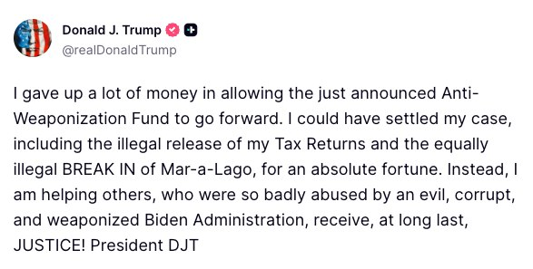

Fox News (Twitter/X)

“I could have settled my case... for an absolute fortune.”

President Trump says he turned down a massive payout tied to the release of his tax returns and the FBI's raid of Mar-a-Lago in order to secure the 'Anti-Weaponization Fund.'

The $1.776 billion fund is supposed to compensate individuals who were unfairly targeted by past administrations.

## pm_afshaa — post 91215

🔴ترامپ: ما به ایران ضربات شدیدی وارد کردیم و گزینه دیگری نداشتیم

💧 Rainbet.com the #1 Non-KYC Crypto Casino & Sportsbook @rainbetcom

😁 @Pm_Afshaa

## pm_afshaa — post 91214

🔴ترامپ: ایران به شدت خواهان توافقه
همان کاری را که در ونزوئلا انجام دادیم، در ایران انجام می دهیم

💧 Rainbet.com the #1 Non-KYC Crypto Casino & Sportsbook @rainbetcom

😁 @Pm_Afshaa

## pm_afshaa — post 91213

🔴ترامپ : ما یه مقدار بدهی داریم که باید حلش کنیم و راهش رشد اقتصادیه قراره با رشد خیلی سریع از این بدهی خارج بشیم

💧 Rainbet.com the #1 Non-KYC Crypto Casino & Sportsbook @rainbetcom

😁 @Pm_Afshaa

## pm_afshaa — post 91212

وال استریت ژورنال: صادرات نفت ایران از طریق دریا به دلیل محاصره به سطح صفر کاهش یافته

💧 Rainbet.com the #1 Non-KYC Crypto Casino & Sportsbook @rainbetcom

😁 @Pm_Afshaa

## pm_afshaa — post 91211

🔴2000 ساعت از قطع اینترنت مردم ایران توسط جمهوری اسلامی گذشت

💧 Rainbet.com the #1 Non-KYC Crypto Casino & Sportsbook @rainbetcom

😁 @Pm_Afshaa

## pm_afshaa — post 91210

  <a href="telegram/content/pm_afshaa_91210_1779467913.webm" target="_blank">🎬 Download video</a>

🔴حسینی همدانی، امام جمعه کرج:
هرکسی که در تجمعات شبانه شرکت نمیکنه، باید در محضر خدا پاسخگو باشه.

💧 Rainbet.com the #1 Non-KYC Crypto Casino & Sportsbook @rainbetcom

😁 @Pm_Afshaa

## pm_afshaa — post 91209

🔴نورمن، خبرنگار وال استریت ژورنال : یه منبع میگه هر چیزی درباره پیش‌نویس توافقی که داره می‌چرخه، دروغه و صحت نداره

💧 Rainbet.com the #1 Non-KYC Crypto Casino & Sportsbook @rainbetcom

😁 @Pm_Afshaa

## pm_afshaa — post 91208

  <a href="telegram/content/pm_afshaa_91208_1779467913.webm" target="_blank">🎬 Download video</a>

🔴العربیه: عاصم ملک، رئیس سازمان اطلاعات پاکستان هم عازم تهران شد.

💧 Rainbet.com the #1 Non-KYC Crypto Casino & Sportsbook @rainbetcom

😁 @Pm_Afshaa

## pm_afshaa — post 91207

🔴پوتین: اوکراین یک خوابگاه دانشجویی را هدف قرار داد و 15 نفر مفقود شده‌اند، شش نفر کشته و 39 نفر دیگر زخمی شدن

💧 Rainbet.com the #1 Non-KYC Crypto Casino & Sportsbook @rainbetcom

😁 @Pm_Afshaa

## pm_afshaa — post 91206

🔴اختلال گسترده Gps در تنگه هرمز ، عربستان ، اسرائیل ، اردن ، سوریه ، عراق ، ایران

💧 Rainbet.com the #1 Non-KYC Crypto Casino & Sportsbook @rainbetcom

😁 @Pm_Afshaa

## DEJradio — post 4849

  <a href="telegram/content/DEJradio_4849_1779467914.mp4" target="_blank">🎬 Download video</a>

🚨
🔸 پرتوی دیگر، به میزبانی کیهان لندن؛
آدینه ساعت ۱۹:۳۰ به‌وقت ایران

#پرتوی_دیگر
@DEJradio

## DEJradio — post 4848

⭕️ آمریکا سفیر اخراجی جمهوری اسلامی در لبنان و ۸ فرد مرتبط با حزب‌الله را تحریم کرد

وزارت خزانه‌داری آمریکا ۹ تن از جمله محمدرضا شیبانی رئوف، سفیر معرفی‌شدۀ جمهوری اسلامی در لبنان را تحریم کرد.
واشینگتن می‌گوید این افراد در روند صلح لبنان مانع‌تراشی کرده و از خلع سلاح حزب‌الله جلوگیری کرده‌اند.
آمریکا همچنین اعلام کرد برخی افراد تحریم‌شده، از مقام‌های لبنانی همسو با حزب‌الله در پارلمان، ارتش و نهادهای امنیتی‌اند.
اسکات بسنت، وزیر خزانه‌داری آمریکا، گفت حزب‌الله یک سازمان تروریستی است و باید کاملاً خلع سلاح شود.
اعتبارنامۀ سفیر معرفی‌شدۀ جمهوری اسلامی، پیش‌تر در لبنان رد شده بود و او ناچار به بازگشت به تهران شد.

#تحریم
@DEJradio

## DEJradio — post 4847

⭕️ آمریکا فروش تسلیحات به تایوان را به دلیل جنگ با جمهوری اسلامی کاهش داد

رویترز به نقل از یک مقام ارشد آمریکایی گزارش داد واشینگتن برای تأمین مهمات مورد نیاز جنگ علیه جمهوری اسلامی، به‌طور موقت در روند فروش تسلیحات به تایوان وقفه ایجاد کرده است.
هانگ کائو، سرپرست وزارت نیروی دریایی آمریکا گفت ایالات متحده می‌خواهد مطمئن شود مهمات کافی برای عملیات علیه جمهوری اسلامی، در اختیار دارد.
او تأکید کرد فروش‌ تجهیزات نظامی به کشورهای خارجی، تا هر زمان که دولت آمریکا لازم بداند ادامه می‌یابد.

#جنگ
@DEJradio

## DEJradio — post 4846

🌐 
🚨 قطعی سراسری اینترنت در ایران وارد هشتادوچهارمین روز شد

نت‌بلاکس اعلام کرد قطعی گستردۀ اینترنت در ایران وارد هشتادوچهارمین روز شده و شبکه‌های بین‌المللی عملا بیش از ۱۹۹۲ ساعت از دسترس عموم مردم خارج شده‌اند.
این نهاد جهانی پایش اینترنت هشدار داد که با ادامۀ خاموشی دیجیتال، شکاف‌های اقتصادی و اجتماعی در ایران عمیق‌تر شده و ارتباط با جهان خارج به دسترسی‌های محدود و گزینشی وابسته است.
بنا بر گزارش‌ها فروشگاه‌های آنلاین داخلی با سقوط درحدود هشتاد درصدی در فروش مواجه‌اند.
ناظران می‌گویند این مسئله بیشترین فشار را بر کسب‌وکارهای کوچک وارد کرده است.
جمهوری اسلامی دسترسی محدود به اینترنت جهانی را تنها برای برخی نهادها، سازمان‌ها و هواداران حکومت فراهم کرده است.

#اینترنت
@DEJradio

## DEJradio — post 4845

⭕️ یک مقام دولتی گفت دوازده درصد از آب کشور در شبکۀ فرسوده هدر می‌رود

هاشم امینی، مدیرعامل شرکت مهندسی آب و فاضلاب ایران، اعلام کرد ۱۲ درصد از آب ایران به علت فرسودگی شبکۀ انتقال و توزیع در کشور هدر می‌رود. به گفتۀ این مقام دولتی، بودجۀ کافی برای کاهش این تلفات وجود ندارد.
هاشم امینی به خبرگزاری ایرنا گفت کاهش تنها یک درصد از هدررفت آب، سالانه حدود ۲۱ همت اعتبار نیاز دارد. به گفتۀ او این رقم با افزایش تورم همچنان بالاتر می‌رود.
امینی افزود در هر شهر و روستا باید سالانه حدود ۱۰ درصد از شبکه‌های فرسوده بازسازی شود، اما محدودیت منابع مالی مانع تحقق این هدف است.
بر اساس آمار رسمی، مصرف آب شرب ایران درحدود ۹ میلیارد متر مکعب در سال است.
این در حالی است که تنها نیمی از خانوارهای شهری به شبکۀ فاضلاب متصل‌اند. از سویی تنها یک‌پنجم از فاضلاب تولیدی تصفیه و بازیافت می‌شود.
طبق ارزیابی‌های بین‌المللی، ایران از نظر تنش آبی در رتبۀ سیزدهم دنیا قرار دارد.

#آب #ایران
@DEJradio

## DEJradio — post 4844

⭕️ ارتش اسرائیل: پنج عضو حزب‌الله در جنوب لبنان کشته شدند

ارتش اسرائیل اعلام کرد پنج عضو حزب‌الله لبنان را پس از ورود به یک مرکز فرماندهی متعلق به این گروه در جنوب لبنان هدف گرفته است.
شبه‌نظامیان حزب‌الله در سیاهۀ تروریستی اتحادیۀ اروپا و ایالات متحده قرار دارند.
بر پایۀ بیانیۀ ارتش اسرائیل، این افراد روز پنج‌شنبه در مناطق جنوبی لبنان شناسایی و در پی حملۀ هوایی کشته شدند. این مناطق تحت کنترل شبه‌نظامیان حزب‌الله قرار دارد.
ارتش اسرائیل همچنین اعلام کرد در ساعت گذشته، انبارهای تسلیحاتی حزب‌الله و دیگر زیرساخت‌های تروریستی را هدف گرفته است. در پی این حملات و چندین عضو دیگر حزب‌الله حذف شدند.
صبح آدینه اول خرداد نیز ارتش اسرائیل خبر داد دو فرد مسلح مشکوک را پیش از نزدیک شدن به مرز این کشور با لبنان هدف قرار داده است.

#اسرائیل #حزب‌الله
@DEJradio

## mamlekate — post 103568

  <a href="telegram/content/mamlekate_103568_1779467917.mp4" target="_blank">🎬 Download video</a>

رسماً جاکش خونه باز کردن

norbayuv
@mamlekate

## mamlekate — post 103567

📞 الو کاشان همه ورودی اماکن دیدنی از این سگ‌های حجاب بان بستن. گیر و گیربازاریه.
اعصاب همه رو خورد کردن.

@mamlekate

## mamlekate — post 103566

📝 نماینده مجلس: با تصمیم نهادهای بالادستی، فعلاً نیاز به باز کردن اینترنت وجود ندارد

نایب‌رئیس کمیسیون فرهنگی مجلس شورای اسلامی می‌گوید بر اساس تصمیم «نهادهای بالادستی، فعلاً نیازی به باز کردن اینترنت وجود ندارد» و مدعی شد دلیل آن «خطرات امنیتی و تهدید شخصیت‌ها و کشور» است.

@mamlekate

## mamlekate — post 103565

📝 گزارش وال‌استریت جورنال از «کمک» بابک زنجانی به انتقال میلیون‌ها دلار پول برای ایران

وال‌استریت جورنال از استفاده گسترده حکومت ایران از صرافی دیجیتال بایننس و با کمک شبکۀ مالی بابک زنجانی خبر داد. این روزنامه می‌گوید این تراکنش‌ها تا همین اواخر ادامه داشته است.

@mamlekate

## VahidOnline — post 75621

🔴بنیاد عبدالرحمن برومند تا کنون ۶۵۵ مورد اعدام را در سال ۲۰۲۶ ثبت کرده است، که ۳۴ مورد که از آغاز ماه می تاکنون اجرا شده است.. آمار واقعی احتمالاً بسیار بیشتر از این رقم است. جمهوری اسلامی در حالی این اعدام‌ها را پشت درهای بسته اجرا می‌کند که ۸۳ روزه است که اینترنت کشور قطع شده است. حاکمیت با قطع ارتباط جامعه از ۹ اسفند ۱۴۰۴ صدای زندانیان، خانواده‌ها و شاهدان عینی را به شدت سرکوب کرده و نظارت مستقل بر وضعیت حقوق بشر را به‌طور خاص دشوار ساخته است.

🔸از آنجا که دستگاه قضایی همواره تنها بخش کوچکی از احکام مرگ خود را به‌طور رسمی اعلام می‌کند، قطع اینترنت داده‌های فعلی را به شدت محدود به منابع دولتی ایران کرده است. بنابراین کاهش در آمارهای ثبت‌شده، تنها نشان‌دهنده خفقان اطلاعاتی است، نه کاهش کشتار.
#نه_به_اعدام
@IranRights

## VahidOnline — post 75620

  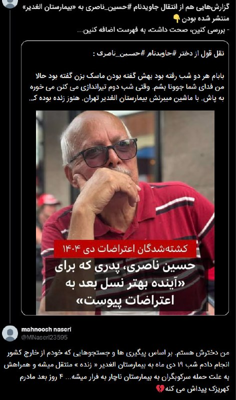

دختر حسین ناصری: MNaseri23595

📡 @VahidOnline

## VahidOnline — post 75619

  

به گزارش رسانه‌های دولتی پاکستان، فیلد مارشال عاصم منیر،‌ فرمانده ارتش این کشور راهی تهران شده است.

خبرگزاری اسوشیتد پرس پاکستان به نقل از منابع امنیتی گزارش داده است که فیلد مارشال عاصم منیر در طول این سفر رسمی، درباره «مذاکرات جاری ایران و آمریکا و صلح و ثبات منطقه‌ و منافع دوجانبه دیگر» با مقام‌های ایران گفت‌و‌گو خواهد کرد.

فرمانده ارتش پاکستان چهل روز پیش هم در تهران بود و با محمدباقر قالیباف و اعضای تیم مذاکره‌ ایران و آمریکا دیدار و گفت‌وگو کرده بود.

این در حالی است که وزیر کشور پاکستان هم برای دومین بار طی هفته اخیر به تهران رفته و در حال گفت‌وگو با مقامات ایرانی است.
@VahidHeadline

📡 @VahidOnline

## VahidOnline — post 75614

  <a href="telegram/content/VahidOnline_75614_1779467921.mp4" target="_blank">🎬 Download video</a>

مارکو روبیو، وزیر خارجه آمریکا، در حاشیه نشست ناتو درباره مذاکرات جاری با جمهوری اسلامی گفت که واشینگتن در انتظار نتایج گفت‌وگوهای در حال انجام است؛ گفت‌وگوهایی که به گفته او نشانه‌هایی از پیشرفت داشته‌اند.
او افزود: «ما در انتظار نتایج این گفت‌وگوها هستیم که نشانه‌هایی از پیشرفت دارد. نمی‌خواهم در این باره اغراق کنم؛ تحرک محدودی صورت گرفته و این مثبت است، اما اصول اساسی تغییری نکرده است.»
وزیر خارجه آمریکا تاکید کرد که حکومت ایران هرگز نباید به سلاح هسته‌ای دست یابد و گفت: «برای تحقق این هدف، باید به مسئله غنی‌سازی و نیز موضوع اورانیوم با غنای بالا رسیدگی کنیم و افزون بر آن، موضوع تنگه هرمز را نیز مد نظر قرار دهیم.»
@VahidOOnLine
مارکو روبیو، وزیر خارجه آمریکا، جمعه یکم خرداد در حاشیه نشست ناتو گفت جمهوری اسلامی در پی ایجاد نظامی اختصاصی برای اخذ عوارض در یک آبراه بین‌المللی است و تلاش می‌کند عمان را نیز به پیوستن به این سازوکار متقاعد کند. روبیو تاکید کرد که این اقدام «غیرقابل قبول» است.
او افزود: «هیچ کشوری در جهان نباید چنین چیزی را بپذیرد. من کشوری را نمی‌شناسم که جز ایران از آن حمایت کند.»
روبیو با اشاره به تحرکات دیپلماتیک در سازمان ملل متحد گفت قطعنامه‌ای با پیشنهاد بحرین در شورای امنیت مطرح شده که آمریکا در آن نقش فعالی داشته و به گفته او، بیشترین تعداد هم‌پیشنهاددهنده را در تاریخ شورای امنیت دارد. او هشدار داد چند کشور در حال بررسی وتوی این قطعنامه هستند و افزود: «این مایه تاسف خواهد بود.»
وزیر خارجه آمریکا تاکید کرد واشینگتن برای دستیابی به اجماع جهانی جهت جلوگیری از اجرای چنین طرحی تلاش می‌کند و گفت: «باید دید آیا سازمان ملل همچنان کارآمد است یا نه. ما می‌کوشیم از این مسیر به نتیجه برسیم.»
او تصریح کرد اگر اخذ عوارض در تنگه هرمز اجرایی شود، ممکن است در دیگر آبراه‌های مهم جهان نیز تکرار شود و افزود: «این قابل قبول نیست و نمی‌تواند رخ دهد.»
روبیو با اشاره به اهمیت تنگه هرمز گفت این آبراه برای کشورهای حاضر در نشست و نیز برای دیگر کشورها، به‌ویژه در منطقه هند-آرام، حیاتی است.
او در پایان با ابراز امیدواری نسبت به نتایج نشست ناتو گفت این دیدار زمینه را برای نشست رهبران در حدود شش هفته آینده فراهم خواهد کرد و افزود که تا آن زمان کارهای زیادی پیش رو است.
@VahidOOnLine
مارکو روبیو، وزیر خارجه آمریکا، پس از نشست ناتو در سوئد درباره مذاکرات با تهران گفت: «همه ما دوست داریم توافقی با ایران شکل بگیرد که در آن تنگه‌ها باز باشند و ایران از جاه‌طلبی‌های هسته‌ای خود دست بردارد.»
او افزود: «این چیزی است که همه ما امیدواریم و همچنان برایش تلاش خواهیم کرد و همین حالا هم که با شما صحبت می‌کنم، کار و مذاکرات در این زمینه ادامه دارد.»
وزیر خارجه آمریکا با اشاره به این که باید یک «برنامه جایگزین» هم وجود داشته باشد، گفت که برنامه جایگزین در صورتی باید عملی شود که حکومت ایران از باز کردن تنگه‌ هرمز خودداری کند.
او گفت: «پس باید از الان درباره‌اش فکر کنیم. من امروز این موضوع را مطرح کردم. واکنش‌های تاییدآمیز زیادی دیدم. اما هنوز چیزی برای اعلام رسمی درباره اقدام مشخصی که در حال انجام باشد نداریم.»
وزیر خارجه آمریکا درباره برنامه جایگزین در صورت امتناع جمهوری اسلامی از بازگشایی تنگه هرمز افزود: «نمی‌دانم لزوما این می‌تواند ماموریت ناتو باشد یا نه، اما قطعا کشور‌های عضو ناتو می‌توانند در آن مشارکت کنند.»
@VahidOOnLine

📡 @VahidOnline

## VahidOnline — post 75611

اطلاعیه منوتو درباره پایان پخش برنامه‌ها
@VahidOOnLine

📡 @VahidOnline

## VahidOnline — post 75607

  <a href="telegram/content/VahidOnline_75607_1779467922.mp4" target="_blank">🎬 Download video</a>

فیلم مستند «تمرین‌هایی برای یک انقلاب»، ساخته پگاه آهنگرانی جایزه «چشم طلایی» هفتاد و نهمین جشنواره فیلم کن را از آن خود کرد.

 «لوئی دور» یا چشم طلایی، مهم‌ترین جایزه بخش مستند جشنواره فیلم کن است.
 پگاه آهنگرانی جایزه‌اش را به مردم ایران تقدیم کرد و گفت: «(مردم ایران) با وجود تمام سرکوب‌هایی که در طول این سال‌ها تحمل کرده‌اند، هرگز از تلاش برای حقوقشان، آزادی‌شان و آرزوهایشان دست نکشیده‌‌اند و مطمئنم که آنها هرگز تسلیم نخواهند شد. مطمئنم و یک آرزو دارم که می‌خواهم اینجا بگویم: این‌که روزی دختر کوچکم لی‌لی و همه بچه‌های ایران در آینده‌ای نزدیک در ایرانی آزاد و دموکراتیک زندگی کنند.»

به گفته خانم آهنگرانی او با استفاده از آرشیوهای شخصی، ویدئوهای خانگی، تصاویر اعتراضات خیابانی، روزنامه‌ها و صداهای ضبط‌ شده، بیش از ۴۰ سال از تاریخ ایران را بازخوانی ‌کرده است.
@VahidHeadline

📡 @VahidOnline

## kianmeli1 — post 87554

  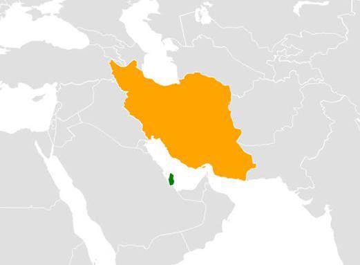

🔴به گزارش رویترز، به نقل از افراد آگاه، با هماهنگی ایالات متحده، یک هیئت قطری امروز صبح وارد تهران شد تا به تلاش‌ها برای دستیابی به توافق بین ایالات متحده و ایران کمک کند.

در گذشته، قطر نقش میانجی بین ایران و ایالات متحده را ایفا کرده است و تصور می‌شود که ارتباط آنها با تصمیم‌گیرندگان اصلی ایران ممکن است تلاش‌های مذاکرات را تسهیل کند.
این در حالی است که فیلد مارشال عاصم منیر، تصمیم‌گیرنده اصلی پاکستان، نیز برای تسهیل توافق به تهران سفر کرده است.
https://t.me/kianmeli1

## IranIntlTV — post 338456

  

بر اساس گزارش‌های رسیده به ایران‌اینترنشنال، محمدرضا منصوری، جوان ۲۴ ساله و پدر یک نوزاد ۲۰ روزه بود که با تیراندازی نیروهای حکومتی در جریان اعتراضات شهر رشت جان خود را از دست داد. او به دلیل جراحات ناشی از شلیک گلوله، حدود یک ماه بستری و تحت درمان بود.

بر اساس گزارش‌ها، محمدرضا ۱۸ دی‌ماه در منطقه یخسازی رشت هدف شلیک نیروهای حکومتی قرار گرفت و بر اثر اصابت گلوله به نخاع و کتف به شدت زخمی شد.

او ۱۳ بهمن‌ماه بر اثر شدت جراحات وارده در جریان اعتراضات جان باخت.

به گفته منابع محلی، محمدرضا تنها فرزند خانواده بود و پیش از حضور در فراخوان، گفته بود: «برای آینده دخترم در اعتراض شرکت می‌کنم.»
https://iranintl.com/202605222447

## IranIntlTV — post 338455

  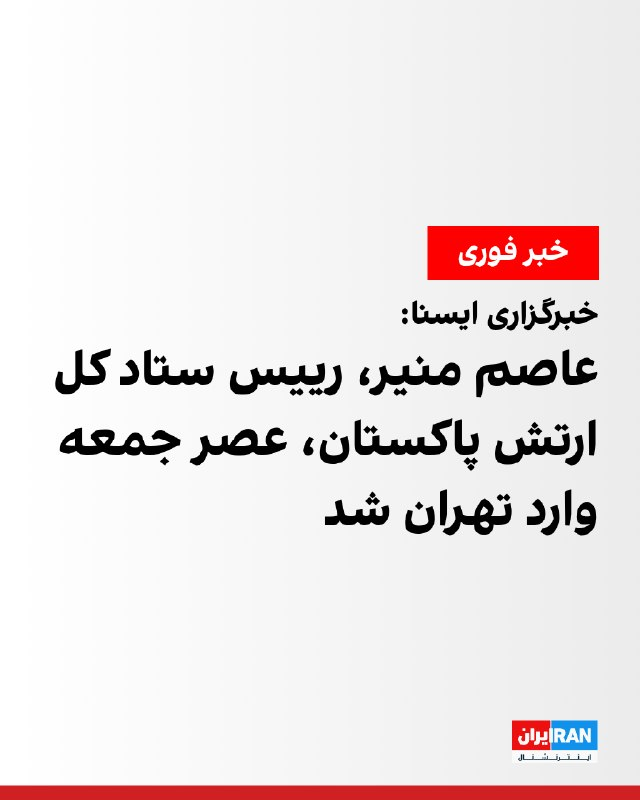

خبرگزاری ایسنا اعلام کرد که عاصم منیر، رییس ستاد کل ارتش پاکستان، عصر جمعه وارد تهران شده است.
پیش‌تر برخی رسانه‌ها از سفر او به تهران، برای تلاش در خصوص نزدیک کردن خواسته‌ها و انتظارات مقام‌های جمهوری اسلامی و ایالات متحده، برای رسیدن به توافق خبر داده بودند.
https://iranintl.com/202605220892

## IranIntlTV — post 338454

بندر خَصَب، راه فرار جمهوری اسلامی از محاصره دریایی؟
فرناز داوری- در میانه آتش‌بس شکننده و محاصره دریایی در تنگه هرمز، بندر خَصَب در عمان به یکی از مسیرهای حیاتی برای رساندن کالا به ایران تبدیل شده است. بندری که با قایق‌های «شوتی»، ماهیگیران و گردشگران شناخته می‌شد، حالا گذرگاهی پرهزینه اما مهم برای دور زدن محاصره بنادر جنوبی ایران شده است.
تا پیش از آغاز جنگ آمریکا و اسرائیل علیه جمهوری اسلامی، بخشی از رفت‌وآمدهای دریایی میان خصب و سواحل جنوبی ایران، به قایق‌های تندرو اختصاص داشت. قایق‌هایی که در ادبیات محلی به «شوتی» معروف‌ هستند و سال‌ها در مسیرهای غیررسمی میان عمان و جنوب ایران، رفت‌وآمد کرده‌اند.
این قایق‌ها معمولا به صورت گروهی حرکت می‌کردند و در زمانی کوتاه خود را از آب‌های عمان به قشم یا دیگر نقاط ساحلی ایران می‌رساندند.
این مسیر پیش از این بیشتر برای دادوستدهای غیررسمی و قاچاق خرد شناخته می‌شد. سیگار ایرانی، مشروبات الکلی و حشیش، از ایران به عمان منتقل می‌شد و در مسیر بازگشت، کالاهای مصرفی، لوازم خانگی و اجناس لوکس، از عمان به ایران می‌رسید.
حضور قایق‌های ماهیگیری ایرانی نیز در اطراف خصب همیشه بخشی از تصویر معمول این منطقه بود.

ادامه گزارش را در اینجا بخوانید:
https://www.iranintl.com/202605220630

## IranIntlTV — post 338453

  <a href="telegram/content/IranIntlTV_338453_1779467925.mp4" target="_blank">🎬 Download video</a>

همه‌پرسی درباره جدایی آلبرتا از کانادا ۱۹ اکتبر برگزار می‌شود.

نخست‌وزیر کانادا هشدار داد هرگونه اقدام برای استقلال باید بر اساس قوانین فدرال انجام شود.

گزارش مهسا مرتضوی، خبرنگار ایران‌اینترنشنال
@iranintltv

## IranIntlTV — post 338452

  

دونالد ترامپ در کاخ سفید درباره مذاکرات با جمهوری اسلامی گفت: «خواهیم دید چه خواهد شد. ما ضربه سختی به ‌آنها زدیم. چاره‌ای نداشتیم. ایران نمی‌تواند سلاح هسته‌ای داشته باشد.»

ترامپ ادامه داد: «آمریکا با جمهوری اسلامی همان رفتاری را انجام می‌دهد که با ونزوئلا انجام داده است.»

ترامپ تاکید کرد جمهوری اسلامی بی‌صبرانه به دنبال رسیدن به توافق است.
https://iranintl.com/202605224243

## IranIntlTV — post 338451

رجزخوانی نظام؛ مغازه کوچک وحشت‌فروشی
حسین ذوقی-جمهوری اسلامی در حالی که تقریبا در آستانه شکست در همه زمینه‌های داخلی و خارجی قرار دارد، تاکتیکش را بر یک سنت فقهی استوار کرده است: رجزخوانی.
سخنان تند مداحان در تجمعات شبانه، سخنان تلویزیونی مسئولان میان‌رده تا گفته‌های رسمی مسئولین بلندپایه در مذاکرات، رسانه‌های اجتماعی و در نهایت، پیام‌های مکتوب رهبر نادیده نظام، بر همین سنت استوار شده است.
ماجرای «آتیش زدم به مالم» را حتما شنیده‌اید: بزازی در بازار، در کسادی وضعیتش و وقتی که اجناسش روی دستش مانده بود و راهی برای فروش نداشت، شاگردش را با یک حلب نفت به میانه بازار می‌فرستد تا فریاد بزند که: «اوستایم عقلش را از دست داده، می‌خواهد همه جا را به آتش بکشد!»
مردم هم که ترسیده‌اند به طمع جنس مفت، سمت دکان بزاز هجوم می‌برند. اوستای بزاز پارچه‌هایش را میان دکان می‌اندازد و رجز می‌خواند که «آتش می‌زنم ...»
خلاصه که انبار بزاز خالی می‌شود و جنس‌هایش را با قیمت بالاتر می‌فروشد!
حالا جمهوری اسلامی هم انگار می‌خواهد با تهدید و رجزخوانی به آتش زدن دنیا، ایده‌هایش را به منطقه و جهان بفروشد.
مداحان از منبر، منتقدان داخلی را به مرگ تهدید می‌کنند. محمود نبویان، نایب‌رییس کمیسیون امنیت ملی مجلس شورای اسلامی، پادشاهان کشورهای عربی را تهدید می‌کند که «هیچ یک از کاخ‌هایشان سالم نخواهد ماند».
عباس عراقچی، وزیر امور خارجه جمهوری اسلامی، در شبکه‌های اجتماعی از «پاسخ طولانی و دردناک» سخن می‌گوید.
اسماعیل بقایی، سخنگوی وزارت امور خارجه، حتی در نشست‌های دیپلماتیک، با لحنی رجزآلود حرف می‌زند.
غلامحسین محسنی اژه‌ای، رییس قوه قضاییه، از «تحمیل ناپذیری» می‌گوید؛ و حسین کنعانی‌مقدم، فرمانده پیشین سپاه پاسداران، اعتراف می‌کند که «رجزخوانی یکی از روش‌های مقابله با دشمن است».
لایه‌ها‌ی متفاوت نظام به یک زبان مشترک رسیده‌اند. این روش تصادفی نیست، شیوه جدید حکمرانی در جمهوری اسلامی است.

ادامه این تحلیل را اینجا بخوانید:
https://www.iranintl.com/202605219159

## IranIntlTV — post 338450

  <a href="telegram/content/IranIntlTV_338450_1779467928.mp4" target="_blank">🎬 Download video</a>

فیلم مستند «تمرین‌هایی برای یک انقلاب»، ساخته پگاه آهنگرانی، برنده جایزه «چشم طلایی» جشنواره کن شد. این فیلم با استفاده از آرشیوهای شخصی و تصاویر اعتراض‌ها، ۴ دهه از تحولات سیاسی و اجتماعی ایران را روایت می‌کند.

لی‌لی نیکفر، خبرنگار ایران‌اینترنشنال، گزارش می‌دهد
@iranintltv

## IranIntlTV — post 338449

  <a href="telegram/content/IranIntlTV_338449_1779467930.mp4" target="_blank">🎬 Download video</a>

جاویدنام عرفان بزرگی، جوان ۲۲ ساله اهل مرودشت، قهرمان مچ‌اندازی استان فارس بود. او ۱۲ دی‌ماه از ناحیه سر هدف گلوله نیروهای سرکوب جمهوری اسلامی قرار گرفت و به‌دلیل شدت جراحات، دو روز بعد در بیمارستان جان باخت.

گزارش فربد سروندی، عضو تحریریه ایران‌اینترنشنال
@iranintltv

## IranIntlTV — post 338448

  <a href="telegram/content/IranIntlTV_338448_1779467932.mp4" target="_blank">🎬 Download video</a>

همزمان با رایزنی‌های غیرمستقیم میان تهران و واشینگتن، فرمانده ارتش پاکستان وارد تهران شد.

به گفته جمهوری اسلامی، این سفر بخشی از تبادل پیام‌ها میان ایران و آمریکا با میانجی‌گری پاکستان است.

گزارش اردوان روزبه، خبرنگار ایران‌اینترنشنال
@iranintltv

## IranIntlTV — post 338447

  <a href="telegram/content/IranIntlTV_338447_1779467934.mp4" target="_blank">🎬 Download video</a>

🔻نهادهای حقوق بشری نسبت به وضعیت غلامرضا خانی‌ شکرآب، ورزشکار و زندانی سیاسی، که با اتهام «جاسوسی» بازداشت شده، هشدار داده‌اند.

🔹او به‌طور ناگهانی از بند امنیتی زندان اوین به سلول انفرادی در زندان قزل‌حصار منتقل شده است.

🔹تصاویری از این ورزشکار را سردار پاشایی، قهرمان پیشین کشتی جوانان جهان، در فضای مجازی منتشر کرده است.

@iranintltvsport

## IranIntlTV — post 338446

  <a href="telegram/content/IranIntlTV_338446_1779467936.mp4" target="_blank">🎬 Download video</a>

یک شهروند در پیامی به ایران اینترنشنال با اشاره به پوشش چادر خود می‌گوید که نه در تجمعات حکومتی شرکت می‌کند و نه از نظام جمهوری اسلامی حمایت می‌کند. پیام او با هوش مصنوعی خوانده شده است.

## IranIntlTV — post 338445

تحرکات تازه در مذاکرات تهران و واشینگتن با سفر فرمانده ارتش پاکستان و هیات قطری به ایران

هم‌زمان با ادامه رایزنی‌های دیپلماتیک در خصوص مذاکرات تهران و واشینگتن، گزارش‌ها از سفر عاصم منیر، فرمانده ارتش پاکستان، به ایران حکایت دارند. یک منبع آگاه نیز به رویترز گفت قطر در هماهنگی با ایالات متحده، یک تیم مذاکره‌کننده را به تهران اعزام کرده است.

ایرنا، خبرگزاری دولت جمهوری اسلامی، جمعه اول خرداد به نقل از یک منبع دیپلماتیک نوشت منیر قرار است در سفر به ایران با مقام‌های بلندپایه جمهوری اسلامی دیدار و گفت‌وگو کند.

شبکه سی‌بی‌اس نیوز نیز به نقل از منابع آگاه امنیتی، سفر فرمانده ارتش پاکستان به ایران را تایید کرد و نوشت بررسی مسائل مهم منطقه‌ای و بین‌المللی، از جمله مذاکرات تهران و واشینگتن، محور اصلی دیدارهای او با مقام‌های جمهوری اسلامی خواهد بود.

یک مقام ارشد پاکستانی به سی‌بی‌اس نیوز گفت دیدارهای اخیر محسن نقوی، وزیر کشور پاکستان، در تهران باعث شده مذاکرات «در مسیری مهم» پیش برود و در همین چارچوب، منیر برای ادامه این رایزنی‌ها راهی ایران شده است.

خبرگزاری رویترز نیز از سفر یک هیات مذاکره‌کننده قطری به تهران خبر داد و نوشت هدف از این سفر که با هماهنگی واشینگتن انجام گرفت، «کمک به تلاش‌ها برای دستیابی به توافقی برای خاتمه جنگ ایران» است.

بر اساس این گزارش، هیات قطری اول خرداد وارد شد.

قطر که پیش‌تر نقش پررنگی در میانجی‌گری‌های بین‌المللی از جمله در جنگ غزه داشت، در پی حملات موشکی و پهپادی اخیر جمهوری اسلامی به این کشور، از ایفای نقش واسطه در مذاکرات مربوط به جنگ ایران فاصله گرفته بود.

العربیه از سفر رییس سازمان اطلاعات پاکستان به تهران خبر داد
شبکه العربیه به نقل از منابع آگاه گزارش داد عاصم مالک، رییس سازمان اطلاعات پاکستان، هم راهی تهران شده است.

از زمان برقراری آتش‌بس موقت در ۱۹ فروردین، پاکستان کوشیده است زمینه دستیابی به توافقی را برای پایان جنگ آمریکا و اسرائیل با جمهوری اسلامی فراهم کند.

رویترز اول خرداد نوشت عباس عراقچی، وزیر امور خارجه جمهوری اسلامی، با وزیر کشور پاکستان در تهران دیدار کرد تا درباره پیشنهادهای مربوط به پایان جنگ گفت‌وگو کند.
این دومین دور گفت‌وگوهای نقوی با مقام‌های ایرانی در دو روز گذشته بود.

رویترز افزود اسلام‌آباد در تلاش است ارتباط میان تهران و واشینگتن را تسهیل کند تا چارچوبی برای پایان جنگ و حل اختلاف‌ها شکل بگیرد.

«نشانه‌های مثبت»
مارکو روبیو، وزیر خارجه آمریکا، ۳۱ اردیبهشت گفت در مذاکرات «نشانه‌های مثبتی» دیده می‌شود، اما هشدار داد اگر جمهوری اسلامی طرح دریافت عوارض از کشتی‌های عبوری از تنگه هرمز را اجرا کند، دستیابی به توافق ممکن نخواهد بود.

او گفت: «ما می‌خواهیم این مسیر باز و آزاد باشد. تنگه هرمز یک آبراه بین‌المللی است.»

یک منبع ارشد ایرانی نیز به رویترز گفت اختلاف‌ها میان دو طرف کاهش یافته، اما موضوع غنی‌سازی اورانیوم و تنگه هرمز همچنان از اصلی‌ترین موانع توافق هستند.

جنگ جاری شوک بزرگی به اقتصاد جهانی وارد کرده و افزایش قیمت نفت، نگرانی‌ها را درباره تورم تشدید کرده است.

پیش از آغاز جنگ، حدود یک‌پنجم صادرات جهانی نفت و گاز طبیعی مایع از تنگه هرمز عبور می‌کرد.

هم‌زمان ارزش دلار آمریکا به بالاترین سطح شش هفته گذشته نزدیک شده و قیمت نفت نیز در پی تردید بازارها نسبت به موفقیت مذاکرات، افزایش یافته است.

اورانیوم و تنگه هرمز
دونالد ترامپ، رییس‌جمهوری آمریکا، ۳۱ اردیبهشت گفت واشینگتن در نهایت ذخایر اورانیوم غنی‌شده ایران را در اختیار خواهد گرفت.

او اضافه کرد: «آن را به دست خواهیم آورد. به آن نیاز نداریم و احتمالا بعد از به دست آوردنش نابودش خواهیم کرد، اما اجازه نمی‌دهیم ایران آن را داشته باشد.»

دو منبع ارشد ایرانی پیش‌تر به رویترز گفته بودند مجتبی خامنه‌ای، رهبر سوم جمهوری اسلامی، دستور داده ذخایر اورانیوم غنی‌شده از ایران خارج نشود.

پیشنهاد تازه جمهوری اسلامی که این هفته به آمریکا ارائه شده، شامل درخواست‌هایی مانند کنترل تنگه هرمز، دریافت غرامت جنگ، لغو تحریم‌ها، آزادسازی دارایی‌های بلوکه‌شده و خروج نیروهای آمریکایی از منطقه است؛ درخواست‌هایی که ترامپ پیش‌تر آن‌ها را رد کرده بود.

هم‌زمان آژانس بین‌المللی انرژی اعلام کرد جنگ جاری «بدترین شوک انرژی جهان» را ایجاد کرده است.

این نهاد هشدار داد هم‌زمانی اوج تقاضای تابستانی و کمبود عرضه جدید از خاورمیانه، ممکن است بازار انرژی را در ماه‌های ژوییه و اوت وارد «منطقه قرمز» کند.
 
🔗وب‌سایت ایران‌اینترنشنال
@iranintltv

## IranIntlTV — post 338444

  <a href="telegram/content/IranIntlTV_338444_1779467939.mp4" target="_blank">🎬 Download video</a>

مارکو روبیو، وزیر خارجه آمریکا، در دومین روز نشست وزیران خارجه ناتو هشدار داد هرگونه اقدام جمهوری اسلامی برای ایجاد محدودیت یا دریافت عوارض در تنگه هرمز می‌تواند مسیر توافق را تخریب کند. او همچنین افزود: «هنوز برای خوش‌بینی نسبت به پیشرفت مذاکرات زود است.»
مهران عباسیان، خبرنگار ایران‌اینترنشنال، گزارش می‌دهد
@iranintltv

## IranIntlTV — post 338443

  

مقام‌های اتحادیه اروپا جمعه اعلام کردند اروپایی‌ها باید انتظار داشته باشند قیمت نفت و گاز دست‌کم تا پایان سال ۲۰۲۷ بالاتر از سطح پیش از جنگ باقی بماند و قیمت سایر کالاها نیز روندی افزایشی داشته باشد.

کمیسر اقتصادی اتحادیه اروپا، گفت افزایش قیمت انرژی عامل اصلی رشد تورم است؛ به‌طوری‌که نرخ تورم برای امسال ۳.۱ درصد و برای سال ۲۰۲۷ حدود ۲.۴ درصد پیش‌بینی می‌شود. این رقم به‌مراتب بالاتر از پیش‌بینی قبلی ۱.۹ درصدی برای سالجاری میلادی است.
https://iranintl.com/202605222906

## IranIntlTV — post 338442

  <a href="telegram/content/IranIntlTV_338442_1779467942.mp4" target="_blank">🎬 Download video</a>

بر اساس گزارش‌های شهروندان به ایران‌اینترنشنال، با تشدید بحران اقتصادی و مشکلات تامین منابع در ایران، نه‌تنها برای خرید بنزین، بلکه برای تهیه مایحتاج اساسی نیز در برخی شهرها صف‌های طولانی شکل گرفته است.

گفت‌وگو با محسن مهیمنی، عضو تحریریه ایران‌اینترنشنال
@iranintltv

## IranIntlTV — post 338441

  <a href="telegram/content/IranIntlTV_338441_1779467944.mp4" target="_blank">🎬 Download video</a>

انور قرقاش، مشاور دیپلماتیک رییس‌ امارات، گفت روابط رسمی این کشور با اسرائیل قوی‌تر نیز خواهد شد، زیرا «همه جمهوری اسلامی را یک تهدید استراتژیک می‌بینند».

گفت‌وگو با علی صدرزاده، تحلیل‌گر مسائل خاورمیانه
@iranintltv

## IranIntlTV — post 338440

  

وزارت خارجه فرانسه اعلام کرد این کشور پیش‌نویس قطعنامه‌ای را برای شورای امنیت سازمان ملل تهیه کرده که هدف آن تشکیل یک ماموریت بین‌المللی جهت بازگرداندن رفت‌وآمد کشتی‌ها در تنگه هرمز است و در صورت فراهم بودن شرایط، ممکن است آن را ارائه کند.

قطعنامه پیشنهادی آمریکا و بحرین درباره تنگه هرمز بیش از دو هفته است که در حال بررسی است، اما رای‌گیری درباره آن بارها به تعویق افتاده؛ زیرا چین و روسیه اعلام کرده‌اند ممکن است آن را وتو کنند.
https://iranintl.com/202605229433

## IranIntlTV — post 338439

  <a href="telegram/content/IranIntlTV_338439_1779467948.mp4" target="_blank">🎬 Download video</a>

سرخط خبرهای جمعه یک خرداد
@iranintltv

## IranIntlTV — post 338438

  

رسول فلاحتی، امام جمعه رشت گفت: «کشورهای عربی منطقه به درگیری دوباره آمریکا با جمهوری اسلامی علاقه‌مندند و پادشاهان این کشورها به فکر ملت خود نیستند.»

او افزود: «اگر موشک هایمان را علیه دشمنان به کار بگیریم، روزگارشان سیاه خواهد شد؛ همانگونه که اسرائیل را شخم زدیم.»

او ادامه داد: «آمریکا سوخت خود را از عربستان و امارات تامین می کند و اگر این زیرساخت ها آسیب ببیند، آمریکا دچار مشکل می شود.»
https://iranintl.com/202605225893

## IranIntlTV — post 338437

  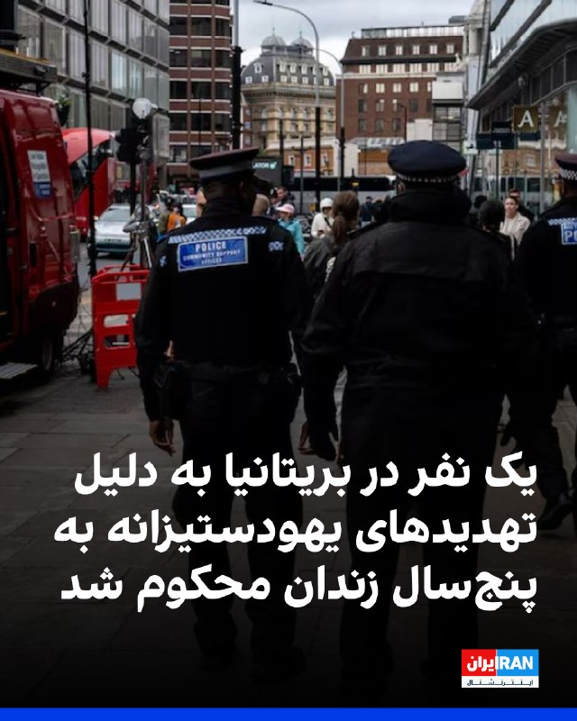

دادستانی بریتانیا اعلام کرد مردی به دلیل مجموعه‌ای از تهدیدهای یهودستیزانه علیه اعضای جامعه یهودیان در شمال لندن، به پنج‌سال زندان محکوم شده است.

پیش‌تر بریتانیا سطح تهدید تروریسم در این کشور را از «قابل توجه» به «شدید» افزایش داده است.

کی‌یر استارمر، نخست‌وزیر بریتانیا، گفته است که یهودیان این کشور در ترس زندگی می‌کنند و وعده داد اقدامات برای حفاظت از آنان تقویت شود.
https://iranintl.com/202605220677

## Shin_Persian — post 6148

  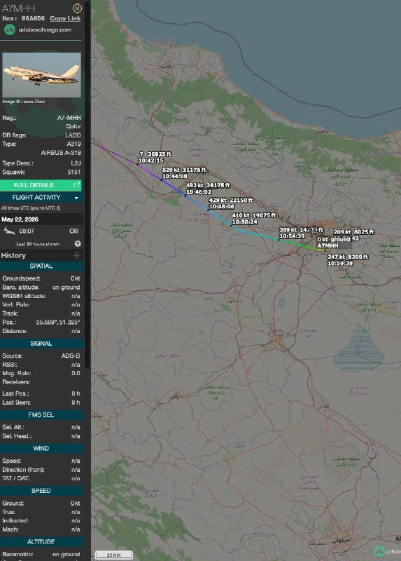

↩️ Quoted tweet: Shin ✓ @hey_itsmyturn Fri, 22 May 2026 15:38:46 UTC It's A7-MHH and it landed in Mehrabad a few hours ago, witness on the ground tells me. ↩️ توییت نقل‌قول شده — برای پاسخ، پست زیر را ببینید. فارسی هواپیما A7-MHH است و طبق گفته‌های یک…

## Shin_Persian — post 6147

↩️ Quoted tweet:
Shin ✓ @hey_itsmyturn
Fri, 22 May 2026 15:38:46 UTC

It's A7-MHH and it landed in Mehrabad a few hours ago, witness on the ground tells me.

↩️ توییت نقل‌قول شده — برای پاسخ، پست زیر را ببینید.

فارسی

هواپیما A7-MHH است و طبق گفته‌های یک شاهد عینی در محل، چند ساعت پیش در مهرآباد به زمین نشست.

𝕏 · @shin_persian

## Shin_Persian — post 6146

↩️ Quoted tweet: Shin ✓ @hey_itsmyturn Fri, 22 May 2026 15:24:02 UTC A Qatari delegation landed in Tehran as per some rumors (which I believe they’re true) ↩️ توییت نقل‌قول شده — برای پاسخ، پست زیر را ببینید. فارسی بر اساس برخی شایعات (که معتقدم صحت دارند)،…

## Shin_Persian — post 6145

↩️ Quoted tweet:
Shin ✓ @hey_itsmyturn
Fri, 22 May 2026 15:24:02 UTC

A Qatari delegation landed in Tehran as per some rumors (which I believe they’re true)

↩️ توییت نقل‌قول شده — برای پاسخ، پست زیر را ببینید.

فارسی

بر اساس برخی شایعات (که معتقدم صحت دارند)، یک هیئت قطری در تهران به زمین نشست.

𝕏 · @shin_persian

## Shin_Persian — post 6141

  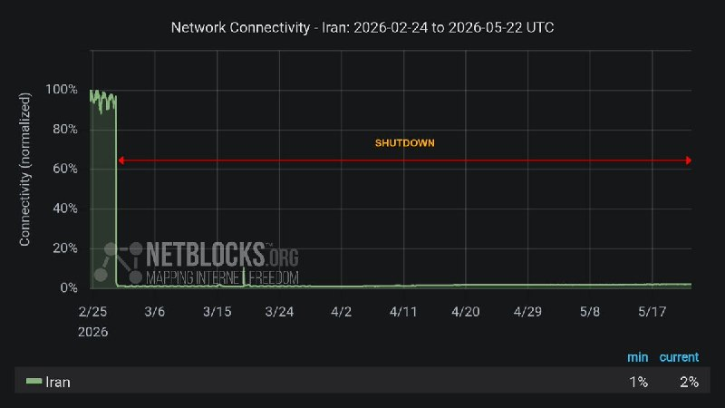

↩️ Quoted tweet:
NetBlocks ✓ @netblocks
Fri, 22 May 2026 15:21:07 UTC

2000 hours.

↩️ توییت نقل‌قول شده — برای پاسخ، پست زیر را ببینید.

فارسی

۲۰۰۰ زولو (۲۳:۳۰ به وقت تهران)

𝕏 · @shin_persian

## Shin_Persian — post 6140

Shin ✓ @hey_itsmyturn
Fri, 22 May 2026 15:24:02 UTC

A Qatari delegation landed in Tehran as per some rumors (which I believe they’re true)

فارسی

بر اساس برخی شایعات (که معتقدم حقیقت دارند)، یک هیئت قطری در تهران به زمین نشست.

𝕏 · @shin_persian

## ManotoTV — post 105746

  <a href="telegram/content/ManotoTV_105746_1779467954.mp4" target="_blank">🎬 Download video</a>

پیام یک مخاطب منوتو درباره پایان پخش برنامه‌های این شبکه

## ManotoTV — post 105745

  <a href="telegram/content/ManotoTV_105745_1779467955.mp4" target="_blank">🎬 Download video</a>

پیام یک مخاطب منوتو درباره پایان پخش برنامه‌های این شبکه

## FarsiVOA — post 218373

قطعی اینترنت در ایران وارد هشتاد و چهارمین روز خود شد و دسترسی شهروندان به شبکه‌های بین‌المللی عملاً برای بیش از ۲۰۰۰ ساعت قطع شده است.

نت‌بلاکس، نهاد مستقل پایش دسترسی به اینترنت، در تازه‌ترین گزارش خود در این باره یادآور شده که با گذشت هر ساعت از خاموشی دیجیتال در ایران، شکاف‌های اقتصادی و اجتماعی عمیق‌تر می‌شوند؛ چرا که هرگونه ارتباط با جهان خارج، تحت کنترل درآمده و مشروط به جایگاه، همسویی (هم‌صدایی با حکومت) و داشتن امتیاز ویژه شده است.

گزارش کامل را در وب‌سایت صدای آمریکا بخوانید.

@FarsiVOA

## FarsiVOA — post 218372

حکم اعدام بیتا همتی و همسرش محمدرضا مجیدی اصل، دو معترض دی، در دیوان عالی کشور نقض شده است. با این حال غلامرضا خانی شکرآب در معرض اجرای قریب‌الوقوع اعدام است.

## FarsiVOA — post 218371

  <a href="telegram/content/FarsiVOA_218371_1779467958.mp4" target="_blank">🎬 Download video</a>

کاخ سفید ویدیویی با عنوان «شی ناشناس پرنده؛ دسامبر ۲۰۱۹، ساحل شرقی» منتشر کرد و اعلام کرد این تصاویر احتمالا توسط حسگر مادون قرمز یک پلتفرم نظامی آمریکا در محدوده مسئولیت فرماندهی شمالی ایالات متحده در سال ۲۰۱۹ ثبت شده‌اند.

@FarsiVOA

## FarsiVOA — post 218369

🔺روبیو درباره مذاکرات: ترجیح پرزیدنت ترامپ دیپلماسی است، اما باید برای گزینه‌های دیگر هم آماده باشیم

▪️وزیر امور خارجه ایالات متحده روز جمعه اول خردادماه، پس از شرکت در اجلاس وزیران امور خارجه عضو ناتو در سوئد به خبرنگاران گفت عدم دستیابی جمهوری اسلامی به سلاح هسته‌ای، تحویل همه اورانیوم‌های غنی‌شده، و بازگشایی تنگه هرمز، ارکان اصلی و خلل‌ناپذیر آمریکا در مذاکرات با رژیم ایران هستند.

⬇️ بیشتر بخوانید:

https://ir.voanews.com/a/nato-marco-rubio-us-euorpe-iran/8152766.html/?nocach=1

## FarsiVOA — post 218367

فرماندهی مرکزی ایالات متحده، سنتکام، اعلام کرد نیروهای تفنگدار دریایی آمریکا سامانه موشکی «هایمارس» را به یک ایستگاه سوخت‌گیری در خاورمیانه منتقل کرده‌اند. سنتکام می‌گوید این سامانه‌های متحرک که توسط ارتش و تفنگداران دریایی آمریکا استفاده می‌شوند، از قابلیت جابه‌جایی سریع برخوردارند.

@FarsiVOA

## FarsiVOA — post 218366

مارکو روبیو، وزیر امور خارجه آمریکا، روز جمعه ۲ خرداد در پایان نشست وزیران امور خارجه کشورهای عضو ناتو در سوئد و پیش از ترک آن کشور به مقصد هند، به پرسش‌های خبرنگاران پاسخ داد. صدای آمریکا این کنفرانس خبری را به طور زنده و با ترجمه همزمان پژواک کیومرثی پخش کرد.

## FarsiVOA — post 218365

مارکو روبیو، وزیر امور خارجه آمریکا، روز جمعه ۲ خرداد در پایان نشست وزیران امور خارجه کشورهای عضو ناتو در سوئد و پیش از ترک آن کشور به مقصد هند، به پرسش‌های خبرنگاران پاسخ داد. صدای آمریکا این کنفرانس خبری را به طور زنده و با ترجمه همزمان پژواک کیومرثی پخش کرد.

## FarsiVOA — post 218364

مارکو روبیو، وزیر امور خارجه آمریکا، روز جمعه ۲ خرداد در پایان نشست وزیران امور خارجه کشورهای عضو ناتو در سوئد و پیش از ترک آن کشور به مقصد هند، به پرسش‌های خبرنگاران پاسخ داد. صدای آمریکا این کنفرانس خبری را به طور زنده و با ترجمه همزمان پژواک کیومرثی پخش کرد.

## FarsiVOA — post 218363

  <a href="telegram/content/FarsiVOA_218363_1779467959.mp4" target="_blank">🎬 Download video</a>

کاخ سفید ویدیویی با عنوان «چهار شی ناشناس پرنده بر فراز آب‌های ایران» منتشر کرد و اعلام کرد این تصاویر احتمالا توسط حسگر مادون قرمز یک پلتفرم نظامی آمریکا در محدوده مسئولیت فرماندهی مرکزی ایالات متحده، سنتکام، در چهارم شهریور ۱۴۰۱ ثبت شده‌اند.

@FarsiVOA

## DW_Farsi — post 125017

🎥 جنگ ایران، کابوس تازه صنعت الماس هند

جنگ ایران، بحران صنعت الماس هند را تشدید کرده؛ اختلال در زنجیره تأمین، کاهش صادرات و موج بیکاری، فعالان این صنعت را با چالش جدی روبه‌رو کرده است.
@dw_farsi

## DW_Farsi — post 125016

  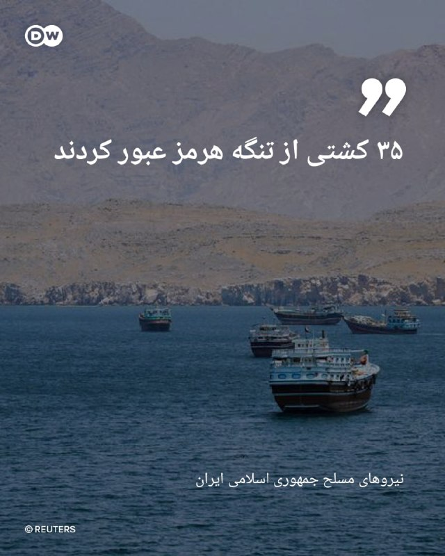

🔶 ایران: ۳۵ کشتی از تنگه هرمز عبور کردند

بنا بر اعلام مقام‌های ایران، در ۲۴ ساعت گذشته ۳۵ فروند کشتی از تنگه هرمز که شاهراهی حیاتی برای تجارت انرژی به شمار می‌رود عبور کرده‌اند. رادیو و تلویزیون دولتی ایران به نقل از بیانیه نیروهای مسلح اعلام کرد که این ترددها با هماهنگی نیروی دریایی سپاه پاسداران انقلاب اسلامی انجام شده است. بر اساس این گزارش، کشتی‌های مذکور شامل نفتکش‌ها، کشتی‌های باربری و سایر کشتی‌های تجاری بوده‌اند.

نیروهای مسلح ایران مدت کوتاهی پس از آغاز جنگ، کنترل تنگه هرمز را که نقشی کلیدی در تجارت جهانی انرژی دارد، به دست گرفتند. در پی تهدیدها، بازرسی‌ها و حمله به کشتی‌ها، رفت‌وآمد در این آبراه استراتژیک تا حد زیادی متوقف شد؛ امری که افزایش چشمگیر قیمت انرژی و سوخت در سراسر جهان را به همراه داشت. علاوه بر این، به گفته ایران، این تنگه در حال حاضر مین‌گذاری شده است.

نیروی دریایی سپاه پاسداران در بیانیه خود اما مدعی است که این نیرو در تنگه هرمز یک آبراه ایمن برای کشتیرانی و استمرار تجارت جهانی ایجاد کرده است.
@dw_farsi

## DW_Farsi — post 125015

  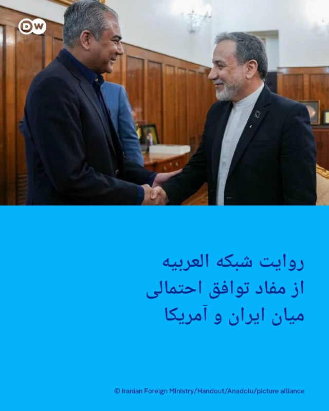

🔶روایت شبکه العربیه از مفاد توافق احتمالی میان ایران و آمریکا

شبکه عربستانی العربیه متنی را منتشر کرده است که ادعا می‌کند "پیش‌نویس نهایی" یک توافق "احتمالی" میان آمریکا و ایران با میانجیگری پاکستان برای پایان دادن به جنگ است.

بنا بر این گزارش، انتظار می‌رود توافق مذکور، که ظاهراَ یک توافق موقت با "مسائل حل‌نشده‌ای" است که باید پس از اجرایی شدن مورد مذاکره قرار گیرند، ظرف چند ساعت آینده اعلام شود.

العربیه ولی تاکید دارد که این توافق "در انتظار تایید" هر دو طرف است.

این گزارش به نقل از منابع ناشناس می‌گوید توافق به محض اعلام رسمی از سوی هر دو طرف، بلافاصله اجرایی خواهد شد.

پیش‌نویس توافق گزارش‌شده، به صراحت به خواست‌های کلیدی ایالات متحده اشاره‌ای نکرده است؛ خواسته‌هایی از جمله برچیدن برنامه هسته‌ای ایران و صادرات ذخیره اورانیوم ۶۰ درصد غنی‌شده آن، محدود کردن موشک‌های بالستیک و پایان دادن به حمایت از گروه‌های نیابتی.

بنا بر این گزارش، مذاکرات درباره "مسائل حل‌نشده" نامشخص، قرار است ظرف هفت روز پس از اجرایی شدن توافق آغاز شود.
@dw_farsi

## DW_Farsi — post 125014

🔶 چرا پرونده تجاوز پژمان جمشیدی به حکم شلاق ختم شد؟

🔻گزارشی از میترا خلعتبری

فضای رسانه‌ای و هنری ایران از پاییز سال گذشته تا کنون با یکی از جنجالی‌ترین پرونده‌ها دست‌وپنجه نرم می‌کند.

نام پژمان جمشیدی ستاره سال‌های نه چندان دور فوتبال و بازیگر پرکار سینما و تلویزیون، ماه‌هاست که نه برای هنرنمایی روی پرده، بلکه به خاطر یک پرونده جنجالی قضایی در صدر اخبار قرار گرفته است. اتهام اولیه "تجاوز به عنف" و "آدم‌ربایی" که با شکایت یک هنرجوی جوان بازیگری مطرح شد، جامعه را در بهت و حیرت فرو برد.

چندین ماه پس از مطرح شدن این شکایت جنجالی، حالا حکم پرونده صادر و مجازات "۹۹ ضربه شلاق تعزیری" اعلام شده است.

اما پرونده این چهره سرشناس با صدور این رای، نه تنها به نقطه‌ای روشن و مشخص نرسیده، بلکه موج جدیدی از ابهامات، سوالات و تناقض‌ها را در افکار عمومی ایجاد کرده است.
@dw_farsi

## DW_Farsi — post 125013

  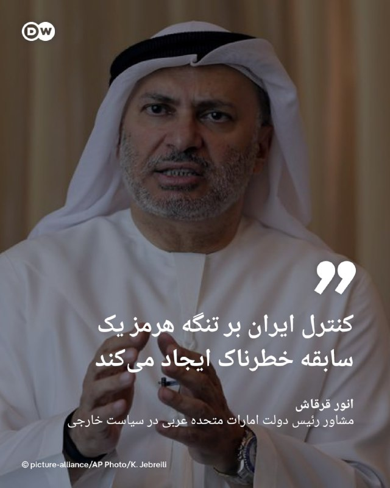

🔶 قرقاش: کنترل ایران بر تنگه هرمز یک سابقه خطرناک ایجاد می‌کند

انور قرقاش، مشاور رئیس دولت امارات متحده عربی در سیاست خارجی، روز جمعه ۲۲ مه، اعلام کرد که شانس دستیابی به توافق صلح میان آمریکا و ایران "۵۰-۵۰" است، اما تاکید کرد که هرگونه حل‌وفصل سیاسی برای جلوگیری از درگیری‌های آینده، باید به ریشه‌های اصلی بی‌ثباتی در منطقه بپردازد.

پاکستان در حال میانجیگری برای برقراری یک آتش‌بس میان ایالات متحده و ایران است تا به جنگی که اقتصاد جهانی را تکان داده و تجارت را در تنگه هرمز ، شاهراه حیاتی برای انتقال حدود یک‌پنجم محموله‌های نفت و گاز طبیعی مایع (LNG) جهان، مختل کرده است، پایان دهد.

انور قرقاش، مشاور دیپلماتیک رئیس دولت امارات، در کنفرانس «گلوبسک» (Globsec) در پراگ گفت: «شانس دستیابی به توافق ۵۰-۵۰ است. نگرانی من این است که ایرانی‌ها همیشه در مذاکرات زیاده‌خواهی کرده‌اند.»

قرقاش افزود: «این موضوع جدیدی نیست. آن‌ها در طول سال‌ها به دلیل تمایل به دست‌بالا گرفتن برگ‌های بازی خود، فرصت‌های زیادی را از دست داده‌اند. امیدوارم این بار این کار را نکنند.»
@dw_farsi

## DW_Farsi — post 125012

🔶 "استفاده وسیع آمریکا از موشک‌های رهگیر برای دفاع از اسرائیل"

واشنگتن‌پست گزارش داد آمریکا در جریان جنگ اخیر با ایران، بیش از ۳۰۰ موشک رهگیر برای دفاع از اسرائیل شلیک کرده، در حالی که اسرائیل حدود ۱۹۰ رهگیر به کار برده است.

بر اساس این گزارش، واشنگتن بیش از ۲۰۰ سامانه پدافندی "تاد" و بیش از ۱۰۰ موشک "اس‌ام-۳" و "اس‌ام-۶" شلیک کرده، در حالی که اسرائیل کمتر از ۱۰۰ موشک رهگیر "پیکان" و حدود ۹۰ موشک از سامانه "فلاخن داوود" استفاده کرده است.
@dw_farsi

## DW_Farsi — post 125011

  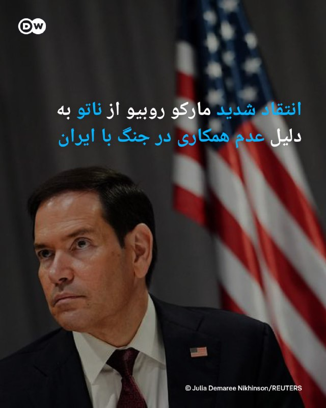

🔶 انتقاد شدید مارکو روبیو از ناتو به دلیل عدم همکاری در جنگ با ایران

مارکو روبیو، وزیر امور خارجه ایالات متحده، کمی پیش از پرواز به مقصد سوئد برای شرکت در نشست ناتو، انتقادها از این پیمان نظامی را مجددا تکرار کرد.

این سیاستمدار آمریکایی گفت: «فکر نمی‌کنم کسی از اینکه ایالات متحده و به ویژه شخص رئیس‌جمهور در حال حاضر تا این حد از ناتو و عملکرد آن ناامید شده‌اند، غافلگیر شده باشد.»

روبیو به عنوان دلیل مشخص این نارضایتی، به مخالفت و امتناع کشورهایی مانند اسپانیا از اجازه دادن به آمریکا برای استفاده از پایگاه‌های نظامی‌شان در جنگ علیه ایران اشاره کرد.

او در ادامه توضیحات خود افزود که عضویت ایالات متحده در یک ائتلاف باید برای این کشور ارزش و منفعتی داشته باشد و یکی از ارزش‌های محوری ناتو، پایگاه‌های نظامی موجود در اروپا هستند.

به گفته او، این پایگاه‌ها به ایالات متحده امکان می‌دهند تا در صورت بروز بحران در خاورمیانه یا هر جای دیگر، قدرت نظامی خود را اعمال کند.
@dw_farsi

## Persian_Trend_Official — post 14677

  <a href="telegram/content/Persian_Trend_Official_14677_1779467964.mp4" target="_blank">🎬 Download video</a>

کلیپ «UAP نزدیک فرودگاه کاراگاندا» در پرونده‌های جدید یوفو ظاهر شد

ویدئو نشان می‌دهد «یک پدیده نورانی با ردپاهایی از روشنایی کاهنده که از مرکز گسترش می‌یابد»

«آن هواپیما نیست» — شاهد در ویدئو

👩‍💻:PhantomDirective

🆔 @persian_trend_official
پرشین ترند | متفاوت‌ترین کانال نظامی

## Persian_Trend_Official — post 14676

UAP از ساحل شرقی

فیلم گرفته شده توسط حسگر مادون قرمز روی سکوی نظامی آمریکا در سال ۲۰۱۹

👩‍💻:PhantomDirective

🆔 @persian_trend_official
پرشین ترند | متفاوت‌ترین کانال نظامی

## Persian_Trend_Official — post 14675

  <a href="telegram/content/Persian_Trend_Official_14675_1779467966.mp4" target="_blank">🎬 Download video</a>

کلیپ «تشکیل UAP بر فراز ایران» در دومین دسته از پرونده‌های یوفو پیدا شد

فیلم سال ۲۰۲۲ احتمالاً از حسگر مادون قرمز نصب شده روی یک سکوی نظامی آمریکا گرفته شده و در سال ۲۰۲۴ به شبکه‌ای محرمانه آپلود شده است.

👩‍💻:PhantomDirective

🆔 @persian_trend_official
پرشین ترند | متفاوت‌ترین کانال نظامی

## Persian_Trend_Official — post 14674

  <a href="telegram/content/Persian_Trend_Official_14674_1779467969.mp4" target="_blank">🎬 Download video</a>

یک شیء ناشناس پرنده (UFO) توسط جنگنده اف-۱۶ نیروی هوایی آمریکا سرنگون شد

ویدئویی با عنوان «نیروی هوایی ملی گارد اف-۱۶ سی آمریکا یک شیء پرنده ناشناس را بر فراز دریاچه هورون در ۱۲ فوریه ۲۰۲۳ سرنگون می‌کند» احتمالاً با استفاده از حسگر مادون قرمز نصب شده روی یک سکوی نظامی آمریکا ضبط شده است

## Persian_Trend_Official — post 14673

کلیپ «شیء پرنده ناشناس کروی در ابرها» در دومین دسته از پرونده‌های یوفو منتشر شد

تصویری از سال ۲۰۲۳ احتمالاً از حسگر مادون قرمز نظامی آمریکا بالای دریای زرد گرفته شده است — AARO

از نظر بصری، با اندازه یک هواپیمای معمولی مطابقت ندارد و حرکت آن با موشک عادی همخوانی ندارد

👩‍💻:PhantomDirective

🆔 @persian_trend_official
پرشین ترند | متفاوت‌ترین کانال نظامی

## Persian_Trend_Official — post 14672

💢هواپیما گلف استریم ارتش پاکستان به سمت تهران در حرکت است. 🫆:Tony 📌 @persian_trend_official پرشین ترند | متفاوت‌ترین کانال نظامی

## Persian_Trend_Official — post 14671

  <a href="telegram/content/Persian_Trend_Official_14671_1779467970.mp4" target="_blank">🎬 Download video</a>

💢فیلم منتشر شده در دومین دسته از پرونده‌های مرتبط با یوفو ها

💢پنتاگون، یک جسم پرنده را بر فراز سوریه نشان می‌دهد که با شتاب لحظه ای زیاد نا‌پدید میشود.

🫆:Tony

📌 @persian_trend_official
پرشین ترند | متفاوت‌ترین کانال نظامی

## Persian_Trend_Official — post 14670

  <a href="telegram/content/Persian_Trend_Official_14670_1779467973.webm" target="_blank">🎬 Download video</a>

‼️همزمان با ورود فرمانده ارتش پاکستان.
وزیر کشور پاکستان اندکی قبل تهران را ترک کرد،

👩‍💻:PhantomDirective

🆔 @persian_trend_official
پرشین ترند | متفاوت‌ترین کانال نظامی

## Persian_Trend_Official — post 14669

  <a href="telegram/content/Persian_Trend_Official_14669_1779467973.mp4" target="_blank">🎬 Download video</a>

💢 روبیو، وزیرخارجه آمریکا: ما در ارتباط مداوم با فیلد مارشال عاصم منیر در بالاترین سطوح دولت خود هستیم.

👩‍💻:PhantomDirective

📣 @persian_trend_official
پرشین ترند | متفاوت‌ترین کانال نظامی

## Persian_Trend_Official — post 14668

  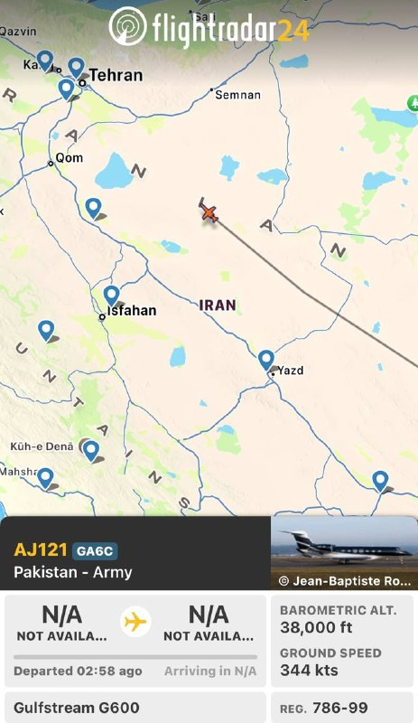

🔴فرمانده ارتش پاکستان راهی تهران شد؟؟؟ 💢به گزارش الحدث به نقل از منابع خود گزارش داد که عاصم منیر فرمانده ارتش پاکستان عازم تهران شد. 🫆:Tony 📌 @persian_trend_official پرشین ترند | متفاوت‌ترین کانال نظامی

## Persian_Trend_Official — post 14667

🔴 آکسیوس: چند کشور منطقه در تلاش برای نهایی‌کردن توافق اولیه میان ایران و آمریکا هستند

💢وب‌سایت آکسیوس گزارش داد پاکستان، قطر، عربستان سعودی، مصر و ترکیه در تلاش‌های میانجیگرانه میان تهران و واشینگتن مشارکت دارند.

بر اساس این گزارش:
▪️ هدف این مذاکرات، نهایی‌کردن «نامه اعلام نیت» میان ایران و آمریکا است
▪️ این توافق شامل پایان جنگ و آغاز ۳۰ روز مذاکره درباره توافقی گسترده‌تر بر سر برنامه هسته‌ای ایران خواهد بود
▪️ مذاکرات بر روی اصول اولیه کاهش تنش و چارچوب ادامه گفت‌وگوها متمرکز است
آکسیوس همچنین نوشت:
▪️ هنوز مشخص نیست تهران حاضر به امضای چنین توافقی خواهد شد یا نه
▪️ برخی جریان‌ها در ایران معتقدند در شرایط فعلی، اهرم فشار به نفع تهران است
🫆:Tony

📌 @persian_trend_official
پرشین ترند | متفاوت‌ترین کانال نظامی

## Persian_Trend_Official — post 14666

  <a href="telegram/content/Persian_Trend_Official_14666_1779467977.webm" target="_blank">🎬 Download video</a>

🔴 روبیو: پاکستان همچنان مذاکره‌کننده اصلی پرونده ایران است

💢مارکو روبیو، وزیر خارجه آمریکا، اعلام کرد پاکستان نقش اصلی در مذاکرات مرتبط با ایران را بر عهده داشته و همچنان این نقش را حفظ کرده است.

او گفت:
▪️ «مذاکره‌کننده اصلی درباره ایران، پاکستان بوده و همچنان هست»
▪️ فیلد مارشال «عاصم منیر» به‌زودی به ایران سفر خواهد کرد
▪️ واشینگتن به‌صورت مداوم و در بالاترین سطوح با او در ارتباط است
🫆:Tony

📌 @persian_trend_official
پرشین ترند | متفاوت‌ترین کانال نظامی

## RadioFarda — post 157458

  <a href="https://t.me/radiofarda/157458" target="_blank">📎 Download file</a>

🔸 در این کافه فردا به انتخاب علی خامنه‌ای به عنوان «شهید شاخص سال» توسط نظام، عدم دسترسی حداد عادل به دامادش مجتبی خامنه‌ای، زندگی و آثار مهدی سپهر خواننده تازه درگذشته، رکورد شکنی در حراج کریستی، دادگاه صادق ساعدی‌نیا و کاهش نرخ ازدواج در ایران به نصف در سال‌ها اخیر می‌پردازیم.

🔸 برای تماس با ما می‌توانید به شناسه کافه فردا در تلگرام صوت و متن بفرستید.

📻 کافه فردا

## RadioFarda — post 157457

🔸فیلم «تمرین‌هایی برای یک انقلاب» ساخته پگاه آهنگرانی، بازیگر و فیلمساز ایرانی، که درباره دهه‌ها سرکوب سیاسی در ایران است، روز جمعه جایزه «چشم طلایی»، مهم‌ترین جایزه مستند جشنواره کن، را به دست آورد.

🔸خانم آهنگرانی هنگام دریافت جایزه در حضور تی‌یری فرمو، مدیر این جشنواره، جایزه خود را به مردم ایران تقدیم کرد.

🔸هیئت داوران این جایزه به ریاست مستیلاو چرنوف، فیلمساز برنده جایزه اسکار، فیلم «تمرین‌هایی برای یک انقلاب» را از میان ۲۱ فیلم حاضر در جشنواره و بخش‌های جنبی آن انتخاب کرد.

🔸اعضای هیئت داوران در بیانیه‌ای درباره اهدای جایزه به «تمرین‌هایی برای یک انقلاب» گفتند: «این فیلم از طریق درهم‌تنیدگی سینمای شخصی، تاریخی و شاعرانه، به ما اجازه می‌دهد وارد واقعیت پیچیده و چندلایه ایران معاصر شویم. این فیلم در تلاش برای یافتن زبانی جهت بیان حقیقت‌های این لحظه، از زیر سؤال بردن شیوه‌های خودش، تردید کردن به خود و آسیب‌پذیر بودن هراسی ندارد.»

🔸پگاه آهنگرانی هنگام اکران این فیلم مستند بلند در جشنواره کن، آن را به مادرانی تقدیم کرد که فرزندان خود را در راه آزادی دست‌ داده‌اند.

@RadioFarda

## RadioFarda — post 157456

  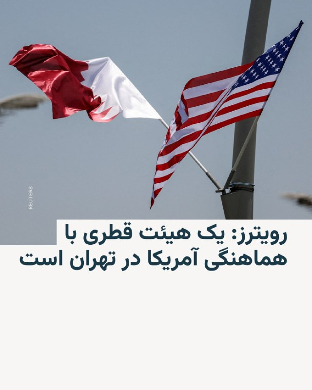

🔸خبرگزاری رویترز به نقل از یک منبع آگاه نوشت که یک تیم مذاکره‌کننده قطری روز جمعه با «هماهنگی» ایالات متحده وارد تهران شد.

🔸این گزارش، هدف از این سفر را «کمک» به دستیابی به توافقی برای پایان دادن به جنگ با ایران و حل مسائل باقی‌مانده عنوان کرده است.

🔸دوحه که پیش‌تر در جنگ غزه و دیگر تنش‌های بین‌المللی نقش میانجی را ایفا کرده بود، تا کنون از ایفای نقش میانجی‌گری در جنگ ایران فاصله گرفته بود.

🔸این کشور در جریان درگیری‌های اخیر بارها هدف حملات موشکی و پهپادی ایران قرار گرفته بود.

@RadioFarda

## RadioFarda — post 157455

گزارش وال‌استریت جورنال از «کمک» بابک زنجانی به انتقال میلیون‌ها دلار پول برای ایران

🔸روزنامۀ وال‌استریت جورنال در گزارشی مفصل که پنجشنبه ۳۱ اردیبهشت‌ماه منتشر کرده، از نقش بابک زنجانی و شبکه‌اش در «تأمین منابع هنگفت مالی» برای سپاه پاسداران، آن‌هم با استفاده از بزرگترین صرافی رمزارز جهان خبر داده است.

🔸بر اساس این گزارش، اقدامات بابک زنجانی، دست‌کم تا همین چند ماه پیش هم ادامه داشته است.

🔸وال‌استریت جورنال با استناد به گزارش‌های داخلی صرافی «بایننس» در مورد انطباق تراکنش‌ها با قوانین ضد پولشویی و تأمین مالی تروریسم، می‌گوید شبکۀ مالی مخفی بابک زنجانی ظرف دو سال تا پایان سال میلادی گذشته، ۸۵۰ میلیون دلار تراکنش در این صرافی ارز دیجیتال داشته است؛ تراکنش‌هایی که عمدتاً هم از یک حساب کاربری انجام می‌شده‌اند.

🔸کارشناسان بایننس متوجه شده بودند که خواهر، یکی از دوستان نزدیک، و مدیر شرکت بابک زنجانی، همگی حساب‌هایی را در این صرافی «اداره» می‌کرده‌اند که در واقع از سخت‌افزارهای واحدی مدیریت می‌شده‌اند؛ الگویی که از نظر کارشناسان این صرافی، به‌عنوان مدرکی دال بر تلاش برای دور زدن تحریم‌های ایالات متحده شناخته شد.

🔸با وجود این حساب اصلی این شبکه، دست‌کم تا آغاز سال جاری میلادی، اواسط دی‌ماه گذشته همچنان باز و فعال بوده است.

🔸بر اساس یافته‌های بازرسان بایننس و گزارش‌های داخلی این صرافی، تحقیقات اف‌بی‌آی و نهادهای امنیتی‌ بین‌المللی که رد پول‌های مرتبط با تروریسم را دنبال می‌کنند، پژوهشگران رمزارز و داده‌های بلاک‌چِین، جابجایی این ۸۵۰ میلیون دلار، در قالب میلیاردها تراکنش ارز دیجیتال انجام شده که تا پیش از آغاز جنگ جاری آمریکا و اسرائیل با ایران، از طریق بایننس و با هدف تأمین مالی شبکه‌های مرتبط با سپاه پاسداران انجام می‌شده‌اند.

🔸جزئیات بیشتر را در وب سایت رادیوفردا بخوانید.

@RadioFarda

## IranianMinds — post 20562

🔴 الحدث: فرمانده ارتش پاکستان، عاصم منیر، به سمت تهران حرکت کرد. @IranianMinds

## IranianMinds — post 20561

🔴 ترامپ :

خلاصه بهتون بگم ، خواهیم دید چه خواهد شد.

@IranianMinds

## IranianMinds — post 20560

🔴 ترامپ:

ما بزرگ‌ترین ارتش جهان را داریم و می‌خواهیم بودجه دفاعی ۱.۵ تریلیون دلاری داشته باشیم.

@IranianMinds

## IranianMinds — post 20559

🔴 ترامپ:

ما به ایران ضربات شدیدی وارد کردیم و گزینه دیگری نداشتیم.

@IranianMinds

## IranianMinds — post 20558

🔴 ترامپ:

ایران شدیدا مشتاق رسیدن به توافق است

خواهیم دید چه خواهد شد.

@IranianMinds

## IranianMinds — post 20557

🔴 ترامپ:

ما در ایران همان کاری را انجام می‌دهیم که در ونزوئلا کردیم.

@IranianMinds

## IranianMinds — post 20556

  <a href="telegram/content/IranianMinds_20556_1779467979.mp4" target="_blank">🎬 Download video</a>

🔴 ترامپ :

ایران داره میمیره برای اینکه توافق کنیم

@IranianMinds

## IranianMinds — post 20555

مهریه دخترانشان «پهپاد»
اسباب بازی کودکانشان «کلاشینکف»
لق‌لق‌ی زبانشان مرگ بر «این و ان»
اما هسته ای رو واسه تولید برق می‌خواهند!

بچه زرنگ‌های تروريست از در عقب :)
نه ببین داش اورانیوم ۶۰ درصد غنی کردیم برای کارای پزشکی🤡

@IranianMinds

## IranianMinds — post 20554

  

🔴 نت بلاکس: ۲ هزار ساعت ، ۸۴ روز از قطعی اینترنت ایران گذشت …

@IranianMinds

## IranianMinds — post 20553

  <a href="telegram/content/IranianMinds_20553_1779467982.mp4" target="_blank">🎬 Download video</a>

🔴 زمین گرده ، ایشون شهردار جدید بیرمنگام انگلیس هستند !

@IranianMinds

## IranianMinds — post 20552

  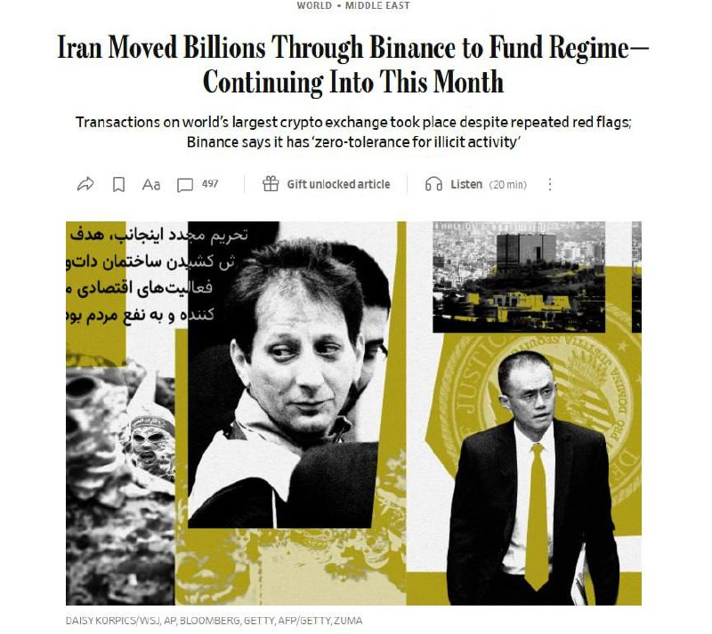

🔴 طبق گزارش وال استریت ژورنال، بایننس میلیاردها دلار تراکنش رمزارز مرتبط با شبکه‌های ایرانی تأمین‌کننده سپاه و گروه‌های نیابتی مثل حماس، حزب‌الله و انصارالله داشته است.

حساب‌های مرتبط با بابک زنجانی و خانواده‌اش به‌عنوان دور زدن تحریم و پول‌شویی برای جمهوری اسلامی شناسایی شدند، اما ماه‌ ها در این صرافی باز ماندند.

@IranianMinds

## IranianMinds — post 20551

❌دیگه فریب بونوس سایت های متفرقه رو نخورید!

💖توی این سایت که مورد #تایید ماست، با عضویت 500 هزارتومان بگیر!

🌐 Winro.io

🌐 Winro.io

## IranianMinds — post 20550

  <a href="telegram/content/IranianMinds_20550_1779467985.webm" target="_blank">🎬 Download video</a>

👍 
👍 #اختصاصی #وینرو :

✅ ثبت نام کن 
🤩 
🤩 
🤩 هزارتومان شارژ بی قیدوشرط بگیر!

💵 
💬 به مدت محدود 
📣

😮 تنها سایتی که با عضویت بدون واریز 500,000 تومان شارژ بی قیدو شرط میده #وینرو هست
💰

👑 #معتبرترین سایت ایرانی 
⬇️

🌐 Winro.io

🌐 Winro.io

📱کانال اخبار و هدایا g1 
🎁

📱 @winro_io

## IranianMinds — post 20548

  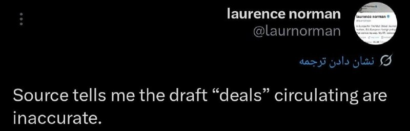

🔴نورمن، خبرنگار وال‌استریت‌ژورنال:

یک منبع میگه هر چیزی درباره پیش‌نویس توافق که داره می‌چرخه، دروغه و صحت نداره.

@IranianMinds

## BBCPersian — post 281800

🔻ایران خطاب به آلمان: منشور ملل متحد مفهومی با عنوان جنگ ضروری نمی‌شناسد

سخنگوی وزارت خارجه ایران گفته است حمله آمریکا و اسرائیل به ایران و جنگی که در پی آن رخ داد، «نقض آشکار» منشور سازمان ملل متحد بوده است.

اسماعیل بقایی در پیامی در ایکس خطاب به فرانک‌والتر اشتاین‌مایر، رئیس‌جمهور آلمان، نوشت: «منشور سازمان ملل هیچ مفهومی تحت عنوان “جنگ ضروری” را به رسمیت نمی‌شناسد که به [آمریکا] حق دهد بر اساس تصمیمات خودسرانه و دلبخواهی متجاوزان، علیه یک کشور مستقل از زور استفاده کند.»

رئیس جمهور آلمان اخیرا درباره جنگ آمریکا و اسرائیل درباره ایران اظهارنظر کرده بود. او در مصاحبه با یک پادکست آلمانی گفته بود که جنگ اخیر با ایران غیر ضروری و قابل اجتناب بود.

سخنگوی وزارت خارجه ایران امروز در واکنش به این اظهارات گفته است «حمله آمریکا و اسرائیل به ایران را نمی‌توان کم‌اهمیت جلوه داد یا صرفا به‌عنوان یک "جنگ غیرضروری" بازتعریف کرد.»

آقای اشتاین‌مایر، در زمان توافق اتمی برجام، وزیر خارجه آلمان و یکی از حامیان به دست آمدن این توافق با جمهوری اسلامی ایران بود.

https://bbc.in/4v3pH4G
@BBCPersian

## BBCPersian — post 281799

ویدیوی خوانندگی و نوازندگی گروهی از زنان در موزه هنرهای معاصر مورد توجه قرار گرفت.

در جریان برنامه چهارم «موزیک تک» که روز پنجشنبه ۳۱ اردیبهشت در فضای باز و داخلی موزه هنرهای معاصر تهران برگزار شد، گروه‌های مختلف موسیقی جنوب ایران را اجرا کردند.

در این میان تک‌خوانی یک خواننده زن به همراه گروه نوازندگان که همه زن بودند با استقبال حاضران روبرو شد و انتشار ویدیوی آن هم مورد استقبال قرار گرفت.

برای ممنوعیت تک‌خوانی زنان در قوانین جمهوری اسلامی هیچ بند و ماده صریحی وجود ندارد. اما همیشه با ممنوعیت‌ها و محدودیت‌های اجرایی روبرو بوده است. بارها از نوازندگی زنان روی صحنه‌ کنسرت‌ها جلوگیری شده است.

این محدودیت‌ها برخلاف اصول حقوق بشر و حقوق زنان است. بسیاری از زنان خواننده در ایران بدون توجه به این ممنوعیت، صدایشان را منتشر کرده‌اند.
@BBCPersian

## BBCPersian — post 281798

🔻دادگستری ایلام می‌گوید اموال هفت نفر را توقیف کرده است

رئیس دادگستری استان ایلام اعلام کرده است که «اموال و دارایی‌های» هفت نفر از شهروندان یکی از شهرستان‌های این استان را به دلیل آنچه که او «خائنین به وطن» خوانده «به نفع حقوق عامه» توقیف کرده است.

عمران علی‌محمدی به خبرگزاری قوه قضائیه گفت این توقیف «در راستای اعمال مجازات مصادره اموال موضوع قانون تشدید مجازات جاسوسی و نیز قانون نحوه اجرای اصل ۴۹ قانون اساسی» و پس از «تشکیل پرونده قضایی برای متهمین» انجام شده است.

به گفته رئیس دادگستری ایلام این اموال توقیف شده «شامل مسکن، خودرو، دارایی های بانکی و سایر اموال بوده است.»

در روزها و هفته‌های اخیر دادگستری‌ها در استان‌های مختلف ایران اعلام کرده‌اند که اموال شهروندان را با چنین اتهاماتی توقیف کرده‌اند.

در برخی موارد نام افراد نیز منتشر شده است.

https://bbc.in/4v3pH4G
@BBCPersian

## BBCPersian — post 281797

🔻رویترز: یک هیئت قطری در هماهنگی با آمریکا در تهران است

رویترز به نقل از یک منابع آگاه گزارش داده است که هیئتی از قطر در هماهنگی با آمریکا، وارد تهران شده است.

بر اساس گزارش این خبرگزاری، هدف این هیئت از سفر به تهران، کمک به حصول توافقی برای پایان دادن به جنگ با ایران و حل اختلافات باقی‌مانده است.

قطر که پیشتر در جنگ غزه و دیگر تنش‌های بین‌المللی نقش میانجی را ایفا می‌کرد، از زمان آغاز جنگ اخیر آمریکا و اسرائیل با ایران، از میانجیگری فاصله گرفته بود.

این کشور در جریان حملات اخیر آمریکا و اسرائیل به ایران، هدف حملات موشکی و پهپادی جمهوری اسلامی قرار گرفت.

https://bbc.in/4v3pH4G
@BBCPersian

## BBCPersian — post 281796

  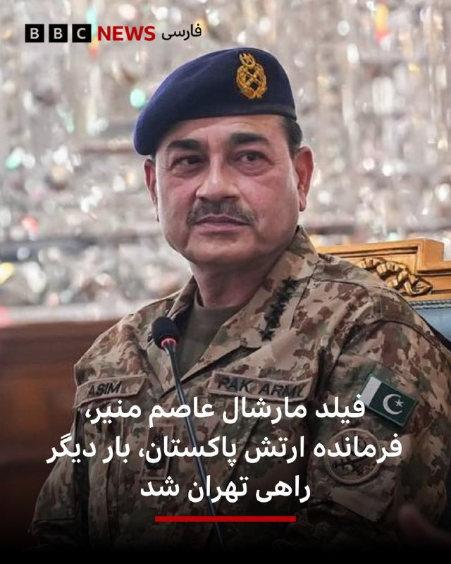

🔻به گزارش رسانه‌های دولتی پاکستان، فیلد مارشال عاصم منیر،‌ فرمانده ارتش این کشور راهی تهران شده است.

خبرگزاری اسوشیتد پرس پاکستان به نقل از منابع امنیتی گزارش داده است که فیلد مارشال عاصم منیر در طول این سفر رسمی، درباره «مذاکرات جاری ایران و آمریکا و صلح و ثبات منطقه‌ و منافع دوجانبه دیگر» با مقام‌های ایران گفت‌و‌گو خواهد کرد.

فرمانده ارتش پاکستان چهل روز پیش هم در تهران بود و با محمدباقر قالیباف و اعضای تیم مذاکره‌ ایران و آمریکا دیدار و گفت‌وگو کرده بود.

این در حالی است که وزیر کشور پاکستان هم برای دومین بار طی هفته اخیر به تهران رفته و در حال گفت‌وگو با مقامات ایرانی است.

مارکو روبیو، وزیر خارجه آمریکا، امروز گفت که واشنگتن در انتظار شنیدن نتیجه این گفت‌وگوهاست.

📸 Getty

https://bbc.in/4v3pH4G
@BBCPersian

## Dirty_Kids — post 389960

اگه مادرجندگی یک سکه باشه، یه سمتش واشقانیه سمت دیگه‌ش شهبازی.

@Dirty_Kids 👻

## Dirty_Kids — post 389959

  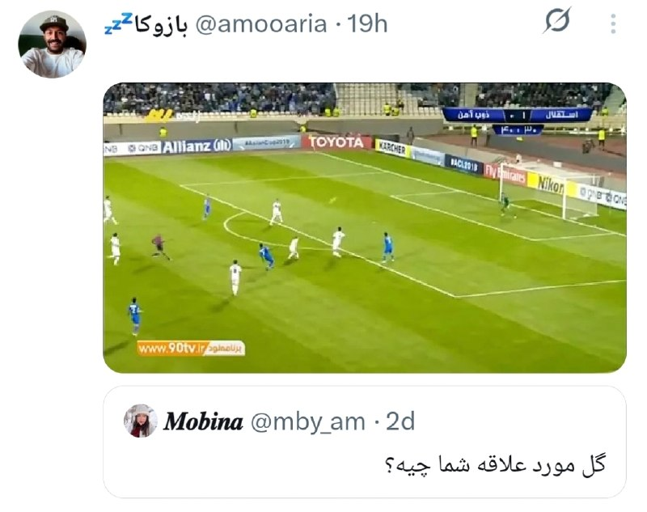

+ چرا اشک تو چشمات جمع شد این که فقط یه گل تو فوتبال

#رشید_مظاهری

@Dirty_Kids 👻

## Dirty_Kids — post 389958

  <a href="https://t.me/Dirty_Kids/389958" target="_blank">📎 Download file</a>

✅ اپلیکیشن اندروید سایت جهانی دربی بت

💰اولین سایت جهانی با امکان شارژ و برداشت ریالی(کارت به کارت)

🔗 برای ورود فیلترشکن روی کشور مناسب قرار دهید مانند فنلاند و المان و....

😀Telegram Channel
👇
https://t.me/+bcynkEgSW2dlYTc0

## Dirty_Kids — post 389957

  

😤دنبال یه سایت شرط بندی بین المللی بودی که به ایرانیا خدمات بده؟!
⛔

👍دربی بت همون انتخاب  100%

💎ویژگی های سایت جهانی Derby Bet:

⬅️امکان شارژ امن با کارت بانکی

⬅️واریز اول دوبل شارژ می شوید(بونوس۱۰۰٪)

⬅️پر اپشن ترین سایت فعال در ایران

⬅️تسویه حساب کمتر از 5 دقیقه

⬅️برگشت بخشی از باخت به صورت هفتگی

🚨کد هدیه ثبت نام:GG007

⚠️برای دانلود اپلکیشن کلیک کنید
👉

🔔کانال دربی بت :

🪙https://t.me/+bcynkEgSW2dlYTc0

## Dirty_Kids — post 389956

تمام ساید های زندگیم رو هواست؛ عاطفی، تحصیلی، کاری، کیرخری.

@Dirty_Kids 👻

## Dirty_Kids — post 389955

  

🔴 جدیدا دخترا دائم دارن پست میزنن که از پسرای نسل جدید و پسرایی که حداقل ۱۰ سال از خودشون کوچیک ترن خیلی خوششون میاد.

به این صورت که دخترای دهه ۶۰-۷۰ عاشق پسرای دهه ۸۰-۹۰ شدن!

@Dirty_Kids 👻

## Dirty_Kids — post 389954

  <a href="telegram/content/Dirty_Kids_389954_1779467990.mp4" target="_blank">🎬 Download video</a>

ترامپ:

ایران داره از شدت نیاز، برای توافق له‌له می‌زنه؛

ما ضربه سنگینی بهشون زدیم، چاره‌ای هم نداشتیم، چون ایران نباید به سلاح هسته‌ای دست پیدا کنه.

@Dirty_Kids 👻

## Dirty_Kids — post 389953

  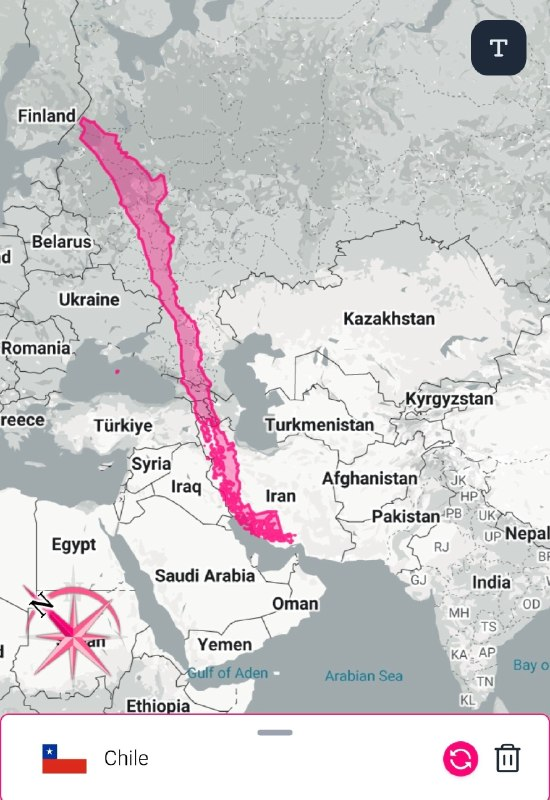

‏شیلی با یه همچین جغرافیای عجیبی چجور میتونه کشور باشه؟

مردم شیلی دور هم جمع نمیشن، همیشه کنار همن

@Dirty_Kids 👻

## Dirty_Kids — post 389952

  <a href="telegram/content/Dirty_Kids_389952_1779467993.mp4" target="_blank">🎬 Download video</a>

لباس بدن نما ، سوتین به سمت کعبه! آرایش غلیظ و بی حجاب و پروژه خفن!😂
لوازم کار جنده های نظام در نزدیکیهای سقوط
چقدر شما مادرقحبه اید؟! انتها نداره.

@Dirty_Kids 👻

## Dirty_Kids — post 389951

  

🌪وقتی اینترنت طوفانیه فقط کافیه بادبان ها رو بکشی

⚫️100 هزار تومان تخفیف خرید اول 
🎁

⚫️پایین ترین قیمت گیگی 180 هزار تومان
🌐 

⚫️پورسانت %10 دائمی برای هر معرفی
💼

با بادبان، میتونی یه اتصال سریع، پایدار و امن
همراه با پشتیبانی ۲۴ ساعته داشته باشی
🚀

🛒کد تخفیف: badban4k

بادبان راهتو باز می‌کنه
⛵️
G1

🛡@BadBan_VPN | کانال 

🤖@BadBan_VPNBot | ربات 

📞@BadBan_VPNSupport | پشتیبانی

## Dirty_Kids — post 389950

  <a href="telegram/content/Dirty_Kids_389950_1779467995.mp4" target="_blank">🎬 Download video</a>

چرا رژیم چنج برای ترامپ حیاتی هست

@Dirty_Kids 👻

## Dirty_Kids — post 389949

  <a href="telegram/content/Dirty_Kids_389949_1779467998.mp4" target="_blank">🎬 Download video</a>

آخر شب در خیابونای مملکت چه میگذرد:

@Dirty_Kids 👻

## Hranews — post 113095

  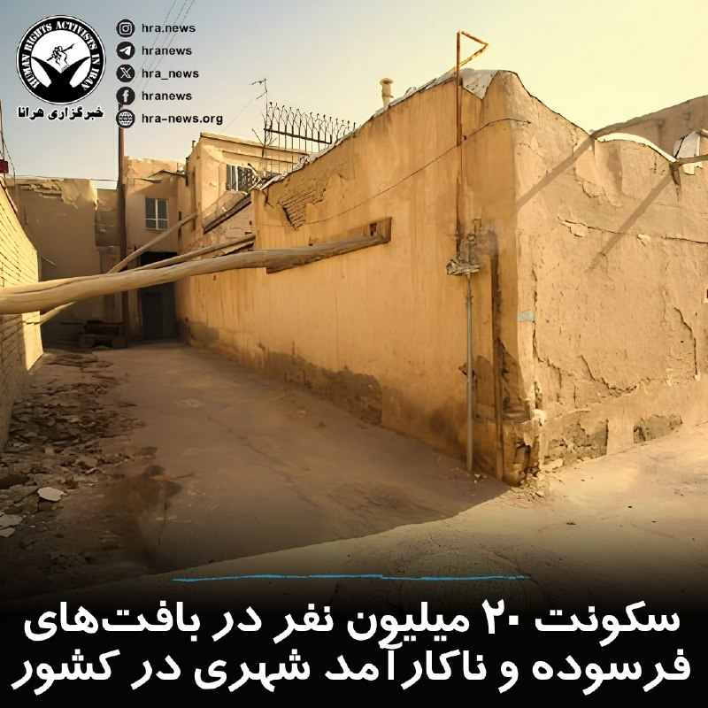

معاون وزیر راه‌وشهرسازی و مدیرعامل شرکت بازآفرینی شهری کشور نسبت به وضعیت بافت‌های فرسوده و ناپایدار در ایران هشدار داد. به گفته علیرضا گلپایگانی، نزدیک به ۵ میلیون نفر در واحدهای مسکونی به‌شدت ناپایدار سکونت دارند و حدود ۲۰ میلیون شهروند نیز در بافت‌های فرسوده و ناکارآمد شهری زندگی می‌کنند. این در حالی است که این شهروندان از نظر تاب‌آوری، سرانه‌های خدماتی و کیفیت فضای زندگی با مشکلات زیادی مواجه هستند.

وی با تأکید بر ضرورت توجه به بازآفرینی شهری اعلام کرد که بی‌توجهی به وضعیت این مناطق می‌تواند هزینه‌های سنگینی را برای کشور به همراه داشته باشد.

↘️
@hranews_bot تماس ✉️ - @Hranews کانال هرانا 🆑

## manototv — post 105746

  <a href="telegram/content/manototv_105746_1779468000.mp4" target="_blank">🎬 Download video</a>

پیام یک مخاطب منوتو درباره پایان پخش برنامه‌های این شبکه

## manototv — post 105745

  <a href="telegram/content/manototv_105745_1779468002.mp4" target="_blank">🎬 Download video</a>

پیام یک مخاطب منوتو درباره پایان پخش برنامه‌های این شبکه

## alonews — post 121829

  <a href="telegram/content/alonews_121829_1779468003.webm" target="_blank">🎬 Download video</a>

👈العربی الجدید به نقل از منبعی در وزارت خارجه پاکستان: واشنگتن و تهران انعطاف کافی در پرونده‌های اصلی از خود نشان نمی‌دهند

✅ @AloNews خبر جنگ

## alonews — post 121828

  <a href="telegram/content/alonews_121828_1779468004.webm" target="_blank">🎬 Download video</a>

👈ایسنا: عاصم منیر وارد تهران شد

✅ @AloNews خبر جنگ

## alonews — post 121827

  <a href="telegram/content/alonews_121827_1779468004.mp4" target="_blank">🎬 Download video</a>

👈کوین وارش رسماً به عنوان هفدهمین رئیس فدرال رزرو سوگند یاد کرد

✅ @AloNews خبر جنگ

## alonews — post 121826

  <a href="telegram/content/alonews_121826_1779468007.webm" target="_blank">🎬 Download video</a>

👈العربی الجدید به نقل از منبعی در وزارت خارجه پاکستان: واشنگتن و تهران انعطاف کافی در پرونده‌های اصلی از خود نشان نمی‌دهند.

🔴سفر فرمانده ارتش (پاکستان) به تهران ممکن است آخرین تلاش برای جلوگیری از بازگشت منطقه به جنگ باشد

✅ @AloNews خبر جنگ

## alonews — post 121825

  <a href="telegram/content/alonews_121825_1779468007.mp4" target="_blank">🎬 Download video</a>

👈ترامپ : من اینو زیاد میگم پادشاه عربستان به من گفت ما داغ ترین کشور دنیا هستیم

✅ @AloNews خبر جنگ

## alonews — post 121824

  <a href="telegram/content/alonews_121824_1779468009.webm" target="_blank">🎬 Download video</a>

👈ترامپ: ما بزرگترین ارتش جهان را داریم و بودجه دفاعی ۱.۵ تریلیون دلاری می‌خواهیم

✅ @AloNews خبر جنگ

## alonews — post 121823

  <a href="telegram/content/alonews_121823_1779468010.webm" target="_blank">🎬 Download video</a>

👈ترامپ : خواهیم دید که اوضاع چگونه پیش خواهد رفت.

✅ @AloNews خبر جنگ

## alonews — post 121822

  <a href="telegram/content/alonews_121822_1779468010.webm" target="_blank">🎬 Download video</a>

👈ترامپ: ضربات سختی به ایران زدیم و چاره دیگری نداشتیم

✅ @AloNews خبر جنگ

## alonews — post 121821

  <a href="telegram/content/alonews_121821_1779468010.webm" target="_blank">🎬 Download video</a>

👈ترامپ: ایران به شدت خواهان توافق است!

🔴همان کاری را که در ونزوئلا انجام دادیم، در ایران انجام می دهیم

✅ @AloNews خبر جنگ

## alonews — post 121820

  <a href="telegram/content/alonews_121820_1779468011.mp4" target="_blank">🎬 Download video</a>

👈ترامپ : من با رئیس جمهور شی بودم و بهش گفتم ما بهترین ارتش دنیا رو داریم اون واقعاً مخالفت نکرد جلسه خوبی داشتیم در واقع با من مخالفت هم نکرد

✅ @AloNews خبر جنگ

## alonews — post 121819

  <a href="telegram/content/alonews_121819_1779468012.mp4" target="_blank">🎬 Download video</a>

👈ترامپ : ما یه مقدار بدهی داریم که باید حلش کنیم و راهش رشد اقتصادیه قراره با رشد خیلی سریع از این بدهی خارج بشیم

✅ @AloNews خبر جنگ

## alonews — post 121818

  <a href="telegram/content/alonews_121818_1779468015.mp4" target="_blank">🎬 Download video</a>

👈 جمعیت: *تشویق برای کوین وارش*

🔴 ترامپ: فکر کردم این تشویق برای من است. خیلی ناراحت شدم. به اطراف نگاه کردم و دیدم که همه به شما نگاه می‌کنند. من از این موضوع خوشحال نبودم.

✅ @AloNews خبر جنگ

## alonews — post 121817

  <a href="telegram/content/alonews_121817_1779468017.webm" target="_blank">🎬 Download video</a>

👈رایزنی اولیانوف و گروسی درباره وضعیت خلیج فارس

✅ @AloNews خبر جنگ

## alonews — post 121816

  <a href="telegram/content/alonews_121816_1779468017.webm" target="_blank">🎬 Download video</a>

👈منابع خبری از سفر مارکو روبیو، وزیر خارجه آمریکا به دهلی نو، پایتخت هند خبر دادند.
 

🔴موضوع انرژی در بحبوحه جنگ علیه  ایران و فروش تسلیحات به هند از محورهای گفتگوی روبیو با مقام‌های هند خواهد بود.

✅ @AloNews خبر جنگ

## alonews — post 121815

  <a href="telegram/content/alonews_121815_1779468018.webm" target="_blank">🎬 Download video</a>

👈وال استریت ژورنال با استناد به داده‌های کپلر: ۹۰ درصد مخازن ذخیره‌سازی نفت ایران در خشکی پر شده است

✅ @AloNews خبر جنگ

## alonews — post 121814

  <a href="telegram/content/alonews_121814_1779468018.webm" target="_blank">🎬 Download video</a>

👈رئیس شورای عالی سیاسی یمن: هرگونه تجاوز جدید آمریکا یا اسرائیل با پاسخ قاطع مواجه خواهد شد

✅ @AloNews خبر جنگ

## alonews — post 121813

  <a href="telegram/content/alonews_121813_1779468018.webm" target="_blank">🎬 Download video</a>

👈الحدث: ژنرال عاصم منیر، فرمانده ارتش پاکستان، به تهران وارد شد.

✅ @AloNews خبر جنگ

## alonews — post 121812

  <a href="telegram/content/alonews_121812_1779468019.webm" target="_blank">🎬 Download video</a>

👈وال استریت ژورنال: صادرات نفت ایران از طریق دریا به دلیل محاصره به سطح صفر کاهش یافته است

✅ @AloNews خبر جنگ

## alonews — post 121811

  <a href="telegram/content/alonews_121811_1779468019.webm" target="_blank">🎬 Download video</a>

👈مقامات اتحادیه اروپا اعلام کردند که اروپایی‌ها می‌توانند انتظار داشته باشند که قیمت نفت و گاز حداقل تا پایان سال ۲۰۲۷ بالاتر از قیمت قبل از جنگ باقی بماند و قیمت سایر کالاها نیز روند صعودی را دنبال می‌کند

✅ @AloNews خبر جنگ

## alonews — post 121810

  <a href="telegram/content/alonews_121810_1779468019.webm" target="_blank">🎬 Download video</a>

👈العربیه: اگر تفاهمی بین آمریکا و ایران حاصل شود، توافق تک صفحه‌ای به نام «بیانیه اسلام‌آباد» خواهد بود

🔴پس از دستیابی به توافق احتمالی، مذاکرات جامعی در یک بازه زمانی مشخص انجام خواهد شد

✅ @AloNews خبر جنگ

<!-- MSG END -->

<!-- NAV START -->

<a href="https://github.com/Tljn/FUD/blob/main/telegram/content/archive_1.md" style="display:inline-block; padding:6px 12px; margin:0 4px; background-color:#2ea44f; color:white; text-decoration:none; border-radius:4px; font-weight:bold;">صفحه بعد</a>

<!-- NAV END -->
