# خواننده تلگرام

<!-- TOP_NAV START -->

<a href="https://github.com/Tljn/FUD/blob/main/telegram/content/archive_1.md" style="display:inline-block; padding:6px 12px; margin:0 4px; background-color:#2ea44f; color:white; text-decoration:none; border-radius:4px; font-weight:bold;">صفحه بعد</a>

<!-- TOP_NAV END -->

<!-- MSG START -->

---
📅 بروزرسانی: 1405/03/24 18:17
---

## VahidOOnLine — post 245490

  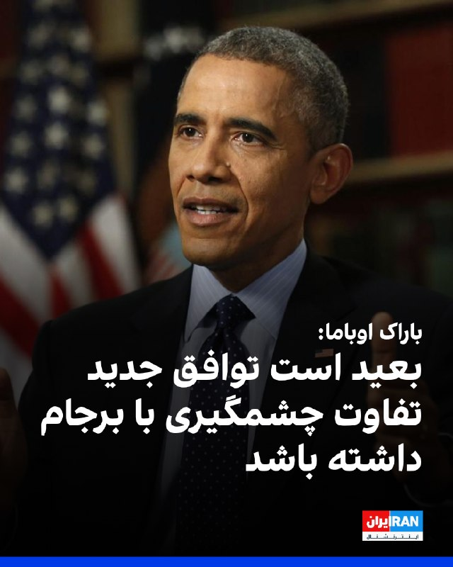

باراک اوباما، رییس‌جمهوری پیشین آمریکا، در گفت‌وگو با ای‌بی‌سی نیوز گفت بعید است هر توافقی که میان آمریکا و جمهوری اسلامی حاصل شود، تفاوت چشمگیری با برجام داشته باشد یا نسبت به آن بهبود قابل توجهی محسوب شود.
اوباما با اشاره به برجام گفت این توافق بر محدود کردن برنامه هسته‌ای ایران، تعیین سقف برای غنی‌سازی اورانیوم و پذیرش بازرسی‌های آژانس بین‌المللی انرژی اتمی در ازای رفع بخشی از تحریم‌ها و آزادسازی دارایی‌های مسدودشده ایران استوار بود.
او همچنین ابراز امیدواری کرد بمباران‌ها متوقف شود و مردم عادی دیگر از پیامدهای جنگ رنج نکشند.
رییس‌جمهوری پیشین آمریکا تاکید کرد دیپلماسی را به اقدام نظامی ترجیح می‌دهد و گفت نباید تصور کرد که می‌توان با زور یا بمباران به راه‌حل دست یافت.
اوباما خواستار بررسی کامل گزینه‌های دیپلماتیک شد و گفت توافق‌هایی که همه مشکلات را حل نمی‌کنند اما ۸۰ یا ۹۰ درصد آن‌ها را برطرف می‌کنند، می‌توانند از جنگ جلوگیری کنند.
‌🏁 🇬🇧 IranintlTV

🤖 @VahidOOnLine

## VahidOOnLine — post 245489

  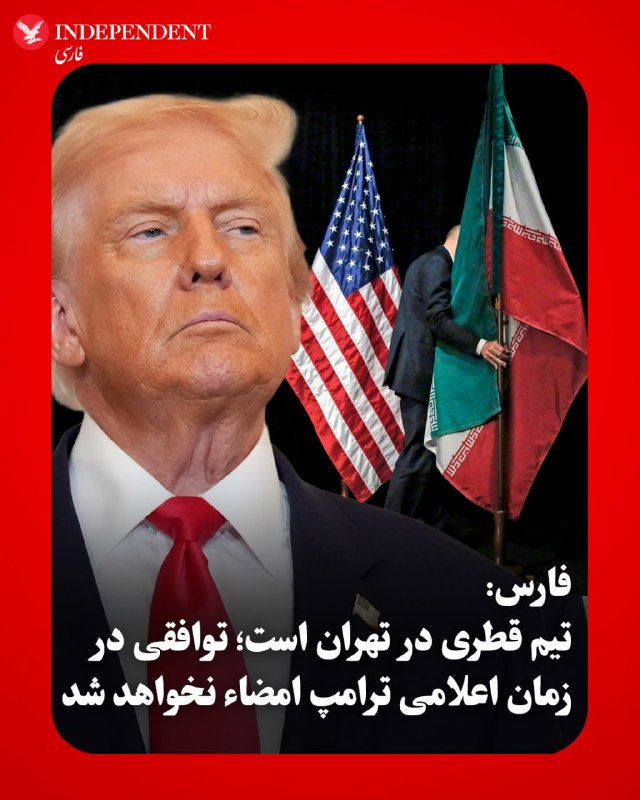

♦️خبرگزاری فارس، نزدیک به سپاه پاسداران، روز یکشنبه ۲۴ خرداد به نقل از یک منبع نزدیک به تیم مذاکره‌کننده ایران گزارش داد که نمایندگان قطر در تهران حضور دارند و ایران از طریق این هیئت، بندهای موردنظر و جزئیات مدنظر خود را به طرف آمریکایی منتقل می‌کند.
فارس با تاکید بر آنکه گفتگو با منبع گزارش ساعتی پیش از حمله اسرائیل به بیروت انجام شده است، در باره مذاکرات نوشت: «حتی اگر در روند مذاکره پیش و پس برویم و به عقب برگردیم، شرط اساسی ایران این است که در پایان، تمام موارد مدنظرش به طور کامل لحاظ شود.»
این خبرگزاری حکومتی در ادامه به نقل از منبع خود یادآور شد: «حتی در صورت پذیرش تمامی دیدگاه‌های ایران، هیچ توافقی در زمان اعلام‌شده از سوی دونالد ترامپ امضاء نخواهد شد.»
این گزارش در حالی منتشر شده که مایک والتز، سفیر آمریکا در سازمان ملل متحد، اعلام کرده است دونالد ترامپ همچنان مصمم است چارچوب اولیه توافق صلح با ایران را روز یکشنبه امضا کند.
‌🇸🇦 Indypersian

🤖 @VahidOOnLine

## VahidOOnLine — post 245488

  

ارتش اسرائیل اعلام کرد ایال زمیر، رییس ستاد ارتش، پس از حمله به بیروت در حال برگزاری ارزیابی‌های مستمر از وضعیت با همه فرماندهان مرتبط است.

ارتش اسرائیل افزود بر اساس این ارزیابی‌ها، خود را برای احتمال شلیک به خاک اسرائیل در ساعات آینده آماده می‌کند.

این نهاد تاکید کرد در بالاترین سطح آماده‌باش قرار دارد و برای سناریوهای مختلف دفاعی و تهاجمی آماده است.

ارتش اسرائیل از شهروندان خواست هوشیار باشند، مسئولانه عمل کنند و دستورالعمل‌های فرماندهی جبهه داخلی را دنبال کنند.

این نهاد همچنین اعلام کرد در حال حاضر تغییری در دستورالعمل‌های دفاعی جبهه داخلی ایجاد نشده و در صورت هرگونه تغییر، اطلاع‌رسانی خواهد شد.

ارتش اسرائیل تاکید کرد شلیک به خاک این کشور را تحمل نخواهد کرد.
‌🏁 🇬🇧 IranintlTV

🤖 @VahidOOnLine

## VahidOOnLine — post 245487

  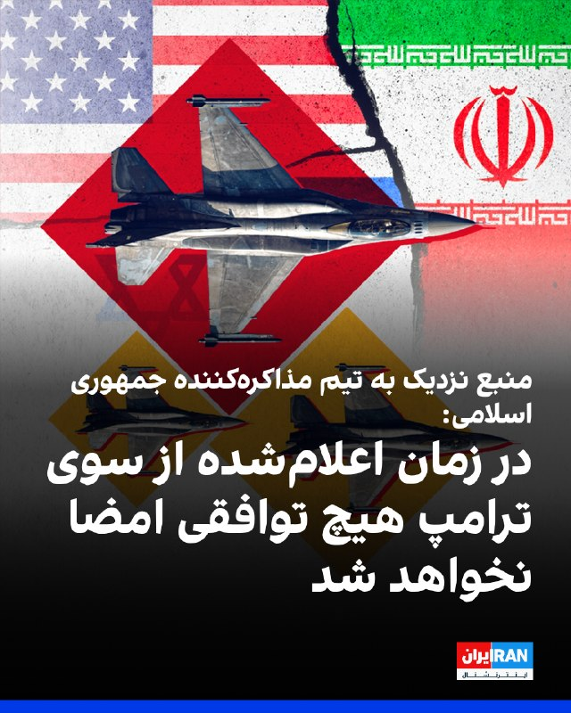

خبرگزاری فارس، وابسته به سپاه پاسداران، به نقل از یک منبع نزدیک به تیم مذاکره‌کننده جمهوری اسلامی گزارش داد هیات قطری هم‌اکنون در تهران حضور دارد و مواضع و جزییات مدنظر جمهوری اسلامی را به طرف آمریکایی منتقل می‌کند.
این منبع گفت هنوز هیچ‌یک از موضوعات مورد مذاکره نهایی نشده است و افزود حتی در صورت رفت‌وبرگشت در روند گفت‌وگوها، شرط اساسی جمهوری اسلامی لحاظ شدن کامل مطالباتش در متن نهایی است.
به گفته این منبع، حتی در صورت پذیرش همه نظرات جمهوری اسلامی نیز در زمان اعلام‌شده از سوی دونالد ترامپ، رییس‌جمهوری آمریکا، هیچ توافقی امضا نخواهد شد.
فارس نوشت این اظهارات ساعاتی پیش از حمله اسرائیل به ضاحیه بیروت مطرح شده است.
‌🏁 🇬🇧 IranintlTV

🤖 @VahidOOnLine

## VahidOOnLine — post 245486

  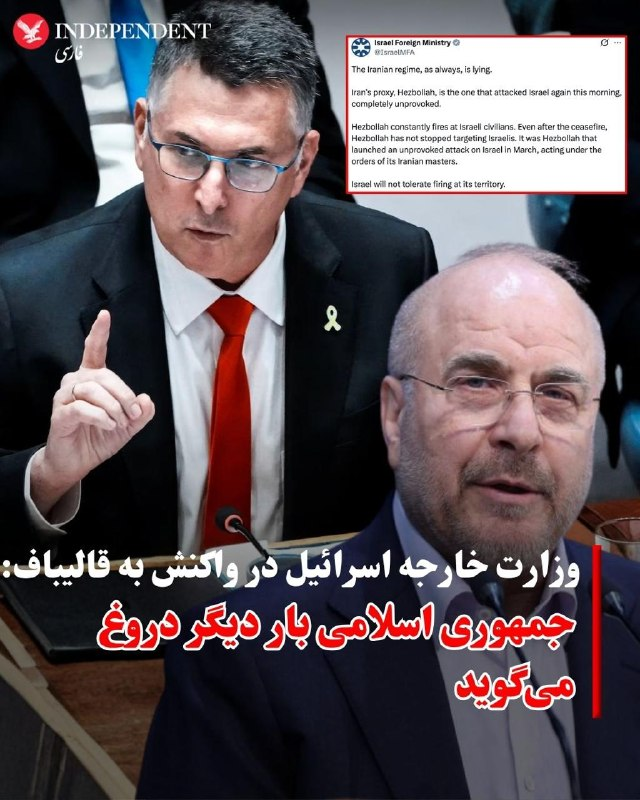

♦️حساب رسمی وزارت خارجه اسرائیل، روز یکشنبه ۲۴ خرداد ماه در واکنش به اظهارات محمدباقر قالیباف، رئیس مجلس شورای اسلامی در شبکه اجتماعی ایکس نوشت: جمهوری اسلامی «مثل همیشه دروغ می‌گوید.»

وزارت خارجه اسرائیل در این پیام با بیان آنکه اسرائیل شلیک به خاک خود را تحمل نخواهد کرد یادآور شد، حزب‌الله، صبح روز یکشنبه «بدون هیچ‌گونه تحریک قبلی» بار دیگر به اسرائیل حمله کرده است.

در این پیام آمده است حزب‌الله به طور مداوم غیرنظامیان اسرائیلی را هدف قرار می‌دهد و حتی پس از برقراری آتش‌بس نیز حملات خود علیه اسرائیل را متوقف نکرده است.

قالیباف در روزی که به گفته دونالد ترامپ قرار بود توافق پایان جنگ میان ایران و آمریکا امضا شود، در ایکس نوشت حمله اسرائیل «به ضاحیه بار دیگر نشان داد آمریکا یا اراده‌ای برای اجرای تعهدات خود ندارد یا توان آن را. با چراغ سبز نشان دادن به رژیم نمی‌توانید امتیاز بگیرید. بازی پلیس بد و پلیس خوب قدیمی شده است. اگر اراده و توان اجرای تعهدات خود را ندارید، سخن گفتن از ادامه مسیر ممکن نیست.»
‌🇸🇦 Indypersian

🤖 @VahidOOnLine

## VahidOOnLine — post 245485

  

کامران پولادی، عضو کمیسیون امور داخلی مجلس جمهوری اسلامی، گفت برخی افراد با تکرار «حرف دشمن» و ایجاد اختلاف در جامعه، وحدت کشور را هدف قرار می‌دهند.
او با اشاره به تاکید مجتبی خامنه‌ای بر حفظ وحدت، خواستار ورود دستگاه قضایی شد و گفت این افراد باید احضار و تذکر بگیرند و اگر «قابل هدایت» نیستند، با آنان برخورد جدی‌تر شود.
پولادی همچنین گفت باید اجازه داد «میدان و دیپلماسی» در کنار یکدیگر مسیر خود را طی کنند. او افزود: مردان میدان و دیپلماسی در چارچوب خطوط قرمز تعیین‌شده از سوی مجتبی خامنه‌ای، منافع جمهوری اسلامی را دنبال می‌کنند.
‌🏁 🇬🇧 IranintlTV

🤖 @VahidOOnLine

## VahidOOnLine — post 245484

  

محمد مرندی، از اصحاب رسانه همراه با هیات مذاکره جمهوری اسلامی در پاکستان، درباره ادامه مذاکرات تهران و واشینگتن، در شبکه ایکس نوشت: «فعلا هیچ مذاکره دیگری در کار نخواهد بود.»
همزمان با احتمال امضای تفاهم‌نامه میان آمریکا و جمهوری اسلامی، اسرائیل روز یک‌شنبه حملاتی را به جنوب بیروت انجام داد.
در پی حملات به لبنان، قالیباف در شبکه ایکس نوشت: «این حمله نشان می‌دهد آمریکا یا اراده اجرای تعهدات خود را ندارد یا توان آن را. با چراغ سبز نشان دادن به اسرائیل نمی‌توانید امتیاز بگیرید. بازی پلیس بد و پلیس خوب قدیمی شده است.»
‌🏁 🇬🇧 IranintlTV

🤖 @VahidOOnLine

## VahidOOnLine — post 245483

  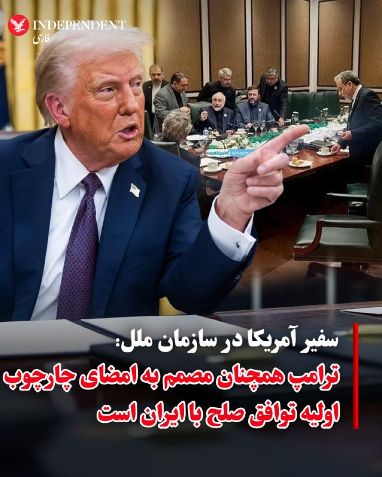

♦️همزمان با حمله اسرائیل به ضاحیه لبنان و بالاگرفتن تنش‌های لفظی میان مقام‌های ایران و اسرائیل، مایک والتز، سفیر آمریکا در سازمان ملل متحد، اعلام کرد دونالد ترامپ همچنان مصمم است چارچوب اولیه توافق صلح با ایران را در روز یکشنبه امضا کند.
سفیر آمریکا در سازمان ملل، روز یکشنبه در گفتگو با شبکه خبری ای‌بی‌سی این اظهارات را مطرح کرد.
محمدباقر قالیباف، مذاکره کننده ارشد ایران، پس از حملات ارتش اسرائیل به جنوب بیروت، با انتشار متنی در ایکس نوشت حمله به مواضع حزب الله با «چراغ سبز» آمریکا انجام شده و نشان می‌دهد این کشور در انجام تعهدات خود جدی نیست.
وزارت خارجه اسرائیل نیز در واکنش به سخنان قالیباف با متهم کردن رهبران جمهوری اسلامی به دروغگویی، حملات ارتش این کشور به ضاحیه را پاسخی به حملات حزب‌ الله دانست.
‌🇸🇦 Indypersian

🤖 @VahidOOnLine

## VahidOOnLine — post 245482

ویدیوهای رسیده به ایران‌اینترنشنال نشان می‌دهند ایرانیان مقیم آلمان شنبه ۲۳ خرداد با فراخوان شاهزاده رضا پهلوی و علیه جمهوری اسلامی در هانوفر تجمع کرده و نام جاویدنامان انقلاب ملی را فریاد زدند.
‌🏁 🇬🇧 IranintlTV

🤖 @VahidOOnLine

## VahidOOnLine — post 245481

🗣روایت شما از احتمال توافق میان جمهوری اسلامی و آمریکا - یکشنبه ۲۴ خرداد

🔹مطمئنم با توافق و آزادی پول‌های بلوکه‌شده، دوباره این حکومت خودش را ریکاوری می‌کند و هم خودش و هم نیابتی‌هایش دوباره جان می‌گیرند. زیر توافق زدن هم برایشان کاری ندارد. آن‌وقت ببینیم باز هم ترامپ از توافق خواهد گفت؟

🔹تحقیر یک حکومت گاهی از نابودی آن مرگبارتر است. هیروهیتو مجبور شد بگوید خدا نیست و در مراسم تسلیم، پایان امپراتوری را ببیند. لویی شانزدهم با از دست دادن هیبتش سقوط کرد. تزار نیکلای دوم هم اول تحقیر شد و بعد فروپاشید. اصرار ترامپ بر امضای تسلیم‌نامه نیز از همین جنس است.

🔹یکی بود می‌گفت نه جنگ می‌شود نه مذاکره می‌کنیم. الان نیست ببیند که هم کشته شد، هم جنگ شد و هم مذاکره. تازه بیچاره نمی‌داند که جنازه‌اش هم بعد از ۱۰۷ روز هنوز خاک نشده است.

🔹جوانی ما به ‌دست جمهوری اسلامی و به‌خاطر هسته‌ای نابود شد، اما الان می‌خواهند دو دستی همه‌چیز را تقدیم آمریکا کنند.

🔹از رودهن: هیچ‌کس جز ایرانی دلش برای ایران و جاویدنام‌های دسته‌گل این کشور نسوخته، پس باید با هم باشیم و برای بیرون کردن اشغالگران فقط دست‌هایمان را به همدیگر گره بزنیم.
‌🏁 🇬🇧 IranintlTV

🤖 @VahidOOnLine

## VahidOOnLine — post 245480

  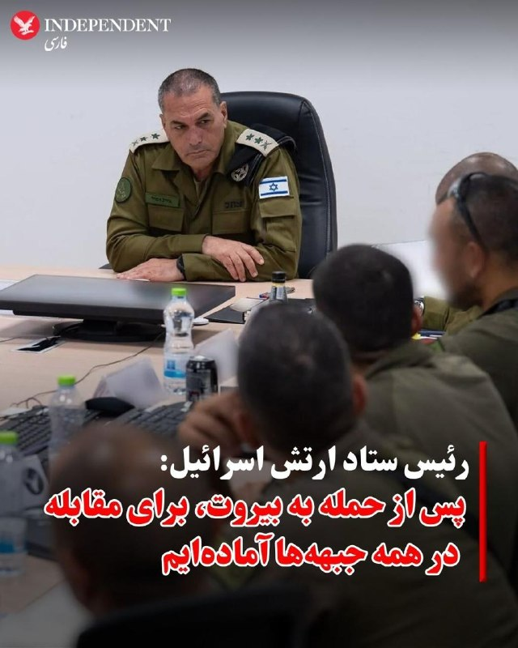

♦️ایال زمیر، رئیس ستاد ارتش اسرائیل، روز یکشنبه ۲۴ خرداد ماه و ساعاتی پس از حمله این کشور به ضاحیه جنوبی در بیروت اعلام کرد ارتش اسرائیل برای مقابله با هرگونه تحول در تمامی جبهه‌ها آمادگی کامل دارد.

ارتش اسرائیل نیز اعلام کرد زمیر در نشستی با فرماندهان لشکرها و تیپ‌های نظامی، طرح‌های عملیاتی جدید برای لبنان را تأیید کرده است.

حمله اسرائیل به بیروت در گرماگرم گمانه‌زنی‌ها درباره امضای تفاهم‌نامه صلح میان تهران و واشنگتن در روز یکشنبه انجام شده است. جمهوری اسلامی پیش‌تر هشدار داده بود هرگونه حمله اسرائیل به بیروت می‌تواند با واکنش تهران همراه شود.

محمدجعفر اسدی، معاون بازرسی قرارگاه مرکزی خاتم‌الانبیاء، در واکنش به حمله روز یکشنبه اسرائیل به ضایحه بیروت گفت، سپاه پاسداران به این حملات پاسخ خواهد داد.
‌🇸🇦 Indypersian

🤖 @VahidOOnLine

## VahidOOnLine — post 245479

♦️هزاران هوادار فوتبال در ترکیه برای تماشای نخستین دیدار تیم ملی این کشور در جام جهانی ۲۰۲۶ در مکان‌های تاریخی آنتالیا و استانبول گرد هم آمدند.
هواداران ترکیه بازی تیم ملی کشورشان مقابل استرالیا را در آمفی‌تئاتر تابستانی تاریخی آنتیفلوس در آنتالیا و قلعه یدیکوله در استانبول تماشا کردند. یکی از هواداران حاضر در آنتالیا گفت: «فضا تاریخی است و جام جهانی هیجان فوق‌العاده‌ای ایجاد کرده است.»
تیم ملی ترکیه که پس از ۲۴ سال بار دیگر به جام جهانی راه یافته، در نخستین دیدار خود با نتیجه ۲ بر صفر مقابل استرالیا شکست خورد.
‌🇸🇦 Indypersian

🤖 @VahidOOnLine

## VahidOOnLine — post 245478

  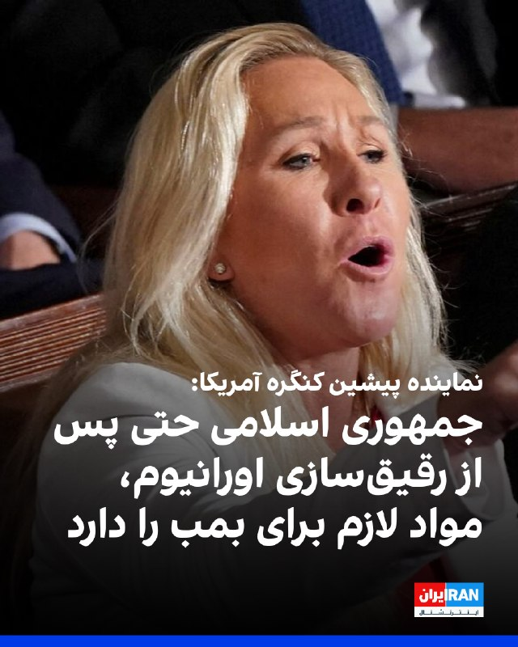

مارجوری تیلور گرین، نماینده پیشین کنگره آمریکا، در ایکس با بازنشر مطلبی درباره برنامه هسته‌ای جمهوری اسلامی نوشت هرگونه توافق با تهران، حتی در صورت رقیق‌سازی بخشی از ذخایر اورانیوم در اصفهان، همچنان مواد کافی برای ساخت یک بمب در اختیار جمهوری اسلامی قرار خواهد داد.
او افزود توافقی که اکنون در حال بررسی است، «غیرقابل قبول» خواهد بود.
همزمان رویترز به نقل از یک مقام ارشد جمهوری اسلامی گزارش داد در پیش‌نویس یادداشت تفاهم میان تهران و واشینگتن، آمریکا با رقیق‌سازی ذخایر اورانیوم با غنای بالا در داخل ایران موافقت کرده است.
‌🏁 🇬🇧 IranintlTV

🤖 @VahidOOnLine

## VahidOOnLine — post 245477

  

ایال زمیر، رییس ستاد ارتش اسرائیل، گفت ارتش تحولات منطقه را به‌دقت زیر نظر دارد و در همه جبهه‌ها سطح بالایی از آمادگی و هوشیاری را حفظ کرده است.

او افزود لبنان مرکز ثقل اصلی عملیات اسرائیل است، اما ارتش برای تحولات احتمالی در سایر جبهه‌ها نیز آماده می‌شود.

ارتش اسرائیل اعلام کرد ایال زمیر در نشست با فرماندهان جبهه شمالی، طرح‌های عملیاتی جدید برای لبنان را تایید کرده است.

ایال زمیر گفت حزب‌الله فاجعه‌ای بر دولت لبنان و جامعه شیعه تحمیل کرده است و مردم لبنان این موضوع را به‌خوبی درک می‌کنند. او افزود تمام روستاهای جنوب لبنان به شبکه‌ای پیچیده از زیرساخت‌های تروریستی تبدیل شده‌اند.

رییس ستاد ارتش اسرائیل تاکید کرد ارتش به عملیات ابتکاری و تهاجمی خود ادامه خواهد داد.
‌🏁 🇬🇧 IranintlTV

🤖 @VahidOOnLine

## VahidOOnLine — post 245476

  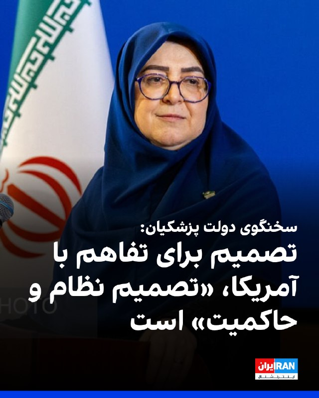

فاطمه مهاجرانی، سخنگوی دولت جمهوری اسلامی، با انتقاد از حملات برخی جریان‌ها به تیم مذاکره‌کننده گفت تصمیم‌گیری درباره تفاهم احتمالی با آمریکا در سطح «نظام و حاکمیت» انجام می‌شود و حمله به مذاکره‌کنندگان، حمله به یک «تصمیم ملی» است.
او در گفت‌وگو با ایرنا از محمدباقر قالیباف، رییس مجلس جمهوری اسلامی، و عباس عراقچی، وزیر امور خارجه، دفاع کرد و گفت هر دو سابقه دفاع از «منافع ملی» را دارند.
مهاجرانی افزود: «دیپلماسی در برابر میدان نیست، بلکه ادامه میدان است» و افزود مذاکره از موضع اقتدار به معنای عقب‌نشینی نیست.
‌🏁 🇬🇧 IranintlTV

🤖 @VahidOOnLine

## VahidOOnLine — post 245475

  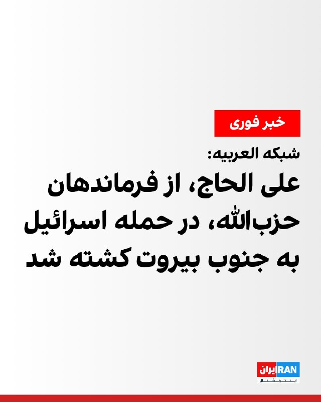

شبکه العربیه گزارش داد علی الحاج، از فرماندهان حزب‌الله، در حمله هوایی یکشنبه ۲۴ خرداد اسرائیل به ضاحیه بیروت کشته شده است.
دفاع مدنی لبنان نیز اعلام کرد در این حمله سه نفر کشته شدند.
العربیه همچنین گزارش داد ارتش اسرائیل یکشنبه سه حمله هوایی به شهر سجد در جنوب لبنان انجام داده است.
ارتش اسرائیل پیش‌تر اعلام کرده بود در واکنش به شلیک سه پهپاد از سوی حزب‌الله به شمال اسرائیل و آنچه نقض آتش‌بس از سوی این گروه خواند، یکی از مقرهای حزب‌الله را در ضاحیه بیروت هدف قرار داده است.
‌🏁 🇬🇧 IranintlTV

🤖 @VahidOOnLine

## VahidOOnLine — post 245474

🗣روایت شما از احتمال توافق میان آمریکا و جمهوری‌اسلامی - یکشنبه ۲۵ خرداد

🔹تنها موردی که مخالفان و موافقان جمهوری اسلامی بر آن تفاهم دارند و با آن مخالفند، توافق با آمریکاست.

🔹ما باید خودمان بلند شویم و کار را تمام کنیم. در این توافق هیچ اسمی از ما مردم ایران آورده نشده، چون برای ترامپ و جمهوری اسلامی اهمیتی ندارد.

🔹ترامپ با توافق، شکافی در بدنه نظام ایجاد کرد که هیچ‌کس نمی‌تونست انجامش بده.

🔹این حق مردم ایران نیست؛ واقعا ما باید چقدر تاوان حماقت بقیه را بدیم؟ عمرمون سر مذاکره و توافق رفت. دقیقا این جنگ افتاد وسط جوونی‌مون. این همه جوون کشتن که الان توافق کنن؟

🔹ما مردم ایران خیلی گناه داریم. هیچ‌کس پشت ما نبود و نیست. فقط امیدوارم زودتر از شر این روزگار سیاه خلاص شویم.

🔹از آقای ترامپ بابت کمکی که کرد ممنونم؛ هم در جنگ و هم در مذاکره جمهوری اسلامی را شکست دادی.

🔹دردها و مشکلات همه به جای خودش عزیز و مهمه؛ از دانش‌آموزها تا افراد سالمند، از پدران و مادران تا بچه‌ها، همه به نحوی از جمهوری اسلامی آسیب دیدیم، اما تنها چیزی که می‌خوایم سرنگونی جمهوری اسلامیه.

🔹در این کانال‌های خبری، ارزشی‌ها می‌گن اگر توافق کنین روی صورت دخترهای بی‌حجاب اسید می‌پاشیم. خداروشکر شهر هرت هم شد.

🔹واقعا هیچ‌کس نمی‌خواد توافق بشه و همه دنبال جنگ هستند؛ چه طرفداران حکومت و چه مخالفان حکومت.
‌🏁 🇬🇧 IranintlTV

🤖 @VahidOOnLine

## VahidOOnLine — post 245473

  <a href="telegram/content/VahidOOnLine_245473_1781448457.mp4" target="_blank">🎬 Download video</a>

بر اساس ویدیوهای رسیده به ایران‌اینترنشنال، گروهی از ایرانیان مقیم آلمان شنبه ۲۳ خرداد به یاد مجیدرضا رهنورد، معترض اعدام‌شده، در شهر نورنبرگ پرفورمنس اجرا کردند.
‌🏁 🇬🇧 IranintlTV

🤖 @VahidOOnLine

## VahidOOnLine — post 245472

  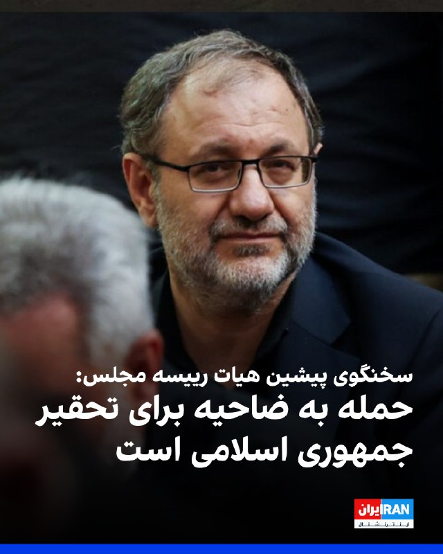

نظام‌الدین موسوی، سخنگوی پیشین هیات رییسه مجلس جمهوری اسلامی، در پلتفرم ایکس نوشت حمله اسرائیل به ضاحیه بیروت در روزی که قرار بود تفاهم میان جمهوری اسلامی و آمریکا امضا شود، با هدف بر هم زدن تفاهم انجام نشد، بلکه تلاشی برای «تحقیر جمهوری اسلامی» صورت گرفت.

او خطاب به تیم مذاکره‌کننده جمهوری اسلامی نوشت: «حضرات مذاکره‌کننده، به تحقیر تن ندهید و در شرایط تحقیر، هیچ چیز را امضا نکنید.»

موسوی همچنین نوشت دونالد ترامپ، رییس‌جمهوری آمریکا، با چنین اقداماتی در پی آن است که بتواند ادعای پیروزی کند.

در روزهای اخیر جزییاتی از پیش‌نویس تفاهم احتمالی میان تهران و واشینگتن منتشر شده است.

خبرگزاری تسنیم، وابسته به سپاه پاسداران، گزارش داد فشارهای نظامی و دیپلماتیک آمریکا برای تغییر متن ۱۴ ماده‌ای نتیجه‌ای نداشته و واشینگتن از طریق میانجی قطری اعلام کرده است به اصلاحیه‌های اخیر خود نیازی ندارد.

تسنیم همچنین نوشت این متن همچنان نیازمند بررسی و نهایی شدن از سوی مقام‌های جمهوری اسلامی است.
‌🏁 🇬🇧 IranintlTV

🤖 @VahidOOnLine

## VahidOOnLine — post 245471

  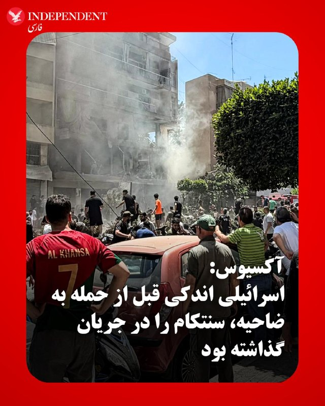

♦️ساعاتی پس از حمله ارتش اسرائیل به منطقه ضاحیه در جنوب لبنان در روز یکشنبه ۲۴ خرداد ماه، باراک راوید، خبرنگار آکسیوس، به نقل از مقام‌های اسرائیلی و آمریکایی گزارش داد اسرائیل اندکی پیش از حمله، فرماندهی مرکزی ارتش آمریکا (سنتکام) را از این عملیات مطلع کرده بود.
اسرائیل روز یکشنبه اعلام کرد در واکنش به حملات حزب‌الله به شمال این کشور، مواضعی وابسته به این گروه در حومه جنوبی بیروت را هدف قرار داده است.
دفتر نخست‌وزیر اسرائیل اعلام کرد این حمله به دستور نتانیاهو و در پاسخ به شلیک‌ها به سمت خاک اسرائیل انجام شده است.

حمله اسرائیل به بیروت در گرماگرم گمانه‌زنی‌ها در مورد امضاء تفاهمنامه صلح میان تهران و واشنگتن در روز یکشنبه انجام شده است. جمهوری اسلامی پیش‌تر هشدار داده بود هرگونه حمله اسرائیل به بیروت می‌تواند با واکنش تهران همراه شود.
‌🇸🇦 Indypersian

🤖 @VahidOOnLine

## WithYashar — post 14826

## WithYashar — post 14825

تو ویس گفتی یه سری بزنیم به کانالهی رژیم اسگولا اینو منتشر کردن

## WithYashar — post 14824

  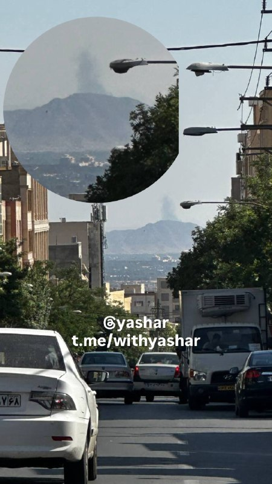

کمی‌پیش ستون دود جنوب‌کرج
@withyashar

## WithYashar — post 14823

  <a href="telegram/content/WithYashar_14823_1781448462.mp4" target="_blank">🎬 Download video</a>

🎬 Video

## WithYashar — post 14822

  <a href="telegram/content/WithYashar_14822_1781448464.mp4" target="_blank">🎬 Download video</a>

آقای عراقچی‌ شما گوه میخورید 🤣
@withyashar

## WithYashar — post 14821

## WithYashar — post 14820

ارتش اسرائیل: آماده شلیک از ایران در ساعات آینده هستیم، در حال حاضر تغییری در دستورالعمل‌ها وجود نداره.
@withyashar

## WithYashar — post 14819

کانال 15 اسرائیل:تمام سامانه های پدافندی در اسرائیل به حالت آماده باش کامل درآمدند و در انتظار پرتاب موشک قریب‌الوقوع از سمت ایران می‌باشند
@withyashar

## WithYashar — post 14818

رئیس ستاد ارتش اسرائیل دستور تشدید عملیات‌های زمینی در جنوب لبنان رو صادر کرده و به نیروهای دفاعی اسرائیل دستور داده که عمیق‌تر به خاک لبنان پیشروی کنند.
@withyashar

## WithYashar — post 14817

سفیر آمریکا در سازمان ملل متحد:
رئیس جمهور ترامپ و معاونش جی‌دی ونس، کاملاً به امضای توافق امروز متعهد هستن.
@withyashar

## WithYashar — post 14816

مرندی عضو تیم مذاکره کننده:
فعلاً مذاکره دیگر در کار نخواهد بود
@withyashar

## WithYashar — post 14815

وزارت امور خارجه‌اسرائیل در واکنش به تهدیدهای ایران اعلام کرد: “این حکومت طبق معمول دروغ می‌گوید. نماینده ایران، حزب‌الله، همان طرفی است که به اسرائیل حمله کرده است. ما شلیک آتش به سوی خاک خود را تحمل نخواهیم کرد.🚨
@withyashar

## WithYashar — post 14814

ترامپ بیدار شد
@withyashar

## WithYashar — post 14813

الحدث: علی الحاج، از فرماندهان ارشد حزب‌الله در حمله به ضاحیه بیروت هدف قرار گرفت. تداوم ضربات سنگین به بدنه فرماندهی گروه‌های نیابتی رژیم ایران در لبنان. @withyashar

## WithYashar — post 14812

الحدث: علی الحاج، از فرماندهان ارشد حزب‌الله در حمله به ضاحیه بیروت هدف قرار گرفت.
تداوم ضربات سنگین به بدنه فرماندهی گروه‌های نیابتی رژیم ایران در لبنان.
@withyashar

## WithYashar — post 14811

وب‌سایت اکسیوس گزارش داد ارتش اسرائیل اندکی پیش از حمله به منطقه ضاحیه بیروت، فرماندهی مرکزی آمریکا (سنتکام) را از این عملیات مطلع کرده بود.
ارتش اسرائیل پیش‌تر در بیانیه‌ای اعلام کرد در واکنش به شلیک پرتابه از سوی حزب‌الله به شمال اسرائیل و نقض آتش‌بس از سوی این گروه تحت حمایت جمهوری اسلامی، یکی از مقرهای حزب‌الله را در ضاحیه بیروت به طور دقیق هدف قرار داده است.
@withyashar

## WithYashar — post 14810

الحدث به نقل از منابع:
علی الحاج، فرمانده حزب‌الله، در حمله هوایی اسرائیل به حومه بیروت ترور شد
@withyashar

## WithYashar — post 14809

خبر ترور ‌نعیم قاسم تایید نشده است منتظر تایید هستیم @withyashar

## WithYashar — post 14808

کانال های امنیتی: فرماندهی موشکی هوافضا ایران در حال آماده سازی یک حمله گسترده
@withyashar

## WithYashar — post 14807

موسوی، سخنگوی پیشین هیات رئیسه مجلس:

هدف حمله امروز اسرائیل به ضاحیه بیروت در روزی که قرار بود توافق امضا بشه، تحقیر جمهوری اسلامی بود.
@withyashar

## mwarmonitor — post 10877

🔴وزیر جنگ آمریکا: انتظار ندارم که حملات اسرائیل به ضاحیه جنوبی بیروت، توافق با ایران را مختل کند. اگر ایران می‌خواهد این موضوع پایدار بماند، باید حزب‌الله را مهار کند.

@mwarmonitor

## mwarmonitor — post 10876

  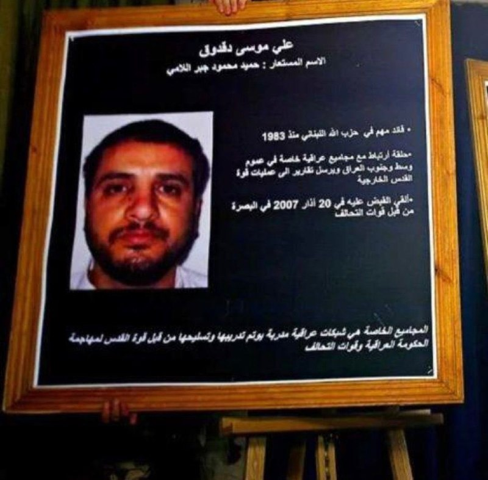

🔴سفیر اسرائیل در آمریکا

🔹«این علی موسی دقدوق است، یکی از فرماندهان ارشد حزب‌الله.
🔹او شخصاً مسئول یک حمله تروریستی در سال ۲۰۰۷ علیه نیروهای آمریکایی است.
🔹او توسط آمریکا زندانی شد و برای دستگیری‌اش ۵ میلیون دلار جایزه تعیین شده بود.
🔹او همچنین “پرونده جولان” را مدیریت می‌کرد؛ طرح حزب‌الله برای حمله و تصرف شمال اسرائیل.

📌دقدوق در حالی که رهبری نبرد حزب‌الله در جنوب لبنان را بر عهده داشت، توسط ارتش اسرائیل از بین برده شد. او دیگر نیروهای آمریکایی، مردم اسرائیل و لبنان را تهدید نخواهد کرد.»

@mwarmonitor

## mwarmonitor — post 10875

📌«دولت کویت تابعیت ۲۱۹۳ نفر را سلب می‌کند و همچنین تابعیت همه کسانی را که از طریق این افراد به‌طور تبعی تابعیت گرفته‌اند نیز لغو می‌کند.»

@mwarmonitor

## mwarmonitor — post 10874

🔴«ارتش اسرائیل برای احتمال شلیک به سمت اسرائیل در ساعات آینده آماده می‌شود - شبکه ۱۲»

@mwarmonitor

## mwarmonitor — post 10873

🔴یک دیپلمات درگیر در مذاکرات به فاکس‌نیوز گفته است که حملات امروز در بیروت باعث ایجاد مشکل در نهایی‌سازی توافق شده است.

🔸او افزوده است:
«این یک تلاش آشکار از سوی اسرائیل برای خراب کردن توافق رئیس‌جمهور و کشاندن دوباره ایالات متحده به جنگ است.»

🔸در مقابل، یک مقام ارشد اسرائیلی این ادعا را رد کرده و گفته است که اسرائیل مسئول آغاز تبادل آتش نیست.

🔸او به فاکس‌نیوز گفته است:
«حملات حزب‌الله طی سه روز گذشته غیرنظامیان اسرائیلی را هدف قرار داده است.»

@mwarmonitor

## mwarmonitor — post 10872

🔴خبرگزاری فارس

🔸آخرین جزئیات مذاکرات غیرمستقیم قبل از حملهٔ رژیم صهیونیستی به ضاحیه/ حضور تیم قطری در تهران

🔹یک منبع نزدیک به تیم مذاکره‌کننده ایران، ساعاتی پیش از حملهٔ رژیم صهیونیستی به ضاحیه بیروت، آخرین جزئیات از روند مذاکرات غیرمستقیم با آمریکا را تشریح کرد.

🔹براساس این گزارش، تیم قطری هم‌اکنون در تهران حضور دارد و ایران بندهای موردنظر خود را همراه با جزئیات دقیق مدنظرش، از طریق همین تیم قطری به طرف مقابل منتقل می‌کند.

🔹او با تأکید بر اینکه هنوز هیچ چیزی نهایی نشده، در خصوص فراز و فرودهای مسیر مذاکره گفت: «حتی اگر در روند مذاکره پیش و پس برویم و به عقب برگردیم، شرط اساسی ایران این است که در پایان، تمام موارد مدنظرش به طور کامل لحاظ شود.»

🔹او افزود: حتی در صورت اعمال همه نظرات ایران قطعاً در زمان اعلامی ترامپ هیچ توافقی امضا نخواهد شد.

🔸 این اظهارات پیش از حملات اخیر رژیم صهیونیستی به منطقهٔ ضاحیه بیان شده است.

@mwarmonitor

## mwarmonitor — post 10871

🔴اسرائیل خود را برای احتمال حمله ایران آماده می‌کند. سطح هشدارها افزایش یافته است. i24 news

@mwarmonitor

## mwarmonitor — post 10870

🔴«ارتش اسرائیل: دقایقی پیش یک مقر متعلق به سازمان تروریستی حزب‌الله را در بیروت هدف قرار دادیم. این مقر برای پیشبرد طرح‌های تروریستی علیه شهروندان دولت اسرائیل و نیروهای ارتش اسرائیل که در جنوب لبنان فعالیت می‌کنند، مورد استفاده عناصر حزب‌الله قرار می‌گرفت.…

## mwarmonitor — post 10868

🔴وزارت امور خارجه اسرائیل: «رژیم ایران که ما را تهدید می‌کند دروغ می‌گوید. این حزب‌الله است که به اسرائیل حمله کرده است. ما شلیک به سرزمین‌های خود را تحمل نخواهیم کرد.»

@mwarmonitor

## mwarmonitor — post 10867

🔴نماینده آمریکا در سازمان ملل به شبکه ABC: رئیس‌جمهور ترامپ و معاون او کاملاً مصمم هستند که امروز این توافق را امضا کنند.

@mwarmonitor

## mwarmonitor — post 10866

  

🔸نشانه‌های بیشتری امروز از اسرائیل منتشر شده است.

🔸ارتش اسرائیل (IDF) تصاویر ویدیویی و عکس‌هایی از رئیس ستاد کل، سپهبد ایال زمیر، منتشر کرده که در آن او طرح‌های عملیاتی را تأیید می‌کند و با فرماندهان ارشد در فرماندهی شمال دیدار دارد؛ در حالی که هم‌زمان پیامی را منتقل می‌کند که به نظر می‌رسد فراتر از میدان نبرد هدف‌گذاری شده است.

او گفته است:

📌«ما به عملیات در لبنان ادامه می‌دهیم تا از دفاع از شهرک‌ها و جوامع شمالی تقویت کنیم و خسارت به حزب‌الله را با عملیات زمینی و آتش نظام‌مند افزایش دهیم. هر دستاورد عملیاتی بیشتری که به دست آوریم، باعث فرسایش و فروپاشی بیشتر جبهه جنوبی حزب‌الله خواهد شد و به بهبود ترتیبات امنیتی کمک می‌کند؛ ترتیباتی که در چارچوب مذاکرات با میانجی‌گری آمریکا میان سطوح سیاسی و دولت لبنان تعیین خواهد شد.»

@mwarmonitor

## mwarmonitor — post 10865

🔴«یک دیپلمات به فاکس نیوز گفته است که حملات اسرائیل در بیروت در حال به خطر انداختن توافق است:
“این یک تلاش آشکار از سوی اسرائیل برای خراب کردن توافق رئیس‌جمهور و کشاندن دوباره ایالات متحده به جنگ است.”

🔸اسرائیل این ادعا را رد کرده و به سه روز حملات حزب‌الله علیه غیرنظامیان اسرائیلی اشاره کرده است.»

@mwarmonitor

## FoxNewsTwitter — post 342955

  <a href="telegram/content/FoxNewsTwitter_342955_1781448469.mp4" target="_blank">🎬 Download video</a>

Fox News (Twitter/X)

New York City descends into chaos after the Knicks won the NBA championship over the San Antonio Spurs.

Footage captured firefighters desperately trying to extinguish a school bus engulfed in flames in Times Square as rowdy fans chanted, “Knicks in five!"

## FoxNewsTwitter — post 342954

‌Fox News (Twitter/X)

👉 Full story here:

## FoxNewsTwitter — post 342953

  

Fox News (Twitter/X)

NO KINGS: A coalition of 400 organizations with $3 billion in combined revenue rolls out a rival fight card to Trump's UFC Freedom 250 — staging nationwide protests, a Jane Fonda concert, and a professionally coordinated operation designed to funnel protest energy into midterm election organizing. Internal toolkits obtained by Fox News Digital's reveal watch parties are 'strategic community gatherings' built to collect contacts, recruit organizers, and schedule follow-up meetings long after June 14.

## pm_afshaa — post 93903

  <a href="telegram/content/pm_afshaa_93903_1781448472.webm" target="_blank">🎬 Download video</a>

🔴هگست، وزیر جنگ آمریکا:
من انتظار ندارم که حملات اسرائیل به حومه جنوبی بیروت مانع توافق با ایران بشه؛ اگر ایران میخواد این موضوع ادامه پیدا کنه، باید حزب‌الله رو مهار کنه.

💧 Rainbet.com the #1 Non-KYC Crypto Casino & Sportsbook @rainbetcom

😁 @Pm_Afshaa

## pm_afshaa — post 93902

کانال 15 اسرائیل:تمام سامانه های پدافندی در اسرائیل به حالت آماده باش کامل درآمدند و در انتظار پرتاب موشک قریب‌الوقوع از سمت ایران می‌باشن

💧 Rainbet.com the #1 Non-KYC Crypto Casino & Sportsbook @rainbetcom

😁 @Pm_Afshaa

## pm_afshaa — post 93901

  <a href="telegram/content/pm_afshaa_93901_1781448473.webm" target="_blank">🎬 Download video</a>

🔴یک دیپلمات درگیر در مذاکرات به فاکس‌نیوز:

حملات امروز اسرائیل به بیروت، روند نهایی‌سازی توافق رو با مشکل روبه‌رو کرده.

💧 Rainbet.com the #1 Non-KYC Crypto Casino & Sportsbook @rainbetcom

😁 @Pm_Afshaa

## pm_afshaa — post 93900

  <a href="telegram/content/pm_afshaa_93900_1781448474.webm" target="_blank">🎬 Download video</a>

🔴ارتش اسرائیل: آماده شلیک از ایران در ساعات آینده هستیم، در حال حاضر تغییری در دستورالعمل‌ها وجود نداره.

💧 Rainbet.com the #1 Non-KYC Crypto Casino & Sportsbook @rainbetcom

😁 @Pm_Afshaa

## pm_afshaa — post 93899

  <a href="telegram/content/pm_afshaa_93899_1781448475.webm" target="_blank">🎬 Download video</a>

🔴یدیعوت آحارونوت:
اسرائیل آمادسازی پناهگاه‌های موشکی برای پرتاب موشک از سمت ایران رو آغاز کرده.

💧 Rainbet.com the #1 Non-KYC Crypto Casino & Sportsbook @rainbetcom

😁 @Pm_Afshaa

## pm_afshaa — post 93898

  <a href="telegram/content/pm_afshaa_93898_1781448476.webm" target="_blank">🎬 Download video</a>

🔴رسانه i24News:
اسرائیل خودش رو برای احتمال حمله ایران آماده میکنه؛ سطح هشدارها افزایش یافته.

💧 Rainbet.com the #1 Non-KYC Crypto Casino & Sportsbook @rainbetcom

😁 @Pm_Afshaa

## pm_afshaa — post 93897

  <a href="telegram/content/pm_afshaa_93897_1781448476.webm" target="_blank">🎬 Download video</a>

🔴رئیس ستاد ارتش اسرائیل دستور تشدید عملیات‌های زمینی در جنوب لبنان رو صادر کرده و به نیروهای دفاعی اسرائیل دستور داده که عمیق‌تر به خاک لبنان پیشروی کنند.

💧 Rainbet.com the #1 Non-KYC Crypto Casino & Sportsbook @rainbetcom

😁 @Pm_Afshaa

## pm_afshaa — post 93896

  <a href="telegram/content/pm_afshaa_93896_1781448477.webm" target="_blank">🎬 Download video</a>

🔴کانال 14 اسرائیل:
اسرائیل ارزیابی میکنه که ایران در واکنش به حمله در حومه جنوبی بیروت، حمله موشکی به خاک اسرائیل انجام خواهد داد.

💧 Rainbet.com the #1 Non-KYC Crypto Casino & Sportsbook @rainbetcom

😁 @Pm_Afshaa

## pm_afshaa — post 93895

  <a href="telegram/content/pm_afshaa_93895_1781448478.webm" target="_blank">🎬 Download video</a>

🔴مرندی، عضو تیم مذاکره کننده:
فعلاً مذاکره دیگری در کار نخواهد بود.

💧 Rainbet.com the #1 Non-KYC Crypto Casino & Sportsbook @rainbetcom

😁 @Pm_Afshaa

## pm_afshaa — post 93894

  <a href="telegram/content/pm_afshaa_93894_1781448479.webm" target="_blank">🎬 Download video</a>

🔴مهاجرانی، سخنگوی دولت:
تصمیم‌گیری درباره تفاهم احتمالی با آمریکا در سطح نظام و حاکمیت انجام میشه و حمله به مذاکره‌کنندگان، حمله به یک تصمیم ملیه.

💧 Rainbet.com the #1 Non-KYC Crypto Casino & Sportsbook @rainbetcom

😁 @Pm_Afshaa

## pm_afshaa — post 93893

  <a href="telegram/content/pm_afshaa_93893_1781448480.webm" target="_blank">🎬 Download video</a>

🔴نماینده آمریکا در سازمان ملل به ای‌بی‌سی:
ترامپ و ونس کاملا مصمم هستن که امروز توافق با جمهوری اسلامی رو امضا کنن.

💧 Rainbet.com the #1 Non-KYC Crypto Casino & Sportsbook @rainbetcom

😁 @Pm_Afshaa

## pm_afshaa — post 93892

  <a href="telegram/content/pm_afshaa_93892_1781448481.webm" target="_blank">🎬 Download video</a>

🔴فاکس نیوز به نقل از دیپلمات شرکت‌کننده در مذاکرات:

حملات امروز به بیروت مانع از نهایی شدن توافق شده؛ این یک تلاش آشکار اسرائیل برای خراب کردن توافق رئیس‌جمهور ترامپ و کشاندن مجدد آمریکا به جنگ است.

💧 Rainbet.com the #1 Non-KYC Crypto Casino & Sportsbook @rainbetcom

😁 @Pm_Afshaa

## pm_afshaa — post 93891

  <a href="telegram/content/pm_afshaa_93891_1781448481.webm" target="_blank">🎬 Download video</a>

🔴موسوی، سخنگوی پیشین هیات رئیسه مجلس:

هدف حمله امروز اسرائیل به ضاحیه بیروت در روزی که قرار بود توافق امضا بشه، تحقیر جمهوری اسلامی بود.

💧 Rainbet.com the #1 Non-KYC Crypto Casino & Sportsbook @rainbetcom

😁 @Pm_Afshaa

## pm_afshaa — post 93890

  <a href="telegram/content/pm_afshaa_93890_1781448482.webm" target="_blank">🎬 Download video</a>

🔴نتانیاهو اول تصویری از حمله به بیروت رو منتشر کرد و تو پست بعدی تولد ترامپ رو تبریک گفت :

💧 Rainbet.com the #1 Non-KYC Crypto Casino & Sportsbook @rainbetcom

😁 @Pm_Afshaa

## pm_afshaa — post 93889

علی موسی دقدوق یکی از چهره‌های کلیدی و تأثیرگذار در محور مقاومت و حزب الله و مسئول پرونده جولان در حمله اسرائیل به درک واصل شد

💧 Rainbet.com the #1 Non-KYC Crypto Casino & Sportsbook @rainbetcom

😁 @Pm_Afshaa

## pm_afshaa — post 93888

آمیت سگال خبرنگار اسرائیلی: رهبر حزب الله با موفقیت حذف شد

💧 Rainbet.com the #1 Non-KYC Crypto Casino & Sportsbook @rainbetcom

😁 @Pm_Afshaa

## pm_afshaa — post 93886

  <a href="telegram/content/pm_afshaa_93886_1781448483.webm" target="_blank">🎬 Download video</a>

🔴فاکس نیوز: حملات اسرائیل به بیروت نهایی کردن مذاکرات رو پیچیده کرد!

💧 Rainbet.com the #1 Non-KYC Crypto Casino & Sportsbook @rainbetcom

😁 @Pm_Afshaa

## pm_afshaa — post 93885

🔴ستاد قرارگاه تروریستی خاتم‌الانبیا در واکنش به حمله اسرائیل به ضاحیه اعلام کرد: حمله اسرائیلی ها به ضاحیه بی‌پاسخ نخواهد ماند

💧 Rainbet.com the #1 Non-KYC Crypto Casino & Sportsbook @rainbetcom

😁 @Pm_Afshaa

## pm_afshaa — post 93884

  <a href="telegram/content/pm_afshaa_93884_1781448484.webm" target="_blank">🎬 Download video</a>

🔴قالیباف: تجاوز به بیروت نشان داد آمریکا اراده یا قدرت اجرای تعهدات خودش رو نداره. اگه همچین قدرتی ندارید، سخن گفتن از ادامه مسیر ممکن نیست.

💧 Rainbet.com the #1 Non-KYC Crypto Casino & Sportsbook @rainbetcom

😁 @Pm_Afshaa

## pm_afshaa — post 93883

  <a href="telegram/content/pm_afshaa_93883_1781448485.webm" target="_blank">🎬 Download video</a>

🔴باراک راوید، خبرنگاه آکسیوس به نقل از مقامات اسرائیلی: ما قبل از انجام حملات به حومه جنوبی بیروت آمریکا رو مطلع کردیم.

💧 Rainbet.com the #1 Non-KYC Crypto Casino & Sportsbook @rainbetcom

😁 @Pm_Afshaa

## DEJradio — post 5677

  <a href="telegram/content/DEJradio_5677_1781448485.webm" target="_blank">🎬 Download video</a>

🚨
💀 ارتش اسرائیل اعلام کرد در یک حمله دقیق، مقر سازمان تروریستی حزب‌الله در ضاحیه بیروت را هدف قرار داده است. بر اساس اعلام ارتش اسرائیل، این مقر توسط نیروهای حزب‌الله برای پیشبرد و هدایت طرح‌های تروریستی علیه شهروندان اسرائیل و همچنین نیروهای ارتش اسرائیل…

## DEJradio — post 5676

  <a href="telegram/content/DEJradio_5676_1781448486.mp4" target="_blank">🎬 Download video</a>

🛩️ 
🔥 انهدام تأسیسات نفتی روسیه با پهپادهای اوکراینی

ولودیمیر زلنسکی رئیس جمهوری اوکراین با انتشار ویدیویی از حملات پهپادی اوکراین به تأسیسات نفتی روسیه، اعلام کرد نقاطی که هدف قرار گرفت در فاصله ۷۰۰ کیلومتری از خاک اوکراین قرار داشت.
در این مخازن نفتی منطقه یاروسلاول روسیه هدف قرار گرفت.
او در ایکس نوشت: نیروهای ارتش ما همچنین به اهداف خود در منطقه تولا در روسیه دست یافتند؛ به‌طور مشخص، کارخانه «آزوت» که فعالیت آن برای توانایی تولید مواد منفجره اهمیت حیاتی دارد، مورد اصابت قرار گرفت.
زلنسکی افزود: اوکراین در حال اجرای برنامه خود برای اعمال فشار و حملات دوربرد علیه روسیه و همچنین انجام مأموریت‌های تعیین‌شده مربوط به حملات میان‌برد در پاسخ به امتناع روسیه از پایان دادن به این جنگ است.

#اوکراین #روسیه #پهپاد

@DEJradio

## DEJradio — post 5675

  <a href="telegram/content/DEJradio_5675_1781448489.mp4" target="_blank">🎬 Download video</a>

🔥
🚨 ارتش اسرائیل مواضع تروریست‌های حزب‌الله در ضاحیه بیروت را بمباران کرد. در این حملات شماری از فرماندهن و نیروهای این گروه کشته و زخمی شدند. ساعت‌ها پیش از این حمله دستور تخلیه چندین محله صادر شده بود. #اسرائیل #ضاحیه #لبنان @DEJradio

## DEJradio — post 5674

⚽️🏆 جام‌جهانی ۲۰۲۶؛
لس‌آنجلس؛ وی‌آی‌پی کم‌نظیر استادیوم گرانقیمت "سوفای"

سوفای SoFi یک شرکت فناوری مالی آمریکایی است. این شرکت که در سال ۲۰۱۱ در دانشگاه استنفورد تأسیس شد، به عنوان یک بانک مستقیم فعالیت می‌کند و پلتفرم فناوری خود را در اختیار سایر موسسات مالی قرار می‌دهد. سوفی بزرگ‌ترین وام دهنده آنلاین در ایالات متحده است.

در بخش وی‌آی‌پی این استادیوم از تماشاگران با انواع غذاها، نوشیدنی‌ها و دسرها پذیرایی می‌شوند.

#جام_جهانی #سوفای #فوتبال
@DEJradio

## DEJradio — post 5673

  <a href="telegram/content/DEJradio_5673_1781448491.mp4" target="_blank">🎬 Download video</a>

🔥
🚨 ارتش اسرائیل مواضع تروریست‌های حزب‌الله در ضاحیه بیروت را بمباران کرد. در این حملات شماری از فرماندهن و نیروهای این گروه کشته و زخمی شدند. ساعت‌ها پیش از این حمله دستور تخلیه چندین محله صادر شده بود.

#اسرائیل #ضاحیه #لبنان
@DEJradio

## VahidOnline — post 76331

محمدجعفر اسدی، معاون بازرسی قرارگاه مرکزی خاتم‌الانبیا، در واکنش به حمله اسرائیل به ضاحیه بیروت گفت: «بدون شک این جنایات بی‌پاسخ نخواهد ماند.»
او در گفت‌وگو با دفاع‌پرس، حمله ارتش اسرائیل به منطقه ضاحیه را محکوم کرد و نسبت به پیامدهای آن هشدار داد.
ارتش اسرائیل در بیانیه‌ای یکشنبه ۲۴ خرداد اعلام کرد در واکنش به شلیک پرتابه از سوی حزب‌الله به شمال اسرائیل، اهدافی از این گروه را در ضاحیه بیروت هدف قرار داده است.
@VahidOOnLine
محمد مرندی، از اصحاب رسانه همراه با هیات مذاکره جمهوری اسلامی در پاکستان، درباره ادامه مذاکرات تهران و واشینگتن، در شبکه ایکس نوشت: «فعلا هیچ مذاکره دیگری در کار نخواهد بود.»
@VahidOOnLine
نظام‌الدین موسوی، سخنگوی پیشین هیات رییسه مجلس جمهوری اسلامی، در پلتفرم ایکس نوشت حمله اسرائیل به ضاحیه بیروت در روزی که قرار بود تفاهم میان جمهوری اسلامی و آمریکا امضا شود، با هدف بر هم زدن تفاهم انجام نشد، بلکه تلاشی برای «تحقیر جمهوری اسلامی» صورت گرفت.
او خطاب به تیم مذاکره‌کننده جمهوری اسلامی نوشت: «حضرات مذاکره‌کننده، به تحقیر تن ندهید و در شرایط تحقیر، هیچ چیز را امضا نکنید.»
@VahidOOnLine
ارتش اسرائیل اعلام کرد ایال زمیر، رییس ستاد ارتش، پس از حمله به بیروت در حال برگزاری ارزیابی‌های مستمر از وضعیت با همه فرماندهان مرتبط است.
ارتش اسرائیل افزود بر اساس این ارزیابی‌ها، خود را برای احتمال شلیک به خاک اسرائیل در ساعات آینده آماده می‌کند.
این نهاد تاکید کرد در بالاترین سطح آماده‌باش قرار دارد و برای سناریوهای مختلف دفاعی و تهاجمی آماده است.
ارتش اسرائیل تاکید کرد شلیک به خاک این کشور را تحمل نخواهد کرد.
@VahidOOnLine

📡 @VahidOnline

## VahidOnline — post 76329

محمدباقر قالیباف، مذاکره‌کننده ارشد جمهوری اسلامی در گفت‌وگوهای توافق با آمریکا، اعلام کرد پس از حمله اسراییل به حومه جنوبی بیروت، ادامه مسیر توافق با آمریکا «ممکن نیست».
قالیباف روز یکشنبه در پیامی در شبکه اجتماعی ایکس نوشت حمله اخیر به حومه جنوبی بیروت بار دیگر نشان داد که آمریکا یا اراده لازم برای اجرای تعهدات خود را ندارد یا از توان انجام آن برخوردار نیست.
او افزود تلاش برای کسب امتیاز از طریق چراغ سبز نشان دادن به اسراییل نتیجه‌ای نخواهد داشت و سیاست «پلیس خوب و پلیس بد» دیگر کارایی گذشته را ندارد.
او تاکید کرد: «اگر اراده و توان اجرای تعهدات خود را ندارید، سخن گفتن از ادامه مسیر ممکن نیست.»
@VahidHeadline
حساب رسمی وزارت خارجه اسرائیل، روز یکشنبه ۲۴ خرداد ماه در واکنش به اظهارات محمدباقر قالیباف، رئیس مجلس شورای اسلامی در شبکه اجتماعی ایکس نوشت: جمهوری اسلامی «مثل همیشه دروغ می‌گوید.»
وزارت خارجه اسرائیل در این پیام با بیان آنکه اسرائیل شلیک به خاک خود را تحمل نخواهد کرد یادآور شد، حزب‌الله، صبح روز یکشنبه «بدون هیچ‌گونه تحریک قبلی» بار دیگر به اسرائیل حمله کرده است.
در این پیام آمده است حزب‌الله به طور مداوم غیرنظامیان اسرائیلی را هدف قرار می‌دهد و حتی پس از برقراری آتش‌بس نیز حملات خود علیه اسرائیل را متوقف نکرده است.
قالیباف در روزی که به گفته دونالد ترامپ قرار بود توافق پایان جنگ میان ایران و آمریکا امضا شود، در ایکس نوشت حمله اسرائیل «به ضاحیه بار دیگر نشان داد آمریکا یا اراده‌ای برای اجرای تعهدات خود ندارد یا توان آن را. با چراغ سبز نشان دادن به رژیم نمی‌توانید امتیاز بگیرید. بازی پلیس بد و پلیس خوب قدیمی شده است. اگر اراده و توان اجرای تعهدات خود را ندارید، سخن گفتن از ادامه مسیر ممکن نیست.»
@VahidOOnLine

📡 @VahidOnline

## VahidOnline — post 76323

  <a href="telegram/content/VahidOnline_76323_1781448494.mp4" target="_blank">🎬 Download video</a>

دفتر نخست‌وزیری اسرائیل روز یک‌شنبه، ۲۴ خردادماه، اعلام کرد که ارتش این کشور سایتی متعلق به گروه حزب‌الله در حومه جنوبی بیروت، محله ضاحیه، را هدف قرار داده است.
در بیانیه ارتش اسرائیل در همین باره اشاره شده است که به «اهدافی تروریستی متعلق به حزب‌الله» در ضاحیه حمله شده است.
اسرائیل دلیل این حمله را شلیک از طرف حزب‌الله به خاک اسرائیل عنوان کرد.
ساعتی پیشتر ارتش اسرائیل اعلام کرده بود که سه پهپاد روز یک‌شنبه به طور جداگانه به شمال اسرائیل پرتاب شده‌اند. اسرائیل گروه حزب‌الله را مسئول پرتاب این پهپادها اعلام کرد.
ارتش اسرائیل روز یک‌شنبه همچنین به ساکنان چندین روستای دیگر در جنوب لبنان هشدار داد که محل زندگی خود را ترک کنند.
خبرگزاری فرانسه به نقل از سخنگوی عرب‌زبان ارتش اسرائیل نوشت که ساکنان ۲۹ روستا در این منطقه باید به نقطه‌ای دیگر نقل مکان کنند. اسرائیل قصد حمله هوایی به این روستاها را دارد.
طبق این گزارش، اسرائیل صبح یک‌شنبه ابتدا به ساکنان ۱۳ روستا و سپس ساکنان ۱۶ روستای دیگر در جنوب لبنان اخطار داده است.
@VahidHeadline
شبکه العربیه گزارش داد علی الحاج، از فرماندهان حزب‌الله، در حمله هوایی یکشنبه ۲۴ خرداد اسرائیل به ضاحیه بیروت کشته شده است.
دفاع مدنی لبنان نیز اعلام کرد در این حمله سه نفر کشته شدند.
العربیه همچنین گزارش داد ارتش اسرائیل یکشنبه سه حمله هوایی به شهر سجد در جنوب لبنان انجام داده است.
ارتش اسرائیل پیش‌تر اعلام کرده بود در واکنش به شلیک سه پهپاد از سوی حزب‌الله به شمال اسرائیل و آنچه نقض آتش‌بس از سوی این گروه خواند، یکی از مقرهای حزب‌الله را در ضاحیه بیروت هدف قرار داده است.
@VahidOOnLine
خبرنگار آکسیوس، به نقل از مقام‌های اسرائیلی و آمریکایی گزارش داد اسرائیل اندکی پیش از حمله، فرماندهی مرکزی ارتش آمریکا (سنتکام) را از این عملیات مطلع کرده بود.
جمهوری اسلامی پیش‌تر هشدار داده بود هرگونه حمله اسرائیل به بیروت می‌تواند با واکنش تهران همراه شود.
@VahidOOnLine

📡 @VahidOnline

## VahidOnline — post 76322

  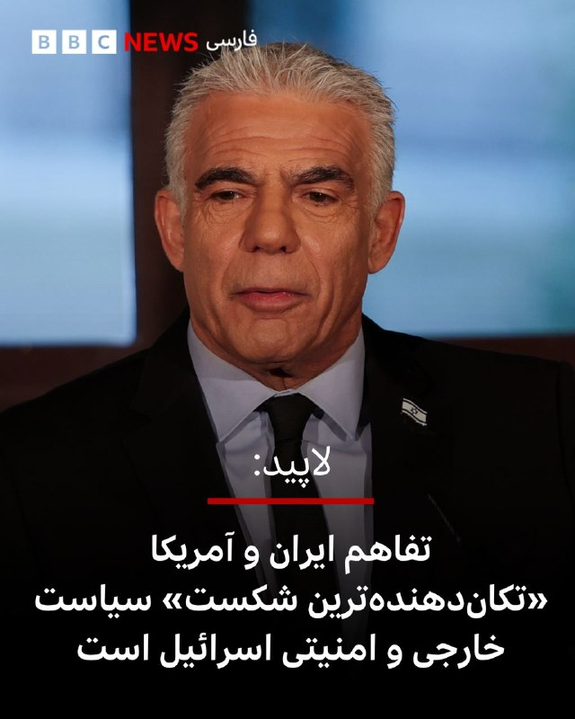

یائیر لاپید، نخست‌وزیر سابق و از رهبران مخالف دولت اسرائیل، در شبکه ایکس با انتقاد شدید از بنیامین نتانیاهو امضای تفاهمنامه بین ایران و آمریکا را «تکان‌دهنده‌ترین شکست‌ سیاست خارجی و امنیتی اسرائیل» توصیف کرد و مسئولیت کامل آن را متوجه نخست‌وزیر دانست.

آقای لاپید نوشت امیدوار است که «گزارش‌ها درباره توافق با ایران درست نباشد» و به ۱۳ مورد اشاره کرد و آنها را ناکامی و کوتاهی‌های آقای نتانیاهو دانست از جمله اینکه:

«او یک روایت بیش از حد خوش‌بینانه را به آمریکایی‌ها فروخت، بدون اینکه نقشه خطرات را کاملا برایشان تشریح کند و در میانه جنگ اعتماد آنها را از دست داد.»

او همچنین نوشت که آقای نتانیاهو «نتوانست آمریکایی‌ها را متقاعد کند که تاسیسات نفتی و انرژی ایران را بمباران کنند» و «مسئله موشک‌های بالستیک را در توافق یا حتی در مذاکرات بگنجانند.»

آقای لاپید همچنین نوشت که نخست‌وزیر اسرائیل «برنامه مربوط به کردها را پیش برد بدون آنکه واکنش قابل پیش‌بینی ترکیه و نفوذ رجب طیب اردوغان در واشنگتن را در نظر بگیرد.»
@VahidHeadline

📡 @VahidOnline

## VahidOnline — post 76320

در حالی که خبرها از داخل ایران اشاره به ادامه بررسی متن تفاهم‌نامه و نامشخص بودن زمان امضای آن دارد، خبرگزاری رویترز روز یک‌شنبه نوشت که دولت دونالد ترامپ در تفاهم‌نامه با آزاد کردن ۲۵ میلیارد دلار از دارایی‌های مسدود ایران موافقت کرده است.

رویترز خبر خود را به نقل از «مقامی ارشد» در جمهوری اسلامی نوشته، اما به نام او اشاره نکرده است.

به گفته منبع رویترز، دولت آمریکا همچنین موافقت کرده است که اورانیوم بسیار غنی‌شده ایران در داخل کشور رقیق شود.

این‌ها دو مورد از بحث‌انگیزترین موضوعات در مذاکرات جاری میان ایران و آمریکا بوده است: ترامپ بارها بر لزوم گرفتن یا انتقال یا از بین بردن اورانیوم ۶۰ درصد غنی‌شده ایران تأکید کرده و همزمان بارها گفته است که پولی به ایران نخواهد داد.

مسئله دادن پول به حکومت ایران به‌ویژه برای دونالد ترامپ حساسیت‌برانگیز بوده است،‌ چرا که او خود سال‌هاست به باراک اوباما تاخته که چرا در جریان رسیدن به توافق موسوم به برجام با انتقال پول به تهران موافقت کرده است.
@VahidHeadline

📡 @VahidOnline

## VahidOnline — post 76319

  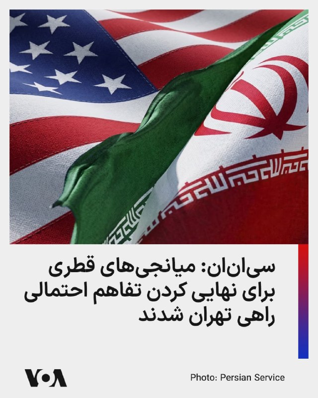

سی‌ان‌ان به نقل از یک منبع دیپلماتیک گزارش داد مذاکره‌کنندگان قطری پس از رایزنی با آمریکا راهی تهران شده‌اند تا با مقام‌های جمهوری اسلامی درباره کاهش اختلاف‌های باقی‌مانده و نهایی کردن تفاهم احتمالی میان تهران و واشنگتن گفت‌وگو کنند.

رسانه‌های ایران نیز گزارش دادند این هیئت قطری به تهران سفر کرده است.

این سفر در ادامه رفت‌وآمدهای دیپلماتیک قطر انجام می‌شود. چهارشنبه گذشته نیز مذاکره‌کنندگان قطری پس از مشورت با طرف آمریکایی به تهران رفتند و درباره متن احتمالی تفاهم با مقام‌های جمهوری اسلامی رایزنی کردند.
@VahidHeadline

📡 @VahidOnline

## VahidOnline — post 76318

  <a href="telegram/content/VahidOnline_76318_1781448496.mp4" target="_blank">🎬 Download video</a>

عراقچی: مقاومت باعث جنگ شد
[اینطور برداشت شده که داره میگه نپذیرفتن شرایط طرف مقابل در مذاکرات منجر به جنگ شد]

عباس عراقچی، وزیر امور خارجه جمهوری اسلامی ایران شنبه ۲۳ خرداد در شبکه خبر و در پاسخ به پرسشی درباره علت دو جنگ اخیر گفت: «مذاکرات علت جنگ نبود، مقاومت تیم دیپلماسی در مذاکرات علت جنگ بود.»

این گفته‌ها که در تعارض با موضع رسمی نظام جمهوری اسلامی و شخص علی  خامنه‌ای، رهبر پیشین جمهوری اسلامی به شمار می‌رود، با واکنش تند رسانه‌ها و سیاستمداران جریان اصولگرا مواجه شد.

علی خامنه‌ای، رهبر جمهوری اسلامی ماه‌ها قبل و پس از «جنگ ۱۲ روزه» گفته بود دشمن هر جا احساس کند که ما ضعیفیم، حمله می‌کند.
@VahidOOnLine

📡 @VahidOnline

## VahidOnline — post 76317

  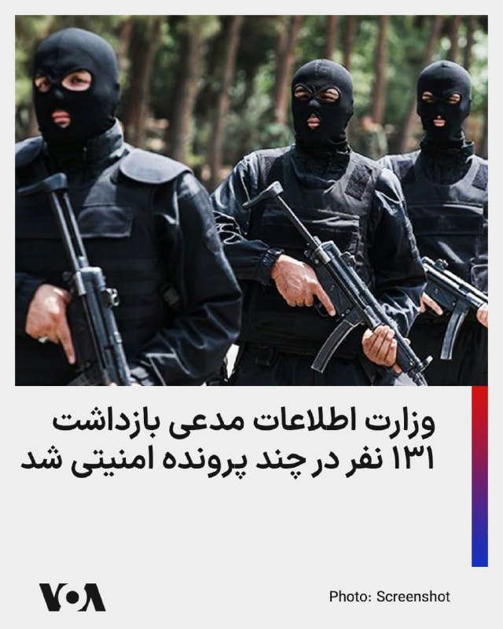

وزارت اطلاعات جمهوری اسلامی در اطلاعیه‌ای مدعی شد یک فرد متهم به تلاش برای نفوذ به مراکز داده، یک هسته چهار نفره در جنوب شرق کشور و ۱۲۶ نفر از آنچه «لیدرهای میدانی شبکه خرابکاری خیابانی» خواند، بازداشت شده‌اند.
@VahidHeadline

📡 @VahidOnline

## VahidOnline — post 76316

  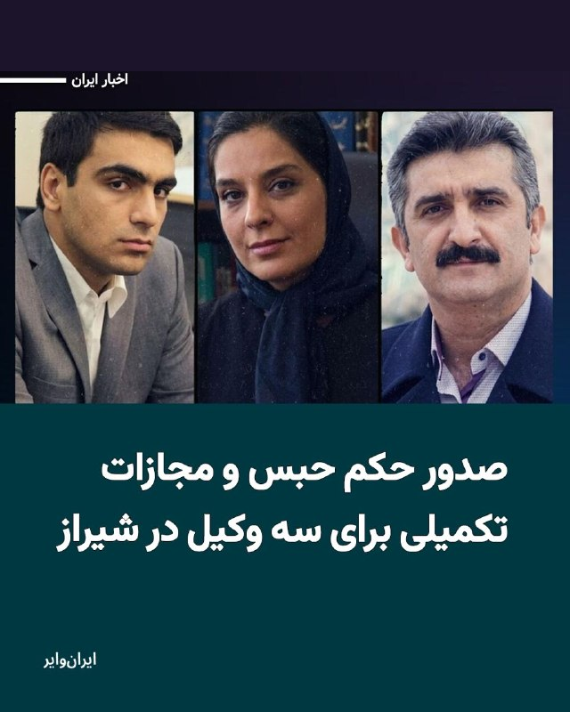

محمود طراوت‌روی، نازنین سالاری و مسعود احمدیان، وکلای دادگستری، به حبس و به عنوان مجازات تکمیلی به دو سال ممنوعیت خروج از کشور همراه با ابطال گذرنامه نیز محکوم شده‌اند.
@VahidHeadline

📡 @VahidOnline

## VahidOnline — post 76315

  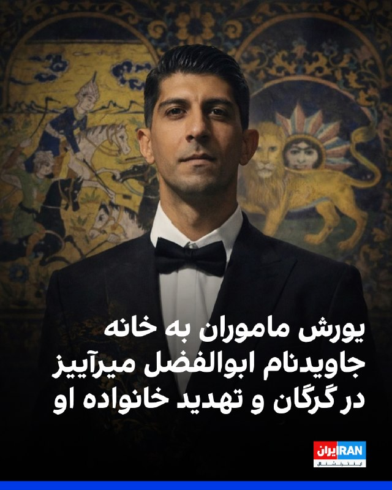

ماموران اطلاعاتی و نظامی جمهوری اسلامی در استان گلستان با یورش به منزل خانواده جاویدنام ابوالفضل میرآییز، اقدام به تفتیش خانه، طرح اتهامات بی‌اساس و تهدید اعضای خانواده او کرده‌اند.

طبق این گزارش‌ها، ماموران ضمن بازرسی کامل منزل، بخشی از وسایل شخصی خانواده را نیز با خود برده‌اند و آنان را به برخوردهای امنیتی تهدید کرده‌اند.

ابوالفضل میرآییز، ورزشکار ۳۴ ساله گرگانی، در جریان اعتراضات دی‌ماه با شلیک مستقیم ماموران حکومتی در خیابان‌های گرگان جان خود را از دست داد.
@VahidOOnLine

📡 @VahidOnline

## kianmeli1 — post 87988

🔴به گزارش N12 News، اسرائیل در حال آماده شدن برای حمله موشکی ایران در ساعات آینده است
https://t.me/kianmeli1

## kianmeli1 — post 87987

  

🔴مرندی عضو تیم مذاکره کننده: فعلاً مذاکره دیگری در کار نخواهد بود
https://t.me/kianmeli1

## kianmeli1 — post 87986

  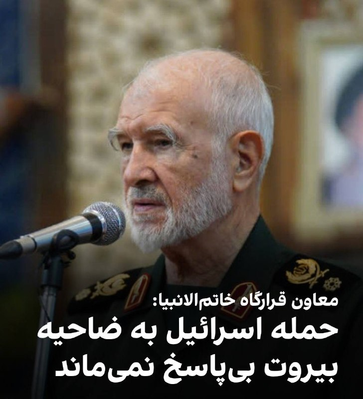

🔴معاون قرارگاه خاتم

حمله اسرائیل به ضاحیه بیروت بی پاسخ نمی ماند
https://t.me/kianmeli1

## kianmeli1 — post 87985

  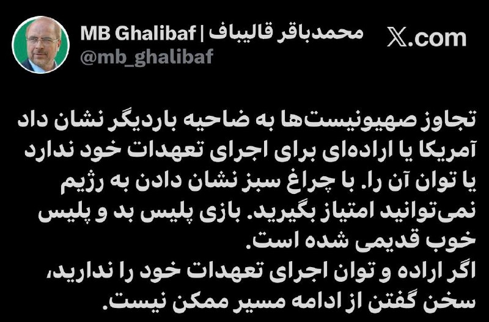

🔴توییت قالیباف

‏تجاوز صهیونیست‌ها به ضاحیه باردیگر نشان داد آمریکا یا اراده‌ای برای اجرای تعهدات خود ندارد یا توان آن را. با چراغ سبز نشان دادن به رژیم نمی‌توانید امتیاز بگیرید. بازی پلیس بد و پلیس خوب قدیمی شده است.
‏اگر اراده و توان اجرای تعهدات خود را ندارید، سخن گفتن از ادامه مسیر ممکن نیست.
https://t.me/kianmeli1

## IranIntlTV — post 342287

  <a href="telegram/content/IranIntlTV_342287_1781448502.mp4" target="_blank">🎬 Download video</a>

سرخط خبرهای یکشنبه ۲۴ خرداد
@iranintltv

## IranIntlTV — post 342286

🔻دیپلمات آمریکایی: حملات اسرائیل به بیروت توافق را با مشکل روبه‌رو کرده است

حملات پهپادی حزب‌الله به اسرائیل در روز یکشنبه ۲۴ خرداد زنجیره‌ای از واکنش‌ها را به دنبال داشت؛ اسرائیل پس از آن بیروت را هدف قرار داد، سپس تهران تهدید کرد که پاسخ می‌دهد. یک دیپلمات آمریکایی دخیل در مذاکرات نیز گفت که این تنش‌ها نهایی کردن توافق را با مشکل روبه‌رو کرده است.
فاکس‌نیوز عصر یکشنبه ۲۴ خرداد به نقل از یک دیپلمات آمریکایی دخیل در مذاکرات اعلام کرد که حملات اسرائیل به بیروت نهایی کردن توافق میان جمهوری اسلامی و آمریکا را با مشکل روبه‌رو کرده است.
این دیپلمات حملات یکشنبه را «تلاشی آشکار از سوی اسرائیل برای خراب کردن توافق رییس‌جمهوری آمریکا» و کشاندن دوباره این کشور به جنگ با جمهوری اسلامی خواند.
ارتش اسرائیل در بیانیه‌ای که در ایکس منتشر شد، اعلام کرد که این کشور در حال آماده شدن برای مقابله با حملات موشکی احتمالی از سوی جمهوری اسلامی در ساعات آینده است.

همزمان، یک مقام ارشد اسرائیلی در گفت‌وگو با این رسانه اتهام شروع تبادل آتش از سوی اسرائیل را رد کرد و گفت این حزب‌الله بود که در سه روز گذشته غیرنظامیان اسرائیلی را هدف قرار داد.

ارتش اسرائیل صبح یکشنبه در واکنش به حمله پهپادی حزب‌الله به شمار این کشور، به منطقه ضاحیه در جنوب لبنان حمله کرد. دولت اسرائيل در بیانیه‌ای حملات این کشور به بیروت را تایید.

ارتش اسرائیل نیز عصر یکشنبه در بیانه‌ای اعلام کرد که در «یک حمله دقیق در ضاحیه بیروت» یک مقر متعلق به حزب‌الله، گروه تحت حمایت جمهوری اسلامی، را که برای «پیشبرد طرح‌های تروریستی علیه شهروندان و نیروهای ارتش اسرائيل» مورد استفاده قرار می‌گرفت، هدف قرار داده است.
در پایان این بیانیه تاکید شده است که ارتش اسرائیل به فعالیت خود برای «رفع هرگونه تهدید» ادامه خواهد داد.
شبکه خبری العربیه، وابسته به عربستان سعودی، اعلام کرد که در این حملات یکی از فرماندهان ارشد حزب‌الله به نام «علی الحجاج» کشته شد.
رسانه آمریکایی اکسیو نوشت: «مقام‌های اسرائیلی و آمریکایی می‌گویند ارتش اسرائیل اندکی پیش از این حمله به بیروت، فرماندهی مرکزی ارتش ایالات متحده، سنتکام، را در جریان گذاشته بود.»

🔗 متن کامل گزارش را اینجا بخوانید

@iranintltv

## IranIntlTV — post 342285

  

باراک اوباما، رییس‌جمهوری پیشین آمریکا، در گفت‌وگو با ای‌بی‌سی نیوز گفت بعید است هر توافقی که میان آمریکا و جمهوری اسلامی حاصل شود، تفاوت چشمگیری با برجام داشته باشد یا نسبت به آن بهبود قابل توجهی محسوب شود.
اوباما با اشاره به برجام گفت این توافق بر محدود کردن برنامه هسته‌ای ایران، تعیین سقف برای غنی‌سازی اورانیوم و پذیرش بازرسی‌های آژانس بین‌المللی انرژی اتمی در ازای رفع بخشی از تحریم‌ها و آزادسازی دارایی‌های مسدودشده ایران استوار بود.
او همچنین ابراز امیدواری کرد بمباران‌ها متوقف شود و مردم عادی دیگر از پیامدهای جنگ رنج نکشند.
رییس‌جمهوری پیشین آمریکا تاکید کرد دیپلماسی را به اقدام نظامی ترجیح می‌دهد و گفت نباید تصور کرد که می‌توان با زور یا بمباران به راه‌حل دست یافت.
اوباما خواستار بررسی کامل گزینه‌های دیپلماتیک شد و گفت توافق‌هایی که همه مشکلات را حل نمی‌کنند اما ۸۰ یا ۹۰ درصد آن‌ها را برطرف می‌کنند، می‌توانند از جنگ جلوگیری کنند.
https://iranintl.com/202606145239

## IranIntlTV — post 342284

  <a href="telegram/content/IranIntlTV_342284_1781448505.mp4" target="_blank">🎬 Download video</a>

یکی از شرکت‌کنندگان در تجمع گوتنبرگ در گفت‌وگو با مهران عباسیان، خبرنگار ایران‌اینترنشنال، از جاویدنام نعیم ارزاقی نام برد و گفت او ۱۸ دی‌ماه با شلیک گلوله به قلبش جان باخته است.

@iranintltv

## IranIntlTV — post 342282

  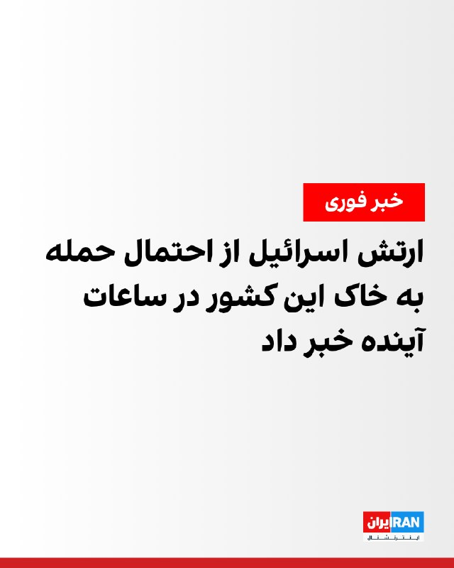

ارتش اسرائیل اعلام کرد ایال زمیر، رییس ستاد ارتش، پس از حمله به بیروت در حال برگزاری ارزیابی‌های مستمر از وضعیت با همه فرماندهان مرتبط است.

ارتش اسرائیل افزود بر اساس این ارزیابی‌ها، خود را برای احتمال شلیک به خاک اسرائیل در ساعات آینده آماده می‌کند.

این نهاد تاکید کرد در بالاترین سطح آماده‌باش قرار دارد و برای سناریوهای مختلف دفاعی و تهاجمی آماده است.

ارتش اسرائیل از شهروندان خواست هوشیار باشند، مسئولانه عمل کنند و دستورالعمل‌های فرماندهی جبهه داخلی را دنبال کنند.

این نهاد همچنین اعلام کرد در حال حاضر تغییری در دستورالعمل‌های دفاعی جبهه داخلی ایجاد نشده و در صورت هرگونه تغییر، اطلاع‌رسانی خواهد شد.

ارتش اسرائیل تاکید کرد شلیک به خاک این کشور را تحمل نخواهد کرد.
https://iranintl.com/202606149488

## IranIntlTV — post 342281

  

خبرگزاری فارس، وابسته به سپاه پاسداران، به نقل از یک منبع نزدیک به تیم مذاکره‌کننده جمهوری اسلامی گزارش داد هیات قطری هم‌اکنون در تهران حضور دارد و مواضع و جزییات مدنظر جمهوری اسلامی را به طرف آمریکایی منتقل می‌کند.
این منبع گفت هنوز هیچ‌یک از موضوعات مورد مذاکره نهایی نشده است و افزود حتی در صورت رفت‌وبرگشت در روند گفت‌وگوها، شرط اساسی جمهوری اسلامی لحاظ شدن کامل مطالباتش در متن نهایی است.
به گفته این منبع، حتی در صورت پذیرش همه نظرات جمهوری اسلامی نیز در زمان اعلام‌شده از سوی دونالد ترامپ، رییس‌جمهوری آمریکا، هیچ توافقی امضا نخواهد شد.
فارس نوشت این اظهارات ساعاتی پیش از حمله اسرائیل به ضاحیه بیروت مطرح شده است.
https://iranintl.com/202606147201

## IranIntlTV — post 342280

  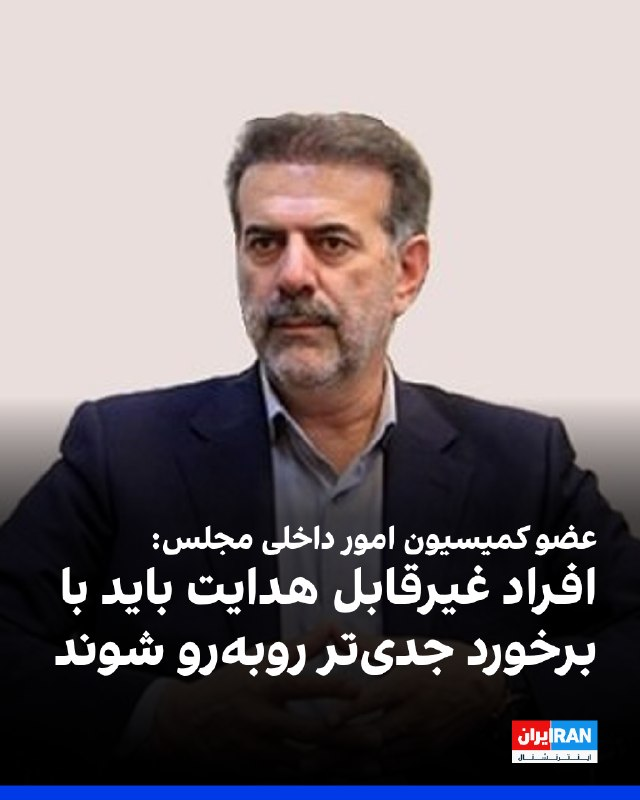

کامران پولادی، عضو کمیسیون امور داخلی مجلس جمهوری اسلامی، گفت برخی افراد با تکرار «حرف دشمن» و ایجاد اختلاف در جامعه، وحدت کشور را هدف قرار می‌دهند.
او با اشاره به تاکید مجتبی خامنه‌ای بر حفظ وحدت، خواستار ورود دستگاه قضایی شد و گفت این افراد باید احضار و تذکر بگیرند و اگر «قابل هدایت» نیستند، با آنان برخورد جدی‌تر شود.
پولادی همچنین گفت باید اجازه داد «میدان و دیپلماسی» در کنار یکدیگر مسیر خود را طی کنند. او افزود: مردان میدان و دیپلماسی در چارچوب خطوط قرمز تعیین‌شده از سوی مجتبی خامنه‌ای، منافع جمهوری اسلامی را دنبال می‌کنند.
https://iranintl.com/202606144893

## IranIntlTV — post 342279

  <a href="telegram/content/IranIntlTV_342279_1781448510.mp4" target="_blank">🎬 Download video</a>

رییس اتاق اصناف کشاورزی با اشاره به پرداخت نشدن مطالبات گندم‌کاران گفت با وجود افزایش تولید گندم، کشاورزان گندم کمتری را به سیلوهای دولتی تحویل داده‌اند.

معصومه طاهرخانی، تحلیل‌گر اقتصادی، گفت: «پیامد نهایی این مشکلات متوجه مردم است، چرا که نه به نان باکیفیت دسترسی خواهند داشت و نه آن را با قیمت مناسب تهیه خواهند کرد.»
@iranintltv

## IranIntlTV — post 342278

  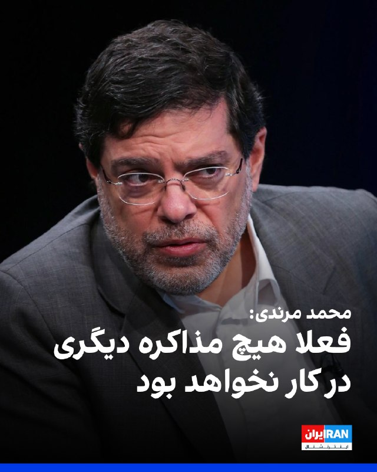

محمد مرندی، از اصحاب رسانه همراه با هیات مذاکره جمهوری اسلامی در پاکستان، درباره ادامه مذاکرات تهران و واشینگتن، در شبکه ایکس نوشت: «فعلا هیچ مذاکره دیگری در کار نخواهد بود.»
همزمان با احتمال امضای تفاهم‌نامه میان آمریکا و جمهوری اسلامی، اسرائیل روز یک‌شنبه حملاتی را به جنوب بیروت انجام داد.
در پی حملات به لبنان، قالیباف در شبکه ایکس نوشت: «این حمله نشان می‌دهد آمریکا یا اراده اجرای تعهدات خود را ندارد یا توان آن را. با چراغ سبز نشان دادن به اسرائیل نمی‌توانید امتیاز بگیرید. بازی پلیس بد و پلیس خوب قدیمی شده است.»
https://iranintl.com/202606146950

## IranIntlTV — post 342277

  <a href="telegram/content/IranIntlTV_342277_1781448513.mp4" target="_blank">🎬 Download video</a>

ویدیوهای رسیده به ایران‌اینترنشنال نشان می‌دهند ایرانیان مقیم آلمان شنبه ۲۳ خرداد با فراخوان شاهزاده رضا پهلوی و علیه جمهوری اسلامی در هانوفر تجمع کرده و نام جاویدنامان انقلاب ملی را فریاد زدند.

## IranIntlTV — post 342276

🗣روایت شما از احتمال توافق میان جمهوری اسلامی و آمریکا - یکشنبه ۲۴ خرداد

🔹مطمئنم با توافق و آزادی پول‌های بلوکه‌شده، دوباره این حکومت خودش را ریکاوری می‌کند و هم خودش و هم نیابتی‌هایش دوباره جان می‌گیرند. زیر توافق زدن هم برایشان کاری ندارد. آن‌وقت ببینیم باز هم ترامپ از توافق خواهد گفت؟

🔹تحقیر یک حکومت گاهی از نابودی آن مرگبارتر است. هیروهیتو مجبور شد بگوید خدا نیست و در مراسم تسلیم، پایان امپراتوری را ببیند. لویی شانزدهم با از دست دادن هیبتش سقوط کرد. تزار نیکلای دوم هم اول تحقیر شد و بعد فروپاشید. اصرار ترامپ بر امضای تسلیم‌نامه نیز از همین جنس است.

🔹یکی بود می‌گفت نه جنگ می‌شود نه مذاکره می‌کنیم. الان نیست ببیند که هم کشته شد، هم جنگ شد و هم مذاکره. تازه بیچاره نمی‌داند که جنازه‌اش هم بعد از ۱۰۷ روز هنوز خاک نشده است.

🔹جوانی ما به ‌دست جمهوری اسلامی و به‌خاطر هسته‌ای نابود شد، اما الان می‌خواهند دو دستی همه‌چیز را تقدیم آمریکا کنند.

🔹از رودهن: هیچ‌کس جز ایرانی دلش برای ایران و جاویدنام‌های دسته‌گل این کشور نسوخته، پس باید با هم باشیم و برای بیرون کردن اشغالگران فقط دست‌هایمان را به همدیگر گره بزنیم.

## IranIntlTV — post 342275

  <a href="telegram/content/IranIntlTV_342275_1781448516.mp4" target="_blank">🎬 Download video</a>

یکی از شرکت‌کنندگان در تجمع گوتنبرگ سوئد که در جریان اعتراضات سال ۱۳۸۸ از ناحیه چشم آسیب دیده است، به مهران عباسیان، خبرنگار ایران‌اینترنشنال، گفت: «اینجا هستم تا به خانواده جاویدنامان بگویم صدای شما را به گوش جهانیان خواهم رساند.»
@iranintltv

## IranIntlTV — post 342274

  

مارجوری تیلور گرین، نماینده پیشین کنگره آمریکا، در ایکس با بازنشر مطلبی درباره برنامه هسته‌ای جمهوری اسلامی نوشت هرگونه توافق با تهران، حتی در صورت رقیق‌سازی بخشی از ذخایر اورانیوم در اصفهان، همچنان مواد کافی برای ساخت یک بمب در اختیار جمهوری اسلامی قرار خواهد داد.
او افزود توافقی که اکنون در حال بررسی است، «غیرقابل قبول» خواهد بود.
همزمان رویترز به نقل از یک مقام ارشد جمهوری اسلامی گزارش داد در پیش‌نویس یادداشت تفاهم میان تهران و واشینگتن، آمریکا با رقیق‌سازی ذخایر اورانیوم با غنای بالا در داخل ایران موافقت کرده است.
https://iranintl.com/202606141708

## IranIntlTV — post 342273

  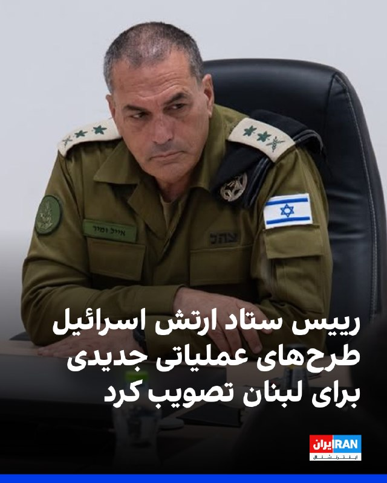

ایال زمیر، رییس ستاد ارتش اسرائیل، گفت ارتش تحولات منطقه را به‌دقت زیر نظر دارد و در همه جبهه‌ها سطح بالایی از آمادگی و هوشیاری را حفظ کرده است.

او افزود لبنان مرکز ثقل اصلی عملیات اسرائیل است، اما ارتش برای تحولات احتمالی در سایر جبهه‌ها نیز آماده می‌شود.

ارتش اسرائیل اعلام کرد ایال زمیر در نشست با فرماندهان جبهه شمالی، طرح‌های عملیاتی جدید برای لبنان را تایید کرده است.

ایال زمیر گفت حزب‌الله فاجعه‌ای بر دولت لبنان و جامعه شیعه تحمیل کرده است و مردم لبنان این موضوع را به‌خوبی درک می‌کنند. او افزود تمام روستاهای جنوب لبنان به شبکه‌ای پیچیده از زیرساخت‌های تروریستی تبدیل شده‌اند.

رییس ستاد ارتش اسرائیل تاکید کرد ارتش به عملیات ابتکاری و تهاجمی خود ادامه خواهد داد.
https://iranintl.com/202606140791

## IranIntlTV — post 342272

  

فاطمه مهاجرانی، سخنگوی دولت جمهوری اسلامی، با انتقاد از حملات برخی جریان‌ها به تیم مذاکره‌کننده گفت تصمیم‌گیری درباره تفاهم احتمالی با آمریکا در سطح «نظام و حاکمیت» انجام می‌شود و حمله به مذاکره‌کنندگان، حمله به یک «تصمیم ملی» است.
او در گفت‌وگو با ایرنا از محمدباقر قالیباف، رییس مجلس جمهوری اسلامی، و عباس عراقچی، وزیر امور خارجه، دفاع کرد و گفت هر دو سابقه دفاع از «منافع ملی» را دارند.
مهاجرانی افزود: «دیپلماسی در برابر میدان نیست، بلکه ادامه میدان است» و افزود مذاکره از موضع اقتدار به معنای عقب‌نشینی نیست.
https://iranintl.com/202606145685

## IranIntlTV — post 342271

  

شبکه العربیه گزارش داد علی الحاج، از فرماندهان حزب‌الله، در حمله هوایی یکشنبه ۲۴ خرداد اسرائیل به ضاحیه بیروت کشته شده است.
دفاع مدنی لبنان نیز اعلام کرد در این حمله سه نفر کشته شدند.
العربیه همچنین گزارش داد ارتش اسرائیل یکشنبه سه حمله هوایی به شهر سجد در جنوب لبنان انجام داده است.
ارتش اسرائیل پیش‌تر اعلام کرده بود در واکنش به شلیک سه پهپاد از سوی حزب‌الله به شمال اسرائیل و آنچه نقض آتش‌بس از سوی این گروه خواند، یکی از مقرهای حزب‌الله را در ضاحیه بیروت هدف قرار داده است.
https://iranintl.com/202606143920

## IranIntlTV — post 342270

  <a href="telegram/content/IranIntlTV_342270_1781448521.mp4" target="_blank">🎬 Download video</a>

ایرانیان مقیم لیورپول در زادروز مجید رضا رهنورد، در اعتراض به اجرای احکام اعدام و بازداشت‌ها در ایران گردهم آمدند. معترضان با گرامیداشت یاد جاویدنامان انقلاب ملی، خواستار پایان مماشات جهان با جمهوری اسلامی هستند.

گزارش تاج‌الدین سروش، خبرنگار ایران‌اینترنشنال
@iranintltv

## IranIntlTV — post 342269

  <a href="telegram/content/IranIntlTV_342269_1781448523.mp4" target="_blank">🎬 Download video</a>

ایرانیان مقیم لیورپول در زادروز مجید رضا رهنورد، در اعتراض به اجرای احکام اعدام و بازداشت‌ها در ایران گردهم آمدند. معترضان با گرامیداشت یاد جاویدنامان انقلاب ملی، خواستار پایان مماشات جهان با جمهوری اسلامی هستند.

گزارش تاج‌الدین سروش، خبرنگار ایران‌اینترنشنال
@iranintltv

## IranIntlTV — post 342268

  <a href="telegram/content/IranIntlTV_342268_1781448525.mp4" target="_blank">🎬 Download video</a>

هم‌زمان با زادروز مجیدرضا رهنورد، ایرانیان در شهرهای لیورپول بریتانیا و گوتنبرگ سوئد گرد هم آمدند و یاد جاویدنامان انقلاب ملی ایران را گرامی داشتند.

تاج‌الدین سروش و مهران عباسیان، خبرنگاران ایران‌اینترنشنال، گزارش می‌دهند
@iranintltv

## IranIntlTV — post 342267

🗣روایت شما از احتمال توافق میان آمریکا و جمهوری‌اسلامی - یکشنبه ۲۵ خرداد

🔹تنها موردی که مخالفان و موافقان جمهوری اسلامی بر آن تفاهم دارند و با آن مخالفند، توافق با آمریکاست.

🔹ما باید خودمان بلند شویم و کار را تمام کنیم. در این توافق هیچ اسمی از ما مردم ایران آورده نشده، چون برای ترامپ و جمهوری اسلامی اهمیتی ندارد.

🔹ترامپ با توافق، شکافی در بدنه نظام ایجاد کرد که هیچ‌کس نمی‌تونست انجامش بده.

🔹این حق مردم ایران نیست؛ واقعا ما باید چقدر تاوان حماقت بقیه را بدیم؟ عمرمون سر مذاکره و توافق رفت. دقیقا این جنگ افتاد وسط جوونی‌مون. این همه جوون کشتن که الان توافق کنن؟

🔹ما مردم ایران خیلی گناه داریم. هیچ‌کس پشت ما نبود و نیست. فقط امیدوارم زودتر از شر این روزگار سیاه خلاص شویم.

🔹از آقای ترامپ بابت کمکی که کرد ممنونم؛ هم در جنگ و هم در مذاکره جمهوری اسلامی را شکست دادی.

🔹دردها و مشکلات همه به جای خودش عزیز و مهمه؛ از دانش‌آموزها تا افراد سالمند، از پدران و مادران تا بچه‌ها، همه به نحوی از جمهوری اسلامی آسیب دیدیم، اما تنها چیزی که می‌خوایم سرنگونی جمهوری اسلامیه.

🔹در این کانال‌های خبری، ارزشی‌ها می‌گن اگر توافق کنین روی صورت دخترهای بی‌حجاب اسید می‌پاشیم. خداروشکر شهر هرت هم شد.

🔹واقعا هیچ‌کس نمی‌خواد توافق بشه و همه دنبال جنگ هستند؛ چه طرفداران حکومت و چه مخالفان حکومت.

## Shin_Persian — post 7051

Shin ✓ @hey_itsmyturn
Sun, 14 Jun 2026 14:09:34 UTC

Ok. Seems like there MIGHT be missile launch from Iran towards Israel today

ترجمه خودکار فارسی

خب، به نظر می‌رسد احتمال دارد امروز پرتاب موشک از سوی ایران به سمت اسرائیل انجام شود.

𝕏 · @shin_persian

## Shin_Persian — post 7049

Shin ✓ @hey_itsmyturn
Sun, 14 Jun 2026 13:27:21 UTC

The deputy commander of IRGC Khatam al Anbiya HQ: that Israeli attacks on Dahieh will not go unanswered.

ترجمه خودکار فارسی

جانشین فرمانده قرارگاه مرکزی خاتم‌الانبیا سپاه پاسداران انقلاب اسلامی: حملات اسرائیل به ضاحیه بی‌پاسخ نخواهد ماند.

𝕏 · @shin_persian

## Shin_Persian — post 7048

Shin ✓ @hey_itsmyturn
Sun, 14 Jun 2026 13:19:55 UTC

Authorities announced a factory's scrap yard caught fire, fire brigades at the scene.
Dolat Abad, Northeastern Isfahan, Isfahan Province, Iran

ترجمه خودکار فارسی

مقامات اعلام کردند که انبار ضایعات یک کارخانه دچار حریق شده است و واحدهای آتش‌نشانی در محل حضور دارند.
دولت‌آباد، شمال شرقی اصفهان، استان اصفهان، ایران

𝕏 · @shin_persian

## Shin_Persian — post 7047

  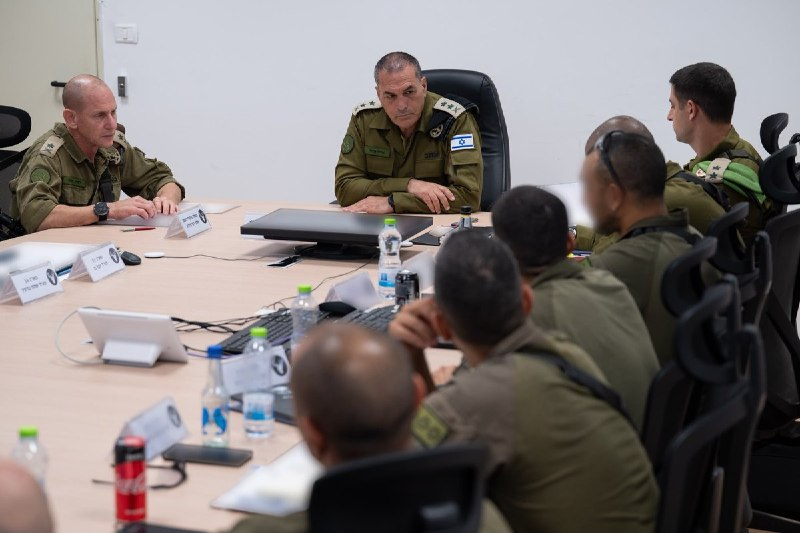

Emanuel (Mannie) Fabian ✓ @manniefabian
Sun, 14 Jun 2026 13:15:36 UTC

Original text in comments
ترجمه خودکار فارسی در بخش نظرات

𝕏 · @shin_persian

## FarsiVOA — post 220689

  <a href="telegram/content/FarsiVOA_220689_1781448529.mp4" target="_blank">🎬 Download video</a>

در گفت‌وگو با حسن هاشمیان، از حمله اسرائیل به قلب پایگاه حزب‌الله در بیروت، پیام تبادل آتش و تأثیر آن بر توافق احتمالی میان حکومت ایران و آمریکا گفتیم. به گفته هاشمیان، بخشی از فرماندهان سپاه با هماهنگی حزب‌الله در پی آنند که با تشدید تنش‌ها، توافق احتمالی را تحت تأثیر قرار داده و تخریب کنند.

## FarsiVOA — post 220688

  <a href="telegram/content/FarsiVOA_220688_1781448530.mp4" target="_blank">🎬 Download video</a>

پیت هگست، وزیر جنگ آمریکا، در پیامی به مناسبت سالروز تولد دونالد ترامپ از او به‌عنوان «فرمانده کل قوایی» یاد کرد که به گفته او «هیچ فرمانده‌ای بهتر از او نمی‌توانست باشد.»

او همچنین گفت خدمت کردن تحت فرمان ترامپ «افتخار یک عمر» است و تاکید کرد نیروهای مسلح آمریکا از سیاست «صلح از طریق قدرت»، در اولویت قرار دادن آمریکا و بازسازی ارتش این کشور حمایت خواهند کرد.

@FarsiVOA

## FarsiVOA — post 220687

آتش شاکرمی، هنرمند و خاله نیکا شاکرمی، از کشته‌شدگان جنبش مهسا در گفت‌وگوی اختصاصی با عمق میدان: گزارش‌های آزار جنسی نیکا را تأیید نکردم و خواندن آنها بند بند وجودم را پاره کرد.

## FarsiVOA — post 220686

  <a href="telegram/content/FarsiVOA_220686_1781448531.mp4" target="_blank">🎬 Download video</a>

بازنشستگان در کرمانشاه روز یکشنبه، ۲۴ خرداد ۱۴۰۵، با شعار «نان گران، دارو گران، دولت شده دشمن جان» در اعتراض به شرایط دشوار معیشتی تجمع کردند.

بازنشستگان کرمانشاه همچنین با شعار «نه جنگ می‌خوایم، نه کشتار، رفاه می‌خوایم ماندگار» اعتراض خود را نسبت به اولویت‌های اقتصادی و سیاسی جمهوری اسلامی بیان کردند و خواستار تمرکز حکومت بر رفاه عمومی و تأمین هزینه‌های زندگی شدند.

## FarsiVOA — post 220685

🔺منوچهر بختیاری بار دیگر در دادگاه انقلاب محاکمه می‌شود

◾️صبا بختیاری، خواهر منوچهر بختیاری، اعلام کرد جمهوری اسلامی برادر دادخواهش را به «اغوا و تحریک مردم به جنگ و کشتار علیه مردم» متهم کرده و قرار است او را به همین «اتهام سنگین» روز دوشنبه ۲۵ خرداد، در دادگاه انقلاب بندرعباس محاکمه کنند.

⬇️ بیشتر بخوانید:

https://ir.voanews.com/a/manouchehr-bakhtiari-poya-bakhtiari-court-serious-accusation-iran/8160677.html

## FarsiVOA — post 220684

  <a href="telegram/content/FarsiVOA_220684_1781448534.mp4" target="_blank">🎬 Download video</a>

وزارت جنگ آمریکا این تصاویر را از رویداد «یو‌اف‌سی فریدم ۲۵۰» منتشر کرده است؛ رویدادی ویژه که به مناسبت دویست‌وپنجاهمین سالگرد استقلال آمریکا در محوطه کاخ سفید برگزار می‌شود.

این رویداد با همکاری سازمان یو‌اف‌سی برگزار شده و بخشی از برنامه‌های بزرگداشت ۲۵۰ سالگی استقلال ایالات متحده است.

وزارت جنگ آمریکا می‌گوید «یو‌اف‌سی فریدام ۲۵۰» ادای احترامی به روحیه رزمندگی و فداکاری نظامیان آمریکایی است که در نقاط مختلف جهان در حال انجام ماموریت هستند.

@FarsiVOA

## FarsiVOA — post 220683

  <a href="telegram/content/FarsiVOA_220683_1781448536.mp4" target="_blank">🎬 Download video</a>

گروهی از بازنشستگان در تهران، روز یکشنبه، ۲۴ خرداد ۱۴۰۵، با شعار «معیشت، منزلت، حق مسلم ماست» در اعتراض به شرایط دشوار معیشتی تجمع کردند.

این اعتراض‌ها در شرایطی ادامه دارد که گزارش‌های رسمی از تداوم تورم سنگین در ایران حکایت دارد. در ماه‌های اخیر، افزایش قیمت مواد غذایی، اجاره مسکن، دارو و خدمات درمانی فشار بیشتری بر بازنشستگان و مستمری‌بگیران وارد کرده است؛ گروهی که بخش بزرگی از درآمد آنان به هزینه‌های درمان، اجاره‌خانه و نیازهای روزمره اختصاص می‌یابد.

## FarsiVOA — post 220682

  <a href="telegram/content/FarsiVOA_220682_1781448538.mp4" target="_blank">🎬 Download video</a>

گروهی از بازنشستگان تامین اجتماعی در شوش، در ادامه اعتراضات هفتگی، روز یکشنبه، ۲۴ خرداد ۱۴۰۵، با شعار «دولت بی‌کفایت، ‌مجلس بی‌خاصیت نمی‌خوایم» در اعتراض به شرایط دشوار معیشتی تجمع کردند.

اعتراض‌های بازنشستگان تأمین اجتماعی در ایران طی سال‌های اخیر به‌طور مستمر در شهرهای مختلف برگزار شده است. محور اصلی این تجمع‌ها، پایین بودن مستمری‌ها در برابر تورم، اجرا نشدن کامل همسان‌سازی یا متناسب‌سازی حقوق، افزایش هزینه دارو و درمان، و کاهش قدرت خرید بازنشستگان بوده است.

## FarsiVOA — post 220681

آتش شاکرمی، هنرمند و خاله نیکا شاکرمی در عمق میدان: گروه‌های اپوزیسیون کوشیدند نیکا را به خود نسبت دهند اما نیکا در سنی نبود که گرایش سیاسی داشته باشد. او هنوز ۱۶ساله و در ابتدای تجربه زندگی بود.

## FarsiVOA — post 220680

🔺پرزیدنت ترامپ امروز ۸۰ ساله می‌شود؛ کاخ سفید میزبان مسابقه رزمی

◾️دونالد ترامپ، رئیس جمهوری ایالات متحده که چهل‌وپنجمین و چهل‌وهفتمین رئیس جمهوری این کشور بوده است، روز یکشنبه ۱۴ ژوئن ۲۰۲۶ هشتاد ساله شد؛ مناسبتی که با «روز پرچم» آمریکا همزمان شده است؛ ضمن آنکه آمریکا برای جشن‌های دویست‌وپنجاهمین سالگرد استقلال آماده می‌شود.

⬇️ بیشتر بخوانید:

https://ir.voanews.com/a/president-trump-turns-eighty/8160668.html

## FarsiVOA — post 220679

🔺پلمب دو واحد صنفی در آران و بیدگل به بهانه «کشف حجاب»

◾️فرمانده انتظامی آران و بیدگل، از پلمب دو محل کسب به بهانه اجرای طرح موسوم به «ارتقاء امنیت اجتماعی و برخورد با ناهنجاری‌های اخلاقی و اجتماعی» خبر داد.

⬇️ بیشتر بخوانید:

https://ir.voanews.com/a/social-security-promotion-plan-hijab-iran-seal-of-trade-unions/8160665.html

## FarsiVOA — post 220675

مارکو روبیو، وزیر خارجه آمریکا، با انتشار تصاویری از حضور خود در نخستین دیدار جام جهانی ۲۰۲۶، این شب را «تاریخی» توصیف کرد.

او گفت بیش از ۷۰ هزار هوادار در نخستین مسابقه این رقابت‌ها که به میزبانی ایالات متحده برگزار شد، حضور داشتند.

جام جهانی فوتبال ۲۰۲۶ هم‌اکنون به میزبانی مشترک آمریکا، کانادا و مکزیک برگزار می‌شود.

@FarsiVOA

## FarsiVOA — post 220674

🔺تجمع اعتراضی بازنشستگان در اعتراض به «بی‌کفایتی» دولت و «بی‌خاصیتی» مجلس

◾️بازنشستگان تأمین اجتماعی روز یکشنبه ۲۴ خرداد ۱۴۰۵ در دست‌کم دو شهر کرمانشاه و شوش تجمع اعتراضی برگزار کردند و با سر دادن شعارهایی علیه گرانی، تورم، مشکلات درمانی و عملکرد دولت و مجلس شورای اسلامی، خواستار رسیدگی به مطالبات معیشتی و صنفی خود شدند.

⬇️ بیشتر بخوانید:

https://ir.voanews.com/a/iranian-pensioners-protest-economic-hardship/8160664.html

## DW_Farsi — post 125963

  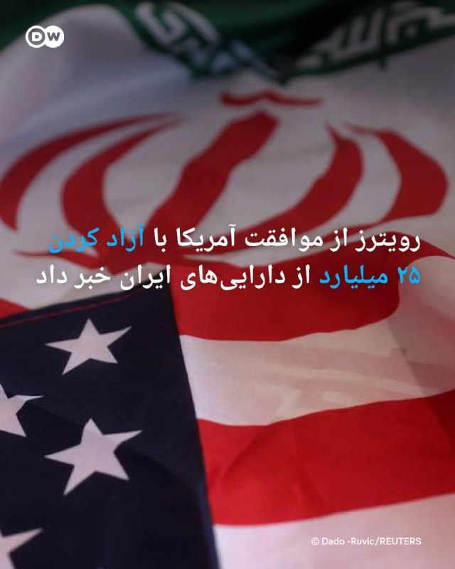

🔶 رویترز از موافقت آمریکا با آزاد کردن ۲۵ میلیارد از دارایی‌های ایران خبر داد

خبرگزاری رویترز یکشنبه ۱۴ ژوئن (۲۴ خردادماه) به نقل از یک مقام ارشد جمهوری اسلامی گزارش داده که دولت آمریکا در تفاهم‌نامه تهران و واشنگتن که هنوز نهایی نشده و به امضاء نرسیده است، با "آزادسازی ۲۵ میلیارد دلار از دارایی‌های مسدودشده ایران موافقت کرده است".

این خبرگزاری نام این مقام را فاش نکرد، اما به نقل از او نوشت که دولت ایالات متحده، همچنین موافقت کرده که اورانیوم بسیار غنی‌شده ایران در داخل این کشور رقیق شود. به نوشته رویترز سازوکار اجرای این موضوع در ۶۰ روز آینده مورد بحث قرار خواهد گرفت.

درخور توجه آنکه این هر دو نکته از مورد بحث‌ترین موضوعات در مذاکرات تهران و واشنگتن بوده است. دونالد ترامپ، رئیس جمهور ایالات متحده بارها بر لزوم تحویل یا انتقال یا نابودی اورانیوم ۶۰درصد غنی‌شده ایران تأکید کرده و به تکرار گفته بود، پولی به ایران نخواهد داد.

@dw_farsi

## DW_Farsi — post 125962

  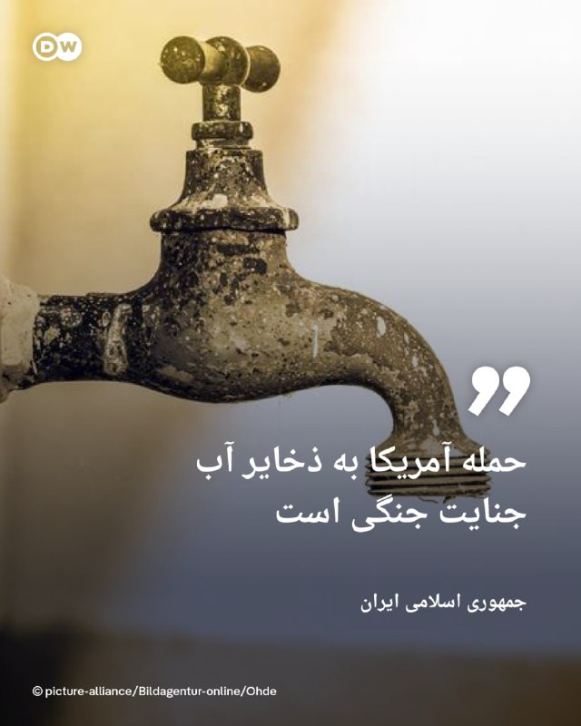

🔶 ایران: حمله آمریکا به ذخایر آب جنایت جنگی است

به گزارش شبکه خبری سی‌ان‌ان، جمهوری اسلامی مدعی است که آمریکا به ذخایر آب در ایران حمله کرده؛ اقدامی که از دید تهران "نقض قوانین بین‌الملل" و به این ترتیب "جنایت جنگی" محسوب می‌شود.

بنا بر گزارش سی‌ان‌ان خبرگزاری نیمه‌دولتی مهر تصاویری منتشر کرده که نشان می‌دهند، شماری از "ذخایر آب آشامیدنی در جنوب ایران "هدف مهمات آمریکایی قرار گرفته‌اند". مهر به نقل از عبدالحمید حمزه پور، مدیرعامل شرکت آب و فاضلاب هرمزگان نوشت، "دو مخزن بتونی ذخیره آب به گنجایش ۲ هزار و پانصد مترمکعب در منطقه بامانی هدف اصاب موشک قرار گرفته و کاملا از کار افتاده‌اند".

طبق گزارش شبکه سی‌ان‌ان در یکی از تصاویر منتشرشده از سوی خبرگزاری مهر تکه‌هایی از یک موشک نقطه‌زن ساخت آمریکا دیده می‌شود. سی‌ان‌ان در عین حال نوشت، نمی‌توان تأیید کرد که تکه مهماتی که در تصویر دیده می‌شوند، واقعا هم در محل وقوع حادثه یافت شده باشند.

@dw_farsi

## DW_Farsi — post 125961

اشتباه کوچک، جریمه بزرگ؛ این‌جا قانون شوخی‌بردار نیست

در آلمان نه تنها برای جزئی‌ترین مسائل قانون و مقررات و استاندارد وجود دارد، بلکه رعایت قانون بسیار جدی گرفته می‌شود. شما با این همه مقررات چطور کنار می‌آیید؟

@dw_farsi

## DW_Farsi — post 125960

  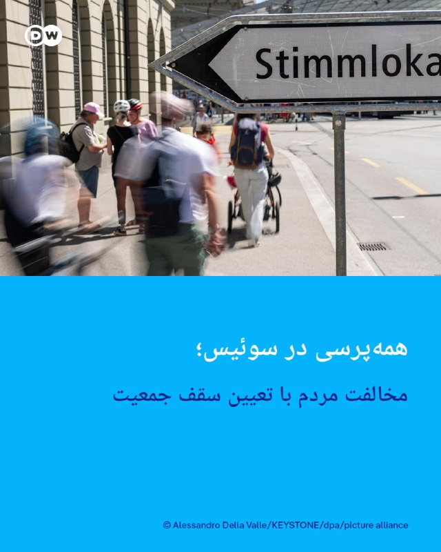

🔶 همه‌پرسی در سوئیس؛ مخالفت مردم با تعیین سقف جمعیت

در یک همه‌پرسی در سوئیس که به ابتکار حزب پوپولیستی اس فا پ به منظور تعیین سقف جمعیت برگزار شد، ۵۵ درصد مردم با این امر مخالفت کردند. حزب اس فا پ (SVP) بزرگ‌ترین حزب سوئیس در پارلمان این کشور است.

طبق نخستین نتایج اعلام‌شده همه‌پرسی در سوئیس که در ارتباط با تعیین و محدودکردن سقف جمعیت انجام گرفته، ۵۵ درصد از شهروندان این کشور به تعین سقف برای جمعیت رأی منفی داده‌اند و تنها ۴۵ درصد از مردم سوئیس با این مسئله موافق بوده‌اند. این نتایج را مؤسسه نظرسنجی "گ اف اس" در برن به سفارش اتحادیه رادیو و تلویزیون سوئیس تهیه و اعلام کرده است.

طبق اعلام این مؤسسه، به ویژه مخالفت مردم در مناطق فرانسوی زبان غرب سوئیس و شهرنشینان این کشور سبب شد که این رفراندم با شکست روبرو شود.

این همه‌پرسی با ابتکار عمل حزب پوپولیستی "اس فا پ" (حزب مردمی سوئیس) برگزار شد که امیدوار بود از این طریق "موج مهاجران" را مهار کند.

@dw_farsi

## DW_Farsi — post 125959

  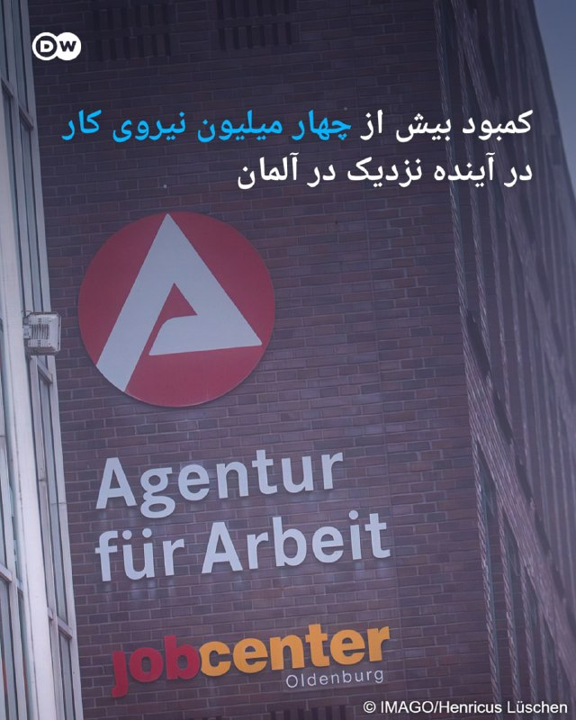

🔶 کمبود بیش از چهار میلیون نیروی کار در آینده نزدیک در آلمان

طبق یک گزارش رسانه‌ای و مطابق یک پژوهش، آمار کمبود نیروی کار در آلمان در ۱۰ سال آینده ۱.۳ میلیون نفر بیش از آن‌چه که قبلا پیش‌بینی می‌شد خواهد بود. چشم‌انداز جمعیتی آلمان نیز وخیم‌تر شده است.

طبق گزارش روزنامه آلمانی "راینیشه پست"، کمبود نیروی کار در ۱۰ سال آینده در این کشور بزرگ‌تر از آن چیزی خواهد بود که تاکنون تصور می‌شد.

این روزنامه با استناد به پژوهشی در مؤسسه اقتصاد آلمان (IW) می‌نویسد، آلمان تا سال ۲۰۳۶ احتمالا با ۴.۳ میلیون کمبود در نیروی کار مواجه خواهد شد که این رقم بیش از یک میلیون نفر فراتر از پیش‌بینی‌های قبلی است.

این مؤسسه تنها دو سال پیش فاصله میان خروج نیروی کار از چرخه کار، به‌ویژه به‌دلیل بازنشستگی و ورود نیروی کار جدید را حدود ۳ میلیون نفر برآورد کرده بود. بنابراین، این شکاف نسبت به پیش‌بینی سال ۲۰۲۴ حدود ۱.۳ میلیون نفر افزایش یافته است.

طبق اطلاعات ارائه شده، این بازنگری نتیجه یک پیش‌بینی جدید جمعیتی است که بر پایه داده‌های تازه اداره فدرال آمار آلمان انجام شده است.

@dw_farsi

## Persian_Trend_Official — post 17057

  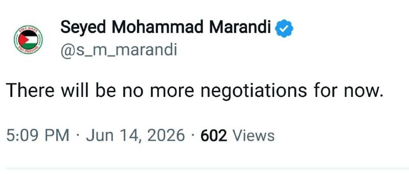

مرندی عضو تیم مذاکره کننده:
فعلاً مذاکره دیگری در کار نخواهد بود

😄

## Persian_Trend_Official — post 17056

شبکه العربیه: یک مقام ارشد حزب‌الله، علی الحاج، در حمله ارتش اسرائیل به ضاحیه بیرت کشته شد.

همچنین کانال 12 اسرائیل ادعا کرد هدف حمله امروز فرمانده واحد ارتباط حزب‌الله بوده است.

📝 Amir

📌 @persian_trend_official
پرشین ترند | متفاوت‌ترین کانال نظامی

## Persian_Trend_Official — post 17054

  <a href="telegram/content/Persian_Trend_Official_17054_1781448545.webm" target="_blank">🎬 Download video</a>

نتانیاهو ابتدا تصویر حمله به بیروت را منتشر کرد و در پست بعد تولد ترامپ را تبریک گفت 😄

## Persian_Trend_Official — post 17053

  <a href="telegram/content/Persian_Trend_Official_17053_1781448546.webm" target="_blank">🎬 Download video</a>

منتظرم خبر خاصی بشه بریم لایو فعلا با چشم باز نظاره میکنیم

## Persian_Trend_Official — post 17052

  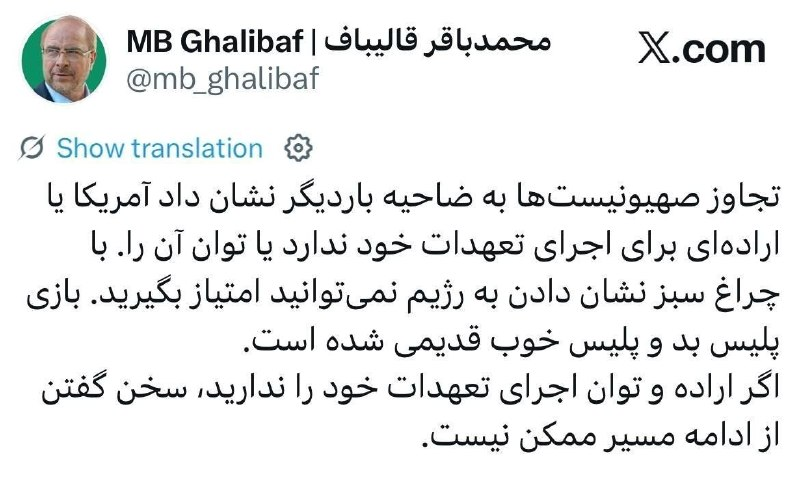

بسسسسسسسه حاج باقر
کشتیش 😄
انقدر قاطعیت هم دیگه خوب نیست !

## Persian_Trend_Official — post 17051

https://t.me/persian_trend_official/17044?comment=670219

نه داداش تا امضای من پای توافق نباشه نمیزارم هیچ چیزی امضا بشه ! الانم به بنیامین گفتم ضاحیه رو بزنه به سپاه هم گفتم دوباره جواب بده
دارم فکر میکنم بعدش بگم چیکار کنن 😒

## Persian_Trend_Official — post 17050

  <a href="telegram/content/Persian_Trend_Official_17050_1781448548.webm" target="_blank">🎬 Download video</a>

قالیباف: پس از چراغ سبز آمریکا به رژیم برای تجاوز به ضاحیه، سخن گفتن از ادامه مسیر ممکن نیست!

رئیس مجلس شورای اسلامی در پستی در حساب شخصی خود در شبکه X: تجاوز صهیونیست‌ ها به ضاحیه بار دیگری نشان داد آمریکا یا اراده‌ای برای اجرای تعهدات خود ندارد یا توان آن را. با چراغ سبز نشان دادن به رژیم نمی‌توانید امتیاز بگیرید. بازی پلیس بد و پلیس خوب قدیمی شده است. اگر اراده و توان اجرای تعهدات خود را ندارید، سخن گفتن از ادامه مسیر ممکن نیست.

📝 Amir

📌 @persian_trend_official
پرشین ترند | متفاوت‌ترین کانال نظامی

## Persian_Trend_Official — post 17049

  <a href="telegram/content/Persian_Trend_Official_17049_1781448548.webm" target="_blank">🎬 Download video</a>

سخنگوی ارتش اسرائیل: در یک حمله دقیق در ضاحیه، بیروت ارتش اسرائیل به مقر سازمان تروریستی حزب الله حمله کرد. ارتش اسرائیل اخیراً به مقر سازمان تروریستی حزب الله در بیروت حمله کرد. مقر مورد حمله توسط تروریست‌های سازمان تروریستی حزب الله برای پیشبرد توطئه‌های…

## Persian_Trend_Official — post 17048

ستاد قرارگاه خاتم‌الانبیا در واکنش به حمله اسرائیل به ضاحیه اعلام کرد:

جنایت‌های صهیونیست‌ها در ضاحیه بی‌پاسخ نخواهد ماند.

## Persian_Trend_Official — post 17047

  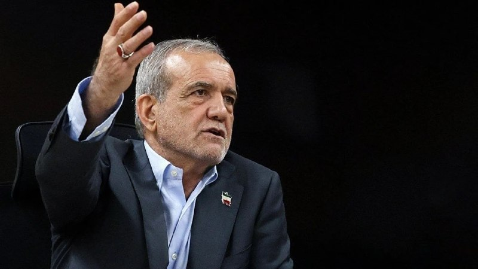

خو اومد زد !

دکتر مسعود پزشکیان

## RadioFarda — post 158292

🔸محمدباقر قالیباف، مذاکره‌کننده ارشد جمهوری اسلامی در گفت‌وگوهای صلح با آمریکا، روز یکشنبه گفت که پس از حمله اسرائیل، به حومه جنوبی بیروت، ادامه مسیر توافق با واشینگتن «ممکن نیست». 🔸او در پیامی در شبکه ایکس نوشت حمله ساعاتی پیش اسرائیل به منطقه ضاحیه «بار…

## RadioFarda — post 158291

🔸محمدباقر قالیباف، مذاکره‌کننده ارشد جمهوری اسلامی در گفت‌وگوهای صلح با آمریکا، روز یکشنبه گفت که پس از حمله اسرائیل، به حومه جنوبی بیروت، ادامه مسیر توافق با واشینگتن «ممکن نیست».

🔸او در پیامی در شبکه ایکس نوشت حمله ساعاتی پیش اسرائیل به منطقه ضاحیه «بار دیگر نشان داد آمریکا یا اراده‌ای برای اجرای تعهدات خود ندارد یا توان آن را.»

🔸او به واشینگتن هشدار داد که «با چراغ سبز نشان دادن» به اسرائیل نمی‌تواند از ایران «امتیاز» بگیرد و افزود: «اگر اراده و توان اجرای تعهدات خود را ندارید، سخن گفتن از ادامه مسیر ممکن نیست.»

@RadioFarda

## IranianMinds — post 22562

🔴کانال ۱۴ اسرائیل:

تمام سامانه‌های پدافندی در اسرائیل به حالت آماده‌باش کامل در آمدند و در انتظار شلیک موشک قریب‌الوقوع از سمت ایران هستند.

@IranianMinds

## IranianMinds — post 22561

🔴رسانه i24News:

اسرائیل خودش را برای احتمال حمله ایران آماده می‌کند و سطح هشدارها افزایش یافته است.

@IranianMinds

## IranianMinds — post 22560

  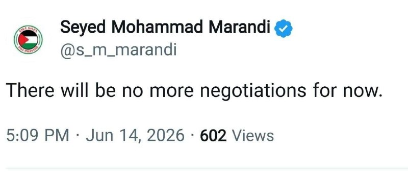

🔴مرندی، عضو تیم مذاکره‌کننده:

در حال حاضر، مذاکره دیگری در کار نخواهد بود.

@IranianMinds

## IranianMinds — post 22559

  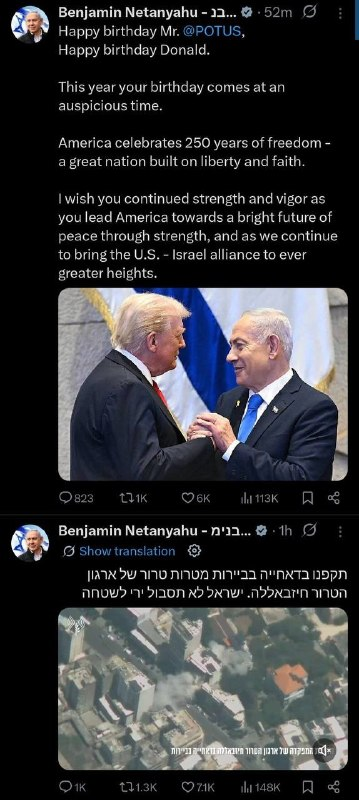

🔴نخست‌وزیر نتانیاهو، اول تصویر حمله به ضاحیه را برای ترامپ پست کرد و در پست بعدی، تولد ترامپ رو بهش تبریک گفت.

@IranianMinds

## IranianMinds — post 22558

  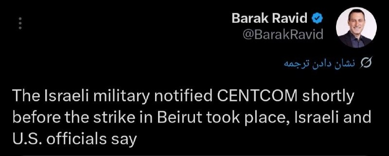

🔴باراک راوید/ اکسیوس:

اسرائیل قبل از حمله کردن به بیروت، به مرکز فرماندهی آمریکا(سنتکام) خبر داده بود.

@IranianMinds

## IranianMinds — post 22557

🔴موسوی، سخنگوی پیشین هیئت رئیسه مجلس:

هدف حمله امروز اسرائیل به ضاحیه بیروت، درست در روزی که قرار است توافق امضاء بشود، تحقیر جمهوری اسلامی بود.

@IranianMinds

## IranianMinds — post 22556

🔴اسدی، معاون بازرسی قرارگاه خاتم‌الانبیاء: بدون شک این جنایات اسرائیل بدون پاسخ نمی‌ماند. @IranianMinds

## IranianMinds — post 22555

  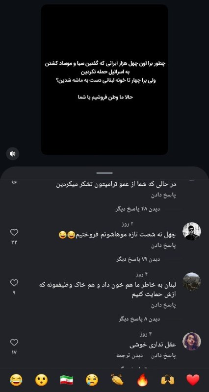

اینو بزار کانال، مادرجنده بودن عرزشی ها
فقط اون ننه دوگانه سوز که گفته چهل نه شصت تازه موهاشونم فروختیم.

@IranianMinds

## IranianMinds — post 22554

  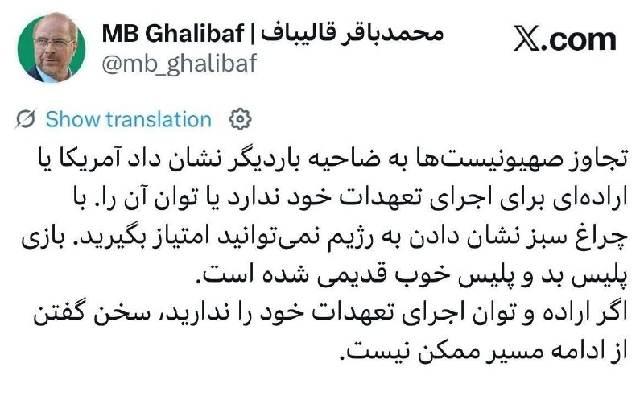

🔴قالیباف در ایکس نوشت:

تجاوز به ضاحیه نشان داد که آمریکا یا اراده‌ای برای اجرای تعهدات خود ندارد یا توان آن‌را.

@IranianMinds

## IranianMinds — post 22553

  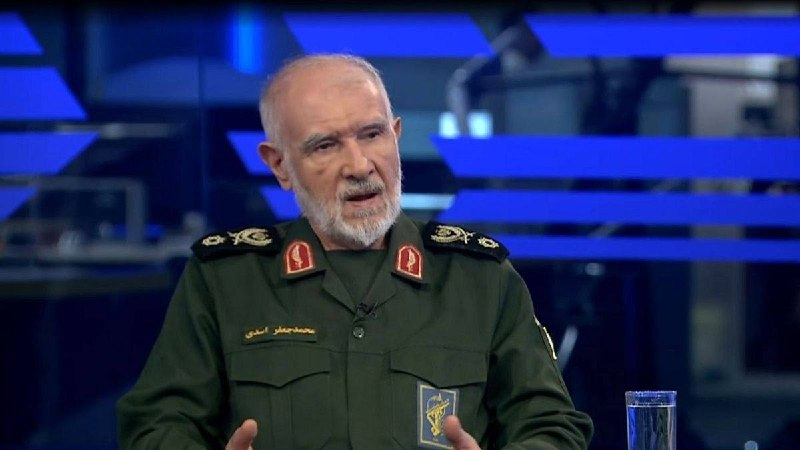

🔴اسدی، معاون بازرسی قرارگاه خاتم‌الانبیاء:

بدون شک این جنایات اسرائیل بدون پاسخ نمی‌ماند.

@IranianMinds

## BBCPersian — post 283800

  <a href="https://t.me/bbcpersian/283800" target="_blank">📎 Download file</a>

تازه‌ترین خبرهای جهان، یکشنبه ۲۴ خرداد ۱۴۰۵
@bbcpersian

## BBCPersian — post 283799

🔻ارتش بریتانیا یک نفتکش ناوگان سایه روسیه را در کانال مانش توقیف کرد

تکاوران نیروی دریایی سلطنتی بریتانیا در ساعات اولیه صبح یکشنبه در کانال مانش یک نفتکش «ناوگان سایه» روسیه را رهگیری کرده و وارد آن شدند. این عملیات شش ساعته با همکاری ماموران آژانس ملی جرایم و پشتیبانی نیروی هوایی انجام شد.

https://bbc.in/49YQ4AP
@BBCPersian

## BBCPersian — post 283798

  <a href="telegram/content/BBCPersian_283798_1781448555.mp4" target="_blank">🎬 Download video</a>

🔻سرخط خبرها، یکشنبه ۲۴ خرداد ۱۴۰۵

@BBCPersian

## BBCPersian — post 283796

  <a href="https://t.me/bbcpersian/283796" target="_blank">📎 Download file</a>

📻این هفته در ویژه برنامه جام ۲۶ - قسمت صفر

🏆جام جهانی ۲۰۲۶ که به میزبانی مشترک آمریکا، مکزیک و کانادا برگزار می‌شود، از بسیاری جهات بزرگ‌ترین دوره تاریخ این رقابت‌ها به شمار می‌رود. اما این دوره، نه‌ تنها بزرگ‌ترین دوره این رقابت‌ها است، بلکه از جنبه سیاسی هم ویژگی های بی‌سابقه‌ای دارد؛ برای نخستین بار یکی از کشورهای میزبان با یکی از تیم‌های حاضر در مسابقات درگیر جنگ است.

هر سه بازی تیم ملی فوتبال ایران در آمریکا برگزار میشود. این تیم بعد از فراز و نشیب بسیار سرانجام روز شنبه ۱۶خرداد به محل استقرارش در تیخوانا در مکزیک رسید. تیمی که با توجه به حوادث اخیر ایران برای برخی، نمادی از غرور و هویت ملی است. برای گروهی دیگر، این تیم نمادی از ساختار سیاسی حاکم در ایران است.

خبرنگاران ما پوریا ژافره و سام فرزانه از تحولات مرتبط با جام جهانی و حواشی حضور ایران می‌گویند. شنونده قسمت صفر پادکست جام ۲۶ باشید.

@BBCPersian

## BBCPersian — post 283795

🔻قالیباف به آمریکا: سخن گفتن از ادامه مسیر ممکن نیست

ساعتی پس از حمله اسرائیل به ضاحیه، پایگاه قدرت حزب‌الله در بیروت، محمدباقر قالیباف در شبکه ایکس نوشت:

«تجاوز صهیونیست‌ها به ضاحیه باردیگر نشان داد آمریکا یا اراده‌ای برای اجرای تعهدات خود ندارد یا توان آن را. با چراغ سبز نشان دادن به رژیم نمی‌توانید امتیاز بگیرید. بازی پلیس بد و پلیس خوب قدیمی شده است. اگر اراده و توان اجرای تعهدات خود را ندارید، سخن گفتن از ادامه مسیر ممکن نیست.»

محمدجعفر اسدی، معاون بازرسی قرارگاه مرکزی خاتم‌الانبیاء هم گفت که «بدون شک» این حمله «بی‌پاسخ نخواهد ماند.»

به گفته دفاع مدنی لبنان، در این حمله سه نفر کشته و شش نفر مجروح شده است.

اسرائیل یکشنبه قبل به ضاحیه حمله کرده بود.

پس از آن حمله آقای قالیباف که مذاکره‌کننده ارشد ایران با امریکاست در ایکس نوشته بود: «نه به آتش‌بس پایبندند نه به گفتگو باور دارند و با محاصرهٔ دریایی و نقض توافقات دربارهٔ لبنان نشان دادند که فقط زبان قدرت می‌فهمند.»

رئیس مجلس ایران نوشته بود که ادامه «محاصره دریایی و چراغ سبز آمریکا» به اسرائیل برای این حمله، «پایگاه‌ها و دارایی‌های آمریکا و رژیم در منطقه را به اهداف مشروع تبدیل می‌کند. دست نیروهای مسلح ما مثل همیشه باز است.»

https://bbc.in/4fEONCy
@BBCPersian

## BBCPersian — post 283794

  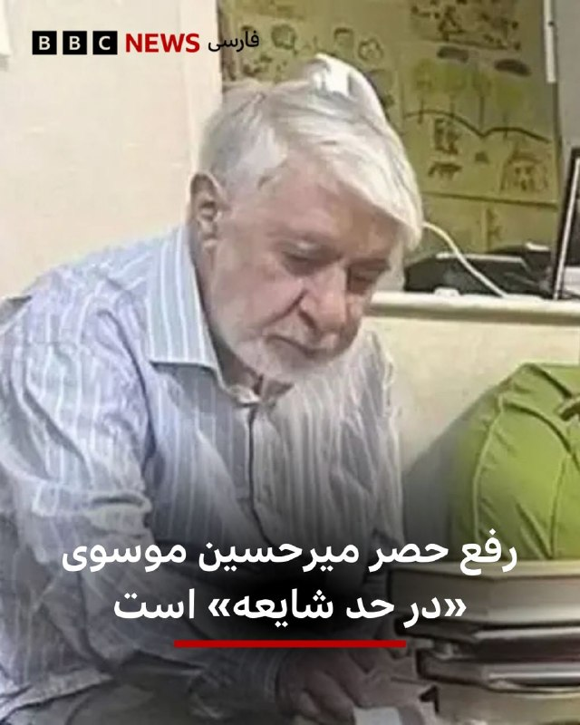

🔻میرحسین موسوی هنوز در بیمارستان است و نیروهای امنیتی هم حضور دارند.

یک منبع نزدیک به خانواده میرحسین موسوی به بی‌بی‌سی فارسی گفت رفع حصر «هنوز در حد شایعه» است.

در هفته‌های اخیر اخبار تایید نشده‌ای از رفع حصر میرحسین موسوی و همسرش زهرا رهنورد منتشر شده است.

یک منبع نزدیک به خانواده میرحسین موسوی گفت که پس از حمله آمریکا و اسرائیل به منطقه پاستور در روز اول جنگ، میرحسین موسوی و زهرا رهنورد از خانه‌شان در خیابان پاستور به جای دیگری منتقل شدند اما جایشان معلوم نبود و فقط می‌توانستند با فرزندانشان برای تهیه لباس تماس بگیرند.

به گفته این فرد مطلع، شدت انفجار به‌حدی بود که در و پنجره‌های خانه آقای موسوی آسیب دید و آوار ساختمان بغلی روی خودرویی که در خانه آنها پارک بود ریخت.

در طول جنگ ۴۰ روزه چندین بار به منطقه پاستور حمله شد و بر اثر این حملات خانه به‌حدی آسیب دید که وقتی فرزندان آقای موسوی و خانم رهنورد با اجازه نهادهای امنیتی برای انتقال نقاشی‌ها و کتاب‌ها و اثاثیه دیگر به خانه مراجعه کردند، دیدند که گربه‌ها در خانه ساکن شد‌ه‌اند.

📸 کلمه

https://bbc.in/4fEONCy
@BBCPersian

## idfinfarsi — post 11846

⭕️در پی حمله ارتش اسرائیل در بیروت، رئیس ستاد کل ارتش اسرائیل، سپهبد ایال زامیر، در حال برگزاری ارزیابی‌های مستمر وضعیت با تمامی فرماندهان ذی‌ربط است.

🔸بر اساس این ارزیابی‌ها، ارتش اسرائیل برای احتمال شلیک به سمت خاک کشور اسرائیل در ساعات آینده آماده می‌شود.

🔸ارتش اسرائیل به حفظ آمادگی و هوشیاری بالا برای سناریوهای مختلف در حوزه دفاعی و تهاجمی ادامه می‌دهد.

🔸ارتش اسرائیل تأکید می‌کند که در این مرحله باید هوشیار بود، با مسئولیت عمل کرد و به دستورالعمل‌های پشت جبهه توجه نمود.

🔸در حال حاضر هیچ تغییری در دستورالعمل‌های پشت جبهه ایجاد نشده است و در صورت هرگونه تغییر، به‌روزرسانی لازم به اطلاع عموم خواهد رسید.

🔸ارتش اسرائیل هرگونه شلیک به سمت خاک کشور اسرائیل را تحمل نخواهد کرد.

## idfinfarsi — post 11844

⭕️رئیس ستاد کل ارتش اسرائیل، سپهبد ایال زامیر، امروز (یکشنبه) با فرماندهان لشکرها و تیپ‌ها در فرماندهی شمال گفت‌وگو کرد.

🔹از سخنان رئیس ستاد کل، سپهبد ایال زمیر:
«ما به‌طور مستمر تحولات را زیر نظر داریم و در تمامی جبهه‌ها سطح بالایی از آمادگی و هوشیاری را حفظ کرده‌ایم — وضعیت کنونی حساس و پیچیده است. ارتش اسرائیل مصمم، آماده و در حال فعالیت با شدت‌های مختلف در تمام جبهه‌ها است. لبنان مرکز ثقل اصلی ماست، اما برای تحولات در جبهه‌های دیگر نیز آماده می‌شویم.

🔹عملیات در بوفور از نظر عملیاتی حیاتی و در راستای اهداف نبرد است. این عملیات برای تعمیق دستاوردهای عملیاتی علیه حزب‌الله و سلب توانمندی‌های زیرزمینی، فرماندهی، کنترل و آتش این سازمان که طی سال‌ها ایجاد شده، انجام شده است. یافته‌ها، چه در سطح زمین و چه در زیرزمین، نشان‌دهنده اهمیت این زیرساخت‌ها و نقش محوری منطقه بوفور و رشته‌کوه علی طاهر برای این سازمان در تلاش‌هایش برای تثبیت حضور و تهدید ساکنان شمال است. حزب‌الله فاجعه‌ای بر دولت لبنان و جامعه شیعه تحمیل کرده است؛ مردم لبنان این موضوع را به‌خوبی درک می‌کنند. تمام روستاهای جنوب لبنان به شبکه‌ای پیچیده از زیرساخت‌های تروریستی تبدیل شده‌اند.

🔹نیروهای ما در میدان با برتری عملیاتی فعالیت می‌کنند و از پشتیبانی نامحدود آتش — از زمین و هوا — برخوردارند. ما به عملیات ابتکاری و تهاجمی ادامه می‌دهیم، در صورت نیاز مانور را تعمیق می‌بخشیم، دفاع را تقویت می‌کنیم و تهدید را از ساکنان شمال برطرف می‌سازیم. ما به فعالیت در لبنان ادامه می‌دهیم تا دفاع از شهرک‌های شمال را تقویت کرده و ضربه به حزب‌الله را از طریق مانور زمینی و آتش سیستماتیک تعمیق بخشیم. هر دستاورد عملیاتی بیشتر، به فرسایش و فروپاشی جبهه جنوبی حزب‌الله و بهبود ترتیبات امنیتی که در چارچوب مذاکره با میانجی‌گری آمریکا میان رده سیاسی و دولت لبنان تعیین خواهد شد، منجر می‌شود.»

## Dirty_Kids — post 392011

  <a href="telegram/content/Dirty_Kids_392011_1781448558.mp4" target="_blank">🎬 Download video</a>

🔴 کلیپی از یه حامی حکومت که سلیطه بازیش خیلی وایرال شده:

آقای عراقچی شما گوه میخوری وقتی رهبر چیزی نگفته حرف از مذاکره میزنی.
اگه می‌خواین مذاکره کنین اول باید خون منو بریزین، خون آقامون هنوز خشک نشده، بیجا میکنی مذاکره کردی.

@Dirty_Kids 👻

## Dirty_Kids — post 392010

  <a href="telegram/content/Dirty_Kids_392010_1781448559.mp4" target="_blank">🎬 Download video</a>

میزاشتید مدرستون تموم بشه بعد دست به کار میشدید😂😂😂 ازدواج دختر ۱۳ ساله با یه پسر ۱۷ ساله که خجالت میکشه جلو دوربین بیاد

@Dirty_Kids 👻

## Dirty_Kids — post 392009

🔴 سخنگوی ارتش اسرائیل:تخمین زده می‌شود موشک‌هایی از ایران در ساعات آینده به سمت اسرائیل شلیک شوند

@Dirty_Kids 👻

## Dirty_Kids — post 392008

🔴 ارتش اسرائیل: آماده شلیک از ایران در ساعات آینده هستیم، در حال حاضر تغییری در دستورالعمل‌ها وجود نداره.
اسرائیل آمادسازی پناهگاه‌های موشکی برای پرتاب موشک از سمت ایران رو آغاز کرده.

@Dirty_Kids 👻

## Dirty_Kids — post 392007

  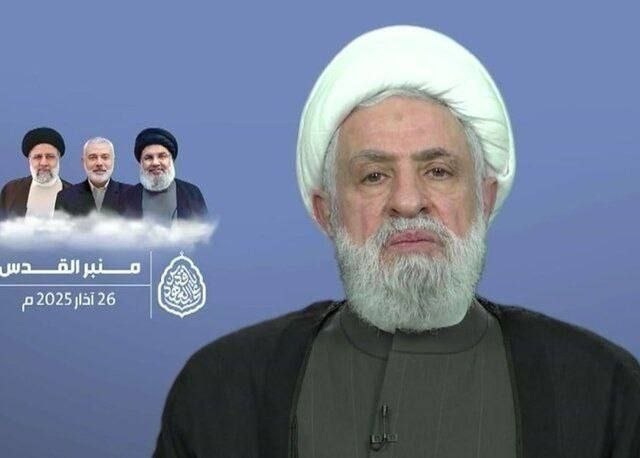

🔴 #تایید_نشده

🚨شبکه۱۲ اسراییل: نعیم قاسم ترور شد.

+حذب الله تکذیب کرده

@Dirty_Kids 👻

## Hranews — post 113609

به دلیل «برگزاری مراسم مختلط»؛ یک تالار پذیرایی در اردبیل پلمب و متصدی آن بازداشت شد

❗️
❗️
❗️
❗️
❗️– دادستان اردبیل از #پلمب یک واحد تالار پذیرایی در این شهرستان به دلیل «برگزاری مراسم عروسی مختلط و هنجارشکنانه» خبر داد. به گفته وی، متصدی این واحد صنفی نیز بازداشت شده است.

ادامه مطلب
↘️
@hranews_bot تماس ✉️ -  @Hranews  کانال هرانا 🆑

## Hranews — post 113608

  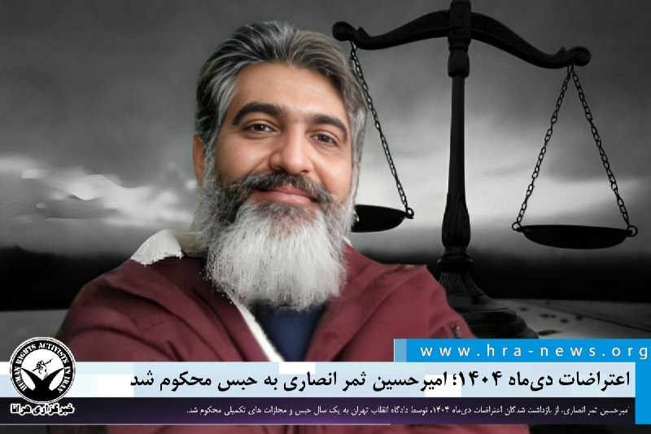

اعتراضات دی‌ماه ۱۴۰۴؛ امیرحسین ثمر انصاری به حبس محکوم شد

❗️
❗️
❗️
❗️
❗️– امیرحسین ثمر انصاری، از بازداشت‌شدگان اعتراضات دی‌ماه ۱۴۰۴، توسط دادگاه انقلاب تهران به یک سال حبس و مجازات‌های تکمیلی محکوم شد.

به گزارش خبرگزاری هرانا، ارگان خبری مجموعه فعالان حقوق بشر در ایران، امیرحسین ثمر انصاری به حبس محکوم شد.

امیرحسین ثمر انصاری، توسط شعبه ۲۶ دادگاه انقلاب تهران، به ریاست قاضی ایمان افشاری از بابت اتهام «فعالیت تبلیغی علیه نظام» به یک سال حبس تعزیری و در باب مجازات‌های تکمیلی به دو سال محرومیت از عضویت در احزاب و گروه‌های سیاسی و اجتماعی محکوم شد. وی همچنین در این شعبه از اتهام «اجتماع و تبانی برای ارتکاب جرم علیه امنیت داخلی کشور» تبرئه شده است.

ادامه مطلب

#امیرحسین_ثمر_انصاری

↘️
@hranews_bot تماس ✉️ -  @Hranews  کانال هرانا 🆑

## Hranews — post 113607

در پی اقدام به خودسوزی یک زن باردار در جاسک؛ او و همسرش جان باختند

❗️
❗️
❗️
❗️
❗️– روز جمعه ۱۵ خردادماه، یک زن باردار در شهرستان جاسک اقدام به خودسوزی کرد و جان خود را از دست داد. همسر این #زن نیز که برای نجات وی تلاش کرده بود، بر اثر سوختگی، پس از یک هفته بستری در بیمارستان جان باخت.

ادامه مطلب

↘️
@hranews_bot تماس ✉️ -  @Hranews  کانال هرانا 🆑

## Hranews — post 113606

  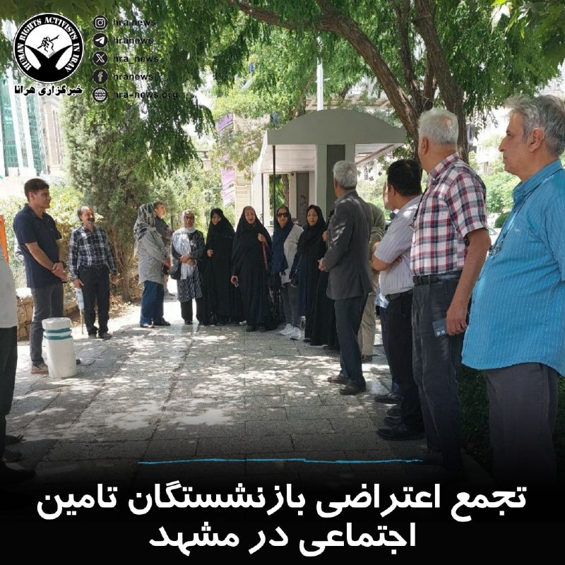

در ادامه تجمعات بازنشستگان تامین اجتماعی در شهرهای مختلف؛ روز جاری جمعی از این بازنشستگان در مشهد نیز دست به #تجمع_اعتراضی زدند.

#بازنشستگان مذکور، خواستار اجرای طرح همسان‌سازی، افزایش حقوق طبق تورم و رسیدگی به مشکلات درمانی و معیشتی خود هستند.

↘️
@hranews_bot تماس ✉️ - @Hranews کانال هرانا 🆑

## Hranews — post 113605

وزارت اطلاعات از بازداشت ۱۳۱ نفر در ارتباط با اعتراضات و پرونده‌های امنیتی خبر داد

❗️
❗️
❗️
❗️
❗️– وزارت اطلاعات جمهوری اسلامی ایران در اطلاعیه‌ای از #بازداشت دستکم ۱۳۱ نفر در استان‌های تهران، ایلام و سیستان و بلوچستان خبر داد. این نهاد مدعی شده است که این افراد به دلیل مشارکت در اعتراضات دی‌ماه ۱۴۰۴، فعالیت‌های جاسوسی و همکاری با گروه‌های مسلح مخالف نظام بازداشت شده‌اند.

ادامه مطلب

↘️
@hranews_bot تماس ✉️ -  @Hranews  کانال هرانا 🆑

## alonews — post 127894

  <a href="telegram/content/alonews_127894_1781448564.webm" target="_blank">🎬 Download video</a>

👈مقام ارشد اسرائیلی به کان:
حمله ایران اکنون قریب‌الوقوع به نظر می‌رسد.

✅ @AloNews خبر جنگ

## alonews — post 127893

  <a href="telegram/content/alonews_127893_1781448564.webm" target="_blank">🎬 Download video</a>

👈هگست وزیر جنگ آمریکا: من انتظار ندارم که حملات اسرائیل به حومه جنوبی بیروت مانع توافق با ایران شود. اگر ایران می‌خواهد این موضوع ادامه پیدا کند، باید حزب‌الله را مهار کند

✅ @AloNews خبر جنگ

## alonews — post 127892

  <a href="telegram/content/alonews_127892_1781448565.mp4" target="_blank">🎬 Download video</a>

👈مایک والتز، نماینده دولت آمریکا در سازمان ملل با اطمینان اعلام کرد که امروز توافق میان ایران و آمریکا امضا خواهد شد!

✅ @AloNews خبر جنگ

## alonews — post 127891

  <a href="telegram/content/alonews_127891_1781448567.webm" target="_blank">🎬 Download video</a>

👈مهاجرانی، سخنگوی دولت:تصمیم‌گیری درباره تفاهم احتمالی با آمریکا در سطح «نظام و حاکمیت» انجام می‌شه و حمله به مذاکره‌کنندگان، حمله به یک «تصمیم ملیه».

✅ @AloNews خبر جنگ

## alonews — post 127890

  <a href="telegram/content/alonews_127890_1781448567.webm" target="_blank">🎬 Download video</a>

👈دیده شده درحال اعزام به تجمع پایداری‌ها

✅ @AloNews خبر جنگ

## alonews — post 127889

  <a href="telegram/content/alonews_127889_1781448568.mp4" target="_blank">🎬 Download video</a>

👈کلیپی از یه حامی حکومت:

آقای عراقچی شما گوه میخوری وقتی رهبر چیزی نگفته حرف از مذاکره میزنی.
اگه می‌خواین مذاکره کنین اول باید خون منو بریزین، خون آقامون هنوز خشک نشده، بیجا میکنی مذاکره کردی.

✅ @AloNews خبر جنگ

## alonews — post 127888

  <a href="telegram/content/alonews_127888_1781448569.webm" target="_blank">🎬 Download video</a>

👈سخنگوی ارتش اسرائیل: ما برای احتمال شلیک به خاک اسرائیل در ساعات آینده آماده می‌شویم

✅ @AloNews خبر جنگ

## alonews — post 127887

  <a href="telegram/content/alonews_127887_1781448569.webm" target="_blank">🎬 Download video</a>

👈کانال 15 اسرائیل:
تمام سامانه های پدافندی در اسرائیل به حالت آماده باش کامل درآمدند و در انتظار پرتاب موشک قریب‌الوقوع از سمت ایران می‌باشند.

✅ @AloNews خبر جنگ

## alonews — post 127886

  <a href="telegram/content/alonews_127886_1781448569.webm" target="_blank">🎬 Download video</a>

👈کانال 14 اسرائیل:
اسرائیل ارزیابی میکنه که ایران در واکنش به حمله در حومه جنوبی بیروت، حمله موشکی به خاک اسرائیل انجام خواهد داد.

✅ @AloNews خبر جنگ

## alonews — post 127885

  <a href="telegram/content/alonews_127885_1781448569.webm" target="_blank">🎬 Download video</a>

👈مرندی عضو تیم مذاکره کننده:
فعلاً مذاکره دیگری در کار نخواهد بود

✅ @AloNews خبر جنگ

## alonews — post 127884

  <a href="telegram/content/alonews_127884_1781448570.webm" target="_blank">🎬 Download video</a>

👈خبرنگار الجزیره:
بر اساس آنچه چند روز پیش نوشتم، و با توجه به ابعاد تازه لبنان، افزایش مخالفت‌ها در داخل ایران با توافق، تردیدهای مداوم در مورد تعهد واشنگتن به تعهداتش، تغییر مواضع دونالد ترامپ هر روز و اصرار اسرائیل بر شرایط غیرممکن خود، هرگونه توافقی بین واشنگتن و تهران بیشتر شبیه یک سراب است.

🔴در دوردست‌ها به نظر می‌رسد و نشان می‌دهد که رسیدن به آن فقط مسئله زمان است. سپس محو می‌شود.

✅ @AloNews خبر جنگ

## alonews — post 127882

  <a href="telegram/content/alonews_127882_1781448570.webm" target="_blank">🎬 Download video</a>

👈تتر هم اکنون 173000تومان

✅ @AloNews خبر جنگ

## alonews — post 127881

  <a href="telegram/content/alonews_127881_1781448570.webm" target="_blank">🎬 Download video</a>

👈الحدث به نقل از منابع:
علی الحاج، فرمانده حزب‌الله، در حمله هوایی اسرائیل به حومه بیروت ترور شد

✅ @AloNews خبر جنگ

## alonews — post 127880

  <a href="telegram/content/alonews_127880_1781448571.webm" target="_blank">🎬 Download video</a>

👈اسرائیل: هدف حمله نعیم قاسم نبود

✅ @AloNews خبر جنگ

## alonews — post 127879

اخبار جنگ الونیوز AloNews pinned a photo

## alonews — post 127878

  <a href="telegram/content/alonews_127878_1781448571.webm" target="_blank">🎬 Download video</a>

🚀 Exo VPN | سریع، پایدار و بدون تبلیغات 
✅ اتصال سریع و پایدار 
✅ سرورهای متعدد جهانی 
✅ حفظ حریم خصوصی 
✅ کاملاً رایگان و بدون تبلیغات 
📌 دانلود از گوگل پلی: https://play.google.com/store/apps/details?id=exo.vpn.app 
📣 کانال رسمی: @exovpn_dl

## alonews — post 127877

  <a href="telegram/content/alonews_127877_1781448571.webm" target="_blank">🎬 Download video</a>

🚀 Exo VPN | سریع، پایدار و بدون تبلیغات

✅ اتصال سریع و پایدار

✅ سرورهای متعدد جهانی

✅ حفظ حریم خصوصی

✅ کاملاً رایگان و بدون تبلیغات

📌 دانلود از گوگل پلی:
https://play.google.com/store/apps/details?id=exo.vpn.app

📣 کانال رسمی:
@exovpn_dl

## alonews — post 127876

  <a href="telegram/content/alonews_127876_1781448572.mp4" target="_blank">🎬 Download video</a>

👈ویدیو دیده نشده از هوچی گری دیشب تندروها

✅ @AloNews خبر جنگ

## alonews — post 127875

  <a href="telegram/content/alonews_127875_1781448574.mp4" target="_blank">🎬 Download video</a>

👈تولد ترامپ/حرکات نمایشی موتوکراس در چمن جنوبی کاخ سفید

✅ @AloNews خبر جنگ

## alonews — post 127873

  <a href="telegram/content/alonews_127873_1781448576.webm" target="_blank">🎬 Download video</a>

👈نتانیاهو ابتدا تصویر حمله به بیروت را منتشر کرد و در پست بعد تولد ترامپ را تبریک گفت

✅ @AloNews خبر جنگ

<!-- MSG END -->

<!-- NAV START -->

<a href="https://github.com/Tljn/FUD/blob/main/telegram/content/archive_1.md" style="display:inline-block; padding:6px 12px; margin:0 4px; background-color:#2ea44f; color:white; text-decoration:none; border-radius:4px; font-weight:bold;">صفحه بعد</a>

<!-- NAV END -->
