# خواننده تلگرام

<!-- TOP_NAV START -->

<a href="https://github.com/Tljn/FUD/blob/main/telegram/content/archive_1.md" style="display:inline-block; padding:6px 12px; margin:0 4px; background-color:#2ea44f; color:white; text-decoration:none; border-radius:4px; font-weight:bold;">صفحه بعد</a>

<!-- TOP_NAV END -->

<!-- MSG START -->

---
📅 بروزرسانی: 1405/04/01 11:26
---

## VahidOOnLine — post 246804

  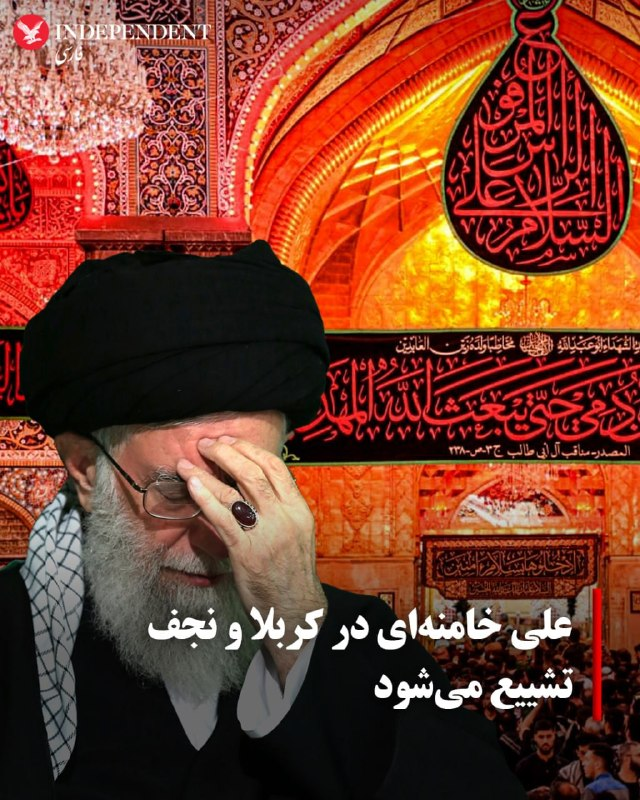

♦️ایمان عطارزاده، سخنگوی مراسم تشییع و تدفین علی خامنه‌ای، روز دوشنبه اول تیرماه اعلام کرد که رهبر پیشین جمهوری اسلامی، پیش از خاکسپاری در شهرهای کربلا و نجف هم تشییع خواهد شد.

به گزارش خبرگزاری صداوسیما، عطارزاده گفت این مراسم از روز سه‌شنبه ۱۶ تیرماه در قم آغاز و در همین شهر نماز میت خوانده خواهد شد.

به گفته این مقام جمهوری اسلامی، علی خامنه‌ای به درخواست احزاب سیاسی و گروه‌های فرهنگی و عشایر عراق، در روزهای ۱۷ و ۱۸ تیرماه در شهرهای کربلا و نجف تشییع خواهد شد.

پیش از این علیرضا زاکانی، شهردار تهران برای نخستین بار از برگزاری مراسم تشییع رهبر پیشین جمهوری اسلامی در عراق خبر داده بود.

به گفته مقام‌های جمهوری اسلامی، علی خامنه‌ای پس از سه روز تشییع در تهران، در مشهد دفن می‌شود.

علی خامنه‌ای، دومین رهبر جمهوری اسلامی روز نهم اسفندماه سال ۱۴۰۴ در موج اول حملات هوایی آمریکا و اسرائیل به بیت رهبر به همراه تعدادی از اعضای خانواده و مقام‌های ارشد سیاسی و نظامی حکومت کشته شد.
‌🇸🇦 Indypersian

🤖 @VahidOOnLine

## VahidOOnLine — post 246803

  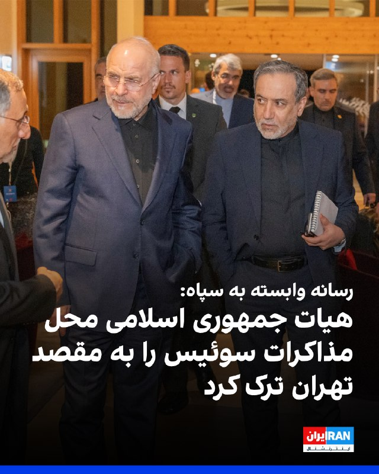

خبرگزاری تسنیم، وابسته به سپاه پاسداران، گزارش داد هیات جمهوری اسلامی به ریاست محمدباقر قالیباف، رییس مجلس، دوشنبه اول تیر پس از حدود ۱۸ ساعت گفت‌وگو و رایزنی فشرده، محل برگزاری مذاکرات در سوئیس را به مقصد تهران ترک کرد.

بر اساس این گزارش، هیات جمهوری اسلامی در نشست‌های دوجانبه و چهارجانبه با حضور هیات آمریکا و میانجی‌گران پاکستانی و قطری شرکت کرد و «مواضع تهران را درباره روند اجرای یادداشت تفاهم و شرایط ورود به مذاکرات توافق نهایی مطرح کرد».

قطر و پاکستان پیش‌تر اعلام کردند جمهوری اسلامی و آمریکا بر تشکیل کمیته عالی برای نظارت بر اجرای یادداشت تفاهم، آغاز فوری مذاکرات فنی و تدوین نقشه راه دستیابی به توافق نهایی ظرف ۶۰ روز توافق کرده‌اند. دو کشور میانجی همچنین از ادامه مذاکرات فنی در سوئیس تا پایان هفته خبر دادند.
‌🏁 🇬🇧 IranintlTV

🤖 @VahidOOnLine

## VahidOOnLine — post 246802

  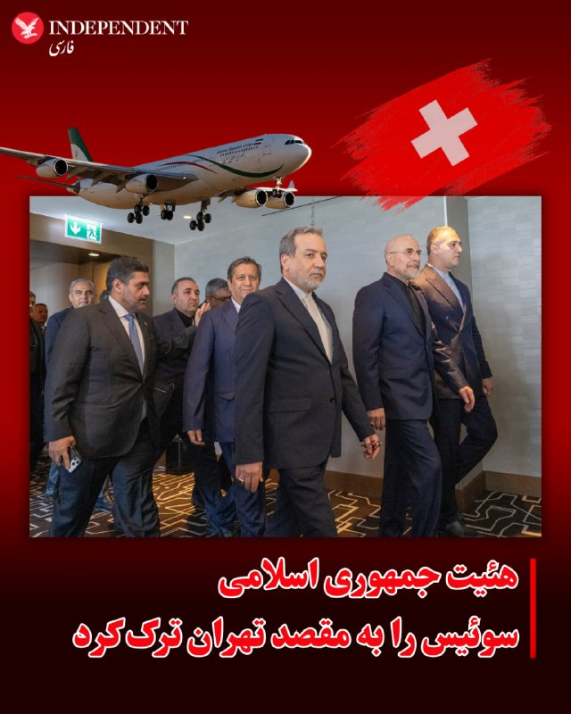

♦️هیئیت مذاکره‌کننده جمهوری اسلامی به ریاست محمدباقر قالیباف، صبح دوشنبه اول تیرماه و پس از مذاکرات «فشرده» با نمایندگان ایالات متحده آمریکا و میانجیگران پاکستان و قطر، ژنو را به مقصد تهران ترک کرد.

ساعاتی پیش قطر و پاکستان با صدور بیانیه‌ای مشترک اعلام کردند که در جریان ۱۸ ساعت مذاکره، «پیشرفت امیدوارکننده‌ای حاصل شده است».
میانجی‌ها گفتند آمریکا و حکومت ایران توافق کرده‌اند یک «کمیته عالی» تشکیل دهند که علاوه بر نظارت سیاسی بر مذاکرات، گروه‌های کاری متمرکز بر موضوعات هسته‌ای، تحریم‌ها و همچنین گروه نظارت و حل‌وفصل اختلافات را مدیریت خواهد کرد.
قطر و پاکستان اعلام کردند آمریکا و ایران بر سر یک «نقشه‌راه» برای دستیابی به توافق نهایی طی ۶۰ روز توافق کرده‌اند.

طرف‌ها همچنین توافق کردند یک «خط ارتباطی» درباره وضعیت تنگه هرمز ایجاد کنند که تا زمانی که مذاکرات ادامه دارد فعال خواهد بود؛ هدف از این اقدام، «جلوگیری از حوادث و سوءتفاهم‌ها با هدف تضمین عبور امن کشتی‌های تجاری از تنگه هرمز» عنوان شده است.
‌🇸🇦 Indypersian

🤖 @VahidOOnLine

## VahidOOnLine — post 246801

ویدیوی ارسال‌شده به ایران‌اینترنشنال نشان می‌دهد چند نفر از حامیان حکومت شامگاه یکشنبه ۳۱ خرداد در منطقه مهرآباد جنوبی تهران، به بهانه حجاب اجباری برای یک زن ایجاد مزاحمت کرده و او را به دخالت پلیس تهدید می‌کنند.
‌🏁 🇬🇧 IranintlTV

🤖 @VahidOOnLine

## VahidOOnLine — post 246800

  

با وجود اعلام رسانه‌های حکومتی در ایران مبنی بر انجام نشدن مذاکره درباره برنامه هسته‌ای جمهوری اسلامی در نخستین دور گفت‌وگوهای مقام‌های تهران و واشینگتن در سوئیس، اسماعیل بقائی، سخنگوی وزارت خارجه، گفت در این نشست «گفت‌وگوی بسیار کوتاهی» درباره موضوع هسته‌ای انجام شده است.

بقائی در گفت‌وگو با خبرگزاری دولتی ایرنا گفت هیات آمریکایی در بخشی از سخنان خود، مواضعش درباره موضوع هسته‌ای را به‌صورت کوتاه بیان کرد و هیات جمهوری اسلامی نیز مواضع خود را مطرح کرد.

او افزود این گفت‌وگو «مذاکره» نبود و صرفا بیان مواضع دو طرف بود و دیدگاه‌های جمهوری اسلامی «بسیار صریح و روشن» اعلام شد.

به گفته بقائی، جمهوری اسلامی تاکید کرده هنوز زمان ورود به مذاکرات مربوط به توافق نهایی فرا نرسیده و بر اساس یادداشت تفاهم، پس از اجرای بخش‌های مشخصی از آن، مذاکرات برای توافق نهایی آغاز خواهد شد.

سخنگوی وزارت خارجه جمهوری اسلامی افزود عباس عراقچی طرف مقابل را از تکرار «دیدگاه‌های زیاده‌خواهانه و غیرمنطقی» درباره موضوع هسته‌ای برحذر داشت و مواضع تهران را تبیین کرد.
‌🏁 🇬🇧 IranintlTV

🤖 @VahidOOnLine

## VahidOOnLine — post 246799

  

گیدئون سعار، وزیر خارجه اسرائیل، گفت در تماس تلفنی با وینستون پیترز، وزیر خارجه نیوزیلند، تاکید کرده است که اسرائیل در لبنان «جاه‌طلبی ارضی» ندارد، اما از منطقه امنیتی عقب‌نشینی نخواهد کرد.

سعار در حساب ایکس خود نوشت اسرائیل تا زمانی که آتش‌بس در لبنان از سوی حزب‌الله نقض نشود، به آن احترام خواهد گذاشت.

او افزود: «ما در لبنان جاه‌طلبی ارضی نداریم، اما از منطقه امنیتی عقب‌نشینی نخواهیم کرد و شهروندان خود را در معرض حملات حزب‌الله و احتمال تهاجم آن قرار نخواهیم داد.»

وزیر خارجه اسرائیل همچنین گفت که حاکمیت لبنان «دهه‌هاست تا همین امروز» از طریق «اشغال غیرمستقیم ایران به‌وسیله حزب‌الله» نقض شده است.

سعار گفت از بین رفتن «حکومت تروریستی حزب‌الله» هم به نفع لبنان است و هم به نفع اسرائیل. او همچنین اعلام کرد که از وزیر خارجه نیوزیلند برای سفر به اسرائیل دعوت کرده است.
‌🏁 🇬🇧 IranintlTV

🤖 @VahidOOnLine

## VahidOOnLine — post 246798

🗣روایت شما از زندگی در دوران پس از انقلاب ملی و جنگ - دوشنبه ۱ تیر

🔹برای بیش از صد شب خیابان‌های کشور را تبدیل به دیسکو کردین، از این حجم پارادوکس خجالت نمی‌کشید؟

🔹ترامپ یا هرکس دیگه‌ای هر تصمیمی بگیرن، این ما هستیم که مشخص می‌کنیم چه اتفاقی می‌افته و قطعا اون رو رقم خواهیم زد. دلمون باید به این گرم باشه که ما همدیگه رو داریم.

🔹چرا انقدر سنگ لبنان رو به سینه می‌زنن؟ مذاکره برای پایان جنگ بر سر لبنان بود، در حالی که ما مردم ایران خودمون به سختی داریم زندگی می‌کنیم.

🔹کاش صدامون به جی‌دی ونس می‌رسید و بهش می‌گفتیم؛ ما مردم ایران با کل دنیا دوست هستیم، جز جمهوری اسلامی و نیابتی‌هاش و نمی‌خواهیم شما به این رژیم دست دوستی بدید و توافق کنید.

🔹خطاب به ونس و ترامپ: از ملت ایران مایه نگذارید. مذاکره شما با جمهوری اسلامی، دشمن ملت ایران است و به دنبال مماشات هستید.

🔹۱۸ و ۱۹ دی گروهی از انسان‌های بی‌نهایت بزرگ رو از دست دادیم که هیچ‌وقت مثل اون‌ها جاشون نمیاد. پس به احترام جاویدنامان باید این رژیم خونخوار رو با همت خودمون نابود کنیم.

🔹آقای ونس شما گفتید با این مذاکرات می‌خواهید فصل جدیدی در روابط با مردم ایران شروع کنید. چطور این کار را می‌کنید وقتی ما مردم ایران به هیچ عنوان این حکومت را به رسمیت نمی‌شناسیم و آن‌ها را نماینده خود نمی‌دانیم؟ لطفا از مردم ایران مایه نگذارید.

🔹دقت کردید پزشکیان گفت نگرانیم مردم دوباره برای اعتراض به خیابان بیان و ابهت ما از بین بره؟ دقیقا اعتراف کرد که جمهوری اسلامی با اومدن مردم ایران به خیابان از بین می‌ره.

🔹سال‌ها ثروت مردم ایران رو غارت و صرف ساخت موشک، نیروهای نیابتی و نیروهای سرکوبگر کردن که چند روزی بیشتر در قدرت بمونن. موندن در قدرتی که چیزی ازش باقی نمونده با این همه ترس و به زور قایم شدن زیر زمین و در پناهگاه چقدر می‌تونه دوام بیاره؟ دیگه نفسای آخرتونه.
‌🏁 🇬🇧 IranintlTV

🤖 @VahidOOnLine

## VahidOOnLine — post 246797

  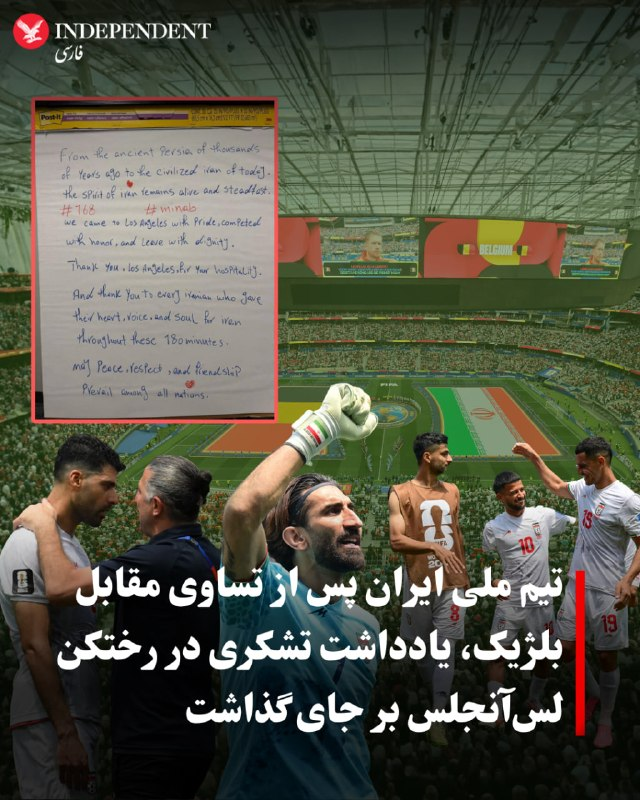

♦️تیم ملی فوتبال ایران پس از آخرین بازی مرحله گروهی در لس‌آنجلس، با به یادگار گذاشتن یادداشتی در رختکن ورزشگاه سوفا، از میزبانی این شهر تشکر کرد.

ملی‌پوشان ایران در این یادداشت نوشتند: «از پارس [ایران] باستان هزاران سال پیش تا ایرانِ متمدن امروز، روح ایران همچنان زنده و استوار باقی مانده است.<
ما با افتخار به لس‌آنجلس آمدیم، با شرافت رقابت کردیم و با سربلندی این شهر را ترک می‌کنیم.<
از شما، لس‌آنجلس، برای مهمان‌نوازی‌تان سپاسگزاریم.<
و از تک‌تک ایرانیانی که در طول این ۱۸۰ دقیقه، قلب، صدا و روح خود را برای ایران گذاشتند، تشکر می‌کنیم.<
باشد که صلح، احترام و دوستی در میان همه ملت‌ها پیروز و برقرار باشد.»
در این نامه هشتگ‌های #168 و #میناب، به یاد ۱۶۸ دانش‌آموز کشته شده مدرسه شجره طیبه میناب در روز نخست جنگ آمریکا و اسرائیل، نوشته شده است.

تیم ملی ایران در آخرین رقابت مرحله گروهی شنبه ششم تیر در سیاتل به مصاف مصر خواهد رفت.
‌🇸🇦 Indypersian

🤖 @VahidOOnLine

## VahidOOnLine — post 246796

  

کانال ۱۳ اسرائیل به نقل از منابعی گزارش داد رونن بار، رییس پیشین شین‌بت، سازمان امنیت داخلی اسرائیل و همسرش در جریان سفری که اخیرا به امارات متحده عربی داشتند، پس از دریافت هشدار درباره تلاش جمهوری اسلامی برای آسیب رساندن به آن‌ها، از محل اقامت خود خارج و به مکان امن منتقل شدند.

بر اساس این گزارش، بار و همسرش برای شرکت در یک نشست بین‌المللی امنیتی به امارات متحده عربی سفر کرده بودند.

کانال ۱۳ اعلام کرد این نشست به میزبانی عبدالله بن زاید آل‌نهیان، وزیر خارجه امارات متحده عربی برگزار شده بود، اما یک منبع نزدیک به این کشور در گفت‌وگو با این شبکه، میزبانی چنین رویدادی از سوی وزیر خارجه امارات متحده عربی را رد کرد.
‌🏁 🇬🇧 IranintlTV

🤖 @VahidOOnLine

## VahidOOnLine — post 246795

  <a href="telegram/content/VahidOOnLine_246795_1782115005.mp4" target="_blank">🎬 Download video</a>

در این قسمت از پادکست منوتو، به نبرد پنهانی بر سر آینده جمهوری اسلامی نگاه می‌کنیم؛ جایی که روحانیون دیگر بازیگر اصلی نیستند و قدرت واقعی بیش از همیشه به دست شبکه‌های امنیتی، نظامی و اقتصادی افتاده است.

سؤال اصلی این است: بعد از مرگ نسل اول حاکمان، چه کسی ایران را به ارث می‌برد؟
فرماندهان؟ شبکه‌های اقتصادی؟ چهره‌های پشت‌پرده؟ یا مردمی که سال‌ها از این بازی قدرت کنار گذاشته شده‌اند؟

این قسمت درباره فروپاشی ناگهانی نیست؛ درباره چیزی خطرناک‌تر است: نظامی که هنوز سر پا مانده، اما درونش جنگی آرام بر سر میراث قدرت آغاز شده است.
‌🏁 🇬🇧 ManotoTV

🤖 @VahidOOnLine

## VahidOOnLine — post 246794

  <a href="telegram/content/VahidOOnLine_246794_1782115008.mp4" target="_blank">🎬 Download video</a>

ویدیوی رسیده به ایران‌اینترنشنال نشان می‌دهد یکی از تماشگران ایرانی حاضر در ورزشگاه سوفای لس‌آنجلس هنگام بازی تیم های ایران و بلژیک در جام‌جهانی، پلاکاردی اعتراضی با موضوع کشتار ایرانیان در جریان انقلاب ملی را به دست گرفته است.
‌🏁 🇬🇧 IranintlTV

🤖 @VahidOOnLine

## VahidOOnLine — post 246793

  <a href="telegram/content/VahidOOnLine_246793_1782115009.mp4" target="_blank">🎬 Download video</a>

ویدیوی رسیده به ایران‌اینترنشنال نشان می‌دهد گروهی از ایرانیان در آمریکا هنگام پخش سرود جمهوری اسلامی پیش از بازی تیم‌های فوتبال ایران و بلژیک در ورزشگاه سوفای لس‌آنجلس، این سرود را هو کردند.
‌🏁 🇬🇧 IranintlTV

🤖 @VahidOOnLine

## VahidOOnLine — post 246792

♦️تصاویری که به تازگی برای ایندیپندنت فارسی ارسال شده، حضور گسترده مردم در مناطق مختلف تهران را نشان می‌دهد که برای اعتراض در ۱۸ و ۱۹ دی‌ماه به خیابان‌ها آمده بودند.

در این ویدیوها، صدای معترضان به گوش می‌رسد که در حال سر دادن شعارهایی مانند «جاویدشاه» و «این آخرین نبرده، پهلوی برمی‌گرده» هستند.

نیروهای سرکوبگر جمهوری اسلامی ایران، ده‌ها هزار نفر از معترضان را در شب‌های ۱۸ و ۱۹ دی با گلوله جنگی کشتند.
‌🇸🇦 Indypersian

🤖 @VahidOOnLine

## VahidOOnLine — post 246791

  <a href="telegram/content/VahidOOnLine_246791_1782115012.mp4" target="_blank">🎬 Download video</a>

بر اساس ویدیوهای رسیده به ایران‌اینترنشنال، همزمان با بازی تیم فوتبال ایران با بلژیک در جام جهانی، ایرانیان مقیم هیوستون در تگزاس آمریکا تجمع کرده و پرچم شیر و خورشید را برافراشتند.
‌🏁 🇬🇧 IranintlTV

🤖 @VahidOOnLine

## VahidOOnLine — post 246790

  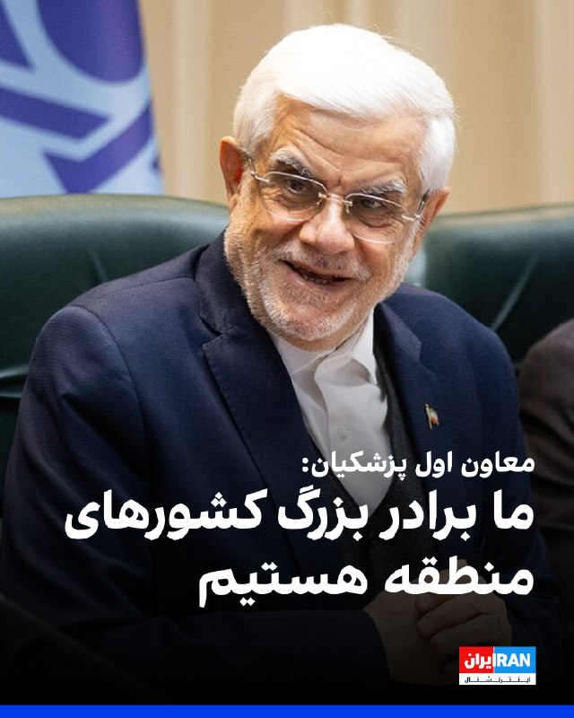

محمدرضا عارف، معاون اول مسعود پزشکیان، دوشنبه یکم تیر در مراسم افتتاحیه بورس تهران گفت جمهوری اسلامی «برادر بزرگ کشورهای منطقه» است و افزود: «برادر بزرگ، هوای برادرهای کوچک را خواهد داشت.»

عارف گفت: «ایران برادر بزرگ کشورهای منطقه است، هرچند برخی از آنها به ما حمله کردند و جفا کردند.»

او همچنین با اشاره به حملات جمهوری اسلامی علیه کشورهای همسایه گفت: «ما رسما به کشورهای همسایه گفته بودیم که اگر کوچک‌ترین خطایی از سوی آمریکا از مکان‌های متعلق به شما سر بزند، آن مکان‌ها اهداف مشروع ما برای دفاع است.»
‌🏁 🇬🇧 IranintlTV

🤖 @VahidOOnLine

## VahidOOnLine — post 246789

  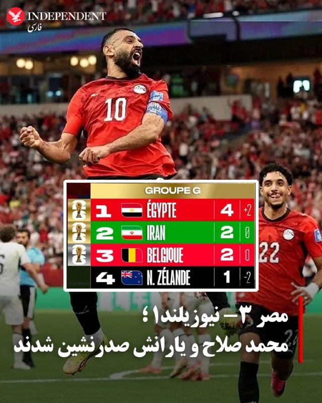

♦️تیم ملی فوتبال مصر با پیروزی ۳ بر ۱ مقابل نیوزیلند، به صدر جدول گروه G جام جهانی ۲۰۲۶ صعود کرد.

در این دیدار که در در ورزشگاه بی‌سی پِلِیس در ونکوور کانادا  برگزار شد، نیوزیلند ابتدا در دقیقه ۱۵ پیش افتاد؛ اما یاران محمد صلاح در نیمه دوم ورق را برگرداندند و یک پیروزی قاطع رقم زدند.

با توجه به تساوی بدون گل ایران و بلژیک، این بردِ مصر بهترین نتیجه برای ایران بود. اکنون مصر با ۴ امتیاز صدرنشین است و ایران و بلژیک با ۲ امتیاز در رتبه‌های بعدی قرار دارند؛ وضعیتی که سرنوشت صعود را به بازی‌های روز آخر موکول کرده است.
‌🇸🇦 Indypersian

🤖 @VahidOOnLine

## VahidOOnLine — post 246788

♦️خبرگزاری رویترز بامداد دوشنبه اول تیرماه ویدیویی را از زمان پخش بازی ایران و بلژیک در یک فضای عمومی در تهران منتشر کرد.

در این ویدیو، شادی مردم از گلی که آفساید اعلام شد و پس از آن تشویق «مهار تاریخی» علیرضا بیرانوند دیده می‌شود.

پس از پیروزی مصر بر نیوزیلند، حالا ایران و بلژیک هر کدام با دو امتیاز در رده‌های دوم و سوم گروه جی قرار دارند.
‌🇸🇦 Indypersian

🤖 @VahidOOnLine

## VahidOOnLine — post 246787

  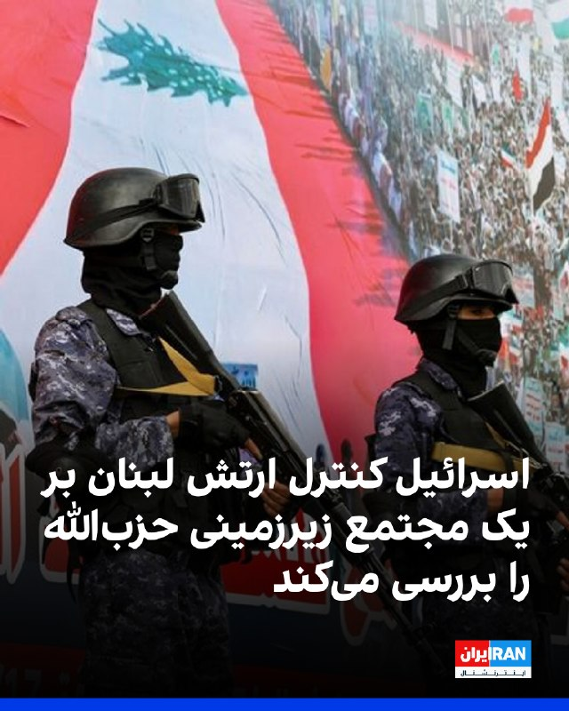

کانال ۱۲ اسرائیل به نقل از «منابع آگاه» گزارش داد که مقام‌های امنیتی این کشور در حال بررسی دادن اجازه به ارتش لبنان برای کنترل یک مجتمع زیرزمینی حزب‌الله در روستای تبنیت در جنوب لبنان هستند.

به گفته این منابع، این ایده در روزهای اخیر در بحث‌های سیاسی و نظامی مطرح شده و ممکن است در مذاکرات آینده سه‌شنبه دوم تیر هم مورد بحث قرار گیرد.

کانال ۱۲ گفت: اسرائیل معتقد است که انتقال مسئولیت به ارتش لبنان می‌تواند به عنوان آزمایشی برای توانایی و تمایل آن برای اقدام علیه حزب‌الله باشد.

یک منبع اسرائیلی هم گفت: «این موضوع می‌تواند آزمایشی برای توانایی و انگیزه ارتش لبنان برای برخورد علنی و بی‌سابقه با حزب‌الله باشد.»

با این حال، مقامات امنیتی اسرائیل اشاره کردند که ارتش لبنان در گذشته برای اقدام علیه این «سازمان تروریستی با مشکل مواجه بوده است.»
‌🏁 🇬🇧 IranintlTV

🤖 @VahidOOnLine

## VahidOOnLine — post 246786

  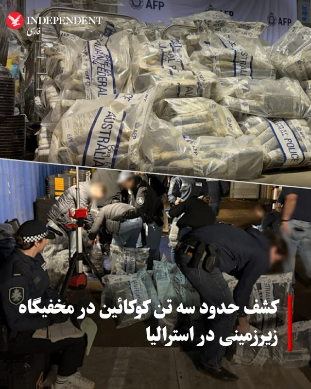

♦️پلیس فدرال استرالیا اعلام کرد در بزرگ‌ترین کشف کوکائین در تاریخ این کشور، حدود ۲ هزار و ۷۰۰ کیلوگرم کوکائین به ارزش تقریبی ۸۱۶ میلیون دلار استرالیا (بیش از ۵۷۲ میلیون دلار آمریکا) را در حومه سیدنی کشف و ضبط کرده است.
به گفته مقام‌ها، این محموله عظیم در مخازن پلاستیکی قرار داده شده و در پناهگاه‌های زیرزمینی داخل سه کانتینر حمل‌ونقل مخفی شده بود.
پلیس اعلام کرد این شبکه جنایی متهم است مواد مخدر را از طریق سواحل شرقی استرالیا وارد کشور کرده است. در جریان عملیات، دو مرد ۲۱ و ۲۵ ساله پس از آنکه ظاهرا تلاش کردند از محل فرار کنند، بازداشت شدند.
این دو نفر به نگهداری مقدار تجاری یک ماده مخدر واردشده غیرقانونی متهم شده‌اند؛ جرمی که در استرالیا می‌تواند تا حبس ابد مجازات داشته باشد.
این کشف پس از توقیف‌های قبلی ۱۷۸ کیلوگرم کوکائین و ۱۴۲ کیلوگرم مت‌آمفتامین در همین پرونده انجام شده است. با احتساب این موارد، مجموع مواد مخدر کشف‌شده در این تحقیقات اکنون از سه تن فراتر رفته که نشان‌دهنده یکی از گسترده‌ترین عملیات‌های مبارزه با قاچاق مواد مخدر در تاریخ استرالیا است.
‌🇸🇦 Indypersian

🤖 @VahidOOnLine

## VahidOOnLine — post 246785

  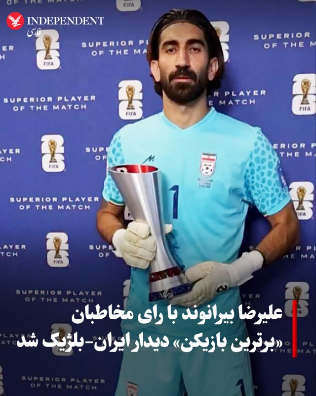

♦️صفحه رسمی فدراسیون بین‌المللی فوتبال (فیفا) با انتشار تصویری از علیرضا بیرانوند در حالی که جایزه ویژه مسابقه را در دست دارد، اعلام کرد که با رای هواداران و مخاطبان، دروازه‌بان تیم فوتبال ایران با نمره ۹ و ۷ مهار، به عنوان «برترین بازیکن زمین» در دیدار مقابل بلژیک انتخاب شد. تیم فوتبال ایران در دومین دیدار خود در مرحله گروهی جام جهانی ۲۰۲۶، با ارائه یک نمایش دفاعی، در ورزشگاه سوفای لس‌آنجلس مقابل بلژیک به تساوی بدون گل دست یافت.
‌🇸🇦 Indypersian

🤖 @VahidOOnLine

## WithYashar — post 15571

آنچه در سوئیس گذشت، به نقل از یک منبع نزدیک به تیم مذاکره کننده ایرانی

یک منبع نزدیک به تیم مذاکره کننده ایرانی: مذاکرات هیات اصلی ایران در سوئیس پایان یافته است، با این حال کارشناسان همچنان در سوئیس هستند و روند اجرای تفاهمنامه را پیگیری می‌کنند.
تا این لحظه مذاکراتی درباره هسته‌ای صورت نگرفته و ایران منتظر تحقق بند 13 است. تا زمانی که بند 13 محقق نشود، در واقع زمان آغاز مذاکرات هسته‌ای فرانرسیده است.
@withyashar

## WithYashar — post 15570

هیئت مذاکره کننده جمهوری اسلامی، بعداز 18 ساعت مذاکره، سوئیس رو به مقصد تهران ترک کردن.
@withyashar

## WithYashar — post 15569

  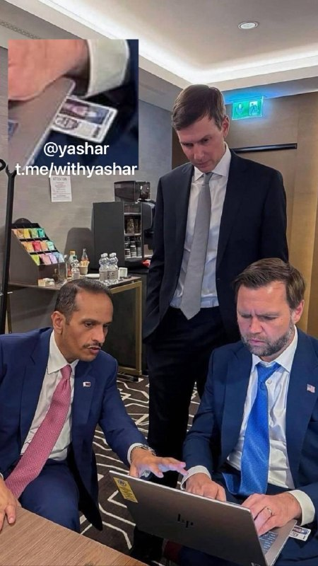

عکسی عجیبی که نخست وزیر قطر، محمد بن عبدالرحمن بن جاسم آل ثانی بدون دقت، در کنار جی دی ونس، معاون رئیس جمهور ایالات متحده، و جرد کوشنر، داماد رئیس جمهور ترامپ، منتشر کرده است
@withyashar
یاشار : اما چرا جی دی ونس از یک کارت هوشمند امنیتی وزارت دفاع آمریکا CAC با هویت یک زن که مسلما سطح دسترسی امنیتی و سازمانی متفاوتی دارد استفاده می‌کند؟

## WithYashar — post 15568

خبرنگار آکسیوس: عراقچی نوشت ایران معافیت‌هایی برای صادرات نفت و محصولات پتروشیمی دریافت کرده و برخی از دارایی‌های مسدود شده آزاد شده‌اند.
مقامات آمریکایی این موضوع را تأیید نکرده‌اند
@withyashar

## WithYashar — post 15567

خبرنگار آسوشیتدپرس گزارش داد، میانجیگران می‌گویند مذاکرات سطح بالای ایران و آمریکا در سوئیس به پایان رسیده است؛ مذاکرات فنی برای دستیابی به توافق نهایی جنگ ایران ادامه خواهد یافت.
همچنين این خبرنگار به نقل از وزیر خارجه ایران اعلام کرد «میانجیگری پاکستان و قطر پیشرفت بزرگی برای پایان دادن به جنگ لبنان به همراه داشته است.»
@withyashar

## WithYashar — post 15566

تانکر ترکرز : ایران از پانزدهم ژوئن سال ۲۰۲۶، بالغ بر ۳۶ میلیون بشکه نفت خام صادر کرده است همچنین معادل همین میزان به صورت محموله‌های شناور در نفتکش‌های مستقر در آب‌های سرزمینی ایران ذخیره شده است
@withyashar

## WithYashar — post 15565

  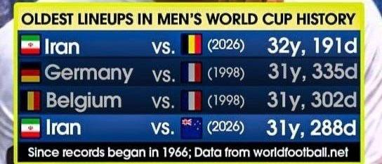

ایران دیشب رکورد پیرترین ترکیب تاریخ جام های جهانی رو با ۳۲ سال ۱۹۱ روز شکست.
رکورد تا قبل از این دست آلمان در جام جهانی ۱۹۹۸ بود.
@withyashar

## WithYashar — post 15564

سناتور گراهام: به لبنان و مردم لبنان می‌گویم "کمک در راه است."

حزب‌الله مدت زیادی کشور شما را به وحشت انداخته و تحت فشار قرار داده است. این وضعیت در آستانه پایان یافتن است.
@withyashar

## WithYashar — post 15563

وزارت کشور قطر:
در انفجار یکی از کارخانه‌های منطقه صنعتی «رأس لفان»، ۵۴ نفر مصدوم و ۱۸ تن مفقود شدند.

این حادثه ناشی از یک نقص فنی در حین عملیات بهره‌برداری بوده.
هیچ‌گونه نشت مواد که خطری برای سلامت افراد داشته باشد، رخ نداده
@withyashar

## mwarmonitor — post 11370

🔴بیانیه مشترک دولت قطر و جمهوری اسلامی پاکستان

🔸در خصوص پایان اجلاس Lake Lucerne Summit و اولین نشست کمیته سطح بالا با مشارکت ایالات متحده آمریکا و جمهوری اسلامی ایران

🔰نخستین دور از گفتگوهای سطح بالا در چارچوب یادداشت تفاهم اسلام‌آباد، در بورگن‌اشتوک سوئیس با حضور نمایندگانی از جمهوری اسلامی ایران، ایالات متحده آمریکا و دو طرف میانجی یعنی دولت قطر و جمهوری اسلامی پاکستان به پایان رسید.
اجلاس لک لوسرن در فضایی مثبت و سازنده برگزار شد. پیشرفت‌های مشوق‌کننده‌ای از جمله ایجاد مکانیزمی برای گفتگوهای فنی بیشتر حاصل شده است.

🔸با استناد به یادداشت تفاهم (MoU)، طرفین با تشکیل یک «کمیته سطح بالا» موافقت کرده‌اند که نظارت سیاسی بر این میانجیگری را بر عهده خواهد داشت.

🔸 مذاکره‌کنندگان ارشد به طور منظم به کمیته سطح بالا گزارش خواهند داد و گروه‌های کاری متمرکز بر موضوعات هسته‌ای، تحریم‌ها و یک گروه نظارت و حل اختلاف را برای تضمین اجرای مؤثر یادداشت تفاهم و سایر امور رهبری خواهند کرد.

🔸کمیته سطح بالا بر سر یک نقشه راه جهت دستیابی به توافق نهایی ظرف مدت ۶۰ روز توافق کرده است که پایه‌ای برای آغاز فوری گفتگوهای فنی بیشتر خواهد بود. علاوه بر این، یک خط ارتباطی میان طرفین برای دوره ذکر شده در بند ۵ یادداشت تفاهم ایجاد شده است تا از بروز حوادث و سوءتفاهم‌ها با هدف عبور امن کشتی‌های تجاری از تنگه هرمز جلوگیری شود.

🔸به علاوه، طرفین در خصوص ایجاد یک «سلول تنش‌زدایی» میان خود و جمهوری لبنان، با تسهیل‌گری میانجی‌ها، موافقت کردند تا از پایبندی به توقف عملیات‌های نظامی در لبنان بر اساس یادداشت تفاهم اطمینان حاصل شود. گفتگوهای فنی در مورد تمامی موضوعات برای باقی‌مانده هفته در استراحتگاه بورگن‌اشتوک ادامه خواهد یافت.

🔸طرف‌های میانجی تمام تلاش خود را به کار خواهند بست تا تضمین کنند که مذاکرات در فضایی سازنده با هدف دستیابی به توافق نهایی ادامه یابد.

🔸دولت قطر و جمهوری اسلامی پاکستان مراتب قدردانی صمیمانه خود را از ایالات متحده آمریکا و جمهوری اسلامی ایران به خاطر تعهد مستمرشان به دیپلماسی و حل و فصل مسالمت‌آمیز منازعه ابراز می‌دارند. طرف‌های میانجی همچنین از کشورهای برادر و دوست برای حمایت‌های مستمر و مشارکت ارزشمندشان در مذاکرات جاری تقدیر می‌کنند.

@mwarmonitor

## mwarmonitor — post 11369

  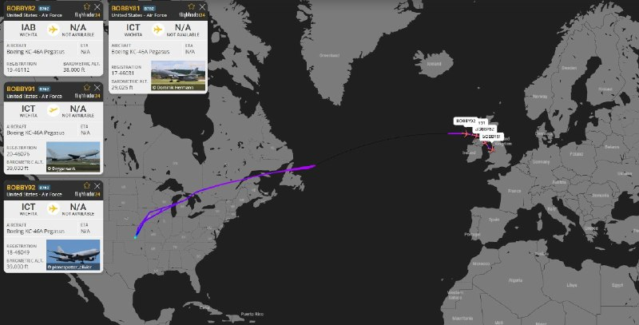

✈️۴ فروند هواپیمای سوخت‌رسان هوایی KC-46A پگاسوس نیروی هوایی ایالات متحده از پایگاه هوایی مک‌کانل (McConnell AFB) در مسیر حرکت به سمت بریتانیا هستند؛ اقدامی که احتمالاً در آستانه استقرار در خاورمیانه انجام می‌شود.

@mwarmonitor

## mwarmonitor — post 11368

🔴 جوزف عون، رئیس‌جمهور لبنان اعلام کرد که تماس تلفنی‌ای از سوی جی‌دی ونس، معاون رئیس‌جمهور آمریکا، جرد کوشنر، فرستاده آمریکا، و شیخ محمد بن عبدالرحمن آل ثانی، نخست‌وزیر قطر، دریافت کرده است.

🔴 در این تماس درباره حفظ آتش‌بس در لبنان، توقف تشدید تنش‌های نظامی اسرائیل و گام‌هایی که باید در این راستا برداشته شود گفت‌وگو شد؛ از جمله احتمال تشکیل یک «سلول هماهنگی» برای این هدف.

@mwarmonitor

## mwarmonitor — post 11367

🔴 آسوشیتدپرس به نقل از یک دیپلمات آمریکایی:

🔸در مذاکرات ما با ایران پیشرفت حاصل شده است؛ از جمله ایجاد سازوکارهایی درباره تنگه هرمز و آتش‌بس در لبنان.

@mwarmonitor

## mwarmonitor — post 11366

🔸روزنامه هآرتس به نقل از یک منبع اسرائیلی:

🔸دو تیم اسرائیل و لبنان در گفت‌وگوهای خود، مناطق آزمایشی‌ای را مشخص خواهند کرد که به ارتش لبنان واگذار می‌شود.

@mwarmonitor

## mwarmonitor — post 11365

🔴اسرائیل دوباره به حاشیه رانده شد — حامیان تروریسم، ناظر «کاهش تنش»

🔸پس از چندین دور گفت‌وگو که با تهدیدهای متقابل همراه بود — از هشدار ترامپ درباره اقدام نظامی گرفته تا تهدید ایرانی‌ها به ترک مذاکرات — میانجی‌ها از اعلام یک «سازوکار جدید کاهش تنش» برای لبنان خبر دادند.

🔸دولت لبنان یکی از طرف‌های این سازوکار است؛ اما نامی از اسرائیل و حزب‌الله حتی برده نشده است.

🔸اکنون که ایران به‌طور رسمی در تصمیم‌گیری درباره لبنان دخیل شده، روشن نیست در دور پنجم مذاکرات فردا در وزارت خارجه آمریکا چه چیزی برای مذاکره میان اسرائیل و لبنان باقی می‌ماند.

🔸تهران البته فقط به دنبال وادار کردن اسرائیل به خروج از لبنان نیست؛ فراتر از آن، هدفش ایجاد شکاف میان اورشلیم و واشنگتن است. بستن تنگه هرمز و تشدید تنش در لبنان، دو روی یک راهبرد واحد هستند.

🔸پوچی ماجرا از این هم آشکارتر نمی‌شود: ایران و قطر — کشورهایی که راهبردشان بر ایجاد اصطکاک و بی‌ثباتی استوار است — اکنون مأمور «نظارت بر کاهش تنش» میان اسرائیل و حزب‌الله شده‌اند.

🔸نظامی که حزب‌الله را تأمین مالی می‌کند، در نقش داور قرار گرفته است.

🔸اسرائیل فعلاً بر باقی ماندن در مناطق امنیتی جنوب لبنان اصرار دارد.« i24 news »

@mwarmonitor

## mwarmonitor — post 11364

🔰نکات اصلی بیانیه مشترک قطر–پاکستان در پایان دور نخست گفت‌وگوها: العربیه

🔴 توافق بر سر نقشه راه: کمیته عالی بر سر یک نقشه راه برای دستیابی به توافق نهایی ظرف ۶۰ روز به توافق رسید.

🔴 ادامه مذاکرات فنی: گفت‌وگوهای کارشناسی در طول هفته در بورگن‌اشتوک ادامه خواهد داشت.

🔴 سازوکار کاهش تنش در لبنان: ایالات متحده و ایران با ایجاد یک سازوکار برای تضمین پایبندی به پایان عملیات نظامی در لبنان موافقت کردند.

🔴 خط ارتباطی هرمز: یک خط ارتباطی میان طرف‌ها برای جلوگیری از حوادث و سوءتفاهم‌ها در تنگه هرمز ایجاد شده است.

@mwarmonitor

## mwarmonitor — post 11363

‌
🔴این متن فقط خبرگزاری های جمهوری اسلامی منتشر کردند و هیچ منبع معتبر دیگر این موارد تایید نکرده

1⃣_ با فشار هیئت مذاکره کنندۀ ایرانی از عصر شنبه، پایان جنگ به‌صورت شکننده در لبنان فعلا حفظ شده است که برای تثبیت آن سازوکار نظارتی با عنوان «واحد کنترل منازعه» با حضور ایران ایجاد می شود. با این سازوکار در حقیقت جمهوری اسلامی ایران به صورت رسمی وارد معادلات امنیتی لبنان می‌شود. درحالی که در ماه‌های اخیر، آمریکایی‌ها تلاش زیادی کردند تا ایران را از معادلات لبنان حذف کنند. همچنین اسرائیل هیچ جایگاهی در این سازوکار ندارد.

2⃣_ در بحث مدیریت تنگۀ هرمز برای ضمانت بازگشایی به مرور تنگه، مقرر شده خط تماسی ایجاد شود تا در صورت اشکال در اجرا با ایران تماس بگیرند و مشکل خود را منتقل کنند. این اتفاق به معنای تثبیت سیادت ایران در تنگۀ هرمز است.

3⃣ _ کارگروه‌های سه‌گانۀ هسته‌ای، تحریم‌ها و نظارت که براساس این بیانیه تشکیل می‌شوند، کار خود را پس از شروع اجرای بند۱۳ یادداشت تفاهم یعنی توقف آتش در همۀ جبهه‌ها به‌خصوص لبنان، آغاز رفع محاصرۀ دریایی، آغاز آزادسازی اموال بلوکه شدۀ ایران و صدور اسقاطیه (رفع) تحریم‌های نفتی، پتروشیمی و مشتقات آغاز خواهند کرد. در حقیقت پیش از اجرای بند ۱۳، جمهوری اسلامی وارد مذاکرۀ مرحلۀ نهایی نمی‌شود.

4⃣ _ در این دور از گفت‌وگوها، یادداشت تفاهم اجرای آزادسازی اموال بلوکه شدۀ ایران نیز میان ایران و قطر به امضای دوکشور رسید.

5⃣ _ در جریان گفت و گوهای سوئیس همچنین براساس بند ۱۰ یادداشت تفاهم، دفتر کنترل دارایی‌های خارجی (OFAC) وزارت خزانه‌داری آمریکا، اسناد رفع تحریم‌های نفتی، پتروشیمی و مشتقات را به مدت ۶۰ روز صادر کرد. این به معنای آن است که ایران می تواند به صورت رسمی به مشتریان خود نفت بفروشد و پول آن را در سازوکارهای رسمی بانک مرکزی دریافت کند.

@mwarmonitor

## pm_afshaa — post 94584

اعتراض دانش اموزان به تاثیر معدل در یزد

💧 Rainbet.com the #1 Non-KYC Crypto Casino & Sportsbook @rainbetcom

😁 @Pm_Afshaa

## pm_afshaa — post 94583

سخنگوی ستاد رهبری: مراسم تشییع خامنه‌ای توی چند مرحله قراره انجام بشه و سپاه پاسداران مسئولیت کامل برگزاری رو بر عهده داره

💧 Rainbet.com the #1 Non-KYC Crypto Casino & Sportsbook @rainbetcom

😁 @Pm_Afshaa

## pm_afshaa — post 94582

🔴در سایه مذاکرات با ایران و آتش‌بس در لبنان: کابینه سیاسی-امنیتی اسراییل روز پنج‌شنبه تشکیل جلسه خواهد داد

💧 Rainbet.com the #1 Non-KYC Crypto Casino & Sportsbook @rainbetcom

😁 @Pm_Afshaa

## pm_afshaa — post 94581

  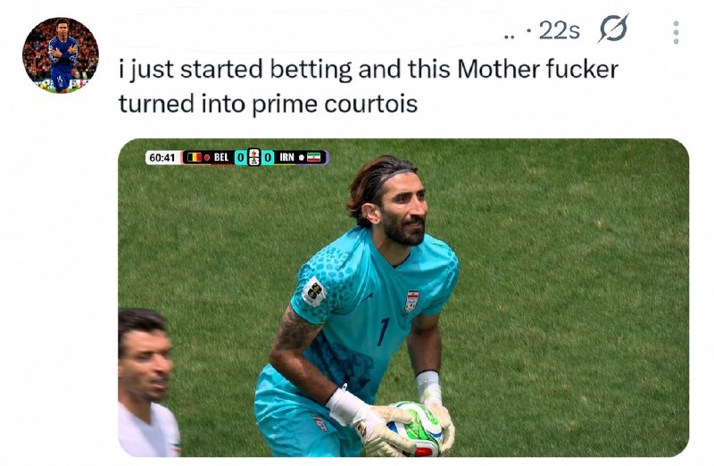

یه کاربر خارجی توییت زده : من تازه شرطبندی رو شروع کردم و این مادرجنده به دوران اوجِ کورتوا تبدیل شد

💧 Rainbet.com the #1 Non-KYC Crypto Casino & Sportsbook @rainbetcom

😁 @Pm_Afshaa

## pm_afshaa — post 94579

🔴سناتور لیندسی گراهام:به لبنان، به مردم لبنان، کمک در راه است.

حزب‌الله مدت‌هاست که کشور شما را ترور می‌کند. این موضوع به زودی به پایان می‌رسد

💧 Rainbet.com the #1 Non-KYC Crypto Casino & Sportsbook @rainbetcom

😁 @Pm_Afshaa

## pm_afshaa — post 94578

  <a href="telegram/content/pm_afshaa_94578_1782115021.webm" target="_blank">🎬 Download video</a>

فقط 24 ساعت این طرح هست برین با چند تا رفرال تا چند ماه رایگان بدون پرداخت هیچ هزینه ای سرور تهیه کنین دیگه این فرصت رو پیدا نمیکنین حتما همین الان برین دست به کار شین
👇
👇 
💎@lex_server 
💎@lex_server

## DEJradio — post 5884

  <a href="telegram/content/DEJradio_5884_1782115021.webm" target="_blank">🎬 Download video</a>

🚨📷 تجمع اعتراضی دانشجویان شهرکرد مقابل استانداری

با وجود فضای امنیتی در کشور شماری از دانشجویان دانشگاه‌های شهرکرد روز دوشنبه اول تیرماه ۱۴۰۵ با تجمع مقابل استانداری شهرکرد، اعتراض کردند.

#دانشگاه_شهرکرد
@DEJradio

## DEJradio — post 5883

  <a href="telegram/content/DEJradio_5883_1782115022.webm" target="_blank">🎬 Download video</a>

🔺🎥 جام جهانی ۲۰۲۶؛
هو کردن سرود جمهوری اسلامی در استادیوم «سوفای»

#فوتبال #جام_جهانی #سوفای
@DEJradio

## IranIntlTV — post 343711

  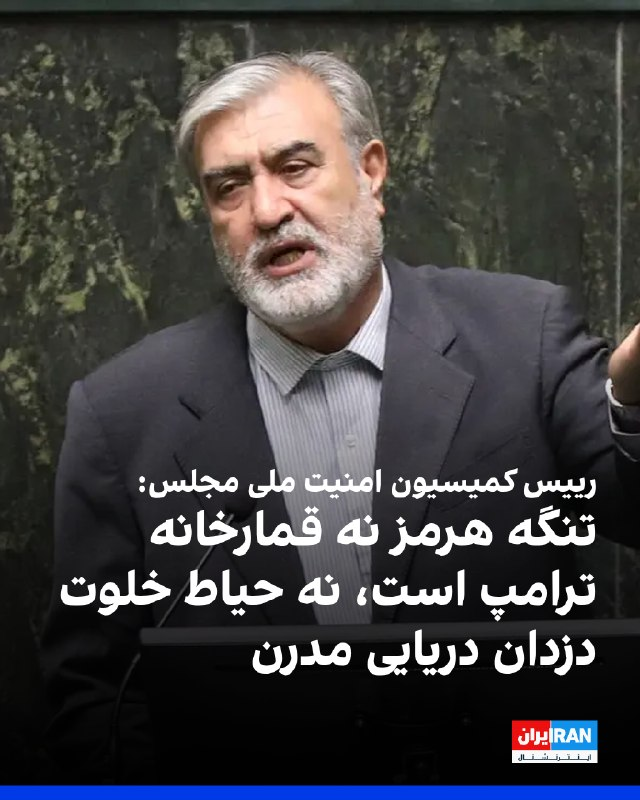

در پی تهدیدهای دونالد ترامپ، رییس‌جمهوری آمریکا، علیه هیات مذاکره‌کننده جمهوری اسلامی، ابراهیم عزیزی، رییس کمیسیون امنیت ملی مجلس، در شبکه ایکس نوشت: «شما تهدید می‌کنید، ما عمل می‌کنیم.»

او افزود: «تنگه هرمز نه قمارخانه شخصی شماست، نه حیاط خلوت دزدان دریایی مدرن؛ اینجا آب‌های ملی ایران است و تصمیم‌گیرنده نهایی، مردم رشید ایران و نیروهای مسلح شجاع آن هستند.»
https://iranintl.com/202606223174

## IranIntlTV — post 343710

  <a href="telegram/content/IranIntlTV_343710_1782115023.mp4" target="_blank">🎬 Download video</a>

در پی مذاکرات میان جمهوری اسلامی و آمریکا در یکشنبه ۳۱ خرداد، تهران و واشینگتن درباره تشکیل یک کمیته عالی برای نظارت بر اجرای تفاهم‌نامه، آغاز فوری مذاکرات فنی و تدوین نقشه راه برای دستیابی به توافق نهایی ظرف ۶۰ روز آینده توافق کردند.

جزییات بیشتر با احمد صمدی، خبرنگار ایران‌اینترنشنال
@iranintltv

## IranIntlTV — post 343709

  

خبرگزاری تسنیم، وابسته به سپاه پاسداران، گزارش داد هیات جمهوری اسلامی به ریاست محمدباقر قالیباف، رییس مجلس، دوشنبه اول تیر پس از حدود ۱۸ ساعت گفت‌وگو و رایزنی فشرده، محل برگزاری مذاکرات در سوئیس را به مقصد تهران ترک کرد.

بر اساس این گزارش، هیات جمهوری اسلامی در نشست‌های دوجانبه و چهارجانبه با حضور هیات آمریکا و میانجی‌گران پاکستانی و قطری شرکت کرد و «مواضع تهران را درباره روند اجرای یادداشت تفاهم و شرایط ورود به مذاکرات توافق نهایی مطرح کرد».

قطر و پاکستان پیش‌تر اعلام کردند جمهوری اسلامی و آمریکا بر تشکیل کمیته عالی برای نظارت بر اجرای یادداشت تفاهم، آغاز فوری مذاکرات فنی و تدوین نقشه راه دستیابی به توافق نهایی ظرف ۶۰ روز توافق کرده‌اند. دو کشور میانجی همچنین از ادامه مذاکرات فنی در سوئیس تا پایان هفته خبر دادند.
https://iranintl.com/202606220784

## IranIntlTV — post 343708

  <a href="telegram/content/IranIntlTV_343708_1782115026.mp4" target="_blank">🎬 Download video</a>

ویدیوی ارسال‌شده به ایران‌اینترنشنال نشان می‌دهد چند نفر از حامیان حکومت شامگاه یکشنبه ۳۱ خرداد در منطقه مهرآباد جنوبی تهران، به بهانه حجاب اجباری برای یک زن ایجاد مزاحمت کرده و او را به دخالت پلیس تهدید می‌کنند.

## IranIntlTV — post 343707

  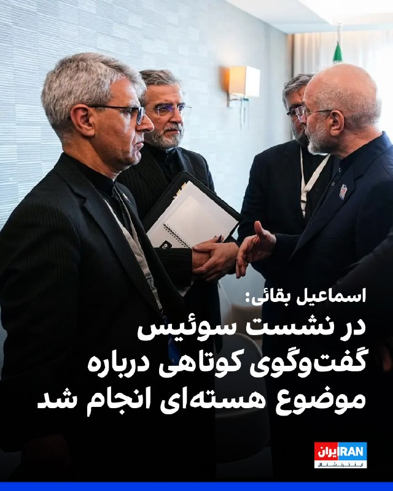

با وجود اعلام رسانه‌های حکومتی در ایران مبنی بر انجام نشدن مذاکره درباره برنامه هسته‌ای جمهوری اسلامی در نخستین دور گفت‌وگوهای مقام‌های تهران و واشینگتن در سوئیس، اسماعیل بقائی، سخنگوی وزارت خارجه، گفت در این نشست «گفت‌وگوی بسیار کوتاهی» درباره موضوع هسته‌ای انجام شده است.

بقائی در گفت‌وگو با خبرگزاری دولتی ایرنا گفت هیات آمریکایی در بخشی از سخنان خود، مواضعش درباره موضوع هسته‌ای را به‌صورت کوتاه بیان کرد و هیات جمهوری اسلامی نیز مواضع خود را مطرح کرد.

او افزود این گفت‌وگو «مذاکره» نبود و صرفا بیان مواضع دو طرف بود و دیدگاه‌های جمهوری اسلامی «بسیار صریح و روشن» اعلام شد.

به گفته بقائی، جمهوری اسلامی تاکید کرده هنوز زمان ورود به مذاکرات مربوط به توافق نهایی فرا نرسیده و بر اساس یادداشت تفاهم، پس از اجرای بخش‌های مشخصی از آن، مذاکرات برای توافق نهایی آغاز خواهد شد.

سخنگوی وزارت خارجه جمهوری اسلامی افزود عباس عراقچی طرف مقابل را از تکرار «دیدگاه‌های زیاده‌خواهانه و غیرمنطقی» درباره موضوع هسته‌ای برحذر داشت و مواضع تهران را تبیین کرد.
https://iranintl.com/202606227465

## IranIntlTV — post 343706

  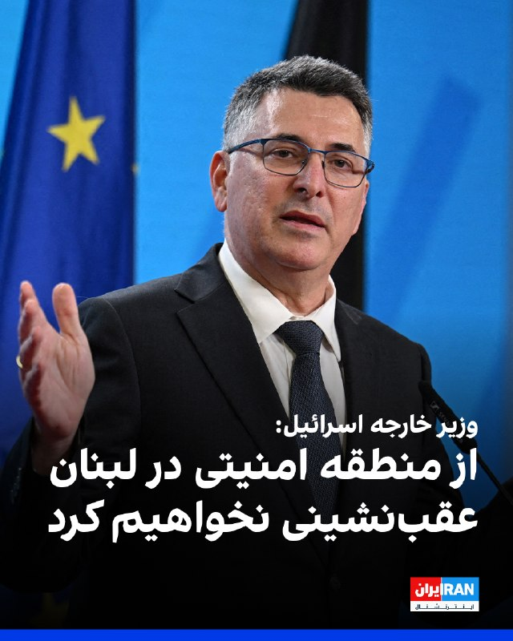

گیدئون سعار، وزیر خارجه اسرائیل، گفت در تماس تلفنی با وینستون پیترز، وزیر خارجه نیوزیلند، تاکید کرده است که اسرائیل در لبنان «جاه‌طلبی ارضی» ندارد، اما از منطقه امنیتی عقب‌نشینی نخواهد کرد.

سعار در حساب ایکس خود نوشت اسرائیل تا زمانی که آتش‌بس در لبنان از سوی حزب‌الله نقض نشود، به آن احترام خواهد گذاشت.

او افزود: «ما در لبنان جاه‌طلبی ارضی نداریم، اما از منطقه امنیتی عقب‌نشینی نخواهیم کرد و شهروندان خود را در معرض حملات حزب‌الله و احتمال تهاجم آن قرار نخواهیم داد.»

وزیر خارجه اسرائیل همچنین گفت که حاکمیت لبنان «دهه‌هاست تا همین امروز» از طریق «اشغال غیرمستقیم ایران به‌وسیله حزب‌الله» نقض شده است.

سعار گفت از بین رفتن «حکومت تروریستی حزب‌الله» هم به نفع لبنان است و هم به نفع اسرائیل. او همچنین اعلام کرد که از وزیر خارجه نیوزیلند برای سفر به اسرائیل دعوت کرده است.
https://iranintl.com/202606225956

## IranIntlTV — post 343704

🗣روایت شما از زندگی در دوران پس از انقلاب ملی و جنگ - دوشنبه ۱ تیر

🔹برای بیش از صد شب خیابان‌های کشور را تبدیل به دیسکو کردین، از این حجم پارادوکس خجالت نمی‌کشید؟

🔹ترامپ یا هرکس دیگه‌ای هر تصمیمی بگیرن، این ما هستیم که مشخص می‌کنیم چه اتفاقی می‌افته و قطعا اون رو رقم خواهیم زد. دلمون باید به این گرم باشه که ما همدیگه رو داریم.

🔹چرا انقدر سنگ لبنان رو به سینه می‌زنن؟ مذاکره برای پایان جنگ بر سر لبنان بود، در حالی که ما مردم ایران خودمون به سختی داریم زندگی می‌کنیم.

🔹کاش صدامون به جی‌دی ونس می‌رسید و بهش می‌گفتیم؛ ما مردم ایران با کل دنیا دوست هستیم، جز جمهوری اسلامی و نیابتی‌هاش و نمی‌خواهیم شما به این رژیم دست دوستی بدید و توافق کنید.

🔹خطاب به ونس و ترامپ: از ملت ایران مایه نگذارید. مذاکره شما با جمهوری اسلامی، دشمن ملت ایران است و به دنبال مماشات هستید.

🔹۱۸ و ۱۹ دی گروهی از انسان‌های بی‌نهایت بزرگ رو از دست دادیم که هیچ‌وقت مثل اون‌ها جاشون نمیاد. پس به احترام جاویدنامان باید این رژیم خونخوار رو با همت خودمون نابود کنیم.

🔹آقای ونس شما گفتید با این مذاکرات می‌خواهید فصل جدیدی در روابط با مردم ایران شروع کنید. چطور این کار را می‌کنید وقتی ما مردم ایران به هیچ عنوان این حکومت را به رسمیت نمی‌شناسیم و آن‌ها را نماینده خود نمی‌دانیم؟ لطفا از مردم ایران مایه نگذارید.

🔹دقت کردید پزشکیان گفت نگرانیم مردم دوباره برای اعتراض به خیابان بیان و ابهت ما از بین بره؟ دقیقا اعتراف کرد که جمهوری اسلامی با اومدن مردم ایران به خیابان از بین می‌ره.

🔹سال‌ها ثروت مردم ایران رو غارت و صرف ساخت موشک، نیروهای نیابتی و نیروهای سرکوبگر کردن که چند روزی بیشتر در قدرت بمونن. موندن در قدرتی که چیزی ازش باقی نمونده با این همه ترس و به زور قایم شدن زیر زمین و در پناهگاه چقدر می‌تونه دوام بیاره؟ دیگه نفسای آخرتونه.

## IranIntlTV — post 343703

  <a href="telegram/content/IranIntlTV_343703_1782115030.mp4" target="_blank">🎬 Download video</a>

هاکان فیدان، وزیر امور خارجه ترکیه، هشدار داد اجرای تفاهم‌نامه اخیر میان ایالات متحده و جمهوری اسلامی ممکن است با چالش‌ها و بن‌بست‌های مقطعی روبه‌رو شود.

گفت‌وگو با نرگس هورخش، خبرنگار ایران‌اینترنشنال
@iranintltv

## IranIntlTV — post 343702

  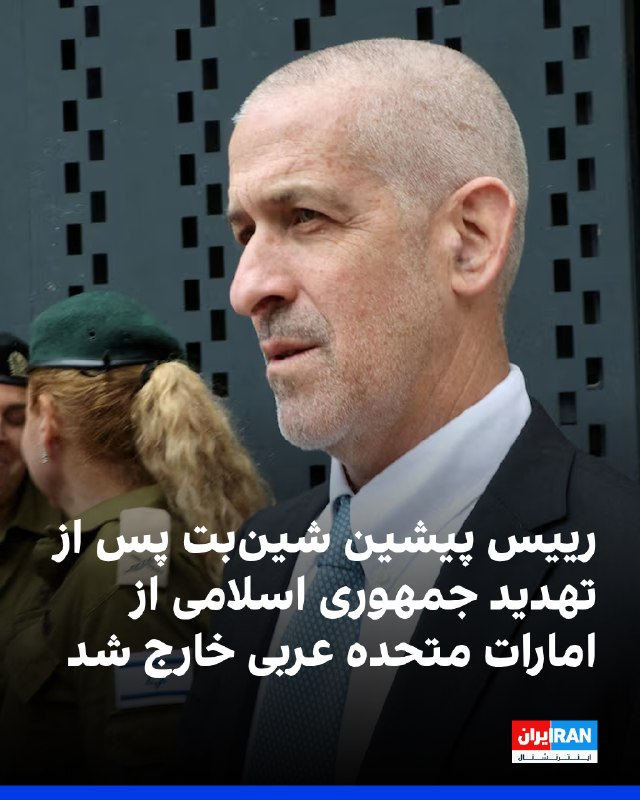

کانال ۱۳ اسرائیل به نقل از منابعی گزارش داد رونن بار، رییس پیشین شین‌بت، سازمان امنیت داخلی اسرائیل و همسرش در جریان سفری که اخیرا به امارات متحده عربی داشتند، پس از دریافت هشدار درباره تلاش جمهوری اسلامی برای آسیب رساندن به آن‌ها، از محل اقامت خود خارج و به مکان امن منتقل شدند.

بر اساس این گزارش، بار و همسرش برای شرکت در یک نشست بین‌المللی امنیتی به امارات متحده عربی سفر کرده بودند.

کانال ۱۳ اعلام کرد این نشست به میزبانی عبدالله بن زاید آل‌نهیان، وزیر خارجه امارات متحده عربی برگزار شده بود، اما یک منبع نزدیک به این کشور در گفت‌وگو با این شبکه، میزبانی چنین رویدادی از سوی وزیر خارجه امارات متحده عربی را رد کرد.
https://iranintl.com/202606225896

## IranIntlTV — post 343701

  <a href="telegram/content/IranIntlTV_343701_1782115033.mp4" target="_blank">🎬 Download video</a>

قطر و پاکستان اعلام کردند جمهوری اسلامی و آمریکا بر سر تشکیل کمیته عالی برای نظارت بر اجرای تفاهم‌نامه، آغاز فوری مذاکرات فنی و تدوین نقشه راه دستیابی به توافق نهایی ظرف ۶۰ روز توافق کرده‌اند.

گفت‌وگو با مرتضی کاظمیان، عضو تحریریه ایران‌اینترنشنال
@iranintltv

## IranIntlTV — post 343700

  <a href="telegram/content/IranIntlTV_343700_1782115035.mp4" target="_blank">🎬 Download video</a>

ویدیوی رسیده به ایران‌اینترنشنال نشان می‌دهد یکی از تماشگران ایرانی حاضر در ورزشگاه سوفای لس‌آنجلس هنگام بازی تیم های ایران و بلژیک در جام‌جهانی، پلاکاردی اعتراضی با موضوع کشتار ایرانیان در جریان انقلاب ملی را به دست گرفته است.

## IranIntlTV — post 343699

  <a href="telegram/content/IranIntlTV_343699_1782115036.mp4" target="_blank">🎬 Download video</a>

ویدیوی رسیده به ایران‌اینترنشنال نشان می‌دهد گروهی از ایرانیان در آمریکا هنگام پخش سرود جمهوری اسلامی پیش از بازی تیم‌های فوتبال ایران و بلژیک در ورزشگاه سوفای لس‌آنجلس، این سرود را هو کردند.

## IranIntlTV — post 343698

  <a href="telegram/content/IranIntlTV_343698_1782115039.mp4" target="_blank">🎬 Download video</a>

بر اساس ویدیوهای رسیده به ایران‌اینترنشنال، همزمان با بازی تیم فوتبال ایران با بلژیک در جام جهانی، ایرانیان مقیم هیوستون در تگزاس آمریکا تجمع کرده و پرچم شیر و خورشید را برافراشتند.

## IranIntlTV — post 343697

  

محمدرضا عارف، معاون اول مسعود پزشکیان، دوشنبه یکم تیر در مراسم افتتاحیه بورس تهران گفت جمهوری اسلامی «برادر بزرگ کشورهای منطقه» است و افزود: «برادر بزرگ، هوای برادرهای کوچک را خواهد داشت.»

عارف گفت: «ایران برادر بزرگ کشورهای منطقه است، هرچند برخی از آنها به ما حمله کردند و جفا کردند.»

او همچنین با اشاره به حملات جمهوری اسلامی علیه کشورهای همسایه گفت: «ما رسما به کشورهای همسایه گفته بودیم که اگر کوچک‌ترین خطایی از سوی آمریکا از مکان‌های متعلق به شما سر بزند، آن مکان‌ها اهداف مشروع ما برای دفاع است.»
https://iranintl.com/202606227000

## IranIntlTV — post 343696

  <a href="telegram/content/IranIntlTV_343696_1782115043.mp4" target="_blank">🎬 Download video</a>

تیم فوتبال ایران در دومین دیدار خود در جام جهانی ۲۰۲۶ مقابل بلژیک به تساوی بدون گل رسید. در این دیدار، گروهی از ایرانیان با پرچم‌های شیر و خورشید وارد ورزشگاه سوفای لس‌آنجلس شدند.

گزارش رضا محدث، خبرنگار ایران‌اینترنشنال
@iranintltv

## IranIntlTV — post 343695

  <a href="https://t.me/IranintlTV/343695" target="_blank">📎 Download file</a>

🎧نسخه صوتی اخبار بامدادی | دوشنبه ۱ تیر
@iranintlTV

## IranIntlTV — post 343690

🔻با وجود ممنوعیت ورود پرچم شیروخورشید به ورزشگاه‌های جام جهانی از سوی فیفا، ایرانیان حاضر در لس‌آنجلس که برای تماشای دیدار ایران برابر بلژیک به ورزشگاه سوفای رفته بودند، پرچم شیروخورشید را با خود به داخل استادیوم بردند.

🔹پیشتر دفتر رسانه‌ای شاهزاده رضا پهلوی با انتشار بیانیه‌ای اعلام کرد: «پرچم ملی شیر و خورشید را در ورزشگاه‌ها و تجمعات بیرون استادیوم‌ها برافرازید. هنگام پخش سرود جمهوری اسلامی، با پشت کردن و سر دادن شعار، اعتراض مسالمت‌آمیز خود را نشان دهید و یادآوری کنید که این سرود، سرود ملت ایران نیست.»

@iranintltvsport

## ManotoTV — post 106196

  <a href="telegram/content/ManotoTV_106196_1782115045.mp4" target="_blank">🎬 Download video</a>

در این قسمت از پادکست منوتو، به نبرد پنهانی بر سر آینده جمهوری اسلامی نگاه می‌کنیم؛ جایی که روحانیون دیگر بازیگر اصلی نیستند و قدرت واقعی بیش از همیشه به دست شبکه‌های امنیتی، نظامی و اقتصادی افتاده است.

سؤال اصلی این است: بعد از مرگ نسل اول حاکمان، چه کسی ایران را به ارث می‌برد؟
فرماندهان؟ شبکه‌های اقتصادی؟ چهره‌های پشت‌پرده؟ یا مردمی که سال‌ها از این بازی قدرت کنار گذاشته شده‌اند؟

این قسمت درباره فروپاشی ناگهانی نیست؛ درباره چیزی خطرناک‌تر است: نظامی که هنوز سر پا مانده، اما درونش جنگی آرام بر سر میراث قدرت آغاز شده است.

## FarsiVOA — post 221511

🔺تانکرترکرز: جمهوری اسلامی در یک هفته ۳۶ میلیون بشکه نفت صادر کرد

▪️شرکت رهگیری نفتکش‌ها، تانکرترکرز، اعلام کرد جمهوری اسلامی از ۱۵ ژوئن تاکنون ۳۶ میلیون بشکه نفت خام صادر کرده و تقریباً همین میزان نفت نیز همچنان به‌صورت شناور در آب‌های ایران باقی مانده است.

▪️این گزارش، نشانه‌ای تازه از بازگشت تدریجی صادرات نفت جمهوری اسلامی پس از هفته‌هایی است که محاصره دریایی آمریکا و اختلال در مسیر هرمز، صادرات نفت را به‌شدت کاهش داده بود.

▪️رویترز پیشتر گزارش داده بود صادرات نفت خام جمهوری اسلامی در ماه مارس حدود یک میلیون و ۸۴۰ هزار بشکه در روز بود، اما در ماه مه، به حدود ۲۰۹ تا ۲۶۰ هزار بشکه در روز سقوط کرد؛ پایین‌ترین سطح در دست‌کم شش سال گذشته.

⬇️ بیشتر بخوانید:
https://ir.voanews.com/a/iran-exported-36-million-barrels-of-oil-in-one-week/8163489.html

## FarsiVOA — post 221510

  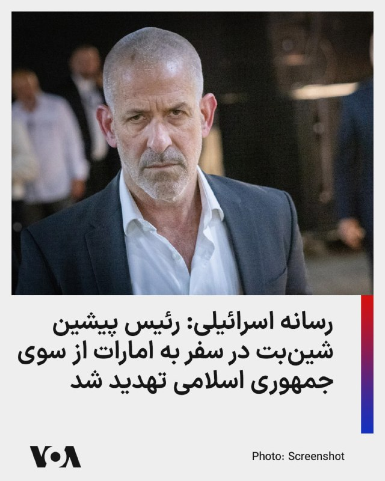

یک رسانه اسرائیلی گزارش داد که رئیس پیشین شین‌بت در جریان سفری به امارات متحده عربی، از سوی جمهوری اسلامی تهدید شد.

شبکه خبری کانال ۱۳ اسرائیل به نقل از منابع آگاه که نامشان فاش نشده، گزارش داد که رونن بار و همسرش در جریان سفر به امارات متحده عربی، پس از آنکه از تلاش جمهوری اسلامی برای آسیب رساندن به خود مطلع شدند، از این کشور خارج شدند.

بر اساس این گزارش، بار و همسرش در یک همایش بین‌المللی امنیتی که به میزبانی عبدالله بن زاید آل نهیان، وزیر خارجه امارات متحده عربی، برگزار شده بود شرکت داشتند.

یک منبع نزدیک به دولت امارات متحده عربی به کانال ۱۳ گفت که وزیر خارجه این کشور میزبان چنین رویدادی نبوده است.

بار هنوز به این گزارش واکنشی نشان نداده است.
@FarsiVOA

## FarsiVOA — post 221509

  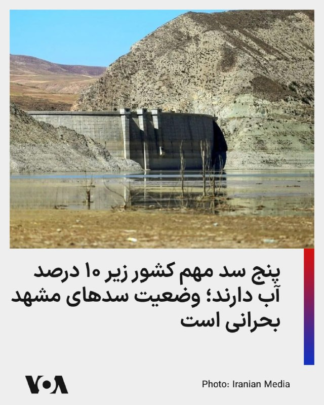

بر اساس آمار شرکت مدیریت منابع آب ایران تا ۳۰ خردادماه، با وجود بارش‌های اخیر، پنج سد مهم کشور زیر ۱۰ درصد پرشدگی آب را تجربه می‌کنند.

بر اساس این آمار، سدهای لار، دوستی، پانزده خرداد، بارزو و ساوه کمتر از ۱۰ درصد آب دارند. این سد‌ها آب مصرفی استان‌های تهران، قم، البرز، مرکزی، خراسان رضوی و خراسان شمالی را تأمین می‌کنند.

در همین ارتباط، محمدعلی نعمت‌نژاد، مدیرعامل شرکت آب منطقه‌ای خراسان رضوی اعلام کرد که آخرین گزارش از وضعیت منابع آب نشان‌دهنده روزهای حساس و کم‌آب برای سدهای تأمین‌کننده آب شرب و کشاورزی استان، به‌ویژه کلانشهر مشهد است.

وی یادآور شد که حجم تجمعی ذخیره شده و درصد پرشدگی مخازن سدهای کلیدی این استان به ارقام نگران‌کننده‌ای رسیده و وضعیت فوق‌العاده بحرانی را نشان می‌دهد.

خبرگزاری دولتی ایرنا نیز اعلام کرد که ٩٨ درصد پهنه شهرستان مشهد در وضعیت «خشکسالی شدید» و ۶٠ درصد از این مساحت در وضعیت «خشکسالی بسیار شدید» قرار دارد.
@FarsiVOA

## FarsiVOA — post 221508

🔺نقشه‌راه مذاکرات ۶۰ روزه آمریکا و جمهوری اسلامی چیست؟

▪️پس از پایان نخستین دور گفت‌وگوهای سطح عالی در چارچوب «یادداشت تفاهم اسلام‌آباد» با مشارکت نمایندگان ایالات متحده آمریکا، جمهوری اسلامی و دو طرف میانجی، یعنی قطر و پاکستان، در بورگن‌اشتوک سوئیس، سازوکاری برای ادامه گفت‌وگوهای فنی ایجاد شد.

▪️قطر و پاکستان با انتشار بیانیه‌ای از «پیشرفت‌های امیدوارکننده‌» در جریان مذاکرات اخیر در سوئیس خبر دادند و جزئیاتی از این سازوکار را منتشر کردند.

▪️در بیانیه قطر و پاکستان آمده که در ادامه اجرای یادداشت تفاهم، طرف‌ها با تشکیل یک «کمیته عالی‌رتبه» موافقت کردند که مسئولیت نظارت سیاسی بر روند میانجی‌گری را بر عهده خواهد داشت.

⬇️ بیشتر بخوانید:
https://ir.voanews.com/a/roadmap-for-60-day-us-iran-talks/8163487.html

## FarsiVOA — post 221507

  <a href="telegram/content/FarsiVOA_221507_1782115050.mp4" target="_blank">🎬 Download video</a>

سخنگوی ارتش اسرائیل اعلام کرد نیروهای این ارتش در پایان هفته، دو عضو حماس را در شمال نوار غزه هدف قرار داده و کشته‌اند؛ افرادی که به گفته ارتش اسرائیل در طراحی و اجرای مسیرهای عملیاتی علیه نیروهای اسرائیلی نقش داشتند.

احمد منیر خلیل زازا، مسئول مهندسی گردان غرب جبالیا در منطقه شهر غزه، روز شنبه در شمال نوار غزه کشته شد. او در تولید و توزیع سلاح میان واحدهای حماس فعالیت داشت و مسئول ساخت بمب‌ها و خانه‌های بمب‌گذاری‌شده بود.

زازا در روزهای اخیر تلاش کرده بود بمب‌هایی را در نزدیکی خط زرد کار بگذارد تا به نیروهای اسرائیلی مستقر در منطقه آسیب وارد کند.

در حمله‌ای دیگر در شمال نوار غزه، حاسین صفدی، فرمانده واحد تک‌تیراندازی حماس در شهر غزه، نیز کشته شد. صفدی در طول جنگ مسئول مسیرهای تک‌تیراندازی علیه نیروهای این ارتش در منطقه شهر غزه بوده است.

در این بیانیه آمده است که صفدی در هفته‌های اخیر به‌طور مکرر توافق آتش‌بس را نقض کرده، برای آموزش نیروهای حماس تلاش داشته و مسیرهای تازه‌ای برای حملات تک‌تیراندازی علیه نیروهای ارتش اسرائیل پیش می‌برده است.
@FarsiVOA

## FarsiVOA — post 221506

  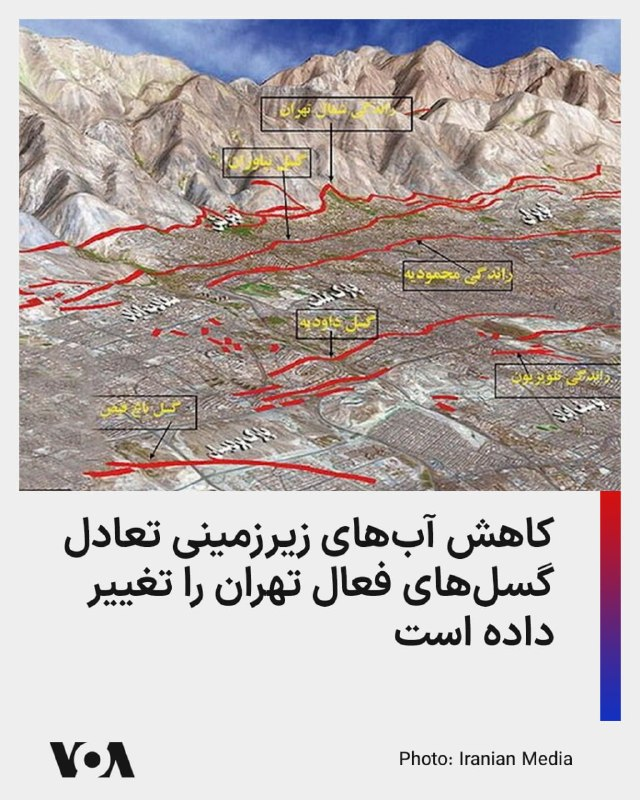

رئیس مرکز پیش‌بینی زلزله پژوهشگاه بین‌المللی زلزله‌شناسی و مهندسی زلزله، در گفتگو با خبرگزاری ایسنا، اعلام کرد که دهه‌ها خشکسالی و برداشت گسترده از آب‌های زیرزمینی، در تغییر وضعیت تنش گسل‌ها و مخاطرات لرزه‌ای تهران تأثیرگذار بوده است.

مهدی زارع یادآور شد که در دشت‌های شرقی تهران، سطح آب‌های زیرزمینی تا ۶۰ متر افت کرده و این کاهش چشمگیر نتیجه مستقیم برداشت‌های بیش از ظرفیت از منابع آب زیرزمینی است.

وی با بیان اینکه کاهش حجم آب زیرزمینی می‌تواند تعادل تنش در گسل‌های فعال را تغییر دهد، اعلام کرد که کاهش فشار آب در لایه‌های زیرسطحی، موجب تغییر اصطکاک مؤثر در صفحات گسل می‌شود.

به گفته این‌ استاد دانشگاه، تغییرات فوق در برخی شرایط یکی از عوامل مؤثر در تحریک زمین‌لرزه‌ها بوده و با مخاطرات زمین‌شناختی و لرزه‌ای ارتباط دارد.

زارع، «زلزله ۲۹ آذر ۱۳۹۶ ملارد» با بزرگای ۵.۲ در عمق ۱۳ کیلومتری زمین را نشانه‌ای از تاثیر خشکسالی و برداشت بی‌رویه از آب‌های زمین‌زمین در فعال شدن گسل‌ها و ایجاد زمین‌لرزه توصیف کرد.
@FarsiVOA

## FarsiVOA — post 221505

🔺واکنش بازارها به مذاکرات سوئیس؛ نفت عقب نشست، بازارهای سهام رشد کردند

▪️قیمت نفت پس از پایان دور اول گفت‌وگوهای آمریکا و جمهوری اسلامی کاهش یافت؛ نشانه‌ای از اینکه بازارها دست‌کم در کوتاه‌مدت، احتمال کاهش تنش و بازگشت بخشی از عرضه انرژی را جدی گرفته‌اند.

▪️رویترز گزارش داد بهای نفت برنت که در آغاز معاملات، تحت تأثیر شروع پرتنش مذاکرات، تهدید دونالد ترامپ به ازسرگیری جنگ و ادعای دوباره جمهوری اسلامی درباره بسته‌شدن تنگه هرمز، تا ۸۲ دلار و ۳۰ سنت بالا رفته بود، پس از پایان گفت‌وگوها به حدود ۷۹ دلار در هر بشکه عقب نشست.

▪️کاهش قیمت نفت پس از آن رخ داد که مقام‌های قطر و پاکستان، به‌عنوان میانجی، از پایان نخستین نشست و پیشرفت در مسیر رسیدن به توافق نهایی در ۶۰ روز خبر دادند.

⬇️ بیشتر بخوانید:
https://ir.voanews.com/a/markets-react-to-swiss-talks-oil-falls-stock-markets-rise/8163486.html

## FarsiVOA — post 221504

  <a href="telegram/content/FarsiVOA_221504_1782115052.mp4" target="_blank">🎬 Download video</a>

تصاویر منتسب به انفجار در تاسیسات گاز راس لفان در قطر؛

به گزارش آسوشیتدپرس، انفجار در منطقه صنعتی راس لفان قطر که شامگاه یکشنبه، رخ داد دست‌کم ۵۴ نفر را زخمی کرد ۱۸ نفر دیگر نیز مفقود شدند.

قطر اعلام کرد این انفجار پس از آن رخ داد که کارگران سعی داشتند تأسیساتی را در بزرگترین پایانه صادرات گاز طبیعی این کشور از سر بگیرند.
@FarsiVOA

## FarsiVOA — post 221503

  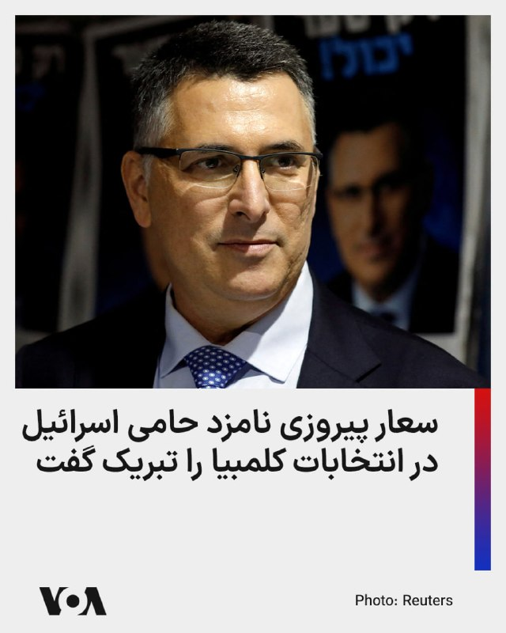

وزیر خارجه اسرائیل پیروزی آبلاردو د لا اسپریلا، نامزد راست‌گرا و حامی اسرائیل در انتخابات ریاست‌جمهوری کلمبیا، را تبریک گفت.

گیدئون سعار در شبکه ایکس نوشت: «ما امیدواریم با رئیس‌جمهور منتخب د لا اسپریا برای احیای روابط میان اسرائیل و کلمبیا و رساندن آن به بالاترین سطح در تاریخ همکاری کنیم.»

وزیر خارجه اسرائیل افزود که از رئیس‌جمهور منتخب کلمبیا دعوت کرده است تا به اسرائیل سفر کند.

پیشتر مارکو روبیو، وزیر امورخارجه آمریکا نیز با رئيس‌جمهوری منتخب کلمبیا گفت‌‌وگو کرد و پیروزی او را تبریک گفت و افزود «دولت ترامپ مشتاقانه منتظر همکاری نزدیک با دولت جدید او برای پیشبرد همکاری‌های امنیتی دوجانبه و منطقه‌ای، پایان دادن به مهاجرت غیرقانونی به ایالات متحده و تقویت روابط اقتصادی بین دو کشور است.»
@FarsiVOA

## FarsiVOA — post 221502

  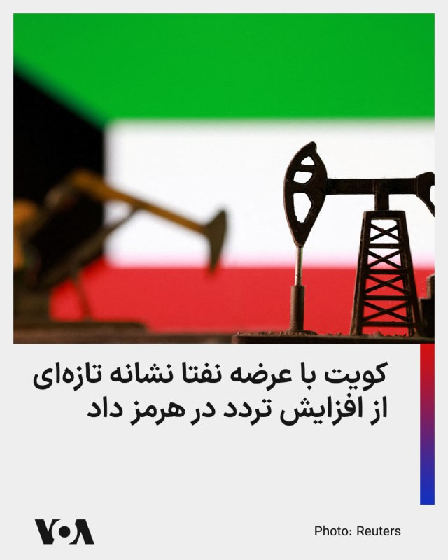

شرکت نفت کویت از مشتریان خواسته است محموله‌های نفتا را از بنادر این کشور در داخل خلیج فارس تحویل بگیرند؛ اقدامی که بلومبرگ آن را نشانه تازه‌ای از افزایش رفت‌وآمد انرژی از مسیر تنگه هرمز توصیف کرده است.

شرکت ملی نفت کویت مناقصه‌ای برای فروش نفتا، ماده‌ای مورد استفاده در تولید بنزین و پلاستیک، منتشر کرده و خریداران باید خودشان کشتی‌های لازم را برای بارگیری از بنادر کویت تأمین کنند.

این پیشنهاد در شرایطی مطرح شده که تولیدکنندگان منطقه پس از تفاهم موقت میان آمریکا و جمهوری اسلامی، برای احیای جریان انرژی از مسیر هرمز تلاش می‌کنند.

با این حال، بلومبرگ نوشته وضعیت امنیتی هرمز همچنان متغیر است و شرکت بیمه چاب آن را «ساعت‌به‌ساعت» توصیف کرده است.
@FarsiVOA

## FarsiVOA — post 221501

  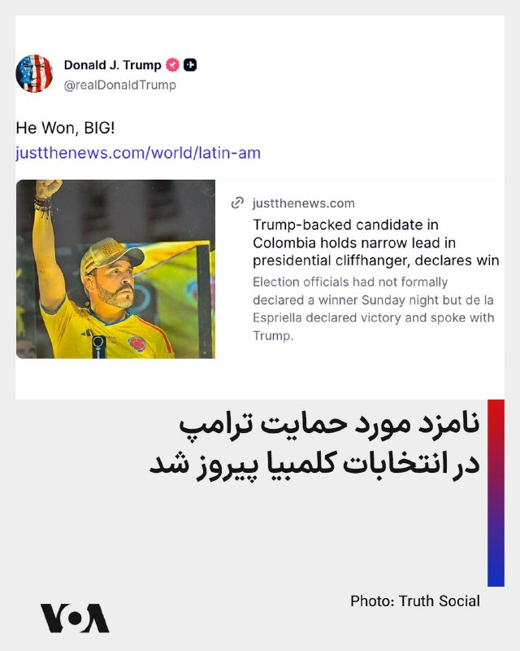

⚡️دونالد ترامپ، رئیس‌ جمهوری آمریکا در پستی در تروت‌سوشال به پیروزی آبلاردو د لا اسپریلا، نامزد راستگرای انتخابات ریاست جمهوری کلمبیا، واکنش نشان داد و گفت «او یک پیروزی بزرگ به دست آورد!» آقای ترامپ حمایت خود را آبلاردو د لا اسپریلا ابراز داشته بود. مارکو روبیو، پیشتر با رئيس‌جمهوری منتخب کلمبیا گفت‌‌وگو کرد و پیروزی او را تبریک گفت و افزود «دولت ترامپ مشتاقانه منتظر همکاری نزدیک با دولت جدید او برای پیشبرد همکاری‌های امنیتی دوجانبه و منطقه‌ای، پایان دادن به مهاجرت غیرقانونی به ایالات متحده و تقویت روابط اقتصادی بین دو کشور است.»
@FarsiVOA

## FarsiVOA — post 221500

  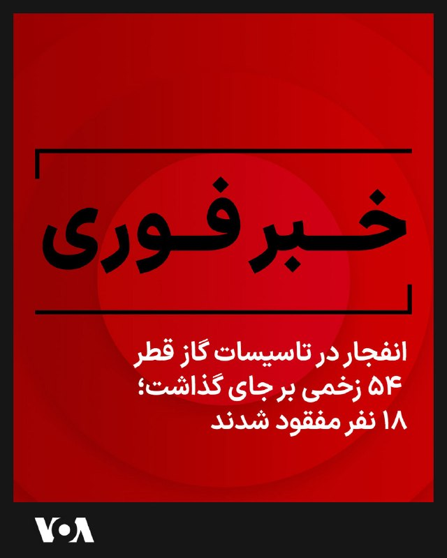

⚡️به گزارش آسوشیتدپرس، انفجار در منطقه صنعتی راس لفان قطر که شامگاه یکشنبه، رخ داد دست‌کم ۵۴ نفر را زخمی کرد ۱۸ نفر دیگر نیز مفقود شدند.
به گزارش آسوشیتدپرس قطر اعلام کرد که این انفجار پس از آن رخ داد که کارگران سعی داشتند تأسیساتی را در بزرگترین پایانه صادرات گاز طبیعی این کشور از سر بگیرند.
قطر تولید خود در این مجموعه را پس از اقدام جمهوری اسلامی در حمله به کشتی‌های تجاری و بستن تنگه هرمز، تعطیل کرده بود.
بر اساس گزارش‌‌ها وزارت کشور قطر ابتدا گزارش داده بود که در اثر انفجار گزارشی از زخمی‌ها منتشر نشده است. این وزارتخانه اعلام کرده بود که هیچ نشتی وجود نداشته که «تهدیدی برای امنیت عمومی» ایجاد کند. ساعت‌ها بعد حالا گزارش‌ها از مجروحیت‌های گسترده حکایت دارد.
@FarsiVOA

## FarsiVOA — post 221499

  <a href="telegram/content/FarsiVOA_221499_1782115057.mp4" target="_blank">🎬 Download video</a>

⚡️تیم «ملی ایران» یا «تیم جمهوری اسلامی»؟ نظرات ایرانیان در لس‌ آنجلس
@FarsiVOA

## DW_Farsi — post 126319

  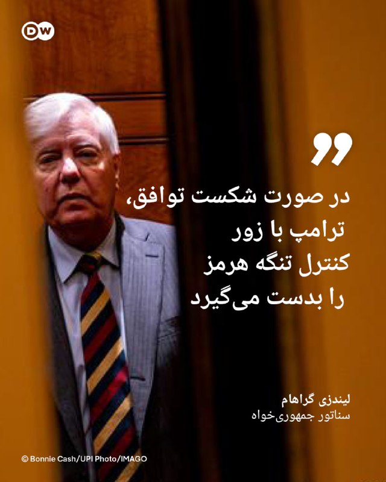

🔶 لیندزی گراهام: در صورت شکست توافق، ترامپ با زور کنترل تنگه هرمز را بدست می‌گیرد
 
لیندزی گراهام، سناتور پرنفوذ جمهوری‌خواه، در مصاحبه‌ای با شبکه خبری "سی‌بی‌اس" هشدار داد اگر تفاهم‌نامه بین تهران و واشنگتن شکست بخورد، دونالد ترامپ، رئیس جمهور آمریکا، کنترل تنگه هرمز را "با زور" به دست خواهد گرفت. او گفت: «بیایید یک راه‌حل دیپلماتیک را امتحان کنیم. من فکر می‌کنم که شکست خواهد خورد.»
 
گراهام ادامه داد که روز جمعه گذشته "جلسه‌ای چهار ساعت و نیمه" با ترامپ داشته است و به نظر او اگر این تفاهم‌نامه به سرانجام نرسد، اتفاق بعدی این خواهد بود که ترامپ "با استفاده از زور کنترل تنگه هرمز را در دست خواهد گرفت و ایالات متحده از تمام کشتی‌هایی که از این تنگه عبور می‌کنند، برای تأمین هزینه‌های این عملیات، عوارض دریافت خواهد کرد".
 
او همچنین اظهار داشت که آمریکا در سال جاری میلادی دامنه توافق ابراهیم را گسترش خواهد داد و عربستان سعودی را نیز به این توافق ملحق خواهد کرد.
 
گراهام تهدید کرد چنانچه ایران با کنترل تنگه هرمز توسط آمریکا مخالفت کند، "ما آنها را نابود خواهیم کرد".
 
@dw_farsi

## DW_Farsi — post 126318

  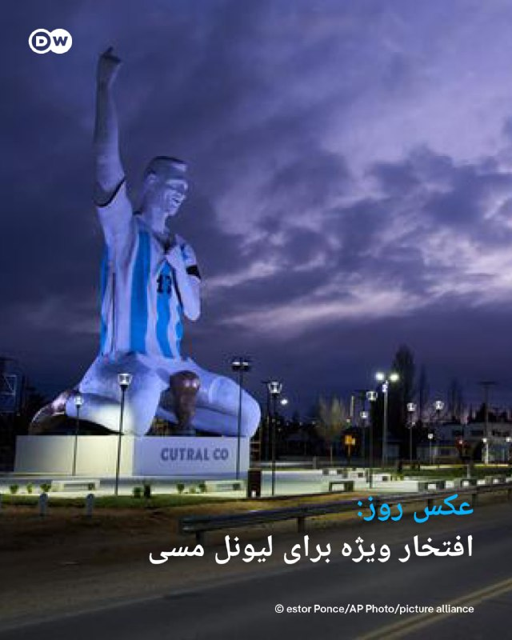

📸 عکس روز: افتخار ویژه برای لیونل مسی
 
 شهر کوچک "کوترال کو" در ایالت نئوکن در جنوب غربی آرژانتین از یک مجسمه عظیم به افتخار لیونل مسی  رونمایی کرده است.
این مجسمه که توسط هنرمند محلی آلدو برویسا ساخته شده، هدفش رونق بخشیدن به گردشگری در این منطقه است. این مجسمه عظیم، قهرمان ملی آرژانتین را در حالی نشان می‌دهد که زانو زده و جام جهانی ۲۰۲۲ را بین پاهایش نگه داشته است.
 
@dw_farsi

## DW_Farsi — post 126317

  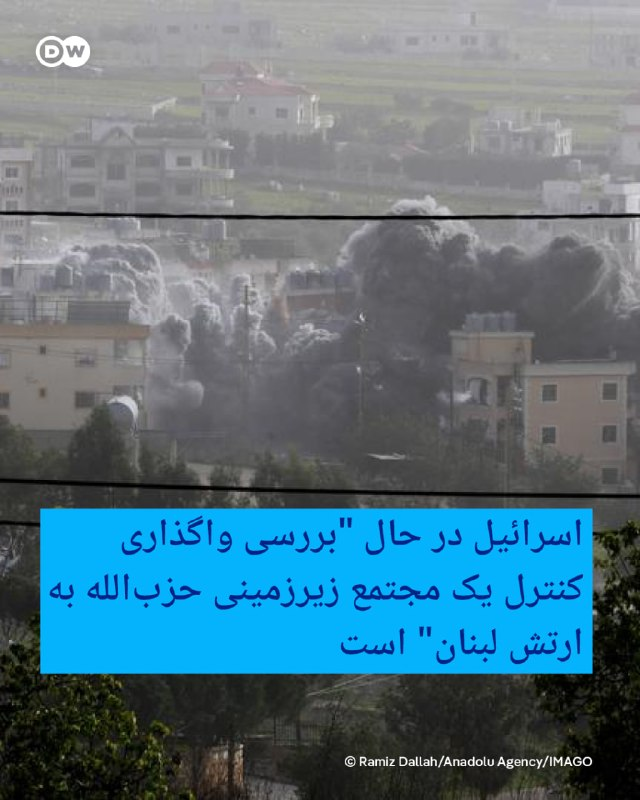

🔶 اسرائیل در حال "بررسی واگذاری کنترل یک مجتمع زیرزمینی حزب‌الله به ارتش لبنان" است
 
کانال ۱۲ اسرائیل به نقل از منابع آگاه گزارش داد مقام‌های امنیتی اسرائیل در حال بررسی دادن اجازه به ارتش لبنان، برای کنترل یک مجموعه تونلی متعلق به حزب‌الله در روستای "تبنیت" واقع در جنوب لبنان هستند. این منابع گفته‌اند که این موضوع در نشست‌های سیاسی و نظامی روزهای اخیر مطرح شده و احتمال می‌رود در دور بعدی مذاکرات اسرائیل و لبنان در روز سه‌شنبه، مطرح شود.
 
 
طبق اطلاعات ارتش اسرائیل، بین ۳۰ تا ۴۰ عضو حزب‌الله در یک مجموعه بزرگ زیرزمینی در این منطقه فعالیت می‌کنند. به گزارش کانال ۱۲، اگرچه نیروهای اسرائیلی در سطح زمین پیرامون این مجموعه حضور دارند، اما تلاش‌های مربوط به مذاکرات آتش‌بس میان آمریکا و ایران، تا کنون مانع از ورود سربازان اسرائیلی به داخل این تأسیسات زیرزمینی شده است.
 
ارتش اسرائیل می‌گوید این مجتمع شبکه بزرگی از تونل‌های زیرزمینی را در برگرفته است و تخریب آن، یکی از اهداف اصلی عملیات نظامی در این منطقه به شمار می‌رود.
 @dw_farsi

## DW_Farsi — post 126316

  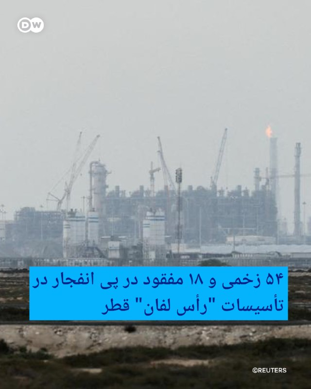

🔶 ۵۴ زخمی و ۱۸ مفقود در پی انفجار در تأسیسات "رأس لفان" قطر
 
وزارت کشور قطر اعلام کرد در پی وقوع انفجاری در منطقه صنعتی رأس لفان، ۵۴ تن زخمی و ۱۸ تن همچنان مفقود هستند. به گفته این وزارتخانه، به هنگام راه‌اندازی مجدد عملیات در شهر صنعتی رأس لفان، "بروز نقص فنی" موجب انفجار و آتش‌سوزی در تأمین گاز محلی "برزان" شد. وزارت کشور قطر گفته است که این حادثه هیچ تهدیدی را متوجه امنیت عمومی نکرده است.
 
شرکت "قطر انرژی" نیز با انتشار بیانیه‌ای اعلام کرد که پس از بروز انفجار، تیم‌های واکنش اضطراری برای مهار آتش اعزام شدند و آتش‌سوزی اکنون تحت کنترل قرار دارد. این شرکت در مورد خسارات احتمالی وارده به این تأسیسات اظهارنظری نکرده است.
 
تأسیسات برزان گاز مورد نیاز صنایع داخلی و بخش تولید برق قطر را تأمین می‌کند. این مجموعه همچنین توانایی تولید اتان، میعانات گازی، گاز مایع نفتی و گوگرد را برای مصرف داخلی و بازارهای صادراتی داراست.
 
در جریان جنگ آمریکا و اسرائیل با ایران منطقه رأس لفان هدف حملات پهپادی ایران قرار گرفته بود که موجب وارد آمدن خساراتی به دو واحد شد.
 
@dw_farsi

## DW_Farsi — post 126315

🔶 "تشکیل کمیته عالی" ایران و آمریکا برای نظارت بر مذاکرات
 
ایران و ایالات متحده در مذاکرات خود در سوئیس بر سر تشکیل یک "کمیته عالی" موافقت کردند که مسئول نظارت سیاسی بر روند میانجیگری خواهد بود. پاکستان و قطر، دو کشور میانجی، با انتشار بیانیه‌ای مشترک ضمن اعلام این خبر گفتند: «مذاکره‌کنندگان ارشد به‌طور منظم به این کمیته گزارش خواهند داد و گروه‌های کاری مرتبط با موضوعات هسته‌ای، تحریم‌ها، نظارت و حل‌وفصل اختلافات را هدایت خواهند کرد تا اجرای مؤثر تفاهم‌نامه و رسیدگی به سایر موضوعات تضمین شود.»
 
در این بیانیه همچنین گفته شده است که این کمیته "بر سر یک نقشه راه برای دستیابی به توافق نهایی ظرف ۶۰ روز توافق کرده است و بدین ترتیب زمینه را برای آغاز فوری گفت‌وگوهای فنی فراهم می‌کند".
 
دوحه و اسلام‌آباد مذاکرات تهران و واشنگتن در شهر بورگن‌شتوک سوئیس را "مثبت و سازنده" توصیف کرده و گفته‌اند که "پیشرفت‌های امیدوارکننده‌ای" در جریان این گفت‌وگوها حاصل شد که از جمله آن‌ها می‌توان به "ایجاد سازوکاری برای ادامه گفت‌وهای فنی" اشاره کرد.
 
هیئت ایرانی به سرپرستی محمدباقر قالیباف، رئیس مجلس شورای اسلامی و با حضور عباس عراقچی، وزیر خارجه و هیئت مذاکره‌کننده آمریکایی به ریاست جی‌دی ونس‌، معاون رئیس‌ جمهور آمریکا، مذاکرات در سوئیس را با حضور میانجی‌ها انجام دادند.
 
در بیانیه مشترک قطر و پاکستان آمده است که "یک خط ارتباطی مستقیم" میان دو طرف برای "جلوگیری از بروز حوادث و سوءتفاهم‌ها و تضمین عبور ایمن کشتی‌های تجاری از تنگه هرمز" ایجاد شده است.
 
به گفته این دو کشور میانجی، ایران و آمریکا همچنین با ایجاد یک "کارگروه رفع تنش" میان طرف‌های مذاکره و با حضور مقامات لبنانی موافقت کردند که هدف از آن "تضمین پایبندی به توقف عملیات نظامی در لبنان" است. در این بیانیه اشاره‌ای به حزب‌الله و اسرائیل نشده است. در تفاهم‌نامه امضا شده میان ایران و آمریکا بر آتش‌بس در لبنان تأکید شده است اما اسرائیل می‌گوید نیروهای نظامی خود را در یک منطقه حائل در جنوب لبنان حفظ می‌کند. در این میان اسرائیل به طور جداگانه در حال مذاکره با دولت لبنان است که دور بعدی این گفت‌وگوها از روز سه‌شنبه آغاز خواهد شد.
 
نخستین دور مذاکرات میان ایران و آمریکا در اقامتگاه بورگن‌اشتوک بامداد دوشنبه پایان یافت اما طبق بیانیه قطر و پاکستان، مذاکرات فنی قرار است در هفته جاری درباره تمامی موضوعات ادامه یابد.
 
در همین حال عباس عراقچی، وزیر خارجه ایران، با انتشار پیامی در شبکه ایکس اعلام کرد که صادرات نفت و پتروشیمی ایران از محدودیت‌ها و تحریم‌های مربوطه معاف شده، محاصره [دریایی] برداشته شده، بخشی از دارایی‌های مسدودشده ایران آزاد شده و برنامه بازسازی و توسعه برای ایران آغاز شده است.
 
عراقچی با اشاره به "پیشرفت بزرگ" برای پایان دادن به جنگ لبنان نوشت که "نخستین محک جدی" این توافقات تشکیل و عملکرد "کارگروه رفع تنش" در لبنان است.
@dw_farsi

## Persian_Trend_Official — post 17784

  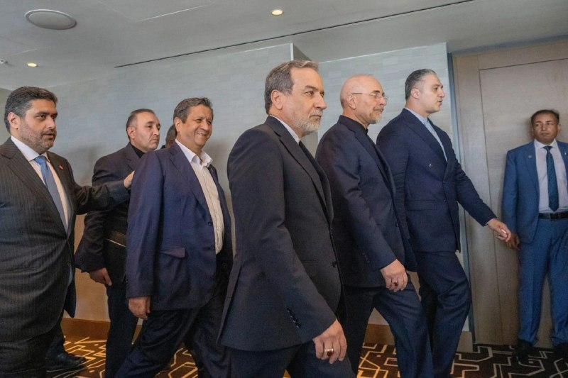

بیانیه پاکستان و قطر: نقشه راهی برای دستیابی به توافق نهایی ظرف 60 روز تدوین شده و یک خط ارتباطی برای تضمین عبور امن کشتی‌های تجاری از تنگه هرمز ایجاد خواهد شد. یک مرکز هماهنگی برای جلوگیری از درگیری در لبنان و تضمین توقف عملیات نظامی تشکیل می‌شود. همچنین…

## Persian_Trend_Official — post 17783

💬 بولتن خبری ۲۴ ساعت اخیر پرشین ترند. ۱ تیر ۱۴۰۵

◾️نخستین دور مذاکرات عالی‌رتبه ایران و آمریکا در بورگن‌اشتوک سوئیس با میانجی‌گری قطر و پاکستان به پایان رسید.

◾️ قطر و پاکستان در بیانیه مشترک اعلام کردند «کمیته عالی» برای نظارت بر اجرای تفاهم‌نامه و هدایت مذاکرات تشکیل شده است.

◾️ طرف‌ها بر سر نقشه راه ۶۰ روزه برای دستیابی به توافق نهایی به توافق رسیدند و مذاکرات فنی تا پایان هفته ادامه خواهد یافت.

◾️ سازوکار ارتباط مستقیم میان طرف‌ها برای جلوگیری از سوءتفاهم و تضمین امنیت کشتیرانی در تنگه هرمز ایجاد شد.

◾️ ایران، آمریکا، قطر، پاکستان و لبنان با تشکیل «واحد کنترل منازعه» جهت نظارت بر آتش‌بس و کاهش تنش‌ها در لبنان موافقت کردند.

◾️ نخست‌وزیر پاکستان و فرمانده ارتش این کشور برای مشارکت در روند مذاکرات وارد سوئیس شدند.

◾️ بقایی: «عدم اجرای بند اول تفاهم‌نامه و ادامه حملات اسرائیل به لبنان، محور اصلی گفت‌وگوهای امروز بود.»

◾️ هیئت ایرانی اعلام کرد در موضوع صادرات نفت و آزادسازی دارایی‌های مسدودشده پیشرفت‌هایی حاصل شده است.

◾️ رسانه‌های اسرائیلی: آمریکا بازگشت بازرسان آژانس بین‌المللی انرژی اتمی به تأسیسات هسته‌ای ایران را یکی از شروط اصلی آزادسازی بخشی از دارایی‌های بلوکه‌شده مطرح کرده است.

◾️ نشست چهارجانبه ایران، آمریکا، قطر و پاکستان پس از حدود ۸۰ دقیقه گفت‌وگو برای مشورت‌های داخلی متوقف شد.

◾️ منابع ایرانی: تهدیدهای جدید دونالد ترامپ موجب توقف ادامه نشست مستقیم و تغییر شکل مذاکرات به تبادل پیام از طریق میانجی‌ها شد.

◾️ سی‌ان‌ان: مذاکرات متوقف شده اما پایان نیافته و رایزنی‌های پشت‌پرده همچنان ادامه دارد.

◾️ فاکس نیوز به نقل از یک دیپلمات آمریکایی: هیئت ایرانی در سوئیس باقی مانده و گفت‌وگوها درباره همه عناصر توافق ادامه دارد.

◾️ ترامپ: «اگر ایران تنگه هرمز را ببندد، کشورش را از دست خواهد داد.»

◾️ ترامپ: «آمریکا در صورت لزوم می‌تواند کنترل تنگه هرمز را در دست بگیرد.»

◾️ ترامپ در تروث سوشال خواستار مهار فوری حزب‌الله از سوی ایران شد و تهدید به اقدام نظامی مجدد کرد.

◾️ منابع نزدیک به مذاکرات: میانجی‌های قطری و پاکستانی از تیم آمریکایی خواسته‌اند برای کاهش تنش‌ها، ترامپ پیام آشتی‌جویانه منتشر کند.

◾️ گزارش‌ها حاکی از آن است که اسرائیل تحت فشار واشنگتن روند کاهش نیروهای خود در جنوب لبنان را آغاز کرده است.

◾️ کانال ۱۲ اسرائیل: ارتش اسرائیل مدعی تسلط بر مجموعه زیرزمینی «عماد ۴» در منطقه نبطیه شده است.

◾️ ایال زمیر، رئیس ستاد ارتش اسرائیل: «حزب‌الله پس از تلفات فرماندهان میانی در وضعیت دشواری قرار دارد.»

◾️ سردار قاآنی: «اگر نیروهای اسرائیلی از جنوب لبنان خارج نشوند، حماسه سال ۲۰۰۰ تکرار خواهد شد.»

◾️ مایک هاکبی، سفیر آمریکا در اسرائیل، بار دیگر ایران را مسئول توسعه زیرساخت‌های نظامی حزب‌الله در لبنان دانست.

◾️ انفجار در تأسیسات راس لفان قطر رخ داد؛ وزارت کشور قطر اعلام کرد تاکنون تلفات یا نشتی گزارش نشده است.

◾️ تلاش یک گروه مسلح برای ربودن نفتکش در خلیج عدن ناکام ماند؛ مهاجمان از منطقه پونتلند سومالی اقدام کرده بودند.

◾️ عراق سطح آماده‌باش مرزی خود با سوریه را افزایش داد؛ بغداد نسبت به بازسازی توان داعش و گروه‌های افراطی هشدار داده است.

◾️ زلنسکی: واشنگتن در حال بررسی راه‌اندازی خطوط تولید موشک‌های پاتریوت در اوکراین و اروپا است.

◾️ پزشکیان: «ما از حق غنی‌سازی کوتاه نخواهیم آمد.»

◾️ پزشکیان: «بیش از هر چیز نگران نارضایتی مردم و شکل‌گیری اعتراضات اجتماعی هستم.»

◾️ پزشکیان تأیید کرد فرماندهان نیروهای مسلح در شورای عالی امنیت ملی با تفاهم‌نامه موافقت کرده بودند.

◾️ واکنش پزشکیان به تهدید یکی از مداحان: «هرچه بیشتر فحش بدهند، از گناهان من کم می‌شود.»

◾️ حسین شریعتمداری خواستار پیگیری موضوع بازگشت بحرین به ایران شد؛ اظهاراتی که بازتاب گسترده‌ای در فضای سیاسی داشت.

◾️ وزارت اطلاعات از بازداشت ۱۷ نفر در استان ایلام در ارتباط با اعتراضات سراسری دی‌ماه خبر داد.

◾️ گزارش‌ها از استعفای قریب‌الوقوع کی‌یر استارمر، نخست‌وزیر بریتانیا، در پی اختلافات داخلی حزب کارگر حکایت دارد.

◾️ روزنامه وابسته به میریام ادلسون، از حامیان اصلی ترامپ، با انتشار نامه‌ای توافق احتمالی با ایران را «شکست» توصیف کرد.

مهم‌ترین ها:

🔹 توافق بر سر نقشه راه ۶۰ روزه برای مذاکرات نهایی ایران و آمریکا
🔹 تشکیل کمیته عالی و واحد کنترل منازعه لبنان
🔹 تنش در مذاکرات پس از تهدیدهای جدید ترامپ
🔹 آغاز بحث‌های فنی درباره نفت، دارایی‌های بلوکه‌شده و پرونده هسته‌ای
🔹 افزایش فشار آمریکا و اسرائیل بر پرونده لبنان و حزب‌الله
🔹 انفجار در قطر و تحولات امنیتی خلیج فارس و خلیج عدن

Phantom

📌 @persian_trend_official
پرشین ترند | متفاوت‌ترین کانال نظامی

## Persian_Trend_Official — post 17782

شرکت ردیابی حرکت نفتکش‌ها تانکر ترکز: ایران در شش روز گذشته 36 میلیون بشکه نفت صادر کرده است.

📝 Amir

📌 @persian_trend_official
پرشین ترند | متفاوت‌ترین کانال نظامی

## Persian_Trend_Official — post 17781

  <a href="telegram/content/Persian_Trend_Official_17781_1782115061.mp4" target="_blank">🎬 Download video</a>

ارتش امریکا یک قایق مظنون به قاچاق مواد مخدر را در دریای کارائیب مورد حمله خود قرار داد.

این قایق 8 سرنشین داشته که در این حمله 2 نفر از آنان کشته و 6 نفر دیگه مفقود شدند، ارتش امریکا می‌گوید گارد ساحلی در حال انجام عملیات های شناسایی جهت دستگیری آن 6 قاچاقچی است.

📝 Amir

📌 @persian_trend_official
پرشین ترند | متفاوت‌ترین کانال نظامی

## Persian_Trend_Official — post 17780

  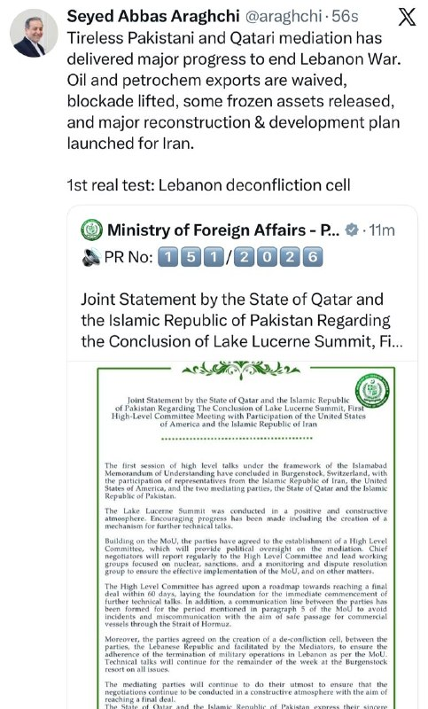

عراقچی: میانجی گری خستگی ناپذیر پاکستان و قطر باعث پیشرفت های بزرگی برای پایان دادن به جنگ در لبنان شد.

همچنین تحریم صادرات نفت و پتروشیمی تعلیق شد، محاصره دریایی برداشته شد، برخی از دارایی های مسدود شده آزاد شدند و طرح بزرگ بازسازی و توسعه اقتصادی ایران اجرایی شد.

اولین آزمون واقعی: موضوع رفع درگیری‌ها در لبنان

📝 Amir

📌 @persian_trend_official
پرشین ترند | متفاوت‌ترین کانال نظامی

## Persian_Trend_Official — post 17779

  <a href="telegram/content/Persian_Trend_Official_17779_1782115062.webm" target="_blank">🎬 Download video</a>

بیانیه پاکستان و قطر: نقشه راهی برای دستیابی به توافق نهایی ظرف 60 روز تدوین شده و یک خط ارتباطی برای تضمین عبور امن کشتی‌های تجاری از تنگه هرمز ایجاد خواهد شد.

یک مرکز هماهنگی برای جلوگیری از درگیری در لبنان و تضمین توقف عملیات نظامی تشکیل می‌شود. همچنین مذاکرات فنی آمریکا و ایران در طول هفته در سوئیس ادامه خواهد داشت.

📝 Amir

📌 @persian_trend_official
پرشین ترند | متفاوت‌ترین کانال نظامی

## Persian_Trend_Official — post 17778

  <a href="telegram/content/Persian_Trend_Official_17778_1782115063.mp4" target="_blank">🎬 Download video</a>

صبحتون بخیر 🌄
Eurofighter Typhoon

📌 @persian_trend_official
پرشین ترند | متفاوت‌ترین کانال نظامی

## RadioFarda — post 158605

🔸تیم ملی فوتبال ایران در دومین دیدار خود در جام جهانی ۲۰۲۶ برابر بلژیک به تساوی بدون گل رسید و با کسب دومین امتیاز خود، شانس صعود به مرحله حذفی را حفظ کرد.

🔸در این دیدار که یک‌شنبه ۳۱ خرداد در لس‌آنجلس برگزار شد، بلژیک مالکیت توپ را در اختیار داشت اما برابر دفاع منسجم ایران ناکام ماند. علیرضا بیرانوند، دروازه‌بان تیم ملی، با هفت مهار نقش مهمی در بسته ماندن دروازه ایران ایفا کرد.

🔸مهدی طارمی در نیمه نخست یک بار دروازه بلژیک را باز کرد، اما این گل پس از بازبینی ویدئویی به دلیل آفساید مردود اعلام شد. او در نیمه دوم نیز باعث اخراج ناتان انگوی شد؛ مدافع بلژیک پس از یک پاس اشتباه، با خطا روی طارمی که در موقعیت تک‌به‌تک قرار گرفته بود، کارت قرمز مستقیم دریافت کرد.

🔸با وجود ۱۰ نفره شدن بلژیک، هیچ‌یک از دو تیم موفق به گلزنی نشدند و مسابقه با تساوی بدون گل به پایان رسید.

🔸با این نتیجه، هر سه بازی برگزارشده تاکنون در گروه هفت با تساوی خاتمه یافته است. ایران با دو امتیاز در دیدار پایانی خود روز جمعه به مصاف مصر می‌رود و بلژیک نیز برابر نیوزیلند قرار خواهد گرفت.

@RadioFarda

## RadioFarda — post 158604

چین در واکنش به فهرست سیاه پنتاگون، ۱۰ شرکت آمریکایی را تحریم کرد

🔸پکن در واکنش به قراردادن شرکت‌های چینی در فهرست سیاه آمریکا، کنترل‌های صادراتی علیه ۱۰ شرکت آمریکایی فعال در حوزهٔ دفاعی و استخراج عناصر خاکی کمیاب را اعمال کرد.

🔸این ۱۰ نهاد شامل شرکت «اَوِئوکس»، دارنده قراردادهای دفاعی و هوافضا با ارتش آمریکا، و شرکت «اوشکوش دیفنس»، تولیدکننده خودروهای نظامی هستند.

🔸دو تولیدکننده آمریکایی عناصر خاکی کمیاب، یعنی ام‌پی متریالز (MP Materials) و یواس‌ای ریر ارث (USA Rare Earth)، هم در این فهرست قرار دارند.

🔸این اقدام یک ماه پس از سفر دونالد ترامپ، رئیس‌جمهور آمریکا، به پکن صورت می‌گیرد؛ سفری که با هدف تثبیت روابط پرتنش دو کشور و در جریان مذاکرات با همتای چینی او، شی جین‌پینگ، انجام شد.

🔸به نوشته رویترز، اگرچه دو کشور توافق کرده بودند برای کاهش تعرفه‌ها همکاری کنند، اما از آن زمان روابط‌شان تحت فشار قرار گرفته است، چراکه هر دوطرف تلاش کرده‌اند در حوزه‌های فناوری و دفاعی مانع پیشرفت طرف مقابل شوند.

🔸واشینگتن در ماه جاری میلادی فهرست سیاه جدیدی شامل ۸۰ شرکت و زیرمجموعه‌های آن‌ها منتشر و اعلام کرد که این شرکت‌ها به ارتش چین کمک می‌کنند. در این فهرست، غول‌های فناوری «علی‌بابا» و «بایدو»، و همچنین شرکت بزرگ خودروسازی برقی «بید» قرار داشتند.

🔸وزارت بازرگانی چین روز دوشنبه اول تیرماه در بیانیه‌ای اعلام کرد که کنترل‌های صادراتی جدید «در پاسخ به اقدام فاحش دولت آمریکا در افزودن این شرکت‌ها به فهرست به اصطلاح "نظامی چین"» اعمال شده است و افزود که این اقدام همچنین با هدف «حفاظت از امنیت ملی» انجام می‌شود.

🔸نسخه کامل این گزارش را در وب‌سایت رادیوفردا بخوانید.

@RadioFarda

## RadioFarda — post 158603

🔸حسین علیزاده، آهنگساز و نوازنده سرشناس ایرانی، با انتقاد از حکم شلاق برای عوامل «کنسرت کاروانسرا» گفت صدور چنین احکامی نشان می‌دهد که «عصر حجر جلوی چشم ماست».

🔸او در مراسم بزرگداشت استیون بلام با اشاره به محکومیت پرستو احمدی و دیگر دست‌اندرکاران این برنامه موسیقی گفت همه محکومان این پرونده را می‌شناسد و آنان را هنرمندانی برجسته و بااستعداد دانست. علیزاده همچنین با حمایت از این هنرمندان افزود: «شجاعت یکی از چیزهایی است که هنر به آدم می‌دهد» و این احکام را محکوم کرد.

🔸آقای علیزاده در سخنانی کنایه‌آمیز گفت حاضر است بخشی از شلاق‌های تعیین‌شده را به جای محکومان بپذیرد و افزود: «پیشنهاد می‌کنم تعداد شلاق‌ها را بین ما تقسیم کنند. من هفتاد تا شلاق را قبول می‌کنم.»

🔸دادگاه کیفری استان قم پرستو احمدی و هشت نفر دیگر از عوامل و نوازندگان «کنسرت کاروانسرا» را به ۷۴ ضربه شلاق تعزیری، دو سال ممنوع‌الخروجی و دو سال محرومیت از فعالیت هنری محکوم کرده است. این حکم که هنوز قطعی نشده، واکنش گسترده هنرمندان و فعالان مدنی را در پی داشته است.

@RadioFarda

## RadioFarda — post 158596

🔸بیانیه مشترک قطر و پاکستان در مورد دور نخست مذاکرات ایران و آمریکا که روز یک‌شنبه ۳۱ خرداد در سوئیس برگزار شد، شامل شش نکته مهم بوده است که توافق بر سر نقشه راه ۶۰ روزه و تشکیل کارگروه کاهش تنش در لبنان در رأس آن قرار دارند.

🔸ایجاد خط ارتباطی درباره تنگه هرمز نیز اهمیت خاصی برخوردار است. تهران و واشینگتن یک «خط ارتباطی» برای جلوگیری از حوادث و سوءتفاهم‌ها و تضمین عبور ایمن کشتی‌های تجاری از تنگه هرمز ایجاد کردند.

🔸هم‌چنین عباس عراقچی اعلام کرد که صادرات نفت و محصولات پتروشیمی ایران از محدودیت‌ها معاف شده، محاصره پایان یافته، بخشی از دارایی‌های مسدودشده آزاد شده و یک برنامه بزرگ بازسازی و توسعه برای ایران آغاز شده است.

🔸بیانیه مشترک فضای مذاکرات را «مثبت و سازنده» توصیف کرد، هرچند دولت آمریکا هنوز ارزیابی رسمی خود از نتایج این دور را منتشر نکرده است.

@RadioFarda

## RadioFarda — post 158595

🔸وزارت کشور قطر روز دوشنبه اعلام کرد در پی انفجاری در منطقه صنعتی رأس لفان، ۵۴ نفر زخمی شده‌اند و ۱۸ نفر نیز همچنان مفقود هستند.

🔸به گفته مقام‌های قطری، این حادثه شامگاه یک‌شنبه بر اثر یک «نقص فنی» در جریان راه‌اندازی دوباره عملیات در شهر صنعتی رأس لفان رخ داد و به انفجار و آتش‌سوزی در تأسیسات تأمین گاز محلی «برزان» منجر شد.

🔸به نوشته خبرگزاری فرانسه، از فاصله حدود ۲۰ کیلومتری شعله‌های آتش و ستون دود برخاسته از این منطقه قابل مشاهده بود. رأس لفان محل بزرگ‌ترین مرکز تولید گاز طبیعی مایع جهان به شمار می‌رود.

🔸شرکت دولتی قطر انرژی اعلام کرد تحقیقات درباره علت دقیق حادثه ادامه دارد. وزارت کشور قطر نیز از آغاز عملیات جست‌وجو برای یافتن ۱۸ فرد مفقودشده خبر داد.

🔸منطقه رأس لفان پیش‌تر نیز در جریان جنگ میان آمریکا و ایران آسیب دیده بود و حملات پهپادی ایران به زیرساخت‌های انرژی قطر باعث توقف تولید گاز طبیعی مایع در این کشور شده بود.

@RadioFarda

## RadioFarda — post 158594

  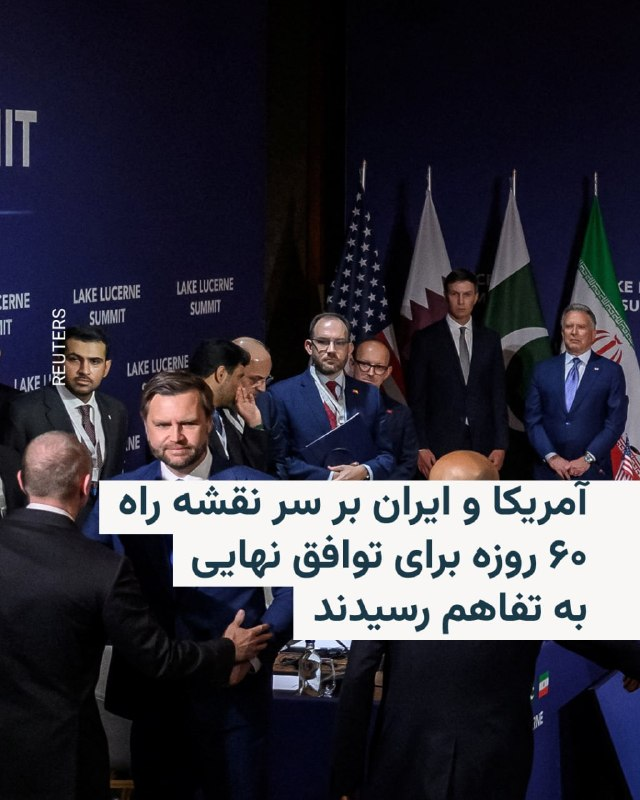

🔸میانجی‌ها اعلام کردند ایران و ایالات متحده روز دوشنبه اول تیرماه توافق کردند خطوط ارتباطی مستقیمی برای باز نگه داشتن تنگه راهبردی هرمز و پایان دادن به درگیری‌ها در لبنان ایجاد کنند.

🔸بنا بر گزارش‌ها دو طرف از طریق تشکیل یک کمیته عالی مذاکرات، بر سر یک نقشه راه برای دستیابی به توافق نهایی ظرف ۶۰ روز به توافق رسیدند همچنین قرار شد گفت‌وگوهای فنی از همین هفته در بورگن‌اشتوک درباره همه موضوعات ادامه یابد.

🔸در بیانیه مشترک دو کشور میانجی یعنی پاکستان و قطر آمده است که: «طرف‌ها با تشکیل یک کمیته عالی موافقت کردند که مسئول نظارت سیاسی بر روند میانجی‌گری خواهد بود. مذاکره‌کنندگان ارشد به‌طور منظم به این کمیته گزارش خواهند داد و گروه‌های کاری مسئول موضوعات هسته‌ای، تحریم‌ها و نیز گروه نظارت و حل‌وفصل اختلافات را هدایت خواهند کرد تا اجرای مؤثر تفاهم‌نامه و دیگر مسائل تضمین شود. کمیته عالی بر سر یک نقشه راه برای دستیابی به توافق نهایی ظرف ۶۰ روز به توافق رسیده است؛ نقشه‌ای که زمینه را برای آغاز فوری گفت‌وگوهای فنی بیشتر فراهم می‌کند.»

@RadioFarda

## BBCPersian — post 284733

🔻پایان دور اول مذاکرات ایران و آمریکا در سوئیس؛ هیئت ایرانی محل را ترک کرد

با پایان جلسه اول مذاکرات مقام‌های ارشد آمریکا و ایران، هیئت ایرانی محل مذاکرات را ترک کرد. قرار است گفتگوهای فنی در سوئیس در طول هفته ادامه یابد.

قطر و پاکستان، میانجی‌گران این توافق، ساعاتی پیش در بیانیه‌ای مشترک اعلام کردند که «اولین جلسه گفتگوهای سطح بالا در چارچوب یادداشت تفاهم اسلام آباد در بورگن‌اشتوک سوئیس به پایان رسید.»

در این بیانیه‌ آمده است که «گفتگوهای فنی در بقیه هفته در تمام موارد در تفرجگاه بورگن‌اشتوک ادامه خواهد یافت.»

بنابر اعلام میانجی‌ها ایران و آمریکا بر سر نقشه راه رسیدن به توافق نهایی به تفاهم رسیده‌اند روندی ظرف ۶۰ روز آینده باید به سرانجام برسد.

در بیانیه مشترک قطر و پاکستان آمده است که بر سر سازوکاری برای پایان دادن به جنگ در لبنان هم تفاهم شده است.

میانجی‌ها همچنین گفتند تهران و واشنگتن پذیرفته‌اند یک «خط ارتباطی» برای جلوگیری از بروز حوادث و سوءتفاهم در تنگه هرمز ایجاد کنند.

عباس عراقچی، وزیر امور خارجه ایران، در پیامی در شبکه اجتماعی ایکس از «پیشرفت چشمگیر» در مذاکرات سوئیس خبر داد.

او نوشت: «تحریم صادرات نفت و پتروشیمی ایران تعلیق شد و محاصره دریایی پایان یافت.» آقای عراقچی اضافه کرد که برخی دارایی‌های مسدودشده ایران هم آزاد شده است.

@BBCPersian

## BBCPersian — post 284732

🔻بقایی: در گفتگوها، سازوکاری برای نظارت بر توقف جنگ در لبنان پیش‌بینی شد

اسماعیل بقایی، سخنگوی هیئت مذاکره ایرانی که به سوئیس سفر کرده، از پیش‌بینی سازوکاری برای نظارت بر توقف جنگ در لبنان خبر داده است.

او گفته است که این سازوکار با مشارکت میانجی‌ها، قطر و پاکستان، حاصل شده است و برای اطمینان از توقف جنگ در لبنان است.

او گفته است: «طبق بند ۱ یادداشت تفاهم جنگ و عملیات نظامی در همه جبهه ها از جمله در لبنان باید خاتمه پیدا کند. فلسفه تشکیل این ساز و کار این است که ما شاهد ادامه توقف جنگ در لبنان باشیم.»

آقای بقایی گفته است که درباره تعهد آمریکا رای آزادسازی دارایی‌های محدود شده یا مسدود شده ایران هم «پیشرفت های خیلی خوبی صورت گرفت.»

@BBCPersian

## BBCPersian — post 284731

  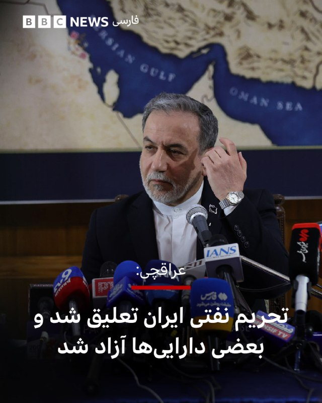

🔻عباس عراقچی، وزیر خارجه ایران می‌گوید که «تحریم صادرات نفت و پتروشیمی تعلیق و محاصره دریایی برداشته شد.»

علاوه بر این، آقای عراقچی اعلام کرد برخی از دارایی‌های مسدود شده آزاد و طرح بزرگ بازسازی و پیشرفت اقتصادی ایران اجرایی شد.»

آقای عراقچی این موارد را در پستی در حساب کاربری خود در شبکه اجتماعی ایکس اعلام کرده است.

وزیر خارجه ایران همچنین ضمن قدردانی از میانجی‌گری پاکستان و قطر نوشته است که این مذاکرات «باعث پیشرفت‌های بزرگی برای پایان دادن به جنگ در لبنان شد.»

اشاره آقای عراقچی به بند یکم، دهم و یازدهم تفاهمنامه دو کشور است که اجرای آن مبنای انجام مذاکرات و حصول توافق نهایی است.

در بند یکم تفاهمنامه ایران و آمریکا آمده است که آمریکا، ایران و متحدان آنها «پایان فوری و دائمی» عملیات نظامی در «همه جبهه ها» از جمله لبنان را اعلام خواهند کرد.

بنابر بند دهم واشنگتن برای صادرات نفت، فرآورده‌های نفتی و خدمات مرتبط از جمله مبادلات بانکی و حمل و نقل، معافیت‌ها و مجوزهای لازم را صادر خواهد کرد.

@BBCPersian
📷 EPA

## BBCPersian — post 284722

🖌لوردس اردیا, سرویس جهانی بی‌بی‌سی:

🔻هفده ساله بودم، هرگز به تماشای مسابقه فوتبال نرفته بودم و اصلا علاقه‌ای هم به این ورزش نداشتم. اما آن بعدازظهر وقتی وارد ورزشگاه آزتکا در مکزیکوسیتی شدم، قرار بود بازی آرژانتین و انگلیس در مرحله یک‌چهارم نهایی جام جهانی را تماشا کنم و شاهد اتفاقی باشم که معنای واقعی آن را سال‌ها بعد درک کردم.

آن روز صبح هیچ برنامه‌ای نداشتیم. تلفن زنگ زد و یکی از دوستان پدرم به او گفت دو بلیت دارد که نمی‌تواند از آن‌ها استفاده کند. پرسید آیا من و مادرم مایل هستیم برویم؟

پدرم درباره رفتن «شاهزاده‌خانم‌هایش» مطمئن نبود. کمتر از پنج سال از پایان جنگ فالکلند گذشته بود و او نگران بود تنش میان هواداران آرژانتینی و انگلیسی به درگیری کشیده شود.

📸 Getty/ Archivo El Grafico/Getty Images/ Lourdes Heredia/ Monte Fresco/Daily Mirror/Mirrorpix via Getty Images/ AFP via Getty Images/ Laura Lezza/Getty Images)/ Monte Fresco/Daily Mirror/Mirrorpix via Getty Images

https://bbc.in/4w3hrSK
@BBCPersian

## BBCPersian — post 284713

🖌وایر دیو ,خبرنگار خاورمیانهدر,بیت‌المقدس:

🔻«تمام سرزمین اسرائیل به فرزندان خدا وعده داده شده است… و این همان جایی است که ما قرار است معبدی تازه بنا کنیم تا همه بشریت بتوانند در آن گرد هم آیند و با هم عبادت کنند.»

اینها سخنان بالقوه تحریک‌کننده موشه فیگلین، سیاستمدار ملی‌گرای راست‌گرای اسرائیلی بود که وقتی از محوطه مسجدالاقصی در بیت المقدس پایین می‌آمد با من صحبت کرد؛ جایی که او همراه با حدود ۲۰ یهودی مذهبی دیگر، پس از دعا و خواندن سرودهای دینی حضور داشت.

موشه فیگلین آشکارا و با صراحت سخن می‌گفت. گویی استدلال او نه بحث‌برانگیز بود و نه محل اختلاف.

📸GettyImages/ Reuters/ AFP via Getty Images/ Maarten Lernout/BBC

https://bbc.in/4uTUznz
@BBCPersian

## idfinfarsi — post 11896

  <a href="telegram/content/idfinfarsi_11896_1782115066.mp4" target="_blank">🎬 Download video</a>

🔴پس از پیشبرد طرح‌های تروریستی: ارتش اسرائیل دو تروریست از سازمان تروریستی حماس را در نوار غزه به هلاکت رساند

❌ارتش اسرائیل در پایان هفته (شنبه) در شمال نوار غزه حمله کرد و احمد منیر خلیل زازا، مسئول مهندسی گردان غرب جبالیا در محدوده شهر غزه را به هلاکت رساند. این تروریست در تولید و توزیع تجهیزات رزمی بین یگان‌ها فعالیت داشت و مسئول ساخت مواد منفجره و خانه‌های تله‌گذاری‌شده بود.

❌در دوره اخیر، زازا تلاش کرد مواد انفجاری را در نزدیکی خط زرد کارگذاری کند، با هدف آسیب رساندن به نیروهای ارتش اسرائیل که در منطقه فعالیت می‌کنند.

⭕️در حمله‌ای دیگر در شمال نوار غزه، ارتش اسرائیل تروریست حسین صفدی، فرمانده بخش تک‌تیراندازی در شهر غزه را به هلاکت رساند.

⭕️صفدی در طول جنگ مسئول تمامی طرح‌های تک‌تیراندازی علیه نیروهای ما در محدوده شهر غزه بود. در دوره اخیر، او به‌صورت سازمان‌یافته توافق آتش‌بس را نقض کرده و تلاش می‌کرد تروریست‌ها را آموزش دهد و طرح‌های تک‌تیراندازی بیشتری را علیه نیروهای ارتش اسرائیل پیش ببرد.

⭕️نیروهای ارتش اسرائیل تحت فرماندهی جنوب در منطقه مستقر هستند و مطابق با توافق به فعالیت خود برای رفع هرگونه تهدید فوری ادامه خواهند داد.

## Dirty_Kids — post 392822

‏۵۰ سال پیش شاه ۲۰۰۰ اپارتمان با تامین حرارت خورشیدی ساخت، همون زمان خمینی این رو به تمسخر گرفت و گفت" مگرمیشود از چیز خورشید چیز بگیریم؟ خورشید قدرت داردمگر؟"
ای نسل ۵۷ :)))

@Dirty_Kids 👻

## Dirty_Kids — post 392821

  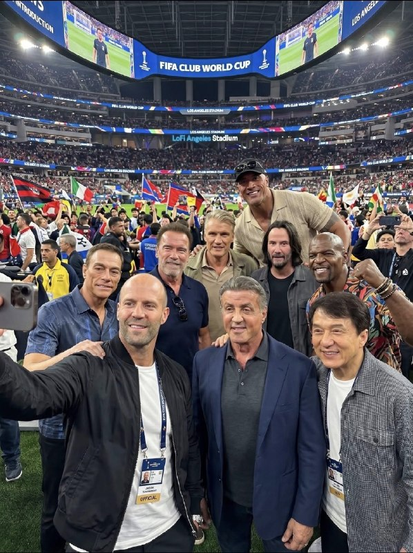

عجب قاب جذابی
میکس بزرگان هالیوود در جام جهانی
چه معجون نابی❤️

@Dirty_Kids 👻

## Dirty_Kids — post 392820

  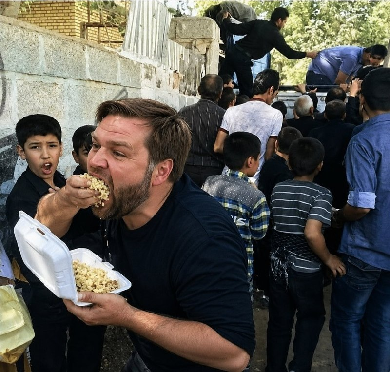

هم اکنون جی دی ونس در صف نذری ، خفه نشی حاجی😂

@Dirty_Kids 👻

## Dirty_Kids — post 392819

  <a href="telegram/content/Dirty_Kids_392819_1782115069.mp4" target="_blank">🎬 Download video</a>

🔴 مادر یکی از جاویدنام ها:

یه عمر گفتین حضرت علی رو از پشت سر شهید کردن، بچه‌ی من که کلا ۴۷ کیلو بود رو زدین تو حنجره‌اش و کشتینش.
شما ترسو بودین، از این به بعد، تاسوعا، عاشورای ما ۱۸ و ۱۹ دی هست.

@Dirty_Kids 👻

## Dirty_Kids — post 392818

  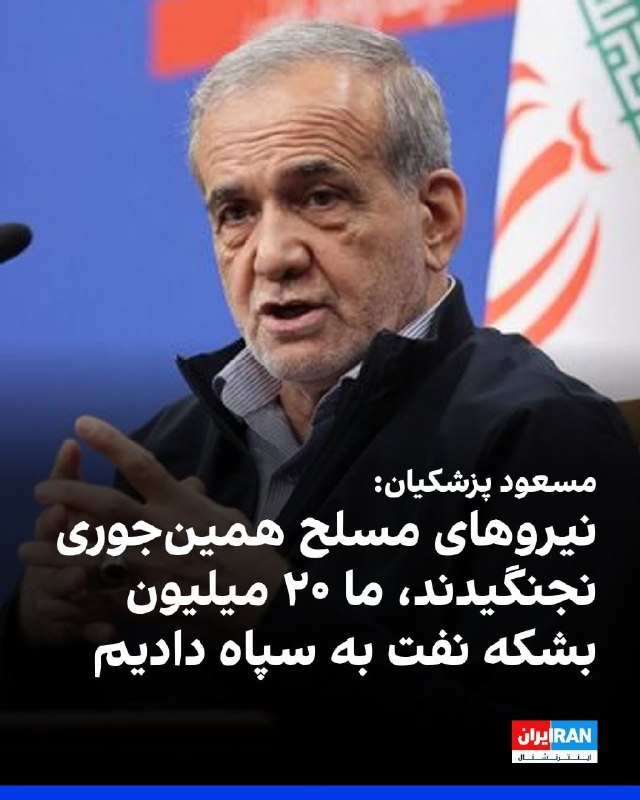

کم کم دارن دامن های همدیگه رو بالا میزنن!

@Dirty_Kids 👻

## Dirty_Kids — post 392817

  <a href="telegram/content/Dirty_Kids_392817_1782115070.mp4" target="_blank">🎬 Download video</a>

اینو هیشکی نکرده تو هیئت، داره انتقاد میکنه به وضعیت

@Dirty_Kids 👻

## Hranews — post 113775

  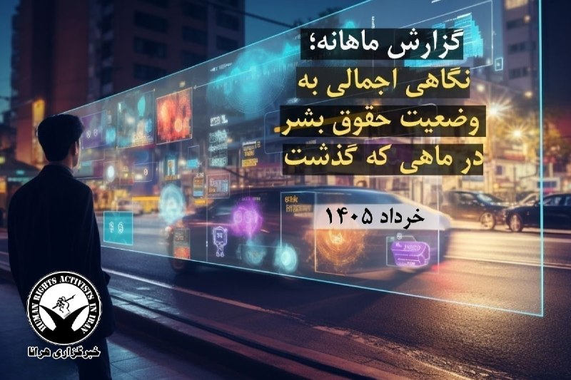

گزارش ماهانه؛ نگاهی اجمالی به وضعیت حقوق بشر – خرداد ماه ۱۴۰۵

❗️
❗️
❗️
❗️
❗️ – آنچه در پی می‌آید گزارش ماهانه و اجمالی از وضعیت حقوق بشر در ایران در دوره زمانی خرداد ماه ۱۴۰۵ است که به همت نهاد آمار، نشر و آثار مجموعه فعالان حقوق بشر در ایران تهیه شده است، این گزارش، تصویری گسترده و تکان‌دهنده از نقض حقوق بشر در ابعاد مختلف ارائه می‌دهد. از اجرای حکم اعدام تا نقض آزادی‌های فردی و اجتماعی، از خشونت نظامی و قضایی تا مشکلات کارگری و اعتراضات، همگی نشان‌دهنده چالش‌های جدی در زمینه رعایت حقوق بشر در ایران هستند. این گزارش همچنین بر میزان بالای اعدام‌ها، بازداشت‌ها، و محکومیت‌های سنگین بر اساس اتهامات مختلف تاکید دارد و نشان می‌دهد که این رویدادها در سراسر کشور گسترده‌اند.

خلاصه اجرایی

در طول خرداد ماه ۱۴۰۵، شاهد گستره‌ای از نقض‌های حقوق بشر در سراسر ایران بودیم. با ارزیابی‌های دقیق و گزارش‌های دریافتی، مجموعاً صدها مورد نقض #حقوق_بشر شناسایی و ثبت شده است که شامل نقض حقوق زندانیان، آزادی بیان، حقوق کودک، خشونت‌های خانگی، خشونت مبتنی بر جنسیت، بهداشت و محیط زیست، حقوق کار، و خشونت نظامی و قضایی می‌شود.

یافته‌های کلیدی این گزارش عبارت‌اند از:
⚫️ اجرای حکم اعدام در مواردی که فرآیندهای عدالتی منصفانه رعایت نشده است.

⚫️ سرکوب گسترده آزادی بیان و بازداشت‌های خودسرانه.

⚫️ افزایش نگران‌کننده خشونت علیه زنان.

⚫️ تداوم نقض حقوق کار و شرایط کاری ناعادلانه.

⚫️ استفاده بی‌رویه از زور توسط نیروهای انتظامی و امنیتی

دوره گزارش‌دهی این گزارش خرداد ۱۴۰۵ است و تعداد کل موارد نقض گزارش شده بیانگر یک وضعیت نگران‌کننده و فوریت برای توجه جامعه بین‌المللی و دولت ایران به این مسائل است.

ادامه مطلب

↘️
@hranews_bot تماس ✉️ -  @Hranews  کانال هرانا 🆑

## manototv — post 106196

  <a href="telegram/content/manototv_106196_1782115073.mp4" target="_blank">🎬 Download video</a>

در این قسمت از پادکست منوتو، به نبرد پنهانی بر سر آینده جمهوری اسلامی نگاه می‌کنیم؛ جایی که روحانیون دیگر بازیگر اصلی نیستند و قدرت واقعی بیش از همیشه به دست شبکه‌های امنیتی، نظامی و اقتصادی افتاده است.

سؤال اصلی این است: بعد از مرگ نسل اول حاکمان، چه کسی ایران را به ارث می‌برد؟
فرماندهان؟ شبکه‌های اقتصادی؟ چهره‌های پشت‌پرده؟ یا مردمی که سال‌ها از این بازی قدرت کنار گذاشته شده‌اند؟

این قسمت درباره فروپاشی ناگهانی نیست؛ درباره چیزی خطرناک‌تر است: نظامی که هنوز سر پا مانده، اما درونش جنگی آرام بر سر میراث قدرت آغاز شده است.

## alonews — post 129659

  <a href="telegram/content/alonews_129659_1782115075.webm" target="_blank">🎬 Download video</a>

👈وزیر خارجه ترکیه درباره مذاکرات ایران و آمریکا: دو مسئله وجود دارد؛ اول، ممکن است که حل فوری جزئیات فنی آسان نباشد و گاهی شاهد بن‌بست باشیم، باید برای این امر آماده بود

🔴 دوم، همیشه اسرائیل در کمین است تا به محض یافتن فرصتی، در مسائل کارشکنی کند

✅ @AloNews خبر جنگ

## alonews — post 129658

  <a href="telegram/content/alonews_129658_1782115076.webm" target="_blank">🎬 Download video</a>

👈هیئت ایران محل مذاکرات سوئیس را به مقصد تهران ترک کرد

✅ @AloNews خبر جنگ

## alonews — post 129657

  <a href="telegram/content/alonews_129657_1782115076.webm" target="_blank">🎬 Download video</a>

👈خضریان، نماینده مجلس: در توافق با آمریکا تثبیت نیروهای مسلح این کشور(آمریکا) در منطقه را پذیرفته‌ایم!

✅ @AloNews خبر جنگ

## alonews — post 129656

  <a href="telegram/content/alonews_129656_1782115076.webm" target="_blank">🎬 Download video</a>

👈خبرنگار آکسیوس: عراقچی نوشت ایران معافیت‌هایی برای صادرات نفت و محصولات پتروشیمی دریافت کرده و برخی از دارایی‌های مسدود شده آزاد شده‌اند.

🔴مقامات آمریکایی این موضوع را تأیید نکرده‌اند

✅ @AloNews خبر جنگ

## alonews — post 129655

  <a href="telegram/content/alonews_129655_1782115076.webm" target="_blank">🎬 Download video</a>

👈هیئت‌های پاکستانی و قطری اعلام کردند که مذاکرات آمریکا و ایران در سوئیس طی شب گذشته «پیشرفت‌های امیدوارکننده‌ای» داشته است

✅ @AloNews خبر جنگ

## alonews — post 129654

  <a href="telegram/content/alonews_129654_1782115076.webm" target="_blank">🎬 Download video</a>

👈رئیس کمیسیون امنیت ملی مجلس:شما تهدید می‌کنید؛ ما اقدام می‌کنیم

🔴 تنگه هرمز نه کازینوی شخصی شماست و نه حیاط خلوت دزدان دریایی مدرن؛ این‌ها آب‌های حاکمیتی ایران است و تصمیم نهایی با مردم شریف ایران و نیروهای مسلح شجاع آن است.

✅ @AloNews خبر جنگ

## alonews — post 129653

  <a href="telegram/content/alonews_129653_1782115077.webm" target="_blank">🎬 Download video</a>

👈وزیر دفاع آلمان: در نهایت، دونالد ترامپ مشکل بشته شدن تنگه هرمز را ایجاد کرد، نه ما، اما ما در بازکردن دوباره آن ذینفع هستیم

✅ @AloNews خبر جنگ

## alonews — post 129652

  <a href="telegram/content/alonews_129652_1782115077.webm" target="_blank">🎬 Download video</a>

👈تصویری از مذاکره نخست‌وزیر قطر و ونس معاون رئیس جمهور امریکا در حضور جراد کوشنر داماد و فرستاده ترامپ در حاشیه مذاکرات سوئیس

✅ @AloNews خبر جنگ

## alonews — post 129651

  <a href="telegram/content/alonews_129651_1782115077.webm" target="_blank">🎬 Download video</a>

️
👈وزیر دفاع آلمان:
ترامپ مقصر بسته شدن تنگه هرمز است

🔴وزیر دفاع آلمان اعلام کرد که رئیس جمهور آمریکا مسئول بسته شدن تنگه هرمز و باز شدن این تنگه در راستای منافع اروپا است.

✅ @AloNews خبر جنگ

## alonews — post 129650

  <a href="telegram/content/alonews_129650_1782115077.webm" target="_blank">🎬 Download video</a>

👈تانکر ترکرز:
ایران از پانزدهم ژوئن سال ۲۰۲۶، بالغ بر ۳۶ میلیون بشکه نفت خام صادر کرده است همچنین معادل همین میزان به صورت محموله‌های شناور در نفتکش‌های مستقر در آب‌های سرزمینی ایران ذخیره شده است

✅ @AloNews خبر جنگ

## alonews — post 129649

  <a href="telegram/content/alonews_129649_1782115077.webm" target="_blank">🎬 Download video</a>

👈سدهای کشور چقدر آب دارند؟

🔴بر اساس آخرین آمار از وضعیت مخازن سدهای مهم کشور، میزان پرشدگی سدهای مهم کشور تا ۳۰ خردادماه، ۶۶ درصد است.

✅ @AloNews خبر جنگ

## alonews — post 129648

  <a href="telegram/content/alonews_129648_1782115078.webm" target="_blank">🎬 Download video</a>

👈اولین تصاویر از دوحه 
✅ @AloNews خبر جنگ

## alonews — post 129647

  <a href="telegram/content/alonews_129647_1782115078.webm" target="_blank">🎬 Download video</a>

👈شهباز شریف: امیدواریم مذاکرات به سندی منجر شود که صلح و رفاه جهانی را تقویت کند

نخست‌وزیر پاکستان:

🔴انتظار دارم مذاکرات جاری در سوئیس به میانجیگری اسلام‌آباد و دوحه برای پایان دادن به جنگ آمریکا و ایران، به «نتایج بسیار سازنده‌ای» منتهی شود.

🔴امیدواریم وقتی به خانه‌هایمان برگردیم، سند فوق‌العاده‌ای در دست داشته باشیم که صلح، پیشرفت و رفاه را در سراسر جهان ارتقا دهد.

✅ @AloNews خبر جنگ

## alonews — post 129646

  <a href="telegram/content/alonews_129646_1782115078.webm" target="_blank">🎬 Download video</a>

👈بقائی: اظهارنظر تهدیدامیز امریکا باعث شد ایران حاضر به ادامه نشست چهارجانبه نباشد

🔴در زمان نشست چهارجانبه اظهارنظر تهدیدامیز امریکا منتشر شد که باعث شد ایران اعلام بکند در چنین شرایطی حاضر به ادامه نشست چهارجانبه نیست.

🔴قطر و پاکستان تلاش کردند گفتگوها ادامه پیدا کند و ما گفتیم به صورت چهارجانبه نخواهد بود.

✅ @AloNews خبر جنگ

<!-- MSG END -->

<!-- NAV START -->

<a href="https://github.com/Tljn/FUD/blob/main/telegram/content/archive_1.md" style="display:inline-block; padding:6px 12px; margin:0 4px; background-color:#2ea44f; color:white; text-decoration:none; border-radius:4px; font-weight:bold;">صفحه بعد</a>

<!-- NAV END -->
