# خواننده تلگرام

<!-- TOP_NAV START -->

<a href="https://github.com/Tljn/FUD/blob/main/telegram/content/archive_1.md" style="display:inline-block; padding:6px 12px; margin:0 4px; background-color:#2ea44f; color:white; text-decoration:none; border-radius:4px; font-weight:bold;">صفحه بعد</a>

<!-- TOP_NAV END -->

<!-- MSG START -->

---
📅 بروزرسانی: 1405/03/16 09:46
---

## VahidOOnLine — post 243908

  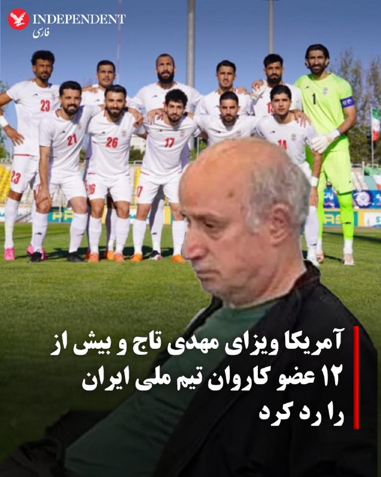

♦️روزنامه نیویورک‌تایمز، روز شنبه ۱۶ خرداد ماه گزارش داد در حالی که تمامی بازیکنان تیم ملی فوتبال ایران برای حضور در جام جهانی ۲۰۲۶ موفق به دریافت ویزای آمریکا شده‌اند، درخواست ویزای مهدی تاج، رئیس فدراسیون فوتبال ایران، و بیش از ۱۲ نفر از اعضای کاروان همراه تیم ملی رد شده است.
بر اساس این گزارش، درخواست ویزای همه ۲۶ بازیکن تیم ملی ایران پذیرفته شده، اما بیش از ۱۲ نفر از اعضای کادر پشتیبانی و همراه تیم، از جمله مربیان، بدنسازان، تحلیلگران، اعضای کادر پزشکی و برخی مقام‌های فدراسیون فوتبال ایران که قرار بود تیم را در جام جهانی همراهی کنند، موفق به دریافت ویزا نشده‌اند.
به نوشته نیویورک‌تایمز، مهدی تاج، رئیس فدراسیون فوتبال ایران، نیز در میان افرادی است که درخواست ویزای او رد شده است. این روزنامه به نقل از یک مقام آگاه نوشت تاج که پیش‌تر از فرماندهان سپاه پاسداران انقلاب اسلامی بوده، اجازه ورود به آمریکا را دریافت نکرده است.
نیویورک‌تایمز همچنین گزارش داد فیفا در هفته‌های اخیر برای حل یکی از پیچیده‌ترین بحران‌های تاریخ جام جهانی پشت پرده در حال رایزنی بوده است. مهدی تاج پیش‌تر به این روزنامه گفته بود جیانی اینفانتینو، رئیس فیفا، در ماه مارس با مقام‌های ایرانی دیدار کرده و ماتیاس گرافستروم، دبیرکل فیفا، نیز ماه گذشته همزمان با آغاز اردوی چندهفته‌ای تیم ملی ایران در ترکیه به این کشور سفر کرده است.
‌🇸🇦 Indypersian

🤖 @VahidOOnLine

## VahidOOnLine — post 243907

  

عراقچی در واکنش به انتقادات شدید رییس‌جمهوری لبنان از جمهوری اسلامی مبنی بر اینکه حکومت ایران لبنان را به «مهره چانه‌زنی» خود تبدیل کرده است، در ایکس نوشت: «اگر لبنان مهره چانه‌زنی ایران بود، مدت‌ها پیش به توافق رسیده بودیم. آقای رییس‌جمهور، لبنان را از دشمن واقعی‌اش نجات دهید.»
عراقچی گفت: «بر اساس اظهارات آقای عون، ممکن است تصور شود این ایران است که یک‌پنجم لبنان را اشغال کرده، یک‌چهارم لبنانی‌ها را آواره کرده و هر روز کشور او را بمباران می‌کند.»
‌🏁 🇬🇧 IranintlTV

🤖 @VahidOOnLine

## VahidOOnLine — post 243906

  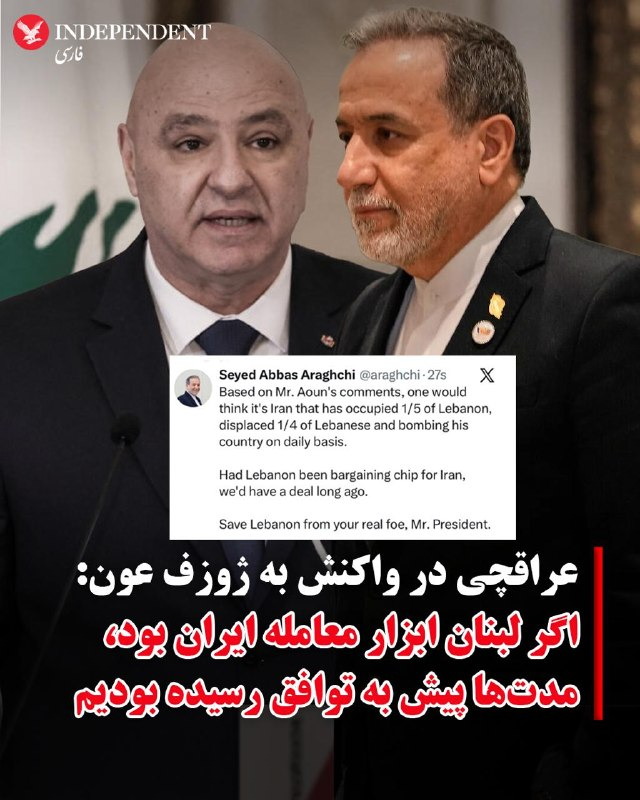

♦️عباس عراقچی، وزیر امور خارجه جمهوری اسلامی ایران، در واکنش به اظهارات ژوزف عون، رئیس‌جمهوری لبنان، درباره نقش تهران در بحران لبنان، تاکید کرد که لبنان هرگز «ابزار چانه‌زنی» تهران نبوده است.

عراقچی روز شنبه ۱۶ خردادماه در شبکه اجتماعی ایکس نوشت: «بر اساس اظهارات آقای عون، ممکن است تصور شود این ایران است که یک‌پنجم لبنان را اشغال کرده، یک‌چهارم لبنانی‌ها را آواره کرده و هر روز این کشور را بمباران می‌کند.»

وزیر خارجه ایران در ادامه افزود: «اگر لبنان ابزار معامله ایران بود، مدت‌ها پیش به توافق رسیده بودیم.»

او همچنین خطاب به رئیس‌جمهوری لبنان نوشت: «آقای رئیس‌جمهور، لبنان را از دشمن واقعی‌اش نجات دهید.»

این پیام پس از آن منتشر شد که ژوزف عون در گفتگویی با شبکه سی‌ان‌ان گفته بود جمهوری اسلامی در مذاکرات خود با ایالات متحده از لبنان به عنوان «ابزار معامله» استفاده می‌کند و این موضوع «غیرقابل قبول» است.

عون در این مصاحبه خطاب به ایران گفته بود: «اینجا کشور شما نیست، کشور ماست. این وظیفه و مسئولیت ماست و شما حق ندارید در کشور ما مداخله کنید.»

رئیس‌جمهوری لبنان همچنین با اشاره به حزب‌الله، که از حمایت جمهوری اسلامی برخوردار است، تاکید کرد این گروه باید درک کند که راهی جز گفتگو و مذاکره برای حل مشکلات و نجات آنچه از لبنان باقی مانده وجود ندارد.
‌🇸🇦 Indypersian

🤖 @VahidOOnLine

## VahidOOnLine — post 243905

♦️«گل‌غلتان نوزاد» یکی از آیین‌های کهن و زیبای ایرانی است که ریشه در باورهای طب سنتی و فرهنگ بومی دارد؛ رسمی که با غلتاندن نوزاد در میان گلبرگ‌ها، آرزوی سلامتی، آرامش و آینده‌ای روشن برای او رقم می‌زند.
این آیین، سرشار از عطر گل، مهر خانواده و امید به زندگی است و به‌عنوان نمادی از آغاز مسیر حیات، پیوندی عمیق میان انسان و طبیعت را به نمایش می‌گذارد. در این رسم، نوزاد را در میان گلبرگ‌های گل محمدی می‌خوابانند و بدنش را با گل‌ها می‌پوشانند؛ سنتی که از گذشته با هدف تقویت سلامت و کاهش حساسیت‌ها انجام می‌شده است.
«گل‌غلتان نوزاد» روایتی دلنشین از سنتی زنده است که همچنان در دل فرهنگ ایرانی نفس می‌کشد و نسل به نسل منتقل می‌شود؛ میراثی سرشار از عشق، طبیعت و امید به زندگی.
‌🇸🇦 Indypersian

🤖 @VahidOOnLine

## VahidOOnLine — post 243904

  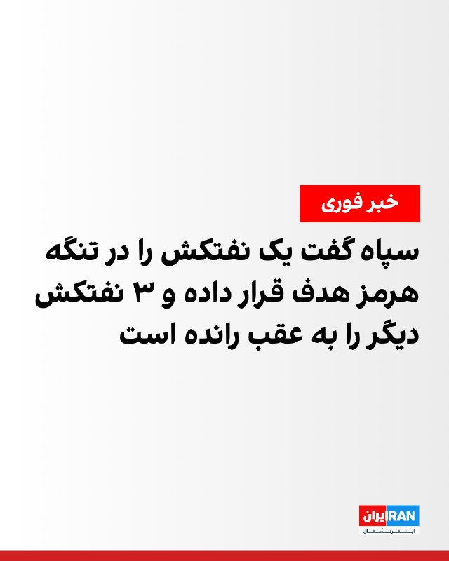

سپاه در بیانیه‌ای با اشاره به اخطار خود در ساعت ۱:۳۰ بامداد شنبه به چهار نفتکش که قصد خروج از تنگه هرمز را داشتند، گفت یکی از این نفتکش‌ها را هدف قرار داده و متوقف کرده است و دیگر شناورها نیز به عقب برگشتند.
طبق این بیانیه، در ساعت ۲:۳۰ بامداد نیز پهپادهای آمریکایی یک دکل مخابراتی در قشم و یک دکل را در سیریک با دو پرتابه هدف قرار دادند که نیروهای هوافضای سپاه متقابلا با موشک‌های بالستیک به پایگاه هوایی علی‌السالم آمریکا در کویت و تاسیسات ناوگان پنجم نیروی دریایی آمریکا در بحرین حمله کردند.
در همین حال، ستاد فرماندهی مرکزی آمریکا، سنتکام، در بیانیه‌ای با اشاره به اینکه در حال حاضر گزارشی از آسیب به نیروهای آمریکایی وجود ندارد، اظهارات مقام‌های سپاه درباره آسیب زدن به مقر ناوگان پنجم آمریکا در بحرین را تکذیب کرد.

‌🏁 🇬🇧 IranintlTV

🤖 @VahidOOnLine

## VahidOOnLine — post 243903

♦️همزمان با افزایش خروجی سد، جریان آب در بستر زاینده‌رود به شهر اصفهان رسید و بار دیگر در این رودخانه تاریخی جاری شد.
ویدیوهای منتشرشده در شبکه‌های اجتماعی نشان می‌دهد مردم اصفهان
برای دومین شب متوالی، با حضور در محدوده پل‌های زاینده‌رود از جمله پل مارنان، سی‌و‌سه‌ پل و پل خواجو، از بازگشت آب به زاینده‌رود استقبال کرده و لحظاتی از شادی و تجمع مردمی را رقم زدند.
رودخانه زاینده‌رود با طولی بیش از ۴۰۰ کیلومتر، در سال‌های اخیر به‌دلیل خشکسالی و مدیریت منابع آبی، بارها با قطع جریان و خشکی مواجه بوده و بازگشت مقطعی آب به آن، همواره با واکنش گسترده مردم همراه می‌شود.
‌🇸🇦 Indypersian

🤖 @VahidOOnLine

## VahidOOnLine — post 243902

♦️فرماندهی مرکزی ایالات متحده (سنتکام)، شنبه ۱۶ خردادماه، با انتشار ویدیویی در حساب کاربری خود در شبکه اجتماعی اکس، تصاویری از پاسخ نظامی به حملات موشکی و پهپادی اخیر ایران را منتشر کرد.
بر اساس بیانیه سنتکام، نیروهای آمریکایی در واکنش به شلیک ۷ موشک بالستیک به سمت کویت و بحرین و همچنین پرتاب ۴ پهپاد انتحاری به سوی تنگه هرمز که امنیت کشتیرانی تجاری را به خطر انداخته بود، سایت‌های رادار نظارت ساحلی ایران را در «گوروک» و «جزیره قشم» هدف قرار دادند. سنتکام در این بیانیه آسیب دیدن مقر ناوگان پنجم آمریکا در بحرین را کاملا تکذیب کرد.
‌🇸🇦 Indypersian

🤖 @VahidOOnLine

## VahidOOnLine — post 243901

  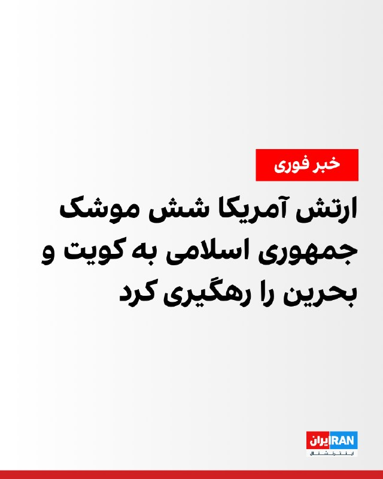

ستاد فرماندهی مرکزی آمریکا، سنتکام، اعلام کرد نیروهای آمریکا چندین موشک بالستیک و پهپاد جمهوری اسلامی، از جمله شش موشک شلیک‌شده به سوی کویت و بحرین را رهگیری کردند.
به گفته سنتکام، جمهوری اسلامی هفت موشک بالستیک به سوی کویت و بحرین شلیک کرد که نیروهای آمریکا شش موشک را رهگیری کردند و موشک هفتم به هدف نرسید.
سنتکام با اشاره به اینکه در حال حاضر گزارشی از آسیب به نیروهای آمریکایی وجود ندارد، اظهارات مقام‌های سپاه درباره آسیب زدن به مقر ناوگان پنجم آمریکا در بحرین را تکذیب کرد.

‌🏁 🇬🇧 IranintlTV

🤖 @VahidOOnLine

## VahidOOnLine — post 243900

♦️دوآ لیپا، ستاره سرشناس پاپ و برنده سه جایزه گرمی، و کالوم ترنر، بازیگر بریتانیایی، روز جمعه، ۱۵ خردادماه، رقصان در شهر پالرمو ایتالیا دیده شدند تا جشن‌های سه‌روزه خود را به مناسبت ازدواجشان آغاز کنند. این زوج تازه عروس و داماد بریتانیایی که آخر هفته گذشته طی یک مراسم خصوصی در لندن با یکدیگر ازدواج کرده بودند، در حال خوش‌آمدگویی به مهمانان سرشناس خود از جمله دوناتلا ورساچه، طراح مد نامدار ایتالیایی، رویت شده‌اند. دوآ لیپای ۳۰ ساله که با آلبوم «نوستالژی آینده» در سال ۲۰۲۰ به اوج شهرت رسید، و کالوم ترنر که با بازی در سریال بریتانیایی «تصاحب» (The Capture) و فیلم سینمایی «پسران در قایق» شناخته می‌شود، قرار است کل این آخر هفته را همراه با مهمانان خود در ایتالیا جشن بگیرند.
‌🇸🇦 Indypersian

🤖 @VahidOOnLine

## mwarmonitor — post 10200

🔴به گزارش NBC News و به نقل از دو مقام آمریکایی و یک مقام سابق، پنتاگون اخیراً ارزیابی تهدید ضدجاسوسی خود علیه اسرائیل را به سطح «بحرانی»—بالاترین سطح—ارتقا داده است؛ این اقدام به‌دلیل نگرانی‌ها از افزایش تلاش‌های اسرائیل برای جاسوسی از مقامات ارشد ایالات متحده و رصد deliberations (رایزنی‌ها) دولت ترامپ درباره درگیری‌های خاورمیانه انجام شده است.

🔸اسرائیل این اتهام را رد کرده و آن را «کاملاً نادرست» خوانده است؛ کاخ سفید نیز اعلام کرده که این گزارش نادرست است.

@mwarmonitor

## mwarmonitor — post 10199

  <a href="telegram/content/mwarmonitor_10199_1780726567.mp4" target="_blank">🎬 Download video</a>

📝 تماشای این ویدیو و شنیدن ادعای «حجاب اختیاری» از زبان مریم رجوی، واقعاً یکی از سوررئال‌ترین و گزنده‌ترین کمدی‌های تاریخ معاصر است. زنیکه مجاهد دوزاری طوری با ژست دموکراتیک از آزادی پوشش صحبت می‌کند که انگار مخاطبش از پشت کوه آمده و یک بچه دو ساله هم ایدیولوژی انگل‌وار و تشکیلاتی این‌ها را نمی‌داند!

🔸اینکه جماعتی با کارنامه‌ای پر از طلاق‌های اجباری، جدا کردن فرزندان از مادران و شستشوی مغزی پادگانی، رو به دوربین زل بزنند و بگویند «حجاب در میان ما یک انتخاب کاملاً آگاهانه است»، اصلاً مرزهای وقاحت را جابه‌جا می‌کند. کمدی تلخ ماجرا اینجاست که او برای توجیه این پوشش اجباری و یونیفرم‌سازمانی، مغالطه مضحک «کراوات و لباس اسپرت» را وسط می‌کشد؛ در حالی که همه می‌دانند در آن ساختار فرقه‌ای، اعضا حتی اختیار خواب دیدن خودشان را هم ندارند، چه برسد به حق انتخاب پوشش! این نمایش بکت‌وار و بزک‌شده، دقیقاً مثل این است که رئیس یک قبیله آدم‌خوار، چاقو و چنگال به دست رو به دوربین بگوید: «ما به رژیم گیاه‌خواری کاملاً معتقدیم!» فردایی که این فاجعه‌های بشری بخواهند گردن‌گیر آزادی باشند، همان بهتر که دنیا به آخر برسد.

@mwarmonitor

## mwarmonitor — post 10198

درگیری‌ های پراکنده در اطراف جزیره خارک و تنگه هرمز گزارش شده

## pm_afshaa — post 92365

🔴نیویورک تایمز: آمریکا به مهدی تاج ویزا نداد‌ه فقط بازیکنان ویزا گرفتن

💧 Rainbet.com the #1 Non-KYC Crypto Casino & Sportsbook @rainbetcom

😁 @Pm_Afshaa

## pm_afshaa — post 92364

🔴روسیه طی هشدار رسمی از شهروندان خود خواست؛ هرچه سریعتر ایران را ترک کرده و به هیچ وجه به این کشور سفر نکنن

💧 Rainbet.com the #1 Non-KYC Crypto Casino & Sportsbook @rainbetcom

😁 @Pm_Afshaa

## mamlekate — post 103622

❓ ساعت ۸:۴۰ دقیقه روز ۱۶ خرداد ۱۴۰۵ چندین جنگنده با سرعت بالا از کرج رد شدن. مشخص هم نیست جنگنده کدوم کشور هستن.

@mamlekate

## mamlekate — post 103621

📝 سفیر آمریکا در ترکیه صدور ویزا برای بازیکنان تیم ملی را تایید کرد

تام باراک، سفیر آمریکا در ترکیه روز جمعه در پیامی در شبکه ایکس صدور ویزا برای بازیکنان تیم ملی را تأیید کرد: «به تیم فوق‌العاده‌مان در سفارت آمریکا در آنکارا افتخار می‌کنیم که برای رسیدگی به درخواست ویزای تیم فوتبال ایران در مسیر حضورشان در جام جهانی در ایالات متحده تلاش کردند.»

📝 نیویورک‌تایمز: آمریکا درخواست ویزای شماری از مسئولان فدراسیون از جمله مهدی تاج را رد کرد

نیویورک‌تایمز گزارش داد تیم ملی فوتبال ایران پس از ماه‌ها بلاتکلیفی سرانجام مجوز ورود به آمریکا برای حضور در جام جهانی ۲۰۲۶ را دریافت کرده است، اما درخواست ویزای شماری از اعضای کادر پشتیبانی و مسئولان فدراسیون فوتبال ایران، از جمله مهدی تاج، رد شده است.

@mamlekate

## mamlekate — post 103620

📝 دونالد ترامپ: رهبران جمهوری اسلامی چون «مغرور» هستند تاکنون توافق نکرده‌اند اما چاره‌ای جز توافق ندارند

رئیس‌جمهوری آمریکا، دونالد ترامپ، روز جمعه در مصاحبه‌ای اختصاصی با شبکه ان‌بی‌سی نیوز گفت که رهبران جمهوری اسلامی هنوز به توافقی با آمریکا برای پایان دادن به جنگ جاری دست نیافته‌اند، زیرا «سرسخت» و «مغرور» هستند، اما در نهایت چاره‌ای جز توافق ندارند.

@mamlekate

## mamlekate — post 103619

📝 سنتکام: شش موشک شلیک‌شده جمهوری اسلامی به کویت و بحرین رهگیری شد و موشک هفتم به هدفش نرسید

ستاد فرماندهی مرکزی آمریکا، سنتکام جمعه شب به وقت واشنگتن اعلام کرد که نیروهای آمریکایی (۵ ژوئن) چندین موشک بالستیک و پهپاد جمهوری اسلامی را که به سمت تنگه هرمز و کشورهای همسایه در خلیج فارس شلیک شده بودند، رهگیری کردند.

@mamlekate

## VahidOnline — post 75966

  

در حالی که بازیکنان تیم ملی فوتبال ایران پس از ماه‌ها ابهام، برای حضور در جام جهانی آمریکا روادید دریافت کرده‌اند، گزارش شده است که درخواست روادید مهدی تاج، رئیس فدراسیون فوتبال ایران، رد شده است.

به گزارش نیویورک‌تایمز به نقل از چهار مقام ارشد، درخواست همهٔ ۲۶ بازیکن ایران پذیرفته شده، اما بیش از ده نفر از اعضای کادر پشتیبانی و مسئولان فدراسیون که قرار بود تیم را همراهی کنند، اجازه ورود به آمریکا نگرفته‌اند.

یکی از این مقام‌ها گفته است روادید مهدی تاج، که سابقه فرماندهی در سپاه پاسداران انقلاب اسلامی دارد، نیز رد شده است. آمریکا و کانادا سپاه پاسداران را یک نهاد تروریستی معرفی کرده‌اند.
@VahidHeadline

📡 @VahidOnline

## VahidOnline — post 75965

  <a href="telegram/content/VahidOnline_75965_1780726570.mp4" target="_blank">🎬 Download video</a>

فرماندهی مرکزی ایالات متحده: "نیروهای سنتکام موشک‌ها و پهپادهای پرتاب‌شده از سوی ایران را منهدم کردند"

ترجمه ماشین:
تمپا، فلوریدا — نیروهای آمریکا در تاریخ ۵ ژوئن، چندین موشک بالستیک و پهپاد ایرانی را که از سوی ایران به سمت تنگه هرمز و کشورهای همسایه در خلیج فارس پرتاب شده بودند، رهگیری کردند.

ایران چند ساعت پس از آنکه فرماندهی مرکزی آمریکا، سنتکام، چهار پهپاد تهاجمی یک‌طرفه ایرانی را که به سمت تنگه هرمز پرتاب شده بودند سرنگون کرد، هفت موشک بالستیک به سمت کویت و بحرین شلیک کرد. این پهپادهای تهاجمی تهدیدی فوری برای تردد دریایی منطقه‌ای محسوب می‌شدند. نیروهای آمریکا سپس برای دفاع در برابر حملات دریایی بیشتر، سایت‌های راداری نظارت ساحلی ایران را در گورک و جزیره قشم هدف قرار دادند.

ارزیابی‌های اولیه نشان می‌دهد شش فروند از موشک‌های پرتاب‌شده از سوی ایران رهگیری شده‌اند و موشک هفتم به هدف مورد نظر خود نرسیده است. در حال حاضر هیچ گزارشی از آسیب‌دیدن نیروهای آمریکایی وجود ندارد و ادعاهای ایران مبنی بر واردکردن خسارت به مقر ناوگان پنجم آمریکا در بحرین نادرست است.

نیروهای سنتکام همچنان هوشیار و در آمادگی کامل هستند تا در چارچوب دفاع از خود، به تجاوزات بی‌دلیل ایران پاسخ دهند.
CENTCOM

📡 @VahidOnline

## IranIntlTV — post 340763

  <a href="https://t.me/IranintlTV/340763" target="_blank">📎 Download file</a>

🎧نسخه صوتی اخبار بامدادی | شنبه ۱۶ خرداد
@iranintlTV

## IranIntlTV — post 340762

  <a href="telegram/content/IranIntlTV_340762_1780726570.mp4" target="_blank">🎬 Download video</a>

شبکه خبری الجزیره به نقل از منابع آگاه گزارش داد که درخواست ویزای دست‌کم ۱۵ نفر از اعضای کادر تیم فوتبال ایران برای حضور در جام جهانی ۲۰۲۶ رد شده است.

رضا محدث، خبرنگار ایران‌اینترنشنال، گزارش می‌دهد
@iranintltv

## IranIntlTV — post 340761

  <a href="telegram/content/IranIntlTV_340761_1780726572.mp4" target="_blank">🎬 Download video</a>

امید معماریان، تحلیل‌گر سیاسی در موسسه دان، گفت با وجود شکننده بودن شرایط میان جمهوری اسلامی و آمریکا، به نظر نمی‌رسد هیچ‌یک از طرفین تمایلی به بازگشت به جنگ داشته باشند.
@iranintltv

## IranIntlTV — post 340760

  <a href="telegram/content/IranIntlTV_340760_1780726574.mp4" target="_blank">🎬 Download video</a>

علیرضا نامورحقیقی، تحلیل‌گر سیاسی، گفت هم‌زمان با پیشبرد مذاکرات و با وجود اختلاف‌نظرهای گسترده، هر یک از طرفین می‌کوشند خود را پیروز جنگ معرفی کنند.
@iranintltv

## IranIntlTV — post 340759

  <a href="telegram/content/IranIntlTV_340759_1780726575.mp4" target="_blank">🎬 Download video</a>

یک شرکت فناوری بریتانیایی از سامانه‌ای برای کشت خودکار سبزیجات در خانه رونمایی کرد. هدف از توسعه این سامانه، کاهش ضایعات غذایی و تسهیل دسترسی خانوارها به محصولات تازه در منازل عنوان شده است.

گزارش فرزیا ثابتی، خبرنگار ایران‌اینترنشنال
@iranintltv

## IranIntlTV — post 340758

  <a href="telegram/content/IranIntlTV_340758_1780726577.mp4" target="_blank">🎬 Download video</a>

شهرام خلدی، پژوهش‌گر تاریخ خاورمیانه، گفت جمهوری اسلامی تصور می‌کند اروپا در موضوع مشارکت در ایمن‌سازی تنگه هرمز از موضع ضعف برخورد می‌کند، اما این برداشت یک «اشتباه محاسباتی» از سوی تهران است.
@iranintltv

## IranIntlTV — post 340757

  <a href="telegram/content/IranIntlTV_340757_1780726578.mp4" target="_blank">🎬 Download video</a>

سرخط خبرهای شنبه ۱۶ خرداد
@iranintltv

## IranIntlTV — post 340756

  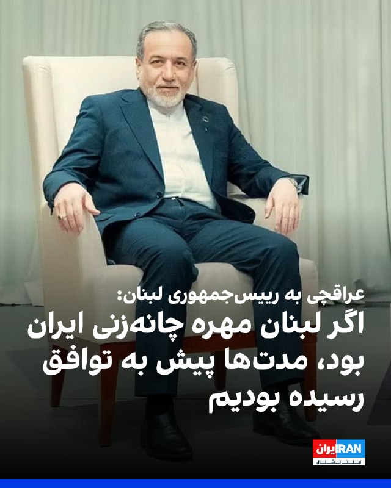

عراقچی در واکنش به انتقادات شدید رییس‌جمهوری لبنان از جمهوری اسلامی مبنی بر اینکه حکومت ایران لبنان را به «مهره چانه‌زنی» خود تبدیل کرده است، در ایکس نوشت: «اگر لبنان مهره چانه‌زنی ایران بود، مدت‌ها پیش به توافق رسیده بودیم. آقای رییس‌جمهور، لبنان را از دشمن واقعی‌اش نجات دهید.»
عراقچی گفت: «بر اساس اظهارات آقای عون، ممکن است تصور شود این ایران است که یک‌پنجم لبنان را اشغال کرده، یک‌چهارم لبنانی‌ها را آواره کرده و هر روز کشور او را بمباران می‌کند.»
https://iranintl.com/202606065114

## IranIntlTV — post 340755

  

سپاه در بیانیه‌ای با اشاره به اخطار خود در ساعت ۱:۳۰ بامداد شنبه به چهار نفتکش که قصد خروج از تنگه هرمز را داشتند، گفت یکی از این نفتکش‌ها را هدف قرار داده و متوقف کرده است و دیگر شناورها نیز به عقب برگشتند.
طبق این بیانیه، در ساعت ۲:۳۰ بامداد نیز پهپادهای آمریکایی یک دکل مخابراتی در قشم و یک دکل را در سیریک با دو پرتابه هدف قرار دادند که نیروهای هوافضای سپاه متقابلا با موشک‌های بالستیک به پایگاه هوایی علی‌السالم آمریکا در کویت و تاسیسات ناوگان پنجم نیروی دریایی آمریکا در بحرین حمله کردند.
در همین حال، ستاد فرماندهی مرکزی آمریکا، سنتکام، در بیانیه‌ای با اشاره به اینکه در حال حاضر گزارشی از آسیب به نیروهای آمریکایی وجود ندارد، اظهارات مقام‌های سپاه درباره آسیب زدن به مقر ناوگان پنجم آمریکا در بحرین را تکذیب کرد.

https://iranintl.com/202606065344

## IranIntlTV — post 340754

  

ستاد فرماندهی مرکزی آمریکا، سنتکام، اعلام کرد نیروهای آمریکا چندین موشک بالستیک و پهپاد جمهوری اسلامی، از جمله شش موشک شلیک‌شده به سوی کویت و بحرین را رهگیری کردند.
به گفته سنتکام، جمهوری اسلامی هفت موشک بالستیک به سوی کویت و بحرین شلیک کرد که نیروهای آمریکا شش موشک را رهگیری کردند و موشک هفتم به هدف نرسید.
سنتکام با اشاره به اینکه در حال حاضر گزارشی از آسیب به نیروهای آمریکایی وجود ندارد، اظهارات مقام‌های سپاه درباره آسیب زدن به مقر ناوگان پنجم آمریکا در بحرین را تکذیب کرد.

https://iranintl.com/202606064471

## FarsiVOA — post 219740

🔺آمریکا به تاج و مقامات فدراسیون فوتبال ویزا نداد

▪️آمریکا برای مهدی تاج و شماری از مقام‌های فدراسیون فوتبال جمهوری اسلامی ویزا صادر نکرد؛ در حالی که منابع آمریکایی می‌گویند همه بازیکنان تیم ملی ایران مجوز ورود به آمریکا را دریافت کرده‌اند.

▪️نیویورک‌تایمز به نقل از چهار مقام ارشد آمریکایی گزارش داد که درخواست ویزای همه ۲۶ بازیکن تیم ملی ایران پذیرفته شده، اما بسیاری از اعضای کادر همراه تیم اجازه ورود نگرفته‌اند.

▪️بر اساس این گزارش، مهدی تاج، رئیس فدراسیون فوتبال جمهوری اسلامی، در میان افرادی است که ویزای آنها صادر نشده است.

▪️رویترز هم نوشت که طبق گزارش خبرگزاری فارس، ویزای برخی اعضای کادر فنی و اجرایی صادر نشده و آمریکا از صدور آن خودداری کرده است.

⬇️ بیشتر بخوانید:
https://ir.voanews.com/a/8157951.html

## FarsiVOA — post 219739

  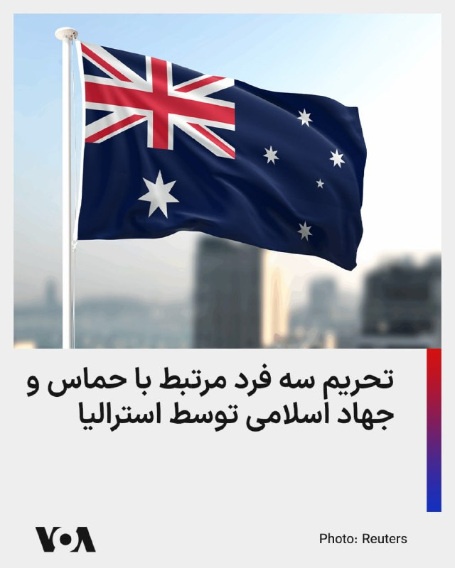

استرالیا سه فرد مرتبط با حماس و جهاد اسلامی فلسطین را به اتهام نقش داشتن در تأمین مالی تروریسم تحریم کرد.

وزارت خارجه استرالیا روز شنبه اعلام کرد این تحریم‌ها در چارچوب مقررات مقابله با تأمین مالی تروریسم اعمال شده و هدف آن دشوارتر کردن جذب نیرو، تأمین مالی حملات و گسترش ایدئولوژی این گروه‌هاست.

به گفته دولت استرالیا، افراد تحریم‌شده از رهبران ارشد و تسهیل‌کنندگان مالی حماس و جهاد اسلامی فلسطین هستند و در هدایت یا تأمین مالی فعالیت‌های تروریستی این گروه‌ها نقش داشته‌اند. نام این افراد در بیانیه کوتاه وزارت خارجه استرالیا اعلام نشده است.

بر اساس قوانین تحریمی استرالیا، استفاده، انتقال یا در اختیار قرار دادن دارایی برای افراد و نهادهای فهرست‌شده جرم محسوب می‌شود و نقض این مقررات می‌تواند به جریمه‌های سنگین و تا ۱۰ سال زندان منجر شود.

استرالیا پیش‌تر نیز حماس و جهاد اسلامی فلسطین را در فهرست گروه‌های تروریستی قرار داده بود و پس از جنگ غزه، همراه با برخی شرکای غربی، فشار مالی و حقوقی بر شبکه‌های مرتبط با این گروه‌ها را افزایش داده است.
@FarsiVOA

## FarsiVOA — post 219738

Farsi VOA pinned an audio file

## FarsiVOA — post 219737

  <a href="https://t.me/farsivoa/219737" target="_blank">📎 Download file</a>

🔴📢‌ پادکست خبری پنجشنبه ۱۵خرداد ۱۴۰۵

🛜در صورتی که با مشکل اینترنت مواجه هستید میتوانید اخبار صدای آمریکا را از نسخه‌های پادکست خبری ما روزانه دنبال کنید و یا اخبار را از نسخه سبک وب‌سایت ما پیگیر باشید:
https://ir.voanews.com/lite

📡بروزترین فرکانسهای ماهواره‌ای را نیز میتوانید از صفحه زیر پیگیری کنید:
https://ir.voanews.com/satellite

🔔دیگر شبکه‌های اجتماعی ما را هم دنبال کنید:
https://linktr.ee/voafarsi

ما را به اشتراک بگذارید
@farsivoa

## FarsiVOA — post 219736

  <a href="telegram/content/FarsiVOA_219736_1780726581.mp4" target="_blank">🎬 Download video</a>

⚡️ویدیوی سنتکام از حمله جدید به مواضع جمهوری اسلامی در گروک و قشم در پی حملات پهپادی رژیم به کشتیرانی
@FarsiVOA

## FarsiVOA — post 219735

🔺آمریکا پرواز پهپادها را در اطراف محل‌های جام جهانی ممنوع کرد

▪️اداره هوانوردی فدرال آمریکا اعلام کرد همزمان با برگزاری جام جهانی ۲۰۲۶، پرواز پهپادها در اطراف ورزشگاه‌ها، محل‌های رویدادهای هواداری، اقامتگاه‌های تیم‌ها، و مراکز تمرین در شهرهای میزبان آمریکا ممنوع خواهد بود.

⬇️ بیشتر بخوانید:
https://ir.voanews.com/a/drones-banned-near-world-cup/8157763.html
@FarsiVOA

## FarsiVOA — post 219734

🔺سنتکام: شش موشک شلیک‌شده جمهوری اسلامی به کویت و بحرین رهگیری شد و موشک هفتم به هدفش نرسید

▪️ستاد فرماندهی مرکزی آمریکا، سنتکام جمعه شب به وقت واشنگتن اعلام کرد که نیروهای آمریکایی (۵ ژوئن) چندین موشک بالستیک و پهپاد جمهوری اسلامی را که به سمت تنگه هرمز و کشورهای همسایه در خلیج فارس شلیک شده بودند، رهگیری کردند.

⬇️ بیشتر بخوانید:
https://ir.voanews.com/a/8157949.html
@FarsiVOA

## FarsiVOA — post 219733

🔺حملات موشکی سپاه به کویت و بحرین پس از اقدام دفاعی سنتکام علیه جمهوری اسلامی

▪️ستاد فرماندهی مرکزی آمریکا (سنتکام) جمعه شب به وقت واشنگتن گفت نیروهای آمریکایی چهار پهپاد تهاجمی یک‌طرفه جمهوری اسلامی را که به سمت تنگه هرمز پرواز کرده بودند، سرنگون کردند.

⬇️ بیشتر بخوانید:
https://ir.voanews.com/a/8157948.html
@FarsiVOA

## DW_Farsi — post 125551

  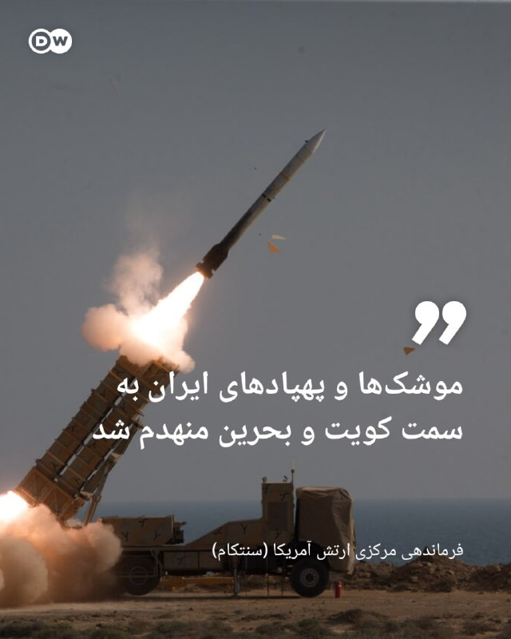

🔶 سنتکام: موشک‌ها و پهپادهای ایران به سمت کویت و بحرین منهدم شد

فرماندهی مرکزی ارتش آمریکا (سنتکام) صبح روز شنبه ۱۶ خرداد (۶ مه) در بیانیه‌ای از رهگیری و انهدام چندین موشک بالستیک و پهپاد ایرانی خبر داد.

طبق داده‌های سنتکام، همه این پهپادها و موشک‌ها از سوی ایران به سمت تنگه هرمز و کشورهای همسایه حوزه خلیج فارس (کویت و بحرین) شلیک شده بودند.

خبرگزاری رویترز نیز هم‌زمان با بیانیه سنتکام گزارش داد که وزارت کشور بحرین بامداد شنبه ۱۶ خرداد آژیر حمله هوایی را فعال کرد. وزارت کشور بحرین از شهروندان خود خواست به نزدیک‌ترین محل امن بروند.

خبرگزاری فرانسه بامداد روز شنبه گزارش داد صدای چندین انفجار در کویت شنیده شد. بر اساس این گزارش، چندین انفجار در مناطق نزدیک فرودگاه بین‌المللی کویت شنیده شده است. ارتش کویت اعلام کرد که در حال مقابله با "حملات موشکی و پهپادی خصمانه" است.

@dw_farsi

## DW_Farsi — post 125550

  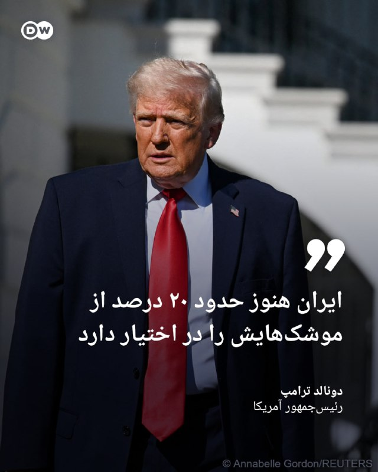

🔶 ترامپ: ایران هنوز حدود ۲۰ درصد از موشک‌هایش را در اختیار دارد

دونالد ترامپ، رئیس‌جمهور آمریکا، شامگاه جمعه ۱۵ خرداد (۵ ژوئن) در گفت‌وگو با شبکه "ان‌بی‌سی نیوز" اعلام کرد ایران همچنان توانایی‌هایی در اختیار دارد و دارای تعدادی موشک و پهپاد است و احتمالا حدود ۲۱ یا ۲۲ درصد از موشک‌های ایران باقی مانده است.

به گفته ترامپ، این میزان همچنان قابل توجه است، اما دیگر مانند زمانی نیست که نخستین حمله آغاز شده بود. او همچنین تاکید کرد بیشتر کارخانه‌های تولید پهپاد نابود شده‌اند، بسیاری از سکوهای پرتاب از بین رفته‌اند و بخش عمده تاسیسات تولید موشک نیز تخریب شده است.

بر اساس این برآورد که "بیش از ۲۰ درصد از موشک‌های ایران باقی مانده‌اند"، رئیس‌جمهور آمریکا تعداد موشک‌های باقی‌مانده ایران را بیشتر از ارزیابی قبلی خود اعلام کرده است. ترامپ پیش‌تر در ماه مه گفته بود که تنها ۱۸ درصد از موشک‌های ایران باقی مانده است.

ترامپ پس از آغاز جنگ ائتلاف آمریکا و اسرائیل علیه جمهوری اسلامی در ۲۸ فوریه در مقطعی حتی گفته بود که توانمندی‌های جنگی تهران به‌طور کامل نابود شده‌اند.

@dw_farsi

## Persian_Trend_Official — post 15786

حمله موشکی ایران مرکز فرماندهی عملیات هوایی آمریکا در قطر را از کار انداخت!

منابع آمریکایی گزارش داده‌اند که چند موشک بالستیک ایران در هفته‌های ابتدایی جنگ، مرکز عملیات هوایی ترکیبی نیروی هوایی آمریکا (CAOC) در پایگاه العدید قطر را هدف قرار داده و خسارات سنگینی به آن وارد کرده‌اند.

بر اساس این گزارش، این مرکز که بیش از دو دهه نقش اصلی در هدایت عملیات‌های هوایی آمریکا در خاورمیانه را بر عهده داشت، پس از حمله عملاً غیرقابل استفاده شده است.

همچنین گفته می‌شود در زمان حمله هیچ نیرویی در این مرکز حضور نداشته و تلفات انسانی ثبت نشده است، زیرا فرماندهی عملیات از پیش به تأسیسات دیگری در خاک آمریکا منتقل شده بود.

در صورت تأیید، این حمله یکی از مهم‌ترین ضربات واردشده به زیرساخت‌های فرماندهی آمریکا در منطقه محسوب می‌شود و نشان می‌دهد مراکز کلیدی کنترل و هدایت عملیات‌های نظامی نیز در تیررس موشک‌های ایران قرار داشته‌اند.

📌 @persian_trend_official
پرشین ترند | متفاوت‌ترین کانال نظام

## Persian_Trend_Official — post 15785

  <a href="telegram/content/Persian_Trend_Official_15785_1780726582.mp4" target="_blank">🎬 Download video</a>

صبحتون بخیر 🌄
SU-57 Felon

📌 @persian_trend_official
پرشین ترند | متفاوت‌ترین کانال نظامی

## Persian_Trend_Official — post 15784

  <a href="telegram/content/Persian_Trend_Official_15784_1780726584.mp4" target="_blank">🎬 Download video</a>

🇧🇭حمله به یک ایستگاه پلیس در منامه؛ گروهی با عنوان «مقاومت بحرین» مسئولیت را بر عهده گرفت

گزارش‌ها از بحرین حاکی است گروهی که خود را «مقاومت بحرین» معرفی می‌کند، یک ایستگاه پلیس در منامه را به آتش کشیده و مسئولیت این اقدام را بر عهده گرفته است.

در صورت تأیید، این حادثه می‌تواند نشانه‌ای از افزایش فعالیت گروه‌های معارض در بحرین باشد. هرگونه حمله به مراکز امنیتی در منامه از منظر امنیت داخلی و ثبات کشورهای حاشیه خلیج فارس دارای اهمیت ویژه‌ای است و ممکن است با واکنش سخت‌گیرانه نهادهای امنیتی بحرین همراه شود.

👺Phantom

📌 @persian_trend_official

پرشین ترند | متفاوت‌ترین کانال نظامی

## Persian_Trend_Official — post 15783

ویدیو منتشر شده توسط سنتکام از حملات ساعاتی پیش خود به جزیره قشم

👺Phantom

📌 @persian_trend_official
پرشین ترند | متفاوت‌ترین کانال نظامی

## Persian_Trend_Official — post 15782

به گزارش ایسنا، روابط عمومی سپاه پاسداران انقلاب اسلامی اعلام کرد: بسم الله القاصم الجبارین فَمَنِ اعْتَدَیٰ عَلَیْکُمْ فَاعْتَدُوا عَلَیْهِ بِمِثْلِ مَا اعْتَدَیٰ عَلَیْکُمْ ساعت ۱:۳۰ بامداد امروز چهار فروند نفتکش متخلف با تحریک و هدایت ارتش متجاوز آمریکا…

## Persian_Trend_Official — post 15781

  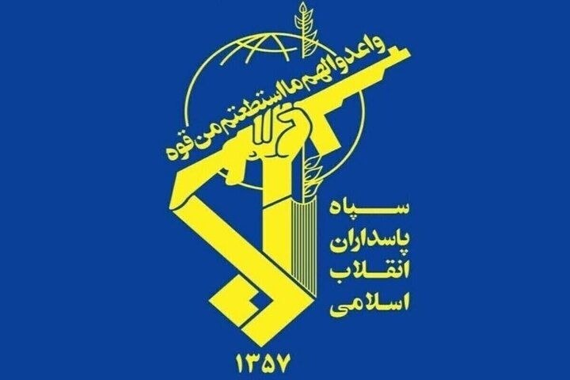

به گزارش ایسنا، روابط عمومی سپاه پاسداران انقلاب اسلامی اعلام کرد:

بسم الله القاصم الجبارین

فَمَنِ اعْتَدَیٰ عَلَیْکُمْ فَاعْتَدُوا عَلَیْهِ بِمِثْلِ مَا اعْتَدَیٰ عَلَیْکُمْ

ساعت ۱:۳۰ بامداد امروز چهار فروند نفتکش متخلف با تحریک و هدایت ارتش متجاوز آمریکا بدون هماهنگی و بدون توجه به اخطارهای مکرر نیروی دریایی سپاه، قصد خروج غیر قانونی از تنگه هرمز را داشتند که پس از اخطار، یکی از نفتکش ها مورد هدف واقع شده و متوقف شد و دیگر شناورها متخلف به عقب برگشتند.

به دنبال این واقعه ساعت ۲:۳۰ بامداد، پهپادهای آمریکایی یک دکل مخابراتی در قشم و یک دکل را در سیریک مورد اصابت دو پرتابه قرار دادند. در پاسخ به تجاوز ارتش کودک کش آمریکا بلافاصله دو پایگاه هوایی آمریکا به نام‌های علی‌السالم کویت و تاسیسات مهم باقی مانده در ناوگان پنجم نیروی دریایی آمریکا در بحرین هدف آتش موشک های بالستیک نیروی هوافضای سپاه واقع شدند.

به دشمن متجاوز و کودک‌کش اخطار می کنیم در صورت تکرار این شرارت ها به پاسخ محدود اکتفا نخواهد شد. مسئول عواقب بسته شدن کامل تنگه هرمز به روی خروج نفت و گاز شما خواهید بود.

و ما النصر الا من عند الله العزیز الحکیم»

👺Phantom

📌 @persian_trend_official
پرشین ترند | متفاوت‌ترین کانال نظامی

## RadioFarda — post 157951

  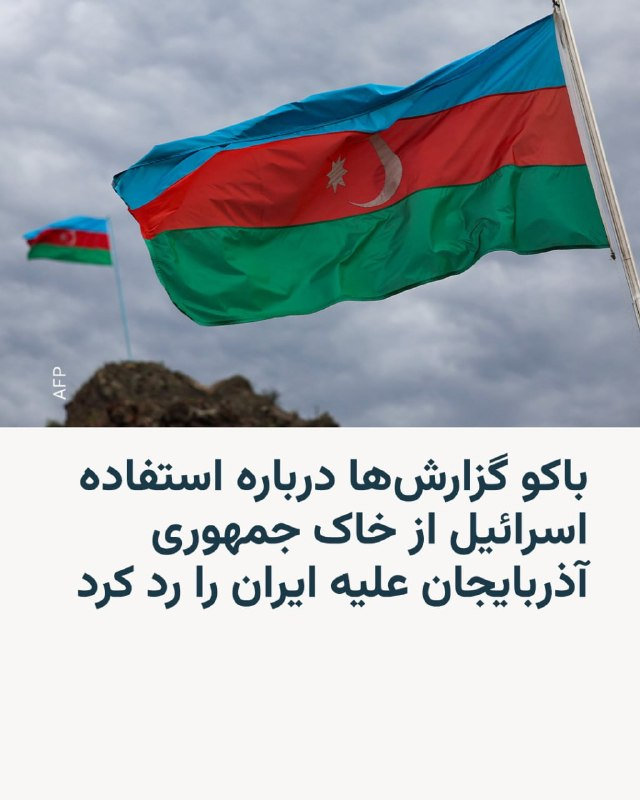

🔸وزارت خارجه جمهوری آذربایجان روز جمعه گزارش‌های برخی رسانه‌های بین‌المللی درباره فعالیت احتمالی نیروهای نظامی و اطلاعاتی اسرائیل از خاک این کشور در جریان جنگ ایران را «کاملاً بی‌اساس» خواند.

🔸آیتان حاجی‌زاده، سخنگوی وزارت خارجه جمهوری آذربایجان، در گفت‌وگو با یورونیوز گفت باکو «هرگز خاک خود را برای هیچ اقدام زیان‌باری علیه کشور ثالث، از جمله ایران، در اختیار نگذاشته است».

🔸او افزود اگر کسی مدرکی در این زمینه ارائه کند، جمهوری آذربایجان آماده بررسی آن خواهد بود، اما تأکید کرد که خاک این کشور «هرگز علیه کشورهای همسایه و دوست» استفاده نخواهد شد.

🔸شبکه خبری سی‌ان‌ان وز جمعه ۱۵ خرداد «به نقل از چهار منبع آگاه» نوشهت بود که اسرائیل در جریان جنگ ایران، به‌صورت محرمانه تعدادی از نیروهای نخبه نظامی و اطلاعاتی خود را در جمهوری آذربایجان مستقر کرد.

🔸جمهوری آذربایجان حدود ۷۰۰ کیلومتر مرز مشترک با ایران دارد و همزمان روابط نزدیک اقتصادی و امنیتی با اسرائیل را حفظ کرده است.

@RadioFarda

## RadioFarda — post 157950

  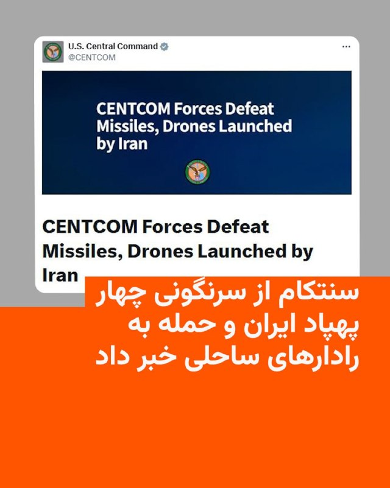

🔸سنتکام، فرماندهی مرکزی آمریکا، در تازه‌ترین پیام خود در مورد تحولات بامداد شنبه نوشت که «ارزیابی‌های اولیه نشان می‌دهد که شش فروند از موشک‌های پرتاب‌شده توسط ایران رهگیری شده‌اند و موشک هفتم به هدف مورد نظر خود نرسیده است. در حال حاضر هیچ گزارشی مبنی بر آسیب به پرسنل ایالات متحده وجود ندارد و ادعاهای ایران مبنی بر آسیب رساندن به مقر ناوگان پنجم ایالات متحده در بحرین کذب است.»

🔸این بیانیه توضیح داده است که «نیروهای ایالات متحده در ۵ ژوئن، چندین موشک بالستیک ایرانی و پهپاد پرتاب‌شده از سوی ایران به سمت تنگۀ هرمز و همسایگان خلیج [فارس] را رهگیری کردند. ایران چند ساعت پس از آنکه فرماندهی مرکزی ایالات متحده (سنتکام) چهار پهپاد انتحاری ایرانی پرتاب‌شده به سمت تنگۀ هرمز را سرنگون کرد، هفت موشک بالستیک به سمت کویت و بحرین شلیک کرد. این پهپادهای مهاجم تهدیدی فوری برای تردد دریایی منطقه ایجاد می‌کردند. نیروهای ایالات متحده متعاقباً برای دفاع در برابر حملات دریایی بیشتر، سایت‌های رادار مراقبت ساحلی ایران را در گروک و جزیرۀ قشم هدف قرار دادند.»

@RadioFarda

## RadioFarda — post 157949

  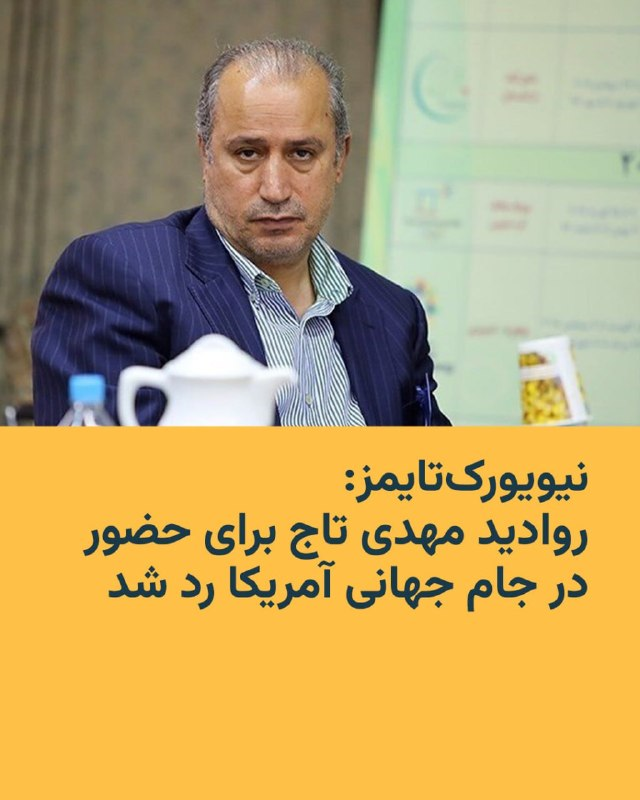

🔸در حالی که بازیکنان تیم ملی فوتبال ایران پس از ماه‌ها ابهام، برای حضور در جام جهانی آمریکا روادید دریافت کرده‌اند، گزارش شده است که درخواست روادید مهدی تاج، رئیس فدراسیون فوتبال ایران، رد شده است.

🔸به گزارش نیویورک‌تایمز به نقل از چهار مقام ارشد، درخواست همهٔ ۲۶ بازیکن ایران پذیرفته شده، اما بیش از ده نفر از اعضای کادر پشتیبانی و مسئولان فدراسیون که قرار بود تیم را همراهی کنند، اجازه ورود به آمریکا نگرفته‌اند.

🔸یکی از این مقام‌ها گفته است روادید مهدی تاج، که سابقه فرماندهی در سپاه پاسداران انقلاب اسلامی دارد، نیز رد شده است. آمریکا و کانادا سپاه پاسداران را یک نهاد تروریستی معرفی کرده‌اند.

🔸ساعاتی پیشتر، خبرگزاری فارس هم نوشته بود که ویزای برخی اعضای کادر فنی و اجرایی تیم ملی هنوز صادر نشده و «سفارت آمریکا تاکنون از صدور آن خودداری کرده است.»

🔸تیم ملی ایران قرار است نخستین بازی خود را روز ۱۵ ژوئن در لس‌آنجلس مقابل نیوزیلند برگزار کند و سپس در همین شهر با بلژیک و در سیاتل با مصر روبه‌رو شود.

@RadioFarda

## RadioFarda — post 157948

  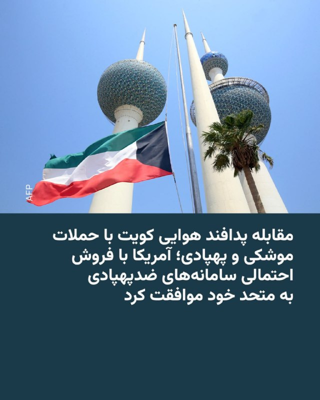

🔸ارتش کویت بامداد شنبه ۱۶ خرداد اعلام کرد پدافند هوایی این کشور در حال مقابله با حملات «خصمانه» موشکی و پهپادی است.

🔸ستاد کل نیروهای مسلح کویت در پیامی در شبکه اجتماعی ایکس، بدون اشاره به منشأ این حملات، اعلام کرد: «پدافند هوایی کویت در حال پاسخ به حملات خصمانه موشکی و پهپادی است.»

🔸ارتش کویت افزود هرگونه صدای انفجار احتمالی، ناشی از رهگیری این حملات توسط سامانه‌های پدافند هوایی این کشور است.

🔸این تحولات چند روز پس از حمله‌ای رخ می‌دهد که فرودگاه بین‌المللی کویت را هدف قرار داد و یک کشته و ده‌ها زخمی برجای گذاشت.

🔸وزارت خارجه آمریکا روز جمعه اعلام کرد با فروش احتمالی سامانه‌های مقابله با هواپیماهای بدون سرنشین و تجهیزات مرتبط به کویت، به ارزش یک میلیارد و ۹۸۰ میلیون دلار، موافقت کرده است.

🔸وزارت خارجه آمریکا در بیانیه‌ای اعلام کرد شرکت اندوریل پیمانکار اصلی این فروش خواهد بود.

🔸وزارت خارجه کویت روز چهارشنبه ۱۳ خرداد اعلام کرد در حملهٔ پهپادی ایران به «تأسیسات غیرنظامی» این کشور، از جمله فرودگاه بین‌المللی کویت و برخی نمایندگی‌های دیپلماتیک، یک نفر کشته شده است.

@RadioFarda

## RadioFarda — post 157947

  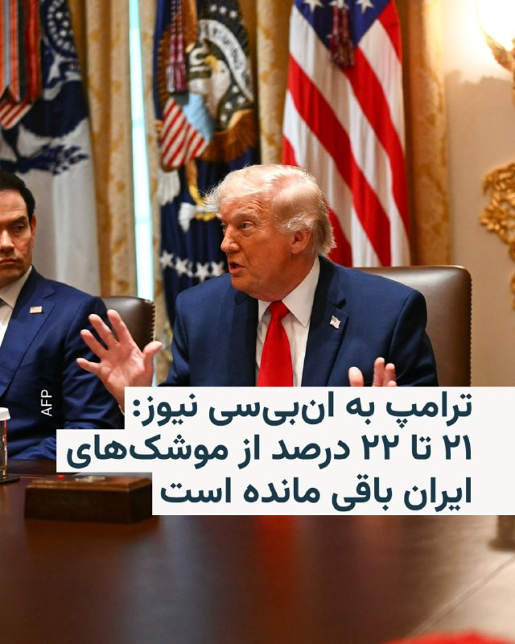

🔸بر اساس مصاحبه‌ای با برنامۀ «میت د پرس» شبکۀ ان‌بی‌سی نیوز در روز جمعه، دونالد ترامپ، رئیس‌جمهور ایالات متحده، گفته است که ایران هنوز ۲۱ تا ۲۲ درصد از موشک‌های خود را در اختیار دارد.

🔸در ان‌بی‌سی نیوز به نقل از ترامپ آمده است: «آن‌ها تعدادی موشک دارند، تعدادی پهپاد دارند. اگر بخواهم بر اساس درصد بگویم، شاید ۲۱ یا ۲۲ درصد از موشک‌هایشان باقی مانده باشد. این تعداد موشک زیادی است، اما با آنچه در اولین حملۀ ما داشتند قابل مقایسه نیست.»

🔸دونالد ترامپ در بخش دیگری از این مصاحبه در رابطه با ایران گفت: «آن‌ها قوی هستند، آن‌ها مغرورند، کارهایی هست که هرگز فکرش را هم نمی‌کردند انجام دهند اما اکنون مجبور به انجامش خواهند شد. آن‌ها چارهٔ دیگری ندارند و این کار کمی زمان می‌برد.»

@RadioFarda

## RadioFarda — post 157946

  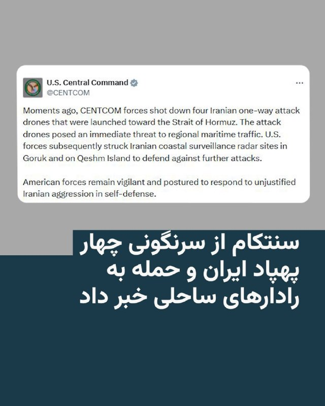

🔸سنتکام، فرماندهی مرکزی آمریکا، بامداد شنبه ۱۶ خرداد در پیامی در شبکه ایکس نوشت که «نیروهای سنتکام لحظاتی پیش چهار پهپاد تهاجمی یک‌طرفه ایرانی را که به سوی تنگه هرمز پرتاب شده بودند، سرنگون کردند. این پهپادهای تهاجمی تهدیدی فوری برای تردد دریایی منطقه‌ای ایجاد کرده بودند.»

🔸این پیام افزوده است که «نیروهای آمریکایی سپس برای جلوگیری از حملات بیشتر، سایت‌های رادار مراقبت ساحلی ایران را در گُروک و جزیره قشم هدف قرار دادند. نیروهای آمریکایی همچنان هوشیارند و برای پاسخ به آنچه «تجاوز بی‌دلیل ایران» در چارچوب دفاع از خود خوانده شده، در وضعیت آمادگی قرار دارند.»

🔸این عملیات دست‌کم چهارمین حملهٔ اعلام‌شدهٔ آمریکا در قالب «دفاع از خود» علیه اهداف ایرانی از زمان برقراری آتش‌بس در اوایل آوریل به شمار می‌رود.

🔸از جمله، هفته گذشته، آمریکا اعلام کرد در پاسخ به اقدامات تهاجمی ایران و سرنگونی یک پهپاد آمریکایی، مواضعی را در منطقهٔ گروک در سیریک هرمزگان و جزیره قشم هدف قرار داده و پدافند هوایی، یک ایستگاه کنترل زمینی و دو پهپاد ایران را از میان برده است.

@RadioFarda

## RadioFarda — post 157945

  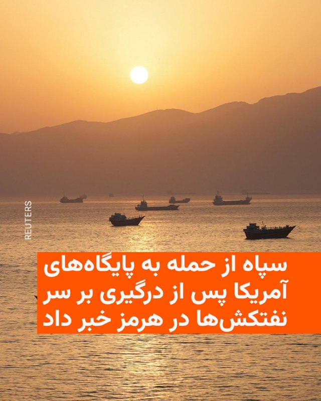

🔸کمی پس از اعلام خبر رهگیری حملات موشکی و پهپادی توسط پدافند کویت، روابط عمومی سپاه پاسداران، بامداد شنبه، با انتشار بیانیه‌ای اعلام کرد: «به دنبال حملات ارتش آمریکا به سیریک و جزیره قشم، پایگاه‌های دشمن در منطقه مورد اصابت موشک‌های هوافضا قرار گرفتند».

🔸در این بیانیه این‌گونه آمده است که «ساعت ۰۱٫۳۰ بامداد امروز چهار فروند نفتکش متخلف با تحریک و هدایت ارتش ... آمریکا بدون هماهنگی و بدون توجه به اخطارهای مقرر نیروی دریایی سپاه، قصد خروج غیرقانونی از تنگه هرمز را داشتند که پس از اخطار، یکی از نفتکش‌ها مورد هدف واقع شده و متوقف شد و دیگر شناورها متخلف به عقب برگشتند.»

🔸این بیانیه می‌افزاید که «به دنبال این واقعه، ساعت دو، پهپادهای آمریکایی یک دکل مخابراتی در قشم و یک دکل را در سیریک مورد اصابت دو پرتابه قرار دادند. در پاسخ به تجاوز ارتش آمریکا بلافاصله ... پایگاه هوایی علی‌السالم آمریکا در کویت و تأسیسات مهم باقی‌مانده در ناوگان پنجم نیروی دریایی آمریکا در بحرین هدف موشک‌های ایران قرار گرفتند.»

@RadioFarda

## RadioFarda — post 157944

  <a href="https://t.me/radiofarda/157944" target="_blank">📎 Download file</a>

📻بشنوید: سرخط خبرها با رادیوفردا، ۱۶ خرداد ۱۴۰۵‌

@RadioFarda

## BBCPersian — post 282960

🔻روایت متفاوت سپاه پاسداران از آغاز درگیری تازه در تنگه هرمز

🔻سپاه پاسداران می‌گوید که «دو پایگاه هوایی آمریکا در کویت به نام‌های علی‌السالم و تاسیسات مهم باقی مانده در ناوگان پنجم نیروی دریایی آمریکا در بحرین هدف آتش موشک های بالستیک نیروی هوافضای سپاه واقع شدند.»

سپاه پاسداران مدعی شده است که بامداد امروز چهار فروند نفتکش «متخلف با تحریک و هدایت ارتش آمریکا بدون هماهنگی و بدون توجه به اخطارهای مقرر نیروی دریایی سپاه، قصد خروج غیر قانونی از تنگه هرمز را داشتند که پس از اخطار، یکی از نفتکش ها مورد هدف واقع شده و متوقف شد و دیگر شناورها متخلف به عقب برگشتند.»

در بیانیه سپاه آمده است که در پی این واقعه «پهپادهای آمریکایی یک دکل مخابراتی در قشم و یک دکل را در سیریک مورد اصابت دو پرتابه قرار دادند.»

این در حالی است که سنتکام اعلام کرد که چهار پهپاد ایرانی را که به سمت تنگه هرمز پرتاب شده بودند، سرنگون کرده و سپس سایت‌های راداری ایران در گوروک و جزیره قشم را هدف قرار داده است.

https://bbc.in/4eeKZFU
@BBCPersian

## BBCPersian — post 282959

🔻عراقچی در واکنش به جوزف عون: اگر لبنان برگ چانه‌زنی ایران بود، مدت‌ها پیش با آمریکا توافق می‌کردیم

🔻عباس عراقچی، وزیر خارجه ایران، در واکنش به اظهارات جوزف عون، رئیس‌جمهور لبنان، گفت که اگر لبنان «برگ چانه‌زنی» ایران در مذاکرات با آمریکا بود، تهران می‌توانست مدت‌ها پیش به توافق با واشنگتن دست پیدا کند.

او در شبکه ایکس همچنین نوشت: «بر اساس اظهارات آقای عون، ظاهرا این ایران است که یک پنجم خاک لبنان را اشغال کرده، یک چهارم لبنانی ها را آواره کرده و کشور او را روزانه بمباران می کند. لبنان را از دست دشمن واقعی خود نجات دهید، آقای رئیس جمهور.»

جوزف عون،‌ در گفت‌وگو با شبکه سی‌ان‌ان گفته بود که ایران و متحدش حزب‌الله از لبنان به‌عنوان «ابزار چانه‌زنی» در مذاکرات با آمریکا استفاده می‌کنند.

او تاکید کرد: «مردم لبنان به خاطر منافع ایران بهای این وضعیت را می‌پردازند و از جنگ میان اسرائیل و حزب‌الله خسته شده‌اند.»

آقای عون از ایران خواست که در کشورش دخالت نکند و همچنین به حزب‌الله گفت که دیپلماسی تنها راه حل درگیری با اسرائیل است.

رئيس جمهور لبنان در این گفتگو خطاب به سپاه پاسداران هم گفت: «این کشور شما نیست، کشور ماست... وظیفه شما نیست که در کشور ما دخالت کنید.»

https://bbc.in/4oaD8xr
@BBCPersian

## BBCPersian — post 282958

🔻کشته شدن یک فلسطینی در بمباران چادرهای آوارگان در خان‌یونس توسط اسرائیل

🔻شبکه تلویزیونی الجزیره قطر گزارش کرده که اسرائیل اقدام به بمباران چادرهای محل اسکان آوارگان فلسطینی در شهر خان‌یونس در جنوب نوار غزه کرده است.

براساس این گزارش در این حمله یک نفر کشته و یک نفر زخمی شده است.

این شبکه تلویزیونی گفته است این حمله در طول شب گذشته انجام شده بود.

https://bbc.in/4xbjoOr
@BBCPersian

## BBCPersian — post 282949

🖋️آنخل برمودز
بی‌بی‌سی موندو

🔻این اتفاق یک شب در اواخر ماه آوریل رخ داد.

یک کاروان نظامی ونزوئلا با نهایت احتیاط و پنهان‌کاری، مسیر ۱۶۰ کیلومتری میان مقر «موسسه تحقیقات علمی ونزوئلا» در حومه کاراکاس تا بندر پورتو کابیو در ایالت کارابوبو را طی کرد.

دلیل این عملیات شبانه و محرمانه تنها چند روز بعد آشکار شد: نیروهای نظامی خودرویی را اسکورت می‌کردند که یک محفظه حاوی حدود ۱۳ کیلوگرم اورانیوم با غنای بالا را حمل می‌کرد. این محموله‌ قرار بود به آمریکا منتقل شود.

در این عملیات خروج اورانیوم، دولت‌های ونزوئلا، آمریکا و بریتانیا، همراه با آژانس بین‌المللی انرژی اتمی مشارکت داشتند. بعدها اعلام شد که آن‌ها سال‌ها برای اطمینان از انجام ایمن این انتقال همکاری کرده بودند.

متن کامل خبر را از لینک زیر بخوانید:
https://bbc.in/49KBqwP
📷NNSA/ Vantor/ GettyImages/ Reuters/ AFP via Getty Images/ IAEA

@BBCPersian

## BBCPersian — post 282948

‌🔻سنتکام ویدئویی منتشر کرده است که به گفته این ستاد، لحظه هدف قرار گرفتن سایت‌های راداری ایران در گوروک و جزیره قشم را نشان می‌دهد.

سنتکام می‌گوید که در مقابله با «تهدیدی فوری علیه تردد دریایی»، نیروهای آمریکایی، این سایت‌ها را هدف قرار دادند.

پیشتر فرماندهی مرکزی ارتش آمریکا اعلام کرد که نیروهای آن کشور چهار پهپاد انتحاری پرتاب شده ایران به سمت تنگه هرمز را سرنگون کرده‌اند.
🎥 CENTCOM
@BBCPersian

## BBCPersian — post 282947

  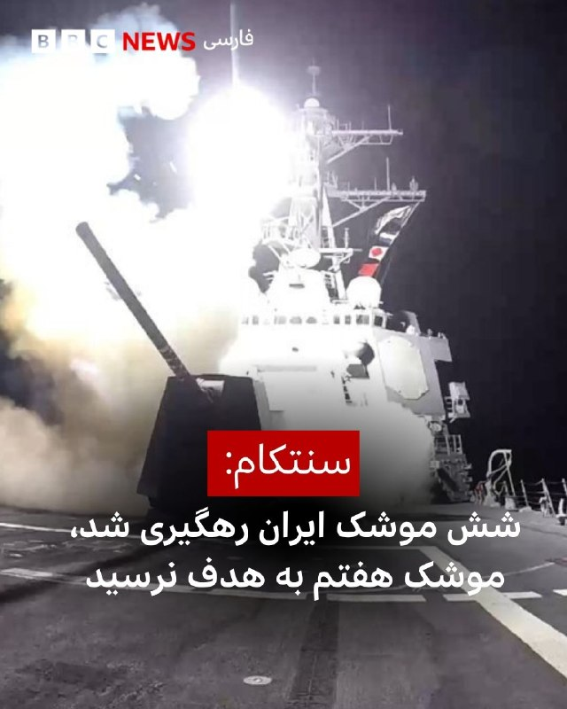

‌‌‌🔻ارتش آمریکا اعلام کرد که نیروهای آن کشور چندین موشک بالستیک و پهپاد ایرانی را که به سوی تنگه هرمز و کشورهای همسایه خلیج فارس شلیک شده بودند، رهگیری کرده‌اند.

فرماندهی مرکزی ارتش آمریکا (سنتکام) در شبکه ایکس نوشت که ایران ساعاتی پس از آنکه نیروهای آمریکایی چهار پهپاد انتحاری را که به سمت تنگه هرمز پرتاب شده بودند سرنگون کردند، هفت موشک بالستیک به سوی کویت و بحرین شلیک کرده است.

به گفته سنتکام، این حملات پس از آن بود که نیروهای آمریکایی برای مقابله با آنچه «تهدیدی فوری علیه تردد دریایی» خواندند، سایت‌های راداری نظارت ساحلی ایران در گوروک و جزیره قشم را هدف قرار دادند.

سنتکام اعلام کرد که ارزیابی‌های اولیه نشان می‌دهد که شش موشک شلیک‌شده رهگیری شده و موشک هفتم نیز به هدف مورد نظر نرسیده است.

ارتش آمریکا همچنین گفت گزارشی از آسیب دیدن نیروهای آمریکایی دریافت نشده و ادعاهای ایران درباره آسیب رسیدن به مقر ناوگان پنجم آمریکا در بحرین «نادرست» است.
ادامه این مطلب را اینجا بخوانید.

📸 CENTCOM/Handout/Anadolu via Getty Images
@‍‍‍‍‍‍‌‌BBCPersian

## BBCPersian — post 282946

  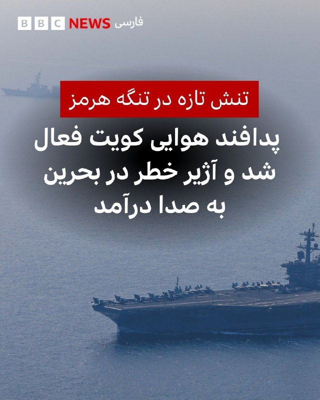

🔻ارتش آمریکا اعلام کرد که چهار پهپاد ایرانی را که به سمت تنگه هرمز پرتاب شده بودند، سرنگون کرده و سپس سایت‌های راداری ایران در گوروک و جزیره قشم را هدف قرار داده است. سنتکام گفت که این پهپادها تهدیدی فوری برای تردد دریایی در منطقه بودند و حمله به تاسیسات راداری برای جلوگیری از حملات بیشتر انجام شده است. همزمان ارتش کویت از فعال شدن سامانه‌های پدافند هوایی و رهگیری موشک‌ها و پهپادهای مهاجم خبر داد و در بحرین آژیر خطر به‌صدا درآمد.

ادامه این مطلب را در سایت بی‌بی‌سی فارسی بخوانید:
https://bbc.in/4fv4QCY

📸US CENTCOM/Handout/Anadolu via Getty Images
@BBCPersian

## alonews — post 125442

  <a href="telegram/content/alonews_125442_1780726592.webm" target="_blank">🎬 Download video</a>

👈یاسمین انصاری، نماینده کنگره آمریکا: دونالد ترامپ امروز در دفتر بیضی کاخ سفید، چند بار به خواب رفت، دوباره.

🔴به همین دلیل من خواستار اجرای متمم ۲۵ قانون اساسی شده‌ام، و ده‌ها نفر از همکارانم هم همین کار را کرده‌اند. ترامپ بیمار است و باید از سمت خود برکنار شود، این یک بحران امنیت ملی است.

✅ @AloNews خبر جنگ

## alonews — post 125441

  <a href="telegram/content/alonews_125441_1780726592.mp4" target="_blank">🎬 Download video</a>

👈 سنتکام ویدئوهای حمله به سایت‌های رادار ساحلی‌ایران در سیریک و جزیره قشم را منتشر و اعلام کرد حملات تلافی‌جویانه ایران به بحرین و کویت رهگیری شده است

✅ @AloNews خبر جنگ

## alonews — post 125440

  <a href="telegram/content/alonews_125440_1780726594.webm" target="_blank">🎬 Download video</a>

👈رئیس ستاد کل ارتش اسرائیل در دیدار با رؤسای شهرک‌های شمالی اعلام کرد:‌ «ما طرح‌هایی را برای گسترش عملیات‌های نظامی‌مان در لبنان به سطح سیاسی ارائه داده‌ایم.»

✅ @AloNews خبر جنگ

## alonews — post 125439

  <a href="telegram/content/alonews_125439_1780726594.webm" target="_blank">🎬 Download video</a>

👈پنتاگون سطح تهدید ضدجاسوسی اسرائیل را به بالاترین حد خود افزایش داده است، در حالی که نگرانی‌هایی وجود دارد که اطلاعات اسرائیل تلاش‌های خود را برای جمع‌آوری اطلاعات درباره بحث‌ها و تصمیم‌گیری‌های داخلی دولت ترامپ در مورد درگیری‌ها در خاورمیانه تشدید می‌کند، گزارش NBC News.

🔴 ارزیابی اخیر آژانس اطلاعات دفاعی، توانایی‌های جاسوسی انسانی و جمع‌آوری اطلاعات فنی اسرائیل را در سطح «بحرانی» ارزیابی کرده و به چندین حادثه اشاره کرده است که نگرانی‌ها را افزایش داده‌اند.

🔴 در حالی که اشتراک‌گذاری اطلاعات بین دو کشور بدون تغییر باقی مانده است، مقامات گفته‌اند که انتظار می‌رود کارکنان آمریکایی هنگام سفر به اسرائیل یا ملاقات با همتایان اسرائیلی احتیاط‌های بیشتری را رعایت کنند.

✅ @AloNews خبر جنگ

## alonews — post 125438

  <a href="telegram/content/alonews_125438_1780726594.webm" target="_blank">🎬 Download video</a>

👈پیش فروش بلیت‌ قطارهای مسافری برای بازه زمانی ۱۷ تا ۳۱ خرداد، از ساعت ۸:۳۰ امروز (شنبه، ۱۶ خرداد) آغاز شد.

🔴 پیش فروش بلیت در همه محورها از ساعت ۸:۳۰ تا ۱۱ صبح روز شنبه (۱۶ خرداد ماه) از طریق سکوهای مجاز فروش اینترنتی بلیت آغاز شد.

✅ @AloNews خبر جنگ

## alonews — post 125437

  <a href="telegram/content/alonews_125437_1780726594.webm" target="_blank">🎬 Download video</a>

👈عراقچی به رئیس‌جمهور لبنان؛لبنان را از دست دشمن واقعی خود نجات دهید

🔴براساس اظهارات آقای عون، ظاهرا این ایران است که یک پنجم خاک لبنان را اشغال کرده، یک چهارم لبنانی‌ها را آواره کرده و کشور او را روزانه بمباران می‌کند.

🔴اگر لبنان برای ایران ابزار چانه‌زنی بود، ما مدت ها پیش به توافق رسیده بودیم.

🔴لبنان را از دست دشمن واقعی خود نجات دهید، آقای رئیس‌جمهور!

✅ @AloNews خبر جنگ

## alonews — post 125436

  <a href="telegram/content/alonews_125436_1780726594.webm" target="_blank">🎬 Download video</a>

👈پوتین: روسیه هیچ سلاحی به ایران تحویل نداده و تهران نیز درخواستی برای آن نکرده است.

✅ @AloNews خبر جنگ

## alonews — post 125434

  <a href="telegram/content/alonews_125434_1780726595.webm" target="_blank">🎬 Download video</a>

👈کیم جونگ اون و دخترش (جانشین آیندش) در آزمایش‌های دریایی ناوشکن کانگ گون

✅ @AloNews خبر جنگ

## alonews — post 125433

  <a href="telegram/content/alonews_125433_1780726595.webm" target="_blank">🎬 Download video</a>

👈شبکه ان‌بی‌سی به نقل از مقامات آمریکایی گزارش داد که نگرانی‌هایی در داخل پنتاگون نسبت به تلاش‌های اسرائیل برای نظارت بر مقامات ارشد ایالات متحده وجود دارد

✅ @AloNews خبر جنگ

## alonews — post 125432

  <a href="telegram/content/alonews_125432_1780726595.webm" target="_blank">🎬 Download video</a>

👈چهار مقام ارشد آمریکایی به نیویورک‌تایمز اعلام کرده‌اند که درخواست ویزای تمام ۲۶ بازیکن تیم ملی ایران برای حضور در جام جهانی ۲۰۲۶ پذیرفته شده است.

🔴 بیش از ۱۲ نفر از اعضای کادر پشتیبانی (از جمله مربیان، آنالیزورها، پزشکان و فیزیوتراپ‌ها) و همچنین مقامات فدراسیون فوتبال ایران که قرار بود تیم را همراهی کنند، ویزایشان رد شده‌ است.

🔴 مهدی تاج رئیس فدراسیون فوتبال ایران موفق به دریافت ویزا نشده است.

✅ @AloNews خبر جنگ

## alonews — post 125431

  <a href="telegram/content/alonews_125431_1780726595.webm" target="_blank">🎬 Download video</a>

👈پس از حملات ایران به پایگاه آمریکایی‌ها در کویت، ستون دود در این پایگاه مشاهده شد

✅ @AloNews خبر جنگ

## alonews — post 125430

  <a href="telegram/content/alonews_125430_1780726595.webm" target="_blank">🎬 Download video</a>

👈سنتکام: نیروهای سنتکام چهار پهپاد حمله یک‌طرفه ایرانی را که به سمت تنگه هرمز پرتاب شده بودند، سرنگون کردند. این پهپادهای حمله تهدید فوری برای ترافیک دریایی منطقه ایجاد می‌کردند. نیروهای آمریکایی سپس سایت‌های رادار نظارت ساحلی ایرانی در گوروک و جزیره قشم را برای دفاع در برابر حملات بیشتر هدف قرار دادند.

🔴نیروهای آمریکایی همچنان هوشیار هستند و برای پاسخ به حملات بی‌دلیل ایران در دفاع از خود آماده‌اند.»

✅ @AloNews خبر جنگ

## alonews — post 125429

  <a href="telegram/content/alonews_125429_1780726596.webm" target="_blank">🎬 Download video</a>

👈کیهان: دولت پزشکیان بخاطر استقامتی که در جنگ نشان داده، دولتی پرافتخار است / محبوبیت پزشکیان بیشتر شده

✅ @AloNews خبر جنگ

## alonews — post 125428

  <a href="telegram/content/alonews_125428_1780726596.webm" target="_blank">🎬 Download video</a>

👈سی بی اس: تا الان هیچ کشتی‌ای توی تنگه هرمز به خاطر پهپادهایی که ایران فرستاده آسیب ندیده

✅ @AloNews خبر جنگ

## alonews — post 125427

  <a href="telegram/content/alonews_125427_1780726596.mp4" target="_blank">🎬 Download video</a>

👈پخش دیشب برنامه «خیابون انقلاب» بخاطر این حرفا لغو شد.

ما اسرائیل رو تهدید کردیم اگه کوچیک ترین خطایی کنه میزنیمش، الان لبنان رو با خاک یکسان کرده و ما هیچ کاری نمی کنیم.
ما همش الکی تهدید میکنیم اگه فلان کارو کنن مام فلان کارو میکنیم، خب چیشد پس؟ یه بار به دشمن نشون بدین که ترسو نیستین.

✅ @AloNews خبر جنگ

## alonews — post 125426

  <a href="telegram/content/alonews_125426_1780726597.webm" target="_blank">🎬 Download video</a>

👈نیروهای آمریکایی از هدف قرار دادن سایت‌های رادار نظارتی ساحلی ایران در قشم خبر دادند.

✅ @AloNews خبر جنگ

---
📅 بروزرسانی: 1405/03/16 05:48
---

## VahidOOnLine — post 243899

  

بهنام بن‌طالب‌لو، مدیر ارشد برنامه ایران در بنیاد دفاع از دموکراسی‌ها، در مطلبی در وب‌سایت این بنیاد با اشاره به آمار تانکر ترکرز درباره به صفر رسیدن صادرات نفت ایران در ماه مه در پی محاصره دریایی نوشت اقدام جمهوری اسلامی در بستن تنگه هرمز، معادله را به زیان حاکمان تهران تغییر داده است.
بر اساس داده‌های شرکت تانکر ترکرز، ایران در این ماه هیچ نفت خامی صادر نکرد و تنها ۲ میلیون بشکه نفتا صادر کرد که معادل حدود ۶۴ هزار بشکه در روز است.
این مطلب با تاکید بر اینکه محاصره دریایی آمریکا عملا شریان اصلی تامین مالی حکومت را قطع کرده است، نوشت: «اقدام جمهوری اسلامی در بستن تنگه هرمز، معادله را به زیان حاکمان تهران تغییر داده و توان مالی حکومت را هدف قرار داده است.»
بن‌طالب‌لو با اشاره به اینکه محاصره دریایی همچنان ابزار اصلی فشار اقتصادی آمریکا به شمار می‌رود، هشدار داد کنار گذاشتن این ابزار فشار اقتصاد کلان صرفا برای بازگرداندن تردد در خلیج فارس می‌تواند اشتباه راهبردی باشد.
او افزود اگر این اهرم اقتصادی زودتر از موعد کنار گذاشته شود، سیاست‌گذاران نباید انتظار امتیازهای عمده در مسائل گسترده‌تر امنیتی را داشته باشد.
‌🏁 🇬🇧 IranintlTV

🤖 @VahidOOnLine

## VahidOOnLine — post 243898

  

♦️روابط عمومی سپاه، بامداد شنبه، با انتشار بیانیه‌ای اعلام کرد: «به دنبال حملات ارتش آمریکا به سیریک و جزیره قشم، پایگاه‌های دشمن در منطقه مورد اصابت موشک‌های هوافضا قرار گرفتند».
‌🇸🇦 Indypersian

🤖 @VahidOOnLine

## VahidOOnLine — post 243897

  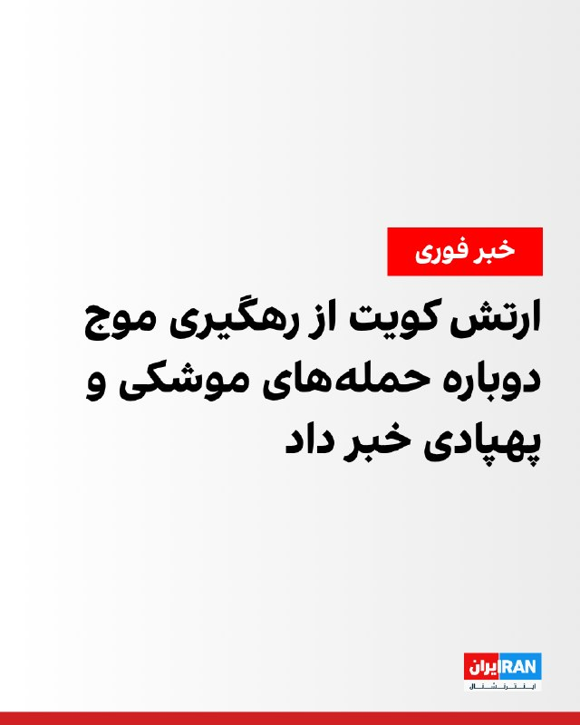

درپی موج دوم حمله‌های موشکی و پهپادی به کویت، آژیرهای خطر در این کشور فعال شدند و ارتش کویت از فعال شدن پدافند هوایی برای رهگیری این حمله‌ها خبر داد. دقایقی قبل نیز ارتش کویت از تلاش برای رهگیری موج دیگری حمله‌های موشکی و پهپادی خبر داده بود.
‌🏁 🇬🇧 IranintlTV

🤖 @VahidOOnLine

## VahidOOnLine — post 243896

  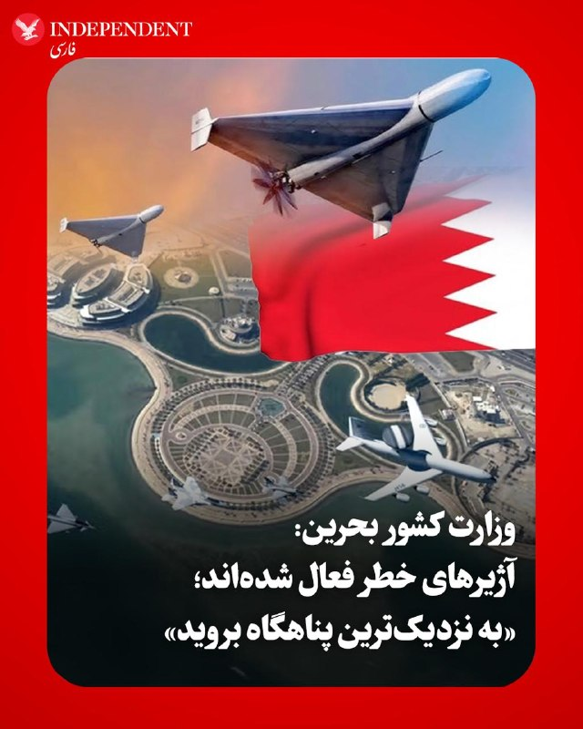

♦️وزارت کشور بحرین، بامداد شنبه، ۱۶ خردادماه، با انتشار دو بیانیه «فوری» در اکس اعلام کرد که آژیرهای خطر و هشدار در این کشور به صدا درآمده‌اند. مقامات امنیتی بحرین با اعلام وضعیت اضطراری، از تمامی مردم این کشور خواسته‌اند ضمن حفظ آرامش کامل، فورا به نزدیک‌ترین مکان امن و پناهگاه بروند.
‌🇸🇦 Indypersian

🤖 @VahidOOnLine

## VahidOOnLine — post 243895

  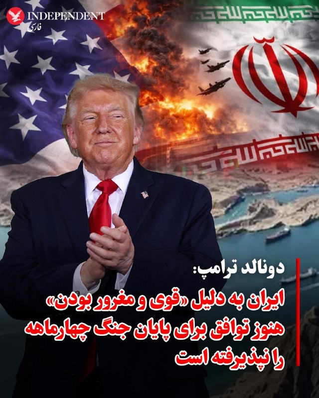

♦️دونالد ترامپ، رئیس‌جمهوری آمریکا، روز جمعه در گفتگوی اختصاصی با شبکه «ان‌بی‌سی نیوز» اعلام کرد که ایران به دلیل «قوی و مغرور بودن»، هنوز توافقی را با ایالات متحده برای پایان دادن به جنگ کنونی که وارد چهارمین ماه خود شده است، امضا نکرده است. ترامپ با اشاره به روند مذاکرات جاری میان واشنگتن و تهران تاکید کرد: «آنها مغرور و قوی هستند و اکنون مجبورند کارهایی را انجام دهند که هرگز فکرش را هم نمی‌کردند. آنها عملا چاره دیگری ندارند و نهایتا باید توافق کنند، اما این فرآیند کمی زمان می‌برد.» رئیس‌جمهوری آمریکا با انتقاد از کسانی که خواستار دستیابی فوری به یک توافق با ایران هستند، سرعت اقدامات خود را با جنگ ۱۹ ساله ویتنام مقایسه کرد و افزود با وجود اینکه تنها حدود ۲۱ تا ۲۲ درصد از کل موشک‌های اولیه ایران باقی مانده و بخش اعظم توان نظامی و کارخانه‌های پهپادی آن‌ها نابود شده است، پذیرش این شرایط سخت برای مقامات تهران زمان‌بر خواهد بود.
‌🇸🇦 Indypersian

🤖 @VahidOOnLine

## VahidOOnLine — post 243894

  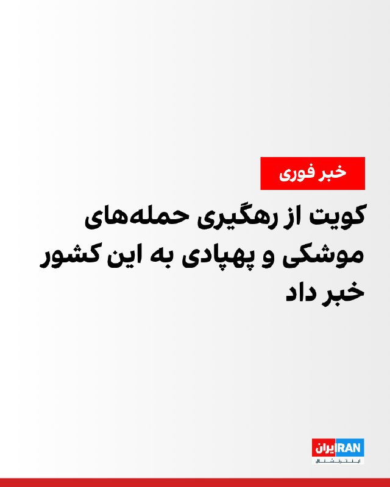

خبرگزاری دولتی کویت اعلام کرد پدافند هوایی این کشور در حال رهگیری حمله‌های موشکی و پهپادی است.
جمهوری اسلامی چهارشنبه نیز حملات موشکی و پهپادی مرگباری علیه کویت انجام داد که در نتیجه آن یک نفر کشته و ۶۳ نفر مجروح شدند.

‌🏁 🇬🇧 IranintlTV

🤖 @VahidOOnLine

## VahidOOnLine — post 243893

  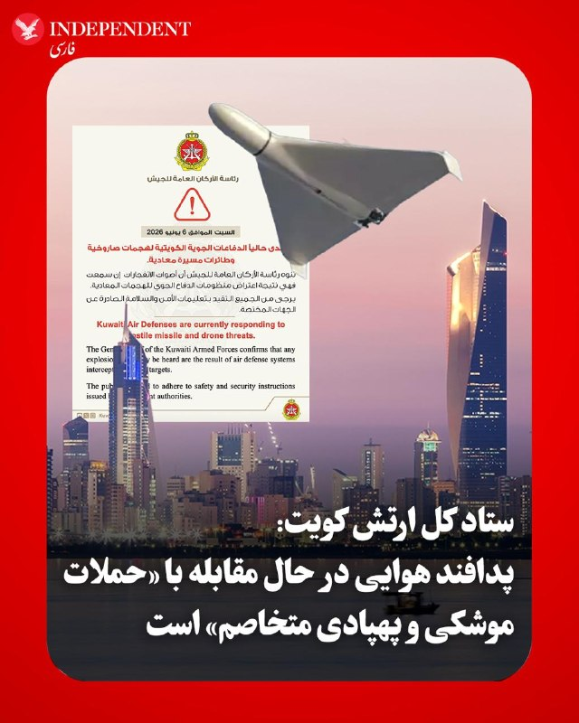

♦️ستاد کل فرماندهی ارتش کویت، بامداد شنبه، ۱۶ خردادماه، با انتشار بیانیه‌ای «فوری» اعلام کرد که پدافند هوایی این کشور در حال مقابله و پاسخی جامع به «حملات موشکی و پهپادهای تهاجمی متخاصم» در آسمان کشور است. مقامات نظامی کویت با تایید وضعیت اضطراری اشاره کردند که هرگونه صدای انفجار احتمالی، ناشی از عملکرد سیستم‌های پدافندی در رهگیری و انهدام این اهداف مهاجم در هوا است.
‌🇸🇦 Indypersian

🤖 @VahidOOnLine

## VahidOOnLine — post 243892

  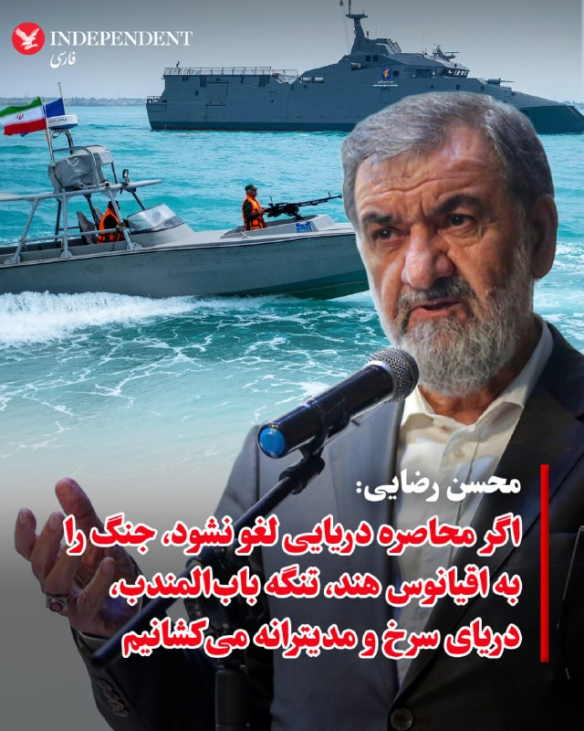

♦️محسن رضایی، فرمانده سابق سپاه و مشاور نظامی مجتبی خامنه‌ای، در گفتگوی اختصاصی با شبکه «سی‌ان‌ان» هشدار داد که در صورت تداوم درگیری‌ها و برچیده نشدن محاصره دریایی اعمال‌شده علیه ایران، دامنه جنگ به سایر آبراه‌های استراتژیک کشیده خواهد شد. رضایی گفت: «اگر جنگ ادامه یابد و محاصره دریایی لغو نشود، ما دامنه نبرد را به اقیانوس هند، تنگه باب‌المندب، دریای سرخ و دریای مدیترانه خواهیم کشاند.» او با تاکید بر اینکه تهران ابعاد جدیدی به این تقابل نظامی خواهد بخشید، افزود: «با حمله به دیگر پایگاه‌های آمریکا، بعد دیگری به جنگ می‌دهیم و در این میان، ایالات متحده قطعا متحمل خسارات و تلفات بسیار بیشتری خواهد شد.»
‌🇸🇦 Indypersian

🤖 @VahidOOnLine

## VahidOOnLine — post 243891

  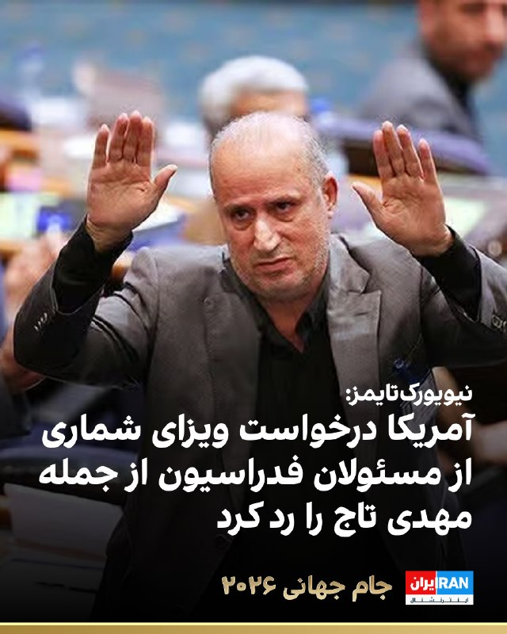

نیویورک‌تایمز گزارش داد تیم ملی فوتبال ایران پس از ماه‌ها بلاتکلیفی سرانجام مجوز ورود به آمریکا برای حضور در جام جهانی ۲۰۲۶ را دریافت کرده است، اما درخواست ویزای شماری از اعضای کادر پشتیبانی و مسئولان فدراسیون فوتبال ایران، از جمله مهدی تاج، رد شده است.
نیویورک‌تایمز به نقل از چهار مقام ارشد آگاه گزارش داد تمامی ۲۶ بازیکن تیم ملی فوتبال ایران برای حضور در جام جهانی ۲۰۲۶ ویزای ورود به ایالات متحده را دریافت کرده‌اند و می‌توانند در مسابقات این دوره شرکت کنند.
بر اساس این گزارش، جمعه ۱۵ خرداد یک مقام ایرانی برای دریافت گذرنامه‌هایی که در چارچوب روند صدور ویزا به سفارت آمریکا تحویل داده شده بود، مراجعه کرد. با این حال، درخواست ویزای بیش از ۱۲ نفر از اعضای کادر همراه تیم، از جمله برخی مربیان، بدنسازان، تحلیلگران، اعضای کادر پزشکی و همچنین شماری از مسئولان فدراسیون فوتبال ایران رد شده است.
نیویورک‌تایمز به نقل از یکی از منابع خود نوشت که ویزای مهدی تاج، رییس فدراسیون فوتبال ایران، نیز صادر نشده است. تاج که سابقه عضویت در سپاه پاسداران را دارد، پیش‌تر نیز در سفرهای بین‌المللی با محدودیت‌هایی روبه‌رو شده بود.

https
‌🏁 🇬🇧 IranintlTV

🤖 @VahidOOnLine

## VahidOOnLine — post 243890

♦️جشنواره باستانی و هزارساله اسب‌سواری سامورایی‌ها در ژاپن موسوم به «سوما نامائوی» که در طول تاریخ از گزند جنگ‌ها، زمین‌لرزه‌ها و حتی فاجعه اتمی جان سالم به در برده بود، اکنون با چالش جدیدی به نام تغییرات اقلیمی دست‌وپنجه نرم می‌کند. به گزارش خبرگزاری فرانسه، تابستان‌های طاقت‌فرسا و سوزان ژاپن با دمای بی‌سابقه تا مرز ۴۰ درجه سانتی‌گراد، سازمان‌دهندگان این رویداد باستانی را مجبور کرد تا برای اولین بار تاریخ برگزاری آن را به اواخر ماه مه (اوایل خرداد) منتقل کنند؛ تصمیمی حیاتی که به این جشنواره تاریخی و سنتی جانی دوباره بخشیده و آن را با شرایط آب‌و‌هوایی شدید جدید سازگار کرده است.
‌🇸🇦 Indypersian

🤖 @VahidOOnLine

## VahidOOnLine — post 243889

  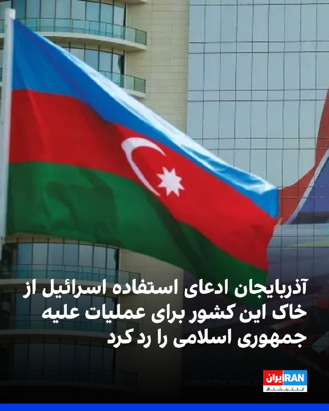

وزارت خارجه جمهوری آذربایجان ادعاهای مطرح‌شده در گزارش اخیر سی‌ان‌ان درباره استفاده اسرائیل از خاک این کشور برای عملیات نظامی و اطلاعاتی علیه حکومت ایران را «کاملا بی‌اساس» خواند و خواستار تکذیب آن شد.

آیکهان حاجی‌زاده، سخنگوی این وزارتخانه، جمعه ۱۵ خرداد اعلام کرد باکو پیش‌تر نیز این ادعاها را رد کرده و موضع رسمی خود را پیش از انتشار گزارش به سی‌ان‌ان اعلام کرده بود.

او تاکید کرد جمهوری آذربایجان هرگز اجازه استفاده از خاک خود علیه کشور دیگری را نداده و نخواهد داد و انتشار گزارش بر پایه منابع ناشناس را مغایر با اصول بی‌طرفی دانست.

سی‌ان‌ان به نقل از منابعی مدعی شده بود اسرائیل در جریان جنگ ایران، نیروهای نظامی و اطلاعاتی خود را به طور محرمانه در نزدیکی مرز ایران در آذربایجان مستقر کرده و از آنجا عملیات اطلاعاتی و پهپادی انجام داده است.

‌🏁 🇬🇧 IranintlTV

🤖 @VahidOOnLine

## WithYashar — post 13611

ارسالی : من بابامم تعریف میکرد که زمان جنگ عراق و کویت صدا های بمب هارو میشنیدن خرمشهر
@withyashar
گزارش های زیاد از شنیده شدن انفجار کویت از خرمشهر !

## WithYashar — post 13610

  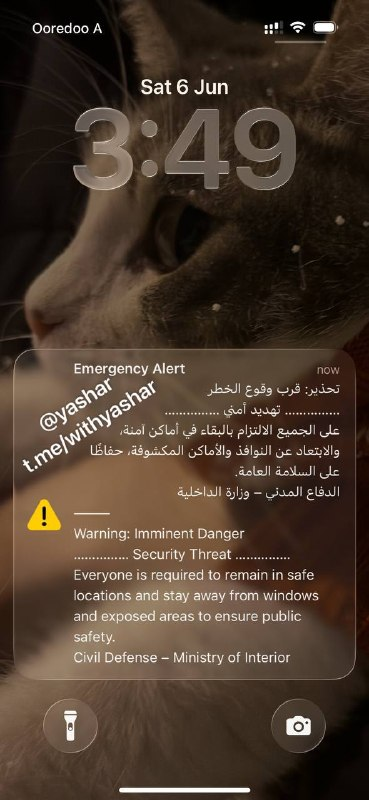

ارسالی : کویت آلارم اومد الان ، ۳پا موشک زده سمتش !
@withyashar

## WithYashar — post 13609

  <a href="telegram/content/WithYashar_13609_1780712333.mp4" target="_blank">🎬 Download video</a>

پست جدید ترامپ در‌تروث : نیروی دریایی ایران
@withyashar

## FoxNewsTwitter — post 342671

  <a href="telegram/content/FoxNewsTwitter_342671_1780712334.mp4" target="_blank">🎬 Download video</a>

Fox News (Twitter/X)

President Trump returns from Wisconsin.

POTUS stepped off Air Force One, gave a fist bump toward the press, and made his way across the tarmac.

He then boarded Marine One.

## FoxNewsTwitter — post 342670

  

Fox News (Twitter/X)

President Trump wears Olympic gold.

Olympic speed skating champion Jordan Stolz placed his gold medal around the president's neck during an agriculture roundtable at Custer Farms in Chippewa Falls, Wisconsin.

The Wisconsin native later shook hands with Trump at the event, which focused on policies impacting American farmers.

## FoxNewsTwitter — post 342669

  <a href="telegram/content/FoxNewsTwitter_342669_1780712336.mp4" target="_blank">🎬 Download video</a>

Fox News (Twitter/X)

NOW: Democratic Senate candidate Graham Platner addresses supporters in Maine.

“When hurtful things I said on the internet a decade ago came out into the public as I shared my personal journey through PTSD and darkness of recovery and accountability and growth, Maine had my back.”

“Now, as every single piece of that past and journey gets dug up, litigated, and weaponized, you have my back.”

## pm_afshaa — post 92363

  <a href="telegram/content/pm_afshaa_92363_1780712338.webm" target="_blank">🎬 Download video</a>

🔴سپاه: به دنبال تجاوز امریکا به سیریک و جزیره قشم، ساعتی پیش پایگاه‌های دشمن در منطقه مورد اصابت موشک‌ قرار گرفتن.

💧 Rainbet.com the #1 Non-KYC Crypto Casino & Sportsbook @rainbetcom

😁 @Pm_Afshaa

## pm_afshaa — post 92360

  <a href="telegram/content/pm_afshaa_92360_1780712338.webm" target="_blank">🎬 Download video</a>

🔴رد موشک‌های شلیک شده از فارس و بوشهر به سمت کویت و بحرین :

💧 Rainbet.com the #1 Non-KYC Crypto Casino & Sportsbook @rainbetcom

😁 @Pm_Afshaa

## pm_afshaa — post 92359

حمله آمریکا به قشم و جنوب کشور و حمله ایران به کویت و بحرین هم عادی شده و هر دو سه شب یبار تکرار میشه اخرم هر دو طرف میگن اقدام دفاعی کردیم و اتش بس برقراره

## pm_afshaa — post 92358

  <a href="telegram/content/pm_afshaa_92358_1780712339.webm" target="_blank">🎬 Download video</a>

🔴وزارت کشور بحرین: آژیرهای خطر به صدا درآمده و از شهروندان و ساکنان میخوایم که به نزدیکترین مکان امن برن.

💧 Rainbet.com the #1 Non-KYC Crypto Casino & Sportsbook @rainbetcom

😁 @Pm_Afshaa

## pm_afshaa — post 92357

به بحرین هم موشک زدن

## pm_afshaa — post 92356

  <a href="telegram/content/pm_afshaa_92356_1780712339.mp4" target="_blank">🎬 Download video</a>

🔴خبرگزاری دولتی کویت:
پدافند هوایی این کشور در حال رهگیری حمله‌های موشکی و پهپادی است.

+ ویدیویی از صدای آژیر خطر در کویت :

💧 Rainbet.com the #1 Non-KYC Crypto Casino & Sportsbook @rainbetcom

😁 @Pm_Afshaa

## pm_afshaa — post 92354

  <a href="telegram/content/pm_afshaa_92354_1780712341.webm" target="_blank">🎬 Download video</a>

🔴ایران در جواب این حمله موشک زده به کویت و دقایقی پیش هشدار حمله موشکی و پهبادی به ساکنان کویت ارسال شده. 
💧 Rainbet.com the #1 Non-KYC Crypto Casino & Sportsbook @rainbetcom 
😁 @Pm_Afshaa

## pm_afshaa — post 92353

  <a href="telegram/content/pm_afshaa_92353_1780712341.webm" target="_blank">🎬 Download video</a>

🔴سنتکام: لحظاتی پیش نیروهای سنتکام چهار پهپاد تهاجمی ایرانی رو که به سمت تنگه هرمز پرتاب شده بودن سرنگون کردن. پهپادهای تهاجمی یک تهدید فوری برای ترافیک دریایی منطقه است ‌و نیروهای آمریکایی متعاقبا به سایت‌های رادار نظارتی ساحلی ایران در گوروک و جزیره قشم…

## VahidOnline — post 75964

  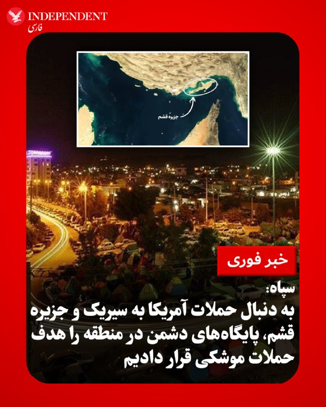

روابط عمومی سپاه، بامداد شنبه، با انتشار بیانیه‌ای اعلام کرد: «به دنبال حملات ارتش آمریکا به سیریک و جزیره قشم، پایگاه‌های دشمن در منطقه مورد اصابت موشک‌های هوافضا قرار گرفتند».
@VahidOOnLine

📡 @VahidOnline

## VahidOnline — post 75961

  <a href="telegram/content/VahidOnline_75961_1780712342.mp4" target="_blank">🎬 Download video</a>

'رد موشک‌های شلیک شده از ایران'
تصاویر دریافتی از استان‌های فارس و بوشهر

آپدیت:
وزارت کشور بحرین نیز دقایقی قبل از به صدا در آمدن آژیر خطر خبر داد و از مردم خواست به اماکن امن بروند.
VahidHeadline

📡 @VahidOnline

## VahidOnline — post 75960

  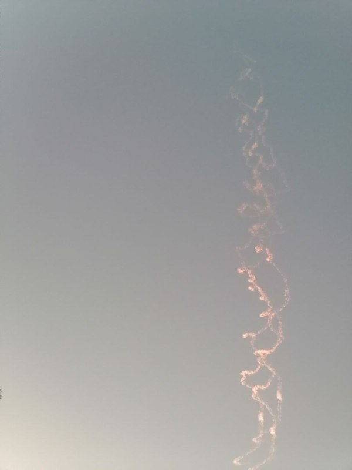

شلیک موشک دیگری از ایران همزمان با صدور هشدر دیگری در کویت

📡 @VahidOnline

## VahidOnline — post 75959

  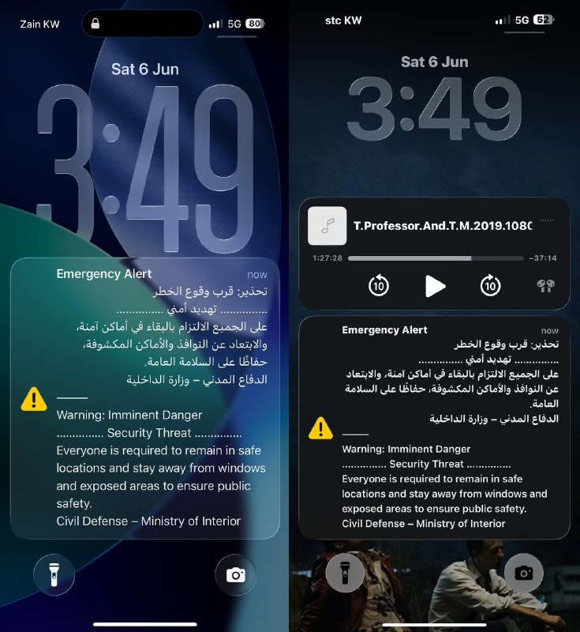

پیام‌های دریافتی: اعلام هشدار در کویت
همزمان با پیام‌های دریافتی از شنیده شدن صدای شلیک از خوزستان

آپدیت:
ارتش کویت دقایقی قبل از فعالیت پدافند هوایی کویت برای مقابله با «حملات موشکی و پهپادی خصمانه» خبر داد.
@VahidHeadline

📡 @VahidOnline

## IranIntlTV — post 340753

  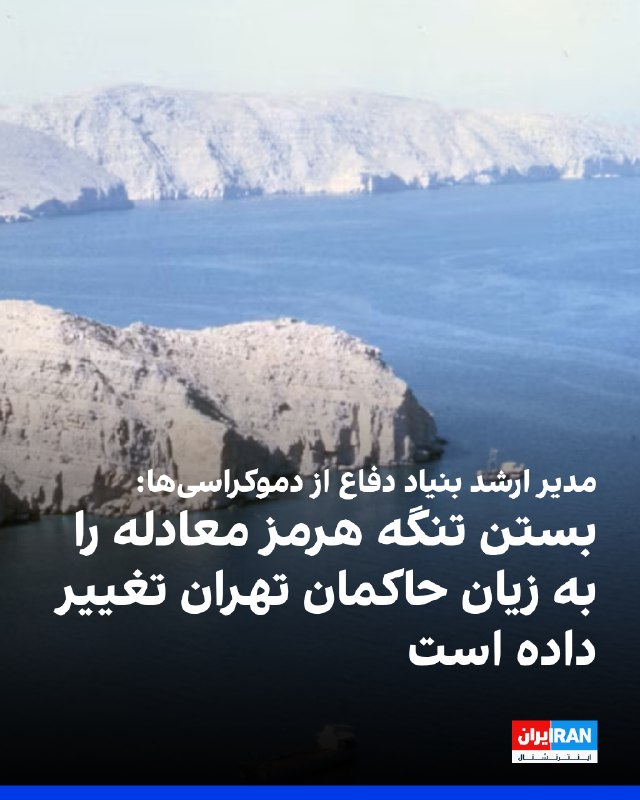

بهنام بن‌طالب‌لو، مدیر ارشد برنامه ایران در بنیاد دفاع از دموکراسی‌ها، در مطلبی در وب‌سایت این بنیاد با اشاره به آمار تانکر ترکرز درباره به صفر رسیدن صادرات نفت ایران در ماه مه در پی محاصره دریایی نوشت اقدام جمهوری اسلامی در بستن تنگه هرمز، معادله را به زیان حاکمان تهران تغییر داده است.
بر اساس داده‌های شرکت تانکر ترکرز، ایران در این ماه هیچ نفت خامی صادر نکرد و تنها ۲ میلیون بشکه نفتا صادر کرد که معادل حدود ۶۴ هزار بشکه در روز است.
این مطلب با تاکید بر اینکه محاصره دریایی آمریکا عملا شریان اصلی تامین مالی حکومت را قطع کرده است، نوشت: «اقدام جمهوری اسلامی در بستن تنگه هرمز، معادله را به زیان حاکمان تهران تغییر داده و توان مالی حکومت را هدف قرار داده است.»
بن‌طالب‌لو با اشاره به اینکه محاصره دریایی همچنان ابزار اصلی فشار اقتصادی آمریکا به شمار می‌رود، هشدار داد کنار گذاشتن این ابزار فشار اقتصاد کلان صرفا برای بازگرداندن تردد در خلیج فارس می‌تواند اشتباه راهبردی باشد.
او افزود اگر این اهرم اقتصادی زودتر از موعد کنار گذاشته شود، سیاست‌گذاران نباید انتظار امتیازهای عمده در مسائل گسترده‌تر امنیتی را داشته باشد.

## IranIntlTV — post 340752

  

درپی موج دوم حمله‌های موشکی و پهپادی به کویت، آژیرهای خطر در این کشور فعال شدند و ارتش کویت از فعال شدن پدافند هوایی برای رهگیری این حمله‌ها خبر داد. دقایقی قبل نیز ارتش کویت از تلاش برای رهگیری موج دیگری حمله‌های موشکی و پهپادی خبر داده بود.
https://iranintl.com/202606069640

## IranIntlTV — post 340751

  

خبرگزاری دولتی کویت اعلام کرد پدافند هوایی این کشور در حال رهگیری حمله‌های موشکی و پهپادی است.
جمهوری اسلامی چهارشنبه نیز حملات موشکی و پهپادی مرگباری علیه کویت انجام داد که در نتیجه آن یک نفر کشته و ۶۳ نفر مجروح شدند.

https://iranintl.com/202606066191

## IranIntlTV — post 340750

  

نیویورک‌تایمز گزارش داد تیم ملی فوتبال ایران پس از ماه‌ها بلاتکلیفی سرانجام مجوز ورود به آمریکا برای حضور در جام جهانی ۲۰۲۶ را دریافت کرده است، اما درخواست ویزای شماری از اعضای کادر پشتیبانی و مسئولان فدراسیون فوتبال ایران، از جمله مهدی تاج، رد شده است.
نیویورک‌تایمز به نقل از چهار مقام ارشد آگاه گزارش داد تمامی ۲۶ بازیکن تیم ملی فوتبال ایران برای حضور در جام جهانی ۲۰۲۶ ویزای ورود به ایالات متحده را دریافت کرده‌اند و می‌توانند در مسابقات این دوره شرکت کنند.
بر اساس این گزارش، جمعه ۱۵ خرداد یک مقام ایرانی برای دریافت گذرنامه‌هایی که در چارچوب روند صدور ویزا به سفارت آمریکا تحویل داده شده بود، مراجعه کرد. با این حال، درخواست ویزای بیش از ۱۲ نفر از اعضای کادر همراه تیم، از جمله برخی مربیان، بدنسازان، تحلیلگران، اعضای کادر پزشکی و همچنین شماری از مسئولان فدراسیون فوتبال ایران رد شده است.
نیویورک‌تایمز به نقل از یکی از منابع خود نوشت که ویزای مهدی تاج، رییس فدراسیون فوتبال ایران، نیز صادر نشده است. تاج که سابقه عضویت در سپاه پاسداران را دارد، پیش‌تر نیز در سفرهای بین‌المللی با محدودیت‌هایی روبه‌رو شده بود.

https

## IranIntlTV — post 340749

  

وزارت خارجه جمهوری آذربایجان ادعاهای مطرح‌شده در گزارش اخیر سی‌ان‌ان درباره استفاده اسرائیل از خاک این کشور برای عملیات نظامی و اطلاعاتی علیه حکومت ایران را «کاملا بی‌اساس» خواند و خواستار تکذیب آن شد.

آیکهان حاجی‌زاده، سخنگوی این وزارتخانه، جمعه ۱۵ خرداد اعلام کرد باکو پیش‌تر نیز این ادعاها را رد کرده و موضع رسمی خود را پیش از انتشار گزارش به سی‌ان‌ان اعلام کرده بود.

او تاکید کرد جمهوری آذربایجان هرگز اجازه استفاده از خاک خود علیه کشور دیگری را نداده و نخواهد داد و انتشار گزارش بر پایه منابع ناشناس را مغایر با اصول بی‌طرفی دانست.

سی‌ان‌ان به نقل از منابعی مدعی شده بود اسرائیل در جریان جنگ ایران، نیروهای نظامی و اطلاعاتی خود را به طور محرمانه در نزدیکی مرز ایران در آذربایجان مستقر کرده و از آنجا عملیات اطلاعاتی و پهپادی انجام داده است.

https://iranintl.com/202606054179

## Shin_Persian — post 6557

Shin ✓ @hey_itsmyturn
Sat, 06 Jun 2026 01:14:57 UTC

Sirens activated. Citizens and residents are urged to remain calm, proceed to the nearest safe location, and follow official news channels.
#Bahrain 🇧🇭

Source: @moi_bahrain
https://x.com/moi_bahrain/status/2063067028001317008

فارسی

آژیرهای خطر فعال شدند. از شهروندان و ساکنان درخواست می‌شود آرامش خود را حفظ کرده، به نزدیک‌ترین مکان امن بروند و کانال‌های خبری رسمی را دنبال کنند.
#Bahrain 🇧🇭

منبع: @moi_bahrain
https://x.com/moi_bahrain/status/2063067028001317008

𝕏 · @shin_persian

## Shin_Persian — post 6556

  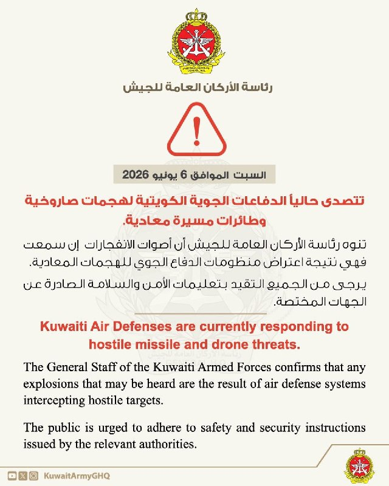

Shin ✓ @hey_itsmyturn
Sat, 06 Jun 2026 00:52:21 UTC

Kuwaiti Air Defenses are currently responding to hostile missile and drone attacks.

The General Staff of the Army states that any explosion sounds are the result of interceptions.

Follow all safety instructions from authorities.

#Kuwait 🇰🇼

فارسی

پدافند هوایی کویت در حال حاضر در حال پاسخگویی به حملات موشکی و پهپادی متخاصم است.

ستاد کل ارتش اعلام کرد که هرگونه صدای انفجار ناشی از عملیات رهگیری است.

تمامی دستورالعمل‌های ایمنی مقامات را رعایت کنید.

#Kuwait 🇰🇼

𝕏 · @shin_persian

## FarsiVOA — post 219732

  <a href="telegram/content/FarsiVOA_219732_1780712346.mp4" target="_blank">🎬 Download video</a>

⚡️در پی گزارش‌ها از حملات پهپادی و موشکی خصمانه به کویت، صدای آژیرهای حمله هوایی در سراسر کویت به صدا در آمد.
@FarsiVOA

## FarsiVOA — post 219731

🔺گزارش| چهل روز از اعدام ساسان آزادوار گذشت، جوانی که نوشت: «هزاران امید میان استخوان‌هایم آواز می‌خواند»

▪️ساسان آزادوار جونقانی، ۲۱ ساله، از معترضان دی‌ماه اصفهان، سحرگاه ۱۰ اردیبهشت ۱۴۰۵ اعدام شد. او در صفحه اینستاگرامش، خود را «بختیاری» معرفی کرده بود. ساسان آزادوار، که گفته می‌شود قهرمان سبک کیوکوشین کاراته در اصفهان بود، یک‌بار زیر یکی از عکس‌های اینستاگرامی‌اش که تاریخ آن به حدود دو سال و نیم پیش بازمی‌گردد، نوشته بود: «هزاران امید میان استخوان‌هایم آواز می‌خواند.»

⬇️ بیشتر بخوانید:
https://ir.voanews.com/a/8157740.html
@FarsiVOA

## FarsiVOA — post 219730

  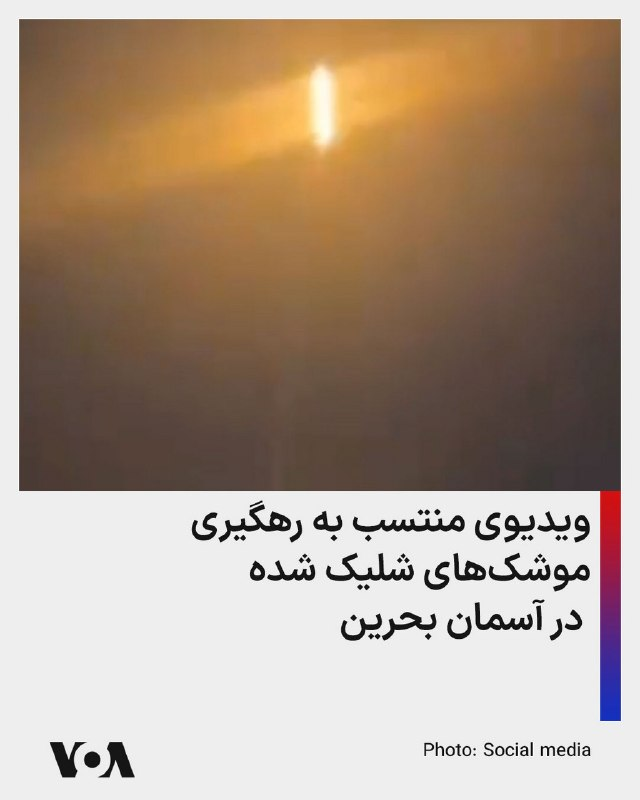

⚡️کاربران شبکه‌های اجتماعی ویدیوهایی را منتشر کرده‌اند که می‌گویند رهگیری موشک‌های شلیک‌شده در بامداد شنبه به سمت بحرین و در آسمان این کشور را نشان می‌دهد. کویت نیز از مقابله با حملات خصمانه پهپادی و موشکی خبر داده است. هر دو کشور پیشتر هدف حملات جمهوری اسلامی قرار گرفته‌‌اند.
@FarsiVOA

## FarsiVOA — post 219729

  

⚡️وزارت کشور بحرین نیز دقایقی قبل از به صدا در آمدن آژیر خطر خبر داد و از مردم خواست به اماکن امن بروند. این در حالی است که کویت نیز از مقابله با حملات موشکی و پهپادی خصمانه خبر داده است.
@FarsiVOA

## FarsiVOA — post 219728

  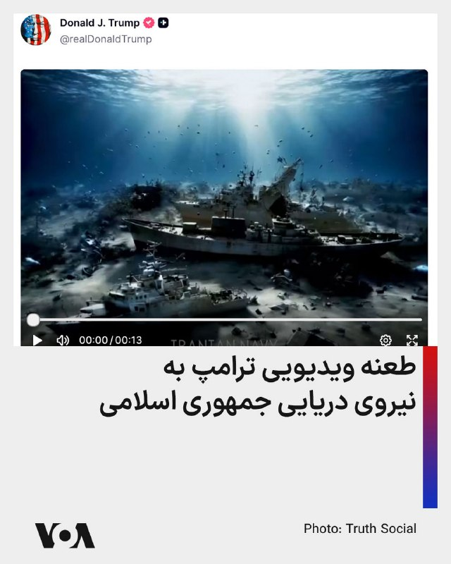

⚡️دونالد ترامپ، رئیس‌جمهوری آمریکا، جمعه شب با انتشار این ویدیو در تروت‌سوشال به وضعیت نیروی دریایی جمهوری اسلامی در پی عملیات نظامی مشترک آمریکا و اسرائيل طعنه زد. آقای ترامپ در سخنان خود گفته است که کشتی‌های نیروی دریایی جمهوری اسلامی «کف دریا به خط هستند.»
@FarsiVOA

## FarsiVOA — post 219727

  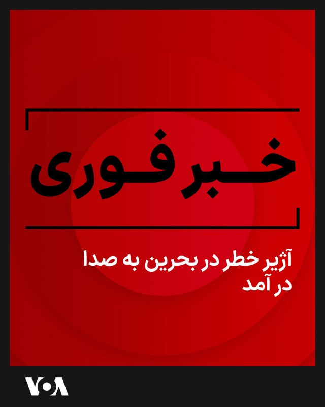

⚡️وزارت کشور بحرین نیز دقایقی قبل از به صدا در آمدن آژیر خطر خبر داد و از مردم خواست به اماکن امن بروند. این در حالی است که کویت نیز از مقابله با حملات موشکی و پهپادی خصمانه خبر داده است.
@FarsiVOA

## FarsiVOA — post 219726

  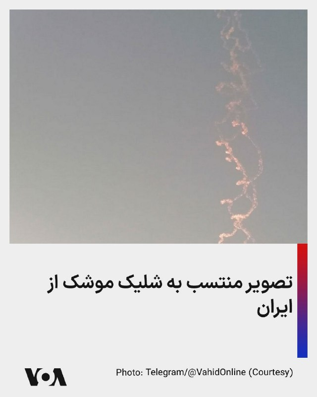

⚡️کانال تلگرامی وحیدآنلاین تصویری از آنچه شلیک موشک از ایران توصیف شده در ساعات اولیه روز شنبه به وقت ایران منتشر کرد. این در حالی است که کویت دقایقی قبل از مقابله با حملات موشکی خصمانه خبر داد.
@FarsiVOA

## FarsiVOA — post 219723

  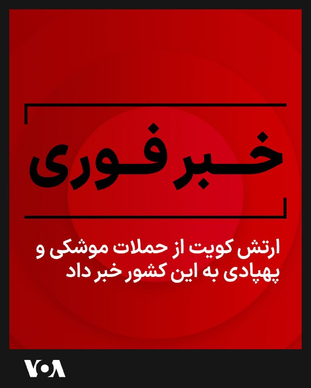

⚡️ارتش کویت دقایقی قبل از فعالیت پدافند هوایی کویت برای مقابله با «حملات موشکی و پهپادی خصمانه» خبر داد. این بیانیه در پی حملات دفاعی سنتکام به مواضع جمهوری اسلامی در واکنش به شلیک چند پهپاد از سوی حکومت ایران گزارش می‌شود.
@FarsiVOA

## FarsiVOA — post 219722

⚡️دونالد ترامپ در جمع کشاورزان ویسکانسین: محاصره دریایی علیه جمهوری اسلامی موفقیت‌آمیز بوده است
@FarsiVOA

## BBCPersian — post 282937

🔻وقتی پل، اختاپوس معروف، همه نتایج آلمان در جام جهانی فوتبال ۲۰۱۰ آفریقای جنوبی را درست پیش‌بینی کرد، در سراسر جهان به‌عنوان یک پیشگو مورد ستایش قرار گرفت.

متن کامل این مطلب را در وبسایت بی‌بی‌سی فارسی بخوانید:
https://bbc.in/4uSkuNg

📸GettyImages/ Reuters/ Bloomberg via Getty Images/ EPA-EFE/REX/Shutterstock/ ullstein bild via Getty Images/ Corbis via Getty Images
@BBCPersian

## BBCPersian — post 282936

  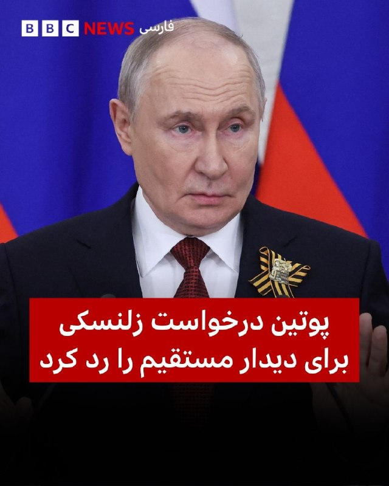

🔻ولادیمیر پوتین، رئیس‌جمهور روسیه، درخواست ولودیمیر زلنسکی برای گفت‌وگوی رودررو درباره پایان جنگ اوکراین را رد کرد و گفت چنین دیداری فایده‌ای ندارد.

آقای زلنسکی روز پنجشنبه در نامه‌ای سرگشاده خواستار مذاکرات مستقیم با پوتین شد و نوشت که نباید منتظر ماند تا جنگی که با تهاجم گسترده روسیه به اوکراین در سال ۲۰۲۲ آغاز شد، بار دیگر در کانون توجه آمریکا قرار گیرد.

رئیس‌جمهور اوکراین همچنین خواستار برقراری آتش‌بس شد.

آقای پوتین اما این نامه را «بی‌ادبانه» خواند و بار دیگر تاکید کرد که مذاکرات صلح باید پیش از هرگونه آتش‌بس انجام شود.

متن کامل این مطلب را در سایت بی‌بی‌سی فارسی بخوانید.

📸 AFP via Getty Images
@BBCPersian

---
📅 بروزرسانی: 1405/03/16 03:40
---

## VahidOOnLine — post 243880

این روایت‌ها درباره مرگ نیستند؛ درباره زندگی‌هایی هستند که در جریان بودند.<
یکی تازه ازدواج کرده بود، یکی به تیم فوتبال راه یافته بود، یکی هر روز در مغازه‌اش کار می‌کرد، یکی با هنر و خلاقیت زندگی می‌ساخت و دیگری بار خانواده را بر دوش می‌کشید. آینده برای همه آن‌ها ادامه داشت؛ اما در دی‌ماه، گلوله سرکوب جان این جوانان را گرفت.<
سامان ابراهیم‌پور، میثم کرانیان، امید عظیمی، محدثه (صدف) مالکی، علی‌اصغر استخر، محمد (نیما) صالحی‌پور، داوود آبی و ابوالفضل جهانی؛
نام‌های این مجموعه، تنها بخشی از فهرست بلند جوانانی است که در اوج زندگی کشته شدند؛ انسان‌هایی با شغل، خانواده، آرزو و آینده‌ای که هرگز فرصت ادامه پیدا نکرد.<
#جاویدنامان_انقلاب_ملی_ایرانیان
‌🏁 🇬🇧 IranintlTV

🤖 @VahidOOnLine

## VahidOOnLine — post 243879

  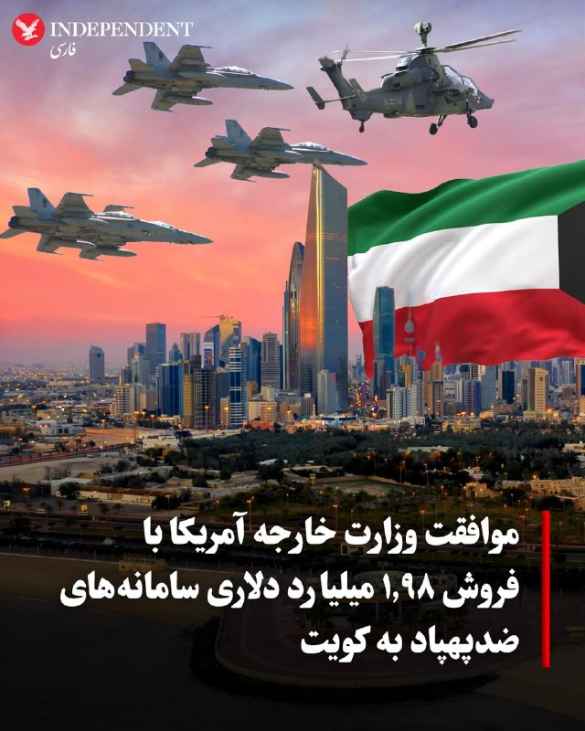

♦️به گزارش رویترز، وزارت امور خارجه ایالات متحده، روز جمعه،  با صدور بیانیه‌ای رسمی اعلام کرد که با فروش احتمالی سامانه‌های پدافندی مقابله با هواپیماهای بدون سرنشین (ضدپهپاد) و تجهیزات وابسته به آن به دولت کویت موافقت کرده است. ارزش این قرارداد تسلیحاتی حدود ۱.۹۸ میلیارد دلار برآورد شده و بر اساس اعلام وزارت خارجه آمریکا، شرکت صنایع دفاعی «آندوریل» (Anduril) به عنوان پیمانکار اصلی این طرح تعیین شده است. این توافق تسلیحاتی بزرگ در شرایطی صورت می‌گیرد که تنش‌های پهپادی و موشکی اخیر در منطقه خلیج فارس، کشورهای حوزه این آبراه استراتژیک را به سمت تقویت شبکه‌های پدافند هوایی خود سوق داده است.
‌🇸🇦 Indypersian

🤖 @VahidOOnLine

## VahidOOnLine — post 243878

  

ستاد فرماندهی مرکزی آمریکا، سنتکام، اعلام کرد نیروهایش چهار پهپاد انتحاری ایران را که به سمت تنگه هرمز پرتاب شده بودند، سرنگون کردند و در ادامه، برای دفاع در برابر حملات بیشتر، سایت‌های رادار نظارتی ساحلی جمهوری اسلامی در جزیره قشم و گروک در سیریک را هدف قرار دادند.
سنتکام بر آمادگی خود برای پاسخ به «تجاوز غیرموجه ایران» در چارچوب دفاع از خود تاکید کرد.

‌🏁 🇬🇧 IranintlTV

🤖 @VahidOOnLine

## VahidOOnLine — post 243877

  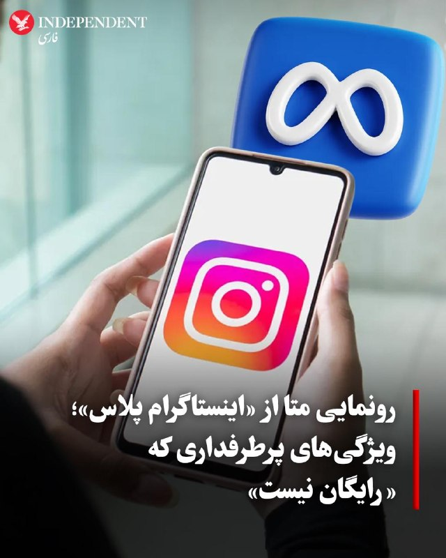

♦️شرکت «متا»، روز جمعه، ۱۵ خردادماه، رسما از سرویس اشتراکی جدید خود تحت عنوان «اینستاگرام پلاس» (Instagram Plus) رونمایی کرد که به صورت یک ارتقای اختیاری و پولی در اختیار کاربران علاقه‌مند قرار می‌گیرد؛ نسخه رایگان و معمول اینستاگرام کماکان بدون تغییر باقی خواهد ماند. این اشتراک «پیشرفته» مجموعه مفصلی از قابلیت‌های جدید را در سه محور تعامل، آمار و شخصی‌سازی ارائه می‌دهد که از شاخص‌ترین آن‌ها می‌توان به تمدید مدت‌زمان ماندگاری روایتگر تا ۴۸ ساعت، امکان «پیش‌نمایش روایتگرها» بدون ثبت بازدید، ردیابی تعداد دفعات بازبینی (Rewatch) روایتگر توسط دیگران و ابزار جستجوی مستقیم یک شخص خاص در میان بینندگان روایتگر اشاره کرد. علاوه بر این، کاربران نسخه پلاس می‌توانند تا ۶ محتوا را در صفحه خود سنجاق کنند، فونت بخش «درباره من» و آیکون برنامه خود را تغییر دهند و حتی محتوای جدید را بدون ایجاد مزاحمت و فرستادن به صفحه خبرخوان اصلی دوستان، مستقیما روی صفحه خود بارگزاری نمایند. براساس این گزارش، این سرویس فرآیند عرضه جهانی خود را از امروز آغاز کرده و از بخش تنظیمات و پرداخت ماهیانه ۳.۹۹ دلار قابل فعال‌سازی است.
‌🇸🇦 Indypersian

🤖 @VahidOOnLine

## VahidOOnLine — post 243876

♦️دونالد ترامپ، رئیس‌جمهوری آمریکا، در گفتگو با برنامه «میت د پرس» شبکه «ان‌بی‌سی نیوز» اعلام کرد که بر اساس ارزیابی‌ها، در حال حاضر تنها حدود ۲۱ تا ۲۲ درصد از توان موشکی اولیه ایران باقی مانده است. ترامپ در این مصاحبه با اشاره به حجم تخریب توان نظامی تهران افزود: «این میزان هنوز تعداد زیادی موشک محسوب می‌شود، اما با آنچه در زمان اولین حمله ما در اختیار داشتند، قابل مقایسه نیست.»
‌🇸🇦 Indypersian

🤖 @VahidOOnLine

## VahidOOnLine — post 243875

  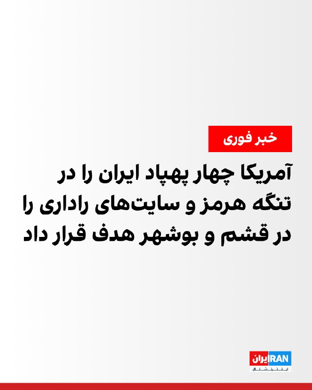

ستاد فرماندهی مرکزی آمریکا، سنتکام، اعلام کرد نیروهایش چهار پهپاد انتحاری ایران را که به سمت تنگه هرمز پرتاب شده بودند، سرنگون کردند و در ادامه، برای دفاع در برابر حملات بیشتر، سایت‌های رادار نظارتی ساحلی جمهوری اسلامی در جزیره قشم و گورک بوشهر را هدف قرار دادند.
سنتکام بر آمادگی خود برای پاسخ به «تجاوز غیرموجه ایران» در چارچوب دفاع از خود تاکید کرد.

‌🏁 🇬🇧 IranintlTV

🤖 @VahidOOnLine

## WithYashar — post 13608

  <a href="telegram/content/WithYashar_13608_1780704625.mp4" target="_blank">🎬 Download video</a>

همکنون جت‌های جنگنده آمریکایی در حال پرواز بر فراز استان بصره عراق نزدیک مرز ایران هستند.
@withyashar

## WithYashar — post 13607

  <a href="telegram/content/WithYashar_13607_1780704627.mp4" target="_blank">🎬 Download video</a>

پشتک نیم وارو پهپاد های شناسایی اسمون بندر عباس همین الان
@withyashar

## WithYashar — post 13606

## WithYashar — post 13605

## WithYashar — post 13604

  <a href="telegram/content/WithYashar_13604_1780704628.mp4" target="_blank">🎬 Download video</a>

@withyashar منتظر زارتان زورتان

## WithYashar — post 13603

۳پا باید یه جوابی بده چیزی‌ دیدن یا شنیدین بگین

## WithYashar — post 13602

چندین انفجار در سيريك 🚨🚨🚨🚨🚨🚨🚨 @withyashar

## FoxNewsTwitter — post 342668

Fox News (Twitter/X)

BREAKING: Xavier Becerra advances to the general election for California governor. The AP made the call Friday night.

## FoxNewsTwitter — post 342667

Fox News (Twitter/X)

WATCH LIVE: Graham Platner holds a Get Out the Vote rally with Rep. Ro Khanna https://twitter.com/i/broadcasts/1RJjppoygVdKw

## FoxNewsTwitter — post 342666

  

Fox News (Twitter/X)

President Trump wears Olympic gold.

Olympic speed skating champion Jordan Stolz placed his gold medal around the president's neck during an agriculture roundtable at Custer Farms in Chippewa Falls, Wisconsin.

The Wisconsin native later shook hands with Trump at the event, which focused on policies impacting American farmers.

## pm_afshaa — post 92352

  <a href="telegram/content/pm_afshaa_92352_1780704630.webm" target="_blank">🎬 Download video</a>

🔴سنتکام: لحظاتی پیش نیروهای سنتکام چهار پهپاد تهاجمی ایرانی رو که به سمت تنگه هرمز پرتاب شده بودن سرنگون کردن. پهپادهای تهاجمی یک تهدید فوری برای ترافیک دریایی منطقه است ‌و نیروهای آمریکایی متعاقبا به سایت‌های رادار نظارتی ساحلی ایران در گوروک و جزیره قشم…

## pm_afshaa — post 92351

  <a href="telegram/content/pm_afshaa_92351_1780704630.webm" target="_blank">🎬 Download video</a>

🔴سنتکام: لحظاتی پیش نیروهای سنتکام چهار پهپاد تهاجمی ایرانی رو که به سمت تنگه هرمز پرتاب شده بودن سرنگون کردن. پهپادهای تهاجمی یک تهدید فوری برای ترافیک دریایی منطقه است ‌و نیروهای آمریکایی متعاقبا به سایت‌های رادار نظارتی ساحلی ایران در گوروک و جزیره قشم…

## pm_afshaa — post 92350

  <a href="telegram/content/pm_afshaa_92350_1780704631.webm" target="_blank">🎬 Download video</a>

🔴پایگاه دریایی بندر سیریک هم بمباران شده، و گزارش‌ها از کشته شدن دست کم یک عضو نیرو دریایی سپاه در این حملات هوایی.

💧 Rainbet.com the #1 Non-KYC Crypto Casino & Sportsbook @rainbetcom

😁 @Pm_Afshaa

## pm_afshaa — post 92349

  <a href="telegram/content/pm_afshaa_92349_1780704631.webm" target="_blank">🎬 Download video</a>

🔴سنتکام: لحظاتی پیش نیروهای سنتکام چهار پهپاد تهاجمی ایرانی رو که به سمت تنگه هرمز پرتاب شده بودن سرنگون کردن. پهپادهای تهاجمی یک تهدید فوری برای ترافیک دریایی منطقه است ‌و نیروهای آمریکایی متعاقبا به سایت‌های رادار نظارتی ساحلی ایران در گوروک و جزیره قشم…

## pm_afshaa — post 92348

  <a href="telegram/content/pm_afshaa_92348_1780704631.webm" target="_blank">🎬 Download video</a>

🔴سنتکام: لحظاتی پیش نیروهای سنتکام چهار پهپاد تهاجمی ایرانی رو که به سمت تنگه هرمز پرتاب شده بودن سرنگون کردن.

پهپادهای تهاجمی یک تهدید فوری برای ترافیک دریایی منطقه است ‌و نیروهای آمریکایی متعاقبا به سایت‌های رادار نظارتی ساحلی ایران در گوروک و جزیره قشم حمله کردن تا در برابر حملات بیشتر دفاع کنند.

نیروهای آمریکایی هوشیار و آماده پاسخگویی به تهاجم غیرموجه ایران در دفاع از خود هستند.

💧 Rainbet.com the #1 Non-KYC Crypto Casino & Sportsbook @rainbetcom

😁 @Pm_Afshaa

## VahidOnline — post 75958

  

♦️فرماندهی مرکزی ایالات متحده (سنتکام)، بامداد شنبه، ۱۶ خردادماه، با انتشار بیانیه‌ای رسمی اعلام کرد که نیروهای ارتش آمریکا چهار فروند پهپاد انتحاری (یک‌طرفه) ایران را که به سمت تنگه هرمز پرتاب شده و تهدیدی فوری برای تردد دریایی منطقه به شمار می‌رفتند، سرنگون کرده‌اند. بر اساس این بیانیه، نیروهای آمریکایی متعاقب و با هدف دفاع از خود در برابر حملات بیشتر، سایت‌های راداری نظارت ساحلی ایران را در منطقه «گروک» و «جزیره قشم» هدف حمله قرار دادند. سنتکام در پایان با تاکید بر حفظ آمادگی کامل نیروهای آمریکایی افزود که واشنگتن برای دفاع از خود و پاسخ به «تجاوزات توجیه‌ناپذیر ایران»، در حالت آماده‌باش قرار دارد.
@VahidOOnLine

📡 @VahidOnline

## IranIntlTV — post 340740

این روایت‌ها درباره مرگ نیستند؛ درباره زندگی‌هایی هستند که در جریان بودند.
یکی تازه ازدواج کرده بود، یکی به تیم فوتبال راه یافته بود، یکی هر روز در مغازه‌اش کار می‌کرد، یکی با هنر و خلاقیت زندگی می‌ساخت و دیگری بار خانواده را بر دوش می‌کشید. آینده برای همه آن‌ها ادامه داشت؛ اما در دی‌ماه، گلوله سرکوب جان این جوانان را گرفت.
سامان ابراهیم‌پور، میثم کرانیان، امید عظیمی، محدثه (صدف) مالکی، علی‌اصغر استخر، محمد (نیما) صالحی‌پور، داوود آبی و ابوالفضل جهانی؛
نام‌های این مجموعه، تنها بخشی از فهرست بلند جوانانی است که در اوج زندگی کشته شدند؛ انسان‌هایی با شغل، خانواده، آرزو و آینده‌ای که هرگز فرصت ادامه پیدا نکرد.
#جاویدنامان_انقلاب_ملی_ایرانیان

## IranIntlTV — post 340739

  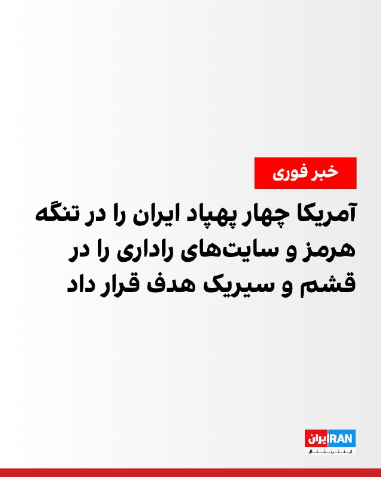

ستاد فرماندهی مرکزی آمریکا، سنتکام، اعلام کرد نیروهایش چهار پهپاد انتحاری ایران را که به سمت تنگه هرمز پرتاب شده بودند، سرنگون کردند و در ادامه، برای دفاع در برابر حملات بیشتر، سایت‌های رادار نظارتی ساحلی جمهوری اسلامی در جزیره قشم و گروک در سیریک را هدف قرار دادند.
سنتکام بر آمادگی خود برای پاسخ به «تجاوز غیرموجه ایران» در چارچوب دفاع از خود تاکید کرد.

https://iranintl.com/202606054048

## Shin_Persian — post 6555

  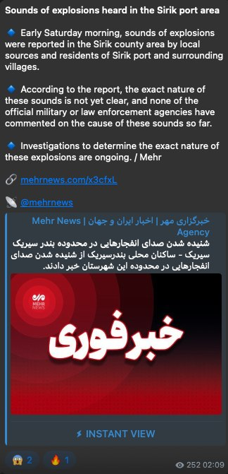

Shin ✓ @hey_itsmyturn
Fri, 05 Jun 2026 23:15:52 UTC

State-owned Mehr News confirms the explosions in Sirik.

فارسی

خبرگزاری دولتی مهر وقوع انفجارها در سیریک را تأیید کرد.

𝕏 · @shin_persian

## Shin_Persian — post 6554

Shin ✓ @hey_itsmyturn
Fri, 05 Jun 2026 23:14:05 UTC

There are casualties amongst IRGC terrorists in Sirik Naval base.
One identified so far:
Saeed Chileh Var (سعید چیله ور) from the missile squad

فارسی

تلفاتی در میان تروریست‌های سپاه پاسداران انقلاب اسلامی (IRGC) در پایگاه دریایی سیریک وجود دارد.
تاکنون یک نفر شناسایی شده است:
سعید چیله‌ور از واحد موشکی

𝕏 · @shin_persian

## FarsiVOA — post 219721

🔺یک مقام آمریکایی به صدای آمریکا: به جمهوری اسلامی اجازه نمی‌دهیم از «جام جهانی» فوتبال برای آوردن تروریست‌ها «سوءاستفاده» کند

▪️کاخ سفید به صدای آمریکا گفت که ایالات متحده به جمهوری اسلامی اجازه «سوءاستفاده» از جام جهانی برای انجام اقدامات تروریستی را نخواهد داد.

⬇️ بیشتر بخوانید:
https://ir.voanews.com/a/8157943.html
@FarsiVOA

## FarsiVOA — post 219720

⚡️افزایش اعتیاد و کشت خشخاش به جای برنج در ایران؛ ‌گفت‌وگو با فریدون رحمانی جامعه‌شناس
@FarsiVOA

## FarsiVOA — post 219719

  <a href="telegram/content/FarsiVOA_219719_1780704634.mp4" target="_blank">🎬 Download video</a>

⚡️هزینه اعدام‌ها برای جمهوری اسلامی چگونه زیاد خواهد شد؟ گفت‌وگو با حسن بنی‌هاشم مدافع حقوق بشر
@FarsiVOA

## FarsiVOA — post 219718

🔺گزارش شبکه آمریکایی از شلیک چند پهپاد از سوی جمهوری اسلامی به سمت تنگه هرمز

▪️شبکه سی‌ان‌ان به نقل از یک مقام آمریکایی گزارش داده است که جمهوری اسلامی چندین پهپاد را به سمت تنگه هرمز شلیک کرده است.

⬇️ بیشتر بخوانید:
https://ir.voanews.com/a/8157796.html
@FarsiVOA

## FarsiVOA — post 219717

⚡️نفوذ شرکت‌های وابسته به سپاه در پروژه‌های عراق و افشای پرداخت‌های میلیاردی به اسماعیل قاآنی
@FarsiVOA

## Persian_Trend_Official — post 15780

  <a href="telegram/content/Persian_Trend_Official_15780_1780704634.mp4" target="_blank">🎬 Download video</a>

شنیده شدن صدای جنگنده احتمالا امریکایی در نزدیکی شهر بصره عراق

📝 Amir

📌 @persian_trend_official
پرشین ترند | متفاوت‌ترین کانال نظامی

## Persian_Trend_Official — post 15779

  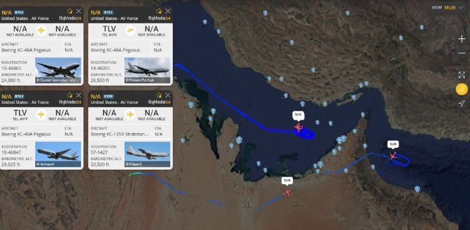

پرواز چهار تانکر سوخت رسان امریکایی برفراز خلیج‌ فارس و دریای عمان

📝 Amir

📌 @persian_trend_official
پرشین ترند | متفاوت‌ترین کانال نظامی

## Persian_Trend_Official — post 15778

  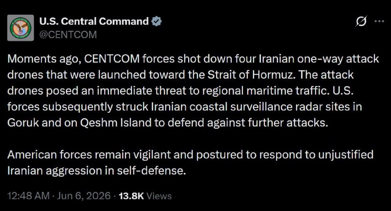

سنتکام: چند لحظه پیش، نیروهای سنتکام چهار پهپاد انتحاری ایرانی را که به سمت تنگه هرمز پرتاب شده بودند، سرنگون کردند.

این پهپادهای تهاجمی تهدیدی فوری برای تردد دریایی منطقه محسوب می‌شدند. در ادامه، نیروهای آمریکایی برای جلوگیری از حملات بیشتر، سایت‌های رادار مراقبت ساحلی ایران در گورک و جزیره قشم را هدف قرار دادند.

نیروهای آمریکایی همچنان در حالت آماده‌باش و هوشیار قرار دارند و برای پاسخ به هرگونه اقدام تهاجمی غیرموجه ایران در چارچوب دفاع از خود، آماده هستند.

📝 Amir

📌 @persian_trend_official
پرشین ترند | متفاوت‌ترین کانال نظامی

## IranianMinds — post 21467

  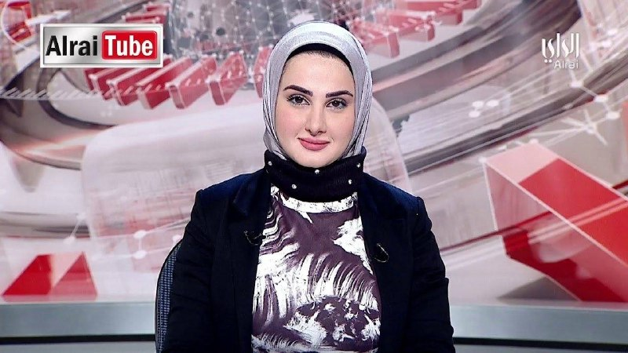

🔴 ایشون زینب دشتی هستن مجری تلویزیون کویت، که اومد از جمهوری اسلامی حمایت کرد و دولت کویت هم برای همیشه اخراجش کرد و از کارای دولتی کاملا محرومش کرد و به سه سال زندان هم محکوم شد.

@IranianMinds

## IranianMinds — post 21466

  <a href="telegram/content/IranianMinds_21466_1780704637.webm" target="_blank">🎬 Download video</a>

🤩
🤩
🤩
🤩 بونوس اضافه به ازای هر واریز 
💰

🔴فرصت تکرارنشدنی به مناسبت افتتاحیه
🔴

⚡️هر چقدر شارژ کنی، بیشتر هدیه می‌گیری
⚡️

🔴تا سقف ۳ میلیون تومان
🔴

⌛ فقط برای مدت محدود

💣بالاترین بونوس‌ها فقط در سایت وینرو

پیش بینی کن و برنده شو
🎯
aa15

📺 تلویزیون لایو برای پوشش بازی ها

🛍بالاترین ضرایب ممکن
و هزاران امکانات خاص دیگه
💰

🚩
🚩 خرداد افتتاحیه بزرگ سایت وینرو
🟥 همین الان ثبت نام کن و علاوه بر ۵۰۰ هزار تومن بونوس ثبت نام با هر شارژ تا ۲۰۰ درصد شارژ اضافه از ما هدیه بگیر

🔤 Winro.io         معتبرترین سایت ایران

🔤 Winro.io

📱 کانال اخبار و هدایــا 
🌟

📱 @winro_io

## IranianMinds — post 21461

🔴 این پرستوی حکومتی صدف طاهریان هم‌ اومد کل عکسای لختیشو از پیجش پاک کرد و گفت برگشتم به وطن

@IranianMinds

## IranianMinds — post 21460

🔴 خبرگزاری تسنیم :

آمریکا دوباره بهمون اتک زد.

@IranianMinds

---
📅 بروزرسانی: 1405/03/16 02:39
---

## VahidOOnLine — post 243873

  

♦️فرماندهی مرکزی ایالات متحده (سنتکام)، بامداد شنبه، ۱۶ خردادماه، با انتشار بیانیه‌ای رسمی اعلام کرد که نیروهای ارتش آمریکا چهار فروند پهپاد انتحاری (یک‌طرفه) ایران را که به سمت تنگه هرمز پرتاب شده و تهدیدی فوری برای تردد دریایی منطقه به شمار می‌رفتند، سرنگون کرده‌اند. بر اساس این بیانیه، نیروهای آمریکایی متعاقب و با هدف دفاع از خود در برابر حملات بیشتر، سایت‌های راداری نظارت ساحلی ایران را در منطقه «گروک» و «جزیره قشم» هدف حمله قرار دادند. سنتکام در پایان با تاکید بر حفظ آمادگی کامل نیروهای آمریکایی افزود که واشنگتن برای دفاع از خود و پاسخ به «تجاوزات توجیه‌ناپذیر ایران»، در حالت آماده‌باش قرار دارد.
‌🇸🇦 Indypersian

🤖 @VahidOOnLine

## VahidOOnLine — post 243872

  

ترامپ در گفت‌وگو با ان‌بی‌سی گفت که حکومت ایران هنوز ۲۱ تا ۲۲ درصد از موشک‌های خود را حفظ کرده است. او گفت که رهبران حکومت ایران هنوز با آمریکا برای پایان جنگ به توافق نرسیده‌اند، زیرا آنها «قوی» و «مغرور» هستند، اما در نهایت «آنها چاره‌ای جز توافق ندارند و کمی طول می‌کشد.»
او افزود: «بیشتر کارخانه‌های پهپادسازی ‌آن‌ها از کار افتاده‌، بیشتر سکوهای پرتاب از کار افتاده‌ و بیشتر مناطق تولید موشک از کار افتاده‌اند. اما آن‌ها هنوز ظرفیت تولید دارند. آن‌ها تعدادی موشک و تعدادی پهپاد دارند. به نظر من، شاید ۲۱ تا ۲۲ درصد از موشک‌های‌شان. این تعداد زیادی موشک است، اما این میزان، آن چیزی نیست که در زمان حمله اولیه ما بود.»
ترامپ مدت زمان درگیری جاری را با جنگ ویتنام مقایسه کرد و گفت: «من خیلی سریع پیش می‌روم. سه ماه است که درگیر آن هستم. می‌دانید، ویتنام ۱۹ سال طول کشید. من در ماه سوم هستم و تنها کاری که آن‌ها می‌کنند، این است که می‌گویند کی قرار است پیروز شویم. اگر من یک دموکرات بودم، هیچ کس این‌طور صحبت نمی‌کرد، اما برای من مهم نیست. من به آن عادت کرده‌ام.»
‌🏁 🇬🇧 IranintlTV

🤖 @VahidOOnLine

## VahidOOnLine — post 243871

  

♦️«سی‌ان‌ان» به نقل از یک مقام رسمی ایالات متحده، بامداد شنبه، ۱۶ خردادماه، گزارش داد که ایران چند پهپاد را به سمت تنگه هرمز پرتاب کرده و نیروهای آمریکایی مستقر در منطقه موفق شده‌اند دست‌کم چهار پهپاد را سرنگون کنند. به گفته این مقام مسئول، واشنگتن ظن آن را دارد که این پهپادهای انتحاری با هدف حمله به کشتی‌های تجاری در حال عبور از آب‌های منطقه یا هدف قرار دادن نیروهای نظامی ایالات متحده که در آن حوالی عملیات انجام می‌دهند، به پرواز درآمده بودند.
‌🇸🇦 Indypersian

🤖 @VahidOOnLine

## VahidOOnLine — post 243870

  

♦️ولادیمیر پوتین، رئیس‌جمهوری روسیه، در جریان سخنرانی خود در مجمع اقتصادی سن‌پترزبورگ، درخواست ولودیمیر زلنسکی برای برگزاری یک دیدار دوجانبه و فوری جهت پایان دادن به جنگ چهار ساله را رد کرد و با بی‌فایده خواندن این ملاقات پیش از دستیابی به یک توافق صلح اولیه، تاکید کرد که عملیات نظامی روسیه تا تحقق کامل تمامی اهداف تعیین‌شده از جمله کنترل کامل بر منطقه دونباس و اعمال محدودیت‌های شدید سیاسی و نظامی بر کی‌یف ادامه خواهد یافت. این موضع‌گیری تند با واکنش شدید رئیس‌جمهوری اوکراین روبرو شد، به طوری که زلنسکی پاسخ پوتین را «ضعیف» توصیف کرد و گفت که رهبر روسیه بار دیگر گزینه جنگ را انتخاب کرده است. همزمان با بن‌بست در تلاش‌های دیپلماتیک و در شرایطی که قرار است زلنسکی روز یکشنبه در لندن با رهبران غربی از جمله فریدریش مرز، صدراعظم آلمان و امانوئل مکرون، رئیس‌جمهوری فرانسه دیدار کند، حملات مرگبار میدانی روسیه به شرق اوکراین همچنان ادامه دارد و پوتین با رد گزارش‌ها درباره فروپاشی اقتصاد مسکو تحت فشارهای کمرشکن جنگ، ادعا کرد که شایعات درباره بحران اقتصادی روسیه به شدت مبالغه‌آمیز است.
‌🇸🇦 Indypersian

🤖 @VahidOOnLine

## VahidOOnLine — post 243869

  

سی‌ان‌ان به نقل از یک مقام آمریکایی گزارش داد جمهوری اسلامی چندین پهپاد انتحاری را به سمت تنگه هرمز پرتاب کرد که هواپیماهای آمریکا دست‌کم چهار پهپاد را سرنگون کردند.
این مقام گفت مقام‌های آمریکایی گمان می‌کنند این پهپادها کشتی‌های تجاری در حال عبور از آب‌های منطقه یا نیروهای آمریکایی فعال در نزدیکی آن منطقه را هدف قرار داده بودند.

‌🏁 🇬🇧 IranintlTV

🤖 @VahidOOnLine

## VahidOOnLine — post 243868

  

♦️دونالد ترامپ، رئیس‌جمهوری آمریکا، در گفتگو با شبکه «ان‌بی‌سی نیوز» با تاکید بر اینکه مقامات ایران به شدت به دنبال توافق هستند اما به دلیل «قوی و مغرور بودن»، پذیرش شرایط برایشان دشوار است، اعلام کرد: «آن‌ها در موقعیتی قرار گرفته‌اند که باور نمی‌کنند سرشان بریده و ارتش آن‌ها کاملا نابود شده است.» ترامپ با اشاره به اینکه تهران پیش از این دو بار در آستانه دستیابی به سلاح هسته‌ای قرار داشت، خروج خود از برجام را که آن را مسیر رسیدن ایران به بمب اتمی می‌دانست، ستود و افزود: «بسیاری از کارخانه‌های پهپادی، سکوهای پرتاب و مراکز تولید موشک ایران از بین رفته‌اند و در حال حاضر تنها حدود ۲۱ تا ۲۲ درصد از موشک‌های آن‌ها باقی مانده است؛ این میزان هنوز کم نیست، اما با آنچه در شروع حمله داشتند قابل مقایسه نیست.» او با انتقاد از فشارها برای توافق فوری، سرعت خود را با جنگ ۱۹ ساله ویتنام مقایسه کرد و گفت: «من بسیار سریع حرکت می‌کنم و تازه در ماه سوم هستم؛ این آدم‌ها ۴۷ سال است که در حال جنگ هستند و آمریکایی‌ها را کشته‌اند، اما اکنون چاره دیگری ندارند و در نهایت مجبور خواهند شد کارهایی را که هرگز فکرش را هم نمی‌کردند، انجام دهند و توافق کنند.»
‌🇸🇦 Indypersian

🤖 @VahidOOnLine

## VahidOOnLine — post 243867

  

♦️وزارت دادگستری آمریکا با انتشار بیانیه‌ای رسمی اعلام کرد که نیروهای ایالات متحده طی یک عملیات شبانه، ابرنفتکش «ام/تی داوینا» (M/T Davina) معروف به «لنور» را که ظرفیت حمل تا دو میلیون بشکه نفت را دارد و در فهرست تحریم‌های وزارت خزانه‌داری آمریکا علیه بخش نفت و پتروشیمی ایران قرار گرفته است، توقیف کرده‌اند. بر اساس اعلام واشنگتن، این شناور بخشی از «ناوگان سایه» ایران به شمار می‌رود؛ شبکه‌ای از تسهیل‌کنندگان حمل‌ونقل غیرقانونی که به گفته مقامات آمریکایی، به درآمدزایی انرژی برای نظام ایران، به خطر انداختن ثبات منطقه و حمله به شرکا و متحدان ایالات متحده کمک کرده است. وزارت دادگستری آمریکا تاکید کرد که این اقدام بخشی از تلاش‌های هماهنگ با سایر نهادهای دولتی برای اختلال در شبکه قاچاق نفت و درآمدزایی‌هایی است که به سود دولت ایران و سپاه پاسداران تمام می‌شود.
‌🇸🇦 Indypersian

🤖 @VahidOOnLine

## WithYashar — post 13601

کانال ۱۴: همه امیدوار بودند که آتش بس برقرار شود، اما بازی به طور کامل در حال تغییر است. برای یک آخر هفته فوق العاده گرم در خاورمیانه آماده می شوند، زیرا ایران و آمریکا از اعتصابات تصادفی شبانه به رویارویی های روز روشن تغییر می کنند!
@withyashar

## WithYashar — post 13600

سنتکام : چند لحظه پیش، نیروهای سنتکام چهار پهپاد تهاجمی یک‌طرفهٔ ایرانی را که به سمت تنگهٔ هرمز پرتاب شده بودند، سرنگون کردند. این پهپادهای تهاجمی تهدیدی فوری برای تردد دریایی منطقه ایجاد کرده بودند. در ادامه، نیروهای آمریکا برای دفاع در برابر حملات بیشتر، سایت‌های رادار مراقبت ساحلی ایران در گورک و جزیرهٔ قشم را هدف قرار دادند.
نیروهای آمریکایی همچنان هوشیار هستند و برای پاسخ‌دادن به تجاوز بی‌دلیل ایران در چارچوب دفاع از خود، در حالت آماده‌باش قرار دارند.
🚨🚨🚨🚨🚨🚨🚨
@withyashar

## WithYashar — post 13599

🚨سنتکام از حمله به سایت های راداری قشم خبر داد!
@withyashar

## WithYashar — post 13598

چندین انفجار در سيريك
🚨🚨🚨🚨🚨🚨🚨
@withyashar

## WithYashar — post 13597

سی‌بی‌اس نیوز به نقل از یک مقام آمریکایی: نیروهای آمریکایی حداقل ۴ پهپاد را که توسط ایران به سمت تنگه هرمز پرتاب شده بود، سرنگون کرده‌اند.🚨
@withyashar بچه جنگ شده باز

## WithYashar — post 13596

⚠️ @withyashar گول نخوری !

## WithYashar — post 13595

فقط در ۴ ماه ! بسوزید عرزشی ها

## WithYashar — post 13594

💥290k عرزشی سوز ترین کانال تلگرام

## WithYashar — post 13593

گزارش هایی از قطع شدن اینترنت
@withyashar

## WithYashar — post 13592

سی ان ان : منابع می گوید ایران چندین پهپاد را به سمت تنگه هرمز پرتاب کرده است. نیروهای ایالات متحده حداقل 3 تا از آنها را رهگیری کردند
@withyashar 🚨

## WithYashar — post 13591

دوتا صدای انفجار الان ومد همین الان قشم🚨
@withyashar

## WithYashar — post 13590

مجری ان‌بی‌سی: رهبران جمهوری اسلامی معتقد نیستن که به‌طور کامل شکست خوردن.

ترامپ: ایران به دلیل تصور برخورداری از قدرت کافی، از امضای توافق خودداری کرده. ایران در نهایت گزینه‌ای جز توافق نخواهد داشت.
@withyashar

## WithYashar — post 13589

ترامپ به ان بی سی:
خیلی از مقاماتشون مغرورن، یه سری کارها هست که هیچوقت فکر نمی‌کردن مجبور بشن انجام بدن ولی الان مجبور شدن، راه دیگه‌ای ندارن و این قضیه زمان می‌بره.

داریم درباره 47 سال حرف میزنیم که هر کاری خواستن انجام دادن.
@withyashar

## mwarmonitor — post 10197

درگیری‌ های پراکنده در اطراف جزیره خارک و تنگه هرمز گزارش شده

## FoxNewsTwitter — post 342665

  <a href="telegram/content/FoxNewsTwitter_342665_1780700969.mp4" target="_blank">🎬 Download video</a>

Fox News (Twitter/X)

RT @EricShawnTV: It certainly was the most unexpected celebration of our country’s founding, the July 4th block party sponsored by John Gotti. A look back at the days of the Mafia Don in the new documentary “Gotti’s Guy,” now streaming on Fox Nation. @foxnation @FoxNews @foxnewspolitics

## pm_afshaa — post 92347

  <a href="telegram/content/pm_afshaa_92347_1780700971.webm" target="_blank">🎬 Download video</a>

🔴سی‌ان‌ان: امشب ایران پهپادهایی رو به سمت تنگه هرمز پرتاب کرده و نیروهای آمریکایی 3 فروند پهباد رو سرنگون کردن. هدف این پهپادها یا کشتی‌های تجاری عبوری از منطقه بوده یا نیروهای آمریکایی مستقر در اطراف تنگه هرمز. 
💧 Rainbet.com the #1 Non-KYC Crypto Casino…

## pm_afshaa — post 92346

  <a href="telegram/content/pm_afshaa_92346_1780700971.webm" target="_blank">🎬 Download video</a>

🔴سی‌ان‌ان: امشب ایران پهپادهایی رو به سمت تنگه هرمز پرتاب کرده و نیروهای آمریکایی 3 فروند پهباد رو سرنگون کردن.

هدف این پهپادها یا کشتی‌های تجاری عبوری از منطقه بوده یا نیروهای آمریکایی مستقر در اطراف تنگه هرمز.

💧 Rainbet.com the #1 Non-KYC Crypto Casino & Sportsbook @rainbetcom

😁 @Pm_Afshaa

## pm_afshaa — post 92345

  <a href="telegram/content/pm_afshaa_92345_1780700971.mp4" target="_blank">🎬 Download video</a>

🔴ترامپ: این دیگه خیلی جنگ حساب نمیشه؛ یه درگیری نظامیه که بیشتر شبیه تمرین می‌مونه.

💧 Rainbet.com the #1 Non-KYC Crypto Casino & Sportsbook @rainbetcom

😁 @Pm_Afshaa

## pm_afshaa — post 92344

🎙️مجری ان‌بی‌سی: رهبران جمهوری اسلامی معتقد نیستن که به‌طور کامل شکست خوردن.

ترامپ: ایران به دلیل تصور برخورداری از قدرت کافی، از امضای توافق خودداری کرده. ایران در نهایت گزینه‌ای جز توافق نخواهد داشت.

💧 Rainbet.com the #1 Non-KYC Crypto Casino & Sportsbook @rainbetcom

😁 @Pm_Afshaa

## pm_afshaa — post 92343

  <a href="telegram/content/pm_afshaa_92343_1780700972.webm" target="_blank">🎬 Download video</a>

🔴ترامپ به ان بی سی:
خیلی از مقاماتشون مغرورن، یه سری کارها هست که هیچوقت فکر نمی‌کردن مجبور بشن انجام بدن ولی الان مجبور شدن، راه دیگه‌ای ندارن و این قضیه زمان می‌بره.

داریم درباره 47 سال حرف میزنیم که هر کاری خواستن انجام دادن.

💧 Rainbet.com the #1 Non-KYC Crypto Casino & Sportsbook @rainbetcom

😁 @Pm_Afshaa

## DEJradio — post 5380

  <a href="telegram/content/DEJradio_5380_1780700973.mp4" target="_blank">🎬 Download video</a>

🤡
🔺 رزمایش حمله به هلیکوپتر پارچه‌ای
گزارش از خانم محمودی

#پدافند #لانچر
@DEJradio

## DEJradio — post 5379

  <a href="telegram/content/DEJradio_5379_1780700975.mp4" target="_blank">🎬 Download video</a>

🚨
🔸 خبر ۲۱
آدینه ۱۵ خرداد ۱۴۰۵

#خبر۲۱
@DEJradio

## DEJradio — post 5378

  <a href="telegram/content/DEJradio_5378_1780700976.mp4" target="_blank">🎬 Download video</a>

🔺🎥 #خبرنامه_امیرکبیر گزارش داد جمعی از دانشجویان دانشگاه علوم پزشکی بوشهر روز چهارشنبه ۱۳ خرداد ۱۴۰۵ در اعتراض به کیفیت نامناسب غذای سلف دانشگاه، دست به اعتصاب غذا زدند.

دانشجویان معترض نسبت به کیفیت پایین غذا، تنوع محدود وعده‌های غذایی، مشکلات بهداشتی و بی‌توجهی مسئولان به سلامت دانشجویان اعتراض کرده‌اند. آنان می‌گویند طی ماه‌های گذشته بارها این مشکلات را از مسیرهای رسمی و اداری پیگیری کرده‌اند، اما درخواست‌هایشان بدون پاسخ مؤثر باقی مانده است.

دانشجویان اعلام کرده‌اند در صورت ادامه وضعیت موجود و عدم رسیدگی به مطالبات و حقوق دانشجویان، هر روز این اعتصاب غذای خود را تکرار خواهند کرد.

#بوشهر
@DEJradio

## DEJradio — post 5377

  <a href="telegram/content/DEJradio_5377_1780700978.mp4" target="_blank">🎬 Download video</a>

🔺📢 سرهنگ پزشک علی خانی از معاونت بهداشت و درمان فراجا در ویدیویی با خطاب قرار دادن مجتبی خامنه‌ای،‌‌ از فساد و تخلف فرماندهان آن معاونت و سکوت و بی‌توجهی فرماندهان ارشد و هیات رییسه فراجا نسبت به اعتراض و شکایات پرسنل اعتراض کرد.

#فراجا
@DEJradio

## DEJradio — post 5376

  <a href="telegram/content/DEJradio_5376_1780700980.webm" target="_blank">🎬 Download video</a>

🚨📢 بر اساس گزارش‌های دریافتی، «زهرا عاطفی‌فرد» از کارکنان کلانتری ۲۱ قم، پس از مصرف تعداد زیادی قرص به زندگی خود پایان داد.

برخی منابع علت این اقدام را فشارهای روحی و روانی و مشکلات ناشی از محیط کاری عنوان کرده‌اند؛ با این حال تاکنون جزئیات رسمی و تأییدشده‌ای درباره علت این حادثه منتشر نشده است.

در صورت انتشار اطلاعات رسمی از سوی مراجع ذی‌صلاح، جزئیات تکمیلی اطلاع‌رسانی خواهد شد.

#خودکشی #نیروی_انتظامی #قم
@DEJradio

## VahidOnline — post 75957

سیریک در هرمزگان

پیام‌های دریافتی:
پایگاه نیروی دریایی سپاه بندر سیریک رو همین الان دوباره زدند. همون لوکیشن چند روز پیش.

شهرستان سیریک صدای لانچ موشک ساعت ۲:۱۴

سلام ساعت دو ده دیقه
پنج تا انفجار نیرو دریای سپاه سیرک هرمزگان

📡 @VahidOnline

## VahidOnline — post 75956

  

🔻وب‌سایت آکسیوس گزارش داده است که استیو ویتکاف و جرد کوشنر، فرستادگان دونالد ترامپ، روز پنجشنبه برای رایزنی با گروهی از کارشناسان فنی به آزمایشگاه ملی اوک‌ریج در ایالت تنسی سفر کردند.

به نوشته آکسیوس، کاخ سفید در تلاش است با ایران بر سر یک تفاهم‌نامه برای پایان دادن به جنگ و آغاز مذاکرات تفصیلی هسته‌ای «به توافق برسد» و می‌خواهد در صورت آغاز این مذاکرات، تیم کارشناسی لازم را آماده داشته باشد.

به گفته منابع آمریکایی و منطقه‌ای، تهران و واشنگتن همچنان بر سر برخی جزئیات این تفاهم‌نامه اختلاف دارند، اما مذاکرات وارد مراحل پایانی شده است.
@VahidHeadline

📡 @VahidOnline

## VahidOnline — post 75955

  

سی‌ان‌ان به نقل از یک مقام آمریکایی گزارش داد جمهوری اسلامی چندین پهپاد انتحاری را به سمت تنگه هرمز پرتاب کرد که هواپیماهای آمریکا دست‌کم چهار پهپاد را سرنگون کردند.
این مقام گفت مقام‌های آمریکایی گمان می‌کنند این پهپادها کشتی‌های تجاری در حال عبور از آب‌های منطقه یا نیروهای آمریکایی فعال در نزدیکی آن منطقه را هدف قرار داده بودند.
@VahidOOnLine
ساعتی پیش‌تر اخباری درباره خارک و بندرعباس در بعضی منابع منتشر شده بود، خبرگزاری مهر میگه صحت ندارند:
جمعه شب خبرهایی مبنی بر شنیده شدن صدای انفجار و پدافند در جزیره خارگ منتشر شده است.
پیگیری های خبرنگار مهر مستقر در جزیره خارگ نشان می دهد، چنین خبری صحت ندارد.
بامداد شنبه برخی فعالین فضای مجازی مدعی وقوع درگیری‌ها و حملاتی به شهر بندرعباس شدند که بررسی‌های خبرنگار مهر نشان می‌دهد هیچ‌گونه درگیری در این شهر اتفاق نیفتاده است.
شلیک‌هایی در این منطقه صورت گرفته که جنبه اخطار داشته و کانون تحرکات در دریا و فراتر از جزیره لارک بوده است.
📡 @VahidOnline

## IranIntlTV — post 340736

  

ترامپ در گفت‌وگو با ان‌بی‌سی گفت که حکومت ایران هنوز ۲۱ تا ۲۲ درصد از موشک‌های خود را حفظ کرده است. او گفت که رهبران حکومت ایران هنوز با آمریکا برای پایان جنگ به توافق نرسیده‌اند، زیرا آنها «قوی» و «مغرور» هستند، اما در نهایت «آنها چاره‌ای جز توافق ندارند و کمی طول می‌کشد.»
او افزود: «بیشتر کارخانه‌های پهپادسازی ‌آن‌ها از کار افتاده‌، بیشتر سکوهای پرتاب از کار افتاده‌ و بیشتر مناطق تولید موشک از کار افتاده‌اند. اما آن‌ها هنوز ظرفیت تولید دارند. آن‌ها تعدادی موشک و تعدادی پهپاد دارند. به نظر من، شاید ۲۱ تا ۲۲ درصد از موشک‌های‌شان. این تعداد زیادی موشک است، اما این میزان، آن چیزی نیست که در زمان حمله اولیه ما بود.»
ترامپ مدت زمان درگیری جاری را با جنگ ویتنام مقایسه کرد و گفت: «من خیلی سریع پیش می‌روم. سه ماه است که درگیر آن هستم. می‌دانید، ویتنام ۱۹ سال طول کشید. من در ماه سوم هستم و تنها کاری که آن‌ها می‌کنند، این است که می‌گویند کی قرار است پیروز شویم. اگر من یک دموکرات بودم، هیچ کس این‌طور صحبت نمی‌کرد، اما برای من مهم نیست. من به آن عادت کرده‌ام.»
https://iranintl.com/202606057759

## IranIntlTV — post 340735

  <a href="telegram/content/IranIntlTV_340735_1780700981.mp4" target="_blank">🎬 Download video</a>

🔻ساعاتی پیش از سفر تیم ملی فوتبال به مکزیک برای اقامت در کمپ اصلی تمرینی جام جهانی ۲۰۲۶، خبرگزاری رویترز گزارش داد آمریکا برای همه بازیکنان تیم ملی، ویزا صادر کرده است.

🔹در ادامه، شبکه تلویزیونی الجزیره هم به نقل از منابعی آگاه نوشت که آمریکا دست‌کم برای ۱۵ نفر از کادر فنی و اجرایی تیم ملی، ویزا صادر نکرده است.

🔹قرار است تیم فوتبال ایران در مرحله گروهی جام جهانی ۲۰۲۶ در شهرهای لس آنجلس و سیاتل با نیوزیلند، بلژیک و مصر بازی کند.

🔹رضا محدث، خبرنگار ایران اینترنشنال گزارش می‌دهد.

@iranintltvsport

## IranIntlTV — post 340734

  <a href="telegram/content/IranIntlTV_340734_1780700983.mp4" target="_blank">🎬 Download video</a>

وزارت خزانه‌داری آمریکا ۱۲ نهاد فعال در حوزه‌های کشتیرانی، نفت، گاز و پتروشیمی را در فهرست تحریم‌ها قرار داد.

همچنین شش فروند کشتی با پرچم پاناما و سنت کیتس نیز در همین چارچوب تحریم شده‌اند.

گفت‌وگو با میعاد ملکی، رییس پیشین دفتر هدف‌گذاری تحریم‌های وزارت خزانه‌داری آمریکا
@iranintltv

## IranIntlTV — post 340733

  <a href="telegram/content/IranIntlTV_340733_1780700984.mp4" target="_blank">🎬 Download video</a>

هیات منصفه دادگاه سلطنتی وولویچ دو متهم پرونده حمله به پوریا زراعتی، مجری ایران‌اینترنشنال، را به اتفاق آرا مجرم شناخت.
بر اساس این گزارش، قاضی اعلام کرد جلسه صدور حکم در ۱۲ تیر ماه برگزار خواهد شد.

علی رشید از مقابل دادگاه گزارش می‌دهد.
@iranintltv

## IranIntlTV — post 340732

  

سی‌ان‌ان به نقل از یک مقام آمریکایی گزارش داد جمهوری اسلامی چندین پهپاد انتحاری را به سمت تنگه هرمز پرتاب کرد که هواپیماهای آمریکا دست‌کم چهار پهپاد را سرنگون کردند.
این مقام گفت مقام‌های آمریکایی گمان می‌کنند این پهپادها کشتی‌های تجاری در حال عبور از آب‌های منطقه یا نیروهای آمریکایی فعال در نزدیکی آن منطقه را هدف قرار داده بودند.

https://iranintl.com/202606058431

## IranIntlTV — post 340731

  

🔻تام باراک، سفیر آمریکا در ترکیه روز جمعه در پیامی در شبکه ایکس صدور ویزا برای بازیکنان تیم ملی را تأیید کرد: «به تیم فوق‌العاده‌مان در سفارت آمریکا در آنکارا افتخار می‌کنیم که برای رسیدگی به درخواست ویزای تیم فوتبال ایران در مسیر حضورشان در جام جهانی در ایالات متحده تلاش کردند.»

🔹او این مطلب را در واکنش به گزارشی منتشر کرد که اعلام کرده بود بازیکنان ایران ویزای ورود به آمریکا را دریافت کرده‌اند.

🔹رویترز روز جمعه به نقل از یک مقام کاخ سفید خبر داد بازیکنان تیم ملی برای ورود به آمریکا ویزا دریافت کرده‌اند.

🔹همچنین الجزیره به نقل از منابعی گزارش داد که دست‌کم ۱۵ نفر از اعضای کادر تیم ملی ایران با رد درخواست ویزای خود از سوی ایالات متحده برای حضور در جام جهانی ۲۰۲۶ مواجه شده‌اند. این افراد شامل برخی مربیان، اعضای کادر فنی و کارکنان اجرایی هستند.

🔹منابع این رسانه گفته‌اند که برخی از افرادی که ویزای آن‌ها رد شده، به‌طور رسمی از سوی فیفا به‌عنوان بخشی از کادر مربیگری و یا فنی تیم به رسمیت شناخته شده بودند: «بازیکنان تحت تأثیر این تصمیم قرار نگرفته‌اند.»

@iranintltvsport

## Shin_Persian — post 6553

این یارو قیصر بود رفته تهران واسه عرزشیا خونده؟ اسم اصلیش بینش بلوره :)))

## Shin_Persian — post 6551

↩️ Quoted tweet:
Tammuz Intel ✓ @Tammuz_Intel
Fri, 05 Jun 2026 22:44:56 UTC

Unknown drone was shot down over Baiji Oilfields by Iraqi security forces.

↩️ توییت نقل‌قول شده — برای پاسخ، پست زیر را ببینید.

فارسی

یک پهپاد ناشناس توسط نیروهای امنیتی عراق بر فراز میدان‌های نفتی بیجی سرنگون شد.

𝕏 · @shin_persian

## Shin_Persian — post 6550

Shin ✓ @hey_itsmyturn
Fri, 05 Jun 2026 22:51:15 UTC

Sirik Naval Base has been targeted @ 2240Z Hormozgan Province, #Iran

فارسی

پایگاه دریایی سیریک در ساعت ۲۲۴۰ زولو (۰۲:۱۰ به وقت تهران) در استان هرمزگان هدف قرار گرفته است. #Iran

𝕏 · @shin_persian

## Shin_Persian — post 6546

Shin ✓ @hey_itsmyturn
Fri, 05 Jun 2026 22:49:10 UTC

CENTCOM: U.S. forces shot down four Iranian one-way attack drones heading toward the Strait of Hormuz, then struck Iranian coastal radar sites in Goruk and Qeshm Island. The drones posed an immediate threat to maritime traffic.

فارسی

سنتکام (ستاد فرماندهی مرکزی ایالات متحده): نیروهای آمریکایی چهار پهپاد تهاجمی یک‌طرفه ایرانی را که به سمت تنگه هرمز در حرکت بودند سرنگون کردند و سپس سایت‌های راداری ساحلی ایران در گروک و جزیره قشم را مورد هدف قرار دادند. این پهپادها تهدیدی فوری برای تردد دریایی بودند.

𝕏 · @shin_persian

## Shin_Persian — post 6544

Shin ✓ @hey_itsmyturn
Fri, 05 Jun 2026 22:44:10 UTC

Numerous #USAF 🇺🇸 tankers up in the region

فارسی

تعداد زیادی تانکر سوخت‌رسان نیروی هوایی ایالات متحده (USAF) 🇺🇸 در منطقه حضور دارند #USAF

𝕏 · @shin_persian

## Shin_Persian — post 6543

Shin ✓ @hey_itsmyturn Fri, 05 Jun 2026 22:31:00 UTC State-owned Mehr regarding the clusterfuck in southern Iran: فارسی خبرگزاری دولتی مهر در رابطه با اوضاع آشفته در جنوب ایران: 𝕏 · @shin_persian

## Shin_Persian — post 6542

  

Shin ✓ @hey_itsmyturn
Fri, 05 Jun 2026 22:31:00 UTC

State-owned Mehr regarding the clusterfuck in southern Iran:

فارسی

خبرگزاری دولتی مهر در رابطه با اوضاع آشفته در جنوب ایران:

𝕏 · @shin_persian

## Shin_Persian — post 6541

یک کسشعری آماده کردم برای دوستانی که MacOS استفاده می کنن برای وی پی ان های رایج MacOS که وقتی شبکه عوض میشه (وای فای یا لن) اتوماتیک اون VPN رو ریکانکت کنه تا یک دقیقه معطل نشید تا اپ وی پی ان تشخیص قطعی و دستور وصل مجدد رو بده.
https://github.com/therealaleph/fastvpnswitcher-macos
(برای خودم نوشتم، گفتم شاید به درد بقیه هم بخوره)

## Shin_Persian — post 6540

Shin ✓ @hey_itsmyturn
Fri, 05 Jun 2026 22:21:05 UTC

🫪
(First time using this emoji)

فارسی

🫪
(اولین بار است که از این ایموجی استفاده می‌کنم)

𝕏 · @shin_persian

## Shin_Persian — post 6539

Shin ✓ @hey_itsmyturn
Fri, 05 Jun 2026 22:19:32 UTC

Initial:
#USAF 🇺🇸 airstrikes on Saladin governorate, western #Iraq 🇮🇶

فارسی

حملات هوایی نیروی هوایی ایالات متحده (USAF) 🇺🇸 به استان صلاح‌الدین در غرب #عراق 🇮🇶

𝕏 · @shin_persian

## Shin_Persian — post 6538

Shin ✓ @hey_itsmyturn
Fri, 05 Jun 2026 22:17:18 UTC

Explosions reported in Salah al-Din Province, #Iraq 🇮🇶

فارسی

گزارش‌هایی از وقوع انفجار در استان صلاح‌الدین، #Iraq 🇮🇶 منتشر شده است.

𝕏 · @shin_persian

## Shin_Persian — post 6537

  

Shin ✓ @hey_itsmyturn
Fri, 05 Jun 2026 22:12:11 UTC

3 blasts in Qeshm island, Hormozgan Province, #Iran
2 @ 2208Z and one at 2211Z

فارسی

۳ انفجار در جزیره قشم، استان هرمزگان، #Iran
۲ انفجار در ۲۲۰۸ زولو (۰۱:۳۸ به وقت تهران) و یکی در ۲۲۱۱ زولو (۰۱:۴۱ به وقت تهران)

𝕏 · @shin_persian

## FarsiVOA — post 219716

🔺نیروهای آمریکایی در واکنش به حملات پهپادی جمهوری اسلامی به مواضع آن در شهر گروک و جزیره قشم حمله کردند

▪️ستاد فرماندهی مرکزی آمریکا (سنتکام) جمعه شب به وقت واشنگتن گفت: «لحظاتی پیش، نیروهای سنتکام چهار پهپاد تهاجمی یک‌طرفه [جمهوری اسلامی] ایران را که به سمت تنگه هرمز پرواز کرده بودند، سرنگون کردند.»

⬇️ بیشتر بخوانید:
https://ir.voanews.com/a/8157796.html
@FarsiVOA

## FarsiVOA — post 219715

⚡️آخرین صحبت‌های مجتبی ویسی با مأموران، پیش از قتل؛ وداع باشکوه مردم کرمانشاه با برادران ویسی
@FarsiVOA

## FarsiVOA — post 219714

⚡️شکاف عمیق میان صفوف گروه‌های مسلح تحت امر جمهوری اسلامی در عراق
@FarsiVOA

## FarsiVOA — post 219713

  <a href="telegram/content/FarsiVOA_219713_1780700987.mp4" target="_blank">🎬 Download video</a>

⚡️ترامپ: ما برای خارج کردن اورانیوم غنی‌شده مدفون در ایران نیازی به توافق با جمهوری اسلامی نداریم
@FarsiVOA

## FarsiVOA — post 219712

⚡️رضا ولی‌زاده، روزنامه‌نگار آمریکایی-ایرانی زندانی در ایران خواستار کمک واشنگتن برای رسیدگی درمانی شد
@FarsiVOA

## FarsiVOA — post 219711

⚡️حزب‌الله بهانه‌ای برای ادامه چانه‌زنی جمهوری اسلامی؛ ‌گفت‌وگو با یاسین اهوازی کارشناس خاورمیانه
@FarsiVOA

## FarsiVOA — post 219710

⚡️دست رد رئيس جمهوری لبنان به سینه جمهوری اسلامی: دخالت در امور ما وظیفه شما نیست
@FarsiVOA

## FarsiVOA — post 219709

⚡️نماینده شورای هماهنگی تشکل‌های صنفی فرهنگیان ایران، شیوا عاملی‌راد، در نشست سازمان بین‌المللی کار در ژنو، با تأکید بر ضرورت حمایت از حقوق معلمان و کارگران، خواستار موضع‌گیری روشن جامعه جهانی در دفاع از صلح و حقوق بنیادین مردم ایران شد.
@FarsiVOA

## FarsiVOA — post 219708

🔺دونالد ترامپ: رهبران جمهوری اسلامی چون «مغرور» هستند تاکنون توافق نکرده‌اند اما چاره‌ای جز توافق ندارند

▪️رئیس‌جمهوری آمریکا، دونالد ترامپ، روز جمعه در مصاحبه‌ای اختصاصی با شبکه ان‌بی‌سی نیوز گفت که رهبران جمهوری اسلامی هنوز به توافقی با آمریکا برای پایان دادن به جنگ جاری دست نیافته‌اند، زیرا «سرسخت» و «مغرور» هستند، اما در نهایت «چاره‌ای جز توافق ندارند.»

⬇️ بیشتر بخوانید:
https://ir.voanews.com/a/8157786.html
@FarsiVOA

## FarsiVOA — post 219707

  <a href="telegram/content/FarsiVOA_219707_1780700988.mp4" target="_blank">🎬 Download video</a>

⚡️امیرحسین ثابتی مذاکرات با آمریکا را «ابلهانه و سفیهانه» توصیف کرده است؛ مذاکراتی که مقام‌های جمهوری اسلامی می‌گویند با تأیید مجتبی خامنه‌ای در حال انجام است. از بستن تنگه هرمز تا اعتراض به وصل شدن اینترنت، هر جناحی در جمهوری اسلامی ساز خودش را می‌زند.
@FarsiVOA

## Persian_Trend_Official — post 15777

  <a href="telegram/content/Persian_Trend_Official_15777_1780700989.mp4" target="_blank">🎬 Download video</a>

شبتون بخیر 🌌
F-16 Falcon

📌 @persian_trend_official
پرشین ترند | متفاوت‌ترین کانال نظامی

## Persian_Trend_Official — post 15776

  

https://open.spotify.com/episode/5BWJTIpQqxOhVM8u1udJix?si=EYt0QiGDS8aPpioujmuJhw

https://castbox.fm/vi/953436770

نسخه صوتی در کست باکس و اسپاتیفای

## Persian_Trend_Official — post 15775

  <a href="telegram/content/Persian_Trend_Official_15775_1780700991.mp4" target="_blank">🎬 Download video</a>

کاش قاطعیتتون رو نشون بدید عمو ببینه 😎

## IranianMinds — post 21459

دقایقی پیش حملات آمریکا به سایت های رژیم جمهوری اسلامی

چند انفجار در پایگاه نیرو دریایی سپاه سیریک

+ نقض چیه؟؟؟ داریم توافق میکنیم

@IranianMinds

## IranianMinds — post 21458

سنت‌کام: لحظاتی پیش، نیروهای سنتکام چهار پهپاد حمله یک‌طرفه ایرانی را که به سمت تنگه هرمز پرتاب شده بودند، سرنگون کردند. این پهپادهای حمله تهدید فوری برای ترافیک دریایی منطقه بودند. نیروهای آمریکایی سپس سایت‌های رادار نظارت ساحلی ایرانی در خارک و جزیره قشم…

## IranianMinds — post 21457

  

سنت‌کام:

لحظاتی پیش، نیروهای سنتکام چهار پهپاد حمله یک‌طرفه ایرانی را که به سمت تنگه هرمز پرتاب شده بودند، سرنگون کردند. این پهپادهای حمله تهدید فوری برای ترافیک دریایی منطقه بودند.

نیروهای آمریکایی سپس سایت‌های رادار نظارت ساحلی ایرانی در خارک و جزیره قشم را برای دفاع در برابر حملات بیشتر هدف قرار دادند.

@IranianMinds

## IranianMinds — post 21456

عجب جَو عجیبی شده
مخالفای جمهوری اسلامی شدن هیتر ترامپ
موافقای جمهوری اسلامی دارن میشن هیتر جمهوری اسلامی

چرا هیچی سر جاش نیست؟

@IranianMinds

## IranianMinds — post 21455

🔴سی‌ان‌ان به نقل از یک مقام آمریکایی:

ایران چندین پهپاد انتحاری را به سمت تنگه هرمز پرتاب کرد که هواپیماهای آمریکا دست‌کم چهار پهپاد را سرنگون کردند.

@IranianMinds

## BBCPersian — post 282935

  

🔻تام باراک، سفیر آمریکا در ترکیه، روز جمعه در پیامی در شبکه ایکس تایید کرد که برای اعضای تیم ملی فوتبال ایران جهت شرکت در جام جهانی ویزای ورود به آمریکا صادر شده است.

او با اشاره به گزارش‌هایی درباره صدور ویزا برای بازیکنان تیم ملی ایران نوشت: «به تیم فوق‌العاده سفارت آمریکا در آنکارا برای تلاش‌هایشان در صدور ویزا برای تیم ملی فوتبال ایران در مسیر حضور در جام جهانی فوتبال در آمریکا افتخار می‌کنم.»

آقای باراک افزود: «ورزش فراتر از مرزهاست و ما مشتاق استقبال از ورزشکاران و هواداران از سراسر جهان هستیم.»

تیم ملی ایران قرار است روز شنبه از ترکیه راهی اسپانیا شود و سپس به اردوی خود در مکزیک برود. مقام‌های مکزیک نیز برای اعضای این تیم ویزا صادر کرده‌اند.

ایران در جریان مسابقات جام جهانی در مکزیک مستقر خواهد بود، اما هر سه دیدار مرحله گروهی خود را در آمریکا برگزار می‌کند.

قرار بود اردوی تیم ملی ابتدا در آمریکا برپا شود، اما به دلیل تنش‌های میان تهران و واشنگتن، محل اردو به مکزیک تغییر یافت.

@BBCPersian

## BBCPersian — post 282934

  

🔻وزارت دارایی آمریکا روز جمعه اعلام کرد که تحریم‌هایی را علیه یک شبکه اعمال کرده است که به گفته این وزارتخانه با صدور گاز مایع(ال‌پی‌جی) از ایران به جنوب و شرق آسیا، برای دور زدن تحریم‌ها، مبدا آن را به‌طور جعلی عمان اعلام می‌کرده است.

بر اساس بیانیه وزارت دارایی آمریکا، این شبکه از شرکت‌های صوری در امارات متحده عربی و چین و همچنین ناوگانی موسوم به «ناوگان سایه» استفاده می‌کرده است.

وزارت دارایی آمریکا می‌گوید که این سازوکار با هدف دور زدن تحریم‌های موجود آمریکا طراحی شده و محموله‌هایی به ارزش صدها میلیون دلار(ال‌پی‌جی) را جابه‌جا کرده است.

واشنگتن همچنین روز جمعه یک صرافی ایرانی و افراد مرتبط با آن را به اتهام کمک به ایران برای انجام میلیاردها دلار تراکنش مالی تحریم کرد.

تامى پیگوت، سخنگوی وزارت خارجه آمریکا، این اقدامات را بخشی از «کارزار فشار حداکثری اقتصادی» دولت دانست و گفت هدف آن محدود کردن توان ایران در تأمین مالی برنامه‌های تسلیحاتی، حمایت از گروه‌های نیابتی و اقدامات منطقه‌ای است. ادامه خبر را اینجا بخوانید
@BBCPersian

## BBCPersian — post 282933

  

🔻وب‌سایت آکسیوس گزارش داده است که استیو ویتکاف و جرد کوشنر، فرستادگان دونالد ترامپ، روز پنجشنبه برای رایزنی با گروهی از کارشناسان فنی به آزمایشگاه ملی اوک‌ریج در ایالت تنسی سفر کردند.

به نوشته آکسیوس، کاخ سفید در تلاش است با ایران بر سر یک تفاهم‌نامه برای پایان دادن به جنگ و آغاز مذاکرات تفصیلی هسته‌ای «به توافق برسد» و می‌خواهد در صورت آغاز این مذاکرات، تیم کارشناسی لازم را آماده داشته باشد.

به گفته منابع آمریکایی و منطقه‌ای، تهران و واشنگتن همچنان بر سر برخی جزئیات این تفاهم‌نامه اختلاف دارند، اما مذاکرات وارد مراحل پایانی شده است.
@BBCPersian

## Dirty_Kids — post 391104

⚽️ جام جهانی داره شروع میشه و بازار شرطبندی و پیشبینی از همیشه داغ تر هستش 
🔥 https://t.me/+lCR7HeYTU15iNjM0 https://t.me/+lCR7HeYTU15iNjM0 A15 
⚡️ اگر میخوای با آنالیز های رضا کینگ کونگ پول دربیاری توی این جام حتما عضو کانال شو ✅

## Dirty_Kids — post 391103

  

⚽️ جام جهانی داره شروع میشه و بازار شرطبندی و پیشبینی از همیشه داغ تر هستش 
🔥

https://t.me/+lCR7HeYTU15iNjM0
https://t.me/+lCR7HeYTU15iNjM0
A15

⚡️ اگر میخوای با آنالیز های رضا کینگ کونگ پول دربیاری توی این جام حتما عضو کانال شو ✅

## Dirty_Kids — post 391102

  

#بخوابیم

@Dirty_Kids 👻

## Dirty_Kids — post 391101

  

بعد میگن چرا از تجاوز بهش خوشحالی
بچ من ناراحتم که زیر بار تجاوز نمرده

@Dirty_Kids 👻

## Dirty_Kids — post 391100

  <a href="telegram/content/Dirty_Kids_391100_1780700995.mp4" target="_blank">🎬 Download video</a>

آقا این موزیک جدیدا مثل بمب ترکیده توی اینستا و وایرال شده

@Dirty_Kids 👻

## Dirty_Kids — post 391099

  <a href="telegram/content/Dirty_Kids_391099_1780700996.mp4" target="_blank">🎬 Download video</a>

عجب تبلیغی ساخته نایک، عجب ستاره‌هایی

@Dirty_Kids 👻

## Dirty_Kids — post 391098

  <a href="telegram/content/Dirty_Kids_391098_1780700998.mp4" target="_blank">🎬 Download video</a>

آهنگ میخوام از تتلو ورژن اسلامی

@Dirty_Kids 👻

## Dirty_Kids — post 391097

  <a href="telegram/content/Dirty_Kids_391097_1780700998.mp4" target="_blank">🎬 Download video</a>

🔴 دوره زمونه هم عوض شده
الان دیگه دخترا گروهی دعوا میکنند پسرا میشینن یه گوشه نگاه میگنن

@Dirty_Kids 👻

## Dirty_Kids — post 391096

  <a href="telegram/content/Dirty_Kids_391096_1780701000.mp4" target="_blank">🎬 Download video</a>

پیش بینی های درست تاریخ! یا ما خواب بودیم و سر در برف یا حریف مکار و بد حیله گر!

@Dirty_Kids 👻

## alonews — post 125425

  

​
🔼 کسب درآمد از فروش VPN هنوزم ممکنه!

درآمد چندتا از نماینده‌ها رو ببین 
👀

پنل نمایندگی وی‌پی‌ان گذربان، سریع‌ترین و راحت‌ترین راه برای پول درآوردنه 
✔️

​
🤑 چرا پنل نمایندگی گذربان؟

🚀 سرعت و کیفیت بی‌نظیر

⚙️ پنل مدیریتی حرفه‌ای

💵 سود عالی

⭐️ بدون ریسک

​فرصت رو از دست نده و کلمه «الو» رو بفرست 
👇
@GozarBanAdmin
@GozarBanAdmin
@GozarBanAdmin

<!-- MSG END -->

<!-- NAV START -->

<a href="https://github.com/Tljn/FUD/blob/main/telegram/content/archive_1.md" style="display:inline-block; padding:6px 12px; margin:0 4px; background-color:#2ea44f; color:white; text-decoration:none; border-radius:4px; font-weight:bold;">صفحه بعد</a>

<!-- NAV END -->
