# خواننده تلگرام

<!-- TOP_NAV START -->

<a href="https://github.com/Tljn/FUD/blob/main/telegram/content/archive_1.md" style="display:inline-block; padding:6px 12px; margin:0 4px; background-color:#2ea44f; color:white; text-decoration:none; border-radius:4px; font-weight:bold;">صفحه بعد</a>

<!-- TOP_NAV END -->

<!-- MSG START -->

---
📅 بروزرسانی: 1405/03/03 05:12
---

## VahidOOnLine — post 241851

  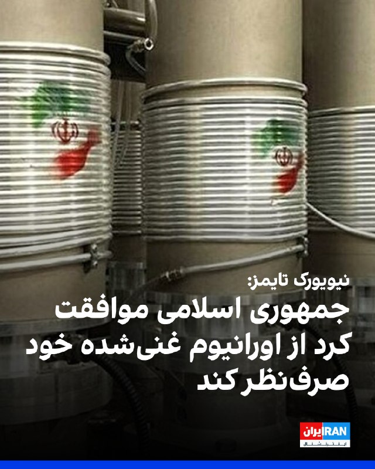

نیویورک تایمز به نقل از دو مقام آمریکایی گزارش داد جمهوری اسلامی موافقت کرده است از اورانیوم غنی‌شده خود صرف‌نظر کند. جزییات دقیق این تفاهم هنوز روشن نیست، اما مقام‌ها گفتند آمریکا در چارچوب هر توافق اولیه، از حکومت ایران تعهدی درباره اورانیوم مطالبه کرده است.
مقام‌های کاخ سفید به درخواست‌ها برای اظهار نظر پاسخ ندادند. ترامپ روز شنبه گفت ایالات متحده به دستیابی به توافقی با ایران برای پایان دادن به جنگ و بازگشایی تنگه هرمز نزدیک شده است. اما او جزییاتی ارائه نکرد و مشخص نیست چه موانعی برای نهایی شدن توافق باقی مانده است.
مقام‌های آمریکایی گفتند این پیشنهاد موضوع چگونگی دقیق واگذاری ذخایر را حل‌وفصل نکرده و جزییات را به دور بعدی گفت‌وگوها درباره برنامه هسته‌ای ایران موکول کرده است.

‌🏁 🇬🇧 IranintlTV

🤖 @VahidOOnLine

## VahidOOnLine — post 241850

  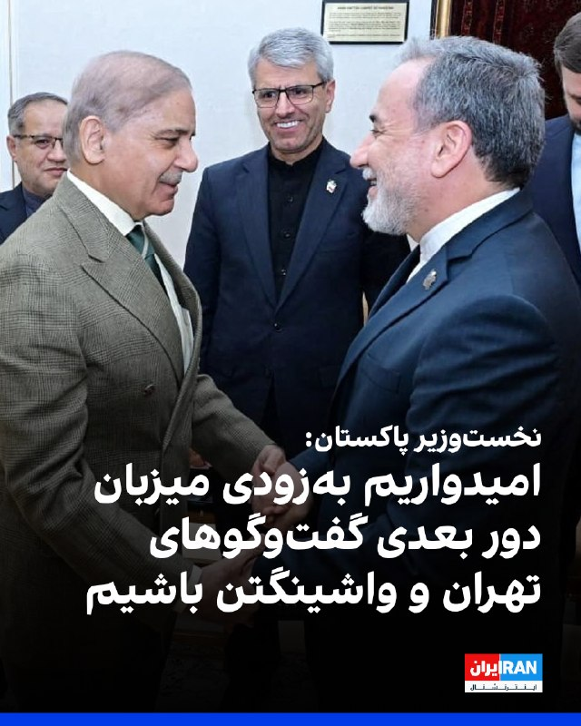

شهباز شریف، نخست‌وزیر پاکستان، تلاش‌های ترامپ برای پیگیری صلح و برگزاری تماس با کشورهای منطقه را به او تبریک گفت و ابراز امیدواری کرد پاکستان به‌زودی میزبان دور بعدی گفت‌وگوهای تهران و واشینگتن باشد.
شریف در ایکس با اشاره به تماس ترامپ با رهبران عربستان سعودی، قطر، ترکیه، مصر، امارات متحده عربی، اردن و پاکستان، گفت: «این گفت‌وگوها فرصت مفیدی برای تبادل نظر درباره وضعیت کنونی منطقه و چگونگی پیشبرد تلاش‌های جاری برای صلح به منظور دستیابی به صلحی پایدار در منطقه فراهم کرد.»

‌🏁 🇬🇧 IranintlTV

🤖 @VahidOOnLine

## VahidOOnLine — post 241849

  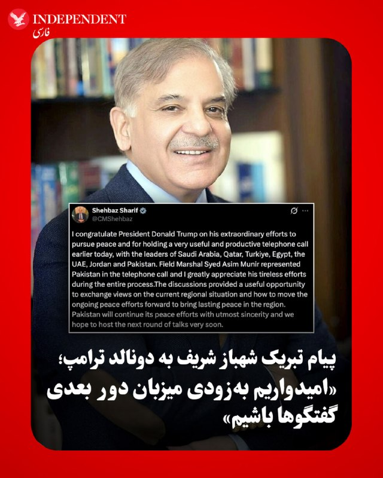

♦️شهباز شریف، نخست‌وزیر پاکستان، با انتشار پیامی در اکس، ضمن تبریک به دونالد ترامپ برای پیشبرد فرآیند صلح در منطقه نوشت: «به رئیس‌جمهور دونالد ترامپ برای تلاش‌های فوق‌العاده‌اش در مسیر دستیابی به صلح و همچنین برگزاری تماس تلفنی بسیار مفید و ثمر‌بخش امروز با رهبران عربستان سعودی، قطر، ترکیه، مصر، امارات متحده عربی، اردن و پاکستان تبریک می‌گویم؛ عاصم منیر به نمایندگی از پاکستان در این تماس تلفنی حضور داشت و من از تلاش‌های خستگی‌ناپذیر او در طول این فرآیند بسیار سپاسگزارم.» نخست‌وزیر پاکستان در ادامه با اشاره به ماهیت این گفتگوهای چندجانبه افزود: «این رایزنی‌ها فرصت مفیدی را برای تبادل نظر درباره وضعیت فعلی منطقه و چگونگی پیشبرد تلاش‌های جاری صلح جهت ایجاد صلح پایدار در منطقه فراهم کرد؛ پاکستان با صمیمیت کامل به تلاش‌های صلح‌آمیز خود ادامه خواهد داد و امیدواریم به‌زودی میزبان دور بعدی گفتگوها باشیم.»
‌🇸🇦 Indypersian

🤖 @VahidOOnLine

## VahidOOnLine — post 241848

  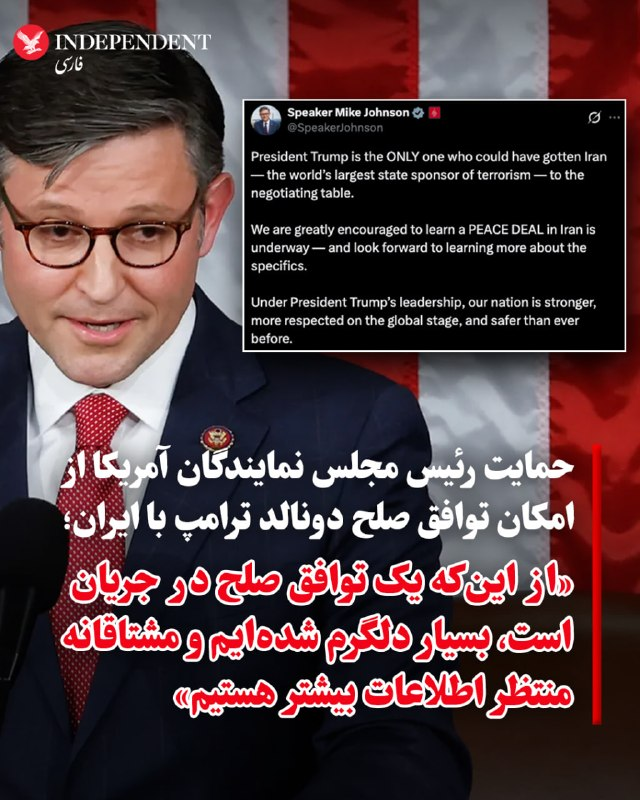

♦️مایک جانسون، رئیس مجلس نمایندگان ایالات متحده، با انتشار پیامی در اکس، ضمن حمایت از سیاست‌های دولت دونالد ترامپ نوشت: «رئیس‌جمهور ترامپ تنها کسی است که می‌توانست ایران، بزرگ‌ترین دولت حامی تروریسم در جهان، را به میز مذاکره بکشاند؛ ما از این‌که متوجه شدیم یک توافق صلح با ایران در جریان است، بسیار دلگرم شده‌ایم و مشتاقانه منتظر کسب اطلاعات بیشتر درباره جزئیات آن هستیم.» جانسون در ادامه پیام خود با تمجید از عملکرد رئیس‌جمهوری آمریکا افزود که تحت رهبری ترامپ، ملت آمریکا قوی‌تر، در عرصه جهانی محترم‌تر و امن‌تر از هر زمان دیگری است.
‌🇸🇦 Indypersian

🤖 @VahidOOnLine

## VahidOOnLine — post 241847

  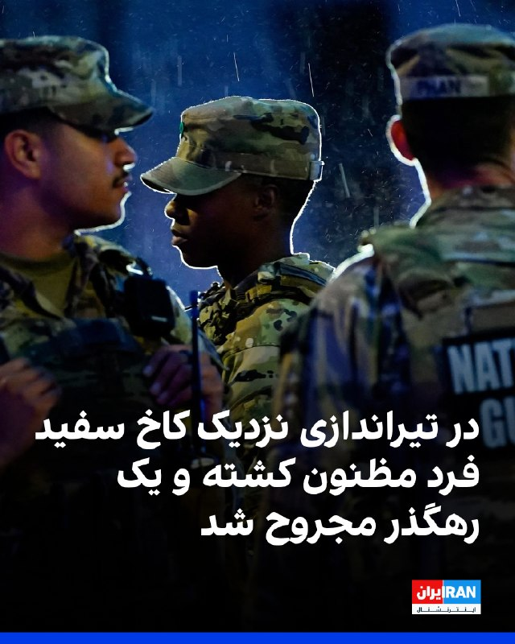

سرویس مخفی آمریکا در بیانیه‌ای اعلام کرد در تیراندازی نزدیک کاخ سفید فرد مظنون کشته و یک رهگذر مجروح شد.
طبق این بیانیه، ترامپ هنگام وقوع این حادثه در کاخ سفید حضور داشت، اما هیچ‌یک از افراد تحت حفاظت سرویس مخفی و همچنین فعالیت‌های حفاظتی تحت تاثیر این رویداد قرار نگرفتند.
طبق اعلام سرویس مخفی آمریکا، عصر شنبه فردی در محدوده خیابان هفدهم و خیابان پنسیلوانیا، نزدیک کاخ سفید، سلاحی را از کیف خود خارج کرد و شروع به تیراندازی کرد، اما ماموران با تیراندازی فرد مظنون را هدف قرار دادند.
این بیانیه افزود فرد مظنون به یکی از بیمارستان‌های منطقه منتقل شد، اما در آنجا مرگ او اعلام شد. در جریان این تیراندازی، یک رهگذر نیز بر اثر اصابت گلوله مجروح شد.

‌🏁 🇬🇧 IranintlTV

🤖 @VahidOOnLine

## VahidOOnLine — post 241846

  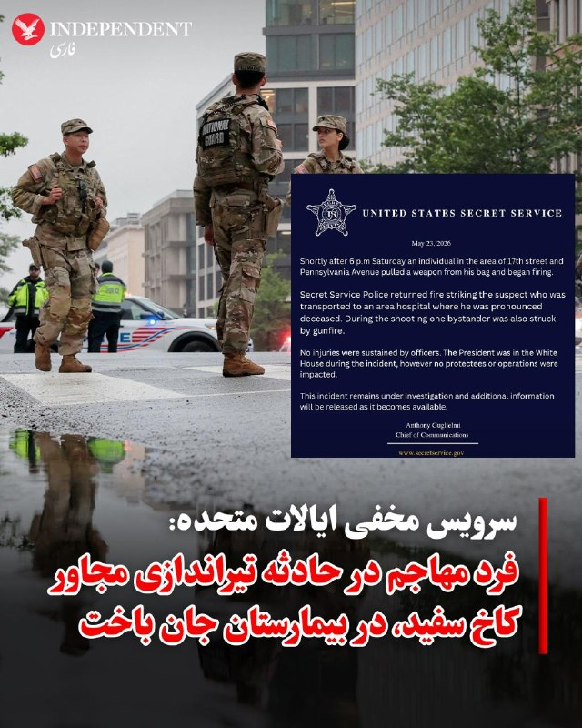

♦️به گزارش «اسکای نیوز» فرد مهاجم در حادثه تیراندازی مجاورت کاخ سفید پس از نزدیک شدن به ایست بازرسی امنیتی در تقاطع خیابان هفدهم و پنسیلوانیا، سلاح خود را از کیف خارج کرده و به سوی ماموران سرویس مخفی شلیک کرده است که در پی پاسخ متقابل نیروهای امنیتی، ضارب و یک عابر پیاده زخمی شدند. سرویس مخفی ایالات متحده با انتشار بیانیه‌ای تایید کرد که فرد مسلح بر اثر شدت جراحات ناشی از این تبادل آتش، در بیمارستان جان باخته است.
این گزارش حاکی از آن است که در زمان وقوع حادثه و شلیک ۱۵ تا ۳۰ گلوله که موجی از وحشت را در میان خبرنگاران مستقر در بخش غربی کاخ سفید ایجاد کرد، دونالد ترامپ در محل اقامت خود حضور داشته است. این حادثه تنها سه هفته پس از حادثه تیراندازی در ضیافت شام انجمن خبرنگاران کاخ سفید رخ می‌دهد. براساس این گزارش، هیچ یک از نیروهای سرویس مخفی در این درگیری آسیب ندیده‌اند و تحقیقات گسترده پلیس در محل حادثه آغاز شده است.
‌🇸🇦 Indypersian

🤖 @VahidOOnLine

## VahidOOnLine — post 241845

  

در پی اعتراضات دانش‌آموزی به برگزاری امتحانات به صورت حضوری، سعید شاهرخی، استاندار لرستان، با اشاره ‌به شرایط کنونی و با تاکید بر حفظ امنیت در استان، دستور داد امتحانات پایه‌های هفتم تا دهم غیرحضوری برگزار شود.
شورای هماهنگی تشکل‌های صنفی فرهنگیان ایران به نقل از مدیرکل آموزش‌وپرورش لرستان اعلام کرد اعتراض دانش‌آموزان این استان نتیجه داد و امتحانات نوبت دوم در لرستان به‌صورت مجازی برگزار می‌شود.
طبق این گزارش مدیرکل آموزش‌وپرورش لرستان در جمع دانش‌آموزان گفت: «صدای اعتراضات شما را شنیدیم» و آزمون‌ها غیرحضوری خواهد بود.

‌🏁 🇬🇧 IranintlTV

🤖 @VahidOOnLine

## VahidOOnLine — post 241844

  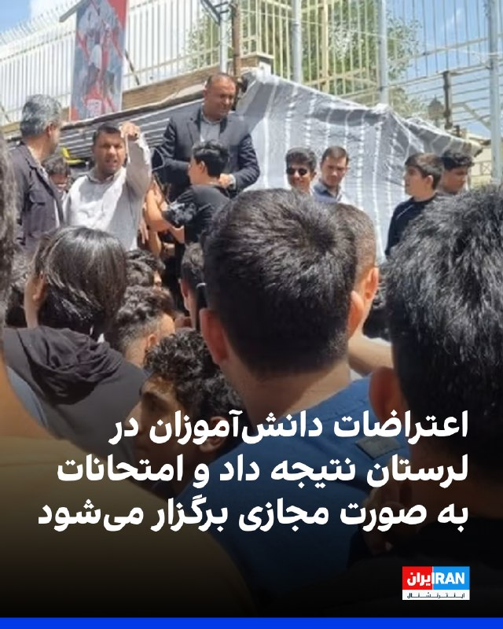

در پی اعتراضات دانش‌آموزی به برگزاری امتحانات به صورت حضوری، سعید شاهرخی، استاندار لرستان، با اشاره ‌به شرایط کنونی و با تاکید بر حفظ امنیت در استان، دستور داد امتحانات پایه‌های هفتم تا دهم غیرحضوری برگزار شود.
شورای هماهنگی تشکل‌های صنفی فرهنگیان ایران به نقل از مدیرکل آموزش‌وپرورش لرستان اعلام کرد اعتراض دانش‌آموزان این استان نتیجه داد و امتحانات نوبت دوم در لرستان به‌صورت مجازی برگزار می‌شود.
طبق این گزارش مدیرکل آموزش‌وپرورش لرستان در جمع دانش‌آموزان گفت: «صدای اعتراضات شما را شنیدیم» و آزمون‌ها غیرحضوری خواهد بود.

‌🏁 🇬🇧 IranintlTV

🤖 @VahidOOnLine

## VahidOOnLine — post 241843

  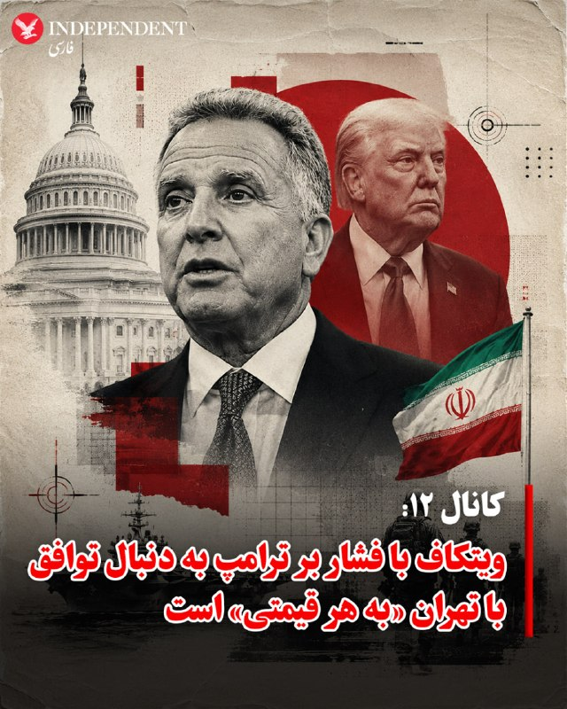

♦️کانال ۱۲ اسرائیل گزارش داد که بنیامین نتانیاهو، نخست‌وزیر این کشور، در پی انتشار جزئیاتی از پیشرفت پیش‌نویس تفاهم میان ایالات متحده و ایران، نشست محدودی را با روسای احزاب ائتلاف و مقامات ارشد امنیتی برگزار کرده است؛ مقامات تل‌آویو با ابراز نگرانی شدید از مفاد این تفاهم محتمل، استیو ویتکاف، فرستاده ویژه دونالد ترامپ در خاورمیانه را متهم کرده‌اند که به دنبال دستیابی به یک توافق «به هر قیمتی» است و فشار سنگینی بر ترامپ وارد می‌کند تا مانع از بازگشت به درگیری‌های نظامی شود. بر اساس این گزارش، نگرانی اصلی اسرائیل از کلیات این توافق است که در آن، واشنگتن امتیازات نقد به تهران واگذار می‌کند اما مابه‌ازای آن را به صورت نسیه دریافت خواهد کرد؛ به طوری که در گام نخست بر سر بازگشایی تنگه هرمز توافق می‌شود و دارایی‌های بلوکه‌شده ایران به تدریج آزاد خواهد شد، در حالی که موضوع غنی‌سازی و تسلیحات هسته‌ای به مراحل نامعلوم بعدی موکول می‌گردد.
این شبکه تلویزیونی با استناد به گزارش روزنامه نیویورک‌تایمز اشاره کرد که اسرائیل از روند مراجع اطلاعاتی و مذاکرات مستقیم میان واشنگتن و تهران کنار گذاشته شده و ناچار است جزئیات را از طریق کشورهای ثالث یا تحرکات جاسوسی و اطلاعاتی کسب کند؛ این وضعیت با مواضع عمومی نتانیاهو و ترامپ در تضاد است، هرچند نزدیکان نخست‌وزیر اسرائیل می‌گویند هماهنگی‌ها میان دو طرف همچنان نزدیک و مستحکم باقی مانده است. این گزارش در شرایطی منتشر می‌شود که برخی رسانه‌ها مدعی شده‌اند پیش‌نویس این توافق که با میانجی‌گری پاکستان تدوین شده، ممکن است طی ۴۸ ساعت آینده نهایی شود؛ موضوعی که در صورت تحقق، به گفته تحلیل‌گران اسرائیلی یک چالش امنیتی بزرگ برای تل‌آویو خواهد بود.
‌🇸🇦 Indypersian

🤖 @VahidOOnLine

## VahidOOnLine — post 241842

  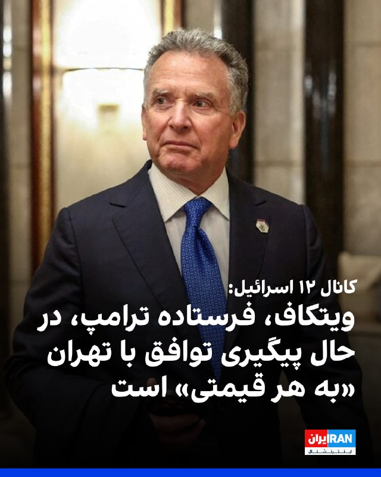

کانال ۱۲ اسرائیل به نقل از یک مقام اسرائیلی گزارش داد استیو ویتکاف، فرستاده ویژه ترامپ، در حال پیگیری یک توافق دیپلماتیک با تهران «به هر قیمتی» است و ترامپ را تحت فشار قرار می‌دهد تا عملیات نظامی را از سر نگیرد.

این گزارش در شرایطی منتشر می‌شود که برخی قانون‌گذاران جمهوری‌خواه و مقام‌های حوزه امنیت ملی آمریکا همچنان درباره پیامدهای هرگونه توافقی که به جمهوری اسلامی امکان بازسازی سیاسی و نظامی بدهد، هشدار می‌دهند.
‌🏁 🇬🇧 IranintlTV

🤖 @VahidOOnLine

## VahidOOnLine — post 241839

  <a href="telegram/content/VahidOOnLine_241839_1779586976.mp4" target="_blank">🎬 Download video</a>

ویدیوی منتشرشده از یک خبرنگار سی‌بی‌اس، لحظات دلهره‌آور تیراندازی در نزدیکی کاخ سفید را در روز شنبه دوم خرداد نشان می‌دهد.
خبرگزاری رویترز به نقل از یک مقام پلیس نوشت که مظنون تیراندازی در نزدیکی کاخ سفید دستگیر و به بیمارستان منتقل شده است. او گفت که مظنون به ایست بازرسی نزدیک کاخ سفید نزدیک شد و به سمت ماموران شلیک کرد. به گفته این مقام پلیس، هیچ یک از ماموران آسیب ندیدند.
‌🏁 🇬🇧 IranintlTV

🤖 @VahidOOnLine

## VahidOOnLine — post 241838

  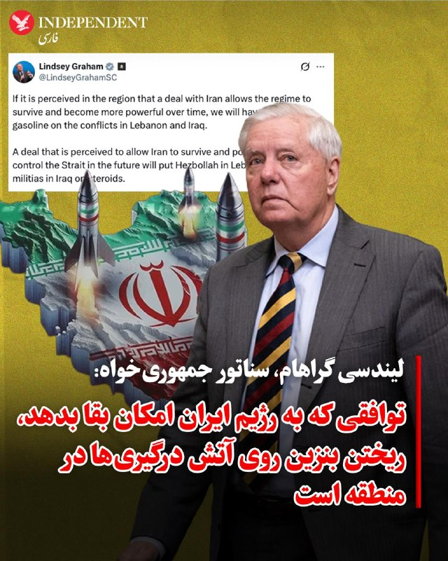

♦️لیندسی گراهام، سناتور جمهوری‌خواه آمریکا، با انتشار پیامی در اکس درباره توافق احتمالی با تهران نوشت: «اگر در منطقه این‌گونه برداشت شود که توافق با ایران به این رژیم اجازه می‌دهد بقای خود را حفظ کند و به مرور زمان قدرتمندتر شود، ما روی آتش درگیری‌ها در لبنان و عراق بنزین ریخته‌ایم.» گراهام با تاکید بر پیامدهای منطقه‌ای این تصمیم افزود: «توافقی که تصور شود به رژیم ایران اجازه بقا می‌دهد و توانایی کنترل تنگه هرمز را در آینده برای آن حفظ می‌کند، حزب‌الله در لبنان و شبه‌نظامیان شیعه در عراق را به شدت تقویت خواهد کرد.»
‌🇸🇦 Indypersian

🤖 @VahidOOnLine

## FoxNewsTwitter — post 342177

  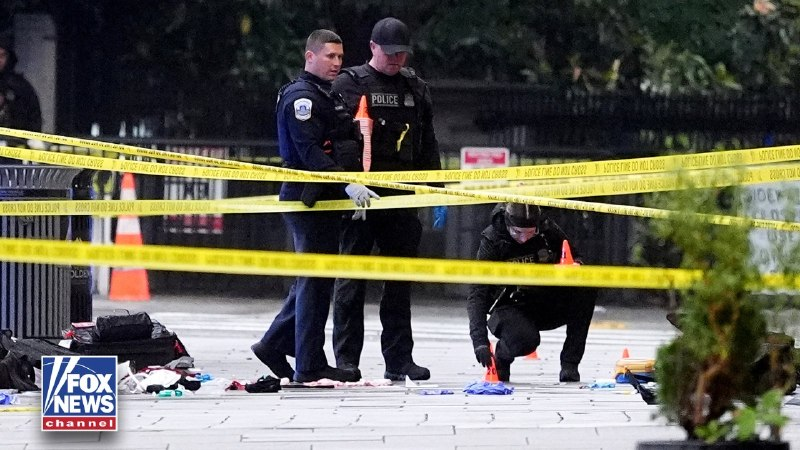

Fox News (Twitter/X)

BREAKING: The gunman who opened fire near the White House on Saturday afternoon has been identified as 21-year-old Nasire Best of Maryland. He was shot by Secret Service agents and died on the way to the hospital.

Best allegedly had multiple prior encounters with the Secret Service and had a history of mental health issues.

Best was detained by Secret Service on June 26, 2025, for flagging down agents and making threats, and again on July 10, 2025 for entering a restricted area, FOX News has learned.

## FoxNewsTwitter — post 342176

‌Fox News (Twitter/X)

Federal officials have served subpoenas to Marxist political influencer Hasan Piker and CodePink cofounder Susan Medea Benjamin as part of a wider investigation into whether U.S. organizations and leaders violated U.S. laws and sanctions in supporting Cuba's communist regime, Fox News Digital has learned.

## FoxNewsTwitter — post 342175

  <a href="telegram/content/FoxNewsTwitter_342175_1779586979.mp4" target="_blank">🎬 Download video</a>

Fox News (Twitter/X)

NEW: The suspect in the shooting near the White House is dead, and one bystander was wounded, according to the White House. FOX News' Alex Hogan breaks down the moments leading up to the incident.

## FoxNewsTwitter — post 342174

  <a href="telegram/content/FoxNewsTwitter_342174_1779586982.mp4" target="_blank">🎬 Download video</a>

Fox News (Twitter/X)

JUST IN: FOX News' Chad Pergram reports that two people were wounded in a shooting near the White House, and that the lockdown has been lifted.

## mamlekate — post 103573

📝 دونالد ترامپ می‌گوید جزئیات یک «یادداشت تفاهم صلح» با جمهوری اسلامی به زودی اعلام می‌شود

دونالد ترامپ، رئيس‌جمهوری آمریکا، شنبه‌ عصر گفت با شماری از رهبران منطقه از جمله مقامات عربستان، قطر، امارات درباره یک یادداشت تفاهم مربوط به صلح ایران صحبت کرده است.

@mamlekate

## VahidOnline — post 75668

  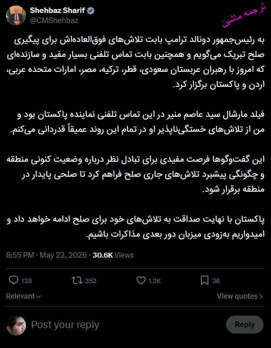

شهباز شریف، نخست‌وزیر پاکستان، ابراز امیدواری کرد پاکستان به‌زودی میزبان دور بعدی گفت‌وگوهای تهران و واشینگتن باشد.
CMShehbaz

📡 @VahidOnline

## VahidOnline — post 75666

توییت‌های تد کروز و لیندسی گراهام در واکنش به اخبار منتشر شده درباره توافق احتمالی
tedcruz, LindseyGrahamSC

📡 @VahidOnline

## VahidOnline — post 75665

  <a href="telegram/content/VahidOnline_75665_1779586985.mp4" target="_blank">🎬 Download video</a>

شنبه عصر، یک تیراندازی در حوالی کاخ سفید خبر روی داد که طی آن دو نفر از جمله یک عابر و فرد مظنون تیر خوردند.

سرویس مخفی ایالات متحده، در گزارشی اعلام کرد که اندکی پس از ساعت ۶ عصر روز شنبه، فردی در محدوده خیابان ۱۷ و خیابان پنسیلوانیا، (شمال غربی) سلاحی را از کیف خود خارج کرد و شروع به تیراندازی کرد.

سرویس مخفی ایالات متحده افزود پلیس سرویس مخفی به تیرانازی او پاسخ داد و به مظنون شلیک کرد.

به گفته سرویس مخفی،‌مظنون به یک بیمارستان محلی منتقل شد، اما در آنجا اعلام شد که جان باخته است.

به گفته این نهاد امنیی، در جریان این تیراندازی، یک عابر نیز مورد اصابت گلوله قرار گرفت و هیچ‌یک از مأموران آسیب ندیدند.

سرویس مخفی که وظیفه حفاظت از رئیس‌جمهوری آمریکا را دارد افزود دونالد ترامپ، رئیس‌جمهوری آمریکا، در زمان حادثه در کاخ سفید حضور داشت.
@VahidHeadline

📡 @VahidOnline

## IranIntlTV — post 338684

  

نیویورک تایمز به نقل از دو مقام آمریکایی گزارش داد جمهوری اسلامی موافقت کرده است از اورانیوم غنی‌شده خود صرف‌نظر کند. جزییات دقیق این تفاهم هنوز روشن نیست، اما مقام‌ها گفتند آمریکا در چارچوب هر توافق اولیه، از حکومت ایران تعهدی درباره اورانیوم مطالبه کرده است.
مقام‌های کاخ سفید به درخواست‌ها برای اظهار نظر پاسخ ندادند. ترامپ روز شنبه گفت ایالات متحده به دستیابی به توافقی با ایران برای پایان دادن به جنگ و بازگشایی تنگه هرمز نزدیک شده است. اما او جزییاتی ارائه نکرد و مشخص نیست چه موانعی برای نهایی شدن توافق باقی مانده است.
مقام‌های آمریکایی گفتند این پیشنهاد موضوع چگونگی دقیق واگذاری ذخایر را حل‌وفصل نکرده و جزییات را به دور بعدی گفت‌وگوها درباره برنامه هسته‌ای ایران موکول کرده است.

https://iranintl.com/202605248261

## IranIntlTV — post 338683

  

شهباز شریف، نخست‌وزیر پاکستان، تلاش‌های ترامپ برای پیگیری صلح و برگزاری تماس با کشورهای منطقه را به او تبریک گفت و ابراز امیدواری کرد پاکستان به‌زودی میزبان دور بعدی گفت‌وگوهای تهران و واشینگتن باشد.
شریف در ایکس با اشاره به تماس ترامپ با رهبران عربستان سعودی، قطر، ترکیه، مصر، امارات متحده عربی، اردن و پاکستان، گفت: «این گفت‌وگوها فرصت مفیدی برای تبادل نظر درباره وضعیت کنونی منطقه و چگونگی پیشبرد تلاش‌های جاری برای صلح به منظور دستیابی به صلحی پایدار در منطقه فراهم کرد.»

https://iranintl.com/202605243916

## IranIntlTV — post 338682

  

سرویس مخفی آمریکا در بیانیه‌ای اعلام کرد در تیراندازی نزدیک کاخ سفید فرد مظنون کشته و یک رهگذر مجروح شد.
طبق این بیانیه، ترامپ هنگام وقوع این حادثه در کاخ سفید حضور داشت، اما هیچ‌یک از افراد تحت حفاظت سرویس مخفی و همچنین فعالیت‌های حفاظتی تحت تاثیر این رویداد قرار نگرفتند.
طبق اعلام سرویس مخفی آمریکا، عصر شنبه فردی در محدوده خیابان هفدهم و خیابان پنسیلوانیا، نزدیک کاخ سفید، سلاحی را از کیف خود خارج کرد و شروع به تیراندازی کرد، اما ماموران با تیراندازی فرد مظنون را هدف قرار دادند.
این بیانیه افزود فرد مظنون به یکی از بیمارستان‌های منطقه منتقل شد، اما در آنجا مرگ او اعلام شد. در جریان این تیراندازی، یک رهگذر نیز بر اثر اصابت گلوله مجروح شد.

https://iranintl.com/202605246930

## IranIntlTV — post 338681

  

در پی اعتراضات دانش‌آموزی به برگزاری امتحانات به صورت حضوری، سعید شاهرخی، استاندار لرستان، با اشاره ‌به شرایط کنونی و با تاکید بر حفظ امنیت در استان، دستور داد امتحانات پایه‌های هفتم تا دهم غیرحضوری برگزار شود.
شورای هماهنگی تشکل‌های صنفی فرهنگیان ایران به نقل از مدیرکل آموزش‌وپرورش لرستان اعلام کرد اعتراض دانش‌آموزان این استان نتیجه داد و امتحانات نوبت دوم در لرستان به‌صورت مجازی برگزار می‌شود.
طبق این گزارش مدیرکل آموزش‌وپرورش لرستان در جمع دانش‌آموزان گفت: «صدای اعتراضات شما را شنیدیم» و آزمون‌ها غیرحضوری خواهد بود.

https://iranintl.com/202605249059

## IranIntlTV — post 338680

  

در پی اعتراضات دانش‌آموزی به برگزاری امتحانات به صورت حضوری، سعید شاهرخی، استاندار لرستان، با اشاره ‌به شرایط کنونی و با تاکید بر حفظ امنیت در استان، دستور داد امتحانات پایه‌های هفتم تا دهم غیرحضوری برگزار شود.
شورای هماهنگی تشکل‌های صنفی فرهنگیان ایران به نقل از مدیرکل آموزش‌وپرورش لرستان اعلام کرد اعتراض دانش‌آموزان این استان نتیجه داد و امتحانات نوبت دوم در لرستان به‌صورت مجازی برگزار می‌شود.
طبق این گزارش مدیرکل آموزش‌وپرورش لرستان در جمع دانش‌آموزان گفت: «صدای اعتراضات شما را شنیدیم» و آزمون‌ها غیرحضوری خواهد بود.

https://iranintl.com/202605249059

## IranIntlTV — post 338679

  

کانال ۱۲ اسرائیل به نقل از یک مقام اسرائیلی گزارش داد استیو ویتکاف، فرستاده ویژه ترامپ، در حال پیگیری یک توافق دیپلماتیک با تهران «به هر قیمتی» است و ترامپ را تحت فشار قرار می‌دهد تا عملیات نظامی را از سر نگیرد.

این گزارش در شرایطی منتشر می‌شود که برخی قانون‌گذاران جمهوری‌خواه و مقام‌های حوزه امنیت ملی آمریکا همچنان درباره پیامدهای هرگونه توافقی که به جمهوری اسلامی امکان بازسازی سیاسی و نظامی بدهد، هشدار می‌دهند.
https://iranintl.com/202605240801

## IranIntlTV — post 338678

  

کانال ۱۲ اسرائیل به نقل از یک مقام اسرائیلی گزارش داد استیو ویتکاف، فرستاده ویژه ترامپ، در حال پیگیری یک توافق دیپلماتیک با تهران «به هر قیمتی» است و ترامپ را تحت فشار قرار می‌دهد تا عملیات نظامی را از سر نگیرد.

این گزارش در شرایطی منتشر می‌شود که برخی قانون‌گذاران جمهوری‌خواه و مقام‌های حوزه امنیت ملی آمریکا همچنان درباره پیامدهای هرگونه توافقی که به جمهوری اسلامی امکان بازسازی سیاسی و نظامی بدهد، هشدار می‌دهند.
https://iranintl.com/202605240801

## IranIntlTV — post 338677

  <a href="telegram/content/IranIntlTV_338677_1779586991.mp4" target="_blank">🎬 Download video</a>

ویدیوی منتشرشده از یک خبرنگار سی‌بی‌اس، لحظات دلهره‌آور تیراندازی در نزدیکی کاخ سفید را در روز شنبه دوم خرداد نشان می‌دهد.
خبرگزاری رویترز به نقل از یک مقام پلیس نوشت که مظنون تیراندازی در نزدیکی کاخ سفید دستگیر و به بیمارستان منتقل شده است. او گفت که مظنون به ایست بازرسی نزدیک کاخ سفید نزدیک شد و به سمت ماموران شلیک کرد. به گفته این مقام پلیس، هیچ یک از ماموران آسیب ندیدند.

## ManotoTV — post 105790

  <a href="telegram/content/ManotoTV_105790_1779586992.mp4" target="_blank">🎬 Download video</a>

تماسی از امارات
«می‌گفت مردم ایران عوض شده‌اند…
و این بار باید هوشیارتر، عاقل‌تر و متفاوت‌تر عمل کنند.»

## FarsiVOA — post 218487

  <a href="telegram/content/FarsiVOA_218487_1779586995.mp4" target="_blank">🎬 Download video</a>

⚡️ماموران امنیتی و خبرنگاران در خیابان ۱۸ام و پنسیلوانیا (شمال غربی) در واشنگتن دی‌سی، در پی تیراندازی شنبه عصر در نزدیکی کاخ سفید، در منطقه حضور دارند. فرد مظنون در این تیراندازی کشته شد.
@FarsiVOA

## FarsiVOA — post 218486

  <a href="telegram/content/FarsiVOA_218486_1779586995.mp4" target="_blank">🎬 Download video</a>

⚡️اولین تصاویر از چمن شمالی کاخ سفید پس از آن‌که در پی حادثه تیراندازی عصر شنبه، به خبرنگاران اجازه بازگشت به محوطه داده شد.
@FarsiVOA

## FarsiVOA — post 218485

🔺گزارش‌ها از تیراندازی در نزدیکی کاخ سفید؛ سرویس مخفی می‌گوید مظنون کشته شد و یک عابر تیر خورد

▪️شنبه عصر، یک تیراندازی در حوالی کاخ سفید خبر روی داد که طی آن دو نفر از جمله یک عابر و یک فرد مظنون تیر خوردند.

⬇️ بیشتر بخوانید:
https://ir.voanews.com/a/8153104.html
@FarsiVOA

## FarsiVOA — post 218484

  <a href="telegram/content/FarsiVOA_218484_1779586996.mp4" target="_blank">🎬 Download video</a>

⚡️گزارش مایکل لیپین، خبرنگار صدای آمریکا از تیراندازی شنبه عصر در اطراف کاخ سفید
@FarsiVOA

## FarsiVOA — post 218483

🔺گزارش خبرنگار صدای آمریکا از محل تیراندازی در اطراف کاخ سفید؛ صدای ده‌ها گلوله شنیده شد

▪️خبرنگار صدای آمریکا در حوزه کاخ سفید، مایکل لیپین، عصر شنبه از نزدیکی محل تیراندازی در اطراف کاخ سفید گزارش کرد.

⬇️ بیشتر بخوانید:
https://ir.voanews.com/a/8153117.html
@FarsiVOA

## Persian_Trend_Official — post 14812

⭕️نیویورک تایمز به نقل از دو مقام آمریکایی گزارش داد جمهوری اسلامی موافقت کرده است از اورانیوم غنی‌شده خود صرف‌نظر کند.

💢مقام‌های کاخ سفید به درخواست‌ها برای اظهار نظر پاسخ ندادند. ترامپ روز شنبه گفت ایالات متحده به دستیابی به توافقی با ایران برای پایان دادن به جنگ و بازگشایی تنگه هرمز نزدیک شده است. اما او جزییاتی ارائه نکرد و مشخص نیست چه موانعی برای نهایی شدن توافق باقی مانده است.

💢مقام‌های آمریکایی گفتند این پیشنهاد موضوع چگونگی دقیق واگذاری ذخایر را حل‌وفصل نکرده و جزییات را به دور بعدی گفت‌وگوها درباره برنامه هسته‌ای ایران موکول کرده است.

🫆:Tony

📌 @persian_trend_official
پرشین ترند | متفاوت‌ترین کانال نظامی

## Persian_Trend_Official — post 14811

🔴 فوری | گزارش تیراندازی در اطراف کاخ سفید شبکه CBS گزارش داده صدای تیراندازی در اطراف کاخ سفید شنیده شده است. بر اساس گزارش اولیه: ▪️ سرویس مخفی آمریکا از خبرنگاران حاضر در ورودی کاخ سفید خواسته فوراً به اتاق توجیه خبری منتقل شوند ▪️ هنوز جزئیاتی درباره…

## Persian_Trend_Official — post 14810

💢گوشه ای از پیش بینی های نخبگان نظامی جمهوری اسلامی ...

💢شب شما بخیر 🫶

🫆:Tony

📌 @persian_trend_official
پرشین ترند | متفاوت‌ترین کانال نظامی

## BBCPersian — post 281918

  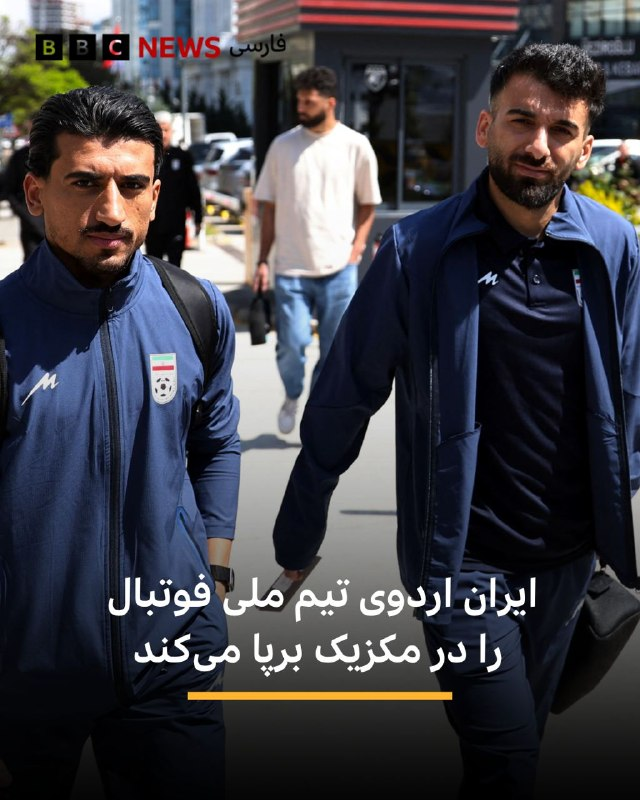

🔻ایران در جریان جام جهانی امسال، اردوی تیم ملی خود را در شهر مرزی تیخوانا در مکزیک برپا خواهد کرد. این اقدام پس از آن‌ است که فیفا با درخواست انتقال محل اردو از ایالت آریزونا موافقت کرد.

به گزارش رویترز مهدی تاج، رئیس فدراسیون فوتبال ایران، در ویدیویی که در حساب تلگرام فدراسیون منتشر شد گفت: «ما در کمپ تیخوانا مستقر خواهیم شد؛ جایی در نزدیکی اقیانوس آرام و در مرز مکزیک و آمریکا.»

او افزود که این تغییر می‌تواند از مشکلات مربوط به ویزا جلوگیری کند و اعضای تیم خواهند توانست با پروازهای مستقیم ایران‌ایر به مکزیک سفر کنند.

رویترز می‌گوید که فیفا به درخواستش برای اظهار نظر پاسخ نداده است.

ایران نخستین دو مسابقه خود در گروه جی را در لس‌آنجلس برگزار خواهد کرد؛ برابر نیوزیلند در ۲۵ خرداد و بلژیک در ۳۱ خرداد، و سپس ۵ تیر در سیاتل به مصاف مصر خواهد رفت.

مهدی تاج گفت که فاصله پروازی میان تیخوانا و محل بازی‌های تیم در لس‌آنجلس حدود ۵۵ دقیقه است و این شهر نسبت به اردوی قبلی برنامه‌ریزی‌شده در آریزونا به محل مسابقات نزدیک‌تر است.

📸 Reuters

https://bbc.in/4dIXh98
@BBCPersian

## BBCPersian — post 281910

🖌بی‌بی‌سی موندو:

🔻اف‌بی‌آی به تازگی اعلام کرده است که برای دریافت اطلاعات منجر به بازداشت و محاکمه مونیکا ویت، عضو پیشین نیروهای مسلح و مامور سابق ضدجاسوسی آمریکا، ۲۰۰ هزار دلار جایزه تعیین کرده است.

مونیکا ویت در فوریه ۲۰۱۹ از سوی یک هیئت منصفه فدرال در واشنگتن به جاسوسی، از جمله از طریق انتقال اطلاعات مربوط به دفاع ملی به حکومت ایران، متهم شد.

اف‌بی‌آی در بیانیه‌ای در ۱۴ مه ۲۰۲۶ اعلام کرد که همچنان در تلاش برای یافتن این فرد است که بر اساس اطلاعات موجود در کیفرخواست او، در سال ۲۰۱۳ به ایران پناهنده شده است.

📸GettyImages/ FBI

https://bbc.in/4dFATNH
@BBCPersian

## manototv — post 105790

  <a href="telegram/content/manototv_105790_1779586998.mp4" target="_blank">🎬 Download video</a>

تماسی از امارات
«می‌گفت مردم ایران عوض شده‌اند…
و این بار باید هوشیارتر، عاقل‌تر و متفاوت‌تر عمل کنند.»

<!-- MSG END -->

<!-- NAV START -->

<a href="https://github.com/Tljn/FUD/blob/main/telegram/content/archive_1.md" style="display:inline-block; padding:6px 12px; margin:0 4px; background-color:#2ea44f; color:white; text-decoration:none; border-radius:4px; font-weight:bold;">صفحه بعد</a>

<!-- NAV END -->
