# خواننده تلگرام

<!-- TOP_NAV START -->

<a href="https://github.com/Tljn/FUD/blob/main/telegram/content/archive_1.md" style="display:inline-block; padding:6px 12px; margin:0 4px; background-color:#2ea44f; color:white; text-decoration:none; border-radius:4px; font-weight:bold;">صفحه بعد</a>

<!-- TOP_NAV END -->

<!-- MSG START -->

---
📅 بروزرسانی: 1405/03/23 22:08
---

## VahidOOnLine — post 245351

  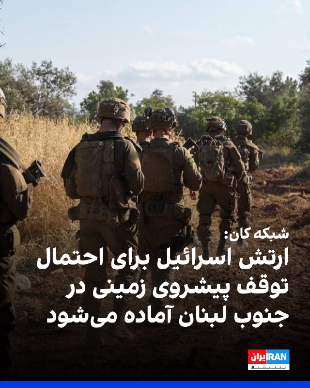

شبکه کان به نقل از منابع امنیتی اسرائیلی گزارش داد که در سایه تفاهم احتمالی آمریکا و جمهوری اسلامی، ارتش اسرائیل برای احتمال صدور دستور از سوی مقام‌های سیاسی این کشور به‌منظور توقف پیشروی زمینی در جنوب لبنان آماده می‌شود اما از نوار امنیتی در جنوب لبنان عقب‌نشینی نخواهد کرد.

بر اساس این گزارش، اسرائیل همچنین در حال برنامه‌ریزی برای کاهش حملات در عمق خاک لبنان است تا از آسیب دیدن تفاهم میان آمریکا و جمهوری اسلامی جلوگیری شود.

یک منبع آگاه به کان گفت ارتش اسرائیل همچنان به حملات خود در جنوب لبنان ادامه می‌دهد، اما این حملات هدفمند و محدود هستند. به گفته این منبع، فعالیت ارتش این کشور در بیروت نیز همچنان با محدودیت‌هایی همراه است.

به گفته این منابع، موضوع نوار امنیتی قرار است در مذاکرات مستقیم میان اسرائیل و لبنان که حدود یک هفته و نیم دیگر در آمریکا برگزار می‌شود، مورد بررسی قرار گیرد.
‌🏁 🇬🇧 IranintlTV

🤖 @VahidOOnLine

## VahidOOnLine — post 245350

  <a href="telegram/content/VahidOOnLine_245350_1781375912.mp4" target="_blank">🎬 Download video</a>

♦️همزمان با جاری شدن دوباره آب در زاینده‌رود، قایق‌های پدالی خاطره‌انگیز بار دیگر به این رودخانه تاریخی بازگشتند و شماری از مردم اصفهان با قایق‌سواری در نزدیکی پل تاریخی خواجو و سی‌سه پل  بازگشت آب را جشن گرفتند.
بسیاری از مردم اصفهان با حضور در کنار پل‌های تاریخی شهر و انجام ورزش‌ها و تفریحات آبی، از جمله قایق‌سواری، از بازگشت آب به زاینده‌رود استقبال کردند.
پس از ۱۱ ماه خشکی، جریان آب زاینده‌رود چهارشنبه‌شب ۱۳ خردادماه بار دیگر به شهر اصفهان رسید و در بستر این رودخانه جاری شد.
زاینده‌رود، مهم‌ترین رودخانه فلات مرکزی ایران، در سال‌های اخیر بارها با خشکی و کاهش شدید جریان آب روبه‌رو بوده و بازگشت آب به بستر آن همواره با شادی و استقبال گسترده مردم همراه شده است.
‌🇸🇦 Indypersian

🤖 @VahidOOnLine

## VahidOOnLine — post 245340

جام جهانی ۲۰۲۶ برای ایران فقط یک رویداد ورزشی نیست. هم‌زمان با حضور تیم ملی در بزرگ‌ترین صحنه فوتبال جهان، بحث بر سر هویت ملی، پرچم شیر و خورشید، جمهوری اسلامی و نمایندگی ایران نیز وارد ورزشگاه‌ها شده است.

آیا تیم ملی صرفاً یک تیم فوتبال است؟ آیا می‌توان از ایران حمایت کرد بدون آنکه از حکومت حمایت کرد؟ و در نهایت، چه کسی حق دارد به نام ایران سخن بگوید؟
‌🏁 🇬🇧 ManotoTV

🤖 @VahidOOnLine

## VahidOOnLine — post 245339

  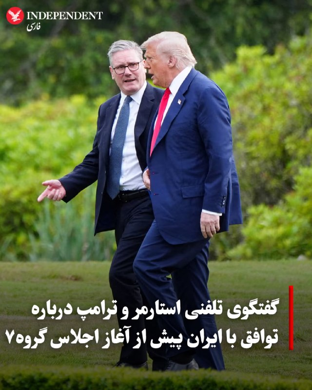

♦️ کی‌یر استارمر، نخست‌وزیر بریتانیا، روز شنبه ۲۳ خرداد در گفتگویی تلفنی با دونالد ترامپ، رئیس‌جمهوری آمریکا، تلاش‌های جاری برای پایان دادن به درگیری‌ها با ایران را مورد بحث و بررسی قرار داد.

بر اساس بیانیه منتشرشده از این تماس تلفنی، استارمر بر اهمیت «تضمین دست‌یابی به توافقی که به یک صلح پایدار و ماندگار منجر شود»، تاکید کرد.

نخست‌وزیر بریتانیا در این گفتگو بار دیگر یادآور شد که «لندن آماده است تا از اجرای هرگونه توافق صلح حمایت کند و برای تضمین موفقیت آن، با شرکای بین‌المللی همکاری نزدیکی داشته باشد.»

به گفته سخنگوی دفتر نخست‌وزیری بریتانیا، رهبران دو کشور توافق کردند که در آستانه برگزاری اجلاس سران گروه هفت (G7) در هفته آینده، تماس‌های خود را حفظ کنند.
‌🇸🇦 Indypersian

🤖 @VahidOOnLine

## VahidOOnLine — post 245338

  <a href="telegram/content/VahidOOnLine_245338_1781375915.mp4" target="_blank">🎬 Download video</a>

ویدیوی رسیده به ایران اینترنشنال نشان می‌دهد که زادروز جاویدنام حجت‌الله فیروزی کنار آرامگاهش گرامی داشته شد. او که ۱۸ دی‌ماه در جریان اعتراضات «انقلاب ملی» در محله نظام‌آباد تهران بازداشت شده بود، بر اثر شکنجه در بازداشتگاه جان باخت.
‌🏁 🇬🇧 IranintlTV

🤖 @VahidOOnLine

## VahidOOnLine — post 245337

  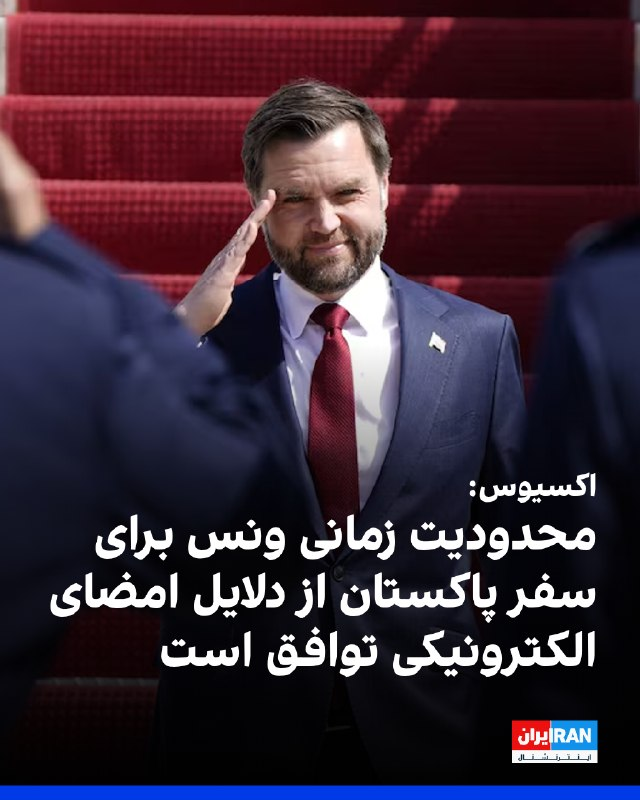

وب‌سایت خبری اکسیوس به نقل از منابع آگاه نوشت که دلیل امضای ویدیویی توافق آمریکا و جمهوری اسلامی، «ملاحظات اجرایی و لجستیکی» و عدم امکان سفر جی‌دی‌ونس به پاکستان است.

اکسیوس نوشت که یکی از دلایل اصلی امضای ویدیویی توافق آمریکا و جمهوری اسلامی این است که ونس در صورت سفر برای امضای توافق، نمی‌توانست قبل از عزیمت ترامپ برای شرکت در اجلاس گروه ۷ در فرانسه در صبح دوشنبه به آمریکا بازگردد.
‌🏁 🇬🇧 IranintlTV

🤖 @VahidOOnLine

## VahidOOnLine — post 245336

  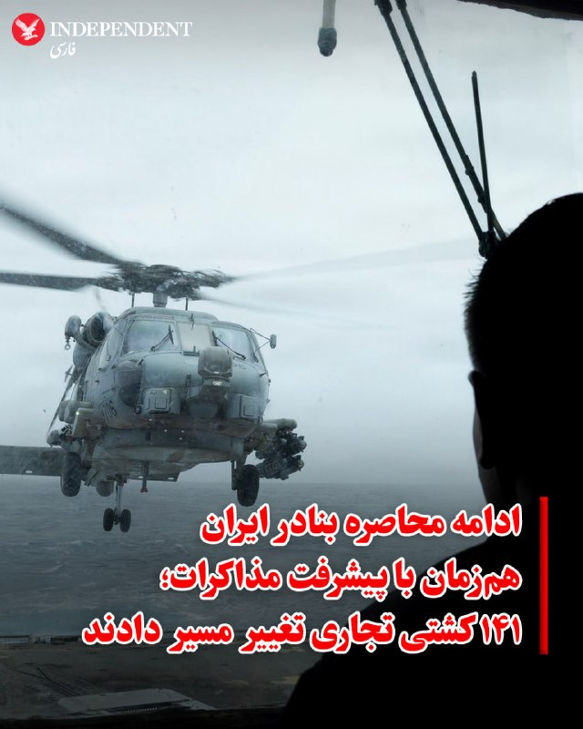

♦️ به رغم آنکه به نظر می‌رسد مذاکرات میان جمهوری اسلامی و آمریکا به مراحل پایانی و سرنوشت‌ساز خود نزدیک می‌شود، محاصره بنادر ایران در تنگه هرمز توسط ارتش ایالات متحده همچنان با قاطعیت ادامه دارد.

بر اساس گزارش روز شنبه ۲۳ خرداد، فرماندهی مرکزی ارتش آمریکا (سنتکام)، نیروهای نظامی این کشور از زمان آغاز اجرای این طرح، مسیر ۱۴۱ فروند کشتی را تغییر داده‌اند که این آمار نشان‌دهنده افزایش دو کشتی نسبت به روز گذشته است. طبق ضوابط این محاصره، از ورود تمامی شناورها به بنادر ایران یا خروج از آن‌ها جلوگیری می‌شود.

سنتکام در به‌روزرسانی جدید خود تاکید کرد در صورتی که کشتی‌ها از دستورات پیروی نکنند، نیروهای آمریکایی برای متوقف و غیرفعال کردن آن‌ها اقدام به شلیک موشک می‌کنند. آمار شناورهای غیرفعال‌شده در گزارش امروز بدون تغییر نسبت به روزهای گذشته، همان ۹ فروند اعلام شده است.
‌🇸🇦 Indypersian

🤖 @VahidOOnLine

## VahidOOnLine — post 245335

  

خبرگزاری فارس، رسانه وابسته به سپاه پاسداران، شامگاه شنبه ۲۳ خرداد اصرار دونالد ترامپ بر امضای یادداشت تفاهم با جمهوری اسلامی در روز یکشنبه را «عجیب» و «فشار نمایشی» خواند.

فارس نوشت: «سرنوشت امضای یکشنبه نه‌فقط یک آزمون فنی برای محتوای تفاهم، بلکه آزمونی برای صداقت و ایستادگی مسئولان ایرانی در برابر فشارهای نمایشی نیز خواهد بود.»
‌🏁 🇬🇧 IranintlTV

🤖 @VahidOOnLine

## VahidOOnLine — post 245334

  

خبرگزاری فارس، رسانه وابسته به سپاه پاسداران، شامگاه شنبه ۲۳ خرداد اصرار دونالد ترامپ بر امضای یادداشت تفاهم با جمهوری اسلامی در روز یکشنبه را «عجیب» و «فشار نمایشی» خواند.

فارس نوشت: «سرنوشت امضای یکشنبه نه‌فقط یک آزمون فنی برای محتوای تفاهم، بلکه آزمونی برای صداقت و ایستادگی مسئولان ایرانی در برابر فشارهای نمایشی نیز خواهد بود.»
‌🏁 🇬🇧 IranintlTV

🤖 @VahidOOnLine

## WithYashar — post 14740

الان روبیکا ، بله و سروش فیلتر‌ میشه 😂 @withyashar

## WithYashar — post 14739

شورای هماهنگی بانک‌های دولتی:

اختلال در سامانه‌های چهار بانک ناشی از یک حمله سایبری محدود بوده، اما هیچ‌گونه نشت اطلاعات یا دسترسی غیرمجاز به داده‌های مشتریان رخ نداده است
@withyashar

## WithYashar — post 14738

مقام ارشد اسرائیلی به کانال ۱۲ اسرائیل: این یه توافق مزخرفه
@withyashar

## WithYashar — post 14737

مردم طرفدار حکومت اعتراضاتی رو در چند استان شروع کردند @withyashar

## WithYashar — post 14736

کارشناس شبکه افق:به زودی جنگ را به خاک آمریکا می‌بریم و دیگر قرار نیست در خاک خودمان با دشمن بجنگیم جمهوری‌ اسلامی هنوز کارت های خود را رو نکرده
@withyashar

## WithYashar — post 14735

  <a href="telegram/content/WithYashar_14735_1781375918.mp4" target="_blank">🎬 Download video</a>

مردم طرفدار حکومت اعتراضاتی رو در چند استان شروع کردند
@withyashar

## WithYashar — post 14734

رادان : هرکس در تجمعات علیه وحدت ملی و مذاکرات شعار یا حرفی بزند بعنوان تفرقه‌افکن باهاش برخورد میکنیم.
@withyashar

## WithYashar — post 14733

اسرائیل هیوم: اسرائیل ملزم به امضای توافق با ایران نخواهد بود و قادر به دفاع از خود است، اما رفتار آن باید با ایالات متحده هماهنگ شود
@withyashar

## WithYashar — post 14732

  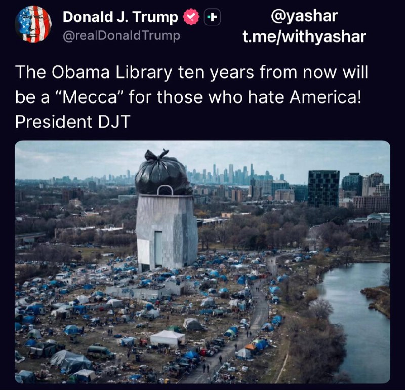

ترامپ در تروث : «کتابخانه اوباما، ده سال دیگر، به “مکه” کسانی تبدیل خواهد شد که از آمریکا نفرت دارند.»

دونالد جی. ترامپ

نکته: واژه “Mecca” در زبان انگلیسی در این‌گونه کاربردها به‌صورت استعاری به معنای «مرکز تجمع»، «کانون» یا «مقصد اصلی» است و لزوماً اشاره مذهبی مستقیم ندارد
@withyashar

## WithYashar — post 14731

آکسیوس: انتظار می‌رود ایالات متحده و ایران، با میانجیگری پاکستان و قطر، روز یکشنبه یک نشست مجازی برگزار کنند تا به صورت الکترونیکی تفاهم‌نامه‌ای را امضا کنند که آتش‌بس را به مدت ۶۰ روز تمدید می‌کند، تنگه هرمز را بازگشایی می‌کند و مذاکرات در مورد برنامه هسته‌ای ایران را آغاز می‌کند.
@withyashar

## WithYashar — post 14730

فارس: با توجه به اینکه فردا تولد ترامپ است مسئولان ایران اجازه نخواهند داد توافق فردا امضا شود
@withyashar 😂

## FoxNewsTwitter — post 342938

  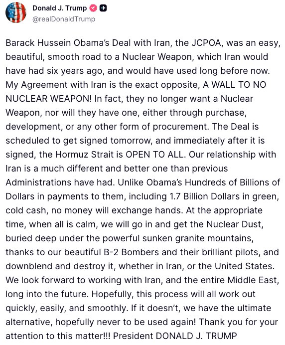

Fox News (Twitter/X)

BREAKING: Trump says a deal with Iran is scheduled to be signed tomorrow.

“Immediately after it is signed, the Hormuz Strait is OPEN TO ALL.”

The president says the agreement will permanently prevent Iran from obtaining a nuclear weapon and described it as the exact opposite of the Obama-era nuclear deal.

Trump also said no money will exchange hands under the agreement and warned that if the process falls apart, the U.S. has “the ultimate alternative.”

## pm_afshaa — post 93797

  <a href="telegram/content/pm_afshaa_93797_1781375921.webm" target="_blank">🎬 Download video</a>

🔴یک مقام آمریکایی به کانال 12 اسرائیل:
این قرارداد احتمالی صلح با ایران مزخرفه.

💧 Rainbet.com the #1 Non-KYC Crypto Casino & Sportsbook @rainbetcom

😁 @Pm_Afshaa

## pm_afshaa — post 93796

جنگ نخواهد شد و مذاکره هم نخواهیم کرد

هم جنگ شد هم مذاکره و توافق😂

## pm_afshaa — post 93795

کارشناس شبکه افق:به زودی جنگ را به خاک آمریکا می‌بریم و دیگر قرار نیست در خاک خودمان با دشمن بجنگیم جمهوری‌ اسلامی هنوز کارت های خود را رو نکرده

💧 Rainbet.com the #1 Non-KYC Crypto Casino & Sportsbook @rainbetcom

😁 @Pm_Afshaa

## pm_afshaa — post 93794

تجمع عرزشی‌ها با شعار مرگ بر سازشگر 
💧 Rainbet.com the #1 Non-KYC Crypto Casino & Sportsbook @rainbetcom 
😁 @Pm_Afshaa

## pm_afshaa — post 93793

تجمع عرزشی‌ها با شعار مرگ بر سازشگر 
💧 Rainbet.com the #1 Non-KYC Crypto Casino & Sportsbook @rainbetcom 
😁 @Pm_Afshaa

## pm_afshaa — post 93792

  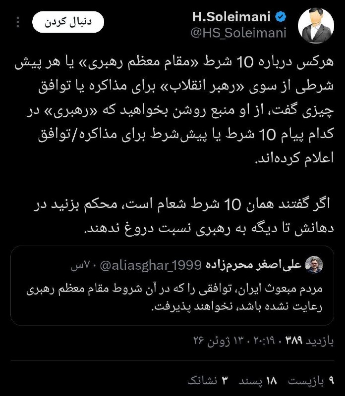

سر دبیر مشرق شروط رهبری رو انکار کرد

💧 Rainbet.com the #1 Non-KYC Crypto Casino & Sportsbook @rainbetcom

😁 @Pm_Afshaa

## pm_afshaa — post 93791

  <a href="telegram/content/pm_afshaa_93791_1781375922.mp4" target="_blank">🎬 Download video</a>

تجمع عرزشی‌ها با شعار مرگ بر سازشگر

💧 Rainbet.com the #1 Non-KYC Crypto Casino & Sportsbook @rainbetcom

😁 @Pm_Afshaa

## pm_afshaa — post 93789

  <a href="telegram/content/pm_afshaa_93789_1781375924.mp4" target="_blank">🎬 Download video</a>

🔴عرزشی‌ها دارن تو تجمعات شبانه علیه قالیباف و عراقچی شعار میدن :

قالیباف، عراقچی/ پس خون رهبرم چی.
عراقچی، حیا کن / آمریکا رو رها کن.

💧 Rainbet.com the #1 Non-KYC Crypto Casino & Sportsbook @rainbetcom

😁 @Pm_Afshaa

## pm_afshaa — post 93788

رادان :هرکس در تجمعات علیه وحدت ملی و‌ مذاکرات شعار دهد، بعنوان تفرقه‌افکن با او برخورد جدی میشود 
💧 Rainbet.com the #1 Non-KYC Crypto Casino & Sportsbook @rainbetcom 
😁 @Pm_Afshaa

## pm_afshaa — post 93787

رادان :هرکس در تجمعات علیه وحدت ملی و‌ مذاکرات شعار دهد، بعنوان تفرقه‌افکن با او برخورد جدی میشود

💧 Rainbet.com the #1 Non-KYC Crypto Casino & Sportsbook @rainbetcom

😁 @Pm_Afshaa

## pm_afshaa — post 93786

  <a href="telegram/content/pm_afshaa_93786_1781375925.mp4" target="_blank">🎬 Download video</a>

قالیباف، عراقچی، استعفا استعفا

💧 Rainbet.com the #1 Non-KYC Crypto Casino & Sportsbook @rainbetcom

😁 @Pm_Afshaa

## pm_afshaa — post 93785

  <a href="telegram/content/pm_afshaa_93785_1781375927.webm" target="_blank">🎬 Download video</a>

🔴اسرائیل هیوم:
اسرائیل ملزم به امضای توافق با ایران نخواهد بود و میتونه از خودش دفاع کنه، اما این رفتار باید با آمریکا هماهنگ بشه.

💧 Rainbet.com the #1 Non-KYC Crypto Casino & Sportsbook @rainbetcom

😁 @Pm_Afshaa

## pm_afshaa — post 93784

  <a href="telegram/content/pm_afshaa_93784_1781375927.webm" target="_blank">🎬 Download video</a>

🔴آکسیوس: انتظار میره آمریکا و ایران، با میانجیگری پاکستان و قطر، روز یکشنبه (فردا) یک نشست مجازی برگزار کنن تا به صورت الکترونیکی تفاهم‌نامه‌ای رو امضا کنن که آتش‌بس رو به مدت 60 روز تمدید میکنه، تنگه هرمز رو کامل بازگشایی میکنه و مذاکرات در مورد برنامه هسته‌ای ایران رو آغاز میکنه.

💧 Rainbet.com the #1 Non-KYC Crypto Casino & Sportsbook @rainbetcom

😁 @Pm_Afshaa

## pm_afshaa — post 93783

  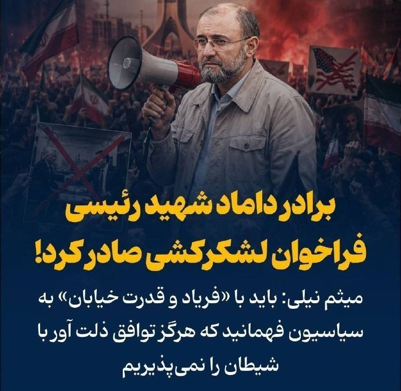

به به عالیه ادامه بدید

💧 Rainbet.com the #1 Non-KYC Crypto Casino & Sportsbook @rainbetcom

😁 @Pm_Afshaa

## pm_afshaa — post 93782

هیچ وقت فکر نمیکردم یه روزی نظرمون با عرزشی‌ها یکی بشه

## pm_afshaa — post 93781

  <a href="telegram/content/pm_afshaa_93781_1781375928.webm" target="_blank">🎬 Download video</a>

🔴اطلاعیه و فراخوان تجمع شبانه منتشر شده در کانال ثابتی در اعتراض به تیم مذاکره‌ کننده، با حضور 16 نماینده مجلس! 
💧 Rainbet.com the #1 Non-KYC Crypto Casino & Sportsbook @rainbetcom 
😁 @Pm_Afshaa

## pm_afshaa — post 93780

  <a href="telegram/content/pm_afshaa_93780_1781375929.webm" target="_blank">🎬 Download video</a>

🔴خبرگزاری فارس: با توجه به اینکه فردا تولد ترامپ است، مسئولان ایران اجازه نخواهند داد توافق فردا امضا بشه.

💧 Rainbet.com the #1 Non-KYC Crypto Casino & Sportsbook @rainbetcom

😁 @Pm_Afshaa

## pm_afshaa — post 93779

  <a href="telegram/content/pm_afshaa_93779_1781375929.webm" target="_blank">🎬 Download video</a>

🔴اطلاعیه و فراخوان تجمع شبانه منتشر شده در کانال ثابتی در اعتراض به تیم مذاکره‌ کننده، با حضور 16 نماینده مجلس!

💧 Rainbet.com the #1 Non-KYC Crypto Casino & Sportsbook @rainbetcom

😁 @Pm_Afshaa

## iaghapour — post 2672

🎶 جدیدترین ریمیکس‌ها و آهنگ‌ها
       فقط یه کلیک با تو فاصله دارن؛
       ریمیکسایی که ماشینو تبدیل به
کنسرت میکنه

       پلی‌لیستت رو با ما همیشه به‌روز نگه دار

👇
👇
👇
https://t.me/noxbeatx
https://t.me/noxbeatx

## iaghapour — post 2671

  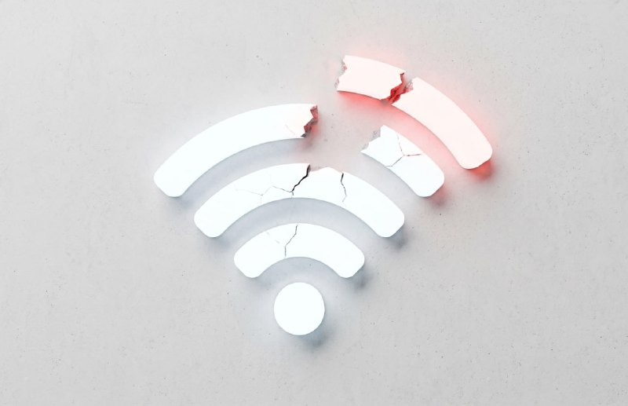

🌐 درخواست حمید رسایی و ۱۱۹ استاد برای انحلال «ستاد ویژه فضای مجازی»

بیش از ۱۲۰ تن از اساتید حوزه و دانشگاه، و چهره‌های سیاسی از جمله حمید رسایی در نامه‌ای به رئیس قوه قضائیه و فقهای شورای نگهبان، خواستار ابطال فوری مصوبه دولت برای تشکیل «ستاد ویژه ساماندهی و راهبری فضای مجازی» شدند.

🔹 مهم‌ترین دلایل مخالفان:
🔸 تشکیل این ستاد ناقض جایگاه «شورای عالی فضای مجازی» به عنوان تنها نقطه کانونی سیاست‌گذاری است و یک ساختار موازی محسوب می‌شود.

🔸 به اعتقاد نویسندگان نامه، رئیس‌جمهور صلاحیت ایجاد نهادهای فراقوه‌ای با کارکردهای کلان حاکمیتی را ندارد.

🔸 واگذاری اختیار محدودسازی اینترنت به ستاد جدید، با صلاحیت قانونی (کمیته فیلترینگ) و دادستانی کل کشور در تعارض است.

🔸 ایجاد این ساختار جدید، مصداق تشکیلات غیرضروری بوده و تنها باعث افزایش لایه‌های تصمیم‌گیری در فضای مجازی می‌شود.

پ.ن: جالبه تو این مملکت انگار با فساد و رانتِ کسی کاری ندارن؛ اما وای به روزی که بخوان اینترنتی رو که دست مفسدها رو رو می‌کنه، یه ذره آزاد کنن!

🆔 @iAghapour

## DEJradio — post 5661

  <a href="telegram/content/DEJradio_5661_1781375930.webm" target="_blank">🎬 Download video</a>

🔺📢 تفکیک مردم و حکومت؛ مخالفت با تخریب زیرساخت‌های عمومی؛

*پژمان گلچین، پژوهشگر فلسفه

#جنگ #زیرساخت
@DEJradio

## mamlekate — post 103704

📝 ترامپ: توافق من با تهران یکشنبه امضا می‌شود و دیواری محکم در برابر سلاح هسته‌ای است

دونالد ترامپ، رییس‌جمهوری آمریکا، گفت که توافق او با تهران دیواری محکم در برابر هرگونه سلاح هسته‌ای است و جمهوری اسلامی دیگر نه خواهان سلاح هسته‌ای است و نه به آن دست خواهند یافت؛ چه از طریق خرید، چه توسعه، و چه از طریق هر شکل دیگری از تامین آن.

@mamlekate

## mamlekate — post 103703

ویدئو از لویزان #الو غرب تهران اول صدای جت اومد بعد ۵ بار صدای بمب. صدای آژیر ماشینا دراومد. اکسیوس زده اسرائیل به ایران حمله کرده شرق تهرانو زدن ۷-۸ تا صدای انفجار اومد دو تاش خیلی مهیب بود دودم بلند شده ولی خوب معلوم نیست شرق تهرانو زدن فکر کنم سمت…

## kianmeli1 — post 87972

🔴اکسیوس به نقل از منابعی نوشت که دلیل امضای ویدیویی توافق آمریکا و جمهوری اسلامی، موضوعات لجستیکی و عدم امکان سفر جی‌دی‌ونس به پاکستان همزمان با سفر ترامپ برای شرکت در نشست گروه۷ است
https://t.me/kianmeli1

## IranIntlTV — post 342126

  <a href="telegram/content/IranIntlTV_342126_1781375930.mp4" target="_blank">🎬 Download video</a>

خبرگزاری رویترز ویدیویی از شهر نبطیه در جنوب لبنان منتشر کرده است که نشان می‌دهد روز شنبه ۲۳ خرداد در پی حمله اسرائیل به مواضع حزب‌الله، گروه مورد حمایت جمهوری اسلامی، چند انفجار مهیب رخ داد و پس از آن دود غلیظی به هوا برخاست.
@iranintltv

## IranIntlTV — post 342125

  

شبکه کان به نقل از منابع امنیتی اسرائیلی گزارش داد که در سایه تفاهم احتمالی آمریکا و جمهوری اسلامی، ارتش اسرائیل برای احتمال صدور دستور از سوی مقام‌های سیاسی این کشور به‌منظور توقف پیشروی زمینی در جنوب لبنان آماده می‌شود اما از نوار امنیتی در جنوب لبنان عقب‌نشینی نخواهد کرد.

بر اساس این گزارش، اسرائیل همچنین در حال برنامه‌ریزی برای کاهش حملات در عمق خاک لبنان است تا از آسیب دیدن تفاهم میان آمریکا و جمهوری اسلامی جلوگیری شود.

یک منبع آگاه به کان گفت ارتش اسرائیل همچنان به حملات خود در جنوب لبنان ادامه می‌دهد، اما این حملات هدفمند و محدود هستند. به گفته این منبع، فعالیت ارتش این کشور در بیروت نیز همچنان با محدودیت‌هایی همراه است.

به گفته این منابع، موضوع نوار امنیتی قرار است در مذاکرات مستقیم میان اسرائیل و لبنان که حدود یک هفته و نیم دیگر در آمریکا برگزار می‌شود، مورد بررسی قرار گیرد.
https://iranintl.com/202606132065

## IranIntlTV — post 342124

  <a href="telegram/content/IranIntlTV_342124_1781375932.mp4" target="_blank">🎬 Download video</a>

مهدی مهدوی‌آزاد در برنامه «چشم‌انداز» می‌گوید اگر گزارش رویترز درباره برچیده شدن برنامه هسته‌ای جمهوری اسلامی بر اساس توافق احتمالی درست باشد، این پرسش مطرح می‌شود که چرا حکومت سال‌ها پیش چنین توافقی را نپذیرفت و اجازه داد ده‌ها میلیارد دلار از سرمایه ایران از بین برود.
@iranintltv

## IranIntlTV — post 342123

  <a href="telegram/content/IranIntlTV_342123_1781375933.mp4" target="_blank">🎬 Download video</a>

هوشنگ حسن‌یاری، کارشناس خاورمیانه و امور نظامی، در گفت‌وگو با ایران‌اینترنشنال گفت مسئله هسته‌ای و سرنوشت ذخایر اورانیوم، گره اصلی هرگونه توافق میان تهران و واشینگتن است. او افزود از نگاه جمهوری اسلامی، واگذاری این ظرفیت به منزله «خودکشی جمعی» است و شکاف‌های داخلی حکومت نیز نشان می‌دهد پرونده هسته‌ای همچنان مهم‌ترین موضوع برای حاکمیت به شمار می‌رود و عقب‌نشینی از آن به معنای نادیده گرفتن هزینه‌های سنگینی است که جمهوری اسلامی برای این برنامه پرداخته است.
@iranintltv

## IranIntlTV — post 342122

  <a href="https://t.me/IranintlTV/342122" target="_blank">📎 Download file</a>

🎧نسخه صوتی تیتراول با نیوشا صارمی: ترامپ: فردا با ایران تفاهم‌نامه امضا می‌کنیم، بعدا سراغ اورانیوم می‌آییم
@iranintlTV

## IranIntlTV — post 342121

  <a href="telegram/content/IranIntlTV_342121_1781375935.mp4" target="_blank">🎬 Download video</a>

🔻تیم ملی فوتبال برزیل، پرافتخارترین تیم ادوار جام جهانی، در نخستین بازی خود بامداد یکشنبه به مصاف مراکش می‌رود.

🔹توضیحات کوشاد دلشاد، مربی فوتبال در برزیل

@iranintltvsport

## IranIntlTV — post 342120

  <a href="telegram/content/IranIntlTV_342120_1781375936.mp4" target="_blank">🎬 Download video</a>

ویدیوی رسیده به ایران اینترنشنال نشان می‌دهد که زادروز جاویدنام حجت‌الله فیروزی کنار آرامگاهش گرامی داشته شد. او که ۱۸ دی‌ماه در جریان اعتراضات «انقلاب ملی» در محله نظام‌آباد تهران بازداشت شده بود، بر اثر شکنجه در بازداشتگاه جان باخت.

## IranIntlTV — post 342119

  

وب‌سایت خبری اکسیوس به نقل از منابع آگاه نوشت که دلیل امضای ویدیویی توافق آمریکا و جمهوری اسلامی، «ملاحظات اجرایی و لجستیکی» و عدم امکان سفر جی‌دی‌ونس به پاکستان است.

اکسیوس نوشت که یکی از دلایل اصلی امضای ویدیویی توافق آمریکا و جمهوری اسلامی این است که ونس در صورت سفر برای امضای توافق، نمی‌توانست قبل از عزیمت ترامپ برای شرکت در اجلاس گروه ۷ در فرانسه در صبح دوشنبه به آمریکا بازگردد.
https://iranintl.com/202606136016

## IranIntlTV — post 342118

  <a href="telegram/content/IranIntlTV_342118_1781375938.mp4" target="_blank">🎬 Download video</a>

شهیر شهیدثالث، تحلیل‌گر روابط بین‌الملل، درباره توافق احتمالی تهران و واشینگتن گفت: «آلترناتیو واقعی هر دو طرف، توافق است. نه اینکه توافق الزاما بهترین گزینه باشد، بلکه جنگ راه‌حلی برای مشکلات هیچ‌یک از آنها نیست.»
@iranintltv

## IranIntlTV — post 342117

  

خبرگزاری فارس، رسانه وابسته به سپاه پاسداران، شامگاه شنبه ۲۳ خرداد اصرار دونالد ترامپ بر امضای یادداشت تفاهم با جمهوری اسلامی در روز یکشنبه را «عجیب» و «فشار نمایشی» خواند.

فارس نوشت: «سرنوشت امضای یکشنبه نه‌فقط یک آزمون فنی برای محتوای تفاهم، بلکه آزمونی برای صداقت و ایستادگی مسئولان ایرانی در برابر فشارهای نمایشی نیز خواهد بود.»
https://iranintl.com/202606134488

## IranIntlTV — post 342116

  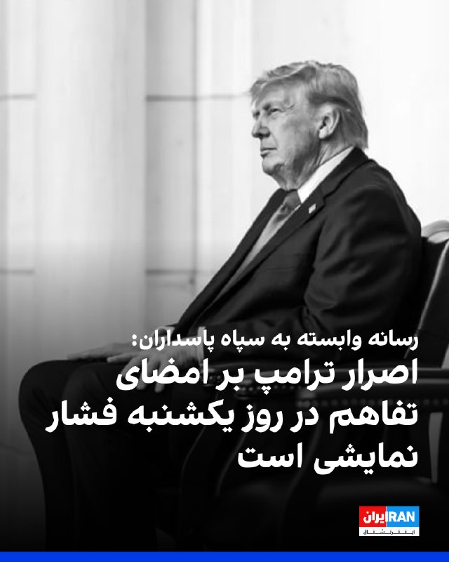

خبرگزاری فارس، رسانه وابسته به سپاه پاسداران، شامگاه شنبه ۲۳ خرداد اصرار دونالد ترامپ بر امضای یادداشت تفاهم با جمهوری اسلامی در روز یکشنبه را «عجیب» و «فشار نمایشی» خواند.

فارس نوشت: «سرنوشت امضای یکشنبه نه‌فقط یک آزمون فنی برای محتوای تفاهم، بلکه آزمونی برای صداقت و ایستادگی مسئولان ایرانی در برابر فشارهای نمایشی نیز خواهد بود.»
https://iranintl.com/202606134488

## Shin_Persian — post 7022

Shin ✓ @hey_itsmyturn
Sat, 13 Jun 2026 18:17:41 UTC

Watching regime fans in 2 groups of pro-deal and anti-deal fighting each other on X is like watching The Purge, except that it's ACTUAL FUN while you're rooting for neither of the side

ترجمه خودکار فارسی

تماشای درگیری طرفداران رژیم در دو گروهِ موافق توافق و مخالف توافق با یکدیگر در X (توییتر سابق) مانند تماشای فیلم «پاکسازی» (The Purge) است، با این تفاوت که واقعاً سرگرم‌کننده است در حالی که طرف هیچ‌کدام از گروه‌ها را نمی‌گیری.

𝕏 · @shin_persian

## ManotoTV — post 106051

  <a href="telegram/content/ManotoTV_106051_1781375941.mp4" target="_blank">🎬 Download video</a>

جام جهانی ۲۰۲۶ برای ایران فقط یک رویداد ورزشی نیست. هم‌زمان با حضور تیم ملی در بزرگ‌ترین صحنه فوتبال جهان، بحث بر سر هویت ملی، پرچم شیر و خورشید، جمهوری اسلامی و نمایندگی ایران نیز وارد ورزشگاه‌ها شده است.

آیا تیم ملی صرفاً یک تیم فوتبال است؟ آیا می‌توان از ایران حمایت کرد بدون آنکه از حکومت حمایت کرد؟ و در نهایت، چه کسی حق دارد به نام ایران سخن بگوید؟

## FarsiVOA — post 220613

🔺فعالان و نهادهای حقوق ‌‌بشری در مورد اعدام زود هنگام چند جوان مخالف توسط جمهوری اسلامی هشدار می‌دهند

▪️همزمان با افزایش احتمال امضای توافقنامه‌ای میان جمهوری اسلامی و آمریکا برای توقف درگیری‌ها، رژیم ایران چند جوان دیگر را به دلیل مخالفت و اعتراض به شرایط کشور زیر تیغ اعدام قرار داده است. فعالان و نهادهای حقوق بشری روز شنبه ۲۳ خرداد ۱۴۰۵ نسبت به افزایش خطر اجرای حکم اعدام آرمین نورمحمدی، ایمان گنجی و علی کمالی هشدار دادند.

⬇️ بیشتر بخوانید:

https://ir.voanews.com/a/iran-execution-prison-protest-america-day-war-/8160464.html/?nocach=1

## FarsiVOA — post 220612

  <a href="telegram/content/FarsiVOA_220612_1781375941.mp4" target="_blank">🎬 Download video</a>

ارتش اسرائیل می‌گوید نیروهایش در ادامه عملیات پاکسازی شبکه گسترده تونل‌های زیرزمینی در ارتفاعات بوفور «نقشه‌هایی تهدیدآمیز» کشف کرده‌اند؛ شبکه‌ای که به گفته ارتش اسرائيل، با طراحی و تأمین مالی جمهوری اسلامی ایران ساخته شده است.

ارتش اسرائیل اعلام کرد در یکی از مسیرهای زیرزمینی، محلی که چندی پیش تروریست‌هایی شناسایی و حذف شده بودند، نقشه‌هایی روی دیوار کشف شد که کنترل بر فراز شهرک‌های شمالی اسرائیل را نشان می‌دهد.

به گفته ارتش اسرائیل، این شبکه از تونل‌ها در منطقه‌ای غیرنظامی و در حدود شش کیلومتری شهر مرزی متولا قرار دارد و حزب‌الله از آن به‌عنوان یک مرکز عملیاتی در جنوب لبنان استفاده می‌کرده است.

## FarsiVOA — post 220611

گام تاریخی اتحادیه اروپا؛ پیشروی دیپلماتیک با اوکراین و بازآرایی اضطراری ناتو

## FarsiVOA — post 220610

  <a href="telegram/content/FarsiVOA_220610_1781375943.mp4" target="_blank">🎬 Download video</a>

گزارش نرگس صبا در برنامه تفسیر خبر از سالگرد جنگ ۱۲ روزه و تاثیر این جنگ بر رویدادهای بعد از آن

## FarsiVOA — post 220609

🔺ترامپ: توافق جدید با جمهوری اسلامی یکشنبه امضا می‌شود؛ اگر این مسیر سریع پیش‌ نرود گزینه «جایگزین نهایی» را در اختیار داریم

▪️دونالد ترامپ، رئیس‌جمهوری آمریکا، در پیامی در شبکه اجتماعی تروت سوشال اعلام کرد که توافق جدید با جمهوری اسلامی ایران قرار است «فردا» امضا شود و بلافاصله پس از آن، «تنگه هرمز به روی همه باز خواهد بود.»

⬇️ بیشتر بخوانید:

https://ir.voanews.com/a/trump-announces-new-iran-deal/8160479.html/?nocach=1

## FarsiVOA — post 220608

حزب الله لبنان، پاشنه آشیل مذاکره های صلح جمهوری اسلامی و آمریکا است؛ گفت‌و‌گو با محمد قائدی

## FarsiVOA — post 220607

  <a href="telegram/content/FarsiVOA_220607_1781375944.mp4" target="_blank">🎬 Download video</a>

خواهر دادخواه بابک صادقی محسنی، با انتشار این ویدیو نوشته است به مادرش که تصمیم داشت ۲۲ خرداد تولد ۳۲ سالگی بابک را بر آرامگاه او برگزار کند چند ساعت اجازه خروج از خانه را ندادند.

او با اشاره به اینکه ماموران حاضر در باغ بهشت همدان، گل‌های آرامگاه براردش را تخریب کردند نوشته است: «چرا باید مادرم در خانه خودش زندانی شود و اجازه نداشته باشد به آرامگاه فرزندش برود...»

بابک صادقی محسنی، ۱۹ دی ۱۴۰۴ با شلیک گلوله ماموران حکومتی به سرش در تهرانپارس کشته شد.

## DW_Farsi — post 125937

🔶قزلحصار از درون: گزارش اختصاصی دویچه وله از داخل زندان
🔻گزارشی از آتفه چهارمحالیان
📌این گزارش حاوی محتوای ناخوشایند است.

«آنچه نوشته‌ام تنها بخشی از آن چیزی است که این ماه‌ها بر ما گذشت. فجایع، تحقیرها، شکنجه‌ها و رنج‌هایی که زندانیان در قزل‌حصارتحمل می‌کنند بسیار فراتر از آن چیزی است که در این نامه آمده است.»

این جملات بخشی از نامه سهیل عربی، زندانی سیاسی تازه آزادشده از ندامتگاه قزلحصار کرج است؛ زندانی که طی دهه‌ها نام آن بارها در گزارش‌های مربوط به سرکوب سیاسی، اجرای احکام اعدام، اعتراضات زندانیان و شرایط وخیم نگهداری زندانیان، به ویژه متهمان سیاسی، امنیتی و محکومان به اعدام، تکرار شده است.

زندان قزلحصار در دهه چهل خورشیدی برای نگهداری حدود پنج هزار زندانی طراحی شده بود، اما بر اساس گزارش‌های رسیده از درون زندان، این مجموعه اکنون با تراکمی چندین برابر ظرفیت خود مواجه است.

@dw_farsi

## DW_Farsi — post 125936

  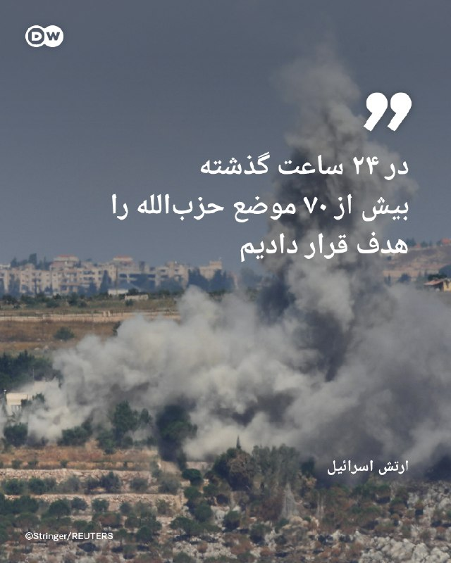

🔶ارتش اسرائیل: در ۲۴ ساعت گذشته بیش از ۷۰ موضع حزب‌الله را هدف قرار دادیم

ارتش اسرائیل اعلام کرد در یک شبانه‌روز گذشته، بیش از ۷۰ موضع حزب‌الله را در جنوب لبنان هدف حمله قرار داده است.

به گفته ارتش، این حملات سکوهای پرتاب راکت و ساختمان‌هایی را شامل می‌شد که حزب‌الله از آن‌ها برای پیشبرد حملات خود استفاده می‌کرد.

ارتش اسرائیل همچنین اعلام کرد چند نیروی حزب‌الله را که در مناطقی از جنوب لبنان، محل حضور نیروهای اسرائیلی، شناسایی شده بودند، کشته است.

بر اساس گزارش رسانه‌های لبنانی، ارتش لبنان از مواضع خود در شهر کفر تبنیت، در نزدیکی نبطیه، عقب‌نشینی کرده است. این عقب‌نشینی در حالی گزارش شده که ارتش اسرائیل در این منطقه در حال پیشروی است.

@dw_farsi

## Persian_Trend_Official — post 16973

ارتش اسرائیل ویدیویی از تونل حزب‌الله لبنان در زیر قلعه بوفور منتشر کرد.

این تونل قرار است پس از بازرسی و برسی کامل توسط ارتش اسرائیل تخریب شود.

📝 Amir

📌 @persian_trend_official
پرشین ترند | متفاوت‌ترین کانال نظامی

## Persian_Trend_Official — post 16972

  <a href="telegram/content/Persian_Trend_Official_16972_1781375946.mp4" target="_blank">🎬 Download video</a>

⭕️ صداوسیما: یه نفتکش غول‌پیکر از محاصره دریایی آمریکا رد شده است.

📝 Nick

📌 @persian_trend_official
پرشین ترند | متفاوت‌ترین کانال نظامی

## Persian_Trend_Official — post 16971

  <a href="telegram/content/Persian_Trend_Official_16971_1781375947.mp4" target="_blank">🎬 Download video</a>

و در آخر پس از گذشت تقریبا 19 ساعت از آغاز عملیات طلوع شیران اسرائیل، سپاه پاسداران اولین موج موشکی عملیات وعده صادق-3 را حدودا در همین ساعات انجام داد.

ویدیو متعلق به اصابت یک موشک سپاه به نزدیکی یک لانچر سیستم پدافندی گنبد آهنین است که در بین چند ساختمان در یک پارکینگ پنهان شده بود، هر چند جمهوری اسلامی ادعا داشت در این موج یک مقر زیرزمینی فرماندهی کنترل اسرائیل را هدف قرار داده است ولی مدرکی برای اثبات این ادعای خود منتشر ننمود.

📝 Amir

📌 @persian_trend_official
پرشین ترند | متفاوت‌ترین کانال نظامی

## Persian_Trend_Official — post 16970

  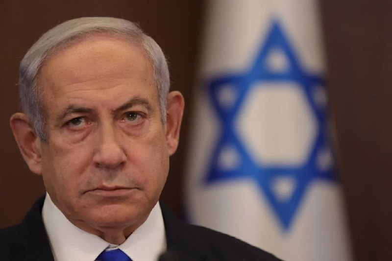

کانال 12 اسرائیل: مقامات ارشد اسرائیلی هشدار داده‌اند که توافق نوظهور آمریکا و ایران، عمیق‌ترین منافع امنیتی اسرائیل را به خطر می‌اندازد.

آنها گفتند: ایرانی‌ها بی‌دلیل با این چارچوب موافقت نکردند. طرف آمریکایی شرایط اصلی آنها را پذیرفت. این مقامات گفتند که قابلیت‌های هسته‌ای بعداً بر اساس اعتبار بررسی خواهد شد، مشابه آتش‌بس غزه که در آن حماس هرگز خلع سلاح نشد.

اگر ایران اقدامات لازم را انجام ندهد، آمریکایی‌ها پس از 60 روز چه اهرمی خواهند داشت؟ تهدید نظامی معتبر از بین خواهد رفت.

این مقامات هشدار دادند: ایران نه تنها ملزم به توقف حمایت از گروه‌های نیابتی نیست، بلکه از طریق این توافق با حزب‌الله دوباره ارتباط برقرار می‌کند.

📝 Amir

📌 @persian_trend_official
پرشین ترند | متفاوت‌ترین کانال نظامی

## Persian_Trend_Official — post 16969

  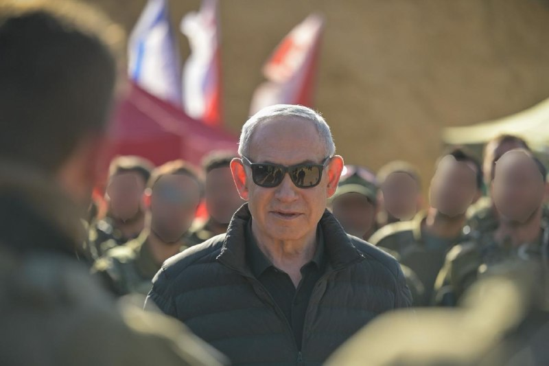

اسرائیل هیوم: یک منبع ارشد دیپلماتیک گفته است که اسرائیل ملزم به امضای توافق با ایران نخواهد بود و قادر به دفاع از خود خواهد بود، ولی رفتار آن باید با ایالات متحده هماهنگ شود.

اگر توافقی حاصل نشود و ایران به محاصره تنگه هرمز و اقدامات جنگی خود ادامه دهد، سرنگونی رژیم روی میز خواهد بود.

در مورد لبنان، این تفاهم‌نامه به آتش‌بس منطقه‌ای تحت شرایط از پیش موجود اشاره دارد که حق اسرائیل برای دفاع از خود و هدف قرار دادن تهدیدها، از جمله تهدیدهای نوظهور را حفظ می‌کند.

ایران در این مرحله خواستار عقب‌نشینی اسرائیل از جنوب لبنان شد.

📝 Amir

📌 @persian_trend_official
پرشین ترند | متفاوت‌ترین کانال نظامی

## Persian_Trend_Official — post 16968

  <a href="telegram/content/Persian_Trend_Official_16968_1781375948.webm" target="_blank">🎬 Download video</a>

به گزارش اکسیوس، انتظار می‌رود ایالات متحده و ایران، با میانجیگری پاکستان و قطر، روز یکشنبه یک نشست مجازی برگزار کنند تا به صورت الکترونیکی تفاهم‌نامه‌ای را امضا کنند که آتش‌بس را به مدت 60 روز تمدید می‌کند.

پس از امضا، تنگه هرمز را بازگشایی می‌شود و مذاکرات در مورد برنامه هسته‌ای ایران آغاز می‌شود. این قالب مجازی به دلایل لجستیکی انتخاب شده است.

📝 Amir

📌 @persian_trend_official
پرشین ترند | متفاوت‌ترین کانال نظامی

## Persian_Trend_Official — post 16967

  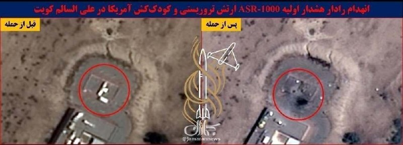

تصاویر ماهواره ای با کیفیت از انهدام سیستم راداری TPS-59 در کوه الدخان و دو مخزن سوخت در پایگاه شیخ عیسی بحرین طی حملات موشکی و پهپادی نیروی های مسلح جمهوری اسلامی 📝 Amir 📌 @persian_trend_official پرشین ترند | متفاوت‌ترین کانال نظامی

## RadioFarda — post 158274

از قدس تا دریای مدیترانه؛ محورهای تنش میان ترکیه و اسرائیل

🔸رجب طیب اردوغان، رئیس‌جمهور ترکیه، که پیش از این بارها در دو سال و نیم گذشته دربارهٔ «پیامدهای منطقه‌ای جنگ‌های اسرائیل» هشدار داده بود، اخیراً در اظهاراتی بی‌سابقه اعلام کرد: «حملات اسرائیل به سوریه و لبنان به سطحی رسیده که امنیت ترکیه را نیز تهدید می‌کند».

🔸اردوغان روز ۲۰ خرداد تأکید کرد که «امنیت ترکیه نه از حاتای (مرزهای این کشور)، بلکه از حلب، دمشق و بیروت آغاز می‌شود» و متوقف کردن اسرائیل را یک «وظیفه بشری» دانست.

🔸این سخنان با پاسخ تند و فوری بنیامین نتانیاهو روبه‌رو شد. نخست‌وزیر اسرائیل، اردوغان را «دیکتاتوری یهودستیز» خواند که «مخالفانش را سرکوب می‌کند، در حال نسل‌کشی علیه کردها است، از حماس حمایت می‌کند، مردم خود را سرکوب می‌کند و مخالفان سیاسی را زندانی می‌کند» و لذا آخرین کسی است که می‌تواند به او و اسرائیل درس اخلاق بدهد.

🔸وزارت خارجه ترکیه نیز بلافاصله این اتهامات را تلاش نتانیاهو برای گمراه کردن افکار عمومی جهان دانست.

🔸گزارش کامل را در وب‌سایت رادیوفردا بخوانید.

@RadioFarda

## IranianMinds — post 22483

جدی دلم میخواد این عرزشیایی که قراره به مذاکره اعتراض کنن رو با همون نیروهایی سرکوب کنن که مردمو تو دی‌ماه کشتن

@IranianMinds

## IranianMinds — post 22482

  <a href="telegram/content/IranianMinds_22482_1781375949.mp4" target="_blank">🎬 Download video</a>

🔴مرگ بر سازشگر.

@IranianMinds

## IranianMinds — post 22481

  <a href="telegram/content/IranianMinds_22481_1781375951.mp4" target="_blank">🎬 Download video</a>

🔴قالیباف، عراقچی، استعفاء استعفاء.

@IranianMinds

## IranianMinds — post 22480

  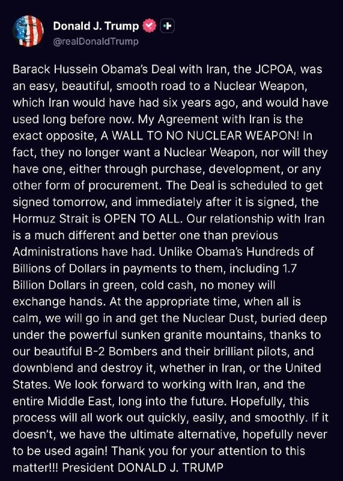

🔴پست ترامپ:

توافق باراک حسین اوباما با ایران، برجام، مسیری آسان، زیبا و هموار به سوی سلاح هسته‌ای بود که ایران شش سال پیش آن را داشت و مدت‌ها پیش از آن استفاده می‌کرد. توافق من با ایران دقیقاً برعکس است، دیواری برای نداشتن سلاح هسته‌ای! در واقع، آنها دیگر سلاح هسته‌ای نمی‌خواهند و نخواهند داشت، نه از طریق خرید، توسعه یا هر شکل دیگری از تهیه. قرار است این توافق فردا امضا شود و بلافاصله پس از امضای آن، تنگه هرمز به روی همه باز است. رابطه ما با ایران بسیار متفاوت و بهتر از دولت‌های قبلی است. برخلاف صدها میلیارد دلار پرداخت اوباما به آنها، از جمله ۱.۷ میلیارد دلار پول نقد، هیچ پولی رد و بدل نخواهد شد. در زمان مناسب، وقتی همه چیز آرام باشد، ما به لطف بمب‌افکن‌های زیبای B-2 و خلبانان درخشانشان، وارد عمل می‌شویم و غبار هسته‌ای را که در اعماق کوه‌های گرانیتی قدرتمند و غرق شده دفن شده است، جمع‌آوری و نابود می‌کنیم، چه در ایران و چه در ایالات متحده. امیدواریم که این روند به سرعت به راحتی انجام شود. اگر اینطور نشود، ما جایگزین نهایی را داریم، امیدواریم که دیگر هرگز مورد استفاده قرار نگیرد!

@IranianMinds

## BBCPersian — post 283726

  <a href="telegram/content/BBCPersian_283726_1781375953.mp4" target="_blank">🎬 Download video</a>

⚽️کری‌خوانی نیوزیلندی‌ها برای تیم ملی ایران در حاشیه برد ۴-۱ آمریکا.

دو هوادار نیوزیلندی که برای تماشای مسابقه‌های تیم ملی کشورشان به آمریکا رفته‌اند، در حاشیه تماشای بازی آمریکا و پاراگوئه برای تیم ملی ایران کری‌ خواندند. یکی از آنها اسم بازیکنانی را فهرست کرد که پیش‌بینی می‌کرد در بازی با ایران گل بزنند. در میان آنها هم بازیکن حمله بود، هم هافبک، هم مدافع و هم دروازه‌بان.

مسابقه آمریکا با چهار گلی که این تیم به پاراگوئه زد، بیشتر کسانی که برای تماشا به محوطه هواداران فیفا آمده بودند را خوشحال کرد.

خبرنگارمان سام فرزانه به این محدوده هواداران رفته و این گزارش را تهیه کرده است.

😏راستی پاسخ شما به کری آن نیوزیلندی‌ها چیست؟ در کامنت‌های این پست اینستاگرام بنویسید.
instagram.com/reel/DZiT5PyIcbv/
@bbcpersian

## BBCPersian — post 283717

⚽️گروه اف ‌(F) جام جهانی؛ فوتبال یا شطرنج

«سامورایی‌های آبی» ژاپن با اعتمادبه‌نفسی بی‌سابقه وارد جام جهانی ۲۰۲۶ می‌شود. ژاپن نخستین تیمی بود که جواز حضور در جام جهانی ۲۰۲۶ را گرفت. هاجیمه موریاسو از سال ۲۰۱۸ هدایت ژاپن را بر عهده دارد. با وجود انتقادهایی که او را مربی‌ای محافظه‌کار می‌دانند، توانسته تیمی منسجم، با اعتمادبه‌نفس و هویت مشخص بسازد که توان رقابت با بهترین تیم‌های جهان را دارد.

تاکه‌فوسا کوبو، ستاره ۲۴ ساله تیم ملی ژاپن که به تکنیک بالا، خلاقیت و دید خوب در بازی شناخته می‌شود، در سال‌های اخیر یکی از چهره‌های برجسته لالیگا شده است و بسیاری او را «مسی ژاپنی» می‌نامند.

هلند با ترکیبی از تجربه، کیفیت فنی و عمق قابل‌توجه در ترکیب، یکی از مدعیان پنهان جام جهانی ۲۰۲۶ است. «نارنجی‌ها» تیمی متعادل با خط دفاعی قدرتمند، هافبک‌های باکیفیت و بازیکنان باتجربه است که می‌تواند در مراحل حذفی برای هر حریفی خطرناک باشد.

فرانکی دی‌یونگ، ستاره تیم همچنان رهبر فنی هلند محسوب می‌شود.

📲در لینک زیر بیشتر بخوانید⬇️

📸GettyImages

https://bbc.in/4xwxM44
@BBCPersian

## BBCPersian — post 283716

  <a href="telegram/content/BBCPersian_283716_1781375955.mp4" target="_blank">🎬 Download video</a>

این تصاویر امروز ۱۳ ژوئن/ ۲۳ خرداد از تجمع گروهی از ایرانیان در هامبورگ، برلین و بروکسل به دست بی‌بی‌سی فارسی رسیده است.

در هامبورگ تجمع‌کنندگان در کنار پرچم شیروخورشید و عکس محمدرضا شاه، عکس مجیدرضا رهنورد را هم به همراه داشتند و به مناسبت زادروزش یادش را گرامی داشتند.

آن‌ها همچنین در شعارهایشان گفتند که «رژیم فاشیست در ایران باید برود.»

مجیدرضا رهنورد، متولد ۲۶ خرداد ۱۳۷۸، در اعتراضات ۱۴۰۱ بازداشت و در مشهد اعدام شد.

همچنین گروه دیگری در برلین علیه جمهوری اسلامی، اعدام و جنگ تجمع و بیانیه‌ای صادر کردند.

@BBCPersian

## BBCPersian — post 283715

  <a href="https://t.me/bbcpersian/283715" target="_blank">📎 Download file</a>

پادکست برنامه جام جهان‌نما، شنبه ۲۳ خرداد ۱۴۰۵

این برنامه رادیویی را می‌توانید هر شب ساعت ۲۰ به وقت ایران، روی موج متوسط ۷۰۲ کیلوهرتز و موج کوتاه ۹۴۶۵ کیلوهرتز بشنوید.
تکرار برنامه را هم می‌توانید ساعت ۲۱:۳۰ روی موج متوسط ۷۰۲ کیلوهرتز و موج کوتاه ۵۳۹۵ کیلوهرتز گوش کنید.
@bbcpersian

## BBCPersian — post 283714

  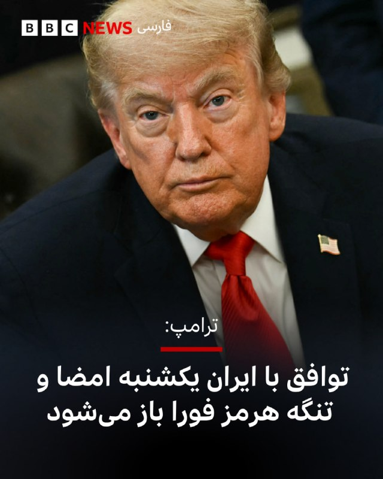

‌
🔻دونالد ترامپ می‌گوید که تفاهم‌نامه ایران و آمریکا قرار است یکشنبه امضا شود و سپس تنگه هرمز فورا باز می‌شود.

رئیس‌جمهور آمریکا در پستی در شبکه اجتماعی خود نوشت: «در زمان مناسب، وقتی که آرامش برقرار شد، می‌رویم (داخل ایران) و غبار هسته‌ای (ذخایر اورانیوم غنی‌شده با خلوص بالا) را که زیر سنگ‌های خارای کوهستان مدفون شده بیرون می‌آوریم.»

آقای ترامپ گفت که این مواد هسته‌ای در ایران یا در آمریکا «رقیق و نابود» خواهد شد.

پاکستان هم پیشتر گفته بود که تفاهمنامه ایران و آمریکا تا روز یکشنبه نهایی و سپس امضا خواهد شد.

این در حالی است که اسماعیل بقایی، سخنگوی وزارت خارجه ایران، ساعاتی پیش، امضای توافقنامه در روز یکشنبه را رد کرده بود.

📷 AFP via Getty Images
@BBCPersian

## Dirty_Kids — post 391916

  <a href="telegram/content/Dirty_Kids_391916_1781375957.mp4" target="_blank">🎬 Download video</a>

شعار امشب تجمعات حکومتی: قالیباف، عراقچی، استعفاء استعفاء😂😂

منتظرم بریزن سرکوبشون کنن

@Dirty_Kids 👻

## Dirty_Kids — post 391914

  <a href="telegram/content/Dirty_Kids_391914_1781375959.mp4" target="_blank">🎬 Download video</a>

عرزشی‌های شیعه‌سان رافضی تندرو خرمسلک ریختن تو تجمعات شبانه دارن عرعر میکنن علیه قالیباف و عراقچی شعار میدن؛

قالیباف، عراقچی/ پس خون رهبرم چی.
عراقچی، حیا کن / آمریکا رو رها کن.:)))

@Dirty_Kids 👻

## Dirty_Kids — post 391913

  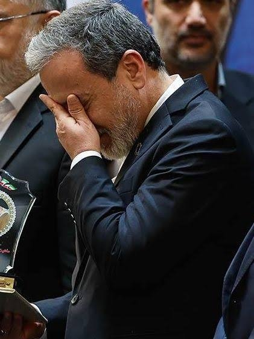

عراقچی گفته: مقاومت منجر به جنگ میشه، نه مذاکره 😂😂

یعنی با یه جمله یه تنه رید به ۴۷سال آرمان‌های عمام راحل و موشعلی گور به گور شده

@Dirty_Kids 👻

## Dirty_Kids — post 391911

  <a href="telegram/content/Dirty_Kids_391911_1781375960.mp4" target="_blank">🎬 Download video</a>

🔴این دوتا ویدیو از این پسربچه‌ی عاشق درس و مشق کلی تو اینستاگرام ویو خورده؛

خیلیا معتقدن که با این علاقه‌ی خاصش به تحصیل، میتونه یکی از آینده‌دارهای کشور باشه...

🔞هندزفری

@Dirty_Kids 👻

## Dirty_Kids — post 391910

  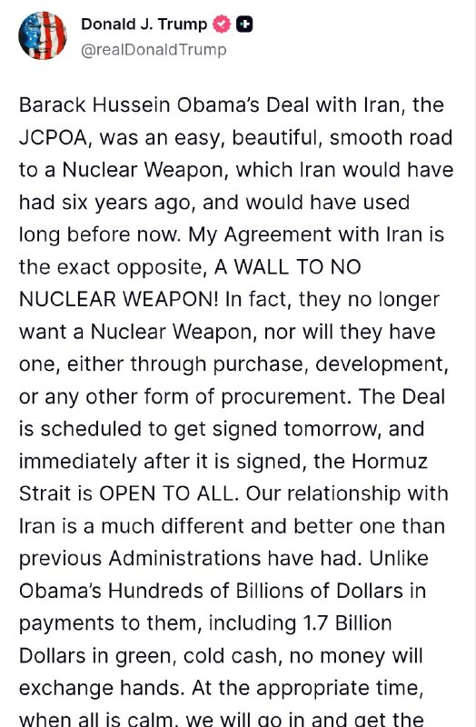

🔴ترامپ:
فردا توافق امضا میشه؛

توافق باراک حسین اوباما با روافض قحبه یعنی همون برجام، یک مسیر ساده، شیک و هموار برای رسیدن به سلاح هسته‌ای بود، مسیری که اگه جلودارش نمی‌شدیم روافض پدرخراب ۶ سال پیش به بمب اتم رسیده بود و خیلی قبل‌تر از این‌ها ازش استفاده می‌کرد.
اما توافق من با شیعه‌سانان رافضی دقیقاً نقطه‌ مقابل اونه: یک دیوار بتنی محکم در برابر رسیدن به هرگونه سلاح هسته‌ای.
در واقع، اونا دیگه نه سلاح هسته‌ای می‌خوان و نه بهش دست پیدا می‌کنن، چه از طریق خرید، چه توسعه و چه هر روش دیگه‌ای برای تامینش.
طبق برنامه این توافق فردا امضا می‌شه و بلافاصله بعد از امضا، تنگه‌ی هرمز به روی همه باز خواهد بود.
رابطه ما با روافض قحبه کاملاً متفاوت و بسیار بهتر از چیزیه که دولت‌های قبلی داشتن. برعکس دوران اوباما که صدها میلیارد دلار بهشون پرداخت شد، از جمله ۱.۷ میلیارد دلار پول نقد تانخورده و سبز رنگ، این‌بار قرار نیست هیچ پولی رد و بدل بشه.
در زمان مناسب وقتی همه‌جا آروم شد، ما به لطف بمب‌افکن‌های زیبای بی‌۲ و خلبان‌های فوق‌العاده‌شون، می‌ریم و اون غبارهای هسته‌ای رو که عمیقاً زیر کوه‌های گرانیتی قدرتمند و فرورفته دفن شدن بیرون می‌کشیم، رقیق می‌کنیم و نابودشون می‌کنیم، چه در داخل ایران باشه و چه در ایالات متحده.
ما مشتاقانه منتظر همکاری با روافض قحبه و کل خاورمیانه در آینده‌ای طولانی هستیم.
امیدوارم این فرآیند سریع، ساده و روان پیش بره.
اگه هم این‌طور نشه، ما اون گزینه نهایی و جایگزین رو داریم که البته امیدوارم هیچ‌وقت مجبور به استفاده دوباره ازش نشیم.
از توجهتون به این موضوع خیلی ممنونم.
رئیس‌جمهور، دونالد جی. ترامپ

@Dirty_Kids 👻

## Dirty_Kids — post 391909

  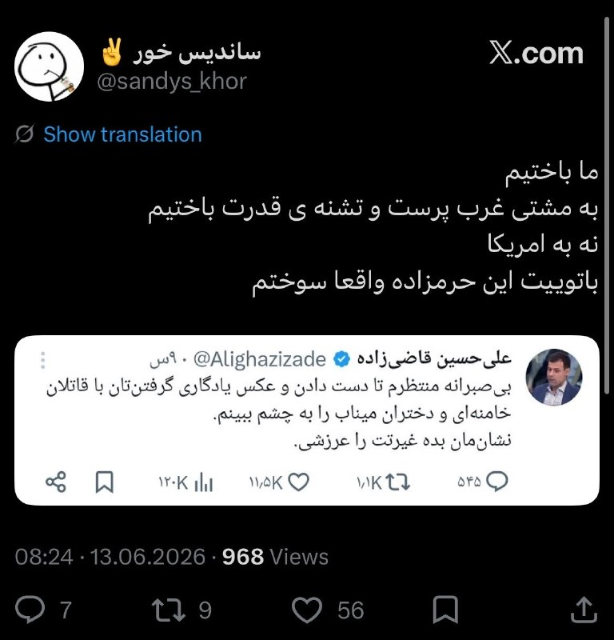

‏❌باور نمیکنین❌

بچه شیعه بالاخره باخت داد!!

@Dirty_Kids 👻

## Dirty_Kids — post 391908

  <a href="telegram/content/Dirty_Kids_391908_1781375963.mp4" target="_blank">🎬 Download video</a>

بَـــه آقای جوان نگرانتون بودیم
خوبه كه بيدار شدین...
خوبه كه وسط نيستین…
تكليفتون روشنه.… «حكومتى كامل»

@Dirty_Kids 👻

## Dirty_Kids — post 391907

  <a href="telegram/content/Dirty_Kids_391907_1781375964.mp4" target="_blank">🎬 Download video</a>

به‌به تو رستم و تهمتنی

@Dirty_Kids 👻

## Hranews — post 113591

صدور و تایید حکم اعدام برای ۳ متهم/ رهایی یک زندانی از مجازات مرگ

❗️
❗️
❗️
❗️
❗️– دو متهم در پرونده‌های مجزا توسط دادگاه کیفری تهران بابت اتهام قتل به اعدام محکوم شدند. حکم اعدام یک متهم نیز در پرونده‌ای با اتهام تجاوز، توسط دیوان عالی کشور تایید شد. از سوی دیگر، یک زندانی در استان خراسان رضوی که پیشتر از بابت اتهام قتل به #اعدام محکوم شده بود، با اعلام رضایت اولیای دم از مجازات مرگ رهایی یافت.

ادامه مطلب

↘️
@hranews_bot تماس ✉️ - @Hranews کانال هرانا 🆑

## Hranews — post 113590

مرگ و مصدومیت ۲ کارگر از جمله یک زن در سایه فقدان ایمنی کار

❗️
❗️
❗️
❗️
❗️– در سایه فقدان ایمنی محیط و شرایط نامناسب کار، دو #کارگر در شهرهای کاشان و دماوند، حین انجام کار دچار حادثه شدند. طی این حوادث یک کارگر جان باخت و یک کارگر زن مصدوم شد.

ادامه مطلب

↘️
@hranews_bot تماس ✉️ - @Hranews کانال هرانا 🆑

## manototv — post 106051

  <a href="telegram/content/manototv_106051_1781375965.mp4" target="_blank">🎬 Download video</a>

جام جهانی ۲۰۲۶ برای ایران فقط یک رویداد ورزشی نیست. هم‌زمان با حضور تیم ملی در بزرگ‌ترین صحنه فوتبال جهان، بحث بر سر هویت ملی، پرچم شیر و خورشید، جمهوری اسلامی و نمایندگی ایران نیز وارد ورزشگاه‌ها شده است.

آیا تیم ملی صرفاً یک تیم فوتبال است؟ آیا می‌توان از ایران حمایت کرد بدون آنکه از حکومت حمایت کرد؟ و در نهایت، چه کسی حق دارد به نام ایران سخن بگوید؟

## alonews — post 127697

  <a href="telegram/content/alonews_127697_1781375965.webm" target="_blank">🎬 Download video</a>

👈الجزیره به نقل از سازمان پخش اسرائیل: ارتش برای احتمال صدور دستور توقف پیشروی زمینی در جنوب لبنان از سوی فرماندهی سیاسی آماده می‌شود

✅ @AloNews خبر جنگ

## alonews — post 127696

  <a href="telegram/content/alonews_127696_1781375965.webm" target="_blank">🎬 Download video</a>

👈مقام ارشد اسرائیلی به کانال ۱۲ اسرائیل: این یه توافق مزخرفه

✅ @AloNews خبر جنگ

## alonews — post 127695

  <a href="telegram/content/alonews_127695_1781375965.webm" target="_blank">🎬 Download video</a>

👈نشست اضطراری کابینه امنیتی اسرائیل در پی آخرین تحولات ایران

✅ @AloNews خبر جنگ

## alonews — post 127694

  <a href="telegram/content/alonews_127694_1781375966.webm" target="_blank">🎬 Download video</a>

👈ترامپ یه عکس از خودش و رهبرِ کره شمالی، کیم جونگ اون، پست کرد

✅ @AloNews خبر جنگ

## alonews — post 127693

  <a href="telegram/content/alonews_127693_1781375966.webm" target="_blank">🎬 Download video</a>

👈سران کانادا و ایرلند: آتش بس در لبنان باید در توافق ایران و آمریکا لحاظ شود

✅ @AloNews خبر جنگ

## alonews — post 127692

  <a href="telegram/content/alonews_127692_1781375966.webm" target="_blank">🎬 Download video</a>

👈اسرائیل هیوم: اسرائیل ملزم به امضای توافق با ایران نخواهد بود و قادر به دفاع از خود است، اما رفتار آن باید با ایالات متحده هماهنگ شود

✅ @AloNews خبر جنگ

## alonews — post 127691

  <a href="telegram/content/alonews_127691_1781375966.webm" target="_blank">🎬 Download video</a>

👈خبرگزاری فارس: ترامپ در تلاش است تا یادداشتی بین آمریکا و ایران روز یکشنبه امضا شود، هرچند مقامات ایرانی می‌گویند که توافق نهایی نشده و امضایی در کار نیست.

🔴برخی معتقدند او می‌خواهد این اعلامیه با تولدش همزمان شود و آن را به یک پیروزی نمادین سیاسی تبدیل کند.

✅ @AloNews خبر جنگ

## alonews — post 127690

  <a href="telegram/content/alonews_127690_1781375966.webm" target="_blank">🎬 Download video</a>

👈فرماندهی مرکزی ایالات متحده اعلام کرد که کشتی‌های جنگی نیروی دریایی و دارایی‌های هوایی ایالات متحده همچنان در حمایت از محاصره علیه ایران گشت‌زنی می‌کنند و عملیات‌های مداوم را از سوی ناوچه یواس‌اس دلبرت دی. بلک (DDG‑119) در دریای عرب برجسته می‌سازند.

🔴بر اساس گفته‌های فرماندهی مرکزی، تا تاریخ ۱۳ ژوئن، نیروهای ایالات متحده ۱۴۱ کشتی تجاری را به مسیرهای دیگر هدایت کرده و ۹ کشتی را غیرفعال کرده‌اند تا به رعایت محاصره اجبار شود.

✅ @AloNews خبر جنگ

## alonews — post 127689

  <a href="telegram/content/alonews_127689_1781375966.webm" target="_blank">🎬 Download video</a>

👈کانال ۱۳ اسراییل: در اسرائیل اعتراف می‌کنند که میزان تأثیرگذاری بنیامین نتانیاهو بر توافقی که در حال حاضر میان ایران و ایالات متحده در حال شکل‌گیری است، بسیار محدود بوده است.

✅ @AloNews خبر جنگ

## alonews — post 127688

  <a href="telegram/content/alonews_127688_1781375967.webm" target="_blank">🎬 Download video</a>

👈آکسیوس: انتظار می‌رود ایالات متحده و ایران، با میانجیگری پاکستان و قطر، روز یکشنبه یک نشست مجازی برگزار کنند تا به صورت الکترونیکی تفاهم‌نامه‌ای را امضا کنند که آتش‌بس را به مدت ۶۰ روز تمدید می‌کند، تنگه هرمز را بازگشایی می‌کند و مذاکرات در مورد برنامه هسته‌ای ایران را آغاز می‌کند.

✅ @AloNews خبر جنگ

## alonews — post 127687

  <a href="telegram/content/alonews_127687_1781375967.webm" target="_blank">🎬 Download video</a>

👈فرهنگستان ادب و زبان فارسی: از این به بعد به جای هدفون بگید گوشینه

✅ @AloNews خبر جنگ

## alonews — post 127685

  <a href="telegram/content/alonews_127685_1781375967.webm" target="_blank">🎬 Download video</a>

👈حملهِ هوایی اسرائیل به شهرک الزراریه، جنوب لُبنان

✅ @AloNews خبر جنگ

## alonews — post 127684

  <a href="telegram/content/alonews_127684_1781375967.webm" target="_blank">🎬 Download video</a>

👈صداوسیما : یه نفتکش غول‌پیکر از محاصره دریایی آمریکا، رد شد

✅ @AloNews خبر جنگ

## alonews — post 127683

  <a href="telegram/content/alonews_127683_1781375967.webm" target="_blank">🎬 Download video</a>

👈فارس: با توجه به اینکه فردا تولد ترامپ است مسئولان ایران اجازه نخواهند داد توافق فردا امضا شود

✅ @AloNews خبر جنگ

---
📅 بروزرسانی: 1405/03/23 20:52
---

## VahidOOnLine — post 245333

  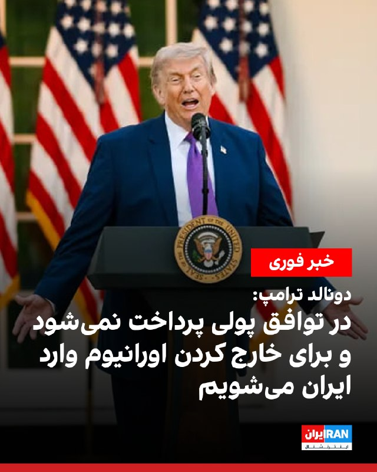

دونالد ترامپ، رییس‌جمهوری آمریکا، با اشاره به برنامه امضای توافق با جمهوری اسلامی در روز یکشنبه، گفت در این توافق هیچ پولی میان طرفین رد و بدل نخواهد شد.

ترامپ در شبکه اجتماعی تروت سوشال نوشت: «برخلاف صدها میلیارد دلاری که اوباما به آن‌ها پرداخت کرد، از جمله ۱.۷ میلیارد دلار پول نقد، در این توافق هیچ پولی رد و بدل نخواهد شد.»

او همچنین گفت در زمان مناسب و پس از آرام شدن شرایط، آمریکا برای خارج کردن مواد هسته‌ای باقی‌مانده وارد عمل خواهد شد.

رییس‌جمهوری آمریکا افزود: «در زمان مناسب، زمانی که همه‌چیز آرام باشد، وارد عمل خواهیم شد و مواد هسته‌ای باقی‌مانده را که در اعماق کوه‌های گرانیتی مستحکم و فرورفته مدفون شده‌اند، خارج خواهیم کرد و آن را رقیق و نابود خواهیم ساخت؛ چه در ایران و چه در ایالات متحده.»
‌🏁 🇬🇧 IranintlTV

🤖 @VahidOOnLine

## VahidOOnLine — post 245332

  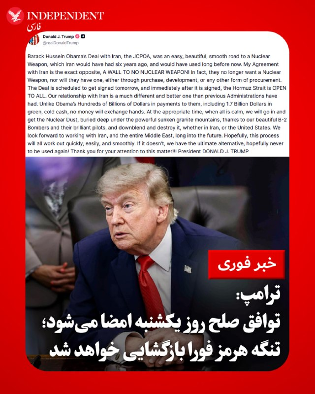

♦️ دونالد ترامپ، رئیس‌جمهوری آمریکا، با انتشار پیامی در شبکه اجتماعی «تروث سوشال»، از امضای توافق میان واشنگتن و تهران در روز یکشنبه، ۲۴ خرداد خبر داد.

ترامپ با انتقاد شدید از توافق برجام در دوره باراک اوباما، آن را مسیر همواری برای دستیابی ایران به سلاح هسته‌ای خواند و نوشت: «توافق من دقیقا برعکس و دیواری محکم در برابر سلاح هسته‌ای است. ایران دیگر به دنبال سلاح هسته‌ای نیست و از هیچ طریقی به آن نخواهد رسید.» او تاکید کرد که بر خلاف دوره اوباما، هیچ پولی میان دو کشور رد و بدل نخواهد شد.

رئیس‌جمهوری آمریکا اعلام کرد که بلافاصله پس از امضای توافق در روز یکشنبه، «تنگه هرمز به روی همه باز خواهد شد.» او همچنین افزود که در زمان مقتضی و پس از بازگشت آرامش، واشنگتن اقدام به جمع‌آوری و نابودی بقایای مواد هسته‌ای ایران خواهد کرد. ترامپ با ابراز امیدواری برای همکاری طولانی‌مدت با ایران و خاورمیانه، در پایانی هشداری نوشت: «امیدوارم این روند سریع و روان پیش برود؛ اگر این‌طور نشود، ما گزینه جایگزین نهایی را داریم که امیدوارم هرگز مجبور به استفاده دوباره از آن نشویم.»
‌🇸🇦 Indypersian

🤖 @VahidOOnLine

## VahidOOnLine — post 245331

  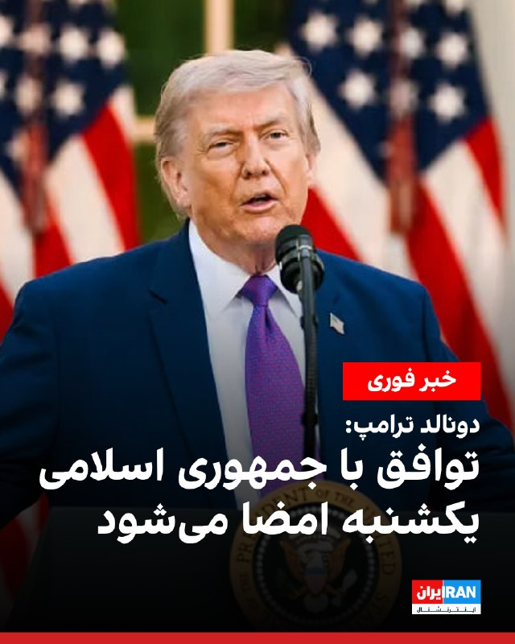

دونالد ترامپ، رییس‌جمهوری آمریکا، شنبه ۲۳ خرداد در شبکه اجتماعی تروت سوشال نوشت که قرار است توافق با جمهوری اسلامی یکشنبه ۲۴ خرداد امضا شود.

او با اشاره به مفاد این توافق، ابراز امیدواری کرد این روند «به‌سرعت، آسانی و به شکلی روان» به نتیجه برسد و هشدار داد در غیر این صورت، آمریکا «گزینه نهایی» دیگری در اختیار دارد که امیدوار است هرگز نیازی به استفاده از آن نباشد.

ترامپ این توافق را «دیواری در برابر دستیابی به سلاح هسته‌ای» توصیف کرد و تاکید کرد که در چارچوب آن هیچ پولی میان طرفین رد و بدل نخواهد شد.

رییس‌جمهوری آمریکا با انتقاد از توافق هسته‌ای دولت باراک اوباما، موسوم به برجام، گفت آن توافق مسیر دستیابی ایران به سلاح هسته‌ای را هموار می‌کرد، اما توافق کنونی مانعی در برابر دستیابی به این سلاح است.

او همچنین گفت در زمان مناسب و پس از آرام شدن شرایط، مواد هسته‌ای باقی‌مانده از تاسیسات در ایران خارج و نابود خواهد شد.

ترامپ در پایان ابراز امیدواری کرد این توافق زمینه همکاری میان آمریکا، ایران و کشورهای خاورمیانه را در سال‌های آینده فراهم کند.
‌🏁 🇬🇧 IranintlTV

🤖 @VahidOOnLine

## VahidOOnLine — post 245330

  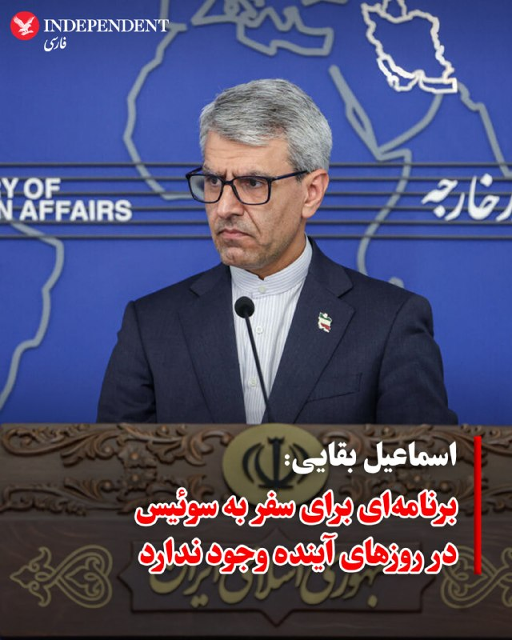

♦️ اسماعیل بقایی، سخنگوی وزارت امور خارجه جمهوری اسلامی، گزارش‌های اخیر مبنی بر انتخاب شهر ژنو سوئیس به عنوان محل امضای تفاهم‌نامه آتش‌بس میان ایران و آمریکا در روزهای آینده را تکذیب کرد.

به گزارش تسنیم، بقایی روز شنبه ۲۳ خرداد در این رابطه گفت: «درباره زمان دقیق امضا باید منتظر بمانیم؛ با این حال، هیچ برنامه‌ای برای سفر به ژنو یا هر جای دیگری ظرف دو روز آینده وجود ندارد.»

در حال حاضر نحوه و تدارکات مربوط به امضای این یادداشت تفاهم میان تهران و واشنگتن هنوز مبهم است؛ از جمله گزینه‌هایی که توسط مقامات دو کشور مطرح شده، امضای تفاهم‌نامه به صورت «از راه دور» (غیرحضوری) است که احتمالا در آینده با یک مراسم امضای مشترک و حضوری دنبال خواهد شد.
‌🇸🇦 Indypersian

🤖 @VahidOOnLine

## VahidOOnLine — post 245329

  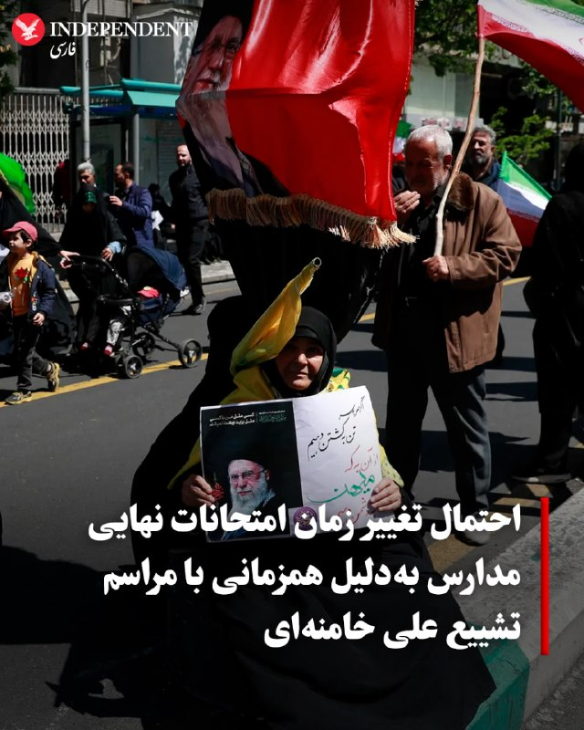

♦️ رئیس مرکز اطلاع‌رسانی و روابط عمومی وزارت آموزش و پرورش، روز شنبه ۲۳ خرداد اعلام کرد که با توجه به همزمانی امتحانات نهایی مدارس با مراسم تشییع علی خامنه‌ای، رهبر پیشین جمهوری اسلامی در شهرهای تهران، قم و مشهد، موضوع تغییر زمان این امتحانات در دستور بررسی قرار گرفته است.

مراسم تشییع خامنه‌ای قرار است طی شش روز، از ۱۳ تا ۱۸ تیرماه برگزار شود.
‌🇸🇦 Indypersian

🤖 @VahidOOnLine

## VahidOOnLine — post 245328

  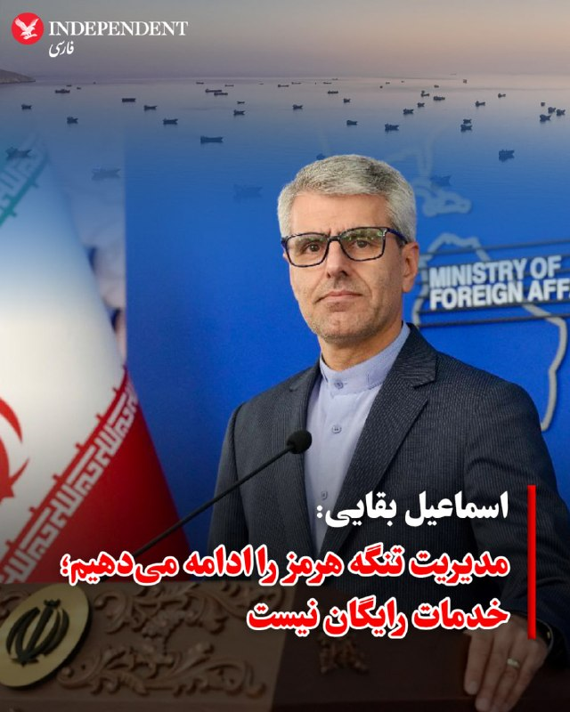

♦️ اسماعیل بقایی، سخنگوی وزارت امور خارجه جمهوری اسلامی، روز شنبه ۲۳ خرداد در همدان بار دیگر بر تداوم کنترل ایران بر تنگه هرمز تاکید کرد و گفت که تهران کار خود را «فارغ از خواست و تهدید آمریکا» انجام می‌دهد.

بقایی با اشاره به محاصره این آبراه حیاتی اقدامات ایران را منطبق بر «حقوق بین‌الملل عرفی» دانست و افزود: «هر خدماتی که ارائه می‌شود حتما باید هزینه آن دریافت شود.» او مدیریت تردد در این آبراه را حق ایران و عمان دانست و این کار را در راستای «صیانت از امنیت ملی» و «خیر عمومی جامعه بین‌الملل» دانست.

این اظهارات در حالی مطرح می‌شود که سنتکام به تازگی از توقیف و تغییر مسیر ده‌ها کشتی در این منطقه خبر داده است. سخنگوی وزارت خارجه با اشاره به گمانه‌زنی‌ها درباره امضای قریب‌وقوع یادداشت تفاهم با واشنگتن، روند دو ماهه مذاکرات با میانجی‌گری پاکستان را دارای «فراز و نشیب زیاد» توصیف کرد و در عین حال گفت که برای تهران مهم نیست آمریکا چه چیزی را می‌پذیرد یا خیر.
‌🇸🇦 Indypersian

🤖 @VahidOOnLine

## WithYashar — post 14729

  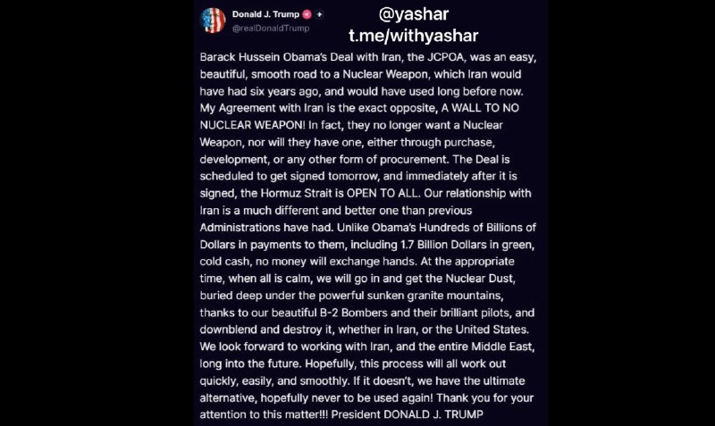

ترامپ در تروث : «توافق باراک حسین اوباما با ایران، یعنی برجام، راهی آسان، هموار و بی‌دردسر برای دستیابی به سلاح هسته‌ای بود؛ سلاحی که ایران شش سال پیش به آن دست پیدا می‌کرد و مدت‌ها پیش از امروز از آن استفاده کرده بود.

توافق من با ایران دقیقاً نقطه مقابل آن است؛ سدی در برابر سلاح هسته‌ای!

در حقیقت، آن‌ها دیگر خواهان سلاح هسته‌ای نیستند و همچنین هرگز به آن دست نخواهند یافت؛ نه از راه خرید، نه از راه ساخت و نه از هیچ راه دیگری.

قرار است این توافق فردا امضا شود و بلافاصله پس از امضای آن، تنگه هرمز به روی همه باز خواهد شد.

روابط ما با ایران بسیار متفاوت و بسیار بهتر از روابطی است که دولت‌های پیشین با آن داشته‌اند.

برخلاف صدها میلیارد دلاری که اوباما به آن‌ها پرداخت کرد، از جمله یک میلیارد و هفتصد میلیون دلار پول نقد، در این توافق هیچ پولی میان طرفین رد و بدل نخواهد شد.

در زمان مناسب، هنگامی که همه‌جا آرام باشد، ما وارد عمل خواهیم شد و بقایای مواد هسته‌ای را که در اعماق کوه‌های عظیم گرانیتی مدفون شده‌اند ــ به لطف بمب‌افکن‌های بی-۲ ما و خلبانان برجسته آن‌ها ــ خارج خواهیم کرد و آن‌ها را رقیق‌سازی و نابود خواهیم ساخت؛ چه در ایران و چه در ایالات متحده.

ما مشتاق همکاری با ایران و با سراسر خاورمیانه در سال‌های آینده هستیم.

امیدواریم این روند به سرعت، آسانی و بدون مشکل به نتیجه برسد.

اگر چنین نشود، ما گزینه نهایی را در اختیار داریم؛ گزینه‌ای که امیدواریم هرگز دوباره نیازی به استفاده از آن نباشد.
@withyashar

## WithYashar — post 14728

به گزارش تانکر ترکرز

یک نفتکش VLCC دیگر مرتبط با تحریم‌ها با غیرفعال کردن سیگنال ردیابی AIS خود، محاصره نیروی دریایی آمریکا را شکست.

این کشتی با سابقه پنج ساله نقض تحریم‌های OFAC آمریکا مرتبط با تجارت نفت ایران و ونزوئلا، می‌تواند حدود دو میلیون بشکه نفت حمل کند و به عنوان انبار شناور اضافی برای ایران عمل می‌کند.
@withyashar

## mwarmonitor — post 10836

توافق باراک حسین اوباما با ایران، یعنی همان برجام (JCPOA)، جاده‌ای آسان، زیبا و هموار به سوی سلاح هسته‌ای بود؛ سلاحی که ایران باید شش سال پیش به آن دست می‌یافت و مدت‌ها قبل از امروز از آن استفاده می‌کرد. توافق من با ایران دقیقاً برعکس آن است، دیواری برای عدم دستیابی به سلاح هسته‌ای!
در واقع، آن‌ها دیگر نه سلاح هسته‌ای می‌خواهند و نه به آن دست خواهند یافت—چه از طریق خرید، چه توسعه و چه هر روش دیگری برای تامین آن. قرار است این توافق فردا امضا شود و بلافاصله پس از امضا، تنگه هرمز به روی همه باز خواهد بود. رابطه ما با ایران بسیار متفاوت و بهتر از رابطه‌ای است که دولت‌های قبلی داشته‌اند.
برخلاف پرداخت‌های صدها میلیارد دلاری اوباما به آن‌ها، از جمله ۱.۷ میلیارد دلار پول نقدِ نقد (اسکناس‌های سبز تا نخورده)، هیچ پولی رد و بدل نخواهد شد. در زمان مناسب، وقتی همه‌چیز آرام شد، ما به لطف بمب‌افکن‌های زیبای B-2 و خلبانان درخشانمان، وارد خواهیم شد و غبار هسته‌ای را که در اعماق کوه‌های گرانیتیِ غرق‌شده و مستحکم دفن شده است، بیرون خواهیم کشید و آن را—چه در ایران و چه در ایالات متحده—رقیق و نابود خواهیم کرد.
ما مشتاقانه منتظر همکاری با ایران و کل خاورمیانه برای آینده‌ای طولانی هستیم. امیدوارم این روند سریع، آسان و روان پیش برود. اگر این‌طور نشود، ما گزینه نهایی را داریم که امیدوارم هرگز نیاز به استفاده دوباره از آن نباشد! از توجه شما به این موضوع سپاسگزارم!!!

رئیس‌جمهور دونالد جی. ترامپ

@mwarmonitor

## mwarmonitor — post 10835

🔴یک مقام ارشد آمریکایی می‌گوید ممکن است توافق هسته‌ای ایران طی چند روز آینده امضا شود - رویترز

@mwarmonitor

## pm_afshaa — post 93778

  <a href="telegram/content/pm_afshaa_93778_1781371326.webm" target="_blank">🎬 Download video</a>

🔴این ویدئو از خوش‌چشم، کارشناس صداوسیما داره تو صفحات حکومتی‌ها داره به شدت وایرال میشه : خوش چشم: علی خامنه‌ای قبل اینکه ترور بشه، یه جلسه‌ای با سران نظام میذاره و ميگه به زودی قراره یه فتنه‌ای بین مسئولین بشه، اگه شماها خوب مقاومت کنید؛ پیروز میشیم و جمهوری…

## pm_afshaa — post 93777

  <a href="telegram/content/pm_afshaa_93777_1781371326.mp4" target="_blank">🎬 Download video</a>

🔴این ویدئو از خوش‌چشم، کارشناس صداوسیما داره تو صفحات حکومتی‌ها داره به شدت وایرال میشه :

خوش چشم:
علی خامنه‌ای قبل اینکه ترور بشه، یه جلسه‌ای با سران نظام میذاره و ميگه به زودی قراره یه فتنه‌ای بین مسئولین بشه، اگه شماها خوب مقاومت کنید؛ پیروز میشیم و جمهوری اسلامی حداقل 30 سال دیگه مشکلی نخواهد داشت.

+ حالا عرزشی‌ها معتقدن این فتنه، همین توافقیه که قالیباف، پزشکیان، عراقچی و ... دارن با آمریکا امضا میکنن.

💧 Rainbet.com the #1 Non-KYC Crypto Casino & Sportsbook @rainbetcom

😁 @Pm_Afshaa

## pm_afshaa — post 93776

  <a href="telegram/content/pm_afshaa_93776_1781371328.mp4" target="_blank">🎬 Download video</a>

🔴تجمع امروز زنان کفن‌پوش جلوی وزارت امور خارجه با شعار مرگ بر عراقچی بی شرفِ سازشکار/نفوذی

💧 Rainbet.com the #1 Non-KYC Crypto Casino & Sportsbook @rainbetcom

😁 @Pm_Afshaa

## pm_afshaa — post 93775

  <a href="telegram/content/pm_afshaa_93775_1781371329.webm" target="_blank">🎬 Download video</a>

🔴پست جدید ترامپ در تروث: توافق اوباما با ایران، یعنی برجام، راهی آسان، هموار و بی‌دردسر برای دستیابی به سلاح هسته‌ای بود؛ سلاحی که ایران 6 سال پیش بهش دست پیدا میکرد و مدت‌ها پیش از امروز ازش استفاده کرده بود. توافق من با ایران دقیقاً نقطه مقابلشه؛ سدی…

## pm_afshaa — post 93774

  <a href="telegram/content/pm_afshaa_93774_1781371330.webm" target="_blank">🎬 Download video</a>

🔴پست جدید ترامپ در تروث:

توافق اوباما با ایران، یعنی برجام، راهی آسان، هموار و بی‌دردسر برای دستیابی به سلاح هسته‌ای بود؛ سلاحی که ایران 6 سال پیش بهش دست پیدا میکرد و مدت‌ها پیش از امروز ازش استفاده کرده بود.

توافق من با ایران دقیقاً نقطه مقابلشه؛ سدی در برابر سلاح هسته‌ای!

در حقیقت اونا دیگر خواهان سلاح هسته‌ای نیستن و همچنین هرگز بهش دست نخواهند یافت؛ نه از راه خرید، نه از راه ساخت و نه از هیچ راه دیگری.

قراره این توافق فردا امضا بشه و بلافاصله پس از امضای آن، تنگه هرمز به روی همه باز خواهد شد. روابط ما با ایران بسیار متفاوت و بسیار بهتر از روابطی است که دولت‌های پیشین باهاشون داشتن.

برخلاف صدها میلیارد دلاری که اوباما بهشون پرداخت کرد، از جمله یک میلیارد و هفتصد میلیون دلار پول نقد، در این توافق هیچ پولی رد و بدل نخواهد شد.

در زمان مناسب، هنگامی که همه‌جا آرام باشه، ما وارد عمل خواهیم شد و بقایای مواد هسته‌ای رو که در اعماق کوه‌های عظیم گرانیتی مدفون شدن، به لطف بمب‌افکن‌های بی-۲ ما و خلبانان برجسته آنها، خارج خواهیم کرد و آنها رو رقیق‌سازی و نابود خواهیم کرد؛ چه در ایران و چه در آمریکا.

ما مشتاق همکاری با ایران و با سراسر خاورمیانه در سال‌های آینده هستیم. امیدواریم این روند به سرعت، آسانی و بدون مشکل به نتیجه برسه؛ اگر چنین نشه، ما گزینه نهایی رو در اختیار داریم؛ گزینه‌ای که امیدواریم هرگز دوباره نیازی به استفاده از آن نباشه.

💧 Rainbet.com the #1 Non-KYC Crypto Casino & Sportsbook @rainbetcom

😁 @Pm_Afshaa

## pm_afshaa — post 93773

  <a href="telegram/content/pm_afshaa_93773_1781371330.webm" target="_blank">🎬 Download video</a>

🔴ترامپ: توافق فردا امضا میشه.

💧 Rainbet.com the #1 Non-KYC Crypto Casino & Sportsbook @rainbetcom

😁 @Pm_Afshaa

## pm_afshaa — post 93772

  <a href="telegram/content/pm_afshaa_93772_1781371331.webm" target="_blank">🎬 Download video</a>

🔴سخنگوی وزارت خارجه پاکستان به الجزیره: اسلام‌آباد فردا مراسم امضای آنلاین ویدئویی توافقنامه صلح آمریکا و ایران رو برگزار خواهد کرد.

💧 Rainbet.com the #1 Non-KYC Crypto Casino & Sportsbook @rainbetcom

😁 @Pm_Afshaa

## mamlekate — post 103702

📝 اسلام‌آباد: یادداشت تفاهم تا ۲۴ ساعت آینده امضا می‌شود؛ تهران: فردا خبری نخواهد بود

شهباز شریف، نخست وزیر پاکستان، شنبه ۲۳ خرداد اعلام کرد که آمریکا و جمهوری اسلامی پس از بیش از سه ماه جنگ بر سر چارچوبی برای توافق صلح به توافق رسیده اند و انتظار می رود توافق اولیه ظرف ۲۴ ساعت آینده امضا شود. با این حال تهران تاکید کرده که چنین اتفاقی فردا یک شنبه رخ نخواهد داد.

@mamlekate

## VahidOnline — post 76306

  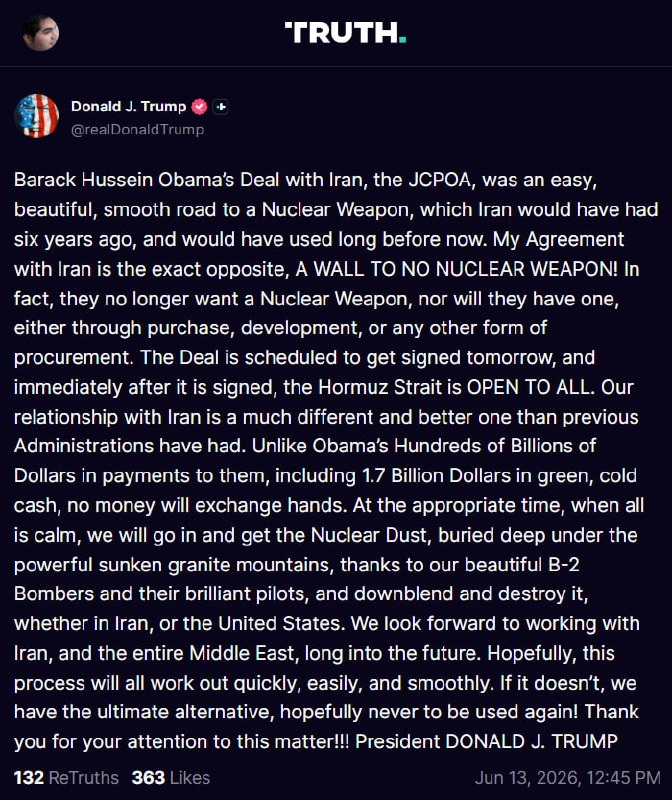

☄️ ترامپ: قرار است توافق فردا امضا و بلافاصله تنگه هرمز باز شود

پست ترامپ، ترجمه ماشین:
توافق باراک حسین اوباما با ایران، یعنی برجام، مسیری آسان، زیبا و هموار به سوی سلاح هسته‌ای بود؛ سلاحی که ایران شش سال پیش می‌توانست به آن دست یابد و مدت‌ها پیش از حالا از آن استفاده می‌کرد. توافق من با ایران درست نقطه مقابل آن است: دیوارِ جلوگیری از دستیابی به سلاح هسته‌ای!

در واقع، آن‌ها دیگر سلاح هسته‌ای نمی‌خواهند و چنین سلاحی هم نخواهند داشت؛ نه از طریق خرید، نه توسعه، و نه هیچ شکل دیگری از تهیه و تدارک.
قرار است این توافق فردا امضا شود و بلافاصله پس از امضا، تنگه هرمز به روی همه باز خواهد بود.

رابطه ما با ایران بسیار متفاوت و بهتر از رابطه‌ای است که دولت‌های پیشین داشته‌اند. برخلاف صدها میلیارد دلار پرداختی اوباما به آن‌ها، از جمله ۱.۷ میلیارد دلار پول نقدِ سبز و سرد، هیچ پولی رد و بدل نخواهد شد.

در زمان مناسب، وقتی همه چیز آرام باشد، ما وارد خواهیم شد و «غبار هسته‌ای» را که در اعماق کوه‌های قدرتمندِ گرانیتیِ فرورفته زیر آفتاب دفن شده است ــ به لطف بمب‌افکن‌های زیبای B-2 ما و خلبانان درخشانشان ــ به دست خواهیم آورد و آن را رقیق‌سازی و نابود خواهیم کرد؛ چه در ایران و چه در ایالات متحده.

ما مشتاق همکاری با ایران و سراسر خاورمیانه در آینده‌ای طولانی هستیم. امیدوارم این روند همگی سریع، آسان و روان پیش برود. اگر چنین نشود، ما گزینه نهایی را در اختیار داریم؛ گزینه‌ای که امیدوارم هرگز دوباره به کار گرفته نشود!

از توجه شما به این موضوع سپاسگزارم!!!
رئیس‌جمهور دونالد ج. ترامپ
realDonaldTrump

📡 @VahidOnline

## VahidOnline — post 76305

شبکه الجزیره به نقل از سخنگوی وزارت خارجه پاکستان گزارش داد که مراسم «امضای الکترونیکی» توافق میان آمریکا و جمهوری اسلامی یکشنبه ۲۴ خرداد برگزار خواهد کرد. به گفته او، پاکستان میزبان این مراسم خواهد بود و مراسم از طریق «ارتباط ویدیویی و آنلاین» برگزار می‌شود.

او جزئیات بیشتری درباره شرکت‌کنندگان یا مفاد این توافق ارائه نکرد.
@VahidOOnLine

📡 @VahidOnline

## kianmeli1 — post 87971

  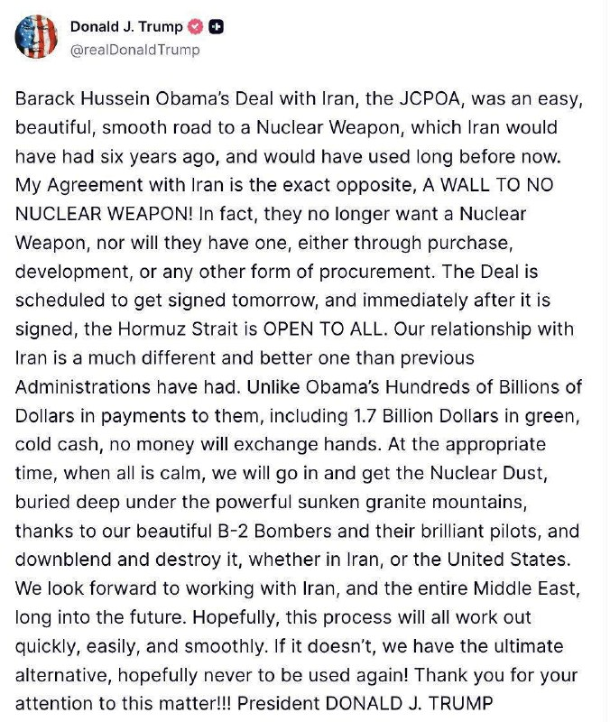

🔴تهدیدات جدید ترامپ

توافق من با ایران کاملاً برعکس است، یک دیوار برای نداشتن سلاح هسته‌ای! در واقع، آنها دیگر خواهان سلاح هسته‌ای نیستند و نه از طریق خرید، توسعه یا هر شکل دیگری از تأمین، چنین سلاحی خواهند داشت.

قرار است این توافق فردا امضا شود و بلافاصله پس از امضا، تنگه هرمز برای همه باز خواهد بود.

روابط ما با ایران بسیار متفاوت و بهتر از دولت‌های قبلی است. برخلاف صدها میلیارد دلار پرداختی اوباما به آنها، از جمله ۱.۷ میلیارد دلار پول نقد سبز و سرد، هیچ پولی رد و بدل نخواهد شد.

در زمان مناسب، وقتی همه چیز آرام باشد، وارد عمل خواهیم شد و گرد و غبار هسته‌ای را که عمیقاً زیر کوه‌های گرانیتی غرق شده و قدرتمند دفن شده است، با کمک بمب‌افکن‌های زیبا و خلبانان درخشان B-2 خود، جمع‌آوری و آن را در ایران یا ایالات متحده پایین‌رده‌بندی و نابود خواهیم کرد.

ما مشتاقانه منتظر همکاری با ایران و کل خاورمیانه در آینده‌ای دور هستیم. امیدواریم این روند به سرعت، آسانی و روانی پیش برود. اگر چنین نشد، ما جایگزین نهایی را داریم که امیدواریم هرگز دوباره استفاده نشود! از توجه شما به این موضوع بسیار سپاسگزاریم!!!

## IranIntlTV — post 342115

  <a href="telegram/content/IranIntlTV_342115_1781371332.mp4" target="_blank">🎬 Download video</a>

🔻محمد تقوی، ایران اینترنشنال، در برنامه هت‌تریک درباره رد دوباره درخواست مهدی تاج برای دریافت ویزای آمریکا، گفت: «من اگر جای تاج بودم، پس از اتفاقات کانادا یک سال استراحت می‌کردم و بعد از آن تحقیرها اصلا به سفر فکر نمی‌کردم.»

@iranintltvsport

## IranIntlTV — post 342114

  <a href="telegram/content/IranIntlTV_342114_1781371333.mp4" target="_blank">🎬 Download video</a>

🔻دیدار تیم ملی فوتبال با نیوزیلند در جام جهانی، با سالروز تولد مجیدرضا رهنورد همزمان شده است. شاهزاده رضا پهلوی نیز از ایرانیان خواسته که با برافراشتن پرچم شیر و خورشید در ورزشگاه‌ها و محل‌های برگزاری مسابقات، یاد او و دیگر معترضان جان‌باخته را زنده نگه دارند.

🔹گفت‌وگوی آیدین مقیمی با محمد تقوی، ایران اینترنشنال، در برنامه هت‌تریک

@iranintltvsport

## IranIntlTV — post 342113

  

دونالد ترامپ، رییس‌جمهوری آمریکا، با اشاره به برنامه امضای توافق با جمهوری اسلامی در روز یکشنبه، گفت در این توافق هیچ پولی میان طرفین رد و بدل نخواهد شد.

ترامپ در شبکه اجتماعی تروت سوشال نوشت: «برخلاف صدها میلیارد دلاری که اوباما به آن‌ها پرداخت کرد، از جمله ۱.۷ میلیارد دلار پول نقد، در این توافق هیچ پولی رد و بدل نخواهد شد.»

او همچنین گفت در زمان مناسب و پس از آرام شدن شرایط، آمریکا برای خارج کردن مواد هسته‌ای باقی‌مانده وارد عمل خواهد شد.

رییس‌جمهوری آمریکا افزود: «در زمان مناسب، زمانی که همه‌چیز آرام باشد، وارد عمل خواهیم شد و مواد هسته‌ای باقی‌مانده را که در اعماق کوه‌های گرانیتی مستحکم و فرورفته مدفون شده‌اند، خارج خواهیم کرد و آن را رقیق و نابود خواهیم ساخت؛ چه در ایران و چه در ایالات متحده.»
https://iranintl.com/202606133933

## IranIntlTV — post 342112

  <a href="telegram/content/IranIntlTV_342112_1781371335.mp4" target="_blank">🎬 Download video</a>

جنگ ۱۲ روزه، بی‌سابقه‌ترین رویارویی مستقیم آمریکا و اسرائیل با حکومت ایران تا آن زمان بود؛ جنگی که با حمله غافلگیرانه اسرائیل آغاز شد، با کشته شدن فرماندهان ارشد و عوامل هسته‌ای ادامه یافت و با بمباران فردو، نطنز و اصفهان به اوج رسید.

آرین ریسباف گزارش می‌دهد
@iranintltv

## IranIntlTV — post 342111

  <a href="telegram/content/IranIntlTV_342111_1781371336.mp4" target="_blank">🎬 Download video</a>

یک شهروند با ارسال پیامی صوتی به ایران اینترنشنال گفت حامیان حکومت در تجمع خود در اصفهان، خودروی یکی از خویشاوندانش را متوقف کرده‌ و با گذاشتن اجباری برنج و روغن در صندوق عقب سواری او، راننده را به حمل پرچم جمهوری اسلامی واداشتند.

صدای فرستنده پیام برای حفظ امنیتش تغییر یافته است.

## IranIntlTV — post 342110

  

دونالد ترامپ، رییس‌جمهوری آمریکا، شنبه ۲۳ خرداد در شبکه اجتماعی تروت سوشال نوشت که قرار است توافق با جمهوری اسلامی یکشنبه ۲۴ خرداد امضا شود.

او با اشاره به مفاد این توافق، ابراز امیدواری کرد این روند «به‌سرعت، آسانی و به شکلی روان» به نتیجه برسد و هشدار داد در غیر این صورت، آمریکا «گزینه نهایی» دیگری در اختیار دارد که امیدوار است هرگز نیازی به استفاده از آن نباشد.

ترامپ این توافق را «دیواری در برابر دستیابی به سلاح هسته‌ای» توصیف کرد و تاکید کرد که در چارچوب آن هیچ پولی میان طرفین رد و بدل نخواهد شد.

رییس‌جمهوری آمریکا با انتقاد از توافق هسته‌ای دولت باراک اوباما، موسوم به برجام، گفت آن توافق مسیر دستیابی ایران به سلاح هسته‌ای را هموار می‌کرد، اما توافق کنونی مانعی در برابر دستیابی به این سلاح است.

او همچنین گفت در زمان مناسب و پس از آرام شدن شرایط، مواد هسته‌ای باقی‌مانده از تاسیسات در ایران خارج و نابود خواهد شد.

ترامپ در پایان ابراز امیدواری کرد این توافق زمینه همکاری میان آمریکا، ایران و کشورهای خاورمیانه را در سال‌های آینده فراهم کند.
https://iranintl.com/202606132117

## IranIntlTV — post 342109

  <a href="telegram/content/IranIntlTV_342109_1781371338.mp4" target="_blank">🎬 Download video</a>

🔻تیم ملی فوتبال آمریکا در نخستین بازی خود در جام جهانی، با ارائه نمایشی تهاجمی پاراگوئه را در هم کوبید تا شاگردان پوچتینو از حالا به فکر مراحل حذفی جام باشند.

🔹گزارش و توضیحات علیرضا مدیری، خبرنگار ایران اینترنشنال

@iranintltvsport

## IranIntlTV — post 342108

  <a href="telegram/content/IranIntlTV_342108_1781371339.mp4" target="_blank">🎬 Download video</a>

تیتر اول با نیوشا صارمی، شنبه ۲۳ خرداد
@iranintltv

## Shin_Persian — post 7021

Shin ✓ @hey_itsmyturn
Sat, 13 Jun 2026 16:55:26 UTC

Dude's too serious to get himself a "DEAL WITH IRAN" birthday gift. xD

ترجمه خودکار فارسی

یارو جدی‌تر از اونه که برای هدیه تولدش یه «توافق با ایران» واسه خودش جور کنه. xD

𝕏 · @shin_persian

## Shin_Persian — post 7020

  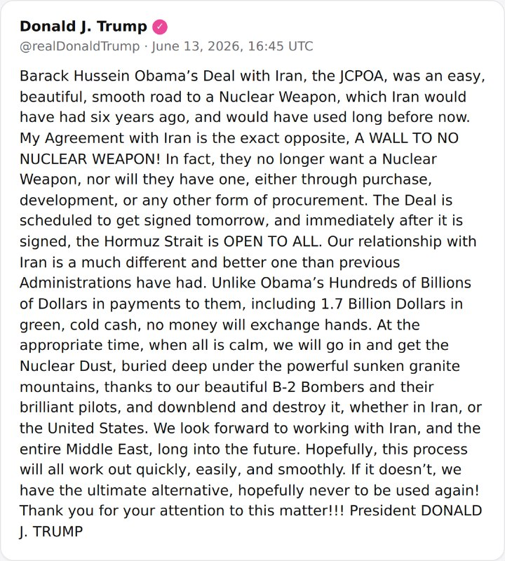

Shin ✓ @hey_itsmyturn Sat, 13 Jun 2026 16:51:02 UTC POTUS: "Barack Hussein Obama’s Deal with Iran, the JCPOA, was an easy, beautiful, smooth road to a Nuclear Weapon, which Iran would have had six years ago, and would have used long before now. My Agreement…

## Shin_Persian — post 7019

Shin ✓ @hey_itsmyturn
Sat, 13 Jun 2026 16:51:02 UTC

POTUS:
"Barack Hussein Obama’s Deal with Iran, the JCPOA, was an easy, beautiful, smooth road to a Nuclear Weapon, which Iran would have had six years ago, and would have used long before now. My Agreement with Iran is the exact opposite, A WALL TO NO NUCLEAR WEAPON! In fact, they no longer want a Nuclear Weapon, nor will they have one, either through purchase, development, or any other form of procurement. The Deal is scheduled to get signed tomorrow, and immediately after it is signed, the Hormuz Strait is OPEN TO ALL. Our relationship with Iran is a much different and better one than previous Administrations have had. Unlike Obama’s Hundreds of Billions of Dollars in payments to them, including 1.7 Billion Dollars in green, cold cash, no money will exchange hands. At the appropriate time, when all is calm, we will go in and get the Nuclear Dust, buried deep under the powerful sunken granite mountains, thanks to our beautiful B-2 Bombers and their brilliant pilots, and downblend and destroy it, whether in Iran, or the United States. We look forward to working with Iran, and the entire Middle East, long into the future. Hopefully, this process will all work out quickly, easily, and smoothly. If it doesn’t, we have the ultimate alternative, hopefully never to be used again! Thank you for your attention to this matter!!! President DONALD J. TRUMP"

ترجمه خودکار فارسی

رئیس‌جمهور ایالات متحده (POTUS):
«توافق باراک حسین اوباما با ایران، برجام (JCPOA)، مسیری آسان، زیبا و هموار به سوی سلاح هسته‌ای بود، که ایران باید شش سال پیش به آن دست می‌یافت و مدت‌ها قبل از آن استفاده می‌کرد. توافق من با ایران دقیقاً برعکس آن است، یک دیوار در برابر سلاح هسته‌ای! در واقع، آن‌ها دیگر نه سلاح هسته‌ای می‌خواهند و نه به آن دست خواهند یافت، چه از طریق خرید، توسعه یا هر شکل دیگری از تهیه و تدارک. برنامه‌ریزی شده است که این توافق فردا امضا شود، و بلافاصله پس از امضای آن، تنگه هرمز به روی همگان باز (OPEN TO ALL) است. رابطه ما با ایران بسیار متفاوت و بهتر از آن چیزی است که دولت‌های قبلی داشته‌اند. برخلاف پرداخت‌های صدها میلیارد دلاری اوباما به آن‌ها، از جمله ۱.۷ میلیارد دلار پول نقد سبز و سرد، هیچ پولی رد و بدل نخواهد شد. در زمان مناسب، وقتی همه چیز آرام است، ما وارد خواهیم شد و غبار هسته‌ای را که در عمق کوه‌های گرانیتیِ محکمِ غرق‌شده دفن شده است، به لطف بمب‌افکن‌های زیبای بی-۲ (B-2 Bombers) و خلبانان درخشان‌شان، بیرون آورده و آن را چه در ایران و چه در ایالات متحده، رقیق‌سازی و نابود خواهیم کرد. ما مشتاقانه منتظر همکاری با ایران و کل خاورمیانه در آینده‌ای طولانی هستیم. امیدواریم این فرآیند سریع، آسان و به آرامی پیش برود. اگر این‌طور نشود، ما جایگزین نهایی را داریم، که امیدواریم هرگز دوباره مورد استفاده قرار نگیرد! از توجه شما به این موضوع سپاسگزارم!!! رئیس‌جمهور دونالد جی. ترامپ»

𝕏 · @shin_persian

## Shin_Persian — post 7018

  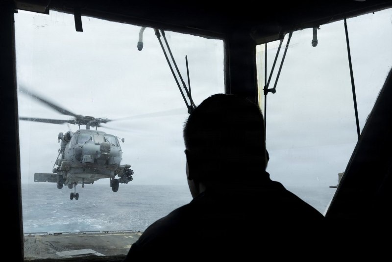

Shin ✓ @hey_itsmyturn
Sat, 13 Jun 2026 16:39:43 UTC

CENTCOM forces have redirected 141 commercial vessels and disabled 9 to enforce the blockade against Iran in the Arabian Sea, according to a recent update from USS Delbert D. Black.

Source: @CENTCOM
https://x.com/CENTCOM/status/2065836478429606070

ترجمه خودکار فارسی

نیروهای فرماندهی مرکزی ایالات متحده (سنتکام - CENTCOM) طبق آخرین به‌روزرسانی ناو یو‌اس‌اس دلبرت دی. بلک، برای اعمال محاصره علیه ایران در دریای عرب، ۱۴۱ فروند کشتی تجاری را تغییر مسیر داده و ۹ فروند را متوقف کرده‌اند.

منبع: @CENTCOM
https://x.com/CENTCOM/status/2065836478429606070

𝕏 · @shin_persian

## FarsiVOA — post 220604

  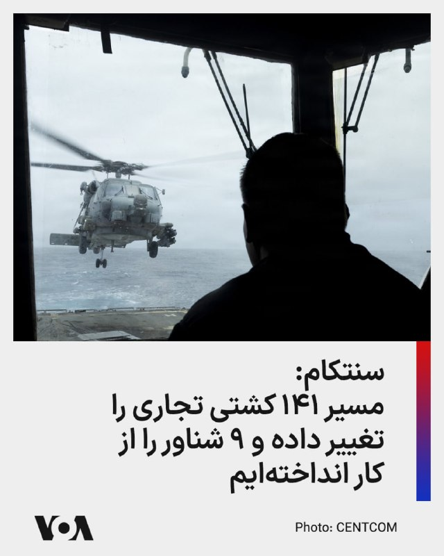

ستاد فرماندهی مرکزی ایالات متحده آمریکا، سنتکام، اعلام کرد در جریان اجرای محاصره دریایی آمریکا علیه جمهوری اسلامی، تاکنون مسیر ۱۴۱ کشتی تجاری را تغییر داده و ۹ شناور را از کار انداخته است.

سنتکام این به‌روزرسانی را در شبکه اجتماعی ایکس همراه با تصویری از پرواز یک هلیکوپتر سی‌هاک از عرشه ناو «یواس‌اس دلبرت دی‌بلک» در دریای عرب منتشر کرده است.

سنتکام به دستور پرزیدنت ترامپ از اواخر فروردین ۱۴۰۵ محاصره دریایی جمهوری اسلامی در آب‌های خلیج فارس را در واکنش به اقدام این رژیم در بستن تنگه هرمز آغاز کرد.

## FarsiVOA — post 220603

🔺ارتش اسرائیل:‌ هفت تروریست حزب‌الله در جنوب لبنان کشته شدند

▪️ارتش اسرائیل روز شنبه ۲۳ خرداد در پیامی در شبکه ایکس با اعلام این خبر نوشت که این شبکه تروریستی در یک مسیر زیرزمینی در جنوب لبنان فعالیت می‌کردند.

⬇️ بیشتر بخوانید:
https://ir.voanews.com/a/israel-hezbollah-strikes-terrorist-lebonan/8160460.html/?nocach=1

## FarsiVOA — post 220597

📷درخشش تیم فوتبال آمریکا در نخستین دیدار خود در جام جهانی ۲۰۲۶؛

جمعه، دومین روز از جام جهانی ۲۰۲۶، رقابت تیم‌های ملی آمریکا و پاراگوئه در لس‌آنجلس، با نتیجه ۴ بر ۱ با برتری ایالات متحده، یکی از میزبانان مشترک مسابقات، به پایان رسید.

دو گل فولارین بالوگان، بازیکن تیم آمریکا و «گل به خودی» مدافع پاراگوئه از لحظات دیدنی این بازی پرگل بود.

مارکو روبیو، وزیر امورخارجه آمریکا نیز تماشاگر این دیدار بود. رئیس‌جمهور پاراگوئه، دبیر کل فیفا، دیوید بکام، تام کروز، و بیل گیتز از دیگر چهره‌های مشهور حاضر در استادیوم بودند.

جام جهانی فوتبال ۲۰۲۶ به میزبانی مشترک ایالات متحده، کانادا، و مکزیک در حال برگزاری است.

## DW_Farsi — post 125935

  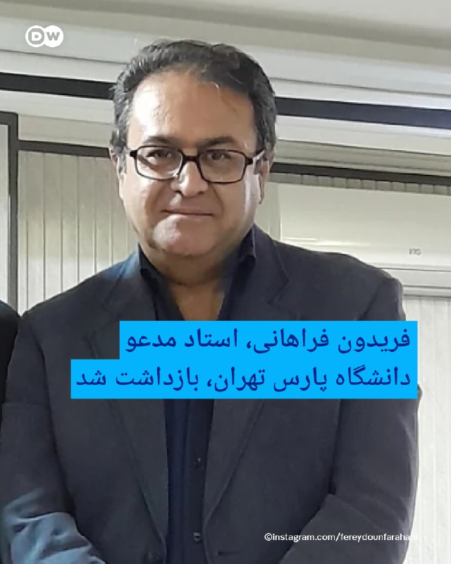

🔶فریدون فراهانی، استاد مدعو دانشگاه پارس تهران، بازداشت شد

بر اساس گزارش سازمان حقوق بشری هه‌نگاو، فریدون فراهانی، استاد موسیقی و استاد مدعو رشته معماری دانشگاه پارس تهران، طی روزهای گذشته توسط نیروهای امنیتی بازداشت شده است. هه‌نگاو می‌گوید این بازداشت به دلیل مواضع انتقادی او و حمایت از دانشجویان معترض صورت گرفته است.

بر اساس این گزارش، فریدون فراهانی در اسفند سال گذشته با انتشار مطلبی در شبکه‌های اجتماعی، به‌طور علنی از نقش‌آفرینی، ایستادگی و حضور دانشجویان در جریان اعتراضات سراسری حمایت کرده بود.

هه‌نگاو بازداشت او را در ادامه موج سرکوب و برخورد با اساتید دانشگاه و فعالان دانشگاهی توصیف کرده است.

@dw_farsi

## DW_Farsi — post 125934

  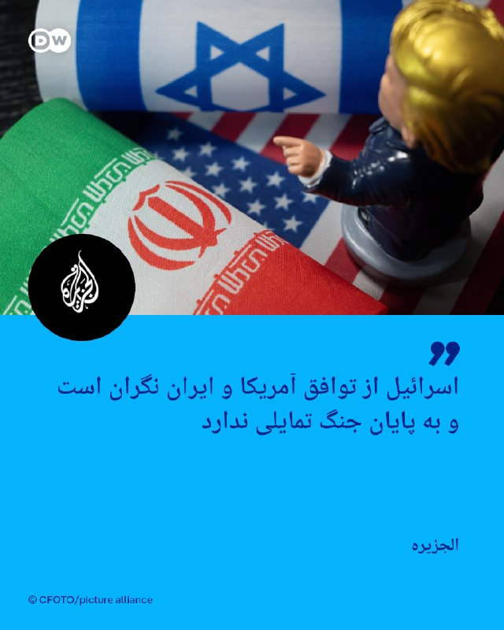

🔶الجزیره: اسرائیل از توافق آمریکا و ایران نگران است و به پایان جنگ تمایلی ندارد

بر اساس گزارش الجزیره، اسرائیل از توافق احتمالی میان آمریکا و ایران به‌شدت نگران است و تمایلی به توافقی که به جنگ پایان دهد ندارد. در این گزارش آمده هدف راهبردی اسرائیل فراتر از یک توافق موقت است و تل‌آویو توافقی را که به حفظ ساختار فعلی حکومت در ایران بینجامد، مطلوب نمی‌داند.

در این گزارش آمده است نگاه اسرائیل به جنگ، صرفا متوقف کردن درگیری یا رسیدن به یک تفاهم محدود با تهران نیست.

الجزیره می‌گوید از نگاه تل‌آویو، هدف راهبردی گسترده‌تر است و به همین دلیل، هر توافقی که فقط جنگ را متوقف کند اما تغییری در ساختار قدرت در ایران ایجاد نکند، برای اسرائیل رضایت‌بخش نخواهد بود.

این گزارش همچنین می‌گوید بنیامین نتانیاهو همچنان جنوب لبنان را نیز در محاسبات خود دارد.

الجزیره در ادامه نوشته این موضوع می‌تواند در انتخابات نقش تعیین‌کننده داشته باشد.

@dw_farsi

## Persian_Trend_Official — post 16966

  <a href="telegram/content/Persian_Trend_Official_16966_1781371343.webm" target="_blank">🎬 Download video</a>

سنتکام با انتشار عکسی از لحظه برخاست بالگرد بلک هاوک در حساب X خود نوشت: نیروهای آمریکایی از زمان آغاز محاصره بنادر ایران در 13 آوریل، 141 کشتی تجاری را تغییر مسیر داده و 9 کشتی را از کار انداخته‌اند.

📝 Amir

📌 @persian_trend_official
پرشین ترند | متفاوت‌ترین کانال نظامی

## Persian_Trend_Official — post 16965

  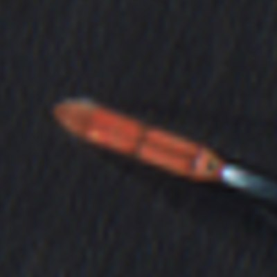

تانکر ترکرز: یک ابرنفتکش با عبور از محاصره دریایی آمریکا علیه ایران، تحریم‌ها را دور زد.

تانکر ترکز ادعا کرد: این نفتکش بدون اجرای عملیاتی پیچیده و صرفاً با خاموش کردن فرستنده سامانه شناسایی خودکار کشتی، از خط محاصره نیروی دریایی آمریکا عبور کرد.

با این اقدام دو میلیون بشکه فضای ذخیره‌سازی دیگر در دسترس قرار گرفت، تا در صورت نیاز، ایران بتواند از آن استفاده کند.

📝 Amir

📌 @persian_trend_official
پرشین ترند | متفاوت‌ترین کانال نظامی

## Persian_Trend_Official — post 16964

دونالد ترامپ: فردا توافق با ایران امضا خواهد شد!

رئیس جمهور امریکا در حساب تروث سوشال خود نوشت: باراک حسین اوباما با توافق خود با ایران، یعنی برجام، مسیری آسان، زیبا و هموار برای دستیابی ایران به سلاح هسته‌ای فراهم کرد؛ سلاحی که ایران شش سال پیش باید به آن دست می‌یافت و مدت‌ها پیش از امروز از آن استفاده می‌کرد.

توافق من با ایران دقیقاً نقطه مقابل آن است؛ دیواری در برابر دستیابی به سلاح هسته‌ای!

در واقع، آن‌ها دیگر خواهان سلاح هسته‌ای نیستند و همچنین هرگز به آن دست نخواهند یافت؛ نه از طریق خرید، نه توسعه و نه هیچ شکل دیگری از تأمین آن.

قرار است این توافق فردا امضا شود و بلافاصله پس از امضای آن، تنگه هرمز به روی همه باز خواهد شد.

روابط ما با ایران بسیار متفاوت و بهتر از روابطی است که دولت‌های پیشین با این کشور داشتند. برخلاف صدها میلیارد دلاری که اوباما به ایران پرداخت کرد، از جمله 1.7 میلیارد دلار پول نقدِ سبز و آماده، در این توافق هیچ پولی میان طرفین رد و بدل نخواهد شد.

در زمان مناسب، زمانی که همه‌چیز آرام باشد، ما وارد عمل خواهیم شد و غبار هسته‌ای را که در اعماق کوه‌های گرانیتی عظیم و فرورفته دفن شده است به لطف بمب‌افکن‌های زیبای B-2 ما و خلبانان درخشان آن‌ها خارج خواهیم کرد و آن را رقیق و نابود خواهیم ساخت؛ چه در ایران و چه در ایالات متحده.

ما مشتاق همکاری با ایران و سراسر خاورمیانه در سال‌های آینده هستیم.

امیدواریم این روند به‌سرعت، به‌آسانی و بدون مشکل به نتیجه برسد. اگر چنین نشود، ما گزینه نهایی را در اختیار داریم؛ گزینه‌ای که امیدواریم هرگز دوباره مجبور به استفاده از آن نشویم.

📝 Amir

📌 @persian_trend_official
پرشین ترند | متفاوت‌ترین کانال نظامی

## Persian_Trend_Official — post 16963

  <a href="telegram/content/Persian_Trend_Official_16963_1781371344.mp4" target="_blank">🎬 Download video</a>

حزب‌الله ویدیویی از حمله پهپاد FPV خود به یک خودرو هاموی ارتش اسرائیل در خیام منتشر کرد.

📝 Amir

📌 @persian_trend_official
پرشین ترند | متفاوت‌ترین کانال نظامی

## Persian_Trend_Official — post 16962

احمد الشرع، رئیس جمهور سوریه: هنوز افرادی شایعاتی در مورد دخالت سوریه در لبنان پخش می‌کنند.

من معتقدم که این کاملاً نادرست است. ما همواره از پایان جنگ، تقویت نهادهای دولتی، ادغام اقتصادی و آرام کردن اوضاع در لبنان تا حد امکان حمایت می‌کنیم.

📝 Amir

📌 @persian_trend_official
پرشین ترند | متفاوت‌ترین کانال نظامی

## Persian_Trend_Official — post 16961

  <a href="telegram/content/Persian_Trend_Official_16961_1781371345.mp4" target="_blank">🎬 Download video</a>

محمود نبویان، نائب رئیس کمسیون امنیت ملی مجلس: بند 5 توافق میان ایران و آمریکا آن است که تنگه هرمز به طور کامل و بدون هیچ پیش شرط و محدودیتی باز خواهد شد و ایران اگر پس از امضای آن دوباره در تنگه اختلال ایجاد کند مورد محکومیت شدید بین‌المللی قرار خواهد گرفت.

📝 Amir

📌 @persian_trend_official
پرشین ترند | متفاوت‌ترین کانال نظامی

## RadioFarda — post 158273

🔸دونالد ترامپ، رئیس‌جمهور آمریکا، روز شنبه با انتشار پیامی خبر داد که توافق با ایران روز یکشنبه ۲۴ خرداد امضا خواهد شد و بار دیگر تأکید کرد بر اساس این توافق هیچ منابع مالی به ایران تعلق نخواهد گرفت. 🔸او در شبکه تروث سوشال نوشت: «قرار است این توافق فردا امضا…

## RadioFarda — post 158272

  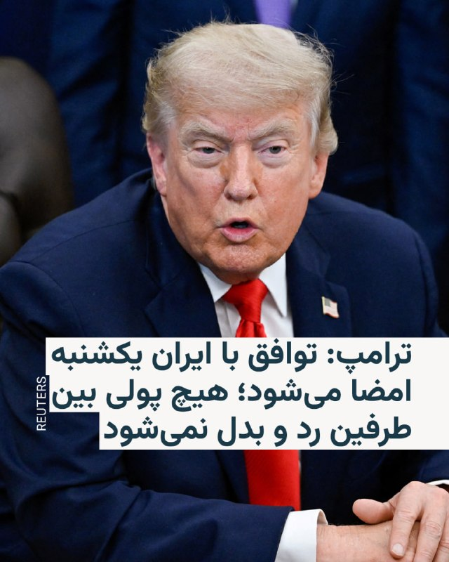

🔸دونالد ترامپ، رئیس‌جمهور آمریکا، روز شنبه با انتشار پیامی خبر داد که توافق با ایران روز یکشنبه ۲۴ خرداد امضا خواهد شد و بار دیگر تأکید کرد بر اساس این توافق هیچ منابع مالی به ایران تعلق نخواهد گرفت.

🔸او در شبکه تروث سوشال نوشت: «قرار است این توافق فردا امضا شود و بلافاصله پس از امضای آن، تنگه هرمز به روی همه باز خواهد بود.»

🔸این در حالی است که ساعتی پیش سخنگوی وزارت خارجه ایران گفت تفاهم‌نامه بین ایران و آمریکا روز یکشنبه امضا نخواهد شد. پیش از بقائی، نخست‌وزیر پاکستان از نهایی و امضا شدن تفاهم‌نامه پایان جنگ بین تهران و واشینگتن طی ۲۴ ساعت آینده خبر داده بود.

🔸ترامپ در بیانیه خود همچنین اعلام کرد که مقام‌های ایرانی «دیگر خواهان سلاح هسته‌ای نیستند و به آن نیز دست نخواهند یافت؛ نه از طریق خرید، نه توسعه، و نه هر شکل دیگری از تأمین آن.»

🔸او افزود: «رابطه ما با ایران بسیار متفاوت و بهتر از روابطی است که دولت‌های پیشین با آن داشته‌اند. برخلاف صدها میلیارد دلار پرداختی اوباما به آن‌ها، از جمله ۱.۷ میلیارد دلار پول نقد سبز و آماده، در این توافق هیچ پولی میان طرفین رد و بدل نخواهد شد.»

@RadioFarda

## RadioFarda — post 158271

🔸در آستانهٔ امضای تفاهم‌نامهٔ ایران و آمریکا برای پایان جنگ که هنوز زمان قطعی آن از سوی جمهوری اسلامی تأیید نشده، فضای سیاسی میان طیف‌های حامی حکومت شاهد بالا گرفتن اعتراض‌ها به متنی است که به‌عنوان متن این تفاهم‌نامه در برخی رسانه‌های ایران منتشر شده است.…

## RadioFarda — post 158270

  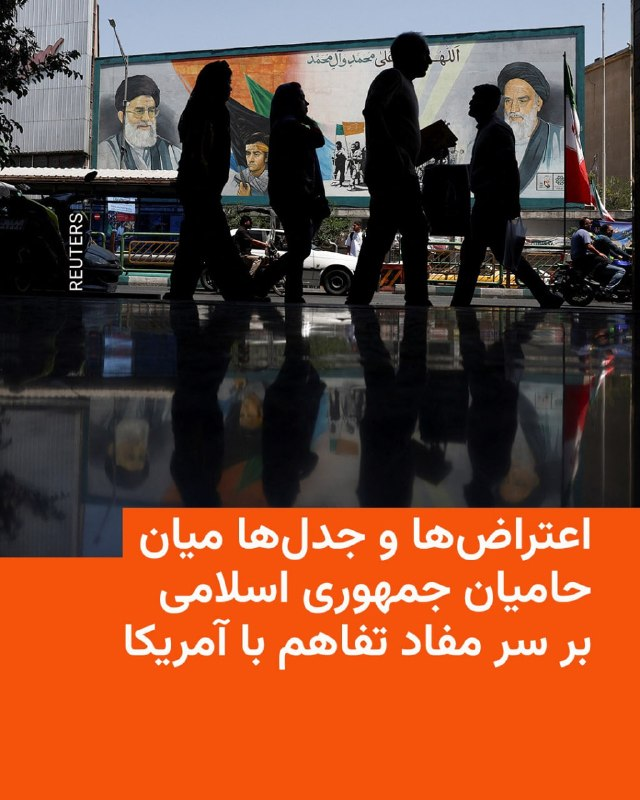

🔸در آستانهٔ امضای تفاهم‌نامهٔ ایران و آمریکا برای پایان جنگ که هنوز زمان قطعی آن از سوی جمهوری اسلامی تأیید نشده، فضای سیاسی میان طیف‌های حامی حکومت شاهد بالا گرفتن اعتراض‌ها به متنی است که به‌عنوان متن این تفاهم‌نامه در برخی رسانه‌های ایران منتشر شده است.

🔸محمود نبویان، نایب‌رئیس کمیسیون امنیت ملی مجلس، روز شنبه ۲۳ خرداد در یک برنامهٔ زنده در خبرگزاری دانشجو، نزدیک به اصولگرایان، متنی را که مدعی بود تفاهم‌نامهٔ ایران و آمریکا است، روخوانی و از برخی بندهای آن به‌شدت انتقاد کرد.

🔸او در بخشی از اظهاراتش گفت طبق متن توافق «جایی برای اعمال مدیریت ایران بر تنگه هرمز نیست» و سپس مدعی شد که بعد از امضا شدن تفاهم‌نامه میان ایران و آمریکا، سپاه پاسداران باید از این آبراه «عقب بنشیند».

@RadioFarda

## RadioFarda — post 158269

  <a href="https://t.me/radiofarda/158269" target="_blank">📎 Download file</a>

📻بشنوید: ایستگاه ۱۹ با رادیوفردا، ۲۳ خرداد ۱۴۰۵

@RadioFarda

## RadioFarda — post 158268

  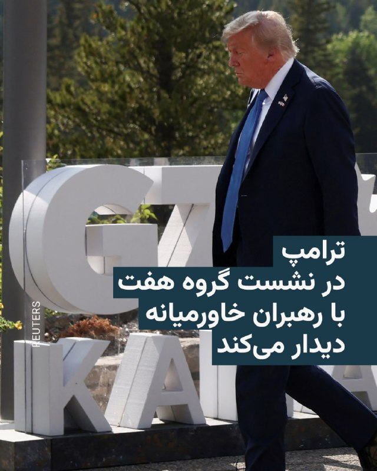

🔸مقام‌های ارشد دولت آمریکا اعلام کردند دونالد ترامپ، رئیس‌جمهور ایالات متحده، این هفته در جریان نشست گروه هفت در فرانسه با چند رهبر خاورمیانه دیدار خواهد کرد.

🔸به گزارش رویترز، این مقام‌ها روز شنبه ۲۳ خرداد گفتند آقای ترامپ به طور جداگانه با رهبران مصر، قطر، امارات متحده عربی، فرانسه و هند دیدار خواهد کرد.

🔸آن‌ها افزودند دیدار دوجانبه‌ای میان آقای ترامپ و آقای زلنسکی برنامه‌ریزی نشده است، اما ممکن است این دو نیز در حاشیهٔ نشست با یکدیگر ملاقات کنند.

🔸به‌گفتهٔ یکی از مقام‌های آمریکایی، رئیس‌جمهور ایالات متحده موضوعات مورد علاقه مشترک با رهبران، از جمله رشد و توسعه اقتصادی، تقویت تاب‌آوری زنجیره‌های تأمین، مهاجرت غیرقانونی و هوش مصنوعی، را مطرح خواهد کرد.

🔸بر اساس این گزارش، آقای ترامپ قرار است روز چهارشنبه در ضیافتی در کاخ ورسای شرکت کند و پس از آن به واشینگتن باز خواهد گشت.

@RadioFarda

## IranianMinds — post 22479

  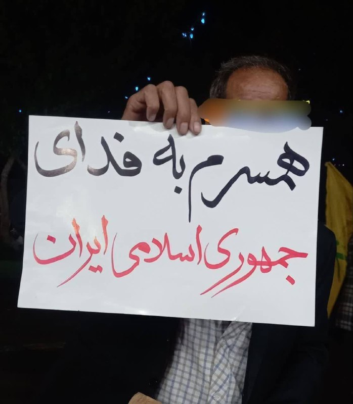

🔴دیده شده تو تجمعات شبانه؛

همسرم به فدای جمهوری‌اسلامی‌ایران.

@IranianMinds

## IranianMinds — post 22478

  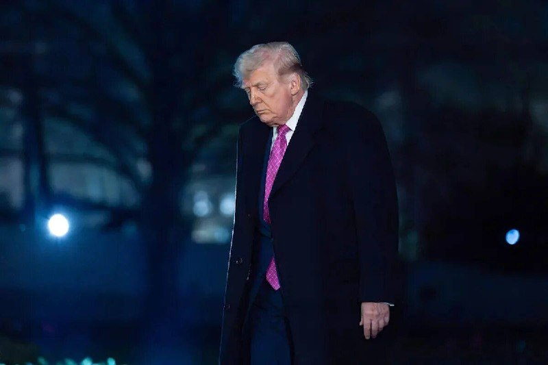

🔴 فردا ۲۴ خرداد تولد ۸۰ سالگی ترامپه

@IranianMinds

## IranianMinds — post 22477

🟢 در تورنومنت 2.5 میلیاردی رومابت شرکت کنید ، فقط کافیست شرط های جام جهانی را در رومابت ثبت کنید 
👇
👇

🇪🇺 https://trentivo6402.bar

## IranianMinds — post 22476

  

🔥 تورنومنت ۲.۵ میلیارد تومانی رومابت آغاز شد! 🔥

مسابقات جام جهانی 2026 را در رومابت پیش‌بینی کنید، امتیاز جمع کنید و برای سهمی از جایزه بزرگ ۲.۵ میلیارد تومانی رقابت کنید 😍🏆

هر پیش‌بینی ، شما را یک قدم به صدر جدول و جوایز ویژه نزدیک‌تر می‌کند 🚀

⏳ فرصت را از دست ندهید ؛ هیجان واقعی جام جهانی را با رومابت تجربه کنید!

🆔 @RomaBet_official
┅━━━━━━━━━━━┅
🔰 لینک سایت جهت ورود :
🌐 RomaBet.tournament

## BBCPersian — post 283713

🔻یک جسد در حال تجزیه در صندوق عقب خودرویی در نزدیکی ورزشگاه محل تمرین تیم ملی فوتبال ایران در تیخوانا پیدا شد. این کشف هولناک روز جمعه و در حالی صورت گرفت که مسابقات جام جهانی در حال برگزاری است. مکزیک، آمریکا و کانادا به طور مشترک میزبان این رقابت‌ها هستند.…

## BBCPersian — post 283712

  <a href="telegram/content/BBCPersian_283712_1781371350.mp4" target="_blank">🎬 Download video</a>

🔻یک جسد در حال تجزیه در صندوق عقب خودرویی در نزدیکی ورزشگاه محل تمرین تیم ملی فوتبال ایران در تیخوانا پیدا شد.

این کشف هولناک روز جمعه و در حالی صورت گرفت که مسابقات جام جهانی در حال برگزاری است. مکزیک، آمریکا و کانادا به طور مشترک میزبان این رقابت‌ها هستند.

خبرنگاران شاهد بودند که پلیس در تیخوانا، صندوق عقب یک دستگاه خودروی تویوتا خاکستری‌رنگ با پلاک کالیفرنیا را در پارکینگ سوپرمارکتی درست روبروی ورزشگاه کالینته باز کرد.

تیم ملی ایران در این ورزشگاه برای سه مسابقه خود در خاک آمریکا تمرین می‌کند.

دفتر دادستان تیخوانا گفت که این جسد توسط گشت پلیس کشف شده است.

## BBCPersian — post 283711

  <a href="telegram/content/BBCPersian_283711_1781371352.mp4" target="_blank">🎬 Download video</a>

⭕️در بیش از سه ماه گذشته دونالد ترامپ بارها گفته که آمریکا در جنگ با ایران کاملا پیروز شده است.

او همچنین به مردم آمریکا که بنابر نظرسنجی‌ها اکثریتشان از این جنگ ناراضی هستند، پیوسته قول داده که جنگ کوتاه خواهد بود و با رسیدن به یک توافق با ایران و بازگشایی تنگه هرمز، قیمت سوخت کاهش خواهد یافت.

بهمن کلباسی نگاهی کرده به تعداد این ادعاها‌ و تکرار وعده‌های رئیس جمهوری آمریکا
@bbcpersian

## Dirty_Kids — post 391906

  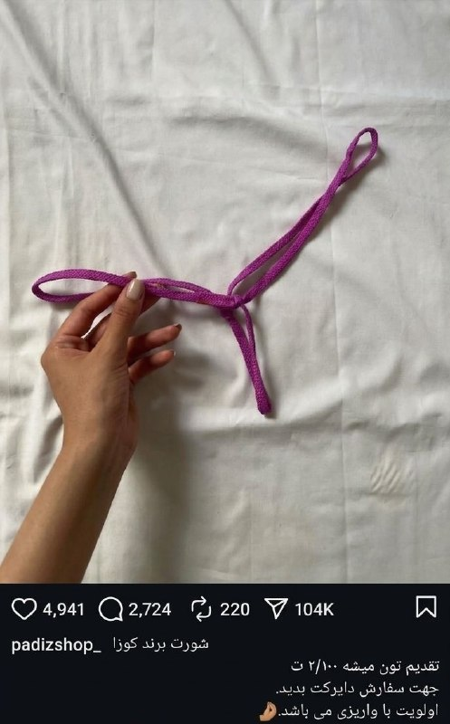

شاید باورتون نشه ولی این شورت رو دارن میدن ۲ میلیون و ۱۰۰ هزار تومن!

بند کفش خودمونه که لاشیا.

@Dirty_Kids 👻

## Dirty_Kids — post 391905

  <a href="telegram/content/Dirty_Kids_391905_1781371355.mp4" target="_blank">🎬 Download video</a>

🔴 ویدئویی که از خوش‌چشم، کارشناس صداوسیما داره تو صفحات حاميان حکومت به شدت دست به دست میشه؛

علی خامنه‌ای قبل اینکه ترور بشه، یه جلسه‌ای با سران نظام میذاره و ميگه به زودی قراره یه فتنه‌ای بین مسئولین بشه ، اگه باز هم شماهایی که تعدادتون کمه، خوب مقاومت کنید؛ پیروز می‌شیم و جمهوری اسلامی حداقل 30 سال دیگه مشکلی نخواهد داشت.

حالا این صفحات معتقدن این فتنه، همین توافقیه که قالیباف ، پزشکیان ، عراقچی و ... دارن با آمریکا امضا میکنن...

@Dirty_Kids 👻

## Dirty_Kids — post 391904

  <a href="telegram/content/Dirty_Kids_391904_1781371356.mp4" target="_blank">🎬 Download video</a>

🔴 دیشب عرزشیا رفتن جلو در وزارت خارجه، یکیشون میگه: آقای عراقچی خاک بر سرت، بخدا داریم سکته میکنیم، بر پدر و مادرتون لعنت غربگراها😡

@Dirty_Kids 👻

## Dirty_Kids — post 391903

  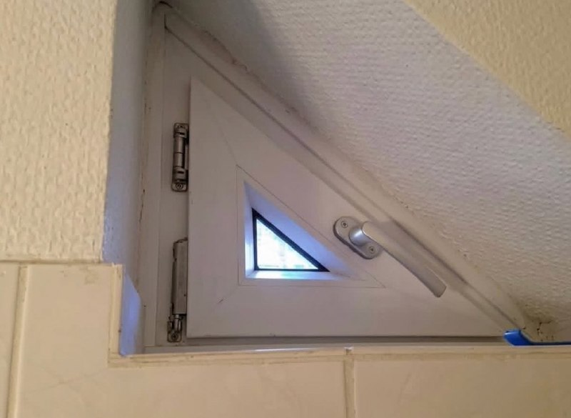

بهتر از هیچی

@Dirty_Kids 👻

## Hranews — post 113589

اجرای حکم حبس؛ سهیلا مطاعی راهی زندان شد

❗️
❗️
❗️
❗️
❗️– امروز شنبه ۲۳ خردادماه، سهیلا مطاعی، شهروند ساکن دهگلان، جهت تحمل دوران محکومیت #حبس خود بازداشت و به کانون اصلاح و تربیت سنندج منتقل شد.

ادامه مطلب

#سهیلا_مطاعی

↘️
@hranews_bot تماس ✉️ -  @Hranews  کانال هرانا 🆑

## Hranews — post 113588

رضایت شاکی پس از ۹ سال؛ زن محکوم به قصاص چشم از مجازات رهایی یافت

❗️
❗️
❗️
❗️
❗️ – زنی در تهران که به اتهام #اسیدپاشی به همسرش و نابینا کردن یک چشم او به قصاص چشم محکوم شده بود، پس از گذشت ۹ سال و با اعلام رضایت این مرد، از اجرای این مجازات رهایی یافت. این زوج در سال‌های پس از وقوع حادثه از یکدیگر جدا شدند.

ادامه مطلب

↘️
@hranews_bot تماس ✉️ -  @Hranews  کانال هرانا 🆑

## alonews — post 127682

  <a href="telegram/content/alonews_127682_1781371357.webm" target="_blank">🎬 Download video</a>

👈ستاد فرماندهی مرکزی ایالات متحده: از زمان آغاز محاصره بنادر ایران، ۱۴۱ کشتی تجاری را منحرف و ۹ کشتی را از کار انداخته‌ایم

✅ @AloNews خبر جنگ

## alonews — post 127681

  <a href="telegram/content/alonews_127681_1781371357.webm" target="_blank">🎬 Download video</a>

👈یک مقام ارشد آمریکایی: ایالات متحده همزمان با بازگشایی تنگه هرمز، محاصره دریایی خود علیه ایران را پایان خواهد داد

✅ @AloNews خبر جنگ

## alonews — post 127680

  <a href="telegram/content/alonews_127680_1781371358.webm" target="_blank">🎬 Download video</a>

👈دولت بریتانیا : کیر، به ترامپ گفته که لندن آماده‌ست از اجرای هر توافق صلحی با ایران حمایت کنه و کمکش کنه

✅ @AloNews خبر جنگ

## alonews — post 127677

  <a href="telegram/content/alonews_127677_1781371358.webm" target="_blank">🎬 Download video</a>

👈حمید رسایی:
مردم میگن حاضریم آب و برق نباشه و نابود بشه اما مقاومت کنیم

✅ @AloNews خبر جنگ

## alonews — post 127676

  <a href="telegram/content/alonews_127676_1781371358.webm" target="_blank">🎬 Download video</a>

👈ترامپ: این توافق قرار است فردا امضا شود و بلافاصله پس از امضای آن، تنگه هرمز برای همه باز خواهد شد. روابط ما با ایران بسیار متفاوت و بهتر از دولت‌های قبلی است. 
🔴مشتاقانه منتظر همکاری با ایران و کل خاورمیانه در درازمدت هستیم. 
🔴در زمان مناسب، پس از آرام…

## alonews — post 127675

  <a href="telegram/content/alonews_127675_1781371358.webm" target="_blank">🎬 Download video</a>

👈رنج منفی سنگین تتر پس اعلام ترامپ مبنی بر امضا توافق با ایران در روز یکشنبه

🔴دلار فردایی نیز وارد کانال ۱۶۰ هزار تومان شد

✅ @AloNews خبر جنگ

## alonews — post 127674

  <a href="telegram/content/alonews_127674_1781371358.webm" target="_blank">🎬 Download video</a>

👈ترامپ: این توافق قرار است فردا امضا شود و بلافاصله پس از امضای آن، تنگه هرمز برای همه باز خواهد شد. روابط ما با ایران بسیار متفاوت و بهتر از دولت‌های قبلی است.

🔴مشتاقانه منتظر همکاری با ایران و کل خاورمیانه در درازمدت هستیم.

🔴در زمان مناسب، پس از آرام شدن اوضاع، برای جمع‌آوری غبار هسته‌ای وارد عمل خواهیم شد

🔴 ما امیدواریم که این روند سریع، آسان و روان پیش برود، و اگر این اتفاق نیفتد، ما جایگزین بی‌نقصی داریم.

🔴 توافق من با ایران دیواری است که مانع از دستیابی این کشور به هرگونه سلاح هسته‌ای می‌شود.

🔴 ایران دیگر سلاح هسته‌ای نمی‌خواهد و آن را چه از طریق خرید، چه توسعه یا هر طریق دیگری به دست نخواهد آورد.

🔴 هیچ پولی رد و بدل نخواهد شد، برخلاف صدها میلیاردی که اوباما به ایران پرداخت کرد.

🔴ما تشعشعات هسته‌ای را چه در ایران و چه در ایالات متحده کاهش داده و از بین خواهیم برد.

✅ @AloNews خبر جنگ

## alonews — post 127673

  <a href="telegram/content/alonews_127673_1781371359.mp4" target="_blank">🎬 Download video</a>

👈اغتشاش و شعار عجیب تندروها

🔴مرگ بر عراقچی بی شرف نفوذی

🔴مرگ بر قالیباف سازشگر

✅ @AloNews خبر جنگ

## alonews — post 127672

  <a href="telegram/content/alonews_127672_1781371360.webm" target="_blank">🎬 Download video</a>

👈ترامپ: «توافق باراک حسین اوباما با ایران، یعنی برجام، جاده‌ای آسان و زیبا و هموار به سوی سلاح هسته‌ای بود که ایران شش سال پیش به آن می‌رسید و تا الان دیگر مدتها از آن استفاده می‌کرد.

🔴اما توافق من با ایران دقیقاً برعکس است: یک دیوار محکم در برابر سلاح هسته‌ای!

🔴در حقیقت، ایران دیگر سلاح هسته‌ای نمی‌خواهد و هرگز نخواهد داشت، چه از طریق خرید، چه تولید، و چه هر شکل دیگر تأمین.

🔴امضای این توافق برای فردا برنامه‌ریزی شده و بلافاصله پس از امضای آن، تنگه هرمز به روی همه باز است.

🔴رابطه ما با ایران بسیار متفاوت و بهتر از دولت‌های قبلی است.

🔴مشتاقانه منتظر همکاری با ایران و کل خاورمیانه در آینده‌ هستیم!

✅ @AloNews خبر جنگ

## alonews — post 127670

  <a href="telegram/content/alonews_127670_1781371360.webm" target="_blank">🎬 Download video</a>

🔴فوری / ترامپ: قرار است توافق با ایران فردا، یکشنبه، امضا شود.

✅ @AloNews خبر جنگ

## alonews — post 127669

  <a href="telegram/content/alonews_127669_1781371360.webm" target="_blank">🎬 Download video</a>

👈تانکر ترکرز: یک نفتکش VLCC دیگر که تحت تحریم‌ها قرار دارد، با غیرفعال کردن سیگنال ردیابی AIS خود، از خط محاصره نیروی دریایی ایالات متحده عبور کرده است.

🔴 این کشتی با سابقه پنج سال تحریم‌های OFAC ایالات متحده، با تجارت نفت ایران و ونزوئلا مرتبط است و می‌تواند تقریباً دو میلیون بشکه نفت حمل کند.

🔴 این کشتی همچنین می‌تواند به عنوان ذخیره‌ساز شناور نفت مورد استفاده قرار گیرد

✅ @AloNews خبر جنگ

## alonews — post 127668

  <a href="telegram/content/alonews_127668_1781371360.webm" target="_blank">🎬 Download video</a>

👈یک خودرو در شهر کوثاریت السید، جنوب لبنان، هدف پهپاد اسرائیلی قرار گرفت

✅ @AloNews خبر جنگ

## alonews — post 127667

  <a href="telegram/content/alonews_127667_1781371360.webm" target="_blank">🎬 Download video</a>

👈ایران از لحاظ آی کیو ۴ ام جهانه

✅ @AloNews خبر جنگ

## alonews — post 127666

  <a href="telegram/content/alonews_127666_1781371360.webm" target="_blank">🎬 Download video</a>

👈خواهر امیرحسین مقصودلو:
تتلو به علت انتشار آهنگ از زندان، ممنوع تماس شد و تا اطلاع ثانوی نمیتواند با کسی از بیرون زندان تماس برقرار کند

✅ @AloNews خبر جنگ

## alonews — post 127665

  <a href="telegram/content/alonews_127665_1781371361.webm" target="_blank">🎬 Download video</a>

👈رئیس‌جمهور سوریه، الشرع درباره لُبنان : هنوز بعضیا دارن شایعه می‌سازن که سوریه داره تو لبنان دخالت می‌کنه

🔴 به نظر من این حرف‌ها کاملاً اشتباهه

🔴 ما همیشه از پایان جنگ، تقویت نهادهای دولتی، همکاری اقتصادی و آروم شدن اوضاع لُبنان تا حد ممکن حمایت می‌کنیم

✅ @AloNews خبر جنگ

## alonews — post 127664

  <a href="telegram/content/alonews_127664_1781371361.webm" target="_blank">🎬 Download video</a>

👈70 حمله هوایی اسرائیل به نقاط مختلف نیمه جنوبی لبنان تا شرق این کشور در ساعات گذشته

🔴بنا بر گزارش ها ارتش اسرائیل (IDF) اخیرا 10 فرمانده میدانی حزب‌الله را کشته و از آغاز جنگ اخیر بعد کشته شدن علی خامنه‌ای تاکنون بیش از 2100 عضو پیاده نظام حزب‌الله را نیز از بین برده است

✅ @AloNews خبر جنگ

## alonews — post 127663

  <a href="telegram/content/alonews_127663_1781371361.webm" target="_blank">🎬 Download video</a>

👈بانک‌های ملی، تجارت، صادرات و توسعه صادرات از جمله بانک‌هایی بودند که امروز به طور هم‌زمان در خدمات‌رسانی به مشتریان خود از طریق همراه بانک و بعضا ATMها دچار مشکل شدند. ساعاتی بعد اطلاع داده شد وجوه پذیرندگان چهار بانک امشب به حساب‌های پشتیبان واریز می‌شود

✅ @AloNews خبر جنگ

## alonews — post 127662

  <a href="telegram/content/alonews_127662_1781371361.webm" target="_blank">🎬 Download video</a>

👈 بقائی، سخنگوی وزارت امور خارجه:
ایران در تنگه هرمز هزینه خدمات دریافت خواهد کرد

🔴حضور پایگاه‌ها و نیروهای نظامی خارجی در منطقه باید به پایان برسد.

✅ @AloNews خبر جنگ

---
📅 بروزرسانی: 1405/03/23 19:40
---

## VahidOOnLine — post 245327

  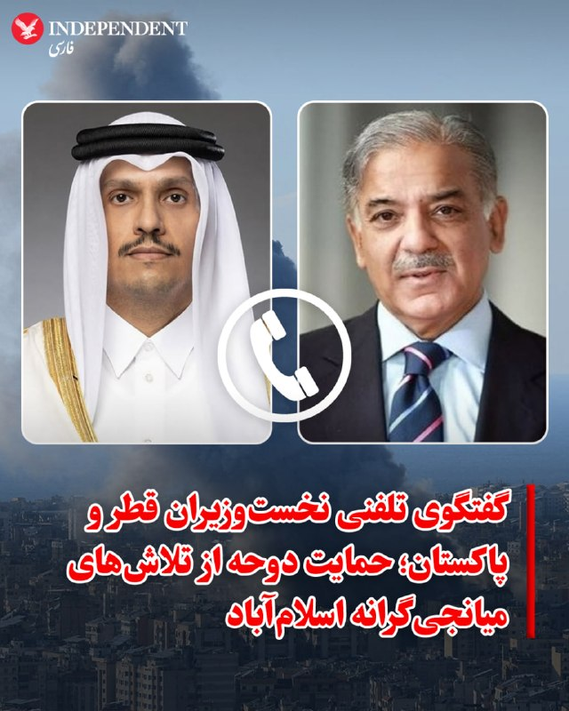

♦️ محمد بن عبدالرحمن آل ثانی، نخست‌وزیر قطر، روز شنبه ۲۳ خرداد، در گفتگوی تلفنی با شهباز شریف، همتای پاکستانی خود، بر حمایت همه‌جانبه دوحه از نقش اسلام‌آباد در میانجی‌گری میان ایالات متحده و جمهوری اسلامی ایران تاکید کرد.

بر اساس بیانیه دولت قطر درباره این گفتگوی تلفنی، آل ثانی «رضایت عمیق کشورش را از پیشرفت‌های حاصل‌شده در روند مذاکرات» ابراز داشت.

در این بیانیه همچنین آمده است که گزارش‌های دریافتی از سوی پاکستان درباره آخرین وضعیت گفتگوها، نشان‌دهنده «امیدواری نسبت به امضای قریب‌وقوع این توافق‌نامه از سوی طرف‌های آمریکایی و ایرانی» است.
‌🇸🇦 Indypersian

🤖 @VahidOOnLine

## VahidOOnLine — post 245326

  <a href="telegram/content/VahidOOnLine_245326_1781367029.mp4" target="_blank">🎬 Download video</a>

ویدیوی رسیده به ایران اینترنشنال نشان می‌دهد در تجمعات ۱۹ دی مشهد مردم شعار دادند «فرمان بده شاهزاده، ایران شده آماده» و تصویری از شاهزاده رضا پهلوی را نیز بر دستان خود گرفته و بالا بردند.
‌🏁 🇬🇧 IranintlTV

🤖 @VahidOOnLine

## VahidOOnLine — post 245325

  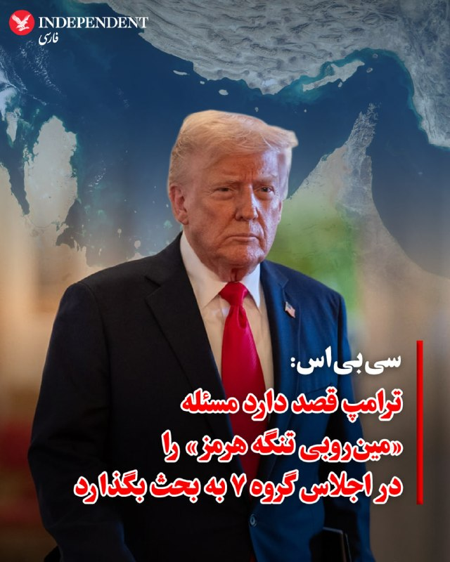

♦️ یک مقام ارشد دولت آمریکا روز شنبه ۲۳ خرداد در گفتگو با سی‌بی‌اس اعلام کرد که با افزایش امیدها به دستیابی به توافق صلح در جنگ ایران، انتظار می‌رود دونالد ترامپ، رئیس‌جمهوری ایالات متحده، در اجلاس سران گروه هفت (G7) که هفته آینده در فرانسه برگزار می‌شود، طرح‌های مربوط به «مین‌روبی تنگه هرمز» را با متحدان خود به بحث بگذارد.

بریتانیا و فرانسه که هر دو از اعضای گروه هفت هستند، پیش از این تمایل خود را برای مشارکت در عملیات مین‌روبی این شاه‌راه حیاتیِ انرژی، به محض توقف درگیری‌ها، ابراز کرده‌اند.

این مقام رسمی که طبق ضوابط کاخ سفید به شرط ناشناس ماندن با خبرنگاران گفتگو می‌کرد، افزود: «ترامپ همچنین در نظر دارد در حاشیه این اجلاس، با رهبران کشورهای مصر، قطر و امارات متحده عربی دیدار کند تا راه‌های پایان دادن به جنگ ایران را مورد بررسی قرار دهد.»

اجلاس سران جی۷ از روز دوشنبه آغاز خواهد شد.
‌🇸🇦 Indypersian

🤖 @VahidOOnLine

## VahidOOnLine — post 245324

  

شبکه الجزیره به نقل از سخنگوی وزارت خارجه پاکستان گزارش داد که مراسم «امضای الکترونیکی» توافق میان آمریکا و جمهوری اسلامی یکشنبه ۲۳ خرداد برگزار خواهد کرد. به گفته او، پاکستان میزبان این مراسم خواهد بود و مراسم از طریق «ارتباط ویدیویی و آنلاین» برگزار می‌شود.

او جزئیات بیشتری درباره شرکت‌کنندگان یا مفاد این توافق ارائه نکرد.
‌🏁 🇬🇧 IranintlTV

🤖 @VahidOOnLine

## VahidOOnLine — post 245323

♦️ جامعه محلی استان الضالع یمن در پی درگذشت القعقاع عنتر العبسی، جوان ۳۰ ساله‌ای که به «مرد عنکبوتی یمن» شهرت داشت، در اندوه عمیقی فرو رفت. این جوان ماجراجو روز جمعه حین اجرای نمایش و سنگ‌نوردی در دهانه آتشفشان خاموش «حرضه دمت»، ناگهان پایش لیز خورد و به عمق ۳۱ متری این دهانه سقوط کرد.

الجزیره به نقل از شاهدان گزارش داد که او از ناحیه سر و صورت دچار جراحت و خونریزی شدید شد و در نهایت پس از دو روز تلاش شبانه‌روزی، امدادگران موفق به بیرون کشیدن پیکر بی‌جان او شدند.

القعقاع به دلیل توانایی شگفت‌انگیزش در صعود و فرود سریع از صخره‌های عمودی بدون تجهیزات ایمنی شهرت داشت. او از این مهارت برای نجات دام‌های محلی‌هایی که در این دهانه گرفتار می‌شدند استفاده می‌کرد و امرار معاشش نیز از همین نمایش‌ها بود.

این حادثه موجی از ابراز همدردی را در یمن به راه انداخته و بحث‌ها پیرامون نبود تجهیزات امداد و نجات در این منطقه گردشگریِ خطرناک را داغ کرده است.
‌🇸🇦 Indypersian

🤖 @VahidOOnLine

## VahidOOnLine — post 245322

  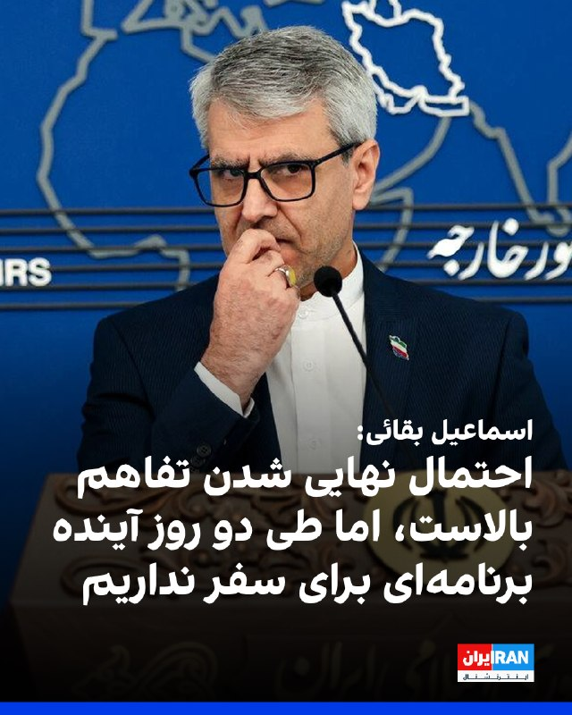

اسماعیل بقائی، سخنگوی وزارت خارجه جمهوری اسلامی، در نشست خبری شنبه ۲۳ خرداد گفت احتمال نهایی شدن یادداشت تفاهم میان تهران و واشینگتن در «روزهای آتی» بالا است.

او در پاسخ به پرسشی درباره احتمال سفر هیات مذاکره‌کننده جمهوری اسلامی به ژنو یا اسلام‌آباد در دو روز آینده برای نهایی کردن یادداشت تفاهم، گفت: «درباره زمان دقیق امضا باید منتظر بمانیم.»

بقائی افزود: «برنامه‌ای برای سفر به ژنو یا جایی دیگر ظرف یکی دو روز آینده نداریم.»
‌🏁 🇬🇧 IranintlTV

🤖 @VahidOOnLine

## VahidOOnLine — post 245321

  

یک مقام ارشد دولت آمریکا شنبه ۲۳ خرداد به خبرگزاری رویترز گفت که واشینگتن معتقد است به توافقی با جمهوری اسلامی دست یافته است. او این توافق را «قوی» ارزیابی کرد.

این مقام ارشد گفت: «ما معتقدیم به توافقی با ایران دست یافته‌ایم و این توافق، توافقی قوی است.»

او جزئیات بیشتری درباره مفاد یا زمان نهایی شدن این توافق ارائه نکرد.
‌🏁 🇬🇧 IranintlTV

🤖 @VahidOOnLine

## VahidOOnLine — post 245320

  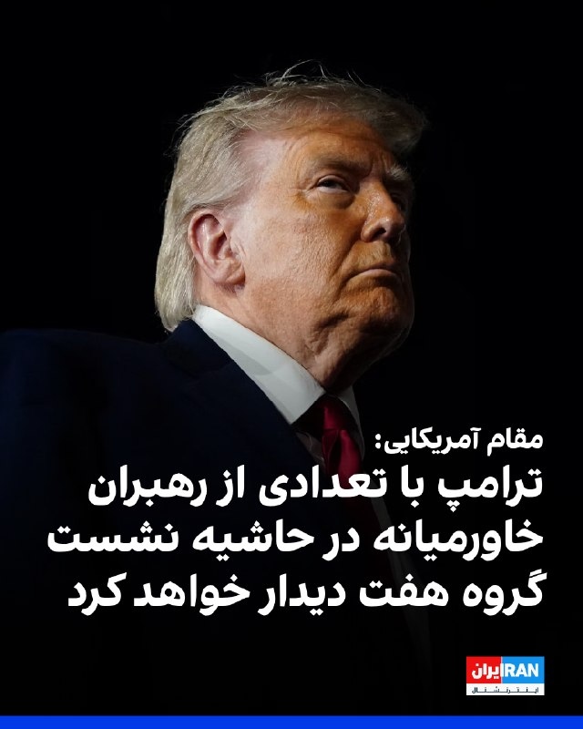

یک مقام ارشد دولت آمریکا به رویترز گفت که دونالد ترامپ، رییس‌جمهوری آمریکا، در نشست گروه هفت با رهبران امارات متحده عربی و قطر و برخی دیگر از رهبران خاورمیانه دیدار خواهد کرد.

به گفته این مقام، بنیامین نتانیاهو، نخست‌وزیر اسرائیل، در دیدارهای ترامپ با رهبران خاورمیانه هفت حضور نخواهد داشت.

نشست رهبران هفت اقتصاد پیشرفته جهان، موسوم به «گروه هفت» ۲۵ تا ۲۷ خرداد در شهر اویان فرانسه برگزار خواهد شد.

‌🏁 🇬🇧 IranintlTV

🤖 @VahidOOnLine

## VahidOOnLine — post 245319

  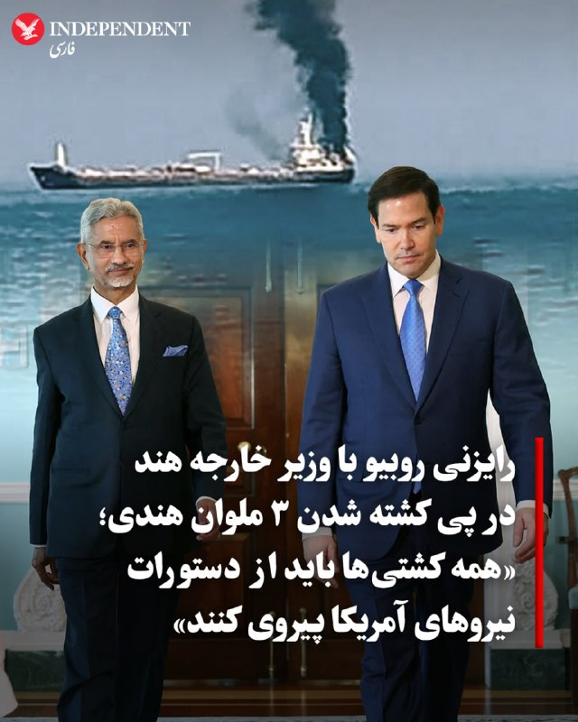

♦️ به دنبال حمله موشکی ارتش آمریکا به اتاق موتور نفت‌کش «ام/تی ستبلو» در تنگه هرمز و کشته شدن سه ملوان هندی، تنش‌های دیپلماتیک میان دهلی‌نو و واشنگتن بالا گرفته است. طبق اعلام سنتکام، این کشتی به هشدارهای مکرر نیروهای آمریکایی برای بازگشت توجهی نکرده بود.

با این حال، بر اساس بیانیه وزارت خارجه آمریکا درباره گفتگوی تلفنی مارکو روبیو، وزیر امور خارجه آمریکا، با سوبرامانیام جایشینکار، همتای هندی‌اش، به نظر نمی‌رسد واشنگتن از این حمله ابراز پشیمانی کرده باشد. تامی پیگوت، سخنگوی وزارت خارجه آمریکا، اعلام کرد: «روبیو تاکید کرده است که تمامی کشتی‌های تجاری باید فورا از دستورات نیروهای آمریکایی برای حفظ امنیت منطقه پیروی کنند و نقض محاصره دریایی و حمل غیرقانونی نفت ایران تحمل نخواهد شد.»

این در حالی است که هند روز گذشته با احضار کاردار آمریکا، «اعتراض شدید» خود را ابلاغ کرد. وزارت خارجه هند در بیانیه‌ای مجددا نسبت به استفاده از تسلیحات مرگبار علیه کشتی‌های غیرنظامی ابراز نگرانی کرد و این اقدامات را آسیب‌رسان به امنیت تجارت دریایی بین‌المللی در این موقعیت حساس دانست.
‌🇸🇦 Indypersian

🤖 @VahidOOnLine

## WithYashar — post 14727

تلویزیون دولتی لبنان:
شهر استراتژیک مجدل زون در نزدیکی بندر صور در جنوب لبنان به دست نیروهای ارتش اسرائیل سقوط کرد.
@withyashar

## WithYashar — post 14726

الحدث به نقل از منابع آگاه: منابع حاکی از آن است که یک هیئت ایرانی، شامل وزیر امور خارجه عراقچی، فردا وارد پاکستان خواهد شد. هیئت ایرانی بر مذاکرات فنی مربوط به این توافق نظارت خواهد داشت. @withyashar

## WithYashar — post 14725

باراک راوید، خبرنگار اکسیوس:
یک مقام آمریکایی اعلام کرد که دونالد ترامپ روز سه‌شنبه در حاشیه اجلاس گروه هفت با رهبران خاورمیانه دیدار خواهد کرد.
نتانیاهو در مذاکرات دوجانبه ترامپ با رهبران خاورمیانه در گروه هفت شرکت نکرد.
@withyashar

## WithYashar — post 14724

آکسیوس:فردا توافق بین ایران و آمریکا امضا میشه. @withyashar

## WithYashar — post 14723

آکسیوس:فردا توافق بین ایران و آمریکا امضا میشه.
@withyashar

## mwarmonitor — post 10834

✈️ «ساعت 16:51 — (WORM 11-12)، دو فروند بمب‌افکن B-52H به‌صورت دو فروندی در مسیر BOLRO به FONZU در حال فعالیت است. ارتباط با Swan Mil روی فرکانس 275.625.»

@mwarmonitor

## mwarmonitor — post 10833

🔴ترامپ قرار است در حاشیه نشست گروه هفت (G7) هفته آینده در اویانِ فرانسه، با رهبران قطر، مصر و امارات متحده عربی دیدار کند و انتظار می‌رود موضوع ایران محور اصلی گفت‌وگوها باشد - نیویورک تایمز

@mwarmonitor

## mwarmonitor — post 10832

📝 این سیرکِ همیشگی دیگر کمدی نیست، یک طنز سیاه تهوع‌آور از اوجِ لودگی دیپلماتیک است. در حالی که دلال‌های پاکستانی و عرب با آن پزهای توخالی و ژست‌های مضحکِ منجیان صلح، کت‌وشلوار پوشیده و مثل ندیدبدیدها برای زدنِ یک دکمهٔ امضای الکترونیکیِ فرضی غش و ضعف می‌روند و از تلاش‌های مستمرِ هم دستمال‌کشی می‌کنند، اینجا در لایهٔ دیگری از عقب‌ماندگی، سخنگوی وزارت خارجه با تنبلی و بی‌خیالیِ یک کارمندِ رشوه‌بگیرِ ادارهٔ مالیات، از خواب بیدار شده، پوزخند می‌زند و تمامِ این توهمات را با یک «حالا هول نشید، ما اصلاً حسش رو نداریم تا سر کوچه بریم» می‌شوید و می‌گذارد کنار. این هرج‌ومرجِ فرساینده ثابت می‌کند که سیاست خارجی ما بیشتر شبیه به یک بنگاهِ معاملات ملکیِ ورشکسته و کلاهبردار است که در آن، دلال‌ها قراردادِ خیالیِ خانه‌ای را که هنوز ساخته نشده به یکدیگر تبریک می‌گویند، در حالی که صاحبخانه اصلاً سند را گم کرده و در چرتِ بعد از ظهر به ریشِ همه‌شان می‌خندد؛ یک ولنگاریِ مطلق که در آن «نزدیک بودن به تفاهم»، فقط اسمِ رمزِ دیگری برای سرکار گذاشتنِ یک ملتِ جان‌به‌لب آمده است.

@mwarmonitor

## mwarmonitor — post 10831

🔴معاون نخست‌وزیر و وزیر امور خارجه پاکستان، سناتور محمد اسحاق دار، امروز گفت‌وگوی تلفنی‌ای با وزیر امور خارجه پادشاهی عربستان سعودی، شاهزاده فیصل بن فرحان، انجام داد. 🔹دو طرف از رسیدن مذاکرات ایالات متحده آمریکا و ایران به مرحله نهایی استقبال کردند؛ مرحله‌ای…

## FoxNewsTwitter — post 342937

  <a href="telegram/content/FoxNewsTwitter_342937_1781367038.mp4" target="_blank">🎬 Download video</a>

Fox News (Twitter/X)

THE SECRET SAUCE: What President Trump said to the USMNT ahead of their dominant 4-1 could inspire any American.

## pm_afshaa — post 93771

  <a href="telegram/content/pm_afshaa_93771_1781367041.mp4" target="_blank">🎬 Download video</a>

🔴دیشب عرزشی‌ها رفتن جلوی وزارت خارجه و یکیشون میگه: آقای عراقچی خاک بر سرت، بخدا داریم سکته میکنیم، بر پدر و مادرتون لعنت!

💧 Rainbet.com the #1 Non-KYC Crypto Casino & Sportsbook @rainbetcom

😁 @Pm_Afshaa

## pm_afshaa — post 93770

  <a href="telegram/content/pm_afshaa_93770_1781367042.webm" target="_blank">🎬 Download video</a>

🔴باراک راوید، خبرنگار اکسیوس:
یک مقام آمریکایی اعلام کرد که دونالد ترامپ روز سه‌شنبه در حاشیه اجلاس گروه هفت با رهبران خاورمیانه دیدار خواهد کرد.

نتانیاهو در مذاکرات دوجانبه ترامپ با رهبران خاورمیانه در گروه هفت شرکت نکرد.

💧 Rainbet.com the #1 Non-KYC Crypto Casino & Sportsbook @rainbetcom

😁 @Pm_Afshaa

## pm_afshaa — post 93769

برین سال قبل اینکه شاهنشاه بره رو مشاهده کنین
تاریخ داره تکرار میشه کشتار18 و 19 دی و اخرین خیزش مردمو تغییر حکومت 5 ماه مهمی پیش رومونه

## pm_afshaa — post 93768

اگه ریختن تو خیابون برا خون خواهی رهبر ما هم بریم کمکشون 😂
ما هم نمیخوایم با این کثافتا توافق بشه

## pm_afshaa — post 93767

  <a href="telegram/content/pm_afshaa_93767_1781367043.webm" target="_blank">🎬 Download video</a>

🔴رضایی، سخنگوی کمیسیون امنیت ملی مجلس:

سخاوتمندی مفرط در پای میز مذاکره، محاسبات دشمن رو عوض کرد تا فکر کنه که ایران ضعیفه و میتونه آن را ببلعد.

💧 Rainbet.com the #1 Non-KYC Crypto Casino & Sportsbook @rainbetcom

😁 @Pm_Afshaa

## pm_afshaa — post 93766

  <a href="telegram/content/pm_afshaa_93766_1781367044.webm" target="_blank">🎬 Download video</a>

🔴وزارت خارجه پاکستان: فردا توافق بین ایران و آمریکا امضا خواهد شد!

💧 Rainbet.com the #1 Non-KYC Crypto Casino & Sportsbook @rainbetcom

😁 @Pm_Afshaa

## pm_afshaa — post 93765

  <a href="telegram/content/pm_afshaa_93765_1781367045.webm" target="_blank">🎬 Download video</a>

🔴الحدث: عباس عراقچی فردا برای نظارت بر گفت‌وگوهای فنی مرتبط با توافق، وارد پاکستان خواهد شد.

💧 Rainbet.com the #1 Non-KYC Crypto Casino & Sportsbook @rainbetcom

😁 @Pm_Afshaa

## pm_afshaa — post 93764

آکسیوس:فردا توافق بین ایران و آمریکا امضا میشه

💧 Rainbet.com the #1 Non-KYC Crypto Casino & Sportsbook @rainbetcom

😁 @Pm_Afshaa

## pm_afshaa — post 93763

تجمع مردم تبریز در اعتراض به توافق با قاتل رهبر سابق 
💧 Rainbet.com the #1 Non-KYC Crypto Casino & Sportsbook @rainbetcom 
😁 @Pm_Afshaa

## pm_afshaa — post 93762

  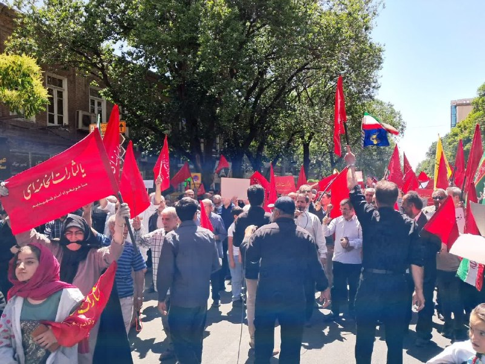

تجمع مردم تبریز در اعتراض به توافق با قاتل رهبر سابق

💧 Rainbet.com the #1 Non-KYC Crypto Casino & Sportsbook @rainbetcom

😁 @Pm_Afshaa

## DEJradio — post 5658

  <a href="telegram/content/DEJradio_5658_1781367046.webm" target="_blank">🎬 Download video</a>

🔺📷 در جریان جنگ ۴۰ روزه پایگاه هفتم شکاری شیراز بمباران شد. بخش عمده ادوات و تجهیزات مستقر در این پایگاه از بین رفت. این پایگاه شامگاه پنجشنبه ۱۵ اسفند بمباران شد و در طول جنگ بارها هدف حمله قرار گرفت.

#جنگ۴۰روزه #شیراز
@DEJradio

## VahidOnline — post 76303

یک مقام ارشد دولت آمریکا به رویترز گفت که دونالد ترامپ، رییس‌جمهوری آمریکا، در نشست گروه هفت با رهبران امارات متحده عربی و قطر و برخی دیگر از رهبران خاورمیانه دیدار خواهد کرد.

به گفته این مقام، بنیامین نتانیاهو، نخست‌وزیر اسرائیل، در دیدارهای ترامپ با رهبران خاورمیانه هفت حضور نخواهد داشت.

نشست رهبران هفت اقتصاد پیشرفته جهان، موسوم به «گروه هفت» ۲۵ تا ۲۷ خرداد در شهر اویان فرانسه برگزار خواهد شد.
@VahidOOnLine
اسماعیل بقائی، سخنگوی وزارت خارجه جمهوری اسلامی، در نشست خبری شنبه ۲۳ خرداد گفت احتمال نهایی شدن یادداشت تفاهم میان تهران و واشینگتن در «روزهای آتی» بالا است.

او در پاسخ به پرسشی درباره احتمال سفر هیات مذاکره‌کننده جمهوری اسلامی به ژنو یا اسلام‌آباد در دو روز آینده برای نهایی کردن یادداشت تفاهم، گفت: «درباره زمان دقیق امضا باید منتظر بمانیم.»

بقائی افزود: «برنامه‌ای برای سفر به ژنو یا جایی دیگر ظرف یکی دو روز آینده نداریم.»
@VahidOOnLine

📡 @VahidOnline

## kianmeli1 — post 87970

🔴وزیر امور خارجه پاکستان به همتای سعودی خود گفت که مراسم امضای الکترونیکی توافق آمریکا و ایران قرار است فردا برگزار شود.
https://t.me/kianmeli1

## IranIntlTV — post 342107

  <a href="https://t.me/IranintlTV/342107" target="_blank">📎 Download file</a>

🎧نسخه صوتی اخبار شبانگاهی | شنبه ۲۳ خرداد
@iranintlTV

## IranIntlTV — post 342106

  <a href="telegram/content/IranIntlTV_342106_1781367048.mp4" target="_blank">🎬 Download video</a>

ویدیوی رسیده به ایران اینترنشنال نشان می‌دهد در تجمعات ۱۹ دی مشهد مردم شعار دادند «فرمان بده شاهزاده، ایران شده آماده» و تصویری از شاهزاده رضا پهلوی را نیز بر دستان خود گرفته و بالا بردند.

## IranIntlTV — post 342105

  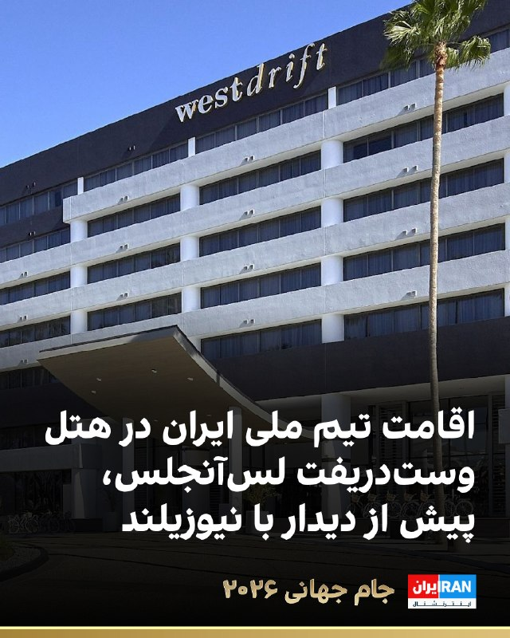

🔻خبرگزاری تسنیم خبر داده که تیم ملی فوتبال پیش از بازی با نیوزیلند در هتل وست‌دریفت در منطقه منهتن بیچ لس‌آنجلس اقامت خواهد داشت.

🔹تیم فوتبال ایران بامداد سه‌شنبه ۲۶ خرداد در نخستین مسابقه خود در جام جهانی ۲۰۲۶، در ورزشگاه سوفی لس‌آنجلس به مصاف نیوزیلند خواهد رفت.

🔹سایت هتل وست‌دریفت، هزینه اقامت در هر اتاق را شبانه ۵۵۰ دلار اعلام کرده است.

🔹فاصله محل فعلی اردوی تیم ملی در تیخوانا تا هتل وست‌دریفت حدود ۲۶۵ کیلومتر است و ملی‌پوشان پس از ورود به لس‌آنجلس در این هتل مستقر خواهد شد.

🔹شاگردان امیر قلعه‌نویی که در حال حاضر اردوی آماده‌سازی خود را در تیخوانای مکزیک برگزار می‌کنند، یک روز پیش از این دیدار راهی لس‌آنجلس خواهند شد تا مراحل پایانی آماده‌سازی خود را پشت سر بگذارند.

@iranintltvsport

## IranIntlTV — post 342104

  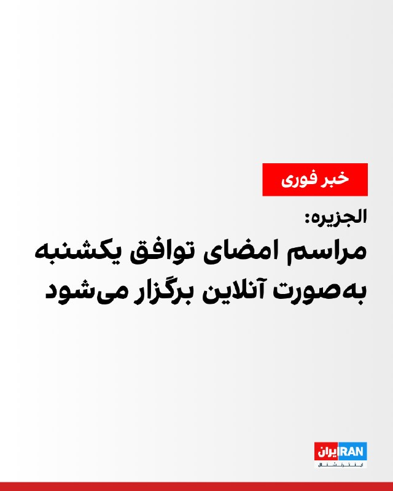

شبکه الجزیره به نقل از سخنگوی وزارت خارجه پاکستان گزارش داد که مراسم «امضای الکترونیکی» توافق میان آمریکا و جمهوری اسلامی یکشنبه ۲۳ خرداد برگزار خواهد شد. به گفته او، پاکستان میزبان این مراسم خواهد بود و مراسم از طریق «ارتباط ویدیویی و آنلاین» برگزار می‌شود.

او جزئیات بیشتری درباره شرکت‌کنندگان یا مفاد این توافق ارائه نکرد.
https://iranintl.com/202606133496

## IranIntlTV — post 342103

  <a href="telegram/content/IranIntlTV_342103_1781367052.mp4" target="_blank">🎬 Download video</a>

در حالی که ترامپ از احتمال امضای توافق تا دوشنبه گفته، رسانه نزدیک به قالیباف، آن را فرصتی برای تجدیدقوا با هدف بازگشت به جنگ خوانده. اما با این توافق که در آن از خطوط قرمز دو خامنه‌ای عبور شده، جمهوری اسلامی قرار است چه امتیازاتی بدهد و چه بگیرد؟

گزارشی از مجتبا پورمحسن
@iranintltv

## IranIntlTV — post 342102

  

اسماعیل بقائی، سخنگوی وزارت خارجه جمهوری اسلامی، در نشست خبری شنبه ۲۳ خرداد گفت احتمال نهایی شدن یادداشت تفاهم میان تهران و واشینگتن در «روزهای آتی» بالا است.

او در پاسخ به پرسشی درباره احتمال سفر هیات مذاکره‌کننده جمهوری اسلامی به ژنو یا اسلام‌آباد در دو روز آینده برای نهایی کردن یادداشت تفاهم، گفت: «درباره زمان دقیق امضا باید منتظر بمانیم.»

بقائی افزود: «برنامه‌ای برای سفر به ژنو یا جایی دیگر ظرف یکی دو روز آینده نداریم.»
https://iranintl.com/202606131844

## IranIntlTV — post 342094

🔻بازی آمریکا - پاراگوئه در افتتاحیه جام جهانی ۲۰۲۶ با حضور میهمانان ویژه و چهره‌های سرشناس سیاسی، ورزشی و هنری برگزار شد.

🔹مارکو روبیو، وزیر خارجه آمریکا، دیوید و ویکتوریا بکام، تام کروز، بیل گیتس، لئوناردو دی‌کاپریو، کیتی پری و جاستین ترودو از جمله چهره‌هایی بودند که از نزدیک این مسابقه را تماشا کردند.

🔹دونالد ترامپ، رییس‌جمهوری آمریکا، هرچند در ورزشگاه حضور نداشت، اما پیش از مسابقه در تماس تلفنی با بازیکنان تیم ملی کشورش برای آنها آرزوی موفقیت کرد و گفت معتقد است آمریکا شانس رسیدن به مراحل پایانی رقابت‌ها را دارد.

🔹این مسابقه پس از مراسم باشکوه جام جهانی ۲۰۲۶ برگزار شد. مراسمی که با حال و هوایی هالیوودی، اجرای هنرمندانی چون فیوچر، تایلا، آنیتا و لیسا همراه بود.

@iranintltvsport

## IranIntlTV — post 342093

  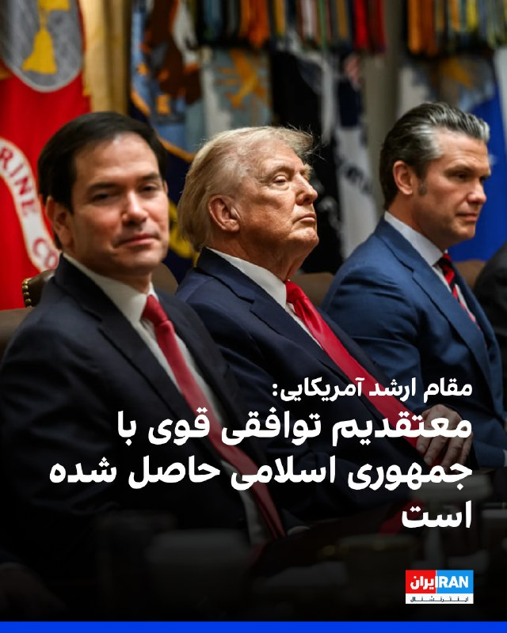

یک مقام ارشد دولت آمریکا شنبه ۲۳ خرداد به خبرگزاری رویترز گفت که واشینگتن معتقد است به توافقی با جمهوری اسلامی دست یافته است. او این توافق را «قوی» ارزیابی کرد.

این مقام ارشد گفت: «ما معتقدیم به توافقی با ایران دست یافته‌ایم و این توافق، توافقی قوی است.»

او جزئیات بیشتری درباره مفاد یا زمان نهایی شدن این توافق ارائه نکرد.
https://iranintl.com/202606131174

## IranIntlTV — post 342092

  

یک مقام ارشد دولت آمریکا به رویترز گفت که دونالد ترامپ، رییس‌جمهوری آمریکا، در نشست گروه هفت با رهبران امارات متحده عربی و قطر و برخی دیگر از رهبران خاورمیانه دیدار خواهد کرد.

به گفته این مقام، بنیامین نتانیاهو، نخست‌وزیر اسرائیل، در دیدارهای ترامپ با رهبران خاورمیانه هفت حضور نخواهد داشت.

نشست رهبران هفت اقتصاد پیشرفته جهان، موسوم به «گروه هفت» ۲۵ تا ۲۷ خرداد در شهر اویان فرانسه برگزار خواهد شد.

https://iranintl.com/202606137237

## IranIntlTV — post 342091

  <a href="telegram/content/IranIntlTV_342091_1781367058.mp4" target="_blank">🎬 Download video</a>

یک شهروند با ارسال پیامی به ایران اینترنشنال از گرانی گلایه کرده و می‌گوید برای یک ماست ۹۰ هزار تومان هزینه کرده است.

## IranIntlTV — post 342081

🔻تیم‌های فوتبال برزیل و مراکش ساعت ۱:۳۰ روز یک‌شنبه ۲۴ خرداد ۱۴۰۵ در ورزشگاه مت‌لایف نیوجرسی به مصاف یکدیگر می‌روند تا ششمین بازی جام جهانی ۲۰۲۶ را برگزار کنند.

🔹برزیل به طور سنتی و البته همچنان بر اساس ضرایب شرط‌بندی، شانس اصلی پیروزی در این مسابقه است، اما مراکش در پی تکرار موفقیت تاریخی خود در جام جهانی ۲۰۲۲ است؛ نخستین تیم آفریقایی که به نیمه‌نهایی جام جهانی راه پیدا کرد.

🔹دیدار برزیل و مراکش تنها مسابقه مرحله گروهی میان دو تیم حاضر در جمع ۱۰ تیم برتر رده‌بندی فیفاست.

🔹پیش‌بازی برزیل و مراکش، در وب‌سایت ایران اینترنشنال بخوانید.

@iranintltvsport

## FarsiVOA — post 220596

در گفت‌وگو با حسن هاشمیان از صدای آمریکا تشدید عملیات اسرائیل در جنوب لبنان، نقش‌آفرینی بلندمدت آمریکا در غزه، و فاصله‌گیری دولت لبنان از حکومت ایران را بررسی کردیم. به گفته حسن هاشمیان «پروژه منطقه‌ای جمهوری اسلامی در خاورمیانه، شکست خورده است.»

## FarsiVOA — post 220595

🔺عفو بین‌الملل به جامعه جهانی: برای توقف فوری اعدام‌ها در ایران اقدام کنید؛ پخشان عزیزی اتهامات انتسابی را رد کرد

▪️سازمان عفو بین‌الملل شنبه ۲۳ خرداد ۱۴۰۵ با انتشار بیانیه‌ای نسبت به خطر اجرای احکام اعدام برای شماری از زندانیان سیاسی و عقیدتی در ایران هشدار داد و از جامعه جهانی خواست برای توقف فوری اعدام‌ها و لغو احکام صادرشده علیه زندانیان سیاسی وارد عمل شود.

⬇️ بیشتر بخوانید:

https://ir.voanews.com/a/amnesty-international-execution-prison-political-iran/8160447.html/?nocach=1

## FarsiVOA — post 220594

واکنش قانون‌گذاران آمریکایی به تحولات مربوط به توافق با جمهوری اسلامی

## FarsiVOA — post 220593

تنگه هرمز، مهمان ناخوانده نشست جی۷؛ سران کشورهای عربی چرا به فرانسه دعوت شدند

## FarsiVOA — post 220592

🔺بازداشت مسئول شکنجه زندانیان سیاسی در حکومت بشار اسد

▪️نیروهای ویژه مبارزه با تروریسم سوریه سرلشکر قیس حسن عبدالرجب، معاون مدیر کل اطلاعات و یگان ویژه حفاظت از ارکان حکومت در دوران حکومت بشار اسد، را دستگیر کردند.

⬇️ بیشتر بخوانید:

https://ir.voanews.com/a/syria-bashar-alassad-iran-proxy/8160445.html/?nocach=1

## FarsiVOA — post 220591

  <a href="telegram/content/FarsiVOA_220591_1781367060.mp4" target="_blank">🎬 Download video</a>

ارتش اسرائیل اعلام کرد در طول هفته گذشته نیروهای تیم رزمی تیپ ۵۵۱ تحت فرماندهی لشکر ۹۱، دو گروه شامل هفت تروریست حزب‌الله را شناسایی کردند که از داخل یک مسیر زیرزمینی در جنوب لبنان فعالیت می‌کردند.

بنابر بیانیه ارتش اسرائیل از این مسیر برای نگهداری مهمات، خمپاره‌ها و تامین غذا برای فعالیت علیه نیروهای ارتش اسرائیل در منطقه استفاده می‌شد.

نیروهای ارتش اسرائیل هفت تروریست شناسایی شده را از پا درآوردند.

در این عملیات، سلاح‌هایی از نوع «کلاشنیکف» و تجهیزات نظامی کشف و سکوهای پرتاب و دیگر جنگ‌افزارها در نزدیکی مسیر زیرزمینی منهدم شد.

این ویدیو بی‌صدا است.

## FarsiVOA — post 220590

در گفت‌وگو با شاهین مدرس، تحلیلگر مطالعات امنیتی، از تناقض روایت‌ها درباره تفاهم آمریکا و جمهوری اسلامی، فشار حداکثری آمریکا بر صادرات انرژی، و پرونده هسته‌ای حکومت ایران گفتیم و به این جمع‌بندی رسیدیم که جمهوری اسلامی پس از پیروزی نظامی آمریکا، در پی «تسلیم آبرومندانه» است.

## FarsiVOA — post 220584

📷فرماندهی مرکزی ایالات متحده، سنتکام، تصاویری از هواپیماهای جنگنده ایالات متحده در حال آماده‌سازی برای پرواز از عرشه ناو هواپیمابر «یو‌اس‌اس آبراهام لینکلن» منتشر کرده است. این ناو در حال عبور از دریای عرب است.

## DW_Farsi — post 125933

🔶انتقاد شدید از کالاس به دلیل مقایسه اسرائیل با رژیم آپارتاید

طبق گزارش پایگاه خبری "یوراکتیو" (Euractiv)، کایا کالاس، مسئول سیاست خارجی اتحادیه اروپا در یک موقعیت رسمی از واژه جنجالی "آپارتاید" (جدانژادی) در توصیف رویکرد اسرائيل در کرانه باختری رود اردن استفاده کرده است؛ آن هم در شرایطی که او به خودی خود زیر ذره‌بین و پایش ویژه قرار دارد.

برابر این گزارش،‌ کالاس در جریان گفت‌وگوهای سطح بالا در مکزیک، اسرائیل را با رژیم سابق آپارتاید در آفریقای جنوبی مقایسه کرده و با این کار خشم دولت‌های چند کشور مهم اتحادیه اروپا را برانگیخته است.

به گزارش "یوراکتیو"، کالاس با این مقایسه از سیاست خارجی رسمی اتحادیه اروپا عدول کرده و به جنجال‌ها پیرامون جایگاه خود دامن زده است.

@dw_farsi

## DW_Farsi — post 125932

  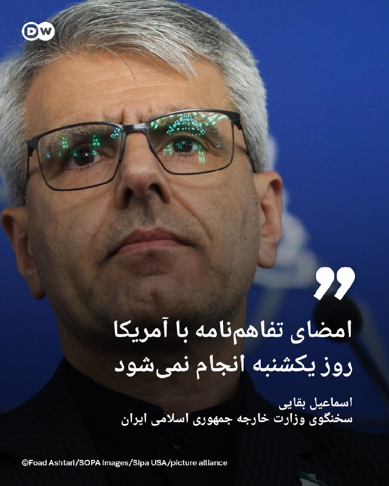

🔶بقایی: امضای تفاهم‌نامه با آمریکا روز یکشنبه انجام نمی‌شود

اسماعیل بقایی، سخنگوی وزارت خارجه جمهوری اسلامی ایران، گفت امضای تفاهم‌نامه اسلام‌آبادبا ایالات متحده روز یکشنبه ۲۴ خرداد (۱۴ ژوئن) انجام نخواهد شد. به گفته او، هرچند احتمال امضای این تفاهم‌نامه در روزهای آینده وجود دارد، اما به‌دلیل آنچه "تردید طرف مقابل" خواند، باید درباره اعلام تاریخ دقیق با احتیاط سخن گفت.

شهباز شریف، نخست وزیر پاکستان، ساعتی پیش گفته بود که تهران و واشنگتن بر سر متن نهایی تفاهم‌نامه به توافق رسیده‌اند و این تفاهم‌نامه در عرض ۲۴ ساعت آینده "احتمالا نهایی می‌شود" و پس از آن "به صورت الکترونیکی" امضا خواهد شد.

سخنگوی وزارت خارجه در عین حال گفت نمی‌توان احتمال امضای این تفاهم‌نامه در روزهای آینده را رد کرد.

با این حال، او تاکید کرد در شرایط فعلی نباید درباره زمان امضا با قطعیت صحبت کرد.

بقایی دلیل احتیاط در اظهارنظر درباره تاریخ امضا را "تردید طرف مقابل" عنوان کرد و منظور او از این عبارت، ایالات متحده بود.

@dw_farsi

## DW_Farsi — post 125931

  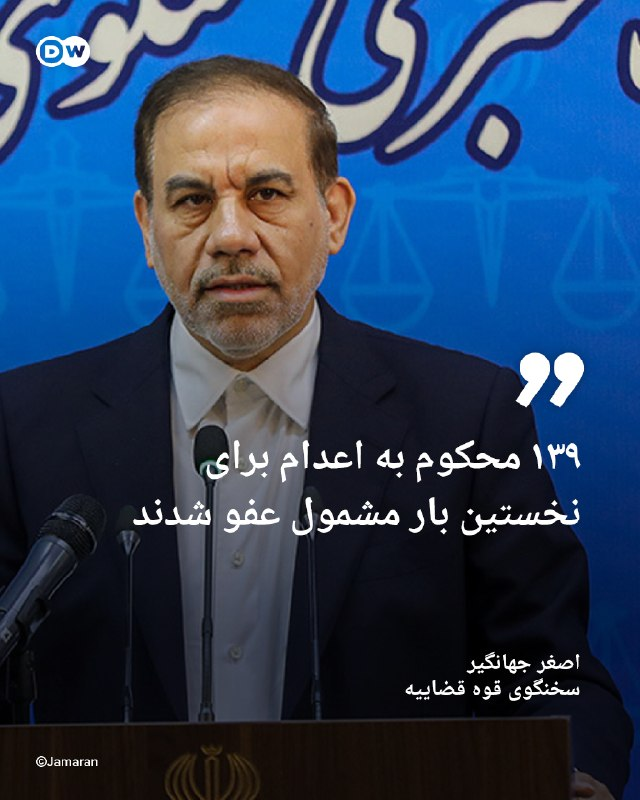

🔶سخنگوی قوه قضاییه: ۱۳۹ محکوم به اعدام برای نخستین بار مشمول عفو شدند

اصغر جهانگیر، سخنگوی قوه قضاییه، در حاشیه افتتاح استودیوی پخش "روایت فردا" گفت در عفو اخیر، برای نخستین بار ۱۳۹ نفر از محکومان به مجازات سلب حیات و اعدام نیز مشمول عفو شدند. او افزود این افراد فاقد شاکی خصوصی و سابقه جرایم امنیتی بودند و با توجه به اصلاح رفتار، ابراز ندامت و طی کردن فرآیندهای اصلاحی در زندان، شرایط استفاده از عفو را به دست آوردند.

او درباره عفو اخیر نیز گفت در حالی که بسیاری از کشورها در دوران بحران و جنگ از اعمال عفو خودداری می‌کنند، در جمهوری اسلامی با موافقت رهبر جمهوری اسلامی، شماری از محکومان از آزادی یا تخفیف مجازات برخوردار شدند. به گفته او، افرادی که در جرایم امنیتی و حوادث اخیر نقش داشتند، از ابتدا از فهرست عفو کنار گذاشته شدند.

@dw_farsi

## DW_Farsi — post 125930

🎥جزیره گربه‌ها؛ راه‌حل یا دردسر برای گربه‌های خیابانی؟

اندونزی در حال بررسی طرحی غیرمعمول برای مقابله با افزایش جمعیت گربه‌های بی‌سرپرست در جاکارتاست؛ طرحی که بر اساس آن، هزاران گربه به جزیره‌ای در نزدیکی پایتخت منتقل خواهند شد. اما منتقدان هشدار می‌دهند این طرح ممکن است مشکلات تازه‌ای ایجاد کند.

@dw_farsi

## Persian_Trend_Official — post 16960

  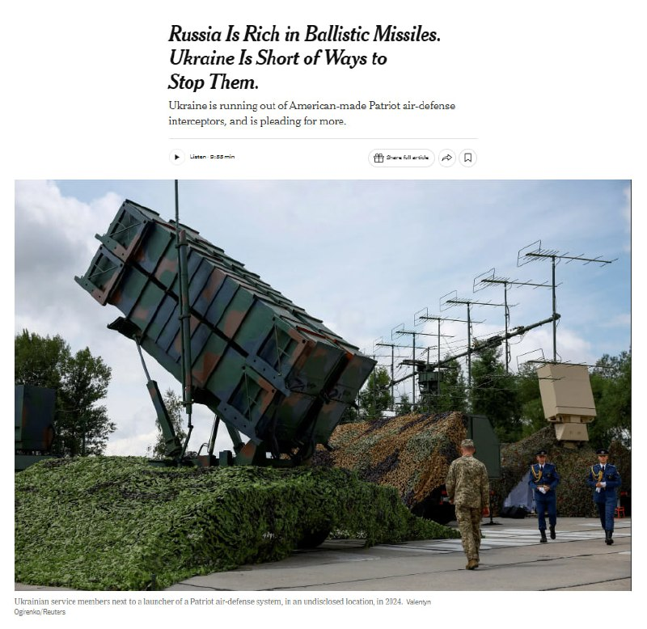

کمبود موشک‌های رهگیر پاتریوت در اوکراین

نیویورک تایمز گزارش می‌دهد که پرسنل پدافند هوایی اوکراین همچنان با حملات گسترده‌ای شامل صدها پهپاد و ده‌ها موشک بالستیک مواجه هستند که اغلب بیش از 24 ساعت با استراحت محدود در حال عملیات هستند و در عین حال موشک های رهگیر باقی‌مانده خود را جیره‌بندی می‌کنند.

مقامات اوکراینی هشدار می‌دهند که تحویل موشک‌های پاتریوت نتوانسته است با تولید و استفاده سریع از موشک‌های بالستیک روسیه همگام باشد.

📝 Amir

📌 @persian_trend_official
پرشین ترند | متفاوت‌ترین کانال نظامی

## Persian_Trend_Official — post 16959

فرانس پرس: ترامپ روز سه‌شنبه در جلسه کاری گروه هفت شرکت خواهد کرد و در مورد توافق با ایران صحبت خواهد کرد. 📝 Amir 📌 @persian_trend_official پرشین ترند | متفاوت‌ترین کانال نظامی

## Persian_Trend_Official — post 16957

تصاویر ماهواره ای با کیفیت از انهدام سیستم راداری TPS-59 در کوه الدخان و دو مخزن سوخت در پایگاه شیخ عیسی بحرین طی حملات موشکی و پهپادی نیروی های مسلح جمهوری اسلامی

📝 Amir

📌 @persian_trend_official
پرشین ترند | متفاوت‌ترین کانال نظامی

## Persian_Trend_Official — post 16956

  <a href="telegram/content/Persian_Trend_Official_16956_1781367065.mp4" target="_blank">🎬 Download video</a>

ارتش اسرائیل ویدیویی از لحظه هدف قرار دادن 7 نیروی حزب‌الله در جنوب لبنان منتشر کرد.

📝 Amir

📌 @persian_trend_official
پرشین ترند | متفاوت‌ترین کانال نظامی

## Persian_Trend_Official — post 16955

  <a href="telegram/content/Persian_Trend_Official_16955_1781367068.mp4" target="_blank">🎬 Download video</a>

نبویان: باید در بند اول متن توافق اشاره می‌شد آمریکا آغازکننده جنگ است.

نایب رئیس کمیسیون امنیت ملی مجلس: متن دارای چهارده بند است. بلافاصله بعد از امضای توافق پایان عملیات نظامی اعلام می‌شود. اکثر متن‌های اصلی را دیده ام اما این متن بهتر از قبلی‌هاست.

بند اول متن توافق خوب است اما بین آمریکا و ایران برابر است و باید اشاره می‌شد آمریکا آغازکننده جنگ است.

📝 Amir

📌 @persian_trend_official
پرشین ترند | متفاوت‌ترین کانال نظامی

## Persian_Trend_Official — post 16954

  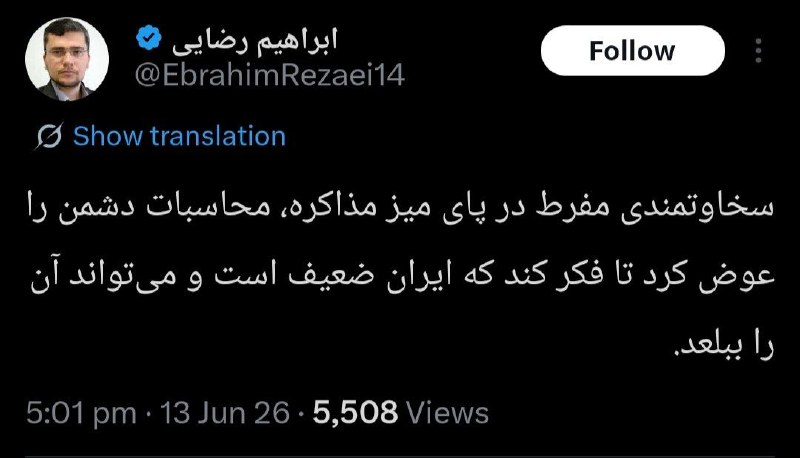

رضایی، سخنگوی کمیسیون امنیت ملی مجلس: سخاوتمندی مفرط در پای میز مذاکره، محاسبات دشمن رو عوض کرد تا فکر کند که ایران ضعیف شده و میتواند آن را ببلعد.

📝 Amir

📌 @persian_trend_official
پرشین ترند | متفاوت‌ترین کانال نظامی

## Persian_Trend_Official — post 16953

  <a href="telegram/content/Persian_Trend_Official_16953_1781367071.webm" target="_blank">🎬 Download video</a>

العربیه: هیئت ایرانی شامل وزیر خارجه این کشور فردا وارد پاکستان خواهند شد تا در روند گفت‌وگوهای مرتبط با توافق مشارکت کنند. 📝 Amir 📌 @persian_trend_official پرشین ترند | متفاوت‌ترین کانال نظامی

## Persian_Trend_Official — post 16952

  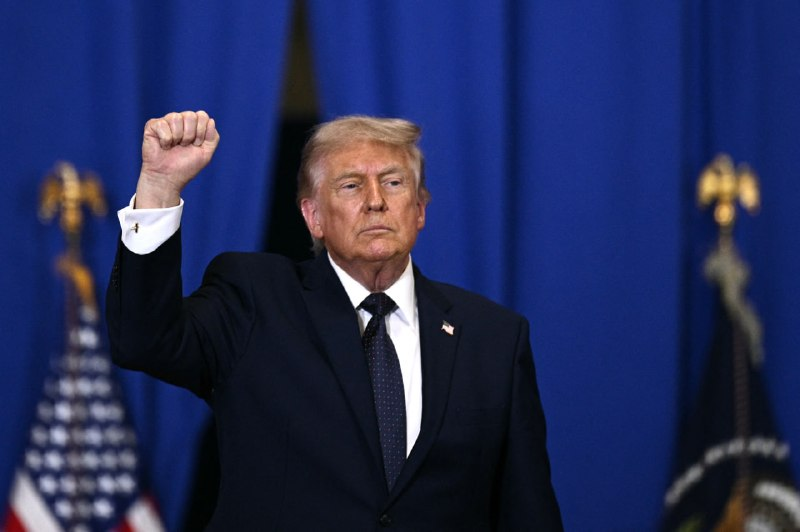

فرانس پرس: ترامپ روز سه‌شنبه در جلسه کاری گروه هفت شرکت خواهد کرد و در مورد توافق با ایران صحبت خواهد کرد.

📝 Amir

📌 @persian_trend_official
پرشین ترند | متفاوت‌ترین کانال نظامی

## RadioFarda — post 158267

اوکراین، با گسترش حملات پهپادی، کرملین را به لغو کنسرت «روز روسیه» واداشت

🔸برای نخستین بار در ۲۳ سال گذشته، کنسرت سنتی «روز روسیه» در میدان سرخ مسکو لغو و به یک سالن سرپوشیده منتقل شد. کارشناسان این اقدام را نشانه‌ای از نگرانی فزایندهٔ کرملین از گسترش توانایی‌های پهپادی و موشکی اوکراین می‌دانند.

🔸به گزارش رادیو اروپای آزاد/ رادیو آزادی، لغو این مراسم تنها یکی از نشانه‌های تأثیر فزایندهٔ حملات اوکراین بر زندگی عمومی در روسیه است.

🔸نمایشگاه بین‌المللی هوافضای «ماکس»، مهم‌ترین رویداد صنعت هوانوردی روسیه، نیز امسال برای سومین سال پیاپی برگزار نخواهد شد. مراسم «روز پیروزی» روسیه در ۹ مه نیز به شکلی محدودتر از سال‌های گذشته برگزار شد و برخلاف روال معمول، تانک‌ها و تجهیزات سنگین نظامی در میدان سرخ به نمایش گذاشته نشدند.

🔸به‌گفتۀ کارشناسان، آن‌چه بر همهٔ این رویدادها سایه انداخته، پیشرفت توانایی‌های پهپادی و موشکی اوکراین است. این توانایی‌ها امکان هدف قرار دادن پالایشگاه‌ها، کارخانه‌های دفاعی و دیگر تأسیسات روسیه را در صدها و حتی هزاران کیلومتر دورتر از مرز اوکراین فراهم کرده است.

🔸ساموئل بندت، پژوهشگر مرکز تحلیل‌های دریایی آمریکا، به رادیو اروپای آزاد/رادیو آزادی گفت لغو یا محدود شدن رویدادهای عمومی احتمالاً در درجهٔ نخست به دلیل تهدید حملات پهپادی انجام شده است.

🔸او در عین حال گفت مقام‌های روسیه ممکن است در تلاش باشند از نمایش‌های پرزرق‌وبرق نظامی در شرایط جنگی پرهیز کنند و فاصلهٔ میان تصویر رسمی از قدرت نظامی روسیه و واقعیت‌های میدان نبرد را کمتر در معرض توجه قرار دهند.

🔸دمیتری پسکوف، سخنگوی کرملین، پیش‌تر تهدید حملات پهپادی اوکراین را دلیل محدود شدن مراسم روز پیروزی عنوان کرده بود.

🔸گزارش کامل را در وب‌سایت رادیوفردا بخوانید.

@RadioFarda

## RadioFarda — post 158266

🔸گروهی از ایرانیان مقیم هامبورگ روز شنبه، ۲۳ خرداد، و در آستانۀ زادروز مجیدرضارهنورد با در دست داشتن پرچم‌های شیروخورشید برای گرامی‌داشت یاد او تجمع و راهپیمایی کردند.

🔸مجیدرضا رهنورد، از بازداشت‌شدگان اعتراضات «زن زندگی آزادی» در مشهد، ۲۱ آذر به فاصله ۲۳ روز از زمان بازداشت از سوی دادگاه انقلاب محاکمه و اعدام شد.

🔸هواداران نظام پادشاهی زادروز او را با نام «روز ملی شیر و خورشید» نام‌گذاری کرده‌اند.

@RadioFarda

## IranianMinds — post 22475

  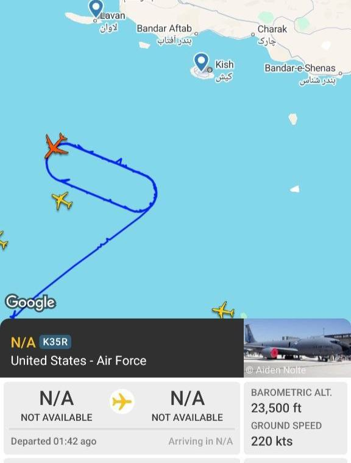

🔴سوخت‌رسان‌های آمریکایی همچنان در منطقه در حال فعالیت هستند.

@IranianMinds

## IranianMinds — post 22474

ولی آخرش هم جنگ شد هم مذاکره کردن و هم اورانیومارو دارن تحویل میدن :))

@IranianMinds

## IranianMinds — post 22472

  

تجمع مردم تبریز در اعتراض به توافق با قاتل خامنه ای

@IranianMinds

## IranianMinds — post 22471

🔴 آکسیوس:فردا توافق بین ایران و آمریکا امضا میشه

@IranianMinds

## BBCPersian — post 283710

  <a href="telegram/content/BBCPersian_283710_1781367074.mp4" target="_blank">🎬 Download video</a>

امروز ۱۳ ژوئن/ ۲۳ خرداد گروه‌های مختلف ایرانی در بریزبن استرالیا تجمع اعتراضی برگزار کردند.

گروهی با پرچم شیروخورشید شعارهایی در حمایت از شاهزاده رضا پهلوی سردادند.

گروهی دیگر هم در اعتراض به اعدام معترضان تجمع کردند و با آهنگ «برای» شروین حاجی‌پور و پرچم ایران با شعار «زن‌، زندگی، آزادی» برای آن‌ها یادبود گرفتند.
آن‌ها خواستار «توقف فوری احکام اعدام، آزادی معترضان زندانی و آزادی زندانیان سیاسی» شدند.

@BBCPersian

## BBCPersian — post 283709

  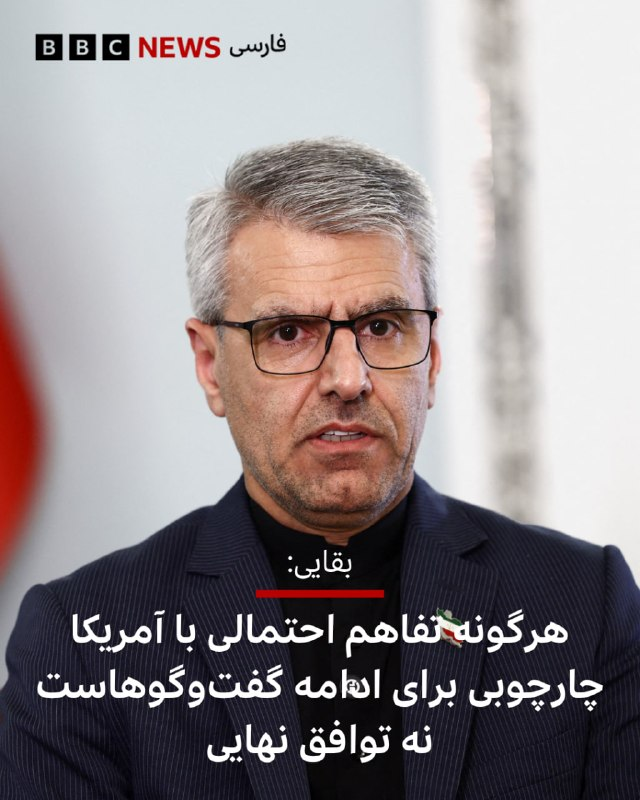

🔻بقایی: هرگونه تفاهم احتمالی با آمریکا چارچوبی برای ادامه گفت‌وگوهاست نه توافق نهایی

اسماعیل بقایی، سخنگوی وزارت خارجه ایران گفته است که «هرگونه تفاهم احتمالی با آمریکا صرفاً چارچوبی برای ادامه گفت‌وگوها خواهد بود.نه توافق نهایی میان دو کشور.»

آقای بقایی در یک سخنرانی در همدان گفت «جمهوری اسلامی ایران در مسیر مذاکرات و تحولات دیپلماتیک با نهایت دقت، احتیاط و بدبینی مبتنی بر تجربه حرکت می‌کند.»

او گفت «موضوعات مورد مذاکره میان ایران و آمریکا بسیار پیچیده است، اما در مرحله فعلی تمرکز اصلی بر خاتمه جنگ و تنش‌ها بوده است. با توجه به تجربیات گذشته، تصمیم گرفته شد در این مرحله وارد جزئیات مسائل هسته‌ای نشویم و اولویت بر توقف جنگ در تمامی جبهه‌ها، از جمله لبنان، قرار گیرد.»

در اظهاراتی دیگر که از تلویزیون ایران پخش شد، سخنگوی وزرت خارجه ایران گفت یادداشت تفاهم مورد انتظار با ایالات متحده روز یکشنبه (فردا) امضا نخواهد شد.

آقای بقائی گفت: «باید درباره زمان دقیق امضا منتظر بمانیم.»

📸Reuters

https://bbc.in/4fE2vpf
@BBCPersian

## BBCPersian — post 283708

🔺ترامپ: رهبر باند ونزوئلایی «ترن د آراگوآ» را در یک حمله نظامی کشتیم

دونالد ترامپ، رئیس‌جمهور آمریکا، اعلام کرد که نیروهای کشورش در عملیاتی که آن را «سریع و مرگبار» توصیف کرد، هکتور روستنفورد گوئررو فلورس، معروف به «نینیو گوئررو»، رهبر گروه ونزوئلایی «ترن د آراگوآ» را کشته‌اند.

آقای ترامپ در شبکه اجتماعی تروث سوشال نوشت که این عملیات به دستور او و توسط فرماندهی جنوبی ارتش آمریکا انجام شده است.

او «ترن د آراگوآ» را «یکی از بی‌رحم‌ترین سازمان‌های تروریستی روی زمین» توصیف کرد و گفت در دوران ریاست‌جمهوری جو بایدن، میلیون‌ها مهاجر غیرقانونی وارد آمریکا شدند و اعضای این گروه مرتکب جرایمی از جمله تجاوز، نقص عضو و قتل شهروندان آمریکایی شدند.

https://bbc.in/4oq6TdV
@BBCPersian

## BBCPersian — post 283707

  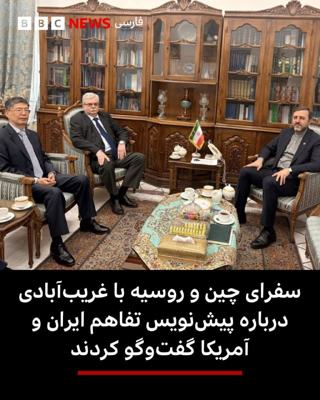

🔻معاون وزارت خارجه ایران گفته است که با سفرای چین و روسیه در تهران درباره مذاکرات ایران و آمریکا دیدار و گفت‌وگو کرده است.

کاظم غریب‌آبادی در پستی در ایکس نوشت «در این دیدار در مورد آخرین تحولات مربوط به پیش‌نویس یادداشت تفاهم اسلام آباد، بحث و تبادل نظر شد.»

پاکستان که میانجی آتش‌‌بس بین ایران و آمریکا و واسطه امضای تفاهم احتمالی میان دو کشور است، اعلام کرده که این توافق احتمالا در شبانه روز آینده نهایی خواهد شد.

معاون وزرات خارجه ایران گفته است:«شراکت راهبردی ایران، چین و روسیه و هماهنگی‌ها و تعاملات میان سه کشور با قوت تداوم خواهد یافت.»

عباس عراقچی، وزیر خارجه ایران شب گذشته به تلویزیون این کشور گفته بود که تهران درباره وضعیت تنگه هرمز و نحوه جدید اداره آن با چین به طور پیوسته در حال مشورت است.

📸entekhab

https://bbc.in/4ejsEHx
@BBCPersian

## BBCPersian — post 283698

⚽️گروه ئی ‌(E) جام جهانی؛ یک غول و سه شکارچی

اکوادور با وجود آن که مرحله مقدماتی را با کسر سه امتیاز شروع کرد، اما یکی از بهترین تیم‌های آمریکای جنوبی در مسیر صعود به جام جهانی ۲۰۲۶ بود. سباستین بکاسسه، مربی آرژانتینی ۴۵ ساله این تیم به شجاعت در استفاده از استعدادهای جوان مشهور است و به خاطر ظاهر خاص، انرژی بالا و شخصیت متفاوتش در آمریکای جنوبی به «مربی راک‌استار» معروف شده است.

مویسس کایسدو، هافبک چلسی، موتور محرک تیم ملی اکوادور است. او با جنگندگی در میانه زمین، دوندگی فراوان و توانایی کنترل ریتم بازی، مهم‌ترین بازیکن تیم محسوب می‌شود.

آلمان امیدوار است تا ناکامی دو دوره گذشته جام جهانی را که با حذف در مرحله گروهی همراه بود، در جام جهانی ۲۰۲۶ جبران کند. آلمان خط میانی و حمله‌ بسیار خلاق و باکیفیتی دارد، اما احتمالا در برابر یکی از قدرت‌های اروپایی در مرحله یک‌هشتم یا یک‌چهارم نهایی به مشکل خواهد خورد.

📲ادامه مطلب در لینک زیر⬇️

📸GettyImages

https://bbc.in/4g2eAF5
@BBCPersian

## idfinfarsi — post 11840

  <a href="telegram/content/idfinfarsi_11840_1781367079.mp4" target="_blank">🎬 Download video</a>

به هلاکت رسیدن هفت تروریست از سازمان تروریستی حزب‌الله: مستند از فعالیت نیروهای تیپ ۵۵۱ در جنوب لبنان

نیروهای تیم رزمی تیپ ۵۵۱ تحت فرماندهی لشکر ۹۱ برای انهدام زیرساخت‌های تروریستی و به هلاکت رساندن تروریست‌های سازمان تروریستی حزب‌الله در جنوب لبنان فعالیت می‌کنند.

در طول هفته گذشته، نیروها دو گروه شامل هفت تروریست از سازمان تروریستی حزب‌الله را شناسایی کردند که از داخل یک مسیر زیرزمینی در جنوب لبنان فعالیت می‌کردند. این مسیر توسط این تروریست‌ها برای نگهداری مهمات، خمپاره‌ها و تأمین غذا برای فعالیت علیه نیروهای ارتش اسرائیل در این منطقه مورد استفاده قرار می‌گرفت.

در همکاری با نیروی هوایی، توپخانه و پهپادها، نیروها این هفت تروریست را که در این مسیر شناسایی شده بودند، به هلاکت رساندند.

پس از این عملیات، نیروها سلاح‌هایی از نوع «کلاشنیکوف» و تجهیزات نظامی بر روی تروریست‌ها شناسایی کردند، همچنین مواضع پرتاب و دیگر جنگ‌افزارها در نزدیکی مسیر زیرزمینی منهدم شد.

## Dirty_Kids — post 391900

  <a href="telegram/content/Dirty_Kids_391900_1781367082.mp4" target="_blank">🎬 Download video</a>

🔴 این شب‌ها تو‌ کافه‌های مختلف فرشته تهران، بندهای مختلف میان کنسرت میذارن؛

مردم هم با پارتنر یا رفیق‌شون اونجا جمع میشن ، می‌رقصن و وقت میگذرونن:

@Dirty_Kids 👻

## Dirty_Kids — post 391899

  <a href="telegram/content/Dirty_Kids_391899_1781367085.webm" target="_blank">🎬 Download video</a>

✅ اپلیکیشن حرفه ای اندروید سایت بین المللی دربی بت

✅اسپانسر لیگ انگلستان

💰اولین سایت جهانی با امکان شارژ و برداشت با کارت بانکی

◻️ برای ورود فیلترشکن روشن کرده روی کانادا یا سنگاپور یا آلمان و ....
📢

😀Telegram Channel
👇
https://t.me/+bcynkEgSW2dlYTc0

## Dirty_Kids — post 391898

  

😤میخوای جام جهانی پیش بینی کنی؟!

🔹پس نیاز داری به یه سایت بین المللی و معتبر
🔹

⛔دربی بت همون انتخاب  100%

💎ویژگی های سایت جهانی Derby Bet:

⬅️امکان شارژ امن با کارت بانکی

⬅️واریز اول دوبل شارژ می شوید(بونوس۱۰۰٪)

⬅️پر اپشن ترین سایت فعال در ایران

⬅️تسویه حساب کمتر از 5 دقیقه

⬅️برگشت بخشی از باخت به صورت هفتگی

⭐دارای لایسنس و مجوز anjuan

🚨کد هدیه ثبت نام:GG007

⚠️برای دانلود اپلکیشن کلیک کنید
👉

🔔کانال دربی بت :
👇

✅https://t.me/+bcynkEgSW2dlYTc0

## Dirty_Kids — post 391896

عرزشیا تبریز از الان اومدن تو خیابان و علیه توافق و مذاکره اعتراضات رو شروع کردن

+ فقط اونی که سمت چپ چادر رو کرده تو دهنش.. 🤣

@Dirty_Kids 👻

## Dirty_Kids — post 391895

  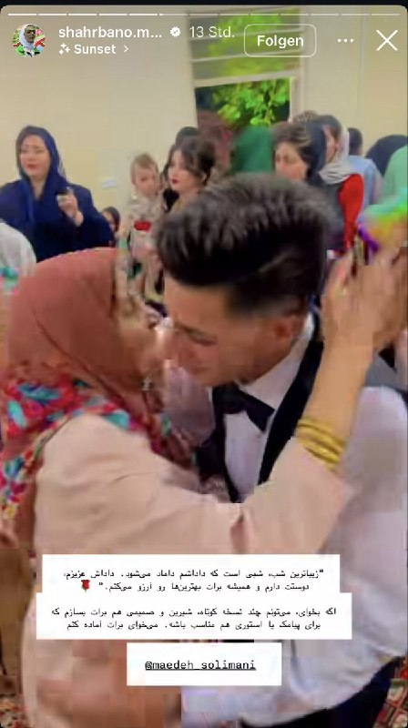

رفتم دعوای خواهران منصوریانو پیگیری کنم
و پیام تبریکش به داداشش رو دیدم

@Dirty_Kids 👻

## Dirty_Kids — post 391894

⁨
آموزش سالاد سیب زمینی 🥔
حضور سیب زمینی در هر غذایی برای من دلچسبه ، نمیدونم چی داری تو خودت که انقد جذابی 📿

@Dirty_Kids 👻

## Dirty_Kids — post 391888

زحمت کشیدم و مجموعه‌‌پستی به روایت تصویر از حال و هوای این لحظات عررزشی‌های قحبه و کله‌ی کیری‌شون براتون می‌گم تا روح و روان‌تون به قدر کافی شاد شه:

@Dirty_Kids 👻

## Hranews — post 113587

  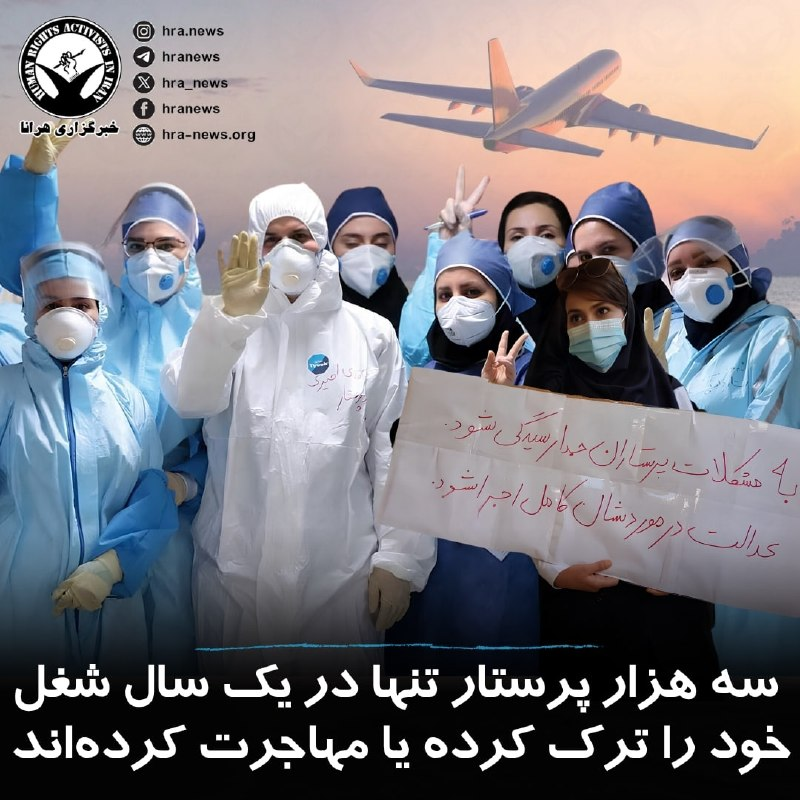

معاون پرستاری وزارت بهداشت، از ترک خدمت، استعفا یا مهاجرت بیش از سه هزار #پرستار در سال گذشته خبر داد. وی کمبود نیروی انسانی را مهم‌ترین چالش حوزه پرستاری دانست و هشدار داد که این وضعیت می‌تواند بر کیفیت خدمات درمانی و امنیت نظام سلامت تاثیر بگذارد.

عباس عبادی خاطرنشان کرد که تداوم کمبود پرستار می‌تواند پیامدهایی همچون فرسودگی شغلی، افزایش خطاهای درمانی، افزایش مرگ‌ومیر بیماران و کاهش کیفیت خدمات سلامت را به همراه داشته باشد. وی با بیان اینکه امنیت نظام سلامت در معرض تهدید قرار گرفته است، تاکید کرد که حل مشکلات حوزه پرستاری تنها به افزایش پرداخت‌ها محدود نمی‌شود و باید بر حفظ و ماندگاری نیروی انسانی، بهبود شرایط کاری و جبران کمبود نیرو تمرکز شود.

↘️
@hranews_bot تماس ✉️ -  @Hranews  کانال هرانا 🆑

## Hranews — post 113586

  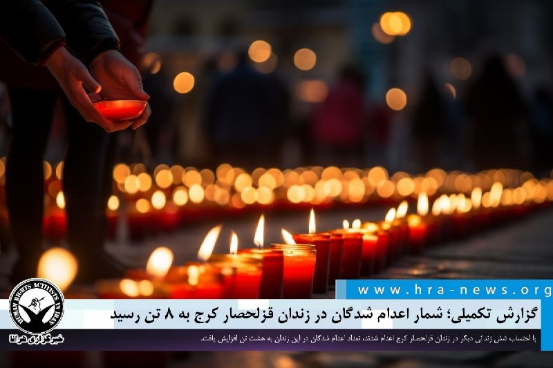

گزارش تکمیلی؛ شمار اعدام شدگان در زندان قزلحصار کرج به ۸ تن رسید

❗️
❗️
❗️
❗️
❗️– با احتساب شش زندانی دیگر که سحرگاه امروز شنبه ۲۳ خردادماه، در زندان قزلحصار کرج #اعدام شدند، تعداد اعدام شدگان روز جاری در این زندان به هشت تن افزایش یافت.

به گزارش خبرگزاری هرانا، ارگان خبری مجموعه فعالان حقوق بشر در ایران، امروز شنبه ۲۳ خرداد ۱۴۰۵، هشت زندانی در زندان قزلحصار کرج اعدام شدند.

علاوه بر اجرای حکم سیداکبر بنی‌هاشم و امیرعباس دکاوند که پیشتر از بابت اتهام قتل به اعدام محکوم شده بودند، شش زندانی دیگر نیز با اتهام مشابه در این زندان به چوبه دار آویخته شدند. احراز هویت این شش زندانی توسط هرانا همچنان در دست بررسی است.

ادامه مطلب

↘️
@hranews_bot تماس ✉️ -  @Hranews  کانال هرانا 🆑

## Hranews — post 113585

  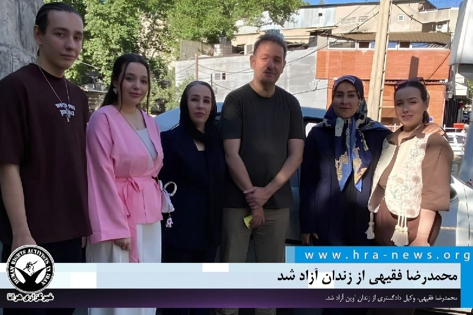

محمدرضا فقیهی، وکیل دادگستری از زندان آزاد شد

❗️
❗️
❗️
❗️
❗️ – محمدرضا فقیهی، وکیل دادگستری، امروز شنبه از زندان اوین آزاد شد.

به گزارش خبرگزاری هرانا، ارگان خبری مجموعه فعالان حقوق بشر در ایران، محمدرضا فقیهی از زندان آزاد شد.

آزادی این وکیل دادگستری، امروز شنبه ۲۳ خردادماه، از زندان اوین صورت گرفته است.

ادامه مطلب

#محمدرضا_فقیهی

↘️
@hranews_bot تماس ✉️ -  @Hranews  کانال هرانا 🆑

## alonews — post 127661

  <a href="telegram/content/alonews_127661_1781367088.webm" target="_blank">🎬 Download video</a>

🔴فوری / الحدث به نقل از منابع آگاه:
منابع حاکی از آن است که یک هیئت ایرانی، شامل وزیر امور خارجه، فردا وارد پاکستان خواهد شد.

🔴هیئت ایرانی بر مذاکرات فنی مربوط به این توافق نظارت خواهد داشت.

✅ @AloNews خبر جنگ

## alonews — post 127660

  <a href="telegram/content/alonews_127660_1781367088.webm" target="_blank">🎬 Download video</a>

👈ادعای شبکه الجزیره به نقل از سخنگوی وزارت خارجه پاکستان گزارش داد که مراسم «امضای الکترونیکی» توافق میان آمریکا و جمهوری اسلامی یکشنبه ۲۳ خرداد برگزار خواهد کرد. به گفته او، پاکستان میزبان این مراسم خواهد بود و مراسم از طریق «ارتباط ویدیویی و آنلاین» برگزار می‌شود

✅ @AloNews خبر جنگ

## alonews — post 127659

  <a href="telegram/content/alonews_127659_1781367089.webm" target="_blank">🎬 Download video</a>

👈 سوخت‌رسان های آمریکایی همچنان تو خلیج فارس درحال فعالیت هستند

✅ @AloNews خبر جنگ

## alonews — post 127658

  <a href="telegram/content/alonews_127658_1781367089.webm" target="_blank">🎬 Download video</a>

👈سفیر ایران در مکزیک: ایران و آمریکا دوستان خوبی خواهند بود، اگر آمریکا منافع اسرائیل را نادیده بگیرد

🔴طبق گزارش پولیتیکو، ابوالفضل پسندیده، سفیر ایران در مکزیک، در مصاحبه‌ای در نمایشگاه طرفداران جام جهانی در شهر مکزیکوسیتی، حضور تیم ملی ایران در خاک آمریکا را نشانه‌ای از حسن نیت و تمایل به صلح دانسته است.

🔴سفیر ایران تأکید کرد که علی‌رغم جنگ و مشکلاتی مانند عدم صدور ویزا برای برخی اعضای کادر فنی تیم، ایران تیمش را به آمریکا فرستاده تا پیام صلح بدهد. او گفت: «حضور ما در آمریکا در زمان جنگ، سیگنالی است که ما طرفدار صلح هستیم.»

🔴ابوالفضل پسندیده خطاب به دونالد ترامپ گفت: «اگر آمریکا چشم خود را بر منافع اسرائیل ببندد، ایران و آمریکا می‌توانند دوستان خیلی خوبی باشند.»

✅ @AloNews خبر جنگ

## alonews — post 127657

  <a href="telegram/content/alonews_127657_1781367089.webm" target="_blank">🎬 Download video</a>

👈سخنگوی مرکز توسعه تجارت الکترونیک وزارت صمت: درگاه برخی فروشگاه‌های آنلاین متخلف در حوزه دخانیات، گردشگری طلا و مکمل‌های دارویی و فروش VPN مسدود شد.

✅ @AloNews خبر جنگ

## alonews — post 127656

  <a href="telegram/content/alonews_127656_1781367090.mp4" target="_blank">🎬 Download video</a>

👈نبویان : زمان توافق نهایی تو متن مشخص نیست که چند بار قابل تمدیده

✅ @AloNews خبر جنگ

## alonews — post 127655

  <a href="telegram/content/alonews_127655_1781367092.webm" target="_blank">🎬 Download video</a>

👈تتر هم اکنون 171,000 تومان

✅ @AloNews خبر جنگ

## alonews — post 127653

  <a href="telegram/content/alonews_127653_1781367092.webm" target="_blank">🎬 Download video</a>

👈دو بلاگر ایرانی ساکن ترکیه و دبی که اشاعه فحشا و فعالیت سیاسی میکردند به واسطه دوست شدن با دو آقازاده(پسر) براحتی به ایران آمدند و درحال فعالیت هستند

✅ @AloNews خبر جنگ

## alonews — post 127652

  <a href="telegram/content/alonews_127652_1781367092.webm" target="_blank">🎬 Download video</a>

👈الجزیره به نقل از یک مقام ارشد آمریکایی: معتقدیم که ما به توافق محکمی با ایران دست‌ یافته‌ایم و اظهارات امروز مقامات پاکستانی این موضوع را نشان می‌دهد

✅ @AloNews خبر جنگ

## alonews — post 127651

  <a href="telegram/content/alonews_127651_1781367092.webm" target="_blank">🎬 Download video</a>

👈 سخنگوی وزارت خارجه: باید هزینۀ خدماتی که در تنگۀ هرمز ارائه می‌شود را دریافت کنیم

✅ @AloNews خبر جنگ

## alonews — post 127650

  <a href="telegram/content/alonews_127650_1781367093.webm" target="_blank">🎬 Download video</a>

👈به گزارش منابع خبری، دونالد ترامپ روز سه‌شنبه هفته جاری در حاشیه اجلاس گروه ۷ دیدارهای جداگانه‌ای با سران قطر، امارات متحده عربی و مصر برگزار خواهد کرد.

✅ @AloNews خبر جنگ

## alonews — post 127649

  <a href="telegram/content/alonews_127649_1781367093.webm" target="_blank">🎬 Download video</a>

👈وزارت خارجه جمهوری اسلامی ایران: تیم مذاکره‌کننده ما هیچ برنامه‌ای برای سفر به ژنو یا هر مکان دیگری در دو روز آینده ندارد

✅ @AloNews خبر جنگ

## alonews — post 127648

  <a href="telegram/content/alonews_127648_1781367093.webm" target="_blank">🎬 Download video</a>

👈الجزیره: واشنگتن و تهران به تفاهم نزدیک می‌شوند؛ امضای الکترونیکی توافق ظرف ۲۴ ساعت

🔴 الجزیره نوشت: واشنگتن و تهران به تفاهم نزدیک می‌شوند؛ امضای الکترونیکی توافق ظرف ۲۴ ساعت.

🔴 در ساعات اخیر، نشانه‌های دیپلماتیک مربوط به مذاکرات جاری میان ایالات متحده و ایران افزایش یافته است

✅ @AloNews خبر جنگ

## alonews — post 127647

  <a href="telegram/content/alonews_127647_1781367093.webm" target="_blank">🎬 Download video</a>

👈دو حملهِ هوایی به شهر کوثریه الرز تو جنوب لُبنان

✅ @AloNews خبر جنگ

## alonews — post 127646

  <a href="telegram/content/alonews_127646_1781367094.mp4" target="_blank">🎬 Download video</a>

👈نخست‌وزیر کانادا مارک کارنی:
گروه هفت جهان را اداره نمی‌کند. این گروه مهم است، اما جهان را اداره نمی‌کند

✅ @AloNews خبر جنگ

## alonews — post 127645

  <a href="telegram/content/alonews_127645_1781367096.webm" target="_blank">🎬 Download video</a>

👈وزیر انرژی آمریکا: تحریم‌ها علیه ایران می‌تواند تا حدی برداشته شود؛ اما نه به طور دائمی و نه کاملاً

🔴اگر توافقی حاصل شود و ایران شروط اولیه را اجرا کند

✅ @AloNews خبر جنگ

## alonews — post 127644

👈ترامپ از طریق Truth Social:
تبریک به تیم آمریکا برای پیروزی بزرگشان، ۴-۱، مقابل تیم بسیار خوب پاراگوئه. ادامه دهید!

✅ @AloNews خبر جنگ

## alonews — post 127643

  <a href="telegram/content/alonews_127643_1781367096.webm" target="_blank">🎬 Download video</a>

👈رسانه‌های سعودی: هیأتی ایرانی به ریاست وزیر امور خارجه، فردا وارد پاکستان خواهد شد

✅ @AloNews خبر جنگ

## alonews — post 127642

👈مهر: ۶ میلیارد دلار از دارایی‌های ایران در قطر باید صرف امور بشردوستانه شود. همچنین مقرر شده است که نحوه هزینه‌کرد این منابع همچنان تابع همان چارچوب توافق قبلی باشد

✅ @AloNews خبر جنگ

---
📅 بروزرسانی: 1405/03/23 18:09
---

## VahidOOnLine — post 245318

  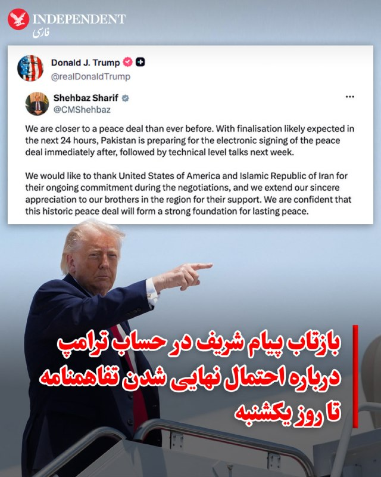

♦️ دونالد ترامپ، رئیس‌جمهوری ایالات متحده روز شنبه ۲۳ خرداد، پیام شهباز شریف، نخست‌وزیر پاکستان، درباره احتمال نهایی شدن تفاهمنامه تهران و واشنگتن تا روز یکشنبه را بازنشر کرد.

شریف در این پیام با تاکید بر این‌که دستیابی به صلح از هر زمان دیگری نزدیک‌تر شده است، اعلام کرد که با توجه به احتمال نهایی شدن متن تفاهمنامه ظرف ۲۴ ساعت آینده، پاکستان برای «امضای الکترونیکی» و آغاز گفتگوهای فنی آماده می‌شود.
‌🇸🇦 Indypersian

🤖 @VahidOOnLine

## VahidOOnLine — post 245317

  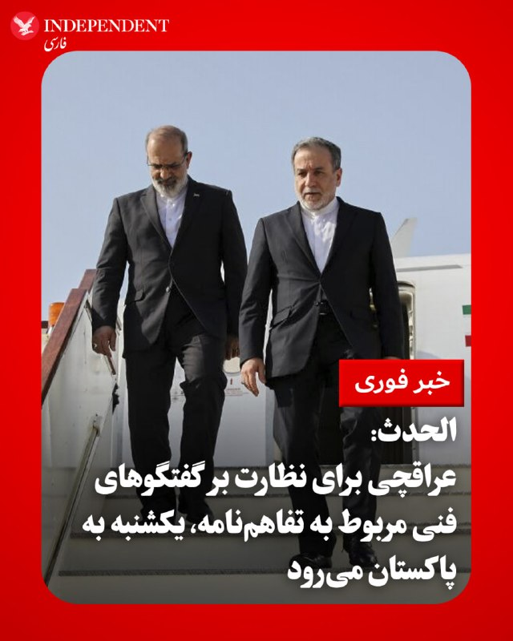

♦️ شبکه خبری الحدث، روز شنبه ۲۳ خرداد، به نقل از منابع خود گزارش داد که عباس عراقچی، وزیر امور خارجه جمهوری اسلامی فردا، یکشنبه به اسلام‌آباد سفر خواهد کرد. در این گزارش آمده است که این سفر به منظور «نظارت بر گفتگوهای فنی مربوط به تفاهم‌نامه» انجام می‌شود.
‌🇸🇦 Indypersian

🤖 @VahidOOnLine

## VahidOOnLine — post 245316

  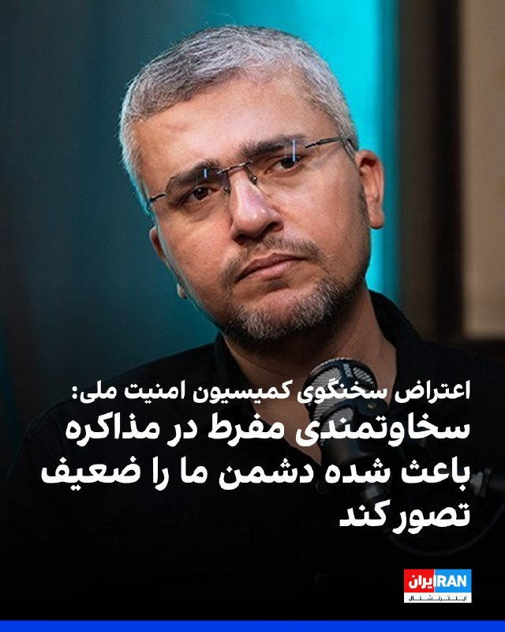

ابراهیم رضایی، سخنگوی کمیسیون امنیت ملی مجلس جمهوری اسلامی، در انتقاد از رویکرد جمهوری اسلامی در مذاکرات با آمریکا، در شبکه اجتماعی ایکس نوشت که «سخاوتمندی مفرط» در مذاکرات، آمریکا تصور کند حکومت ایران ضعیف است.

او نوشت: «سخاوتمندی مفرط در پای میز مذاکره، محاسبات دشمن را عوض کرد تا فکر کند که ایران ضعیف است و می‌تواند آن را ببلعد.»
‌🏁 🇬🇧 IranintlTV

🤖 @VahidOOnLine

## VahidOOnLine — post 245315

  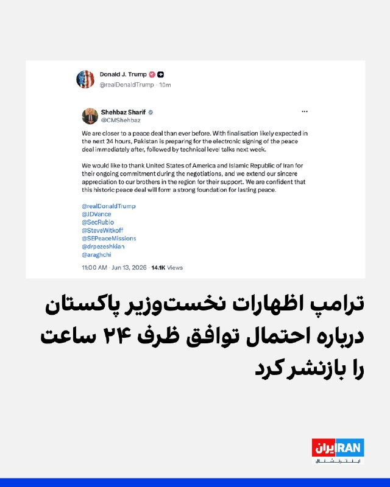

دونالد ترامپ، رییس‌جمهوری آمریکا، شنبه ۲۳ خرداد، در شبکه اجتماعی تروت سوشال، پستی از شهباز شریف، نخست‌وزیر پاکستان، را بازنشر کرد که در آن به احتمال دستیابی تهران و واشینگتن به یک تفاهم طی ۲۴ ساعت آینده اشاره شده بود.

شهباز شریف در شبکه اجتماعی ایکس نوشته بود که تهران و واشینگتن بیش از هر زمان دیگری به یک تفاهم‌نامه صلح نزدیک شده‌اند و احتمال نهایی شدن آن در ۲۴ ساعت آینده وجود دارد.

نخست‌وزیر پاکستان همچنین اعلام کرد که پاکستان برای امضای الکترونیکی تفاهم‌نامه صلح میان آمریکا و جمهوری اسلامی، بلافاصله پس از نهایی شدن آن، آماده می‌شود.

ترامپ این اظهارات را بدون توضیح اضافی در تروت سوشال بازنشر کرد.
‌🏁 🇬🇧 IranintlTV

🤖 @VahidOOnLine

## VahidOOnLine — post 245314

  <a href="telegram/content/VahidOOnLine_245314_1781361595.mp4" target="_blank">🎬 Download video</a>

ایرانیان ملبورن در استرالیا روز شنبه برای زادروز مجیدرضا رهنورد، جانباخته خیزش انقلابی ۱۴۰۱، و ۴۰ هزار جاویدنام انقلاب ملی پرچم شیروخورشید را برای ۴۰ هزار ثانیه برافراشتند.
‌🏁 🇬🇧 IranintlTV

🤖 @VahidOOnLine

## VahidOOnLine — post 245313

  <a href="telegram/content/VahidOOnLine_245313_1781361597.mp4" target="_blank">🎬 Download video</a>

♦️ جمعه شب، ۲۲ خرداد، سیل خروشان هواداران تیم ملی فوتبال برزیل به میدان تایمز نیویورک سرازیر شد تا در آستانه نخستین بازی تیم‌شان در جام جهانی ۲۰۲۶، شور و هیجان فوتبالی را به اوج برسانند.

هواداران با تن‌پوش‌های سبزو‌زردِ قناری، گرد هم آمدند تا پیش از بازی افتتاحیه خود در روز شنبه (۲۳ خرداد) مقابل مراکش در ورزشگاه نیویورک/نیوجرسی، برای سلسائو آرزوی موفقیت کنند. تنها یک روز پس از آنکه مکزیکوسیتی در بازی افتتاحیه (پنجشنبه ۲۱ خرداد) میزبان رقابت‌ها بود و مکزیک توانست با نتیجه ۲ بر ۰ آفریقای جنوبی را شکست دهد، حال و هوای جام جهانی به وضوح در بزرگ‌ترین شهر ایالات متحده لمس می‌شد.

در این تجمع، طبل‌نوازان می‌نواختند و جمعیت با رقص و پایکوبی و سر دادن سرودهای حماسی، برد پرگلی را برابر مراکش در گام نخست پیش‌بینی می‌کردند. بیشتر هوادارانی که خبرگزاری رویترز با آن‌ها گفتگو کرده، برای تماشای این رقابت‌ها از برزیل به آمریکا سفر کرده بودند، در حالی که برخی دیگر مقیم ایالات متحده بودند. هدف همگی آن‌ها یکی بود: حمایت از برزیل به امید فتح ششمین جام و ثبت یک رکورد تاریخی.
‌🇸🇦 Indypersian

🤖 @VahidOOnLine

## VahidOOnLine — post 245312

  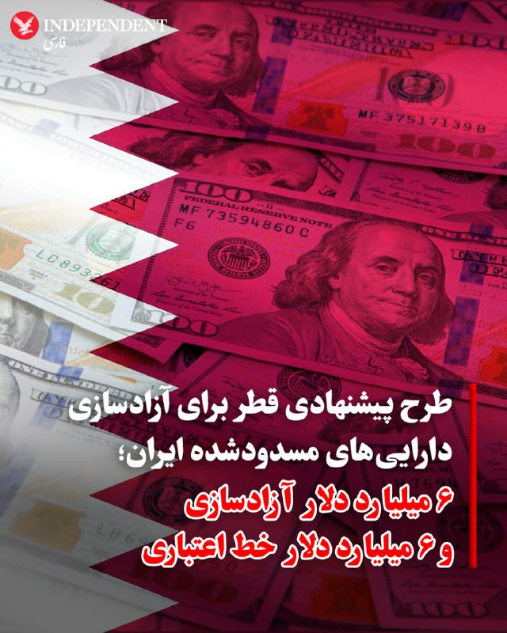

♦️ خبرگزاری مهر، متعلق به سازمان تبلیغات اسلامی، روز شنبه ۲۳ خرداد گزارشی از جزئیات طرح پیشنهادی قطر برای آزادسازی دارایی‌های ایران منتشر کرد. بر اساس این گزارش حجم دارایی‌های بلوکه‌شده ایران در خارج از کشور حدود ۲۴ میلیارد دلار برآورد می‌شود. در جریان مذاکرات، پیشنهاد تهران برای آزادسازی گام‌به‌گام این منابع توسط آمریکا رد شد. مهر می‌نویسد که برای رفع این بن‌بست، قطر طرحی ۱۲ میلیارد دلاری ارائه کرد که شامل آزادسازی ۶ میلیارد دلار از دارایی‌های ایران در قطر و ۶ میلیارد دلار دیگر در قالب خط اعتباری است.

در همین راستا، طی سفر محمدباقر قالیباف و عباس عراقچی به دوحه، پیش‌نویس دو یادداشت تفاهم میان ایران و قطر تهیه شده که اجرای آن‌ها مشروط به نهایی شدن توافق جمهوری اسلامی و آمریکا در چارچوب توافق اسلام‌آباد است.

طبق این طرح، ۶ میلیارد دلار دارایی ایران در قطر (مربوط به توافق سال ۲۰۲۳) همچنان تابع همان چارچوب قبلی و صرفا برای امور بشردوستانه خواهد بود. این منابع در حساب سه بانک ایرانی نزد دو بانک قطری است و برداشت مستقیم از آن‌ها ممکن نیست.
‌🇸🇦 Indypersian

🤖 @VahidOOnLine

## VahidOOnLine — post 245311

  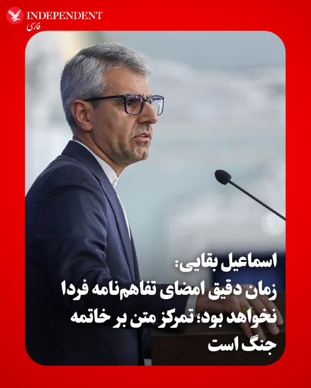

♦️ اسماعیل بقایی، سخنگوی وزارت امور خارجه، روز شنبه ۲۳ خرداد با تشریح آخرین وضعیت مذاکرات اعلام کرد: «یادداشت تفاهم اسلام‌آباد که در حال پیگیری است، به طور مشخص بر خاتمه جنگ تمرکز دارد و در این مرحله تصمیم بر این شده که هیچ بحثی در مورد موضوع هسته‌ای صورت نگیرد.»

بقایی درباره گمانه‌زنی‌های مربوط به زمان امضای این سند گفت: «درباره زمان دقیق امضای تفاهم‌نامه باید منتظر بمانیم؛ اگرچه این رویداد فردا نخواهد بود، اما احتمال اینکه ظرف روزهای آتی رقم بخورد کاملا منتفی نیست.»

بقایی ایالات متحده را به «تزلزل و بی‌ثباتی در اظهارنظرها» متهم کرد و گفت: «به دلیل تزلزل و عدم ثبات طرف مقابل در اظهارنظرها، باید در هرگونه موضع‌گیری درباره این روند محتاط باشیم.»
‌🇸🇦 Indypersian

🤖 @VahidOOnLine

## VahidOOnLine — post 245310

  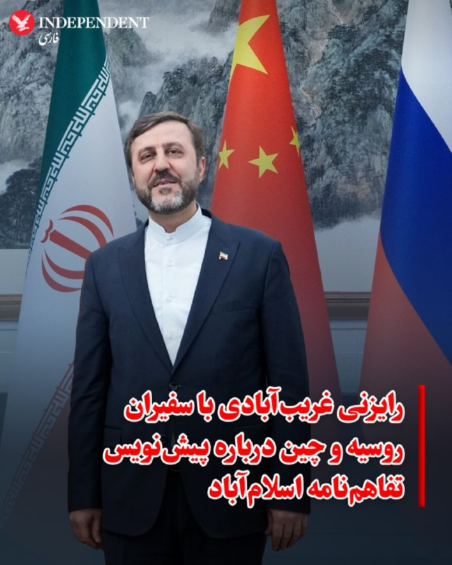

♦️ کاظم غریب‌آبادی، معاون وزیر امور خارجه جمهوری اسلامی، روز شنبه ۲۳ خرداد، در تهران با سفیران روسیه و چین تشکیل جلسه داد تا درباره «آخرین تحولات» مربوط به پیشنهاد توافق احتمالی با ایالات متحده گفتگو کند.

به گزارش ایسنا، در این نشست مشترک سه‌جانبه، طرفین به تبادل نظر و رایزنی درباره آخرین وضعیت پیش‌نویس یادداشت تفاهم اسلام‌آباد پرداختند. غریب‌آبادی در بیانیه‌ای پس از این دیدار تاکید کرد: «شراکت راهبردی میان ایران، چین و روسیه و همچنین هماهنگی و همکاری میان این سه کشور با قدرت ادامه خواهد یافت.»

این رایزنی‌های دیپلماتیک در شرایطی صورت می‌گیرد که طی روزهای گذشته، مقامات آمریکا، ایران و پاکستان همگی بیانیه‌هایی را در خصوص وجود یک یادداشت تفاهم میان تهران و واشنگتن صادر کرده‌اند؛ تفاهم‌نامه‌ای که جزئیات و مفاد دقیق آن هنوز به طور رسمی و عمومی منتشر نشده است.
‌🇸🇦 Indypersian

🤖 @VahidOOnLine

## VahidOOnLine — post 245309

  <a href="telegram/content/VahidOOnLine_245309_1781361601.mp4" target="_blank">🎬 Download video</a>

ایرانیان اسپانیا روز شنبه به یاد جانباختگان راه آزادی در مادرید تجمع کرده و پرچم شیروخورشید را بالا بردند.
‌🏁 🇬🇧 IranintlTV

🤖 @VahidOOnLine

## VahidOOnLine — post 245308

  

اسماعیل بقائی، سخنگوی وزارت خارجه جمهوری اسلامی در نشستی در همدان، گفت: «تفاهم نامه اسلام‌آباد که در حال پیگیری است، بر خاتمه جنگ در همه جبهه‌ها، از جمله لبنان تمرکز دارد و در این مرحله تصمیم بر این شده که بحثی در مورد موضوع هسته‌ای نشود.»

او ادامه داد: «درباره زمان دقیق امضا باید منتظر بمانیم؛ اگرچه فردا نخواهد بود اما احتمال اینکه در روزهای آتی این اتفاق رقم بخورد، منتفی نیست.»

بقائی افزود: «به دلیل تزلزل طرف مقابل در هرگونه اظهارنظر درباره این روند باید محتاط باشیم.»

او اضافه کرد: «طرف مقابل به هیچ عنوان عملکرد مناسبی در ایفای تعهدات خود نداشته و ما نیز باید متناسب با آن پیش‌بینی‌های لازم را انجام دهیم.»
‌🏁 🇬🇧 IranintlTV

🤖 @VahidOOnLine

## VahidOOnLine — post 245307

  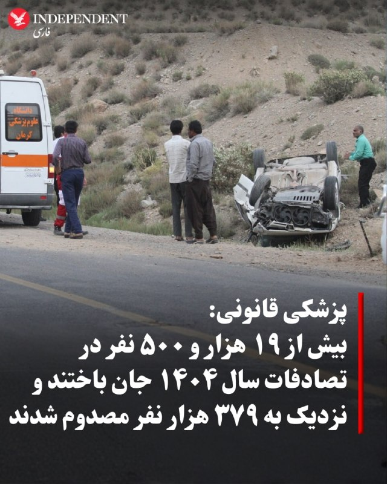

♦️سازمان پزشکی قانونی اعلام کرد در سال ۱۴۰۴، ۱۹ هزار و ۵۴۰ نفر در حوادث رانندگی جان خود را از دست داده‌اند؛ آماری که نسبت به سال قبل تغییر محسوسی نداشته و همچنان از تداوم بحران تلفات جاده‌ای حکایت دارد.
بر اساس این گزارش، از مجموع جان‌باختگان، ۱۵ هزار و ۶۶۰ نفر مرد و سه هزار و ۸۸۰ نفر زن بوده‌اند. استان‌های تهران، فارس و سیستان و بلوچستان بیشترین آمار فوتی و استان‌های ایلام، کهگیلویه و بویراحمد و قم کمترین تعداد قربانیان را ثبت کرده‌اند.
بیشترین تلفات با ۱۳ هزار و ۳۸۲ فوتی در محورهای برون‌شهری رخ داده است. همچنین در تصادفات درون‌شهری ۴ هزار و ۹۷۹ نفر و در محورهای روستایی هزار و ۷۳ نفر جان خود را از دست داده‌اند.
آمارها نشان می‌دهد شهریورماه با ثبت ۲ هزار و ۶۲ فوتی مرگبارترین ماه سال و دی‌ماه با هزار و ۱۷۰ فوتی کم‌تلفات‌ترین ماه بوده است.
در همین حال، تعداد مصدومان حوادث رانندگی در سال گذشته به ۳۷۸ هزار و ۷۲۹ نفر رسید که نسبت به سال قبل ۰.۷ درصد کاهش داشته است. همچنین آمار فوتی‌های اسفندماه با کاهش ۴.۸ درصدی و تعداد مصدومان این ماه با کاهش ۳۱.۷ درصدی نسبت به اسفند سال قبل همراه بوده است.
‌🇸🇦 Indypersian

🤖 @VahidOOnLine

## VahidOOnLine — post 245306

  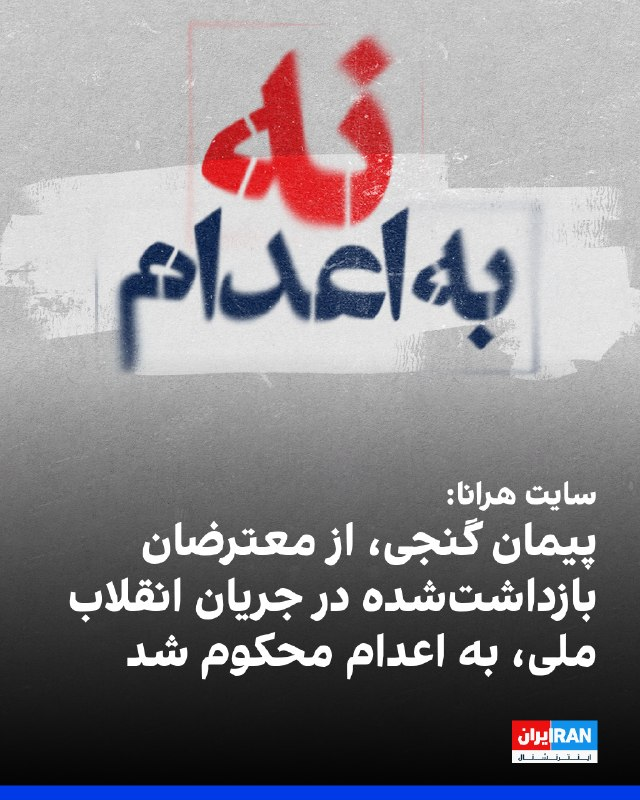

سایت هرانا گزارش داد پیمان گنجی، از بازداشت‌شدگان انقلاب ملی ایرانیان در دی‌ماه ۱۴۰۴، از سوی شعبه ۲۶ دادگاه انقلاب تهران به اتهام «محاربه» به اعدام محکوم شده است.

بر اساس این گزارش، این حکم به ریاست ایمان افشاری صادر شده و پرونده گنجی هم‌اکنون در شعبه ۹ دیوان عالی کشور در دست بررسی است.

هرانا به نقل از یک منبع آگاه نوشت در این پرونده، «سوزاندن اموال عمومی» به‌عنوان مصداق اتهام منتسب به گنجی مطرح شده است.

پیمان گنجی ۳۳ ساله است و پس از بازداشت در دی‌ماه ۱۴۰۴ به زندان تهران بزرگ منتقل شد.
‌🏁 🇬🇧 IranintlTV

🤖 @VahidOOnLine

## WithYashar — post 14722

الحدث به نقل از منابع آگاه:

منابع حاکی از آن است که یک هیئت ایرانی، شامل وزیر امور خارجه عراقچی، فردا وارد پاکستان خواهد شد.
هیئت ایرانی بر مذاکرات فنی مربوط به این توافق نظارت خواهد داشت.
@withyashar

## WithYashar — post 14721

  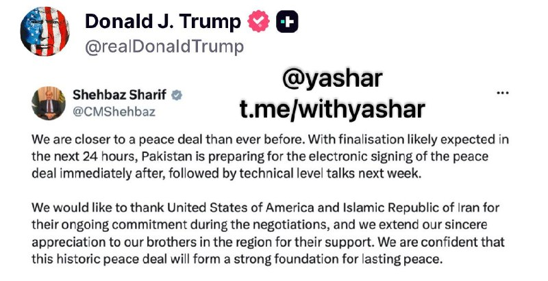

ترامپ توییت شهباز شریف نخست وزیر پاکستان را در‌تروث منتشر کرد :
شهباز شریف: «ما اکنون بیش از هر زمان دیگری به دستیابی به یک توافق صلح نزدیک شده‌ایم. با توجه به اینکه انتظار می‌رود این توافق طی ۲۴ ساعت آینده نهایی شود، پاکستان در حال آماده‌سازی برای امضای الکترونیکی توافق صلح بلافاصله پس از نهایی شدن آن است و پس از آن نیز گفت‌وگوهای فنی و کارشناسی در هفته آینده برگزار خواهد شد. مایلیم از ایالات متحده آمریکا و جمهوری اسلامی ایران به دلیل تعهد و همکاری مستمرشان در طول مذاکرات قدردانی کنیم و همچنین از برادران خود در منطقه بابت حمایت‌هایشان صمیمانه سپاسگزاری نماییم. ما اطمینان داریم که این توافق صلح تاریخی، بنیانی محکم برای صلحی پایدار و ماندگار فراهم خواهد کرد.»
@withyashar

## WithYashar — post 14720

کانال های خبرگزاری فارس، بابک زنجانی، صرافی نوبیتکس، والکس، رمزینکس و بیت‌پین که تو یوتیوب فعالیت میکردن، به علت تحریمای آمریکا همگی مسدود شدن
@withyashar

## WithYashar — post 14719

وزارت خارجه آمریکا بار دیگر درخواست ویزای مهدی محمدنبی سرپرست تیم جمهوری اسلامی و مهدی تاج رییس فدراسیون فوتبال رو رد کرد.
@withyashar

## WithYashar — post 14718

  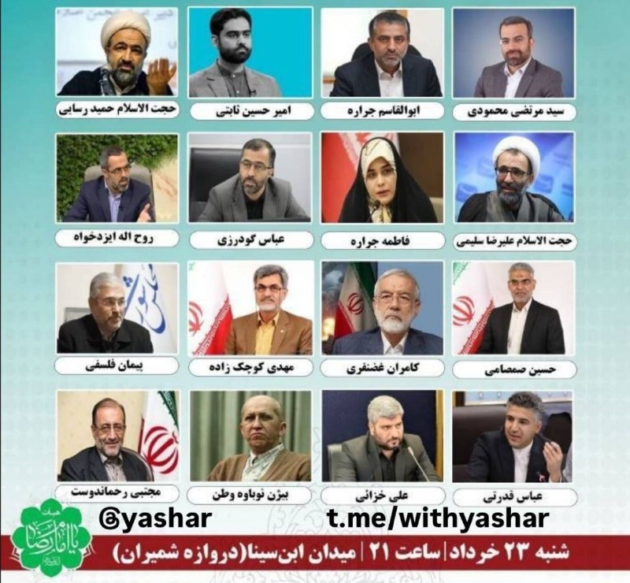

16 تا نماینده مجلس به همراه قشر تندرو امشب جلوی وزارت خارجه تجمع اعتراضی برگزار میکنن و به روند مذاکرات اعتراض میکنن‌.
@withyashar

## WithYashar — post 14717

بقائی، سخنگوی وزارت خارجه:
درباره زمان دقیق امضای تفاهم‌نامه باید منتظر بمونیم؛ اگرچه فردا نیست اما احتمال اینکه در روزهای آتی این اتفاق رقم بخوره منتفی نیست.
@withyashar

## mwarmonitor — post 10830

  

🔴معاون نخست‌وزیر و وزیر امور خارجه پاکستان، سناتور محمد اسحاق دار، امروز گفت‌وگوی تلفنی‌ای با وزیر امور خارجه پادشاهی عربستان سعودی، شاهزاده فیصل بن فرحان، انجام داد.

🔹دو طرف از رسیدن مذاکرات ایالات متحده آمریکا و ایران به مرحله نهایی استقبال کردند؛ مرحله‌ای که قرار است مراسم امضای الکترونیکی آن فردا برگزار شود. آن‌ها ابراز امیدواری کردند که این تحول مهم به صلح و ثبات پایدار در منطقه کمک کند.

🔹وزیر خارجه عربستان از تلاش‌های مستمر و پایدار پاکستان در حمایت از میانجی‌گری و گفت‌وگو در طول این روند قدردانی کرد.

🔹همچنین دو طرف درباره نشست آتی «چهارجانبه منطقه‌ای وزرای خارجه (R-4)» که قرار است اواخر این ماه در مصر برگزار شود، گفت‌وگو کردند.

@mwarmonitor

## mwarmonitor — post 10829

  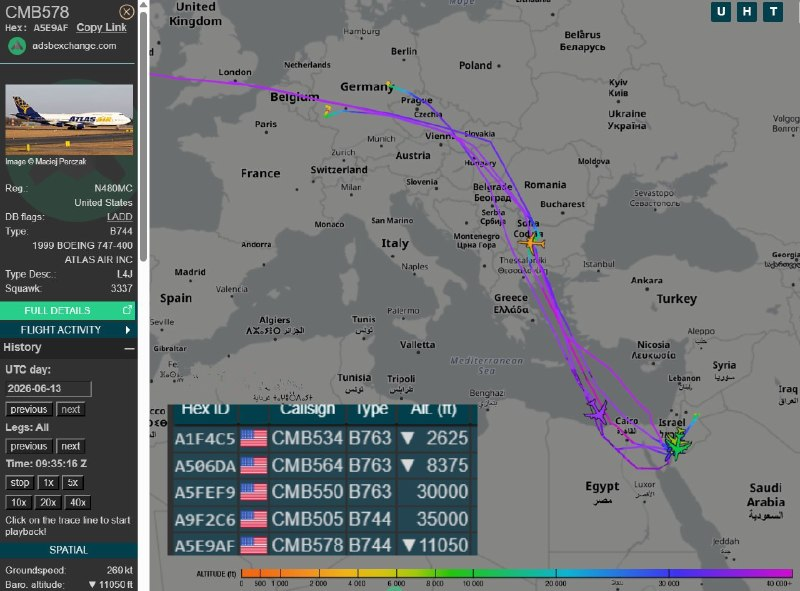

✈️ از صبح امروز، تعداد قابل‌توجهی پرواز باری چارترِ فرماندهی ترابری ایالات متحده (U.S. Transportation Command / USTRANSCOM) در فرودگاه ملک حسین در عقبهِ اردن (King Hussein International Airport) به زمین نشسته‌اند.

✈️ CMB534
✈️ CMB550
✈️ CMB564
✈️ CMB578

@mwarmonitor

## mwarmonitor — post 10828

🚨رسانه‌های اسرائیلی: حادثه‌ای غیرعادی در آسمان مجارستان: یک هواپیمای اسرائیلی ارتباط خود را با کنترل ترافیک هوایی از دست داد. @mwarmonitor

## mwarmonitor — post 10827

🔴مارک لوین: ما اینجا با کسی هستیم که من او را «ژنرالِ آمریکا» می‌نامم؛ ژنرال چهارستاره بازنشسته ارتش، جک کین. شما او را بارها در این شبکه دیده‌اید و البته دلیل خوبی هم دارد. با تغییر اوضاع و دگرگونی در روند مذاکرات، ژنرال کین، نظر شما درباره وضعیت فعلی چیست؟ ابتدا اعلام می‌شود که به توافق رسیده‌ایم، سپس اعلام می‌شود توافقی که آن‌ها از آن صحبت می‌کنند، آن توافق مدنظر نیست و در مورد آن دروغ می‌گویند. شاید توافق دیگری داشته باشیم و بعد اگر تفاهم‌نامه (MOU) نهایی و امضا شود، ۶۰ روز دیگر برای مذاکره و مسائل دیگر زمان هست... برداشت شما از اتفاقاتی که در حال حاضر رخ می‌دهد چیست؟

🔰ژنرال جک کین: خب، مشخصاً رئیس‌جمهور مسیر دیپلماتیک را انتخاب کرده است و مطمئناً این مسیر چالش‌برانگیز خواهد بود. من کاملاً با محتوای صحبت‌هایی که در تک‌گویی (مونولوگ) خود مطرح کردید، موافقم.
ما با یک رژیم شیطانی و ایدئولوژی‌محور مواجه هستیم که اولویت اولش بقا است و در مرتبه دوم، به شکل بنیادین به ایدئولوژی خود متعهد است. این مسئله باعث می‌شود دو سؤال مهم ایجاد شود:
آیا آن‌ها اصلاً توانایی دستیابی به یک توافق را دارند؟
آیا هرگز به اصول و مفاد چنین توافقی پایبند خواهند بود و آن را اجرا خواهند کرد؟
دلیل بدبینی ما به این موضوع همین است؛ چرا که این کار با ایدئولوژی آن‌ها همخوانی ندارد. این واقعیتی است که با آن روبرو هستیم و نشان می‌دهد که چالش در این مسیر دیپلماتیک چقدر جدی است. من و شما گزینه دیگر را ترجیح می‌دادیم؛ یعنی تضعیف آن‌ها با تمام توان نظامی ممکن. اینکه آن‌ها را از نظر نظامی و اقتصادی چنان ضعیف کنیم که در مسیر فروپاشی تدریجی قرار بگیرند، تا جایی که مردم خودشان بتوانند به مرور زمان اقدام کنند و رهبری و رژیم دیگری را جایگزین نمایند.
اما این مسیری نیست که اکنون در آن قرار داریم؛ ما در مسیر دیگری هستیم و این مسیر قطعاً چالش‌برانگیز خواهد بود. با این حال، به عقیده من رئیس‌جمهور تن به یک توافق بد نخواهد داد و به همین دلیل است که اگر قرار باشد کسی با ایرانی‌ها توافق کند، آن شخص خود اوست. ساختار این توافق باید فراتر از دوران ریاست‌جمهوری او ادامه داشته باشد و باید دارای ضمانت‌های اجرایی باشد تا ایرانی‌ها را نسبت به اصول توافق پاسخگو نگه دارد.
قطعاً این کار بسیار چالش‌برانگیز خواهد بود. نگاه کنید با چه کسانی طرف هستیم؛ ایرانی‌ها در این زمینه ثبات دارند که بخشی از حکومتشان می‌گوید «موافقم» و بخش دیگر می‌گوید «موافق نیستم». وقتی به رفتار و اقدامات آن‌ها نگاه می‌کنیم — که عملکردشان بسیار بیشتر از حرف‌هایشان هویت واقعی آن‌ها را نشان می‌دهد — می‌بینیم که از زمان آتش‌بس در ۸ آوریل چه کارهایی انجام داده‌اند: حملات مکرر در تنگه هرمز، حمله به پایگاه‌های آمریکا، و حمله به متحدان و شرکای ما؛ که همگی نقض آشکار آتش‌بس هستند.
و بعد نگاه کنید در لبنان چه می‌گذرد؛ آن‌ها حزب‌الله را در داخل لبنان آزاد گذاشته‌اند تا بیش از ۲۰۰۰ راکت و پهپاد را به شمال اسرائیل شلیک کند که این امر منجر به تخلیه آن شهرها و روستاها شده و بیش از ۳۰۰ مجروح برجای گذاشته است. فراتر از این‌ها، ایران ۱۱ موشک بالستیک به سمت اسرائیل شلیک کرده است. تمام این اقدامات، نقض کامل و آشکار آتش‌بس به شمار می‌روند.

@mwarmonitor

## mwarmonitor — post 10826

  <a href="telegram/content/mwarmonitor_10826_1781361606.mp4" target="_blank">🎬 Download video</a>

🎬 Video

## mwarmonitor — post 10825

🚨رسانه‌های اسرائیلی: حادثه‌ای غیرعادی در آسمان مجارستان: یک هواپیمای اسرائیلی ارتباط خود را با کنترل ترافیک هوایی از دست داد.

@mwarmonitor

## mwarmonitor — post 10824

🔴ایالات متحده و ایران به گفته مقاماتی که با مذاکرات آشنا هستند، به توافقی برای پایان دادن به جنگ نزدیک شده‌اند. فاکس نیوز

@mwarmonitor

## FoxNewsTwitter — post 342936

  <a href="telegram/content/FoxNewsTwitter_342936_1781361608.mp4" target="_blank">🎬 Download video</a>

Fox News (Twitter/X)

The District Cup Polo Tournament returns to the National Mall as an America250 signature event celebrating one of the oldest team sports.

## FoxNewsTwitter — post 342935

  

Fox News (Twitter/X)

Phil Mickelson is pushing back hard after allegations got him kicked out of his own golf club.

The six-time major winner has retained defamation counsel and says "false rumors" are being spread about an incident involving a female employee at The Farms Golf Club in California.

Club officials say they investigated a misconduct complaint and revoked his membership. Mickelson's attorney says surveillance video will absolve him and that legal action could follow against those spreading misinformation.

The golf legend has played just one LIV Golf event this season while dealing with a personal family health issue.

## FoxNewsTwitter — post 342931

Fox News (Twitter/X)

President Trump's name is being removed from the Kennedy Center after a federal appeals court denied the board's request for an administrative stay.

Crowds gathered outside as workers erected scaffolding to begin removing the signage.

## FoxNewsTwitter — post 342930

‌Fox News (Twitter/X)

👉 Full story here:

## FoxNewsTwitter — post 342929

Fox News (Twitter/X)

TANVI RATNA: Trump's multi-front pressure campaign takes aim at Russia's energy empire — sanctions, tariffs, and drone strikes have knocked 700,000 barrels per day of refining capacity offline while Europe locks in a binding legal phase-out of Russian gas. Putin retains buyers in China and India, but the system that once converted oil into geopolitical power is being dismantled piece by piece.

## pm_afshaa — post 93761

کانال های خبرگزاری فارس، بابک زنجانی، صرافی نوبیتکس، والکس، رمزینکس و بیت‌پین که تو یوتیوب فعالیت میکردن، به علت تحریمای آمریکا همگی مسدود شدن

💧 Rainbet.com the #1 Non-KYC Crypto Casino & Sportsbook @rainbetcom

😁 @Pm_Afshaa

## pm_afshaa — post 93760

  <a href="telegram/content/pm_afshaa_93760_1781361610.webm" target="_blank">🎬 Download video</a>

🔴وزارت خارجه آمریکا بار دیگر درخواست ویزای مهدی محمدنبی سرپرست تیم جمهوری اسلامی و مهدی تاج رییس فدراسیون فوتبال رو رد کرد.

💧 Rainbet.com the #1 Non-KYC Crypto Casino & Sportsbook @rainbetcom

😁 @Pm_Afshaa

## pm_afshaa — post 93759

  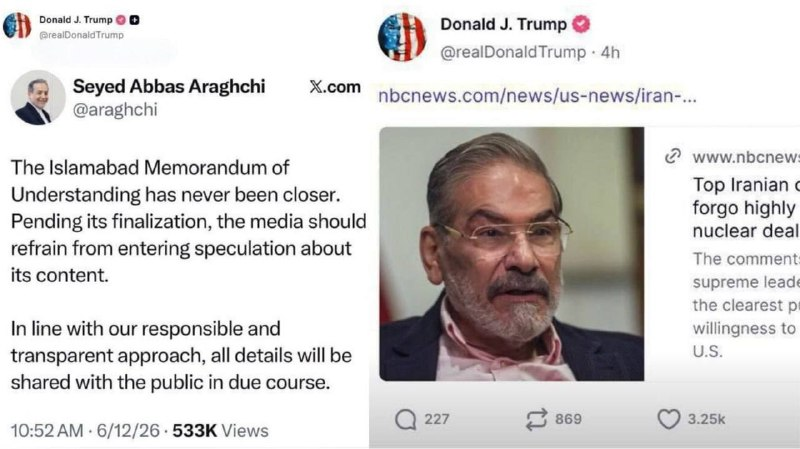

در اواخر بهمن ماه پارسال، ترامپ مصاحبه شمخانی را که گفته بود اگر آمریکایی‌ها سر حرفشون باشند ما می‌توانیم رابطه خوبی دلشته باشیم، بازنشر کرده بود ولی چند روز بعد شمخانی کشته شد.
و دیشب هم پست عراقچی را بازنشر کرده

💧 Rainbet.com the #1 Non-KYC Crypto Casino & Sportsbook @rainbetcom

😁 @Pm_Afshaa

## pm_afshaa — post 93758

  <a href="telegram/content/pm_afshaa_93758_1781361611.webm" target="_blank">🎬 Download video</a>

🔴بقائی، سخنگوی وزارت خارجه:
درباره زمان دقیق امضای تفاهم‌نامه باید منتظر بمونیم؛ اگرچه فردا نیست اما احتمال اینکه در روزهای آتی این اتفاق رقم بخوره منتفی نیست.

💧 Rainbet.com the #1 Non-KYC Crypto Casino & Sportsbook @rainbetcom

😁 @Pm_Afshaa

## DEJradio — post 5657

👑🎥 پاریس؛ برگزاری مراسم یادبود شاهدخت لیلا پهلوی

#پهلوی #شاهدخت_لیلا_پهلوی
@DEJradio

## DEJradio — post 5656

  <a href="telegram/content/DEJradio_5656_1781361612.webm" target="_blank">🎬 Download video</a>

🔺📷 در جریان جنگ ۴۰ روزه، بیشتر کلانتری‌های تهران و بسیاری از کلانتری‌های سایر شهرها بمباران و تخریب شدند؛ اما با گذشت چند هفته از «آتش‌بس»، حتی عملیات آواربرداری برخی از این مراکز نیز آغاز نشده است.

یک منبع آگاه به «دژ» می‌گوید مهم‌ترین مانع آغاز عملیات بازسازی، «کمبود بودجه» است. با این حال، در سطوح عالی تصمیم‌گیری درباره اصل بازسازی این مراکز نیز اختلاف نظر وجود دارد. به گفته این منبع، برخی مقامات و فرماندهان بانفوذ معتقدند تا زمانی که تکلیف جنگ به‌طور کامل مشخص نشده، بازسازی مراکز نظامی و انتظامی با ریسک بالایی همراه است؛ زیرا احتمال هدف قرار گرفتن و بمباران مجدد آن‌ها وجود دارد.

در حال حاضر، به دلیل تخریب ساختمان‌های کلانتری‌ها، مأموران انتظامی در کانکس‌ها به انجام وظیفه مشغول هستند. این کانکس‌ها نه از سیستم تهویه مناسب برخوردارند و نه امکانات اولیه‌ای مانند سرویس بهداشتی دارند. در نتیجه، مأموران در ساعات خدمت با شرایط دشوار و نامناسبی مواجه هستند.

#جنگ۴۰روزه #آتشبس
@DEJradio

## DEJradio — post 5654

  <a href="telegram/content/DEJradio_5654_1781361612.webm" target="_blank">🎬 Download video</a>

🔺🎤 چگونه از خود در برابر دیپ‌فیک و سرقت هویت محافظت کنیم؟

گفت‌وگو با آرتم لاورنکوف، کارشناس فناوری اطلاعات

#فناوری_اطلاعات #دیپ_فیک
@DEJradio

## VahidOnline — post 76300

نخست‌وزیر پاکستان: تفاهم‌نامه ایران و آمریکا احتمالا تا ۲۴ ساعت آینده نهایی می‌شود
نخست‌وزیر پاکستان می‌گوید ایران و آمریکا بیش از هر زمانی به توافق صلح نزدیک‌تر شده‌اند.
شهباز شریف دقایقی پیش در پستی در شبکه ایکس نوشت که انتظار می‌رود تفاهم‌نامه ایران و آمریکا ظرف ۲۴ ساعت آینده نهایی شود.
او گفت که پاکستان در حال فراهم کردن تدارکات لازم برای «امضای الکترونیکی» این سند است و پس از آن هم «گفت‌و‌گوهای فنی» آغاز خواهد شد.
@VahidHeadline
دونالد ترامپ، رییس‌جمهوری آمریکا، شنبه ۲۳ خرداد، در شبکه اجتماعی تروت سوشال، پستی از شهباز شریف، نخست‌وزیر پاکستان، را بازنشر کرد که در آن به احتمال دستیابی تهران و واشینگتن به یک تفاهم طی ۲۴ ساعت آینده اشاره شده بود.
ترامپ این اظهارات را بدون توضیح اضافی در تروت سوشال بازنشر کرد.
@VahidOOnLine
اسماعیل بقایی، سخنگوی وزارت امور خارجه، روز شنبه ۲۳ خرداد با تشریح آخرین وضعیت مذاکرات اعلام کرد: «یادداشت تفاهم اسلام‌آباد که در حال پیگیری است، به طور مشخص بر خاتمه جنگ تمرکز دارد و در این مرحله تصمیم بر این شده که هیچ بحثی در مورد موضوع هسته‌ای صورت نگیرد.»
بقایی درباره گمانه‌زنی‌های مربوط به زمان امضای این سند گفت: «درباره زمان دقیق امضای تفاهم‌نامه باید منتظر بمانیم؛ اگرچه این رویداد فردا نخواهد بود، اما احتمال اینکه ظرف روزهای آتی رقم بخورد کاملا منتفی نیست.»
بقایی ایالات متحده را به «تزلزل و بی‌ثباتی در اظهارنظرها» متهم کرد و گفت: «به دلیل تزلزل و عدم ثبات طرف مقابل در اظهارنظرها، باید در هرگونه موضع‌گیری درباره این روند محتاط باشیم.»
@VahidOOnLine

📡 @VahidOnline

## VahidOnline — post 76299

  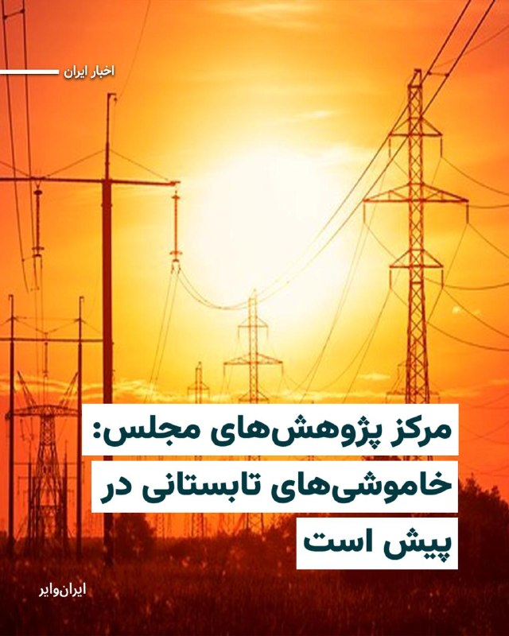

مرکز پژوهش‌های مجلس در تازه‌ترین گزارش خود درباره وضعیت شبکه برق کشور هشدار داده است که با وجود افزایش نسبی ظرفیت تولید، ناترازی برق در تابستان ۱۴۰۵ همچنان ادامه خواهد داشت و احتمال بروز خاموشی، به‌ویژه در ساعات شب، وجود دارد.

بر اساس برآورد دفتر مطالعات انرژی، صنعت و معدن این مرکز، در سناریوی واقع‌بینانه میزان کسری برق در اوج مصرف تابستان به حدود ۱۳ هزار و ۶۰۰ مگاوات خواهد رسید. در این برآورد، توان تأمین هم‌زمان شبکه حدود ۶۸ هزار و ۴۰۰ مگاوات و میزان تقاضا بیش از ۸۱ هزار مگاوات پیش‌بینی شده است.
@VahidHeadline

📡 @VahidOnline

## VahidOnline — post 76298

  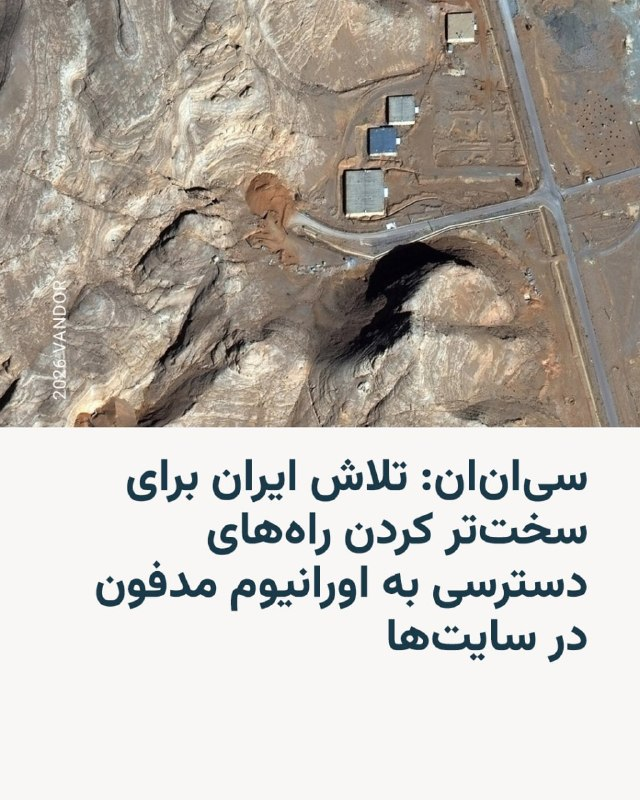

شبکه تلویزیونی سی‌ان‌ان در گزارشی اختصاصی که روز شنبه، ۲۳ خردادماه، منتشر شد می‌گوید که حکومت ایران در هفته‌های اخیر بر تلاش خود برای سخت‌تر کردن راه‌های دسترسی به اورانیوم غنی‌شده مدفون در سایت‌های بمباران‌شده‌اش افزوده است.

این گزارش به نقل از پنج منبع «آشنا با اطلاعات و ارزیابی‌های دولت ایالات متحده» نوشته شده، اما به نام و منصب آنها اشاره نکرده است.

سی‌ان‌ان در گزارش خود نوشته است که جمهوری اسلامی در هفته‌های اخیر این تونل‌های زیرزمینی را منفجر کرده و در ورودی آنها مین کار گذاشته است تا دسترسی به آنها را هر چه بیشتر دشوار سازد.
@VahidHeadline

📡 @VahidOnline

## VahidOnline — post 76297

  

رسانه‌ها و مقام‌های ایرانی روز شنبه خبر دادند که خدمات چند بانک ایرانی به شکل همزمان دچار مشکل شده و این اختلال تا بعدازظهر همچنان ادامه دارد.

خبرگزاری ایسنا اعلام کرد که «بانک‌های ملی، تجارت، صادرات و پاسارگاد» از جمله بانک‌هایی بودند که همراه‌بانک و دستگاه‌های خودپرداز آنها مختل شده است.

خبرگزاری فارس در این‌باره نوشت بانک «توسعه صادرات» نیز اختلال مشابهی دارد و افزود که «برخی منابع از احتمال وقوع حمله سایبری خبر داده‌اند، اما تاکنون هیچ مقام رسمی این موضوع را تأیید یا رد نکرده است».

ساعتی بعد علیرضا قیطاسی، دبیر شورای هماهنگی بانک‌های دولتی در گفت‌وگو با صداوسیما بدون اشاره به جزئیات درباره دلایل این اتفاق گفت: «رفع اختلال از خدمات بانک‌های ملی، صادرات، تجارت و توسعه صادرات در دست انجام است.»

حملات به شبکه بانکی ایران در سال‌های اخیر سابقه دارد و بارها اطلاعات مشتریان بانک‌های مختلف ایران هدف رخنهٔ سایبری قرار گرفته و در فضای مجازی و اینترنت خرید و فروش شده است.
@VahidHeadline

📡 @VahidOnline

## VahidOnline — post 76296

  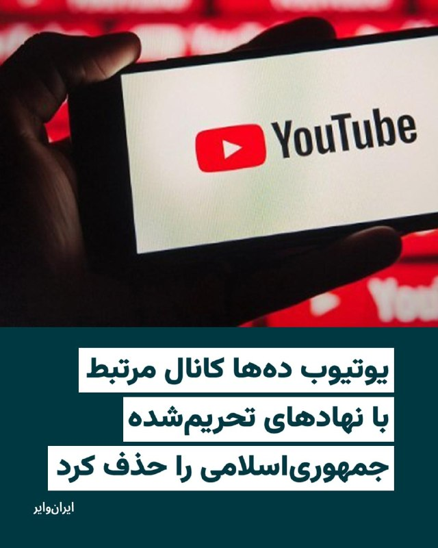

گزارش تازه «پروژه شفافیت فناوری» نشان می‌دهد یوتیوب میزبان ۸۴ کانال مرتبط با افراد و نهادهایی بوده که در فهرست تحریم‌های آمریکا قرار دارند؛ بخشی از آن‌ها همچنان از طریق نمایش تبلیغات در این پلتفرم درآمدزایی می‌کرده‌اند.

بر اساس این گزارش، ۵۶ کانال به اشخاص و اتباع تحریم‌شده در فهرست SDN و ۲۸ کانال دیگر به نهادهای دولتی و رسمی مرتبط بوده‌اند. در میان نمونه‌های شناسایی‌شده، نام‌هایی از نهادها و رسانه‌ها و همچنین برخی کسب‌وکارها و افراد قرار دارد.

پس از انتشار نتایج این گزارش، شرکت گوگل ۶۳ کانال را ظرف چند ساعت حذف کرده است. گوگل اعلام کرده که به قوانین تحریمی آمریکا پایبند است و اقدامات لازم برای اجرای مقررات را انجام می‌دهد.

در فهرست منتشر شده از کانال‌های شناسایی‌شده، نام‌هایی مانند نو‌بیتکس، و‌الکس، بیت‌پین، رمزینکس، گروه بهمن، ماهان ایر، فارس‌نیوز، پرس‌تی‌وی، ایرنا، بانک پاسارگاد، دانشگاه المصطفی و همچنین برخی چهره‌ها و کانال‌های سیاسی و رسانه‌ای دیده می‌شود. مانند علی‌اکبر ولایتی، امیرحسین ثابتی، بابک زنجانی و مسعود پزشکیان.
@VahidHeadline

📡 @VahidOnline

## VahidOnline — post 76295

  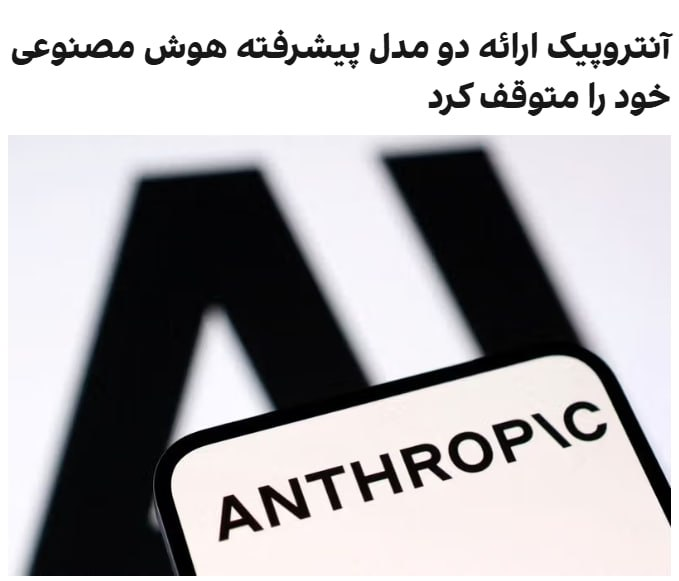

دستور کنترل صادرات با استناد به نگرانی‌‌های مرتبط با امنیت ملی، دسترسی «اتباع خارجی» را، چه در داخل و چه خارج از آمریکا، ممنوع کرده است.

شرکت آنتروپیک، سازنده دستیار هوش مصنوعی «کلود» (Claude)، جمعه ۲۲ خرداد اعلام کرد به دنبال دریافت یک دستور کنترل صادرات از دولت آمریکا، دسترسی به دو مدل پیشرفته خود، «فِیبل ۵» (Fable 5) و «مایتوس ۵» (Mythos 5)، را «برای همه کاربران» قطع کرده است.

این دستور با استناد به «اختیارات امنیت ملی» صادر شده و دسترسی هر «تبعه خارجی» را، چه داخل و چه خارج از خاک آمریکا و حتی کارکنان خارجی‌تبار خود آنتروپیک، ممنوع می‌کند.

آنتروپیک گفت این دستور را ساعت ۵:۲۱ بعدازظهر به وقت شرق آمریکا دریافت کرده است. از آنجا که شرکت نمی‌تواند به‌صورت لحظه‌ای کاربران خارجی را از دیگران جدا کند، ناچار شده هر دو مدل را برای تمام مشتریان غیرفعال کند.

دسترسی به سایر مدل‌های این شرکت، از جمله Opus، بدون تغییر باقی مانده است.

بنا بر گزارش اکسیوس و وال‌استریت ژورنال، نامه این دستور را هاوارد لاتنیک، وزیر بازرگانی آمریکا، خطاب به داریو آمودی، مدیرعامل آنتروپیک، فرستاده و با همکاری اداره صنعت و امنیت این وزارتخانه، تنظیم شده است.

متن نامه جزییات دقیق نگرانی امنیتی را مشخص نکرده، اما به گفته یک مقام دولتی، واشینگتن پس از آن که شرکتی دیگر مدعی شد توانسته سازوکارهای ایمنی مایتوس را دور بزند («جیلبریک» کند)، نگران خطرهای امنیت ملی شده است.

همان مقام افزود دولت پیش‌تر کوشیده بود آنتروپیک را به تعویق عرضه این مدل‌ها متقاعد کند و پس از ناکامی، نامه «کنترل صادرات» را صادر کرد.

آنتروپیک با این تصمیم مخالفت کرده، اما گفته است از آن تبعیت می‌کند.

به گفته این شرکت، روش افشاشده یک «جیلبریک محدود» است؛ در عمل یعنی درخواست از مدل برای خواندن یک کد و رفع ایرادهای آن؛ آسیب‌پذیری‌هایی جزیی و از پیش‌شناخته‌شده که مدل‌های عمومی دیگر، از جمله GPT-5.5 شرکت OpenAI، نیز قادر به یافتنشان هستند.

آنتروپیک تاکید کرد فِیبل ۵ با تدابیر حفاظتی‌ای به‌مراتب قوی‌تر از هر مدل پیشین عرضه شده و پیش از انتشار، هزاران ساعت با همکاری دولت آمریکا، موسسه ایمنی هوش مصنوعی بریتانیا و گروه‌های مستقل آزموده شده است.

این شرکت ممانعت از دسترسی برای یک مدل تجاری در دسترس صدها میلیون کاربر را به‌خاطر یک آسیب‌پذیری محدود «نامتناسب» خواند و هشدار داد اگر چنین معیاری به کل صنعت تعمیم یابد، عملا عرضه هر مدل پیشرفته‌ای متوقف خواهد شد.

این دستور، تنها سه روز پس از رونمایی فِیبل ۵ و مایتوس ۵ صادر شد. مدل‌هایی که آنتروپیک آن‌ها را قدرتمندترین سامانه‌های خود معرفی کرده بود. هر دو بر یک بنیان فنی ساخته شده‌اند، اما تنها فِیبل ۵ با محدودیت‌های سخت‌گیرانه، به‌ویژه در حوزه‌های امنیت سایبری و زیست‌شناسی، برای عموم منتشر شد؛ مایتوس ۵ بدون این محدودیت‌ها و تنها در اختیار شماری از شرکای مورد اعتماد، از جمله شرکت‌های امنیت سایبری و زیرساخت، قرار گرفت.

این دو ادامه «مایتوس پریویو» هستند. مدلی که بهار امسال با توانایی‌های پیشرفته سایبری توجه وال‌استریت و مقام‌های دولتی را جلب کرد و در چارچوب طرحی به نام «گلَس‌وینگ» میان گروهی محدود توزیع شد.

اما اهمیت این ماجرا فراتر از یک مدل و یک شرکت است: این نخستین بار است که واشینگتن از اهرم کنترل صادرات در مورد یک مدل تجاری پیشرفته استفاده می‌کند. این وضعیت نشان می‌دهد سرنوشت یک مدل را می‌توان نه با تصمیم سازنده، بلکه با دستور دولت رقم زد.

چارچوب «ملیت‌محور» این محدودیت نیز کاربران و شرکت‌های غیرآمریکایی را مستقیم هدف می‌گیرد.

آنتروپیک می‌گوید توقف عرضه‌های ناایمن توسط دولت را می‌پذیرد، اما در چارچوب فرایندی قانونی، شفاف و مبتنی بر واقعیت‌های فنی. اقدامی که به گفته این شرکت با چنین معیارهایی نخوانده است.

آنتروپیک این ماجرا را «سوءتفاهم» خوانده و گفته است طی ۲۴ ساعت آینده جزییات فنی بیشتری منتشر می‌کند و در تلاش برای بازگرداندن دسترسی است، هرچند زمان مشخصی برای آن اعلام نکرده است.

@VahidOOnLine

📡 @VahidOnline

## VahidOnline — post 76293

خبرگزاری رسمی لبنان روز شنبه ۲۳ خرداد خبر داد که ساعتی پس از صدور هشدار به مردم ساکن جنوب لبنان، ارتش اسرائیل به چند نقطه در این منطقه حمله هوایی کرده است.

ارتش اسرائیل روز شنبه صبح به ساکنان ۲۰ نقطه در جنوب لبنان از جمله شهر نبطیه هشدار داد که باید محل سکونت خود را ترک کرده و به شمال رود لیتانی بروند.
ارتش اسرائیل اعلام کرد این هشدار در پی نقض آتش‌بس از سوی حزب‌الله لبنان، صادر شده است.

حال خبرگزاری ملی لبنان می‌گوید که هواپیماهای جنگنده اسرائیل چند نقطه از جمله دو روستای سجود و ریحان را در نزدیکی شهر نبطیه بمباران کرده‌اند.

اسرائیل در ماه گذشته میلادی تمام مناطق در جنوب رود لیتانی را «منطقه جنگی» اعلام کرد و از آن زمان این نقاط را بمباران کرده است.

اوایل ماه مارس یعنی تنها یکی دو هفته پس از حمله مشترک آمریکا و اسرائیل به خاک ایران،‌ گروه حزب‌الله در حمایت از جمهوری اسلامی به اسرائیل حمله کرد، حمله‌ای که بلافاصله پاسخ ارتش اسرائیل را به دنبال داشت.
درگیری این دو هنوز ادامه دارد و حتی پس از برقراری آتش‌بس حدود دو ماه پیش، هم ادامه یافته است.
@VahidHeadline

📡 @VahidOnline

## VahidOnline — post 76292

  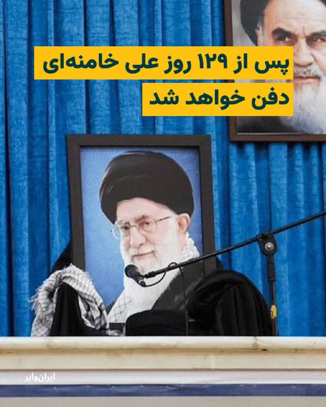

دفتر حفظ و نشر آثار علی خامنه‌ای با انتشار اطلاعیه شماره ۳ ستاد بزرگداشت «عروج خونین» او، جزئیات مراسم وداع، تشییع و تدفین دومین رهبر جمهوری اسلامی را اعلام کرد؛ مراسمی که قرار است حدود ۱۲۹ روز پس از کشته شدن او در ۹ اسفند ۱۴۰۴ برگزار شود.

بر اساس این اطلاعیه، مراسم وداع با پیکر علی خامنه‌ای و اعضای خانواده‌اش روزهای ۱۳ و ۱۴ تیرماه در مصلای تهران برگزار خواهد شد. تشییع پیکر او روز ۱۵ تیر در تهران، ۱۶ تیر در قم و در نهایت ۱۸ تیرماه، همزمان با شب شهادت چهارمین پیشوای شیعیان، در مشهد برگزار می‌شود و پیکر او در حرم هشتمین پیشوای شیعیان به خاک سپرده خواهد شد.
@VahidHeadline

📡 @VahidOnline

## VahidOnline — post 76291

  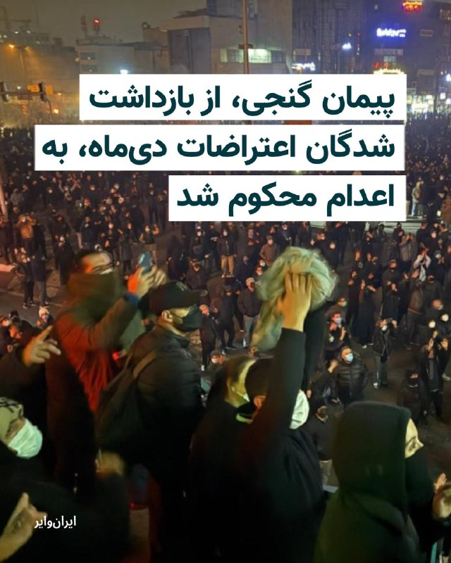

پیمان گنجی، جوان ۳۳ ساله و از بازداشت‌شدگان اعتراضات سراسری دی‌ماه ۱۴۰۴، از سوی شعبه ۲۶ دادگاه انقلاب تهران به اتهام «محاربه» به اعدام محکوم شده است.
بر اساس گزارش منتشرشده از سوی هرانا، این حکم توسط شعبه ۲۶ دادگاه انقلاب تهران به ریاست قاضی ایمان افشاری صادر شده و پرونده او هم‌اکنون برای رسیدگی در مرحله فرجام‌خواهی در شعبه ۹ دیوان عالی کشور قرار دارد.
@VahidHeadline

📡 @VahidOnline

## VahidOnline — post 76290

  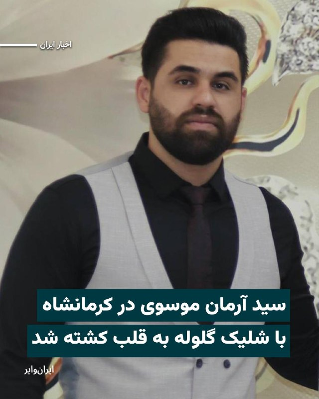

«سید آرمان موسوی» ۲۹ ساله، روز پنج‌شنبه ۱۸ دی‌ماه ۱۴۰۴ در محله مسکن شهر کرمانشاه هدف شلیک مستقیم قرار گرفت و جان خود را از دست داد.

به گفته منابع آگاه، گلوله جنگی به ناحیه قلب او اصابت کرده بود و در اثر شدت جراحات جان باخت. پیکر سید آرمان موسوی روز شنبه ۲۰ دی‌ماه در کرمانشاه به خاک سپرده شد.
@VahidHeadline

📡 @VahidOnline

## kianmeli1 — post 87969

  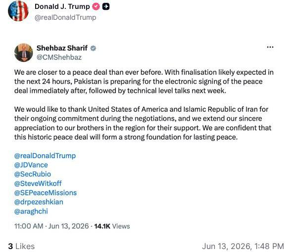

🔴ترامپ توییت نخست وزیر پاکستان مبنی بر احتمال امضای توافق ظرف ۲۴ ساعت را بازنشر کرد
https://t.me/kianmeli1

## IranIntlTV — post 342076

  <a href="telegram/content/IranIntlTV_342076_1781361617.mp4" target="_blank">🎬 Download video</a>

فعالان صنعتی با هشدار درباره تشدید بحران تامین انرژی در ایران، نسبت به پیامدهای آن برای تولید و اشتغال ابراز نگرانی کردند. رییس شورای هماهنگی شهرک‌های صنعتی کشور نیز گفت دولت همچنان شهرک‌های صنعتی را در اولویت خاموشی قرار می‌دهد و ادامه این روند، با توجه به مشکلات موجود، می‌تواند به نابودی بسیاری از صنایع منجر شود.

اشکان نظام‌آبادی، روزنامه‌نگار اقتصادی، درباره پیامدهای بحران تامین انرژی در بخش صنعت توضیح می‌دهد
@iranintltv

## IranIntlTV — post 342066

🔻تیم‌های فوتبال برزیل و مراکش ساعت ۱:۳۰ روز یک‌شنبه ۲۴ خرداد ۱۴۰۴ در ورزشگاه مت‌لایف نیوجرسی به مصاف یکدیگر می‌روند تا ششمین بازی جام جهانی ۲۰۲۶ را برگزار کنند.

🔹برزیل به طور سنتی و البته همچنان بر اساس ضرایب شرط‌بندی، شانس اصلی پیروزی در این مسابقه است، اما مراکش در پی تکرار موفقیت تاریخی خود در جام جهانی ۲۰۲۲ است؛ نخستین تیم آفریقایی که به نیمه‌نهایی جام جهانی راه پیدا کرد.

🔹دیدار برزیل و مراکش تنها مسابقه مرحله گروهی میان دو تیم حاضر در جمع ۱۰ تیم برتر رده‌بندی فیفاست.

🔹پیش‌بازی برزیل و مراکش، در وب‌سایت ایران اینترنشنال بخوانید.

@iranintltvsport

## IranIntlTV — post 342065

  

ابراهیم رضایی، سخنگوی کمیسیون امنیت ملی مجلس جمهوری اسلامی، در انتقاد از رویکرد جمهوری اسلامی در مذاکرات با آمریکا، در شبکه اجتماعی ایکس نوشت که «سخاوتمندی مفرط» در مذاکرات، آمریکا تصور کند حکومت ایران ضعیف است.

او نوشت: «سخاوتمندی مفرط در پای میز مذاکره، محاسبات دشمن را عوض کرد تا فکر کند که ایران ضعیف است و می‌تواند آن را ببلعد.»
https://iranintl.com/202606137516

## IranIntlTV — post 342064

  

دونالد ترامپ، رییس‌جمهوری آمریکا، شنبه ۲۳ خرداد، در شبکه اجتماعی تروت سوشال، پستی از شهباز شریف، نخست‌وزیر پاکستان، را بازنشر کرد که در آن به احتمال دستیابی تهران و واشینگتن به یک تفاهم طی ۲۴ ساعت آینده اشاره شده بود.

شهباز شریف در شبکه اجتماعی ایکس نوشته بود که تهران و واشینگتن بیش از هر زمان دیگری به یک تفاهم‌نامه صلح نزدیک شده‌اند و احتمال نهایی شدن آن در ۲۴ ساعت آینده وجود دارد.

نخست‌وزیر پاکستان همچنین اعلام کرد که پاکستان برای امضای الکترونیکی تفاهم‌نامه صلح میان آمریکا و جمهوری اسلامی، بلافاصله پس از نهایی شدن آن، آماده می‌شود.

ترامپ این اظهارات را بدون توضیح اضافی در تروت سوشال بازنشر کرد.
https://iranintl.com/202606137134

## IranIntlTV — post 342063

  <a href="telegram/content/IranIntlTV_342063_1781361619.mp4" target="_blank">🎬 Download video</a>

سرخط خبرهای شنبه ۲۳ خرداد

@iranintltv

## IranIntlTV — post 342062

  <a href="telegram/content/IranIntlTV_342062_1781361620.mp4" target="_blank">🎬 Download video</a>

ایرانیان ملبورن در استرالیا روز شنبه برای زادروز مجیدرضا رهنورد، جانباخته خیزش انقلابی ۱۴۰۱، و ۴۰ هزار جاویدنام انقلاب ملی پرچم شیروخورشید را برای ۴۰ هزار ثانیه برافراشتند.

## IranIntlTV — post 342061

  <a href="telegram/content/IranIntlTV_342061_1781361622.mp4" target="_blank">🎬 Download video</a>

جمشید برزگر، تحلیلگر سیاسی، درباره اظهارات نخست‌وزیر پاکستان مبنی بر احتمال امضای تفاهم میان تهران و واشینگتن در ۲۴ ساعت آینده، گفت: «آنچه در جریان است، تلاشی برای عادی‌سازی روابط جمهوری اسلامی با آمریکا نیست، بلکه مقدمه‌ای برای پایان دادن به جنگ است.»
@iranintltv

## IranIntlTV — post 342060

  <a href="telegram/content/IranIntlTV_342060_1781361623.mp4" target="_blank">🎬 Download video</a>

در آستانه بزرگداشت روز شیر و خورشید و در پاسخ به فراخوان شاهزاده رضا پهلوی، جمعی از ایرانیان برلین مقابل ساختمان پارلمان آلمان گرد هم آمده‌اند.

تجمع‌کنندگان در اقدامی نمادین و به یاد جاویدنامان انقلاب ملی، به مدت ۴۰ هزار ثانیه، معادل بیش از ۱۱ ساعت، پرچم شیر و خورشید را بالا نگه می‌دارند.

گزارش علی حسن‌پور، خبرنگار ایران‌اینترنشنال
@iranintltv

## IranIntlTV — post 342059

  <a href="telegram/content/IranIntlTV_342059_1781361625.mp4" target="_blank">🎬 Download video</a>

بررسی‌های ایران‌اینترنشنال نشان می‌دهد جمهوری اسلامی حدود ۳۰ پایگاه موشکی در نقاط مختلف ایران دارد؛ مجموعه‌ای از تونل‌ها و تاسیسات زیرزمینی که سپاه پاسداران از آن‌ها با عنوان «شهرهای موشکی» یاد می‌کند.

بر اساس این بررسی، مراکز اصلی تحقیق، توسعه و مونتاژ موشکی در مرکز و شرق ایران قرار دارند و این شهرهای موشکی، علاوه بر تونل‌های زیرزمینی، شامل پناهگاه‌های بتنی، سامانه‌های ارتباطی، تجهیزات سوخت‌گیری و مراکز هدایت عملیات موشکی نیز هستند.

جزییات بیشتر با امیرهادی انواری، عضو تحریریه ایران‌اینترنشنال
@iranintltv

## IranIntlTV — post 342058

  <a href="telegram/content/IranIntlTV_342058_1781361626.mp4" target="_blank">🎬 Download video</a>

ایرانیان اسپانیا روز شنبه به یاد جانباختگان راه آزادی در مادرید تجمع کرده و پرچم شیروخورشید را بالا بردند.

## IranIntlTV — post 342057

  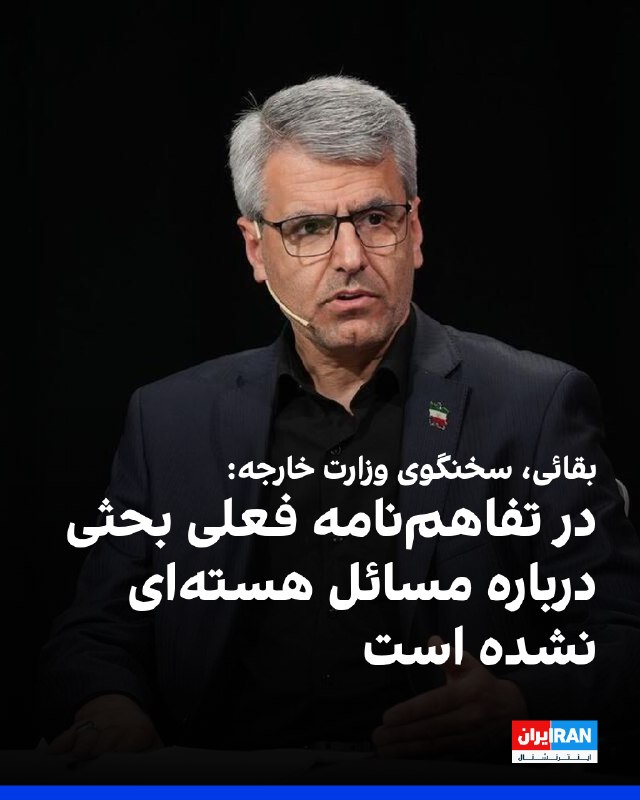

اسماعیل بقائی، سخنگوی وزارت خارجه جمهوری اسلامی در نشستی در همدان، گفت: «تفاهم نامه اسلام‌آباد که در حال پیگیری است، بر خاتمه جنگ در همه جبهه‌ها، از جمله لبنان تمرکز دارد و در این مرحله تصمیم بر این شده که بحثی در مورد موضوع هسته‌ای نشود.»

او ادامه داد: «درباره زمان دقیق امضا باید منتظر بمانیم؛ اگرچه فردا نخواهد بود اما احتمال اینکه در روزهای آتی این اتفاق رقم بخورد، منتفی نیست.»

بقائی افزود: «به دلیل تزلزل طرف مقابل در هرگونه اظهارنظر درباره این روند باید محتاط باشیم.»

او اضافه کرد: «طرف مقابل به هیچ عنوان عملکرد مناسبی در ایفای تعهدات خود نداشته و ما نیز باید متناسب با آن پیش‌بینی‌های لازم را انجام دهیم.»
https://iranintl.com/202606138676

## Shin_Persian — post 7017

Shin ✓ @hey_itsmyturn
Sat, 13 Jun 2026 12:40:19 UTC

Asked Claude to install the latest Win 11 on a local VM, hilariously it bypassed the Microsoft Account requirement with no sweat, I didn't even ask it to do so! I was away from the computer for a few mins, came back and saw everything's done and it was in the desktop already!

ترجمه خودکار فارسی

از کلود (Claude) خواستم آخرین نسخه ویندوز ۱۱ را روی یک ماشین مجازی (VM) محلی نصب کند؛ به طرز خنده‌داری بدون هیچ دردسری الزام حساب کاربری مایکروسافت را دور زد، در حالی که من حتی از او نخواسته بودم این کار را انجام دهد! چند دقیقه از پای کامپیوتر دور شدم، وقتی برگشتم دیدم همه چیز انجام شده و سیستم در دسکتاپ است!

𝕏 · @shin_persian

## FarsiVOA — post 220583

  <a href="telegram/content/FarsiVOA_220583_1781361628.mp4" target="_blank">🎬 Download video</a>

حال‌وش ویدیویی مربوط به روز جمعه ۲۲ خرداد ۱۴۰۵، منتشر کرده که در آن شهروندی از تشکیل صف‌های طولانی خودرو و ساعت‌ها انتظار رانندگان برای دریافت بنزین در یکی از جایگاه‌های سوخت زاهدان گلایه کرده است.

## FarsiVOA — post 220582

Farsi VOA pinned a photo

## FarsiVOA — post 220581

  

📸اینستاگرام صدای آمریکا را هم اکنون فالو کنید تا از آخرین خبرها مطلع بمانید:
https://www.instagram.com/voafarsi/

📡همچنین جهت اطلاع از بروزترین فرکانسهای ماهواره‌ای صدای آمریکا به لینک زیر مراجعت فرمایید:
https://ir.voanews.com/satellite

این پست را با دوستانتان به اشتراک بگذارید
@FarsiVOA

## FarsiVOA — post 220580

  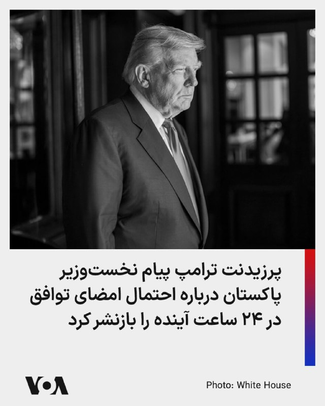

⚡️پرزیدنت ترامپ روز شنبه ۲۳ خرداد پیام نخست‌وزیر پاکستان در شبکه اجتماعی ایکس را که در آن نوشته بود توافق صلح میان آمریکا و جمهوری اسلامی احتمالاً ظرف ۲۴ ساعت آینده امضا خواهد شد، بازنشر کرد.

## FarsiVOA — post 220579

  <a href="telegram/content/FarsiVOA_220579_1781361630.mp4" target="_blank">🎬 Download video</a>

ارتش اسرائیل اعلام کرد در روز جمعه، بیش از هفتاد موضع حزب‌الله را در جنوب لبنان هدف‌گیری کرد.

بنابر بیانیه ارتش اسرائیل علاوه بر زیرساخت‌ها، نیروهای حزب‌الله نیز شناسایی و حذف شدند. زیرساخت‌های منهدم شده شامل سکوهای پرتاب موشک و ساختمان‌های متعلق به سازمان تروریستی حزب‌الله است که با هدف آسیب رساندن به مردم و ارتش اسرائیل استفاده می‌شد.

ارتش اسرائیل تاکید کرد به حملات خود به مواضع و نیروهای حزب‌الله در این مناطق ادامه می‌دهد.

## DW_Farsi — post 125929

  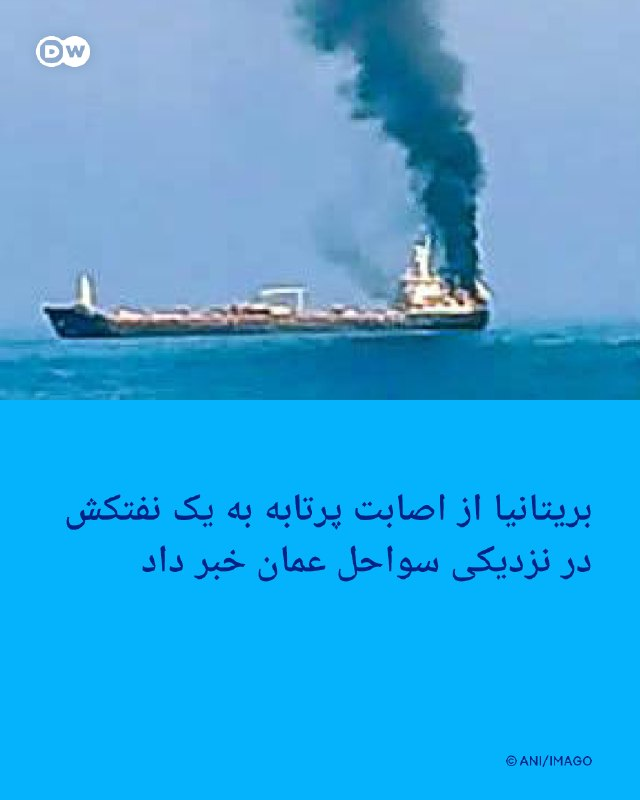

🔶بریتانیا از اصابت پرتابه به یک نفتکش در نزدیکی سواحل عمان خبر داد

مرکز عملیات تجارت دریایی بریتانیا، (UKMTO) اعلام کرد یک نفتکش در فاصله ۶ مایل دریایی، برابر با حدود ۱۱ کیلومتر، در شرق عمان، از ناحیه جلوی بدنه هدف یک پرتابه ناشناس قرار گرفته است.

در هشدار منتشرشده آمده است خدمه این نفتکش سالم گزارش شده‌اند.

همچنین تاکنون هیچ اثر زیست‌محیطی ناشی از این حادثه گزارش نشده است.

بر اساس این گزارش، نفتکش پس از این حادثه به مسیر خود به سمت بندر بعدی ادامه داده است.

در همین حال، مقام‌های مسئول در حال بررسی ابعاد این حادثه هستند.

مرکز عملیات تجارت دریایی بریتانیا به دیگر شناورها توصیه کرده است با احتیاط از این منطقه عبور کنند.

این نهاد همچنین از کشتی‌ها خواسته هرگونه فعالیت مشکوک را به UKMTO گزارش دهند.

@dw_farsi

## DW_Farsi — post 125928

  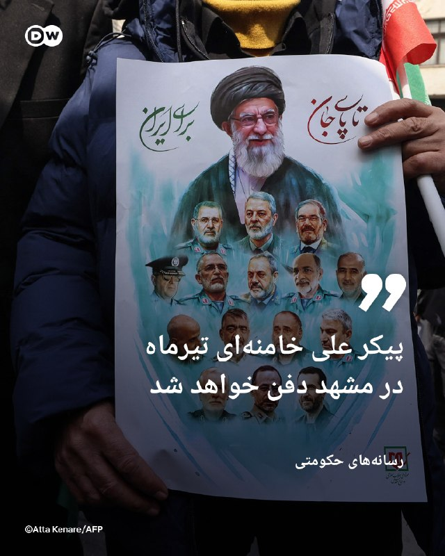

🔶رسانه‌های حکومتی: پیکر علی خامنه‌ای تیرماه در مشهد دفن خواهد شد

رسانه‌های حکومتی ایران گزارش دادند مراسم مربوط به خاکسپاری علی خامنه‌ای از ماه ژوئیه آغاز خواهد شد. بر اساس این گزارش‌ها، روزهای ۱۳ و ۱۴ ژوئیه مراسم وداع در تهران برگزار می‌شود و پس از آن، ۱۵ ژوئیه مراسم تشییع در تهران و ۱۶ ژوئیه مراسم دیگری در قم برگزار خواهد شد.

بر اساس این گزارش، قرار است ۱۸ ژوئیه نیز مراسم دیگری در مشهد برگزار شود.

پس از این مراسم، پیکر علی خامنه‌ای در حرم امام رضا در شهر مشهد دفن خواهد شد.

بنیامین نتانیاهو، نخست وزیر اسرائیل شامگاه شنبه ۲۸ فوریه (۹ اسفند) در یک سخنرانی تلویزیونی گفت: «امروز صبح در یک حمله غافلگیرانه عظیم، تأسیسات متعلق به علی خامنه‌ای، این دیکتاتور، را در قلب تهران نابود کردیم (...) و نشانه‌های فراوانی وجود دارد که این دیکتاتور دیگر در قید حیات نیست.»

پس از آن صداوسیمای حکومت ایران این خبر را تایید کرد.

بنیامین نتانیاهو در ادامه اعلام کرد که در جریان این حملات، شماری از فرماندهان سپاه پاسداران انقلاب اسلامی و مقام‌های ارشد برنامه هسته‌ای ایران نیز کشته شده‌اند.

@dw_farsi

## DW_Farsi — post 125927

🔶اونروا ۷۰ کارمند خود در غزه را اخراج کرد

اونروا اعلام کرد ۷۰ نفر از کارکنان خود در غزه را اخراج کرده است. سرپرست موقت این نهاد، کریستین ساندرز، گفت این تصمیم در پی ارزیابی وضعیت ایمنی و امنیت عملیات آنروا در غزه اتخاذ شده و هدف آن کاهش خطرات امنیتی برای پناهجویان بوده است.

در بیانیه اونروا آمده است این تصمیم بخشی از یک روند انضباطی نیست و به هیچ‌وجه به معنای تایید ادعاهای مطرح‌شده علیه این کارکنان نیست.

این نهاد همچنین گفت بارها از مقام‌های اسرائیلی خواسته اطلاعات و شواهد لازم را برای اثبات اتهام‌های مطرح‌شده علیه کارکنان خود در غزه ارائه کنند، اما تا کنون پاسخی دریافت نکرده است.

@dw_farsi

## Persian_Trend_Official — post 16951

  <a href="telegram/content/Persian_Trend_Official_16951_1781361633.webm" target="_blank">🎬 Download video</a>

العربیه: هیئت ایرانی شامل وزیر خارجه این کشور فردا وارد پاکستان خواهند شد تا در روند گفت‌وگوهای مرتبط با توافق مشارکت کنند.

📝 Amir

📌 @persian_trend_official
پرشین ترند | متفاوت‌ترین کانال نظامی

## Persian_Trend_Official — post 16950

  <a href="telegram/content/Persian_Trend_Official_16950_1781361633.webm" target="_blank">🎬 Download video</a>

اسحاق دار، وزیر امور خارجه پاکستان و شاهزاده فیصل بن فرحان، وزیر امور خارجه عربستان سعودی، طی تماس تلفنی تأیید کردند که انتظار می‌رود مراسم امضای الکترونیکی فردا برگزار شود، زیرا مذاکرات ایالات متحده و ایران وارد مرحله نهایی خود شده!

📝 Amir

📌 @persian_trend_official
پرشین ترند | متفاوت‌ترین کانال نظامی

## Persian_Trend_Official — post 16949

  <a href="telegram/content/Persian_Trend_Official_16949_1781361633.webm" target="_blank">🎬 Download video</a>

شهباز شریف: بیش از هر زمان دیگری به توافق صلح میان ایران و آمریکا نزدیک شده‌ایم. احتمال می‌رود روند نهایی‌سازی توافق ظرف 24 ساعت آینده تکمیل شود. پاکستان در حال آماده‌سازی برای امضای الکترونیکی توافق بلافاصله پس از نهایی شدن آن است. مذاکرات فنی و کارشناسی…

## Persian_Trend_Official — post 16948

  <a href="telegram/content/Persian_Trend_Official_16948_1781361634.webm" target="_blank">🎬 Download video</a>

کانال های خبرگزاری فارس، بابک زنجانی، صرافی نوبیتکس، والکس، رمزینکس و بیت‌پین که در یوتیوب فعالیت میکردند، به علت تحریم‌های آمریکا همگی مسدود شدند.

👺Phantom

📌 @persian_trend_official
پرشین ترند | متفاوت‌ترین کانال نظامی

## Persian_Trend_Official — post 16947

  <a href="telegram/content/Persian_Trend_Official_16947_1781361634.webm" target="_blank">🎬 Download video</a>

جزئیات پیشنهاد قطر برای آزادسازی دارایی‌های بلوکه‌شده ایران به ادعای خبرگزاری مهر

مهر: در جریان مذاکرات، ایران پیشنهاد کرده بود که نیمی از این منابع در مراحل اولیه مذاکرات و نیم دیگر در توافق نهایی آزاد شود، اما این پیشنهاد از سوی طرف آمریکایی پذیرفته نشد. در ادامه و برای رفع بن‌بست ایجاد شده، قطر طرحی را ارائه کرد که بر اساس آن 12 میلیارد دلار در اختیار ایران قرار گیرد؛ شامل آزادسازی 6 میلیارد دلار از دارایی‌های بلوکه‌شده ایران در قطر و 6 میلیارد دلار دیگر در قالب وام یا خط اعتباری.

بر اساس توافق سال 2023 (1402) میان ایران و آمریکا (در زمان دول رئیسی) 6 میلیارد دلار از دارایی‌های ایران در قطر باید صرف امور بشردوستانه شود. همچنین مقرر شده است که نحوه هزینه‌کرد این منابع همچنان تابع همان چارچوب توافق قبلی باشد.

بخش دوم این بسته مالی، شامل 6 میلیارد دلار خط اعتباری است که نزد طرف قطری باقی می‌ماند و ایران محل مصرف آن را تعیین خواهد کرد.

📝 Amir

📌 @persian_trend_official
پرشین ترند | متفاوت‌ترین کانال نظامی

## Persian_Trend_Official — post 16946

  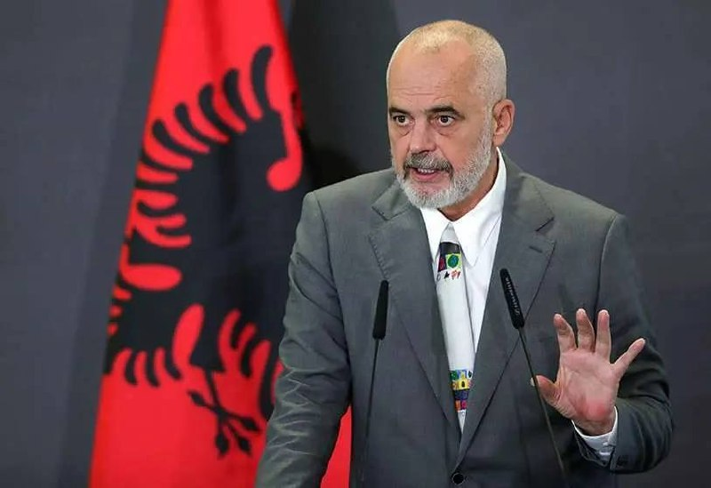

ادی راما، نخست وزیر آلبانی تهران را به دست داشتن در اعتراضات اخیر بر سر یک پروژه تفریحی لوکس پیشنهادی مرتبط با جرد کوشنر متهم کرد.

نخست وزیر آلبانی همچنین افزود ایران تنها کشور متخاصمی است که آلبانی با آن روبه‌روست.

📝 Amir

📌 @persian_trend_official
پرشین ترند | متفاوت‌ترین کانال نظامی

## Persian_Trend_Official — post 16943

  <a href="telegram/content/Persian_Trend_Official_16943_1781361635.mp4" target="_blank">🎬 Download video</a>

یک سال پیش در چنین ساعاتی موساد تصاویری از عملیات حیرت آور خود در عمق خاک ایران و حتی پایتخت کشور، تهران منتشر کرد.

در این عملیات به گفته خود منابع عبری و غربی، کماندوهای ایرانی آموزش دیده به دست اسرائیل با رهبری موساد و استفاده از پرتابه های چون کوادکوپتر، پهپادهای کوچیک و حتی موشک های ضد زره از جمله اسپایک در همان دقایق اول آغاز عملیات طلوع شیران مواضع پدافندی، راداری و حتی موشکی ارتش و سپاه پاسداران را در هم کوبیدند تا راه برای هواگردهای اسرائیلی باز و همچنین نرخ شلیک موشک های بالستیک و پهپادهای انتحاری علیه اسرائیل را کاهش بدهند‌.

اینکه به چه شکل این تجهیزات به راحتی وارد کشور شدند و در نزدیکی سایت های نظامی استراتژیک کشور مستقر شدند جای خود دارد و در این پست به آن نمی‌پردازیم. در ویدیو اول شاهد حمله یک پرتابه FPV اسرائیلی به لانچر یک موشک بالستیک و در ویدیو دوم و سوم شاهد حمله موشک ضد زره اسپایک به پدافند موشکی طبس سپاه و رادار نجم-804 پدافند هوایی ارتش در تهران هستیم.

📝 Amir

📌 @persian_trend_official
پرشین ترند | متفاوت‌ترین کانال نظامی

## Persian_Trend_Official — post 16942

  <a href="telegram/content/Persian_Trend_Official_16942_1781361636.mp4" target="_blank">🎬 Download video</a>

ویدیویی از هدف قرار گرفتن لانچر راکت انداز Tos-1 روسی توسط پرتابه FPV ارتش اوکراین

در 0:07 مشاهده میکنیم که این واحد راکت انداز توس-1 اکثر راکت های لود شده خود را قبل انهدام شلیک کرده است.

📝 Amir

📌 @persian_trend_official
پرشین ترند | متفاوت‌ترین کانال نظامی

## RadioFarda — post 158265

تیم ملی فوتبال؛ دوگانهٔ عشق به ایران و خشم از حکومت

🔸جام جهانی فوتبال ۲۰۲۶ برای ایران فقط یک تورنمنت فوتبالی نیست؛ به‌خصوص اگر پای بازی در آمریکا و حضور پررنگ ایرانیان مهاجر در میان باشد، تیم ملی دوباره به صحنه‌ای تبدیل می‌شود که در آن فوتبال، خاطره، سیاست، تبعید، خشم و عشق به ایران در کنار هم قرار می‌گیرند.

🔸برای بخشی از ایرانیان، نام ایران روی پیراهن تیم ملی هنوز یادآور چیزی فراتر از حکومت است. برای بخشی دیگر اما همین پیراهن از سایهٔ حکومت جدا دیده نمی‌شود. میان این دو نگاه، یک کشور زخمی ایستاده است؛ کشوری که حتی شادی ورزشی‌اش هم دیگر بی‌دردسر نیست.

🔸گزارش وحید پوراستاد را در وب‌سایت رادیوفردا بخوانید.

@RadioFarda

## RadioFarda — post 158257

🔸بازیکنان تیم ملی فوتبال ایران در جریان تمرینات خود در مرکز تمرینی «سنترُو شولوایتسکوینتله» در شهر تیخوانای مکزیک، برای رقابت‌های جام جهانی ۲۰۲۶ آماده می‌شوند.

🔸تیم ملی ایران نخستین دیدار خود در مرحله گروهی این رقابت‌ها را روز ۲۶ خرداد برابر نیوزیلند در ورزشگاه سوفای شهر لس‌آنجلس برگزار خواهد کرد.

@RadioFarda

## RadioFarda — post 158256

  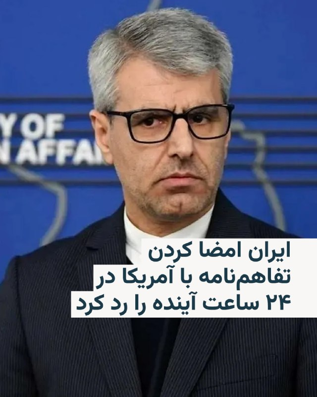

🔸اسماعیل بقائی، سخنگوی وزارت امور خارجه ایران، روز شنبه با رد اظهارات نخست‌وزیر پاکستان درباره زمان نهایی شدن تفاهم‌نامه با آمریکا برای پایان دادن به جنگ، اعلام کرد که زمان امضای تفاهم‌نامه «فردا نخواهد بود»

🔸شهباز شریف، نخست وزیر پاکستان، ساعتی پیش گفت که تهران و واشینگتن بر سر متن نهایی تفاهم‌نامه به توافق رسیده‌اند و این تفاهم‌نامه در عرض ۲۴ ساعت آینده «احتمالا نهایی می‌شود» و بلافاصله پس از آن «به صورت الکترونیکی» امضا خواهد شد.

🔸بقائی در اظهاراتی که در رسانه‌های حکومتی منتشر شد، بدون اشاره به بیانیه شهباز شریف گفت: «درباره زمان دقیق امضا تفاهم‌نامه باید منتظر بمانیم، اگرچه فردا نخواهد بود اما احتمال اینکه در روزهای آتی این اتفاق رقم بخورد منتفی نیست.»

🔸او افزود که به دلیل «تزلزل طرف مقابل» باید در مورد هرگونه اظهارنظر درباره تاریخ امضا با احتیاط عمل کرد.

@RadioFarda

## RadioFarda — post 158255

  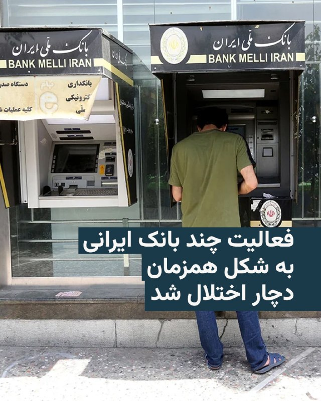

🔸رسانه‌ها و مقام‌های ایرانی روز شنبه خبر دادند که خدمات چند بانک ایرانی به شکل همزمان دچار مشکل شده و این اختلال تا بعدازظهر همچنان ادامه دارد.

🔸خبرگزاری ایسنا اعلام کرد که «بانک‌های ملی، تجارت، صادرات و پاسارگاد» از جمله بانک‌هایی بودند که همراه‌بانک و دستگاه‌های خودپرداز آنها مختل شده است.

🔸خبرگزاری فارس در این‌باره نوشت بانک «توسعه صادرات» نیز اختلال مشابهی دارد و افزود که «برخی منابع از احتمال وقوع حمله سایبری خبر داده‌اند، اما تاکنون هیچ مقام رسمی این موضوع را تأیید یا رد نکرده است».

🔸ساعتی بعد علیرضا قیطاسی، دبیر شورای هماهنگی بانک‌های دولتی در گفت‌وگو با صداوسیما بدون اشاره به جزئیات درباره دلایل این اتفاق گفت: «رفع اختلال از خدمات بانک‌های ملی، صادرات، تجارت و توسعه صادرات در دست انجام است.»

🔸حملات به شبکه بانکی ایران در سال‌های اخیر سابقه دارد و بارها اطلاعات مشتریان بانک‌های مختلف ایران هدف رخنهٔ سایبری قرار گرفته و در فضای مجازی و اینترنت خرید و فروش شده است.

@RadioFarda

## RadioFarda — post 158254

  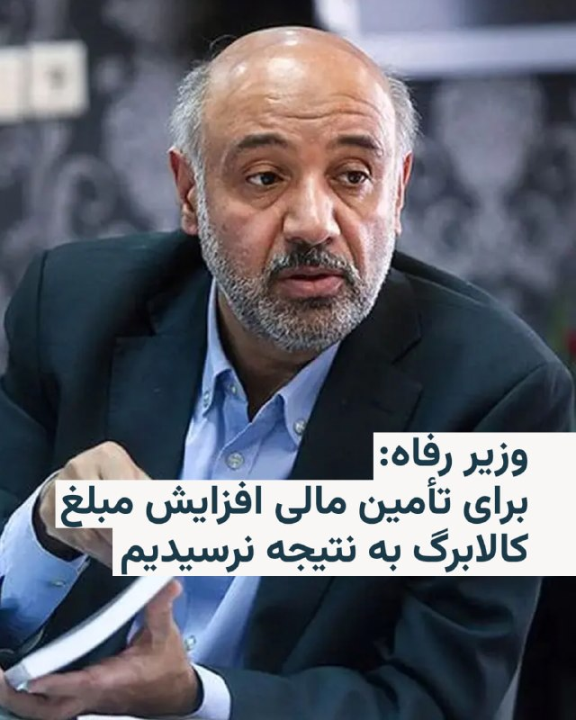

🔸احمد میدری، وزیر کار و رفاه جمهوری اسلامی، روز شنبه اعلام کرد به رغم دستور مسعود پزشکیان برای افزایش مبلغ کالابرگ، محدودیت‌های مالی وجود دارد و هنوز نتیجه‌ای حاصل نشده است.

🔸رئیس‌جمهور ایران روز ۱۷ خرداد در نشست شورای هماهنگی اقتصادی دولت گفته بود که «حداقل شش دهک پایین درآمدی باید از افزایش اعتبار کالابرگ بهره‌مند شوند».

🔸با این حال میدری اعلام کرد به دلیل «محدودیت‌های درآمدی» ناشی از جنگ اخیر «برای تأمین منابع مالی هنوز به نتیجه نرسیدیم».

🔸او وعده داد که دولت در جست‌وجوی منابع مالی برای افزایش مبلغ کالابرگ است. دولت پزشکیان سال گذشته با حدف ارز ترجیحی، اقدام به توزیع کالابرگ به شکل ماهانه در کشور کرد.

🔸این در حالی است که آمارهای بانک مرکزی و مرکز آمار ایران حاکی از افزایش شدید نرخ تورم در ماه‌های اخیر و بخصوص افزایش شدید قیمت مواد غذایی است.

@RadioFarda

## IranianMinds — post 22470

🔴الحدث به نقل از منابع آگاه:

عراقچی فردا راهی پاکستان خواهد شد.

@IranianMinds

## IranianMinds — post 22469

  <a href="telegram/content/IranianMinds_22469_1781361639.mp4" target="_blank">🎬 Download video</a>

🔴اکانت اسرائیل به فارسی:

یکی از بهترین ویدئوهای جنگ ۱۲ روزه 😂😂😂

@IranianMinds

## IranianMinds — post 22468

🔴آقای عراقچی ، حالم ازت به هم می‌خوره، خودم میکشمت.

@IranianMinds

## IranianMinds — post 22467

  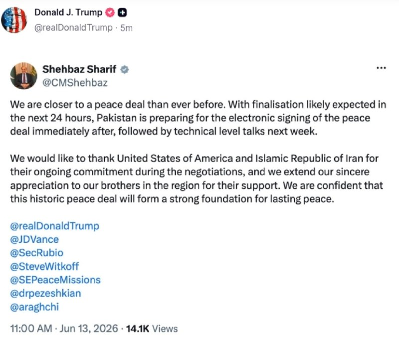

ترامپ توییت نخست‌وزیر پاکستان درمورد امضای دیجیتال یادداشت تفاهم ایران و آمریکا تا ۲۴ ساعت آینده را بازنشر کرد

@IranianMinds

## IranianMinds — post 22466

🔴 کانال های خبرگزاری فارس، بابک زنجانی، صرافی نوبیتکس، والکس، رمزینکس و بیت‌پین که تو یوتیوب فعالیت میکردن، به علت تحریمای آمریکا همگی مسدود شدن

@IranianMinds

## IranianMinds — post 22465

  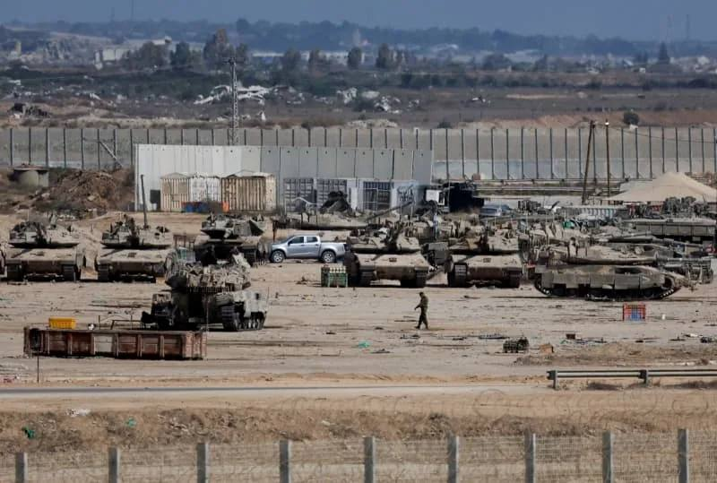

🔴 ارتش آمریکا شروع به ساخت یک پایگاه بزرگ در نزدیکی حصار پیرامونی غزه، نزدیک به پایگاه نظامی ریم در جنوب اسرائیل کرده است، طبق گزارش اسرائیل هیوم.

گفته می‌شود این تأسیسات به عنوان ستاد نظامی و غیرنظامی برای سازمان‌ها و پرسنل بین‌المللی فعال در منطقه در نظر گرفته شده است.

این پایگاه می‌تواند از اجرای طرح موسوم به «طرح ترامپ» حمایت کند، جایگزین ستاد چندملیتی که قبلاً در کریات گات قرار داشت.

@IranianMinds

## IranianMinds — post 22464

  <a href="telegram/content/IranianMinds_22464_1781361641.webm" target="_blank">🎬 Download video</a>

🆕 اپلیکیشن MelBet 
🔄

🎁 کد هدیه 100 دلاری: Sport100

🔵 کاملترین برنامه موبایل

🤝 اسپانسر رسمی لالیگا

☄️ صرافی معتبر

🤖 ربات راهنما

🇮🇷 برای تغییر زبان برنامه، زبان موبایل خود را تغییر دهید.

✅ ورود به اپلیکیشن بدون فیلترشکن

## IranianMinds — post 22463

💛 هنوز توی MelBet با این همه آپشن خفن و ضرایب فوق العاده ثبتنام نکردی 
⁉️

بعد میاید سوال میکنید کدوم سایت معتبره 
❗️

👀 اگه میخواید توی شرطبندی موفق باشید و درآمد کسب کنید در اولین قدم باید سایتی با آپشن های بی نظیر و ضرایب استاندارد و امنیت مالی بالا داشته باشید 
✔️

🎚️ همین حالا از طریق لینک زیر ثبتنام کنید و وارد دنیای جدیدی از شرطبندی بشید 
🆕

🎁 کد هدیه 100 دلاری: Sport100

✅ معرفی سایت و اپلیکیشن مل‌بت

💛 ورود به سایت مل‌بت (فیلترشکن خاموش)

## IranianMinds — post 22462

  

🔴جالب است که بدانید:

در اواخر بهمن ماه پارسال، ترامپ مصاحبه شمخانی را که گفته بود اگر آمریکایی‌ها سر حرفشون باشند ما می‌توانیم رابطه خوبی داشته باشیم، بازنشر کرده بود ولی چند روز بعد شمخانی کشته شد.
و دیشب هم پست عراقچی را بازنشر کرده.

@IranianMinds

## IranianMinds — post 22461

  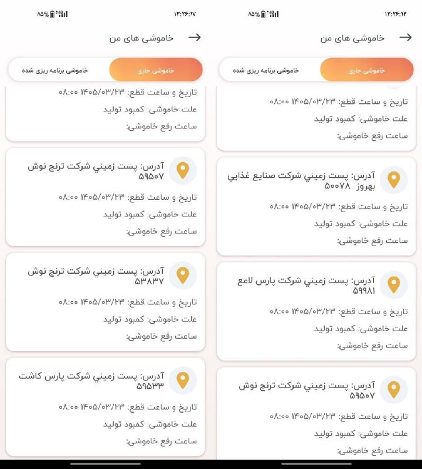

🔴با اینکه هنوز دو هفته به شروع تابستون مونده، در بعضی از مناطق کشور، قطعی‌های دو تا چهار ساعته شروع شده.

@IranianMinds

## BBCPersian — post 283697

  <a href="https://t.me/bbcpersian/283697" target="_blank">📎 Download file</a>

📻این هفته در پرگار: دیپلماسی ایرانی، امتیازگیری یا فرصت‌سوزی؟

🔻در دیپلماسی کنونی ایران بهرهبرداری حداکثری از امتیازهای میدان جنگ میبینم یا آنچه میبینیم زیادهخواهی و در نهایت فرصتسوزیست؟

میهمانها:
علم صالح، استاد دانشگاه در روابط بینالملل
علی مهتدی، تحلیلگر مسائل خاورمیانه

@BBCPersian

## BBCPersian — post 283696

  <a href="https://t.me/bbcpersian/283696" target="_blank">📎 Download file</a>

📻 تازه‌ترین خبرهای جهان، شنبه ۲۳ خرداد ۱۴۰۵

@BBCPersian

## BBCPersian — post 283695

  <a href="telegram/content/BBCPersian_283695_1781361643.mp4" target="_blank">🎬 Download video</a>

⭕️سرخط خبرها، شنبه ۲۳ خرداد ۱۴۰۵
@BBCPersian

## BBCPersian — post 283694

🔻گزارش‌ها از اصابت پرتابه به یک نفتکش در نزدیکی عمان

سازمان عملیات تجارت دریایی بریتانیا می‌گوید که یک نفتکش در نزدیکی سواحل عمان بر اثر برخورد یک پرتابه ناشناس به بخش جلویی بدنه آن آسیب دیده است.

به گفته این نهاد ناظر وابسته به نیروی دریایی بریتانیا، این حادثه دیروز و در فاصله حدود ۱۱ کیلومتری در شرق سواحل عمان رخ داده است.

بر اساس گزارش‌ها، تمامی خدمه نفتکش در سلامت هستند و هیچ‌گونه آلودگی یا خسارت زیست‌محیطی گزارش نشده است.

گفته شده است که این کشتی به مسیر خود به سمت بندر مقصد ادامه داده است.

جزئیات بیشتری از منشا این پرتابه منتشر نشده است.

https://bbc.in/4vRWDh3
@BBCPersian

## BBCPersian — post 283693

  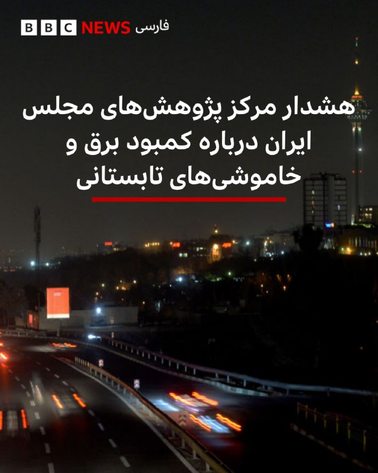

🔻مرکز پژوهش‌های مجلس شورای اسلامی درباره کمبود تولید برق در ایران هشدار داده و برای تابستان پیش رو، خاموشی و قطع برق پیش‌بینی کرده است.

در گزارش این نهاد مطالعاتی پارلمان ایران آمده است: «توجه به ناترازی تولید برق خورشیدی در شب و ادامه‌دار بودن تعمیرات نیروگاهی در آغاز فصل گرم، احتمال تشدید کمبود برق وجود دارد و اجرای فوری مدیریت مصرف، منابع آبی و پیک بار ضروری است.»

مرکز پژوهش های مجلس ایران گفته است که «در سناریوی واقع‌بینانه میزان کسری برق در اوج مصرف تابستان به حدود ۱۳ هزار و ۶۰۰ مگاوات خواهد رسید.»

بر اساس برآورد این نهاد، توان تأمین هم‌زمان شبکه برق ایران حدود ۶۸ هزار و ۴۰۰ مگاوات و میزان تقاضا بیش از ۸۱ هزار مگاوات است.

ایران در چند سال اخیر در تابستان با کمبود برق و در فصل زمستان با کمبود گاز مواجه بوده است.

مسعود پزشکیان، رئیس‌جمهور ایران، در هفته‌های اخیر چند بار درباره کمبود انرژی هشدار داد و خواستار صرفه‌جویی شهروندان و موسسات دولتی شد.

📸Anadolu Agency via Getty Images

https://bbc.in/4vJGYQy
@BBCPersian

## BBCPersian — post 283692

  <a href="telegram/content/BBCPersian_283692_1781361645.mp4" target="_blank">🎬 Download video</a>

🔻پس از آن که اعتراضات هفته گذشته زنان افغان در هرات به خشونت کشیده شد، عده‌ای از افغان‌های ساکن ایران برای حمایت از آن‌ها به خیابان آمدند.

براساس گزارش‌ها، تجمع‌ها در ایران روز چهارشنبه (۲۰ خرداد) بعد از برخورد خشن طالبان با زنان در هرات برگزار شده است.

زنان معترض با حمل پلاکاردها شعار «کار، تحصیل، آبادی» را سر داده و خواستار آزادی، آموزش، عدالت و حقوق برابر برای تمام مردم افغانستان شدند.

براساس گزارش‌ها، این تجمع ساعتی بعد با حضور نیروهای انتظامی جمهوری اسلامی ایران پایان یافت. معترضان می‌گویند که به آنان گفته شد که تجمع نیاز به مجوز دارد و در نهایت آنان متفرق شدند.

تظاهرات هفته گذشته در هرات به فراخوان شماری از زنان و در اعتراض به «بی‌عدالتی» برگزار شد و در جریان تیراندازی به سوی معترضان در آن، دست‌کم دو نفر کشته و چندین نفر هم مجروح شدند.

منابع محلی در هرات همچنین به بی‌بی‌سی گفته‌اند که دست‌کم چهار نفر روز جمعه (۲۲ خرداد) پس از تلاش برای برگزاری تظاهرات در مقابل دفتر والی بازداشت شدند.

https://bbc.in/49XtQiw
@BBCPersian

## BBCPersian — post 283691

  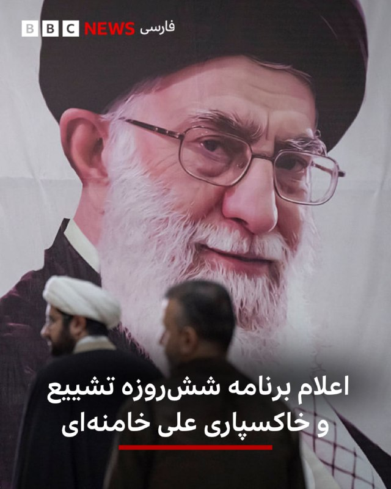

🔻بیش از سه ماه پس از کشته شدن علی خامنه‌ای در حمله آمریکا و اسرائیل، دفتر نشر آثار رهبر سابق جمهوری اسلامی، برنامه تشییع و خاکسپاری او را اعلام کرد.

بر اساس اطلاعیه دفتر نشر آثار علی خامنه‌ای مراسم تشییع او از ۱۳ تیر ماه در تهران آغاز می‌شود و با خاکسپاریش در ۱۸ تیرماه در حرم امام رضا در مشهد به پایان می‌رسد.

مراسم تشییع و خاکسپاری شماری دیگر از اعضای خانواده آقای خامنه‌ای هم که همراه او در حملات آمریکا و اسرائيل به تهران در نهم اسفند کشته شدند، همزمان برگزار می‌شود.

قرار است این مراسم در شهرهای تهران، قم و مشهد برگزار شود.

محمدامین توکلی‌زاده، معاون فرهنگی و اجتماعی شهرداری تهران پیش‌تر گفته بود که متولی مراسم سپاه پاسداران است و سه روز «بدرقه مردمی» در‌نظر گرفته شده است.

آقای توکلی‌زاده همچنین گفته بود: «در حال تدارک برای جمعیتی بیش از ۱۵ تا ۲۰ میلیون نفر در پایتخت هستیم.»

📸NurPhoto via Getty Images

https://bbc.in/49ZGZaP
@BBCPersian

## Dirty_Kids — post 391886

حتی سیمپسون ها هم نمیتونستن یه دروازه بان رو انقدر شبیه پیشبینی کنن اما انگار پایتخت این کارو کرده.

@Dirty_Kids 👻

## Dirty_Kids — post 391885

اقا چه دعوایی افتاده تو سران نظام سر توافق مادر همو دارن میگان
پایداری ها میگن یه پیام از مقوا بزارید که با توافق موافقه :)))))

@Dirty_Kids 👻

## Dirty_Kids — post 391884

  

‏«یه جور این عکسای مارو بگیر، این ساعت من بیفته.» @Dirty_Kids 👻

## Dirty_Kids — post 391883

  <a href="telegram/content/Dirty_Kids_391883_1781361647.mp4" target="_blank">🎬 Download video</a>

یادش بخیر! پارسال این موقع رافضی هر ۸ساعت یه دونه اف۳۵ میزد 😂😂😂😂😂😂

@Dirty_Kids 👻

## Dirty_Kids — post 391882

  <a href="telegram/content/Dirty_Kids_391882_1781361648.mp4" target="_blank">🎬 Download video</a>

🔴 یاس انگار از آینده اومده، ۱ سال پیش توی آهنگ «باغ» دقیقا وضعیت این روزا رو مو به مو پیش بینی کرده بود!!!

@Dirty_Kids 👻

## Hranews — post 113584

  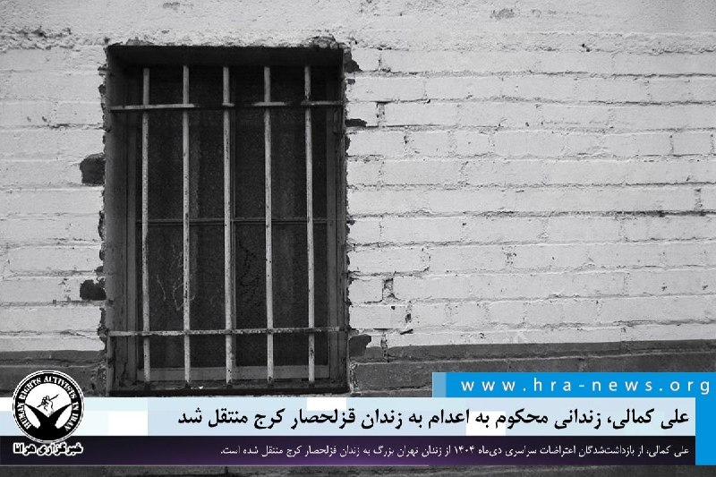

اعتراضات دی‌ماه؛ علی کمالی، زندانی محکوم به اعدام به زندان قزلحصار کرج منتقل شد

❗️
❗️
❗️
❗️
❗️– علی کمالی، از بازداشت‌شدگان اعتراضات سراسری دی‌ماه ۱۴۰۴ از زندان تهران بزرگ به زندان قزلحصار کرج منتقل شده است. انتقال این زندانی با توجه به محکومیت وی به #اعدام، موجب افزایش نگرانی خانواده و نزدیکان او شده است.

به گزارش خبرگزاری هرانا، ارگان خبری مجموعه فعالان حقوق بشر در ایران، علی کمالی، از بازداشت شدگان اعتراضات سراسری دی‌ماه، به زندان قزلحصار کرج منتقل شده است.

براساس اطلاعات دریافتی هرانا، آقای کمالی از زندان تهران بزرگ خارج و به زندان قزلحصار کرج منتقل شده است. یک منبع مطلع نزدیک به خانواده آقای کمالی با تایید این خبر به هرانا گفت: “انتقال این زندانی محکوم به اعدام، باعث افزایش نگرانی خانواده و نزدیکانش در خصوص وضعیت او شده است.”

ادامه مطلب

#علی_کمالی

↘️
@hranews_bot تماس ✉️ -  @Hranews  کانال هرانا 🆑

## Hranews — post 113583

  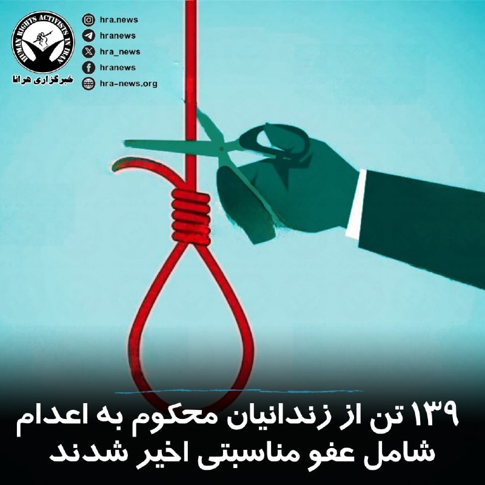

سخنگوی قوه قضائیه، روز جاری در یک نشست خبری اعلام کرد که ۱۳۹ تن از زندانیان محکوم به #اعدام، شامل عفو مناسبتی اخیر شده‌اند. به گفته اصغر جهانگیر، عفو رهبری مشمول زندانیانی شده است که فاقد شاکی خصوصی و سابقه جرایم امنیتی بوده اند و افرادی که دارای اتهامات امنیتی هستند و یا در اعتراضات سراسری دی‌ماه نقش داشته‌اند، از این عفو مناسبتی مستثنی هستند.

↘️
@hranews_bot تماس ✉️ -  @Hranews  کانال هرانا 🆑

## Hranews — post 113581

  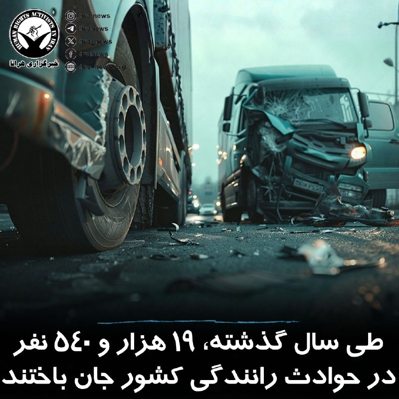

بر اساس اعلام سازمان پزشکی قانونی کشور، طی سال گذشته ۱۹ هزار و ۵۴۰ نفر در حوادث رانندگی جان خود را از دست دادند که از این تعداد، ۱۵ هزار و ۶۶۰ نفر مرد و سه هزار و ۸۸۰ نفر زن بودند. همچنین ۳۷۸ هزار و ۷۲۹ نفر در پی تصادفات رانندگی مصدوم شدند. در این مدت، استان‌های تهران، فارس و سیستان و بلوچستان بیشترین آمار تصادفات را به خود اختصاص دادند و استان‌های ایلام، کهگیلویه و بویراحمد و قم به ترتیب کمترین شمار تصادفات را ثبت کردند.

↘️
@hranews_bot تماس ✉️ -  @Hranews  کانال هرانا 🆑

## alonews — post 127639

  <a href="telegram/content/alonews_127639_1781361649.webm" target="_blank">🎬 Download video</a>

👈بازهم پیش بینی غلط خوش چشم

🔴خوش چشم شب قبل از اعلام توافق: آمریکا داره خرد خرد رادارها میزنه و بزودی حمله بزرگ میکنه

🔴فرداش توافق اعلام شد

✅ @AloNews خبر جنگ

## alonews — post 127638

  <a href="telegram/content/alonews_127638_1781361649.webm" target="_blank">🎬 Download video</a>

👈وزیر خارجه پاکستان به همتای سعودی: مراسم امضای الکترونیکی توافق آمریکا و ایران قرار است فردا برگزار شود

✅ @AloNews خبر جنگ

## alonews — post 127637

  <a href="telegram/content/alonews_127637_1781361650.mp4" target="_blank">🎬 Download video</a>

👈مراد ویسی: اسرائیل و موساد یه برنامه دقیق برای سرنگونی جمهوری اسلامی کشیده بودن که لحظه آخر ترامپ و اردوغان جلوشون رو گرفتن!!

✅ @AloNews خبر جنگ

## alonews — post 127636

  <a href="telegram/content/alonews_127636_1781361650.webm" target="_blank">🎬 Download video</a>

👈آکسیوس:
فردا توافق بین ایران و آمریکا امضا میشه.

✅ @AloNews خبر جنگ

## alonews — post 127635

  <a href="telegram/content/alonews_127635_1781361650.webm" target="_blank">🎬 Download video</a>

‌
👈عراقچی فردا راهی پاکستان می‌شود

الحدث به نقل از منابع آگاه:

🔴منابع حاکی از آن است که یک هیئت ایرانی، شامل وزیر امور خارجه، فردا وارد پاکستان خواهد شد.

🔴هیئت ایرانی بر مذاکرات فنی مربوط به این توافق نظارت خواهد داشت.

✅ @AloNews خبر جنگ

## alonews — post 127634

  <a href="telegram/content/alonews_127634_1781361650.webm" target="_blank">🎬 Download video</a>

👈ایرانسل همچنان اینترنت ۴۰ هزار تومانی می‌فروشد!

🔴با وجود انتقادها به اینترنت پرو و گرانی چند برابری آن، ایرانسل همچنان بسته یک‌ساله اینترنت پرو را به قیمت ۸ میلیون تومان عرضه می‌کند.

✅ @AloNews خبر جنگ

## alonews — post 127633

  <a href="telegram/content/alonews_127633_1781361651.webm" target="_blank">🎬 Download video</a>

👈امشب تو دروازه شمیران برنامه‌ها هست......

✅ @AloNews خبر جنگ

## alonews — post 127632

  <a href="telegram/content/alonews_127632_1781361651.webm" target="_blank">🎬 Download video</a>

👈ترامپ توییت نخست‌وزیر پاکستان درمورد امضای دیجیتال یادداشت تفاهم ایران و آمریکا تا ۲۴ ساعت آینده را بازنشر کرد

✅ @AloNews خبر جنگ

## alonews — post 127631

  <a href="telegram/content/alonews_127631_1781361651.webm" target="_blank">🎬 Download video</a>

👈واقعا خرن؟ یا خودشون به خریت زدن؟

🔴اگر توافقی بشه همه میدونن تصمیم کلیت نظام جمهوری اسلامی هست اما عده‌ای دارن میگن وای ببینید عراقچی رفت مذاکره و همه کاره اینه! واقعا خر هستید که فک میکنید دولت صفر تا صد توافق رو رفته؟ سیبل رو اشتباه گرفتی برادر من

✅ @AloNews خبر جنگ

## alonews — post 127630

  <a href="telegram/content/alonews_127630_1781361651.webm" target="_blank">🎬 Download video</a>

👈آرزوی یک تندرو: ایشالا عراقچی بمیره

✅ @AloNews خبر جنگ

## alonews — post 127629

  <a href="telegram/content/alonews_127629_1781361651.webm" target="_blank">🎬 Download video</a>

👈قطر بسته‌ای به ارزش ۱۲ میلیارد دلار را در مورد دارایی‌های مسدود شده ایران در جریان مذاکرات پیشنهاد داد که شامل آزادسازی ۶ میلیارد دلار از وجوه ایرانی نگهداری شده در قطر و یک خط اعتباری اضافی ۶ میلیارد دلاری است، طبق گزارش خبرگزاری مهر.

ایران در ابتدا پیشنهاد دریافت نیمی از دارایی‌های مسدود شده خود را در مراحل اولیه مذاکرات و مابقی را پس از توافق نهایی ارائه داد، اما ایالات متحده آن طرح را رد کرد. سپس قطر بسته جایگزین را برای کمک به شکستن بن‌بست ارائه داد.

۶ میلیارد دلار از دارایی‌های ایرانی نگهداری شده در قطر همچنان مشروط به محدودیت‌های استفاده بشردوستانه خواهد بود.

۶ میلیارد دلار اضافی به عنوان وام یا خط اعتباری مدیریت شده توسط قطر ارائه خواهد شد و ایران تعیین می‌کند که چگونه از آن استفاده شود.

✅ @AloNews خبر جنگ

## alonews — post 127628

  <a href="telegram/content/alonews_127628_1781361651.mp4" target="_blank">🎬 Download video</a>

👈قابل توجه جبهه پایداری🙂

✅ @AloNews خبر جنگ

## alonews — post 127627

  <a href="telegram/content/alonews_127627_1781361653.webm" target="_blank">🎬 Download video</a>

👈تجمع برخی از مردم تبریز در اعتراض به توافق با قاتل رهبر سابق

✅ @AloNews خبر جنگ

## alonews — post 127626

  <a href="telegram/content/alonews_127626_1781361653.mp4" target="_blank">🎬 Download video</a>

👈معاون اول ترامپ؛ ونس :
اگه برگردیم به جنگ جهانی دوم یا هر جنگ بزرگ دیگه‌ای توی تاریخ، آخرش همه‌شون با مذاکره و توافق تموم شدن

✅ @AloNews خبر جنگ

## alonews — post 127625

  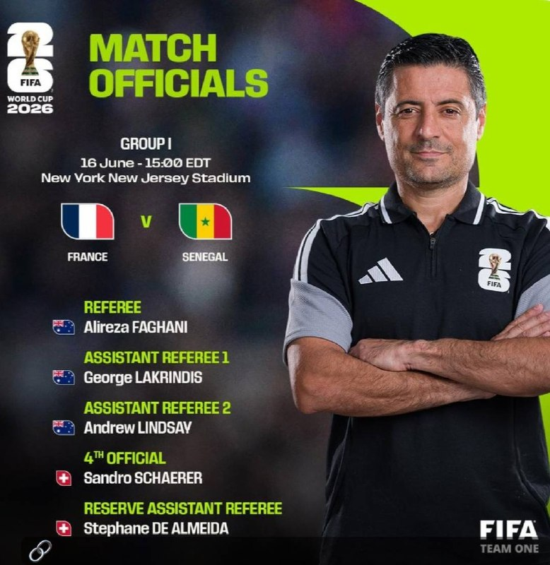

🇫🇷🇸🇳علیرضا فغانی داور بازی فرانسه و سنگال شد
@AloSport

## alonews — post 127624

👈حمزه صفوی: اگر تهران را با بمب اتم بزنند؛ ایران به مدت ۱۰ سال تنگه هرمز و خلیج فارس را ناامن خواهد کرد

پ.ن:
😐

✅ @AloNews خبر جنگ

## alonews — post 127623

  <a href="telegram/content/alonews_127623_1781361655.webm" target="_blank">🎬 Download video</a>

👈کانال های خبرگزاری معتبر فارس، بابک زنجانی، صرافی نوبیتکس، والکس، رمزینکس و بیت‌پین که تو یوتیوب فعالیت میکردن، به علت تحریمای آمریکا همگی مسدود شدن.

✅ @AloNews خبر جنگ

## alonews — post 127622

  <a href="telegram/content/alonews_127622_1781361655.webm" target="_blank">🎬 Download video</a>

👈یه اسپویل کنم؟ جبهه منحوس پایداری بزودی دیلیت میشه. خبر دارم که میگم😉

✅ @AloNews خبر جنگ

## alonews — post 127621

  <a href="telegram/content/alonews_127621_1781361655.webm" target="_blank">🎬 Download video</a>

👈تمسخر لهجه مشهدی و حمله به قالیباف توسط مالک شریعتی نماینده پایداری مجلس

✅ @AloNews خبر جنگ

## alonews — post 127620

  <a href="telegram/content/alonews_127620_1781361655.webm" target="_blank">🎬 Download video</a>

👈بقایی: زمان امضای تفاهم‌نامه فردا نخواهد بود

🔴تفاهم‌نامه اسلام‌آباد بر پایان جنگ متمرکز است و در این مرحله موضوع هسته‌ای در دستور کار مذاکرات قرار ندارد

✅ @AloNews خبر جنگ

---
📅 بروزرسانی: 1405/03/23 15:57
---

## VahidOOnLine — post 245305

  

شهباز شریف، نخست‌وزیر پاکستان، در شبکه ایکس نوشت تهران و واشینگتن بیش از هر زمان دیگری به تفاهم‌نامه صلح نزدیک شدند و احتمال نهایی شدن آن در ۲۴ ساعت آینده وجود دارد.

او همچنین نوشت پاکستان برای امضای الکترونیکی تفاهم‌نامه صلح میان آمریکا و جمهوری اسلامی، بلافاصله پس از نهایی شدن آن، آماده می‌شود.
‌🏁 🇬🇧 IranintlTV

🤖 @VahidOOnLine

## VahidOOnLine — post 245304

  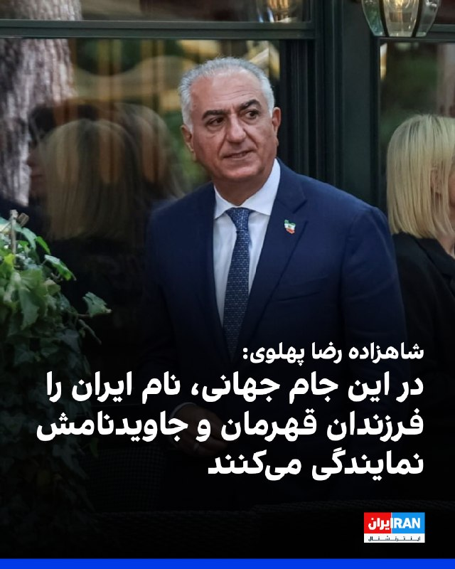

شاهزاده رضا پهلوی با اشاره به برگزاری مسابقات فوتبال جام جهانی ۲۰۲۶، در شبکه ایکس نوشت «در این جام جهانی، نام ایران را فرزندان قهرمان و جاویدنامش نمایندگی می‌کنند.»

او همچنین از ایرانیان خواست پیراهن‌های منقش به تصاویر جاویدنامان ایران را به ورزشگاه‌ها و خیابان‌ها ببرند و افزود: «بگذارید جهان بداند تیم واقعی ایران، مردم شجاع ایران‌اند؛ نه نمایندگان رژیم جنایتکار و اشغالگر ایران.»
‌🏁 🇬🇧 IranintlTV

🤖 @VahidOOnLine

## VahidOOnLine — post 245303

  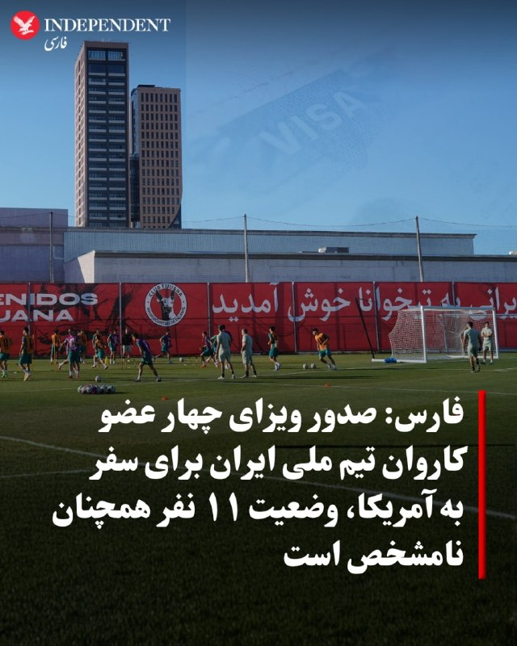

♦️در فاصله دو روز تا سفر تیم ملی فوتبال ایران به لس‌آنجلس برای آغاز رقابت‌های جام جهانی ۲۰۲۶، چهار عضو کاروان ایران موفق به دریافت ویزای آمریکا شدند.
خبرگزاری فارس، روز شنبه ۲۳ خرداد ماه با اعلام این خبر گزارش کرد، وزارت خارجه آمریکا برای امید جمالی، رئیس دپارتمان بین‌الملل فدراسیون، علی افضلی، کارشناس بین‌الملل، مسعود اردشیر، افسر امنیتی تیم ملی و مهرپویا اسدی، آنالیزور تیم، روادید سفر به ایالات متحده صادر کرده است.
با این حال، وضعیت ویزای ۱۱ نفر دیگر از اعضای کاروان ایران همچنان نامشخص است. مهدی تاج، رئیس فدراسیون فوتبال، هدایت ممبینی، دبیرکل فدراسیون، مهدی محمدنبی، مدیر تیم ملی، مهدی خراطی، مدیر اجرایی تیم ملی، محسن معتمدکیا، مدیر رسانه‌ای تیم ملی، سیامک قلیچ‌خانی، عضو بخش رسانه‌ای، مهدی ملک‌آباد، رئیس حراست فدراسیون، سروش سلماسی، آنالیزور تیم ملی و رضا جاودان، عضو کادر تدارکات، از جمله افرادی هستند که هنوز ویزای آمریکا را دریافت نکرده‌اند.
به گزارش فارس، تیم ملی ایران که در شهر تیخوانای مکزیک حضور دارد، طبق برنامه روز دوشنبه پس از صرف ناهار در محل اردو راهی فرودگاه خواهد شد تا به لس‌آنجلس سفر کند.
‌🇸🇦 Indypersian

🤖 @VahidOOnLine

## VahidOOnLine — post 245302

  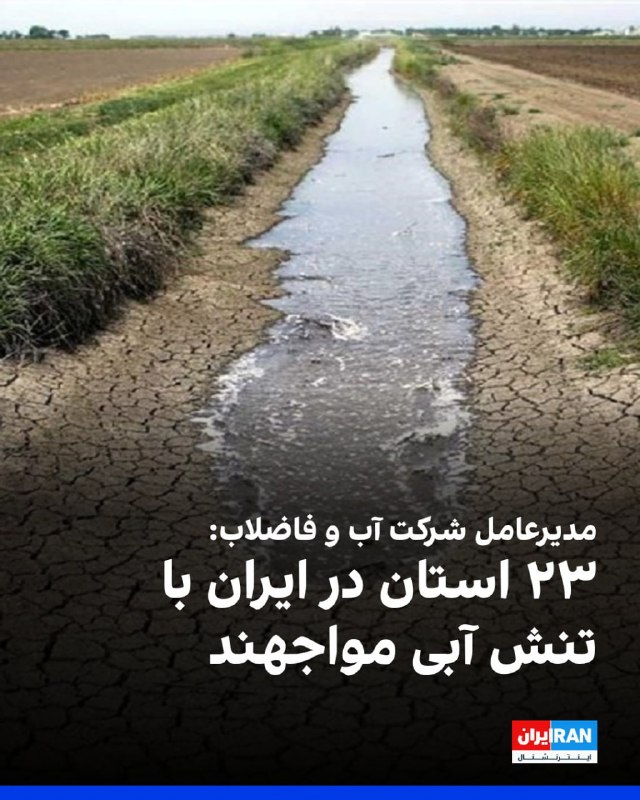

هاشم امینی، مدیرعامل شرکت آب و فاضلاب کشور، با اشاره به کاهش بارندگی‌ها در سال آبی جاری گفت ۲۳ استان ایران با تنش آبی مواجه‌اند. همزمان، عباس علی‌آبادی، وزیر نیرو جمهوری اسلامی، اعلام کرد طرح‌های انتقال آب به برخی مناطق، استفاده از تجهیزات کاهنده مصرف و برنامه‌های صرفه‌جویی در مصرف آب در حال اجرا و پیگیری است.

پیش‌تر خبرگزاری ایلنا گزارش داد ۳۳ درصد از ظرفیت مجموع سدهای کشور خالی است. بر اساس این گزارش، تا ۱۶ خرداد سدهای دوستی و طرق در خراسان رضوی، بارزو در خراسان شمالی و ساوه در استان مرکزی در «وضعیت قرمز» قرار داشتند.
iranintl
‌🏁 🇬🇧 IranintlTV

🤖 @VahidOOnLine

## VahidOOnLine — post 245301

  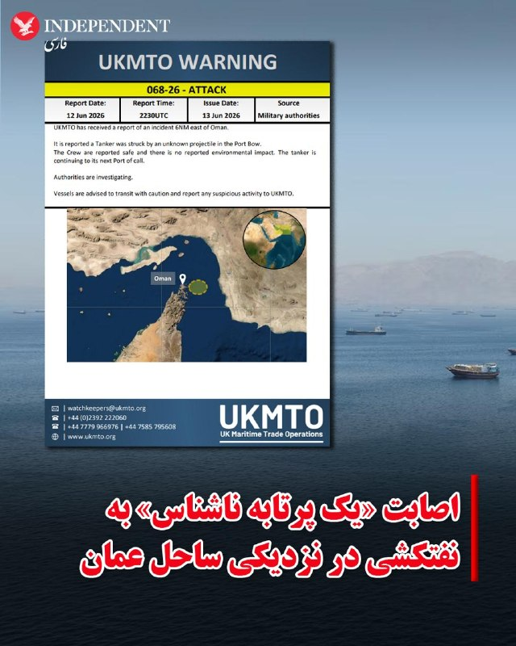

♦️مرکز عملیات تجارت دریایی بریتانیا (UKMTO) روز شنبه ۲۳ خرداد ماه کرد یک نفتکش در نزدیکی سواحل عمان هدف اصابت یک پرتابه ناشناس قرار گرفته است.
بر اساس هشدار منتشرشده از سوی این نهاد، حادثه در فاصله حدود ۱۱ کیلومتری شرق عمان رخ داده و گزارش‌های اولیه نشان می‌دهد پرتابه‌ای ناشناس به بخش جلویی سمت چپ نفتکش برخورد کرده است.
مرکز عملیات تجارت دریایی بریتانیا اعلام کرد تمامی خدمه کشتی در سلامت هستند و تاکنون هیچ‌گونه آلودگی یا خسارت زیست‌محیطی ناشی از این حادثه گزارش نشده است. همچنین نفتکش پس از حادثه به مسیر خود به سمت مقصد بعدی ادامه داده است.
مرکز عملیات تجارت دریایی بریتانیا از شناورهای عبوری خواسته است هنگام عبور از منطقه با احتیاط عمل کرده و هرگونه فعالیت مشکوک را به این مرکز گزارش دهند.
‌🇸🇦 Indypersian

🤖 @VahidOOnLine

## VahidOOnLine — post 245300

  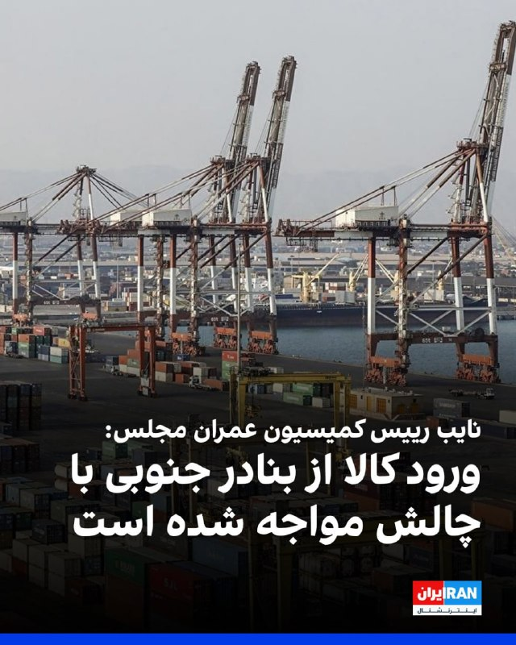

‌🏁 🇬🇧 IranintlTV

🤖 @VahidOOnLine

## VahidOOnLine — post 245299

  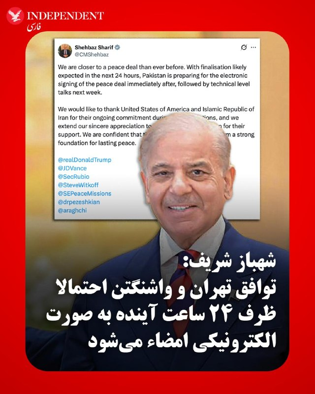

♦️شهباز شریف، نخست‌وزیر پاکستان، روز شنبه ۲۳ خرداد ماه در پیامی در شبکه اجتماعی ایکس اعلام کرد که تهران و واشنگتن «بیش از هر زمان دیگری به دستیابی به توافق صلح» نزدیک شده‌اند و احتمال می‌رود متن نهایی این توافق ظرف ۲۴ ساعت آینده نهایی شود.
شریف نوشت: «ما بیش از هر زمان دیگری به توافق صلح نزدیک شده‌ایم. انتظار می‌رود نهایی‌سازی توافق در ۲۴ ساعت آینده انجام شود و پاکستان در حال آماده‌سازی برای امضاء الکترونیکی توافق بلافاصله پس از آن است.»
او افزود پس از امضاء توافق، گفتگوهای فنی در سطح کارشناسی طی هفته آینده برگزار خواهد شد.
نخست‌وزیر پاکستان همچنین از ایالات متحده و جمهوری اسلامی ایران به دلیل ادامه تعهد به روند مذاکرات قدردانی کرد و از کشورهای منطقه نیز به خاطر حمایت از این روند تشکر کرد.
شهباز شریف در پایان ابراز اطمینان کرد که این «توافق صلح تاریخی» می‌تواند پایه‌ای مستحکم برای برقراری صلحی پایدار در منطقه باشد.
نخست وزیر پاکستان در پایان این پیام، حساب‌های کاربری دونالد ترامپ، جی دی ونس، مارکو روبیو، استیو ویتکاف، عباس عراقچی و محمد باقر قالیباف را اضافه کرد.
‌🇸🇦 Indypersian

🤖 @VahidOOnLine

## VahidOOnLine — post 245298

  

آویگدور لیبرمن، رهبر حزب راستگرای «اسرائیل، خانه ما» و وزیر پیشین دفاع این کشور، در شبکه ایکس نوشت: «توافقی که در حال شکل‌گیری با تهران است، یک پیروزی کامل برای آیت‌الله‌ها و از دیدگاه اسرائیل یک فاجعه است.»

او اضافه کرد: «مسئولیت چنین توافقی برعهده بنیامین نتانیاهو است.»
iranintl
‌🏁 🇬🇧 IranintlTV

🤖 @VahidOOnLine

## VahidOOnLine — post 245297

  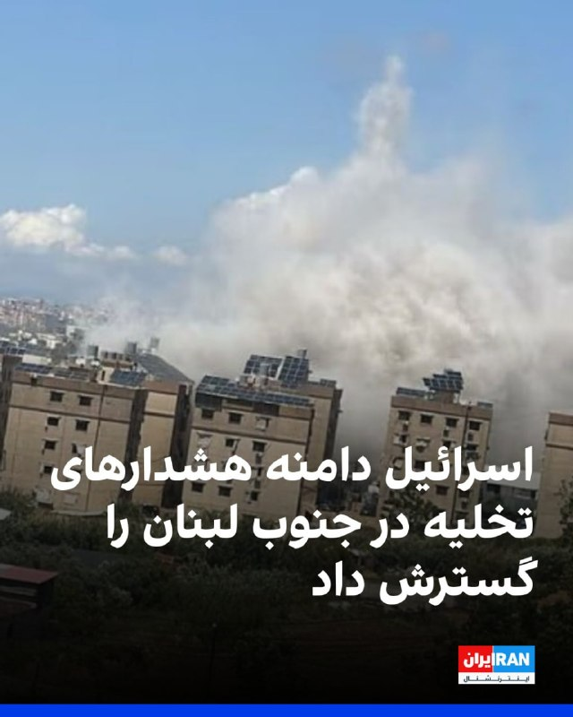

ارتش اسرائیل از ساکنان غسانیه، زراریه، مزرعه کوثریه الرز و صیر الغربیه در جنوب لبنان خواست فورا خانه‌های خود را ترک کنند و به شمال رودخانه زهرانی منتقل شوند. ارتش اسرائیل اعلام کرد در پی نقض توافق آتش‌بس از سوی حزب‌الله، علیه این گروه اقدام خواهد کرد.

ارتش همچنین هشدار داد حضور در نزدیکی نیروها و تاسیسات حزب‌الله جان غیرنظامیان را به خطر می‌اندازد.

ارتش اسرائیل پیش‌تر نیز برای ساکنان روستاهای صرفند، تفاحتا و مزرعه سینا در جنوب لبنان هشدار تخلیه صادر کرده بود.
iranintl
‌🏁 🇬🇧 IranintlTV

🤖 @VahidOOnLine

## VahidOOnLine — post 245296

  

شهباز شریف، نخست‌وزیر پاکستان، در شبکه ایکس نوشت تهران و واشینگتن بیش از هر زمان دیگری به تفاهم‌نامه صلح نزدیک شدند و احتمال نهایی شدن آن در ۲۴ ساعت آینده وجود دارد.

او همچنین نوشت پاکستان برای امضای الکترونیکی تفاهم‌نامه صلح میان آمریکا و جمهوری اسلامی، بلافاصله پس از نهایی شدن آن، آماده می‌شود.
iranintl
‌🏁 🇬🇧 IranintlTV

🤖 @VahidOOnLine

## VahidOOnLine — post 245290

  <a href="telegram/content/VahidOOnLine_245290_1781353651.mp4" target="_blank">🎬 Download video</a>

آیا یوتیوب از کانال‌های مرتبط با نهادها و افراد تحریم‌شده جمهوری اسلامی درآمد کسب می‌کند؟

گزارش تازه وایرد به نقل از یک پژوهش مستقل می‌گوید ده‌ها کانال مرتبط با افراد و نهادهای تحت تحریم آمریکا همچنان در یوتیوب فعال بوده‌اند و تبلیغات برندهای بزرگ روی ویدیوهای آن‌ها نمایش داده شده است.

گوگل می‌گوید به قوانین تحریم‌ها پایبند است و علیه حساب‌های ناقض سیاست‌هایش اقدام کرده، اما هنوز مشخص نیست آیا بخشی از درآمد تبلیغات به این کانال‌ها پرداخت شده است یا نه.
‌🏁 🇬🇧 ManotoTV

🤖 @VahidOOnLine

## VahidOOnLine — post 245289

  <a href="telegram/content/VahidOOnLine_245289_1781353652.mp4" target="_blank">🎬 Download video</a>

جمعی از ایرانیان مقیم نیوزیلند شنبه ۲۳ خرداد همزمان با زادروز مجیدرضا رهنورد، جانباخته خیزش انقلابی ۱۴۰۱، با تشکیل یک زنجیره انسانی و سخنرانی در شهر اوکلند یاد او را گرامی داشتند.
‌🏁 🇬🇧 IranintlTV

🤖 @VahidOOnLine

## VahidOOnLine — post 245288

  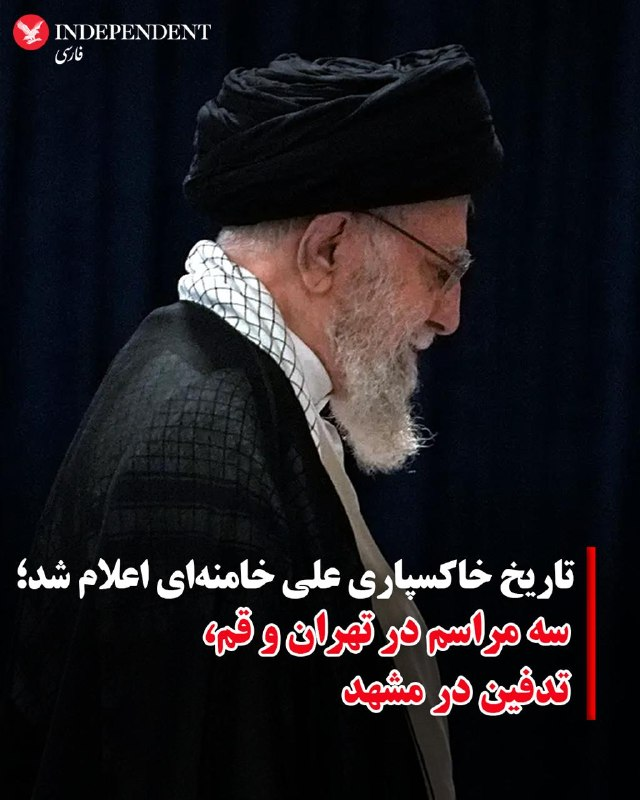

♦️«ستاد بزرگداشت رهبر شهید» که برای خاکسپاری علی خامنه‌ای، دومین رهبر جمهوری اسلامی تشکیل شده است، روز شنیه ۲۳ خرداد ماه با انتشار بیانیه‌ای برنامه مراسم تشییع و خاکسپاری او را اعلام کرد.
بر اساس این بیانیه روزهای شنبه و یکشنبه ۱۴ و۱۳ تیرماه، در مصلای امام خمینی تهران مراسمی تحت عنوان «وداع» برگزار خواهد شد، اما مراسم تشییع علی خامنه‌ای در تهران، در روز بعد یعنی دوشنبه ۱۵ تیر برگزار می‌شود.
این بیانیه همچنین اعلام کرده است که مراسم تشییع دیگری روز سه‌شنبه ۱۶ تیرماه در شهر قم برگزار خواهد شد.
بر اساس برنامه منتشرشده، آخرین مرحله خاکسپاری علی خامنه‌ای، روز پنج‌شنبه ۱۸ تیرماه در مشهد برگزار می‌شود و او در حرم امام هشتم شیعیان به خاک سپرده خواهد شد.
علی خامنه‌ای، دومین رهبر جمهوری اسلامی روز نهم اسفندماه سال ۱۴۰۴ در موج اول حملات هوایی آمریکا و اسرائیل به بیت رهبر به همراه تعدادی از اعضای خانواده و مقام‌های ارشد سیاسی و نظامی حکومت کشته شد.
با گذشت بیش از ۱۰۰ روز از کشته شدن رهبر پیشین جمهوری اسلامی، مجتبی خامنه‌ای، پسر و جانشین او در انظار عمومی ظاهر نشده و حضور او در مراسم تدفین پدرش در هاله‌ای از ابهام قرار دارد.
‌🇸🇦 Indypersian

🤖 @VahidOOnLine

## WithYashar — post 14716

نماینده مجلس خطاب به عراقچی وزیر امور خارجه:
مذاکره بعد از حمله نظامی، دیپلماسی نیست، مستعمره شدن است
@withyashar

## WithYashar — post 14715

وزیر آموزش و پرورش: به خاطر اهمیت حضور دانش آموزان در مراسم تشییع، تقویم امتحانات نهایی بازنگری میشه و احتمالا تاریخ امتحانات عقب میوفته
@withyashar

## WithYashar — post 14714

بعد از پخش آهنگ امیر تتلو از زندان که پشت تلفن اجرا شده بود، زندان تهران بزرگ تلفن او را مسدود کرد و تنها دلخوشی او هم گرفته شد.
@withyashar

## WithYashar — post 14713

بلومبرگ: جمهوری اسلامی به‌احتمال زیاد در جریان آتش‌بس، سلاح‌های پیشرفته روسی رو به ذخایر تسلیحاتی خودش اضافه کرده.
@withyashar

## WithYashar — post 14712

سازمان UKMTO گزارشی از وقوع یک حادثه در فاصله ۶ مایل دریایی (6NM) در شرق عمان دریافت کرده است.

گزارش شده است که یک کشتی نفت‌کش در بخش جلو و سمت چپ بدنه (Port Bow) مورد اصابت پرتابه ناشناس قرار گرفته است.
@withyashar

## WithYashar — post 14711

نخست‌وزیر پاکستان: متن نهایی توافقنامه صلح بین ایران و آمریکا به دست آمد
@withyashar

## mwarmonitor — post 10823

⚠️اطلاعیه رسمی کانال ⚠️ 🔸بدین‌وسیله به اطلاع همراهان گرامی می‌رسد که کانال خبری ما در پلتفرم X (توییتر سابق) راه‌اندازی شد. 🔸از این پس نیز ، آخرین اخبار و تحلیل‌های نظامی، سیاسی و همچنین مسائل اجتماعی ایران و جهان به‌صورت منظم در آن منتشر خواهد شد. 🔸از…

## mwarmonitor — post 10822

🔸روزنامه واشنگتن‌پست: قطر در اوایل جنگ، از طریق کانال‌های محرمانه با ایران وارد گفت‌وگو شده تا مجموعه گازی «راس لافان» را از فهرست اهداف حمله تهران خارج کند؛ بر اساس گفته مقام‌های خاورمیانه‌ای و غربی که در جریان اطلاعات امنیتی قرار داشته‌اند.

🔹به گفته این مقام‌ها، قطر پیشنهاد داده بود تولید گاز را متوقف کند؛ اقدامی که می‌توانست باعث افزایش شدید قیمت جهانی انرژی شود و آمریکا و اسرائیل را برای کوتاه‌تر کردن جنگ تحت فشار قرار دهد، در ازای اینکه ایران به این تأسیسات حمله نکند.

🔹قطر هرگونه توافق پنهانی را رد کرده و گفته است که توقف فعالیت‌ها صرفاً به دلیل تهدیدهای معتبر علیه کارکنان و زیرساخت‌ها انجام شده است.

🔹این گزارش همچنین می‌گوید مقام‌های آمریکایی از این اطلاعات امنیتی مطلع بوده‌اند و در ادامه، تأسیسات راس لافان در ۱۸ مارس هدف حملات ایران قرار گرفته که به زیرساخت‌هایی مرتبط با حدود ۲۰٪ صادرات LNG قطر آسیب زده است.

@mwarmonitor

## mwarmonitor — post 10821

🔰نخست وزیر پاکستان

🔴ما به توافق صلح بیش از هر زمان دیگری نزدیک هستیم. انتظار می‌رود نهایی‌سازی آن ظرف ۲۴ ساعت آینده انجام شود و پاکستان بلافاصله پس از آن برای امضای الکترونیکی این توافق صلح آماده می‌شود، و سپس مذاکرات فنی در هفته آینده آغاز خواهد شد.

🔴از ایالات متحده آمریکا و جمهوری اسلامی ایران بابت تعهد مستمرشان در طول مذاکرات تشکر می‌کنیم و همچنین قدردانی صمیمانه خود را از برادرانمان در منطقه برای حمایتشان ابراز می‌داریم. ما مطمئن هستیم که این توافق تاریخی صلح، پایه‌ای محکم برای صلح پایدار خواهد بود.

@mwarmonitor

## mwarmonitor — post 10820

  <a href="telegram/content/mwarmonitor_10820_1781353655.mp4" target="_blank">🎬 Download video</a>

حمله سایبری به چهار بانک در ایران

## mwarmonitor — post 10819

  <a href="telegram/content/mwarmonitor_10819_1781353656.mp4" target="_blank">🎬 Download video</a>

🚨 فوری — هشدار تخلیه به ساکنان لبنان 🔸به ساکنان حاضر در روستاها و شهرک‌های زیر هشدار فوری داده می‌شود: غسانیه، الزراریه، مزرعه کوثرية الرز، صیر غربی 🔸 در پی نقض توافق آتش‌بس از سوی «حزب‌الله تروریستی»، ارتش دفاعی اسرائیل ناچار است علیه آن با قدرت اقدام کند.…

## mwarmonitor — post 10818

حمله‌ای به یک کشتی در دریای عمان.

## mwarmonitor — post 10816

حمله‌ای به یک کشتی در دریای عمان.

## mwarmonitor — post 10814

  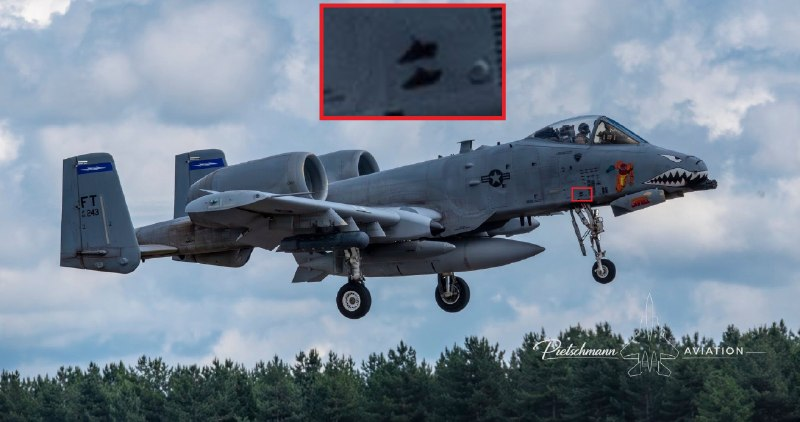

✈️هواپیمای A-10 وارهاگ نیروی هوایی آمریکا (USAF) در حال بازگشت از خاورمیانه به بریتانیا دیده شده است، در حالی که روی بدنه آن چندین «نشان شکار» (Kill marks) دیده می‌شود؛ از جمله به نظر می‌رسد دو فروند قایق تندرو نیروی دریایی سپاه پاسداران (IRGC-N) نیز در میان آن‌ها باشد.

@mwarmonitor

## FoxNewsTwitter — post 342928

  <a href="telegram/content/FoxNewsTwitter_342928_1781353658.mp4" target="_blank">🎬 Download video</a>

Fox News (Twitter/X)

"We will find these vicious murderers and drug lords anytime, anyplace, and send them to the depths of hell where they belong."

President Trump issued the warning after announcing that U.S. Southern Command carried out a strike that killed Tren de Aragua leader Niño Guerrero.

Trump says the operation was coordinated with Venezuelan authorities and marks a major blow against the gang that U.S. officials have accused of spreading violence, extortion, drug trafficking, and terror across the region.

With Guerrero dead, Trump is signaling that other cartel and gang leaders are now on notice.

## FoxNewsTwitter — post 342924

Fox News (Twitter/X)

## FoxNewsTwitter — post 342920

Fox News (Twitter/X)

History was made Friday night as Team USA rolled past Paraguay 4-1 in its 2026 FIFA World Cup opener in Southern California.

The victory was historic in more ways than one. It was the first time the U.S. had won a World Cup match by three goals since 1930 — when America also defeated Paraguay.

The four-goal outburst also marked the first time the United States has scored at least four goals in a World Cup match. Folarin Balogun, 24, also made history, becoming the first American player since 1930 to score multiple goals in a World Cup game.

## pm_afshaa — post 93757

  <a href="telegram/content/pm_afshaa_93757_1781353659.webm" target="_blank">🎬 Download video</a>

🔴کیهان: اگه تنگه هرمز رو باز کنید دشمن دوباره حمله میکنه؛ هیچ آدم عاقلی نقطه قوت خودش رو پای میز مذاکره نمی‌بره.

💧 Rainbet.com the #1 Non-KYC Crypto Casino & Sportsbook @rainbetcom

😁 @Pm_Afshaa

## pm_afshaa — post 93756

  <a href="telegram/content/pm_afshaa_93756_1781353660.webm" target="_blank">🎬 Download video</a>

🔴بلومبرگ: جمهوری اسلامی به‌احتمال زیاد در جریان آتش‌بس، سلاح‌های پیشرفته روسی رو به ذخایر تسلیحاتی خودش اضافه کرده.

💧 Rainbet.com the #1 Non-KYC Crypto Casino & Sportsbook @rainbetcom

😁 @Pm_Afshaa

## pm_afshaa — post 93755

  <a href="telegram/content/pm_afshaa_93755_1781353660.webm" target="_blank">🎬 Download video</a>

🔴با اینکه هنوز حدود دو هفته تا آغاز تابستان باقی مونده، جمهوری اسلامی در برخی استان‌های کشور قطعی‌های 2 تا 4 ساعته برق رو شروع کرده!

💧 Rainbet.com the #1 Non-KYC Crypto Casino & Sportsbook @rainbetcom

😁 @Pm_Afshaa

## pm_afshaa — post 93754

جزییات کامل مراسم دفن جنازه علی خامنه‌ای به نقل از خبرگزاری فارس:

- روزهای شنبه ۱۳ و یکشنبه ۱۴ تیرماه: مراسم وداع با جنازه در مصلای خمینی.
- روز دوشنبه ۱۵ تیرماه: مراسم تشییع در تهران.
روز سه‌شنبه ۱۶ تیرماه: مراسم تشییع در شهر قم.
- روز پنج‌شنبه ۱۸ تیرماه: مراسم تشییع در مشهد و تدفین در حرم امام‌رضا

💧Rainbet.com the #1 Non-KYC Crypto Casino & Sportsbook @rainbetcom

😁 @Pm_Afshaa

## pm_afshaa — post 93753

  <a href="telegram/content/pm_afshaa_93753_1781353661.webm" target="_blank">🎬 Download video</a>

🔴شهباز شریف، نخست‌وزیر پاکستان:
ما از هر زمان دیگه‌ای به توافق صلح نزدیک‌تر شدیم؛ با توجه به اینکه احتمالاً نهایی شدن توافق طی 24 ساعت آینده انجام میشه، پاکستان در حال آماده‌سازی واسه امضای الکترونیکی توافق صلح است. هفته بعد هم مذاکرات تو سطح کارشناسی و فنی برگزار خواهد شد.

ما اطمینان داریم که این توافق صلح تاریخی، پایه‌ای مستحکم واسه برقراری صلحی پایدار و بلندمدته.

💧 Rainbet.com the #1 Non-KYC Crypto Casino & Sportsbook @rainbetcom

😁 @Pm_Afshaa

## DEJradio — post 5653

  <a href="telegram/content/DEJradio_5653_1781353661.webm" target="_blank">🎬 Download video</a>

🚨
⭕️ اختصاصی؛
هشدار پزشکیان در جلسه خصوصی شورای‌‌عالی امنیت ملی:
اداره کشور با وضعیت فعلی ممکن نیست

اختلاف درون حکومت بر «توافق کردن یا نکردن» با آمریکا بالا گرفته است. سندی که ترامپ روی آن اصرار دارد «تسلیم جمهوری اسلامی» است. گروهی از فرماندهان ســ.ـپاه و چهره‌هایی مثل پزشکیان و عراقچی به دنبال توافق‌اند و گروهی دیگر همچنان منفعت حکومت را در «مقاومت» می‌بینند.

مخالفان توافق مدعی‌اند مفاد پیش‌نویس برخلاف نظر مجتبی خامنه‌ای است اما عراقچی می‌گوید، «شورای‌عالی امنیت ملی بر روند مذاکرات اشراف دارد.»

دولت پزشکیان به هر قیمتی به دنبال توافق است اما نهادهای نظامی و بخشی از مجلس معتقدند تسلیم برابر آمریکا به تهدید برای اصل نظام است.

اکنون هواداران نظام که بیش از ۱۰۰ شب در خیابان مانده‌اند نمی‌دانند قرار است حکومت تسلیم آمریکا شود یا جنگ ادامه خواهد داشت اما آنچه کاملاً مشهود است، کمبود شدید منابع مالی برای اداره امورات کشور است بویژه آنکه ترامپ قویاً بر ادامه محاصره دریایی تأکید دارد. گفته می‌شود پزشکیان در جلسات محرمانه شورای‌عالی امنیت ملی هشدار داده با وضعیت فعلی بودجه اداره کشور ممکن نیست.

#پزشکیان #مذاکرات #توافق
@DEJradio

## mamlekate — post 103701

📞 الو سلام الان ساعت ۱۲:۱۶ روز شنبه ۲۳ خرداد. الان نیم ساعتی هست که خیلی از همراه بانکا قطع شده و کار نمیکنه، معلوم نیست باز چه گوهی دارن میخورن
۶ تا همراه بانک دارم و هیچکدوم نمیره داخلشون ، اخطار خطای داخلی میاره
ملی ، صادرات،مسکن،توسعه تعاون،کشاورزی،سپه
اینارو من رو گوشیم دارم

📞 اینجا هم قطع شده وسط اوج روز کاری روز شنبه که همه سر کارن. دم مغازه از ساعت ۱۰ کارتای تجارت ، ملی و صادرات همشون قطعه تا الان که هنوزم اینجوریه

یکجا میگن حمله سایبری بوده یکجا میگن بروزرسانی زیرساخت.
آخه بروزرسانی اونم توی این ساعت؟

📞 الو اینترنت بانک سامان هم قطع شده. حرف مذاکره شد همه چیو قطع کردن که کسی نتونه پول بزنه خیلی ارز نریزه

📞 از ساعت ۱۱:۳۰ قطع شدن
هنوز هم قطع هستن
من ملی ، سینا و سامان دارم
کار نمیکنن
میشه خرید کرد تو سوپرمارکت امتحان کردم
ولی همراه بانک ها قطع هستن
خودپرداز هم رفتم
کار نمیکنه هیچی

📞 سلام. امروز کارت های بانک ملی ، تجارت، صادرات کارت نمیکشه و میگه صادر کننده غیر فعاله.

📞 درمورد مشکل بانکی، کل جنوب مملکت هم همینطوره.
جز بانک زپرتی رفاه، کارت هیچ بانک دیگه‌ای کار نمیده. نه تنها کارتخوان‌ها، بلکه اپ‌های بانکی هم ارور میدن و امکان انتقال پول نیست.
خوب شد دویست سیصد تومن پول نقد داشتم وگرنه بنزین هم نمیتونستم بزنم

دوستی می‌گفت مث اینکه شب آخر (پس پریشب) دیتاسنترهایی که توی فرودگاه پیام هست رو زدن، و انتقال سیستم به دیتاسنترهای دیگه احتمالا باعث این مشکل شده

❗️ درود . وقت خوش. شنیده شدن صدای پرواز هواپیما و صدای تک انفجار امروز شنبه ۲۳ خردا د ۱۴۰۵ ساعت ۱۳:۲۰ شهر همدان

@mamlekate

## IranIntlTV — post 342054

  <a href="telegram/content/IranIntlTV_342054_1781353661.mp4" target="_blank">🎬 Download video</a>

حزب زنان ایران اعلام کرد، شنبه ۲۳ خرداد، دیوار جاویدنامان انقلاب ملی ایرانیان، در مرکز شهر گوتنبرگ سوئد افتتاح خواهد شد.

گفت‌وگوی مهران عباسیان، خبرنگار ایران‌اینترنشنال، با دست‌اندرکاران دیوار جاویدنامان گوتبرگ
@iranintltv

## IranIntlTV — post 342053

  

شاهزاده رضا پهلوی با اشاره به برگزاری مسابقات فوتبال جام جهانی ۲۰۲۶، در شبکه ایکس نوشت «در این جام جهانی، نام ایران را فرزندان قهرمان و جاویدنامش نمایندگی می‌کنند.»

او همچنین از ایرانیان خواست پیراهن‌های منقش به تصاویر جاویدنامان ایران را به ورزشگاه‌ها و خیابان‌ها ببرند و افزود: «بگذارید جهان بداند تیم واقعی ایران، مردم شجاع ایران‌اند؛ نه نمایندگان رژیم جنایتکار و اشغالگر ایران.»
https://iranintl.com/202606136475

## IranIntlTV — post 342052

  <a href="https://t.me/IranintlTV/342052" target="_blank">📎 Download file</a>

🎧نسخه صوتی اخبار نیمروزی | شنبه ۲۳ خرداد
@iranintlTV

## IranIntlTV — post 342051

  

هاشم امینی، مدیرعامل شرکت آب و فاضلاب کشور، با اشاره به کاهش بارندگی‌ها در سال آبی جاری گفت ۲۳ استان ایران با تنش آبی مواجه‌اند. همزمان، عباس علی‌آبادی، وزیر نیرو جمهوری اسلامی، اعلام کرد طرح‌های انتقال آب به برخی مناطق، استفاده از تجهیزات کاهنده مصرف و برنامه‌های صرفه‌جویی در مصرف آب در حال اجرا و پیگیری است.

پیش‌تر خبرگزاری ایلنا گزارش داد ۳۳ درصد از ظرفیت مجموع سدهای کشور خالی است. بر اساس این گزارش، تا ۱۶ خرداد سدهای دوستی و طرق در خراسان رضوی، بارزو در خراسان شمالی و ساوه در استان مرکزی در «وضعیت قرمز» قرار داشتند.
iranintl.com/202606138629

## IranIntlTV — post 342049

  <a href="telegram/content/IranIntlTV_342049_1781353664.mp4" target="_blank">🎬 Download video</a>

گزارش سازمان کشورهای صادرکننده نفت، اوپک، نشان می‌دهد تولید نفت ایران در ماه گذشته میلادی به کمترین میزان از سال ۲۰۲۱ و دوران همه‌گیری کرونا رسیده است.

عطا حسینیان، روزنامه‌نگار اقتصادی و حوزه انرژی، گفت: «جمهوری اسلامی در یک ماه گذشته هیچ درآمدی از محل صادرات نفت، محصولات پتروشیمی و فولاد نداشته و در حال حاضر کشور را با استفاده از پس‌اندازها اداره می‌کند.»

@iranintltv

## IranIntlTV — post 342048

  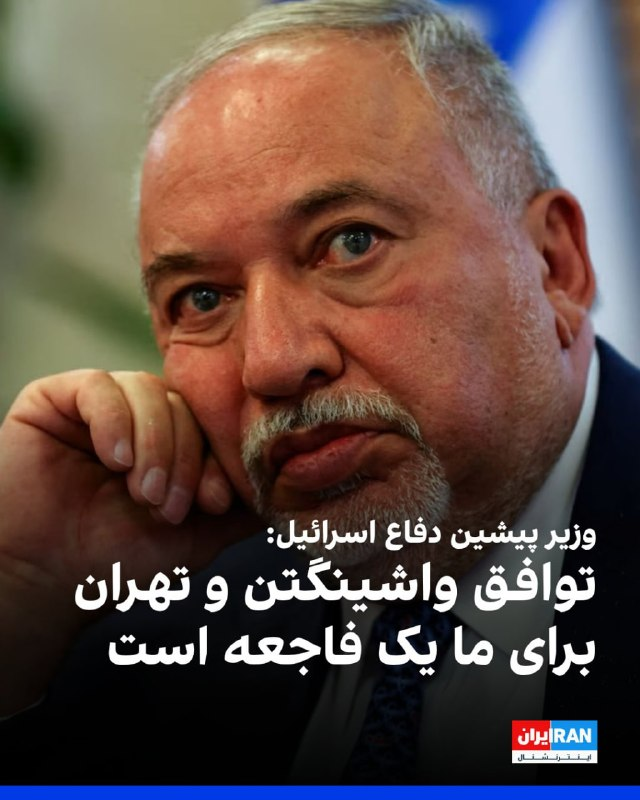

آویگدور لیبرمن، رهبر حزب راستگرای «اسرائیل، خانه ما» و وزیر پیشین دفاع این کشور، در شبکه ایکس نوشت: «توافقی که در حال شکل‌گیری با تهران است، یک پیروزی کامل برای آیت‌الله‌ها و از دیدگاه اسرائیل یک فاجعه است.»

او اضافه کرد: «مسئولیت چنین توافقی برعهده بنیامین نتانیاهو است.»
iranintl.com/202606139088

## IranIntlTV — post 342047

  

ارتش اسرائیل از ساکنان غسانیه، زراریه، مزرعه کوثریه الرز و صیر الغربیه در جنوب لبنان خواست فورا خانه‌های خود را ترک کنند و به شمال رودخانه زهرانی منتقل شوند. ارتش اسرائیل اعلام کرد در پی نقض توافق آتش‌بس از سوی حزب‌الله، علیه این گروه اقدام خواهد کرد.

ارتش همچنین هشدار داد حضور در نزدیکی نیروها و تاسیسات حزب‌الله جان غیرنظامیان را به خطر می‌اندازد.

ارتش اسرائیل پیش‌تر نیز برای ساکنان روستاهای صرفند، تفاحتا و مزرعه سینا در جنوب لبنان هشدار تخلیه صادر کرده بود.
iranintl.com/202606138499

## IranIntlTV — post 342046

  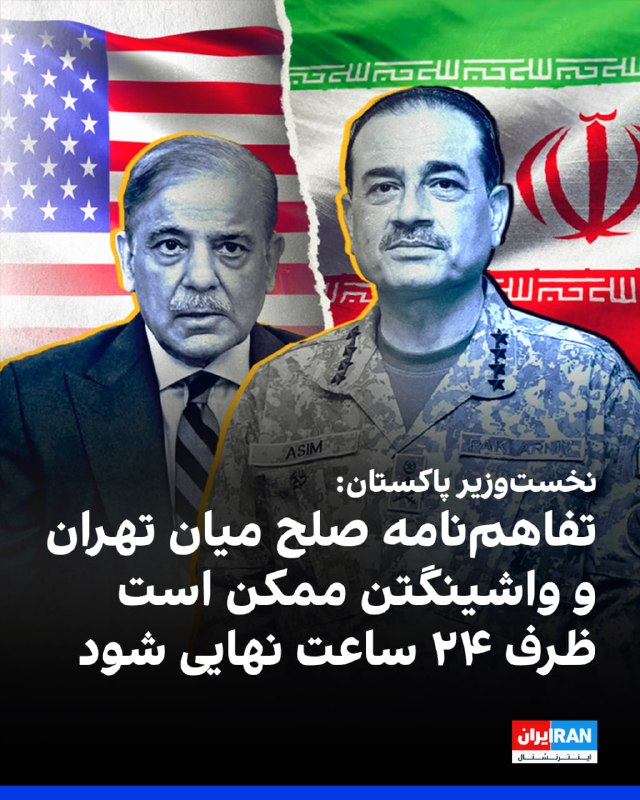

شهباز شریف، نخست‌وزیر پاکستان، در شبکه ایکس نوشت تهران و واشینگتن بیش از هر زمان دیگری به تفاهم‌نامه صلح نزدیک شدند و احتمال نهایی شدن آن در ۲۴ ساعت آینده وجود دارد.

او همچنین نوشت پاکستان برای امضای الکترونیکی تفاهم‌نامه صلح میان آمریکا و جمهوری اسلامی، بلافاصله پس از نهایی شدن آن، آماده می‌شود.

iranintl.com/202606139832

## IranIntlTV — post 342045

  <a href="telegram/content/IranIntlTV_342045_1781353667.mp4" target="_blank">🎬 Download video</a>

مروری بر رسانه‌ها و خبرگزاری‌ها در ایران، شنبه ۲۳ خرداد، با مجتبی هاشمی، روزنامه‌نگار
@iranintltv

## IranIntlTV — post 342044

  <a href="telegram/content/IranIntlTV_342044_1781353669.mp4" target="_blank">🎬 Download video</a>

آرش آزرمی، دبیر بخش اقتصادی ایران‌اینترنشنال، درباره اختلال و قطعی خدمات در بانک‌های ملی، صادرات، تجارت و توسعه صادرات گفت: «بانکداری اسلامی که حکومت تلاش کرد از ابتدا اجرا کند، با نظام بانکداری روز جهان سازگاری و تطابق نداشت و همین موضوع، چه از نظر فنی و چه از نظر مالی، مشکلات متعددی ایجاد کرده است.»

@iranintltv

## IranIntlTV — post 342043

  <a href="telegram/content/IranIntlTV_342043_1781353670.mp4" target="_blank">🎬 Download video</a>

دیوار جاویدنامان انقلاب ملی ایرانیان در شهر گوتنبرگ سوئد افتتاح شد. این یادمان که بیش از ۱۰۰ تصویر از جان‌باختگان راه آزادی ایران را در بر می‌گیرد، با هدف پاسداشت یاد و نام افرادی برپا شده است که برای آزادی، حقوق بشر و دستیابی به آینده‌ای سکولار و انسانی جان خود را از دست دادند.

گزارش مهران عباسیان، خبرنگار ایران‌اینترنشنال و گفت‌وگوی او با ویدا تهرانی، دبیرنخست سپیدار حزب زنان ایران
@iranintltv

## IranIntlTV — post 342042

  <a href="telegram/content/IranIntlTV_342042_1781353672.mp4" target="_blank">🎬 Download video</a>

جمعی از ایرانیان مقیم نیوزیلند شنبه ۲۳ خرداد همزمان با زادروز مجیدرضا رهنورد، جانباخته خیزش انقلابی ۱۴۰۱، با تشکیل یک زنجیره انسانی و سخنرانی در شهر اوکلند یاد او را گرامی داشتند.

## IranIntlTV — post 342041

  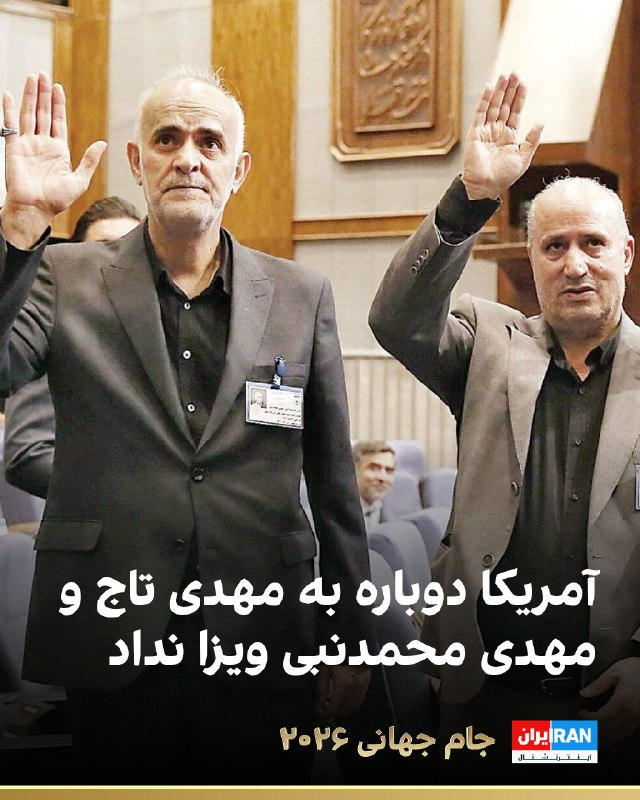

🔻ورزش سه خبر داد که وزارت خارجه آمریکا برای چهار عضو تیم ملی ایران از میان ۱۵ نفری که هنوز ویزا دریافت نکرده بودند، ویزا صادر کرده است. این در حالی است که درخواست مجدد ویزا برای مهدی تاج و مهدی محمدنبی رییس و نایب رییس فدراسیون فوتبال رد شد.

🔹بر اساس گزارش ورزش سه، ویزای امید جمالی، مسئول بین‌الملل، مسعود اردشیر، مسئول امنیتی، علی افضلی، مسئول بین‌الملل، و مهرپویا اسدی، آنالیزور تیم ملی، به اردوی تیم ملی رسیده است.

🔹با این حال، دولت آمریکا برای برخی از مدیران ارشد فوتبال جمهوری اسلامی از جمله مهدی تاج، رییس فدراسیون فوتبال جمهوری اسلامی، هدایت ممبینی، دبیرکل فدراسیون، و مدیر تیم ملی ویزا صادر نکرده است و آنها نمی‌توانند تیم ملی را در آمریکا همراهی کنند.

@iranintltvsport

## Shin_Persian — post 7016

  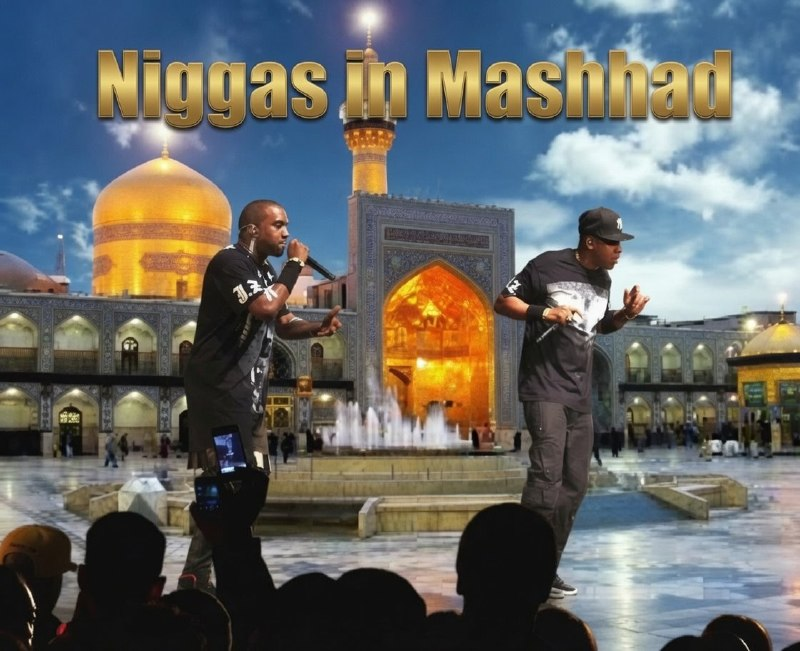

🔁 Quoting above tweet:
Shin ✓ @hey_itsmyturn
Sat, 13 Jun 2026 12:17:38 UTC

𝕏 · @shin_persian

## Shin_Persian — post 7014

Shin ✓ @hey_itsmyturn
Sat, 13 Jun 2026 12:12:04 UTC

Ali Khamenei’s burial set for July 9 (131 days after his death) in Imam Reza Shrine in Mashhad, Razavi Khorasan Province of Iran.

ترجمه خودکار فارسی

مراسم تدفین علی خامنه‌ای برای ۹ جولای (۱۳۱ روز پس از مرگ او) در حرم امام رضا در مشهد، استان خراسان رضوی ایران برنامه‌ریزی شده است.

𝕏 · @shin_persian

## Shin_Persian — post 7013

  <a href="telegram/content/Shin_Persian_7013_1781353674.mp4" target="_blank">🎬 Download video</a>

Shin ✓ @hey_itsmyturn
Sat, 13 Jun 2026 11:56:55 UTC

"They all end with some kind of negotiation"?

IDK man, Hitler seems pretty dead to me, as well as the rest of the douchebags who refused to surrender UNCONDITIONALLY.

ترجمه خودکار فارسی

«همه آن‌ها با نوعی مذاکره به پایان می‌رسند»؟

نمی‌دانم پسر، هیتلر به نظر من کاملاً مرده می‌رسد، و همچنین بقیه آن تفاله‌هایی که از تسلیمِ بدون قید و شرط خودداری کردند.

𝕏 · @shin_persian

## Shin_Persian — post 7012

Shin ✓ @hey_itsmyturn
Sat, 13 Jun 2026 11:30:03 UTC

Jet activity over Baghdad, #Iraq 🇮🇶

ترجمه خودکار فارسی

فعالیت جنگنده‌ها بر فراز بغداد، #Iraq 🇮🇶

𝕏 · @shin_persian

## Shin_Persian — post 7011

  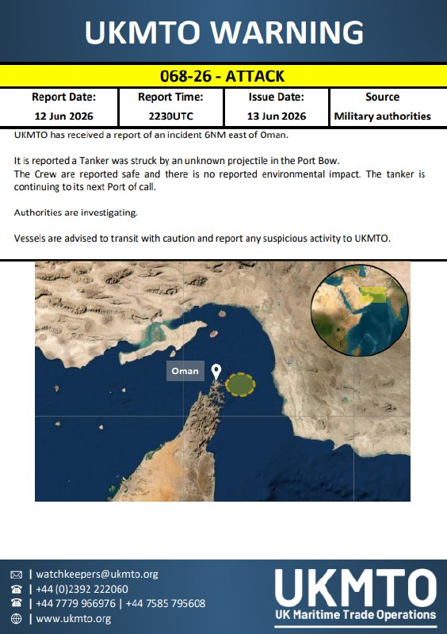

UKMTO Operations Centre @UK_MTO
Sat, 13 Jun 2026 11:14:18 UTC

UKMTO WARNING 068-26

Click here to view the full warning.⤵️
https://www.ukmto.org/-/media/ukmto/products/20260613-ukmto_warning_attack_068_26.pdf?rev=138c37f827c14de6b10e25e72f5a8f66
#MaritimeSecurity #MarSec

ترجمه خودکار فارسی

هشدار یو‌کی‌ام‌تی‌او (UKMTO) ۰۶۸-۲۶

برای مشاهده متن کامل هشدار اینجا کلیک کنید.⤵️
https://www.ukmto.org/-/media/ukmto/products/20260613-ukmto_warning_attack_068_26.pdf?rev=138c37f827c14de6b10e25e72f5a8f66
#MaritimeSecurity #MarSec_

𝕏 · @shin_persian

## ManotoTV — post 106045

  <a href="telegram/content/ManotoTV_106045_1781353676.mp4" target="_blank">🎬 Download video</a>

آیا یوتیوب از کانال‌های مرتبط با نهادها و افراد تحریم‌شده جمهوری اسلامی درآمد کسب می‌کند؟

گزارش تازه وایرد به نقل از یک پژوهش مستقل می‌گوید ده‌ها کانال مرتبط با افراد و نهادهای تحت تحریم آمریکا همچنان در یوتیوب فعال بوده‌اند و تبلیغات برندهای بزرگ روی ویدیوهای آن‌ها نمایش داده شده است.

گوگل می‌گوید به قوانین تحریم‌ها پایبند است و علیه حساب‌های ناقض سیاست‌هایش اقدام کرده، اما هنوز مشخص نیست آیا بخشی از درآمد تبلیغات به این کانال‌ها پرداخت شده است یا نه.

## FarsiVOA — post 220578

🔺اصابت پرتابه ناشناس به یک نفت‌کش در شرق عمان؛ تنش دریایی در آستانه توافق احتمالی

▪️سازمان عملیات تجارت دریایی بریتانیا اعلام کرد یک نفت‌کش در حدود ۶ مایل دریایی شرق عمان هدف اصابت یک پرتابه ناشناس قرار گرفته است.

⬇️ بیشتر بخوانید:

https://ir.voanews.com/a/8160427.html/?nocach=1

## FarsiVOA — post 220577

  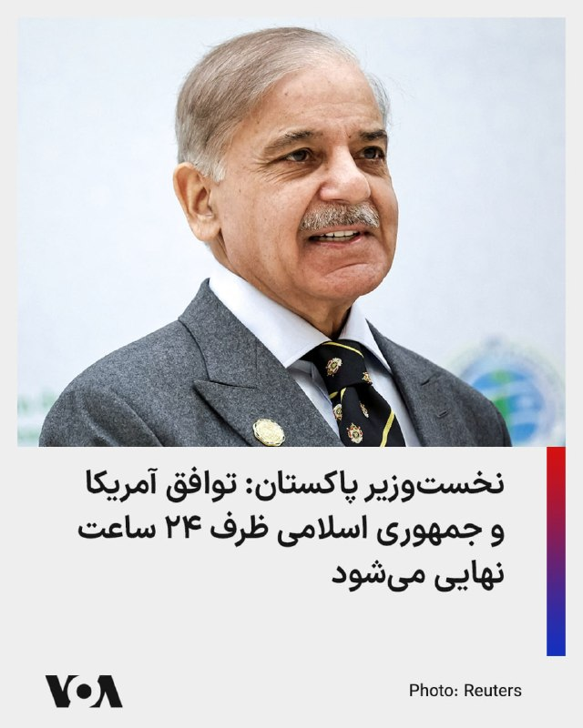

⚡️بلومبرگ به نقل از شهباز شریف، نخست‌وزیر پاکستان، گزارش داد که توافق صلح میان آمریکا و جمهوری اسلامی ایران احتمالاً ظرف ۲۴ ساعت آینده نهایی خواهد شد.

شریف گفته دو طرف بر سر چارچوب توافقی که هدف آن پایان دادن به جنگ چندماهه در خاورمیانه است، به تفاهم رسیده‌اند و متن نهایی توافق نیز آماده شده است.

به گفته نخست‌وزیر پاکستان، اسلام‌آباد اکنون در حال آماده‌سازی برای امضای الکترونیکی توافق است؛ امضایی که انتظار می‌رود ظرف ۲۴ ساعت انجام شود. پس از آن، گفت‌وگوهای فنی میان طرف‌ها در هفته آینده دنبال خواهد شد.

پاکستان در ماه‌های گذشته نقش میانجی را در مذاکرات ایالات متحده و جمهوری اسلامی ایفا کرده است. شریف این تحول را نشانه نزدیک شدن طرف‌ها به پایان جنگ دانسته است.

## FarsiVOA — post 220576

🔺اوکراین زیرساخت‌های نفتی روسیه را هدف گرفت؛ تشدید حملات دو طرف در ۴۸ ساعت اخیر

▪️ارتش اوکراین اعلام کرد یک تأسیسات فرآوری و پمپاژ نفت در منطقه ولگوگراد روسیه را هدف قرار داده و این حمله باعث آتش‌سوزی شده است.

▪️بر اساس این اعلام، این مرکز در فرآوری، انتقال و پمپاژ نفت از طریق خطوط لوله به پالایشگاه‌ها و زیرساخت‌های صادراتی روسیه نقش دارد.

▪️در حمله‌ای جداگانه، مقام‌های روسیه گفتند یک پهپاد اوکراینی به پایانه دریایی بندر تمریوک در منطقه کراسنودار برخورد کرده، یک نفر کشته شده و آتش‌سوزی رخ داده است.

▪️این حملات ادامه موجی است که در ۴۸ ساعت اخیر شدت گرفته است. اوکراین روز پیش اعلام کرده بود دو پالایشگاه‌ در تاتارستان را هدف قرار داده و وقوع آتش‌سوزی در هر دو مرکز را تأیید کرده است.

⬇️ بیشتر بخوانید:
https://ir.voanews.com/a/8160425.html

## FarsiVOA — post 220575

  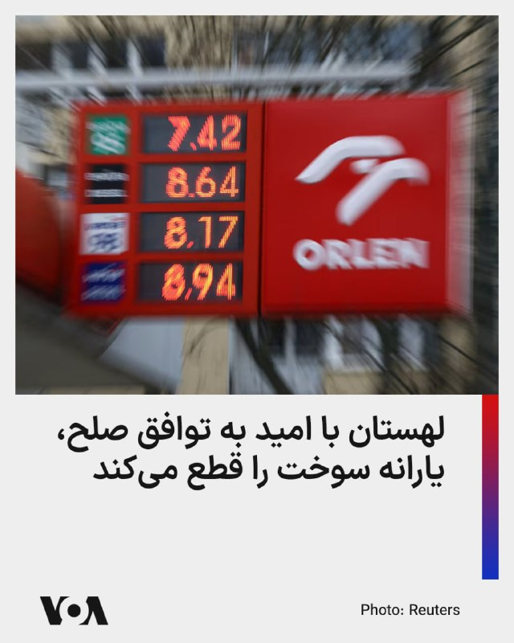

بلومبرگ گزارش داد دونالد توسک، نخست‌وزیر لهستان، گفته دولت این کشور در تابستان به برنامه حمایت از سوخت پایان خواهد داد. این تصمیم با افزایش امیدها به توافق میان آمریکا و جمهوری اسلامی و کاهش فشار بازار انرژی هم‌زمان شده است.

این برنامه در ماه مارس، پس از جهش بهای نفت در پی جنگ آمریکا و جمهوری اسلامی، آغاز شد.

دولت لهستان برای مهار فشار بر مصرف‌کنندگان، مالیات بر ارزش افزوده سوخت را کاهش داد، عوارض سوخت را پایین آورد و سقف قیمت روزانه تعیین کرد.

برآورد اولیه وزارت دارایی لهستان نشان می‌داد هزینه این بسته معادل تقریبی ۴۳۶ میلیون دلار است که در برآورد بعدی دولت، هزینه ماهانه معادل حدود ۴۱۰ میلیون دلار، اعلام شد.

دولت همچنین برای جبران بخشی از این هزینه، مالیات بادآورده‌ای از شرکت‌های انرژی را بررسی کرده بود که می‌توانست حدود ۱.۶۴ میلیارد دلار درآمد ایجاد کند.
@FarsiVOA

## FarsiVOA — post 220574

  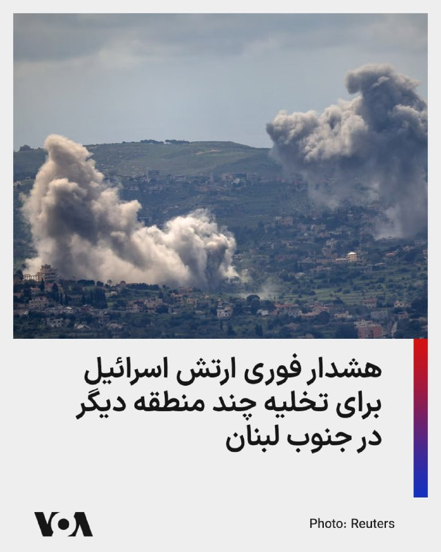

ارتش اسرائیل با صدور هشدار فوری از ساکنان غسانیه، زراریه، مزرعه کوثریه الرز و صیر غربیه در جنوب لبنان خواست فوراً خانه‌های خود را ترک کرده و به شمال رود زهرانی بروند.

در این هشدار آمده است که به‌دلیل نقض توافق آتش‌بس از سوی حزب‌الله، ارتش اسرائیل ناچار است با قدرت علیه مواضع این گروه اقدام کند.

ارتش اسرائیل تأکید کرده حضور در نزدیکی نیروها، تأسیسات و تجهیزات جنگی حزب‌الله، جان غیرنظامیان را در معرض خطر قرار می‌دهد.
@FarsiVOA

## FarsiVOA — post 220573

  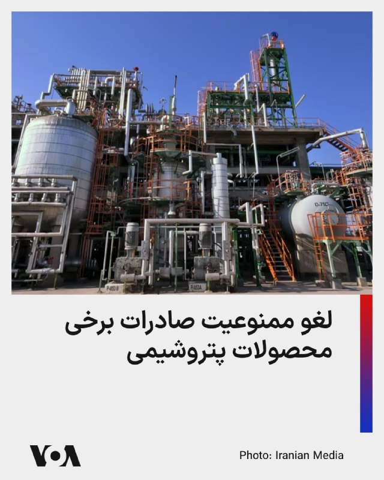

مدیرعامل شرکت ملی صنایع پتروشیمی می‌گوید برای بخشی از محصولات پتروشیمی که مازاد تولید دارند و انبارها از آن‌ها پر شده، مجوز صادرات صادر شد.

جمهوری اسلامی در پی هدف قرار گرفتن مجتمع‌های پتروشیمی ماهشهر و عسلویه در جنگ ۳۹ روزه، صادرات محصولات پتروشیمی را ممنوع کرده بود و طی هفته‌های گذشته گزارش‌های زیادی از کمبود و جهش قیمت محصولات پتروشیمی، خصوصا کودهای کشاورزی و محصولات بسته‌بندی دارو و مواد غذایی منتشر شده است.

حسن عباس‌زاده مدیرعامل شرکت ملی صنایع پتروشیمی همچنین گفته است تاکنون ۳۸ درصد از پتروشیمی‌هایی که مورد هدف قرار گرفته یا تولید آنها مختل شده بود، به مدار تولید بازگشته است.

او تصریح کرد برای محصولاتی که همچنان با محدودیت عرضه روبه‌رو هستند، ممنوعیت صادرات برقرار است.
@FarsiVOA

## DW_Farsi — post 125926

🔶رهبر باند مواد مخدر ونزوئلایی در حمله آمریکا کشته شد

دونالد ترامپ، رئیس‌ جمهور آمریکا طی پیامی از کشته شدن رهبر باند بدنام ونزوئلایی مواد مخدر "ترن د آراگوا" در حمله ارتش ایالات متحده خبر داد.

ترامپ در این پیام که شنبه ۱۳ ژوئن در شبکه تروث سوشال منتشر شد "ترن د آراگوا" را "از خون‌بارترین سازمان‌های تروریستی روی زمین" خواند و نوشت که این عملیات به دستور او و توسط فرماندهی جنوبی ارتش آمریکا انجام شده است.

همچنین به گفته ترامپ، دولت ونزوئلا از این "حمله سریع و مرگبار" علیه نینو گررو، "رهبر بدنام" این گروه و قاچاقچی مواد مخدر حمایت کرده است: «این اقدام با هماهنگی نزدیک با دوستان ما در ونزوئلا انجام شد که با آن‌ها همکاری بسیار خوبی داریم.»

@dw_farsi

## DW_Farsi — post 125925

  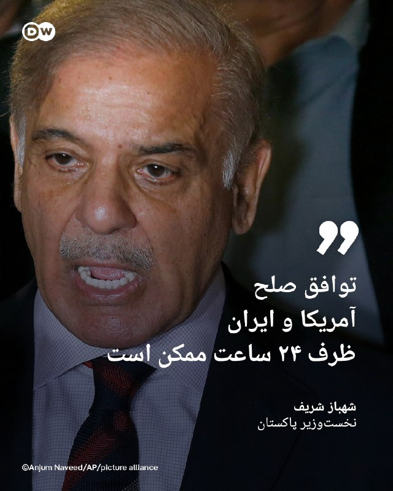

🔶شهباز شریف: توافق صلح آمریکا و ایران ظرف ۲۴ ساعت ممکن است

شهباز شریف، نخست‌وزیر پاکستان اعلام کرد که پس از ماه‌ها مذاکرات توافق صلح میان آمریکا و ایران ممکن است ظرف ۲۴ ساعت آینده نهایی شود.

نخست‌وزیر پاکستان روز شنبه ۲۳ خرداد (۱۳ ژوئن) در پیامی در شبکه اجتماعی ایکس گفت پاکستان در حال آماده‌سازی برای امضای الکترونیکی این توافق بلافاصله پس از نهایی شدن آن است و سپس هفته آینده مذاکرات فنی آغاز خواهد شد.

شریف همچنین پیش‌تر گفته بود "متن نهایی و مورد توافق" میان دو طرف حاصل شده و پاکستان در حال همکاری نزدیک با هر دو طرف برای تکمیل مراحل بعدی است.

نخست‌وزیر پاکستان از آمریکا و ایران به‌خاطر تعهد در مذاکرات و همچنین از کشورهای منطقه برای حمایت‌شان قدردانی کرد و گفت این توافق می‌تواند پایه‌ای برای صلحی پایدار باشد.

@dw_farsi

## DW_Farsi — post 125924

  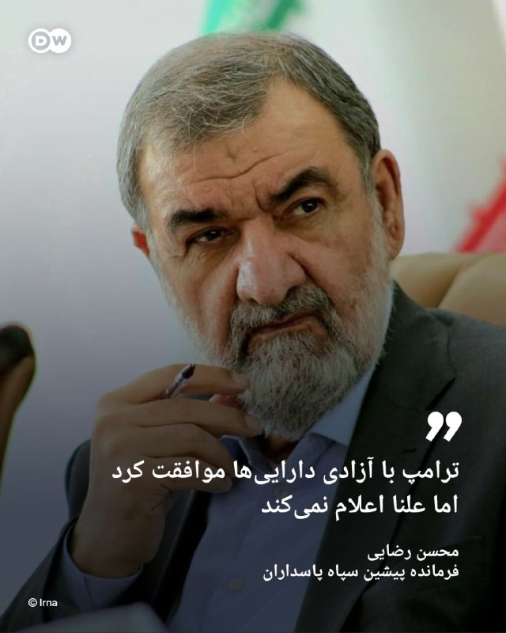

🔶 محسن رضایی: ترامپ با آزادی دارایی‌ها موافقت کرد اما علنا اعلام نمی‌کند
 
محسن رضایی، فرمانده پیشین سپاه پاسداران مدعی شد که دونالد ترامپ با آزادسازی بخشی از دارایی‌های بلوکه‌شده ایران، از جمله حدود ۲۴ میلیارد دلار، موافقت کرده اما این موضوع را به‌صورت علنی اعلام نکرده است.
 
رضایی همچنین مدعی شد توان بازدارندگی ایران به سطحی رسیده که حتی ترامپ از مذاکره با ایران هراس دارد.
او در ادامه به آن چه که "موفقیت ایران در مقابله با جنگنده‌ها و تجهیزات پیشرفته آمریکایی" خواند اشاره کرد و گفت "جنگ نامتقارن باعث برتری پهپادها و توان دریایی ایران در برابر تجهیزات گران‌قیمت شده است".
 
این در حالی است که جی‌دی ونس، معاون رئیس‌ جمهوری آمریکا، در پیامی در شبکه ایکس گزارش‌ها درباره توافق احتمالی با ایران را نادرست خواند و تأکید کرد ایران در برابر امضای توافق یا شرکت در مذاکرات، هیچ پول نقدی دریافت نخواهد کرد و آزادسازی منابع مالی نیز صرفا با امضای توافق انجام نمی‌شود.

@dw_farsi

## DW_Farsi — post 125923

  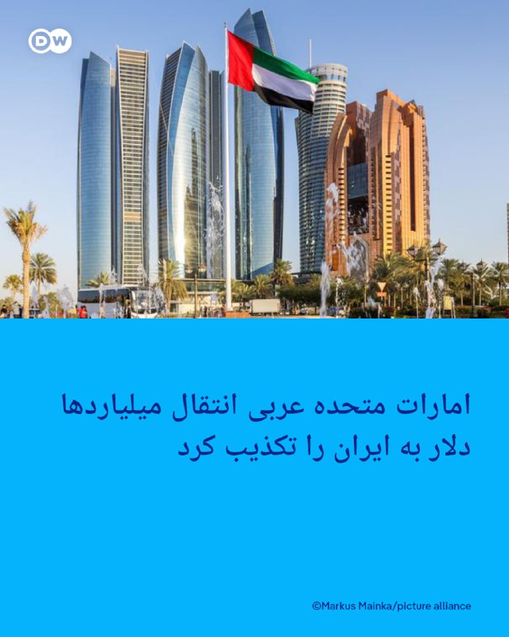

🔶 امارات متحده عربی انتقال میلیاردها دلار به ایران را تکذیب کرد

وزارت خارجه امارات متحده عربی روز جمعه ۲۲ خرداد (۱۲ ژوئن) در شبکه اجتماعی ایکس اعلام کرد گزارش‌های مربوط به آزادسازی و انتقال چندین میلیارد دلار برای ایران صحت ندارد.

چهار منبع ناشناس در محافل دیپلماتیک به رویترز گفته بودند که موضوع آزادسازی میلیاردها دلار از درآمدهای نفتی ایران مطرح بوده که به دلیل تحریم‌های آمریکا در بانک‌های خارجی مسدود شده است.

به گفته دو منبع، رقم مورد بحث حدود ۱۰ میلیارد دلار بوده که بیش از ۳ میلیارد دلار آن پیش‌تر پرداخت شده است.

دو منبع دیگر نیز رقم ۲۰ میلیارد دلار را مطرح کرده‌اند.

همچنین گفته شده است که این اقدام در ازای توقف حملات ایران به کشورهای حوزه خلیج فارس از جمله امارات متحده عربی انجام شده است.

این تحولات در شرایطی اتفاق می‌افتد که آمریکا و جمهوری اسلامی درباره پایان جنگ در حال مذاکره هستند.

@dw_farsi

## Persian_Trend_Official — post 16941

  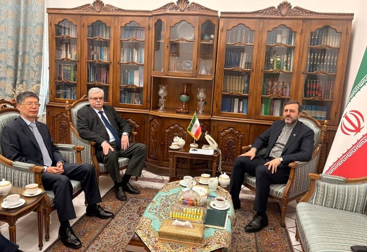

دیدار غریب‌آبادی با سفیران چین و روسیه در تهران

معاون وزیر امور خارجه در پیامی نوشت: شراکت راهبردی ایران، چین و روسیه و هماهنگی‌ها و تعاملات میان سه کشور با قوت تداوم خواهد یافت.

📝 Amir

📌 @persian_trend_official
پرشین ترند | متفاوت‌ترین کانال نظامی

## Persian_Trend_Official — post 16940

  

حمله به یک کشتی در تنگهٔ هرمز

سازمان عملیات تجارت دریایی انگلیس: یک نفتکش در 6 مایلی شرق عمان هدف اصابت یک پرتابهٔ ناشناخته قرار گرفته است.

📝 Amir

📌 @persian_trend_official
پرشین ترند | متفاوت‌ترین کانال نظامی

## Persian_Trend_Official — post 16939

  

💢16 تا نماینده مجلس (از جمله ثابتی و رسایی) به همراه قشر تندرو امشب جلوی وزارت خارجه تجمع اعتراضی برگزار میکنن و به روند مذاکرات اعتراض میکنن‌.

👺Phantom

📌 @persian_trend_official
پرشین ترند | متفاوت‌ترین کانال نظامی

## Persian_Trend_Official — post 16938

شهباز شریف: بیش از هر زمان دیگری به توافق صلح میان ایران و آمریکا نزدیک شده‌ایم.

احتمال می‌رود روند نهایی‌سازی توافق ظرف 24 ساعت آینده تکمیل شود. پاکستان در حال آماده‌سازی برای امضای الکترونیکی توافق بلافاصله پس از نهایی شدن آن است.

مذاکرات فنی و کارشناسی درباره جزئیات اجرای توافق از هفته آینده آغاز خواهد شد.

📝 Amir

📌 @persian_trend_official
پرشین ترند | متفاوت‌ترین کانال نظامی

## Persian_Trend_Official — post 16937

  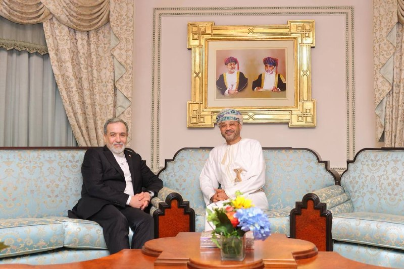

عراقچی: ایران و عمان بیانیه مشترکی درباره تنگه هرمز صادر می‌کنند.

👺Phantom

📌 @persian_trend_official
پرشین ترند | متفاوت‌ترین کانال نظامی

## Persian_Trend_Official — post 16935

تصاویر ماهواره ای جدید از پایگاه موفق السلطی اردن چندین اصابت در این پایگاه در جریان حملات موشکی چند شب پیش سپاه تأیید می‌کند.

اکثر موشک ها به دلیل خطای بالا به چند ده متری هدف اصابت کرده اند.

📝 Amir

📌 @persian_trend_official
پرشین ترند | متفاوت‌ترین کانال نظامی

## Persian_Trend_Official — post 16934

  <a href="telegram/content/Persian_Trend_Official_16934_1781353682.webm" target="_blank">🎬 Download video</a>

⚡️ ارتش اسرائیل: هشدار برای تخلیه ۴ شهر در جنوب لبنان و هدایت ساکنان آنها به شمال رودخانه زهرانی صادر کرد

## RadioFarda — post 158253

  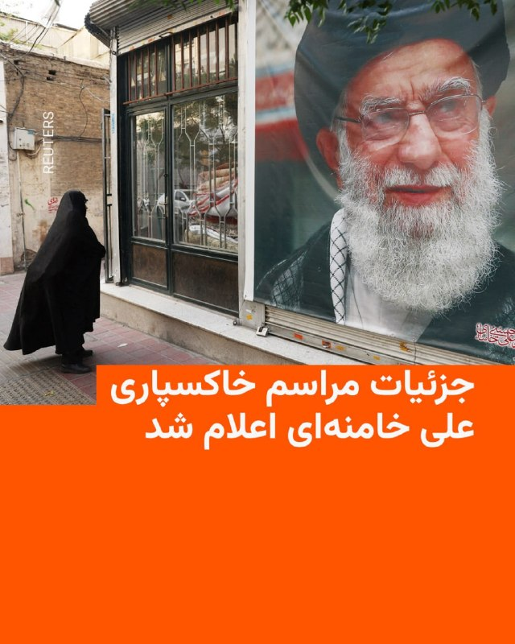

🔸ستاد برگزاری مراسم خاکسپاری علی خامنه‌ای، رهبر پیشین جمهوری اسلامی، روز شنبه ۲۳ خرداد با انتشار اطلاعیه‌ای، جزئیات برنامه‌های تشییع و تدفین او را اعلام کرد.

🔸طبق برنامه اعلام‌شده، مراسم تشییع علی خامنه‌ای در روزهای ۱۳ و ۱۴ تیرماه در مصلای تهران برگزار می‌شود.

🔸پس از آن، پیکر رهبر پیشین جمهوری اسلامی برای ادامه آیین‌های تشییع در روزهای ۱۵ و ۱۶ تیر به شهر قم و سپس مشهد منتقل می‌شود.

🔸بر اساس اعلام مسئولان، محل خاکسپاری او در محل دفن امام هشتم شیعیان پیش‌بینی شده، اما زمان دقیق این مراسم به‌صورت جداگانه و پس از برگزاری مراسم‌های تشییع اعلام خواهد شد.

🔸علی خامنه‌ای، رهبر جمهوری اسلامی، نهم اسفند ۱۴۰۴ در نخستین دقایق حمله هوایی آمریکا و اسرائیل به ایران کشته ‌شد.

@RadioFarda

## RadioFarda — post 158252

  <a href="https://t.me/radiofarda/158252" target="_blank">📎 Download file</a>

📻بشنوید: ساعت ۱۴ با رادیوفردا، ۲۳ خرداد ۱۴۰۵‌

@RadioFarda

## RadioFarda — post 158251

  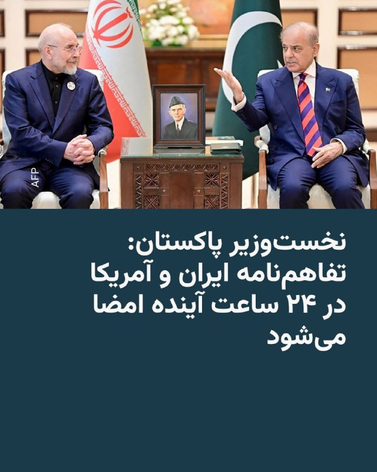

🔸شهباز شریف، نخست‌وزیر پاکستان، روز شنبه ۲۳ خرداد اعلام کرد که تهران و واشینگتن بر سر متن نهایی تفاهم‌نامه به توافق رسیده‌اند.

🔸به گفته این مقام عالی‌رتبه پاکستانی که نقش میانجی را میان ایران و آمریکا داشته است، این تفاهم‌نامه در عرض ۲۴ ساعت آینده «به صورت الکترونیکی» امضا خواهد شد.

🔸شریف ادامه داده است که در پی امضای تفاهم‌نامه، دو طرف در هفته جاری پس از تعطیلات آخر هفته میلادی «مذاکرات فنی» خود را آغاز خواهند کرد.

🔸عباس عراقچی، وزیر خارجه جمهوری اسلامی، پیشتر در مصاحبه‌ای تلویزیونی گفته بود که پس از نهایی‌ شدن پیش‌نویس توافق، مراسم امضا به طور «غیر حضوری» و «از راه دور» انجام خواهد شد.

🔸او پس از آن این توضیح را داد که دونالد ترامپ، رئیس جمهور آمریکا، روز پنجشنبه گفت که این مراسم، احتمالاً در یک کشور اروپایی و با حضور جی‌دی ونس برگزار خواهد شد.

@RadioFarda

## IranianMinds — post 22460

  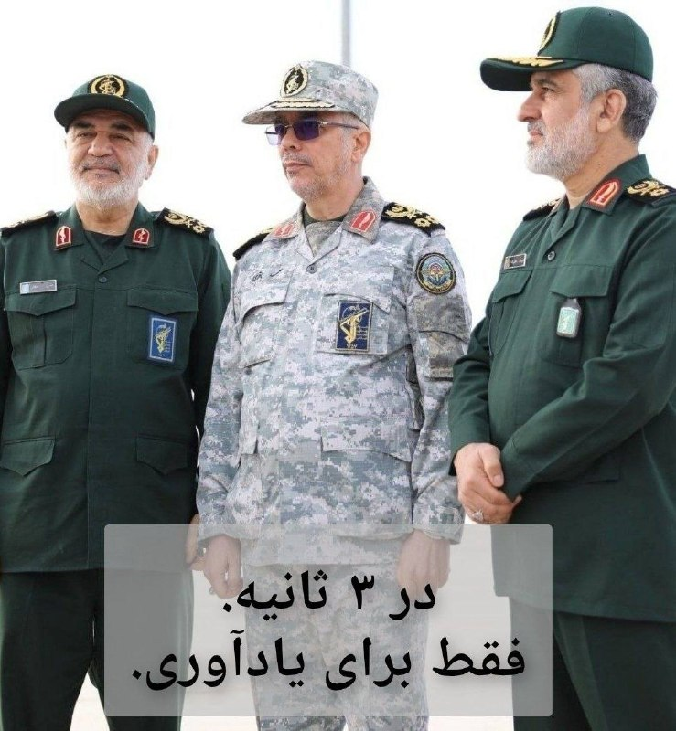

🔴اکانت اسرائیل به فارسی:

یک سال پیش در چنین روزی.

@IranianMinds

## IranianMinds — post 22459

🔴کیهان:

اگر تنگه هرمز را باز کنید، دشمن دوباره حمله می‌کند. هیچ آدم عاقلی نقطه قوت خود را پای میز مذاکره نمی‌برد.

@IranianMinds

## IranianMinds — post 22458

🔴نخست‌وزیر پاکستان:

من اطمینان دارم که توافق تاریخی بین تهران و واشنگتن، پایه و اساس صلح پایدار را بنا خواهد کرد.

@IranianMinds

## IranianMinds — post 22457

  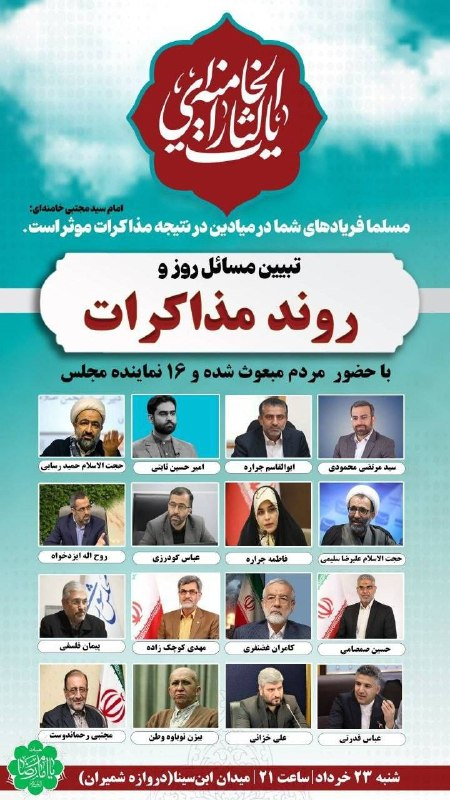

🔴۱۶ نفر از نماینده مجلس، امشب جلوی وزارت خارجه تجمع اعتراضی برقرار می‌کنند.

@IranianMinds

## IranianMinds — post 22456

  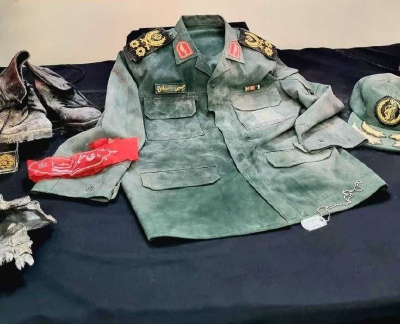

🔴اکانت اسرائیل به فارسی:

تاریخ خلق تصویر: یک سال پیش.

@IranianMinds

## BBCPersian — post 283690

  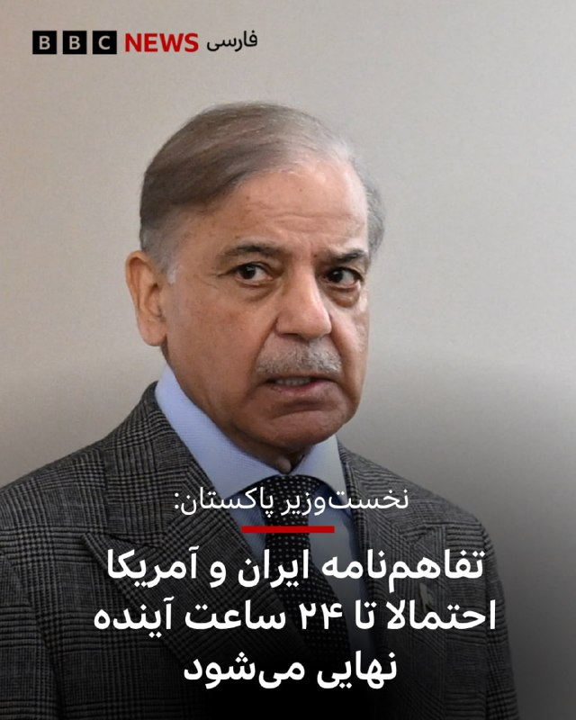

🔺نخست‌وزیر پاکستان: تفاهم‌نامه ایران و آمریکا احتمالا تا ۲۴ ساعت آینده نهایی می‌شود

نخست‌وزیر پاکستان می‌گوید ایران و آمریکا بیش از هر زمانی به توافق صلح نزدیک‌تر شده‌اند.

شهباز شریف دقایقی پیش در پستی در شبکه ایکس نوشت که انتظار می‌رود تفاهم‌نامه ایران و آمریکا ظرف ۲۴ ساعت آینده نهایی شود.

او گفت که پاکستان در حال فراهم کردن تدارکات لازم برای «امضای الکترونیکی» این سند است و پس از آن هم «گفت‌و‌گوهای فنی» آغاز خواهد شد.

پیشتر مقام‌های بلندپایه آمریکا و ایران گفته‌ بودند که دو طرف به امضای توافقی نزدیک‌ شده‌اند که از جمله به بازگشایی تنگه هرمز منجر خواهد شد.

انتظار می‌رود که پس از امضای این تفاهم‌نامه، دور جدیدی از گفت‌و‌گو در مورد موضوعات اصلی مورد اختلاف، از جمله برنامه هسته‌ای ایران و رفع تحریم‌ها، انجام شود.

📸Reuters

https://bbc.in/4xqfelV
@BBCPersian

## BBCPersian — post 283676

تیم ملی ایران سه‌شنبه ۲۶ خرداد در نخستین مسابقه خود در جام جهانی ۲۰۲۶ مقابل نیوزلند در لس‌آنجلس به میدان می‌رود.

این تیم که کمپ خود را برای دور زدن محدودیت‌های صدور ویزای آمریکا به شهر مرزی تیخوانا در مکزیک منتقل کرده، چند روزی است مشغول آماده‌سازی و تمرین است.

آمریکا به ۱۵ عضو کاروان ورزشی تیم ملی فوتبال ایران در جام جهانی ویزای ورود به کشورش را نداد و شنیده‌ها درباره «صدور ویزا برای نیمی از آنها» هنوز رنگ واقعیت نگرفته است.

مهدی محمدنبی، سرپرست کاروان تیم ملی که خود از این دسته است، گفت: «رئیس فیفا نتوانسته به وعده‌هایش برای تأمین دسترسی کامل فدراسیون فوتبال ایران به سه بازی تیم در ایالات متحده عمل کند.»

## BBCPersian — post 283670

## BBCPersian — post 283668

🔻اختلال در خدمات الکترونیکی شماری از بانک‌ها در ایران

رسانه‌های ایران از اخلال در ارائه خدمات الکترونیکی شماری از بانک‌های این کشور خبر داده‌اند.

بر اساس این گزارش‌ها، بانک‌هایی مانند ملی، تجارت، صادرات و توسعه صادرات از صبح امروز دچار این اختلال شده‌اند.

گزارش شده است که این اختلال در بخش‌های مختلف، از جمله «موبایل‌بانک، اینترنت‌بانک، خودپردازها، پایانه‌های فروش (کارتخوان) و برخی خدمات کارتی» ایجاد شده است.

خبرگزاری فارس گفته است که برخی منابع از احتمال وقوع حمله سایبری خبر داده‌اند، هر چند هنوز این موضوع از سوی مقامات تایید یا رد نشده است.

گفته شده که تلاش برای فعال کردن و بازگردندان خدمات بانکی به وضعیت عادی در جریان است.

https://bbc.in/4v7uCBU
@BBCPersian

## BBCPersian — post 283659

⚽️گروه دی ‌(D) جام جهانی؛ سامورایی‌های آبی

پاراگوئه بعد از شانزده سال غیبت به جام جهانی بازگشته و با سبک سنتی‌اش، یعنی دفاع منسجم، جنگندگی و انضباط تاکتیکی، به دنبال تکرار موفقیت‌های گذشته است. در مرحله مقدماتی، سه سرمربی مختلف هدایت تیم را بر عهده داشتند تا سرانجام گوستاوو آلفارو توانست ثبات را به تیم بازگرداند. او به «شکارچی» معروف است و کتاب «شکارچیان آرمان‌شهرهای ناممکن» را نوشته است.

گوستاوو گومز، کاپیتان پاراگوئه و رهبر خط دفاعی، یکی از بهترین مدافعان آمریکای جنوبی است. بازی هوایی، جنگندگی و توانایی رهبری این ستاره تیم از مهم‌ترین نقاط قوت تیم به شمار می‌رود.

آمریکا پس از ناکامی در صعود به جام جهانی ۲۰۱۸، با نسل جدیدی از بازیکنان مستعد و تحت هدایت مائوریسیو پوچتینو امیدوار است در جام جهانی خانگی ۲۰۲۶ به موفقیتی بزرگ دست یابد.

فولارین بالوگون، ستاره تیم، تجربه بازی در تورنمنت‌های بزرگ را دارد و می‌تواند مهاجم اصلی آمریکا در جام جهانی باشد. او می‌توانست برای انگلیس یا نیجریه بازی کند اما در نهایت آمریکا را انتخاب کرد.

📲ادامه مطلب در لینک زیر 🔽

📸GettyImages

https://bbc.in/4fJqYJM
@BBCPersian

## BBCPersian — post 283658

  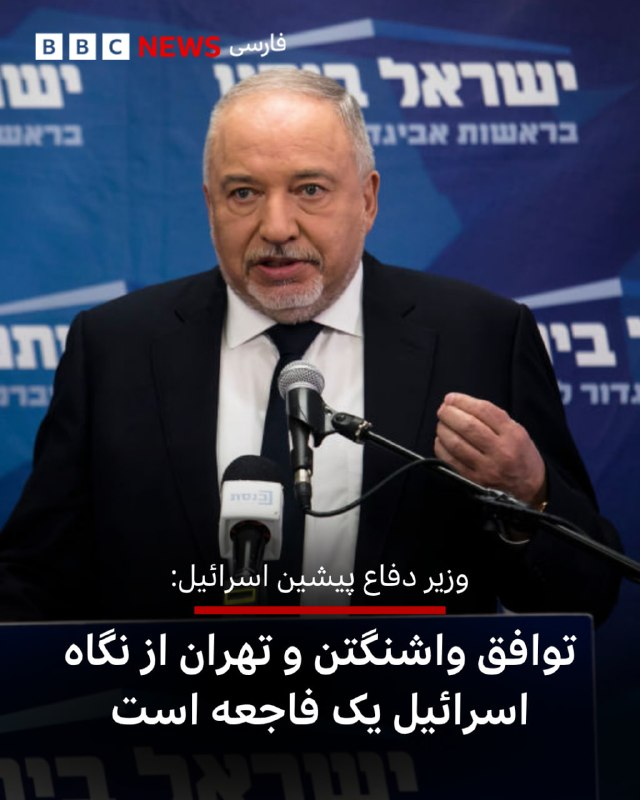

🔺وزیر دفاع پیشین اسرائیل: توافق واشنگتن و تهران از نگاه اسرائیل یک فاجعه است

آویگدور لیبرمن، رهبر حزب راستگرای «اسرائیل خانه ما» و وزیر دفاع پیشین اسرائیل، توافق احتمالی آمریکا و ایران را «یک پیروزی کامل برای آیت الله‌ها» خوانده است.

او در پیامی در شبکه ایکس نوشت که این توافق از نگاه اسرائیل «یک فاجعه» است.

آقای لیبرمن همچنین تاکید کرد که «صد در صد مسئولیت» چنین توافقی برعهده بنیامین نتانیاهو است.

اسرائیل کاتس، وزیر دفاع هم پیش‌تر گفته بود که دونالد ترامپ از منظر منافع آمریکا به دنبال رسیدن به توافق با ایران است.

آقای کاتس همچنین تاکید کرد که اسرائیل باید اطمینان حاصل کند که به طور مستقل می‌تواند مانع دستیابی ایران به سلاح هسته‌ای شود.

📸GettyImages

https://bbc.in/3Q2VSCC
@BBCPersian

## Dirty_Kids — post 391881

  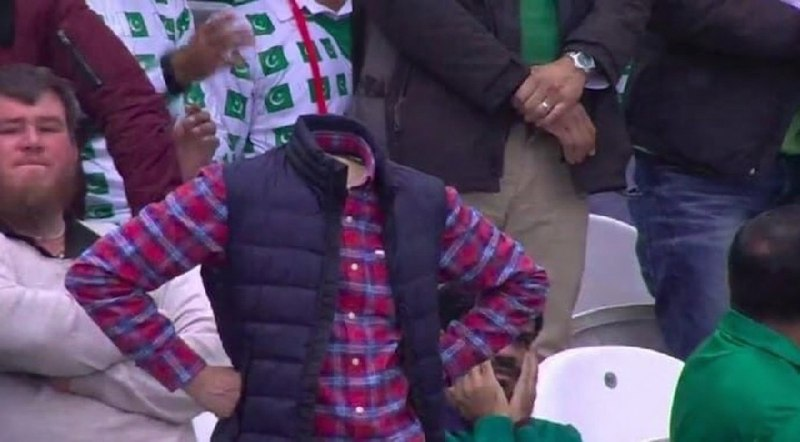

شمخانی وقتی میبینه هم توافق شد هم اورانیوم رو دادن

@Dirty_Kids 👻

## Dirty_Kids — post 391880

  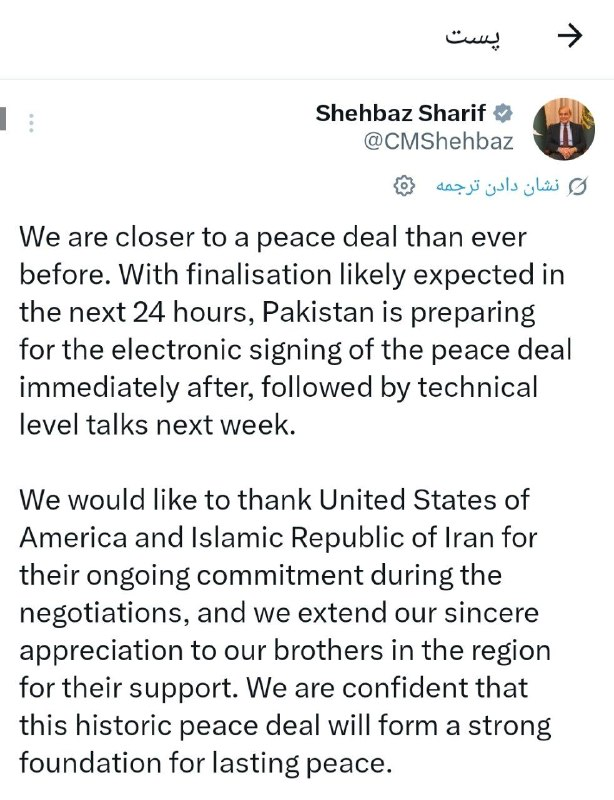

توافق صلح آمریکا و ایران تا ۲۴ ساعت آینده نهایی می‌شود

شهباز شریف، نخست‌وزیر پاکستان:

«ما بیش از هر زمان دیگری به توافق صلح نزدیک هستیم. با توجه به اینکه احتمالاً نهایی شدن آن در ۲۴ ساعت آینده پیش‌بینی می‌شود، پاکستان در حال آماده‌سازی برای امضای الکترونیکی توافق‌نامه صلح بلافاصله پس از آن است و پس از آن مذاکرات فنی در هفته آینده برگزار خواهد شد.
ما مایلیم از ایالات متحده آمریکا و جمهوری اسلامی ایران به خاطر تعهد مداومشان در طول مذاکرات تشکر کنیم و از برادرانمان در منطقه به خاطر حمایتشان صمیمانه قدردانی می‌کنیم. ما اطمینان داریم که این توافق‌نامه صلح تاریخی، پایه محکمی برای صلح پایدار ایجاد خواهد کرد.»


@Dirty_Kids 👻

## Dirty_Kids — post 391879

  <a href="telegram/content/Dirty_Kids_391879_1781353688.mp4" target="_blank">🎬 Download video</a>

تراپی

ولی دختر تنگسیری خوب چیزیه، چقدرم آرایش کرده پدرسوخته

@Dirty_Kids 👻

## Dirty_Kids — post 391878

  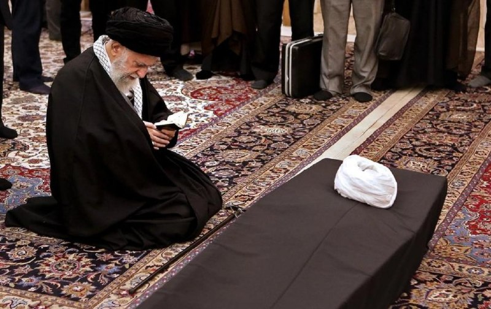

🔴 فوری، بالاخره جزئیات مراسم و دفن خامنه‌ای مشخص شد.

13 و 14 تیر: وداع توی مصلای امام خمینی.
15 تیر: مراسم تشییع توی تهران.
16 تیر: مراسم تشییع در قم.
18 تیر: تشییع در مشهد و دفن شدن تو حرم امام رضا.

@Dirty_Kids 👻

## Dirty_Kids — post 391877

  <a href="telegram/content/Dirty_Kids_391877_1781353689.mp4" target="_blank">🎬 Download video</a>

هیچوقت فک نمی‌کردم ریاضی انقد شیرین باشه و انقد بادقت بشینم بهش گوش کنم.

@Dirty_Kids 👻

## Hranews — post 113580

  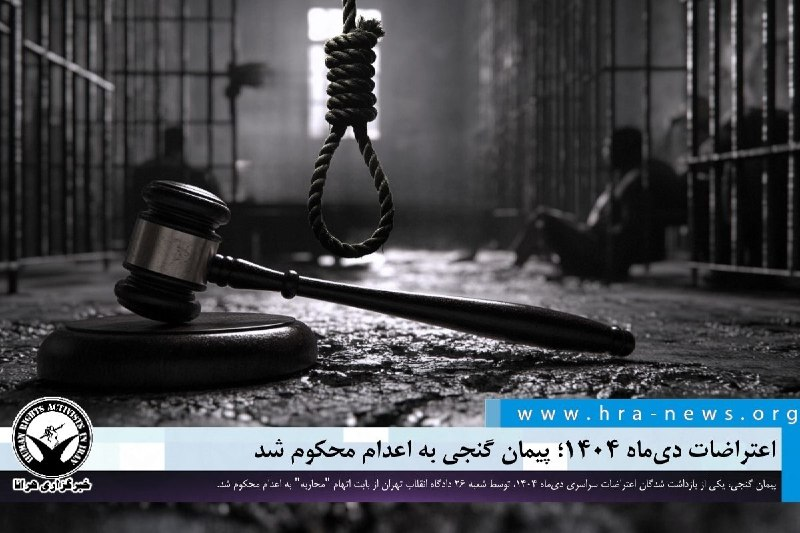

اعتراضات دی‌ماه ۱۴۰۴؛ پیمان گنجی به اعدام محکوم شد

❗️
❗️
❗️
❗️
❗️ – پیمان گنجی، جوان ۳۳ ساله و یکی از بازداشت شدگان اعتراضات سراسری دی‌ماه ۱۴۰۴ که در زندان تهران بزرگ محبوس است، توسط شعبه ۲۶ دادگاه انقلاب تهران از بابت اتهام “#محاربه” به #اعدام محکوم شد.

به گزارش خبرگزاری هرانا، ارگان خبری مجموعه فعالان حقوق بشر در ایران، پیمان گنجی، یکی از بازداشت شدگان اعتراضات سراسری دی‌ماه ۱۴۰۴ به اعدام محکوم شد.

بر اساس اطلاعات دریافتی هرانا، آقای گنج، ۳۳ ساله، توسط شعبه ۲۶ دادگاه انقلاب تهران به ریاست قاضی ایمان افشاری از بابت اتهام “محاربه” به اعدام محکوم شده و هم اکنون پرونده وی در شعبه ۹ دیوان عالی کشور در دست بررسی است.
یک منبع مطلع از پرونده این زندانی به هرانا گفت: “عباس جعفری دولت‌آبادی، دادستان پیشین تهران، وکالت آقای گنجی را در این پرونده بر عهده دارد. همچنین، در این پرونده سوزاندن اموال عمومی به عنوان مصداق اتهام منتسب به آقای گنجی عنوان شده است.”

ادامه مطلب

#پیمان_گنجی

↘️
@hranews_bot تماس ✉️ -  @Hranews  کانال هرانا 🆑

## Hranews — post 113579

  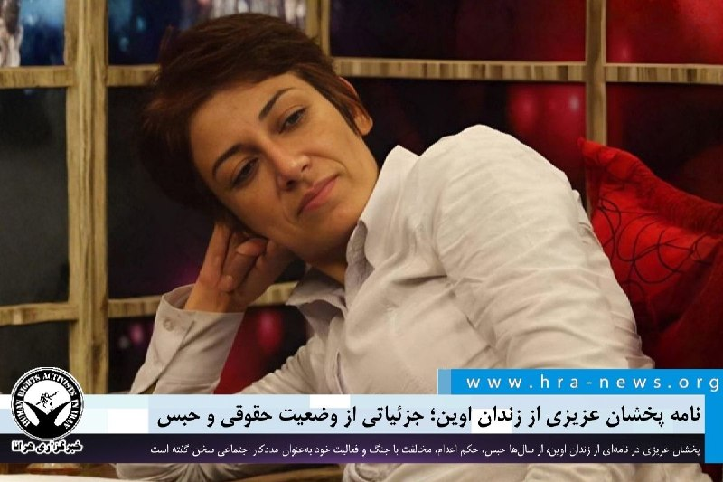

نامه پخشان عزیزی از زندان اوین؛ «من آنی‌ام که برای زندگی می‌میرم، نه آنکه برای مرگ زندگی کنم»

❗️
❗️
❗️
❗️
❗️ – پخشان عزیزی، زندانی سیاسی محکوم به #اعدام، با نگارش نامه‌ای از بند زنان زندان اوین که نسخه‌ای از آن برای هرانا ارسال شده، به تشریح دیدگاه‌های خود درباره وضعیت پرونده‌اش، اتهامات منتسب به وی، جنگ و تحولات منطقه و آنچه «بازی‌های سیاسی» پیرامون پرونده‌اش خوانده، پرداخته است. وی در بخشی از این نامه با اشاره به وضعیت حقوقی خود نوشته است: «تا کنون هیچ توقف حکمی که از آن گفته می‌شود، چه به من و چه به وکیلم ابلاغ نشده است.» او همچنین ادامه وضعیت خود را در چارچوب بلاتکلیفی قضایی توصیف کرده است.

به گزارش خبرگزاری هرانا، ارگان خبری مجموعه فعالان حقوق بشر در ایران، پخشان عزیزی در این نامه که در تاریخ ۲۰ خردادماه ۱۴۰۵ از بند زنان زندان اوین نگاشته شده، با اشاره به وضعیت خود به عنوان یک زندانی سیاسی محکوم به اعدام، از فشارهای ناشی از سال‌ها حبس و صدور و تایید مکرر حکم اعدام سخن گفته است. او همچنین تاکید کرده است که تاکنون هیچ ابلاغ رسمی مبنی بر توقف اجرای حکم به وی یا وکیلش ارائه نشده است.

وی در بخش دیگری از این نامه، ضمن رد اتهامات مرتبط با عضویت در گروه‌های سیاسی و تجزیه‌طلبی، فعالیت‌های خود را در چارچوب مددکاری اجتماعی و همکاری با آوارگان جنگی در سوریه توصیف کرده و با محکوم کردن جنگ و حملات علیه غیرنظامیان، بر ضرورت گفت‌وگو، صلح و احقاق حقوق جوامع مختلف در چارچوبی غیرتجزیه‌طلبانه تاکید کرده است.

متن کامل این نامه را به نقل از هرانا در ادامه بخوانید

#پخشان_عزیزی

↘️
@hranews_bot تماس ✉️ -  @Hranews  کانال هرانا 🆑

## Hranews — post 113578

تایید حکم ۲ سال حبس علی طاهری‌کیا در دادگاه تجدیدنظر

❗️
❗️
❗️
❗️
❗️ – حکم دو سال #حبس علی طاهری‌کیا، دانشجوی کارشناسی ارشد رشته کارگردانی دانشکده هنرهای زیبای دانشگاه تهران، توسط دادگاه تجدیدنظر عینا تایید شد.

ادامه مطلب

#علی_طاهری‌کیا

↘️
@hranews_bot تماس ✉️ -  @Hranews  کانال هرانا 🆑

## Hranews — post 113577

قتل ناموسی در مشهد؛ یک زن جوان توسط همسرش به قتل رسید/ متهم بازداشت شد

❗️
❗️
❗️
❗️
❗️ – یک زن ۲۹ ساله در روستای پری‌آباد مشهد، توسط همسرش به #قتل رسید. متهم به قتل که متواری شده بود، توسط پلیس بازداشت شد. وی در بازجویی‌ها مدعی شد که سوءظن به وجود “رابطه‌ای نامتعارف” میان همسرش و مردی دیگر، انگیزه ارتکاب این قتل بوده و قصد داشته فرد مذکور را نیز به قتل برساند.

#خشونت_خانگی

ادامه مطلب

↘️
@hranews_bot تماس ✉️ -  @Hranews  کانال هرانا 🆑

## manototv — post 106045

  <a href="telegram/content/manototv_106045_1781353690.mp4" target="_blank">🎬 Download video</a>

آیا یوتیوب از کانال‌های مرتبط با نهادها و افراد تحریم‌شده جمهوری اسلامی درآمد کسب می‌کند؟

گزارش تازه وایرد به نقل از یک پژوهش مستقل می‌گوید ده‌ها کانال مرتبط با افراد و نهادهای تحت تحریم آمریکا همچنان در یوتیوب فعال بوده‌اند و تبلیغات برندهای بزرگ روی ویدیوهای آن‌ها نمایش داده شده است.

گوگل می‌گوید به قوانین تحریم‌ها پایبند است و علیه حساب‌های ناقض سیاست‌هایش اقدام کرده، اما هنوز مشخص نیست آیا بخشی از درآمد تبلیغات به این کانال‌ها پرداخت شده است یا نه.

## alonews — post 127615

  <a href="telegram/content/alonews_127615_1781353690.mp4" target="_blank">🎬 Download video</a>

👈لحظه هدف قرار گرفتن راکت انداز Tos-1A روسی توسط پرتابه FPV اوکراینی

✅ @AloNews خبر جنگ

## alonews — post 127614

  <a href="telegram/content/alonews_127614_1781353691.webm" target="_blank">🎬 Download video</a>

👈کانال دلار هرات توسط تلگرام مسدود شد

✅ @AloNews خبر جنگ

## alonews — post 127613

  <a href="telegram/content/alonews_127613_1781353691.webm" target="_blank">🎬 Download video</a>

👈رایزنی غریب آبادی با سفرای چین و روسیه درباره پیش نویس یادداشت تفاهم اسلام آباد

✅ @AloNews خبر جنگ

## alonews — post 127612

  <a href="telegram/content/alonews_127612_1781353691.webm" target="_blank">🎬 Download video</a>

👈تداوم تنش آبی در ۲۳ استان

🔴مدیرعامل شرکت مهندسی آب و فاضلاب کشور : بررسی‌ها نشان می‌دهد ۲۳ استان کشور با تنش آبی مواجه‌اند و در برخی کلانشهرها از جمله تهران ضرورت مدیریت مصرف و استفاده از تجهیزات کاهنده بیش از گذشته احساس می‌شود

✅ @AloNews خبر جنگ

## alonews — post 127611

  <a href="telegram/content/alonews_127611_1781353692.webm" target="_blank">🎬 Download video</a>

👈واشنگتن پست به نقل از یک مقام دولت ترامپ: تعیین میزان پولی که ایران می‌تواند به طور بالقوه دریافت کند دشوار است زیرا بستگی به آنچه آنها ارائه می‌دهند دارد

✅ @AloNews خبر جنگ

## alonews — post 127610

  <a href="telegram/content/alonews_127610_1781353692.webm" target="_blank">🎬 Download video</a>

👈 حمله هوایی اسرائیل به شهر انصار در جنوب لبنان

✅ @AloNews خبر جنگ

## alonews — post 127609

  <a href="telegram/content/alonews_127609_1781353692.webm" target="_blank">🎬 Download video</a>

👈جزئیات مراسم وداع، تشییع و تدفین رهبر 
🔴شنبه و یکشنبه ۱۳ و ۱۴ تیر (۱۹ و ۲۰ محرم): مراسم وداع در مصلای امام خمینی(ره) تهران 
🔴دوشنبه ۱۵ تیر (۲۱ محرم): مراسم تشییع در تهران 
🔴سه‌شنبه ۱۶ تیر (۲۲ محرم): مراسم تشییع در شهر قم 
🔴پنجشنبه ۱۸ تیر مراسم تشییع در مشهد…

## alonews — post 127608

  <a href="telegram/content/alonews_127608_1781353692.webm" target="_blank">🎬 Download video</a>

👈 نخست وزیر پاکستان:  ما اکنون به یک توافق صلح نزدیک‌تر از هر زمان دیگری هستیم. 
🔴با احتمال نهایی‌سازی در ۲۴ ساعت آینده، پاکستان در حال آماده‌سازی برای امضای الکترونیکی توافق صلح بلافاصله پس از آن است 
✅ @AloNews خبر جنگ

## alonews — post 127607

  <a href="telegram/content/alonews_127607_1781353692.webm" target="_blank">🎬 Download video</a>

👈سازمان UKMTO گزارشی از وقوع یک حادثه در فاصله ۶ مایل دریایی (6NM) در شرق عمان دریافت کرده است.

🔴گزارش شده است که یک کشتی نفت‌کش در بخش جلو و سمت چپ بدنه (Port Bow) مورد اصابت پرتابه ناشناس قرار گرفته است.

✅ @AloNews خبر جنگ

## alonews — post 127606

  <a href="telegram/content/alonews_127606_1781353692.webm" target="_blank">🎬 Download video</a>

🔴 فوری/ نخست‌وزیر پاکستان: متن نهایی توافقنامه صلح بین ایران و آمریکا به دست آمد 
✅ @AloNews خبر جنگ

## alonews — post 127605

  <a href="telegram/content/alonews_127605_1781353692.webm" target="_blank">🎬 Download video</a>

👈یوتیوب صفحهٔ خبرگزاری فارس رو به خاطر تحریم "مسدود" کرد

✅ @AloNews خبر جنگ

## alonews — post 127604

  <a href="telegram/content/alonews_127604_1781353693.webm" target="_blank">🎬 Download video</a>

🔴 فوری/ نخست‌وزیر پاکستان: متن نهایی توافقنامه صلح بین ایران و آمریکا به دست آمد

✅ @AloNews خبر جنگ

## alonews — post 127603

  <a href="telegram/content/alonews_127603_1781353693.mp4" target="_blank">🎬 Download video</a>

👈 وزیر رفاه: همه موافق افزایش رقم کالابرگ هستند اما برای تامین منابع مالی به نتیجه نرسیده‌ایم

✅ @AloNews خبر جنگ

## alonews — post 127602

  <a href="telegram/content/alonews_127602_1781353694.webm" target="_blank">🎬 Download video</a>

👈ارتش اسرائیل: هشدار تخلیه ۴ شهر در جنوب لبنان، ساکنان به سمت شمال رودخانه زهرانی می‌روند.

✅ @AloNews خبر جنگ

## alonews — post 127601

  <a href="telegram/content/alonews_127601_1781353694.webm" target="_blank">🎬 Download video</a>

🔴امام زمان (عج) فعال در شبکه های اجتماعی

✅@AloNews

<!-- MSG END -->

<!-- NAV START -->

<a href="https://github.com/Tljn/FUD/blob/main/telegram/content/archive_1.md" style="display:inline-block; padding:6px 12px; margin:0 4px; background-color:#2ea44f; color:white; text-decoration:none; border-radius:4px; font-weight:bold;">صفحه بعد</a>

<!-- NAV END -->
