# خواننده تلگرام

<!-- TOP_NAV START -->

<a href="https://github.com/Tljn/FUD/blob/main/telegram/content/archive_1.md" style="display:inline-block; padding:6px 12px; margin:0 4px; background-color:#2ea44f; color:white; text-decoration:none; border-radius:4px; font-weight:bold;">صفحه بعد</a>

<!-- TOP_NAV END -->

<!-- MSG START -->

---
📅 بروزرسانی: 1405/03/26 18:15
---

## VahidOOnLine — post 245882

  

شاهزاده رضا پهلوی، با اشاره به سفر خود به لندن، در شبکه ایکس نوشت: «امروز با امیلی تورن‌بری، رییس کمیته روابط خارجی مجلس عوام بریتانیا و شماری دیگر از اعضای این کمیته دیدار داشتم تا درباره وضعیت داخلی ایران، سرکوب مردم و ضرورت فوری قرار دادن ملت ایران در مرکز سیاست بریتانیا، گفت‌وگو کنیم.»

او ادامه داد: «به‌روشنی تاکید کردم معامله با رژیمی که در دی‌ماه بیش از ۴۰ هزار ایرانی را به قتل رسانده، نه‌تنها از نظر اخلاقی غیرقابل‌قبول است، بلکه از نظر راهبردی نیز خطایی بزرگ خواهد بود.»

شاهزاده رضا پهلوی افزود: «هر توافقی که به حفظ این رژیم یا بقایای آن بینجامد، محکوم به شکست است. مردم ایران چنین توافقی را نخواهند پذیرفت.»

او تاکید کرد: «با حمایت جامعه جهانی یا بدون آن، مردم ایران این رژیم را سرنگون خواهند کرد و آزادی به ایران بازخواهد گشت.»
‌🏁 🇬🇧 IranintlTV

🤖 @VahidOOnLine

## VahidOOnLine — post 245881

  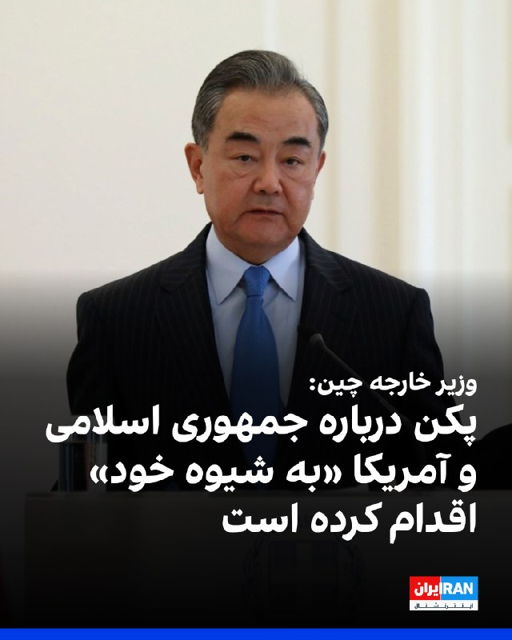

خبرگزاری شینهوا گزارش داد که وانگ یی، وزیر خارجه چین در گفت‌وگو با همتای پاکستانی خود گفت پکن درباره جمهوری اسلامی و آمریکا «به شیوه خود» اقدام کرده است.
وزیر خارجه چین افزود این کشور آماده است با پاکستان برای پیشبرد مذاکرات صلح، بدون وقفه همکاری کند.
او ادامه داد: «جامعه بین‌المللی باید حمایت بیشتری از مذاکرات میان جمهوری اسلامی و آمریکا انجام دهد.»
‌🏁 🇬🇧 IranintlTV

🤖 @VahidOOnLine

## VahidOOnLine — post 245880

  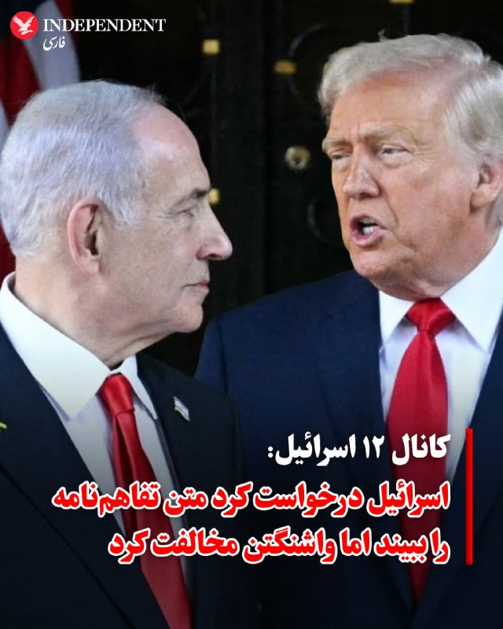

♦️ کانال ۱۲ اسرائیل، روز سه‌شنبه ۱۶ خرداد به نقل از منابع خود گزارش داد که دولت اسرائیل از آمریکا تقاضا کرده که به متن تفاهم‌نامه تهران و واشنگتن دسترسی یافته و آن را مرور کند اما واشنگتن با این خواسته مخالفت کرده است.

یارون آوراهام، خبرنگار کانال ۱۲ و مجری برنامه «نسخه امروز» با اشاره به گزارش‌های قبلی از نگرانی دولت اسرائیل درباره متن تفاهم‌نامه و احتمال نادیده گرفته شدن برنامه موشکی جمهوری اسلامی در آن، به نقل از منابع خود گفت که مقام‌های اسرائیل نگران‌اند این تفاهم‌نامه امتیازات زیادی به تهران داده باشد.
‌🇸🇦 Indypersian

🤖 @VahidOOnLine

## VahidOOnLine — post 245879

  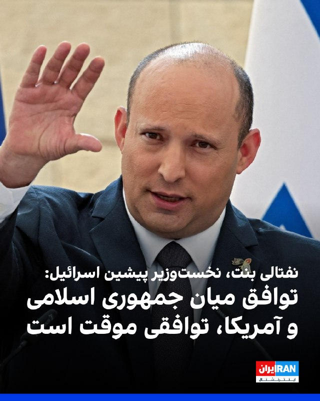

نفتالی بنت، نخست‌وزیر پیشین اسرائیل و نامزد جانشینی بنیامین نتانیاهو، در گفت‌وگو با ایران‌اینترنشنال گفت که توافق میان جمهوری اسلامی و آمریکا، یک توافق موقت است.

نفتالی بنت به ایران‌اینترنشنال گفت اسرائیل باید اطمینان حاصل کند که این توافق مانع دستیابی جمهوری اسلامی به سلاح هسته‌ای می‌شود و برچیده شدن برنامه موشکی جمهوری اسلامی را نیز تضمین می‌کند.
‌🏁 🇬🇧 IranintlTV

🤖 @VahidOOnLine

## VahidOOnLine — post 245878

  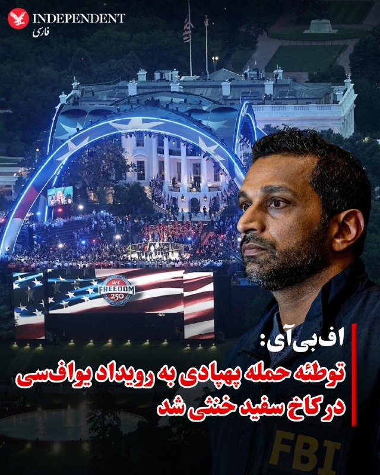

♦️مقام‌های آمریکایی سه‌شنبه ۲۶ خردادماه اعلام کردند اداره تحقیقات فدرال آمریکا (اف‌بی‌آی) توطئه‌ای برای حمله پهپادی به رویداد ورزش‌های رزمی ترکیبی «یو‌اف‌سی آزادی ۲۵۰» را که به‌تازگی در کاخ سفید برگزار شد، خنثی کرده است.

کش پتل، رئیس اف‌بی‌آی، با انتشار پیامی در شبکه اجتماعی اکس گفت اف‌بی‌آی و دیگر نهادهای مجری قانون روز ۲۰ خرداد از تهدیدی بالقوه علیه این رویداد در واشینگتن آگاه شدند. او افزود در پی عملیاتی چند ایالتی با همکاری وزارت دادگستری، چندین نفر بازداشت شدند و حملات برنامه‌ریزی‌شده متوقف شد.

بر اساس گزارش فاکس نیوز دیجیتال، تا روز دوشنبه پنج نفر در ارتباط با این پرونده بازداشت شده بودند و بازرسان ۲۳ نفر را به‌عنوان اعضای احتمالی شبکه طراحان حمله شناسایی کرده بودند. مقام‌های آمریکایی گفتند این طرح شامل استفاده از پهپادهای حامل مواد منفجره برای هدف قرار دادن ساختمان‌های اطراف محل برگزاری رویداد، ایجاد تخلیه گسترده و هدایت جمعیت به سمت تیمی از تک‌تیراندازان بوده است. به گفته آنان، مرحله بعدی عملیات نیز حمله به دروازه کاخ سفید را شامل می‌شد.

مقام‌ها همچنین اعلام کردند بررسی پیام‌های رد و بدل‌شده در پیام‌رسان سیگنال نشان داده است دست‌کم ۲۳ نفر درباره مقدمات اجرای این عملیات گفت‌وگو کرده بودند.
‌🇸🇦 Indypersian

🤖 @VahidOOnLine

## VahidOOnLine — post 245877

  

مجید ابن‌الرضا، سرپرست وزارت دفاع جمهوری اسلامی در دیدار با برخی نمایندگان مجلس، گفت: «در طول جنگ ۴۰ روزه، تولید موشک، پهپاد و سلاح‌های راهبردی هرگز متوقف نشد.»

او ادامه داد: «در جنگ، شاهد تحول و پیشرفت سلاحهای جدید و به روز شده نیروهای مسلح و بکارگیری آن بودیم.»

ابن‌الرضا اضافه کرد: «ما در این جنگ، بسیار قوی‌تر از جنگ ۱۲ روزه با اسرائیل، آمریکا و متحدانشان جنگیدیم.»
‌🏁 🇬🇧 IranintlTV

🤖 @VahidOOnLine

## VahidOOnLine — post 245876

  

نعیم قاسم، دبیرکل حزب‌الله لبنان، در نامه‌ای «تشکرآمیز» به محمدباقر قالیباف، رییس مجلس نوشت: «ما همواره گفته‌ایم که جمهوری اسلامی به حزب‌الله، مقاومت و ملت لبنان همه‌چیز داده و هیچ‌چیز از آنان نگرفته است.»

او ادامه داد: «جمهوری اسلامی خون خود را تقدیم می‌کند و با بمباران اسرائیل در پاسخ به حمله به ضاحیه، در برابر این رژیم ایستاده است.»
‌🏁 🇬🇧 IranintlTV

🤖 @VahidOOnLine

## VahidOOnLine — post 245875

  <a href="telegram/content/VahidOOnLine_245875_1781621151.mp4" target="_blank">🎬 Download video</a>

♦️صدرالدین نیاورانی، نایب رئیس اتحادیه ملی محصولات کشاورزی ایران، گفت محاصره بنادر جنوبی ایران از سوی آمریکا باعث افزایش چشمگیر هزینه‌های حمل‌ونقل شده و در برخی موارد کرایه حمل کالا تا ۱۰۰ درصد افزایش یافته است.

نیاورانی در گفت‌وگو با پایگاه خبری «نود اقتصادی» افزود کرایه‌های حمل‌ونقل در بازارهای مختلف بین ۶۰ تا ۷۰ درصد و در برخی مناطق تا ۱۰۰ درصد رشد کرده است. او همچنین گفت کرایه حمل دریایی با کشتی بیش از ۱۰۰ درصد افزایش یافته و همین موضوع باعث می‌شود محصولات با قیمت تمام‌شده دو برابر به مقصد برسند. به گفته او، ادامه این روند می‌تواند تغییرات جدی در بازارها و قیمت کالاها ایجاد کند.

این در حالی است که مقام‌های جمهوری اسلامی بارها گفته‌اند محاصره بنادر جنوبی ایران از سوی ایالات متحده تاثیر مهمی بر اقتصاد کشور ندارد، اما اظهارات نایب رئیس اتحادیه ملی محصولات کشاورزی از افزایش چشمگیر هزینه‌های حمل‌ونقل و پیامدهای آن بر قیمت کالاها حکایت دارد.
‌🇸🇦 Indypersian

🤖 @VahidOOnLine

## VahidOOnLine — post 245874

  

کامالا هریس، نامزد پیشین حزب دموکرات در انتخابات ریاست‌جمهوری آمریکا، گفت تفاهم‌نامه دونالد ترامپ با جمهوری اسلامی فقط «طرحی از یک توافق» است.

کامالا هریس گفت اگر رییس‌جمهور بود «قطعا» جنگ با ایران را آغاز نمی‌کرد.

او اضافه کرد: «هر توافقی که در حال مذاکره باشد، ترامپ آن را پیروزی اعلام خواهد کرد و در نهایت به همان جایی خواهیم رسید که پس از برجام بودیم و آن را پیروزی خواهند نامید؛ همان توافقی که خودش از آن خارج شد.»
‌🏁 🇬🇧 IranintlTV

🤖 @VahidOOnLine

## VahidOOnLine — post 245873

  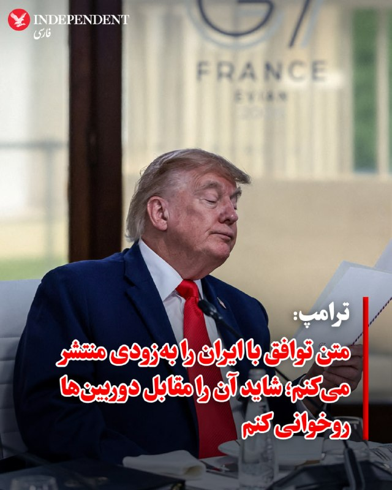

♦️ دونالد ترامپ، رئیس‌جمهوری آمریکا، وعده داد که متن کامل توافق با جمهوری اسلامی ایران را ظرف «چند روز آینده» به‌طور عمومی منتشر خواهد کرد. او حتی پیشنهاد کرد که برای تضمین پوشش دقیق رسانه‌ای، تمام این سند را کلمه به کلمه مقابل دوربین خبرنگاران قرائت کند.

ترامپ روز سه‌شنبه ۲۶ خرداد در حاشیه نشست سران گروه هفت (G7) در فرانسه و در جریان دیدار با محمد بن زاید آل نهیان، رئیس امارات متحده عربی، اظهار داشت که برای رونمایی از این متن منتظر یک «محیط رسمی» است. او با کم‌اهمیت خواندن گمانه‌زنی‌ها درباره پنهان‌کاری گفت: «من با این کار مشکلی ندارم، این یک سند فوق‌العاده است. حرف اصلی سند این است: ایران هرگز به سلاح هسته‌ای دست نخواهد یافت.»

رئیس‌جمهوری آمریکا روز یکشنبه این تفاهم‌نامه را به صورت الکترونیکی امضا کرد، اما متن کامل آن هنوز فاش نشده و حتی اعضای کنگره و رهبران جهان نیز آن را به‌طور کامل نخوانده‌اند. با این حال ترامپ تاکید کرد: «احتمالا یک نشست مطبوعاتی برگزار می‌کنم و آن را کلمه به کلمه برای شما می‌خوانم تا رسانه‌ها آن را دقیقا پوشش دهند، چون سند بسیار مهمی است.»
‌🇸🇦 Indypersian

🤖 @VahidOOnLine

## VahidOOnLine — post 245872

  

یک منبع آگاه سه‌شنبه به رویترز گفت شرکت قطر انرژی آماده است به‌سرعت تولید گاز طبیعی مایع را در راس‌لفان از سر بگیرد و به جز دو خط تولید که آسیب دیده‌اند، می‌تواند ظرف یک ماه به سطح تولید کامل برسد.

این منبع افزود که مانع اصلی، حمل‌ونقل و لجستیک خواهد بود، به‌ویژه اینکه قطر انرژی با چه سرعتی بتواند کشتی‌ها را وارد کرده و محموله‌ها را پس از باز شدن تنگه هرمز بارگیری کند.
‌🏁 🇬🇧 IranintlTV

🤖 @VahidOOnLine

## VahidOOnLine — post 245864

  <a href="telegram/content/VahidOOnLine_245864_1781621154.mp4" target="_blank">🎬 Download video</a>

ترامپ که پیش‌تر در پیام‌هایی خطاب به ایرانیان از «کمک در راه است» سخن گفته بود، اکنون در گفت‌وگو با مقام‌های قطر، کشته‌شدن معترضان را عمدتا به «گروه‌های قبلی» در جمهوری اسلامی نسبت می‌دهد و میان بخش‌های مختلف رژیم مرزبندی تازه‌ای می‌سازد.
‌🏁 🇬🇧 ManotoTV

🤖 @VahidOOnLine

## VahidOOnLine — post 245863

  

کانال ۱۲ اسرائیل گزارش داد این کشور درخواست کرده بود متن تفاهم‌نامه میان آمریکا و جمهوری اسلامی را مشاهده کند، اما با این درخواست موافقت نشده است.

کانال ۱۲ همچنین اعلام کرد حزب‌الله اعلام کرد از جمهوری اسلامی تضمین دریافت کرده که توافق نهایی با آمریکا را امضا نخواهد کرد، مگر آنکه اسرائیل از لبنان عقب‌نشینی کند.
‌🏁 🇬🇧 IranintlTV

🤖 @VahidOOnLine

## WithYashar — post 15063

کانال 12 اسرائیل: اسرائیل درخواست دیدن یادداشت تفاهم بین آمریکا و ایران رو داشت اما این درخواست رد شد.
@withyashar

## WithYashar — post 15062

ترامپ: ممکنه یه کنفرانس خبری برگزار کنم و متن یادداشت تفاهم آمریکا و ایران رو با صدای بلند و کلمه به کلمه بخونم تا رسانه‌ها اونو به درستی پوشش بدن.
@withyashar

## WithYashar — post 15061

ترامپ: اگه لیندسی گراهام بیاد و به این توافق با ایران شک کنه و حرفی بزنه، واقعاً براش دردسر درست می‌شه و حسابی به مشکل می‌خوره.
@withyashar

## WithYashar — post 15060

آکسیوس: جان رتکلیف، مدیر سیا، به دونالد ترامپ و مقام‌های ارشد آمریکا گفته ارزیابی‌های اطلاعاتی نشان می‌ده ایران احتمالا تمایل واقعی به اجرای تعهدات هسته‌ای خودش نداره.
گفته می‌شه تفاوت میان حرف‌های داخلی مقام‌های ایرانی و آنچه به مذاکره‌کنندگان آمریکایی گفتن، باعث این نگرانی شده.
مارکو روبیو، وزیر خارجه آمریکا، و پیت هگست، وزیر دفاع آمریکا، هم نگرانی مشابهی دارن.
@withyashar

## WithYashar — post 15059

خبرگزاری میزان، رسانه قوه قضاییه جمهوری اسلامی، سه‌شنبه 26 خرداد از اجرای حکم اعدام جواد زمانی و ابوالفضل ساعدی، دو زندانی سیاسی بازداشت‌شده در اعتراضات دی‌ماه در استان سمنان خبر داد. میزان اتهام آن‌ها را «افساد فی‌الارض از طریق کشیدن سلاح گرم و سرد در شهرستان…

## WithYashar — post 15058

  <a href="telegram/content/WithYashar_15058_1781621156.mp4" target="_blank">🎬 Download video</a>

طرف با پراید رفته دم لانچر در حال شلیک
@withyashar

## WithYashar — post 15057

خبرگزاری دولتی ایسنا:
محاصره دریایی آمریکا در حال لغو شدن است
@withyashar

## WithYashar — post 15056

  <a href="telegram/content/WithYashar_15056_1781621158.mp4" target="_blank">🎬 Download video</a>

ترامپ: ایران حتی یک بار به ترکیه حمله کرد، من هرگز این را درک نکردم، هیچ‌کس آن را درک نخواهد کرد

این مشکل است، آن‌ها کاملاً غیرمنطقی هستند و اکنون آن افراد رفته‌اند، فکر می‌کنم ایران اکنون رهبری منطقی دارد!
@withyashar

## WithYashar — post 15055

گزارش روزنامه New York Post می‌گوید که پلیس فدرال آمریکا (FBI) پنج نفر را به اتهام طراحی یک حمله به رویداد «UFC Freedom 250» در روز تولد ترامپ که در محوطه چمن جنوبی کاخ سفید برگزار شد، بازداشت کرده است. گفته می‌شود این طرح شامل استفاده از پهپادهای انفجاری، تک‌تیراندازها و همچنین تلاش برای نفوذ و شکستن دروازه‌های محل بوده است.

بر اساس این گزارش، FBI در تاریخ ۱۰ ژوئن از وجود این توطئه مطلع شده و سپس طی یک عملیات چندایالتی اقدام به بازداشت افراد کرده است. مقام‌ها می‌گویند در جریان تحقیقات، چت‌های رمزگذاری‌شده در اپلیکیشن Signal کشف شده که بیش از ۲۰ کاربر در آن‌ها حضور داشته‌اند.
@withyashar

## WithYashar — post 15054

  <a href="telegram/content/WithYashar_15054_1781621160.mp4" target="_blank">🎬 Download video</a>

صدراعظم آلمان در جی۷ پیراهن «ترامپ ۴۷» را به رئیس‌جمهور آمریکا اهدا کرد
@withyashar
خانواده دونالد ترامپ ریشه آلمانی دارند. پدربزرگ او، فریدریش ترامپ، در شهر کالشتات آلمان به دنیا آمد. او در سال ۱۸۸۵ و در شانزده سالگی از آلمان به ایالات متحده آمریکا مهاجرت کرد. پدر ترامپ، فرد ترامپ، در آمریکا متولد شده بود و شهروند آمریکا محسوب می‌شد، اما از طرف پدری کاملاً تبار آلمانی داشت. از سوی مادر نیز ترامپ ریشه اسکاتلندی دارد. مادرش، مری آن مک‌لئود ترامپ، در جزیره لوئیس در اسکاتلند به دنیا آمد و بعدها به آمریکا مهاجرت کرد

## WithYashar — post 15053

ترامپ با انتقاد از نتانیاهو :
لازم نیست هر بار که دنبال کسی می‌گردی، یک ساختمون آپارتمانی خراب کنی.
تو اون خونه ها ادم های زیادی زندگی میکنن و همه عضو حزب الله نیستن
@withyashar

## WithYashar — post 15052

  <a href="telegram/content/WithYashar_15052_1781621161.mp4" target="_blank">🎬 Download video</a>

خبرنگار : اگر رژیم ایران به کشتن مردم خودش ادامه دهد، آیا شما همچنان این معامله را پیش خواهید برد؟

ترامپ: ما با آنها در این باره صحبت کردیم. بیشتر این اتفاقات در دوران رژیم اول و دوم رخ داده است، بسیار بیشتر از الان.
@withyashar

## WithYashar — post 15051

خبرگزاری msn : ترامپ و کنگره به هگسث و روبیو اعلام کرده‌اند اگر با توافق با ایران مخالفت کنند ، از سمت خود برکنار خواهند ‌شد
@withyashar

## WithYashar — post 15050

ترامپ: جنگ لبنان مسئله فرعی است و توافق هسته‌ای با ایران می‌تواند پابرجا بماند.

به اسرائیل گفتم که از حمله آنها به بیروت خوشم نیامد

من به اسرائیل پیشنهاد دادم که سوریه مسئولیت حزب‌الله را بر عهده بگیرد

من از نتانیاهو ناامید نیستم. ما رابطه بسیار خوبی داریم
@withyashar

## WithYashar — post 15049

ترامپ: من به تغییر رژیم اعتقاد ندارم. سال‌هاست که تغییر رژیم‌ها را دیده‌ام و هیچ‌وقت نتیجه نمی‌دهند!

فکر می‌کنم توافق با ایران عادلانه است
@withyashar

## WithYashar — post 15048

ترامپ: می‌خواهیم اورانیوم غنی‌شده را از ایران بگیریم
@withyashar

## WithYashar — post 15047

ترامپ: ما می‌خواستیم برای دریافت اورانیوم غنی‌شده به ایران برویم، اما این اتفاق نیفتاد.
@withyashar

## WithYashar — post 15046

ترامپ: تلاش‌هایی برای تغییر رژیم در ایران صورت گرفت، اما موفق نشدند.
چیزی که مرا به امضای این یادداشت تفاهم ترغیب کرد، اطمینان از این بود که ایران سلاح هسته‌ای نداشته باشد.
اگر ایران به دنبال دستیابی به سلاح هسته‌ای باشد، جهنمی به پا خواهد شد.
ما از نحوه مدیریت امور توسط قطر در طول بحران اخیر، احساس خوشحالی و احترام می‌کنیم.
توافق با ایران به مرحله دوم منتقل می‌شود.
@withyashar

## WithYashar — post 15045

  <a href="telegram/content/WithYashar_15045_1781621163.mp4" target="_blank">🎬 Download video</a>

ترامپ درباره ایران:
ما هیچ پولی در ایران سرمایه‌گذاری نمی‌کنیم، راستی. دیروز شایعه‌ای پخش شد. مضحک بود.
ما حق داریم روزی وارد شویم و اگر من بخواهم کاری انجام دهم یا کسی بخواهد کاری انجام دهد، اما ما هیچ پولی سرمایه‌گذاری نمی‌کنیم.
ما هیچ تعهدی برای سرمایه‌گذاری پول در ایران نداریم.
@withyashar

## WithYashar — post 15044

ترامپ: ما هیچ پولی در ایران سرمایه‌گذاری نخواهیم کرد.
@withyashar

## mwarmonitor — post 11031

🚨«شبکه ۱۲ اسرائیل گزارش می‌دهد که اسرائیل درخواست کرده بود یادداشت تفاهم (مذاکره‌شده با ایران) را ببیند، اما این درخواست رد شد.»

@mwarmonitor

## mwarmonitor — post 11030

🔴ترامپ: «توافق ایران را برای بررسی به کنگره ارسال خواهد کرد» @mwarmonitor

## mwarmonitor — post 11029

🔴ترامپ: «توافق ایران را برای بررسی به کنگره ارسال خواهد کرد»

@mwarmonitor

## mwarmonitor — post 11028

🔴(رویترز) - رئیس‌جمهور دونالد ترامپ روز سه‌شنبه گفت که ایالات متحده اکنون در موقعیتی قرار دارد که می‌تواند اجازه دهد معافیت‌های نفتی روسیه منقضی شوند، پس از آنکه توافقی برای پایان دادن به جنگ ایران حاصل شده است.

🔹او در جریان دیدار با رئیس‌جمهور امارات متحده عربی، شیخ محمد بن زاید آل نهیان، در نشست گروه هفت در فرانسه به خبرنگاران گفت:

🔸«به‌زودی می‌توانیم این کار را انجام دهیم، چون نفت اکنون در حال جریان است.»

@mwarmonitor

## mwarmonitor — post 11026

📌«چیز زیادی در حال عبور نیست...
🔸امروز صبح ۲ تصویر از ماهواره Sentinel-1 (رادار SAR) و Sentinel-2 (تصویربرداری نوری) گرفته شده است.»

@mwarmonitor

## mwarmonitor — post 11022

🔴«حزب‌الله از ایران تضمین‌هایی دریافت کرده است که تا زمانی که اسرائیل از لبنان عقب‌نشینی نکند، توافق نهایی هسته‌ای با آمریکا را امضا نخواهد کرد - دفتر روابط رسانه‌ای حزب‌الله» «رویترز»

@mwarmonitor

## mwarmonitor — post 11021

🔴رسانه‌های اسرائیلی: کابینه کوچک (کابینت امنیتی) امروز درخواست آمریکا را بررسی خواهد کرد مبنی بر اینکه اسرائیل تا زمان امضای توافق با ایران، از لبنان عقب‌نشینی کند.

@mwarmonitor

## mwarmonitor — post 11020

🔴نامه نعیم قاسم به قالیباف:

🔸جناب رئیس مجلس شورای اسلامی، دکتر محمدرضا قالیباف، خداوند شما را تأیید و حفظ فرماید.

🔸کلمات از بیان تشکر عمیق ما نسبت به مواضع قوی و حمایت‌گرانه شما از لبنان، مردم آن و مقاومتش در الزام رژیم اسرائیل به توقف فوری و دائمی عملیات نظامی در همه جبهه‌ها، از جمله لبنان، در پیوند با توقف جنگ علیه جمهوری اسلامی ایران به عنوان بند اول و اساسی توافق میان ایران و آمریکا، قاصر است. شما روزنه امیدی را که تنها راه مؤثر برای جلوگیری از تجاوز اسرائیلی-آمریکایی علیه لبنان بود به واقعیت تبدیل کردید؛ واقعیتی که به جهان نشان داد ایران حامی حق، مقاومت و مستضعفان است. اگر دیگران نیز چنین راهی را می‌پیمودند، آمریکا و اسرائیل چنین گستاخ نمی‌شدند و اشغالگری صهیونیستی همچنان بر سرزمین فلسطین و قدس باقی نمی‌ماند.

ما همواره گفته‌ایم که ایران به حزب‌الله، مقاومت و مردم لبنان همه‌چیز داده و چیزی از آنان نگرفته است. ایران ما را برای انتخاب‌هایمان، برای قدرت‌مان در جهت آزادسازی سرزمین‌مان و برای التیام زخم‌های جامعه‌مان یاری کرده است. و اکنون ایران خون می‌دهد، در برابر حملات رژیم صهیونیستی پاسخ می‌دهد، و تبعاتی را که آن را به سوی جنگی گسترده تهدید می‌کند با فداکاری عظیم تحمل می‌نماید. ایران نماد عزت و شرف است.

از طرف حزب‌الله و مقاومت اسلامی، از طرف دوستداران مردم لبنان که خواستند سپاس خود را به شما برسانیم، از طرف شهدا و در رأس آنان سید شهدای امت سید حسن نصرالله (رض)، مجروحان و اسرا، از شما تشکر می‌کنیم و از شما می‌خواهیم این قدردانی و امتنان را به رهبر آیت‌الله سید مجتبی خامنه‌ای (دام ظله)، رئیس‌جمهور دکتر پزشکیان، و سپاه پاسداران انقلاب اسلامی، ارتش، نخبگان و همه مسئولان و مردم منتقل کنید.

و به‌طور ویژه از مردم بزرگ ایران یاد می‌کنیم؛ ما آنان را در میدان‌های شهرهای ایران دیدیم و شنیدیم که آماده‌اند جان خود را برای حمایت از مقاومت و مردم آن فدا کنند. سپاس از شما. سپاس از ایران وفادار.



@mwarmonitor

## mwarmonitor — post 11019

  <a href="telegram/content/mwarmonitor_11019_1781621165.mp4" target="_blank">🎬 Download video</a>

🔸ناوشکن USS Delbert D. Black (DDG-119) در جریان عبور از دریای عرب، در تاریخ ۱۵ ژوئن، عملیات تدارک‌رسانی عمودی در دریا (VERTREP) را با کشتی تدارکاتی USNS John Lewis (T-AO-205) انجام داد.

🔹تأمین مجدد در دریا به این معناست که ملوانان بدون نیاز به ورود کشتی به بندر، مواد تدارکاتی، نامه‌ها و سایر اقلام مورد نیاز را دریافت می‌کنند.

@mwarmonitor

## mwarmonitor — post 11018

🔴گزارش روزنامه New York Post می‌گوید که پلیس فدرال آمریکا (FBI) پنج نفر را به اتهام طراحی یک حمله به رویداد «UFC Freedom 250» که قرار بود در محوطه چمن جنوبی کاخ سفید برگزار شود، بازداشت کرده است. گفته می‌شود این طرح شامل استفاده از پهپادهای انفجاری، تک‌تیراندازها و همچنین تلاش برای نفوذ و شکستن دروازه‌های محل بوده است.

📌بر اساس این گزارش، FBI در تاریخ ۱۰ ژوئن از وجود این توطئه مطلع شده و سپس طی یک عملیات چندایالتی اقدام به بازداشت افراد کرده است. مقام‌ها می‌گویند در جریان تحقیقات، چت‌های رمزگذاری‌شده در اپلیکیشن Signal کشف شده که بیش از ۲۰ کاربر در آن‌ها حضور داشته‌اند.

@mwarmonitor

## mwarmonitor — post 11017

🔴ترامپ از نحوه عملکرد اسرائیل در لبنان انتقاد کرد و گفت اسرائیل «خیلی طولانی است که با حزب‌الله می‌جنگد» و افزود «افراد زیادی کشته می‌شوند».

🔸ترامپ گفت اسرائیل لازم نیست «هر بار که یک هدف را می‌زند یک ساختمان آپارتمانی را با خاک یکسان کند»، چون: «همه آن‌ها حزب‌الله نیستند.»

🔸او همچنین گفت پیشنهاد داده است که اسرائیل اجازه دهد سوریه با حزب‌الله برخورد کند: «اگر اسرائیل نتواند بدون کشتن همه کار را انجام دهد، او [الشرع] این کار را انجام می‌دهد، سوریه انجام می‌دهد.»

🔸ترامپ همچنین حمله اسرائیل به حزب‌الله در بیروت را مورد انتقاد قرار داد و آن را «بیش از حد» توصیف کرد و گفت: «من خوشم نیامد، به آن‌ها هم گفتم.»

🔸او افزود: «بیبی باید در قبال لبنان مسئولانه‌تر رفتار کند.» ترامپ همچنین مدعی شد: «اگر من دخالت نمی‌کردم، اسرائیل مدت‌ها پیش نابود شده بود.»

@mwarmonitor

## mwarmonitor — post 11016

🔴 دونالد ترامپ، رئیس‌جمهور آمریکا، می‌گوید ایالات متحده معتقد است توافق با ایران یک توافق منصفانه است.

🔴 ترامپ می‌گوید توافق با ایران وارد مرحله دوم شده است.

🔴 رئیس‌جمهور آمریکا اضافه می‌کند که ایالات متحده هیچ‌گونه سرمایه‌گذاری مالی در ایران انجام نمی‌دهد.

🔴 ترامپ می‌گوید ایران تحت این توافق هرگز به سلاح هسته‌ای دست نخواهد یافت.

@mwarmonitor

## FoxNewsTwitter — post 343023

  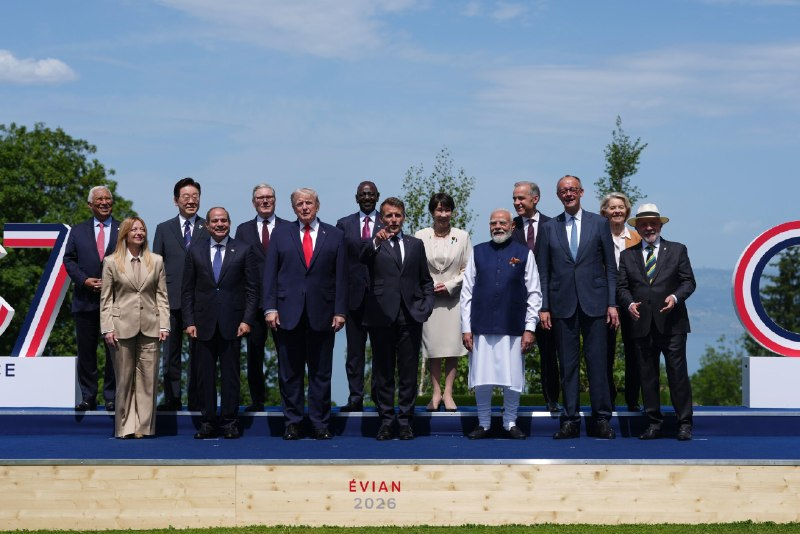

Fox News (Twitter/X)

G7 leaders pose for the traditional family photo as high-stake talks at the global summit continue in Geneva.

The summit's agenda has been shaped by diplomatic efforts to end conflicts in Iran and Ukraine, as leaders weigh additional pressure on Russia.

## FoxNewsTwitter — post 343022

  <a href="telegram/content/FoxNewsTwitter_343022_1781621168.mp4" target="_blank">🎬 Download video</a>

Fox News (Twitter/X)

Vice President Vance addresses speculation surrounding his political ambitions, the 2028 Republican ticket, and a potential rivalry with Secretary of State Marco Rubio, laughing off the drama as President Trump enjoying the “entertainment."

"I joked earlier that, you know, does it really sound like the president of the United States to run a televised program for who would be his next apprentice?”

“That's what the president does. And he loves that. And it does make this whole thing fun. But fundamentally, I think Marco, me, the entire cabinet, we're just focused on doing a good job." | @foxandfriends

## FoxNewsTwitter — post 343021

  <a href="telegram/content/FoxNewsTwitter_343021_1781621170.mp4" target="_blank">🎬 Download video</a>

Fox News (Twitter/X)

NOW: G7 leaders gather in Geneva as the summit officially gets underway.

President Trump's Iran peace deal has been a major focus of discussions so far, as world leaders also address efforts to end Russia's war in Ukraine and challenges facing the global economy.

## FoxNewsTwitter — post 343020

  <a href="telegram/content/FoxNewsTwitter_343020_1781621172.mp4" target="_blank">🎬 Download video</a>

Fox News (Twitter/X)

BREAKING: President Trump vows to hold a press conference to read the full memorandum of understanding with Iran word-by-word to make sure the media covers it fairly.

"I will actually not only release it, I'll probably have a press conference and read it to you word-by-word, so that the press covers it accurately, because it's, it's a very important document."

"And, unlike Obama, who could have destroyed the Middle East with a horrible JCPoA, it is the worst agreement that was a road to a nuclear weapon. Mine is a wall against a nuclear weapon."

## FoxNewsTwitter — post 343019

  <a href="telegram/content/FoxNewsTwitter_343019_1781621174.mp4" target="_blank">🎬 Download video</a>

Fox News (Twitter/X)

NEW: VP JD Vance calls out media "propagandists" for their comments surrounding the Iran agreement, accusing critics of amplifying Iranian talking points while ignoring what's actually in the deal.

"Not a single cent of American money goes to Iran. Not $300 billion, not $24 billion."

Vance accuses media figures and critics of focusing on hypothetical benefits Iran could receive while glossing over the deal's central requirement: a long-term, verifiable commitment to never obtain a nuclear weapon.

"The propagandists are saying, here are all the things Iran gets... but they don't get any of that stuff unless they totally transform themselves as a country." | @foxandfriends

## FoxNewsTwitter — post 343018

  <a href="telegram/content/FoxNewsTwitter_343018_1781621176.mp4" target="_blank">🎬 Download video</a>

Fox News (Twitter/X)

BREAKING: VP JD Vance says the foiled UFC 250 attack plot is another reminder of where America's political climate is heading.

"This is what happens when people turn the rhetoric up so loud that disagreeing with somebody is a cause for violence."

Vance argues that political leaders across the board need to lower the temperature, while contending that much of today's political violence is coming from the left.

He also credits the FBI and federal law enforcement for stopping what could have been a major tragedy, saying Americans rarely see the attacks agents prevent every day:

"They don't get the credit for the attacks they prevent. They only get the blame for the attacks that actually happen." | @foxandfriends

## FoxNewsTwitter — post 343017

  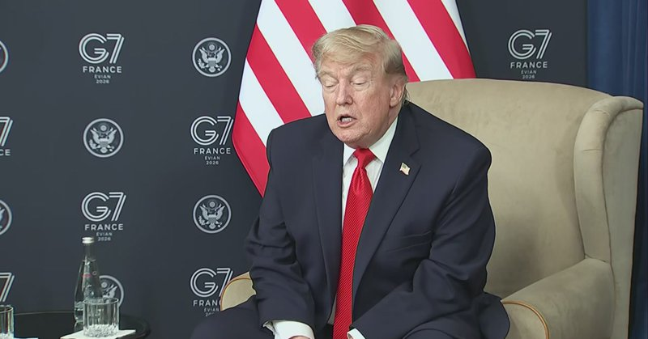

Fox News (Twitter/X)

WATCH LIVE: President Trump meets with world leaders for key G7 summit talks https://twitter.com/i/broadcasts/1qxvvvdAApWxB

## FoxNewsTwitter — post 343016

  <a href="telegram/content/FoxNewsTwitter_343016_1781621179.mp4" target="_blank">🎬 Download video</a>

Fox News (Twitter/X)

BREAKING: President Trump publicly rebukes Israel over its war against Hezbollah.

"Israel's fighting Hezbollah too long and too many people are being killed."

Trump said he opposed strikes that destroy apartment buildings filled with civilians and revealed he urged Israel to let Syria take the lead against Hezbollah instead.

"If Israel can't do the job without killing everyone else, he'll do the job. Syria will do the job."

## FoxNewsTwitter — post 343015

  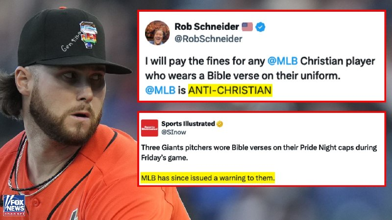

Fox News (Twitter/X)

Rob Schneider is putting his money behind the message.

The Hollywood star says he'll cover any potential fines for MLB players who wear Bible verses on their uniforms after league officials warned three San Francisco Giants pitchers who displayed Bible references on their Pride Night caps.

The moment has quickly turned into a bigger fight over religious expression, league rules, and where MLB draws the line on what players can show on the field.

## FoxNewsTwitter — post 343013

Fox News (Twitter/X)

"After all, we're on the same team."

German Chancellor Friedrich Merz handed President Trump a soccer jersey for his birthday at the G7, drawing smiles as world leaders gathered for high-stakes talks.

The gift came with a lighthearted message, but it also underscored the effort to project unity among allies amid ongoing discussions on security, trade, and global conflicts.

## FoxNewsTwitter — post 343012

‌Fox News (Twitter/X)

Head to Fox One right now so you don't miss a single second of this historic moment!

https://www.fox.com/stream/fox-news?cmpid=org=fn::ag=owned_other::mc=organicsocial[%E2%80%A6]WITTER::cmp=100_o2_th4::cont=m2_tp1::add=03_17_00_05_13_00_02_A

## FoxNewsTwitter — post 343011

  <a href="telegram/content/FoxNewsTwitter_343011_1781621182.mp4" target="_blank">🎬 Download video</a>

Fox News (Twitter/X)

"All hell will rain down on them."

President Trump puts the Iranian regime and its radical leaders on notice with a blunt warning at the G7, making it clear the Islamic Republic will not be allowed to obtain a nuclear weapon in any way, shape, or form.

"If they do, they suffer unbelievable consequences... the ultimate consequences," Trump said before doubling down that Iran will not be permitted to develop, buy, or acquire one if they want to maintain a "very good relationship" with the United States.

## FoxNewsTwitter — post 343010

‌Fox News (Twitter/X)

BREAKING: FBI, law enforcement partners disrupt alleged plot against UFC Freedom 250 event at White House; 5 in custody, officials say

## FoxNewsTwitter — post 343009

Fox News (Twitter/X)

WATCH LIVE: Trump holds bilateral meeting with the Emir of Qatar
https://twitter.com/i/broadcasts/1yKAPPonYzgxb

## pm_afshaa — post 94188

  <a href="telegram/content/pm_afshaa_94188_1781621184.webm" target="_blank">🎬 Download video</a>

🔴تشکر نعیم قاسم، دبیرکل حزب‌الله از قالیباف:

جمهوری اسلامی به حزب‌الله و مقاومت همه‌چیز داده و هیچ‌چیز از اونا نگرفته.

💧 Rainbet.com the #1 Non-KYC Crypto Casino & Sportsbook @rainbetcom

😁 @Pm_Afshaa

## pm_afshaa — post 94187

  <a href="telegram/content/pm_afshaa_94187_1781621184.webm" target="_blank">🎬 Download video</a>

🔴کانال 12 اسرائیل: اسرائیل درخواست دیدن یادداشت تفاهم بین آمریکا و ایران رو داشت اما این درخواست رد شد.

💧 Rainbet.com the #1 Non-KYC Crypto Casino & Sportsbook @rainbetcom

😁 @Pm_Afshaa

## pm_afshaa — post 94186

  <a href="telegram/content/pm_afshaa_94186_1781621185.webm" target="_blank">🎬 Download video</a>

🔴ترامپ: ممکنه یه کنفرانس خبری برگزار کنم و متن یادداشت تفاهم آمریکا و ایران رو با صدای بلند و کلمه به کلمه بخونم تا رسانه‌ها اونو به درستی پوشش بدن.

💧 Rainbet.com the #1 Non-KYC Crypto Casino & Sportsbook @rainbetcom

😁 @Pm_Afshaa

## pm_afshaa — post 94185

  <a href="telegram/content/pm_afshaa_94185_1781621186.webm" target="_blank">🎬 Download video</a>

🔴ترامپ: اگه لیندزی گراهام به توافق با ایران تردید داره، باید باهاش صحبت کنم، وگرنه ممکنه به دردسر بزرگی بیفته.

💧 Rainbet.com the #1 Non-KYC Crypto Casino & Sportsbook @rainbetcom

😁 @Pm_Afshaa

## pm_afshaa — post 94184

  <a href="telegram/content/pm_afshaa_94184_1781621186.webm" target="_blank">🎬 Download video</a>

🔴رویترز: حزب‌الله از جمهوری اسلامی تضمین‌هایی دریافت کرده که تا زمانی که اسرائیل از لبنان عقب‌نشینی نکنه، توافق نهایی هسته‌ای با آمریکا رو امضا نخواهد کرد.

💧 Rainbet.com the #1 Non-KYC Crypto Casino & Sportsbook @rainbetcom

😁 @Pm_Afshaa

## pm_afshaa — post 94183

  <a href="telegram/content/pm_afshaa_94183_1781621187.webm" target="_blank">🎬 Download video</a>

🔴آکسیوس: جان رتکلیف، مدیر سیا، به ترامپ و مقام‌های ارشد آمریکا گفته ارزیابی‌های اطلاعاتی نشون میده ایران احتمالا تمایل واقعی به اجرای تعهدات هسته‌ای خودش نداره.

گفته میشه تفاوت میان حرف‌های داخلی مقام‌های ایرانی و آنچه به مذاکره‌کنندگان آمریکایی گفتن، باعث این نگرانی شده.

مارکو روبیو، وزیر خارجه آمریکا، و پیت هگست، وزیر دفاع آمریکا، هم نگرانی مشابهی دارن.

💧 Rainbet.com the #1 Non-KYC Crypto Casino & Sportsbook @rainbetcom

😁 @Pm_Afshaa

## pm_afshaa — post 94182

بدلیل اظهارات دیشب طارمی، ایالات متحده ویزای این بازیکن را کنسل کرد و این بازیکن نمیتونه ایران رو مقابل بلژیک همراهی کنه

💧 Rainbet.com the #1 Non-KYC Crypto Casino & Sportsbook @rainbetcom

😁 @Pm_Afshaa

## pm_afshaa — post 94181

  <a href="telegram/content/pm_afshaa_94181_1781621188.webm" target="_blank">🎬 Download video</a>

🔴روزنامه کیهان: سکوت مجتبی خامنه‌ای درباره پرونده هسته‌ای، به معنای پایان مذاکرات هسته‌ای است.

💧 Rainbet.com the #1 Non-KYC Crypto Casino & Sportsbook @rainbetcom

😁 @Pm_Afshaa

## pm_afshaa — post 94180

  <a href="telegram/content/pm_afshaa_94180_1781621188.webm" target="_blank">🎬 Download video</a>

🔴صداوسیما: عملیات رفع محاصرۀ دریایی آمریکا اجرایی شده اما شناورها برای عبور از تنگ هرمز همچنان باید با سپاه هماهنگ باشن.

💧 Rainbet.com the #1 Non-KYC Crypto Casino & Sportsbook @rainbetcom

😁 @Pm_Afshaa

## pm_afshaa — post 94179

  <a href="telegram/content/pm_afshaa_94179_1781621189.webm" target="_blank">🎬 Download video</a>

🔴ترامپ: فکر میکنم مرحله دوم مذاکرات با ایران، از مرحله اول آسان‌تر باشه.

تنها چیزی که واقعا برای من اهمیت داره اینه که ایران هرگز به سلاح هسته‌ای دست پیدا نکنه و این موضوع کاملا در توافق آمده.

اگر ایران به سمت ساخت بمب اتم بره، جهنم بر سرشون نازل خواهد شد و با پیامدهایی باورنکردنی روبه‌رو میشن.

من به‌دنبال تغییر حکومت در ایران نیستم و این هرگز بخشی از اهدافم نبوده. سال‌هاست که تغییر رژیم‌ها رو دیده‌ام و هیچ‌وقت نتیجه نمیده.

من به اسرائیل پیشنهاد دادم بذاره سوریه خودش حزب‌الله رو جمع‌وجور کنه، راستش فکر میکنم اونا بهتر از بقیه از پسش برمیان.

💧 Rainbet.com the #1 Non-KYC Crypto Casino & Sportsbook @rainbetcom

😁 @Pm_Afshaa

## pm_afshaa — post 94178

  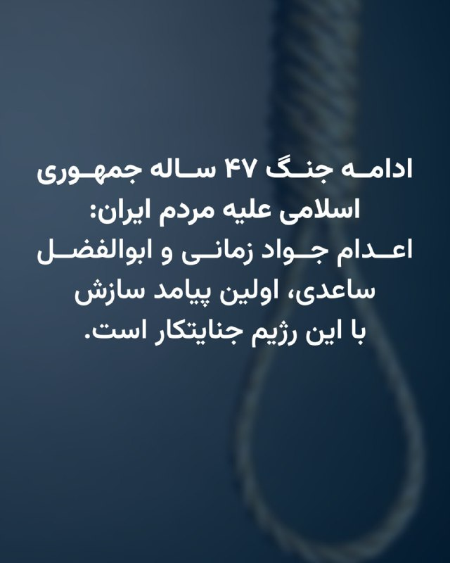

جمهوری اسلامی هم‌زمان با امضای تفاهم‌نامه‌ «صلح»، دو تن دیگر از معترضان ۱۸ و ۱۹ دی‌ به نام‌های جواد زمانی و ابوالفضل ساعدی را اعدام کرد.

این نتیجه معامله و سازش با یک رژیم جنایتکار است. توافق با رژیمی که تنها در دو روز، بیش از ۴۰ هزار معترض را به قتل رساند، نه‌تنها از نظر اخلاقی نادرست است، بلکه از منظر راهبردی نیز خطایی فاجعه‌بار خواهد بود.

تعامل با این رژیم محکوم به شکست است و همه ما بهای پیامدهای آن را خواهیم پرداخت. جنگ ۴۷ ساله جمهوری اسلامی علیه مردم ایران همچنان ادامه دارد. رژیمی که هرگز با شهروندان خود به صلح نرسیده، هرگز با جهان نیز به صلحی واقعی دست نخواهد یافت.

جامعه جهانی باید از مبارزه ملت ایران برای آزادی حمایت کند و آنها را در کانون هر مذاکره و محور هر سیاستی درباره ایران قرار دهد. اما روشن بگویم: با حمایت جهان یا بدون آن، این رژیم سقوط خواهد کرد،ٰ و مردم ایران خود را از چنگ استبداد آزاد خواهند کرد.

As it signs a Memorandum of Understanding for “peace”, the Islamic Republic just executed two more protesters from January 8th and 9th— Javad Zamani and Abolfazl Saedi.

This is the consequence of making a deal with this criminal regime. To do a deal with a regime that murdered more than 40,000 protestors in two days in January is morally wrong and strategically misguided.

Dealing with this regime will fail and we will all face the consequences. The regime’s 47-year war against the Iranian people continues. Just as it has never made peace with its own citizens, it will never truly make peace with the world.

The international community should back the people of Iran’s fight for freedom. Put them center in any negotiations and in their Iran policy. But let me be clear - with or without international support - this regime will fall. The people of Iran will liberate themselves from tyranny.

@OfficialRezaPahlavi

## pm_afshaa — post 94177

  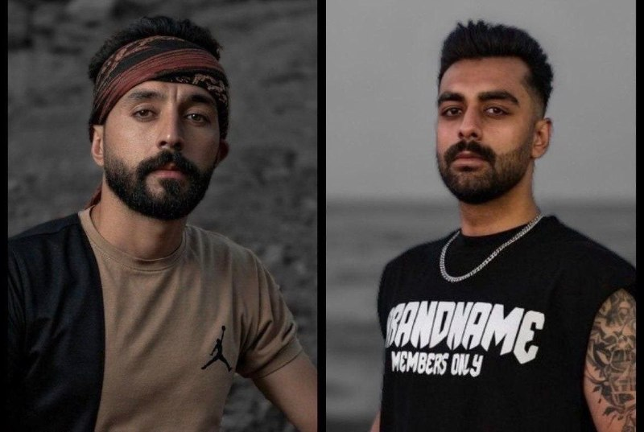

تصویری از جواد زمانی و ابوالفضل ساعدی که امروز صبح توسط جمهوری تروریستی اعدام شدن

💧 Rainbet.com the #1 Non-KYC Crypto Casino & Sportsbook @rainbetcom

😁 @Pm_Afshaa

## DEJradio — post 5739

  <a href="telegram/content/DEJradio_5739_1781621190.mp4" target="_blank">🎬 Download video</a>

⭕️
👑 شاهزاده رضا پهلوی امروز وارد بریتانیا شد و لرد موریس گلاسمن، عضو مجلس اعیان، ایشان را برای دیدارها و گفت‌وگوهای سیاسی در پارلمان بریتانیا همراهی کرد.

شاهزاده با این پیام روشن به بریتانیا آمده‌اند که جمهوری اسلامی نماینده مردم ایران نیست و هر تلاشی برای به‌رسمیت شناختن این رژیم به‌عنوان شریکی مشروع، تنها به تداوم بقای آن، تعمیق رنج ایرانیان و گسترش بی‌ثباتی در منطقه و فراتر از آن منجر می‌شود. صلح پایدار از مسیر امتیازدهی به رژیمی در حال فروپاشی نمی‌گذرد. از مسیر اراده مردم ایران می‌گذرد. مردمی که برای ایرانی آزاد، دموکراتیک و سکولار ایستاده‌اند.

#شاهزاده_رضا_پهلوی #بریتانیا
@DEJradio

## DEJradio — post 5738

⭕️ ترامپ به اسرائیل پیشنهاد داد مقابله با حزب‌الله را به احمد شرع بسپارد

دونالد ترامپ روز سه‌شنبه اعلام کرد به نتانیاهو پیشنهاد داده است که برای کاهش تلفات غیرنظامیان در لبنان، مسئولیت مقابله با حزب‌الله را به دولت سوریه و احمد شرع واگذار کند.
رئیس جمهوری آمریکا در نشست گروه هفت با تمجید از احمد شرع، رهبر کنونی سوریه گفت او عملکردی شگفت‌انگیز داشته است.
به گفتۀ ترامپ، سوریه می‌تواند بدون ایجاد تلفات گسترده با حزب‌الله مقابله کند.
دونالد ترامپ ضمن انتقاد از حملۀ اسرائیل به بیروت تنها چند ساعت پیش از نهایی شدن توافق تهران و واشینگتن، تأکید کرد که روابط او با بنیامین نتانیاهو همچنان عالی است و همکاری اسرائیل و آمریکا ادامه دارد.
#لبنان #حزب‌الله #سوریه
@DEJradio

## DEJradio — post 5737

⭕️ جمهوری اسلامی دو شهروند معترض دیگر را اعدام کرد

قوۀ قضائیۀ جمهوری اسلامی اعلام کرد دو تن دیگر از بازداشت‌شدگان اعتراضات دی‌ماه ۱۴۰۴ را در شاهرود اعدام کرده است.
خبرگزاری میزان، وابسته به قوه قضائیه روز سه‌شنبه ۲۶ خردادماه اسامی اعدام‌شدگان را جواد زمانی و ابوالفضل ساعدی اعلام کرد.
دستگاه قضائی جمهوری اسلامی با اتهام‌ «محاربه» و «افساد فی‌الارض» جواد زمانی و ابوالفضل ساعدی را به دار آویخته است.
در پی اعلام تفاهم میان تهران و واشینگتن، این نخستین موارد از اعدام معترضان است که توسط جمهوری اسلامی منتشر می‌شود.
رژیم حاکم بر ایران، از اعدام معترضان با بهانه‌های واهی و روند قضائی ناعادلانه، برای ترساندن مخالفان حکومت و پیشگیری از اعتراضات گسترده استفاده می‌کند.
سازمان‌های حقوق بشری در ماه‌های گذشته بارها نسبت به صدور و اجرای احکام اعدام برای بازداشت‌شدگان اعتراضات در ایران هشدار داده‌اند.

#دی_خونین #اعدام
@DEJradio

## DEJradio — post 5736

  

جمهوری اسلامی هم‌زمان با امضای تفاهم‌نامه‌ «صلح»، دو تن دیگر از معترضان ۱۸ و ۱۹ دی‌ به نام‌های جواد زمانی و ابوالفضل ساعدی را اعدام کرد.

این نتیجه معامله و سازش با یک رژیم جنایتکار است. توافق با رژیمی که تنها در دو روز، بیش از ۴۰ هزار معترض را به قتل رساند، نه‌تنها از نظر اخلاقی نادرست است، بلکه از منظر راهبردی نیز خطایی فاجعه‌بار خواهد بود.

تعامل با این رژیم محکوم به شکست است و همه ما بهای پیامدهای آن را خواهیم پرداخت. جنگ ۴۷ ساله جمهوری اسلامی علیه مردم ایران همچنان ادامه دارد. رژیمی که هرگز با شهروندان خود به صلح نرسیده، هرگز با جهان نیز به صلحی واقعی دست نخواهد یافت.

جامعه جهانی باید از مبارزه ملت ایران برای آزادی حمایت کند و آنها را در کانون هر مذاکره و محور هر سیاستی درباره ایران قرار دهد. اما روشن بگویم: با حمایت جهان یا بدون آن، این رژیم سقوط خواهد کرد،ٰ و مردم ایران خود را از چنگ استبداد آزاد خواهند کرد.

As it signs a Memorandum of Understanding for “peace”, the Islamic Republic just executed two more protesters from January 8th and 9th— Javad Zamani and Abolfazl Saedi.

This is the consequence of making a deal with this criminal regime. To do a deal with a regime that murdered more than 40,000 protestors in two days in January is morally wrong and strategically misguided.

Dealing with this regime will fail and we will all face the consequences. The regime’s 47-year war against the Iranian people continues. Just as it has never made peace with its own citizens, it will never truly make peace with the world.

The international community should back the people of Iran’s fight for freedom. Put them center in any negotiations and in their Iran policy. But let me be clear - with or without international support - this regime will fall. The people of Iran will liberate themselves from tyranny.

@OfficialRezaPahlavi

## DEJradio — post 5735

  <a href="telegram/content/DEJradio_5735_1781621193.webm" target="_blank">🎬 Download video</a>

👑
🔺 مازیار نظری: شرافت را از مجیدرضا رهنورد آموختیم، نه از تیم جمهوری اسلامی

#مجیدرضا_رهنورد #دژفوتبالی #تیم_ملی #جام_جهانی
@DEJradio

## DEJradio — post 5734

⭕️ ترامپ گفت با تلاش جمهوری اسلامی برای رسیدن به سلاح هسته‌ای، جهنم بر سرش فرود می‌آید

دونالد ترامپ، رئیس جمهوری ایالات متحده روز سه‌شنبه گفت تفاهم با رژیم حاکم بر ایران با صدای بلند و شفاف می‌گوید جمهوری اسلامی به سلاح هسته‌ای دست نمی‌یابد.
رئیس جمهوری آمریکا، در حاشیۀ نشست گروه هفت در فرانسه هشدار داد اگر جمهوری اسلامی به سمت دستیابی به سلاح هسته‌ای برود، جهنم بر سرش آوار می‌شود.
ترامپ با دفاع از تفاهمنامۀ اخیر با جمهوری اسلامی افزود مهم‌ترین بخش این توافق آن است که تهران هرگز به سلاح هسته‌ای دست نمی‌یابد.
رئیس جمهوری آمریکا با اشاره به این که مذاکرات اکنون وارد مرحله دوم شده، ادعا کرد این مرحله آسان‌تر از مرحلۀ نخست به پیش می‌رود.
او اعلام کرد که ایالات متحده هیچ تعهدی برای سرمایه‌گذاری در ایران ندارد و حل مسائل هسته‌ای مهم‌ترین اولویت واشینگتن است.
ترامپ همچنین مدعی شد رهبران جدید جمهوری اسلامی نسبت به گذشته «منطقی‌تر» و «کمتر افراطی» هستند.
رئیس جمهوری آمریکا ادعا کرد هیچ‌گاه به تغییر رژیم حاکم بر ایران، توجهی نداشته است.

#تفاهم #ترامپ #برنامه_هسته‌ای
@DEJradio

## DEJradio — post 5733

⭕️ اسرائیل هیوم گزارش داد آمریکا یک ماه پیش با دادوستد مالی قطر و جمهوری اسلامی موافقت کرده بود

روزنامۀ اسرائیل هیوم به نقل از سه مقام دیپلماتیک گزارش داد دولت دونالد ترامپ درحدود یک ماه پیش به‌صورت محرمانه با یک توافق مالی و دریایی میان قطر و جمهوری اسلامی موافقت کرده بود.
بر پایۀ این گزارش، قطر در چارچوب یک تفاهم «میلیاردها دلار» را در اختیار تهران قرار داد.
از سویی جمهوری اسلامی نیز عبور آزاد کشتی‌ها و نفتکش‌های قطری را از تنگۀ هرمز تضمین کرده بود.
به گزارش اسرائیل هیوم، مبادلات دوحه و تهران، با آگاهی و موافقت واشینگتن انجام شد.
بنا بر این گزارش، هدف ترامپ از این چشم‌پوشی بر انتقال پول به تهران، کاهش تنش در بازار جهانی انرژی و جلوگیری از جهش قیمت نفت بوده است.
به گزارش رسانۀ اسرائیلی، بخشی از پرداخت‌ها در پوشش هزینۀ عبور کشتی‌ها انجام شد. همچنین یک خط اعتباری برای خرید کالا تا سقف یک میلیارد دلار نیز توسط قطر ایجاد شد.
به گزارش اسرائیل هیوم، افشای این توافق نشان می‌دهد زمینۀ تفاهم کنونی میان واشینگتن و جمهوری اسلامی از هفته‌ها پیش و از مسیر همکاری نزدیک آمریکا و قطر در حال شکل‌گیری بود.

#ترامپ #قطر #مذاکرات
@DEJradio

## DEJradio — post 5732

  <a href="telegram/content/DEJradio_5732_1781621194.mp4" target="_blank">🎬 Download video</a>

🔺🎥 دو تا نان خاشخاشی سنگگ، با قد و قواره آب رفته، شد ۱۱۰ هزار تومان!

#نان #تورم #گرانی
@DEJradio

## DEJradio — post 5731

⭕️ 
👑 شاهزاده رضا پهلوی: توافق با جمهوری اسلامی از منظر اخلاقی و راهبردی اشتباه است

شاهزاده رضا پهلوی در گفت‌وگو با مجلۀ تایمز با انتقاد از توافق میان جمهوری اسلامی و آمریکا، آن را از نظر اخلاقی غلط و از نظر راهبردی گمراه‌کننده، عنوان کرد.
شاهزاده گفت هر توافقی با جمهوری اسلامی سرانجام شکست خواهد خورد.
او تأکید کرد رژیم حاکم بر ایران، در صوزت توافق نیز به سرکوب داخلی، باج‌خواهی از جامعۀ جهانی و بی‌ثبات‌سازی منطقه، ادامه می‌دهد.
شاهزاده رضا پهلوی تصریح کرد که مردم ایران باید در محور هرگونه سیاست‌گذاری و مذاکرۀ بین‌المللی دربارۀ کشور قرار گیرند.
او همچنین تغییر نظام سیاسی را، تنها راه‌حل پایدار برای آیندۀ روشن کشور عنوان کرد.
شاهزاده یادآور شد که دستان محمدباقر قالیباف که تفاهمنامه را از سوی رژیم امضا کرده، به خون مردم ایران آغشته شده است.
شاهزاده رضا پهلوی تأکید کرد تعیین نظام آیندۀ ایران تنها باید از طریق رأی مردم انجام شود و هیچ فرد یا گروهی نمی‌تواند این تصمیم را به جای ملت ایران بگیرد.

#شاهزاده_رضا_پهلوی #مصاحبه #مذاکرات #توافق
@DEJradio

## DEJradio — post 5730

⭕️ اکسیوس: ارزیابی سیا نشان می‌دهد جمهوری اسلامی برای پذیرش شروط هسته‌ای آمریکا آماده نیست

وب‌سایت خبری اکسیوس به نقل از سه منبع آگاه گزارش داد جان رتکلیف، رئیس سازمان اطلاعات مرکزی آمریکا در مورد دوبازی دوگانۀ جمهوری اسلامی در مورد مسئلۀ هسته‌ای هشدار داده است.
بنا بر این گزارش، بر پایۀ ارزیابی اطلاعاتی سازمان سیا، اکنون تردیدهایی جدی در مورد هدف واقعی جمهوری اسلامی از مذاکرات، پدید آمده است.
به گفتۀ اکسیوس، رئیس سیا به دونالد ترامپ و مقام‌های ارشد دولت هشدار داد که ارزیابی‌های اطلاعاتی این سازمان دربارۀ نیت واقعی جمهوری اسلامی، با آنچه در تفاهمنامه مطرح شده است، همخوانی ندارد.
اکسیوس نوشت که جان رتکلیف، مارکو روبیو، وزیر امور خارجۀ آمریکا، و پیت هگست، وزیر جنگ در جلسات داخلی دربارۀ آمادگی جمهوری اسلامی برای پذیرش محدودیت‌های هسته‌ای مورد نظر واشینگتن ابراز تردید کرده‌اند.
بر اساس این گزارش، داده‌های جمع‌آوری‌شده از سوی نهادهای اطلاعاتی آمریکا نشان می‌دهد مواضعی که مقام‌های جمهوری اسلامی در داخل کشور مطرح می‌کنند، با تعهداتی که از طریق میانجی‌ها و در مذاکرات با آمریکا ارائه شده است، تفاوت اساسی دارد.
اکسیوس نوشت مخالفان توافق در دولت آمریکا می‌گویند جمهوری اسلامی ممکن است در دورۀ ۶۰ روزۀ مذاکرات از مزایای سیاسی و اقتصادی تفاهم اولیه بهره‌مند شود، اما در پایان شروط هسته‌ای مورد نظر واشینگتن را نپذیرد.

#مذاکرات #توافق #ترامپ
@DEJradio

## DEJradio — post 5729

  <a href="telegram/content/DEJradio_5729_1781621196.webm" target="_blank">🎬 Download video</a>

🔺📌 برنامه هفتگی «سلامت» با اجرای دکتر نیکی سرمدی، به‌زودی از تلویزیون دژ

این برنامه به وضعیت نظام بهداشت و درمان و سلامت در جمهوری اسلامی و چشم‌انداز سلامت در ایران در دفترچه دوران گذار می‌پردازد.

#سلامت #بهداشت #جمهوری_اسلامی
@DEJradio

## mamlekate — post 103725

  <a href="telegram/content/mamlekate_103725_1781621197.mp4" target="_blank">🎬 Download video</a>

دروازه‌بان کیپ‌ورده، کشوری با ۵۰۰،۰۰۰ نفر جمعیت، بهترین دروازه‌بان با مجموع ۷ سیو تاریخی مقابل اسپانیا شناخته شد. آخر بازی گریه کرد و گفت که مادرش بدلیل اینکه هزینه ویزای امریکا رو نداشته، نتونسته بیاد و بازی پسرشو از نزدیک ببینه. فالوئرهای اینستاگرامش بعد از این بازی از ۵۰ هزار نفر به یک و نیم میلیون نفر رسید. حتی از جمعیت کشورش بیشتر!

مقایسه‌اش کنید با دروازه‌بان تیم ملا که به زور چپوندنش توی دانشگاهی که حتی نمیدونه اسم رشته‌اش چیه و میلیاردمیلیارد پولی که توی جیبش ریختن تا بیاد از لاشه سوخته رهبرش دفاع کنه و درآخر از ضعیف‌ترین تیم این تورنمنت دوتا گل ناب بخوره. پول مفت ملت در فقر نگه‌داشته‌شده و مدارک آبدوغ‌خیاری‌ای که به این لش‌و لوشا میدن. منفور یک ملت. ننگ تاریخ ایران.

AfsoonAB
@mamlekate

## mamlekate — post 103724

📝 ترامپ: بدون آمریکا و بدون من، اسرائیل وجود نداشت؛ به تغییر رژیم در ایران اعتقادی ندارم

دونالد ترامپ گفت اگر آمریکا و شخص او وارد عمل نشده بودند، اسرائیل «اکنون وجود نداشت» و هر فرد هوشمندی در اسرائیل این را می‌داند. او در عین حال گفت به تغییر رژیم در ایران اعتقادی ندارد و این موضوع هیچ‌گاه بخشی از هدف او نبوده است.

📝 ترامپ: در چارچوب توافق، هیچ پولی در ایران سرمایه‌گذاری نمی‌کنیم

دونالد ترامپ، رییس‌جمهوری آمریکا، در حاشیه اجلاس سران گروه هفت اعلام کرد ایالات متحده در چارچوب توافق با جمهوری اسلامی، «هیچ پولی» در ایران سرمایه‌گذاری نخواهد کرد.

📝 ترامپ: اگر جمهوری اسلامی بخواهد به سلاح هسته‌ای برسد، جهنم بر سرشان خراب خواهد شد

دونالد ترامپ، رئیس‌جمهوری آمریکا، که برای حضور در نشست سران گروه ۷ (G7) به شهر اویان در فرانسه رفته است، در حاشیه این اجلاس، به پرسش‌هایی درباره توافق با جمهوری اسلامی ایران پاسخ داد.

رهبران آمریکا، کانادا، فرانسه، آلمان، ایتالیا، بریتانیا و ژاپن در این نشست حضور دارند و انتظار می‌رود تحولات مربوط به ایران پس از توافق تهران و واشنگتن، جنگ اوکراین، مسائل تجاری و موضوع‌های مرتبط با فناوری و اقتصاد دیجیتال از مهم‌ترین محورهای این نشست باشد.

@mamlekate

## mamlekate — post 103723

  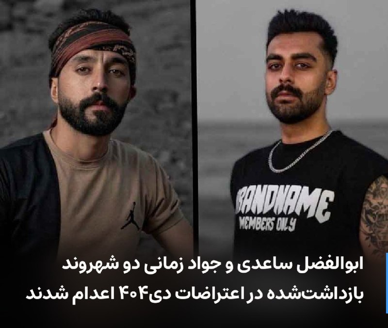

📝 جمهوری اسلامی، جواد زمانی و ابوالفضل ساعدی، از معترضان دی‌ماه، را اعدام کرد

خبرگزاری میزان، وابسته به قوه قضاییه جمهوری اسلامی، گزارش داد حکم اعدام جواد زمانی و ابوالفضل ساعدی، از شهروندان بازداشت‌شده در جریان انقلاب ملی در شاهرود، بامداد سه‌شنبه ۲۶ خرداد به اجرا درآمد.

@mamlekate

## VahidOnline — post 76424

پهلوان سازش ناپذیر
@mananey
مانا نیستانی

## VahidOnline — post 76416

  <a href="telegram/content/VahidOnline_76416_1781621199.mp4" target="_blank">🎬 Download video</a>

ترامپ که پیش‌تر در پیام‌هایی خطاب به ایرانیان از «کمک در راه است» سخن گفته بود، اکنون در گفت‌وگو با مقام‌های قطر، کشته‌شدن معترضان را عمدتا به «گروه‌های قبلی» در جمهوری اسلامی نسبت می‌دهد و میان بخش‌های مختلف رژیم مرزبندی تازه‌ای می‌سازد.
@VahidOOnLine

📡 @VahidOnline

## VahidOnline — post 76415

  <a href="telegram/content/VahidOnline_76415_1781621200.mp4" target="_blank">🎬 Download video</a>

دونالد ترامپ، رئیس‌جمهوری آمریکا، در حاشیه نشست سران گروه هفت (G7) در اویان فرانسه و در دیدار با امیر قطر، از رویکرد نظامی بنیامین نتانیاهو در قبال لبنان انتقاد کرد.

ترامپ با اشاره به حمله هوایی اسرائیل به بیروت، درست دو ساعت پیش از امضای توافق آتش‌بس با جمهوری اسلامی ایران، آن را «کور و بی‌هدف» خواند و گفت: «به آن‌ها فهماندم که اصلا از این کار راضی نیستم. برای کشتن یک نفر لازم نیست یک آپارتمان را با خاک یکسان کنید؛ آدم‌های زیادی آنجا هستند که همه‌شان حزب‌الله نیستند.»

رئیس‌جمهوری آمریکا با بیان اینکه اسرائیل زمان زیادی است که با حزب‌الله می‌جنگد و افراد زیادی کشته می‌شوند، پیشنهاد داد که کنترل این گروه به سوریه واگذار شود.
ترامپ با تمجید از عملکرد احمد الشرع، رئیس‌جمهوری سوریه در ساماندهی سریع این کشور گفت: «او با مشارکت من و اردوغان روی کار آمد. او از حزب‌الله خوشش نمی‌آید و این کار را بهتر انجام می‌دهد؛ اگر اسرائیل نمی‌تواند بدون کشتن دیگران کار را تمام کند، سوریه این کار را خواهد کرد.»
@VahidOOnLine

📡 @VahidOnline

## VahidOnline — post 76414

  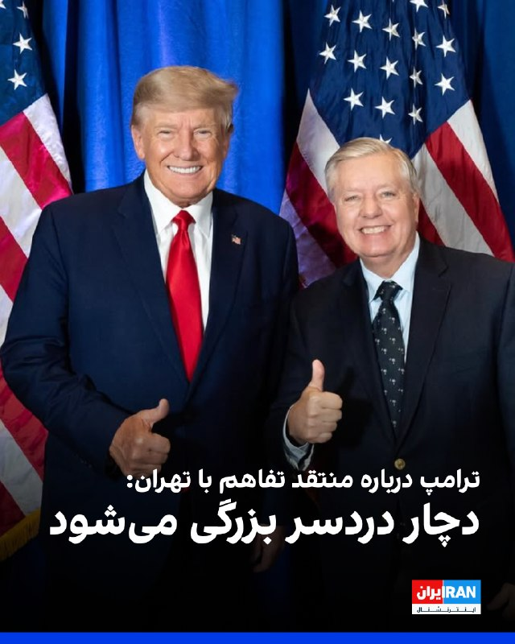

دونالد ترامپ، رییس‌جمهوری آمریکا، در پاسخ به پرسشی درباره متحدان او که نسبت به چارچوب تفاهم با جمهوری اسلامی تردید دارند، از جمله لیندزی گراهام، سناتور جمهوری‌خواه، با لحنی طنزآمیز گفت: «لیندزی تردید دارد؟ باید با او صحبت کنم؛ دچار دردسر بزرگی می‌شود.»

ترامپ سپس تلاش کرد نگرانی‌ها در میان هم‌حزبی‌های خود را کم‌اهمیت جلوه دهد و گفت گراهام «آدم خوبی» است و مشکلی با این توافق ندارد.

او افزود: «این توافق یک موضوع مهم را به‌خوبی پوشش می‌دهد. ما بابت آن هیچ پولی پرداخت نمی‌کنیم.»

رییس‌جمهوری آمریکا ادامه داد: «بازارها اکنون نسبت به زمانی که کار را آغاز کردیم در سطح بالاتری قرار دارند.»

ترامپ گفت: «اختلاف فقط بر سر یک موضوع است؛ این‌که ایران هرگز سلاح هسته‌ای نخواهد داشت؛ هرگز، هرگز و هرگز.» او افزود: «بقیه مسائل اهمیتی ندارند.»
@VahidOOnLine

📡 @VahidOnline

## VahidOnline — post 76412

پیام‌های دریافتی درباره دو پست قبلی
📡 @VahidOnline

## VahidOnline — post 76411

  

دونالد ترامپ، رئیس‌جمهور ایالات متحده، روز سه‌شنبه اعلام کرد توافق صلح با ایران را برای «بررسی» به کنگره آمریکا می‌فرستد.

او در جریان دیدار با محمد بن زاید آل نهیان، رئیس امارات متحده عربی، در حاشیه نشست گروه ۷ در فرانسه به خبرنگاران گفت: «هرگز به فرستادن آن فکر نکرده بودم، حتی یک بار هم به آن فکر نکرده بودم، اما این کار را خواهم کرد. آن را به کنگره می‌فرستم. از این ایده خوشم می‌آید.»

برخی قانون‌گذاران جمهوری‌خواه پیش‌تر خواستار بررسی متن این توافق شده بودند.

آقای ترامپ همچنین وعده داد که متن توافق با ایران را «ظرف یکی دو روز آینده» به‌صورت عمومی منتشر خواهد کرد و حتی این احتمال را مطرح کرد که کل سند را در برابر دوربین‌ها قرائت کند.

او گفت که منتظر فراهم شدن یک «فضای رسمی» برای انتشار عمومی این متن است.

رئیس‌جمهور آمریکا اعلام کرد: «دوست دارم ابتدا یک چارچوب رسمی برای این کار فراهم شود، اما هیچ مشکلی با انتشار آن ندارم؛ این یک سند عالی است.»
او در ادامه افزود: «محتوای آن این است: ایران هرگز سلاح هسته‌ای نخواهد داشت.»

ترامپ درباره مرحله بعدی مذاکرات با ایران که برای آن مهلتی ۶۰ روزه تعیین شده است، گفت: «فکر می‌کنم این روند خیلی سریع پیش خواهد رفت.»

او افزود: «ایران می‌خواهد این موضوع را نهایی کند. آن‌ها باید به فعالیت‌های عادی خود بازگردند و روابط اکنون عادی‌سازی شده است؛ بنابراین فکر می‌کنم این روند خیلی سریع پیش خواهد رفت.»

ترامپ در ادامه گفت: «ممکن است سریع‌تر پیش برود، ممکن است هم زمان بیشتری طول بکشد، اما می‌تواند خیلی سریع انجام شود.»
@VahidHeadline

📡 @VahidOnline

## VahidOnline — post 76410

  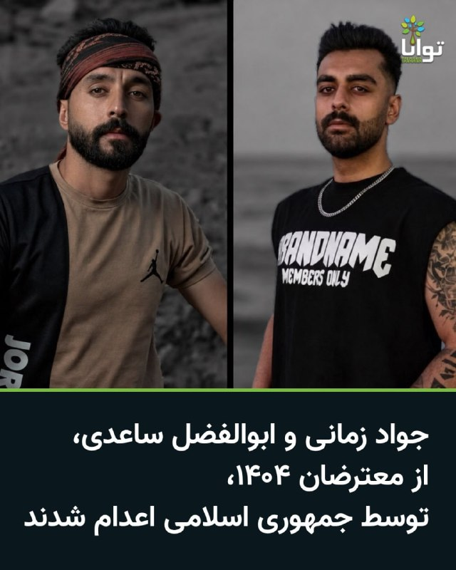

قوه قضائیه جمهوری اسلامی اعلام کرد که روز سه‌شنبه ۲۶ خرداد دو نفر دیگر از معترضان دی‌ماه پارسال در شاهرود اعدام شدند.

خبرگزاری میزان، اسامی افراد اعدام‌شده را جواد زمانی و ابوالفضل ساعدی اعلام و گفته است که آن‌ها به اتهام «محاربه» و «افساد فی‌الارض» اعدام شدند.

این نخستین مورد از اعدام معترضان در ایران پس از اعلام توافق تهران و واشینگتن برای پایان دادن به جنگ ۴۰ روزه است.

در بیانیه رسمی قوه قضائیه، از قول محمدصادق اکبری رئیس دادگستری استان سمنان ادعا شده است که افراد اعدام‌شده «اقدام به تخریب و آتش‌زدن اموال عمومی و خصوصی، حمل و استفاده از سلاح سرد و گرم و اخلال در نظم و امنیت عمومی، اجتماع و تبانی علیه امنیت کشور و سایر اقدامات مجرمانه» در شهر شاهرود کردند.
@VahidHeadline

📡 @VahidOnline

## kianmeli1 — post 88033

  <a href="telegram/content/kianmeli1_88033_1781621202.mp4" target="_blank">🎬 Download video</a>

🔴ترامپ درباره ایران: تنگه هرمز باز خواهد بود و همیشه بدون عوارض خواهد ماند.
https://t.me/kianmeli1

## kianmeli1 — post 88032

  <a href="telegram/content/kianmeli1_88032_1781621204.mp4" target="_blank">🎬 Download video</a>

🔴ترامپ: کلمه به کلمه متن توافق را برایتان می‌خوانم

من نه تنها آن را منتشر خواهم کرد. احتمالاً یک کنفرانس مطبوعاتی خواهم داشت و کلمه به کلمه آن را برای شما خواهم خواند تا مطبوعات آن را به طور دقیق پوشش دهند زیرا این یک سند بسیار مهم است
https://t.me/kianmeli1

## kianmeli1 — post 88031

  <a href="telegram/content/kianmeli1_88031_1781621205.mp4" target="_blank">🎬 Download video</a>

🔴ترامپ درباره گرد و غبار هسته‌ای ایران:
ما عجله‌ای نداریم، اما آن را به دست خواهیم آورد و نابودش خواهیم کرد.
https://t.me/kianmeli1

## IranIntlTV — post 342722

  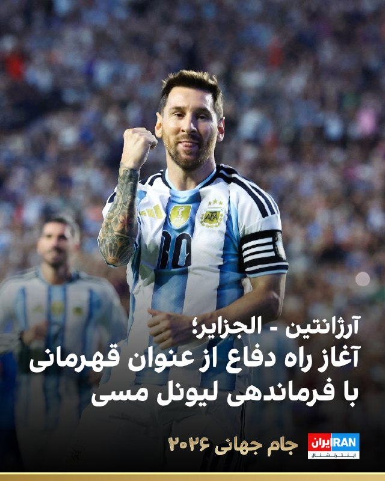

🔻بامداد سه‌شنبه از ساعت ۰۴:۳۰، تیم ملی فوتبال آرژانتین در نخستین گام برای دفاع از عنوان قهرمانی، در ورزشگاه شهر کانزاس سیتی به مصاف الجزایر می‌رود. این مسابقه که در قالب گروه J رقابت‌ها برگزار می‌شود، آغازگر ششمین و به احتمال زیاد آخرین جام جهانی لیونل مسی، فوق‌ستاره ۳۸ ساله دنیای فوتبال، است.

🔹آرژانتین و الجزایر پیش از این هرگز در جام جهانی با هم بازی نکرده‌اند و تنها رویارویی آن‌ها به یک بازی دوستانه در سال ۲۰۰۷ در نیوکمپ بارسلونا برمی‌گردد؛ مسابقه‌ای جذاب که با برتری ۴ بر ۳ آلبی‌سلسته همراه بود و لیونل مسی نوجوان در آن دیدار موفق شد دو گل به ثمر برساند.

🔹حالا پس از سال‌ها، مسی به عنوان فاتح جام جهانی ۲۰۲۲ قطر و قهرمان ام‌ال‌اس با اینتر میامی، بار دیگر برابر این رقیب آفریقایی می‌ایستد. او که با ۸ گل بهترین گلزن آرژانتین در دور مقدماتی بود، اگرچه سرعت سال‌های جوانی را ندارد، اما همچنان با هوش بالا و ضربات آخر بی‌نقصش، امید اول تیم لیونل اسکالونی است.

🔹گزارش کامل را در سایت بخوانید.

@iranintltvsport

## IranIntlTV — post 342721

  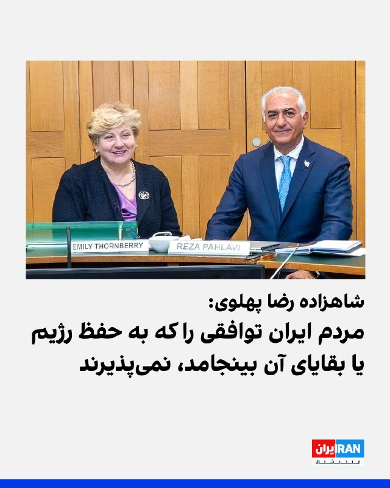

شاهزاده رضا پهلوی، با اشاره به سفر خود به لندن، در شبکه ایکس نوشت: «امروز با امیلی تورن‌بری، رییس کمیته روابط خارجی مجلس عوام بریتانیا و شماری دیگر از اعضای این کمیته دیدار داشتم تا درباره وضعیت داخلی ایران، سرکوب مردم و ضرورت فوری قرار دادن ملت ایران در مرکز سیاست بریتانیا، گفت‌وگو کنیم.»

او ادامه داد: «به‌روشنی تاکید کردم معامله با رژیمی که در دی‌ماه بیش از ۴۰ هزار ایرانی را به قتل رسانده، نه‌تنها از نظر اخلاقی غیرقابل‌قبول است، بلکه از نظر راهبردی نیز خطایی بزرگ خواهد بود.»

شاهزاده رضا پهلوی افزود: «هر توافقی که به حفظ این رژیم یا بقایای آن بینجامد، محکوم به شکست است. مردم ایران چنین توافقی را نخواهند پذیرفت.»

او تاکید کرد: «با حمایت جامعه جهانی یا بدون آن، مردم ایران این رژیم را سرنگون خواهند کرد و آزادی به ایران بازخواهد گشت.»
https://iranintl.com/202606166456

## IranIntlTV — post 342720

  

خبرگزاری شینهوا گزارش داد که وانگ یی، وزیر خارجه چین در گفت‌وگو با همتای پاکستانی خود گفت پکن درباره جمهوری اسلامی و آمریکا «به شیوه خود» اقدام کرده است.
وزیر خارجه چین افزود این کشور آماده است با پاکستان برای پیشبرد مذاکرات صلح، بدون وقفه همکاری کند.
او ادامه داد: «جامعه بین‌المللی باید حمایت بیشتری از مذاکرات میان جمهوری اسلامی و آمریکا انجام دهد.»
https://iranintl.com/202606168879

## IranIntlTV — post 342719

  <a href="telegram/content/IranIntlTV_342719_1781621209.mp4" target="_blank">🎬 Download video</a>

در شرایطی که مسئولان از اهمیت سلامت خانواده و افزایش جمعیت سخن می‌گویند، هزینه‌های روزافزون درمان این سوال را مطرح می‌کند که زنان تا چه اندازه به خدمات درمانی مورد نیاز خود دسترسی دارند؟

آیه دریس، عضو تحریریه ایران‌اینترنشنال، در «پیوست» به این موضوع می‌پردازد
@iranintltv

## IranIntlTV — post 342718

  

نفتالی بنت، نخست‌وزیر پیشین اسرائیل و نامزد جانشینی بنیامین نتانیاهو، در گفت‌وگو با ایران‌اینترنشنال گفت که توافق میان جمهوری اسلامی و آمریکا، یک توافق موقت است.

نفتالی بنت به ایران‌اینترنشنال گفت اسرائیل باید اطمینان حاصل کند که این توافق مانع دستیابی جمهوری اسلامی به سلاح هسته‌ای می‌شود و برچیده شدن برنامه موشکی جمهوری اسلامی را نیز تضمین می‌کند.
https://iranintl.com/202606165236

## IranIntlTV — post 342717

  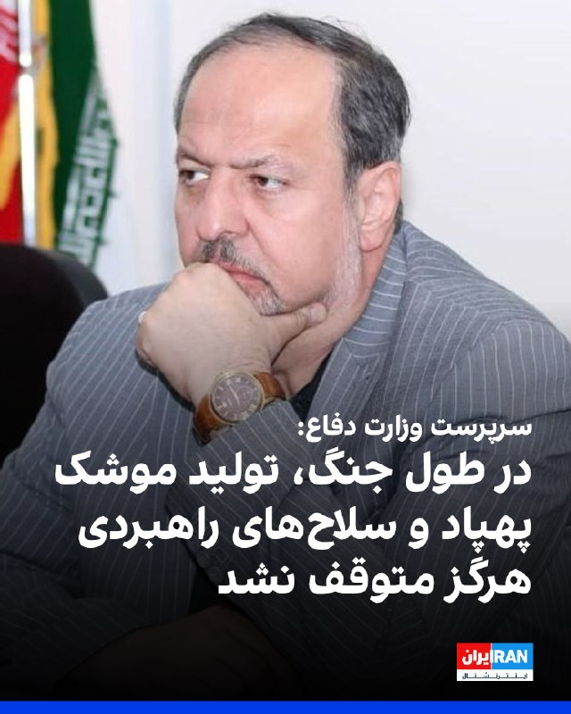

مجید ابن‌الرضا، سرپرست وزارت دفاع جمهوری اسلامی در دیدار با برخی نمایندگان مجلس، گفت: «در طول جنگ ۴۰ روزه، تولید موشک، پهپاد و سلاح‌های راهبردی هرگز متوقف نشد.»

او ادامه داد: «در جنگ، شاهد تحول و پیشرفت سلاحهای جدید و به روز شده نیروهای مسلح و بکارگیری آن بودیم.»

ابن‌الرضا اضافه کرد: «ما در این جنگ، بسیار قوی‌تر از جنگ ۱۲ روزه با اسرائیل، آمریکا و متحدانشان جنگیدیم.»
https://iranintl.com/202606169985

## IranIntlTV — post 342716

  <a href="telegram/content/IranIntlTV_342716_1781621212.mp4" target="_blank">🎬 Download video</a>

دونالد ترامپ، رییس‌جمهوری آمریکا، دو روز پس از اعلام نهایی شدن توافق میان آمریکا و جمهوری اسلامی، بار دیگر تاکید کرد در ازای این توافق هیچ پولی به تهران پرداخت نخواهد شد. او همچنین هشدار داد در صورت دستیابی جمهوری اسلامی به سلاح هسته‌ای، «جهنم بر سر آنها نازل خواهد شد.»

جزییات بیشتر با اردوان روزبه، خبرنگار ایران‌اینترنشنال
@iranintltv

## IranIntlTV — post 342715

  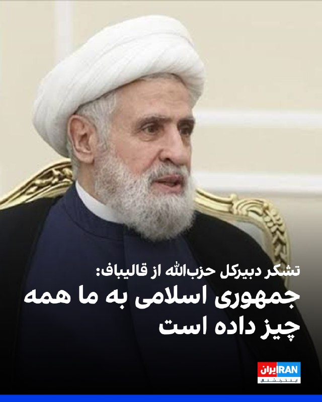

نعیم قاسم، دبیرکل حزب‌الله لبنان، در نامه‌ای «تشکرآمیز» به محمدباقر قالیباف، رییس مجلس نوشت: «ما همواره گفته‌ایم که جمهوری اسلامی به حزب‌الله، مقاومت و ملت لبنان همه‌چیز داده و هیچ‌چیز از آنان نگرفته است.»

او ادامه داد: «جمهوری اسلامی خون خود را تقدیم می‌کند و با بمباران اسرائیل در پاسخ به حمله به ضاحیه، در برابر این رژیم ایستاده است.»
https://iranintl.com/202606162262

## IranIntlTV — post 342714

  <a href="telegram/content/IranIntlTV_342714_1781621215.mp4" target="_blank">🎬 Download video</a>

هم‌زمان با نخستین بازی تیم فوتبال ایران در جام جهانی ۲۰۲۶، شبکه‌های اجتماعی شاهد موجی از واکنش‌های متفاوت کاربران بود. این دیدار، فراتر از یک رقابت ورزشی، به بستری برای طرح دیدگاه‌های سیاسی و اجتماعی درباره نسبت تیم ملی با حکومت و مردم و بازتاب شکاف‌های موجود در افکار عمومی تبدیل شد.

عادله بورنگ، عضو تحریریه ایران‌اینترنشنال، از واکنش کاربران می‌گوید
@iranintltv

## IranIntlTV — post 342713

  <a href="telegram/content/IranIntlTV_342713_1781621216.mp4" target="_blank">🎬 Download video</a>

همزمان با تشدید بحران رکود تورمی در اقتصاد ایران، وزیر اقتصاد جمهوری اسلامی گفت با وجود توافق برای پایان جنگ، جنگ اقتصادی تازه آغاز شده است.

مهتاب قلی‌زاده، روزنامه‌نگار اقتصادی، به ایران‌اینترنشنال گفت با وجود گذشت یک فصل از سال، بودجه سال ۱۴۰۵ هنوز ورودی خاصی نداشته است
@iranintltv

## IranIntlTV — post 342712

  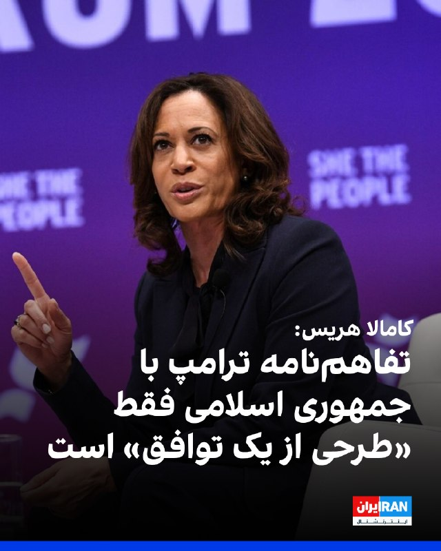

کامالا هریس، نامزد پیشین حزب دموکرات در انتخابات ریاست‌جمهوری آمریکا، گفت تفاهم‌نامه دونالد ترامپ با جمهوری اسلامی فقط «طرحی از یک توافق» است.

کامالا هریس گفت اگر رییس‌جمهور بود «قطعا» جنگ با ایران را آغاز نمی‌کرد.

او اضافه کرد: «هر توافقی که در حال مذاکره باشد، ترامپ آن را پیروزی اعلام خواهد کرد و در نهایت به همان جایی خواهیم رسید که پس از برجام بودیم و آن را پیروزی خواهند نامید؛ همان توافقی که خودش از آن خارج شد.»
https://iranintl.com/202606166650

## IranIntlTV — post 342711

  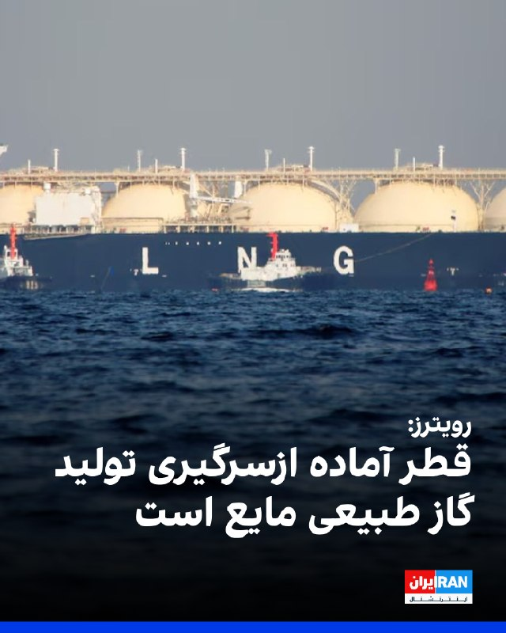

یک منبع آگاه سه‌شنبه به رویترز گفت شرکت قطر انرژی آماده است به‌سرعت تولید گاز طبیعی مایع را در راس‌لفان از سر بگیرد و به جز دو خط تولید که آسیب دیده‌اند، می‌تواند ظرف یک ماه به سطح تولید کامل برسد.

این منبع افزود که مانع اصلی، حمل‌ونقل و لجستیک خواهد بود، به‌ویژه اینکه قطر انرژی با چه سرعتی بتواند کشتی‌ها را وارد کرده و محموله‌ها را پس از باز شدن تنگه هرمز بارگیری کند.
https://iranintl.com/202606169786

## IranIntlTV — post 342710

ایران اینترنشنال در فصل «مرگ خامنه‌ای؛ پایان دیکتاتور» به بررسی کارنامه سی‌و‌شش ساله رهبری علی خامنه‌ای و چالش‌های پیش روی مجتبی خامنه‌ای در ادامه مسیر جمهوری اسلامی می‌پردازد.

گزارش‌ها، مقالات، مستندها و مصاحبه‌ها را در تلویزیون، بخش‌های خبر، وبسایت و اکانت‌های ایران اینترنشنال در شبکه‌های اجتماعی دنبال کنید.

#پایان_دیکتاتور
@iranintltv

## IranIntlTV — post 342709

  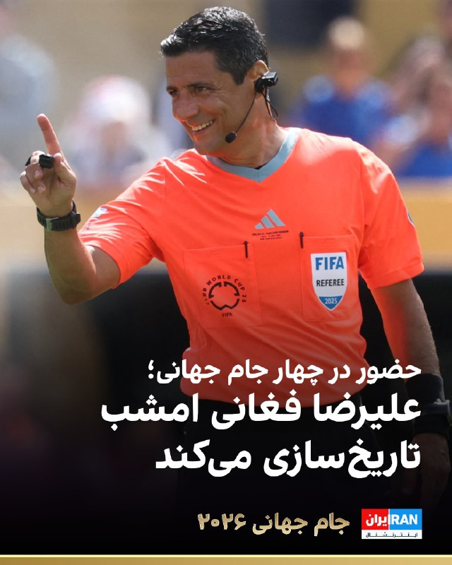

🔻علیرضا فغانی امشب ساعت ۲۲:۳۰ با قضاوت در دیدار فرانسه و سنگال، به نخستین داور تاریخ فوتبال تبدیل می‌شود که در چهار دوره جام جهانی سوت زده است. بر اساس اعلام فیفا، فغانی به عنوان داور وسط این مسابقه از گروه I انتخاب شده است و دو کمک‌داور استرالیایی نیز او را در این بازی همراهی خواهند کرد.

🔹او که در سه دوره گذشته (۲۰۱۴، ۲۰۱۸ و ۲۰۲۲) به عنوان نماینده ایران در جام جهانی حضور داشت، این بار با پرچم استرالیا در این تورنمنت بزرگ سوت می‌زند. این داور باسابقه پس از مهاجرت به استرالیا و حذف از فهرست داوران بین‌المللی ایران، اکنون به عنوان نماینده رسمی فدراسیون فوتبال استرالیا در مسابقات فیفا قضاوت می‌کند.

🔹قوه قضاییه جمهوری اسلامی چند ماه پیش از توقیف اموال علیرضا فغانی به دلیل مخالفت با سیاست‌های حکومت خبر داده بود.
@iranintltvsport

## IranIntlTV — post 342708

  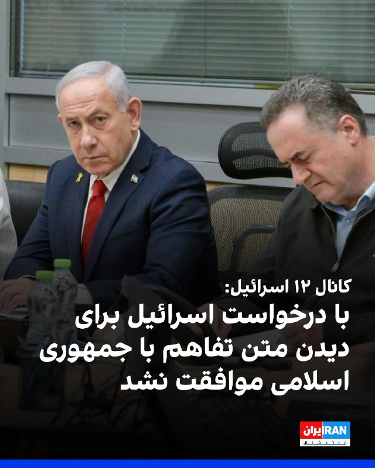

کانال ۱۲ اسرائیل گزارش داد این کشور درخواست کرده بود متن تفاهم‌نامه میان آمریکا و جمهوری اسلامی را مشاهده کند، اما با این درخواست موافقت نشده است.

کانال ۱۲ همچنین اعلام کرد حزب‌الله اعلام کرد از جمهوری اسلامی تضمین دریافت کرده که توافق نهایی با آمریکا را امضا نخواهد کرد، مگر آنکه اسرائیل از لبنان عقب‌نشینی کند.
https://iranintl.com/202606166163

## IranIntlTV — post 342707

  <a href="telegram/content/IranIntlTV_342707_1781621221.mp4" target="_blank">🎬 Download video</a>

دونالد ترامپ، رییس‌جمهوری آمریکا، در حاشیه اجلاس گروه هفت در فرانسه، با ابراز نارضایتی از حمله اسرائیل به لبنان تاکید کرد بنیامین نتانیاهو باید مسئولیت‌پذیر باشد.

گفت‌وگو با بابک اسحاقی، خبرنگار ایران‌اینترنشنال، درباره واکنش‌ها در اسرائیل به صحبت‌های ترامپ
@iranintltv

## IranIntlTV — post 342706

  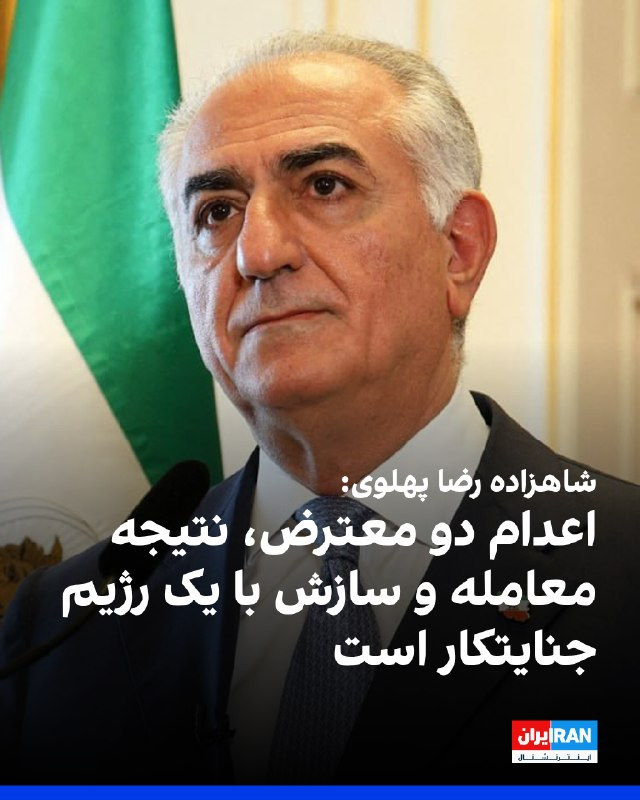

شاهزاده رضا پهلوی، در پیامی در شبکه ایکس نوشت: «جمهوری اسلامی هم‌زمان با امضای تفاهم‌نامه‌ صلح، دو تن دیگر از معترضان ۱۸ و ۱۹ دی‌ به نام‌های جواد زمانی و ابوالفضل ساعدی را اعدام کرد. این نتیجه معامله و سازش با یک رژیم جنایتکار است. توافق با رژیمی که تنها در دو روز، بیش از ۴۰ هزار معترض را به قتل رساند، نه‌تنها از نظر اخلاقی نادرست است، بلکه از منظر راهبردی نیز خطایی فاجعه‌بار خواهد بود.»

شاهزاده رضا پهلوی در ادامه اضافه کرد: «تعامل با این رژیم محکوم به شکست است و همه ما بهای پیامدهای آن را خواهیم پرداخت. جنگ ۴۷ ساله جمهوری اسلامی علیه مردم ایران همچنان ادامه دارد. رژیمی که هرگز با شهروندان خود به صلح نرسیده، هرگز با جهان نیز به صلحی واقعی دست نخواهد یافت.»

او افزود: «جامعه جهانی باید از مبارزه ملت ایران برای آزادی حمایت کند و آنها را در کانون هر مذاکره و محور هر سیاستی درباره ایران قرار دهد. اما روشن بگویم: با حمایت جهان یا بدون آن، این رژیم سقوط خواهد کرد،ٰ و مردم ایران خود را از چنگ استبداد آزاد خواهند کرد.»
https://iranintl.com/202606160912

## IranIntlTV — post 342705

  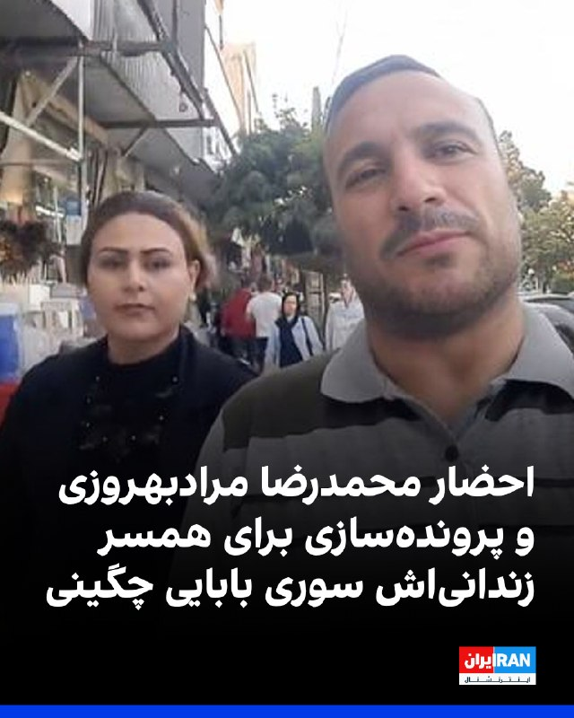

محمدرضا مرادبهروزی، فعال سیاسی، بار دیگر دادسرای انقلاب محمدیه قزوین احضار شد.

این احضاریه همزمان برای او و همسرش، سوری بابایی چگینی صادر شده است. او پیش‌تر در جریان اعتراضات دی‌ماه بازداشت شده و همچنان در زندان به‌سر می‌برد و از حق ملاقات با خانواده محروم است.

اتهامات مطرح‌شده علیه مرادبهروزی و همسرش شامل «انتشار محتوا و ارتباطات رسانه‌ای علیه امنیت ملی» و «ارتباط یا همکاری با طرف‌های متخاصم» عنوان شده است.
https://iranintl.com/202606161252

## IranIntlTV — post 342704

  

دونالد ترامپ، رییس‌جمهوری آمریکا، در پاسخ به پرسشی درباره متحدان او که نسبت به چارچوب تفاهم با جمهوری اسلامی تردید دارند، از جمله لیندزی گراهام، سناتور جمهوری‌خواه، با لحنی طنزآمیز گفت: «لیندزی تردید دارد؟ باید با او صحبت کنم؛ دچار دردسر بزرگی می‌شود.»

ترامپ سپس تلاش کرد نگرانی‌ها در میان هم‌حزبی‌های خود را کم‌اهمیت جلوه دهد و گفت گراهام «آدم خوبی» است و مشکلی با این توافق ندارد.

او افزود: «این توافق یک موضوع مهم را به‌خوبی پوشش می‌دهد. ما بابت آن هیچ پولی پرداخت نمی‌کنیم.»

رییس‌جمهوری آمریکا ادامه داد: «بازارها اکنون نسبت به زمانی که کار را آغاز کردیم در سطح بالاتری قرار دارند.»

ترامپ گفت: «اختلاف فقط بر سر یک موضوع است؛ این‌که ایران هرگز سلاح هسته‌ای نخواهد داشت؛ هرگز، هرگز و هرگز.» او افزود: «بقیه مسائل اهمیتی ندارند.»
https://iranintl.com/202606161260

## IranIntlTV — post 342703

  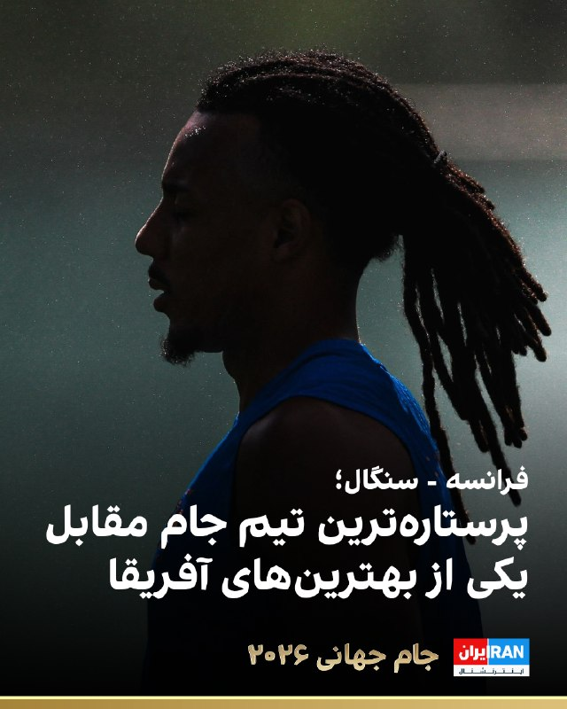

🔻امشب از ساعت ۲۲:۳۰، تیم ملی فوتبال فرانسه در نخستین دیدار خود در جام جهانی ۲۰۲۶، در ورزشگاه رادرفورد نیوجرسی به مصاف سنگال می‌رود.

🔹فرانسوی‌ها که از زمان قرعه‌کشی، چشم به این مسابقه دوخته‌اند، به عنوان پرستاره‌ترین تیم جام و یکی از مدعیان اصلی قهرمانی وارد زمین می‌شوند؛ اما سایه تردیدها و خاطرات تلخ گذشته، این بازی را به آزمونی حیاتی تبدیل کرده است.

🔹برای هواداران فرانسه، نام سنگال یادآور یکی از بزرگ‌ترین شگفتی‌های تاریخ جام جهانی است؛ جایی که در افتتاحیه جام جهانی ۲۰۰۲، فرانسه، مدافع عنوان قهرمانی، با تمام ستارگانش مغلوب شیرهای ترانگا شد و در نهایت در همان مرحله گروهی حذف شد.

🔹کیلیان امباپه، کاپیتان فرانسه، با هشدار نسبت به تکرار آن سناریو گفت: «اگر در بازی اول با این ذهنیت وارد زمین شویم که قهرمان جام جهانی هستیم، سنگالی‌ها به ما ضربه می‌زنند و خیلی زود به واقعیت برمی‌گردیم.»

🔹گزارش کامل را در سایت بخوانید.

@iranintltvsport

## Iliaen — post 4491

جواد زمانی و ابوالفضل ساعدی، از بازداشت شدگان دِی ماه اعدام شدند.

جان تمام زندانیان سیاسی در خطر جدی است.

@iliaen

## ManotoTV — post 106090

  <a href="telegram/content/ManotoTV_106090_1781621225.mp4" target="_blank">🎬 Download video</a>

ترامپ که پیش‌تر در پیام‌هایی خطاب به ایرانیان از «کمک در راه است» سخن گفته بود، اکنون در گفت‌وگو با مقام‌های قطر، کشته‌شدن معترضان را عمدتا به «گروه‌های قبلی» در جمهوری اسلامی نسبت می‌دهد و میان بخش‌های مختلف رژیم مرزبندی تازه‌ای می‌سازد.

## ManotoTV — post 106080

  <a href="telegram/content/ManotoTV_106080_1781621226.mp4" target="_blank">🎬 Download video</a>

خیابانی که قرار بود نمایش قدرت جمهوری اسلامی باشد، حالا به صحنه شکاف درونی آن تبدیل شده است. از پروپاگاندای جنگی تا شورش علیه تفاهم، جمهوری اسلامی با نیرویی روبه‌رو شده که سال‌ها خود پرورش داده بود.

## FarsiVOA — post 220917

🔺نتانیاهو: «با توافق یا بدون توافق» جمهوری اسلامی سلاح هسته‌ای نخواهد داشت

▪️نتانیاهو در مورد توافق ایالات متحده و رژیم ایران گفت که رابطه‌اش با دونالد ترامپ، رئیس جمهور ایالات متحده، مبتنی بر همکاری است، اما تأکید کرد که او مسئولیت دفاع از منافع امنیتی اسرائیل را بر عهده دارد و «نبرد علیه جمهوری اسلامی تمام نشده است.»

⬇️ بیشتر بخوانید:

https://ir.voanews.com/a/iran-israel-us-trump-lebanon-netanyahu-hezbollah-negotiations/8161452.html/?nocach=1

## FarsiVOA — post 220916

🔺تساوی پرحاشیه تیم ملی ایران در بازی اول، از اعتراض‌های تماشاگران تا گلایه‌های بازیکنان و مربی

▪️تیم فوتبال ایران در نخستین دیدار خود در جام جهانی ۲۰۲۶، در ورزشگاه سوفای لس‌آنجلس، برابر نیوزیلند به تساوی ۲-۲ رسید؛ نتیجه‌ای که از نظر فنی برای تیمی با جایگاه بالاتر در رده‌بندی فیفا چندان مناسب نبود، اما حاشیه‌های سیاسی و اجتماعی آن، از خود مسابقه پررنگ‌تر شد.

⬇️ بیشتر بخوانید:

https://ir.voanews.com/a/flags-overshadow-iran-world-cup-draw/8161443.html/?nocach=1

## FarsiVOA — post 220915

🔺پرزیدنت ترامپ در دیدار با رئیس حکومت امارات: رژیم ایران هرگز سلاح هسته‌ای نخواهد داشت

▪️دونالد ترامپ، رئیس جمهوری آمریکا، روز سه‌شنبه ۲۶ خرداد در دیدار با محمد بن زاید آل نهیان، رئیس حکومت امارات متحده عربی، در حاشیه نشست «گروه هفت» در فرانسه، بار دیگر بر توافق اخیر با حکومت ایران تأکید کرد و گفت جمهوری اسلامی هرگز سلاح هسته‌ای نخواهد داشت.

⬇️ بیشتر بخوانید:
https://ir.voanews.com/a/meeting-uae-leader-president-trump-says-iran-will-never-have-nuclear-arms/8161456.html/?nocach=1

## FarsiVOA — post 220914

  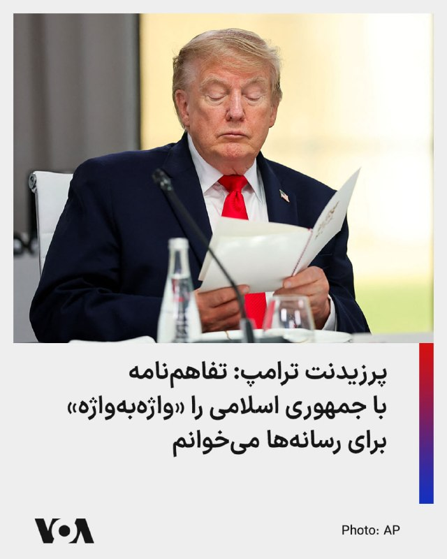

⚡️دونالد ترامپ، رئیس‌ جمهوری آمریکا، گفت قصد دارد متن کامل تفاهم‌نامه با ایران را منتشر کند و احتمالاً در جریان یک نشست خبری آن را واژه‌به‌واژه بخواند تا رسانه‌ها آن را «دقیق» پوشش دهند.

پرزیدنت ترامپ گفت: «من در واقع نه‌تنها آن را منتشر خواهم کرد، بلکه احتمالاً یک نشست خبری برگزار می‌کنم و آن را واژه‌به‌واژه برای شما می‌خوانم تا مطبوعات آن را دقیق پوشش دهند، چون سند بسیار مهمی است.»

او در ادامه با انتقاد از توافق هسته‌ای دولت باراک اوباما با رژیم ایران، یعنی توافق برجام، گفت آن توافق «بدترین توافق» بود و «راهی به سوی سلاح هسته‌ای» ایجاد می‌کرد.

آقای ترامپ افزود: «برخلاف اوباما، که می‌توانست با برجامِ وحشتناک خاورمیانه را نابود کند، توافق من دیواری در برابر سلاح هسته‌ای است.»

رئیس‌ جمهوری آمریکا جزئیات بیشتری درباره محتوای این تفاهم‌نامه یا زمان احتمالی انتشار آن ارائه نکرد.

## FarsiVOA — post 220913

🔺اف‌بی‌آی: توطئه حمله پهپادی به «رویداد یو‌اف‌سی» در کاخ سفید را خنثی کردیم

▪️مقامات آمریکایی روز سه‌شنبه ۲۶ خرداد اعلام کردند که اداره تحقیقات فدرال آمریکا، اف‌بی‌آی، توطئه‌ای برای حمله پهپادی به رویداد ورزش‌های رزمی ترکیبی «یو‌اف‌سی» را که به تازگی در کاخ سفید برگزار شد، خنثی کرده است.

⬇️ بیشتر بخوانید:

https://ir.voanews.com/a/fbi-breaks-up-drone-attack-plot-targeting-white-house-ufc-event/8161442.html/?nocach=1

## FarsiVOA — post 220912

  <a href="telegram/content/FarsiVOA_220912_1781621228.mp4" target="_blank">🎬 Download video</a>

جیانی اینفانتینو، رئیس فیفا، پس از بازی ایران و نیوزیلند به رختکن تیم ایران رفت و از بازیکنان و عملکرد تیم تمجید کرد. امیر قلعه‌نویی در این دیدار از نحوه میزبانی از تیم، صادر نشدن ویزا و غیبت مجموعه فنی، از جمله تاج، رییس فدراسیون، اردوی آماده‌سازی در مکزیک و اجبار به ترک خاک آمریکا بلافاصله پس از بازی، گلایه کرد و مدعی شد: «ما مظلوم‌ترین تیم ادوار جام جهانی بودیم.»

## FarsiVOA — post 220911

  <a href="telegram/content/FarsiVOA_220911_1781621230.mp4" target="_blank">🎬 Download video</a>

ناو «‌یواس‌اس دلبرت دی‌بلک» که در حال عبور از دریای عرب است، یک عملیات تامین مایحتاج در دریا را با کمک ناو تامین‌کننده «یواس‌ان‌اس جان لوئیس»، روز دو‌شنبه، ۲۵ خرداد به پایان رساند.

در این عملیات مواد و لوازم مورد نیاز، با هلیکوپتر از ناو تامین‌کننده به ناو «‌یواس‌اس دلبرت دی‌بلک» منتقل شد.

«تامین در دریا»، تضمین می‌کند که ملوانان بدون نیاز به ورود کشتی به بندر، لوازم، بسته‌های ارسالی و سایر اقلام مورد نیاز خود را دریافت کنند.

## FarsiVOA — post 220910

  <a href="telegram/content/FarsiVOA_220910_1781621232.mp4" target="_blank">🎬 Download video</a>

حرکت جنجالی محمد محبی پس از گل؛ تهدید تماشاگران با علامت شلیک؟

محمد محبی پس از به ثمر رساندن گل در بازی با تیم نیوزیلند، در اقدامی جنجالی با انگشتان خود علامت شلیک اسلحه را به سمت تماشاگران ایرانی نشان داد.

به تعبیر برخی از کاربران شبکه‌های اجتماعی، این حرکت او «یک خوشحالی پس از گل ساده نبود»، بلکه تهدیدی علیه آن دسته از تماشاگران ایرانی محسوب می‌شد که برای اعتراض با پرچم شیر و خورشید در ورزشگاه حاضر شده بودند.
@FarsiVOA

## FarsiVOA — post 220909

🔺ترامپ پس از دیدار با زلنسکی: روسیه باید با اوکراین به توافق صلح برسد

▪️دونالد ترامپ اعلام کرد که روسیه باید با اوکراین به توافق صلح برسد.

▪️رئیس‌جمهوری آمریکا افزود که پس از یک دیدار «بسیار خوب» میان ولودیمیر زلنسکی رئیس‌جمهور اوکراین و رهبران گروه هفت در فرانسه، هر کاری بتواند برای پایان دادن به جنگ انجام خواهد داد.

▪️ترامپ از دیدار خود با زلنسکی و دیگر رهبران گروه هفت در یک جلسه غیرعلنی در روز سه‌شنبه ابراز رضایت کرد و افزود که بعداً به‌صورت دوجانبه با رهبر اوکراین دیدار خواهد کرد.

▪️او گفت: «من هر کاری که بتوانم انجام می‌دهم» و افزود که روسیه باید به توافق برسد.

⬇️ بیشتر بخوانید:
https://ir.voanews.com/a/8161432.html

## FarsiVOA — post 220908

🔺ترامپ: بدون آمریکا و بدون من، اسرائیل وجود نداشت؛ به تغییر رژیم در ایران اعتقادی ندارم

▪️دونالد ترامپ گفت اگر آمریکا و شخص او وارد عمل نشده بودند، اسرائیل «اکنون وجود نداشت» و هر فرد هوشمندی در اسرائیل این را می‌داند. او در عین حال گفت به تغییر رژیم در ایران اعتقادی ندارد و این موضوع هیچ‌گاه بخشی از هدف او نبوده است.

▪️آقای ترامپ گفت با بنیامین نتانیاهو رابطه‌ای «باورنکردنی» دارد، اما اسرائیل باید در قبال لبنان مسئولانه‌تر رفتار کند. او گفت از نحوه رفتار اسرائیل با لبنان و حزب‌الله راضی نیست و اسرائیل باید می‌توانست این موضوع را بسیار سریع‌تر حل کند.

▪️او گفت لبنان زمانی کشور بزرگی بود؛ کشوری با استادان، پزشکان، وکلا و چهره‌های فکری برجسته، اما اکنون وضعیت لبنان «وحشتناک» است.

⬇️ بیشتر بخوانید:
https://ir.voanews.com/a/8161435.html

## FarsiVOA — post 220907

  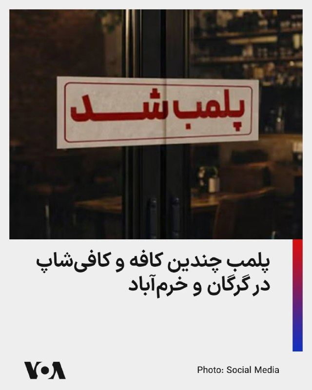

نهادهای امنیتی و قضایی جمهوری اسلامی، از پلمب چندین کافه و کافی‌شاپ در شهرستان‌های گرگان و خرم‌آباد خبر دادند.

مهدی رزاقی‌نژاد، دادستان مرکز استان گلستان، روز سه‌شنبه ۲۶ خرداد، بدون اعلام تعداد دقیق کسب‌وکارهای توقیف شده، اعلام کرد که این امکان در «گشت نظارتی دیشب دادستانی» و به اتهام «هنجارشکنی و قبح‌شکنی» مسدود شدند.

همچنین مرکز اطلاع‌رسانی پلیس استان لرستان نیز اعلام کرد که پنج کافه رستوران و سفره‌خانه سنتی با دستور قضایی مهر و موم شد. ادعا شده این اماکن تجاری در راستای اجرای طرح موسوم به «ارتقای امنیت اخلاقی و اجتماعی» و به اتهام «هنجارشکنی» از ادامه فعالیت محروم شدند.

روز دوشنبه ۲۵ خردادماه نیز خبرگزاری میزان وابسته به دستگاه قضایی جمهوری اسلامی، از پلمب یک کافه در شمال تهران به بهانه «عدم رعایت موازین قانونی و شرعی» خبر داد.

در هفته‌های اخیر، با فروکش کردن فضای جنگی و کاهش فشار بیرونی، نشانه‌هایی از بازگشت تمرکز نهادهای امنیتی و قضایی جمهوری اسلامی به سرکوب و کنترل اجتماعی دیده می‌شود. الگویی که بار دیگر کافه‌ها، تالارها، موسیقی، پوشش، اختلاط و سبک زندگی شهروندان را هدف گرفته است.
@FarsiVOA

## FarsiVOA — post 220906

🔺ترامپ با اشاره به تفاهم با جمهوری اسلامی: ایران هرگز به سلاح هسته‌ای دست نخواهد یافت

▪️دونالد ترامپ، رئیس‌جمهوری آمریکا، در جریان برگزاری نشست گروه هفت، درباره توافق با جمهوری اسلامی گفت که آمریکا هیچ سرمایه‌گذاری در ایران نخواهد کرد.

▪️پرزیدنت ترامپ گفت: «ما فکر می‌کنیم این یک توافق منصفانه است». او افزود: «توافق با ایران وارد مرحله دوم می‌شود.»

▪️رئیس‌جمهوری آمریکا تصریح کرد که جمهوری اسلامی «تحت این توافق هرگز به سلاح هسته‌ای دست نخواهد یافت». او هشدار داد: «اگر ایران تلاش کند به سلاح هسته‌ای دست پیدا کند، جهنم به پا خواهد شد.»

▪️او همچنین جنگ لبنان را درگیری‌ای کوچک توصیف کرد و گفت که توافق با حکومت ایران می‌تواند پابرجا بماند.

⬇️ بیشتر بخوانید:
https://ir.voanews.com/a/trump-g7-remarks-on-iran-deal/8161426.html

## FarsiVOA — post 220900

تصاویری از حضور مخالفان جمهوری اسلامی در دیدار تیم‌های ایران و نیوزیلند؛

در جریان دیدار تیم‌های فوتبال ایران و نیوزیلند در جام جهانی ۲۰۲۶ که در لس آنجلس برگزار شد، بسیاری از ایرانیان مخالف جمهوری اسلامی با در دست داشتن پلاکاردهایی اعتراض خود را نشان دادند.

همچنین به رغم موضع فیفا و حکم یک دادگاه در کالیفرنیا مبنی در منع ورود پرچم شیروخورشید، تعدادی از تماشاگران ایران موفق شدند با پرچم‌های شیر و خورشید به ورزشگاه راه یابند و این پرچم را حین مسابقه فوتبال ایران و نیوزیلند به نمایش بگذارند.

پیش از آغاز جام جهانی، وزیر ورزش جمهوری اسلامی مدعی شده بود که اگر پرچمی به غیر از پرچم جمهوری اسلامی در ورزشگاه باشد، بازیکنان تیم فوتبال ایران می‌توانند زمین را ترک کنند.
@FarsiVOA

## FarsiVOA — post 220899

  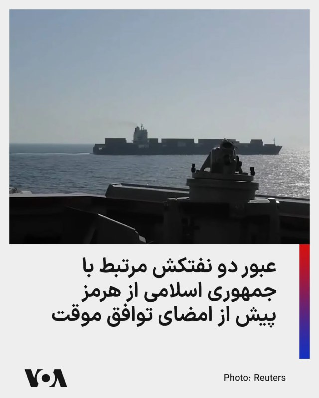

بلومبرگ گزارش داد دو نفتکش مرتبط با انتقال نفت جمهوری اسلامی، پیش از امضای توافق موقت واشنگتن و جمهوری اسلامی، با سامانه‌های شناسایی روشن از تنگه هرمز عبور کرده‌اند.

بر اساس داده‌های ردیابی کشتی‌ها، نفتکش «موزیک» روز سه‌شنبه در حال عبور از تنگه بود و «آرگو ماریس» پیش‌تر وارد دریای عمان شده، اما هنوز در محدوده خط محاصره دریایی آمریکا قرار داشت.

تصاویر ماهواره‌ای نشان می‌دهد «موزیک» در ۲۰ خرداد در بندر خمینی بارگیری کرده و «آرگو ماریس» در اواخر مه از بندرعباس خارج شده است.

اتحاد علیه ایران هسته‌ای، نهاد غیردولتی ناظر بر تحریم‌ها، هر دو کشتی را به‌دلیل حمل نفت جمهوری اسلامی در فهرست سیاه خود قرار داده، اما واشنگتن تاکنون آنها را تحریم نکرده است. مقصد بعدی این دو نفتکش هنوز روشن نیست.
@FarsiVOA

## FarsiVOA — post 220898

  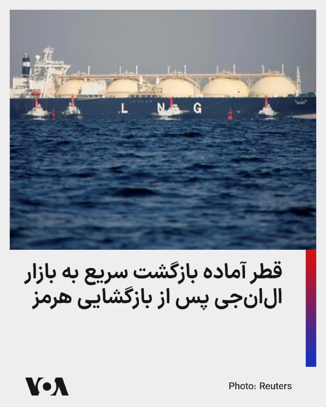

قطر آماده است پس از بازگشایی تنگه هرمز، تولید گاز طبیعی مایع را با سرعت افزایش دهد و ظرف دو ماه بخش عمده ظرفیت صادراتی خود را احیا کند.

منابع آگاه به بلومبرگ گفته‌اند قطرانرژی به خریداران اطلاع داده که یک ماه پس از بازگشت عبور ایمن از تنگه، تولید به حدود ۵۰ درصد ظرفیت و در ماه دوم به نزدیک ۸۰ درصد می‌رسد.

ظرفیت باقی‌مانده، معادل دو خط تولید، به‌دلیل آسیب ناشی از حملات موشکی جمهوری اسلامی در مارس، احتمالاً سال‌ها زمان برای ترمیم کامل نیاز دارد.

مجتمع رأس لفان، بزرگ‌ترین مرکز تولید ال‌ان‌جی جهان، پس از حمله جمهوری اسلامی در هفته نخست جنگ تعطیل شد و بیش از سه ماه عمدتاً راکد ماند، زیرا بسته‌شدن عملی مسیر هرمز صادرات گسترده گاز را دشوار کرده بود.

بازگشت قطر می‌تواند بخشی از فشار کمبود جهانی ال‌ان‌جی را کاهش دهد، هرچند قیمت‌ها همچنان بالاتر از سطح پیش از جنگ مانده‌اند.
@FarsiVOA

## DW_Farsi — post 126066

🔶 پیام طبرزدی از زندان؛ تاکید بر رهبری جمعی، اعتصابات مدنی و اتحاد اپوزیسیون
 
حشمت‌‌الله طبرزدی، دبیرکل جبهه دموکراتیک ایران در پیامی که به طور اختصاصی در اختیار دویچه‌وله فارسی قرار گرفته، با حمایت از موج جدید اعتراضات دانشجویی و فراخوان‌های مربوط به مراسم چهلم جان‌باختگان اعتراضات دی‌ماه ۱۴۰۴، به تشریح دیدگاه‌های خود درباره استراتژی‌های پیش‌روی جنبش‌های اجتماعی در ایران پرداخت.
 
این فعال سیاسی که هم‌اکنون در زندان به‌سر می‌برد، بر لزوم شکل‌گیری رهبری جمعی، پایبندی به مبارزه خشونت‌پرهیز و اتحاد میان تمامی طیف‌های اپوزیسیون تاکید کرد.
 
طبرزدی در ابتدای پیام خود با تحسین عملکرد جنبش دانشجویی، همدردی جامعه با خانواده‌های داغ‌دیده را سنجیده و مسئولانه خواند.
 
او مشارکت همزمان گروه‌های مختلف از جمله معلمان، کارگران، هنرمندان، ورزشکاران و احزاب سیاسی را نشانه اصالت و سرکوب‌ناپذیری این حرکت دانست و تصریح کرد که در یک انقلاب دموکراتیک و انسانی، رهبری نه به صورت فردی بلکه باید به شکل جمعی و بر پایه مشارکت عمومی سازماندهی و تقویت شود.
 
طبرزدی مسیر عبور از ساختار موجود را اتکا به "اعتراضات و اعتصابات گسترده و در صورت لزوم فلج‌کننده" در دانشگاه‌ها، مدارس، کارخانه‌ها و تمامی عرصه‌های اجتماعی توصیف کرد.
 
او در عین حال بخش مهمی از پیام خود را به "ضرورت پرهیز از خشونت" اختصاص داد و یادآور شد: «در تقابل‌های مسلحانه، موازنه قوا به سود ساختار سرکوب تغییر می‌کند، اما در پیکار مدنی و خشونت‌پرهیز، این اراده جمعی ملت است که در بلندمدت دست بالا را خواهد داشت و ساختار سرکوب را از کار می‌اندازد.»
 
دبیرکل جبهه دمکراتیک ایران در ادامه پیام خود به موضوع برابری حقوق قومی، مذهبی و جنسیتی پرداخت و نادیده گرفتن این حقوق را "تداوم بی‌عدالتی" خواند.
 
او تاکید کرد که ملیت‌ها و اقوام ایرانی باید از حق اداره امور محلی، آموزش به زبان مادری و حفظ فرهنگ و هویت خویش برخوردار باشند.
 
این زندانی سیاسی در بخش دیگری از این پیام، تمامی جریان‌های سیاسی اپوزیسیون از جمله گذارطلبان، فدرال‌خواهان و جمهوری‌خواهان را مخاطب قرار داد و از آن‌ها خواست تا زمان گذار از استبداد، اتحاد در عمل را بر اختلافات نظری مقدم بدارند. به باور طبرزدی، بررسی تعارض‌ها و اختلافات فکری باید به پس از استقرار سازوکارهای قانونی موکول شود تا در بستر یک مجلس مؤسسان دموکراتیک با حضور همه گرایش‌ها، قانون اساسی جدید تدوین شده و در یک همه‌پرسی آزاد به رای مستقیم مردم گذاشته شود.
 
طبرزدی در پایان پیام خود، ضمن دعوت از جامعه‌شناسان، روشنفکران و هنرمندان برای حضور آگاهانه و تبیین مباحث دموکراتیک در جامعه، فراخوان‌های اخیر را تداوم جنبش "زن، زندگی، آزادی" و دیگر جنبش‌های عدالت‌خواهانه پیشین دانست و ابراز اطمینان کرد که با حفظ اتحاد و پایبندی به اصول دموکراتیک، آینده از آن مردم ایران خواهد بود.
@dw_farsi

## DW_Farsi — post 126065

  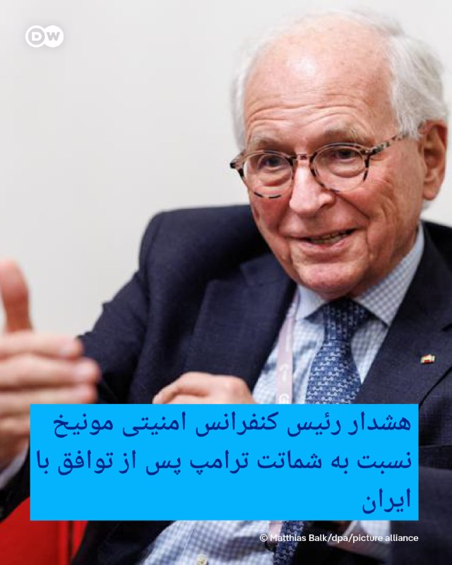

🔶 هشدار رئيس کنفرانس امنیتی مونیخ نسبت به شماتت ترامپ پس از توافق با ایران
 
ولفگانگ ایشینگر، رئیس کنفرانس امنیتی مونیخ، در پی دست‌یابی ایالات متحده آمریکا و ایران به توافق، نسبت به هرگونه "شماتت یا ابراز شادمانی از سر بدخواهی علیه دونالد ترامپ، رئیس‌جمهور آمریکا"، هشدار داد.
 
ایشینگر در گفتگو با شبکه رادیو و تلویزیون عمومی برلین-براندنبورگ (RBB) اشاره کرد که اگرچه ایالات متحده با این جنگ به اهدافی که در اصل مطلوب و قابل دستیابی بودند، دست نیافته است، اما با این حال هرگونه شماتت و ملامت، بی‌ربط و نادرست است.
 
رئیس کنفرانس امنیتی مونیخ در ادامه تصریح کرد: «سلب امکان دستیابی به توانمندی هسته‌ای نظامی از ایران، هدفی است که ما نیز طبیعتا در آن با ایالات متحده هم‌عقیده و شریک هستیم.»
 
او افزود: «بنابراین، لطفا امروز را به روزی برای شماتت و سرزنش تبدیل نکنید؛ بلکه این روز، روز نگرانی‌های احتمالی است؛ از این بابت که ایالات متحده متاسفانه با این جنگ، ظاهرا به دستاوردهایی کمتر از آنچه مطلوب و مورد انتظار بود، رسیده است.»
 
ایشینگر همچنین نسبت به آینده این توافق ابراز تردید کرد.
@dw_farsi

## DW_Farsi — post 126064

🔶 ترامپ: اگر ایران به دنبال سلاح هسته‌ای برود، جهنم به پا خواهد شد
 
دونالد ترامپ، رئیس‌جمهور آمریکا روز سه‌شنبه ۱۶ ژوئن (۲۶ خرداد) در حاشیه نشست سران گروه هفت (G7) در فرانسه هشدار داد که اگر ایران برای توسعه، خرید یا دستیابی به سلاح هسته‌ای تلاش کند، "تمام جهنم بر سرش فرود خواهد آمد".
 
او این سخنان را در جریان گفت‌وگو درباره توافق موقت میان واشنگتن و تهران مطرح کرد؛ توافقی که به گفته جی‌دی ونس، معاون رئیس‌جمهور آمریکا، اوایل این هفته از سوی هر دو طرف و با هدف پایان‌دادن به جنگ امضا شده است.
 
ترامپ گفت: «آن‌ها به سلاح هسته‌ای دست نخواهند یافت. اگر این کار را بکنند، تمام جهنم بر سرشان خراب می‌شود.» او افزود که پیش‌نویس این توافق این مسئله را "با صدای بلند و واضح" بیان می‌کند: «آن‌ها قرار نیست آن (سلاح اتمی) را توسعه دهند، قرار نیست آن را بخرند و قرار نیست هیچ کاری با آن انجام دهند. و اگر انجام دهند، با عواقب باورنکردنی روبرو خواهند شد.»
 
رئیس‌جمهور آمریکا اشاره کرد تنها پس از آن با امضای این سند موافقت کرده است که تهران پذیرفت لحن متن را تغییر دهد، به‌طوری که نه تنها از توسعه سلاح هسته‌ای، بلکه از خرید یا دستیابی به آن از طریق ابزارهای دیگر نیز جلوگیری شود. با این حال، ترامپ به جزئیات این پیامدها اشاره‌ای نکرد و گفت: «من حتی عواقب آن را به شما نمی‌گویم. اما این‌ها عواقب نهایی خواهند بود. با این اوصاف، امیدوارم رابطه بسیار خوبی داشته باشیم.»
 
به گفته رئیس‌جمهور آمریکا، توافق با ایران اکنون وارد "مرحله دوم" خود می‌شود. ترامپ همچنین تاکید کرد که ایالات متحده هیچ پولی در ایران سرمایه‌گذاری نخواهد کرد.
 
او تصریح کرد: «ما توافق خود را با ایران انجام داده‌ایم و این توافق باید موفقیت‌آمیز باشد.»
 
ترامپ گفت، مرحله دوم این توافق آسان‌تر خواهد بود.
 
ترامپ از حملات اسرائیل به بیروت، پایتخت لبنان نیز به طور علنی انتقاد و اعلام کرد که برای اسرائیل روشن ساخته که این حملات مورد پسند او نیست.
 
ترامپ گفت بنيامين نتانياهو، نخست‌وزير اسرائيل بايد در قبال لبنان مسئولانه‌تر رفتار کند و افزود: «اگر اسرائیل نمی‌تواند بدون وارد کردن تلفات گسترده به دیگران با حزب‌الله مقابله کند، سوریه باید مسئولیت مهار این گروه را برعهده بگیرد.» ترامپ اضافه کرد که این پیشنهاد را به اسرائیل ارائه داده است.
 
رئیس‌جمهور آمریکا در پاسخ به این سوال که آیا از نتانیاهو ناامید و سرخورده شده است، گفت: «نه، ما رابطه فوق‌العاده‌ای داریم.»
 
 ترامپ همچنین تاکید کرد که اسرائیل ادامه‌ حیات خود را مدیون ایالات متحده است.
 
رئیس‌جمهور ایالات متحده افزود: «اگر ایالات متحده آمریکا نبود، من هم همینطور... اسرائیل الان وجود نداشت. اسرائیل صد در صد از روی زمین محو می‌شد و هر آدم باهوشی در اسرائیل این را می‌داند.»
 
او همچنین رهبری کنونی ایران را "عاقل و منطقی" توصیف کرد.
@dw_farsi

## DW_Farsi — post 126063

🔶 کاریکاتوریست منتقد پوتین به ضرب گلوله کشته شد
 
یک کارتونیست منتقد ولادیمیر پوتین  در خیابانی در شهر بیاوا پودلاسکا، واقع در شرق لهستان، هدف شلیک گلوله قرار گرفت و کشته شد. سخنگوی پلیس این شهر بدون اشاره به هویت قربانی به خبرگزاری PAP لهستان گفت به این مرد ۴۴ ساله چندین گلوله شلیک شده است.
 
بیاوا پودلاسکا حدود ۳۵ کیلومتری مرز بلاروس واقع شده است.
 
پلیس این حادثه را یک "قتل هدفمند" خوانده و گفته است انگیزه این قتل هنوز مشخص نیست.
 
نام مقتول نیز از سوی مقامات لهستان اعلام نشده است اما رسانه‌های منتقد دولت در روسیه و بلاروس هویت او را سمیون اسکرپتسکی، کاریکاتوریست و هنرمند اجرای نمایشی (پرفورمنس آرتیست)، اعلام کرده‌اند.
 
شبکه تلویزیونی wPolsce24  لهستان گزارش داده که مقتول از فاصله نزدیک چندبار هدف شلیک گلوله قرار گرفته است. پلیس اطراف محل حادثه و ورودی‌های به این منطقه را مسدود کرده است. همچنین مدارس و مهدکودک‌ها در این منطقه تعطیل شده‌اند.
 
بازرسان پرونده احتمال می‌دهند که عاملان این قتل دو نفر بوده‌اند. یک مظنون در نزدیکی کنسولگری بلاروس در شهر بیاوا پودلاسکا دستگیر شده اما این خبر از سوی مقامات رسمی تایید نشده است.
@dw_farsi

## DW_Farsi — post 126054

📸 گزارش تصویری؛ با "ترین‌های" جام جهانی آشنا شوید

در این دوره از مسابقات جام جهانی نیز همانند دوره‌های پیشین چهره‌هایی حضور دارند که گوی سبقت را از دیگران ربوده‌اند، دست‌کم از لحاظی خاص. با "ترین‌های" جام جهانی فوتبال ۲۰۲۶ آشنا شوید.
 @dw_farsi

## DW_Farsi — post 126053

  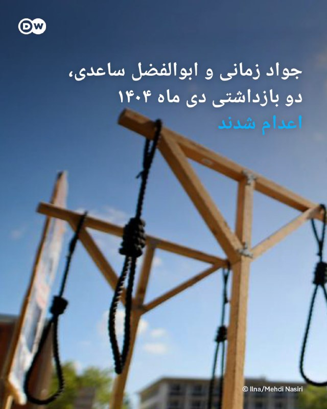

🔶 جواد زمانی و ابوالفضل ساعدی، دو بازداشتی دی ماه ۱۴۰۴، اعدام شدند

خبرگزاری میزان وابسته به قوه قضاییه جمهوری اسلامی به نقل از رئیس‌کل دادگستری استان سمنان از اجرای حکم اعدام دو تن از معترضان بازداشت شده در تظاهرات ۱۸ و ۱۹ دی‌ماه ۱۴۰۴ در شهرستان شاهرود خبر داد.

بر اساس این خبر، جواد زمانی و ابوالفضل ساعدی به اتهام "محاربه و افساد فی‌الارض" به اعدام محکوم شده بودند.

میزان به نقل از محمدصادق اکبری، رئیس‌کل دادگستری استان سمنان، مدعی شده است که این دو در "تخریب و آتش‌زدن اموال و اماکن عمومی" نقش داشته‌اند.

این مقام قضائی همچنین اضافه کرده که پرونده این دو بازداشتی دی‌ماه، در دادسرای عمومی و انقلاب شاهرود و شعبه اول دادگاه انقلاب آن شهرستان بررسی شده و آنها، "به مجازات اعدام و ضبط کلیه اموال و دارائی‌های منقول و غیرمنقول محکوم شدند".

صدور و اجرای احکام اعدام در ایران، همزمان با پیشرفت مذاکرات آمریکا با جمهوری اسلامی متوقف نشده و مطالبات حقوق بشری در هیچ‌یک از محورهای مذاکرات غرب با حکومت ایران گنجانده نشده است.

@dw_farsi

## DW_Farsi — post 126052

  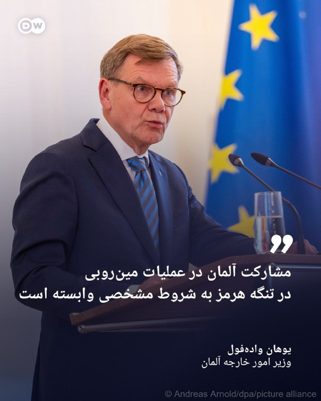

🔶 واده‌فول: مشارکت آلمان در عملیات مین‌روبی در تنگه هرمز به شروط مشخصی وابسته است

یوهان واده‌فول، وزیر امور خارجه آلمان، مشارکت این کشور در عملیات مین‌روبی در تنگه هرمز را به تحقق چند شرط مشخص منوط دانست. او در یک برنامه شبکه دوم تلویزیون آلمان گفت: «ابتدا باید بدانیم آیا واقعا روشن است که دیگر هیچ درگیری نظامی وجود ندارد؟ آیا واقعا روشن است که هر دو طرف خواهان آن هستند که دیگران مین‌ها را پاکسازی کنند؟ وقتی این موارد را بدانیم، آن‌وقت می‌توانیم درباره آن صحبت کنیم.»

واده‌فول با اشاره به ضرورت دریافت مجوز از پارلمان برای چنین ماموریتی افزود: «سپس به مبانی حقوقی لازم، مبانی حقوق بین‌الملل و همچنین مبانی ناشی از قوانین آلمان نیاز داریم. بعد از آن، موضوع را به پارلمان فدرال آلمان ارجاع خواهیم داد.»

وزیر خارجه آلمان با اعلام آمادگی این کشور در عملیات مین‌روبی در تنگه هرمز با این حال گفت: «در مقطع کنونی هنوز پیش‌شرط‌های لازم را در اختیار ندارم که بتوانم بگویم صدور مجوز چنین ماموریتی قریب‌الوقوع است.»

@dw_farsi

## DW_Farsi — post 126051

  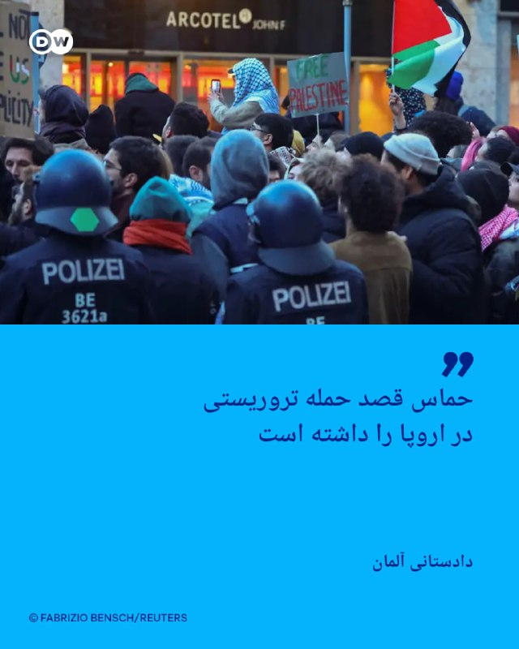

🔶 دادستانی آلمان: حماس قصد حمله تروریستی در اروپا را داشته است

در ماه‌های اخیر چند مرد به ظن همکاری با گروه تروریستی حماس در آلمان و چند کشور اروپایی بازداشت شدند. به گفته دادستانی کل آلمان این افراد ظاهرا قصد انجام یک حمله تروریستی در اروپا را داشته‌اند.

از پاییز سال گذشته تا کنون ۹ مرد مظنون به همکاری با گروه تروریستی حماس در آلمان و چند کشور اروپایی دستگیر شده‌اند که ظاهرا قصد انجام یک حمله تروریستی در اروپا را داشته‌اند.

ینس رومل، دادستان کل فدرال آلمان، در نشست سالانه این نهاد در کالسروهه ضمن اعلام این خبر گفت نزد یکی از متهمان بازداشت‌شده یک ویدیوی از پیش ضبط شده برای اعلام مسئولیت یک حمله تروریستی پیدا شده است.

به گفته او، در این ویدیو از حمله‌ای در دومین سالگرد حمله تروریستی حماس به اسرائیل در هفتم اکتبر ۲۰۲۵ سخن گفته شده بود.

سه تن از ۹ مظنون روز اول اکتبر ۲۰۲۵ در برلین بازداشت شدند. به گفته دادستانی، این افراد مظنون هستند که دست‌کم از تابستان آن سال در انتقال اسلحه و مهمات دخیل بوده‌اند.

@dw_farsi

## DW_Farsi — post 126050

🎥 عطر افسونگر چای ایرانی در قهوه‌خانه‌های حیدرآباد هند

بسیاری از ساکنان شهر تاریخی "حیدرآباد" هند چای ایرانی را یک نوشیدنی سرشار از عطر و طعم می‌دانند که نه‌تنها خستگی را برطرف می‌کند، بلکه به روح و جان طراوت می‌بخشد. مهاجران ایرانی فرهنگ افسونگر نوشیدن این چای را با خود به هند بردند.

@dw_farsi

## DW_Farsi — post 126049

  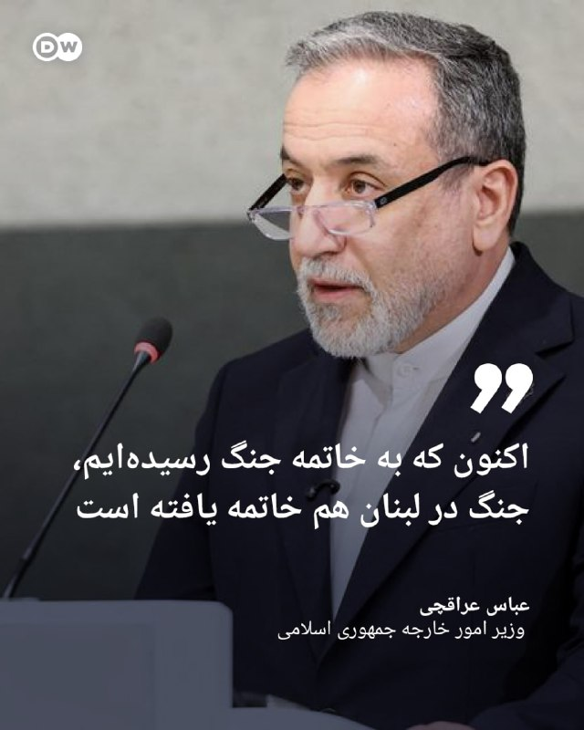

🔶 عراقچی: اکنون که به خاتمه جنگ رسیده‌ایم، جنگ در لبنان هم خاتمه یافته‌ است

عباس عراقچی، وزیر امور خارجه جمهوری اسلامی گفت مذاکرات ایران و آمریکا "برای رسیدن به توافق نهایی از روز جمعه همزمان با امضای رسمی یادداشت تفاهم پایان جنگ آغاز خواهد شد". او هشدار داد هرگونه حمله نظامی اسرائیل به لبنان از این به بعد، از نظر حکومت ایران "نقض یادداشت تفاهم" به حساب می‌آید.

به گزارش خبرگزاری دولتی ایرنا، عراقچی دیدار با سفرا و کارداران و روسای نمایندگی‌های خارجی و بین‌المللی مقیم تهران، با اشاره به یادداشت تفاهم میان ایران و آمریکا که در روز یکشنبه نهایی شد و قرار است به زودی امضای رسمی آن صورت بگیرد، گفت: «احتمالاً روز جمعه و در محلی که مشخص خواهد شد و همان روز دور جدید مذاکرات ایران و آمریکا برای رسیدن به توافق نهایی آغاز خواهد شد.»

@dw_farsi

## DW_Farsi — post 126048

  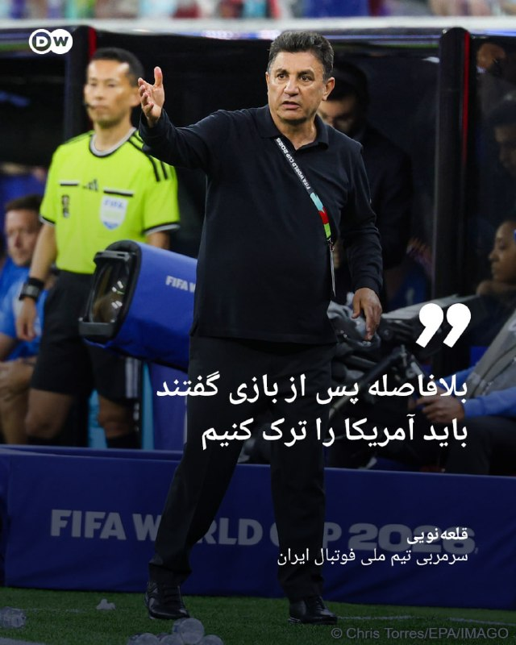

🔶 قلعه‌نویی: بلافاصله پس از بازی گفتند باید آمریکا را ترک کنیم

اولین بازی تیم ملی ایران با دردسرها و حواشی زیادی همراه بود؛ از دستور ترک فوری خاک آمریکا بلافاصله پس از پایان بازی تا انقضای ویزای مهدی ترابی و سوال و جواب از مهدی طارمی و یک بازیکن دیگر هنگام ورود و خروج به آمریکا.

امیر قلعه‌نویی، سرمربی تیم ملی فوتبال ایران پس از بازی مقابل نیوزیلند به خبرنگاران گفت: «امشب بلافاصله پس از بازی به ما اعلام کردند که باید آمریکا را ترک کنیم، در صورتی که امشب مهمترین مسأله برای بازی آینده ماست.»

مربی تیم ایران گفت: «آنقدر که روی هوا بودیم روی زمین نبودیم.»

او درباره علت ترک فوری خاک آمریکا پس از بازی هم گفت: «ما خودمان هم نمی‌دانیم و خیلی خنده‌دار است. تصمیمات برنامه‌ریزی تیم ما از جای دیگری گرفته می‌شود. ما قرار بود دو شب قبل از این بازی به لس‌آنجلس بیاییم اما اجازه ندادند. در برنامه‌مان بود امشب اینجا بمانیم و ریکاوری کنیم و فردا ظهر برگردیم که اجازه ندادند و دلیلش را هم نمی‌دانم.»

وزارت خارجه آمریکا و فیفا به پرسش خبرگزاری رویترز درباره علت ترک زودهنگام تیم ایران پاسخ نداده‌اند.

@dw_farsi

## Persian_Trend_Official — post 17280

  <a href="telegram/content/Persian_Trend_Official_17280_1781621239.webm" target="_blank">🎬 Download video</a>

یک پهپاد MQ-4C امریکایی پس از گشتی زنی در نزدیکی حریم هوایی کوبا، به امریکا بازگشت.

📝 Amir

📌 @persian_trend_official
پرشین ترند | متفاوت‌ترین کانال نظامی

## Persian_Trend_Official — post 17279

  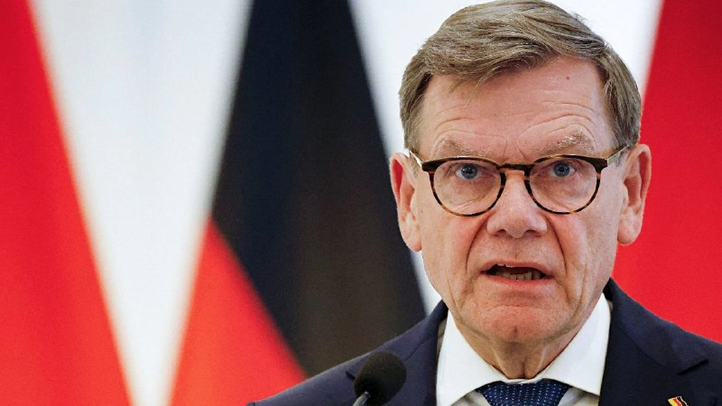

یوهان وادفول، وزیر امور خارجه آلمان، می‌گوید آلمان آماده است تا از عملیات مین‌روبی در تنگه هرمز برای کمک به از سرگیری کشتیرانی تجاری حمایت کند.

وادفول گفت که این ماموریت باید صلح‌آمیز و غیرجنگی باشد و با توافق همه طرف‌ها، از جمله ایالات متحده و ایران، انجام شود.

آلمان همچنین قبل از استقرار مین‌روب دریایی خود، فولدا، که در حال حاضر در دریای مدیترانه مستقر است، به تأیید مجلس فدرال (بوندستاگ) نیاز دارد.

📝 Amir

📌 @persian_trend_official
پرشین ترند | متفاوت‌ترین کانال نظامی

## Persian_Trend_Official — post 17278

  <a href="telegram/content/Persian_Trend_Official_17278_1781621240.mp4" target="_blank">🎬 Download video</a>

ارتش اسرائیل یک حمله پهپادی به شهر میفادون در جنوب لبنان انجام داد.

📝 Amir

📌 @persian_trend_official
پرشین ترند | متفاوت‌ترین کانال نظامی

## Persian_Trend_Official — post 17277

سوئیس محل امضای تفاهم میان ایران و آمریکا را مشخص کرد!

وزارت امور خارجه سوئیس با صدور بیانیه‌ای رسمی تأیید کرد که مراسم امضای توافق‌نامه میان ایالات متحده و جمهوری اسلامی ایران روز جمعه برگزار خواهد شد.

این مراسم در مجتمع بورگن‌اشتوک در سوئیس میزبانی می‌شود.

📝 Amir

📌 @persian_trend_official
پرشین ترند | متفاوت‌ترین کانال نظامی

## Persian_Trend_Official — post 17276

بک منبع ارشد حزب‌الله به تلویزیون العربی گفت که ایران به این گروه اطمینان داده است که این تفاهم‌نامه را امضا نخواهد کرد مگر اینکه شامل خروج اسرائیل از لبنان باشد.

این منبع گفت که تهران خروج را شرط لازم برای نهایی کردن توافق می‌داند.

📝 Amir

📌 @persian_trend_official
پرشین ترند | متفاوت‌ترین کانال نظامی

## Persian_Trend_Official — post 17275

کامالا هریس: هر مذاکره‌ای که در جریان باشد، ترامپ اعلام پیروزی خواهد کرد.

در نهایت به جایی خواهد رسید که پس از برجام بودیم و آن را پیروزی خواهد نامید. برجامی که او از آن خارج شد.

📝 Amir

📌 @persian_trend_official
پرشین ترند | متفاوت‌ترین کانال نظامی

## Persian_Trend_Official — post 17274

هاکان فیدان، وزیر امور خارجه ترکیه: موضع اسرائیل در منطقه فقط مشکل چند کشور نیست، بلکه مشکلی برای کل جهان است و تمام جهان از آن آگاه است.

برای اولین بار، درک مشترکی در سراسر جهان در مورد از بین بردن توهمی که اسرائیل ایجاد کرده است، در حال شکل‌گیری است.

وقتی اسرائیل می‌بیند که تمام جهان درگیر یک تلاش دیپلماتیک علیه آن هستند، قادر به انجام اقدامی نخواهد بود.

📝 Amir

📌 @persian_trend_official
پرشین ترند | متفاوت‌ترین کانال نظامی

## Persian_Trend_Official — post 17273

  <a href="telegram/content/Persian_Trend_Official_17273_1781621242.mp4" target="_blank">🎬 Download video</a>

هاکان فیدان، وزیر امور خارجه ترکیه، در مورد توافق ایران و آمریکا: رئیس جمهور ترامپ به اعتراضات اسرائیل در این مورد گوش نداد.

ایران به این خواسته پاسخ مثبت داد و آنها به نتیجه رسیدند.

📝 Amir

📌 @persian_trend_official
پرشین ترند | متفاوت‌ترین کانال نظامی

## Persian_Trend_Official — post 17272

  <a href="telegram/content/Persian_Trend_Official_17272_1781621244.mp4" target="_blank">🎬 Download video</a>

ترامپ در مورد اورانیم های ایران: ما عجله‌ای نداریم، اما آن را به دست خواهیم آورد و نابودش خواهیم کرد.

📝 Amir

📌 @persian_trend_official
پرشین ترند | متفاوت‌ترین کانال نظامی

## Persian_Trend_Official — post 17271

ترامپ می‌گوید توافق صلح و مذاکرات هسته‌ای با ایران را برای بررسی به کنگره خواهد فرستاد.

📝 Amir

📌 @persian_trend_official
پرشین ترند | متفاوت‌ترین کانال نظامی

## Persian_Trend_Official — post 17270

ترامپ می‌گوید که به زودی می‌تواند تحریم های نفتی روسیه را بازگرداند.

دونالد ترامپ، رئیس جمهور امریکا در پی افزایش قیمت نفت بخاطر جنگ با ایران و اختلال در تنگه هرمز، تحریم های نفتی روسیه را برای کاهش قیمت نفت به طور موقت ورداشته بود.

📝 Amir

📌 @persian_trend_official
پرشین ترند | متفاوت‌ترین کانال نظامی

## Persian_Trend_Official — post 17269

ترامپ: آیا لیندسی گراهام[در مورد توافق] شک دارد؟ باید با او صحبت کنم. او به دردسر بزرگی خواهد افتاد.

البته لیندسی خوب است. او خوب است. او شک ندارد.

📝 Amir

📌 @persian_trend_official
پرشین ترند | متفاوت‌ترین کانال نظامی

## Persian_Trend_Official — post 17268

  <a href="telegram/content/Persian_Trend_Official_17268_1781621247.mp4" target="_blank">🎬 Download video</a>

ترامپ در مورد محمد بن زاید، ولیعهد امارات: عالیجناب یک جنگجو هستند؛ او در آنجا جنگید.

او به عنوان یک مرد شجاع شناخته می‌شود.

📝 Amir

📌 @persian_trend_official
پرشین ترند | متفاوت‌ترین کانال نظامی

## Persian_Trend_Official — post 17267

  <a href="telegram/content/Persian_Trend_Official_17267_1781621250.mp4" target="_blank">🎬 Download video</a>

صداوسیما می‌گوید تمام کشتی های عبوری از تنگه هرمز باید با سپاه پاسداران هماهنگ باشند.

صداوسیما در گزارش اخیر: خود از تنگه هرمز سه نفتکش ایرانی در شمال اقیانوس هند در حال حرکت هستند و دو کشتی باری حامل کالاهای اساسی به سمت بنادر جنوبی در حرکتند.

📝 Amir

📌 @persian_trend_official
پرشین ترند | متفاوت‌ترین کانال نظامی

## Persian_Trend_Official — post 17266

  <a href="telegram/content/Persian_Trend_Official_17266_1781621252.webm" target="_blank">🎬 Download video</a>

به گزارش کانال 12 اسرائیل، اسرائیل درخواست مشاهده یادداشت تفاهم بین ایالات متحده و ایران را داشت اما این درخواست رد شد.

📝 Amir

📌 @persian_trend_official
پرشین ترند | متفاوت‌ترین کانال نظامی

## Persian_Trend_Official — post 17265

  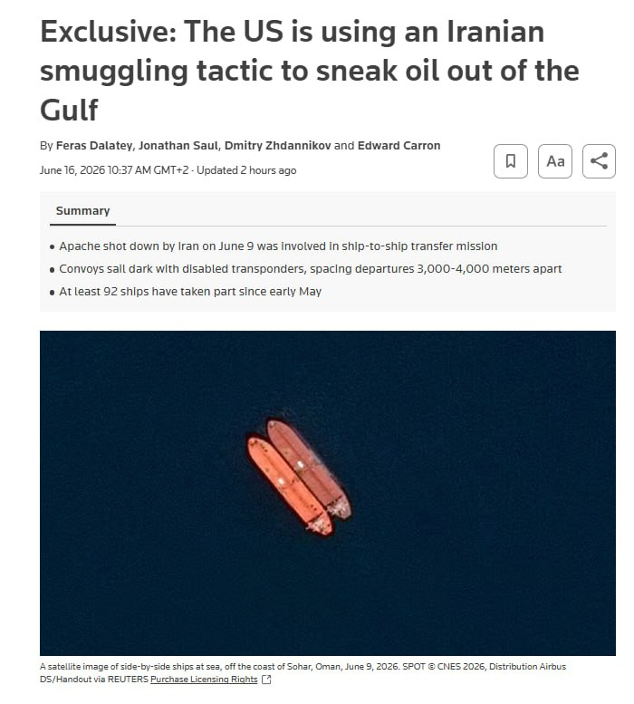

تحقیقات رویترز نشان میدهد که ارتش ایالات متحده از اوایل ماه مه بی‌سروصدا بر یک شبکه بزرگ انتقال نفت دریایی از طریق کشتی به کشتی نظارت داشته است تا صادرات انرژی خلیج فارس را با وجود اختلال ایران در حمل و نقل دریایی از طریق تنگه هرمز ادامه دهد.

بیش از 90 کشتی در این عملیات شرکت داشته‌اند و حدود 90 میلیون بشکه نفت و فرآورده‌های نفتی را در سایت‌هایی نزدیک فجیره در امارات متحده عربی و صحار در عمان منتقل کرده‌اند. در این عملیات از تکنیک‌هایی مشابه روش‌های دور زدن تحریم‌های ایران استفاده شده است، از جمله کشتی‌هایی که با فرستنده‌های AIS خاموش، چراغ‌های کم نور و حرکات کاروان‌های تحت کنترل شدید که توسط پهپادها، هلیکوپترها و تجهیزات نظارتی کنترل می‌شوند.

تانکرها قبل از انتقال محموله به VLCC های منتظر، نفت را از طریق تنگه حمل می‌کردند و هر انتقال 24 تا 40 ساعت طول می‌کشید. پشتیبانی ارتش ایالات متحده شامل نظارت هوایی، نظارت امنیتی و غربالگری انطباق بود.

📝 Amir

📌 @persian_trend_official
پرشین ترند | متفاوت‌ترین کانال نظامی

## Persian_Trend_Official — post 17264

  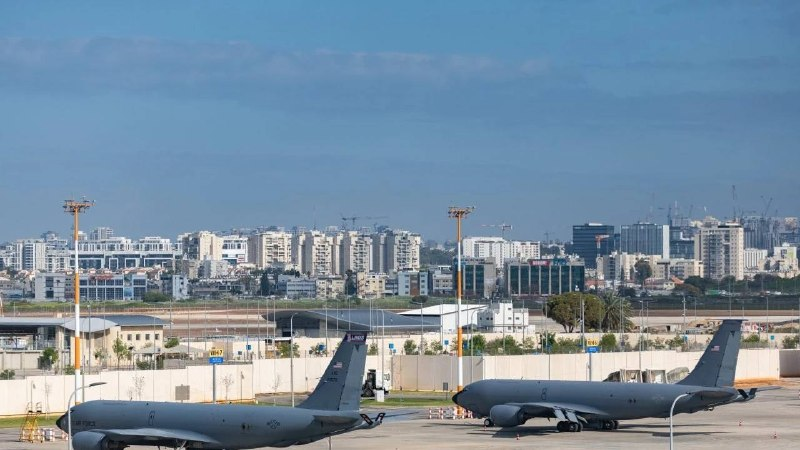

کانال 12 اسرائیل: واشنگتن در حال آماده شدن برای خارج کردن تقریباً 20% از هواپیماهای سوخت‌رسانی مستقر در فرودگاه بن گوریون اسرائیل پس از تفاهم‌نامه ایالات متحده و ایران است.

72 هواپیمای سوخت‌رسانی نظامی ایالات متحده در حال حاضر فضای قابل توجهی را در بن گوریون اشغال کرده‌اند که باعث ازدحام و تهدید لغو گسترده پروازها شده و بیش از 2 میلیون مسافر را در تابستان امسال تحت تأثیر قرار داده است.

میری رگو، وزیر حمل و نقل اسرائیل، خواستار خروج فوری هواپیماها شد و به نتانیاهو هشدار داد که اگر نیمی از هواپیماها تا سه‌شنبه خارج نشوند، بیش از 2 میلیون شهروند با لغو پروازها از جمله سفر روش هشانا به عمان مواجه خواهند شد.

هواپیماهای خارج شده ممکن است به اروپا منتقل شوند، اما در حالت آماده‌باش برای استقرار مجدد در اسرائیل در صورت از سرگیری جنگ قرار دارند، کانال 12 تأیید نکرد که آیا هواپیماها به طور کامل اسرائیل را ترک می‌کنند یا به پایگاه‌های نیروی هوایی اسرائیل منتقل می‌شوند.

📝 Amir

📌 @persian_trend_official
پرشین ترند | متفاوت‌ترین کانال نظامی

## Persian_Trend_Official — post 17263

  <a href="telegram/content/Persian_Trend_Official_17263_1781621254.mp4" target="_blank">🎬 Download video</a>

ترامپ: نتانیاهو به واشنگتن آمد و التماس کرد او از اوباما التماس کرد که آن معامله را با ایران انجام ندهد.

اوباما طرف ایران بود، نه اسرائیل، و او این معامله را انجام داد.

📝 Amir

📌 @persian_trend_official
پرشین ترند | متفاوت‌ترین کانال نظامی

## Persian_Trend_Official — post 17262

ترامپ: در توافق من، اگر ایران به سلاح هسته‌ای دست یابد، نابود می‌شود.

در توافق اوباما، به آنها اجازه داده شد که سلاح هسته‌ای داشته باشند.

📝 Amir

📌 @persian_trend_official
پرشین ترند | متفاوت‌ترین کانال نظامی

## Persian_Trend_Official — post 17261

  <a href="telegram/content/Persian_Trend_Official_17261_1781621256.webm" target="_blank">🎬 Download video</a>

ترامپ: نتانیاهو باید در قبال لبنان مسئولیت‌پذیرتر باشد.

📝 Amir

📌 @persian_trend_official
پرشین ترند | متفاوت‌ترین کانال نظامی

## RadioFarda — post 158395

  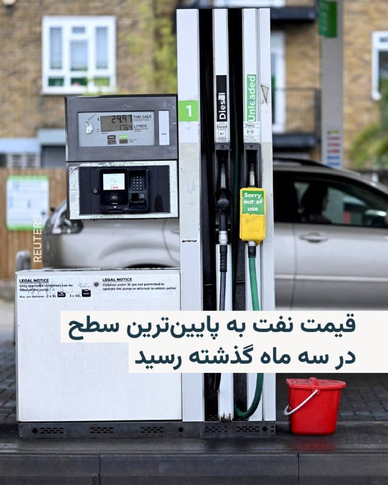

🔸قیمت نفت روز سه‌شنبه حدود چهار درصد دیگر کاهش یافت و به پایین‌ترین سطح خود در سه ماه گذشته رسید. این در حالی است که بازارها در حال ارزیابی چشم‌انداز ازسرگیری عرضه نفت از طریق تنگه هرمز، همزمان با ضعف تقاضای فیزیکی و کمبود جزئیات درباره توافق اولیه برای پایان دادن به جنگ ایران بودند.

🔸به گزارش رویترز، بهای معاملات آتی نفت خام برنت تا ساعت ۱۲:۵۳ به وقت گرینویچ (حوالی ساعت سه و نیم بعد ازظهر به وقت تهران) با ۳٫۲۰ دلار، معادل ۳٫۸۵ درصد کاهش به ۷۹٫۹۷ دلار در هر بشکه رسید. این شاخص پیش‌تر تا ۷۹٫۶۱ دلار سقوط کرده بود که پایین‌ترین سطح از سوم مارس محسوب می‌شود و نخستین بار از آن تاریخ بود که قیمت برنت به زیر ۸۰ دلار در هر بشکه می‌رسید.

🔸نفت خام وست تگزاس اینترمدیت آمریکا (WTI) نیز با ۳٫۵۲ دلار، معادل ۴٫۳۶ درصد کاهش به ۷۷٫۲۳ دلار در هر بشکه رسید. پایین‌ترین قیمت روزانه این نفت، یعنی ۷۶٫۸۸ دلار، کمترین سطح آن از ۱۰ مارس بود.

🔸پیش از آغاز جنگ در ۲۸ فوریه (۹ اسفند سال ۱۴۰۴)، قیمت معاملات آتی نفت برنت و وست تگزاس اینترمدیت در محدوده ۶۵ تا ۷۰ دلار برای هر بشکه قرار داشت.

@RadioFarda

## RadioFarda — post 158394

🔸دونالد ترامپ، رئیس‌جمهور ایالات متحده، روز سه‌شنبه اعلام کرد توافق صلح با ایران را برای «بررسی» به کنگره آمریکا می‌فرستد. 🔸او در جریان دیدار با محمد بن زاید آل نهیان، رئیس امارات متحده عربی، در حاشیه نشست گروه ۷ در فرانسه به خبرنگاران گفت: «هرگز به فرستادن…

## RadioFarda — post 158393

  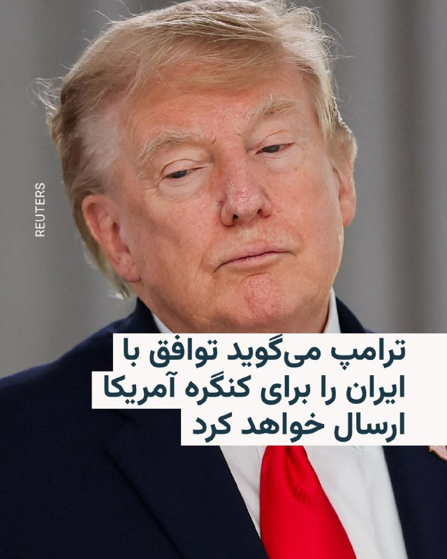

🔸دونالد ترامپ، رئیس‌جمهور ایالات متحده، روز سه‌شنبه اعلام کرد توافق صلح با ایران را برای «بررسی» به کنگره آمریکا می‌فرستد.

🔸او در جریان دیدار با محمد بن زاید آل نهیان، رئیس امارات متحده عربی، در حاشیه نشست گروه ۷ در فرانسه به خبرنگاران گفت: «هرگز به فرستادن آن فکر نکرده بودم، حتی یک بار هم به آن فکر نکرده بودم، اما این کار را خواهم کرد. آن را به کنگره می‌فرستم. از این ایده خوشم می‌آید.»

🔸برخی قانون‌گذاران جمهوری‌خواه پیش‌تر خواستار بررسی متن این توافق شده بودند.

🔸آقای ترامپ همچنین وعده داد که متن توافق با ایران را «ظرف یکی دو روز آینده» به‌صورت عمومی منتشر خواهد کرد و حتی این احتمال را مطرح کرد که کل سند را در برابر دوربین‌ها قرائت کند.

🔸او گفت که منتظر فراهم شدن یک «فضای رسمی» برای انتشار عمومی این متن است.

🔸رئیس‌جمهور آمریکا اعلام کرد: «دوست دارم ابتدا یک چارچوب رسمی برای این کار فراهم شود، اما هیچ مشکلی با انتشار آن ندارم؛ این یک سند عالی است.»

🔸او در ادامه افزود: «محتوای آن این است: ایران هرگز سلاح هسته‌ای نخواهد داشت.»

@RadioFarda

## RadioFarda — post 158392

دیپلمات پیشین آمریکا: موفقیت تفاهم با ایران به اجرای تعهدات دو طرف بستگی دارد

🔸ایالات متحده و ایران بر سر توقف درگیری‌ها و بازگشایی تنگهٔ هرمز به تفاهم رسیده‌اند، اما چند موضوع مهم، از جمله برنامهٔ هسته‌ای ایران، همچنان روی میز مذاکره است.

🔸به‌گفتهٔ مقام‌ها، دو طرف پیشاپیش تفاهم‌نامه‌ای را به‌صورت دیجیتال امضا کرده‌اند و قرار است مراسم امضای رسمی آن روز ۲۹ خرداد برگزار شود.

🔸رادیو اروپای آزاد/رادیو آزادی با جینا اَبِرکرامبی-وینستنلی، دیپلمات پیشین آمریکا و پژوهشگر ارشد شورای آتلانتیک در حوزهٔ امنیت و راهبرد خاورمیانه، گفت‌وگو کرده است تا بررسی کند این تفاهم چه دستاوردهایی داشته و چه مسائل مهمی همچنان حل‌نشده باقی مانده است و در مرحلهٔ بعد باید منتظر چه تحولاتی بود.

🔸ابرکرامبی-وینستنلی که پیش‌تر سفیر آمریکا و از مقام‌های ارشد وزارت خارجه، وزارت دفاع و شورای امنیت ملی ایالات متحده بوده و در کارنامه‌اش مأموریت‌های دیپلماتیک در بغداد، جاکارتا و قاهره هم دیده می‌شود، نخستین زنی بود که ریاست یک نمایندگی دیپلماتیک آمریکا در عربستان سعودی را بر عهده داشت.

🔸متن کامل این گفت‌وگو را در وب‌سایت رادیوفردا بخوانید.

@RadioFarda

## RadioFarda — post 158391

از پرچم‌های شیر و خورشید تا سوت اعتراض؛ شب متفاوت تیم ایران در جام جهانی

🔸خبرگزاری‌های رویترز و فرانسه در گزارش‌هایی به فضای متفاوت حاکم بر برگزاری مسابقه تیم‌های فوتبال ایران و نیوزیلند در جام جهانی اشاره کردند و از واکنش‌های متفاوت و متضاد تماشاگران ایرانی حاضر در ورزشگاه سوفای شهر لس‌آنجلس گزارش دادند.

🔸خبرگزاری رویترز در گزارش روز سه‌شنبه ۲۶ خرداد خود خبر داد که به‌رغم ممنوعیت فیفا، پرچم‌های شیروخورشید وارد ورزشگاه محل بازی شد.

🔸این خبرگزاری به واکنش‌های متفاوت و متضاد تماشاگران ایرانی حاضر در ورزشگاه سوفای شهر لس‌آنجلس اشاره کرده و نوشته که اختلافات روی سکوها، بازتابی از چالش‌های پیش روی تیم ملی ایران در خارج از زمین مسابقه بود.

🔸رویترز به اقدام همزمان دو گروه متفاوت تماشاگران هنگام پخش سرود ملی تیم ایران اشاره کرد و نوشت سوت زدن گروهی از تماشاگران در مقابل همخوانی گروه دیگری، بازتاب‌دهنده اهمیت نمایش وفاداری سیاسی در مقابل خود فوتبال بود.

🔸به نوشته آن، از حملات و گل‌های ایران از سوی بسیاری از تماشاگران، از جمله بخشی از هوادارانی که پرچم شیر و خورشید مربوط به ایران قبل از انقلاب را حمل می‌کردند، استقبال شد. اما گروهی از تماشاگران، گل‌های تیم نیوزیلند را جشن گرفتند.

🔸در این گزارش به متفاوت بودن جو کلی حاکم بر ورزشگاه نسبت به سایر بازی‌های مسابقات جام جهانی اشاره شده و نوشته شده است به نظر می‌رسید این مسابقه در مقایسه با احساساتی که در اطراف آن موج می‌زد، در درجه دوم اهمیت قرار دارد.

🔸نسخه کامل این گزارش را در وب‌سایت رادیوفردا بخوانید.

@RadioFarda

## RadioFarda — post 158390

  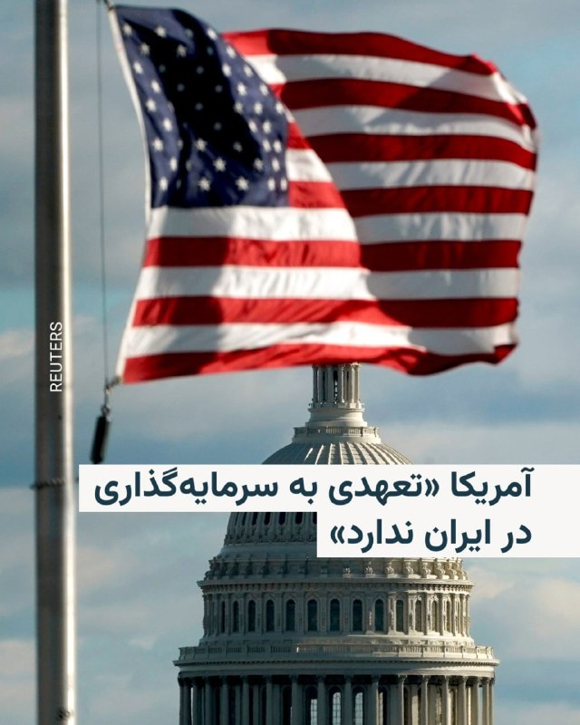

🔸رئیس‌جمهور آمریکا روز سه‌شنبه ۲۶ خرداد با اشاره به توافق اخیر با ایران تاکید کرد که ایالات متحده بر اساس این توافق تعهدی به سرمایه‌گذاری در ایران ندارد.

🔸دونالد ترامپ در حاشیه نشست گروه هفت در فرانسه و دیدار با تمیم بن حمد آل ثانی، امیر قطر، رهبران جدید در ایران را «منطقی‌تر»، «باهوش‌تر» و «کمتر افراطی» خواند و به خبرنگاران گفت: رهبران قبلی که «غیرمنطقی» بودند از بین رفته‌اند. او گفت هیچ‌وقت به تغییر رژیم در ایران توجه نداشت.

🔸رئیس‌جمهور آمریکا همچنین درباره رابطه با اسرائیل گفت که اگر او نبود اسرائیل هم‌اکنون وجود نداشت و «از زمین محو» شده بود.

🔸ترامپ رابطه‌اش را با بنیامین نتانیاهو «بسیار موثر» دانست و در عین حال درباره لبنان گفت که به اسرائیل پیشنهاد داده است مقابله با حزب‌الله را به دولت فعلی سوریه و رئیس‌جمهور فعلی آن احمد الشرع بسپارد چرا که به گفته ترامپ، «حملات اسرائیل تلفات زیادی به بار آورده است».

🔸دونالد ترامپ، رئیس‌جمهور آمریکا، پیشتر گزارش‌هایی را که مدعی شده‌اند آمریکا ۳۰۰ میلیون دلار به ایران پرداخت خواهد کرد، «اخبار جعلی» خوانده بود.

@RadioFarda

## RadioFarda — post 158389

  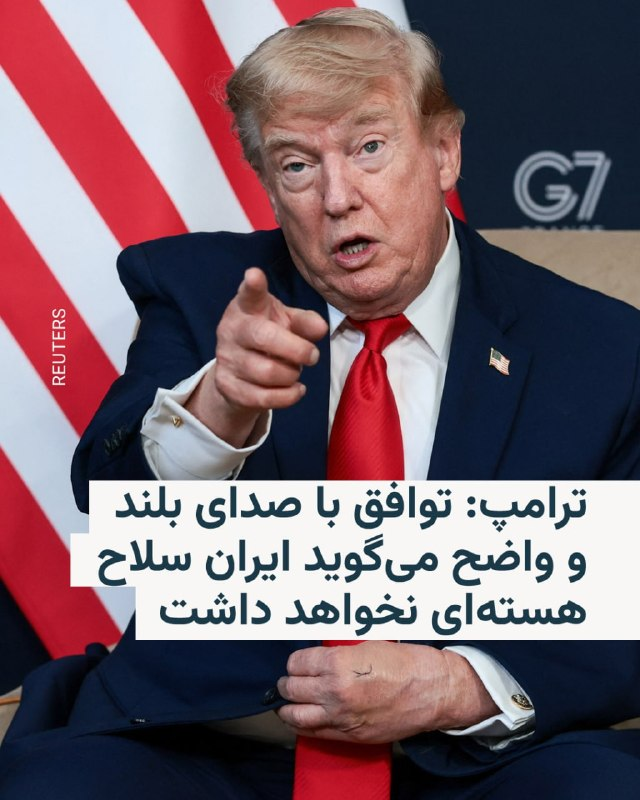

🔸رئیس‌جمهور آمریکا روز سه‌شنبه ۲۶ خرداد با دفاع از توافق اخیر با ایران برای پایان دادن به جنگ ۴۰ روزه گفت این تفاهم‌نامه تصریح می‌کند که ایران سلاح هسته‌ای نخواهد داشت.

🔸دونالد ترامپ در دیدار با تمیم بن حمد آل ثانی، امیر قطر، در حاشیه نشست گروه هفت در فرانسه به خبرنگاران گفت: «تنها چیزی که واقعاً برای من مهم است این است که ایران هرگز سلاح هسته‌ای نخواهد داشت و توافق این را با صدای بلند و واضح می‌گوید».

🔸او افزود: «اگر دولت ایران قصد دستیابی به سلاح هسته‌ای را داشته باشد، جهنم بر سر ایران خواهد بارید».

🔸رئیس‌جمهور آمریکا با دفاع از توافق با ایران گفت این تفاهم وارد مرحله دوم شده است که به گفته او، این مرحله آسان‌تر از مرحله قبلی است.

🔸ایران و آمریکا این یادداشت تفاهم را که یک سند کلی و به گفتهٔ جی‌دی ونس معاون رئیس‌جمهور ایالات متحده، در «یک‌ونیم صفحه» تنظیم شده است، روز ۲۴ خرداد به صورت الکترونیکی امضا کردند و به «جنگ در تمام جبهه‌ها» خاتمه دادند.

@RadioFarda

## RadioFarda — post 158388

  <a href="https://t.me/radiofarda/158388" target="_blank">📎 Download file</a>

📻بشنوید: ساعت ۱۴ با رادیوفردا، ۲۶ خرداد ۱۴۰۵‌

@RadioFarda

## RadioFarda — post 158387

  <a href="https://t.me/radiofarda/158387" target="_blank">📎 Download file</a>

🔸 در این کافه فردا حواشی و متن بازی ایران و نیوزلند را مرور می‌کنیم، به تاثیر گرانی بلیط در کاهش اقبال مردم به جام جهانی می‌پردازیم و مسابقات باقیمانده نمایندگان آسیا در جام جهانی را به بحث می‌نشینیم.

🔸 برای تماس با ما می‌توانید به شناسه کافه فردا در تلگرام صوت و متن بفرستید.

📻 کافه فردا

## RadioFarda — post 158386

جی‌دی ونس: ترامپ ممکن است متن توافق با ایران را زودتر منتشر کند

🔸معاون رئیس‌جمهور آمریکا روز دوشنبه ۲۵ خرداد در مصاحبه‌های مختلفی توضیحاتی دربارهٔ تفاهم‌نامه اخیر میان ایالات متحده و ایران برای پایان دادن به جنگ میان دو کشور ارائه کرد.

🔸جی‌دی ونس از جمله اعلام کرد که متن کامل این تفاهم‌نامه پس از مراسم رسمی امضای آن در روز جمعه در سوئیس منتشر خواهد شد و در عین حال گفت ممکن است دونالد ترامپ متن آن را پیش از مراسم امضای رسمی منتشر کند.

🔸او گفت این توافق پیش‌تر به‌صورت الکترونیکی توسط رهبران دو طرف امضا شده است و از طرف ایران محمدباقر قالیباف، رئیس مجلس، و عباس عراقچی، وزیر خارجه، و مقام‌های دیگر آن را امضا کردند.

🔸ونس در گفت‌وگو با فاکس‌نیوز گزارش‌های مربوط به پرداخت ۲۴ میلیارد دلار از سوی آمریکا به ایران را «کاملاً نادرست» خواند و گفت این توافق، بازگشایی فوری تنگهٔ هرمز و جلوگیری از دستیابی ایران به سلاح هسته‌ای را تضمین می‌کند.

🔸معاون رئیس‌جمهور آمریکا همچنین هشدار داد اگر ایران به تعهدات خود عمل نکند، از مزایای توافق محروم خواهد شد و دولت ترامپ می‌تواند گزینه‌هایی مانند بازگرداندن محاصره یا ازسرگیری حملات نظامی را در نظر بگیرد.

🔸جی‌دی ونس همچنین در گفت‌وگو با شبکه ان‌بی‌سی اعلام کرد که بر اساس تفاهم‌نامه میان واشینگتن و تهران، بازرسان آژانس بین‌المللی انرژی اتمی «قطعاً» به ایران بازخواهند گشت.

🔸او گفت یکی از بخش‌های اصلی توافق این است که آژانس بین‌المللی انرژی اتمی و آمریکا به ایران برای نابودی ذخایر اورانیوم با غنای بالا کمک کنند. به گفته ونس، این موضوع به‌صراحت در تفاهم‌نامه قید شده است.

🔸نسخه کامل این گزارش را در وب‌سایت رادیوفردا بخوانید.

@RadioFarda

## RadioFarda — post 158385

  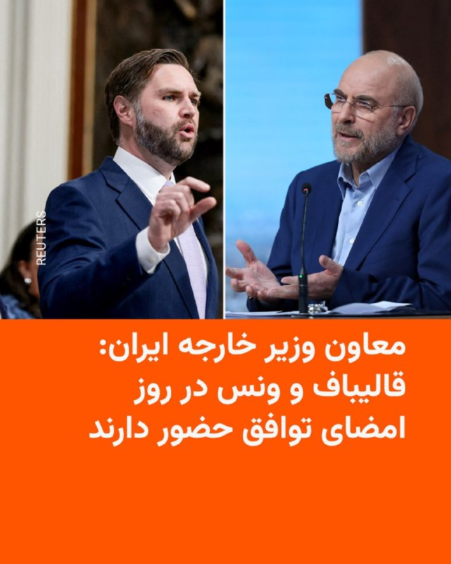

🔸معاون وزیر خارجه ایران اعلام کرد که در روز امضای تفاهم‌نامه برای پایان جنگ با آمریکا، محمدباقر قالیباف رئیس مجلس شورای اسلامی و جی‌دی ونس، معاون رئیس‌جمهور آمریکا، حضور خواهند داشت.

🔸مجید تخت‌روانچی روز سه‌شنبه ۲۶ خرداد در جمع خبرنگاران گفت که بعد از امضا یادداشت تفاهم، درباره مسائل هسته‌ای صحبت می‌شود و هنوز وارد جزئیات نشدیم. بحث غنی‌سازی، ذخایر و نیازهای هسته‌ای ایران هم وجود دارد.

🔸ایران و آمریکا این یادداشت تفاهم را که یک سند کلی و به گفتهٔ معاون رئیس‌جمهور آمریکا، در «یک‌ونیم صفحه» تنظیم شده است، روز ۲۴ خرداد به صورت الکترونیکی امضا کردند و به «جنگ در تمام جبهه‌ها» خاتمه دادند.

🔸دو کشور توافق کردند که پس از امضای یادداشت تفاهم‌ در روز جمعه، تنگه هرمز فوراً بازگشایی و محاصره دریایی بنادر ایران از سوی ارتش آمریکا برداشته شود. تهران و واشینگتن سپس ۶۰ روز فرصت دارند تا در مورد مسائل مورد اختلاف میان خود بویژه در مورد اورانیوم با غنای ۶۰ درصد ایران و فعالیت‌های هسته‌ای جمهوری اسلامی به توافق برسند.

@RadioFarda

## RadioFarda — post 158384

🔸جمعی از هواداران تیم ملی فوتبال ایران روز دوشنبه در بروکلین نیویورک برای حمایت از تیم ملی کشورشان در نخستین دیدار جام جهانی مقابل نیوزیلند گرد هم آمدند.

🔸به گزارش رویترز برای این هواداران، این مسابقه فرصتی بود تا برای مدتی از فضای پرتنش ناشی از کشتار معترضان در دی‌ماه سال گذشته و همچنین خبرهای مربوط به جنگ و تنش‌های سیاسی، فاصله بگیرند.

🔸این مسابقه که در ورزشگاه لس‌آنجلس برگزار شد، با تساوی ۲–۲ به پایان رسید.

🔸هرچند فوتبال جام جهانی محور اصلی توجه ایرانیان مهاجر حاضر در رستوران «بیژن» در بروکلین بود، بسیاری از هواداران گفتند که جنگ و طرح صلح موقت نیز به‌طور جدی ذهن آن‌ها را مشغول کرده است.

🔸بر اساس گزارش رویترز، بسیاری تأکید کردند که تلاش می‌کنند اختلافات سیاسی خود را کنار بگذارند و از بازیکنان ایرانی حاضر در میدان حمایت کنند.

@RadioFarda

## RadioFarda — post 158383

  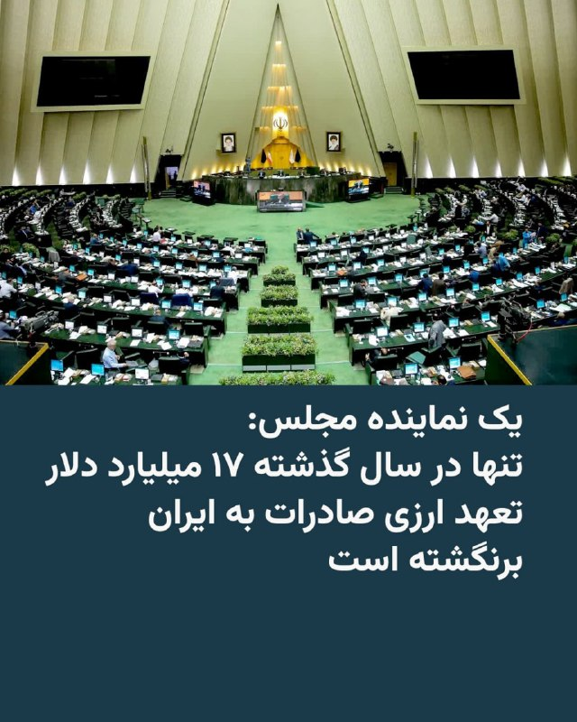

🔸یک عضو کمیسیون اقتصادی مجلس شورای اسلامی از برنگشتن ۱۷ میلیارد دلار تعهدات ارزی سررسید شده در سال ۱۴۰۴ خبر داد.

🔸به گزارش خبرگزاری تسنیم، حسین صمصامی با استناد به آخرین آمارهای مربوط به تعهدات ارزی صادرکنندگان، از تداوم انباشت ارزهای صادراتی بازنگشته به ایران خبرداد.

🔸او گفت که مجموع ارزهای بازنگشته به چرخه رسمی اقتصاد ایران از سال ۱۳۹۷ تا پایان خرداد ۱۴۰۵ به بیش از ۱۳۰ میلیارد دلار رسیده است.

🔸صمصامی افزود: در سه ماهه نخست سال ۱۴۰۵ نیز حدود سه میلیارد دلار ارز صادراتی تا امروز به چرخه رسمی اقتصاد کشور بازنگشته است.

🔸این عضو کمیسیون اقتصادی مجلس با اشاره به اطلاعات دریافتی از وضعیت رفع تعهدات ارزی صادرکنندگان گفت: مقایسه این رقم با منابع ارزی بلوکه‌شده ایران در خارج نشان‌ می‌دهد که حجم ارزهای بازنگشته چندین برابر ۲۴ میلیارد دلار منابع بلوکه‌شده ایران در حساب‌های خارجی است.

@RadioFarda

## RadioFarda — post 158376

🔸خبرگزاری رویترز در گزارشی از فضای حاکم بر مسابقه تیم‌های فوتبال ایران و نیوزیلند در جام جهانی، خبر داد که به‌رغم ممنوعیت فیفا، پرچم‌های شیروخورشید وارد ورزشگاه محل بازی شد.

🔸این خبرگزاری به واکنش‌های متفاوت و متضاد تماشاگران ایرانی حاضر در ورزشگاه سوفای شهر لس‌آنجلس اشاره کرده و نوشته که اختلافات روی سکوها، بازتابی از چالش‌های پیش روی تیم ملی ایران در خارج از زمین مسابقه بود.

🔸رویترز به اقدام همزمان دو گروه متفاوت تماشاگران هنگام پخش سرود ملی تیم ایران اشاره کرده و نوشته است سوت زدن گروهی از تماشاگران در مقابل همخوانی گروه دیگری، بازتاب‌دهنده اهمیت نمایش وفاداری سیاسی در مقابل خود فوتبال بود.

🔸به نوشته آن، از حملات و گل‌های ایران از سوی بسیاری از تماشاگران، از جمله بخشی از هوادارانی که پرچم شیر و خورشید مربوط به ایران قبل از انقلاب را حمل می‌کردند، استقبال شد. اما گروهی از تماشاگران، گل‌های تیم نیوزیلند را جشن گرفتند.

@RadioFarda

## IranianMinds — post 22747

  <a href="telegram/content/IranianMinds_22747_1781621261.mp4" target="_blank">🎬 Download video</a>

🔴 جی‌دی ونس درباره ایران:

اگر مردم ایران خواهان رفاه و پیشرفت بیشتر هستن، رهبری‌شون باید قد علم کنه و رفتارش رو تغییر بده.

اگر این کار رو بکنن، عالیه. اگر نکنن، ایالات متحده همین الان هم خیلی چیزها رو به دست آورده.

@IranianMinds

## IranianMinds — post 22746

  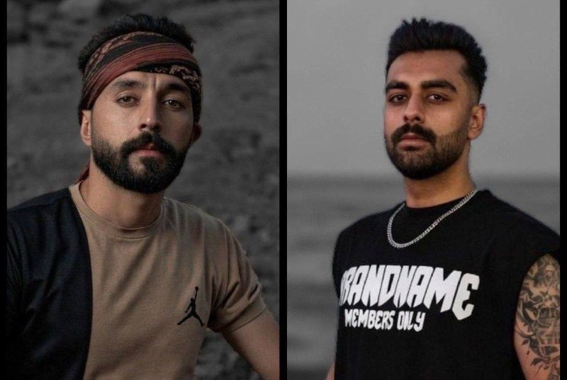

⚫️ جواد زمانی و ابوالفضل ساعدی؛ از بازداشت شدگان اعتراضات دی ماه در سمنان؛ صبح امروز اعدام شدن …

@IranianMinds

## IranianMinds — post 22744

  <a href="telegram/content/IranianMinds_22744_1781621263.mp4" target="_blank">🎬 Download video</a>

اینم‌ از این جک و جنده های حکومتی شیما راگوزیان و صدف بیوتی که داشتن برا تیم جمهوری اسلامی خودشونو میگاییدن.

@IranianMinds

## IranianMinds — post 22743

🔴اکسیوس:

جان رتکلیف، مدیر سیا، به ترامپ و مقام‌های ارشد آمریکا گفته است که ارزیابی‌های اطلاعاتی نشان می‌دهد که ایران احتمالأ تمایلی به اجرای تعهدات هسته‌ای خود ندارد.
گفته می‌شود تفاوت میان حرف‌های داخلی مقام‌های ایرانی و آنچه به مذاکره‌کنندگان آمریکایی گفته‌اند، باعث این نگرانی شده است.

@IranianMinds

## IranianMinds — post 22742

  

جمهوری اسلامی هم‌زمان با امضای تفاهم‌نامه‌ «صلح»، دو تن دیگر از معترضان ۱۸ و ۱۹ دی‌ به نام‌های جواد زمانی و ابوالفضل ساعدی را اعدام کرد.

این نتیجه معامله و سازش با یک رژیم جنایتکار است. توافق با رژیمی که تنها در دو روز، بیش از ۴۰ هزار معترض را به قتل رساند، نه‌تنها از نظر اخلاقی نادرست است، بلکه از منظر راهبردی نیز خطایی فاجعه‌بار خواهد بود.

تعامل با این رژیم محکوم به شکست است و همه ما بهای پیامدهای آن را خواهیم پرداخت. جنگ ۴۷ ساله جمهوری اسلامی علیه مردم ایران همچنان ادامه دارد. رژیمی که هرگز با شهروندان خود به صلح نرسیده، هرگز با جهان نیز به صلحی واقعی دست نخواهد یافت.

جامعه جهانی باید از مبارزه ملت ایران برای آزادی حمایت کند و آنها را در کانون هر مذاکره و محور هر سیاستی درباره ایران قرار دهد. اما روشن بگویم: با حمایت جهان یا بدون آن، این رژیم سقوط خواهد کرد،ٰ و مردم ایران خود را از چنگ استبداد آزاد خواهند کرد.

As it signs a Memorandum of Understanding for “peace”, the Islamic Republic just executed two more protesters from January 8th and 9th— Javad Zamani and Abolfazl Saedi.

This is the consequence of making a deal with this criminal regime. To do a deal with a regime that murdered more than 40,000 protestors in two days in January is morally wrong and strategically misguided.

Dealing with this regime will fail and we will all face the consequences. The regime’s 47-year war against the Iranian people continues. Just as it has never made peace with its own citizens, it will never truly make peace with the world.

The international community should back the people of Iran’s fight for freedom. Put them center in any negotiations and in their Iran policy. But let me be clear - with or without international support - this regime will fall. The people of Iran will liberate themselves from tyranny.

@OfficialRezaPahlavi

## IranianMinds — post 22740

🔴 ویتنی رایت پورن استار آمریکایی هم دیشب توی ورزشگاه بوده و داشته از تیم جمهوری اسلامی حمایت میکرده.

از اونور عربستان رو مسی و رونالدو دارن تبلیغشونو میکنن , جمهوری اسلامی دست به دامن پورن استارا شده :))

@IranianMinds

## IranianMinds — post 22739

  <a href="telegram/content/IranianMinds_22739_1781621264.mp4" target="_blank">🎬 Download video</a>

🔴 ترامپ:

اگر ایالات متحده آمریکا نبود، اسرائیل الان وجود نداشت.
هر آدم باهوشی تو اسرائیل اینو خوب میدونه.

@IranianMinds

## IranianMinds — post 22738

🔴 ترامپ :

رهبری فعلی ایران آدم‌های خیلی منطقی‌ای هستن. خوش برخورد و راحت می‌شه باهاشون کار کرد؛ قوی و باهوشن.

رادیکال و افراطی نیستن و دنبال کمک به کشورشون هستن.

@IranianMinds

## IranianMinds — post 22737

🔴 خبرنگار: رژیم ایران هنوز هم به کشتن مردم خودش ادامه میده ها.

ترامپ: بخش عمده این کشتارها در رژیم اول و دوم اتفاق افتاده، خیلی بیشتر از حالا.

@IranianMinds

## IranianMinds — post 22736

  <a href="https://t.me/IranianMinds/22736" target="_blank">📎 Download file</a>

✈️ اپلیکیشن MelBet 
🥇

🎁 کد هدیه 100 دلاری: Sport100

🔒 برای تعیین رمز ورود حداقل از 8 کاراکتر و حروف بزرگ و کوچک انگلیسی و اعداد انگلیسی استفاده کنید، مانند Hamid120

🇮🇷 برای تغییر زبان برنامه، زبان موبایل خود را تغییر دهید.

✅ ورود به اپلیکیشن بدون فیلترشکن

## IranianMinds — post 22735

🔺 بانس‌های فوق خفن مل‌بت 
🔺

🫴 100 درصد پاداش اولین واریز

😀 100 درصد بانس یکشنبه ها

🎁 100 درصد بانس چهارشنبه ها

🔹 هر روز 1 چرخش گردونه 1 یورویی

😀 3 درصد باز پرداخت نقدی

😀 بانس شرط رایگان 30 دلاری

🎩 10 درصد باز پرداخت نقدی کازینو

🎆 بانس هدیه روز تولد

💵 و چندین بانس دیگر از جمله بانس خوش‌آمد گویی، بانس شرطبندی طولانی مدت، بانس 1750 یورویی کازینو و...

💰 هنگام ثبت‌نام با وارد کردن کد هدیه Sport100 بانس 100 دلاری رایگان دریافت کنید!

✈️ معرفی سایت و اپلیکیشن مل‌بت

🔄 ورود به سایت مل‌بت (فیلترشکن خاموش)

## BBCPersian — post 284043

🔻قیمت نفت برنت برای نخستین‌بار از شروع جنگ کمتر از ۸۰ دلار شد

قیمت نفت به امید اینکه تفاهم آمریکا و ایران منجر به بازگشایی تنگه هرمز شود، کاهش بیشتری یافت.

اکنون قیمت نفت برنت، معیار جهانی قیمت نفت، برای نخستین بار از اوایل مارس ( چهار ماه پیش) به زیر ۸۰ دلار در هر بشکه رسیده است.

قیمت نفت برنت در اوج جنگ اخیر تا حدود ۱۲۰ دلار در هر بشکه هم رسید.

پیش از جنگ نفت برنت حدود ۷۰ دلار معامله می‌شد.

https://bbc.in/4aS0LW1
@BBCPersian

## BBCPersian — post 284042

🔻دولت لبنان برای دور جدید مذاکره با اسرائیل «آماده» می‌شود

دفتر جوزف عون، رئيس‌جمهور لبنان، در بیانیه‌ای اعلام کرد که او و نواف سلام، ‌نخست‌وزیر درباره آماده‌سازی برای دور پنجم مذاکره با اسرائیل که قرار است از ۲۲ ژوئن (اول تیر) آغاز شود، گفت‌وگو کرده‌اند.

در این بیانیه آمده است که هر دو نفر تفاهمنامه آمریکا و ایران را «عامل مثبتی برای کاهش تنش‌های منطقه‌ای و حرکت به سمت راه‌ حل‌های مسالمت‌آمیز و پایان وضعیت جنگ» می‌دانند.

آنها همچنین تاکید کردند که لبنان از طریق مذاکره به دنبال «آتش‌بس دائمی، خروج نیروهای اسرائیلی از سرزمین‌های اشغالی، استقرار ارتش لبنان تا مرزهای بین‌المللی، بازگشت زندانیان لبنانی و آغاز روند بازسازی» است.

لبنان و اسرائیل از ماه آوریل (سه ماه پیش) در واشنگتن گفت‌وگوی مستقیم داشته‌اند تا به جنگ پایان دهند و منازعه اسرائیل و حزب‌الله را از جنگ گسترده منطقه‌ای جدا کنند.

اما تفاهم آمریکا و ایران، شرایط را در لبنان تغییر داده است.

عباس عراقچی، وزیر خارجه ایران پیش‌تر گفت که پایان این درگیری بدون «خروج نیروهای اسرائیلی از سرزمین‌هایی که در این جنگ اشغال کرده‌اند» کامل نخواهد بود.

او افزود: «هرگونه حمله نظامی رژیم صهیونیستی به لبنان از این پس و ادامه اشغال سرزمین‌های لبنان از نظر ما نقض تفاهمنامه خواهد بود.»

ایران می‌گوید بند اول تفاهمنامه پایان جنگ از جمله در لبنان است.

https://bbc.in/3SaDl88
@BBCPersian

## BBCPersian — post 284041

💢کابوس سیاسی نتانیاهو
🖌لوسی ویلیامسون، خبرنگار خاورمیانه بی‌بی‌سی

توافق آمریکا و ایران برای پایان دادن به جنگ، برای بنیامین نتانیاهو، نخست‌وزیر اسرائیل، کابوسی سیاسی به وجود آورده است که به سه بخش مهم کارنامه سیاسی او ضربه می‌زند.

چطور ممکن است مردی که خود را «نجواگر سیاسی واشنگتن» معرفی می‌کرد و ادعا داشت که بر سیاستمداران آمریکایی نفوذ واقعی دارد، این‌قدر به حاشیه رانده شود و از جانب متحد اصلی‌اش آمریکا این‌طور علنی تحقیر شود.

چگونه ممکن است فردی که مقابله با ایران را محور اصلی سیاست امنیتی اسرائیل قرار داده بود، جنگ با جمهوری اسلامی را در حالی پایان دهد که این حکومت احتمالا در موقعیت قوی‌تری قرار گرفته است؟

و چگونه تصویر قدیمی و مخدوش او به‌عنوان «آقای امنیت» اسرائیل می‌تواند در برابر خواسته واشنگتن و تهران برای توقف حملات به حزب‌الله در لبنان، آن هم چند ماه پیش از انتخابات عمومی اسرائیل، دوام بیاورد؟

در میان هیاهوی انتقادها و خشم طیف‌های مختلف سیاسی، نخست‌وزیر اسرائیل به خبرنگارانی که از او می‌پرسیدند آیا شکست خورده است، واکنش تندی نشان داد. با این حال، او گفت که در برخی موارد با آقای ترامپ اختلاف‌نظر دارد.

بنیامین نتانیاهو که اغلب سریع ادعای پیروی می‌کند،‌ اکنون برای تعیین گام‌های بعدی با دشواری روبروست.

دهه‌هاست که امنیت، ستون اصلی پیام انتخاباتی آقای نتانیاهو به رای‌دهندگان بوده است؛ پیامی که اکنون انتقال آن به جامعه روزبه‌روز دشوارتر می‌شود.

https://bbc.in/4xwexY5
@BBCPersian

## BBCPersian — post 284040

🔻ترامپ: تفاهمنامه به‌وضوح نشان می‌دهد که ایران هیچ‌وقت سلاح هسته‌ای نخواهد داشت

دونالد ترامپ باز هم در حاشیه نشست سران هفت کشور صنعتی در فرانسه درباره توفق با ایران صحبت کرد.

رئیس‌جمهور آمریکا گفت که مایل است تفاهمنامه با ایران را برای بررسی به کنگره بفرستد و متن آن را جمعه در یک مراسم رسمی فاش خواهد کرد.

او همچنین گفت که یک کنفرانس خبری درباره توافق با ایران خواهد داشت.

آقای ترامپ بار دیگر تاکید کرد که هدف اصلی توافق جلوگیری از دستیابی ایران به سلاح هسته‌ای است و تفاهمنامه به‌وضوح این را نشان می‌دهد.

او اظهار امیدواری کرد مرحله بعدی توافق با ایران که پس از امضا تفاهمنامه در روز جمعه آغاز می‌شود «‌به‌سرعت» پیش برود.

https://bbc.in/4fIV0NQ.
@BBCPersian

## BBCPersian — post 284039

  <a href="https://t.me/bbcpersian/284039" target="_blank">📎 Download file</a>

تازه‌ترین خبرهای جهان سه‌شنبه ۲۶ خرداد ۱۴۰۵ از رادیو بی‌بی‌سی در لندن

## BBCPersian — post 284038

🔻قطر: تفاهمنامه ایران و آمریکا می تواند امنیت را به خاورمیانه بازگرداند

قطر، یکی از میانجی‌های اصلی آمریکا و ایران، می‌گوید که تفاهمنامه دو کشور می‌تواند امنیت را به خاورمیانه بازگرداند.

ماجد انصاری، سخنگوی وزارت خارجه قطر، در نشستی خبری گفت: «ما با خوش‌بینی محتاطانه بر این باوریم که امضای این تفاهمنامه می‌تواند از طریق مذاکراتی که درباره برنامه هسته‌ای و سایر موضوعات انجام خواهد شد، به مرحله تازه‌ای از امنیت منطقه‌ای منجر شود.»

آقای انصاری تایید کرد که مقام‌های پاکستانی و قطری هر دو در مراسم امضای رسمی این تفاهمنامه در روز جمعه (۱۹ ژوئن، ۲۹ خرداد) حضور خواهند داشت.

او بدون اشاره به جزئیات توافق، از «گفت‌وگوی منطقه‌ای» پس از امضای تفاهمنامه حمایت کرد و گفت که این کار برای اعتمادسازی با ایران ضروری است:

«نمی‌توان گفت که ما به وضعیت عادی گذشته در منطقه و با همسایگان‌مان بازمی‌گردیم… نیاز زیادی به گفت‌وگو و توافق درباره نحوه تضمین امنیت منطقه وجود دارد.»
قطر پیش‌تر در میانه جنگ و زمانی که خود هدف حملات ایران قرار داشت، از ورود به مذاکرات خودداری می‌کرد؛ با این حال، در هفته‌های اخیر در کنار پاکستان، میانجی دیگر، نقش فعال‌تری در مذاکرات ایران و آمریکا ایفا کرده است.

https://bbc.in/4xMl29A
@BBCPersian

## BBCPersian — post 284029

🖋امیر عطایی، روزنامه‌نگار

سه‌شنبه شب، وقتی علیرضا فغانی سوت آغاز بازی را بزند، اتفاقی رخ خواهد داد که پیش از او «هیچ داوری در تاریخ فوتبال جهان» آن را تجربه نکرده است.
آقای فغانی، با قضاوت دیدار فرانسه و سنگال در جام جهانی ۲۰۲۶، نخستین داوری خواهد شد که در چهار دوره جام جهانی حاضر شده است؛ مسیری که از برزیل ۲۰۱۴ آغاز شد، در روسیه و قطر ادامه پیدا کرد و حالا به آمریکای شمالی رسیده است.
اما ماجرای این رکورد فقط به کیفیت بالای داوری و نگه داشتن این کیفیت در دورانی طولانی محدود نمی‌شود.
این پست را ورق بزنید و راهی که این داور پرآوزه ایرانی طی کرده را دنبال کنید.
ادامه مطلب⬇️

📸GettyImages/ FIFA via Getty Images/ Shutterstock/ VI Images via Getty Images/ NurPhoto via Getty Images/ DeFodi Images via Getty Images

https://bbc.in/4oGb0m7
@BBCPersian

## BBCPersian — post 284028

🔻گروهی از ایرانی-آمریکایی‌ها همزمان با نخستین بازی تیم ایران در جام جهانی ۲۰۲۶، در لس‌آنجلس تجمع کردند تا به حضور تیم ملی ایران در جام جهانی که به باور آنها با سپاه پاسداران انقلاب اسلامی مرتبط است، اعتراض کنند.

گروهی از تماشاگران هم می‌گویند تیم ملی فوتبال و حکومت ایران را از هم جدا می‌کنند.

مهدی طارمی، مهاجم تیم ملی ایران، این هفته به خبرنگاران گفت که تنش سیاسی بین آمریکا و ایران «شادی» جام جهانی را «تضعیف می‌کند».

او همچنین گفت که ما اینجا هستیم تا برای همه ایرانی‌ها بازی کنیم، ولی به نظر می‌رسد دور ماندن از جنجال‌های سیاسی برای بازیکنان تیم ایران تقریبا غیرممکن شده است.

https://bbc.in/3QkTaIK
@BBCPersian

## BBCPersian — post 284027

  <a href="telegram/content/BBCPersian_284027_1781621267.mp4" target="_blank">🎬 Download video</a>

سرخط خبرهای سه‌شنبه، ۲۶ خرداد ۱۴۰۵

@BBCPersian

## BBCPersian — post 284026

  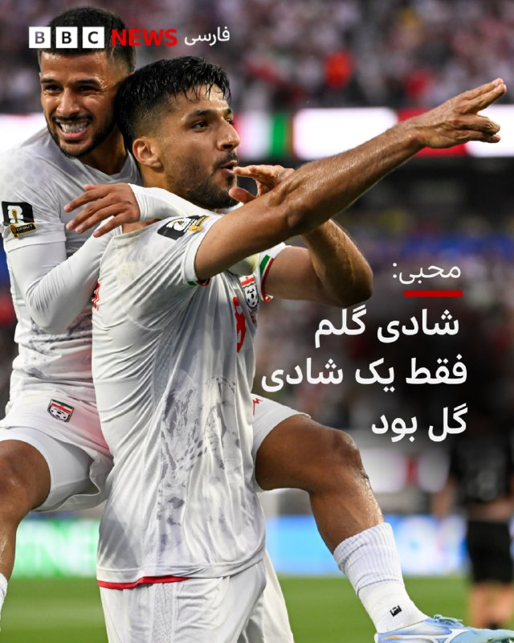

🔻محمد محبی، بازیکن تیم ملی فوتبال ایران که نحوه‌ شادی‌اش از زدن گل به نیوزیلند واکنش‌برانگیز شده و انتقاداتی را به همراه آورده است، درمورد این عمل خود توضیح داد.

او که زننده دومین گل ایران به نیوزیلند در رقابت‌های جام جهانی در آمریکا بود، گفت: «️شادی گلم چیزی است که از ذهنم آمد و فقط یک شادی گل بود؛ همین.»

این بازیکن پس از به ثمر رساندن گل تساوی در مقابل نیوزیلند در حرکتی که به نظر می‌رسید دست خود را به شکل اسلحه درآورده و آن را به سمت تماشاچیان نشانه رفته است، شادی خود را نشان داد.

بازی ایران و نیوزیلند که با تساوی دو بر دو به پایان رسید با حواشی بسیاری همراه بود.

📸ISI Photos via Getty Images
https://bbc.in/3QNvk8B
@BBCPersian

## BBCPersian — post 284025

🔻آژانس بین‌المللی انرژی خواستار بازگشایی «بدون قیدوشرط» تنگه هرمز شد

رئیس آژانس بین‌المللی انرژی می‌گوید که برای پایان دادن به شوک ناشی از افزایش شدید قیمت نفت و گاز بر اقتصادهای سراسر جهان، بازگشایی «بدون قیدوشرط» تنگه هرمز ضروری است.

فاتح بیرول در یک نشست خبری گفت: «مهم‌ترین راه‌‌حل برای این مشکل، بازگشایی کامل و بدون قیدوشرط تنگه هرمز برای کشتیرانی است.»

ایران در واکنش به حملات آمریکا و اسرائیل از اواخر ماه فوریه (اسفندماه ۱۴۰۴) عملا عبور نفتکش‌ها از تنگه هرمز را متوقف کرد که این اقدام باعث اختلال در انتقال نفت و گاز و جهش شدید قیمت انرژی شد.

دونالد ترامپ گفته است که روز جمعه پس از امضای تفاهمنامه ایران و آمریکا، تنگه هرمز باز می‌شود و «نفت برای منطقه و جهان، در هر دو سوی تنگه دوباره جاری خواهد شد.»

با این حال، ایران اصرار دارد که مدیریت این آبراه را همچنان در اختیار خواهد داشت و برای این کار «هزینه خدمات» دریافت خواهد کرد.

آقای بیرول از تفاهم ایران و آمریکا به گرمی استقبال کرد و آن را «خبر بسیار خوبی» خواند که «به بازارها آرامش خواهد بخشید.»

رئیس آژانس بین‌المللی انرژی که پیش‌تر پیامدهای این بحران را با شوک‌های بزرگ نفتی دهه ۱۹۷۰ مقایسه کرده بود، گفت: «اکنون نزدیک به چهار ماه از آغاز این بحران می‌گذرد.»

آژانس بین‌المللی انرژی تاکنون آزادسازی صدها میلیون بشکه نفت از ذخایر اضطراری ۳۲ کشور عضو خود را هماهنگ کرده است و در ماه مه اعلام کرد که حدود ۱۶۴ میلیون بشکه نفت تاکنون از این ذخایر برداشت شده است.

https://bbc.in/4aDwR7V
@BBCPersian

## BBCPersian — post 284024

  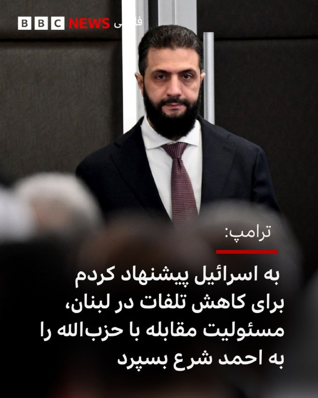

🔻دونالد ترامپ می‌گوید که به اسرائیل پیشنهاد کرده است که مسئولیت مقابله با حزب‌الله را به احمد شرع، رئیس‌جمهور سوریه، بسپرد، چرا که عملیات اسرائیل «بیش از حد تلفات برجا گذاشته است.»

رئیس‌جمهور آمریکا که در اجلاس گروه هفت در اویان صحبت می‌کرد، با ستایش از احمد شرع گفت که او عملکرد «فوق‌العاده‌ای» داشته است و افزود:

«اگر اسرائیل نمی‌تواند مقابله (با حزب‌الله) را بدون کشتن بقیه آدم‌ها انجام بدهد، او (احمد شرع) می‌تواند این کار را انجام دهد. سوریه می‌تواند این کار را بکند.»

آقای ترامپ در گفت‌و‌گو با خبرنگاران از عملکرد اسرائیل در لبنان انتقاد کرد و گفت که آمار کشته‌شدگان در لبنان بیش از حد بالاست.

او انتقاد کرد که هر بار اسرائیل دنبال یک عضو حزب‌الله می‌گردد لازم نیست یک مجتمع ساختمانی را ویران کند.

آقای ترامپ همچنین گفت که از حمله اسرائیل به بیروت که دو ساعت پیش از توافق ایران و آمریکا صورت گرفت، ناراضی است، هرچند افزود که روابطش با بنیامین نتانیتاهو هنوز عالی است.

📸AFP via Getty Images
https://bbc.in/4orarMM
@BBCPersian

## Dirty_Kids — post 392305

  <a href="telegram/content/Dirty_Kids_392305_1781621271.mp4" target="_blank">🎬 Download video</a>

دروازه‌بان کیپ‌ورده، کشوری با ۵۰۰،۰۰۰ نفر جمعیت، بهترین دروازه‌بان با مجموع ۷ سیو تاریخی مقابل اسپانیا شناخته شد. آخر بازی گریه کرد و گفت که مادرش بدلیل اینکه هزینه ویزای امریکا رو نداشته، نتونسته بیاد و بازی پسرشو از نزدیک ببینه. فالوئرهای اینستاگرامش بعد از این بازی از ۵۰ هزار نفر به یک و نیم میلیون نفر رسید. حتی از جمعیت کشورش بیشتر!

مقایسه‌اش کنید با دروازه‌بان تیم ملا که به زور چپوندنش توی دانشگاهی که حتی نمیدونه اسم رشته‌اش چیه و میلیاردمیلیارد پولی که توی جیبش ریختن تا بیاد از لاشه سوخته رهبرش دفاع کنه و درآخر از ضعیف‌ترین تیم این تورنمنت دوتا گل ناب بخوره. پول مفت ملت در فقر نگه‌داشته‌شده و مدارک آبدوغ‌خیاری‌ای که به این لش‌و لوشا میدن. منفور یک ملت. ننگ تاریخ ایران.

@Dirty_Kids 👻

## Dirty_Kids — post 392304

‏تو جام جهانی ۲۰۱۰ که نیوزلند بازی می‌کرد یادتون نمیاد مگه! بازیکن داشتن کارمند اداره رفاه نیوزلند بود! مرخصی گرفته بود بیاد جام جهانی بازی کنه!

@Dirty_Kids 👻

## Dirty_Kids — post 392303

  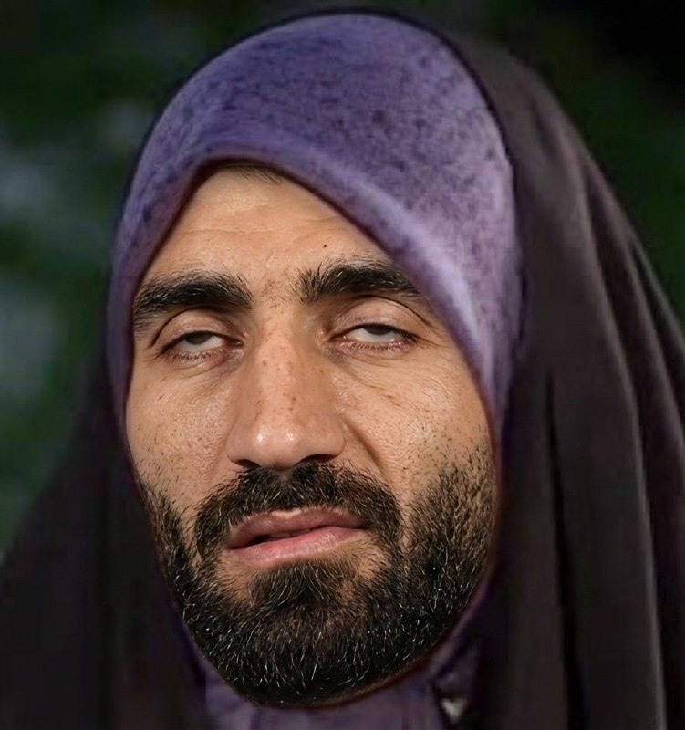

زیر ۷ دقیقه گل خوردم تنگه‌م باز شد، این جرمهههه؟

@Dirty_Kids 👻

## Dirty_Kids — post 392302

  

من درحال تماشای آرزوهایی که قرار نیس بهشون برسم :)

@Dirty_Kids 👻

## Dirty_Kids — post 392301

  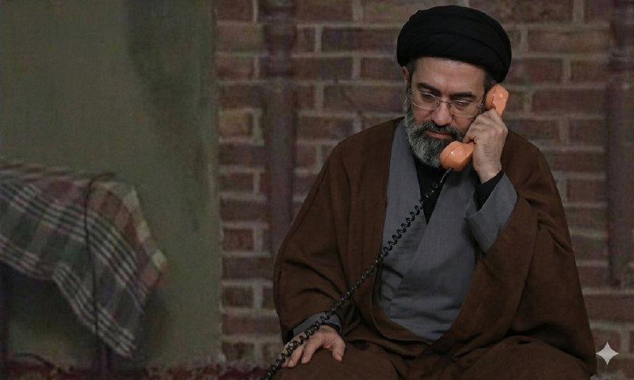

سلامتی، با اعضای باند فرقه‌ی اپستین توافق کردم.

@Dirty_Kids 👻

## Dirty_Kids — post 392300

انقد بدم میاد از کلمات انگلیسی استفاده می‌کنید هی نیوزلند نیوزلند، چیه آخه درست بگید سرزمین خبر

@Dirty_Kids 👻

## Dirty_Kids — post 392299

شاید باور نکنید ولی قالیباف تنهایی در مجلس رو تخته کرده و نمیزاره جلسات تشکیل شه تا نماینده های مخالف توی مبحث توافق دخالت نکنن.
بیش از ۳ ماه جلسات مجلس تشکیل نشده و هیچ اتفاقی هم در کشور نیفتاده. واقعا پرخاصیتن.

@Dirty_Kids 👻

## Dirty_Kids — post 392298

  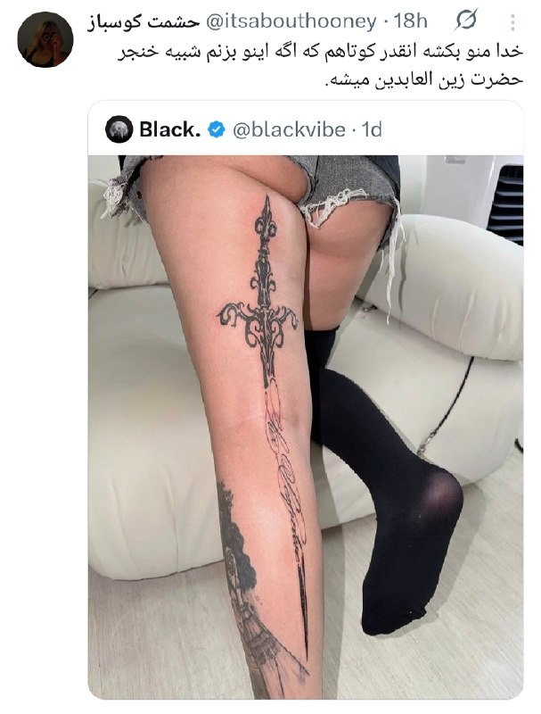

زین العابدین اصن خنجر نداشت اون همیشه استامینوفن همراش بود فقط.

@Dirty_Kids 👻

## Dirty_Kids — post 392297

  <a href="telegram/content/Dirty_Kids_392297_1781621274.mp4" target="_blank">🎬 Download video</a>

وطی به شبهه چیست؟ یعنی شما اگه به جای زنت اشتباهی یکی دیگه رو مورد عنایت قرار بدی طبق قانون اسلامی جرم نیست😂😂

@Dirty_Kids 👻

## Dirty_Kids — post 392296

  <a href="telegram/content/Dirty_Kids_392296_1781621276.mp4" target="_blank">🎬 Download video</a>

فقط صدای گزارشگر! 😅🤌🏽

استاد، هر کجایی اعلام حضور کن لطفاً؛ خودم شخصاً می‌خوام بابت این شاهکار ازت تشکر کنم.

@Dirty_Kids 👻

## Dirty_Kids — post 392295

🔴 سپاه و عرزشی ها دارن به خاطر توافقی که قالیباف انجام میده، الیاس قالیباف پسر قالیباف که مسئولیت امنیت بیت رهبری رو داشته به جاسوسی برای اسرائیل متهم میکنن .

@Dirty_Kids 👻

## Dirty_Kids — post 392294

  <a href="telegram/content/Dirty_Kids_392294_1781621277.mp4" target="_blank">🎬 Download video</a>

🔴 حالا که توافق تقریبا انجام شده، این صحبتای خامنه‌ای (11 روز قبل از کشته شدنش) تو این چند روز دوباره وایرال شده:

امام حسین گفت من با کسی مثل یزید بیعت نمیکنم، ملت ما هم با این فرهنگ، سابقه و معارف عالی، با افراد فاسدی که تو آمریکا روی کار هستن [ترامپ] بیعت نخواهد کرد.
‌

@Dirty_Kids 👻

## Dirty_Kids — post 392293

  <a href="telegram/content/Dirty_Kids_392293_1781621279.mp4" target="_blank">🎬 Download video</a>

ترامپ الان دربارهٔ ایران:
من به رژیم چنج اعتقاد ندارم. سال‌هاست تغییر رژیم‌ها را دیده‌ام و هیچ‌وقت جواب نمی‌دهند، باید خودش اتفاق بیفتد.

@Dirty_Kids 👻

## Dirty_Kids — post 392292

دلار برگشته به قیمت ۶ ماه قبل، اما هیچ‌کس سراغ قیمت‌های ۶ ماه قبل نرفته است.
در اقتصاد ما، ‎دلار فقط آسانسورِ افزایش قیمت‌هاست؛ وقتی بالا می‌رود همه‌چیز را با خود بالا می‌کشد، اما وقتی پایین می‌آید، انگار پله‌های برگشت را حذف کرده‌اند.

@Dirty_Kids 👻

## Dirty_Kids — post 392291

  <a href="telegram/content/Dirty_Kids_392291_1781621280.mp4" target="_blank">🎬 Download video</a>

کامیار (خواننده) با پرچم شیروخورشید رفته بود استادیوم همون دقیقه اول حراست استادیوم میاد پرچم میگیره ازش

اینم از دمکراسی، جمهوری اسهالی ،FIFA رو هم خریده !!

@Dirty_Kids 👻

## Dirty_Kids — post 392289

  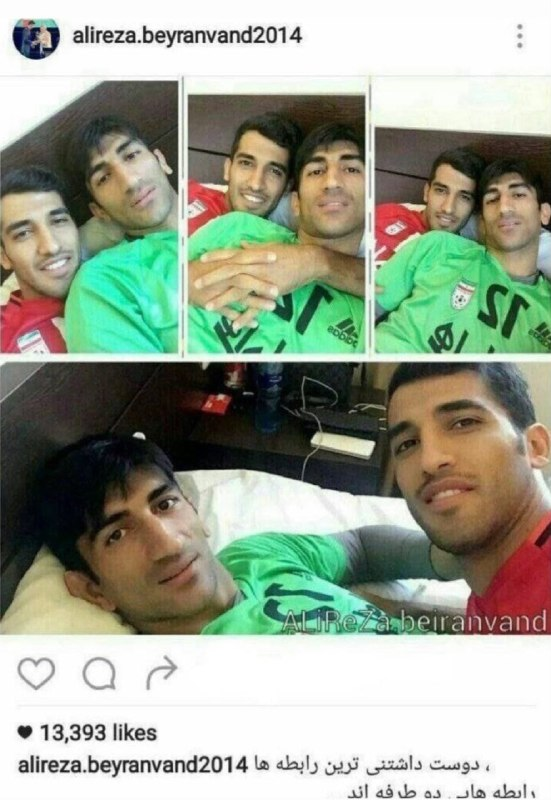

فیفا یچی میدونست باز جمهوری‌عسلامی و مصر رو برای حمایت از همجنسگراها اعلام کرده

@Dirty_Kids 👻

## Dirty_Kids — post 392288

  <a href="telegram/content/Dirty_Kids_392288_1781621282.mp4" target="_blank">🎬 Download video</a>

جدی می فرمایید فهمید اما بعضی هنوز گاو ماندند

@Dirty_Kids 👻

## Dirty_Kids — post 392287

  <a href="telegram/content/Dirty_Kids_392287_1781621284.mp4" target="_blank">🎬 Download video</a>

شبکه خبر: تمام کسایی که توی بیت رهبری بودن کشته شدن جز مجتبی خامنه‌ای

مجتبی تو بیت رهبری:

@Dirty_Kids 👻

## Dirty_Kids — post 392286

آمریکا بعد مهدی ترابی ویزای طارمی هم باطل کرد و طارمی دیگه نمیتونه بره آمریکا

@Dirty_Kids 👻

## Hranews — post 113652

  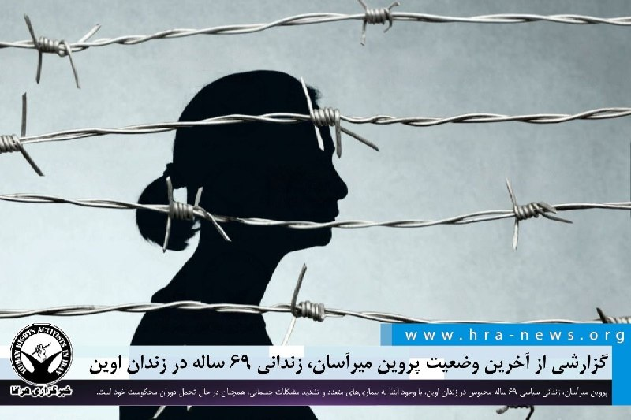

گزارشی از آخرین وضعیت پروین میرآسان، زندانی ۶۹ ساله در زندان اوین

❗️
❗️
❗️
❗️
❗️– پروین میرآسان، زندانی سیاسی ۶۹ ساله محبوس در زندان اوین، با وجود ابتلا به بیماری‌های متعدد و تشدید مشکلات جسمانی، همچنان در حال تحمل دوران محکومیت خود است. با وجود آنکه حدود سه ماه از دوران محکومیت این زندانی سالخورده باقی مانده، تاکنون با درخواست‌های آزادی مشروط یا مرخصی متصل به آزادی وی موافقت نشده است.

به گزارش خبرگزاری هرانا، ارگان خبری مجموعه فعالان حقوق بشر در ایران، پروین میرآسان، زندانی سیاسی محبوس در زندان اوین، از بیماری‌های متعددی رنج میبرد.

یک منبع مطلع نزدیک به خانواده این زندانی سیاسی ضمن تایید این موضوع به هرانا گفت: «وضعیت جسمی خانم میرآسان در شرایط نامناسبی قرار دارد. او از بیماری‌های متعدد رنج می‌برد و در ماه‌های اخیر مشکلات قلبی وی تشدید شده است. همچنین دردهای شدید مفصلی، لرزش و اختلال در تعادل موجب شده که وی به‌سختی قادر به راه رفتن باشد و در انجام امور روزمره با مشکلات جدی مواجه شود.»
این منبع در ادامه با اشاره به اینکه خانم میرآسان از بیماری‌های دیگری از جمله دیابت و عارضه چسبندگی روده نیز رنج می‌برد، گفت: «با وجود آنکه حدود سه ماه از دوران محکومیت خانم میرآسان باقی مانده، تاکنون با درخواست‌های مربوط به آزادی مشروط یا مرخصی متصل به آزادی وی موافقت نشده است.»

ادامه مطلب

#پروین_میرآسان
↘️
@hranews_bot تماس ✉️ -  @Hranews  کانال هرانا 🆑

## Hranews — post 113651

  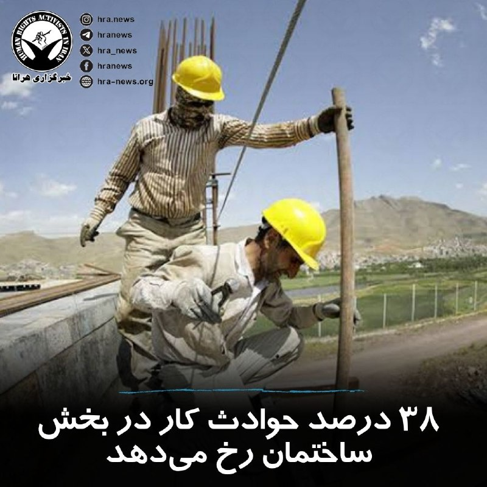

احمد میدری، وزیر تعاون، کار و رفاه اجتماعی اعلام کرد که ۳۸ درصد حوادث ناشی از کار در ایران در بخش ساختمان رخ می‌دهد. او همچنین با اشاره به فرسودگی شغلی بالا و مخاطرات محیط‌های ساختمانی، این بخش را یکی از حادثه‌خیزترین حوزه‌های کاری کشور توصیف کرد.

همزمان، پروانه رضایی، معاون روابط کار وزارت کار، گفت: بخش ساختمان با ۳۸ درصد بیشترین سهم #حوادث_کار را دارد و بخش صنعت با ۳۷ درصد در رتبه بعدی قرار گرفته است. به گفته وی، ۴۶ درصد حوادث حین کار نیز به مرگ کارگران منجر می‌شود.

↘️
@hranews_bot تماس ✉️ -  @Hranews  کانال هرانا 🆑

## Hranews — post 113650

  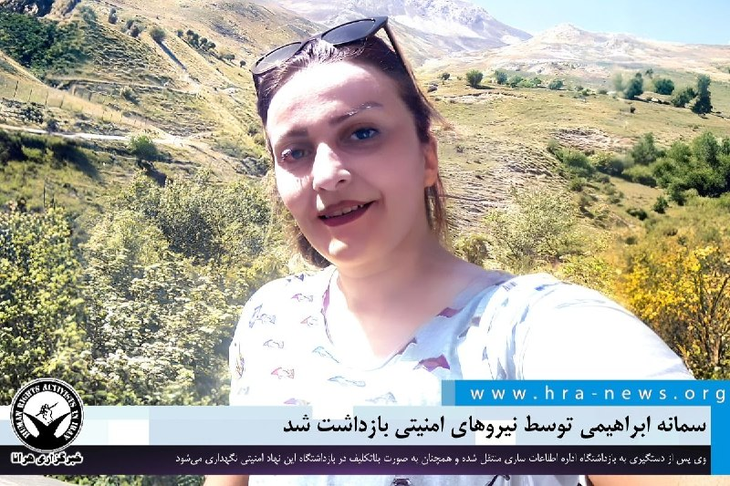

سمانه ابراهیمی توسط نیروهای امنیتی بازداشت شد

❗️
❗️
❗️
❗️
❗️– سمانه ابراهیمی نوایی، شهروند ساکن آمل، روز شنبه ۲۳ خردادماه توسط نیروهای امنیتی #بازداشت و به بازداشتگاه اداره اطلاعات ساری منتقل شد.

به گزارش خبرگزاری هرانا، ارگان خبری مجموعه فعالان حقوق بشر در ایران، سمانه ابراهیمی نوایی، شهروند ساکن آمل بازداشت شد.

بر اساس اطلاعات دریافتی هرانا، خانم ابراهیمی نوایی روز شنبه ۲۳ خردادماه توسط نیروهای امنیتی در آمل بازداشت و به بازداشتگاه اداره اطلاعات ساری منتقل شده است.

ادامه مطلب

#سمانه_ابراهیمی_نوایی

↘️
@hranews_bot تماس ✉️ -  @Hranews  کانال هرانا 🆑

## Hranews — post 113649

  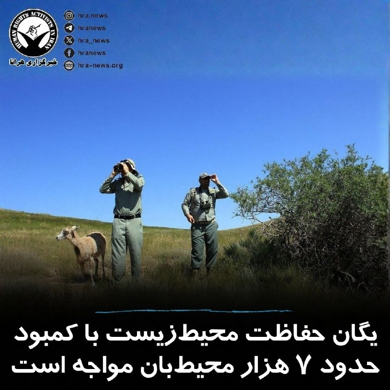

رضا رستگار، فرمانده یگان حفاظت محیط‌زیست، اعلام کرد که این یگان برای پوشش مناسب مناطق تحت حفاظت به حدود هفت هزار محیط‌بان نیاز دارد، اما در حال حاضر کمتر از ۶۰ درصد این ظرفیت تأمین شده است. به گفته او، این کمبود از دهه ۱۳۹۰ و در پی عدم جایگزینی محیط‌بانان بازنشسته، مصدوم و جان‌باخته با نیروهای جدید تشدید شده است.

رستگار با اشاره به استانداردهای جهانی افزود که به ازای هر هزار هکتار از مناطق تحت حفاظت باید یک #محیط‌بان حضور داشته باشد، در حالی که در ایران به‌طور میانگین تنها یک محیط‌بان مسئول حفاظت از هر ۱۲ هزار هکتار است. او همچنین گفت بیش از ۲۰ میلیون هکتار از اراضی کشور تحت مدیریت و حفاظت سازمان #محیط‌زیست قرار دارد و کمبود نیروی انسانی به حدی است که هر محیط‌بان عملاً وظایفی معادل ۱۲ محیط‌بان را بر عهده دارد.

↘️
@hranews_bot تماس ✉️ -  @Hranews  کانال هرانا 🆑

## Hranews — post 113648

سال گذشته ۸ هزار کودک در خوزستان از تحصیل بازماندند

❗️
❗️
❗️
❗️
❗️– معاون آموزش ابتدایی اداره‌کل آموزش و پرورش خوزستان اعلام کرد که در سال گذشته هشت هزار دانش آموز در این استان از #تحصیل بازمانده اند.

ادامه مطلب

↘️
@hranews_bot تماس ✉️ -  @Hranews  کانال هرانا 🆑

## Hranews — post 113647

جرائم مواد مخدر؛ ۲ زندانی در زندان یزد اعدام شدند

❗️
❗️
❗️
❗️
❗️– حکم دو زندانی که پیشتر از بابت اتهامات مرتبط با جرائم مواد مخدر، در یک پرونده مشترک به #اعدام محکوم شده بودند، امروز سه‌شنبه ۲۶ خردادماه در زندان یزد اجرا شد.

ادامه مطلب

#عمر_شه‌بخش
#غفور_شه‌بخش

↘️
@hranews_bot تماس ✉️ -  @Hranews  کانال هرانا 🆑

## Hranews — post 113646

یک زن در تهران به ظن فروش سه نوزاد خود بازداشت شد

❗️
❗️
❗️
❗️
❗️– یک زن در جنوب تهران به اتهام فروش سه #نوزاد خود بازداشت شده که بر اساس تحقیقات، این نوزادان حاصل سه زایمان جداگانه در بازه‌های زمانی مختلف بوده‌اند. هم‌زمان روند رسیدگی به پرونده و جست‌وجو برای شناسایی #کودکان فروخته‌شده ادامه دارد.

ادامه مطلب

↘️
@hranews_bot تماس ✉️ -  @Hranews  کانال هرانا 🆑

## Hranews — post 113645

اعتراضات دی‌ماه ۱۴۰۴؛ جواد زمانی و ابوالفضل ساعدی اعدام شدند

❗️
❗️
❗️
❗️
❗️– رئیس کل دادگستری استان سمنان از اجرای حکم اعدام جواد زمانی و ابوالفضل ساعدی، از بازداشت‌شدگان اعتراضات دی‌ماه ۱۴۰۴ در شهرستان شاهرود، خبر داد. همزمان، مرکز رسانه قوه قضاییه ویدیویی از اعترافات اجباری این دو معترض را منتشر کرده است. دستگاه قضایی این افراد را از بابت اتهاماتی از جمله «محاربه» و «افساد فی‌الارض» به #اعدام محکوم کرده بود. سرانجام، احکام صادره صبح امروز به اجرا درآمد.

ادامه مطلب

#جواد_زمانی
#ابوالفضل_ساعدی

↘️
@hranews_bot تماس ✉️ -  @Hranews  کانال هرانا 🆑

## officialrezapahlavi — post 1845

  

جمهوری اسلامی هم‌زمان با امضای تفاهم‌نامه‌ «صلح»، دو تن دیگر از معترضان ۱۸ و ۱۹ دی‌ به نام‌های جواد زمانی و ابوالفضل ساعدی را اعدام کرد.

این نتیجه معامله و سازش با یک رژیم جنایتکار است. توافق با رژیمی که تنها در دو روز، بیش از ۴۰ هزار معترض را به قتل رساند، نه‌تنها از نظر اخلاقی نادرست است، بلکه از منظر راهبردی نیز خطایی فاجعه‌بار خواهد بود.

تعامل با این رژیم محکوم به شکست است و همه ما بهای پیامدهای آن را خواهیم پرداخت. جنگ ۴۷ ساله جمهوری اسلامی علیه مردم ایران همچنان ادامه دارد. رژیمی که هرگز با شهروندان خود به صلح نرسیده، هرگز با جهان نیز به صلحی واقعی دست نخواهد یافت.

جامعه جهانی باید از مبارزه ملت ایران برای آزادی حمایت کند و آنها را در کانون هر مذاکره و محور هر سیاستی درباره ایران قرار دهد. اما روشن بگویم: با حمایت جهان یا بدون آن، این رژیم سقوط خواهد کرد،ٰ و مردم ایران خود را از چنگ استبداد آزاد خواهند کرد.

As it signs a Memorandum of Understanding for “peace”, the Islamic Republic just executed two more protesters from January 8th and 9th— Javad Zamani and Abolfazl Saedi.

This is the consequence of making a deal with this criminal regime. To do a deal with a regime that murdered more than 40,000 protestors in two days in January is morally wrong and strategically misguided.

Dealing with this regime will fail and we will all face the consequences. The regime’s 47-year war against the Iranian people continues. Just as it has never made peace with its own citizens, it will never truly make peace with the world.

The international community should back the people of Iran’s fight for freedom. Put them center in any negotiations and in their Iran policy. But let me be clear - with or without international support - this regime will fall. The people of Iran will liberate themselves from tyranny.

@OfficialRezaPahlavi

## manototv — post 106090

  <a href="telegram/content/manototv_106090_1781621287.mp4" target="_blank">🎬 Download video</a>

ترامپ که پیش‌تر در پیام‌هایی خطاب به ایرانیان از «کمک در راه است» سخن گفته بود، اکنون در گفت‌وگو با مقام‌های قطر، کشته‌شدن معترضان را عمدتا به «گروه‌های قبلی» در جمهوری اسلامی نسبت می‌دهد و میان بخش‌های مختلف رژیم مرزبندی تازه‌ای می‌سازد.

## manototv — post 106080

  <a href="telegram/content/manototv_106080_1781621288.mp4" target="_blank">🎬 Download video</a>

خیابانی که قرار بود نمایش قدرت جمهوری اسلامی باشد، حالا به صحنه شکاف درونی آن تبدیل شده است. از پروپاگاندای جنگی تا شورش علیه تفاهم، جمهوری اسلامی با نیرویی روبه‌رو شده که سال‌ها خود پرورش داده بود.

## alonews — post 128504

  <a href="telegram/content/alonews_128504_1781621290.mp4" target="_blank">🎬 Download video</a>

👈معاون رئیس‌جمهور جِی‌دی ونس:

اگر مردم ایران خواهان رفاه بیشتر هستند، رهبرانشان باید پیشقدم شوند و رفتار خود را تغییر دهند.

اگر این کار را بکنند، عالی است. اگر نکنند، ایالات متحده قبلاً چیزهای زیادی به دست آورده است.

✅ @AloNews خبر جنگ

## alonews — post 128503

  <a href="telegram/content/alonews_128503_1781621292.webm" target="_blank">🎬 Download video</a>

👈ونس به فاکس نیوز:
ما پیروز شدیم، چه ایران روش خود را تغییر دهد و چه تصمیم بگیرد به توافق پایبند نباشد

✅ @AloNews خبر جنگ

## alonews — post 128502

  <a href="telegram/content/alonews_128502_1781621292.mp4" target="_blank">🎬 Download video</a>

👈حمله پهبادی اسرائیل به جنوب لبنان

✅ @AloNews خبر جنگ

## alonews — post 128501

پاسخ قاطع قالیباف به مخالفان توافق [@AloTweet]

## alonews — post 128500

  <a href="telegram/content/alonews_128500_1781621294.webm" target="_blank">🎬 Download video</a>

👈نبویان :متن توافق منافع ملی(کاسبان تحریم) را تامین نمیکند

✅ @AloNews خبر جنگ

## alonews — post 128499

  <a href="telegram/content/alonews_128499_1781621294.webm" target="_blank">🎬 Download video</a>

👈کانال ۱۲ اسرائیل:
نتانیاهو خواسته متن توافق با ایران رو ببینه ولی ترامپ اجازه نداده و گفته به تو مربوط نیست.

✅ @AloNews خبر جنگ

## alonews — post 128497

  <a href="telegram/content/alonews_128497_1781621294.webm" target="_blank">🎬 Download video</a>

👈واشنگتن پست بخشی از مکالمه کوشنر با قالیباف را منتشر کرد

در بخشی از گزارش واشنگتن پست آمده است:

🔴طبق گفته یک مقام نزدیک به مذاکرات، وقتی «کوشنر» در ماه آوریل در اسلام‌آباد با «محمدباقر قالیباف»، رئیس مجلس ایران، دیدار کرد، صریحاً به او گفت: «ببین، اگر شما بهایی اندازه رولز رویس را می‌خواهید، ما هم محصولی همانند رولز رویس را می‌خواهیم.»

🔴به عبارت دیگر، اگر ایران با باز نگه داشتن تنگه هرمز، توقف غنی‌سازی اورانیوم به مدت ۲۰ سال و متوقف کردن صدور انقلاب خود، به تعهداتش عمل کند، می‌تواند انتظار دریافت صدها میلیارد دلار منفعت را داشته باشد.

✅ @AloNews خبر جنگ

## alonews — post 128496

  <a href="telegram/content/alonews_128496_1781621295.mp4" target="_blank">🎬 Download video</a>

👈یک روحانی تندرو: ترامپ راست میگه رژیم ایران تغییر کرده. اون صادقترین آدم روی زمینه

✅ @AloNews خبر جنگ

## alonews — post 128495

👈سوئیس محل امضای تفاهم میان ایران و آمریکا را مشخص کرد

🔴وزارت امور خارجه سوئیس با صدور بیانیه‌ای رسمی تأیید کرد که مراسم امضای توافق‌نامه میان ایالات متحده و جمهوری اسلامی ایران روز جمعه برگزار خواهد شد.

🔴این مراسم در مجتمع «بورگن‌اشتوک» (Bürgenstock) در سوئیس میزبانی می‌شود

✅ @AloNews خبر جنگ

## alonews — post 128494

  <a href="telegram/content/alonews_128494_1781621297.webm" target="_blank">🎬 Download video</a>

👈سخنگوی وزارت امور خارجه قطر: قطر در دیدار آتی ژنو حضور خواهد داشت

🔴توافق فعلی گامی نخست به سوی یک توافق منطقه‌ای گسترده‌تر است که ثبات منطقه را تضمین می‌کند.

🔴ما در نزدیک کردن دیدگاه‌ها برای دستیابی به یک تسویه میان تهران و واشنگتن کمک کردیم.

✅ @AloNews خبر جنگ

## alonews — post 128492

  <a href="telegram/content/alonews_128492_1781621297.webm" target="_blank">🎬 Download video</a>

👈مجید تخت‌روانچی، معاون سیاسی وزیر امور خارجه، روز سه‌شنبه ۲۶ خرداد، در حاشیه نشست با دیپلمات‌های خارجی در تهران، جزئیات جدیدی از گام‌های اجرایی تفاهم‌نامه اسلام‌آباد ارائه داد. او تایید کرد که محمدباقر قالیباف از سوی جمهوری اسلامی و جی‌دی ونس از طرف آمریکا برای آغاز مذاکرات و امضای توافق در سوئیس حاضر خواهند بود.

🔴تخت‌روانچی با اشاره به اینکه بلافاصله پس از امضای تفاهم‌نامه، گفتگوها درباره توافق نهایی شروع می‌شود، افزود: «ما در این مرحله وارد جزئیات بحث‌های هسته‌ای از جمله غنی‌سازی، ذخایر و نیازهای ایران نشده‌ایم و این مباحث پس از رسمیت یافتن تفاهم‌نامه آغاز خواهد شد.»

🔴معاون وزیر خارجه در پاسخ به پرسشی درباره نقض آتش‌بس از سوی اسرائیل تاکید کرد که در متن تفاهم‌نامه بر خاتمه عملیات نظامی در تمامی جبهه‌ها، از جمله لبنان، صراحت وجود دارد. او تصریح کرد از آنجا که آمریکا از طرف شرکای خود متعهد به پایان جنگ شده است، در صورت هرگونه نقض عهد از سوی اسرائیل، از مکانیزم‌های پیش‌بینی‌شده در یادداشت تفاهم استفاده خواهد شد.

✅ @AloNews خبر جنگ

## alonews — post 128491

  <a href="telegram/content/alonews_128491_1781621297.webm" target="_blank">🎬 Download video</a>

👈رئیس کمیسیون اروپا: من به ترامپ به خاطر توافق با ایران تبریک گفتم هر دو موافقیم که این توافق باید به معنای پایان قطعی برنامه هسته‌ای ایران باشد ،تنگه هرمز بازگشایی خواهد شد

✅ @AloNews خبر جنگ

## alonews — post 128490

  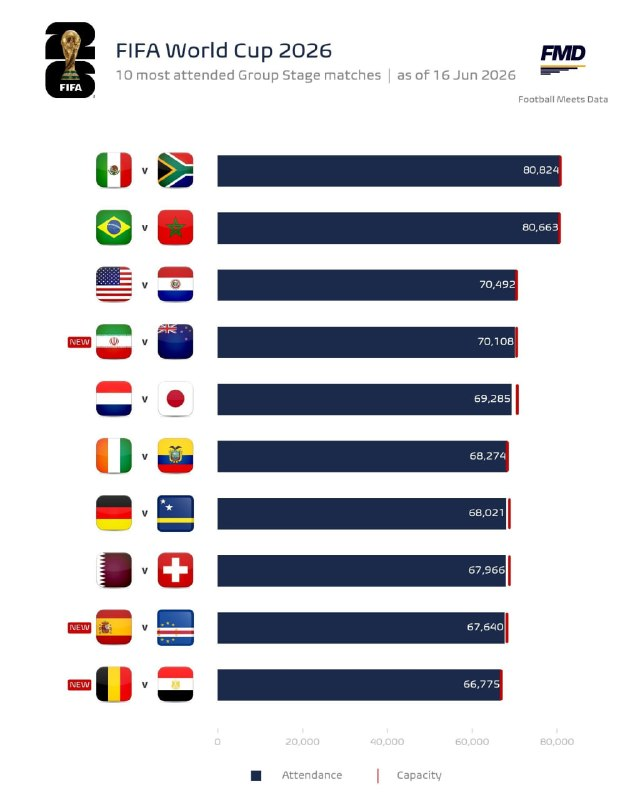

بازی ایران در رتبۀ چهارم؛ پرتماشاگرترین بازی‌های جام جهانی تا اینجا

@AloSport

## alonews — post 128489

  <a href="telegram/content/alonews_128489_1781621298.mp4" target="_blank">🎬 Download video</a>

🔴دقیقا حرف ما هم همینه. میگیم چرا وقتی حکومتی که 47 ساله داره دروغ به خورد ملت ایران میده رو, باید حمایت کرد!

🔴تا وقتی که به مردم نیاز دارن صحبت از وطن و ملی گرایی میکنن و وقتی نیازی نباشه بهشون به راحتی پشت پا میزنن.

🤔حکومت دیگه چیکار باید بکنه تا عرزشی جماعت بفهمه که بازیچه یه مشت شیاده

✅@AloNews

## alonews — post 128488

  <a href="telegram/content/alonews_128488_1781621299.mp4" target="_blank">🎬 Download video</a>

👈عضو تیم رسانه‌ای هیأت مذاکره‌کننده هسته‌ای ایران :

🔴مدیریت تنگه هرمز دست ایرانه و تصمیمش رو هم به کشورهای منطقه اطلاع می‌دیم؛

🔴برای این کار هم نیازی به تأیید یا اجازه کسی نداریم

✅ @AloNews خبر جنگ

## alonews — post 128487

  <a href="telegram/content/alonews_128487_1781621301.webm" target="_blank">🎬 Download video</a>

👈رسانه های چینی تصاویری جدید از جنگنده پنهان کار J-35 را منتشر کردند

✅ @AloNews خبر جنگ

## alonews — post 128486

  <a href="telegram/content/alonews_128486_1781621301.mp4" target="_blank">🎬 Download video</a>

👈خوشحالی ایرانیان کانادا(با پرچم شیر و خورشید) بعد گل اول ایران

✅ @AloNews خبر جنگ

## alonews — post 128485

  <a href="telegram/content/alonews_128485_1781621304.mp4" target="_blank">🎬 Download video</a>

🔴‏در اوایل سال ۲۰۲۴ بازیکنان تیم ملی‌ کنگو در یک اکت اعتراضی و زیبا موقع سرود ملی کشورشون برای حمایت از مردم و جلب توجه افکار جامعه جهانی به کشتار هموطنانشون این حرکت رو انجام دادن.

🤔با تیم ملی جمهوری اسلامی که خودشون رو ایرانی و وطن پرست میدونن مقایسه کنین. یه مشت شیاد خون شور

✅@AloNews

## alonews — post 128484

  <a href="telegram/content/alonews_128484_1781621305.mp4" target="_blank">🎬 Download video</a>

👈ترامپ: کلمه به کلمه متن توافق را برایتان می‌خوانم

🔴من نه تنها آن را منتشر خواهم کرد. احتمالاً یک کنفرانس مطبوعاتی خواهم داشت و کلمه به کلمه آن را برای شما خواهم خواند تا مطبوعات آن را به طور دقیق پوشش دهند زیرا این یک سند بسیار مهم است

✅ @AloNews خبر جنگ

---
📅 بروزرسانی: 1405/03/26 13:15
---

## VahidOOnLine — post 245834

  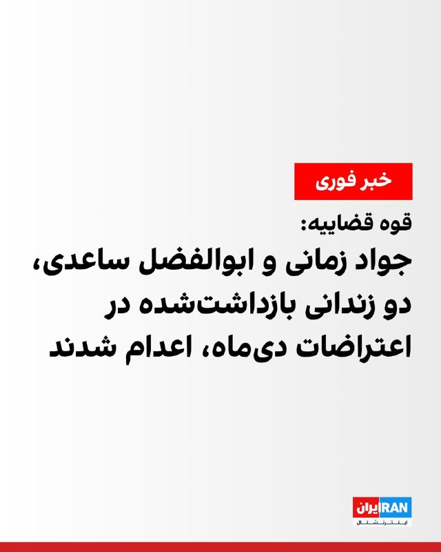

خبرگزاری میزان، رسانه قوه قضاییه جمهوری اسلامی، سه‌شنبه ۲۶ خرداد از اجرای حکم اعدام جواد زمانی و ابوالفضل ساعدی، دو زندانی سیاسی بازداشت‌شده در اعتراضات دی‌ماه در استان سمنان خبر داد.

رییس کل دادگستری استان سمنان اتهام‌های این دو زندانی را «محاربه، افساد فی‌الارض از طریق کشیدن سلاح گرم و سرد، تخریب عمدی اموال عمومی و خصوصی به قصد مقابله با نظام جمهوری اسلامی و اخلال در نظم و امنیت جامعه، اجتماع و تبانی برای ارتکاب جرم علیه امنیت داخلی کشور» اعلام کرد.

تاکنون جزییات بیشتری درباره روند رسیدگی به پرونده جواد زمانی و ابوالفضل ساعدی، و همچنین اطلاعاتی درباره وضعیت آنان پیش از اجرای حکم، منتشر نشده بود.
‌🏁 🇬🇧 IranintlTV

🤖 @VahidOOnLine

## VahidOOnLine — post 245833

♦️خبرگزاری رویترز گزارشی از ابراز احساسات متفاوت یا حتی «متناقض» ایرانیان پس از بازی اول تیم ملی در جام جهانی منتشر کرده است؛ ایرانیانی که کشور و تیمشان را دوست دارند اما پس از کشتار دی‌ماه، این تیم را نماینده خودشان نمی‌دانند.

بسیاری از ایرانیانی که به ورزشگاه رفته بودند، با وجود ممنوعیت و محدودیت‌های فیفا، پرچم‌های شیروخورشید نشان ملی را با خود برده بودند و پس از بازی، با همین پرچم‌ها در خیابان‌های لس‌آنجلس فریاد «ایران ایران» سر می‌دادند.

یکی از هواداران تیم ملی به خبرنگار رویترز گفت: «هزاران جوانی که می‌خواستند همین بازی را نگاه کنند، دیگر در میان ما نیستند و در گور خفته‌اند. من نماینده آن‌ها هستم.»
‌🇸🇦 Indypersian

🤖 @VahidOOnLine

## VahidOOnLine — post 245832

🗣روایت شما از توافق آمریکا و جمهوری اسلامی- سه‌شنبه ۲۶ خرداد:

🔹ناامیدی، سوخت دیکتاتوری‌ها و امید راه سقوط آن‌هاست؛ امیدتون رو از دست ندین.

🔹ترامپ و جی‌دی ونس به چیه این تفاهم‌نامه که حتی تهش هم مشخص نیست می‌بالند. مگه این‌که از موجودیت و اصل وجودی جمهوری اسلامی بی‌خبر باشند که چقدر این‌ها می‌تونن خطرناک باشند.

🔹اگه مجتبی زنده است و با مذاکرات موافق کرده چرا صدا و تصویرش رو نشون نمی‌دن؟

🔹مگه توافق نشد؟ حالا چرا مجتبی رو نشون نمی‌دن؟ واقعا فکر می‌کنید زنده است؟!

🔹ترامپ به مردم ایران وعده داد که کمک در راه است، ولی ظاهراً بر سر دو راهی، مسیر را اشتباه رفت و کمک را به باقی‌مانده رژیم که آخرین نفس‌هایش را می کشید رساند، آمریکا تاوان سنگینی بابت اشتباه ترامپ خواهد داد.

🔹جمهوری اسلامی سال‌ها با شعار و تهدید برای مردم نمایش قدرت اجرا کرد. همان نظامی که ادعای مقاومت داشت برگشت پای میز توافق با همان طرفی که رهبرش رو کشت. زانو زدند، امضا کردند، شکست را قبول کردند، تحقیر شدند.

🔹مطمئن باشید جمهوری اسلامی اصلا به توافق پایبند نخواهد بود.

🔹آقای ترامپ! شما با حکومتی توافق کردید که با خُدعه و نیرنگ بر سرکار آمد و با خدعه و نیرنگ ۴۷ سال بر سرکار باقی ماند. شما از سوراخی گزیده شدید که قبل از شما خیلی‌ها گزیده شده بودند. تاریخ در مورد شما بد قضاوت خواهد کرد، آنگاه که جمهوری اسلامی زهر خود را به جهانیان بریزد.

🔹ترامپ و نتانیاهو تا همین‌جا هم کمک بزرگی به مردم ایران کردند. ما نباید خودمان را دست‌کم بگیریم. دو کلمه مهم برای پیروزی «اتحاد و سازماندهی» هستند.

🔹فعلا فقط تفاهم شده که مذاکره کنند، دو حالت بیشتر نداره یا آخوند با نابودی اورانیوم و چرخه غنی‌سازی موافقت می‌کنه که قطعا به‌معنی شکست جمهوری اسلامی است یا مسیر سابق رو می‌ره که دوباره جنگ می‌شه. نگران نباشید، جمهوری اسلامی در موقعیت خیلی بدی گیر کرده.
‌🏁 🇬🇧 IranintlTV

🤖 @VahidOOnLine

## VahidOOnLine — post 245831

ویدیوهای رسیده به ایران‌اینترنشنال نشان می‌دهد اعضای خانواده جاویدنام صنم پوربابایی، در مراسم تولد او بر سر مزارش، یاد جاویدنامان را گرامی داشتند.
صنم، ۲۶ ساله و نوازنده و مدرس ویولن، ۱۸ دی‌ماه در لاهیجان با اصابت گلوله جان باخت.
‌🏁 🇬🇧 IranintlTV

🤖 @VahidOOnLine

## VahidOOnLine — post 245830

  <a href="telegram/content/VahidOOnLine_245830_1781603131.mp4" target="_blank">🎬 Download video</a>

ویدیوی رسیده به ایران‌اینترنشنال، لحظه ورورد ایرانیان را همراه با پرچم‌های شیروخورشید به ورزشگاه سوفای لس‌آنجلس برای تماشای بازی فوتبال ایران و نیوزیلند در جام جهانی نشان می‌دهد.
‌🏁 🇬🇧 IranintlTV

🤖 @VahidOOnLine

## VahidOOnLine — post 245829

  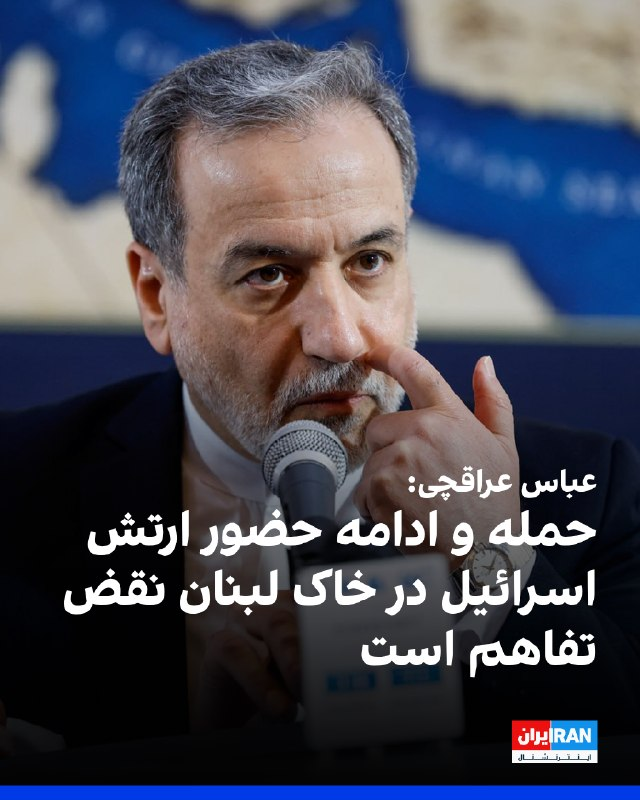

عباس عراقچی، وزیر خارجه جمهوری اسلامی، در نشستی با سفرا و کارداران خارجی در تهران، گفت جمهوری اسلامی و حزب‌الله یک طرف تفاهم‌نامه و آمریکا و اسرائیل طرف دیگر آن هستند. او افزود گفت: «خاتمه جنگ در لبنان، بخش جدایی‌ناپذیر خاتمه کامل جنگ است و هرگونه حمله نظامی اسرائیل به لبنان و ادامه اشغال، نقض یادداشت تفاهم محسوب می‌شود.»
‌🏁 🇬🇧 IranintlTV

🤖 @VahidOOnLine

## VahidOOnLine — post 245828

  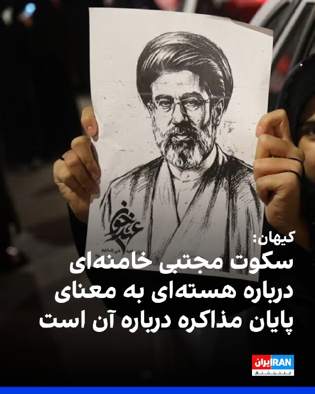

روزنامه کیهان، که زیر نظر نماینده رهبر جمهوری اسلامی اداره می‌شود، نوشت که مجتبی خامنه‌ای در تمامی پیام‌های خود از زمان انتصاب به عنوان رهبر جمهوری اسلامی تاکنون هیچ اشاره‌ای به موضوع هسته‌ای نکرده و جایگاهی برای آن در چشم‌انداز پایان جنگ در نظر نگرفته است.

کیهان این رویکرد را «اقدامی معنادار» توصیف کرد و نوشت که این موضوع می‌تواند نشانه‌ای از آن باشد که از نگاه جمهوری اسلامی، پرونده مذاکرات هسته‌ای پس از حملات آمریکا و اسرائیل مختومه شده و تلاشی برای احیای آن صورت نخواهد گرفت.

این روزنامه همچنین نوشت که این رویکرد را می‌توان یکی از مهم‌ترین خطوط قرمز ترسیم‌شده از سوی رهبر جمهوری اسلامی دانست. به نوشته کیهان، هرگونه مذاکره برای تعیین شرایط پایان جنگ نباید در امتداد مذاکرات پیشین هسته‌ای و در همان چهارچوب و با همان اهداف دنبال شود.
‌🏁 🇬🇧 IranintlTV

🤖 @VahidOOnLine

## VahidOOnLine — post 245827

♦️عباس عراقچی، وزیر امور خارجه جمهوری اسلامی روز سه‌شنبه ۲۶ خردادماه گفت جنگ در تمام جبهه‌ها از روز گذشته پایان یافته است.

عراقچی گفت از نظر ما، آمریکا و اسرائیل یک طرف تفاهم‌نامه پایان جنگ و ایران و حزب‌الله طرف دیگر آن هستند. او گفت برای خاتمه جنگ، اسرائیل باید از لبنان خارج شود و در صورت حمله مجدد اسرائیل به لبنان، این مساله به‌عنوان ادامه جنگ در نظر گرفته خواهد شد.

بنیامین نتانیاهو و اسرائیل کاتز، نخست وزیر و وزیر دفاع اسرائیل روز گذشته اعلام کرده بودند طرف این تفاهم‌نامه نیستند و از لبنان خارج نمی‌شوند.
‌🇸🇦 Indypersian

🤖 @VahidOOnLine

## VahidOOnLine — post 245826

♦️امانوئل مکرون، رئیس‌جمهوری به همراه بریژیت، بانوی فرانسه سه‌شنبه ۲۶ خردادماه  در نخستین روز نشست سران گروه هفت در شهر اویان از رهبران کشورهای عضو این گروه استقبال کرد.

 رهبران آمریکا، کانادا، فرانسه، آلمان، ایتالیا، بریتانیا و ژاپن از دوشنبه تا چهارشنبه در این نشست حضور دارند. انتظار می‌رود تحولات مربوط به ایران پس از توافق تهران و واشینگتن، جنگ اوکراین، مسائل تجاری و موضوعات مرتبط با فناوری و اقتصاد دیجیتال از مهم‌ترین محورهای این نشست باشد.

گروه هفت (G7) متشکل از هفت اقتصاد بزرگ صنعتی جهان است و هر سال نشست سران آن برای بررسی مهم‌ترین مسائل سیاسی، امنیتی و اقتصادی بین‌المللی برگزار می‌شود. این نشست از مهم‌ترین مجامع غیررسمی هماهنگی سیاست‌های کشورهای غربی به شمار می‌رود.
‌🇸🇦 Indypersian

🤖 @VahidOOnLine

## VahidOOnLine — post 245825

  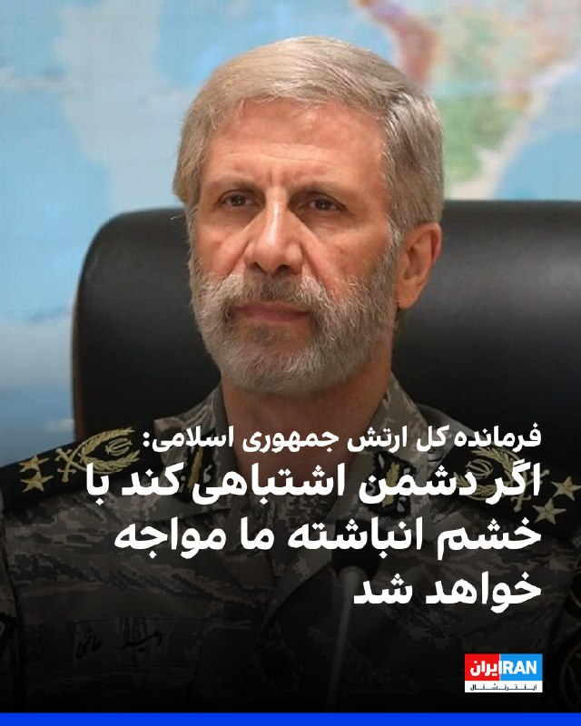

امیر حاتمی، فرمانده کل ارتش جمهوری اسلامی، سه‌شنبه ۲۶ خرداد در مراسمی در دانشگاه افسری «امام علی» با اشاره به حملات اخیر آمریکا و اسرائیل هشدار داد که هرگونه اقدام یا اشتباه جدید از سوی آمریکا و اسرائیل با واکنشی شدید مواجه خواهد شد.

او گفت: «اگر دشمن اشتباهی بکند با یک خشم انباشته مواجه خواهد شد که کار دشمن را بسیار بسیار سخت خواهد کرد.»
‌🏁 🇬🇧 IranintlTV

🤖 @VahidOOnLine

## VahidOOnLine — post 245824

♦️عباس عراقچی، وزیر امور خارجه جمهوری اسلامی روز سه‌شنبه گفت دور جدید مذاکرات با آمریکا از روز جمعه ۲۹ خرداد و پس از امضای رسمی «تفاهم‌نامه پایان جنگ» آغاز خواهد شد.

عراقچی که در نشستی با حضور نمایندگان دیپلماتیک کشورهای خارجی در تهران سخن می‌گفت، افزود: «یادداشت تفاهم بین ایران و آمریکا روز یکشنبه نهایی شد و به زودی امضای رسمی آن صورت خواهد گرفت، احتمالا روز جمعه و در محلی که مشخص خواهد شد. همزمان، دور جدید مذاکرات ایران و آمریکا برای رسیدن به توافق نهایی آغاز خواهد شد.»

همزمان، خبرگزاری تسنیم گزارش کرد که مراسم امضای تفاهم‌نامه در سوئیس برگزار خواهد شد. شهباز شریف، نخست وزیر پاکستان پیش از این گفته بود که این کشور میزبان این مراسم خواهد بود.
‌🇸🇦 Indypersian

🤖 @VahidOOnLine

## VahidOOnLine — post 245823

  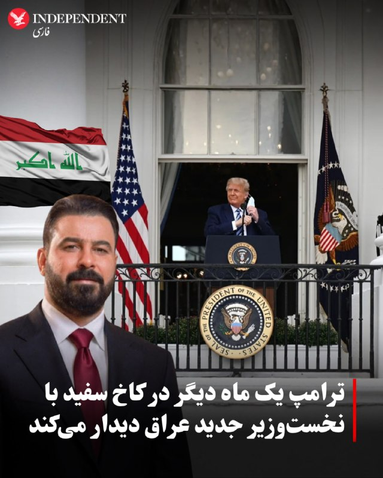

⭕️ترامپ یک ماه دیگر در کاخ سفید با نخست‌وزیر جدید عراق دیدار می‌کند

♦️دفتر نخست‌وزیر عراق و سفارت آمریکا در بغداد روز سه‌شنبه ۲۶ خرداد اعلام کردند که دونالد ترامپ، رئیس‌ جمهوری ایالات متحده، ماه آینده میزبان علی الزیدی، نخست‌وزیر عراق، در کاخ سفید خواهد بود.

به گزارش خبرگزاری فرانسه، دفتر نخست‌ وزیری عراق و تام باراک، فرستاده ویژه دونالد ترامپ در عراق در بیانیه‌ای مشترک اعلام کردند «باراک، فرستاده ویژه رئیس‌ جمهوری، ابراز امیدواری کرد که رئیس‌ جمهوری ترامپ در اواسط ماه ژوئیه از نخست‌وزیر الزیدی در کاخ سفید استقبال کند تا در مورد آینده این رابطه مهم گفتگو کنند.»

این خبر در جریان سفر تام باراک به بغداد، پایتخت عراق، منتشر می‌شود.
تام باراک در جریان این دیدار با نخست‌وزیر «فن‌سالار/تکنوکرات» عراق در مورد خلع سلاح و انحلال گروه‌های مسلح که خارج از اختیارات دولتی فعالیت می‌کنند، گفتگو کرد.
‌🇸🇦 Indypersian

🤖 @VahidOOnLine

## VahidOOnLine — post 245822

  

کارزار «سه‌شنبه‌های نه به اعدام» اعلام کرد زندانیان معترض به مجازات اعدام سه‌شنبه ۲۶ خرداد برای صدوبیست‌وپنجمین هفته در ۵۶ زندان ایران در اعتصاب غذا هستند. این کارزار اعلام کرد جمهوری اسلامی از ابتدای سال ۱۴۰۵ بیش از ۱۷۷ زندانی را اعدام کرده و صدور و اجرای احکام اعدام ادامه دارد.

این کارزار افزود علی فتاح، محمد نقی‌زاده، علی کمالی و پیمان گنجی، زندانیان سیاسی محکوم به اعدام، در زندان قزلحصار به‌سر می‌برند و هشدار داد این زندان یکی از مراکز اصلی اجرای احکام اعدام در استان تهران و از قتل‌گاه‌های حکومتی است و زندانیان محکوم به اعدام پس از انتقال به آن در معرض اعدام قرار می‌گیرند.

کارزار «سه‌شنبه‌های نه به اعدام» تاکید کرد که خواهان توقف سریع اعدام‌هاست و از همه «وجدان‌های بیدار» و فعالان سیاسی، حقوق بشری، مدنی و صنفی خواست به هر شکل ممکن اعدام‌ها را محکوم کنند و برای توقف آن دست به اقدامی جدی بزنند.

این کارزار اعلام کرد تحقق آزادی، برابری و حفظ کرامت انسانی بدون تحقق حق حیات ممکن نیست و از همه مخالفان اعدام خواست برای در هم شکستن ساختار استبدادی و چرخه سلب حیات انسانی، همبستگی و عمل متحدانه داشته باشند.
http
‌🏁 🇬🇧 IranintlTV

🤖 @VahidOOnLine

## VahidOOnLine — post 245821

  

علی نیکزاد، نایب‌رییس مجلس، در تجمعات شبانه در خصوص مواضع حکومت در مذاکرات و تعاملات بین‌المللی گفت: «جمهوری اسلامی هیچ‌گونه اعتمادی به آمریکا و اسرائیل ندارد و هرگونه تصمیم‌گیری در مسائل کلان کشور تحت هدایت مجتبی خامنه‌ای انجام خواهد شد.»
نایب‌رییس مجلس افزود: «آمریکا با محاسبات نادرست تصور می‌کرد می‌تواند جمهوری اسلامی را وادار به تسلیم کند، اما ملت ایران و نیروهای مسلح کشور این تصور را باطل کردند.»
‌🏁 🇬🇧 IranintlTV

🤖 @VahidOOnLine

## VahidOOnLine — post 245820

♦️خبرگزاری رویترز، شامگاه دوشنبه ۲۵ خرداد ویدیویی را از دود سیاه ناشی از سقوط بمب‌افکن بی-۵۲ ارتش آمریکا در پایگاه ادواردز در جنوب کالیفرنیا منتشر کرد.

مقامات نیروی هوایی ایالات متحده اعلام کردند که این بمب‌افکن صبح دوشنبه به‌وقت محلی هنگام برخاستن در پایگاه نیروی هوایی ادواردز در صحرای موهاوی در جنوب کالیفرنیا سقوط کرد و هر هشت خدمه آن کشته شدند. علت وقوع این حادثه هنوز اعلام نشده است.

 سرهنگ جیمز هیز، فرمانده نیروی هوایی، ساعاتی بعد در یک کنفرانس خبری گفت: «این هواپیمای هشت موتوره جت که برای حمل طیف وسیعی از بمب‌های هسته‌ای و متعارف ساخته شده بود، در حال انجام یک ماموریت آزمایشی معمول بود که درست پس از برخاستن از زمین، در باند فرودگاه ادواردز سقوط کرد.»

به گزارش رویترز، فرودگاه نظامی ادواردز، یک مرکز پرواز آزمایشی وسیع که در دهه ۱۹۳۰ در اطراف بستر یک دریاچه خشک تأسیس شد، حدود ۱۲۴۵ کیلومتر مربع از صحرای موهاوی را اشغال می‌کند و بزرگترین فرودگاه نیروی هوایی ارتش آمریکا به‌شمار می‌رود.
‌🇸🇦 Indypersian

🤖 @VahidOOnLine

## VahidOOnLine — post 245819

  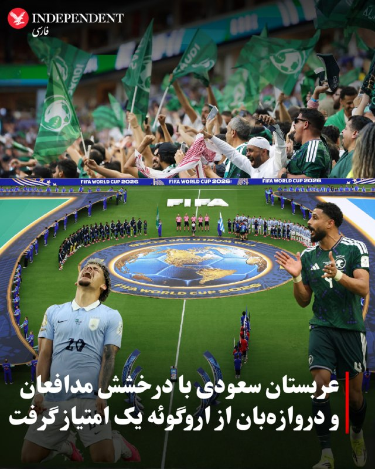

⭕️عربستان سعودی با درخشش مدافعان و دروازه‌بان از اروگوئه یک امتیاز گرفت

♦️تیم ملی فوتبال عربستان سعودی در نخستین دیدار خود در جام جهانی ۲۰۲۶ دوشنبه‌شب ۲۵ خرداد برابر اروگوئه به تساوی یک بر یک رسید و با کسب یک امتیاز ارزشمند، شروع امیدوارکننده‌ای در رقابت‌ها داشت.

سبزپوشان سعودی با گل عبدالله العمری در نیمه نخست از حریف پیش افتادند، اما اروگوئه در دقیقه ۸۰ توسط مکسی آرائوخو بازی را به تساوی کشاند. با این حال، محمد العویس، دروازه‌بان عربستان سعودی، با چندین مهار سرنوشت‌ساز به‌ویژه در دقایق پایانی، نقش کلیدی در حفظ این نتیجه ایفا کرد.

عربستان در گروه هشتم (H) جام جهانی ۲۰۲۶ با تیم‌های اروگوئه، اسپانیا و کیپ‌ورد هم‌گروه است. بسیاری این گروه را یکی از دشوارترین گروه‌های مسابقات می‌دانند و به همین دلیل کسب امتیاز برابر اروگوئه می‌تواند در ادامه مسیر صعود برای شاگردان جورجیوس دونیس اهمیت زیادی داشته باشد.
‌🇸🇦 Indypersian

🤖 @VahidOOnLine

## VahidOOnLine — post 245818

  <a href="telegram/content/VahidOOnLine_245818_1781603136.mp4" target="_blank">🎬 Download video</a>

ویدیوی رسیده نشان می‌دهد گروهی از ایرانیان در ونکوور کانادا، هنگام تماشای فوتبال ایران و نیوزیلند در جام‌جهانی، فریاد «جاوید شاه» سرمی‌دهند.
‌🏁 🇬🇧 IranintlTV

🤖 @VahidOOnLine

## VahidOOnLine — post 245817

  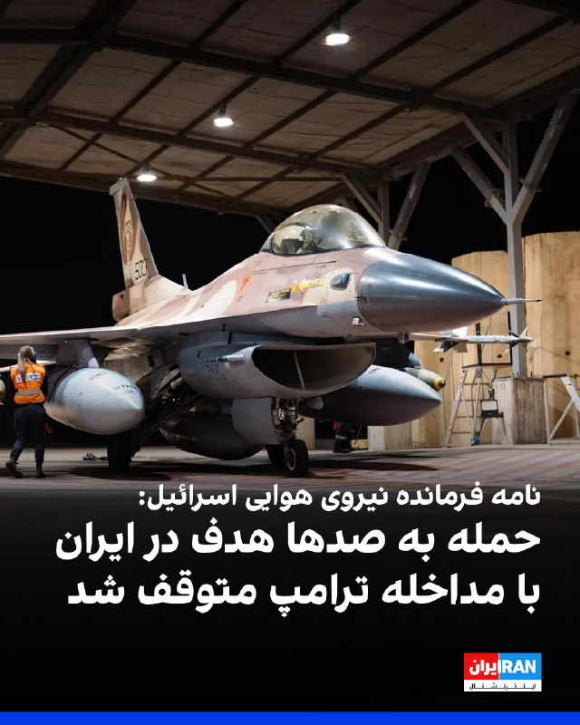

شبکه کان اسرائیل گزارش داد عمر تیشلر، فرمانده نیروی هوایی اسرائیل، در نامه‌ای به نیروهای این یگان نوشت حمله برنامه‌ریزی‌شده به «صدها هدف» در ایران که قرار بود هفته گذشته در جریان آخرین درگیری انجام شود، تنها یک ساعت پیش از آغاز عملیات و در پی مداخله دونالد ترامپ، رییس‌جمهوری آمریکا متوقف شد.

در این گزارش به نقل فرمانده نیروی هوایی اسرائیل آمده: «تمام نیروی هوایی برای یک حمله گسترده آماده بود. تنها چند ساعت تا صدور دستور پرواز و حمله به صدها هدف در قلب ایران فاصله داشتیم، اما عملیات هنگام جلسات توجیهی اسکادران‌ها متوقف شد.»

فرمانده نیروی هوایی اسرائیل همچنین با اشاره به حملات اخیر اسرائیل به جمهوری اسلامی در این نامه نوشت: «هنوز برای ارزیابی تاثیر تحولات جهانی بر واقعیت امنیتی زود است.»

او در ادامه افزود: «ما به رهبری ایران، سامانه‌های دفاعی و تهاجمی، بخش‌های مرتبط با برنامه هسته‌ای، اقتصاد، زنجیره فرماندهی و دانش فنی، صنایع نظامی و ملی ضربات سنگینی وارد کردیم؛ به گونه‌ای که تهدید را به شکل قابل توجهی کاهش دادیم، روند بازسازی را طولانی‌تر کردیم و توانایی بازگشت و اقدام دوباره در ایران را حفظ کردیم.»
https
‌🏁 🇬🇧 IranintlTV

🤖 @VahidOOnLine

## VahidOOnLine — post 245816

  <a href="telegram/content/VahidOOnLine_245816_1781603138.mp4" target="_blank">🎬 Download video</a>

♦️تیم ملی فوتبال ایران صبح سه‌شنبه در جریان اولین بازی خود در جام جهانی ۲۰۲۶ مقابل نیوزیلند در ورزشگاه «سوفای» لس‌آنجلس به تساوی ۲ بر ۲ رضایت داد.

تعداد زیادی از ایرانیان با برافراشتن پرچم‌های ملی شیروخورشید نشان، ممنوعیت‌های صریح فیفا را به چالش کشیدند.
این اقدام در حالی صورت گرفت که فیفا پیش‌تر در مصوبه‌ای، حمل هرگونه پارچه‌نوشته، پرچم و پوشاک با ماهیت سیاسی را ممنوع کرده بود و ماموران امنیتی ورزشگاه نیز در بدو ورود از برخی تماشاگران خواسته بودند لباس‌های خود را پشت‌ورو کنند. با این حال، جو درون استادیوم کاملا تحت تاثیر نمادهای ملی ایران قرار گرفت و تعدادی از هواداران هنگام پخش سرود جمهوری اسلامی به نشان اعتراض به زمین مسابقه پشت کردند.

بازیکنان تیم فوتبال ایران روز یکشنبه ۳۱ خرداد برابر بلژیک صف‌آرایی خواهند کرد.
‌🇸🇦 Indypersian

🤖 @VahidOOnLine

## VahidOOnLine — post 245815

بر اساس ویدیوهای رسیده به ایران‌اینترنشنال، هنگام نمایش پرچم جمهوری اسلامی قبل از بازی تیم‌های فوتبال ایران و نیوزیلند در ورزشگاه سوفای لس‌آنجلس،‌ ایرانیان حاضر در ورزشگاه این پرچم را هو کردند. عده‌ای از حامیان جمهوری اسلامی هم در این ورزشگاه حاضر بودند که پرچم رژیم را تشویق کردند.
‌🏁 🇬🇧 IranintlTV

🤖 @VahidOOnLine

## WithYashar — post 15042

ویس میلیارد دلاری ۲💰
@withyashar

## WithYashar — post 15041

ویس میلیارد دلاری 💰
@withyashar

## WithYashar — post 15040

Voice message

## WithYashar — post 15039

## WithYashar — post 15038

  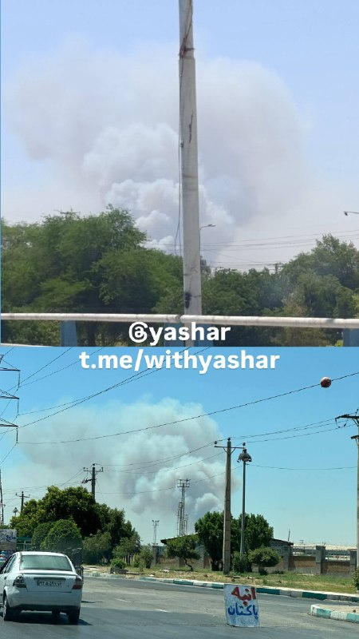

کمی پیش اهواز چیزی نیست کباب‌میزنند
@withyashar

## WithYashar — post 15037

Voice message

## WithYashar — post 15036

ارسالی

## WithYashar — post 15035

## WithYashar — post 15034

چپقچی: در سوییس پس از اینکه مسئله امضا ( تفاهمنامه پاکستان) انجام شد، مذاکرات شروع خواهد.
@withyashar

## WithYashar — post 15033

  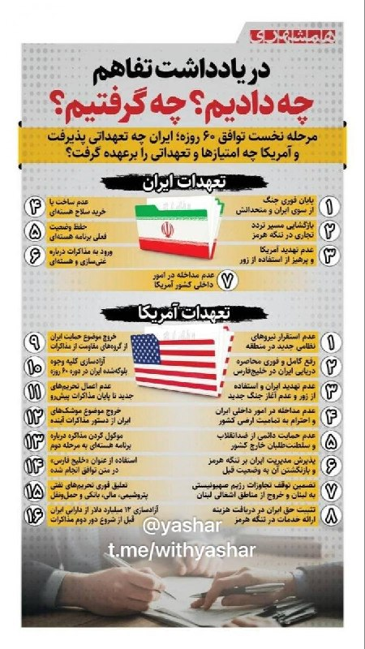

ادعای روزنامه همشهری از متن و مفاد توافق
@withyashar

## WithYashar — post 15032

عراقچی: هرگونه حمله نظامی اسرائیل به لبنان ، نقض یادداشت تفاهم محسوب می‌شود
@withyashar

## WithYashar — post 15031

کیهان: معنای سکوت رهبری درباره هسته‌ای این است که دیگر مذاکره‌ای در کار نیست
@withyashar
روزنامه کیهان وابسته به اصولگرایان تندرو نزدیک به بیت رهبری است و مدیر مسئول آن مستقیماً توسط علی خامنه‌ای انتخاب شده .

## WithYashar — post 15030

  <a href="telegram/content/WithYashar_15030_1781603141.mp4" target="_blank">🎬 Download video</a>

محبی بعد از زدن گل دوم، با نشان دادن اسلحه و شلیک نمادین به تماشاگران نشون داد این تیم مزدوران حکومتیه نه مردم ایران

این نفهمی او واکنشمنفی‌ در‌
رسانه های جهان داشته
@withyashar

## WithYashar — post 15029

دونالد ترامپ در گفتگو با CBS در واکنش به سفر کاروان تیم فوتبال ایران به آمریکا گفت:

"افتخار میزبانی کاروان تیم فوتبال ایران را داریم. آنها تیمی بزرگ هستند.
به قلعه نوعی گفتم اگر اینجا جایی نداری شب بمانی به منزل ما بیا. شاید قبول کرد. شاید هم نکرد. باید ببینیم چه می‌شود"
@withyashar. 😂 شوخیه

## WithYashar — post 15028

ویزای مهدی ترابی باطل شد

در حالی که برای بازیکنان تیم ملی برای سفر به آمریکا روادید «چند بار ورود» صادر شده است اما ویزای مهدی ترابی تنها برای یک بار ورود اعتبار داشت و پس از سفر تیم ملی به لس آنجلس جهت دیدار برابر نیوزیلند و پایان این بازی، اکنون ویزای این بازیکن منقضی شده است.
فدراسیون فوتبال ایران برای اخذ مجدد ویزای ترابی اقدام کرده تا این بازیکن بتواند در دیدارهای آتی تیم ملی را همراهی کند.
@withyashar

## WithYashar — post 15027

یک بمب‌افکن B-52 استراتوفورتراس نیروی هوایی ایالات متحده بلافاصله پس از برخاستن در پایگاه نیروی هوایی ادواردز سقوط کرد. جزئیات تلفات هنوز گزارش نشده است. @withyashar

## WithYashar — post 15026

ونس: ترامپ ممکن است که پیش از روز جمعه، جزئیات توافق با ایران را فاش کند
جی‌دی ونس، معاون رئیس‌جمهور آمریکا اظهار داشت که رئیس‌جمهور دونالد ترامپ ممکن است تصمیم بگیرد پیش از روز جمعه جزئیات توافق با ایران را منتشر کند
@withyashar

## WithYashar — post 15025

امکان پلاک‌گذاری خودروهای بالای ۲۵۰۰ سی‌سی در مناطق آزاد فراهم شد

معاونت حقوقی ریاست‌جمهوری در نامه‌ای به دبیر شورای عالی مناطق آزاد از امکان شماره‌گذاری ملی خودروهای وارداتی بالای ۲۵۰۰ سی‌سی موجود از قبل در این مناطق خبر داد.
@withyashar

## WithYashar — post 15024

  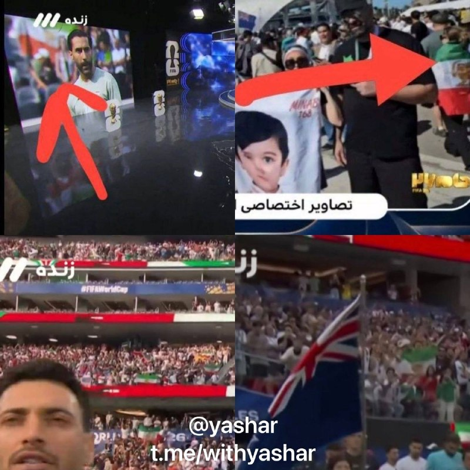

چندین بار در جریان بازی مسابقه امروز تیم نیوزلند و تیم ملی در صدا و سیما پرچم شیر و خورشید به نمایش درآمد.

کارگردان فیفا تا حد ممکن در حال سانسور صدا و تصویر (شامل هو کردن و پرچم شیر و خورشید) بود. از طرفی تعدادی از پرچم‌ها هم با نزدیک شدن به پایان بازی توسط نیروهای امنیتی جمع‌‌آوری شدند.
@withyashar

## WithYashar — post 15023

  <a href="telegram/content/WithYashar_15023_1781603143.mp4" target="_blank">🎬 Download video</a>

7’—Iran 0-1 New Zealand
32’—Iran 1-1 New Zealand
54’—Iran 1-2 New Zealand
64’—Iran 2-2 New Zealand
گلهای بازی و تساوی ۲-۲
@withyashar

## mwarmonitor — post 11015

  <a href="telegram/content/mwarmonitor_11015_1781603145.mp4" target="_blank">🎬 Download video</a>

Thousands of Iranian Lion and Sun flags were held up by Iranian Pahlavi-supporters during yesterday’s game between Iran and New Zealand in Los Angeles.

The fans had to smuggle in the flags as FIFA had banned them

🇮🇷

Subscribe Visegrád24

## mwarmonitor — post 11014

🔴روزنامه هاآرتص گزارش می‌دهد که یادداشت تفاهم (MOU) میان ایالات متحده و ایران شامل بندی جداگانه درباره لبنان است که بنا بر یک منبع پاکستانی، عملاً به اسرائیل اجازه می‌دهد به عملیات نظامی خود در آنجا ادامه دهد.

📌این منبع گفته است: «در این توافق، همه طرف‌ها چیزی به دست می‌آورند و سهم اسرائیل همین است.»

📌یک منبع دوم نیز گفته این بند «به‌طور بسیار مبهمی تنظیم شده»، اما تأیید کرده که اسرائیل آن را به‌منزله اجازه برای ادامه درگیری‌ها در لبنان تفسیر می‌کند.

@mwarmonitor

## mwarmonitor — post 11013

  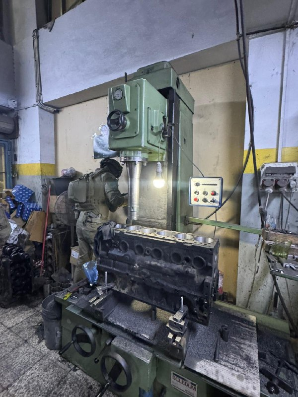

⭕️ شناسایی و منهدم شد: ماشین‌آلات تولید سلاح که برای ساخت جنگ‌افزار و مواد انفجاری به کار می‌رفت و در قلب یک منطقه غیرنظامی در نابلس کشف شده بود.

🔸در مجموع ۱۸ دستگاه ماشین‌آلات تولید سلاح منهدم شد. همچنین قطعات سلاح شناسایی و توقیف گردید.

@mwarmonitor

## mwarmonitor — post 11012

  <a href="telegram/content/mwarmonitor_11012_1781603147.mp4" target="_blank">🎬 Download video</a>

🔴زلینسکی ؛ این بار، منطقه مسکو برد توانمندی‌های دوربرد اوکراین را احساس کرد. یک پالایشگاه نفت در فاصله ۵۰۰ کیلومتری هدف قرار گرفت. من از رزمندگان سرویس امنیتی اوکراین، نیروهای سامانه‌های بدون سرنشین، نیروهای عملیات ویژه، اطلاعات دفاعی اوکراین و نیروهای موشکی بابت عملکرد مؤثرشان تشکر می‌کنم.

🔸روسیه باید وادار شود به جنگ خود علیه مردم ما پایان دهد. و سلاح‌های دوربرد اوکراین یکی از مؤلفه‌های مهم چنین فشاری هستند.

🔸این پاسخی عادلانه به حملات روسیه است — و به طولانی‌کردن جنگی که باید پایان یابد.

زنده باد اوکراین!

@mwarmonitor

## mwarmonitor — post 11011

آن‌ها دیده‌اند که رئیس‌جمهور جدی است. دوم , دیده‌اند که او تمایل دارد آن اهرم فشار را اعمال کند و در واقع کاری را که لازم است انجام دهد تا ایرانی‌ها را مجبور کند پای میز مذاکره بیایند. و شماره سه شان ، این موضوع مهمیه و کمتر بهش پرداخته شده؛ اقتصاد آن‌ها برای…

## mwarmonitor — post 11010

نسل‌های قبلی رهبری ایران تا حد زیادی به خاطر اتفاقاتی که در چند ماه گذشته رخ داده، از بین رفته‌اند. اما موضوع جالب دیگری هم وجود دارد، شان. تو در مورد تندروها و میانه‌روها صحبت می‌کنی؛ چیزی که برای من در مورد سیستم آن‌ها شگفت‌انگیز است، این است که ما حتی افرادی…

## mwarmonitor — post 11009

🔹شان هنیتی «بگذارید به این موضوع بپردازم، چون این مهم‌ترین چیز است و رئیس‌جمهور بیشترین ثبات و قاطعیت را روی این نکته داشته است؛ و آن این است که آن‌ها [ایران] نمی‌توانند و هرگز نباید سلاح هسته‌ای داشته باشند.» 🔸جی‌دی ونس «درسته.» 🔹شان هنیتی «ما چطور می‌توانیم…

## mwarmonitor — post 11008

چیزی که توافق به صراحت می‌گوید، شان، این است که باز هم اگر ایرانی‌ها درست رفتار کنند، و اگر کاهش تحریم‌ها صورت بگیرد، و اگر ایرانی‌ها با اقتصاد جهانی ادغام شوند، ما از کشورهای دیگر دعوت خواهیم کرد – نه خودمان، بلکه دیگر کشورها – تا در کشور آن‌ها سرمایه‌گذاری…

## mwarmonitor — post 11007

🔸جی. دی. ونس: نه، این‌طور نیست. من اطلاعات نادرست زیادی رو اون بیرون دیدم؛ مثلاً دیدم که می‌گن ۲۴ میلیارد دلار قراره از ایالات متحده به ایران بره، این رقم کاملاً دروغه و از خودشون درآوردن. شان، چیزی که باید در مورد ماهیت اصلی این توافق درک کنی اینه که: اولاً،…

## mwarmonitor — post 11006

🔹شان هنیتی: به برنامه «هنیتی» خوش آمدید. امشب را با این هشدار خبری فاکس نیوز آغاز می‌کنیم. تا لحظاتی دیگر، معاون رئیس‌جمهور کشورمان، «جی‌دی ونس» در استودیو به ما خواهد پیوست؛ از حضور شما بسیار خرسندیم. هیچ موضوعی محدودیت ندارد، از جمله توافق صلح تاریخی با…

## mwarmonitor — post 11005

🔹شان هنیتی: به برنامه «هنیتی» خوش آمدید. امشب را با این هشدار خبری فاکس نیوز آغاز می‌کنیم. تا لحظاتی دیگر، معاون رئیس‌جمهور کشورمان، «جی‌دی ونس» در استودیو به ما خواهد پیوست؛ از حضور شما بسیار خرسندیم. هیچ موضوعی محدودیت ندارد، از جمله توافق صلح تاریخی با ایران که برخلاف پیش‌بینی‌ها، به سرانجام رسید؛ توافقی که بخشی از موفقیت آن مدیون تلاش‌های معاون رئیس‌جمهور است. ما همچنین درباره سفر جاری رئیس‌جمهور برای نشست جی۷ (G7) گفتگو خواهیم کرد.
نظر معاون رئیس‌جمهور درباره «گراهام پلاتنر»، «جیمز تالاریکو» و دیگر دموکرات‌های رادیکال که در انتخابات میان‌دوره شرکت می‌کنند چیست؟ درباره سال ۲۰۲۸ چطور؟ و آیا معاون رئیس‌جمهور امشب همین‌جا این موضوع را رسمی خواهد کرد و نامزدی خود را اعلام می‌کند؟ همان‌طور که می‌بینید موضوعات زیادی برای پوشش دادن وجود دارد. و چرا او در برنامه «The View» حضور می‌یابد؟ این گفتگو شامل اولین کتاب معاون رئیس‌جمهور پس از اثر مشهور جهانی‌اش «مرثیه هیل‌بیلی» نیز می‌شود که «اتحاد: یافتن مسیر بازگشت به ایمان» نام دارد. این کتاب از فردا به طور رسمی در آمازون، وب‌سایت هنیتی و کتاب‌فروشی‌های سراسر کشور در دسترس خواهد بود.
و بدون معطلی، آقای معاون رئیس‌جمهور، حال شما چطور است؟
🔸جی‌دی ونس: سلام شان، از دیدنت خوشحالم. خوبم، شما چطوری؟
🔹شان هنیتی: از دیدنت خوشحالم. من معمولاً شما را حضوری زیاد نمی‌بینم.
🔸جی‌دی ونس: بله، از دیدنت خوشحالم.
🔹شان هنیتی: بسیار خب، پس شما اکنون... شما این زندگی را از منطقه «آپالاشیا» آغاز کردید با یک دوران تربیت بسیار سخت و در فقر شدید. دوران سختی بود؛ آزار و اذیت در خانه، مادری که با اعتیاد دست‌وپنجه نرم می‌کرد و یک مادربزرگ بسیار متدین. اکنون شما در سن ۴۱ سالگی معاون رئیس‌جمهور هستید و در حال مذاکره برای چیزی هستید که ممکن است مسیر صلح در خاورمیانه باشد، آن هم برای اولین بار پس از نمی‌دانم چند هزار سال. زندگی بدی نبوده است.
🔸جی‌دی ونس: اصلاً زندگی بدی نبوده مرد، این اتفاقات فقط در آمریکا ممکن است. و فکر می‌کنم اگر کسی زندگی‌ای مثل من داشته باشد، باید قدردانی فوق‌العاده‌ای نسبت به این کشور داشته باشد؛ و بهترین راه برای نشان دادن این قدردانی این است که تلاش کند وظایفش را به بهترین شکل ممکنِ انسانی انجام دهد. این همان چیزی است که اساساً در کتاب درباره‌اش نوشته‌ام؛ این حس که می‌دانید، زندگی من بسیار پربرکت بوده است. از برخی جهات امور با سختی همراه بوده‌اند، اما از بسیاری جهات دیگر، من بسیار خوش‌شانس بوده‌ام و این احساس وجود دارد که خدا همیشه مراقب من بوده است. حتی زمانی که از مسیر منحرف شدم، حتی زمانی که خودم را ملحد می‌نامیدم، آن ایمانی که مادربزرگم به نوعی در وجودم نهادینه کرده بود، همیشه آنجا در پس‌زمینه حضور داشت. و البته این بخش مهمی از روشی است که امروز به وظایفم عمل می‌کنم، اما فراتر از آن، بخش مهمی از هویت من است و اساساً هر چیز دیگری را در وجودم روشن و هدایت می‌کند. امیدوارم مردم کتاب را بخرند و کمی درباره من و سفر ایمانی من یاد بگیرند و شاید این برایشان مفید باشد.
🔹شان هنیتی: خب، در ادامه با جزئیات بیشتر به آن خواهیم پرداخت. بسیار خب، بیایید درباره توافق ایران صحبت کنیم.
🔸جی‌دی ونس: حتماً.
🔹شان هنیتی: چیزی که من را درباره ایرانی‌ها کلافه می‌کند این است که دونالد ترامپ حرفی می‌زند و بعد کسی، یا بخشی از آن حکومت، بیرون می‌آید و اظهارات رئیس‌جمهور را تکذیب می‌کند.
🔸جی‌دی ونس: بله.
🔹شان هنیتی: و آن‌ها با یک به اصطلاح «یادداشت تفاهم» جلو آمدند، یعنی همان چیزی که امضا شد؛ امضای رسمی روز جمعه در ژنو انجام شد و این یادداشت، بسیاری از حرف‌های رئیس‌جمهور را نقض می‌کرد. آیا هیچ‌کدام از این‌ها واقعیت دارد؟

@mwarmonitor

## mwarmonitor — post 11004

## FoxNewsTwitter — post 343008

  <a href="telegram/content/FoxNewsTwitter_343008_1781603149.mp4" target="_blank">🎬 Download video</a>

Fox News (Twitter/X)

"They get no rewards until they comply."

Robert Greenway, architect of the Abraham Accords, breaks down the implications of Trump's deal with Iran with @JesseBWatters. https://twitter.com/JesseBWatters/status/2066681754505683077#m

## FoxNewsTwitter — post 343007

  <a href="telegram/content/FoxNewsTwitter_343007_1781603150.mp4" target="_blank">🎬 Download video</a>

Fox News (Twitter/X)

"[Trump] doesn't wear it on his sleeve, but he is a person of faith."

Vice President Vance tells @seanhannity that President Trump recognizes that many of the people who helped him get to the White House are Christians, deepening his connection to the faith.

## FoxNewsTwitter — post 343006

  <a href="telegram/content/FoxNewsTwitter_343006_1781603152.mp4" target="_blank">🎬 Download video</a>

Fox News (Twitter/X)

"When you believe something ... then of course you want the people that you love to share that perspective as well."

VP JD Vance tells @seanhannity he hopes Second Lady Usha Vance, who is Hindu, will one day convert to Christianity.

Vance said faith is deeply important to him, but emphasized that religious belief is ultimately a personal decision.

The vice president's comments offered a glimpse into how he and his wife navigate their interfaith marriage.

## FoxNewsTwitter — post 343005

  <a href="telegram/content/FoxNewsTwitter_343005_1781603154.mp4" target="_blank">🎬 Download video</a>

Fox News (Twitter/X)

Vice President JD Vance tells @seanhannity how the US will work to guarantee that Iran never has a nuclear weapon.

"They're agreeing right now to eliminate the enriched stockpile. And if they don't get to a point where they agree to stop enriching, then they don't get the other benefits of the bargain."

## FoxNewsTwitter — post 343004

  <a href="telegram/content/FoxNewsTwitter_343004_1781603155.mp4" target="_blank">🎬 Download video</a>

Fox News (Twitter/X)

"The Gulf Arabs hated the Obama deal."

Vice President JD Vance tells @seanhannity why he believes the new Iran agreement will succeed where previous deals failed.

Vance says regional allies support the framework and that the administration has built in safeguards to verify compliance, prevent nuclear weapons development, and maintain stability in the Middle East.

## FoxNewsTwitter — post 343003

  <a href="telegram/content/FoxNewsTwitter_343003_1781603157.mp4" target="_blank">🎬 Download video</a>

Fox News (Twitter/X)

"It's written right there in the agreement, Sean."

Vice President JD Vance joins @seanhannity to discuss the Trump administration's newly announced Iran agreement and what it could mean for the Middle East, global energy markets, and U.S. national security.

The deal includes provisions tied to reopening the Strait of Hormuz and ensures Iran will never build a nuclear weapon, according to administration officials.

## pm_afshaa — post 94176

🔴خبرگزاری میزان، رسانه قوه قضاییه جمهوری اسلامی، سه‌شنبه 26 خرداد از اجرای حکم اعدام جواد زمانی و ابوالفضل ساعدی، دو زندانی سیاسی بازداشت‌شده در اعتراضات دی‌ماه در استان سمنان خبر داد. میزان اتهام آن‌ها را «افساد فی‌الارض از طریق کشیدن سلاح گرم و سرد در شهرستان شاهرود» اعلام کرد

💧 Rainbet.com the #1 Non-KYC Crypto Casino & Sportsbook @rainbetcom

😁 @Pm_Afshaa

## pm_afshaa — post 94175

قالیباف، در مراسم امضای توافقنامه موقت برای پایان دادن به جنگ با آمریکا شرکت خواهد کرد

💧 Rainbet.com the #1 Non-KYC Crypto Casino & Sportsbook @rainbetcom

😁 @Pm_Afshaa

## pm_afshaa — post 94174

عراقچی: آتش‌بس در لبنان از جمعه آغاز می‌شود

💧 Rainbet.com the #1 Non-KYC Crypto Casino & Sportsbook @rainbetcom

😁 @Pm_Afshaa

## pm_afshaa — post 94173

دونالد ترامپ اعلام کرد تنگه بیرانوند بازه و عبور مرور در آن آزاد

💧 Rainbet.com the #1 Non-KYC Crypto Casino & Sportsbook @rainbetcom

😁 @Pm_Afshaa

## pm_afshaa — post 94172

  <a href="telegram/content/pm_afshaa_94172_1781603158.mp4" target="_blank">🎬 Download video</a>

درگیری هموطنان با مزدوران ج.ا در ورزشگاه

💧 Rainbet.com the #1 Non-KYC Crypto Casino & Sportsbook @rainbetcom

😁 @Pm_Afshaa

## pm_afshaa — post 94171

دیروز پشمای کل رسانه های جهان وقتی تیم مزدوران جمهوری اسلامی گل میخورد و طرفداری ایرانی خوشحالی میکردن ریخته

## pm_afshaa — post 94170

ویزای خایه مال اعظم ترابی باطل شد

💧 Rainbet.com the #1 Non-KYC Crypto Casino & Sportsbook @rainbetcom

😁 @Pm_Afshaa

## pm_afshaa — post 94169

با ضعیف ترین تیم جام جهانی با کصکشی مساوی کردن تو کونشونم عروسیه

## pm_afshaa — post 94168

محبی بعد از زدن گل دوم، با نشان دادن اسلحه و شلیک نمادین به تماشاگران نشون داد این تیم مزدوران حکومتیه نه مردم ایران فیفا باید سریع ورود کنه این حرومزاده تروریست رو دیپورت کنه و ننشو بگاد 
💧 Rainbet.com the #1 Non-KYC Crypto Casino & Sportsbook @rainbetcom…

## pm_afshaa — post 94167

  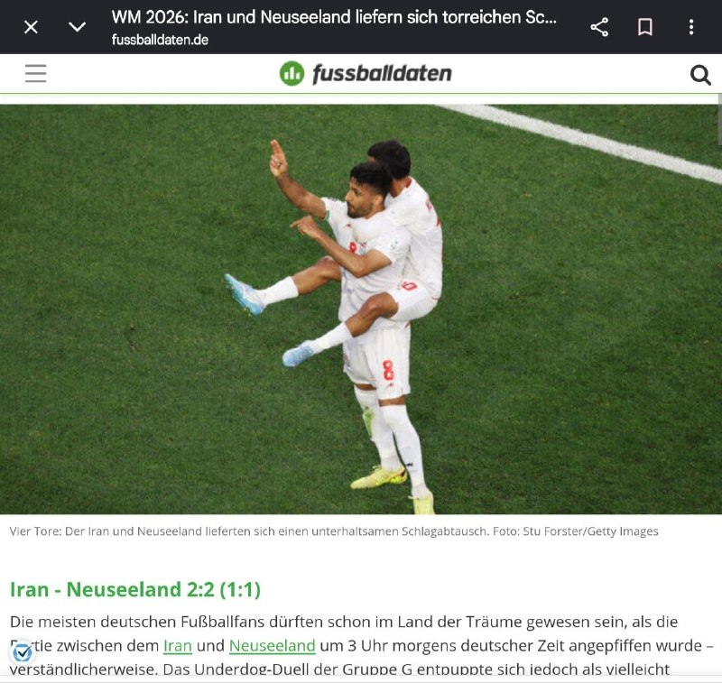

محبی بعد از زدن گل دوم، با نشان دادن اسلحه و شلیک نمادین به تماشاگران نشون داد این تیم مزدوران حکومتیه نه مردم ایران

فیفا باید سریع ورود کنه این حرومزاده تروریست رو دیپورت کنه و ننشو بگاد

💧 Rainbet.com the #1 Non-KYC Crypto Casino & Sportsbook @rainbetcom

😁 @Pm_Afshaa

## pm_afshaa — post 94166

ترامپ:ایران موافقت کرده که هرگز سلاح هسته‌ای در اختیار نداشته باشه

💧 Rainbet.com the #1 Non-KYC Crypto Casino & Sportsbook @rainbetcom

😁 @Pm_Afshaa

## pm_afshaa — post 94165

جوری که بیرانوند تنگه رو بسته بود زاویه بسته وارد تنگه شدن و جر دادن

## pm_afshaa — post 94164

تا دیر نشده باید صعود ایران از گروه در جام جهانی رو به عنوان یه بند به تفاهم‌نامه اضافه کرد🤣🤣

## pm_afshaa — post 94163

  <a href="telegram/content/pm_afshaa_94163_1781603161.mp4" target="_blank">🎬 Download video</a>

میثاقی از دیدن پرچم شیر و خورشید تو ورزشگاه فشاری شده داره کونش میسوزه🤣🤣

💧 Rainbet.com the #1 Non-KYC Crypto Casino & Sportsbook @rainbetcom

😁 @Pm_Afshaa

## pm_afshaa — post 94162

خبرگزاری CNN : در پی سقوط بی‌52 تو کالیفرنیا، هشت نیروی حاضر تو این بمب‌افکن کشته شدن

💧 Rainbet.com the #1 Non-KYC Crypto Casino & Sportsbook @rainbetcom

😁 @Pm_Afshaa

## pm_afshaa — post 94161

  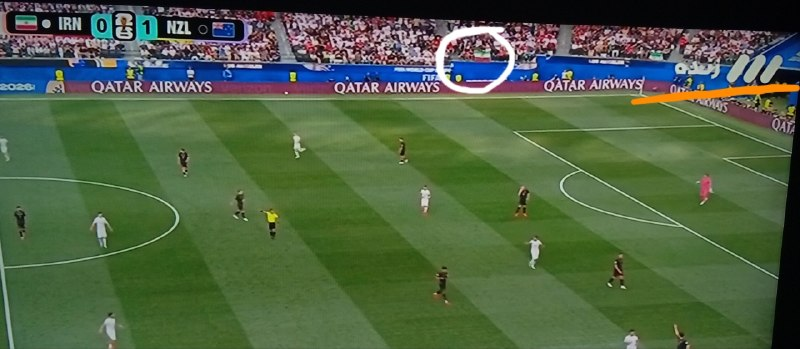

سانسورچی شبکه 3 با کلی سانسور باز هم پرچم شیر و خورشید رو نتونستن سانسور کنن

💧 Rainbet.com the #1 Non-KYC Crypto Casino & Sportsbook @rainbetcom

😁 @Pm_Afshaa

## pm_afshaa — post 94159

  <a href="telegram/content/pm_afshaa_94159_1781603163.mp4" target="_blank">🎬 Download video</a>

استقبال گرم هم میهنان از بیرانوند در بازی امروز

💧 Rainbet.com the #1 Non-KYC Crypto Casino & Sportsbook @rainbetcom

😁 @Pm_Afshaa

## pm_afshaa — post 94157

  <a href="telegram/content/pm_afshaa_94157_1781603165.mp4" target="_blank">🎬 Download video</a>

هو کردن سرود جمهوری اسلامی توسط هم میهنان

💧 Rainbet.com the #1 Non-KYC Crypto Casino & Sportsbook @rainbetcom

😁 @Pm_Afshaa

## iaghapour — post 2677

⭕️ دسترسی مستقیم و بدون واسطه به اینترنت آزاد

🔹کافی است آدرس subscription را در برنامه v2rayN/v2rayNG وارد کنید:

https://raw.githubusercontent.com/patterniha/Serverless-for-Iran/refs/heads/main/Subscription/Serverless-for-Iran.json

— نکات استفاده👇🏻
۱. کانفیگ سرورلس برای اجرا نیاز به هسته Xray-core حداقل ورژن 26.6.1 دارد (حداقل v2rayNG v2.2.3)

۲. سرویسها و سایتهایی که ip آنها به طور کلی از سمت ایران بلاک شده با این روش مستقیم قابل دستیابی نیستند، همچنین از آنجایی که سرویسهای خارجی ip ایران را مشاهده میکنند، سرویسها و سایتهایی که ایران را تحریم کرده اند نیز با این روش مستقیم قابل دستیابی نیستند.

۳. در تنظیمات v2rayNG دقت کنید که Enable Hev TUN FEATURE فعال باشد و همچنین پورت پیشفرض 10808 را تغییر نداده باشید.

۴. از آپدیت بودن فایلهای جئو مطمئن شوید (قسمت Asset files در برنامه v2rayNG و قسمت Help-Check Update در برنامه v2rayN)

۵. برای تجربه بهتر پیشنهاد میشود IPv6 خود را فعال کنید (در تنظیمات v2rayNG تیک Enable IPv6 را بزنید و همچنین در صورتی که از اینترنت همراه استفاده میکنید باید IPv6 را در قسمت Access-Point گوشی خود فعال کنید)

۶. در اندروید برای عدم تداخل با (dns و sniffing) کانفیگ بهتر است Private DNS در تنظیمات اندروید و Use secure DNS در تنظیمات کروم خاموش باشد.

۷. از کانفیگها تست نگیرید، نتیجه‌ی تست ارتباطی با کار کردن یا کار نکردن این نوع کانفیگها ندارد.

⚠️ برای کارهای حساس از این روش استفاده نکنید!

🔗 اطلاعات بیشتر در گیت‌هاب پروژه

🆔 @iAghapour

## DEJradio — post 5728

  <a href="telegram/content/DEJradio_5728_1781603166.mp4" target="_blank">🎬 Download video</a>

🔺📢 دستور توقف حمله؛ ادامه روند استقرار بمب‌افکن‌ها در بریتانیا

*یوسف ریاضی‌پور، پژوهشگر نظامی

#جنگ #جمهوری_اسلامی #حمله_نظامی
@DEJradio

## DEJradio — post 5727

  <a href="telegram/content/DEJradio_5727_1781603168.mp4" target="_blank">🎬 Download video</a>

🔺🎥 بر اساس ویدیویی که در شبکه‌های اجتماعی منتشر شده، یکی از هواداران جمهوری اسلامی در استادیوم «سوفای» لس‌آنجلس پس از توهین به هم‌میهنان تنبیه شد.

#فوتبال #جمهوری_اسلامی #جام_جهانی
@DEJradio

## DEJradio — post 5726

  <a href="telegram/content/DEJradio_5726_1781603170.webm" target="_blank">🎬 Download video</a>

🔺📢 یک شهروند در پیامی خطاب به بازیکنان تیم‌ فوتبال جمهوری اسلامی گفت: «خاک بر سرتون، مردم رو فروختید، حریف نیوزلندم نشدید.»

#فوتبال #تیم_ملی #جام_جهانی
@DEJradio

## DEJradio — post 5725

  <a href="telegram/content/DEJradio_5725_1781603170.webm" target="_blank">🎬 Download video</a>

🚨📢 عباس عراقچی وزیر خارجه جمهوری اسلامی، در نشستی با سفرا و کارداران خارجی در تهران، گفت: «یادداشت تفاهم تهران و واشنگتن یکشنبه نهایی شد و امضای رسمی آن به‌زودی، احتمالا جمعه و در محلی که مشخص خواهد شد، انجام می‌شود.»

او اعلام کرد: «مذاکرات به دو مرحله تقسیم شده است؛ در مرحله نخست موضوع خاتمه جنگ، تنگه هرمز، محاصره دریایی، آزادسازی وجوه مسدودشده و بازسازی مطرح می‌شود و مرحله دوم طی ۶۰ روز به موضوعات هسته‌ای و لغو تحریم‌ها اختصاص دارد.»
وزیر خارجه جمهوری اسلامی افزود، همزمان دور جدید مذاکرات برای رسیدن به «توافق نهایی» آغاز خواهد شد.
عباس عراقچی با تاکید بر اینکه جمهوری اسلامی و حزب‌الله یک طرف تفاهم‌نامه و آمریکا و اسرائیل طرف دیگر آن هستند گفت: «خاتمه جنگ در لبنان، بخش جدایی‌ناپذیر خاتمه کامل جنگ است و هرگونه حمله نظامی اسرائیل به لبنان و ادامه اشغال، نقض یادداشت تفاهم محسوب می‌شود.»

#جنگ #عراقچی #توافق
@DEJradio

## DEJradio — post 5724

  <a href="telegram/content/DEJradio_5724_1781603170.mp4" target="_blank">🎬 Download video</a>

🔺🎥 ارتشی‌ها در خیابان پوسترهای اعتراضی نصب کردند. آنها می‌گویند ارتشی آه ندارد که با ناله سودا کند در صورتیکه پول‌ها صرف سپاه پاسداران و سرداران فاسد می‌شود.

#ارتش #تورم
@DEJradio

## DEJradio — post 5723

  <a href="telegram/content/DEJradio_5723_1781603172.mp4" target="_blank">🎬 Download video</a>

🔺🎥 کسبه به دلیل کرایه و مالیات‌های سنگین، مغازه‌ها را تخلیه کردند و مجبور به دستفروشی شده‌اند. آنها می‌گویند قدرت خرید مردم بسیار کم شده و در ایام جنگ و بعد از آن حتی خرج پول برق و دستمزد فروشنده نیز در نیامده است.

#تورم #مالیات
@DEJradio

## DEJradio — post 5722

  <a href="telegram/content/DEJradio_5722_1781603174.webm" target="_blank">🎬 Download video</a>

🔺📢 “از اصفهان پیام میدم، اونایی که تو استادیوم لس‌آنجلس بودید دمتون گرم، پرچمتون بالاست، ما جز هم کسی رو نداریم، مخلص تک تک ایرانیا بجز مفت‌خورای موشعلی ، یاد جاویدنام‌مان گرامی

پیام دریافتی
#جام_جهانی #فوتبال #جمهوری_اسلامی
@DEJradio

## DEJradio — post 5721

  <a href="telegram/content/DEJradio_5721_1781603174.webm" target="_blank">🎬 Download video</a>

🚨📢 به گزارش آکسیوس، جان راتکلیف رئیس سازمان اطلاعات آمریکا (CIA)، به ترامپ و مقامات ارشد تیم امنیت ملی دولت ترامپ اعلام کرد، اطلاعات جمع‌آوری‌شده توسط سازمان‌های اطلاعاتی آمریکا، تردید جدی درباره تمایل ایران به پذیرش امتیازات هسته‌ای که واشنگتن به عنوان بخشی از توافق در یادداشت تفاهم نامه درخواست می‌کند، ایجاد کرده است.

اطلاعات نشان می‌داد که شکافی بزرگ بین نحوه صحبت مقامات ارشد ایرانی در میان خود درباره توافق و پیام‌هایی که به میانجی‌ها و آمریکا منتقل می‌کردند وجود دارد.
رتکلیف تنها فرد بدبین در تیم ترامپ نیست. به گفته دو منبع، در بحث‌های داخلی، مارکو روبیو وزیر امور خارجه و پیت هگست وزیر دفاع نیز نگرانی‌هایی را مطرح کرده و درباره تفاهم‌نامه اعلام‌شده در روز یکشنبه پرسش‌هایی مطرح کرده‌اند. در مقابل، جی‌دی ونس معاون رئیس‌جمهور و نمایندگان آمریکا استیو ویتکاف و جرد کوشنر از این توافق حمایت کرده‌اند.

#ترامپ #جمهوری_اسلامی
@DEJradio

## DEJradio — post 5720

  <a href="telegram/content/DEJradio_5720_1781603175.mp4" target="_blank">🎬 Download video</a>

⚽️
🔺 تماشای فوتبال، به یاد رشید مظاهری فوتبالیست بازداشتی

یکی از مخاطبان دژ از مالمو سوئد با ارسال ویدیویی نوشت، بازی را به یاد رشید مظاهری دروازه‌بان زندانی تماشا کردم. رشید به دلیل حمایت از مردم در خیزش ۱۴۰۳ بازداشت و اکنون در زندان ارومیه به سر می‌برد.

#رشید_مظاهری #جام_جهانی
@DEJradio

## DEJradio — post 5719

  <a href="telegram/content/DEJradio_5719_1781603177.mp4" target="_blank">🎬 Download video</a>

🔺🎥 نیمه شب دوشنبه ۲۵ خرداد ۱۴۰۵ تاسیسات نظامی‌نشین «شهرک امید» به دلایل نامعلوم دچار آتش‌سوزی شد.

بسیاری از ساکنان شهرک پرسنل ارتش هستند. علت آتش‌سوزی مشخص نیست. منابع داخلی به دژ گفته‌اند احتمال خرابکاری توسط تیم‌های امنیتی بررسی می‌شود. ساکنان این شهرک با وجود فضای امنیتی در جریان انقلاب شیرخورشید علیه نظام شعار دادند.

#أتشسوزی #شهرک_امید #انقلاب_شیروخورشید
@DEJradio

## DEJradio — post 5718

  <a href="telegram/content/DEJradio_5718_1781603178.webm" target="_blank">🎬 Download video</a>

🔺📢 تیم فوتبال جمهوری اسلامی در شرایطی که نیمه دوم مسابقه با نیوزلند از حریف عقب بود، با گل محبی از شکست گریخت.

این دیدار با نتیجه دو بر دو تمام شد. گل اول را رضاییان به ثمر رساند. در شرایطی که نیوزلند پایین‌ترین رنکینگ فیفا را بین تیم‌های حاضر در این رقابت‌ها دارد زور تیم قلعه‌نوعی به آنها نرسید.

#جمهوری_اسلامی #جام_جهانی
@DEJradio

## DEJradio — post 5713

  <a href="telegram/content/DEJradio_5713_1781603179.webm" target="_blank">🎬 Download video</a>

👑
🔺 با وجود ممنوعیتی که فیفا قائل شده بود، هزاران تن از تماشاگران مسابقه تیم‌های جمهوری اسلامی و نیوزلند با پرچم شیروخورشید به استادیوم لس‌آنجلس رفتند. اگرچه صداوسیمای حکومتی تلاش کرد تصاویر استادیوم را سانسورکند اما بارها پرچم‌ها پخش زنده نمایان شد.

احمد دنیامالی، وزیر ورزش و جوانان جمهوری اسلامی تهدید کرده بود در صورت نمایش «پرچم‌های غیرمجاز و غیررسمی» یا سر دادن شعارهایی علیه تیم ملی در ورزشگاه‌ها، مسابقات از جانب این تیم متوقف خواهد شد.

#جمهوری_اسلامی #جام_جهانی #پرچم_شیروخورشید
@DEJradio

## DEJradio — post 5712

  <a href="telegram/content/DEJradio_5712_1781603179.mp4" target="_blank">🎬 Download video</a>

⚽️
🔺 پیش از مسابقه تیم‌های فوتبال جمهوری اسلامی و نیوزلند، بامداد ۲۶ خرداد ۱۴۰۵ به‌وقت ایران، مردم در استادیوم لس‌آنجلس سرود رژیم را هو کردند.

#جمهوری_اسلامی #جام_جهانی #رژیم_جنایتکار
@DEJradio

## mamlekate — post 103722

📝 جمهوری اسلامی و اوکراین در دستور کار اصلی نشست گروه هفت

نشست گروه ۷ در اویان فرانسه روز سه‌شنبه با محور توافق اولیه آمریکا و جمهوری اسلامی، بازگشایی تنگه هرمز و جنگ اوکراین ادامه می‌یابد. رهبران اروپایی در این نشست در تلاشند که نگرانی‌های خود درباره خطرهای توافق موقت با جمهوری اسلامی و نیز درباره مسیر پایان جنگ اوکراین را با دونالد ترامپ در میان بگذارند.

📝 امن‌ترین کشورهای جهان در سال ۲۰۲۶

تعداد درگیری‌های فعال در جهان بیش از هر زمان دیگری از پایان جنگ جهانی دوم است. چه عواملی باعث می‌شود برخی کشورها آرام و بی‌تنش باشند؟

@mamlekate

## mamlekate — post 103721

📝 وال‌استریت ژورنال: ترامپ از «تسلیم بی‌قید و شرط» به توافقی محدود با ایران رسید

در حالی که دونالد ترامپ از دستیابی به «توافقی بزرگ» با ایران سخن می‌گوید، گزارش وال‌استریت ژورنال نشان می‌دهد روزهای منتهی به اعلام این تفاهم با تلاش‌های فشرده دیپلماتیک، اختلاف نظر در دولت آمریکا و نگرانی از فروپاشی مذاکرات همراه بوده است.

قرار است مراسم رسمی امضای این توافق، جمعه ۲۹ خرداد در ژنو برگزار شود.

📝 جی‌دی ونس: ترامپ ممکن است متن توافق با ایران را زودتر منتشر کند

معاون رئیس‌جمهور آمریکا با دفاع از توافق تازه با جمهوری اسلامی گفت این توافق به بازگشایی فوری تنگهٔ هرمز و جلوگیری دائمی از دستیابی ایران به سلاح هسته‌ای منجر خواهد شد.

📝 تردید رئیس سی‌آی‌ای درباره نیت جمهوری اسلامی در تفاهم‌ با آمریکا

📝 هشت پرسش بی‌پاسخ درباره توافق ترامپ با جمهوری اسلامی ایران

مقام‌های ارشد دولت آمریکا روز دوشنبه به خبرنگاران گفتند که توافق میان آمریکا و جمهوری اسلامی ایران روز یکشنبه به‌صورت الکترونیکی به امضای دونالد ترامپ، رئیس‌جمهوری آمریکا، جی‌دی ونس، معاون او  و محمدباقر قالیباف، رئیس مجلس شورای اسلامی ایران، رسیده است.

@mamlekate

## mamlekate — post 103720

📝 جی‌دی ونس: پول مالیات‌دهندگان آمریکایی به جمهوری اسلامی پرداخت نخواهد شد

جی‌دی ونس، معاون رئیس‌ جمهوری آمریکا، شامگاه دوشنبه ۲۵ خرداد در گفت‌وگو با شان هنیتی در شبکه فاکس‌نیوز، از نحوه پوشش برخی رسانه‌های آمریکایی درباره تفاهم‌نامه واشنگتن با جمهوری اسلامی انتقاد کرد و گفت این ادعاها «تبلیغات سپاه پاسداران» است و هیچ پایه‌ای در متن توافق مذاکره‌شده ندارد.

📝 اسرائیل هیوم: ترامپ از یک ماه پیش به‌طور مخفیانه با توافق مالی قطر و حکومت ایران موافقت کرد

به گزارش اسرائیل هیوم، سه مقام دیپلماتیک اکنون تایید می‌کنند که ایالات متحده به‌طور محرمانه با یک توافق مالی و دریایی میان قطر و حکومت ایران موافقت کرده بود؛ توافقی که بر اساس آن میلیاردها دلار به تهران پرداخت شد و در مقابل، ایران عبور آزاد نفتکش‌ها و کشتی‌های قطری از تنگه هرمز را تضمین کرد.

📝 ترامپ: حکومت ایران پذیرفته که هرگز دنبال سلاح هسته‌ای نرود

دونالد ترامپ، رئیس جمهوری آمریکا، روز دوشنبه ۲۵ خرداد در دیدار با امانوئل مکرون، رئیس جمهوری فرانسه، در حاشیه نشست «گروه هفت» در فرانسه، گفت توافق میان ایالات متحده و حکومت ایران امضا شده و جمهوری اسلامی پذیرفته است که هرگز دنبال سلاح هسته‌ای نرود.

📝 «دولت ترامپ در صورت تعهد تهران به توافق، صندوق ۳۰۰ میلیارد دلاری برای ایران ایجاد می‌کند»

روزنامه فایننشال تایمز به نقل از یک مقام ارشد آمریکایی گزارش داد که دولت دونالد ترامپ آماده است در صورتی که جمهوری اسلامی با یک توافق نهایی بر سر برنامه هسته ای خود و پایان دادن به جنگ موافقت کند، زمینه ایجاد یک صندوق سرمایه گذاری ۳۰۰ میلیارد دلاری برای ایران را فراهم کند.

@mamlekate

## mamlekate — post 103719

📝 مجیدرضا رهنورد؛ کشتی‌گیر و میوه‌فروش ۲۳ ساله‌ای که نماد ملی شد

بیست‌وششم خرداد، زادروز مجیدرضا رهنورد، کشتی‌گیر جوان ایرانی است که در جریان اعتراض‌های سراسری سال ۱۴۰۱ بازداشت و در ۲۳ سالگی اعدام شد. این روز نزد ایرانیان ملی‌گرا به‌عنوان «روز ملی پرچم شیر و خورشید» شناخته می‌شود که با خالکوبی نماد شیر و خورشید روی دست مجیدرضا رهنورد ارتباط دارد.

📝 ایران ۲- نیوزیلند ۲؛ اهتزاز پرچم شیر و خورشید در دست تماشاگران ایرانی

تیم فوتبال ایران در اولین بازی خود در جام جهانی مقابل نیوزیلند به میدان رفت و بازی با نتیجه دو - دو مساوی پایان یافت. هم‌زمان با جود مخالفت‌های فیفا و دادگاهی در لس‌آنجلس بسیاری از ایرانیان حاضر در ورزشگاه لس‌آنجلس پرچم‌های شیر و خورشید در دست یا بر تن داشتند.

📝 اخراج دو دانشجوی دانشگاه تهران به اتهام برافراشتن پرچم شیروخورشید و آتش زدن پرچم جمهوری اسلامی

در ادامه موج فشار بر فعالان دانشجویی در دانشگاه‌های کشور، دو دانشجوی دانشگاه تهران به اتهام برافراشتن پرچم شیروخورشید نشان در این دانشگاه و آتش زدن پرچم جمهوری اسلامی اخراج شدند.

@mamlekate

## VahidOnline — post 76408

مسابقه نخست تیم ایران در جام جهانی ۲۰۲۶ مقابل تیم نیوزیلند با نتیجه ۲-۲ پایان یافت.
@VahidHeadline

📡 @VahidOnline

## VahidOnline — post 76407

  <a href="telegram/content/VahidOnline_76407_1781603181.mp4" target="_blank">🎬 Download video</a>

جی دی ونس معاون رئیس‌جمهور آمریکا ویدیویی منتشر کرده:
رئیس جمهور از روز اول صریحاً گفته است: ایران هرگز سلاح هسته‌ای نخواهد داشت.
بار دیگر، تلاش‌های رئیس جمهور ترامپ برای برقراری صلح، علیرغم تلاش‌های بی‌شمار افرادی که از آمریکا و رئیس جمهور ترامپ متنفرند، برای مردم آمریکا نتیجه داده است.
JDVance

📡 @VahidOnline

## IranIntlTV — post 342681

  

خبرگزاری میزان، رسانه قوه قضاییه جمهوری اسلامی، سه‌شنبه ۲۶ خرداد از اجرای حکم اعدام جواد زمانی و ابوالفضل ساعدی، دو زندانی سیاسی بازداشت‌شده در اعتراضات دی‌ماه در استان سمنان خبر داد.

رییس کل دادگستری استان سمنان اتهام‌های این دو زندانی را «محاربه، افساد فی‌الارض از طریق کشیدن سلاح گرم و سرد، تخریب عمدی اموال عمومی و خصوصی به قصد مقابله با نظام جمهوری اسلامی و اخلال در نظم و امنیت جامعه، اجتماع و تبانی برای ارتکاب جرم علیه امنیت داخلی کشور» اعلام کرد.

تاکنون جزییات بیشتری درباره روند رسیدگی به پرونده جواد زمانی و ابوالفضل ساعدی، و همچنین اطلاعاتی درباره وضعیت آنان پیش از اجرای حکم، منتشر نشده بود.

## IranIntlTV — post 342680

  <a href="telegram/content/IranIntlTV_342680_1781603182.mp4" target="_blank">🎬 Download video</a>

حسین آقایی، عضو تحریریه ایران‌اینترنشنال، با اشاره به اظهارات جی‌دی ونس درباره رد پرداخت پول به جمهوری اسلامی پس از توافق، گفت شواهد موجود از ابهام‌های متعدد در متن این توافق حکایت دارد. به گفته او، همزمان نشانه‌هایی از اختلاف نظر میان اعضای کابینه دونالد ترامپ، رییس‌جمهوری آمریکا، درباره جزییات این توافق نیز دیده می‌شود.
@iranintltv

## IranIntlTV — post 342679

  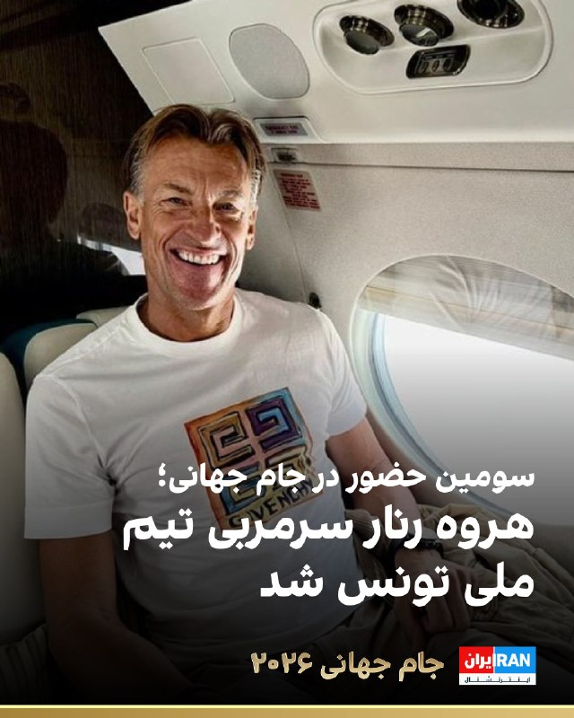

🔻فدراسیون فوتبال تونس، هروه رنار فرانسوی را به‌عنوان سرمربی جدید خود منصوب کرد. این تصمیم پس از اخراج صبری لموشی به دلیل شکست تلخ ۵–۱ برابر سوئد در نخستین بازی جام جهانی گرفته شد. رنار ۵۷ ساله که پس از جدایی از عربستان بدون تیم بود، در ادامهٔ جام جهانی هدایت تونس را بر عهده می‌گیرد.

🔹سرمربی نام‌آشنای فرانسوی با پروازی مستقیم از پاریس به مکزیک سفر می‌کند تا نخستین تمرین تیم را در کمپ مونتری رهبری کند. با این جابه‌جایی، رنار پس از مراکش (۲۰۱۸) و عربستان (۲۰۲۲)، سومین حضور خود در جام جهانی را با سه تیم مختلف تجربه خواهد کرد.

🔹او همراه با کادر فنی اختصاصی خود کارش را آغاز می‌کند و روز یکشنبه ۲۱ ژوئن در دومین بازی تونس برابر ژاپن، برای نخستین‌بار روی نیمکت این تیم خواهد نشست.
@iranintltvsport

## IranIntlTV — post 342678

🗣روایت شما از توافق آمریکا و جمهوری اسلامی- سه‌شنبه ۲۶ خرداد:

🔹ناامیدی، سوخت دیکتاتوری‌ها و امید راه سقوط آن‌هاست؛ امیدتون رو از دست ندین.

🔹ترامپ و جی‌دی ونس به چیه این تفاهم‌نامه که حتی تهش هم مشخص نیست می‌بالند. مگه این‌که از موجودیت و اصل وجودی جمهوری اسلامی بی‌خبر باشند که چقدر این‌ها می‌تونن خطرناک باشند.

🔹اگه مجتبی زنده است و با مذاکرات موافق کرده چرا صدا و تصویرش رو نشون نمی‌دن؟

🔹مگه توافق نشد؟ حالا چرا مجتبی رو نشون نمی‌دن؟ واقعا فکر می‌کنید زنده است؟!

🔹ترامپ به مردم ایران وعده داد که کمک در راه است، ولی ظاهراً بر سر دو راهی، مسیر را اشتباه رفت و کمک را به باقی‌مانده رژیم که آخرین نفس‌هایش را می کشید رساند، آمریکا تاوان سنگینی بابت اشتباه ترامپ خواهد داد.

🔹جمهوری اسلامی سال‌ها با شعار و تهدید برای مردم نمایش قدرت اجرا کرد. همان نظامی که ادعای مقاومت داشت برگشت پای میز توافق با همان طرفی که رهبرش رو کشت. زانو زدند، امضا کردند، شکست را قبول کردند، تحقیر شدند.

🔹مطمئن باشید جمهوری اسلامی اصلا به توافق پایبند نخواهد بود.

🔹آقای ترامپ! شما با حکومتی توافق کردید که با خُدعه و نیرنگ بر سرکار آمد و با خدعه و نیرنگ ۴۷ سال بر سرکار باقی ماند. شما از سوراخی گزیده شدید که قبل از شما خیلی‌ها گزیده شده بودند. تاریخ در مورد شما بد قضاوت خواهد کرد، آنگاه که جمهوری اسلامی زهر خود را به جهانیان بریزد.

🔹ترامپ و نتانیاهو تا همین‌جا هم کمک بزرگی به مردم ایران کردند. ما نباید خودمان را دست‌کم بگیریم. دو کلمه مهم برای پیروزی «اتحاد و سازماندهی» هستند.

🔹فعلا فقط تفاهم شده که مذاکره کنند، دو حالت بیشتر نداره یا آخوند با نابودی اورانیوم و چرخه غنی‌سازی موافقت می‌کنه که قطعا به‌معنی شکست جمهوری اسلامی است یا مسیر سابق رو می‌ره که دوباره جنگ می‌شه. نگران نباشید، جمهوری اسلامی در موقعیت خیلی بدی گیر کرده.

## IranIntlTV — post 342677

ویدیوهای رسیده به ایران‌اینترنشنال نشان می‌دهد اعضای خانواده جاویدنام صنم پوربابایی، در مراسم تولد او بر سر مزارش، یاد جاویدنامان را گرامی داشتند.
صنم، ۲۶ ساله و نوازنده و مدرس ویولن، ۱۸ دی‌ماه در لاهیجان با اصابت گلوله جان باخت.

## IranIntlTV — post 342676

  <a href="telegram/content/IranIntlTV_342676_1781603184.mp4" target="_blank">🎬 Download video</a>

یک شهروند با ارسال ویدیویی به ایران‌اینترنشنال می‌گوید خرید مایحتاج ساده خانه برای آنها شش میلیون تومان هزینه داشته است.

## IranIntlTV — post 342675

  <a href="telegram/content/IranIntlTV_342675_1781603185.mp4" target="_blank">🎬 Download video</a>

ویدیوی رسیده به ایران‌اینترنشنال، لحظه ورورد ایرانیان را همراه با پرچم‌های شیروخورشید به ورزشگاه سوفای لس‌آنجلس برای تماشای بازی فوتبال ایران و نیوزیلند در جام جهانی نشان می‌دهد.

## IranIntlTV — post 342674

  

عباس عراقچی، وزیر خارجه جمهوری اسلامی، در نشستی با سفرا و کارداران خارجی در تهران، گفت جمهوری اسلامی و حزب‌الله یک طرف تفاهم‌نامه و آمریکا و اسرائیل طرف دیگر آن هستند. او افزود گفت: «خاتمه جنگ در لبنان، بخش جدایی‌ناپذیر خاتمه کامل جنگ است و هرگونه حمله نظامی اسرائیل به لبنان و ادامه اشغال، نقض یادداشت تفاهم محسوب می‌شود.»
https://iranintl.com/202606160858

## IranIntlTV — post 342673

  

روزنامه کیهان، که زیر نظر نماینده رهبر جمهوری اسلامی اداره می‌شود، نوشت که مجتبی خامنه‌ای در تمامی پیام‌های خود از زمان انتصاب به عنوان رهبر جمهوری اسلامی تاکنون هیچ اشاره‌ای به موضوع هسته‌ای نکرده و جایگاهی برای آن در چشم‌انداز پایان جنگ در نظر نگرفته است.

کیهان این رویکرد را «اقدامی معنادار» توصیف کرد و نوشت که این موضوع می‌تواند نشانه‌ای از آن باشد که از نگاه جمهوری اسلامی، پرونده مذاکرات هسته‌ای پس از حملات آمریکا و اسرائیل مختومه شده و تلاشی برای احیای آن صورت نخواهد گرفت.

این روزنامه همچنین نوشت که این رویکرد را می‌توان یکی از مهم‌ترین خطوط قرمز ترسیم‌شده از سوی رهبر جمهوری اسلامی دانست. به نوشته کیهان، هرگونه مذاکره برای تعیین شرایط پایان جنگ نباید در امتداد مذاکرات پیشین هسته‌ای و در همان چهارچوب و با همان اهداف دنبال شود.
https://iranintl.com/202606165633

## IranIntlTV — post 342672

  <a href="telegram/content/IranIntlTV_342672_1781603188.mp4" target="_blank">🎬 Download video</a>

تفاهم به‌دست آمده میان جمهوری اسلامی و ایالات متحده آمریکا بازتاب گسترده‌ای در مطبوعات و شبکه‌های خبری این کشور داشته است.

گفت‌وگو با جواد همدانی، خبرنگار ایران‌اینترنشنال
@iranintltv

## IranIntlTV — post 342671

  <a href="telegram/content/IranIntlTV_342671_1781603190.mp4" target="_blank">🎬 Download video</a>

بنیامین نتانیاهو، نخست‌وزیر اسرائیل، در نشست خبری خود گفت: «سرنگونی جمهوری اسلامی هرگز از اهداف رسمی جنگ نبوده است.»

اشکان صفایی، خبرنگار ایران‌اینترنشنال، گزارش می‌دهد
@iranintltv

## IranIntlTV — post 342670

  <a href="telegram/content/IranIntlTV_342670_1781603191.mp4" target="_blank">🎬 Download video</a>

رجب طیب اردوغان، رییس‌جمهوری ترکیه، توافق میان ایالات متحده و جمهوری اسلامی را «گامی مهم در مسیر پایان دادن به بحران منطقه‌ای» دانست.
@iranintltv

## IranIntlTV — post 342669

  <a href="telegram/content/IranIntlTV_342669_1781603193.mp4" target="_blank">🎬 Download video</a>

نشست سران کشورهای عضو «گروه ۷» در فرانسه آغاز شد. جنگ اوکراین و توافق میان ایالات متحده و جمهوری اسلامی از محورهای اصلی این نشست اعلام شده است.

جزییات بیشتر با احمد صمدی، خبرنگار ایران‌اینترنشنال
@iranintltv

## IranIntlTV — post 342668

  

امیر حاتمی، فرمانده کل ارتش جمهوری اسلامی، سه‌شنبه ۲۶ خرداد در مراسمی در دانشگاه افسری «امام علی» با اشاره به حملات اخیر آمریکا و اسرائیل هشدار داد که هرگونه اقدام یا اشتباه جدید از سوی آمریکا و اسرائیل با واکنشی شدید مواجه خواهد شد.

او گفت: «اگر دشمن اشتباهی بکند با یک خشم انباشته مواجه خواهد شد که کار دشمن را بسیار بسیار سخت خواهد کرد.»
https://iranintl.com/202606164265

## IranIntlTV — post 342667

  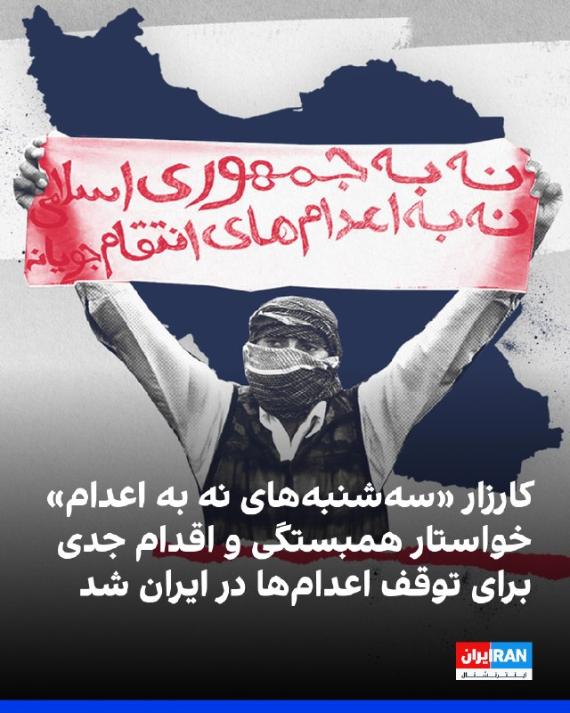

کارزار «سه‌شنبه‌های نه به اعدام» اعلام کرد زندانیان معترض به مجازات اعدام سه‌شنبه ۲۶ خرداد برای صدوبیست‌وپنجمین هفته در ۵۶ زندان ایران در اعتصاب غذا هستند. این کارزار اعلام کرد جمهوری اسلامی از ابتدای سال ۱۴۰۵ بیش از ۱۷۷ زندانی را اعدام کرده و صدور و اجرای احکام اعدام ادامه دارد.

این کارزار افزود علی فتاح، محمد نقی‌زاده، علی کمالی و پیمان گنجی، زندانیان سیاسی محکوم به اعدام، در زندان قزلحصار به‌سر می‌برند و هشدار داد این زندان یکی از مراکز اصلی اجرای احکام اعدام در استان تهران و از قتل‌گاه‌های حکومتی است و زندانیان محکوم به اعدام پس از انتقال به آن در معرض اعدام قرار می‌گیرند.

کارزار «سه‌شنبه‌های نه به اعدام» تاکید کرد که خواهان توقف سریع اعدام‌هاست و از همه «وجدان‌های بیدار» و فعالان سیاسی، حقوق بشری، مدنی و صنفی خواست به هر شکل ممکن اعدام‌ها را محکوم کنند و برای توقف آن دست به اقدامی جدی بزنند.

این کارزار اعلام کرد تحقق آزادی، برابری و حفظ کرامت انسانی بدون تحقق حق حیات ممکن نیست و از همه مخالفان اعدام خواست برای در هم شکستن ساختار استبدادی و چرخه سلب حیات انسانی، همبستگی و عمل متحدانه داشته باشند.
http

## IranIntlTV — post 342666

  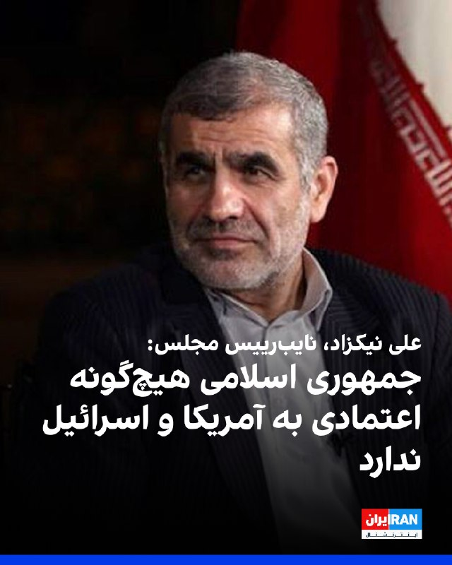

علی نیکزاد، نایب‌رییس مجلس، در تجمعات شبانه در خصوص مواضع حکومت در مذاکرات و تعاملات بین‌المللی گفت: «جمهوری اسلامی هیچ‌گونه اعتمادی به آمریکا و اسرائیل ندارد و هرگونه تصمیم‌گیری در مسائل کلان کشور تحت هدایت مجتبی خامنه‌ای انجام خواهد شد.»
نایب‌رییس مجلس افزود: «آمریکا با محاسبات نادرست تصور می‌کرد می‌تواند جمهوری اسلامی را وادار به تسلیم کند، اما ملت ایران و نیروهای مسلح کشور این تصور را باطل کردند.»
https://iranintl.com/202606166913

## IranIntlTV — post 342665

  <a href="telegram/content/IranIntlTV_342665_1781603196.mp4" target="_blank">🎬 Download video</a>

ویدیوی رسیده نشان می‌دهد گروهی از ایرانیان در ونکوور کانادا، هنگام تماشای فوتبال ایران و نیوزیلند در جام‌جهانی، فریاد «جاوید شاه» سرمی‌دهند.

## IranIntlTV — post 342664

بر اساس ویدیوهای رسیده به ایران‌اینترنشنال، هنگام نمایش پرچم جمهوری اسلامی قبل از بازی تیم‌های فوتبال ایران و نیوزیلند در ورزشگاه سوفای لس‌آنجلس،‌ ایرانیان حاضر در ورزشگاه این پرچم را هو کردند. عده‌ای از حامیان جمهوری اسلامی هم در این ورزشگاه حاضر بودند که پرچم رژیم را تشویق کردند.

## IranIntlTV — post 342663

  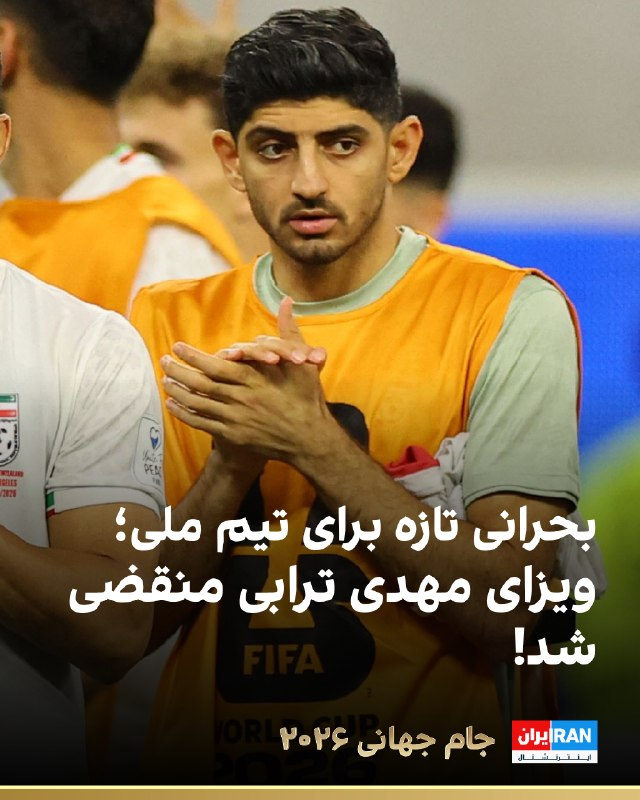

🔻ویزای مهدی ترابی، بازیکن تیم ملی فوتبال ایران، پس از یک بار ورود به خاک آمریکا منقضی شد و حضور او در دیدارهای پیش‌رو در هاله‌ای از ابهام قرار گرفت.

🔹به گزارش بخش رسانه‌ای تیم ملی فوتبال ایران، در حالی که برای سایر بازیکنان تیم ملی برای سفر به آمریکا روادید چندبارورود (Multiple) صادر شده است، ویزای مهدی ترابی به صورت تک‌ورود صادر شده بود.

🔹به همین دلیل، پس از سفر کاروان تیم ملی به لس‌آنجلس برای برگزاری دیدار برابر نیوزیلند و پایان این مسابقه، اعتبار ویزای این بازیکن رسما به پایان رسید. فدراسیون فوتبال ایران در پی دریافت مجدد ویزا برای ترابی است.

@iranintltvsport

## IranIntlTV — post 342662

  

شبکه کان اسرائیل گزارش داد عمر تیشلر، فرمانده نیروی هوایی اسرائیل، در نامه‌ای به نیروهای این یگان نوشت حمله برنامه‌ریزی‌شده به «صدها هدف» در ایران که قرار بود هفته گذشته در جریان آخرین درگیری انجام شود، تنها یک ساعت پیش از آغاز عملیات و در پی مداخله دونالد ترامپ، رییس‌جمهوری آمریکا متوقف شد.

در این گزارش به نقل فرمانده نیروی هوایی اسرائیل آمده: «تمام نیروی هوایی برای یک حمله گسترده آماده بود. تنها چند ساعت تا صدور دستور پرواز و حمله به صدها هدف در قلب ایران فاصله داشتیم، اما عملیات هنگام جلسات توجیهی اسکادران‌ها متوقف شد.»

فرمانده نیروی هوایی اسرائیل همچنین با اشاره به حملات اخیر اسرائیل به جمهوری اسلامی در این نامه نوشت: «هنوز برای ارزیابی تاثیر تحولات جهانی بر واقعیت امنیتی زود است.»

او در ادامه افزود: «ما به رهبری ایران، سامانه‌های دفاعی و تهاجمی، بخش‌های مرتبط با برنامه هسته‌ای، اقتصاد، زنجیره فرماندهی و دانش فنی، صنایع نظامی و ملی ضربات سنگینی وارد کردیم؛ به گونه‌ای که تهدید را به شکل قابل توجهی کاهش دادیم، روند بازسازی را طولانی‌تر کردیم و توانایی بازگشت و اقدام دوباره در ایران را حفظ کردیم.»
https

## Shin_Persian — post 7109

Shin ✓ @hey_itsmyturn
Tue, 16 Jun 2026 09:21:10 UTC

Hezbollah said "Iran is now one of the world's superpowers", and apparently they said it with a straight face.

ترجمه خودکار فارسی

حزب‌الله گفت «ایران اکنون یکی از ابرقدرت‌های جهان است» و ظاهراً آن‌ها این حرف را با جدیتی تمام بیان کردند.

𝕏 · @shin_persian

## Shin_Persian — post 7108

Open Source Intel ✓ @Osint613
Tue, 16 Jun 2026 08:09:49 UTC

Iran's FM Araqchi: A new round of US-Iran talks will start on Friday in Switzerland.

ترجمه خودکار فارسی

عراقچی، وزیر امور خارجه ایران: دور جدیدی از گفتگوهای ایران و آمریکا روز جمعه در سوئیس آغاز خواهد شد.

𝕏 · @shin_persian

## FarsiVOA — post 220892

  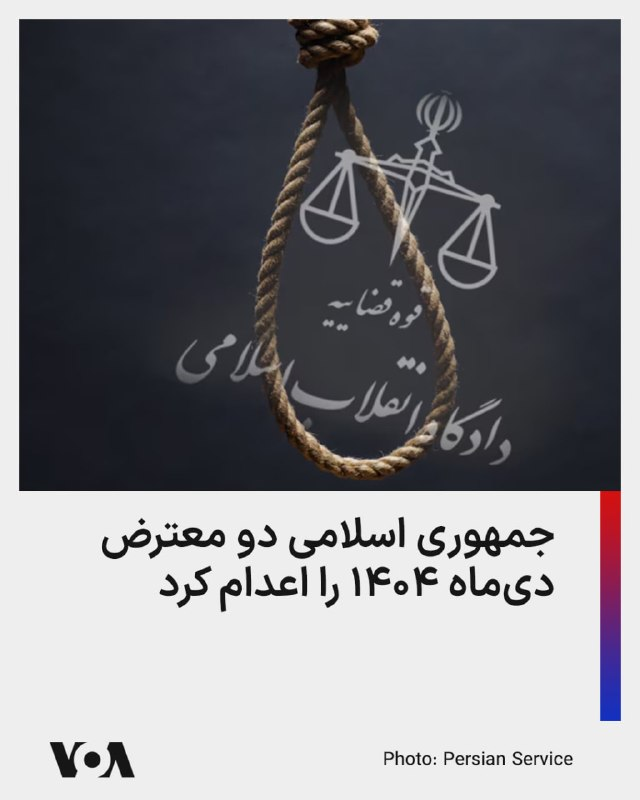

قوه قضاییه جمهوری اسلامی از اعدام جواد زمانی و ابوالفضل ساعدی، دو نفر از بازداشت‌شدگان اعتراضات دی‌ماه سال ۱۴۰۴ خبر داد.

رئیس‌کل دادگستری استان سمنان روز سه‌شنبه اعلام کرد که این دو نفر با اتهام‌هایی از جمله «محاربه»، «افساد فی‌الارض»، محاکمه شده بودند.

دادگستری استان سمنان مدعی شده پرونده این دو نفر پس از طی مراحل رسیدگی در شعب تحقیق، دادگاه بدوی و دیوان عالی کشور به اجرای حکم رسیده است.

در پرونده‌های امنیتی جمهوری اسلامی، دسترسی آزاد متهم به وکیل مستقل، روند دادرسی شفاف و امکان بررسی مستقل اتهام‌ها همواره از اصلی‌ترین نگرانی‌های حقوق بشری بوده است.
@FarsiVOA

## FarsiVOA — post 220891

🔺اتصال برق ایران و قطر؛ وعده تازه در سایه هشدار خاموشی

▪️وزیر نیرو در دولت جمهوری اسلامی می‌گوید اتصال الکتریکی ایران و قطر «به‌زودی» آغاز می‌شود، مطالعات این طرح در مرحله پایانی است و کار اجرایی آن در ابتدای مسیر قرار دارد.

▪️او همچنین گفته است که بررسی اتصال شبکه برق ایران با دیگر کشورهای حاشیه خلیج فارس نیز در جریان است.

▪️این طرح قرار است از مسیر کابل زیردریایی حدود ۲۰۰ کیلومتری اجرا شود؛ پروژه‌ای پرهزینه و زمان‌بر که به تأمین مالی، هماهنگی فنی دو شبکه، امنیت مسیر، قراردادهای پایدار خرید و فروش برق و توافق سیاسی طولانی‌مدت نیاز دارد.

▪️این در حالی است که گزارش تازه مرکز پژوهش‌های مجلس نشان می‌دهد ناترازی برق همچنان جدی است.

⬇️ بیشتر بخوانید:
https://ir.voanews.com/a/8161425.html

## FarsiVOA — post 220890

🔺بیش از ۱۳۰ میلیارد دلار ارز صادراتی در هشت سال به اقتصاد برنگشت

▪️عضو کمیسیون اقتصادی مجلس، می‌گوید از سال ۱۳۹۷ تا پایان خرداد ۱۴۰۵ بیش از ۱۳۰ میلیارد دلار ارز صادراتی به چرخه رسمی اقتصاد کشور بازنگشته است.

▪️این رقم بار دیگر پرسش درباره نقش صادرکنندگان بزرگ غیرنفتی، شرکت‌های شبه‌دولتی و شبکه‌های نزدیک به نهادهای قدرت را برجسته می‌کند.

▪️حسین صمصامی همچنین گفته فقط در سال ۱۴۰۴ حدود ۱۶ میلیارد و ۹۰۰ میلیون دلار ارز صادراتی بازنگشته و در سه ماه نخست ۱۴۰۵ نیز حدود سه میلیارد دلار دیگر به چرخه رسمی اقتصاد وارد نشده است.

▪️خبر تازه تسنیم نام شرکت‌ها را منتشر نکرده، اما گزارش‌ها و اظهارات قبلی نشان می‌دهد ماجرا فقط به صادرکنندگان خرد یا بخش خصوصی محدود نیست.

⬇️ بیشتر بخوانید:
https://ir.voanews.com/a/8161424.html

## FarsiVOA — post 220889

  <a href="telegram/content/FarsiVOA_220889_1781603199.mp4" target="_blank">🎬 Download video</a>

واکنش اعتراضی تماشاگران هنگام پخش سرود ملی جمهوری اسلامی؛

شماری از حاضران در استادیوم لس‌آنجلس هنگام پخش سرود جمهوری اسلامی در آغاز دیدار تیم‌های فوتبال ایران و نیوزیلند، بازیکنان ایران و سرود را به نشانه اعتراض هو کردند.
@FarsiVOA

## FarsiVOA — post 220888

  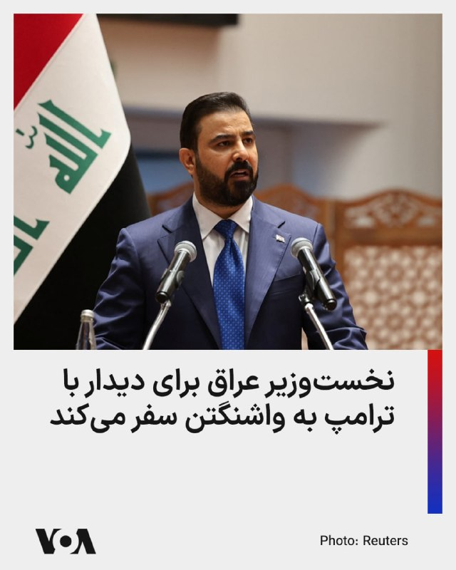

دونالد ترامپ، رئیس‌جمهور آمریکا، ماه آینده میلادی در کاخ سفید با علی الزیدی، نخست‌وزیر عراق، دیدار خواهد کرد.

دفتر نخست‌وزیر عراق و دفتر تام باراک، فرستاده ویژه دونالد ترامپ به عراق که همچنین سفیر آمریکا در ترکیه است، در بیانیه‌ای مشترک اعلام کردند که در جریان این دیدار، درباره «آینده روابط مهم» بغداد و واشنگتن گفت‌وگو خواهد شد.

این بیانیه در جریان سفر باراک به پایتخت عراق منتشر شده است؛ سفری که طی آن، او با نخست‌وزیر عراق درباره خلع سلاح و انحلال گروه‌های مسلح عراق که خارج از اختیار دولت فعالیت می‌کنند، گفت‌وگو کرد.
@FarsiVOA

## FarsiVOA — post 220887

  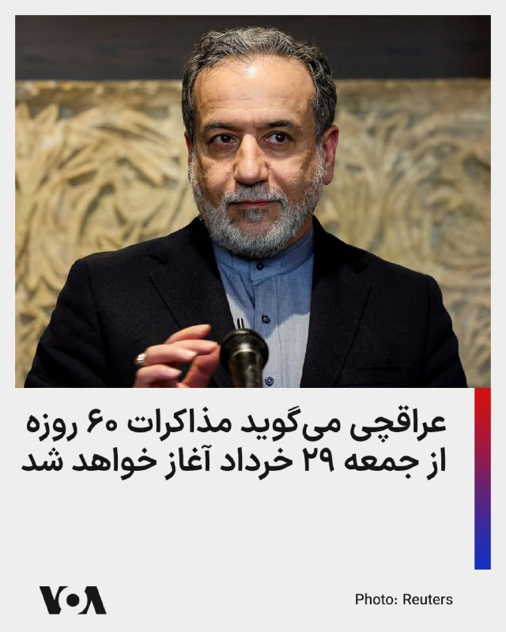

وزیر امور خارجه جمهوری اسلامی اعلام کرد که روز جمعه ۲۹ خرداد و همزمان با امضای رسمی یادداشت تفاهم «پایان جنگ»، مذاکرات با آمریکا برای رسیدن به توافق نهایی آغاز خواهد شد.

عباس عراقچی، مکان دقیق امضای تفاهم‌نامه و آغاز مذاکرات را اعلام نکرد و تنها گفت که این امر «احتمالاً روز جمعه و در محلی که مشخص خواهد شد» انجام می‌پذیرد.

او مذاکرات جدید را هم به دو محور تقسیم کرد و مدعی شد که محور نخست مربوط به اعلام خاتمه جنگ، تنگه هرمز، محاصره دریایی، آزادسازی وجوه مسدودشده جمهوری اسلامی و موضوع بازسازی است که دو طرف درباره این موضوعات پس از توافق، یک یادداشت تفاهم امضا خواهند کرد.

وزیر امور خارجه جمهوری اسلامی همچنین اعلام کرد که پس از این تفاهم، مذاکرات به مدت ۶۰ روز ادامه پیدا خواهد کرد تا دو طرف به یک توافق نهایی درباره موضوعات هسته‌ای و لغو تحریم‌ها دست یابند.

عراقچی بار دیگر موضوع جنگ را به مسائل میان لبنان و اسرائيل مرتبط دانست و اعلام کرد که از نظر جمهوری اسلامی هرگونه حمله نظامی به لبنان نقض یادداشت تفاهم است.
@FarsiVOA

## FarsiVOA — post 220886

  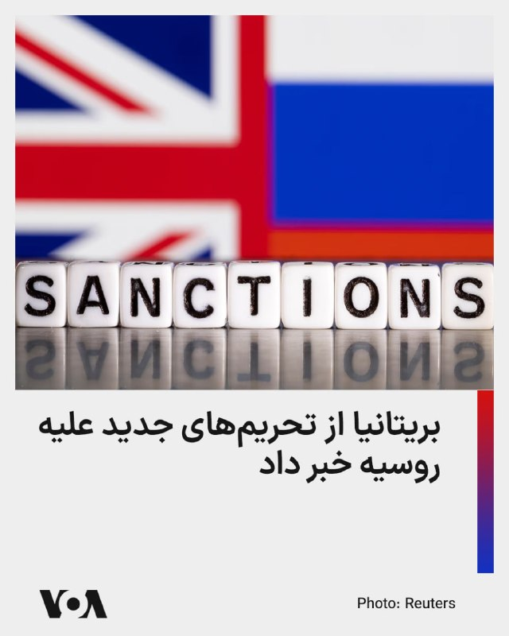

دولت بریتانیا همزمان با برگزاری نشست سران گروه هفت درباره جنگ اوکراین، از تحریم‌های جدید علیه روسیه خبر داد.

بریتانیا سه‌شنبه اعلام کرد که ۷۰ تحریم جدید این کشور «ناوگان سایه» فرسوده روسیه که زنجیره‌های تأمین نظامی و شبکه‌های مالی غیرقانونی این کشور را تشکیل می‌دهند و برای دور زدن تحریم‌ها استفاده می‌شوند، هدف گرفته است.

بریتانیا تاکید کرد که در جریان نشست گروه هفت و پس از حملات اخیر مسکو علیه اوکراین که منجر به کشته شدن غیرنظامیان و تخریب اماکن مقدس شد، فشار بر روسیه را افزایش می‌دهد.

بریتانیا به‌تنهایی صدها فرد، نهاد و کشتی را تحت رژیم تحریم‌های روسیه هدف قرار داده است.

تحریم‌های جدید یاندکس بانک و مؤسسات مالی «اِوروفایننس» و «بانک وایلدبریس» را نیز شامل می‌شود.
@FarsiVOA

## FarsiVOA — post 220885

  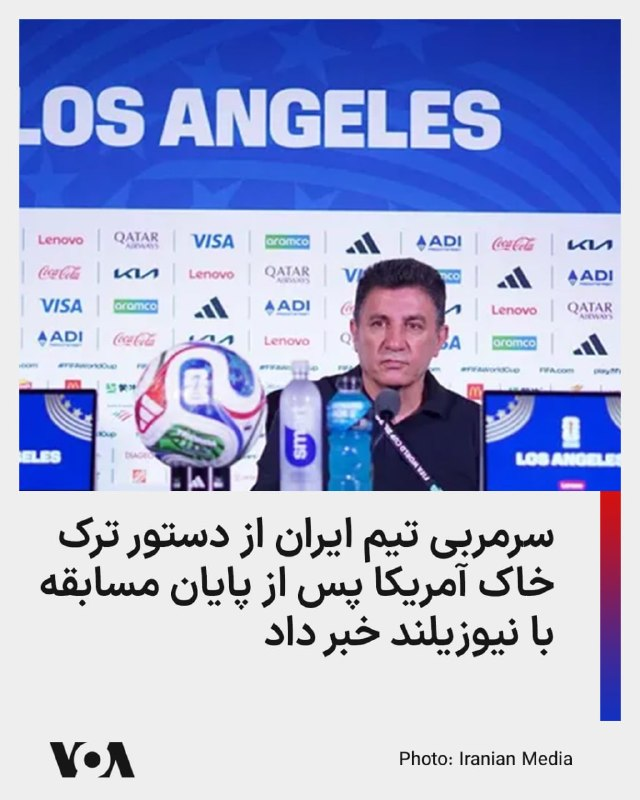

سرمربی تیم فوتبال ایران، پس از پایان دیدار تیمش با نیوزیلند اعلام کرد که « بلافاصله بعد از بازی به ما گفتند باید اینجا را ترک کنیم». امیرقلعه‌نویی جزئیاتی از نحوه دریافت این دستور را بیان نکرد.

مسئولان ورزش جمهوری اسلامی، محل استقرار تیم فوتبال ایران را از آمریکا به مکزیک منتقل کردند و همین امر مشکلات را برای اخذ روادید ورود به خاک ایالات متحده ایجاد کرده است.

از سوی دیگر بخش رسانه‌ای تیم فوتبال ایران اعلام کرد که روادید مهدی ترابی، بازیکن این تیم به پایان رسیده و او برای ورود مجدد به خاک آمریکا باید مجدداً روادید دریافت کند. روادید دیگر اعضای تیم «چند بار ورود» است.

همچنین خبرگزاری صدا و سیمای جمهوری اسلامی صبح سه‌شنبه ۲۶ خرداد و حدود سه پس از پایان مسابقه خبر داد که روند خروج مهدی طارمی، بازیکن و سعید الهویی، مربی تیم از فرودگاه لس‌آنجلس با تأخیر و مشکلاتی همراه بوده و پرواز اعضای تیم به مقصد تیخوانا با تأخیر روبه‌رو شده است.
@FarsiVOA

## FarsiVOA — post 220884

🔺جمهوری اسلامی و اوکراین در دستور کار اصلی نشست گروه هفت

▪️نشست گروه هفت در اویان فرانسه روز سه‌شنبه با محور توافق اولیه آمریکا و جمهوری اسلامی، بازگشایی تنگه هرمز و جنگ اوکراین ادامه می‌یابد.

▪️این اجلاس در حالی برگزار می‌شود که واشنگتن و جمهوری اسلامی بر سر توافقی اولیه برای پایان دادن به درگیری گسترده‌تر به تفاهم رسیده‌اند و انتظار می‌رود امضای رسمی آن روز جمعه انجام شود.

▪️رویترز نوشته رهبران اروپایی به ترامپ هشدار خواهند داد که یک توافق موقت و سطحی با جمهوری اسلامی می‌تواند به جای مهار، برنامه هسته‌ای و موشک‌های بالستیک این حکومت را تثبیت یا تشدید کند.

▪️قرار است رهبران امارات متحده عربی، قطر و مصر نیز در گفت‌وگوهای مربوط به خاورمیانه شرکت کنند.

⬇️ بیشتر بخوانید:
https://ir.voanews.com/a/g7-summit-in-france/8161388.html

## FarsiVOA — post 220883

  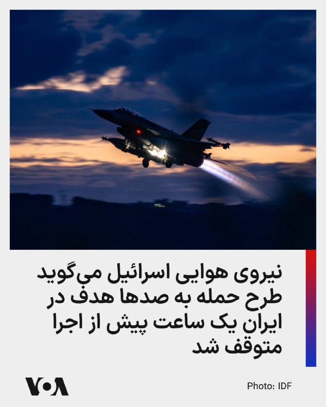

عمر تیشلر، فرمانده نیروی هوایی اسرائیل، در نامه‌ای به نیروهای تحت فرمان خود، از آمادگی کامل این نیرو در هفته گذشته برای اجرای یک حمله گسترده علیه جمهوری اسلامی خبر داد؛ عملیاتی که به گفته او، تنها یک ساعت پیش از آغاز، متوقف شد.

او نوشته است: «کل نیروی هوایی آماده پرواز برای یک عملیات حمله گسترده بود. چند ساعت پیش از دستور پرواز، با کوتاه کردن زمان آماده‌باش، انعطاف‌پذیری بی‌سابقه‌ای نشان داده شد؛ کل نیروی هوایی مسلح شد، برنامه‌ریزی انجام گرفت، آمادگی کامل برقرار بود و نیروها برای پرواز و حمله به صدها هدف در قلب ایران آماده بودند.»

تیشلر در ادامه توضیح داده است که توقف عملیات در شرایطی رخ داد که نیروها در پایگاه‌ها در حال آماده‌سازی نهایی بودند و تنها یک ساعت تا آغاز حمله فاصله داشتند.

این روایت نشان می‌دهد که حمله گسترده اسرائیل علیه جمهوری اسلامی، که بنا بر گزارش‌ها هفته گذشته برنامه‌ریزی شده بود، تا آستانه اجرا پیش رفت؛ اما با مداخله رئیس‌جمهور ایالات متحده آمریکا، دونالد ترامپ، متوقف شد.
@FarsiVOA

## FarsiVOA — post 220882

  

📸اینستاگرام صدای آمریکا را هم اکنون فالو کنید تا از آخرین خبرها مطلع بمانید:
https://www.instagram.com/voafarsi/

📡همچنین جهت اطلاع از بروزترین فرکانسهای ماهواره‌ای صدای آمریکا به لینک زیر مراجعت فرمایید:
https://ir.voanews.com/satellite

این پست را با دوستانتان به اشتراک بگذارید
@FarsiVOA

## FarsiVOA — post 220881

Farsi VOA pinned an audio file

## FarsiVOA — post 220880

  <a href="https://t.me/farsivoa/220880" target="_blank">📎 Download file</a>

🔴📢‌ پادکست خبری دوشنبه ۲۵خرداد ۱۴۰۵

🛜در صورتی که با مشکل اینترنت مواجه هستید میتوانید اخبار صدای آمریکا را از نسخه‌های پادکست خبری ما روزانه دنبال کنید و یا اخبار را از نسخه سبک وب‌سایت ما پیگیر باشید:
https://ir.voanews.com/lite

📡بروزترین فرکانسهای ماهواره‌ای را نیز میتوانید از صفحه زیر پیگیری کنید:
https://ir.voanews.com/satellite

🔔دیگر شبکه‌های اجتماعی ما را هم دنبال کنید:
https://linktr.ee/voafarsi

ما را به اشتراک بگذارید
@farsivoa

## FarsiVOA — post 220879

  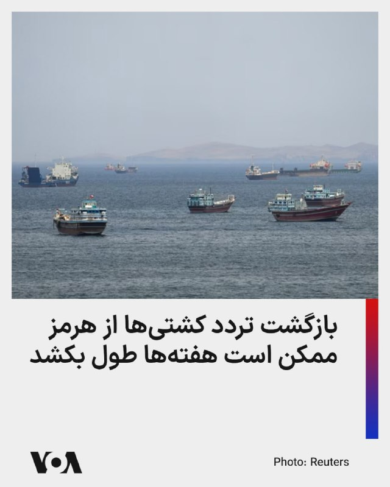

فایننشال تایمز گزارش داد مدیرعامل شرکت ژاپنی میتسویی او‌اس‌کی گفته است مالکان کشتی تا زمانی که مطمئن نشوند توافق آمریکا و جمهوری اسلامی در تنگه هرمز به وضعیتی عملی و قابل اتکا تبدیل شده، عبور از این مسیر را از سر نخواهند گرفت.

جوتارو تامورا گفت صرف توافق میان کشورها کافی نیست و خطوط کشتیرانی باید در عمل احساس امنیت کنند. او افزود با توجه به تجربه ماه‌های اخیر، بازگشت تردد می‌تواند دست‌کم چند هفته یا حتی یک ماه زمان ببرد.

شرکت میتسویی اواس‌کی، یکی از سه شرکت بزرگ کشتیرانی ژاپن، ناوگانی متشکل از بیش از ۹۰۰ کشتی، شامل کشتی‌های فله‌بر و تانکر دارد.

بر اساس داده‌های کپلر، نزدیک به ۶۰۰ کشتی هنوز در خلیج فارس منتظر خروج‌اند و بیش از ۳۰۰ کشتی خالی نیز در دریای عمان برای ورود و بارگیری صف کشیده‌اند.

پیش از جنگ، روزانه به‌طور میانگین ۱۳۵ نفتکش از هرمز عبور می‌کرد؛ بنابراین حتی تخلیه صف ۶۰۰ کشتیِ منتظر خروج، در ظرفیت عادی هم بیش از چهار روز زمان می‌برد. با احتساب کشتی‌های خالیِ منتظر ورود، این زمان در حالت نظری به حدود یک هفته می‌رسد.

⬇️ بیشتر بخوانید:
https://ir.voanews.com/a/8161386.html

## FarsiVOA — post 220878

🔺سازمان ملل متحد نسبت به دخالت نظامی چین در جنگ اوکراین هشدار داد

▪️سازمان ملل متحد درباره گزارش‌ها مبنی بر این‌که ارتش چین نیروهای روسیه را برای جنگ در اوکراین آموزش داده است، اعلام کرد این جنگ به دخالت خارجی بیشتری نیازی ندارد.

▪️استفان دوجاریک، سخنگوی سازمان ملل، روز دوشنبه، در پاسخ به پرسشی درباره گزارش اخیر مسئول سیاست خارجی اتحادیه اروپا گفت: «فکر می‌کنم آخرین چیزی که جنگ در اوکراین به آن نیاز دارد، سربازان بیشتر، مداخله خارجی بیشتر و مشارکت خارجی بیشتر است. ما باید شاهد حرکت در جهت عکس باشیم.»

▪️کایا کالاس، مسئول سیاست خارجی اتحادیه اروپا، گفته بود که اتحادیه اروپا گزارش‌هایی را تأیید کرده که ارتش چین نیروهای نظامی روسیه را برای جنگ در اوکراین آموزش داده است.

⬇️ بیشتر بخوانید:
https://ir.voanews.com/a/un-urges-less-outside-interference-in-ukraine-after-eu-confirmed-china-russia-training-reports/8161385.html

## FarsiVOA — post 220877

  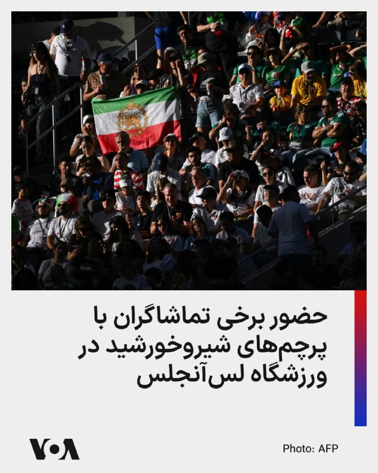

به رغم موضع فیفا و حکم یک دادگاه در کالیفرنیا مبنی در منع ورود پرچم شیروخورشید، تعدادی از تماشاگران ایران موفق شدند با پرچم‌های شیر و خورشید به ورزشگاه راه یابند و این پرچم را حین مسابقه فوتبال ایران و نیوزیلند به نمایش بگذارند.

پیشتر شماری از ایرانیان ساکن لس‌آنجلس اعلام کرده بودند که «در واکنش به سرکوب‌های جمهوری اسلامی»، با پرچم‌های شیر و خورشید در ورزشگاه حضور پیدا می‌کنند.

پیش از آغاز جام جهانی، وزیر ورزش جمهوری اسلامی مدعی شده بود که اگر پرچمی به غیر از پرچم جمهوری اسلامی در ورزشگاه باشد، بازیکنان تیم فوتبال ایران می‌توانند زمین را ترک کنند.
@FarsiVOA

## FarsiVOA — post 220876

  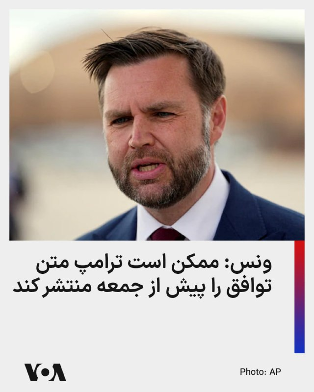

جی‌دی ونس، معاون رئیس‌جمهوری آمریکا، گفت دونالد ترامپ ممکن است متن توافق واشنگتن با جمهوری اسلامی را پیش از امضای حضوری آن در روز جمعه منتشر کند.

رویترز به نقل از ونس گزارش داد این توافق پیش‌تر به‌صورت الکترونیکی از سوی رهبران آمریکا و جمهوری اسلامی امضا شده و انتظار می‌رود مراسم امضای حضوری آن روز جمعه برگزار شود.

دونالد ترامپ با رد برخی گزارش‌ها درباره پرداخت میلیون‌ها دلار به جمهوری اسلامی، تأکید کرده که جمهوری اسلامی پذیرفته هرگز سلاح هسته‌ای نداشته باشد.

ونس نیز گفته است پس از امضای الکترونیکی توافق، هیچ پولی آزاد نشده و این وضعیت تغییر نخواهد کرد. او افزود هرگونه کاهش تحریم یا امتیاز اقتصادی به اقدام‌های قابل راستی‌آزمایی جمهوری اسلامی وابسته است.
@FarsiVOA

## FarsiVOA — post 220873

انهدام ۱۸ کارگاه ساخت سلاح در نابلس؛

سخنگوی ارتش اسرائیل اعلام کرد نیروهای اسرائیلی، در عملیاتی متمرکز شبانه در منطقه نابلس، ۱۸ کارگاه ساخت سلاح را در اردوگاه بلاطه و راس‌العین در بخش شومرون/ نابلس شناسایی و منهدم کردند.

بر اساس این گزارش، این عملیات با هدف خنثی‌سازی زیرساخت‌های ترور انجام شد و نیروهای ارتش اسرائیل در جریان جست‌وجوها، کارگاه‌هایی را یافتند که در دل مناطق غیرنظامی برای ساخت سلاح و مواد منفجره مورد استفاده قرار می‌گرفتند.

در این عملیات همچنین قطعات اسلحه و تجهیزات مرتبط که پیش‌تر ضبط شده بودند، کشف و جمع‌آوری شد.
@FarsiVOA

## DW_Farsi — post 126047

  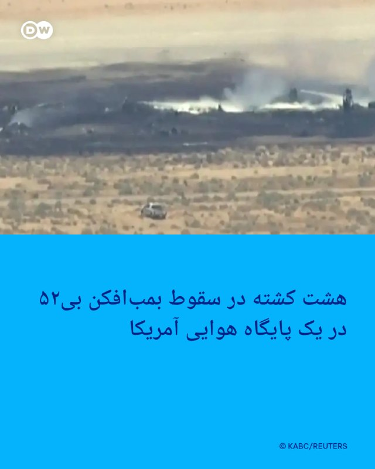

🔶 هشت کشته در سقوط بمب‌افکن بی۵۲ در یک پایگاه هوایی آمریکا

در پی سقوط یک بمب‌افکن بی۵۲ در پایگاه هوایی ادواردز در کالیفرنیا همه هشت سرنشین آن کشته شدند. علت این حادثه در دست بررسی است و هنوز مشخص نشده است. به گفته مقام‌ها این هواپیما در حال انجام یک مأموریت آزمایشی بود.

شرکت هواپیماسازی بوئینگ اعلام کرد که دو نفر از قربانیان از کارکنان این شرکت بوده‌اند.

سرهنگ جیمز هِیز، معاون فرماندهی یگان آزمایش ۴۱۲ نیروی هوایی آمریکا در پایگاه ادواردز ضمن اعلام این خبر در یک نشست خبری گفت: «امروز پایگاه هوایی ادواردز شاهد یک تراژدی وحشتناک بود و ما هشت آمریکایی بزرگ را از دست دادیم.»

او افزود روند اطلاع‌رسانی به خانواده‌های قربانیان در جریان است و جزئیات بیشتر پس از آن منتشر خواهد شد.

به گفته هیز این پرواز اواخر صبح دوشنبه ۱۵ ژوئن انجام شد و برای آزمایش یک سامانه راداری جدید برنامه‌ریزی شده بود. به گفتهٔ او، هواپیما لحظاتی پس از برخاستن سقوط کرد و آتش گرفت.

@dw_farsi

## DW_Farsi — post 126046

  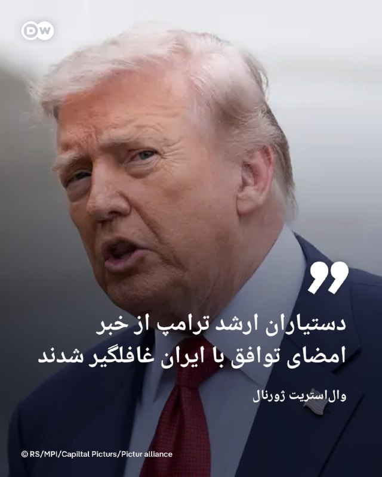

🔶 وال‌استریت ژورنال: دستیاران ارشد ترامپ از خبر امضای توافق با ایران غافلگیر شدند

وال‌استریت ژورنال گزارش داده است که دستیاران ارشد دونالد ترامپ، رئیس ‌جمهور ایالات متحده آمریکا، از خبر امضای توافق با ایران غافلگیر شدند.

بر اساس این گزارش، پست ترامپ در شبکه اجتماعی تروث سوشال در روز یکشنبه که در آن اعلام کرد "توافق با جمهوری اسلامی ایران اکنون نهایی شده است"، پس از آن منتشر شد که او اندکی بعد از ساعت ۵ بعدازظهر به وقت محلی واشنگتن این سند را به صورت دیجیتالی در کاخ سفید امضا کرده بود.

اما به نوشته این روزنامه، حتی دستیاران ارشد خود ترامپ نیز از انتشار این پیام‌ها درباره توافق پایان جنگ غافلگیر شدند، زیرا تصور می‌کردند مذاکرات همچنان در حال ادامه است.

متن این توافق که گفته می‌شود تنها یک صفحه و نیم است، هنوز به صورت عمومی منتشر نشده است. بنیامین نتانیاهو، نخست‌وزیر اسرائیل، روز گذشته در یک نشست خبری تاکید کرد که اسرائیل طرف این یادداشت تفاهم نیست و هنوز از جزئیات کامل توافق اطلاع ندارد.

@dw_farsi

## DW_Farsi — post 126045

  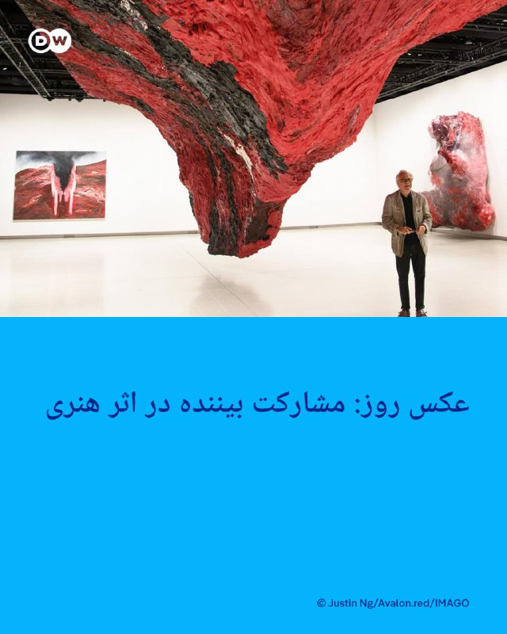

📸 عکس روز: مشارکت بیننده در اثر هنری

آنیش کاپور، هنرمند برجسته بریتانیایی هندی‌تبار، در مراسم معرفی نمایشگاه جدیدش در لندن در کنار اثر "کوه موریا در دروازه گتو" ایستاده است. آثار کاپور که در مقیاسی بزرگ ساخته‌ شده‌اند، مخاطب را به چالش می‌کشند و تجربه‌های ادراکی منحصر‌به‌فردی را با جابه‌جایی مرزهای مادیت و معنویت و جسم و خلاء خلق می‌کنند.

این نمایشگاه از ۱۶ ژوئن تا ۱۸ اکتبر، مروری گسترده بر آثار این هنرمند تأثیرگذار ارائه می‌کند.

@dw_farsi

## DW_Farsi — post 126044

🔶ممکن است در برخی از نواحی عالم، زمان وجود نداشته باشد

🔻گزارشی از عرفان کسرایی

«جریان زمان تحت کنترل ما نیست. ما نمی‌توانیم آن را متوقف کنیم؛ نمی‌توانیم آن را به عقب بازگردانیم؛ انگار که درمانده و مستاصل همراه آن برده می‌شویم، مانند تکه‌ای چوب که جریان یک رودخانه با خود حمل می‌کند.»

این تعبیری است که هانس رایشنباخ، در کتاب "جهت زمان" درباره سرشت زمان به کار می‌برد. قرن‌ها پیش، آگوستین، فیلسوف قرن پنجم نوشته بود: «زمان چیست؟ اگر کسی از من نپرسد، می‌دانم؛ اما اگر بخواهم آن را برای کسی که می‌پرسد توضیح دهم، نمی‌دانم.»

واقعیت این است که انسان در قرن بیست‌ویکم نیز در پاسخ به این پرسش که زمان چیست، پاسخی بهتر از آگوستین در اختیار ندارد.

ایده جالبی که اخیر در مقاله جدید فرناندس د فریتاس از دانشگاه فدرال ایتاجوبا برزیل در مجله "گرانش کلاسیک و کوانتومی" (CQG)، منتشر شده استدلال می‌کند که پدیده زمان ممکن است ذاتا به هندسه خود فضا وابسته باشد.

او در این مقاله، نوعی "ساعت هندسی" معرفی می‌کند. به عبارت دیگر، سازه‌ای ریاضی که از ویژگی‌های خمیدگی برش‌های سه‌بعدی فضا به دست می‌آید. از نگاه او، همین سازه است که تعیین می‌کند آیا زمان می‌تواند به‌عنوان یک پارامتر معنادار برای نظم‌دهی رویدادها عمل کند یا نه.

به گفته او، هنگامی که فضا به‌شدت خمیده است، مانند شرایط گیتی پس از مهبانگ، این ساعت، پایدار بوده و عالم همان‌گونه که مدل استاندارد فیزیک پیش‌بینی می‌کند تحول یافته است. اما با انبساط عالم و تخت‌تر شدن آن، خمیدگی گیتی ضعیف‌تر می‌شود و ساعت هندسی مذکور نیز همراه با آن کند می‌شود؛ به این معنا که خود زمان، به‌تدریج معنای خود را از دست می‌دهد.

@dw_farsi

## DW_Farsi — post 126041

🎥 حواشی پس از بازی ایران و نیوزیلند؛ روایت ایرانیان از فضای ورزشگاه

تساوی ۲ بر ۲ ایران و نیوزیلند در جام جهانی ۲۰۲۶ با حضور شماری از ایرانیان در ورزشگاه لس‌آنجلس همراه بود. برخی از آن‌ها در گفت‌وگو با دویچه‌وله فارسی پس از پایان مسابقه، از ورود پرچم‌های شیر و خورشید به ورزشگاه و محدودیت‌های احتمالی برای نمایش آن‌ها سخن گفتند.

@dw_farsi

## DW_Farsi — post 126040

🎥 چگونه یک شهر مشکل خرس‌های مهاجم را حل کرد؟

سال‌ها خرس‌های قهوه‌ای خیابان‌های یک شهر کوچک در رومانی را به تسخیر خود درآورده بودند؛ آن‌قدر که گردشگران دیگر به شهر نمی‌آمدند اما برخلاف انتظار، راه‌حل این بحران، نه شکار بود و نه کشتار.

@dw_farsi

## DW_Farsi — post 126039

  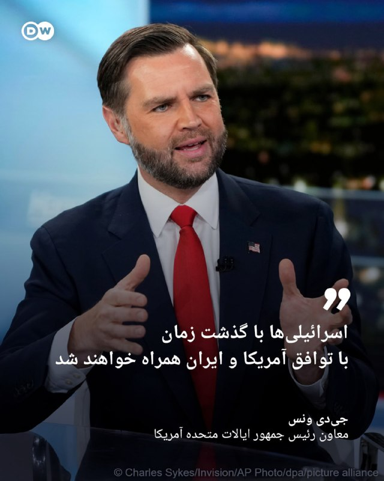

🔶ونس: اسرائیلی‌ها با گذشت زمان با توافق آمریکا و ایران همراه خواهند شد

جی‌دی ونس، معاون رئیس‌ جمهور ایالات متحده آمریکا گفت که معتقد است اسرائیل در مقطعی در آینده به توافق جاری میان ایالات متحده آمریکا و ایران برای خاتمه جنگ خواهد پیوست.

او در گفت‌وگو با شبکه ان‌بی‌سی نیوز گفت: «آنچه ما می‌دانیم این است که این توافق اسرائیل را امن‌تر خواهد کرد و کل منطقه را نیز امن‌تر خواهد کرد. آنچه من دیده‌ام حجم زیادی از اطلاعات نادرست درباره این توافق است؛ گاهی در رسانه‌های ایرانی و گاهی در رسانه‌های اسرائیلی.»

ونس افزود: «ما قویا معتقدیم که وقتی مردم اسرائیل متوجه شوند در این توافق چه مواردی وجود دارد، آن را مسیری به سوی خاورمیانه‌ای جدید و به سوی صلح و شکوفایی در آن منطقه خواهند دید. این تمام چیزی است که می‌توانیم درخواست کنیم. ما کاملا اطمینان داریم که اسرائیلی‌ها با گذشت زمان و در مراحل بعدی، با این توافق همراه خواهند شد.»

@dw_farsi

## DW_Farsi — post 126038

  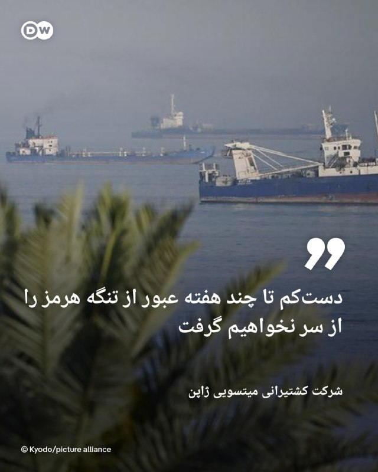

🔶 شرکت کشتیرانی میتسویی ژاپن: دست‌کم تا چند هفته عبور از تنگه هرمز را از سر نخواهیم گرفت

مدیرعامل شرکت کشتیرانی میتسویی او.اس.کی. لاینز ژاپن به روزنامه فایننشال تایمز گفته است که مالکان کشتی‌ها تا زمانی که اطمینان پیدا نکنند توافق میان ایالات متحده آمریکا و ایران "ماهیتی واقعی و عملی" دارد، دست‌کم تا چند هفته دیگر عبور از تنگه هرمز را از سر نخواهند گرفت.

شرکت میتسویی او.اس.کی. لاینز، یکی از سه شرکت بزرگ کشتیرانی ژاپن، ناوگانی متشکل از بیش از ۹۰۰ شناور شامل کشتی‌های فله‌بر، نفتکش‌ها و کشتی‌های مسافری در اختیار دارد.

جوتارو تامورا، مدیرعامل این شرکت، این اظهارات را پیش از آنکه دونالد ترامپ، رئیس‌ جمهور ایالات متحده آمریکا، توافق پایان جنگ ایران را اعلام کند، به فایننشال تایمز گفته بود.

او با اشاره به زمان‌بر بودن این فرایند گفته بود: «آنچه باید شکل بگیرد فقط یک توافق ساده میان کشورهای ذی‌ربط نیست، بلکه این توافق باید واقعی و عملی باشد و در شرایط واقعی تنگه هرمز نمود پیدا کند تا شرکت‌های کشتیرانی احساس اطمینان کنند و از این مسیر عبور کنند.»

@dw_farsi

## DW_Farsi — post 126037

  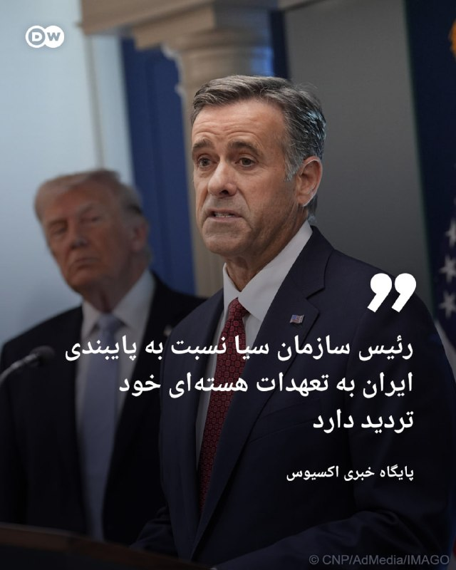

🔶 اکسیوس: رئیس‌ سازمان سیا نسبت به پایبندی ایران به تعهدات هسته‌ای خود تردید دارد

رئیس سازمان اطلاعات مرکزی آمریکا (سی‌آی‌ای) به دونالد ترامپ، رئیس ‌جمهور ایالات متحده، گفته است که یافته‌های اطلاعاتی نشان می‌دهد که جمهوری اسلامی لزوما مایل به اجرای تعهدات هسته‌ای مطرح شده خود نیست.

بر اساس گزارشی در پایگاه خبری اکسیوس که به نقل از سه منبع منتشر شده، جان رتکلیف، رئیس سازمان سیا، به مقام‌های ارشد دولت آمریکا گفته است: «اطلاعات موجود نشان می‌دهد که نیت ایران با تعهداتی که در چارچوب این توافق پذیرفته، همخوانی ندارد.»

بر اساس این گزارش، مارکو روبیو، وزیر امور خارجه ایالات متحده نیز در ابراز تردید نسبت به توافق با رتکلیف همراه بوده است. پیت هگست، وزیر دفاع ایالات متحده، نیز چنین دیدگاهی داشته است. در مقابل، جرد کوشنر و استیو ویتکاف، مشاوران ترامپ، از این توافق پایان جنگ حمایت کرده‌اند.

@dw_farsi

## DW_Farsi — post 126036

  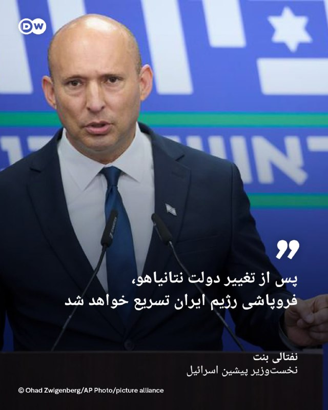

🔶نفتالی بنت: پس از تغییر دولت نتانیاهو، فروپاشی رژیم ایران تسریع خواهد شد

نفتالی بنت، نخست‌وزیر پیشین اسرائیل، در پی اعلام خبر توافق میان ایالات متحده و ایران برای پایان دادن به جنگ، از نحوه مدیریت جنگ از سوی بنیامین نتانیاهو، نخست‌وزیر اسرائیل، به شدت انتقاد کرد.

بنت در یک نشست خبری در تل‌آویو به خبرنگاران گفت: «دوره این دولت نتانیاهو با یک جنگ داخلی آغاز شد، با کشتار هفتم اکتبر ادامه یافت و اکنون با یک شکست تاریخی در برابر ایران به پایان می‌رسد.»

این سیاستمدار اسرائیلی همچنین گفت که اگر او در رأس دولت می‌بود، "بازگشت به دکترین امنیتی جنگ‌های سریع، قدرتمند و قاطع" را پیش‌ می‌گرفت، نه اینکه مانند نتانیاهو، "موضوعات را کش بدهد".

بنت همچنین گفت که در دولت او، اسرائیل بر اساس "دکترین اختاپوس" با جمهوری اسلامی مقابله خواهد کرد، به این معنا که "با یک دست، مانع هسته‌ای شدن ایران خواهد شد و با دست دیگر با استفاده از ابزارهای سیاسی، اقتصادی، فناورانه و نظامی، فروپاشی حکومت را تسریع خواهد کرد".

@dw_farsi

## DW_Farsi — post 126035

  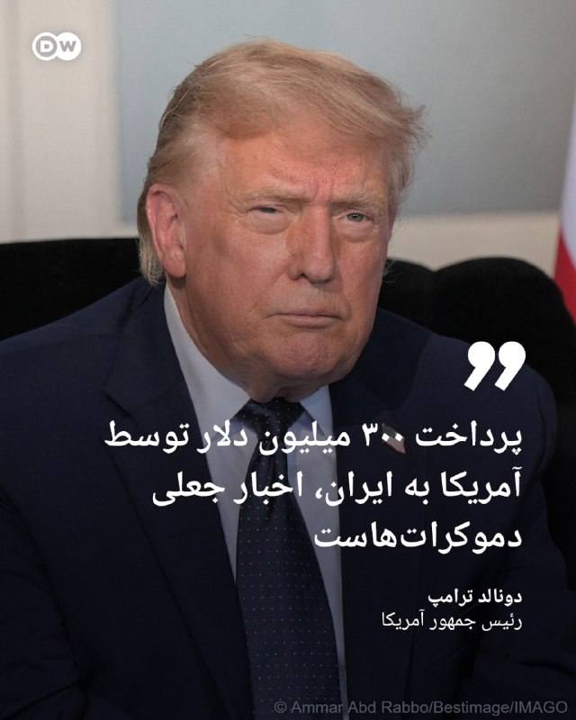

🔶 ترامپ: پرداخت ۳۰۰ میلیون دلار توسط آمریکا به ایران، اخبار جعلی دموکرات‌هاست

دونالد ترامپ، رئیس جمهور آمریکا با انتشار پستی در شبکه اجتماعی تروث سوشال نوشت: «این داستان که ایالات متحده ۳۰۰ میلیون دلار به ایران پرداخت می‌کند، اخبار جعلی است که از سوی دموکرات‌های نادان منتشر شده است.»

این ادعا در حالی مطرح می‌شود که جی‌دی ونس، معاون رئیس‌جمهور ایالات متحده، در مصاحبه تلویزیونی با شبکه سی‌بی‌اس، امکان دسترسی جمهوری اسلامی "به یک صندوق ۳۰۰ میلیارد دلاری برای بازسازی" را تایید کرده بود.

از این رو مشخص نیست که اظهارات ترامپ مبنی بر خبر پرداخت ۳۰۰ میلیون دلار به ایران، بر چه اساسی بیان شده است، چرا که معاون او، ونس، صراحتا از عدد ۳۰۰ میلیارد دلار سخن گفته است و نه ۳۰۰ میلیون دلار.

ونس در پاسخ به پرسش سی‌بی‌اس مبنی بر این که طرف ایرانی از برنامه دسترسی به یک صندوق ۳۰۰ میلیارد دلاری برای بازسازی خبر داده گفت: «این از جمله مواردی است که آن‌ها می‌توانند به آن دسترسی داشته باشند، مشروط بر اینکه به تعهدات خود عمل کنند.»

@dw_farsi

## DW_Farsi — post 126034

  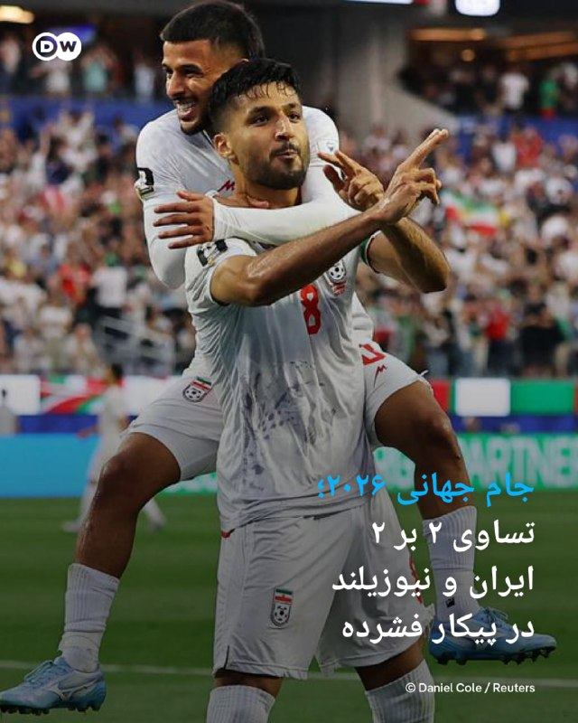

🔶 جام جهانی ۲۰۲۶؛ تساوی ۲ بر ۲ ایران و نیوزیلند در پیکار فشرده

تیم ملی فوتبال ایران در نخستین دیدار خود در جام جهانی ۲۰۲۶ به تساوی ۲ بر ۲ مقابل نیوزیلند دست یافت. گل‌های ایران را رامین رضاییان و محمد محبی به ثمر رساندند. ستاره نیوزیلند الیجا جاست بود که هر دو گل تیمش را به ثمر رساند.
در دیگر دیدار گروه "جی"، بلژیک و مصر ۱ بر ۱ مساوی شدند. به این ترتیب هر چهار تیم گروه یک امتیازی‌اند و ایران و نیوزیلند با دو گل زده بالاتر از بلژیک و مصر قرار دارند. بازی بعدی ایران روز ۲۱ ژوئن برابر بلژیک است.
@dw_farsi

## DW_Farsi — post 126030

🔶 جام‌جهانی ۲۰۲۶ تا دقیقه ۷۵؛ ایران ۲ ـ ۲ نیوزیلند

پس از پایان نیمه نخست با تساوی ۱-۱، نیوزیلند در دقیقه ۵۵ با دومین گل الیجا جاست دوباره پیش افتاد. اما ایران در دقیقه ۶۴ با ضربه سر محمد محبی روی ارسال رامین رضاییان بازی را به تساوی ۲-۲ کشاند. این دیدار در ورزشگاه سوفای لس‌آنجلس برگزار می‌شود. در دیگر دیدار گروه "جی" نیز بلژیک و مصر به تساوی ۱-۱ رضایت دادند.
@dw_farsi

## DW_Farsi — post 126025

🔶 جام‌جهانی ۲۰۲۶؛ نیمه اول: ایران ۱ - نیوزیلند ۱

دیدار تیم‌های ملی فوتبال ایران و نیوزیلند در مرحله گروهی جام جهانی ۲۰۲۶ در ورزشگاه سوفای لس‌آنجلس برگزار شد و نیمه نخست این مسابقه با تساوی ۱ بر ۱ به پایان رسید. نیوزیلند در دقیقه ۶ با گل الایجا جاست از ایران پیش افتاد، اما تیم ایران در دقیقه ۳۲ با گل رامین رضائیان بازی را به تساوی کشاند.
این دیدار تحت تدابیر شدید امنیتی برگزار شد. در بیرون از محوطه ورزشگاه نیز گروهی از ایرانیان با پرچم‌های شیر و خورشید دست به اعتراض زدند.
@dw_farsi

## Persian_Trend_Official — post 17251

  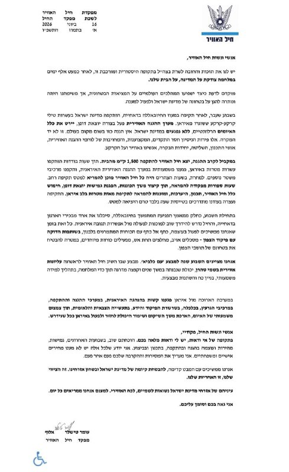

عومر تیشلر، فرمانده نیروی هوایی ارتش اسرائیل در توضیح جلوگیری ترامپ از حمله گسترده اسرائیل به ایران: تمام نیروی هوایی آماده شروع یک سورتی پرواز رزمی عظیم بود.

ساعت‌ها قبل از دستور پرواز، با کاهش زمان آمادگی، انعطاف‌پذیری استثنایی نشان داده شد و کل نیروی هوایی مسلح شد، برنامه‌ریزی، آماده‌سازی و آماده حمله به صدها هدف در قلب ایران شد حمله در حالی متوقف شد که ما فقط یک ساعت قبل از پرواز در حال توجیه اهداف به اسکادران‌ها بودیم.

📝 Amir

📌 @persian_trend_official
پرشین ترند | متفاوت‌ترین کانال نظامی

## Persian_Trend_Official — post 17250

  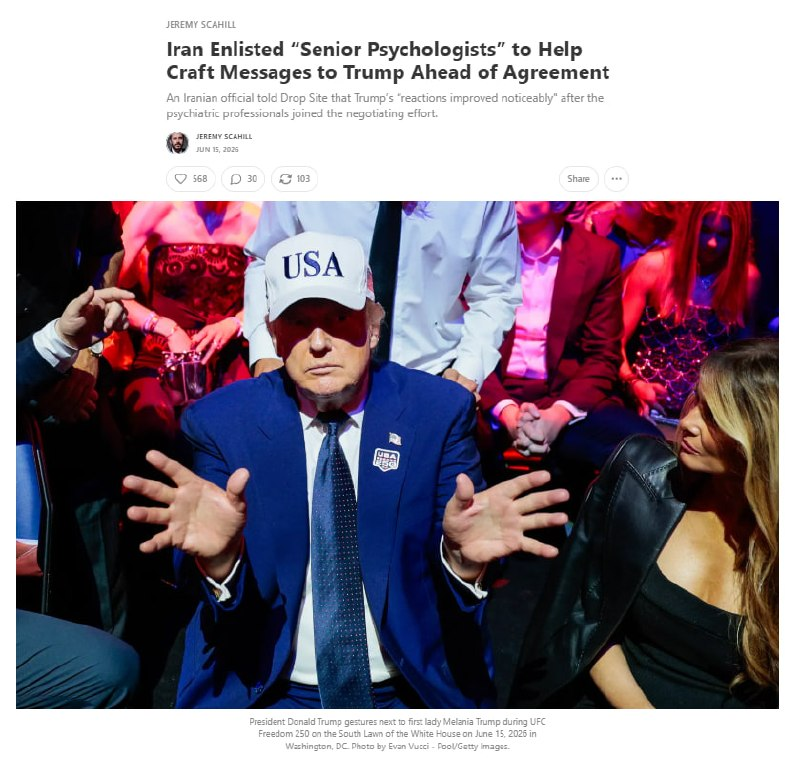

خبرگزاری دراپ سایت نیوز از نقل چند مقام ایرانی: تهران دو روانشناس ارشد را به تیم مشاوره مذاکره خود اضافه کرده است تا سبک ارتباطی رئیس جمهور ترامپ را تجزیه و تحلیل کرده و به تدوین پیام‌هایی که از طریق میانجیگران منطقه‌ای ارسال می‌شود، کمک کنند.

طبق روایت ایرانی، مشاوران یک پروفایل روانشناختی از ترامپ تهیه کردند که به گفته آنها دارای الگوی رفتاری نامنظم یا روان‌پریشانه است و پیام‌های خود را بر اساس آن تنظیم کردند.

یک مقام ایرانی ادعا کرد که پاسخ‌های ترامپ پس از اعمال توصیه‌های آنها بهبود یافته است و روند مذاکره را به طور فزاینده‌ای بالینی توصیف کرد.

این روانشناسان پس از آغاز مذاکرات غیرمستقیم در اسلام آباد در ماه آوریل، همزمان با تبادل پیشنهادهای ایران و ایالات متحده برای یک یادداشت تفاهم، به حلقه مشاوره پیوستند.

📝 Amir

📌 @persian_trend_official
پرشین ترند | متفاوت‌ترین کانال نظامی

## Persian_Trend_Official — post 17249

  <a href="telegram/content/Persian_Trend_Official_17249_1781603210.mp4" target="_blank">🎬 Download video</a>

معاون رئیس جمهور امریکا، جی دی ونس:
جالب‌ترین نکته در مورد پیشرفتی که در چند هفته گذشته داشته‌ایم این است که می‌بینید افرادی در درون نظام ایران از رهبری ارشد گرفته تا حتی مقامات سپاه پاسداران می‌گویند: می‌دانید؟ ما ممکن است مقداری خصومت و بی‌اعتمادی داشته باشیم، اما می‌دانیم که روشی که 47 سال با ایالات متحده تجارت کرده‌ایم، اشتباه بوده است. بیایید چیز دیگری را امتحان کنیم.

📝 Amir

📌 @persian_trend_official
پرشین ترند | متفاوت‌ترین کانال نظامی

## Persian_Trend_Official — post 17248

  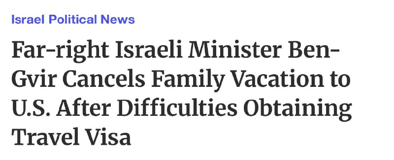

به گزارش هاآرتص، بن گویر، وزیر امنیت ملی اسرائیل، پس از مواجهه با مشکلاتی در اخذ ویزای آمریکا، سفر خانوادگی برنامه‌ریزی‌شده خود به ایالات متحده را لغو کرد.

بن گویر قصد داشت برای شرکت در عروسی دختر یک تاجر اسرائیلی به میامی سفر کند، اما این سفر در نهایت به دلیل مشکلات ویزا لغو شد.

📝 Amir

📌 @persian_trend_official
پرشین ترند | متفاوت‌ترین کانال نظامی

## Persian_Trend_Official — post 17247

  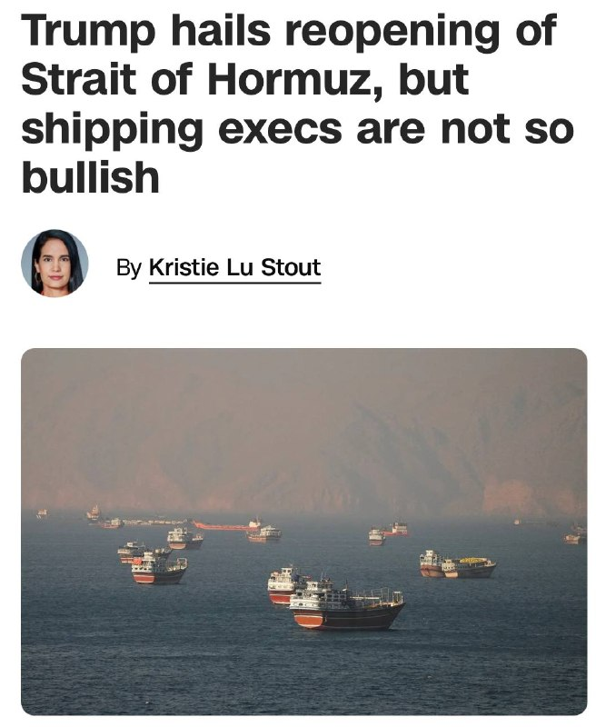

خبرگزاری CNN: ترامپ می‌گوید تنگه هرمز پس از توافق آمریکا و ایران بازگشایی شده است اما در سراسر صنعت کشتیرانی، اعتماد همچنان کم است.

تهدیداتی از جمله مین، پهپاد و حملات موشکی همچنان مانع حرکت می‌شوند، در حالی که خستگی خدمه پس از ماه‌ها عدم اطمینان، ریسک عملیاتی بیشتری را افزایش می‌دهد. داده‌های ردیابی کشتی کپلر هیچ حرکت معناداری را در بین 220 نفتکش و نزدیک به 500 کشتی که در حال حاضر در خلیج فارس لنگر انداخته‌اند، نشان نمی‌دهد.

آنگاد بانگا، مدیرعامل گروه کاراول، می‌گوید کشتی‌هایش آماده حرکت هستند اما موقعیت خود را حفظ کرده‌اند: ما تا زمانی که 30 روز ترانزیت بدون حادثه داشته باشیم، نیروی انسانی و آمادگی خود را حفظ می‌کنیم. نه سه روز بلکه سی روز.

پس از این همه شروع اشتباه، صنعت کشتیرانی محتاط خواهد بود. تیم هاکسلی، رئیس هیئت مدیره ماندارین شیپینگ، افزود که جریان‌های تجاری و زیرساخت‌های آسیب‌دیده خاورمیانه برای بازیابی به زمان قابل توجهی نیاز دارند.

📝 Amir

📌 @persian_trend_official
پرشین ترند | متفاوت‌ترین کانال نظامی

## Persian_Trend_Official — post 17244

تصاویر ماهواره ای جدید از استقرار جنگنده‌های Su-34ME الجزایری منتشر شد.

براساس تصاویر ماهواره ای جدید منتشر شده از پایگاه هوایی مولای احمد مدغری چند فروند جنگنده Su-34 در این پایگاه مشاهده می‌شود، در این تصاویر دست کم 4 فروند جنگنده Su-34ME دیده می‌شود.

📝 Amir

📌 @persian_trend_official
پرشین ترند | متفاوت‌ترین کانال نظامی

## Persian_Trend_Official — post 17243

عراقچی: از صبح دیروز جنگ رسماً در تمام جبهه‌ها تمام شده و هر حملهٔ اسرائیل به لبنان نقض تفاهم است.

📝 Amir

📌 @persian_trend_official
پرشین ترند | متفاوت‌ترین کانال نظامی

## Persian_Trend_Official — post 17242

  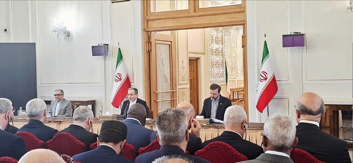

عراقچی: دور جدید مذاکرات ایران و آمریکا جمعه آغاز می‌شود.

وزیر امور خارجه در نشست با سفرا و روسای نمایندگی‌های خارجی و بین‌المللی: یادداشت تفاهم ایران و آمریکا برای خاتمه جنگ در روز جمعه به صورت رسمی امضا خواهد شد.

همان روز دور جدید مذاکرات ایران و آمریکا برای رسیدن به توافق نهایی آغاز می‌شود. بعد از امضای یادداشت تفاهم، مذاکرات بین ایران و آمریکا ادامه پیدا می‌کند.

این مذاکرات به مدت 60 روز ادامه پیدا خواهد کرد تا به یک توافق نهایی برسیم. این توافق نهایی مربوط به موضوعات هسته‌ای و لغو تحریم‌هاست.

📝 Amir

📌 @persian_trend_official
پرشین ترند | متفاوت‌ترین کانال نظامی

## Persian_Trend_Official — post 17241

ترامپ: ایران موافقت کرده است که هرگز سلاح هسته‌ای نداشته باشد! ادعاها مبنی بر اینکه آمریکا 300 میلیون دلار به ایران پرداخت می‌کند، اخبار جعلی است و هیچ پولی به ایران داده نمی‌شود. 📝 Amir 📌 @persian_trend_official پرشین ترند | متفاوت‌ترین کانال نظامی

## Persian_Trend_Official — post 17240

  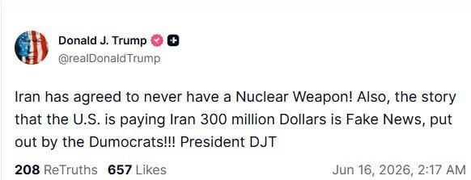

ترامپ: ایران موافقت کرده است که هرگز سلاح هسته‌ای نداشته باشد! ادعاها مبنی بر اینکه آمریکا 300 میلیون دلار به ایران پرداخت می‌کند، اخبار جعلی است و هیچ پولی به ایران داده نمی‌شود.

📝 Amir

📌 @persian_trend_official
پرشین ترند | متفاوت‌ترین کانال نظامی

## Persian_Trend_Official — post 17237

ارتش اسرائیل ادعا می‌کند که ۱۸ کارگاه ساخت بمب دست‌ساز را در شهر نابلس در کرانه باختری، واقع در اردوگاه پناهندگان بلاطه و اردوگاه پناهندگان راس‌العین، منهدم کرده است.

اگر این ادعا درست باشد، نمونه دیگری از تلاش مبارزان فلسطینی از گروه مسلح محلی عملاً منحل شده «گردان نابلس» برای احیای مجدد در پایگاه‌های قبلی خود در نابلس خواهد بود.

👺Phantom

📌 @persian_trend_official
پرشین ترند | متفاوت‌ترین کانال نظامی

## Persian_Trend_Official — post 17236

  <a href="telegram/content/Persian_Trend_Official_17236_1781603213.webm" target="_blank">🎬 Download video</a>

یک منبع آگاه به انتخاب: در پی هشدارهای جدی قالیباف و مقاومت او بر سر خطوط قرمز، ترامپ در لحظات پایانی عقب نشینی کرد و محاصره دریایی علیه ایران را که قرار بود براساس متن تفاهم در طول 30 روز بردارد، به صورت کامل و درجا لغو کرد. 📝 Amir 📌 @persian_trend_official…

## Persian_Trend_Official — post 17235

  <a href="telegram/content/Persian_Trend_Official_17235_1781603214.mp4" target="_blank">🎬 Download video</a>

شاهکاری که استاد خوش‌چشم، تحلیل‌گر ارشد صداوسیما در زمان اعلام توافق خلق کرد؛

مجری میگه نخست وزیر پاکستان گفت توافق تایید شد
استاد میگه نه قسم میخورم ترامپ بهش گفته اینو بگه، اینا میخوان بازار نفت رو کنترل کنن ، من از پشت پرده خبر دارم که قراره اسرائیل رو بزنیم، خیالتون راحت.

👺Phantom

📌 @persian_trend_official
پرشین ترند | متفاوت‌ترین کانال نظامی

## Persian_Trend_Official — post 17234

  <a href="telegram/content/Persian_Trend_Official_17234_1781603215.webm" target="_blank">🎬 Download video</a>

فرمانده نیروی هوایی اسرائیل: تنها یک ساعت تا حمله گسترده به ایران مانده بود.

عومر تیشلر، فرمانده نیروی هوایی ارتش اسرائیل، اعلام کرد که ساعاتی پیش از توقف عملیات، کل نیروی هوایی به حالت کامل رزمی درآمده بود؛ هواپیماها مسلح شده، صدها هدف در عمق خاک ایران شناسایی و برنامه‌ریزی شده بود و اسکادران‌ها دقیقاً یک ساعت پیش از پرواز در حال توجیه نهایی اهداف بودند.

👺Phantom

📌 @persian_trend_official
پرشین ترند | متفاوت‌ترین کانال نظامی

## Persian_Trend_Official — post 17232

حملات توپخانه‌ای اسرائیل به جنوب لبنان

ب گزارش شبکه المیادین توپخانه ارتش اسرائیل، ارتفاعات «جبل الرفیع» و مناطق اطراف شهرک «العیشیه» در شهرستان جزین جنوب لبنان را هدف قرار داد.

👺Phantom

📌 @persian_trend_official
پرشین ترند | متفاوت‌ترین کانال نظامی

## RadioFarda — post 158374

  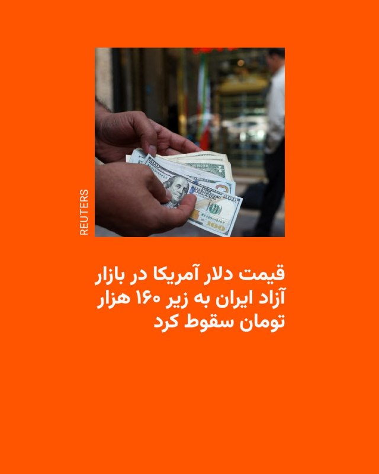

🔸 روند کاهشی قیمت ارزهای خارجی در بازار آزاد ایران روز سه‌شنبه ۲۶ خرداد هم ادامه یافت و گزارش وب‌سایت‌های اعلام نرخ ارز و طلا نشان می‌دهد که قیمت دلار آمریکا به زیر ۱۶۰ هزار تومان رسید و ظهر روز سه‌شنبه در محدودهٔ ۱۵۸ هزار تومان معامله شد.

🔸قیمت سکه طلا هم ۱۶۲ میلیون تومان گزارش شد که نشان‌دهنده کاهش دست‌کم پنج میلیون تومانی آن نسبت به روز قبل است.

🔸از زمان اعلام توافق ایران و آمریکا برای پایان جنگ، قیمت ارزهای خارجی و سکه طلا در بازار آزاد ایران شاهد کاهش قابل توجهی بوده است.

🔸قیمت ارزهای خارجی و طلا طی ماه‌های گذشته به شدت افزایش یافته بود و قیمت دلار آمریکا در مقطعی تا مرز ۱۹۰ هزار تومان هم رسیده بود.

@RadioFarda

## RadioFarda — post 158373

  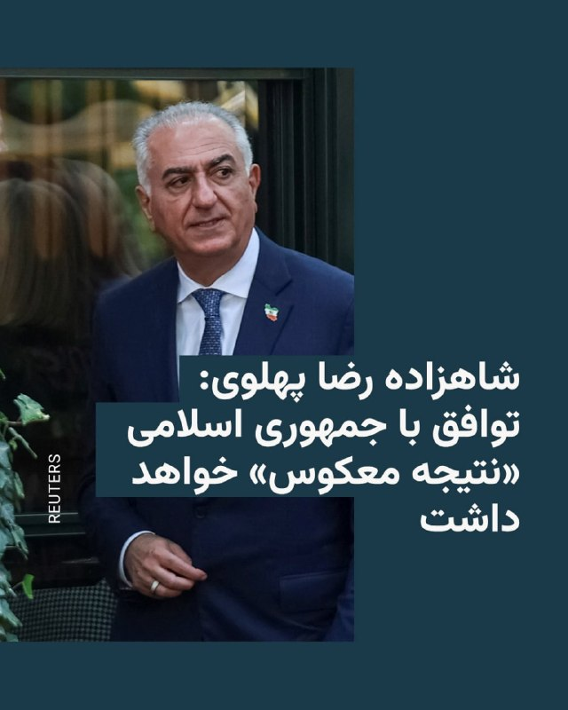

🔸شاهزاده رضا پهلوی در گفت‌وگو با مجله تایمز، با انتقاد از توافق تازه میان ایران و آمریکا، آن را از نظر اخلاقی «غلط» و از نظر راهبردی «گمراه‌کننده» توصیف کرد و گفت هر توافقی با جمهوری اسلامی در نهایت شکست خواهد خورد.

🔸او با تأکید بر این‌که نمی‌توان به جمهوری اسلامی اعتماد کرد، گفت این حکومت به سرکوب مخالفان، باج‌خواهی از جامعه جهانی و گسترش بی‌ثباتی در منطقه ادامه خواهد داد. آقای پهلوی همچنین گفت مردم ایران باید در مرکز هرگونه مذاکره و سیاست‌گذاری بین‌المللی درباره ایران قرار گیرند.

🔸رضا پهلوی در بخش دیگری از این گفت‌وگو، «تغییر رژیم» را تنها راه‌حل ممکن دانست و گفت جمهوری اسلامی به دلیل ماهیت خود «ناسازگار با جهان آزاد» است. او همچنین اظهار داشت که «حملات آمریکا و اسرائیل از سوی بسیاری از ایرانیان به‌عنوان اقدامی آزادی‌بخش تلقی شده است.»

🔸شاهزاده رضا پهلوی تأکید کرد که تعیین رهبر آینده ایران تنها بر عهده مردم ایران است و این موضوع باید از طریق صندوق رأی مشخص شود.

@RadioFarda

## RadioFarda — post 158372

  <a href="https://t.me/radiofarda/158372" target="_blank">📎 Download file</a>

🔸از «بچه‌ها متشکریم» ویگن تا «ایران، ایران» آرش؛ از سرودهای رسمی تا حجم انبوهی از ترانه‌های حماسی دهه‌های گذشته؛ تیم ملی فوتبال ایران برای حضور در جام جهانی ۲۰۲۶، مسیری پر فراز و نشیب را طی کرده است، مسیری که در احساس مشترک یکی-دو ترانهٔ فوتبالی به خاطره‌ای جمعی تبدیل شده‌اند و چه بسیار کارها که از محدودهٔ عاطفی زمان خود فراتر نرفته‌اند و به فراموشی سپرده شده‌اند.

🔸رمز ماندگاری آن‌ها و فراموشی این عدهٔ پرتعداد در چیست و چه شد که از آغاز سال ۱۴۰۰ خورشیدی تب و تاب تولید این آثار فروکش کرد، تا برسیم به جام جهانی ۲۰۲۶، سالی که تنها تک ترانه‌ای رسمی به نام «آواز باشکوه» در کنار ترانه‌ای غیر رسمی به نام «بدو-بدو» با صدای عرفان طهماسبی در سبد همراهی اجتماعی با تیم ملی فوتبال ایران دیده می‌شوند.

🔸در برنامهٔ رادیویی «پاراگراف اول»، بهرنگ قدرتی آهنگساز و کارشناس موسیقی در لندن همراه با محمد حیرانی روزنامه‌نگار و کارشناس فوتبال از فرانکفورت، رابطهٔ موسیقی، هویت جمعی، سیاست و تیم ملی فوتبال را با یادآوری نمونه‌هایی از این تولیدات به بحث گذاشته‌اند.

@RadioFarda

## RadioFarda — post 158371

  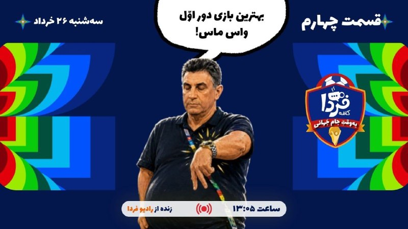

📷 Photo

## RadioFarda — post 158370

  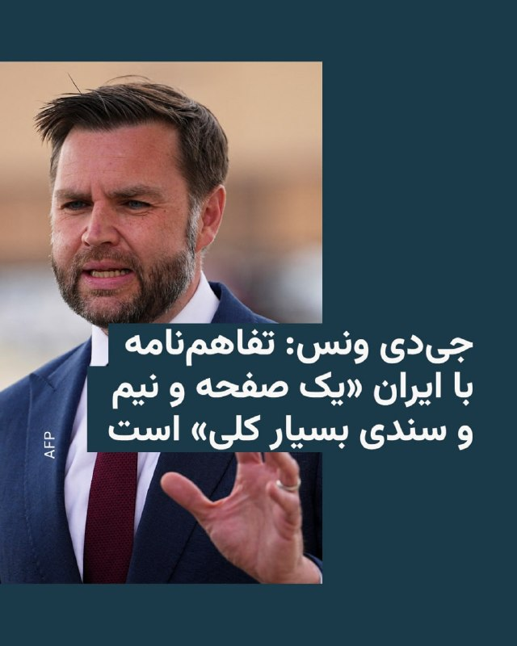

🔸جی‌دی ونس، معاون رئیس‌جمهور آمریکا، روز دوشنبه گفت تفاهم‌نامه امضاشده میان آمریکا و ایران «سندی بسیار کلی» است و جزئیات توافق باید در جریان مذاکرات بعدی مشخص شود.

🔸ونس به شبکه سی‌ان‌ان گفت: «این تفاهم‌نامه حدود یک صفحه و نیم است، بنابراین سندی بسیار کلی به شمار می‌رود. درباره شماری از مسائل، باید در مرحله مذاکرات فنی جزئیات را مشخص کنیم.»

🔸ایران و آمریکا روز یک‌شنبه، ۲۴ خردادماه، بالاخره بر سر متن یک تفاهم‌نامه توافق کردند که به گفته جی‌دی ونس در همین روز به صورت الکترونیکی امضا شده است. با این حال هر یک از طرفین از مفادی در این متن سخن می‌گویند که ظاهرا با یکدیگر تفاوت چشمگیر دارد.

🔸هر دو طرف روز دوشنبه وعده داده‌اند که متن کامل تفاهم‌نامه روز جمعه بلافاصله پس از امضای رسمی منتشر شود و روایت‌شان از متن ثابت شود.

🔸دونالد ترامپ، رئیس‌جمهور آمریکا، روز دوشنبه گفت پس از اعلام توافق میان واشینگتن و تهران برای پایان دادن به جنگ خاورمیانه، کشتی‌ها بار دیگر در تنگه هرمز در حال تردد هستند و این مسیر راهبردی انتقال نفت تا روز جمعه «کاملاً باز» خواهد شد.

@RadioFarda

## RadioFarda — post 158369

هراس از صحبت کردن؛ ایرانی‌ها می‌گویند فضای ترس بدتر از زمان قبل از جنگ است

🔸در طول چندین ماه جنگ و سپس آتش‌بس میان ایالات متحده و ایران، شنیدن صدای ایرانیان عادی در میان فضای رو‌به‌افزایشِ ترس، بسیار دشوارتر شده است.

🔸برخی افراد شجاع همچنان به گفت‌وگو با خبرنگاران رسانه‌های خارجی، از جمله رادیو فردا وابسته به رادیو اروپای آزاد/رادیو آزادی، ادامه داده‌اند، هرچند تقریباً همیشه بر ناشناس ماندن خود تأکید کرده‌اند. این وضعیت حتی زمانی که خبر توافق بر سر چارچوبی برای پایان جنگ بین واشینگتن و تهران اعلام شد، برقرار بود.

🔸اما در بسیاری از موارد، حتی منابعی که پیش‌تر آماده بودند درباره رویدادهای کشورشان شهادت دهند، اکنون سکوت کرده‌اند.

🔸برخی روایت کرده‌اند که مقام‌های امنیتی به آن‌ها هشدار داده‌اند به‌ویژه با رسانه‌های فارسی‌زبانِ تحت پوشش دولت آمریکا، مانند رادیو فردا، صحبت نکنند. این در حالی است که سرکوب در جریان است و مقام‌های ایرانی می‌گویند شمار بیشتری به اتهام «جاسوسی» و «همکاری با دشمن» متهم شده‌اند.

🔸در هفته‌های اخیر، ساکنان ایران بارها به ترس از بازداشت و پیگرد قضایی اشاره کرده‌اند، و نیز به احتمال بالای وقوع چنین پیامدهایی در صورت ارتباط با رادیو فردا.

🔸نسخه کامل این گزارش را در وب‌سایت رادیوفردا بخوانید.

@RadioFarda

## RadioFarda — post 158368

  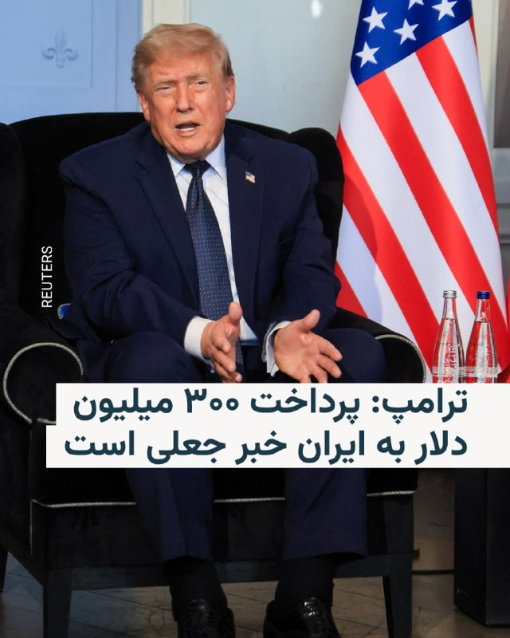

🔸دونالد ترامپ، رئیس‌جمهور آمریکا، گزارش‌هایی را که مدعی شده‌اند آمریکا ۳۰۰ میلیون دلار به ایران پرداخت خواهد کرد، «اخبار جعلی» خواند.

🔸او در پیامی در شبکه اجتماعی تروث سوشال نوشت: «ایران پذیرفته است هرگز سلاح هسته‌ای نداشته باشد! همچنین خبر پرداخت ۳۰۰ میلیون دلار از سوی آمریکا به ایران، اخبار جعلی است که دموکرات‌های نادان منتشر کرده‌اند.»

🔸پیش‌تر روزنامه فایننشال تایمز روز دوشنبه گزارش داده بود که دولت ترامپ در حال بررسی حمایت از ایجاد یک صندوق سرمایه‌گذاری ۳۰۰ میلیارد دلاری برای بازسازی ایران است. با این حال، دونالد ترامپ در پیام خود از رقم «۳۰۰ میلیون دلار» یاد کرد، نه ۳۰۰ میلیارد دلار.

🔸روزنامه فایننشال تایمز به نقل از یک «منبع آگاه» نوشته بود «صندوق ۳۰۰ میلیارد دلاری که دولت دونالد ترامپ برای ایران در نظر دارد»، از سوی شرکت‌های علاقه‌مند به سرمایه‌گذاری در ایران تأمین خواهد شد و منابع آن از دولت‌ها نخواهد بود.

@RadioFarda

## RadioFarda — post 158367

  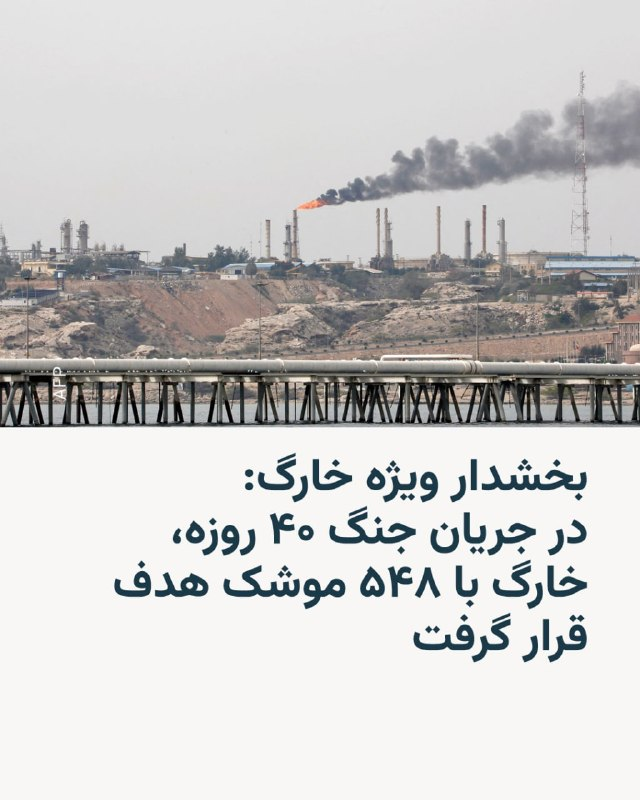

🔸بخشدار ویژه جزیره خارگ می‌گوید که در جریان جنگ ۴۰ روزه آمریکا و اسرائیل با ایران، «۵۴۸ موشک» به این جزیره اصابت کرد.

🔸نگهدار حسین‌پور این خبر را روز سه‌شنبه ۲۶ خرداد در همایش سراسری «حکمرانی هم‌افزا» با حضور مسعود پزشکیان، رئیس‌جمهور، و سایر مقام‌های جمهوری اسلامی بیان کرد.

🔸به گزارش خبرگزاری ایسنا، او گفت که در یکی از شدیدترین حملات، در روز ۲۶ اسفند، ۵۰ اصابت به این جزیره صورت گرفت. همچنین طی دو روز متوالی، شش فروند شناور مسافربری با هدف قطع ارتباط جزیره با سرزمین اصلی مورد هدف قرار گرفت.

🔸بخشدار ویژه خارگ افزوده که به‌رغم این حملات، «نه تنها صادرات بیش از ۹۰ درصد نفت کشور» از این جزیره «بدون اختلال» ادامه یافت، بلکه ارتباط جزیره با سرزمین اصلی هرگز قطع نشد.

🔸جزیره خارگ یکی از نقاط استراتژیک ایران محسوب می‌شود که دونالد ترامپ، رئیس‌جمهور ایالات متحده، بارها تهدید کرده بود که از سوی ایالات متحده اشغال خواهد شد تا ایران نتواند نفت صادر کند.

🔸ایران از دههٔ ۱۳۴۰ و پس از ساخت تأسیسات نفتی در جزیره خارگ، به‌شدت برای صادرات نفت خود به آن وابسته بوده است.

@RadioFarda

## RadioFarda — post 158366

  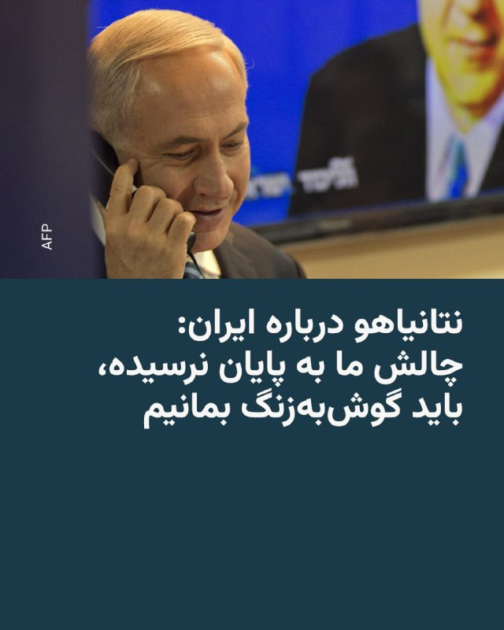

🔸بنیامین نتانیاهو، نخست وزیر اسرائیل، روز دوشنبه در یک کنفرانس خبری تأکید کرد که به‌رغم امضای تفاهم‌نامه میان ایران و آمریکا، چالش کشور اسرائیل به پایان نرسیده و «ما باید گوش به‌زنگ بمانیم و در مواقع لزوم از خود دفاع کنیم».

🔸به گفته دولت آمریکا، جمهوری اسلامی در قالب تفاهم‌نامه‌ای که روز یک‌شنبه امضا شد تعهد داده است که هرگز به دنبال سلاح هسته‌ای نرود.

🔸نخست وزیر اسرائیل در ادامه سخنان خود تأکید کرد که «با یا بدون توافق، ایران هرگز به سلاح هسته‌ای دست نخواهد یافت».

🔸بنیامین نتانیاهو همچنین گفت که این توافق «از آن ایالات متحده است، توسط رئیس جمهور ایالات متحده، و او معتقد است که هم می‌تواند بر برنامه هسته‌ای نظارت داشته باشد و هم آن را خنثی کند».

🔸او تأکید کرد که این تصمیم دونالد ترامپ است، اما نتانیاهو برای او روشن کرده که اسرائیل منافع خود را دارد.

🔸نتانیاهو در نشست خبری خود همچنین گفت که حملات مشترک در کنار آمریکا به ایران خساراتی سنگین وارد کرده و به گفته او «بعضی معتقدند که خسارت اقتصادی به ایران یک تریلیون دلار بوده است».

@RadioFarda

## RadioFarda — post 158365

  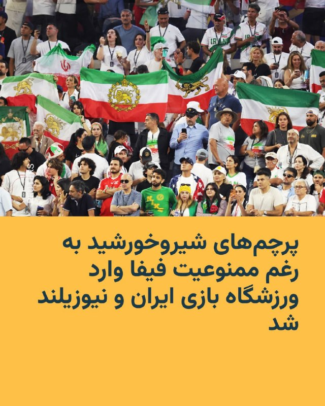

🔸خبرگزاری رویترز در گزارشی از فضای حاکم بر مسابقه تیم‌های فوتبال ایران و نیوزیلند در جام جهانی، خبر داد که به‌رغم ممنوعیت فیفا، پرچم‌های شیروخورشید وارد ورزشگاه محل بازی شد.

🔸این خبرگزاری به واکنش‌های متفاوت و متضاد تماشاگران ایرانی حاضر در ورزشگاه سوفای شهر لس‌آنجلس اشاره کرده و نوشته که اختلافات روی سکوها، بازتابی از چالش‌های پیش روی تیم ملی ایران در خارج از زمین مسابقه بود.

🔸رویترز به اقدام همزمان دو گروه متفاوت تماشاگران هنگام پخش سرود ملی تیم ایران اشاره کرده و نوشته است سوت زدن گروهی از تماشاگران در مقابل همخوانی گروه دیگری، بازتاب‌دهنده اهمیت نمایش وفاداری سیاسی در مقابل خود فوتبال بود.

🔸به نوشته آن، از حملات و گل‌های ایران از سوی بسیاری از تماشاگران، از جمله بخشی از هوادارانی که پرچم شیر و خورشید مربوط به ایران قبل از انقلاب را حمل می‌کردند، استقبال شد. اما گروهی از تماشاگران، گل‌های تیم نیوزیلند را جشن گرفتند.

@RadioFarda

## RadioFarda — post 158364

  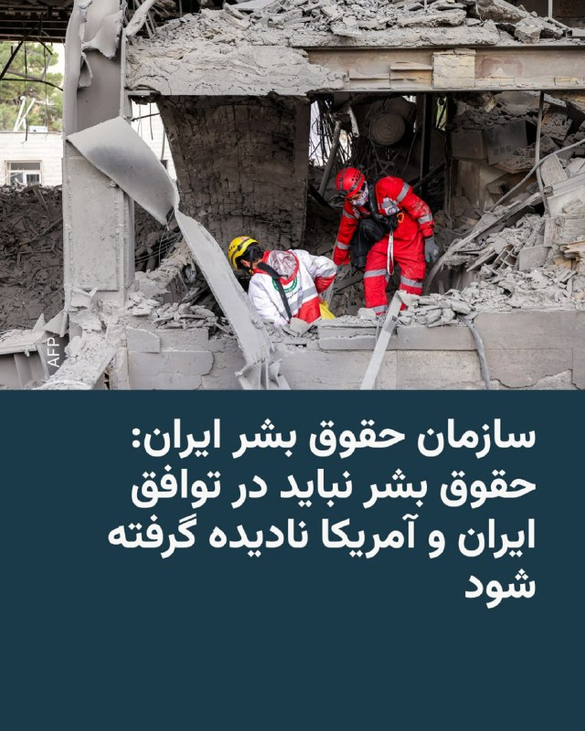

🔸سازمان حقوق بشر ایران با استقبال از توافق اعلام‌شده میان جمهوری اسلامی ایران و ایالات متحده برای پایان جنگ، هشدار داد که وضعیت حقوق بشر در ایران نباید در روند مذاکرات و تعاملات آینده با جمهوری اسلامی به حاشیه رانده شود.

🔸این سازمان روز دوشنبه ۲۵ خرداد اعلام کرد که در جریان جنگی که از ۹ اسفند ۱۴۰۴ آغاز شد و پس از ۴۰ روز با آتش‌بس متوقف شد، هزاران نفر کشته یا بازداشت شدند و شمار اعدام‌های سیاسی و امنیتی به بالاترین سطح خود در حدود سه دهه گذشته رسید.

🔸سازمان حقوق بشر ایران همچنین به موج بازداشت‌ها در ماه‌های اخیر اشاره کرده و گفته است که مقام‌های جمهوری اسلامی از بازداشت بیش از شش هزار و ۵۰۰ نفر از زمان آغاز جنگ خبر داده‌اند.

🔸محمود امیری‌مقدم، مدیر سازمان حقوق بشر ایران، در این بیانیه گفت جنگ «نه‌تنها ارتباطی با حقوق بشر مردم ایران نداشت، بلکه تأثیر آن بر وضعیت حقوق بشر در ایران به‌شدت منفی بود». او افزود که مقام‌های جمهوری اسلامی از شرایط جنگی برای تشدید سرکوب داخلی استفاده کردند و در این مدت «هزاران ایرانی به‌طور خودسرانه بازداشت شدند و شاهد افزایش چشمگیر اعدام زندانیان سیاسی بودیم».

@RadioFarda

## RadioFarda — post 158363

  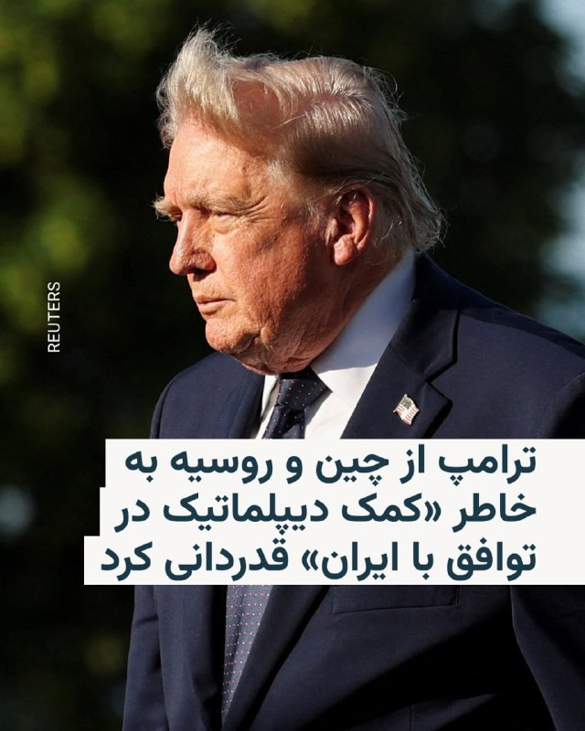

🔸دونالد ترامپ، رئیس‌جمهور آمریکا، از نقش چین و روسیه در دستیابی به توافق اولیه میان واشینگتن و تهران قدردانی کرد و گفت شی جین‌پینگ و ولادیمیر پوتین به ایجاد شرایط لازم برای این توافق کمک کرده‌اند.

🔸ترامپ در گفت‌وگو با روزنامه نیویورک تایمز اظهار داشت که چین و روسیه با خودداری از ارسال نفتکش‌ها و کشتی‌های تجاری از تنگه هرمز، به تلاش‌های آمریکا برای اعمال فشار بر ایران از طریق محاصره دریایی لطمه نزدند. او درباره رئیس‌جمهور چین گفت: «او کاملاً مؤدبانه رفتار کرد و برای شکستن محاصره نفتکش نفرستاد.»

🔸رئیس‌جمهور آمریکا همچنین از گفت‌وگوی تلفنی خود با ولادیمیر پوتین در روز یک‌شنبه خبر داد. کاخ سفید تاکنون جزئیات بیشتری درباره نحوه کمک چین و روسیه به توافق ایران و آمریکا ارائه نکرده است.

🔸چین بزرگ‌ترین خریدار نفت ایران و یکی از مهم‌ترین شرکای تهران به شمار می‌رود و روسیه نیز در ماه‌های اخیر میزبان دیپلمات‌های ایرانی و در تماس با مقام‌های آمریکایی بوده است.

@RadioFarda

## RadioFarda — post 158362

🔸تیم ملی فوتبال ایران شامگاه دوشنبه ۲۵ خرداد به وقت محلی، در نخستین مسابقه خود در جام جهانی ۲۰۲۶ به مصاف نیوزیلند رفت؛ دیداری که در فضایی سیاسی و تحت تدابیر شدید امنیتی در لس‌آنجلس برگزار شد.

🔸این مسابقه در ورزشگاه سوفای در اینگلوود شهر لس‌‌آنجلس برگزار شد.

🔸خبرگزاری‌های فرانسه و رویترز گزارش دادند که بین ۳۰۰ تا ۵۰۰ نفر از مخالفان جمهوری اسلامی پیش از آغاز مسابقه در بیرون ورزشگاه تجمع کردند.

🔸بسیاری از آنها پرچم شیر و خورشید را در دست داشتند و شعارهایی علیه حکومت ایران سر دادند.

🔸معترضان به رسانه‌ها گفتند که تیم ملی نماینده مردم ایران نیست و حضور در ورزشگاه را نوعی حمایت از جمهوری اسلامی تلقی می‌کنند. با این حال، بنابر این گزارش‌ها، گروهی دیگر از ایرانیان برای حمایت از تیم ملی به ورزشگاه رفتند و خواستار کنار گذاشتن اختلافات سیاسی در جریان مسابقات شدند.

🔸به گزارش رویترز، با وجود هشدارهای فیفا درباره ممنوعیت نمادهای سیاسی در ورزشگاه‌ها، شماری از تماشاگران با پرچم شیر و خورشید یا لباس‌هایی با این نماد از بازرسی‌های امنیتی عبور کردند و در سکوها نیز این پرچم‌ها دیده شد.

@RadioFarda

## RadioFarda — post 158361

  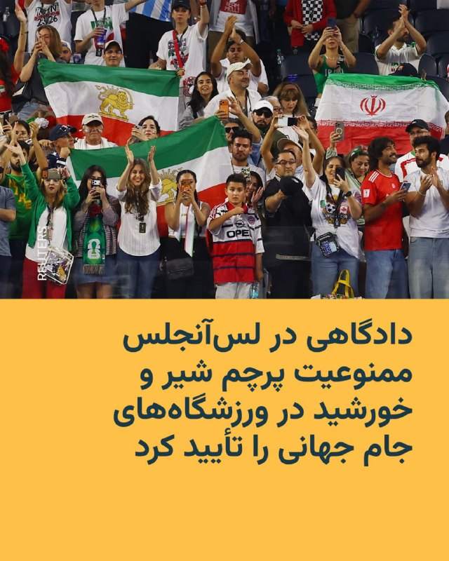

🔸روزنامه نیویورک تایمز گزارش داد که یک دادگاه در لس‌آنجلس روز دوشنبه درخواست لغو ممنوعیت نمایش پرچم شیر و خورشید در ورزشگاه‌های جام جهانی را رد کرده و به فیفا اجازه داده است این ممنوعیت را حفظ کند.

🔸این شکایت از سوی مؤسسه «صدای آزادی» و یکی از هواداران تیم ملی ایران مطرح شده بود که می‌گفتند دارندگان بلیت باید حق داشته باشند پرچم مورد نظر خود را به ورزشگاه بیاورند. با این حال، قاضی پرونده با اشاره به «ملاحظات امنیتی و خصوصی بودن ورزشگاه‌ها»، درخواست آنان را نپذیرفت.

🔸فیفا پیش‌تر اعلام کرده بود که اقلام و نمادهای دارای ماهیت سیاسی در ورزشگاه‌های جام جهانی ممنوع هستند. به نوشته نیویورک تایمز، منابع آگاه در فیفا این‌گونه اظهار نظر کرده‌اند که پرچم پیش از انقلاب ایران به دلیل «ماهیت سیاسی آن» مشمول این ممنوعیت شده است.

🔸این حکم تنها چند ساعت پیش از نخستین دیدار تیم ملی ایران در جام جهانی ۲۰۲۶ برابر نیوزیلند صادر شد. با وجود این ممنوعیت، گزارش شده است که در برخی مسابقات قبلی جام جهانی، تعدادی از تماشاگران پرچم شیر و خورشید را در ورزشگاه‌ها به نمایش گذاشته بودند.

@RadioFarda

## RadioFarda — post 158360

  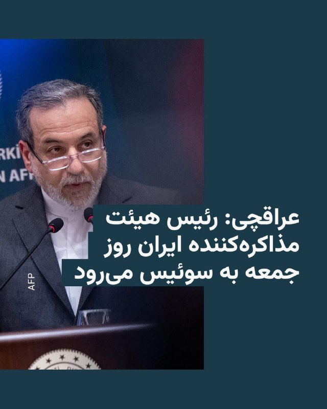

🔸عباس عراقچی، وزیر امور خارجه ایران، روز دوشنبه ۲۵ خرداد به خبرنگاران گفت که قرار است روز جمعه در کشور سوئیس که محل دقیق آن مشخص خواهد شد، دیداری بین هیئت‌های دوطرف انجام شود.

🔸او توضیح داد که در این دیدار، «قرار است روسای هیئت‌های دو طرف ابتدا این یادداشت تفاهم را امضا کنند و پس از آن اولین دور مذاکرات بعدی را داشته باشیم.»

🔸رسانه‌ها در ایران پیشتر از قالیباف به عنوان رئیس هیئت مذاکره‌کننده با آمریکا یاد کرده بودند.

🔸یک مقام دولت آمریکا به رادیوفردا گفت که تفاهم‌نامه الکترونیکی روز یک‌شنبه از طرف ایران توسط محمدباقر قالیباف، رئیس مجلس شورای اسلامی، امضا شده است.

🔸تفاهم‌نامه موسوم به تفاهم‌نامه اسلام‌آباد از طرف آمریکا هم توسط دونالد ترامپ و معاون او، جی‌دی‌ ونس، امضا شده است.

🔸به گفته این مقام، جزئیات این تفاهم‌نامه در یک تا دو روز آینده رسانه‌ای خواهد شد.

🔸عباس عراقچی در ادامه سخنان روز دوشنبه خود گفت که «این تفاهم می‌تواند راهگشایی‌های اقتصادی برای ما داشته باشد، اما اقتصاد ما نباید خود را متکی و موکول به این قبیل توافقات اقتصادی از طریق مذاکره با آمریکا کند.»

@RadioFarda

## RadioFarda — post 158359

  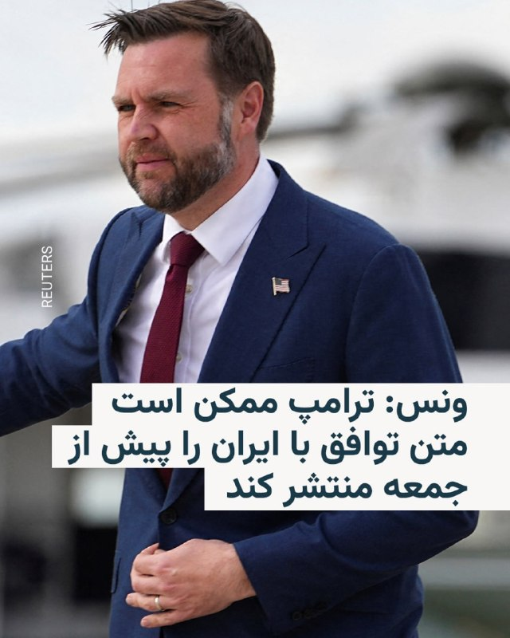

🔸جی‌دی ونس، معاون رئیس‌جمهور آمریکا، اعلام کرد دونالد ترامپ ممکن است متن توافق میان واشینگتن و تهران را پیش از مراسم امضای رسمی آن در روز جمعه منتشر کند. او گفت این توافق پیش‌تر به‌صورت الکترونیکی توسط رهبران دو طرف امضا شده است.

🔸ونس در گفت‌وگو با فاکس‌نیوز گزارش‌های مربوط به پرداخت ۲۴ میلیارد دلار از سوی آمریکا به ایران را «کاملاً نادرست» خواند و گفت توافق، بازگشایی فوری تنگه هرمز و جلوگیری از دستیابی ایران به سلاح هسته‌ای را تضمین می‌کند.

🔸معاون رئیس‌جمهور آمریکا همچنین هشدار داد اگر ایران به تعهدات خود عمل نکند، از مزایای توافق محروم خواهد شد و دولت ترامپ می‌تواند گزینه‌هایی مانند بازگرداندن محاصره یا ازسرگیری حملات نظامی را در نظر بگیرد.

🔸ونس گفت: «همه اهرم‌ها در دست ماست و اگر آنها به تعهداتشان پایبند نباشند، وقتی به آن مرحله برسیم تصمیم خواهیم گرفت چه اقدامی انجام دهیم.» او سپس اشاره کرد که این اقدام می‌تواند شامل ازسرگیری عملیات نظامی باشد.

@RadioFarda

## RadioFarda — post 158358

  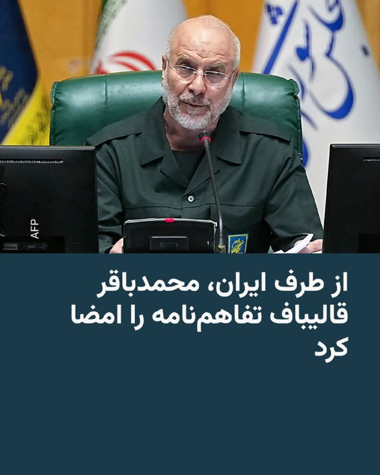

🔸یک مقام دولت آمریکا به رادیوفردا گفت که تفاهم‌نامه الکترونیکی روز یک‌شنبه از طرف ایران توسط محمدباقر قالیباف، رئیس مجلس شورای اسلامی، امضا شده است.

🔸تفاهم‌نامه موسوم به تفاهم‌نامه اسلام‌آباد از طرف آمریکا هم توسط دونالد ترامپ و معاون او، جی‌دی‌ ونس، امضا شده است.

🔸به گفته این مقام، جزئیات این تفاهم‌نامه در یک تا دو روز آینده رسانه‌ای خواهد شد.

🔸قرار است یک مراسم رسمی امضا هم روز جمعه آینده در شهر ژنو سوئیس برگزار شود. هنوز مشخص نیست از طرف ایران چه کسی در این مراسم حضور خواهد داشت.

🔸رسانه‌ها در ایران پیشتر از قالیباف به عنوان رئیس هیئت مذاکره‌کننده با آمریکا یاد کرده بودند.

@RadioFarda

## RadioFarda — post 158356

  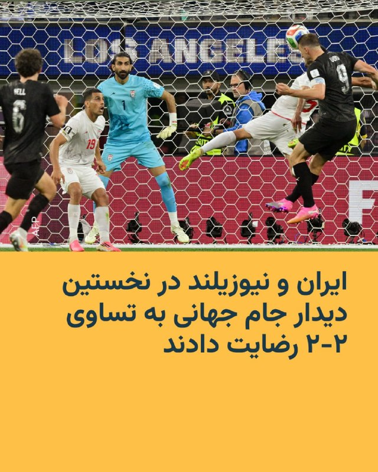

🔸تیم ملی فوتبال ایران در نخستین دیدار خود در جام جهانی ۲۰۲۶ برابر نیوزیلند دو بار از حریف عقب افتاد، اما هر دو بار نتیجه را جبران کرد و سرانجام به تساوی ۲-۲ دست یافت.

🔸این مسابقه در لس‌آنجلس و در فضایی همراه با اعتراضات مخالفان جمهوری اسلامی در بیرون ورزشگاه برگزار شد.

🔸گل‌های جبرانی ایران پس از آن به‌دست آمد که رامین رضاییان در نیمه نخست گل تساوی ایران را به ثمر رساند و سپس محمد محبی در نیمه دوم دومین گل ایران را وارد دروازه نیوزیلند کرد تا بازی ۲-۲ مساوی شود.

🔸محمد محبی با استفاده از ارسال بلند رامین رضاییان و با یک ضربه سر، دومین گل ایران را به ثمر رساند و نتیجه را ۲-۲ کرد.

🔸نیوزیلند ابتدا در دقیقه هفتم با گل الایجا جاست از ایران پیش افتاد، اما رضاییان در ادامه نیمه نخست کار را به تساوی کشاند. با آغاز نیمه دوم، الایجا جاست بار دیگر برای نیوزیلند گلزنی کرد و دومین گل خود و تیمش را به ثمر رساند تا شاگردان امیر قلعه‌نویی دوباره عقب بیفتند.

🔸با این حال، محمد محبی توانست گل تساوی دوم ایران را به ثمر برساند و بازی را بار دیگر به تساوی بکشاند.

@RadioFarda

## RadioFarda — post 158355

  <a href="https://t.me/radiofarda/158355" target="_blank">📎 Download file</a>

📻بشنوید: سرخط خبرها با رادیوفردا، ۲۶ خرداد ۱۴۰۵‌

@RadioFarda

## IranianMinds — post 22734

  <a href="telegram/content/IranianMinds_22734_1781603224.mp4" target="_blank">🎬 Download video</a>

🔴 عراقچی :

مهم‌ترین موضوع تفاهم‌نامه ایران و آمریکا، اعلام خاتمه فوری و دائمی جنگ در همه جبهه‌ها از جمله در لبنان است

@IranianMinds

## IranianMinds — post 22733

  <a href="telegram/content/IranianMinds_22733_1781603225.mp4" target="_blank">🎬 Download video</a>

🔴 عراقچی :

هرگونه حمله نظامی رژیم صهیونیستی به لبنان و ادامه اشغال، نقض یادداشت تفاهم محسوب می‌شود

@IranianMinds

## IranianMinds — post 22732

  <a href="telegram/content/IranianMinds_22732_1781603227.mp4" target="_blank">🎬 Download video</a>

🔴 عراقچی :
در مرحله اول، موضوع خاتمه جنگ، بحث تنگه هرمز، محاصره دریایی و آزادسازی وجوه مسدودشده ایران مطرح می‌شود

@IranianMinds

## IranianMinds — post 22731

  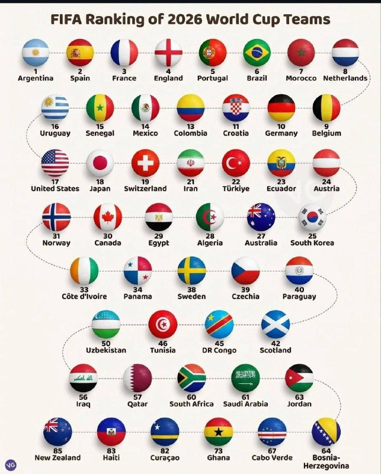

جالبه بدونید نیوزیلند ضعیف ترین تیم جام جهانی بود.

@IranianMinds

## IranianMinds — post 22730

  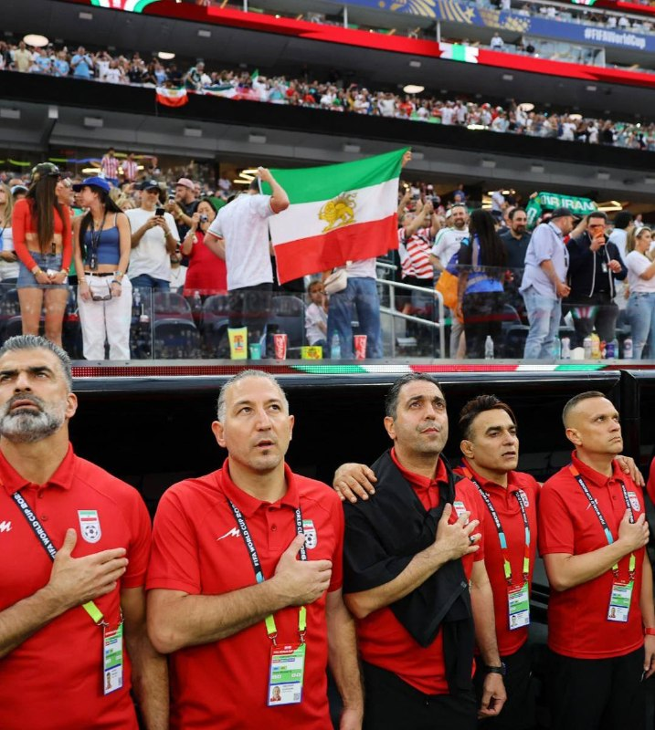

@IranianMinds

## IranianMinds — post 22729

  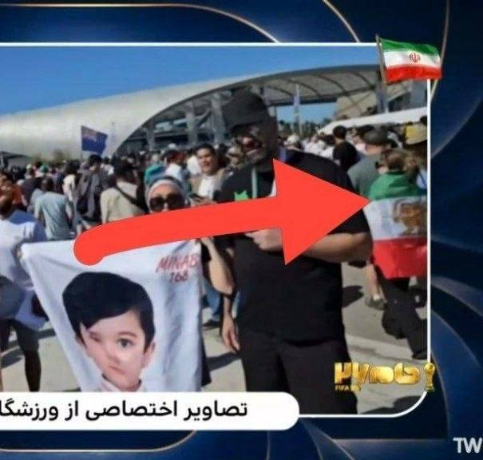

صداوسیما :

@IranianMinds

## IranianMinds — post 22728

بازی ۲-۲ مساوی شد، تیم جمهوری اسلامی رنک ۸۶ فیفا رو هم نتونست شکست بده.

ویزاتونم تمومه برگردید مکزیک حالا

@IranianMinds

## IranianMinds — post 22727

  <a href="telegram/content/IranianMinds_22727_1781603229.mp4" target="_blank">🎬 Download video</a>

@IranianMinds

## IranianMinds — post 22726

  <a href="telegram/content/IranianMinds_22726_1781603230.mp4" target="_blank">🎬 Download video</a>

یه عرزشی با پرچم جمهوری اسلامی داشت میرفت تو ورزشگاه که بچه ها اینطوری ازش استقبال کردن :

@IranianMinds

## IranianMinds — post 22725

دوستانی که به فکر تیم ملیشونن و فکر‌ میکنن فوتبال ربطی به سیاست نداره دوست عزیز شما میتونید سیکتونو بزنید برید کانال های عرزشی اونجا دور هم اکلیل برینید و لذت ببرید از بازی تیم ملیتون ما اینجا از آدمایی که انسانیت ندارن حمایتی نمیکنیم

## IranianMinds — post 22724

دوستانی که به فکر تیم ملیشونن و فکر‌ میکنن فوتبال ربطی به سیاست نداره دوست عزیز شما میتونید سیکتونو بزنید برید کانال های عرزشی اونجا دور هم اکلیل برینید و لذت ببرید از بازی تیم ملیتون

ما اینجا از آدمایی که انسانیت ندارن حمایتی نمیکنیم

## IranianMinds — post 22723

کصکش ی جوریم ادا میاد انگار تو‌ فینال گل زده دلقک رنک ۸۶ فیفاست نیوزیلند

## IranianMinds — post 22722

گل زدن جقیا متاسفانه

## IranianMinds — post 22721

  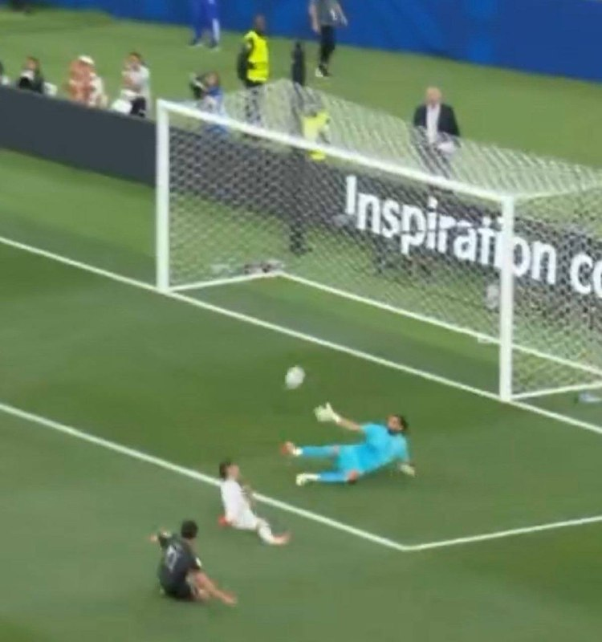

داداش حداقل همچین گنده گوزیایی نمیکردی آبروی رهبر شهیدم بردی

@IranianMinds

## IranianMinds — post 22720

تا سه نشه بازی نشه بزنید سومیو عشقا

## IranianMinds — post 22719

نیوزیلند ۲ جقیا ۱

## IranianMinds — post 22718

بنازم به شیر مردان نیوزیلندد ❤️‍🔥❤️‍🔥

## IranianMinds — post 22717

تنگه دوباره باز شددد

## IranianMinds — post 22716

گلللل

## IranianMinds — post 22715

  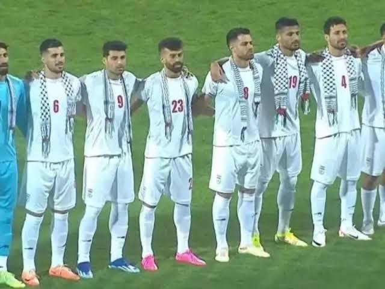

برای اونایی که میگن‌ فوتبال سیاسی نیست !

@IranianMinds

## BBCPersian — post 284019

  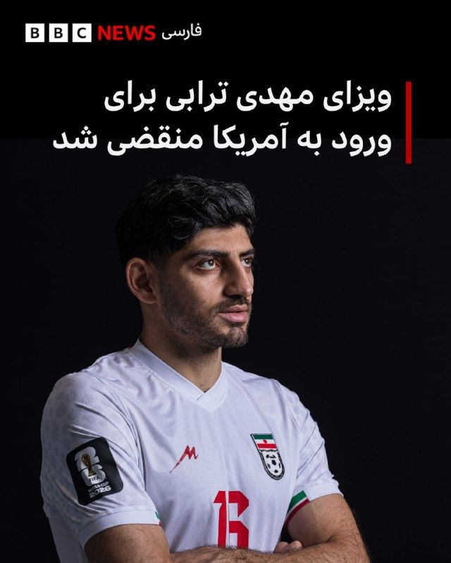

🔻ویزای مهدی ترابی بعد از بازی با نیوزیلند منقضی شد.

به گفته بخش رسانه‌ای تیم ملی فوتبال ایران، برای سفر به آمریکا روادید چند بار ورود برای بازیکنان صادر شده است اما ویزای مهدی ترابی فقط برای یک بار ورود اعتبار داشت و پس از پایان بازی با نیوزیلند، ویزای این بازیکن منقضی شده است.

بنابر این گزارش، فدراسیون فوتبال ایران دوباره برای ویزای مهدی ترابی اقدام کرده تا در بازی‌های بعد تیم ملی را همراهی کند.

گفته می‌شود به دلیل حمایت این بازیکن از جناح‌های تندرو حکومت، برایش ویزای یک بار ورود صادر شده است.

امیر قلعه‌نوعی، سرمربی تیم ملی ایران، پس از بازی نیوزیلند گفت به این تیم دستور داده شده بلافاصله آمریکا را ترک کند و به تیخوآنا برگردد درحالی‌که قصد داشتند شب را در لس‌انجلس بمانند و روز بعد ریکاوری کنند.

به گزارش پوریا ژافره از لس‌آنجلس، پرواز تیم ملی ایران هنوز فرودگاه را ترک نکرده است. او گفت کار خروج مهدی طارمی و سعید الهویی از فرودگاه طول کشید درحالی‌که بقیه بازیکنان سوار هواپیما شده بودند.

📸FIFA via Getty Images
https://bbc.in/4oFx2FB
@BBCPersian

## BBCPersian — post 284009

🖋جرمی بوئن
در بیروت

این جنگ بدترین اشتباه دونالد ترامپ، رئیس جمهور آمریکا، دست‌کم تا اینجا در سیاست خارجی بوده است.

این جنگ بازدارندگی آمریکا در برابر دشمنانش را دشوارتر می‌کند.

این جنگ به اتحاد آمریکا با حکومت‌های عربی تولیدکننده نفت در خلیج فارس آسیب زده است. کشورهایی که مدل اقتصادی‌شان بر پایه ثبات در میان آشوب خاورمیانه بنا شده و ترمیم این آسیب سال‌ها زمان خواهد برد.

مقام‌های این کشورها در محافل خصوصی از هم‌اکنون درباره متنوع کردن اتحادهای خود و ضرورت یافتن راه‌هایی برای همزیستی با ایران صحبت می‌کنند. چین نیز با دقت نظاره‌گر بوده است که آمریکا چگونه ذخایر تسلیحاتی خود که جایگزینی آن دشوار است را مصرف کرد و با محدودیت‌های قدرتش روبه‌رو شد.

این توافق، اگر در آخرین لحظات با مانعی مواجه نشود، به جنگی پایان می‌دهد که بر پایه برداشت نادرست آمریکا و اسرائیل از قدرت دشمنشان در ایران شکل گرفته بود. این امر موجب آسودگی خاطر عظیمی برای همه کسانی خواهد شد که زندگی‌شان بر اثر این جنگ زیر و رو شده است.
ادامه مطلب⬇️

📸Getty/ Reuters/ EPA
https://bbc.in/4vdxuNX
@BBCPersian

## BBCPersian — post 284008

🔻عراقچی: دور جدید مذاکرات ایران و آمریکا جمعه در سوئیس آغاز می شود

عباس عراقچی از آغاز دور جدید مذاکرات ایران و آمریکا در روز جمعه در سوئیس خبر داد.

وزیر خارجه ایران در نشستی با حضور سفرا و کارداران و روسای نمایندگی‌های خارجی و بین‌المللی مقیم تهران گفت: «روز جمعه دور جدید مذاکرات ایران و آمریکا برای رسیدن به توافق نهایی آغاز می‌شود. بعد از سه ماه مذاکره توانستیم مرحله اول را نهایی کنیم.»

آقای عراقچی گفت: «در مرحله اول مهمترین موضوعی که اتفاق می‌افتد اعلام خاتمه جنگ است و بنا به تصمیمی که گرفتیم از صبح روز دوشنبه به وقت تهران که این توافق نهایی شد، خاتمه جنگ هم اعلام شد. ولی شروع رسمی تفاهمنامه از روز جمعه خواهد بود.»

این تفاهمنامه روز جمعه در سوئیس با تشریفات رسمی امضا خواهد شد.

https://bbc.in/4xvdZ4H
@BBCPersian

## BBCPersian — post 284007

  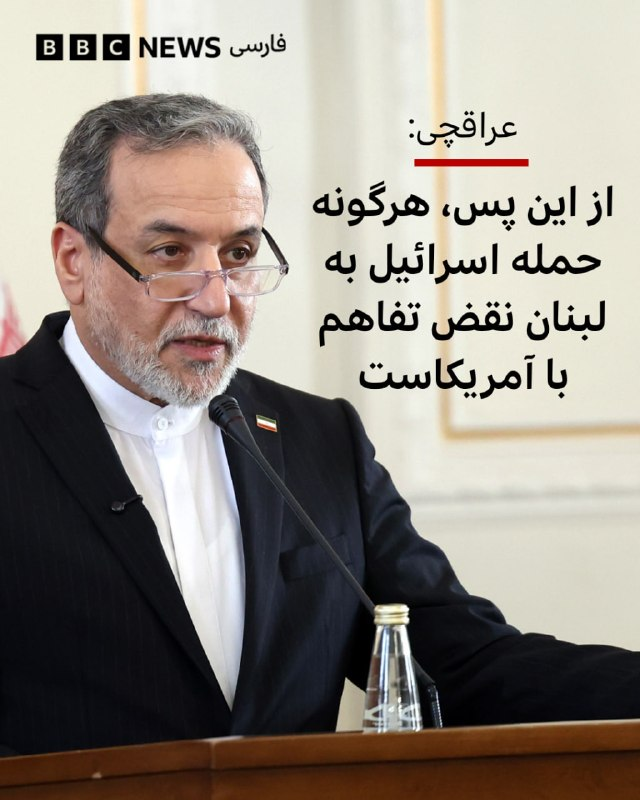

🔻ایران یک بار دیگر هشدار داد که هرگونه حمله اسرائیل به لبنان را نقض تفاهمنامه با آمریکا تلقی‌ می‌کند.

عباس عراقچی، وزیر خارجه جمهوری اسلامی، گفت که از نظر تهران، یک طرف تفاهمنامه حاصل شده، ایران و حزب‌الله و طرف دیگر آمریکا و اسرائیل است.

آقای عراقچی تاکید کرد که «خاتمه جنگ در لبنان بخش جدایی‌ناپذیر از خاتمه کامل جنگ است و خاتمه جنگ مشمول خاتمه اشغال هم می‌شود.»

او هشدار داد که هرگونه حمله اسرائیل به لبنان «از الان به بعد و ادامه اشغال سرزمین‌های لبنان از نظر ما نقض یادداشت تفاهم به حساب می‌آید.»

اظهارات آقای عراقچی در حالی است که اسرائیل می‌گوید به «تروریست‌هایی» که به سربازانش در جنوب لبنان نزدیک می‌شدند حمله کرده است.

حزب‌الله لبنان هم گفته است که در پاسخ به سمت نیروهای اسرائیلی موشک و پهپاد شلیک کرده است.

بعد از اعلام نهایی شدن تفاهم ایران و آمریکا، اسرائیل تاکید کرد که حضور نیروهایش در «مناطق امنیتی» در لبنان ادامه خواهد داشت.

طیف وسیعی از مقام‌های اسرائیلی این تفاهم را محکوم کرده‌اند.

📸EPA/Shutterstock
https://bbc.in/4epeBQC
@BBCPersian

## BBCPersian — post 284006

🔻خلاصه مهمترین خبرها تا این لحظه

🔹جی‌دی ونس، معاون اول رئیس جمهور آمریکا، در مصاحبه‌ای با شبکه خبری فاکس گفت که اگر ایران به تعهدات خود در توافق با ایالات متحده عمل کند، می‌تواند به چند میلیارد دلار دسترسی پیدا کند.

🔹اسماعیل قاآنی، فرمانده نیروی قدس سپاه پاسداران، در گفت‌و‌گویی تلویزیونی به امضای تفاهم‌نامه میان ایران و آمریکا واکنش نشان داده و آن را نتیجه آنچه «ایستادگی محور مقاومت» خوانده، دانسته است.

🔹یاسمین انصاری، نماینده ایرانی الاصل کنگره آمریکا، گفته است تفاهم‌نامه بدست آمده میان ایالات متحده و ایران، پس از آن به دست آمد که «هزینه‌های هنگفتی» را هم برای آمریکا و مردم ایران به بار آورد.

🔹یک فروند بمب افکن بی۵۲ ارتش امریکا روز دوشنبه دقایقی پس از برخاستن از باند فرودگاه نظامی در شمال لس آنجلس سقوط کرد.

🔹دونالد ترامپ، رئیس جمهور آمریکا، دوشنبه شب در پیامی در شبکه اجتماعی تروث سوشال گزارش‌هایی را که مدعی بودند آمریکا قرار است ۳۰۰ میلیون دلار به ایران پرداخت کند، رد کرد.

🔹محمدباقر قالیباف که چهره اول تیم مذاکره‌کننده ایران با آمریکاست در واکنش به امضای تفاهم‌نامه توقف مخاصمه خطاب به مردم این کشور گفت که «ایران گامی بلند به سوی پیروزی نهایی برداشت.»

https://bbc.in/4uzGueX
@BBCPersian

## BBCPersian — post 284005

  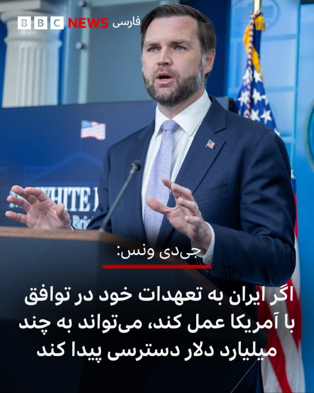

🔻جی‌دی ونس، معاون اول رئیس جمهور آمریکا، در مصاحبه‌ای با شبکه خبری فاکس گفت که تفاهم پیشنهادی ایالات متحده و ایران «روز جدیدی» را برای خاورمیانه رقم خواهد زد.

او گفت که اگر ایران به تعهدات خود در توافق با ایالات متحده عمل کند، می‌تواند به چند میلیارد دلار دسترسی پیدا کند.

آقای ونس گفت که هنوز بر سر مفاد خاص باید توافق حاصل شود و متن کامل در چند روز آینده منتشر خواهد شد.

او گفت: «این توافق‌نامه می‌گوید که آنها حتی ده سنت هم از پول آمریکا دریافت نمی‌کنند.»

«چیزی که توافق می‌گوید این است که اگر ایرانی‌ها درست رفتار کنند و اگر تحریم‌ها مشمول تحفیف شود و اگر ایرانی‌ها در اقتصاد جهانی ادغام شوند، ما از کشورهای دیگر، نه خودمان، بلکه از کشورهای دیگر دعوت می‌کنیم تا در کشورشان سرمایه‌گذاری کنند.»

تفاهم‌نامه میان ایران و ایالات متحده، قرار است روز جمعه در سوئیس امضا شود.

ادامه مطلب⬇️
Anadolu via Getty Images
https://bbc.in/4fOxsY0
@BBCPersian

## BBCPersian — post 283996

در تصاویری که عکاسان خبری از ورزشگاه سوفای لس‌آنجلس ثبت می‌کنند، تعداد پرچم‌های شیروخورشیدنشان در سکوها چشم‌گیر است.

فیفا پیشتر ورود پرچم‌های غیررسمی به ورزشگاه را ممنوع اعلام کرده بود و قاضی دادگاهی در لس‌آنجلس شکایت یک هوادار ایرانی به این ممنوعیت را وارد ندانسته بود.

به گزارش سام فرزانه، خبرنگار بی‌بی‌سی که به ورزشگاه رفته است بسیاری از کسانی که با پرچم شیروخورشید، هنگام پخش سرود ملی ایران هو می‌کردند، با آغاز بازی تیم ملی را تشویق کردند اما بعضی از تصاویری که معترضان ایرانی که به ورزشگاه رفته‌اند در شبکه‌های اجتماعی منتشر می‌کنند حکایت از تشویق تیم نیوزیلند هنگام به ثمر رساندن گل دارد.

امیر قلعه‌نویی، سرمربی تیم ملی ایران پس از مسابقه از تماشاچیان حاضر در ورزشگاه قدردانی کرد.

مهدی تاج، رئیس فدراسیون فوتبال ایران پیش از عزیمت تیم ملی از کمپ به آمریکا بر ضرورت رعایت پروتکل‌های فیفا از سوی کشور میزبان تاکید کرده بود.

شاهزاده رضا پهلوی پیشتر در پیام‌هایی از هوادارانش خواسته بود با پیراهن‌های حاوی تصاویر کشته‌شدگان و معترضان ورزشکار به استادیوم بروند.
@bbcpersian

## idfinfarsi — post 11849

⭕️نیروهای یگان مهندسی ویژه (یهلم) ۱۸ کارگاه تراشکاری تولید تجهیزات نظامی را در اردوگاه بلاطه و رأس‌العین در منطقه تیپ سامره منهدم کردند

🔸در یک عملیات هدفمند شبانه برای خنثی‌سازی ترور، ‌پریروز (یکشنبه)، نیروهای یگان مهندسی ویژه (یهلم) و نیروهای گردان ذخیره ۹۶۷ در محدوده شهر نابلس در تیپ سامره برای شناسایی و انهدام کارگاه‌های تراشکاری تولید تجهیزات نظامی، از جمله سلاح و مواد منفجره که در قلب مناطق غیرنظامی قرار داشتند، فعالیت کردند.

🔸در جریان این عملیات، نیروها ۱۸ کارگاه تراشکاری را شناسایی و منهدم کردند؛ همچنین قطعات سلاح کشف و ضبط شد.

## Dirty_Kids — post 392269

  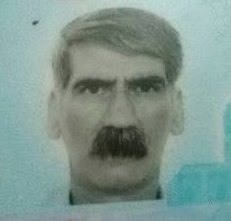

پسرم! کص مادرت با این تنگه نگه داشتنت

@Dirty_Kids 👻

## Dirty_Kids — post 392268

  <a href="telegram/content/Dirty_Kids_392268_1781603233.mp4" target="_blank">🎬 Download video</a>

ابراز محبت هموطنا به مادر بیرانوند

@Dirty_Kids 👻

## Dirty_Kids — post 392267

  

اون زمان که اینترنت نداشتیم این اقا تمام قد پشت مردم ایران واستاد

@Dirty_Kids 👻

## Dirty_Kids — post 392266

  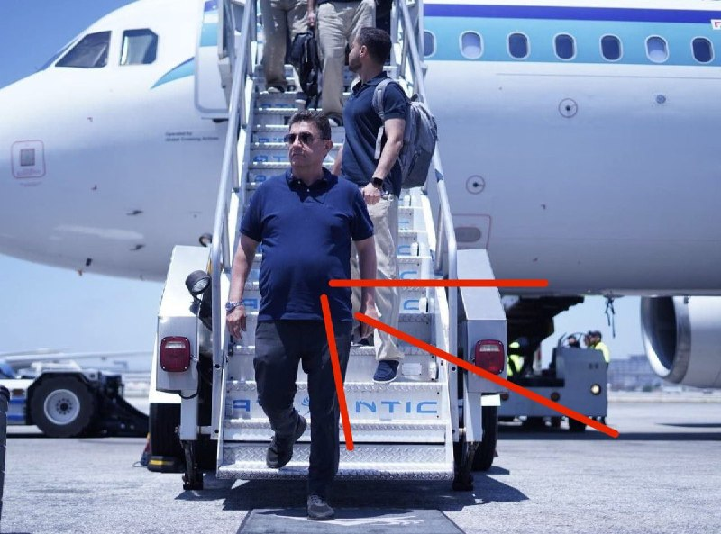

اورانیوم غنی شده به شکل جاساز تحویل آمریکا شد:

@Dirty_Kids 👻

## Dirty_Kids — post 392265

  <a href="telegram/content/Dirty_Kids_392265_1781603235.mp4" target="_blank">🎬 Download video</a>

من تو اینستاگرام فقط محتوای آموزشی و فاخر می‌بینم،
محتوای فاخری که میبینم: 👆

@Dirty_Kids 👻

## Dirty_Kids — post 392264

  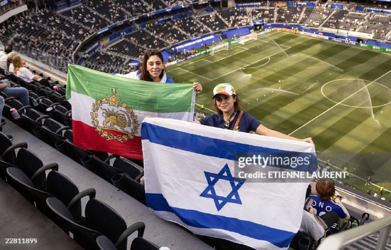

شات عرزشی‌سوز

@Dirty_Kids 👻

## Dirty_Kids — post 392263

  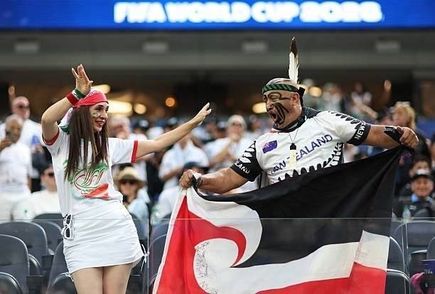

شاهد عشوه‌گریِ تمام‌عیارِ یک عرزشیِ حامی ج.ا برای یک هوادار نیوزیلندی هستید.»

@Dirty_Kids 👻

## Dirty_Kids — post 392262

  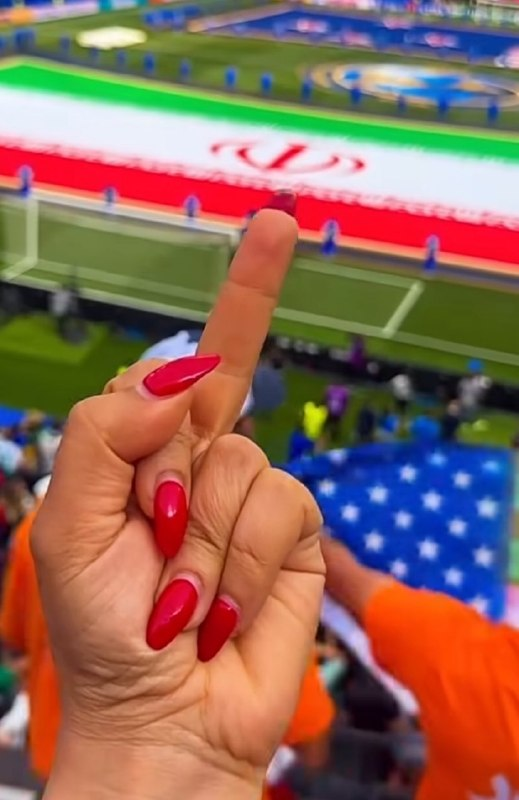

همین قاب ما رو بس

@Dirty_Kids 👻

## Dirty_Kids — post 392261

  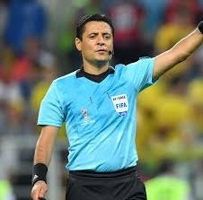

تنها ایرانی باشرفی که این جام جهانی منتظره دیدنشم ❤️‍🩹🤍💚

علی رضا فغانی عزیز

@Dirty_Kids 👻

## Dirty_Kids — post 392259

متاسفانه پرستوهای حکومت تموم شده این‌سری کرکس فرستادن استادیوم.

@Dirty_Kids 👻

## Dirty_Kids — post 392258

  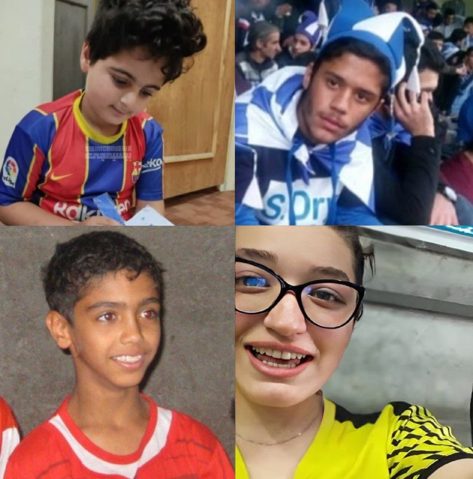

تنها رابطه‌م با فوتبال ایران تا روز آزادی.

@Dirty_Kids 👻

## Dirty_Kids — post 392257

  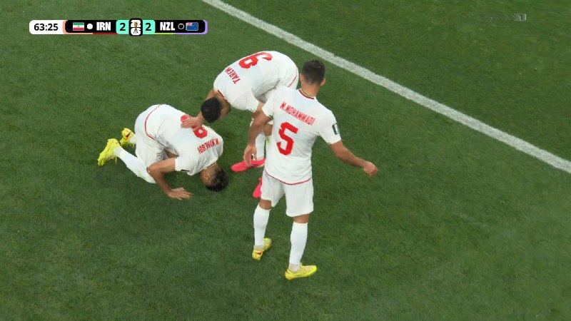

سرشو گذاشته رو زمین آمریکا و سجده کرده. همون خاک نجس آمریکا که رهبرشون رو کتلت کرد.

@Dirty_Kids 👻

## Dirty_Kids — post 392256

  <a href="telegram/content/Dirty_Kids_392256_1781603238.mp4" target="_blank">🎬 Download video</a>

شلیک محمد محبی سمت تماشاگران🔫⚽️

@Dirty_Kids 👻

## Dirty_Kids — post 392255

  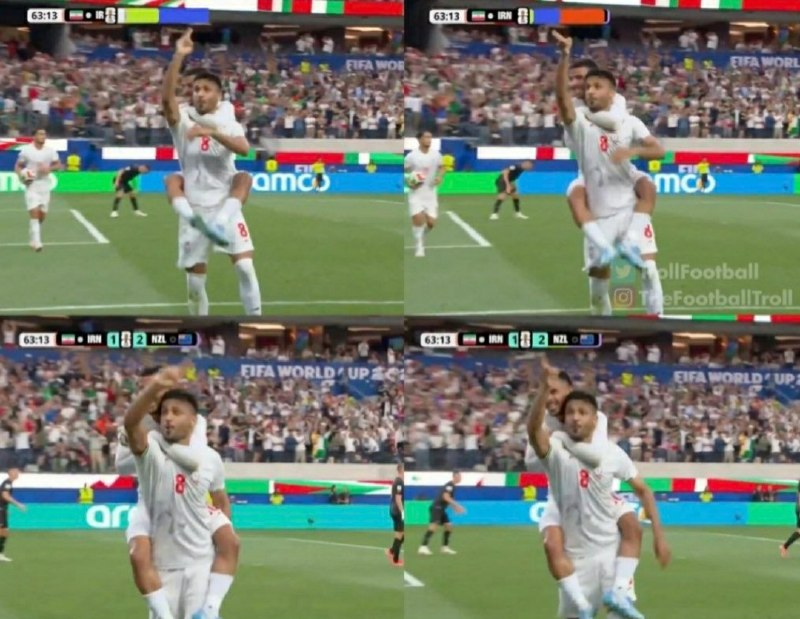

میگن این شادی گل محبی که دستاشو شبیه تفنگ کرده به سمت تماشاگرای ایران بوده که پیراهن با تصاویر جاو‌ید نام‌ها و پرچم شیر و‌ خورشید داشتن

@Dirty_Kids 👻

## Dirty_Kids — post 392254

  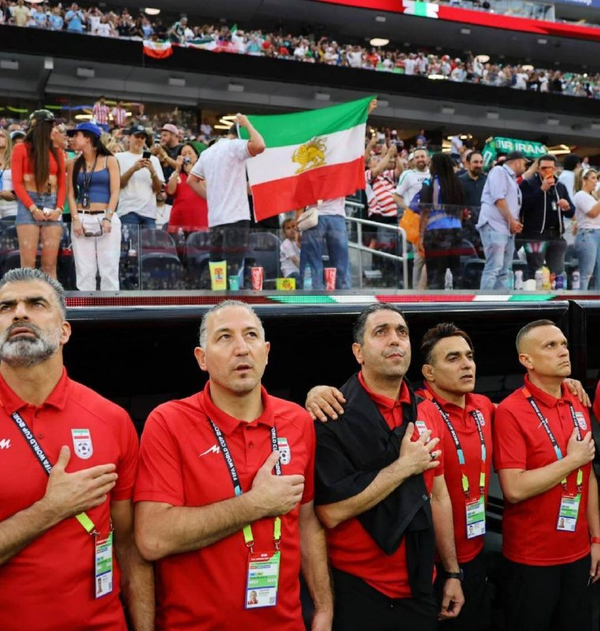

🤣🤣🤣🤣🤌

@Dirty_Kids 👻

## Dirty_Kids — post 392251

  <a href="telegram/content/Dirty_Kids_392251_1781603240.mp4" target="_blank">🎬 Download video</a>

بعد از بازی موقع خروج از استادیومرو هم ببینید چخبر بوده

دم ایرانیای وطن‌پرست گرم🤌✌️🩵 قشنگ ریدن تو پروپاگاندای جمهوری‌اسهالی با این همه خرجی که کرده بودن

@Dirty_Kids 👻

## Dirty_Kids — post 392250

  <a href="telegram/content/Dirty_Kids_392250_1781603240.mp4" target="_blank">🎬 Download video</a>

لعنت به جمهورى اسلامی
ايران گل خورده
ايرانى خوشحاله
ديگه نه فقط خاورميانه اى بايد خود خود ايرانى باشى بفهمى يعنى چی

@Dirty_Kids 👻

## Hranews — post 113644

پلمب چند کافه و کافه‌رستوران در گرگان و خرم‌آباد

❗️
❗️
❗️
❗️
❗️– پنج کافه‌رستوران در خرم‌آباد و چند کافه در گرگان به دلایلی از جمله آنچه «هنجارشکنی» عنوان شده، #پلمب شدند.

ادامه مطلب

↘️
@hranews_bot تماس ✉️ -  @Hranews  کانال هرانا 🆑

## Hranews — post 113643

  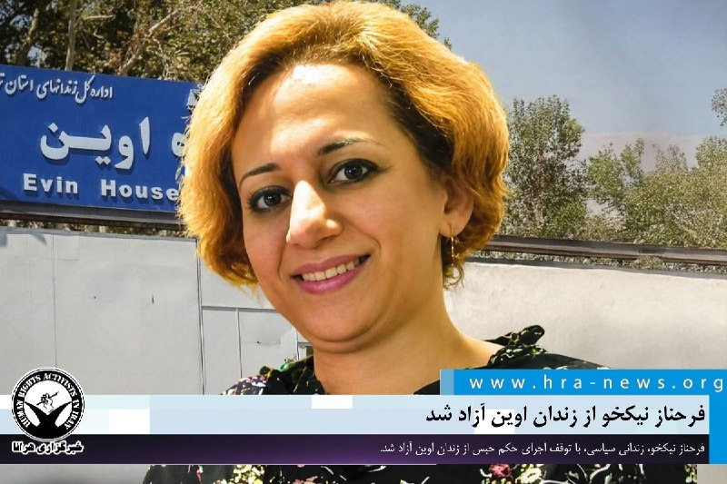

فرحناز نیکخو از زندان اوین آزاد شد

❗️
❗️
❗️
❗️
❗️– فرحناز نیکخو، زندانی سیاسی، با توقف اجرای حکم حبس روز یکشنبه ۲۴ خردادماه از #زندان_اوین آزاد شد.

به گزارش خبرگزاری هرانا، ارگان خبری مجموعه فعالان حقوق بشر در ایران، فرحناز نیکخو، آزاد شد.

بر اساس اطلاعات دریافتی هرانا، خانم نیکخو در پی صدور دستور توقف اجرای حکم حبس، ظهر روز یکشنبه ۲۴ خردادماه از زندان اوین آزاد شده است.

ادامه مطلب

#فرحناز_نیکخو

↘️
@hranews_bot تماس ✉️ -  @Hranews  کانال هرانا 🆑

## Hranews — post 113642

  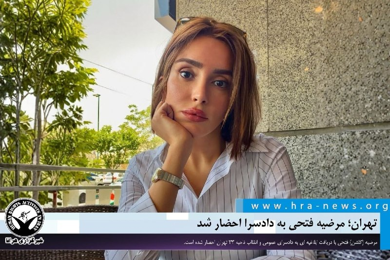

تهران؛ مرضیه فتحی به دادسرا احضار شد

❗️
❗️
❗️
❗️
❗️– مرضیه (گلشن) فتحی، با دریافت ابلاغیه ای به دادسرای عمومی و انقلاب ناحیه ۳۳ تهران احضار شده است.

به گزارش خبرگزاری هرانا، ارگان خبری مجموعه فعالان حقوق بشر در ایران، مرضیه فتحی به دادسرا احضار شد.

براساس ابلاغیه ای که در تاریخ ۲۳ خردادماه صادر شده است، از خانم فتحی خواسته شده که ظرف مدت پنج روز برای دفاع از اتهام انتسابی در شعبه ۲ بازپرسی دادسرای عمومی و انقلاب ناحیه ۳۳ تهران مستقر در زندان اوین حاضر شود.

ادامه مطلب

#مرضیه_فتحی
#گلشن_فتحی

↘️
@hranews_bot تماس ✉️ -  @Hranews  کانال هرانا 🆑

## Hranews — post 113641

آوات رستمی از زندان مهاباد آزاد شد

❗️
❗️
❗️
❗️
❗️– روز شنبه ۲۳ خردادماه، آوات رستمی، شهروند اهل شهرستان مهاباد با تودیع وثیقه از زندان این شهرستان آزاد شد.

ادامه مطلب

#آوات_رستمی

↘️
@hranews_bot تماس ✉️ -  @Hranews  کانال هرانا 🆑

## Hranews — post 113640

  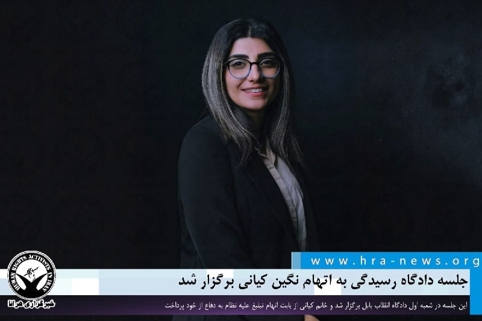

جلسه دادگاه رسیدگی به اتهام نگین کیانی برگزار شد

❗️
❗️
❗️
❗️
❗️– جلسه دادرسی به اتهام نگین کیانی، عکاس و مدرس عکاسی ساکن بابل، روز دوشنبه ۲۵ خردادماه، در شعبه اول دادگاه انقلاب این شهرستان برگزار شد.

به گزارش خبرگزاری هرانا، ارگان خبری مجموعه فعالان حقوق بشر در ایران، جلسه دادگاه رسیدگی به اتهام نگین کیانی برگزار شد.

یک منبع مطلع نزدیک به خانواده کیانی، ضمن تایید این خبر به هرانا گفت: «نگین روز گذشته در شعبه اول دادگاه انقلاب اسلامی شهرستان بابل حاضر شد. وی در این جلسه دادرسی، از بابت اتهام تبلیغ علیه نظام، به دفاع از خود پرداخت.»

ادامه مطلب

#نگین_کیانی

↘️
@hranews_bot تماس ✉️ -  @Hranews  کانال هرانا 🆑

## alonews — post 128417

  <a href="telegram/content/alonews_128417_1781603244.webm" target="_blank">🎬 Download video</a>

👈کرملین: اگر زلنسکی آماده است که به طور مسئولانه و جدی صحبت کند، همیشه می‌تواند به مسکو بیاید، جایی که از او استقبال خواهد شد

✅ @AloNews خبر جنگ

## alonews — post 128415

  <a href="telegram/content/alonews_128415_1781603244.webm" target="_blank">🎬 Download video</a>

👈نفت آمریکا ۷۸ دلار

🔴نفت برنت ۸۱ دلار

✅ @AloNews خبر جنگ

## alonews — post 128414

  <a href="telegram/content/alonews_128414_1781603244.webm" target="_blank">🎬 Download video</a>

👈شاخص کل بورس با رشد ۱۱۹ هزار واحدی در پایان معاملات امروز به ۵ میلیون و ۲۰۰ هزار واحد رسید

✅ @AloNews خبر جنگ

## alonews — post 128413

  <a href="telegram/content/alonews_128413_1781603244.mp4" target="_blank">🎬 Download video</a>

👈حملهِ ارتش اسرائیل به تپه‌های علی‌الطاهر تو لُبنان

✅ @AloNews خبر جنگ

## alonews — post 128412

  <a href="telegram/content/alonews_128412_1781603245.webm" target="_blank">🎬 Download video</a>

👈 سی‌ان‌ان‌: در سراسر صنعت کشتیرانی، اعتماد چندانی درباره بازگشایی تنگه هرمز وجود ندارد

🔴 مواردی مانند [احتمال] حملات موشکی و پهپادها همچنان مانع از تردد کشتی‌ها می‌شوند

🔴 حرکت قابل توجهی از ۲۲۰ تانکر و نزدیک به ۵۰۰ شناور که در خلیج فارس لنگر انداخته‌اند، صورت نگرفته

✅ @AloNews خبر جنگ

## alonews — post 128411

  <a href="telegram/content/alonews_128411_1781603246.mp4" target="_blank">🎬 Download video</a>

👈ویدیدیی از یک درگیری دیگر بین موافقان و مخالفان جمهوری اسلامی در ورزشگاه

🔴پ.ن: ژاپنی‌ها بعد بازی آشغال جمع میکنن و کل دنیا میگن دمتون گرم. ایرانیا بعد بازی دعوا میکنن و همه میخندن بهمون

✅ @AloNews خبر جنگ

## alonews — post 128410

  <a href="telegram/content/alonews_128410_1781603246.webm" target="_blank">🎬 Download video</a>

👈جمعه قالیباف و ونس امضا خواهند کرد

✅ @AloNews خبر جنگ

## alonews — post 128409

  <a href="telegram/content/alonews_128409_1781603246.webm" target="_blank">🎬 Download video</a>

👈حزب‌الله: ایران الان یکی از ابرقدرت های دنیاست

✅ @AloNews خبر جنگ

## alonews — post 128408

  <a href="telegram/content/alonews_128408_1781603246.webm" target="_blank">🎬 Download video</a>

👈تخت روانچی: در سوییس پس از اینکه مسئله امضا ( تفاهمنامه پاکستان) انجام شد، مذاکرات شروع خواهد.

🔴درباره جزئیاتی نظیر اینکه چه مدت در سوییس باشیم و چه مباحثی مطرح شوند، صحبتی نشده اما این مورد تایید دو طرف است که بعد از امضا، بحث‌ها (درباره توافق نهایی) شروع خواهد شد.

✅ @AloNews خبر جنگ

## alonews — post 128407

  <a href="telegram/content/alonews_128407_1781603246.mp4" target="_blank">🎬 Download video</a>

👈زلنسکی، ترامپ و مکرون برای نشست گروه هفت رسیدن پاریس

✅ @AloNews خبر جنگ

## alonews — post 128406

  <a href="telegram/content/alonews_128406_1781603248.webm" target="_blank">🎬 Download video</a>

👈تخت‌روانچی: قالیباف و ونس در روز امضا حضور دارند

✅ @AloNews خبر جنگ

## alonews — post 128405

  <a href="telegram/content/alonews_128405_1781603248.webm" target="_blank">🎬 Download video</a>

👈در دیداری میان نخست‌وزیر عراق و فرستاده ویژه رئیس‌جمهور آمریکا، دو طرف بر اجرای طرح خلع سلاح گروه‌های مسلح خارج از چارچوب دولت و تقویت همکاری‌های اقتصادی و انرژی میان بغداد و واشنگتن تأکید کردند

✅ @AloNews خبر جنگ

## alonews — post 128401

  <a href="telegram/content/alonews_128401_1781603249.webm" target="_blank">🎬 Download video</a>

👈صبح زود امروز، پهپادهای اوکراینی به پالایشگاه مسکو در کاپوتنیا، روسیه حمله کردند و باعث آتش‌سوزی عظیمی در این تأسیسات شدند.

🔴 در چند ساعت گذشته حداقل ۶۰ پهپاد در منطقه مسکو رهگیری شده‌اند

✅ @AloNews خبر جنگ

## alonews — post 128400

  <a href="telegram/content/alonews_128400_1781603249.webm" target="_blank">🎬 Download video</a>

👈ارتش آمریکا برای تخلیه بخشی از هواپیماهای سوخت‌رسان مستقر در فرودگاه بن گوریون آماده می‌شود. احتمالا حدود ۲۰٪ از هواپیماهای مستقر در اسرائیل منتقل خواهند شد

✅ @AloNews خبر جنگ

## alonews — post 128399

  <a href="telegram/content/alonews_128399_1781603249.webm" target="_blank">🎬 Download video</a>

👈عراقچی: دو طرف این تفاهم‌نامه، یک طرف آمریکا و اسرائیل و طرف دیگر ایران و حزب‌الله هستند و خاتمه جنگ در لبنان، بخش جدایی‌ناپذیر از خاتمه کامل جنگ است.

✅ @AloNews خبر جنگ

## alonews — post 128398

  <a href="telegram/content/alonews_128398_1781603249.mp4" target="_blank">🎬 Download video</a>

👈درگیری موافقان و مخالفان ج.ا در ورزشگاه

✅ @AloNews خبر جنگ

## alonews — post 128397

  <a href="telegram/content/alonews_128397_1781603251.webm" target="_blank">🎬 Download video</a>

👈عراقچی: هرگونه حمله نظامی اسرائیل به لبنان ، نقض یادداشت تفاهم محسوب می‌شود

✅ @AloNews خبر جنگ

<!-- MSG END -->

<!-- NAV START -->

<a href="https://github.com/Tljn/FUD/blob/main/telegram/content/archive_1.md" style="display:inline-block; padding:6px 12px; margin:0 4px; background-color:#2ea44f; color:white; text-decoration:none; border-radius:4px; font-weight:bold;">صفحه بعد</a>

<!-- NAV END -->
