# خواننده تلگرام

<!-- TOP_NAV START -->

<a href="https://github.com/Tljn/FUD/blob/main/telegram/content/archive_1.md" style="display:inline-block; padding:6px 12px; margin:0 4px; background-color:#2ea44f; color:white; text-decoration:none; border-radius:4px; font-weight:bold;">صفحه بعد</a>

<!-- TOP_NAV END -->

<!-- MSG START -->

---
📅 بروزرسانی: 1405/03/17 05:39
---

## VahidOOnLine — post 244027

  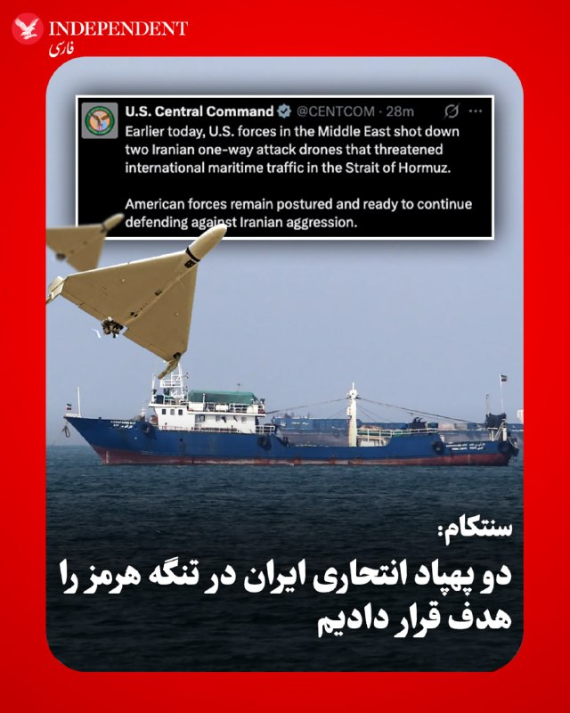

♦️فرماندهی مرکزی ایالات متحده، سنتکام، بامداد یکشنبه، ۱۷ خردادماه، با انتشار بیانیه‌ای رسمی اعلام کرد که نیروهای نظامی این کشور دو پهپاد انتحاری و تهاجمی ایران را سرنگون کرده‌اند. سنتکام در تشریح این عملیات نوشت: «ساعات پیش، نیروهای ایالات متحده در خاورمیانه دو پهپاد تهاجمی یک‌طرفه (انتحاری) ایران را که ترافیک بین‌المللی دریانوردی و کشتیرانی در تنگه هرمز را تهدید می‌کردند، هدف قرار داده و سرنگون کردند.» فرماندهی مرکزی آمریکا در پایان این بیانیه با هشدار نسبت به تداوم رفتارهای بی‌ثبات‌کننده در این آبراه حیاتی تاکید کرد: «نیروهای آمریکایی همچنان در وضعیت تدافعی قرار دارند و برای ادامه دفاع در برابر اقدامات تهاجمی ایران کاملا آماده و مستقر هستند.»
‌🇸🇦 Indypersian

🤖 @VahidOOnLine

## VahidOOnLine — post 244026

  

یکی از مقامات ارشد پیشین موساد با نام مستعار «الف» به کانال تلویزیونی ۱۲ اسرائیل گفت: «نقشه‌ای که از سوی اسرائیل و موساد تدوین شده، هنوز هم می‌تواند به سقوط جمهوری اسلامی منجر شود، اما پس از تصمیم آمریکا برای توقف جنگ، در تمام مراحل خود دنبال نشده است.»
الف با اشاره به اینکه این طرح چند مرحله‌ای است، ابراز امیدواری کرد که در مقطعی، مراحل بعدی طرح عملیاتی تصویب شود.
او با تاکید بر اینکه شرایط به گونه‌ای ایجاد شده است که در نهایت جمهوری اسلامی قدرتش را از دست خواهد داد، گفت: «نمی‌توانم پیش‌بینی کنم که رژیم ایران طی شش ماه و یا طی سه سال سرنگون خواهد شد، اما درنهایت این موضوع اتفاق خواهد افتاد.»

‌🏁 🇬🇧 IranintlTV

🤖 @VahidOOnLine

## VahidOOnLine — post 244025

  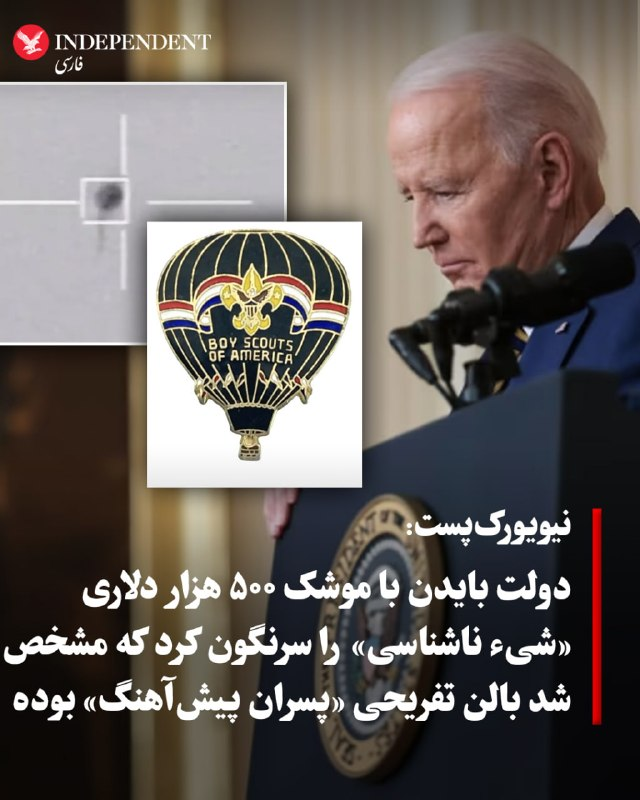

♦️روزنامه «نیویورک پست» در گزارشی نوشت که دولت جو بایدن در جریان موج اضطراب ناشی از ماجرای بالن جاسوسی چین در اوایل سال ۲۰۲۳، با یک موشک ۵۰۰ هزار دلاری «سایدمیندر» که از جنگنده اف-۱۶ شلیک شد، یک «شیء پرنده ناشناس» (UFO) را بر فراز دریاچه «هورن» منهدم کرد که بعدا مشخص شد متعلق به یک گروه از «پسران پیش‌آهنگ» بوده است. مقامات سابق سازمان ردیابی ناهنجاری‌های وزارت دفاع آمریکا (AARO) تایید کرده‌اند که پنتاگون پس از تاخیر در پاسخ به بالن چینی، به شدت دستپاچه شده بود و دستور داشت به هر شیء مشکوکی در آسمان شلیک کند. به طوری که این بالن تفریحی پیش از آنکه با موشک نیم‌میلیون دلاری تکه‌تکه شود، هشت بار کره زمین را دور زده بود. نیویورک پست با اتکا به اسناد خارج‌شده از طبقه‌بندی فاش کرد که ارتش آمریکا در موارد مشابه دیگر نیز مهمات گران‌قیمت خود را هدر داده است. از جمله شلیک موشک ۴۳۹ هزار دلاری جنگنده اف-۲۲ به یک بالن تحقیقاتی ۱۲ دلاری و حتی شلیک به یک بادکنک فویلی ستاره‌شکلِ «تولدت مبارک» خریداری‌شده از فروشگاه والمارت که اپراتورهای پهپاد «ریپر» به اشتباه آن‌ها را به عنوان اشیاء ناشناس پرنده با قابلیت‌های پنهان‌کاری گزارش کرده بودند.
‌🇸🇦 Indypersian

🤖 @VahidOOnLine

## VahidOOnLine — post 244024

  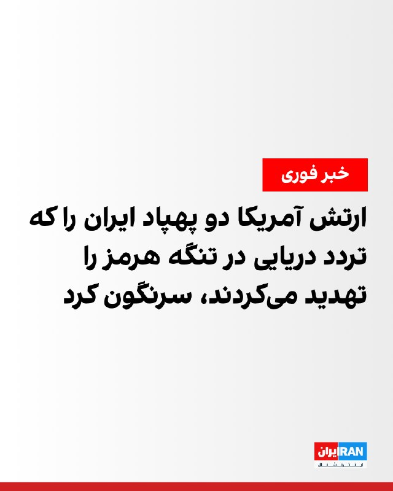

ستاد فرماندهی مرکزی آمریکا، سنتکام، اعلام کرد نیروهای آمریکا در خاورمیانه دو پهپاد انتحاری جمهوری اسلامی را که تردد دریایی بین‌المللی در تنگه هرمز را تهدید می‌کردند، سرنگون کردند.
سنتکام تاکید کرد نیروهای آمریکایی همچنان در موقعیت آماده‌باش قرار دارند و آماده‌اند به دفاع در برابر اقدام‌های تهاجمی جمهوری اسلامی ادامه دهند.

‌🏁 🇬🇧 IranintlTV

🤖 @VahidOOnLine

## VahidOOnLine — post 244023

♦️صفحه اینستاگرام «بلوچستانی‌ها» تصاویری از آبگیری «چاه‌نیمه‌های سیستان» منتشر کرد. براساس این گزارش، پس از سال‌ها خشکسالی پیاپی، بحران شدید کم‌آبی و انباشت نگرانی‌ها در میان ساکنان منطقه، «چاه‌نیمه‌های سیستان» به عنوان شریان حیاتی و اصلی تامین آب این جغرافیا بار دیگر رنگ مملو شدن از آب و احیا را به خود دیدند. ورود مجدد جریان آب به این مخازن طبیعی که سال‌ها تصاویری تلخ از خشکی، تشنگی و هجوم گردوغبار را روایت می‌کردند، موجی از امید، آرامش و خوشحالی را در میان مردم ایجاد کرده است. مردم بومی این رویداد را نویدبخش روزهایی بهتر برای کشاورزی و زیست منطقه می‌دانند و امیدوارند تداوم جریان این روان‌آب‌ها بتواند بخشی از آسیب‌های عمیق ناشی از پدیده خشکسالی‌های طولانی‌مدت را در این بخش از کشور جبران کند.
‌🇸🇦 Indypersian

🤖 @VahidOOnLine

## VahidOOnLine — post 244022

  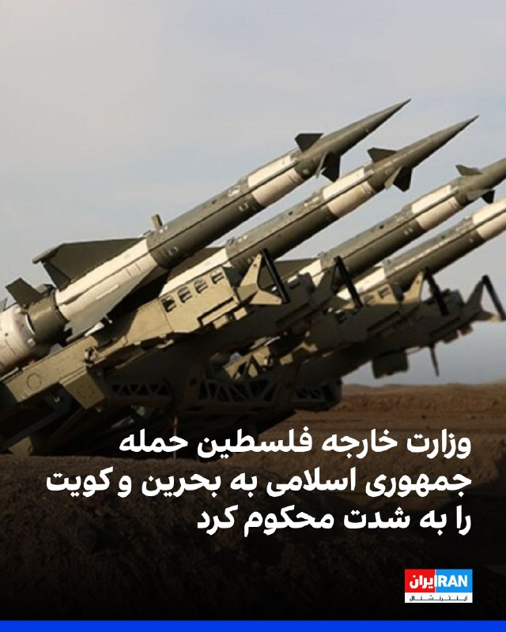

وزارت خارجه فلسطین حمله موشکی جمهوری اسلامی به بحرین و کویت در بامداد شنبه را به شدت محکوم کرد و این اقدام را نقض آشکار حاکمیت این دو کشور، تخطی صریح از قوانین بین‌المللی و تهدید امنیت و ثبات منطقه خلیج‌فارس دانست.
جمهوری اسلامی بامداد شنبه هفت موشک بالستیک به سوی کویت و بحرین شلیک کرد که نیروهای آمریکا شش موشک را رهگیری کردند و موشک هفتم به هدف نرسید.

‌🏁 🇬🇧 IranintlTV

🤖 @VahidOOnLine

## VahidOOnLine — post 244013

بعضی از این جوانان در آخرین روز زندگی‌شان سر کار بودند. بعضی در حال ساختن کسب‌وکارشان، بعضی در فکر آینده و بعضی کنار خانواده‌هایشان.<
هیچ‌کدام نمی‌دانستند چند ساعت بعد، نامشان به فهرست جان‌باختگان اضافه خواهد شد.<
محمد مصطفی‌زاده، علی رحیمی، امیر عباسپور، امیرحسین صفری، سروش صادقی‌زاده، امیرمحمد زمردی، امیرحسین رفیعی و عارف نظرپور
آنچه در این چند خط می‌خوانیم، پایان زندگی آن‌هاست؛ اما آنچه از دست رفت سال‌ها تلاش، آرزو، دوستی، عشق و آینده‌ای بود که که هنوز فرصت شکوفا شدن پیدا نکرد.<
#جاویدنامان_انقلاب_ملی_ایرانیان
‌🏁 🇬🇧 IranintlTV

🤖 @VahidOOnLine

## WithYashar — post 13664

  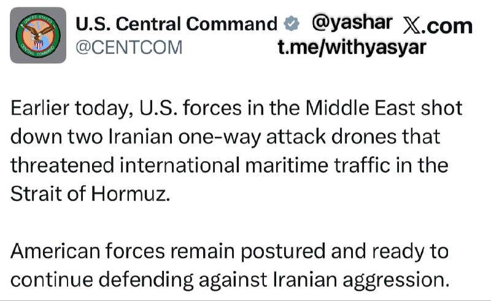

اتاق جنگ با یاشار : خدای‌دریا @withyashar

## WithYashar — post 13663

## FoxNewsTwitter — post 342685

  <a href="telegram/content/FoxNewsTwitter_342685_1780798193.mp4" target="_blank">🎬 Download video</a>

Fox News (Twitter/X)

"I was told the food was bad, so I sat in the cafeteria right along with the detainees."

Border czar Tom Homan says he made a surprise lunch visit to an ICE detention facility after hearing complaints about the food. He says he had spaghetti and meat sauce, green beans, rolls and butter, and a fruit drink, but skipped the cake for dessert.

"I couldn't finish it all," he said during an interview with @LaraLeaTrump.

## FoxNewsTwitter — post 342684

  

Fox News (Twitter/X)

Just weeks after winning the Kentucky Derby, Golden Tempo has won big again.

The colt captured the 158th Belmont Stakes on Saturday at Saratoga, after his team chose to skip the Preakness Stakes and give him extra time to rest rather than pursue horse racing's Triple Crown.

## pm_afshaa — post 92422

  <a href="telegram/content/pm_afshaa_92422_1780798197.webm" target="_blank">🎬 Download video</a>

🔴سنتکام: اوایل امروز، نیروهای آمریکایی در خاورمیانه دو پهپاد تهاجمی یک طرفه ایرانی که ترافیک دریایی بین‌المللی رو در تنگه هرمز تهدید میکرد، سرنگون کردن.

نیروهای آمریکایی مستقر و آماده ادامه دفاع در برابر تجاوز ایران هستند.

💧 Rainbet.com the #1 Non-KYC Crypto Casino & Sportsbook @rainbetcom

😁 @Pm_Afshaa

## VahidOnline — post 75978

  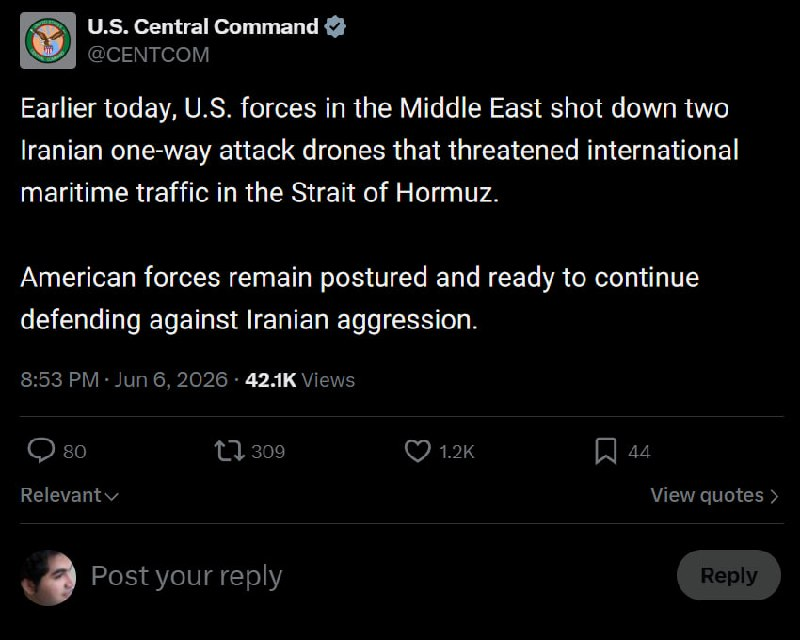

ستاد فرماندهی مرکزی آمریکا، شنبه‌شب به وقت واشنگتن در بیانیه‌ای گفت اوایل امروز، نیروهای ایالات متحده در خاورمیانه دو پهپاد تهاجمی یک‌طرفه ایران را که تهدیدی برای تردد دریایی بین‌المللی در تنگه هرمز محسوب می‌شدند، سرنگون کردند.
سنتکام افزود که نیروهای آمریکایی همچنان آماده در برابر اقدامات تهاجمی جمهوری اسلامی هستند.
@VahidHeadline

📡 @VahidOnline

## IranIntlTV — post 340910

  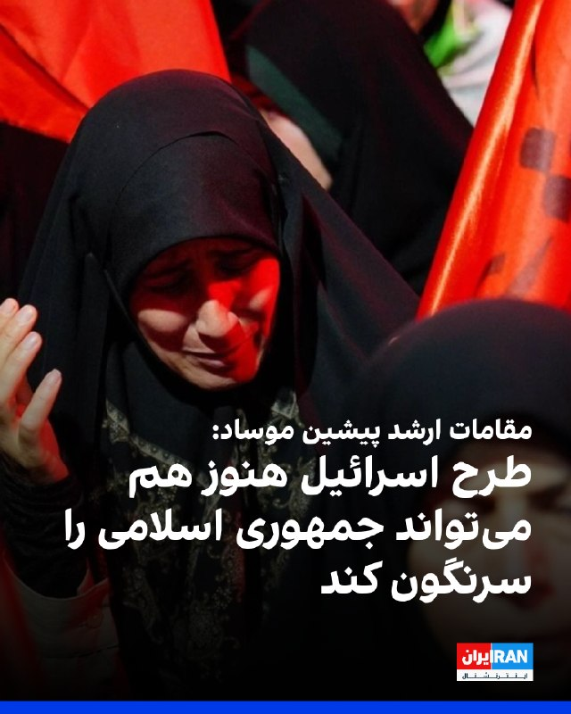

یکی از مقامات ارشد پیشین موساد با نام مستعار «الف» به کانال تلویزیونی ۱۲ اسرائیل گفت: «نقشه‌ای که از سوی اسرائیل و موساد تدوین شده، هنوز هم می‌تواند به سقوط جمهوری اسلامی منجر شود، اما پس از تصمیم آمریکا برای توقف جنگ، در تمام مراحل خود دنبال نشده است.»
الف با اشاره به اینکه این طرح چند مرحله‌ای است، ابراز امیدواری کرد که در مقطعی، مراحل بعدی طرح عملیاتی تصویب شود.
او با تاکید بر اینکه شرایط به گونه‌ای ایجاد شده است که در نهایت جمهوری اسلامی قدرتش را از دست خواهد داد، گفت: «نمی‌توانم پیش‌بینی کنم که رژیم ایران طی شش ماه و یا طی سه سال سرنگون خواهد شد، اما درنهایت این موضوع اتفاق خواهد افتاد.»

https://iranintl.com/202606078745

## IranIntlTV — post 340909

  

ستاد فرماندهی مرکزی آمریکا، سنتکام، اعلام کرد نیروهای آمریکا در خاورمیانه دو پهپاد انتحاری جمهوری اسلامی را که تردد دریایی بین‌المللی در تنگه هرمز را تهدید می‌کردند، سرنگون کردند.
سنتکام تاکید کرد نیروهای آمریکایی همچنان در موقعیت آماده‌باش قرار دارند و آماده‌اند به دفاع در برابر اقدام‌های تهاجمی جمهوری اسلامی ادامه دهند.

https://iranintl.com/202606071453

## IranIntlTV — post 340908

  

وزارت خارجه فلسطین حمله موشکی جمهوری اسلامی به بحرین و کویت در بامداد شنبه را به شدت محکوم کرد و این اقدام را نقض آشکار حاکمیت این دو کشور، تخطی صریح از قوانین بین‌المللی و تهدید امنیت و ثبات منطقه خلیج‌فارس دانست.
جمهوری اسلامی بامداد شنبه هفت موشک بالستیک به سوی کویت و بحرین شلیک کرد که نیروهای آمریکا شش موشک را رهگیری کردند و موشک هفتم به هدف نرسید.

https://iranintl.com/202606078492

## IranIntlTV — post 340907

  <a href="telegram/content/IranIntlTV_340907_1780798201.mp4" target="_blank">🎬 Download video</a>

صدها نفر روز شنبه ۱۶ خرداد در بلوار «پاسئو د لا رفورما» در مکزیکوسیتی گرد هم آمدند تا رکورد جهانی بزرگ‌ترین «موج مکزیکی» را ثبت کنند. این رویداد به مناسبت چهلمین سالگرد مشهور شدن این حرکت در جام جهانی ۱۹۸۶ برگزار شد، اما گینس هنوز شکسته شدن این رکورد را تایید نکرده است.
@iranintltv

## IranIntlTV — post 340898

بعضی از این جوانان در آخرین روز زندگی‌شان سر کار بودند. بعضی در حال ساختن کسب‌وکارشان، بعضی در فکر آینده و بعضی کنار خانواده‌هایشان.
هیچ‌کدام نمی‌دانستند چند ساعت بعد، نامشان به فهرست جان‌باختگان اضافه خواهد شد.
محمد مصطفی‌زاده، علی رحیمی، امیر عباسپور، امیرحسین صفری، سروش صادقی‌زاده، امیرمحمد زمردی، امیرحسین رفیعی و عارف نظرپور
آنچه در این چند خط می‌خوانیم، پایان زندگی آن‌هاست؛ اما آنچه از دست رفت سال‌ها تلاش، آرزو، دوستی، عشق و آینده‌ای بود که که هنوز فرصت شکوفا شدن پیدا نکرد.
#جاویدنامان_انقلاب_ملی_ایرانیان

## Shin_Persian — post 6587

Shin ✓ @hey_itsmyturn
Sun, 07 Jun 2026 00:54:08 UTC

U.S. forces in the Middle East shot down two Iranian one-way attack drones that threatened international maritime traffic in the Strait of Hormuz.

Source: @CENTCOM
https://x.com/CENTCOM/status/2063424127508037983

فارسی

نیروهای ایالات متحده در خاورمیانه دو پهپاد تهاجمی یک‌طرفه ایرانی را که ترافیک دریایی بین‌المللی در تنگه هرمز را تهدید می‌کردند، سرنگون کردند.

منبع: @CENTCOM
https://x.com/CENTCOM/status/2063424127508037983

𝕏 · @shin_persian

## FarsiVOA — post 219821

  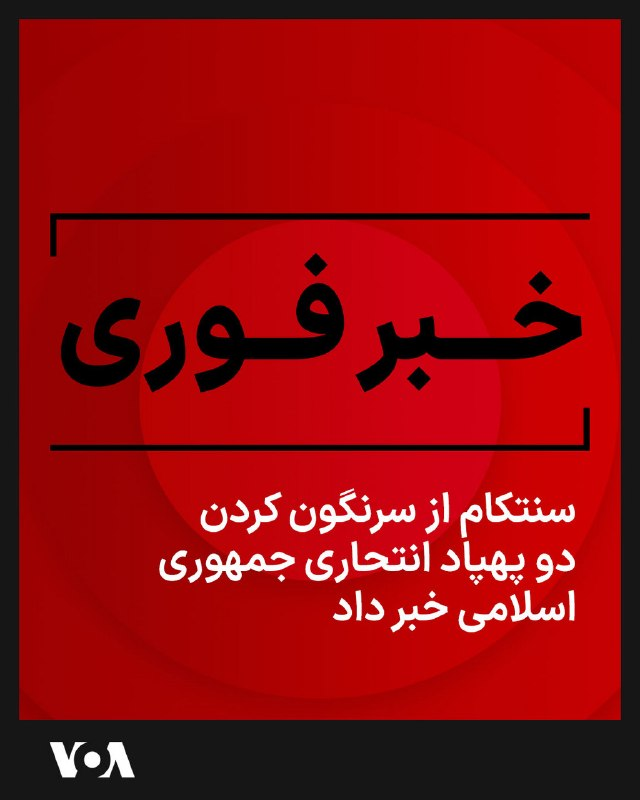

ستاد فرماندهی مرکزی آمریکا، شنبه‌شب ۱۶ خرداد به وقت واشنگتن (۱۷ خرداد به وقت تهران) در بیانیه‌ای گفت «اوایل امروز، نیروهای ایالات متحده در خاورمیانه دو پهپاد تهاجمی یک‌طرفه [جمهوری اسلامی] ایران را که تهدیدی برای تردد دریایی بین‌المللی در تنگه هرمز محسوب می‌شدند، سرنگون کردند.»

سنتکام افزود که نیروهای آمریکایی همچنان آماده در برابر اقدامات تهاجمی جمهوری اسلامی هستند.

بیانیه سنتکام در حالی است که هفته گذشته نیروهای آمریکایی چندین بار پس از تهاجمات جمهوری اسلامی به کشتیرانی، دست به حمله به مواضع حکومت ایران در جنوب ایران از جمله در جزیره قشم زدند.

جمهوری اسلامی علاوه بر حمله به کشتیرانی، چندین بار به کویت و بحرین حمله پهپادی و موشکی کرد.

در همین حال رسانه‌های غربی از جمله نیویورک پست و رویترز به نقل از یک «منبع آگاه» گزارش دادند که ایالات متحده از ابزارهایی استفاده خواهد کرد تا هزینه تعمیر و بازسازی خسارات آینده ناشی از حملات احتمالی جمهوری اسلامی به متحدان آمریکا در خلیج فارس، با دارایی‌های جمهوری اسلامی ایران تامین شود.

⬇️ بیشتر بخوانید:
https://ir.voanews.com/a/8158168.html
@FarsiVOA

## FarsiVOA — post 219820

  <a href="telegram/content/FarsiVOA_219820_1780798203.mp4" target="_blank">🎬 Download video</a>

⚡️«اینجا کشور شما نیست!» واکنش رئیس‌جمهوری لبنان به دخالت‌های جمهوری اسلامی
@FarsiVOA

## BBCPersian — post 283019

💢جام‌جهانی فوتبال در لس‌آنجلس: شوری که نیست و هیجانی که وجود ندارد
🖌سام فرزانه، خبرنگار بی‌بی‌سی در لس‌آنجلس

همکاری که تجربه پوشش خبری اتفاق‌های بزرگ ورزشی را در چهارگوشه جهان دارد چند دقیقه‌ای بعد از ورود به آمریکا و در فرودگاه لس‌آنجلس از من پرسید: «دیدی هیچ تبلیغ و بیلبوردی از جام جهانی نیست؟»

مشاهده جالبی بود. او چیزی را دیده بود که وجود نداشت و در کشورهای دیگر به وفور دیده بود: «شور و هیجان جام جهانی فوتبال.»

جام جهانی فوتبال یکی از پربیننده‌ترین رویدادهای ورزشی جهان است و مایه شهرت کشورهای میزبان. میزبانان جام جهانی از مدت‌ها قبل از شروع مسابقات به هر شیوه‌ ممکن این تورنمنت را جشن گرفته، آن را برای گردشگران به خاطره‌ای تکرار نشدنی تبدیل می‌کنند.

اما به نظر می‌رسد که دست کم اینجا در آمریکا هنوز این شور پا نگرفته است. وقتی که برای گرفتن کارت‌های خبرنگاری‌مان به استادیوم سوفی (سوفای) رفتیم، در خیابان‌های اطراف ورزشگاه اثری از بیلبوردهای جام جهانی نبود. (از آنجا که ورودی مخصوص را پیدا نمی‌کردیم مجبور شدیم دور ساختمان بچرخیم و فرصت شد که اطراف را خوب تماشا کنیم.)

ورزش در آمریکا یکی از بهترین موضوع‌های گپ و گفت بین آدم‌هایی است که در موضوع‌های سیاسی و اجتماعی اختلافات اساسی دارند. بسیاری از دوستی‌ها و روابط خانوادگی در این کشور بر مبنای عشق مشترک به یک ورزش پا گرفته است. پس چرا در این کشور جام جهانی فوتبال آن طور که انتظار می‌رود در یکی از شهرهای محل برگزاری مسابقات به چشم نمی‌آید؟ شاید بتوان دو دلیل در توضیح این سوال بیان کرد.

اول اینکه فوتبال در آمریکا با فاصله‌ای قابل توجه از فوتبال آمریکایی، بیس‌بال، و بسکتبال چهارمین ورزش پرطرفدار در کشور است. بیشتر هواداران این ورزش هم نسل‌های اول و دوم مهاجرانی هستند که از کشورهای مختلف جهان از جمله از آمریکای لاتین به ایالات متحده مهاجرت کرده‌اند.

از سوی دیگر آمریکا، یکی از سه میزبان جام‌جهانی سال ۲۰۲۶، قوانین سخت‌گیرانه‌ای برای صدور روادید دارد و بسیاری از طرفداران تیم‌های شرکت‌کننده نتوانسته‌اند برای تماشای مسابقات به این کشور بیایند. به جز آن هزینه‌های سفر، اقامت و گذران زندگی در این کشور برای مردم بسیاری از کشورها بالا و پرداختش سخت است.

https://bbc.in/4e9jf5u
@BBCPersian

## BBCPersian — post 283018

💢اهمیت لابراتوار اوک‌ریج که فرستادگان ترامپ از آن بازدید کردند، در چیست؟
🖌شیدا هوشمندی، بی‌بی‌سی، واشنگتن

آزمایشگاه ملی اوک‌ریج یکی از مهم‌ترین مراکز تخصصی هسته‌ای آمریکا است و نقش تاریخی و فنی مهمی در برنامه هسته‌ای این کشور دارد.

اوک‌ریج یکی از محرمانه‌ترین و مهم‌ترین مراکز هسته‌ای آمریکا بود که برای تولید اورانیوم غنی‌شده مورد استفاده در نخستین بمب اتمی جهان ساخته شد.شهر اوک‌ریج در ایالت تنسی عملاً از دل یک پروژه هسته‌ای متولد شد؛ هزاران نفر در دوران جنگ جهانی دوم در اوک‌ریج مشغول کار بودند، بی‌آنکه بدانند در حال مشارکت در برنامه ساخت سلاح هسته‌ای هستند. امروز هم این مرکز یکی از مهم‌ترین پایگاه‌های علمی و فنی آمریکا در حوزه فناوری هسته‌ای، انرژی و امنیت ملی محسوب می‌شود.

بنابر گزارش‌ها، استیو ویتکاف و جرد کوشنر، فرستادگان دونالد ترامپ، روز پنجشنبه برای رایزنی با گروهی از کارشناسان فنی به این آزمایشگاه سفر کردند.

انتخاب این مرکز برای رایزنی با کارشناسان فنی نشان می‌دهد که دولت دونالد ترامپ هم‌زمان با تلاش برای دستیابی به یک تفاهم اولیه با تهران، در حال آماده‌سازی تیم‌های تخصصی برای بررسی جزئیات پیچیده برنامه هسته‌ای ایران و بحث‌های فنی است.

https://bbc.in/4uliHPM
@BBCPersian

## BBCPersian — post 283017

  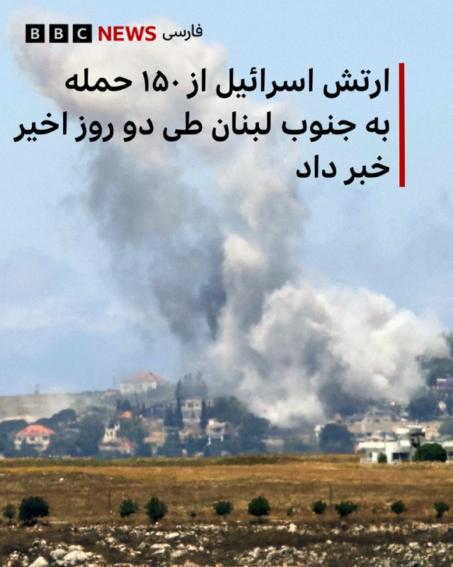

🔻ارتش اسرائیل می‌گوید طی ۴۸ ساعت اخیر، ۱۵۰ حمله به جنوب لبنان کرده و در این حملات، مواضع مرتبط با حزب‌الله را هدف قرار داده است.

صلح‌بانان سازمان ملل مستقر در جنوب لبنان، حمله اسرائیل به یک خودروی ارتش لبنان در نبطیه که طی آن سه سرباز کشته شدند را محکوم کردند.

یونیفیل، نیروهای حافظ صلح سازمان ملل، این حمله را «نقض بزرگ» حاکمیت لبنان خواندند.

ارتش لبنان، اسرائیل را به تجاوز «بی‌رحمانه، عمدی و مکرر» متهم کرد و گفت این موضوع، تلاش‌های مربوط به برقراری یک آتش‌بس پایدار را از بین می‌برد.

از زمان آغاز جنگ آمریکا و اسرائیل با ایران در اوایل اسفند، حملات اسرائیل منجر به کشته شدن بیش از ۳۵۰۰ نفر در لبنان شده است.

صدها نفر از این افراد، علیرغم آن کشته شده‌اند که آمریکا و اسرائیل اعلام آتش‌بس کرده‌اند.

وزارت خارجه آمریکا دو روز قبل گفت که اسرائیل و لبنان توافق کرده‌اند تا آتش‌بس شکنندهٔ خود را تمدید کنند و چندین «منطقهٔ امنیتی آزمایشی» در داخل لبنان ایجاد کنند که در آن حضور نیروهای حزب‌الله ممنوع خواهد بود.
ادامه مطلب⬇️

📸AFP via Getty Images
https://bbc.in/4eolvXH
@BBCPersian

## BBCPersian — post 283016

  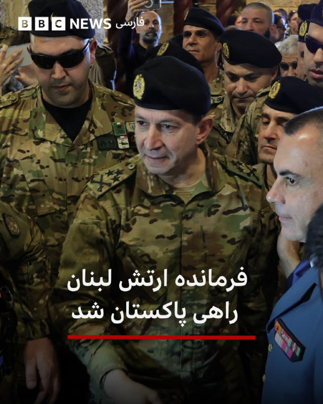

🔻رودولف هیکل، فرمانده ارتش لبنان به دعوت همتای پاکستانی خود راهی آن کشور شده است. ارتش لبنان اعلام کرد که او در این سفر با فیلد مارشال عاصم منیر، فرمانده کل نیروهای مسلح پاکستان، دیدار و گفت‌وگو خواهد کرد.

یک منبع آگاه به خبرگزاری فرانسه گفته است که این سفر در چارچوب تلاش‌های میانجی‌گرانه پاکستان میان ایران و آمریکا انجام می‌شود.

به گفته این منبع، لبنان یکی از محورهای مهم مذاکرات میان تهران و واشنگتن برای پایان دادن به جنگ و تنش‌های منطقه‌ای به شمار می‌رود.

عاصم منیر در ماه‌های اخیر نقش پررنگی در میانجی‌گری میان ایران و آمریکا ایفا کرده و پاکستان تلاش کرده است از طریق گفت‌وگوهای دیپلماتیک، زمینه کاهش تنش‌ها و دستیابی به توافق میان دو طرف را فراهم کند.

در همین حال، جوزف عون، رئیس‌جمهور لبنان، دیروز در گفت‌وگویی تلویزیونی تأکید کرد که ایران نباید در امور داخلی لبنان دخالت کند. او با اشاره به مذاکرات مستقیم بیروت با اسرائیل گفت: «لبنان متعلق به مردم لبنان است و هیچ کشوری نباید در تصمیمات آن مداخله کند.»
ادامه مطلب⬇️

📸GettyImages
https://bbc.in/4oibSgK
@BBCPersian

## BBCPersian — post 283015

  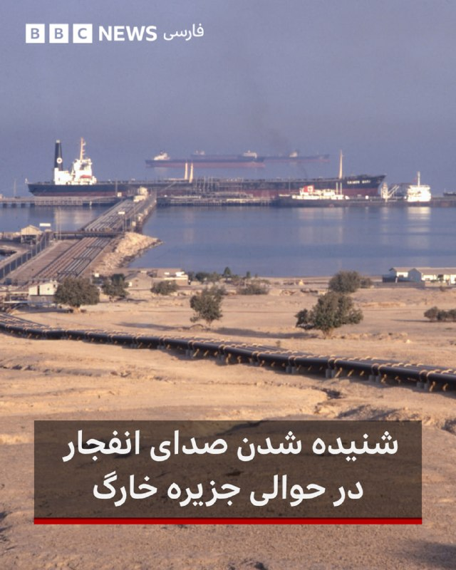

🔻بنابر گزارش‌ منابع خبری در ایران، در حوالی جزیره خارگ ایران صدای انفجار شدیدی شنیده شده است.

نیروی دریایی سپاه پاسداران انقلاب اسلامی گفته است که این صدا به خنثی‌سازی مهمات در منطقه بهرگان مربوط بوده است.

روابط عمومی نیروی دریایی سپاه گفته است که این مهمات، از جنگ اخیر باقی مانده است.

بهرگان از مناطق نفتی استان بوشهر است و حدود ۶۰ کیلومتر با جزیره خارگ فاصله دارد.

پیش‌تر، سپاه پاسداران اعلام کرد که با موشک و پهپاد به پایگاه هوایی آمریکا در کویت و مقر ناوگان پنجم آمریکا در بحرین حمله کرده است.

ارتش آمریکا، کویت و بحرین گفتند همه پرتابه‌ها را رهگیری کرده‌اند.

سپاه پاسداران گفت که در واکنش به حمله آمریکا به دکل‌های مخابراتی جزیره قشم و سیریک، «دو پایگاه هوایی آمریکا در کویت به نام‌های علی‌السالم و تاسیسات مهم باقی مانده در ناوگان پنجم نیروی دریایی آمریکا در بحرین هدف آتش موشک های بالستیک نیروی هوافضای سپاه واقع شدند.»

📸Gamma-Rapho via Getty Images
https://bbc.in/4e5cQbk
@BBCPersian

---
📅 بروزرسانی: 1405/03/17 03:28
---

## VahidOOnLine — post 244012

  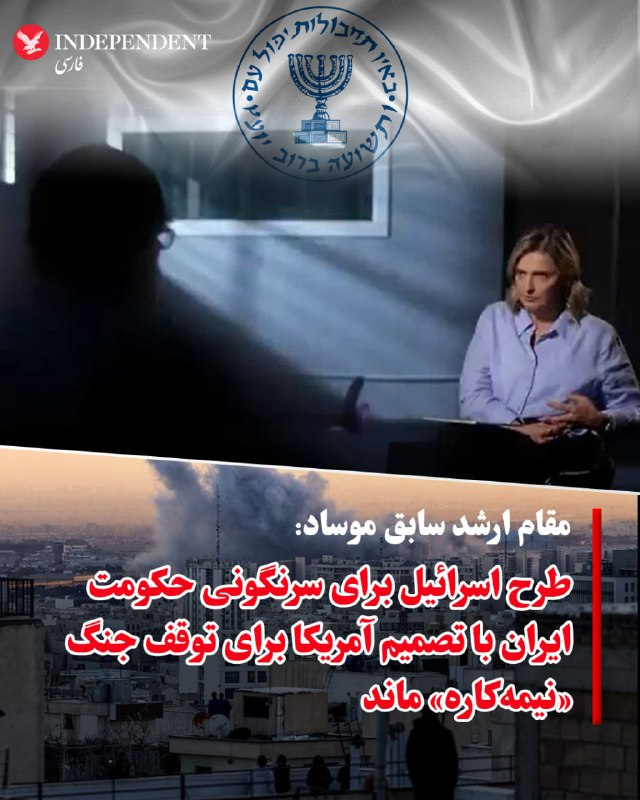

♦️به گزارش «تایمز اسرائیل»، یک مقام ارشد و سابق سازمان اطلاعات و عملیات ویژه اسرائیل، موساد، که با نام مستعار «الف» معرفی شده، در گفتگو با «کانال ۱۲» تلویزیون این کشور اعلام کرد طرح مشترک و چندمرحله‌ای اسرائیل و موساد برای سرنگونی حکومت ایران به دلیل تصمیم ماه آوریل ایالات متحده مبنی بر توقف جنگ، نیمه‌کاره رها شده است. این مامور باسابقه با تاکید بر اینکه حکومت ایران «دیر یا زود سقوط خواهد کرد» گفت: «ما تمام مسیر را طی نکردیم و در میانه راه متوقف شدیم. این یک طرح بلندمدت و گام‌به‌گام بود که به مرور زمان آماده شد اما در حال حاضر به حالت تعلیق درآمده است؛ ما در این جنگ با یک قدرت استراتژیک (آمریکا) به عنوان شریک وارد شدیم که در نقطه‌ای نبرد را متوقف کرد، اما مراحلی از جمله استفاده از شرکای کرد با هدف جایگزینی حکومت آغاز شده و توسعه یافته بود.» این مقام امنیتی همچنین انتقادهای تند جان راتکلیف، رئیس سیا و مارکو روبیو، وزیر خارجه آمریکا را رد کرد و گفت آن‌ها تجربه ۲۸ ساله او را در موساد ندارند، چرا که در این سازمان «تخیل به واقعیت تبدیل می‌شود».
«الف» در بخش دیگری از این مصاحبه به تشریح جزئیات بی‌سابقه‌ای از عملکرد موساد در جریان جنگ ۱۲ روزه در تابستان ۱۴۰۴ پرداخت و فاش کرد که یگان‌های عملیاتی این سازمان با تجهیزات پیشرفته نظامی، تسلیحات، دوربین‌های دید در شب و قابلیت هدایت موشک‌ها، مستقیما در داخل خاک ایران فعالیت می‌کردند. امری که به گفته او تا چند سال پیش غیرقابل تصور بود. وی با اشاره به تحول بزرگ در موساد، به افزایش چشمگیر جذب و آموزش ماموران بومی در کشورهای دشمن اشاره کرد و افزود که در ایران، بسیاری از این افراد به دلیل مخالفت شدید با حکومت، دفاع از حقوق زنان و همسرانشان و یا حس انتقام‌جویی برای آسیب‌هایی که به خانواده‌هایشان وارد شده، انگیزه بالایی برای همکاری با اسرائیل دارند. این مقام سابق همچنین در پاسخ به سوالی درباره وضعیت مجتبی خامنه‌ای، رهبر جدید جمهوری اسلامی که پس از زخمی شدن در حملات ۹ اسفندماه (روزی که پدرش در آن کشته شد) در انظار عمومی دیده نشده است، گفت: «بسیار غافلگیر خواهم شد اگر اسرائیل دقیقا نداند که او در چه وضعیتی قرار دارد.»
‌🇸🇦 Indypersian

🤖 @VahidOOnLine

## WithYashar — post 13662

  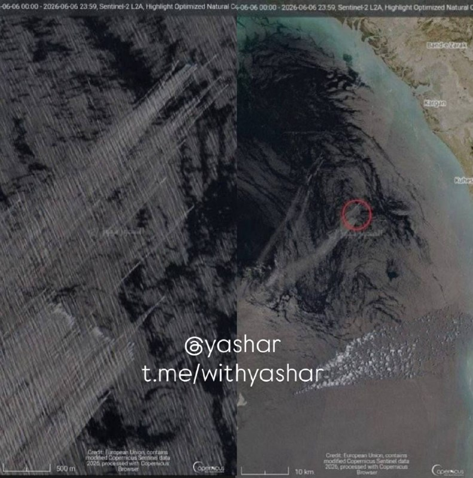

امروز تقریباً ۱۱۳ فروند قایق تندروی نیروی دریایی سپاه در مناطق مختلف تنگه هرمز درحال گشت زنی بوده اند
@withyashar

## FoxNewsTwitter — post 342683

Fox News (Twitter/X)

BREAKING: Golden Tempo wins the Belmont Stakes

## IranIntlTV — post 340897

  <a href="telegram/content/IranIntlTV_340897_1780790301.mp4" target="_blank">🎬 Download video</a>

محسن قاصد، کنشگر و همیار محیط‌زیست، با انتشار ویدیویی در اینستاگرام از بازگشت فلامینگوها به دریاچه ارومیه پس از سال‌ها خبر داد.

به گفته این مستندساز، فلامینگوها به‌دلیل خشکی دریاچه ارومیه مهاجرت کرده بودند و مقصدشان دریاچه وانِ ترکیه شده بود.
@iranintltv

## FarsiVOA — post 219819

🔺هواپیمایی اماراتی اتحاد بدون ارزان کردن بلیت اوج می‌گیرد؛ تقاضا از قبل از درگیری با جمهوری اسلامی هم فراتر می‌رود

▪️شرکت اماراتی هواپیمایی اتحاد اعلام کرد که در چند هفته آینده ظرفیت پروازهای خود را به سطحی بالاتر از قبل از عملیات نظامی آمریکا و اسرائيل علیه جمهوری اسلامی خواهد رساند.

⬇️ بیشتر بخوانید:
https://ir.voanews.com/a/8158036.html
@FarsiVOA

## FarsiVOA — post 219818

⚡️نخست‌وزیر عراق از برنامه سفر رسمی به آمریکا با هدف جذب سرمایه‌گذاری‌های مشترک خبر داد
@FarsiVOA

## FarsiVOA — post 219817

⚡️گزارش‌ها از دستگیری فعالان چپ‌گرا و نویسندگان مستقل
@FarsiVOA

## FarsiVOA — post 219816

  <a href="telegram/content/FarsiVOA_219816_1780790302.mp4" target="_blank">🎬 Download video</a>

⚡️حواشی حضور تیم ملی فوتبال جمهوری اسلامی در مکزیک؛ گفت‌وگو با کوشا دلشاد
@FarsiVOA

## FarsiVOA — post 219815

  <a href="telegram/content/FarsiVOA_219815_1780790303.mp4" target="_blank">🎬 Download video</a>

⚡️تازه‌ترین مواضع قانون‌گذاران آمریکایی درباره سیاست واشنگتن در قبال جمهوری اسلامی
@FarsiVOA

## Persian_Trend_Official — post 15829

  <a href="telegram/content/Persian_Trend_Official_15829_1780790304.mp4" target="_blank">🎬 Download video</a>

شبتون بخیر 🌃
Mig-29 Fulcrum

📌 @persian_trend_official
پرشین ترند | متفاوت‌ترین کانال نظامی

## BBCPersian — post 283007

🖋دالیا ونتورا
بی‌بی‌سی موندو

روی صندلی خود در ورزشگاه نشسته‌اید، به سمت راست خود نگاه می‌کنید و می‌بینید در حال نزدیک شدن است. لحظه‌به‌لحظه اوج می‌گیرد. موج در راه است.

وقتی به شما می‌رسد، از جا بلند می‌شوید، دست‌هایتان را بالا می‌برید و هر صدایی که به نظرتان مناسب می‌آید از خودتان درمی‌آورید. سپس دوباره می‌نشینید و موج به مسیر خود ادامه می‌دهد؛ گویی زندگی مستقلی پیدا کرده است.

این سنتی است که در ورزشگاه‌های سراسر جهان و در رشته‌های ورزشی گوناگون تکرار می‌شود.

بر اساس رکوردهای جهانی گینس، بزرگ‌ترین موج انسانی ثبت‌شده در سال ۲۰۰۸ و در جریان یک مسابقه اتومبیل‌رانی نسکار در شهر بریستول آمریکا شکل گرفت. در آن رویداد، موجی متشکل از ۱۵۷ هزار و ۵۷۴ نفر سراسر ورزشگاه را درنوردید، هرچند دوام آن به اندازه برخی موج‌های دیگر نبود.
ادامه مطلب⬇️

📸GettyImages/ AFP via Getty Images/ NurPhoto via Getty Images/ FIFA via Getty Images/ UEFA via Getty Images
https://bbc.in/4xf0Z35
@BBCPersian

## BBCPersian — post 283006

🔻تیم ملی فوتبال ایران از ترکیه راهی مکزیک شده تا در بازی‌های جام جهانی شرکت کند.

این مسابقات، پنج روز دیگر آغاز می‌شود و هر سه بازی ایران در مرحله گروهی، در آمریکا برگزار می‌شود، اما اقامت آنها در مکزیک خواهد بود. آمریکا برای بازیکنان و همراهان ضروری تیم ملی، ویزا صادر کرده، اما به رئیس فدراسیون و ۱۴ همراه دیگر که گفته میشود سوابق سپاهی و امنیتی دارند اجازه ورود نداده. فدراسیون فوتبال ایران، دولت آمریکا را به رفتار تبعیض‌آمیز متهم کرده.

گفت و گو با سام فرزانه از لس‌آنجلس⠀
@BBCPersian

---
📅 بروزرسانی: 1405/03/17 02:28
---

## VahidOOnLine — post 244011

  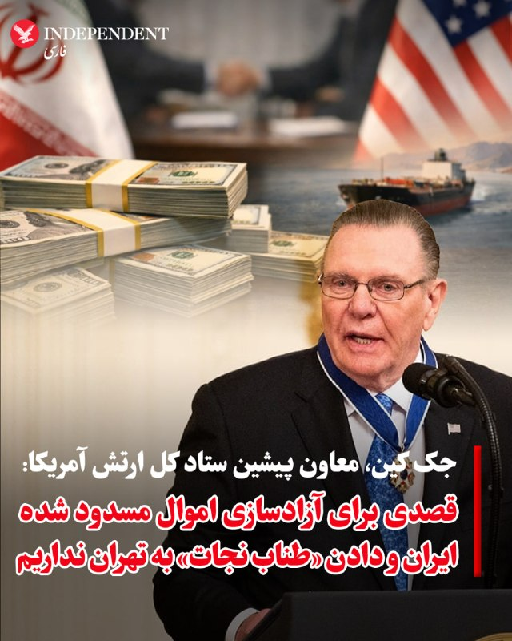

♦️جک کین، معاون پیشین ستاد کل ارتش آمریکا و تحلیل‌گر ارشد نظامی، روز شنبه در گفتگو با «فاکس‌نیوز» با رد قاطعانه درخواست تهران برای آزادسازی ۲۴ میلیارد دلار از دارایی‌های مسدودشده به عنوان شرط توافق، صراحتا اعلام کرد واشنگتن هیچ قصدی برای دادن «طناب نجات» به حکومت ایران ندارد. کین با تاکید بر اینکه صبر استراتژیک دولت دونالد ترامپ پس از هشت هفته مذاکره به پایان رسیده است، گفت: «مقامات تهران فکر می‌کنند با چه کسی طرف هستند؟ آیا ما احمق هستیم که دارایی‌های منجمدشده را آزاد کنیم و میلیاردها دلار به آن‌ها بدهیم تا خود را بازسازی کنند؟» این ژنرال بازنشسته آمریکایی با پافشاری بر اینکه واشنگتن از اهداف حداکثری خود عقب‌نشینی نخواهد کرد، افزود: «معادله روی میز بسیار ساده است. ایران یا باید تمام شروطی را که ما از طریق فشار اقتصادی و ابزار نظامی به دنبالش بودیم بپذیرد، یا اینکه ما مجددا به گزینه نظامی بازخواهیم گشت و با تشدید اهرم‌های پولی، این کشور را در مسیر فروپاشی کامل اقتصادی قرار می‌دهیم.»
‌🇸🇦 Indypersian

🤖 @VahidOOnLine

## VahidOOnLine — post 244010

  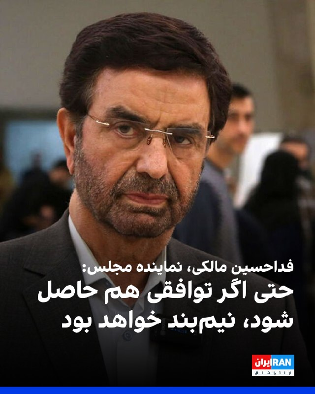

فداحسین مالکی، عضو کمیسیون امنیت ملی مجلس، به تابناک گفت: «حتی اگر توافقی بین جمهوری اسلامی و آمریکا حاصل شود، با توجه به شرایط موجود و رفتارهای متناقض آمریکا، این توافق در مرحله نخست توافقی محدود و نیم‌بند خواهد بود و مسیر گفت‌وگوها در مراحل بعدی ادامه خواهد یافت.»
او گفت: «رفتار‌های متناقض واشنگتن از یک سو با طرح مذاکره و از سوی دیگر با اقدامات نظامی، فضای گفت‌و‌گو‌ها را پیچیده کرده است. میز مذاکره همچنان برقرار است، اما طرف ایرانی به دلیل بی‌اعتمادی به آمریکا، رغبت چندانی برای پیشبرد مذاکرات نشان نمی‌دهد.»

‌🏁 🇬🇧 IranintlTV

🤖 @VahidOOnLine

## VahidOOnLine — post 244009

  

♦️چند روز پس از گزارش اختصاصی ایندیپندنت فارسی درباره صدور نوعی مجوز ورود بسیار محدود و کوتاه‌مدت برای تیم ملی فوتبال ایران، خبرگزاری فرانسه گزارش داد، ابوالفضل پسندیده، سفیر جمهوری اسلامی در مکزیک به خبرنگاران گفته است بر اساس شروط تعیین‌شده برای ویزای اعضای تیم ملی، بازیکنان و کادر فنی تنها در روز برگزاری مسابقات خود اجازه ورود به خاک ایالات متحده را دارند و باید بلافاصله پس از پایان بازی، این کشور را ترک کنند. این محدودیت سخت‌گیرانه در شرایطی ابلاغ شده است که کاروان تیم ملی ایران روز شنبه، تحت سایه یک بحران دیپلماتیک شدید میان تهران و واشنگتن، اردوی تمرینی خود در ترکیه را به مقصد مقر جدید خود در شهر تیخوانای مکزیک ترک کرد. براساس این گزارش، با توجه به اینکه هر سه بازی مرحله گروهی ایران قرار است در خاک آمریکا برگزار شود، این اولین بار در تاریخ جام جهانی است که یک کشور میزبان، پذیرای تیم ملی کشوری می‌شود که با آن در وضعیت جنگی قرار دارد.
این دستورالعمل جدید واشنگتن در تضاد کامل با اظهارات قبلی امیرمهدی علوی، سخنگوی تیم ملی قرار دارد که پیش‌تر مدعی شده بود ویزاها «چندبار ورود» هستند و تیم یک یا دو روز پیش از مسابقات به محل بازی‌ها خواهد رسید. پیش از این نیز ایالات متحده از صدور ویزا برای ۱۵ نفر از همراهان و کادر مدیریتی تیم خودداری کرد و سفارت ایران در ترکیه با «تبعیض‌آمیز» خواندن این رفتار، از فیفا خواسته است تا آمریکا را به دلیل نقض صریح قوانین جام جهانی، که شامل ضرورت حضور سرمربی در کنفرانس مطبوعاتی یک روز پیش از بازی است، پاسخگو کند.
‌🇸🇦 Indypersian

🤖 @VahidOOnLine

## VahidOOnLine — post 244008

  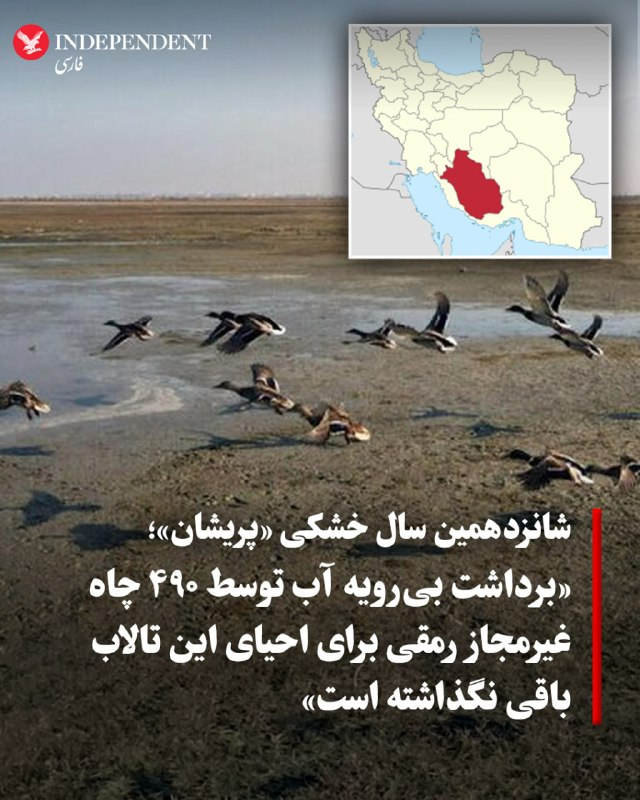

♦️تالاب پریشان، به عنوان یکی از بزرگ‌ترین تالاب‌های آب شیرین ایران، در حالی شانزدهمین سال خشکی مداوم خود را سپری می‌کند که به گفته لاهیجان‌زاده، معاون سازمان حفاظت محیط‌زیست، برداشت بی‌رویه آب توسط ۴۹۰ چاه غیرمجاز و همچنین فراتر از ظرفیت چاه‌های مجاز منطقه، رمقی برای احیای آن باقی نگذاشته است. بحرانی که مسئولان مربوطه تاکید دارند تا زمان تعیین‌تکلیف نهایی این چاه‌ها و توقف دزدی آب از حق‌آبه محیط‌زیستی، هرگونه تلاش برای احیای این تالاب بین‌المللی عملا ناممکن خواهد بود.
‌🇸🇦 Indypersian

🤖 @VahidOOnLine

## WithYashar — post 13661

## WithYashar — post 13660

https://t.me/boost/withyashar

## WithYashar — post 13659

سی‌ان‌ان: اسرائیل پرسنل نظامی و اطلاعاتی خود را به‌صورت پنهانی در طول درگیری با ایران به جمهوری آذربایجان اعزام کرده @withyashar

## WithYashar — post 13658

  <a href="telegram/content/WithYashar_13658_1780786720.mp4" target="_blank">🎬 Download video</a>

اتاق جنگ با یاشار : خدای‌دریا
@withyashar

## WithYashar — post 13657

## pm_afshaa — post 92421

🔴رومن گافمن، رئیس موساد، معاون اول خود را برکنار کرد

💧 Rainbet.com the #1 Non-KYC Crypto Casino & Sportsbook @rainbetcom

😁 @Pm_Afshaa

## pm_afshaa — post 92420

چقدر همه ی اخبار شبیه قبل موج دوم جنگه

## pm_afshaa — post 92419

https://t.me/proxy?server=141.95.135.243&port=443&secret=ddfb2ebf06b1c708b06f46137a4faed9be

پروکسی مخصوص دانلود

💧 Rainbet.com the #1 Non-KYC Crypto Casino & Sportsbook @rainbetcom

😁 @Pm_Afshaa

## pm_afshaa — post 92418

🔴تهدید رسمی سپاه به کشورهای خلیج فارس: اجازه ندهید آمریکا در کشور شما پایگاه تأسیس کند چون روزی آن‌ها خواهند رفت و شما و ما باقی خواهیم ماند

💧 Rainbet.com the #1 Non-KYC Crypto Casino & Sportsbook @rainbetcom

😁 @Pm_Afshaa

## VahidOnline — post 75977

  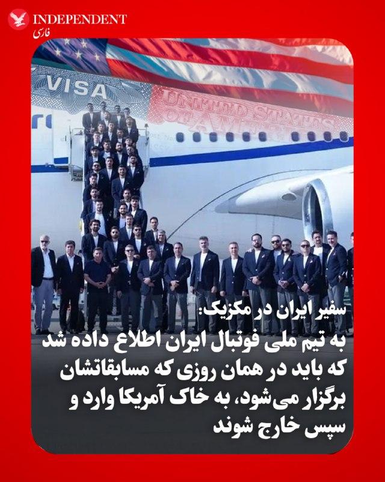

خبرگزاری فرانسه گزارش داد، ابوالفضل پسندیده، سفیر جمهوری اسلامی در مکزیک به خبرنگاران گفته است بر اساس شروط تعیین‌شده برای ویزای اعضای تیم ملی، بازیکنان و کادر فنی تنها در روز برگزاری مسابقات خود اجازه ورود به خاک ایالات متحده را دارند و باید بلافاصله پس از پایان بازی، این کشور را ترک کنند.

این محدودیت سخت‌گیرانه در شرایطی ابلاغ شده است که کاروان تیم ملی ایران روز شنبه، تحت سایه یک بحران دیپلماتیک شدید میان تهران و واشنگتن، اردوی تمرینی خود در ترکیه را به مقصد مقر جدید خود در شهر تیخوانای مکزیک ترک کرد.

براساس این گزارش، با توجه به اینکه هر سه بازی مرحله گروهی ایران قرار است در خاک آمریکا برگزار شود، این اولین بار در تاریخ جام جهانی است که یک کشور میزبان، پذیرای تیم ملی کشوری می‌شود که با آن در وضعیت جنگی قرار دارد.

این دستورالعمل جدید واشنگتن در تضاد کامل با اظهارات قبلی امیرمهدی علوی، سخنگوی تیم ملی قرار دارد که پیش‌تر مدعی شده بود ویزاها «چندبار ورود» هستند و تیم یک یا دو روز پیش از مسابقات به محل بازی‌ها خواهد رسید.
@VahidOOnLine

📡 @VahidOnline

## IranIntlTV — post 340896

  <a href="https://t.me/IranintlTV/340896" target="_blank">📎 Download file</a>

🎧نسخه صوتی سیاست با مراد ویسی: جمهوری‌اسلامی؛ کنسرسیوم جنایتکاران، فاسدان و اشغالگران
@iranintlTV

## IranIntlTV — post 340895

  <a href="telegram/content/IranIntlTV_340895_1780786723.mp4" target="_blank">🎬 Download video</a>

دیوان عالی کشور حکم اعدام پنج زندانی سیاسی محبوس در زندان شیبان اهواز را تایید کرد. سه تن از این زندانیان، مسعود جامعی، علیرضا مرداسی و فرشاد اعتمادی‌فر، به اتهام افساد فی‌الارض و عضویت در گروه‌های مخالف جمهوری اسلامی به اعدام محکوم شده‌اند.

گفت‌وگو با رقیه رضایی، روزنامه‌نگار
@iranintltv

## IranIntlTV — post 340894

  

فداحسین مالکی، عضو کمیسیون امنیت ملی مجلس، به تابناک گفت: «حتی اگر توافقی بین جمهوری اسلامی و آمریکا حاصل شود، با توجه به شرایط موجود و رفتارهای متناقض آمریکا، این توافق در مرحله نخست توافقی محدود و نیم‌بند خواهد بود و مسیر گفت‌وگوها در مراحل بعدی ادامه خواهد یافت.»
او گفت: «رفتار‌های متناقض واشنگتن از یک سو با طرح مذاکره و از سوی دیگر با اقدامات نظامی، فضای گفت‌و‌گو‌ها را پیچیده کرده است. میز مذاکره همچنان برقرار است، اما طرف ایرانی به دلیل بی‌اعتمادی به آمریکا، رغبت چندانی برای پیشبرد مذاکرات نشان نمی‌دهد.»

https://iranintl.com/202606063723

## IranIntlTV — post 340893

  <a href="telegram/content/IranIntlTV_340893_1780786726.mp4" target="_blank">🎬 Download video</a>

مراد ویسی، تحلیل‌گر ارشد ایران‌اینترنشنال، گفت: «جمهوری اسلامی به جنایت به‌عنوان روشی برای تحکیم و ماندگاری نظام نگاه می‌کند. جنایت، جزیی از روش بقای حکومت است.»
@iranintltv

## IranIntlTV — post 340892

  <a href="telegram/content/IranIntlTV_340892_1780786728.mp4" target="_blank">🎬 Download video</a>

مهدی خراتیان، کارشناس وابسته به حکومت، در گفت‌وگو با محمد فاضلی، جامعه‌شناس، در برنامه «ایران‌تاک»، با رد پایگاه اجتماعی شاهزاده رضا پهلوی در اعتراضات ۱۸ و ۱۹ دی‌ماه ۱۴۰۴، این اعتراضات را ناشی از افزایش قیمت روغن و سایر محصولات دانست.

او در ادامه افزود ما دقیق اطلاع داریم که لیدرهای اعتراضات، جمعیت را طوری هُل می‌دادند که سپر انسانی مقابل ماموران جمهوری اسلامی شوند.

خراتیان در این گفت‌وگو اذعان می‌کند که حدود ۱۰۰ شهر در آستانه سقوط بودند یا سقوط کردند و برخی فرمانداری‌ها نیز به‌راحتی سقوط کردند. به گفته او، بعد از آن نیروهای یگان ویژه وارد شدند و تعداد کشته‌شدگان افزایش یافت.
@iranintltv

## IranIntlTV — post 340891

  <a href="telegram/content/IranIntlTV_340891_1780786730.mp4" target="_blank">🎬 Download video</a>

رسانه‌های حکومتی در ایران گزارش دادند وزیر کشور پاکستان برای تحویل نامه‌ای ویژه از سوی رییس ستاد کل ارتش و نخست‌وزیر این کشور به مجتبی خامنه‌ای به تهران رفته است.

جزییات بیشتر با امیر گیتی، عضو تحریریه ایران‌اینترنشنال
@iranintltv

## IranIntlTV — post 340890

  <a href="telegram/content/IranIntlTV_340890_1780786732.mp4" target="_blank">🎬 Download video</a>

مراد ویسی، تحلیل‌گر ارشد ایران‌اینترنشنال، گفت: «جمهوری اسلامی از همان روزهای نخست شکل‌گیری با خشونت و سرکوب همراه بود و این خشونت‌ها بخش مهمی از هویت سیاسی آن است. از آتش زدن سینما رکس آبادان تا اعدام‌های اوایل انقلاب، سپس کشتار زندانیان در سال ۶۷ و کشتارهای اخیر خیابانی، همگی نشانگر وجود عنصر قوی جنایت در ساختار نظام سیاسی جمهوری اسلامی است.»
@iranintltv

## IranIntlTV — post 340889

  <a href="telegram/content/IranIntlTV_340889_1780786733.mp4" target="_blank">🎬 Download video</a>

در حاشیه تجمع اعتراضی ایرانیان در واشینگتن، سیامک آرام، برگزارکننده، به اردوان روزبه، خبرنگار ایران‌اینترنشنال، گفت: «مبارزه یک امر مستمر است و باید ادامه پیدا کند. بخش مهمی از این مبارزه، آگاهی‌رسانی است. اگر می‌خواهیم همراهی مردم کشورهای مختلف، افکار عمومی، رسانه‌ها و سیاستمداران را داشته باشیم، باید آن‌ها را نسبت به اهمیت این موضوع آگاه کنیم.»
@iranintltv

## FarsiVOA — post 219814

⚡️عراق وارد «فاز عملیاتی» پایان دادن به فعالیت‌های شبه‌نظامیان وابسته به جمهوری اسلامی شد
@FarsiVOA

## Persian_Trend_Official — post 15828

فایل صوتی لایو امشب در اسپاتیفای

https://open.spotify.com/show/1Wv2tRjfITkTGqyxcHHA2m

## Persian_Trend_Official — post 15827

  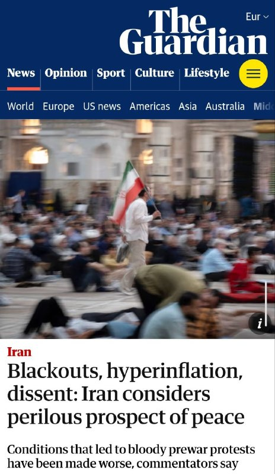

⭕️ گاردین در گزارشی با اشاره به وضعیت شکننده ایران پس از جنگ، نوشت جمهوری اسلامی خود را برای دوره‌ای از «صلحِ پرتنش» آماده می‌کند؛ دوره‌ای که به‌گفته تحلیلگران می‌تواند با بحران‌های هم‌زمان اقتصادی، ساختاری و اجتماعی همراه باشد. در این گزارش تأکید شده که حتی در صورت رسیدن به توافق یا کاهش تنش‌ها، مشکلاتی مانند ابرتورم، قطعی‌های مکرر برق، رکود اقتصادی و نارضایتی‌های عمومی همچنان پابرجا خواهند ماند و فشار بیشتری بر جامعه وارد خواهند کرد.

به‌نوشته گاردین، شرایط امروز ایران از جهات مختلف از فضای پیش از جنگ هم دشوارتر شده و همین موضوع نگرانی‌ها درباره بروز ناآرامی‌های تازه را افزایش داده است. این روزنامه همچنین گزارش داده که در سطوحی از ساختار قدرت، بحث‌هایی درباره آینده کشور در جریان است و حاکمان ایران به‌خوبی می‌دانند که مسئله اصلی فقط عبور از جنگ نیست، بلکه حفظ ثبات و کنترل در دوران پس از آن است.

جمله محوری گزارش این است که ایران، حتی اگر از مرحله درگیری مستقیم عبور کند، همچنان با مجموعه‌ای از بحران‌های درهم‌تنیده روبه‌رو خواهد بود؛ بحران‌هایی که می‌توانند نارضایتی اجتماعی را عمیق‌تر و چشم‌انداز سیاسی کشور را پیچیده‌تر کنند.

📝 Nick

📌 @persian_trend_official
پرشین ترند | متفاوت‌ترین کانال نظامی

## Persian_Trend_Official — post 15826

آمریکا در فکر بالاکشیدن اموال ایران برای بازسازی کشورهای عربی

## IranianMinds — post 21530

  <a href="telegram/content/IranianMinds_21530_1780786736.mp4" target="_blank">🎬 Download video</a>

🔴 خسروپناه؛ بعد از چندین روز اعتراض دانش آموزا:

اکثر دانش آموزا به من میگن ما کلی زحمت کشیدیم و یازدهم درس خوندیم. یعنی چی تأثیر معدل حذف بشه؟! این ناعدالتیه.
ایناییم که میان اعتراض میکنن یه تعداد خیلی کمی هستن و بیشترشون پشت کنکورین.
بدین ترتیب تاثیر معدل یازدهم در کنکور قطعیه.

@IranianMinds

## IranianMinds — post 21529

  <a href="telegram/content/IranianMinds_21529_1780786737.webm" target="_blank">🎬 Download video</a>

🤩
🤩
🤩
🤩 بونوس اضافه به ازای هر واریز 
💰

🔴فرصت تکرارنشدنی به مناسبت افتتاحیه
🔴

⚡️هر چقدر شارژ کنی، بیشتر هدیه می‌گیری
⚡️

🔴تا سقف ۳ میلیون تومان
🔴

⌛ فقط برای مدت محدود

💣بالاترین بونوس‌ها فقط در سایت وینرو

پیش بینی کن و برنده شو
🎯

📺 تلویزیون لایو برای پوشش بازی ها

🛍بالاترین ضرایب ممکن
و هزاران امکانات خاص دیگه
💰

🚩
🚩 خرداد افتتاحیه بزرگ سایت وینرو
🟥 همین الان ثبت نام کن و علاوه بر ۵۰۰ هزار تومن بونوس ثبت نام با هر شارژ تا ۲۰۰ درصد شارژ اضافه از ما هدیه بگیر

🔤 Winro.io         معتبرترین سایت ایران

🔤 Winro.io

📱 کانال اخبار و هدایــا aa16
🌟

📱 @winro_io

## IranianMinds — post 21528

  <a href="telegram/content/IranianMinds_21528_1780786738.mp4" target="_blank">🎬 Download video</a>

تظاهرات بزرگ ایرانیان مقیم آلمان در شهر دوسلدورف، شنبه ۱۶ خرداد ۱۴۰۵.
همصدا با مردم دلیر ایران و صدای بی‌صدای زندانیان در ایران.

@IranianMinds

## BBCPersian — post 283005

  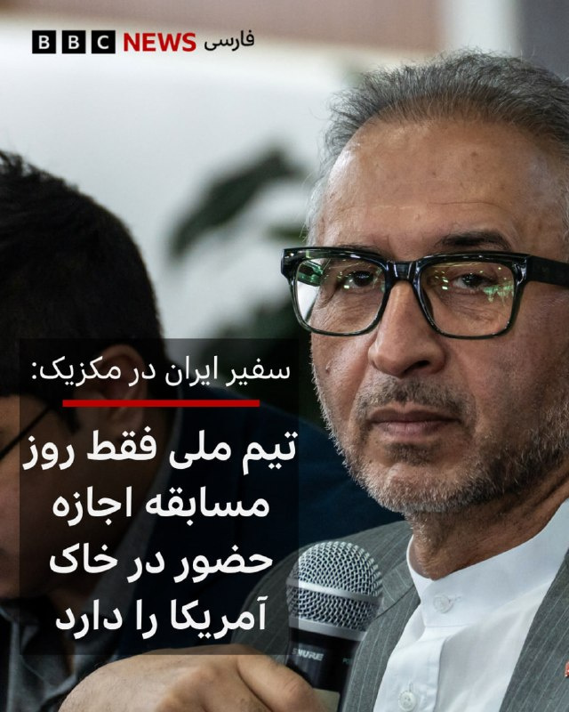

🔻سفیر ایران در مکزیک گفته است که تیم ملی فوتبال ایران برای حضور در مسابقات جام جهانی ملزم شده است در روز برگزاری هر مسابقه وارد خاک آمریکا شود و همان روز هم خاک آن کشور را ترک کند.

ابوالفضل پسندیده، روز شنبه به خبرنگاران گفت: «ما می‌توانیم صبح وارد آمریکا شویم، اما باید همان روز خاک این کشور را ترک کنیم.»

در پی تنش‌ها و درگیری‌های جاری میان آمریکا و ایران، محل استقرار تیم ملی ایران از شهر توسان در ایالت آریزونا به تیخوانا در مکزیک منتقل شده است.

اعضای تیم ملی ایران ساعاتی پیش ترکیه را به مقصد مکزیک ترک کردند.

📸AFP via Getty Images
https://bbc.in/4odjwZr
@BBCPersian

## Dirty_Kids — post 391185

⚽️ جام جهانی داره شروع میشه و بازار شرطبندی و پیشبینی از همیشه داغ تر هستش 
🔥 https://t.me/+lCR7HeYTU15iNjM0 https://t.me/+lCR7HeYTU15iNjM0 A16 
⚡️ اگر میخوای با آنالیز های رضا کینگ کونگ پول دربیاری توی این جام حتما عضو کانال شو ✅

## Dirty_Kids — post 391184

  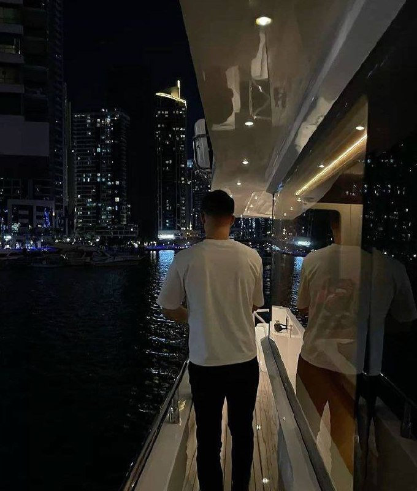

⚽️ جام جهانی داره شروع میشه و بازار شرطبندی و پیشبینی از همیشه داغ تر هستش 
🔥

https://t.me/+lCR7HeYTU15iNjM0
https://t.me/+lCR7HeYTU15iNjM0
A16

⚡️ اگر میخوای با آنالیز های رضا کینگ کونگ پول دربیاری توی این جام حتما عضو کانال شو ✅

## Dirty_Kids — post 391183

  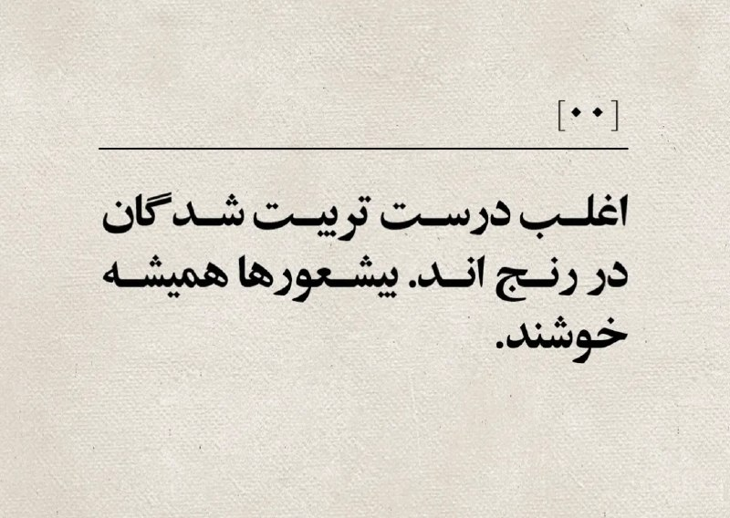

#بخوابیم

@Dirty_Kids 👻

## Dirty_Kids — post 391182

  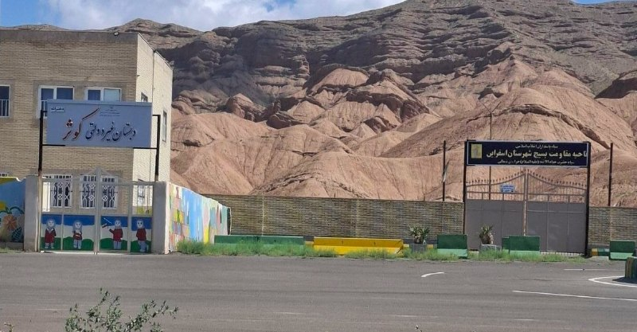

یک مدرسه دیگر در کنار پایگاه نظامی

@Dirty_Kids 👻

## Dirty_Kids — post 391181

‏پاکستان برا چی اعتراض میکنن؟ حموم اجباری شده؟

@Dirty_Kids 👻

## Dirty_Kids — post 391179

اینکارا خوب نیست ادامه بدید

@Dirty_Kids 👻

## Dirty_Kids — post 391178

  <a href="telegram/content/Dirty_Kids_391178_1780786743.mp4" target="_blank">🎬 Download video</a>

لعنت بهت فکر کردم لاکپشته🐢

@Dirty_Kids 👻

## Dirty_Kids — post 391177

  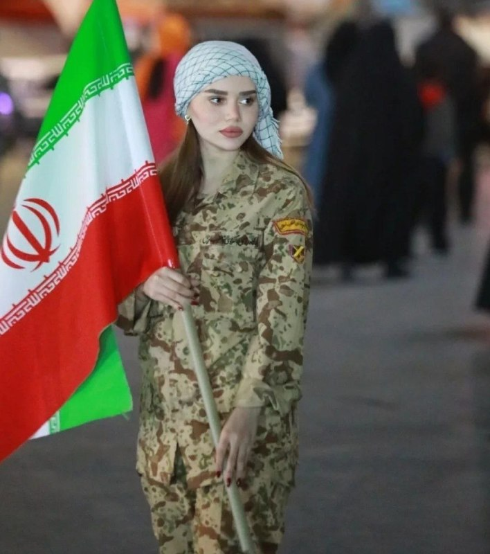

دیده شده در تجمعات شبانه عرزشی‌ها
سرباز صفرم هست امشب قراره صفر0شو آزاد کنن درجه بگیره

@Dirty_Kids 👻

## Dirty_Kids — post 391176

  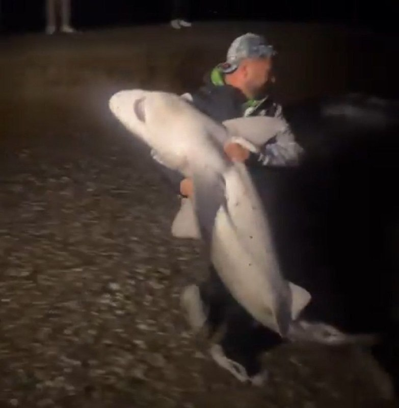

من 12 ساله وقتی خودمو به خواب میزدم که بابام از ماشین تا اتاقم بغلم کنه:

@Dirty_Kids 👻

## alonews — post 125664

  

🌐نامحدود فقط 90 تومن 😍
فقط ۵۰ نفر اول 
❤️

✅با سابقه ۵ سال فعالیت مداوم

🛡حتی بدون قطعی تو دوران جنگ

بقیه هنوز VPN حجمی میفروشن
اونم با قیمتای نجومی 
🚀

ما چی؟ 
💯
💥 VPN نامحدود واقعی فقط 90 تومن
🏷️

💥بدون محدودیت حجم
⬇️
⬇️
⬇️
@NetAazaadBot
@NetAazaadBot

## alonews — post 125663

  <a href="telegram/content/alonews_125663_1780786745.webm" target="_blank">🎬 Download video</a>

👈نورالدین الدغیر خبرنگار الجزیره در تهران:
پیش‌نویس یادداشت تفاهم ایران و آمریکا در اختیار نهادی در تهران قرار دارد تا در آن بررسی شود.

🔴این پیش‌نویس برای اینکه بدون مشکل به سمت اعلام توافق پیش برود، به آرای اکثریت مطلق نیاز دارد.

🔴ممکن است در اواسط هفته شاهد تحولاتی استثنایی باشیم؛ البته به شرطی که دولت آمریکا مانند دو هفته پیش که تشریفات اعلام توافق آماده بود، در لحظه آخر نظرش را تغییر ندهد.

✅ @AloNews خبر جنگ

<!-- MSG END -->

<!-- NAV START -->

<a href="https://github.com/Tljn/FUD/blob/main/telegram/content/archive_1.md" style="display:inline-block; padding:6px 12px; margin:0 4px; background-color:#2ea44f; color:white; text-decoration:none; border-radius:4px; font-weight:bold;">صفحه بعد</a>

<!-- NAV END -->
