# خواننده تلگرام

<!-- TOP_NAV START -->

<a href="https://github.com/Tljn/FUD/blob/main/telegram/content/archive_1.md" style="display:inline-block; padding:6px 12px; margin:0 4px; background-color:#2ea44f; color:white; text-decoration:none; border-radius:4px; font-weight:bold;">صفحه بعد</a>

<!-- TOP_NAV END -->

<!-- MSG START -->

---
📅 بروزرسانی: 1405/03/31 16:09
---

## VahidOOnLine — post 246672

  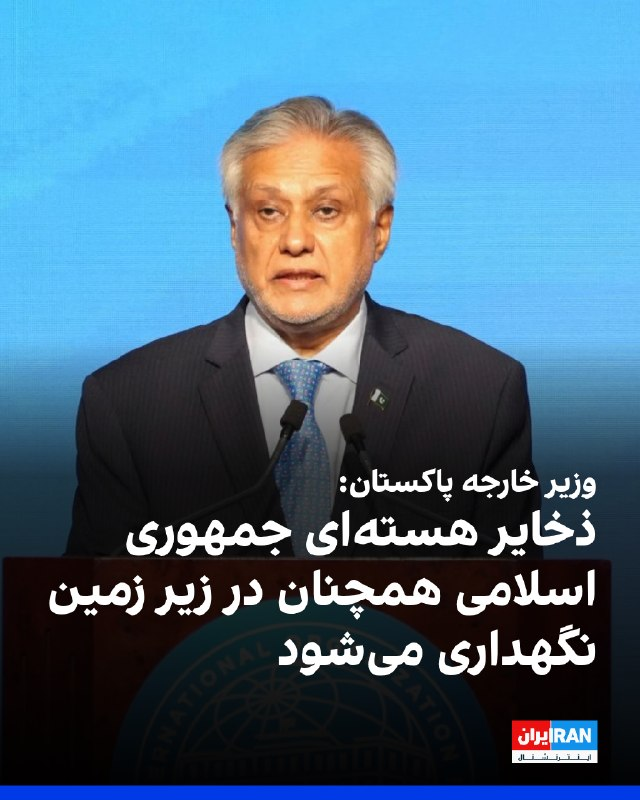

اسحاق دار، وزیر خارجه پاکستان، در گفت‌و‌گو با شبکه العربیه گفت ذخایر هسته‌ای جمهوری اسلامی همچنان در تاسیسات زیرزمینی نگهداری می‌شود.

او همچنین گفت جمهوری اسلامی با کاهش سطح غنی‌سازی خود موافقت کرده است و ابراز اطمینان کرد که مذاکرات جاری میان آمریکا و جمهوری اسلامی به توافق نهایی منجر خواهد شد.

وزیر خارجه پاکستان افزود سه تیم فنی در مذاکرات بورگن‌اشتوک سوئیس حضور دارند و درباره پرونده هسته‌ای، دارایی‌های مسدودشده ایران و لبنان گفت‌وگو می‌کنند.
‌🏁 🇬🇧 IranintlTV

🤖 @VahidOOnLine

## VahidOOnLine — post 246671

  <a href="telegram/content/VahidOOnLine_246671_1782045567.mp4" target="_blank">🎬 Download video</a>

‌
در این فیلم آرشیوی، شهبانو با حضور در مراسم فارغ‌التحصیلی دانشگاه ملی ایران، گواهینامه‌ها و جوایز دانشجویان ممتاز را اهدا می‌کند و با استادان و دانشجویان درباره وضعیت علمی و آموزشی دانشگاه گفت‌وگو می‌کند. این ویدیو بخشی از یک گزارش آرشیوی از دهه ۱۳۵۰ خورشیدی است.
برای تماشای نسخه کامل این گزارش و صدها فیلم آرشیوی نایاب دیگر، کانال یوتیوب Manoto را دنبال کنید.
‌🏁 🇬🇧 ManotoTV

🤖 @VahidOOnLine

## VahidOOnLine — post 246670

  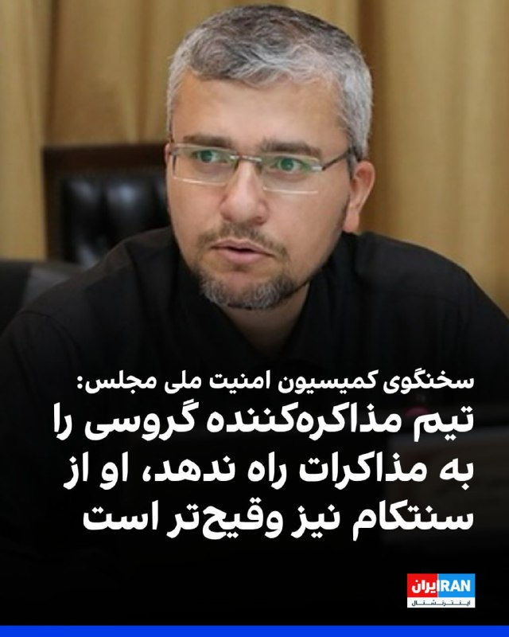

ابراهیم رضایی، سخنگوی کمیسیون امنیت ملی مجلس، در پیامی در شبکه ایکس خواستار جلوگیری از حضور رافائل گروسی، مدیرکل آژانس بین‌المللی انرژی اتمی، در مذاکرات شد. رضایی نوشت: «گروسی را به مذاکرات راه ندهید او از سنتکام نیز وقیح‌تر است.»

این اظهارات در حالی مطرح شده که پیش‌تر خبرگزاری تسنیم، وابسته به سپاه پاسداران، به نقل از یک منبع نزدیک به تیم مذاکره‌کننده گزارش داده بود جمهوری اسلامی با حضور گروسی در مذاکرات سوئیس مخالفت کرده است.
iranintl
‌🏁 🇬🇧 IranintlTV

🤖 @VahidOOnLine

## VahidOOnLine — post 246669

🗣روایت شما از توافق میان آمریکا و جمهوری‌اسلامی - یکشنبه ۳۱ خرداد

🔹اگر آزادسازی پول‌های بلوکه‌شده بدون مدیریت اجرا شود، قطعا نه در راه مقاصد بشردوستانه و بهبود وضعیت مالی مردم ایران، بلکه دوباره در راه موشک و نیابتی و لبنان خرج خواهد شد.

🔹هر حکومتی قبل از اینکه در خیابان شکست بخورد، در ذهن نیروهای خود شکست می‌خورد. پس از امضای تفاهم‌نامه، اگر روایت ۴۷ ساله بدنه ایدئولوژیک نظام فرو بریزد، بزرگ‌ترین سرمایه جمهوری اسلامی از بین می‌رود.

🔹آقای ترامپ، حکومت جمهوری اسلامی و سرانش چه تفاوتی با طالبان دارند؟ مثل طالب‌ها با اعدام، شلاق، زندان و اخراج حکومت می‌کنند. با این وحشی‌ها مذاکره می‌کنید؟

🔹هرچند می‌دانم ترامپ دارد با این‌ها بازی می‌کند، ولی به او بگویید کسانی که گفتی ملایم‌ترند، اخیرا دانش‌آموزان را به‌خاطر اعتراض به امتحان دستگیر کردند. رژیم جمهوری اسلامی باید کلا برود.

🔹ترامپ همش از کارتر به‌عنوان بدترین رئیس‌جمهور آمریکا یاد می‌کرد و اوباما و بایدن را به باد تمسخر می‌گرفت. حالا کار را به جایی کشانده که همان‌ها دارند مسخره‌اش می‌کنند.

🔹به یاد ۱۸ و ۱۹ دی‌ماه: ما این انقلاب را شروع نکردیم که نصفه‌ونیمه ولش کنیم. آزادی ایران‌مان به دست خودمان رقم می‌خورد و نباید منتظر کسی باشیم. خودمان دوباره خیابان‌ها را مال خودمان کنیم.

🔹سیاست ترامپ در مذاکره با جمهوری اسلامی، نتیجه‌اش همانند مذاکره آمریکا با شوروی است که منجر به فروپاشی می‌شود. پس ناامید نباشید. در ضمن ما مردم اراده‌ای محکم و آهنین داریم که همین برایمان کافی است.

🔹از مشهد: گرانی، مخصوصا در حوزه دارو، بیداد می‌کند. می‌خواستم به دولت‌های غربی بگویم این‌ها کمک‌های اهدایی زلزله‌زدگان را می‌دزدند، چه برسد به پولی که آزاد شود.

🔹از تهران: خیلی جالب است دارایی‌های بشردوستانه را برای کسانی که بشر را قتل‌عام می‌کنند، آزاد کرده‌اند.

🔹آقای ترامپ، ما نمی‌خواهیم با قاتل هزاران جاویدان در یک کشور زندگی کنیم. ما بیچاره شدیم از دست این آخوندها، بعد شما با این‌ها توافق می‌کنید؟
‌🏁 🇬🇧 IranintlTV

🤖 @VahidOOnLine

## VahidOOnLine — post 246668

  

خبرگزاری فارس، وابسته به سپاه پاسداران، به نقل از یک منبع آگاه در هیات مذاکره‌کننده جمهوری اسلامی گزارش داد که پرونده هسته‌ای در این دور از مذاکرات سوئیس در دستور کار قرار ندارد و رافائل گروسی، مدیرکل آژانس بین‌المللی انرژی اتمی، نیز در محل مذاکرات حضور ندارد.

این منبع افزود هیچ‌یک از اعضای کمیته هسته‌ای جمهوری اسلامی در ترکیب هیات اعزامی به سوئیس حضور ندارند و موضوع هسته‌ای در گفت‌وگوهای جاری مطرح نیست.

به گزارش فارس، مذاکره درباره پرونده هسته‌ای تنها در صورتی در دستور کار جمهوری اسلامی قرار خواهد گرفت که اجرای بندهای ۱، ۴، ۱۰ و ۱۱ تفاهم‌نامه آغاز شود.
‌🏁 🇬🇧 IranintlTV

🤖 @VahidOOnLine

## VahidOOnLine — post 246667

  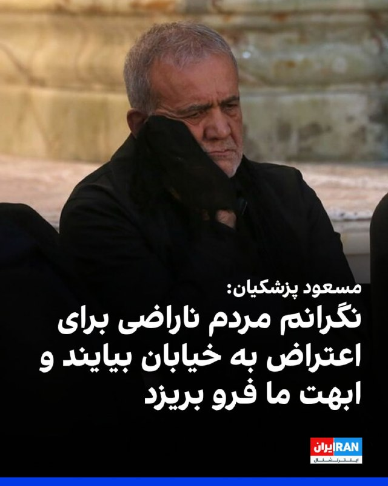

مسعود پزشکیان، رییس‌ دولت جمهوری اسلامی، گفت نگرانی اصلی او این است که دولت نتواند رضایت مردم را جلب کند و نارضایتی‌ها به اعتراض‌های خیابانی منجر شود.

پزشکیان گفت: «از آنچه می‌ترسم این است که نتوانیم به مردم به درستی خدمت بدهیم، ناراضی شوند و به خیابان بیایند و اعتراض کنند. آن وقت ابهت ما فرو می‌ریزد.»

او افزود مهم‌ترین قدرت جمهوری اسلامی، وحدت مردم است و مسئولان نباید اجازه دهند کمبودها، کسری‌ها و نواقص باعث نارضایتی مردم شود. به گفته پزشکیان، بروز چنین وضعیتی موجب «خوشحالی دشمنان» خواهد شد.
iranintl
‌🏁 🇬🇧 IranintlTV

🤖 @VahidOOnLine

## VahidOOnLine — post 246666

  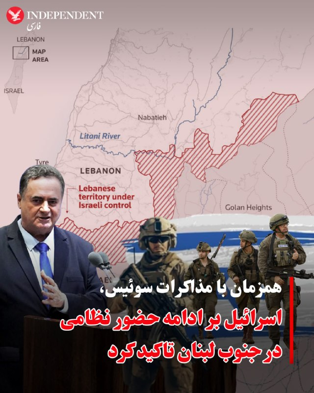

♦️در حالی که اسماعیل بقایی، سخنگوی وزارت امور خارجه جمهوری اسلامی اعلام کرده محور اصلی مذاکرات امروز در بورگن‌اشتوک سوییس اجرای بند مربوط به «توقف جنگ در لبنان» خواهد بود، اسرائیل بار دیگر بر ادامه حضور نظامی خود در جنوب لبنان تاکید کرد.

اسرائیل کاتز، وزیر دفاع اسرائیل، روز یکشنبه اعلام کرد نیروهای این کشور همچنان در منطقه موسوم به «منطقه امنیتی» در جنوب لبنان باقی خواهند ماند و هیچ محدودیتی برای اقدام علیه آنچه «تهدیدات امنیتی» خوانده می‌شود، ندارند.

کاتز در بیانیه‌ای گفت: «هیچ‌گاه محدودیتی برای نیروهای ارتش اسرائیل در لبنان وجود نداشته و اکنون نیز وجود ندارد. همان‌گونه که بنیامین نتانیاهو و من تاکید کرده‌ایم، اسرائیل از منطقه امنیتی در لبنان عقب‌نشینی نخواهد کرد.»
این منطقه که اسرائیل از آن به عنوان «منطقه امنیتی» یاد می‌کند، حدود ۱۰ کیلومتر در داخل خاک لبنان امتداد دارد و نیروهای اسرائیلی همچنان در بخش‌هایی از آن مستقر هستند.

اظهارات وزیر دفاع اسرائیل تنها ساعاتی پس از آن مطرح شد که مقام‌های ایرانی تاکید کردند بدون پایان جنگ در لبنان و توقف نقض تعهدات از سوی اسرائیل، امکان حرکت به سمت توافقات گسترده‌تر با آمریکا وجود نخواهد داشت.
‌🇸🇦 Indypersian

🤖 @VahidOOnLine

## VahidOOnLine — post 246665

  <a href="telegram/content/VahidOOnLine_246665_1782045571.mp4" target="_blank">🎬 Download video</a>

لیلی مهدوی، مادر سیاوش محمودی، معترض کشته‌شده در خیزش زن، زندگی، آزادی، با انتشار ویدیویی نشان می‌دهد که در کنار مزار جاویدنام محمدمهدی سیف‌الله‌پور همراه با پدر و مادر او و پدر جاویدنام سپهر شکری، اعلام می‌‌کنند در کنار هم دادخواه فرزندانشان خواهند بود.
‌🏁 🇬🇧 IranintlTV

🤖 @VahidOOnLine

## VahidOOnLine — post 246664

  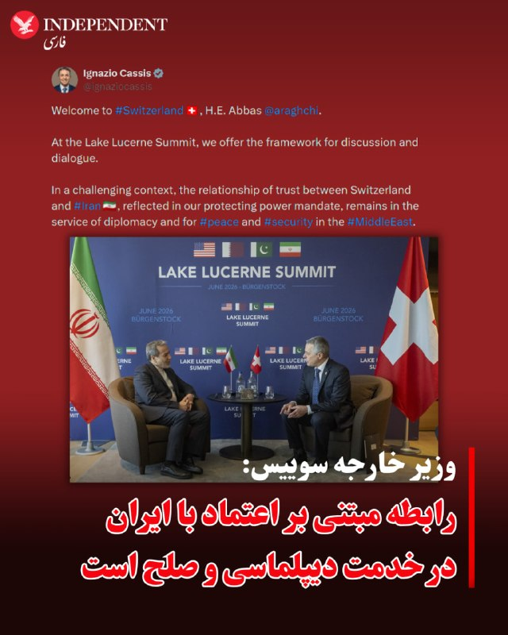

⭕️وزیر خارجه سوییس: رابطه مبتنی بر اعتماد با ایران در خدمت دیپلماسی و صلح است

♦️ایگنازیو کاسیس، وزیر امور خارجه سوییس پس از دیدار با عباس عراقچی، وزیر امور خارجه جمهوری اسلامی، بر نقش روابط مبتنی بر اعتماد میان دو کشور در پیشبرد دیپلماسی تاکید کرد.

کاسیس با خوشامدگویی به عراقچی گفت سوییس بستری برای گفتگو و تبادل نظر فراهم کرده است و در شرایط پیچیده کنونی، روابط تهران و برن همچنان در راستای تقویت دیپلماسی، صلح و امنیت در خاورمیانه قرار دارد. او همچنین به نقش سوییس به عنوان حافظ منافع میان ایران و آمریکا اشاره کرد.

سوییس از دهه ۱۳۵۰ و پس از قطع روابط دیپلماتیک تهران و واشنگتن، حافظ منافع آمریکا در ایران بوده است. این کشور در سال‌های گذشته بارها میزبان مذاکرات و رایزنی‌های دیپلماتیک میان جمهوری اسلامی و کشورهای غربی بوده و نقش میانجی‌گرانه‌ای در برخی پرونده‌های منطقه‌ای و بین‌المللی ایفا کرده است.
‌🇸🇦 Indypersian

🤖 @VahidOOnLine

## VahidOOnLine — post 246663

  

خبرگزاری تسنیم، وابسته به سپاه پاسداران، به نقل از یک منبع نزدیک به تیم مذاکره‌کننده جمهوری اسلامی، نوشت: «تنگه هرمز بدون مهار اسرائیل در لبنان باز نخواهد شد و رفع محاصره دریایی برای بازگشایی این آبراه کافی نیست.»

تسنیم به نقل از این منبع، افزود که اگر حملات اسرائیل در لبنان ادامه یابد، هیچ مذاکره‌ای درباره موضوعات دیگر انجام نخواهد شد.

این رسانه وابسته به سپاه همچنین اضافه کرد که آزادسازی بخشی از دارایی‌های بلوکه‌شده طبق تفاهم‌نامه و همچنین تفاهمی که با قطری‌ها صورت گرفته بود، آنهم در همین گام اول، اجرای بند یک درباره جنگ در تمام جبهه‌ها از جمله لبنان، رفع کامل محاصره و صدور اسقاطیه‌های فروش نفت، پتروشیمی و مشتقات ایران، شرط بازگشایی تنگه هرمز است.
iranintl
‌🏁 🇬🇧 IranintlTV

🤖 @VahidOOnLine

## VahidOOnLine — post 246662

  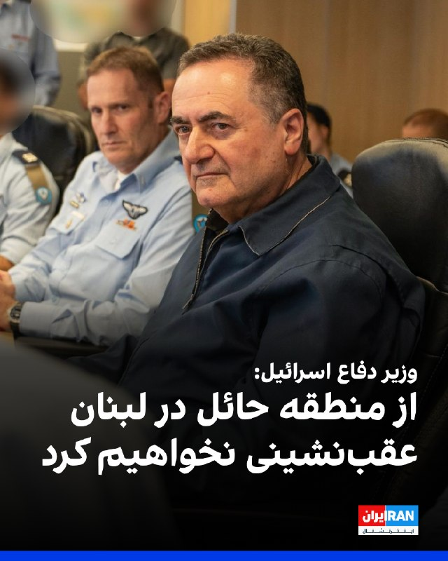

وای‌نت گزارش داد یسرائیل کاتز، وزیر دفاع اسرائیل، در واکنش به گزارش‌هایی درباره محدود شدن آزادی عمل ارتش اسرائیل در لبنان، گفت هیچ محدودیتی برای نیروهای ارتش این کشور در اقدام علیه تهدیدها وجود ندارد.

کاتز افزود آتش‌بس اعلام‌شده، نیروهای ارتش اسرائیل را در همه مواضع خود در منطقه حائل امنیتی که از شهرک‌های شمالی اسرائیل محافظت می‌کند، حفظ کرده است.

وزیر دفاع اسرائیل همچنین گفت حفاظت از جان شهروندان و نیروهای ارتش، اولویت اصلی دولت اسرائیل است و این کشور از منطقه حائل امنیتی در جنوب لبنان عقب‌نشینی نخواهد کرد.
‌🏁 🇬🇧 IranintlTV

🤖 @VahidOOnLine

## VahidOOnLine — post 246661

  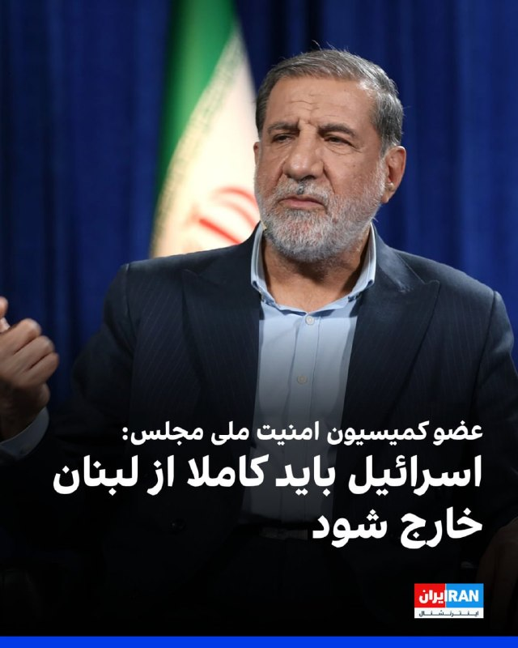

اسماعیل کوثری، عضو کمیسیون امنیت ملی مجلس گفت: «بند یک تفاهم‌نامه بر موضوع توقف درگیری‌ها در تمامی جبهه‌ها تاکید دارد که یکی از آن‌ها لبنان است و هیات مذاکره کننده باید آن را دنبال کنند، یعنی هم باید قطع آتش در لبنان شود و هم اسرائیلی‌ها باید کاملا از این سرزمین خارج شوند.»

به گزارش خبرگزاری خانه ملت، کوثری افزود: «باید در رابطه با لبنان نیز دقیقا عین ایران عمل شده و توقف جنگ را شاهد باشیم.»
iranintl
‌🏁 🇬🇧 IranintlTV

🤖 @VahidOOnLine

## VahidOOnLine — post 246660

  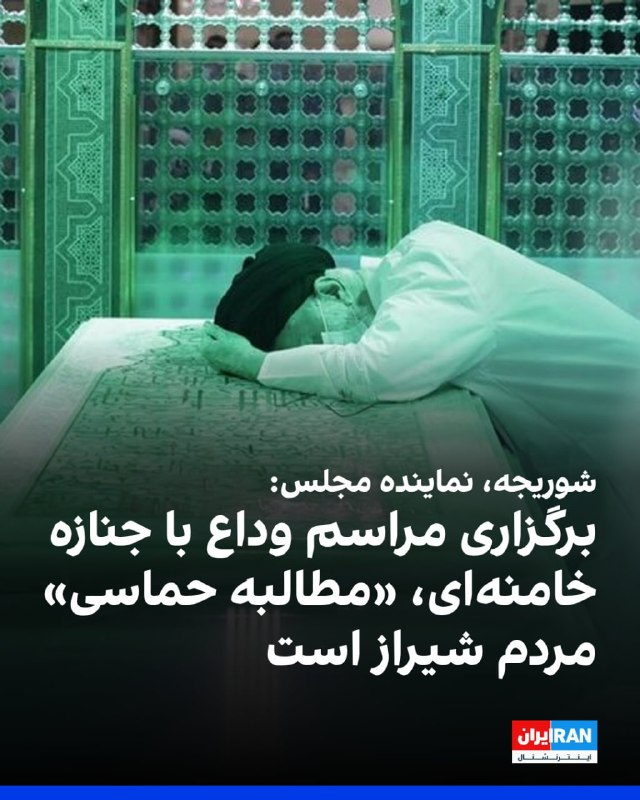

غلامرضا توکل شوریجه، نماینده سروستان در مجلس، خواستار برگزاری مراسم وداع با جنازه خامنه‌ای در شیراز شد و گفت: «برگزاری این مراسم در شیراز، نه تنها پاسخ به یک خواسته مردمی، بلکه پیوندی جاودانه میان تاریخ کهن این شهر و مطالبه حماسی مردم استان فارس است.»

او اضافه کرد که کشته شدن علی خامنه‌ای، «قلب‌های تمامی مردم ولایت‌مدار را به درد آورده است.»
iranintl
‌🏁 🇬🇧 IranintlTV

🤖 @VahidOOnLine

## VahidOOnLine — post 246659

  <a href="telegram/content/VahidOOnLine_246659_1782045576.mp4" target="_blank">🎬 Download video</a>

⭕️نشست چهارجانبه در آستانه آغاز؛ رایزنی ۴۵ دقیقه‌ای عراقچی و وزیر خارجه سوییس پایان یافت

♦️دیدار دوجانبه عباس عراقچی، وزیر امور خارجه جمهوری اسلامی با ایگناسیو کاسیس، وزیر خارجه سوییس، پس از حدود ۴۵ دقیقه گفتگو در هتل بورگن‌اشتوک به پایان رسید.
بر اساس گزارش‌های منتشرشده، پس از پایان این رایزنی دوجانبه، مقدمات برگزاری نشست چهارجانبه میان ایران، آمریکا، قطر و پاکستان در بخش دیگری از مجموعه بورگن‌اشتوک در حال انجام است و انتظار می‌رود این نشست به‌زودی آغاز شود.

این نشست در حالی برگزار می‌شود که موضوعاتی چون اجرای مفاد تفاهم‌نامه، تحولات لبنان، نقش میانجی‌گران منطقه‌ای و همچنین وضعیت تنگه هرمز در کانون توجه رسانه‌ها و ناظران سیاسی قرار دارد.
قطر و پاکستان که طی ماه‌های گذشته نقش فعالی در انتقال پیام‌ها و تسهیل تماس‌های میان تهران و واشنگتن ایفا کرده‌اند، در نشست امروز نیز به عنوان دو میانجی اصلی حضور خواهند داشت.
‌🇸🇦 Indypersian

🤖 @VahidOOnLine

## WithYashar — post 15491

  

ترامپ در تروث : روز پدر مبارک! کشور ما عالی عمل می‌کند. تعداد مشاغل و بازار سهام رکورد زده، بهترین اقتصاد تاریخ! بزرگترین ارتش جهان، تا به امروز. ما در همه جبهه‌ها پیروز می‌شویم، پیروزی‌ای بی‌سابقه. خدا همه شما را حفظ کند!!! رئیس جمهور دونالد جی. ترامپ
@withyashar

## WithYashar — post 15490

  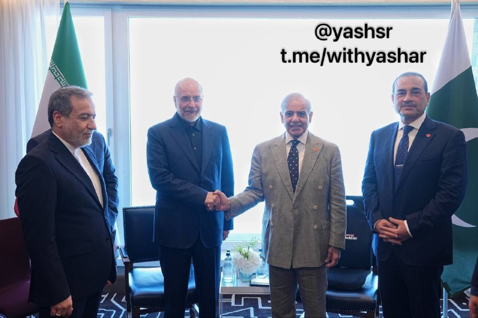

دیدار شهباز شریف نخست وزیر و عاصم منیر فرمانده ارتش پاکستان با محمدباقر قالیباف رئیس هیئت جمهوری اسلامی - زوریخ سوئیس
@withyashar

## WithYashar — post 15489

نشست سه جانبه ایران، امریکا و قطر با موضوع آتش بس فراگیر در لبنان و اموال بلوکه شده ایران هم اکنون در محل مذاکرات در حال برگزاری است.
@withyashar

## WithYashar — post 15488

پزشکیان: مواضع ترامپ ۱۸۰ درجه نسبت به گذشته عوض شده

از حق غنی‌سازی نخواهیم گذشت؛ آنها هم مجبورند بپذیرند.
@withyashar

## WithYashar — post 15487

صداسیما: اینترنت سوئیس ضعیفه ارتباطمون با خبر نگار قطع شد
@withyashar

## WithYashar — post 15486

پزشکیان: اگر تورم ادامه پیدا کند و به تورم سه‌رقمی تبدیل شود، آیا جامعه توان تحمل چنین وضعیتی را خواهد داشت؟
@withyashar 😂

## mwarmonitor — post 11312

🔴 وزیر خارجه پاکستان، اسحاق دار، در گفت‌وگو با العربیه:

🔴 در طول دوره ۶۰ روزه، هیچ‌گونه هزینه ترانزیتی در تنگه هرمز اعمال نخواهد شد.

🔴 دار افزود: هیچ هزینه‌ای، چه «ترانزیتی» و چه «خدماتی»، در تنگه هرمز دریافت نخواهد شد.

🔴 او گفت پاکستان موفق شده برای نخستین بار طی ۴۷ سال، آمریکا و ایران را به یکدیگر نزدیک کند.

🔴 دار افزود پاکستان با شرکا و متحدان خود برای موفقیت تلاش‌های میانجی‌گری همکاری کرده است.

🔴 وی به العربیه گفت جنگ میان آمریکا و ایران ویرانگر بوده و تأثیر منفی بر اقتصاد داشته است.

🔴 دار گفت سه تیم فنی در مذاکرات میان آمریکا و ایران حضور دارند.

🔴 او توضیح داد کمیته‌های فنی در حال بررسی پرونده هسته‌ای، دارایی‌های مسدودشده و وضعیت لبنان هستند.

@mwarmonitor

## mwarmonitor — post 11311

🔴 وزیر خارجه پاکستان: آمریکا درخواست انتقال ذخایر هسته‌ای ایران را مطرح کرد و ما به راه‌حلی با عنوان «کاهش سطح غنی‌سازی» رسیدیم.

@mwarmonitor

## mwarmonitor — post 11310

  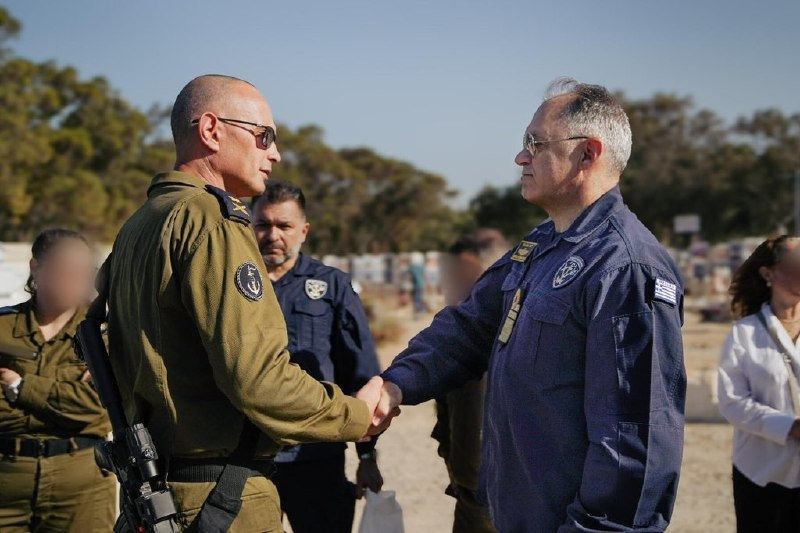

🔴رئیس ستاد کل نیروی دریایی یونان، معاون دریاسالار «دیمیتریوس-الِفثریوس کاتاراس»، یک سفر رسمی به اسرائیل را به پایان رساند؛ طی این سفر او با فرمانده نیروی دریایی اسرائیل، معاون دریاسالار «ایال هارِل» دیدار کرد.

🔸این سفر نشان‌دهنده عمق روابط امنیتی میان اسرائیل و یونان و همچنین تعهد مشترک دو کشور برای تقویت بیشتر همکاری‌های راهبردی و عملیاتی است.

@mwarmonitor

## mwarmonitor — post 11309

🔴 وزیر دفاع اسرائیل: هیچ محدودیتی وجود نخواهد داشت که مانع از اقدام نیروهای ما برای از بین بردن تهدیدها در لبنان شود.

🔴 اعلام آتش‌بس، نیروهای ما را در تمام مواضع موجود در منطقه امنیتی در لبنان حفظ می‌کند.

@mwarmonitor

## FoxNewsTwitter — post 343222

‌Fox News (Twitter/X)

👉 Full story here:

## FoxNewsTwitter — post 343221

  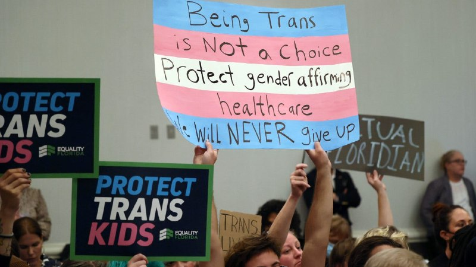

Fox News (Twitter/X)

FTC sues the organization behind transgender youth treatment guidelines, alleging its own leaders privately admitted the science wasn't there. The complaint, filed alongside attorneys general from four states, accuses WPATH of overstating evidence behind puberty blockers, hormones, and surgeries for minors while removing age minimums without scientific justification.

## pm_afshaa — post 94503

  <a href="telegram/content/pm_afshaa_94503_1782045580.webm" target="_blank">🎬 Download video</a>

🔴پزشکیان: نگرانم مردم ناراضی به خیابان بیان و اعتراض کنن. اون وقت ابهت ما فرو می‌ریزه.

💧 Rainbet.com the #1 Non-KYC Crypto Casino & Sportsbook @rainbetcom

😁 @Pm_Afshaa

## pm_afshaa — post 94502

  <a href="telegram/content/pm_afshaa_94502_1782045581.webm" target="_blank">🎬 Download video</a>

🔴پزشکیان: توافق رو گردن من نندازید، تمام فرمانده‌هان قرارگاه، سپاه، ارتش و امنیت در جلسه شورای امنیت ملی با توافق موافق بودن.

💧 Rainbet.com the #1 Non-KYC Crypto Casino & Sportsbook @rainbetcom

😁 @Pm_Afshaa

## pm_afshaa — post 94501

  <a href="telegram/content/pm_afshaa_94501_1782045581.webm" target="_blank">🎬 Download video</a>

🔴کاتز، وزیر دفاع اسرائیل:
هیچ محدودیتی برای اقدام نیروهای ما وجود نداره و برای از بین بردن تهدیدات در لبنان، هر کاری لازم باشه انجام میدیم.

💧 Rainbet.com the #1 Non-KYC Crypto Casino & Sportsbook @rainbetcom

😁 @Pm_Afshaa

## pm_afshaa — post 94500

  <a href="telegram/content/pm_afshaa_94500_1782045582.webm" target="_blank">🎬 Download video</a>

🔴تسنیم به نقل از یک منبع نزدیک به تیم مذاکره‌کننده:

توقف حملات اسرائیل به لبنان، فقط یکی از شروط بازگشایی تنگه هرمزه. اگر حملات اسرائیل در لبنان ادامه یابد، هیچ مذاکره‌ای درباره موضوعات دیگه انجام نخواهد شد.

💧 Rainbet.com the #1 Non-KYC Crypto Casino & Sportsbook @rainbetcom

😁 @Pm_Afshaa

## pm_afshaa — post 94499

  <a href="telegram/content/pm_afshaa_94499_1782045583.webm" target="_blank">🎬 Download video</a>

🔴پزشکیان: تمام مفاد تفاهم‌نامه جمهوری اسلامی و آمریکا به نفع ماست و نتایج این مذاکرات به‌زودی مشخص میشه. 6 میلیارد دلار پول بلوکه‌شده ایران در قطر آزاد میشه. تنها نکته آمریکا اینه که ما بمب اتم نداشته باشیم، این موردیه که رهبر شهید هم بارها گفت که ما بمب…

## pm_afshaa — post 94498

  <a href="telegram/content/pm_afshaa_94498_1782045583.webm" target="_blank">🎬 Download video</a>

🔴خبرنگار صداوسیما: یک دور رفت و برگشت پیام با واسطه پاکستان بین دو‌طرف انجام شده یک دیدار هم با هیئت قطری برگزار شده.

💧 Rainbet.com the #1 Non-KYC Crypto Casino & Sportsbook @rainbetcom

😁 @Pm_Afshaa

## pm_afshaa — post 94497

  <a href="telegram/content/pm_afshaa_94497_1782045583.webm" target="_blank">🎬 Download video</a>

🔴شهباز شریف نخست‌وزیر پاکستان و عاصم منیر فرمانده ارتش پاکستان با جی‌دی ونس، معاون ترامپ، دیدار کردن و بعد از این بزودی با هیأت جمهوری اسلامی دیدار میکنن.

💧 Rainbet.com the #1 Non-KYC Crypto Casino & Sportsbook @rainbetcom

😁 @Pm_Afshaa

## pm_afshaa — post 94496

  <a href="telegram/content/pm_afshaa_94496_1782045584.webm" target="_blank">🎬 Download video</a>

🔴صداوسیما: گروسی، مدیر کل آژانس بین‌المللی انرژی اتمی هم در سوئیس حضور داره، اما موضوع فعلی مذاکرات درباره مسائل هسته‌ای نیست.

💧 Rainbet.com the #1 Non-KYC Crypto Casino & Sportsbook @rainbetcom

😁 @Pm_Afshaa

## pm_afshaa — post 94495

  <a href="telegram/content/pm_afshaa_94495_1782045584.webm" target="_blank">🎬 Download video</a>

🔴پزشکیان: هر پیامی که بوی تفرقه و اختلاف بده، در جهت همان پیام‌ها و راهبردهایی است که نتانیاهو و سازمان سیا دنبال می‌کنند.

💧 Rainbet.com the #1 Non-KYC Crypto Casino & Sportsbook @rainbetcom

😁 @Pm_Afshaa

## pm_afshaa — post 94494

  <a href="telegram/content/pm_afshaa_94494_1782045585.webm" target="_blank">🎬 Download video</a>

🔴وزارت امور خارجه ایران:
گفت‌وگوهای امروز بر نحوه اجرای تفاهم نامه متمرکز است. به ویژه بند 1 (پایان جنگ در تمامی جبهه ها)، بند 10 (موضوع صادرات نفت ایران) و بند 11 (آزادسازی دارایی‌های مسدودشده ایران)

💧 Rainbet.com the #1 Non-KYC Crypto Casino & Sportsbook @rainbetcom

😁 @Pm_Afshaa

## pm_afshaa — post 94493

  <a href="telegram/content/pm_afshaa_94493_1782045585.webm" target="_blank">🎬 Download video</a>

🔴پزشکیان: تمام مفاد تفاهم‌نامه جمهوری اسلامی و آمریکا به نفع ماست و نتایج این مذاکرات به‌زودی مشخص میشه. 6 میلیارد دلار پول بلوکه‌شده ایران در قطر آزاد میشه.

تنها نکته آمریکا اینه که ما بمب اتم نداشته باشیم، این موردیه که رهبر شهید هم بارها گفت که ما بمب اتم نمی‌خواهیم. آمریکا گفت همینو بنویس و امضا کن، ما هم امضا کردیم.

💧 Rainbet.com the #1 Non-KYC Crypto Casino & Sportsbook @rainbetcom

😁 @Pm_Afshaa

## pm_afshaa — post 94492

  <a href="telegram/content/pm_afshaa_94492_1782045586.webm" target="_blank">🎬 Download video</a>

🔴پزشکیان: نیروهای مسلح همینجوری که نجنگیدن، ما 20 میلیون بشکه نفتی که به دولت تعلق داشت رو به سپاه دادیم.

💧 Rainbet.com the #1 Non-KYC Crypto Casino & Sportsbook @rainbetcom

😁 @Pm_Afshaa

## pm_afshaa — post 94491

  <a href="telegram/content/pm_afshaa_94491_1782045586.webm" target="_blank">🎬 Download video</a>

🔴قالیبافِ کودتاگر تمام سامانه مجلس رو مسدود و تعطیل کرده.

نماینده‌ها نه میتونن قانونگذاری کنن، نه میتونن وزیری رو استیضاح کنن و نه حتی بیانیه‌ای صادر کنن. مجلس هم که هنوز تعطیله.

💧 Rainbet.com the #1 Non-KYC Crypto Casino & Sportsbook @rainbetcom

😁 @Pm_Afshaa

## DEJradio — post 5859

⭕️ رافائل گروسی در لوسرن سوئیس؛ رسانۀ نزدیک به سپاه انکار کرد

رافائل گروسی، مدیرکل آژانس جهانی انرژی اتمی، از دیدار با ایگناسیو کاسیس، وزیر امور خارجۀ سوئیس، در حاشیۀ نشست لوسرن خبر داد.
مدیرکل آژانس جهانی انرژی اتمی، همزمان با سفر هیئت اعزامی جمهوری اسلامی به محل نشست لوسرن رفته است.
گروسی گفت هدف از دیدار با مقام سوئیسی، بررسی تحولات اخیر مربوط به جمهوری اسلامی، مسیر پیش رو و نقش آژانس در روند دیپلماتیک بود.
پیش از این دیدار، عباس عراقچی، وزیر امور خارجۀ جمهوری اسلامی نیز با همتای سوئیسی خود دیدار کرده بود.
حضور گروسی در مکان مذاکرات، در حالی است که مقامات رژیم مدعی‌اند فعلا در مورد مسائل هسته‌ای گفت‌وگویی انجام نمی‌شود.
از سویی انتشار تصاویر این دیدارها در حالی صورت گرفته که برخی رسانه‌های نزدیک به سپاه پاسداران مدعی‌اند گروسی در محل مذاکرات حضور ندارد.

#گروسی #سوئیس #مذاکرات
@DEJradio

## DEJradio — post 5858

⭕️ وزیر دفاع اسرائیل اعلام کرد این کشور از منطقۀ امنیتی در جنوب لبنان عقب‌نشینی نمی‌کند

یسرائیل کاتز، وزیر دفاع اسرائیل، روز یکشنبه اعلام کرد ارتش این کشور از منطقۀ امنیتی جنوب لبنان خارج نمی‌شود.
به گفتۀ یسرائیل کاتز، مراقبت از جان شهروندان و نظامیان اسرائیل اولویت مطلق دولت است.
او افزود که نیروهای اسرائیلی برای مقابله با تهدیدها از آزادی عمل کامل برخوردارند.
به گزارش شماری از رسانه‌های غربی، موضوع لبنان به یکی از محورهای اصلی مذاکرات نمایندگان تهران و واشینگتن در سوئیس تبدیل شده است.
سی‌ان‌ان مدعی شده پایان حملات در لبنان اولویت نخست هیئت جمهوری اسلامی در مذاکرات سوئیس به‌شمار می‌رود.
جی‌دی ونس، معاون رئیس جمهوری آمریکا، در سفر به سوئیس از پاسخ به پرسش خبرنگاران دربارۀ اسرائیل و نتانیاهو خودداری کرد.
شماری از وزاری کابینۀ نتانیاهو می‌گویند اسرائیل به تفاهم میان رژیم حاکم بر ایران و ایالات متحده، متعهد نیست.

#اسرئیل #لبنان
@DEJradio

## kianmeli1 — post 88095

  <a href="telegram/content/kianmeli1_88095_1782045587.mp4" target="_blank">🎬 Download video</a>

🔴خبرنگار صداوسیما: عبور شناورها از تنگه هرمز همچنان ممکن نیست
https://t.me/kianmeli1

## kianmeli1 — post 88094

  <a href="telegram/content/kianmeli1_88094_1782045588.mp4" target="_blank">🎬 Download video</a>

🔴اسراییل می گوید نیروهایش اکنون در تاسیسات «عماد ۴» فعال هستند؛ پایگاه زیرزمینی مستحکم و عظیم زیر رشته‌کوه علی طاهر در منطقه النبطیه

کیلومتر ها تونل در سنگ سخت به پهنای کافی برای موتورسیکلت‌ها و کامیون‌های لانچر راکت/موشک که با بیش از ۱۲ سال و سرمایه‌گذاری و طراحی ایرانی ساخته شده.

دهانه های ورودی/خروجی و لجستیک مستقل مانند برق، انبارها، خوابگاه/بیمارستان و تهویه و... برای اقامت و عملکرد آن را کامل کرده است.

از تصاویر تونل ها در لبنان و غزه و یمن این را می شود فهمید که دهها میلیارد دلار فقط هزینه تونل ها در این سه مکان شده است
https://t.me/kianmeli1

## IranIntlTV — post 343558

  

اسحاق دار، وزیر خارجه پاکستان، در گفت‌و‌گو با شبکه العربیه گفت ذخایر هسته‌ای جمهوری اسلامی همچنان در تاسیسات زیرزمینی نگهداری می‌شود.

او همچنین گفت جمهوری اسلامی با کاهش سطح غنی‌سازی خود موافقت کرده است و ابراز اطمینان کرد که مذاکرات جاری میان آمریکا و جمهوری اسلامی به توافق نهایی منجر خواهد شد.

وزیر خارجه پاکستان افزود سه تیم فنی در مذاکرات بورگن‌اشتوک سوئیس حضور دارند و درباره پرونده هسته‌ای، دارایی‌های مسدودشده ایران و لبنان گفت‌وگو می‌کنند.
https://iranintl.com/202606219998

## IranIntlTV — post 343557

  <a href="telegram/content/IranIntlTV_343557_1782045590.mp4" target="_blank">🎬 Download video</a>

شاهزاده رضا پهلوی در پیامی ویدیویی از نشست «همگرایی ملی برای ایران آزاد و دموکراتیک» حمایت کرد و گفت: «در برابر جمهوری اسلامی، اتحاد ملی داریم.»

@iranintltv

## IranIntlTV — post 343556

  <a href="telegram/content/IranIntlTV_343556_1782045592.mp4" target="_blank">🎬 Download video</a>

بیژن کیان، کارشناس امنیت ملی، در گفت‌وگو با علی حسن‌پور، خبرنگار ایران‌اینترنشنال، کنگره «همگرایی ملی برای ایران آزاد و دموکراتیک» را پاسخی عملی به دعوت شاهزاده رضا پهلوی برای همگرایی نیروهای معتقد به حاکمیت ملی و سکولاردموکراسی توصیف کرد و گفت حضور چهره‌هایی با دیدگاه‌های متفاوت، از جمله منتقدان پیشین، می‌تواند نشانه‌ای از شکل‌گیری اجماع برای آینده ایران باشد.
@iranintltv

## IranIntlTV — post 343555

  <a href="https://t.me/IranintlTV/343555" target="_blank">📎 Download file</a>

🎧نسخه صوتی اخبار نیم‌روزی | یکشنبه ۳۱ خرداد
@iranintlTV

## IranIntlTV — post 343553

  

ابراهیم رضایی، سخنگوی کمیسیون امنیت ملی مجلس، در پیامی در شبکه ایکس خواستار جلوگیری از حضور رافائل گروسی، مدیرکل آژانس بین‌المللی انرژی اتمی، در مذاکرات شد. رضایی نوشت: «گروسی را به مذاکرات راه ندهید او از سنتکام نیز وقیح‌تر است.»

این اظهارات در حالی مطرح شده که پیش‌تر خبرگزاری تسنیم، وابسته به سپاه پاسداران، به نقل از یک منبع نزدیک به تیم مذاکره‌کننده گزارش داده بود جمهوری اسلامی با حضور گروسی در مذاکرات سوئیس مخالفت کرده است.
iranintl.com/202606219668

## IranIntlTV — post 343552

🗣روایت شما از توافق میان آمریکا و جمهوری‌اسلامی - یکشنبه ۳۱ خرداد

🔹اگر آزادسازی پول‌های بلوکه‌شده بدون مدیریت اجرا شود، قطعا نه در راه مقاصد بشردوستانه و بهبود وضعیت مالی مردم ایران، بلکه دوباره در راه موشک و نیابتی و لبنان خرج خواهد شد.

🔹هر حکومتی قبل از اینکه در خیابان شکست بخورد، در ذهن نیروهای خود شکست می‌خورد. پس از امضای تفاهم‌نامه، اگر روایت ۴۷ ساله بدنه ایدئولوژیک نظام فرو بریزد، بزرگ‌ترین سرمایه جمهوری اسلامی از بین می‌رود.

🔹آقای ترامپ، حکومت جمهوری اسلامی و سرانش چه تفاوتی با طالبان دارند؟ مثل طالب‌ها با اعدام، شلاق، زندان و اخراج حکومت می‌کنند. با این وحشی‌ها مذاکره می‌کنید؟

🔹هرچند می‌دانم ترامپ دارد با این‌ها بازی می‌کند، ولی به او بگویید کسانی که گفتی ملایم‌ترند، اخیرا دانش‌آموزان را به‌خاطر اعتراض به امتحان دستگیر کردند. رژیم جمهوری اسلامی باید کلا برود.

🔹ترامپ همش از کارتر به‌عنوان بدترین رئیس‌جمهور آمریکا یاد می‌کرد و اوباما و بایدن را به باد تمسخر می‌گرفت. حالا کار را به جایی کشانده که همان‌ها دارند مسخره‌اش می‌کنند.

🔹به یاد ۱۸ و ۱۹ دی‌ماه: ما این انقلاب را شروع نکردیم که نصفه‌ونیمه ولش کنیم. آزادی ایران‌مان به دست خودمان رقم می‌خورد و نباید منتظر کسی باشیم. خودمان دوباره خیابان‌ها را مال خودمان کنیم.

🔹سیاست ترامپ در مذاکره با جمهوری اسلامی، نتیجه‌اش همانند مذاکره آمریکا با شوروی است که منجر به فروپاشی می‌شود. پس ناامید نباشید. در ضمن ما مردم اراده‌ای محکم و آهنین داریم که همین برایمان کافی است.

🔹از مشهد: گرانی، مخصوصا در حوزه دارو، بیداد می‌کند. می‌خواستم به دولت‌های غربی بگویم این‌ها کمک‌های اهدایی زلزله‌زدگان را می‌دزدند، چه برسد به پولی که آزاد شود.

🔹از تهران: خیلی جالب است دارایی‌های بشردوستانه را برای کسانی که بشر را قتل‌عام می‌کنند، آزاد کرده‌اند.

🔹آقای ترامپ، ما نمی‌خواهیم با قاتل هزاران جاویدان در یک کشور زندگی کنیم. ما بیچاره شدیم از دست این آخوندها، بعد شما با این‌ها توافق می‌کنید؟

## IranIntlTV — post 343551

  <a href="telegram/content/IranIntlTV_343551_1782045594.mp4" target="_blank">🎬 Download video</a>

رسانه‌های بریتانیایی گزارش دادند کی‌یر استارمر، نخست‌وزیر بریتانیا، با فشار نمایندگان حزب کارگر برای کناره‌گیری از سمت خود روبه‌رو شده است. با این حال، دفتر نخست‌وزیری بریتانیا این گزارش‌ را رد کرده است.

جزییات بیشتر با تاج‌الدین سروش، عضو تحریریه ایران‌اینترنشنال
@iranintltv

## IranIntlTV — post 343550

  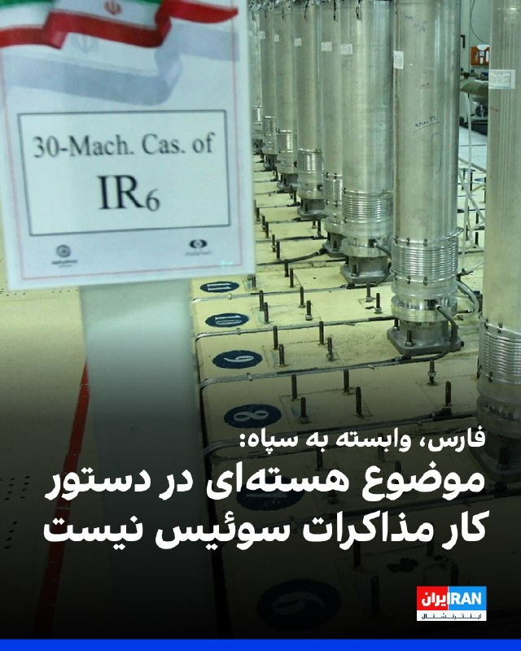

خبرگزاری فارس، وابسته به سپاه پاسداران، به نقل از یک منبع آگاه در هیات مذاکره‌کننده جمهوری اسلامی گزارش داد که پرونده هسته‌ای در این دور از مذاکرات سوئیس در دستور کار قرار ندارد و رافائل گروسی، مدیرکل آژانس بین‌المللی انرژی اتمی، نیز در محل مذاکرات حضور ندارد.

این منبع افزود هیچ‌یک از اعضای کمیته هسته‌ای جمهوری اسلامی در ترکیب هیات اعزامی به سوئیس حضور ندارند و موضوع هسته‌ای در گفت‌وگوهای جاری مطرح نیست.

به گزارش فارس، مذاکره درباره پرونده هسته‌ای تنها در صورتی در دستور کار جمهوری اسلامی قرار خواهد گرفت که اجرای بندهای ۱، ۴، ۱۰ و ۱۱ تفاهم‌نامه آغاز شود.
https://iranintl.com/202606214771

## IranIntlTV — post 343549

## IranIntlTV — post 343548

  

مسعود پزشکیان، رییس‌ دولت جمهوری اسلامی، گفت نگرانی اصلی او این است که دولت نتواند رضایت مردم را جلب کند و نارضایتی‌ها به اعتراض‌های خیابانی منجر شود.

پزشکیان گفت: «از آنچه می‌ترسم این است که نتوانیم به مردم به درستی خدمت بدهیم، ناراضی شوند و به خیابان بیایند و اعتراض کنند. آن وقت ابهت ما فرو می‌ریزد.»

او افزود مهم‌ترین قدرت جمهوری اسلامی، وحدت مردم است و مسئولان نباید اجازه دهند کمبودها، کسری‌ها و نواقص باعث نارضایتی مردم شود. به گفته پزشکیان، بروز چنین وضعیتی موجب «خوشحالی دشمنان» خواهد شد.
iranintl.com/202606211153

## IranIntlTV — post 343547

  <a href="telegram/content/IranIntlTV_343547_1782045596.mp4" target="_blank">🎬 Download video</a>

لیلی مهدوی، مادر سیاوش محمودی، معترض کشته‌شده در خیزش زن، زندگی، آزادی، با انتشار ویدیویی نشان می‌دهد که در کنار مزار جاویدنام محمدمهدی سیف‌الله‌پور همراه با پدر و مادر او و پدر جاویدنام سپهر شکری، اعلام می‌‌کنند در کنار هم دادخواه فرزندانشان خواهند بود.

## IranIntlTV — post 343546

  <a href="telegram/content/IranIntlTV_343546_1782045598.mp4" target="_blank">🎬 Download video</a>

مسعود پزشکیان، رییس‌جمهور جمهوری اسلامی، اعلام کرد دولت در دوران جنگ منابع ارزی و نفتی خود را در اختیار سپاه پاسداران قرار داده است.

آرش آزرمی، دبیر بخش اقتصادی ایران‌اینترنشنال، با اشاره به این اظهارات گفت واگذاری منابع به سپاه پاسداران پدیده تازه‌ای نیست و تنها بخشی از نفوذ گسترده این نهاد در اقتصاد ایران را آشکار می‌کند. به گفته او، حضور سپاه پاسداران در حوزه‌هایی از جمله صادرات نفت، پروژه‌های عمرانی، صنایع پتروشیمی و فلزی، نشان‌دهنده نقش پررنگ این نهاد در اقتصاد کشور است.
@iranintltv

## IranIntlTV — post 343545

  <a href="telegram/content/IranIntlTV_343545_1782045600.mp4" target="_blank">🎬 Download video</a>

مروری بر رسانه‌ها و خبرگزاری‌ها در ایران، یکشنبه ۳۱ خرداد با مجتبی هاشمی، روزنامه‌نگار
@iranintltv

## IranIntlTV — post 343544

  <a href="telegram/content/IranIntlTV_343544_1782045601.mp4" target="_blank">🎬 Download video</a>

کنفرانس «همگرایی ملی برای ایران آزاد و دموکراتیک» در دوسلدورف آلمان با حضور فعالان سیاسی و مدنی و شماری از سیاستمداران آلمانی برگزار می‌شود.

گفت‌وگوی علی حسن پور، خبرنگار ایران‌اینترنشنال، با دانیال ایلخانی‌پور، نماینده پارلمان ایالتی هامبورگ در حاشیه این نشست

@iranintltv

## IranIntlTV — post 343543

  <a href="telegram/content/IranIntlTV_343543_1782045603.mp4" target="_blank">🎬 Download video</a>

مسعود پزشکیان تاکید کرد که همه اعضای شورای عالی امنیت ملی، به صورت بی‌سابقه‌ای از روند مذاکرات با آمریکا، حمایت می‌کنند.

جلال ایجادی، استاد جامعه شناسی، معتقد است ساختار قدرت سیاسی در جمهوری اسلامی در حال یک جابه‌جایی اساسی درونی است. به گفته او، نقش مجتبی خامنه‌ای کمرنگ‌تر شده و ائتلافی متشکل از بخشی از سپاه پاسداران و حامیان مذاکره در حال تثبیت موقعیت خود هستند. او همچنین می‌گوید جریان پایداری و سعید جلیلی به حاشیه رانده شده‌اند.

@iranintltv

## IranIntlTV — post 343542

  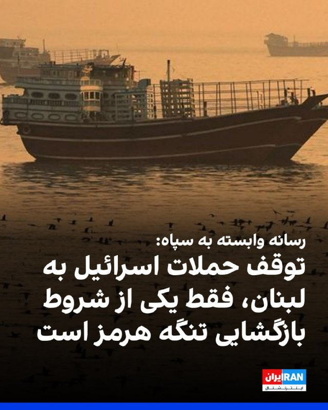

خبرگزاری تسنیم، وابسته به سپاه پاسداران، به نقل از یک منبع نزدیک به تیم مذاکره‌کننده جمهوری اسلامی، نوشت: «تنگه هرمز بدون مهار اسرائیل در لبنان باز نخواهد شد و رفع محاصره دریایی برای بازگشایی این آبراه کافی نیست.»

تسنیم به نقل از این منبع، افزود که اگر حملات اسرائیل در لبنان ادامه یابد، هیچ مذاکره‌ای درباره موضوعات دیگر انجام نخواهد شد.

این رسانه وابسته به سپاه همچنین اضافه کرد که آزادسازی بخشی از دارایی‌های بلوکه‌شده طبق تفاهم‌نامه و همچنین تفاهمی که با قطری‌ها صورت گرفته بود، آنهم در همین گام اول، اجرای بند یک درباره جنگ در تمام جبهه‌ها از جمله لبنان، رفع کامل محاصره و صدور اسقاطیه‌های فروش نفت، پتروشیمی و مشتقات ایران، شرط بازگشایی تنگه هرمز است.
iranintl.com/202606211207

## IranIntlTV — post 343541

  <a href="telegram/content/IranIntlTV_343541_1782045605.mp4" target="_blank">🎬 Download video</a>

جی‌دی ونس برای شرکت در مذاکره با نمایندگان جمهوری اسلامی وارد شهر بورگن‌اشتوک سوییس شد. هم‌زمان، هیات مذاکره‌کننده جمهوری اسلامی به ریاست محمدباقر قالیباف نیز عصر شنبه به این شهر رسید.

جزییات بیشتر در گفت‌وگو با لی‌لی نیکفر، خبرنگار ایران‌اینترنشنال

@iranintltv

## IranIntlTV — post 343540

  <a href="telegram/content/IranIntlTV_343540_1782045606.mp4" target="_blank">🎬 Download video</a>

مسعود پزشکیان، رییس‌جمهور جمهوری اسلامی، اعلام کرد دولت در دوران جنگ منابع ارزی و نفتی خود را در اختیار سپاه پاسداران قرار داده است.

آرش آزرمی، دبیر بخش اقتصادی ایران‌اینترنشنال، با اشاره به این اظهارات گفت واگذاری منابع به سپاه پاسداران پدیده تازه‌ای نیست و تنها بخشی از نفوذ گسترده این نهاد در اقتصاد ایران را آشکار می‌کند. به گفته او، حضور سپاه پاسداران در حوزه‌هایی از جمله صادرات نفت، پروژه‌های عمرانی، صنایع پتروشیمی و فلزی، نشان‌دهنده نقش پررنگ این نهاد در اقتصاد کشور است.
@iranintltv

## IranIntlTV — post 343539

  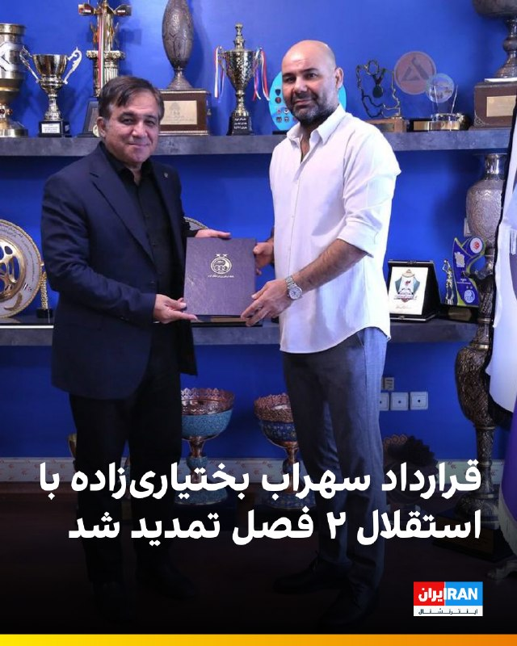

🔻با اعلام باشگاه استقلال قرارداد سهراب بختیاری‌زاده، به‌عنوان سرمربی تیم فوتبال استقلال، به مدت دو فصل تمدید شد.

🔹بختیاری‌زاده در میانه این فصل پس از برکناری ریکاردو ساپینتو پرتغالی، به‌عنوان سرمربی استقلال انتخاب شده بود.

🔹بازیکن دهه‌های هفتاد و هشتاد آبی‌پوشان در لیگ ۲۴ نیز در دو مقطع هدایت استقلال را به‌صورت موقت بر عهده گرفته بود.

@iranintltvsport

## IranIntlTV — post 343538

  <a href="telegram/content/IranIntlTV_343538_1782045608.mp4" target="_blank">🎬 Download video</a>

ویدیوی منتشر شده از پیاده‌روی هیات جمهوری اسلامی برای حضور در ساختمان محل مذاکرات در سوئیس. بر اساس گزارش‌ها، این هیات در ادامه روند گفت‌وگوها در نشستی با حضور نمایندگان آمریکا، پاکستان و قطر شرکت خواهد کرد.
@iranintltv

## ManotoTV — post 106194

  <a href="telegram/content/ManotoTV_106194_1782045609.mp4" target="_blank">🎬 Download video</a>

‌
در این فیلم آرشیوی، شهبانو با حضور در مراسم فارغ‌التحصیلی دانشگاه ملی ایران، گواهینامه‌ها و جوایز دانشجویان ممتاز را اهدا می‌کند و با استادان و دانشجویان درباره وضعیت علمی و آموزشی دانشگاه گفت‌وگو می‌کند. این ویدیو بخشی از یک گزارش آرشیوی از دهه ۱۳۵۰ خورشیدی است.
برای تماشای نسخه کامل این گزارش و صدها فیلم آرشیوی نایاب دیگر، کانال یوتیوب Manoto را دنبال کنید.

## FarsiVOA — post 221416

  <a href="telegram/content/FarsiVOA_221416_1782045611.mp4" target="_blank">🎬 Download video</a>

گروهی از بازنشستگان تامین اجتماعی در شوش، در ادامه اعتراضات هفتگی، روز یکشنبه، ۳۱ خرداد ۱۴۰۵، با شعار «بازنشسته داد بزن، حقتو فریاد بزن» در اعتراض به شرایط دشوار معیشتی تجمع کردند.

اعتراض‌های بازنشستگان تأمین اجتماعی در ایران طی سال‌های اخیر به‌طور مستمر در شهرهای مختلف برگزار شده است. محور اصلی این تجمع‌ها، پایین بودن مستمری‌ها در برابر تورم، اجرا نشدن کامل همسان‌سازی یا متناسب‌سازی حقوق، افزایش هزینه دارو و درمان، و کاهش قدرت خرید بازنشستگان بوده است.

## FarsiVOA — post 221409

خبرگزاری ایرنا با انتشار این تصاویر هوایی، حضور هزاران فلامینگو در دریاچه مهارلو استان فارس را به تصویر کشیده است.

این تصاویر، حرکت دسته‌جمعی و پراکندگی فلامینگوها را بر پهنه آب‌های کم‌عمق دریاچه نشان می‌دهد؛ دریاچه‌ای که هر سال میزبان شمار زیادی از پرندگان مهاجر است و از زیستگاه‌های مهم آن‌ها در جنوب ایران به شمار می‌رود.

@FarsiVOA

## FarsiVOA — post 221408

  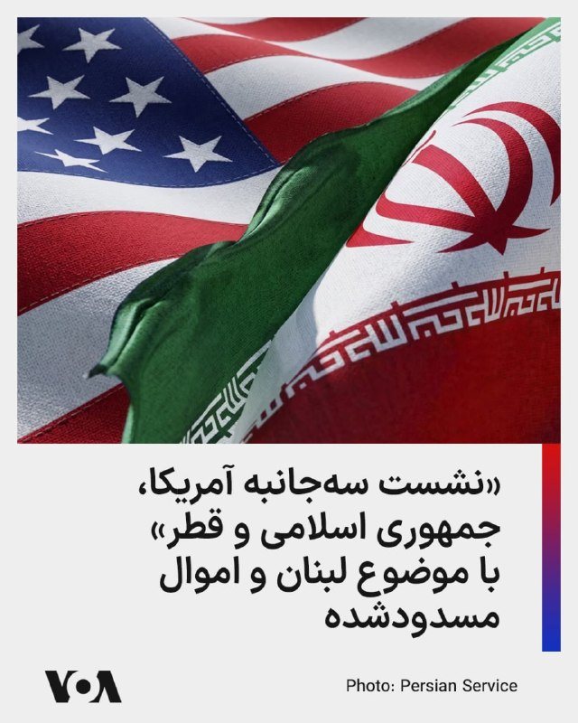

خبرگزاری صداوسیما در گزارشی مدعی شد که نشست سه‌جانبه نمایندگان جمهوری اسلامی، امریکا و قطر با موضوع آتش‌بس فراگیر در لبنان و اموال بلوکه‌شده جمهوری اسلامی «هم‌اکنون در محل مذاکرات در حال برگزاری است.»

جزئیات بیشتری در این باره گزارش نشده اما پیش از ظهر امروز اسماعیل بقایی، سخنگوی هیئت مذاکره‌کننده جمهوری اسلامی، گفته بود که نشست چهارجانبه‌ای با حضور میانجی‌های قطری و پاکستانی برگزار خواهد شد. او گفته بود انتظار می‌رود مذاکرات سوئیس امروز به پایان برسد.
@FarsiVOA

## FarsiVOA — post 221407

  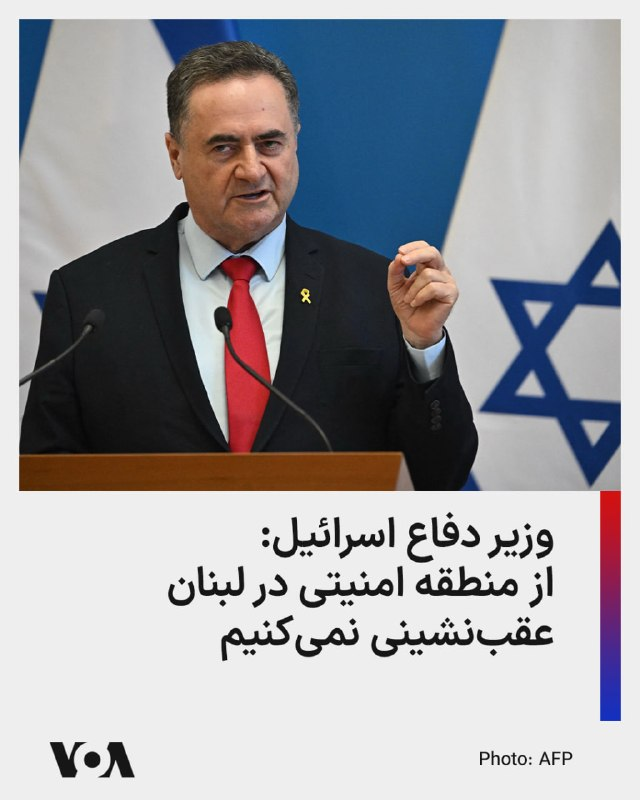

وزیر دفاع اسرائیل روز یکشنبه گفت ارتش این کشور از منطقه‌ای در جنوب لبنان که آن را «امنیتی» می‌خواند عقب‌نشینی نخواهد کرد و نیروهای اسرائیلی برای «رفع تهدیدها» آزادی عمل خواهند داشت.

یسرائیل کاتز در بیانیه‌ای گفت: «حفظ جان سربازان و شهروندان ما اولویت اصلی و مطلق است.»

این موضع در حالی اعلام می‌شود که پرونده لبنان به یکی از محورهای حساس گفت‌وگوهای امروز در سوئیس تبدیل شده است.

دولت دونالد ترامپ در روزهای اخیر نسبت به ادامه عملیات اسرائیل در لبنان و تشدید درگیری‌ها با حزب‌الله ابراز نارضایتی کرده و هشدار داده است که این روند می‌تواند مذاکرات شکننده با جمهوری اسلامی را تحت تأثیر قرار دهد.

همزمان، جی‌دی ونس، معاون رئیس‌جمهوری آمریکا، در آغاز دیدار با میانجی‌های پاکستانی در سوئیس، به پرسش خبرنگاران درباره پیامش برای بنیامین نتانیاهو پاسخ نداد.
@FarsiVOA

## FarsiVOA — post 221406

  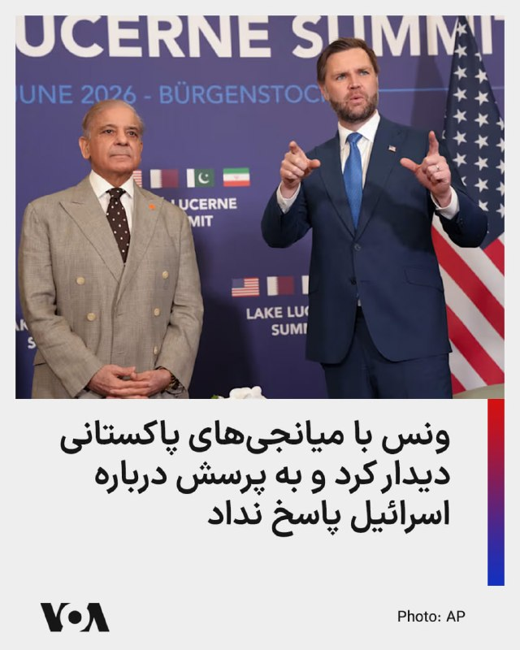

جی‌دی ونس، معاون رئیس‌جمهوری آمریکا، در آغاز گفت‌وگوهای دوجانبه با میانجی‌های پاکستانی در سوئیس، از پاسخ به پرسش‌ها درباره اسرائیل خودداری کرد.

ونس که در اقامتگاه برگن‌اشتوک، با هیئت پاکستانی دیدار می‌کرد، سخنان رسمی ایراد نکرد و تنها از حضور مقام‌های پاکستانی در این نشست قدردانی کرد. او به پرسش خبرنگاری درباره پیامش برای بنیامین نتانیاهو، نخست‌وزیر اسرائیل، پاسخ نداد.

این دیدار پیش از گفت‌وگوهای برنامه‌ریزی‌شده ونس با مقام‌های جمهوری اسلامی انجام شد.

دولت دونالد ترامپ در روزهای اخیر نارضایتی فزاینده‌ای از ادامه کارزار نظامی اسرائیل در لبنان ابراز کرده و هشدار داده است که تشدید حملات میان اسرائیل و حزب‌الله، گفت‌وگوهای شکننده با جمهوری اسلامی را تحت تأثیر قرار می‌دهد.

ونس روز گذشته به فاکس نیوز گفت آمریکا و اسرائیل ممکن است درباره چگونگی رسیدن به اهداف مشترک «اختلاف روش» داشته باشند. او همچنین هشدار داد اگر عضو کابینه اسرائیل بود، «تنها متحد قدرتمند باقی‌مانده» خود را هدف حمله قرار نمی‌داد.
@FarsiVOA

## FarsiVOA — post 221405

🔺پزشکیان در آستانه مذاکرات سوئیس: از «حق غنی‌سازی» صرف‌نظر نخواهیم کرد

▪️مسعود پزشکیان، رئیس دولت جمهوری اسلامی، پیش از دور تازه گفت‌وگوها با آمریکا گفت جمهوری اسلامی از «حق غنی‌سازی» صرف‌نظر نخواهد کرد، اما می‌تواند به‌صورت مکتوب اعلام کند که قصد ساخت بمب اتم ندارد.

▪️این موضع در حالی اعلام شد که دونالد ترامپ، رئیس‌جمهوری آمریکا، در حاشیه اجلاس گروه هفت گفت توافق با جمهوری اسلامی «روشن و صریح» می‌گوید که این حکومت به سلاح هسته‌ای دست نخواهد یافت.

▪️ترامپ در همان نشست همچنین تصریح کرد اگر جمهوری اسلامی توافق را نقض کند، آمریکا دوباره به حمله نظامی بازخواهد گشت. او گفت نمی‌خواهد چنین اتفاقی بیفتد، اما انتظار دارد جمهوری اسلامی به توافق پایبند بماند.

⬇️ بیشتر بخوانید:
https://ir.voanews.com/a/iran-president-ahead-of-talks-we-will-not-relinquish-our-right-to-enrich-uranium/8163166.html

## FarsiVOA — post 221402

تصاویر اولیه از دیدارهای حاشیه مذاکرات بورگن‌اشتوک
@FarsiVOA

## DW_Farsi — post 126287

  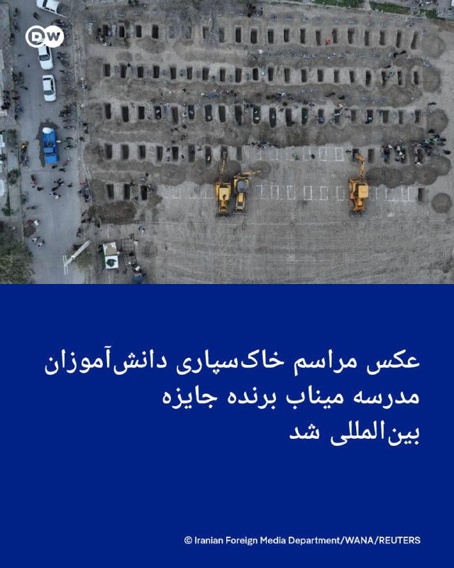

🔶 عکس مراسم خاک‌سپاری دانش‌آموزان مدرسه میناب برنده جایزه بین‌المللی شد

عکس منتشر شده از مراسم خاک‌سپاری دانش‌آموزان مدرسه شهر میناب، که در حملات آمریکا کشته شدند، مدال طلای بخش عکس خبری جشنواره عکاسی بین‌المللی "گلدن شات ۲۰۲۶" را از آن خود کرد.

عکاس این عکس، مرتضی آخوندی نام دارد. عکس هوایی او از ردیف مزار دانش‌آموزان مدرسه "شجره طیبه" در میناب در جریان مراسم خاکسپاری این جایزه را دریافت کرده است.

این واقعه در نخستین روز جنگآمریکا و اسرائیل علیه جمهوری اسلامی رخ داد. به گفته خبرگزاری‌ها در حمله هوایی روز شنبه، ۹ اسفند ۱۴۰۴ به یک مدرسه ابتدایی در شهر میناب، دست‌کم ۱۷۵ نفر از جمله ۱۶۸ دانش‌آموز جان خود را از دست دادند.
@dw_farsi

## DW_Farsi — post 126286

  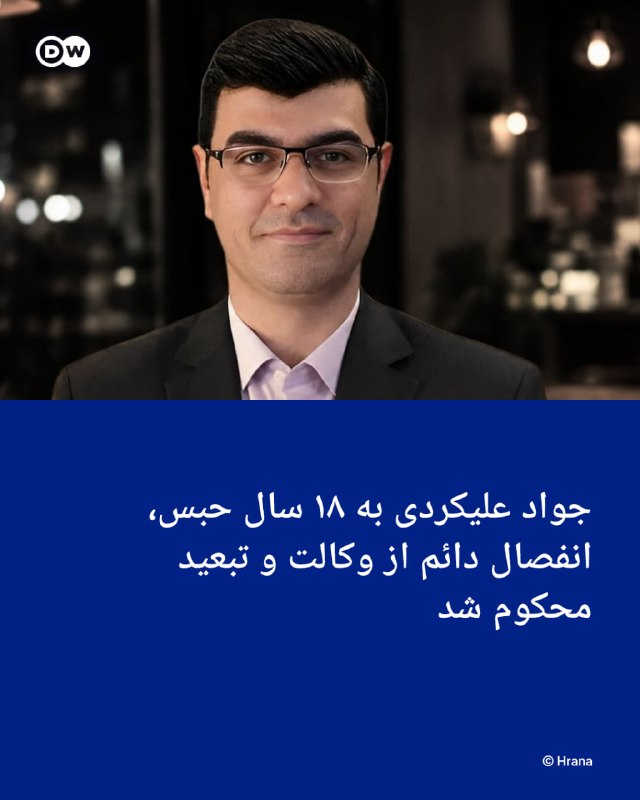

🔶 جواد علیکردی به ۱۸ سال حبس، انفصال دائم از وکالت و تبعید محکوم شد

به گزارش هرانا، جواد علیکردی، وکیل دادگستری محبوس در زندان وکیل‌آباد مشهد، بر اساس حکم صادرشده از سوی شعبه اول دادگاه انقلاب مشهد، به ۱۸ سال حبس، انفصال دائم از حرفه وکالت، دو سال منع خروج از کشور، دو سال تبعید به سراوان در استان سیستان و بلوچستان و مجازات‌های تکمیلی محکوم شده است.

بر اساس این گزارش، جواد علیکردی از بابت اتهام "اجتماع و تبانی برای اقدام علیه امنیت ملی" به پنج سال حبس محکوم شده است.

او همچنین از بابت اتهام "فعالیت تبلیغی برخلاف امنیت ملی" موضوع ماده ۴ قانون تشدید مجازات جاسوسی، به ۱۳ سال حبس محکوم شده است.
@dw_farsi

## DW_Farsi — post 126285

  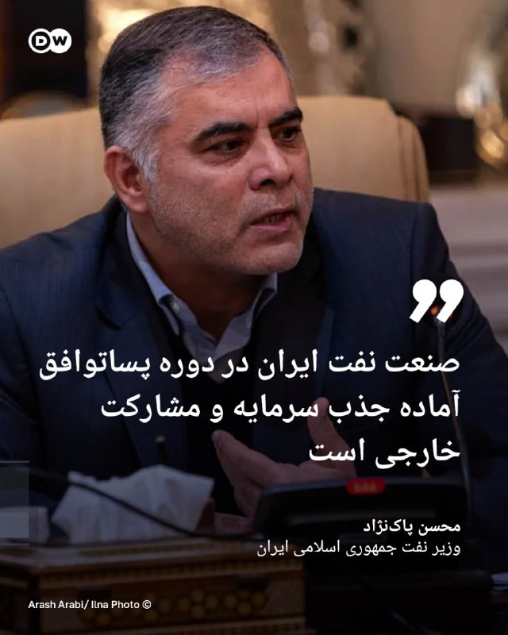

🔶"صنعت نفت ایران در دوره پساتوافق آماده جذب سرمایه و مشارکت خارجی است!

محسن پاک‌نژاد، وزیر نفت جمهوری اسلامی ایران، در مقاله‌ای در ایرنا نوشت: «صنعت نفت ایران در دوره پساتوافق آماده ارائه صدها فرصت بررسی‌شده سرمایه‌گذاری و مشارکت فنی و عملیاتی است و وزارت نفت آمادگی دارد در کوتاه‌ترین زمان ممکن پیشنهادهای همکاری را بررسی و به قرارداد اجرایی تبدیل کند.»

او گفت در داخل ایران نیز صدها مجموعه مستعد و کارآفرین به‌عنوان شریک ایرانی شرکت‌های سرمایه‌گذار خارجی شناسایی شده‌اند و وزارت نفت برای سازماندهی گروه‌های کاری سرمایه‌گذار و توسعه‌دهنده آمادگی کامل دارد.

پاک‌نژاد افزود اگر ذی‌نفعان توافق در غرب به روح توافق پایبند باشند، صنعت نفت ایران میدان راستی‌آزمایی این پایبندی خواهد بود.

@dw_farsi

## DW_Farsi — post 126284

🔶آلمان شمار اخراج مجرمان افغان را افزایش می‌دهد

بر اساس گزارش شبکه خبری "ان‌تی‌وی" آلمان، دولت این کشور قصد دارد شمار اخراج مهاجران از افغانستان که دارای محکومیت کیفری هستند را افزایش دهد. در حالی که دولت این اقدام را بخشی از سیاست امنیتی خود می‌داند، منتقدان نسبت به پیامدهای همکاری با طالبان و وضعیت حقوق بشر در افغانستان هشدار می‌دهند.

طبق گزارش‌ها، در حال حاضر دست‌کم صد مهاجر از افغانستان که حکم اخراج آنها صادر شده، در زندان‌های عادی یا مراکز بازداشت پیش از اخراج نگهداری می‌شوند.

الکساندر دوبرینت، وزیر کشور آلمان، به روزنامه آلمانی "بیلد ام زونتاگ" گفت: «کسانی که از حمایت ما سوءاستفاده می‌کنند و در آلمان مرتکب جرایم سنگین می‌شوند، باید آینده خود را در کشورشان جست‌وجو کنند. جامعه ما به‌طور مشروع انتظار دارد که مجرمان کشور آلمان را ترک کنند.»

@dw_farsi

## DW_Farsi — post 126283

🔶 استارمر در تنگنای سیاسی؛ آیا نخست‌وزیر بریتانیا ماندنی است؟

گزارش روزنامه "آبزرور" درباره احتمال کناره‌گیری کی‌یر استارمر، بار دیگر بحران رهبری در حزب کارگر را به کانون توجه بازگردانده است. افزایش انتقادهای داخلی، شکست‌های انتخاباتی و افت محبوبیت، فشارها بر نخست‌وزیر بریتانیا را تشدید کرده است.

دفتر نخست‌وزیری بریتانیا گزارش‌ها درباره کناره‌گیری قریب‌الوقوع کی‌یر استارمر را تأیید نکرده است، اما انتقادات از استارمر پس از شکست‌های انتخاباتی و افزایش نارضایتی‌ها در حزب کارگر ادامه دارد.

به گزارش رویترز، در روزهای اخیر چالش‌های سیاسی کی‌یر استارمر افزایش یافته است. فشارها بر او پس از آن تشدید شد که اندی برنهام، شهردار منچستر و از چهره‌های منتقد استارمر در حزب کارگر، در یک انتخابات میان‌دوره‌ای یک کرسی پارلمانی را به دست آورد؛ موفقیتی که راه را برای ورود او به رقابت بر سر رهبری حزب کارگر هموار می‌کند.
@dw_farsi

## DW_Farsi — post 126282

  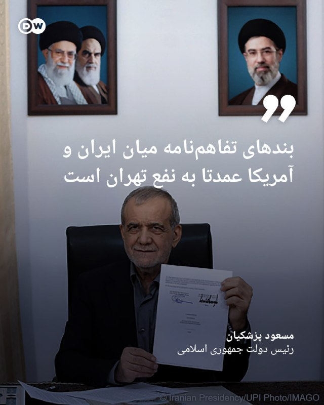

🔶پزشکیان: بندهای تفاهم عمدتا به نفع ایران است

مسعود پزشکیان، رئیس دولت جمهوری اسلامی در سی و سومین همایش سیاست‌های پولی و بانکی که در سالن همایش‌های بانک مرکزی برگزار شد گفت که بندهای تفاهم میان ایران و آمریکا عمدتا به نفع ایران است.

پزشکیان با بیان اینکه "آمریکا به دنبال این است که ما بمب اتم نداشته باشیم" مدعی شد که این موضوع مورد تاکید علی خامنه‌ای، رهر پیشین جمهوری اسلامی که در حملات آمریکا کشته نیز بوده است. او افزود: «اگر لازم باشد که این موضوع به‌صورت مکتوب نیز بیان شود، می‌نویسیم که قصد ساخت بمب اتم را نداریم.»

رئیس جمهور ایران در بخش دیگری از سخنان خود افزود: «آنچه مسلم است از حق غنی‌سازی اورانیوم هرگز کوتاه نخواهیم آمد و طرف مقابل نیز ناچار است آن را بپذیرد. در گذشته می‌گفتند باید موشک‌های خود را کنار بگذارید، اما امروز این حق ملت ایران را پذیرفته‌اند.»

پزشکیان همچنین مدعی شد که "با آغاز روند گفت‌وگوها از امروز، ۶ میلیارد دلاری که در قطر داریم نیز آزاد و به کشورمان بازخواهد گشت".

@dw_farsi

## DW_Farsi — post 126275

📸 موج گرما در قاره سبز؛ هشدار در آلمان و بسته شدن برخی بزرگراه‌ها

موج گرما به شدت اروپا را فرا گرفته است. آلمان نیز خود را برای موج گرمای طولانی مدت آماده می‌کند. دانشمندان افزایش فراوانی و شدت چنین موج‌های گرمای شدیدی را با تغییرات اقلیمی ناشی از فعالیت‌های انسانی مرتبط می‌دانند و اروپا به سرعت در حال گرم شدن است.

@dw_farsi

## DW_Farsi — post 126274

  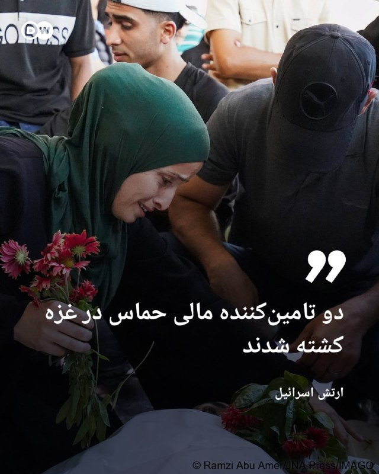

🔶 ارتش اسرائیل: دو تامین‌کننده مالی حماس در غزه کشته شدند

بر اساس اطلاعیه ارتش اسرائیل، القدره که ریاست این شبکه را بر عهده داشت، همراه با الفرا و دیگر نیروهای این شبکه، تحت هدایت رهبری حماس عمل می‌کرد و با راه‌اندازی شبکه‌ای متشکل از ده‌ها پیک و صراف در ترکیه و نوار غزه، انتقال بیش از نیم میلیارد شِکِل به شاخه نظامی حماس را تسهیل کرد.»

ارتش اسرائیل افزود: «حماس از طریق این منابع مالی، به‌ویژه در ماه‌های اخیر، همچنان حقوق نیروهای خود را پرداخت کرده و فعالیت‌های تروریستی علیه نیروهای ارتش اسرائیل و غیرنظامیان اسرائیلی را تامین مالی کرده است؛ اقدامی که ناقض توافق آتش‌بس است.»

ارتش اسرائیل همچنین اعلام کرد در ماه‌های اخیر، چند نفر از عوامل مالی حماس را هم در نوار غزه و هم در لبنان هدف قرار داده و کشته است.

@dw_farsi

## DW_Farsi — post 126273

  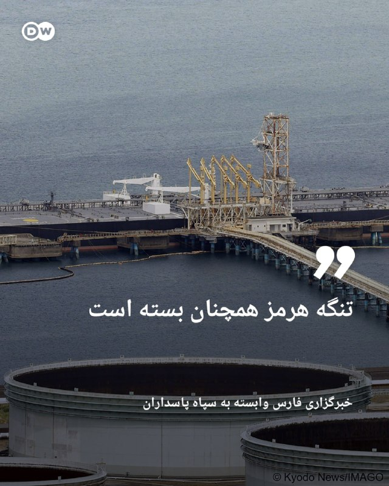

🔶خبرگزاری فارس: تنگه هرمز همچنان بسته است

خبرگزاری فارس وابسته به سپاه پاسداران، به نقل از آن چه که "منابع نظامی" خوانده مدعی شده که تنگه هرمز همچنان بسته است و "نیروی دریایی سپاه نیز تا اطلاع ثانوی هیچ‌گونه مجوزی برای عبور شناورها صادر نمی‌کند".

این در حالی است که فرماندهی مرکزی ایالات متحده آمریکا (سنتکام) در تازه‌ترین بیانیه خود، با تاکید بر این که "تردد کشتی‌های تجاری در تنگه هرمز در ۲۰ ژوئن افزایش یافت" اعلام کرده است که "نیروهای ایالات متحده آمریکا همچنان به عملیات خود در منطقه ادامه دادند تا از آزادی کشتیرانی حمایت کنند".

در بیانیه سنتکام بر خلاف ادعاهای قبلی سپاه آمده است: «عبور امن از این آبراه بین‌المللی امروز همچنان برقرار بود؛ به‌طوری که ۵۵ کشتی تجاری از آن عبور کردند و مقادیر زیادی محموله و بیش از ۱۷ میلیون بشکه نفت را به بازارهای جهانی منتقل کردند.»

در این بیانیه به نقل از مرکز مشترک اطلاعات دریایی آمده بود که "عبور امن برای همه کشتی‌ها در طول یک مسیر تعیین‌شده تأیید شده و این مسیر، عاری از هرگونه ادعاهای خودسرانه درباره الزامات یا هرگونه محدودیت است".

@dw_farsi

## RadioFarda — post 158576

  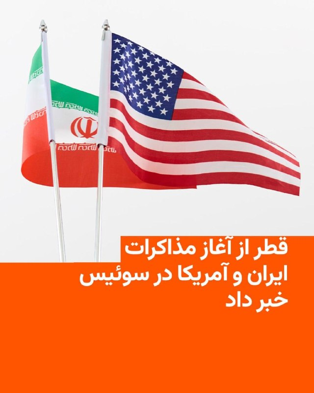

🔸قطر که یکی از کشورهای میانجی بین ایران و آمریکا است، روز یکشنبه از آغاز مذاکرات میان نمایندگان واشینکتن و تهران در سوئیس با هدف دستیابی به پایان دائمی جنگ در خاورمیانه خبر داد.

🔸وزارت امور خارجه قطر در بیانیه‌ای اعلام کرد: «نشست دریاچه لوتسرن و نخستین جلسه کمیته عالی با مشارکت نمایندگان ایالات متحده آمریکا، جمهوری اسلامی ایران و دو کشور میانجی، یعنی دولت قطر و جمهوری اسلامی پاکستان، آغاز شده است.»

🔸این کشور همچنین ابراز امیدواری کرد که این نشست‌ها «به دستیابی به یک توافق جامع و پایدار که تمامی موضوعات مطرح‌شده در یادداشت تفاهم را در بر بگیرد، منجر شود.»
هفته گدشته آمریکا و ایران تفاهمی را امضا کردند تا ضمن تمدید آتش‌بس، به مدت ۶۰ روز درباره موضوعات دیگر از جمله برنامه هسته‌ای ایران و سرنوشت ذخایر اورانیوم غنی‌شده مذاکره کنند و به توافق نهایی برسند.

🔸با این حال اسماعیل بقایی، سخنگوی هیئت ایرانی، پیش‌تر اعلام کرد دستورجلسه اصلی در مذاکرات یک‌شنبه ادامه درگیری در لبنان خواهد بود.

@RadioFarda

## RadioFarda — post 158575

  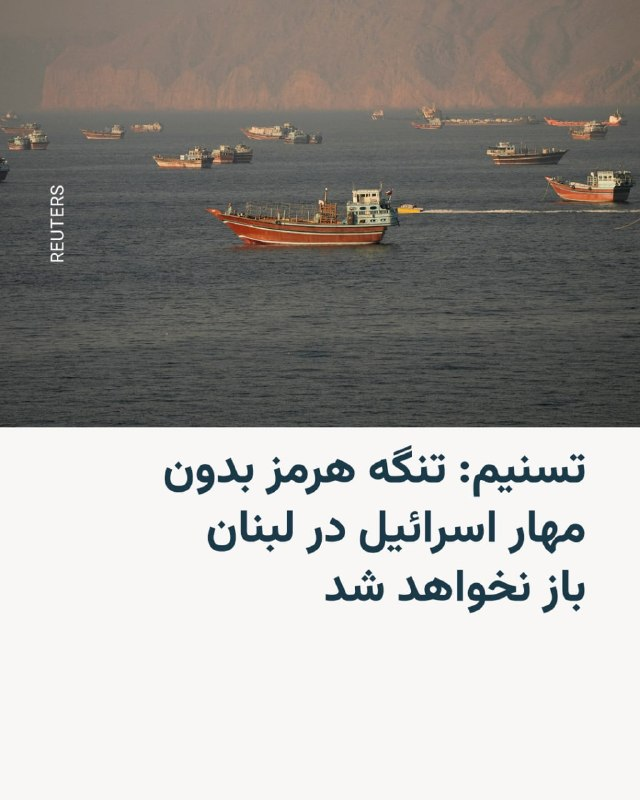

🔸 خبرگزاری تسنیم، نزدیک به سپاه پاسداران، روز یک‌شنبه ۳۱ خرداد در آستانه دیدار دو هیئت ایرانی و آمریکایی در سوئیس به نقل از «یک منبع نزدیک به تیم مذاکره‌کننده» نوشت: «تنگه هرمز بدون مهار اسرائیل در لبنان باز نخواهد شد.»

🔸 در پی ادامه درگیری‌ها در جنوب لبنان و اعتراض جمهوری اسلامی به این رخداد، روز شنبه اعلام شد که یک جلسه اضطراری با موضوع این درگیری‌ها و چگونگی مهار آنها به دستورجلسه مذاکره در سوئیس اضافه شده است.

🔸 به گفته اسماعیل بقایی، سخنگوی هیئت ایرانی، دستورجلسه اصلی در مذاکرات یک‌شنبه ادامه درگیری در لبنان خواهد بود.

🔸 حال خبرگزاری تسنیم با اشاره به این که «رفع محاصره دریایی برای بازگشایی تنگه هرمز کافی نیست» به نقل از منبع خود نوشته است: «اگر جنایت اسرائیل در لبنان ادامه یابد و تمامیت ارضی لبنان تضمین نشود، هیچ مذاکره‌ای درباره موضوعات دیگر انجام نخواهد شد.»

@RadioFarda

## RadioFarda — post 158574

  <a href="https://t.me/radiofarda/158574" target="_blank">📎 Download file</a>

📻بشنوید: ساعت ۱۴ با رادیوفردا، ۳۱ خرداد ۱۴۰۵‌

@RadioFarda

## RadioFarda — post 158573

  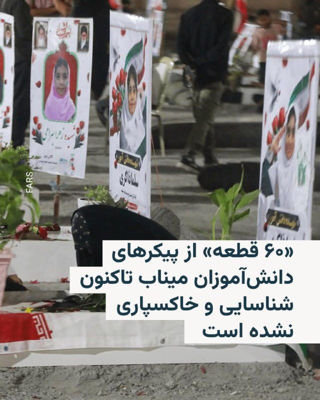

🔸 رئیس کل دادگستری هرمزگان روز یک‌شنبه ۳۱ خرداد اعلام کرد: «هنوز ۶۰ قطعه از پیکر دانش‌آموزان میناب که در تفحص‌ها از محیط مدرسه و فضای پیرامون یافت شده، خاکسپاری نشده و کار انجام تشخیص دی ان ای باید روی آنها انجام شود.»

🔸 مجتبی قهرمانی در ادامه افزود: «در حال گفت‌وگو با خانواده‌ها برای تعیین تکلیف این پیکرها هستیم و این شهدا هنوز تشییع نشده‌اند و در مراسمی ویژه به خاک سپرده خواهند شد.»

🔸 در پزشکی قانونی، جسد به پیکر بی‌جان انسان گفته می‌شود، در حالی که «قطعه» به هر بخش جدا شده یا عضوی از پیکر متوفی اشاره دارد.

🔸 مدرسه شجره طیبه میناب روز نهم اسفند ۱۴۰۴ و در اولین ساعات حمله آمریکا و اسرائیل مورد اصابت موشک قرار گرفت.

🔸 شورای تشکل‌های صنفی فرهنگیان تایید کرده که بیش از ۱۰۸ دانش‌آموز در این حمله کشته شده‌اند و افزوده که معلمان نیز کشته شده‌اند. اما ایران می‌گوید که ۱۷۵ نفر از جمله ۱۶۸ کودک کشته شده‌اند.

🔸 شواهد نشان می‌دهد این حمله ممکن است نتیجه اتکای نیروهای آمریکایی به اطلاعات قدیمی باشد.

@RadioFarda

## RadioFarda — post 158571

  <a href="https://t.me/radiofarda/158571" target="_blank">📎 Download file</a>

🔸 در این برنامه به طور مفصل در مورد پیش‌بازی ایران-بلژیک حرف می‌زنیم، گام بلند ژاپن و هلند در جام جهانی را مرور می‌کنیم و از حواشی دروازه‌بان‌های کم و نام نشانی صبحت می‌کنیم که جادوی جام جهانی آنها را به شهرت بین‌المللی رسانده است.

🔸 برای تماس با ما می‌توانید به شناسه کافه فردا در تلگرام صوت و متن بفرستید.

📻 کافه فردا

## RadioFarda — post 158570

  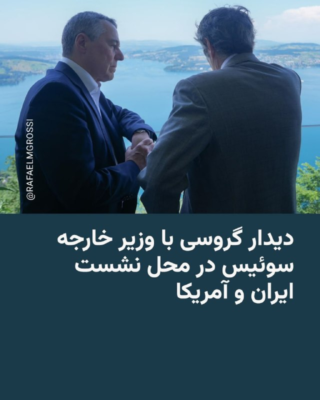

🔸رافائل گروسی، مدیرکل آژانس بین‌المللی انرژی اتمی، که همزمان با هیئت ایرانی به محل نشست لوسرن رفته است روز یک‌شنبه ۳۱ خرداد در حساب کاربری خود در شبکه ایکس خبر داد که با وزیر خارجه سوئیس در محل نشست دیدار کرده است.

🔸به نظر می‌رسد دیدار گروسی پس از دیدار عباس عراقچی با ایگناسیو کاسیس، وزیر امور خارجه سوئیس، انجام شده است.

🔸گروسی خود در پیامش توضیح داده است که هدفش از این دیدار «باخبر شدن از تحولات اخیر درباره ایران، راه پیشِ رو و نقش مهم آژانس» بوده است.

🔸او در ادامه می‌گوید: «در این برهه حیاتی مهم این است که تمام فرصت را به راه حل دیپلماسی بدهیم.»

🔸خبرگزاری ایسنا بدون ذکر منبع رسمی خبر داده که هیات ایرانی حاضر در نشست لوسرن برنامه ای برای دیدار گروسی ندارد.

@RadioFarda

## IranianMinds — post 23055

  <a href="telegram/content/IranianMinds_23055_1782045619.mp4" target="_blank">🎬 Download video</a>

فروپاشی داخلی این شکلیه دوستان :

کارشناس صداوسیما:
باید همراه تنگه هرمز، فرودگاه مهرآباد رو هم ببندیم تا آقایون برای مذاکره با دشمن از کشور خارج نشن.

@IranianMinds

## IranianMinds — post 23054

🔴 کاتز، وزیر دفاع اسرائیل:

اسرائیل از منطقه امنیتی در جنوب لبنان عقب‌نشینی نمی‌کنه و نیروهای ارتش برای مقابله با هر تهدیدی آزادی عمل کامل دارن.

@IranianMinds

## IranianMinds — post 23053

🔴پزشکیان:

نگران این هستم که مردم ناراضی برای اعتراض به خیابان‌ها بیایند و ابهت ما فروبریزد.

@IranianMinds

## IranianMinds — post 23052

🔴همین الان مذاکرات جمهوری اسلامی با آمریکا در سوئیس آغاز شد.

@IranianMinds

## IranianMinds — post 23051

  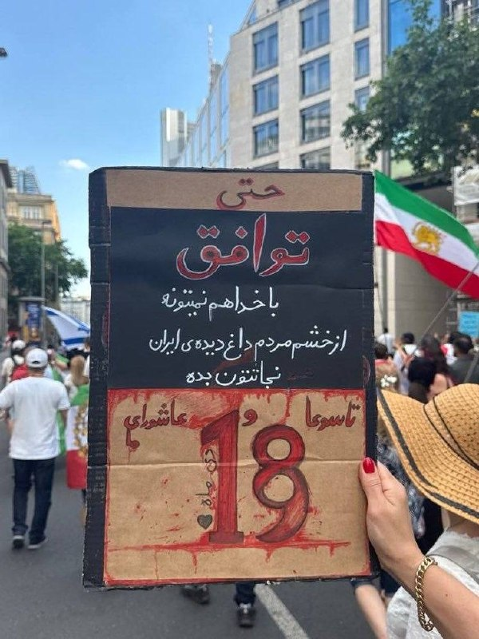

❤️❤️❤️

@IranianMinds

## IranianMinds — post 23050

  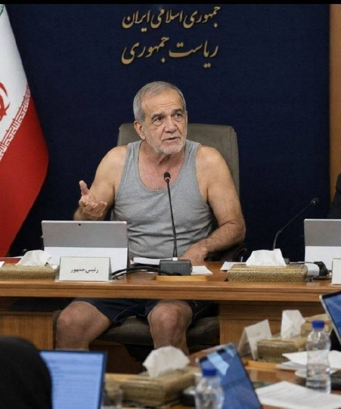

🔴پزشکیان:

آمریکا گفت فقط بنویس بمب اتم نمی‌خواهیم و امضاء کن، ما هم نوشتیم و امضاء کردیم.

@IranianMinds

## IranianMinds — post 23049

  <a href="telegram/content/IranianMinds_23049_1782045622.mp4" target="_blank">🎬 Download video</a>

😂😂😂

@IranianMinds

## IranianMinds — post 23048

  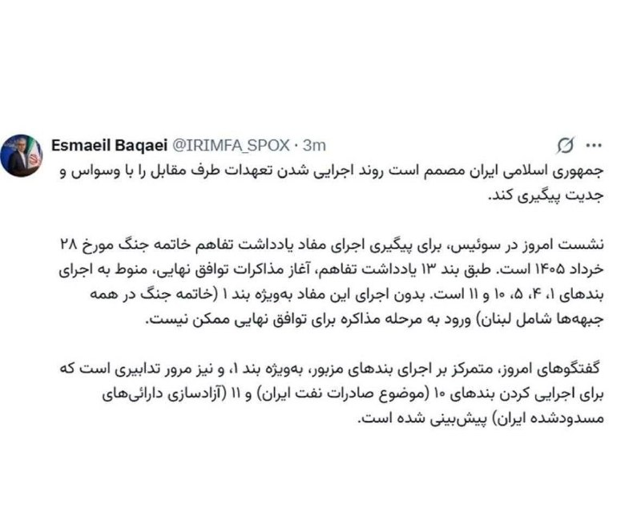

🔴بقایی:

ایران مصمم است روند اجرایی شدن تعهدات طرف مقابل را با وسواس و جدیت پیگیری کند.

@IranianMinds

## BBCPersian — post 284592

🔻مسعود پزشکیان، رئیس‌جمهور ایران، همزمان با برگزاری مذاکرات مستقیم میان ایران و آمریکا در سوئیس، گفت همه نظامیان در شورای امنیت ملی موافق مذاکره بوده‌اند.

او در جلسه‌ای به مناسبت تشکیل بسیج اساتید در دانشگاه تهران، در میان صدای اعتراض عده‌ای از حاضران گفت: «همه امضا کرده‌اند که این راه را باید برویم. حالا هر کسی می‌خواهد تفرقه ایجاد کند، این گوی و این میدان.»

او با اشاره به نظر فرماندهان نظامی در شورای امنیت ملی گفت: «فرمانده قرارگاه [خاتم الانبیاء]، فرمانده ارتش و سپاه، و نهادهای امنیتی همه بودند و همه یک حرف زدند و همه متحد بودند و همه آن چیزی را که می‌خواستیم عمل کنیم را امضا کردند.»

این سخنان پزشکیان در پی افزایش انتقاد اصولگرایان تندرو از دولت در پی انتشار نامه منسوب به مجتبی خامنه‌ای صورت می‌گیرد.

آقای پزشکیان همچنین با تاکید بر نقش دولت در حمایت از نظامیان در دوران جنگ گفت: «۲۰ میلیون بشکه نفت که مال دولت بود را به هوافضای سپاه دادیم. ارزهایی که داشتیم را به این عزیزان دادیم.»

https://bbc.in/44o0mXM
@BBCPersian

## BBCPersian — post 284591

  <a href="telegram/content/BBCPersian_284591_1782045624.mp4" target="_blank">🎬 Download video</a>

🔴نشست ایران و آمریکا با حضور میانجی‌‌ها در سوئیس آغاز شد. گفته شده محور این دور از گفت‌وگوها آتش‌بس در لبنان و منابع ارزی است. پیشتر هیئت ایرانی و آمریکایی با کشور میزبان و کشورهای میانجی دیدار کرده بودند.

جی‌دی ونس، معاون دونالد ترامپ، رئیس مذاکره‌کنندگان آمریکاست. محمدباقر قالیباف سرپرستی هیئت ایران را بر عهده دارد و عباس عراقچی نیز او را همراهی می‌کند. شهباز شریف و فیلد مارشال عاصم منیر نیز در نشست حضور خواهند داشت.
https://bbc.in/3Qu7KxG
@BBCPersian

## BBCPersian — post 284590

🔻وزیر اقتصاد ایران: پس از اجرایی شدن توافق، در دو مرحله ۱۲ میلیارد دلار آزاد می‌شود

علی مدنی‌زاده، وزیر امور اقتصادی و دارایی ایران، گفت طبق مفاد تفاهمنامه با آمریکا، «مقرر شده است پس از اجرایی شدن توافق، ابتدا شش میلیارد دلار و در مرحله بعد شش میلیارد دلار دوم آزاد شود.»

بر اساس بند یازدهم تفاهمنامه، امریکا متعهد شده است دسترسی کامل ایران به دارایی‌ها و منابع مالی مسدود یا محدود شده‌اش را فراهم کند.

به گزارش رسانه‌های ایران، علی مدنی‌زاده یکشنبه در جمع خبرنگاران گفت: «فرایند آزادسازی ارز از طریق کشورهای میانجی انجام می‌شود و تا دیروز، این منابع هنوز آزاد نشده بودند.»

او همچنین گفت این ارزها مربوط به «درآمدهای نفتی سنوات گذشته» است و اینکه ارز آزاد شده صرفا باید برای خرید کالاهای آمریکایی هزینه شود، «شایعه» است.

بنابر این گزارش‌ها، در صورت جزئیات مربوط به آزادسازی این دارایی‌ها در جریان مذاکرات تعیین خواهد شد و بر اساس آن آمریکا مجوزها و تاییدیه‌های لازم را برای انتقال این دارایی‌ها به حساب‌های مورد تایید بانک مرکزی صادر خواهد کرد.

https://bbc.in/4affwCa
@BBCPersian

## BBCPersian — post 284589

  <a href="telegram/content/BBCPersian_284589_1782045624.mp4" target="_blank">🎬 Download video</a>

🔻مولوی عبدالباسط سجستانی، امام جمعه اهل سنت شهرستان هامون، به رفتار ماموران مرد در برخورد و ضرب و شتم زنان بلوچ معترض در تفتان و فاریاب انتقاد کرد.
او با تاکید بر این‌که سه روز است که از این ماجرا می‌گذرد ما هنوز هیچ خبری از مسئولین نیست، گفت: «حتی اگر تخلفی صورت گرفته باشد، برخورد با زنان باید در چارچوب قانون انجام شود. آیا برای چنین مواردی پلیس زن وجود ندارد که شاهد رفتارهای ناشایست از سوی ماموران مرد نباشیم؟»
متن کامل این گزارش را اینجا بخوانید.

🎥 حال وش
@BBCPersian

## BBCPersian — post 284588

  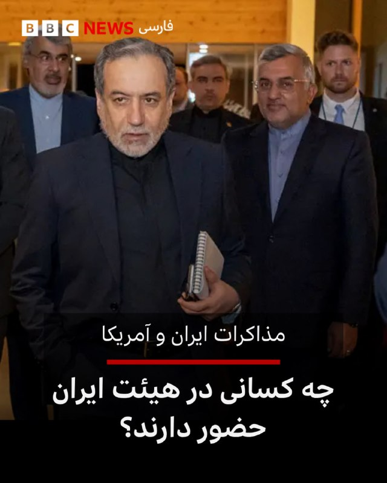

🔻هیئت ایرانی حوالی ساعت ۱۰ شنبه‌ شب به وقت محلی، وارد فرودگاه زوریخ سوئیس شد و از آنجا به هتل بورگن‌اشتوک در سوئیس رفت.

علاوه بر محمدباقر قالیباف که ریاست هیئت مذاکره‌کننده را بر عهده دارد، عباس عراقچی، وزیر امور خارجه، عالی‌ترین دیپلمات این هیئت است.

علی باقری، معاون بین‌الملل دبیرخانه شورای عالی امنیت ملی، کاظم غریب‌آبادی معاون حقوقی و بین‌الملل وزارت امور خارجه، و اسماعیل بقایی، سخنگوی این وزارتخانه، دیگر اعضای هیئت ایران هستند.

اما علاوه بر چهره‌های سیاسی و دیپلماتیک، دو چهره اقتصادی دو هم این هیئت را همراهی می‌کنند: عبدالناصر همتی، رئیس کل بانک مرکزی، و حمید بورد، معاون وزیر نفت و مدیرعامل شرکت ملی نفت ایران.

📸GettyImages
https://bbc.in/3SSMNgq
@BBCPerisn

## BBCPersian — post 284587

🔻رافائل گروسی در محل مذاکرات با وزیر امور خارجه سوئیس دیدار کرد

رافائل گروسی، مدیرکل آژانس بین‌المللی انرژی اتمی، در بورگن‌اشتوک با ایگناتسیو کاسیس، وزیر امور خارجه سوئیس، دیدار کرد.

منابع ایرانی خبری از اینکه دیدار با او در دستور کار این هیئت است منتشر نکرده است.

پس از حمله اسرائیل در جنگ دوازده روزه، ایران رابطه خود با آژانس بین‌المللی انرژی اتمی محدود کرد و از آن زمان به‌شدت از عملکرد رافائل گروسی انتقاد کرده است.

آژانس بین‌المللی انرژی اتمی از تفاهم ایران و آمریکا برای پایان دادن به جنگ استقبال کرد.

در آن زمان، رافائل گروسی، رئیس آژانس بین‌المللی انرژی اتمی، در ژنو به خبرنگاران گفت: «خوب است که این تفاهم‌نامه وجود دارد و اکنون کار فنی آغاز شده است.»

«اکنون نوبت ماست که با همکاران آمریکایی و ایرانی خود بنشینیم و گام‌های مشخصی را تدوین کنیم.»

https://bbc.in/4oD56lA
@BBCPersian

## BBCPersian — post 284586

🔻دیدار ونس با شهباز شریف و عاصم منیر

جی‌دی ونس، معاون رئیس‌جمهور آمریکا، به همراه استیو ویتکاف و جرد کوشنر، نمایندگان دونالد ترامپ، با شهباز شریف، نخست‌وزیر، و فیلد مارشال عاصم منیر، فرمانده کل قوای پاکستان، دیدار کردند.

پاکستان میانجی‌ اصلی مذاکرات ایران و آمریکا است.

در همین حال، هیئت ایران با میانجی‌های قطری دیدار کرده است.

رافائل گروسی، مدیرکل آژانس بین‌المللی انرژی اتمی، هم در محل مذاکرات با وزیر خارجه سوئیس ملاقات کرده است.

ایگناتسیو کاسیس ساعتی پیش با عباس عراقچی دیدار کرده بود.

https://bbc.in/4oGMZeN
@BBCPersian

## BBCPersian — post 284585

🔻بقایی: نشست چهارجانبه امروز برای بیان موارد نقض تفاهمنامه و یافتن راه حل برای آن است

اسماعیل بقایی می‌گوید که هدف ایران از نشست چهارجانبه امروز در سوئیس، «مطالبه‌گری»، بیان صریح موارد نقض تفاهمنامه و جستجوی راه حل برای آنهاست.

سخنگوی وزارت خارجه که همراه هیئت ایرانی در بورگن‌اشتوک در سوئیس حضور دارد، به صدا‌و‌سیما گفت:

«از دیروز (شنبه) یک توقف شکننده‌ای در جنگ لبنان ایجاد شده است که محصول همکاری نزدیک بین دستگاه دیپلماسی و میدان بوده.... ما سندی را امضا نمی‌کنیم و اجرایش را رها کنیم که اتوماتیک اجراشود.. برای اجرای چنین تفاهمی لازم هست که ما به صورت لحظه‌ای اقدامات طرف مقابل را رصد کنیم و از همه ابزارمان استفاده کنیم که مطمئن شویم طرف مقابل از تعهداتش تفره نرود. تعهد در برابر تعهد. این یک اصل اساسی است برای اینکه تجارب قبلی را شاهدش نباشیم.»

آقای بقایی گفت که گفت‌و‌گوهای سوئیس برای یک روز برنامه‌ریزی شده است و تصور نمی‌کند که بیشتر ادامه پیدا کند و قصد این است که تا ساعت ۱۹:۰۰ به وقت سوئیس، ۹/۵ شب تهران، به پایان برسد.

https://bbc.in/4eomO9g
@BBCPersian

## BBCPersian — post 284584

  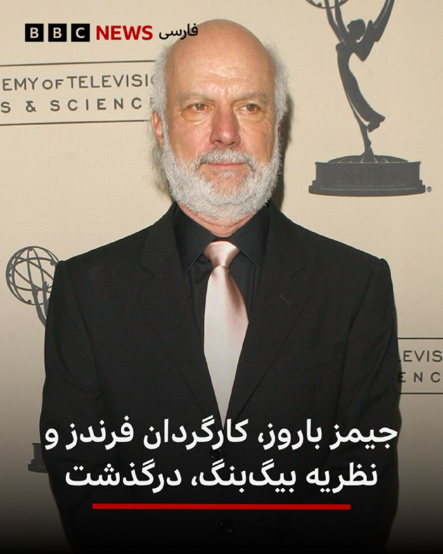

🔻جیمز باروز، کارگردان برخی از محبوب‌ترین سریال‌های کمدی آمریکا، در ۸۵ سالگی درگذشت.

آقای باروز کارگردان بیش از ۱۰۰۰ قسمت از سریال‌های کلاسیک کمدی تلویزیونی از جمله دوستان، نظریه بیگ‌بنگ و ویل و گریس است.
وکیل او، درگذشت آقای باروز را تأیید کرد.

آقای باروز در طول بیش از ۵۰ سال فعالیت حرفه‌ای خود، ۱۱ جایزه امی و پنج جایزه انجمن کارگردانان آمریکا را برد.
در بیانیه‌ای خانواده او امده است: «بیش از پنج دهه، باروز یکی از تأثیرگذارترین و محبوب‌ترین کارگردانان تاریخ تلویزیون بود. او به به شکل‌گیری چند نسل‌ کمدی کمک کرد و شادی بی‌حد و حصری را برای مخاطبان در سراسر جهان به ارمغان آورد.»

جیمز باروز که در سال ۱۹۴۰ در لس‌آنجلس متولد شد، بیشتر دوران کودکی خود را در نیویورک گذراند. او پس از پایان تحصیلاتش در دانشکده درام ییل اولین تجربه کارگردانی خود را کسب کرد.
سخنگوی شبکه ان‌بی‌سی، که بسیاری از برنامه‌های باروز را پخش می‌کرد، گفت که فقدانش او برای تلویزیون و دنیای کمدی «بی‌حدوحصر» خواهد بود.

📸FilmMagic for Academy of Television Arts and Sciences
@BBCPersian

## idfinfarsi — post 11864

🔴تعمیق همکاری میان نیروی دریایی اسرائیل و نیروی دریایی یونان: فرمانده نیروی دریایی یونان بازدید رسمی خود از اسرائیل را به پایان رساند

🔻فرمانده نیروی دریایی یونان، دریاسالار دوم دیمیتریوس کاتراس، بازدید رسمی خود را از اسرائیل به پایان رساند. در جریان این سفر، وی با فرمانده نیروی دریایی اسرائیل، سرلشکر ایال هارال، دیدار کرد.

🔻در چارچوب این بازدید، فرمانده نیروی دریایی یونان از پایگاه نیروی دریایی در حیفا بازدید کرد، جایی که با مراسم تشریفات نظامی مورد استقبال قرار گرفت. او همچنین از یگان ناو‌های موشکی، یگان زیردریایی‌ها و یگان کماندوی دریایی در عتلیـت دیدن کرد و با توانمندی‌های عملیاتی نیروی دریایی اسرائیل آشنا شد.

🔻افزون بر این، فرماندهان در یک پرواز گشتی از منطقه شمال بازدید کردند و فرمانده نیروی دریایی اسرائیل چالش‌های منطقه را تشریح کرد. فرمانده نیروی دریایی یونان گزارش‌هایی حرفه‌ای درباره درس‌های آموخته‌شده از جنگ، وضعیت راهبردی، عملیاتی و اطلاعاتی و روندهای توسعه توانمندی‌های نیرو دریافت کرد. در ادامه، فرماندهان از منطقه پیرامونی غزه نیز بازدید کردند.

🔻در جریان این دیدار، گفت‌وگوهای حرفه‌ای درباره چالش‌های امنیتی در عرصه‌های دریایی نزدیک و دور و پیامدهای آن بر آزادی کشتیرانی، ثبات منطقه‌ای و امنیت دریایی برگزار شد.

🔻همچنین بر اهمیت همکاری میان دو نیروی دریایی در برابر افزایش تهدیدها در شرق مدیترانه و ضرورت ایجاد پاسخ مشترک برای حفظ ثبات و امنیت تأکید شد.

🔻در پایان، فرماندهان بر تعمیق همکاری‌ها توافق کردند و تصمیم به ایجاد سازوکارهای جدید و پیشرفته میان دو نیرو گرفتند.

🔻این دیدار نشان‌دهنده عمق روابط امنیتی میان اسرائیل و یونان و تعهد مشترک آن‌ها برای تقویت همکاری راهبردی و عملیاتی است.

## Dirty_Kids — post 392739

  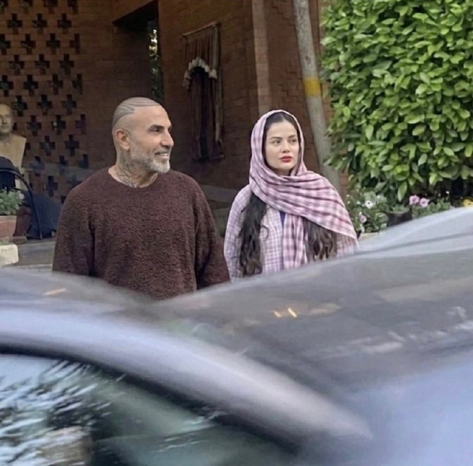

به‌به جمع جک جنده‌ها و اوبیای حکومتی تکمیل شد، خردادیان هم برگشت ایران.

@Dirty_Kids 👻

## Dirty_Kids — post 392738

  <a href="telegram/content/Dirty_Kids_392738_1782045627.mp4" target="_blank">🎬 Download video</a>

تنها دلیل چنین پدیده ای اینه که قشر جوون ایرانی هیچوقت محیطی برای اشنایی و معاشرت نداشته
نه کلابی ، نه باری نه باشگاه مختلطی
در نتیجه میلش برای معاشرت یا به صورت دور دور به خیابون سرازیر میشه یا این شکلی میشه
که اینا همش بخاطر جمهوری اسلامی مادرجنده س
که البته از یه نظر بد نشد به کلیه مرز و حدودهای قشر مذهبی جامعه ریده شد
اونا مدت ها به حریم ما تجاوز میکردن
حالا حریم خودشون پاره پاره شده

@Dirty_Kids 👻

## Dirty_Kids — post 392737

  <a href="telegram/content/Dirty_Kids_392737_1782045629.mp4" target="_blank">🎬 Download video</a>

🔴 همه چیز این ویدیو عجیبه؛ توی تهران یه پسره افتاده دنبال دوتا دختر که توی مراسم محرم توری پوشیدن، حالا دوس دخترِ طرفم افتاده دنبالش و میگه نگاشون نکن.

@Dirty_Kids 👻

## Dirty_Kids — post 392736

  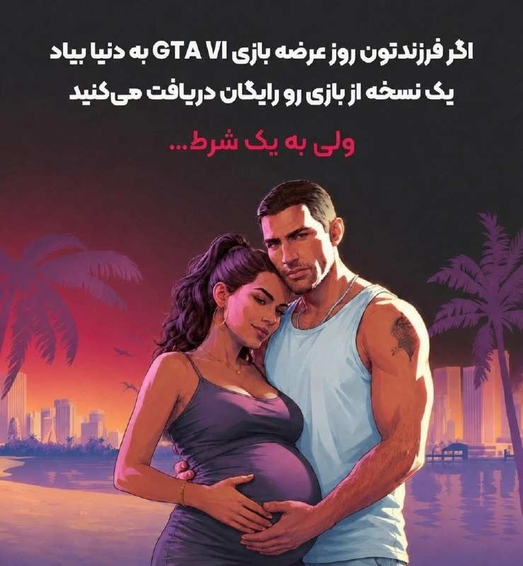

🔴 کشور نروژ اعلام کرده هر کی تو روز عرضه بازی GTA6، بچه بدنیا بیاره، یه نسخه رایگان از بازی بهش میدن.

+ وقتی نمونده، اگه نسخه رایگان میخوای، همین الان این پستو بفرست براش تا کارای اداری‌شو انجام بدین.

@Dirty_Kids 👻

## Dirty_Kids — post 392735

  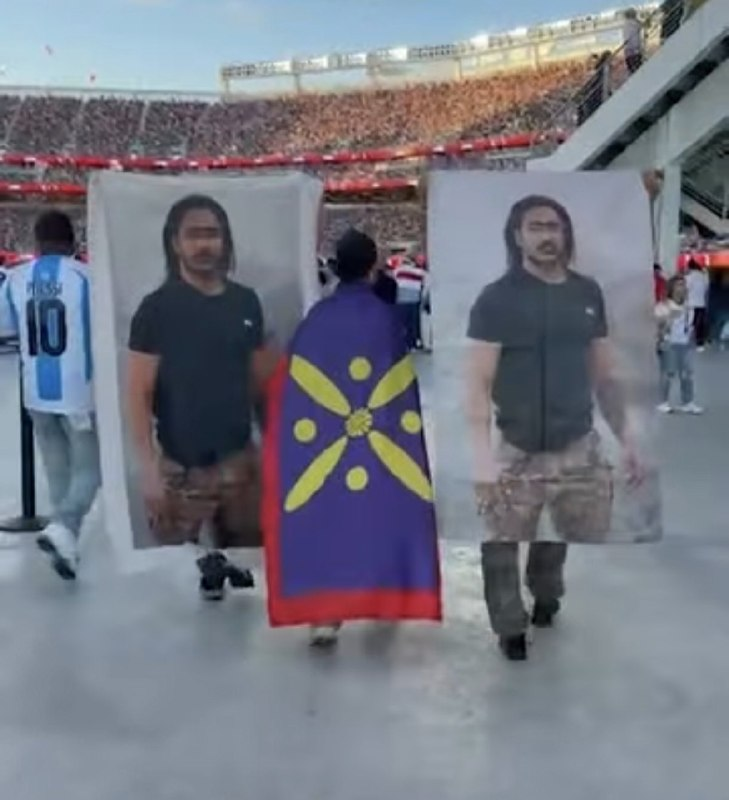

نمایش تصاویر مجید رضا رهنورد در بازی پاراگوئه و ترکیه

@Dirty_Kids 👻

## Dirty_Kids — post 392734

  

‏چه شکلی از دلتون میاد به اینا ۵تا گل بزنید ملعونا:/

@Dirty_Kids 👻

## Dirty_Kids — post 392733

  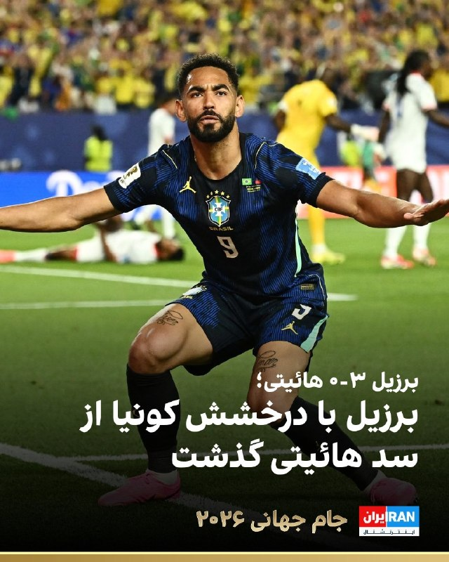

تبریک به جامعه ال‌جی‌بی‌تی

@Dirty_Kids 👻

## Dirty_Kids — post 392732

  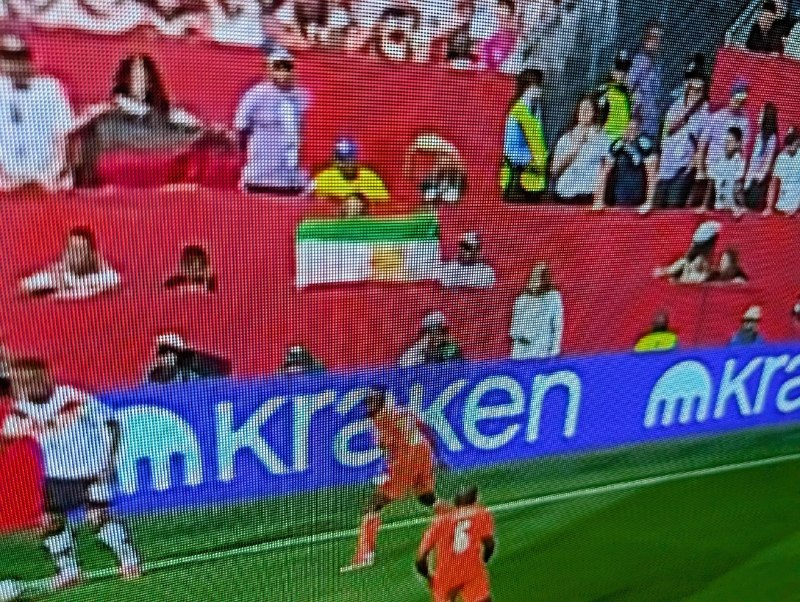

وای وسط بازی ساحل عاج و آلمان پرچم شیر و خورشید دیدم 😍

@Dirty_Kids 👻

## Dirty_Kids — post 392731

  

🔴 امروز June 21، روز جهانی سلفیه.

+ این پستو برا هر کی بفرستی، باید نودِ سلفی بهت بده.

@Dirty_Kids 👻

## Hranews — post 113753

گزارشی از اجرای حکم اعدام یک زندانی در زندان وکیل‌آباد مشهد

❗️
❗️
❗️
❗️
❗️ – حکم یک زندانی که پیشتر بابت اتهامات مرتبط با جرائم مواد مخدر به #اعدام محکوم شده بود، در زندان وکیل آباد مشهد به اجرا درآمد.

ادامه مطلب

#محمد_ابراهیمی

↘️
@hranews_bot تماس ✉️ -  @Hranews  کانال هرانا 🆑

## Hranews — post 113752

زاهدان؛ صدور احکام ۱۱۱ بازداشت‌شده اعتراضات ۱۴۰۴ و برخی متهمان مرتبط با جنگ

❗️
❗️
❗️
❗️
❗️ – دادستان زاهدان اعلام کرد که برای ۱۱۱ نفر از بازداشت‌شدگان اعتراضات سراسری سال ۱۴۰۴ پس از صدور کیفرخواست و طی مراحل دادرسی، حکم صادر شده و بخشی از این احکام نیز به اجرا درآمده است. وی همچنین از صدور حکم در شماری از پرونده‌های مرتبط با جنگ اخیر خبر داد.

ادامه مطلب

#اعتراضات_۱۴۰۴
#مداخله_نظامی

↘️
@hranews_bot تماس ✉️ -  @Hranews  کانال هرانا 🆑

## Hranews — post 113751

روز جاری، گروهی از بازنشستگان تامین اجتماعی در شوش نیز راهپیمایی و #تجمع اعتراضی برگزار کردند.

این شهروندان خواستار رسیدگی به مطالبات خود از جمله مشکلات درمانی، معیشتی و بازگشت امتیاز لغوشده بیمارستان ملکی تامین اجتماعی و ارتقای درمانگاه شهر به پلی‌کلینیک هستند.

↘️
@hranews_bot تماس ✉️ -  @Hranews  کانال هرانا 🆑

## Hranews — post 113750

  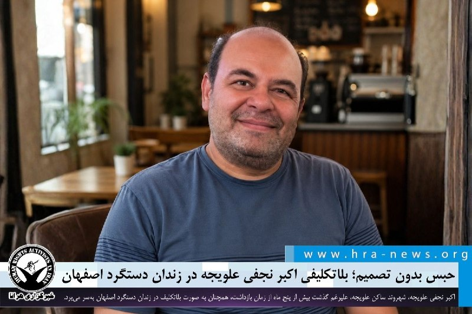

حبس بدون تصمیم؛ تداوم بلاتکلیفی ​اکبر نجفی علویجه در زندان دستگرد اصفهان

❗️
❗️
❗️
❗️
❗️ – ​اکبر نجفی علویجه، شهروند ساکن علویجه، بیش از پنج ماه است که در زندان دستگرد اصفهان در بلاتکلیفی قضایی به‌سر می‌برد.

به گزارش خبرگزاری هرانا، ارگان خبری مجموعه فعالان حقوق بشر در ایران، ​اکبر نجفی علویجه در بازداشت به‌سر می‌برد.

بر اساس اطلاعات دریافتی هرانا، ۱۶۳ روز از بازداشت آقای نجفی علویجه که با اتهامات مرتبط با اعتراضات سراسری مواجه است، می‌گذرد. وی هم‌اکنون در زندان دستگرد اصفهان نگهداری می‌شود و همچنان در وضعیت بلاتکلیفی قضایی قرار دارد.

ادامه مطلب

#اکبر_نجفی_علویجه

↘️
@hranews_bot تماس ✉️ -  @Hranews  کانال هرانا 🆑

## manototv — post 106194

  <a href="telegram/content/manototv_106194_1782045630.mp4" target="_blank">🎬 Download video</a>

‌
در این فیلم آرشیوی، شهبانو با حضور در مراسم فارغ‌التحصیلی دانشگاه ملی ایران، گواهینامه‌ها و جوایز دانشجویان ممتاز را اهدا می‌کند و با استادان و دانشجویان درباره وضعیت علمی و آموزشی دانشگاه گفت‌وگو می‌کند. این ویدیو بخشی از یک گزارش آرشیوی از دهه ۱۳۵۰ خورشیدی است.
برای تماشای نسخه کامل این گزارش و صدها فیلم آرشیوی نایاب دیگر، کانال یوتیوب Manoto را دنبال کنید.

## alonews — post 129545

  <a href="telegram/content/alonews_129545_1782045632.webm" target="_blank">🎬 Download video</a>

👈ایلان ماسک : هوش مصنوعی داره جای و شغل آدما رو میگیره، واسه همین دولت باید مستقیم به حساب مردم پول بریزه تا اقتصاد فرو نپاشه و تبعات هوش مصنوعی جبران شه. حالا با تولید ارزون و انبوه توسط هوش مصنوعی و رباتیک، تورم کاهش پیدا میکنه و حتی ممکنه دچار تورم منفی بشیم، پس دولت هم چاره‌ای نداره جز اینکه بین مردم پول پخش کنه

✅ @AloNews خبر جنگ

## alonews — post 129544

  <a href="telegram/content/alonews_129544_1782045632.webm" target="_blank">🎬 Download video</a>

👈فایننشال تایمز به نقل از دیپلمات آگاه از مذاکرات: میانجی‌گران ابتدا درباره سازوکاری برای نظارت بر نقض‌ها و حفظ صلح در لبنان بحث می‌کنند

🔴 در مورد اعزام هیئت ایرانی به سوئیس، مقامات قطری به ایران گفتند که اگر هیئتی اعزام نکند، عملاً به نتانیاهو «حق وتو بر جنگ» را داده

✅ @AloNews خبر جنگ

## alonews — post 129543

  <a href="telegram/content/alonews_129543_1782045632.webm" target="_blank">🎬 Download video</a>

👈گزارش تازه دیلی میل به بررسی احتمال تغییر رویکرد روسیه در جنگ اوکراین و بحث‌های مرتبط با استفاده احتمالی از سلاح‌های هسته‌ای توسط مسکو می‌پردازد

✅ @AloNews خبر جنگ

## alonews — post 129542

  <a href="telegram/content/alonews_129542_1782045632.webm" target="_blank">🎬 Download video</a>

👈مصر، ترکیه، عربستان سعودی و پاکستان بیانیه‌ای مشترک صادر کردند.

🔴در بیانیه مشترک وزیران امور خارجه مصر، ترکیه، عربستان سعودی و پاکستان آمده است: بر اهمیت دستیابی سریع به پایان مرحله بعدی مذاکرات تأکید می‌کنیم.

🔴تأکید می‌کنیم که تلاش‌ها باید نگرانی‌ها و ملاحظات کشورهای منطقه را در نظر بگیرد

✅ @AloNews خبر جنگ

## alonews — post 129541

  <a href="telegram/content/alonews_129541_1782045633.webm" target="_blank">🎬 Download video</a>

👈وب‌سایت «زتیو» به نقل از منابع آگاه: ترامپ به شدت از نتانیاهو عصبانی است؛ او گفته که دولت اسرائیل سعی دارد او را فریب دهد تا دوباره جنگی تمام عیار با ایران راه بیندازد

🔴رئیس‌جمهور آمریکا به شدت در این باره فحش می‌دهد.

🔴در حال حاضر، او قطعاً از اسرائیلی‌ها بیشتر از ایرانی‌ها عصبانی است

🔴حملات مداوم اخیر به لبنان، ترامپ را بیش از پیش به سمت مخالف فشارهای تل‌آویو سوق داده است

✅ @AloNews خبر جنگ

## alonews — post 129540

  <a href="telegram/content/alonews_129540_1782045633.webm" target="_blank">🎬 Download video</a>

👈ترامپ روز پدر را با تبلیغ دولت خود تبریک گفت: روز پدر مبارک! کشور ما عالی عمل می‌کند. تعداد مشاغل و بازار سهام رکورد زده، بهترین اقتصاد تاریخ! بزرگترین ارتش جهان، تا به امروز. ما در همه جبهه‌ها پیروز می‌شویم، پیروزی‌ای که هرگز سابقه نداشته است. خدا همه شما را حفظ کند!

✅ @AloNews خبر جنگ

## alonews — post 129539

  <a href="telegram/content/alonews_129539_1782045633.webm" target="_blank">🎬 Download video</a>

👈امارات به عنوان اولین کشور عربی، استفاده از شبکه‌های اجتماعی رو برای افراد زیر 15 سال ممنوع کرد

✅ @AloNews خبر جنگ

## alonews — post 129537

  <a href="telegram/content/alonews_129537_1782045633.mp4" target="_blank">🎬 Download video</a>

👈وضعیت فعلی در سوئیس

✅ @AloNews خبر جنگ

## alonews — post 129536

  <a href="telegram/content/alonews_129536_1782045635.mp4" target="_blank">🎬 Download video</a>

👈شوک در حزب‌الله

گزارش‌ها حاکی از آن است که محاصره ستاد کل حزب‌الله در جنوب لبنان و در ارتفاعات «تپه علی طاهر» در حومه نبطیه، باعث بهت و سردرگمی در میان نیروهای این گروه شده است.

بر اساس این ادعاها، نیروهای ارتش اسرائیل موفق شده‌اند به یک مرکز فرماندهی زیرزمینی و ستاد اصلی حزب‌الله در جنوب لبنان، که گفته می‌شود با حمایت جمهوری اسلامی ساخته شده، نفوذ کرده و آن را تحت کنترل بگیرند.

این محل پیش‌تر در دوران حیات سید حسن نصرالله به‌عنوان یکی از پایگاه‌های مهم معرفی شده بود و در همان زمان نیز موضوع رونمایی از موشک «عماد ۴» مطرح شده بود.

در ادامه این گزارش‌ها ادعا می‌شود احتمال گرفتار شدن صدها نیروی حزب‌الله در این مقر وجود دارد و گفته شده ممکن است تعدادی کشته یا بازداشت شده باشند. همچنین اخبار تاییدنشده‌ای از بازداشت حدود ۳۰ نفر و انتقال آن‌ها برای بازجویی منتشر شده است.

حزب‌الله در تاریخ ۱۸ آگوست ۲۰۲۴ از شهر موشکی «عماد ۴» رونمایی کرده بود؛ اقدامی که در آن زمان به‌عنوان نمایش قدرت و پیام بازدارنده علیه اسرائیل مطرح شد.

در حال حاضر نیروهای اسرائیلی در حال پیشروی زمینی در این منطقه هستند.

✅ @AloNews خبر جنگ

## alonews — post 129535

  <a href="telegram/content/alonews_129535_1782045636.webm" target="_blank">🎬 Download video</a>

👈گویا علی الاصول راجع به مسائل هسته‌ای هم مذاکره خواهد شد

✅ @AloNews خبر جنگ

## alonews — post 129534

  <a href="telegram/content/alonews_129534_1782045636.webm" target="_blank">🎬 Download video</a>

👈وزیر خارجه پاکستان: آمریکا درخواست انتقال ذخایر هسته‌ای ایران را مطرح کرد و ما به راه‌حلی با عنوان «کاهش سطح غنی‌سازی» رسیدیم.

✅ @AloNews خبر جنگ

## alonews — post 129533

  <a href="telegram/content/alonews_129533_1782045636.webm" target="_blank">🎬 Download video</a>

👈هم اکنون سوئیس، جمع پایدار

✅ @AloNews خبر جنگ

## alonews — post 129532

  <a href="telegram/content/alonews_129532_1782045637.webm" target="_blank">🎬 Download video</a>

👈وضعیت عالی سد کرج

✅ @AloNews خبر جنگ

## alonews — post 129531

  <a href="telegram/content/alonews_129531_1782045637.webm" target="_blank">🎬 Download video</a>

👈وزیر خارجه پاکستان به الحدث:

🔴ما موفق شدیم آمریکا و ایران را به گفت‌وگو ترغیب کنیم و به آتش‌بس دست یابیم.

🔴ما توانستیم آمریکا و ایران را برای نخستین بار پس از ۴۷ سال پای میز مذاکره بنشانیم.

🔴ما در هماهنگی با شرکا و متحدان خود این میانجی‌گری را به نتیجه رساندیم.

🔴جنگ میان آمریکا و ایران فاجعه‌بار بود و تأثیرات منفی شدیدی بر اقتصاد (منطقه و جهان) داشته است.

🔴سه تیم فنی در مذاکرات بین آمریکا و ایران مشارکت دارند.

🔴کمیته‌های فنی در حال بحث دربارهٔ پرونده هسته‌ای، دارایی‌های مسدودشده ایران و موضوع لبنان هستند.

🔴در طول دورهٔ ۶۰ روزه، هیچ گونه عوارض عبوری در تنگه هرمز اعمال نخواهد شد.

✅ @AloNews خبر جنگ

## alonews — post 129530

  <a href="telegram/content/alonews_129530_1782045637.webm" target="_blank">🎬 Download video</a>

👈برگزاری نشست سه جانبه ایران، امریکا و قطر با موضوع لبنان و اموال بلوکه شده

🔴نشست سه جانبه ایران، امریکا و قطر با موضوع آتش بس فراگیر در لبنان و اموال بلوکه شده ایران هم اکنون در محل مذاکرات در حال برگزاری است.

✅ @AloNews خبر جنگ

## alonews — post 129529

  <a href="telegram/content/alonews_129529_1782045637.webm" target="_blank">🎬 Download video</a>

👈خبرنگار صداو سیما: یک دور رفت و برگشت پیام با واسطه پاکستان بین دو‌طرف انجام شده یک دیدار هم با هیئت قطری برگزار شده است

✅ @AloNews خبر جنگ

## alonews — post 129528

  <a href="telegram/content/alonews_129528_1782045637.webm" target="_blank">🎬 Download video</a>

👈اسرائیل کاتز، وزیر دفاع اسرائیل، اعلام کرد که ارتش اسرائیل (IDF) همچنان برای مقابله با تهدیدات در لبنان آزادی عمل کامل دارد؛ این اظهارات پس از پاسخ گسترده اسرائیل به آخرین حمله حزب‌الله مطرح شد.

🔴او تأکید کرد که نیروهای اسرائیلی در منطقه امنیتی واقع در امتداد مرز باقی خواهند ماند و اسرائیل از جنوب لبنان عقب‌نشینی نخواهد کرد.

✅ @AloNews خبر جنگ

## alonews — post 129527

  <a href="telegram/content/alonews_129527_1782045637.webm" target="_blank">🎬 Download video</a>

👈بقایی:ایران مصمم است روند اجرای تعهدات طرف مقابل را با وسواس و جدیت پیگیری کند

✅ @AloNews خبر جنگ

## alonews — post 129526

  <a href="telegram/content/alonews_129526_1782045638.webm" target="_blank">🎬 Download video</a>

👈پزشکیان: ادامه جنگ به نفع هیچ فرد یا گروهی نیست

رئیس جمهور:

🔴ادامه جنگ به نفع هیچ فرد یا گروهی نیست. بر اساس همه تحقیقاتی که در جهان انجام شده است، هر جنگی موجب اختلال در رشد، توسعه اقتصادی و اجتماعی و افزایش فقر و بیکاری می‌شود.

🔴این سخن به معنای ترس از جنگ نیست. ارتش، سپاه، نیروهای هوافضا و مردم ما نشان دادند که با قدرت در برابر تجاوز ایستادگی می‌کنند و اگر جنگ ادامه پیدا می‌کرد، با قدرت می‌ماندند و مقاومت می‌کردند.

✅ @AloNews خبر جنگ

## alonews — post 129525

  <a href="telegram/content/alonews_129525_1782045638.webm" target="_blank">🎬 Download video</a>

👈پیام ایگنازیو کاسیس وزیر امور خارجه سوئیس پس از دیدار با عراقچی

🔴جناب عراقچی به سوئیس خوش آمدید.

🔴در نشست دریاچه لوسرن، ما چارچوبی برای گفت‌وگو و تبادل نظر فراهم می‌کنیم.

🔴در شرایطی دشوار و پیچیده، رابطه مبتنی بر اعتماد میان سوئیس و ایران، که در مأموریت ما به عنوان حافظ منافع نیز بازتاب یافته است، همچنان در خدمت دیپلماسی و در راستای صلح و امنیت در خاورمیانه قرار دارد.

✅ @AloNews خبر جنگ

<!-- MSG END -->

<!-- NAV START -->

<a href="https://github.com/Tljn/FUD/blob/main/telegram/content/archive_1.md" style="display:inline-block; padding:6px 12px; margin:0 4px; background-color:#2ea44f; color:white; text-decoration:none; border-radius:4px; font-weight:bold;">صفحه بعد</a>

<!-- NAV END -->
