# خواننده تلگرام

<!-- TOP_NAV START -->

<a href="https://github.com/Tljn/FUD/blob/main/telegram/content/archive_1.md" style="display:inline-block; padding:6px 12px; margin:0 4px; background-color:#2ea44f; color:white; text-decoration:none; border-radius:4px; font-weight:bold;">صفحه بعد</a>

<!-- TOP_NAV END -->

<!-- MSG START -->

---
📅 بروزرسانی: 1405/03/02 16:28
---

## VahidOOnLine — post 241712

  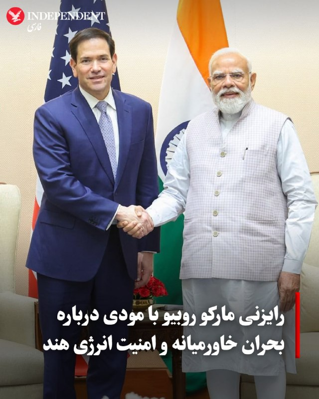

♦️ مارکو روبیو، وزیر امور خارجه آمریکا، روز شنبه دوم خرداد، در جریان سفر خود به هند با نارندرا مودی، نخست‌وزیر این کشور، درباره بحران خاورمیانه و به‌ویژه هزینه‌های انرژی گفتگو کرد.

تامی پیگات، سخنگوی وزارت امور خارجه آمریکا، اعلام کرد که روبیو در این دیدار تاکید کرده است ایالات متحده اجازه نخواهد داد جمهوری اسلامی بازار جهانی انرژی را به گروگان بگیرد. او همچنین تصریح کرد که فرآورده‌های انرژی آمریکا پتانسیل بالایی برای تنوع بخشیدن به منابع تامین انرژی هند دارند.

هند به شدت به واردات نفت و گاز از خاورمیانه وابسته است؛ به طوری که بر اساس آمار اداره اطلاعات انرژی آمریکا، پس از چین، دومین واردکننده بزرگ نفت خام از طریق تنگه هرمز به شمار می‌رود. طبق داده‌های موجود، ۷۴ درصد از کل نفت خام عبوری از این تنگه در سه‌ماهه اول سال گذشته میلادی تنها به چهار کشور چین، هند، ژاپن و کره جنوبی ارسال شده است.

روبیو همچنین در این دیدار به نمایندگی از دونالد ترامپ، از نخست‌وزیر هند برای سفر به کاخ سفید دعوت به عمل آورد.
‌🇸🇦 Indypersian

🤖 @VahidOOnLine

## VahidOOnLine — post 241711

  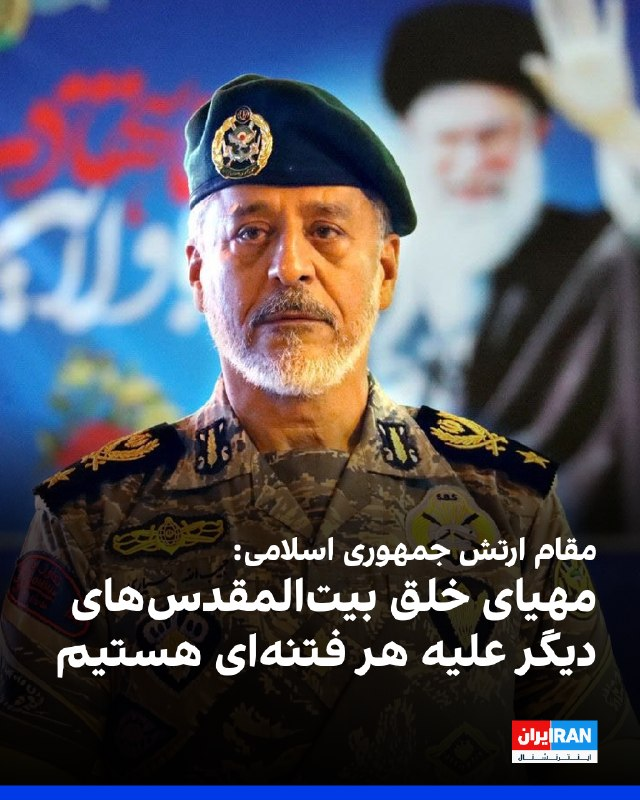

همزمان با افزایش تنش‌ها و احتمال ازسرگیری درگیری‌ها، حبیب‌الله سیاری، معاون هماهنگ‌کننده ارتش جمهوری اسلامی، گفت نیروهای مسلح برای مقابله با هرگونه تهدید آمادگی دارند و منتظر فرمان مجتبی خامنه‌ای هستند.

او گفت: «نیروهای مسلح در پاسداری از تمامیت ارضی و استقلال کشور، مهیای خلق بیت‌المقدس‌هایی دیگر در برابر هر فتنه و جنگ تحمیلی هستند و این را دنیا بداند که هویت ما با ایثار و وطن‌پرستی گره خورده است.»
‌🏁 🇬🇧 IranintlTV

🤖 @VahidOOnLine

## VahidOOnLine — post 241710

  <a href="telegram/content/VahidOOnLine_241710_1779541130.mp4" target="_blank">🎬 Download video</a>

⭕️ معاون سازمان ملی بهره‌وری: بهره‌وری در ایران نزدیک صفر است

♦️اسماعیل حبیبی، معاون سازمان ملی بهره‌وری ایران در گفتگو با صداوسیما اعلام کرد بهره‌وری کلی در ایران «نزدیک صفر» است.
او گفت این عدد نشان می‌دهد «از منابع خود به خودی استفاده نمی‌کنیم» و با اشاره به روندهای تامین انرژی در کشور، نمونه‌هایی از عدم بهره‌وری را تشریح کرد.
حبیبی از وضعیت موجود با عنوان «دومینوی عدم بهره‌وری» نام برد و توضیح داد مشکلات موجود در بخش‌های مختلف، به‌صورت زنجیره‌ای بر یکدیگر اثر گذاشته و موجب کاهش کارایی در حوزه انرژی و سایر بخش‌ها شده است.
حبیبی همچنین گفت: «ایران از نظر منابع در رتبه پنجم جهان قرار دارد، اما از نظر تولید ناخالص داخلی (GDP) در رتبه ۳۷ است.»
اظهارات معاون سازمان ملی بهره‌وری در حالی مطرح می‌شود که طی سال‌های اخیر، بحران انرژی، قطعی برق، کمبود گاز و فرسودگی زیرساخت‌ها بارها به‌عنوان نشانه‌هایی از ناکارآمدی و ضعف بهره‌وری در اقتصاد ایران مورد بحث قرار گرفته است.
‌🇸🇦 Indypersian

🤖 @VahidOOnLine

## VahidOOnLine — post 241709

روایت شما از زندگی در آتش‌بس- شنبه ۲ خرداد ۱۴۰۵

🔹 امروز شنبه ۲ خرداد، ما دانش‌آموزان مقابل آموزش‌وپرورش استان آذربایجان غربی در ارومیه تجمع کردیم برای غیرحضوری شدن امتحانات.
🔹 من تمام دوره‌های درسم را از تلگرام دانلود می‌کردم. دروس تخصصی را از یوتیوب تماشا می‌کردم. چند دوره هم از اینستاگرام خریده بودم و حالا کنکور دارم و باید با هیچی درس بخونم. به امید آزادی.
🔹 از رفسنجان، بعد از چند وقت قطع بودن امروز ۲ خرداد وصل شدم. خواستم بگم مردم امیدتونو از دست ندین، نور بر تاریکی پیروز است.
🔹 حتی اینترنت پرو که با ۱۰ برابر قیمت اینترنت قبلی فروخته می‌شود هم با اشکال و ناپایدار وصل می‌شود. کلاً با روح و روان آدم بازی می‌کنن.
🔹 یوتیوبرم، فقط ماهی ۳ میلیون باید هزینه فیلترشکن کنم که بتونم ویدیو آپلود کنم.
🔹 من یه دختر ۱۵ ساله هستم و هیچی از نوجوونیم نفهمیدم. فکر و ذکرم شده قیمت دلار و نگرانی برای آینده‌ام. انقدر همه‌چی گرون شده که شخصاً خجالت می‌کشم از خانوادم چیزی بخوام. به امید روزهای بهتر،
‌🏁 🇬🇧 IranintlTV

🤖 @VahidOOnLine

## VahidOOnLine — post 241708

  <a href="telegram/content/VahidOOnLine_241708_1779541133.mp4" target="_blank">🎬 Download video</a>

شیخ تمیم بن حمد آل ثانی، امیر قطر، در تماس تلفنی با دونالد ترامپ، رئیس‌جمهور آمریکا، درباره تنش‌های منطقه‌ای و ابتکارهای دیپلماتیکی که با محوریت پاکستان برای جلوگیری از تشدید بحران در حال انجام است، گفت‌وگو کرده است.
در این تماس، دو طرف تلاش‌ها برای کاهش تنش‌ها و حفظ ثبات منطقه را بررسی کردند و بر حمایت از میانجی‌گری پاکستان میان ایالات متحده و جمهوری‌اسلامی تاکید شد.
همچنین در این گفت‌وگو بر اهمیت ادامه مذاکرات و گفت‌وگوهای دیپلماتیک برای حل مسائل جاری، حفاظت از کشتیرانی دریایی و تضمین امنیت مسیرهای راهبردی آبی تأکید شد؛ موضوعی که به ثبات بازار جهانی انرژی و زنجیره تأمین نیز مرتبط است.
‌🏁 🇬🇧 ManotoTV

🤖 @VahidOOnLine

## VahidOOnLine — post 241707

  <a href="telegram/content/VahidOOnLine_241707_1779541134.mp4" target="_blank">🎬 Download video</a>

بر اساس گزارشی که در روزنامه تایمز منتشر شده، یک تحقیق مخفیانه نشان می‌دهد یک شبکه مرتبط با جمهوری‌اسلامی از طریق تلگرام تلاش کرده شهروندان بریتانیایی را برای سازماندهی تجمعات خیابانی ضد اسرائیلی و پخش پوسترهای تبلیغاتی جذب کند.
در این گزارش آمده است که خبرنگار تایمز به‌صورت مخفیانه وارد ارتباط با فردی شده که خود را «مهدی» معرفی کرده و مدعی بوده در ایران مستقر است و با ساختارهای امنیتی جمهوری‌اسلامی در ارتباط است. این فرد در پیام‌های خود پیشنهاد پرداخت پول در ازای سازماندهی تجمع، جذب افراد جدید و اجرای فعالیت‌های تبلیغاتی در لندن را مطرح کرده است.
همچنین از این خبرنگار خواسته شده ابتدا برای اثبات اعتماد، اقدام به نصب پوستر در خیابان‌های لندن و فیلم‌برداری از آن کند. این پوسترها شامل پیام‌های سیاسی علیه اسرائیل بوده است.
در ادامه، درخواست‌هایی برای گسترش فعالیت و حتی طراحی پروژه‌های آنلاین نیز مطرح شده و در نهایت حساب تلگرامی مربوطه به‌طور ناگهانی حذف شده است.
‌🏁 🇬🇧 ManotoTV

🤖 @VahidOOnLine

## VahidOOnLine — post 241706

  <a href="telegram/content/VahidOOnLine_241706_1779541135.mp4" target="_blank">🎬 Download video</a>

ویدیوی رسیده نشان می‌دهد دانش‌آموزان بروجرد در تجمع روز شنبه برای اعتراض به حضوری شدن امتحانات، فریاد «مجازی مجازی» سر دادند.
‌🏁 🇬🇧 IranintlTV

🤖 @VahidOOnLine

## VahidOOnLine — post 241705

  <a href="telegram/content/VahidOOnLine_241705_1779541137.mp4" target="_blank">🎬 Download video</a>

در حالی‌که برخی مقام‌های آمریکایی از احتمال توقف موقت فروش تسلیحات به تایوان به دلیل نیاز ارتش آمریکا در عملیات علیه ایران خبر داده بودند، یک منبع آگاه رویترز این ادعا را رد کرد و گفت این روند کاملاً طولانی‌مدت و اداری است و ارتباطی با جنگ ایران ندارد.
بر اساس این گزارش، تایوان همچنان منتظر تأیید بسته تسلیحاتی تا سقف ۱۴ میلیارد دلار از سوی آمریکا است. این در حالی است که چین به‌شدت با فروش سلاح به تایوان مخالفت کرده و آن را اقدامی علیه حاکمیت خود می‌داند.
کاخ سفید اعلام کرده تصمیم نهایی درباره این بسته در آینده نزدیک گرفته خواهد شد، اما سیاست کلی آمریکا در حمایت از توان دفاعی تایوان بدون تغییر باقی مانده است. تایوان نیز می‌گوید هیچ اطلاع رسمی از تعلیق یا تأخیر در این روند دریافت نکرده است.
‌🏁 🇬🇧 ManotoTV

🤖 @VahidOOnLine

## VahidOOnLine — post 241704

  <a href="telegram/content/VahidOOnLine_241704_1779541138.mp4" target="_blank">🎬 Download video</a>

همزمان با اعتراضات دانش‌آموزان شهرهای بروجرد و خرم‌آباد در لرستان، ویدیوی رسیده به ایران اینترنشنال نشان می‌دهد محصلان در کهگیلویه و بویراحمد نیز با تشکیل تجمع اعتراضی به موج اعتراض پیوستند. این اعتراضات نسبت به حضوری شدن امتحانات پس از ماه‌ها اختلال در فعالیت مدارس و تعطیلی صورت می‌گیرد.
‌🏁 🇬🇧 IranintlTV

🤖 @VahidOOnLine

## VahidOOnLine — post 241703

  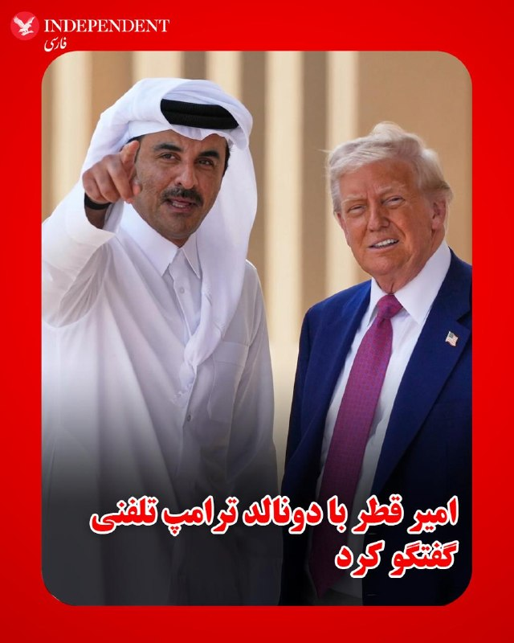

♦️شیخ تمیم بن حمد آل ثانی، امیر قطر، روز شنبه دوم خرداد ماه در تماس تلفنی با دونالد ترامپ، رئیس‌جمهوری آمریکا، آخرین تحولات و رویدادهای فوری منطقه را بررسی کرد.
بر اساس بیانیه رسمی دیوان امیری قطر، این گفتگو بر «تلاش‌های منطقه‌ای و بین‌المللی برای حفظ آرامش کنونی و کاهش تنش‌ها» متمرکز بوده است.
«امنیت دریانوردی، حفظ ایمنی آبراه‌های راهبردی و تضمین تداوم روان زنجیره‌های تامین جهانی و انتقال انرژی» از دیگر محورهای این گفتگو توصیف شده است.
به گزارش رسانه‌های قطری، امیر قطر در این تماس بر موضع ثابت دوحه در اولویت دادن به راه‌حل‌های مسالمت‌آمیز برای بحران‌ها تاکید و اعلام کرد قطر از همه ابتکارهایی که با هدف مهار بحران‌ها از طریق گفتگو و دیپلماسی انجام می‌شود، حمایت می‌کند.
این خبر در حالی منتشر می‌شود که رسانه‌ها از گفتگوی تلفنی وزیرامورخارجه قطر با عباس عراقچی خبر داده‌اند.
همزمان گزارش‌ها از رایزنی‌های گسترده کشورهای منطقه برای جلوگیری از حملات احتمالی آمریکا به ایران خبر می‌دهد.
این در حالیست که شبکه خبری العربیه پیشتر از هشدار واشنگتن به تهران مبنی بر از سرگیری حملات به ایران خبر داده بود.
‌🇸🇦 Indypersian

🤖 @VahidOOnLine

## VahidOOnLine — post 241702

  <a href="telegram/content/VahidOOnLine_241702_1779541140.mp4" target="_blank">🎬 Download video</a>

بر پایه گزارش رسانه‌های حکومتی، محمدباقر قالیباف، رئیس مجلس شورای اسلامی و رئیس هیئت مذاکره کننده نظام در مذاکرات با آمریکا به میزبانی اسلام‌آباد در دیدار با فیلد مارشال عاصم منیر، فرمانده ارتش پاکستان تهدید کرده: «در صورت حماقت ترامپ و آغاز مجدد جنگ، پاسخ ما کوبنده‌تر خواهد بود» قالیباف همچنین گفته در آتش‌بس بودیم که آمریکا «با نقض عهد، محاصره دریایی کرد و حالا به دنبال برداشتن آن است»
‌🏁 🇬🇧 ManotoTV

🤖 @VahidOOnLine

## VahidOOnLine — post 241701

  <a href="telegram/content/VahidOOnLine_241701_1779541141.mp4" target="_blank">🎬 Download video</a>

مجتبی خامنه‌ای، رهبر مشاهده نشده جمهوری‌اسلامی، در ادامه سنت مورد علاقه پدرش، علی خامنه‌ای، با انتشار پیامی نوشتاری درگذشت «والده» رئیس‌جمعیت هلال‌احمر جمهوری‌اسلامی، پیرحسین کولیوند را تسلیت گفت. علی‌ خامنه‌ای به انتشار پیام‌های تسلیت برای شخصیت‌های گوناگون و بستگان و اعضای خانواده آن‌ها علاقه بسیار داشت.
‌🏁 🇬🇧 ManotoTV

🤖 @VahidOOnLine

## VahidOOnLine — post 241700

  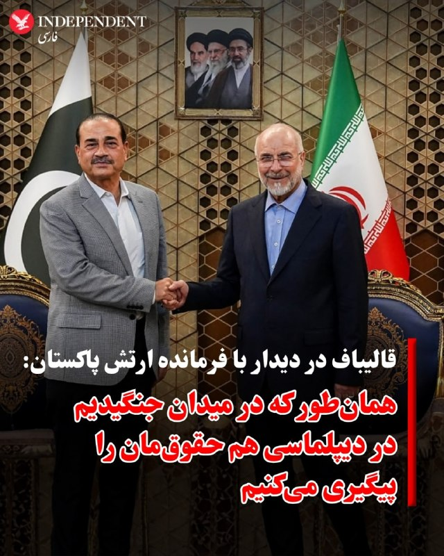

♦️بر اساس گزارش‌های منتشر شده در رسانه‌های رسمی ایران، فیلد مارشال عاصم منیر، فرمانده ارتش پاکستان، در تهران با محمدباقر قالیباف دیدار کرده است.
خبرگزاری تسنیم نوشت قالیباف در این دیدار با قدردانی از «حمایت‌ها و اقدامات ملت و دولت پاکستان در ادوار مختلف از جمله در جریان جنگ تحمیلی اخیر و مذاکرات پس از آن»، این تعاملات را «نمونه‌ای از همکاری خوب بین ملل و دول اسلامی» عنوان کرد که «می‌تواند برای سایر کشورهای اسلامی الگو باشد.»
قالیباف گفت: «ما از حقوق ملت و کشورمان عدول نمی‌کنیم، مخصوصا با طرفی که اصلا صداقت نداشته و اعتمادی به او وجود ندارد. جمهوری اسلامی ایران همانطور که با شجاعت و اقتدار در میدان نبرد از کیان ایران دفاع کرد در عرصه دیپلماسی نیز با هوشمندی و قدرت برای احقاق حقوق حقه ایران و تامین منافع ملی کشور کوشش خواهد کرد.»
او افزود: «نظامی‌ها بیش از دیگران و بهتر از همه ارزش صلح را می‌دانند اما همان نظامیان هیچگاه اجازه نمی دهند، عزت و حقوق کشورشان لگدمال شود.»
رئیس مجلس شورای اسلامی همچنین گفت: «ما در حال مذاکره بودیم که آمریکا جنگ به راه انداخت و حالا می‌گوید برای پایانش مذاکره کنیم.»
‌🇸🇦 Indypersian

🤖 @VahidOOnLine

## VahidOOnLine — post 241699

  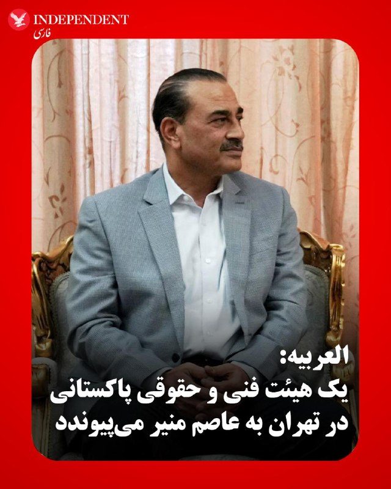

♦️شبکه خبری العربیه، روز شنبه دوم خرداد ماه، به نقل از منابع خود گزارش داد یک هیئت فنی و حقوقی از پاکستان عازم تهران شده است.
بر اساس این گزارش، این هیئت قرار است در تهران به عاصم منیر، فرمانده ارتش پاکستان، ملحق شود.
العربیه، پیشتر گزارش داده بود فرمانده ارتش پاکستان پیام‌هایی از سوی آمریکا را به تهران منتقل کرده که در آن نسبت به ازسرگیری جنگ هشدار داده شده است.
فیلد مارشال عاصم منیر، فرمانده ارتش پاکستان روز جمعه وارد تهران شد تا در مورد مذاکرات میان آمریکا و ایران با مسئولان جمهوری اسلامی رایزنی کند.
عاصم منیر روز شنبه با مقام‌های ارشد جمهوری اسلامی از جمله مسعود پزشکیان، محمدباقر قالیباف و عباس عراقچی دیدار و گفتگو کرد.
‌🇸🇦 Indypersian

🤖 @VahidOOnLine

## VahidOOnLine — post 241698

  

محمدباقر قالیباف، رییس مجلس جمهوری اسلامی، در دیدار با عاصم منیر، رییس ستاد کل ارتش پاکستان، گفت نیروهای مسلح جمهوری اسلامی در دوران آتش‌بس بازسازی شده‌اند و در صورت آغاز دوباره جنگ، واکنش ایران شدیدتر خواهد بود.

او گفت: «نیروهای مسلح ما در دوران آتش‌بس به نحوی خود را بازسازی کرده‌اند که در صورت حماقت ترامپ و آغاز مجدد جنگ، حتما برای آمریکا کوبنده‌تر و تلخ‌تر از روز اول جنگ خواهند بود.»

قالیباف با اشاره به نقش پاکستان در میانجی‌گری افزود: «در آتش‌بسی بودیم که شما واسطه‌اش بودید و آمریکا با نقص عهد، محاصره دریایی کرد و حالا به‌دنبال برداشتن آن است.»
‌🏁 🇬🇧 IranintlTV

🤖 @VahidOOnLine

## VahidOOnLine — post 241697

  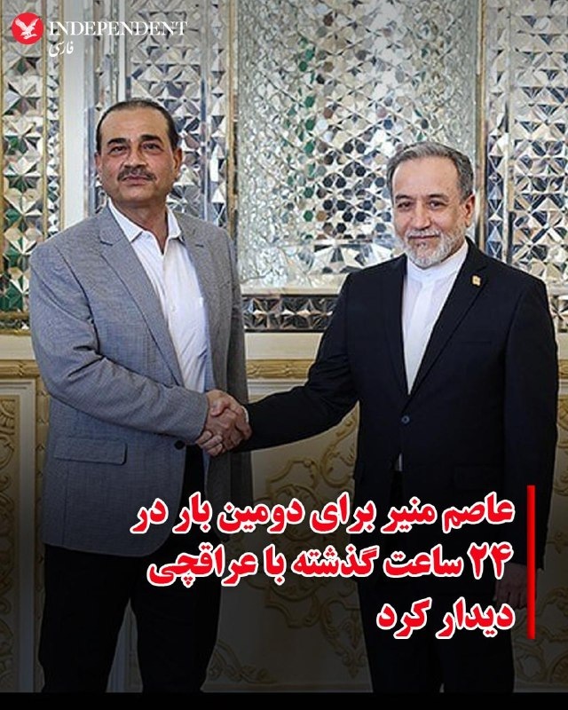

♦️رسانه‌های رسمی ایران، روز شنبه دوم خرداد ماه از دومین دیدار میان فرمانده ارتش پاکستان و عباس عراقچی، وزیر امور خارجه ایران طی ۲۴ ساعت گذشته خبر داده‌اند.
پیشتر شبکه خبری العربیه گزارش کرده بود، واشنگتن از طریق عاصم منیر به تهران هشدار داده است، در صورت شکست مذاکرات جنگ از سرگرفته خواهد شد.
فیلد مارشال عاصم منیر، فرمانده ارتش پاکستان روز جمعه وارد تهران شد تا در مورد مذاکرات میان آمریکا و ایران با مسئولان جمهوری اسلامی رایزنی کند.
‌🇸🇦 Indypersian

🤖 @VahidOOnLine

## VahidOOnLine — post 241696

  <a href="telegram/content/VahidOOnLine_241696_1779541145.mp4" target="_blank">🎬 Download video</a>

♦️ویدیوهای منتشرشده در شبکه‌های اجتماعی نشان می‌دهد روز شنبه دوم خرداد، گروهی از دانش‌آموزان در خرم‌آباد در اعتراض به نحوه برگزاری امتحانات و اصرار مسئولان بر حضوری بودن آزمون‌ها، مقابل ساختمان آموزش و پرورش تجمع کردند.
معترضان با سر دادن شعارهایی چون «مجازی، مجازی» و «مرگ بر مسئول بی‌لیاقت» خواستار لغو امتحانات حضوری و برگزاری غیرحضوری آزمون‌ها شدند. در برخی ویدیوها، فضای اعتراضی دانش‌آموزان و حضور گسترده آنان مقابل اداره آموزش و پرورش دیده می‌شود.
همزمان گزارش‌ها و ویدیوهای دیگری از بروجرد نیز منتشر شده که نشان می‌دهد شماری از دانش‌آموزان این شهر به تجمعات اعتراضی پیوسته‌اند. معترضان در بروجرد نیز خواستار مجازی شدن امتحانات شده و شعار «لرستان می‌میرد، ذلت نمی‌پذیرد» سر داده‌اند.
این اعتراضات در حالی ادامه دارد که پیش از این نیز دانش‌آموزانی در شهرکرد نسبت به نحوه برگزاری امتحانات و تصمیم مسئولان آموزشی اعتراض کرده بودند. طی روزهای اخیر، نگرانی‌ها درباره شرایط آموزشی، فشار روانی امتحانات و اصرار بر برگزاری حضوری آزمون‌ها در فضای مجازی و میان خانواده‌ها افزایش یافته است.
‌🇸🇦 Indypersian

🤖 @VahidOOnLine

## VahidOOnLine — post 241695

  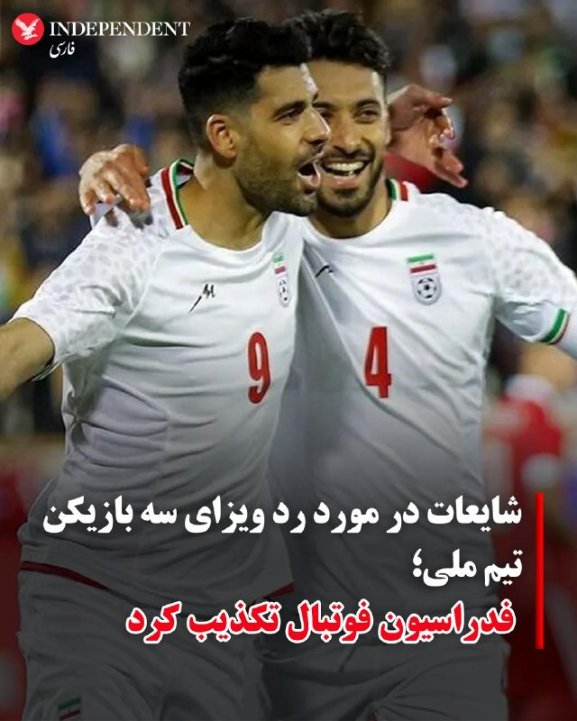

♦️در حالیکه رسانه‌های ورزشی ایران از شایعاتی مبنی بر رد ویزای شجاع خلیل‌زاده، مهدی طارمی و احسان حاج‌صفی خبر داده‌اند.

فدراسیون فوتبال ایران، روز شنبه با انتشار بیانیه‌ای با تکذیب این خبر ادعا کرد: «فرایند اداری مربوط به اخذ ویزا از سوی فدراسیون فوتبال و تیم ملی طبق روال انجام گرفته و ادعای مطرح شده کذب است.»

در همین حال، روزنامه خبرورزشی گزارش کرده است، امیر قلعه‌نویی، سرمربی تیم ملی فوتبال مردان ایران با بازیکنان جایگزین این سه عضو تیم ملی تماس گرفته تا تمرینات آمادگی برای جام جهانی را ادامه دهند.

شجاع خلیل‌زاده، مهدی طارمی و احسان حاج‌صفی سه ملی‌پوش ایرانی‌هستند که خدمت سربازی را در سپاه پاسداران انجام داده‌اند.
‌🇸🇦 Indypersian

🤖 @VahidOOnLine

## WithYashar — post 12148

  <a href="https://t.me/withyashar/12148" target="_blank">📎 Download file</a>

🌐 @withyashar

🌐 instagram.com/yashar

## WithYashar — post 12147

قدرت باورنکردنی سازمان اطلاعاتی موساد باعث شده است که نتانیاهو جزییات مذاکرات را از تهران متوجه شود نه واشینگتن
@withyashar

## WithYashar — post 12146

پس امشبم بیداریم شانس هست 😂🙌🏾

## WithYashar — post 12145

  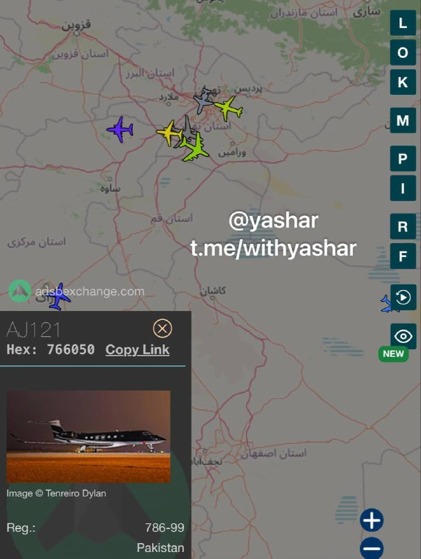

فرمانده ارتش پاکستان تهران را ترک کرد
@withyashar

## WithYashar — post 12144

@withyashar تحلیل پوزیشن الان

## WithYashar — post 12143

  <a href="telegram/content/WithYashar_12143_1779541149.mp4" target="_blank">🎬 Download video</a>

🎬 Video

## WithYashar — post 12142

ادعای خبرنگار الجزیره: یک شخصیت بسیار بلندپایه منطقه‌ای از ایران دیدار کرده است
علی هاشم در پیامی در شبکه اجتماعی ایکس مدعی شد که ـیک چهره بسیار برجسته منطقه‌ای، بی‌سروصدا از تهران بازدید کرد تا آنچه را که بسیاری اکنون «شکاف‌های غیرقابل عبور» می‌نامند، پر کند.
@withyashar

## WithYashar — post 12141

تماس تلفنی امیر قطر با ترامپ درباره کاهش تنش‌ها در منطقه

دیوان امیری قطر از تماس تلفنی امیر این کشور با ترامپ ،رئیس جمهور آمریکا خبر داد.
دیوان امیری قطر افزود که امیر این کشور درباره تلاش‌ها برای تحکیم آتش‌بس و کاهش تنش‌ها در منطقه صحبت کرد.
@withyashar

## WithYashar — post 12140

قالیباف در دیدار امروز با عاصم منیر، فرمانده ارتش پاکستان:

جمهوری اسلامی از حقوق خود عقب‌نشینی نمیکنه و به طرفی که صداقت نداره اعتمادی نیست.

جمهوری اسلامی در حالی پای میز مذاکره بود که آمریکا جنگ رو آغاز کرد؛ در صورت شروع دوباره درگیری، پاسخ نیروهای مسلح کوبنده‌تر و تلخ‌تر از گذشته خواهد بود.
@withyashar

## WithYashar — post 12139

العربیه: عاصم منیر پیام تهدیدآمیز آمریکا رو به تهران برد.
@withyashar

## WithYashar — post 12138

احتمال وقوع طوفان گرد و خاک در تهران

اداره‌کل هواشناسی استان تهران:
از یکشنبه تا چهارشنبه (۳ تا ۶ خردادماه) در مناطق شمالی استان تهران در بعضی ساعت‌ها وزش باد نسبتا شدید تا شدید همچنین در نیمه جنوبی، مناطق غربی، مرکزی و ارتفاعات در بعضی ساعت‌ها وزش باد شدید تا خیلی شدید پیش‌بینی می‌شود.
@withyashar

## WithYashar — post 12137

moamelegari-trump(@withyashar).pdf

## WithYashar — post 12136

  <a href="telegram/content/WithYashar_12136_1779541150.mp4" target="_blank">🎬 Download video</a>

کامیون براش بوق میزنه اتو بزنه 🤣🥴
@withyashar

## mwarmonitor — post 9532

  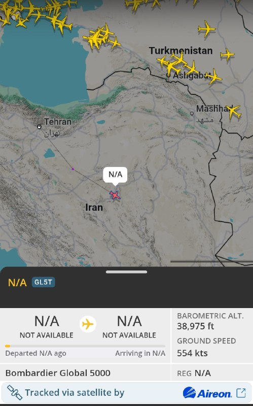

خب عاصم منیر رفت

## mwarmonitor — post 9531

🔸فرانسه ورود ایتامار بن‌گویر، وزیر امنیت ملی اسرائیل، به خاک خود را ممنوع کرده است. ژان-نوئل بارو، وزیر خارجه فرانسه، اعلام کرد این تصمیم به دلیل رفتار اسرائیل با فعالان ناوگان کمک‌رسانی به غزه گرفته شده است. او افزود پاریس و رم از اتحادیه اروپا می‌خواهند علیه او تحریم‌هایی اعمال کند.

@mwarmonitor

## mwarmonitor — post 9530

  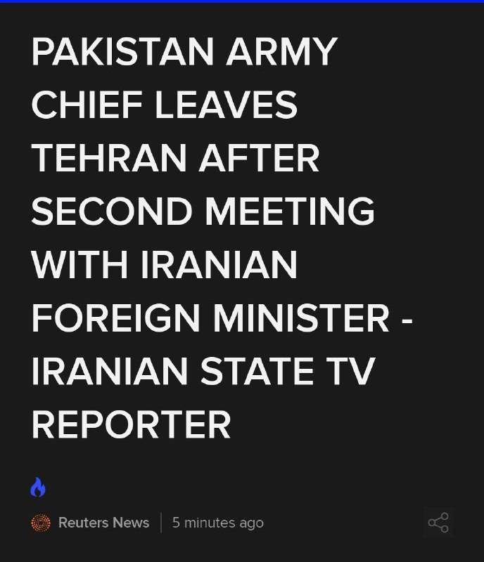

خب عاصم منیر رفت

## mwarmonitor — post 9529

  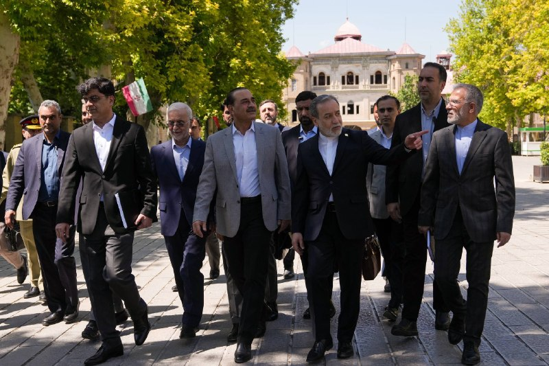

📝عباس نگاهی به آسمانِ ناامن می‌اندازد و می‌گوید: «حالا که این منیر اینجاست، بریم یه هوا بخوریم یه دوری بیرون بزنیم.» بدبخت را به عنوان گنبد آهنیِ گوشتی سپر کرده‌اند، چون خودشان هم خوب می‌دانند تنهایی حتی جرعت قدم زدن تو خونه ندارند، چه برسه به محوطه باز؛ آن هم وقتی که با هر صدای غرشِ باد، سایهٔ پهپادهای اسرائیل را بالای سرشان می‌بینند! این کمدیِ سیاه به قدری مضحک است که یک لشکر کت‌شلواری را دور خودشان دیوار کرده‌اند تا شاید پهپادهای نقطه‌زن در تفکیکِ اهداف دچار خطای محاسباتی شوند. خلاصه که این پیاده‌رویِ لرزان، هواخوری نیست؛ یک دوشِ آبِ سردِ دسته‌جمعی زیر تیغِ عزرائیلِ است!

@mwarmonitor

## mwarmonitor — post 9528

🔴ایالات متحده و اسرائیل در حال بررسی این موضوع هستند که آیا رهبر عالی، مجتبی خامنه‌ای را حذف کنند یا نه. 🔸بر اساس گزارش اسرائیل هیوم، آن‌ها می‌سنجند که آیا بقای او نوعی ثبات قابل‌کنترل ایجاد می‌کند، یا این‌که حذفش می‌تواند ساختار حاکمیتی ایران را بیش از پیش…

## mwarmonitor — post 9527

🔴ایالات متحده و اسرائیل در حال بررسی این موضوع هستند که آیا رهبر عالی، مجتبی خامنه‌ای را حذف کنند یا نه.

🔸بر اساس گزارش اسرائیل هیوم، آن‌ها می‌سنجند که آیا بقای او نوعی ثبات قابل‌کنترل ایجاد می‌کند، یا این‌که حذفش می‌تواند ساختار حاکمیتی ایران را بیش از پیش تضعیف کند.

@mwarmonitor

## mwarmonitor — post 9526

🔰دیپلماسیِ ساعت بیست‌وچهارم.
نخست‌وزیر پاکستان راهی چین شده است. فرمانده ارتش این کشور در تهران است. قطر بار دیگر به دیپلماسی رفت‌وبرگشتی بازگشته. پایتخت‌های منطقه هم‌زمان در همه جهت‌ها در حرکت‌اند و به‌دنبال فرمولی می‌گردند که هنوز وجود ندارد.

🔹تا جایی که می‌دانم، اوضاع آن‌قدر پیچیده شده که یک چهره بسیار بلندپایه منطقه‌ای به‌طور بی‌سروصدا به تهران رفته تا شکاف‌هایی را که بسیاری اکنون «غیرقابل پل‌زدن» می‌خوانند، ترمیم کند.

🔹آنچه نامعلوم است، زمان رسیدن به نقطه شکست است.
و آنچه معلوم است این‌که آن لحظه در راه است. علی هاشم خبرنگار الجزیره

@mwarmonitor

## mwarmonitor — post 9525

🔴روبیو به نخست‌وزیر هند:
«ایالات متحده اجازه نخواهد داد ایران بر بازار جهانی انرژی مسلط شود.»

@mwarmonitor

## mwarmonitor — post 9524

🔴امیر قطر با رئیس‌جمهور آمریکا، دونالد ترامپ، تماس تلفنی برقرار کرد — دیوان امیری قطر

@mwarmonitor

## mwarmonitor — post 9523

  <a href="telegram/content/mwarmonitor_9523_1779541154.mp4" target="_blank">🎬 Download video</a>

📝 جمهوری اسلامی به لجن‌زاری بدل شده که در آن یک فرقه تبهکار و جانی برای بقای خود، مجموعه‌ای از فاسدترین اراذل، کلاهبرداران، پورن‌استارها و حرامی‌ها را به خط کرده است. نمونه بارز این کثافت‌خانه، حسام نواب صفوی است؛ وکیل‌نمای کلاه‌بردار و هرزه‌ای که با سوءاستفاده از موقعیتش به اخاذی، توهین، افترا و اغفال کثیف زنان با وعده دروغین ازدواج روی آورد تا اینکه سرانجام گندِ پرونده‌هایش درآمدم و پروانه وکالتش تعلیق شد. وقتی ویترین یک حکومت را چنین موجودات رذل و بی‌شرفی پر می‌کنند، یعنی کفگیر فرقه جانی کاملاً به ته دیگ خورده و این نمایش مضحک و مشمئزکننده به پرده آخر خود رسیده است؛ فروپاشی حتمی برای سیستمی سراپا فساد که ماسک بازیگران کثیفش یکی‌یکی در حال افتادن است.

@mwarmonitor

## mwarmonitor — post 9522

🔸 قالیباف در دیدار با فرمانده ارتش پاکستان:
«نیروهای مسلح ما در دوران آتش‌بس توانمندی‌های خود را بازسازی کرده‌اند و اگر ترامپ مرتکب حماقتی شود و جنگ را از سر بگیرد، پاسخ ما بسیار قوی‌تر و ویرانگرتر خواهد بود.»

@mwarmonitor

## FoxNewsTwitter — post 342158

  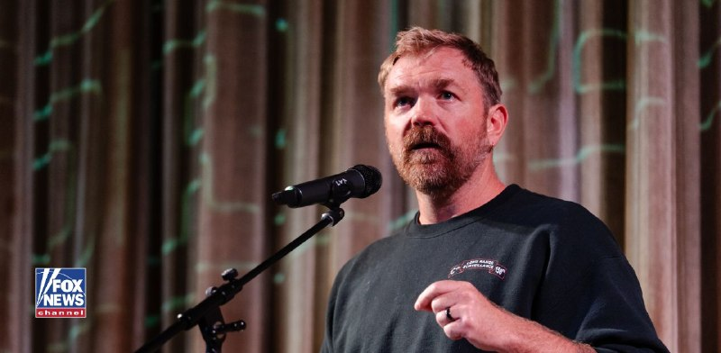

Fox News (Twitter/X)

“Full of fat, lazy trash who would rather not be in uniform.”

Resurfaced posts tied to Maine Democratic Senate candidate Graham Platner are back in the spotlight after he called the U.S. Army “absolute trash.”

The posts, made under the Reddit account “P-Hustle,” have become a major issue in Maine’s Senate race against GOP Sen. Susan Collins.

Platner has previously apologized for the comments, saying they were made during a period of combat trauma and do not reflect who he is today.

## FoxNewsTwitter — post 342157

  <a href="telegram/content/FoxNewsTwitter_342157_1779541157.mp4" target="_blank">🎬 Download video</a>

Fox News (Twitter/X)

What started out as a chemical leak has now escalated into an emergency officials say could end in a massive explosion.

Fire crews in Orange County, California, spent hours trying to stabilize a 34,000-gallon tank containing volatile chemicals before announcing that the tank “cannot be secured or mitigated.”

Officials say the situation has narrowed to two possibilities: a catastrophic spill of toxic chemicals or a thermal runaway event capable of igniting neighboring tanks.

Police are urging residents to leave evacuation zones immediately as emergency shelters open for displaced families.

## pm_afshaa — post 91267

ویدیویی از درگیری دانش آموزان با نیروهای سرکوب در خرم اباد 
💧 Rainbet.com the #1 Non-KYC Crypto Casino & Sportsbook @rainbetcom 
😁 @Pm_Afshaa

## pm_afshaa — post 91266

  <a href="telegram/content/pm_afshaa_91266_1779541159.mp4" target="_blank">🎬 Download video</a>

ویدیویی از درگیری دانش آموزان با نیروهای سرکوب در خرم اباد

💧 Rainbet.com the #1 Non-KYC Crypto Casino & Sportsbook @rainbetcom

😁 @Pm_Afshaa

## pm_afshaa — post 91265

🔴امروز دانش‌آموزان شهر خرم‌آباد در استان لرستان با حضور در مقابل ساختمون آموزش و پرورش این شهر، نسبت به اقدامات آموزش و پرورش دست به تجمع اعتراضی زدن. تجمع دانش‌آموزان خرم‌آبادی با دخالت نیروهای بسیج و انتظامی به خشونت کشیده شده و نیروهای پلیس با باتوم و گاز اشک آور به بچه‌های مردم حمله کردن

💧 Rainbet.com the #1 Non-KYC Crypto Casino & Sportsbook @rainbetcom

😁 @Pm_Afshaa

## pm_afshaa — post 91264

  <a href="telegram/content/pm_afshaa_91264_1779541161.webm" target="_blank">🎬 Download video</a>

🔥 ربات فروشگاه مردمی وینستون در خدمت شماست 
🔥

😏 پشماتون بریزه از این قیمت و این کیفیت 
😏

فروش عادی گیگی 150.000 تومان 
☄️
فروش همکار گیگی 130.000 تومان 
☄️

🔥 سرعت موشکی

💎 ( پنل مشاهده حجم در ربات )

🇩🇪 لوکیشن آلمان

‼️ برای خرید ربات رو استارت کنید 
‼️

🔴 برای همکاری پیوی خودم پیام بدین 
🔴

BOT 
📎 @Winstonmarket_bot

PV 
✉️ @mosadeveloper

CH 
📣 https://t.me/winstonservice

## pm_afshaa — post 91262

  <a href="telegram/content/pm_afshaa_91262_1779541162.webm" target="_blank">🎬 Download video</a>

🔴عاصم منیر فرمانده ارتش پاکستان هم‌اکنون تهران به مقصد پاکستان ترک کرد.

💧 Rainbet.com the #1 Non-KYC Crypto Casino & Sportsbook @rainbetcom

😁 @Pm_Afshaa

## pm_afshaa — post 91261

  <a href="telegram/content/pm_afshaa_91261_1779541162.webm" target="_blank">🎬 Download video</a>

🔴نیویورک تایمز: ترامپ اسرائیل رو آن‌چنان از روند‌ها کنار گذاشته که رهبران این کشور تقریباً از مذاکرات آمریکا و ایران بی‌اطلاع موندن.

💧 Rainbet.com the #1 Non-KYC Crypto Casino & Sportsbook @rainbetcom

😁 @Pm_Afshaa

## pm_afshaa — post 91260

  <a href="telegram/content/pm_afshaa_91260_1779541163.webm" target="_blank">🎬 Download video</a>

🔴العربیه: عاصم منیر پیام تهدیدآمیز آمریکا رو به تهران برد. 
💧 Rainbet.com the #1 Non-KYC Crypto Casino & Sportsbook @rainbetcom 
😁 @Pm_Afshaa

## pm_afshaa — post 91259

  <a href="telegram/content/pm_afshaa_91259_1779541164.webm" target="_blank">🎬 Download video</a>

👩‍💻کانفیگ اضطراری موجود شد! 
🛍 series Basic • 1G 140 
💵 • 2G 280
💵 • 3G 420
💵 • 4G 560
💵 • 5G 700
💵 • 10G 1400
💵 • 20G 2800 
💵 • 30G 4200
💵 
📌مناسب استفاده روزمره و اقتصادی 
📌سرعت مناسب برای استفاده عادی 
📌پینگ 140تا350 
📌مناسب تلگرام.وب گردی . اینستاگرام …

## pm_afshaa — post 91257

  <a href="telegram/content/pm_afshaa_91257_1779541164.webm" target="_blank">🎬 Download video</a>

🔴العربیه: عاصم منیر پیام تهدیدآمیز آمریکا رو به تهران برد.

💧 Rainbet.com the #1 Non-KYC Crypto Casino & Sportsbook @rainbetcom

😁 @Pm_Afshaa

## pm_afshaa — post 91256

  <a href="telegram/content/pm_afshaa_91256_1779541165.webm" target="_blank">🎬 Download video</a>

🔴رویترز: مذاکرات ایران و آمریکا برای پایان دادن به جنگ شدت گرفته، اما گزارش شده که ترامپ در صورت عدم توافق، به‌طور جدی در حال بررسی حملات جدید علیه ایران است.

💧 Rainbet.com the #1 Non-KYC Crypto Casino & Sportsbook @rainbetcom

😁 @Pm_Afshaa

## iaghapour — post 2627

⭕️ رکورددار تاریکی دیجیتال: ایران طولانی‌ترین قطعی اینترنت جهان را تجربه می‌کند!

روزنامه معتبر اسپانیایی «ال‌پایس» در گزارشی تکان‌دهنده اعلام کرده است که ایران با گذشت حدود ۸۰ روز خاموشی دیجیتال، رکورد طولانی‌ترین قطعی سراسری اینترنت در تاریخ یک جامعه دیجیتال را به نام خود ثبت کرده است. این محدودیت‌ها که ابتدا با توجیه شرایط امنیتی و جنگی آغاز شد، همچنان ادامه دارد.

طبق گزارش این رسانه و به نقل از نت‌بلاکس، این وضعیت حالا حتی از قطعی طولانی‌مدت اینترنت میانمار در سال ۲۰۲۱ نیز فراتر رفته و زندگی میلیون‌ها ایرانی را در بن‌بست قرار داده است:

🔹 آوارگی برای یک اتصال پایدار: ال‌پایس داستان تلخ افرادی را روایت می‌کند که برای حفظ شغل خود مجبور به مهاجرت موقت شده‌اند. مانند معلم زبانی که برای رهایی از اضطراب قطعی اینترنت، با هزینه ۴۰۰ دلار در ماه به زیرزمینی تاریک در ارمنستان پناه برده است.

🔸 ضربه مهلک به کسب‌وکارهای زنان: تداوم این اختلالات، آسیب‌های ویرانگری به مشاغل کوچک وارد کرده است؛ به‌ویژه کسب‌وکارهایی که توسط زنان اداره می‌شوند و حیات آن‌ها کاملاً به پلتفرم‌های آنلاین و شبکه‌های اجتماعی گره خورده بود.

🔹 فلج شدن زندگی روزمره: از کار از راه دور و تبادلات مالی گرفته تا ساده‌ترین ارتباطات انسانی و دسترسی به اطلاعات، همگی تحت تأثیر این محدودیت‌های بی‌سابقه مختل شده‌اند.

گزارش این روزنامه نشان می‌دهد که جهان در حال تماشای انزوای دیجیتال جامعه‌ای است که شهروندانش برای دسترسی به ابتدایی‌ترین حق ارتباطی خود، ناچارند هزینه‌های سنگین روانی، مالی و حتی مهاجرتی بپردازند./ دیجیاتو

🆔 @iAghapour

## DEJradio — post 4881

  <a href="telegram/content/DEJradio_4881_1779541165.mp4" target="_blank">🎬 Download video</a>

🚨
⭕️ تمرین هلی‌کوپترهای آمریکایی در عراق نزدیک مرز ایران

منابع محلی عراقی ویدیوهایی منتشر کرده‌اند که بر اساس آن‌ها ادعا می‌شود هلی‌کوپترهای آمریکایی در نزدیکی مرز ایران، تمرین هلی‌برن نیرو انجام داده‌اند.

اگرچه تاکنون هیچ منبع رسمی این خبر را تأیید نکرده است، اما مشابه این‌ تمرین،‌ در جریان جنگ ۴۰ روزه و در عملیات نجات خلبانان آمریکایی سقوط‌کرده در ایران انجام شده بود. با این حال، برخی فرماندهان ارشد جمهوری اسلامی و شماری از رسانه‌های بین‌المللی مدعی‌اند هدف اصلی آن عملیات، دستیابی به اورانیوم غنی‌شده بوده است.

دونالد ترامپ رئیس جمهوری آمریکا جمعه شب اول خرداد ۱۴۰۵ تهدید کرد «با جمهوری اسلامی همان کاری را می‌کنیم که با ونزوئلا کردیم.» در جریان عملیات دستگیری نیکلاس مادورو نیز هلی‌کوپترهای بلک‌هاوک و آپاچی ماموریت تهاجم را بر عهده داشتند و نیرو در کاخ ریاست جمهوری ونزوئلا هلی‌برن شد.

ساعاتی بعد از تهدید ترامپ، سازمان هواپیمایی کشوری جمهوری اسلامی اعلام کرد پروازها در آسمان غرب ایران ممنوع است.

#جنگ #عراق
@DEJradio

## DEJradio — post 4880

  <a href="telegram/content/DEJradio_4880_1779541168.mp4" target="_blank">🎬 Download video</a>

🔺🎥 دانش‌آموزان در چند شهر ایران نسبت به نحوه برگزاری امتحانات اعتراض کرده‌اند.

خبرگزاری فارس وابسته به سـ.ـپاه پاسداران هشدار داده است اگر این وضعیت مدیریت نشود، تبدیل به تهدیدی خطرناک خواهد شد!

#اعتراضات_سراسری
@DEJradio

## DEJradio — post 4879

  <a href="telegram/content/DEJradio_4879_1779541170.webm" target="_blank">🎬 Download video</a>

🔺📌 آقا داماد، جمهوری اسلامی را نشناخته بود

با وجود شکست مذاکرات اتمی با جمهوری اسلامی، در کاخ سفید سه تن اصرار به ادامه دیپلماسی دارند: جی‌.دی ونس، استیو ویتکاف و جرد کوشنر داماد ترامپ (فرستاده ویژه او در مذاکرات).

چند منبع موثق ۳۰ اردیبهشت گزارش دادند که در کاخ سفید ارزیابی مارکو روبیو وزیر خارجه و پیت هگست وزیر جنگ آمریکا، این بود که باید تحریم‌های اقتصادی علیه جمهوری اسلامی تشدید شود و گزینه نظامی روی میز باشد، اما در مقابل، ونس باور دارد رژیم ایران انعطاف نشان داده است. در همان جلسه‌ای که درباره وضعیت اختلاف میان مقامات آمریکا بالا گرفت کوشنر و ویتکاف از ونس حمایت کردند!

دو روز بعد از آن ماجرا دستگاه‌های امنیتی آمریکا دو عامل جمهوری اسلامی را در یک عملیات پیچیده بازداشت کردند.
یکی از آنها محمدباقر سعد داوود سعدی، شهروند ۳۲ ساله عراقی است که به اتهام مشارکت در دست‌کم ۲۰ اقدام تروریستی علیه منافع آمریکا و اسرائیل در اروپا و کانادا،‌ در ترکیه بازداشت و به آمریکا مسترد شد. این فرد، برای انتقام خون قاسم سلیمانی نقشه قتل ایوانکا ترامپ [همسر کوشنر] را کشیده بود.
منابع آگاه می‌گویند، ایوانکا ترامپ دختر بزرگ دونالد ترامپ رئیس‌جمهوری آمریکا هدف طرح تروری پیچیده قرار گرفته بود سعدی حتی نقشه خانه ایوانکا ترامپ در فلوریدا را نیز در اختیار داشت.

انتفاض قنبر معاون پیشین وابسته نظامی سفارت عراق در واشنگتن توضیح داده، «پس از کشته شدن قاسم سلیمانی، محمدباقر سعدی به مردم می‌گفت که باید ایوانکا را بکشیم تا همان‌طور که ترامپ خانه ما را سوزاند، خانه ترامپ را به آتش بکشیم.»

#مذاکرات #ترور
@DEJradio

## DEJradio — post 4878

⭕️
⭕️ اکسیوس از احتمال حملۀ بزرگ و پایانی آمریکا خبر داد

وبسایت خبری اکسیوس گزارش داد دونالد ترامپ، رئیس‌ جمهوری آمریکا، شامگاه آدینه نشستی ویژه را با اعضای ارشد تیم امنیت ملی دربارۀ جنگ با جمهوری اسلامی برگزار کرد.
همزمان میانجی‌ها در تلاش‌اند با تدوین چارچوبی برای ادامه مذاکرات، مانع ازسرگیری حملات آمریکا و اسرائیل شوند.
به گزارش اکسیوس و به نقل از دو منبع آگاه، ترامپ به نزدیکان خود گفت به‌طور جدی در حال بررسی حملات تازه علیه جمهوری اسلامی است تا در صورت شکست مذاکرات، اقدام کند.
وال‌استریت ژورنال نیز به نقل از مقام‌هایی در خاورمیانه‌ نوشت که در صورت پیش نرفتن مذاکرات، حملات تازۀ آمریکا و اسرائیل علیه جمهوری اسلامی طی روزهای آینده محتمل است.
از سویی عاصم منیر، فرماندۀ ارتش پاکستان برای ادامۀ مذاکرات به تهران سفر کرد. همچنین یک هیئت قطری نیز در راستای میانجی‌گری وارد ایران شده است.
اکسیوس نوشت انتظار می‌رود عاصم منیر روز شنبه با احمد وحیدی، فرماندۀ سپاه پاسداران، دیدار کند. بنا بر گزارش‌ها وحیدی اکنون از نفرات اصلی در تصمیم‌گیری‌های کلان جمهوری اسلامی به شمار می‌رود.
یک مقام آمریکایی گفته است پیش‌نویس‌ها هر روز میان واشینگتن و تهران ردوبدل می‌شود، اما پیشرفت چندانی رخ نداده است.
به گزارش وال‌استریت ژورنال، دستیابی به توافق نهایی، هدف فوری میانجی‌ها نیست.
بنا بر این گزارش، میانجی‌گران می‌خواهند یک پیش‌نویس یا «تفاهم‌نامه» برای تمدید آتش‌بس و تعیین چارچوب مذاکرات آینده تنظیم بشود.
بر اساس این گزارش، اختلاف اصلی این است که چه موضوعاتی باید در این چارچوب اولیه گنجانده شود و چه مواردی به مراحل بعدی موکول شود.
به گفتۀ منابع آگاه، شکست در دستیابی به همین توافق محدود نیز می‌تواند زمینه‌ساز دور تازه‌ای از حملات آمریکا و اسرائیل بشود.
در حملات پیش رو، احتمالا زیرساخت‌های اقتصادی نیز هدف گرفته می‌شود. از سویی منابعی در اسرائیل و امریکا پیش‌تر از یک بانک تازۀ اهداف در ایران خبر داده‌اند.
جمهوری اسلامی نیز تهدید کرده که در صورت آغاز حملات تازه، واکنشی گسترده‌ نشان می‌دهد.
به گفتۀ منابع آمریکایی، در نشست امنیتی روز آدینه، دونالد ترامپ، جی‌دی ونس، معاون رئیس‌ جمهوری، پیت هگست، وزیر جنگ، جان رتکلیف، رئیس سازمان سیا، سوزی وایلز، رئیس دفتر کاخ سفید و دیگر مقام‌های ارشد حضور داشتند.
مارکو روبیو، وزیر امور خارجۀ آمریکا به‌دلیل سفر به اروپا و دن کین، رئیس ستاد مشترک ارتش آمریکا، به‌دلیل حضور در مراسم فارغ‌التحصیلی آکادمی نیروی دریایی، در این نشست حضور نداشتند.
بر اساس گزارش‌ها، ترامپ در این نشست در جریان وضعیت مذاکرات و گزینه‌های احتمالی در صورت شکست گفت‌وگوها قرار گرفت.
وال‌استریت ژورنال نوشت ترامپ در پایان نشست، تصمیم پایانی خود را اعلام نکرد.
ساعاتی بعد از نشست آدینه، کاخ سفید اعلام کرد ترامپ به‌خلاف روال همیشگی، آخر هفته را در باشگاه گلف خود در بدمینستر نمی‌گذارند و به واشینگتن بازمی‌گردد.
ترامپ همچنین در شبکۀ اجتماعی تروث‌ نوشت که در مراسم ازدواج پسرش، شرکت نمی‌کند و به دلیل موضوع ایران، در کاخ سفید می‌ماند.

#ترامپ #جنگ #توافق #جمهوری_اسلامی
@DEJradio

## DEJradio — post 4877

  <a href="telegram/content/DEJradio_4877_1779541171.mp4" target="_blank">🎬 Download video</a>

🔺🎥 اعتراضات دانش‌آموزان به نحوه برگزاری امتحانات در چندین شهر ایران

دانش‌آموزان در چند شهر ایران به دلیل حضوری شدن امتحانات دست به اعتراض زدند دانش‌آموزان معترض می‌گویند در شهرهای محل سکونت آنها اینترنت ملی بسیار ضعیف، و سامانه «شاد» که برای آموزش آنلاین دانش‌آموزان استفاده می‌شود با اختلال روبرو بوده و در چنین شرایطی نباید در آزمونی کشوری با دانش‌آموزانی رقابت کنند از شرایط پایدارتر برای آموزش آنلاین برخوردار بوده‌اند.

#کهگلویه_و_بویراحمد #اعتراضات_سراسری
@DEJradio

## DEJradio — post 4873

⭕️
👑 شاهزاده رضا پهلوی در پیامی در حساب کاربری خود در شبکهٔ ایکس اعلام کردند در ادامهٔ دیدارهایشان در کنگره آمریکا، با دریک ون اوردن، نمایندهٔ کنگره، دیدار کرده‌اند. ایشان با اشاره به مواضع این نمایندهٔ آمریکایی تأکید کردند او از نزدیک دیده است که جمهوری اسلامی چه پیامدهایی برای مردم آمریکا و مردم ایران به‌همراه داشته است.
شاهزاده رضا پهلوی همچنین اعلام کردند گفت‌وگوها دربارهٔ طرح مربوط به ایران آزاد و تأثیرات آن بر آمریکا و جهان ادامه خواهد یافت.

#شاهزاده_رضا_پهلوی #کنگره_آمریکا
@DEJradio

## DEJradio — post 4872

  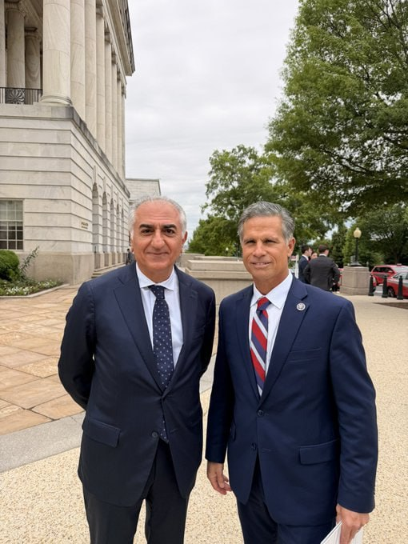

👑
📱 شاهزاده رضا پهلوی در پیامی در حساب کاربری خود در شبکهٔ ایکس، از دیدار با نمایندهٔ کنگره آمریکا، دن میوزر، در جریان سفرش به ساختمان کنگره خبر داد. ایشان با قدردانی از حمایت این عضو کنگره از مردم ایران، تأکید کردند مبارزۀ ملت ایران برای بازپس‌گیری کشور از حاکمیت جمهوری اسلامی و بازگرداندن ایران به صلح، شکوفایی و جایگاه طبیعی خود در جامعۀ جهانی ادامه دارد.

#شاهزاده_رضا_پهلوی #کنگره_آمریکا
@DEJradio

## DEJradio — post 4871

  <a href="telegram/content/DEJradio_4871_1779541173.mp4" target="_blank">🎬 Download video</a>

🔺📢 مسعود پزشکیان در دیدار با فرمانده ارتش و فرمانده نیروی هوایی به آنها قول داده با تمام ظرفیت برای تقویت و بازسازی یگان‌ها کمک کند، اما واقعیت آن است که نه دولت آه در بساط دارد و نه امکان جایگزینی ادوات وجود دارد.

#ارتش #نیروی_هوایی
@DEJradio

## DEJradio — post 4870

⭕️ فرماندۀ ارتش پاکستان با پزشکیان و قالیباف دیدار کرد

عاصم منیر، فرماندۀ ستاد کل ارتش پاکستان، که برای رایزنی درباره توافق آمریکا و جمهوری اسلامی به تهران سفر کرده است، روز شنبه با مسعود پزشکیان و محمدباقر قالیباف دیدارهایی جداگانه‌ را برگزار کرد.
فیلد مارشال عاصم منیر، در شامگاه شنبه با عباس عراقچی، وزیر امور خارجۀ جمهوری اسلامی، نیز دیدار کرده بود.
بنا بر گزارش‌ها عاصم منیر پیام‌هایی را از سوی واشینگتن به تهران منتقل کرده که شامل هشدار درمورد احتمال ازسرگیری جنگ بوده است.

#مذاکرات #پاکستان
@DEJradio

## DEJradio — post 4869

⭕️ عراقچی با وزرای خارجۀ ترکیه، قطر و عراق گفت‌وگو کرد

عباس عراقچی، وزیر امور خارجۀ جمهوری اسلامی، در تماس‌های تلفنی جداگانه با همتایان خود در ترکیه، قطر و عراق درمورد تحولات منطقه گفت‌وگو کرد.
مقامات این کشورها برای برقراری صلح میان واشینگتن و تهران در تلاش‌اند.
قطر و ترکیه پیش از آغاز جنگ چهل روزه نیز تلاش بسیاری کردند تا مانع حملۀ آمریکا به مواضع جمهوری اسلامی بشوند.

#مذاکرات #میانجی
@DEJradio

## DEJradio — post 4868

⭕️ کاخ سفید گفت ترامپ همۀ گزینه‌ها علیه جمهوری اسلامی را روی میز دارد

اولیویا والز، سخنگوی کاخ سفید، با اشاره به حملات آمریکا و اسرائیل علیه جمهوری اسلامی گفت ترامپ همۀ کارت‌ها را در دست دارد و عاقلانه همۀ گزینه‌ها را روی میز نگه می‌دارد.
اولیویا والز افزود ایالات متحده به همۀ اهداف نظامی خود در عملیات خشم حماسی دست یافت و یا حتی از آن فراتر رفت.

#ترامپ #کاخ_سفید
@DEJradio

## DEJradio — post 4867

⭕️ ادعای سخنگوی وزارت دفاع: ترامپ چاره‌ای جز پذیرش مطالبات جمهوری اسلامی ندارد

رضا طلایی‌نیک، سخنگوی وزارت دفاع دولت پزشکیان، ادعا کرد دونالد ترامپ «هیچ چاره‌ای» جز پذیرش مطالبات تهران و به رسمیت شناختن «حقوق» جمهوری اسلامی ندارد.
طلایی نیک مدعی شد «تمکین نکردن» آمریکا به خواسته‌های جمهوری اسلامی، به «تحمیل هزینه‌های بیشتر» و «شکست‌های پیاپی» برای ترامپ و اسرائیل منجر می‌شود.
سخنگوی وزارت دفاع همچنین گفت ترامپ باید ضمن پذیرش پیشنهادهای جمهوری اسلامی، به فکر جلوگیری از «خسارت‌ها و هزینه‌های بیشتر» ادامۀ جنگ برای مردم آمریکا و جامعۀ جهانی باشد.
رجزخوانی این مقام وزارت دفاع در حالی است که در جریان جنگ‌ با آمریکا و اسرائیل وزیر دفاع جمهوری اسلامی کشته شده بود.

#مذاکرات

@DEJradio

## mamlekate — post 103572

  <a href="telegram/content/mamlekate_103572_1779541176.mp4" target="_blank">🎬 Download video</a>

جواد ظریف، انتخابات ۱۴۰۳: پزشکیان کسی‌ست که اینترنت شما را فیلتر نمی‌کند و بعد به شما فیلترشکن بفروشد.

@mamlekate

## mamlekate — post 103571

📞 الو امروز صبح شرکت‌ها، خونه‌ها و مغازه‌های نزدیک وزارت اطلاعات تقاطع همت و پاسداران رو اومدن حضوری گفتن فوری محل رو ترک کنید و تا شب هم نگذارید طول بکشه.

📞 الو دوستم که توی پالایشگاه تهران (جنوب) هست میگه مخازن آسیب دیده در اثر موشک رو نان استاپ به صورت سه شیفت دارن بازسازی میکنن تا نفت توشون ذخیره کنن. به هر کارگری که برای بازسازی کار میکنه روزی ۵ میلیون و هر جرثقیل روزی ۲۰ میلیون هزینه میدن.

📞 اتوبان تهران ساوه، ده پونزده تا شاستی بلند امنیتی دو سه تا تریلی رو وسط اتوبان با سرعت خیلی بالا اسکورت میکردن به سمت تهران. حتی عوارضی که ایست بازرسی هست رو کاملا باز کرده بودن از قبل فقط با سرعت داشتن رد میشدن. تا حالا همچین چیز پشم ریزونی ندیده بودم. قبلا هم دیده بودم جا به جای محموله و اسکورت تو این اتوبان ولی هیچ وقت این شکلیش رو ندیده بودم. حتی ماشین راهنمایی رانندگی هم نبود تو تیم اسکورتشون همه امنیتی اصلا نمیتونستی گاز بدی ردشون کنی جاده رو کاملا بلمپ کرده بودن برای خودشون. و عجیبه که خوب اینا که دارن میرن تهران، از فرودگاه مهرآباد شروع نکردن؟!

@mamlekate

## IranIntlTV — post 338582

  <a href="telegram/content/IranIntlTV_338582_1779541177.mp4" target="_blank">🎬 Download video</a>

ویدیوی رسیده به ایران اینترنشنال نشان می‌دهد دانش‌آموزان نورآباد لرستان روز شنبه همزمان با دیگر شهرهای این استان به اعتراضات علیه حضوری شدن اعتراضات پیوستند.

## IranIntlTV — post 338581

  <a href="telegram/content/IranIntlTV_338581_1779541179.mp4" target="_blank">🎬 Download video</a>

تجمع دانش‌آموزان در شهرکرد، بروجرد، دورود، خرم‌آباد، بروجرد و یاسوج در اعتراض به بلاتکلیفی تحصیلی و امتحانات حضوری ادامه یافت. ویدیوهای رسیده به ایران‌اینترنشنال نشان می‌دهد ماموران با گاز اشک‌آور به دانش‌آموزان معترض حمله کردند.
گفت‌وگو با آسیه امینی، تحلیل‌گر مسائل اجتماعی
@iranintltv

## IranIntlTV — post 338580

  

همزمان با افزایش تنش‌ها و احتمال ازسرگیری درگیری‌ها، حبیب‌الله سیاری، معاون هماهنگ‌کننده ارتش جمهوری اسلامی، گفت نیروهای مسلح برای مقابله با هرگونه تهدید آمادگی دارند و منتظر فرمان مجتبی خامنه‌ای هستند.

او گفت: «نیروهای مسلح در پاسداری از تمامیت ارضی و استقلال کشور، مهیای خلق بیت‌المقدس‌هایی دیگر در برابر هر فتنه و جنگ تحمیلی هستند و این را دنیا بداند که هویت ما با ایثار و وطن‌پرستی گره خورده است.»
https://iranintl.com/202605234510

## IranIntlTV — post 338579

روایت شما از زندگی در آتش‌بس- شنبه ۲ خرداد ۱۴۰۵

🔹 امروز شنبه ۲ خرداد، ما دانش‌آموزان مقابل آموزش‌وپرورش استان آذربایجان غربی در ارومیه تجمع کردیم برای غیرحضوری شدن امتحانات.
🔹 من تمام دوره‌های درسم را از تلگرام دانلود می‌کردم. دروس تخصصی را از یوتیوب تماشا می‌کردم. چند دوره هم از اینستاگرام خریده بودم و حالا کنکور دارم و باید با هیچی درس بخونم. به امید آزادی.
🔹 از رفسنجان، بعد از چند وقت قطع بودن امروز ۲ خرداد وصل شدم. خواستم بگم مردم امیدتونو از دست ندین، نور بر تاریکی پیروز است.
🔹 حتی اینترنت پرو که با ۱۰ برابر قیمت اینترنت قبلی فروخته می‌شود هم با اشکال و ناپایدار وصل می‌شود. کلاً با روح و روان آدم بازی می‌کنن.
🔹 یوتیوبرم، فقط ماهی ۳ میلیون باید هزینه فیلترشکن کنم که بتونم ویدیو آپلود کنم.
🔹 من یه دختر ۱۵ ساله هستم و هیچی از نوجوونیم نفهمیدم. فکر و ذکرم شده قیمت دلار و نگرانی برای آینده‌ام. انقدر همه‌چی گرون شده که شخصاً خجالت می‌کشم از خانوادم چیزی بخوام. به امید روزهای بهتر،

## IranIntlTV — post 338578

یکی از مجروحان انقلاب ملی ایرانیان با ارسال فایلی صوتی به ایران اینترنشنال، ماجرای زخمی و شکنجه شدنش به دست نیروهای امنیتی و لباس‌شخصی در ۱۸ دی‌ماه ۱۴۰۴ را روایت کرد. صدای او با هوش مصنوعی تغییر یافته است.

## IranIntlTV — post 338577

  <a href="telegram/content/IranIntlTV_338577_1779541182.mp4" target="_blank">🎬 Download video</a>

ویدیوی رسیده نشان می‌دهد دانش‌آموزان بروجرد در تجمع روز شنبه برای اعتراض به حضوری شدن امتحانات، فریاد «مجازی مجازی» سر دادند.

## IranIntlTV — post 338576

  <a href="telegram/content/IranIntlTV_338576_1779541184.mp4" target="_blank">🎬 Download video</a>

مولوی عبدالحمید، امام‌جمعه اهل سنت زاهدان، گرانی و تورم را بی‌حد و مرز و مردم را گرسنه توصیف کرد. او دولت را فاقد اختیار و نقش موثر برای تصمیم‌گیری در سیاست‌های داخلی و خارجی دانست.

گفت‌وگو با مهدی نخل‌احمدی، روزنامه‌نگار و فعال سیاسی
@iranintltv

## IranIntlTV — post 338575

  <a href="telegram/content/IranIntlTV_338575_1779541186.mp4" target="_blank">🎬 Download video</a>

دانش‌آموزان در خرم‌آباد، بروجرد و نقاطی از کهگیلویه و بویراحمد تجمع کردند و علیه مسوولان شعار دادند.

گفت‌وگو با محسن مهیمنی، عضو تحریریه ایران‌اینترنشنال
@iranintltv

## IranIntlTV — post 338573

  <a href="telegram/content/IranIntlTV_338573_1779541188.mp4" target="_blank">🎬 Download video</a>

سازمان عملیات تجارت دریایی بریتانیا درباره فعالیت‌های مشکوک دریایی در خلیج عدن هشدار داد. بر اساس این هشدار، چندین مورد نزدیک شدن قایق‌های کوچک به شناورها گزارش شده و در یکی از موارد نیز یک قایق بزرگ با دو موتور بیرونی مشاهده شده که حامل نردبان و سلاح بوده است.

گفت‌وگو با تاج‌الدین سروش، عضو تحریریه ایران‌اینترنشنال
@iranintltv

## IranIntlTV — post 338572

  <a href="telegram/content/IranIntlTV_338572_1779541190.mp4" target="_blank">🎬 Download video</a>

گفت‌وگوی ویژه با لرد موریس گلسمن، عضو مجلس اعیان بریتانیا

امروز ساعت ۱۶:۴۵ و ۲۱:۴۵ به وقت تهران

@iranintltv

## IranIntlTV — post 338571

  <a href="telegram/content/IranIntlTV_338571_1779541192.mp4" target="_blank">🎬 Download video</a>

همزمان با اعتراضات دانش‌آموزان شهرهای بروجرد و خرم‌آباد در لرستان، ویدیوی رسیده به ایران اینترنشنال نشان می‌دهد محصلان در کهگیلویه و بویراحمد نیز با تشکیل تجمع اعتراضی به موج اعتراض پیوستند. این اعتراضات نسبت به حضوری شدن امتحانات پس از ماه‌ها اختلال در فعالیت مدارس و تعطیلی صورت می‌گیرد.

## IranIntlTV — post 338570

  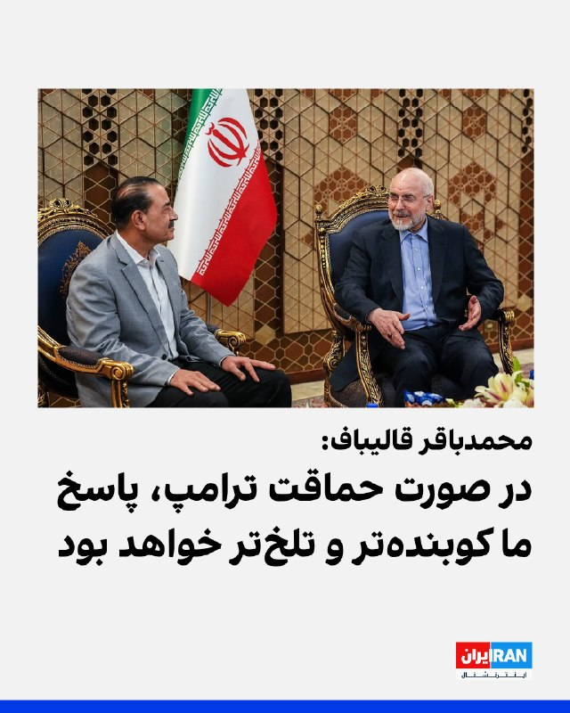

محمدباقر قالیباف، رییس مجلس جمهوری اسلامی، در دیدار با عاصم منیر، رییس ستاد کل ارتش پاکستان، گفت نیروهای مسلح جمهوری اسلامی در دوران آتش‌بس بازسازی شده‌اند و در صورت آغاز دوباره جنگ، واکنش ایران شدیدتر خواهد بود.

او گفت: «نیروهای مسلح ما در دوران آتش‌بس به نحوی خود را بازسازی کرده‌اند که در صورت حماقت ترامپ و آغاز مجدد جنگ، حتما برای آمریکا کوبنده‌تر و تلخ‌تر از روز اول جنگ خواهند بود.»

قالیباف با اشاره به نقش پاکستان در میانجی‌گری افزود: «در آتش‌بسی بودیم که شما واسطه‌اش بودید و آمریکا با نقص عهد، محاصره دریایی کرد و حالا به‌دنبال برداشتن آن است.»
https://iranintl.com/202605235817

## IranIntlTV — post 338569

  <a href="telegram/content/IranIntlTV_338569_1779541195.mp4" target="_blank">🎬 Download video</a>

مروری بر روزنامه‌های ایران، شنبه ۲ خرداد، با مجتبی هاشمی، روزنامه‌نگار
@iranintltv

## IranIntlTV — post 338568

  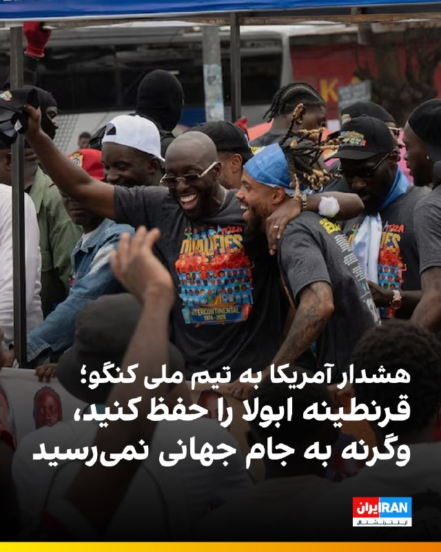

🔻آمریکا اعلام کرد تیم ملی کنگو پیش از ورود به جام جهانی باید به دلیل ابولا، قرنطینه شود. اندرو جولیانی، مدیر اجرایی کارگروه کاخ سفید برای جام جهانی، روز گذشته تایید کرد تیم ملی کنگو باید در اردوی خود در بلژیک یک «حباب» بهداشتی را حفظ کند وگرنه ممکن است از ورود به آمریکا منع شود.

🔹جمهوری دموکراتیک کنگو نخستین بازی خود در جام جهانی ۲۰۲۶ را ۲۷ خرداد در هیوستون برابر پرتغال برگزار می‌کند، اما به دلیل شیوع ابولا در کنگو، اعضای تیم ملی فوتبال این کشور باید پیش از ورود به ایالات متحده برای حضور در جام جهانی، در قرنطینه بمانند.

🔹جولیانی به ای‌اس‌پی‌ان گفت: «به‌طور کاملا روشن به کنگو گفته‌ایم باید یکپارچگی حباب خود را به مدت ۲۱ روز حفظ کند تا سپس بتواند ۱۱ ژوئن (۲۱ خرداد) به هیوستون بیاید. همچنین به دولت کنگو به‌وضوح اعلام کرده‌ایم که باید این حباب را حفظ کند، در غیر این صورت ممکن است نتواند به آمریکا سفر کند. روشن‌تر از این نمی‌توانیم بگوییم.»

🔹تمام اعضای تیم کنگو، به همراه سباستین دزابره، سرمربی فرانسوی تیم، اکنون خارج از این کشور مستقر هستند.

🔹جزییات بیشتر را در سایت بخوانید.

@iranintltvsport

## IranIntlTV — post 338567

  <a href="telegram/content/IranIntlTV_338567_1779541198.mp4" target="_blank">🎬 Download video</a>

بر اساس گزارش شرکت کپلر، با توجه به مختل شدن امکان صادرات، میزان بارگیری نفت خام ایران نسبت به پیش از محاصره دریایی آمریکا، حدود یک‌ونیم میلیون بشکه در روز کاهش یافته است.

گفت‌وگو با عطا حسینیان، روزنامه‌نگار اقتصادی و حوزه انرژی
@iranintltv

## IranIntlTV — post 338566

  <a href="telegram/content/IranIntlTV_338566_1779541200.mp4" target="_blank">🎬 Download video</a>

یک شهروند روز شنبه دوم خردادماه با ارسال ویدیوی به ایران اینترنشنال گسترش و پخش دود آلاینده پتروشیمی شازند به طبیعت اطراف را نشان می‌دهد.

## ManotoTV — post 105761

  <a href="telegram/content/ManotoTV_105761_1779541202.mp4" target="_blank">🎬 Download video</a>

شیخ تمیم بن حمد آل ثانی، امیر قطر، در تماس تلفنی با دونالد ترامپ، رئیس‌جمهور آمریکا، درباره تنش‌های منطقه‌ای و ابتکارهای دیپلماتیکی که با محوریت پاکستان برای جلوگیری از تشدید بحران در حال انجام است، گفت‌وگو کرده است.
در این تماس، دو طرف تلاش‌ها برای کاهش تنش‌ها و حفظ ثبات منطقه را بررسی کردند و بر حمایت از میانجی‌گری پاکستان میان ایالات متحده و جمهوری‌اسلامی تاکید شد.
همچنین در این گفت‌وگو بر اهمیت ادامه مذاکرات و گفت‌وگوهای دیپلماتیک برای حل مسائل جاری، حفاظت از کشتیرانی دریایی و تضمین امنیت مسیرهای راهبردی آبی تأکید شد؛ موضوعی که به ثبات بازار جهانی انرژی و زنجیره تأمین نیز مرتبط است.

## ManotoTV — post 105760

  <a href="telegram/content/ManotoTV_105760_1779541203.mp4" target="_blank">🎬 Download video</a>

بر اساس گزارشی که در روزنامه تایمز منتشر شده، یک تحقیق مخفیانه نشان می‌دهد یک شبکه مرتبط با جمهوری‌اسلامی از طریق تلگرام تلاش کرده شهروندان بریتانیایی را برای سازماندهی تجمعات خیابانی ضد اسرائیلی و پخش پوسترهای تبلیغاتی جذب کند.
در این گزارش آمده است که خبرنگار تایمز به‌صورت مخفیانه وارد ارتباط با فردی شده که خود را «مهدی» معرفی کرده و مدعی بوده در ایران مستقر است و با ساختارهای امنیتی جمهوری‌اسلامی در ارتباط است. این فرد در پیام‌های خود پیشنهاد پرداخت پول در ازای سازماندهی تجمع، جذب افراد جدید و اجرای فعالیت‌های تبلیغاتی در لندن را مطرح کرده است.
همچنین از این خبرنگار خواسته شده ابتدا برای اثبات اعتماد، اقدام به نصب پوستر در خیابان‌های لندن و فیلم‌برداری از آن کند. این پوسترها شامل پیام‌های سیاسی علیه اسرائیل بوده است.
در ادامه، درخواست‌هایی برای گسترش فعالیت و حتی طراحی پروژه‌های آنلاین نیز مطرح شده و در نهایت حساب تلگرامی مربوطه به‌طور ناگهانی حذف شده است.

## ManotoTV — post 105759

  <a href="telegram/content/ManotoTV_105759_1779541203.mp4" target="_blank">🎬 Download video</a>

در حالی‌که برخی مقام‌های آمریکایی از احتمال توقف موقت فروش تسلیحات به تایوان به دلیل نیاز ارتش آمریکا در عملیات علیه ایران خبر داده بودند، یک منبع آگاه رویترز این ادعا را رد کرد و گفت این روند کاملاً طولانی‌مدت و اداری است و ارتباطی با جنگ ایران ندارد.
بر اساس این گزارش، تایوان همچنان منتظر تأیید بسته تسلیحاتی تا سقف ۱۴ میلیارد دلار از سوی آمریکا است. این در حالی است که چین به‌شدت با فروش سلاح به تایوان مخالفت کرده و آن را اقدامی علیه حاکمیت خود می‌داند.
کاخ سفید اعلام کرده تصمیم نهایی درباره این بسته در آینده نزدیک گرفته خواهد شد، اما سیاست کلی آمریکا در حمایت از توان دفاعی تایوان بدون تغییر باقی مانده است. تایوان نیز می‌گوید هیچ اطلاع رسمی از تعلیق یا تأخیر در این روند دریافت نکرده است.

## ManotoTV — post 105758

  <a href="telegram/content/ManotoTV_105758_1779541204.mp4" target="_blank">🎬 Download video</a>

بر پایه گزارش رسانه‌های حکومتی، محمدباقر قالیباف، رئیس مجلس شورای اسلامی و رئیس هیئت مذاکره کننده نظام در مذاکرات با آمریکا به میزبانی اسلام‌آباد در دیدار با فیلد مارشال عاصم منیر، فرمانده ارتش پاکستان تهدید کرده: «در صورت حماقت ترامپ و آغاز مجدد جنگ، پاسخ ما کوبنده‌تر خواهد بود» قالیباف همچنین گفته در آتش‌بس بودیم که آمریکا «با نقض عهد، محاصره دریایی کرد و حالا به دنبال برداشتن آن است»

## ManotoTV — post 105757

  <a href="telegram/content/ManotoTV_105757_1779541205.mp4" target="_blank">🎬 Download video</a>

مجتبی خامنه‌ای، رهبر مشاهده نشده جمهوری‌اسلامی، در ادامه سنت مورد علاقه پدرش، علی خامنه‌ای، با انتشار پیامی نوشتاری درگذشت «والده» رئیس‌جمعیت هلال‌احمر جمهوری‌اسلامی، پیرحسین کولیوند را تسلیت گفت. علی‌ خامنه‌ای به انتشار پیام‌های تسلیت برای شخصیت‌های گوناگون و بستگان و اعضای خانواده آن‌ها علاقه بسیار داشت.

## FarsiVOA — post 218427

  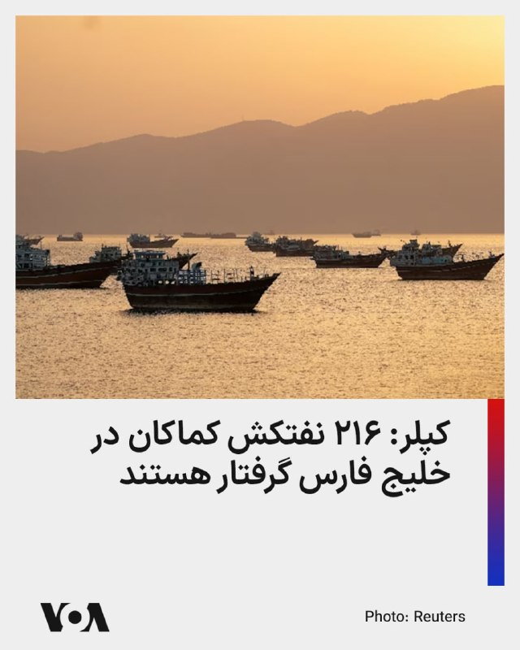

شرکت اطلاعات کالا، کپلر، می‌گوید کماکان ۲۱۶ نفتکش به خاطر ادامه انسداد تنگه هرمز توسط جمهوری اسلامی در خلیج فارس گرفتار هستند.

طبق ارزیابی کپلر، این نفتکش‌ها معادل تقریباً ۴ درصد از کل ظرفیت ناوگان نفتکش‌های جهان است و تردد کشتی‌‌ها در تنگه هرمز کماکان ۹۵ درصد نسبت به دوران قبل از انسداد تنگه هرمز افت داشته است.

پیشتر سازمان بین‌المللی دریانوردی از گرفتاری ۲۰ هزار خدمه در آبهای جنوب ایران خبر داده و گفته بود در حملات گسترده جمهوری اسلامی به کشتی‌ها، ۱۱ خدمه جان باخته‌اند. بر اساس این گزارش بیش از یک‌هزار و ۵۰۰ شناور، از جمله ۶۰۰ کشتی باری و نفتکش بزرگ در خلیج فارس گرفتار شده‌اند.
@FarsiVOA

## FarsiVOA — post 218426

🔺انتقاد وزیر خارجه قطر از عراقچی: بستن تنگه هرمز بحران را عمیق‌تر می‌کند

◾️وزیر خارجه قطر در تماس با عباس عراقچی، ضمن حمایت از تلاش‌ها برای دستیابی به توافقی جامع برای پایان بحران، هشدار داده است که بستن تنگه هرمز یا استفاده از آن به‌عنوان ابزار فشار، بحران را عمیق‌تر کرده و منافع حیاتی کشورهای منطقه را تهدید می‌کند.

◾️این موضع در حالی مطرح می‌شود که قطر، همزمان با گفت‌وگو با تهران، در سطح منطقه‌ای نیز فعال است.

◾️وزیر خارجه قطر در تماس جداگانه با وزیر خارجه عربستان درباره میانجی‌گری پاکستان میان آمریکا و جمهوری اسلامی و هماهنگی برای کاهش تنش گفت‌وگو کرده است.

◾️دوحه همچنین با اردن و ترکیه درباره حمایت از تلاش‌های میانجی‌گرانه و جلوگیری از تشدید دوباره بحران رایزنی کرده است.

⬇️ بیشتر بخوانید:
https://ir.voanews.com/a/8153020.html

## FarsiVOA — post 218425

🔺مولوی عبدالحمید: مردم دولتی انتخاب کرده‌اند که اختیار ندارد

◾️مولوی عبدالحمید، با انتقاد از ساختار تصمیم‌گیری در جمهوری اسلامی گفت مردم می‌گویند دولتی انتخاب کرده‌اند که اختیار ندارد و در ایران، برخلاف بسیاری از کشورها، دولت نقشی مؤثر در سیاست‌های داخلی و خارجی ندارد.

◾️او افزود که تا زمانی که در قانون اساسی تغییر ایجاد نشود، هیچ‌کس نمی‌تواند اوضاع کشور را سامان بدهد.

◾️عبدالحمید از قطع اینترنت بین‌المللی نیز انتقاد کرد و آن را برای عموم مردم «آزاردهنده» خواند. او گفت اینترنت در عصر حاضر جزو نیازهای بشر است و بخش‌های مختلف زندگی ملت‌ها با آن گره خورده است.

⬇️ بیشتر بخوانید:
https://ir.voanews.com/a/8153019.html

## FarsiVOA — post 218424

  <a href="telegram/content/FarsiVOA_218424_1779541206.mp4" target="_blank">🎬 Download video</a>

انتشار سری جدید اسناد محرمانه «یوفو» توسط وزارت جنگ آمریکا؛

وزارت جنگ ایالات متحده در قالب برنامه‌ای تحت عنوان «پِرسو»، دومین بخش از اسناد محرمانه مربوط به پدیده‌های ناشناخته هوایی، یوفو، را برای دسترسی عموم منتشر کرد.

این برنامه وظیفه دارد سوابق مرتبط با حوادث هوایی توجیه‌نشده‌ای را که در طول مأموریت‌های نظامی مشاهده شده‌اند، از حالت طبقه‌بندی‌شده خارج کند.

جنجالی‌ترین بخش این اسناد، گزارش و تصاویر مربوط به شلیک و سرنگون کردن یک شیء پرنده ناشناس توسط جت جنگنده نیروی هوایی ارتش آمریکا است.

بخش دیگری از این اسناد فاش‌شده به حادثه‌ای در دسامبر ۲۰۱۹ در سواحل شرقی آمریکا اشاره دارد. این سند حاوی داده‌هایی است که به احتمال زیاد توسط سنسور مادون قرمزِ مستقر روی یکی از یگان‌های نظامی ایالات متحده ثبت شده است؛ یگانی که در آن زمان در محدوده تحت مسئولیت «فرماندهی شمالی ایالات متحده» فعالیت می‌کرده است.

این بسته اطلاعاتی شامل ده‌ها گزارش عملیاتی، مشاهدات خلبانان و مستنداتی است که ارتش آمریکا هنوز توضیح علمی یا مشخصی برای ماهیت آن‌ها ارائه نداده است.
@FarsiVOA

## DW_Farsi — post 125050

🔶 آمریکا قوانین درخواست "گرین‌کارت" را سخت‌تر کرد

بر اساس تصمیم دولت آمریکا، متقاضیان دریافت اقامت دائم در ایالات متحده در آینده عمدتا باید از خارج از این کشور اقدام کنند.

در دستورالعملی که از سوی اداره مهاجرت صادر شده آمده است، افرادی که می‌خواهند برای دریافت گرین‌کارت و در نتیجه اقامت دائم درخواست بدهند، باید معمولاً از روند کنسولی در کشور خود استفاده کنند. دولت آمریکا با این اقدام عملاً موانع بیشتری بر سر راه دریافت گرین‌کارت ایجاد کرده است.

تا کنون گردشگران، دانشجویان یا دیگر افرادی که دارای مجوز اقامت محدود در آمریکا بودند، تحت شرایطی می‌توانستند در داخل ایالات متحده نیز برای دریافت گرین‌کارت اقدام کنند.
@dw_farsi

## DW_Farsi — post 125049

  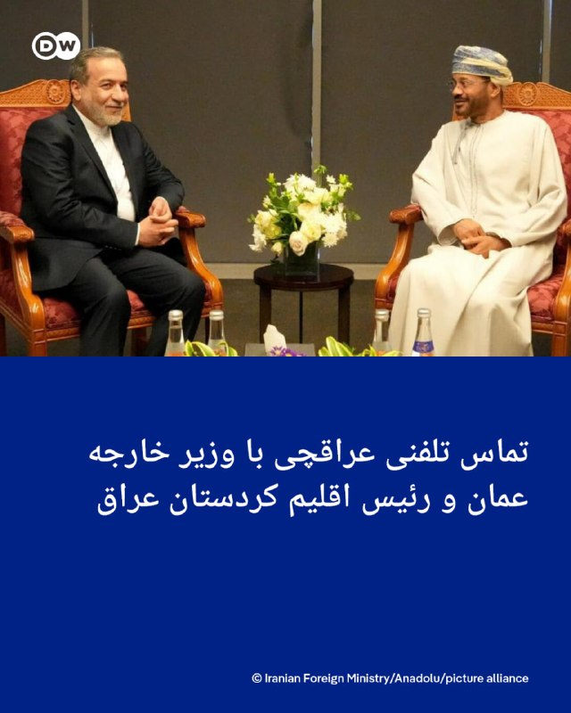

🔶 تماس تلفنی عراقچی با وزیر خارجه عمان و رئيس اقلیم کردستان عراق

وزارت خارجه ایران صبح روز شنبه ۲ خرداد (۲۳ مه) اعلام کرد که عباس عراقچی، وزیر خارجه، در تماس تلفنی با بدر بن حمد البوسعیدی، همتای عمانی خود درباره تلاش‌های دیپلماتیک جاری برای جلوگیری از تشدید تنش‌ها گفت‌وگو کرده است.

در این گفت‌وگو، دو طرف درباره ادامه روند دیپلماسی و راه‌های کاهش تنش در منطقه تبادل نظر کردند.

وزارت خارجه ایران درباره جزئیات این گفت‌وگو توضیح بیشتری ارائه نکرده است. در روزهای گذشته گزارش‌هایی منتشر شده مبنی بر اینکه ایران قصد دارد در رایزنی با مقامات عمانی درباره موضوعاتی، از جمله بسته‌شدن تنگه هرمز و دریافت عوارض احتمالی گفت‌وگو کند.

عراقچی همچنین در تماس تلفنی جداگانه با نچیروان بارزانی، رئیس اقلیم کردستان عراق، درباره مناسبات جمهوری اسلامی و اقلیم کردستان، از جمله مراودات اقتصادی و تجاری و تقویت هماهنگی‌ها برای حفظ امنیت مرزهای مشترک و "مقابله با تروریسم" گفت‌وگو کرد.

در این گفت‌وگو به علاوه، طرفین درباره تحولات منطقه‌ای تبادل نظر کردند.

بر اساس گزارش‌ها، ایران در جریان جنگ با اسرائيل و آمریکا و همچنین پس از آن در دوره آتش‌بس شکننده، به‌طور مداوم برخی پایگاه‌ها در اقلیم کردستان عراق و محل استقرار گروه‌هایی از احزاب کرد ایرانی را هدف حملات موشکی و پهپادی قرار داده است.

@dw_farsi

## DW_Farsi — post 125048

🔶 خبرهای ضد و نقیض درباره بسته‌شدن آسمان غرب ایران

سازمان هواپیمایی کشوری ایران با صدور "نوتام" یا اطلاعیه هشدار اعلام کرد که فرودگاه‌های بخش غربی کشور تا ساعت ۱۲ روز دوشنبه (۵ خرداد ۱۴۰۵) با محدودیت‌های عملیاتی و تعطیلی مواجه هستند.

نوتام به منظور اطلاع‌رسانی به خلبانان و شرکت‌های هواپیمایی درباره خطرات احتمالی، محدودیت‌های مسیر، بسته‌شدن حریم هوایی یا هر شرایطی صادر می‌شود که می‌تواند بر ایمنی پرواز تاثیر بگذارد.

بر اساس این اطلاعیه که در رسانه‌های ایران منتشر شده، این محدودیت‌ها از شامگاه جمعه ۱ خرداد (۲۲ مه) آغاز شده و تا ساعت هشت و ۳۰ دقیقه به وقت جهانی یا ساعت ۱۲ دوشنبه به وقت تهران ادامه خواهد داشت. در این مدت، تمامی فرودگاه‌های غرب کشور به‌طور کامل بسته هستند.

در اطلاعیه همچنین آمده است که فرودگاه‌های تبریز، کرمانشاه، اهواز، آبادان، شیراز، یزد، رشت و رامسر به‌صورت "مشروط و فقط در بازه زمانی طلوع تا غروب آفتاب" مجاز به فعالیت هستند.

طبق این دستورالعمل، تمامی مجوزهای پروازی قبلی در این مناطق لغو شده و شرکت‌های هواپیمایی موظف‌ هستند برای هرگونه پرواز غیرنظامی مجددا از سازمان هواپیمایی کشوری مجوز دریافت کنند.

@dw_farsi

## DW_Farsi — post 125047

🔶 پوتین حمله به خوابگاه را "تروریستی" خواند؛ اوکراین رد کرد

ولادیمیر پوتین، رئیس جمهور روسیه، روز جمعه ۲۲ مه (اول خرداد) پس از حمله احتمالی به یک خوابگاه دانشجویی در منطقه لوهانسک تحت اشغال روسیه، این حمله را "اقدامی تروریستی" توصیف کرد. به گفته او، دست‌کم شش نفر کشته، ۳۹ نفر زخمی و ۱۵ نفر مفقود شده‌اند.

طبق اعلام روسیه، ساختمان یک مدرسه فنی و حرفه‌ای در شهر استاروبیلسک، شامگاه پنجشنبه گذشته هدف حمله یک پهپاد اوکراینی قرار گرفته است.

امکان راستی‌آزمایی مستقل این اطلاعات وجود ندارد. همچنین درباره شمار قربانیان و مفقودان در این خوابگاه نیز اطلاعات تأییدشده‌ای در دست نیست. پوتین، ضمن وعده کمک به آسیب‌دیدگان، از وزارت دفاع روسیه خواسته است تا پیشنهادهایی را برای واکنش به این حادثه آماده کند.

@dw_farsi

## DW_Farsi — post 125046

  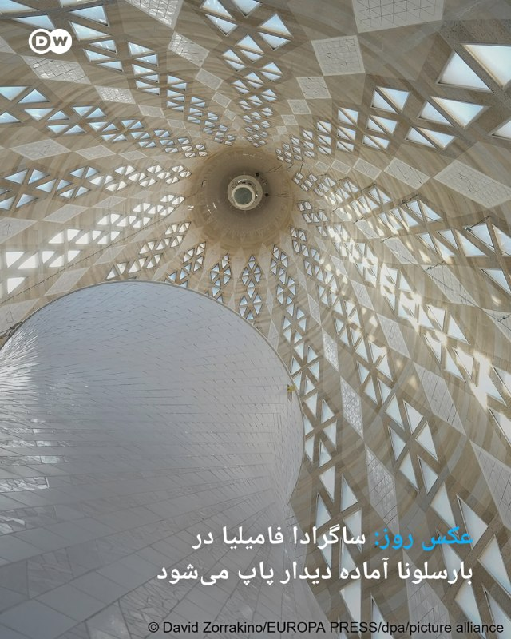

📸 عکس روز: ساگرادا فامیلیا در بارسلونا آماده دیدار پاپ می‌شود

کلیسای ساگرادا فامیلیا (خانواده مقدس) در بارسلونا که شاهکار ناتمام آنتونی گائودی، معمار برجسته کاتالان است می‌رود تا پذیرای پاپ لئو، رهبر کاتولیک‌های جهان شود که قرار است در ۱۰ ژوئن در سردابه این بنا بر مزار گائودی دعا بخواند. این تصویر برج اصلی کلیساست که اکنون تقریبا به شکل نهایی خود رسیده است.

@dw_farsi

## Persian_Trend_Official — post 14724

  <a href="telegram/content/Persian_Trend_Official_14724_1779541210.webm" target="_blank">🎬 Download video</a>

یارو میگه تمام نیازهای جامعه در شبکه داخلی برآورده میشه و نیازی به اینترنت نیست.‌ بعد توی توییتر داره اینو میگه. 😐

‏همون‌طور که آپارات جای یوتیوب رو نگرفت، بله هم جای واتساپ رو نخواهد گرفت. (تلگرام رو نگفتم که بهش توهین نشه)

📝 Nick

📌 @persian_trend_official
پرشین ترند | متفاوت‌ترین کانال نظامی

## Persian_Trend_Official — post 14723

  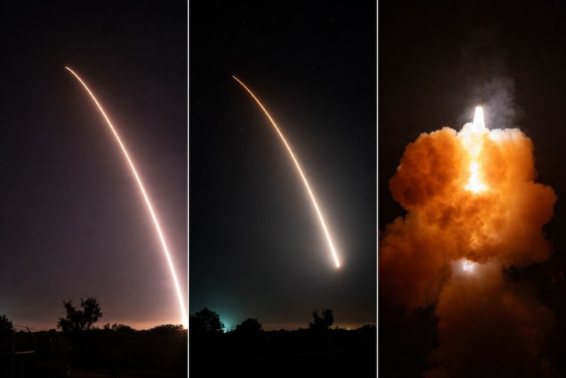

🇺🇸 
🌟نیروی فضایی ایالات متحده بامداد ۲۰ مه یک موشک بالستیک قاره‌پیمای بدون کلاهک مینوت‌من III را در قالب آزمایش «Glory Trip 256» از پایگاه فضایی وندنبرگ در کالیفرنیا با موفقیت پرتاب کرد.

🚀این پرتاب ساعت ۱۲:۰۱ به وقت اقیانوس آرام و تحت نظارت اسکادران آزمایش پرواز ۵۷۶ انجام شد. به گفته مقام‌های آمریکایی، آزمایش شبانه عملکرد سامانه‌های پیشرانش، هدایت و بازگشت موشک را ارزیابی کرده و آمادگی عملیاتی نیروهای مسئول را نیز به نمایش گذاشته است.
نیروی فضایی آمریکا تأکید کرد این مأموریت از سال‌ها قبل برنامه‌ریزی شده و ارتباطی با تنش‌های ژئوپولیتیکی اخیر ندارد. داده‌های به‌دست‌آمده از این آزمایش قرار است در روند نوسازی زرادخانه موشکی آمریکا و توسعه موشک نسل جدید LGM-35A Sentinel مورد استفاده قرار گیرد.

👩‍💻@PhantomDirective

🆔@persian_trend_official
پرشین ترند | متفاوت‌ترین کانال نظامی

## Persian_Trend_Official — post 14722

  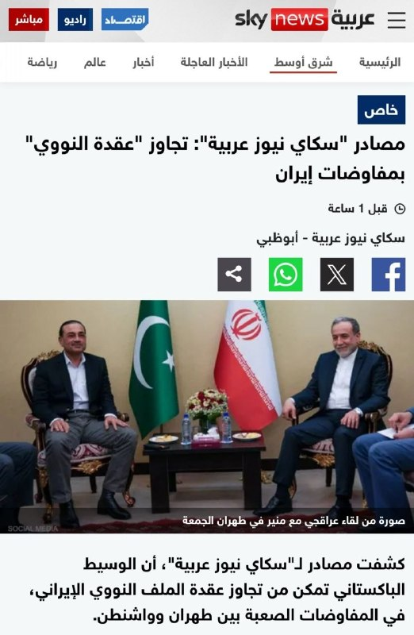

♦️ ادعای اسکای‌نیوز عربی: میانجی پاکستانی موفق شده بر مانع اصلی پرونده هسته‌ای ایران در مذاکرات دشوار بین تهران و واشنگتن غلبه کند.

👩‍💻@PhantomDirective

🆔 @persian_trend_official
پرشین ترند | متفاوت‌ترین کانال نظامی

## RadioFarda — post 157483

پاراگراف اول؛ جنگ، گذار و رقابت شرق و غرب؛ جمهوری اسلامی در پی بقا

🔸جنگ آمریکا و اسرائیل با ایران تمام شده یا فقط شکل آن تغییر کرده است؟ در تهران هنوز از «پیروزی» صحبت می‌شود، در اسرائیل از «بازدارندگی»، در واشینگتن از «مهار» و در پکن و مسکو از «خویشتن‌داری». اما پشت این ادعاها و واژه‌های دیپلماتیک، پرسشی جدی‌تر در حال شکل‌گیری است؛ این‌که ایران پس از این جنگ دقیقاً در کجای جهان امروز ایستاده است؟

🔸آیا چین و روسیه واقعاً در کنار جمهوری اسلامی ایستادند یا صرفاً مراقب بودند موازنهٔ قدرت به‌هم نخورد؟ چرا مسکو و پکن، برخلاف انتظار تهران، وارد یک حمایت تمام‌قد نشدند؟ آیا جمهوری اسلامی ایران برای آن‌ها یک شریک راهبردی است یا تنها بخشی از بازی بزرگ‌ترشان با ایالات متحده؟

🔸در همین حال، کشورهای عربی منطقه نیز آرام‌آرام در حال بازتنظیم روابط خود هستند؛ از عربستان تا امارات و قطر. منطقه‌ای که زمانی در قالب دوگانه‌هایی چون «محور مقاومت» و «پیمان‌های دوستی» تعریف می‌شد، اکنون وارد مرحله‌ای پیچیده‌تر شده است؛ جایی که بازیگران هم‌زمان با تهران گفت‌وگو می‌کنند، با واشینگتن معامله می‌کنند و در عین حال نسبت به اسرائیل نیز حساس و نگران‌اند.

🔸در این میان، آیا جمهوری اسلامی ایران پس از این جنگ ضعیف‌تر شده یا وابسته‌تر؟ آیا اسرائیل در حال تعریف نسخه‌ای جدید از بازدارندگی در خاورمیانه است؟ و آیا ایران وارد دوره‌ای از «تنهایی راهبردی» شده است؛ جایی که حتی نزدیک‌ترین متحدانش نیز حاضر نیستند هزینهٔ رویارویی مستقیم را برای آن بپردازند؟

🔸در برنامهٔ رادیویی «پارارگراف اول»، حمیدرضا عزیزی، پژوهشگر غیرمقیم در شورای خاورمیانه در امور جهانی و پژوهشگر حوزهٔ بین‌الملل از برلین، در کنار محسن صلح‌دوست، استادیار روابط بین‌الملل در دانشگاه چینی-بریتانیایی شیان جیائوتونگ-لیورپول از شهر سوجو، به شکل‌گیری یک خاورمیانهٔ جدید در دورهٔ گذار نظام بین‌الملل و موقعیت ایران برای هر کدام از بازیگران پرداخته‌اند.

🔸 گزارش کامل را در وب‌سایت رادیوفردا بخوانید.

@RadioFarda

## RadioFarda — post 157482

آیا هوش مصنوعی آثار نویسنده برنده نوبل را می‌نویسد؟

🔸اظهارات اخیر اولگا توکارچوک، نویسندهٔ برندهٔ نوبل ادبیات، دربارهٔ هوش مصنوعی و استفاده از این ابزار مدرن برای نوشتن، بحث‌هایی را در محافل ادبی، رسانه‌ها و شبکه‌های اجتماعی پیرامون حد و حدود مداخلهٔ هوش مصنوعی در خلق ادبی به راه انداخته است.

🔸در سال ۲۰۱۸، توکارچوک پانزدهمین زنی بود که به دریافت نوبل ادبیات نائل شد و از آن زمان تاکنون میلیون‌ها نسخه از آثارش در سراسر جهان فروش رفته و کتاب‌هایش به بیش از ۴۰ زبان از جمله فارسی ترجمه شده‌اند.

🔸این نویسنده دربارهٔ هوش مصنوعی چه گفت و اساساً نویسندگان بزرگ جهان با هوش مصنوعی چگونه تعامل می‌کنند؟

🔸اظهارات اولگا توکارچوک که روز ۲۹ اردیبهشت در پنلی در کنفرانس ایمپکت در شهر پوزنان لهستان بیان شد، بار دیگر این نویسندهٔ برجستهٔ لهستانی را در مرکز یک جنجال فرهنگی قرار داد.

🔸رویداد ایمپکت (Impact) در پوزنان از بزرگ‌ترین رویدادهای تجاری در لهستان است.

🔸برگزارکنندگان این رویداد سال‌ها است که بر رویکردی چندرشته‌ای نسبت به جهان تأکید دارند و در مجموعه‌ای از مناظره‌ها، پنل‌ها و مصاحبه‌ها، در کنار شناخته‌شده‌ترین کارآفرینان، هنرمندان، نویسندگان، بازیگران، کارگردانان و برندگان جایزهٔ نوبل نیز دیدگاه‌های خود را دربارهٔ جهان مطرح می‌کنند.

🔸 گزارش کامل را در وب‌سایت رادیوفردا بخوانید.

@RadioFarda

## RadioFarda — post 157481

دادگاه برای شش متهم پرونده اکباتان حکم صادر کرد؛ قوه قضاییه: پرونده هنوز باز است

🔸سه روز پس از انتشار خبر صدور حکم قطعی برای متهمان «پرونده شهرک اکباتان»، قوه قضاییه در اطلاعیه‌ای رسمی می‌گوید که پرونده این افراد در دادگاه انقلاب «هنوز مفتوح است».

🔸وب‌سایت خبری امتداد در داخل ایران و گروه حقوق بشری هرانا، مستقر در آمریکا، روز چهارشنبه، ۳۰ اردیبهشت، خبر دادند که دادگاهی در تهران حکم جدید متهمان پرونده موسوم به «اکباتان» را صادر کرده که بر اساس آن سه تن از آنها تبرئه شده‌اند.

🔸بر اساس این حکم جدید، سه تن دیگر از این متهمان بازداشت‌شده در اعتراضات سال ۱۴۰۱ هم به پرداخت دیه و پنج سال حبس محکوم شدند.

🔸هر شش متهم این پرونده به اتهام نقش داشتن در کشته شدن آرمان علی‌وردی، از نیروهای بسیج، قبلا به اعدام محکوم شده بودند، اما دیوان عالی کشور این احکام را لغو کرد.

🔸حال قوه قضاییه جمهوری اسلامی در اطلاعیه‌ای رسمی که روز شنبه، دوم خردادماه، منتشر کرد می‌گوید که حکم صادره به دادگاه کیفری تعلق دارد، و پرونده این افراد «در دادگاه انقلاب... هم‌چنان مفتوح بوده و در آستانه صدور رأی است».
قوه قضاییه در ادامه ادعا کرده است که این اطلاعیه حاوی پاسخ به «انتقادات» در مورد پرونده آرمان علی‌وردی است، انتقاداتی چون این که چرا «قاتلان آرمان علی‌وردی اعدام نشدند» و «رای صادره صرفا به دیه و حبس منتهی شده است».

🔸در اطلاعیه رسمی نیامده است که این منتقدان چه کسانی هستند و ایرادات‌شان به صدور حکم در کجا آمده است.

🔸 گزارش کامل را در وب‌سایت رادیوفردا بخوانید.

@RadioFarda

## RadioFarda — post 157480

تایوان: چین پس از دیدار ترامپ و شی بیش از صد شناور در منطقه مستقر کرد

🔸 رئیس دستگاه امنیتی تایوان روز شنبه گفت چین بیش از صد شناور نیروی دریایی، گارد ساحلی و دیگر شناورها را در آب‌های منطقه‌ای از دریای زرد تا دریای جنوبی چین و غرب اقیانوس آرام مستقر کرده است.

🔸 جوزف وو، دبیرکل شورای امنیت ملی تایوان، در شبکه اجتماعی ایکس نوشت این استقرار در چند روز گذشته، پس از دیدار دونالد ترامپ، رئیس‌جمهور آمریکا، با همتای چینی‌اش شی جین‌پینگ در پکن انجام شده است.

🔸 او روز شنبه دوم خرداد در این پیام نوشت که چین در روزهای اخیر بیش از صد کشتی در امتداد «زنجیرهٔ نخست جزایر»، از ژاپن تا تایوان و فیلیپین، مستقر کرده و پکن را به برهم زدن وضع موجود و تهدید صلح و ثبات منطقه‌ای متهم کرد.

🔸 چین جزیره تایوان را بخشی از قلمرو خود می‌داند و تهدید کرده است که برای تصرف آن از زور استفاده خواهد کرد.

🔸 یک مقام امنیتی تایوان به شرط فاش نشدن نام خود به خبرگزاری فرانسه گفت شناورهای چینی پیش از نشست پکن شناسایی شده بودند، اما شمار آن‌ها در روزهای اخیر از صد فروند فراتر رفته است.

🔸گزارش کامل را در وب‌سایت رادیو فردا می‌توانید بخوانید.

@RadioFarda

## RadioFarda — post 157479

  <a href="https://t.me/radiofarda/157479" target="_blank">📎 Download file</a>

📻بشنوید: ساعت ۱۴ با رادیوفردا، دوم خرداد ۱۴۰۵‌

@Radiofarda

## RadioFarda — post 157478

  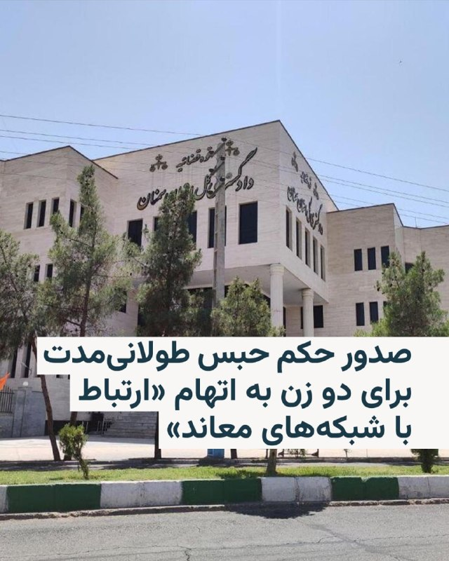

🔸رئیس کل دادگستری استان سمنان از صدور حکم حبس طولانی‌مدت برای دو متهمی خبر داد که به گفته او «در راستای اهداف سرویس‌های جاسوسی آمریکایی-صهیونیستی فعالیت می‌کردند».

🔸لیلا رمضانی و فاطمه ملک‌احمدی به ترتیب به حبس‌های ۲۶ و ۲۷ سال و همین طور «انفصال از کلیه خدمات دولتی و ممنوعیت مطلق خروج از مرزهای کشور» محکوم شده‌اند.

🔸به گزارش خبرگزاری ایسنا به نقل از مقام قضایی، این دو که اطلاعات دیگری از جمله سن و شغل درباره‌شان منتشر نشده به «برقراری ارتباط با شبکه‌های معاند و ارسال محتوای تصویری و اطلاعاتِ مورد نیازِ دشمن» متهم شده‌اند.

🔸رئیس کل دادگستری استان سمنان از این دو نفر به عنوان «مزدور» یاد کرده است.

🔸در بحبوحه حملات سنگین آمریکا و اسرائیل به ایران، تلویزیون جمهوری اسلامی بارها گزارش‌هایی از یورش مأموران حکومتی به خانه افرادی پخش کرد که گفته می‌شد از محل اصابت بمب‌ها ویدئو گرفته و برای رسانه‌های خارج از کشور ارسال کرده‌اند.

@RadioFarda

## IranianMinds — post 20605

  

🔴 فرانسه ورود بن گویر وزیر امنیت ملی اسرائیل به کشورش رو ممنوع کرد.

@IranianMinds

## IranianMinds — post 20604

🔴کانال ۱۱ اسرائیل گزارش داد:

اسرائیل هرگونه توافق با رژیم تروریستی اسلامی را به خروج اورانیوم غنی شده از ایران و نظارت دقیق بر برنامه هسته‌ای تهران مشروط می‌داند.

@IranianMinds

## IranianMinds — post 20603

  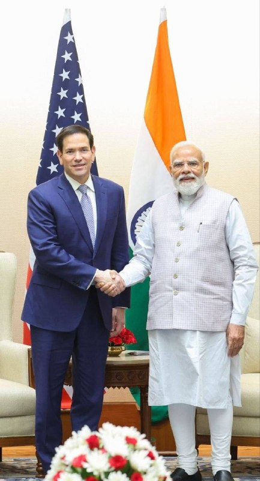

🔴 دیدار امروز مارکو روبیو و نخست وزیر هند

@IranianMinds

## IranianMinds — post 20602

🔴صدا و سیما:

عاصم منیر تهران را ترک کرد.

@IranianMinds

## IranianMinds — post 20601

  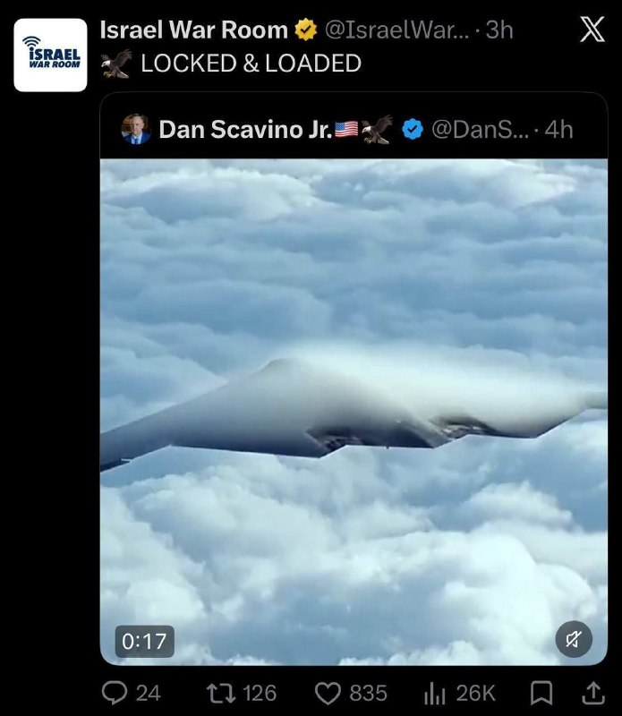

🔴اتاق جنگ اسرائیل این پست اخیر دن اسکاوینو را ریپست کرده.

@IranianMinds

## IranianMinds — post 20600

  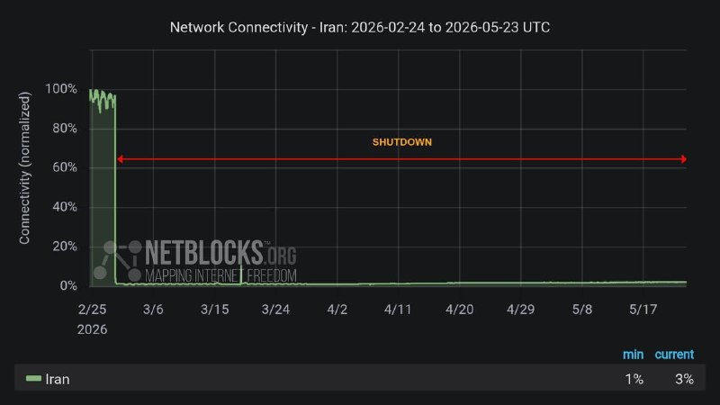

🔴نت‌بلاکس:

قطعی اینترنت در ایران وارد سیزدهمین هفته خود شده و بیش از ۲۰۱۶ ساعت است که کشور در انزوای دیجیتال از دنیای خارج قرار دارد.

@IranianMinds

## BBCPersian — post 281876

🔻پلی بر رودخانه سن در پاریس تبدیل به یک غار عظیم بادی شد.

فیلمبرداری به شیوه تایم‌لپس نشان می‌دهد که این پل چگونه به هیبت یک غار درمی‌آید.

«پونت نوف»، پل نهم سن در قرن ۱۷ ساخته شده است.

این اثر با عنوان «غار» کار هنرمند فرانسوی، ژان رنه، با نام مستعار جی‌آر، جدیدترین اثر از مجموعه‌ای از چیدمان‌های هنری در مقیاس بزرگ در پایتخت فرانسه است که ۱۲۰ متر طول و بین ۱۲ تا ۱۸ متر ارتفاع دارد.

جی‌آر به خبرگزاری آسوشیتدپرس گفت که این اثر «خشن و وحشی در کنار ظرافت لطیف» پاریس، ترس را در عین یک جذابیت ناشناخته القا می‌کند.

این غار از ۶ ژوئن/۱۶ خرداد به روی عموم باز می‌شود. این چیدمان تا ۲۸ ژوئن/ ۷ تیر برقرار خواهد بود.

🎥APTN
@BBCPersian

## BBCPersian — post 281875

🔻فرمانده کل قوای پاکستان تهران را ترک کرد

فیلد مارشال عاصم منیر، فرمانده کل ارتش و نیروهای مسلح پاکستان، پس از سفری یک روزه به تهران ایران را ترک کرد.

به گزارش ایرنا، او «با همراهی محسن نقوی، وزیر کشور پاکستان که از هفته گذشته در تهران به سر می‌برد، تهران را ترک کردند.»

آقای منیردر این سفر با محمدباقر قالیباف، رئیس مجلس، مسعود پزشکیان، رئیس جمهور و عباس عراقچی، وزیر خارجه دیدار و گفتگو کرد.

این دومین سفر آقای منیر در چند هفته گذشته به ایران است.

پاکستان میانجی مذاکرات ایران و آمریکا است.

https://bbc.in/4uXuJ2G
@BBCPersian

## BBCPersian — post 281874

  <a href="telegram/content/BBCPersian_281874_1779541216.mp4" target="_blank">🎬 Download video</a>

پنتاگون مجموعه‌ای تازه از اسناد مربوط به اشیای ناشناس پرنده را منتشر کرده که شامل مدارک، فایل‌های صوتی و ۵۱ ویدیو از مشاهدات این اشیا در طول بیش از ۸۰ سال گذشته و از جمله در ایران و سوریه است.
 
در این گزارش‌ها، شاهدان از دیدن گوی‌ها، دیسک‌ها و توپ‌های آتشین از دهه ۱۹۴۰ تا امروز خبر داده‌اند. در یکی از جدیدترین موارد، یک مقام ارشد اطلاعاتی آمریکا گفته در سال ۲۰۲۵ داخل بالگرد نظامی، تعداد زیادی گوی نارنجی را دیده که با سرعت بالا در همه جهات حرکت می‌کردند و حتی برای لحظاتی به شکل یک مثلث کنار هم قرار گرفتند و سپس ناپدید شدند. این پدیده بیش از یک ساعت ادامه داشته است.
  
دونالد ترامپ، رییس جمهور آمریکا پس از انتشار این اسناد گفت: «با این مدارک و ویدیوها، مردم خودشان می‌توانند تصمیم بگیرند که واقعا چه خبر است». پنتاگون اعلام کرده انتشار فایل‌های مربوط به اشیای ناشناس پرنده ادامه خواهد داشت و اسناد بیشتری به‌زودی منتشر می‌شود.

@bbcpersian

## BBCPersian — post 281873

  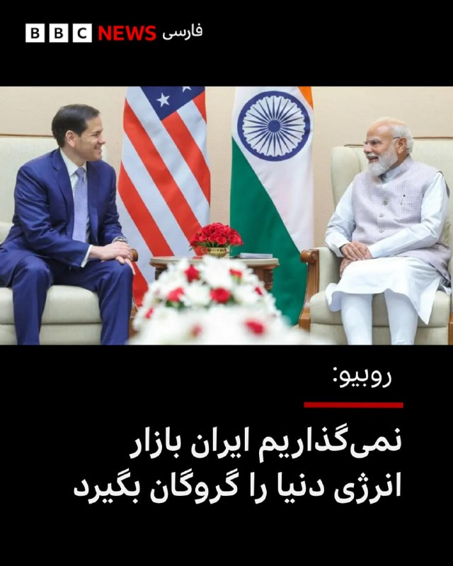

🔻مارکو روبیو، وزیر خارجه آمریکا، که برای سفری چهار روزه در هند است با نارندرا مودی، نخست‌وزیر، دیدار و گفت‌وگو کرد.

آقای روبیو در این دیدار گفته است آمریکا اجازه نمی‌دهد که ایران بازار انرژی در دنیا را به «گروگان» بگیرد.

او همچنین بر اهمیت همکاری راهبردی هند و آمریکا در منطقه اقیانوس‌های هند و آرام تاکید کرد.

به گفته سفیر آمریکا در هند، آقای روبیو به نمایندگی از دونالد ترامپ، رئیس جمهور آمریکا، آقای مودی را برای یک سفر رسمی به آمریکا دعوت کرده است.

📸Indian Government
https://bbc.in/4us85PY
@BBCPersian

## BBCPersian — post 281872

  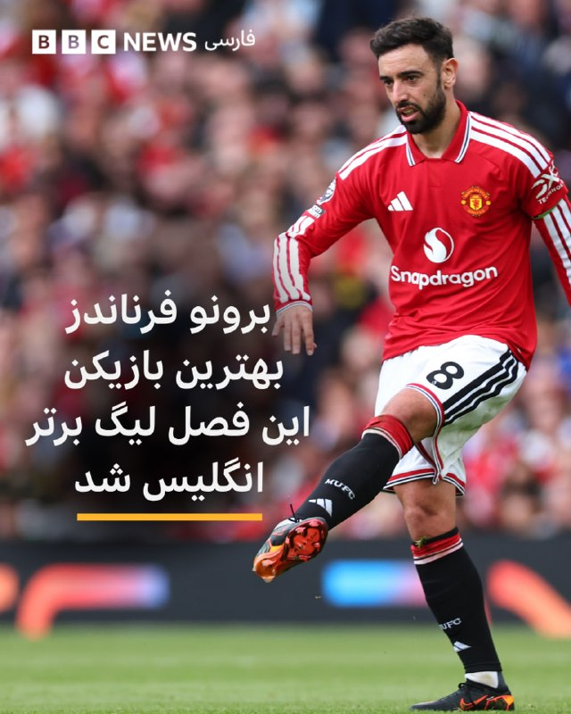

🔸برونو فرناندز، کاپیتان منچستریونایتد، به‌عنوان بهترین بازیکن فصل لیگ برتر انگلیس انتخاب شد.
این هافبک پرتغالی چند روز پیش جایزه انجمن نویسندگان فوتبال برای بهترین بازیکن مرد سال این لیگ را گرفته بود.
برونو فرناندز در دیدار هفته گذشته مقابل ناتینگهام فارست، با ثبت بیستمین پاس گل، با رکورد بیشترین پاس گل در یک فصل لیگ برتر مساوی کرد.
او این فصل در ۳۷ بازی، هشت گل به ثمر رسانده و نقش مهمی در رسیدن منچستریونایتد به جایگاه سوم لیگ و کسب سهمیه لیگ قهرمانان اروپا داشته است.
فرناندز در این فصل لیگ برتر با خلق ۱۳۲ موقعیت گل، بیش از هر بازیکن دیگری فرصت‌ ساخت، ۴۳ موقعیت بیشتر از نفر دوم، دومینیک سوبوسلای از لیورپول.

او نخستین بازیکن منچستریونایتد است که از سال ۲۰۱۱ این جایزه را به دست می‌آورد. در آن سال نمانیا ویدیچ این جایزه را برد.
برنده این جایزه از ترکیب آرای عمومی و هیئتی از کارشناسان فوتبال انتخاب می‌شود.
دیوید رایا، گابریل و دکلان رایس از آرسنال، ارلینگ هالند و آنتوان سمنیو از منچسترسیتی، ایگور تیاگو از برنتفورد و مورگان گیبز-وایت از ناتینگهام فارست نیز در فهرست نامزدهای نهایی بودند.
📸GettyImages
@BBCPersian

## BBCPersian — post 281871

🔻قالیباف: از حقوق ملت و کشورمان عدول نمی‌کنیم

پیشتر گزارش دادیم که فیلد مارشال عاصم منیر، فرمانده ارتش پاکستان، در تهران با محمدباقر قالیباف دیدار کرده است.
رسانه‌های ایران جزئیاتی از این دیدار را منتشر کردند.
رئیس مجلس ایران در این دیدار گفته استک «ما از حقوق ملت و کشورمان عدول نمی‌کنیم، مخصوصا با طرفی که اصلا صداقت نداشته و اعتمادی به او وجود ندارد.»

آقای قالیباف هچنین گفته است که «نیروهای مسلح ما در دوران آتش‌بس به نحوی خود را بازسازی کرده‌اند که در صورت حماقت ترامپ و آغاز مجدد جنگ، حتما برای آمریکا کوبنده‌تر و تلخ‌تر از روز اول جنگ خواهند بود.»
آتش‌بس کنونی بین ایران و آمریکا با میانجی‌گری پاکستان به دست آمد.

https://bbc.in/4v5Oh4Y
@BBCPersian

## BBCPersian — post 281870

🔻دادستان استان قزوین: اموال ۹۶ نفر توقیف شد

اموال ۹۶ نفر در استان قزوین توقیف شده است.

علی اصغر عسگری، دادستان عمومی و انقلاب استان قزوین این افراد را «مزدوران خارج‌نشین و داخل کشور» خواند و گفت که «برای سه نفر از این افراد به اتهام جاسوسی و برای شش نفر به اتهام انجام اقدام اطلاعاتی» کیفرخواست صادر شده است.

مقام‌های قضائی و امنیتی ایران در استان‌های مختلف در هفته‌های اخیر پی‌درپی از توقیف اموال افراد به اتهام‌های امنیتی خبر می‌دهند.

https://bbc.in/4tShXkW
@BBCPersian

## BBCPersian — post 281869

🔻سفر نخست‌وزیر پاکستان به چین

شهباز شریف برای سفری چهار روزه عازم چین شده است.

به گفته وزارت خارجه پاکستان، آقای شریف با شی جین‌پینگ و لی چانگ، رئیس‌جمهور و نخست‌وزیر چین، دیدار و کنفرانس سرمایه‌گذاری مشترک دو کشور را ریاست خواهد کرد.

جنگ آمریکا و اسرائیل با ایران یکی از محورهای گفت‌وگوی نخست‌وزیر پاکستان و رهبران چین است.

سخنگوی وزارت امور خارجه پاکستان دیروز گفت هدف اصلی این سفر تقویت روابط دوجانبه است اما بن‌بست فعلی خاورمیانه هم مطرح است.

طاهر اندرابی گفت که در بن‌بست فعلی خاورمیانه چین و پاکستان برای صلح از نزدیک همکاری کرده‌اند: ««ما بر سر پنج‌ اصل توافق کردیم و بیانیه مشترک منتشر شد. بنابراین بله، این موضوع در جریان سفر نخست‌وزیر بحث خواهد شد.»

اسماعیل بقایی، سخنگوی وزارت خارجه ایران، دیروز درباره سفر هیئت قطری به تهران گفت: «هیئتی از قطر مذاکراتی را با وزیر خارجه داشتند. امروز خیلی کشورها می‌خواهند به پایان جنگ کمک کنند اما میانجی رسمی مذاکرات همچنان پاکستان است.»

عاصم منیر، فرمانده کل ارتش و نیروهای مسلح پاکستان، دیروز وارد تهران شد و تا پاسی از شب با عباس عراقچی و اسکندر مومنی وزاری خارجه و کشور، دیدار کرد.

پیش از او محسن نقوی، وزیر کشور پاکستان، در تهران بود.

https://bbc.in/42R5yms
@BBCPersian

## BBCPersian — post 281868

  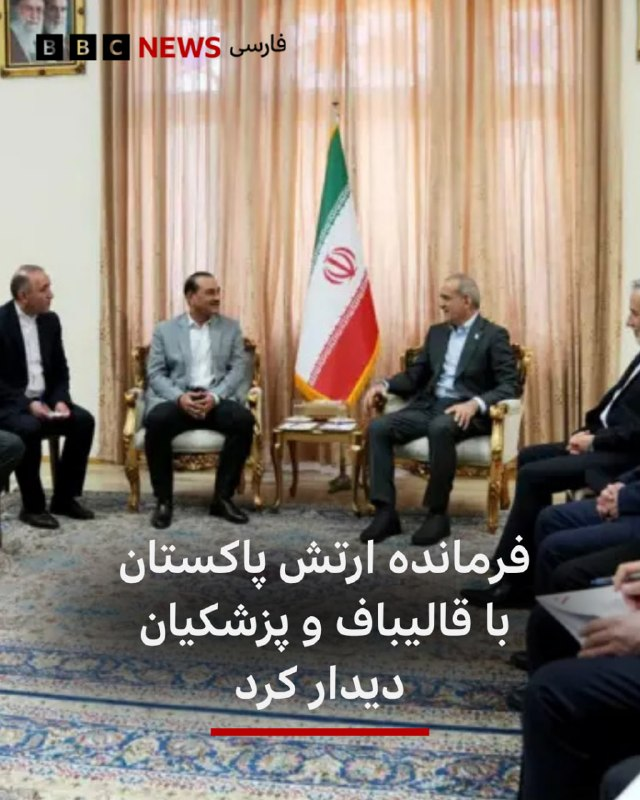

🔻فیلد مارشال عاصم منیر، فرمانده ارتش پاکستان، با محمدباقر قالیباف، رئیس مجلس و مسعود پزشکیان، رئیس‌جمهورایران دیدار و گفت‌و‌گو کرد.

این دومین سفر آقای منیر در چند هفته گذشته به ایران است.

آقای منیر شب گذشته با عباس عراقچی، وزیر خارجه هم دیدار و گفتگو کرد. به گفته منابع خبری ایران دیدار آنها تا پاسی از شب گذشته ادامه داشت.

پیش از عاصم منیر، محسن نقوی، وزیر کشور پاکستان هم برای دومین بار در چند روز گذشته به تهران رفته و با مقامات ایران گفت‌گو کرده بود.

پاکستان میانجی مذاکرات ایران و آمریکا است.

📸FARS
https://bbc.in/4uvWLm2
@BBCPersian

## BBCPersian — post 281867

  <a href="telegram/content/BBCPersian_281867_1779541220.mp4" target="_blank">🎬 Download video</a>

🔻‌دو کیف لوکس مصادره‌ شده از ترونگ مای‌ لان، سرمایه‌دار زندانی ویتنامی، در یک حراج دولتی با مجموع قیمتی بیش از ۵۳۵ هزار دلار فروخته شد.
هر دو کیف که از چرم کروکوریل بودند، طی تنها ۳۰ دقیقه مزایده فروخته شدند. یکی از کیف‌های سفید بیرکین از برند به تنهایی ۴۴۰ هزار دلار و دیگری حدود ۹۵ هزار دلار به فروش رفت.
این دو کیف بخشی از حدود ۱۲۰۰ دارایی توقیف‌ شده از خانم لان بودند. او در سال ۲۰۲۴ به اتهام کلاهبرداری چهل میلیارد دلاری از بانک تجاری سایگون در یک دوره ده ساله به اعدام محکوم شد. این حکم در ژوئن سال گذشته، پس از لغو مجازات اعدام برای برخی جرایم در ویتنام، به حبس ابد کاهش یافت.
در جریان دادگاه، او تلاش کرده بود که دو کیف هرمس خود را به‌عنوان یادگاری برای فرزندان و نوه‌هایش نگه دارد. او به دادگاه گفته بود یکی از کیف‌ها را در ایتالیا خریده و دیگری را به‌عنوان هدیه از یک تاجر مالزیایی دریافت کرده است. دادگاه درخواست او را رد کرد.
کیف‌های بیرکین، یکی از لوکس‌ترین محصولات هرمس، گاهی ارزشی در حد صدها هزار دلار دارند.

https://bbc.in/3RhF239
@BBCPersian

## Dirty_Kids — post 390011

  <a href="telegram/content/Dirty_Kids_390011_1779541223.mp4" target="_blank">🎬 Download video</a>

رسانه‌های ایران نوشتند سفارت آمریکا به درخواست ویزای شجاع خلیل‌زاده جواب منفی داده و او نمی‌تواند به جام جهانی برود. خلیل‌زاده هرشب در تجمعات سپاهی‌ها حضور داشت و مثلا گفته بود «رهبر شهید افتخار ایران هستند.» حالا می‌تواند برگردد کنار رهبر شهیدش استراحت کند، البته در یخچال.

@Dirty_Kids 👻

## Hranews — post 113110

به اتهام “همکاری با شبکه‌های معاند”؛ دو زن مجموعا به ۵۳ سال حبس محکوم شدند

❗️
❗️
❗️
❗️
❗️– رئیس کل دادگستری استان سمنان از صدور احکام طولانی مدت حبس و مجازات‌های تکمیلی برای دو زن به نام‌های لیلا رمضانی و فاطمه ملک‌احمدی به دلیل آنچه “همکاری با شبکه‌های معاند و اقدام علیه امنیت ملی” عنوان کرده است، خبر داد. بر این اساس، لیلا رمضانی به ۲۶ سال و فاطمه ملک‌احمدی به ۲۷ سال حبس و انفصال از خدمات دولتی، ممنوعیت خروج از کشور و محرومیت از عضویت در احزاب و گروه‌های سیاسی و اجتماعی محکوم شده‌اند.

ادامه مطلب

#لیلا_رمضانی #فاطمه_ملک‌احمدی #حبس

↘️
@hranews_bot تماس ✉️ - @Hranews کانال هرانا 🆑

## Hranews — post 113109

مرگ یک نوجوان در مشهد هنگام فرار از تعرض؛ دو متهم بازداشت شدند

❗️
❗️
❗️
❗️
❗️– یک نوجوان ۱۷ ساله در مشهد، پس از آنچه تلاش برای تعرض جنسی از سوی دو مرد عنوان شده، با سقوط از پنجره یک واحد مسکونی جان خود را از دست داد. در این رابطه، دو مرد بازداشت شدند.

ادامه مطلب

#نوجوان #تعرض_جنسی

↘️
@hranews_bot تماس ✉️ - @Hranews کانال هرانا 🆑

## Hranews — post 113108

  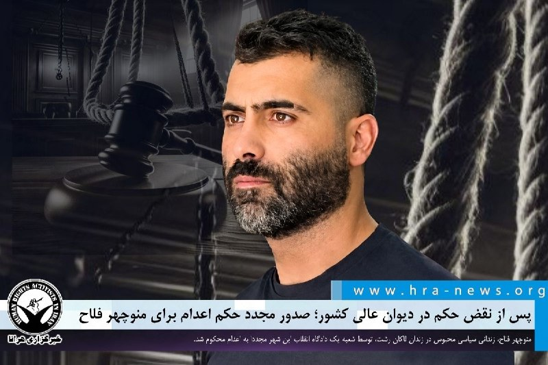

پس از نقض حکم در دیوان عالی کشور؛ صدور مجدد حکم اعدام برای منوچهر فلاح

❗️
❗️
❗️
❗️
❗️– منوچهر فلاح، زندانی سیاسی محبوس در زندان لاکان رشت، توسط شعبه یک دادگاه انقلاب این شهر مجددا به اعدام محکوم شد. حکم اعدام آقای فلاح پیشتر در دیوان عالی کشور نقض و پرونده وی به شعبه هم عرض ارجاع داده شده بود.

به گزارش خبرگزاری هرانا، ارگان خبری مجموعه فعالان حقوق بشر در ایران، منوچهر فلاح، زندانی سیاسی مجددا به اعدام محکوم شد.

حکم #اعدام منوچهر فلاح، پس از رسیدگی مجدد در شعبه یک دادگاه انقلاب رشت صادر و امروز به وکلای او ابلاغ شد. جلسه رسیدگی در این شعبه در تاریخ ۱۹ اردیبهشت‌ماه برگزار شده بود.

او پیش‌تر در دی‌ماه ۱۴۰۳ در شعبه دو دادگاه انقلاب رشت از بابت اتهام «محاربه» به اعدام محکوم شده بود. این حکم در آبان‌ماه همان سال در دیوان عالی کشور تأیید شد، اما با پذیرش اعاده دادرسی، دیوان عالی کشور آن را نقض کرد و پرونده برای رسیدگی دوباره به شعبه یک دادگاه انقلاب رشت ارجاع شد.

ادامه مطلب

#منوچهر_فلاح

↘️
@hranews_bot تماس ✉️ - @Hranews کانال هرانا 🆑

## manototv — post 105761

  <a href="telegram/content/manototv_105761_1779541225.mp4" target="_blank">🎬 Download video</a>

شیخ تمیم بن حمد آل ثانی، امیر قطر، در تماس تلفنی با دونالد ترامپ، رئیس‌جمهور آمریکا، درباره تنش‌های منطقه‌ای و ابتکارهای دیپلماتیکی که با محوریت پاکستان برای جلوگیری از تشدید بحران در حال انجام است، گفت‌وگو کرده است.
در این تماس، دو طرف تلاش‌ها برای کاهش تنش‌ها و حفظ ثبات منطقه را بررسی کردند و بر حمایت از میانجی‌گری پاکستان میان ایالات متحده و جمهوری‌اسلامی تاکید شد.
همچنین در این گفت‌وگو بر اهمیت ادامه مذاکرات و گفت‌وگوهای دیپلماتیک برای حل مسائل جاری، حفاظت از کشتیرانی دریایی و تضمین امنیت مسیرهای راهبردی آبی تأکید شد؛ موضوعی که به ثبات بازار جهانی انرژی و زنجیره تأمین نیز مرتبط است.

## manototv — post 105760

  <a href="telegram/content/manototv_105760_1779541226.mp4" target="_blank">🎬 Download video</a>

بر اساس گزارشی که در روزنامه تایمز منتشر شده، یک تحقیق مخفیانه نشان می‌دهد یک شبکه مرتبط با جمهوری‌اسلامی از طریق تلگرام تلاش کرده شهروندان بریتانیایی را برای سازماندهی تجمعات خیابانی ضد اسرائیلی و پخش پوسترهای تبلیغاتی جذب کند.
در این گزارش آمده است که خبرنگار تایمز به‌صورت مخفیانه وارد ارتباط با فردی شده که خود را «مهدی» معرفی کرده و مدعی بوده در ایران مستقر است و با ساختارهای امنیتی جمهوری‌اسلامی در ارتباط است. این فرد در پیام‌های خود پیشنهاد پرداخت پول در ازای سازماندهی تجمع، جذب افراد جدید و اجرای فعالیت‌های تبلیغاتی در لندن را مطرح کرده است.
همچنین از این خبرنگار خواسته شده ابتدا برای اثبات اعتماد، اقدام به نصب پوستر در خیابان‌های لندن و فیلم‌برداری از آن کند. این پوسترها شامل پیام‌های سیاسی علیه اسرائیل بوده است.
در ادامه، درخواست‌هایی برای گسترش فعالیت و حتی طراحی پروژه‌های آنلاین نیز مطرح شده و در نهایت حساب تلگرامی مربوطه به‌طور ناگهانی حذف شده است.

## manototv — post 105759

  <a href="telegram/content/manototv_105759_1779541226.mp4" target="_blank">🎬 Download video</a>

در حالی‌که برخی مقام‌های آمریکایی از احتمال توقف موقت فروش تسلیحات به تایوان به دلیل نیاز ارتش آمریکا در عملیات علیه ایران خبر داده بودند، یک منبع آگاه رویترز این ادعا را رد کرد و گفت این روند کاملاً طولانی‌مدت و اداری است و ارتباطی با جنگ ایران ندارد.
بر اساس این گزارش، تایوان همچنان منتظر تأیید بسته تسلیحاتی تا سقف ۱۴ میلیارد دلار از سوی آمریکا است. این در حالی است که چین به‌شدت با فروش سلاح به تایوان مخالفت کرده و آن را اقدامی علیه حاکمیت خود می‌داند.
کاخ سفید اعلام کرده تصمیم نهایی درباره این بسته در آینده نزدیک گرفته خواهد شد، اما سیاست کلی آمریکا در حمایت از توان دفاعی تایوان بدون تغییر باقی مانده است. تایوان نیز می‌گوید هیچ اطلاع رسمی از تعلیق یا تأخیر در این روند دریافت نکرده است.

## manototv — post 105758

  <a href="telegram/content/manototv_105758_1779541227.mp4" target="_blank">🎬 Download video</a>

بر پایه گزارش رسانه‌های حکومتی، محمدباقر قالیباف، رئیس مجلس شورای اسلامی و رئیس هیئت مذاکره کننده نظام در مذاکرات با آمریکا به میزبانی اسلام‌آباد در دیدار با فیلد مارشال عاصم منیر، فرمانده ارتش پاکستان تهدید کرده: «در صورت حماقت ترامپ و آغاز مجدد جنگ، پاسخ ما کوبنده‌تر خواهد بود» قالیباف همچنین گفته در آتش‌بس بودیم که آمریکا «با نقض عهد، محاصره دریایی کرد و حالا به دنبال برداشتن آن است»

## manototv — post 105757

  <a href="telegram/content/manototv_105757_1779541228.mp4" target="_blank">🎬 Download video</a>

مجتبی خامنه‌ای، رهبر مشاهده نشده جمهوری‌اسلامی، در ادامه سنت مورد علاقه پدرش، علی خامنه‌ای، با انتشار پیامی نوشتاری درگذشت «والده» رئیس‌جمعیت هلال‌احمر جمهوری‌اسلامی، پیرحسین کولیوند را تسلیت گفت. علی‌ خامنه‌ای به انتشار پیام‌های تسلیت برای شخصیت‌های گوناگون و بستگان و اعضای خانواده آن‌ها علاقه بسیار داشت.

## alonews — post 122029

  <a href="telegram/content/alonews_122029_1779541228.webm" target="_blank">🎬 Download video</a>

👈دیوید کیز، سخنگو و مشاور رسانه‌ای سابق نتانیاهو : ۲۴ ساعت آینده تو ایران کاملاً حیاتیه یا هم شاید اصلاً نباشه، راستش خودم هم دقیق نمی‌دونم

✅ @AloNews خبر جنگ

## alonews — post 122028

  <a href="telegram/content/alonews_122028_1779541228.webm" target="_blank">🎬 Download video</a>

👈ارتش: آماده مقابله قاطع و همه‌جانبه با هرگونه تعدی دشمنان هستیم

✅ @AloNews خبر جنگ

## alonews — post 122027

  <a href="telegram/content/alonews_122027_1779541229.webm" target="_blank">🎬 Download video</a>

👈ناو «جورج واشنگتن» امروز از پایگاه یوکوسوکا خارج شد

🔴 تا برای تمرین‌های پروازی و عملیات آموزشی (CQ) به دریا بره

✅ @AloNews خبر جنگ

## alonews — post 122026

  <a href="telegram/content/alonews_122026_1779541229.webm" target="_blank">🎬 Download video</a>

👈پیام‌های متناقض از سوی ایالات متحده باعث شد آنچه یک کابل دیپلماتیک آمریکا آن را «شوک سیاسی و روانی بزرگ» در لهستان توصیف کرد، پس از لغو استقرار برنامه‌ریزی شده حدود ۴۰۰۰ سرباز آمریکایی در این کشور توسط پنتاگون، رخ دهد، طبق گزارش POLITICO.

🔴اگرچه رئیس‌جمهور ترامپ بعداً این تصمیم را معکوس کرد و برنامه‌هایی برای اعزام ۵۰۰۰ سرباز به لهستان اعلام نمود، این حادثه باعث ایجاد احساسات «ناامیدی»، «سرگشتگی» و «هشدار واقعی» در میان مقامات لهستانی شد که لغو این برنامه را نقض اعتماد می‌دانستند.

🔴کابل دیپلماتیک، که توسط سفیر آمریکا تام رز امضا شده بود، هشدار داد که این حادثه ممکن است باعث افزایش احساسات ضدآمریکایی و تقویت حرکت برای استقلال دفاعی بیشتر اروپا از واشنگتن شود.

🔴گزارش همچنین اشاره کرد که استقرارهای چرخشی نیروها که پس از تهاجم روسیه به اوکراین در سال ۲۰۲۲ آغاز شده بود، به تدریج در لهستان به عنوان تضمینی نیمه‌دائمی برای امنیت دیده شده است، اگرچه هرگز به طور رسمی به این شکل ارائه نشده بود



✅ @AloNews خبر جنگ

## alonews — post 122025

  <a href="telegram/content/alonews_122025_1779541229.webm" target="_blank">🎬 Download video</a>

👈وزیر امور خارجه فرانسه: «ایتمار بن‌گویر» وزیر امنیت داخلی اسرائیل از امروز از ورود به خاک ما منع شده است

✅ @AloNews خبر جنگ

## alonews — post 122024

  <a href="telegram/content/alonews_122024_1779541229.webm" target="_blank">🎬 Download video</a>

👈نخست‌وزیر مجارستان، پتر ماجار، قرار است هفته آینده به بروکسل سفر کند تا درباره آزادسازی میلیاردها یورو از وجوه مسدود شده اتحادیه اروپا با کمیسیون اروپا گفتگو کند.

🔴 این مذاکرات بر روی قسط ۱۰.۴ میلیارد یورویی بازیابی پس از همه‌گیری تمرکز خواهد داشت که باید تا ۳۱ اوت رسماً درخواست شود

✅ @AloNews خبر جنگ

## alonews — post 122023

  <a href="telegram/content/alonews_122023_1779541230.webm" target="_blank">🎬 Download video</a>

👈فرمانده ارتش پاکستان تهران را ترک کرد 
✅ @AloNews خبر جنگ

## alonews — post 122022

  <a href="telegram/content/alonews_122022_1779541230.webm" target="_blank">🎬 Download video</a>

👈مارکو روبیو با نخست‌وزیر هند، مودی، دیدار کرد

✅ @AloNews خبر جنگ

## alonews — post 122021

  <a href="telegram/content/alonews_122021_1779541230.webm" target="_blank">🎬 Download video</a>

👈تصاویر ماهواره‌ای نشان می‌دهد که حدود ۲۴۰ کشتی در آب‌های خلیج فارس و در پشت مرزی که ایران آن را به‌عنوان منطقهٔ تحت کنترل خود در آب‌های خلیج فارس تعیین کرده است، جمع شده‌اند.

✅ @AloNews خبر جنگ

## alonews — post 122020

  <a href="telegram/content/alonews_122020_1779541230.mp4" target="_blank">🎬 Download video</a>

👈پاپ لئو چهاردهم به طور غیررسمی در حالی که به مردم محلی در میدان کالپاری در آچرا، جنوب ایتالیا سلام می‌کند، حرکت ۶-۷ را انجام می‌دهد

✅ @AloNews خبر جنگ

## alonews — post 122019

  <a href="telegram/content/alonews_122019_1779541232.webm" target="_blank">🎬 Download video</a>

👈فرمانده ارتش پاکستان تهران را ترک کرد

✅ @AloNews خبر جنگ

## alonews — post 122018

  <a href="telegram/content/alonews_122018_1779541233.webm" target="_blank">🎬 Download video</a>

👈خبرگزاری فارس: همچنان نمی‌توان گفت که توافق به این زودی در دسترس است

✅ @AloNews خبر جنگ

## alonews — post 122017

  <a href="telegram/content/alonews_122017_1779541233.webm" target="_blank">🎬 Download video</a>

👈عبدالملکی، وزیر پیشین تعاون، کار و رفاه اجتماعی : کسی با قطعی اینترنت بیکار نشده..!

✅ @AloNews خبر جنگ

## alonews — post 122016

  <a href="telegram/content/alonews_122016_1779541233.mp4" target="_blank">🎬 Download video</a>

👈پهپادهای اوکراینی بامداد امروز به کارخانه متافراکس کمیکالز در منطقه پرم کرای روسیه حمله کردند، که حدود ۱۷۰۰ کیلومتر از مرز اوکراین فاصله دارد.

🔴 این کارخانه که مواد مورد استفاده در هوانوردی، پهپادها، موتورهای موشک و مواد منفجره تولید می‌کند، عملیات تولید را متوقف کرده است

✅ @AloNews خبر جنگ

## alonews — post 122015

  <a href="telegram/content/alonews_122015_1779541235.webm" target="_blank">🎬 Download video</a>

👈مصر و قطر در مورد مذاکرات آمریکا و ایران و ادامه روند مذاکره جدی گفت وگو کردند

✅ @AloNews خبر جنگ

## alonews — post 122014

  <a href="telegram/content/alonews_122014_1779541235.mp4" target="_blank">🎬 Download video</a>

👈یه کاربر با هوش مصنوعی رفته "جزیرهِ اپستین" و همه رو مثل سگ‌ کتک زده

✅ @AloNews خبر جنگ

## alonews — post 122013

  <a href="telegram/content/alonews_122013_1779541237.webm" target="_blank">🎬 Download video</a>

👈روزنامه اعتماد: به احتمال بسیار زیاد در این هفته رفع انسداد اینترنت مصوب می‌شود

✅ @AloNews خبر جنگ

## alonews — post 122012

  <a href="telegram/content/alonews_122012_1779541238.webm" target="_blank">🎬 Download video</a>

👈خبرگزاری فرانسه: تایوان می‌گوید چین بیش از 100 کشتی در آب‌های سرزمینی آن مستقر کرده است

✅ @AloNews خبر جنگ

## alonews — post 122011

  <a href="telegram/content/alonews_122011_1779541238.webm" target="_blank">🎬 Download video</a>

👈خبرنگار الجزیره ، علی هاشم در پیامی در شبکه اجتماعی ایکس مدعی شد که یک چهره بسیار برجسته منطقه‌ای، بی‌سروصدا از تهران بازدید کرد تا آنچه را که بسیاری اکنون «شکاف‌های غیرقابل عبور» می‌نامند، پر کند.

✅ @AloNews خبر جنگ

## alonews — post 122010

  <a href="telegram/content/alonews_122010_1779541238.webm" target="_blank">🎬 Download video</a>

👈 روبیو در گفتگو با نخست وزیر هند: آمریکا اجازه نخواهد داد ایران بازار جهانی انرژی را کنترل کند

✅ @AloNews خبر جنگ

<!-- MSG END -->

<!-- NAV START -->

<a href="https://github.com/Tljn/FUD/blob/main/telegram/content/archive_1.md" style="display:inline-block; padding:6px 12px; margin:0 4px; background-color:#2ea44f; color:white; text-decoration:none; border-radius:4px; font-weight:bold;">صفحه بعد</a>

<!-- NAV END -->
