# خواننده تلگرام

<!-- TOP_NAV START -->

<a href="https://github.com/Tljn/FUD/blob/main/telegram/content/archive_1.md" style="display:inline-block; padding:6px 12px; margin:0 4px; background-color:#2ea44f; color:white; text-decoration:none; border-radius:4px; font-weight:bold;">صفحه بعد</a>

<!-- TOP_NAV END -->

<!-- MSG START -->

---
📅 بروزرسانی: 1405/03/28 05:30
---

## VahidOOnLine — post 246125

  <a href="telegram/content/VahidOOnLine_246125_1781748013.mp4" target="_blank">🎬 Download video</a>

♦️امانوئل مکرون، رئیس‌جمهوری فرانسه، بامداد پنجشنبه ۲۸ خردادماه ویدیویی از لحظه امضای توافق تهران و واشنگتن در کاخ ورسای منتشر کرد. در این ویدیو، دونالد ترامپ، رئیس‌جمهوری آمریکا، سند توافق را در حضور مقام‌های آمریکایی و فرانسوی امضا می‌کند.

مکرون در پیامی همراه این ویدیو نوشت ترامپ توافق میان ایران و ایالات متحده را در ورسای امضا کرده است. او افزود این توافق راه را برای «صلحی پایدار» هموار می‌کند و امکان بازگشایی تنگه هرمز را فراهم می‌سازد. رئیس‌جمهوری فرانسه همچنین ابراز امیدواری کرد که این توافق به کاهش قیمت انرژی در آینده نزدیک منجر شود.
‌🇸🇦 Indypersian

🤖 @VahidOOnLine

## VahidOOnLine — post 246124

  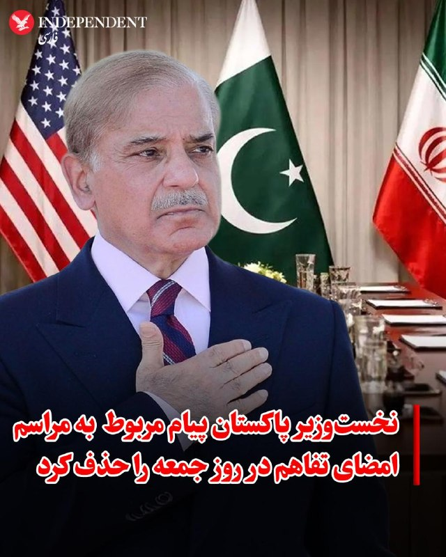

♦️شهباز شریف، نخست‌وزیر پاکستان، در شبکه اکس نوشته بود که پس از آنکه دو طرف پیش‌تر یادداشت توافق را امضا کرده‌اند، همچنان قرار است روز جمعه یک مراسم رسمی امضا برگزار شود.
اما شریف مدت کوتاهی بعد آن پیام را حذف کرد. سپس همان متن را با تغییراتی دوباره منتشر کرد، اما اشاره به مراسم روز جمعه را از آن حذف کرد.
پیش‌تر گفته شده بود که قرار است دو طرف مراسم رسمی امضا توافق را روز جمعه در سوئیس برگزار کنند و دونالد ترامپ نیز به احتمال حضور در این مراسم اشاره کرده بود.
‌🇸🇦 Indypersian

🤖 @VahidOOnLine

## VahidOOnLine — post 246123

  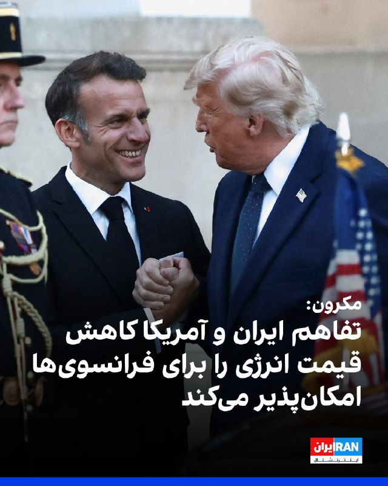

مکرون با انتشار ویدیویی از لحظه امضای یادداشت تهران و واشینگتن از سوی ترامپ نوشت: «این توافق راه را برای صلحی پایدار هموار می‌کند و امکان بازگشایی تنگه هرمز را فراهم می‌سازد. این گامی مهم در مسیر درست برای هم‌وطنان ماست که به‌زودی کاهش قیمت انرژی را امکان‌پذیر خواهد کرد.»
‌🏁 🇬🇧 IranintlTV

🤖 @VahidOOnLine

## VahidOOnLine — post 246122

♦️دونالد ترامپ، رئیس‌جمهوری آمریکا، بامداد پنج‌شنبه ۲۸ خرداد پس از شرکت در نشست سران گروه هفت (G7) در فرانسه و حضور در ضیافت شام با امانوئل مکرون، رئیس‌جمهوری فرانسه، در کاخ ورسای، این کشور را به مقصد آمریکا ترک کرد.
به گزارش رویترز، سفر ترامپ در حالی پایان یافت که هم‌زمان تفاهم‌نامه میان آمریکا و ایران برای پایان جنگ به امضای طرفین رسید. ترامپ هنگام ترک ورسای در پاسخ به پرسش خبرنگاران گفت: «امضا شده است؛ ما آن را در ورسای امضا کردیم.»
‌🇸🇦 Indypersian

🤖 @VahidOOnLine

## VahidOOnLine — post 246121

  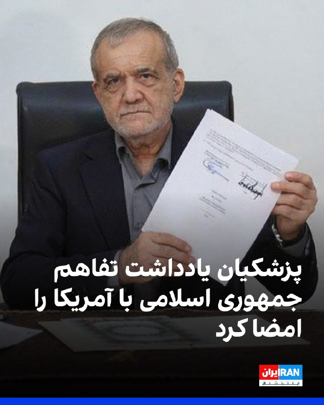

رسانه‌های جمهوری اسلامی تصویر پزشکیان را هنگام امضای یادداشت تفاهم با آمریکا منتشر کردند. از سوی دیگر، ترامپ نیز در کاخ ورسای فرانسه این یادداشت تفاهم را امضا کرد.
‌🏁 🇬🇧 IranintlTV

🤖 @VahidOOnLine

## VahidOOnLine — post 246120

  <a href="telegram/content/VahidOOnLine_246120_1781748016.mp4" target="_blank">🎬 Download video</a>

♦️دونالد ترامپ، رئیس‌جمهوری آمریکا، بامداد پنجشنبه ۲۸ خردادماه پس از ضیافت شام در کاخ ورسای، همراه با امانوئل مکرون، رئیس‌جمهوری فرانسه، این کاخ را ترک کرد.

ترامپ هنگام خروج از کاخ ورسای در پاسخ به پرسش خبرنگاران، امضای توافق تهران و واشنگتن را تایید کرد و گفت: «امضا شده است.»
‌🇸🇦 Indypersian

🤖 @VahidOOnLine

## VahidOOnLine — post 246119

  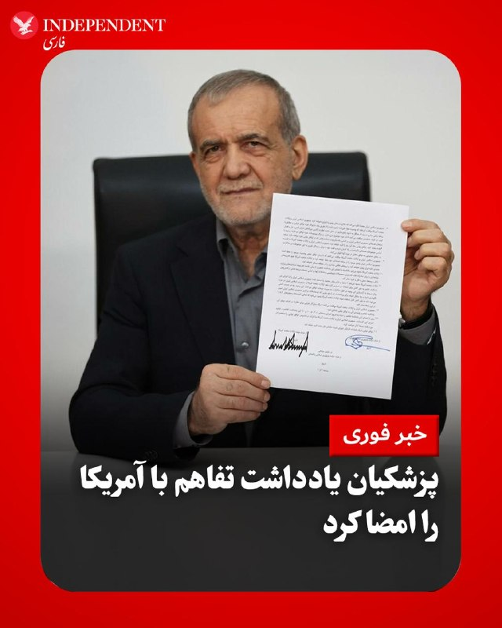

♦️ بامداد پنجشنبه، مسعود پزشکیان، رئیس‌جمهوری اسلامی ایران یادداشت تفاهم با آمریکا را امضا کرد. همزمان دونالد ترامپ، رئیس‌جمهوری آمریکا که در کاخ ورسای حضور داشت نیز این یادداشت تفاهم را امضا کرد. ایرنا نوشت:پزشکیان و ترامپ در فاصله زمانی کوتاهی متن یادداشت تفاهم اسلام‌آباد را به‌صورت دیجیتال و غیرحضوری امضا کردند.
‌🇸🇦 Indypersian

🤖 @VahidOOnLine

## VahidOOnLine — post 246118

  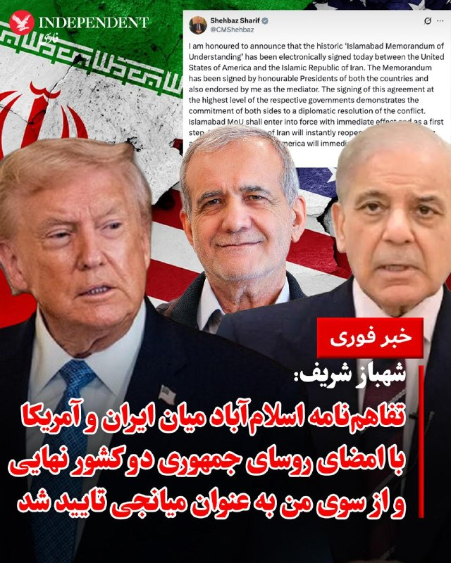

♦️شهباز شریف، نخست‌وزیر پاکستان، با انتشار پیامی در شبکه اکس اعلام کرد «تفاهم‌نامه اسلام‌آباد» میان ایالات متحده و جمهوری اسلامی ایران به‌صورت الکترونیکی و با امضای روسای جمهوری دو کشور نهایی شده و بلافاصله اجرایی شده است.
او نوشت بر اساس این تفاهم‌نامه، جمهوری اسلامی ایران تنگه هرمز را فوراً بازگشایی خواهد کرد و ایالات متحده نیز محاصره دریایی را بلافاصله لغو می‌کند. شریف همچنین گفت پاکستان با همکاری قطر، روز ۲۹ خرداد در سوئیس میزبان مراسم رسمی این توافق و آغاز گفتگوهای فنی خواهد بود.
نخست‌وزیر پاکستان در این پیام از دونالد ترامپ، مسعود پزشکیان، مجتبی حسینی خامنه‌ای، مقام‌های قطری و اعضای تیم‌های مذاکره‌کننده دو طرف به‌دلیل نقش‌آفرینی در دستیابی به این توافق قدردانی کرد.
‌🇸🇦 Indypersian

🤖 @VahidOOnLine

## VahidOOnLine — post 246117

  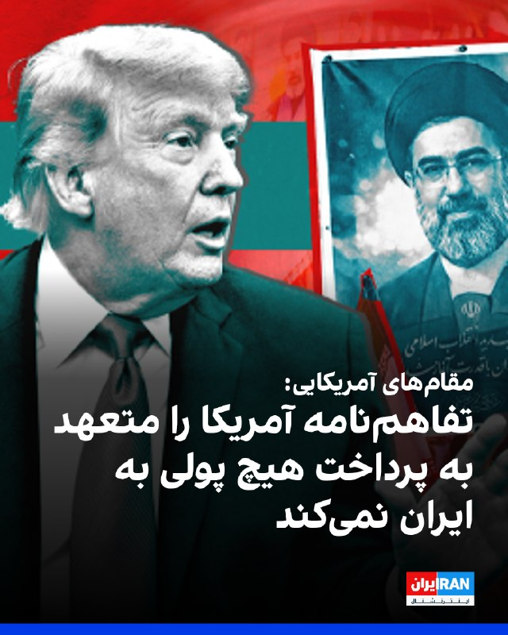

مقام‌های ارشد آمریکایی درباره برنامه ۳۰۰ میلیارد دلاری بازسازی ایران در یادداشت تفاهم به خبرنگاران گفتند این بند آمریکا را متعهد به پرداخت هیچ پولی به ایران نمی‌کند و نقش آمریکا صرفا فراهم کردن امکان سرمایه‌گذاری و صدور مجوزهای لازم خواهد بود.
به گفته این مقام‌ها، اگر حکومت ایران به تعهدات خود عمل کند، کشورهای دیگر خواهند توانست در پروژه‌های اقتصادی ایران سرمایه‌گذاری کنند.
این مقام‌ها درباره رفع تحریم‌ها گفتند مهم‌ترین سوءبرداشت درباره تفاهم‌نامه این است که تصور شود همه تحریم‌ها بلافاصله لغو خواهند شد. آنها تاکید کردند که طبق این بند هیچ رفع تحریمی بدون اجرای تعهدات هسته‌ای ایران انجام نخواهد شد.
مقام‌های ارشد آمریکایی درباره بند مربوط به نظارت بر اجرای تفاهم‌نامه گفتند این سازوکار علاوه بر نظارت بر اجرای تعهدات، ابزارهای لازم برای راستی‌آزمایی و پیگیری نقض احتمالی توافق را نیز در بر خواهد گرفت.

‌🏁 🇬🇧 IranintlTV

🤖 @VahidOOnLine

## VahidOOnLine — post 246116

  <a href="telegram/content/VahidOOnLine_246116_1781748019.mp4" target="_blank">🎬 Download video</a>

دونالد ترامپ، رییس‌جمهوری آمریکا، چهارشنبه ۲۷ خرداد، پیش از ضیافت شامی که به میزبانی امانوئل مکرون، رییس‌جمهوری فرانسه، در کاخ ورسای برگزار شد، یادداشت تفاهم با ایران را امضا کرد.
در ویدیویی که کاخ سفید منتشر کرده، ترامپ در حال امضای سند فارسی‌زبان دیده می‌شود و پس از امضا به نظر می‌رسد از مارکو روبیو، وزیر خارجه آمریکا، می‌خواهد خودکار را برای طرف مقابل ارسال کند.
‌🏁 🇬🇧 IranintlTV

🤖 @VahidOOnLine

## VahidOOnLine — post 246115

  <a href="telegram/content/VahidOOnLine_246115_1781748020.mp4" target="_blank">🎬 Download video</a>

♦️دن اسکاوینو، دستیار رئیس‌جمهوری آمریکا، بامداد پنجشنبه ۲۸ خردادماه تصاویری از لحظه امضای توافق تهران و واشنگتن توسط دونالد ترامپ در کاخ ورسای فرانسه منتشر کرد. این تصاویر نشان می‌دهد ترامپ در جریان مراسمی رسمی، سند توافق را امضا می‌کند.

این مراسم با حضور امانوئل مکرون، رئیس‌جمهوری فرانسه، ژان نوئل بارو، وزیر خارجه فرانسه، بریژیت مکرون و مارکو روبیو، وزیر خارجه آمریکا، برگزار شد. در تصاویر منتشرشده، حاضران پس از امضای توافق ترامپ را تشویق می‌کنند. اسکاوینو در توضیح این تصاویر نوشت که این توافق پیش از ضیافت شام رسمی در کاخ ورسای امضا شد و آن را «لحظه‌ای بسیار مهم در تاریخ» خواند.
‌🇸🇦 Indypersian

🤖 @VahidOOnLine

## VahidOOnLine — post 246114

  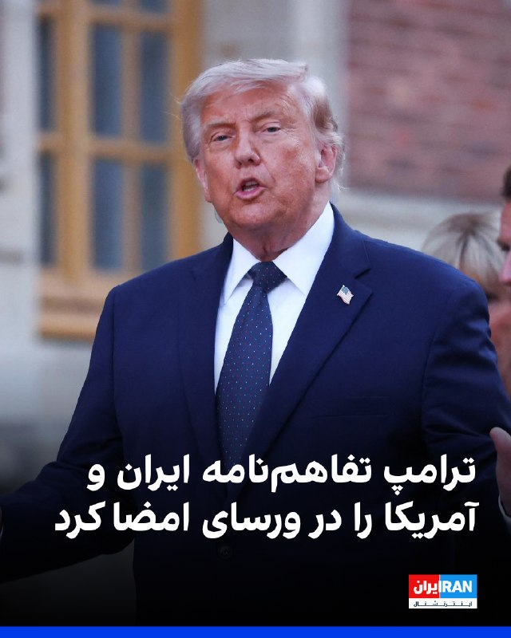

یک مقام کاخ سفید اعلام کرد دونالد ترامپ، رییس‌جمهوری آمریکا، روز چهارشنبه تفاهم‌نامه میان ایران و آمریکا را شخصا امضا کرده است.

به گفته این مقام، ترامپ این سند را در جریان ضیافت شام با امانوئل مکرون، رییس‌جمهوری فرانسه، در کاخ ورسای امضا کرد. همچنین تصویری از توافق برای مقام‌های ایرانی و کشورهای میانجی ارسال شده است.

این مقام افزود که هنگام خروج از مراسم شام، مکرون به کاخ ورسای اشاره کرد و دو رهبر پس از در آغوش گرفتن یکدیگر خداحافظی کردند. ترامپ نیز در پاسخ به پرسش خبرنگاران فرانسوی درباره امضای سند گفت: «امضا شده است. ما آن را در ورسای امضا کردیم. همین حالا آن را امضا کردیم.»

رویترز گزارش داد با اجرایی شدن توافق میان دو کشور برای پایان جنگ، مراسم اصلی امضای توافق که قرار بود در ژنو برگزار شود، لغو شده است. بر اساس این گزارش، مسعود پزشکیان، رییس‌جمهور جمهوری اسلامی، نیز این سند را از طرف ایران امضا کرده است.

اسماعیل بقایی، سخنگوی وزارت خارجه جمهوری اسلامی، روز چهارشنبه اعلام کرد که با وجود لغو مراسم رسمی امضا، برنامه سفر تیم‌های مذاکره‌کننده به ژنو همچنان برقرار است.
‌🏁 🇬🇧 IranintlTV

🤖 @VahidOOnLine

## VahidOOnLine — post 246113

  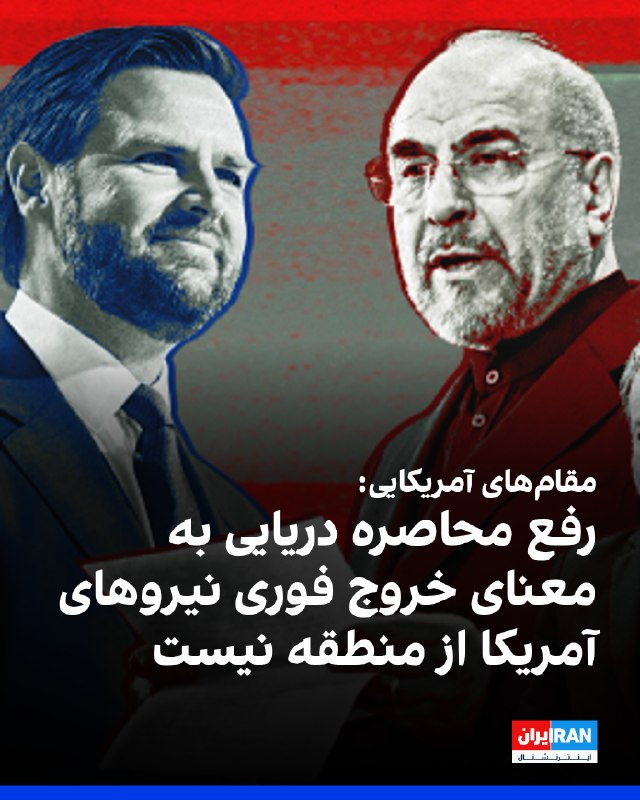

چند مقام ارشد آمریکا درباره رفع تدریجی محاصره دریایی به خبرنگاران گفتند این بند به معنای خروج فوری نیروهای آمریکا از منطقه نیست و منظور از این بند صرفا بازگرداندن آرایش نظامی آمریکا به وضعیت پیش از آغاز جنگ است و این اقدام تنها در صورت رسیدن به توافق نهایی انجام خواهد شد.
مقام‌های آمریکایی در ارتباط با بند مربوط به عبور رایگان کشتی‌ها از تنگه هرمز گفتند حکومت ایران عملا پذیرفته است برای ۶۰ روز هیچ عوارضی از کشتی‌های تجاری دریافت نکند.
این مقام‌ها درباره تعیین تکلیف ذخایر اورانیوم غنی‌شده گفتندطبق این بند، جمهوری اسلامی بار دیگر اعلام می‌کند که به دنبال تولید یا دستیابی به سلاح هسته‌ای نخواهد رفت و دو طرف توافق می‌کنند درباره نحوه تعیین تکلیف ذخایر اورانیوم غنی‌شده و سایر موضوعات هسته‌ای مذاکره کنند.
آنها تاکید کردند که رقیق‌سازی تنها «حداقل» تعهد ایران است و آمریکا در مذاکرات نهایی به دنبال محدودیت‌های گسترده‌تر، بازرسی‌های شدیدتر و برچیدن بخش‌های بیشتری از برنامه هسته‌ای خواهد بود.

‌🏁 🇬🇧 IranintlTV

🤖 @VahidOOnLine

## VahidOOnLine — post 246112

  <a href="telegram/content/VahidOOnLine_246112_1781748022.mp4" target="_blank">🎬 Download video</a>

♦️خبرگزاری فرانسه بامداد پنجشنبه ۲۸ خردادماه گزارش داد دونالد ترامپ، رئیس‌جمهوری آمریکا، امضای توافق با ایران برای پایان دادن به جنگ را تایید کرده است. ترامپ هنگام ترک کاخ ورسای در پاسخ به پرسش خبرنگاران درباره امضای تفاهم‌نامه گفت: «امضا شده است.»

به گزارش خبرگزاری فرانسه، ترامپ همچنین تایید کرد که این توافق در کاخ ورسای به امضا رسیده و گفت: «بله، ما آن را در ورسای امضا کردیم. همین الان امضا کردیم.» این اظهارات پس از دیدار و ضیافت شام او با امانوئل مکرون، رئیس‌جمهوری فرانسه، در کاخ ورسای مطرح شد.
‌🇸🇦 Indypersian

🤖 @VahidOOnLine

## VahidOOnLine — post 246111

♦️محمدباقر قالیباف، رئیس مجلس شورای اسلامی که اکنون نام او به عنوان مذاکره‌کننده اصلی با آمریکا مطرح است، در سخنرانی و مجموعه‌ اظهارنظرهایی که چهارشنبه شب، همزمان با انتشار متن یادداشت تفاهم انجام شد، از نقش خود در مجموعه تحولات اخیر صحبت کرد و تاکید کرد که یا دیگران با او برای تصمیم‌گیری همراه می‌شوند یا خودش تصمیم می‌گیرد. قالیباف همچنین گفت سیستم «مدیریتی» و «نظامی» کشور از «فرد محوری» خارج شده است. تا پیش از کشته شدن علی خامنه‌ای، رهبر سابق جمهوری اسلامی در حمله آمریکا و اسرائیل، او درباره همه امور تصمیم می‌گرفت. قالیباف افزود که برای همه سناریو‌ها، از جمله کشته شدن علی خامنه‌ای هم برنامه‌ریزی شده بود. اظهارات قالیباف در حالی مطرح می‌شود که هنوز با گذشت بیش از سه ماه از معرفی مجتبی خامنه‌ای به عنوان رهبر جدید نظام، هیچ تصویر یا حتی صدای ضبط شده‌ای از او منتشر نشده است.
‌🇸🇦 Indypersian

🤖 @VahidOOnLine

## VahidOOnLine — post 246110

  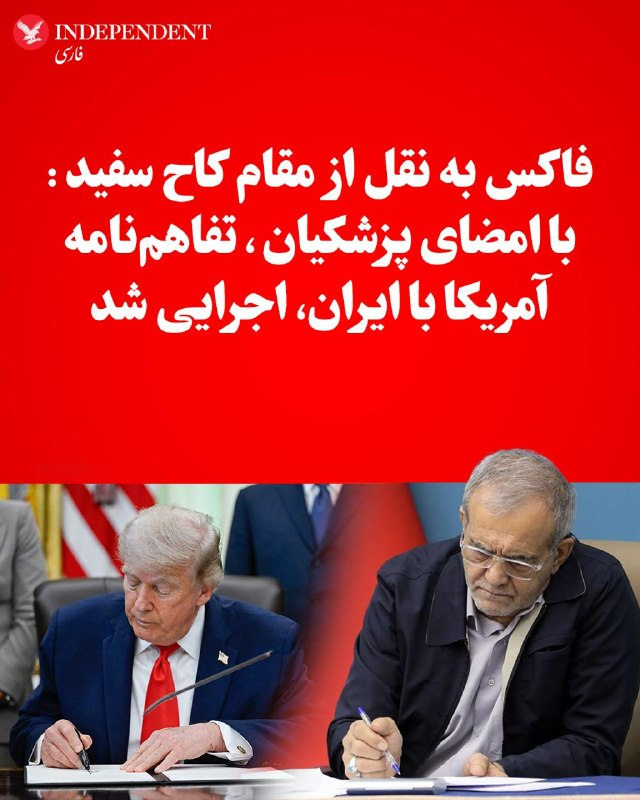

♦️فاکس‌نیوز به نقل از یک مقام کاخ سفید گزارش داد دونالد ترامپ، رئیس‌جمهوری آمریکا، بامداد پنجشنبه ۲۸ خرداد در جریان ضیافت شام با امانوئل مکرون، رئیس‌جمهوری فرانسه، در کاخ ورسای، تفاهم‌نامه میان آمریکا و ایران را شخصا امضا کرد.
بر اساس این گزارش، پس از امضای مسعود پزشکیان، رئیس‌جمهوری ایران، این تفاهم‌نامه اجرایی شده است. یک نسخه از سند امضاشده نیز برای ایران و کشورهای میانجی ارسال شده است.
فاکس‌نیوز همچنین گزارش داد با اجرایی شدن این توافق، مراسم اصلی امضای تفاهم‌نامه که قرار بود در ژنو برگزار شود، لغو شده است. با این حال، اسماعیل بقایی، سخنگوی وزارت امور خارجه جمهوری اسلامی، اعلام کرد برنامه حضور تیم‌های مذاکره‌کننده در ژنو همچنان پابرجاست.
‌🇸🇦 Indypersian

🤖 @VahidOOnLine

## WithYashar — post 15207

دلار و طلا تا بفروشیم یا بالا میره؟ سوالی که اکثر مخاطبین کانال در چند روز اخیر می‌پرسند اول پاییز اعلام کردیم که دلار تا اخر سال به ۱۹۰ هزا تومان می‌رسد و طلای ۲۲ میلیونی را به درستی همانند قبل پیشبینی کرده بودیم الان هم قیمت قطعی دلار و طلا تا پایان تابستان…

## WithYashar — post 15206

دلار و طلا تا بفروشیم یا بالا میره؟ سوالی که اکثر مخاطبین کانال در چند روز اخیر می‌پرسند

اول پاییز اعلام کردیم که دلار تا اخر سال به ۱۹۰ هزا تومان می‌رسد و طلای ۲۲ میلیونی را به درستی همانند قبل پیشبینی کرده بودیم
الان هم قیمت قطعی دلار و طلا تا پایان تابستان و بعد از آن را در کانال زیر اعلام کردیم ، حتما عضو شوید تا با آگاهی از قیمت دقیق در روزهای آینده تمام سرمایه گذاری های خود را مدیریت کنید و از تورم جا نمانید👇
https://t.me/+hLt81qXCGTQzOWQ0
https://t.me/+hLt81qXCGTQzOWQ0

## WithYashar — post 15205

  <a href="telegram/content/WithYashar_15205_1781748024.mp4" target="_blank">🎬 Download video</a>

ساعت ۳:۱۹ صبح امروز (کمی پیش) چند قایق متعلق به سپاه پاسدارن درحال اقدامی نامشخص در تنگه هرمز هستند.

ناو آمریکایی در بیسیم به زبان فارسی متنی هشدار آمیز را پخش می‌کند که می‌گوید:
جمهوری اسلامی کنترلی بر تنگه ندارد، عملیات را متوقف کنید و به بندر باز گردید، وگرنه نیروی دریایی ایالات متحده به کشتی شما حمله خواهد کرد.
@withyashar

## FoxNewsTwitter — post 343106

  <a href="telegram/content/FoxNewsTwitter_343106_1781748025.mp4" target="_blank">🎬 Download video</a>

Fox News (Twitter/X)

A curious shark turns an ordinary surf session into a tense standoff off the California coast.

Drone footage shows the shark tracking a surfer from below the surface, circling near his board as the unaware surfer floats in open water.

After spotting the danger, the drone operator used his drone to warn the surfer, who quickly paddled for shore.

The shark eventually peeled away, but not before creating a moment that left even the person filming it on edge.

## FoxNewsTwitter — post 343105

  <a href="telegram/content/FoxNewsTwitter_343105_1781748027.mp4" target="_blank">🎬 Download video</a>

Fox News (Twitter/X)

Trump boards Air Force One after a major diplomatic breakthrough in France.

As he departed Versailles, the president confirmed he had signed the Iran memorandum of understanding, saying, “It’s signed. We signed it in Versailles. We just signed it.”

## FoxNewsTwitter — post 343104

  <a href="telegram/content/FoxNewsTwitter_343104_1781748029.mp4" target="_blank">🎬 Download video</a>

Fox News (Twitter/X)

The moment President Trump signs the Iran deal at the Palace of Versailles.

The agreement was finalized during a dinner hosted by French President Emmanuel Macron inside the historic palace.

The signing marked a major diplomatic milestone after months of negotiations aimed at ending the conflict between the U.S. and Iran.

## FoxNewsTwitter — post 343103

  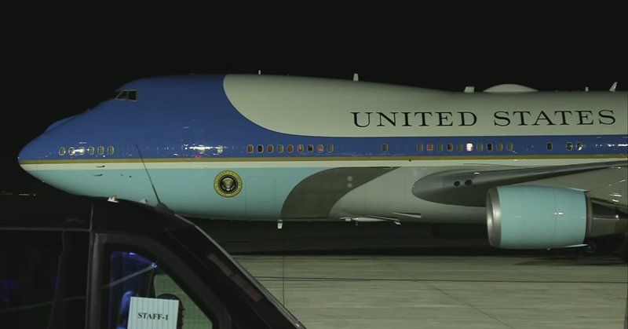

Fox News (Twitter/X)

WATCH LIVE: President Trump leaves France after Versailles dinner with French President Macron https://twitter.com/i/broadcasts/1yKAPPBvpjaxb

## FoxNewsTwitter — post 343102

  <a href="telegram/content/FoxNewsTwitter_343102_1781748031.mp4" target="_blank">🎬 Download video</a>

Fox News (Twitter/X)

"It's signed."

President Trump told reporters he signed the Iran memorandum of understanding in Versailles as he departed the palace following a dinner with French President Emmanuel Macron.

A White House official says a photo of the signed agreement was sent to Iran and the mediating countries, to formally put the deal into effect.

## FoxNewsTwitter — post 343098

Fox News (Twitter/X)

President Trump tours the Palace of Versailles alongside French President Emmanuel Macron and his wife, Brigitte Macron, just before a major development in the Iran negotiations.

The dinner meeting inside the historic French landmark ended with Trump signing the Iran memorandum of understanding, according to the White House.

The gathering at Versailles was intended to celebrate the historic ties between the U.S and France during America's 250th birthday celebration.

## pm_afshaa — post 94310

  <a href="telegram/content/pm_afshaa_94310_1781748033.mp4" target="_blank">🎬 Download video</a>

لحظه امضای تفاهم‌نامه بین پزشکیان و ترامپ

💧 Rainbet.com the #1 Non-KYC Crypto Casino & Sportsbook @rainbetcom

😁 @Pm_Afshaa

## VahidOnline — post 76474

  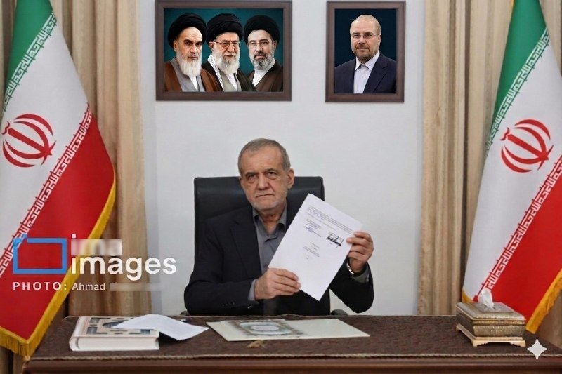

درستش کردم
MahvashJebeli

📡 @VahidOnline

## VahidOnline — post 76471

امضای پزشکیان
📡 @VahidOnline

## VahidOnline — post 76470

  <a href="telegram/content/VahidOnline_76470_1781748035.mp4" target="_blank">🎬 Download video</a>

لحظه امضای یادداشت تفاهم از سوی ترامپ

دونالد ترامپ، رئیس جمهور آمریکا که چهارشنبه شب در کاخ الیزه میهمان ضیافت شام با امانوئل مکرون بود نسخه نهایی و منتشر شده تفاهم‌نامه با جمهوری اسلامی ایران را امضاء کرده است. مسعود پزشکیان نیز این سند را امضاء کرده است.
@VahidHeadline

📡 @VahidOnline

## kianmeli1 — post 88059

  <a href="telegram/content/kianmeli1_88059_1781748035.mp4" target="_blank">🎬 Download video</a>

لحظه امضای یادداشت تفاهم از سوی ترامپ

دونالد ترامپ، رئیس جمهور آمریکا که چهارشنبه شب در کاخ الیزه میهمان ضیافت شام با امانوئل مکرون بود نسخه نهایی و منتشر شده تفاهم‌نامه با جمهوری اسلامی ایران را امضاء کرده است. مسعود پزشکیان نیز این سند را امضاء کرده است.
https://t.me/kianmeli1

## IranIntlTV — post 342951

  

مکرون با انتشار ویدیویی از لحظه امضای یادداشت تهران و واشینگتن از سوی ترامپ نوشت: «این توافق راه را برای صلحی پایدار هموار می‌کند و امکان بازگشایی تنگه هرمز را فراهم می‌سازد. این گامی مهم در مسیر درست برای هم‌وطنان ماست که به‌زودی کاهش قیمت انرژی را امکان‌پذیر خواهد کرد.»
https://iranintl.com/202606189424

## IranIntlTV — post 342950

  

رسانه‌های جمهوری اسلامی تصویر پزشکیان را هنگام امضای یادداشت تفاهم با آمریکا منتشر کردند. از سوی دیگر، ترامپ نیز در کاخ ورسای فرانسه این یادداشت تفاهم را امضا کرد.
https://iranintl.com/202606187211

## IranIntlTV — post 342949

  

مقام‌های ارشد آمریکایی درباره برنامه ۳۰۰ میلیارد دلاری بازسازی ایران در یادداشت تفاهم به خبرنگاران گفتند این بند آمریکا را متعهد به پرداخت هیچ پولی به ایران نمی‌کند و نقش آمریکا صرفا فراهم کردن امکان سرمایه‌گذاری و صدور مجوزهای لازم خواهد بود.
به گفته این مقام‌ها، اگر حکومت ایران به تعهدات خود عمل کند، کشورهای دیگر خواهند توانست در پروژه‌های اقتصادی ایران سرمایه‌گذاری کنند.
این مقام‌ها درباره رفع تحریم‌ها گفتند مهم‌ترین سوءبرداشت درباره تفاهم‌نامه این است که تصور شود همه تحریم‌ها بلافاصله لغو خواهند شد. آنها تاکید کردند که طبق این بند هیچ رفع تحریمی بدون اجرای تعهدات هسته‌ای ایران انجام نخواهد شد.
مقام‌های ارشد آمریکایی درباره بند مربوط به نظارت بر اجرای تفاهم‌نامه گفتند این سازوکار علاوه بر نظارت بر اجرای تعهدات، ابزارهای لازم برای راستی‌آزمایی و پیگیری نقض احتمالی توافق را نیز در بر خواهد گرفت.

https://iranintl.com/202606171881

## IranIntlTV — post 342948

  <a href="telegram/content/IranIntlTV_342948_1781748038.mp4" target="_blank">🎬 Download video</a>

دونالد ترامپ، رییس‌جمهوری آمریکا، چهارشنبه ۲۷ خرداد، پیش از ضیافت شامی که به میزبانی امانوئل مکرون، رییس‌جمهوری فرانسه، در کاخ ورسای برگزار شد، یادداشت تفاهم با ایران را امضا کرد.
در ویدیویی که کاخ سفید منتشر کرده، ترامپ در حال امضای سند فارسی‌زبان دیده می‌شود و پس از امضا به نظر می‌رسد از مارکو روبیو، وزیر خارجه آمریکا، می‌خواهد خودکار را برای طرف مقابل ارسال کند.

## IranIntlTV — post 342947

  

یک مقام کاخ سفید اعلام کرد دونالد ترامپ، رییس‌جمهوری آمریکا، روز چهارشنبه تفاهم‌نامه میان ایران و آمریکا را شخصا امضا کرده است.

به گفته این مقام، ترامپ این سند را در جریان ضیافت شام با امانوئل مکرون، رییس‌جمهوری فرانسه، در کاخ ورسای امضا کرد. همچنین تصویری از توافق برای مقام‌های ایرانی و کشورهای میانجی ارسال شده است.

این مقام افزود که هنگام خروج از مراسم شام، مکرون به کاخ ورسای اشاره کرد و دو رهبر پس از در آغوش گرفتن یکدیگر خداحافظی کردند. ترامپ نیز در پاسخ به پرسش خبرنگاران فرانسوی درباره امضای سند گفت: «امضا شده است. ما آن را در ورسای امضا کردیم. همین حالا آن را امضا کردیم.»

رویترز گزارش داد با اجرایی شدن توافق میان دو کشور برای پایان جنگ، مراسم اصلی امضای توافق که قرار بود در ژنو برگزار شود، لغو شده است. بر اساس این گزارش، مسعود پزشکیان، رییس‌جمهور جمهوری اسلامی، نیز این سند را از طرف ایران امضا کرده است.

اسماعیل بقایی، سخنگوی وزارت خارجه جمهوری اسلامی، روز چهارشنبه اعلام کرد که با وجود لغو مراسم رسمی امضا، برنامه سفر تیم‌های مذاکره‌کننده به ژنو همچنان برقرار است.
https://iranintl.com/202606178908

## IranIntlTV — post 342946

  

چند مقام ارشد آمریکا درباره رفع تدریجی محاصره دریایی به خبرنگاران گفتند این بند به معنای خروج فوری نیروهای آمریکا از منطقه نیست و منظور از این بند صرفا بازگرداندن آرایش نظامی آمریکا به وضعیت پیش از آغاز جنگ است و این اقدام تنها در صورت رسیدن به توافق نهایی انجام خواهد شد.
مقام‌های آمریکایی در ارتباط با بند مربوط به عبور رایگان کشتی‌ها از تنگه هرمز گفتند حکومت ایران عملا پذیرفته است برای ۶۰ روز هیچ عوارضی از کشتی‌های تجاری دریافت نکند.
این مقام‌ها درباره تعیین تکلیف ذخایر اورانیوم غنی‌شده گفتندطبق این بند، جمهوری اسلامی بار دیگر اعلام می‌کند که به دنبال تولید یا دستیابی به سلاح هسته‌ای نخواهد رفت و دو طرف توافق می‌کنند درباره نحوه تعیین تکلیف ذخایر اورانیوم غنی‌شده و سایر موضوعات هسته‌ای مذاکره کنند.
آنها تاکید کردند که رقیق‌سازی تنها «حداقل» تعهد ایران است و آمریکا در مذاکرات نهایی به دنبال محدودیت‌های گسترده‌تر، بازرسی‌های شدیدتر و برچیدن بخش‌های بیشتری از برنامه هسته‌ای خواهد بود.

https://iranintl.com/202606171881

## IranIntlTV — post 342945

  <a href="telegram/content/IranIntlTV_342945_1781748041.mp4" target="_blank">🎬 Download video</a>

از موشک تا معیشت؛ تغییر ناگهانی روایت؛
قالیباف: سنگر را از «بچه‌های لانچر» تحویل می‌گیریم!

قالیباف می‌گوید: «باید سنگر را از لانچرها تحویل بگیریم و به سمت ساختن کشور برویم.»

تا دیروز می‌گفتند اولویت کشور موشک است، نه معیشت. هر صدای منتقدی را با «مقاومت» و «امنیت» ساکت می‌کردند. حالا از اقتصاد، توسعه و برداشتن فشار از دوش مردم حرف می‌زنند.

اگر اقتصاد امروز اولویت شده، پس چهار دهه گذشته صرف چه شد؟ چه کسانی کشور را به این نقطه رساندند؟ و آیا قرار است میلیاردها دلار سرمایه و منابع تازه، دوباره در اختیار همان ساختارهایی قرار بگیرد که کشور را به این وضعیت رسانده‌اند؟

کامبیز حسینی در «برنامه» به این موضوع می‌پردازد.

«یک ایران صدای شما را می‌شنود»
دوشنبه تا پنجشنبه ۱۱ شب تهران
از تلویزیون ایران اینترنشنال

تماشای نسخه کامل این قسمت از «برنامه» در یوتیوب:
https://youtu.be/VniCfgW1sPQ
@iranintltv

## Iliaen — post 4492

  <a href="telegram/content/Iliaen_4492_1781748043.mp4" target="_blank">🎬 Download video</a>

ساعت ۰۳:۱۸ صبح پنجشنبه؛ چند قایق متعلق به سپاه پاسدارن درحال اقدامی نامشخص در تنگه هرمز هستند.

ناو آمریکایی در بیسیم به زبان فارسی متنی هشدار آمیز را پخش می‌کند که می‌گوید:

“جمهوری اسلامی کنترلی بر تنگه ندارد، عملیات را متوقف کنید و به بندر باز گردید، وگرنه نیروی دریایی ایالات متحده به کشتی شما حمله خواهد کرد.

@iliaen

## FarsiVOA — post 221076

⚡️ارتباط دیپلمات جوان روس با پرونده حمله به خانه‌های نخست‌وزیر بریتانیا؛ گفت‌وگو با اولگا مالچفسک
@FarsiVOA

## FarsiVOA — post 221075

  <a href="telegram/content/FarsiVOA_221075_1781748043.mp4" target="_blank">🎬 Download video</a>

⚡️جشن ۲۵۰ سالگی استقلال آمریکا در مراکش
@FarsiVOA

## FarsiVOA — post 221074

  <a href="telegram/content/FarsiVOA_221074_1781748044.mp4" target="_blank">🎬 Download video</a>

⚡️انتقادها از غیبت ترودو در تورنتو؛ حال‌وهوای شهر میزبان جام جهانی
@FarsiVOA

## FarsiVOA — post 221073

🔺پاکستان می‌گوید در پی امضای تفاهم‌نامه، جمهوری اسلامی باید «تنگه هرمز» را فورا باز کند

▪️شهباز شریف، نخست‌وزیر پاکستان در بیانیه‌ای که در شبکه‌های اجتماعی منتشر کرد گفت امضای تفاهم‌نامه پایان درگیری‌ها میان آمریکا و جمهوری اسلامی، به این معنا است که جمهوری اسلامی تنگه هرمز را فوراً بازگشایی خواهد کرد و محاصره دریایی بنادر ایران از سوی آمریکا نیز بلافاصله پایان می‌یابد.

⬇️ بیشتر بخوانید:
https://ir.voanews.com/a/8162199.html
@FarsiVOA

## FarsiVOA — post 221072

🔺شلاق، ممنوعیت خروج و ممنوعیت کار، حکم یک خواننده زن و اعضای گروهش در ایران؛ دادگاه قم: «عفت عمومی» جریحه‌‌دار شد

▪️جمهوری اسلامی، پرستو احمدی، خواننده و برگزارکننده « کنسرت کاروانسرا» و هشت تن دیگر از دست‌اندرکاران و نوازندگان این برنامه را به ۷۴ ضربه شلاق، دو سال ممنوعیت خروج از کشور و دو سال ممنوعیت از فعالیت هنری محکوم کرد.

⬇️ بیشتر بخوانید:
https://ir.voanews.com/a/female-singer-and-her-band-members-sentenced-to-flogging-travel-bans-and-employment-restrictions/8161985.html
@FarsiVOA

## FarsiVOA — post 221071

⚡️گزارش‌های رسانه‌‌ای درباره مفاد تفاهم اولیه آمریکا با جمهوری اسلامی
@FarsiVOA

## FarsiVOA — post 221070

  <a href="telegram/content/FarsiVOA_221070_1781748045.mp4" target="_blank">🎬 Download video</a>

⚡️دن اسکاوینو، دستیار رئیس جمهوری‌ آمریکا ویدیویی از دونالد ترامپ در حال امضای تفاهم‌نامه با جمهوری اسلامی را منتشر کرد. او گفت این امضا پیش از شام چهارشنبه‌شب در کاخ ورسای فرانسه، به میزبانی امانوئل مکرون امضا شد. اسکاوینو گفت آقای ترامپ، تفاهم‌نامه را به محض دریافت ازمارکو روبیو امضا کرد.
@FarsiVOA

## FarsiVOA — post 221069

⚡️سراب متناسب‌سازی حقوق و واقعیت سفره‌ها؛ پشت پرده رقم ۱۴۰ هزار میلیارد تومانی تامین اجتماعی
@FarsiVOA

## FarsiVOA — post 221068

⚡️دادگاه کیفری استان قم پرستو احمدی و هشت نفر از دست‌اندرکاران و نوازندگان «کنسرت کاروانسرا» را به ۷۴ ضربه شلاق تعزیری، دو سال ممنوع‌الخروجی و دو سال ممنوعیت از فعالیت هنری محکوم کرده است.
@FarsiVOA

## FarsiVOA — post 221067

  <a href="telegram/content/FarsiVOA_221067_1781748046.mp4" target="_blank">🎬 Download video</a>

⚡️لیونل مسی؛ ستاره‌ای که سال‌ها مرزهای ممکن را جابه‌جا کرده است

@FarsiVOA

## FarsiVOA — post 221066

🔺واکنش‌ها در کنگره به یادداشت تفاهم‌با جمهوری اسلامی؛ سناتور کروز: دادن میلیاردها دلار «به دیوانه‌های حکومت دینی» ایده خوبی نیست

▪️چند سناتور جمهوری‌خواه آمریکا نسبت به تفاهم‌نامه منتشر شده میان ایالات متحده و جمهوری اسلامی ایران ابراز تردید و انتقاد کردند و برخی گفته‌اند این سند هنوز توافق نهایی با رژیم ایران محسوب نمی‌شود.

⬇️ بیشتر بخوانید:
https://ir.voanews.com/a/8161984.html
@FarsiVOA

## FarsiVOA — post 221065

  <a href="telegram/content/FarsiVOA_221065_1781748047.mp4" target="_blank">🎬 Download video</a>

⚡️دونالد ترامپ به خبرنگاران: تفاهم‌نامه با جمهوری اسلامی را در کاخ ورسای امضا کردم
@FarsiVOA

## FarsiVOA — post 221064

⚡️گفت‌وگوهای احتمالی اروپا با طالبان؛ اخراج مهاجران افغان از آلمان و چالش‌های حقوقی و سیاسی آن
@FarsiVOA

## IranianMinds — post 22845

  <a href="telegram/content/IranianMinds_22845_1781748048.mp4" target="_blank">🎬 Download video</a>

🔴 قالیباف:

بدبینی و بی‌اعتمادی من به ایالات متحده از هر کس دیگری بیشتر است.

حتی اگر توافق نهایی حاصل شود و توسط قطعنامه شورای امنیت سازمان ملل متحد تأیید شود، باز هم قابل اعتماد نیست. تضمین ما قدرت ایران است.

@IranianMinds

## IranianMinds — post 22844

جام جهانی ینی اوج هیجان و پول دراوردن پس بیا توی کانال ورسوس بت و پول دراوردن شروع کن👌

## IranianMinds — post 22843

  <a href="telegram/content/IranianMinds_22843_1781748050.webm" target="_blank">🎬 Download video</a>

📢توم میخوای از مسابقات جام جهانی فوتبال پول دربیاری؟
🥇

✅کانال ورسوس بت کارش تحلیل و پیش بینی مسابقات جام جهانی به صورت حرفه ای
🍑

⚠️توم میتونی از پیش بینی جام جهانی خیلی راحت پول دربیاری فقط کافیه با کانال ورسوس بت همراه شی
📣

🌐ادرس عضویت کانالشون ea27:
👇

🔪https://t.me/+vEPd1hF2Y38yMWI0

🔪https://t.me/+vEPd1hF2Y38yMWI0

## IranianMinds — post 22842

  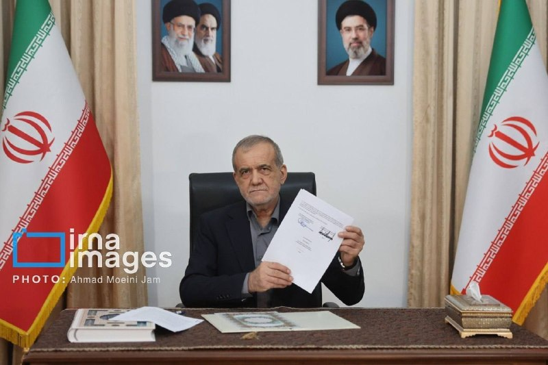

🔴این هم امضای یادداشت تفاهم‌نامه از سوی پزشکیان.

@IranianMinds

## IranianMinds — post 22841

  <a href="telegram/content/IranianMinds_22841_1781748051.mp4" target="_blank">🎬 Download video</a>

🔴ترامپ پاریس را به مقصد واشینگتن ترک می‌کند.

@IranianMinds

## IranianMinds — post 22840

  <a href="telegram/content/IranianMinds_22840_1781748053.mp4" target="_blank">🎬 Download video</a>

🔴لحظه امضای یادداشت تفاهم‌نامه از سوی ترامپ.

@IranianMinds

## BBCPersian — post 284210

🔻ایرنا - خبرگزاری دولت ایران هم بامداد پنجشنبه مجموعه تصاویری از لحظه امضای تفاهمنامه توسط مسعود پزشکیان منتشر کرد تا هر دو سو رسما به آن سندیت ببخشند.

در تصاویر ایرنا رئیس جمهور ایران در کنار امضای دونالد ترامپ امضاء کرده است. تصاویر امضای رئیس جمهور آمریکا را هم دقایقی پیش‌تر کاخ سفید منتشر کرده بود که در آن آقای ترامپ در حالی که کنار امانوئل مکرون و سر میز شام در کاخ الیزه نشسته سند را امضاء می‌کند.

ساعتی قبل از این، اسماعیل بقایی، سخنگوی وزارت خارجه ایران گفت: «به این نتیجه رسیدیم متن یادداشت تفاهم به امضا روسای جمهور ایران و آمریکا برسد و برگزاری مراسم روز جمعه هنوز در دستور کار است اما باید ببینیم ظرف ساعات آینده به چه نتیجه‌ای می‌رسیم. به هر حال باید فاز بعدی مذاکرات آغاز شود. این نشست در سوئیس هنوز در دستور کار است که برگزار شود. باید ببینیم که در ساعات آینده طرفین از طریق میانجی‌ها به نتیجه‌ای می‌رسند.»

آقای بقایی و همچنین مقام‌های در کاخ‌سفید تایید کرده‌اند که همزمان با امضای روسای‌جمهور در زیر تفاهمنامه، این سند لازم الاجرا شده است.

📷IRNA
@BBCPersian

## BBCPersian — post 284209

🔻ساعتی بعد از تایید امضای تفاهمنامه میان ایران و آمریکا از سوی دونالد ترامپ و مسعود پزشکیان، کاخ‌سفید ویدیو لحظه امضاء کردن آقای ترامپ را که به نظر می‌رسد بر سر میز ضیافت شام در کاخ ورسای صورت گرفته را منتشر کرد.

در این ویدیو امانوئل مکرون هم کنار آقای ترامپ دیده می‌شود و او برگه‌ای که مارکو روبیو، وزیرخارجه به او داده را امضاء می‌کند.

خبرگزاری دولتی ایران - ایرنا - هم دقایقی بعد عکسی از مسعود پزشکیان منتشر کرد که در آن رئیس جمهور ایران برگه امضاء شده تفاهمنامه را مقابل دوربین گرفته است و امضای دونالد ترامپ هم در یک طرف آن دیده می‌شود.

برای خواندن متن کامل این تفاهمنامه به وبسایت ما سر بزنید یا در آلبومی که برایتان همینجا منتشر کردیم مراجعه کنید.

@BBCPersian

## BBCPersian — post 284208

🔻سه نکته اصلی که از توافق آمریکا و ایران برجسته می‌شود
🖋️گری او‌دوناهیو - خبرنگار ارشد آمریکای شمالی

🔻در واشنگتن شاهد یک نشست توجیهی فوق‌العاده با مقام‌های ارشد آمریکایی بودیم که متن تفاهم‌نامه با ایران را کلمه به کلمه برای ما قرائت کردند.

سه نکته اصلی از این سند برای من برجسته بود:

نخست، درباره موضوع هسته‌ای. مقام‌های ارشد آمریکایی می‌گویند ایران متعهد شده است که سلاح هسته‌ای تولید نکند یا به دست نیاورد. دونالد ترامپ از زمان آغاز جنگ در ماه فوریه، این موضوع را مهم‌ترین شرط خود برای دستیابی به توافق عنوان کرده بود.

آنها همچنین گفتند ذخایر اورانیوم غنی‌شده ایران در داخل کشور و تحت نظارت آژانس بین‌المللی انرژی اتمی رقیق‌سازی خواهد شد. آمریکا در ابتدا خواستار خروج این مواد از ایران بود، بنابراین این یک تحول جدید محسوب می‌شود.

دوم، درباره بازگشایی تنگه هرمز. مقام‌های آمریکایی گفتند که به مدت ۶۰ روز هیچ‌گونه عوارضی از کشتی‌های عبوری دریافت نخواهد شد. پس از آن، ایران و کشورهای همسایه باید درباره نحوه مدیریت این موضوع مذاکره کنند.

این مسئله این احتمال را باز می‌گذارد که در آینده عوارضی برای عبور از تنگه هرمز تعیین شود؛ در حالی که پیش از آغاز درگیری‌ها چنین هزینه‌ای وجود نداشت.

سوم، صندوق بحث‌برانگیز ۳۰۰ میلیارد دلاری برای بازسازی ایران است. ترامپ پیش‌تر گزارش‌های مربوط به آن را «اخبار جعلی» توصیف کرده بود، اما این صندوق در متن توافق گنجانده شده است.

مقام‌های ارشد آمریکایی تاکید کردند که آمریکا مجبور نیست «حتی یک سنت» به این صندوق پرداخت کند و اجرای آن به رفتار ایران و پایبندی تهران به تعهداتش بستگی خواهد داشت.

این توافق در روزهای آینده بند به بند مورد بررسی و موشکافی قرار خواهد گرفت. اما پرسش اصلی این خواهد بود که آمریکا دقیقا از جنگ با ایران چه دستاوردی به دست آورده است؟

https://bbc.in/4vPb8lA
@BBCPersian

## BBCPersian — post 284207

  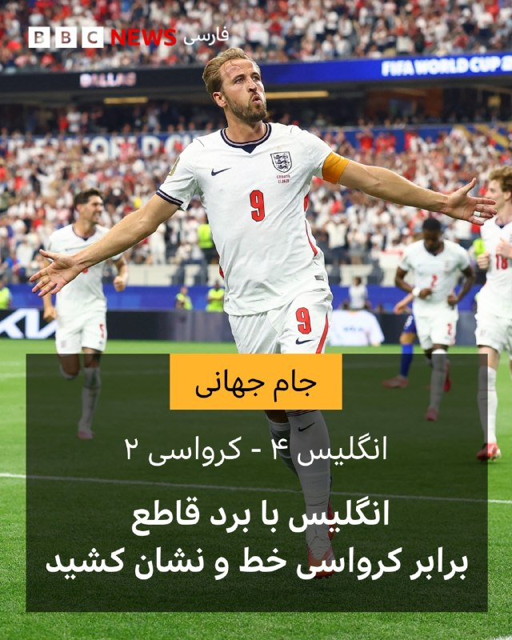

⚽ انگلیس ۴ - کرواسی ۲

🔸تیم فوتبال انگلیس در نخستین مسابقه خود برابر کرواسی که عنوان سومی جام جهانی را یدک می‌کشد نمایشی بسیار موفق داشت و توانست در نهایت با نتیجه چهار بر دو پیروز شود.

گل های «سه شیر» با دبل هری کین، رابرت رشفورد و جو بلینگام رقم خورد.

برای کرواسی هم مارتین باتورینا و پتار موسا دو بار گل زدند تا نتیجه را در همان نیمه اول به تساوی بکشند اما جود بلینگام در همان دقایق اول نیمه دوم گل سوم انگلیس را زد و بعد عم رشفورد با گل چهارم توماس توخل آلمانی را از اضطراب دقایق پایانی نجات داد.

تیم ملی انگلیس با یکی از پرستاره‌ترین ترکیب‌های تاریخ خود وارد جام جهانی ۲۰۲۶ شده است. «سه‌شیر» این بار با هدایت توماس توخل به دنبال پایان دادن به طلسم و انتظار طولانی فتح جام جهانی از سال ۱۹۶۶هستند.

https://bbc.in/4aaDdvs
📷Reuters

@BBCPersian

## BBCPersian — post 284206

🔻تردید در برگزاری مراسم رسمی امضای تفاهمنامه در سوئیس

🔻پس از آن که کاخ سفید و وزارت خارجه ایران از امضای تفاهمنامه میان مسعود پزشکیان و دونالد ترامپ خبر دادند، به نظر می‌رسد برگزاری مراسم تشریفات رسمی برای امضای این سند که اعلام شده بود روز جمعه در سوئیس برگزار شود، لغو شده یا دست کم در زمان اعلام شده برگزار نخواهد شد.

ساعتی قبل اسماعیل بقایی، سخنگوی وزارت خارجه ایران ضمن توضیحاتی درباره متن منتشر شده و امضای روسای جمهور ایران و آمریکا، تلویحا گفت که تهران تمایل خاصی برای مراسم سوئیس ندارد.

خبرگزاری دولتی ایرنا درباره امضای آقایان پزشکیان و ترامپ و به نقل از آقای بقایی نوشت: «وقتی متن به امضای بالاترین مقام‌های دو کشور برسد، قاعدتا نقض آن هزینه‌های بیشتری دارد و ما با توجه به تجربه‌هایی که داریم ترجیح دادیم که این اتفاق بیافتد. ضمن اینکه تشخیص دادیم برگزاری مراسم هم چندان جایی [در برنامه ما] ندارد.»

https://bbc.in/4vdn6Wl
@BBCPersian

## BBCPersian — post 284196

🔻کاخ سفید متن یادداشت تفاهم ایران و آمریکا را منتشر کرد. این سند که به طور الکترونیکی امضا شده است، قرار است روز جمعه در مراسمی در سوئیس به امضای مقامات ایرانی و آمریکایی برسد. متن منتشر شده ۱۴ بند دارد و مقامات آمریکایی توضیحاتی در کنار برخی موارد نوشتند.

آلبوم را ورق بزنید و مفاد این تفاهمنامه را بخوانید و توضیخات بیشتر را از لینک زیر در وبسایت بی‌بی‌سی فارسی بخوانید:

https://bbc.in/4vdkMP7
📷Getty Images/ Anadolu via Getty Images/ Sygma via Getty Images/ Bloomberg via Getty Images

@BBCPersian

## Dirty_Kids — post 392459

لحظه‌ای که ترامپ، سند تفاهم با ایران رو سرِ میز شام امضا کرد ؛ بعدشم همه واسش دست زدن... @Dirty_Kids 👻

## Dirty_Kids — post 392458

  <a href="telegram/content/Dirty_Kids_392458_1781748055.mp4" target="_blank">🎬 Download video</a>

لحظه‌ای که ترامپ، سند تفاهم با ایران رو سرِ میز شام امضا کرد ؛

بعدشم همه واسش دست زدن...

@Dirty_Kids 👻

---
📅 بروزرسانی: 1405/03/28 03:03
---

## VahidOOnLine — post 246109

  <a href="telegram/content/VahidOOnLine_246109_1781739185.mp4" target="_blank">🎬 Download video</a>

محمدباقر قالیباف، رییس هیات مذاکره‌کننده جمهوری اسلامی با آمریکا، گفت داوطلب این مسئولیت نبوده و حتی «کراهت شدید» نسبت به آن داشته است زیرا دونالد ترامپ در کشته شدن قاسم سلیمانی نقش داشت.
او افزود با وجود این، چون مسئولان بر حضور او تاکید داشتند این مسئولیت را از سر وظیفه پذیرفت.
‌🏁 🇬🇧 IranintlTV

🤖 @VahidOOnLine

## VahidOOnLine — post 246108

  

چند مقام ارشد دولت آمریکا در یک نشست توجیهی با خبرنگاران تاکید کردند که هیچ‌یک از امتیازهای اقتصادی پیش‌بینی‌شده در یادداشت تفاهم تهران و واشینگتن بدون اجرای تعهدات حکومت ایران عملی نخواهد شد و همه مراحل به صورت تدریجی، قابل راستی‌آزمایی و مشروط به رفتار تهران خواهد بود.
این مقام‌های آمریکایی درباره بند نخست تفاهم‌نامه درباره پایان فوری و دائمی عملیات نظامی در همه جبهه‌ها از جمله لبنان، گفتند این بند هیچ تعهد تازه‌ای برای واشینگتن ایجاد نمی‌کند، بلکه چارچوبی طراحی شده است که هرگونه گشایش اقتصادی در آینده تنها در صورتی اتفاق بیفتد که حکومت ایران به تعهدات خود عمل کند.
این مقامات درباره بند سوم در ارتباط با ضرب‌الاجل ۶۰ روزه برای توافق نهایی، تاکید کردند که تفاهم‌نامه، خود توافق نهایی نیست و هر یک از طرفین تا زمان دستیابی به توافق جامع می‌توانند از مذاکرات خارج شوند.

‌🏁 🇬🇧 IranintlTV

🤖 @VahidOOnLine

## VahidOOnLine — post 246107

  <a href="telegram/content/VahidOOnLine_246107_1781739187.mp4" target="_blank">🎬 Download video</a>

♦️اسماعیل بقایی، سخنگوی وزارت امور خارجه جمهوری اسلامی، بامداد پنجشنبه ۲۸ خردادماه گفت گزینه رقیق‌سازی مواد غنی‌شده در داخل ایران از ابتدای مذاکرات هسته‌ای مطرح بوده و موضوع تازه‌ای نیست. او افزود این گزینه برای جلوگیری از طرح پیشنهادهایی مانند انتقال مواد غنی‌شده به خارج از ایران مطرح شده است و تاکید کرد: «انتقال مواد غنی‌شده به خارج از ایران برای ما قابل قبول نیست.»
‌🇸🇦 Indypersian

🤖 @VahidOOnLine

## VahidOOnLine — post 246106

  

اسماعیل بقایی، سخنگوی وزارت خارجه جمهوری اسلامی، گفت: «سازوکارهای مدیریت تنگه هرمز تا حدود زیادی با عمان بسته شده است و جمهوری اسلامی در ازای خدمات در تنگه هرمز هزینه دریافت خواهد کرد. تردد ایمن با حفظ حاکمیت جمهوری اسلامی بر تنگه هرمز خواهد بود.»
‌🏁 🇬🇧 IranintlTV

🤖 @VahidOOnLine

## VahidOOnLine — post 246105

  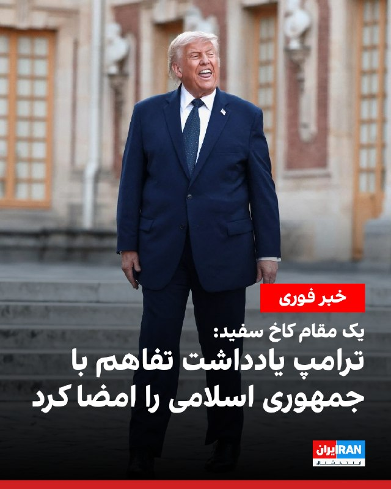

یک مقام کاخ سفید به رویترز گفت: «ترامپ چهارشنبه یادداشت تفاهمی را که با هدف پایان دادن به جنگ با ایران تدوین شده است، امضا کرد.»
خبرگزاری تسنیم، وابسته به سپاه، نیز به نقل از یک منبع نزدیک به تیم مذاکره‌کننده گزارش داد که متن فارسی این تفاهم‌نامه به عنوان یک سند رسمی به امضای دو طرف آمریکا و جمهوری اسلامی رسیده است.

‌🏁 🇬🇧 IranintlTV

🤖 @VahidOOnLine

## VahidOOnLine — post 246104

  

اسماعیل بقایی، سخنگوی وزارت خارجه جمهوری اسلامی، گفت: «موشک‌های ایران فقط برای شلیک شدن هستند نه برای مذاکره. موشک‌های ما اصلا دوست ندارند که کسی درباره‌شان حرف بزند درباره توانایی دفاعی ایران در هیچ روندی و با هیچ طرفی صحبت نخواهد شد.»
‌🏁 🇬🇧 IranintlTV

🤖 @VahidOOnLine

## VahidOOnLine — post 246103

  

اسماعیل بقایی، سخنگوی وزارت خارجه جمهوری اسلامی، گفت: «از ابتدا گفته‌ایم که مواد غنی‌شده هسته‌ای به خارج از ایران منتقل نخواهد شد. رقیق‌سازی مواد غنی‌شده گزینه جدیدی نیست، الان هم به عنوان یک گزینه معرفی شده است تا راه را بر گزینه‌های دیگر ببندیم.»
او افزود: «گزینه غیرقابل قبول برای ما، انتقال مواد غنی‌شده هسته‌ای به خارج از کشور است.»

‌🏁 🇬🇧 IranintlTV

🤖 @VahidOOnLine

## VahidOOnLine — post 246102

  <a href="telegram/content/VahidOOnLine_246102_1781739190.mp4" target="_blank">🎬 Download video</a>

محمدباقر قالیباف، رییس هیات مذاکره‌کننده جمهوری اسلامی با آمریکا، گفت هر پیروزی در جنگ اگر در نهایت به یک سند حقوقی و سیاسی منتهی نشود و ثبت نشود، هیچ منفعتی نخواهد داشت.
او افزود جمهوری اسلامی در جنگ ۴۰ روزه پیروز شده و دستاورد این پیروزی در مذاکره شکل می‌گیرد.
به گفته قالیباف، این تفاهم‌نامه «کارنامه شکست آمریکا» است؛ تعبیری که او آن را نقل‌قولی از غربی‌ها دانست.
‌🏁 🇬🇧 IranintlTV

🤖 @VahidOOnLine

## VahidOOnLine — post 246101

  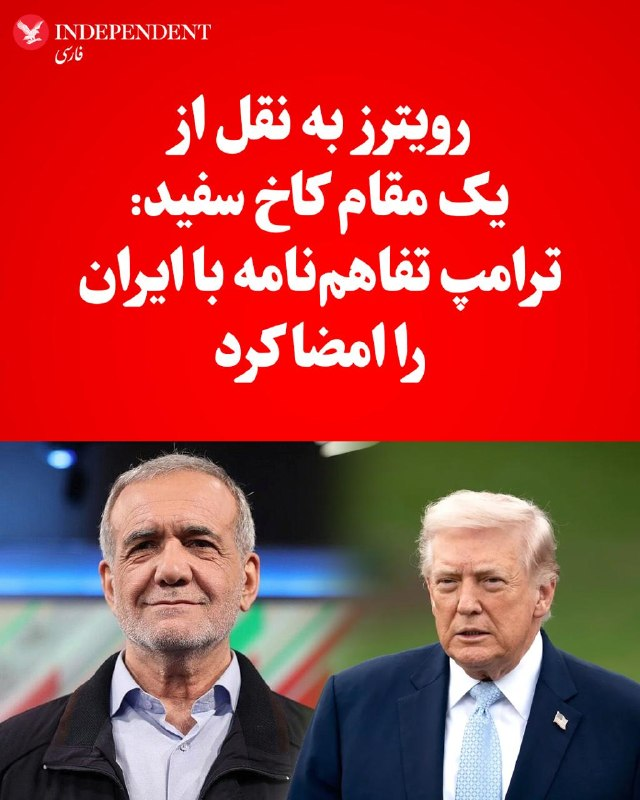

♦️خبرگزاری رویترز به نقل از یک مقام کاخ سفید گزارش داد دونالد ترامپ، رئیس‌جمهوری آمریکا، چهارشنبه ۲۷ خرداد تفاهم‌نامه با ایران را که با هدف پایان دادن به جنگ میان دو کشور تدوین شده است، امضا کرد.
این مقام کاخ سفید جزئیات بیشتری درباره روند امضا یا مفاد تازه این تفاهم‌نامه ارائه نکرد. پیش‌تر اسماعیل بقایی، سخنگوی وزارت امور خارجه جمهوری اسلامی، اعلام کرد توافق ایران و آمریکا به امضای روسای جمهوری دو کشور رسیده است.
‌🇸🇦 Indypersian

🤖 @VahidOOnLine

## VahidOOnLine — post 246100

  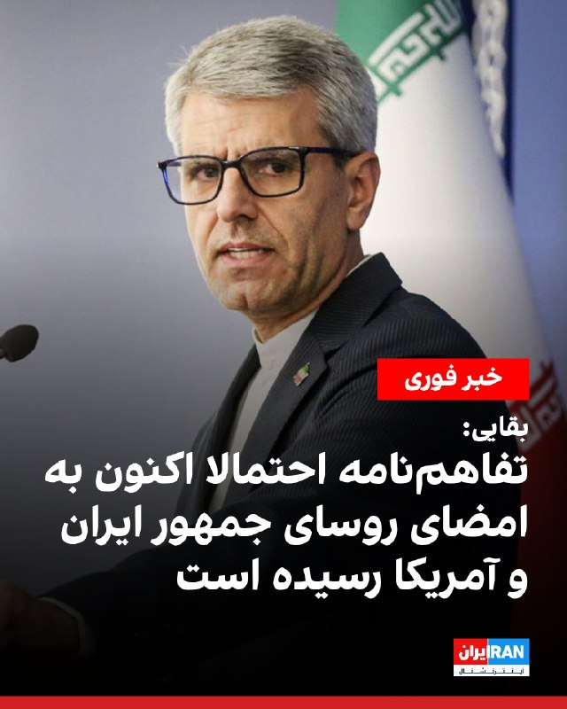

اسماعیل بقایی، سخنگوی وزارت خارجه جمهوری اسلامی، گفت: «احتمالا اکنون متن تفاهم‌نامه اسلام آباد به امضای روسای جمهور ایران و آمریکا رسیده باشد. متن این تفاهم‌نامه الان رسما نهایی شده است، چرا که دو طرف آن را امضا کرده‌اند. این تفاهم‌نامه قرار شد که به صورت دیجیتال امضا شود.»
او افزود: وقتی تفاهم‌نامه به امضای روسای جمهوری دو کشور برسد نقض آن هزینه بیشتری خواهد داشت.

‌🏁 🇬🇧 IranintlTV

🤖 @VahidOOnLine

## VahidOOnLine — post 246099

  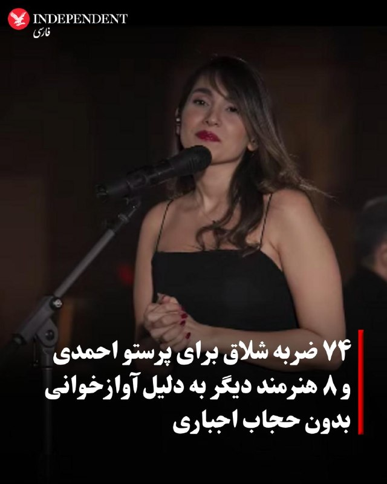

♦️بر اساس اطلاعات رسیده به ایندیپندنت فارسی، پرستو احمدی، خواننده معترض ساکن ایران، به همراه ۸ نفر از نوازندگان و عوامل اجرایی پروژه «کنسرت کاروانسرا» از سوی دادگاه کیفری استان قم به ۷۴ ضربه شلاق، دو سال ممنوع‌الخروجی و دو سال محرومیت از فعالیت هنری محکوم شده‌اند.

این احکام در پی رسیدگی به پرونده‌ای صادر شده است که پس از انتشار ویدیوی «کنسرت کاروانسرا» در آذر ۱۴۰۳ علیه دست‌اندرکاران این برنامه تشکیل شد. شعبه رسیدگی‌کننده دفاعیات متهمان را نپذیرفته و آنان را به اتهام «جریحه‌دار کردن عفت عمومی» از طریق تولید و انتشار محتوای به‌اصطلاح «خلاف اخلاق» در فضای مجازی مجرم شناخته است.

ویدیوی این اجرای موسیقی که در کاروانسرای تاریخی دیرگچین ضبط و در یوتیوب منتشر شد، با حضور پرستو احمدی به‌عنوان خواننده گروه و بدون رعات حجاب اجباری، با استقبال گسترده ایرانیان روبه‌رو شده بود. پس از انتشار این برنامه، پرستو احمدی و همکارانش بازداشت شدند و محل برگزاری کنسرت نیز پلمب شد.

پرستو احمدی پیش‌تر در توضیح این اجرا نوشته بود: «من، پرستو، دختری که می‌خواهم برای مردمی که دوستشان دارم بخوانم. این حقی است که نمی‌توانستم از آن چشم بپوشم.»
‌🇸🇦 Indypersian

🤖 @VahidOOnLine

## VahidOOnLine — post 246098

  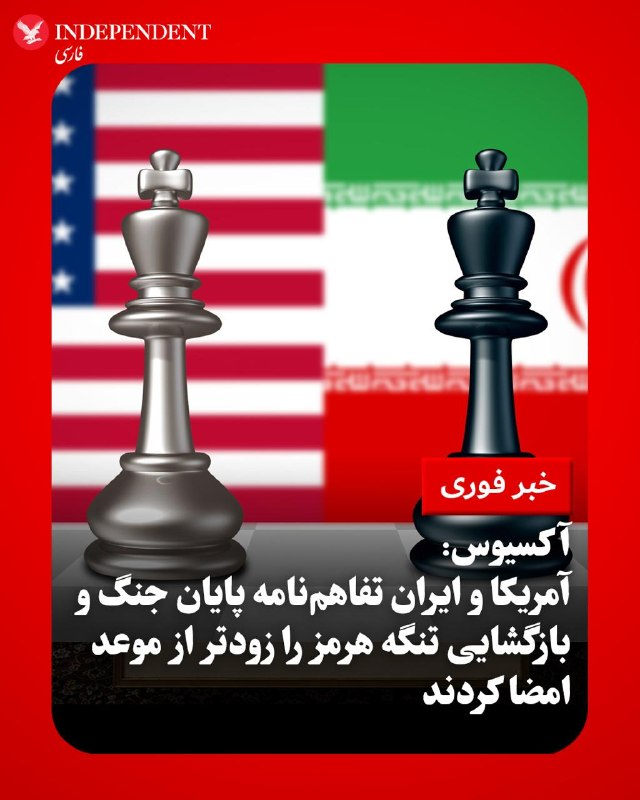

♦️وب‌سایت آکسیوس بامداد پنجشنبه ۲۸ خردادماه به نقل از دو مقام آمریکایی گزارش داد آمریکا و ایران تفاهم‌نامه پایان جنگ و بازگشایی تنگه هرمز را زودتر از موعد پیش‌بینی‌شده و به‌صورت غیرحضوری امضا کرده‌اند و این توافق اکنون اجرایی شده است. به گفته یکی از این مقام‌ها، دونالد ترامپ شخصاً این سند را امضا کرده است.

آکسیوس نوشت قرار بود این تفاهم‌نامه روز جمعه در سوئیس امضا شود، اما دو طرف برای تسریع اجرای توافق و بازگشایی زودتر تنگه هرمز، روند امضا را جلو انداختند. وزارت خارجه جمهوری اسلامی نیز اعلام کرد دو طرف توافق کرده‌اند سند را به‌صورت الکترونیکی و توسط روسای جمهوری امضا کنند. با این حال، نشست هیات‌های آمریکایی و ایرانی به ریاست جی‌دی ونس و محمدباقر قالیباف همچنان طبق برنامه روز جمعه در سوئیس برگزار خواهد شد و انتظار می‌رود آغاز مذاکرات درباره برنامه هسته‌ای ایران محور اصلی این دیدار باشد.
‌🇸🇦 Indypersian

🤖 @VahidOOnLine

## VahidOOnLine — post 246097

  <a href="telegram/content/VahidOOnLine_246097_1781739193.mp4" target="_blank">🎬 Download video</a>

♦️اسماعیل بقایی، سخنگوی وزارت امور خارجه جمهوری اسلامی ایران، در گفتگو با صداوسیما گفت متن توافق ایران و آمریکا بامداد پنج‌شنبه ۲۸ خرداد به امضای روسای جمهوری دو کشور رسیده است.
بقایی با اشاره به برنامه‌ریزی‌های انجام‌شده برای امضای این توافق گفت: «همین الان که در حال صحبت هستیم، متن رسما به امضای روسای جمهوری دو کشور رسیده است.»
او گفت: «وقتی متن به امضای بالاترین مقام‌های دو کشور برسد، قاعدتا نقض آن هزینه‌های بیشتری دارد و ما با توجه به تجربه‌هایی که داریم ترجیح دادیم که این اتفاق بیافتد. ضمن اینکه تشخیص دادیم برگزاری مراسم هم چندان جایی [در برنامه ما] ندارد.»
‌🇸🇦 Indypersian

🤖 @VahidOOnLine

## VahidOOnLine — post 246096

  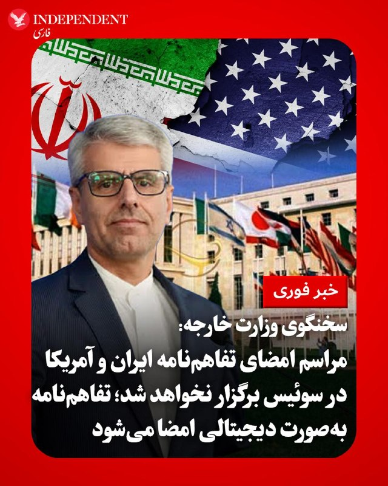

♦️اسماعیل بقایی، سخنگوی وزارت امور خارجه جمهوری اسلامی، چهارشنبه ۲۷ خرداد در گفتگو با صداوسیما اعلام کرد مراسم امضای تفاهم‌نامه ایران و آمریکا که قرار بود در سوئیس برگزار شود، انجام نخواهد شد و این سند به‌صورت دیجیتالی به امضای دو طرف خواهد رسید.
بقایی گفت تصمیم اولیه بر برگزاری نشستی در سوئیس و امضای رسمی متن از سوی دو طرف بود، اما پس از بررسی‌های انجام‌شده، ترجیح داده شد این سند توسط روسای جمهوری دو کشور و به‌صورت مجازی امضا شود. به گفته او، امضای سند توسط بالاترین مقام‌های دو کشور، هزینه نقض آن را افزایش می‌دهد.
سخنگوی وزارت امور خارجه همچنین تاکید کرد که با وجود لغو مراسم امضا، برنامه حضور تیم‌های مذاکره‌کننده و ادامه گفتگوها در سوئیس همچنان در دستور کار قرار دارد.
‌🇸🇦 Indypersian

🤖 @VahidOOnLine

## VahidOOnLine — post 246095

  <a href="telegram/content/VahidOOnLine_246095_1781739196.mp4" target="_blank">🎬 Download video</a>

♦️دونالد ترامپ، رئیس‌جمهوری آمریکا، روز چهارشنبه ۲۷ خردادماه در پاریس گفت اگر کشورهای دیگر به موشک‌های بالستیک دسترسی دارند، محروم کردن ایران از این توانمندی «کمی ناعادلانه» است. او تاکید کرد که موشک‌های بالستیک با برنامه هسته‌ای تفاوت دارند و نباید این دو موضوع با یکدیگر خلط شوند.

ترامپ در پاسخ به سوالی درباره اظهارات پیشین خود گفت: «اگر کشورهای دیگر این موشک‌ها را دارند، کمی ناعادلانه است که ایران هیچ‌کدام را نداشته باشد.» او افزود: «اگر عربستان سعودی، قطر و کشورهای دیگر چنین موشک‌هایی دارند، فکر می‌کنم در یک تناسب نسبی، داشتن آن‌ها اشکالی ندارد.» ترامپ همچنین گفت موشک‌های بالستیک با موضوع سلاح هسته‌ای متفاوت‌اند و تفاهم‌نامه اخیر تهران و واشینگتن بر جلوگیری از دستیابی ایران به سلاح هسته‌ای متمرکز است.
‌🇸🇦 Indypersian

🤖 @VahidOOnLine

## VahidOOnLine — post 246094

  <a href="telegram/content/VahidOOnLine_246094_1781739196.mp4" target="_blank">🎬 Download video</a>

محمدباقر قالیباف، رییس هیات مذاکره‌کننده جمهوری اسلامی با آمریکا، گفت طرف مقابل حاضر نیست بپذیرد متجاوز بوده است، زیرا در این صورت باید همه خسارت‌ها را بپردازد.
او افزود به‌جای پرداخت خسارت، در متن بر مفاهیمی چون «بازسازی» و «توسعه اقتصادی» تاکید شده است.
به گفته قالیباف، در همین چارچوب ۳۰۰ میلیارد دلار سرمایه‌گذاری پیش‌بینی شده که بخشی از آن صرف بازسازی و جبران خسارت‌ها خواهد شد.
‌🏁 🇬🇧 IranintlTV

🤖 @VahidOOnLine

## VahidOOnLine — post 246093

♦️دونالد ترامپ، رئیس‌جمهوری آمریکا، چهارشنبه ۲۷ خرداد پس از شرکت در نشست سران گروه هفت (G7)، برای حضور در ضیافت شام رسمی راهی کاخ ورسای شد و مورد استقبال امانوئل مکرون، رئیس‌جمهوری فرانسه، قرار گرفت.
به گزارش رویترز، مکرون در بدو ورود ترامپ از او در کاخ تاریخی ورسای استقبال کرد. دو رهبر قرار است در این اقامتگاه تاریخی در ضیافت شام رسمی شرکت کنند.
‌🇸🇦 Indypersian

🤖 @VahidOOnLine

## VahidOOnLine — post 246092

♦️محمدباقر قالیباف، رئیس مجلس شورای اسلامی و مذاکره‌کننده ارشد جمهوری اسلامی، چهارشنبه‌شب ۲۷ خردادماه در مصاحبه‌ای که همزمان با انتشار مفاد تفاهم‌نامه تهران و واشنگتن از صداوسیما پخش شد، گفت برای حضور در مذاکرات با دولت دونالد ترامپ تمایلی نداشت و به دلیل نقش ترامپ در کشتن قاسم سلیمانی، «کراهت شدید» برای ورود به این روند احساس می‌کرد. او افزود که با وجود این مخالفت شخصی، به درخواست مقام‌های جمهوری اسلامی مسئولیت مذاکرات را پذیرفت.

قالیباف در این مصاحبه گفت: «ترامپ طراح کشتن قاسم سلیمانی بود و بر آن عملیات نظارت کرد، برای من سخت بود که با چنین فردی بنشینم.» او اضافه کرد که بارها پیشنهاد داده افراد دیگری مسئولیت مذاکرات را بر عهده بگیرند، اما همه مسئولان تنها نام او را مطرح کردند. قالیباف گفت: «وقتی دیدم همه مسئولین فقط من را می‌خواهند، احساس کردم وظیفه است و باید آنچه را وظیفه‌مان است انجام دهیم، نه آنچه را دوست داریم.»
‌🇸🇦 Indypersian

🤖 @VahidOOnLine

## VahidOOnLine — post 246091

  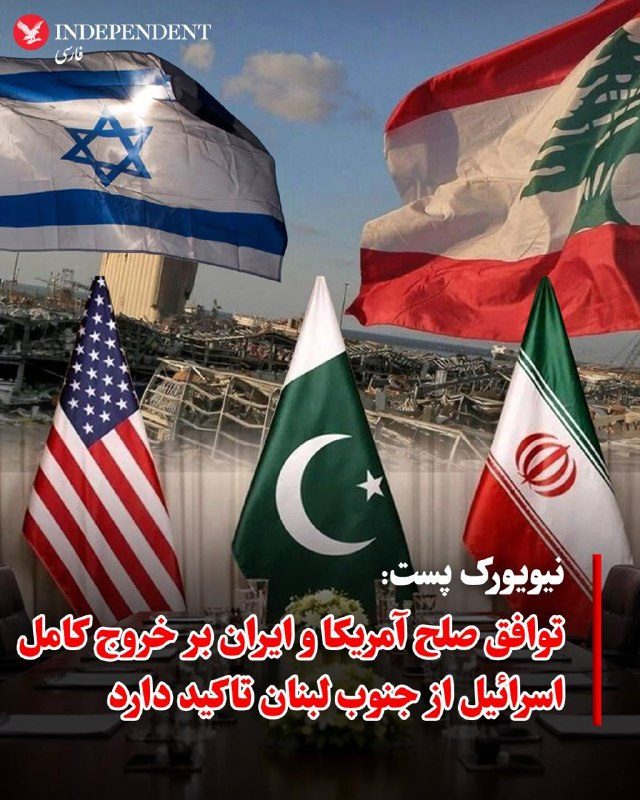

♦️نیویورک پست با استناد به متن کامل تفاهم‌نامه میان ایران و آمریکا گزارش داد که این توافق بر «پایان فوری و دائمی عملیات نظامی در همه جبهه‌ها، از جمله لبنان» و همچنین احترام به تمامیت ارضی و حاکمیت لبنان تاکید دارد؛ موضوعی که به نوشته این روزنامه می‌تواند اسرائیل را به خروج کامل از جنوب لبنان ملزم کند.
بر اساس این گزارش، در متن تفاهم‌نامه آمده است که ایران، آمریکا و متحدان دو طرف متعهد می‌شوند از هرگونه اقدام نظامی، تهدید یا استفاده از زور علیه یکدیگر خودداری کنند و حاکمیت و تمامیت ارضی لبنان را محترم بشمارند.
نیویورک پست همچنین نوشت این بندها با موضع دولت اسرائیل مبنی بر ادامه حضور نیروهایش در مناطق امنیتی جنوب لبنان در تضاد است. اسرائیل کاتز، وزیر دفاع اسرائیل، پیش‌تر گفته بود که این کشور از مناطق امنیتی مورد نظر خود عقب‌نشینی نخواهد کرد.
‌🇸🇦 Indypersian

🤖 @VahidOOnLine

## WithYashar — post 15204

مذاکرات جمعه ایران و آمریکا در سوئیس الان قطعی نیست

بقایی، سخنگوی وزارت خارجه:
جلسه جمعه تا چند ساعت قبل قطعی بود ولی وقتی قرار شد روسای جمهور دو طرف (ایران و آمریکا) تفاهمنامه را امضا کنند، قرار شد درباره جلسه جمعه فعلاً تامل شود.
@withyashar

## WithYashar — post 15203

## WithYashar — post 15202

https://x.com/yasharrapfa

## WithYashar — post 15201

## WithYashar — post 15200

کاخ سفید: ترامپ تفاهم‌نامه با ایران را امضا کرد
@withyashar

## WithYashar — post 15199

طبق گزارش Axios، رئیس‌جمهور ترامپ شخصاً نسخه‌ای از توافقنامه را در حین صرف شام با رئیس‌جمهور فرانسه ماکرون در کاخ ورسای امضا کرد.

عکسی از توافقنامه امضا شده به ایرانی‌ها و کشورهای میانجی ارسال شد.
@withyashar

## WithYashar — post 15198

تسنیم: متن فارسی تفاهمنامه نیز به عنوان سند رسمی به امضای ایران و آمریکا رسیده است
@withyashar

## WithYashar — post 15197

  <a href="telegram/content/WithYashar_15197_1781739198.mp4" target="_blank">🎬 Download video</a>

بقایی: همین الان که در حال صحبت هستیم متن توافق رسما به امضا رئیس جمهور های دو طرف رسیده است

قرار بود که بامداد روز ۲۸ خرداد ماه رئیس جمهور دو کشور این متن و توافق رو امضا کنند.
@withyashar

## WithYashar — post 15196

## WithYashar — post 15195

## WithYashar — post 15194

ترامپ: ظرف ۴۸ ساعت آینده توافق با ایران امضا خواهد شد و احتمالا برای مدتی ارتش رو در خلیج فارس نگه خواهیم داشت.
@withyashar

## mwarmonitor — post 11095

  <a href="telegram/content/mwarmonitor_11095_1781739201.mp4" target="_blank">🎬 Download video</a>

📝 هنر والای «ربط دادن گوز به شقیقه» دقیقاً از همین‌جا شکل می‌گیرد؛ جایی که ممدباقر طرقبه‌چی با استشمام بوی شیرین دلار، حتی اگر کل هیمنه و رهبران مقاومت هم روی هوا بروند، با وقاحت تمام ایستاده و برای حفظ صندلی‌اش معامله می‌کند. او در این مصاحبه خفت‌بار ، با یک پاس‌کاری فلسفی-انتحاری، پرونده «انتقام سخت» را رسماً بست و صورت‌حساب خون موشعلی را حواله داد به امام زمان تا خودش بیاید و حساب کند! منطقِ مملی این است که کشتن صد تا نتانیاهو هم به اندازه بند کفش رهبرشان ارزش ندارد و اصلاً اگر شمر را همان موقع می‌کشتند مگر انتقام امام حسین گرفته می‌شد!!! اینجاست که مجری فلک‌زده با چشم‌های از حدقه درآمده، دو سکته ناقص را رد می‌کند و غرق در این شاهکارِ ماست‌مالی می‌شود. بی‌غیرتی ممدباقر در ترانسفر کردنِ وظیفه جنگیدن به دوش مقدسات، اوج رذالت است که نشان می‌دهد این جماعت چطور خون می‌فروشند و به ریش عالم و آدم می‌خندند.

@mwarmonitor

## mwarmonitor — post 11094

  <a href="telegram/content/mwarmonitor_11094_1781739202.mp4" target="_blank">🎬 Download video</a>

📝در این قاب از ویدیو، شاهکار دیپلماسی ترامپ را می‌بینیم که با همان وقاحت همیشگی پشت تریبون اعلام می‌کند اگر کارها خوب پیش برود افتخارش برای اوست و اگر خراب شود، تقصیر جی‌دی ونس است! اما اوج کمدی سیاه این صحنه، قیافه مارکو روبیو در سمت راست است؛ مردی که انگار روح از بدنش خارج شده و با فکی منقبض و نگاهی خیره به افق، به مرز جنون رسیده است. چهره عصبانی و مستأصل او دقیقاً شبیه کسی است که متوجه شده در گروگان یک کله‌زرد روان‌پریش است، اما برای حفظ ظاهر مجبور است مثل یک مجسمه دکوری بایستد و سقوط آزاد کشورش را تماشا کند.

@mwarmonitor

## mwarmonitor — post 11093

  <a href="telegram/content/mwarmonitor_11093_1781739203.mp4" target="_blank">🎬 Download video</a>

📝 این بازجوخبرنگار دوزاری که مثل محتوای تخم‌مرغ شانسی از هر سوراخی بیرون می‌پره، این‌بار با یک سناریوی بالیوودی جدید برگشته تا حماسه بمباران پایگاه آمریکا با لگن‌های پرنده F-5 را به خورد ملت بده. داستان از این قراره که وقتی شبکه ABC آمریکا یک خط خبر رفت، اتاق فرمان صداوسیما سریع عوامل فیلم «تاپ‌گان مناطق محروم» را به خط کرد؛ خلبان‌های بی‌نوایی که روح‌شون هم از این حماسه خبر نداشت و وسط مصاحبه جوری نگاه می‌کردند که انگار تازه فهمیده‌اند دیشب در خواب کویت را فتح کرده‌اند! رضوانی با آن قیافه حق‌به‌جانب جوری از این «عملیات کم‌نظیر» حرف می‌زند که انگار با جنگنده‌های نسل ششم به قلب پنتاگون زده‌اند، در حالی که تنها دستاورد واقعی این نوابغ هوانوردی، حمله اشتباهی به قطر و زدن دو فروند از هواپیماهای خودی بود؛ مأموریتی چنان طوفانی و آبروبر که هنوز که هنوزه از سرنوشت خلبان‌های غیور و همیشه در صحنه خبری در دست نیست!

@mwarmonitor

## mwarmonitor — post 11092

🔸ترامپ:

۹ مارس: «ما حالا کاملاً از خاورمیانه مستقل هستیم. ما به نفت آن‌ها نیازی نداریم.»

۱ آوریل: «واقعاً روی ما تأثیری ندارد. ما نفت بسیار زیادی داریم. نفت و گاز فوق‌العاده زیادی داریم، خیلی بیشتر از نیازمان.»

۱۷ ژوئن: اگر من با یادداشت تفاهم (MOU) موافقت نمی‌کردم، «حدوداً ظرف ۴ هفته ذخایرمان تمام می‌شد… واقعاً به پایان می‌رسید، و زمانی می‌آمد که دیگر نمی‌توانستید به آن دسترسی داشته باشید.»

@mwarmonitor

## mwarmonitor — post 11091

🔴فوری: به گفته دو مقام آمریکایی به آکسیوس، ایالات متحده و ایران یادداشت تفاهم (MOU) پایان‌دهنده جنگ را به‌صورت الکترونیکی امضا کرده‌اند و این توافق اکنون لازم‌الاجرا شده است. @mwarmonitor

## mwarmonitor — post 11090

🔴فوری: به گفته دو مقام آمریکایی به آکسیوس، ایالات متحده و ایران یادداشت تفاهم (MOU) پایان‌دهنده جنگ را به‌صورت الکترونیکی امضا کرده‌اند و این توافق اکنون لازم‌الاجرا شده است.

@mwarmonitor

## mwarmonitor — post 11089

  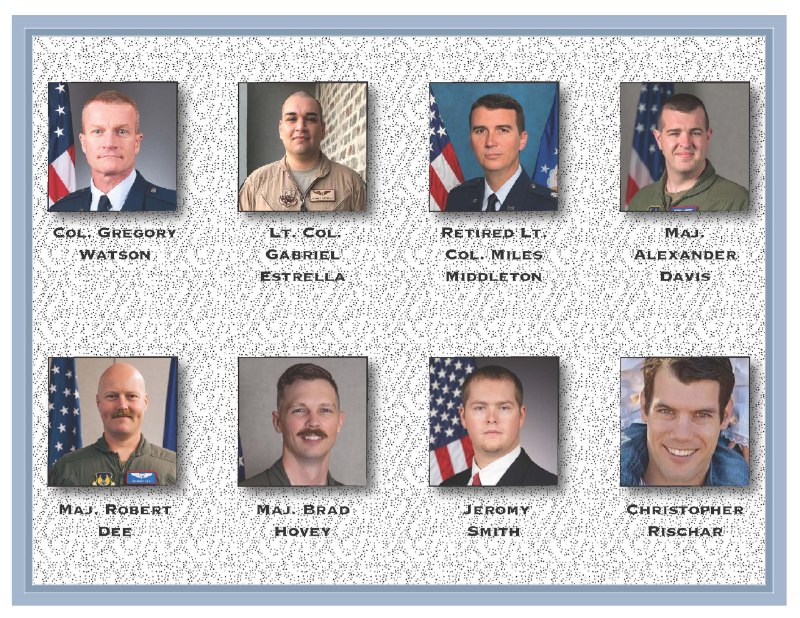

🚨✈️یک فروند بمب‌افکن B-52 استراتوفورترس متعلق به نیروی هوایی آمریکا، اندکی پس از برخاستن از پایگاه نیروی هوایی ادواردز و حوالی ساعت ۱۱:۲۰ صبح سقوط کرد. هنوز جزئیاتی درباره تلفات احتمالی یا علت این سانحه منتشر نشده است. @mwarmonitor

## mwarmonitor — post 11088

🔴 مذاکره‌کننده ارشد ایران می‌گوید تنگه هرمز به وضعیت قبل از جنگ باز نخواهد گشت.

🔴 محمدباقر قالیباف می‌گوید ایران به‌طور طبیعی برای خدمات در تنگه هرمز هزینه عوارض دریافت خواهد کرد. العربیه

@mwarmonitor

## mwarmonitor — post 11087

🔴 ترامپ: ظرف ۴۸ ساعت آینده توافق با ایران امضا خواهد شد و احتمالاً برای مدتی ارتش را در خلیج فارس نگه خواهیم داشت.

@mwarmonitor

## FoxNewsTwitter — post 343097

  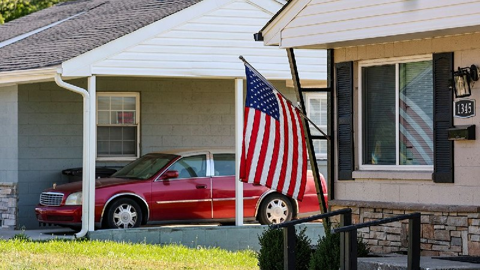

Fox News (Twitter/X)

The American flag is flying over a new political divide.

Just 27% of Democrats say they'll display a U.S. flag this July 4, according to a new poll, compared with 64% among Republicans.

The survey also found major differences in how Americans view the holiday itself. Nearly two-thirds of Republicans (65%) said July 4 is "a day where I celebrate the United States of America," while only 24% of Democrats agreed.

What was once one of the country's most universal symbols is increasingly being viewed through a partisan lens as Americans prepare to celebrate Independence Day.

## FoxNewsTwitter — post 343096

  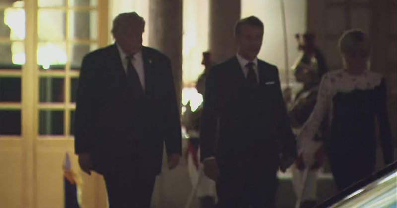

Fox News (Twitter/X)

WATCH LIVE: Trump arrives in Paris ahead of meetings with French President Macron https://twitter.com/i/broadcasts/1XGyggyZZEgxM

## FoxNewsTwitter — post 343095

  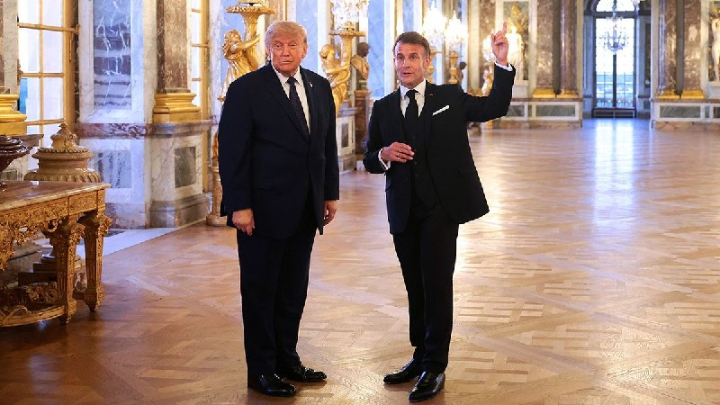

Fox News (Twitter/X)

A dinner at Versailles just became the setting for a major diplomatic breakthrough.

President Trump personally signed the Iran memorandum of understanding Wednesday while meeting with French President Emmanuel Macron, a White House official confirmed.

The agreement, which Iranian President Masoud Pezeshkian also signed, is now in effect to end the war and cancels the formal signing ceremony that had been scheduled in Geneva.

## FoxNewsTwitter — post 343094

  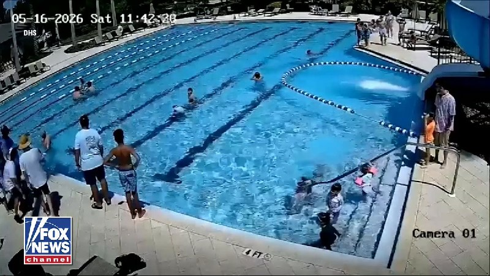

Fox News (Twitter/X)

A 6-year-old boy was found floating unconscious in a Florida pool. Seconds later, an ICE officer jumped in to save him.

ICE law enforcement officer Gregory Simmonds spotted the child in distress in Pasco County on May 16 and immediately pulled him from the water.

The child wasn't breathing, and Simmonds began life-saving CPR at the scene until the boy regained consciousness.

Local authorities say the child is expected to make a full recovery, a rescue DHS is calling an act of bravery.

## FoxNewsTwitter — post 343093

  <a href="telegram/content/FoxNewsTwitter_343093_1781739208.mp4" target="_blank">🎬 Download video</a>

Fox News (Twitter/X)

Like father, like son... almost.

A Ring doorbell camera captured the moment a dad landed a smooth kickflip in his driveway while his 2-year-old son tried to follow suit on a small bicycle.

Seconds later, the toddler launched himself right over the handlebars in a hilarious attempt to match dad’s skateboard skills.

## pm_afshaa — post 94309

  <a href="telegram/content/pm_afshaa_94309_1781739210.webm" target="_blank">🎬 Download video</a>

🔴رویترز: یک مقام کاخ سفید تأیید کرد که ترامپ یادداشت تفاهم با جمهوری اسلامی رو امضا کرده.

💧 Rainbet.com the #1 Non-KYC Crypto Casino & Sportsbook @rainbetcom

😁 @Pm_Afshaa

## pm_afshaa — post 94308

  <a href="telegram/content/pm_afshaa_94308_1781739210.webm" target="_blank">🎬 Download video</a>

🔴اکسیوس به نقل از مقام آمریکایی:
آمریکا و ایران روز چهارشنبه به‌صورت از راه دور تفاهمنامه پایان جنگ رو امضا کردن و این توافق از حالا لازم‌الاجرا است.

ترامپ شخصاً یک نسخه از این توافق رو طی شام با رئیس‌جمهور فرانسه در کاخ ورسای امضا کرد. عکس نسخهٔ امضا‌ شده هم برای ایرانی‌ها و کشورهای میانجی ارسال شد.

💧 Rainbet.com the #1 Non-KYC Crypto Casino & Sportsbook @rainbetcom

😁 @Pm_Afshaa

## pm_afshaa — post 94307

  <a href="telegram/content/pm_afshaa_94307_1781739211.webm" target="_blank">🎬 Download video</a>

🔴بقایی، سخنگوی وزارت خارجه: متن تفاهمنامه ایران و آمریکا رسما نهایی شده چون دو طرف اون رو امضا کردن. 
💧 Rainbet.com the #1 Non-KYC Crypto Casino & Sportsbook @rainbetcom 
😁 @Pm_Afshaa

## pm_afshaa — post 94306

بقائی:تفاهم‌نامه به‌صورت الکترونیکی بین پزشکیان و ترامپ امضا شده. جمعه هم خبری از مراسم رسمی نیست و فقط هیئت‌های ایران و آمریکا به سرپرستی قالیباف و جی‌دی ونس تو سوئیس دور اول مذاکرات فنی 30 روزه برای اجرای تفاهم‌نامه رو شروع می‌کنن

💧 Rainbet.com the #1 Non-KYC Crypto Casino & Sportsbook @rainbetcom

😁 @Pm_Afshaa

## pm_afshaa — post 94305

  <a href="telegram/content/pm_afshaa_94305_1781739211.mp4" target="_blank">🎬 Download video</a>

پیش بینی 2 سال پیش شاهین نجفی در مورد قالیباف

💧 Rainbet.com the #1 Non-KYC Crypto Casino & Sportsbook @rainbetcom

😁 @Pm_Afshaa

## pm_afshaa — post 94304

  <a href="telegram/content/pm_afshaa_94304_1781739212.webm" target="_blank">🎬 Download video</a>

🔴بقایی، سخنگوی وزارت خارجه:
متن تفاهمنامه ایران و آمریکا رسما نهایی شده چون دو طرف اون رو امضا کردن.

💧 Rainbet.com the #1 Non-KYC Crypto Casino & Sportsbook @rainbetcom

😁 @Pm_Afshaa

## pm_afshaa — post 94303

  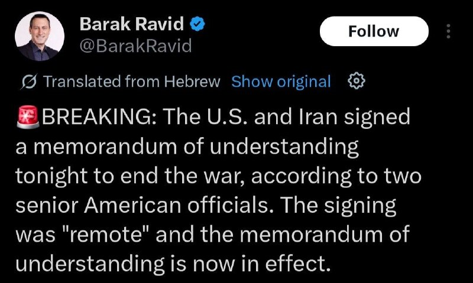

🔴باراک راوید، آکسیوس: ایران و آمریکا تفاهمنامه رو از راه دور امضا کردن.

💧 Rainbet.com the #1 Non-KYC Crypto Casino & Sportsbook @rainbetcom

😁 @Pm_Afshaa

## pm_afshaa — post 94302

  <a href="telegram/content/pm_afshaa_94302_1781739213.webm" target="_blank">🎬 Download video</a>

🔴قالیباف: در قوانین ایران هیچ مانعی برای حضور و سرمایه‌گذاری شرکت‌های آمریکایی در داخل ایران وجود نداره!

💧 Rainbet.com the #1 Non-KYC Crypto Casino & Sportsbook @rainbetcom

😁 @Pm_Afshaa

## pm_afshaa — post 94301

  <a href="telegram/content/pm_afshaa_94301_1781739213.mp4" target="_blank">🎬 Download video</a>

🔴قالیباف: ما میتونیم تنگه هرمز رو بر ضد آمریکا تبدیل کنیم. هیچ کس به کمک آمریکا نیومد. این موضوع که باید عوارض تردد در تنگه هرمز پرداخت بشه، تثبیت شده در تفاهم نامه.

💧 Rainbet.com the #1 Non-KYC Crypto Casino & Sportsbook @rainbetcom

😁 @Pm_Afshaa

## pm_afshaa — post 94300

  <a href="telegram/content/pm_afshaa_94300_1781739215.mp4" target="_blank">🎬 Download video</a>

🔴قالیباف: بند 6 تفاهم‌نامه 300 میلیارد دلار برای موضوع بازسازی و توسعه اقتصادی در ایران تعیین شده!

در این بند 300 میلیارد دلار تعیین شده تا در ایران سرمایه گذاری بشه که بخشی از آن صرف بازسازی خواهد شد.

💧 Rainbet.com the #1 Non-KYC Crypto Casino & Sportsbook @rainbetcom

😁 @Pm_Afshaa

## pm_afshaa — post 94299

  <a href="telegram/content/pm_afshaa_94299_1781739217.mp4" target="_blank">🎬 Download video</a>

🔴قالیباف: پول‌ها ر‌و باید بگیریم و در حساب ما و در خط اعتباری قرار بگیره.

هر کجا دشمن نسبت به این موضوعات بدقولی کنه، خلاصه بچرخ تا بچرخیم. تا جایی که تعهد دادیم هستیم، و هر کجا دشمن خلاف وعده عمل کند دست به ماشه هستیم.

💧 Rainbet.com the #1 Non-KYC Crypto Casino & Sportsbook @rainbetcom

😁 @Pm_Afshaa

## pm_afshaa — post 94298

  <a href="telegram/content/pm_afshaa_94298_1781739218.webm" target="_blank">🎬 Download video</a>

🔴العربیه: قالیباف میگه تنگه هرمز دیگه به وضعیت قبل از جنگ برنمی‌گرده. ایران از این پس به‌صورت طبیعی بابت خدمات و عبور در تنگه هرمز عوارض دریافت خواهد کرد.

💧 Rainbet.com the #1 Non-KYC Crypto Casino & Sportsbook @rainbetcom

😁 @Pm_Afshaa

## pm_afshaa — post 94297

  <a href="telegram/content/pm_afshaa_94297_1781739219.webm" target="_blank">🎬 Download video</a>

🔴ترامپ: ظرف 48 ساعت آینده توافق با ایران امضا خواهد شد و احتمالا برای مدتی ارتش رو در خلیج فارس نگه خواهیم داشت.

💧 Rainbet.com the #1 Non-KYC Crypto Casino & Sportsbook @rainbetcom

😁 @Pm_Afshaa

## pm_afshaa — post 94296

  <a href="telegram/content/pm_afshaa_94296_1781739219.webm" target="_blank">🎬 Download video</a>

🔴قالیباف: ترامپ قاتل قاسم سلیمانیه و برای من مذاکره با اون سخت بود.

💧 Rainbet.com the #1 Non-KYC Crypto Casino & Sportsbook @rainbetcom

😁 @Pm_Afshaa

## pm_afshaa — post 94295

  <a href="telegram/content/pm_afshaa_94295_1781739220.webm" target="_blank">🎬 Download video</a>

🔴قالیباف: چیزی که با مذاکره به دست آوردیم، چندین برابر چیزی بود که با اقدام نظامی می‌تونستیم به دست بیاریم.

ترامپ تا 2 بامداد شخصا برای برقراری آتش‌بس وارد عمل شد و همین نشان میده مذاکره هم یک روش مبارزه‌ست.

بدون موشک، شجاعت و حمایت مردم، چنین دستاوردی ممکن نبود.

💧 Rainbet.com the #1 Non-KYC Crypto Casino & Sportsbook @rainbetcom

😁 @Pm_Afshaa

## DEJradio — post 5773

  <a href="telegram/content/DEJradio_5773_1781739220.mp4" target="_blank">🎬 Download video</a>

⚽️
🔺 جام‌جهانی ۲۰۲۶؛ بررسی قضاوت علیرضا فغانی از نگاه برادرش؛

#جام_جهانی #دژفوتبالی
@DEJradio

## mamlekate — post 103734

  <a href="telegram/content/mamlekate_103734_1781739222.mp4" target="_blank">🎬 Download video</a>

کارشناس فاکس نیوز: حدود ۴۸ ساعت پیش این یادداشت تفاهم ایران و آمریکا رو خواندم و باورم نمی‌شد. وقتی اون رو دیدم، فکر کردم یکی داره سرِ کارم می‌گذاره یا برام یک چیز جعلی فرستاده، باورنکردنیه!

NR2OH
@mamlekate

## mamlekate — post 103733

📝 متن کامل تفاهم‌نامه ۱۴ بندی ایران و آمریکا برای پایان دادن به جنگ منتشر شد

یک مقام ارشد آمریکایی روز چهارشنبه ۲۷ خرداد متن توافق موقت میان آمریکا و ایران برای توقف جنگ در ایران و بازگشایی تنگه هرمز را برای خبرنگاران قرائت کرد.

@mamlekate

## mamlekate — post 103732

  <a href="telegram/content/mamlekate_103732_1781739223.mp4" target="_blank">🎬 Download video</a>

☝️ گزارش نشست رسانه‌ای ترامپ

🚨 ترامپ: «بنابراین ما روی یک تلاش موازی با کشورهای حاشیه خلیج [فارس] کار خواهیم کرد تا به موضوعات غیرهسته‌ای بپردازیم، مانند موشک‌های بالستیک متعارف که درباره‌شان صحبت خواهیم کرد و حمایت... یعنی بالاخره آن‌ها هم باید یک چیزهایی داشته باشند، چون بقیه هم دارند. بالاخره باید یک چیزی داشته باشند.
یک کسی می‌گفت: "شما نباید به آن‌ها هیچ موشکی بدهید..." من آدم‌هایی دارم... من بعضی از این آدم‌ها را دوست دارم. اما فکر نمی‌کنم باهوش... فکر نمی‌کنم باهوش باشند.
"قربان، شما نباید بگذارید آن‌ها هیچ موشکی داشته باشند."
من گفتم: "خب، پس من باید چکار کنم؟ آیا باید بگذارم عربستان سعودی موشک داشته باشد اما آن‌ها نداشته باشند؟"
"بله قربان."
این‌طوری کار درست نمی‌شود، می‌دانید؟ این‌طوری کار پیش نمی‌رود. و موشک‌ها مشکل اصلی نیستند؛ موشک‌ها... آن‌ها به یک موقعیت مکانی کوچک آسیب می‌زنند اما همه‌چیز را نابود نمی‌کنند...»

🚨این اظهارات ترامپ و متن سند مماشات شرم آور ترامپ در برابر رژیم جمهوری اسلامی چیزی جز ننگ و رسوایی برای این دولت نیست. چه خبر از اراجیفی چون تله، دام و عملیات فریب ای کلاش های کاسب؟ حتمن می خواهید برای توجیه این فضاحت و سرپوش گذاشتن بر دروغ هایی که به مردم گفتید به طور فریبکارانه و به روش حقه بازی همیشگی پشت واژه هایی چون «ناامید نکردن مردم» و «حالا چه کار کنیم» و «صبور باشید» و «داره دون مپاشه» قایم شوید؟ بجای توجیه سیاست های فاجعه آمیز و حتی مفاد کثیف این سند رسوایی، سعی کنید به این سند مماشات ترامپ که در حال حاضر بدتر از مماشات چمبرلین در برابر آلمان نازی است اعتراض مسالمت آمیز کنید. میدانم بسیاری از اصلاح طلبان از فرصت استفاده می کنند که بگویند صبور باشید خیلی هم فاجعه آمیز نیست.

Haghaie
@mamlekate

## VahidOnline — post 76459

  <a href="telegram/content/VahidOnline_76459_1781739224.mp4" target="_blank">🎬 Download video</a>

☄️ ترامپ و پزشکیان امضا کردند

دونالد ترامپ، در پاسخ به سوال خبرنگاران که آیا تفاهم‌نامه با جمهوری اسلامی را امضا کرده است پاسخ داد: «بله امضا کردم...در ورسای امضا کرد.»
@VahidHeadline
دونالد ترامپ، رئیس جمهور آمریکا که چهارشنبه شب در کاخ الیزه میهمان ضیافت شام با امانوئل مکرون بود نسخه نهایی و منتشر شده تفاهمنامه با ایران را امضاء کرده است و از طرف ایران هم همتای او، مسعود پزشکیان این سند را امضاء کرده است.
@VahidHeadline
پیش‌تر: بقایی: همین الان که با شما صحبت می‌کنم یعنی بامداد ۲۸ خرداد احتمالاً متن تفاهم نامه اسلام آباد به امضای روسای جمهور ایران و آمریکا رسیده باشد.

📡 @VahidOnline

## kianmeli1 — post 88058

  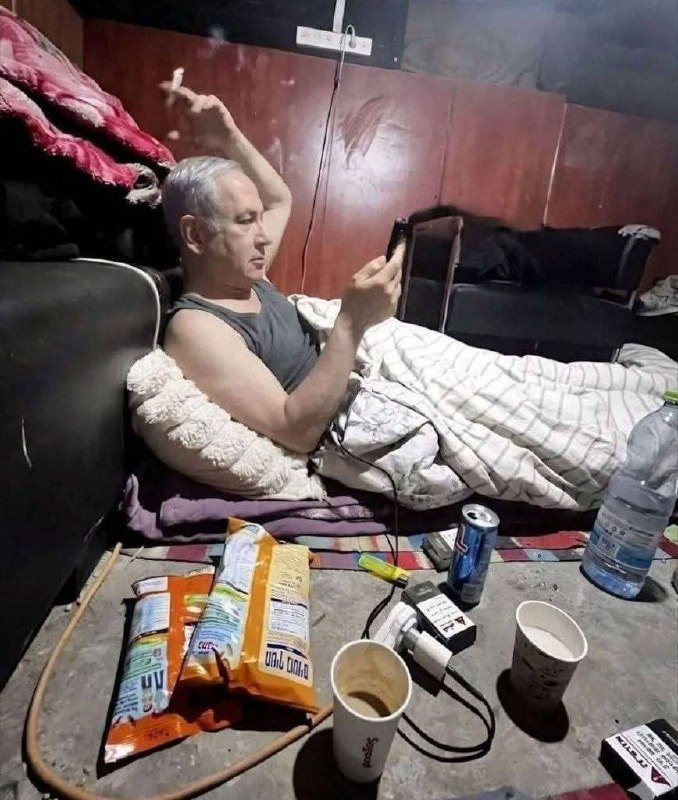

🔴وضعیت نتانیاهو
https://t.me/kianmeli1

## kianmeli1 — post 88057

🔴وزارت امور خارجه ایران اعلام کرد که لغو تحریم‌های نفتی ایران از امروز آغاز می‌شود.
https://t.me/kianmeli1

## kianmeli1 — post 88056

  <a href="telegram/content/kianmeli1_88056_1781739225.mp4" target="_blank">🎬 Download video</a>

🔴خبر مهم ترامپ

ترامپ آزادسازی پول‌های ایران را تایید کرد

«خب، موضوع آزاد کردن پول‌ها پاسخ دادنش ساده است.
ما مقدار زیادی از پول آن‌ها را گرفته‌ایم، و ما — پول خودشان را از آن‌ها گرفته‌ایم.
وقتی پول مال ما نیست، پولِ خودِ آن‌هاست، و ما در یک مقطع زمانی آن را مسدود کردیم.
فکر می‌کنم ناچاریم آن را پس بدهیم، می‌دانید؟
اگر آن را پس ندهیم، دیگر هیچ‌کس هرگز روی دلار سرمایه‌گذاری نخواهدکرد.»
https://t.me/kianmeli1

## kianmeli1 — post 88055

🔴اسماعیل بقایی:

برای اینکه دشمن بدعهدی نکند علاوه بر متن انگلیسی متن فارسی هم امضا شد
https://t.me/kianmeli1

## kianmeli1 — post 88054

🔴به گزارش اکسیوس، ایران و آمریکا به صورت الکترونیکی تفاهم‌نامه‌ای برای پایان دادن به جنگ امضا کردند.
https://t.me/kianmeli1

## kianmeli1 — post 88053

  <a href="telegram/content/kianmeli1_88053_1781739227.mp4" target="_blank">🎬 Download video</a>

🔴قالیباف: بند 6 تفاهم‌نامه 300 میلیارد دلار برای موضوع بازسازی و توسعه اقتصادی در ایران تعیین شده!

در این بند 300 میلیارد دلار تعیین شده تا در ایران سرمایه گذاری بشه که بخشی از آن صرف بازسازی خواهد شد.
https://t.me/kianmeli1

## kianmeli1 — post 88052

  <a href="telegram/content/kianmeli1_88052_1781739229.mp4" target="_blank">🎬 Download video</a>

🔴کارشناس فاکس نیوز: حدود ۴۸ ساعت پیش این یادداشت تفاهم ایران و آمریکا رو خواندم و باورم نمی‌شد. وقتی اون رو دیدم، فکر کردم یکی داره سرِ کارم می‌گذاره یا برام یک چیز جعلی فرستاده، باورنکردنیه
https://t.me/kianmeli1

## IranIntlTV — post 342944

  <a href="telegram/content/IranIntlTV_342944_1781739230.mp4" target="_blank">🎬 Download video</a>

مهستی از لندن: این بازی دو نیمه دارد؛ برای نیمه دوم، مردم ایران باید آماده باشند

«یک ایران صدای شما را می‌شنود»
دوشنبه تا پنجشنبه ۱۱ شب تهران
از تلویزیون ایران اینترنشنال

تماشای نسخه کامل این قسمت از «برنامه» در یوتیوب:
https://youtu.be/VniCfgW1sPQ
@iranintltv

## IranIntlTV — post 342943

  <a href="telegram/content/IranIntlTV_342943_1781739231.mp4" target="_blank">🎬 Download video</a>

چیدا از خرم‌آباد: ما لرها حامی ایرانیم و سال‌ها برای یک تکه نان در سرزمین خودمان جان داده‌ایم

«یک ایران صدای شما را می‌شنود»
دوشنبه تا پنجشنبه ۱۱ شب تهران
از تلویزیون ایران اینترنشنال

تماشای نسخه کامل این قسمت از «برنامه» در یوتیوب:
https://youtu.be/VniCfgW1sPQ
@iranintltv

## IranIntlTV — post 342942

  <a href="telegram/content/IranIntlTV_342942_1781739233.mp4" target="_blank">🎬 Download video</a>

امید از تهران: آخر کار را ما تعیین می‌کنیم، نه ترامپ و نه هیچ‌کس دیگر؛ حق‌مان را می‌گیریم

«یک ایران صدای شما را می‌شنود»
دوشنبه تا پنجشنبه ۱۱ شب تهران
از تلویزیون ایران اینترنشنال

تماشای نسخه کامل این قسمت از «برنامه» در یوتیوب:
https://youtu.be/VniCfgW1sPQ
@iranintltv

## IranIntlTV — post 342941

  <a href="telegram/content/IranIntlTV_342941_1781739234.mp4" target="_blank">🎬 Download video</a>

زهرا از رشت: باید به ترامپ فشار می‌آوردند که دست‌کم زندانی‌های ما را آزاد کند

«یک ایران صدای شما را می‌شنود»
دوشنبه تا پنجشنبه ۱۱ شب تهران
از تلویزیون ایران اینترنشنال

تماشای نسخه کامل این قسمت از «برنامه» در یوتیوب:
https://youtu.be/VniCfgW1sPQ
@iranintltv

## IranIntlTV — post 342940

  <a href="telegram/content/IranIntlTV_342940_1781739236.mp4" target="_blank">🎬 Download video</a>

محمدباقر قالیباف، رییس هیات مذاکره‌کننده جمهوری اسلامی با آمریکا، گفت داوطلب این مسئولیت نبوده و حتی «کراهت شدید» نسبت به آن داشته است زیرا دونالد ترامپ در کشته شدن قاسم سلیمانی نقش داشت.
او افزود با وجود این، چون مسئولان بر حضور او تاکید داشتند این مسئولیت را از سر وظیفه پذیرفت.

## IranIntlTV — post 342939

  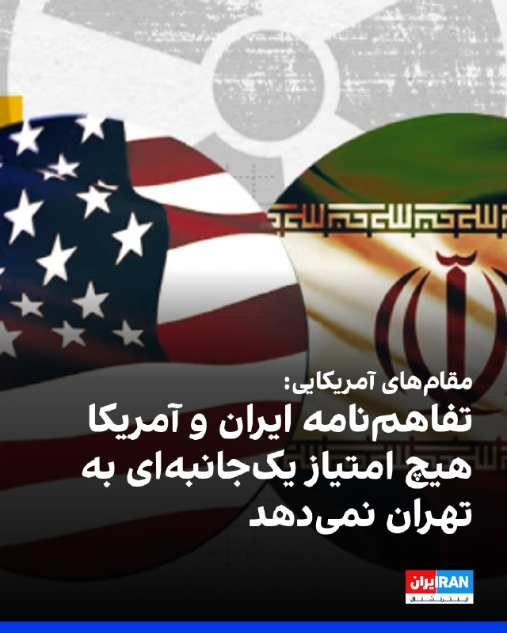

چند مقام ارشد دولت آمریکا در یک نشست توجیهی با خبرنگاران تاکید کردند که هیچ‌یک از امتیازهای اقتصادی پیش‌بینی‌شده در یادداشت تفاهم تهران و واشینگتن بدون اجرای تعهدات حکومت ایران عملی نخواهد شد و همه مراحل به صورت تدریجی، قابل راستی‌آزمایی و مشروط به رفتار تهران خواهد بود.
این مقام‌های آمریکایی درباره بند نخست تفاهم‌نامه درباره پایان فوری و دائمی عملیات نظامی در همه جبهه‌ها از جمله لبنان، گفتند این بند هیچ تعهد تازه‌ای برای واشینگتن ایجاد نمی‌کند، بلکه چارچوبی طراحی شده است که هرگونه گشایش اقتصادی در آینده تنها در صورتی اتفاق بیفتد که حکومت ایران به تعهدات خود عمل کند.
این مقامات درباره بند سوم در ارتباط با ضرب‌الاجل ۶۰ روزه برای توافق نهایی، تاکید کردند که تفاهم‌نامه، خود توافق نهایی نیست و هر یک از طرفین تا زمان دستیابی به توافق جامع می‌توانند از مذاکرات خارج شوند.

https://iranintl.com/202606171881

## IranIntlTV — post 342938

  <a href="telegram/content/IranIntlTV_342938_1781739237.mp4" target="_blank">🎬 Download video</a>

در بندهای ۷ و ۸ تفاهم‌نامه آمریکا و جمهوری اسلامی تاکید شده است که ایران متعهد شده به دنبال غنی‌سازی نرود. یک مقام ارشد آمریکایی این بند را «پیروزی بزرگ» آمریکا توصیف کرده و گفته ایران پذیرفته است ذخایر اورانیوم خود را نابود کند و لغو تحریم‌ها نیز مستقیماً به حل‌وفصل موضوع هسته‌ای گره خورده است.
در یکی دیگر از بندهای این تفاهم‌نامه نیز به پایان درگیری‌ها در همه جبهه‌ها، از جمله لبنان، اشاره شده است.

گفت‌وگو با آرام حسامی، استاد علوم سیاسی، و جمشید برزگر، روزنامه‌نگار و تحلیل‌گر سیاسی
@iranintltv

## IranIntlTV — post 342937

  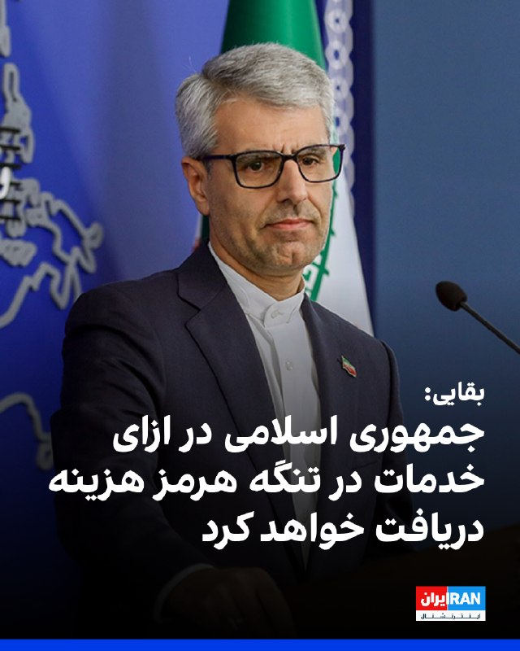

اسماعیل بقایی، سخنگوی وزارت خارجه جمهوری اسلامی، گفت: «سازوکارهای مدیریت تنگه هرمز تا حدود زیادی با عمان بسته شده است و جمهوری اسلامی در ازای خدمات در تنگه هرمز هزینه دریافت خواهد کرد. تردد ایمن با حفظ حاکمیت جمهوری اسلامی بر تنگه هرمز خواهد بود.»
https://iranintl.com/202606174561

## IranIntlTV — post 342936

  <a href="telegram/content/IranIntlTV_342936_1781739240.mp4" target="_blank">🎬 Download video</a>

با وجود اینکه مقام‌های جمهوری اسلامی تفاهم با آمریکا را زمینه‌ساز گشایش اقتصادی عنوان می‌کنند، یک مقام ارشد دولت آمریکا گفته است این توافق، ایالات متحده را به هیچ تعهد مالی مستقیمی ملزم نمی‌کند.

گفت‌وگو با آرش آرامش، حقوقدان و کارشناس امنیت ملی، و امید معماریان، تحلیل‌گر سیاسی در موسسه دان
@iranintltv

## IranIntlTV — post 342935

  

یک مقام کاخ سفید به رویترز گفت: «ترامپ چهارشنبه یادداشت تفاهمی را که با هدف پایان دادن به جنگ با ایران تدوین شده است، امضا کرد.»
خبرگزاری تسنیم، وابسته به سپاه، نیز به نقل از یک منبع نزدیک به تیم مذاکره‌کننده گزارش داد که متن فارسی این تفاهم‌نامه به عنوان یک سند رسمی به امضای دو طرف آمریکا و جمهوری اسلامی رسیده است.

https://iranintl.com/202606174397

## IranIntlTV — post 342934

  <a href="telegram/content/IranIntlTV_342934_1781739242.mp4" target="_blank">🎬 Download video</a>

بر اساس بند پنجم تفاهم‌نامه جمهوری اسلامی و آمریکا، ایران متعهد شده است عبور ایمن کشتی‌های تجاری را بدون دریافت هیچ هزینه‌ای و فقط برای مدت ۶۰ روز از خلیج فارس به دریای عمان و بالعکس فراهم کند.

پس از این دوره، ایران و عمان با مشورت سایر کشورهای حاشیه خلیج فارس درباره مدیریت آینده و خدمات دریایی تنگه هرمز گفت‌وگو خواهند کرد.

گفت‌وگو با رضا گوهرزاد، روزنامه‌نگار و تحلیل‌گر سیاسی، و شهرام خلدی، پژوهشگر تاریخ خاورمیانه و روابط بین‌الملل
@iranintltv

## IranIntlTV — post 342933

  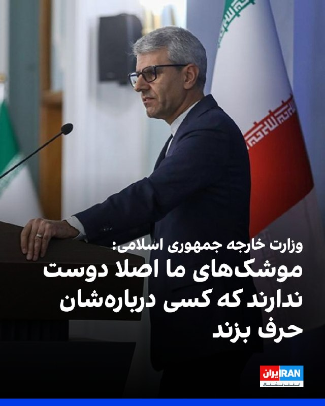

اسماعیل بقایی، سخنگوی وزارت خارجه جمهوری اسلامی، گفت: «موشک‌های ایران فقط برای شلیک شدن هستند نه برای مذاکره. موشک‌های ما اصلا دوست ندارند که کسی درباره‌شان حرف بزند درباره توانایی دفاعی ایران در هیچ روندی و با هیچ طرفی صحبت نخواهد شد.»
https://iranintl.com/202606178175

## IranIntlTV — post 342932

  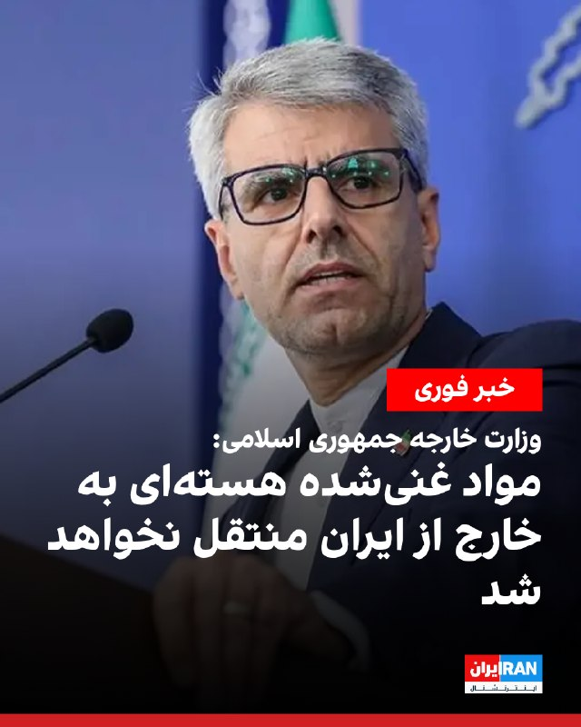

اسماعیل بقایی، سخنگوی وزارت خارجه جمهوری اسلامی، گفت: «از ابتدا گفته‌ایم که مواد غنی‌شده هسته‌ای به خارج از ایران منتقل نخواهد شد. رقیق‌سازی مواد غنی‌شده گزینه جدیدی نیست، الان هم به عنوان یک گزینه معرفی شده است تا راه را بر گزینه‌های دیگر ببندیم.»
او افزود: «گزینه غیرقابل قبول برای ما، انتقال مواد غنی‌شده هسته‌ای به خارج از کشور است.»

https://iranintl.com/202606175498

## IranIntlTV — post 342931

  <a href="telegram/content/IranIntlTV_342931_1781739245.mp4" target="_blank">🎬 Download video</a>

محمدباقر قالیباف، رییس هیات مذاکره‌کننده جمهوری اسلامی با آمریکا، گفت هر پیروزی در جنگ اگر در نهایت به یک سند حقوقی و سیاسی منتهی نشود و ثبت نشود، هیچ منفعتی نخواهد داشت.
او افزود جمهوری اسلامی در جنگ ۴۰ روزه پیروز شده و دستاورد این پیروزی در مذاکره شکل می‌گیرد.
به گفته قالیباف، این تفاهم‌نامه «کارنامه شکست آمریکا» است؛ تعبیری که او آن را نقل‌قولی از غربی‌ها دانست.

## IranIntlTV — post 342930

  <a href="telegram/content/IranIntlTV_342930_1781739246.mp4" target="_blank">🎬 Download video</a>

مارک وارنر، سناتور دموکرات، به مرضیه حسینی، خبرنگار ایران‌اینترنشنال، گفت: «من هنوز توافق را ندیده‌ام و فکر نمی‌کنم این توافق شامل برنامه موشک‌های بالستیک ایران یا مسیر عملی و مشخصی برای حل مساله هسته‌ای باشد.»

او افزود: «این جنگی انتخابی بود و آمریکا را قوی‌تر نکرد. این یک اشتباه بود.»
@iranintltv

## IranIntlTV — post 342929

  <a href="https://t.me/IranintlTV/342929" target="_blank">📎 Download file</a>

🎧نسخه صوتی برنامه با کامبیز حسینی؛ تفاهم با آمریکا و ۳۰۰ میلیارد دلار برای جمهوری اسلامی
@iranintlTV

## IranIntlTV — post 342928

  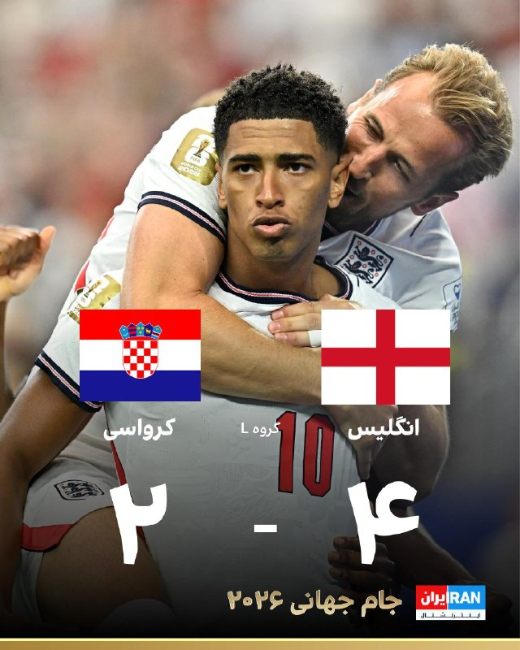

🔻تیم ملی فوتبال انگلیس در نخستین دیدار خود در گروه L جام جهانی ۲۰۲۶، کرواسی را در ورزشگاه شهر دالاس آمریکا با نتیجه ۴ بر ۲ شکست داد.

🔹گل‌های انگلیس را هری کین در دقایق ۱۱ (پنالتی) و ۴۱، جود بلینگام در دقیقه ۴۷ و مارکوس رشفورد در دقیقه ۸۵ به ثمر رساندند.

🔹گل‌های کرواسی نیز توسط مارتین باتورینا در دقیقه ۳۶ و پتر موسا در دقیقه ۵+۴۵ به ثمر رسید.

🔹هری کین تاکنون در جام‌های جهانی پنج گل از روی نقطه پنالتی (بدون احتساب ضربات پنالتی پایان بازی) به ثمر رسانده است. او اکنون رکورددار گلزنی از روی نقطه پنالتی در تاریخ جام جهانی است.

@iranintltvsport

## IranIntlTV — post 342927

  

اسماعیل بقایی، سخنگوی وزارت خارجه جمهوری اسلامی، گفت: «احتمالا اکنون متن تفاهم‌نامه اسلام آباد به امضای روسای جمهور ایران و آمریکا رسیده باشد. متن این تفاهم‌نامه الان رسما نهایی شده است، چرا که دو طرف آن را امضا کرده‌اند. این تفاهم‌نامه قرار شد که به صورت دیجیتال امضا شود.»
او افزود: وقتی تفاهم‌نامه به امضای روسای جمهوری دو کشور برسد نقض آن هزینه بیشتری خواهد داشت.

https://iranintl.com/202606176742

## IranIntlTV — post 342926

  <a href="telegram/content/IranIntlTV_342926_1781739249.mp4" target="_blank">🎬 Download video</a>

عملیات گسترده پلیس تورنتو برای بازداشت مظنونان حمله به کنسولگری آمریکا به درگیری خونین و کشف یک شبکه بزرگ جنایی منجر شد.

مقام‌های کانادایی با همکاری اف‌بی‌آی در حال بررسی این احتمال هستند که حمله به کنسولگری آمریکا بخشی از فعالیت‌های این شبکه تروریستی فراملی بوده باشد.

گزارش مهسا مرتضوی، خبرنگار ایران‌اینترنشنال
@iranintltv

## IranIntlTV — post 342925

  <a href="telegram/content/IranIntlTV_342925_1781739250.mp4" target="_blank">🎬 Download video</a>

محمدباقر قالیباف، رییس هیات مذاکره‌کننده جمهوری اسلامی با آمریکا، گفت طرف مقابل حاضر نیست بپذیرد متجاوز بوده است، زیرا در این صورت باید همه خسارت‌ها را بپردازد.
او افزود به‌جای پرداخت خسارت، در متن بر مفاهیمی چون «بازسازی» و «توسعه اقتصادی» تاکید شده است.
به گفته قالیباف، در همین چارچوب ۳۰۰ میلیارد دلار سرمایه‌گذاری پیش‌بینی شده که بخشی از آن صرف بازسازی و جبران خسارت‌ها خواهد شد.

## FarsiVOA — post 221063

  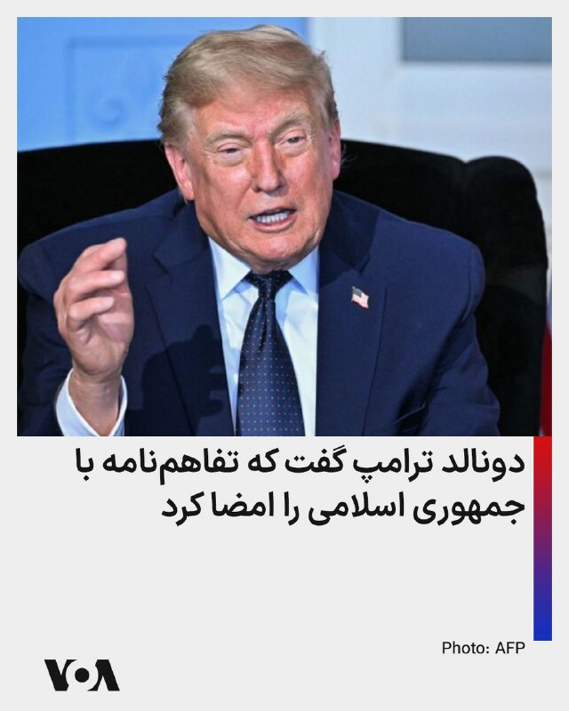

⚡️دونالد ترامپ، در پاسخ به سوال خبرنگاران که آیا تفاهم‌نامه با جمهوری اسلامی را امضا کرده است پاسخ داد: «بله امضا کردم...در ورسای امضا کرد.»
@FarsiVOA

## FarsiVOA — post 221062

⚡️نگاهی به مفاد تفاهمنامه بین دولت پرزیدنت ترامپ و جمهوری اسلامی ایران
@FarsiVOA

## FarsiVOA — post 221061

🔺خبرنگاران بلومبرگ و آکسیوس: دونالد ترامپ تفاهم‌نامه با جمهوری اسلامی را الکترونیکی امضا کرد

▪️خبرنگاران خبرگزاری بلومبرگ و آکسیوس چهارشنبه عصر به وقت واشنگتن گزارش دادند که یادداشت تفاهم میان آمریکا و جمهوری اسلامی برای پایان دادن به درگیری‌‌های نظامی، به‌صورت الکترونیکی ساعاتی قبل امضا شد.

⬇️ بیشتر بخوانید:
https://ir.voanews.com/a/8161966.html
@FarsiVOA

## FarsiVOA — post 221060

⚡️گزارش نرگس صبا در برنامه تفسیر خبر در باره نتایج یک تحقیق تازه: مخالفان توافق با آمریکا از چه طیف‌هایی هستند؟
@FarsiVOA

## FarsiVOA — post 221059

  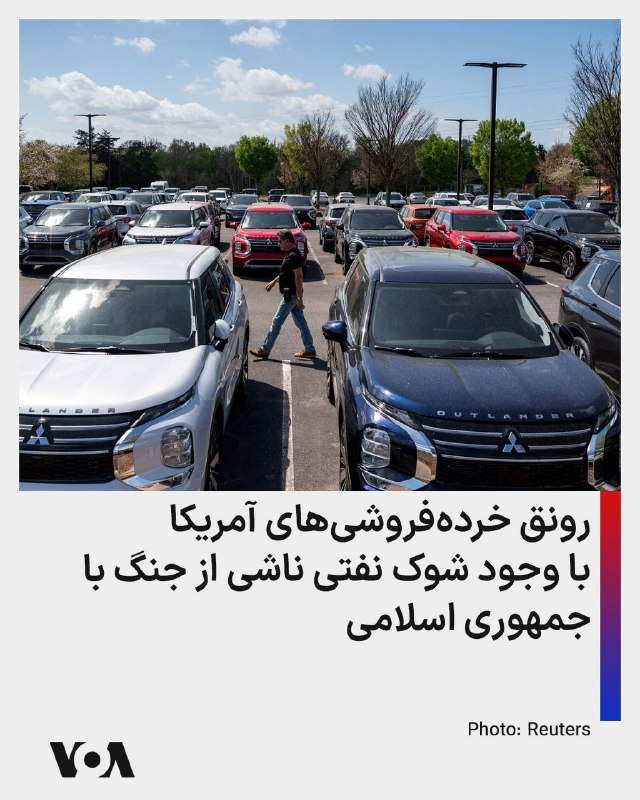

⚡️آمار وزارت بازرگانی آمریکا در روز چهارشنبه نشان می‌دهد که اقتصاد آمریکا با وجود جنگ با جمهوری اسلامی و شوک ناشی از افزایش قیمت نفت، شاهد افزایش فراتر از انتظار فروش خرده‌فروشی‌ها بود.
به گزارش رویترز، خانوارهای آمریکایی با وجود قیمت بالاتر بنزین خودروهای بیشتری خریدند. فروش قوی خرده‌فروشی در ایالات متحده، نشان‌دهنده‌ انعطاف‌پذیری اقتصاد این کشور علیرغم جنگ با جمهوری اسلامی است.
@FarsiVOA

## FarsiVOA — post 221058

⚡️هشدار کارشناسان سازمان ملل متحد درباره وضعیت جسمی ‌زوج بریتانیایی محبوس در زندان اوین
@FarsiVOA

## FarsiVOA — post 221057

⚡️حمایت «گروه هفت» از تفاهم‌نامه آمریکا و جمهوری اسلامی و چشم‌انداز توافق؛ گفت‌وگو با ابراهیم روشندل
@FarsiVOA

## Persian_Trend_Official — post 17406

  <a href="telegram/content/Persian_Trend_Official_17406_1781739252.mp4" target="_blank">🎬 Download video</a>

شبتون بخیر 🌃
F-18 Super Hornet

📌 @persian_trend_official
پرشین ترند | متفاوت‌ترین کانال نظامی

## Persian_Trend_Official — post 17405

  <a href="telegram/content/Persian_Trend_Official_17405_1781739254.mp4" target="_blank">🎬 Download video</a>

بدون شرح...

📝 Nick

📌 @persian_trend_official
پرشین ترند | متفاوت‌ترین کانال نظامی

## Persian_Trend_Official — post 17404

  <a href="telegram/content/Persian_Trend_Official_17404_1781739255.mp4" target="_blank">🎬 Download video</a>

قالیباف، رئیس تیم مذاکره‌کننده ایرانی: بند 6 تفاهم‌نامه 300 میلیارد دلار برای موضوع بازسازی و توسعه اقتصادی در ایران تعیین شده است، در دنیایی که قانون جنگل حاکم است ما باید با قدرت خود مسائل را دنبال کنیم.

سازمان ملل حتی یک بیانیه که آمریکا را متجاوز اعلام کند، منتشر نکرد و لذا نمی پذیرند که متجاوز هستند. در دنیایی که قانون جنگل حاکم است ما باید با قدرت خود، مسائل را دنبال کنیم.

البته در تفاهم نامه بند 6 برای این موضوع آمده که در آن از لفظ بازسازی و توسعه اقتصادی استفاده شده است. در این بند 300 میلیارد دلار تعیین شده تا در ایران سرمایه گذاری شود که بخشی از آن صرف بازسازی خواهد شد.

📝 Amir

📌 @persian_trend_official
پرشین ترند | متفاوت‌ترین کانال نظامی

## Persian_Trend_Official — post 17403

  <a href="telegram/content/Persian_Trend_Official_17403_1781739257.mp4" target="_blank">🎬 Download video</a>

قالیباف، رئیس تیم مذاکره‌کننده ایرانی: پرداخت هزینه خدمات عبور از تنگه هرمز در تفاهم‌نامه تثبیت شده است!

کشورهای ساحلی تنگه ها در قوانین بین المللی حقوق و وظایفی دارند از جمله این که دیگران باید هزینه خدمات شان را پرداختند کنند. دشمنان ایران را خدا از احمق ها آفریده و باعث شدند ظرفیت بالقوه ایران در تنگه هرمز بالفعل شود.

ایران در تنگه هرمز حق حاکمیتی دارد و طبیعتا در قبال خدمات، هزینه دریافت خواهیم کرد.

📝 Amir

📌 @persian_trend_official
پرشین ترند | متفاوت‌ترین کانال نظامی

## IranianMinds — post 22839

  <a href="telegram/content/IranianMinds_22839_1781739258.mp4" target="_blank">🎬 Download video</a>

🔴 پشماتون بریزه ببینید شاهین نجفی ۲ سال پیش راجب قالیباف چی گفته بوده

@IranianMinds

## IranianMinds — post 22838

🔴 مذاکرات هنوز کامل نهایی نشده و از امروز به بعد مذاکرات ۶۰ روزه برای توافق نهایی شروع میشه ، طبق گفته ترامپ این مذاکرات قابل تمدید هم هست زمانش.

برگشتیم سر پله ی اول عملا

@IranianMinds

## IranianMinds — post 22837

🔴 قالیباف : برای من کار راحتی نبود با ترامپ قاتل سردار سلیمانی مذاکره کنم نفر دومی جز من برای مذاکره نبود! @IranianMinds

## IranianMinds — post 22836

  <a href="telegram/content/IranianMinds_22836_1781739259.mp4" target="_blank">🎬 Download video</a>

🔴 قالیباف : برای من کار راحتی نبود با ترامپ قاتل سردار سلیمانی مذاکره کنم
نفر دومی جز من برای مذاکره نبود!

@IranianMinds

## IranianMinds — post 22835

🔴 آکسیوس :

آمریکا و ایران «تفاهم‌نامه (MOU) پایان جنگ» را به‌صورت الکترونیکی امضا کرده‌اند.

این توافق اکنون وارد مرحله اجرا شده است.

با این حال، قرار است یک مراسم رسمی امضا نیز روز جمعه در سوئیس برگزار شود.

برخی مفاد عملی توافق، از جمله مسائل مربوط به تنگه هرمز و اقدامات متقابل دو طرف، پس از مراحل بعدی اجرایی خواهند شد.

@IranianMinds

## IranianMinds — post 22834

🔴 سخنگوی وزارت خارجه :

جنگ به پایان رسید.

@IranianMinds

## IranianMinds — post 22833

🔴 سخنگوی‌ وزارت خارجه :

متن تفاهم نامه توسط دو طرف امضا شد و توافق نهایی شد.

@IranianMinds

## IranianMinds — post 22832

🔴 قالیباف:

در قوانین ایران هیچ مانعی برای حضور و سرمایه‌گذاری شرکت‌های آمریکایی در داخل ایران وجود ندارد!

@IranianMinds

## BBCPersian — post 284195

🔻کاخ سفید متن یادداشت تفاهم ایران و آمریکا را منتشر کرد. این سند که به طور الکترونیکی امضا شده است، قرار است روز جمعه در مراسمی در سوئیس به امضای مقامات ایرانی و آمریکایی برسد. متن منتشر شده ۱۴ بند دارد و مقامات آمریکایی توضیحاتی در کنار برخی موارد نوشتند.

توضیحات تفاهمنامه را در لینک زیر بخوانید:

https://bbc.in/4xCgJxh
@BBCPersian

## BBCPersian — post 284194

  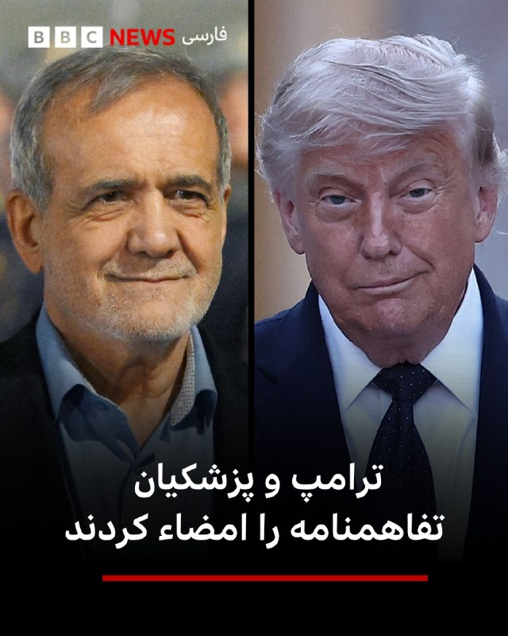

🔻دونالد ترامپ، رئیس جمهور آمریکا که چهارشنبه شب در کاخ الیزه میهمان ضیافت شام با امانوئل مکرون بود نسخه نهایی و منتشر شده تفاهمنامه با ایران را امضاء کرده است و از طرف ایران هم همتای او، مسعود پزشکیان این سند را امضاء کرده است.

یک مقام کاخ سفید در همین رابطه عصر چهارشنبه به خبرنگاران گفت: «تفاهم نامه روز یکشنبه به صورت دیجیتال توسط جی دی ونس، معاون رئیس جمهور آمریکا، و محمدباقر قالیباف، رئیس مجلس شورای اسلامی، امضا شد و دونالد ترامپ، رئیس جمهور آمریکا، نیز به عنوان شاهد در آن حضور داشت. اکنون این تفاهم نامه به امضای دونالد ترامپ و مسعود پزشکیان، رئیس جمهور ایران، نیز رسیده است.»

📷AFP via Getty Images/ ٍEPA
https://bbc.in/4xCfJcv

@BBCPersian

## BBCPersian — post 284193

🔻قالیباف: به میانجی گفتیم موضوع لبنان و پول‌های بلوکه شده از محورهای مذاکرات است

🔻محمدباقر قالیباف، رئیس مجلس ایران و مذاکره‌کننده ارشد ایران در مذاکرات ایران با آمریکا در یک مصاحبه مفصل با صدا و سیما جزئیاتی از مذاکرات ایران و آمریکا در اسلام‌آباد پاکستان و روندی که به تفاهمنامه منجر شد را شرح داد.

او درباره لحاظ کردن لبنان به محور مذاکرات گفت: «وقتی اظهارات ونس را هنگام سوار شدن به هواپیما دیدم که درباره لبنان صحبت کرده بود، پیش از پرواز و در فرودگاه توئیت زدم که تا وضعیت لبنان روشن نشود، مذاکره را آغاز نخواهیم کرد و اگر وارد مذاکره شویم، پیش از هر موضوعی باید درباره لبنان صحبت شود.»

او همچنین می‌گوید که داوطلب حضور در تیم مذاکره کننده نبوده و حتی برای اینکار «کراهت هم داشته است.»

آقای قالیباف درباره علت این مساله شامگاه چهارشنبه در یک مصاحبه با صدا و سیما گفت: «یکی از دلایل من برای عدم پذیرش این مسئولیت این بود که ترامپ طراح، آمر و ناظر ترور حاج قاسم است. سردار سلیمانی برای همه جهان اسلام عزیز بود اما حتما برای شخص من متفاوت بود. شما فکر می‌کنید این که بخواهم با چنین فردی، متنی را جمع کنم، کار راحتی است؟»

او همچنین گفت: «بدبینی و بی‌اعتمادی من به آمریکا از همه بیشتر است.»

متن کامل خبر در لینک زیر:
https://bbc.in/4vhrXFR

@BBCPersian

## BBCPersian — post 284192

  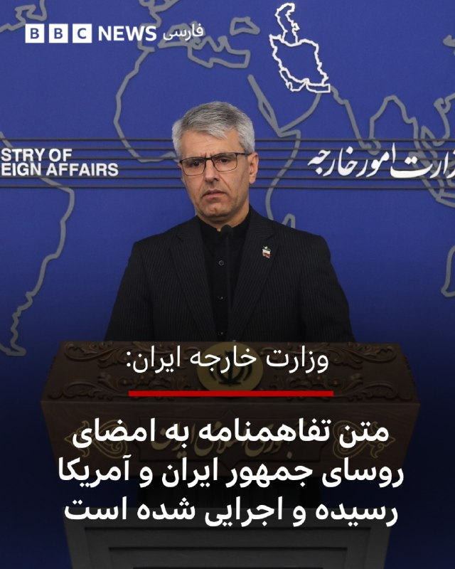

🔻اسماعیل بقایی، سخنگوی وزارت خارجه ایران در گفت‌وگو با خبرنگاران درباره تفاهمنامه امضاء شده میان ایران و آمریکا توضیحات مفصلی داده و چهارشنبه شب گفته است: «الان که با شما صحبت می‌کنم احتمالاً متن تفاهم نامه اسلام آباد به امضای روسای جمهور ایران و آمریکا رسیده باشد.»

به گفته سخنگوی وزارت خارجه ایران: «به این نتیجه رسیدیم متن یادداشت تفاهم به امضا روسای جمهور ایران و آمریکا برسد و برگزاری مراسم روز جمعه هنوز در دستور کار است اما باید ببینیم ظرف ساعات آینده به چه نتیجه‌ای می‌رسیم. به هر حال باید فاز بعدی مذاکرات آغاز شود. این نشست در سوئیس هنوز در دستور کار است که برگزار شود. باید ببینیم که در ساعات آینده طرفین از طریق میانجی‌ها به نتیجه‌ای می‌رسند.»

آقای بقایی و همچنین مقام‌های در کاخ‌سفید تایید کرده‌اند که همزمان با امضای روسای‌جمهور در زیر تفاهمنامه، این سند لازم الاجرا شده است.

متن کامل خبر در لینک زیر:

📷LightRocket via Getty Images
https://bbc.in/4epTP3r

@BBCPersian

## BBCPersian — post 284183

⚽️گروه جی (J) جام جهانی؛ آخرین ماموریت مسی

تیم ملی آرژانتین به عنوان مدافع عنوان قهرمانی، وارد رقابت‌های جام جهانی ۲۰۲۶ می‌شود. لیونل اسکالونی، معمار دوران طلایی جدید آرژانتین، پس از قهرمانی در جام جهانی ۲۰۲۲ همچنان با اقتدار تیم ملی را هدایت می‌کند. بزرگ‌ترین ویژگی او مدیریت فوق‌العاده بازیکنان و ایجاد اتحاد در تیم است.

تیم ملی اتریش پس از ۲۸ سال غیبت، با امیدهای فراوان راهی جام جهانی ۲۰۲۶ می‌شود. بزرگ‌ترین نقطه قوت اتریش، توانایی اجرای دقیق برنامه‌های تاکتیکی و عملکرد خوب برابر تیم‌های قدرتمند است ولی در مقابل تیم‌های ضعیف‌تر که باید ابتکار عمل را در دست بگیرد و دفاع‌های فشرده را باز کند، گاهی دچار مشکل می‌شود.

تیم ملی الجزایر یکی از غیر قابل‌ پیش‌بینی‌ترین تیم‌های حاضر در جام جهانی ۲۰۲۶ است. روی کاغذ، «روباه‌های صحرا» مجموعه‌ای از بازیکنان تکنیکی و خلاق هستند که توانایی رقابت با بسیاری از تیم‌های بزرگ را دارند.

تیم ملی اردن برای نخستین بار به جام جهانی صعود کرده و این بزرگ‌ترین دستاورد تاریخ فوتبال این کشور است. نقطه قوت اصلی اردن روحیه جنگندگی آن است.

📸GettyImages
@BBCPersian

## BBCPersian — post 284182

  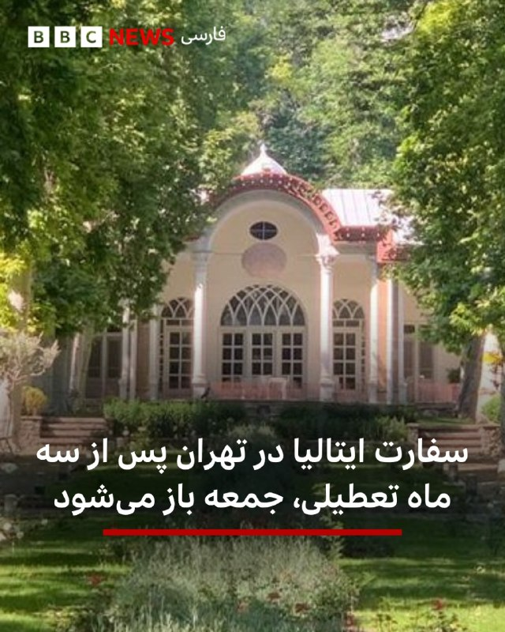

🔻وزارت خارجه ایتالیا روز چهارشنبه اعلام کرد که سفارت این کشور در تهران روز جمعه فعالیت خود را از سر خواهد گرفت. بیش از سه ماه از تعطیلی سفارت ایتالیا به دلیل جنگ آمریکا و اسرائیل با ایران می‌گذرد.

آنتونیو تاجانی،‌ وزیر خارجه ایتالیا به پارلمان این کشور گفت: «سفارت ما در تهران روز جمعه درهایش را دوباره باز خواهد کرد.»

ایتالیا اوایل ماه مارس،‌ اسفند ماه پس از اینکه آمریکا و اسرائیل با حملات هوایی علیه ایران جنگ را آغاز کردند،‌ به دلایل امنیتی سفارت خود را در تهران به طور موقت تعطیل کرد و دیپلمات‌ها و کارکنان سفارت را به جمهوری آذربایجان،‌ همسایه ایران منتقل کرد.

آقای تاجانی گفت: «سفیر ما به همراه همه دیپلمات‌ها و مقامات وزارت امور خارجه به پایتخت ایران بازخواهند گشت.»

او افزود: «در یک منطقه پیچیده مانند خاورمیانه،‌ احتیاط ضروری است. اما این نخستین بار پس از هفته‌ها جنگ و مذاکراتی که با دشواری پیش می‌رفت است، که نشانه‌ای ملموس از صلح در حال ظهور است.»

📷Italian Embassy Website
https://bbc.in/3S6tPmr

@BBCPersian

## BBCPersian — post 284181

🔻ایرنا متن تفاهم نامه را منتشر کرد؛ نسخه ایران و آمریکا تقریبا یکسان هستند

🖋️غنچه حبیبی‌آزاد، بی‌بی‌سی فارسی

🔻خبرگزاری جمهوری اسلامی ایران - ایرنا - دقایقی پیش نسخه‌ای از تفاهم نامه میان ایران و آمریکا را منتشر کرد.

مقایسه نسخه منتشر شده از سوی ایرنا با نسخه‌ای که بی‌بی‌سی به آن دست یافته است، نشان می‌دهد دو نسخه از این توافق ۱۴ بندی تقریبا به طور کامل یکسانند.

تنها تفاوت جزئی در بند ششم دیده می‌شود؛ بندی که با این عبارت آغاز می‌شود:

«ایالات متحده آمریکا متعهد می‌شود با همکاری شرکای منطقه‌ای، یک برنامه نهایی مورد توافق طرفین با حداقل ۳۰۰ میلیارد دلار برای بازسازی و توسعه اقتصادی جمهوری اسلامی ایران تدوین کند. سازوکار اجرای این برنامه به عنوان بخشی از توافق نهایی، ظرف ۶۰ روز نهایی خواهد شد.»

آخرین جمله این بند در نسخه آمریکایی چنین است:

«تمام مجوزها، معافیت‌ها و اجازه‌های لازم برای انجام معاملات اولیه مرتبط، از سوی ایالات متحده آمریکا صادر خواهد شد.»

اما در نسخه منتشر شده توسط ایرنا، واژه «اولیه» از این جمله حذف شده است.

با این حال، به نظر نمی‌رسد این تفاوت جزئی تغییری اساسی در مفهوم یا محتوای توافق ایجاد کند.

https://bbc.in/4oCftGn
@BBCPersian

## Dirty_Kids — post 392452

⚡️ جام جهانی شروع شده و میدون مال توئه! 
🌟 این #جام_جهانی رو فقط باید توی #بت فیدو پیش‌بینی کنی 
💰 با ۵۰ میلیون تومان شرط روزانه ← ۴ میلیون تومان اعتبار شرط‌بندی رایگان 
📊 با ۱۰۰ میلیون تومان شرط روزانه ← ۸ میلیون تومان اعتبار شرط‌بندی رایگان 
💸 هرچی بزرگ‌تر…

## Dirty_Kids — post 392451

  <a href="telegram/content/Dirty_Kids_392451_1781739262.webm" target="_blank">🎬 Download video</a>

⚡️ جام جهانی شروع شده و میدون مال توئه!

🌟 این #جام_جهانی رو فقط باید توی #بت فیدو پیش‌بینی کنی

💰 با ۵۰ میلیون تومان شرط روزانه ← ۴ میلیون تومان اعتبار شرط‌بندی رایگان

📊 با ۱۰۰ میلیون تومان شرط روزانه ← ۸ میلیون تومان اعتبار شرط‌بندی رایگان

💸 هرچی بزرگ‌تر بازی کنی، جایزت بزرگ‌تره!

🥅همین حالا پیش بینیتو ثبت کن
💖
https://fido874vt.click
https://fido874vt.click

👆
👆
👆
👆
👆
(ورود با وی-پی-ان غیر اروپایی)
❌
A27

📲کانال تلگرام 
👇
https://t.me/+dySI_QFj0T0xZGVk

## Dirty_Kids — post 392450

  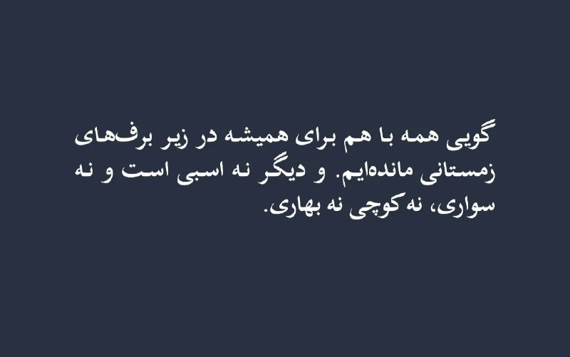

#بخوابیم

@Dirty_Kids 👻

## Dirty_Kids — post 392447

اگه فوتبال نمیبینی شاید وقتش رسیده پیگیری کنی...

@Dirty_Kids 👻

## Dirty_Kids — post 392446

  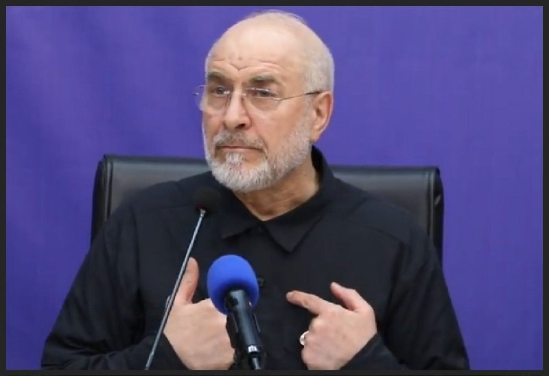

زنده یاد مانوکیان خدا بخشیان ...

یک السیس ایرانی وارد بازی میشه کودتا میکنه و بعد
به فروپاشی نظام کمک میکنه و بعد قدرت انقالی رو
به یک شخص دیگ واگذار میکنه ... )

@Dirty_Kids 👻

## Dirty_Kids — post 392445

لاریجانی بی خود ترور نشد
با وجود لاریجانی قالیباف نمیتونست اینجور وسط معرکه بیاد،در واقع لاریجانی به نظر گروه دوم از حاکمان بود که ترامپ گفت چون باما راه نیومدن کشته شدن و حالا با گروه سوم یعنی قالیباف سروکار داریم.

@Dirty_Kids 👻

## Dirty_Kids — post 392444

کسانی که فرزندان ایران کشتند مولایشان حسین بود، کصمادر هر کسی که در این روزها برای حسین عزاداری می‌کند

@Dirty_Kids 👻

## Dirty_Kids — post 392440

بانو Comatozze، رنک اول پورن هاب به صورت اختصاصی از ایرانیا تشکر کرده!

اون گفته اکثر مخاطبانش ایرانین و هر روز کلی پیام محبت آمیز ازشون دریافت میکنه.

@Dirty_Kids 👻

## Dirty_Kids — post 392439

  

باراک راوید | آکسیوس:
ایران و آمریکا تفاهمنامه رو از راه دور امضا کردن.

@Dirty_Kids 👻

## Dirty_Kids — post 392438

  <a href="telegram/content/Dirty_Kids_392438_1781739263.mp4" target="_blank">🎬 Download video</a>

عزیزان ببخشید وسط فوتبال مزاحم شدم،

ممدباقر (شغال طرقبه) خونخواهی موشعلی رو حواله داد به آزادی قدس و گفت ۱۰۰ نتانیاهو بند کفش موشعلی ما هم نمی‌شه،

این در حالیه که موشعلی هزارپدر نعلین می‌پوشید و نمی‌دونست بند کفش اصلا چی چی هست.

@Dirty_Kids 👻

## Dirty_Kids — post 392437

  <a href="telegram/content/Dirty_Kids_392437_1781739264.mp4" target="_blank">🎬 Download video</a>

انتقام رهبرتونم رفت پيش انتقام قاسم و هنیه و سنوار و نصراله 😁

@Dirty_Kids 👻

## Dirty_Kids — post 392435

🔴 خدایا شکرت، میا خلیفه، پورن استار معروف، در حمایت از طارمی و تیم ملی، استوری گذاشته.

@Dirty_Kids 👻

## Dirty_Kids — post 392434

  <a href="telegram/content/Dirty_Kids_392434_1781739265.mp4" target="_blank">🎬 Download video</a>

زشته به خدا! اخه اینجا جای این کاراست؟ لطفا برید توی حرم امام انجامش بدید.
لطفا بیشتر از این کارها بکنیدد

@Dirty_Kids 👻

## Dirty_Kids — post 392433

  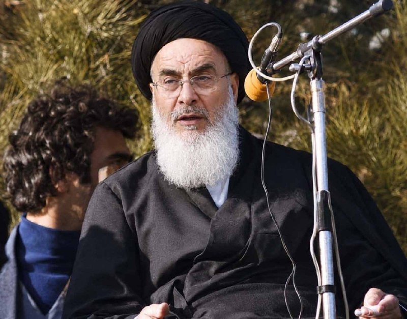

قالیباف: من دولت تعیین موکونوم! من با مشت توی دهن این دولت موزونوم... من به پشتوانه ی چین دولت تعیین موکونوم! من به واسطۀ اینکه ترامپ مرا قبول دارد، دولت تعیین موکونوم.

#کودتا

@Dirty_Kids 👻

## alonews — post 128821

  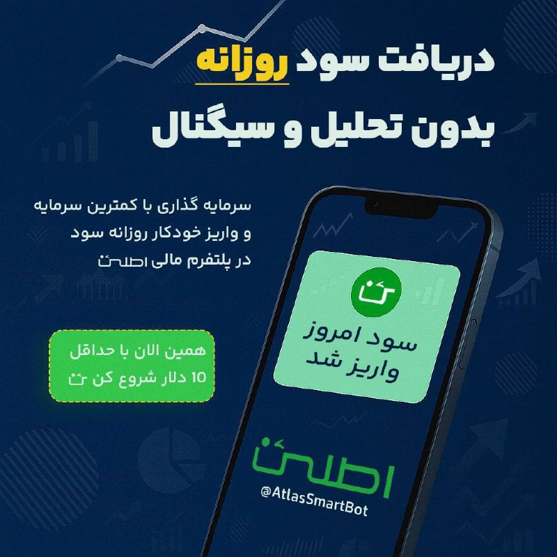

📉
📈 بازار می‌ریزد؛ اما آربیتراژ متوقف نمی‌شود

وقتی معامله‌گران از ریزش بازار ضرر می‌کنند، ربات هوشمند اطلس اختلاف قیمت بین صرافی‌ها را به فرصت سود تبدیل می‌کند.

✅ برداشت سود روزانه

✅ گزارش لحظه ای معاملات آربیتراژ

✅ شروع سرمایه‌گذاری از ۵ دلار

✅ بدون نیاز به دانش ترید

🚀 مشاهده عملکرد اطلس:
@AtlasSmartBot
اطلاعات بیشتر در کانال تلگرام

## alonews — post 128820

  <a href="telegram/content/alonews_128820_1781739268.webm" target="_blank">🎬 Download video</a>

👈هم اکنون ریزش شدید تتر و طلا

تتر 152000

طلا 15میلیون

✅ @AloNews خبر جنگ

## alonews — post 128819

  <a href="telegram/content/alonews_128819_1781739268.webm" target="_blank">🎬 Download video</a>

👈قاضی زاده، عضو تحریریه اینترنشنال: کجای راه را اشتباه رفتیم؟

✅ @AloNews خبر جنگ

## alonews — post 128818

  <a href="telegram/content/alonews_128818_1781739268.webm" target="_blank">🎬 Download video</a>

👈باراک راوید، خبرنگار آکسیوس: ترامپ شخصاً یه نسخه از توافق رو توی یه مهمونی شام با مکرون تو کاخ ورسای امضا کرد و عکسِ اون توافق امضا شده رو هم برای ایران و کشورهای میانجی فرستادن

✅ @AloNews خبر جنگ

## alonews — post 128817

  <a href="telegram/content/alonews_128817_1781739268.webm" target="_blank">🎬 Download video</a>

👈سناتور لیندسی گراهام: انتظار بسیار بالاتری از این توافق داشتم و فعلا نظری ندارم!

✅ @AloNews خبر جنگ

## alonews — post 128816

  <a href="telegram/content/alonews_128816_1781739268.webm" target="_blank">🎬 Download video</a>

👈رسایی: فاجعه‌ای بدتر از برجام رخ داده

✅ @AloNews خبر جنگ

## alonews — post 128815

  <a href="telegram/content/alonews_128815_1781739268.webm" target="_blank">🎬 Download video</a>

👈سخنگوی وزارت خارجه:
قرار بود طی ۳۰ روز محاصره برداشته شود و متقابلاً ایران هم درباره تنگه هرمز این کار را انجام دهیم. اما بعد از تحولات مربوط به حمله رژیم صهیونیستی به ضاحیه و تهدیدات جدی که از سوی ایران انجام گرفت، مذاکرات فوری انجام گرفت و قرار شد آمریکا تعهداتش را فوری انجام دهد.

🔴در رصدی که انجام شد مشخص شد کشتی‌های ما بدون مشکلی وارد بنادر شدند و خارج شدند و این تعهد {آمریکا به رفع محاصره} شروع شد. تعهدات ما ‍بس از امضای این سند شروع خواهد شد.

✅ @AloNews خبر جنگ

## alonews — post 128814

  <a href="telegram/content/alonews_128814_1781739269.webm" target="_blank">🎬 Download video</a>

👈تسنیم: متن فارسی تفاهمنامه نیز به عنوان سند رسمی به امضای ایران و آمریکا رسیده است

✅ @AloNews خبر جنگ

## alonews — post 128813

حسینی با یزیدی صلح یک ساعت نخواهد کرد
کسی مانند ما با مثل او بیعت نخواهد کرد

## alonews — post 128812

  <a href="telegram/content/alonews_128812_1781739269.webm" target="_blank">🎬 Download video</a>

👈سخنگوی وزارت خارجه: در متن تفاهمنامه تاکید شده است که فقط منحصراً در موضوع هسته‌ای و رفع تحریم‌ها مذاکره می‌کنیم.

🔴از زمان اجرای تفاهمنامه، که الان است، ظرف 60 روز درباره موضوع هسته‌ای و تحریم‌ها مذاکره کنیم. اگر زودتر هم مذاکره به نتیجه برسد، بهتر است. ولی با توجه به پیچیدگی موضوع، عدد 60 روز منطقی است و اگر لازم باشد، این زمان تمدید می‌شود.

✅ @AloNews خبر جنگ

## alonews — post 128811

عرازش برید خونه‌هاتون

## alonews — post 128810

  <a href="telegram/content/alonews_128810_1781739269.webm" target="_blank">🎬 Download video</a>

👈خبرنگار اکسیوس: دو مقام آمریکایی به من گفتند که ایالات متحده و ایران روز چهارشنبه تفاهم‌نامه پایان جنگ را به صورت الکترونیکی امضا کرده‌اند و اکنون لازم‌الاجرا است.

✅ @AloNews خبر جنگ

## alonews — post 128809

  <a href="telegram/content/alonews_128809_1781739269.webm" target="_blank">🎬 Download video</a>

🔴فوری و رسمی/تفاهم نامه توسط ترامپ و پزشکیان امضا شد 
✅ @AloNews خبر جنگ

## alonews — post 128808

  <a href="telegram/content/alonews_128808_1781739269.webm" target="_blank">🎬 Download video</a>

🔴فوری و رسمی/تفاهم نامه توسط ترامپ و پزشکیان امضا شد

✅ @AloNews خبر جنگ

## alonews — post 128807

  <a href="telegram/content/alonews_128807_1781739269.webm" target="_blank">🎬 Download video</a>

🔴فوری/بقایی: الان که با شما صحبت می‌کنم احتمالاً متن تفاهم نامه اسلام آباد به امضای روسای جمهور ایران و آمریکا رسیده باشد. 
✅ @AloNews خبر جنگ

## alonews — post 128806

  <a href="telegram/content/alonews_128806_1781739270.webm" target="_blank">🎬 Download video</a>

🔴فوری/بقایی:
الان که با شما صحبت می‌کنم احتمالاً متن تفاهم نامه اسلام آباد به امضای روسای جمهور ایران و آمریکا رسیده باشد.

✅ @AloNews خبر جنگ

## alonews — post 128805

  <a href="telegram/content/alonews_128805_1781739270.mp4" target="_blank">🎬 Download video</a>

👈وضعیت

✅ @AloNews خبر جنگ

## alonews — post 128804

  <a href="telegram/content/alonews_128804_1781739271.webm" target="_blank">🎬 Download video</a>

👈سناتور جمهوری خواه بیل کسیدی در مورد تفاهم نامه ترامپ:
ریگان در قبر در حال لرزیدن به خود است....این بدترین سیاست خارجه آمریکا در چندین دهه اخیر است

✅ @AloNews خبر جنگ

## alonews — post 128803

  <a href="telegram/content/alonews_128803_1781739272.mp4" target="_blank">🎬 Download video</a>

👈یک آسیب دیده جنگ: خونه ما موشک خورده و کامل تخریب شده اما مسئولان اصلا براشون مهم نیست و وقتی میریم پیششون نگاه هم نمیکنن مارو

🔴الان ما آواره شدیم و چیزی نداریم

✅ @AloNews خبر جنگ

## alonews — post 128802

👈قالیباف با بغض: برای من کار راحتی نبود با ترامپ قاتل سردار سلیمانی مذاکره کنم / نفر دومی جز من برای مذاکره نبود

✅ @AloNews خبر جنگ

<!-- MSG END -->

<!-- NAV START -->

<a href="https://github.com/Tljn/FUD/blob/main/telegram/content/archive_1.md" style="display:inline-block; padding:6px 12px; margin:0 4px; background-color:#2ea44f; color:white; text-decoration:none; border-radius:4px; font-weight:bold;">صفحه بعد</a>

<!-- NAV END -->
